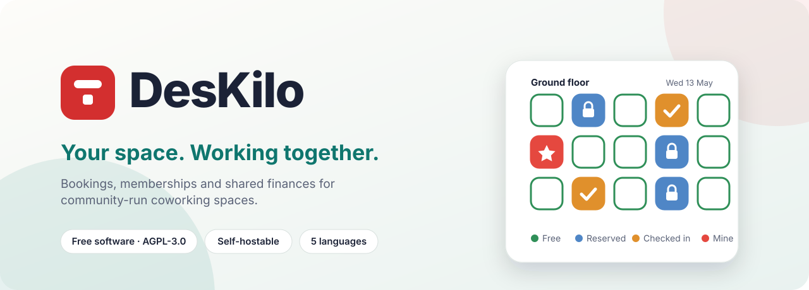
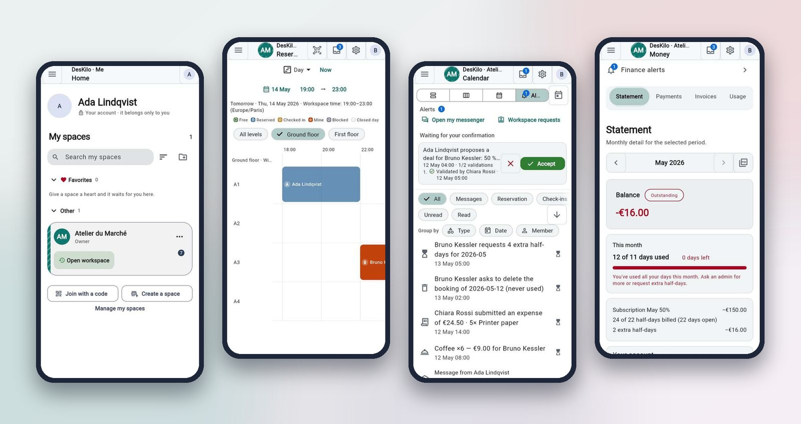

<picture>
  <source media="(prefers-color-scheme: dark)" srcset="docs/readme/hero-dark.svg">
  
</picture>

 

**[Discover DesKilo](https://fdittgen-png.github.io/deskilo/welcome/)** &nbsp;·&nbsp; **[Try the demo](https://fdittgen-png.github.io/deskilo/)** &nbsp;·&nbsp; **[User guide](docs/wiki/User-Guide.md)** &nbsp;·&nbsp; **[Build your own space](docs/wiki/Setup-Guide.md)** &nbsp;·&nbsp; [Releases](https://github.com/fdittgen-png/deskilo/releases) &nbsp;·&nbsp; [Roadmap](https://github.com/fdittgen-png/deskilo/issues?q=is%3Aissue+is%3Aopen+label%3Aepic)

     

   

 

> **A coworking space belongs to the people who use it.** DesKilo gives a community a floor plan to book, a fair account for every member and the rules it chooses for itself — free software, on your phone or in a browser, on a server you can run yourself.

 

## Three questions, answered

<table>
<tr>
<td width="33%" valign="top" align="center">
 
<h3>Where can I work?</h3>
A live floor plan shows every place and who holds it, for any day. Book a half-day, a desk or a whole room; check in and out.
</td>
<td width="33%" valign="top" align="center">
 
<h3>What do I owe?</h3>
One transparent ledger per member: subscription, extra use, shared expenses and payments — the same figures for the member and for whoever runs the space.
</td>
<td width="33%" valign="top" align="center">
 
<h3>Who needs to approve this?</h3>
Roles, invitations and confirmations by the people the community named, with a history of every decision.
</td>
</tr>
</table>

  
   
  The demo workspace <em>Atelier du Marché</em> — every person and every figure is invented.

## Everything a community needs

<table>
<tr>
<td width="33%" valign="top">
 
<b>Find and book a place</b> 
Visual floor plans, live occupancy, recurring bookings, check-in and check-out, opening hours and closure rules.
</td>
<td width="33%" valign="top">
 
<b>Membership, fairly</b> 
Plans, allowances, day packages, overage rules and per-member settings; statements, reminders and payments recorded or collected online.
</td>
<td width="33%" valign="top">
 
<b>Documents that look right</b> 
Invoices and corrections, VAT, PDF statements and reports, accounting exports and a designer for your own layouts.
</td>
</tr>
<tr>
<td width="33%" valign="top">
 
<b>Run it your way</b> 
A floor-plan editor, modules with declared dependencies, wording, colours and a pattern that tell your space apart, configuration import and export.
</td>
<td width="33%" valign="top">
 
<b>Be found, find others</b> 
A shared directory and map where a space publishes a page on purpose; one personal account (<em>Me</em>) across all your spaces, on this server and on servers you connect.
</td>
<td width="33%" valign="top">
 
<b>Talk, privately</b> 
A messenger in <em>Me</em>: conversations, groups, references to bookings and invoices, message requests, a block list and a visibility matrix you control.
</td>
</tr>
</table>

Also: a members directory, QR/NFC check-in and kiosk mode for a wall tablet, business analytics, reminders and push notifications. Availability depends on the workspace's configuration, device capabilities and connected services.

## From idea to first booking

<table>
<tr>
<td width="33%" valign="top">
<h3>1 · Look around</h3>
Open the <a href="https://fdittgen-png.github.io/deskilo/">web app</a> and choose <em>Explore the demo workspace</em>: a fictional community, as owner, administrator or member. Nothing you do there reaches a server.
</td>
<td width="33%" valign="top">
<h3>2 · Build your space</h3>
Follow the <a href="docs/wiki/Setup-Guide.md">Setup Guide</a>: a name, a plan, opening times and someone to say yes — about twenty minutes. Money, invoices and a look of your own come later.
</td>
<td width="33%" valign="top">
<h3>3 · Invite people</h3>
Share the workspace ID or a QR code. Members join, you approve, the first booking appears on the plan. The <a href="docs/wiki/User-Guide.md">User Guide</a> covers every screen, by audience.
</td>
</tr>
</table>

The [setup questionnaire](https://fdittgen-png.github.io/deskilo/setup.html) lets a community prepare its booking, membership and governance rules in a browser, with an accountant if it helps, before touching the app.

## Where it runs

| Platform | Status |
|---|---|
| **Web** | Available in the browser. It is the live application: it needs a sign-in and workspace access. *Demo* is a separate, self-contained workspace with no backend behind it. |
| **Android** | [Closed test](https://play.google.com/apps/testing/de.deskilo.app) on Google Play; access depends on tester enrollment. |
| **iPhone / iPad** | [Public beta through TestFlight](https://testflight.apple.com/join/RgFX9zBe). |
| **macOS · Windows** | Build and release workflows are included; installers are attached to [releases](https://github.com/fdittgen-png/deskilo/releases). |

## Your data, your instance — or the shared one

DesKilo's schema, access policies, server functions and client code are in this repository. There are two ways to run it, and they can be combined:

<table>
<tr>
<td width="50%" valign="top">
 
<b>Self-hosted</b> 
A community uses its own hosted Supabase project, or operates Supabase itself, and points the app at that backend through <b>Settings → Advanced → Server</b>. Its workspaces, members and conversations live on that instance only.
</td>
<td width="50%" valign="top">
 
<b>The reference deployment</b> 
The app's default backend is operated by Florian DITTGEN. Spaces created there can optionally publish a page in the <b>shared directory</b> hosted on it, so people looking for a space can find yours; publishing is an explicit owner action and can be withdrawn. A person who belongs to spaces on several servers can connect them and see them in one <em>Me</em>.
</td>
</tr>
</table>

On either, a person's profile fields (identity, about, contact channels, presence, reachability) are private by default and are shown only to the audience the person picks. A conversation's content is visible to its participants only — never to a space operator.

<b>Privacy, push notifications and costs</b>

 

The code includes workspace-scoped server permissions, personal-data export and deletion flows, and access-log features. Hosting location, access management, retention and backups depend on the operator's setup. These controls support privacy-conscious operation; compliance depends on how the instance is configured and used.

Store builds use Firebase Cloud Messaging for push notifications. A separate build without Google services is prepared for F-Droid; whether it is published there yet is stated in one place, the [F-Droid status](docs/guides/fdroid.md#status). See the [privacy policy](https://fdittgen-png.github.io/deskilo/privacy.html) for the project's published data-handling information.

The software is free and stays free: there is no software license fee. Hosting by the author, the reference deployment included, is free for every workspace registered by 31 December 2027; workspaces registered from 1 January 2028 pay for hosting. Customisations, including exclusive features, can be commissioned from the author. Your own hosting, payment processing and other external services may have their own costs. The shared directory on the reference deployment is run by one person on a best-effort basis: if you need guarantees about availability or data location, run your own instance.

## Honest about maturity

DesKilo has substantial implemented functionality and is being refined through dogfooding. It is best suited today to communities **willing to run a pilot**, verify their own workflows and contribute feedback. Public store releases, integration validation, usability and operational hardening remain active work.

<b>What needs particular care when planning a pilot</b>

 

| Area | Current scope |
|---|---|
| **Membership and financial records** | The code includes billing rules, member ledgers, reconciliation, invoice history and database invariants. This is community management software; accounting acceptance needs validation for the operator's own use. |
| **Online payments** | Provider integration code exists for Stripe, PayPal, Mollie and Wero, including hosted checkout and webhook handling. CI runs the real order handler against a local provider stub; live provider reliability is still being validated. Confirm the complete payment and reconciliation flow with your provider before relying on it; recorded payments support pilots in the meantime. |
| **Electronic invoicing and accounting exports** | Structured invoice generation and export code is present. Real provider transmission and acceptance by accounting systems need validation for each intended setup; the project makes no certification claim. |
| **Deployment and recovery** | Instance tooling, migration checks and backup/restore procedures are provided. Running a community instance still requires someone responsible for configuration, upgrades and recovery. |

Follow the [open issues](https://github.com/fdittgen-png/deskilo/issues?q=is%3Aissue+is%3Aopen) and the [latest quality-check runs](https://github.com/fdittgen-png/deskilo/actions/workflows/quality.yml) for the current state of work and validation.

## Documentation

<table>
<tr>
<td width="33%" valign="top">
<b><a href="docs/wiki/User-Guide.md">User guide</a></b> 
Every screen by audience, illustrated, in five languages.
</td>
<td width="33%" valign="top">
<b><a href="docs/wiki/Setup-Guide.md">Setup guide</a></b> 
What is possible, what is necessary, in which order — for a future owner.
</td>
<td width="33%" valign="top">
<b><a href="docs/wiki/Admin-Configuration-Guide.md">Configuration guide</a></b> 
Booking rules, memberships, roles and workspace settings.
</td>
</tr>
<tr>
<td valign="top">
<b><a href="docs/wiki/Admin-Technical-Guide.md">Technical admin guide</a></b> 
Reports, integrations and instances.
</td>
<td valign="top">
<b><a href="docs/guides/OPERATIONS.md">Operations</a></b> 
Instance health, backup, restore and recovery.
</td>
<td valign="top">
<b><a href="docs/product/CAPABILITIES.md">Capabilities and evidence</a></b> 
What ships, what is tested at which scope, what is roadmap.
</td>
</tr>
<tr>
<td valign="top">
<b><a href="docs/wiki/Architecture.md">Architecture</a></b> 
Client structure, backend model and platform choices.
</td>
<td valign="top">
<b><a href="docs/wiki/Implementation.md">Implementation</a></b> 
Development setup, builds, testing and contribution patterns.
</td>
<td valign="top">
<b><a href="docs/SPECIFICATION.md">Product specification</a></b> 
Product intent and scope; issues and code tell the delivery status. See also the <a href="https://github.com/fdittgen-png/deskilo/wiki">project wiki</a>.
</td>
</tr>
</table>

## Run or develop your own deployment

A working deployment needs the **full Supabase backend**: PostgreSQL and migrations, Auth, Storage, Realtime and the required Edge Functions. Authentication redirects, service credentials and backups also need configuration.

1. Read the [instance guide](docs/wiki/Admin-Technical-Guide.md#instances) for the in-app wizard and command-line tooling. The reference deployment uses hosted Supabase; operating the Supabase platform itself is a separate infrastructure task.
2. Follow [Building & running](docs/wiki/Implementation.md#building--running) for the pinned Flutter setup, localization/code generation and platform build instructions.
3. Connect the client to your instance, configure the workspace, and follow the [operations guide](docs/guides/OPERATIONS.md) for health checks, backup, restore and upgrades.

For a local development backend, the repository supports the Supabase CLI workflow described in [Backend / migrations](docs/wiki/Implementation.md#backend--migrations). Review the [release guide](docs/guides/RELEASING.md) when distributing builds.

<b>Engineering approach</b>

 

The client is organized by feature and uses **Flutter/Dart, Riverpod, Freezed, GoRouter and Material 3**. Supabase supplies Auth, PostgreSQL, Storage and Realtime; Edge Functions handle server-side integrations. A shared client keeps the mobile, browser and desktop experiences in one codebase, while platform capabilities and distribution still require their own validation.

PostgreSQL carries core authorization and consistency rules, including booking conflict protection and financial invariants. This gives concurrent clients a shared source of truth and makes the database part of the application that must be tested and upgraded with care.

The [quality workflow](.github/workflows/quality.yml) is configured to exercise:

- Flutter analysis, tests, localization checks and coverage;
- architecture, accessibility and security checks;
- migration replay onto a fresh database and PostgreSQL authorization/invariant tests;
- competing booking requests, financial reconciliation and webhook idempotency;
- a database backup/restore drill.

The test inventory (`dart run tool/test_inventory.dart`, published with every CI run), [domain invariants](docs/domain/INVARIANTS.md) and [architecture decisions](docs/decisions/) make that work inspectable. Check the latest CI run for actual results on the current commit.

## Join the project

<table>
<tr>
<td width="72" valign="top"></td>
<td valign="top">

DesKilo is built in the open and there is room for you. **Run a pilot** with your community and tell us what got in the way. **Translate** or improve the guides. **Test** a build on your device. **Write code**: it is issue-first, with focused pull requests, conventional commits and appropriate tests.

Useful bug reports include the app version, platform, relevant workspace rules, reproduction steps and expected behavior, with personal information removed. Read [CONTRIBUTING.md](CONTRIBUTING.md) and the [project rules](docs/AGENT_RULES.md) before starting work.

</td>
</tr>
</table>

  

DesKilo is a sibling project of [Sparkilo](https://github.com/fdittgen-png/tankstellen).

## License

[AGPL-3.0-or-later](LICENSE) © 2026 Florian DITTGEN. **Anyone who uses, modifies or redistributes the code must credit the author** — keep the copyright notices and show *"Based on DesKilo by Florian DITTGEN"* in the app's legal notices ([additional term, AGPL §7(b)](LICENSE-EXCEPTIONS.md#5-credit-the-author-additional-term-agpl-7b)). It comes with an [app-store exception](LICENSE-EXCEPTIONS.md), a [commercial licence](COMMERCIAL-LICENCE.md) for companies that would rather not publish their changes, and a [trademark policy](TRADEMARK.md) for the name. Free for associations, collectives and individuals; a for-profit company that modifies it either publishes its changes or buys a commercial licence.
