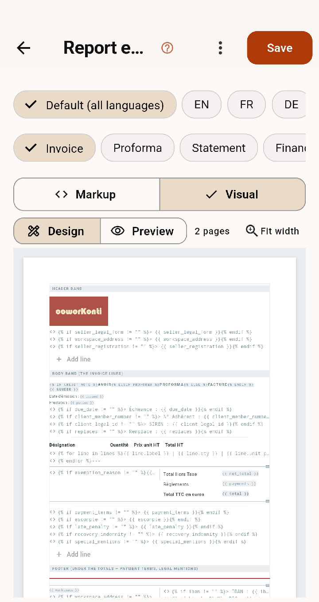

# Guía del administrador — la parte técnica

Para quien mantiene en marcha un espacio DesKilo: los documentos que
imprime, los archivos que intercambia, los servicios con los que habla y
la base de datos que hay debajo. La configuración del día a día está en
la [guía de configuración](Admin-Configuration-Guide.es); lo que ve un
miembro está en la [guía de usuario](Guia-de-usuario).

*Un hueco marcado con `<!-- image: … -->` es una captura de pantalla que
la cadena todavía no ha recibido.*

<!-- anchor: admin.reports.overview -->
## Documentos e informes

Todo lo que DesKilo imprime — una factura, un recordatorio, una carta a
un miembro, un informe de consumo, una declaración de IVA, una hoja de
credenciales — sale de un solo motor. Un **tipo de documento** lo
nombra; un **diseño** dice qué aspecto tiene; los **datos** que la app le
entrega son un vocabulario fijo de marcadores.

<p></p>

*El editor de informes: los selectores de idioma y de documento arriba, los conmutadores Marcado / Visual y Diseño / Vista previa debajo, y las bandas de la factura — cabecera, cuerpo, pie — más abajo.*

<!-- anchor: admin.reports.kinds -->
### Los tipos y las cuatro plantillas

Cada tipo (factura, nota de crédito, proforma, extracto, acuerdo, pagos,
consumo, IVA, espacio) parte de una de las cuatro plantillas —
*Sencillo*, *Clásico*, *Detallado*, *Carta formal* — que solo se
diferencian en cuánto dicen, nunca en lo que la ley exige.

<!-- anchor: admin.reports.bands -->
### Las bandas: cabecera, continuación, cuerpo, pie

La forma rápida de diseñar. Cuatro bandas de marcado, cada una con su
cometido:

| Banda | Dónde se imprime |
|---|---|
| **cabecera** | arriba en la página 1 solamente — el membrete |
| **continuación** | arriba en la página 2 y siguientes — una franja que nombra el documento |
| **cuerpo** | la única zona que fluye: es la que continúa y pagina |
| **pie** | abajo en *todas* las páginas |

Dentro de una banda, un signo por línea decide qué es la línea:

| Signo | En qué se convierte la línea |
|---|---|
| `# ` | un título |
| `## ` | un subtítulo |
| `- ` | una línea pequeña |
| `\| a \| b \|` | una fila de tabla; una fila de `---` convierte la de arriba en cabecera |
| `---` | una línea horizontal |
| `![nombre\|a\|align]` | una imagen de la biblioteca, con tamaño y alineación |
| (vacío) | un espacio |
| cualquier otra cosa | texto corrido |

El panel *Marcadores y marcado* del diseñador lleva todo esto en línea,
más **Insertar un campo…** — el selector buscable, agrupado por tema, con
una línea de significado bajo cada nombre, buscable también por ese
significado — y tres piezas ya hechas: una línea que solo se imprime
cuando su valor existe, una fila por línea de factura, y el título que
dice factura, nota de crédito o proforma. Lo que toque aterriza en el
cursor de la banda que editó por última vez.

<!-- anchor: admin.reports.layouts -->
### Los diseños posicionados

La forma exacta. Un diseño XML coloca cada elemento al milímetro, para
un documento que debe satisfacer un sobre con ventana o un formulario
nacional. **Un diseño gana sobre las bandas** para el tipo en el que se
ha puesto.

La raíz y sus zonas:

```xml
<report-layout version="1" page="A4" margin="20mm"
               margin-top="8mm" margin-bottom="8mm">
  <header height="…">…</header>
  <continuation height="…">…</continuation>
  <recipient window="fr|din|off"/>
  <body y="90mm">…</body>
  <footer height="…">…</footer>
</report-layout>
```

`margin` es el margen lateral; `margin-top` y `margin-bottom` separan el
margen vertical cuando un documento los necesita aparte, y valen el
margen lateral si faltan. `<recipient>` toma una ventana con nombre —
**fr** a 110 mm, **din** a 20 mm, ambas a 45 mm desde arriba en una caja
de 85 × 40 mm — o unos `x y w h` explícitos, o `off`. `<body y="…">` es
la única zona que fluye: `y` es donde se reanuda, 90 mm bajo una ventana.

**Elementos**, válidos dentro de una zona, una `<box>` o una `<column>`:

| Elemento | Qué hace |
|---|---|
| `<text style="heading\|subheading\|body\|small" align="left\|center\|right" bold="true">` | un tramo de texto |
| `<image name="nombre-en-biblioteca" fit="contain\|cover\|fill" align="…"/>` | una imagen de la biblioteca |
| `<table><col w="55%" align="right"/>…<row bold="true"><cell align="…">…</cell></row></table>` | una tabla con columnas declaradas |
| `<box>…</box>` | un grupo, para que los hijos se posicionen dentro |
| `<columns><column>…</column>…</columns>` | grupos uno al lado del otro |
| `<rule/>` | una línea horizontal |
| `<spacer size="4mm"/>` | espacio vertical |
| `<markup>…</markup>` | marcado de banda, literal, dentro de un diseño posicionado |

**Los atributos de marco** — `x y w h` — se aplican a cualquier
elemento. Con `x` o `y` el elemento se coloca en absoluto dentro de su
padre; sin ninguno de los dos, fluye tras sus hermanos.

**Las unidades** son `mm cm px pt %`. Un número desnudo son milímetros;
`px` es el píxel CSS (1/96 de pulgada); `%` es del padre — anchura para
`x` y `w`, altura para `y` y `h`.

<!-- anchor: admin.reports.placeholders -->
### El vocabulario

Todos los marcadores que el motor conoce, por familia de documento, con
los bucles (`lines`, `vat`, `usage_records`, …) y los campos que lleva
cada fila. `dart run tool/report.dart describe` imprime la lista actual —
se genera desde el mismo registro que lee el renderizador, así que nunca
puede estar desfasada.

<!-- anchor: admin.reports.operators -->
### Liquid: condiciones, bucles, filtros

Liquid recorre **primero** todo el archivo, antes de que el XML se
analice: una condición puede abrirse en un elemento y cerrarse en otro.
Los valores se escapan como XML a la entrada.

| Forma | Qué hace |
|---|---|
| `{{ campo }}` | imprime el valor, escapado |
| `…` | imprime el bloque solo cuando el campo tiene valor |
| `……` | la forma de dos ramas |
| `…` | la forma negada |
| `…` | una pasada por fila de un bucle |
| `{{ forloop.index }}` | el número de fila, desde 1, dentro de un bucle |

**La regla que pilla a todo el mundo:** todos los marcadores que el motor
conoce se inicializan **vacíos**, nunca nulos. Un campo ausente es `""`,
de modo que `` se comporta y un diseño nunca imprime la
palabra `nil`. Los textos del propietario (`text.<clave>`) se inicializan
igual a través de su propia tabla de valores por defecto.

**Los bucles y sus filas.** `lines` da `label, kind, pct, month, qty,
unit_price, net, vat_rate, amount, negative`. `month` es el mes de la
posición de suscripción, ya traducido al idioma del documento — por eso
una línea de factura puede leerse *septiembre 100 %*. `vat` da el
desglose por tipo, `usage_records` las medias jornadas, `vat_positions` y
`vat_rate_totals` las filas propias de la declaración.

<!-- anchor: admin.reports.window -->
### El contrato del sobre con ventana

Una carta que va en un sobre con ventana tiene una geometría, y no es
cuestión de gusto:

| Cosa | Dónde |
|---|---|
| línea del remitente | a 20 mm de la izquierda, 20 mm desde arriba |
| bloque del destinatario | a 110 mm de la izquierda, 45 mm desde arriba, dentro de 85 × 40 mm |
| cuerpo | se reanuda a 90 mm |
| pie | en todas las páginas |
| franja de continuación | desde la página dos |

Nada salvo el destinatario puede poner tinta en la banda de la ventana.
Esto se **demuestra sobre el PDF generado**, no a ojo: la comprobación
mide las posiciones de tinta del archivo producido y termina con error
cuando algo aterriza donde está la ventana.

<!-- anchor: admin.reports.cli -->
### La línea de comandos

```
dart run tool/report.dart check <layout.xml> [--data data.json]
dart run tool/report.dart render <layout.xml> [--data data.json] -o out.pdf
dart run tool/report.dart sample --kind invoice > data.json
dart run tool/report.dart describe
```

- **check** renderiza el diseño y lo mide contra el contrato de la
  ventana. Salida 0: conforme; salida 1: hay tinta en la banda de la
  ventana, y dice en qué elemento; salida 2: el diseño no se pudo leer, y
  nombra el elemento que rompió.
- **render** produce el PDF, para que un diseño pueda revisarse sin la
  app.
- **sample** escribe un archivo de datos con todos los marcadores que el
  motor conoce, que es la forma más rápida de ver cómo se llama un campo.
- **describe** imprime el vocabulario de arriba — zonas, elementos,
  atributos de marco, unidades, Liquid y la lista de marcadores. Se
  genera desde el mismo registro que lee el renderizador, así que no
  puede divergir del motor.

La CLI es Dart puro y debe seguir siéndolo: no importa nada de Flutter ni
de las localizaciones, y un test se rompe en el momento en que un archivo
de dominio que usa arrastra `AppLocalizations`.

<!-- anchor: admin.einvoice.overview -->
## Facturación electrónica

Una factura sale de DesKilo como un PDF que lee una persona y un archivo
estructurado que lee una máquina, y ambos dicen lo mismo porque se
producen desde el mismo documento congelado.

<!-- anchor: admin.einvoice.formats -->
### CII, UBL, Factur-X

Los tres son la misma factura expresada de tres maneras, y los tres
satisfacen **EN 16931**, el modelo semántico europeo que dice qué hechos
debe llevar una factura (BT-1 el número, BT-48 el identificador de IVA
del comprador, y así sucesivamente).

| Formato | Qué es |
|---|---|
| **CII** | UN/CEFACT Cross Industry Invoice — la sintaxis XML que toma Chorus Pro |
| **UBL** | OASIS Universal Business Language — la sintaxis que toma Peppol |
| **Factur-X** | un PDF/A-3 con el XML CII *incrustado dentro* — un archivo que una persona lee y una máquina analiza |

Factur-X es la razón por la que el PDF y el XML no pueden contradecirse:
son el mismo archivo. Cuando una plataforma los quiere separados, ambos
se producen desde el único documento congelado, nunca se vuelven a
generar desde los datos vivos.

<!-- anchor: admin.einvoice.readiness -->
### El control de admisibilidad

Antes de transmitir nada, la app comprueba el documento contra la norma
y **se niega nombrando lo que falta**, porque una factura rechazada por
una plataforma cuesta más arreglarla que una que nunca se envió.

Lo que rechaza:

- un vendedor sin el identificador que el régimen exige — un número de
  IVA cuando usted repercute IVA, un número de registro cuando no;
- un documento con **inversión del sujeto pasivo** cuyo cliente no tiene
  número de IVA: ese número es lo que prueba que el impuesto es suyo;
- una exención sin motivo y sin valor por defecto del país al que
  recurrir;
- un número de IVA de cliente cuya **forma no corresponde a su país** —
  un aviso, no un rechazo, ya que las formas cambian;
- un comprador sin dirección, en cuanto el destino exige una.

Los miembros indican ellos mismos su país y, cuando facturan como
empresa, su número de IVA, junto a su dirección en
*Ajustes → Datos personales*.

<!-- anchor: admin.einvoice.platforms -->
### Plataformas y credenciales

Un documento puede ir a **dos destinos a la vez**: la plataforma pública
que su país impone y el servicio propio del cliente. Ambos se configuran
en el espacio, y cualquiera de los dos puede estar desactivado.

Las credenciales viven en el espacio, nunca en el archivo de espacio ni
en un despliegue — una exportación que envíe a un colega lleva la
configuración y no las claves. Un **espacio de desarrollo usa siempre el
punto de acceso de prueba**, que físicamente no puede alcanzar una
plataforma pública: una factura de prueba nunca puede volverse real.

Cada intento queda registrado en el historial de transmisión de la propia
factura: cuándo, a qué destino, qué respondió la plataforma y qué
referencia devolvió. Una transmisión fallida deja la factura intacta y
reintentable — el documento está congelado, la transmisión no forma parte
de él.

<!-- anchor: admin.exports.accounting -->
## Exportaciones contables

Tres formatos, un solo libro mayor debajo:

| Formato | Dónde se pide | Qué lleva |
|---|---|---|
| **FEC** | Francia (art. A47 A-1 LPF) | todos los asientos del periodo, en el orden de columnas exigido |
| **SAF-T** | el estándar de la OCDE, varios países de la UE | el archivo de auditoría: cuentas, asientos, documentos |
| **DATEV** | Alemania, para el software del asesor fiscal | los asientos en la disposición que DATEV importa |

Los tres cubren un periodo que usted elige y usan el **plan de cuentas**
configurado en el espacio — la cuenta de IVA incluida, que es la razón
por la que ese campo pertenece a la identidad legal y no a la
exportación. Un periodo ya exportado no queda bloqueado: una exportación
es una lectura, y puede volver a tomarse tras una corrección.

<!-- anchor: admin.integrations.overview -->
## Integraciones

| Integración | Qué hace | Sin ella |
|---|---|---|
| **Proveedor de pago** | cobra un pago contra una factura | los pagos se registran a mano; nada más cambia |
| **Canal de WhatsApp** | envía un recordatorio o un aviso por WhatsApp | el mensaje se queda en la bandeja de la app |
| **Push** | entrega notificaciones a un dispositivo | las notificaciones aparecen al abrir la app |
| **Plataforma de facturación electrónica** | transmite la factura estructurada | el PDF se produce y se envía por otros medios |

Dos reglas valen para todas. **Las credenciales viven en el espacio**, en
una tabla que el archivo de espacio y todos los despliegues se saltan:
ninguna exportación lleva jamás una clave. Y **una integración sin
configurar se degrada, no rompe**: la funcionalidad que la necesita queda
desactivada, la pantalla lo dice, y nada lanza una excepción.

<!-- anchor: admin.instances.overview -->
## Instancias

Una **instancia** es un DesKilo entero sobre su propia base de datos. Dos
espacios — incluso una pareja de desarrollo y producción — comparten una;
dos instancias no comparten nada. Use una allí donde los datos personales
o las credenciales de pago deban estar físicamente separados, o donde un
cliente insista en tener su propia base.

El **paquete** es el material de construcción de la instancia: todas las
migraciones en orden, las funciones edge, los buckets de almacenamiento y
la semilla. Se regenera cada vez que se aplica una migración, de modo que
el paquete y la base viva nunca se desacompasan.

Cree una instancia desde el asistente de la app o desde
`dart run tool/instance.dart`; ambos aplican el paquete a una base vacía
y sellan en qué migración está. Una migración posterior llega a una
instancia existente por el mismo camino — aplicada en orden desde el
sello hacia adelante, nunca reejecutada.

La versión es un número que lleva el propio esquema:
`select public.deskilo_schema_version();` devuelve la última migración
aplicada, y cada migración lo escribe en su propia transacción (#1312).
Una aplicación más antigua que su servidor sigue funcionando. Una
aplicación **más reciente** que su servidor se detiene en *Este servidor
necesita una actualización*: quien gestiona el servidor aplica las
migraciones que faltan; los demás pueden abrir desde ahí la pantalla
Servidor y apuntar el dispositivo a otro. Sin red, la comprobación
simplemente no se hace y no se bloquea nada.

La configuración y los datos maestros viajan entre instancias a través
del **archivo de espacio**, ya que un despliegue necesita una sola base y
una instancia es justamente el punto en el que hay dos.

<!-- anchor: admin.trace.overview -->
## El registro

*Ajustes → Desarrollador.* Un búfer circular de las últimas 500 entradas,
respaldado por un archivo en el dispositivo, con todos los errores del
framework y de la plataforma enganchados desde la primera línea de
`main()`.

Tres formas, y la del medio es la útil:

- **step** — una decisión o una ida y vuelta al servidor que ocurrió como
  estaba previsto.
- **refused** — la app declinando lo que alguien intentó hacer. Nivel de
  aviso, y lo primero a lo que hay que desplazarse cuando el parte es
  *«toqué y no pasó nada»*.
- **failed** — una excepción, que lleva los mismos campos que el paso que
  lo estaba intentando, de modo que una línea roja nunca queda huérfana
  de su contexto.

Cada línea es un verbo seguido de pares `clave=valor`, así que un
registro se puede grepear: `grep 'act=check-in'` lee un tipo de intento
de principio a fin, y `grep 'server='` lee todos los rechazos emitidos
por el servidor, con su código, mensaje, detalles y pista en un solo
campo.

**Un registro es por dispositivo.** El registro que responde a *«un
miembro no pudo registrar su entrada»* está en el teléfono de ese
miembro. *Exportar* lo escribe en un archivo sellado con la versión de la
app y el espacio, que es lo que ata un registro exportado al parte que
responde. Las cargas escaneadas se anotan por **forma** — esquema, host,
qué parámetros están presentes, qué longitud — nunca por valor, porque un
código de invitación es un secreto y un registro está hecho para
enviárselo a alguien.

**Un «started» sin su «done»** significa que el acto nunca volvió: la app
fue eliminada, la petición nunca regresó, o hay un `await` colgado. Ese
hueco es el hallazgo.
