# Benutzerhandbuch

Alles, was Mitglieder, Admins und Inhaber brauchen, um DesKilo zu nutzen. *Andere Sprachen: [English](User-Guide) · [Français](Guide-utilisateur) · [Español](Guia-de-usuario) · [Italiano](Guida-utente).*

> Die Screenshots in diesem Handbuch zeigen die App auf Französisch — jeder Bildschirm existiert identisch in allen fünf Sprachen (English, Français, Deutsch, Español, Italiano); umschalten unter **Einstellungen → Sprache**.
>
> 

## 1. Erste Schritte

### Konto anlegen

App öffnen und mit E-Mail, Passwort (8+ Zeichen) und Anzeigenamen registrieren — oder **mit Google fortfahren**. Das Auge zeigt oder verbirgt das Passwort beim Tippen. *Passwort vergessen?* schickt dir einen **Einmal-Code** per E-Mail, den du zusammen mit dem neuen Passwort zurück in die App tippst — bewusst ein Code statt eines Links, damit das Zurücksetzen auch dort funktioniert, wo Deep-Links nicht greifen. Eine Google-Anmeldung lässt sich später unter **Einstellungen → Verknüpfte Konten** an ein bestehendes E-Mail-Konto anhängen.

### Workspace anlegen — oder beitreten

Nach der Anmeldung bietet der Startbildschirm zwei Wege:

- **Workspace anlegen** — du wirst **Inhaber**. Name, Land (bestimmt die Standardwährung) und Zeitzone wählen; danach zeichnest du deinen Grundriss im Editor (§8).
- **Workspace beitreten** — die geteilte **Workspace-ID** eintippen, oder **QR-Code scannen** und die Kamera auf den Einladungs-QR an der Wand richten. Deine Anfrage landet als **ausstehend**: *Neues Mitglied* ist eine der Validierungs-Domänen (§7), ein Validierer lässt dich ein — und danach hältst du genau die Rolle, die die Einladung trägt (§2).

### Der Einrichtungsfragebogen — einen Space vorbereiten, bevor du die App öffnest

Einen Workspace anzulegen heißt Dutzende Entscheidungen, die in einem Dutzend verschiedener Bildschirme wohnen: wie eine Buchung aussehen darf, was ein Monat kostet, was das Gesetz auf einer Rechnung verlangt, wer was validiert. Die App lässt dich diese eine nach der anderen treffen, sobald du ihnen begegnest. Der **Einrichtungsfragebogen** lässt dich alle auf einmal treffen, *bevor* du beginnst — auf einem großen Bildschirm, wenn es hilft mit deiner Steuerberatung oder deinem Vorstand, ohne irgendetwas Laufendes anzurühren:

<https://fdittgen-png.github.io/deskilo/setup.html>

Es ist eine einzige Webseite. Nichts zu installieren, kein Konto, nichts wird irgendwohin geschickt: Deine Antworten werden in deinem eigenen Browser gespeichert, du kannst den Tab also schließen und später zu ihnen zurückkehren.

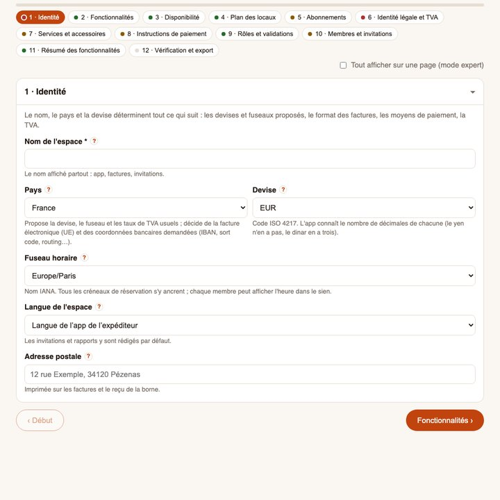

*Der Assistent: zwölf Schritte in Abhängigkeitsreihenfolge, jede Frage sagt, wo die Einstellung in der App liegt, mit einem **?**, das diesen Leitfaden am passenden Abschnitt öffnet.*

**So nutzt du ihn**

1. **Beantworte die Schritte der Reihe nach** — Identität, Funktionen, Verfügbarkeit, Grundriss, Abonnements, rechtliche Identität & USt., Leistungen, Zahlungshinweise, Rollen & Validierung, Mitglieder. Jeder Schritt fragt nur, was deine früheren Antworten möglich machen: keine USt-Sätze, wenn du nicht steuerpflichtig bist, keine E-Rechnungsplattform außerhalb der EU, keine Tagespaket-Option für ein Mitglied, solange kein Paket existiert, keine Kindfunktion, solange ihre Elternfunktion aus ist.
2. **Prüfe die Funktionsübersicht.** Sie listet jede Funktion, die die App einschalten wird, und *wie deine eigenen Antworten sie konfigurieren*. Wähle ab, was du nicht willst: Es wird deaktiviert exportiert und seine Konfiguration bleibt weg — du kannst es später jederzeit unter Einstellungen → Funktionen einschalten.
3. **Lies den Prüfschritt.** Er trennt, was vollständig ist, was eine zu bestätigende Entscheidung ist und was tatsächlich blockiert, je mit einem Sprung direkt zu der Frage, die es behebt.
4. **Exportiere das XML**, dann öffne die App: **Einstellungen → Workspace → Space importieren (XML)** legt die Einstellungen, das Zubehör und den Grundriss direkt an. Der `<setup>`-Abschnitt derselben Datei trägt alles, was der Import nicht übernimmt — Abrechnung, rechtliche Identität, Rollen, Mitglieder —, sodass du diese Bildschirme einen nach dem anderen fertigstellen kannst; jede Frage hat dir gesagt, wo ihre Antwort liegt.
5. **Bewahre die Datei auf.** Sie zurück in die Seite zu laden setzt dort fort, wo du aufgehört hast — auch eine Datei, die vor der Existenz einer Einstellung exportiert wurde; diese kommt dann schlicht mit ihrem Standardwert zurück.

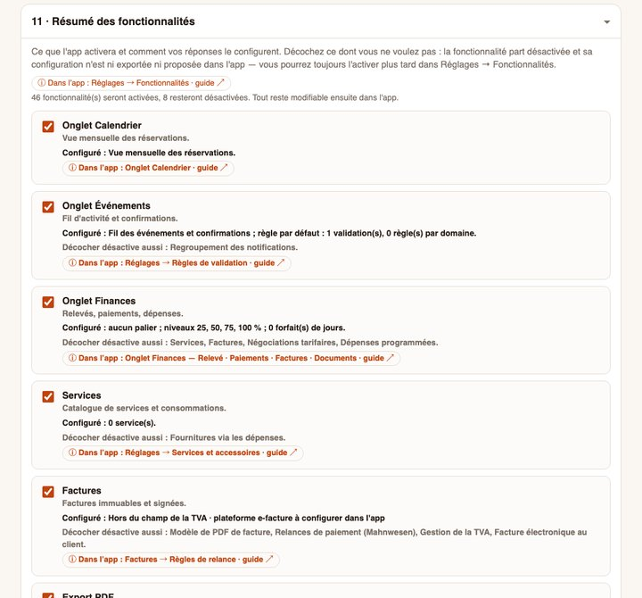

*Die Funktionsübersicht: was die App einschalten wird, konfiguriert durch Ihre eigenen Antworten — wählen Sie ab, was Sie nicht wollen.*

**Eine Warnung.** Die exportierte Datei ist Klartext. Trage ein E-Rechnungs-Token oder den Schlüssel eines Zahlungsanbieters nur ein, wenn du privat antwortest; sonst lass diese Felder leer und tippe die Geheimnisse in der App, wo sie direkt zum Server gehen und nie zurückkommen.

**Ihn zu überspringen kostet nichts.** Jede Antwort, die er sammelt, ist eine Einstellung, die du auch später in der App treffen — und ändern — kannst. Der Fragebogen ist eine Abkürzung für die erste Stunde, kein Tor.

### Profile — ein Konto, mehrere Spaces

Ein Konto kann mehreren Workspaces angehören. **Einstellungen → Profile** listet alle: jede Zeile zeigt den Namen des Space, **deine Rolle dort** (Mitglied, Admin, Inhaber) und die Workspace-ID. Das **Häkchen** markiert das aktive Profil; der **Stern** dein **Standardprofil** — das, mit dem die App öffnet, auf jedem Gerät und selbst nach Neuinstallation (die Wahl ist beim Konto gespeichert). Zeile antippen zum Wechseln, **+ Profil hinzufügen** für einen weiteren Space. Alles in der App ist auf den aktiven Workspace beschränkt.

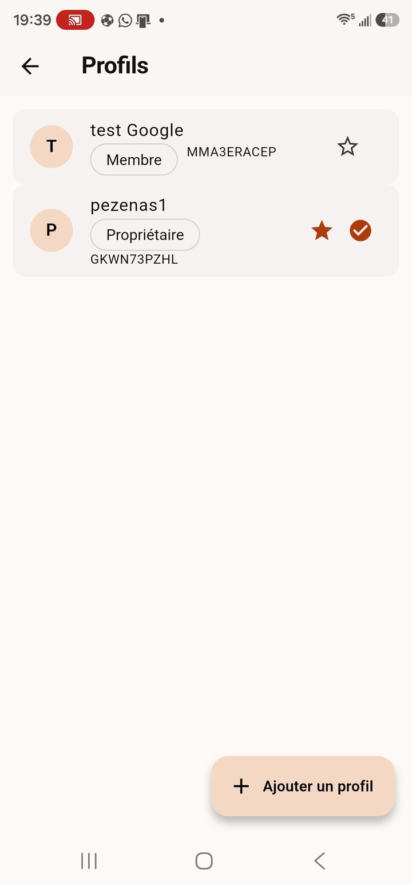

*Profile: jeder Workspace Ihres Kontos, Ihre Rolle dort, der Stern für das Standardprofil, das Häkchen für das aktive.*

### Orientierung

Die App hat bis zu fünf Ziele am unteren Rand: **Nachrichten** (§16), **Kalender** (§5), den großen zentralen **Reservieren**-Knopf (§4), **Mitglieder** (§6) und **Finanzen** (§9). Nachrichten und Reservieren sind immer da; Kalender, Mitglieder und Finanzen kommen und gehen mit ihrer Funktion (§8). **Nachrichten ist der Posteingang**: deine Unterhaltungen und der Ereignis- und Bestätigungs-Feed (§7) sind seine zwei Flächen, und die **Glocke** in der Kopfzeile springt direkt zur zweiten, mit dem Zähler dessen, was auf dich wartet. Das **Zahnrad** zu den **Einstellungen** (§12) steht in jeder Kopfzeile. Quer gehalten und auf Tablets wechseln die meisten Bildschirme in eine **geteilte Ansicht** — Bedienelemente im Seitenpanel, Inhalt füllt den Rest.

**Alles bleibt live.** Was irgendjemand ändert — eine Buchung, ein neues Mitglied, eine Einstellung — wird binnen Sekunden auf jedes verbundene Gerät geschoben, auch auf das, das die Änderung machte. Kein Neustart, kein Ziehen zum Aktualisieren.

## 2. Rollen & Einladungen

DesKilo hat drei additive Rollen und darüber die Co-Inhaberschaft als Aufsatz, plus ein Gerätekonto:

| Rolle | Kann |
|---|---|
| **Mitglied** | Ein-/auschecken, reservieren, Ausgaben einreichen, eigene Ereignisse und eigenes Konto sehen und verwalten |
| **Admin** | Alles wie ein Mitglied, plus: *für jeden* handeln (Buchungen, Zahlungen, Ausgaben — unter Bestätigung, §7), Ausgaben genehmigen, Geschäftsvereinbarungen einsehen und verwalten, Badges ausstellen |
| **Inhaber** | Alles wie ein Admin, plus: den physischen Space bearbeiten, Pläne und Preise definieren, Rollen, Kiosk-Geräte und Einstellungen verwalten |
| **Co-Inhaber** | *Aktiv*: die Inhaber-Berechtigungen sofort, plus automatische Nachfolge. *Passiv*: ein wartender Nachfolger ohne Extra-Berechtigungen heute |
| **Kiosk** | Ein Wandtablet-Konto (§10) — zeigt nur den Plan; echte Mitglieder handeln per Badge |

Ein Teil davon ist nicht in Stein gemeißelt: die Inhaberin justiert in der Matrix der **Rollenverwaltung** (§8) **elf Administrations-Berechtigungen** nach — Rollen & Berechtigungen verwalten, Mitglieder verwalten, Validierungsregeln konfigurieren, Workspace-Einstellungen bearbeiten, Rechnungen ausstellen & Zahlungen zuordnen, Finanzen einsehen, Dokumentbibliothek verwalten, Services & Pakete verwalten, Ausgaben genehmigen, Geschäftsvereinbarungen einsehen und verwalten. Was die Matrix *nicht* regiert, ist der Alltag — einchecken, reservieren, für ein anderes Mitglied handeln, den Space bearbeiten: das bleibt, wo die Tabelle oben es hinstellt, und hängt stattdessen an den Funktionen und den Schaltern je Mitglied.

**Jede Einladung ist an eine Rolle gebunden.** Auf dem Inhaber-Bildschirm *Workspace-ID & QR* tragen zwei Tabs zwei Einladungen, jede mit eigenem QR und Code:

- **Mitglieder-Einladung** — die Workspace-ID selbst, unter dem Namen des Space. Drucken, an die Wand, frei teilen: Wer sie scannt oder eintippt, **beantragt** den Beitritt als einfaches Mitglied, und ein Validierer lässt ihn ein (§7). Schaltflächen: **ID kopieren**, **Als PNG teilen**, **Workspace-ID ändern** (die generierte ID durch eine merkbare ersetzen, 4–20 Buchstaben/Ziffern) und **Jemanden einladen**.
- **Admin-Einladung** — ein **persönlicher Einmal-Code**, von einem Inhaber für genau eine Person geprägt. Der Bildschirm sagt es klar: *dieser Code lässt EINE Person als Admin ein, dann verfällt er* (ungenutzte Codes nach 14 Tagen). Nur an die gemeinte Person geben; pro Admin einen neuen mit **Neuer Admin-Code**.
- **Einladungen sprechen die Sprache des Eingeladenen** — das Einladungsblatt schreibt die Nachricht in der gewählten Sprache (fünf verfügbar), standardmäßig in der **Sprache des Arbeitsbereichs** aus den *Workspace-Einstellungen*. Die Inhaberin kann den Einladungstext dort auch **pro Sprache** anpassen, mit Platzhaltern wie `{firstName}`, `{workspaceName}`, `{inviteLink}`, `{downloadUrl}`, `{role}`; eine leere Sprache nutzt die eingebaute Übersetzung.

**Eine Inhaber-Einladung gibt es nicht — mit Absicht** (die Fußzeile erinnert daran). Inhaberschaft vergibt nur ein bestehender Inhaber, in *Mitglieder & Tarife*. Ein Workspace behält immer mindestens einen Inhaber. Einen **Admin** ernennen oder zurückstufen läuft über die Validierung (§7) — wirksam, sobald die Validierer bestätigen.

**Co-Inhaber halten den Workspace am Leben.** Die Inhaberin ernennt jedes Mitglied oder jeden Admin zum Co-Inhaber (*Mitglieder & Tarife → das Mitglied → Co-Inhaberschaft*), in zwei Varianten: ein **aktiver** Co-Inhaber arbeitet sofort mit Inhaber-Berechtigungen; ein **passiver** hat heute keine zusätzlichen. In beiden Fällen ist die Nachfolge automatisch: Verlässt der letzte Inhaber den Space — Austritt, Entfernung, Konto weg — wird der beste Co-Inhaber (aktiv vor passiv) **sofort Inhaber**, serverseitig, ohne Zutun. Übergabe geht auch jederzeit bewusst mit *Jetzt zum Inhaber machen*. Eine Nuance: Validierungsregeln, die die Unterschrift des *Inhabers* verlangen (§7), meinen immer einen buchstäblichen Inhaber, keinen aktiven Co-Inhaber.

Der QR codiert einen Link, der die vergebene Rolle nennt (`deskilo://join?role=…`). Manipulation ändert nichts — der Server leitet die Rolle aus dem Code selbst ab: die Workspace-ID tritt immer als Mitglied bei, eine persönliche Einladung genau in ihrer geprägten Rolle, einmal. Ein weitergeleiteter, schon benutzter — oder verfallener — Admin-Code lässt niemanden ein.

**Per Nachricht einladen** (*Jemanden einladen*): jeder WhatsApp/SMS/Teilen-Versand prägt seinen eigenen persönlichen Einmal-Code und baut eine fertige Nachricht in der Sprache des Eingeladenen. Der Empfänger kann die ganze Nachricht kopieren und ins Beitrittsfeld der App einfügen — der Code wird automatisch erkannt.

## 3. Der Grundriss (im Reservieren-Hub)

Der Plan zeigt die aktive Ebene deines Space: Büros, Tische und Plätze, farbcodiert — **frei**, **reserviert**, **besetzt**, **meiner**, **gesperrt**. Er öffnet **sofort mit den letzten bekannten Daten** und aktualisiert im Hintergrund — bei wackligem WLAN siehst du den letzten Stand statt eines leeren Bildschirms. Ein besetzter Platz zeigt, wer da ist — als **Initiale**, oder als **Foto**, sobald die Person eines hinterlegt hat und die Inhaberin *Mitgliederfotos auf dem Plan* aktiviert hat —, dazu ein **Häkchen-Badge** nach dem Einchecken und einen **grünen Punkt**, wenn die Person gerade online ist. Ganze Vornamen erscheinen dort, wo Platz für sie ist: auf dem Schloss-Chip einer Ganzraum-Buchung und in der Listenansicht. Ist ein **ganzer Tisch, Raum oder eine Etage** reserviert, sagt es der Raum selbst — farbige Fläche, kräftiger Rand und ein **Schloss-Chip mit dem Namen** in der Mitte; das Raumlabel liest *Bureau 2 · Florian*. Jeder sieht es: auf dem Plan, im Reservieren-Hub, am Kiosk.

Der Plan kann wie dein echter Raum aussehen: die Inhaberin kann ein **Foto des Raums als Ebenen-Hintergrund** setzen und frei **skalierbare Illustrationsbilder** (Pflanzen, Sofas…) platzieren. Der Regler **Tisch-Transparenz** in den Einstellungen lässt das Foto durch die gezeichneten Tische scheinen.

Navigation:

- Oben: der **Karte/Liste**-Umschalter (die Liste zeigt dieselben Plätze als Zeilen), der **Datums-Chip** (antippen für einen anderen Tag) und die Fenster-Bedienelemente, die der Granularität deines Space folgen (§8): drei **Tageszeit-Chips** — Vormittag, Nachmittag, ganzer Tag —, wo der Space in Halbtagen bucht; nur *Ganzer Tag*, wo er in ganzen Tagen bucht; **Von → Bis**-Regler auf einem Minutenraster oder in freier Zeitwahl; und unter *echten Uhrzeiten* beides.
- Die Leinwand **passt sich automatisch ein**; **Pinch-Zoom** oder **+ / −**, **Scrollleisten** an den Rändern, **Einpassen**-Knopf zum Zentrieren.
- Die Etage wählst du am **Ebenen-Rail** rechts (1, 2, …); sein **Ebenen-Icon** wirkt auf die ganze Etage (unten). Im **Querformat** wandern die Bedienelemente in ein Seitenpanel.

Vom Plan aus buchen:

- **Spontan einchecken**: freien Platz antippen → das Blatt schlägt *jetzt* bis zu einem kanonischen Ende vor → bestätigen. Bei Halbtagen und ganzen Tagen zieht der Server den Start anschließend **auf den Anfang des Slots zurück**: um 10:00 ankommen, *bis 12:00* bestätigen — gebucht und verbraucht ist der ganze Vormittag 8:00–12:00 (§4b). Hat jemand den Platz später reserviert, wird dein Ende gekappt und du erfährst es.
- **Auf eine Reservierung einchecken**: Einchecken heißt *du bist da*. Bei Halbtagen, ganzen Tagen und echten Uhrzeiten öffnet **jede Ankunft am Tag der Buchung** das Fenster — um 10:00 kannst du schon auf deinen 12:00-Nachmittag einchecken. Auf einem Minutenraster öffnet es 15 Minuten vor deinem Start, oder einen Rasterschritt früher, wenn dieser länger ist (5-, 15- und 30-Minuten-Raster behalten also die 15 Minuten, ein Stundenraster öffnet eine Stunde früher). Es schließt am Ende der Reservierung; außerhalb ist der Knopf deaktiviert und nennt die Öffnungszeit. Admins können ein Mitglied an seinem Platz einchecken (solange *für andere buchen* aktiv ist).
- **Auschecken**: manuell — und es **kürzt die Buchung auf jetzt**, der Platz wird also sofort für alle anderen frei. Es ist standardmäßig **persönlich**: ein Admin (die Inhaberin eingeschlossen) beendet den Check-in eines anderen erst, wenn *Admins dürfen Mitglieder auschecken* aktiv ist (§8). Mit **Auto-Ein-/Auschecken** schließen sich vergessene Buchungen selbst — der Durchlauf läuft bei jedem Lesen, eine offen gebliebene Vormittagsbuchung wird also ab 12:01 an ihrem eigenen Ende abgeschlossen, nicht erst um Mitternacht.
- **Ganze Räume**: **Doppeltipp** auf Tisch, Raum oder freien Boden — oder das **Ebenen-Icon** am Rail — für **den ganzen Tisch, das Büro oder die Etage**. **Ein einziges Blatt** trägt alles: den Namen des Raums, den Zeitraum-Picker (z. B. *Do, 6. Aug. 10:13 → 12:00*) mit denselben Wiederholungen wie ein Platz, für Admins den optionalen Wähler **Für das Mitglied** und den Bestätigen-Knopf.
- **Nicht reservierbar machen**: auf dem Buchungsblatt nehmen Inhaber und Admins (mit *Admins dürfen Sitze sperren*) den Sitz ab jetzt außer Betrieb — er liest sich auf dem Plan als **gesperrt**, bis er im Sitzblatt des Editors wieder freigegeben wird.
- **Zeit-Scroller**: ein von→bis-Fenster (oder Vormittag / Nachmittag / Ganztag, je nach Granularität) zeigt die Belegung zu jedem künftigen Zeitpunkt.
- Plätze können **Zubehör** tragen (Monitor, Stehpult…), manches mit Aufpreis je halbem Tag auf deiner Abrechnung.
- Buchungen zählen auf deine **Monatstage** (§9) — darüber hinaus blockt oder berechnet die App, je nach Konfiguration. Eine Ausnahme: eine Buchung, die **ganz außerhalb der Öffnungszeiten** liegt, kann gratis oder befreit sein — je nachdem, welche Regel für Zeiten außerhalb im Space gilt (§4b).

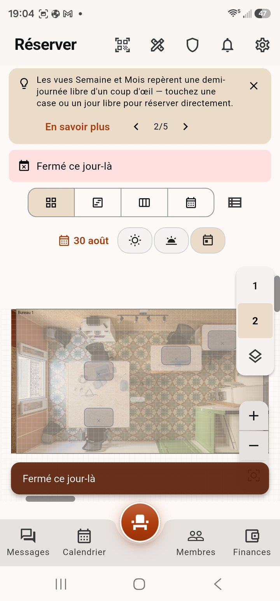

*Der Plan im Reservieren-Hub an einem Schließtag: das Schließungsbanner, der Ansichtswechsel, das Datum und die Tagesabschnitt-Chips, die Ebenenleiste (1 · 2 · Ebenen) und die Zoomsteuerung.*

## 4. Reservierungen (Reservieren-Hub)

Öffne den **Reservieren**-Hub (Mittelknopf). Oben: zwei Reihen von Bedienelementen. Die erste sagt, **was** du siehst: die vier **Ansichts-Knöpfe** und, auf dem Plan, der Umschalter **Plan / Liste**. Die zweite sagt **wann**: der **Datums-Chip**, ein **Jetzt**-Knopf, sobald du von heute weggeblättert hast, und die **Tageszeit-Chips**. Die **Etagen-Chips** (*Alle Etagen* oder eine je Ebene) sitzen auf dem Plan selbst, der **QR-Scan** (§4a) in der Kopfzeile, neben Editor und Glocke. Dann vier Ansichten:

- **Plan** — der Grundriss, gefiltert auf dein Fenster; freien Platz antippen und buchen.
- **Tag** — jeder Platz als Zeitleisten-Zeile für den gewählten Tag (08:00 → 17:00 oder deine Zeiten, die rote Linie ist *jetzt*); freie Strecke antippen zum Buchen, den eigenen Block für Details.
- **Woche** — ein Raster Plätze × Tage für die ISO-Woche, ein Tagesband (*Mo 3 … So 9*) darüber; jede Zelle trägt die Halbtage mit der Initiale des Belegers.
- **Monat** — ein Verfügbarkeitskalender: jeder Tag zeigt seinen **Frei-Zähler** (z. B. *10/12*); Tag antippen führt in dessen Tagesansicht.

**Ein Platz zur Zeit — standardmäßig**: der Space legt fest, wie viele sich überschneidende Reservierungen ein Mitglied halten darf, und diese Zahl ist **1**, solange die Inhaberin sie nicht erhöht (§8). Bei 1 wird woanders buchen oder einchecken, während eine läuft, abgelehnt; Einchecken schließt in jedem Fall frühere Check-ins, deren Buchung endete. Admins und Inhaber können **übersteuern**: ein besetzter/reservierter Platz bietet *Reservierung entfernen (übersteuern)* — Mitglied und alle Admins werden über den Feed benachrichtigt.

Reservierungen folgen der **Granularität** des Space (§8 Verfügbarkeit) — Halbtage, nur ganze Tage, echte Uhrzeiten (exakt von–bis, Halb-/Ganztag als Kurzwahl) oder freie Zeiten auf dem Raster. Halb- und Ganztage decken die **Arbeitszeiten** ab (Standard 8:00–17:00, Halbtagsgrenze 12:00). Sie respektieren **Öffnungstage**, **Schließtage** und die Buchungsregeln (Buchungshorizont, Mindest- und Maximaldauer). **Eine Buchung endet immer an dem Tag, an dem sie beginnt** — nichts läuft über Mitternacht; ein Aufenthalt, der morgen weitergeht, ist die Buchung von morgen, morgen angelegt (§4b). Wiederkehrender Bedarf? Eine **Serie** buchen (täglich, werktags, wöchentlich) — geschlossene Tage und Konflikte werden übersprungen und gemeldet.

**Eine vergangene oder eingecheckte Buchung zu löschen ist ein Antrag, keine Aktion.** Eine Buchung mit vergangenem Start — oder mit Check-in — lässt sich nicht direkt stornieren: das Blatt bietet **Löschung beantragen**. Inhaber oder Admin entscheiden die eine Abrechnungsfrage: Check-in vergessen (die Buchung bleibt) oder nie genutzt (sie wird entfernt)? Der Antrag erscheint im Ereignis-Feed mit deinem optionalen Grund; künftige unberührte Buchungen behalten das Ein-Tipp-Storno. Der ganze Weg fährt auf der Funktion **Lösch-Anträge für Buchungen**: ist sie aus, hat eine begonnene oder eingecheckte Buchung weder Storno-Knopf noch Antrag — sie bleibt schlicht auf der Zeile stehen.

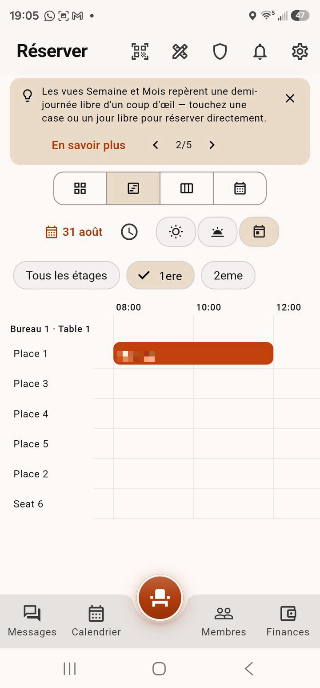

*Die Tagesansicht: jeder Platz als Zeitleisten-Zeile, die rote Linie markiert jetzt — eine freie Strecke antippen zum Buchen.*

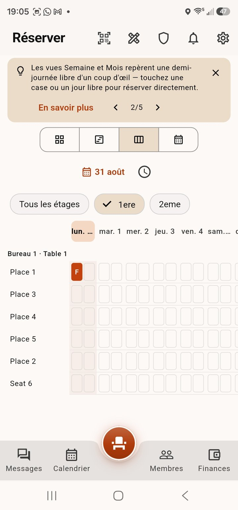

*Die Wochenansicht: ein Raster Plätze × Tage mit den Halbtagen jedes Tages, die Initiale des Belegers in der Zelle.*

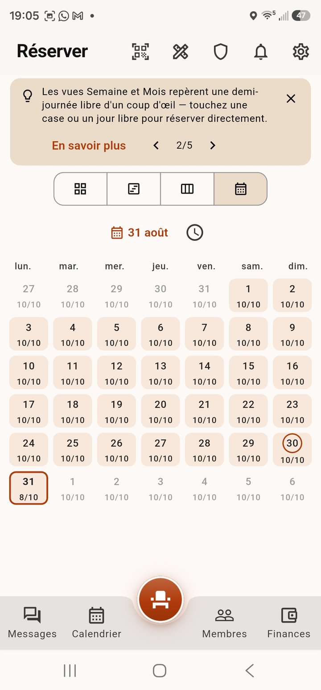

*Die Monatsansicht zählt die freien Plätze je Tag (8/10); ein Tag antippen führt in seine Tagesansicht.*

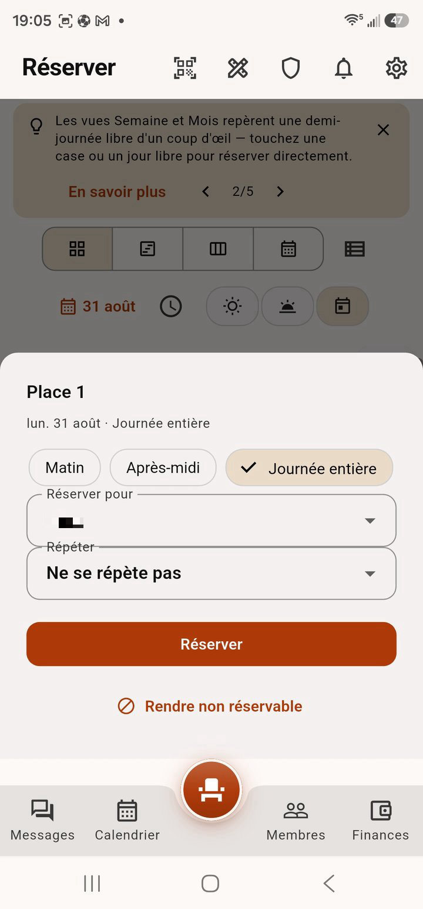

*Das Buchungsblatt: Vormittag / Nachmittag / Ganzer Tag, Buchen für (Admins), Wiederholen — und Nicht reservierbar machen, für Inhaber und Admins.*

### 4a. Einen Raumcode scannen

Jeder Platz, Tisch, jedes Büro und jede Etage kann eine gedruckte **QR-Karte** tragen (§8). **Scan-Knopf** im Hub, Karte anvisieren — oder Code eintippen — und die App identifiziert den Raum und zeigt genau, was *du* dort darfst:

- **Platz-Karte** — genau diesen Platz reservieren oder einchecken, sofort.
- **Tisch-Karte** — die Plätze des Tischs mit Live-Zustand; einen freien wählen. Hat die Inhaberin den Tisch als Ganzes buchbar markiert, bietet die Karte zusätzlich den **ganzen Tisch** an, mit seinem Preis je Halbtag — genau wie eine Büro- oder Etagen-Karte.
- **Büro- oder Etagen-Karte** — wenn die Inhaberin ihn buchbar machte, *Büro- & Etagenreservierungen* aktiv ist **und** du das persönliche Recht hältst (§8) — Inhaber und Admins immer — reservierst du das **ganze Büro oder die Etage** — gleicher Zeitraum-Picker, gleiche **Serien**; der Preis je Halbtag wird gezeigt und landet auf deiner Abrechnung. Sonst erklärt das Blatt warum, und ein Büro fällt auf seine Plätze zurück.

**Ein Scan öffnet das Blatt des Kiosks.** Den Code eines **Platzes** zu lesen — die gedruckte QR-Karte oder den NFC-Tag am Stuhl — bietet genau das an, was der Kiosk beim Antippen dieses Platzes anbietet: dieselben drei Aktionen (**Einchecken**, **Reservieren**, **Auschecken**), denselben aus den Space-Einstellungen abgeleiteten Zeitraum. Der einzige Unterschied: du bist bereits angemeldet, also entfällt der Badge-Schritt (§4b). Tisch-, Büro- und Etagen-Karten öffnen ihr eigenes Ganzraum-Blatt, wie oben beschrieben; **NFC-Tags lösen nur Plätze auf**, ein Stuhl-Tag ist also die eine Tipp-und-buche-Abkürzung.

**Konflikte schützen in beide Richtungen:** ein Büro/eine Etage ist nicht reservierbar, solange ein Platz darin im Fenster belegt ist — und kein Platz, solange sein Büro/seine Etage als Ganzes reserviert ist.

### 4b. Wie sich Buchungen verhalten

Jede Regel unten wird **auf dem Server** durchgesetzt, an einer einzigen gemeinsamen Stelle, die jeder Buchungsweg aufruft. Alle Zeiten sind Ortszeit des Space; die Beispiele nehmen den Standard-Arbeitstag an (08:00 – 12:00 – 17:00).

**Im Voraus buchen.** Wie ein Zeitfenster aussehen darf, hängt von der Granularität des Space ab (§8 Verfügbarkeit):

| Du möchtest | Halbtage | Ganze Tage | Minutenraster (5/15/30/60 min) | Echte Uhrzeiten / freier Zeitraum |
|---|---|---|---|---|
| Den Vormittag (8–12) | ✅ | ❌ — muss den ganzen Tag abdecken | ✅ wenn die Ränder auf dem Raster liegen | ✅ |
| Den Nachmittag (12–17) | ✅ | ❌ | ✅ | ✅ |
| Den ganzen Arbeitstag (8–17) | ✅ | ✅ | ✅ | ✅ |
| Ein ungewöhnliches Fenster (9–15) | ❌ | ❌ | ✅ wenn auf dem Raster | ✅ |
| Vor Öffnung / nach Feierabend (Start 6:00, 17–21) | nur als Spontan-Check-in | nur als Spontan-Check-in | ✅ — die Raster sind frei | ✅ |
| Neben dem Raster (10:02) | — | — | ❌ — die Ablehnung nennt das Raster | — |

Die letzte Zeile dieser Tabelle ist die einzige, die eine Granularität allein von der Form her ausschließen kann; alles Übrige an einem Fenster entscheiden Regeln, die **auf jeder Granularität gleichermaßen** gelten:

- Die Zukunft ist offen bis zum **Buchungshorizont** (Standard 90 Tage) und dahinter gesperrt.
- **Mindest- und Maximaldauer** gelten überall, nicht nur auf Rastern: bei der Standard-Mindestdauer von 30 Minuten wird ein Spontan-Check-in, der um 11:45 auf die 12:00-Grenze zielt, als zu kurz abgelehnt — früher kommen oder den Nachmittag nehmen.
- **Eine Buchung endet an dem Tag, an dem sie beginnt.** Kein Fenster darf über Mitternacht laufen, auf keiner Granularität: ein Abend, der weitergeht, wird zur Buchung von morgen, morgen angelegt. Die Ablehnung liest *„Eine Buchung endet an dem Tag, an dem sie beginnt — den nächsten Tag separat buchen."* Der Spontan-Check-in, der bis **Mitternacht (Ortszeit)** läuft, bleibt erlaubt — Mitternacht ist das Ende genau dieses Tages, kein Übertritt. Dass jede Buchung in einem einzigen Tag bleibt, ist der Grund, warum sich Belegung, Kontingent und Abrechnung eines Tages allein an diesem Tag beantworten lassen.
- Eine Buchung an einem **bereits beendeten Tag** (gestern und früher) wird abgelehnt — *„liegt vollständig in der Vergangenheit"* — außer die Inhaberin hat **Vergangene Buchungen erlauben** eingeschaltet. Das Fenster von heute Vormittag später am selben Tag zu buchen geht immer.
- Ein **Spontan-Check-in muss heute beginnen**: eine schon eingecheckte Buchung für morgen anzulegen wird abgelehnt.
- Ein **Schließtag** lehnt mit Namen ab; ein belegter Platz lehnt ab; und ein Mitglied hält nur so viele **sich überschneidende** Buchungen, wie sein Kontingent erlaubt (unten).
- Die Regel **Außerhalb der Öffnungszeiten** (§8) entscheidet, was ein Fenster wert ist, das den Arbeitstag verlässt — oder ob es überhaupt zustande kommt (unten).

All das wird an **einer einzigen gemeinsamen Stelle auf dem Server** durchgesetzt. Deshalb bieten Plan, Reservieren-Hub, ein QR- oder NFC-Scan und das Wandtablet genau das an, was auch akzeptiert wird, und deshalb lehnt der Kiosk exakt das ab, was der Plan ablehnt — ein „aber am Kiosk ging es doch" gibt es nicht. Eine Anfrage, die durch einen veralteten Bildschirm rutscht, wird mit benanntem Grund abgelehnt.

**Bevor du fragst, sagt es dir die App (#814).** Jede dieser Regeln wird auf dem Gerät von der **Buchungsprüfung** gespiegelt (Funktionen → *Buchungsprüfung*, unter *Buchungsregeln*, standardmäßig an): der Tipp auf den Plan, die Tipps auf freie Slots in der Tages- und Wochenansicht, das Buchungsblatt, das Kiosk-Blatt und das QR/NFC-Scan-Blatt prüfen das Zeitfenster **bevor** sie es anbieten gegen die Verfügbarkeitsparameter und nennen denselben Grund wie der Server — *an diesem Tag geschlossen*, *liegt ganz in der Vergangenheit*, *zu weit voraus — Buchungen sind N Tage im Voraus möglich*, *zu kurz*, *zu lang*, *eine Buchung endet am Tag, an dem sie beginnt*, *außerhalb der Öffnungszeiten*. Ein abgelehntes Fenster deaktiviert **Reservieren** mit dem Grund unter dem Zeitraum; am Kiosk wird der Badge dafür schlicht nicht angenommen, und das Scan-Blatt lehnt einen geschlossenen Tag sofort ab, genau wie der Kiosk. Die **Tages-, Wochen- und Monatsansicht** zeichnen geschlossene Tage als geschlossen — gedämpfte Spalten, kein Tipp auf freie Slots, *Zu* statt der Zahl freier Plätze — und eine **Legende** unter den Bedienelementen benennt die Platzzustände (*Frei · Reserviert · Eingecheckt · Meine · Gesperrt · Geschlossen*). Wo die Inhaberin **Admins dürfen Mitglieder auschecken** eingeschaltet hat, bietet das Admin-Blatt auf einem belegten Platz **{name} auschecken** an. Im Browser, der keinen Kamera-Scanner hat, sagen Scan- und Kiosk-Blatt das und verweisen auf den getippten Code und das NFC-Tag.

**Wie viele Plätze gleichzeitig.** Der Space legt eine Zahl **gleichzeitiger Reservierungen** fest (§8); sie ist standardmäßig **1** — genau der bisherige eine Platz zur Zeit. Eine Inhaberin oder ein Admin kann einem einzelnen Mitglied in *Mitglieder & Tarife* ein höheres Kontingent gewähren, und diese persönliche Erlaubnis sticht die Zahl des Space; niemand setzt die eigene. Dasselbe Kontingent regiert die **Check-ins**: wer 2 Plätze halten darf, kann an 2 Plätzen zugleich eingecheckt sein. Ist das Kontingent erreicht, folgt die gewohnte Ablehnung — *du hast in diesem Zeitraum bereits eine Reservierung* bzw. *bereits woanders eingecheckt*.

**Außerhalb der Öffnungszeiten.** Ein Fenster, das den Arbeitstag verlässt — ein früher Morgen 6:00–8:00, ein Abend 17:00–21:00, die Spontan-Überstunde bis Mitternacht (Ortszeit) —, unterliegt einer einzigen Regel des Space mit **vier** sich gegenseitig ausschließenden Antworten (§8), auf jeder Granularität denselben.

| Stufe | Eine Buchung (oder ein Spontan-Check-in) außerhalb der Zeiten |
|---|---|
| **Aus** | ❌ auf jeder Granularität abgelehnt — auch die Abend-Überstunde, die tagesbasierte Granularitäten sonst immer erlauben, und auch eine Buchung, die bloß **über** das Tagesende hinausläuft (16:00–20:00) oder vor der Öffnung beginnt |
| **Nur spontan** | ✅ der Spontan-Check-in, an **beiden Rändern des Tages** — die frühe Ankunft um 6:00 ebenso wie die Abend-Überstunde bis Mitternacht — ❌ dieses Fenster **im Voraus** zu buchen, und ❌ eine Buchung über das Tagesende hinaus |
| **Gratis** | ✅ erlaubt, aber nie gezählt und nie berechnet: die Buchung ist reine Information — andere sehen, dass der Raum belegt ist, und ein Check-in zeigt, wo die Person zu finden ist |
| **Berechnet** (der Standard) | ✅ erlaubt und wie gewöhnliche Nutzung gezählt — **außer** an einem Tag, an dem du schon eine reguläre Buchung innerhalb der Zeiten hältst: der Teil außerhalb fährt dann gratis mit |

Diese Ausnahme ist der Sinn des Standards: sie unterbindet „nur außerhalb der Zeiten buchen, um nicht zu zahlen", ohne ein Mitglied doppelt zu belasten, das seinen Tag schon verbraucht hat. Zwei Feinheiten. **Gratis und Berechnet schauen nur auf Fenster, die *ganz* außerhalb der Zeiten liegen** — eine Buchung, die die Arbeitszeiten auch nur um eine Minute berührt, ist eine gewöhnliche, gezählte Buchung. **Aus und Nur spontan lehnen weiter reichend ab**: sie lehnen auch das überlaufende Fenster ab, denn ein Space, der um 17:00 schließt, hat bis 18:00 nichts gebucht zu sein. In *Nur spontan* ist der ausgemusterte Schalter **Minutenbuchungen innerhalb der Arbeitszeiten** aufgegangen — dieselbe Idee, jetzt auf jeder Granularität. Ein Space, der den alten Schalter noch trägt, liest sich als *Nur spontan*, mit einer bewussten Verbesserung: der alte Schalter ließ nur die *Abend*-Ankunft durch, während eine Stufe, die nach Spontaneität benannt ist, niemanden abweisen sollte, der um 6:00 vor der Tür steht. Abgelehnt wird das Vorausbuchen; für das Hereinschneien ist sie da. Die Formregeln der Granularität gelten obendrauf weiter, hier öffnet sich also kein beliebiges Fenster.

**Spontan-Check-ins rasten auf den Slot ein.** Ein Spontan-Check-in (freien Platz antippen, QR/NFC scannen, oder am Kiosk) bucht von *jetzt* bis zu einem kanonischen Rand — der Halbtagsgrenze, dem Tagesende oder einem Rasterrand. Bei tagesbasierter Granularität deckt die Buchung den **ganzen Slot, zu dem das Ende gehört**: um 10:00 ankommen und *bis 12:00* wählen bucht den vollen Vormittag 8:00–12:00; erweist sich das zurückgezogene Fenster als nicht verfügbar — die Buchung eines anderen, eine eigene, die sich überschneidet, ein gesperrter Platz, ein als Ganzes belegter Tisch, ein Büro oder eine Etage —, ankert die Buchung stattdessen an deiner Ankunft und behält das Ende des Slots. Am oder nach dem Ende des Arbeitstags darf ein Spontan-Check-in bis **Mitternacht (Ortszeit)** laufen (Abend-Überstunden — auf jeder Granularität, außer **Außerhalb der Öffnungszeiten** steht auf *Aus*, die einzige Regel, die sie ablehnt); dort ist Schluss, denn eine Buchung endet an dem Tag, an dem sie beginnt. Und ein Spontan-Check-in muss **heute** beginnen: eine „eingecheckte" Buchung für morgen wird abgelehnt.

**Ein Scan verhält sich wie der Kiosk.** Einen **Platz** zu scannen — seine gedruckte QR-Karte oder den NFC-Tag am Stuhl — öffnet genau das Blatt, das der Kiosk beim Antippen dieses Platzes öffnet: **Einchecken**, **Reservieren** oder **Auschecken**, auf denselben aus den Space-Einstellungen abgeleiteten Zeiträumen, ohne den Badge-Schritt, denn du bist schon angemeldet. (Tisch-, Büro- und Etagen-QR-Karten öffnen stattdessen das Ganzraum-Blatt, §4a; NFC-Tags lösen nur Plätze auf.) Danach entscheidet der Raum:

| Was du scannst | Was das Blatt tut |
|---|---|
| Einen Raum, auf den du eine Buchung hältst | geht weiter zum Check-in **dieser** Buchung |
| Einen freien Raum | der Check-in bucht ihn implizit, auf den Slot eingerastet wie jeder Spontan-Check-in |
| Einen Raum, den die Buchung eines anderen blockiert | nennt den Inhaber und bietet **Nachricht schreiben** — das Gespräch öffnet sich mit der blockierenden Buchung als Referenz |

Dieselbe Aktion *dem Inhaber schreiben* liegt auf dem **Plan**, wenn du einen von jemand anderem belegten Platz antippst. Am Kiosk nennt stattdessen die Quittung den Inhaber und verweist auf die App: ein Wandgerät schreibt nie Nachrichten für dich.

**Einchecken.** Bei Halbtagen, ganzen Tagen und echten Uhrzeiten öffnet das Fenster für den **ganzen gebuchten Tag**: um 10:00 kannst du schon auf deinen 12:00-Nachmittag einchecken, denn der Slot *ist* der Arbeitstag. Auf einem Minutenraster öffnet es **15 Minuten vor** deinem Start — oder einen **Rasterschritt** früher, wo dieser länger ist, sodass 5-, 15- und 30-Minuten-Raster die 15 Minuten behalten und ein Stundenraster eine volle Stunde früher öffnet. Das Blatt liest immer die echte Uhr, ein Blick auf ein künftiges Datum verdeckt also nie den heutigen Check-in auf deine eigene Buchung. Einchecken an einem anderen Tag („die Buchung von morgen heute"), nach dem Ende der Reservierung, doppelt oder an einem Schließtag wird mit Grund abgelehnt. Bist du noch **woanders** eingecheckt: eine noch laufende Buchung blockiert ihn, sobald dein Kontingent erreicht ist (1 standardmäßig, die erste laufende Buchung blockiert also schon — *dort erst auschecken*); eine bereits abgelaufene schließt sich still — gestempelt auf ihr eigenes Ende — und der neue Check-in geht durch. Ein Admin kann ein Mitglied einchecken, solange *Für andere buchen* aktiv ist (§8 Funktionen).

**Auschecken.** Auschecken vor dem reservierten Ende **kürzt die Buchung auf jetzt** — der Platz wird sofort für alle frei. Nach einem frühen Check-in am selben Tag hält Auschecken vor dem reservierten Start die **echte Anwesenheit** fest (vom Check-in-Moment bis jetzt). Vergessen und später zurückgekommen? Der Check-out geht noch: das gebuchte Ende bleibt, der Stempel ist wahrhaftig. Auschecken ohne Check-in — oder doppelt — wird abgelehnt. Standardmäßig ist der **Check-out persönlich**: ein Admin kann den laufenden Check-in eines Mitglieds nur beenden, wenn die Inhaberin **Admins dürfen Mitglieder auschecken** eingeschaltet hat (§8). Ein nie geschlossener Check-in schließt sich von selbst, sobald du nach seinem Ende woanders eincheckst — oder, mit **Auto-Ein-/Auschecken**, beim Tagesende-Durchlauf.

**No-Shows.** Eine nie eingecheckte Reservierung bleibt einfach *reserviert* in der Historie. Mit **Auto-Ein-/Auschecken** markiert der Tagesende-Durchlauf den vergangenen Tag als wahrgenommen — eingecheckt am Start, ausgecheckt am Ende, abgeschlossen.

**Stornieren.**

| Fall | Was passiert |
|---|---|
| Deine künftige Buchung | ✅ mit einem Tipp storniert |
| Deine laufende, eingecheckte Buchung | ❌ kein direktes Storno — das Blatt bietet **Löschung beantragen** (§4) und **Früher beenden** (unten) an, denn die Anwesenheit hat bereits stattgefunden |
| Den Rest des Tages zurückgeben | ✅ **Früher beenden** auf einer laufenden Buchung: bei Halbtagen und ganzen Tagen rückt es das Ende auf die Halbtagsgrenze, solange diese noch bevorsteht; auf Rastern öffnet es einen eingerasteten Picker, der alles ablehnt, was nicht noch bevorsteht. Der Start ist unverrückbar, und die freigegebene Zeit ist sofort für andere buchbar |
| Eine abgeschlossene oder schon stornierte Buchung | ❌ nichts mehr zu stornieren |
| Die Buchung von jemand anderem | ❌ als Mitglied; ✅ als Admin/Inhaberin — der Eingriff (§4), im Ereignis-Feed dem Admin zugeschrieben |
| Eine Serie, „diese und folgende" | ✅ storniert die verbleibenden *reservierten* Termine ab diesem Datum; eingecheckte und abgeschlossene behalten ihre Historie |
| Eine **vergangene oder eingecheckte** Buchung, die weg soll | ein **Löschantrag** (§4): ein Validierer bestätigt (entfernt) oder lehnt ab (bleibt); ein neuer Antrag ersetzt einen offenen, und künftige Buchungen stornierst du direkt |

**Freigaben.** Wo die Inhaberin eine Validierungsregel auf **Ganzraum-Reservierungen** gelegt hat (§7), blockiert die Buchung den Raum sofort und wartet auf das Quorum — eine Ablehnung storniert sie; keine Regel, kein Freigabeschritt. Löschanträge fahren im selben Rahmen. **Niemand validiert das eigene Ereignis** — mit einer Ausnahme, die die Inhaberin bewusst einschaltet: in den Validierungsregeln (§7) lassen zwei unabhängige Schalter **Admins** und/oder **Inhaber** *ihre eigenen* Anträge auf **Reservierungslöschung** sofort erledigen, statt auf einen Validierer zu warten. Beide sind **standardmäßig aus**, sie reichen ausschließlich an Reservierungslöschungen, und eine automatisch erledigte Löschung ist im Ereignis-Feed als solche markiert — immer unterscheidbar von einer von anderen geprüften.

## 5. Kalender (Kalender-Tab)

Der Monat auf einen Blick, mit zwei Reichweiten und zwei Formen:

**Der Kalender ist ein Wähler, keine Bühne (#718).** Wähle einen **Tag** oder einen **Zeitraum**; du siehst einen einzigen Feed von allem Datierten, das du sehen darfst — Buchungen, Check-ins und Check-outs, Meldungen, Nachrichten, Rechnungen, Zahlungen, Verbrauch, Erinnerungen — nach Tag gruppiert, per Chip nach Art gefiltert, und **jede Zeile öffnet ihre Quelle** (die Buchung, die Unterhaltung, die Meldung, die Rechnung, den Monat in Finanzen). Wer die Finanz- oder Mitglieder-Berechtigung hat, kann ein anderes Mitglied ansehen; Arten, die der Server für dieses Mitglied nicht erlaubt, erscheinen **gesperrt**, nie als leerer Tag. Der Schild öffnet *Wer sieht das*, mit dem Zugriffsprotokoll.

- **Meine / Alle** — deine eigenen Buchungen oder die der ganzen Community; **jedes Mitglied** hat diesen Umschalter, denn Plan und Wochenraster des Reservieren-Hubs zeigen die Belegung aller ohnehin. Die Punkte unter einem Tag sagen alles auf einen Blick: **rot** = du hast eine Buchung, **blau** = andere Mitglieder haben eine, **beide Punkte** = beides. Heute ist umringt.
- Der **Form-Umschalter** daneben wechselt die untere Hälfte zwischen **Listenansicht** (jede Reservierung als Karte: Zeitfenster, Mitglied, Raum) und **Zeitleistenansicht** (Plätze × die Stunden des gewählten Tages). Das Wochenraster Plätze × *Tage* wohnt im Reservieren-Hub (§4), nicht hier.
- Die **Etagen-Chips** filtern die **Zeitleiste**.
- Einen Tag antippen lädt ihn unten. Im Querformat geteilte Ansicht.

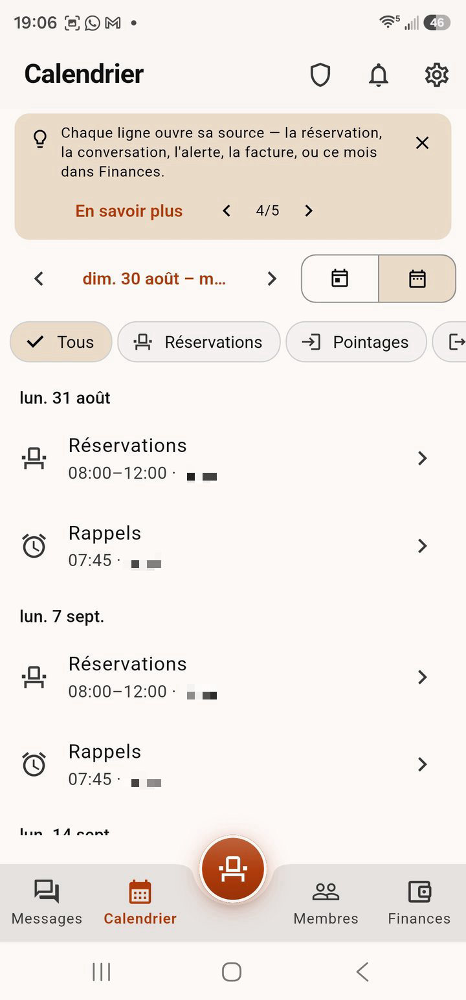

*Der Kalender-Tab: ein Tag oder ein Zeitraum, die Art-Chips, ein Feed nach Tagen gruppiert — jede Zeile öffnet ihre Quelle.*

## 6. Mitgliederverzeichnis (Mitglieder-Tab)

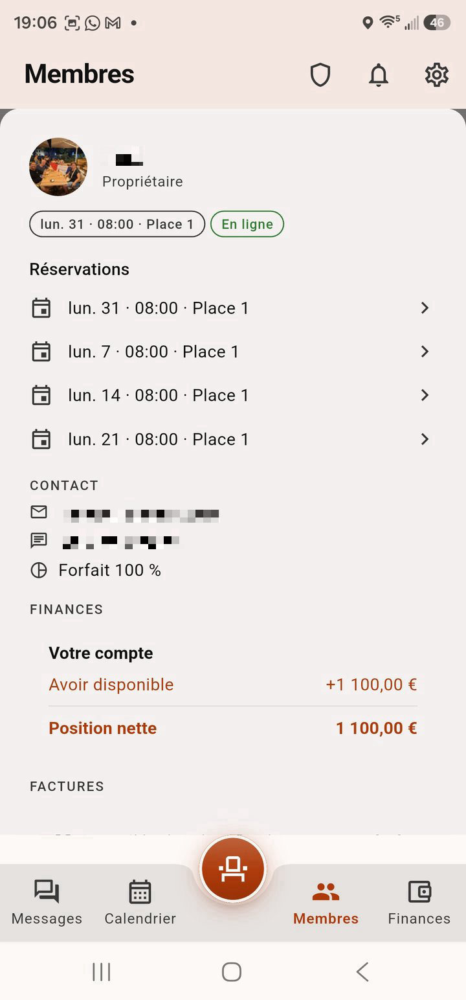

*Das Profil eines Mitglieds: die heutige Buchung, der Kontakt und — wo Sie sie sehen dürfen — seine Finanzposition.*

**Tippe ein Mitglied für sein Profil an (#704).** Foto, Rolle und Status; was es gebucht hat und ob es gerade eingecheckt ist; und **Kontakt** — die freiwillig geteilte WhatsApp-Nummer für alle, die **E-Mail-Adresse und der Tarifanteil für Admins**. Wo du die Zahlen sehen darfst — **deine eigenen immer, fremde mit der Berechtigung *Finanzen sehen*** — trägt das Profil außerdem **Finanzen**: die Nettoposition (wer wem was schuldet), die offenen Rechnungen mit dem jeweiligen Rest, die eingegangenen Zahlungen und den gerade laufenden Monat. Dieselbe Karte wie im Finanzen-Tab, damit beide sich nicht widersprechen können.

Sieh, wer zur Community gehört:

- Jede Karte zeigt **Foto** (oder Initiale), **Rollen-Chip**, **Status** („bis Freitag in Berlin…"), einen **online / zuletzt gesehen**-Indikator (*Online*, *10 min*, *2 T*) und einen **Reservierungs-Chip**: eingecheckter Platz, *Jetzt reserviert* oder nächste Buchung.
- Ein Mitglied antippen öffnet das **Detailblatt** — Rolle, Präsenz, **kommende Reservierungen**, **Nachrichten**.
- **Nachrichten**: ein **Unterhaltungs-Thread** pro Mitglied (bis 500 Zeichen je Nachricht) — vom Tab **Nachrichten** (§16), vom Mitgliedsblatt oder dem Verzeichnis-Profil aus öffnen, den ganzen Austausch als Sprechblasen lesen und an derselben Stelle senden. Jede Nachricht erreicht die Gegenseite doppelt: als **Push ganz ohne Inhalt** (*„Du hast eine neue Nachricht"* — aus Datenschutzgründen) und, sobald die App läuft, als lokale Benachrichtigung, die deinen Namen und den Text zeigt.). Der volle Text bleibt im Tab **Nachrichten** lesbar, für Empfänger und Absender (der Push selbst trägt keinen Inhalt, aus Datenschutz). Admins haben ein **Alle Admins benachrichtigen**-Megafon — in *Mitglieder & Tarife* (Einstellungen → Administration), nicht im Mitglieder-Tab, der gar keine eigene Kopfzeile hat —, das jeden Admin samt Inhaber erreicht. Abschaltbar über *Mitglieder-Benachrichtigungen*. Beim Schreiben lassen sich per Chip **eine Reservierung oder ein laufender Check-in — eigene wie die anderer Mitglieder** — oder **ein Raum** (Sitz, Tisch, Büro oder Etage) **verlinken** — die Referenz erscheint beidseitig als antippbarer Link: ein Reservierungs-Link öffnet diese Reservierung, ein Raum-Link das Buchungsblatt des Raums, ideal um eine künftige Buchung zu besprechen.
- Das **Nachrichten-Icon** einer Karte schreibt dem Mitglied auf **WhatsApp** (wenn es seine Nummer teilt); der **Gruppen-Knopf** öffnet die WhatsApp-Gruppe der Community.
- Eigenes Foto, Status und Nummern-Sichtbarkeit in den **Einstellungen** (§12).
- Admins und Inhaber sehen zusätzlich die **E-Mail** jedes Mitglieds — einfache Mitglieder nicht: Kontakt bleibt die Opt-in-WhatsApp-Nummer.

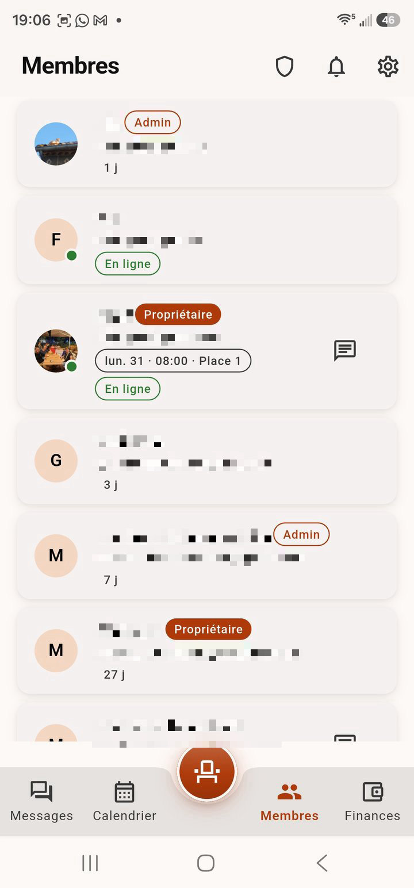

*Das Verzeichnis: Foto oder Initiale, Rollen-Chip, Status, online/zuletzt gesehen und die nächste Reservierung auf jeder Karte.*

## 7. Ereignisse & Bestätigungen (Nachrichten → Ereignisse)

**Wo es liegt.** Der Feed ist die zweite Fläche des Tabs **Nachrichten**, und die **Glocke** in jeder Kopfzeile führt direkt dorthin, mit dem Zähler dessen, was auf dich wartet. Ein Ort hält die Meldungen — dort eine lesen heißt, sie überall gelesen zu haben.

Der Ereignis-Feed ist die Prüfspur deines Space: Buchungen erstellt/geändert/storniert, Zahlungen erfasst, Rechnungen bezahlt, Ausgaben eingereicht, Extratage-Anträge, Rollenwechsel, Löschanträge. Mitglieder sehen ihre eigenen Ereignisse; Admins und Inhaber alles. **Filter-Chips** (Alle · Reservierung · Zahlung · Ausgabe · …) engen die Liste ein — deine Wahl wird gemerkt — und ein **Gruppieren nach**-Menü faltet den Feed in Gruppen nach Typ, Tag oder Mitglied (das Gruppensymbol antippen führt zur flachen Liste zurück); jede Zeile trägt ihr Status-Icon — **Sanduhr** wartend, **grünes Häkchen** bestätigt — und Geld-Ereignisse zeigen *wer wann validierte* direkt auf der Zeile.

**Wartet auf deine Bestätigung:** Handelt ein Admin *für jemand anderen* — bucht dir einen Platz, erfasst deine Zahlung, stuft einen Admin zurück — bleibt es **bis zur Bestätigung offen**. Offenes ist oben angepinnt mit rotem ✕ und grünem **Annehmen**, plus Benachrichtigung. Eigene Aktionen auf dich selbst brauchen nie eine Bestätigung.

**Nachrichten sind umgezogen.** Mitgliedernachrichten leben jetzt in einem eigenen Tab **Nachrichten** (§16), nicht mehr hier — eine Nachricht an zwei Orten ist eine, die man an einem als gelesen markiert und am anderen weiter ungelesen sieht. Dieser Feed behält die eine Art ohne eigene Unterhaltung: eine **Rundnachricht an alle Admins**.

**Validierungsquorum:** für Geld und Rollen definiert die Inhaberin, *wer* zustimmen muss und *wie viele*. **Niemand validiert das eigene Ereignis** — nur eine andere Person (eine von der Inhaberin konfigurierte Ausnahme für Reservierungslöschungen, unten); ohne anderen Validierer wartet der Antrag. Bleibt eine Anfrage 7 Tage unbeantwortet, hängt der Ausgang davon ab, in welche Richtung sie zielt. Was **du selbst eingereicht** hast — eine Löschung, zusätzliche halbe Tage, eine Restbetrag-Stornierung — **verfällt**: nichts Teures wird still gewährt. Was ein Admin **für dich getan** hat — eine Buchung angelegt oder geändert, eine Zahlung erfasst — **bestätigt sich dagegen automatisch**, denn es ist bereits geschehen und der Feed bat dich nur um Kenntnisnahme; eine Buchung, die ein Admin für dich anlegte, gilt dann als gewährt und verbraucht dein Kontingent. Eine verfallene **Rechnungszahlung** — Zuordnung, Erstattung oder Zusammenfassung, die niemand rechtzeitig entschied — gibt frei, was sie hielt: Zahlung, Gutschrift und zusammengefasste Rechnungen stehen wieder da, wo sie waren (#816).

Die Inhaberin justiert das je **Domäne** unter **Einstellungen → Validierungsregeln** — vierzehn Karten, eine pro Ereignistyp, jede erbend von der **Standardregel** bis zur Bearbeitung: *Standardregel, Zahlung, Ausgabe, Leistung, Zusätzliche halbe Tage, Buchungslöschung, Rollenwechsel, Neues Mitglied, Reservierung, Ganzraum-Reservierungen, Rechnungszahlung*, *Restbetrag-Stornierung*, *Preisverhandlung* und *Geplante Ausgabe*. Eine Regel setzt die nötigen Validierungen, *welche* Admins validieren dürfen (alle oder benannte) und ob der Inhaber immer unterschreiben muss. Die Regel **Buchungslöschung** trägt zwei weitere Schalter — *Admins löschen ohne Validierung* und *Inhaber löschen ohne Validierung*, beide **standardmäßig aus** — die eine, bewusste Ausnahme zu „niemand validiert das eigene Ereignis": der eigene Löschantrag erledigt sich selbst und bleibt im Feed als **automatisch validiert** markiert. Sie gelten für Reservierungslöschungen und für nichts sonst.

 

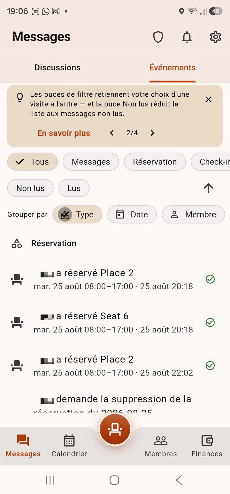

*Die Ereignisse-Seite von Nachrichten: Art-Chips, Ungelesen / Gelesen und Gruppieren nach Typ · Datum · Mitglied.*

## 8. Für Inhaber: Editor & Einstellungen

Alle Administration wohnt unter **Einstellungen → Administration** — *Workspace* (die Workspace-Einstellungen), *Mitglieder & Tarife*, *Verfügbarkeit*, *Rollenverwaltung*, *Abrechnung & Berichte* (der Rechnungs-Hub mit Berichtseditor und Mahnregeln in seiner Kopfzeile), *Zahlungshinweise*, *Online-Zahlungen*, *RFID / NFC-Badges*, *Leistungen*, *Zubehör*, *Abrechnung*, *Funktionen*, *Validierungsregeln* und *Workspace-ID & QR*, in der Reihenfolge des Bildschirms (einige hängen an ihrer Funktion: *Zubehör*, *Online-Zahlungen*, *RFID / NFC-Badges*…). Eine Regel: **der Einstellungs-Eintrag einer Funktion erscheint nur, solange sie aktiviert ist** — *Online-Zahlungen* in **Funktionen** aus, und ihr Konfigurationsbildschirm verschwindet (und kommt beim Reaktivieren zurück). **Funktionen** selbst ist immer da.

**Land, Währung, Zeitzone (#711).** Die Länderauswahl deckt jetzt die 32 Länder ab, für die die App Steuern erklären kann (EU-27, Schweiz, Norwegen, Vereinigtes Königreich, USA, Kanada). Die Währung ist eine **Auswahl** der Codes, die die App formatieren kann — jede mit Symbol und der richtigen Zahl Nachkommastellen: der Yen hat keine, der Dinar drei, und jeder Betrag, jede Rechnung und jede Online-Zahlung hält sich daran. Die Zeitzone ist eine **durchsuchbare Liste** der IANA-Zonen, die die Uhr installieren kann; ein Tippfehler lässt sich nicht mehr speichern.

### Der Space-Editor

Den **Editor** öffnest du aus der Kopfzeile des Reservieren-Hubs. Der **Space-Editor** listet die Etagen — ziehen zum Umordnen, das **Ebenen-Icon** markiert eine Etage *als Ganzes buchbar*, das **⋮**-Menü benennt um oder löscht, **+ Etage hinzufügen** erweitert. Eine Etage öffnen und mit der Werkzeugleiste zeichnen — **Auswahl · Büro · Tisch · Platz · Bild · Löschen**:

- Ein **Büro** bekommt Namen, *als Ganzes buchbar* und einen **Preis je Halbtag**.
- Ein **Tisch** bekommt Namen, dieselbe Ganztisch-Option und einen eigenen **Preis je Halbtag**.
- Ein **Platz** bekommt Namen, **Sitzrichtung** (↑ → ↓ ←), optionalen **Stuhltyp**, sein **Zubehör** (je mit optionalem Halbtags-Aufpreis) und **Gesperrt (Wartung)**. Sein Feld **NFC/RFID-Tag** nimmt die UID des Stuhl-Tags in Hex — per Tag-Taste gelesen oder getippt —, damit ein Tipp auf den Stuhl diesen Sitz auflöst (§4a).
- **Bild** platziert eine skalierbare Illustration; das Foto-Icon setzt das **Hintergrundfoto** der Ebene.
- Einen Raum mit Historie zu löschen ist Sache der **Inhaberin**, und mit aktivem *Räume mit Historie löschen* (Standard: an) geht es einfach: Buchungen, die den Raum referenzierten, behalten eine Textkopie dessen, was er war, und jede noch reservierte Buchung darauf wird automatisch storniert. Ist die Funktion aus, muss ein Raum mit künftigen Reservierungen erst von Hand geräumt werden.

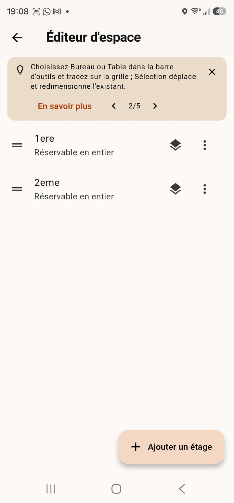

*Die Etagenliste des Raumeditors: ziehen zum Umordnen, das Ebenen-Icon markiert eine als Ganzes buchbare Etage.*

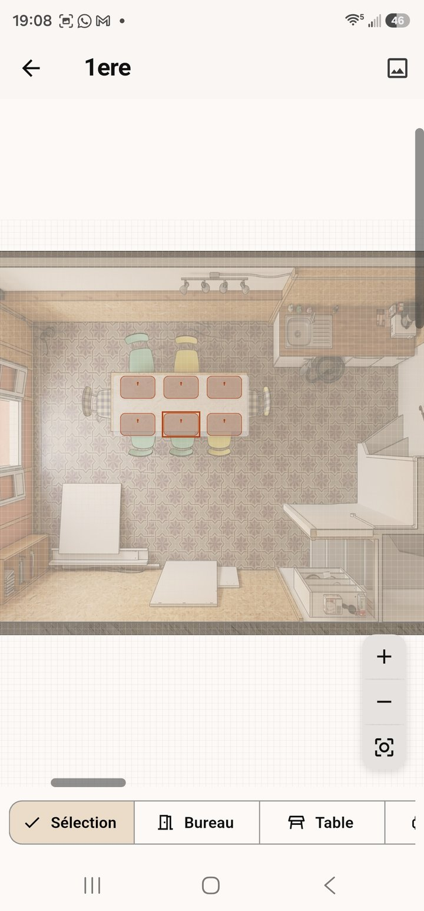

*Eine Etage auf dem Raster mit der unteren Werkzeugleiste — Auswahl · Büro · Tisch · Platz · Bild · Löschen.*

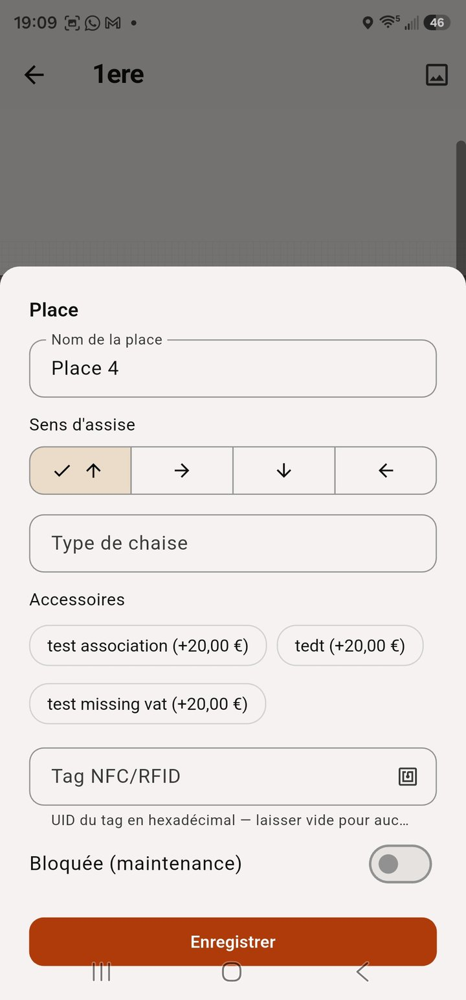

*Das Blatt eines Sitzes: Name, Sitzrichtung, Stuhltyp, Zubehör, das NFC/RFID-Tag-Feld und der Gesperrt-Schalter.*

### Workspace-ID & QR

Die rollengebundenen Einladungen (§2): Mitglieder-Einladung = die Workspace-ID (ersetzbar, kopierbar, QR als PNG), Admin-Einladung = persönliche Einmal-Codes.

*Workspace-ID & QR: die Mitgliedereinladung (QR + ID — kopieren, ändern, als PNG teilen, jemanden einladen) und der Admin-Einladungs-Tab.*

### Verfügbarkeit

#### Öffnungstage und Granularität

- **Öffnungstage** — Chips Mo…So.
- **Buchungsgranularität** — *freier Zeitraum*, *5/15/30/60-Minuten-Raster*, *Halbtage (Vormittag & Nachmittag)*, *nur ganze Tage* oder *echte Uhrzeiten* (exakt von–bis, Halb-/Ganztag als Kurzwahl).

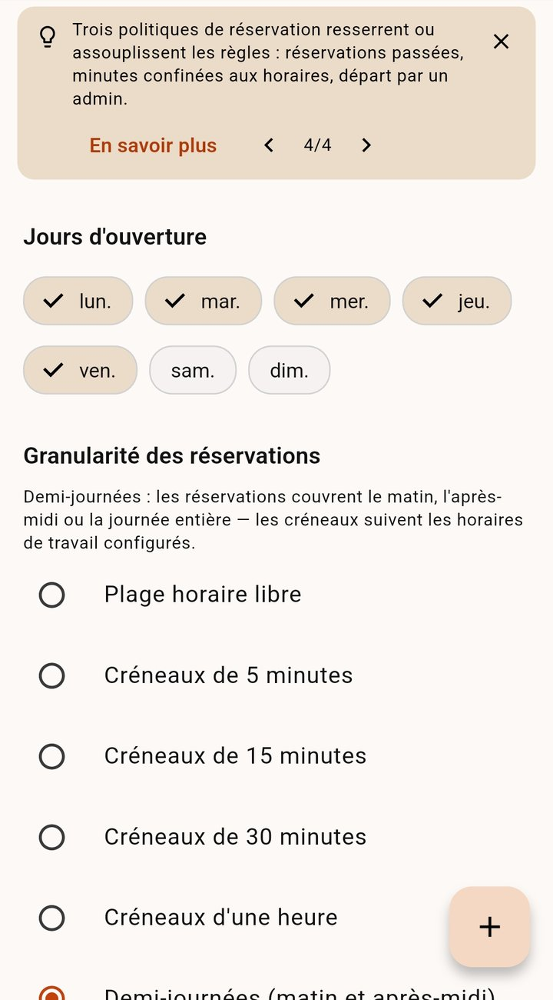

*Öffnungstage und die Wahl der Granularität — wie eine Buchung aussehen darf, beginnt hier.*

#### Arbeitszeiten

- **Arbeitszeiten** — Tagesbeginn, Halbtagsgrenze, Tagesende (Standard 08:00 / 12:00 / 17:00). Halb- und Ganztags-Slots überall — Buchen, Einchecken, Abrechnen — folgen diesen Zeiten; unter *echten Uhrzeiten* legst du auch fest, wie viele Stunden als halber und ganzer Tag abrechnen.
- **Schließtage** — datierte Ausnahmen, per **+**.

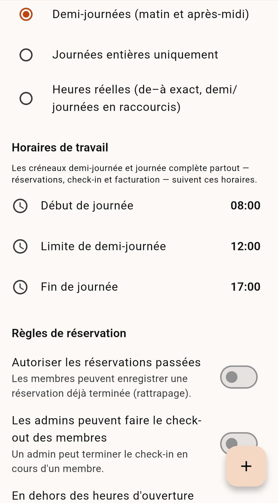

*Die Arbeitszeiten: Tagesbeginn, Halbtagsgrenze, Tagesende — jeder Halbtags- und Ganztags-Slot folgt ihnen.*

#### Buchungsregeln

- **Buchungsregeln** — vier Einträge, die die Regeln aus §4b lockern oder straffen (der Abschnitt folgt der Funktion *Buchungsregeln*); die zwei Schalter sind **standardmäßig aus**:
  - **Vergangene Buchungen erlauben** — Mitglieder können eine bereits beendete Buchung nachtragen (gestern und früher). Aus, werden solche Buchungen abgelehnt; ein Fenster früher am *selben Tag* zu buchen bleibt immer erlaubt. Einschalten für Spaces, die Anwesenheit nachträglich erfassen.
  - **Admins dürfen Mitglieder auschecken** — ein Admin kann den laufenden Check-in eines Mitglieds beenden. Aus, ist der Check-out strikt persönlich. Nützlich, wo das Personal abends den Raum schließt.
  - **Außerhalb der Öffnungszeiten** — eine Frage, vier sich gegenseitig ausschließende Antworten, auf jeder Granularität dieselben: *Was ist außerhalb des Arbeitstags möglich?* **Aus** — nichts: keine Vorausbuchung, kein Spontan-Check-in, und eine Buchung über das Tagesende hinaus (oder vor der Öffnung) wird ebenfalls abgelehnt. **Nur spontan** — der Spontan-Check-in bleibt möglich, Abend-Überstunden bis Mitternacht eingeschlossen, während Vorausbuchen außerhalb der Zeiten abgelehnt wird; hierin ist der alte Schalter **Minutenbuchungen innerhalb der Arbeitszeiten** aufgegangen, und Spaces, die ihn anhatten, lesen sich so. **Gratis** — erlaubt, nie gezählt und nie berechnet (reine Anwesenheitsinformation). **Berechnet** (der **Standard**) — wie gewöhnliche Nutzung gezählt, außer an einem Tag, an dem das Mitglied schon eine reguläre Buchung innerhalb der Zeiten hält: der Teil außerhalb fährt dann gratis mit.
  - **Gleichzeitige Reservierungen pro Mitglied** — wie viele sich überschneidende Buchungen ein Mitglied halten darf, Check-ins eingeschlossen. **1** standardmäßig: ein Platz zur Zeit. Eine Inhaberin oder ein Admin kann einem einzelnen Mitglied in *Mitglieder & Tarife* ein höheres Kontingent gewähren (nie sich selbst), und diese persönliche Erlaubnis sticht diese Zahl.

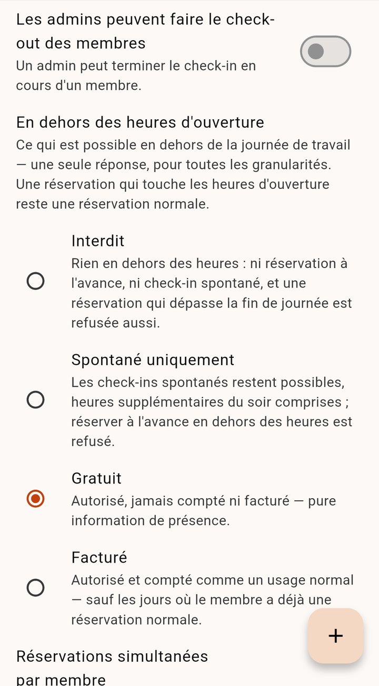

*Die Regel für außerhalb der Öffnungszeiten: eine Frage, vier sich gegenseitig ausschließende Antworten — auf jeder Granularität dieselben.*

#### Buchungsgrenzen

  Direkt darunter stehen die **Buchungsgrenzen** — drei Zahlen, die der Server immer schon durchgesetzt hat und die die App nun einstellen kann:

  - **Vorausbuchungs-Horizont** — wie viele Tage im Voraus eine Buchung beginnen darf (Standard **90**); darüber hinaus wird sie mit Begründung abgelehnt.
  - **Mindestdauer** — die kürzeste akzeptierte Buchung (Standard **30 Minuten**), bei jeder Granularität. Genau deshalb wird eine Ankunft um 11:45 für die 12:00-Grenze als zu kurz abgelehnt.
  - **Höchstdauer** — die längste akzeptierte (Standard **24 Stunden**). Da eine Buchung an ihrem Starttag endet, ist ein ganzer Tag die Obergrenze, und die Auswahl bietet nichts darüber.

  Setzt man das Minimum über das Maximum, sagt der Bildschirm das — der Server prüft jede Grenze für sich und würde schlicht jede Buchung ablehnen, ohne je zu erklären warum.

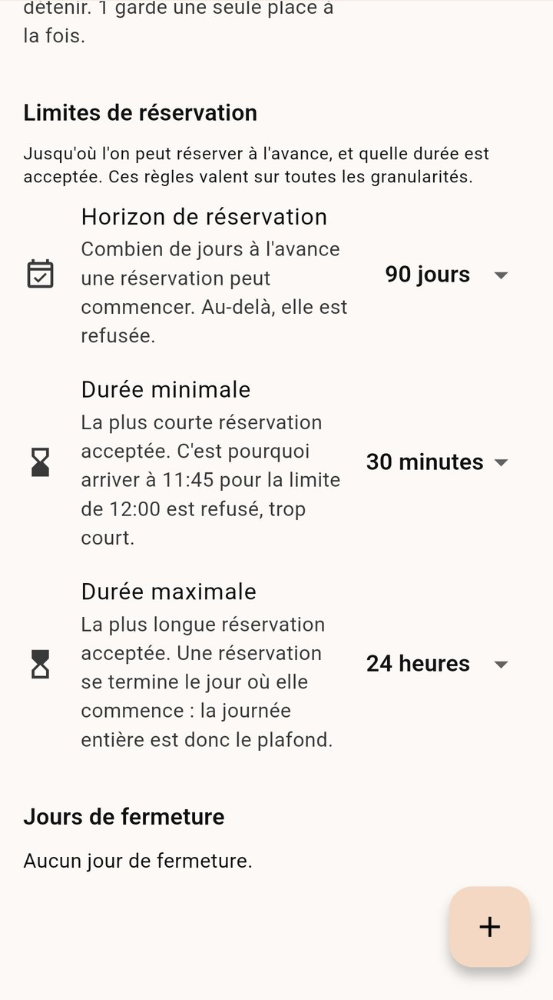

*Die Buchungsgrenzen — Vorausbuchungs-Horizont, Mindest- und Höchstdauer — und die Schließtage darunter.*

  Die beiden **Auto-Validierungs**-Schalter — *Admins löschen ohne Validierung*, *Inhaber löschen ohne Validierung* — stehen nicht hier: sie leben bei den Validierungsregeln (§7), standardmäßig aus, und reichen nur an Reservierungslöschungen.

### Funktionen

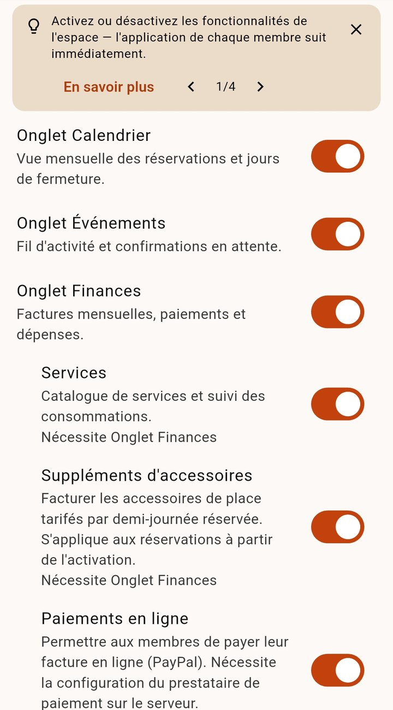

*Der Funktionen-Bildschirm: jedes Modul mit seiner Beschreibung; ein eingerücktes Kind braucht seinen Elternteil.*

Ganze Module je Workspace ein- oder ausschalten — jeder Schalter trägt seine Beschreibung: Kalender-Tab, Ereignis-Tab, Gruppierung der Benachrichtigungen, Finanzen-Tab, Leistungen, Zubehör-Aufpreise, Online-Zahlungen, Rechnungen, Admins stellen Rechnungen aus, Rechnungs-PDF-Vorlage, Mahnwesen, USt-Verwaltung, USt-Voranmeldungen, E-Rechnungszustellung an Kunden, PDF-Export, Serienbuchung, Für andere buchen, Push-Benachrichtigungen, Admins können Plätze sperren, Tisch-, Büro- & Etagen-Reservierungen, Admins können Etagen zuweisen, Kiosk-Modus, RFID-/NFC-Badges, QR-Badges, Mitgliederfotos am Kiosk, Mitgliederverzeichnis, WhatsApp-Integration, Raum-QR-Codes, NFC/RFID-Tags an Stühlen, Mitgliederfotos auf dem Plan, Mit-Inhaberinnen, Auto-Check-in/-out am Tagesende, Datenexport (Excel), Arbeitszeiten, Buchungsregeln, Mitglieder-Benachrichtigungen, Dokumentbibliothek, Mitgliederberichte, Lösch-Anträge für Buchungen, Rollenverwaltung, Räume mit Historie löschen, Hilfe-Hinweise und Oberflächen-Animationen. Ein Modul aus = *alle* seine Bildschirme und Knöpfe verschwinden für jedes Mitglied.

Die Liste ist **hierarchisch**: eine Funktion, die eine andere braucht, sitzt eingerückt darunter mit *Benötigt…*, ausgegraut solange der Elternteil aus ist — *Finanzen* trägt Leistungen, Zubehör-Aufpreise, Online-Zahlungen und Rechnungen; *Rechnungen* die Admin-Delegation, die PDF-Vorlage, das Mahnwesen, die USt-Verwaltung (mit den Voranmeldungen wiederum darunter) und die E-Rechnungszustellung an Kunden; *Kiosk-Modus* gleich drei Kinder — RFID-/NFC-Badges, QR-Badges und Mitgliederfotos am Kiosk; *Tisch-, Büro- & Etagen-Reservierungen* das Zuweisen durch Admins; *Verzeichnis* die WhatsApp-Integration; *Ereignis-Tab* die Feed-Gruppierung. Elternteil aus = ganzer Teilbaum weg; die gespeicherte Wahl des Kindes kehrt unversehrt zurück.

Der vollständige Verfügbarkeits-Bildschirm und die Funktionsliste, je in einem Bild

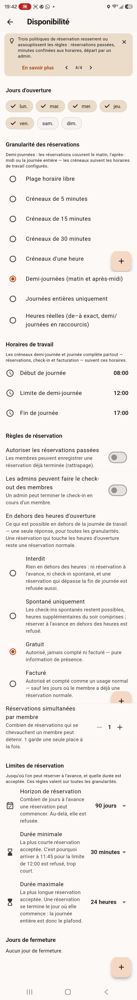 

### Mitglieder & Tarife

Ein Mitglied antippen öffnet sein **Verwaltungsblatt** — jede Mitglieds-Aktion an einem Ort: **Finanzvereinbarung senden** (§11d), **Nachrichten**, **Service hinzufügen** (Service, Menge, Abrechnungsmonat → *zur Bestätigung einreichen*), **Abonnement** (der Prozentsatz), **Wenn die Tage aufgebraucht sind** (die Überziehungs-Politik, §9), **Reservierungslimit** (wie viele **offene** Reservierungen das Mitglied insgesamt halten darf, wann immer sie liegen), **Gleichzeitige Reservierungen** (wie viele Buchungen sich **zeitlich überschneiden** dürfen — das persönliche Kontingent, das die Zahl des Space sticht, §4b; zwei verschiedene Obergrenzen, also die Beschriftungen lesen), **Darf einen ganzen Tisch, ein Büro oder eine Etage reservieren**, **Badges** (§10), **Zum Admin ernennen** (validiert, §7), **Co-Inhaberschaft**, **Zum Kiosk-Gerät machen** — oder **Kiosk zu Mitglied zurücksetzen** auf einem Gerätekonto —, **Mitgliedschaft bestätigen** bzw. **Ablehnen** bei einem ausstehenden Beitritt, und **Mitgliedschaft pausieren**. Jede Zeile zeigt die **E-Mail** unter dem Namen.

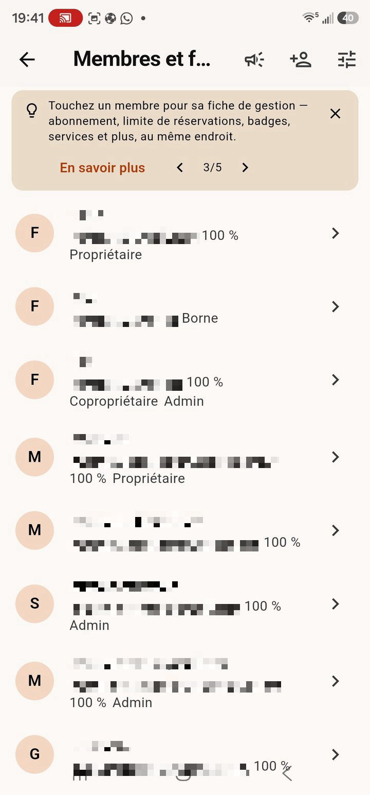

*Mitglieder & Tarife: E-Mail, Tarifanteil und Rollen-Chips je Zeile; Megafon, Hinzufügen und Filter in der Leiste.*

*Das Verwaltungsblatt eines Mitglieds — jede Mitglieds-Aktion an einem Ort.*

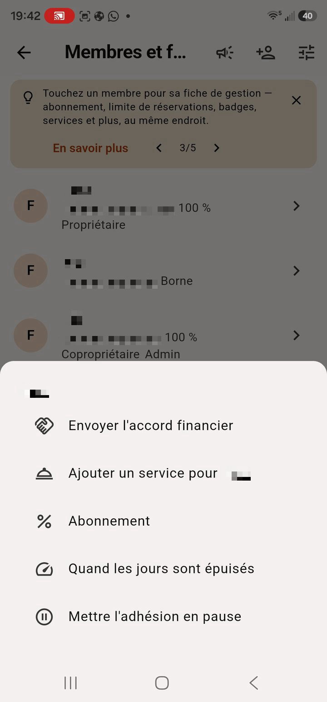

*Das eigene Blatt ist kürzer: niemand gewährt sich selbst Rechte (keine Admin-, Ganzraum- oder Überschneidungs-Zeilen auf sich selbst).*

 

*Der Abonnement-Dialog (der Prozentsatz des Mitglieds) und der Reservierungslimit-Dialog (die Obergrenze offener Reservierungen).*

### Abrechnung

- **Tarifstufen** — die Preisleiter der Prozent-Abos: jede Stufe nennt *ab X %*, *bis Y %*, die monatliche **Gebühr** und den **Überziehungssatz** je Extra-Halbtag. **+ Stufe hinzufügen** verlängert die Leiter.
- **Abo-Stufen** — welche Prozentsätze Mitglieder wählen dürfen (Chips: 25 % · 50 % · 75 % · 100 % plus eigene), und ein Schalter **frei verhandelter Wert**.
- **Tagespakete** — Tage für einen Preis (Name · Tage · Preis), je mit Aktivierungs-Schalter; Mitglieder mit *Paket*-Politik kaufen sie, wenn ihre Tage ausgehen.

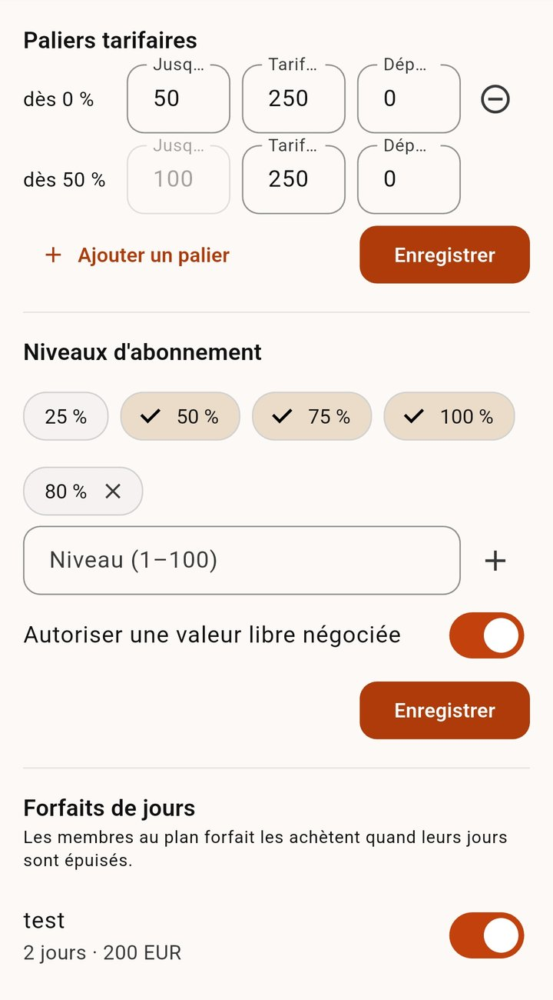

*Tarifstufen (ab % · bis % · Gebühr · Überziehungssatz) und die Abo-Stufen, die Mitglieder wählen dürfen.*

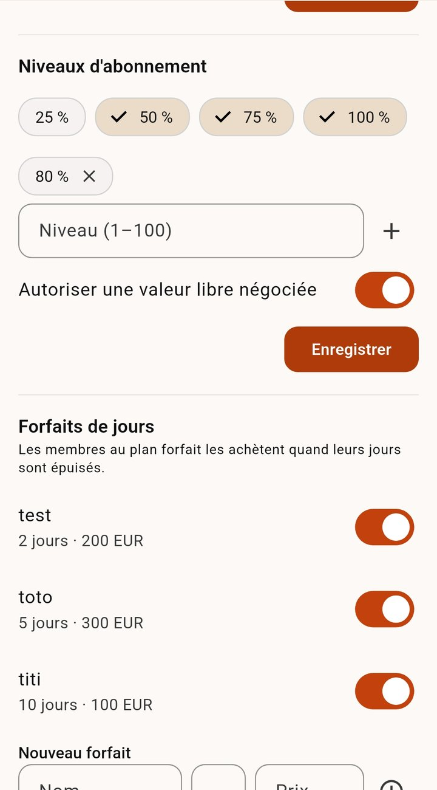

*Tagespakete: Tage für einen Preis, je mit eigenem Aktivierungs-Schalter.*

### Services und Zubehör

Die Kataloge hinter §9 — Extras der Inhaberin (Schließfächer, Druck…, je mit Preis und optionalem MwSt-Satz) und Platz-Ausstattung mit optionalen Halbtags-Aufpreisen. Zwei einfache Listen mit **+**.

 

*Der Leistungskatalog und eine neue Leistung — Name, Preis, eigener MwSt-Satz, wo das Regime einen erhebt.*

 

*Der Zubehörkatalog und der Editor eines Zubehörs — der Aufpreis berechnet sich je reserviertem Halbtag.*

**Bestand (#731).** Eine Leistung aus einem Vorrat zeigt *N auf Lager* / *Ausverkauft*; ein Verbrauch über den Bestand hinaus wird abgelehnt.

### Workspace-Einstellungen (Coworking-Space)

Der Bildschirm des Space, von oben nach unten:

- **Identität** — Name, Land, Währung (aus dem Land vorgeschlagen, änderbar), Zeitzone, **Sprache des Arbeitsbereichs** (Einladungen standardmäßig darin; *App-Sprache des Absenders* ist eine Option) und die **Postadresse** auf den Rechnungen.

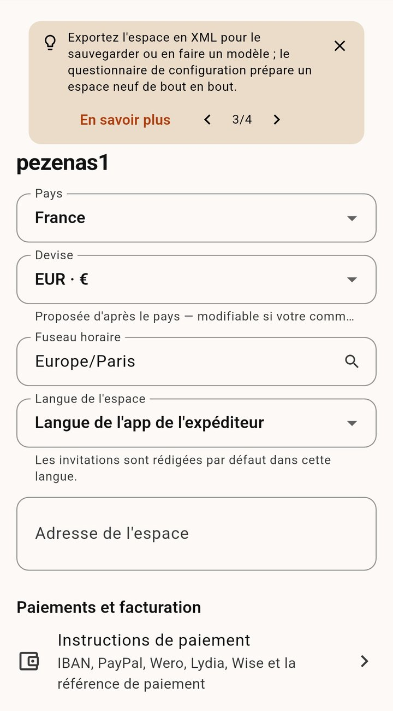

*Identität: das Land bestimmt die vorgeschlagene Währung und Zeitzone; die Sprache des Arbeitsbereichs schreibt die Einladungen.*
- **Zahlungen & Abrechnung** — die **Zahlungshinweise** auf einer offenen Abrechnung (IBAN, PayPal.me, Wero-Nummer, Lydia, Wisetag, Verwendungszweck-Hinweis — leeres Feld = nichts angezeigt), und **Rechtliche Identität & E-Rechnung** (§11a).

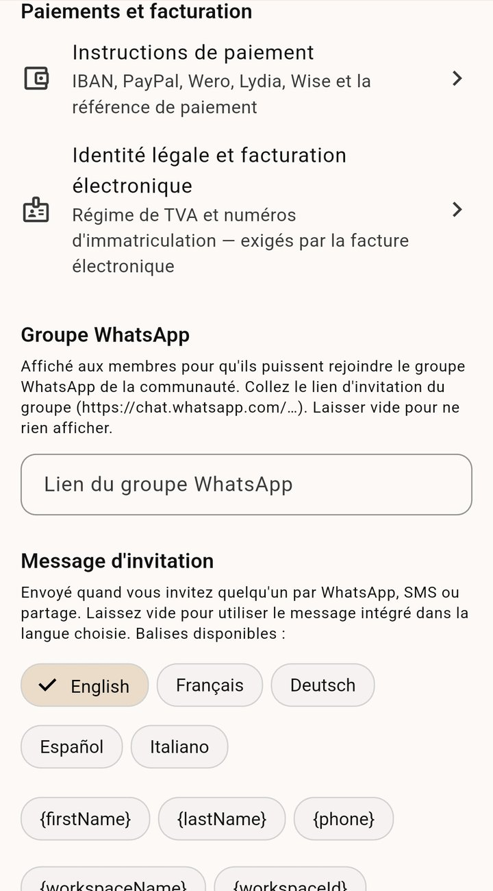 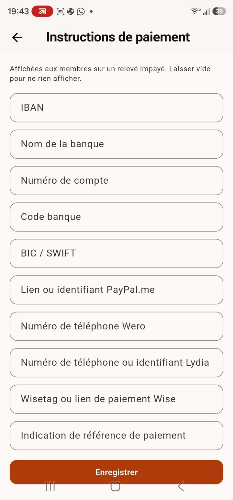

*Zahlungen & Abrechnung: die zwei Einträge zu Zahlungshinweisen und rechtlicher Identität — und das Formular der Zahlungshinweise selbst, Feld für Feld.*
- **WhatsApp-Gruppe** — der Gruppenlink im Verzeichnis.
- **Einladungsnachricht** — die Vorlagen je Sprache (§2).

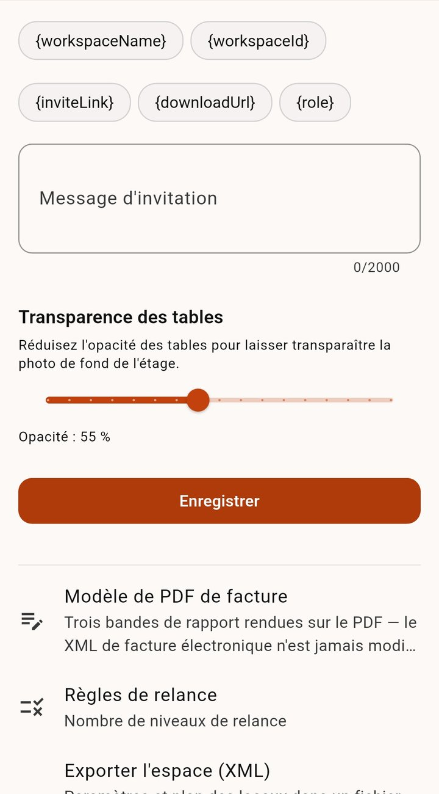

*Die Einladungsnachricht je Sprache, mit ihren Platzhaltern, und der Tisch-Transparenz-Regler darunter.*
- **Tisch-Transparenz** — der Regler fürs Hintergrundfoto.
- **Rechnungs-PDF-Vorlage** und **Mahnregeln** — Abkürzungen zum Report-Editor und zur Mahnkonfiguration (§11).
- **Exporte** — *Space exportieren (XML)* (Einstellungen + Plan, ohne persönliche Daten), *Konfiguration exportieren (PDF)* (Vollschnappschuss: Einstellungen, Mitglieder, Plan), *Space-Bericht* (alles über den Space via Report-Vorlage „Space"), *Raum-QR-Codes (PDF)* (eine Karte je Platz, Tisch, Büro, Etage, zehn je A4), *Daten exportieren (Excel)* (eine Mappe: Buchungen, Zahlungen, Rechnungen, Mitglieder, Plan — je ein Blatt), *Space importieren (XML)* (stellt Einstellungen und Plan wieder her; ersetzt den aktuellen Plan). Jeder Export landet in den **Downloads**.

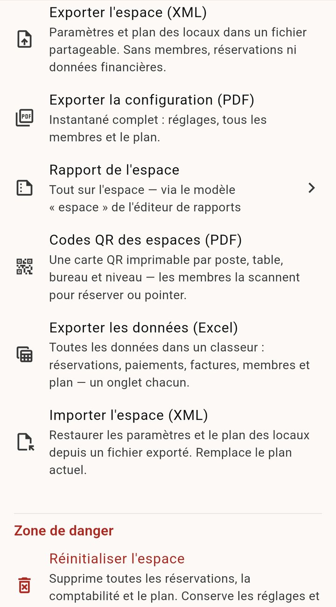

*Der Exporte-Block — XML, Konfigurations-PDF, Space-Bericht, Raum-QR-Codes, Excel, XML-Import — und die Gefahrenzone.*
- **Der Einrichtungsfragebogen** — <https://fdittgen-png.github.io/deskilo/setup.html> (§1 erklärt ihn vollständig): die eigenständige Seite, die eine ganze Konfiguration sammelt, *bevor* die App existiert. **Space importieren (XML)** oben ist die Stelle, an der ihre Datei landet — Einstellungen, Zubehör und Grundriss direkt; der `<setup>`-Abschnitt der Datei trägt Abrechnung, rechtliche Identität, Rollen und Mitglieder für die Bildschirme, denen sie gehören.
- **Gefahrenzone** — **Space zurücksetzen**: löscht alle Buchungen, die Buchhaltung und den Plan; behält Einstellungen und Mitglieder. Durch getippte Bestätigung geschützt.

Der ganze Workspace-Bildschirm in einem Bild

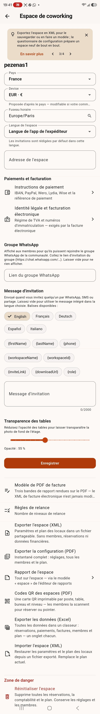

### Raum-QR-Codes & Ganzraum-Reservierungen

Vier Schritte machen „scann die Karte am Tisch" zum Alltag (§4a):

1. Im **Editor** Büro oder Etage **als Ganzes buchbar** markieren, **Preis je Halbtag** setzen.
2. **Büro- & Etagenreservierungen** in **Funktionen** aktivieren (standardmäßig aus).
3. Jedem berechtigten Mitglied **„Darf einen ganzen Tisch, ein Büro oder eine Etage reservieren"** gewähren — im Verwaltungsblatt, nie für sich selbst. Inhaber und Admins halten das Recht auch ohne Schalter, in der App wie am **Kiosk**.
4. Karten drucken: **Workspace-Einstellungen → Raum-QR-Codes (PDF)** — ausschneiden, aufkleben.

Eine Büro-Reservierung deckt **alle Tische darin**; eine Etagen-Reservierung die ganze Etage. Beide nur, solange nichts darin gebucht ist — als eigene Zeilen auf der Abrechnung.

### Co-Inhaber

1. *Mitglieder & Tarife → das Mitglied → **Co-Inhaberschaft*** — **aktiv** (Inhaber-Berechtigungen jetzt) oder **passiv** (Nachfolger in Wartestellung).
2. Übergabe jederzeit mit ***Jetzt zum Inhaber machen***.
3. Verlässt der letzte Inhaber den Space, wird der beste Co-Inhaber **automatisch befördert** — aktiv vor passiv. Das Netz wirkt auch bei ausgeschalteter *Co-Inhaber*-Funktion (sie verbirgt nur die Ernennungs-Knöpfe).

### Rollenverwaltung

Eine zentrale Matrix entscheidet, **welche Rolle welche Berechtigung hält** — Rollen & Berechtigungen verwalten, Mitglieder verwalten, Validierungsregeln konfigurieren, Workspace-Einstellungen bearbeiten, Rechnungen ausstellen & Zahlungen zuordnen, Finanzen einsehen, Dokumentbibliothek verwalten, Services & Pakete verwalten, Ausgaben genehmigen, Geschäftsvereinbarungen einsehen und verwalten. Zu finden unter *Einstellungen → Administration → Rollenverwaltung* (Funktion muss aktiv sein):

- Die **Inhaberin hält immer alle Berechtigungen** — ihre Zeile ist gesperrt (Schloss-Icon).
- Wer *Rollen & Berechtigungen verwalten* hält, bearbeitet die anderen Zeilen. Ein **Co-Inhaber** startet mit allem („kann weniger haben"); ein **Admin** mit den heutigen Admin-Fähigkeiten; ein **Mitglied** ohne alles.
- Alle anderen mit irgendeiner Berechtigung sehen die Matrix **schreibgeschützt** — der Bildschirm sagt es: *„Nur lesen: das sind die Berechtigungen jeder Rolle. Deine Rolle ist hervorgehoben"* — mit dem Chip **Deine Rolle**.
- Unberührte Matrix = Standardwerte. Der Server erzwingt dieselbe Matrix in jedem Rechnungs-RPC — ausstellen, ersetzen, stornieren, mahnen, zuordnen, erstatten, ausbuchen und zusammenfassen fragen alle `has_permission` (#816) — UI und Datenbank können nicht auseinanderlaufen; ein Mitglied mit *Rechnungen ausstellen* nutzt es wie ein Admin.

**Wer prüft (#732).** Eine Regel nennt ihren **Geltungsbereich**: *Admins* (der Inhaber und alle Admins oder die aufgeführten), *Benannte Personen* (der Inhaber und genau die gewählten Personen — auch ein einfaches Mitglied kann prüfen) oder *Alle Mitglieder*. Anzahl und Inhaber-Freigabe behalten ihre Bedeutung, und niemand prüft je das eigene Ereignis. Funktion *Prüfer nach Rolle oder Person*.

*Rollenverwaltung: die Inhaber-Karte gesperrt, die Mitinhaber-Karte standardmäßig voll gewährt — die Admin- und Mitglied-Karten folgen mit denselben elf Berechtigungen.*

### Online-Zahlungen einrichten

Jede Community kassiert auf ihr **eigenes** Anbieterkonto; die App behält Geheimschlüssel nie auf einem Gerät — sie leben auf dem Server.

1. **Einstellungen → Online-Zahlungen** (nur Inhaber).
2. Anbieter wählen und Schlüssel aus dessen Dashboard einfügen:
   - **PayPal** — Client ID, Secret, Umgebung (mit *sandbox* beginnen), Webhook ID, Rückkehr-URL.
   - **Kreditkarte (Stripe)** — Secret key, Webhook-Signiergeheimnis, Rückkehr-URL.
   - **Mollie** — API-Schlüssel, Rückkehr-URL (iDEAL, Bancontact, Karten…).
   - **Wero (via Mollie)** — derselbe Mollie-Schlüssel, mit Wero im Mollie-Konto aktiviert.
3. **Speichern** — ein grüner *Konfiguriert*-Chip erscheint. **Online-Zahlungen** in den Funktionen aktivieren, und Mitglieder sehen **Online zahlen** auf offenen Abrechnungen.

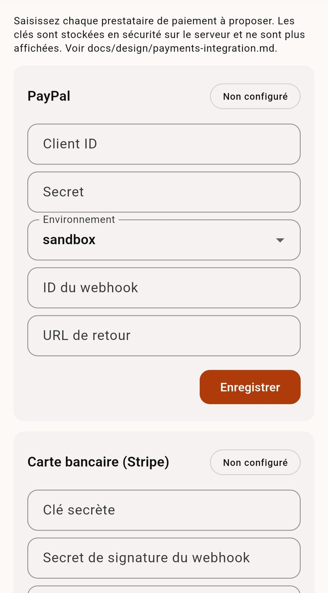

*Eine Karte je Anbieter — PayPal gezeigt; Stripe, Mollie und Wero folgen derselben Form: Schlüssel hinein, ein Konfiguriert-Chip zurück.*

Ein gespeichertes Geheimnis wird nie wieder angezeigt — Feld leer lassen zum Behalten, tippen zum Ersetzen, **Entfernen** löscht den Anbieter. Gebühren sind Anbietergebühren (~1,5–3 % je Zahlung, keine Grundgebühr); DesKilo schlägt nichts auf, Überweisung/IBAN bleibt gratis.

Startet eine Zahlung nicht: **Einstellungen → Erweitert → Entwicklermodus** an und den **Entwickler**-Bildschirm öffnen — die *payments*-Spur zeigt, welche Anbieter konfiguriert sind und welche Felder fehlen.

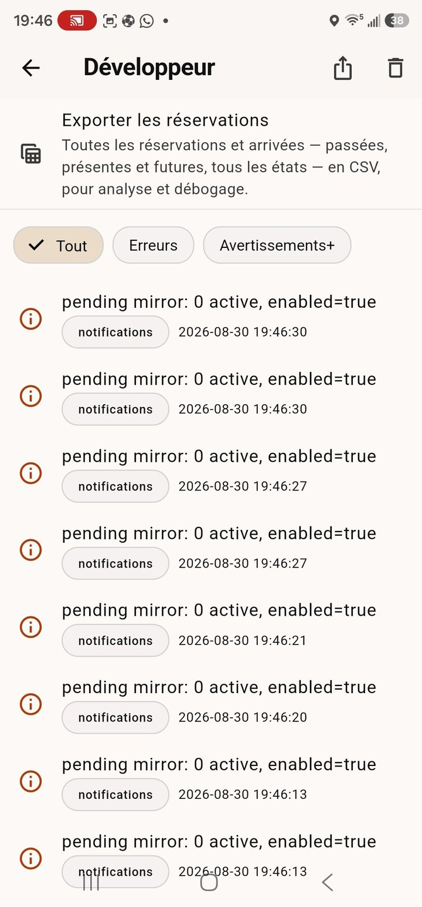

#### Die Anbieter-Dashboards, Schritt für Schritt

**Test- und Live-Umgebung strikt trennen**: jeder Anbieter hat Schlüssel je Modus, und alle in DesKilo eingefügten müssen zum selben Modus gehören. `<project-ref>` ist deine Supabase-Projektreferenz.

**PayPal** — [developer.paypal.com](https://developer.paypal.com) → **Apps & Credentials**; **Sandbox/Live** umschalten (Environment-Feld muss passen); **REST-API-App anlegen** (Client ID + Secret); **Webhook** `https://<project-ref>.supabase.co/functions/v1/paypal-webhook` mit *Payment capture completed* (+ *denied* / *order voided*), **Webhook ID** kopieren — der Webhook ist Pflicht, so landet die Zahlung auf der Abrechnung; alles in DesKilo einfügen.

**Stripe** — [dashboard.stripe.com](https://dashboard.stripe.com) → **Developers**; Test/Live entscheidet die Schlüssel; nur der **Secret key** wird gebraucht; unter **Payment methods** die Netze aktivieren (**Frankreich? Cartes Bancaires explizit aktivieren**); Webhook `https://<project-ref>.supabase.co/functions/v1/stripe-webhook` mit `checkout.session.completed`, Signiergeheimnis kopieren.

**Mollie** — [my.mollie.com](https://my.mollie.com) → **API keys** (Test/Live steckt im Schlüssel); Methoden aktivieren: **iDEAL**, **Bancontact**, Karten — und **Wero**, die EPI-Wallet für Konto-zu-Konto-Zahlungen in DE/FR/BE. **Mollie** und **Wero** sind in DesKilo zwei Anbieterkarten mit demselben Schlüssel. Redirect/Webhook setzt DesKilo automatisch.

#### Weitere Zahlarten (Ausblick)

| Anbieter | Fokus | Einordnung |
|---|---|---|
| **Apple Pay / Google Pay** | Mobile Wallets | Im Stripe-/Mollie-Dashboard aktivieren — erscheinen automatisch auf der Zahlseite. |
| **Klarna** | Später zahlen | Ebenso: in Stripe/Mollie einschalten. |
| **Adyen** | Enterprise | Nicht integriert — wäre ein neuer Anbieter (Beiträge willkommen). |
| **Braintree** | Drop-in (PayPal) | Nicht integriert — die direkte PayPal-Integration deckt das ab. |

### RFID/NFC-Badges einrichten

Physische Karten zum Einchecken per Tap — ohne Telefon.

1. **Einstellungen → RFID/NFC-Badges** (nur Inhaber). **NFC-Badge-Check-in** aktivieren, die **Gerätestatus-Zeile** lesen — *bereit*, *NFC in Android aus* oder *keine NFC-Hardware*. Android-Telefone und -Tablets mit NFC sowie **iPhones** können einen Tag lesen; iPads haben überhaupt keine NFC-Hardware.
2. Jedem Mitglied eine Karte: **Mitglieder & Tarife → das Mitglied → Badges → Karte registrieren**, Karte ans Gerät halten. Jede lesbare Chipkarte geht (MIFARE, NTAG…). Mitglieder können es auch **selbst**: **Einstellungen → Mein Badge** prägt ihr druckbares QR-Badge und registriert die eigene Karte.
3. Am **Kiosk** (§10) einsetzen. Verlorene Karte im Badges-Dialog widerrufen; **ein widerrufenes Badge nach rechts wischen** löscht es endgültig (nach Bestätigung).

Badges gehören **einem Workspace** — der Dialog nennt welchem. Dieselbe physische Karte kann in mehreren Workspaces dienen. Ein QR-Badge **als PDF** druckt zehn Kartenformat-Kopien auf eine A4-Seite.

*Schritt 1 — der NFC-Schalter und die Gerätestatus-Zeile, die sagt, ob dieses Gerät eine Karte lesen kann.*

*Schritt 2 — die Badges eines Mitglieds: QR-Badge und registrierte Karte, je mit Widerruf und eigenem Schalter „meldet mich an“.*

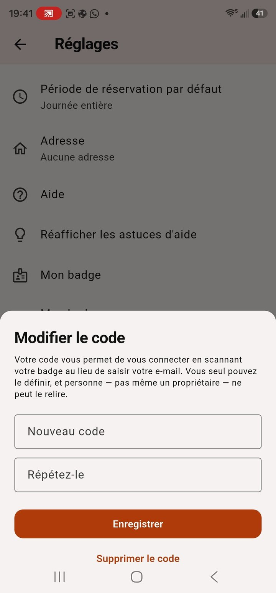

*Selbstbedienung: Einstellungen → Mein Badge prägt das druckbare QR-Badge; der Badge-Code gehört Ihnen allein.*

## 9. Geld (Finanzen-Tab)

Dein Konto beantwortet *was schulde ich, was schuldet man mir* — und *wie viel kann ich noch buchen*. Hochkant scrollt die Monatsabrechnung über den Aktionsknöpfen; quer wandern die Aktionen ins Seitenpanel. Die Kopfzeile **‹ Monat ›** blättert jeden Monat an; der **PDF-Knopf** exportiert die sichtbare Abrechnung.

**Die Abrechnung, Karte für Karte:**

- **Dieser Monat** — wie viele **Tage** dein Abo diesen Monat enthält, wie viele **genutzt**, wie viele **übrig**, mit Fortschrittsbalken. Ein gebuchter Vormittag zählt 0,5 Tage — es sei denn, er liegt ganz außerhalb der Öffnungszeiten und die Regel des Space für Zeiten außerhalb stellt ihn gratis oder befreit ihn (§4b): dieselbe Regel treibt hier das Kontingent und dort den Betrag. Die Abo-Karte darunter rechnet es vor (*3 von 42 Halbtagen genutzt, 21 Öffnungstage*).
- **Überziehung** — die halben Tage über deinen Plan hinaus, zum Satz deiner Tarifstufe.
- **Bezogene Leistungen** — jede Konsumation und die Servicesumme.
- **Zubehör-Aufpreise** — die Halbtags-Extras der Plätze, die du gebucht hast.
- **Etagen-, Büro- und Tisch-Reservierungen** — Ganzraum-Buchungen, jede zu ihrem Preis je Halbtag.
- **Tagespakete** — diesen Monat gekaufte Pakete.
- **Offene Posten** — alles, was noch auf Validierung wartet, in einer orange umrandeten Karte: diese Beträge stehen noch nicht auf der Abrechnung.
- **Zahlungen & Gutschriften** — erfasste Zahlungen, genehmigte Erstattungen, Gutschriften, Anpassungen.
- **Rechnungskarte** — sobald der Monat fakturiert ist: Nummer, Status, Betrag, bezahlt, Rest (§9a).
- **Dein Konto** — die echte monatsübergreifende Position, wenn es eine gibt (§9a).
- **Saldo** — beglichen / offen, darunter die **Zahlungshinweise** und **Online zahlen**, wenn etwas fällig ist.

**Wenn die Tage aufgebraucht sind** — die Wahl der Inhaberin, je Mitglied:

- **Blockiert** (Standard) — keine Buchungen mehr; frag einen Admin oder beantrage **Extra-Halbtage** direkt aus dem Finanzen-Tab (Validierer genehmigen; genehmigte Tage kosten den Überziehungssatz).
- **Nach Verbrauch** — weiterbuchen; jeder Extra-Tag kostet den Überziehungssatz deiner Stufe.
- **Pakete** — **Paket kaufen**, ein Tagespaket wählen; Tage steigen sofort, der Preis landet auf der Monatsabrechnung.

**Die Aktionen, nach Sinn gruppiert:**

- **Zahlen** — **Zahlung erfassen** („ich habe gezahlt") mit Methode, dem **Datum der Geldbewegung** (Standard: heute) und dem **Monat, den sie begleicht** (Standard: der laufende; ein Schritt zurück für Rückstand, vor für Vorauszahlung) — die andere Seite bestätigt. Dieser Monat entscheidet, auf welcher Abrechnung und Rechnung die Gutschrift landet. **Online zahlen** (falls aktiv) begleicht den fälligen Betrag sofort — **PayPal, Kreditkarte (Stripe), Mollie oder Wero**.
- **Anträge** — **Ausgabe einreichen** (Kaffee für den Space? ein anderer Admin genehmigt — keine Selbst-Genehmigung), **Extra-Halbtage beantragen**, **Konsumation hinzufügen**.
- **Dokumente** — **Rechnungen** (deine sind hier immer lesbar; für Aussteller der Rechnungs-Hub, §11), **Meine Konditionen** (rendert das Dokument mit dem Titel *Finanzvereinbarung*) und der **monatliche Zahlungsbericht**, Selbstbedienung (§11).

Finanzen hat oben **vier Ansichten** — **Abrechnung · Zahlungen · Rechnungen · Dokumente** (§9c–9f) —, die sich den **‹ Monat ›**-Wähler und die **PDF**-Taste teilen; Schild, Glocke und Zahnrad sitzen wie überall in der App-Leiste.

### 9a. Sobald der Monat fakturiert ist, entscheidet die Rechnung

- Deine Abrechnung zeigt eine **Rechnungskarte** — Nummer, Status, Betrag, bereits bezahlt, Restbetrag — und der Monat gilt als **beglichen**, sobald die Rechnung bezahlt, ihr Rest erlassen oder ihre Gutschrift erstattet ist — auch wenn die Zahlung erst in einem späteren Monat erfasst wurde. Eine **teilweise bezahlte** Rechnung hält den Monat offen, genau um den **Restbetrag** (den zieht auch *Online zahlen* ein). Ein **Gutschrift**-Monat zeigt, was der Space dir schuldet — du musst nichts zahlen.
- **Dein Konto** — sobald du freies Guthaben hältst (eine Gutschrift oder überzählige Zahlungen eines vergangenen Monats), zeigt der Finanzen-Tab deine echte monatsübergreifende Position über der Abrechnung: **Guthaben auf dem Konto**, jede **offene Rechnung** mit Restbetrag, ausstehende Erstattungen und die **Nettoposition**. Dein Guthaben kann offene Rechnungen begleichen — der Space rechnet es beim Zuordnen an. Monate vor Beginn deiner Mitgliedschaft schulden nichts.

### 9b. Schnellansicht, Speichern, Teilen — jeder Bericht

Jeder Bericht der App — Abrechnung, Rechnungen, Proformas, Gutschriften, deine Selbstservice-Dokumente — bietet dieselben drei Aktionen: **Schnellansicht** (das gerenderte Dokument auf dem Bildschirm, bevor ein PDF entsteht), **PDF herunterladen** und **PDF teilen** (an jede App — WhatsApp, Mail, …).

**Berichte sprechen die Sprache des Lesers:** ein Dokument druckt in der Sprache des **Mitglieds**, wenn dafür eine Vorlage existiert, sonst in der **Sprache des Arbeitsbereichs** und, wenn auch die fehlt, in der **Sprache des Landes** des Space (§11, Vorlagen je Sprache). Hat dieses Land keine eindeutige Sprache, rät die App nicht — sie verweigert und bittet darum, *erst die Sprache des Arbeitsbereichs zu setzen*.

### 9c. Die Ansicht Abrechnung

**Der Monat, wie er steht.** Ihr Konto (die echte monatsübergreifende Position), die Karte **Dieser Monat** (enthaltene, genutzte, verbleibende Tage), die **Abonnement**-Karte, **genutzte Leistungen**, **Zubehör- und Raumzuschläge**, **Tagespakete**, **offene Posten** in Prüfung, **Zahlungen & Gutschriften**, die **Rechnungskarte** des Monats, sobald er fakturiert ist (§9a), und der **Saldo**. Nur lesen: nichts zu drücken außer der **‹ Monat ›**-Auswahl, die alle Ansichten teilen.

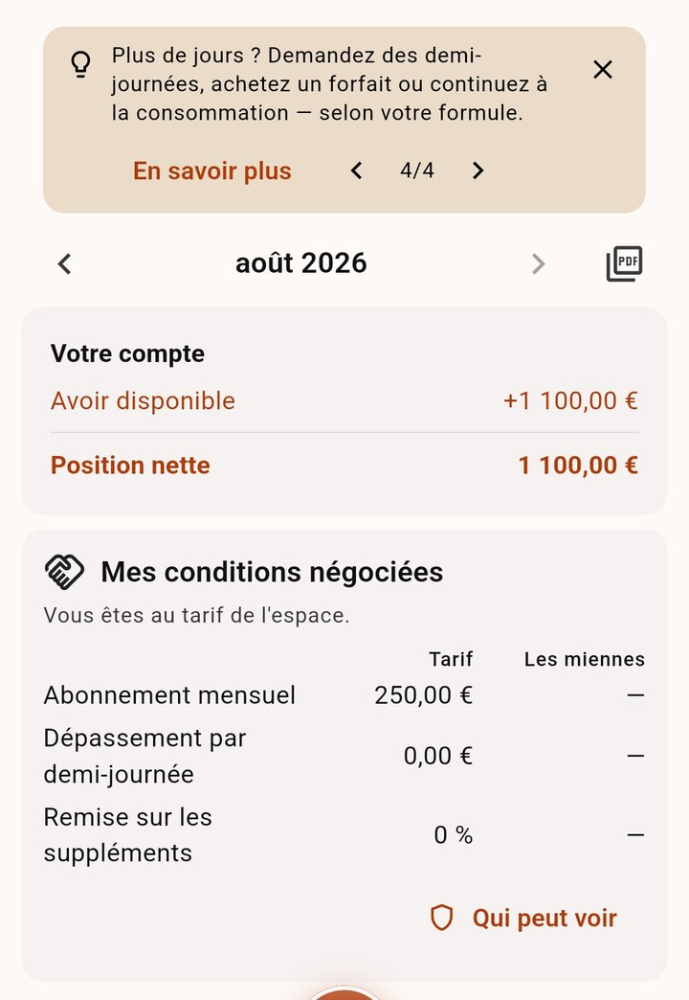

*Der obere Teil der Abrechnung: Ihr Konto (die echte monatsübergreifende Position) und Ihre verhandelten Konditionen — der Tarif neben Ihren Preisen, mit Wer darf sehen.*

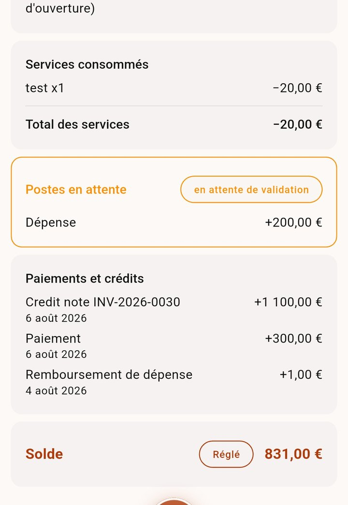

*Der untere Teil der Abrechnung: Leistungen, offene Posten in Prüfung, Zahlungen & Gutschriften und der Saldo.*

### 9d. Die Ansicht Zahlungen

**Begleichen und anfragen.** Ein **Überfällig-Streifen**, wenn eine Rechnung die Zahlungsfrist des Workspace überschritten hat (§11e), der **Saldo**, die **Zahlungshinweise** und **Online zahlen**, solange etwas offen ist, dann die Aktionen: **Zahlung erfassen**, **Paket kaufen** (Pakettarife), **Ausgabe einreichen**, **Halbe Tage anfragen**, **Verbrauch hinzufügen**.

**Vorräte (#731).** Kaffeekapseln oder Staubsaugerbeutel für den Raum gekauft? In **Ausgabe einreichen** schalten Sie *Das ist ein Vorrat für den Raum* ein, benennen den Artikel (oder wählen einen bestehenden), die Menge und was ein Verbrauch kosten soll (vorbelegt mit Betrag ÷ Menge). Nach der Genehmigung werden Sie wie gewohnt erstattet **und** der Artikel steht mit diesem Bestand als verbrauchbare Leistung im Regal; wer ihn nutzt, trägt einen Verbrauch ein und zahlt, der Bestand sinkt, und bei null kann der Artikel bis zum nächsten Vorrat nicht verbraucht werden. Funktion *Vorräte aus Ausgaben* (braucht Leistungen).

*Die Ansicht Zahlungen: der Saldo mit Status, Zahlung erfassen, dann Ausgabe einreichen, Halbtage anfragen, Verbrauch hinzufügen.*

### 9e. Die Ansicht Rechnungen

**Was wurde mir in Rechnung gestellt?** Eine Kopfkarte — *nichts offen, Sie sind auf dem Laufenden*, oder *N offen · fälliger Betrag*, mit der Zahl der überfälligen — dann **jede an Sie gestellte Rechnung**, neueste zuerst, je mit Status-Chip, **fällig in N Tagen** oder **überfällig seit N Tagen**, Zahl der Mahnungen und einem **Zahlen**-Knopf, der zur Ansicht Zahlungen springt; Zeile antippen für das Detailblatt mit Schnellansicht, PDF und Teilen. Rechnungssteller finden den Button **Rechnungen** zum Register (§11).

**Der Weg (#812).** Jede Zeile trägt außerdem die **Verlaufsleiste** der Rechnung — *Ausgestellt · Zahlung · Bestätigung · Abgeschlossen*, der aktuelle Schritt umringt — und **Sie sind dran** in einem Satz: *X bis Datum zahlen*, *Sie haben X gemeldet — der Space bestätigt es*, *Ihre Zahlung ist verbucht — der Space ordnet sie zu*, *bezahlt am … — abgeschlossen*. **So funktioniert es** auf der Kopfkarte öffnet die vier Schritte mit dem, was der Space tut und was Sie tun. Funktion *Der Weg einer Rechnung* (unter Rechnungen).

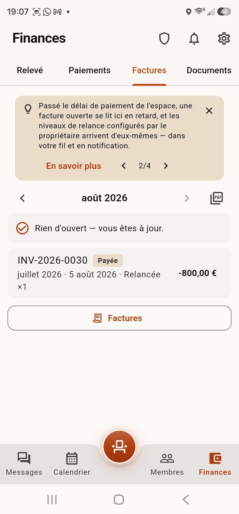 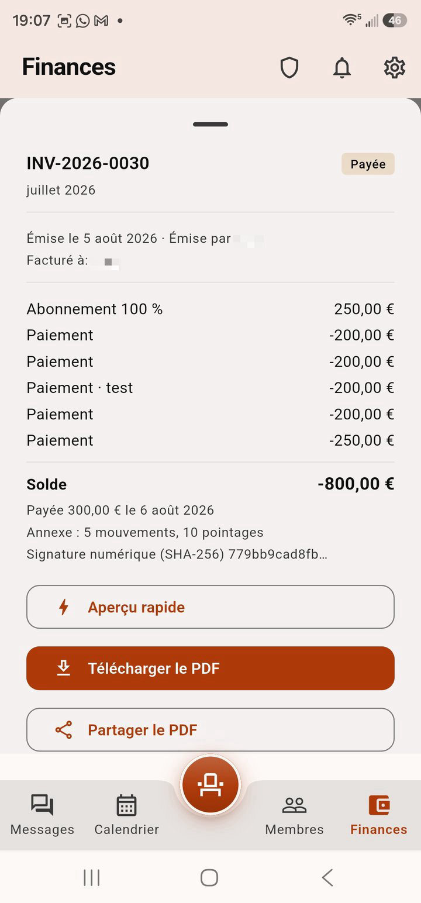

*Die Ansicht Rechnungen — die Kopfkarte und jede an Sie ausgestellte Rechnung — und das Detailblatt einer Rechnung: Positionen, Saldo, Signatur, Schnellansicht / PDF / Teilen.*

### 9f. Die Ansicht Dokumente

**Der Rest der Unterlagen:** **Meine Konditionen** (Ihre Finanzvereinbarung), der **monatliche Zahlungsbericht**, **die Monatsabrechnung als PDF** und die **Dokumentbibliothek**, wenn der Workspace eine führt (§11d). In Funktionen → *Finanzen in drei Ansichten* lässt sich die einspaltige Ansicht zurückholen.

*Die Ansicht Dokumente: Meine Konditionen, der Zahlungsbericht, die Monatsabrechnung als PDF, die Dokumentenbibliothek.*

### 9g. Preisverhandlungen

**Der Tarif ist der Standard; Ihre Konditionen sind Ihre.** Ein Inhaber oder Finanz-Admin kann für ein Mitglied eine **Preisverhandlung** vorschlagen — Monatsbeitrag, Überschreitungssatz je halben Tag, Rabatt auf Zuschläge (Zubehör, Ganzraum-Reservierungen) — je optional, sonst der Tarif. Der Vorschlag landet unter Ereignisse bei den Prüfern der Regel (Domäne *Preisverhandlung* oder Standardregel); bestätigt, gilt er ab dem gewählten Monat und ersetzt die vorigen Konditionen. Auf Ihrer Ansicht **Abrechnung** zeigt die Karte *Meine verhandelten Preise* den durchgestrichenen Tarif neben Ihren Preisen, seit wann, und **Wer das sehen kann**: Sie, die Inhaber und die Finanz-Admins — jeder Zugriff durch andere wird protokolliert und dort aufgeführt (§14). Funktion *Preisverhandlungen*.

**Leistungen, Pakete und Auslastung (#744).** Die Konditionen können auch die **Auslastung** festlegen — den Anteil der Öffnungstage, der monatlich enthalten ist, verhandelt mit seinem Preis (nach Prüfung auf das Mitglied angewendet, der vorige Wert daneben) — und einen **Stückpreis je Leistung und je Paket**: ein Verbrauch oder ein Paketkauf wird zum Preis des Mitglieds berechnet, der Katalogpreis durchgestrichen in den Blättern und auf der Karte.

### 9h. Geplante Ausgaben

**Abos zahlen sich von selbst — aber nie ohne Sie.** Jedes Mitglied, gleich welcher Rolle, kann **eine wiederkehrende Ausgabe planen** (Internet, Telefon, Strom…): ein Betrag, eine erste Fälligkeit, eine Regel — alle X Tage, Wochen, Monate oder Jahre — und eine Laufzeit (*X Mal*, *bis zu einem Datum*, oder beides; was zuerst endet, beendet). Der **Plan selbst wird zuerst validiert** (eigene Domäne *Geplante Ausgabe*), der Betrag darauf ist also ein von den Validierern gebilligter. Danach **materialisiert jede Fälligkeit eine Okkurrenz und legt sie Ihnen vor** — auf der Zahlungsseite; nichts wird je stillschweigend verbucht:

- **Zum validierten Betrag** bestätigt, wird die Ausgabe sofort Ihren Ausgaben hinzugefügt — bereits erledigt, denn der Plan war gebilligt.
- **Zu einem anderen Betrag** bestätigt, ist eine kurze **Erklärung Pflicht**; die Ausgabe durchläuft dann die normale Ausgaben-Validierung. Bestätigt → hinzugefügt; **abgelehnt → sie kommt zu Ihnen zurück**, Betrag und/oder Beschreibung ändern und erneut senden.

Die Liste Ihrer Pläne (Status, Regel, nächste Fälligkeit) und das Formular *Wiederkehrende Ausgabe planen* liegen hinter **Finanzen → Zahlungen → Geplante Ausgaben**; ein Plan endet dort mit einem Tipp. Funktion *Geplante Ausgaben* (unter dem Finanzen-Tab).

## 10. Kiosk-Modus (Wandtablet)

Ein Android-Tablet oder iPad an die Tür:

1. Die Inhaberin legt ein normales Konto fürs Gerät an, tritt dem Space bei und markiert es als **Kiosk** in *Mitglieder & Tarife* (*In Kiosk verwandeln*).
2. **Der Kiosk-Modus startet nie von selbst.** Bei jedem Start fragt das Tablet *Kiosk-Modus starten?* — Bestätigen sperrt: nur Vollbild-Plan, Zurück deaktiviert, und unter **Android** pinnt sich die App selbst, sodass sich nichts anderes öffnen lässt — den Kiosk-Modus zu verlassen heißt dort, das Tablet neu zu starten. Ein **iPad** kennt dieses Pinnen nicht, dort greift nur die Routensperre — für dasselbe Ergebnis den **Geführten Zugriff** von iOS einschalten (Einstellungen → Bedienungshilfen). *Nicht jetzt* öffnet die App normal. Die Kiosk-Markierung ist jederzeit widerrufbar: am Gerät unter **Einstellungen → Kiosk-Gerät** oder durch die Inhaberin.
3. Jedes Mitglied trägt ein **Badge** — vom Admin geprägt oder selbst (**Einstellungen → Mein Badge**, §8): druckbares **QR-Badge** und/oder **RFID/NFC-Karte**. Jedes hängt an seiner eigenen Funktion (**QR-Badges**, **RFID-/NFC-Badges**), beide unter *Kiosk-Modus* — ein Space kann also die eine Kennung anbieten, die andere oder beide.
4. Am Kiosk: Platz (oder **Diese Etage** — was aktive Ganzraum-Reservierungen *und* eine als buchbar markierte Etage voraussetzt) antippen — **EIN Blatt** öffnet sich mit allem darauf: **Einchecken** vorausgewählt (ein Tipp wechselt zu **Reservieren** oder **Auschecken**), der **Zeitraum bereits aus den Einstellungen abgeleitet**, und der **Badge-Leser aktiv** darunter. Bei Halbtagen ist der Tagesteil vorausgewählt, in dem du gerade stehst (Vormittag / Nachmittag / Tag-Chips zum Wechseln — ein laufendes Fenster startet *jetzt*, bereits vergangene Tagesteile werden gar nicht erst angeboten, und deaktiviert ist ein noch *künftiger* Teil, solange **Einchecken** die gewählte Aktion ist, denn im Voraus da sein kann niemand; nach Feierabend bleibt ein einzelnes *Rest des Tages*, das bis Mitternacht läuft und keine Minute weiter, denn eine Buchung endet an dem Tag, an dem sie beginnt). Bei Zeit-Granularitäten: Von/Bis-Picker auf dem Slot-Raster, der Start eines Check-ins auf *jetzt* fixiert. Das Blatt **nennt die Regel, der es folgt** — Granularität und die heutigen Arbeitszeit-Fenster — es bietet also genau, was die Einstellungen erlauben; ein **geschlossener Tag** wird sofort per Banner gesagt statt am Ende zu scheitern. Eine schon begonnene Reservierung bietet zusätzlich **Sofort einchecken?** (standardmäßig an): eine einzige Badge-Präsentation bucht die Reservierung *bereits eingecheckt*. Dann Badge zeigen:
   - **RFID/NFC-Karte antippen.** Solange der Leser scharf ist, bleibt die Kamera aus; ist NFC aus oder fehlt, sagt es das Blatt.
   - Oder **QR-Badge scannen** — mit der eigenen Kamera (Frontkamera als Standard; umschalten unter *Einstellungen → Mit der Frontkamera scannen*). Auch USB/Bluetooth-Scanner oder Tippen des Codes geht.
5. **Das Badge IST die Bestätigung:** es führt sofort aus, und ein **selbst-schließender Beleg** zeigt, *wen* der Kiosk erkannt hat — samt **Profilfoto**, wo die Funktion *Mitgliederfotos am Kiosk* aktiv ist —, *was* passiert ist, *wo* und *bis wann*; danach ist die Wand frei für das nächste Mitglied. Der Wandplan zeigt die Fotos der Anwesenden genauso. Der glückliche Pfad sind zwei Gesten: Platz antippen, Badge zeigen.

**Was die Wand bewusst nicht kann.** Tippst du einen Platz an, den jemand anders hält, **nennt der Kiosk den Inhaber und verweist auf dein Telefon**: ein Wandgerät schreibt nie eine Nachricht im Namen eines Mitglieds, denn davorstehen könnte jeder. Die Aktion *dem Inhaber schreiben* für einen belegten Raum wohnt in der App (§4b). Alles, was der Kiosk *anbietet*, prüfen dieselben Serverregeln wie in der App — die Sperre für vergangene Tage, die Regel, dass ein Spontan-Check-in heute beginnen muss, und die Ein-Tages-Regel eingeschlossen —, die Wand lehnt also exakt das ab, was der Plan ablehnt.

Deine Identität existiert nur für den Moment der Operation: die Kennung geht **nur für diese Operation** zum Server — einmal zum Erkennen, einmal für die Aktion — und **nichts wird gespeichert**, weder auf dem Tablet noch sonst wo. Die Buchung läuft **auf deinen Namen**, und in der Sekunde, in der sie durch ist, bist du wieder „abgemeldet". (**iPads haben kein NFC** — dort ist der Kamera-QR-Weg der richtige.)

## 11. Fakturierung (Inhaber & Abrechnungs-Admins)

*Inhaber stellen Rechnungen aus; Admins auch, sobald sie die Berechtigung **Rechnungen ausstellen & Zahlungen zuordnen** halten (Rollenverwaltung, §8 — oder die alte Delegation **Admins stellen Rechnungen aus**). Die Funktion **Rechnungen** wohnt unter Finanzen.*

**Bankdaten für Länder ohne IBAN (#711).** Unter *Zahlungshinweise*, neben der IBAN: Bankname, Kontonummer, ein Routing-Code so benannt, wie dein Land ihn nennt — *sort code* im UK, *routing number* in den USA, *transit · institution* in Kanada — und ein BIC/SWIFT für Auslandsüberweisungen. Nur gefüllte Felder erscheinen auf der Karte „So bezahlst du“.

Eine DesKilo-Rechnung wird generiert, nie komponiert: ihre Positionen sind **ausschließlich aus den erfassten Monatsdaten abgeleitet** — Abo, Überziehung, Aufpreise, Services, Pakete — minus Zahlungen und Gutschriften des Monats, sodass die letzte Zeile **der fällige Saldo ist**. Jedes Dokument friert die Postadressen ein (deine unter **Einstellungen → Adresse**) und wird bei Ausstellung **digital signiert** — es ändert sich nie mehr. Ein **detaillierter Anhang** (Bewegungen und Anwesenheiten) hängt per Schalter an.

**Der Weg einer Rechnung (#812).** Mit der Funktion *Der Weg einer Rechnung* (standardmäßig an) erzählt das Hub den Prozess, statt Zustände aufzulisten. Eine **Stufenleiste** ersetzt die Übersichts-Pillen — *1 · Auszustellen · 2 · Einzuziehen · 3 · Zu bestätigen · 4 · Abgeschlossen* — mit Live-Zählern (Einzuziehen zum Restwert, die überfälligen rot; Zu bestätigen sammelt jede Rechnung, deren nächster Zug nicht beim Mitglied liegt: eine gemeldete Zahlung, die ein anderer Admin bestätigt, eine verbuchte Zahlung, die zuzuordnen ist, eine Zuordnung oder Ausbuchung vor den Prüfern, eine zu erstattende Gutschrift); jede Kachel führt zu ihrem Tab. Jede **offene Karte** trägt die **Verlaufsleiste** (*Ausgestellt · Zahlung · Bestätigung · Abgeschlossen*) und den **nächsten Zug** als Satz — *Warten auf die Zahlung von Flo: 250 € — fällig 27. Mai*, *Flo schuldet 250 € — 6 Tage überfällig*, *Flo hat eine Zahlung von 250 € gemeldet — ein anderer Admin bestätigt sie unter Ereignisse*, *eine Zahlung von 250 € ist verbucht — ordnen Sie sie dieser Rechnung zu*, *Zahlung zugeordnet — Entscheidung der Prüfer steht aus*, *Gutschrift — 8 € an Flo erstatten und erfassen*. Die Aktion, die dieser Zug von Ihnen erwartet, ist der **einzige beschriftete Button** der Karte (*Mahnung 2 senden*, *Als bezahlt markieren*, *Erstattung erfassen*, *Ereignisse öffnen*); der Rest bleibt Icon mit Tooltip. Das **Detailblatt** öffnet mit derselben Leiste und demselben Satz, seine datierten Fakten unter der Überschrift *Verlauf*, und die erwartete Aktion steht an erster Stelle. Das **?** in der Kopfzeile öffnet **So funktioniert die Fakturierung** — die vier Schritte, je mit der Seite des Space und der des Mitglieds — dasselbe Blatt, das Mitglieder aus ihrer Ansicht Rechnungen öffnen.

Aussteller öffnen **Finanzen → Rechnungen**: ein Drei-Tab-Hub unter einem Live-Übersichtsstreifen (*N zu fakturieren · N offen · X ausstehend · N zu erstatten · Y*):

- **Zu fakturieren** — jedes Mitglied, dessen Vormonat abrechenbare Daten und noch keine Rechnung hat: je Mitglied ausstellen (mit Vorschau der abgeleiteten Positionen) oder **Alle fakturieren** — mit Bestätigungsdialog (Anzahl, Monat, Summe). **Neue Rechnung** öffnet dasselbe Blatt für jedes Mitglied und jeden Monat — Mitglieder-Picker, ‹ Monat ›, die Positionen, der Saldo, der **Anhang**-Schalter und **Rechnung ausstellen** (grüner *Rechnung ausgestellt.*-Balken). **Eine aktive Rechnung je Mitglied und Monat**. Das Blatt öffnet auf dem **abgeschlossenen Monat**; der laufende warnt, denn er ist nur einmal fakturierbar.
- **Offen** — ausgestellte Rechnungen, älteste zuerst; über 30 Tage wird rot. Jede Aktion ist ein Icon mit Tooltip (stornieren · Proforma · Mahnung · als bezahlt markieren). **Karte antippen = Rechnung lesen.** **Zahlungserinnerung senden** erfasst die Mahnung und teilt das PDF — die Karte zeigt *Erinnert ×N*. **Als fehlerhaft markieren** storniert zur Korrektur (ein Dialog warnt: unumkehrbar): sie wandert durchgestrichen ins Archiv, eine **Ersatzrechnung** leitet den Monat neu ab. **Als bezahlt markieren** ordnet eine echte Zahlung zu (unten). **Eine Teilzahlung schließt keine Rechnung**: sie bleibt offen, Badge *Teilweise bezahlt* mit Restbetrag, bis der Rest ausdrücklich **über das Validierungs-Framework storniert** wird — erst dann Archiv als *Teilweise bezahlt · Restbetrag storniert*. **Eine NEGATIVE Rechnung ist eine Gutschrift** — der SPACE schuldet dem Mitglied: PDF-Titel *Gutschrift*, keine Mahnungen, kein Zuordnen von Mitgliedszahlungen; die Karte zeigt *Zu erstatten* mit **Erstattung erfassen** — die Auszahlung bucht gegen das Mitgliedskonto (validiert, wenn eine Regel greift; Ablehnung öffnet wieder), das Dokument schließt als *Erstattet*. Der Übersichtsstreifen trennt beide Richtungen: *N offen · X ausstehend* zählt positive Rechnungen zum **Restwert** (500 € mit 280 € bezahlt zählt 220 €), *N zu erstatten · Y* summiert die offenen Gutschriften.
- **Archiv** — geschlossene Rechnungen, filterbar nach Mitglied und Monat, sortierbar; stornierte **standardmäßig ausgeblendet** — *Stornierte anzeigen* holt die Korrekturkette zurück; **Filter zurücksetzen** holt alles. Jede Zeile: Status-Chip (*Bezahlt*, *Teilweise bezahlt*, *Fehlerhaft* durchgestrichen, Gutschriften mit Negativbetrag), Monat, Betrag, **PDF herunterladen**. **Zeile antippen = Rechnung öffnen** — Positionen, Saldo, Empfänger, Stand (*Bezahlt €300.00 am 6. Aug.*, *Erinnert ×1…*, *Anhang: 5 Bewegungen, 10 Check-ins*), Ersetzungskette, Signatur — und jede noch erlaubte Aktion: **Schnellansicht**, **PDF herunterladen**, **PDF teilen**, **E-Rechnung (XML)**, mahnen, als bezahlt markieren, als fehlerhaft markieren, Ersatz ausstellen.

**Als bezahlt markieren heißt: eine echte Zahlung zuordnen — oder ein Guthaben anrechnen.** Der Dialog listet die registrierten Zahlungen — erfasste Überweisungen und bestätigte Online-Zahlungen — und du ordnest die Rechnung einer zu; kein Betrag zu tippen (noch keine? der Dialog sagt es: *erst erfassen oder bestätigen*). Er listet auch die **Guthaben des Mitglieds** (Gutschrift-Überschuss): eines zuzuordnen rechnet die Gutschrift auf die Rechnung an, vergangene Monate eingeschlossen — die übliche Alternative zur Auszahlung, für Vereine wie Unternehmen. Jedes Guthaben wird genau einmal ausgegeben. **Mehr** gezahlt? **Gutschrift über den Überschuss** oder erzwungen akzeptieren mit Pflichtnotiz. **Weniger**? Mit Pflichtnotiz akzeptieren. Alle mit Rechnungszugriff werden benachrichtigt; die Inhaberin kann eine **Rechnungszahlung**-Validierungsregel (§7) setzen — die Zuordnung wartet aufs Quorum, eine Ablehnung öffnet wieder.

**Eine bezahlte Rechnung ist endgültig.** Einmal zugeordnet: nie mehr stornieren, ersetzen, ändern — Korrekturen vor der Zahlung, per Storno + Ersatz. Eine Zahlung unter dem Betrag, mit Notiz akzeptiert, zeigt **teilweise bezahlt**.

**Proforma.** Zwei der drei Hub-Tabs tragen eine Proforma-Aktion: auf **Zu fakturieren** als Angebot — keine Nummer, keine Signatur, Stempel PROFORMA, **nichts wird ausgestellt**; auf **Offen** als Zahlungsaufforderung, die nicht als Original durchgeht. Beide mit Schnellansicht / Download / Teilen.

**Stempel.** Eine stornierte Rechnung trägt ein diagonales **FEHLERHAFT** über jeder Seite. Derselbe Stempel sagt **PROFORMA** auf einem Angebot und **KOPIE** auf jeder Rechnung, die nicht ihr Aussteller rendert.

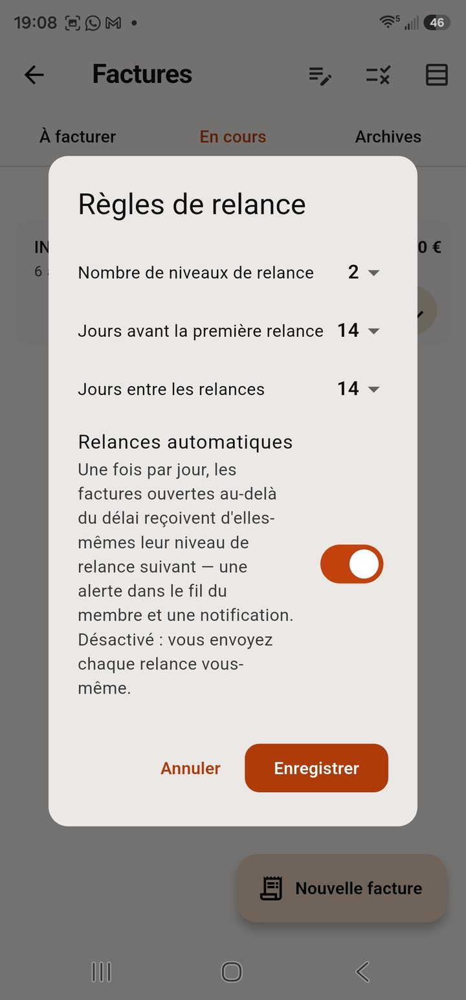

*Die Mahnregeln: Stufen, Tage bis zur ersten Mahnung, Tage zwischen den Stufen — und der Schalter Automatische Mahnungen.*

**Mahnungen (Mahnwesen).** Die Inhaberin setzt die **Mahnregeln** (Häkchenlisten-Icon in der Kopfzeile, oder *Workspace-Einstellungen → Mahnregeln*): Anzahl Stufen, Tage bis zur ersten, Tage dazwischen. Überfällige Rechnungen tragen **„Mahnung N fällig"**, die Glocke wird rot — nichts geht für dich raus, solange **Automatische Mahnungen** nicht an ist (§11e). Eine manuelle Mahnung wird mit ihrer Stufe erfasst und landet im Feed des Mitglieds genau wie eine automatische (#816). Der Versand erzeugt einen **Mahnbrief** (Stufe 1 freundlich, höhere fester) aus der Vorlage der Stufe — fertig in deiner Sprache, gedruckt in der Sprache des *Mitglieds*, je Stufe editierbar mit `{{ reminder_level }}`, `{{ reminder_date }}`, `{{ days_open }}`.

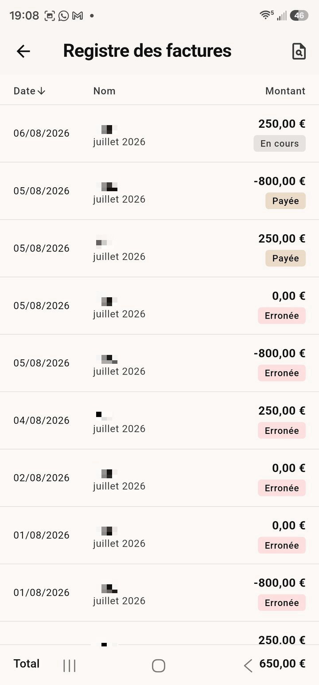

*Das Register: eine Zeile je Rechnung, die Summe am Fuß, der Jahres-Picker und die Buchhaltungs-Export-Taste (SAF-T / FEC).*

**Das Register.** Das Listen-Icon öffnet ein Ein-Zeilen-Register: **Datum · Name · Betrag · Status**, nach Datum sortiert (Kopfzeile antippen dreht die Richtung), Summe am Fuß, **Jahres**-Picker ab zwei Jahren. Sein Export-Knopf öffnet **Buchhaltungs-Export**: **SAF-T (XML, international)** und — für einen französischen Space — **FEC (Frankreich, bei Prüfung verlangt)**.

**Die Periode an die Buchhaltung übergeben.** Aus dem Register exportieren Aussteller **SAF-T** — das OECD-*Standard Audit File for Tax*. Es deckt genau das Register: das Unternehmen, jeden Kunden, jede Rechnung mit Zeilen und Summen, die begleichenden Zahlungen. Stornierte bleiben als *annulliert* — eine Prüfdatei löscht nichts. Bewusst fehlt der **Kontenplan**: DesKilo erfindet keine Kontonummern; das Mapping macht die Buchhaltung.

**Frankreich: das FEC.** Ein französischer Space bekommt das **FEC** (*Fichier des Écritures Comptables*, art. L47 A-I du LPF): eine tabulierte Flachdatei von **Buchungen**, benannt `<SIREN>FEC<JJJJMMTT>.txt`, mit den 18 vorgeschriebenen Spalten. Kontonummern fragt der Export vorher ab — vorbelegt mit dem *plan comptable général* (411, 706, 512). Jede Rechnung bucht brutto Forderung an Ertrag; Gutschriften und die begleichende Zahlung buchen zu ihren Daten, gelettert mit der Rechnungsnummer. Stornierte fehlen. Mitglieder sehen nur, was sie betrifft.

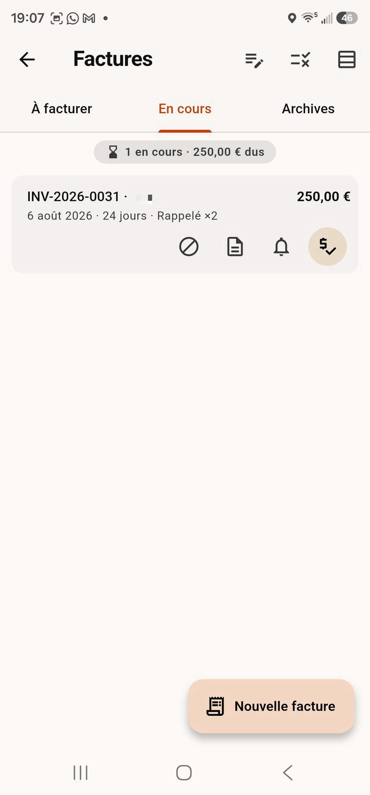

*Der Hub der Aussteller: Zu fakturieren · Offen · Archiv unter dem Live-Übersichtsstreifen; eine offene Rechnung mit ihren vier Aktionen (stornieren · Proforma · Mahnung · als bezahlt markieren).*

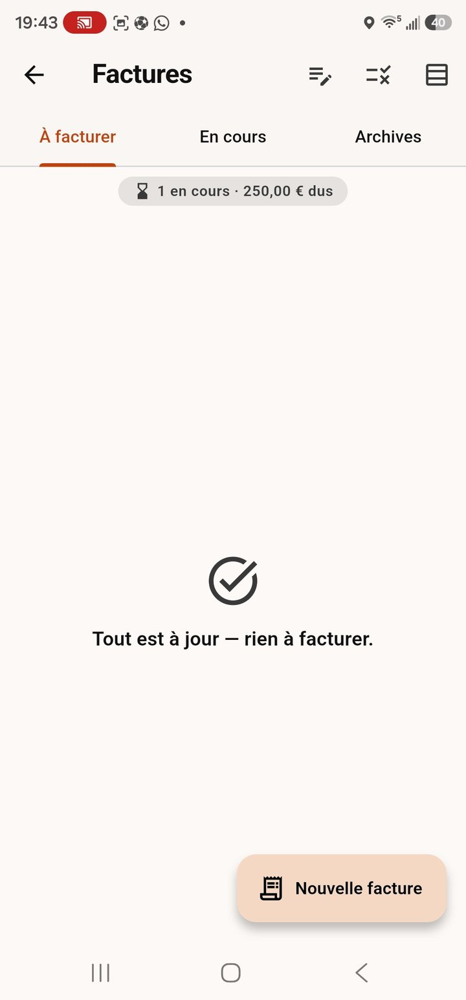 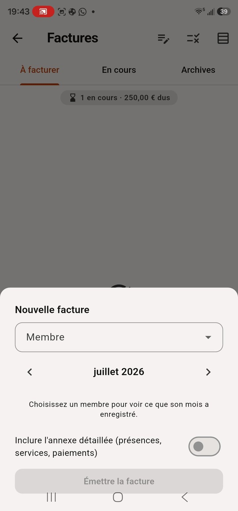

*Zu fakturieren ohne Rest und der Zusammenfassungs-Chip — und das Blatt Neue Rechnung: Mitglied, Monat, die abgeleiteten Positionen, der Schalter für den ausführlichen Anhang.*

### 11a. Rechtliche Identität, MwSt & Pflichtangaben

**Vor dem ersten Export die rechtliche Identität ausfüllen.** Unter *Workspace-Einstellungen → **Rechtliche Identität & E-Rechnung*** erklärt die Inhaberin:

- Das **MwSt-Regime** — es bestimmt die von EN 16931 verlangte Nummer: außerhalb der MwSt eine **Registernummer** (SIREN, HRB, CIF…); als Kleinunternehmer eine **USt-IdNr.** plus **Befreiungsgrund** (das Feld schlägt die passenden Formeln vor). Das Regime gilt durchgängig: nur ein steuerpflichtiger Space stempelt je einen Satz, unter jedem anderen Regime verschwinden die MwSt-Picker.
- Die strukturierte **Adresse** (Straße, PLZ, Ort).
- Die **E-Rechnungs-Plattform** (§11b).
- Die **Rechnungs-Pflichtangaben**, mit **Organisationstyp** — *Unternehmen* vs. *Verein (loi 1901)*: Rechtsform & Kapital, Register (Unternehmen: Handelsregister; Vereine: **RNA W… · SIRET falls vergeben**), Zahlungsbedingungen, Verzugszinsen, die **40-€-Beitreibungspauschale**, Skonto, Berufshaftpflicht, besondere Vermerke. Leere Klauseln drucken die gesetzliche Standardformel — Vereinsdokumente lassen die reinen B2B-Klausel-Defaults weg (was du eintippst, druckt trotzdem).

Mitglieder ergänzen ihr **Land** — und ihre USt-IdNr., wenn sie als Unternehmen fakturieren — neben ihrer Adresse unter *Einstellungen → Adresse*. DesKilo prüft alles **vor** der E-Rechnung und verweigert mit benanntem fehlendem Element.

**DesKilo-Preise sind brutto.** Was du als Preis eintippst, zahlt das Mitglied. MwSt einschalten ändert keinen geschuldeten Betrag — es sagt, wie viel davon Steuer ist. Unter einem steuerpflichtigen Regime sagt es der Katalog laut: jede Service- und Paket-Zeile nennt ihren enthaltenen Satz (*inkl. 19 % USt*), im Abrechnungs-Editor wählt der Eigentümer den USt-Satz des Tarifs (Standard: der Workspace-Standardsatz) und sieht beim Tippen den USt-Anteil jedes Betrags, jede Ausstattung kann ihren eigenen Satz tragen (Standard: der Workspace-Standardsatz), und jedes Preisfeld erinnert daran, dass es brutto ist.

**Sätze setzen.** *Rechtliche Identität → **MwSt-Sätze***. Leere Liste = MwSt aus. **Übliche Sätze verwenden** füllt Standard-, Zwischen- und ermäßigten Satz deines Landes — ein Entwurf, keine Steuerberatung. Ein Satz ist der **Standard** (Stern). Service und Paket tragen je ihren eigenen Satz. Entfernen löscht nie — referenzierte Sätze bleiben deaktiviert erhalten. All das ist der Funktionsschalter *USt-Verwaltung*: ausgeschaltet verschwinden Satz-Editor und alle Satz-Auswahlen, gespeicherte Sätze gelten weiter — die Steuer-Arithmetik selbst ist nie abschaltbar — und der Schalter *USt-Voranmeldungen* hängt darunter.

**Die periodische USt-Voranmeldung** (*MwSt-Sätze → Umsatzsteuer-Voranmeldung*, nur steuerpflichtige Spaces). Zeitraum wählen — Monat oder Quartal, was dein Regime verlangt — und **Erstellen**: die App aggregiert die ausgestellten Rechnungen des Zeitraums je Satz **mit exakt der Arithmetik der Rechnungen**, die Voranmeldung stimmt also mit jedem Dokument auf den Cent überein. Das Ergebnis zeigt Bemessungsgrundlage und USt je Satz, abgebildet auf die **Kennzahlen des amtlichen Formulars** (UStVA Kz 81/86 in Deutschland, CA3-Zeilen 08/09/9B/11 in Frankreich, generische Liste sonst). Jede Voranmeldung exportiert als **PDF** und **maschinenlesbares XML**; ist unter E-Rechnung eine Upload-Plattform konfiguriert, sendet **Übermitteln** sie elektronisch dorthin und protokolliert die Quittung — sonst die Zahlen in ELSTER/das Portal übertragen und **Als abgegeben markieren**. In beiden Fällen wird die Voranmeldung unveränderlich, mit Kanal und Beleg. Der Katalog vorgeschlagener Sätze deckt alle EU-Staaten, die Schweiz (samt 3,8 % Beherbergung), Norwegen und die kanadischen Provinzen ab; die USA haben keine Bundes-MwSt — die App sagt es, statt zu raten. Eine Abgabehilfe, keine Steuerberatung.

**Was es am Dokument ändert.** Eine danach ausgestellte Rechnung trägt die Aufschlüsselung wie ausgestellt: Satzspalte, Netto und eine Zeile je Satz. Die **E-Rechnung (XML)** trägt, was EN 16931 verlangt (UBL und CII); **SAF-T** deklariert jeden Satz; das **FEC** bucht brutto gegen netto plus ein **Umsatzsteuer**-Konto (445710, änderbar).

**Eine ausgestellte Rechnung ändert sich nie.** Braucht ein Dokument neue Zahlen: **fehlerhaft** markieren und **Ersatz** ausstellen — die Korrekturkette ist auf beiden sichtbar.

### 11b. Wohin die E-Rechnung muss (EU)

Die Aktion **E-Rechnung (XML)** öffnet ein Blatt, das es fürs Land des Space beantwortet: welcher Kanal für Geschäftskunden, ob eine Plattform dazwischen sitzt, welcher Kanal für öffentliche Käufer. Vier Modelle:

- **Peppol** — ein Access Point liefert an den Kunden; keine Staatsplattform dazwischen. Belgiens B2B-Mandat funktioniert so; Peppol erreicht öffentliche Käufer EU-weit (Richtlinie 2014/55/EU).
- **Zugelassene Plattformen** — Frankreich: eine *plateforme agréée* routet und meldet dem Fiskus. Öffentlicher Sektor bleibt **Chorus Pro**.
- **Clearance** — Italien (**SdI**), Polen (**KSeF**), Rumänien (**RO e-Factura**): die Plattform empfängt *zuerst*; jede verlangt eigene Syntax — das Blatt warnt, dass die EN-16931-Datei nicht die ihre ist; für Peppol, öffentliche Käufer und Auslandskunden nutzen, konvertieren lässt die Plattform oder die Buchhaltung.
- **Kein Kanalzwang** — Deutschland heute: Empfang seit 2025 Pflicht, Ausstellung phasenweise; E-Mail-Anhang ist legal; XRechnung und ZUGFeRD erwartet. Öffentlich: **OZG-RE / ZRE** oder Peppol.

**Factur-X — eine Datei, beide Leser.** Das Blatt bietet zuerst **Factur-X (PDF)**: ein normal aussehendes Rechnungs-PDF mit der Maschinenrechnung *darin* (EN-16931-Daten als CII). Der Mensch sieht die Rechnung, die Plattform findet `factur-x.xml`. Das nackte **XML** bleibt darunter verfügbar.

**Senden, ohne die App zu verlassen.** Die Inhaberin registriert die Plattform unter *Rechtliche Identität → **E-Rechnungs-Plattform***: **Upload-URL**, **Token/Kennung**, bei Bedarf **Authorization-Header** und **Dateifeldname**. Jede Plattform mit Credential-Upload geht. Der Token bleibt serverseitig. Danach führt das Blatt mit **An die Plattform senden**: das Factur-X-Dokument geht direkt raus; das Detailblatt protokolliert Abgang, Antwort und zurückgegebene ID. Jeder Versuch wird geloggt.

**Eine zweite Strecke, direkt zum Kunden.** Die staatliche Plattform zu erreichen heißt nicht, den Käufer erreicht zu haben, und etliche Kunden betreiben ihren eigenen Empfangsdienst. Derselbe Bildschirm nimmt darum ein **zweites Ziel** entgegen — den Endpunkt des Kunden, mit eigener URL, eigenem Token, eigener Authorization-Header-Form und eigenem Dateifeldnamen —, und das Versandblatt bietet danach beide Strecken an, jede mit ihrer eigenen Übertragungshistorie. Das fährt auf der Funktion **E-Rechnungszustellung an Kunden** unter *Rechnungen*; bleibt sie aus, gibt es allein die Plattform-Strecke, genau wie bisher.

**Proben ohne Risiko.** Derselbe Bildschirm nimmt **Testumgebungen** (UAT/Dev: je URL + Token). Mit aktivem **Entwicklermodus** bietet der Versand die Umgebungswahl; ein Test wird als solcher markiert; die Produktions-URL dient nie einer Probe.

DesKilo überträgt nichts auf eigene Rechnung: es produziert das Dokument und übergibt es deiner Plattform. Mandatskalender bewegen sich: prüfe deine Steuerverwaltung.

### 11c. Der Report-Editor — jedes Dokument, vier Vorlagen, fünf Sprachen

Die **Rechnungs-PDF-Vorlage** (Stift in der Kopfzeile, oder *Workspace-Einstellungen*) ist ein Banden-Reporting für jedes gedruckte Dokument. Drei **Banden** rendern aufs PDF — Kopf, Körper (die Rechnungszeilen), Fuß — das E-Rechnungs-XML bleibt unberührt.

- **Ein Report je Dokument**: Chips wechseln zwischen **Rechnung · Proforma · Abrechnung · Vereinbarung · Zahlungen · Space · Mahnstufen**. Die Proforma fällt auf die Rechnungsbanden zurück; eine angepasste Abrechnung ersetzt das eingebaute Monats-PDF.
- **Je Sprache**: eine zweite Chip-Reihe — *Standard (alle Sprachen)* · EN · FR · DE · ES · IT — speichert eine Übersetzungs-Schicht je Dokument; der Report eines Mitglieds druckt in *seiner* Sprache, wenn eine Vorlage existiert.
- **Markup oder Visuell**: **Markup** editiert die Banden als Text — [Liquid](https://shopify.github.io/liquid/)-Bedingungen und -Schleifen (`{{ number }}`, `…`, `…`) plus einfaches Zeilen-Markup: `#` Titel, `##` Abschnitt, `>` Kleindruck, `---` Trenner, `a | b` Tabellenzeile, `=` Fettzeile, `::: … ||| … :::` Spalten nebeneinander (der Verkäufer-links/Kunde-rechts-Block und die rechtsbündigen Summen einer französischen Facture), `![name]` ein Bild aus der **Bildbibliothek** (*Bild einfügen*). **Visuell** ist eine seitentreue Design-Fläche in der Tradition der Profi-Tools (Crystal Reports, Docentric): die drei Banden werden **auf einer weißen A4-Seite** an den Rändern des Dokuments editiert, in seiner exakten Druck-Typografie — gleiche Schrift, Größen, Farben und rechtsbündige Betragsspalten wie das erzeugte PDF — mit benannten Bandleisten, gestrichelten Seitenumbruch-Hilfslinien und Zoom (anpassen, 75/100/150 %). `{{ Tokens }}` bleiben markiert; Zeile antippen zum Editieren, hinzufügen, verschieben, Datenfelder aus der Palette einfügen. Ein **Entwurf ↔ Vorschau**-Schalter mischt die ungespeicherten Banden mit echten (oder Beispiel-)Daten durch die echte Engine auf derselben Seite — Felder raus, Werte rein.
- **Vorlagen-Galerie** (*Vorlagen*): vier fertige Presets je Dokument — **Klassisch · Einfach · Detailliert · Formeller Brief**. Jedes Rechnungs-Preset trägt schon die Pflichtangaben (§11a).
- **Schnellansicht** rendert sofort in der App — deine neueste Rechnung, oder simulierte Beispieldaten (*Beispieldaten*-Wasserzeichen) — ohne PDF-Umweg; **Vorschau** erzeugt das PDF; **Auf Standard zurücksetzen** liefert das eingebaute Layout als Arbeitsbeispiel. Eine kaputte Vorlage blockiert nie ein Dokument; Storno-Wasserzeichen, Signatur, Anhang und Seitenzahlen bleiben fix.

Variablen (Rechnungsfamilie): `{{ number }}`, `{{ member }}`, `{{ workspace }}`, `{{ workspace_address }}`, `{{ period }}`, `{{ issued }}`, `{{ issued_by }}`, `{{ replaces }}`, `{{ total }}`, `{{ charges }}`, `{{ payments }}`, `{{ voided }}`, `{{ proforma }}`, `{{ copy }}`, `{{ lines }}` (je mit `label`, `unit_price`, `qty`, `net`, `vat_rate`, `amount`), `{{ has_vat }}`, `{{ vat }}`, `{{ net_total }}`, `{{ vat_total }}`, `{{ credit_note }}`, `{{ refund_total }}` — und der Rechts-Satz: `{{ seller_legal_form }}`, `{{ seller_registration }}`, `{{ seller_vat_id }}`, `{{ seller_legal_id }}`, `{{ exemption_reason }}`, `{{ client_address }}`, `{{ client_vat_id }}`, `{{ client_legal_id }}`, `{{ payment_terms }}`, `{{ late_penalty }}`, `{{ recovery_indemnity }}`, `{{ escompte }}`, `{{ insurance }}`, `{{ special_mentions }}`.

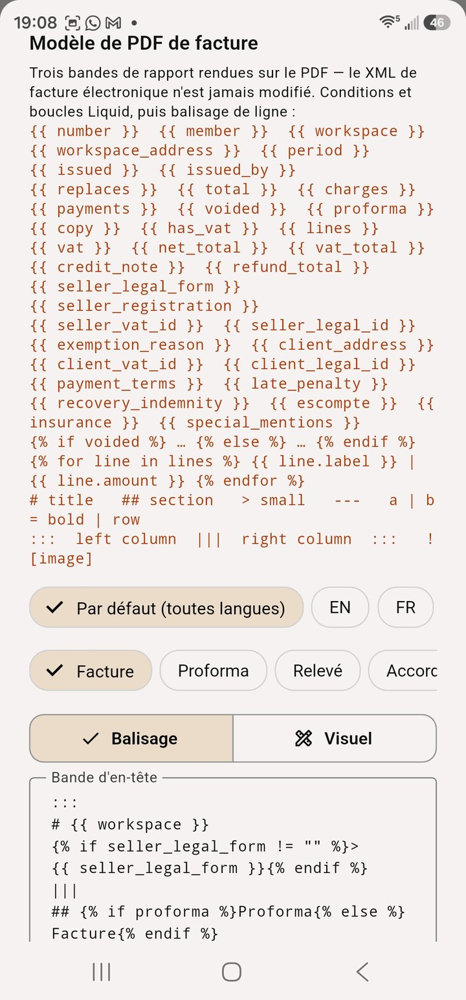

*Der Markup-Modus: die drei Banden als Text, die Variablenlegende, die Chips pro Dokument und pro Sprache.*

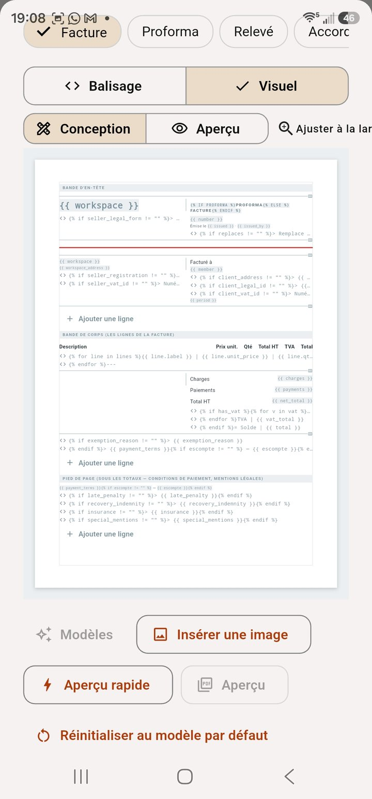 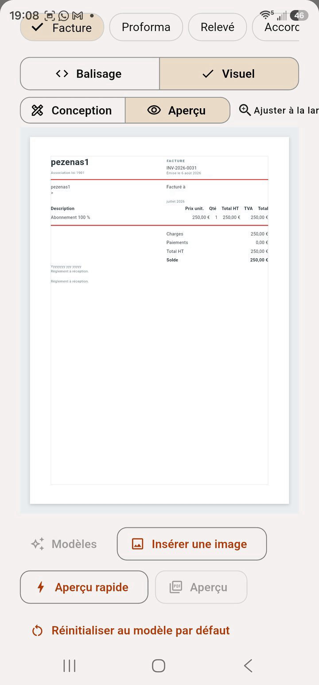

*Der visuelle Modus — Entwurf editiert beschriftete Bänder auf der echten A4-Seite; Vorschau mischt die ungespeicherten Bänder mit echten Daten durch die echte Engine.*

### 11d. Die Report-Suite & die Dokumentbibliothek

- **Finanzvereinbarung** — jeder für ein Mitglied geltende Preis: Abo, Extra-Halbtag, Services, Pakete, Zubehör-Aufpreise und die Ganzraum-Preise, **Tische und Schreibtische eingeschlossen**. Inhaber/Admins senden sie vom Verwaltungsblatt; jedes Mitglied holt seine unter *Finanzen → Dokumente*.
- **Zahlungsbericht** — alles, was du in einem Monat gezahlt, erklärt oder validiert bekommen hast: deine kleine Bilanz, Selbstbedienung.
- **Space-Bericht** — Identität, Plan-Zählungen, Verfügbarkeit, Funktionen und Preise: *Workspace-Einstellungen → Space-Bericht*.
- **Dokumentbibliothek** — *Einstellungen → Dokumente*: Satzung, Leitfäden, Abschlüsse, Protokolle — VERLINKT aus dem System, das du schon nutzt: Google Drive, OneDrive, SharePoint, Dropbox, Nextcloud oder jeder https-Link (der Drive verwaltet seine Zugriffe; die App speichert nie fremde Zugangsdaten). Jeder Eintrag hat eine **Sichtbarkeitsrolle**: jedes Mitglied, Admins & Inhaber, nur Inhaber — serverseitig erzwungen. Kuratiert per + ; die Funktion *Dokumentbibliothek* schaltet alles.

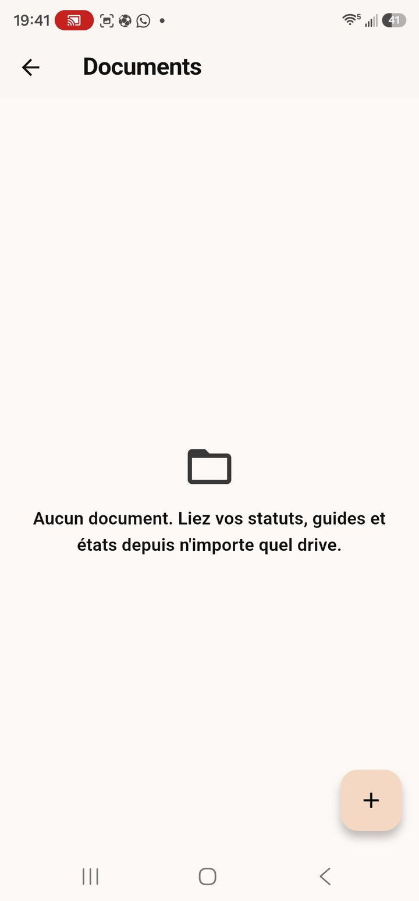 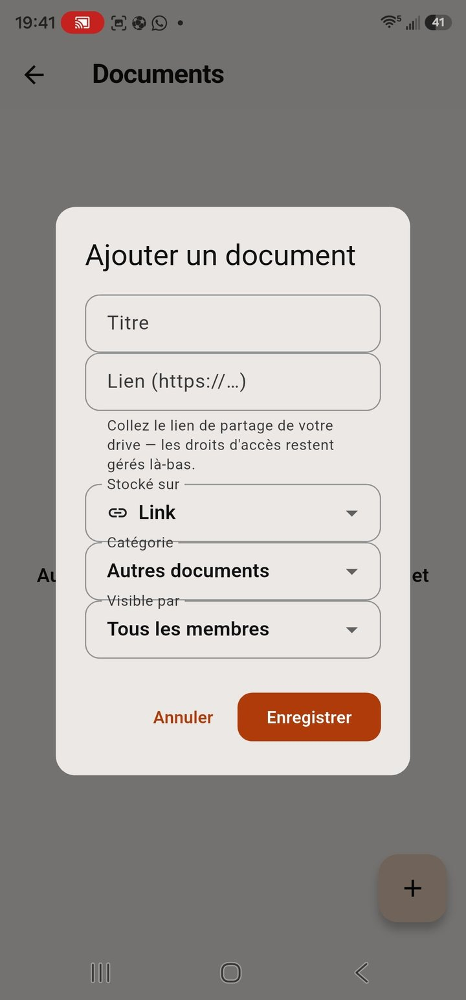

*Die Dokumentenbibliothek und das Hinzufügen eines Dokuments: Titel, Link, Speicherort, Kategorie, sichtbar für.*

### 11e. Automatische Zahlungserinnerungen

Mit **Automatische Zahlungserinnerungen** (Funktionen, Kind von *Zahlungserinnerungen*) und dem Schalter **Automatische Mahnungen** in den Mahnregeln (Rechnungen → Mahnregeln) wenden sich die Mahnstufen von selbst an: jeden Morgen — und immer, wenn ein Inhaber oder Admin Finanzen öffnet — erhält eine **offene** Rechnung, deren Wartezeit abgelaufen ist (die *Tage bis zur ersten Mahnung* ab Ausstellung, dann die *Tage zwischen Mahnungen* nach der vorigen), ihre nächste Stufe. Das Mitglied sieht einen Hinweis **Zahlungserinnerung** unter Ereignisse („Mahnstufe 2: Rechnung X — Betrag noch offen“) und bekommt eine Push-Nachricht; seine Ansicht Rechnungen liest *überfällig seit N Tagen*. Stufen überschreiten nie die eingestellte Zahl; eine zugeordnete Rechnung wird nie gemahnt; Schalter aus, bleibt Mahnen ein manueller Schritt wie bisher.

### 11f. Rechnungen zusammenfassen (Abrechnung)

**Ein Dokument statt drei.** Ein Mitglied im geteilten Abrechnungszyklus (§11) kann zugleich eine Abonnementrechnung, eine Monatsendrechnung und den Rest des Vormonats halten. **In eine Rechnung zusammenfassen** (Zusammenführen-Icon in der Kopfzeile Rechnungen, Funktion *Rechnungen zusammenfassen*) faltet die offenen, unbezahlten Rechnungen eines Mitglieds in eine **Abrechnungsrechnung** mit ihrer Summe. Die Quellen werden **nicht storniert**: sie bleiben im Archiv genau wie ausgestellt, jede zeigt auf die Abrechnung, die nun ihren Saldo trägt, und die Abrechnung listet jede Quelle mit ihren Positionen. Von da an wird die Abrechnung geschuldet, bezahlt und gemahnt; eine Quelle kann nicht mehr allein storniert, ersetzt oder zugeordnet werden. Die MwSt wird nicht neu ausgewiesen — jede Quelle hat ihre Steuer bereits erklärt, die Zeilen der Abrechnung tragen 0 % und nennen die Rechnungen, die sie tragen.

**Validiert wie jede Zahlung.** Eine Abrechnung ist ein Ereignis *Rechnungszahlung*: wo die Inhaberin eine Regel auf diese Domäne gelegt hat (§7), wartet sie auf die Prüfer; eine **Ablehnung** — oder ein Verfall — storniert das Abrechnungsdokument und gibt seine Quellen frei, die wieder einzeln geschuldet sind. **Stornieren** einer Abrechnung (*Als fehlerhaft markieren*) gibt ihre Quellen ebenso frei.

## 12. Einstellungen & Profil

Dein persönlicher Bildschirm, von oben nach unten:

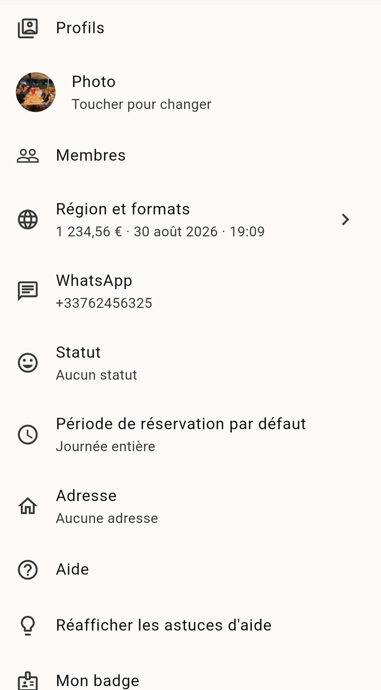

*Der persönliche Block: Profile, Foto, Region & Formate, WhatsApp, Status, Standard-Buchungszeitraum, Adresse, Hilfe, Badge.*

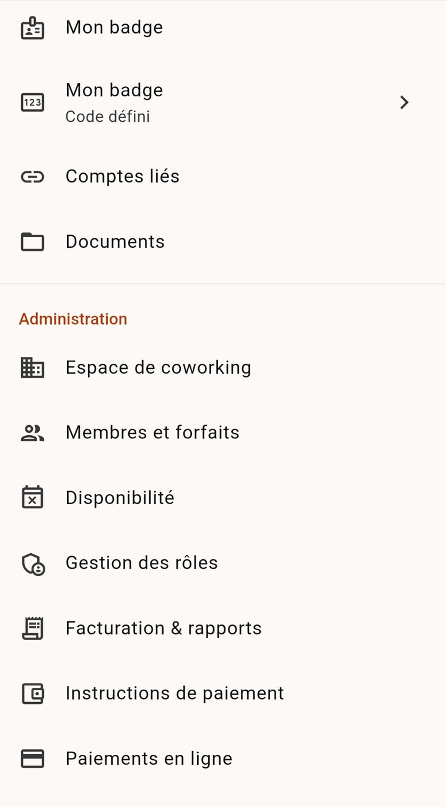

*Für Inhaber folgt der Abschnitt Administration — jeder Admin-Bildschirm aus §8 beginnt hier.*

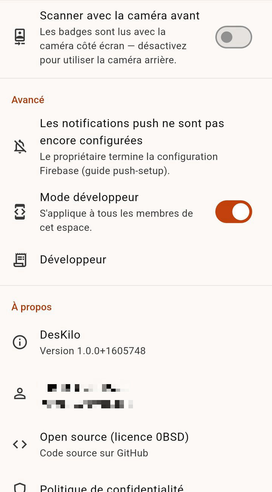

*Einstellungen und Erweitert: Sprache, Design, Frontkamera-Scan, Push-Status, Entwicklermodus.*

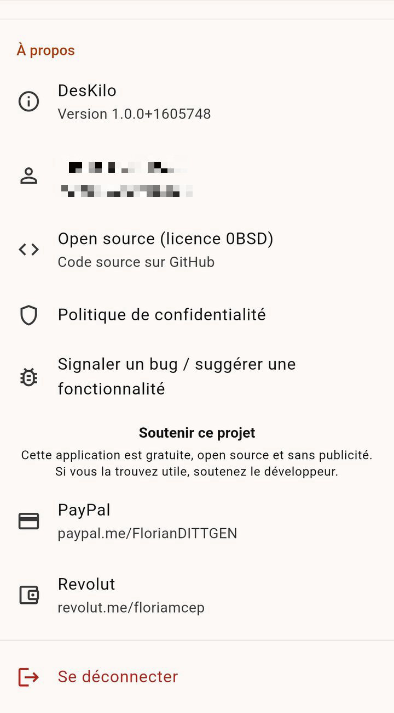

*Über: Version, Autor, die Open-Source-Lizenz, die Datenschutzerklärung, Fehlermeldungen und wie man das Projekt unterstützt.*

 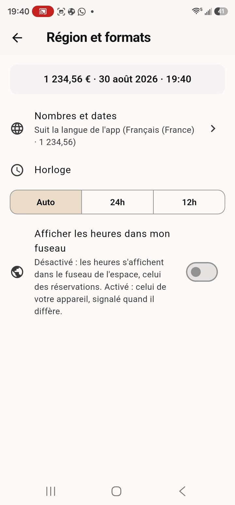  

*Vier der persönlichen Bildschirme: Profile, Region & Formate, Verknüpfte Konten und die Sprachauswahl.*

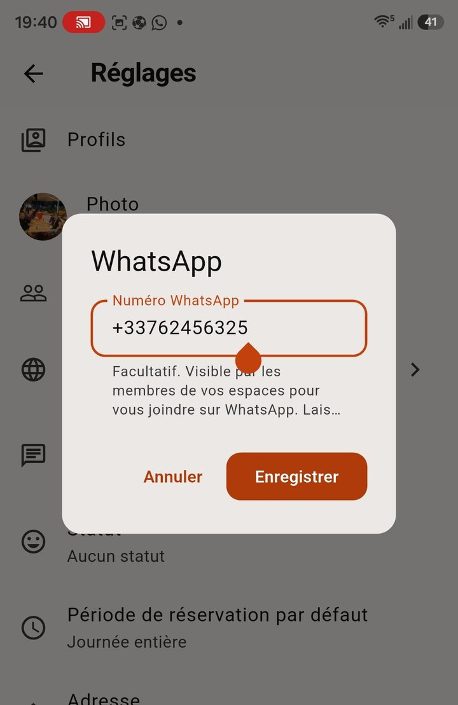 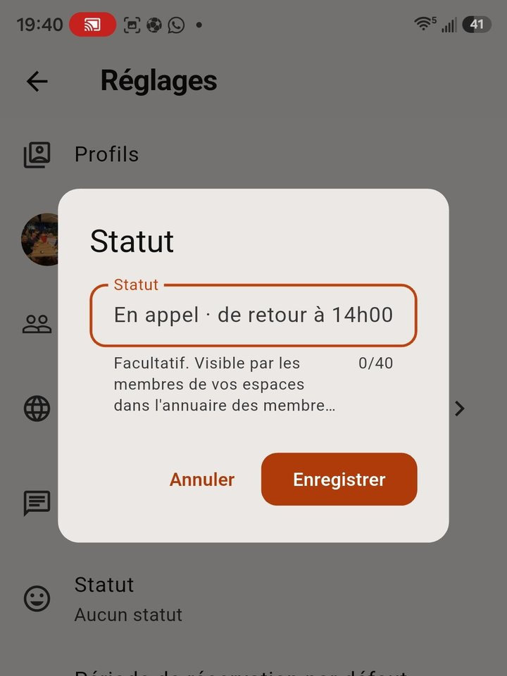 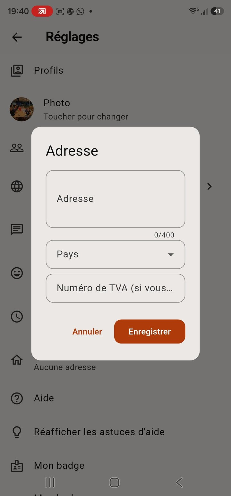 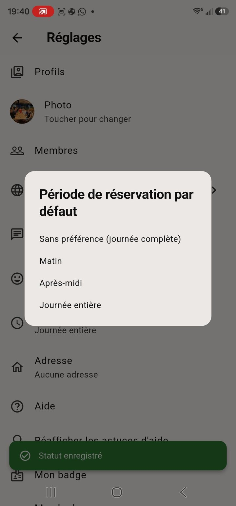

*Die vier persönlichen Dialoge: WhatsApp-Nummer, Statuszeile, Postadresse, Standard-Buchungszeitraum.*

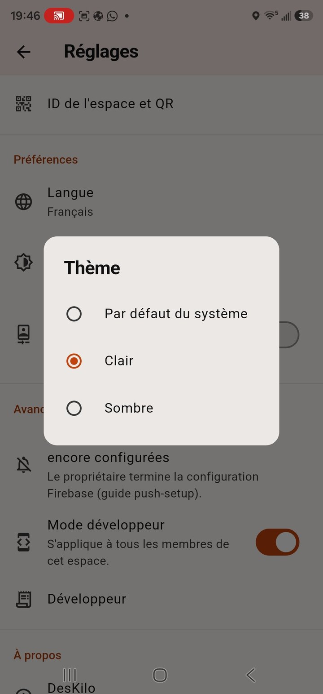 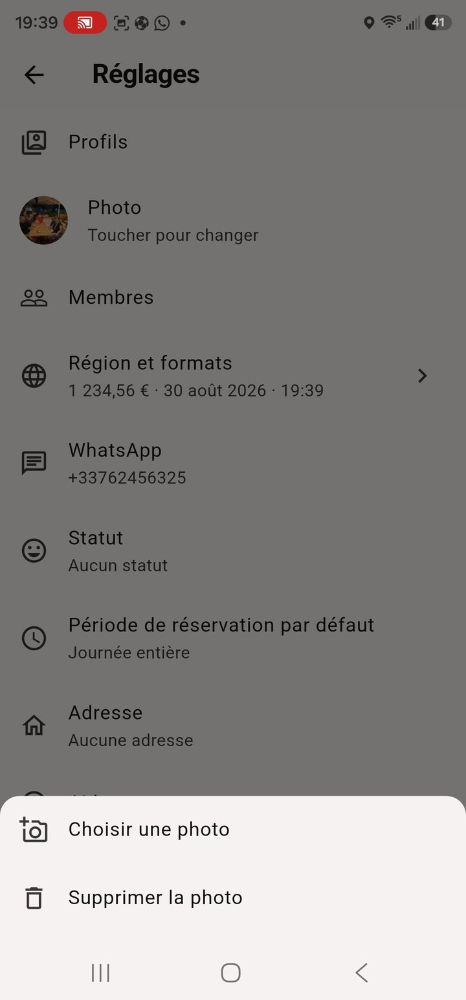 

*Design, das Foto-Blatt und der Entwickler-Trace-Bildschirm.*

Der ganze Einstellungsbildschirm in einem Bild

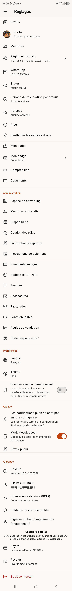

**Datenschutz & Daten (#719)** — wer deine Daten sehen kann, wer es tat, Export, Löschung, die Richtlinie. Siehe §14.

**Region & Formate (#711).** Wie *du* liest, was der Bereich zeigt: **Zahlen & Daten** in einer Region deiner Wahl (`de_CH`, `en_GB`, `de_AT` … unabhängig von der App-Sprache), die **Uhr** (24 h, 12 h oder was die Region tut) und ob Zeiten in der **Zone des Bereichs** erscheinen — der, in der gebucht wird, und der Standard — oder in **deiner Gerätezone**, gekennzeichnet, wo beide abweichen. Eine Vorschauzeile zeigt, was die drei Wahlen ergeben. Die Währung bleibt die des Bereichs; nur ihre Schreibweise ist deine. Auf deinem Profil gespeichert, also auf jedem Gerät gleich.

- **Profile** (§1) und dein **Foto** (antippen — wählen oder entfernen).
- **Mitglieder** — Abkürzung ins Verzeichnis; **WhatsApp** — deine Nummer, nur sichtbar, wenn du sie einträgst; **Status** — eine freie Zeile (40 Zeichen) im Verzeichnis; **Adresse** — deine Postadresse (auf deinen Rechnungen), Land und optionale USt-IdNr.
- **Hilfe** — das eingebaute Handbuch, in deiner Sprache; **Mein Badge** (§8); **Verknüpfte Konten** — Google-Anmeldung ans E-Mail-Konto hängen; **Dokumente** — die Dokumentbibliothek (§11d).
- **Präferenzen** — **Sprache** (Systemstandard oder eine von fünf), **Thema** (System / Hell / Dunkel), **Standard-Buchungszeitraum** (das Fenster, mit dem die Buchungsblätter öffnen, damit dein üblicher Halbtag oder dein Von–Bis schon eingetragen ist), **Mit der Frontkamera scannen** (für Wandtablets) und **Hilfe-Hinweise wieder anzeigen** — das holt jeden ausgeblendeten Kontext-Tipp zurück. Diese Tipps sind kleine Karussells auf den Formularen selbst: mehrere Hinweise je Bildschirm, vor- und zurückwischbar, jeder mit einem *Mehr erfahren*-Link, der direkt in den passenden Abschnitt dieses Handbuchs springt. Auch deine WhatsApp-Nummer und der Schalter *Nachrichten auf WhatsApp erhalten* wohnen auf diesem Bildschirm (§6).
- **Erweitert** — der Push-Status dieses Geräts, der workspace-weite **Entwicklermodus** und der **Entwickler**-Trace-Bildschirm (§8 Zahlungen).
- **Über** — die App-Version, der Autor (Florian DITTGEN), die Open-Source-Lizenz (0BSD) mit dem Code auf GitHub, die Datenschutzerklärung, ein Link zum Fehlermelden, und wie man **das Projekt unterstützt** (PayPal, Revolut).
- **Abmelden**.

### Dein eigener Server — die App auf das Supabase deiner Community richten

Standardmäßig spricht die App mit ihrem eigenen Server, und hier musst du dich um nichts kümmern. Aber das Backend von DesKilo ist Teil des Quellcodes — das Schema, die Row-Level-Security-Richtlinien und die Edge Functions —, also kann eine Community **ihr eigenes Supabase-Projekt** betreiben und jedes Byte darauf behalten. **Einstellungen → Erweitert → Server** stellt dieses Gerät um, ganz ohne neuen App-Build:

1. **Ein Projekt anlegen** auf supabase.com — die kostenlose Stufe reicht zum Start.
2. **Das Schema installieren**: führe die SQL-Dateien aus `supabase/migrations` des Quell-Repositorys der Reihe nach aus.
3. **Die Zugangsdaten kopieren**: im Supabase-Dashboard liegen unter *Project Settings → API keys* die **Project URL** und der **Publishable Key** (der Publishable Key ist dafür gemacht, in einer Client-App mitzureisen; was die Daten schützt, ist die Row-Level Security auf dem Server).
4. **Eintragen** unter Einstellungen → Server — füge jedes Feld ein, drücke **Verbindung testen**, dann **Speichern**.

Der Test sagt dir, welcher Teil nicht stimmt, statt einfach fehlzuschlagen: *diese Adresse war nicht erreichbar*, *der Key wurde abgelehnt* oder *die Tabellen fehlen* — Letzteres heißt, das Projekt hat geantwortet, aber Schritt 2 ist noch nicht erledigt.

**Mitglieder tippen davon nichts ein.** Sobald das Gerät der Inhaberin auf dem Server der Community läuft, zeigt die **QR-Schaltfläche** auf diesem Bildschirm einen Code; jedes Mitglied scannt ihn in seinen eigenen Einstellungen → Server und landet auf derselben Instanz.

Das Umstellen meldet dich ab und greift beim nächsten Öffnen der App — die Sitzung gehörte zum anderen Server. **Server der App verwenden** kehrt jederzeit zum Standard zurück.

## 13. Benachrichtigungen

Check-in-Erinnerungen, offene Bestätigungen, Ausgaben-Entscheidungen — und wenn ein Admin **eine deiner Buchungen entfernt** (übersteuern), werden du und die Admins benachrichtigt. Zustellung lokal zuerst; Server-Push kommt fertig auf Android, iPhone/iPad, Browser und macOS (Firebase Cloud Messaging) — *Einstellungen → Erweitert* zeigt den Gerätestatus. Das Icon-Badge zählt offene Bestätigungen **plus ungelesene Nachrichten** — Android, iPhone/iPad, macOS-Dock, Windows-Leiste, installierte Web-Apps. Mitglieder-Nachrichten werden **einmal je Gerät mit Absender und vollem Text** angesagt — auch was bei geschlossener App kam. Diese Ansage erzeugt immer **die App selbst, lokal**: das Push-Payload trägt nie einen Namen, eine Uhrzeit oder ein Wort der Nachricht (§6) — was über das Netz geht, sagt nur, dass etwas angekommen ist.

## 14. Datenschutz

**Einwilligung (#751).** Beim ersten Öffnen der App durch ein Konto — und erneut, sobald sich dieser Text ändert — zeigt ein Einwilligungsbildschirm alles: was verarbeitet wird, was nie getan wird, wer was sehen kann, wer verantwortlich ist, wie lange, Ihre Rechte und wo Sie es nachlesen. Nichts anderes ist erreichbar, bis Sie *Ich habe das gelesen und akzeptiere* ankreuzen — die Zustimmung (Version und Datum) wird auf Ihrem Konto gespeichert und folgt Ihnen über Geräte hinweg. Jederzeit nachlesbar unter **Einstellungen → Datenschutz & Daten → Ihre Daten, Ihre Rechte**, hier in der Hilfe oder im Projekt-Wiki.

Minimale Daten: Name, E-Mail, Plan, Buchungen, Konto. Du kontrollierst Foto, Status und Nummern-Sichtbarkeit; auf dem Plan zeigt ein Platz von dir eine Initiale oder dein Foto, wo die Inhaberin Mitgliederfotos aktiviert hat. Badges liegen nur als Hashes — ein verlorenes wird widerrufen, nicht erraten. Kein Tracking, keine Fremd-Analytik. Finanzhistorie wird bei Kontolöschung anonymisiert, nicht gelöscht (Aufbewahrungspflicht).

**DSGVO (#719).** DesKilo ist für die Datenschutz-Grundverordnung gebaut: Daten in der EU, kein Tracking, keine Analytik, Zugriff nach Rolle und serverseitig durchgesetzt, und vier Rechte, die du selbst unter **das Schild-Symbol oben in der Leiste (Datenschutz & Daten)** ausübst: **wer meine Daten sehen kann** (die Regel je Kategorie und die Personen, die sie gerade nennt), **wer auf meine Daten zugegriffen hat** (ein vom Server geschriebenes Protokoll jeder Einsicht in deine Finanzen oder Nachrichten durch andere — nie umgehbar), **meine Daten exportieren** (eine JSON-Datei, Art. 20) und **mit Löschung austreten** (Art. 17: Buchungen storniert, Nachrichten geleert, Profil gelöscht; Buchhaltungsbelege bleiben für die in der Richtlinie genannte gesetzliche Frist, referenziert über eine ID, nicht einen Namen). Nachrichten lesen nur die Personen der Unterhaltung, unabhängig von der Rolle; Rechnungen und Zahlungen nur du und Inhaber der Finanz-Berechtigung.

## 15. Plattformen

Android (Google Play), iPhone/iPad, Desktop — **macOS** (DMG: DesKilo in Programme ziehen) und **Windows** (MSI-Installer) aus jedem Release — und der **Browser**: dieselbe App, nichts zu installieren. Deine Daten folgen deinem Konto.

Der Browser kann mehr, als man erwartet: **Web NFC funktioniert** in Chromium-Browsern unter Android über HTTPS — so lässt sich ein Stuhl-Tag vom Telefon-Browser aus einrichten — die installierten **Android- und iPhone-Apps lesen Tags direkt**, meist der bequemere Weg. Was er nicht kann, ist wie der Kiosk per Kamera einen QR-Code scannen. Alles andere — Plan, Buchungen, Mitglieder, Geld, Rechnungen, PDFs — ist dieselbe App. Beim ersten Start des macOS-DMG: Rechtsklick → *Öffnen* (die Build ist noch nicht von Apple notariell beglaubigt).

## 16. Nachrichten
Der Tab **Nachrichten** ist die Messaging-Zentrale Ihres Bereichs: alle Unterhaltungen in einer Liste, die neueste oben, Personen und Gruppen gemeinsam. Eine Zeile zeigt die letzte Nachricht, die Uhrzeit und die Anzahl ungelesener. Tippen Sie auf den **Stift**, um eine neue zu beginnen.

**Person oder Gruppe, ein Blatt.** Wählen Sie eine Person für einen privaten Chat; wählen Sie zwei oder mehr und ein **Namensfeld erscheint** — das ist eine Gruppe. Der Name ist **in Ihrem Bereich eindeutig**, niemand muss raten, welchem *Team* er schreibt; ist er vergeben, sagt die App es und Sie ändern ein Wort.

**Auf einen Blick unterscheidbar.** Eine Person zeigt ihr Foto im Kreis. Eine Gruppe zeigt ein **eckiges Abzeichen** mit Gruppensymbol und — solange niemand geschrieben hat — ihre Mitgliederzahl.

**In einer Unterhaltung.** Nachrichten stehen von alt nach neu als Sprechblasen, mit Emojis und aktiven **Verweisen**: ein Reservierungslink öffnet die Reservierung, ein Bereichslink dessen Buchungsblatt, jeweils mit *Auf dem Plan zeigen*. Das Eingabefeld sitzt darunter. **Lange auf eine Blase tippen, um sie zu löschen**, mit Rückfrage. Ihre eigenen Nachrichten tragen einen Haken: **grau = zugestellt**, **blau = gelesen**.

**Tippen Sie oben auf den Namen.** In einem privaten Chat öffnet das **Profil** der Person — die heutige Buchung, ob sie eingecheckt ist, ihr Status und wie man sie erreicht. In einer Gruppe öffnet es die **Mitgliederliste**, in der ein Gruppen-Admin Personen hinzufügt oder entfernt und jeder austreten kann. Ein Austritt lässt eine Gruppe nie ohne Admin zurück.

**Die Suche** (die Lupe) sucht an drei Stellen: **Personen**, **Gruppen** und die **Wörter in Nachrichten**. Ein Treffer bringt Sie direkt zur Person, zur Gruppe oder zur Nachricht.

**Keine Fotos, keine Dateien.** Nachrichten tragen Text, dazu Verweise auf eine Reservierung oder einen Bereich. Das ist Absicht: eine Coworking-App ist kein Dateispeicher.

**Benachrichtigungen.** Eine *empfangene* Nachricht meldet sich und zählt auf dem Tab **Nachrichten**; das Öffnen der Unterhaltung setzt den Zähler zurück. Nachrichten erscheinen nicht mehr in der Glocke — die ist für Bestätigungen und Ereignisse. Einzige Ausnahme: eine **Rundnachricht an alle Admins**, die keine Unterhaltung hat und dort bleibt.

*Die Unterhaltungsliste: Personen und Gruppen gemeinsam, Ungelesen-Zähler, der Stift für eine neue.*

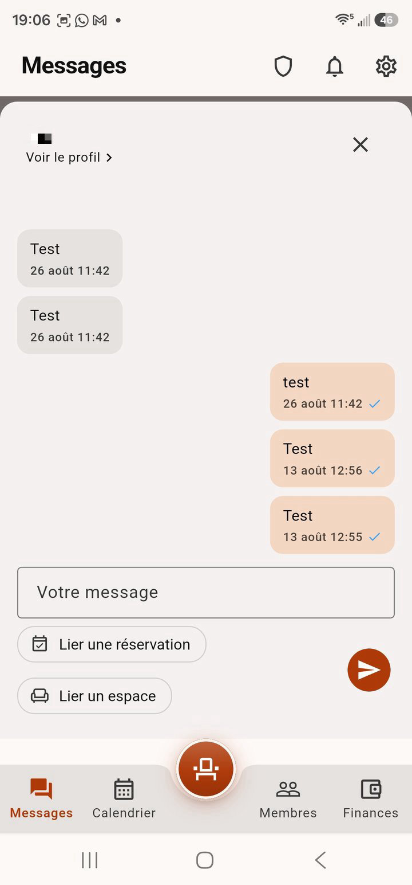

*Ein privater Chat: Sprechblasen von alt nach neu, die grauen/blauen Lesebestätigungen auf den eigenen Nachrichten.*

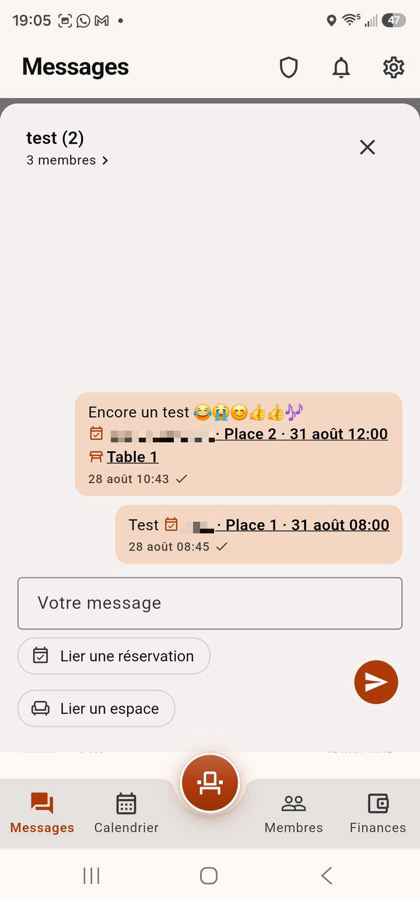

*Eine Gruppennachricht mit einem Reservierungs- und einem Raum-Link — beide aktiv, beide mit dem Sprung „Auf dem Plan zeigen".*
