# Benutzerhandbuch

**DesKilo — Ihr Raum, gemeinsam genutzt.** *Andere Sprachen: [English](User-Guide) · [Français](Guide-utilisateur) · [Español](Guia-de-usuario) · [Italiano](Guida-utente).*

<!-- anchor: user.guide.about -->
## Ein Coworking-Space, geführt von denen, die ihn nutzen

Stellen Sie sich einen Raum vor, in dem Freiberufler, Macherinnen und kleine Teams Tische, einen Wasserkocher und ein WLAN-Passwort teilen — und in dem nur drei Fragen zählen: *Wo kann ich heute sitzen, was schulde ich, und wer muss zustimmen?* DesKilo beantwortet diese drei Fragen für Gemeinschaften, die ihren eigenen Raum betreiben.

- **Wissen, wo man sitzen kann.** Ein lebendiger Raumplan, Buchungen für halbe Tage oder Stunden, Ein- und Auschecken, ein gemeinsamer Kalender.
- **Wissen, was man schuldet.** Ein ehrliches Konto pro Mitglied: Beitrag, zusätzliche Tage, gemeinsame Ausgaben, Zahlungen, Abrechnungen und Rechnungen — dieselben Zahlen für das Mitglied und für die Person, die den Raum führt.
- **Auf Ihre Art.** Rollen, Freigaben, Öffnungszeiten, Preise, Wortlaut und Farben legen Sie selbst fest, in wenigen Bildschirmen, ohne Vermieterplattform dazwischen.
- **Teil eines Netzwerks sein.** Ein persönliches Konto begleitet Sie in jeden Raum, dem Sie beitreten; Räume, die gefunden werden wollen, veröffentlichen eine Seite, und Menschen können sich privat schreiben.

DesKilo ist freie Software (AGPL-3.0). Es läuft auf Telefon, Tablet, Computer und im Browser, spricht Deutsch, Englisch, Französisch, Spanisch und Italienisch und hält die Daten Ihrer Gemeinschaft portabel: Nutzen Sie den gehosteten Dienst oder betreiben Sie das Backend selbst.

<!-- anchor: user.guide.start-your-own -->
## Einen eigenen Raum gründen

Für den Anfang brauchen Sie kein Gebäude, keinen Businessplan und kein IT-Team. Ein paar Schreibtische im Hinterzimmer, der Sitzungsraum eines Vereins, zwei Etagen über einem Café: Wo Menschen zum Arbeiten zusammenkommen, gibt DesKilo ihnen einen buchbaren Plan, Regeln, auf die sie sich einigen, und ein Konto, das niemand mehr in einer Tabelle führen muss.

In etwa zwanzig Minuten haben Sie einen Raum, dem man beitreten kann: einen Namen, einen Plan, Öffnungszeiten und jemanden, der zustimmt. Geld, Rechnungen, ein Kiosk an der Tür und ein eigener Look kommen später — wenn Sie sie wollen, in der Reihenfolge, die Ihnen passt. Probieren Sie zuerst alles im Demo-Arbeitsbereich aus, der niemandem gehört und nichts kostet, und folgen Sie dann der [Einrichtungsanleitung](Einrichtungsanleitung#so-nutzen-sie-diese-anleitung) vom ersten Schritt bis zur ersten Buchung.

> **Tipp** Öffnen Sie die Demo, wechseln Sie zwischen Inhaberin, Administrator und Mitglied und buchen Sie einen Schreibtisch. Zehn Minuten dort sagen mehr als jede Beschreibung.

<!-- anchor: user.guide.join -->
## Beim Projekt mitmachen

DesKilo entsteht offen, in einer kleinen Gemeinschaft, und es ist Platz für Sie:

- **Ausprobieren und uns sagen, was auffällt.** Installieren Sie die App (die Web-App braucht nichts; der geschlossene Android-Test und die iPhone-Beta über TestFlight stehen Testern offen) und berichten Sie, was Sie überrascht.
- **Ihr Wissen teilen.** Wer einen Coworking-Space betreibt, lernt Dinge, die kein Entwickler kennt. Sagen Sie uns, was Ihre Gemeinschaft braucht und was im Weg stand.
- **Die Anleitungen übersetzen und verbessern.** Dieses Handbuch und die Einrichtungsanleitung sind Textdateien in fünf Sprachen, mit Screenshots, die ein einziger Befehl neu aufnimmt; eine Korrektur ist eine kleine Änderung.
- **Mitbauen.** Code, Roadmap und offene Issues sind öffentlich, samt den Konventionen, die neue Mitwirkende brauchen.
- **Hosten.** Betreiben Sie ein eigenes Backend für Ihre Gemeinschaft oder bitten Sie um die Nutzung des Referenz-Deployments.

[Das Projekt auf GitHub](https://github.com/fdittgen-png/deskilo) · [Web-App öffnen](https://fdittgen-png.github.io/deskilo/) · [Android-Test](https://play.google.com/apps/testing/de.deskilo.app) · [iPhone-Beta](https://testflight.apple.com/join/RgFX9zBe)

<!-- anchor: user.guide.how-to-read -->
## So nutzen Sie dieses Handbuch

**Zielgruppe:** Alle

Jeder Abschnitt beantwortet eine Frage — *„Wie kann ich …?“* — und nennt zuerst, für wen er gedacht ist, damit Sie überspringen können, was Sie nicht betrifft. Die Screenshots stammen aus dem Demo-Arbeitsbereich *Atelier du Marché*, dessen Personen und Zahlen erfunden sind.

*Wählen Sie Ihren Weg*

| Sie sind … | Hier beginnen |
|---|---|
| Neu bei DesKilo | [Erste Schritte](#erste-schritte) |
| Ein Mitglied, das Plätze bucht | [Reservieren](#reservieren) · [Geld](#finanzen) |
| Ein Administrator | [Zusammenarbeit](#zusammenarbeiten-mitglieder-anfragen-nachrichten-und-das-weitere-netzwerk) · [Mitglieder und Tarife](#mitglieder-tarife-und-abrechnung) |
| Ein Inhaber, der seinen Raum einrichtet | [Ihr Raum](#ihr-space-von-ihnen-eingerichtet-workspace-einstellungen) · [Abrechnung](#mitglieder-tarife-und-abrechnung) · [Steuern und Rechnungen](#steuern-rechnungsstellung-und-buchhaltung) |
| Betreiber einer Installation | [Erweitert](#erweitert) |

**Gut zu wissen**

- In der App öffnet jedes `?` neben einem Feld dieses Handbuch an der passenden Stelle.
- Die Zeile „Zielgruppe“ nennt die kleinste betroffene Gruppe: *Mitglied*, *Administrator:in*, *Inhaber*, *Mitinhaber*, *Abrechnungsadministrator:in* oder *Betreiber:in*. Was Sie in der App sehen, hängt von Ihrer Rolle und von den vom Inhaber aktivierten Funktionen ab.
- Blauer Text ist ein Link: zu einem anderen Abschnitt oder direkt zum Bildschirm.

<!-- anchor: user.start.overview -->
## Erste Schritte

DesKilo ist der Ort, an dem eine Gemeinschaft, die sich einen Arbeitsbereich teilt, ihre Plätze bucht, ihre Mitgliedschaften führt und abrechnet, was zu zahlen ist. Dieses Kapitel führt Sie vom ersten Start bis zu einem Space, in dem Sie arbeiten können.

In diesem Kapitel:
- [Was DesKilo ist und wer was tut](#was-deskilo-ist-und-wer-was-tut)
- [Konto erstellen oder anmelden](#konto-erstellen-oder-anmelden)
- [Vergessenes Passwort zurücksetzen](#vergessenes-passwort-zurücksetzen)
- [Den Demobereich erkunden](#den-demobereich-erkunden)
- [Einem Workspace beitreten](#einem-workspace-beitreten)
- [Einen Workspace erstellen](#einen-workspace-erstellen)
- [Einen Workspace finden](#einen-workspace-finden)
- [Ich: Ihr Zuhause und Ihre Spaces](#ich-ihr-zuhause-und-ihre-spaces)
- [Ihre Spaces ordnen](#ihre-spaces-ordnen)
- [Profile: ein Konto, mehrere Spaces](#profile-ein-konto-mehrere-spaces)
- [Sich zurechtfinden](#sich-zurechtfinden)
- [Die Karte „Erste Schritte“ und die Tipps](#die-karte-erste-schritte-und-die-tipps)
- [Einen Space mit dem Einrichtungsfragebogen vorbereiten](#einen-space-mit-dem-einrichtungsfragebogen-vorbereiten)

<!-- anchor: user.start.what-is -->
### Was DesKilo ist und wer was tut

**Zielgruppe:** Alle

Sie möchten wissen, wofür die App da ist und was Sie darin tun dürfen. DesKilo beantwortet drei alltägliche Fragen eines gemeinsam genutzten Arbeitsbereichs: Wo kann ich arbeiten, was schulde ich, und wer muss das genehmigen? Rund um die Spaces steht **Ich**, Ihr eigenes Konto, das Sie in jeden Space begleitet, dem Sie angehören.

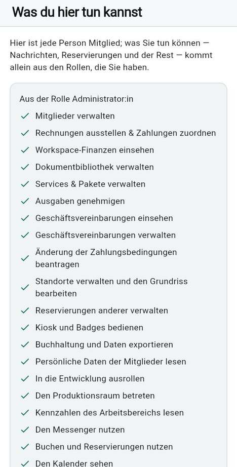

Innerhalb eines Spaces hängt es von Ihrer Rolle ab, was Sie tun dürfen. Rollen addieren sich: Alle sind Mitglied, die anderen Rollen kommen obendrauf.

| Rolle | Wofür sie gedacht ist |
|---|---|
| Mitglied | Plätze buchen, ein- und auschecken, Nachrichten schreiben, das eigene Geld im Blick behalten. |
| Administrator:in | Alles, was ein Mitglied tut, dazu das Handeln für andere Mitglieder und das Genehmigen von Anfragen, soweit die Inhaberin oder der Inhaber es erlaubt hat. |
| Inhaber | Alles: der Raumplan, die Preise, die Rollen und die Einstellungen des Spaces. Ein Space behält immer mindestens eine Inhaberin oder einen Inhaber. |
| Mitinhaber | Ein aktiver Mitinhaber hat schon jetzt die Rechte des Inhabers. Ein Nachfolger, die passive Variante, übernimmt, wenn der Inhaber geht oder ihn befördert. |
| Kiosk-Gerät | Ein Tablet an der Wand, das den Plan zeigt. Mitglieder handeln dort mit ihrem Badge. |

**Schritte**

1. Öffnen Sie [Einstellungen](https://fdittgen-png.github.io/deskilo/#/settings), das **Mein Konto** heißt, wenn Sie nichts verwalten.
2. Wählen Sie **Was Sie hier tun können**.
3. Lesen Sie, welche Rolle Ihnen welche Möglichkeit gibt. Ein Mitglied sieht **Wie alle Mitglieder**; eine Administratorin oder ein Administrator sieht zusätzlich **Aus der Rolle Administrator:in**.

**Gut zu wissen**

- Die Inhaberin oder der Inhaber legt in der Rollenmatrix fest, was Administratoren und andere Rollen tun dürfen. Zwei Spaces können sich daher unterscheiden.
- Ein Space kann neben diesen noch weitere Rollen haben, zum Beispiel eine für die Abrechnung. Sie erscheinen in derselben Liste.
- Es gibt keine Einladung, die jemanden zum Inhaber macht: Nur ein bestehender Inhaber überträgt die Inhaberschaft.

**Siehe auch:** [Die Rollenmatrix](#die-rollenmatrix) · [Einem Workspace beitreten](#einem-workspace-beitreten)

<!-- anchor: user.start.account -->
### Konto erstellen oder anmelden

**Zielgruppe:** Alle

Sie möchten hinein, ob zum ersten oder zum hundertsten Mal. Ein Konto gilt in jedem Space, dem Sie beitreten.

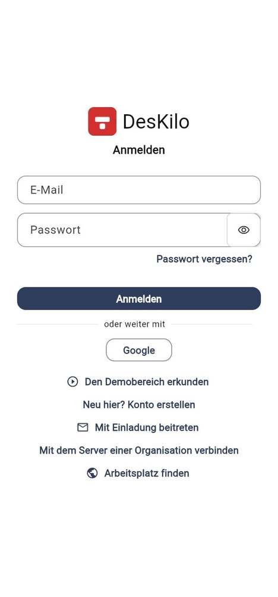

**Schritte**

1. Öffnen Sie die App. Der Anmeldebildschirm fragt nach Ihrer **E-Mail** und Ihrem **Passwort**.
2. Zum Anmelden tippen Sie auf **Anmelden**.
3. Für ein neues Konto tippen Sie auf **Neu hier? Konto erstellen**, tragen einen **Anzeigename** ein und tippen auf **Konto erstellen**. Das Passwort braucht mindestens 8 Zeichen.
4. Wenn der Server es anbietet, tippen Sie unter **oder weiter mit** auf **Google**.
5. Manche Server verlangen zuerst die Bestätigung Ihrer Adresse. Der Bildschirm **Sehen Sie in Ihr E-Mail-Postfach** meldet, dass ein Link verschickt wurde: Öffnen Sie ihn auf diesem Gerät. Kommt nichts an, schauen Sie im Spam-Ordner nach oder tippen Sie auf **E-Mail erneut senden**.

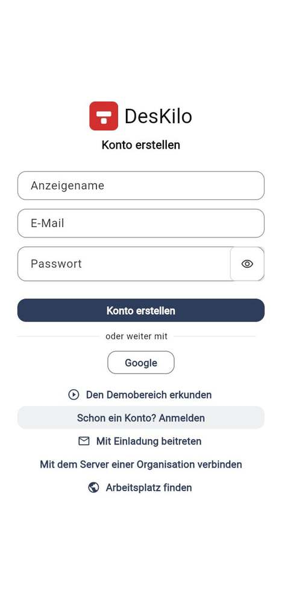

**Gut zu wissen**

- Die Augen-Schaltfläche neben dem Passwort zeigt oder verbirgt, was Sie eintippen.
- Bei der ersten Anmeldung werden Sie gebeten, die Datenschutzbestimmungen zu lesen und zu akzeptieren, bevor sich irgendetwas anderes öffnet.
- Ein neues Konto ohne Space landet auf [Ich](https://fdittgen-png.github.io/deskilo/#/me), wo Sie einen Space finden, ihm beitreten oder einen gründen können.
- **Mit Einladung beitreten** auf dem Anmeldebildschirm merkt sich Ihr Vorhaben: Sie legen Ihr Konto an und fügen dann Ihre Einladung ein.

**Siehe auch:** [Vergessenes Passwort zurücksetzen](#vergessenes-passwort-zurücksetzen) · [Einem Workspace beitreten](#einem-workspace-beitreten) · [Ihre Daten, Ihre Rechte](#ihre-daten-ihre-rechte)

<!-- anchor: user.start.forgot-password -->
### Vergessenes Passwort zurücksetzen

**Zielgruppe:** Alle

Sie wissen Ihr Passwort nicht mehr. Sie erhalten per E-Mail einen Einmalcode und setzen damit ein neues. Es gibt keinen Link zum Anklicken, deshalb funktioniert es auch dort, wo sich Links nicht in der App öffnen.

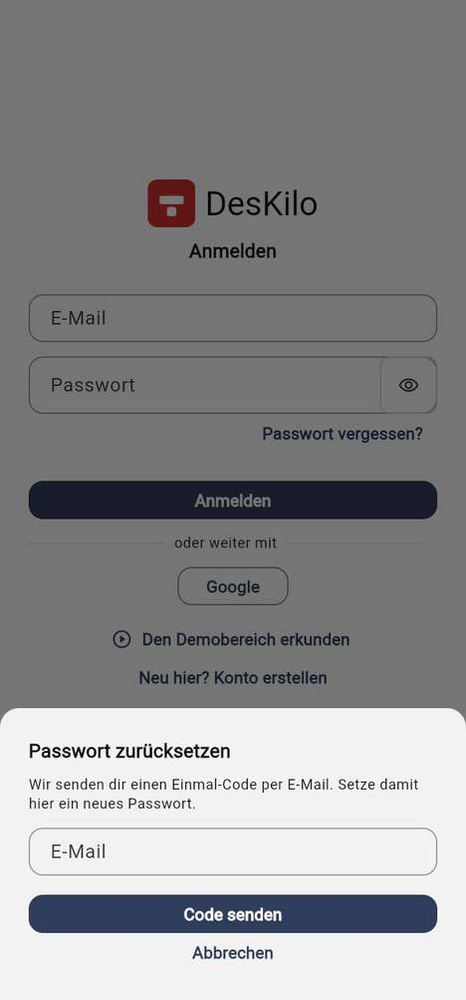

**Schritte**

1. Tippen Sie auf dem Anmeldebildschirm auf **Passwort vergessen?**.
2. Geben Sie Ihre **E-Mail** ein und tippen Sie auf **Code senden**.
3. Öffnen Sie die E-Mail und kopieren Sie den Code.
4. Tragen Sie ihn bei **Code aus der E-Mail** ein, wählen Sie ein **Neues Passwort** und tippen Sie auf **Neues Passwort setzen**.

**Gut zu wissen**

- Die Meldung **Passwort aktualisiert — Sie sind angemeldet.** bestätigt, dass es geklappt hat; Sie müssen sich nicht erneut anmelden.
- Ein ungültiger oder abgelaufener Code wird abgelehnt: Fordern Sie einen neuen an.
- Wird der Code akzeptiert, das Passwort aber nicht gespeichert, tippen Sie auf **Neues Passwort erneut speichern**.

**Siehe auch:** [Konto erstellen oder anmelden](#konto-erstellen-oder-anmelden)

<!-- anchor: user.start.demo -->
### Den Demobereich erkunden

**Zielgruppe:** Alle

Sie möchten sich umsehen, bevor Sie sich festlegen. Die Demo ist ein erfundener Space, Atelier du Marché: Die Personen, Buchungen und Rechnungen sind ausgedacht, nichts, was Sie tun, erreicht einen echten Space, und ein Konto brauchen Sie nicht.

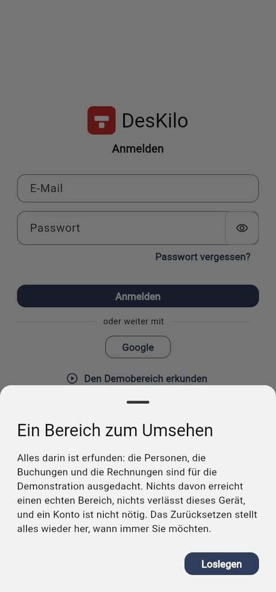

**Schritte**

1. Tippen Sie auf dem Anmeldebildschirm auf **Den Demobereich erkunden**.
2. Lesen Sie den Hinweis und tippen Sie dann auf **Loslegen**.
3. Wählen Sie mit der Leiste oben, durch wessen Augen Sie schauen: **Inhaber**, **Mitglied** oder **Administrator:in**. Jedes Antippen des Namens springt zum nächsten.
4. Tippen Sie auf **Demo zurücksetzen**, um alles wieder auf den Anfang zu stellen.
5. Tippen Sie auf **Demo verlassen**, wenn Sie fertig sind.

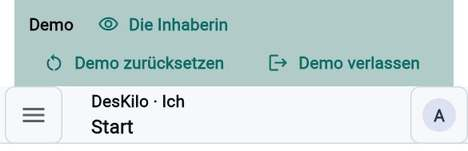

**Gut zu wissen**

- Die Leiste trägt die Aufschrift **Demo** und bleibt über jedem Bildschirm, damit Sie sie nicht mit einem echten Space verwechseln.
- Denselben Bildschirm als Inhaber, als Administratorin und als Mitglied zu sehen, ist der schnellste Weg zu lernen, was jede Rolle kann.
- Die Demo bleibt auf diesem Gerät. Wenn Sie sie verlassen, entsteht kein Konto.

**Siehe auch:** [Was DesKilo ist und wer was tut](#was-deskilo-ist-und-wer-was-tut) · [Konto erstellen oder anmelden](#konto-erstellen-oder-anmelden)

<!-- anchor: user.start.join -->
### Einem Workspace beitreten

**Zielgruppe:** Alle

Sie haben eine Workspace-ID, einen QR-Code oder eine Einladungsnachricht erhalten und möchten hinein. Sie beantragen den Beitritt als Mitglied, und ein Administrator lässt Sie ein.

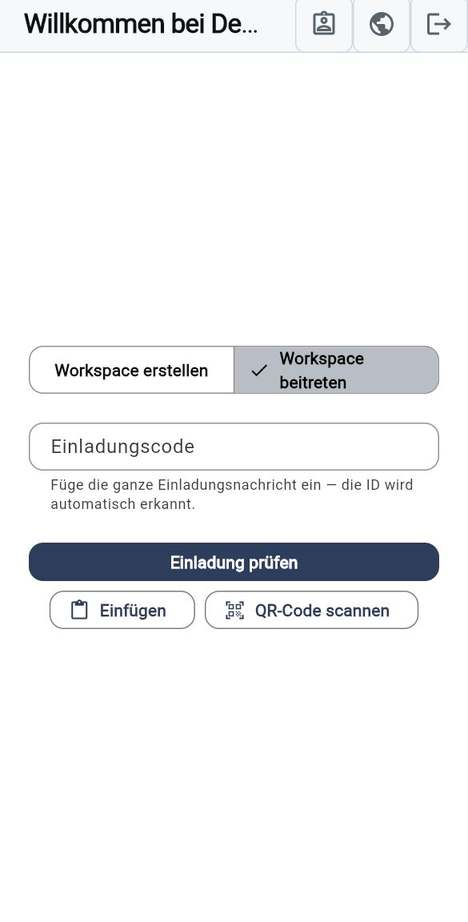

**Schritte**

1. Melden Sie sich an und tippen Sie auf [Ich](https://fdittgen-png.github.io/deskilo/#/me) auf **Mit Code beitreten**. Vom Anmeldebildschirm bringt Sie **Mit Einladung beitreten** dorthin, sobald Sie ein Konto haben.
2. Lassen Sie auf **Willkommen bei DesKilo** die Auswahl **Workspace beitreten** stehen.
3. Tragen Sie die Workspace-ID bei **Einladungscode** ein oder fügen Sie die ganze Einladungsnachricht ein: Die ID wird automatisch gefunden. **Einfügen** liest sie aus der Zwischenablage, und **QR-Code scannen** öffnet die Kamera für einen gedruckten Code.
4. Tippen Sie auf **Einladung prüfen**. Die Karte **Vor dem Beitritt prüfen** nennt den Workspace, seinen Server, die angebotene Rolle und ob ein Administrator zustimmen muss.
5. Tippen Sie auf **Bereich beitreten**.

**Gut zu wissen**

- Bis ein Administrator zustimmt, sehen Sie **Mitgliedschaft im Bereich wartet auf Freigabe**. **Erneut prüfen** aktualisiert die Anzeige; Ihre anderen Spaces und Ihr Konto bleiben verfügbar.
- Sie treten genau mit der Rolle bei, die die Einladung enthält. Die Workspace-ID führt immer als Mitglied hinein; ein persönlicher Admin-Code gilt einmalig und führt als Administrator hinein.
- Ein abgelaufener oder ersetzter Code wird auf dem Bildschirm erklärt: Bitten Sie den Absender um einen aktuellen.
- Im Browser kann die Kamera nicht scannen: Tippen Sie die ID ein oder fügen Sie die Nachricht ein.
- Nennt die Karte einen anderen Server, schaltet **Diesen Server verwenden** dieses Gerät darauf um.

**Siehe auch:** [Die Workspace-ID](#die-workspace-id) · [Ich: Ihr Zuhause und Ihre Spaces](#ich-ihr-zuhause-und-ihre-spaces)

<!-- anchor: user.start.create -->
### Einen Workspace erstellen

**Zielgruppe:** Alle

Sie leiten eine Gemeinschaft und möchten einen eigenen Space. Sie werden sofort dessen Inhaber.

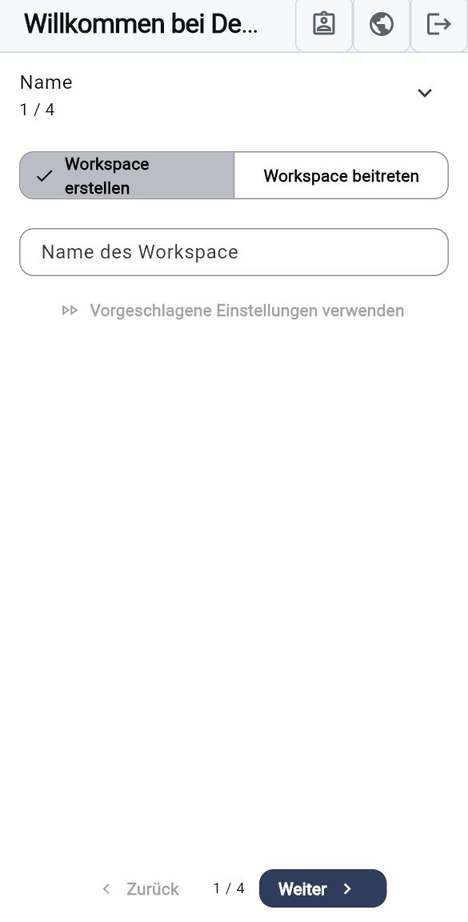

**Schritte**

1. Öffnen Sie [Einen Workspace erstellen](https://fdittgen-png.github.io/deskilo/#/onboarding) über **Space gründen** auf [Ich](https://fdittgen-png.github.io/deskilo/#/me).
2. Tragen Sie einen **Name des Workspace** ein und tippen Sie auf **Weiter**. **Vorgeschlagene Einstellungen verwenden** springt direkt zum letzten Schritt.
3. Wählen Sie bei **Wo** das **Land**; **Währung** und **Zeitzone** folgen daraus, und Sie können sie ändern.
4. Wählen Sie auf demselben Bildschirm unter **Was erstellt wird** zwischen **Ein Test-Arbeitsbereich**, **Ein echter Arbeitsbereich** und **Ein verknüpftes Test- und Echt-Paar**.
5. Wählen Sie bei **Beginnen mit** **Leerer Raum**, um Ihren eigenen Plan zu zeichnen, oder eine fertige Vorlage.
6. Lesen Sie bei **Bestätigen**, was erstellt wird, und tippen Sie auf **Workspace erstellen**.

**Gut zu wissen**

- Die Auswahl beginnt bei **Ein Test-Arbeitsbereich**, der zum Ausprobieren sicher ist: Jeder Bildschirm und jedes Dokument weist darauf hin, und es gibt keine echte Abrechnung. Ein echter Workspace stellt Rechnungen aus, die geschuldet sind.
- Das Paar gibt Ihnen zwei Spaces mit demselben Namen, einen zum Ausprobieren und einen echten. Beide gehören Ihnen.
- Geht die Antwort unterwegs verloren, behält die App Ihre Eingaben und bietet **Wie gesendet wiederholen** an, damit Sie den Space nie doppelt anlegen.
- Der neue Space öffnet sich, sobald er existiert. Seine Einrichtung behandeln die Kapitel für Inhaber.

**Siehe auch:** [Einen Space mit dem Einrichtungsfragebogen vorbereiten](#einen-space-mit-dem-einrichtungsfragebogen-vorbereiten) · [Die Workspace-ID](#die-workspace-id)

<!-- anchor: user.start.find -->
### Einen Workspace finden

**Zielgruppe:** Alle

Sie haben keinen Code, möchten aber einen Space in Ihrer Nähe finden. Spaces, die eine Seite veröffentlichen, erscheinen in einem öffentlichen Verzeichnis.

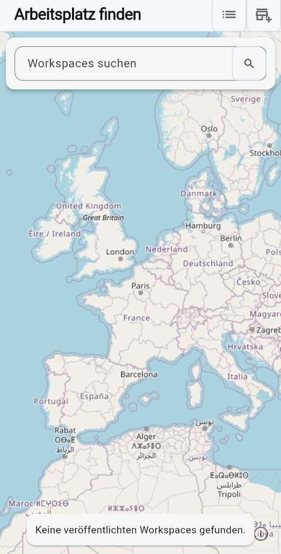

**Schritte**

1. Tippen Sie auf dem Anmeldebildschirm auf **Arbeitsplatz finden** oder öffnen Sie auf [Ich](https://fdittgen-png.github.io/deskilo/#/me) **Entdecken**.
2. Tragen Sie einen Namen oder einen Ort bei **Workspaces suchen** ein.
3. Wechseln Sie mit der Schaltfläche oben zwischen **Karte** und **Liste**.
4. Öffnen Sie ein Ergebnis, um die öffentliche Seite zu lesen. Dort bittet **Workspace-Profil beantragen** um die Aufnahme, und **Eintreten** öffnet einen Space, dem Sie bereits angehören.

**Gut zu wissen**

- Nur Spaces, die sichtbar sein wollten, werden aufgelistet. Diese Demo hat keinen, deshalb ist die Karte hier leer.
- Sie können ohne Konto stöbern; zum Beitreten brauchen Sie eines.

**Siehe auch:** [Einem Workspace beitreten](#einem-workspace-beitreten)

<!-- anchor: user.me.home -->
### Ich: Ihr Zuhause und Ihre Spaces

**Zielgruppe:** Alle

Sie möchten einen Ort, der zeigt, wer Sie sind und welchen Spaces Sie angehören. **Ich** gehört Ihnen allein und übernimmt nie die Farben eines Spaces. Unter Ihrem Namen listet **Meine Spaces** jeden Space als eine Karte auf.

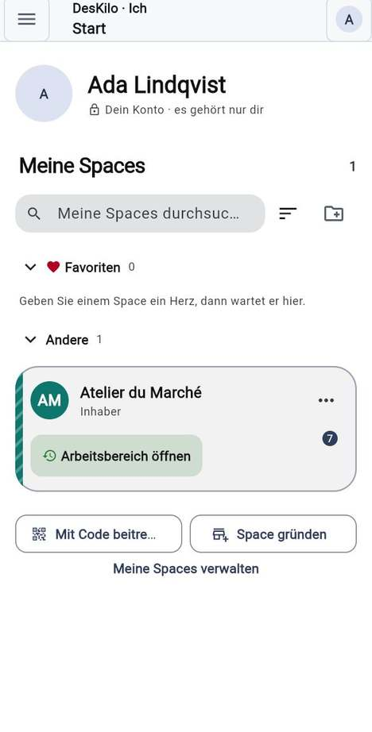

**Schritte**

1. Öffnen Sie [Ich](https://fdittgen-png.github.io/deskilo/#/me). Schulden Sie irgendwo Geld, steht oben eine Karte mit **Zu zahlen**, die Ihre Finanzen öffnet.
2. Suchen Sie Ihren Space unter **Meine Spaces**. Ein echter Space hat die Schaltfläche **Arbeitsbereich öffnen**; ein Space mit Testzwilling hat zusätzlich **Testbereich**.
3. Tippen Sie auf die Schaltfläche, um einzutreten. Der Bildschirm füllt sich mit Farbe, Muster und Logo des Spaces, dann öffnet sich der Space.
4. Tippen Sie unter der Liste auf **Mit Code beitreten** oder **Space gründen**, um einen weiteren hinzuzufügen.

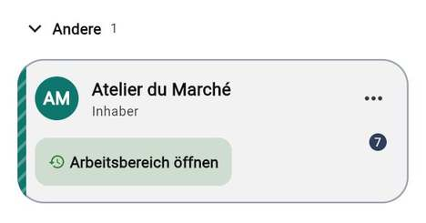

**Gut zu wissen**

- Die kleine Uhr auf einer Schaltfläche markiert die Seite, die Sie zuletzt benutzt haben.
- Die kleine Zahl auf einer Schaltfläche zählt, was dort auf Sie wartet, getrennt für den echten Space und seinen Testzwilling. Halten Sie die Schaltfläche gedrückt, um den ganzen Satz zu lesen.
- Das Muster am linken Rand der Karte ist die Identität des Spaces. Sind Animationen ausgeschaltet, öffnet sich der Space einfach.
- Ein Space, der noch **Wartet auf Freigabe**, zeigt das statt Ihrer Rolle.
- Ein Space auf einem anderen Server zeigt *Auf … öffnen* mit dem Namen dieses Servers; beim Öffnen wechselt die App den Server und bittet Sie, sich dort anzumelden.

**Siehe auch:** [Ihre Spaces ordnen](#ihre-spaces-ordnen) · [Profile: ein Konto, mehrere Spaces](#profile-ein-konto-mehrere-spaces)

<!-- anchor: user.me.organise -->
### Ihre Spaces ordnen

**Zielgruppe:** Alle

Sie gehören mehreren Spaces an und möchten Ihre eigene Reihenfolge. Herzen, Gruppen, Sterne und die Reihenfolge gehören Ihnen und bleiben auf diesem Gerät.

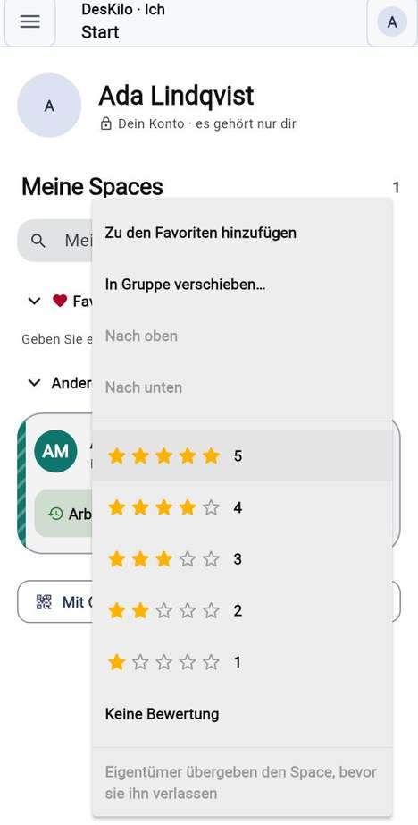

**Schritte**

1. Tippen Sie auf [Ich](https://fdittgen-png.github.io/deskilo/#/me) auf die drei Punkte an der Karte eines Spaces.
2. Wählen Sie **Zu den Favoriten hinzufügen**: Der Space wandert zu **Favoriten** und zeigt ein Herz.
3. Wählen Sie **In Gruppe verschieben…**, um ihn in eine andere Gruppe zu legen, oder tippen Sie auf die Ordner-Schaltfläche über der Liste für **Neue Gruppe**.
4. Tippen Sie auf einen der fünf Sterne, um den Space zu bewerten, oder auf **Keine Bewertung**, um die Bewertung zu entfernen.
5. Tragen Sie bei **Meine Spaces durchsuchen** etwas ein, um zu filtern, und wählen Sie mit der Sortier-Schaltfläche **Meine Reihenfolge**, **Zuletzt genutzt**, **Am besten bewertet** oder **A–Z**.

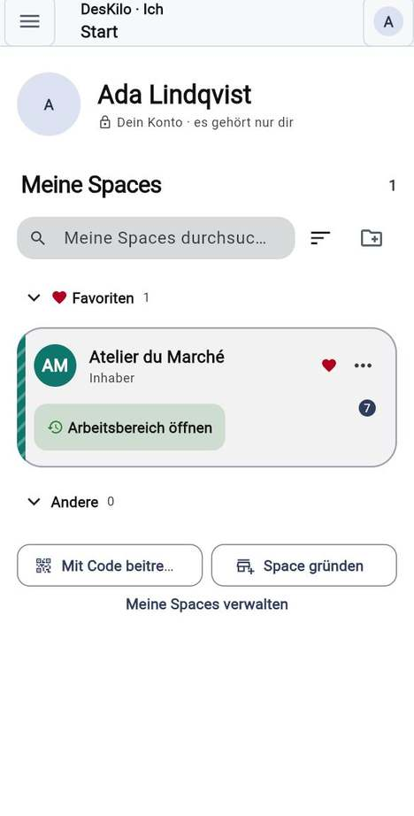

**Gut zu wissen**

- Halten Sie in **Meine Reihenfolge** eine Karte eine Sekunde lang gedrückt, um sie zu ziehen, oder nutzen Sie **Nach oben** und **Nach unten**.
- Tippen Sie auf den Namen einer Gruppe, um sie einzuklappen. Selbst angelegte Gruppen lassen sich über ihr Menü umbenennen oder löschen; **Favoriten** und **Andere** sind immer da.
- **Diesen Space verlassen** steht im selben Menü. Sie sind dann kein Mitglied mehr; Buchungen, Rechnungen und Nachrichten bleiben beim Space. Inhaber übergeben den Space zuerst.
- **Meine Spaces verwalten** ganz unten öffnet die Profilliste.

**Siehe auch:** [Profile: ein Konto, mehrere Spaces](#profile-ein-konto-mehrere-spaces) · [Meine Daten löschen](#meine-daten-löschen)

<!-- anchor: user.profile.profiles -->
### Profile: ein Konto, mehrere Spaces

**Zielgruppe:** Alle

Ein Konto kann zu vielen Spaces gehören. Jeder Space gibt Ihnen dort ein Profil: Ihre Rolle und Ihre eigenen Daten. Die Profilliste zeigt alle und entscheidet, mit welchem die App sich öffnet.

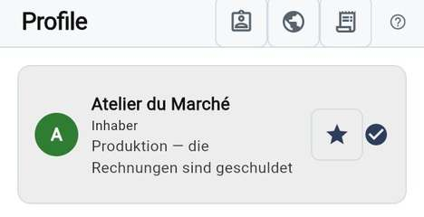

**Schritte**

1. Öffnen Sie [Profile](https://fdittgen-png.github.io/deskilo/#/profiles) oder tippen Sie auf [Ich](https://fdittgen-png.github.io/deskilo/#/me) auf **Meine Spaces verwalten**.
2. Lesen Sie jede Zeile: den Namen des Spaces, Ihre Rolle dort und die Umgebung, in der er liegt.
3. Tippen Sie auf eine Zeile, um zu diesem Profil zu wechseln. Das Häkchen steht für **Aktives Profil**. Die App öffnet sich beim nächsten Mal damit, auf jedem Gerät.
4. Um ein Profil zum Standard zu machen, ohne zu ihm zu wechseln, tippen Sie auf den Stern (**Beim Start als Standard verwenden**); ein zweiter Tipp hebt es wieder auf.
5. Tippen Sie auf **Profil hinzufügen**, um einem weiteren Space beizutreten oder einen zu gründen.

**Gut zu wissen**

- Ein Space mit Testzwilling zeigt eine Zeile, die sich in zwei Auswahlmöglichkeiten öffnet: **Entwicklung — zum Ausprobieren** und **Produktion — die Rechnungen sind geschuldet**. Tippen Sie auf die gewünschte; das Häkchen folgt.
- Alles, was Sie in der App sehen, gehört zum aktiven Space.
- Ihr Konto, Ihr Foto und Ihre Sprache gehören nicht zu einem Profil: Sie liegen in Ich und sind überall gleich.

**Siehe auch:** [Ich: Ihr Zuhause und Ihre Spaces](#ich-ihr-zuhause-und-ihre-spaces) · [Einem Workspace beitreten](#einem-workspace-beitreten)

<!-- anchor: user.start.navigation -->
### Sich zurechtfinden

**Zielgruppe:** Alle

Sie sind in einem Space und möchten einen Bildschirm erreichen. Alles liegt in einem Menü, und ein paar Schaltflächen sitzen oben.

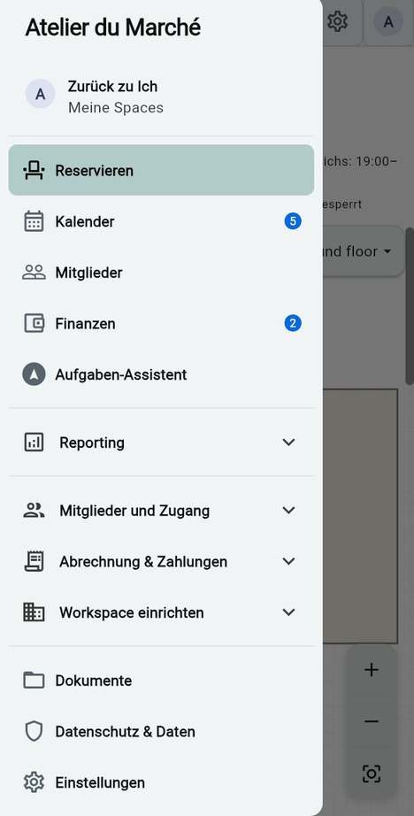

**Schritte**

1. Tippen Sie oben links auf die Schaltfläche ☰. Das Menü öffnet sich mit dem Namen Ihres Spaces, **Zurück zu Ich** und den täglichen Zielen: **Reservieren**, **Kalender**, **Mitglieder**, **Finanzen**.
2. Tippen Sie auf ein Ziel, um es zu öffnen. Eine blaue Zahl daneben zählt, was dort wartet.
3. Öffnen Sie **Reporting**, **Mitglieder und Zugang**, **Abrechnung & Zahlungen** oder **Workspace einrichten**, um die Verwaltungswerkzeuge zu sehen, die Ihre Rolle zulässt.
4. Ganz unten sind **Dokumente**, **Datenschutz & Daten** und **Einstellungen** immer griffbereit.
5. Tippen Sie oben rechts auf den Avatar oder auf **Zurück zu Ich**, um den Space zu verlassen und zu [Ich](https://fdittgen-png.github.io/deskilo/#/me) zurückzukehren.

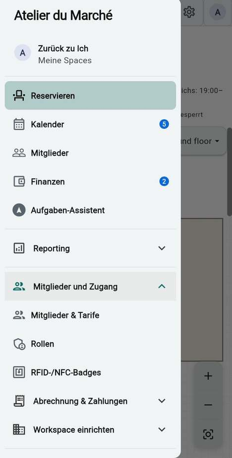

**Gut zu wissen**

- Die Ziele kommen und gehen mit den Funktionen, die der Inhaber eingeschaltet hat, und mit Ihrer Rolle. Ein einfaches Mitglied sieht keine der Verwaltungsgruppen.
- Wenn Ihr Space Ereignisse eingeschaltet hat, sammelt **Ereignisse** oben rechts (das Ablagesymbol mit einer Zahl), was geschehen ist und was auf Ihre Entscheidung wartet; enthält der Kalender die Hinweise, nutzen Sie dessen Ansicht **Hinweise**. **Raumcode scannen** und **Workspace bearbeiten** erscheinen auf dem Reservieren-Bildschirm, wenn Sie sie nutzen dürfen.
- In einem breiten Fenster bleibt das Menü als Seitenleiste offen. Ein schmales Fenster oder vergrößerte Schrift nutzt das Menü ☰.
- In den Apps für Smartphones und Computer können Sie mit dem [Navigationsstil](#navigationsstil) in den Einstellungen die klassische untere Leiste mit der runden Schaltfläche **Reservieren** wählen. Wischen Sie diese Leiste nach unten für eine Vollbildansicht; wischen Sie nach oben oder drücken Sie lange auf die Schaltfläche **Reservieren**, um sie zurückzuholen. Ein Browser nutzt immer das Menü.

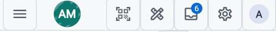

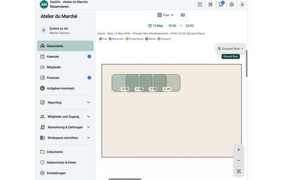

**Siehe auch:** [Navigationsstil](#navigationsstil) · [Ich: Ihr Zuhause und Ihre Spaces](#ich-ihr-zuhause-und-ihre-spaces)

<!-- anchor: user.start.get-started -->
### Die Karte „Erste Schritte“ und die Tipps

**Zielgruppe:** Alle

Sie öffnen einen Space und wissen nicht, was Sie zuerst tun sollen. Die Karte **Erste Schritte** nennt Ihnen einen nächsten Schritt, und kurze Tipps erklären jeden Bildschirm.

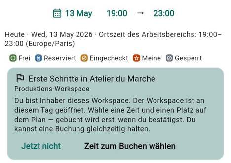

**Schritte**

1. Öffnen Sie [Reservieren](https://fdittgen-png.github.io/deskilo/#/reserve). Die Karte **Erste Schritte in** Ihrem Space erscheint oben auf dem Plan.
2. Folgen Sie der angebotenen Aktion, zum Beispiel **Zeit zum Buchen wählen**.
3. Tippen Sie auf **Jetzt nicht**, um sie wegzulegen.
4. Um sie zurückzuholen, öffnen Sie oben auf dem Plan das Ansichtsmenü, das **Plan** anzeigt, und wählen Sie **Erste Schritte**.

**Gut zu wissen**

- Für Inhaber oder Administratoren sagt die Karte, was fehlt, bevor jemand buchen kann, mit **Einrichtung abschließen**.
- Tipps sind kleine Karten auf jedem Bildschirm. **Hinweis ausblenden** verbirgt einen, und **Nächster Tipp** zeigt einen anderen.
- Sie können jeden ausgeblendeten Tipp mit [Hinweise wiederherstellen](#hinweise-wiederherstellen) wieder anzeigen.

**Siehe auch:** [Hinweise wiederherstellen](#hinweise-wiederherstellen) · [Sich zurechtfinden](#sich-zurechtfinden)

<!-- anchor: user.start.questionnaire -->
### Einen Space mit dem Einrichtungsfragebogen vorbereiten

**Zielgruppe:** Inhaber

Sie stehen kurz davor, einen Space zu eröffnen, und müssen viele Entscheidungen treffen: wie eine Buchung aussieht, was ein Monat kostet, was eine Rechnung enthalten muss. Der Einrichtungsfragebogen lässt Sie alle auf einmal treffen, vor dem Start, auf einem großen Bildschirm und, wenn Sie möchten, gemeinsam mit Ihrer Steuerberatung oder Ihrem Vorstand.

**Schritte**

1. Öffnen Sie den Fragebogen im Browser: [setup.html](https://fdittgen-png.github.io/deskilo/setup.html). Es ist nichts zu installieren und kein Konto nötig.
2. Beantworten Sie die Schritte der Reihe nach: *Identität*, *Funktionen*, *Verfügbarkeit*, *Raumplan*, *Abonnements*, *Rechtliche Identität und USt*, *Leistungen und Zubehör*, *Zahlungsanweisungen*, *Rollen und Freigaben*, *Mitglieder und Einladungen*. Jeder Schritt fragt nur, was Ihre früheren Antworten möglich machen.
3. Lesen Sie die *Funktionsübersicht* und entfernen Sie das Häkchen bei dem, was Sie nicht möchten: Diese Funktion bleibt in der App ausgeschaltet und nichts dazu wird exportiert.
4. Beheben Sie bei *Prüfen und exportieren* die blockierenden Punkte und tippen Sie dann auf **XML exportieren**.
5. Öffnen Sie in der App die Workspace-Einstellungen und wählen Sie **Workspace importieren (XML)**, um die Einstellungen, das Zubehör und den Raumplan anzulegen.
6. Bewahren Sie die Datei auf. *Datei laden…* bringt Ihre Antworten später zurück, und **Zurücksetzen** beginnt von vorn.

**Gut zu wissen**

- Ihre Antworten werden in Ihrem eigenen Browser gespeichert und nirgendwohin gesendet. Sie können den Tab schließen und später wiederkommen.
- Die Datei ist reiner Text: Lassen Sie Token und Schlüssel leer und tragen Sie sie stattdessen in der App ein.
- Jede Frage sagt, wo die Einstellung in der App liegt, sodass Sie den Rest Bildschirm für Bildschirm abschließen können.
- Es zu überspringen kostet nichts: Jede Antwort ist eine Einstellung, die Sie später in der App vornehmen oder ändern können.

**Siehe auch:** [Einen Workspace erstellen](#einen-workspace-erstellen) · [Den Space importieren (XML)](#den-space-importieren-xml)

<!-- anchor: user.reserve.overview -->
## Reservieren

Einen Platz zu buchen ist das Herzstück von DesKilo: Sie sehen sich den Plan Ihres Spaces an, wählen Tag und Uhrzeit, tippen auf einen freien Platz und bestätigen. Dieses Kapitel folgt diesem Weg und behandelt dann, was drumherum geschieht: die Regeln, denen Sie begegnen, Ein- und Auschecken, das Ändern einer Buchung und den Kalender, in dem alles Terminierte liegt.

In diesem Kapitel:
- [Die Reservierungsübersicht und der Raumplan](#die-reservierungsübersicht-und-der-raumplan)
- [Sich auf dem Plan zurechtfinden](#sich-auf-dem-plan-zurechtfinden)
- [Die Plätze als Liste sehen](#die-plätze-als-liste-sehen)
- [Tag und Uhrzeit wählen](#tag-und-uhrzeit-wählen)
- [Tagesansicht](#tagesansicht)
- [Wochenansicht](#wochenansicht)
- [Monatsansicht](#monatsansicht)
- [Einen Platz buchen](#einen-platz-buchen)
- [Das Buchungsblatt](#das-buchungsblatt)
- [Sofort einchecken, wenn Sie schon da sind](#sofort-einchecken-wenn-sie-schon-da-sind)
- [Einen ganzen Tisch, Raum oder eine ganze Etage buchen](#einen-ganzen-tisch-raum-oder-eine-ganze-etage-buchen)
- [Für jemand anderen buchen](#für-jemand-anderen-buchen)
- [Eine Buchung wiederholen](#eine-buchung-wiederholen)
- [Die Regeln, denen Sie beim Buchen begegnen](#die-regeln-denen-sie-beim-buchen-begegnen)
- [Schließtage und Feiertage](#schließtage-und-feiertage)
- [Ein- und Auschecken](#ein--und-auschecken)
- [Einen Raumcode scannen](#einen-raumcode-scannen)
- [Eine Buchung ändern oder stornieren](#eine-buchung-ändern-oder-stornieren)
- [Wenn eine Buchung auf Bestätigung wartet](#wenn-eine-buchung-auf-bestätigung-wartet)
- [Der Kalender-Tab](#der-kalender-tab)
- [Agenda, Woche und Monat im Kalender](#agenda-woche-und-monat-im-kalender)
- [Entscheidungen, die im Kalender auf Sie warten](#entscheidungen-die-im-kalender-auf-sie-warten)
- [Den Kalender filtern](#den-kalender-filtern)
- [Eine Buchung im eigenen Kalender speichern](#eine-buchung-im-eigenen-kalender-speichern)

<!-- anchor: user.reserve.hub -->
### Die Reservierungsübersicht und der Raumplan

**Zielgruppe:** Mitglied · Administrator:in · Inhaber

Sie möchten sehen, welche Plätze frei sind. Die Reservierungsübersicht öffnet sich auf dem Raumplan einer Etage Ihres Spaces, gezeichnet für den Tag und die Uhrzeit, die Sie gerade ansehen.

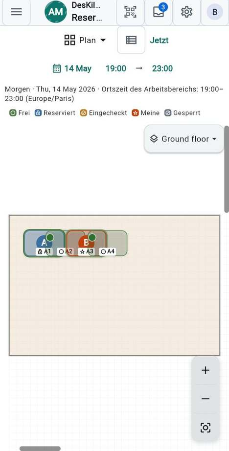

**Schritte**

1. Öffnen Sie [Reservieren](https://fdittgen-png.github.io/deskilo/#/reserve).
2. Lesen Sie den Plan: Jeder Platz trägt seinen Namen, ein kleines Symbol und eine Farbe, die sagt, was er ist.
3. Tippen Sie auf einen Platz, um mit ihm zu handeln. Ein freier Platz öffnet das Buchungsblatt; Ihr eigener Platz bietet Einchecken und Stornieren an; bei dem Platz eines anderen erfahren Sie, wer ihn hat und bis wann.
4. Die Legende unter dem Datum erklärt die Farben. Sie ist auf dem Plan und in der Tages-, Wochen- und Monatsansicht dieselbe.

| Zustand | Was er bedeutet |
|---|---|
| **Frei** | Niemand hat den Platz in der gewählten Zeit. |
| **Reserviert** | Jemand hat ihn gebucht. |
| **Eingecheckt** | Die Person, die gebucht hat, ist angekommen. |
| **Meine** | Es ist Ihre Buchung. |
| **Gesperrt** | Der Platz ist außer Betrieb, zum Beispiel wegen Wartung. |
| **Geschlossen** | Der Space ist an diesem Tag geschlossen (Tages-, Wochen- und Monatsansicht). |

**Gut zu wissen**

- Ein belegter Platz zeigt, wer dort ist: einen Anfangsbuchstaben oder ein Foto, wenn die Person eines festgelegt hat und Ihr Space Fotos auf dem Plan zeigt. Ein kleiner grüner Punkt bedeutet, dass die Person die App gerade benutzt.
- Ein ganzer Tisch, Raum oder eine ganze Etage, die gebucht sind, sagen das auf dem Plan, mit dem Namen der Person, die sie hat.
- Manche Spaces zeigen weniger Zustände: Ein gebuchter und ein eingecheckter Platz sehen dann gleich aus, und gesperrt heißt **Nicht verfügbar**.
- Konnte die aktuelle Verfügbarkeit nicht geladen werden, meldet ein Banner **offline** mit der Zeit der letzten Daten und einer Schaltfläche **Erneut versuchen**, denn ein als frei gezeigter Platz kann inzwischen vergeben sein.

**Siehe auch:** [Tag und Uhrzeit wählen](#tag-und-uhrzeit-wählen) · [Das Buchungsblatt](#das-buchungsblatt)

<!-- anchor: user.reserve.plan-levels -->
### Sich auf dem Plan zurechtfinden

**Zielgruppe:** Mitglied · Administrator:in · Inhaber

Sie möchten die Etage, den Raum oder den Tisch erreichen, den Sie im Sinn haben. Der Plan lässt sich verschieben, zoomen und von einer Etage zur anderen umschalten.

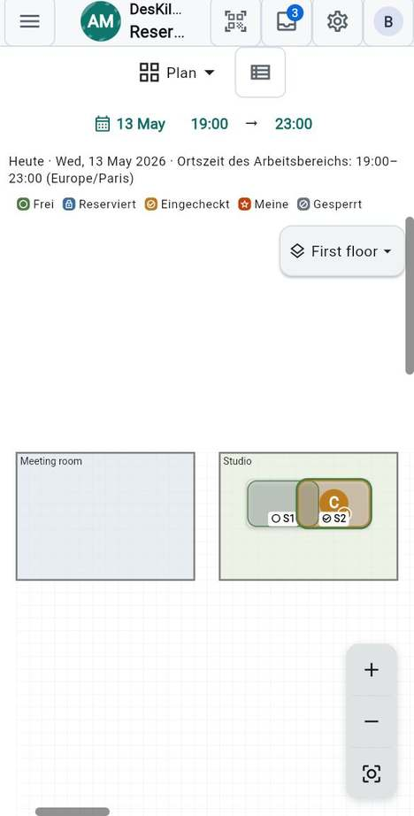

**Schritte**

1. Tippen Sie oben rechts auf dem Plan auf den Namen der Etage, zum Beispiel 1. Etage, und wählen Sie eine andere. Ihre Wahl bleibt für das nächste Mal erhalten, wenn Sie die Übersicht öffnen.
2. Zoomen Sie mit zwei Fingern oder mit **Vergrößern** und **Verkleinern**. Ziehen Sie die Bildlaufleisten an den Rändern, um sich zu bewegen.
3. Tippen Sie auf **Plan an den Bildschirm anpassen**, um die ganze Etage wieder ins Bild zu holen.
4. Lesen Sie die Raumnamen in der Ecke jedes Raums. Tippen Sie auf einen Platz darin, um ihn zu buchen.

**Gut zu wissen**

- Die Etagenauswahl bietet nur dann ein Menü, wenn Ihr Space mehr als eine Etage hat.
- Eine Etage, ein Raum oder ein Tisch, der als Ganzes buchbar ist, zeigt eine eigene Schaltfläche oder reagiert auf Doppeltippen: siehe [Einen ganzen Tisch, Raum oder eine ganze Etage buchen](#einen-ganzen-tisch-raum-oder-eine-ganze-etage-buchen).

**Siehe auch:** [Die Plätze als Liste sehen](#die-plätze-als-liste-sehen) · [Tagesansicht](#tagesansicht)

<!-- anchor: user.reserve.list -->
### Die Plätze als Liste sehen

**Zielgruppe:** Mitglied · Administrator:in · Inhaber

Sie mögen Zeilen lieber als eine Zeichnung, oder der Plan ist auf einem kleinen Bildschirm schwer zu lesen. Die Liste zeigt dieselben Plätze, Etage für Etage und Tisch für Tisch.

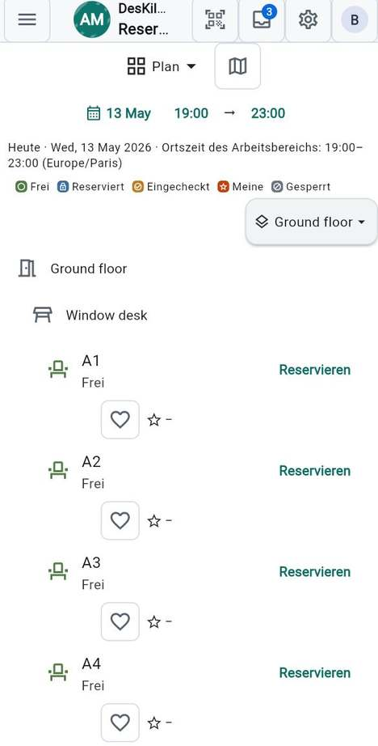

**Schritte**

1. Tippen Sie in [Reservieren](https://fdittgen-png.github.io/deskilo/#/reserve) auf **Listenansicht**, die Schaltfläche neben dem Ansichtsmenü.
2. Suchen Sie den Platz. Jede Zeile nennt ihn und sagt, ob er frei, reserviert oder Ihrer ist.
3. Tippen Sie bei einer freien Zeile auf **Reservieren**, um das Buchungsblatt zu öffnen.
4. Um zur Zeichnung zurückzukehren, tippen Sie auf **Planansicht**.

**Gut zu wissen**

- Die Liste folgt dem gewählten Tag und der gewählten Uhrzeit, genau wie der Plan.
- Sind Favoriten und Bewertungen eingeschaltet, trägt jede Zeile außerdem ein Herz (**Zu Favoriten hinzufügen**) und Sterne.

**Siehe auch:** [Tag und Uhrzeit wählen](#tag-und-uhrzeit-wählen) · [Das Buchungsblatt](#das-buchungsblatt)

<!-- anchor: user.reserve.when -->
### Tag und Uhrzeit wählen

**Zielgruppe:** Mitglied · Administrator:in · Inhaber

Sie möchten für einen anderen Tag buchen oder für eine Zeit, die nicht jetzt ist. Die zwei Reihen von Bedienelementen oben in der Übersicht sagen, was Sie ansehen und wann.

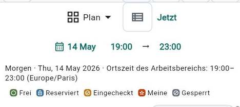

**Schritte**

1. Tippen Sie auf das Datum, zum Beispiel 14. Mai, und wählen Sie einen Tag im Kalender. Sie können bis zu einem Jahr vorausschauen.
2. Wählen Sie die Uhrzeit. Bucht Ihr Space halbe Tage, tippen Sie auf **Vormittag**, **Nachmittag** oder **Ganzer Tag**. Bucht er stundenweise oder in einem freien Zeitraum, tippen Sie auf die erste Zeit, um **Von** festzulegen, und auf die zweite, um **Bis** festzulegen.
3. Lesen Sie die Zeile unter den Bedienelementen: Sie nennt den Tag, den Zeitraum und die Stunden in der Zeitzone des Workspace und, wenn sie abweicht, in Ihrer.
4. Um zu heute zurückzukehren, tippen Sie auf **Jetzt**.

**Gut zu wissen**

- Welche Bedienelemente Sie sehen, richtet sich nach den Regeln des Spaces: Manche Spaces buchen halbe Tage, manche nur ganze Tage, manche jede Zeit in einem Raster.
- Auf dem Smartphone sind die Tagesabschnitt-Chips kleine Symbole für einen halben oder ganzen Tag. Halten Sie eines gedrückt, um seinen Namen und seine Stunden zu lesen.
- Der Plan antwortet für die gewählte Zeit: Ein als frei gezeigter Platz ist für die ganze Dauer frei.
- Wo pro halbem Tag gebucht wird, ist der Zeitraum, mit dem Sie beginnen, Ihr üblicher, festgelegt unter [Standard-Buchungszeitraum](#standard-buchungszeitraum).

**Siehe auch:** [Die Reservierungsübersicht und der Raumplan](#die-reservierungsübersicht-und-der-raumplan) · [Einen Platz buchen](#einen-platz-buchen)

<!-- anchor: user.reserve.day-view -->
### Tagesansicht

**Zielgruppe:** Mitglied · Administrator:in · Inhaber

Sie möchten sehen, wer im Lauf des Tages wo ist, nicht nur in einem Moment. Die Ansicht **Tag** legt jeden Platz als Zeile entlang der Stunden aus.

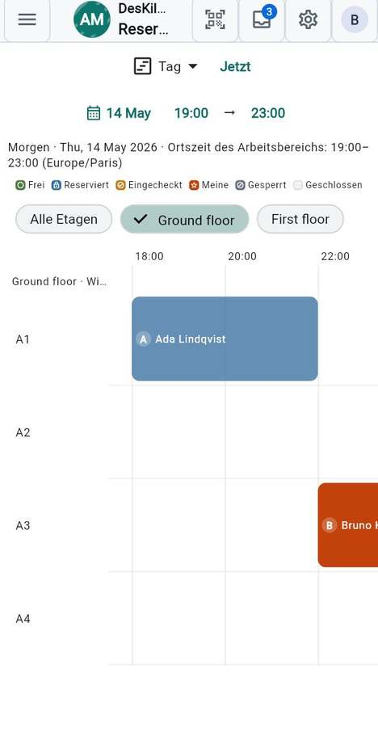

**Schritte**

1. Öffnen Sie in [Reservieren](https://fdittgen-png.github.io/deskilo/#/reserve) das Ansichtsmenü, das zunächst **Plan** anzeigt, und wählen Sie **Tag**.
2. Wählen Sie den Tag mit der Datumsschaltfläche. Wählen Sie eine Etage mit den Chips über den Zeilen: **Alle Etagen** oder eine Etage.
3. Lesen Sie die Balken. Jeder ist eine Buchung, mit dem Namen der Person, die sie hat; Ihre heben sich in der Farbe von **Meine** ab.
4. Tippen Sie auf eine freie Strecke einer Zeile, um diesen Platz für die gewählte Zeit zu buchen. Tippen Sie auf Ihre eigene Buchung, um ihre Details zu öffnen; tippen Sie auf die einer anderen Person, um zu sehen, wer sie hält und bis wann.

**Gut zu wissen**

- Ein geschlossener Tag wird als geschlossen gezeichnet und lässt sich nicht buchen.
- Das Menü hinter dem Bedienelement **Ansicht** enthält auch **Woche** und **Monat**.

**Siehe auch:** [Wochenansicht](#wochenansicht) · [Eine Buchung ändern oder stornieren](#eine-buchung-ändern-oder-stornieren)

<!-- anchor: user.reserve.week-view -->
### Wochenansicht

**Zielgruppe:** Mitglied · Administrator:in · Inhaber

Sie möchten in den nächsten Tagen einen freien Vormittag oder Nachmittag finden. Die Ansicht **Woche** zeigt die Plätze an der Seite und die Wochentage in der Breite.

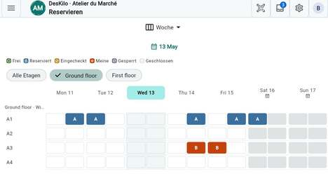

**Schritte**

1. Öffnen Sie das Ansichtsmenü und wählen Sie **Woche**.
2. Suchen Sie Ihren Tag. Jeder Tag hat zwei Zellen nebeneinander, den Vormittag und den Nachmittag. Eine gefüllte Zelle zeigt den Anfangsbuchstaben der Person, die sie hat.
3. Tippen Sie auf eine leere Zelle, um diese Tageshälfte auf diesem Platz zu buchen.
4. Tippen Sie oben auf einen Tagesnamen, um in der Ansicht **Tag** zu diesem Tag zu springen.

**Gut zu wissen**

- Geschlossene Tage sind grau und tragen ein Schließzeichen.
- Wählen Sie mit den Chips über dem Raster **Alle Etagen** oder eine Etage.

**Siehe auch:** [Tagesansicht](#tagesansicht) · [Monatsansicht](#monatsansicht)

<!-- anchor: user.reserve.month-view -->
### Monatsansicht

**Zielgruppe:** Mitglied · Administrator:in · Inhaber

Sie möchten wissen, an welchen Tagen noch Platz ist. Die Ansicht **Monat** zählt für jeden Tag die freien Plätze.

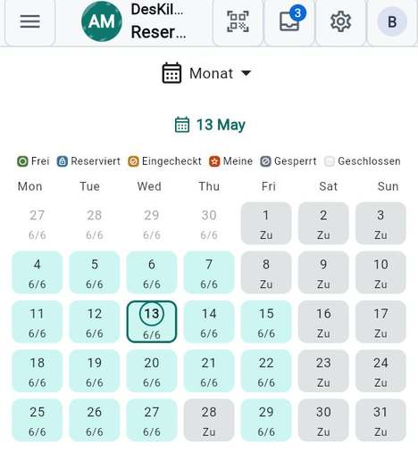

**Schritte**

1. Öffnen Sie das Ansichtsmenü und wählen Sie **Monat**.
2. Lesen Sie jeden Tag: die Zahl der freien Plätze von der Gesamtzahl, zum Beispiel 6/6. Geschlossene Tage zeigen **Zu**.
3. Tippen Sie auf einen Tag, um ihn in der Ansicht **Tag** zu öffnen, wo Sie sehen, wer gebucht hat.

**Gut zu wissen**

- Die Zählung umfasst alle Etagen des Spaces.
- Heute ist eingekreist.

**Siehe auch:** [Schließtage und Feiertage](#schließtage-und-feiertage) · [Tagesansicht](#tagesansicht)

<!-- anchor: user.reserve.book -->
### Einen Platz buchen

**Zielgruppe:** Mitglied · Administrator:in · Inhaber

Sie möchten einen Platz für einen bestimmten Tag und eine bestimmte Zeit. Vom Plan aus sind es wenige Tipps: der Tag, die Zeit, der Platz und eine Bestätigung.

**Schritte**

1. Öffnen Sie [Reservieren](https://fdittgen-png.github.io/deskilo/#/reserve) und wählen Sie Tag und Uhrzeit, wie unter [Tag und Uhrzeit wählen](#tag-und-uhrzeit-wählen) beschrieben.
2. Wählen Sie die Etage, wenn Ihr Space mehrere hat.
3. Tippen Sie auf einen freien Platz. Das Buchungsblatt öffnet sich dafür.
4. Prüfen Sie die Zeile, die den Platz und den Zeitraum nennt, ändern Sie, was nötig ist, und tippen Sie auf **Reservieren**.
5. Eine Meldung bestätigt die Buchung. Tippen Sie darin auf **Details**, um die neue Buchung zu öffnen.

**Gut zu wissen**

- Es ist nichts gebucht, bis Sie auf **Reservieren** tippen.
- Wurde der Platz vor einer Sekunde vergeben, sagt Ihnen das die App, statt ihn doppelt zu buchen.
- Bricht die Verbindung ab, nachdem Sie getippt haben, können Sie auf dem Bildschirm **Ihre Buchungsanfrage** prüfen, was passiert ist, dieselbe Anfrage fortsetzen oder sie verwerfen. Eine Anfrage wird nie zweimal gebucht.
- An einem geschlossenen Tag sagt der Plan **An diesem Tag geschlossen** und bietet den nächsten offenen Tag an.

**Siehe auch:** [Das Buchungsblatt](#das-buchungsblatt) · [Die Regeln, denen Sie beim Buchen begegnen](#die-regeln-denen-sie-beim-buchen-begegnen)

<!-- anchor: user.reservations.booking-sheet -->
### Das Buchungsblatt

**Zielgruppe:** Mitglied · Administrator:in · Inhaber

Sie haben auf einen freien Platz getippt, und das Blatt öffnet sich. Es zeigt, was Sie buchen wollen, und lässt Sie es vor der Bestätigung anpassen. Das Blatt schlägt nur vor: Die Regeln des Spaces werden geprüft, wenn Sie bestätigen.

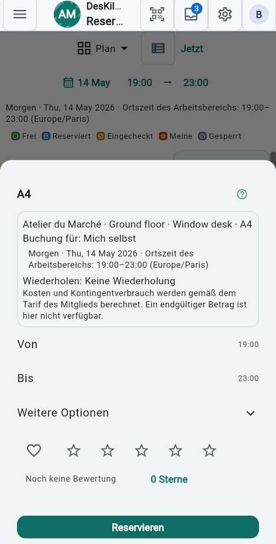

**Schritte**

1. Lesen Sie die Zusammenfassung: Workspace, Etage, Tisch und Platz, für wen die Buchung gilt, der Tag, die Stunden und die Wiederholung.
2. Passen Sie den Zeitraum an. Bei halben Tagen tippen Sie auf **Vormittag**, **Nachmittag** oder **Ganzer Tag**. In einem Zeitraster legen Sie **Von** und **Bis** fest; in einem Minutenraster bestimmt ein Regler namens **Dauer** die Länge.
3. Öffnen Sie **Weitere Optionen**, um die Buchung zu wiederholen.
4. Fügen Sie den Platz optional mit dem Herz zu Ihren Favoriten hinzu oder bewerten Sie ihn mit den Sternen.
5. Tippen Sie auf **Reservieren**.

**Gut zu wissen**

- Ist der gewählte Zeitraum nicht erlaubt, nennt eine rote Zeile unter dem Zeitraum den Grund, und **Reservieren** bleibt ausgegraut.
- Folgt auf demselben Platz eine weitere Buchung, sagt das Blatt, dass der Platz ab dieser Zeit reserviert ist, und beendet Ihre Buchung dort.
- Administratoren sehen **Buchen für** und, um einen Platz zu sperren, **Ressource verwalten**.
- Umfasst der gewählte Zeitraum den jetzigen Moment, erscheint ein Schalter **Sofort einchecken**, standardmäßig aus.

**Siehe auch:** [Sofort einchecken, wenn Sie schon da sind](#sofort-einchecken-wenn-sie-schon-da-sind) · [Eine Buchung wiederholen](#eine-buchung-wiederholen) · [Für jemand anderen buchen](#für-jemand-anderen-buchen)

<!-- anchor: user.reserve.walk-up -->
### Sofort einchecken, wenn Sie schon da sind

**Zielgruppe:** Mitglied · Administrator:in · Inhaber

Sie stehen an einem freien Platz und möchten ihn sofort nehmen. Auf dem Plan von heute bietet das Buchungsblatt zwei Aktionen nebeneinander an.

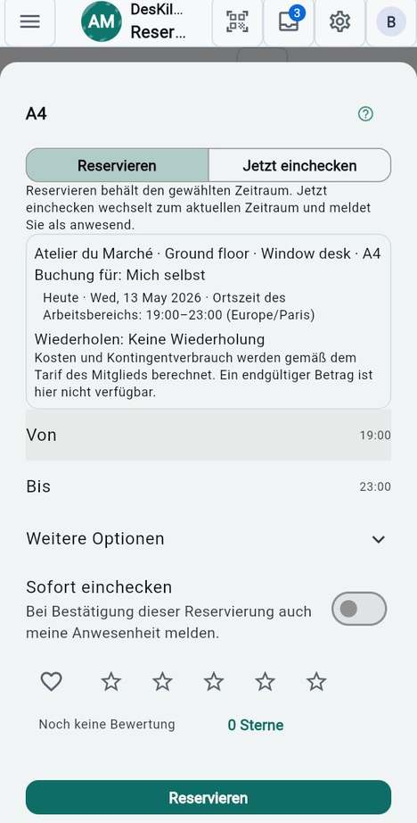

**Schritte**

1. Öffnen Sie [Reservieren](https://fdittgen-png.github.io/deskilo/#/reserve) auf heute, ohne eine andere Zeit zu wählen, und tippen Sie auf einen freien Platz.
2. Wählen Sie oben im Blatt **Reservieren** oder **Jetzt einchecken**.
3. **Reservieren** behält den gewählten Zeitraum. **Jetzt einchecken** schaltet auf den aktuellen Zeitraum um und markiert Sie als anwesend.
4. Tippen Sie zur Bestätigung auf **Einchecken**.

**Gut zu wissen**

- Das Einchecken endet dort, wo die nächste Buchung auf diesem Platz beginnt, und das Blatt sagt es Ihnen.
- Ein spontanes Einchecken muss heute beginnen.
- Wo pro halbem Tag gebucht wird, endet das Einchecken mit dem aktuellen halben Tag oder mit dem Tag, wenn Ihr üblicher Zeitraum der ganze Tag ist.

**Siehe auch:** [Ein- und Auschecken](#ein--und-auschecken) · [Die Regeln, denen Sie beim Buchen begegnen](#die-regeln-denen-sie-beim-buchen-begegnen)

<!-- anchor: user.reserve.whole-space -->
### Einen ganzen Tisch, Raum oder eine ganze Etage buchen

**Zielgruppe:** Mitglied · Administrator:in · Inhaber

Sie brauchen den ganzen Tisch, den ganzen Raum oder die ganze Etage, für eine Besprechung oder einen Tag. Spaces, die dafür eingerichtet sind, lassen sich als Ganzes buchen.

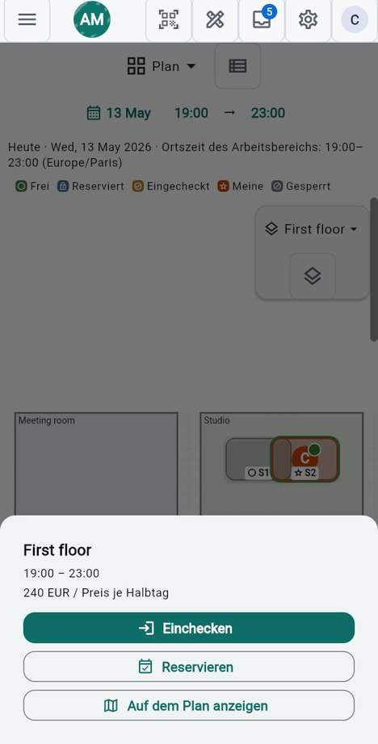

**Schritte**

1. Tippen Sie auf dem Plan doppelt auf den Tisch, den Raum oder die leere Etage. Für eine Etage können Sie auch auf **Etage reservieren** tippen, die Schaltfläche unter der Etagenauswahl.
2. Das Blatt nennt den Space, den Zeitraum und, falls es einen gibt, den **Preis je Halbtag**.
3. Tippen Sie auf **Einchecken**, um ihn jetzt zu nehmen, oder auf **Reservieren**, um ihn für den gezeigten Zeitraum zu buchen.
4. Wählen Sie im Buchungsblatt, das sich öffnet, den Zeitraum und tippen Sie auf **Reservieren**.

**Gut zu wissen**

- Ein Mitglied braucht das Recht, ganze Spaces zu buchen; Inhaber und Administratoren haben es. Ohne dieses Recht sagt das Blatt **Sie dürfen keinen ganzen Tisch, kein Büro und keine ganze Etage reservieren.**
- Ein ganzer Space lässt sich nicht buchen, solange einer seiner Plätze in diesem Zeitraum belegt ist, und kein Platz lässt sich buchen, solange sein Tisch, Raum oder seine Etage als Ganzes gebucht ist.
- Verlangt der Inhaber eine Freigabe, sperrt eine Buchung eines ganzen Spaces den Space sofort und wartet auf die Prüfenden; lehnen sie ab, wird sie storniert.

**Siehe auch:** [Wenn eine Buchung auf Bestätigung wartet](#wenn-eine-buchung-auf-bestätigung-wartet) · [Einen Raumcode scannen](#einen-raumcode-scannen)

<!-- anchor: user.reserve.for-someone -->
### Für jemand anderen buchen

**Zielgruppe:** Administrator:in · Inhaber

Sie möchten einen Platz im Namen eines Mitglieds buchen. Administratoren können das Mitglied im Buchungsblatt auswählen.

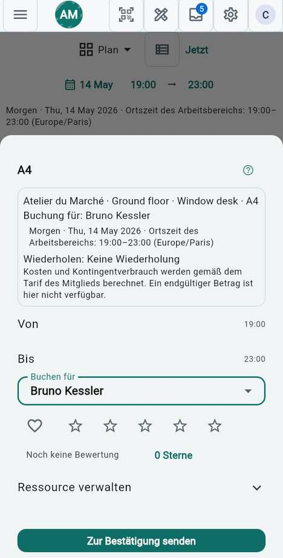

**Schritte**

1. Tippen Sie in [Reservieren](https://fdittgen-png.github.io/deskilo/#/reserve) auf einen freien Platz, um das Buchungsblatt zu öffnen.
2. Öffnen Sie **Buchen für** und wählen Sie das Mitglied.
3. Die Zusammenfassung lautet nun **Buchung für** dieses Mitglied, und die Schaltfläche wechselt zu **Zur Bestätigung senden**.
4. Tippen Sie auf **Zur Bestätigung senden**. Eine Meldung lautet **Zur Bestätigung an** das Mitglied **gesendet**.

**Gut zu wissen**

- Das Mitglied muss zustimmen, bevor die Buchung besteht. Es findet die Anfrage in seinem Kalender und in seinen Benachrichtigungen.
- Eine für jemand anderen gemachte Buchung wird nie eingecheckt und kann sich nicht wiederholen.
- Das Feld **Buchen für** erscheint nur, wenn der Inhaber Administratoren erlaubt, für Mitglieder zu buchen. Für eine ganze Etage entscheidet der Inhaber, wer sie zuweisen darf.

**Siehe auch:** [Wenn eine Buchung auf Bestätigung wartet](#wenn-eine-buchung-auf-bestätigung-wartet) · [Entscheidungen, die im Kalender auf Sie warten](#entscheidungen-die-im-kalender-auf-sie-warten)

<!-- anchor: user.reserve.series -->
### Eine Buchung wiederholen

**Zielgruppe:** Mitglied · Administrator:in · Inhaber

Sie sitzen jeden Dienstag am selben Platz oder einen Monat lang an jedem Werktag. Eine wiederkehrende Buchung legt alle Termine auf einmal an.

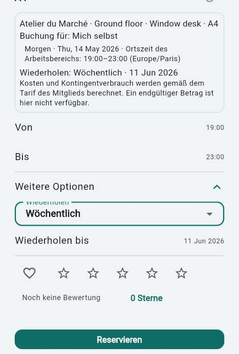

**Schritte**

1. Öffnen Sie das Buchungsblatt auf einem freien Platz und am ersten gewünschten Tag.
2. Öffnen Sie **Weitere Optionen**.
3. Wählen Sie unter **Wiederholen** **Täglich**, **Jeden Werktag** oder **Wöchentlich**. Standard ist **Keine Wiederholung**.
4. Legen Sie **Wiederholen bis** fest, das letzte Datum. Das Blatt schlägt vier Wochen im Voraus vor.
5. Tippen Sie auf **Reservieren**. Ein Dialog sagt Ihnen, wie viele Buchungen angelegt wurden.

**Gut zu wissen**

- Termine, die sich nicht buchen ließen, sind im Dialog aufgelistet und werden übersprungen. Die übrigen bleiben bestehen.
- Um eine wiederkehrende Buchung zu stornieren, öffnen Sie einen ihrer Termine und wählen **Diesen Termin stornieren** oder **Diesen und folgende stornieren**.
- Sie können eine einzelne Buchung auch über **Zeit ändern** in ihren Details in eine wiederkehrende verwandeln.
- Wiederholen wird nicht angeboten, wenn Sie für jemand anderen buchen.

**Siehe auch:** [Eine Buchung ändern oder stornieren](#eine-buchung-ändern-oder-stornieren) · [Das Buchungsblatt](#das-buchungsblatt)

<!-- anchor: user.reserve.policies -->
### Die Regeln, denen Sie beim Buchen begegnen

**Zielgruppe:** Mitglied · Administrator:in · Inhaber

Sie wollten buchen, und die App hat abgelehnt, oder Sie fragen sich, was erlaubt ist. Ihr Inhaber legt die Regeln des Spaces fest; das ist, was Sie davon sehen.

| Regel | Was Sie sehen |
|---|---|
| Öffnungszeiten und offene Tage | Der Plan und die Ansichten folgen dem Arbeitstag, standardmäßig 08:00 bis 17:00 Uhr, mit der Teilung der halben Tage um 12:00 Uhr. Ein geschlossener Tag sagt **An diesem Tag geschlossen**. |
| Außerhalb der Öffnungszeiten | Hängt vom Space ab. Aus: **Buchungen außerhalb der Öffnungszeiten sind nicht erlaubt.** Nur spontan: Sie können vor Ort einchecken, aber nicht im Voraus buchen. Frei: erlaubt, nie gezählt oder berechnet. Berechnet: erlaubt und als Nutzung gezählt, außer an einem Tag, an dem Sie bereits eine reguläre Buchung haben. |
| Vergangene Buchungen | Eine Buchung an einem Tag, der bereits zu Ende ist, wird abgelehnt, es sei denn, der Inhaber erlaubt vergangene Buchungen: **Diese Buchung liegt vollständig in der Vergangenheit.** Früher am selben Tag wird sie als vergangener Besuch erfasst. |
| Grenzen | Eine Buchung hat einen weitesten Horizont (**Zu weit voraus**, standardmäßig 90 Tage), eine kürzeste und eine längste Dauer (**Zu kurz**, **Zu lang**) und endet an dem Tag, an dem sie beginnt. |
| Ein Platz zur Zeit | Standardmäßig dürfen Sie in einem Zeitraum eine Buchung haben: **Sie haben in diesem Zeitraum bereits eine Buchung**. Ein Administrator kann Ihnen mehr erlauben. |
| Reservierungslimit | **Reservierungslimit erreicht**, wenn Sie die meisten offenen Buchungen halten, die Ihnen erlaubt sind. |
| Tage in Ihrem Tarif | Sind die Tage Ihres Tarifs aufgebraucht, gilt die Einstellung des Inhabers für Sie: Buchungen können enden, Sie werden eventuell gebeten, ein Paket zu kaufen, oder die zusätzlichen Tage werden berechnet. |

**Schritte**

1. Wird ein Zeitraum abgelehnt, lesen Sie die rote Zeile darunter im Buchungsblatt.
2. Ändern Sie den Tag, die Zeit oder den Platz, oder fragen Sie einen Administrator.
3. Sind Ihre Tage aufgebraucht, öffnen Sie [Finanzen](https://fdittgen-png.github.io/deskilo/#/money), um Ihren Tarif zu sehen, und tippen Sie, wo angeboten, auf **Zusätzliche halbe Tage beantragen**.

**Gut zu wissen**

- Dieselben Regeln gelten auf dem Plan, in der Reservierungsübersicht, bei einem gescannten Code und am Kiosk an der Wand.
- Die App prüft einen Zeitraum, bevor sie ihn anbietet, daher erscheinen die meisten Ablehnungen im Blatt und nicht erst nach dem Tippen.

**Siehe auch:** [Buchungsrichtlinien](#buchungsregeln) · [Gleichzeitige Reservierungen](#gleichzeitige-reservierungen) · [Reservierungslimit](#reservierungslimit)

<!-- anchor: user.reserve.closed-days -->
### Schließtage und Feiertage

**Zielgruppe:** Mitglied · Administrator:in · Inhaber

Sie möchten wissen, warum ein Tag nicht buchbar ist. Ihr Space ist an manchen Wochentagen und an den vom Inhaber hinzugefügten Schließtagen geschlossen, zum Beispiel an Feiertagen.

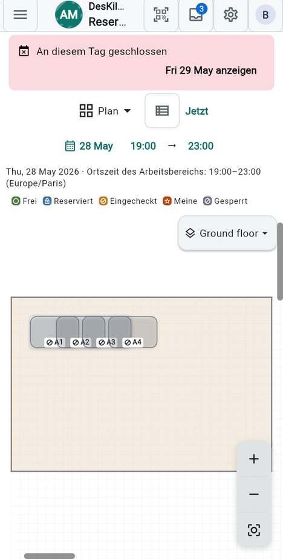

**Schritte**

1. Wählen Sie den Tag in [Reservieren](https://fdittgen-png.github.io/deskilo/#/reserve). Ein geschlossener Tag zeigt ein Banner, **An diesem Tag geschlossen**.
2. Tippen Sie auf die Abkürzung im Banner, die „Anzeigen“ und den nächsten offenen Tag nennt, um dorthin zu springen.
3. In **Monat** zeigen geschlossene Tage **Zu**; in **Woche** sind sie grau mit einem Zeichen; in **Tag** sind sie als geschlossen markiert, unter dem Legendeneintrag **Geschlossen**.
4. Im Kalender sind geschlossene Tage durchgestrichen, und die Liste des Tages nennt **Geschlossen** mit dem Grund, wenn der Inhaber einen angegeben hat.

**Gut zu wissen**

- An einem geschlossenen Tag tragen die Plätze das Symbol für gesperrt und lassen sich weder buchen noch einchecken.
- Feiertage erscheinen genau wie jeder andere Schließtag.

**Siehe auch:** [Monatsansicht](#monatsansicht) · [Schließtage](#schließtage) · [Offene Wochentage](#geöffnete-wochentage)

<!-- anchor: user.reserve.check-in -->
### Ein- und Auschecken

**Zielgruppe:** Mitglied · Administrator:in · Inhaber

Sie kommen an Ihrem Platz an und gehen später wieder. Einchecken sagt, dass Sie da sind; Auschecken gibt frei, was Sie nicht mehr brauchen.

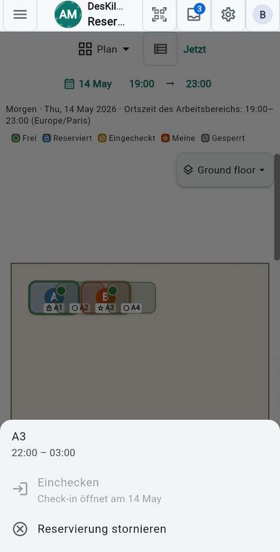

**Schritte**

1. Öffnen Sie [Reservieren](https://fdittgen-png.github.io/deskilo/#/reserve), suchen Sie den Tag Ihrer Buchung und tippen Sie auf Ihren eigenen Platz, den mit der Markierung **Meine**.
2. Tippen Sie auf **Einchecken**. Ist es ausgegraut, sagt es Ihnen, wann es öffnet, zum Beispiel „Einchecken ab 14. Mai“.
3. Wenn Sie gehen, tippen Sie erneut auf Ihren Platz und dann auf **Auschecken**. Der Rest der Buchung wird sofort für andere freigegeben.
4. Die Buchung lautet dann **Abgeschlossen: ausgecheckt um** und die Uhrzeit.

**Gut zu wissen**

- Das Einchecken öffnet 15 Minuten vor dem Beginn oder einen Rasterschritt vorher, wenn das Raster gröber ist. Wo pro halbem Tag, pro Tag oder pro echter Stunde gebucht wird, öffnet es für den ganzen Tag der Buchung.
- Es schließt, wenn die Buchung endet: **Diese Reservierung ist vorbei — Einchecken ist nicht mehr möglich.**
- Sind Sie noch an einem anderen Ort eingecheckt, checken Sie dort zuerst aus.
- Ist das automatische Ein- und Auschecken an, schließt sich eine Buchung, die niemand ein- oder ausgecheckt hat, selbst ab, sobald ihre Zeit vorbei ist. Ohne diese Funktion lautet eine Buchung, bei der Sie nicht eingecheckt haben, **Dieser Zeitraum ist ohne Check-in vorbei.**
- An einem Kiosk an der Wand checken Sie mit Ihrem Badge ein; siehe [Ihr Badge](#ihr-badge) und [NFC-Badge-Check-in](#nfc-badge-check-in).

**Siehe auch:** [Einen Raumcode scannen](#einen-raumcode-scannen) · [Eine Buchung ändern oder stornieren](#eine-buchung-ändern-oder-stornieren)

<!-- anchor: user.reserve.scan -->
### Einen Raumcode scannen

**Zielgruppe:** Mitglied · Administrator:in · Inhaber

Sie stehen vor einem Tisch, einem Raum oder einem Platz mit einer QR-Karte oder vor einem Stuhl mit einem NFC-Tag. Das Scannen zeigt, was Sie dort tun können, ohne den Plan zu durchsuchen.

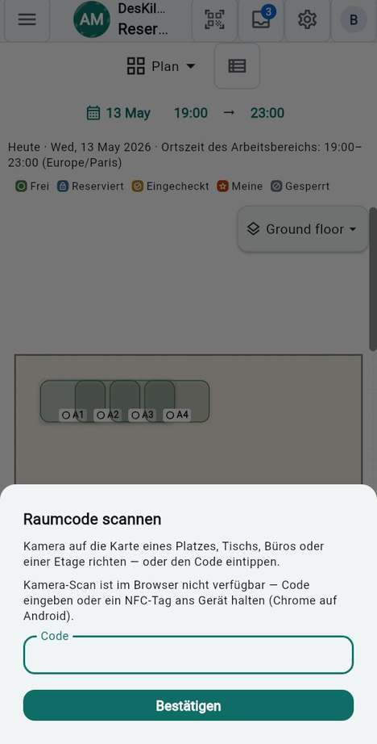

**Schritte**

1. Tippen Sie in [Reservieren](https://fdittgen-png.github.io/deskilo/#/reserve) auf **Raumcode scannen**, das Scannersymbol oben auf dem Bildschirm.
2. Richten Sie die Kamera auf die Karte oder tippen Sie die aufgedruckte Nummer bei **Code** ein und tippen Sie auf **Bestätigen**. Halten Sie Ihr Smartphone an den NFC-Tag eines Stuhls, wo das Gerät es unterstützt.
3. Wählen Sie bei einem Platz **Einchecken**, **Reservieren** oder **Auschecken**, dieselben Aktionen wie am Kiosk, ohne den Badge-Schritt.
4. Bei einem Tisch, einem Büro oder einer Etage zeigt das Blatt Zustand, Zeitraum und **Preis je Halbtag**; tippen Sie auf **Einchecken**, **Reservieren** oder **Auf dem Plan anzeigen**.

**Gut zu wissen**

- Hat jemand anderes den Space, sagt das Blatt, wer, und bietet an, dieser Person eine Nachricht zu schreiben.
- Ein Code, der nicht aus diesem Workspace stammt, sagt **Kein Raumcode dieses Workspace.** Ein entfernter Space sagt **Dieser Code passt zu keinem Raum mehr.**
- Im Browser ist die Kamera nicht verfügbar: Tippen Sie stattdessen den Code ein. Ein NFC-Tag identifiziert nur Plätze.
- Das Scannersymbol erscheint nur, wenn Ihr Space QR-Codes verwendet.

**Siehe auch:** [Einen ganzen Tisch, Raum oder eine ganze Etage buchen](#einen-ganzen-tisch-raum-oder-eine-ganze-etage-buchen) · [Ein- und Auschecken](#ein--und-auschecken)

<!-- anchor: user.reserve.change -->
### Eine Buchung ändern oder stornieren

**Zielgruppe:** Mitglied · Administrator:in · Inhaber

Ihre Pläne haben sich geändert. Sie können eine Buchung verschieben, verkürzen, verlängern oder stornieren, solange sie nicht genutzt wurde.

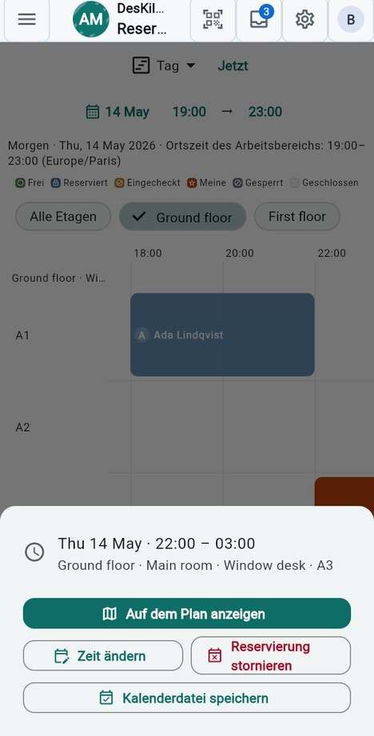

**Schritte**

1. Öffnen Sie die Buchung: Tippen Sie in der Ansicht **Tag** oder **Woche** darauf, im Kalender, oder tippen Sie auf **Details** in der Meldung, die auf eine Buchung folgt.
2. Bei einer Buchung, die noch nicht begonnen hat, tippen Sie auf **Zeit ändern**, um einen anderen Zeitraum zu wählen, oder auf **Reservierung stornieren**, um sie zu entfernen.
3. Wählen Sie bei einer wiederkehrenden Buchung **Diesen Termin stornieren** oder **Diesen und folgende stornieren**.
4. Bei einer Buchung, in die Sie eingecheckt sind, erscheinen **Länger bleiben** und **Früher beenden**, wenn die Regeln des Spaces ein späteres oder früheres Ende erlauben. Der Beginn verschiebt sich nicht.
5. Tippen Sie bei einer Buchung, die begonnen hat, eingecheckt oder abgeschlossen ist, und wenn Ihr Space Löschanfragen erlaubt, auf **Löschung beantragen**, nennen Sie auf Wunsch einen Grund und tippen Sie auf **Anfrage senden**.

**Gut zu wissen**

- **Löschung beantragen** löscht nichts: Ein Inhaber oder Administrator entscheidet, ob das Einchecken nur vergessen wurde, dann bleibt die Buchung, oder ob die Buchung nie genutzt wurde, dann wird sie entfernt.
- Ein Administrator kann die Buchung eines anderen mit **Reservierung entfernen (übersteuern)** entfernen; das Mitglied und die Administratoren werden informiert.
- **Auf dem Plan anzeigen** springt zum Platz auf dem Plan.

**Siehe auch:** [Ein- und Auschecken](#ein--und-auschecken) · [Eine Buchung im eigenen Kalender speichern](#eine-buchung-im-eigenen-kalender-speichern) · [Eine Buchung wiederholen](#eine-buchung-wiederholen)

<!-- anchor: user.reserve.awaiting -->
### Wenn eine Buchung auf Bestätigung wartet

**Zielgruppe:** Mitglied · Administrator:in · Inhaber

Eine Buchung oder Anfrage lautet **wartet auf Bestätigung**. Das heißt nicht, dass etwas schiefgegangen ist: Jemand muss noch Ja sagen.

**Schritte**

1. Sehen Sie nach, was wartet: Der Kalender listet es mit den Worten **wartet auf Bestätigung**, und eine an Sie gerichtete Entscheidung steht ganz oben.
2. Ist es Ihre Entscheidung, tippen Sie im Kalender auf **Annehmen** oder auf das Kreuz.
3. Warten Sie auf jemand anderen, ist von Ihnen nichts nötig; die Antwort kommt als Benachrichtigung und im Kalender.

Was auf eine Bestätigung wartet:

- Eine Buchung, die ein Administrator für Sie gemacht hat: Sie bestätigen sie.
- Eine Buchung eines ganzen Spaces, wenn der Inhaber verlangt, dass Prüfende sie freigeben. Der Space bleibt gesperrt, solange sie wartet, und eine Ablehnung storniert die Buchung.
- Eine Anfrage, eine bereits begonnene, eingecheckte oder abgeschlossene Buchung zu löschen.

**Gut zu wissen**

- Wer prüfen darf und wie viele zustimmen müssen, ist die Regel des Inhabers; siehe [Validierungsregeln](#validierungsregeln-bereich-für-bereich).
- Eine Anfrage zeigt ihren Fortschritt, zum Beispiel 1/2 Validierungen, und später ihr Ergebnis: bestätigt, abgelehnt, zurückgewiesen oder abgelaufen.

**Siehe auch:** [Für jemand anderen buchen](#für-jemand-anderen-buchen) · [Entscheidungen, die im Kalender auf Sie warten](#entscheidungen-die-im-kalender-auf-sie-warten)

<!-- anchor: user.reserve.calendar -->
### Der Kalender-Tab

**Zielgruppe:** Mitglied · Administrator:in · Inhaber

Sie möchten alles Terminierte an einem Ort: Ihre Buchungen, Check-ins, Hinweise, Nachrichten, fällige Zahlungen. Der Kalender-Tab listet es nach Tag, und jede Zeile öffnet ihre Quelle.

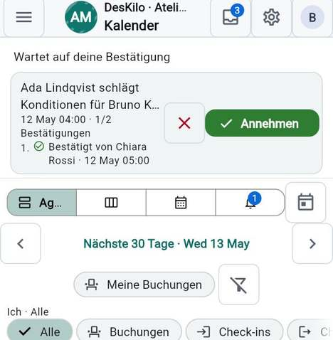

**Schritte**

1. Öffnen Sie [Kalender](https://fdittgen-png.github.io/deskilo/#/calendar). Er öffnet sich auf der **Agenda**: die nächsten 30 Tage, gruppiert unter **Heute**, **Morgen** und den Tagesnamen.
2. Springen Sie mit den Pfeilen jeweils 30 Tage weiter oder tippen Sie auf das Datum für eine Tagesauswahl. Die Schaltfläche oben rechts bringt Sie zurück zu **Heute**.
3. Tippen Sie auf eine Zeile, um sie zu öffnen: Eine Buchung öffnet ihre Details, eine Nachricht ihre Unterhaltung, eine Rechnung ihr Blatt.
4. Grenzen Sie die Liste mit den Chips darunter ein, wie unter [Den Kalender filtern](#den-kalender-filtern) beschrieben.

**Gut zu wissen**

- Buchungen erscheinen für alle im Space, weil der Plan allen die Belegung zeigt. Nachrichten und Geld bleiben privat für Sie und für die Personen, die die Regeln des Spaces zulassen.
- Ein Mitglied mit der Finanz- oder Mitgliederberechtigung kann die Liste mit dem Chip **Ich** auf ein anderes Mitglied umstellen. Was der Server nicht erlaubt, erscheint als gesperrt, nicht als leerer Tag.
- Behält Ihr Space den einfacheren Kalender, wählen Sie statt der drei Ansichten einen Tag oder einen Tagesbereich.

**Siehe auch:** [Agenda, Woche und Monat im Kalender](#agenda-woche-und-monat-im-kalender) · [Eine Buchung im eigenen Kalender speichern](#eine-buchung-im-eigenen-kalender-speichern)

<!-- anchor: user.reserve.calendar-views -->
### Agenda, Woche und Monat im Kalender

**Zielgruppe:** Mitglied · Administrator:in · Inhaber

Sie möchten eine Woche oder einen Monat auf einen Blick sehen. Der Kalender bietet drei Arten, hinzuschauen.

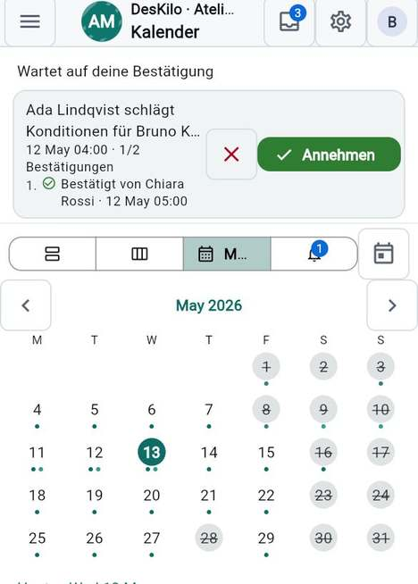

**Schritte**

1. Wählen Sie in der Leiste oben **Agenda**, **Woche** oder **Monat**. Die vierte Schaltfläche, **Hinweise**, zeigt Ihre Hinweise, wenn Ihr Space sie anbietet.
2. Tippen Sie in **Woche** auf einen der sieben Tage, um seine Liste darunter zu lesen.
3. Tippen Sie in **Monat** auf einen Tag im Raster. Unter jedem Tag zeigen bis zu drei Punkte, was er enthält: Buchungen und Anwesenheit, Hinweise und Nachrichten, Geld. Heute ist eingekreist.
4. Geschlossene Tage sind grau und durchgestrichen.

**Gut zu wissen**

- In **Monat** zeigt die Liste darunter nur den gewählten Tag; in **Woche** listet sie die ganze Woche.
- Die Pfeile springen je nach Ansicht um eine Woche oder einen Monat.
- Der Kalender zeigt auch das Fälligkeitsdatum einer Zahlung und jede geplante Ausgabe, die fällig wird.

**Siehe auch:** [Der Kalender-Tab](#der-kalender-tab) · [Schließtage und Feiertage](#schließtage-und-feiertage)

<!-- anchor: user.reserve.calendar-decisions -->
### Entscheidungen, die im Kalender auf Sie warten

**Zielgruppe:** Mitglied · Administrator:in · Inhaber

Sie wurden gebeten, etwas zu bestätigen. Braucht etwas Ihre Antwort, steht es oben im Kalender, unter **Wartet auf Ihre Bestätigung**.

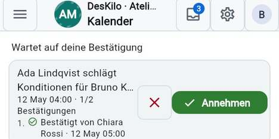

**Schritte**

1. Öffnen Sie [Kalender](https://fdittgen-png.github.io/deskilo/#/calendar). Jede wartende Entscheidung ist eine Karte mit einem kurzen Text und dem Datum, an dem sie gesendet wurde.
2. Lesen Sie die Karte. Sie kann zeigen, wie viele Validierungen sie hat, zum Beispiel 1/2 Validierungen.
3. Tippen Sie auf **Annehmen**, um zuzustimmen, oder auf das Kreuz, um abzulehnen.
4. Öffnen Sie die Ansicht **Hinweise**, um die ganze Liste mit ihrem Verlauf zu sehen.

**Gut zu wissen**

- Die Schaltfläche **Hinweise** in der Leiste zeigt, wie viele Entscheidungen auf Sie warten.
- Haben Sie geantwortet, verlässt die Entscheidung die Spitze und erscheint mit ihrem Ergebnis in der Liste.

**Siehe auch:** [Wenn eine Buchung auf Bestätigung wartet](#wenn-eine-buchung-auf-bestätigung-wartet) · [Validierungsregeln](#validierungsregeln-bereich-für-bereich)

<!-- anchor: user.reserve.calendar-filters -->
### Den Kalender filtern

**Zielgruppe:** Mitglied · Administrator:in · Inhaber

Die Liste ist lang, und Sie suchen nur Buchungen. Die Chips unter der Leiste grenzen sie ein.

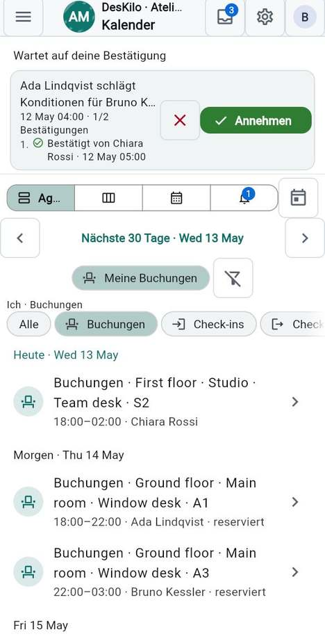

**Schritte**

1. Tippen Sie auf **Meine Buchungen**, um nur Ihre eigenen Buchungen zu behalten. Tippen Sie erneut darauf, um alles zu sehen.
2. Oder wählen Sie Chips wie **Buchungen**, **Check-ins** und **Check-outs**; **Alle** zeigt jede Art.
3. Um Ihre Auswahl rückgängig zu machen, tippen Sie auf **Filter zurücksetzen**, die Trichter-Schaltfläche.
4. Eine Zeile über den Chips wiederholt, was Sie sehen, zum Beispiel Ich · Buchungen.

**Gut zu wissen**

- Mehrere Chips können gleichzeitig aktiv sein.
- Welche Chips angeboten werden, hängt davon ab, was Ihr Space eingeschaltet hat, zum Beispiel Validierungen.

**Siehe auch:** [Der Kalender-Tab](#der-kalender-tab) · [Agenda, Woche und Monat im Kalender](#agenda-woche-und-monat-im-kalender)

<!-- anchor: user.reserve.calendar-file -->
### Eine Buchung im eigenen Kalender speichern

**Zielgruppe:** Mitglied · Administrator:in · Inhaber

Sie möchten eine Buchung im Kalender Ihres Smartphones oder Computers haben. Die App schreibt eine Standard-Kalenderdatei, die Google, Outlook, Apple und andere importieren.

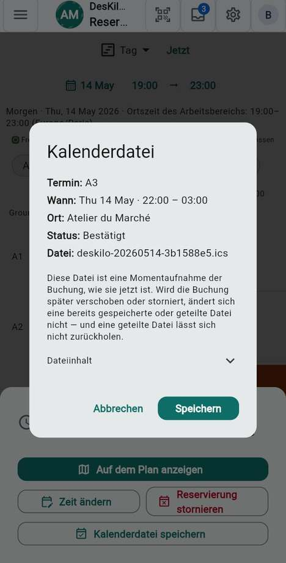

**Schritte**

1. Öffnen Sie eine Ihrer eigenen Buchungen, in der Ansicht **Tag**, der Ansicht **Woche** oder im Kalender.
2. Tippen Sie auf **Kalenderdatei speichern**.
3. Lesen Sie die Vorschau: den **Termin**, **Wann**, **Ort**, **Status** und den Namen der **Datei**. Öffnen Sie **Dateiinhalt**, um die Datei selbst zu lesen.
4. Tippen Sie auf **Speichern**. Die App speichert die Datei, meist in Ihrem Download-Ordner, und sagt Ihnen, wo; öffnen Sie sie mit Ihrem Kalender.

**Gut zu wissen**

- Die Datei enthält die Zeit, den Ort, den Namen des Workspace und ob die Buchung bestätigt oder storniert ist. Keinen Betrag, keinen Namen, keine E-Mail-Adresse.
- Sie ist eine Momentaufnahme: Ändert sich die Buchung später, ändert sich eine bereits gespeicherte Datei nicht.
- Hat sich die Buchung zwischen der Vorschau und **Speichern** geändert, wird nichts geschrieben, und die Vorschau aktualisiert sich.
- Ihr Inhaber kann diese Funktion ausschalten.

**Siehe auch:** [Eine Buchung ändern oder stornieren](#eine-buchung-ändern-oder-stornieren) · [Der Kalender-Tab](#der-kalender-tab)

<!-- anchor: user.collaborate.overview -->
## Zusammenarbeiten: Mitglieder, Anfragen, Nachrichten und das weitere Netzwerk

In diesem Kapitel:
- [Das Mitgliederverzeichnis](#das-mitgliederverzeichnis) und [die Seite eines Mitglieds](#die-seite-eines-mitglieds)
- [Einem Mitglied schreiben](#einem-mitglied-schreiben)
- [Ereignisse und Bestätigungen](#ereignisse-und-bestätigungen), [annehmen oder ablehnen](#eine-anfrage-annehmen-oder-ablehnen) und [Was auf Sie wartet](#was-auf-sie-wartet)
- [Validierungsregeln, Bereich für Bereich](#validierungsregeln-bereich-für-bereich) (Administratoren und Inhaber)
- [Nachrichten](#nachrichten), [neue Unterhaltungen und Gruppen](#eine-unterhaltung-oder-eine-gruppe-beginnen), [Nachrichtenanfragen](#nachrichtenanfragen) und [Blockieren](#jemanden-blockieren)
- [Benachrichtigungen](#benachrichtigungen)
- [Entdecken](#entdecken), [Ihr öffentliches Profil](#ihr-öffentliches-profil) und [Ihre Besuche als Gast](#ihre-besuche-als-gast)

<!-- anchor: user.collaborate.directory -->
### Das Mitgliederverzeichnis

**Zielgruppe:** Mitglied · Administrator:in · Inhaber

Sie möchten sehen, wer in Ihrem Workspace ist, wer heute da ist und wer gleich kommt.

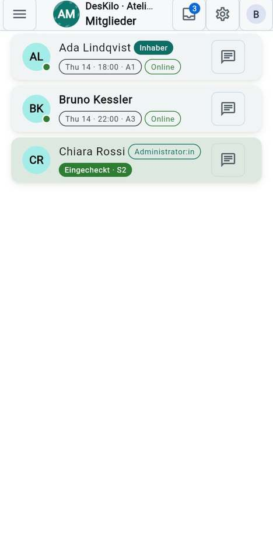

**Schritte**

1. Öffnen Sie [Mitglieder](https://fdittgen-png.github.io/deskilo/#/directory) im Menü (oder in der unteren Leiste, wenn Sie den klassischen Navigationsstil gewählt haben).
2. Lesen Sie jede Karte: Foto oder Initialen, Name, Rollenabzeichen (**Inhaber** oder **Administrator:in**; einfache Mitglieder tragen keines), die Statuszeile der Person und zwei kleine Chips.
3. Lesen Sie die Chips. Der erste ist die Buchung: **Eingecheckt** mit dem Platz, **Jetzt reserviert** oder die nächste Buchung (Tag, Uhrzeit, Platz). Der zweite sagt **Online** oder wann die Person zuletzt gesehen wurde.
4. Tippen Sie auf eine Karte, um [die Seite des Mitglieds](#die-seite-eines-mitglieds) zu öffnen.
5. Ziehen Sie die Liste nach unten, um sie zu aktualisieren.

**Gut zu wissen**

- Es werden nur aktive Mitglieder aufgelistet, in alphabetischer Reihenfolge.
- Administratoren und Inhaber sehen unter dem Namen auch die E-Mail-Adresse jeder Person. Mitglieder nicht: Zwischen Mitgliedern bleibt der Kontakt freiwillig.
- Hat Ihr Inhaber eine WhatsApp-Gruppe eingerichtet, steht über der Liste eine Zeile **WhatsApp-Gruppe öffnen**.

**Siehe auch:** [Die Seite eines Mitglieds](#die-seite-eines-mitglieds) · [Einem Mitglied schreiben](#einem-mitglied-schreiben)

<!-- anchor: user.collaborate.member-page -->
### Die Seite eines Mitglieds

**Zielgruppe:** Mitglied · Administrator:in · Inhaber

Sie möchten wissen, ob ein Kollege oder eine Kollegin da ist, wann er oder sie als Nächstes kommt und wie Sie ihn oder sie erreichen.

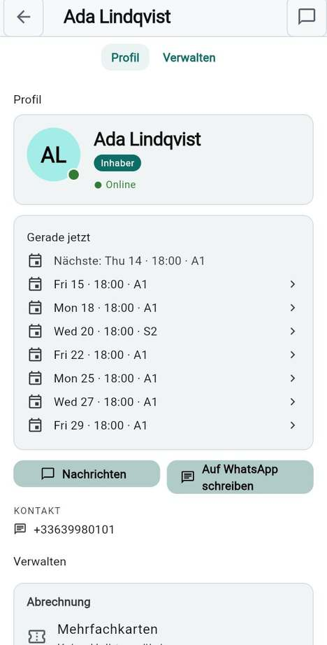

**Schritte**

1. Tippen Sie in [Mitglieder](https://fdittgen-png.github.io/deskilo/#/directory) auf eine Karte.
2. Lesen Sie die obere Karte: Foto, Rolle, Anwesenheit und die eigene Statuszeile der Person. Weiter unten sehen Sie, wie lange sie schon Mitglied ist.
3. Lesen Sie **Gerade jetzt**: ob die Person eingecheckt ist, in dieser Minute eine Buchung hat oder wann ihre nächste Buchung ist. Tippen Sie auf eine Buchung, um sie zu öffnen.
4. Nutzen Sie die Schaltflächen: **Nachrichten**, **Auf WhatsApp schreiben** und, für Administratoren, **E-Mail**.

**Gut zu wissen**

- **Kontakt** zeigt eine WhatsApp-Nummer nur, wenn die Person sich entschieden hat, sie zu teilen.
- Wo Sie sie sehen dürfen, stehen Geldwerte (offene Rechnungen, Zahlungen, der laufende Monat) auf derselben Seite. Ihre eigenen sehen Sie immer; die einer anderen Person nur mit dem Recht, Finanzen einzusehen.
- Administratoren und Inhaber erhalten außerdem einen Bereich **Verwalten** mit **Mitgliedschaft**, **Buchungsregeln**, **Abrechnung** und **Ausweise & Zugang**, wobei jede Zeile ihren aktuellen Wert zeigt.

**Siehe auch:** [Einem Mitglied schreiben](#einem-mitglied-schreiben) · [Die Aktionen des Mitglieds](#die-aktionen-des-mitglieds)

<!-- anchor: user.collaborate.contact -->
### Einem Mitglied schreiben

**Zielgruppe:** Mitglied · Administrator:in · Inhaber

Sie möchten einen Kollegen oder eine Kollegin etwas fragen, ohne den Workspace zu verlassen.

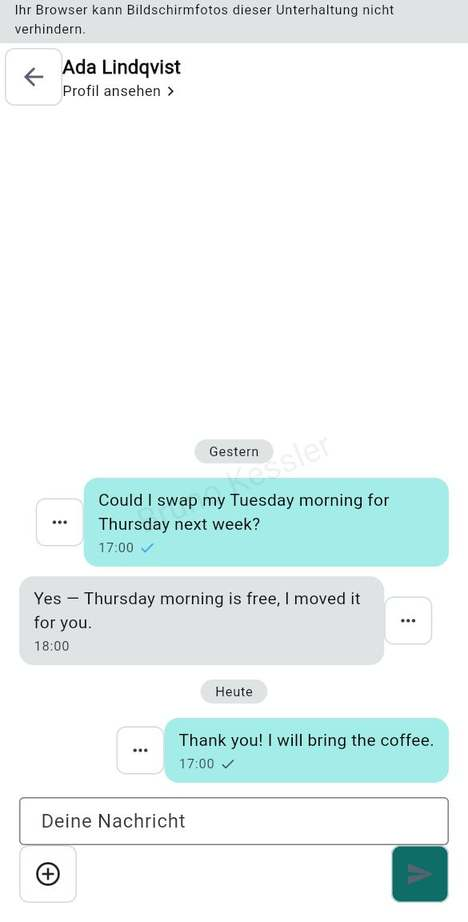

**Schritte**

1. Öffnen Sie [Mitglieder](https://fdittgen-png.github.io/deskilo/#/directory), tippen Sie auf eine Karte, um die Seite des Mitglieds zu öffnen, und tippen Sie dann auf **Nachrichten**.
2. Schreiben Sie in das Feld **Ihre Nachricht**.
3. Tippen Sie auf **Senden**.

**Gut zu wissen**

- Nachrichten lesen sich von der ältesten zur neuesten, unter Tagestrennern. Ein Haken unter Ihrer Nachricht bedeutet, dass sie zugestellt wurde; ein blauer Doppelhaken bedeutet, dass sie gelesen wurde.
- Tippen Sie auf **…** neben einer Sprechblase für die Nachrichtenaktionen (mit einem Emoji reagieren, markieren, kopieren, innerhalb von 15 Minuten bearbeiten, weiterleiten, löschen). Die Büroklammer hängt eine Reservierung oder einen Space an; die andere Person sieht einen Link, der sie öffnet.
- Dafür braucht Ihr Workspace die Funktion **Mitglieder-Benachrichtigungen**.

**Siehe auch:** [Nachrichten](#nachrichten)

<!-- anchor: user.collaborate.events -->
### Ereignisse und Bestätigungen

**Zielgruppe:** Mitglied · Administrator:in · Inhaber

Sie möchten sehen, was im Workspace geschehen ist und was auf eine Antwort wartet.

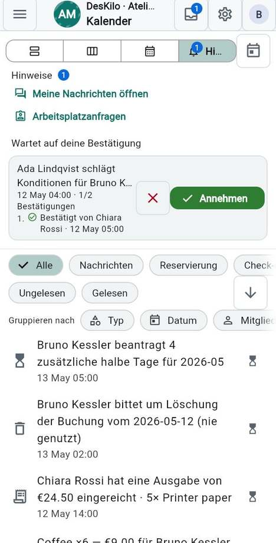

**Schritte**

1. Tippen Sie in der oberen Leiste auf **Ereignisse** (das Ablagesymbol mit einer Zahl) oder öffnen Sie [Ereignisse](https://fdittgen-png.github.io/deskilo/#/events) im Menü. Die Seite öffnet sich auf **Hinweise**.
2. Lesen Sie oben **Wartet auf Ihre Bestätigung**: Anfragen, die Sie brauchen.
3. Lesen Sie den Verlauf darunter. Jede Zeile sagt, was geschehen ist; eine Sanduhr bedeutet ausstehend, ein grüner Haken bedeutet bestätigt. Geldzeilen zeigen, wer sie validiert hat und wann.
4. Grenzen Sie den Verlauf mit den Chips ein: **Alle**, **Nachrichten**, **Reservierung**, **Check-ins**, **Finanzen**, **Mitglieder**, dann **Ungelesen** oder **Gelesen**.
5. Tippen Sie neben **Gruppieren nach** auf **Typ**, **Datum** oder **Mitglied**, um den Verlauf in Gruppen zu falten; tippen Sie auf das Gruppensymbol, um zur flachen Liste zurückzukehren.

**Gut zu wissen**

- Ein Ereignis entsteht, sobald etwas gebucht, geändert oder storniert wird, eine Zahlung oder Ausgabe erfasst wird, zusätzliche halbe Tage oder eine Löschung beantragt werden, sich eine Rolle ändert oder jemand beitritt.
- Mitglieder sehen ihre eigenen Ereignisse; Administratoren und Inhaber sehen die aller.
- Ihr Filter wird gemerkt. Die Zahl an der Schaltfläche Ereignisse zählt neue Mitteilungen und auf Sie wartende Entscheidungen.
- **Meine Nachrichten öffnen** oben führt Sie zu Ihren [Unterhaltungen](#nachrichten).

**Siehe auch:** [Eine Anfrage annehmen oder ablehnen](#eine-anfrage-annehmen-oder-ablehnen) · [Validierungsregeln](#validierungsregeln-bereich-für-bereich)

<!-- anchor: user.collaborate.accept -->
### Eine Anfrage annehmen oder ablehnen

**Zielgruppe:** Mitglied · Administrator:in · Inhaber

Jemand hat Sie gebeten, etwas zu bestätigen, und Sie möchten antworten.

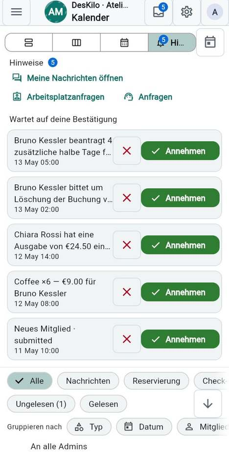

**Schritte**

1. Öffnen Sie [Ereignisse](https://fdittgen-png.github.io/deskilo/#/events).
2. Suchen Sie die Anfrage unter **Wartet auf Ihre Bestätigung**.
3. Tippen Sie auf **Annehmen** oder auf das rote Kreuz, um **Ablehnen** zu wählen.

**Gut zu wissen**

- Wenn ein Administrator etwas für Sie tut (einen Platz bucht, Ihre Zahlung erfasst), bleibt es ausstehend, bis Sie bestätigen. Was Sie für sich selbst tun, braucht nie Ihre eigene Bestätigung.
- Niemand bestätigt die eigene Anfrage: Sie wartet auf eine andere Person oder auf die Ausnahme der Regel ([Validierungsregeln](#validierungsregeln-bereich-für-bereich)).
- Nach sieben Tagen ohne Antwort wird ein Vorgang, der etwas anlegt oder ändert (etwa eine Buchung, die ein Administrator für Sie vornimmt), automatisch bestätigt; eine Löschung oder eine Belastung läuft stattdessen ab.
- Eine Zeile kann einen Fortschritt wie „1/2 Validierungen“ zeigen, wenn die Regel mehrere verlangt.

**Siehe auch:** [Ereignisse und Bestätigungen](#ereignisse-und-bestätigungen) · [Erforderliche Validierungen](#erforderliche-validierungen)

<!-- anchor: user.collaborate.attention -->
### Was auf Sie wartet

**Zielgruppe:** Administrator:in · Inhaber

Sie möchten einen Ort, der antwortet: Braucht mich heute etwas?

**Schritte**

1. Öffnen Sie [Was auf Sie wartet](https://fdittgen-png.github.io/deskilo/#/attention).
2. Lesen Sie die Zeilen der Reihe nach: Jede ist eine Entscheidung (zum Beispiel eine Anfrage zur Bestätigung oder eine Person, die auf Aufnahme wartet), die teuersten Verzögerungen zuerst.
3. Tippen Sie auf eine Zeile, um sie zu erledigen.

**Gut zu wissen**

- Dieser Bildschirm existiert nur, wenn Ihr Workspace die Funktion **Was auf Sie wartet** eingeschaltet hat; ohne sie führt die Adresse zurück zur Startseite.
- Mehrere gleiche Entscheidungen erscheinen als eine Zeile. Wartet nichts, sagt der Bildschirm **Nichts wartet auf Sie**.
- Er listet auch Konfiguration, die noch fehlt: „Einzurichten: …“ für jeden erforderlichen Bereich der Einrichtungsliste, der nicht bereit ist (nur für jemanden, der den Space konfiguriert), und „… eingeschaltete Funktionen warten auf „…““, wenn eine ausgeschaltete Funktion andere zurückhält. Ein Tippen öffnet den Bildschirm, auf dem es eingerichtet wird, oder **Funktionen**.

**Siehe auch:** [Ereignisse und Bestätigungen](#ereignisse-und-bestätigungen)

<!-- anchor: user.validation.overview -->
### Validierungsregeln, Bereich für Bereich

**Zielgruppe:** Inhaber

Sie entscheiden für jede Art von Handlung, ob zuerst eine Person sie bestätigen muss, und wer.

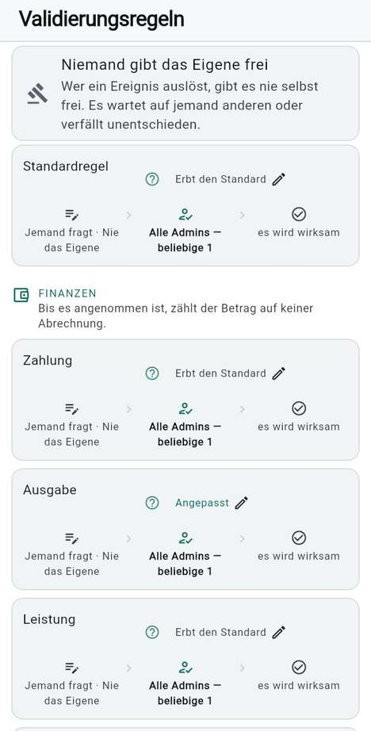

**Schritte**

1. Öffnen Sie [Validierungsregeln](https://fdittgen-png.github.io/deskilo/#/validation) (sie stehen auch in den Einstellungen).
2. Lesen Sie die drei Gruppen: **Finanzen**, **Buchungen** und **Personen und Rollen**. Jede nennt, was unverändert bleibt, bis die Handlung angenommen ist.
3. Lesen Sie eine Karte von links nach rechts: Jemand fragt an, die Personen, die validieren dürfen, es tritt in Kraft. Eine Karte sagt **Erbt den Standard** oder **Angepasst**.
4. Tippen Sie auf eine Karte, um ihre Regel zu bearbeiten. Tippen Sie auf **Standardregel**, um zu ändern, was alle anderen Karten erben.

**Gut zu wissen**

- Eine Regel deckt Handlungen ab wie Zahlungen, Ausgaben, Leistungen, zusätzliche halbe Tage, Buchungslöschungen, Reservierungen, Rollenwechsel, neue Mitglieder, Rechnungen, Erstattungen und Abonnementänderungen.
- Jede Entscheidung ist ein Ereignis: wer entschieden hat, wann und worüber. Nichts wird stillschweigend validiert.
- Das Banner oben gilt für jede Regel: **Niemand gibt das Eigene frei**.
- Sie brauchen die Berechtigung, Validierungsregeln zu konfigurieren; Inhaber haben sie immer.

**Siehe auch:** [Erforderliche Validierungen](#erforderliche-validierungen) · [Die Rollenmatrix](#die-rollenmatrix)

<!-- anchor: user.validation.required-count -->
### Erforderliche Validierungen

**Zielgruppe:** Inhaber

Sie legen fest, wie viele Personen bestätigen müssen, bevor die Handlung durchgeht.

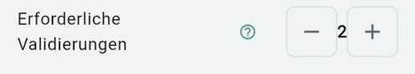

**Schritte**

1. Tippen Sie in [Validierungsregeln](https://fdittgen-png.github.io/deskilo/#/validation) auf eine Karte.
2. Tippen Sie neben **Erforderliche Validierungen** auf Plus oder Minus.
3. Tippen Sie auf **Speichern**.

**Gut zu wissen**

- Eine ist der Normalfall; zwei sind bei Geld üblich.
- Verlangen Sie mehr Validierungen, als es Personen gibt, die sie geben dürfen, warnt das Blatt **Nicht genügend berechtigte Validierer.** und speichert nicht: Eine Regel, die niemand erfüllen kann, würde die Handlung für immer blockieren.

**Siehe auch:** [Wer validieren darf](#wer-validieren-darf)

<!-- anchor: user.validation.who-may -->
### Wer validieren darf

**Zielgruppe:** Inhaber

Sie legen fest, welche Personen die Bestätigung geben dürfen.

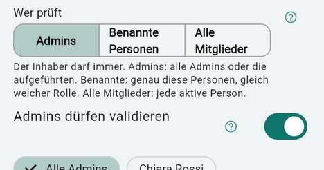

**Schritte**

1. Tippen Sie in [Validierungsregeln](https://fdittgen-png.github.io/deskilo/#/validation) auf eine Karte.
2. Wählen Sie unter **Wer prüft** **Admins**, **Benannte Personen** oder **Alle Mitglieder**.
3. Lassen Sie bei **Admins** **Admins dürfen validieren** eingeschaltet und wählen Sie **Alle Admins** oder tippen Sie auf die Namen bestimmter Administratoren. Schalten Sie es aus, validieren nur Inhaber.
4. Wählen Sie bei **Benannte Personen** genau die Personen, die Sie möchten.
5. Tippen Sie auf **Speichern**.

**Gut zu wissen**

- Der Inhaber darf immer validieren.
- Eine benannte Liste ist eine bewusste Entscheidung: Wer später Administrator wird, wird ihr nicht hinzugefügt.
- Die Auswahl des Geltungsbereichs erscheint, wenn Ihr Workspace die Funktion Validierungsbereiche eingeschaltet hat; sonst arbeitet eine Regel mit Administratoren.

**Siehe auch:** [Ein Inhaber ist erforderlich](#ein-inhaber-ist-erforderlich)

<!-- anchor: user.validation.owner-required -->
### Ein Inhaber ist erforderlich

**Zielgruppe:** Inhaber

Für manche Handlungen genügt die Zustimmung eines Administrators allein nicht.

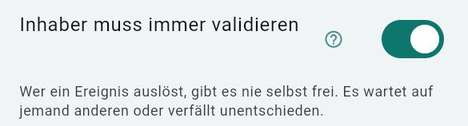

**Schritte**

1. Tippen Sie in [Validierungsregeln](https://fdittgen-png.github.io/deskilo/#/validation) auf eine Karte.
2. Schalten Sie **Inhaber muss immer validieren** ein.
3. Tippen Sie auf **Speichern**.

**Gut zu wissen**

- Mindestens eine der Bestätigungen kommt dann von einem Inhaber, was auch immer die geforderte Anzahl sagt. Die Karte zeigt „und der Inhaber, immer“.

**Siehe auch:** [Erforderliche Validierungen](#erforderliche-validierungen) · [Ein Inhaber darf die eigene Anfrage bestätigen](#ein-inhaber-darf-die-eigene-anfrage-bestätigen)

<!-- anchor: user.validation.owner-self -->
### Ein Inhaber darf die eigene Anfrage bestätigen

**Zielgruppe:** Inhaber

Sie führen einen Space allein und müssen Ihre eigenen Anfragen selbst erledigen können.

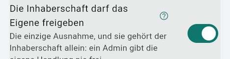

**Schritte**

1. Tippen Sie in [Validierungsregeln](https://fdittgen-png.github.io/deskilo/#/validation) auf eine Karte.
2. Schalten Sie **Die Inhaberschaft darf das Eigene freigeben** ein.
3. Tippen Sie auf **Speichern**.

**Gut zu wissen**

- Ist es aus, wartet die eigene Anfrage eines Inhabers auf jemand anderen. Ist es an, erledigt der Inhaber sie selbst.
- Das ist allein die Ausnahme des Inhabers: Ein Administrator validiert nie seine eigene Handlung.
- Der Schalter erscheint, wenn Ihr Workspace die Funktion Validierungskette eingeschaltet hat.

**Siehe auch:** [Die eigene Anfrage eines Inhabers automatisch validieren](#die-eigene-anfrage-eines-inhabers-automatisch-validieren)

<!-- anchor: user.validation.sequential -->
### Nacheinander

**Zielgruppe:** Inhaber

Sie möchten die Bestätigungen der Reihe nach einholen, damit die zweite Person die Entscheidung der ersten sieht.

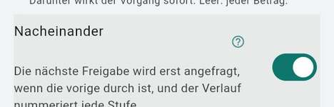

**Schritte**

1. Tippen Sie in [Validierungsregeln](https://fdittgen-png.github.io/deskilo/#/validation) auf eine Karte.
2. Schalten Sie **Nacheinander** ein.
3. Tippen Sie auf **Speichern**.

**Gut zu wissen**

- Die nächste Validierung wird erbeten, sobald die vorherige durch ist, und der Validierungsverlauf nummeriert jeden Schritt.
- Es ist langsamer; nutzen Sie es, wenn die Reihenfolge zählt.
- Bei Geldregeln können Sie zusätzlich **Nur über diesem Betrag** festlegen: Kleinere Beträge gelten sofort.

**Siehe auch:** [Erforderliche Validierungen](#erforderliche-validierungen)

<!-- anchor: user.validation.auto-validate-owner -->
### Die eigene Anfrage eines Inhabers automatisch validieren

**Zielgruppe:** Inhaber

Sie möchten keine Benachrichtigung zu einer Frage, die bereits geklärt ist.

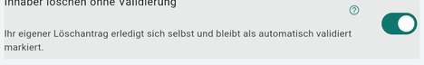

**Schritte**

1. Tippen Sie in [Validierungsregeln](https://fdittgen-png.github.io/deskilo/#/validation) auf die Karte **Buchungslöschung**.
2. Schalten Sie **Inhaber löschen ohne Validierung** ein.
3. Tippen Sie auf **Speichern**.

**Gut zu wissen**

- Der eigene Löschantrag eines Inhabers erledigt sich dann selbst und bleibt im Verlauf als **Automatisch bestätigt** markiert, sodass die Spur lückenlos bleibt.
- Dieser Schalter existiert nur bei der Regel **Buchungslöschung** und ist standardmäßig aus.

**Siehe auch:** [Die eigene Anfrage eines Administrators automatisch validieren](#die-eigene-anfrage-eines-administrators-automatisch-validieren)

<!-- anchor: user.validation.auto-validate-admin -->
### Die eigene Anfrage eines Administrators automatisch validieren

**Zielgruppe:** Inhaber

Sie möchten, dass Administratoren ihre eigenen Buchungen ohne Warten löschen.

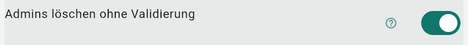

**Schritte**

1. Tippen Sie in [Validierungsregeln](https://fdittgen-png.github.io/deskilo/#/validation) auf die Karte **Buchungslöschung**.
2. Schalten Sie **Admins löschen ohne Validierung** ein.
3. Tippen Sie auf **Speichern**.

**Gut zu wissen**

- Er ist unabhängig vom Schalter für Inhaber: Jeder Inhaber ist auch Administrator, ein einziger Schalter könnte also nicht „Inhaber ja, Administratoren nein“ sagen.
- Standardmäßig aus und nur für Buchungslöschungen.

**Siehe auch:** [Die eigene Anfrage eines Inhabers automatisch validieren](#die-eigene-anfrage-eines-inhabers-automatisch-validieren)

<!-- anchor: user.collaborate.messages -->
### Nachrichten

**Zielgruppe:** Alle

Sie möchten alle Ihre Unterhaltungen in einer Liste, gleich zu welchem Space oder Server sie gehören.

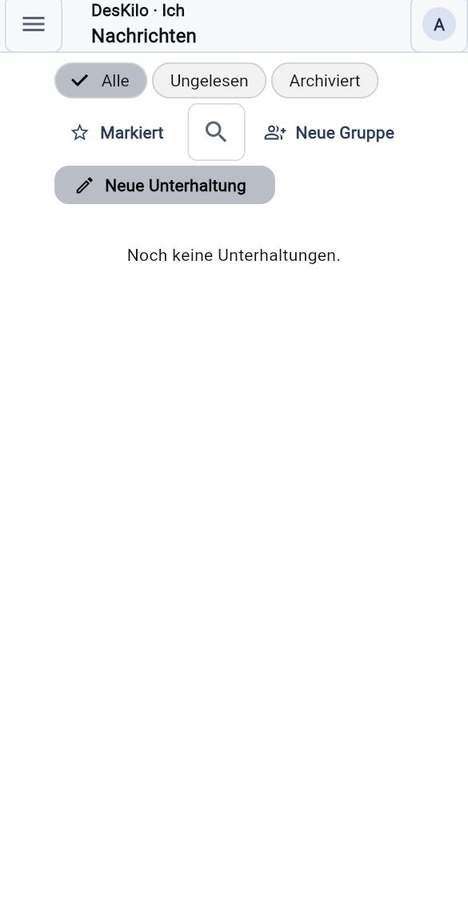

**Schritte**

1. Öffnen Sie [Nachrichten](https://fdittgen-png.github.io/deskilo/#/me?tab=messages) in Ich.
2. Lesen Sie jede Zeile: den Titel, den Zusammenhang (zum Beispiel „In“ einem Space, „Von Person zu Person“, „Gruppe“), die letzte Nachricht und die Zahl der ungelesenen.
3. Filtern Sie mit **Alle**, **Ungelesen** oder **Archiviert**, öffnen Sie **Markiert** für die Nachrichten, die Sie markiert haben, oder tippen Sie auf die Lupe, um zu suchen.
4. Halten Sie eine Zeile gedrückt, um sie mit **Oben anheften**, **Benachrichtigungen stumm**, **Als ungelesen markieren** oder **Archivieren** zu bearbeiten.
5. Tippen Sie auf eine Zeile, um die Unterhaltung zu öffnen.

**Gut zu wissen**

- Unterhaltungen von Ihren anderen verbundenen Servern erscheinen in derselben Liste, mit dem Namen des Servers.
- Eine Nachricht, die Sie geschrieben haben, zeigt einen Haken, wenn sie zugestellt ist, und einen blauen Doppelhaken, sobald sie gelesen wurde.
- Eine archivierte Unterhaltung behält ihren Verlauf. Eine stummgeschaltete bleibt still, wird aber weiter mitgezählt.
- Aus dem Workspace führt **Meine Nachrichten öffnen** (in den Hinweisen) hierher.

**Siehe auch:** [Einem Mitglied schreiben](#einem-mitglied-schreiben) · [Eine Unterhaltung oder eine Gruppe beginnen](#eine-unterhaltung-oder-eine-gruppe-beginnen)

<!-- anchor: user.collaborate.messages-new -->
### Eine Unterhaltung oder eine Gruppe beginnen

**Zielgruppe:** Alle

Sie möchten jemandem Neuen schreiben oder mehreren Personen auf einmal.

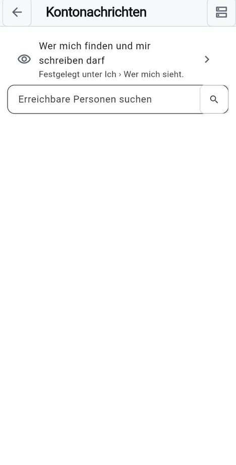

**Schritte**

1. Tippen Sie in [Nachrichten](https://fdittgen-png.github.io/deskilo/#/me?tab=messages) auf **Neue Unterhaltung**.
2. Geben Sie unter **Erreichbare Personen suchen** einen Namen ein und tippen Sie auf die Lupe.
3. Tippen Sie auf die Person; der Chat öffnet sich.
4. Für eine Gruppe tippen Sie stattdessen auf **Neue Gruppe**, geben ihr einen **Gruppenname**, wählen **Personen hinzufügen** und tippen auf **Gruppe erstellen**.

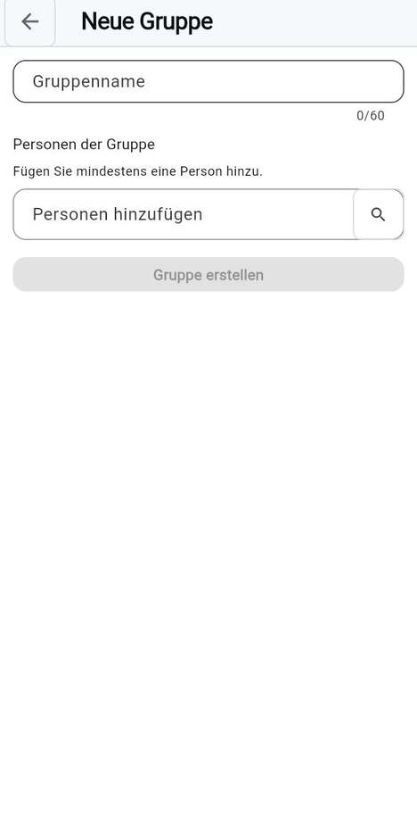

**Gut zu wissen**

- Sie finden Personen, die sich dafür entschieden haben, erreichbar zu sein: Jede Person entscheidet unter **Wer ein Gespräch mit mir beginnen darf**.
- Tippen Sie in einer Gruppe auf ihren Namen, um die Mitglieder zu sehen; ein Administrator kann Personen hinzufügen oder entfernen, die Gruppe umbenennen oder erlauben, dass nur Administratoren schreiben (**Nur Admins dürfen schreiben**). Jeder kann **Gruppe verlassen**.
- Eine lange Nachricht ist auf 4000 Zeichen begrenzt.

**Siehe auch:** [Nachrichtenanfragen](#nachrichtenanfragen)

<!-- anchor: user.collaborate.message-requests -->
### Nachrichtenanfragen

**Zielgruppe:** Alle

Jemand, von dem Sie nicht hören wollten, hat Ihnen geschrieben, und Sie entscheiden, was geschieht.

**Schritte**

1. Öffnen Sie [Nachrichten](https://fdittgen-png.github.io/deskilo/#/me?tab=messages). Eine Karte **Nachrichtenanfragen** erscheint über Ihren Unterhaltungen, wenn es eine gibt.
2. Lesen Sie die erste Nachricht.
3. Tippen Sie auf **Annehmen**, um daraus eine Unterhaltung zu machen, auf **Ignorieren**, um sie auszublenden, oder auf **Blockieren**, um jeden Kontakt zu beenden.

**Gut zu wissen**

- Die Karte sagt es deutlich: Diese Personen gehören nicht zu denen, von denen Sie sich ansprechen lassen wollten, und sie erfahren nicht, was Sie entscheiden.
- Wer Ihnen zuerst schreiben darf, legen Sie in Ich unter **Wer ein Gespräch mit mir beginnen darf** fest.

**Siehe auch:** [Jemanden blockieren](#jemanden-blockieren) · [Wer meine Daten sehen kann](#datenschutz-wer-meine-daten-sehen-kann)

<!-- anchor: user.collaborate.block -->
### Jemanden blockieren

**Zielgruppe:** Alle

Sie möchten, dass eine Person Sie nicht mehr sieht und Ihnen nicht mehr schreibt.

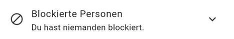

**Schritte**

1. Tippen Sie bei einer Nachrichtenanfrage auf **Blockieren** oder in einer Unterhaltung auf **Person blockieren**.
2. Bestätigen Sie.
3. Um es rückgängig zu machen, öffnen Sie Ich, dann **Blockierte Personen**, und tippen Sie neben dem Namen auf **Blockierung aufheben**.

**Gut zu wissen**

- Eine Blockierung wirkt in beide Richtungen: Keiner von Ihnen sieht oder erreicht den anderen.
- Die Person erfährt es nicht.

**Siehe auch:** [Nachrichtenanfragen](#nachrichtenanfragen)

<!-- anchor: user.collaborate.notifications -->
### Benachrichtigungen

**Zielgruppe:** Alle

Sie möchten wissen, was Sie alarmiert, und auf diesem Gerät Benachrichtigungen ausschalten, wenn Sie es vorziehen.

**Schritte**

1. Öffnen Sie [Datenschutz & Daten](https://fdittgen-png.github.io/deskilo/#/privacy).
2. Schalten Sie mit **Push-Benachrichtigungen auf diesem Gerät** Push ein oder aus.
3. Um eine Unterhaltung stummzuschalten, halten Sie sie in [Nachrichten](https://fdittgen-png.github.io/deskilo/#/me?tab=messages) gedrückt und wählen **Benachrichtigungen stumm**.

**Gut zu wissen**

- Sie werden über Anfragen benachrichtigt, die auf Ihre Bestätigung warten, und über Nachrichten: im Feed und an der Glocke, per Push, wenn Ihre Installation Push eingerichtet hat, und in der installierten App (nicht im Browser) mit einer Erinnerung auf Ihrem Gerät 15 Minuten vor einer Buchung, für die Sie noch nicht eingecheckt haben.
- DesKilo versendet keine eigenen E-Mails: Die einzigen E-Mails sind die Ihres Kontos (Bestätigung der Anmeldung, Zurücksetzen des Passworts).
- Die Zahl an der Glocke und am App-Symbol addiert Ihre ausstehenden Bestätigungen und ungelesenen Nachrichten.
- Ist es aus, funktioniert die App weiter; an dieses Gerät wird nichts gesendet. Es gibt keine getrennten Schalter je Kategorie. Blockiert Ihr System die Benachrichtigungen der App, erlauben Sie sie in den Systemeinstellungen.

**Siehe auch:** [Ereignisse und Bestätigungen](#ereignisse-und-bestätigungen) · [Ihre Daten, Ihre Rechte](#ihre-daten-ihre-rechte)

<!-- anchor: user.collaborate.discover -->
### Entdecken

**Zielgruppe:** Alle

Sie möchten Workspaces finden, die sich selbst veröffentlichen, und deren Gastgebern schreiben.

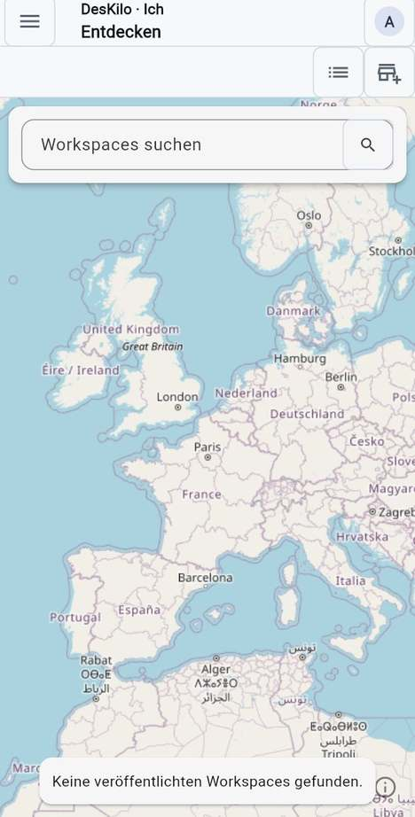

**Schritte**

1. Öffnen Sie [Entdecken](https://fdittgen-png.github.io/deskilo/#/me?tab=discover) in Ich. Es öffnet sich auf der Karte.
2. Tippen Sie bei **Workspaces suchen** etwas ein und tippen Sie auf die Lupe.
3. Wischen Sie durch die Karten unter der Karte oder tippen Sie auf das Pin-Symbol einer Karte, um **Auf der Karte anzeigen** zu wählen.
4. Tippen Sie auf die Listen-Schaltfläche, um zu **Liste** zu wechseln, und auf die Karten-Schaltfläche, um zu **Karte** zurückzukehren.
5. Tippen Sie auf einen Workspace, um seine öffentliche Seite zu lesen: Beschreibung, Adresse, Kontakte, Website, öffentlicher Raumplan.
6. Nutzen Sie **An die Gastgeber schreiben**, die Chat-Schaltfläche neben einem Gastgeber, **Eintreten** oder **Workspace-Profil beantragen**, je nachdem, was der Workspace anbietet.

**Gut zu wissen**

- Es erscheinen nur Workspaces, deren Inhaber **Im öffentlichen Verzeichnis sichtbar** gewählt hat. Passt keiner, sagt der Bildschirm **Keine veröffentlichten Workspaces gefunden.**
- Wenn Sie jemandem schreiben oder um Aufnahme bitten, verbindet Sie die App zuerst mit dem Server dieses Workspace und fragt Sie, bevor etwas gesendet wird.
- Ihre Nachrichten mit Personen auf anderen Servern erscheinen in [Nachrichten](#nachrichten); verwalten Sie diese Server unter **Verbundene Server**.
- Inhaber veröffentlichen ihre Seite in ihren Einstellungen.

**Siehe auch:** [Eine Unterhaltung oder eine Gruppe beginnen](#eine-unterhaltung-oder-eine-gruppe-beginnen)

<!-- anchor: user.collaborate.public-profile -->
### Ihr öffentliches Profil

**Zielgruppe:** Alle

Sie möchten, dass Menschen außerhalb Ihrer Spaces ein paar Worte über Sie lesen können.

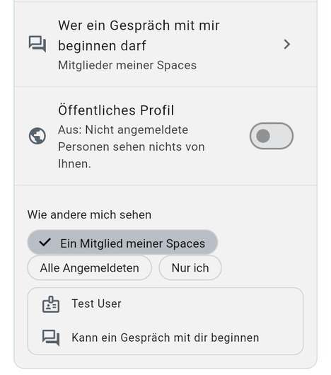

**Schritte**

1. Öffnen Sie Ich, dann den Abschnitt **Datenschutz**.
2. Schalten Sie **Öffentliches Profil** ein und bestätigen Sie **Veröffentlichen**.
3. Tippen Sie auf **Link kopieren** und teilen Sie ihn.
4. Schalten Sie es jederzeit aus, um es zurückzuziehen.

**Gut zu wissen**

- Jeder mit dem Link, angemeldet oder nicht, liest Ihren Namen, Ihren Beruf und Ihre Kurzbiografie. Kontaktdaten, Anwesenheit und Spaces bleiben privat.
- Ein Link zu einem zurückgezogenen oder unbekannten Profil sagt **Dieses Profil ist nicht öffentlich.**
- **Wie andere mich sehen** zeigt vorab, was jedes Publikum sieht.

**Siehe auch:** [Wer meine Daten sehen kann](#datenschutz-wer-meine-daten-sehen-kann)

<!-- anchor: user.collaborate.guest-visits -->
### Ihre Besuche als Gast

**Zielgruppe:** Alle

Sie haben darum gebeten, einen Space zu besuchen, ohne Mitglied zu werden, und möchten das verfolgen.

**Schritte**

1. Öffnen Sie Ich, dann Home.
2. Suchen Sie **Meine Besuche**: Jeder Besuch zeigt den Space, die Zeit und einen Status (**Angefragt**, **Bestätigt**, **Abgelehnt**, **Abgesagt** oder **Abgelaufen**).
3. Um einen noch bevorstehenden zurückzuziehen, tippen Sie auf **Diesen Besuch absagen**.

**Gut zu wissen**

- Ein Besuch ist keine Mitgliedschaft: Er gibt keine Rolle und kein Abonnement.
- Die Liste erscheint nur, wenn Sie Besuche haben, und nur dort, wo der Space die Funktion **Gastbesuche** eingeschaltet hat.

**Siehe auch:** [Entdecken](#entdecken)

<!-- anchor: user.settings.overview -->
## Einstellungen & Profil und Ihre Daten

Alles Persönliche an DesKilo liegt an zwei Orten: in **Ich**, das in jedem Workspace Ihnen gehört, und in den **Einstellungen**, wo ein einzelner Workspace aufbewahrt, was zu Ihrer Mitgliedschaft dort gehört. Dieses Kapitel führt durch beides, dann durch Ihre Datenschutzrechte und die Möglichkeit, einen eigenen Server zu betreiben.

In diesem Kapitel:
- [Wie die Einstellungen aufgebaut sind](#wie-die-einstellungen-aufgebaut-sind) und [der Schalter nur für diesen Workspace](#eine-einstellung-nur-für-diesen-workspace-wählen)
- Ihr Konto: [Foto](#ihr-konto-und-foto), [persönliche Angaben](#persönliche-angaben), [Adresse](#ihre-adresse), [USt-IdNr.](#ihre-ust-idnr), [Zahlungsbedingungen](#ihre-zahlungsbedingungen), [WhatsApp](#ihre-whatsapp-nummer), [Status](#ihre-statuszeile), [Standard-Buchungszeitraum](#standard-buchungszeitraum)
- Ihr Badge: [das Badge](#ihr-badge) und [seine PIN](#ihre-badge-pin)
- Wie die App aussieht und liest: [Sprache](#app-sprache), [Design](#design), [Navigation](#navigationsstil), [Zahlen und Daten](#zahlen-und-daten), [Uhr](#uhr), [Zeitzone](#zeiten-in-meiner-zeitzone-anzeigen), [Hinweise](#hinweise-wiederherstellen), [Frontkamera](#frontkamera-zum-scannen), [verknüpfte Konten](#verknüpfte-konten)
- Datenschutz und Ihre Daten: [wer meine Daten sehen kann](#datenschutz-wer-meine-daten-sehen-kann), [wer mich sieht](#wählen-wer-mich-sieht), [öffentliches Profil](#ein-öffentliches-profil-veröffentlichen), [Export](#meine-daten-exportieren), [Löschen](#meine-daten-löschen), [Anträge auf Betroffenenrechte](#anträge-auf-betroffenenrechte), [Push](#push-benachrichtigungen-auf-diesem-gerät), [Ihre Rechte](#ihre-daten-ihre-rechte)
- [Ihr eigener Server](#ihr-eigener-server)

<!-- anchor: user.settings.organisation -->
### Wie die Einstellungen aufgebaut sind

**Zielgruppe:** Alle

Sie möchten wissen, wo eine Einstellung liegt, bevor Sie danach suchen.

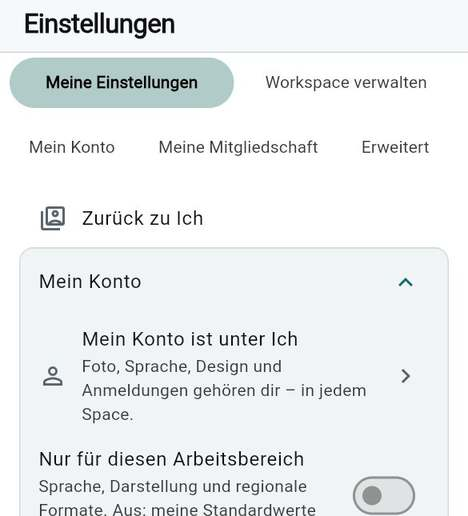

**Schritte**

1. Öffnen Sie [Einstellungen](https://fdittgen-png.github.io/deskilo/#/settings). Nennt Ihr Workspace sie **Mein Konto**, ist es derselbe Bildschirm.
2. Bleiben Sie auf **Meine Einstellungen** für alles, was Sie betrifft. Inhaber und Administratoren sehen zusätzlich **Workspace verwalten**, das die Konfiguration des Workspace enthält; Mitglieder, die nichts verwalten, sehen keinen zweiten Tab.
3. Springen Sie mit den drei Abkürzungen unter den Tabs: **Mein Konto**, **Meine Mitgliedschaft**, **Erweitert**.
4. Öffnen Sie **Zurück zu Ich**, um zu Ihrer Seite Ich zurückzukehren.

**Gut zu wissen**

- **Mein Konto** ist eine kurze Karte: Sie verweist auf Ich, wo Ihr Foto, Ihre Sprache, Ihr Design und Ihre Anmeldungen für jeden Workspace liegen.
- **Meine Mitgliedschaft** betrifft nur diesen Workspace: was Sie hier tun können, Ihr Badge und Ihre PIN, Ihr Status, Ihr Standard-Buchungszeitraum, Ihre Zahlungsbedingungen und die Dokumente.
- **Erweitert** beginnt geschlossen. Es betrifft dieses Gerät: den Server, Push, die Frontkamera.
- Unter den Abschnitten finden Sie auch **Hilfe**, die App-Version, die Datenschutzerklärung und **Abmelden**.

**Siehe auch:** [Der Schalter nur für diesen Workspace](#eine-einstellung-nur-für-diesen-workspace-wählen) · [Ihr eigener Server](#ihr-eigener-server)

<!-- anchor: user.settings.scope -->
### Eine Einstellung nur für diesen Workspace wählen

**Zielgruppe:** Alle

Sie möchten in einem Workspace Englisch und in den anderen Französisch, oder nur in einem davon ein dunkles Design.

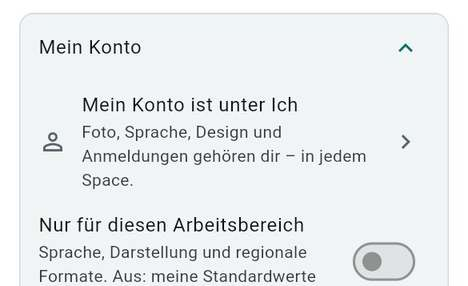

**Schritte**

1. Öffnen Sie [Einstellungen](https://fdittgen-png.github.io/deskilo/#/settings) und sehen Sie sich **Mein Konto** an.
2. Schalten Sie **Nur für diesen Arbeitsbereich** ein. Die Zeilen für Sprache, Design und Regionales erscheinen gleich dort.
3. Ändern Sie, was Sie möchten. Es gilt nur für diesen Workspace.
4. Zum Rückgängigmachen tippen Sie auf **Meine Standardwerte verwenden**.

**Gut zu wissen**

- Ist der Schalter aus, bearbeiten Sie Ihre Standardwerte, die überall gelten.
- Eine Einstellung, die Sie nur für diesen Workspace geändert haben, steht in der Karte unter **In diesem Space**.
- Der Schalter umfasst Sprache, Erscheinungsbild und regionale Formate, sonst nichts.

**Siehe auch:** [App-Sprache](#app-sprache) · [Design](#design) · [Zahlen und Daten](#zahlen-und-daten)

<!-- anchor: user.profile.settings.photo -->
### Ihr Konto und Foto

**Zielgruppe:** Alle

Sie möchten, dass Menschen Sie im Verzeichnis, auf dem Plan und in Nachrichten erkennen.

**Schritte**

1. Öffnen Sie [Ich](https://fdittgen-png.github.io/deskilo/#/me?tab=me). Ihr Konto sind die Blöcke **Profil**, **Einstellungen**, **Erweitert** und **Datenschutz** dieser Seite.
2. Tippen Sie auf **Foto**.
3. Wählen Sie **Foto auswählen** und suchen Sie ein Bild aus, oder wählen Sie **Foto entfernen**.

**Gut zu wissen**

- Die Zeile sagt **Zum Hinzufügen eines Fotos tippen**, bis Sie eines haben, danach **Zum Ändern tippen**.
- Wer Ihr Foto sieht, entscheiden Sie: siehe [Wer mich sieht](#wählen-wer-mich-sieht).
- Ihr Konto gehört Ihnen über Workspaces hinweg; Ihre Stellung in einem Workspace steht in dessen Einstellungen.

**Siehe auch:** [Profile](#profile-ein-konto-mehrere-spaces) · [Wer mich sieht](#wählen-wer-mich-sieht)

<!-- anchor: user.profile.settings.personal-info -->
### Persönliche Angaben

**Zielgruppe:** Alle

Sie möchten, dass Ihre Rechnungen und Briefe Ihren Namen und Ihre Angaben richtig tragen.

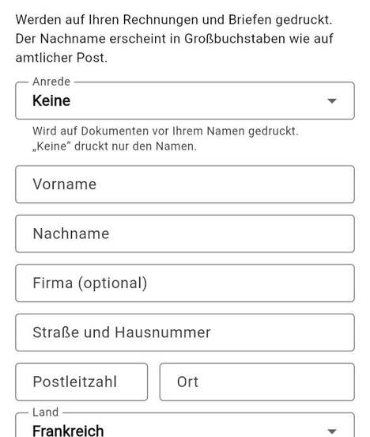

**Schritte**

1. Öffnen Sie [Ich](https://fdittgen-png.github.io/deskilo/#/me?tab=me) und tippen Sie auf **Persönliche Angaben**.
2. Wählen Sie eine **Anrede**, wenn Sie eine vor Ihrem Namen gedruckt haben möchten, und füllen Sie dann **Vorname**, **Nachname**, **Firma (optional)**, die Adresse, **Telefon** und **E-Mail für Dokumente** aus.
3. Prüfen Sie **Auf Ihren Dokumenten**, das zeigt, wie es gedruckt wird.
4. Beantworten Sie die Fragen, die Ihr Workspace unter einer eigenen Überschrift ergänzt, und tippen Sie dann auf **Speichern**.

**Gut zu wissen**

- Ihr Nachname und Ihr Ort werden in Großbuchstaben geschrieben, wie auf amtlicher Post.
- Ein leeres Formular zeigt **Noch nicht ausgefüllt**.
- Die Antworten auf die Fragen Ihres Workspace sind personenbezogene Daten: Sie gehören zu Ihrem Export und werden gelöscht, wenn Sie den Space verlassen.

**Siehe auch:** [Ihre Adresse](#ihre-adresse) · [Ihre USt-IdNr.](#ihre-ust-idnr)

<!-- anchor: user.profile.settings.address -->
### Ihre Adresse

**Zielgruppe:** Alle

Sie möchten, dass Rechnungen an die richtige Stelle gehen.

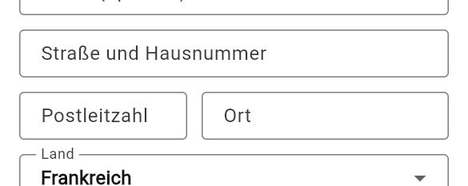

**Schritte**

1. Öffnen Sie [Ich](https://fdittgen-png.github.io/deskilo/#/me?tab=me) und tippen Sie auf **Persönliche Angaben**.
2. Füllen Sie **Straße und Hausnummer**, **Postleitzahl** und **Ort** aus.
3. Wählen Sie Ihr **Land** und tippen Sie dann auf **Speichern**.

**Gut zu wissen**

- Nutzt Ihr Workspace das Formular für persönliche Angaben nicht, zeigt Ich stattdessen eine einfachere Zeile **Adresse** mit einer Auswahl **Land**.
- Die Adresse wird auf Ihren Rechnungen gedruckt.

**Siehe auch:** [Persönliche Angaben](#persönliche-angaben)

<!-- anchor: user.profile.settings.vat-id -->
### Ihre USt-IdNr.

**Zielgruppe:** Alle

Sie werden als Unternehmen abgerechnet und möchten, dass die Rechnung Ihre Umsatzsteuer-Identifikationsnummer zeigt.

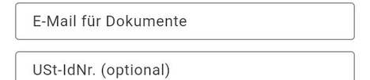

**Schritte**

1. Öffnen Sie [Ich](https://fdittgen-png.github.io/deskilo/#/me?tab=me) und tippen Sie auf **Persönliche Angaben**.
2. Tragen Sie Ihre Nummer bei **USt-IdNr. (optional)** ein.
3. Ergänzen Sie Ihr **Handelsregister / Kennung (optional)**, falls Sie eines haben, und tippen Sie dann auf **Speichern**.

**Gut zu wissen**

- Lassen Sie es leer, wenn Sie Privatperson sind.
- Ob eine Rechnung Umsatzsteuer enthält, hängt von dieser Nummer und vom Land ab; der Workspace wendet seine eigenen Regeln an.

**Siehe auch:** [Persönliche Angaben](#persönliche-angaben)

<!-- anchor: user.profile.settings.payment-terms -->
### Ihre Zahlungsbedingungen

**Zielgruppe:** Mitglied

Sie möchten wissen, zu welchen Bedingungen Sie abgerechnet werden.

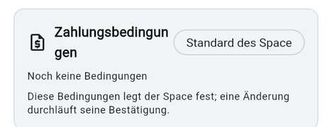

**Schritte**

1. Öffnen Sie [Einstellungen](https://fdittgen-png.github.io/deskilo/#/settings) und tippen Sie unter **Meine Mitgliedschaft** auf **Zahlungsbedingungen**.
2. Lesen Sie das Abzeichen: **Standard des Spaces** oder **Eigene des Mitglieds**, wenn mit Ihnen Bedingungen vereinbart wurden.
3. Lesen Sie die Bedingungen: Sie können sie nicht selbst ändern. Um sie ändern zu lassen, wenden Sie sich an eine:n Administrator:in.

**Gut zu wissen**

- Ein:e Administrator:in oder Inhaber mit der Berechtigung schlägt eine Änderung auf Ihrer Mitgliedsseite vor: **Änderung beantragen**, nur die zu ändernden Felder (ein leer gelassenes Feld behält den Wortlaut des Workspace), ein **Grund (optional)**, dann **Antrag senden**.
- Der Workspace legt diese Bedingungen fest; eine Änderung durchläuft seine Validierung und gilt, sobald sie validiert ist.

**Siehe auch:** [Ihre USt-IdNr.](#ihre-ust-idnr)

<!-- anchor: user.profile.settings.whatsapp -->
### Ihre WhatsApp-Nummer

**Zielgruppe:** Alle

Sie möchten, dass Kolleginnen und Kollegen Sie auf WhatsApp erreichen, oder die Nummer nicht mehr teilen.

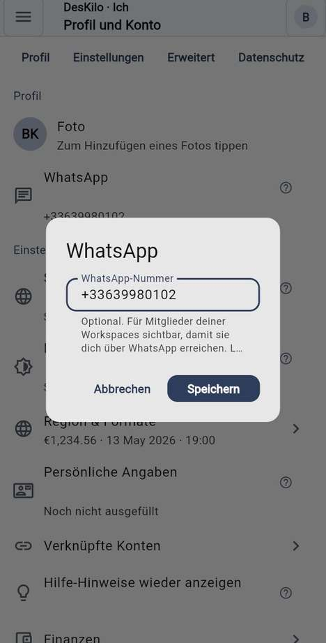

**Schritte**

1. Öffnen Sie [Ich](https://fdittgen-png.github.io/deskilo/#/me?tab=me) und tippen Sie auf **WhatsApp**.
2. Tragen Sie Ihre Nummer bei **WhatsApp-Nummer** ein, mit der Landesvorwahl.
3. Tippen Sie auf **Speichern**. Um nichts mehr zu teilen, leeren Sie das Feld und speichern.

**Gut zu wissen**

- Es steht auf **Nicht geteilt**, bis Sie es festlegen.
- Wer die Nummer sieht, legen Sie unter **WhatsApp und E-Mail** in [Wer mich sieht](#wählen-wer-mich-sieht) fest.
- Die Zeile erscheint nur, wenn Ihr Workspace WhatsApp nutzt.

**Siehe auch:** [Wer mich sieht](#wählen-wer-mich-sieht)

<!-- anchor: user.profile.settings.status -->
### Ihre Statuszeile

**Zielgruppe:** Mitglied

Sie möchten eine kurze Zeile neben Ihrem Namen, etwa „Im Gespräch · ab 14:00 wieder da“.

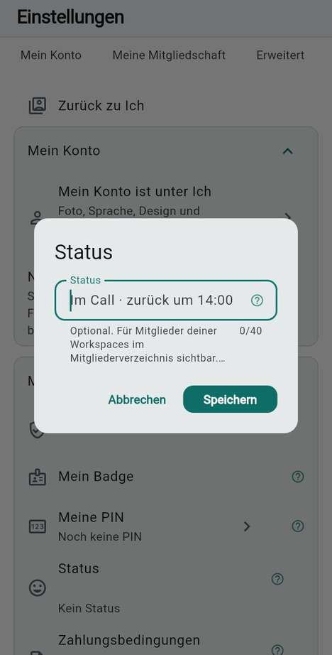

**Schritte**

1. Öffnen Sie [Einstellungen](https://fdittgen-png.github.io/deskilo/#/settings) und tippen Sie unter **Meine Mitgliedschaft** auf **Status**.
2. Tragen Sie Ihre Zeile bei **Status** ein.
3. Tippen Sie auf **Speichern**. Zum Löschen leeren Sie das Feld und speichern.

**Gut zu wissen**

- Sie ist optional und kurz; das Feld hält Sie an seiner Grenze auf.
- Mitglieder Ihrer Workspaces sehen sie im Mitgliederverzeichnis.
- Es steht **Kein Status**, bis Sie einen schreiben.

**Siehe auch:** [Wer mich sieht](#wählen-wer-mich-sieht)

<!-- anchor: user.profile.settings.default-period -->
### Standard-Buchungszeitraum

**Zielgruppe:** Mitglied

Sie buchen meist denselben halben Tag und möchten ihn schon vorgewählt haben.

**Schritte**

1. Öffnen Sie [Einstellungen](https://fdittgen-png.github.io/deskilo/#/settings) und tippen Sie unter **Meine Mitgliedschaft** auf **Standard-Buchungszeitraum**.
2. Wählen Sie **Vormittag**, **Nachmittag**, **Ganzer Tag** oder **Keine Präferenz (ganzer Tag)**.

**Gut zu wissen**

- Es wählt nur vor: Sie können den Zeitraum bei jeder Buchung weiterhin ändern.
- Die Zeile erscheint nur, wenn die Buchungseinrichtung Ihres Workspace eine Auswahl anbietet.

**Siehe auch:** [Das Buchungsblatt](#das-buchungsblatt)

<!-- anchor: user.profile.settings.badge -->
### Ihr Badge

**Zielgruppe:** Mitglied

Sie möchten ein Badge oder eine Karte, die Sie an der Tür oder am Kiosk ausweist.

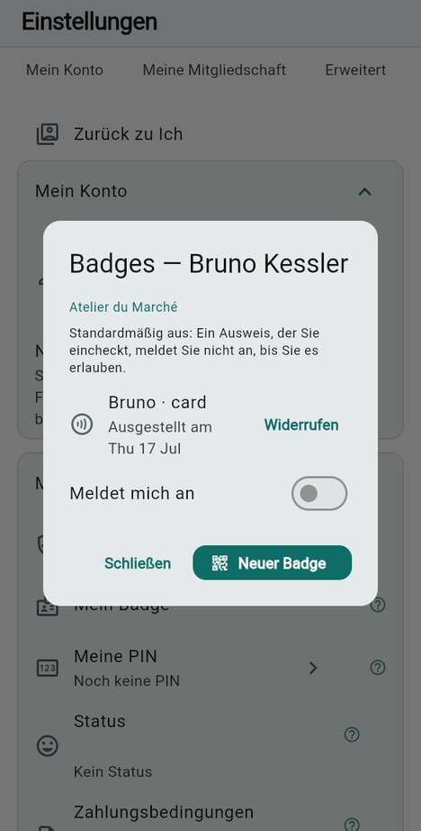

**Schritte**

1. Öffnen Sie [Einstellungen](https://fdittgen-png.github.io/deskilo/#/settings) und tippen Sie unter **Meine Mitgliedschaft** auf **Mein Badge**.
2. Tippen Sie auf **Neuer Badge**, um Ihren QR-Code zu erhalten, dann auf **Als PDF speichern**, um ihn zu drucken, oder tippen Sie auf **Karte registrieren** und halten Sie Ihre RFID- oder NFC-Karte an die Rückseite des Geräts.
3. Um ein Badge außer Dienst zu stellen, tippen Sie auf **Widerrufen**.

**Gut zu wissen**

- Ein neuer QR-Code wird nur einmal angezeigt: Speichern Sie ihn sofort.
- Ein widerrufenes Badge funktioniert sofort nicht mehr. Stellen Sie lieber ein neues aus, als das alte zu suchen.
- **Meldet mich an** ist standardmäßig aus: Ein Badge, das Sie eincheckt, meldet Sie nicht an, bis Sie es einschalten, und dafür brauchen Sie zuerst eine PIN.
- **Neuer Badge** setzt die Funktion **QR-Badges** voraus und **Karte registrieren** die Funktion **RFID-/NFC-Badges**; Ihr Workspace bietet möglicherweise nur eine davon an.

**Siehe auch:** [Ihre Badge-PIN](#ihre-badge-pin)

<!-- anchor: user.profile.settings.badge-pin -->
### Ihre Badge-PIN

**Zielgruppe:** Mitglied

Sie möchten sich durch Scannen Ihres Badges anmelden, statt Ihre E-Mail einzutippen.

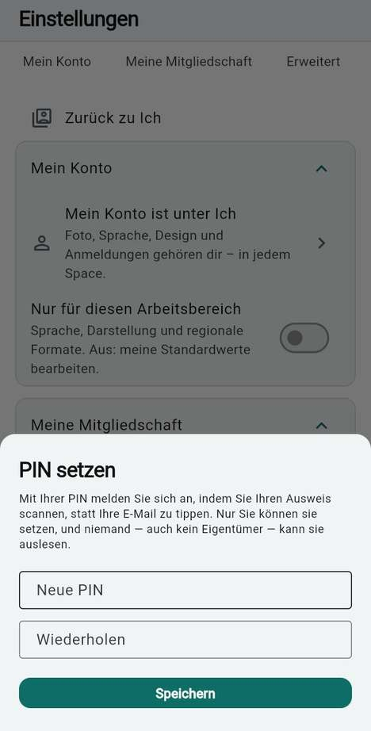

**Schritte**

1. Öffnen Sie [Einstellungen](https://fdittgen-png.github.io/deskilo/#/settings) und tippen Sie unter **Meine Mitgliedschaft** auf **Meine PIN**.
2. Wählen Sie **PIN setzen**, geben Sie sie bei **Neue PIN** ein, wiederholen Sie sie bei **Wiederholen** und speichern Sie.
3. Öffnen Sie **Mein Badge** und schalten Sie **Meldet mich an** für das gewünschte Badge ein.

**Gut zu wissen**

- Die Zeile lautet **Noch keine PIN** oder **PIN gesetzt**.
- Nur Sie können sie festlegen, und niemand, auch kein Inhaber, kann sie wieder auslesen.
- **PIN ändern** ersetzt sie; **PIN entfernen** schaltet die Badge-Anmeldung für alle Ihre Badges aus.

**Siehe auch:** [Ihr Badge](#ihr-badge)

<!-- anchor: user.profile.settings.language -->
### App-Sprache

**Zielgruppe:** Alle

Sie möchten die App in Ihrer eigenen Sprache.

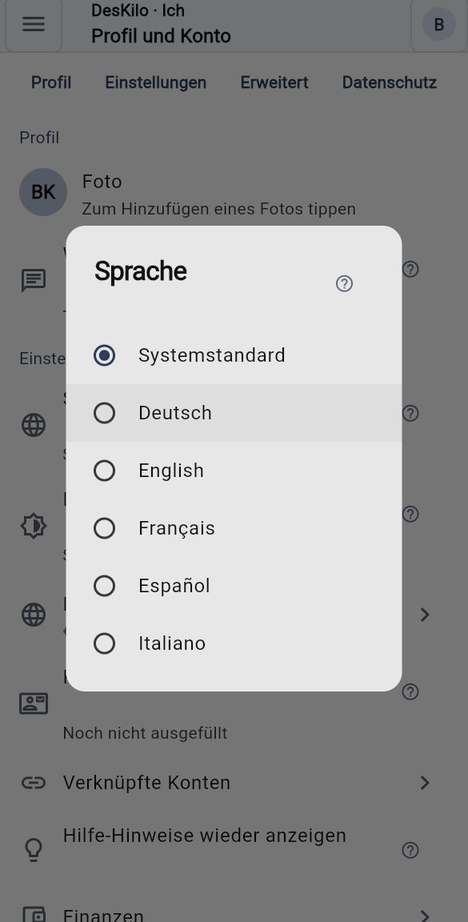

**Schritte**

1. Öffnen Sie [Ich](https://fdittgen-png.github.io/deskilo/#/me?tab=me) und tippen Sie auf **Sprache**.
2. Wählen Sie eine Sprache oder **Systemstandard**, um Ihrem Smartphone zu folgen.

**Gut zu wissen**

- Sie gilt für jeden Workspace, es sei denn, Sie legen für einen einzelnen Workspace eine fest mit [Nur für diesen Arbeitsbereich](#eine-einstellung-nur-für-diesen-workspace-wählen).
- Jede Sprache steht in ihrem eigenen Namen, sodass Sie Ihre immer finden.

**Siehe auch:** [Zahlen und Daten](#zahlen-und-daten)

<!-- anchor: user.profile.settings.theme -->
### Design

**Zielgruppe:** Alle

Sie möchten die App heller oder dunkler.

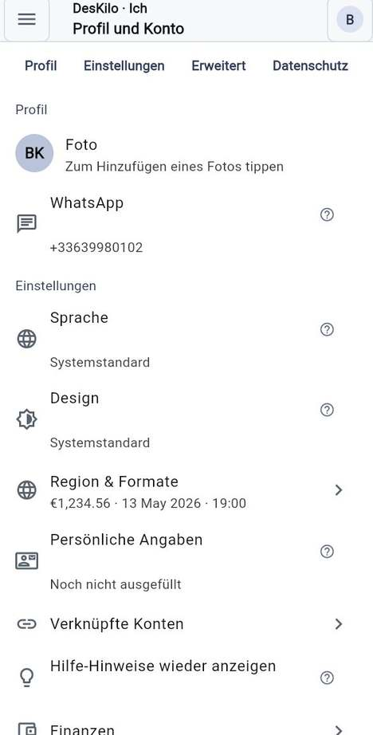

**Schritte**

1. Öffnen Sie [Ich](https://fdittgen-png.github.io/deskilo/#/me?tab=me) und tippen Sie auf **Design**.
2. Wählen Sie **Systemstandard**, **Hell** oder **Dunkel**.

**Gut zu wissen**

- **Systemstandard** folgt dem eigenen Hell-Dunkel-Schalter Ihres Smartphones.
- Wie die Sprache lässt es sich nur für einen Workspace festlegen.

**Siehe auch:** [App-Sprache](#app-sprache)

<!-- anchor: user.profile.settings.navigation -->
### Navigationsstil

**Zielgruppe:** Alle

Sie bevorzugen die untere Leiste oder das Menü, das Sie vom Web kennen.

**Schritte**

1. Öffnen Sie [Ich](https://fdittgen-png.github.io/deskilo/#/me?tab=me) und tippen Sie auf **Navigation**.
2. Wählen Sie **Standard für dieses Gerät**, **Klassisch: die untere Leiste und der runde Knopf** oder **Menü: das Hamburger-Menü wie im Web**.

**Gut zu wissen**

- Die Zeile ist in der Webversion ausgeblendet, die immer das Menü nutzt, und erscheint nur, wenn Ihr Workspace sie anbietet.

**Siehe auch:** [Wie die Einstellungen aufgebaut sind](#wie-die-einstellungen-aufgebaut-sind)

<!-- anchor: user.profile.settings.regional-formats -->
### Zahlen und Daten

**Zielgruppe:** Alle

Sie möchten Beträge und Daten so geschrieben haben, wie Sie sie lesen, unabhängig von der Sprache der App.

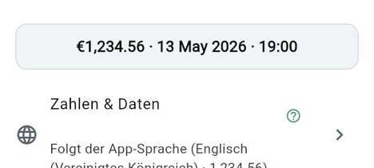

**Schritte**

1. Öffnen Sie [Region & Formate](https://fdittgen-png.github.io/deskilo/#/formats).
2. Tippen Sie auf **Zahlen & Daten** und wählen Sie eine Region oder **Automatisch**, um der Sprache der App zu folgen.
3. Prüfen Sie die Vorschauzeile darüber: Sie zeigt einen Betrag, ein Datum und eine Uhrzeit so, wie Sie sie sehen werden.

**Gut zu wissen**

- Es ist unabhängig von der Sprache: Eine englische App kann französische Daten schreiben.
- Es lässt sich mit [Nur für diesen Arbeitsbereich](#eine-einstellung-nur-für-diesen-workspace-wählen) nur für einen Workspace festlegen.
- Die Zeile erscheint nur, wenn Ihr Workspace **Region & Formate** nutzt.

**Siehe auch:** [Uhr](#uhr)

<!-- anchor: user.profile.settings.clock -->
### Uhr

**Zielgruppe:** Alle

Sie bevorzugen Uhrzeiten im 24-Stunden- oder im 12-Stunden-Format.

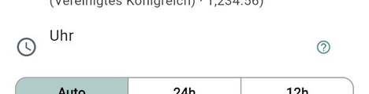

**Schritte**

1. Öffnen Sie [Region & Formate](https://fdittgen-png.github.io/deskilo/#/formats).
2. Wählen Sie unter **Uhr** **Auto**, **24h** oder **12h**.

**Gut zu wissen**

- **Auto** macht, was Ihre Region macht.
- Es ändert, wie Uhrzeiten geschrieben werden, nie, was sie bedeuten.
- Die Zeile erscheint nur, wenn Ihr Workspace **Region & Formate** nutzt.

**Siehe auch:** [Zeiten in meiner Zeitzone anzeigen](#zeiten-in-meiner-zeitzone-anzeigen)

<!-- anchor: user.profile.settings.device-zone -->
### Zeiten in meiner Zeitzone anzeigen

**Zielgruppe:** Alle

Sie sind unterwegs und möchten Uhrzeiten so, wie Ihre eigene Uhr sie zeigt.

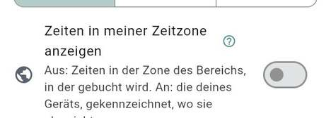

**Schritte**

1. Öffnen Sie [Region & Formate](https://fdittgen-png.github.io/deskilo/#/formats).
2. Schalten Sie **Zeiten in meiner Zeitzone anzeigen** ein.

**Gut zu wissen**

- Ist es aus, stehen die Zeiten in der Zone des Workspace, in der gebucht wird. Das ist die Voreinstellung.
- Ist es an, folgen die Zeiten Ihrem Gerät und sind gekennzeichnet, wo sie von denen des Workspace abweichen.
- Die Zeile erscheint nur, wenn Ihr Workspace **Region & Formate** nutzt.

**Siehe auch:** [Uhr](#uhr)

<!-- anchor: user.profile.settings.restore-hints -->
### Hinweise wiederherstellen

**Zielgruppe:** Alle

Sie haben die Hilfe-Hinweise ausgeblendet und möchten sie nun zurück.

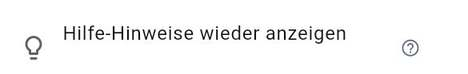

**Schritte**

1. Öffnen Sie [Ich](https://fdittgen-png.github.io/deskilo/#/me?tab=me).
2. Tippen Sie auf **Hilfe-Hinweise wieder anzeigen**.

**Gut zu wissen**

- Eine Meldung bestätigt: **Die Hilfe-Hinweise werden wieder angezeigt.**
- Sonst wird nichts zurückgesetzt.
- Die Zeile erscheint nur, wenn Ihr Workspace Hilfe-Hinweise nutzt.

**Siehe auch:** [Wie die Einstellungen aufgebaut sind](#wie-die-einstellungen-aufgebaut-sind)

<!-- anchor: user.profile.settings.front-camera -->
### Frontkamera zum Scannen

**Zielgruppe:** Alle

Sie scannen Badges mit einem an der Wand montierten Tablet, dessen Rückkamera zur Wand zeigt.

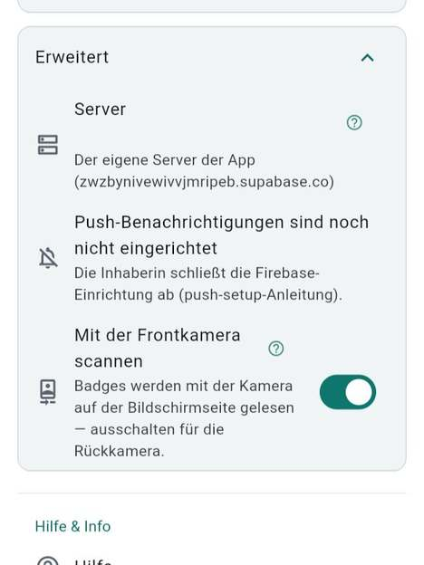

**Schritte**

1. Öffnen Sie [Einstellungen](https://fdittgen-png.github.io/deskilo/#/settings) und öffnen Sie **Erweitert**.
2. Schalten Sie **Mit der Frontkamera scannen** ein, um die Kamera auf der Bildschirmseite zu nutzen, oder aus für die Rückkamera.

**Gut zu wissen**

- Sie ist standardmäßig an und gilt nur für dieses Gerät.

**Siehe auch:** [Ihr Badge](#ihr-badge)

<!-- anchor: user.profile.settings.linked-accounts -->
### Verknüpfte Konten

**Zielgruppe:** Alle

Sie möchten sich außer mit Ihrer E-Mail auch mit einer anderen Identität anmelden, etwa einem Google-Konto.

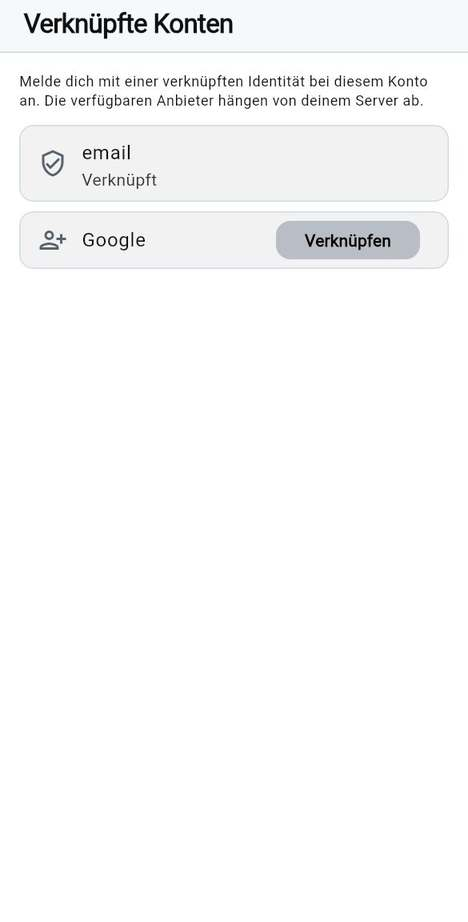

**Schritte**

1. Öffnen Sie [Ich](https://fdittgen-png.github.io/deskilo/#/me?tab=me) und tippen Sie auf **Verknüpfte Konten**.
2. Tippen Sie neben einem Anbieter auf **Verknüpfen** und schließen Sie den Vorgang im Browser ab.
3. Um eines zu entfernen, tippen Sie auf **Trennen**.

**Gut zu wissen**

- Eine verknüpfte Identität zeigt **Verknüpft**.

**Siehe auch:** [Profile](#profile-ein-konto-mehrere-spaces)

<!-- anchor: user.privacy.visibility -->
### Datenschutz: wer meine Daten sehen kann

**Zielgruppe:** Alle

Sie möchten wissen, wer was über Sie lesen kann und wer tatsächlich nachgesehen hat.

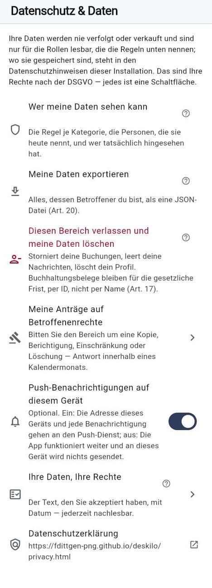

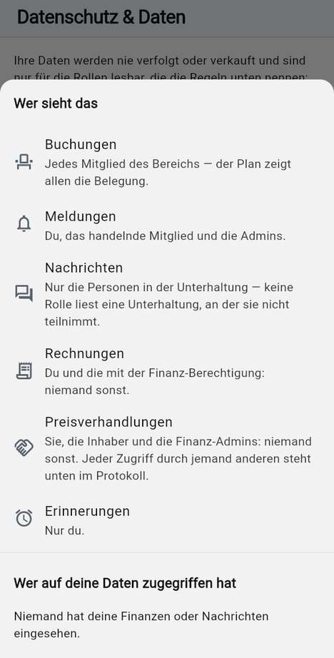

**Schritte**

1. Öffnen Sie [Datenschutz & Daten](https://fdittgen-png.github.io/deskilo/#/privacy).
2. Tippen Sie auf **Wer meine Daten sehen kann**.
3. Lesen Sie die Regel für jede Kategorie, die Personen, die sie heute nennt, und **Wer auf Ihre Daten zugegriffen hat**.

**Gut zu wissen**

- Ihre Daten werden nie verfolgt oder verkauft. Rollen entscheiden, wer sie liest, und der Server setzt das durch.
- Das Blatt nennt die Regel; es gibt daran nichts einzuschalten. Um zu wählen, was andere Mitglieder von Ihrem Profil sehen, nutzen Sie [Wer mich sieht](#wählen-wer-mich-sieht).

**Siehe auch:** [Wer mich sieht](#wählen-wer-mich-sieht) · [Ihre Daten, Ihre Rechte](#ihre-daten-ihre-rechte)

<!-- anchor: user.privacy.audiences -->
### Wählen, wer mich sieht

**Zielgruppe:** Alle

Sie möchten Punkt für Punkt entscheiden, wer Ihren Namen, Ihre Kurzbiografie, Ihre Kontaktdaten und Ihre Anwesenheit sieht.

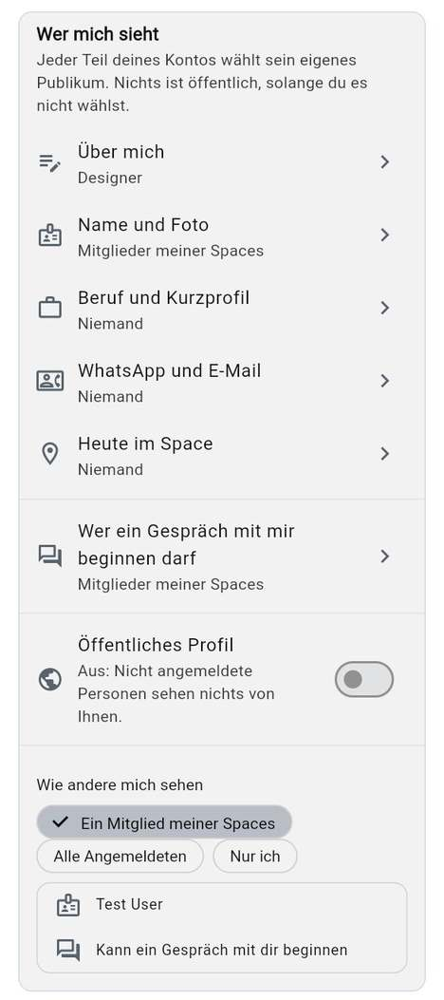

**Schritte**

1. Öffnen Sie [Ich](https://fdittgen-png.github.io/deskilo/#/me?tab=me) und scrollen Sie zu **Datenschutz**, zur Karte **Wer mich sieht**.
2. Tippen Sie auf einen Punkt: **Über mich**, **Name und Foto**, **Beruf und Kurzprofil**, **WhatsApp und E-Mail**, **Heute im Space** oder **Wer ein Gespräch mit mir beginnen darf**.
3. Wählen Sie ein Publikum, zum Beispiel **Niemand**, **Mitglieder meiner Spaces** oder **Mitglieder ausgewählter Spaces**, haken Sie Spaces an, wenn Sie welche gewählt haben, und tippen Sie auf **Speichern**.
4. Prüfen Sie **Wie andere mich sehen** am Fuß der Karte.

**Gut zu wissen**

- Nichts ist öffentlich, es sei denn, Sie wählen es.
- Wenn Sie ein Publikum erweitern, werden Sie zuerst um Bestätigung gebeten.
- **Blockierte Personen** unter der Karte listet, wen Sie blockiert haben; diese Personen können Sie weder sehen noch erreichen, und Sie können sie nicht erreichen. Tippen Sie auf **Blockierung aufheben**, um es rückgängig zu machen.
- **Alle Angemeldeten** wird nur für manche Einträge angeboten, etwa **Name und Foto** und **Beruf und Kurzprofil**. **WhatsApp und E-Mail** und **Heute im Space** gehen nie über Ihre eigenen Spaces hinaus.

**Siehe auch:** [Öffentliches Profil](#ein-öffentliches-profil-veröffentlichen) · [Wer meine Daten sehen kann](#datenschutz-wer-meine-daten-sehen-kann)

<!-- anchor: user.privacy.public-profile -->
### Ein öffentliches Profil veröffentlichen

**Zielgruppe:** Alle

Sie möchten eine Seite mit Ihrem Namen und ein paar Worten, die Menschen ohne Konto lesen können.

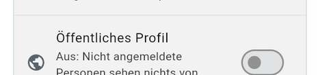

**Schritte**

1. Öffnen Sie [Ich](https://fdittgen-png.github.io/deskilo/#/me?tab=me) und suchen Sie **Öffentliches Profil** in der Karte **Wer mich sieht**.
2. Schalten Sie es ein und bestätigen Sie mit **Veröffentlichen**.
3. Tippen Sie auf **Link kopieren**, um ihn zu teilen.

**Gut zu wissen**

- Jeder mit dem Link liest Ihren Namen, Ihren Beruf und Ihre Kurzbiografie. Kontaktdaten, Anwesenheit und Spaces bleiben privat.
- Ist es aus, sehen Personen, die nicht angemeldet sind, nichts von Ihnen.

**Siehe auch:** [Wählen, wer mich sieht](#wählen-wer-mich-sieht)

<!-- anchor: user.privacy.export -->
### Meine Daten exportieren

**Zielgruppe:** Alle

Sie möchten eine Kopie von allem, was DesKilo über Sie speichert.

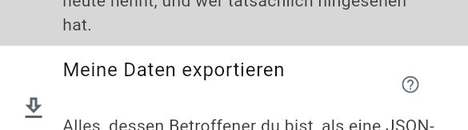

**Schritte**

1. Öffnen Sie [Datenschutz & Daten](https://fdittgen-png.github.io/deskilo/#/privacy).
2. Tippen Sie auf **Meine Daten exportieren**.
3. Speichern oder teilen Sie die erzeugte Datei.

**Gut zu wissen**

- Es ist eine einzige JSON-Datei, die in dem Moment erstellt wird, in dem Sie darum bitten.
- Die Zeile erscheint nur, wenn Ihr Workspace den Datenexport anbietet.

**Siehe auch:** [Anträge auf Betroffenenrechte](#anträge-auf-betroffenenrechte)

<!-- anchor: user.privacy.erase -->
### Meine Daten löschen

**Zielgruppe:** Alle

Sie möchten einen Workspace verlassen und Ihre Daten löschen lassen.

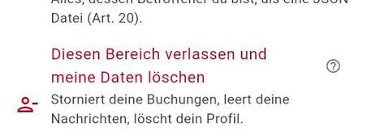

**Schritte**

1. Öffnen Sie [Datenschutz & Daten](https://fdittgen-png.github.io/deskilo/#/privacy).
2. Tippen Sie auf **Diesen Bereich verlassen und meine Daten löschen**.
3. Lesen Sie, was geschehen wird, geben Sie das Bestätigungswort ein und tippen Sie auf **Löschen**.

**Gut zu wissen**

- Es storniert Ihre offenen Buchungen und schwärzt Ihre Nachrichten in diesem Bereich. Ihr Profil wird geleert, wenn dies Ihr letzter Space ist; vergangene Buchungen bleiben als Belegungsnachweis des Bereichs.
- Buchhaltungsunterlagen bleiben für die gesetzliche Aufbewahrungsfrist erhalten, mit Kennung und nicht mit Namen.
- Die Zeile erscheint zusammen mit dem Datenexport. Für einen Inhaber ist sie ausgegraut; er muss den Workspace zuvor übergeben, unter Mitinhaberschaft.

**Siehe auch:** [Meine Daten exportieren](#meine-daten-exportieren)

<!-- anchor: user.privacy.requests -->
### Anträge auf Betroffenenrechte

**Zielgruppe:** Alle

Sie möchten den Workspace um eine Kopie, eine Berichtigung, eine Einschränkung oder die Löschung bitten und einen Nachweis behalten.

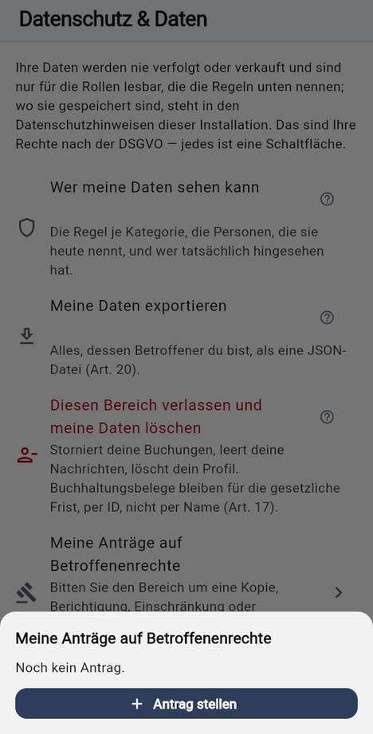

**Schritte**

1. Öffnen Sie [Datenschutz & Daten](https://fdittgen-png.github.io/deskilo/#/privacy) und tippen Sie auf **Meine Anträge auf Betroffenenrechte**.
2. Tippen Sie auf **Antrag stellen** und wählen Sie, was Sie verlangen: eine Kopie Ihrer Daten einsehen, sie mitnehmen, sie berichtigen, ihre Nutzung einschränken, einer Nutzung widersprechen oder sie löschen.
3. Ergänzen Sie **Einzelheiten (optional)** und tippen Sie auf **Antrag senden**.

**Gut zu wissen**

- Der Space antwortet innerhalb eines Kalendermonats; das Blatt zeigt das Datum.
- Jeder Antrag zeigt, ob er eingegangen, verlängert (mit neuem Datum und Grund), beantwortet oder abgelehnt wurde.

**Siehe auch:** [Meine Daten exportieren](#meine-daten-exportieren) · [Meine Daten löschen](#meine-daten-löschen)

<!-- anchor: user.privacy.push -->
### Push-Benachrichtigungen auf diesem Gerät

**Zielgruppe:** Alle

Sie möchten verhindern, dass Benachrichtigungen an dieses Gerät gesendet werden, oder sie wieder einschalten.

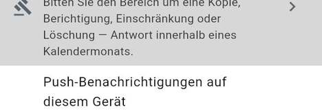

**Schritte**

1. Öffnen Sie [Datenschutz & Daten](https://fdittgen-png.github.io/deskilo/#/privacy).
2. Schalten Sie **Push-Benachrichtigungen auf diesem Gerät** aus oder ein.

**Gut zu wissen**

- Ist es aus, funktioniert die App weiter, und an dieses Gerät wird nichts gesendet.
- Ist es an, gehen die Adresse dieses Geräts und jede Benachrichtigung an den Push-Dienst.

**Siehe auch:** [Ihre Daten, Ihre Rechte](#ihre-daten-ihre-rechte)

<!-- anchor: user.privacy.consent -->
### Ihre Daten, Ihre Rechte

**Zielgruppe:** Alle

Sie möchten noch einmal nachlesen, was Sie zu Ihren Daten akzeptiert haben.

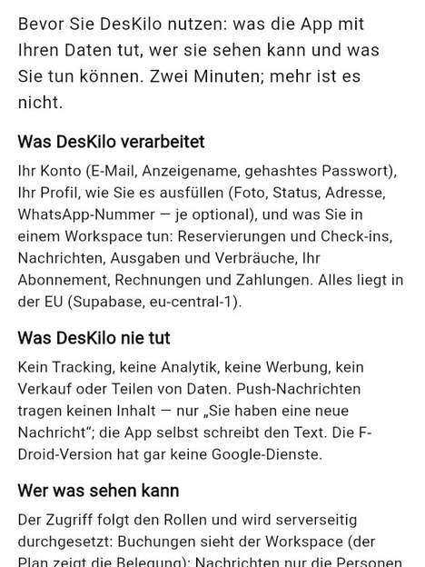

**Schritte**

1. Öffnen Sie [Datenschutz & Daten](https://fdittgen-png.github.io/deskilo/#/privacy).
2. Tippen Sie auf **Ihre Daten, Ihre Rechte**.
3. Lesen Sie den Text: was verarbeitet wird, was nie geschieht, wer was sieht, wer verantwortlich ist, wie lange und welche Rechte Sie haben.

**Gut zu wissen**

- Er zeigt das Datum und die Version, die Sie akzeptiert haben; ändert sich der Text, werden Sie erneut um Ihre Zustimmung gebeten.
- **Datenschutzerklärung**, gleich darunter, öffnet die vollständige Erklärung online.

**Siehe auch:** [Wer meine Daten sehen kann](#datenschutz-wer-meine-daten-sehen-kann)

<!-- anchor: user.backend.server -->
### Ihr eigener Server

**Zielgruppe:** Alle

Standardmäßig nutzt die App den Dienst von DesKilo. Ihre Gemeinschaft betreibt womöglich einen eigenen Server, und Sie möchten sich damit verbinden.

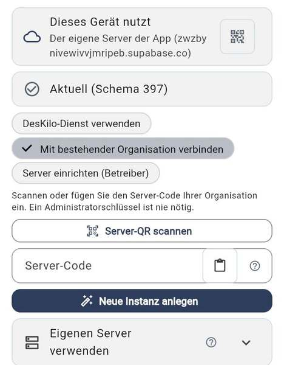

**Schritte**

1. Öffnen Sie [Einstellungen](https://fdittgen-png.github.io/deskilo/#/settings), dann **Erweitert**, dann **Server**.
2. Wählen Sie **Mit bestehender Organisation verbinden**.
3. Tippen Sie auf **Server-QR scannen** oder fügen Sie den Code bei **Server-Code** ein.
4. Speichern Sie. Die App meldet Sie ab und nutzt den neuen Server, sobald sie das nächste Mal geöffnet wird.

**Gut zu wissen**

- Sie brauchen nie einen Administratorschlüssel.
- **Server der App verwenden** bringt Sie jederzeit zum Standard zurück.
- Ihr Konto liegt auf einem Server, deshalb meldet Sie der Wechsel ab.

**Siehe auch:** [So betreiben Sie einen eigenen](#so-betreiben-sie-einen-eigenen)

<!-- anchor: user.backend.how -->
### So betreiben Sie einen eigenen

**Zielgruppe:** Alle

Sie leiten eine Gemeinschaft und möchten DesKilo selbst hosten.

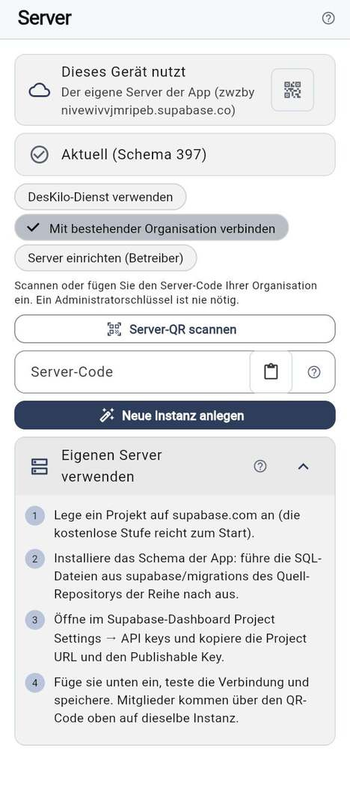

**Schritte**

1. Öffnen Sie den Bildschirm **Server** und tippen Sie auf **Eigenen Server verwenden**.
2. Folgen Sie den vier angezeigten Schritten: ein Projekt auf supabase.com anlegen, das Schema installieren, die Projekt-URL und den veröffentlichbaren Schlüssel kopieren, beides einfügen und **Verbindung testen**.
3. Oder tippen Sie auf **Neue Instanz anlegen** für die geführte Einrichtung.

**Gut zu wissen**

- Der Test sagt Ihnen, was nicht stimmt: nicht erreichbare Adresse, abgelehnter Schlüssel oder fehlende Tabellen.
- Mitglieder treten demselben Server bei, indem sie den QR-Code auf diesem Bildschirm scannen.
- Die Betreiberseite, Umgebungen und Bereitstellung, steht im Kapitel für Fortgeschrittene.

**Siehe auch:** [Ihr eigener Server](#ihr-eigener-server)

<!-- anchor: user.money.overview -->
## Finanzen

Alles, was Sie schulden, bezahlt haben und was Ihnen in Rechnung gestellt wurde, finden Sie im Reiter **Finanzen**: ein Ort, um den Monat zu lesen, zu begleichen, eine Rechnung zu finden und eine Änderung zu beantragen.

In diesem Kapitel:
- [Ihre Abrechnung lesen](#ihre-abrechnung-lesen) und [was eine Rechnung ändert](#wenn-ein-monat-in-rechnung-gestellt-wurde)
- [Offenes bezahlen](#offenes-bezahlen) und [eine Zahlung erfassen](#eine-zahlung-erfassen)
- [Ihre Rechnungen](#ihre-rechnungen) und [was jede Buchung gekostet hat](#was-jede-buchung-gekostet-hat)
- [Finanzmeldungen](#finanzmeldungen), [Berichte](#berichte-schnellansicht-download-teilen) und [Ihre verhandelten Preise](#ihre-verhandelten-preise)
- [Ein Dokument öffnen](#ein-dokument-aus-der-bibliothek-öffnen) aus der Bibliothek
- [Eine Ausgabe einreichen](#eine-ausgabe-einreichen) und [eine Ausgabe genehmigen oder ablehnen](#eine-ausgabe-genehmigen-oder-ablehnen)
- [Wie Beträge angezeigt werden](#wie-beträge-angezeigt-werden) und [Ihre Finanzen in allen Workspaces](#ihre-finanzen-in-allen-workspaces)
- Für Abrechnungsadministrator:innen: [Rechnungsstellung im Überblick](#rechnungsstellung-im-überblick)

<!-- anchor: user.money.statement -->
### Ihre Abrechnung lesen

**Zielgruppe:** Mitglied

Sie möchten wissen, wo der Monat steht: was Sie genutzt haben, was es kostet und was noch zu begleichen ist.

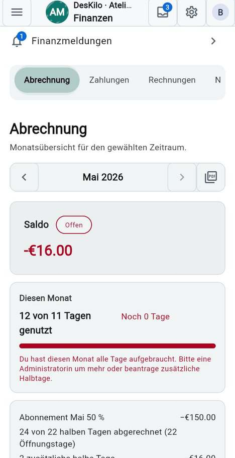

**Schritte**

1. Öffnen Sie [Finanzen](https://fdittgen-png.github.io/deskilo/#/money) und bleiben Sie auf **Abrechnung**.
2. Blättern Sie mit den Pfeilen neben dem Monatsnamen zu anderen Monaten.
3. Lesen Sie zuerst **Saldo**: **Ausstehend** in Rot bedeutet, dass Sie den Betrag schulden, **Beglichen** bedeutet, dass nichts mehr offen ist.
4. Lesen Sie darunter **Diesen Monat**: die genutzten Tage von den Tagen, die Ihr Tarif enthält, und die verbleibenden Tage.
5. Lesen Sie die folgenden Karten: Ihr Abonnement, zusätzliche halbe Tage, Services, Pakete, offene Posten und **Zahlungen & Gutschriften**.

**Gut zu wissen**

- Ein gebuchter Vor- oder Nachmittag zählt als halber Tag, daher sehen Sie vielleicht Werte wie 0,5 Tage.
- Die Karte nennt auch die Regel Ihres Tarifs. Bei Abrechnung nach Verbrauch zeigt sie immer den Satz für Zusatztage; bei den beiden anderen Regeln weist sie Sie darauf hin, eine:n Administrator:in zu fragen oder ein Paket zu kaufen, sobald alle Ihre Tage genutzt sind.
- Eine Zeile mit dem Vermerk „wartet auf Bestätigung“ muss noch von jemandem bestätigt werden und zählt noch nicht.
- Tippen Sie auf das PDF-Symbol neben dem Monat, um die Abrechnung zu exportieren.

**Siehe auch:** [Offenes bezahlen](#offenes-bezahlen) · [Was jede Buchung gekostet hat](#was-jede-buchung-gekostet-hat)

<!-- anchor: user.money.statement.invoiced -->
### Wenn ein Monat in Rechnung gestellt wurde

**Zielgruppe:** Mitglied

Sie möchten wissen, welcher Betrag maßgeblich ist, sobald der Workspace Ihnen für einen Monat eine Rechnung geschickt hat.

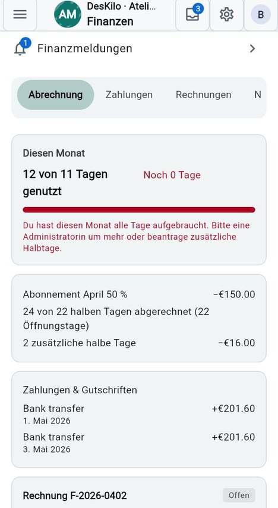

**Schritte**

1. Öffnen Sie [Finanzen](https://fdittgen-png.github.io/deskilo/#/money) und gehen Sie mit dem linken Pfeil zum abgerechneten Monat zurück.
2. Suchen Sie die Karte **Rechnung** (oder **Gutschrift**, wenn die Summe negativ ist) mit ihrer Nummer.
3. Lesen Sie den Status auf der Karte, dann **Rechnungsbetrag**; eine teilweise bezahlte Rechnung zeigt außerdem **Bereits bezahlt** und **Restbetrag**.

**Gut zu wissen**

- Sobald ein Monat in Rechnung gestellt ist, entscheidet die Rechnung, ob er beglichen ist. Die Zahlung, die sie ausgleicht, geht meist erst in einem späteren Monat ein; der Saldo des Monats ist daher nicht mehr maßgeblich.
- Eine Gutschrift lautet „Der Workspace schuldet Ihnen diesen Betrag“: Sie müssen nichts bezahlen.

**Siehe auch:** [Ihre Rechnungen](#ihre-rechnungen)

<!-- anchor: user.money.payments -->
### Offenes bezahlen

**Zielgruppe:** Mitglied

Sie möchten Ihren Saldo begleichen und wissen, wie der Workspace das Geld erwartet.

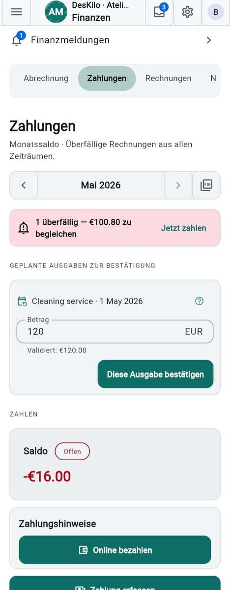

**Schritte**

1. Öffnen Sie [Finanzen](https://fdittgen-png.github.io/deskilo/#/money) und wählen Sie **Zahlungen**.
2. Prüfen Sie **Saldo** unter **Zahlen**; überfällige Rechnungen aus allen Zeiträumen werden darüber hervorgehoben.
3. Lesen Sie die **Zahlungshinweise**: die Bankverbindung, den anzugebenden Verwendungszweck und die anderen Zahlungswege, die der Workspace akzeptiert. Tippen Sie auf eine IBAN oder einen Wert, um ihn zu kopieren.
4. Wenn die Schaltfläche vorhanden ist, tippen Sie auf **Online bezahlen**.
5. Haben Sie auf anderem Weg bezahlt, [erfassen Sie die Zahlung](#eine-zahlung-erfassen).

**Gut zu wissen**

- Die Hinweise erscheinen nur, solange etwas offen ist, und nur, wenn der Workspace sie eingerichtet hat. Fehlen sie, fragen Sie Ihre Administrator:in, wie Sie bezahlen können.
- Eine Online-Zahlung, die der Anbieter noch nicht bestätigt hat, erscheint als **Online-Zahlung ausstehend**: Der Saldo zeigt weiterhin den offenen Betrag, bis sie bestätigt ist.
- Unter **Anfragen** können Sie außerdem eine Ausgabe einreichen, **Zusätzliche halbe Tage beantragen** oder, wenn Ihr Tarif mit Paketen arbeitet, **Paket kaufen**.

**Siehe auch:** [Eine Zahlung erfassen](#eine-zahlung-erfassen) · [Eine Ausgabe einreichen](#eine-ausgabe-einreichen)

<!-- anchor: user.money.payments.record -->
### Eine Zahlung erfassen

**Zielgruppe:** Mitglied

Sie haben per Überweisung, bar oder auf anderem Weg bezahlt und möchten, dass der Workspace es erfährt.

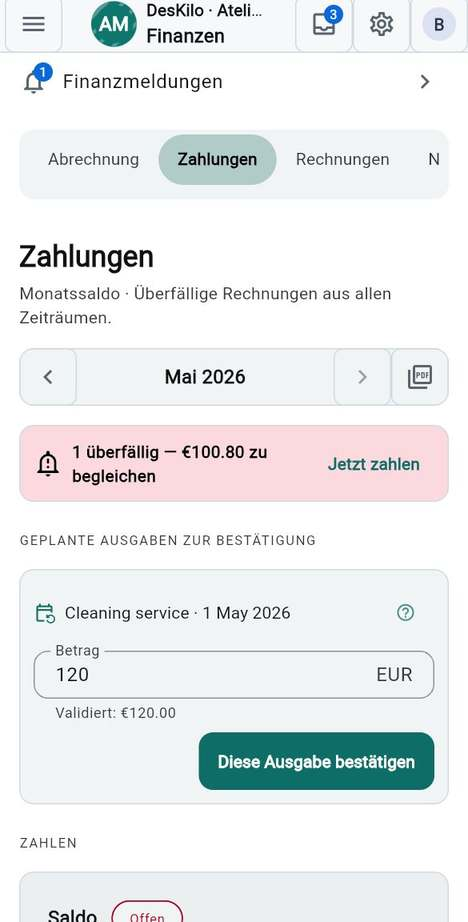

**Schritte**

1. Öffnen Sie [Finanzen](https://fdittgen-png.github.io/deskilo/#/money), wählen Sie **Zahlungen** und tippen Sie auf **Zahlung erfassen**.
2. Geben Sie den **Betrag** ein.
3. Tippen Sie auf die Zahlungsart: **Überweisung**, **Bar**, **PayPal**, **TWINT**, **Karte**, **Wero**, **Lydia**, **Wise** oder **Sonstiges**. Tippen Sie erneut darauf, um die Auswahl aufzuheben.
4. Prüfen Sie **Zahlungsdatum** und **Gilt für**, den Monat, den diese Zahlung begleicht.
5. Fügen Sie eine **Notiz (optional)** hinzu und tippen Sie auf **Zur Bestätigung einreichen**.

**Gut zu wissen**

- Ihre Zahlung ist beim Absenden noch nicht endgültig. Sie wartet als „wartet auf Bestätigung“, bis die vom Workspace bestimmten Personen sie bestätigen, wie in den [Validierungsregeln](#validierungsregeln-bereich-für-bereich) festgelegt. Erst dann begleicht sie Ihren Saldo.
- Ihr Zahlungsdatum darf nicht in der Zukunft liegen. **Gilt für** reicht bis einen Monat voraus, um im Voraus zu bezahlen.

**Siehe auch:** [Offenes bezahlen](#offenes-bezahlen) · [Finanzmeldungen](#finanzmeldungen)

<!-- anchor: user.money.invoices -->
### Ihre Rechnungen

**Zielgruppe:** Mitglied

Sie möchten eine Rechnung finden, sehen, ob sie bezahlt ist, und ihr PDF erhalten.

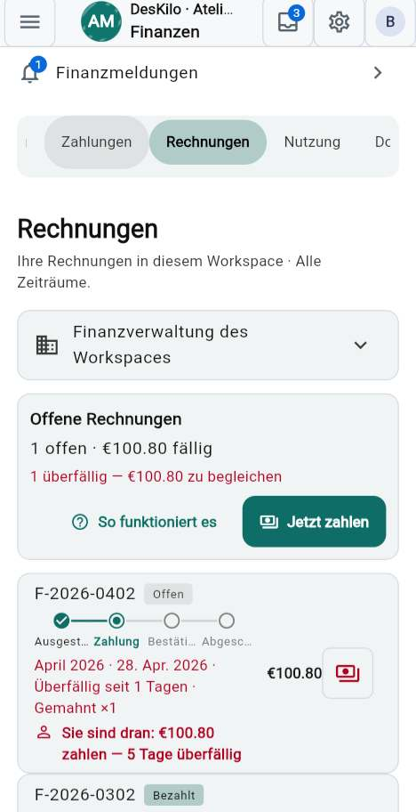

**Schritte**

1. Öffnen Sie [Finanzen](https://fdittgen-png.github.io/deskilo/#/money) und wählen Sie **Rechnungen**.
2. Lesen Sie die Liste, die neueste zuerst. Jede Zeile zeigt die Nummer, einen Status-Chip, den Monat, das Datum und den Betrag.
3. Tippen Sie auf eine Rechnung, um sie zu öffnen.
4. Tippen Sie auf **Schnellansicht**, um sie auf dem Bildschirm zu lesen, auf **PDF herunterladen**, um sie zu speichern, oder auf **PDF teilen**, um sie zu versenden.

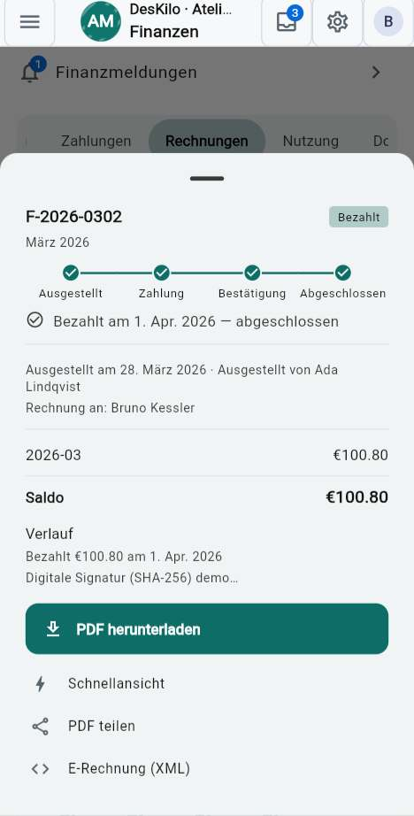

**Gut zu wissen**

- Die Status sind **Offen**, **Wartet auf Bestätigung**, **Bezahlt**, **Teilweise bezahlt**, **Teilweise bezahlt · Restbetrag storniert** und **Erstattet**. Eine offene Rechnung nennt ihre Fälligkeit oder die Zahl der Tage, die sie überfällig ist, und wie viele Erinnerungen Sie erhalten haben.
- Tippen Sie bei einer offenen Rechnung auf das Zahlungssymbol, um zu **Zahlungen** zu gelangen.
- Ist die Liste leer, hat der Workspace Ihnen noch nichts in Rechnung gestellt; er stellt einen Monat nach dem Abschluss in Rechnung.
- Rechnungen lassen sich nicht bearbeiten. Eine falsche Rechnung wird als **Fehlerhaft** markiert und durch eine neue ersetzt; die fehlerhafte verschwindet aus Ihrer Liste. Werden Rechnungen zu einer zusammengefasst, ersetzt die zusammengefasste Rechnung sie in Ihrer Liste.

**Siehe auch:** [Offenes bezahlen](#offenes-bezahlen) · [Ihre Finanzen in allen Workspaces](#ihre-finanzen-in-allen-workspaces)

<!-- anchor: user.money.usage -->
### Was jede Buchung gekostet hat

**Zielgruppe:** Mitglied · Administrator:in

Sie möchten Buchung für Buchung sehen, was in diesem Monat berechnet wurde.

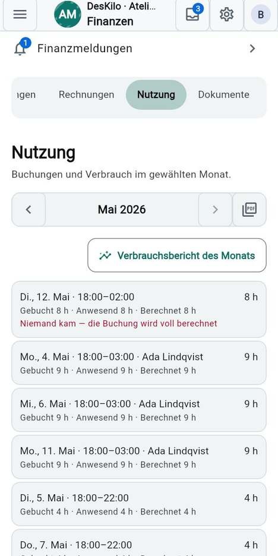

**Schritte**

1. Öffnen Sie [Finanzen](https://fdittgen-png.github.io/deskilo/#/money) und wählen Sie **Nutzung**.
2. Wählen Sie den Monat mit den Pfeilen.
3. Lesen Sie jede Karte: den Tag, die Uhrzeit, den Platz, dann **Gebucht**, **Anwesend** und **Berechnet**.
4. Tippen Sie bei einer Buchung, die Sie früher verlassen haben, auf **Die Zeit berechnen, in der ich da war**, nennen Sie auf Wunsch einen Grund und tippen Sie auf **Anfragen**.
5. Für eine Zusammenfassung des Monats tippen Sie auf **Verbrauchsbericht des Monats**.

**Gut zu wissen**

- Eine Buchung, bei der niemand eingecheckt hat, wird vollständig berechnet, und die Karte weist darauf hin.
- Über Ihre Anfrage entscheiden nie Sie selbst: Jemand anderes nimmt sie an oder lehnt sie ab. Eine korrigierte Zeile zeigt weiterhin, was sie vorher war.
- Administratoren können beantragen, **Diesen Satz entfernen**.

**Siehe auch:** [Berichte](#berichte-schnellansicht-download-teilen) · [Das Buchungsblatt](#das-buchungsblatt)

<!-- anchor: user.money.alerts -->
### Finanzmeldungen

**Zielgruppe:** Mitglied · Administrator:in

Sie möchten sehen, was in Gelddingen auf Sie wartet, ohne den ganzen Feed zu lesen.

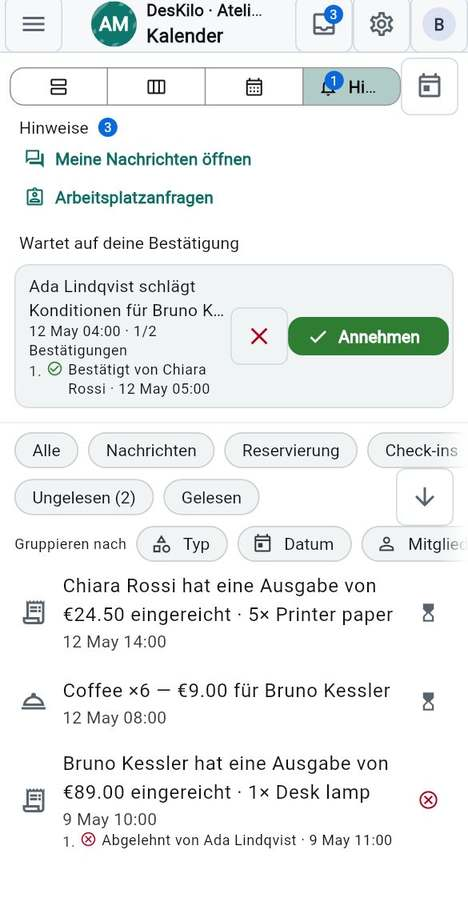

**Schritte**

1. Öffnen Sie [Finanzen](https://fdittgen-png.github.io/deskilo/#/money).
2. Tippen Sie auf **Finanzmeldungen**, die Zeile ganz oben. Die Zahl an der Glocke zeigt, wie viele warten.
3. Lesen Sie die Liste: zuerst die Anfragen, die Sie bestätigen müssen, dann die Geldereignisse.

**Gut zu wissen**

- Das ist die gewohnte Meldungsansicht der [Ereignisse](https://fdittgen-png.github.io/deskilo/#/events), bereits auf Geld gefiltert.
- Zahlungen, Ausgaben und zusätzliche halbe Tage, die Sie eingereicht haben, erscheinen hier, solange sie auf Bestätigung warten, und zeigen, wer sie bestätigt oder abgelehnt hat.
- Die Zeile erscheint, wenn die Funktion **Ereignis-Tab** eingeschaltet ist.

**Siehe auch:** [Eine Ausgabe genehmigen oder ablehnen](#eine-ausgabe-genehmigen-oder-ablehnen)

<!-- anchor: user.money.reports -->
### Berichte: Schnellansicht, Download, Teilen

**Zielgruppe:** Mitglied

Sie möchten ein Dokument über Ihr eigenes Geld, zum Lesen, Aufbewahren oder Weitergeben an Ihre Buchhaltung.

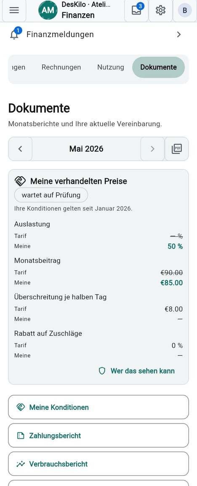

**Schritte**

1. Öffnen Sie [Finanzen](https://fdittgen-png.github.io/deskilo/#/money) und wählen Sie **Dokumente**.
2. Wählen Sie mit den Pfeilen den Monat, für Berichte, die von einem Monat abhängen.
3. Tippen Sie auf einen Bericht: **Meine Konditionen**, **Zahlungsbericht**, **Verbrauchsbericht** oder **Monatsabrechnung (PDF)**.
4. Wählen Sie **Schnellansicht**, **PDF herunterladen** oder **PDF teilen**.

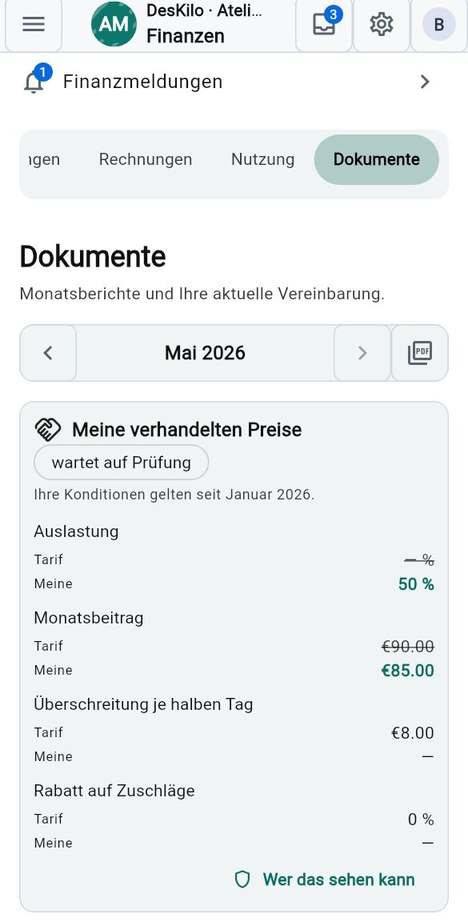

**Gut zu wissen**

- Dieselben drei Möglichkeiten erscheinen bei jedem Bericht und jeder Rechnung.
- Die **Schnellansicht** zeigt das Dokument auf dem Bildschirm, ohne etwas zu speichern.
- Ein Bericht, den Sie nicht sehen, ist in Ihrem Workspace nicht eingeschaltet.

**Siehe auch:** [Ihre Rechnungen](#ihre-rechnungen) · [Ihre verhandelten Preise](#ihre-verhandelten-preise)

<!-- anchor: user.money.negotiation -->
### Ihre verhandelten Preise

**Zielgruppe:** Mitglied

Sie möchten wissen, ob Sie den Tarif des Workspace zahlen oder einen eigens für Sie vereinbarten Preis.

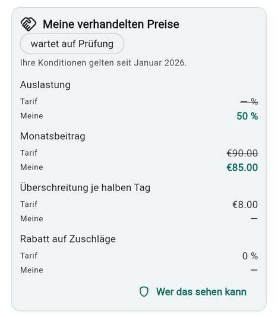

**Schritte**

1. Öffnen Sie [Finanzen](https://fdittgen-png.github.io/deskilo/#/money) und wählen Sie **Dokumente**.
2. Lesen Sie **Meine verhandelten Preise**: Bei **Monatsbeitrag**, **Überschreitung je halben Tag** und **Rabatt auf Zuschläge** zeigt **Tarif**, was alle zahlen, und **Meine**, was Sie zahlen.
3. Tippen Sie auf **Wer das sehen kann**, um zu erfahren, wer Ihre Preise lesen darf.

**Gut zu wissen**

- „Sie sind im Tarif des Workspace“ bedeutet, dass keine Vereinbarung gilt; Ihre Spalte zeigt einen Strich.
- Gilt eine Vereinbarung, nennt die Karte den Monat, seit dem sie gilt, und der Tarifwert ist durchgestrichen.
- Eine für Sie vorgeschlagene Vereinbarung wartet als „wartet auf Bestätigung“ und gilt erst nach der Bestätigung.
- Eine Vereinbarung können Sie hier nicht ändern; eine Administrator:in schlägt sie vor. Siehe [Preisverhandlung](#preisverhandlung).

**Siehe auch:** [Ihre Abrechnung lesen](#ihre-abrechnung-lesen)

<!-- anchor: user.money.documents.library -->
### Ein Dokument aus der Bibliothek öffnen

**Zielgruppe:** Mitglied

Sie möchten die Satzung, eine Anleitung oder die Abschlüsse lesen, die Ihr Workspace geteilt hat.

**Schritte**

1. Öffnen Sie [Finanzen](https://fdittgen-png.github.io/deskilo/#/money), wählen Sie **Dokumente** und tippen Sie auf **Dokumentbibliothek**, oder gehen Sie direkt zu [Dokumente](https://fdittgen-png.github.io/deskilo/#/documents).
2. Suchen Sie Ihr Dokument unter seiner Kategorie: **Satzung & Rechtliches**, **Finanzberichte**, **Protokolle**, **Anleitungen & Handbücher** oder **Weitere Dokumente**.
3. Tippen Sie darauf. Es öffnet sich in Ihrem Browser von dort, wo es gespeichert ist.

**Gut zu wissen**

- Sie sehen nur die Dokumente, die Ihre Rolle lesen darf; ein Schloss kennzeichnet jene, die auf **Admins und Inhaber** oder **Nur Inhaber** beschränkt sind.
- Die Bibliothek enthält Links. Wer die Datei öffnen darf, wird dort entschieden, wo sie gespeichert ist, nicht in DesKilo.
- Administratoren mit der entsprechenden Berechtigung fügen Dokumente hinzu und entfernen sie; siehe [Dokumenttitel](#dokumenttitel).

**Siehe auch:** [Berichte](#berichte-schnellansicht-download-teilen)

<!-- anchor: user.money.expense -->
### Eine Ausgabe einreichen

**Zielgruppe:** Mitglied

Sie haben etwas für den Raum bezahlt und möchten, dass der Workspace es Ihnen erstattet.

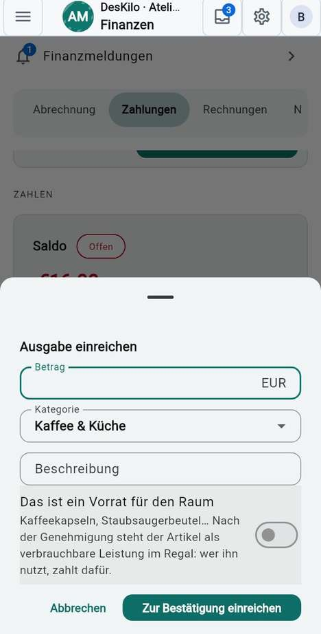

**Schritte**

1. Öffnen Sie [Finanzen](https://fdittgen-png.github.io/deskilo/#/money), wählen Sie **Zahlungen** und tippen Sie auf **Ausgabe einreichen**.
2. Geben Sie den **Betrag** ein.
3. Wählen Sie eine **Kategorie**: **Kaffee & Küche**, **Ausstattung**, **Verbrauchsmaterial** oder **Sonstiges**.
4. Schreiben Sie eine **Beschreibung**.
5. Wenn Sie etwas gekauft haben, das Mitglieder nutzen werden, schalten Sie **Das ist ein Vorrat für den Raum** ein (die Option erscheint, wenn Ihr Workspace **Vorräte aus Ausgaben** eingeschaltet hat) und tragen Sie den Artikel, die Menge und den Einzelpreis ein.
6. Tippen Sie auf **Zur Bestätigung einreichen**.

**Gut zu wissen**

- Sie sehen „Ausgabe eingereicht – wartet auf Genehmigung“. Die Ausgabe zählt erst, wenn sie bestätigt ist.
- Ein bestätigter Vorrat kommt als Service ins Regal: Mitglieder, die ihn nutzen, bezahlen dafür.
- Wiederkehrende Kosten haben einen eigenen Zugang, **Geplante Ausgaben**, neben dieser Schaltfläche.

**Siehe auch:** [Eine Ausgabe genehmigen oder ablehnen](#eine-ausgabe-genehmigen-oder-ablehnen)

<!-- anchor: user.money.expense.approve -->
### Eine Ausgabe genehmigen oder ablehnen

**Zielgruppe:** Administrator:in · Inhaber

Eine Ausgabe wartet, und Sie entscheiden, ob der Workspace sie bezahlt.

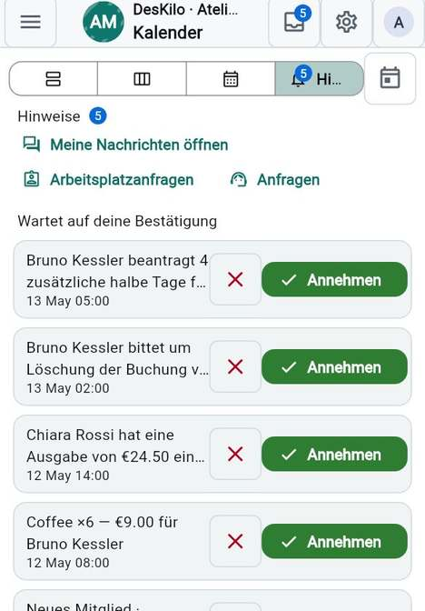

**Schritte**

1. Öffnen Sie [Ereignisse](https://fdittgen-png.github.io/deskilo/#/events) oder tippen Sie in [Finanzen](https://fdittgen-png.github.io/deskilo/#/money) auf **Finanzmeldungen**.
2. Suchen Sie unter **Wartet auf Ihre Bestätigung** die Zeile mit dem Betrag und dem Mitglied.
3. Tippen Sie auf **Annehmen**, um sie zu bestätigen, oder auf das Kreuz, um sie **Ablehnen**.

**Gut zu wissen**

- Manche Ausgaben brauchen mehr als eine Bestätigung. Die Zeile zeigt, wie viele erledigt sind, etwa „1/2 Bestätigungen“.
- Wer bestätigen darf und wie viele Bestätigungen nötig sind, legen die [Validierungsregeln](#validierungsregeln-bereich-für-bereich) fest.
- Jede Entscheidung bleibt an der Zeile: wer bestätigt oder abgelehnt hat und wann. Das Mitglied sieht das Ergebnis.
- **Finanzmeldungen** in Finanzen erscheint nur, wenn die Funktion **Ereignis-Tab** eingeschaltet ist.

**Siehe auch:** [Finanzmeldungen](#finanzmeldungen)

<!-- anchor: user.money.amounts -->
### Wie Beträge angezeigt werden

**Zielgruppe:** Alle

Sie möchten eine Zahl lesen, ohne sich zu fragen, was sie enthält.

**Gut zu wissen**

- Beträge verwenden die Währung Ihres Workspace und Ihr Zahlenformat. Eine Rechnung behält die Währung, in der sie ausgestellt wurde.
- In der Abrechnung tragen Kosten ein Minuszeichen, Zahlungen und Gutschriften ein Plus. Ein roter Saldo ist Geld, das Sie schulden.
- Wo ein Preis die Umsatzsteuer enthält, steht das dabei, zum Beispiel „inkl. 20 % USt.“. Das Rechnungs-PDF listet die enthaltene Umsatzsteuer auf.
- Erhebt Ihr Workspace keine Umsatzsteuer, wird keine angezeigt.
- Tage werden in ganzen und halben Tagen angezeigt.

**Siehe auch:** [Ihre Abrechnung lesen](#ihre-abrechnung-lesen) · [Ihre Rechnungen](#ihre-rechnungen)

<!-- anchor: user.money.finances -->
### Ihre Finanzen in allen Workspaces

**Zielgruppe:** Mitglied

Sie gehören mehreren Spaces an und möchten alle Ihre Rechnungen, Zahlungen und Erinnerungen an einem Ort sehen.

**Schritte**

1. Öffnen Sie [Finanzen](https://fdittgen-png.github.io/deskilo/#/money), wählen Sie **Zahlungen** oder **Rechnungen** und tippen Sie bei Ihrem Space auf der Karte **Ihre Finanzen in allen Workspaces** auf *Für … öffnen*.
2. Wählen Sie einen Reiter: **Ausstehend**, **Bezahlt**, **Zahlungen** oder **Erinnerungen**.
3. Wenn Sie mehreren Spaces angehören, filtern Sie oben nach Space.

**Gut zu wissen**

- **Ausstehend** zeigt „Nichts zu zahlen – Sie sind auf dem aktuellen Stand“, wenn Sie nichts schulden.
- **Erinnerungen** listet die erhaltenen Erinnerungen mit ihrer Stufe auf.
- Vollständiger Verlauf, Nutzung und andere Server sind von demselben Bildschirm aus erreichbar.

**Siehe auch:** [Ihre Rechnungen](#ihre-rechnungen)

<!-- anchor: user.money.invoicing -->
### Rechnungsstellung im Überblick

**Zielgruppe:** Abrechnungsadministrator:in · Inhaber

Sie stellen die Rechnungen des ganzen Workspace aus und verfolgen sie nach und möchten wissen, wo Sie anfangen.

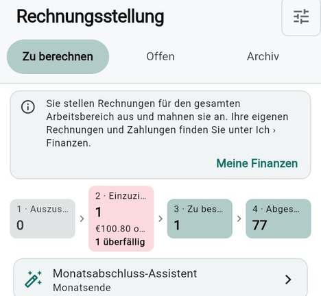

**Schritte**

1. Öffnen Sie [Rechnungsstellung](https://fdittgen-png.github.io/deskilo/#/invoices).
2. Lesen Sie die Reiter: **Zu berechnen** listet Mitglieder, die für den Monat noch abzurechnen sind, **Offen** die ausgestellten, unbezahlten Rechnungen und **Archiv** die abgeschlossenen.
3. Lesen Sie die Zeile mit vier Schritten unter dem Banner: **Auszustellen**, **Einzuziehen**, **Zu bestätigen** und **Abgeschlossen**, jeweils mit einer Anzahl.
4. Tippen Sie auf **Monatsabschluss-Assistent**, um einen Monat abzurechnen, oder auf **Neue Rechnung** für eine einzelne.
5. Tippen Sie auf das Werkzeugsymbol für das Rechnungsregister, die Mahnregeln, die PDF-Vorlage der Rechnung und **Meine Finanzen**.

**Gut zu wissen**

- Rechnungen werden nie bearbeitet oder gelöscht. Eine falsche wird als fehlerhaft markiert und ersetzt.
- Der vollständige Ablauf vom Monatsabschluss über den Ausgleich bis zu den Erinnerungen steht in Kapitel 08: [Mahnregeln](#mahnregeln) und [Die PDF-Vorlage der Rechnung](#die-pdf-vorlage-der-rechnung) sind gute Stellen zum Weiterlesen.

**Siehe auch:** [Mahnregeln](#mahnregeln)

<!-- anchor: user.space.overview -->
## Ihr Space, von Ihnen eingerichtet (Workspace-Einstellungen)

Dieses Kapitel richtet sich an die Menschen, die einen Space betreiben: Inhaber, Mitinhaber und die Administratoren, denen sie die Einstellungen anvertrauen. Hier zeichnen Sie die Etagen, legen fest, wer wann kommen darf, wählen die Funktionen, geben dem Space sein Aussehen und seine Wörter und ziehen eine Kopie von allem.

In diesem Kapitel:
- [Etagen, Räume und Tische zeichnen](#space-editor-etagen-hinzufügen-umbenennen-und-löschen)
- [Mit der Workspace-ID einladen](#die-workspace-id)
- [Festlegen, wann der Space geöffnet ist](#geöffnete-wochentage)
- [Funktionen ein- und ausschalten](#ganze-prozesse-ein--oder-ausschalten)
- [Die Workspace-Einstellungen ausfüllen](#land)
- [Dem Space Farben und Wörter geben](#wortwahl)
- [Festlegen, wer was darf](#die-rollenmatrix)
- [Ein Wand-Tablet und Badges betreiben](#kiosk-modus-ein-wand-tablet-für-den-check-in)
- [Eine Dokumentenbibliothek führen](#ein-dokument-zur-bibliothek-hinzufügen)
- [Den Space exportieren und importieren](#den-space-exportieren-xml)

> **Tipp** Die meisten Bildschirme dieses Kapitels finden Sie im Menü unter **Workspace**, **Verfügbarkeit**, **Funktionen** und **Rollen**. Jeder Eintrag erscheint nur für Personen mit der nötigen Berechtigung, und manche nur, solange ihre Funktion eingeschaltet ist. Administrator:innen sehen diese Bildschirme nur, wenn der Inhaber ihnen die Berechtigung in der Rollenmatrix gegeben hat.

<!-- anchor: user.space.editor.levels -->
### Space-Editor: etagen hinzufügen, umbenennen und löschen

**Zielgruppe:** Inhaber · Administrator:in

Sie möchten dem Gebäude seine Etagen geben, in der Reihenfolge, die man erwartet. Der **Workspace-Editor** listet jede Etage des Spaces auf.

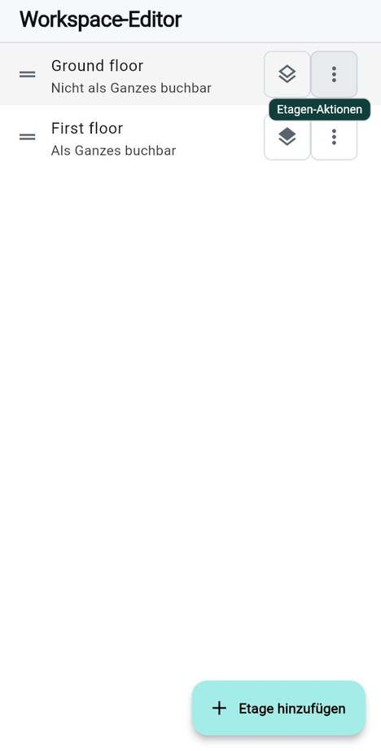

**Schritte**

1. Öffnen Sie [Workspace-Editor](https://fdittgen-png.github.io/deskilo/#/editor) oder tippen Sie auf dem Bildschirm Reservieren auf **Workspace bearbeiten**.
2. Tippen Sie auf **Etage hinzufügen**, tragen Sie den Namen ein und tippen Sie auf **Speichern**.
3. Ziehen Sie den Griff links neben einer Etage, um die Reihenfolge zu ändern.
4. Tippen Sie auf die drei Punkte (**Etagen-Aktionen**), um eine Etage zu **Umbenennen** oder zu **Löschen**.
5. Tippen Sie auf eine Etage, um darauf zu zeichnen.

**Gut zu wissen**

- Das Löschen einer Etage entfernt jedes Büro, jeden Tisch und jeden Platz darauf. Die Bestätigung sagt, was mit Buchungen geschieht, die darauf verweisen.
- Die Zeile unter jeder Etage zeigt, ob sie **Als Ganzes buchbar** oder **Nicht als Ganzes buchbar** ist.
- Ohne Etage zeigt der Editor **Noch keine Etagen. Fügen Sie die erste Etage Ihres Workspace hinzu.**

**Siehe auch:** [Eine ganze Etage buchbar machen](#mitglieder-eine-ganze-etage-buchen-lassen) · [Räume, Tische und Plätze zeichnen](#räume-tische-und-plätze-zeichnen)

<!-- anchor: user.space.editor.level-booking -->
### Mitglieder eine ganze Etage buchen lassen

**Zielgruppe:** Inhaber · Administrator:in

Sie möchten, dass ein Team für einen Tag eine komplette Etage übernehmen kann.

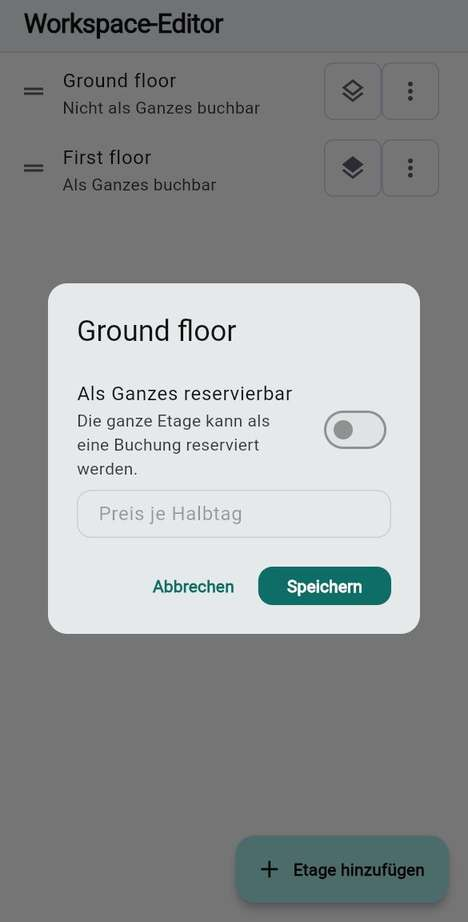

**Schritte**

1. Tippen Sie im [Workspace-Editor](https://fdittgen-png.github.io/deskilo/#/editor) in der Zeile der Etage auf die Ebenen-Schaltfläche.
2. Schalten Sie **Als Ganzes buchbar** ein.
3. Tragen Sie den **Preis je Halbtag** ein.
4. Tippen Sie auf **Speichern**.

**Gut zu wissen**

- Die Ebenen-Schaltfläche ist gefüllt, wenn die Etage als Ganzes buchbar ist.
- Eine ganze Etage, ein ganzes Büro oder einen ganzen Tisch zu buchen, setzt außerdem die Funktion **Tisch-, Büro- & Etagen-Reservierungen** voraus. Jedes Mitglied braucht das Recht, Etagen zu reservieren; Administratoren haben es automatisch. Siehe [Ein Funktionsschalter](#ein-funktionsschalter).

**Siehe auch:** [Eigenschaften von Büro und Tisch](#ein-büro-oder-einen-tisch-benennen-und-mit-einem-preis-versehen)

<!-- anchor: user.space.editor.rooms -->
### Räume, Tische und Plätze zeichnen

**Zielgruppe:** Inhaber · Administrator:in

Sie möchten, dass der Plan auf dem Bildschirm wie die echte Etage aussieht. Alles liegt in einem Raum: Sie zeichnen einen Raum, setzen Tische hinein und dann Plätze an die Tische.

**Schritte**

1. Öffnen Sie eine Etage im [Workspace-Editor](https://fdittgen-png.github.io/deskilo/#/editor). Eine leere Etage bietet **Ersten Raum zeichnen** an.
2. Tippen Sie auf **Büro** und ziehen Sie auf dem Raster, um einen Raum zu zeichnen.
3. Tippen Sie auf **Tisch** und ziehen Sie im Raum, um einen Tisch zu zeichnen.
4. Tippen Sie auf **Platz** und dann auf einen Tisch, um ihm einen Platz hinzuzufügen.
5. Tippen Sie auf **Bild** und dann auf die Stelle, an der eine Illustration stehen soll.
6. Tippen Sie auf ein Element, um es auszuwählen. Die Leiste unten bietet **Duplizieren**, **Eigenschaften** und **Löschen**.

**Gut zu wissen**

- Tippen Sie ein zweites Mal auf das aktive Werkzeug, legen Sie es wieder ab, und die Zeichenfläche wechselt zurück zum Auswählen.
- Die App lehnt eine Form ab, die **Überschneidet ein vorhandenes Element.** oder **Muss vollständig innerhalb eines Büros liegen.** Plätze lassen sich nur auf einem Tisch setzen, und ein voller Tisch meldet **Auf diesem Tisch ist kein Platz mehr.**
- Die Bild-Schaltfläche oben rechts setzt, ersetzt oder entfernt das **Hintergrundbild** der Etage, zum Beispiel einen Scan des echten Plans.
- Das Löschen eines Raums nimmt seine Tische und Plätze mit.

**Siehe auch:** [Eigenschaften eines Platzes](#einen-platz-einrichten) · [Tisch-Transparenz](#tisch-transparenz)

<!-- anchor: user.space.editor.office -->
### Ein Büro oder einen Tisch benennen und mit einem Preis versehen

**Zielgruppe:** Inhaber · Administrator:in

Sie möchten, dass ein Raum oder ein Tisch einen eigenen Namen trägt und als Ganzes buchbar ist.

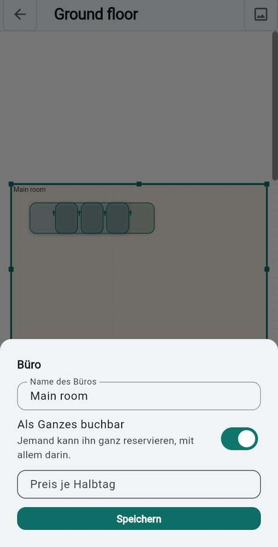

**Schritte**

1. Wählen Sie das Büro oder den Tisch auf der Etage aus und tippen Sie auf **Eigenschaften**.
2. Ändern Sie **Name des Büros** (oder **Name des Tisches**).
3. Schalten Sie **Als Ganzes buchbar** ein, wenn jemand es komplett mit allem darin reservieren darf.
4. Tragen Sie den **Preis je Halbtag** ein, der erscheint.
5. Tippen Sie auf **Speichern**.

**Gut zu wissen**

- Das Preisfeld erscheint nur, solange der Schalter an ist.
- Ein als Ganzes buchbarer Raum lässt sich nur reservieren, solange nichts darin gebucht ist.

**Siehe auch:** [Eine ganze Etage buchbar machen](#mitglieder-eine-ganze-etage-buchen-lassen) · [Eigenschaften eines Platzes](#einen-platz-einrichten)

<!-- anchor: user.space.editor.seat -->
### Einen Platz einrichten

**Zielgruppe:** Inhaber · Administrator:in

Sie möchten, dass ein Platz zeigt, wohin der Stuhl blickt, was dazugehört und wann er außer Betrieb ist.

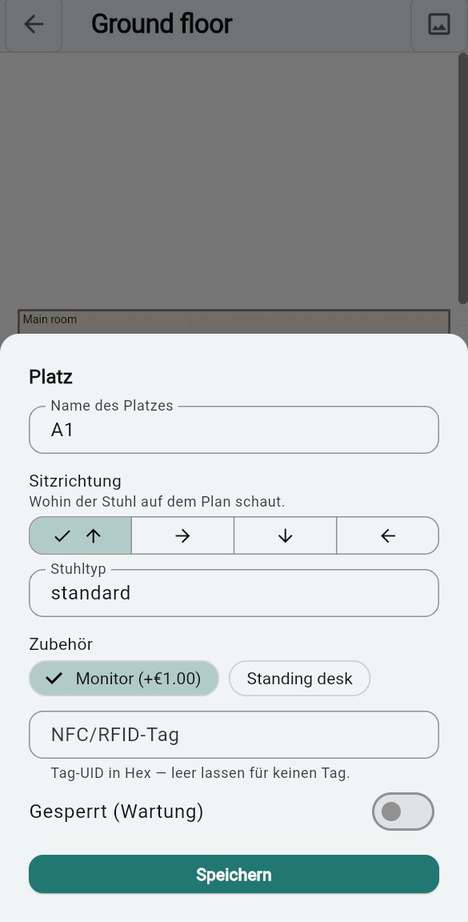

**Schritte**

1. Wählen Sie den Platz auf der Etage aus und tippen Sie auf **Eigenschaften**.
2. Ändern Sie **Name des Platzes**.
3. Wählen Sie die **Sitzrichtung**: Der Pfeil zeigt auf dem Plan, wohin der Stuhl blickt.
4. Wählen Sie einen **Stuhltyp**.
5. Tippen Sie auf das **Zubehör**, das zu diesem Platz gehört. Ein Preis daneben ist ein Aufpreis je Halbtag.
6. Trägt der Platz einen Tag, geben Sie seine Nummer bei **NFC/RFID-Tag** ein oder nutzen Sie **Jetzt einen Tag lesen**. Das Tag-Feld erscheint, wenn die Funktion **NFC/RFID-Tags an Stühlen** eingeschaltet ist, und zum Lesen brauchen Sie ein Gerät, das Tags lesen kann.
7. Schalten Sie **Gesperrt (Wartung)** ein, um den Platz außer Betrieb zu nehmen, und tippen Sie dann auf **Speichern**.

**Gut zu wissen**

- Eine Tag-Nummer kann nur zu einem Stuhl gehören: **Dieser Tag ist bereits mit einem anderen Stuhl verknüpft.**
- Gibt es noch kein Zubehör, bietet das Blatt **Noch keine Ausstattung — jetzt einrichten** an.

**Siehe auch:** [NFC-Badge-Check-in](#nfc-badge-check-in)

<!-- anchor: user.workspace.code -->
### Die Workspace-ID

**Zielgruppe:** Inhaber · Administrator:in

Sie möchten, dass Menschen Ihren Space finden und den Beitritt anfragen. Der Bildschirm **Workspace-ID & QR** zeigt die Einladung für Mitglieder: einen QR-Code und die ID dahinter.

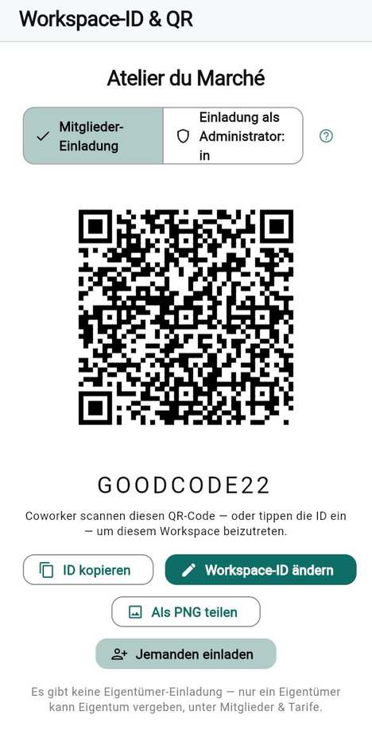

**Schritte**

1. Öffnen Sie [Workspace-ID & QR](https://fdittgen-png.github.io/deskilo/#/workspace-code). Der Tab **Mitglieder-Einladung** ist geöffnet.
2. Tippen Sie auf **ID kopieren**, um die ID irgendwo einzufügen, oder auf **Als PNG teilen**, um den QR-Code zu drucken oder zu veröffentlichen.
3. Um eine einprägsame ID zu wählen, tippen Sie auf **Workspace-ID ändern**, geben 4 bis 20 Buchstaben oder Ziffern ein und tippen auf **Speichern**.

**Gut zu wissen**

- Die ID ist in ganz DesKilo einmalig. Ist sie vergeben oder nicht 4 bis 20 Buchstaben oder Ziffern lang, sagt die App „Diese ID wurde abgelehnt“.
- Wer den Code scannt oder die ID eingibt, fragt den Beitritt als Mitglied an. Ohne Freigabe kommt niemand hinein.
- Sobald Sie die ID ändern, funktioniert die alte nicht mehr. Drucken Sie den QR-Code neu.
- Der Tab **Einladung als Administrator:in** ist für Inhaber und Mitinhaber.

**Siehe auch:** [Einladung als Administrator:in](#einen-administrator-einladen) · [Jemanden einladen](#jemanden-per-nachricht-einladen)

<!-- anchor: user.workspace.code.admin -->
### Einen Administrator einladen

**Zielgruppe:** Inhaber

Sie möchten jemanden dazuholen, der den Space mitleiten hilft. Der Tab **Einladung als Administrator:in** gibt Ihnen einen Code für genau eine Person.

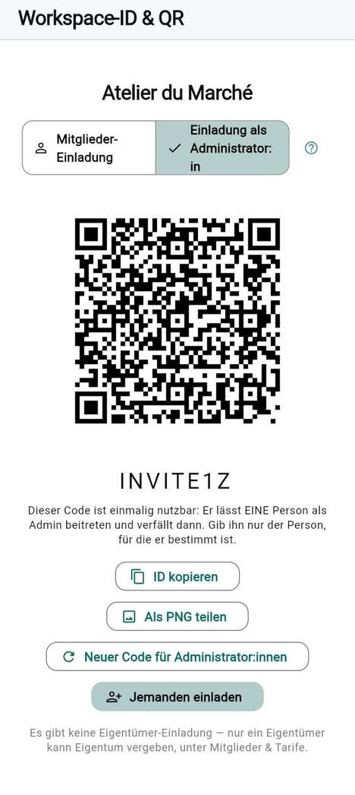

**Schritte**

1. Öffnen Sie [Workspace-ID & QR](https://fdittgen-png.github.io/deskilo/#/workspace-code) und tippen Sie auf **Einladung als Administrator:in**.
2. Geben Sie der vorgesehenen Person den Code oder seinen QR-Code.
3. Für den nächsten Administrator tippen Sie auf **Neuer Code für Administrator:innen**.

**Gut zu wissen**

- Der Code nimmt eine Person als Administrator auf, dann läuft er ab.
- Es gibt keine Einladung als Inhaber. Nur ein Inhaber kann die Inhaberschaft übertragen, unter **Mitglieder & Tarife**.

**Siehe auch:** [Die Workspace-ID](#die-workspace-id) · [Die Rollenmatrix](#die-rollenmatrix)

<!-- anchor: user.workspace.code.invite -->
### Jemanden per Nachricht einladen

**Zielgruppe:** Inhaber · Administrator:in

Sie möchten eine freundliche, fertige Einladung schicken statt eines nackten Codes.

**Schritte**

1. Tippen Sie auf [Workspace-ID & QR](https://fdittgen-png.github.io/deskilo/#/workspace-code) auf **Jemanden einladen**.
2. Füllen Sie **Vorname (optional)**, **Nachname (optional)** und, wenn Sie möchten, die Telefonnummer aus.
3. Tippen Sie unter **Rollen bei der Ankunft** auf jede Rolle, die diese Person beim Beitritt erhalten soll.
4. Wählen Sie die **Sprache der Nachricht**.
5. Senden Sie sie mit **WhatsApp**, **SMS** oder **Teilen…**.

**Gut zu wissen**

- Die Nachricht erklärt die Schritte: herunterladen, Konto anlegen, beitreten. Sie ist in der gewählten Sprache verfasst und geht von der [Sprache des Arbeitsbereichs](#sprache-des-arbeitsbereichs) aus.
- Jede Nachricht trägt ihren eigenen persönlichen Code. Einen eigenen Text können Sie unter [Einladungstext](#einladungstext) schreiben.

**Siehe auch:** [Die Workspace-ID](#die-workspace-id)

<!-- anchor: user.workspace.availability.open-weekdays -->
### Geöffnete Wochentage

**Zielgruppe:** Inhaber · Administrator:in mit Berechtigung

Sie möchten, dass der Space nur an den Tagen geöffnet ist, an denen Sie arbeiten. Der Bildschirm **Verfügbarkeit** beginnt mit den Wochentagen.

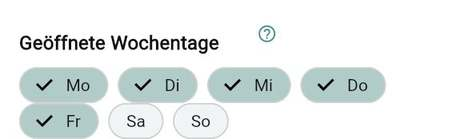

**Schritte**

1. Öffnen Sie [Verfügbarkeit](https://fdittgen-png.github.io/deskilo/#/availability).
2. Tippen Sie unter **Geöffnete Wochentage** auf einen Tag, um ihn zu öffnen oder zu schließen.

**Gut zu wissen**

- Mindestens ein Wochentag muss geöffnet bleiben.
- Eine Buchung, die einen geschlossenen Wochentag berührt, wird abgelehnt, und der Plan zeigt diesen Tag als geschlossen.

**Siehe auch:** [Schließtage](#schließtage) · [Buchungsraster](#buchungsraster)

<!-- anchor: user.workspace.availability.granularity -->
### Buchungsraster

**Zielgruppe:** Inhaber · Administrator:in mit Berechtigung

Sie möchten, dass Buchungen einem Rhythmus folgen, der zu Ihrem Space passt: halbe Tage, ganze Tage oder beliebige Zeiten.

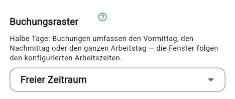

**Schritte**

1. Öffnen Sie [Verfügbarkeit](https://fdittgen-png.github.io/deskilo/#/availability).
2. Wählen Sie unter **Buchungsraster** die Form einer Buchung.

**Gut zu wissen**

- Zur Wahl stehen **Freier Zeitraum**, **5-Minuten-Slots**, **15-Minuten-Slots**, **30-Minuten-Slots**, **1-Stunden-Slots**, **Halbe Tage (Vormittag & Nachmittag)**, **Nur ganze Tage** und **Echte Uhrzeiten (exakt von–bis, Halb-/Ganztage als Schnellwahl)**. **Echte Uhrzeiten** erscheint, wenn die Funktion **Arbeitszeiten** eingeschaltet ist.
- Der Plan, das Buchungsblatt, ein gescannter Code und der Kiosk bieten nur an, was das Raster erlaubt.

**Siehe auch:** [Arbeitszeiten](#arbeitszeiten)

<!-- anchor: user.workspace.availability.working-hours -->
### Arbeitszeiten

**Zielgruppe:** Inhaber · Administrator:in mit Berechtigung

Sie möchten, dass ein Vormittag, ein Nachmittag und ein Tag überall dasselbe bedeuten.

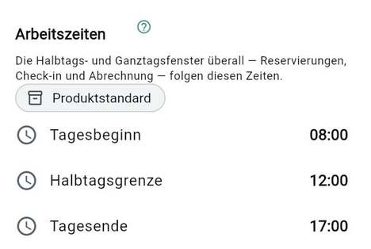

**Schritte**

1. Öffnen Sie [Verfügbarkeit](https://fdittgen-png.github.io/deskilo/#/availability).
2. Tippen Sie unter **Arbeitszeiten** auf **Tagesbeginn**, **Halbtagsgrenze** und **Tagesende** und stellen Sie jeweils die Zeit ein.
3. Bei dem Raster *Echte Uhrzeiten* legen Sie zusätzlich **Stunden, die als halber Tag gelten** und **Stunden, die als ganzer Tag gelten** fest.

**Gut zu wissen**

- Halbtags- und Ganztagsfenster in Reservierungen, Check-in und Abrechnung folgen diesen Zeiten.
- Das kleine Etikett unter dem Titel sagt, ob die Zeiten der Produktstandard sind, aus einer Vorlage stammen oder Ihre eigenen sind. **Auf Vorlage zurücksetzen** und **Auf Produktstandard zurücksetzen** holen sie zurück.
- Der Tag muss der Reihe nach laufen: Beginn, dann Halbtagsgrenze, dann Ende.
- Dieser Abschnitt gehört zur Funktion **Arbeitszeiten**.

**Siehe auch:** [Außerhalb der Öffnungszeiten](#außerhalb-der-öffnungszeiten)

<!-- anchor: user.workspace.availability.closure-days -->
### Schließtage

**Zielgruppe:** Inhaber · Administrator:in mit Berechtigung

Sie möchten den Space für einen Feiertag, eine Augustwoche oder einen Tag für den Klempner schließen, ohne dass jemand bucht.

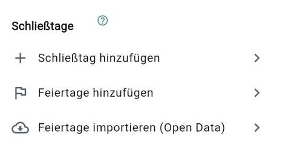

**Schritte**

1. Öffnen Sie [Verfügbarkeit](https://fdittgen-png.github.io/deskilo/#/availability) und gehen Sie zu **Schließtage**.
2. Tippen Sie auf **Schließtag hinzufügen**, wählen Sie das Datum und, wenn Sie möchten, einen **Grund (optional)**.
3. Um einen zu entfernen, tippen Sie auf den Papierkorb daneben.

**Gut zu wissen**

- Eine Buchung an einem Schließtag wird abgelehnt, und der Grund wird angezeigt.
- Tage, die schon abgerechnet sind, kann der Feiertage-Generator nicht zu Schließtagen machen.

**Siehe auch:** [Feiertage](#feiertage)

<!-- anchor: user.workspace.availability.public-holidays -->
### Feiertage

**Zielgruppe:** Inhaber · Administrator:in mit Berechtigung

Sie möchten die Feiertage eines ganzen Jahres auf einmal als Schließtage eintragen.

**Schritte**

1. Tippen Sie in [Verfügbarkeit](https://fdittgen-png.github.io/deskilo/#/availability) unter **Schließtage** auf **Feiertage hinzufügen**.
2. Wählen Sie das Jahr mit den Pfeilen. Das Blatt listet die Daten auf, die zu Schließtagen würden.
3. Tippen Sie auf die Schaltfläche unten, um sie anzulegen.
4. Lieber eine Open-Data-Liste? Tippen Sie auf **Feiertage importieren (Open Data)**, wählen Sie die Region und bestätigen Sie.

**Gut zu wissen**

- Vor Ihrer Bestätigung wird nichts angelegt, und bereits vorhandene Tage sind markiert.
- Bereits abgerechnete Monate werden übersprungen.
- Diese Einträge erscheinen, wenn die Funktion **Feiertage** eingeschaltet ist. **Feiertage importieren (Open Data)** braucht außerdem die Funktion **Feiertage importieren**.

**Siehe auch:** [Schließtage](#schließtage)

<!-- anchor: user.workspace.availability.policies -->
### Buchungsregeln

**Zielgruppe:** Inhaber · Administrator:in mit Berechtigung

Sie möchten die Buchungsregeln lockern oder verschärfen. Was Sie hier festlegen, gilt für jeden Weg zu buchen: die App, einen gescannten Code und den Kiosk.

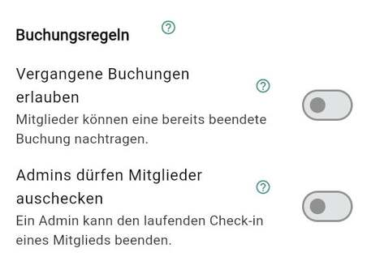

**Schritte**

1. Öffnen Sie [Verfügbarkeit](https://fdittgen-png.github.io/deskilo/#/availability) und gehen Sie zu **Buchungsregeln**.
2. Schalten Sie die gewünschten Regeln ein oder aus.
3. Legen Sie unter **Außerhalb der Öffnungszeiten** und **Buchungsgrenzen** den Rest fest.

**Gut zu wissen**

- Die beiden Schalter sind standardmäßig aus.
- Dieser Abschnitt gehört zur Funktion **Buchungsregeln**.
- Die Zeile **Was der Plan unterscheidet** darunter erklärt die Zustände, die Mitglieder auf dem Plan sehen.

**Siehe auch:** [Vergangene Buchungen erlauben](#vergangene-buchungen-erlauben) · [Admins dürfen Mitglieder auschecken](#administratoren-dürfen-auschecken) · [Buchungsgrenzen](#buchungsgrenzen)

<!-- anchor: user.workspace.availability.allow-past -->
### Vergangene Buchungen erlauben

**Zielgruppe:** Inhaber · Administrator:in mit Berechtigung

Sie möchten, dass Mitglieder eine Buchung nachträglich erfassen können, in einem Space, der Anwesenheit später festhält.

**Schritte**

1. Schalten Sie in [Verfügbarkeit](https://fdittgen-png.github.io/deskilo/#/availability) unter **Buchungsregeln** **Vergangene Buchungen erlauben** ein.

**Gut zu wissen**

- Ist es aus, wird eine Buchung abgelehnt, die an einem früheren Tag schon zu Ende war.
- Ein früheres Zeitfenster am selben Tag zu buchen, ist immer erlaubt.

**Siehe auch:** [Buchungsregeln](#buchungsregeln)

<!-- anchor: user.workspace.availability.admin-checkout -->
### Administratoren dürfen auschecken

**Zielgruppe:** Inhaber · Administrator:in mit Berechtigung

Sie möchten, dass das Personal abends den Raum schließt und vergessene Check-ins beendet.

**Schritte**

1. Schalten Sie in [Verfügbarkeit](https://fdittgen-png.github.io/deskilo/#/availability) unter **Buchungsregeln** **Admins dürfen Mitglieder auschecken** ein.

**Gut zu wissen**

- Ist es aus, ist das Auschecken streng persönlich.
- Ist es an, kann ein Administrator den laufenden Check-in eines Mitglieds beenden.

**Siehe auch:** [Buchungsregeln](#buchungsregeln)

<!-- anchor: user.workspace.availability.outside-hours -->
### Außerhalb der Öffnungszeiten

**Zielgruppe:** Inhaber · Administrator:in mit Berechtigung

Sie möchten festlegen, was geschieht, wenn jemand früh kommt oder lange bleibt. Eine Antwort gilt für jedes Raster.

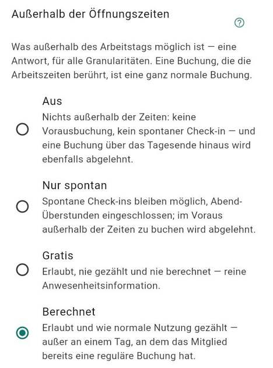

**Schritte**

1. Suchen Sie in [Verfügbarkeit](https://fdittgen-png.github.io/deskilo/#/availability) **Außerhalb der Öffnungszeiten**.
2. Wählen Sie **Aus**, **Nur spontan**, **Frei** oder **Berechnet**.

**Gut zu wissen**

- **Aus**: nichts außerhalb der Zeiten, keine Vorausbuchung, kein spontanes Kommen.
- **Nur spontan**: Spontane Check-ins bleiben möglich, auch abendliche Überstunden, aber eine Vorausbuchung außerhalb der Zeiten wird abgelehnt.
- **Frei**: erlaubt, nie gezählt und nie berechnet.
- **Berechnet**: erlaubt und wie normale Nutzung gezählt, außer an einem Tag, an dem das Mitglied schon eine reguläre Buchung hat.
- Eine Buchung, die die Arbeitszeiten berührt, ist eine normale Buchung.

**Siehe auch:** [Arbeitszeiten](#arbeitszeiten)

<!-- anchor: user.workspace.availability.limits -->
### Buchungsgrenzen

**Zielgruppe:** Inhaber · Administrator:in mit Berechtigung

Sie möchten festlegen, wie weit im Voraus gebucht werden darf, wie kurz oder lang eine Buchung sein darf und wie viele jemand gleichzeitig halten darf.

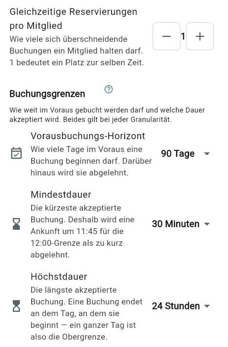

**Schritte**

1. Suchen Sie in [Verfügbarkeit](https://fdittgen-png.github.io/deskilo/#/availability) **Gleichzeitige Reservierungen pro Mitglied** und nutzen Sie die Schaltflächen Minus und Plus.
2. Legen Sie unter **Buchungsgrenzen** den **Vorausbuchungs-Horizont**, die **Mindestdauer** und die **Höchstdauer** fest.

**Gut zu wissen**

- **Gleichzeitige Reservierungen pro Mitglied** ist die Zahl überlappender Buchungen, die ein Mitglied halten darf. Bei 1 bleibt es bei einem Platz zur Zeit.
- Eine Buchung endet an dem Tag, an dem sie beginnt, also ist ein ganzer Tag das Längste.
- Die Mindestdauer darf die Höchstdauer nicht überschreiten, sonst würde keine Buchung angenommen. Der Bildschirm warnt Sie.
- Jede Ablehnung nennt die Grenze und ihren Wert.

**Siehe auch:** [Buchungsregeln](#buchungsregeln)

<!-- anchor: user.features.processes -->
### Ganze Prozesse ein- oder ausschalten

**Zielgruppe:** Inhaber · Mitinhaber

Sie möchten einen Überblick, was der Space kann, und einen ganzen Bereich auf einmal einschalten. Der Bildschirm **Funktionen** öffnet sich mit einer Karte je Geschäftsprozess.

**Schritte**

1. Öffnen Sie [Funktionen](https://fdittgen-png.github.io/deskilo/#/features). Die Ansicht **Prozesse** ist geöffnet.
2. Lesen Sie jede Karte: ihren Zustand, wie viele Unterprozesse aktiv sind und wie viele Funktionen laufen.
3. Öffnen Sie eine Karte und tippen Sie auf **Einschalten** oder **Ausschalten** für den ganzen Prozess oder einen Unterprozess.
4. Lesen Sie die Vorschau und bestätigen Sie dann.

**Gut zu wissen**

- Eine Karte ist **Aktiv**, wenn alle ihre Funktionen laufen, **Teilweise**, wenn einige laufen, **Verfügbar**, wenn noch keine an ist, und **Braucht Aufmerksamkeit**, wenn eine Funktion an ist, aber auf eine ausgeschaltete Voraussetzung wartet.
- Die Chips **Alle**, **Aktiv**, **Verfügbar** und **Braucht Aufmerksamkeit** grenzen die Karten ein, und **Prozesse und Funktionen suchen** erreicht alles.
- Die Vorschau listet auf, was eingeschaltet wird, was **Ebenfalls nötig** aus einem anderen Prozess ist und was schon an ist. Etwas auszuschalten, das andere Funktionen brauchen, wird abgelehnt, bis Sie wählen, was mit diesen geschieht.

**Siehe auch:** [Ein Funktionsschalter](#ein-funktionsschalter)

<!-- anchor: user.features.switch -->
### Ein Funktionsschalter

**Zielgruppe:** Inhaber · Mitinhaber

Sie möchten eine einzelne Funktion ein- oder ausschalten.

**Schritte**

1. Öffnen Sie [Funktionen](https://fdittgen-png.github.io/deskilo/#/features) und tippen Sie auf **Schalter**.
2. Finden Sie die Funktion mit **Funktionen durchsuchen** oder grenzen Sie die Liste mit **Geändert** oder **Reife** ein.
3. Legen Sie ihren Schalter um.

**Gut zu wissen**

- Schalten Sie eine Funktion ein, erscheint jeder Teil von ihr: der Tab, die Schaltfläche, der Link. Schalten Sie sie aus, bleibt nichts davon übrig, nicht einmal ein gespeicherter Link.
- Eine Funktion, die eine andere braucht, steht darunter mit **Benötigt** und sagt „Wartet auf die Funktion darüber“, solange die übergeordnete aus ist. Ihre eigene Wahl bleibt erhalten.
- Eine Funktion einzuschalten kann auch einschalten, was sie braucht. Die App sagt es Ihnen.
- Eine Funktion, die noch nicht als stabil geprüft ist, fragt zuerst nach Ihrer Bestätigung: Sie kann sich ändern und hat bekannte Grenzen.
- Was bereits geschehen ist, bleibt geschehen. Eine Rechnung, die bei eingeschalteter Funktion ausgestellt wurde, behält ihren Inhalt.

**Siehe auch:** [Ganze Prozesse ein- oder ausschalten](#ganze-prozesse-ein--oder-ausschalten)

<!-- anchor: user.workspace.settings.country -->
### Land

**Zielgruppe:** Inhaber · Administrator:in mit Berechtigung

Sie möchten, dass der Space weiß, wo er seinen Sitz hat. **Workspace** öffnet sich bei **Allgemeine Angaben**.

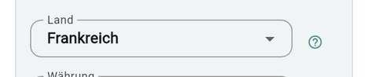

**Schritte**

1. Öffnen Sie [Workspace](https://fdittgen-png.github.io/deskilo/#/workspace-settings).
2. Wählen Sie unter **Allgemeine Angaben** das **Land**.
3. Tippen Sie unten auf **Speichern**.

**Gut zu wissen**

- Das Land schlägt die Währung und die Zeitzone vor und bestimmt, welche Umsatzsteuersätze angeboten werden.
- Sobald der Space ein Dokument ausgestellt oder Geld erfasst hat, lässt sich das Land nicht mehr ändern: Beim Speichern erscheint „Währung und Land stehen fest, sobald dieser Space ein Dokument ausgestellt oder Geld erfasst hat. Es wurde nichts gespeichert.“
- **Speichern** schreibt das ganze Formular zusammen. Hat zwischenzeitlich jemand diese Einstellungen geändert, wird nichts gespeichert, und was Sie eingegeben haben, bleibt auf dem Bildschirm.

**Siehe auch:** [Währung und Zeitzone](#währung-und-zeitzone)

<!-- anchor: user.workspace.settings.currency-timezone -->
### Währung und Zeitzone

**Zielgruppe:** Inhaber · Administrator:in mit Berechtigung

Sie möchten, dass Preise und Tage so gezählt werden, wie Ihr Space zählt.

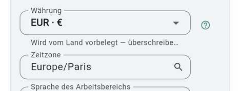

**Schritte**

1. Wählen Sie in [Workspace](https://fdittgen-png.github.io/deskilo/#/workspace-settings) unter **Allgemeine Angaben** die **Währung**.
2. Suchen Sie die **Zeitzone** und wählen Sie sie aus.
3. Tippen Sie auf **Speichern**.

**Gut zu wissen**

- Die Währung wird aus dem Land vorgeschlagen. Sie können sie überschreiben, bis der Space ein Dokument ausgestellt oder Geld erfasst hat; danach steht sie fest.
- Die Zeitzone ist nicht nur Kosmetik: Ein Arbeitstag, eine Halbtagsgrenze und ein Schließtag werden alle in ihr gezählt, sodass ein Mitglied im Ausland den Tag des Spaces sieht und nicht seinen eigenen.

**Siehe auch:** [Land](#land)

<!-- anchor: user.workspace.settings.language -->
### Sprache des Arbeitsbereichs

**Zielgruppe:** Inhaber · Administrator:in mit Berechtigung

Sie möchten, dass Einladungen und Dokumente die Sprache Ihrer Gemeinschaft sprechen.

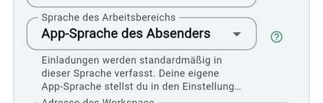

**Schritte**

1. Öffnen Sie in [Workspace](https://fdittgen-png.github.io/deskilo/#/workspace-settings) unter **Allgemeine Angaben** die **Sprache des Arbeitsbereichs**.
2. Wählen Sie eine Sprache oder **App-Sprache des Absenders**.
3. Tippen Sie auf **Speichern**.

**Gut zu wissen**

- Einladungen werden standardmäßig in dieser Sprache geschrieben.
- Sie ist nicht Ihre eigene App-Sprache. Diese ändert nur, was Sie sehen, und liegt in Ihren persönlichen Einstellungen.

**Siehe auch:** [Einladungstext](#einladungstext)

<!-- anchor: user.workspace.settings.address -->
### Adresse im Briefkopf

**Zielgruppe:** Inhaber · Administrator:in mit Berechtigung

Sie möchten Ihre Postadresse auf dem Papier, das der Space verschickt.

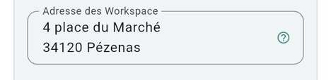

**Schritte**

1. Füllen Sie in [Workspace](https://fdittgen-png.github.io/deskilo/#/workspace-settings) unter **Allgemeine Angaben** **Adresse des Workspace** aus.
2. Tippen Sie auf **Speichern**.

**Gut zu wissen**

- Es ist freier Text, der so auf Briefen und Rechnungen gedruckt wird.
- Die strukturierte Adresse, die eine E-Rechnung braucht, ist ein eigener Eintrag unter der rechtlichen Identität.

**Siehe auch:** [Land](#land)

<!-- anchor: user.workspace.settings.whatsapp-group -->
### WhatsApp-Gruppe

**Zielgruppe:** Inhaber · Administrator:in mit Berechtigung

Sie möchten, dass Mitglieder die WhatsApp-Gruppe Ihrer Gemeinschaft finden.

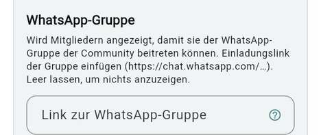

**Schritte**

1. Öffnen Sie in [Workspace](https://fdittgen-png.github.io/deskilo/#/workspace-settings) **Gemeinschaft und Einladungen**.
2. Fügen Sie den Einladungslink der Gruppe bei **Link zur WhatsApp-Gruppe** ein.
3. Tippen Sie auf **Speichern**.

**Gut zu wissen**

- Der Link muss ein Einladungslink von chat.whatsapp.com sein, sonst sagt das Feld es.
- Lassen Sie es leer, um nichts anzuzeigen.

**Siehe auch:** [Einladungstext](#einladungstext)

<!-- anchor: user.workspace.settings.invitation-message -->
### Einladungstext

**Zielgruppe:** Inhaber · Administrator:in mit Berechtigung

Sie möchten, dass Einladungen nach Ihnen klingen, in jeder Sprache, die Sie nutzen.

**Schritte**

1. Öffnen Sie in [Workspace](https://fdittgen-png.github.io/deskilo/#/workspace-settings) **Gemeinschaft und Einladungen**.
2. Wählen Sie unter **Sprache der Nachricht**, in welcher Sprache Sie den Text bearbeiten.
3. Schreiben Sie den Text. Tippen Sie auf ein Etikett wie {firstName} oder {inviteLink}, um es dort einzufügen, wo der Cursor steht.
4. Tippen Sie auf **Speichern**.

**Gut zu wissen**

- Lassen Sie das Feld leer, um die eingebaute Nachricht in dieser Sprache zu verwenden.
- Die Zeile **Sprache der Nachricht** sagt nur, welcher Entwurf auf dem Bildschirm steht. Sie wird nicht gespeichert und öffnet sich jedes Mal mit der Sprache des Workspace.
- Die Etiketten werden beim Senden einer Einladung gefüllt. Der Code und der Link kommen von der App, fügen Sie sie also nicht selbst ein.

**Siehe auch:** [Jemanden per Nachricht einladen](#jemanden-per-nachricht-einladen)

<!-- anchor: user.workspace.settings.new-members -->
### Neue Mitglieder gleich starten lassen

**Zielgruppe:** Inhaber · Administrator:in mit Berechtigung

Sie möchten, dass alle, die beitreten, mit demselben Abonnement und derselben Regel beginnen, wenn ihre Tage aufgebraucht sind.

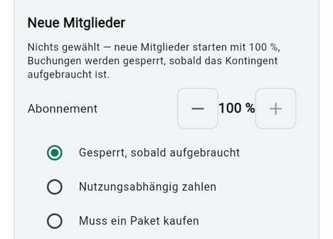

**Schritte**

1. Öffnen Sie in [Workspace](https://fdittgen-png.github.io/deskilo/#/workspace-settings) **Neue Mitglieder**.
2. Stellen Sie den Prozentsatz **Abonnement** mit den Schaltflächen Minus und Plus ein.
3. Wählen Sie **Gesperrt, sobald aufgebraucht**, **Nutzungsabhängig zahlen** oder **Muss ein Paket kaufen**.
4. Tippen Sie auf **Speichern**.

**Gut zu wissen**

- Bis Sie wählen, starten neue Mitglieder bei 100 %, und Buchungen sind gesperrt, sobald das Kontingent aufgebraucht ist.
- Das eigene Abonnement eines Mitglieds legen Sie später auf dessen Seite fest.

**Siehe auch:** [Das Abonnement eines Mitglieds](#das-abo-eines-mitglieds)

<!-- anchor: user.workspace.settings.wording -->
### Wortwahl

**Zielgruppe:** Inhaber · Administrator:in mit Berechtigung

Sie möchten, dass die App Ihre Wörter verwendet: einen anderen Namen für einen Platz, für einen Status auf dem Plan, für einen Tab.

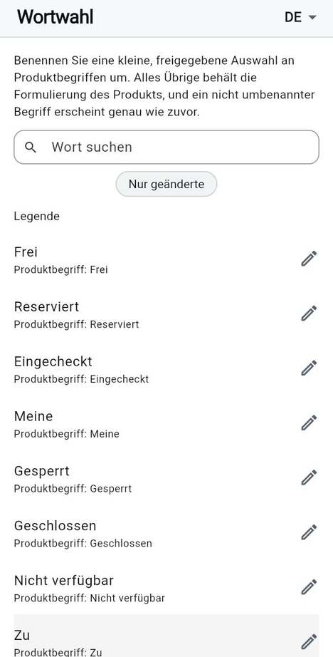

**Schritte**

1. Öffnen Sie in [Workspace](https://fdittgen-png.github.io/deskilo/#/workspace-settings) **Darstellung und Bezeichnungen** und tippen Sie auf **Wortwahl**.
2. Finden Sie ein Wort mit **Wort suchen** oder tippen Sie auf **Nur geänderte**, um zu sehen, was Sie umbenannt haben.
3. Tippen Sie auf den Stift daneben und geben Sie Ihr Wort ein, je Sprache.

**Gut zu wissen**

- Das Wort des Produkts bleibt unter Ihrem sichtbar, sodass Sie sehen, was Sie ersetzen.
- **Zurücksetzen** entfernt Ihr Wort, statt das des Produkts zu kopieren. Der Begriff folgt dann dem Produkt, wenn sich dessen Wortlaut ändert.
- Die Begriffe sind danach gruppiert, wo sie erscheinen: **Legende**, **Der Bereich**, **Navigation**, **Buchung**.

**Siehe auch:** [Farben](#farben)

<!-- anchor: user.workspace.settings.colours -->
### Farben

**Zielgruppe:** Inhaber · Administrator:in mit Berechtigung

Sie möchten, dass die App Ihre Farbe trägt. Wählen Sie eine, und die App leitet daraus ihr helles und ihr dunkles Design ab.

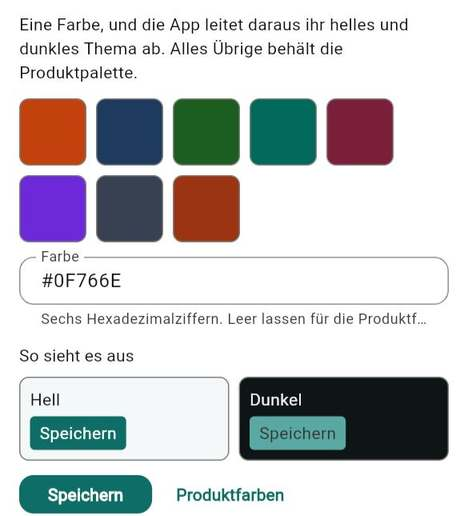

**Schritte**

1. Öffnen Sie in [Workspace](https://fdittgen-png.github.io/deskilo/#/workspace-settings) **Darstellung und Bezeichnungen** und tippen Sie auf **Farben**. Die Zeile ist da, solange **Farben des Arbeitsbereichs** in den Funktionen eingeschaltet ist.
2. Tippen Sie auf eine der Farben oder geben Sie einen Code wie #0F766E bei **Farbe** ein.
3. Prüfen Sie **So sieht es aus**, in **Hell** und **Dunkel**.
4. Tippen Sie auf **Speichern**. **Produktfarben** entfernt Ihre.

**Gut zu wissen**

- Die App wahrt ihren eigenen Kontrast. Wäre eine Farbe irgendwo unlesbar, wird sie abgelehnt, und der Bildschirm nennt das Paar.
- Unter **Raumfarben** können Sie bis zu acht eigene Farben für die Räume auf dem Plan hinzufügen.
- Das DesKilo-Zeichen, die Farben der Platzzustände und das Banner der Produktivumgebung werden nie umgestaltet.

**Siehe auch:** [Muster](#muster) · [Symbol und Emblem](#symbol-und-emblem)

<!-- anchor: user.workspace.settings.pattern -->
### Muster

**Zielgruppe:** Inhaber · Administrator:in mit Berechtigung

Sie möchten, dass sich Ihr Space leicht von den anderen unterscheiden lässt, denen eine Person angehört.

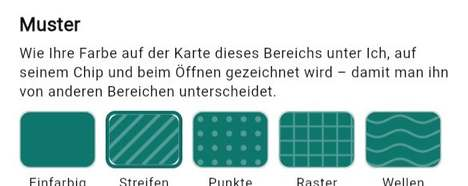

**Schritte**

1. Öffnen Sie [Farben](https://fdittgen-png.github.io/deskilo/#/settings/colours).
2. Tippen Sie unter **Muster** auf **Einfarbig**, **Streifen**, **Punkte**, **Raster** oder **Wellen**.

**Gut zu wissen**

- Das Muster zeichnet Ihre Farbe auf die Karte dieses Spaces in Ich, auf seinen Chip und während der Space sich öffnet.
- Es wird gespeichert, sobald Sie es antippen.

**Siehe auch:** [Farben](#farben)

<!-- anchor: user.workspace.settings.branding -->
### Symbol und Emblem

**Zielgruppe:** Inhaber · Administrator:in mit Berechtigung

Sie möchten ein kleines Zeichen, das für den Space steht: Buchstaben auf einer Farbe oder Ihr eigenes Logo.

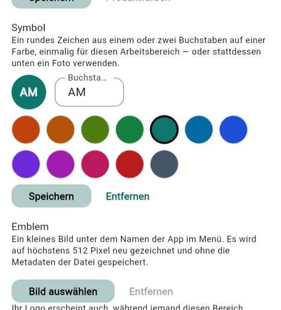

**Schritte**

1. Öffnen Sie [Farben](https://fdittgen-png.github.io/deskilo/#/settings/colours) und gehen Sie zu **Symbol**.
2. Geben Sie ein oder zwei **Buchstaben** ein, wählen Sie eine Farbe und tippen Sie auf **Speichern**.
3. Tippen Sie unter **Emblem** auf **Bild auswählen**, um Ihr Logo hinzuzufügen. **Entfernen** nimmt es weg.

**Gut zu wissen**

- Buchstaben auf einer Farbe sind in einem Workspace einmalig. Hat ein anderer Space schon dieselben, bittet die App Sie, die Farbe oder die Buchstaben zu ändern.
- Das Emblem steht im Menü unter dem Namen der App und während jemand diesen Space öffnet. Es wird höchstens 512 Pixel breit neu gezeichnet, und die eigenen Angaben des Fotos, etwa wo es aufgenommen wurde, werden nicht behalten.
- Das Emblem ersetzt nie das DesKilo-Logo.

**Siehe auch:** [Farben](#farben)

<!-- anchor: user.workspace.settings.desk-transparency -->
### Tisch-Transparenz

**Zielgruppe:** Inhaber · Administrator:in mit Berechtigung

Sie haben den Plan über ein Foto gezeichnet und möchten, dass der Raum durch die Möbel scheint.

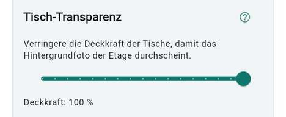

**Schritte**

1. Öffnen Sie in [Workspace](https://fdittgen-png.github.io/deskilo/#/workspace-settings) **Darstellung und Bezeichnungen**.
2. Ziehen Sie den Regler **Tisch-Transparenz**. Der Wert erscheint als *Deckkraft*.
3. Tippen Sie auf **Speichern**.

**Gut zu wissen**

- Senken Sie die Deckkraft, damit das Hintergrundfoto einer Etage durch die Tische scheint.
- Stellen Sie sie auf 100 %, wenn die Plätze wichtiger sind als der Raum.

**Siehe auch:** [Räume, Tische und Plätze zeichnen](#räume-tische-und-plätze-zeichnen)

<!-- anchor: user.workspace.settings.public-page -->
### Öffentliche Workspace-Seite

**Zielgruppe:** Inhaber

Sie möchten, dass Menschen außerhalb Ihres Spaces ihn finden und sehen, was er bietet.

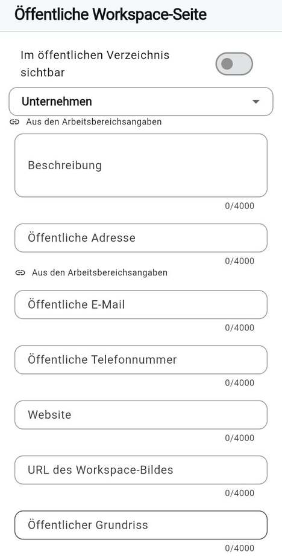

**Schritte**

1. Öffnen Sie [Öffentliche Workspace-Seite](https://fdittgen-png.github.io/deskilo/#/settings/public-page) oder tippen Sie oben in **Workspace** darauf.
2. Schalten Sie **Im öffentlichen Verzeichnis sichtbar** ein.
3. Wählen Sie die Art des Gastgebers und füllen Sie **Beschreibung**, **Öffentliche Adresse**, **Öffentliche E-Mail**, **Öffentliche Telefonnummer** und **Website** aus.
4. Tippen Sie auf **Speichern und externe Ansicht öffnen**.

**Gut zu wissen**

- Felder mit **Aus den Arbeitsbereichsangaben** folgen den eigenen Angaben des Workspace. **Arbeitsbereichsangaben verwenden** stellt sie wieder her, nachdem Sie sie geändert haben.
- **Alle öffentlichen Daten auf die Arbeitsbereichsangaben zurücksetzen** ersetzt jedes Feld, das eine Entsprechung im Workspace hat.
- Administratoren können selbst wählen, ob sie als öffentliche Administratoren angezeigt werden.

**Siehe auch:** [Entdecken und das öffentliche Netzwerk](#entdecken)

<!-- anchor: user.roles.matrix -->
### Die Rollenmatrix

**Zielgruppe:** Inhaber · Mitinhaber

Sie möchten festlegen, welche Berechtigungen jede Rolle hat. **Rollen** zeigt eine Karte je Rolle mit einem Haken für jede Berechtigung, die sie hat.

**Schritte**

1. Öffnen Sie [Rollen](https://fdittgen-png.github.io/deskilo/#/roles).
2. Setzen oder entfernen Sie auf der Karte einer Rolle den Haken bei einer Berechtigung wie **Rollen & Berechtigungen verwalten**, **Mitglieder verwalten**, **Workspace-Einstellungen bearbeiten** oder **Rechnungen ausstellen & Zahlungen zuordnen**.

**Gut zu wissen**

- Jeder hat genau eine Basisrolle: Nutzer, Administrator, Mitinhaber oder Inhaber. Weitere Rollen kommen hinzu und nehmen nie etwas weg.
- Der Inhaber hat immer jede Berechtigung, deshalb ist diese Karte gesperrt. Ein Mitinhaber darf weniger haben.
- Wer keine Rollen verwalten darf, sieht die Matrix nur lesend, mit hervorgehobener **Ihre Rolle**.
- Eine Berechtigung wird vom Server an jeder Stelle geprüft, daher entfernt das Abwählen sie überall auf einmal.
- Der Eintrag **Rollen** erscheint, wenn die Funktion **Rollenverwaltung** eingeschaltet ist.

**Siehe auch:** [Rollen, die dieser Space festlegt](#rollen-die-dieser-space-festlegt) · [Mitinhaber](#mitinhaber)

<!-- anchor: user.roles.space -->
### Rollen, die dieser Space festlegt

**Zielgruppe:** Inhaber · Mitinhaber

Sie möchten Rollen, die zu Ihrem Space passen, etwa Gastgeber oder Buchhalter, zusätzlich zu den grundlegenden.

**Schritte**

1. Tippen Sie in [Rollen](https://fdittgen-png.github.io/deskilo/#/roles) auf **Die Rollen dieses Bereichs** oder öffnen Sie [Rollen dieses Spaces](https://fdittgen-png.github.io/deskilo/#/settings/roles-of-this-space). Dieser Bildschirm erscheint, wenn die Funktion **Rollen, die dieser Bereich festlegt** eingeschaltet ist.
2. Tippen Sie auf **Rolle hinzufügen**.
3. Geben Sie der Rolle einen Namen und wählen Sie dann, **Was sie ergänzt**.
4. Tippen Sie auf **Rolle speichern**.
5. Um sie einem Mitglied zu geben, öffnen Sie die Seite des Mitglieds, suchen Sie **Rollen** und tippen Sie auf **Rolle hinzufügen**.

**Gut zu wissen**

- Jede Rolle ergänzt Berechtigungen zu dem, was ihre Inhaber schon dürfen. Keine nimmt etwas weg, und der Inhaber behält immer jede Berechtigung.
- Eine Rolle, die Sie nicht mehr wollen, lässt sich beiseitelegen, indem Sie **In Gebrauch** ausschalten.
- Der Schlüssel der Rolle ändert sich nie: Die Personen, die sie haben, verweisen darauf.
- Niemand kann sich selbst eine Rolle geben. Eine Rolle, die Rollen verwaltet, kann nur der Inhaber vergeben.

**Siehe auch:** [Die Rollenmatrix](#die-rollenmatrix)

<!-- anchor: user.roles.co-owners -->
### Mitinhaber

**Zielgruppe:** Inhaber

Sie möchten, dass der Space weiterbesteht, falls Sie einmal zurücktreten.

**Schritte**

1. Öffnen Sie [Mitglieder & Tarife](https://fdittgen-png.github.io/deskilo/#/members) und wählen Sie das Mitglied.
2. Wählen Sie unter **Mit-Inhaberschaft** einen aktiven Mitinhaber oder einen Nachfolger.
3. Um jetzt zu übergeben, wählen Sie **Jetzt zum Inhaber machen**.

**Gut zu wissen**

- Ein aktiver Mitinhaber hat schon jetzt die Berechtigungen des Inhabers. Ein Nachfolger, angezeigt als **Nachfolge**, wartet und wird Inhaber, wenn er aktiviert wird oder der Inhaber geht.
- Geht der letzte Inhaber, wird der am besten geeignete Mitinhaber automatisch Inhaber, aktive vor Nachfolgern.
- Mitinhaber gehören zur Funktion **Mitinhaber**.

**Siehe auch:** [Mit-Inhaberschaft](#mit-inhaberschaft) · [Die Rollenmatrix](#die-rollenmatrix)

<!-- anchor: user.kiosk.mode -->
### Kiosk-Modus: ein Wand-Tablet für den Check-in

**Zielgruppe:** Inhaber · Administrator:in

Sie möchten ein Tablet an der Tür, an dem sich Menschen mit einem Badge einchecken.

**Schritte**

1. Legen Sie ein Konto für das Tablet an, treten Sie damit dem Workspace bei und nutzen Sie in [Mitglieder & Tarife](https://fdittgen-png.github.io/deskilo/#/members) bei diesem Mitglied **Zum Kiosk-Gerät machen**.
2. Achten Sie darauf, dass **Kiosk-Modus** in [Funktionen](https://fdittgen-png.github.io/deskilo/#/features) eingeschaltet ist.
3. Öffnen Sie auf dem Tablet die App. Sie fragt **Kiosk-Modus starten?**. Tippen Sie auf **Kiosk-Modus starten**.
4. Ein Mitglied tippt auf einen Platz oder auf **Diese Etage** und hält ein Badge hin: eine Karte oder einen gedruckten QR-Code.

**Gut zu wissen**

- Der Kiosk-Modus startet nie von selbst. **Jetzt nicht — App normal öffnen** öffnet die App wie gewohnt, was bei der Einrichtung praktisch ist.
- Im Kiosk-Modus zeigt das Tablet nur den Plan. Um ihn zu verlassen, starten Sie das Tablet neu. Um das Konto wieder zu einem normalen Mitglied zu machen, nutzen Sie **Kiosk-Gerät** unter **Einstellungen** auf dem Gerät oder **Kiosk zu Mitglied zurücksetzen** in **Mitglieder & Tarife**.
- Das Blatt, das sich öffnet, nennt die Regel, der es folgt. An einem Schließtag sagt der Kiosk gleich zu Beginn „Der Workspace ist heute geschlossen“.
- Das Badge ist die Bestätigung: Es identifiziert das Mitglied, führt die Aktion aus, und der Bildschirm leert sich für die nächste Person. Ein Platz, den jemand anderes hält, zeigt, wer ihn hält, und verweist Sie auf die App.
- Badges haben ihre eigenen Funktionen, **RFID-/NFC-Badges** und QR-Badges, beide unter **Kiosk-Modus**.
- Ein Wand-Tablet lässt sich hier nicht zeigen: Der Kiosk startet nur auf einem Gerät, das als solches markiert ist.

**Siehe auch:** [NFC-Badge-Check-in](#nfc-badge-check-in) · [Raum-QR-Codes (PDF)](#raum-qr-codes-pdf)

<!-- anchor: user.badges.nfc -->
### NFC-Badge-Check-in

**Zielgruppe:** Inhaber · Administrator:in

Sie möchten, dass Mitglieder sich mit dem Antippen einer Karte einchecken, ohne Smartphone.

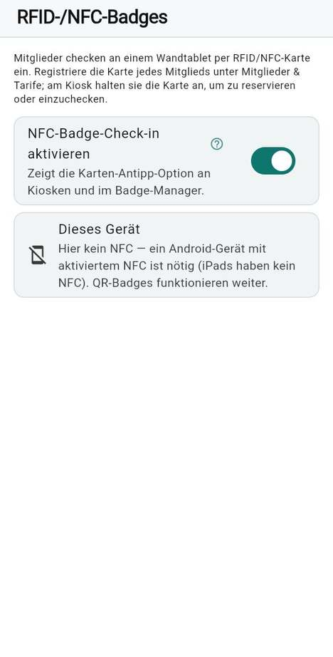

**Schritte**

1. Öffnen Sie [RFID-/NFC-Badges](https://fdittgen-png.github.io/deskilo/#/nfc-config).
2. Schalten Sie **NFC-Badge-Check-in aktivieren** ein.
3. Lesen Sie die Zeile **Dieses Gerät**: Sie sagt, ob dieses Gerät Karten lesen kann.
4. Geben Sie jedem Mitglied eine Karte in [Mitglieder & Tarife](https://fdittgen-png.github.io/deskilo/#/members): Öffnen Sie die Badges des Mitglieds, tippen Sie auf **Karte registrieren** und halten Sie die Karte an die Rückseite des Geräts.

**Gut zu wissen**

- Sie brauchen ein Android-Gerät mit NFC. iPads haben kein NFC, und QR-Badges funktionieren dort weiterhin.
- Die Badge-Verwaltung lässt Sie auch einen **Neuer Badge** ausstellen, einen **Widerrufen** und **Als PDF speichern** zum Drucken. Ein widerrufenes Badge lässt sich endgültig löschen.
- **Meldet mich an** ist standardmäßig aus: Ein Badge, das Sie eincheckt, meldet Sie nicht an, bis das Mitglied es wählt.
- Jedes Mitglied kann sein eigenes Badge auch in seinen persönlichen Einstellungen erstellen.

**Siehe auch:** [Ein Wand-Tablet für den Check-in](#kiosk-modus-ein-wand-tablet-für-den-check-in)

<!-- anchor: user.documents.add -->
### Ein Dokument zur Bibliothek hinzufügen

**Zielgruppe:** Inhaber · Administrator:in

Sie möchten Satzung, Anleitungen, Abschlüsse und Protokolle an einem Ort für die Mitglieder sammeln, die sie brauchen. Die Bibliothek enthält Links, keine Dateien.

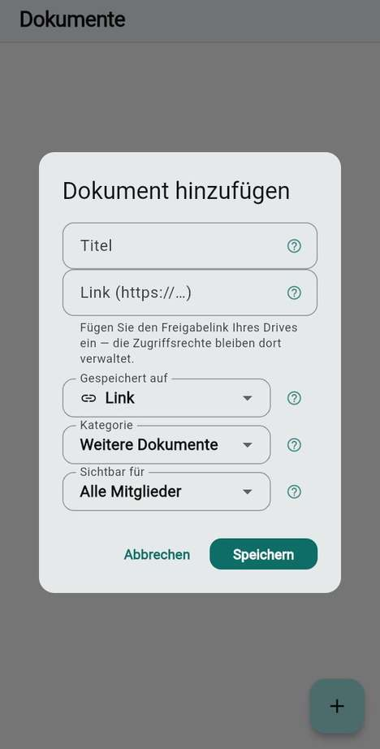

**Schritte**

1. Öffnen Sie [Dokumente](https://fdittgen-png.github.io/deskilo/#/documents) und tippen Sie auf die Plus-Schaltfläche.
2. Füllen Sie **Bezeichnung** und **Link (https://…)** aus.
3. Wählen Sie **Gespeichert auf**, **Kategorie** und **Sichtbar für**.
4. Tippen Sie auf **Speichern**.

**Gut zu wissen**

- Die Bibliothek braucht die Funktion **Dokumentbibliothek** und die Berechtigung, sie zu verwalten.
- Entfernen Sie ein Dokument über seinen Papierkorb: Es fragt zuerst **Dokument entfernen?**
- Mitglieder, die die Bibliothek öffnen dürfen, sehen die Dokumente, die sie sehen dürfen, nach Kategorie gruppiert.

**Siehe auch:** [Dokumenttitel](#dokumenttitel) · [Link](#link) · [Sichtbar für](#sichtbar-für)

<!-- anchor: user.documents.title -->
### Dokumenttitel

**Zielgruppe:** Inhaber · Administrator:in

Sie möchten, dass Mitglieder ein Dokument auf einen Blick erkennen.

**Schritte**

1. Tragen Sie im Formular zum Hinzufügen eines Dokuments die **Bezeichnung** ein.

**Gut zu wissen**

- Ein Dokument braucht einen Titel und einen https://-Link, sonst wird **Speichern** abgelehnt.
- Schreiben Sie ihn für die Leserin oder den Leser, denn es ist die Zeile, die sie in der Bibliothek sehen.

**Siehe auch:** [Ein Dokument zur Bibliothek hinzufügen](#ein-dokument-zur-bibliothek-hinzufügen)

<!-- anchor: user.documents.url -->
### Link

**Zielgruppe:** Inhaber · Administrator:in

Sie möchten, dass sich das Dokument dort öffnet, wo es schon liegt.

**Schritte**

1. Fügen Sie den Freigabelink aus Ihrem Laufwerk bei **Link (https://…)** ein.

**Gut zu wissen**

- DesKilo speichert den Link, nicht die Datei. Die Zugriffsrechte werden weiter dort verwaltet, wo das Dokument liegt.
- Der Link muss mit https:// beginnen.

**Siehe auch:** [Gespeichert auf](#gespeichert-auf)

<!-- anchor: user.documents.provider -->
### Gespeichert auf

**Zielgruppe:** Inhaber · Administrator:in

Sie möchten, dass Mitglieder sehen, wo das Dokument aufbewahrt wird.

**Schritte**

1. Wählen Sie **Gespeichert auf**: Google Drive, OneDrive, SharePoint, Dropbox, Nextcloud oder Link.

**Gut zu wissen**

- Es ist ein Etikett mit einem Symbol. Es wird nichts für Sie abgerufen.

**Siehe auch:** [Link](#link)

<!-- anchor: user.documents.category -->
### Kategorie

**Zielgruppe:** Inhaber · Administrator:in

Sie möchten, dass sich die Bibliothek wie ein aufgeräumtes Regal liest.

**Schritte**

1. Wählen Sie eine **Kategorie**: **Satzung & Rechtliches**, **Anleitungen & Handbücher**, **Finanzberichte**, **Protokolle** oder **Weitere Dokumente**.

**Gut zu wissen**

- Die Bibliothek gruppiert Dokumente unter diesen Überschriften und zeigt nur eine Überschrift, die ein Dokument enthält.

**Siehe auch:** [Sichtbar für](#sichtbar-für)

<!-- anchor: user.documents.role -->
### Sichtbar für

**Zielgruppe:** Inhaber · Administrator:in

Sie möchten manche Dokumente für alle und manche nur für den Vorstand.

**Schritte**

1. Wählen Sie **Sichtbar für**: **Alle Mitglieder**, **Admins und Inhaber** oder **Nur Inhaber**.

**Gut zu wissen**

- Der Server setzt es durch. Ein Mitglied, das ein Dokument nicht sehen darf, erhält es gar nicht erst.

**Siehe auch:** [Ein Dokument zur Bibliothek hinzufügen](#ein-dokument-zur-bibliothek-hinzufügen)

<!-- anchor: user.workspace.export.space-xml -->
### Den Space exportieren (XML)

**Zielgruppe:** Inhaber · Administrator:in mit Berechtigung

Sie möchten eine Datei mit Etagenplan und Einstellungen, als Sicherung, zur Wiederverwendung oder zum Umzug in einen anderen Space.

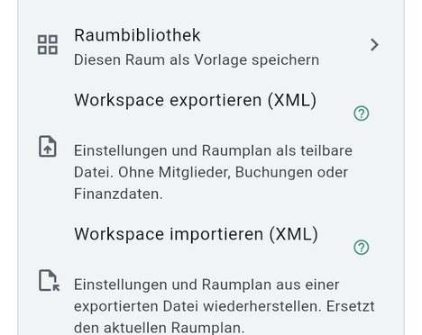

**Schritte**

1. Öffnen Sie [Workspace](https://fdittgen-png.github.io/deskilo/#/workspace-settings) und gehen Sie zu **Vorlagen und Daten**.
2. Tippen Sie auf **Workspace exportieren (XML)**.

**Gut zu wissen**

- Sie enthält Einstellungen und den Etagenplan. Nie enthält sie Mitglieder, Buchungen oder Geldangaben, auch nicht den Einladungscode oder Zahlungszugangsdaten.
- Ist **Konfiguration in der Raumdatei** an, enthält die Datei auch Tarife, Umsatzsteuersätze, Regeln, Rollen und mehr.
- Die Datei wird auf Ihrem Gerät gespeichert.

**Siehe auch:** [Den Space importieren (XML)](#den-space-importieren-xml)

<!-- anchor: user.workspace.export.space-import -->
### Den Space importieren (XML)

**Zielgruppe:** Inhaber · Administrator:in mit Berechtigung

Sie möchten eine exportierte Datei auf einen Space anwenden.

**Schritte**

1. Tippen Sie in [Workspace](https://fdittgen-png.github.io/deskilo/#/workspace-settings) unter **Vorlagen und Daten** auf **Workspace importieren (XML)**.
2. Wählen Sie die Datei und lesen Sie die Vorschau: Etagen, Büros, Tische, Plätze und Konfiguration.
3. Tippen Sie auf **Ersetzen und importieren**.

**Gut zu wissen**

- Sie ersetzt den aktuellen Etagenplan und überschreibt die Einstellungen. Das lässt sich nicht rückgängig machen.
- Sobald ein Space Buchungen hat, wird nur die Konfiguration angewendet. Der Etagenplan bleibt erhalten, und die App sagt es.
- Eine Datei, die nicht lesbar oder nicht von DesKilo ist, wird mit einer klaren Meldung abgelehnt.
- Enthält die Datei eine Konfiguration und ist **Konfiguration in der Raumdatei** in diesem Space ausgeschaltet, fragt die App zuerst: **Aktivieren und übernehmen** wendet sie an, **Ohne Konfiguration importieren** importiert den Rest, und die Vorschau zeigt dann „Konfiguration: nicht übernommen.“ Nur wer die Konfiguration ändern darf, bekommt das Einschalten angeboten.

**Siehe auch:** [Den Space exportieren (XML)](#den-space-exportieren-xml)

<!-- anchor: user.workspace.export.config-pdf -->
### Die Konfiguration exportieren (PDF)

**Zielgruppe:** Inhaber · Administrator:in mit Berechtigung

Sie möchten ein Dokument mit jedem Parameter, zum Lesen, Unterschreiben oder um es einem Steuerberater zu geben.

**Schritte**

1. Öffnen Sie [Berichte](https://fdittgen-png.github.io/deskilo/#/reports?section=documents) und wählen Sie **Workspace-Dokumente**.
2. Tippen Sie auf **Konfiguration exportieren (PDF)**.

**Gut zu wissen**

- Es ist ein vollständiger Schnappschuss von Einstellungen, Mitgliedern und Etagenplan. Es ist ein Nachweis, keine Sicherung: Nur die XML-Datei lässt sich wieder importieren.

**Siehe auch:** [Den Space exportieren (XML)](#den-space-exportieren-xml)

<!-- anchor: user.workspace.export.workspace-report -->
### Arbeitsbereichsbericht

**Zielgruppe:** Inhaber · Administrator:in mit Berechtigung

Sie möchten den Space als Dokument: seine Plätze, Preise und Regeln.

**Schritte**

1. Öffnen Sie [Berichte](https://fdittgen-png.github.io/deskilo/#/reports?section=documents) und wählen Sie **Workspace-Dokumente**.
2. Tippen Sie auf **Arbeitsbereichsbericht**.

**Gut zu wissen**

- Er wird aus der Workspace-Vorlage des Berichtseditors erstellt, sein Aussehen folgt also dem Design, das Sie gewählt haben.

**Siehe auch:** [Die Konfiguration exportieren (PDF)](#die-konfiguration-exportieren-pdf)

<!-- anchor: user.workspace.export.space-qr -->
### Raum-QR-Codes (PDF)

**Zielgruppe:** Inhaber · Administrator:in mit Berechtigung

Sie möchten eine QR-Karte an jedem Platz, Tisch, Büro und jeder Etage, damit Menschen durch Scannen buchen oder einchecken.

**Schritte**

1. Öffnen Sie [Berichte](https://fdittgen-png.github.io/deskilo/#/reports?section=documents) und wählen Sie **Workspace-Dokumente**.
2. Tippen Sie auf **Raum-QR-Codes (PDF)**.
3. Wählen Sie **Kartengröße**, **Größe des QR-Codes** und die **Informationen auf der Karte** und tippen Sie dann auf **Speichern**.
4. Drucken, schneiden und kleben Sie jede Karte an ihren Platz.

**Gut zu wissen**

- Es braucht die Funktion **Raum-QR-Codes**.
- Das Scannen einer Karte öffnet dasselbe Blatt, das der Kiosk zeigt.

**Siehe auch:** [Ein Wand-Tablet für den Check-in](#kiosk-modus-ein-wand-tablet-für-den-check-in)

<!-- anchor: user.workspace.export.excel -->
### Die Daten exportieren (Excel)

**Zielgruppe:** Inhaber · Administrator:in mit Berechtigung

Sie möchten Ihre Zahlen für eigene Auswertungen in einer Tabelle.

**Schritte**

1. Öffnen Sie [Berichte](https://fdittgen-png.github.io/deskilo/#/reports?section=documents) und wählen Sie **Workspace-Dokumente**.
2. Tippen Sie auf **Daten exportieren (Excel)**.

**Gut zu wissen**

- Sie kommt als eine ZIP-Datei: eine Arbeitsmappe mit einem Tab für Buchungen, Zahlungen, Rechnungen, Mitglieder und Etagenplan, ein Verzeichnis, das die Zeilen zählt, und die gespeicherten Dateien des Spaces.
- Es braucht die Funktion **Datenexport (Excel)** und die Berechtigung, Daten zu exportieren. Es ist nur ein Export: Nichts liest ihn wieder ein.

**Siehe auch:** [Den Space exportieren (XML)](#den-space-exportieren-xml)

<!-- anchor: user.workspace.sites -->
### Standorte

**Zielgruppe:** Inhaber · Administrator:in

Sie betreiben mehr als eine Adresse und möchten, dass jede Etage und jedes Mitglied zum richtigen Standort gehört.

**Schritte**

1. Schalten Sie **Standorte** in [Funktionen](https://fdittgen-png.github.io/deskilo/#/features) ein.
2. Öffnen Sie [Standorte](https://fdittgen-png.github.io/deskilo/#/settings/sites) und tippen Sie auf **Standort hinzufügen**.
3. Füllen Sie **Name des Standorts**, **Straße**, **Postleitzahl**, **Ort** und die Etagen aus, die dazugehören.

**Gut zu wissen**

- Der Standardstandort trägt die Adresse des Workspace. Der Heimatstandort eines Mitglieds ist die Adresse auf seinen Dokumenten.
- **Diesen Standort löschen** schickt seine Etagen und Mitglieder zurück an den Standardstandort.
- Ein Standort, der eine eigene juristische Person ist, kann seine eigene Registrierung und Umsatzsteuernummer tragen.

<!-- anchor: user.people.overview -->
## Mitglieder, Tarife und Abrechnung

Dieses Kapitel richtet sich an Inhaber und Abrechnungsadministratoren. Es folgt dem Geld von der Person bis zur Preisliste: wer in Ihrem Space ist und in welchem Tarif, wie jeder Tarif bepreist ist, was Sie sonst noch verkaufen, wie Mitglieder Sie bezahlen und welche Kosten Sie selbst tragen.

In diesem Kapitel:
- [Mitglieder & Tarife](#mitglieder--tarife): die Liste, die Mitgliederseite und alles, was Sie für eine Person einstellen können
- [Abrechnung](#gebührenbänder): Gebührenbänder, Abo-Stufen, Tagespakete und der Rechnungsplan
- [Leistungen und Zubehör](#eine-leistung): die Extras, die Sie verkaufen
- [Zahlungshinweise und Online-Zahlungen](#zahlungsarten-und-zahlungshinweise): wie Mitglieder Sie bezahlen
- [Geplante Ausgaben](#geplante-ausgaben): Kosten, die von selbst wiederkehren

<!-- anchor: user.members.list -->
### Mitglieder & Tarife

**Zielgruppe:** Administrator:in · Inhaber

Sie möchten sehen, wer in Ihrem Space ist und in welchem Tarif, und jede Person öffnen, um ihre Einstellungen zu ändern.

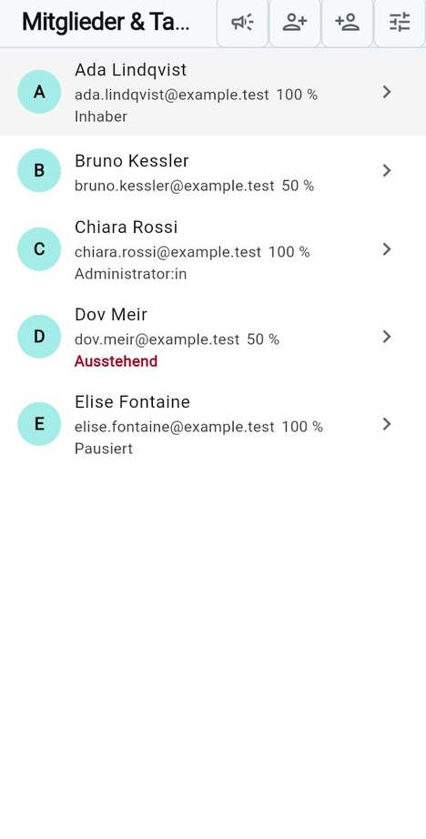

**Schritte**

1. Öffnen Sie [Mitglieder & Tarife](https://fdittgen-png.github.io/deskilo/#/members) im Menü.
2. Lesen Sie jede Zeile: die E-Mail-Adresse, den Anteil des Tarifs (oder **Kein Abo**), die Rolle und, wenn er vom Üblichen abweicht, einen Status: **Ausstehend**, **Pausiert** oder **Ausgetreten**.
3. Tippen Sie auf eine Zeile, um die [Mitgliederseite](#die-mitgliederseite) dieser Person zu öffnen.

**Gut zu wissen**

- Eine Zeile zeigt außerdem die Chips **max** und **gleichzeitig**, wenn Sie ein [Reservierungslimit](#reservierungslimit) oder mehr als eine [gleichzeitige Reservierung](#gleichzeitige-reservierungen) festgelegt haben.
- Je nach eingeschalteten Funktionen bietet die obere Leiste (Symbolschaltflächen mit Kurzinfo) **Alle Admins benachrichtigen**, **Verwaltetes Profil anlegen** und, für Inhaber, **Mitglied einladen** und **Abrechnung**.
- Administratoren erreichen diesen Bildschirm ebenfalls; die Bedienelemente, die Geld oder Rollen ändern, bleiben beim Inhaber.

**Siehe auch:** [Ein Mitglied einladen](#ein-mitglied-einladen) · [Abrechnung](#gebührenbänder)

<!-- anchor: user.members.invite -->
### Ein Mitglied einladen

**Zielgruppe:** Inhaber

Sie möchten, dass jemand Ihrem Space beitritt.

**Schritte**

1. Tippen Sie in [Mitglieder & Tarife](https://fdittgen-png.github.io/deskilo/#/members) auf **Mitglied einladen**.
2. Teilen Sie die Workspace-ID oder ihren QR-Code, wie unter [Die Workspace-ID](#die-workspace-id) beschrieben.
3. Wenn die Person den Beitritt anfragt, erscheint ihre Zeile als **Ausstehend**. Öffnen Sie sie und wählen Sie **Mitgliedschaft bestätigen** oder **Mitgliedschaft ablehnen**.

**Gut zu wissen**

- Beim Ablehnen können Sie einen kurzen Kommentar hinzufügen.
- Bis Sie entscheiden, hat die Person keinen Zugang zum Space.

**Siehe auch:** [Ausstehende und pausierte Mitglieder](#ausstehende-und-pausierte-mitglieder) · [Ein verwaltetes Profil anlegen](#ein-verwaltetes-profil-anlegen)

<!-- anchor: user.members.managed -->
### Ein verwaltetes Profil anlegen

**Zielgruppe:** Administrator:in · Inhaber

Jemand hat noch kein Konto, Sie möchten aber für diese Person buchen, Rechnungen stellen und alles verwalten. Sie legen ein Profil an, führen es selbst und übergeben es, wenn die Person beitritt.

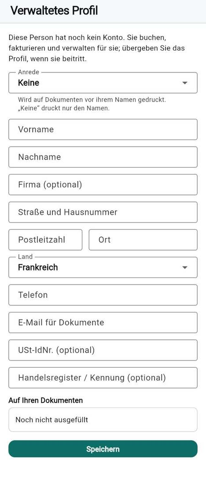

**Schritte**

1. Tippen Sie in [Mitglieder & Tarife](https://fdittgen-png.github.io/deskilo/#/members) auf **Verwaltetes Profil anlegen**.
2. Tragen Sie die Identität der Person ein und speichern Sie. Die Mitgliederseite trägt dann einen Chip **Verwaltet**.
3. Um die Angaben später zu korrigieren, öffnen Sie die Mitgliederseite und wählen **Identität bearbeiten**.
4. Wenn die Person bereit ist, wählen Sie **An die Person übergeben**. Das erzeugt einen persönlichen Code, der an dieses Profil gebunden ist.
5. Sie haben es sich anders überlegt, bevor der Code verwendet wurde? Wählen Sie **Übergabe zurückziehen**.

**Gut zu wissen**

- Wer den Code verwendet, übernimmt das Profil mit seinen Reservierungen, Rechnungen und seinem Abo, sobald Sie die Mitgliedschaft bestätigen.
- An ein verwaltetes Mitglied kann niemand eine Nachricht senden, denn niemand würde sie lesen.
- Die Funktion muss unter [Funktionen](#ein-funktionsschalter) eingeschaltet sein.

**Siehe auch:** [Die Mitgliederseite](#die-mitgliederseite)

<!-- anchor: user.members.page -->
### Die Mitgliederseite

**Zielgruppe:** Administrator:in · Inhaber

Sie möchten alles über eine Person auf einer Seite haben: wer sie ist, was sie gebucht hat, wie Sie sie erreichen, was sie schuldet und jede Einstellung, die Sie ändern können.

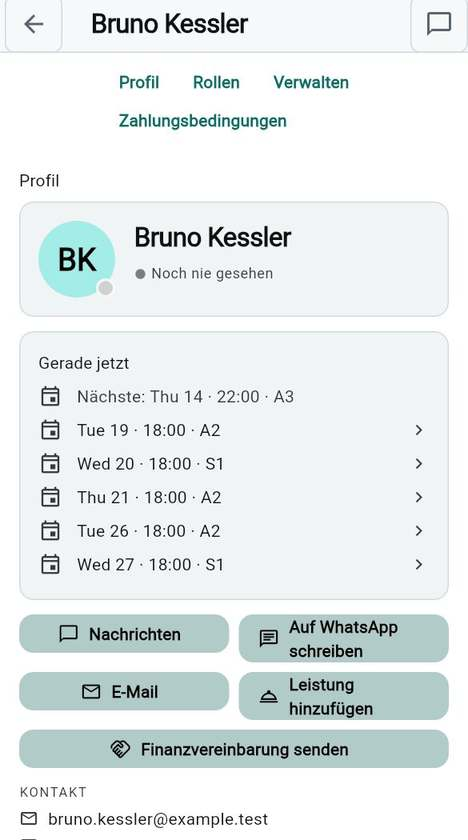

**Schritte**

1. Tippen Sie in [Mitglieder & Tarife](https://fdittgen-png.github.io/deskilo/#/members) auf ein Mitglied.
2. Lesen Sie den oberen Teil der Seite: **Gerade jetzt** zeigt die nächsten Buchungen, danach folgen die Kontaktdaten und die finanzielle Lage.
3. Nutzen Sie die Schaltflächen unter dem Namen für eine schnelle Aktion. Je nach Funktionen und Ihren Rechten sehen Sie einige davon: **Nachrichten**, **E-Mail**, **Leistung hinzufügen** oder **Finanzvereinbarung senden**.
4. Springen Sie zu **Verwalten**, um die Einstellungen der Person zu ändern, gruppiert als **Mitgliedschaft**, **Buchungsregeln**, **Abrechnung** und **Ausweise & Zugang**.

**Gut zu wissen**

- Jede Einstellungszeile zeigt ihren aktuellen Wert, sodass Sie sie selten öffnen müssen, um die Antwort zu kennen.
- Ihre eigene Seite ist kürzer: Niemand kann sich selbst Rechte geben.
- Ist die Seite für Ihren Space nicht eingeschaltet, erscheinen dieselben Aktionen in einer Liste, wenn Sie auf die Zeile tippen.

**Siehe auch:** [Die Aktionen des Mitglieds](#die-aktionen-des-mitglieds) · [Rollen und Mit-Inhaber](#die-rollenmatrix)

<!-- anchor: user.members.actions -->
### Die Aktionen des Mitglieds

**Zielgruppe:** Administrator:in · Inhaber

Sie möchten wissen, welche Einstellung wo liegt und wer sie ändern darf.

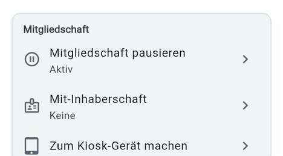

**Schritte**

1. Öffnen Sie eine [Mitgliederseite](#die-mitgliederseite) und gehen Sie zu **Verwalten**.
2. Wählen Sie unter **Mitgliedschaft** **Mitgliedschaft pausieren** oder **Mitgliedschaft reaktivieren**, legen Sie die [Mit-Inhaberschaft](#mit-inhaberschaft) fest oder wählen Sie **Zum Kiosk-Gerät machen**.
3. Legen Sie unter **Buchungsregeln** das [Reservierungslimit](#reservierungslimit), die [Gleichzeitigen Reservierungen](#gleichzeitige-reservierungen) und die [USt-Behandlung](#ust-behandlung) fest; der Schalter **Buchungen ganzer Bereiche** erscheint, wenn die Funktion eingeschaltet ist.
4. Legen Sie unter **Abrechnung** das [Abo](#das-abo-eines-mitglieds), [Wenn die Tage aufgebraucht sind](#wenn-die-tage-aufgebraucht-sind) und die [Preisverhandlung](#preisverhandlung) fest.
5. Öffnen Sie unter **Ausweise & Zugang** **Badges**, um die Badges der Person auszustellen oder zu widerrufen.

**Gut zu wissen**

- Änderungen an Abrechnung und Mitgliedschaft liegen beim Inhaber. Administratoren legen die Buchungslimits fest.
- Ihre eigenen Limits oder Ihre eigene Mit-Inhaberschaft können Sie nie ändern.
- Die meisten dieser Zeilen gibt es nur bei aktiven Mitgliedern.

**Siehe auch:** [Buchungsregeln](#reservierungslimit) · [Gruppe Abrechnung](#das-abo-eines-mitglieds)

<!-- anchor: user.members.pending -->
### Ausstehende und pausierte Mitglieder

**Zielgruppe:** Administrator:in · Inhaber

Ein Neuzugang wartet auf Ihre Entscheidung oder ein Mitglied macht eine Pause, und der Space soll entsprechend damit umgehen.

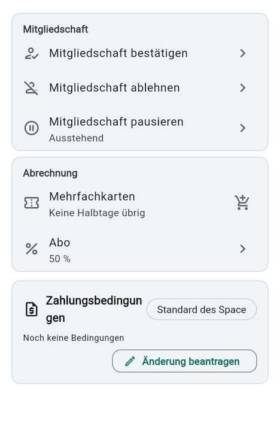

**Schritte**

1. Öffnen Sie das Mitglied, dessen Zeile **Ausstehend** anzeigt.
2. Wählen Sie unter **Mitgliedschaft** **Mitgliedschaft bestätigen**, um die Person einzulassen, oder **Mitgliedschaft ablehnen**, um sie abzulehnen.
3. Um ein aktives Mitglied anzuhalten, öffnen Sie seine Seite und wählen **Mitgliedschaft pausieren**.
4. Um es zurückzuholen, wählen Sie **Mitgliedschaft reaktivieren**.

**Gut zu wissen**

- Die Entscheidung über ein neues Mitglied kann auch über die Validierungsregeln getroffen werden, wie unter [Validierungsregeln](#validierungsregeln-bereich-für-bereich) beschrieben.
- Das Pausieren ist Inhabern vorbehalten und behält den gesamten Verlauf.
- Ein Mitglied, das gegangen ist, zeigt **Ausgetreten** und kann nicht pausiert werden.

**Siehe auch:** [Ein Mitglied einladen](#ein-mitglied-einladen)

<!-- anchor: user.members.subscription -->
### Das Abo eines Mitglieds

**Zielgruppe:** Inhaber

Sie möchten festlegen, auf welchen Anteil der Tage des Monats ein Mitglied Anspruch hat. Der Anteil bestimmt das Gebührenband, und das Band bestimmt den Monatspreis.

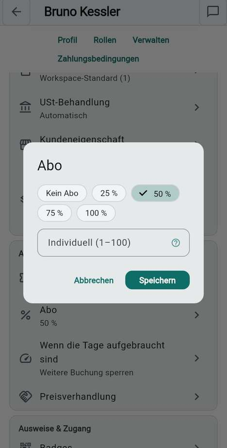

**Schritte**

1. Öffnen Sie die Mitgliederseite, gehen Sie zu **Abrechnung** und tippen Sie auf **Abo**.
2. Wählen Sie **Kein Abo**, eine der angebotenen Stufen oder geben Sie unter **Individuell (1–100)** eine Zahl ein.
3. Tippen Sie auf eine Stufe, um sie zu übernehmen, oder bei einem individuellen Wert auf **Speichern**.

**Gut zu wissen**

- Die angebotenen Stufen sind die, die Sie unter [Abo-Stufen](#abo-stufen) gewählt haben.
- Als Inhaber können Sie immer einen individuellen Wert eingeben.
- **Kein Abo** ist für Besucher, die Mehrfachkarten kaufen. Es lässt sich nicht mit Abrechnung nach Verbrauch kombinieren: Wählen Sie zuerst einen Block oder ein Paket.

**Siehe auch:** [Gebührenbänder](#gebührenbänder) · [Wenn die Tage aufgebraucht sind](#wenn-die-tage-aufgebraucht-sind)

<!-- anchor: user.members.overage-policy -->
### Wenn die Tage aufgebraucht sind

**Zielgruppe:** Inhaber

Sie möchten entscheiden, was geschieht, wenn ein Mitglied sein ganzes Monatskontingent genutzt hat.

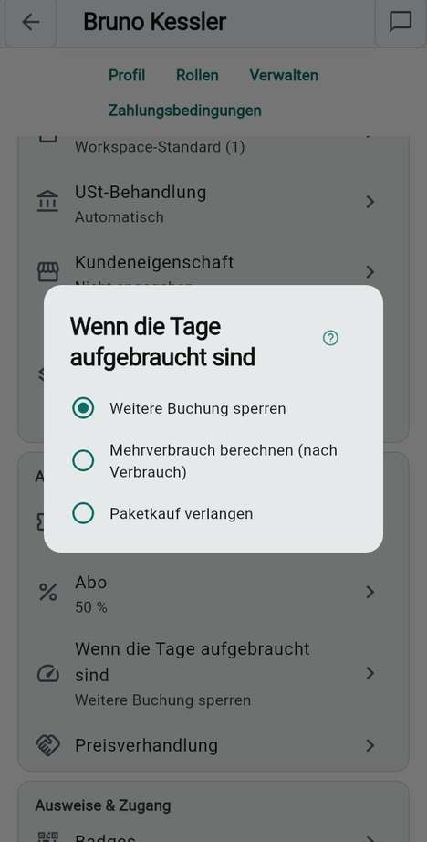

**Schritte**

1. Öffnen Sie die Mitgliederseite, gehen Sie zu **Abrechnung** und tippen Sie auf **Wenn die Tage aufgebraucht sind**.
2. Wählen Sie **Weitere Buchung sperren**, **Mehrverbrauch berechnen (nach Verbrauch)** oder **Paketkauf verlangen**.

**Gut zu wissen**

- Die Abrechnung nach Verbrauch ist für ein Mitglied ohne Abo ausgegraut, weil es sonst kostenlos buchen könnte.
- Der Preis für den Mehrverbrauch stammt aus dem [Gebührenband](#mehrverbrauch); die Pakete stammen aus den [Tagespaketen](#tagespakete).

**Siehe auch:** [Das Abo eines Mitglieds](#das-abo-eines-mitglieds)

<!-- anchor: user.members.reservation-limit -->
### Reservierungslimit

**Zielgruppe:** Administrator:in · Inhaber

Sie möchten begrenzen, wie viele offene Reservierungen ein Mitglied insgesamt halten kann.

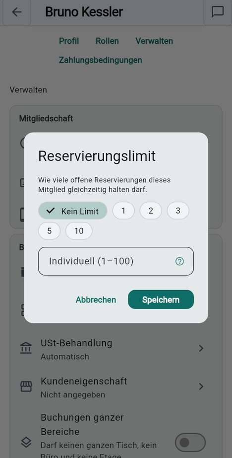

**Schritte**

1. Öffnen Sie die Mitgliederseite, gehen Sie zu **Buchungsregeln** und tippen Sie auf **Reservierungslimit**.
2. Tippen Sie auf **Kein Limit**, eine Vorgabe (1, 2, 3, 5 oder 10) oder geben Sie unter **Individuell (1–100)** eine Zahl ein.
3. Tippen Sie bei einer eigenen Zahl auf **Speichern**.

**Gut zu wissen**

- Es zählt alle offenen Reservierungen, egal wann sie liegen. Das ist etwas anderes als [gleichzeitige Reservierungen](#gleichzeitige-reservierungen), die Überschneidungen zählen.
- Die Liste zeigt **max** und die Zahl neben dem Mitglied.
- Ihr eigenes Limit können Sie nicht festlegen.

**Siehe auch:** [Buchungslimits](#buchungsgrenzen)

<!-- anchor: user.members.simultaneous -->
### Gleichzeitige Reservierungen

**Zielgruppe:** Administrator:in · Inhaber

Sie möchten einem Mitglied erlauben, zeitlich überlappende Buchungen zu halten, zum Beispiel zwei Plätze gleichzeitig.

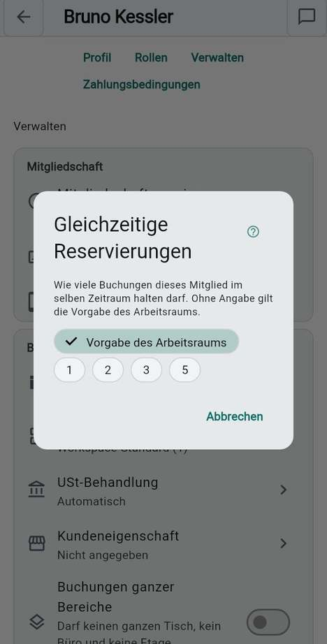

**Schritte**

1. Öffnen Sie die Mitgliederseite, gehen Sie zu **Buchungsregeln** und tippen Sie auf **Gleichzeitige Reservierungen**.
2. Wählen Sie **Standard des Spaces** oder eine Zahl: 1, 2, 3 oder 5.

**Gut zu wissen**

- **Standard des Spaces** folgt der Zahl, die unter [Verfügbarkeit](#buchungsregeln) festgelegt ist; eins bedeutet einen Platz zur Zeit.
- Es ist nicht dasselbe wie das [Reservierungslimit](#reservierungslimit), das alle offenen Buchungen zählt.
- Ihre eigene Zahl können Sie nicht festlegen.

**Siehe auch:** [Buchungsrichtlinien](#buchungsregeln)

<!-- anchor: user.members.vat-treatment -->
### USt-Behandlung

**Zielgruppe:** Administrator:in · Inhaber

Sie möchten der App sagen, wer dieses Mitglied umsatzsteuerlich ist, damit seine Rechnungen die richtige Steuer tragen.

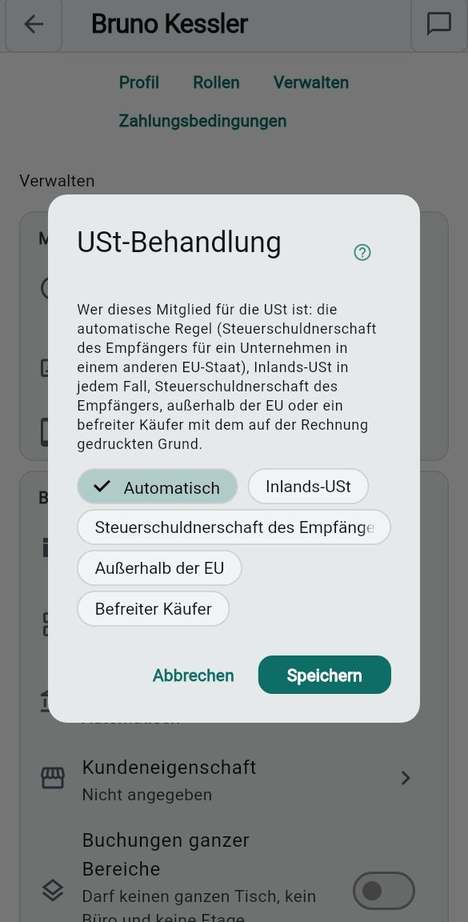

**Schritte**

1. Öffnen Sie die Mitgliederseite, gehen Sie zu **Buchungsregeln** und tippen Sie auf **USt-Behandlung**.
2. Wählen Sie **Automatisch**, **Inlands-USt**, **Steuerschuldnerschaft des Empfängers**, **Außerhalb der EU** oder **Befreiter Käufer**.
3. Geben Sie bei **Befreiter Käufer** den **Befreiungsgrund (auf der Rechnung gedruckt)** ein.
4. Tippen Sie auf **Speichern**.

**Gut zu wissen**

- **Automatisch** wendet die übliche Regel an: Steuerschuldnerschaft des Empfängers bei einem Unternehmen in einem anderen EU-Staat.
- Dieselbe Gruppe bietet die **Kundeneigenschaft** (**Unternehmer**, **Verbraucher** oder **Nicht angegeben**), die bestimmt, welche Zahlungsklauseln eine Rechnung druckt. Dafür brauchen Sie das Recht, Rechnungen auszustellen.
- **Steuerschuldnerschaft des Empfängers**, **Außerhalb der EU** und **Befreiter Käufer** werden erfasst, aber die Rechnungen solcher Mitglieder lassen sich in der App noch nicht ausstellen: Sie werden außerhalb der App mit Ihrer Buchhaltung ausgestellt.
- Die Funktion **USt nach Kunde** muss eingeschaltet sein, damit die Zeile USt-Behandlung erscheint, und zwar für Administratoren und Inhaber; die Sätze legen Sie unter [Steuersätze](#die-sätze-festlegen) fest.

**Siehe auch:** [USt-Regime](#steuerregime)

<!-- anchor: user.members.negotiation -->
### Preisverhandlung

**Zielgruppe:** Abrechnungsadministrator:in · Inhaber

Sie haben mit einem Mitglied einen Preis vereinbart, der von Ihrem Tarif abweicht, und möchten ihn als Vereinbarung erfassen, statt den Tarif zu überschreiben.

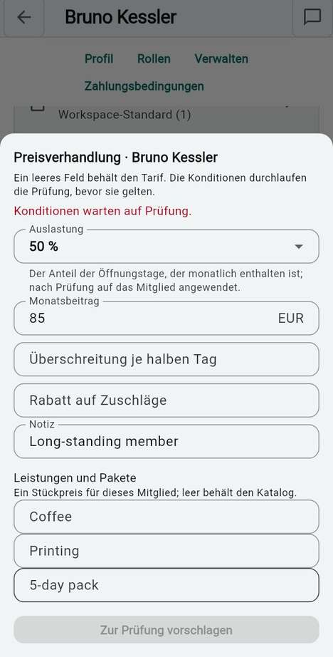

**Schritte**

1. Öffnen Sie die Mitgliederseite, gehen Sie zu **Abrechnung** und tippen Sie auf **Preisverhandlung**.
2. Füllen Sie nur aus, was abweicht: **Auslastung**, **Monatsbeitrag**, **Überschreitung je halben Tag**, **Rabatt auf Zuschläge** oder einen Stückpreis unter **Leistungen und Pakete**.
3. Fügen Sie bei Bedarf eine **Notiz** hinzu.
4. Tippen Sie auf **Zur Prüfung vorschlagen**.

**Gut zu wissen**

- Ein leer gelassenes Feld behält den Tarif.
- Die Vereinbarung wartet auf die Validierung, bevor sie gilt, wie unter [Validierungsregeln](#validierungsregeln-bereich-für-bereich) beschrieben.
- Sobald sie aktiv ist, sieht das Mitglied sie auf seiner Finanzseite, mit **Wer das sehen kann**. Personen, die Verhandlungen nur ansehen dürfen, sehen sie als **Nur lesen**.

**Siehe auch:** [Gebührenbänder](#gebührenbänder)

<!-- anchor: user.members.co-ownership -->
### Mit-Inhaberschaft

**Zielgruppe:** Inhaber

Sie möchten, dass jemand die Inhaberschaft mit Ihnen teilt oder übernimmt, falls Sie gehen.

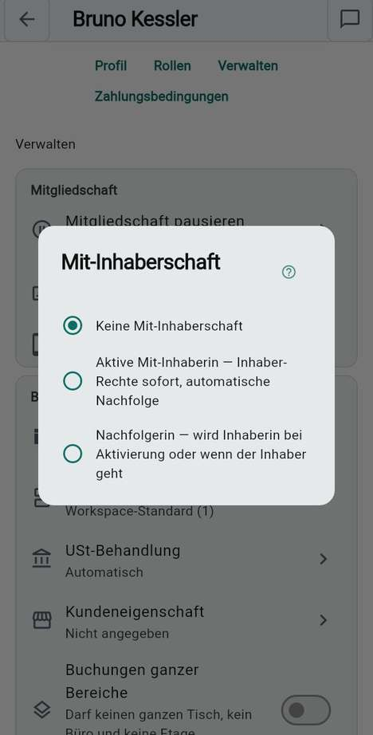

**Schritte**

1. Öffnen Sie die Mitgliederseite, gehen Sie zu **Mitgliedschaft** und tippen Sie auf **Mit-Inhaberschaft**.
2. Wählen Sie **Keine Mit-Inhaberschaft**, *Aktiver Mitinhaber* oder **Nachfolge**.
3. Um einen Mitinhaber sofort zum vollen Inhaber zu machen, wählen Sie **Jetzt zum Inhaber machen**.

**Gut zu wissen**

- Eine aktive Mit-Inhaberin hat sofort Inhaber-Rechte und übernimmt automatisch, wenn Sie gehen.
- Eine Nachfolgerin wird Inhaberin, wenn sie befördert wird oder der Inhaber geht.
- Die Zeile zeigt in der Mitgliederliste **Mitinhaber** oder **Nachfolge**.
- Sie setzt voraus, dass die Funktion **Mitinhaber** eingeschaltet ist, und Sie können Ihre eigene Mit-Inhaberschaft nicht ändern.

**Siehe auch:** [Die Rollenmatrix](#die-rollenmatrix)

<!-- anchor: user.money.billing.fee-bands -->
### Gebührenbänder

**Zielgruppe:** Inhaber · Abrechnungsadministrator:in

Sie möchten Ihre Tarife bepreisen: was ein Monat für jeden Anteil der Tage kostet und was ein zusätzlicher halber Tag kostet.

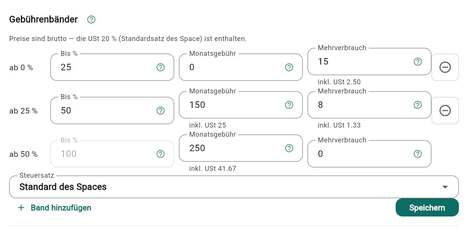

**Schritte**

1. Öffnen Sie [Abrechnung](https://fdittgen-png.github.io/deskilo/#/billing) im Menü.
2. Legen Sie unter **Gebührenbänder** in jeder Zeile **Bis %**, **Monatsbeitrag** und **Mehrverbrauch** fest.
3. Tippen Sie auf **Band hinzufügen**, um das letzte Band zu teilen, oder auf das Minuszeichen, um eines zu entfernen.
4. Wählen Sie den **Steuersatz**, mit dem der Tarif besteuert wird. Er wird gespeichert, sobald Sie ihn wählen.
5. Tippen Sie auf **Speichern**, um die Bänder zu speichern.

**Gut zu wissen**

- Jede Zeile beginnt dort, wo die vorherige endet, und die letzte endet immer bei 100 %. Passen die Bänder nicht zusammen, meldet der Bildschirm „Bänder müssen aufsteigen und bei 100 % enden.“
- Die Preise sind Bruttopreise: Die Umsatzsteuer ist enthalten, wenn Ihr Space sie erhebt.
- Beim Entfernen eines Bands wird sein Bereich mit dem davor zusammengeführt.

**Siehe auch:** [Das Abo eines Mitglieds](#das-abo-eines-mitglieds) · [Abo-Stufen](#abo-stufen)

<!-- anchor: user.money.billing.band-to -->
#### Bis %

Die Obergrenze des Bands, von 1 bis 100. Das nächste Band beginnt dort, wo dieses endet, sodass ein Prozentsatz immer in genau ein Band fällt. Das letzte Band ist fest auf 100 gesetzt.

<!-- anchor: user.money.billing.band-fee -->
#### Monatsbeitrag

Was ein Monat in diesem Band kostet. Wenn Sie Umsatzsteuer erheben, zeigt die Zeile den enthaltenen Steueranteil.

<!-- anchor: user.money.billing.band-overage -->
#### Mehrverbrauch

Der Preis für einen halben Tag über dem Kontingent, für Mitglieder, deren Regelung die Abrechnung nach Verbrauch ist.

<!-- anchor: user.money.billing.levels -->
### Abo-Stufen

**Zielgruppe:** Inhaber · Abrechnungsadministrator:in

Sie möchten wählen, welche Prozentsätze Sie anbieten, wenn Sie jemandem einen Tarif geben.

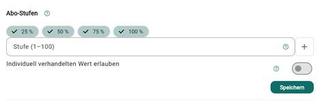

**Schritte**

1. Suchen Sie in der [Abrechnung](https://fdittgen-png.github.io/deskilo/#/billing) die **Abo-Stufen**.
2. Tippen Sie auf eine Vorgabe (25 %, 50 %, 75 %, 100 %), um sie ein- oder auszuschalten.
3. Um eigene hinzuzufügen, geben Sie unter **Stufe (1–100)** eine Zahl ein und tippen auf **Stufe hinzufügen**.
4. Tippen Sie auf **Speichern**.

**Gut zu wissen**

- Die gewählten Stufen sind die, die beim [Abo](#das-abo-eines-mitglieds) eines Mitglieds angeboten werden.
- Entfernen Sie eine selbst hinzugefügte Stufe mit dem Kreuz auf ihrem Chip.

**Siehe auch:** [Gebührenbänder](#gebührenbänder)

<!-- anchor: user.money.billing.level-value -->
#### Stufenwert

Ein Prozentsatz von 1 bis 100: der Anteil der Tage des Monats, den der Tarif enthält.

<!-- anchor: user.money.billing.custom-level -->
#### Verhandelten Wert erlauben

Der Schalter **Individuell verhandelten Wert erlauben** wird zusammen mit den Stufen gespeichert. Als Inhaber können Sie im **Abo** eines Mitglieds immer einen eigenen Prozentsatz eingeben, unabhängig von diesem Schalter.

<!-- anchor: user.money.billing.packages -->
### Tagespakete

**Zielgruppe:** Inhaber · Abrechnungsadministrator:in

Sie möchten Mitgliedern, deren Kontingent aufgebraucht ist, Tagesblöcke verkaufen.

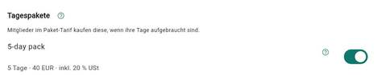

**Schritte**

1. Suchen Sie in der [Abrechnung](https://fdittgen-png.github.io/deskilo/#/billing) die **Tagespakete**. Jede Zeile zeigt die Tage, den Preis und einen Schalter.
2. Schalten Sie ein Paket aus, um es nicht mehr zu verkaufen, oder wieder ein, um es erneut zu verkaufen.
3. Um ein Paket anzulegen, folgen Sie [Neues Paket](#neues-paket).

**Gut zu wissen**

- Mitglieder, deren Regelung **Paketkauf verlangen** lautet, kaufen diese, wenn ihre Tage aufgebraucht sind.
- Ein bereits verkauftes Paket behält Preis, Tage und Satz. Um sie zu ändern, schalten Sie es aus und fügen ein neues hinzu.

**Siehe auch:** [Wenn die Tage aufgebraucht sind](#wenn-die-tage-aufgebraucht-sind)

<!-- anchor: user.money.billing.package-new -->
### Neues Paket

**Zielgruppe:** Inhaber · Abrechnungsadministrator:in

Sie möchten Ihrer Preisliste einen Tagesblock hinzufügen.

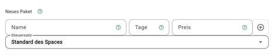

**Schritte**

1. Geben Sie in der [Abrechnung](https://fdittgen-png.github.io/deskilo/#/billing) unter **Neues Paket** den Namen, die Tage und den Preis ein.
2. Wählen Sie den **Steuersatz**.
3. Tippen Sie auf **Paket hinzufügen**.

**Gut zu wissen**

- Das Paket ist ab dem Moment, in dem es erscheint, eingeschaltet im Verkauf.
- Ist die Funktion Mehrfachkarten eingeschaltet, steht darunter ein Editor für **Mehrfachkarten**.

**Siehe auch:** [Tagespakete](#tagespakete)

<!-- anchor: user.money.billing.package-name -->
#### Paketname

Was Mitglieder beim Kauf sehen und was die Rechnungszeile sagt.

<!-- anchor: user.money.billing.package-days -->
#### Tage des Pakets

Wie viele Tage das Paket gewährt, einen oder mehr.

<!-- anchor: user.money.billing.package-price -->
#### Paketpreis

Der Preis des ganzen Pakets, brutto. Die Zeile zeigt die Tage, den Preis und, wenn Umsatzsteuer anfällt, die enthaltene Umsatzsteuer.

<!-- anchor: user.money.billing.schedule -->
### Rechnungsplan

**Zielgruppe:** Inhaber · Abrechnungsadministrator:in

Sie möchten wählen, wann die beiden automatischen Rechnungen hinausgehen: das Abo vor dem Monat und der Verbrauch des Monats danach.

**Schritte**

1. Öffnen Sie [Workspace](https://fdittgen-png.github.io/deskilo/#/workspace-settings) und die Gruppe **Zahlungen & Abrechnung**.
2. Tippen Sie auf **Rechnungsplan**.
3. Schalten Sie unter **Abo, im Voraus** **Automatisch erstellen** ein oder aus und wählen Sie **Tage vor Monatsbeginn**. Die Zeile darunter nennt das sich ergebende Datum.
4. Schalten Sie unter **Der gerade beendete Monat** **Automatisch erstellen** ein oder aus. Schalten Sie **Auch wenn nichts zu zahlen ist** ein, um ein Dokument mit dem Betrag null zu senden.
5. Tippen Sie auf **Speichern**.

**Gut zu wissen**

- Jede Hälfte braucht ihre Funktion, eingeschaltet unter [Funktionen](#ein-funktionsschalter): „Abo-Rechnungen“ und „Monatsend-Rechnungen“.
- Die Abo-Rechnung kann daher einen Monat nennen, der noch nicht begonnen hat.

**Siehe auch:** [Mahnregeln](#mahnregeln) · [Gebührenbänder](#gebührenbänder)

<!-- anchor: user.money.services.overview -->
### Eine Leistung

**Zielgruppe:** Inhaber · Abrechnungsadministrator:in

Sie verkaufen etwas, das kein Sitzplatz ist: ein Schließfach, Drucken, Kaffee. Sie legen es einmal an und fügen es mit einem Tipp zum Monat eines Mitglieds hinzu.

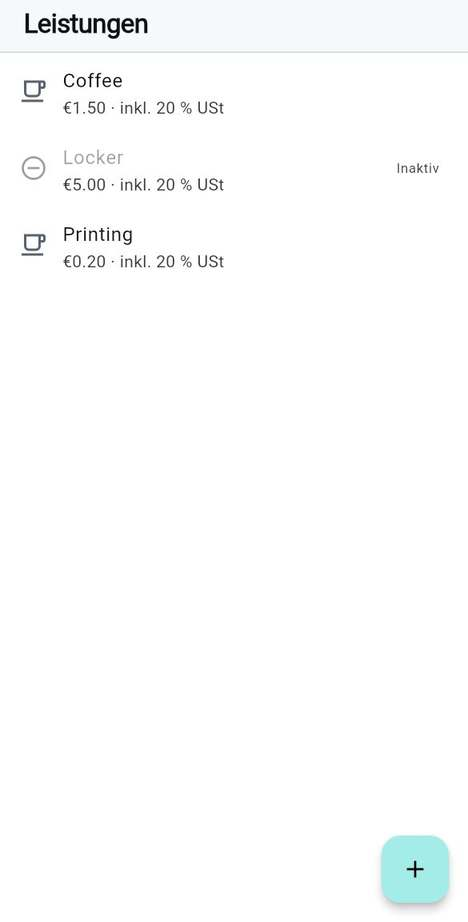

**Schritte**

1. Öffnen Sie [Leistungen](https://fdittgen-png.github.io/deskilo/#/services) im Menü.
2. Tippen Sie auf eine Leistung, um sie zu bearbeiten, oder auf die Plus-Schaltfläche, um eine **Neue Leistung** anzulegen.
3. Tragen Sie den [Namen](#name-der-leistung), den [Preis](#preis-der-leistung) und, wenn Sie Umsatzsteuer erheben, den **Steuersatz** ein.
4. Tippen Sie auf **Speichern**.

**Gut zu wissen**

- Eine Leistung wird nie gelöscht, nur deaktiviert, weil Rechnungen auf sie verweisen.
- Eine Leistung, die aus einem Bestand stammt, zeigt, wie viele noch übrig sind, oder **Ausverkauft**.
- Um eine für ein Mitglied zu erfassen, nutzen Sie **Leistung hinzufügen** auf seiner Seite.

**Siehe auch:** [Zubehör](#zubehör) · [Die Mitgliederseite](#die-mitgliederseite)

<!-- anchor: user.money.services.name -->
#### Name der Leistung

Was die Rechnungszeile sagt. Wenn Sie sie umbenennen, ändern sich nur neue Dokumente.

<!-- anchor: user.money.services.price -->
#### Preis der Leistung

Der Preis einer Einheit, brutto: Das Mitglied zahlt genau diesen Betrag, und die Umsatzsteuer ist darin enthalten. Der **Steuersatz** bestimmt nur, wie viel davon Steuer ist.

<!-- anchor: user.money.services.active -->
#### Aktiv

Beim Bearbeiten einer Leistung entscheidet der Schalter **Aktiv**, ob sie noch verkauft werden kann. Schalten Sie ihn bei einer eingestellten Leistung aus; die Liste graut sie aus und schreibt **Inaktiv**.

<!-- anchor: user.money.accessories -->
### Zubehör

**Zielgruppe:** Administrator:in · Inhaber

Sie vermieten Ausstattung zu einem Platz, etwa einen Monitor oder einen Stuhl, und berechnen für jeden halben Tag einen Aufpreis.

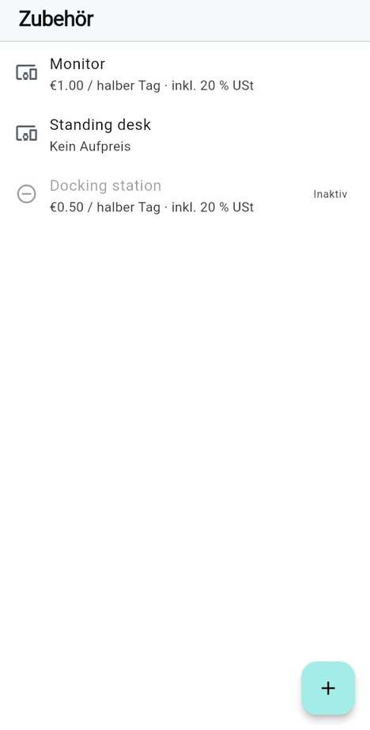

**Schritte**

1. Öffnen Sie [Zubehör](https://fdittgen-png.github.io/deskilo/#/accessories) im Menü.
2. Tippen Sie auf ein Zubehör oder auf die Plus-Schaltfläche für ein **Neues Zubehör**.
3. Tragen Sie **Bezeichnung** und **Aufpreis pro halbem Tag** ein; wählen Sie den **Steuersatz**, wenn Ihr Space Umsatzsteuer erhebt.
4. Schalten Sie **Aktiv** aus, um es nicht mehr anzubieten, und tippen Sie dann auf **Speichern**.

**Gut zu wissen**

- Die Liste zeigt jeden Aufpreis als Betrag „pro halbem Tag“ oder **Kein Aufpreis**.
- Wie Leistungen werden Zubehörteile deaktiviert, nie gelöscht.
- Die Funktion muss unter [Funktionen](#ein-funktionsschalter) eingeschaltet sein.

**Siehe auch:** [Eine Leistung](#eine-leistung)

<!-- anchor: user.money.payments.methods -->
### Zahlungsarten und Zahlungshinweise

**Zielgruppe:** Inhaber · Abrechnungsadministrator:in

Sie möchten, dass Mitglieder wissen, wie sie Sie per Überweisung oder Wallet bezahlen, ohne dass Sie jedes Mal die Angaben schicken müssen.

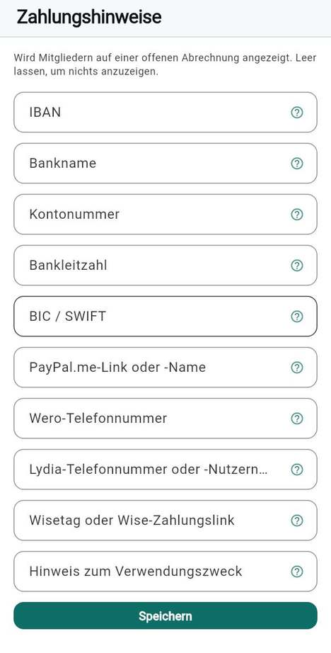

**Schritte**

1. Öffnen Sie die [Zahlungshinweise](https://fdittgen-png.github.io/deskilo/#/payment-methods) im Menü.
2. Füllen Sie aus, was zutrifft: **IBAN**, **Bankname**, **Kontonummer**, die Bankleitzahl, **BIC / SWIFT**.
3. Fügen Sie die Wallets hinzu, die Sie akzeptieren: **PayPal.me-Link oder -Name**, **Wero-Telefonnummer**, **Lydia-Telefonnummer oder -Nutzername**, **Wisetag oder Wise-Zahlungslink**.
4. Fügen Sie einen **Hinweis zum Verwendungszweck** hinzu, wenn Mitglieder etwas angeben sollen.
5. Tippen Sie auf **Speichern**.

**Gut zu wissen**

- Mitglieder sehen diese Angaben auf einer unbezahlten Abrechnung. Lassen Sie alles leer, um nichts anzuzeigen.
- Das Feld für die Bankleitzahl trägt den Namen nach Ihrem Land: Sort Code, Routing Number oder Bankleitzahl.
- Das ist manuelle Zahlung. Damit Mitglieder in der App per Karte bezahlen können, siehe [Der Zahlungsanbieter](#der-zahlungsanbieter).

**Siehe auch:** [Zugangsdaten des Anbieters](#zugangsdaten-des-anbieters)

<!-- anchor: user.money.payments.provider -->
### Der Zahlungsanbieter

**Zielgruppe:** Inhaber

Sie möchten, dass Mitglieder eine offene Rechnung online auf Ihr eigenes Anbieterkonto bezahlen.

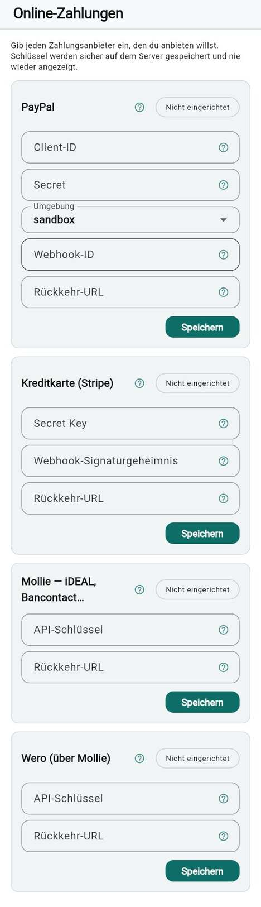

**Schritte**

1. Schalten Sie die Funktion Online-Zahlungen unter [Funktionen](#ein-funktionsschalter) ein.
2. Öffnen Sie [Online-Zahlungen](https://fdittgen-png.github.io/deskilo/#/payment-config) im Menü.
3. Suchen Sie den Anbieter, den Sie nutzen: **PayPal**, **Kreditkarte (Stripe)**, **Mollie — iDEAL, Bancontact…** oder **Wero (über Mollie)**.
4. Tragen Sie seine Schlüssel ein, wie unter [Zugangsdaten des Anbieters](#zugangsdaten-des-anbieters) beschrieben, und tippen Sie auf **Speichern**.
5. Prüfen Sie, dass auf der Karte **Eingerichtet** steht.

**Gut zu wissen**

- Jeder Anbieter ist eine eigene Karte mit einem Status-Chip, **Eingerichtet** oder **Nicht eingerichtet**.
- Wero wird über Mollie bezahlt: Tragen Sie auf der Wero-Karte denselben Mollie-API-Schlüssel und dieselbe Rückkehr-URL ein wie auf der Mollie-Karte.
- Anbieter berechnen eigene Gebühren. Der manuelle Überweisungsweg bleibt kostenlos.
- **Entfernen** löscht einen Anbieter.

**Siehe auch:** [Zahlungsarten](#zahlungsarten-und-zahlungshinweise)

<!-- anchor: user.money.payments.credentials -->
#### Zugangsdaten des Anbieters

Die Schlüssel stammen aus dem eigenen Dashboard des Anbieters: **Client-ID**, **Secret**, **Umgebung**, **Webhook-ID** und **Rückkehr-URL** für PayPal; **Secret Key**, **Webhook-Signaturgeheimnis** und **Rückkehr-URL** für Stripe; **API-Schlüssel** und **Rückkehr-URL** für Mollie und Wero. Halten Sie Test- und Live-Schlüssel getrennt: Alle Schlüssel, die Sie eingeben, müssen zum selben Modus gehören.

Geheimnisse werden auf dem Server gespeichert und nie wieder angezeigt. Ein gespeichertes zeigt **Gesetzt — leer lassen zum Behalten**; geben Sie einen neuen Wert ein, um es zu ersetzen.

<!-- anchor: user.money.expenses.schedule -->
### Geplante Ausgaben

**Zielgruppe:** Mitglied · Administrator:in · Inhaber

Sie bezahlen etwas, das wiederkehrt, etwa Internet oder Strom. Sie beschreiben es einmal, und die App legt Ihnen jeden Fälligkeitstermin vor.

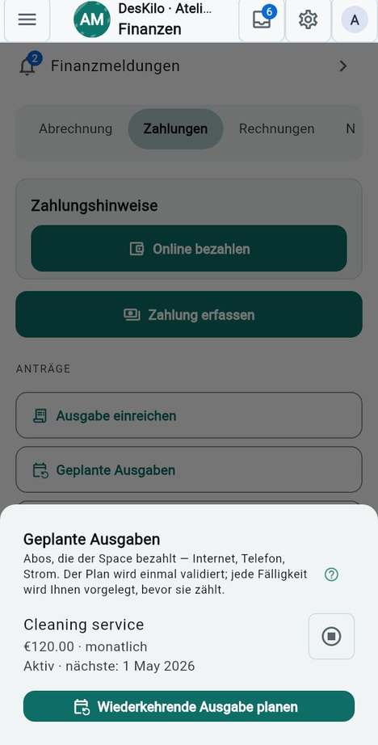

**Schritte**

1. Öffnen Sie [Finanzen](https://fdittgen-png.github.io/deskilo/#/money) und den Bereich **Zahlungen**.
2. Tippen Sie auf **Geplante Ausgaben**. Bestehende Pläne zeigen ihren Betrag, ihre Regel, ihren Status und den nächsten Termin.
3. Tippen Sie auf **Wiederkehrende Ausgabe planen** und füllen Sie das Formular aus, wie unter [Was](#was) und den folgenden Feldern beschrieben.
4. Tippen Sie auf **Planen**.

**Gut zu wissen**

- Ein neuer Plan ist **Wartet auf Validierung**, bis die Prüfenden ihn bestätigen, danach **Aktiv**. Er kann auch als **Abgelehnt** oder **Beendet** enden.
- Jeder Fälligkeitstermin wird Ihnen dann vorgelegt, bevor er zählt: Bestätigen Sie ihn zum validierten Betrag oder zu einem anderen Betrag mit einer Erklärung, der erneut validiert wird.
- Tippen Sie auf **Diesen Plan beenden**, um einen zu stoppen. Beendete stehen unter **Beendet und abgelehnt**.
- Die Funktion muss unter [Funktionen](#ein-funktionsschalter) eingeschaltet sein.

**Siehe auch:** [Validierungsregeln](#validierungsregeln-bereich-für-bereich)

<!-- anchor: user.money.expenses.what -->
#### Was

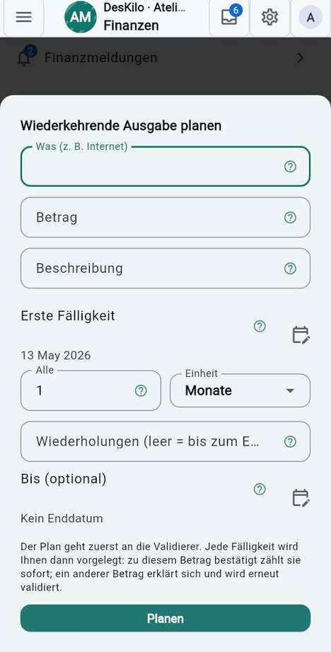

Der Name, den jedes Auftreten trägt, zum Beispiel Internet. Schreiben Sie ihn so, wie Sie ihn später lesen möchten. Der **Betrag** ist, was ein Auftreten kostet, und die **Beschreibung** ist ein optionaler Text für die Person, die validiert.

<!-- anchor: user.money.expenses.amount -->
#### Betrag

Was ein Auftreten kostet, in der Währung Ihres Workspace. Ein anderer Betrag bei der Bestätigung braucht eine Erklärung und wird erneut validiert.

<!-- anchor: user.money.expenses.description -->
#### Beschreibung

Optionaler Text für die Prüfenden, etwa eine Vertragsnummer oder eine Lieferantenreferenz.

<!-- anchor: user.money.expenses.starts-on -->
#### Erstes Auftreten

Das Datum, an dem das erste fällig wird. Jedes spätere Datum zählt von hier an.

<!-- anchor: user.money.expenses.every -->
#### Alle

Das Intervall, eine Zahl und eine Einheit: Tage, Wochen, Monate oder Jahre. Alle 1 Monat bedeutet „monatlich“.

<!-- anchor: user.money.expenses.times -->
#### Anzahl der Wiederholungen

Das Feld **Wiederholungen (leer = bis zum Enddatum)**: wie viele Auftreten angelegt werden.

<!-- anchor: user.money.expenses.ends-on -->
#### Bis

**Bis (optional)** ist das Datum, nach dem nichts mehr angelegt wird. Bei Zahl und Datum zusammen endet die Serie mit dem, was zuerst eintritt. Ohne beides läuft sie, bis Sie sie beenden.

<!-- anchor: user.invoicing.overview -->
## Steuern, Rechnungsstellung und Buchhaltung

Für Inhaber und Abrechnungsadministratoren: wer Sie als Verkäufer sind, wie die Umsatzsteuer behandelt wird, wohin E-Rechnungen gehen, wie Ihre Dokumente aussehen und wie der monatliche Rhythmus aus Ausstellen, Versenden und Nachfassen von Rechnungen abläuft.

> **Achtung** DesKilo druckt, was Sie angeben, und prüft, ob die erforderlichen Angaben vorhanden sind. Es bescheinigt weder Ihre Rechnungen noch Ihre Umsatzsteuerbehandlung noch Ihre Buchführung. Wo ein Abschnitt unten „mit Ihrer Buchhaltung klären“ sagt, tun Sie das bitte.

In diesem Kapitel:
- Ihre rechtliche Identität und die Angaben, die auf jeder Rechnung stehen
- Umsatzsteuer: Regime, Nummer, Sätze, Gruppen und die periodische Erklärung
- E-Rechnung: wohin die maschinenlesbare Rechnung gesendet wird
- Die PDF-Vorlage der Rechnung und der Berichtseditor
- Einen Monat ausstellen und abschließen: der Bildschirm Rechnungsstellung, der Monatsabschluss-Assistent, das Zusammenfassen, gemeinsame Ausgaben
- Zahlungserinnerungen
- Das Rechnungsregister, Buchhaltungsexporte und Business-Analysen

<!-- anchor: user.money.legal.identity -->
### Ihre rechtliche Identität

**Zielgruppe:** Inhaber

Sie möchten, dass Ihre Rechnungen Sie richtig benennen: wer Sie sind, wie Sie eingetragen sind und wie Sie Umsatzsteuer berechnen.

**Schritte**

1. Öffnen Sie [Workspace](https://fdittgen-png.github.io/deskilo/#/workspace-settings) und tippen Sie auf **Rechtliche Identität & E-Rechnung**, oder gehen Sie direkt zu [Rechtliche Identität & E-Rechnung](https://fdittgen-png.github.io/deskilo/#/legal-identity).
2. Arbeiten Sie von oben nach unten: zuerst das Steuerregime, dann die Kennungen, die Adresse und die **Rechnungsangaben**.
3. Tippen Sie unten auf **Speichern**.

**Gut zu wissen**

- Der Bildschirm zeigt nur die Felder, die Ihr Steuerregime braucht. Ändern Sie das Regime, folgt das Formular.
- Bereits ausgestellte Rechnungen behalten die Identität, mit der sie signiert wurden. Eine Änderung gilt für die nächsten.
- Nur Inhaber können diesen Bildschirm öffnen.

**Siehe auch:** [Steuerregime](#steuerregime) · [Art der Organisation](#art-der-organisation) · [E-Rechnung](#die-e-rechnungs-plattform)

<!-- anchor: user.money.legal.seller-kind -->
### Art der Organisation

**Zielgruppe:** Inhaber

Sie führen entweder ein Unternehmen oder einen gemeinnützigen Verein, und Ihre Rechnungen sollen entsprechend lauten.

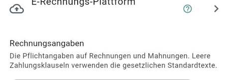

**Schritte**

1. Öffnen Sie [Rechtliche Identität & E-Rechnung](https://fdittgen-png.github.io/deskilo/#/legal-identity) und blättern Sie zu den **Rechnungsangaben**.
2. Wählen Sie **Unternehmen** oder **Verein (gemeinnützig)**.
3. Tippen Sie auf **Speichern**.

**Gut zu wissen**

- Bei einem Verein ändern sich die Beispieltexte (zum Beispiel eine Eintragung wie RNA statt eines Handelsregisters). Welche Zahlungsklauseln gedruckt werden, hängt von Ihrem Land und von der Eigenschaft des Kunden ab, nicht von der Organisationsform.
- Ein Verein ohne wirtschaftliche Tätigkeit liegt normalerweise außerhalb der Umsatzsteuer. Der Bildschirm warnt Sie, wenn Sie für einen Verein „steuerfrei“ wählen; klären Sie die richtige Wahl mit Ihrer Buchhaltung.

**Siehe auch:** [Kundeneigenschaft](#standard-kundeneigenschaft) · [Steuerregime](#steuerregime)

<!-- anchor: user.money.legal.customer-capacity -->
### Standard-Kundeneigenschaft

**Zielgruppe:** Inhaber

Geschäftskunden und Privatpersonen schulden nicht dieselben Zahlungsklauseln. Sie legen den Standard für den Workspace fest.

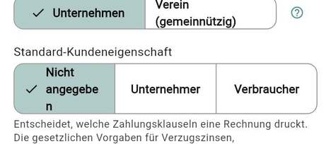

**Schritte**

1. Suchen Sie bei den **Rechnungsangaben** die **Standard-Kundeneigenschaft**.
2. Wählen Sie **Nicht angegeben**, **Unternehmer** oder **Verbraucher**.
3. Tippen Sie auf **Speichern**.

**Gut zu wissen**

- Die gesetzlichen Standardwerte für Verzugszinsen, Beitreibungspauschale und Skonto gelten nur für Geschäftskunden eines Space in Frankreich; für andere Länder wird nichts gedruckt, außer was Sie selbst geschrieben haben. Ein Verbraucher erhält die Beitreibungspauschale nie.
- Die eigene Kundeneigenschaft eines Mitglieds hat Vorrang vor diesem Standard.
- Jede Rechnung behält die Klauseln, mit denen sie ausgestellt wurde.

**Siehe auch:** [Verzugszinsen](#verzugszinsen) · [Beitreibungspauschale](#beitreibungspauschale)

<!-- anchor: user.money.legal.legal-form -->
### Rechtsform und Kapital

**Zielgruppe:** Inhaber

Ihre Rechnungen nennen die Rechtsform Ihres Unternehmens und, wo es zutrifft, sein Stammkapital.

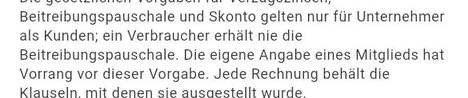

**Schritte**

1. Tippen Sie bei den **Rechnungsangaben** auf **Rechtsform & Kapital**.
2. Geben Sie die Zeile so ein, wie sie gedruckt werden soll, zum Beispiel „GmbH, Stammkapital 25.000 €“ (ein Verein könnte „Eingetragener Verein“ schreiben).
3. Tippen Sie auf **Speichern**.

**Gut zu wissen**

- Der Text wird so gedruckt, wie Sie ihn eingeben, bis zu 300 Zeichen. Klären Sie den genauen Wortlaut, der für Ihre Rechtsform vorgeschrieben ist, mit Ihrer Buchhaltung.

**Siehe auch:** [Handelsregister](#handelsregister)

<!-- anchor: user.money.legal.registration -->
### Handelsregister

**Zielgruppe:** Inhaber

Sie zeigen, wo Ihre Organisation eingetragen ist.

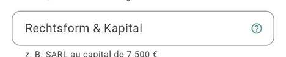

**Schritte**

1. Tippen Sie bei den **Rechnungsangaben** auf **Handelsregister**.
2. Geben Sie die Eintragungszeile ein, zum Beispiel „Amtsgericht München, HRB 123456“. Ein Verein könnte eine Vereinsregisternummer eingeben, und eine SIRET, falls er eine hat.
3. Tippen Sie auf **Speichern**.

**Gut zu wissen**

- Diese Zeile ist eine Angabe, die auf dem Dokument gedruckt wird. Die Kennung, die die E-Rechnung selbst braucht, ist je nach Regime die [Registernummer](#registernummer) oder die [Umsatzsteuer-ID](#umsatzsteuer-id).

**Siehe auch:** [Rechtsform und Kapital](#rechtsform-und-kapital)

<!-- anchor: user.money.legal.payment-terms -->
### Zahlungsbedingungen

**Zielgruppe:** Inhaber

Sie geben an, wann Rechnungen fällig sind.

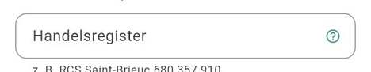

**Schritte**

1. Tippen Sie bei den **Rechnungsangaben** auf **Zahlungsbedingungen**.
2. Geben Sie Ihre Bedingungen ein, zum Beispiel „Zahlung innerhalb von 30 Tagen ab Rechnungsdatum“.
3. Tippen Sie auf **Speichern**.

**Gut zu wissen**

- Bleibt das Feld leer, drucken Rechnungen „Zahlung bei Erhalt.“
- Ein Mitglied kann eigene Zahlungsbedingungen haben; diese werden dann auf den Dokumenten dieses Mitglieds gedruckt.
- Mahnungen lesen diesen Text nicht: Sie zählen ab dem Rechnungsdatum plus **Tage bis zur ersten Erinnerung** in den Mahnregeln. Die Zahlungsbedingungen sind nur das, was das Dokument druckt.

**Siehe auch:** [Mahnregeln](#mahnregeln)

<!-- anchor: user.money.legal.late-penalty -->
### Verzugszinsen

**Zielgruppe:** Inhaber

Sie geben an, was bei verspäteter Zahlung gilt.

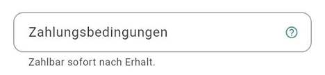

**Schritte**

1. Tippen Sie bei den **Rechnungsangaben** auf **Verzugszinsen**.
2. Geben Sie Ihre Klausel ein oder lassen Sie das Feld leer.
3. Tippen Sie auf **Speichern**.

**Gut zu wissen**

- Bleibt das Feld leer, wird nichts für Sie erfunden, außer bei einem Space in Frankreich, der einem Geschäftskunden eine Rechnung stellt: Dann wird der gesetzliche Wortlaut gedruckt (das Dreifache des gesetzlichen Zinssatzes).
- Klären Sie mit Ihrer Buchhaltung, welche Klausel für Ihr Land gilt.

**Siehe auch:** [Standard-Kundeneigenschaft](#standard-kundeneigenschaft)

<!-- anchor: user.money.legal.recovery -->
### Beitreibungspauschale

**Zielgruppe:** Inhaber

Sie geben die feste Pauschale für Beitreibungskosten an.

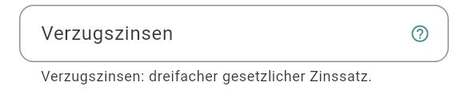

**Schritte**

1. Tippen Sie bei den **Rechnungsangaben** auf **Mahnpauschale**.
2. Geben Sie Ihre Klausel ein oder lassen Sie das Feld leer.
3. Tippen Sie auf **Speichern**.

**Gut zu wissen**

- Bleibt das Feld leer, wird die feste Pauschale von 40 € nur auf Rechnungen eines Space in Frankreich an einen Geschäftskunden gedruckt.
- Ein Verbraucher erhält diese Angabe nie.

**Siehe auch:** [Standard-Kundeneigenschaft](#standard-kundeneigenschaft)

<!-- anchor: user.money.legal.escompte -->
### Skonto

**Zielgruppe:** Inhaber

Sie geben an, ob frühes Zahlen einen Nachlass bringt.

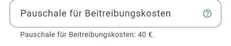

**Schritte**

1. Tippen Sie bei den **Rechnungsangaben** auf **Skonto**.
2. Geben Sie die Bedingungen Ihres Nachlasses ein oder lassen Sie das Feld leer.
3. Tippen Sie auf **Speichern**.

**Gut zu wissen**

- Bleibt das Feld leer, drucken Rechnungen eines Space in Frankreich an einen Geschäftskunden „Kein Skonto bei früher Zahlung.“; anderswo entfällt die Zeile, sofern Sie keine schreiben.

**Siehe auch:** [Zahlungsbedingungen](#zahlungsbedingungen)

<!-- anchor: user.money.legal.insurance -->
### Berufshaftpflicht

**Zielgruppe:** Inhaber

Wenn Ihre Tätigkeit verlangt, dass Sie Ihre Berufshaftpflichtversicherung nennen, wird sie auf Ihren Rechnungen gedruckt.

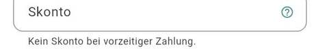

**Schritte**

1. Tippen Sie bei den **Rechnungsangaben** auf **Berufshaftpflicht**.
2. Geben Sie den Versicherer, die Police und den räumlichen Geltungsbereich so ein, wie sie lauten sollen.
3. Tippen Sie auf **Speichern**.

**Gut zu wissen**

- Es gibt keinen Standard: Ein leeres Feld druckt nichts.
- Ob Sie die Angabe machen müssen, hängt von Ihrer Tätigkeit ab. Fragen Sie Ihre Buchhaltung.

**Siehe auch:** [Besondere Angaben](#besondere-angaben)

<!-- anchor: user.money.legal.special-mentions -->
### Besondere Angaben

**Zielgruppe:** Inhaber

Eine eigene Zeile, die auf jeder Rechnung stehen muss.

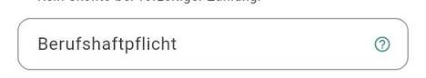

**Schritte**

1. Tippen Sie bei den **Rechnungsangaben** auf **Besondere Angaben**.
2. Geben Sie den Text ein.
3. Tippen Sie auf **Speichern**.

**Gut zu wissen**

- Ist das Feld leer, wird nichts gedruckt.
- Unter den Angaben legt das **Adressfenster**, sobald die Funktion **Adressfenster** eingeschaltet ist, fest, wo die Adresse des Empfängers sitzt, damit sie durch ein Fensterkuvert sichtbar ist.

**Siehe auch:** [Die PDF-Vorlage der Rechnung](#die-pdf-vorlage-der-rechnung)

<!-- anchor: user.money.vat.regime -->
### Steuerregime

**Zielgruppe:** Inhaber

Sie erklären, wie Ihre Organisation umsatzsteuerlich dasteht. Die Wahl entscheidet, welche Nummer Ihre Dokumente brauchen.

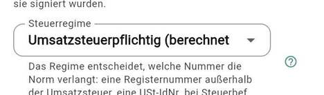

**Schritte**

1. Öffnen Sie [Rechtliche Identität & E-Rechnung](https://fdittgen-png.github.io/deskilo/#/legal-identity).
2. Wählen Sie beim **Steuerregime** **Nicht der Umsatzsteuer unterliegend**, **Umsatzsteuerfrei (Kleinunternehmerregelung)** oder **Umsatzsteuerpflichtig (berechnet USt.)**.
3. Tippen Sie auf **Speichern**.

**Gut zu wissen**

- Nicht der Umsatzsteuer unterliegend: Es wird keine Umsatzsteuer-ID gedruckt; die Registernummer identifiziert Sie.
- Steuerfrei oder steuerpflichtig: Ihre Umsatzsteuer-ID wird verlangt.
- Die Wahl des Regimes ist eine steuerliche Entscheidung, keine Software-Einstellung. Klären Sie sie mit Ihrer Buchhaltung, bevor Sie Rechnungen ausstellen.
- In dieser Version stellt die App Rechnungen selbst aus, für Spaces in Frankreich oder Deutschland, an inländische Kunden, unter dem Regime „umsatzsteuerpflichtig“ oder „außerhalb des Anwendungsbereichs“. Rechnungen unter dem Regime „steuerfrei“ werden außerhalb der App mit Ihrer Buchhaltung ausgestellt.

**Siehe auch:** [Umsatzsteuer-ID](#umsatzsteuer-id) · [Registernummer](#registernummer)

<!-- anchor: user.money.vat.reverse-charge -->
### Reverse-Charge für EU-Unternehmen

**Zielgruppe:** Inhaber

Wenn Sie Umsatzsteuer berechnen und ein Unternehmen in einem anderen EU-Land in Rechnung stellen, kann die Steuer vom Kunden geschuldet sein.

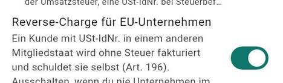

**Schritte**

1. Wählen Sie **Umsatzsteuerpflichtig (berechnet USt.)** als Regime.
2. Schalten Sie **Reverse-Charge für EU-Unternehmen** ein oder aus.
3. Tippen Sie auf **Speichern**.

**Gut zu wissen**

- Ein: Die App erkennt ein Unternehmen mit Umsatzsteuer-ID in einem anderen Mitgliedstaat. Heute stellt die App diese Rechnungen nicht selbst aus: Sie stellen sie außerhalb der App mit Ihrer Buchhaltung aus.
- Aus: Schalten Sie es aus, wenn Sie nie Unternehmen im Ausland in Rechnung stellen.
- Die Option erscheint nur beim Regime „umsatzsteuerpflichtig“.

**Siehe auch:** [USt-Behandlung eines Mitglieds](#ust-behandlung)

<!-- anchor: user.money.vat.due -->
### Wann die Umsatzsteuer entsteht

**Zielgruppe:** Inhaber

Die Umsatzsteuer jeder Rechnung entsteht an dem Tag, den das Gesetz Ihres Landes bestimmt — bei Zahlungseingang, mit Ausführung der Leistung oder mit der Rechnung. Sie behalten diese Regel oder wählen die Option, die Ihr Land erlaubt.

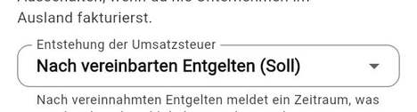

**Schritte**

1. Wählen Sie **Umsatzsteuerpflichtig (berechnet USt.)** als Regime.
2. Behalten Sie bei **Entstehung der Umsatzsteuer** die erste Option, die gesetzliche Regel Ihres Landes, oder wählen Sie die Option, die Ihr Land erlaubt: **Nach vereinnahmten Entgelten (Ist)** in Deutschland, **Nach vereinbarten Entgelten (Soll)** in Frankreich.
3. Tippen Sie auf **Speichern**.

**Gut zu wissen**

- Die gesetzliche Regel für Dienstleistungen: der Zahlungseingang in Frankreich; der Monat der Leistung in Deutschland und Spanien, Anzahlungen bei Zahlungseingang; die Rechnung oder die Zahlung, je nachdem, was zuerst erfolgt, in Italien, im Vereinigten Königreich und in Kanada; die Rechnung in der Schweiz.
- Nach vereinnahmten Entgelten fällt eine in Raten bezahlte Rechnung in so viele Zeiträume, wie sie Zahlungen hatte. Eine Gutschrift zählt bei ihrer Ausstellung (nach vereinnahmten Entgelten bei der Erstattung), nie im Zeitraum der berichtigten Rechnung.
- Die Wahl wird auf jeder Rechnung gedruckt und bestimmt gleichermaßen die [Umsatzsteuererklärung](#die-umsatzsteuer-voranmeldung-vorbereiten), den Umsatzsteuerbericht und die FEC- und DATEV-Exporte; DATEV erhält das Datum der Steuerperiode in Feld 116.
- Welche Option für Sie gilt, ist eine steuerliche Frage für Ihre Buchhaltung.
- Eine Rechnung behält die Regel, die sie aufgedruckt hat: auf Zahlungseingänge ausgestellt, wartet sie auf das Geld; mit der Option für die Sollbesteuerung entsteht die Steuer bei Ausstellung, gleich was der Bereich später wählt.

**Siehe auch:** [Die Umsatzsteuer-Voranmeldung vorbereiten](#die-umsatzsteuer-voranmeldung-vorbereiten)

<!-- anchor: user.money.vat.account -->
### Steuerkonto

**Zielgruppe:** Inhaber

Ihre Buchhaltung möchte die vereinnahmte Umsatzsteuer auf einem bestimmten Konto verbucht haben.

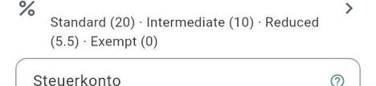

**Schritte**

1. Wählen Sie **Umsatzsteuerpflichtig (berechnet USt.)** als Regime.
2. Geben Sie Ihre Kontonummer im **Steuerkonto** ein.
3. Tippen Sie auf **Speichern**.

**Gut zu wissen**

- Der Buchhaltungsexport verbucht die vereinnahmte Umsatzsteuer auf diesem Konto. Bleibt das Feld leer, wird 445710 verwendet.

**Siehe auch:** [Buchhaltungsexporte](#buchhaltungsexporte)

<!-- anchor: user.money.vat.number -->
### Umsatzsteuer-ID

**Zielgruppe:** Inhaber

Ihre Umsatzsteuer-Identifikationsnummer erscheint auf Ihren Rechnungen und E-Rechnungen.

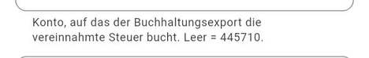

**Schritte**

1. Öffnen Sie [Rechtliche Identität & E-Rechnung](https://fdittgen-png.github.io/deskilo/#/legal-identity).
2. Geben Sie die Nummer bei der **Umsatzsteuer-ID** ein.
3. Tippen Sie auf **Speichern**.

**Gut zu wissen**

- Das Feld erscheint bei den Regimen „steuerfrei“ und „steuerpflichtig“. Außerhalb der Umsatzsteuer wird es durch die Registernummer ersetzt.
- Ihre Mitglieder haben in ihren Einstellungen eine eigene Umsatzsteuer-ID für ihre Dokumente.

**Siehe auch:** [Registernummer](#registernummer)

<!-- anchor: user.money.vat.exemption-reason -->
### Grund der Steuerbefreiung

**Zielgruppe:** Inhaber

Wenn keine Umsatzsteuer berechnet wird, verlangt das Gesetz meist, dass der Grund auf der Rechnung steht.

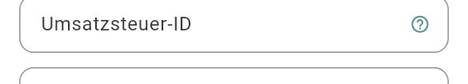

**Schritte**

1. Öffnen Sie [Rechtliche Identität & E-Rechnung](https://fdittgen-png.github.io/deskilo/#/legal-identity).
2. Geben Sie die Rechtsgrundlage bei **Grund der Steuerbefreiung** ein, zum Beispiel „Kein Ausweis von Umsatzsteuer, da Kleinunternehmer gemäß § 19 UStG“.
3. Tippen Sie auf **Speichern**.

**Gut zu wissen**

- Die App kann nicht wissen, welche Grundlage für Sie gilt. Lassen Sie sich den genauen Wortlaut von Ihrer Buchhaltung geben.
- Der Wortlaut wird auf der Rechnung gedruckt. Zurzeit stellt die App unter dem Regime „steuerfrei“ keine Rechnungen selbst aus: Sie werden außerhalb der App mit Ihrer Buchhaltung ausgestellt.

**Siehe auch:** [Steuerregime](#steuerregime)

<!-- anchor: user.money.legal.legal-id -->
### Registernummer

**Zielgruppe:** Inhaber

Wenn Sie außerhalb der Umsatzsteuer stehen, identifiziert Sie Ihre Registernummer auf E-Rechnungen.

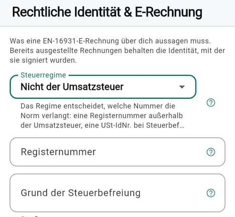

**Schritte**

1. Stellen Sie das **Steuerregime** auf **Nicht der Umsatzsteuer unterliegend**.
2. Geben Sie die Nummer bei der **Registernummer** ein.
3. Tippen Sie auf **Speichern**.

**Gut zu wissen**

- Bei den anderen Regimen wird dieses Feld durch die Umsatzsteuer-ID ersetzt.
- Ein Verein nutzt meist seine Eintragung (zum Beispiel RNA oder SIRET, falls vergeben).

**Siehe auch:** [Handelsregister](#handelsregister)

<!-- anchor: user.money.legal.address -->
### Strukturierte Adresse

**Zielgruppe:** Inhaber

Eine E-Rechnung braucht Ihre Adresse in einzelnen Teilen, nicht als ein Textblock.

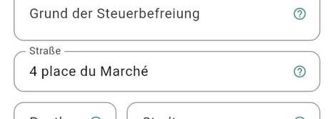

**Schritte**

1. Öffnen Sie [Rechtliche Identität & E-Rechnung](https://fdittgen-png.github.io/deskilo/#/legal-identity).
2. Füllen Sie **Straße**, **Postleitzahl** und **Ort** aus.
3. Tippen Sie auf **Speichern**.

**Gut zu wissen**

- Die Straße beginnt mit der Adresse, die schon in den Workspace-Einstellungen steht, sodass Sie sie ergänzen, statt sie neu einzutippen.
- Ohne die Postanschrift des Workspace können keine Rechnungen ausgestellt werden.

**Siehe auch:** [Adresse im Briefkopf](#adresse-im-briefkopf)

<!-- anchor: user.money.vat.rates -->
### Die Sätze festlegen

**Zielgruppe:** Inhaber · Abrechnungsadministrator:in

Sie listen die Umsatzsteuersätze auf, die Ihre Rechnungen verwenden dürfen. Was Mitglieder zahlen, ändert sich nicht: Die Preise enthalten die Umsatzsteuer, und die Steuer wird daraus herausgerechnet.

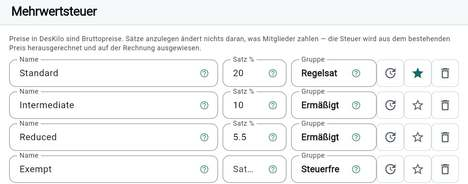

**Schritte**

1. Öffnen Sie [USt](https://fdittgen-png.github.io/deskilo/#/vat) (tippen Sie unter **Rechtliche Identität & E-Rechnung** auf **Steuersätze**).
2. Tippen Sie bei leerer Liste auf **Übliche Sätze übernehmen** (wenn Ihr Land einen Katalog hat), um mit den Sätzen Ihres Landes zu beginnen, oder auf **Satz hinzufügen** und füllen Sie den Namen und **Satz %** aus (0 bis 99,99).
3. Tippen Sie bei genau einem Satz auf den Stern, um ihn zum Standard zu machen.
4. Tippen Sie auf **Speichern**.

**Gut zu wissen**

- Die üblichen Sätze sind ein Ausgangspunkt. Welche Leistung unter welchen Satz fällt, ist eine Frage für Ihre Buchhaltung.
- Der Standardsatz wird von Abos und von allem verwendet, was keinen eigenen Satz hat.
- Ein Satz, den noch eine Rechnung oder eine Leistung verwendet, wird deaktiviert beibehalten statt gelöscht.
- Gilt bei Umsatzsteuerpflicht kein Standardsatz, kann keine Rechnung ausgestellt werden; der Bildschirm der rechtlichen Identität warnt davor.
- Dieser Bildschirm setzt die Funktion **USt-Verwaltung** voraus; der Eintrag Steuersätze im Bildschirm der rechtlichen Identität erscheint nur beim Regime „umsatzsteuerpflichtig“.

**Siehe auch:** [Steuergruppen](#steuergruppen) · [Änderung per Gesetz](#einen-satz-per-gesetz-ändern)

<!-- anchor: user.money.vat.groups -->
### Steuergruppen

**Zielgruppe:** Inhaber · Abrechnungsadministrator:in

Eine Gruppe sagt, um welche Art von Satz es sich handelt, damit die Rechnung ihn in die richtige Kategorie einordnet.

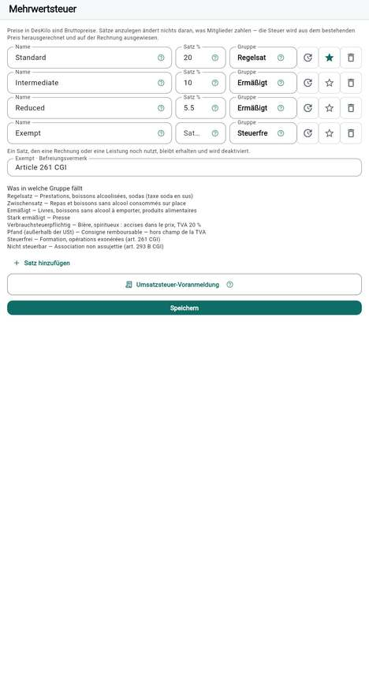

**Schritte**

1. Öffnen Sie [USt](https://fdittgen-png.github.io/deskilo/#/vat).
2. Wählen Sie bei jedem Satz, sobald die Funktion **USt-Gruppen** eingeschaltet ist, eine **Gruppe**: **Regelsatz**, **Zwischensatz**, **Ermäßigt**, **Stark ermäßigt**, **Nullsatz**, **Steuerfrei**, **Nicht steuerbar**, **Pfand (außerhalb der USt)** oder **Verbrauchsteuerpflichtig**.
3. Füllen Sie bei einer steuerfreien oder nicht steuerbaren Gruppe den erscheinenden **Befreiungsvermerk** aus.
4. Tippen Sie auf **Speichern**.

**Gut zu wissen**

- **Was in welche Gruppe fällt** listet Beispiele für Ihr Land auf, nur als Orientierung.
- Eine Zeile außerhalb der Umsatzsteuer, etwa ein Pfand zur Rückgabe, darf nicht mit besteuerten Zeilen in einem Dokument stehen; stellen Sie sie gesondert aus.

**Siehe auch:** [Die Sätze festlegen](#die-sätze-festlegen)

<!-- anchor: user.money.vat.change-by-law -->
### Einen Satz per Gesetz ändern

**Zielgruppe:** Inhaber · Abrechnungsadministrator:in

Ein Satz ändert sich ab einem bestimmten Datum. Frühere Leistungen behalten den alten Wert; der neue gilt ab diesem Tag.

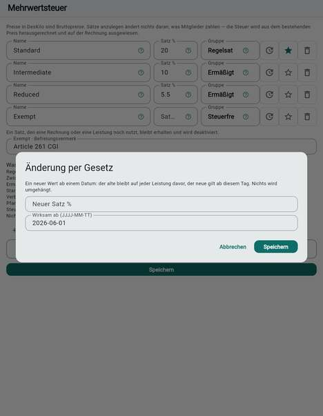

**Schritte**

1. Öffnen Sie [USt](https://fdittgen-png.github.io/deskilo/#/vat) und stellen Sie sicher, dass der Satz gespeichert ist.
2. Tippen Sie beim Satz auf die Schaltfläche **Änderung per Gesetz**.
3. Geben Sie **Neuer Satz %** und **Wirksam ab (JJJJ-MM-TT)** ein.
4. Tippen Sie im Dialog auf **Speichern**, dann auf dem Bildschirm auf **Speichern**.

**Gut zu wissen**

- Der alte Satz endet an diesem Datum und ein neuer beginnt; der Stern wandert mit, wenn es der Standard war.
- Bereits Ausgestelltes wird nicht umgehängt.

**Siehe auch:** [Die Sätze festlegen](#die-sätze-festlegen)

<!-- anchor: user.money.vat.declaration -->
### Die Umsatzsteuer-Voranmeldung vorbereiten

**Zielgruppe:** Inhaber

Sie möchten die Umsatzsteuer eines Zeitraums aus Ihren Rechnungen und Zahlungseingängen berechnet haben, bereit zur Abgabe beim Finanzamt oder zur Übergabe an Ihre Buchhaltung.

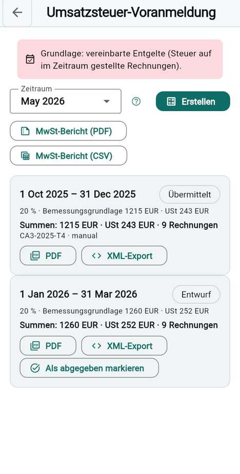

**Schritte**

1. Öffnen Sie die [Umsatzsteuer-Voranmeldung](https://fdittgen-png.github.io/deskilo/#/vat-declarations).
2. Wählen Sie den **Zeitraum** und tippen Sie auf **Vorbereiten**.
3. Öffnen Sie das Ergebnis mit **PDF** oder **XML-Export**, oder sehen Sie sich den **MwSt-Bericht (PDF)** und den **MwSt-Bericht (CSV)** an.
4. Geben Sie die Voranmeldung selbst beim Finanzamt ab (oder über Ihren Steuerberater), tippen Sie dann auf **Als abgegeben markieren** und geben Sie die **Referenz der Eingangsbestätigung des Finanzamts** ein.

**Gut zu wissen**

- Es gibt sie nur beim Regime „umsatzsteuerpflichtig“. Der Hinweis oben sagt, wann die Umsatzsteuer des Zeitraums entsteht.
- Der Server berechnet die Beträge aus den Rechnungen, den einzeln erfassten Zahlungseingängen und dem Steuerzeitpunkt jeder Rechnung. Jeder Steuersatz wird nach Kategorie aufgeteilt: Regelsatz, Reverse Charge, steuerfrei und Nullsatz bleiben getrennt. Sammelrechnungen bleiben außen vor; ihre Zahlung zählt für die zusammengefassten Rechnungen.
- Eine Voranmeldung geht von **Entwurf** über **Vorbereitet** zu **Abgegeben**. Erneutes Vorbereiten ersetzt die Beträge; abgegeben ändert sie nichts mehr. Hat sich seit der Vorbereitung eine Rechnung oder Zahlung des Zeitraums geändert, verweigert die App das Markieren als abgegeben, bis Sie sie erneut vorbereiten.
- Die App übermittelt keine Voranmeldung: Deutschland gibt über ELSTER ab, Frankreich über EDI-TVA oder den Unternehmensbereich von impots.gouv. Die E-Rechnungsplattform transportiert nur Rechnungen.
- Sie ist eine Hilfe zur Abgabe, keine Steuerberatung. Prüfen Sie sie vor der Abgabe anhand Ihrer Buchhaltung.

**Siehe auch:** [Wann die Umsatzsteuer entsteht](#wann-die-umsatzsteuer-entsteht) · [Buchhaltungsexporte](#buchhaltungsexporte)

<!-- anchor: user.money.einvoice.overview -->
### Die E-Rechnungs-Plattform

**Zielgruppe:** Inhaber · Abrechnungsadministrator:in

Sie sagen DesKilo, wohin es Ihre Rechnungen als maschinenlesbare Dateien senden soll.

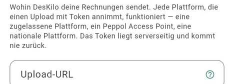

**Schritte**

1. Öffnen Sie die [E-Rechnungs-Plattform](https://fdittgen-png.github.io/deskilo/#/einvoice-config) (auch erreichbar über **Rechtliche Identität & E-Rechnung**).
2. Füllen Sie **Upload-URL** und **Token oder Zugangsdaten** aus, dazu die beiden optionalen Felder, wenn Ihre Plattform sie verlangt.
3. Tippen Sie auf **Speichern**. **Plattform entfernen** löscht die Einstellungen.

**Gut zu wissen**

- Jede Plattform, die einen Upload mit einem Token annimmt, funktioniert: eine zugelassene Plattform, ein Peppol-Zugangspunkt, eine nationale Plattform.
- Der Token wird auf dem Server gespeichert und nie wieder angezeigt.
- Die gültige Datei ist eine Rechnung nach EN 16931. Ob Ihr Land eine Plattform verlangt und welche, klären Sie mit Ihrer Buchhaltung.

**Siehe auch:** [Eine E-Rechnung senden](#eine-e-rechnung-senden) · [Rechtliche Identität](#ihre-rechtliche-identität)

<!-- anchor: user.money.einvoice.endpoint -->
### Upload-URL

**Zielgruppe:** Inhaber · Abrechnungsadministrator:in

Die Adresse, unter der Ihre Plattform Rechnungen entgegennimmt.

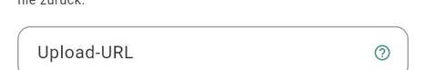

**Schritte**

1. Öffnen Sie die [E-Rechnungs-Plattform](https://fdittgen-png.github.io/deskilo/#/einvoice-config).
2. Fügen Sie die Adresse bei **Upload-URL** ein, genau so, wie Ihre Plattform sie dokumentiert.
3. Tippen Sie auf **Speichern**.

**Gut zu wissen**

- Sie stammt aus der Dokumentation Ihrer Plattform oder von Ihrem Anbieter.

**Siehe auch:** [Token oder Zugangsdaten](#token-oder-zugangsdaten)

<!-- anchor: user.money.einvoice.token -->
### Token oder Zugangsdaten

**Zielgruppe:** Inhaber · Abrechnungsadministrator:in

Das Geheimnis, das der Plattform beweist, dass der Upload von Ihnen stammt.

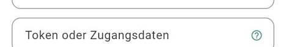

**Schritte**

1. Öffnen Sie die [E-Rechnungs-Plattform](https://fdittgen-png.github.io/deskilo/#/einvoice-config).
2. Fügen Sie den Schlüssel bei **Token oder Zugangsdaten** ein.
3. Tippen Sie auf **Speichern**.

**Gut zu wissen**

- Nach dem Speichern steht auf dem Bildschirm „Ein Token ist gespeichert“. Geben Sie nur dann einen neuen ein, wenn Sie ihn ersetzen wollen.
- Er wird auf dem Server aufbewahrt und kommt nie wieder heraus.

**Siehe auch:** [Auth-Header](#auth-header)

<!-- anchor: user.money.einvoice.auth-header -->
### Auth-Header

**Zielgruppe:** Inhaber · Abrechnungsadministrator:in

Der Name des Headers, der den Token trägt.

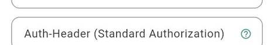

**Schritte**

1. Öffnen Sie die [E-Rechnungs-Plattform](https://fdittgen-png.github.io/deskilo/#/einvoice-config).
2. Erwartet Ihre Plattform einen anderen Header als den üblichen, geben Sie seinen Namen bei **Auth-Header (Standard Authorization)** ein.
3. Tippen Sie auf **Speichern**.

**Gut zu wissen**

- Bleibt das Feld leer, wird `Authorization` verwendet.

**Siehe auch:** [Feldname der Datei](#feldname-der-datei)

<!-- anchor: user.money.einvoice.file-field -->
### Feldname der Datei

**Zielgruppe:** Inhaber · Abrechnungsadministrator:in

Der Name des Formularfelds, das die Rechnungsdatei trägt.

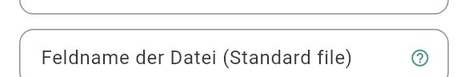

**Schritte**

1. Öffnen Sie die [E-Rechnungs-Plattform](https://fdittgen-png.github.io/deskilo/#/einvoice-config).
2. Erwartet Ihre Plattform einen anderen Feldnamen, geben Sie ihn bei **Feldname der Datei (Standard file)** ein.
3. Tippen Sie auf **Speichern**.

**Gut zu wissen**

- Bleibt das Feld leer, wird `file` verwendet.

**Siehe auch:** [Upload-URL](#upload-url)

<!-- anchor: user.money.einvoice.customer-delivery -->
### Zustelldienst des Kunden

**Zielgruppe:** Inhaber · Abrechnungsadministrator:in

Ihr Kunde erhält seine Rechnungen vielleicht nicht über eine staatliche Plattform, sondern über seinen eigenen Peppol-Zugangspunkt, ein Portal oder einen vereinbarten Upload-Dienst.

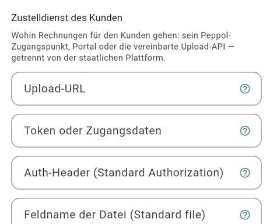

**Schritte**

1. Öffnen Sie die [E-Rechnungs-Plattform](https://fdittgen-png.github.io/deskilo/#/einvoice-config).
2. Füllen Sie beim **Zustelldienst des Kunden** dieselben vier Felder aus wie oben.
3. Tippen Sie auf **Speichern**.

**Gut zu wissen**

- Er ist von der staatlichen Plattform getrennt. Beide können eingerichtet sein, und jede Rechnung bietet beide Sendewege an.

**Siehe auch:** [Eine E-Rechnung senden](#eine-e-rechnung-senden)

<!-- anchor: user.money.einvoice.uat -->
### UAT-Endpunkt und -Token

**Zielgruppe:** Inhaber · Abrechnungsadministrator:in

Sie möchten üben, bevor Sie echte Rechnungen senden.

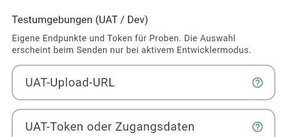

**Schritte**

1. Öffnen Sie die [E-Rechnungs-Plattform](https://fdittgen-png.github.io/deskilo/#/einvoice-config).
2. Füllen Sie unter **Testumgebungen (UAT / Dev)** **UAT-Upload-URL** und **UAT-Token oder Zugangsdaten** aus.
3. Tippen Sie auf **Speichern**.

**Gut zu wissen**

- Die Wahl der Umgebung erscheint beim Senden nur, solange der Entwicklermodus eingeschaltet ist.
- Ein Testversand wird als Testversand protokolliert.

**Siehe auch:** [Dev-Endpunkt und -Token](#dev-endpunkt-und--token)

<!-- anchor: user.money.einvoice.dev -->
### Dev-Endpunkt und -Token

**Zielgruppe:** Inhaber · Abrechnungsadministrator:in

Ein zweiter Test-Endpunkt, für die Entwicklung.

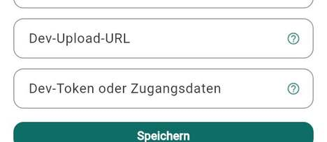

**Schritte**

1. Öffnen Sie die [E-Rechnungs-Plattform](https://fdittgen-png.github.io/deskilo/#/einvoice-config).
2. Füllen Sie unter **Testumgebungen (UAT / Dev)** **Dev-Upload-URL** und **Dev-Token oder Zugangsdaten** aus.
3. Tippen Sie auf **Speichern**.

**Gut zu wissen**

- Es gelten dieselben Regeln wie bei UAT. Der echte Versand geht immer an den Produktiv-Endpunkt.

**Siehe auch:** [UAT-Endpunkt und -Token](#uat-endpunkt-und--token)

<!-- anchor: user.money.einvoice.send -->
### Eine E-Rechnung senden

**Zielgruppe:** Inhaber · Abrechnungsadministrator:in

Sie möchten eine ausgestellte Rechnung in ihrer maschinenlesbaren Form übergeben.

**Schritte**

1. Öffnen Sie eine Rechnung unter [Rechnungsstellung](https://fdittgen-png.github.io/deskilo/#/invoices) und tippen Sie auf **E-Rechnung (XML)**.
2. Lesen Sie die Prüfung oben im Blatt: Sie sagt, ob die Datei bereit ist oder was fehlt.
3. Tippen Sie auf **An die staatliche Plattform senden**, **An den Dienst des Kunden senden**, oder laden Sie die Datei herunter bzw. teilen Sie sie (**Factur-X (PDF) herunterladen** trägt das XML im PDF).

**Gut zu wissen**

- Fehlt etwas, listet das Blatt es auf. **Rechtliche Identität vervollständigen** führt Sie zum Bildschirm, der es behebt.
- Eine Rechnung, die signiert wurde, bevor Sie Ihre Identität vervollständigt haben, behält, womit sie ausgestellt wurde. Markieren Sie sie als fehlerhaft und stellen Sie eine Ersatzrechnung aus, wenn es darauf ankommt.
- Welchen Weg ein Kunde nutzen muss, hängt von Ihrem Land und vom Kunden ab. Klären Sie das mit Ihrer Buchhaltung.

**Siehe auch:** [Die E-Rechnungs-Plattform](#die-e-rechnungs-plattform) · [Der Bildschirm Rechnungsstellung](#der-bildschirm-rechnungsstellung)

<!-- anchor: user.money.reports.invoice-template -->
### Die PDF-Vorlage der Rechnung

**Zielgruppe:** Inhaber · Abrechnungsadministrator:in

Sie möchten, dass Ihre Rechnungen nach Ihnen aussehen: Logo, Layout, Wortlaut.

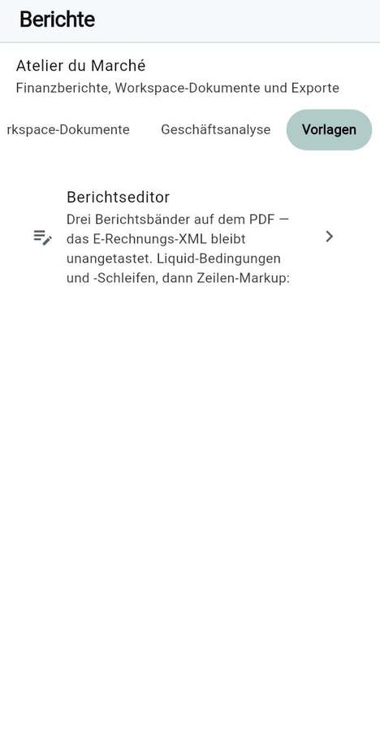

**Schritte**

1. Öffnen Sie [Berichte](https://fdittgen-png.github.io/deskilo/#/reports?section=templates) und den Reiter **Vorlagen**.
2. Tippen Sie auf **Berichtseditor**.

**Gut zu wissen**

- Die Vorlage ändert nur das PDF. Das XML der E-Rechnung wird nie angetastet.
- Jede Person mit der Berechtigung, Dokumente zu gestalten, kann das tun.
- Eine Vorlage, die sich nicht darstellen lässt, blockiert nie ein Dokument: Das eingebaute Layout übernimmt.

**Siehe auch:** [Der Berichtseditor](#der-berichtseditor)

<!-- anchor: user.money.reports.editor -->
### Der Berichtseditor

**Zielgruppe:** Inhaber · Abrechnungsadministrator:in

Sie gestalten ein Dokument auf einer Seite, statt Code zu schreiben.

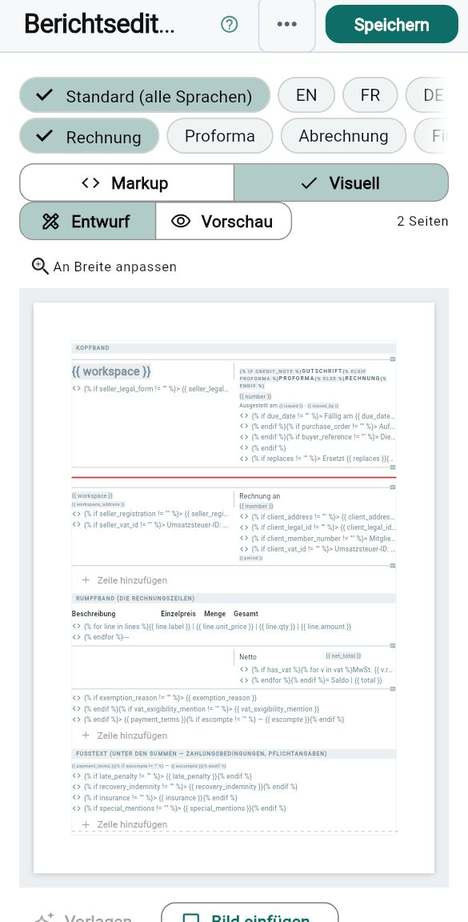

**Schritte**

1. Öffnen Sie den [Berichtseditor](https://fdittgen-png.github.io/deskilo/#/report-editor).
2. Wählen Sie das Dokument mit den Chips (Rechnung, Proforma, Abrechnung, Mahnungen und die anderen Berichte).
3. Tippen Sie im **Entwurf** auf eine Zeile, um sie zu bearbeiten, fügen Sie Zeilen hinzu oder ziehen Sie zum Umsortieren. Tippen Sie auf **Vorschau**, um es mit Ihren Daten zu sehen.
4. Tippen Sie auf **Speichern**.

**Gut zu wissen**

- Der Modus **Markup** bearbeitet dieselben Bänder als Text.
- **Bild einfügen** setzt ein Logo, einen Stempel oder eine Unterschrift aus der Bildbibliothek ein.
- Die **Schnellvorschau** stellt sofort mit Ihrer neuesten Rechnung dar, oder mit Beispieldaten, wenn es keine gibt. **Auf Standard zurücksetzen** bringt das eingebaute Layout zurück.
- **Diese Vorlage exportieren** und **Vorlage importieren** bringen einen Entwurf als Datei hinein und heraus. Die Option **Positioniertes Layout (XML)** ist für Dokumente gedacht, die zu einem Fensterkuvert oder einem nationalen Formular passen müssen.
- Beim Verlassen mit ungespeicherter Arbeit werden Sie vorher gefragt.

**Siehe auch:** [Vorlagen und Voreinstellungen](#fertige-vorlagen) · [Sprachen](#ein-entwurf-pro-sprache)

<!-- anchor: user.money.reports.presets -->
### Fertige Vorlagen

**Zielgruppe:** Inhaber · Abrechnungsadministrator:in

Sie beginnen mit einem fertigen Entwurf und ändern, was Sie möchten.

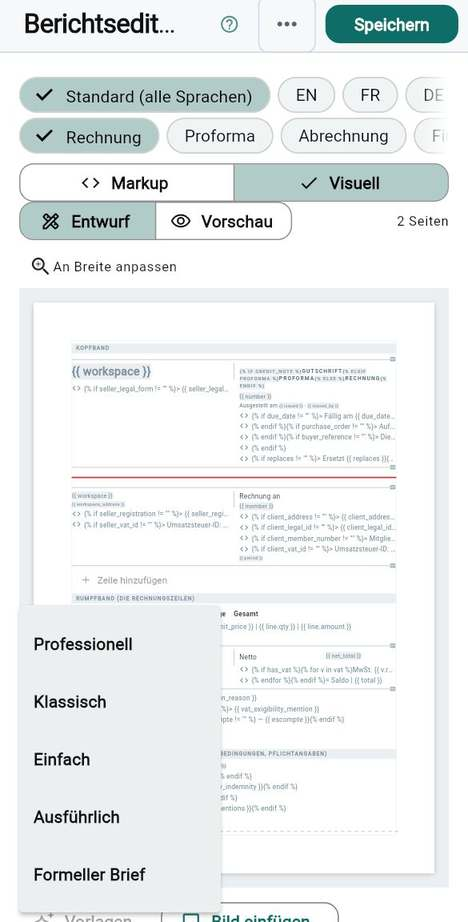

**Schritte**

1. Öffnen Sie den [Berichtseditor](https://fdittgen-png.github.io/deskilo/#/report-editor) und wählen Sie ein Dokument.
2. Tippen Sie auf **Vorlagen** und wählen Sie **Professionell**, **Klassisch**, **Einfach**, **Ausführlich** oder **Formeller Brief**.
3. Bestätigen Sie das Ersetzen, wenn die App fragt, bearbeiten Sie dann und **Speichern** Sie.

**Gut zu wissen**

- Das Ersetzen eines Layouts lässt sich mit **Rückgängig** zurücknehmen.
- Die strukturellen Berichte (Kontenplan, Badges, QR-Karten) haben ein mitgeliefertes Layout.
- Rechnungsvorlagen tragen bereits Ihre rechtlichen Angaben. Sie drucken weiterhin nur, was Sie unter den [Rechnungsangaben](#ihre-rechtliche-identität) eingegeben haben.

**Siehe auch:** [Der Berichtseditor](#der-berichtseditor)

<!-- anchor: user.money.reports.languages -->
### Ein Entwurf pro Sprache

**Zielgruppe:** Inhaber · Abrechnungsadministrator:in

Ihre Mitglieder lesen ihre Dokumente in ihrer eigenen Sprache.

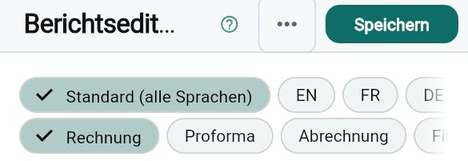

**Schritte**

1. Öffnen Sie den [Berichtseditor](https://fdittgen-png.github.io/deskilo/#/report-editor).
2. Wählen Sie unter dem Dokument **Standard (alle Sprachen)** oder eine der Sprachen EN, FR, DE, ES, IT.
3. Bearbeiten Sie die Bänder für diese Sprache und **Speichern** Sie. **Für diese Sprache den Standard verwenden** entfernt einen eigenen Entwurf.

**Gut zu wissen**

- Ein Punkt an einer Sprache bedeutet, dass sie einen eigenen Entwurf hat; sonst erbt sie den Standard.
- Das Dokument eines Mitglieds wird in dessen Sprache gedruckt, wenn dafür ein Entwurf existiert, sonst in der Standardsprache des Workspace.

**Siehe auch:** [Sprache des Workspace](#sprache-des-arbeitsbereichs)

<!-- anchor: user.invoicing.hub -->
### Der Bildschirm Rechnungsstellung

**Zielgruppe:** Inhaber · Abrechnungsadministrator:in

Sie sehen auf einen Blick, was auszustellen, was einzuziehen und was abgeschlossen ist.

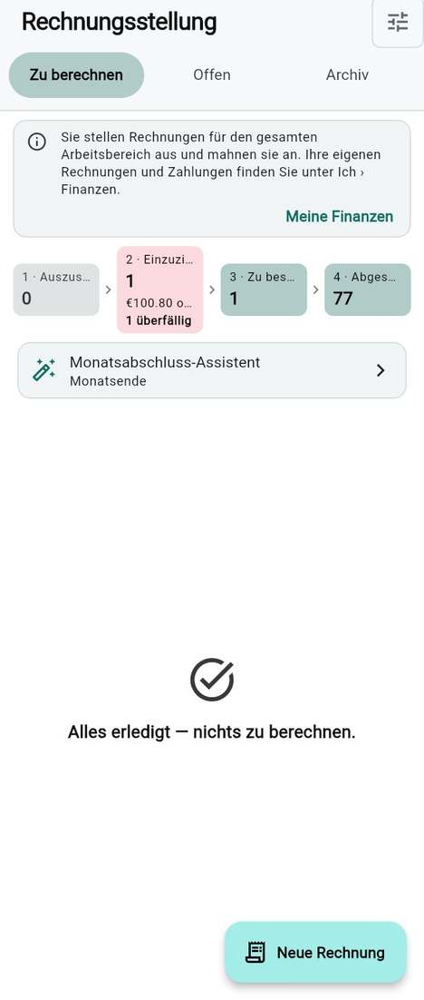

**Schritte**

1. Öffnen Sie [Rechnungsstellung](https://fdittgen-png.github.io/deskilo/#/invoices).
2. Lesen Sie den Streifen: **Auszustellen**, **Einzuziehen**, **Zu bestätigen**, **Abgeschlossen**.
3. Arbeiten Sie in den drei Reitern: **Zu berechnen** (Mitglieder mit erfasster Nutzung, noch nicht abgerechnet), **Offen** (ausgestellt, unbezahlt) und **Archiv** (bezahlt oder abgeschlossen).
4. Tippen Sie auf das Werkzeugsymbol für die anderen Werkzeuge.

**Gut zu wissen**

- Sie sehen die Rechnungen des gesamten Workspace. Ihre eigenen stehen in Ihren Finanzen, unter **Meine Finanzen**.
- Rechnungen werden nie bearbeitet oder gelöscht: Eine falsche wird als fehlerhaft markiert und ersetzt.
- Der Eintrag **So funktioniert die Fakturierung** erklärt, wer bei welchem Schritt am Zug ist.

**Siehe auch:** [Neue Rechnung](#eine-rechnung-ausstellen) · [Offene Rechnungen](#offene-rechnungen-nachverfolgen-und-begleichen)

<!-- anchor: user.invoicing.new-invoice -->
### Eine Rechnung ausstellen

**Zielgruppe:** Inhaber · Abrechnungsadministrator:in

Sie stellen einem Mitglied einen Monat in Rechnung.

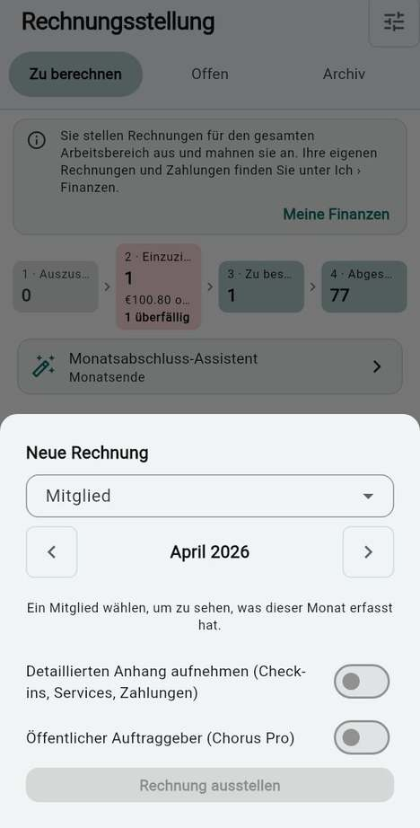

**Schritte**

1. Tippen Sie in der [Rechnungsstellung](https://fdittgen-png.github.io/deskilo/#/invoices) auf **Neue Rechnung** oder in einer Zeile von **Zu berechnen** auf **Ausstellen**.
2. Wählen Sie das **Mitglied** und den Monat. Die Positionen stammen aus dem Erfassten.
3. Schalten Sie **Detaillierten Anhang aufnehmen (Check-ins, Services, Zahlungen)** ein, wenn Sie ihn wünschen.
4. Tippen Sie auf **Rechnung ausstellen**. Unter **Zu berechnen** stellt **Alle berechnen** jede Zeile aus.

**Gut zu wissen**

- Rechnungen werden aus erfassten Daten abgeleitet und lassen sich nicht von Hand zusammenstellen. Die letzte Zeile ist der **Saldo**.
- Ein Monat kann pro Mitglied nur einmal abgerechnet werden, und bei einem laufenden Monat werden Sie gewarnt, dass sich Positionen ändern können.
- Fehlt eine erforderliche Angabe, listet **Vor der Ausstellung bitte ergänzen** sie auf (Adresse, Umsatzsteuer-ID, Befreiungsgrundlage, Steuersatz; auch das Land des Space, das Frankreich oder Deutschland sein muss).
- In dieser Version ist das Ausstellen in der App für Spaces in Frankreich oder Deutschland möglich, für inländische Kunden. Grenzüberschreitende Rechnungen, Rechnungen mit Steuerschuldnerschaft des Empfängers, Ausfuhrrechnungen und Rechnungen an befreite Käufer werden außerhalb der App mit Ihrer Buchhaltung ausgestellt.
- Eine ausgestellte Rechnung ist signiert und unveränderlich.

**Siehe auch:** [Monatsabschluss-Assistent](#der-monatsabschluss-assistent)

<!-- anchor: user.invoicing.open -->
### Offene Rechnungen nachverfolgen und begleichen

**Zielgruppe:** Inhaber · Abrechnungsadministrator:in

Sie verfolgen, was unbezahlt ist, und schließen es sauber ab.

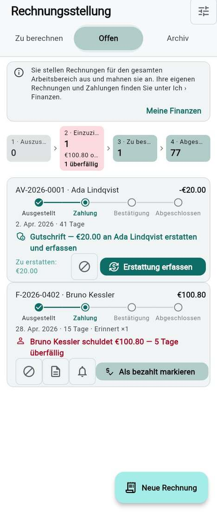

**Schritte**

1. Öffnen Sie in der [Rechnungsstellung](https://fdittgen-png.github.io/deskilo/#/invoices) den Reiter **Offen** und tippen Sie auf eine Rechnung.
2. Nutzen Sie die angebotenen Aktionen: **Zahlungserinnerung senden**, **Als bezahlt markieren** (eine erfasste Zahlung zuordnen), **Restbetrag stornieren**, **Als fehlerhaft markieren** oder das PDF teilen.
3. Bezahlte Rechnungen wandern ins **Archiv**.

**Gut zu wissen**

- Eine Rechnung gilt als bezahlt, sobald ihr eine echte Zahlung zugeordnet ist. Eine Differenz braucht eine Notiz oder, bei einem Überschuss, eine Gutschrift.
- Das Stornieren eines Restbetrags läuft über die Validierung.
- **Als fehlerhaft markieren** lässt sich nicht rückgängig machen. Tun Sie es vor der Zahlung, nie danach.

**Siehe auch:** [Mahnregeln](#mahnregeln) · [Rechnungen zusammenfassen](#rechnungen-zu-einer-zusammenfassen)

<!-- anchor: user.invoicing.wizard -->
### Der Monatsabschluss-Assistent

**Zielgruppe:** Inhaber · Abrechnungsadministrator:in

Ein geführter Weg für die Geldroutine: ausstellen, senden, mahnen, Zahlungen erfassen, zuordnen und abschließen.

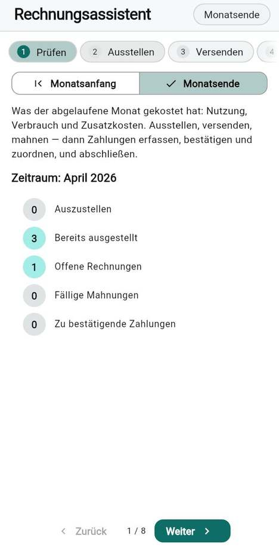

**Schritte**

1. Tippen Sie in der [Rechnungsstellung](https://fdittgen-png.github.io/deskilo/#/invoices) auf **Monatsabschluss-Assistent** (oder öffnen Sie den [Assistenten zur Rechnungsstellung](https://fdittgen-png.github.io/deskilo/#/invoicing/wizard)).
2. Wählen Sie den Lauf: **Monatsanfang** (Abos, die Mitglieder im Voraus für den kommenden Monat zahlen) oder **Monatsende** (Nutzung, Verbrauch und Zusatzkosten des gerade beendeten Monats). Das Datum schlägt einen vor.
3. Folgen Sie den Schritten: **Prüfen**, **Ausstellen**, **Senden**, **Mahnen**, **Zahlungen**, **Zuordnen**, **Abschließen**, **Zusammenfassung**.
4. Tippen Sie bei jedem Schritt auf **Weiter** und am Ende auf **Fertig**.

**Gut zu wissen**

- Sie können ein Mitglied abwählen, um es aus einem Stapel auszunehmen; bereits erledigte Mitglieder erscheinen als erledigt.
- Die **Zusammenfassung** listet auf, was der Lauf getan hat und was noch offen ist und wer am Zug ist.
- Ein Schritt, in dem nichts zu tun ist, sagt das.

**Siehe auch:** [Der Bildschirm Rechnungsstellung](#der-bildschirm-rechnungsstellung) · [Rechnungen zusammenfassen](#rechnungen-zu-einer-zusammenfassen)

<!-- anchor: user.invoicing.settlement -->
### Rechnungen zu einer zusammenfassen

**Zielgruppe:** Inhaber · Abrechnungsadministrator:in

Ein Mitglied hat mehrere offene Rechnungen und soll nur eine bezahlen.

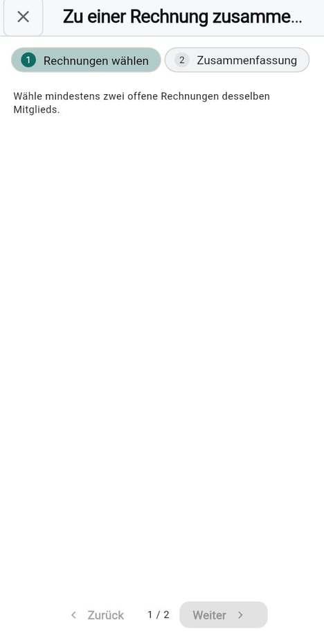

**Schritte**

1. Tippen Sie in der [Rechnungsstellung](https://fdittgen-png.github.io/deskilo/#/invoices) auf das Werkzeugsymbol und auf **Zu einer Rechnung zusammenfassen**.
2. Wählen Sie mindestens zwei offene Rechnungen desselben Mitglieds.
3. Bestätigen Sie. Sie werden gefragt, ob die zusammengefassten Rechnungen angehängt werden sollen.

**Gut zu wissen**

- Die neue Rechnung ist, was geschuldet und angemahnt wird. Die Originale bleiben dahinter lesbar.
- Zeilen und Umsatzsteuer werden übernommen; die Umsatzsteuererklärung zählt die Originale nur einmal.

**Siehe auch:** [Offene Rechnungen](#offene-rechnungen-nachverfolgen-und-begleichen)

<!-- anchor: user.invoicing.shared-expense -->
### Eine gemeinsame Ausgabe verteilen

**Zielgruppe:** Inhaber · Abrechnungsadministrator:in

Ein Kostenpunkt, den die Gemeinschaft teilt, wird auf die Mitglieder aufgeteilt.

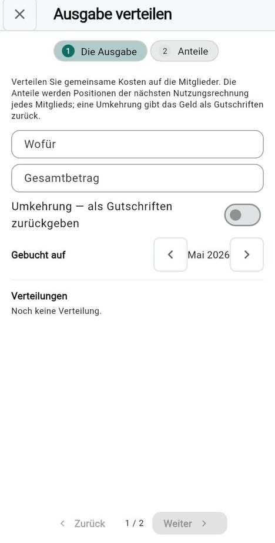

**Schritte**

1. Tippen Sie in der [Rechnungsstellung](https://fdittgen-png.github.io/deskilo/#/invoices) auf das Werkzeugsymbol und auf **Ausgabe verteilen**.
2. Beschreiben Sie **Die Ausgabe** und wählen Sie dann **Verteilen nach**: **Gleich**, **Abo**, **Nutzung** oder **Eigener Schlüssel**.
3. Prüfen Sie die **Anteile**, wählen Sie jemanden ab, um ihn **Ausnehmen**, und tippen Sie auf **Anteile buchen**.

**Gut zu wissen**

- Sobald sie gebucht sind (nach der Freigabe, falls eine Regel sie verlangt), landen die Anteile als Zeilen auf der nächsten Nutzungsrechnung jedes Mitglieds.
- **Umkehrung — als Gutschriften zurückgeben** gibt das Geld zurück.
- **Diese Regel merken** schlägt die angepasste Regel im nächsten Monat erneut vor.

**Siehe auch:** [Der Monatsabschluss-Assistent](#der-monatsabschluss-assistent)

<!-- anchor: user.money.reminders.rules -->
### Mahnregeln

**Zielgruppe:** Inhaber · Abrechnungsadministrator:in

Sie entscheiden, wann und wie oft eine überfällige Rechnung angemahnt wird.

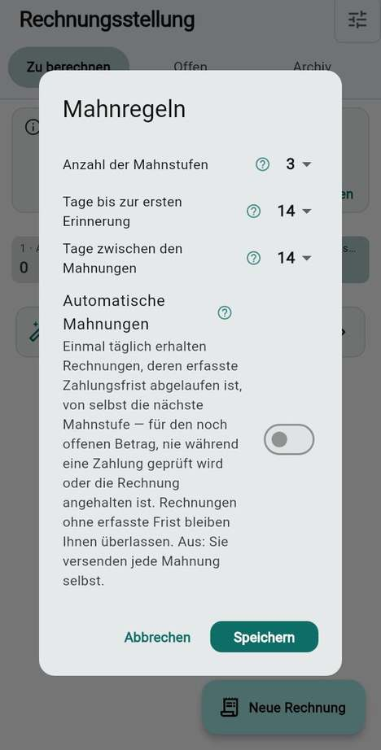

**Schritte**

1. Tippen Sie in der [Rechnungsstellung](https://fdittgen-png.github.io/deskilo/#/invoices) auf das Werkzeugsymbol und auf **Mahnregeln**.
2. Legen Sie die **Anzahl der Mahnstufen**, die **Tage bis zur ersten Erinnerung** und die **Tage zwischen den Mahnungen** fest.
3. Tippen Sie auf **Speichern**.

**Gut zu wissen**

- Mahnungen drucken die Zahlungsangaben, die Sie eingerichtet haben.
- Eine Mahnung wird zur Rechnung vermerkt und erscheint als Badge *Erinnert*.

**Siehe auch:** [Automatische Mahnungen](#automatische-mahnungen) · [Zahlungsbedingungen](#zahlungsbedingungen)

<!-- anchor: user.money.reminders.automatic -->
### Automatische Mahnungen

**Zielgruppe:** Inhaber · Abrechnungsadministrator:in

Sie möchten, dass Mahnungen von selbst hinausgehen.

**Schritte**

1. Öffnen Sie die **Mahnregeln** in den Werkzeugen der Rechnungsstellung.
2. Schalten Sie **Automatische Mahnungen** ein.
3. Tippen Sie auf **Speichern**.

**Gut zu wissen**

- Einmal am Tag erhalten Rechnungen, die ihre festgehaltene Zahlungsfrist überschritten haben, ihre nächste Stufe, über den noch offenen Betrag.
- Nie, solange eine Zahlung aussteht oder die Rechnung angehalten ist. Rechnungen ohne festgehaltene Frist bleiben Ihnen überlassen.
- Aus: Sie senden jede Mahnung selbst.
- Wann es läuft: jeden Morgen auf dem Server, sofern die Installation Aufgaben plant, sonst, wenn ein Administrator die Finanzen öffnet. Der Betreiber Ihres Servers weiß, was zutrifft.

**Siehe auch:** [Mahnregeln](#mahnregeln)

<!-- anchor: user.invoicing.register -->
### Das Rechnungsregister

**Zielgruppe:** Inhaber · Abrechnungsadministrator:in

Alle Rechnungen in einer sortierbaren Liste.

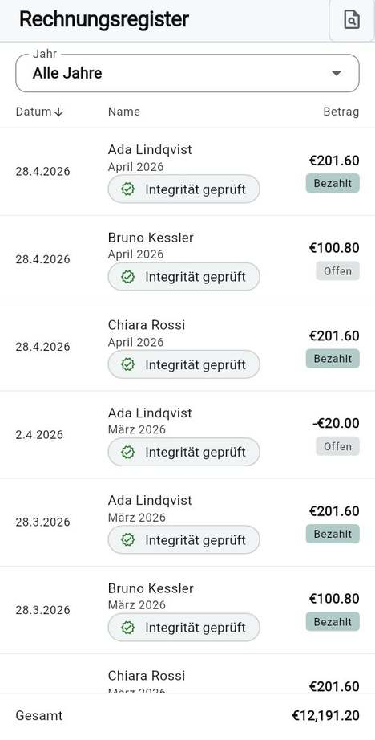

**Schritte**

1. Öffnen Sie das [Rechnungsregister](https://fdittgen-png.github.io/deskilo/#/invoice-register).
2. Wählen Sie das **Jahr** oder **Alle Jahre**.
3. Sortieren Sie nach **Datum**, **Bezeichnung** oder **Betrag**; die Summe steht unten.

**Gut zu wissen**

- Mitglieder sehen ihre eigenen; wer Rechnungen ausstellt, sieht die des Workspace.
- Der Buchhaltungsexport beginnt hier.

**Siehe auch:** [Buchhaltungsexporte](#buchhaltungsexporte)

<!-- anchor: user.invoicing.accounting-export -->
### Buchhaltungsexporte

**Zielgruppe:** Inhaber · Abrechnungsadministrator:in

Sie übergeben Ihrer Buchhaltung die Rechnungen und Zahlungen des Jahres.

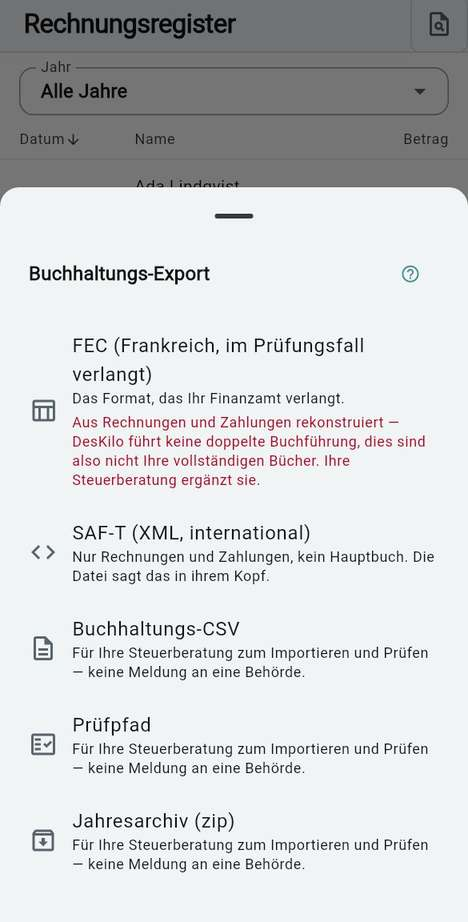

**Schritte**

1. Öffnen Sie das [Rechnungsregister](https://fdittgen-png.github.io/deskilo/#/invoice-register) und tippen Sie auf **Buchhaltungsexport**.
2. Wählen Sie im **Buchhaltungs-Export** ein Format, etwa **FEC (Frankreich, im Prüfungsfall verlangt)**, **SAF-T (XML, international)**, **Buchhaltungs-CSV**, **Prüfpfad** oder **Jahresarchiv (zip)**. Die Liste hängt von Ihrem Land ab; einige Länder fügen eigene hinzu, etwa **DATEV (Buchungsstapel)**.
3. Lesen Sie unter **Vor dem Speichern** die Prüfung und tippen Sie dann auf **Datei und Bericht speichern**.

**Gut zu wissen**

- Jedes Format sagt, was es beansprucht. „Zum Import und zur Prüfung durch Ihre Buchhaltung – keine Einreichung“ ist keine Steuererklärung.
- DesKilo führt kein doppeltes Hauptbuch: Die Dateien werden aus Rechnungen und Zahlungen neu aufgebaut, und Ihre Buchhaltung vervollständigt sie.
- Eine Datei ist gesperrt, bis Probleme in der Quelle behoben sind.
- Bei einigen Formaten steht der Hinweis, dass DesKilo in Ihrem Land keine zertifizierte Software ist.

**Siehe auch:** [Steuerkonto](#steuerkonto) · [Das Rechnungsregister](#das-rechnungsregister)

<!-- anchor: user.invoicing.bi -->
### Business-Analysen

**Zielgruppe:** Inhaber · Abrechnungsadministrator:in

Sie sehen sich an, wie der Workspace abschneidet.

**Schritte**

1. Öffnen Sie die [Business-Analysen](https://fdittgen-png.github.io/deskilo/#/bi) oder im Menü **Reporting**.
2. Wählen Sie die **Zeitraumlänge** (**Monat**, **Quartal**, **Jahr**), einen Vergleich und, wo angeboten, eine Gruppierung.
3. Lesen Sie die Analysen nach Bereich, etwa **Finanzen** (**Fakturiert**, **Eingenommen**) und **Flächen und Kapazität**.
4. Speichern Sie unter **Ansichten** eine Ansicht oder tippen Sie auf **Als PDF exportieren**.

**Gut zu wissen**

- Sie sehen nur Analysen, die Sie lesen dürfen.
- Eingenommen sind Zahlungen, die Rechnungen zugeordnet sind. Es ist kein Gewinn: Es sind keine Kosten in der Zahl.
- Der laufende Zeitraum ist unvollständig; seine Zahlen ändern sich noch.

**Siehe auch:** [Der Bildschirm Rechnungsstellung](#der-bildschirm-rechnungsstellung)

<!-- anchor: user.advanced.overview -->
## Erweitert

**Zielgruppe:** Inhaber · Betreiber:in

Das, was die tägliche Arbeit umgibt: die Testseite eines Space und die echte, Assistenten, der Aufgabenrekorder mit seinen geführten Touren, die Demo, die Apps auf jedem Gerät und was zu tun ist, wenn etwas nicht funktioniert.

In diesem Kapitel:
- [Ein Space hat zwei Seiten](#ein-space-hat-zwei-seiten) · [Eine Seite betreten](#die-echte-oder-die-testseite-betreten) · [Ein Testspace](#wofür-ein-testspace-da-ist) · [Wer ausrollen darf](#wer-ausrollen-und-in-die-produktion-darf) · [Zwischen den Seiten ausrollen](#zwischen-den-beiden-seiten-ausrollen) · [Status des Workspace und das Jahresarchiv](#status-des-workspace-und-das-jahresarchiv)
- [Ihr eigener Server](#einen-eigenen-server-betreiben)
- [Assistenten](#assistenten-was-sie-sind) · [Einen Assistenten verbinden](#einen-assistenten-verbinden) · [Freigaben](#freigaben-und-bestätigungen-für-assistenten) · [Was Assistenten dürfen](#was-assistenten-in-einem-workspace-dürfen)
- [Der Aufgabenrekorder](#der-aufgabenrekorder-und-geführte-touren) · [Eine Aufgabe aufzeichnen](#eine-aufgabe-aufzeichnen) · [Eine Aufzeichnung prüfen](#eine-aufzeichnung-prüfen-bearbeiten-und-exportieren) · [Eine Anleitung erstellen](#aus-einer-aufzeichnung-eine-anleitung-erstellen) · [Einer Anleitung folgen](#einer-anleitung-folgen) · [Das Kreismenü](#das-kreismenü) · [Eine Anleitung bearbeiten](#eine-anleitung-bearbeiten-oder-reparieren) · [Datenschutz der Aufzeichnungen](#was-eine-aufzeichnung-behält)
- [Der Demo-Workspace](#der-demo-workspace) · [Aufnahmemodus](#aufnahmemodus)
- [Plattformen](#deskilo-auf-ihren-geräten) · [Supportdetails](#supportdetails) · [Wenn etwas nicht funktioniert](#wenn-etwas-nicht-funktioniert)
- [Die Wörter der App](#die-wörter-der-app) · [Barrierefreiheit und Tastatur](#barrierefreiheit-und-tastatur) · [Mehr Hilfe](#wo-es-mehr-hilfe-gibt)

<!-- anchor: user.advanced.environments -->
### Ein Space hat zwei Seiten

**Zielgruppe:** Inhaber

Sie möchten einen Ort zum Ausprobieren, ohne die echten Buchungen und Rechnungen anzufassen. Ein Space kann als Paar angelegt werden: eine Testseite und eine echte Seite mit demselben Namen.

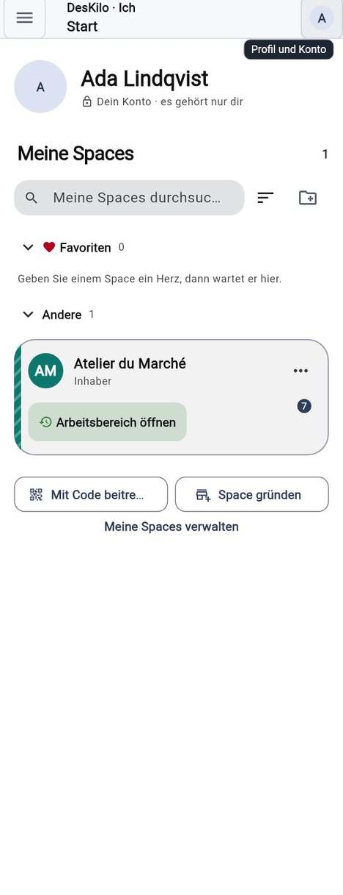

**Schritte**

1. Lassen Sie beim Anlegen eines Space **Das Paar Entwicklung und Produktion anlegen** angehakt. Beide Seiten gehören Ihnen von der ersten Sekunde an.
2. Sie haben schon einen einzelnen Space? Öffnen Sie die [Einstellungen](https://fdittgen-png.github.io/deskilo/#/settings), gehen Sie zu **Governance** und tippen Sie auf **Zwilling anlegen**. Die Konfiguration wird einmal kopiert.
3. Ab dann sind die beiden Seiten unabhängig. Nur eine Ausrollung bringt etwas von der einen auf die andere.

**Gut zu wissen**

- Die Entwicklungsseite heißt **Entwicklung — zum Ausprobieren**. Die Produktionsseite heißt **Produktion — die Rechnungen sind geschuldet**.
- Jedes auf der Entwicklungsseite gedruckte Dokument trägt ein Wasserzeichen, damit es nicht mit einem echten verwechselt wird.
- **Zwilling anlegen** erscheint nur, wenn die Funktion **Umgebungspaare** eingeschaltet ist, und nur für den Inhaber. Das Ausspielen zwischen den Seiten liegt bei den Inhabern der Deploy-Berechtigungen.
- Mitglieder, Buchungen, Rechnungen und Zahlungen werden nie zwischen den Seiten kopiert.

**Siehe auch:** [Eine Seite betreten](#die-echte-oder-die-testseite-betreten) · [Ein Testspace](#wofür-ein-testspace-da-ist)

<!-- anchor: user.advanced.enter-environment -->
### Die echte oder die Testseite betreten

**Zielgruppe:** Alle

Sie möchten einen Space auf der Seite öffnen, die Sie brauchen. Ihr Konto sieht beide Seiten eines Paars, jede mit einer eigenen Schaltfläche.

**Schritte**

1. Öffnen Sie [Ich](https://fdittgen-png.github.io/deskilo/#/me) und suchen Sie den Space unter **Meine Spaces**.
2. Tippen Sie auf **Arbeitsbereich öffnen** für die echte Seite oder auf **Testbereich** für die Seite zum Üben.
3. Oder öffnen Sie die [Profile](https://fdittgen-png.github.io/deskilo/#/profiles): Das Paar ist eine Karte. Tippen Sie darauf, dann auf **Umgebung wählen** zwischen **DEV** und **PROD**.

**Gut zu wissen**

- Eine Seite, die Sie nicht betreten dürfen, ist ausgegraut und tut nichts.
- Wer Mitglied der echten Seite ist, ist immer auch Mitglied der Testseite.
- Die Test-Schaltfläche trägt den Hinweis „Testbereich: Übungsbuchungen und -rechnungen“; die echte „Echte Buchungen und Rechnungen“.

**Siehe auch:** [Wer ausrollen darf](#wer-ausrollen-und-in-die-produktion-darf)

<!-- anchor: user.advanced.test-space -->
### Wofür ein Testspace da ist

**Zielgruppe:** Inhaber

Sie wollen Preise, Regeln oder den Plan ändern und zuerst die Wirkung sehen. Tun Sie es im Testspace.

**Schritte**

1. Betreten Sie die Testseite mit **Testbereich**.
2. Konfigurieren Sie, importieren Sie eine Space-Datei, laden Sie eine Kollegin oder einen Kollegen ein, stellen Sie eine Probe-Rechnung aus, verschieben Sie Plätze, drucken Sie.
3. Wenn alles stimmt, [rollen Sie es auf die echte Seite aus](#zwischen-den-beiden-seiten-ausrollen).

**Gut zu wissen**

- Der Schalter **Art des Space** in den [Einstellungen](https://fdittgen-png.github.io/deskilo/#/settings) (unter **Governance**) sagt, welche Art ein Space ist. Nur Inhaber sehen ihn.
- Wenn Sie einen Space zur Produktion erklären, fragt die App **Diesen Space zur Produktion erklären?** — das Banner verschwindet und Dokumente verlieren ihr Wasserzeichen. Bereits ausgestellte Rechnungen behalten das Wasserzeichen, das sie hatten.
- Erklären Sie einen Space nur dann zur Produktion, wenn die Rechnungen, die ihn verlassen, wirklich geschuldet sind.
- Wenn Sie jemanden einladen, können Sie wählen, ob die Person auch den Produktions-Space erreicht: **Testbereich** oder **Produktions-Workspace**. Dem Testspace tritt sie in jedem Fall bei.

**Siehe auch:** [Ein Space hat zwei Seiten](#ein-space-hat-zwei-seiten)

<!-- anchor: user.advanced.deploy-permissions -->
### Wer ausrollen und in die Produktion darf

**Zielgruppe:** Inhaber · Mitinhaber

Sie entscheiden, wer die echte Seite anfassen darf. Drei Berechtigungen in der Rollenmatrix steuern das.

**Schritte**

1. Öffnen Sie die [Rollen](https://fdittgen-png.github.io/deskilo/#/roles).
2. Suchen Sie **Den Produktionsraum betreten**, **In die Entwicklung ausrollen** und **In die Produktion ausrollen**.
3. Schalten Sie jede für die Rollen ein, die sie brauchen.

**Gut zu wissen**

- Inhaber und Mitinhaber haben alle drei. Administratoren haben **In die Entwicklung ausrollen** und **Den Produktionsraum betreten**. Mitglieder haben keine, bis Sie sie vergeben.
- Wer in die Produktion ausrollen darf, darf immer auch in die Entwicklung ausrollen.
- Eine Rolle betritt die Produktionsseite nur, solange sie **Den Produktionsraum betreten** hat: Eine Einladung oder ein Beitritt in die Produktion wird sonst abgelehnt, und die App sagt warum.

**Siehe auch:** [Die Rollenmatrix](#die-rollenmatrix) · [Zwischen den Seiten ausrollen](#zwischen-den-beiden-seiten-ausrollen)

<!-- anchor: user.advanced.deploy -->
### Zwischen den beiden Seiten ausrollen

**Zielgruppe:** Inhaber · Mitinhaber · Administrator:in

Sie haben die Konfiguration auf einer Seite festgelegt und möchten, dass die andere sie bekommt.

**Schritte**

1. Stellen Sie sich auf die Seite, in die geschrieben werden soll, und öffnen Sie [Einstellungen](https://fdittgen-png.github.io/deskilo/#/settings) → **Governance** → [Ausrollung](https://fdittgen-png.github.io/deskilo/#/deployment).
2. Haken Sie an, was mitreisen soll. Die Objekte sind gruppiert als **Konfiguration**, **Stammdaten** und **Berichte**; was ein Objekt **braucht**, wird mit angehakt.
3. Tippen Sie auf **Aus der PROD holen…** (von der Entwicklungsseite aus) oder **Aus der DEV holen…** (von der Produktionsseite aus).
4. Lesen Sie die Vorschau: **Was sich auf der Produktionsseite ändert**, oder auf der Entwicklungsseite. Wenn beide Seiten übereinstimmen, steht dort **Keine Änderung**.
5. Bestätigen Sie. Die Frage nennt die Seite, in die geschrieben wird: **In diese DEV ausrollen?** oder **In diese PROD ausrollen?**

**Gut zu wissen**

- Eine Ausrollung geht immer in die Seite, auf der Sie stehen. Nichts kann versehentlich auf die andere Seite geschoben werden.
- Jede Ausrollung landet im **Journal**. **Zurückrollen** bei der letzten stellt wieder her, was die Seite vorher hatte.
- Raumpläne werden zusammengeführt: Was nur diese Seite hat, bleibt erhalten, weil ein Platz eine Buchung tragen kann. Badge-Tags reisen nie mit.
- Mitglieder, Buchungen, Rechnungen, Zahlungen, Ereignisse und Zugangsdaten reisen nie mit.
- Der Eintrag erscheint nur, wenn die Funktion **Ausrollungen** eingeschaltet ist, der Space einen Zwilling hat und Sie eine Ausroll-Berechtigung haben.

**Siehe auch:** [Wer ausrollen darf](#wer-ausrollen-und-in-die-produktion-darf)

<!-- anchor: user.advanced.status-archive -->
### Status des Workspace und das Jahresarchiv

**Zielgruppe:** Inhaber · Administrator:in · Abrechnungsadministrator:in

Sie möchten auf einen Blick sehen, was der Space in Rechnung gestellt und eingenommen hat, und eine vollständige Datei des Jahres für Ihre Unterlagen.

**Schritte**

1. Öffnen Sie die [Lage des Arbeitsbereichs](https://fdittgen-png.github.io/deskilo/#/money/status). Wählen Sie die Monate bei **Von** und **Bis**.
2. Lesen Sie **Fakturiert**, **Gutschriften**, **Zugeordnete Zahlungen**, **Eingegangene Zahlungen**, **Erstattete Ausgaben**, **Umgelegte Ausgaben** und **Gewährte Gutschriften**; **Netto** fasst es zusammen. Tippen Sie auf den Drucker, um die **Lage drucken**.
3. Wählen Sie für die Jahresdatei in den Rechnungsexporten **Jahresarchiv (zip)**.

**Gut zu wissen**

- **Netto** ist weder ein Gewinn noch ein Kontostand. Zugeordnete und eingegangene Zahlungen überschneiden sich, addieren Sie sie also nicht.
- Die Lage erscheint, wenn die Funktion **Lage des Arbeitsbereichs** eingeschaltet ist.
- Ein Entwicklungsspace erzeugt mit DEV gekennzeichnete Dateien: Sie sind nicht die echten Bücher.

**Siehe auch:** [Workspace-Bericht](#arbeitsbereichsbericht)

<!-- anchor: user.advanced.own-server -->
### Einen eigenen Server betreiben

**Zielgruppe:** Betreiber:in · Inhaber

Sie möchten die Daten Ihrer Gemeinschaft auf einem Server, den Sie kontrollieren, oder Sie gehören einer Organisation an, die einen betreibt.

**Schritte**

1. Lesen Sie unter [So betreiben Sie Ihren eigenen](#so-betreiben-sie-einen-eigenen), wie ein Server eingerichtet wird.
2. Richten Sie die App auf jedem Gerät darauf aus: [Ihr eigener Server](#ihr-eigener-server).
3. Prüfen Sie [Ich](https://fdittgen-png.github.io/deskilo/#/me) → **Wo meine Spaces liegen**: Dort stehen die Server, die dieses Konto nutzt.

**Gut zu wissen**

- Die App zeigt für die Anmeldung auf einen Server; **Dieses Gerät nutzt** zeigt, auf welchen. Die weiteren Server, denen Sie angehören, erscheinen unter **Wo meine Spaces liegen**.
- Eine Einladung wird nur auf ihrem eigenen Server geprüft, treten Sie einem Space also bei, während die App auf den Server zeigt, der sie ausgestellt hat.
- Ein Betreiber kann Assistenten für die ganze Installation einschalten — siehe [Freigaben](#freigaben-und-bestätigungen-für-assistenten).

**Siehe auch:** [Ihr eigener Server](#ihr-eigener-server)

<!-- anchor: user.advanced.assistants -->
### Assistenten: was sie sind

**Zielgruppe:** Alle

Ein KI-Assistent wie Claude oder ChatGPT kann in DesKilo Dinge für Sie nachsehen und buchen. Er handelt als Sie, nur in den Workspaces und für die Aktionen, die Sie freigeben.

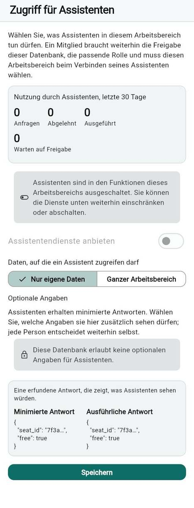

**Schritte**

1. Öffnen Sie die [Assistenten](https://fdittgen-png.github.io/deskilo/#/assistants). **Wo Sie hier stehen** listet, was für Sie noch fehlt: **Anmeldung mit Google**, **Identität für Assistenten**, **Freigabe der Datenbank**, **Angebot des Arbeitsbereichs**, **Ihre Rolle**, **Ihre Zustimmung**, **Server**.
2. Arbeiten Sie die Liste ab; jede Zeile sagt, wer den nächsten Schritt tut.

**Gut zu wissen**

- Mehrere Personen wirken mit: Sie, die Inhaberin oder ein Administrator des Workspace, eine Datenbankadministratorin und der Betreiber der Installation. Keine einzelne Person kann alles öffnen.
- Das Einschalten von Assistenten gibt für sich allein niemandem etwas.
- Unter **Verbundene Assistenten** sehen Sie, was verbunden ist, und können es **Trennen**. **Ihre Nutzung durch Assistenten heute** zählt **Anfragen**, **Abgelehnt**, **Ausgeführt** und **Wartet auf Validierung**.

**Siehe auch:** [Einen Assistenten verbinden](#einen-assistenten-verbinden)

<!-- anchor: user.advanced.assistants-connect -->
### Einen Assistenten verbinden

**Zielgruppe:** Mitglied · Administrator:in · Inhaber

Sie möchten, dass Ihr Assistent mit Ihren eigenen Buchungen und Ihrem Konto arbeitet.

**Schritte**

1. Öffnen Sie [Einen Assistenten verbinden](https://fdittgen-png.github.io/deskilo/#/assistants/connect). Unter **Bevor Sie verbinden** sollte jede Zeile **Erledigt** sagen.
2. Wählen Sie unter **Welchen Assistenten verwenden Sie?** **Claude**, **Claude Code**, **ChatGPT**, **Cursor**, **VS Code** oder **Andere**. Kopieren Sie **Ihre DesKilo-Adresse für Assistenten** dort hinein, wie die Schritte zeigen.
3. Melden Sie sich an, wenn der Assistent fragt, und wählen Sie dann diesen Workspace und was der Assistent dort tun darf.
4. Tippen Sie auf **Verbindung testen** und fragen Sie Ihren Assistenten: „Was sind mit DesKilo meine Buchungen diese Woche?“

**Gut zu wissen**

- Der Assistent selbst bittet Sie, den Workspace und jede Art von Vorgang freizugeben; nichts wird für Sie entschieden.
- Zum Verbinden braucht der Workspace die Funktion **MCP-Schnittstelle**. Ist sie aus, schickt der Bildschirm Sie zu den Assistenten.
- Es klappt nicht? **Verbindung testen** sagt, worauf noch gewartet wird.
- **Trennen** entfernt den Assistenten aus jedem Workspace dieser Datenbank. Was er schon gelesen hat, wird nicht zurückgenommen.

**Siehe auch:** [Freigaben](#freigaben-und-bestätigungen-für-assistenten)

<!-- anchor: user.advanced.assistants-approve -->
### Freigaben und Bestätigungen für Assistenten

**Zielgruppe:** Inhaber · Betreiber:in

Assistenten werden in Schichten freigegeben, damit eine Person nicht allein einen einschalten kann.

**Schritte**

1. Der Inhaber des Workspace (oder wer die Integrationen verwaltet) öffnet die [Assistenten-Einrichtung](https://fdittgen-png.github.io/deskilo/#/settings/assistant-setup) und arbeitet sie ab: **Assistenten für diesen Arbeitsbereich einschalten**, **Festlegen, was Assistenten dürfen**.
2. Jedes Mitglied fragt einmal: **Freigabe anfragen**. Eine Datenbankadministratorin entscheidet in den [Assistenten-Freigaben](https://fdittgen-png.github.io/deskilo/#/database/assistant-approvals) mit **Freigeben** oder **Ablehnen**.
3. Der Betreiber der Installation öffnet [Installation: Assistenten](https://fdittgen-png.github.io/deskilo/#/installation/assistants) und tippt auf **Für alle Arbeitsbereiche einschalten**. Die Seite listet außerdem **Datenbankadministratoren** und **Assistenten-Clients**, jeweils **Freigegeben**, **Gesperrt** oder **Wartet auf Freigabe**.
4. Sendet ein Assistent eine Anfrage mit großer Tragweite, werden Sie gefragt: **Anfrage eines Assistenten bestätigen**. **Bestätigen** lässt ihn genau diese Anfrage einmal senden; **Ablehnen** tut nichts.

**Gut zu wissen**

- Freigaben und die Änderungen der Installation brauchen Ihren zweiten Faktor.
- Die Freigabe läuft ab; der Bildschirm nennt die verbleibenden Tage, und Sie fragen erneut an.
- Eine bestätigte Anfrage folgt weiterhin den Validierungsregeln des Workspace.
- Gibt es keine andere Datenbankadministratorin, gibt der Betreiber den Zugang mit einer Begründung für bis zu 30 Tage frei.

**Siehe auch:** [Was Assistenten dürfen](#was-assistenten-in-einem-workspace-dürfen)

<!-- anchor: user.advanced.assistants-policy -->
### Was Assistenten in einem Workspace dürfen

**Zielgruppe:** Inhaber · Administrator:in

Sie entscheiden, welche Dienste ein Workspace Assistenten anbietet.

**Schritte**

1. Öffnen Sie den [Assistentenzugriff](https://fdittgen-png.github.io/deskilo/#/settings/assistants).
2. Schalten Sie **Assistentendienste anbieten** ein.
3. Wählen Sie unter **Daten, auf die ein Assistent zugreifen darf** **Nur eigene Daten** oder **Ganzer Arbeitsbereich**.
4. Haken Sie die Vorgänge an, in Gruppen: **Eigene Buchungen und Konto**, **Finanzanfragen**, **Mitgliedschaftsanfragen**, **Freigaben**.
5. Tippen Sie auf **Speichern**.

**Gut zu wissen**

- Die Vorgänge lauten etwa „Freie Plätze ansehen“, „Einen Platz für Sie buchen“, „Sie einchecken“ oder „Ihre noch nicht begonnenen Buchungen stornieren“.
- Assistenten erhalten reduzierte Antworten. Mit den **Optionalen Angaben** erlauben Sie mehr; jede Person entscheidet dennoch selbst.
- Bereits verbundene Assistenten erhalten neue Dienste erst, wenn jede Person erneut freigibt.
- Schalten Sie zuerst die Funktion **MCP-Schnittstelle** unter [Funktionen](https://fdittgen-png.github.io/deskilo/#/features) ein. Sie ist standardmäßig aus.
- Das ist für Personen mit der Integrations-Berechtigung; Inhaber haben sie immer.

**Siehe auch:** [Ein Funktionsschalter](#ein-funktionsschalter)

<!-- anchor: user.advanced.recorder -->
### Der Aufgabenrekorder und geführte Touren

**Zielgruppe:** Alle

Sie möchten jemandem zeigen, wie eine Aufgabe geht, oder es selbst gezeigt bekommen. Zeichnen Sie die Aufgabe einmal auf, machen Sie daraus eine Anleitung und folgen Sie ihr Schritt für Schritt in der echten App.

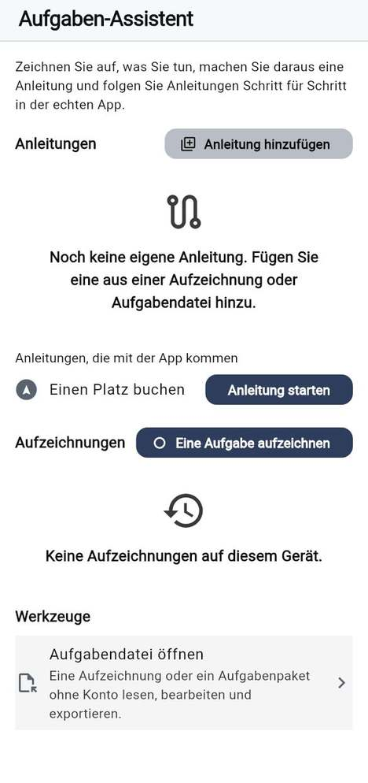

**Schritte**

1. Öffnen Sie den [Aufgaben-Assistenten](https://fdittgen-png.github.io/deskilo/#/task-wizard): im Menü auf einem breiten Bildschirm oder unter **Erweitert** in [Ich](https://fdittgen-png.github.io/deskilo/#/me).
2. **Anleitungen** enthält Ihre eigenen Anleitungen und die mitgelieferten, etwa **Einen Platz buchen**.
3. **Aufzeichnungen** listet die Aufgaben, die Sie aufgezeichnet haben, und **Eine Aufgabe aufzeichnen** startet eine neue.
4. **Werkzeuge** öffnet eine Aufgabendatei ohne Konto.

**Gut zu wissen**

- Alles bleibt auf Ihrem Gerät, bis Sie es exportieren.
- Der Aufgabenrekorder ist eine Funktion (**Aufgabenrekorder**). Ist sie aus, erscheint der Aufgaben-Assistent nicht in den Menüs.
- Zum Aufzeichnen oder zum Befolgen einer Anleitung müssen Sie angemeldet sein.

**Siehe auch:** [Eine Aufgabe aufzeichnen](#eine-aufgabe-aufzeichnen) · [Einer Anleitung folgen](#einer-anleitung-folgen)

<!-- anchor: user.advanced.recorder-record -->
### Eine Aufgabe aufzeichnen

**Zielgruppe:** Alle

Sie möchten festhalten, was Sie tun, damit daraus ein Dokument oder eine Anleitung werden kann.

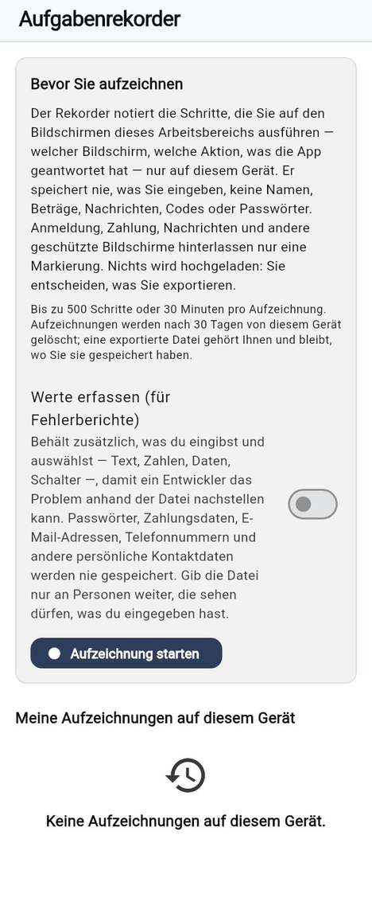

**Schritte**

1. Lesen Sie im [Aufgabenrekorder](https://fdittgen-png.github.io/deskilo/#/task-recorder) **Bevor Sie aufzeichnen**.
2. Tippen Sie auf **Aufzeichnung starten**.
3. Erledigen Sie die Aufgabe wie gewohnt, auf einem beliebigen Bildschirm des Space oder von [Ich](https://fdittgen-png.github.io/deskilo/#/me).
4. Nutzen Sie die Leiste mit der Anzeige **Aufzeichnung läuft**, um zu **Pausieren**, **Fortsetzen**, eine **Notiz hinzufügen** oder zu **Beenden**.

**Gut zu wissen**

- Eine Aufzeichnung dauert bis zu 500 Schritte oder 30 Minuten und wird nach 30 Tagen vom Gerät gelöscht. Eine exportierte Datei bleibt dort, wo Sie sie gespeichert haben.
- Jeder Schritt nennt den Bildschirm, die Aktion und was die App geantwortet hat, etwa **Gebucht** oder **Abgelehnt**.
- Anmeldung, Zahlung, Nachrichten und andere geschützte Bildschirme hinterlassen nur eine Markierung.
- Wechseln Sie zu einem anderen Konto oder Workspace, endet die Aufzeichnung.

**Siehe auch:** [Datenschutz der Aufzeichnungen](#was-eine-aufzeichnung-behält)

<!-- anchor: user.advanced.recorder-review -->
### Eine Aufzeichnung prüfen, bearbeiten und exportieren

**Zielgruppe:** Alle

Sie möchten prüfen, was erfasst wurde, bevor Sie es teilen.

**Schritte**

1. Tippen Sie im [Aufgaben-Assistenten](https://fdittgen-png.github.io/deskilo/#/task-wizard) unter **Aufzeichnungen** auf eine Aufzeichnung.
2. Lesen Sie die Schritte. Tippen Sie bei jedem Schritt, den Sie nicht wollen, auf **Vom Export ausnehmen**; **Wieder aufnehmen** holt ihn zurück.
3. Sehen Sie sich **Was die Datei enthalten wird** an.
4. Wählen Sie **Datei exportieren**, **Aufgabenpaket exportieren** oder **Als Word-Dokument exportieren**.

**Gut zu wissen**

- Das Ausnehmen eines Schritts ändert nur den Export. Die Aufzeichnung auf dem Gerät bleibt unverändert.
- Um eine Datei von jemand anderem zu lesen, nutzen Sie **Aufgabendatei öffnen** in der [Aufgaben-Werkbank](https://fdittgen-png.github.io/deskilo/#/task-workbench). Nichts wird hochgeladen, und es ist kein Konto nötig.
- Eine beschädigte Datei oder eine Datei, die eine neuere Version erstellt hat, wird mit einer klaren Meldung abgelehnt.
- **Von diesem Gerät löschen** entfernt die Aufzeichnung; exportierte Dateien bleiben unberührt.

**Siehe auch:** [Eine Anleitung erstellen](#aus-einer-aufzeichnung-eine-anleitung-erstellen)

<!-- anchor: user.advanced.guide-make -->
### Aus einer Aufzeichnung eine Anleitung erstellen

**Zielgruppe:** Alle

Sie möchten, dass andere einer Aufgabe folgen können, die Sie aufgezeichnet haben.

**Schritte**

1. Tippen Sie im [Aufgaben-Assistenten](https://fdittgen-png.github.io/deskilo/#/task-wizard) neben einer Aufzeichnung auf **Anleitung erstellen**. Oder wählen Sie **Anleitung hinzufügen** → **Aus einer meiner Aufzeichnungen** oder **Aus einer Aufgabendatei oder einem Paket**.
2. Prüfen Sie den Entwurf. Jeder Schritt ist so geschrieben, wie die lesende Person ihn sehen wird.
3. Geben Sie ihr unter **Name der Anleitung** einen Namen.
4. Tippen Sie auf **Zu meinen Anleitungen hinzufügen**.

**Gut zu wissen**

- Die Anleitung wird auf Ihrem Gerät unter **Anleitungen** aufbewahrt. Eine Anleitung lässt sich bearbeiten oder löschen: **Diese Anleitung löschen** lässt ihre Aufzeichnung unberührt.
- Ein Schritt, der bucht, wartet auf die echte Antwort. Für die lesende Person wird nichts erledigt.
- **Leitfaden speichern** schreibt sie in eine Datei, die Sie weitergeben können.

**Siehe auch:** [Eine Anleitung bearbeiten](#eine-anleitung-bearbeiten-oder-reparieren)

<!-- anchor: user.advanced.guide-play -->
### Einer Anleitung folgen

**Zielgruppe:** Alle

Sie möchten auf den echten Bildschirmen durch eine Aufgabe geführt werden.

**Schritte**

1. Tippen Sie im [Aufgaben-Assistenten](https://fdittgen-png.github.io/deskilo/#/task-wizard) neben einer der Anleitungen auf **Anleitung starten**.
2. Ein Fenster zeigt Schritt 1 von … und was zu tun ist, zum Beispiel „Tippen Sie auf ‚Reservieren‘.“ oder „Füllen Sie ‚…‘ aus und verlassen Sie dann das Feld.“
3. Tippen Sie auf **Öffnen und hervorheben**, um zum richtigen Bildschirm zu gelangen und das markierte Bedienelement zu sehen.
4. Führen Sie den Schritt selbst aus. Die Anleitung bemerkt es und geht weiter. Bei einem Leseschritt tippen Sie auf **Erledigt**.

**Gut zu wissen**

- Nutzen Sie **Zurück** und **Überspringen** und öffnen Sie **Alle Schritte**, um jeden als **Offen**, **Wartet**, **Erledigt**, **Bestätigt** oder **Übersprungen** zu sehen.
- Ein Schritt, der bucht, wartet auf die Antwort: **Auf das Ergebnis wird gewartet …**. Wird er abgelehnt, sagt die Anleitung, was Sie versuchen können; kam keine Antwort, bittet sie Sie, vor einem neuen Versuch nachzusehen.
- **Anleitung beenden** beendet sie. Nichts wird rückgängig gemacht.
- Die Anleitung pausiert, wenn sich das Konto oder der Workspace ändert oder der Aufgabenrekorder ausgeschaltet wird.

**Siehe auch:** [Das Kreismenü](#das-kreismenü)

<!-- anchor: user.advanced.guide-circle -->
### Das Kreismenü

**Zielgruppe:** Alle

Sie brauchen den ganzen Bildschirm zum Arbeiten, möchten die Anleitung aber in der Nähe haben. Verkleinern Sie sie.

**Schritte**

1. Tippen Sie im Anleitungsfenster auf **Anleitung verkleinern**. Sie schrumpft zu einem kleinen Kreis.
2. Tippen Sie auf den Kreis für ein Menü: Anleitung anzeigen (Schritt … von …), **Öffnen und hervorheben**, eine Schaltfläche zur Seite des Schritts, **Erledigt**, **Überspringen**, **Zurück**, **Fortsetzen** und **Anleitung beenden**.
3. Wählen Sie „Anleitung anzeigen“, um das Fenster wieder zu öffnen.

**Gut zu wissen**

- Das Menü bietet nur an, was jetzt sinnvoll ist: **Fortsetzen** nur, solange pausiert ist, **Erledigt** nur bei einem Leseschritt.
- **Schließen** am Fenster blendet es aus; die Anleitung selbst bleibt, wo sie war.
- „Öffnen und hervorheben“ führt Sie zur Seite des Schritts und zeigt auf das Bedienelement; die Seiten-Schaltfläche führt Sie nur zur Seite.

**Siehe auch:** [Einer Anleitung folgen](#einer-anleitung-folgen)

<!-- anchor: user.advanced.guide-edit -->
### Eine Anleitung bearbeiten oder reparieren

**Zielgruppe:** Alle

Eine Anleitung liest sich schlecht, oder ein Schritt zeigt auf die falsche Seite. Beheben Sie es im Entwurf.

**Schritte**

1. Tippen Sie im [Aufgaben-Assistenten](https://fdittgen-png.github.io/deskilo/#/task-wizard) neben Ihrer Anleitung auf **Bearbeiten**.
2. Tippen Sie bei einem Schritt auf **Text schreiben** und geben Sie Ihren eigenen Text ein.
3. Wählen Sie unter **Ziel des Schritts** die Seite, auf die sich der Schritt bezieht. Tippen Sie zum Prüfen auf **Öffnen und hervorheben**.
4. Schalten Sie **Darf übersprungen werden** bei einem Schritt ein, der optional ist.
5. Tippen Sie auf **Änderungen speichern**.

**Gut zu wissen**

- Ein Schritt mit der Kennzeichnung **Eine noch zu schreibende Anweisung** braucht Ihre Worte. **Ein Schritt, den der Rekorder nicht beschreiben kann** und **Diesen Schritt selbst ausführen** erledigt die lesende Person.
- Schritte auf geschützten Bildschirmen, etwa bei der Zahlung, bitten die lesende Person, sie allein auszuführen.
- Sie können eine Anleitung nicht ein Ergebnis erwarten lassen, das ihre Aktion nicht hat; dieser Teil ist fest.
- Eine Anleitung, die Schritte nennt, die diese Version nicht kennt, kann gelesen, aber nicht befolgt werden.

**Siehe auch:** [Eine Anleitung erstellen](#aus-einer-aufzeichnung-eine-anleitung-erstellen)

<!-- anchor: user.advanced.recorder-privacy -->
### Was eine Aufzeichnung behält

**Zielgruppe:** Alle

Sie möchten genau wissen, was nichts zurücklässt.

**Schritte**

1. Öffnen Sie den [Aufgabenrekorder](https://fdittgen-png.github.io/deskilo/#/task-recorder).
2. Lesen Sie **Bevor Sie aufzeichnen**.
3. Lassen Sie **Werte erfassen (für Fehlerberichte)** aus, es sei denn, ein Entwickler hat darum gebeten.

**Gut zu wissen**

- Normalerweise behält eine Aufzeichnung nie, was Sie eintippen, Namen, Beträge, Nachrichten, Codes oder Passwörter.
- Ist das Erfassen von Werten an, behält sie auch, was Sie eintippen und wählen, damit ein Entwickler ein Problem nachstellen kann. Passwörter, Zahlungsdaten, E-Mail-Adressen und Telefonnummern werden trotzdem nie behalten. Beim Exportieren erscheint die Frage **Diese Aufnahme enthält Werte**.
- Nichts wird hochgeladen: Sie entscheiden, was Sie exportieren.
- Teilen Sie eine Datei nur mit Personen, die sehen dürfen, was Sie eingegeben haben.

**Siehe auch:** [Eine Aufgabe aufzeichnen](#eine-aufgabe-aufzeichnen)

<!-- anchor: user.advanced.demo -->
### Der Demo-Workspace

**Zielgruppe:** Alle

Sie möchten sich umsehen, bevor Sie sich entscheiden. Die Demo ist ein erfundener Space, offen für alle, ohne Konto.

**Schritte**

1. Tippen Sie auf dem Anmeldebildschirm auf **Den Demobereich erkunden**.
2. Lesen Sie den kurzen Hinweis und tippen Sie dann auf **Loslegen**.
3. Nutzen Sie **Ansicht als**, um denselben Space als **Inhaber**, **Administrator:in** oder **Mitglied** zu sehen.
4. Tippen Sie auf **Demo zurücksetzen**, um sie wie am Anfang wiederherzustellen, oder auf **Demo verlassen**.

**Gut zu wissen**

- Alles ist erfunden: Personen, Buchungen und Rechnungen. Nichts erreicht einen echten Workspace, und nichts verlässt Ihr Gerät.
- Ein Banner mit **Demo** steht auf jedem Bildschirm.
- Schließen Sie die App, wird die Sitzung vergessen.
- Das Angebot erscheint nur, wenn die Funktion **Der Demobereich** eingeschaltet ist.

**Siehe auch:** [Aufnahmemodus](#aufnahmemodus)

<!-- anchor: user.advanced.filming -->
### Aufnahmemodus

**Zielgruppe:** Inhaber

Sie müssen Ihren echten Space zeigen — in einem Video, auf einem Bild oder in einem Vortrag —, ohne seine Mitglieder zu zeigen.

**Schritte**

1. Öffnen Sie die [Funktionen](https://fdittgen-png.github.io/deskilo/#/features) und suchen Sie **Aufnahmemodus**.
2. Schalten Sie ihn ein. Ein Banner mit **Aufnahmemodus — erfundene Personen** steht auf jedem Bildschirm.
3. Filmen Sie. Wenn Sie fertig sind, schalten Sie ihn wieder aus.

**Gut zu wissen**

- Jeder Name, jede E-Mail-Adresse, Telefonnummer, Anschrift und jedes Foto wird zu einer erfundenen Person, überall derselben. Der Plan, die Buchungen und die Zahlen bleiben echt.
- Solange er an ist, lassen sich Identitätsformulare nicht speichern, damit erfundene Angaben keine echten überschreiben.
- Er kann nicht verbergen, was jemand getippt hat, etwa eine Nachricht oder eine Platzbezeichnung. Lesen Sie den Bildschirm, bevor Sie filmen.
- Für ein Bild, das nicht von diesem Space sein muss, nutzen Sie [die Demo](#der-demo-workspace).

**Siehe auch:** [Ein Funktionsschalter](#ein-funktionsschalter)

<!-- anchor: user.advanced.platforms -->
### DesKilo auf Ihren Geräten

**Zielgruppe:** Alle

Sie möchten DesKilo dort nutzen, wo Sie arbeiten. Dasselbe Konto und dieselben Daten folgen Ihnen.

**Schritte**

1. **Android:** Treten Sie dem geschlossenen Test bei Google Play bei.
2. iPhone und iPad: Treten Sie der Beta über TestFlight bei.
3. **Computer:** ein macOS-Disk-Image oder ein Windows-Installer von der Release-Seite; oder öffnen Sie einfach die Web-App.
4. **Browser:** Öffnen Sie die Adresse, die Ihr Workspace veröffentlicht. Nichts zu installieren.

**Gut zu wissen**

- Ein am Handy gebuchter Tisch erscheint einen Moment später in einem Browser-Tab.
- Das macOS-Disk-Image von der Release-Seite ist signiert und von Apple notarisiert; öffnen Sie es wie gewohnt.
- Der Windows-Installer ist nicht signiert: Windows SmartScreen warnt vor einem unbekannten Herausgeber; wählen Sie „Weitere Informationen“ und dann „Trotzdem ausführen“.
- Das Lesen eines Stuhl-Tags funktioniert in Chromium-Browsern auf Android (HTTPS und ein Tippen nötig); die Android- und iPhone-Apps lesen Tags direkt.
- Ein Build ohne Google-Dienste und ohne Cloud-Push ist für F-Droid vorbereitet; ob er schon über F-Droid installiert werden kann, steht auf der [F-Droid-Statusseite](https://github.com/fdittgen-png/deskilo/blob/master/docs/guides/fdroid.md#status). Darin sind Benachrichtigungen lokal, und der Posteingang ist maßgeblich.
- Aktualisierungen kommen über den Kanal, über den Sie installiert haben: Google Play, TestFlight, die Release-Seite oder das erneute Laden der Web-App.

**Siehe auch:** [Ihr Badge](#ihr-badge)

<!-- anchor: user.advanced.support -->
### Supportdetails

**Zielgruppe:** Alle

Sie wenden sich an den Support und möchten senden, was ihm hilft, ohne etwas Privates preiszugeben.

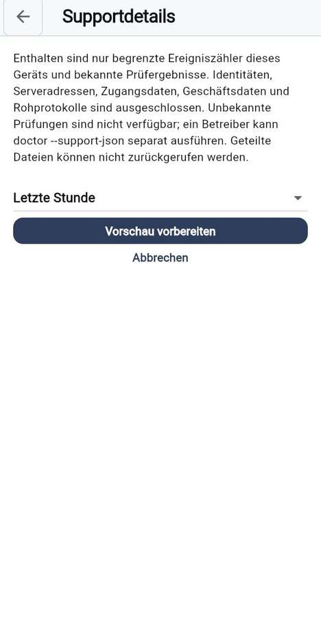

**Schritte**

1. Öffnen Sie die [Hilfe](https://fdittgen-png.github.io/deskilo/#/help) und tippen Sie auf das Support-Symbol (**Supportdetails**).
2. Wählen Sie **Letzte Stunde** oder **Letzte 24 Stunden**.
3. Tippen Sie auf **Vorschau vorbereiten** und lesen Sie, was sie enthält: Vorschau: … Bytes.
4. Tippen Sie auf **Speichern** und senden Sie dann die Datei.

**Gut zu wissen**

- Enthalten sind nur begrenzte Ereigniszahlen und bekannte Prüfungen. Identitäten, Serveradressen, Zugangsdaten, Geschäftsdaten und Rohprotokolle sind ausgeschlossen.
- Eine geteilte Datei lässt sich nicht zurückrufen.
- Hat sich der Kontext geändert, bittet der Bildschirm Sie, eine neue Vorschau vorzubereiten.
- Ein Betreiber kann `doctor --support-json` für die Serverseite ausführen.

**Siehe auch:** [Wenn etwas nicht funktioniert](#wenn-etwas-nicht-funktioniert)

<!-- anchor: user.advanced.troubleshooting -->
### Wenn etwas nicht funktioniert

**Zielgruppe:** Alle

Etwas sieht falsch aus. Versuchen Sie dies, der Reihe nach.

**Schritte**

1. Suchen Sie eine Meldung auf dem Bildschirm; die meisten sagen, was zu tun ist. „Etwas ist schiefgelaufen. Bitte versuchen Sie es erneut.“ ist einen neuen Versuch wert.
2. Prüfen Sie, ob Sie auf der Seite sind, auf der Sie sich glauben: **Testbereich** oder **Arbeitsbereich öffnen** in [Ich](https://fdittgen-png.github.io/deskilo/#/me).
3. Prüfen Sie die [Funktionen](https://fdittgen-png.github.io/deskilo/#/features): Eine im Menü fehlende Funktion ist meist eine ausgeschaltete. Nur ein Inhaber kann das ändern.
4. Prüfen Sie den Server unter [Ihr eigener Server](#ihr-eigener-server): **Dieses Gerät nutzt** nennt ihn.
5. Bereiten Sie die [Supportdetails](#supportdetails) vor und senden Sie sie.

**Gut zu wissen**

- Was Sie sehen, hängt von Ihrer Rolle ab: Ein fehlender Bildschirm kann eine Berechtigung sein. Fragen Sie Ihren Inhaber.
- Administratoren können unter **Erweitert** in den [Einstellungen](https://fdittgen-png.github.io/deskilo/#/settings) den **Entwicklermodus** einschalten. Er fügt einen Bildschirm [Entwickler](https://fdittgen-png.github.io/deskilo/#/developer) hinzu, auf dem **Protokoll exportieren** und **Protokoll leeren** dem Support helfen. Er gilt für jedes Mitglied des Workspace.
- Einen Fehler können Sie auch im Bereich „Über“ der App melden: **Fehler melden / Funktion vorschlagen**.
- Eine Anleitung, die bei **Auf das Ergebnis wird gewartet …** hängt, bedeutet, dass keine Antwort kam: Prüfen Sie das Ergebnis, bevor Sie es erneut versuchen.

**Siehe auch:** [Supportdetails](#supportdetails)

<!-- anchor: user.advanced.glossary -->
### Die Wörter der App

**Zielgruppe:** Alle

Die Wörter, denen Sie am häufigsten begegnen, und was sie hier bedeuten.

| Wort | Was es bedeutet |
|---|---|
| **Workspace** (auch Space genannt) | Ein Ort, den eine Gemeinschaft führt: ihr Plan, ihre Mitglieder, Regeln und ihr Geld. Sie können mehreren angehören. |
| **Ich** | Ihr eigenes Konto: Profil, Nachrichten, Spaces und Einstellungen, über alle Ihre Spaces hinweg. |
| **Plan** | Entweder der Raumplan, von dem aus Sie buchen, oder ein Mitgliedschaftstarif — siehe **Mitglieder & Tarife**. |
| **Ebene** | Ein Stockwerk oder eine Zone des Plans. Eine Ebene kann als Ganzes reserviert werden, wenn die Funktion eingeschaltet ist. |
| **Tisch** | Ein buchbarer Platz. Büros und Räume fassen Tische zusammen. |
| Halbtag | Die Einheit, in der Buchungen und Abos gezählt werden. |
| **Freigabe** | Eine Regel, die besagt, dass eine Aktion eine oder mehrere Bestätigungen braucht, bevor sie zählt. |
| **Ereignisse** | Der Feed dessen, was passiert ist, mit den auf Sie wartenden Entscheidungen oben. |
| **Kiosk** | Ein gemeinsames Tablet an der Tür, an dem Menschen mit einem Badge einchecken. |
| Funktion | Eine Funktion, die der Inhaber für den ganzen Space ein- oder ausschaltet. |
| **Rolle** | Was eine Person in einem Space tun darf. Berechtigungen werden pro Rolle festgelegt. |
| **Umgebung** | Die Entwicklungsseite (Test) oder die Produktionsseite (echt) eines Space. |
| Zwilling | Die andere Seite eines Paars. |
| **Ausrollung** | Konfiguration von einer Seite eines Paars auf die andere übertragen. |
| **Assistent** | Ein KI-Werkzeug, das mit Ihrem Konto verbunden ist und nur so handelt, wie Sie es erlauben. |
| **Betreiber** | Die Person, die die Installation betreibt, mit der die App spricht. |

**Gut zu wissen**

- Inhaber können unter **Wortwahl** die Wörter ändern, die ein Space verwendet; die App zeigt dann die des Space.

**Siehe auch:** [Wortwahl](#wortwahl)

<!-- anchor: user.advanced.accessibility -->
### Barrierefreiheit und Tastatur

**Zielgruppe:** Alle

Sie möchten, dass die App zu Ihrer Arbeitsweise passt.

**Schritte**

1. Wählen Sie ein Aussehen in den [Einstellungen](https://fdittgen-png.github.io/deskilo/#/settings): **Design**, **Sprache**, **Zahlen & Daten**.
2. Für ruhigere Bildschirme schalten Sie die Einstellung „Bewegung reduzieren“ Ihres Geräts ein.
3. Drücken Sie am Computer in einem Assistenten Esc, um einen Schritt zurückzugehen.

**Gut zu wissen**

- Die Einstellung „Bewegung reduzieren“ des Geräts hat immer Vorrang vor der Funktion **Oberflächen-Animationen**; ein Inhaber kann diese Funktion auch ausschalten.
- Beim Verlassen eines Assistenten mit nicht gespeicherten Änderungen wird zuerst gefragt: **Weiter bearbeiten** oder **Verwerfen**.
- Bedienelemente tragen Textbeschriftungen, sodass ein Screenreader sie vorliest.
- Im Web und am Computer zeigt ein breites Fenster das Menü neben dem Inhalt.

**Siehe auch:** [Design](#design) · [App-Sprache](#app-sprache)

<!-- anchor: user.advanced.help -->
### Wo es mehr Hilfe gibt

**Zielgruppe:** Alle

Sie hängen an einem Feld oder einem Bildschirm fest.

**Schritte**

1. Tippen Sie auf das **?** neben einem Feld: Die Anleitung öffnet sich an diesem Feld.
2. Öffnen Sie die [Hilfe](https://fdittgen-png.github.io/deskilo/#/help) für die ganze Anleitung; **Inhalt** springt zu einem Kapitel.
3. Tipps auf einem Bildschirm lassen sich mit **Hinweis ausblenden** schließen; **Nächster Tipp** und **Vorheriger Tipp** blättern durch sie, **Mehr erfahren** öffnet die Anleitung.
4. Um ausgeblendete Hinweise wieder zu sehen, nutzen Sie **Hilfe-Hinweise wieder anzeigen** in Ihren Einstellungen.

**Gut zu wissen**

- Die Anleitung funktioniert offline, in Ihrer Sprache.
- Ihre Administratorin kann Fragen zu Ihrem Space beantworten; die Supportdetails helfen, wenn es an der App liegt.

**Siehe auch:** [Hinweise wiederherstellen](#hinweise-wiederherstellen) · [Supportdetails](#supportdetails)
