# Einrichtungsanleitung

**DesKilo — bauen Sie Ihren Space, Schritt für Schritt.** Für alle, die einen Coworking-Space, einen Vereinsraum oder ein gemeinsames Büro aufbauen wollen und wissen möchten, was möglich ist, was nötig ist und in welcher Reihenfolge. *Andere Sprachen: [English](Setup-Guide) · [Français](Guide-de-demarrage) · [Español](Guia-de-puesta-en-marcha) · [Italiano](Guida-di-avvio).*

<!-- anchor: setup.guide.how-to-read -->
## So nutzen Sie diese Anleitung

**Zielgruppe:** Inhaber · Mitinhaber · Administrator:in · Betreiber:in

Diese Anleitung erklärt das *Warum*, die *Reihenfolge* und die *Folgen* beim Einrichten eines Spaces. Die einzelnen Klicks stehen im [Benutzerhandbuch](Benutzerhandbuch#so-nutzen-sie-dieses-handbuch); jeder Abschnitt hier verweist auf die genaue Stelle. Das durchgehende Beispiel ist der Demo-Space *Atelier du Marché* in Pézenas: ein Verein mit einem Raum, einigen Tischen und einer monatlichen Mitgliedschaft. Die Personen und Zahlen sind erfunden.

*Drei Stufen, in dieser Reihenfolge*

| Stufe | Was Sie tun | Wie lange |
|---|---|---|
| *Öffnen* | Einen Ort, Öffnungszeiten, die Personen, die bestätigen, und eine Einladung. Am Ende können Mitglieder buchen. | etwa 20 Minuten |
| *Betreiben* | Rollen, Tarife, Zahlungen, Benachrichtigungen. Am Ende kann der Space im Alltag laufen. | ein Nachmittag, auf mehrere Tage verteilt |
| *Wachsen* | Rechnungen und Steuern, Berichte, ein Kiosk an der Tür, Auswertungen, Assistenten. Nur, wenn Sie sie brauchen. | wenn es so weit ist |

Nur die Stufe *Öffnen* ist zum Start nötig. Sie können nach jeder Stufe aufhören: Nichts drängt Sie weiter.

*Finden Sie Ihren Weg*

| Sie möchten … | Hier beginnen |
|---|---|
| Wissen, was DesKilo kann und was Sie vorbereiten sollten | [Bevor Sie beginnen](#bevor-sie-beginnen) |
| Einen Ort, den Mitglieder noch heute buchen können | [Den Ort aufbauen](#den-ort-aufbauen) |
| Festlegen, wer was darf und wer bestätigt | [Die Rollenmatrix](Benutzerhandbuch#die-rollenmatrix) |
| Für die Mitgliedschaft Geld verlangen | [Geld](#geld-und-steuern) |
| Den Mitgliedern mitteilen, was passiert | [Benachrichtigungen](#menschen-informieren) |
| Rechnungen ausstellen und die Umsatzsteuer melden | [Rechnungen](#rechnungen-von-hand-oder-automatisch) · [Umsatzsteuer](#umsatzsteuer-im-überblick) |
| Ein Wand-Tablet, Berichte oder Auswertungen | [Kiosk](Benutzerhandbuch#kiosk-modus-ein-wand-tablet-für-den-check-in) · [Der Berichtseditor](Benutzerhandbuch#der-berichtseditor) · [Geschäftsauswertungen](Benutzerhandbuch#business-analysen) |
| Einen Assistenten für sich handeln lassen | [Assistenten](Benutzerhandbuch#assistenten-was-sie-sind) |

*Zwei Begleiter*

- **Die Einrichtungsseite** (`setup.html`) lässt Sie alles in Ihrem Browser vorbereiten, bevor Sie die App anfassen: Die Antworten bleiben im Browser gespeichert, nichts wird irgendwohin gesendet, und Sie können eine Datei exportieren, die die App einliest. Hier können Sie am besten gemeinsam mit Ihrer Steuerberatung nachdenken. Siehe [Einen Space mit dem Einrichtungsfragebogen vorbereiten](Benutzerhandbuch#einen-space-mit-dem-einrichtungsfragebogen-vorbereiten).

- **Der Demobereich** lässt Sie zuerst üben, ohne dass etwas Echtes auf dem Spiel steht. Siehe [Der Demobereich](Benutzerhandbuch#der-demo-workspace).

**Gut zu wissen**

- Jeder Abschnitt nennt in der zweiten Zeile seine Zielgruppe, damit Sie überspringen können, was Sie nicht betrifft.
- Ein Block, der mit **Achtung** beginnt, markiert eine Entscheidung, die sich nur schwer rückgängig machen lässt, und sagt, ab wann.
- Diese Anleitung bescheinigt nichts Rechtliches oder Steuerliches: Sie sagt, was die App tut und was Sie mit einer Steuerberatung klären sollten.

<!-- anchor: setup.before.overview -->
## Bevor Sie beginnen

Etwas Vorbereitung erspart Ihnen später die zwei teuersten Dinge: Dinge noch einmal einzutippen und Entscheidungen, die sich nicht zurücknehmen lassen. Dieses Kapitel zeigt, was DesKilo kann, was Sie zum Öffnen wirklich brauchen und was Sie bereithalten sollten.

In diesem Kapitel:
- [Was DesKilo kann](#was-deskilo-kann)
- [Was nötig ist und was optional](#was-nötig-ist-und-was-optional)
- [Ein Test-Space oder ein echter](#ein-test-space-oder-ein-echter)
- [Mit einer Vorlage oder bei null beginnen](#mit-einer-vorlage-oder-bei-null-beginnen)
- [Was Sie vorbereiten sollten](#was-sie-vorbereiten-sollten)
- [Entscheidungen, die sich schwer rückgängig machen lassen](#entscheidungen-die-sich-schwer-rückgängig-machen-lassen)
- [Wer was tut](#wer-was-tut)

<!-- anchor: setup.before.what -->
### Was DesKilo kann

**Zielgruppe:** Inhaber · Mitinhaber

Sie möchten das Ganze überblicken, bevor Sie etwas auswählen. DesKilo gliedert seine Funktionen in neun Prozesse; der Bildschirm **Funktionen** zeigt zu jedem Prozess eine Karte mit seinem Zustand.

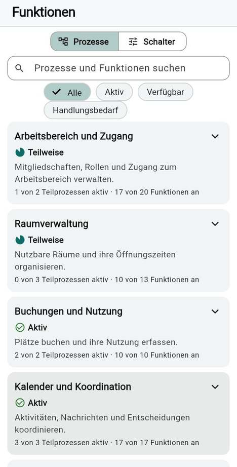

*Die neun Prozesse in einfachen Worten*

| Prozess | Was ein Mitglied davon hat |
|---|---|
| **Arbeitsbereich und Zugang** | Einen Weg hinein: Beitritt mit der Workspace-ID, eine Rolle, einen Badge. |
| **Raumverwaltung** | Einen Ort, der dem echten gleicht: Etagen, Räume, Tische, Öffnungszeiten. |
| **Buchungen und Nutzung** | Einen Tisch oder Raum buchen, ein- und auschecken, sehen, was frei ist. |
| **Kalender und Koordination** | Einen Kalender, Nachrichten und Anfragen, die jemand bestätigt. |
| **Mitgliedschaftsangebote** | Einen Tarif, Preise für Leistungen und Vereinbarungen. |
| **Abrechnung & Zahlungen** | Einen Kontoauszug, Rechnungen, Zahlung, Mahnungen, Umsatzsteuer. |
| **Dokumente und Informationen** | Dokumente zum Lesen, Berichte zum Drucken, die eigenen Daten zum Exportieren. |
| **Betrieb und Verwaltung** | Einen Space mit eigenen Farben und eigenen Wörtern. |
| **Integrationen und Automatisierung** | Benachrichtigungen und Dokumente, die über externe Dienste zugestellt werden. |

**Gut zu wissen**

- Ein neuer Space startet mit einer sinnvollen Auswahl eingeschalteter Funktionen; Sie müssen nicht über jede einzeln entscheiden. Eine Funktion auszuschalten stoppt nur neue Vorgänge und löscht nichts.
- Braucht eine Funktion eine andere, schaltet sie diese mit ein, und der Bildschirm nennt, was dazugekommen ist. Siehe [Ein Funktionsschalter](Benutzerhandbuch#ein-funktionsschalter).
- Funktionen mit dem Vermerk Alpha oder Beta fragen beim Einschalten nach Ihrer Zustimmung.

**Siehe auch:** [Funktionen ein- und ausschalten](Benutzerhandbuch#ganze-prozesse-ein--oder-ausschalten)

<!-- anchor: setup.before.necessary -->
### Was nötig ist und was optional

**Zielgruppe:** Inhaber · Mitinhaber · Administrator:in

Sie möchten den kürzesten Weg zu einem Space, den man buchen kann. Die App führt eine Bereitschaftsliste namens **Einrichtung dieses Workspace** und sagt Inhabern auf dem Bildschirm Reservieren unter *Bevor hier jemand buchen kann*, was noch fehlt.

*Was vor der ersten Buchung da sein muss*

1. **Öffnungstage, Zeitzone und Währung**: eine Zeitzone, eine Währung und mindestens ein geöffneter Wochentag.
2. **Buchbare Plätze im Grundriss**: mindestens ein Platz.
3. **Rollen und wer Anfragen bestätigt**: zählt nur, wenn eine Validierungsregel, gleich welcher Art, mehr Bestätigende verlangt, als der Space hat. Eine Regel, die zwei Freigaben verlangt, während nur Sie im Space sind, ließe Anfragen für immer warten.
4. **Was Mitglieder dürfen**: Mitglieder halten **Buchen und Reservierungen nutzen**. Ein neuer Space gewährt ihnen nichts, ein beitretendes Mitglied kann also nicht buchen, bis Sie es unter [Rollen](https://fdittgen-png.github.io/deskilo/#/roles) ankreuzen.

Eine weitere Zeile, **Server und Datenbankversion**, blockiert nur, wenn der Server hinter dieser App zurückliegt; dann wartet sie auf die Betreiberin oder den Betreiber des Servers. Und solange **Rechnungen** eingeschaltet ist, ist auch **Rechtliche Identität und Adresse des Space** erforderlich: Die Liste markiert sie mit **Vor der Rechnungsstellung nötig**, weil ohne sie keine Rechnung ausgestellt werden kann.

*Was optional ist und auf später warten kann*

- **Mitgliedschaftsmodelle und Tarife**
- **Die ersten Mitglieder einladen**
- **Wie Mitglieder bezahlen**
- **Export und Wiederherstellung**
- **Angaben, die Ihre Funktionen brauchen (Identität, Bank, Plattformen)**
- **Eine erste Buchung**

Jeden dieser Punkte können Sie mit **Später** zurückstellen und wieder hervorholen; die Liste zeigt, ob ein Schritt **Einzurichten**, **Bereit**, **Hier nicht nötig** oder **Wartet auf jemand anderen** ist. Zwei weitere Zustände gibt es: **Noch nicht geprüft** (**Export und Wiederherstellung** wird erst nach einem echten Export in den letzten 90 Tagen Bereit) und eine Zeile, die nicht gelesen werden konnte.

**Gut zu wissen**

- Die Liste nennt, wer handelt: **Sie**, **Der Serverbetreiber** oder **Eine Datenbankadministration**.
- Optional heißt nicht unwichtig: Bankdaten, ein Zahlungsanbieter oder ein Standort sind Angaben, die Ihre Funktionen brauchen, und die Liste nennt sie.
- Schalten Sie Rechnungen ohne rechtliche Identität ein, lässt die App das zu; die Liste und [Was auf Sie wartet](Benutzerhandbuch#was-auf-sie-wartet) nennen sie, und das Ausstellen einer Rechnung wird verweigert, mit dem Hinweis, was fehlt.

**Siehe auch:** [Ihren Space prüfen](#ihren-space-prüfen) · [Die Karte „Erste Schritte“ und die Tipps](Benutzerhandbuch#die-karte-erste-schritte-und-die-tipps)

<!-- anchor: setup.before.environment -->
### Ein Test-Space oder ein echter

**Zielgruppe:** Inhaber · Mitinhaber · Betreiber:in

Sie möchten Dinge ohne Folgen ausprobieren und danach den echten Space betreiben. Ein Space kann ein Test sein, ein echter oder ein verknüpftes Paar mit demselben Namen.

| Option | Wählen Sie sie, wenn … | Was passiert |
|---|---|---|
| **Ein Test-Arbeitsbereich** | Sie lernen. | Jeder Bildschirm und jedes Dokument sagt, dass es ein Test ist: Dokumente tragen ein Wasserzeichen. Keine echte Abrechnung. |
| **Ein echter Arbeitsbereich** | Sie Ihre Einstellungen kennen. | Die Rechnungen, die er ausstellt, sind geschuldet. |
| **Ein verknüpftes Test- und Echt-Paar** | Sie Änderungen proben wollen, bevor die echten Mitglieder sie sehen. | Zwei Spaces, beide Ihre. Nur ein Deployment überträgt Konfiguration vom einen zum anderen; Mitglieder, Buchungen, Rechnungen und Zahlungen wandern nie mit. |

**Gut zu wissen**

- Die Auswahl steht zu Beginn auf der Testoption.
- Die Umgebung ist eine Erklärung des Inhabers; jede Person mit der Berechtigung zur Konfiguration (der Inhaber immer) kann sie später ändern, und bereits ausgestellte Rechnungen behalten das Wasserzeichen, das sie trugen. Beginnen Sie daher mit einem Test-Space, wenn Sie unsicher sind.
- Um ohne eigenen Space zu üben, nutzen Sie den Demobereich.

**Siehe auch:** [Ein Space hat zwei Seiten](Benutzerhandbuch#ein-space-hat-zwei-seiten) · [Einen Workspace erstellen](Benutzerhandbuch#einen-workspace-erstellen) · [Ein Test-Space](Benutzerhandbuch#wofür-ein-testspace-da-ist)

<!-- anchor: setup.before.template -->
### Mit einer Vorlage oder bei null beginnen

**Zielgruppe:** Inhaber

Sie möchten einen Vorsprung, ohne an fremde Entscheidungen gebunden zu sein. Beim Erstellen eines Spaces bietet **Beginnen mit** die Auswahl **Leerer Raum** oder eine fertige Vorlage an und ist auf *A tiny space* voreingestellt; wählen Sie *Leerer Raum*, wenn Sie eine leere Fläche möchten.

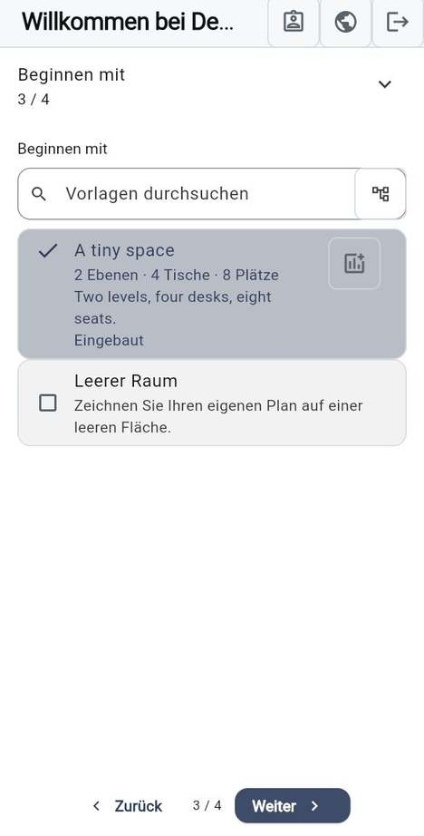

*Die zwei eingebauten Vorlagen*

| Vorlage | Was sie einrichtet |
|---|---|
| A tiny space | Zwei Etagen, vier Tische, acht Plätze, sonst nichts: genug, um vom ersten Moment an zu buchen, zu scannen und zu stöbern. |
| Association de coworking (France) | Halbe Tage 7:00–13:00 und 13:00–19:00 Uhr, Montag bis Freitag, Feiertage, Mitgliedschaften zu 50 % und 100 %, zwei Vorauszahlungsblöcke mit halben Tagen (10 und 20), Vorstandsrollen (Schatzmeister, Schriftführer, Raumwart), ein Kalender für Bestätigungen und zwei buchungsbereite Etagen. Sie stellt außerdem die Sprache des Arbeitsbereichs auf Französisch und die Umsatzsteuerregelung auf *nicht umsatzsteuerpflichtig*; nur drei Wörter werden umbenannt (Place, Étage, Réservations). Der Name der Vorlage ist in jeder App-Sprache französisch. |

**Gut zu wissen**

- Eine Vorlage bringt nie Ihre rechtliche Identität, Bankdaten, Standorte, Einladungen oder Dokumentenlinks mit: Die gehören Ihnen, und die Bereitschaftsliste nennt sie (die rechtliche Identität, bei eingeschalteten **Rechnungen**, als eigenen Bereich).
- In einem aus einer Vorlage erstellten Space können Rechnungen eingeschaltet sein, ohne dass Sie etwas ausstellen können, solange die Identität fehlt.
- Wenden Sie eine Vorlage auf einen Space an, der schon Tarife hat, ersetzt sie dessen Gebührenstufen: Nutzen Sie sie für einen neuen Space.

**Siehe auch:** [Einen Workspace erstellen](Benutzerhandbuch#einen-workspace-erstellen)

<!-- anchor: setup.before.prepare -->
### Was Sie vorbereiten sollten

**Zielgruppe:** Inhaber

Sie möchten die Fakten griffbereit haben, damit die Einrichtung Minuten statt Tage dauert. Sammeln Sie zuerst Folgendes.

**Bevor Sie beginnen**

- [ ] Die **rechtliche Identität**: Verein oder Unternehmen, eingetragener Name, Adresse, Register- und Umsatzsteuernummer, falls vorhanden.
- [ ] Eine **Steuerberatung** (oder jemand, der steuerliche Entscheidungen bestätigt): Rechnungen und Umsatzsteuer sollten Sie von einer Fachperson prüfen lassen.
- [ ] Eine Vorstellung vom Tarif: kostenlos, eine pauschale Mitgliedschaft oder ein Prozentsatz der Tage mit einer monatlichen Gebühr.
- [ ] Die **Bankdaten**, auf die Mitglieder zahlen (IBAN und BIC oder das in Ihrem Land übliche Verfahren).
- [ ] Eine Liste der ersten Personen: Namen und E-Mail-Adressen, und wer Anfragen bestätigt.
- [ ] Eine Skizze des Grundrisses: Etagen, Räume, wie viele Tische und Plätze, und ob ein ganzer Raum buchbar sein soll.
- [ ] Ihre Öffnungstage und -zeiten und die Tage, an denen Sie schließen.

**Gut zu wissen**

- Sie können ohne rechtliche Identität und Bankdaten öffnen; vor der ersten Rechnung brauchen Sie beides.
- Zeichnen Sie die Skizze zuerst auf Papier. Die App zeichnet Etagen, Räume, Tische und Plätze; einen Plan, den Sie sich schon überlegt haben, geben Sie schneller ein.

**Siehe auch:** [Einen Space mit dem Einrichtungsfragebogen vorbereiten](Benutzerhandbuch#einen-space-mit-dem-einrichtungsfragebogen-vorbereiten)

<!-- anchor: setup.before.permanent -->
### Entscheidungen, die sich schwer rückgängig machen lassen

**Zielgruppe:** Inhaber · Mitinhaber

Sie möchten wissen, bei welchen Entscheidungen Sie sich Zeit lassen sollten. Die meisten Einstellungen können Sie jeden Tag ändern. Diese nicht, oder nicht sauber.

> **Achtung** Eine ausgestellte Rechnung ändert sich nie, und ihre Nummer wird nie wieder vergeben. Haben Sie sich geirrt, korrigieren Sie mit einer Stornierung, einer Gutschrift oder einer Erstattungsanfrage, nicht mit einer Änderung.

| Entscheidung | Ab wann sie endgültig ist | Was stattdessen zu tun ist |
|---|---|---|
| Format und Folge der Rechnungsnummer | Die nächste Nummer lässt sich erhöhen, nie senken. Nach der ersten Rechnung können Sie vom Datum nicht mehr weniger drucken, als die Reihe zeigt. | Das Format in der Vorschau ansehen, die Steuerberatung fragen, dann ausstellen. |
| Der Monat einer ausgestellten Rechnung | Ist der Monat eines Mitglieds einmal abgerechnet, ist er gesperrt; Schließtage und Feiertagsimporte überspringen ihn. | Schließtage vor dem Monatsende festlegen. |
| Umsatzsteuerregelung und Steuersätze | Sätze werden nach Datum versioniert und nie bearbeitet; eine übermittelte Umsatzsteuererklärung wird nie neu berechnet. | Ab einem Datum einen neuen Satz hinzufügen; die Regelung mit der Steuerberatung entscheiden. |
| Land, Währung, Zeitzone | Beträge werden als Zahlen ohne Umrechnung gespeichert. Sobald der Space ein Dokument ausgestellt oder Geld erfasst hat, lehnt der Server jede Änderung von Währung oder Land ab. Die Zeitzone wird nie gesperrt, aber jeder Tag wird in ihr gezählt. | Sie am ersten Tag richtig wählen; siehe [Den Ort aufbauen](#den-ort-aufbauen). |
| Ersetzen des Grundrisses | Ein Plan-Import wird abgelehnt, sobald Buchungen existieren. | Etagen und Räume einzeln im Editor bearbeiten. |
| Workspace-ID | Sie ist das, was Mitglieder eintippen und worauf die gedruckten QR-Codes zeigen. Sie können sie (4 bis 20 Buchstaben oder Ziffern) mit **Workspace-ID ändern** ändern, aber die alte ID funktioniert sofort nicht mehr. | Eine kurze, einprägsame ID wählen, bevor Sie etwas drucken; wenn nötig, früh ändern. |
| Test oder echt | Ein echter Space stellt Rechnungen aus, die geschuldet sind; Dokumente des Test-Spaces tragen ein Wasserzeichen. | In einem Test-Space beginnen, übertragen, wenn Sie bereit sind. |
| Eine Regel, die mehr Bestätigende braucht, als Sie haben | Anfragen warten für immer. | Zählen Sie Ihre Bestätigenden, bevor Sie zwei verlangen. |

**Gut zu wissen**

- Eine Funktion auszuschalten löscht nie Daten.
- Eine Etage zu löschen entfernt jedes Büro, jeden Tisch und jeden Platz darauf.

**Siehe auch:** [Geld](#was-sich-nicht-rückgängig-machen-lässt)

<!-- anchor: setup.before.who -->
### Wer was tut

**Zielgruppe:** Inhaber · Mitinhaber · Administrator:in · Betreiber:in

Sie möchten wissen, wen Sie wofür ansprechen. Drei Personen können beteiligt sein, und die Bereitschaftsliste nennt sie.

| Wer | Was sie tun |
|---|---|
| **Inhaber** (und *Mitinhaber*) | Alles rund um den Space: Etagen, Zeiten, Funktionen, Rollen, Tarife, rechtliche Identität, Einladungen, Deployments. Mitinhaber haben standardmäßig alle Berechtigungen; der Inhaber entscheidet, was Administratoren dürfen. |
| **Betreiber** | Betreibt die Installation: den Server und seine Geheimnisse sowie die Datenbank-Updates. Nötig, damit Push-Benachrichtigungen funktionieren, und für alles, was die Bereitschaftsliste **Wartet auf jemand anderen** nennt. |
| **Datenbankadministration** | Genehmigt den Zugang eines Mitglieds für Assistenten. |

**Gut zu wissen**

- Auf einer gemeinsam genutzten Installation ist der Betreiber meist der der Plattform, nicht Sie.
- Administratoren handeln im Rahmen der Berechtigungen, die der Inhaber ihnen in der [Rollenmatrix](Benutzerhandbuch#die-rollenmatrix) gegeben hat.
- Steht in einem Abschnitt **Der Serverbetreiber**, kann die App es von Ihrem Bildschirm aus nicht erledigen.

**Siehe auch:** [Festlegen, wer was darf](Benutzerhandbuch#die-rollenmatrix) · [Berechtigungen für Deployments](Benutzerhandbuch#wer-ausrollen-und-in-die-produktion-darf)

<!-- anchor: setup.place.overview -->
## Den Ort aufbauen

Dieses Kapitel baut die erste Stufe, *Öffnen*: wo der Space liegt, wie er aussieht, wann er geöffnet ist und welche Regeln für Buchungen gelten. In etwa zwanzig Minuten kann der Space gebucht werden. Das Beispiel ist das *Atelier du Marché*, ein Verein in Pézenas mit zwei Etagen und einem Raum.

In diesem Kapitel:
- [Land, Währung, Zeitzone und Sprache](#land-währung-zeitzone-und-sprache)
- [Der Grundriss](#der-grundriss)
- [Öffnungszeiten und Buchungsregeln](#öffnungszeiten-und-buchungsregeln)
- [Schließtage und Feiertage](#schließtage-und-feiertage)
- [Ihren Space prüfen](#ihren-space-prüfen)

<!-- anchor: setup.place.where -->
### Land, Währung, Zeitzone und Sprache

**Zielgruppe:** Inhaber · Administrator:in

Sie möchten, dass der Space weiß, wo er zu Hause ist. Diese vier Angaben bestimmen mehr, als man denkt.

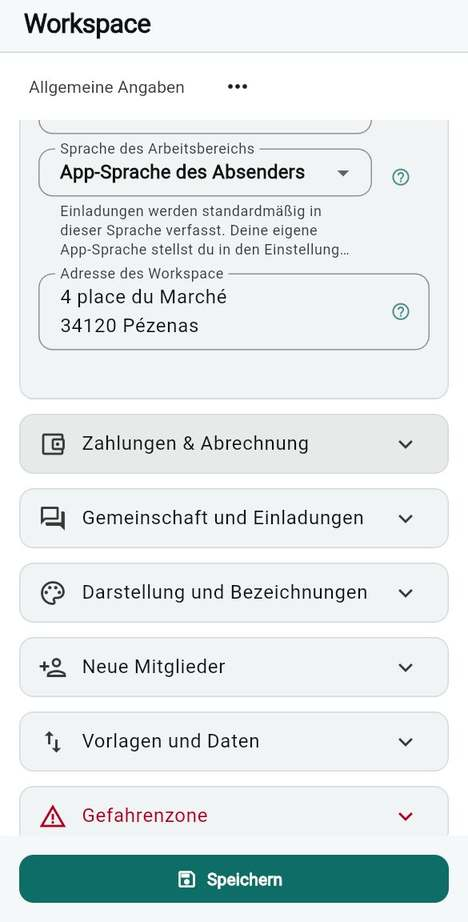

*Was jede Angabe bestimmt*

| Angabe | Was sie festlegt |
|---|---|
| **Land** | Die vorgeschlagene Währung und Zeitzone sowie die Feiertage, die als Schließtage angeboten werden (siehe unten). |
| **Währung** | Wie jeder Betrag angezeigt und gezählt wird. |
| **Zeitzone** | Was ein Arbeitstag, eine Halbtagsgrenze und ein Schließtag bedeuten; ein Mitglied im Ausland sieht den Tag des Spaces. |
| **Sprache des Arbeitsbereichs** | Die Sprache, in der Einladungen und geteilte Nachrichtenverweise standardmäßig geschrieben werden. |

**Schritte**

1. Öffnen Sie [Workspace](https://fdittgen-png.github.io/deskilo/#/workspace-settings) und gehen Sie zu **Allgemeine Angaben**.
2. Wählen Sie das **Land**; **Währung** und **Zeitzone** folgen, und Sie können sie korrigieren. Für das Atelier du Marché: Frankreich, EUR, Europe/Paris.
3. Wählen Sie die **Sprache des Arbeitsbereichs** und tippen Sie auf **Speichern**.

> **Achtung** Wählen Sie Land und Währung am ersten Tag richtig. Beträge werden als einfache Zahlen gespeichert; sobald der Space ein Dokument ausgestellt oder Geld erfasst hat, lehnt der Server deshalb jede Änderung von beiden ab: „Währung und Land stehen fest, sobald dieser Space ein Dokument ausgestellt oder Geld erfasst hat. Es wurde nichts gespeichert.“

**Gut zu wissen**

- Die App listet viele Länder, doch Rechnungen innerhalb von DesKilo auszustellen funktioniert heute nur für Frankreich und Deutschland. Anderswo führen Sie Kontoauszüge weiter und stellen Rechnungen außerhalb der App aus.
- Die Sprache des Arbeitsbereichs ist nicht Ihre eigene App-Sprache; die steht in Ihren persönlichen Einstellungen.

**Siehe auch:** [Land](Benutzerhandbuch#land) · [Währung und Zeitzone](Benutzerhandbuch#währung-und-zeitzone) · [Sprache des Arbeitsbereichs](Benutzerhandbuch#sprache-des-arbeitsbereichs)

<!-- anchor: setup.place.plan -->
### Der Grundriss

**Zielgruppe:** Inhaber · Administrator:in

Sie möchten, dass der Plan auf dem Bildschirm dem echten Ort gleicht. Er besteht aus vier Ebenen: Etagen, dann Büros (Räume), dann Tische, dann Plätze. Ein Mitglied bucht einen Platz; einen Platz zählt die Bereitschaftsliste.

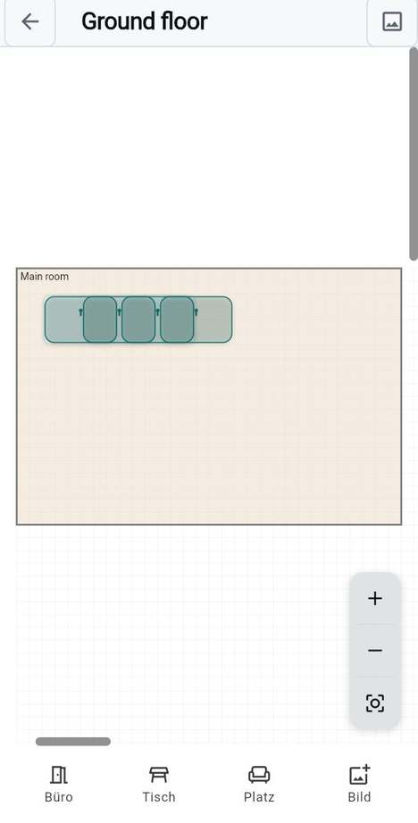

**Schritte**

1. Skizzieren Sie auf Papier: Etagen, Räume, Tische, Plätze.
2. Öffnen Sie den [Workspace-Editor](https://fdittgen-png.github.io/deskilo/#/editor) und fügen Sie die Etagen mit **Etage hinzufügen** hinzu.
3. Öffnen Sie eine Etage und zeichnen Sie jeden Raum mit **Büro**, darin dann **Tisch** und **Platz**.
4. Darf ein Team einen Raum oder eine Etage für einen Tag nehmen, schalten Sie in dessen Eigenschaften die Buchung des ganzen Raums ein.

**Gut zu wissen**

- Beginnen Sie klein: eine erste Etage, ein Raum, ein paar Plätze. Alles lässt sich später ergänzen.
- Eine ganze Etage, ein Büro oder ein Tisch ist nur buchbar, wenn **Tisch-, Büro- & Etagen-Reservierungen** eingeschaltet ist und das Mitglied die Berechtigung hat.
- Die eingebaute Vorlage A tiny space gibt Ihnen zwei Etagen, vier Tische und acht Plätze zum Anpassen.
- Eine Etage zu löschen entfernt alles darauf, und ein Plan-Import wird abgelehnt, sobald Buchungen existieren.

**Siehe auch:** [Etagen hinzufügen, umbenennen und löschen](Benutzerhandbuch#space-editor-etagen-hinzufügen-umbenennen-und-löschen) · [Räume, Tische und Plätze zeichnen](Benutzerhandbuch#räume-tische-und-plätze-zeichnen) · [Mitglieder eine ganze Etage buchen lassen](Benutzerhandbuch#mitglieder-eine-ganze-etage-buchen-lassen)

<!-- anchor: setup.place.times -->
### Öffnungszeiten und Buchungsregeln

**Zielgruppe:** Inhaber · Administrator:in

Sie möchten, dass Buchungen dem Rhythmus Ihres Ortes folgen. Ein Bildschirm, **Verfügbarkeit**, enthält die Tage, die Form einer Buchung, die Arbeitszeiten und die Regeln. Der Server wendet sie überall an: auf dem Plan, im Buchungsblatt, bei gescannten Codes und am Kiosk.

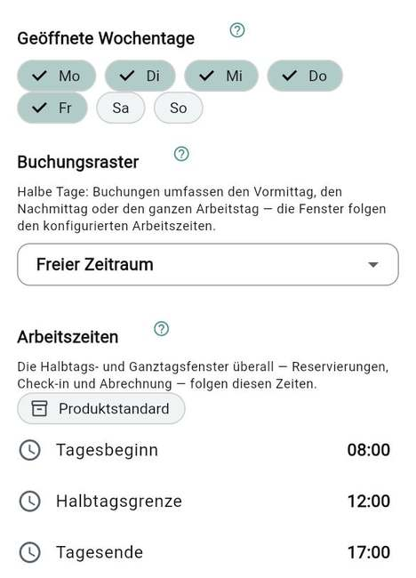

**Schritte**

1. Öffnen Sie [Verfügbarkeit](https://fdittgen-png.github.io/deskilo/#/availability).
2. Wählen Sie unter **Geöffnete Wochentage** die Tage (mindestens einen) und die **Buchungsgranularität**.
3. Legen Sie die **Arbeitszeiten** fest: **Tagesbeginn**, **Halbtagsgrenze**, **Tagesende**.
4. Entscheiden Sie unter **Buchungsregeln** über **Vergangene Buchungen erlauben**, **Außerhalb der Öffnungszeiten** und die **Buchungsgrenzen**.

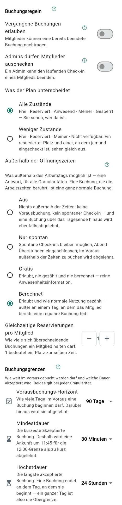

*Empfohlene Ausgangspunkte (Vorschläge, keine Vorschriften; die Voreinstellung für **Außerhalb der Öffnungszeiten** ist **Berechnet**, und die Vereinsvorlage ändert daran nichts)*

| Szenario | Granularität | Zeiten | Außerhalb der Zeiten | Vergangene Buchungen | Grenzen |
|---|---|---|---|---|---|
| Ein paar gemeinsame Tische | **Freier Zeitraum** oder **1-Stunden-Slots** | Tag 8:00–17:00 Uhr | **Frei** | Aus | Eine Buchung gleichzeitig; Vorlauf 30 Tage |
| Ein Vereinsraum (Atelier du Marché) | **Halbe Tage (Vormittag & Nachmittag)** | 7:00, Grenze 13:00, Ende 19:00 Uhr | **Aus** | Aus | Eine Buchung gleichzeitig; Vorlauf 90 Tage |
| Ein Coworking mit halben Tagen | **Halbe Tage (Vormittag & Nachmittag)** | 8:00, Grenze 12:00, Ende 18:00 Uhr | **Berechnet** | Aus | Ein oder zwei gleichzeitig; Vorlauf 90 Tage |

**Gut zu wissen**

- Außerhalb der Öffnungszeiten verweigert **Aus** alles, **Nur spontan** erlaubt Buchungen ohne Voranmeldung, **Frei** erlaubt sie ohne Zählung, **Berechnet** zählt wie gewöhnliche Nutzung, außer an einem Tag, an dem das Mitglied schon eine reguläre Buchung hat.
- Der Tag muss der Reihe nach laufen: Beginn, dann Grenze, dann Ende; die Mindestdauer darf die Höchstdauer nicht überschreiten.
- Eine Buchung endet an dem Tag, an dem sie beginnt. Vergangene Buchungen sind standardmäßig aus; ein früheres Zeitfenster am selben Tag zu buchen ist immer erlaubt.
- Halbtags- und Ganztagsfenster steuern auch das Einchecken und die Abrechnung; legen Sie also die Zeiten fest, bevor Sie Preise setzen.

**Siehe auch:** [Geöffnete Wochentage](Benutzerhandbuch#geöffnete-wochentage) · [Granularität](Benutzerhandbuch#buchungsraster) · [Arbeitszeiten](Benutzerhandbuch#arbeitszeiten) · [Außerhalb der Öffnungszeiten](Benutzerhandbuch#außerhalb-der-öffnungszeiten) · [Buchungsgrenzen](Benutzerhandbuch#buchungsgrenzen)

<!-- anchor: setup.place.closure -->
### Schließtage und Feiertage

**Zielgruppe:** Inhaber · Administrator:in

Sie möchten, dass der Space an Feiertagen geschlossen ist, ohne dass jemand sie versehentlich bucht.

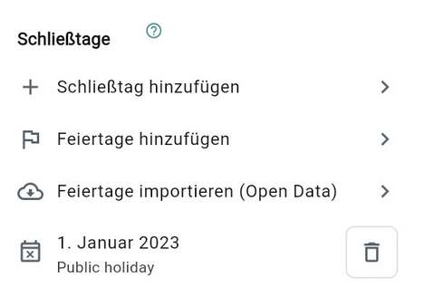

**Schritte**

1. Gehen Sie in [Verfügbarkeit](https://fdittgen-png.github.io/deskilo/#/availability) zu **Schließtage**.
2. Tippen Sie auf **Feiertage hinzufügen** (sehen Sie die Schaltfläche nicht, schalten Sie zuerst die Funktion *Feiertage* ein; sie ist standardmäßig aus), um ein ganzes Jahr auf einmal anzulegen, oder auf **Schließtag hinzufügen** für ein einzelnes Datum wie einen Inventurtag.
3. Prüfen Sie die Liste und entfernen Sie jeden Tag, an dem Sie tatsächlich arbeiten.

**Gut zu wissen**

- Eingebaute Feiertagslisten gibt es für Frankreich und Deutschland. Für andere Länder schalten Sie *Feiertage* und *Feiertage importieren* ein (offene Daten, braucht eine Verbindung). Nichts wird angelegt, bevor Sie bestätigen.
- Eine Buchung an einem Schließtag wird abgelehnt, und der Plan zeigt den Tag mit seinem Grund als geschlossen.
- Bereits abgerechnete Monate werden übersprungen; legen Sie Schließtage also vor Monatsabschluss an.

**Siehe auch:** [Schließtage](Benutzerhandbuch#schließtage) · [Feiertage](Benutzerhandbuch#feiertage)

<!-- anchor: setup.place.check -->
### Ihren Space prüfen

**Zielgruppe:** Inhaber · Administrator:in

Sie möchten den Beweis, dass der Space bereit ist, bevor Sie jemanden einladen. Zwei Karten zeigen es.

**Schritte**

1. Öffnen Sie [Workspace](https://fdittgen-png.github.io/deskilo/#/workspace-settings): Die Karte **Einrichtung dieses Workspace** listet jeden Bereich mit seinem Zustand und dem nächsten Schritt auf.
2. Öffnen Sie [Reservieren](https://fdittgen-png.github.io/deskilo/#/reserve). Inhaber und Administratoren mit der Berechtigung zur Konfiguration sehen die Karte *Erste Schritte in* Ihrem Space. Fehlt etwas, steht dort *Bevor hier jemand buchen kann*, mit **Einrichtung abschließen**.
3. Buchen Sie zum Test selbst einen Platz und stornieren Sie ihn wieder.

**Gut zu wissen**

- Bereit heißt bereit für eine erste Buchung: Öffnungstage, Zeitzone, Währung, mindestens ein Platz, Mitglieder, die buchen dürfen, und genug Bestätigende.
- Alles Optionale, etwa Tarife oder Zahlungen, können Sie mit **Später** zurückstellen; es verhindert das Öffnen nicht.
- Beide Karten hängen von der Funktion *Karte „Erste Schritte“* ab.
- **Jetzt nicht** blendet die Karte auf diesem Gerät aus; das Ansichtsmenü auf dem Plan holt sie mit **Erste Schritte** zurück.

**Ergebnis** Ein Space, den Mitglieder buchen können. Als Nächstes: die ersten Personen einladen, dann die Rollen und Tarife der zweiten Stufe.

**Siehe auch:** [Die Karte „Erste Schritte“ und die Tipps](Benutzerhandbuch#die-karte-erste-schritte-und-die-tipps) · [Mit der Workspace-ID einladen](Benutzerhandbuch#die-workspace-id) · [Rollen](Benutzerhandbuch#die-rollenmatrix)

<!-- anchor: setup.features.overview -->
## Wählen, was Ihr Space anbietet

Ein Space ist kein einzelnes Produkt mit hundert Einstellungen. Er besteht aus einer Handvoll Dinge, die Sie einzeln zum Angebot machen. Dieses Kapitel erklärt, wie DesKilo gliedert, was es kann, was ein neuer Space schon mitbringt, wie die Teile voneinander abhängen und in welcher Reihenfolge Sie sie einschalten, damit Sie nie etwas anbieten, das Sie noch nicht betreiben können.

In diesem Kapitel:
- [Funktionen und Prozesse](#funktionen-und-prozesse)
- [Kern und Plattform: was ein neuer Space hat](#kern-und-plattform-was-ein-neuer-space-hat)
- [Funktionen, die andere Funktionen brauchen](#funktionen-die-andere-funktionen-brauchen)
- [Ausschalten löscht nichts](#ausschalten-löscht-nichts)
- [Beta, Nicht bewertet und die Frage vor dem Einschalten](#beta-nicht-bewertet-und-die-frage-vor-dem-einschalten)
- [Drei Ausgangspunkte](#drei-ausgangspunkte)
- [Die Reihenfolge beim Einschalten](#die-reihenfolge-beim-einschalten)
- [Eine Funktion sicher einschalten](#eine-funktion-sicher-einschalten)
- [Funktionen vermeiden, die sich widersprechen](#funktionen-vermeiden-die-sich-widersprechen)
- [Die Funktionslandkarte](#die-funktionslandkarte)

<!-- anchor: setup.features.what -->
### Funktionen und Prozesse

**Zielgruppe:** Inhaber · Mitinhaber

Sie möchten wissen, was Sie schalten, wenn Sie **Funktionen** öffnen. Alles, was DesKilo über die Grundlagen hinaus kann, ist eine Funktion mit eigenem Schalter. Damit hundert Schalter lesbar bleiben, gruppiert der Bildschirm sie nach ihrem Zweck.

*So ist es aufgebaut*

- Ein *Prozess* ist eine betriebliche Aufgabe, zum Beispiel **Abrechnung & Zahlungen** oder **Kalender und Koordination**. Es gibt neun.
- Ein *Teilprozess* ist ein Schritt dieser Aufgabe: **Rechnungsstellung**, **Zahlungseingang** und **USt-Verwaltung** sind drei der fünf Schritte von **Abrechnung & Zahlungen**.
- Eine *Funktion* ist ein Schalter innerhalb eines Teilprozesses: **Rechnungen**, **Mahnwesen**, **USt-Voranmeldungen**.

*Die neun Prozesse und ihre Teilprozesse*

| Prozess | Teilprozesse |
|---|---|
| **Arbeitsbereich und Zugang** | **Personen und Mitgliedschaften** · **Zutritt** |
| **Raumverwaltung** | **Raumstruktur** · **Öffnungstage und Zeiten** · **Raumdarstellung** |
| **Buchungen und Nutzung** | **Plätze und Räume buchen** · **Anwesenheit und Nutzung** |
| **Kalender und Koordination** | **Kalenderansichten** · **Entscheidungen und Freigaben** · **Mitgliederkommunikation** |
| **Mitgliedschaftsangebote** | **Leistungen und Preise** |
| **Abrechnung & Zahlungen** | **Finanzübersicht** · **Rechnungsstellung** · **Zahlungseingang** · **Gemeinsame Ausgaben** · **USt-Verwaltung** |
| **Dokumente und Informationen** | **Dokumentbereitstellung** · **Berichtsgestaltung** · **Datenzugriff und Exporte** |
| **Betrieb und Verwaltung** | **Konfiguration und Bereitstellung** · **App-Bedienung** |
| **Integrationen und Automatisierung** | **Externer Versand** |

**Gut zu wissen**

- Eine Funktion gehört genau einem Prozess an, auch wenn sie eine Funktion eines anderen braucht. Die Karte sagt es: „Alles einzuschalten braucht auch: Finanzen-Tab (Abrechnung & Zahlungen)“.
- Mitgliedschaftsmodelle und der Grundrisseditor sind keine Funktionen: Sie sind immer da. Ihre Einstellungen stehen unter Workspace und Abrechnung, nicht auf diesem Bildschirm. Vorausbezahlte Mehrfachkarten sind eine Funktion: siehe **Mehrfachkarten**.
- Eine Funktion auszuschalten blendet sie auf jedem Bildschirm aus, auf dem sie erschien; das ist keine Berechtigung. Wer was darf, entscheiden Sie unter [Rollen](Benutzerhandbuch#die-rollenmatrix).

**Siehe auch:** [Was DesKilo kann](#was-deskilo-kann) · [Ganze Prozesse ein- oder ausschalten](Benutzerhandbuch#ganze-prozesse-ein--oder-ausschalten)

<!-- anchor: setup.features.tiers -->
### Kern und Plattform: was ein neuer Space hat

**Zielgruppe:** Inhaber · Mitinhaber

Sie möchten wissen, was Mitglieder am ersten Tag vorfinden, bevor Sie etwas geschaltet haben.

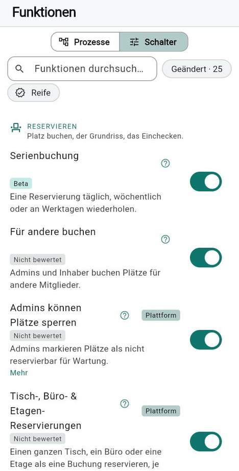

Jede Funktion gehört zu einer von zwei Stufen, und ein neuer Space wird aus ihnen erstellt:

| Stufe | In den Worten der App | Was ein neuer Space bekommt |
|---|---|---|
| **Kern** | Was jeder Space braucht. Ab dem ersten Tag an. | An, wenn die Funktion von Anfang an an sein soll. |
| **Plattform** | Auf Wunsch, nie vorausgesetzt. Schalten Sie ein, was dieser Space wirklich nutzt. | Aus. Unter **Schalter** stehen sie in der Stufe **Plattform**. |

Ein neuer Space startet mit 45 eingeschalteten Funktionen, alle aus dem Kern (46, wenn Sie den Test-Zwilling gleichzeitig erstellen: Dann ist auch **Umgebungspaare** an). In einfachen Worten:

- Buchen: einen Platz auf dem Plan reservieren, eine Buchung wiederholen (**Serienbuchung**), für andere buchen (**Für andere buchen**), einen halb gebuchten Platz als teilweise belegt sehen (**Tagesverlauf eines Platzes**), eine Buchung in einem persönlichen Kalender speichern (**Kalenderdatei einer Buchung**), Buchungsregeln wie vergangene Buchungen und Zeiten außerhalb der Öffnungszeiten (**Buchungsregeln**, **Buchungsprüfung**), die Löschung einer vergangenen Buchung beantragen (**Lösch-Anträge für Buchungen**), QR-Karten für Plätze drucken (**Raum-QR-Codes**), einstellbare Arbeitszeiten (**Arbeitszeiten**).
- Personen: der Community-Tab (**Mitgliederverzeichnis**), eine Seite pro Mitglied (**Mitgliedsseite**), die zentrale Rollenmatrix (**Rollenverwaltung** und **Rollen vergeben**), persönliche Angaben für Briefe und Rechnungen (**Persönliche Angaben**), unterscheidbare Initialen bei Avataren (**Eindeutige Avatar-Initialen**).
- Kalender und Nachrichten: der Kalender in mehreren Ansichten (**Kalender-Tab**, **Kalender-Hub**, **Kalenderansichten**), der Aktivitätsfeed und Bestätigungen (**Ereignis-Tab**), private und Gruppenunterhaltungen (**Mitglieder-Benachrichtigungen**, **Nachrichten, überarbeitet**) mit Verweisen, Weiterleiten, Erwähnungen, Wischgesten und Schutz vor Bildschirmaufnahmen, die Gruppierung des Benachrichtigungsfeeds (**Gruppierung der Benachrichtigungen**) und die Schaltfläche, um den Gastgebern einer veröffentlichten Seite zu schreiben (**An die Gastgeber schreiben**).
- Geld: der Tab Finanzen mit seinen vier Ansichten (**Finanzen-Tab**, **Finanzen in vier Ansichten**), Rechnungen (**Rechnungen**), ein Leistungskatalog (**Leistungen**), ein PDF der Monatsrechnung (**PDF-Export**).
- Dokumente und Daten: die Dokumentbibliothek (**Dokumentbibliothek**), Datenexport für den Inhaber (**Datenexport (Excel)**) sowie Export und Löschung der eigenen Daten durch jedes Mitglied (**Export & Löschung**).
- Komfort: Hilfehinweise, die Karte „Erste Schritte“, Favoriten und Bewertungen für Plätze, Animationen, regionale Formate und die Wahl des Navigationsstils.
- Zustellung: **Push-Benachrichtigungen**, die Telefone erst erreichen, wenn die Betreiberin oder der Betreiber der Installation den Push-Dienst eingerichtet hat (siehe [Wie Mitglieder informiert werden](#die-kanäle-in-einfachen-worten)).
- Plan aufräumen: **Räume mit Historie löschen** und **Einraum-Etagen nach der Etage benennen**.

Alles andere gehört zur Plattform und ist aus: Kiosk und Badges, mehrere Standorte, Zubehör-Aufpreise, Online-Zahlungen, USt-Verwaltung, der Weg einer Rechnung, Berichtsgestaltung, Ausrollungen, WhatsApp, die Assistentenschnittstelle und der Rest.

**Gut zu wissen**

- Die Funktion Rechnungen ist von Anfang an an, doch ausstellen lässt sich nichts, bevor Ihre rechtliche Identität vollständig ist; **Einrichtung dieses Workspace** markiert sie mit **Vor der Rechnungsstellung nötig**. Siehe [Funktionen vermeiden, die sich widersprechen](#funktionen-vermeiden-die-sich-widersprechen).
- Ein bestehender Space ändert sich nie, wenn DesKilo ändert, was ein neuer Space bekommt.
- Beginnen Sie mit einer Vorlage, kann die Vorlage zusätzlich zu diesem Satz einige Funktionen ein- oder ausschalten. Siehe [Drei Ausgangspunkte](#drei-ausgangspunkte).

**Siehe auch:** [Ein Funktionsschalter](Benutzerhandbuch#ein-funktionsschalter)

<!-- anchor: setup.features.dependencies -->
### Funktionen, die andere Funktionen brauchen

**Zielgruppe:** Inhaber · Mitinhaber

Sie möchten etwas einschalten und sicher sein, dass es funktioniert, oder etwas ausschalten, ohne zu zerstören, was daran hängt.

Viele Funktionen hängen unter einer anderen. **Online-Zahlungen** braucht **Finanzen-Tab**; **Mahnwesen** braucht **Rechnungen**; **Automatische Zahlungserinnerungen** braucht **Mahnwesen**; **USt-Voranmeldungen** braucht **USt-Verwaltung**, die wiederum **Rechnungen** braucht. In der Liste **Schalter** zeigt eine Funktion, die eine andere braucht, **Benötigt** gefolgt vom Namen ihrer übergeordneten Funktion.

*Was die App tut*

| Sie | Die App |
|---|---|
| Schalten eine Funktion ein, deren übergeordnete Funktion aus ist | Schaltet die ganze Kette ein und nennt, was mit eingeschaltet wurde: „Ebenfalls eingeschaltet: …“. |
| Schalten eine übergeordnete Funktion aus | Löscht die Entscheidungen ihrer untergeordneten Funktionen nicht. Sie bleiben so gespeichert, wie Sie sie gesetzt haben, bewirken aber nichts; die Zeile sagt „Wartet auf die Funktion darüber — schalte sie ein, dann wirkt auch diese wieder“. |
| Schalten die übergeordnete Funktion wieder ein | Die untergeordneten Funktionen, die an waren, wirken sofort wieder. |
| Schalten einen ganzen Prozess oder Teilprozess aus, während ihn noch etwas braucht | Lehnt ab und nennt, wer ihn braucht („… wird noch benötigt von: …“), es sei denn, Sie wählen **Trotzdem ausschalten, Einstellungen behalten** oder schalten die abhängigen Funktionen mit aus. |

**Gut zu wissen**

- Eine untergeordnete Funktion, die an ist, aber auf ihre übergeordnete wartet, lässt ihren Prozess **Braucht Aufmerksamkeit** anzeigen. Das ist der eine Zustand, in dem ein Schalter und die App sich widersprechen; ein Blick lohnt sich. Siehe [Eine Funktion sicher einschalten](#eine-funktion-sicher-einschalten).
- Eine übergeordnete Funktion kann in einem anderen Prozess liegen als ihre untergeordnete: **Leistungen** (Mitgliedschaftsangebote) braucht **Finanzen-Tab** (Abrechnung & Zahlungen). Die Karte warnt dann, dass alles Einschalten auch die andere braucht.
- Geprüft wird die Funktion, nicht eine Berechtigung: Eine Rolle, die etwas darf, reicht nie, wenn die Funktion aus ist.

**Siehe auch:** [Ein Funktionsschalter](Benutzerhandbuch#ein-funktionsschalter) · [Ganze Prozesse ein- oder ausschalten](Benutzerhandbuch#ganze-prozesse-ein--oder-ausschalten)

<!-- anchor: setup.features.off -->
### Ausschalten löscht nichts

**Zielgruppe:** Inhaber · Mitinhaber

Sie möchten es sich später anders überlegen können und müssen daher wissen, was ein Schalter nicht berührt.

Eine Funktion auszuschalten stoppt neue Vorgänge. Es löscht keinen einzigen Datensatz: Rechnungen, Buchungen, Nachrichten, Rollen und Einstellungen bleiben, wo sie sind, und wieder Einschalten bringt sie zurück. Was schon geschehen ist, bleibt geschehen: Eine Rechnung, die ausgestellt wurde, als die Funktion an war, behält ihren Inhalt.

Dahinter ordnet DesKilo die Aktionen einer schaltbaren Funktion in drei Arten ein:

| Art | Was der Schalter damit macht | Beispiel |
|---|---|---|
| Neue Arbeit (*acceptNew*) | Hört auf, wenn die Funktion aus ist. | Eine neue Unterhaltung mit den Gastgebern beginnen; einem Mitglied eine eigene Rolle geben; einen Platz sperren; eine neue Online-Zahlung starten. |
| Bereits offene Arbeit (*serviceExisting*) | Läuft weiter, damit nichts in der Luft hängt. | Eine schon begonnene Unterhaltung beantworten; eine eigene Rolle zurücknehmen; eine Platzsperre aufheben; eine schon offene Zahlung abschließen. |
| Unsichere Wege (*suspended*) | Bleiben zu, was auch der Schalter sagt. | Für einen Weg reserviert, den der Server als unsicher beurteilt; heute ist keine Aktion so eingestuft. |

Drei Funktionen sagen es in ihrer Zeile mit diesen Worten: „Aus: nichts Neues beginnt; was schon offen ist, kann noch beantwortet und geschlossen werden.“ Es sind **An die Gastgeber schreiben**, **Rollen dieses Bereichs** und **Admins können Plätze sperren**. **Auto-Check-in/-out am Tagesende** stoppt, wenn es aus ist, auch seinen Durchlauf am Tagesende, doch seine Zeile sagt das nicht. Auf einem Server, der das nicht bestätigen kann, steht in der Zeile: „verlassen Sie sich nicht darauf“.

**Gut zu wissen**

- Bereits zugesagtes Geld wird immer abgewickelt: Eine Zahlungsrückführung oder eine Erstattung blockiert nie ein Schalter.
- Ist **Online-Zahlungen** aus, lehnt der Server eine neue Online-Zahlung ab; eine bereits offene wird trotzdem abgeschlossen. Ihre Zeile enthält dazu keinen Hinweis.
- Ein Schalter ist kein Weg, etwas vor einer einzelnen Person zu verbergen. Dafür nutzen Sie [Rollen](Benutzerhandbuch#die-rollenmatrix).

**Siehe auch:** [Ein Funktionsschalter](Benutzerhandbuch#ein-funktionsschalter)

<!-- anchor: setup.features.maturity -->
### Beta, Nicht bewertet und die Frage vor dem Einschalten

**Zielgruppe:** Inhaber · Mitinhaber

Sie sehen ein kleines Wort unter dem Namen einer Funktion und möchten wissen, was Sie damit anfangen sollen.

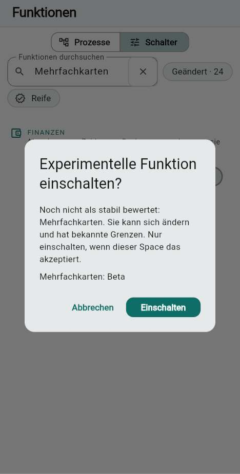

Jede Zeile von **Schalter** trägt ein Reifeabzeichen, das sagt, wie weit die Funktion anhand von Belegen geprüft wurde:

| Abzeichen | Es bedeutet |
|---|---|
| **Nicht bewertet** | Noch niemand hat sie anhand von Belegen beurteilt. Das sagt nichts Schlechtes über sie. |
| **Alpha** | Beurteilt, in einem frühen Stadium. |
| **Beta** | Beurteilt, mit bekannten Grenzen; ihre Tests laufen bei jeder Änderung. |
| **Stabil** | Beurteilt und zusätzlich mit echten Anbietern, Geräten oder Betreibern erprobt. |

Zum Zeitpunkt dieses Textes stehen die meisten Funktionen auf **Nicht bewertet**, achtzehn auf **Beta**, und keine hat bisher **Stabil** erreicht.

*Was die App fragt*

1. Legen Sie den Schalter einer Funktion mit **Alpha** oder **Beta** um.
2. Die App fragt **Experimentelle Funktion einschalten?** und sagt: „Noch nicht als stabil bewertet: … Sie kann sich ändern und hat bekannte Grenzen. Nur einschalten, wenn dieser Space das akzeptiert.“
3. Sie nennt die Stufe jeder Funktion und die Funktionen, die mit eingeschaltet würden, weil sie gebraucht werden.
4. Tippen Sie zum Akzeptieren auf **Einschalten** oder auf **Abbrechen**: Dann wird nichts gespeichert.

**Gut zu wissen**

- Funktionen mit **Nicht bewertet** fragen nicht. Nur **Alpha** und **Beta** fragen.
- Die Frage kommt bei einem einzelnen Schalter. Ein **Einschalten** für einen ganzen Prozess zeigt, was es einschalten wird, stellt diese Frage aber nicht: Schalten Sie **Beta**-Funktionen einzeln ein.
- Zu den Beta-Funktionen gehören zum Zeitpunkt dieses Textes **Rechnungen**, **Online-Zahlungen**, **USt-Verwaltung**, **Mehrfachkarten**, **Gemeinsame Ausgaben**, **Nutzungssätze**, **Buchungsregeln**, **Serienbuchung**, **Buchungsprüfung**, **Lösch-Anträge für Buchungen**, **Finanzen in vier Ansichten**, **Vorräte aus Ausgaben**, **Prüfer nach Rolle oder Person**, **Verkettete Freigaben**, **Auto-Check-in/-out am Tagesende**, **Datenexport (Excel)**, **E-Rechnungszustellung an Kunden** und **Der Demobereich**. Lesen Sie die Grenzen jeder Funktion mit **Mehr**, bevor Sie sich bei Geld darauf verlassen.
- Einige davon gehören zum Kern und sind in einem neuen Space schon an. Sie starten ohne die Frage eingeschaltet; sie erscheint erst, wenn Sie eine davon wieder einschalten.
- **Reife** grenzt die Liste auf eine Stufe ein; so sehen Sie schnell alles Experimentelle, das Ihr Space schon nutzt.

**Siehe auch:** [Ein Funktionsschalter](Benutzerhandbuch#ein-funktionsschalter)

<!-- anchor: setup.features.profiles -->
### Drei Ausgangspunkte

**Zielgruppe:** Inhaber · Mitinhaber

Sie möchten nicht hundert Dinge entscheiden. Hier sind drei realistische Ausgangspunkte; jeder nennt genau, was an ist. Wählen Sie den nächstliegenden und passen Sie ihn dann an.

Der erste braucht keine Vorlage. Der zweite ist die fertige Vorlage der App. Der dritte wird aus den Funktionen selbst zusammengesetzt. Sie sind nach dem benannt, was sie bieten, nicht nach einer Größe.

<!-- anchor: setup.features.profile-tiny -->
### Ein paar gemeinsame Plätze

**Zielgruppe:** Inhaber

Sie betreiben eine Handvoll Tische oder Räume, die gebucht werden, und sonst noch nichts. Erstellen Sie den Space unter **Beginnen mit** mit **Leerer Raum** oder mit der Vorlage „A tiny space“: zwei Etagen, vier Tische und acht Plätze, genug zum Buchen, Scannen und Stöbern.

Die Vorlage schaltet keine Funktionen, der Space hat also genau die 45 Kernfunktionen aus [Kern und Plattform](#kern-und-plattform-was-ein-neuer-space-hat). Darüber hinaus ist nichts eingeschaltet. Lassen Sie für dieses Profil den Rest in Ruhe:

- Buchen, Kalender, Nachrichten, Verzeichnis, QR-Karten für Plätze, die Dokumentbibliothek und Hilfehinweise sind alle da.
- **Finanzen-Tab** und **Rechnungen** sind an, zeigen aber nur einen leeren Kontoauszug, bis Sie Ihre rechtliche Identität und Tarife eingeben.
- Außerhalb von Plan und Öffnungszeiten muss nichts eingerichtet werden. Siehe [Ihr Ort](#den-ort-aufbauen).

> **Tipp** Wenn Sie nie etwas berechnen, können Sie die Geldfunktionen ohne Schaden eingeschaltet lassen: Mitglieder sehen dann einfach nichts zu bezahlen.

<!-- anchor: setup.features.profile-association -->
### Ein Verein mit einem Raum

**Zielgruppe:** Inhaber

Sie sind ein französischer Verein, der sich einen Raum teilt, mit einem Vorstand, zahlenden Mitgliedern und Halbtagsbuchungen. Wählen Sie unter **Beginnen mit** die Vorlage „Association de coworking (France)“. Sie richtet die Öffnungsregeln, Gebührenstufen zu 50 % und 100 %, zwei Vorauszahlungsblöcke, die Rollen des Vorstands, französische Begriffe und zwei Etagen ein und bringt dieses Funktionsprofil mit:

- Die 45 Kernfunktionen, **außer** vier, die sie ausschaltet: **Ereignis-Tab**, **Mitgliederverzeichnis**, **Mitgliedsseite** und **Gruppierung der Benachrichtigungen**. Ein kleiner Verein braucht neben seinen Unterhaltungen keinen Ereignisfeed und kein Verzeichnis.
- Vier, die sie einschaltet, weil der Vorstand sie braucht: **Freigaben im Kalender** (Entscheidungen im Kalender angezeigt), **Mehrfachkarten** (vorausbezahlte halbe Tage für Personen ohne Abo, Beta), **Rollen dieses Bereichs** (Schatzmeister, Schriftführer, Raumbeauftragter) und **Wortwahl des Arbeitsbereichs** (die eigenen Begriffe des Vereins).

Das ergibt 45 − 4 + 4 = 45 eingeschaltete Funktionen. Die Vorlage bringt keine Identität mit; Adresse, Registernummer und Bankdaten geben also weiterhin Sie ein, und die Umsatzsteuerregelung beginnt als „nicht steuerbar“.

**Gut zu wissen**

- Mehrfachkarten ist Beta und wird von der Vorlage ohne die Frage eingeschaltet; das ist die Entscheidung der Vorlage, und Sie können es ausschalten.
- Die Vorlage lässt **Rechnungen** aus dem Kern an. Ein Verein, der keine Rechnungen stellt, kann es so lassen.

<!-- anchor: setup.features.profile-invoicing -->
### Ein Coworking, das Rechnungen stellt

**Zielgruppe:** Inhaber

Sie vermieten Tische an Mitglieder und schicken ihnen jeden Monat Rechnungen, in Frankreich oder Deutschland. Es gibt keine fertige Vorlage; dieses Profil ist also eine Liste dessen, was Sie zum Kern hinzufügen, in dieser Reihenfolge. Alles daran hängt an **Finanzen-Tab** und **Rechnungen**, die schon an sind.

| # | Einschalten | Warum | Braucht |
|---|---|---|---|
| 1 | **Nummernkreise** | Legen Sie fest, wie Dokumente nummeriert werden, bevor das erste existiert. | **Rechnungen** |
| 2 | **Abo-Rechnungen** | Der Mitgliedsbeitrag wird vor dem Monat berechnet, für den er gilt. | **Rechnungen** |
| 3 | **Nutzungssätze** | Eine Aufzeichnung der wirklich genutzten Zeit (Beta). | **Rechnungen** |
| 4 | **Monatsabschluss-Rechnungen** | Was der Monat über das Abo hinaus gekostet hat, wird gesondert berechnet. | **Rechnungen** |
| 5 | **Rechnungsassistent** | Ein geführter Monatsabschluss für die Person, die abrechnet. | **Rechnungen** |
| 6 | **Der Weg einer Rechnung** | Jede Rechnung zeigt, wo sie steht und wer am Zug ist. | **Rechnungen** |
| 7 | **Rechnungs-PDF-Vorlage** | Ihr eigener Einleitungs- und Fußtext auf dem PDF. | **Rechnungen** |
| 8 | **Mitgliederberichte** | Die Finanzvereinbarung und der monatliche Zahlungsbericht für Mitglieder. | **Finanzen-Tab** |
| 9 | **Mahnwesen** | Mahnstufen, ein Schreiben pro Stufe, „Mahnung fällig“ bei verspäteten Rechnungen. | **Rechnungen** |
| 10 | **Verbrauchsbericht** | Ein Brief am Monatsende mit dem, was genutzt wurde. | **Nutzungssätze** |

Fügen Sie dann nur hinzu, was auf Sie zutrifft:

- **USt-Verwaltung** (Beta), wenn Ihr Space für die Umsatzsteuer registriert ist. Dann **USt-Voranmeldungen** und, wenn Ihre Steuerberatung es verlangt, **USt-Satzversionen** und **USt-Gruppen**.
- **Admins stellen Rechnungen aus**, wenn eine Abrechnungsadministration sie ausstellen soll. Der Inhaber kann es immer.
- **Online-Zahlungen** (Beta) nur, wenn Sie einen Zahlungsanbieter anbinden.
- **Automatische Zahlungserinnerungen** erst, nachdem Sie gelesen haben, [was sie tun](#zahlungserinnerungen).
- **Zubehör-Aufpreise**, **Mehrfachkarten** und **Gemeinsame Ausgaben**, wenn Sie diese Dinge berechnen.

**Gut zu wissen**

- Vervollständigen Sie vor der ersten Rechnung Ihre rechtliche Identität und die Umsatzsteuer. Siehe [Rechtliche Identität und Rechnungen](#ihre-rechtliche-identität-und-was-sie-ihren-steuerberater-fragen).
- Das Ausstellen funktioniert hier nur für Spaces in Frankreich und Deutschland.
- Schalten Sie diese einzeln ein und stellen Sie zuerst in einem Test-Space eine Testrechnung aus. Siehe [Die Reihenfolge beim Einschalten](#die-reihenfolge-beim-einschalten).

**Siehe auch:** [Geld und Rechnungen](#geld-und-steuern) · [Mit einer Vorlage oder bei null beginnen](#mit-einer-vorlage-oder-bei-null-beginnen)

<!-- anchor: setup.features.order -->
### Die Reihenfolge beim Einschalten

**Zielgruppe:** Inhaber · Mitinhaber

Sie möchten den Tag vermeiden, an dem alles an ist und nichts funktioniert. Gehen Sie einen Prozess nach dem anderen durch und sehen Sie jeden aus der Sicht eines Mitglieds an, bevor Sie weitergehen.

**Schritte**

1. Behalten Sie den Kern und bringen Sie die Grundlagen zum Laufen: die Plätze, die Öffnungszeiten, einen Tarif. Siehe [Ihr Ort](#den-ort-aufbauen).
2. Öffnen Sie [Funktionen](https://fdittgen-png.github.io/deskilo/#/features) und öffnen Sie eine Prozesskarte. Wählen Sie den Prozess, der zu Ihrem nächsten Bedarf passt, nicht den, der am vollständigsten aussieht.
3. Tippen Sie bei einem Teilprozess auf **Einschalten** oder öffnen Sie eine einzelne Funktion unter **Schalter**.
4. Lesen Sie die Vorschau: was **Ebenfalls nötig** ist und was schon an ist.
5. Sehen Sie es als Mitglied an: Melden Sie sich als eines an (mit einem zweiten Konto oder auf der Testseite Ihres Spaces) und tun Sie, was ein Mitglied täte.
6. Erst dann gehen Sie zum nächsten Prozess.

*Eine sinnvolle Reihenfolge*

| Schritt | Prozess | Warum an dieser Stelle |
|---|---|---|
| 1 | **Raumverwaltung** | Ohne Ort und Öffnungszeiten lässt sich nichts buchen. |
| 2 | **Buchungen und Nutzung** | Buchungsregeln prägen alles, was danach kommt. |
| 3 | **Arbeitsbereich und Zugang** | Rollen und wer bestätigt, vor der ersten Einladung. |
| 4 | **Kalender und Koordination** | Nachrichten und Freigaben setzen voraus, dass es Personen gibt. |
| 5 | **Mitgliedschaftsangebote**, dann **Abrechnung & Zahlungen** | Preise vor Rechnungen; rechtliche Identität vor der ersten Rechnung. |
| 6 | **Dokumente und Informationen**, **Integrationen und Automatisierung** | Sie kleiden ein und liefern aus, was die anderen erzeugen. |
| 7 | **Betrieb und Verwaltung** | Paare, Ausrollungen und Übertragungen, wenn der Space es wert ist, kopiert zu werden. |

**Gut zu wissen**

- Einschalten ist billig, und Ausschalten löscht nichts; ein falscher Schritt kostet also Zeit, keine Daten. Die Ausnahme ist alles, was eine Rechnung ausstellt: siehe [Entscheidungen, die sich schwer rückgängig machen lassen](#entscheidungen-die-sich-schwer-rückgängig-machen-lassen).
- Ein Test-Space ist der richtige Ort, um einen Prozess auszuprobieren. Siehe [Ein Test-Space oder ein echter](#ein-test-space-oder-ein-echter) und [Ein Test-Space](Benutzerhandbuch#wofür-ein-testspace-da-ist).
- Laden Sie Mitglieder zuletzt ein, nach den Rollen, den Freigaberegeln und den Tarifen, denen sie begegnen werden.

**Siehe auch:** [Ganze Prozesse ein- oder ausschalten](Benutzerhandbuch#ganze-prozesse-ein--oder-ausschalten)

<!-- anchor: setup.features.safely -->
### Eine Funktion sicher einschalten

**Zielgruppe:** Inhaber · Mitinhaber

Sie sind dabei, eine Funktion zu ändern, und möchten die Wirkung sehen, bevor es sie gibt.

**Schritte**

1. Öffnen Sie [Funktionen](https://fdittgen-png.github.io/deskilo/#/features). Die Ansicht **Prozesse** wird angezeigt.
2. Tippen Sie auf **Braucht Aufmerksamkeit**. Es bleiben nur die Prozesse, die etwas enthalten, das an ist, aber wartet.
3. Öffnen Sie eine Karte. Eine Funktion mit dem Vermerk „An, wartet auf“ eine benannte übergeordnete Funktion ist das, was Sie beheben müssen.
4. Beheben Sie es, indem Sie die übergeordnete Funktion einschalten oder die Funktion ausschalten.
5. Um eine einzelne Funktion zu ändern, tippen Sie auf **Schalter**, suchen Sie sie mit **Funktionen durchsuchen** und legen Sie ihren Schalter um.
6. Lesen Sie die Frage oder die Zeile „Ebenfalls eingeschaltet“ und bestätigen Sie.

*Was „zurückgehalten“ bedeutet*

Eine Funktion ist zurückgehalten, wenn Sie sie gewählt haben, aber etwas, das sie braucht, aus ist. Ihr eigener Schalter bleibt an, weshalb man es leicht übersieht: Der Bildschirm sagt, die Funktion sei an, und die App bietet sie nicht an. Die Karte sagt, wie viele Funktionen zurückgehalten sind („… sind an, warten aber auf eine ausgeschaltete Voraussetzung“) und auf welche Voraussetzung sie warten; beheben Sie es direkt in [Funktionen](https://fdittgen-png.github.io/deskilo/#/features). [Was auf Sie wartet](Benutzerhandbuch#was-auf-sie-wartet) zeigt dasselbe als eine Zeile pro ausgeschalteter Voraussetzung.

Auf anderes, worauf eine Funktion warten kann, geht dieser Bildschirm nicht ein. Eine Funktion kann an und voll erlaubt sein, während ihre Angaben fehlen: Ihre rechtliche Identität, ein Standort, ein Zahlungsanbieter. Diese erscheinen in **Einrichtung dieses Workspace**, oben in den Workspace-Einstellungen: die rechtliche Identität, bei eingeschalteten **Rechnungen**, als **Rechtliche Identität und Adresse des Space**, der Rest unter **Angaben, die Ihre Funktionen brauchen (Identität, Bank, Plattformen)**.

**Gut zu wissen**

- Hat jemand anderes die Funktionen geändert, während Sie hinsahen, schreibt die App nichts und sagt es: „Die Funktionen haben sich inzwischen geändert, daher wurde nichts gespeichert.“ Sehen Sie die Liste noch einmal an und schalten Sie erneut.
- **Geändert** zählt die Schalter, die vom Standard der Registry abweichen. In einem neuen Space zeigt es schon eine Zahl (die Plattformfunktionen, die ausgeschaltet starten); es ist also keine Zählung Ihrer eigenen Änderungen.
- Nur ein Inhaber oder Mitinhaber kann Funktionen schreiben. Der Server prüft es im Moment des Schreibens noch einmal.

**Siehe auch:** [Ganze Prozesse ein- oder ausschalten](Benutzerhandbuch#ganze-prozesse-ein--oder-ausschalten) · [Ein Funktionsschalter](Benutzerhandbuch#ein-funktionsschalter)

<!-- anchor: setup.features.consistency -->
### Funktionen vermeiden, die sich widersprechen

**Zielgruppe:** Inhaber · Mitinhaber · Abrechnungsadministrator:in

Sie möchten wissen, welche Kombinationen einen Space halb funktionsfähig lassen und welche davon die App für Sie abfängt.

Die App hat Schutzvorkehrungen für manche Widersprüche und für andere keine. In der Tabelle ist eine Schutzvorkehrung, was die App tut; eine Lücke ist, was in Ihrer Verantwortung bleibt.

| Wenn Sie … haben | Schutz in der App | Verbleibende Lücke |
|---|---|---|
| **Rechnungen** an, keine rechtliche Identität | Das Ausstellen wird verweigert; **Vor der Ausstellung bitte ergänzen** listet die fehlende Adresse, Umsatzsteuernummer usw. auf. Der Bedarf erscheint auch in **Einrichtung dieses Workspace**, als **Rechtliche Identität und Adresse des Space**, **Vor der Rechnungsstellung nötig**, und in Was auf Sie wartet. | Die Funktion ist ab dem ersten Tag an; nichts hindert Sie also daran, Mitglieder einzuladen und einen Monat laufen zu lassen, bevor die Identität existiert. |
| Ein anderes Land als Frankreich oder Deutschland | Das Ausstellen sagt, das Land „muss Frankreich oder Deutschland sein, um hier auszustellen“. | Nichts warnt Sie, wenn Sie das Land wählen oder die Rechnungsstellung einschalten. |
| Für die Umsatzsteuer registriert, kein gültiger Satz | Das Ausstellen wird verweigert, bis ein Standardsatz gilt. Die Beschreibung von **USt-Verwaltung** und die Warnung auf dem Bildschirm der rechtlichen Identität sagen es. | Bei ausgeschalteter **USt-Verwaltung** ist die Konfiguration verborgen, während die gespeicherten Sätze weiter gelten. Prüfen Sie die Sätze nach dem Ausschalten. |
| **Online-Zahlungen** an, kein Anbieter | Eine neue Online-Zahlung wird abgelehnt, wenn die Funktion aus ist; der fehlende Anbieter erscheint in **Einrichtung dieses Workspace**. | Sie können sie ohne Anbieter einschalten. Binden Sie ihn zuerst an: [Zahlungsanbieter](Benutzerhandbuch#der-zahlungsanbieter). |
| **Kiosk-Modus** an, keine Badges und kein Kiosk-Mitglied | **RFID-/NFC-Badges**, **QR-Badges**, **Mitgliederfotos am Kiosk** und **Mit Ausweis anmelden** können ohne ihn nicht an sein. | Nichts prüft, ob ein Kiosk-Mitglied existiert oder ein Badge ausgegeben wurde. Siehe [Ein Wand-Tablet betreiben](Benutzerhandbuch#kiosk-modus-ein-wand-tablet-für-den-check-in). |
| **Standorte** an, kein Standort | **Mindestens ein Standort** erscheint unter den Angaben, die Ihre Funktionen brauchen. | Der Schalter kann ohne Standort an sein. |
| **Push-Benachrichtigungen** an, kein Push-Dienst | Mitglieder bekommen weiterhin alles in der App. | Telefone erhalten nichts, bis die Betreiberin oder der Betreiber der Installation den Push-Dienst eingerichtet hat. Siehe [Wie Mitglieder informiert werden](#die-kanäle-in-einfachen-worten). |
| **Mahnwesen** an, **Automatische Zahlungserinnerungen** an | Die zweite kann ohne die erste nicht an sein. | Der Server versendet sie jeden Morgen, sofern die Installation Aufgaben plant; sonst werden sie versendet, wenn ein Administrator Finanzen öffnet. Der Schalter und die Funktionsbeschreibung sagen es; der Betreiber Ihres Servers weiß, was zutrifft. |
| Eine Freigaberegel verlangt mehr Prüfer, als es gibt | **Einrichtung dieses Workspace** sagt „Eine Regel verlangt mehr Prüfer, als dieser Bereich hat“, und **Rollen und wer Anfragen bestätigt** wird erforderlich, gleich welche Art von Anfrage. | Anfragen, die vor Ihrer Korrektur angelegt wurden, können nicht abgeschlossen werden und verfallen nach sieben Tagen. Siehe [Wer bestätigt](Benutzerhandbuch#validierungsregeln-bereich-für-bereich). |
| **Lösch-Anträge für Buchungen** an, niemand zum Bestätigen | Dieselbe Bereitschaftszeile. | Dieselbe Lücke. |
| **Tisch-, Büro- & Etagen-Reservierungen** an | **Admins können Etagen zuweisen** braucht sie. | Jedes Mitglied braucht außerdem das Recht; nichts prüft, ob es jemand hat. |
| Eine untergeordnete Funktion an, ihre übergeordnete aus | **Braucht Aufmerksamkeit** und „Wartet auf die Funktion darüber“. | Keine: Dieser Fall ist vollständig abgedeckt. |
| Ein Space aus einer Vorlage | Die Vorlage nennt, was Sie selbst eingeben müssen (Identität, Bank, Standort). | Sie bringt nichts davon mit; ein Space kann also mit eingeschalteten **Rechnungen** starten, ohne dass etwas ausgestellt werden kann. |

**Gut zu wissen**

- Die Faustregel: Bringt eine Funktion Ihren Namen, Ihr Geld oder Ihre rechtlichen Pflichten auf ein Dokument, vervollständigen Sie ihre Angaben, bevor Sie es den Mitgliedern sagen.
- **Einrichtung dieses Workspace** ist eine Liste, keine Sperre. Sie hindert Sie nie daran, etwas einzuschalten.
- Die Prüfung „Bevor hier jemand buchen kann“ spricht nur über die erforderlichen Bereiche: die Zeitzone, die Währung, einen geöffneten Wochentag, mindestens einen Platz, Mitglieder mit **Buchen und Reservierungen nutzen** und genug Bestätigende. Bei eingeschalteten **Rechnungen** ist auch die rechtliche Identität erforderlich, aber vor der Rechnungsstellung: Die Karte des Space sagt „Vor der Rechnungsstellung“, die Karte unter Reservieren nennt sie nie.

**Siehe auch:** [Rechtliche Identität und Rechnungen](#ihre-rechtliche-identität-und-was-sie-ihren-steuerberater-fragen) · [Probelauf](#ein-gefahrloser-probelauf-in-einem-test-space)

<!-- anchor: setup.features.map -->
### Die Funktionslandkarte

**Zielgruppe:** Inhaber · Mitinhaber

Sie möchten einen Ort, der für die wichtigsten Funktionen sagt, was Mitglieder bekommen, was sie brauchen und wer sie einrichten muss. „Braucht“ nennt zuerst die übergeordnete Funktion, dann die Angaben außerhalb des Bildschirms Funktionen. „Wer“ ist die Person, die etwas tun muss, bevor die Funktion nützt; „Niemand“ heißt, sie funktioniert, sobald sie an ist.

*Arbeitsbereich und Zugang*

| Funktion | Was sie Mitgliedern bringt | Was sie braucht | Wer richtet sie ein |
|---|---|---|---|
| **Mitgliederverzeichnis** | Der Community-Tab: wer da ist, Status, Anwesenheit. | | Niemand |
| **Mitinhaber** | Inhaberrechte für ernannte Personen, jetzt oder bei Nachfolge. | | Inhaber |
| **Rollenverwaltung** | Die Matrix, welche Rolle welche Berechtigung hat. | | Inhaber |
| **Rollen vergeben** | Ein Abschnitt Rollen auf jeder Mitgliedsseite. | **Rollenverwaltung** | Inhaber |
| **Rollen dieses Bereichs** | Eigene Rollen, etwa Schatzmeister oder Schriftführer. | | Inhaber |
| **Fragen dieses Bereichs** | Eigene Fragen im Identitätsformular. | | Inhaber |
| **Persönliche Angaben** | Name, Adresse, Telefon und Kennungen, die Briefe drucken. | | Mitglieder |
| **Verwaltete Profile** | Mitglieder ohne Konto, für die gebucht und abgerechnet wird. | **Mitgliederverzeichnis** | Administrator:in |
| **Mitgliedsseite** | Eine Seite pro Mitglied. | **Mitgliederverzeichnis** | Niemand |
| **Gastbesuche** | Eine Person, die kein Mitglied ist, kann um einen Besuch bitten. | | Wer Besuche zulässt |
| **Kiosk-Modus** | Ein Wand-Tablet, das auf den Live-Plan festgelegt ist. | Ein Tablet und ein Kiosk-Mitglied | Inhaber |
| **RFID-/NFC-Badges** | Einchecken durch Auflegen einer Karte. | **Kiosk-Modus**, Android mit NFC, ausgegebene Badges | Inhaber |
| **QR-Badges** | Druckbare QR-Badge-Karten. | **Kiosk-Modus** | Inhaber |
| **Mit Ausweis anmelden** | Badge und PIN statt Eintippen einer E-Mail-Adresse. | **RFID-/NFC-Badges** | Inhaber, dann jedes Mitglied |
| **NFC/RFID-Tags an Stühlen** | Ein Chip an einem Stuhl öffnet seinen Platz. | Tags | Inhaber |
| **Raum-QR-Codes** | Druckbare QR-Karten pro Platz. | | Niemand |

*Raumverwaltung*

| Funktion | Was sie Mitgliedern bringt | Was sie braucht | Wer richtet sie ein |
|---|---|---|---|
| **Standorte** | Mehrere Adressen, jede mit eigener Registrierung. | Mindestens ein Standort | Inhaber |
| **Räume mit Historie löschen** | Inhaber können einen Platz löschen, der vergangene Buchungen hat. | | Niemand |
| **Admins können Plätze sperren** | Plätze, die für Wartung als nicht buchbar markiert sind. | | Inhaber |
| **Arbeitszeiten** | Der Arbeitstag und die Buchung auf genaue Uhrzeiten. | | Inhaber |
| **Feiertage** | Schließtage aus den Feiertagen eines Jahres. | | Inhaber |
| **Feiertage importieren** | Feiertage eines Landes oder einer Region importiert. | **Feiertage** | Inhaber |
| **Platzauslastung** | Eine Monatszahl dazu, wie viel gebucht wurde. | | Inhaber |
| **Mitgliederfotos auf dem Plan** | Fotos der Belegenden auf den Plätzen. | | Niemand |
| **Wortwahl des Arbeitsbereichs** | Die eigenen Begriffe des Spaces für einige Beschriftungen. | | Inhaber |
| **Farben des Arbeitsbereichs** | Die Markenfarbe und die Raumfarben. | | Inhaber |
| **Öffentlicher Workspace-Eintrag** | Eine öffentliche Seite mit dem, was Sie zeigen möchten. | | Inhaber |

*Buchungen und Nutzung*

| Funktion | Was sie Mitgliedern bringt | Was sie braucht | Wer richtet sie ein |
|---|---|---|---|
| **Serienbuchung** | Eine Buchung wiederholen. | | Niemand |
| **Für andere buchen** | Admins buchen für Mitglieder. | | Niemand |
| **Tisch-, Büro- & Etagen-Reservierungen** | Einen ganzen Tisch, ein Büro oder eine Etage buchen. | Ein pro Mitglied erteiltes Recht | Inhaber |
| **Admins können Etagen zuweisen** | Admins weisen diese Reservierungen zu. | **Tisch-, Büro- & Etagen-Reservierungen** | Inhaber |
| **Buchungsregeln** | Vergangene Buchungen, Buchungen außerhalb der Zeiten, Check-out durch Admins. | | Inhaber |
| **Buchungsprüfung** | Jede Oberfläche prüft die Regeln und nennt den Grund. | **Buchungsregeln** | Niemand |
| **Auto-Check-in/-out am Tagesende** | Nicht ausgecheckte Buchungen schließen sich selbst ab. | | Inhaber |
| **Nutzungssätze** | Die wirklich genutzte Zeit und ein Antrag, ungenutzte Zeit nicht abzurechnen. | **Rechnungen** | Abrechnungsadministrator:in |

*Kalender und Koordination*

| Funktion | Was sie Mitgliedern bringt | Was sie braucht | Wer richtet sie ein |
|---|---|---|---|
| **Kalender-Tab**, **Kalender-Hub**, **Kalenderansichten** | Monat, Woche und Agenda, mit allem, was ein Datum hat. | | Niemand |
| **Freigaben im Kalender** | Entscheidungen, angezeigt, wenn sie getroffen wurden. | **Kalender-Hub** | Niemand |
| **Ereignis-Tab** | Der Aktivitätsfeed und Bestätigungen. | | Niemand |
| **Gruppierung der Benachrichtigungen** | Benachrichtigungen im Feed gruppiert. | | Niemand |
| **Prüfer nach Rolle oder Person** | Eine Regel kann benennen, wer bestätigt und wie viele. | | Inhaber |
| **Verkettete Freigaben** | Freigaben, die nacheinander erbeten werden. | | Inhaber |
| **Lösch-Anträge für Buchungen** | Ein Mitglied beantragt, eine vergangene Buchung zu löschen. | Ein Prüfer | Inhaber |
| **Mitglieder-Benachrichtigungen** | Private und Gruppenunterhaltungen. | | Niemand |
| **Nachrichten, überarbeitet** | Posteingangsleiste, Anheften, Stummschalten, Archivieren, Entwürfe. | | Niemand |
| **An die Gastgeber schreiben** | Wer Ihre Seite findet, kann Ihnen schreiben. | Eine veröffentlichte Seite | Inhaber |
| **Erwähnungen in Gruppen**, **Nachrichten weiterleiten**, **Schutz vor Bildschirmaufnahmen** | Zusätze für Nachrichten. | **Mitglieder-Benachrichtigungen** | Niemand |

*Mitgliedschaftsangebote*

| Funktion | Was sie Mitgliedern bringt | Was sie braucht | Wer richtet sie ein |
|---|---|---|---|
| **Leistungen** | Ein Katalog dessen, was man verbrauchen und bezahlen kann. | **Finanzen-Tab** | Abrechnungsadministrator:in |
| **Zubehör-Aufpreise** | Bepreistes Platzzubehör pro halbem Tag. | **Finanzen-Tab** | Abrechnungsadministrator:in |
| **Preisverhandlungen** | Eigene Konditionen für ein Mitglied. | **Finanzen-Tab** | Abrechnungsadministrator:in |
| **Zahlungsbedingungen je Mitglied** | Eigene Zahlungsfristen. | **Rechnungen** | Abrechnungsadministrator:in |
| **Mehrfachkarten** | Vorausbezahlte halbe Tage (Beta). | **Rechnungen**, ein definierter Block | Abrechnungsadministrator:in |

*Abrechnung & Zahlungen*

| Funktion | Was sie Mitgliedern bringt | Was sie braucht | Wer richtet sie ein |
|---|---|---|---|
| **Finanzen-Tab** | Der Tab Finanzen: Kontoauszug, Zahlungen, Ausgaben. | | Niemand |
| **Finanzen in vier Ansichten** | Kontoauszug, Zahlungen, Rechnungen, Dokumente. | **Finanzen-Tab** | Niemand |
| **Mitgliederberichte** | Die Vereinbarung und der monatliche Zahlungsbericht. | **Finanzen-Tab** | Abrechnungsadministrator:in |
| **Rechnungen** | Unveränderliche, signierte Rechnungen (Beta). | **Finanzen-Tab**, rechtliche Identität, Umsatzsteuer, FR oder DE | Abrechnungsadministrator:in |
| **Admins stellen Rechnungen aus** | Administratoren stellen sie auch aus. | **Rechnungen** | Inhaber |
| **Abo-Rechnungen** | Der Beitrag, vor seinem Monat berechnet. | **Rechnungen**, ein Datum | Abrechnungsadministrator:in |
| **Monatsabschluss-Rechnungen** | Nutzung, nach dem Monat berechnet. | **Rechnungen** | Abrechnungsadministrator:in |
| **Rechnungen zusammenfassen** | Mehrere offene Rechnungen als eine. | **Rechnungen** | Abrechnungsadministrator:in |
| **Der Weg einer Rechnung** | Wo jede Rechnung steht. | **Rechnungen** | Niemand |
| **Rechnungsassistent** | Ein geführter Monatsabschluss. | **Rechnungen** | Abrechnungsadministrator:in |
| **Nummernkreise** | Nummerierung pro Journal. | **Rechnungen** | Abrechnungsadministrator:in |
| **Online-Zahlungen** | Online bezahlen (Beta). | **Finanzen-Tab**, ein Zahlungsanbieter | Inhaber |
| **Mahnwesen** | Mahnstufen und Schreiben. | **Rechnungen**, Regeln | Abrechnungsadministrator:in |
| **Automatische Zahlungserinnerungen** | Erinnerungen, die sich selbst versenden. | **Mahnwesen** | Abrechnungsadministrator:in |
| **Vorräte aus Ausgaben** | Eingekaufte Vorräte werden zu Leistungen. | **Leistungen** | Abrechnungsadministrator:in |
| **Geplante Ausgaben** | Wiederkehrende Kosten, eingeplant. | **Finanzen-Tab** | Abrechnungsadministrator:in |
| **Gemeinsame Ausgaben** | Kosten, die unter Mitgliedern geteilt werden. | **Rechnungen** | Abrechnungsadministrator:in |
| **Umlage-Assistent** | Eine geführte Aufteilung einer gemeinsamen Ausgabe. | **Gemeinsame Ausgaben** | Abrechnungsadministrator:in |
| **Buchführung** | Wer die offiziellen Bücher führt. | **Rechnungen** | Abrechnungsadministrator:in |
| **USt-Verwaltung** | Umsatzsteuersätze und Auswahllisten (Beta). | **Rechnungen**, Umsatzsteuerregelung | Abrechnungsadministrator:in |
| **USt-Voranmeldungen** | Die periodische Erklärung. | **USt-Verwaltung** | Abrechnungsadministrator:in |
| **USt-Gruppen**, **USt-Satzversionen**, **USt nach Kunde** | Feinere Umsatzsteuerbehandlung. | **USt-Verwaltung** | Abrechnungsadministrator:in |

*Dokumente und Informationen, Betrieb, Integrationen*

| Funktion | Was sie Mitgliedern bringt | Was sie braucht | Wer richtet sie ein |
|---|---|---|---|
| **Dokumentbibliothek** | Satzung, Protokolle, Anleitungen, je Rolle. | | Inhaber |
| **PDF-Export** | Die Monatsrechnung als PDF. | | Niemand |
| **Rechnungs-PDF-Vorlage** | Ihre Texte auf der Rechnung. | **Rechnungen** | Inhaber |
| **Berichtsdesigner**, **Positionierte Berichtslayouts**, **Berichtstexte** | Gestaltete Berichte. | **Rechnungs-PDF-Vorlage** | Inhaber |
| **Verbrauchsbericht** | Ein Monatsbrief darüber, was genutzt wurde. | **Nutzungssätze** | Abrechnungsadministrator:in |
| **MwSt-Bericht** | Jede steuerpflichtige Zeile, mit CSV. | **USt-Voranmeldungen** | Abrechnungsadministrator:in |
| **Datenzugriffsprotokoll** | Mitglieder sehen, wer ihre Finanzen angesehen hat. | **Finanzen-Tab** | Niemand |
| **Datenexport (Excel)** | Der Inhaber exportiert die Daten als Arbeitsmappe (Beta). | Die Berechtigung **Buchhaltung und Daten exportieren** | Inhaber |
| **Export & Löschung** | Ein Mitglied exportiert und löscht seine eigenen Daten. | | Niemand |
| **Aufnahmemodus** | Ersetzt auf dem Bildschirm echte Personen durch erfundene. | | Inhaber |
| **Umgebungspaare**, **Ausrollungen** | Eine Testseite und eine echte Seite, mit Ausrollung. | | Inhaber |
| **Konfiguration in der Raumdatei** | Die gesamte Konfiguration reist in der Raumdatei mit. | **Datenexport (Excel)** | Inhaber |
| **Instanz-Assistent** | Einen neuen Server aus der App erstellen. | | Betreiber:in |
| **Was auf Sie wartet** | Eine geordnete Liste dessen, was auf Sie wartet. | | Niemand |
| **Aufgabenrekorder** | Die Schritte einer Aufgabe aufzeichnen und wiedergeben. | | Niemand |
| **Push-Benachrichtigungen** | Ausstehende Bestätigungen auf dem Telefon. | Der Push-Dienst der Installation | Betreiber:in |
| **WhatsApp-Integration** | Ein Chat mit einem Mitglied mit einem Tipp, der Gruppenlink. | **Mitgliederverzeichnis** | Inhaber |
| **E-Rechnungszustellung an Kunden** | Versand an die eigene Plattform des Kunden (Beta). | **Rechnungen**, ein Konto | Abrechnungsadministrator:in |
| **MCP-Schnittstelle** | Ein Assistent kann angebunden werden. | Eine Freigabe je Person, von der Installation genehmigt | Inhaber, dann Betreiber:in |

**Gut zu wissen**

- Die Namen sind die der Liste **Schalter**. Dort steht auch die Stufe Kern oder Plattform jeder Funktion.
- Einige Funktionen sind hier nicht aufgeführt. Komfortfunktionen (Hilfehinweise, Animationen, Navigationsstil, regionale Formate) haben keine Tabellenzeile: Sie funktionieren, sobald sie an sind.

**Siehe auch:** [Wer was tut](#wer-was-tut) · [Funktionen ein- und ausschalten](Benutzerhandbuch#ganze-prozesse-ein--oder-ausschalten)

<!-- anchor: setup.people.overview -->
## Personen, Rollen und Entscheidungen

Ein Space besteht aus seinen Menschen. Bevor Sie den ersten einladen, entscheiden Sie drei Dinge: wer was darf, wie jemand hineinkommt und welche Handlungen eine zweite Person brauchen, die zustimmt. Sie sind schnell festgelegt und mühsam zu reparieren, sobald vierzig Personen sich darauf verlassen.

In diesem Kapitel:
- [Wer in einer echten Organisation was tut](#wer-in-einer-echten-organisation-was-tut)
- [Die Rollenmatrix: so wenig Rechte wie nötig](#die-rollenmatrix-so-wenig-rechte-wie-nötig)
- [Mitinhaber: mehr als eine Person, die handeln kann](#mitinhaber-mehr-als-eine-person-die-handeln-kann)
- [Wie Personen beitreten](#wie-personen-beitreten)
- [Die Einladungsnachricht, Sprache für Sprache](#die-einladungsnachricht-sprache-für-sprache)
- [Verwaltete Profile](#verwaltete-profile)
- [Freigabe: woraus eine Regel besteht](#freigabe-woraus-eine-regel-besteht)
- [Drei Vorlagen zum Kopieren](#drei-vorlagen-zum-kopieren)
- [Anfragen vermeiden, die ewig warten](#anfragen-vermeiden-die-ewig-warten)
- [Die erste Woche Ihrer Mitglieder](#die-erste-woche-ihrer-mitglieder)

Das durchgehende Beispiel ist das *Atelier du Marché*. Stellen Sie sich vor, ein Verein führt es: Ada ist die Präsidentin, Chiara die Schriftführerin, Bruno der Schatzmeister. Jeder Schritt unten wird an diesem Space gezeigt.

<!-- anchor: setup.people.organisation -->
### Wer in einer echten Organisation was tut

**Zielgruppe:** Inhaber · Mitinhaber

Sie möchten die Personen Ihrer Organisation den Rollen zuordnen, die DesKilo kennt, damit niemand mehr hält, als seine Aufgabe verlangt.

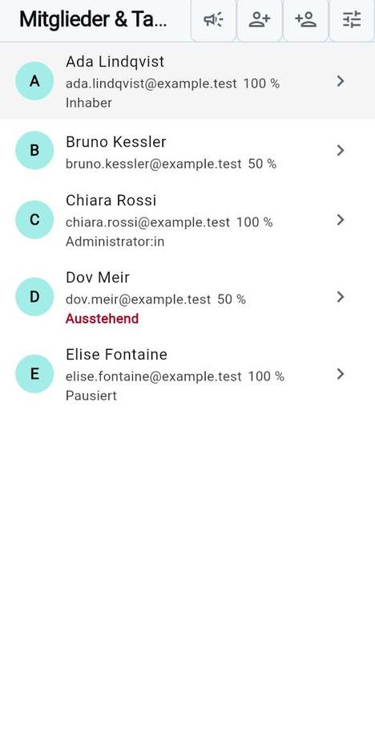

*Die vier Grundrollen*

| Rolle | Wofür sie da ist | Im Verein |
|---|---|---|
| **Inhaber** | Die Person, die für den Space einsteht und jede Berechtigung hat. Nur ein Inhaber kann die Inhaberschaft erteilen. | Ada, die Präsidentin. |
| **Mitinhaber** | Ein zweiter Schlüssel. Hat standardmäßig jede Berechtigung und kann übernehmen, wenn der Inhaber geht. | Die Vizepräsidentin, falls der Vorstand eine hat. |
| **Administrator** | Führt den Alltag: Mitglieder, Buchungen für andere, den Kiosk, Dokumente, Leistungen. Hat, was die Matrix gibt, und nicht mehr. | Chiara, die Schriftführerin. |
| **Benutzer** | Die Person, die den Space nutzt. Hat nur die Alltagsberechtigungen, die Sie geben. | Bruno, ein Mitglied wie die anderen. |

Jede Person hat genau eine Grundrolle. Eine Rolle, die der Space selbst festlegt, etwa *Gastgeber* oder *Buchhaltung*, kommt darauf und nimmt nie etwas weg.

*Ein Schatzmeister, ohne Administrator zu sein*

Bruno führt die Bücher, soll aber den Grundriss nicht bearbeiten und keine neuen Mitglieder freigeben. Geben Sie ihm die Grundrolle **Benutzer** und fügen Sie eine eigene Rolle hinzu, zum Beispiel *Buchhaltung*, mit vier Berechtigungen: **Workspace-Finanzen einsehen**, **Rechnungen ausstellen & Zahlungen zuordnen**, **Buchhaltung und Daten exportieren** und **Kennzahlen des Arbeitsbereichs lesen**. Nicht mehr. Eine solche Rolle ist nicht eingebaut; Sie legen sie mit den folgenden Schritten an.

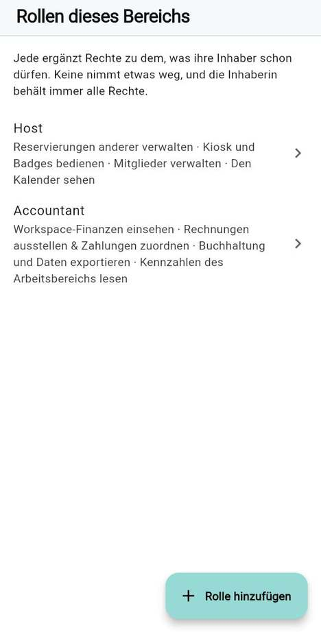

**Schritte**

1. Öffnen Sie [Rollen dieses Bereichs](https://fdittgen-png.github.io/deskilo/#/settings/roles-of-this-space) und tippen Sie auf **Rolle hinzufügen**. Siehe [Rollen dieses Bereichs](Benutzerhandbuch#rollen-die-dieser-space-festlegt).
2. Geben Sie der Rolle einen Namen, wählen Sie **Was sie ergänzt** und tippen Sie auf **Rolle speichern**.
3. Öffnen Sie die Person unter [Mitglieder & Tarife](https://fdittgen-png.github.io/deskilo/#/members), suchen Sie **Rollen** und tippen Sie auf **Rolle hinzufügen**.

**Gut zu wissen**

- **Rollen dieses Bereichs** ist eine eigene Funktion und in einem neuen Space aus. Schalten Sie sie unter [Funktionen](https://fdittgen-png.github.io/deskilo/#/features) ein.
- Niemand kann sich selbst eine Rolle geben. Eine Rolle zu geben braucht **Rollen & Berechtigungen verwalten**, und nur ein Inhaber kann eine Rolle geben, die das enthält.
- Eine Rolle, die der Space festlegt, gilt sofort und wird festgehalten. Nur wenn jemand zum Administrator gemacht wird oder es nicht mehr ist, greift die Freigaberegel **Rollenwechsel**.

**Ergebnis** Jede Person des Vorstands hat die Berechtigungen ihrer Aufgabe, und der Inhaber bleibt der Einzige, der das ändern kann.

**Siehe auch:** [Die Rollenmatrix](Benutzerhandbuch#die-rollenmatrix)

<!-- anchor: setup.people.matrix -->
### Die Rollenmatrix: so wenig Rechte wie nötig

**Zielgruppe:** Inhaber · Mitinhaber

Sie möchten, dass jede Rolle hat, was sie braucht, und sonst nichts. Das ist das Prinzip der geringsten Rechte: klein beginnen, hinzufügen, wenn jemand fragt, denn eine einmal gegebene Berechtigung nimmt man selten ohne Verstimmung zurück.

**Schritte**

1. Öffnen Sie [Rollen](https://fdittgen-png.github.io/deskilo/#/roles). Es gibt eine Karte pro Rolle: **Inhaber**, **Mitinhaber**, **Administrator** (der Inhaber kann sie umbenennen) und **Benutzer**.
2. Lesen Sie zuerst die Karte **Administrator**. Sie zeigt, was ein Administrator heute in Ihrem Space hat.
3. Entfernen Sie den Haken bei dem, was Sie nicht abgeben möchten. Setzen Sie die Alltagsberechtigungen, die die Karte **Benutzer** braucht (siehe unten).

*Was ein Administrator standardmäßig hat*

| Gruppe | Berechtigungen |
|---|---|
| Personen | **Mitglieder verwalten**, **Persönliche Daten der Mitglieder lesen** |
| Buchungen und der Ort | **Reservierungen anderer verwalten**, **Kiosk und Badges bedienen**, **Standorte verwalten und den Grundriss bearbeiten** |
| Geld, lesen und genehmigen | **Workspace-Finanzen einsehen**, **Ausgaben genehmigen**, **Services & Pakete verwalten**, **Geschäftsvereinbarungen einsehen**, **Geschäftsvereinbarungen verwalten**, **Änderung der Zahlungsbedingungen beantragen**, **Buchhaltung und Daten exportieren** |
| Dokumente und Kennzahlen | **Dokumentbibliothek verwalten**, **Kennzahlen des Arbeitsbereichs lesen** |
| Zwei Seiten eines Spaces | **In die Entwicklung ausrollen**, **Den Produktionsraum betreten** |

Ein Administrator hat nicht **Rollen & Berechtigungen verwalten**, **Validierungsregeln konfigurieren**, **Workspace-Einstellungen bearbeiten**, **Tarife und Abrechnungsregeln verwalten**, **Dokumente gestalten**, **Integrationen verwalten**, **Konfiguration verwalten** oder **In die Produktion ausrollen**. Eine Mit-Inhaberin hat alle, bis Sie einige abwählen. Der Inhaber hat sie immer alle.

> **Achtung** In einem neuen Space ist die Karte **Benutzer** leer. Die sechs Alltagsberechtigungen (**Den Messenger nutzen**, **Buchen und Reservierungen nutzen**, **Den Kalender sehen**, **Das Mitgliederverzeichnis sehen**, **Das eigene Konto und die eigenen Rechnungen sehen**, **Die geteilten Dokumente sehen**) gelten nur über die Matrix oder eine Rolle. Solange Sie sie nicht angehakt haben, kann ein beitretendes Mitglied den Plan nicht öffnen. Die Demo zeigt sie schon angehakt, was das verdeckt. **Einrichtung dieses Workspace** zeigt **Was Mitglieder dürfen** als **Nötig für eine erste Buchung**, bis die Karte **Benutzer** **Buchen und Reservierungen nutzen** hält; die fünf anderen prüft sie nicht. Haken Sie sie bei der Karte **Benutzer** an, und bei der Karte **Administrator**, wenn auch Administratoren buchen, und testen Sie dann mit einem zweiten Konto.

**Gut zu wissen**

- Standardmäßig kann ein Administrator alle Finanzen und die persönlichen Daten jedes Mitglieds lesen. Sind Ihre Administratoren Ehrenamtliche, überlegen Sie, ob sie das sollen.
- **Admins stellen Rechnungen aus** (eine Funktion, standardmäßig aus, unter **Rechnungen**) gibt Administratoren **Rechnungen ausstellen & Zahlungen zuordnen**, was auch immer die Matrix sagt. Besser ist der Haken in der Matrix oder eine eigene Rolle, was genauer ist.
- Entfernen Sie eine Berechtigung, verschwindet sie überall zugleich; der Server prüft sie, nicht nur das Menü.
- Jede Änderung der Matrix wird als Ereignis festgehalten. Die Funktion **Rollenverwaltung** zeigt nur den Bildschirm; ist sie aus, gilt die gespeicherte Matrix weiter, Sie können sie nur nicht bearbeiten.

**Ergebnis** Eine Matrix, die Sie pro Rolle in einem Satz erklären können.

**Siehe auch:** [Die Rollenmatrix](Benutzerhandbuch#die-rollenmatrix) · [Wer was tut](#wer-was-tut)

<!-- anchor: setup.people.coowner -->
### Mitinhaber: mehr als eine Person, die handeln kann

**Zielgruppe:** Inhaber · Mitinhaber

Sie möchten, dass der Space weiterläuft, wenn Sie krank, verreist oder fort sind. Jeder Space braucht mehr als eine Person, die handeln kann. Standardmäßig haben nur Inhaber und Mitinhaber die Berechtigungen, die Funktionen, Rollen, Freigaberegeln und die Workspace-ID ändern, und nur ein Inhaber kann einen weiteren Inhaber machen.

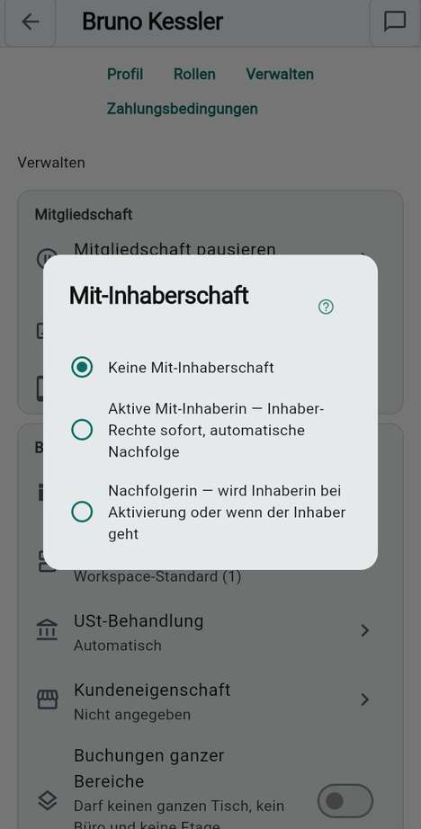

*Die zwei Arten*

| Art | Was sie bewirkt | Wählen Sie sie, wenn … |
|---|---|---|
| *Aktiver Mitinhaber* | Hat jetzt die Berechtigungen des Inhabers und übernimmt, wenn der Inhaber geht. | Sie die Arbeit teilen: die Vizepräsidentin, ein Partner. |
| **Nachfolge** | Wartet. Wird Inhaber, wenn Sie sie befördern oder wenn Sie gehen. | Sie nur einen Erben möchten. |

**Schritte**

1. Schalten Sie die Funktion **Mitinhaber** unter [Funktionen](https://fdittgen-png.github.io/deskilo/#/features) ein. In einem neuen Space ist sie aus.
2. Öffnen Sie die Person unter [Mitglieder & Tarife](https://fdittgen-png.github.io/deskilo/#/members), gehen Sie zu **Verwalten** und tippen Sie auf **Mit-Inhaberschaft**.
3. Wählen Sie den aktiven Mitinhaber oder **Nachfolge**. Um sofort zu übergeben, wählen Sie **Jetzt zum Inhaber machen**.

**Gut zu wissen**

- Geht der letzte Inhaber, wird die geeignetste Mit-Inhaberin von selbst Inhaber, eine aktive vor einer Nachfolgerin.
- Zwei Administratoren sind nicht dasselbe: Ein Administrator hat nur, was die Matrix gibt, und kann die Inhaberschaft nie weitergeben.
- Eine Regel mit **Inhaber muss immer validieren** verlangt einen Inhaber. Prüfen Sie auf Ihrer Testseite, dass Ihre Mit-Inhaberin weiterhin so entscheiden kann, wie Sie erwarten.

**Ergebnis** Der Space hat eine zweite Person, die handeln kann.

**Siehe auch:** [Mit-Inhaberinnen](Benutzerhandbuch#mitinhaber) · [Mit-Inhaberschaft](Benutzerhandbuch#mit-inhaberschaft)

<!-- anchor: setup.people.join -->
### Wie Personen beitreten

**Zielgruppe:** Inhaber · Administrator:in

Sie möchten wählen, wie Personen zu Ihrem Space kommen und wer sie hereinlässt. Es gibt vier Wege, und jeder endet am selben Punkt: Eine Person bittet um Beitritt, und jemand entscheidet.

| Weg | Was die Person erhält | Was sie wird |
|---|---|---|
| Die Workspace-ID | Ein kurzes Wort, in der App einzutippen. | Mitglied, nach Freigabe. |
| Der QR-Code | Dieselbe ID als Bild zum Drucken oder Aushängen (**Als PNG teilen**). | Mitglied, nach Freigabe. |
| Eine Einladungsnachricht | Ein Text mit persönlichem Code, für eine Person gültig, in der Sprache Ihrer Wahl. | Die Rolle, die Sie anbieten, nach Freigabe. |
| Ein Administratorcode | Ein Code für eine Person aus dem Tab **Einladung als Administrator:in**. | Einmalig Administrator. |

**Schritte**

1. Öffnen Sie [Workspace-ID & QR](https://fdittgen-png.github.io/deskilo/#/workspace-code). Wählen Sie mit **Workspace-ID ändern** eine ID, die man sich merken kann: 4 bis 20 Buchstaben oder Ziffern, in ganz DesKilo eindeutig.
2. Tippen Sie für eine namentlich bekannte Person auf **Jemanden einladen**. Tragen Sie den Namen ein, haken Sie **Rollen bei der Ankunft** an, wenn sie eine Rolle bekommen soll, wählen Sie die **Sprache der Nachricht** und senden Sie.
3. Bittet jemand um Beitritt, steht in seiner Zeile unter [Mitglieder & Tarife](https://fdittgen-png.github.io/deskilo/#/members) **Ausstehend**. Öffnen Sie sie und wählen Sie **Mitgliedschaft bestätigen** oder **Mitgliedschaft ablehnen**.

**Gut zu wissen**

- Niemand kommt ohne Entscheidung hinein. Bis sie getroffen ist, sieht die neue Person einen Wartebildschirm und sonst nichts.
- Die Entscheidung folgt der Regel für **Neues Mitglied** unter [Freigaberegeln](https://fdittgen-png.github.io/deskilo/#/validation): Standardmäßig genügt ein Inhaber oder Administrator; verlangen Sie zwei, bleibt die Person nach der ersten Freigabe ausstehend.
- Ändern Sie die Workspace-ID, funktioniert die alte nicht mehr. Drucken Sie den QR-Code neu.
- Es gibt keine Einladung als Inhaber. Die Inhaberschaft wird unter **Mitglieder & Tarife** erteilt.

**Ergebnis** Personen finden Sie, und Sie entscheiden, wer bleibt.

**Siehe auch:** [Die Workspace-ID](Benutzerhandbuch#die-workspace-id) · [Einem Workspace beitreten](Benutzerhandbuch#einem-workspace-beitreten) · [Ausstehende und pausierte Mitglieder](Benutzerhandbuch#ausstehende-und-pausierte-mitglieder)

<!-- anchor: setup.people.invitation -->
### Die Einladungsnachricht, Sprache für Sprache

**Zielgruppe:** Inhaber · Administrator:in

Sie möchten eine Einladung, die nach Ihrem Space klingt, in der Sprache der Person, die sie erhält. Jede Sprache hat ihren eigenen Text; die, die Sie nicht schreiben, fällt auf die eingebaute Nachricht zurück.

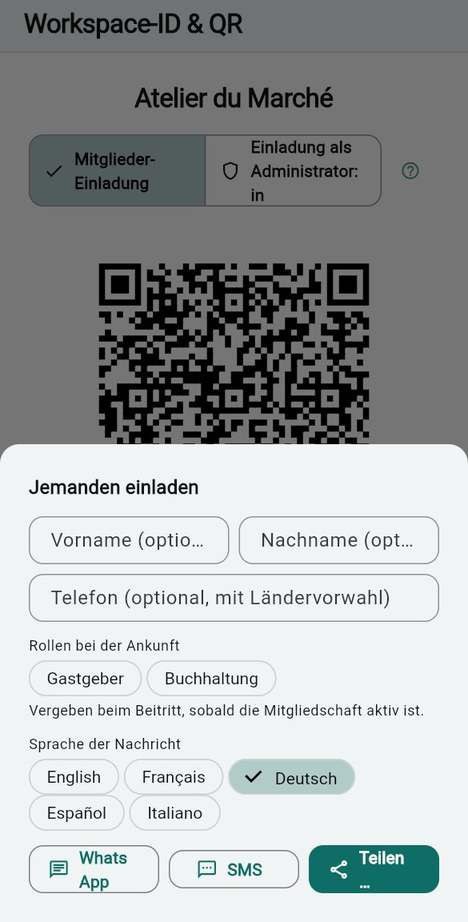

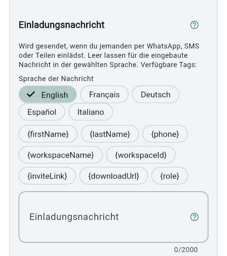

**Schritte**

1. Öffnen Sie [Workspace](https://fdittgen-png.github.io/deskilo/#/workspace-settings) und gehen Sie zu **Gemeinschaft und Einladungen**.
2. Wählen Sie unter **Sprache der Nachricht** die Sprache, für die Sie schreiben. Die Zeile öffnet sich mit der Sprache Ihres Arbeitsbereichs.
3. Schreiben Sie den Text. Tippen Sie auf einen Platzhalter, um ihn an der Cursorposition einzufügen. Die Grenze liegt bei 2000 Zeichen.
4. Wiederholen Sie das für jede Sprache, die Ihre Mitglieder nutzen, und tippen Sie dann auf **Speichern**.

*Die Platzhalter*

| Platzhalter | Wird gefüllt mit |
|---|---|
| `{firstName}` `{lastName}` `{phone}` | Dem, was Sie unter **Jemanden einladen** eingetippt haben. Leer, wenn Sie nichts eingetippt haben. |
| `{workspaceName}` | Dem Namen Ihres Spaces. |
| `{workspaceId}` | Dem persönlichen Einladungscode dieser Nachricht (nicht der öffentlichen Workspace-ID). |
| `{inviteLink}` | Einem Link, der die App auf dem richtigen Server mit ausgefülltem Code öffnet. |
| `{downloadUrl}` | Der Store-Seite der App. |
| `{role}` | Der Rolle, die die Einladung anbietet, in der Sprache der Nachricht. |

**Gut zu wissen**

- Lassen Sie das Feld leer, schreibt die App ihre eigene Nachricht in dieser Sprache. Sie erklärt die Schritte: herunterladen, Konto anlegen, mit dem Code beitreten.
- Fügen Sie keinen Code und keinen Link selbst ein. Jeder Versand erzeugt seinen eigenen Code, für eine Person gültig.
- Ein falsch geschriebener Platzhalter bleibt im gesendeten Text sichtbar: Lesen Sie die Vorschau, bevor Sie senden.
- Die eingebaute Nachricht sagt der Person, dass der Code nur einmal verwendbar und 14 Tage gültig ist.

**Ergebnis** Eine Einladung, der Ihre Mitglieder folgen können, ohne Sie zu fragen.

**Siehe auch:** [Einladungsnachricht](Benutzerhandbuch#einladungstext) · [Jemanden per Nachricht einladen](Benutzerhandbuch#jemanden-per-nachricht-einladen)

<!-- anchor: setup.people.managed -->
### Verwaltete Profile

**Zielgruppe:** Inhaber · Administrator:in

Sie möchten für jemanden buchen, abrechnen und verwalten, der noch kein Konto hat: einen Besucher, ein älteres Mitglied, eine Person, die Papier bevorzugt.

**Schritte**

1. Schalten Sie **Verwaltete Profile** unter [Funktionen](https://fdittgen-png.github.io/deskilo/#/features) ein.
2. Tippen Sie unter [Mitglieder & Tarife](https://fdittgen-png.github.io/deskilo/#/members) auf **Verwaltetes Profil anlegen** und füllen Sie die Identität aus.
3. Ist die Person so weit, öffnen Sie ihre Seite und wählen **An die Person übergeben**. Das erzeugt einen persönlichen, an das Profil gebundenen Code.

**Gut zu wissen**

- Wer den Code einlöst, übernimmt das Profil mit seinen Buchungen, Rechnungen und seinem Abo, sobald Sie die Mitgliedschaft bestätigen.
- Nehmen Sie die Übergabe mit **Übergabe zurückziehen** zurück, wenn der Code noch nicht benutzt wurde.

**Siehe auch:** [Ein verwaltetes Profil anlegen](Benutzerhandbuch#ein-verwaltetes-profil-anlegen)

<!-- anchor: setup.people.validation -->
### Freigabe: woraus eine Regel besteht

**Zielgruppe:** Inhaber

Sie möchten Handlung für Handlung wählen, ob eine zweite Person zustimmen muss. Ein Freigabebereich ist eine Art von Handlung mit eigener Regel: *eine Zahlung*, *eine Ausgabe*, *ein neues Mitglied*, *eine Buchungslöschung*. Unter **Freigaberegeln** stehen die Bereiche in drei Gruppen.

| Gruppe | Bereiche, in einfachen Worten | Während sie wartet |
|---|---|---|
| **Finanzen** | Eine Zahlung, eine Ausgabe, eine Leistung, eine Rechnung, die ihrer Zahlung zugeordnet wird, eine ausgestellte oder stornierte Rechnung, eine Erstattung, eine Abschreibung, eine Preisvereinbarung, eine gemeinsame Ausgabe, eine geplante Ausgabe, eine Änderung der Zahlungsbedingungen, ein vorzeitiger Austritt, ein entfernter Nutzungssatz | Der Betrag zählt auf keinem Kontoauszug. |
| **Buchungen** | **Zusätzliche Halbtage**, um die ein Mitglied bittet, **Ganzraum-Reservierungen**, eine Buchung, die ein Administrator für ein Mitglied macht, eine **Buchungslöschung** | Der Platz bleibt, wie er war. |
| **Personen und Rollen** | **Neues Mitglied**, ein Rollenwechsel, eine Statusänderung, eine Abo-Änderung, eine Änderung der Berechtigungsmatrix | Die Person behält den Zugang, den sie jetzt hat. |

Jeder Bereich beginnt mit **Erbt den Standard**: eine Freigabe durch einen beliebigen Administrator oder Inhaber. Die **Standardregel** ist die Regel, die alle anderen erben. Ein Bereich, den Sie öffnen und speichern, wird **Angepasst**.

*Die Stellschrauben einer Regel*

| Einstellung | Was sie bedeutet | Braucht |
|---|---|---|
| **Erforderliche Validierungen** | Wie viele Personen zustimmen müssen. | |
| **Wer prüft** | **Admins**, **Benannte Personen** oder **Alle Mitglieder**. Der Inhaber darf immer. | **Prüfer nach Rolle oder Person**: Ohne sie wird die Auswahl nicht angezeigt, und Administratoren validieren. Prüfen Sie nach dem Ausschalten noch einmal die Regeln, die **Benannte Personen** nannten |
| **Admins dürfen validieren** | Aus: nur Inhaber validieren. | |
| **Inhaber muss immer validieren** | Eine der Zustimmungen muss von einem Inhaber kommen. | |
| **Die Inhaberschaft darf das Eigene freigeben** | Die eigene Anfrage des Inhabers bleibt nicht auf jemand anderen wartend liegen. Ein Administrator bekommt das nie. | **Verkettete Freigaben** |
| **Nacheinander** | Die zweite Person wird gefragt, sobald die erste zugestimmt hat. | **Verkettete Freigaben** |
| **Nur über diesem Betrag** | Darunter gilt die Handlung sofort. Nur Finanzbereiche. | **Verkettete Freigaben** |
| **Admins löschen ohne Validierung** / **Inhaber löschen ohne Validierung** | Ihre eigene **Buchungslöschung** erledigt sich selbst und bleibt als automatisch validiert markiert. Standardmäßig aus. | |

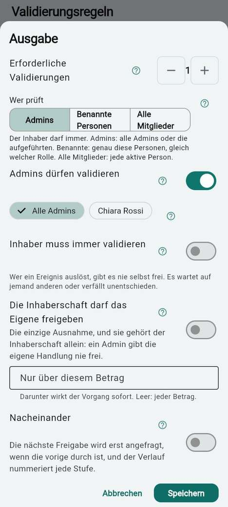

**Schritte**

1. Öffnen Sie [Freigaberegeln](https://fdittgen-png.github.io/deskilo/#/validation). Tippen Sie auf **Standardregel** und entscheiden Sie, was alles andere erbt.
2. Tippen Sie auf einen Bereich, stellen Sie die Schrauben ein und tippen Sie auf **Speichern**.
3. Halten Sie die Ausnahmen gering. Jede Ausnahme ist eine Sache mehr, die Sie im Kopf behalten müssen, wenn jemand fragt: „Warum wartet das?“

**Gut zu wissen**

- Niemand validiert die eigene Handlung. Sie wartet auf jemand anderen, es sei denn, die Ausnahme für den Inhaber ist eingeschaltet.
- Jede Entscheidung wird festgehalten: wer, wann, wozu.
- Eine Anfrage, die niemand beantwortet, verfällt nach sieben Tagen, beim nächsten Öffnen von Ereignisse durch irgendjemanden aufgeräumt. Eine Handlung, die ein Administrator für ein Mitglied vornahm, wird stattdessen automatisch bestätigt.

**Siehe auch:** [Freigaberegeln, Bereich für Bereich](Benutzerhandbuch#validierungsregeln-bereich-für-bereich) · [Wer validieren darf](Benutzerhandbuch#wer-validieren-darf) · [Automatisch validieren](Benutzerhandbuch#die-eigene-anfrage-eines-administrators-automatisch-validieren)

<!-- anchor: setup.people.presets -->
### Drei Vorlagen zum Kopieren

**Zielgruppe:** Inhaber

Sie möchten einen Regelsatz, den Sie heute kopieren und später verfeinern können. Wählen Sie einen; jeder stützt sich auf den Standardkreis, Inhaber und Administratoren, es ist also keine zusätzliche Funktion nötig.

| Vorlage | Wählen Sie sie, wenn … | Was Sie einstellen | Benötigte Prüfer |
|---|---|---|---|
| *Offener Beitritt* | Sie die Menschen kennen, die Ihren Code scannen werden. | Nichts. Jeder Bereich erbt den Standard: eine Freigabe durch einen beliebigen Inhaber oder Administrator. Ein Beitritt ist trotzdem nie automatisch. | 1 (Sie) |
| *Beitritte freigeben* | Ein Vorstand entscheidet, wer hereinkommt. | **Neues Mitglied**: **Erforderliche Validierungen** 2, **Inhaber muss immer validieren** an. | 2: ein Inhaber und ein Administrator |
| *Beitritte und Buchungen freigeben* | Plätze oder ganze Räume knapp sind oder Buchungslöschungen einen Zeugen brauchen. | *Beitritte freigeben*, dazu bei **Ganzraum-Reservierungen**, **Zusätzliche Halbtage** und **Buchungslöschung**: **Erforderliche Validierungen** 1. | Mindestens 2, bequem 3 |

Im Verein: Ada ist Inhaberin, Chiara Administratorin. Mit *Beitritte freigeben* bestätigen Ada und Chiara jede neue Person gemeinsam. Mit der dritten Vorlage ist ein ganzer Raum, den Bruno bucht, für ihn sofort blockiert, aber Ada oder Chiara können ihn noch ablehnen, und eine Löschung, die Chiara beantragt, entscheidet Ada, nicht Chiara.

**Schritte**

1. Öffnen Sie [Freigaberegeln](https://fdittgen-png.github.io/deskilo/#/validation).
2. Tippen Sie auf **Neues Mitglied**, stellen Sie ein, was die Tabelle sagt, und tippen Sie auf **Speichern**.
3. Wiederholen Sie das für die dritte Vorlage bei den anderen drei Bereichen.
4. Öffnen Sie **Mitglieder & Tarife** und zählen Sie Ihre aktiven Inhaber und Administratoren. Es müssen mindestens so viele sein wie in der letzten Spalte.

**Gut zu wissen**

- Eine gewöhnliche Buchung eines Mitglieds wird durch diese Vorlagen nie zur Freigabe zurückgehalten. Es warten ein ganzer Raum, zusätzliche Halbtage, eine Löschung und der Beitritt.
- Eine Vorlage ist ein Ausgangspunkt. Erhöhen Sie eine Zahl erst, wenn Sie genug Personen haben, die antworten.

**Siehe auch:** [Erforderliche Validierungen](Benutzerhandbuch#erforderliche-validierungen) · [Ein Inhaber ist erforderlich](Benutzerhandbuch#ein-inhaber-ist-erforderlich)

<!-- anchor: setup.people.stuck -->
### Anfragen vermeiden, die ewig warten

**Zielgruppe:** Inhaber · Mitinhaber

Sie möchten sicher sein, dass jede Anfrage, für die Sie eine Regel anlegen, beantwortet werden kann. Eine Regel, die mehr Prüfer braucht, als es gibt, wird nicht überall abgelehnt: Die Anfrage wird angelegt, niemand kann sie abschließen, und sie verfällt nach sieben Tagen.

> **Achtung** Der Editor zählt einen zusätzlichen Prüfer für die betroffene Person und lässt Sie daher **Erforderliche Validierungen** um eins über den Personen speichern, die Sie haben. Diese zusätzliche Zustimmung gibt es nur bei einer Buchung, die ein Administrator für ein Mitglied gemacht hat, und bei einigen Zahlungen. Bei einem Beitritt oder einer Finanzanfrage gibt es sie nicht. Verlassen Sie sich nicht darauf, dass der Editor für Sie zählt.

*Zählen Sie, bevor Sie verlangen*

| Sie verlangen | Sie brauchen, außer der Person, die fragt |
|---|---|
| 1 | Einen aktiven Inhaber oder Administrator |
| 2 | Zwei aktive Inhaber oder Administratoren |
| 2 mit **Inhaber muss immer validieren** | Einen Inhaber und eine weitere Person |
| Eine Liste **Benannte Personen** | Jede Person darauf muss aktiv sein; ein neuer Administrator wird nicht automatisch hinzugefügt |

*So prüfen Sie es*

1. Öffnen Sie [Freigaberegeln](https://fdittgen-png.github.io/deskilo/#/validation) und lesen Sie jede angepasste Karte: „Alle Admins — beliebige 2“ bedeutet zwei Personen.
2. Öffnen Sie [Mitglieder & Tarife](https://fdittgen-png.github.io/deskilo/#/members). Zählen Sie die aktiven Inhaber und Administratoren. Pausierte und ausgetretene Personen zählen nicht.
3. Öffnen Sie **Einrichtung dieses Workspace** unter [Workspace](https://fdittgen-png.github.io/deskilo/#/workspace-settings). Der Bereich **Rollen und wer Anfragen bestätigt** sagt „Eine Regel verlangt mehr Prüfer, als dieser Bereich hat“, wenn zu wenige gezählt werden. Der Bereich wird dann erforderlich, gleich welche Art von Anfrage, und [Was auf Sie wartet](Benutzerhandbuch#was-auf-sie-wartet) meldet ihn.
4. Öffnen Sie [Ereignisse](https://fdittgen-png.github.io/deskilo/#/events). **Wartet auf Ihre Bestätigung** zeigt, was wartet, und eine Zeile zeigt „1/2 Validierungen“.

**Gut zu wissen**

- Der Editor selbst sagt **Nicht genügend berechtigte Validierer.**, wenn eine Zahl die verfügbaren Personen deutlich übersteigt. Er fängt nicht jeden Fall ab.
- Ein einzelner Inhaber, der etwas für sich selbst beantragt, wartet auf jemand anderen: Fügen Sie entweder einen Administrator hinzu oder schalten Sie unter **Verkettete Freigaben** **Die Inhaberschaft darf das Eigene freigeben** ein.
- Einen Administrator zu pausieren oder zu entfernen kann eine Regel unterbesetzt zurücklassen. Zählen Sie nach jeder Änderung des Teams neu.

**Ergebnis** Jede Regel kann von Personen beantwortet werden, die es gibt.

**Siehe auch:** [Erforderliche Validierungen](Benutzerhandbuch#erforderliche-validierungen) · [Stimmig bleiben](#stimmig-bleiben)

<!-- anchor: setup.people.first-week -->
### Die erste Woche Ihrer Mitglieder

**Zielgruppe:** Inhaber · Administrator:in

Sie möchten, dass Ihre ersten Mitglieder zurechtkommen, ohne Sie zu fragen. Was Sie ihnen in der ersten Woche sagen, entscheidet, wie viel Sie in der zweiten beantworten.

*Bevor Sie jemanden einladen*

1. Melden Sie sich als zweite Person mit einem Testkonto an und treten Sie Ihrem Space bei. Prüfen Sie, dass Sie den Plan öffnen und einen Platz buchen können.
2. Bestätigen Sie dieses Konto als Mitglied, und lassen Sie auch den zweiten Prüfer bestätigen, wenn Sie zwei verlangen.

**Schritte**

1. Senden Sie die Einladungsnachricht. Sie sagt den Personen, wie sie die App herunterladen, ein Konto anlegen und beitreten. Siehe [Einem Workspace beitreten](Benutzerhandbuch#einem-workspace-beitreten).
2. Bestätigen Sie jede neue Person am selben Tag. Wer einen Tag wartet, beginnt mit einem Zweifel.
3. Sagen Sie ihnen die drei ersten Dinge: den Plan und das Buchen ([Einen Platz reservieren](Benutzerhandbuch#einen-platz-buchen)), das Einchecken ([Ein- und Auschecken](Benutzerhandbuch#ein--und-auschecken)) und wo ihre Anfragen warten ([Ereignisse](Benutzerhandbuch#ereignisse-und-bestätigungen)).
4. Sagen Sie ihnen, was Sie über sie sehen und was sie selbst steuern ([Wer meine Daten sehen kann](Benutzerhandbuch#datenschutz-wer-meine-daten-sehen-kann)).
5. Nennen Sie eine Person, die man fragen kann, und wo: im Messenger oder am Empfang.

**Gut zu wissen**

- Tut ein Administrator etwas für ein Mitglied, bleibt es ausstehend, bis das Mitglied bestätigt. Warnen Sie es, sonst wirkt die erste Buchung, die Sie für jemanden machen, wie ein Fehler.
- Mitglieder, die keine Push-Benachrichtigungen nutzen, finden trotzdem alles unter **Ereignisse**.
- Beim ersten Besuch von Reservieren zeigt die Karte **Erste Schritte** den Inhabern, was noch fehlt. Mitglieder haben ihre eigenen kurzen Tipps. Siehe [Die Karte „Erste Schritte“ und die Tipps](Benutzerhandbuch#die-karte-erste-schritte-und-die-tipps).

**Ergebnis** Personen, die wissen, wie man bucht, wie man eincheckt und wen man fragt.

**Siehe auch:** [Woche 0 bis Woche 4](#in-vier-wochen-lernen) · [Wie Mitglieder informiert werden](#was-mitglieder-selbst-steuern)

<!-- anchor: setup.money.overview -->
## Geld und Steuern

Für Inhaber und Abrechnungsadministratoren, die entscheiden wollen, wie ein Space bezahlt wird. Dieses Kapitel behandelt die Entscheidungen und ihre Reihenfolge; die einzelnen Klicks stehen im Benutzerhandbuch, und jeder Abschnitt verweist dorthin.

> **Achtung** DesKilo erfasst, berechnet und druckt, was Sie angeben, und prüft, ob die erforderlichen Angaben vorhanden sind. Es bescheinigt weder Ihre Rechnungen noch Ihre umsatzsteuerliche Behandlung noch Ihre Buchführung. Wo dieses Kapitel „fragen Sie Ihren Steuerberater“ sagt, tun Sie das bitte.

In diesem Kapitel:
- Ob Mitglieder überhaupt zahlen und wer die Rechnungen ausstellt
- Wie ein Tarif aufgebaut ist, mit Zahlen aus dem Demo-Space *Atelier du Marché*
- Wie Mitglieder Sie bezahlen
- Ihre rechtliche Identität und die Fragen für Ihren Steuerberater
- Rechnungen von Hand oder automatisch, Mahnungen und Umsatzsteuer im Überblick
- Die Geldentscheidungen, die sich nicht mehr zurücknehmen lassen, und wie Sie gefahrlos üben

<!-- anchor: setup.money.decide -->
### Zuerst entscheiden: Zahlen die Mitglieder, und wer stellt die Rechnungen aus?

**Zielgruppe:** Inhaber

Sie legen fest, wie weit DesKilo in Ihre Finanzen hineinreicht. Alles Weitere in diesem Kapitel folgt aus dieser einen Wahl. Sie lässt sich später leicht ausbauen, aber schwer zurückbauen, sobald Rechnungen existieren.

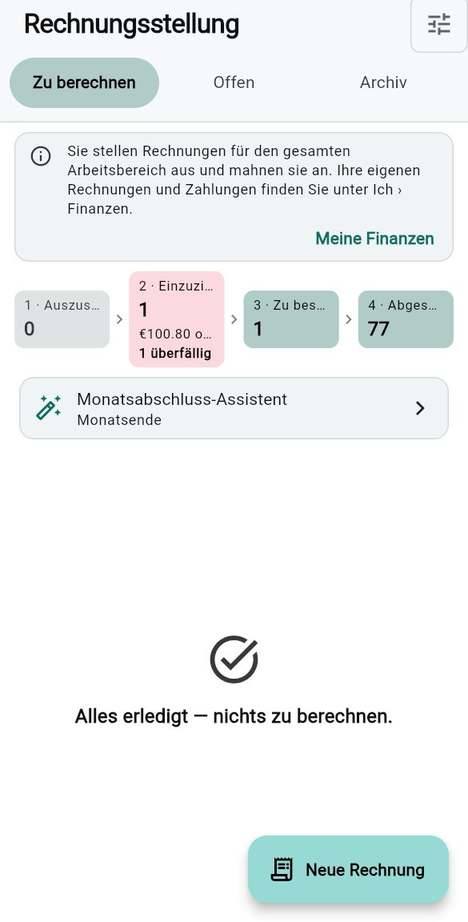

**Bevor Sie beginnen**

Beantworten Sie zwei Fragen: Zahlen Ihnen die Mitglieder etwas für den Space, und sollen die rechtsgültigen Rechnungen aus DesKilo kommen?

| Weg | Wählen Sie ihn, wenn | Was geschieht |
|---|---|---|
| 1. Kein Geld | Der Space ist kostenlos, oder die Mitglieder sind Freunde, die die Miete außerhalb der App teilen | Sie lassen die Geldfunktionen aus. Mitglieder buchen; niemand wird abgerechnet. |
| 2. Kontoauszüge und Zahlungen, Rechnungen außerhalb | Sie haben schon einen Steuerberater oder ein Rechnungsprogramm, oder Sie arbeiten in einem Land, für das DesKilo keine Rechnungen ausstellen kann | Mitglieder haben einen Monatsauszug, Sie erfassen die eingegangenen Zahlungen und exportieren die Zahlen für Ihren Steuerberater. Die rechtsgültigen Rechnungen entstehen anderswo. |
| 3. Rechnungen von DesKilo | Sie sind in Frankreich oder Deutschland und entweder umsatzsteuerpflichtig oder nicht steuerbar (zum Beispiel als Verein) | DesKilo erzeugt aus den Buchungen signierte, fortlaufend nummerierte Rechnungen, auf denen Ihre rechtliche Identität steht. |

**Schritte**

1. Wählen Sie Ihren Weg aus der Tabelle.
2. Schalten Sie bei Weg 2 oder 3 die benötigten Geldfunktionen unter [Funktionen](Benutzerhandbuch#ein-funktionsschalter) ein: **Rechnungen** ist die Grundlage für alles, was ausgestellt wird; die Funktionen darunter (**Abo-Rechnungen**, **Monatsabschluss-Rechnungen**, **Mahnwesen**, **USt-Verwaltung**) kommen einzeln dazu.
3. Fahren Sie bei Weg 3 mit [Ihrer rechtlichen Identität](#ihre-rechtliche-identität-und-was-sie-ihren-steuerberater-fragen) fort, und zwar vor der ersten Buchung, nicht danach.

**Gut zu wissen**

- Rechnungen in der App auszustellen ist heute für einen Workspace in **Frankreich** oder **Deutschland** möglich. In jedem anderen Land nehmen Sie Weg 2; die Kontoauszüge bleiben verfügbar.
- Der Server verweigert die Ausstellung, wenn eine Angabe fehlt oder wenn die Behandlung eine ist, die DesKilo nicht abdeckt; die Liste **Vor der Ausstellung bitte ergänzen** nennt den Grund. Grenzüberschreitende Umsätze, Reverse-Charge, Ausfuhren und umsatzsteuerfreie Rechnungen müssen Sie mit Ihrem Steuerberater prüfen und außerhalb der App ausstellen.
- Wer unter die Kleinunternehmerregelung fällt (§ 19 UStG; in Frankreich „franchise en base“), kann in der App keine Rechnungen ausstellen: Der Server lehnt die Steuerkategorie „steuerfrei“ ab. Bleiben Sie bei Weg 2 und stellen Sie diese Rechnungen anderswo aus.
- Eine Funktion auszuschalten stoppt neue Vorgänge dieser Art; gelöscht wird nichts.
- Sie können dauerhaft bei Weg 2 bleiben. Viele Vereine tun das.

**Ergebnis**

Sie wissen, welcher der drei Wege Ihrer ist und welche Funktionen er braucht.

**Siehe auch:** [Rechnungsstellung im Überblick](Benutzerhandbuch#rechnungsstellung-im-überblick) · [Ganze Prozesse ein- oder ausschalten](Benutzerhandbuch#ganze-prozesse-ein--oder-ausschalten)

<!-- anchor: setup.money.tariff -->
### Einen Tarif entwerfen

**Zielgruppe:** Inhaber · Abrechnungsadministrator:in

Sie verwandeln die Frage „Was ist ein Platz wert?“ in Zahlen, die DesKilo jeden Monat ohne Ihr Zutun anwendet.

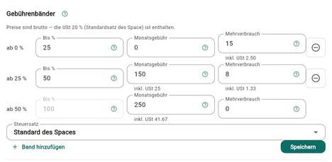

**Bevor Sie beginnen**

Behalten Sie das Modell im Kopf. Es liest sich von links nach rechts, und jeder Schritt speist den nächsten:

1. Abo-Anteil in Prozent: Ein Mitglied hält einen Anteil am Monat: 25, 50, 75 oder 100 %, oder einen Wert, den Sie zulassen.
2. Halbtage-Kontingent: Der Anteil wird zu einer Anzahl Halbtage für den Monat: Zahl der Öffnungstage mal zwei mal Prozentsatz, aufgerundet.
3. Gebührenband: Der Prozentsatz fällt in genau ein Band, das die Monatsgebühr und den Preis für einen zusätzlichen Halbtag festlegt. Ein Band gilt „über seinem Anfang, bis einschließlich seines Endes“, und die Bänder zusammen müssen 0 bis 100 % ohne Lücke abdecken.
4. Regel bei Überschreitung: Ist das Kontingent aufgebraucht, wird jedes Mitglied entweder gesperrt, mit dem Preis für die Überschreitung belastet oder gebeten, ein Paket zu kaufen.
5. Pakete und Leistungen: Ein Tagespaket verkauft zusätzliche Halbtage im Voraus zu einem Preis, den Sie festlegen; Leistungen (ein Kaffee, ein Schließfach, Drucken) werden obendrauf verkauft.

**Schritte**

1. Legen Sie unter **Abo-Stufen** fest, welche Prozentsätze Sie anbieten und ob ein Inhaber einen ausgehandelten Wert eintragen darf (siehe [Abo-Stufen](Benutzerhandbuch#abo-stufen)).
2. Legen Sie unter **Gebührenbänder** pro Bereich eine Zeile an: die Obergrenze, die Monatsgebühr und den Preis bei Überschreitung (siehe [Gebührenbänder](Benutzerhandbuch#gebührenbänder)).
3. Bestimmen Sie die Standardregel für Mitglieder, deren Tage aufgebraucht sind: [Wenn die Tage aufgebraucht sind](Benutzerhandbuch#wenn-die-tage-aufgebraucht-sind).
4. Ergänzen Sie die [Tagespakete](Benutzerhandbuch#tagespakete) und [Leistungen](Benutzerhandbuch#eine-leistung), die Sie verkaufen.

**Gut zu wissen**

- Die Rechenweise wird auf jedem ausgestellten Dokument eingefroren. Ein geänderter Preis gilt ab dem nächsten Monat, nie für einen bereits abgerechneten.
- Öffnungszeiten und Schließtage bestimmen, wie viele Öffnungstage ein Monat hat, und damit die Größe des Kontingents. Legen Sie sie zuerst fest.
- Ein Mitglied ohne Abo ist für Besucher gedacht, die Zehnerkarten kaufen; sie können nicht nach Verbrauch abgerechnet werden.

**Siehe auch:** [Abrechnung](Benutzerhandbuch#gebührenbänder) · [Das Abo eines Mitglieds](Benutzerhandbuch#das-abo-eines-mitglieds)

<!-- anchor: setup.money.example -->
### Ein durchgerechnetes Beispiel

**Zielgruppe:** Inhaber · Abrechnungsadministrator:in

Sie begleiten ein Mitglied durch einen Monat, mit den Zahlen des *Atelier du Marché*, damit Sie Ihre eigenen Zahlen auf dieselbe Weise prüfen können.

**Bevor Sie beginnen**

Der Demo-Space hat drei Gebührenbänder, in Euro und inklusive Umsatzsteuer. Die Zahlen stammen aus der Demo und sind keine Empfehlung.

| Band | Monatsgebühr | Zusätzlicher Halbtag | Halbtage in einem Monat mit 22 Öffnungstagen |
|---|---|---|---|
| bis 25 % | 0,00 | 15,00 | 11 |
| über 25 %, bis 50 % | 150,00 | 8,00 | 22 |
| über 50 %, bis 100 % | 250,00 | 0,00 | 44 (bei 100 %) |

**Schritte**

1. Ein Mitglied hält 50 %. In einem Monat mit 22 Öffnungstagen beträgt das Kontingent 22 × 2 × 50 / 100 = 22 Halbtage.
2. 50 % fallen in das zweite Band (über 25, bis 50): Die Gebühr beträgt 150,00, egal wie viel das Mitglied nutzt.
3. Das Mitglied bucht 24 Halbtage. Zwei liegen über dem Kontingent, je 8,00: macht 16,00.
4. Der Monat kostet 150,00 + 16,00 = 166,00, vor etwaigen Leistungen. In der Demo sind die Preise Bruttopreise: Die 20 % Umsatzsteuer sind enthalten, und der Bildschirm zeigt sie unter jedem Preis an.
5. Vergleichen Sie mit einem Paket: Das 5-Tage-Paket der Demo kostet 40,00 und bringt 10 Halbtage (5 Tage, je zwei Halbtage), also 4,00 pro Halbtag. Gegenüber 8,00 bei Überschreitung lohnt es sich ab dem sechsten zusätzlichen Halbtag im Monat.

**Gut zu wissen**

- Ein Preis von 0,00 bei Überschreitung bedeutet: Zusätzliche Halbtage kosten bei Abrechnung nach Verbrauch nichts.
- Der Kontoauszug, den ein Mitglied sieht, zeigt dieselben Zeilen: Gebühr, enthalten, genutzt, zusätzlich, Überschreitung.
- Preise werden inklusive Umsatzsteuer angezeigt, wenn die Umsatzsteuer aktiv ist; die Steuer wird daraus herausgerechnet.
- Wenn Sie mit einem Mitglied andere Bedingungen vereinbaren, lesen Sie [Preisverhandlung](#preisverhandlung).

**Ergebnis**

Sie können die Rechnung eines Mitglieds aus drei Zahlen vorhersagen: seinem Prozentsatz, den Öffnungstagen und den Buchungen.

**Siehe auch:** [Ihren Kontoauszug lesen](Benutzerhandbuch#ihre-abrechnung-lesen) · [Was jede Buchung gekostet hat](Benutzerhandbuch#was-jede-buchung-gekostet-hat)

<!-- anchor: setup.money.negotiation -->
### Preisverhandlung

**Zielgruppe:** Inhaber · Abrechnungsadministrator:in

Sie möchten, dass ein Mitglied andere Bedingungen als im Tarif bekommt, und zwar nachvollziehbar.

**Schritte**

1. Schalten Sie die Funktion Preisverhandlung unter [Funktionen](Benutzerhandbuch#ein-funktionsschalter) ein.
2. Schlagen Sie auf der Mitgliedsseite Bedingungen vor: eine andere Monatsgebühr, einen anderen Satz bei Überschreitung, einen Nachlass auf Zusatzleistungen, Stückpreise oder einen Belegungsanteil (siehe [Preisverhandlung](Benutzerhandbuch#preisverhandlung)).
3. Lassen Sie die Validierungsregel für Preisverhandlungen entscheiden, wer sie bestätigt.

**Gut zu wissen**

- Der Tarif bleibt der Standard; ein ausgehandelter Preis gehört zu genau einem Mitglied.
- Ihn sehen das Mitglied, die Inhaber und die Personen mit dem Recht, Geschäftsvereinbarungen einzusehen; jeder Lesezugriff wird protokolliert.
- Legen Sie Ihre Linie fest, bevor Sie anfangen: Eine Ausnahme, die stillschweigend gewährt wird, wird schnell zum Preis, den alle verlangen.

**Siehe auch:** [Ihre ausgehandelten Preise](Benutzerhandbuch#ihre-verhandelten-preise)

<!-- anchor: setup.money.pay -->
### Wie Mitglieder Sie bezahlen

**Zielgruppe:** Inhaber · Abrechnungsadministrator:in

Sie bestimmen, wohin das Geld eines Mitglieds fließt und wie viel Arbeit DesKilo Ihnen dabei abnimmt.

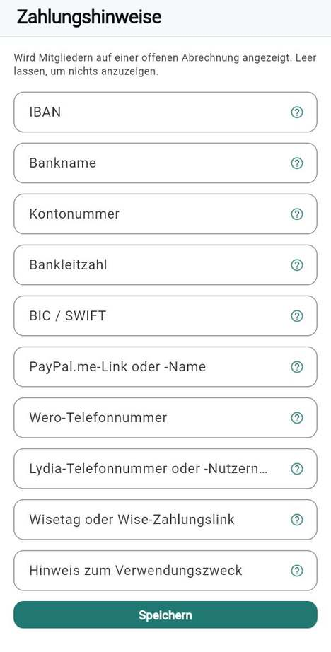

**Schritte**

1. Beginnen Sie mit dem kostenlosen Weg: Tragen Sie die [Zahlungsanweisungen](Benutzerhandbuch#zahlungsarten-und-zahlungshinweise) ein, also Ihre IBAN und Bankverbindung sowie, was Sie akzeptieren, PayPal.me, Wero, Lydia oder Wise, dazu einen Hinweis zum Verwendungszweck.
2. Mitglieder sehen diese Angaben auf einem unbezahlten Kontoauszug. Wenn eine Zahlung auf Ihrem Konto eingeht, [erfassen](Benutzerhandbuch#eine-zahlung-erfassen) Sie oder ein Abrechnungsadministrator sie.
3. Nur wenn Mitglieder in der App bezahlen sollen, verbinden Sie unter [Online-Zahlungen](Benutzerhandbuch#der-zahlungsanbieter) einen Anbieter: PayPal, Stripe oder Mollie. Dafür brauchen Sie die Funktion **Online-Zahlungen** und ein eigenes Konto beim Anbieter.

**Gut zu wissen**

- DesKilo erfasst Zahlungen; auf dem manuellen Weg bewegt es nie Geld.
- Ein Anbieter berechnet eigene Gebühren und erhält die Schlüssel Ihres Kontos (das Blatt für die Zugangsdaten erklärt, wie sie eingegeben werden).
- Ist **Online-Zahlungen** aus, wird eine neue Online-Zahlung abgelehnt; eine bereits offene kann noch abgeschlossen werden.
- Ein Space, der aus einer Vorlage entsteht, übernimmt keine Zahlungsangaben: Tragen Sie sie in jedem Space ein. Ein Konfigurationsexport enthält sie dagegen.

**Siehe auch:** [Bezahlen, was Sie schulden](Benutzerhandbuch#offenes-bezahlen) · [Zugangsdaten des Anbieters](Benutzerhandbuch#zugangsdaten-des-anbieters)

<!-- anchor: setup.money.identity -->
### Ihre rechtliche Identität, und was Sie Ihren Steuerberater fragen

**Zielgruppe:** Inhaber

Sie teilen DesKilo mit, wer verkauft, damit jede Rechnung Sie korrekt benennt. Das ist der Teil, den Sie mit einem Fachmann klären sollten.

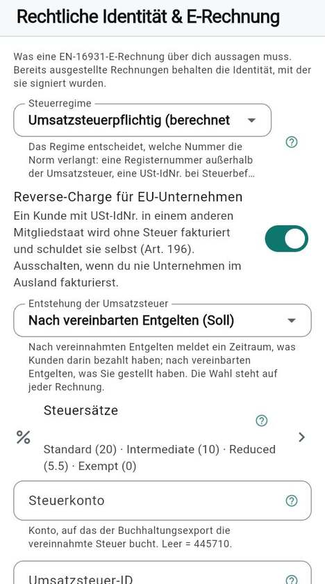

**Bevor Sie beginnen**

Der Bildschirm heißt [Rechtliche Identität & E-Rechnung](https://fdittgen-png.github.io/deskilo/#/legal-identity). Halten Sie bereit:

- Ihre Organisationsform: Unternehmen oder gemeinnütziger Verein;
- Ihr Steuerregime: nicht der Umsatzsteuer unterliegend, umsatzsteuerfrei (Kleinunternehmerregelung) oder umsatzsteuerpflichtig. Die App kann nur für den ersten und den letzten Fall Rechnungen ausstellen; bei der Kleinunternehmerregelung hält der Bildschirm Ihren Status fest, die Rechnungen müssen aber anderswo ausgestellt werden (Weg 2);
- Ihre Registernummer und, falls vorhanden, Ihre Umsatzsteuer-Identifikationsnummer;
- Ihre Postanschrift, wie sie in Ihrer Eintragung steht;
- den Grund, warum keine Umsatzsteuer berechnet wird, falls Sie keine berechnen.

> **Achtung** Das Steuerregime zu wählen ist eine steuerliche Entscheidung, keine Software-Einstellung. Ein Verein ohne wirtschaftliche Tätigkeit liegt normalerweise außerhalb der Umsatzsteuer, und der Bildschirm warnt Sie, wenn Sie für ihn „steuerfrei“ wählen. Bestätigen Sie die Wahl, bevor Sie die erste Rechnung ausstellen.

**Schritte**

1. Öffnen Sie [Rechtliche Identität & E-Rechnung](https://fdittgen-png.github.io/deskilo/#/legal-identity) und arbeiten Sie von oben nach unten: zuerst das **Steuerregime**, dann die Kennungen, die Adresse und die **Rechnungsangaben**.
2. Tragen Sie die Zahlungsbedingungen, die Hinweise zum Zahlungsverzug und die weiteren Angaben ein, die Ihr Land verlangt (siehe [Ihre rechtliche Identität](Benutzerhandbuch#ihre-rechtliche-identität)).
3. Tippen Sie auf **Speichern** und lesen Sie die Rechnungsvorlage einmal gemeinsam mit Ihrem Steuerberater durch (siehe [Die PDF-Vorlage der Rechnung](Benutzerhandbuch#die-pdf-vorlage-der-rechnung)).

> **Tipp** Fragen für Ihren Steuerberater:
>
> 1. Welche Organisationsform und welches Steuerregime habe ich?
> 2. Wie lauten meine Registernummer und meine Umsatzsteuer-Identifikationsnummer, und wie schreibe ich sie?
> 3. Wenn ich keine Umsatzsteuer berechne: Mit welchem Gesetzestext begründe ich das?
> 4. Welche Angaben müssen auf meinen Rechnungen stehen (Zahlungsziel, Verzugszinsen, Einziehungspauschale, Skonto, Versicherung)?
> 5. Wie sind Rechnungen zu nummerieren, und beginnt die Nummer jedes Jahr oder jeden Monat neu?
> 6. Wird die Umsatzsteuer mit der Rechnung fällig oder mit der Zahlung (Soll- oder Ist-Versteuerung)?
> 7. Muss ich E-Rechnungen an eine staatliche Plattform senden, und an welche?
> 8. Brauche ich regelmäßige Umsatzsteuer-Voranmeldungen, und wie oft?

**Gut zu wissen**

- Bereits ausgestellte Rechnungen behalten die Identität, mit der sie signiert wurden; eine Änderung gilt für die nächsten.
- Nur ein Inhaber oder ein aktiver Mitinhaber kann diesen Bildschirm öffnen, und die Funktion **Rechnungen** muss eingeschaltet sein.
- Ein Space, der aus einer Vorlage entsteht, übernimmt Ihre Identität nicht: Tragen Sie sie neu ein. Ein Deployment zwischen den beiden Seiten eines Paars übernimmt sie.

**Siehe auch:** [Steuerregime](Benutzerhandbuch#steuerregime) · [Die E-Rechnungs-Plattform](Benutzerhandbuch#die-e-rechnungs-plattform) · [Art der Organisation](Benutzerhandbuch#art-der-organisation)

<!-- anchor: setup.money.invoicing -->
### Rechnungen von Hand oder automatisch

**Zielgruppe:** Inhaber · Abrechnungsadministrator:in

Sie entscheiden, ob jemand jeden Monat die Knöpfe drückt oder DesKilo das übernimmt.

**Schritte**

1. Arbeiten Sie im ersten Monat von Hand: Öffnen Sie [Rechnungsstellung](https://fdittgen-png.github.io/deskilo/#/invoices), lesen Sie **Auszustellen** und stellen Sie die Rechnung eines Mitglieds aus (siehe [Eine Rechnung ausstellen](Benutzerhandbuch#eine-rechnung-ausstellen)).
2. Für den Alltag nutzen Sie den [Monatsabschluss-Assistenten](Benutzerhandbuch#der-monatsabschluss-assistent): Er führt durch **Prüfen**, **Ausstellen**, **Senden**, **Mahnen**, **Zahlungen**, **Zuordnen**, **Abschließen** und **Zusammenfassung**.
3. Zum Automatisieren schalten Sie **Abo-Rechnungen** und **Monatsabschluss-Rechnungen** unter [Funktionen](Benutzerhandbuch#ein-funktionsschalter) ein und legen die Tage im [Rechnungsplan](Benutzerhandbuch#rechnungsplan) fest.

**Gut zu wissen**

- Pro Monat gibt es zwei Dokumente: die Abogebühr, die vor dem Monat ausgestellt wird, und das, was der Monat tatsächlich gekostet hat, ausgestellt danach. Eine Rechnung kann einige Tage vordatiert sein (standardmäßig drei, einstellbar im Rechnungsplan); eine Rechnung vom 29. August kann also den September betreffen.
- Auf dem Server stellt ein täglicher Lauf beide aus, wenn die Datenbank der Installation ihren Scheduler aktiviert hat; fragen Sie im Zweifel den Betreiber.
- Jede Rechnungsart (Abo, Monatsabschluss) kann pro Mitglied und Monat einmal ausgestellt werden. Rechnungen lassen sich weder bearbeiten noch löschen; eine falsche wird als fehlerhaft markiert und ersetzt.
- Standardmäßig stellen der Inhaber und die Mitinhaber Rechnungen aus. **Admins stellen Rechnungen aus** erweitert das auf die Administratoren.

**Siehe auch:** [Der Bildschirm Rechnungsstellung](Benutzerhandbuch#der-bildschirm-rechnungsstellung) · [Offene Rechnungen nachfassen und abschließen](Benutzerhandbuch#offene-rechnungen-nachverfolgen-und-begleichen)

<!-- anchor: setup.money.reminders -->
### Zahlungserinnerungen

**Zielgruppe:** Inhaber · Abrechnungsadministrator:in

Sie bestimmen, ab wann eine Zahlung überfällig ist und wer nachfasst.

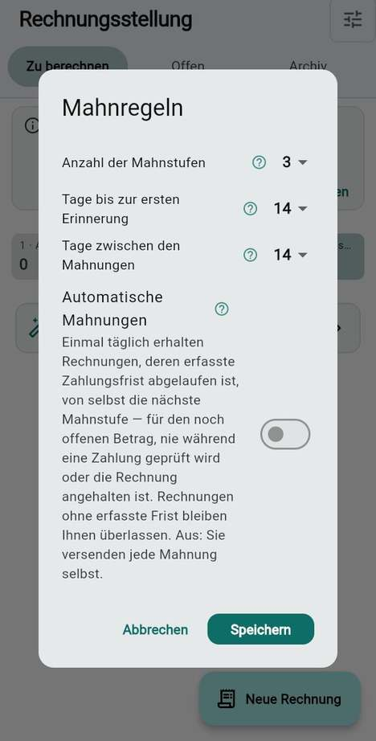

**Schritte**

1. Schalten Sie **Mahnwesen** unter [Funktionen](Benutzerhandbuch#ein-funktionsschalter) ein. Es liegt unter **Rechnungen**.
2. Legen Sie in den [Mahnregeln](Benutzerhandbuch#mahnregeln) die Zahl der Stufen und die Fristen fest: Tage bis zur ersten Mahnung, Tage zwischen den Mahnungen.
3. Entscheiden Sie, ob Mahnungen von selbst hinausgehen: Schalten Sie im selben Dialog **Automatische Mahnungen** ein (siehe [Automatische Mahnungen](Benutzerhandbuch#automatische-mahnungen)); auch die Funktion **Automatische Zahlungserinnerungen** muss eingeschaltet sein.

**Gut zu wissen**

- Die Frist bis zur ersten Mahnung gilt zugleich als Ihr Zahlungsziel. Legen Sie es mit den [Zahlungsbedingungen](Benutzerhandbuch#zahlungsbedingungen) fest.
- Automatische Mahnungen laufen einmal täglich auf dem Server, wenn die Datenbank ihren Scheduler aktiviert hat. Sie laufen auch, wenn jemand mit dem Recht, Rechnungen auszustellen (ein Inhaber, ein Mitinhaber oder, wenn **Admins stellen Rechnungen aus** an ist, ein Administrator), die Finanzen öffnet; ein Space ohne Scheduler bekommt sie also an den Tagen, an denen jemand hinsieht. Der Schalter und die Funktionsbeschreibung sagen es ebenfalls; der Betreiber Ihres Servers weiß, was zutrifft.
- Die Funktion **Mahnwesen** stellt nur die Regeln bereit. Eine Mahnung geht erst dann von selbst hinaus, wenn **Automatische Mahnungen** in den Mahnregeln eingeschaltet ist; das ist zunächst aus, bis Sie es wählen.
- Übersprungen werden Rechnungen mit ausstehender oder angehaltener Zahlung und Rechnungen ohne erfasstes Zahlungsziel.
- Das Mitglied erhält einen Hinweis in seinem Feed und, wenn Push eingerichtet ist, eine allgemein gehaltene Benachrichtigung; siehe [Menschen informieren](#menschen-informieren).

**Siehe auch:** [Zahlungsbedingungen](Benutzerhandbuch#zahlungsbedingungen)

<!-- anchor: setup.money.vat -->
### Umsatzsteuer im Überblick

**Zielgruppe:** Inhaber · Abrechnungsadministrator:in

Sie möchten wissen, was die Umsatzsteuer von Ihnen verlangt, bevor Sie sie einschalten.

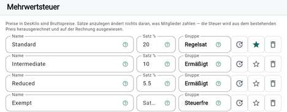

**Schritte**

1. Schalten Sie **USt-Verwaltung** unter [Funktionen](Benutzerhandbuch#ein-funktionsschalter) nur ein, wenn Sie umsatzsteuerpflichtig sind.
2. Legen Sie die Sätze unter [USt](https://fdittgen-png.github.io/deskilo/#/vat) fest: **Übliche Sätze übernehmen** für Ihr Land, dann genau einen davon als Standard markieren (siehe [Die Sätze festlegen](Benutzerhandbuch#die-sätze-festlegen)).
3. Ordnen Sie jedem Satz seine Gruppe zu, und wo es zutrifft, einen Befreiungsgrund (siehe [USt-Gruppen](Benutzerhandbuch#steuergruppen)).
4. Ändert das Gesetz einen Satz, verwenden Sie **Änderung per Gesetz**, damit ältere Rechnungen ihren Satz behalten (siehe [Einen Satz per Gesetz ändern](Benutzerhandbuch#einen-satz-per-gesetz-ändern)).
5. Müssen Sie Erklärungen abgeben, schalten Sie **USt-Voranmeldungen** ein und erzeugen jeden Zeitraum unter [USt-Voranmeldung](Benutzerhandbuch#die-periodische-umsatzsteuererklärung).

**Gut zu wissen**

- Ein Katalog der Sätze liegt für die EU-Mitgliedstaaten, die Schweiz, Norwegen und Kanada bei. Ihn aktuell zu halten, wenn ein Staat einen Satz ändert, ist Ihre Aufgabe.
- Wer umsatzsteuerpflichtig ist, aber keinen gültigen Standardsatz hat, dem verweigert der Server die Ausstellung. Die Beschreibung von **USt-Verwaltung** und die Warnung auf dem Bildschirm der rechtlichen Identität sagen es.
- Eine Voranmeldung ist eine Hilfe für die Abgabe, erstellt aus Ihren ausgestellten Rechnungen. Prüfen Sie sie, bevor Sie sie abgeben, und markieren Sie sie erst als abgegeben, wenn Sie es getan haben.
- Das Journal der Voranmeldungen hat einen eigenen Nummernkreis.

**Siehe auch:** [Steuerregime](Benutzerhandbuch#steuerregime) · [Wann die Umsatzsteuer fällig wird](Benutzerhandbuch#wann-die-umsatzsteuer-entsteht)

<!-- anchor: setup.money.permanent -->
### Was sich nicht rückgängig machen lässt

**Zielgruppe:** Inhaber

Sie möchten vor der ersten Rechnung wissen, was Sie danach nicht mehr ändern können.

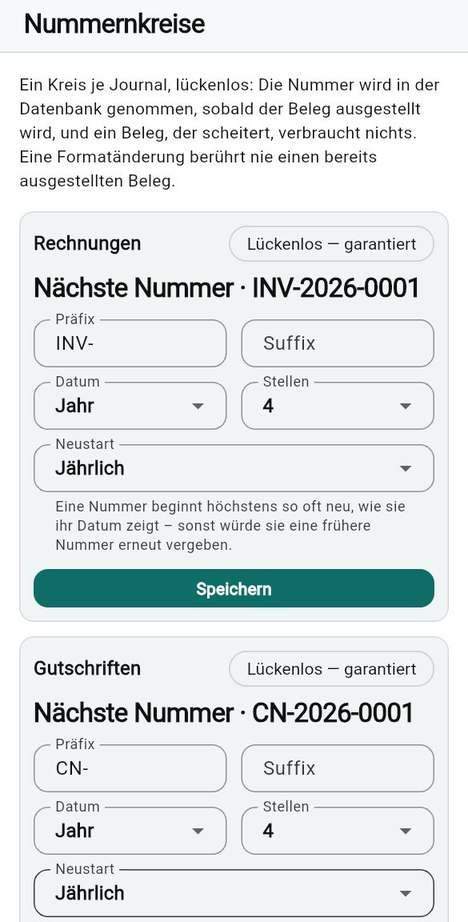

> **Achtung** Ab der ersten ausgestellten Rechnung ist das Folgende endgültig. Entscheiden Sie es vorher mit Ihrem Steuerberater.

| Entscheidung | Was endgültig wird | Wann |
|---|---|---|
| Eine ausgestellte Rechnung | Sie ist signiert und unveränderlich: Beträge, Beteiligte, Steueraufschlüsselung und Tarifberechnung bleiben, wie gedruckt. Eine Korrektur ist eine Stornierung, eine Gutschrift oder eine Erstattung, jeweils ein neues Dokument. | Bei der Ausstellung |
| Rechnungsnummer | Nummern sind lückenlos und werden im Moment der Ausstellung in der Datenbank vergeben. Die nächste Nummer lässt sich erhöhen, nie senken. Ein neues Format gilt ab dann. Ein Neubeginn der Zählung darf nicht häufiger sein als das Datum, das die Nummer druckt. | Bei der ersten Ausstellung |
| Ein abgerechneter Monat | Ein Monat, für den ein Mitglied eine Rechnung hat, ist für dieses Mitglied abgeschlossen. Schließtage und Feiertagsimporte überspringen solche Monate und nennen sie. | Bei der ersten Rechnung dafür |
| Umsatzsteuersätze | Sätze werden nach Datum versioniert und nie bearbeitet. Eine eingereichte Voranmeldung wird nie neu berechnet. | Bei der ersten Verwendung |
| Währung und Land | Beträge werden als ganze kleinste Einheiten ohne Umrechnung gespeichert. Sobald der Space ein Dokument ausgestellt oder Geld erfasst hat, lehnt der Server jede Änderung von beiden ab. | Beim ersten Dokument oder der ersten Zahlung |

**Schritte**

1. Öffnen Sie [Nummernkreise](https://fdittgen-png.github.io/deskilo/#/settings/number-sequences) und legen Sie für jedes Journal (Rechnungen, Gutschriften, Voranmeldungen, Mitglieder, Zahlungen) Präfix, Suffix, Datumsteil, Stellenzahl und Neubeginn fest. Der Bildschirm braucht die Funktion **Nummernkreise**.
2. Zeigen Sie das Ergebnis Ihrem Steuerberater vor der ersten Rechnung.
3. Wählen Sie Land, Währung und Zeitzone in den [Workspace-Einstellungen](Benutzerhandbuch#land), bevor irgendjemand bucht.

**Gut zu wissen**

- Nummern gehen nicht verloren: Ein Dokument, dessen Ausstellung scheitert, verbraucht keine.
- Die zwei Zustände eines Space, Test und Produktion, gibt es, damit nichts hiervon ernsthaft ausprobiert wird; siehe [einen gefahrlosen Probelauf](#ein-gefahrloser-probelauf-in-einem-test-space).

**Siehe auch:** [Das Rechnungsregister](Benutzerhandbuch#das-rechnungsregister) · [Währung und Zeitzone](Benutzerhandbuch#währung-und-zeitzone)

<!-- anchor: setup.money.dry-run -->
### Ein gefahrloser Probelauf in einem Test-Space

**Zielgruppe:** Inhaber

Sie üben die gesamte Geldroutine einmal durch, ohne dass etwas Echtes auf dem Spiel steht.

**Schritte**

1. Erstellen oder öffnen Sie einen Test-Workspace (**Ein Test-Arbeitsbereich** oder die DEV-Seite eines verbundenen Paars); siehe [Test-Space](Benutzerhandbuch#wofür-ein-testspace-da-ist) und [Umgebungen](Benutzerhandbuch#ein-space-hat-zwei-seiten).
2. Tragen Sie die rechtliche Identität, die Sätze, den Tarif und die Zahlungsanweisungen so ein, wie Sie sie betreiben wollen.
3. Laden Sie zwei oder drei Personen ein, einige Tage zu buchen; fügen Sie für eine davon eine Leistung hinzu.
4. Führen Sie den [Monatsabschluss-Assistenten](Benutzerhandbuch#der-monatsabschluss-assistent) von Anfang bis Ende durch und lesen Sie das Rechnungs-PDF.
5. Erfassen Sie eine Zahlung, lassen Sie eine Mahnung fällig werden und lesen Sie den Kontoauszug aus Sicht des Mitglieds.
6. Zeigen Sie die PDFs und den Buchhaltungsexport Ihrem Steuerberater.

**Gut zu wissen**

- Ein Test-Space versieht jedes Dokument mit einem Wasserzeichen und weist es als Test aus; geschuldet wird nichts.
- Wer einen Space zur Produktion erklärt, entfernt das Wasserzeichen; bereits ausgestellte Rechnungen behalten es.
- Das Paar kann die Konfiguration von einer Seite auf die andere übertragen, Zugangsdaten reisen aber nicht mit.

**Ergebnis**

Ein erster Monat, den Sie schon gesehen haben, und eine Liste von Fragen, die beantwortet sind, bevor sie etwas kosten.

**Siehe auch:** [Die zwei Umgebungen](Benutzerhandbuch#ein-space-hat-zwei-seiten) · [Buchhaltungsexporte](Benutzerhandbuch#buchhaltungsexporte)

<!-- anchor: setup.notify.overview -->
## Menschen informieren

Für Inhaber, die möchten, dass Mitglieder und Administratoren von dem erfahren, was wichtig ist, und nur davon. Dieses Kapitel beschreibt, was DesKilo tatsächlich sendet, wer es erhält, was Sie einstellen und was Sie dem Betreiber der Installation überlassen.

In diesem Kapitel:
- Die Kanäle, in einfachen Worten
- Eine Tabelle: was geschieht, wer informiert wird, über welchen Kanal und was ein Mitglied ändern kann
- Was Sie einstellen und was der Betreiber für Push tun muss
- Ein Testplan mit zwei Konten
- Wie Sie sowohl Überflutung als auch Stille vermeiden

<!-- anchor: setup.notify.channels -->
### Die Kanäle, in einfachen Worten

**Zielgruppe:** Inhaber · Administrator:in

Sie möchten ein klares Bild davon, auf welchen Wegen DesKilo eine Person erreichen kann, bevor Sie Ihren Mitgliedern etwas versprechen.

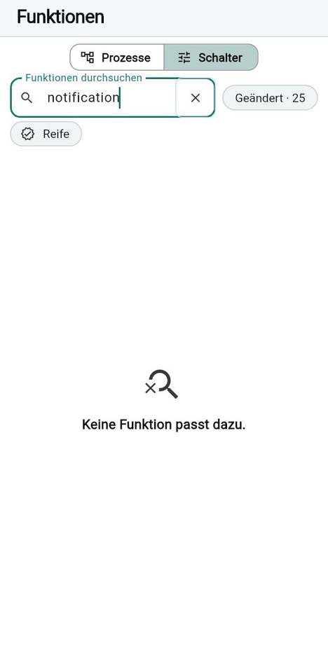

**Bevor Sie beginnen**

Es gibt sechs Wege, und sie sind nicht gleichwertig. Das meiste geschieht innerhalb der App.

| Kanal | Was es ist | Was es braucht |
|---|---|---|
| Der Ereignis-Feed und die Glocke | Alles, was im Space geschieht, wird in einen Feed geschrieben. Die Glocke zählt neue Meldungen und die Entscheidungen, die auf Sie warten. | **Ereignis-Tab**; **Gruppierung der Benachrichtigungen** ist eine Option obendrauf |
| Nachrichten | Private und Gruppenunterhaltungen zwischen Mitgliedern, mit Lesebestätigungen und Links zu einer Buchung oder einem Raum. | **Mitglieder-Benachrichtigungen** |
| Push | Eine kurze Benachrichtigung auf Handy oder Computer, auch bei geschlossener App. Der Text ist allgemein gehalten: keine Namen, keine Uhrzeiten. | **Push-Benachrichtigungen** an, **und** eine Push-Einrichtung durch den Betreiber; siehe [Aufgabe des Betreibers](#aufgabe-des-betreibers-push-zum-laufen-bringen) |
| Die Check-in-Erinnerung | Eine Benachrichtigung auf dem eigenen Gerät des Mitglieds, 15 Minuten vor einer Buchung, für die es noch nicht eingecheckt hat. | Die Systemberechtigung des Mitglieds. Nicht in der Browserversion. |
| Zahlungserinnerungen | Ein Hinweis im Feed und ein Push an das Mitglied, dessen Rechnung überfällig ist. | **Mahnwesen** und **Automatische Zahlungserinnerungen**; siehe [Zahlungserinnerungen](#zahlungserinnerungen) |
| WhatsApp | Ein Gruppenlink, den Sie veröffentlichen, und die WhatsApp-Nummer, die ein Mitglied freiwillig teilt. Die App öffnet WhatsApp; vom Server wird nichts gesendet. | **WhatsApp-Integration** |

**Gut zu wissen**

- DesKilo versendet keine eigenen E-Mails außer den Konto-E-Mails (Bestätigung der Anmeldung, Zurücksetzen des Passworts). Einladungen sind Texte, die Sie von Ihrem eigenen Handy aus teilen.
- Es gibt keine Abonnements pro Ereignis: Ein Mitglied kann nicht wählen „Informiert mich über Ausgaben, aber nicht über Buchungen“.
- Eine Benachrichtigung kann sich wie jeder Push verspäten oder verloren gehen; der Feed und die Nachrichtenliste sind das Protokoll.

**Siehe auch:** [Benachrichtigungen](Benutzerhandbuch#benachrichtigungen) · [Ereignisse & Bestätigungen](Benutzerhandbuch#ereignisse-und-bestätigungen)

<!-- anchor: setup.notify.table -->
### Wer wird worüber informiert

**Zielgruppe:** Inhaber · Administrator:in

Sie möchten Ereignis für Ereignis wissen, wer davon erfährt und wie.

**Bevor Sie beginnen**

Push wird nur für die fünf unten mit „Push“ gekennzeichneten Zeilen gesendet. Jedes andere Ereignis (eine Buchung, eine erfasste Zahlung, ein neues Mitglied) erscheint im Feed und sonst nirgends.

| Quelle | Ereignis | Wer wird informiert | Kanal | Was das Mitglied ändern kann |
|---|---|---|---|---|
| Validierungsregeln | Eine Anfrage braucht eine Bestätigung | Die Personen, die die Regel nennt (Feed, **Wartet auf Ihre Bestätigung**); der Push geht nur an das Mitglied, um das es in der Anfrage geht, nie an die Person, die sie gestellt hat; Validierer erhalten also nur dann einen Push, wenn sie dieses Mitglied sind. Text: „Jemand braucht Ihre Bestätigung.“ | Feed, Glocke; Push | Push auf dem Gerät ausschalten |
| Reservierungen | Ein Administrator entfernt eine Buchung oder setzt sich darüber hinweg | Das verdrängte Mitglied sowie jeder aktive Administrator und Inhaber außer der handelnden Person. Text: „Eine Reservierung wurde von einem Administrator entfernt.“ | Feed; Push | Push auf dem Gerät ausschalten |
| Zahlungserinnerungen | Eine Rechnung ist über das Zahlungsziel hinaus, und eine Mahnstufe wird fällig | Das Mitglied, für das die Rechnung ausgestellt ist. Die eigene Rechnung eines Inhabers erreicht den Inhaber. Text: „Eine Zahlungserinnerung wartet auf Sie.“ | Hinweis im Feed; Push | Push auf dem Gerät ausschalten |
| Mitglieder-Benachrichtigungen | Eine neue Nachricht | Direktnachricht: der Empfänger. Gruppe: die Teilnehmenden außer dem Absender. Eine von einem Mitglied stummgeschaltete Unterhaltung bleibt für dieses Mitglied still. Text: „Sie haben eine neue Nachricht.“ | Nachrichten, Glocke; Push | Unterhaltung stummschalten, anheften oder archivieren; Push ausschalten |
| Erwähnungen in Nachrichten | Eine Gruppennachricht nennt jemanden | Die genannten Personen, auch in einer stummgeschalteten Unterhaltung. Text: „Sie wurden in einer Unterhaltung erwähnt.“ | Nachrichten; Push | Push ausschalten |
| Reservierungen | Eine Buchung steht bevor | Das Mitglied, das gebucht hat, auf seinem eigenen Gerät, 15 Minuten vor Beginn, für Buchungen der nächsten sieben Tage | Lokale Benachrichtigung | Die Systemberechtigung verweigern |
| WhatsApp-Integration | Es wird nichts gesendet | Der Gruppenlink erscheint im Verzeichnis; ein Mitglied kann seine Nummer teilen | Öffnet WhatsApp | Die Nummer teilen oder verbergen |

**Gut zu wissen**

- Ist die App geöffnet, wird ein Push zu einer entfernten Buchung durch eine Benachrichtigung in der Sprache des Mitglieds ersetzt. Bei Nachrichten, Erwähnungen, Bestätigungen und Zahlungserinnerungen zeigt die geöffnete App derzeit ihren allgemeinen Text („Jemand braucht Ihre Bestätigung.“). Die allgemeinen englischen Texte der Tabelle erscheinen, wenn die App im Hintergrund oder geschlossen ist.
- Ein Administrator wird nur über das informiert, worauf er reagiert oder was eine Regel ihm zuweist; es gibt keine Gesamtübersicht über „alles“.
- Mitglieder sehen ihre eigenen Ereignisse; Administratoren und Inhaber sehen die aller.

**Siehe auch:** [Validierungsregeln](Benutzerhandbuch#validierungsregeln-bereich-für-bereich) · [Nachrichten](Benutzerhandbuch#nachrichten)

<!-- anchor: setup.notify.configure -->
### Was Sie einstellen

**Zielgruppe:** Inhaber

Sie entscheiden, welche dieser Kanäle in Ihrem Space existieren und wer worüber entscheiden soll.

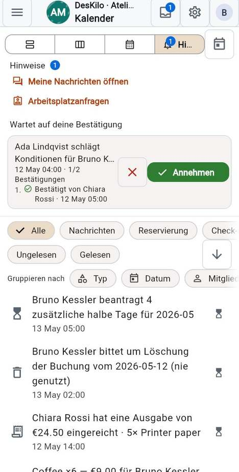

**Schritte**

1. Öffnen Sie [Funktionen](Benutzerhandbuch#ein-funktionsschalter) und prüfen Sie die Schalter für Benachrichtigungen: **Push-Benachrichtigungen**, **Mitglieder-Benachrichtigungen**, **Ereignis-Tab**, **Gruppierung der Benachrichtigungen**, **Mahnwesen**, **Automatische Zahlungserinnerungen** und **WhatsApp-Integration**.
2. Legen Sie die [Validierungsregeln](Benutzerhandbuch#validierungsregeln-bereich-für-bereich) fest: für jede Art von Anfrage, wie viele Validierungen nötig sind und wer sie geben darf. Das bestimmt, wer gefragt wird und damit, wer eine wartende Entscheidung sieht.
3. Entscheiden Sie, ob die eigene Anfrage eines Administrators oder Inhabers sich selbst erledigt; siehe [Eigene Anfrage eines Administrators automatisch validieren](Benutzerhandbuch#die-eigene-anfrage-eines-administrators-automatisch-validieren) und [Eigene Anfrage eines Inhabers automatisch validieren](Benutzerhandbuch#die-eigene-anfrage-eines-inhabers-automatisch-validieren). Eine bereits erledigte Anfrage meldet sich bei niemandem.
4. Schreiben Sie die Einladungsnachricht, die Mitglieder erhalten, und fügen Sie den Link zur Community-Gruppe ein; siehe [Einladungsnachricht](Benutzerhandbuch#einladungstext) und [WhatsApp-Gruppe](Benutzerhandbuch#whatsapp-gruppe).
5. Schalten Sie **Lösch-Anträge für Buchungen** ein, wenn Mitglieder beantragen dürfen, eine vergangene oder eingecheckte Buchung zu löschen: Dann muss jemand antworten.

**Gut zu wissen**

- Voreinstellungen für einen neuen Space: Der Ereignis-Tab, die Mitglieder-Benachrichtigungen und die Gruppierung sind an; **Mahnwesen** und **Automatische Zahlungserinnerungen** sind als Funktionen an, aber es wird keine Mahnung gesendet, bis Sie **Automatische Mahnungen** in den Mahnregeln einschalten.
- **Push-Benachrichtigungen** ist standardmäßig an, liefert aber nichts, bis der Betreiber es eingerichtet hat.
- Eine Funktion auszuschalten stoppt neue Aktivität dieser Art. Vorhandenes wird nicht gelöscht.
- Rollen bestimmen, wer was sehen und beantworten kann; siehe [Die Rollenmatrix](Benutzerhandbuch#die-rollenmatrix).

**Siehe auch:** [Wer darf validieren](Benutzerhandbuch#wer-validieren-darf) · [Erforderliche Validierungen](Benutzerhandbuch#erforderliche-validierungen)

<!-- anchor: setup.notify.operator -->
### Aufgabe des Betreibers: Push zum Laufen bringen

**Zielgruppe:** Betreiber:in · Inhaber

Sie möchten Push auf den Handys Ihrer Mitglieder und müssen wissen, wer was tut.

**Bevor Sie beginnen**

Push gehört nicht von selbst zur App. Betreiben Sie Ihren Space auf der gemeinsamen Referenzinstallation, fragen Sie deren Betreiber, ob Push eingerichtet ist. Betreiben Sie eine eigene Installation, sind Sie oder Ihre technische Ansprechperson der Betreiber.

**Schritte**

1. Legen Sie ein Firebase-Projekt an und bauen Sie die App damit. Ohne das bleibt die App bei lokalen Benachrichtigungen, und ein Mitglied sieht **Diese Version hat keine Push-Benachrichtigungen**. Die für F-Droid vorbereitete Version hat gar kein Push ([F-Droid-Status](https://github.com/fdittgen-png/deskilo/blob/master/docs/guides/fdroid.md#status)).
2. Fügen Sie für iPhone und Mac dem Firebase-Projekt einen Apple-Push-Schlüssel hinzu.
3. Hinterlegen Sie den Dienstkonto-Schlüssel von Firebase als Geheimnis des Servers und stellen Sie die Push-Funktion bereit.
4. Verweisen Sie bei einer eigenen Installation die Zeile `push_config` Ihrer Datenbank auf die URL und den Schlüssel Ihrer eigenen Push-Funktion. Sie ist mit der Adresse der Referenzinstallation vorbelegt.
5. Testen Sie mit zwei Konten, wie im [Testplan](#ein-testplan-senden-sie-sich-von-jedem-eine) beschrieben.

**Gut zu wissen**

- Ohne die Schritte 1 bis 4 wird nichts gepusht, was die Schalter auch sagen. Der Feed, die Glocke und die Nachrichten funktionieren weiterhin.
- Die ausführliche Checkliste ist für den Betreiber: siehe [Plattformen](Benutzerhandbuch#deskilo-auf-ihren-geräten) und [Ihr eigener Server](Benutzerhandbuch#einen-eigenen-server-betreiben).
- Der Push-Text enthält nie einen Namen oder eine Uhrzeit: Das ist Absicht, aus Datenschutzgründen.

**Siehe auch:** [Push-Benachrichtigungen auf diesem Gerät](Benutzerhandbuch#push-benachrichtigungen-auf-diesem-gerät)

<!-- anchor: setup.notify.members -->
### Was Mitglieder selbst steuern

**Zielgruppe:** Inhaber · Administrator:in

Sie möchten Ihren Mitgliedern ehrlich sagen, was sie ausschalten können.

**Schritte**

1. Ein Mitglied öffnet [Datenschutz & Daten](https://fdittgen-png.github.io/deskilo/#/privacy) und stoppt oder setzt Push auf diesem Gerät mit **Push-Benachrichtigungen auf diesem Gerät** fort.
2. In [Nachrichten](https://fdittgen-png.github.io/deskilo/#/me?tab=messages) drückt ein Mitglied lange auf eine Unterhaltung, um sie mit **Oben anheften**, **Benachrichtigungen stumm**, **Als ungelesen markieren** oder **Archivieren** zu verwalten.
3. In den Systemeinstellungen des Handys kann ein Mitglied Benachrichtigungen ganz verweigern, auch die Check-in-Erinnerungen.
4. In seinem Profil entscheidet ein Mitglied, ob es eine WhatsApp-Nummer teilt.

**Gut zu wissen**

- Eine stummgeschaltete Unterhaltung bleibt still, wird aber weiter mitgezählt; eine Erwähnung hebt die Stummschaltung auf.
- Wer Push auf einem Gerät ausschaltet, ist auf einem anderen nicht betroffen.
- Es gibt keine Schalter pro Kategorie. Braucht ein Mitglied weniger Lärm, schaltet es Unterhaltungen stumm; braucht es keinen, schaltet es Push aus.

**Siehe auch:** [Benachrichtigungen](Benutzerhandbuch#benachrichtigungen) · [Ihre Daten, Ihre Rechte](Benutzerhandbuch#ihre-daten-ihre-rechte)

<!-- anchor: setup.notify.test -->
### Ein Testplan: Senden Sie sich von jedem eine

**Zielgruppe:** Inhaber · Administrator:in · Betreiber:in

Sie stellen sicher, dass jeder Kanal funktioniert, bevor Ihre Mitglieder sich darauf verlassen.

**Bevor Sie beginnen**

Tun Sie das in einem Test-Space (siehe [einen gefahrlosen Probelauf](#ein-gefahrloser-probelauf-in-einem-test-space)). Sie brauchen zwei Konten: Ihres als Inhaber und ein zweites als Mitglied, auf einem anderen Handy, in einem anderen Browser oder auf demselben Handy nach dem Abmelden. Der Demo-Space zeigt Ihnen die Bildschirme mit seinen Personas, sendet aber keinen echten Push.

**Schritte**

1. Nachricht: Schreiben Sie vom Mitgliedskonto aus in [Nachrichten](https://fdittgen-png.github.io/deskilo/#/me?tab=messages) an den Inhaber. Im Inhaberkonto zählt die Glocke sie, und die Unterhaltung erscheint ungelesen. Öffnen Sie sie: Die Nachricht des Mitglieds zeigt eine Lesebestätigung.
2. Erwähnung: Nennen Sie in einer Gruppenunterhaltung den Inhaber (die Erwähnungsfunktion des Nachrichtendienstes muss an sein). Ist Push eingerichtet, zeigt das Handy des Inhabers „Sie wurden in einer Unterhaltung erwähnt.“
3. Entscheidung: Beantragen Sie als Mitglied das Löschen einer vergangenen Buchung (die Funktion **Lösch-Anträge für Buchungen** muss an sein). Der Inhaber sieht den Antrag unter **Wartet auf Ihre Bestätigung** in [Ereignisse](https://fdittgen-png.github.io/deskilo/#/events); beantworten Sie ihn und beobachten Sie, wie sich der Feed des Mitglieds ändert.
4. Entfernung: Entfernen Sie als Inhaber eine künftige Buchung des Mitglieds. Der Feed des Mitglieds zeigt es, und ein Handy mit Push zeigt „Eine Reservierung wurde von einem Administrator entfernt.“
5. Erinnerung: Buchen Sie als Mitglied einen Platz, der in etwa 20 Minuten beginnt (eine Buchung, die in weniger als 15 Minuten beginnt, erhält keine Erinnerung). Etwa 15 Minuten vor Beginn zeigt das Handy des Mitglieds die Check-in-Erinnerung.
6. Zahlungserinnerung: Schalten Sie bei eingeschaltetem **Mahnwesen** in den Mahnregeln **Automatische Mahnungen** mit einer kurzen Frist bis zur ersten Mahnung ein, stellen Sie eine Probe-Rechnung mit Zahlungsziel aus, warten Sie die Frist ab und öffnen Sie dann als Inhaber oder Mitinhaber die Finanzen; der Feed des Mitglieds zeigt den Hinweis.
7. Stummschalten: Schalten Sie als Mitglied die Unterhaltung stumm, senden Sie vom Inhaber eine weitere Nachricht und prüfen Sie, dass nichts klingelt, der Zähler für Ungelesenes aber steigt.

**Gut zu wissen**

- Die Schritte 2 und 4 zeigen nur dann einen Push, wenn die Einrichtung des Betreibers vollständig ist. Scheitern sie, während die anderen funktionieren, liegt der Fehler in der Einrichtung, nicht in Ihren Regeln.
- In der Browserversion der App gibt es keine Check-in-Erinnerung.
- Ein Handy, das Benachrichtigungen blockiert, zeigt überhaupt nichts; prüfen Sie zuerst die Systemeinstellungen.

**Ergebnis**

Sie haben mit eigenen Augen jeden Kanal gesehen, auf den sich ein Mitglied verlassen wird.

**Siehe auch:** [Die Kanäle](#die-kanäle-in-einfachen-worten) · [Eine Unterhaltung oder Gruppe beginnen](Benutzerhandbuch#eine-unterhaltung-oder-eine-gruppe-beginnen)

<!-- anchor: setup.notify.silence -->
### Überflutung vermeiden, und Stille vermeiden

**Zielgruppe:** Inhaber · Administrator:in

Sie möchten, dass Menschen erfahren, was sie betrifft, und nicht überschüttet werden.

**Schritte**

1. Lassen Sie **Gruppierung der Benachrichtigungen** an: Mitglieder und Administratoren können den Feed nach Art, Tag oder Mitglied zusammenfalten.
2. Verlangen Sie eine Validierung nur dort, wo eine Entscheidung wirklich nötig ist: Jede Regel, die eine Validierung verlangt, erzeugt eine Anfrage, die jemand beantworten muss. Siehe [Validierungsregeln](Benutzerhandbuch#validierungsregeln-bereich-für-bereich).
3. Nutzen Sie die Schalter für die automatische Validierung bei Anfragen, deren Antwort offensichtlich ist.
4. Sehen Sie ab und zu bei [Was auf Sie wartet](Benutzerhandbuch#was-auf-sie-wartet) vorbei: Dort ist gereiht, was wartet.

**Gut zu wissen**

- Überflutung entsteht durch Regeln, die zu oft fragen, oder durch zu viele Administratoren für eine Regel.
- Stille entsteht durch eine Regel, die niemand beantworten kann: Verlangen Sie zwei Validierungen, obwohl es nur den Inhaber gibt, oder nennen Sie Administratoren, die gegangen sind, bleiben Anfragen für immer offen. Die Karte zur Einrichtungsbereitschaft zeigt jede Regel mit zu wenigen Validierern an, und Was auf Sie wartet meldet sie.
- Stille entsteht auch durch Push ohne Einrichtung, durch Mitglieder, die Push ausgeschaltet haben, und durch ein System, das Benachrichtigungen blockiert.
- Automatische Zahlungserinnerungen ersetzen nicht den gelegentlichen Blick auf die offenen Rechnungen.

**Siehe auch:** [Wer darf validieren](Benutzerhandbuch#wer-validieren-darf) · [Erforderliche Validierungen](Benutzerhandbuch#erforderliche-validierungen)

<!-- anchor: setup.reports.overview -->
## Dokumente und Berichte

**Zielgruppe:** Inhaber · Mitinhaber · Abrechnungsadministrator:in

Alles, was DesKilo druckt oder exportiert, kommt aus einer Engine und einem Ort zum Gestalten. Dieses Kapitel sagt Ihnen, welche Dokumente es gibt, in welcher Reihenfolge Sie sie vorbereiten, was Sie Ihrem Steuerberater übergeben können und wo ein KI-Assistent helfen kann und wo nicht. Die Klicks stehen im Benutzerhandbuch; hier erfahren Sie die Gründe und die Reihenfolge.

Das durchgehende Beispiel ist der Demo-Space *Atelier du Marché*.

<!-- anchor: setup.reports.documents -->
### Die Dokumente, die die App erzeugt

**Zielgruppe:** Inhaber · Abrechnungsadministrator:in

Sie möchten wissen, was es gibt, bevor Sie etwas gestalten, und wer welches Dokument erhält.

Jedes Dokument ist eine eigene *Art*. Jede Art hat ihr eigenes Layout; wenn Sie die Rechnung ändern, ändert sich also nie der Kontoauszug.

| Dokument | Wer es erhält | Wo Sie es finden |
|---|---|---|
| Rechnung und Gutschrift (ein gemeinsames Layout) | Das Mitglied oder der Kunde eines abgerechneten Monats | [Rechnungsstellung](Benutzerhandbuch#der-bildschirm-rechnungsstellung) |
| Proforma-Rechnung | Ein Mitglied, das ein Angebot oder eine Vorauszahlungsaufforderung braucht | Derselbe Bildschirm |
| Kontoauszug | Das Mitglied (sein Konto über einen Zeitraum) | [Der Kontoauszug](Benutzerhandbuch#ihre-abrechnung-lesen) |
| Vereinbarung | Das Mitglied (die ausgehandelten Bedingungen) | [Preisverhandlung](Benutzerhandbuch#ihre-verhandelten-preise) |
| Zahlungen, Nutzung | Das Mitglied, der Abrechnungsadministrator | [Zahlungen](Benutzerhandbuch#offenes-bezahlen) · [Nutzung](Benutzerhandbuch#was-jede-buchung-gekostet-hat) |
| Mahnschreiben, Stufe 1 bis 9 | Das Mitglied mit einer überfälligen Rechnung | [Mahnregeln](Benutzerhandbuch#mahnregeln) |
| Workspace-Bericht und Workspace-Status | Sie, der Vorstand, ein Prüfer | **Berichte** |
| Umsatzsteuer-Voranmeldung | Sie, danach die Steuerplattform | [Die periodische Umsatzsteuer-Voranmeldung](Benutzerhandbuch#die-periodische-umsatzsteuererklärung) |
| Ausweise, Raum-QR-Codes | Mitglieder an der Tür, Ihre Wände | [Raum-QR-Codes](Benutzerhandbuch#raum-qr-codes-pdf) · [Ausweise](Benutzerhandbuch#nfc-badge-check-in) |

**Gut zu wissen**

- Der Bildschirm **Berichte** ordnet sie je nach Ihren Berechtigungen unter **Finanzberichte**, **Workspace-Dokumente**, **Geschäftsanalyse** und **Vorlagen** ein.
- Einige Berichte (Kontenplan, Ausweise, QR-Karten) haben ein einziges mitgeliefertes Layout. Die anderen lassen sich neu gestalten.
- Dokumente aus einem Test-Space tragen ein Wasserzeichen, das darauf hinweist. Siehe [Wofür ein Test-Space da ist](Benutzerhandbuch#wofür-ein-testspace-da-ist).

**Siehe auch:** [Berichte](Benutzerhandbuch#berichte-schnellansicht-download-teilen) · [Die PDF-Vorlage der Rechnung](Benutzerhandbuch#die-pdf-vorlage-der-rechnung)

<!-- anchor: setup.reports.designer -->
### Der Editor, in Worten für Inhaber

**Zielgruppe:** Inhaber · Abrechnungsadministrator:in

Sie möchten einen Brief, der nach Ihnen aussieht, ohne eine Auszeichnungssprache zu lernen.

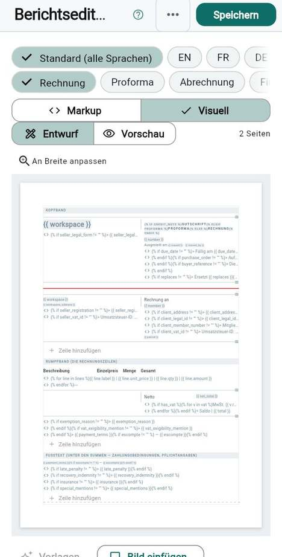

Ein Dokument ist eine Seite aus mehreren Streifen, in der App **Bänder** genannt. Der *Kopf* trägt Ihren Briefkopf und den Empfänger. Der *Rumpf* trägt die Zeilen. Der *Fortsetzungsstreifen* beginnt auf Seite zwei, und der *Fuß* wiederholt sich auf jeder Seite mit Ihren Zahlungsbedingungen und rechtlichen Angaben. Sie bearbeiten sie unter **Entwurf** und prüfen sie in der **Vorschau**; **Markup** zeigt dieselben Bänder als Text für den Tag, an dem Sie das brauchen.

| Baustein | Was er Ihnen bringt | Wählen Sie ihn, wenn |
|---|---|---|
| Vorlagen (**Professionell**, **Klassisch**, **Einfach**, **Ausführlich**, **Formeller Brief**) | Ein fertiges Layout als Ausgangspunkt. Die Vorlagen unterscheiden sich für Rechnungen, Proforma-Rechnungen, Kontoauszüge, Vereinbarungen und Mahnungen; Dokumente mit fester Struktur haben ein einziges mitgeliefertes Layout | Immer: Beginnen Sie mit **Professionell** und ändern Sie wenig |
| Ein Layout pro Sprache | Ein Mitglied liest das Dokument in seiner eigenen Sprache | Ihre Mitglieder lesen nicht alle dieselbe Sprache |
| Briefkopf und Fensterumschlag | Absender, Empfänger und Text sitzen dort, wo ein Fensterumschlag sie erwartet | Sie versenden Rechnungen auf Papier |
| Positioniertes Layout (XML) | Jedes Element ist in Millimetern platziert, für ein nationales Formular | Ein Dokument muss einem festen Formular entsprechen |
| Bildbibliothek | Ein Logo, ein Stempel oder eine Unterschrift, die in mehreren Layouts verwendet werden | Sie haben ein Logo |
| Layout-Austausch | Ein Layout wird in eine Datei geschrieben und wieder eingelesen | Eine Person oder ein Werkzeug außerhalb der App bearbeitet es |

Zwei Tatsachen bewahren Sie vor Überraschungen. Der Briefstandard druckt den Empfänger im Fenster rechts für einen französischen Space und links für einen deutschen, sofern Sie das nicht ändern. Und ein Layout, das sich nicht darstellen lässt, blockiert nie ein Dokument: Dann übernimmt das eingebaute Layout.

> **Achtung** Die Formulierungen in einem Layout sind keine Rechtsberatung. Aussehen und Übersetzung allein stellen weder rechtliche Konformität her noch erfüllen sie eine Pflicht zur elektronischen Rechnung. Was eine Rechnung enthalten muss, legen Sie unter [Ihre rechtliche Identität](Benutzerhandbuch#ihre-rechtliche-identität) fest; Ihr Steuerberater bestätigt es.

**Siehe auch:** [Der Berichtseditor](Benutzerhandbuch#der-berichtseditor) · [Fertige Vorlagen](Benutzerhandbuch#fertige-vorlagen) · [Ein Layout pro Sprache](Benutzerhandbuch#ein-entwurf-pro-sprache)

<!-- anchor: setup.reports.sequence -->
### Die Reihenfolge, der Sie folgen

**Zielgruppe:** Inhaber · Abrechnungsadministrator:in

Sie wollen Dokumente gestalten und es einmal tun, in der richtigen Reihenfolge.

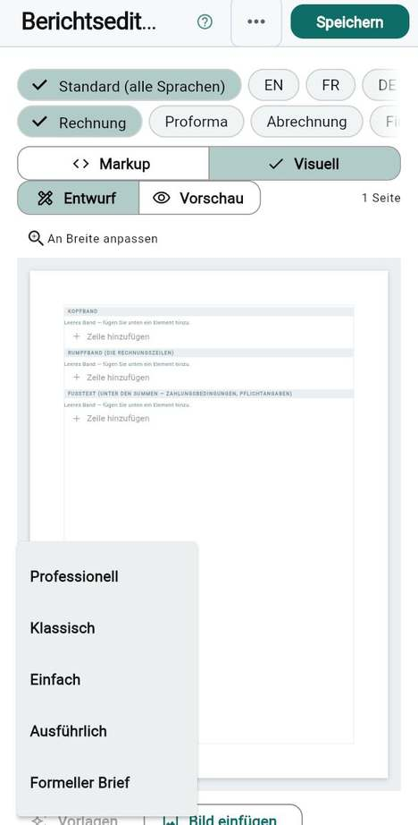

**Schritte**

1. Legen Sie zuerst Ihre rechtliche Identität fest: Organisationsform, Anschrift, Registereintrag, Steuerregime und die besonderen Angaben. Ein Layout druckt nur, was Sie dort eingegeben haben. Siehe [Ihre rechtliche Identität](Benutzerhandbuch#ihre-rechtliche-identität).
2. Öffnen Sie den [Berichtseditor](https://fdittgen-png.github.io/deskilo/#/report-editor), wählen Sie das Dokument und beginnen Sie mit **Professionell** unter **Vorlagen**.
3. Fügen Sie für jede Sprache, die Ihre Mitglieder lesen, eine Sprachversion hinzu. Wählen Sie **EN**, **FR**, **DE**, **ES** oder **IT** unter dem Dokument. Siehe [Ein Layout pro Sprache](Benutzerhandbuch#ein-entwurf-pro-sprache).
4. Prüfen Sie jede Version mit der **Schnellvorschau**. Sie verwendet Ihre neueste Rechnung oder Beispieldaten, wenn es keine gibt.
5. Proben Sie in einem Test-Space: Betreten Sie ihn, stellen Sie eine Probe-Rechnung aus, drucken Sie sie und senden Sie sie Ihrem Steuerberater. Siehe [Wofür ein Test-Space da ist](Benutzerhandbuch#wofür-ein-testspace-da-ist).
6. Frieren Sie das Layout vor der ersten Rechnung ein. Schreiben Sie auf, was Sie entschieden haben, und ändern Sie ein Layout nur, wenn sich eine Vorschrift ändert.

**Gut zu wissen**

- Das Ersetzen eines Layouts lässt sich mit **Rückgängig** zurücknehmen, bis Sie den Editor verlassen.
- Eine ausgestellte Rechnung ist ein eingefrorenes Dokument. Ein späteres Ändern des Layouts betrifft neue Dokumente, nie die bereits ausgestellten.
- Steht derselbe Wortlaut in zwei Sprachen, bitten Sie jemanden, der die zweite Sprache liest, die Vorschau zu lesen.

> **Achtung** Die Rechnungsnummer und die auf einer Rechnung gedruckten rechtlichen Angaben werden mit der ersten ausgestellten Rechnung endgültig. Klären Sie sie davor, nicht danach.

**Ergebnis:** Jedes Dokument, das Sie versenden werden, sieht nach Ihnen aus, in jeder Sprache, und wurde einmal von jemand anderem als Ihnen gelesen.

**Siehe auch:** [Ihre rechtliche Identität](Benutzerhandbuch#ihre-rechtliche-identität) · [Die PDF-Vorlage der Rechnung](Benutzerhandbuch#die-pdf-vorlage-der-rechnung)

<!-- anchor: setup.reports.accountant -->
### Was Sie Ihrem Steuerberater übergeben

**Zielgruppe:** Inhaber · Abrechnungsadministrator:in

Sie möchten, dass Ihr Steuerberater hat, was er braucht, und weiß, was die App nicht behauptet.

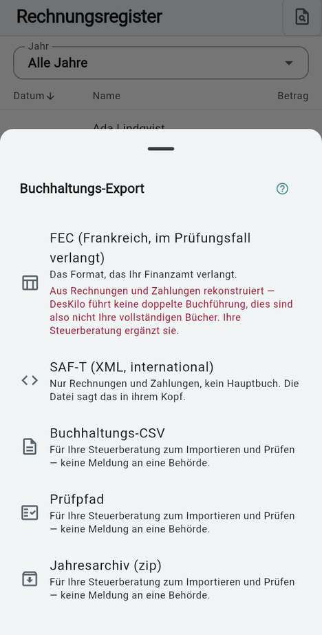

Beginnen Sie beim [Rechnungsregister](https://fdittgen-png.github.io/deskilo/#/invoice-register), das jede Rechnung mit ihrem Status auflistet, und tippen Sie auf **Buchhaltungsexport**. Jedes Format sagt im Blatt, was es beansprucht.

| Datei | Was sie beansprucht | Was sie nicht beansprucht |
|---|---|---|
| FEC | Das französische Format, das eine Prüfung verlangt, aus Rechnungen und Zahlungen neu aufgebaut | Vollständige Bücher. Die vervollständigt Ihr Steuerberater |
| DATEV | Eine Austauschdatei für die Programme deutscher Steuerberater, von einer Person gelesen und gebucht | Eine Abgabe oder eine Übergabe für eine Betriebsprüfung |
| SAF-T | Die internationale Struktur, bewusst unvollständig: Rechnungen und Zahlungen, kein Hauptbuch | Eine vollständige Buchhaltungsdatei. Das steht im Kopf der Datei |
| SAF-T PT, Sage 50 | Ein portugiesisches Aufsichtsformat (nicht zertifiziert) und ein britisch-irisches Austauschformat, je nach Ihrem Land | Eine Abgabe oder eine Zertifizierung |
| Buchhaltungs-CSV, Prüfpfad, Jahresarchiv (zip) | Eine Lesehilfe für Ihren Steuerberater | Eine Abgabe |

Die Liste der Formate hängt von Ihrem Land ab. FEC und DATEV verlangen Ihre Kontonummern, FEC zusätzlich Ihre Registernummer: Halten Sie sie bereit. Die Umsatzsteuerzahlen für den Zeitraum finden Sie unter [Die periodische Umsatzsteuer-Voranmeldung](Benutzerhandbuch#die-periodische-umsatzsteuererklärung).

*Was die App nicht leistet*

- Sie führt Rechnungen, Zahlungen und ein laufendes Konto je Mitglied. Eine doppelte Buchführung über einen Kontenplan führt sie nicht, sie kann also eine Buchhaltungssoftware nicht ersetzen.
- Einige Pflichten bleiben bei Ihnen und Ihrem Steuerberater: vollständige Bücher, zertifizierte Software, wo Ihr Land sie verlangt, und die Annahme durch die zuständige Behörde.
- Eine Datei bleibt gesperrt, bis die Probleme in der Quelle behoben sind.

**Gut zu wissen**

- Ein Export ist ein Lesezugriff. Sie können ihn für jeden Zeitraum wiederholen.
- Bereiten Sie vor der ersten Rechnung eine kurze Zusammenfassung für Ihren Steuerberater vor: Ihr Steuerregime, wann die Umsatzsteuer fällig wird, die gewählte Nummerierung und die gewünschten Exporte. Siehe [Hilfe durch KI](#hilfe-durch-einen-ki-assistenten).

**Siehe auch:** [Buchhaltungsexporte](Benutzerhandbuch#buchhaltungsexporte) · [Das Rechnungsregister](Benutzerhandbuch#das-rechnungsregister) · [Umsatzsteuerkonto](Benutzerhandbuch#steuerkonto)

<!-- anchor: setup.reports.analytics -->
### Geschäftsanalyse im Überblick

**Zielgruppe:** Inhaber · Abrechnungsadministrator:in

Sie möchten sehen, wie der Space läuft, sobald er in Betrieb ist, ohne Tabellenkalkulation.

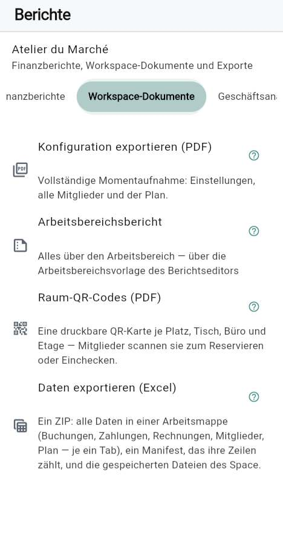

Die **Geschäftsanalyse** zeigt Zahlen nach Bereichen: in Rechnung gestellt und eingenommen, Auslastung und Kapazität. Sie wählen einen Zeitraum (Monat, Quartal oder Jahr), vergleichen ihn mit einem anderen, speichern eine Ansicht und exportieren sie als PDF. Sie sehen nur die Analysen, die Ihre Rolle lesen darf.

Eingenommen sind die Zahlungen, die Rechnungen zugeordnet sind. Das ist kein Gewinn, denn Kosten sind in der Zahl nicht enthalten, und der laufende Zeitraum ist unvollständig.

Für ein Dokument über den ganzen Space enthält der Reiter **Workspace-Dokumente** den **Arbeitsbereichsbericht**, **Raum-QR-Codes (PDF)**, **Daten exportieren (Excel)** und **Konfiguration exportieren (PDF)**. Nutzen Sie die letzten beiden als Sicherungskopie vor einer großen Änderung.

**Siehe auch:** [Geschäftsanalyse](Benutzerhandbuch#business-analysen) · [Exporte](Benutzerhandbuch#arbeitsbereichsbericht)

<!-- anchor: setup.reports.ai -->
### Hilfe durch einen KI-Assistenten

**Zielgruppe:** Inhaber · Mitinhaber

Ein KI-Chatwerkzeug kann Ihnen bei den Worten rund um Ihre Einrichtung Stunden sparen. Es kann nicht derjenige sein, der entscheidet, was rechtlich oder steuerlich richtig ist. Dieser Abschnitt handelt von Werkzeugen, die Sie außerhalb von DesKilo nutzen; die Assistentenverbindung in der App wird am Ende beschrieben.

*Wofür ein externes Werkzeug taugt*

- Die Einladungsnachricht entwerfen, die Sie Ihren ersten Mitgliedern schicken. Siehe [Die Einladungsnachricht](Benutzerhandbuch#einladungstext). Die Platzhalter wie Vorname oder Einladungslink bleiben, wie sie sind.
- Die besonderen Angaben formulieren, die Sie Ihrem Steuerberater vorlegen, als Entwurf zum Prüfen, nie als endgültigen Text.
- Den Wortlaut eines Layouts in eine andere Sprache übersetzen, sodass Sie ihn nur noch durchsehen müssen.
- Einem Mitglied einen Bericht oder einen Kontoauszug in einfachen Worten erklären.
- Die Zusammenfassung Ihrer Entscheidungen für den Steuerberater vorbereiten: Land, Organisationsform, Steuerregime, Nummerierung, Exporte.
- Das Bild hinter Ihrem Grundriss entwerfen, aus Fotos, in einem Bildwerkzeug.

*Was es nicht entscheiden darf*

- Die rechtlichen Angaben einer Rechnung, die umsatzsteuerliche Behandlung einer Tätigkeit, den Grund, warum keine Umsatzsteuer berechnet wird, und die Steuersätze.
- Alles, was endgültig wird: ein Format der Rechnungsnummer, ein Steuerregime, die Währung, eine ausgestellte Rechnung.
- Ob etwas den Vorschriften entspricht. Eine selbstsichere Antwort ist keine geprüfte, und Ihr Steuerberater ist es.

*Der sichere Ablauf*

1. Bitten Sie das Werkzeug um einen Entwurf. Geben Sie ihm ein Szenario, nicht die Namen Ihrer Mitglieder oder andere personenbezogene Daten.
2. Fügen Sie den Entwurf in das Feld ein, im **Berichtseditor** oder in den Einstellungen.
3. Sehen Sie ihn sich in der **Vorschau** mit Beispieldaten an.
4. Schicken Sie den Text mit rechtlicher Wirkung an Ihren Steuerberater und warten Sie die Antwort ab.
5. Probieren Sie den gesamten Ablauf in einem Test-Space aus, bevor Sie den echten nutzen.

> **Achtung** Fügen Sie keinen Token, kein Passwort, keine Bankverbindung und keine personenbezogenen Daten eines Mitglieds in ein externes Werkzeug ein.

*Die eigene Assistentenverbindung von DesKilo*

Die App lässt einen Assistenten wie Claude oder ChatGPT über ein Protokoll namens MCP für ein Mitglied handeln. Sie ist standardmäßig aus und eine Funktion, die Sie einschalten (**MCP-Schnittstelle**, siehe [Ein Funktionsschalter](Benutzerhandbuch#ein-funktionsschalter)). Sie ist in Schichten aufgebaut, sodass nicht eine einzelne Person alles öffnen kann.

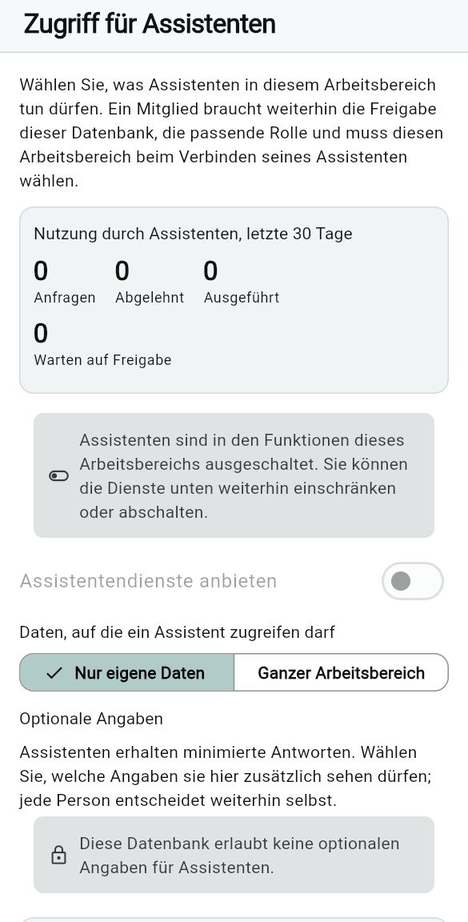

| Schicht | Wer | Was er tut |
|---|---|---|
| Die Installation | Der Betreiber | Schaltet Assistenten für die Installation ein. |
| Der Workspace | Sie, der Inhaber | Schalten die Funktion ein und wählen dann unter [Was Assistenten dürfen](Benutzerhandbuch#was-assistenten-in-einem-workspace-dürfen), welche Dienste angeboten werden und ob ein Assistent nur eigene Datensätze oder den ganzen Workspace sieht. |
| Die Datenbank | Ein Datenbankadministrator | Genehmigt die Anfrage jeder Person. |
| Das Mitglied | Jedes Mitglied | Bittet einmal um Genehmigung und wählt diesen Workspace. |
| Eine Anfrage mit Auswirkung | Das Mitglied, auf seinem Gerät | Bestätigt die genaue Anfrage, die weiterhin Ihren Validierungsregeln folgt. |

Der Assistent eines Mitglieds arbeitet mit den eigenen Datensätzen dieses Mitglieds: freie Plätze finden und beschreiben, Favoriten und Bewertungen, die eigene Reservierung buchen, ändern oder stornieren, das Löschen einer begonnenen Buchung beantragen, ein- und auschecken, den eigenen Kontoauszug und die Rechnungen lesen sowie die Validierungen auflisten und beantworten, um die man gebeten wird. Einige Anfragen (Rechnung ausstellen, Rechnung stornieren, Erstattung, Statusänderung eines Mitglieds, Abo-Anteil) sind nur für Mitarbeitende: Sie brauchen Mitarbeiterrechte, die Bestätigung der Person in der App und danach Ihre Validierungsregeln. Es gibt keine Operation, die einen Space konfiguriert: Ein Assistent kann keine Funktion einschalten, keinen Tarif festlegen, keine Rolle ändern und keinen Plan zeichnen. Er kann Ihren Space nicht für Sie einrichten und handelt nur im Rahmen dessen, was Sie freigeben.

**Gut zu wissen**

- Assistenten einzuschalten gewährt von sich aus niemandem etwas.
- Jede Genehmigung läuft ab; der Bildschirm sagt, wie viele Tage bleiben.
- Lesen Sie die Schritte unter [Genehmigungen und Bestätigungen für Assistenten](Benutzerhandbuch#freigaben-und-bestätigungen-für-assistenten).

**Siehe auch:** [Assistenten: was sie sind](Benutzerhandbuch#assistenten-was-sie-sind) · [Einen Assistenten verbinden](Benutzerhandbuch#einen-assistenten-verbinden)

<!-- anchor: setup.reports.developer -->
### Mit einer Entwicklerin oder einem Entwickler arbeiten: die Layoutdatei und das Berichtswerkzeug

**Zielgruppe:** Inhaber · Betreiber:in

Jemand Technisches hilft Ihnen, und ein Layout muss außerhalb der App bearbeitet oder nachgewiesen werden.

**Schritte**

1. Schreiben Sie im [Berichtseditor](https://fdittgen-png.github.io/deskilo/#/report-editor) mit **Diese Vorlage exportieren** das Layout in eine einzelne Datei. Die Datei erklärt, was ihre Felder bedeuten und welche Platzhalter es gibt. **Vorlage importieren** liest sie wieder ein; eine Datei für einen anderen Bericht oder aus einer neueren Version wird mit Begründung abgelehnt.
2. Ein Entwickler kann das Layout in einem Terminal mit dem Berichtswerkzeug prüfen, das im Handbuch für technische Administratoren beschrieben ist: `check` misst ein Layout gegen den Fensterumschlag-Vertrag und endet mit einem Fehlercode, wenn Tinte im Fenster landet; `render` erzeugt das PDF; `sample` schreibt eine Datendatei mit jedem Platzhalter; `describe` listet das Vokabular auf.
3. Importieren Sie die Datei zurück in der App, sehen Sie sie mit der **Schnellvorschau** an und tippen Sie auf **Speichern**.

**Gut zu wissen**

- Der Layout-Austausch ist eine Funktion (**Berichtsvorlagen exportieren und importieren**) unter den Berichtsfunktionen in [Funktionen](https://fdittgen-png.github.io/deskilo/#/features). Schalten Sie sie zuerst ein.
- Das Werkzeug braucht den Quellcode der App; es ist für die Person gedacht, die Ihre Installation betreibt, nicht für den täglichen Gebrauch.

**Siehe auch:** [Der Berichtseditor](Benutzerhandbuch#der-berichtseditor) · [Die PDF-Vorlage der Rechnung](Benutzerhandbuch#die-pdf-vorlage-der-rechnung)

<!-- anchor: setup.consistent.overview -->
## Stimmig bleiben

Ein Space kann auf zwei Arten falsch sein: durch eine fehlende Einstellung und durch zwei Einstellungen, die sich widersprechen. DesKilo fängt manches von beidem ab und sagt es auf dem Bildschirm. Dieses Kapitel listet auf, was erkannt wird und wo Sie es sehen, sagt offen, was nicht erkannt wird, und gibt Ihnen eine Prüfung für die Zeit vor der Eröffnung sowie eine kurze Routine für jeden Monat.

In diesem Kapitel:
- [Die Schutzmechanismen der App](#die-schutzmechanismen-der-app)
- [Die Fehler, die die Schutzmechanismen nicht erkennen](#die-fehler-die-die-schutzmechanismen-nicht-erkennen)
- [Die Prüfung vor dem Start](#die-prüfung-vor-dem-start)
- [Die Monatsroutine](#die-monatsroutine)
- [Wenn etwas falsch aussieht](#wenn-etwas-falsch-aussieht)
- [Was sich nicht rückgängig machen lässt](#was-sich-nicht-rückgängig-machen-lässt-1)

Das durchgehende Beispiel ist das *Atelier du Marché*. Seine Inhaberin Ada führt die Prüfung einmal in einem Test-Space durch und noch einmal im echten.

<!-- anchor: setup.consistent.guards -->
### Die Schutzmechanismen der App

**Zielgruppe:** Inhaber · Mitinhaber · Administrator:in · Abrechnungsadministrator:in

Sie möchten wissen, auf welche Ihrer Fehler die App hinweist und wo sie es tut, damit Sie am richtigen Ort nachsehen.

| Schutz | Was er erkennt | Wo Sie es sehen |
|---|---|---|
| Eine Funktion, die eine andere braucht | Eine Funktion kann ohne die, die sie braucht, nicht arbeiten. Wer eine Funktion einschaltet, schaltet ihre übergeordnete ein und erfährt, was dazugekommen ist. Wer eine übergeordnete ausschaltet, hält die untergeordneten zurück und behält deren eigene Wahl. | **Funktionen**: der Schaltablauf mit Vorschau, **Benötigt** und **Wartet auf die Funktion darüber** |
| Ein zurückgehaltener Prozess | Eine Funktion, die an ist, aber auf etwas wartet, das aus ist. | **Funktionen**, Ansicht **Prozesse**: der Zustand **Braucht Aufmerksamkeit** und sein Filter-Chip |
| Die Bereitschaftsliste | Eine Zeile pro Bereich des Space, mit Zustand, Verantwortlichem und Ort der Einstellung. Bereiche: **Öffnungstage, Zeitzone und Währung**, **Buchbare Plätze im Grundriss**, **Mitgliedschaftsmodelle und Tarife**, **Die ersten Mitglieder einladen**, **Wie Mitglieder bezahlen**, **Rollen und wer Anfragen bestätigt**, **Export und Wiederherstellung**, **Was Mitglieder dürfen**, **Angaben, die Ihre Funktionen brauchen (Identität, Bank, Plattformen)**, **Eine erste Buchung** und, wenn es zutrifft, **Rechtliche Identität und Adresse des Space** (nur bei eingeschalteten **Rechnungen**), **Server und Datenbankversion** sowie **Assistentenzugang (optional)** (Letzterer nur bei eingeschalteter MCP-Schnittstelle). | **Einrichtung dieses Workspace**, oben in [Workspace](https://fdittgen-png.github.io/deskilo/#/workspace-settings) |
| Die Zeile, die eine erste Buchung verhindert | Die Bereiche, die die Liste als **Nötig für eine erste Buchung** markiert: eine Zeitzone, eine Währung, einen Öffnungstag, einen Platz, Mitglieder mit **Buchen und Reservierungen nutzen** (ein neuer Space gewährt ihnen nichts) und, wenn eine Validierungsregel gleich welcher Art mehr Validierer verlangt, als es gibt, diese Validierer. Der Rest ist optional und lässt sich mit **Später** beiseitelegen. | **Bevor hier jemand buchen kann**, auf der Karte „Erste Schritte“ in [Reservieren](https://fdittgen-png.github.io/deskilo/#/reserve) |
| Die Zeile, die eine erste Rechnung verhindert | Bei eingeschalteten **Rechnungen** die rechtliche Identität und die Adresse des Space. Ohne sie kann keine Rechnung ausgestellt werden, deshalb lässt sich der Bereich nicht beiseitelegen. | **Einrichtung dieses Workspace**: der Bereich **Rechtliche Identität und Adresse des Space**, markiert mit **Vor der Rechnungsstellung nötig**; solange er der nächste Schritt ist, lautet die Überschrift der Karte „Vor der Rechnungsstellung: …“ |
| Was Ihre Funktionen lokal noch brauchen | Bankverbindung, ein Anbieter für Online-Zahlungen, ein E-Rechnungs-Konto, ein Standort. Die rechtliche Identität steht nicht hier: Bei eingeschalteten **Rechnungen** ist sie ein eigener Bereich (oben). | Dieselbe Karte, Bereich **Angaben, die Ihre Funktionen brauchen (Identität, Bank, Plattformen)**, mit **Einrichten** und **Empfohlen** |
| Der Rechnungsschutz | Eine Rechnung wird abgelehnt, bis sie vollständig ist: die Anschrift des Workspace, seine Umsatzsteuer-Identifikationsnummer, ein Land Frankreich oder Deutschland, eine Rechtsgrundlage für eine Befreiung, Name, Anschrift und Umsatzsteuer-Identifikationsnummer des Mitglieds bei Reverse-Charge, ein gültiger Steuersatz, eine Erklärung für jede mit 0 % abgerechnete Zeile. Grenzüberschreitende, Reverse-Charge-, Ausfuhr- und steuerfreie Rechnungen werden abgelehnt: Stellen Sie sie außerhalb der App aus. | **Vor der Ausstellung bitte ergänzen**, mit den fehlenden Punkten |
| Der Schutz bei Online-Zahlungen | Ist **Online-Zahlungen** aus, lehnt der Server eine neue Online-Zahlung ab. Eine bereits offene wird noch abgeschlossen. | Die Zahlungsbildschirme (die Funktionszeile trägt dazu keinen Hinweis) |
| Der Validierungsschutz | **Erforderliche Validierungen** über der Zahl der verfügbaren Personen, bei jeder Art von Anfrage. | **Nicht genügend berechtigte Validierer.** im Regeleditor; „Eine Regel verlangt mehr Prüfer, als dieser Bereich hat“ in der Bereitschaftsliste, wo **Rollen und wer Anfragen bestätigt** dann erforderlich wird |
| Die Sperre von Währung und Land | Sobald der Space ein Dokument ausgestellt oder Geld erfasst hat, lehnt der Server jede Änderung von **Währung** oder **Land** ab, ob aus dem Einstellungsformular, einem Import oder anderswo. Die Zeitzone ist nicht gesperrt. | „Währung und Land stehen fest, sobald dieser Space ein Dokument ausgestellt oder Geld erfasst hat. Es wurde nichts gespeichert.“ beim Speichern in [Workspace](https://fdittgen-png.github.io/deskilo/#/workspace-settings) |
| Der Posteingang des Inhabers | Was noch zu konfigurieren ist: eine Zeile „Einzurichten: …“ für jeden erforderlichen Bereich der Bereitschaftsliste, der nicht bereit ist, und eine Zeile „… eingeschaltete Funktionen warten auf „…““ für jede ausgeschaltete Funktion, die andere zurückhält. | [Was auf Sie wartet](Benutzerhandbuch#was-auf-sie-wartet); ein Tippen öffnet den Bildschirm, auf dem es eingerichtet wird, oder **Funktionen** |
| Der Schutz der Nummernkreise | Ein Neubeginn, der häufiger ist als das in der Nummer gedruckte Datum, wird abgelehnt. | [Nummernkreise](https://fdittgen-png.github.io/deskilo/#/settings/number-sequences), beim Speichern |
| Die Reifeprüfung | Eine Funktion, die als **Alpha** oder **Beta** eingestuft ist. | Eine Rückfrage, bevor Sie sie einschalten, und ein Abzeichen auf jedem Schalter |
| Die Prüfung beim Ersetzen des Plans | Das Ersetzen des Grundrisses oder der Einstellungen aus einer Datei. | Eine Warnung, dass es sich nicht rückgängig machen lässt. Der Plan wird abgelehnt, sobald Reservierungen existieren |

**Gut zu wissen**

- **Einrichtung dieses Workspace** ist eine Liste, keine Sperre. Sie hindert Sie nie daran, etwas einzuschalten.
- Die meisten Schutzmechanismen greifen, wenn Sie versuchen auszustellen, zu zahlen oder zu buchen, nicht wenn Sie eine Einstellung wählen. Deshalb gibt es die Prüfung unten.
- Der Posteingang des Inhabers ([Was auf Sie wartet](Benutzerhandbuch#was-auf-sie-wartet)) meldet nur die erforderlichen Bereiche und die zurückgehaltenen Funktionen. Die optionalen Bereiche bleiben in der Bereitschaftsliste: Lesen Sie sie selbst.

**Siehe auch:** [Funktionen vermeiden, die sich widersprechen](#funktionen-vermeiden-die-sich-widersprechen) · [Ihren Space prüfen](#ihren-space-prüfen)

<!-- anchor: setup.consistent.gaps -->
### Die Fehler, die die Schutzmechanismen nicht erkennen

**Zielgruppe:** Inhaber · Mitinhaber · Abrechnungsadministrator:in

Sie möchten die ehrliche Liste dessen, was in Ihrer Verantwortung bleibt. Das sind Konfigurationen, die die App Sie anlegen lässt, ohne zu warnen. Für jede gibt es einen Weg, sie von Hand zu vermeiden.

| Fehler | Warum nichts ihn verhindert | Vermeiden Sie ihn durch |
|---|---|---|
| Ein anderes Land als Frankreich oder Deutschland wählen und Rechnungen erwarten | Die App bietet viele Länder und Steuersätze an, stellt aber nur für Frankreich und Deutschland Rechnungen aus. Bei der Länderwahl sagt Ihnen das nichts. | Entscheiden, bevor Sie Mitgliedern eine Rechnung versprechen. Anderswo bleiben die Kontoauszüge in der App, und Rechnungen stellen Sie außerhalb aus. |
| Umsatzsteuerpflichtig sein, ohne dass ein Satz gilt | Die Ausstellung wird abgelehnt, aber erst bei der ersten Rechnung. Die Beschreibung von **USt-Verwaltung** und die Warnung auf dem Bildschirm der rechtlichen Identität sagen es; vorher hält Sie nichts auf. Ist **USt-Verwaltung** aus, ist die Konfiguration verborgen, die gespeicherten Sätze gelten aber weiter. | Den Satz unter [USt](https://fdittgen-png.github.io/deskilo/#/vat) vor dem ersten Monatsabschluss ergänzen und eine Probe-Rechnung ausstellen. |
| **Online-Zahlungen** an, ohne Anbieter | Sie können es einschalten; der fehlende Anbieter erscheint nur als Punkt in der Bereitschaftsliste. | Zuerst den Anbieter verbinden, dann einschalten. |
| **Rechnungen** an, ohne rechtliche Identität | Die Funktion ist vom ersten Tag an an. Die Bereitschaftsliste markiert die Identität mit **Vor der Rechnungsstellung nötig**, und Was auf Sie wartet meldet sie, aber nichts hindert Sie daran, Mitglieder einzuladen und einen Monat laufen zu lassen; die Ablehnung kommt bei der Ausstellung. | Die Identität eintragen, bevor Sie Mitgliedern sagen, dass sie Rechnungen bekommen. |
| Eine Regel, die mehr Validierer braucht, als Sie haben | Der Editor lässt Sie eine Regel speichern, die über der Zahl der verfügbaren Personen liegt. Die Bereitschaftsliste markiert dann **Rollen und wer Anfragen bestätigt** als erforderlich, gleich welche Art von Anfrage, aber Anfragen, die vor Ihrer Korrektur angelegt wurden, können nicht abgeschlossen werden und laufen nach sieben Tagen ab. | Nach jeder Regel die aktiven Inhaber und Administratoren zählen. Siehe [Anfragen vermeiden, die ewig warten](#anfragen-vermeiden-die-ewig-warten). |
| Mitglieder, die den Plan nicht öffnen können | In einem neuen Space ist die Karte **Benutzer** unter [Rollen](https://fdittgen-png.github.io/deskilo/#/roles) leer. Die Bereitschaftsliste markiert **Was Mitglieder dürfen**, bis Mitglieder **Buchen und Reservierungen nutzen** halten, prüft aber nur diese eine: Die fünf anderen alltäglichen Berechtigungen kreuzen Sie selbst an. | Die alltäglichen Berechtigungen ankreuzen und einmal mit einem zweiten Konto beitreten. |
| Ein Space, der aus einer Vorlage entsteht | Eine Vorlage übernimmt nie die Identität, die Bankverbindung, Standorte oder Einladungen. | Den Bereich **Angaben, die Ihre Funktionen brauchen (Identität, Bank, Plattformen)** als To-do-Liste behandeln. |
| Eine Einstellungsdatei, die mehr verspricht, als sie hält | Heute enthält die Datei die Rollenmatrix, Ihre eigenen Rollen und jede Validierungsregel, nicht aber die Mitglieder, die Rechnungs- und Mitgliedsnummern, den Umsatzsteuerzeitraum oder die Preise des ganzen Space. Was sie enthält, wird nur angewendet, wenn **Konfiguration in der Raumdatei** im Ziel an ist. Ein Plan wird nicht ersetzt, sobald Reservierungen existieren. | Das, was sie nicht enthält, von Hand neu eintragen und die Vorschau lesen, bevor Sie auf **Ersetzen und importieren** tippen. |
| Mahnungen, die nie laufen | Sie laufen jeden Morgen auf dem Server, sofern die Installation Aufgaben plant (pg_cron); sonst, wenn ein Administrator die Finanzen öffnet. Der Schalter und die Funktionsbeschreibung sagen es, können aber nicht erkennen, was für Ihre Installation zutrifft. Sie bleiben auch stumm, wenn **Automatische Zahlungserinnerungen** aus ist. | Den Betreiber fragen, ob es den Scheduler gibt, und selbst die Finanzen öffnen, wenn nicht. Siehe [Automatische Mahnungen](Benutzerhandbuch#automatische-mahnungen). |
| Die Zeitzone ändern, sobald Geld im Spiel ist | Der Server sperrt Währung und Land, sobald der Space ein Dokument ausgestellt oder Geld erfasst hat, nicht aber die Zeitzone, in der jeder Arbeitstag, jeder halbe Tag und jeder Schließtag gezählt wird. | Sie am ersten Tag wählen. Siehe [Schwer rückgängig zu machende Entscheidungen](#entscheidungen-die-sich-schwer-rückgängig-machen-lassen). |
| Eine Nummerierung oder ein Umsatzsteuerzeitraum, der nicht zum Format Ihres Steuerberaters passt | Die App vergleicht sie nicht mit dem Buchhaltungsexport des Landes. | Ihren Steuerberater vor der Ausstellung nach dem Nummernformat und dem Export fragen, den er nutzt. Siehe [Buchhaltungsexporte](Benutzerhandbuch#buchhaltungsexporte). |
| Einen Test für den echten Space halten | Über das Wasserzeichen auf gedruckten Dokumenten hinaus ist der Unterschied leicht zu übersehen. | Vor dem Handeln auf das Banner des Test-Space und die in [Ich](https://fdittgen-png.github.io/deskilo/#/me) angezeigte Seite achten. |

**Gut zu wissen**

- Ein Kiosk ohne Kiosk-Mitglied, eine Standortfunktion ohne Standort, Push ohne Push-Dienst: [Funktionen vermeiden, die sich widersprechen](#funktionen-vermeiden-die-sich-widersprechen).
- Die App ist bei Rechnungen strenger, als es aussieht, und bei allem anderen lockerer. Stellen Sie im Zweifel in einem Test-Space eine Probe-Rechnung aus.

**Siehe auch:** [Ein gefahrloser Probelauf](#ein-gefahrloser-probelauf-in-einem-test-space)

<!-- anchor: setup.consistent.audit -->
### Die Prüfung vor dem Start

**Zielgruppe:** Inhaber · Mitinhaber

Sie wollen einen Beleg, kein Gefühl, bevor Sie öffnen. Einunddreißig Prüfpunkte, in drei Stufen. Führen Sie *Öffnen* durch, bevor Sie jemanden einladen, *Betreiben*, bevor Sie etwas zu Geld versprechen, *Wachsen*, bevor die erste Rechnung hinausgeht. Tun Sie es zuerst in einem Test-Space, mit einer zweiten Person.

*Öffnen: ein Ort, an dem man buchen kann*

| # | Prüfpunkt | Wo | So sieht es richtig aus |
|---|---|---|---|
| 1 | Land, Währung, Zeitzone | [Workspace](https://fdittgen-png.github.io/deskilo/#/workspace-settings), **Allgemeine Angaben** | Atelier du Marché: Frankreich, EUR, Europe/Paris, festgelegt vor dem ersten Dokument oder der ersten Zahlung, danach sind Währung und Land gesperrt |
| 2 | Sprache des Workspace | Derselbe Bildschirm | Die Sprache, in der Ihre Einladungen geschrieben sind |
| 3 | Öffnungstage und -zeiten | [Verfügbarkeit](https://fdittgen-png.github.io/deskilo/#/availability) | Die Tage, an denen Sie öffnen, sind angekreuzt; die Zeiten passen zum Tag |
| 4 | Schließtage | Verfügbarkeit, Schließtage | Feiertage und Schließungen der nächsten Monate sind eingetragen, vor dem ersten Monatsende |
| 5 | Mindestens ein Platz | [Workspace-Editor](https://fdittgen-png.github.io/deskilo/#/editor) | Jeder Raum, den Sie vermieten, hat Plätze |
| 6 | Bereitschaft | **Einrichtung dieses Workspace** | Unter **Öffnungstage, Zeitzone und Währung**, **Buchbare Plätze im Grundriss** und **Was Mitglieder dürfen** braucht nichts eine Konfiguration |
| 7 | Sie haben einen Platz gebucht | [Reservieren](https://fdittgen-png.github.io/deskilo/#/reserve) | Der Platz wird gebucht, eingecheckt und storniert, ohne Überraschung |
| 8 | Die Workspace-ID | [Workspace-ID & QR](https://fdittgen-png.github.io/deskilo/#/workspace-code) | Die ID lässt sich laut aussprechen; der QR-Code ist gedruckt |
| 9 | Alltägliche Berechtigungen | [Rollen](https://fdittgen-png.github.io/deskilo/#/roles) | **Benutzer** hält die sechs alltäglichen Berechtigungen, darunter **Buchen und Reservierungen nutzen** |
| 10 | Ein zweites Konto ist beigetreten | Ein anderes Gerät | Es wurde genehmigt und konnte den Plan öffnen und buchen |
| 11 | Mehr als eine Person kann handeln | [Mitglieder & Tarife](https://fdittgen-png.github.io/deskilo/#/members) | Ein Inhaber plus ein Mitinhaber oder ein Administrator, alle **Aktiv** |
| 12 | Zahl der Validierungen | [Validierungsregeln](https://fdittgen-png.github.io/deskilo/#/validation) | Keine Regel verlangt mehr Validierer als aktive Inhaber und Administratoren; **Rollen und wer Anfragen bestätigt** braucht keine Konfiguration |
| 13 | Die Einladung in jeder Sprache | **Gemeinschaft und Einladungen** | Sie haben jede Version einmal gelesen; kein Platzhalter bleibt unausgefüllt |
| 14 | Die Seite, auf der Sie sind | [Ich](https://fdittgen-png.github.io/deskilo/#/me) | Das Banner des Test-Space wird angezeigt oder nicht, wie beabsichtigt |

*Betreiben: Menschen zahlen und Rollen halten*

| # | Prüfpunkt | Wo | So sieht es richtig aus |
|---|---|---|---|
| 15 | Gebührenbänder | [Abrechnung](https://fdittgen-png.github.io/deskilo/#/billing) | Jeder Anteil, den ein Mitglied wählen kann, fällt in ein Band; keine Lücke zwischen 0 und 100 Prozent |
| 16 | Angebotene Tarife | Abrechnung, Stufen | Nur die Tarife, die Sie verkaufen wollen |
| 17 | Womit neue Mitglieder starten | **Neue Mitglieder**, im Workspace | Das Abo und die Regel bei aufgebrauchten Tagen sind die von Ihnen gewählten |
| 18 | Pakete und Leistungen | Abrechnung, [Leistungen](https://fdittgen-png.github.io/deskilo/#/services) | Namen und Preise lesen sich für ein Mitglied richtig |
| 19 | Wie Mitglieder bezahlen | **Wie Mitglieder bezahlen** in der Bereitschaftsliste | Der Bereich steht auf **Bereit**, und die erwartete Bankverbindung (IBAN, Verwendungszweck) wird in den Einstellungen angezeigt; ein Anbieter allein setzt ihn ebenfalls auf bereit |
| 20 | Online-Zahlungen | [Funktionen](https://fdittgen-png.github.io/deskilo/#/features) | Aus, außer ein Anbieter ist verbunden |
| 21 | Administratoren | Mitglieder & Tarife | Jeder ist eine Person, der Sie die Daten aller Mitglieder anvertrauen würden |
| 22 | Administrator-Karte der Matrix | Rollen | Sie können jedes Häkchen lesen und vertreten |
| 23 | Wer wird worüber informiert | [Wie Mitglieder informiert werden](#was-mitglieder-selbst-steuern) | Mitglieder finden alles unter **Ereignisse**; Push nur, wenn der Betreiber es eingerichtet hat |
| 24 | Kiosk und Ausweise | [Funktionen](https://fdittgen-png.github.io/deskilo/#/features) | Aus, oder ein Kiosk-Mitglied existiert und Ausweise sind ausgegeben |
| 25 | Standorte | Funktionen | Aus, oder mindestens ein Standort existiert |
| 26 | Zurückgehaltene Funktionen | **Funktionen**, **Braucht Aufmerksamkeit** | Der Filter zeigt keinen Prozess, und Was auf Sie wartet hat keine Zeile über wartende Funktionen |

*Wachsen: Rechnungen, Steuern und Unterlagen*

| # | Prüfpunkt | Wo | So sieht es richtig aus |
|---|---|---|---|
| 27 | Rechtliche Identität | [Rechtliche Identität & E-Rechnung](https://fdittgen-png.github.io/deskilo/#/legal-identity) | **Rechtliche Identität und Adresse des Space** steht auf **Bereit**, und **Vor der Ausstellung bitte ergänzen** zeigt nichts, wenn Sie eine Probe-Rechnung beginnen |
| 28 | Steuerregime und Sätze | [USt](https://fdittgen-png.github.io/deskilo/#/vat) | Das Regime ist das, das Ihr Steuerberater genannt hat; für Ihren Standard gilt ein Satz |
| 29 | Nummernformat | [Nummernkreise](https://fdittgen-png.github.io/deskilo/#/settings/number-sequences) | Sie haben die Vorschau gelesen, und Ihr Steuerberater ist einverstanden |
| 30 | Eine Probe-Rechnung | Test-Space, Monatsabschluss-Assistent | Sie wurde ausgestellt, in jeder Sprache, die Ihre Mitglieder lesen, ohne fehlenden Punkt |
| 31 | Ein aktueller Export | **Export und Wiederherstellung** | „Ein aktueller Export ist erfasst“ |

**Schritte**

1. Drucken Sie die drei Tabellen aus oder kopieren Sie sie in Ihre Notizen.
2. Gehen Sie *Öffnen* durch und haken Sie jede Zeile ab, wenn Sie die Spalte *So sieht es richtig aus* sehen, nicht wenn Sie sich daran erinnern.
3. Tun Sie dasselbe für *Betreiben* und *Wachsen* im Test-Space, für die Zeilen von *Wachsen* mit Ihrem Steuerberater.
4. Wiederholen Sie die Zeilen, die sich geändert haben, wenn Sie in den echten Space wechseln. Eine Vorlage oder eine Einstellungsdatei übernimmt nicht alle.

**Ergebnis** Eine Liste, die Sie jemandem zeigen können, und ein Space, den Sie arbeiten gesehen haben, bevor jemand von ihm abhängt.

**Siehe auch:** [Woche 0 bis Woche 4](#in-vier-wochen-lernen) · [Ein gefahrloser Probelauf](#ein-gefahrloser-probelauf-in-einem-test-space) · [Die Reihenfolge, der Sie folgen](#die-reihenfolge-der-sie-folgen)

<!-- anchor: setup.consistent.monthly -->
### Die Monatsroutine

**Zielgruppe:** Inhaber · Administrator:in · Abrechnungsadministrator:in

Sie möchten eine kurze Gewohnheit, die den Space stimmig hält, in zehn Minuten am Monatsende.

**Schritte**

1. Öffnen Sie **Einrichtung dieses Workspace**. Jeder Bereich steht weiter auf **Bereit** oder **Hier nicht nötig** oder wurde bewusst beiseitegelegt.
2. Öffnen Sie [Ereignisse](https://fdittgen-png.github.io/deskilo/#/events). **Wartet auf Ihre Bestätigung** ist leer oder klein, und kein Mitglied ist länger als ein, zwei Tage **Ausstehend**.
3. Zählen Sie das Team neu. Wer gegangen ist oder pausiert, kann eine Regel zu knapp machen. Siehe [Anfragen vermeiden, die ewig warten](#anfragen-vermeiden-die-ewig-warten).
4. Schließen Sie den Monat: Schließtage sind eingetragen, der Monatsabschluss-Assistent ist durchgelaufen, Zahlungserinnerungen sind hinausgegangen (automatisch jeden Morgen oder beim Öffnen der Finanzen, wo die Datenbank keinen Scheduler hat). Siehe [Der Monatsabschluss-Assistent](Benutzerhandbuch#der-monatsabschluss-assistent).
5. Ziehen Sie den Datenexport und öffnen Sie **Funktionen**, um zu prüfen, dass nach den Änderungen des Monats kein Prozess Aufmerksamkeit braucht.

**Gut zu wissen**

- Schreiben Sie das Datum des letzten Durchlaufs in die erste Zeile Ihrer Notizen; so weiß die nächste Person, wann es zuletzt stimmte.
- Alles, was im Monat an der Rollenmatrix oder an einer Validierungsregel geändert wurde, ist eine weitere Prüfung der Zeilen 9, 11 und 12 der Prüfung wert.

**Ergebnis** Ein Space, der bleibt, was Sie eingerichtet haben.

**Siehe auch:** [Die Prüfung vor dem Start](#die-prüfung-vor-dem-start)

<!-- anchor: setup.consistent.wrong -->
### Wenn etwas falsch aussieht

**Zielgruppe:** Inhaber · Mitinhaber · Administrator:in

Sie möchten wissen, was Sie in welcher Reihenfolge versuchen und wen Sie fragen.

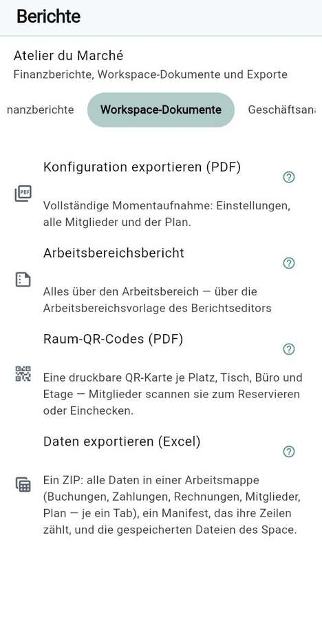

**Schritte**

1. Lesen Sie die Meldung auf dem Bildschirm. Die meisten sagen, was zu tun ist.
2. Prüfen Sie die Seite. Sehen Sie auf das Banner des Test-Space und auf die in [Ich](https://fdittgen-png.github.io/deskilo/#/me) angezeigte Seite. Auf der Testseite gedruckte Dokumente tragen ein Wasserzeichen, und dort wird nichts geschuldet; die echte Seite stellt Rechnungen aus, die geschuldet sind.
3. Prüfen Sie [Funktionen](https://fdittgen-png.github.io/deskilo/#/features) und [Rollen](https://fdittgen-png.github.io/deskilo/#/roles): Eine fehlende Funktion ist eine Funktion, die aus ist, oder eine Berechtigung, die niemand angekreuzt hat.
4. Öffnen Sie **Einrichtung dieses Workspace** und lesen Sie den Bereich, der zum Symptom passt.
5. Bereiten Sie **Supportdetails** unter [Hilfe](https://fdittgen-png.github.io/deskilo/#/help) vor: Wählen Sie **Letzte Stunde** oder **Letzte 24 Stunden**, **Vorschau vorbereiten**, lesen Sie sie, **Speichern** Sie und senden Sie die Datei. Sie enthält nur Zahlen und Prüfungen, keine Identitäten, Zugangsdaten oder Geschäftsdaten.
6. Ziehen Sie vor jeder größeren Änderung den Datenexport (unten).

*Wen Sie fragen*

| Worum es geht | Fragen Sie |
|---|---|
| Eine Einstellung Ihres Space, eine Regel, eine Rolle | Sich selbst, dann Ihren Mitinhaber |
| Eine Rechnung, die Umsatzsteuer, eine Nummer | Ihren Steuerberater, mit der Probe-Rechnung |
| Ein Bereich, der **Wartet auf jemand anderen** oder **Der Serverbetreiber** sagt | Den Betreiber Ihrer Installation |
| Ein Assistent, der nicht genehmigt ist | Einen Datenbankadministrator |
| Ein Fehler, den Sie sich nicht erklären können | Den Support, mit der Support-Datei |

*Der Wiederherstellungsexport*

1. Öffnen Sie [Berichte](https://fdittgen-png.github.io/deskilo/#/reports?section=documents) und wählen Sie **Workspace-Dokumente**.
2. Tippen Sie auf **Daten exportieren (Excel)**. Dafür brauchen Sie die Funktion **Datenexport (Excel)** und die Berechtigung **Buchhaltung und Daten exportieren**. Sie erhalten eine ZIP-Datei: eine Arbeitsmappe mit einem Blatt je Datensatz, ein Manifest mit der Zeilenzahl und die gespeicherten Dateien.
3. Tippen Sie auf **Konfiguration exportieren (PDF)** für eine Aufzeichnung der Parameter und, im **Workspace**, auf **Workspace exportieren (XML)** für Plan und Einstellungen.

**Gut zu wissen**

- Ein abgeschlossener Datenexport wird erfasst; der Bereich **Export und Wiederherstellung** der Bereitschaftsliste zeigt das 90 Tage lang an und meldet dann, dass der Export älter ist.
- Das PDF ist eine Aufzeichnung, keine Sicherung. Nur das XML lässt sich wieder importieren, und es enthält nie Mitglieder oder Geldbeträge.
- Bewahren Sie die Datei an einem Ort auf, den nur Sie öffnen können: Sie enthält Ihre Mitglieder.

**Siehe auch:** [Supportdetails](Benutzerhandbuch#supportdetails) · [Wenn etwas nicht funktioniert](Benutzerhandbuch#wenn-etwas-nicht-funktioniert) · [Die Daten exportieren (Excel)](Benutzerhandbuch#die-daten-exportieren-excel)

<!-- anchor: setup.consistent.irreversible -->
### Was sich nicht rückgängig machen lässt

**Zielgruppe:** Inhaber · Mitinhaber · Abrechnungsadministrator:in

Sie möchten eine Seite, die sagt, wo Sie langsamer werden sollten. Die vollständige Liste mit dem, was Sie stattdessen tun können, steht unter [Schwer rückgängig zu machende Entscheidungen](#entscheidungen-die-sich-schwer-rückgängig-machen-lassen). Dies ist die Zusammenfassung.

> **Achtung** Eine ausgestellte Rechnung ändert sich nie, und ihre Nummer wird nie wiederverwendet. Ein Fehler wird mit einer Stornierung, einer Gutschrift oder einem Erstattungsantrag korrigiert, nicht mit einer Bearbeitung.

| Entscheidung | Endgültig ab | Behandelt in |
|---|---|---|
| Format und Reihenfolge der Rechnungsnummer | Der ersten ausgestellten Rechnung | [Schwer rückgängig zu machende Entscheidungen](#entscheidungen-die-sich-schwer-rückgängig-machen-lassen) |
| Der abgerechnete Monat eines Mitglieds | Dem Moment, in dem die Rechnung ausgestellt wird | [Geld](#was-sich-nicht-rückgängig-machen-lässt) |
| Rechtliche Angaben auf der Rechnung | Der ersten ausgestellten Rechnung | [Die Reihenfolge, der Sie folgen](#die-reihenfolge-der-sie-folgen) |
| Steuerregime und Sätze | Sätze werden nach Datum versioniert und nie bearbeitet; eine eingereichte Voranmeldung wird nie neu berechnet | [Geld](#was-sich-nicht-rückgängig-machen-lässt) |
| Land und Währung | Vom Server gesperrt, sobald der Space ein Dokument ausgestellt oder Geld erfasst hat: Beträge werden nicht umgerechnet | [Schwer rückgängig zu machende Entscheidungen](#entscheidungen-die-sich-schwer-rückgängig-machen-lassen) |
| Zeitzone | Nie gesperrt, aber die Tage werden in ihr gezählt: Wählen Sie sie am ersten Tag | [Schwer rückgängig zu machende Entscheidungen](#entscheidungen-die-sich-schwer-rückgängig-machen-lassen) |
| Ersetzen des Grundrisses | Wird abgelehnt, sobald eine Reservierung existiert; das Löschen eines Stockwerks entfernt, was darauf ist | [Schwer rückgängig zu machende Entscheidungen](#entscheidungen-die-sich-schwer-rückgängig-machen-lassen) |
| Die Workspace-ID | Wenn Sie sie ändern, hört die alte sofort auf zu funktionieren; drucken Sie den QR-Code neu | [Wie Menschen beitreten](#wie-personen-beitreten) |
| Eigentümerschaft | Ein Inhaber kann sie abgeben; es gibt keine Einladung zum Inhaber | [Mitinhaber](#mitinhaber-mehr-als-eine-person-die-handeln-kann) |
| Eine Änderung an der Matrix oder an einer Validierung | Sie wird als Ereignis erfasst und wirkt sofort für alle | [Die Rollenmatrix](#die-rollenmatrix-so-wenig-rechte-wie-nötig) |
| Test oder echt | Ein echter Space stellt Rechnungen aus, die geschuldet sind | [Bevor Sie beginnen](#bevor-sie-beginnen) |
| Ein geteilter Export | Eine geteilte Datei lässt sich nicht zurückrufen | [Wenn etwas falsch aussieht](#wenn-etwas-falsch-aussieht) |

**Gut zu wissen**

- Eine Funktion auszuschalten löscht nie Daten.
- Eine Datei mit Zugangsdaten ist keine Sicherung. Halten Sie Tokens aus jeder Datei heraus, die Sie versenden.

**Ergebnis** Sie wissen, welche Zeilen Sie zweimal lesen sollten.

**Siehe auch:** [Bevor Sie beginnen](#bevor-sie-beginnen)

<!-- anchor: setup.training.overview -->
## In vier Wochen lernen

**Zielgruppe:** Inhaber · Mitinhaber

Sie müssen DesKilo nicht verstehen, bevor Sie anfangen. Sie müssen es in der richtigen Reihenfolge verstehen und jeden Schritt dort üben, wo ein Fehler nichts kostet. Dieses Kapitel ist ein Vier-Wochen-Pfad mit etwa einer halben Stunde pro Tag, mit einer Woche Umschauen vorab. Jede Woche endet mit einer Checkliste: Sind alle Kästchen angekreuzt, machen Sie weiter.

Die Regel des ganzen Pfads: *an der Demo lernen, in einem Test-Space aufbauen und erst dann den echten Space anfassen.*

<!-- anchor: setup.training.week0 -->
### Woche 0: Die Demo erkunden

**Zielgruppe:** Inhaber

Sie möchten das fertige Produkt sehen, bevor Sie Entscheidungen treffen. Der Demo-Workspace *Atelier du Marché* ist erfunden, für alle offen und ändert nichts Echtes.

**Schritte**

1. Tippen Sie auf dem Anmeldebildschirm auf **Den Demobereich erkunden** und dann auf **Loslegen**. Siehe [Der Demo-Workspace](Benutzerhandbuch#der-demo-workspace).
2. Wechseln Sie mit **Ansicht als** zwischen **Inhaber**, **Administrator:in** und **Mitglied**. Machen Sie unten die drei Übungen jeder Person.
3. Tippen Sie auf **Demo zurücksetzen**, wenn Sie den Anfangszustand wiederhaben möchten.

*Als Mitglied*

| Übung | Erwartetes Ergebnis |
|---|---|
| Buchen Sie auf dem Plan einen Platz für morgen. Siehe [Einen Platz buchen](Benutzerhandbuch#einen-platz-buchen). | Der Platz wird auf Ihrem Plan zu *Reserviert*, und die Buchung steht in Ihrem Kalender. |
| Öffnen Sie Ihren Kontoauszug. Siehe [Der Kontoauszug](Benutzerhandbuch#ihre-abrechnung-lesen). | Sie sehen, was Sie für den Zeitraum schulden, bezahlt haben und offen ist. |
| Senden Sie eine Nachricht an ein anderes Mitglied. Siehe [Nachrichten](Benutzerhandbuch#nachrichten). | Die Nachricht erscheint in der Unterhaltung mit einem einfachen Haken (gesendet); ein doppelter Haken erscheint, wenn die andere Person sie öffnet. |

*Als Administrator:in*

| Übung | Erwartetes Ergebnis |
|---|---|
| Öffnen Sie die Mitgliederliste und lesen Sie die Seite eines Mitglieds. | Sie sehen Tarif, Status und Konto. |
| Beantworten Sie einen offenen Ausgabenantrag (zum Beispiel das Druckerpapier). Siehe [Validierungsregeln](Benutzerhandbuch#validierungsregeln-bereich-für-bereich). | Der Antrag verschwindet aus Ihrer Liste, und sein Status ändert sich für die antragstellende Person. Andere Anträge brauchen vielleicht auch den Inhaber und bleiben offen. |
| Öffnen Sie das [Rechnungsregister](https://fdittgen-png.github.io/deskilo/#/invoice-register) und lesen Sie eine Rechnung. | Sie sehen die Zeilen, den Status und ein Integritätszeichen. |

*Als Inhaber*

| Übung | Erwartetes Ergebnis |
|---|---|
| Öffnen Sie [Funktionen](https://fdittgen-png.github.io/deskilo/#/features) und lesen Sie die Karten zweier Prozesse. Siehe [Funktionen und Prozesse](Benutzerhandbuch#ganze-prozesse-ein--oder-ausschalten). | Sie sehen, welche Fähigkeiten an sind und welche auf eine Voraussetzung warten, und warum. |
| Öffnen Sie [Rollen](https://fdittgen-png.github.io/deskilo/#/roles) und vergleichen Sie **Administrator** mit **Inhaber**. | Der Inhaber hält jede Berechtigung, der Administrator einen Teil davon. |
| Öffnen Sie den Berichtseditor und sehen Sie sich die **Vorschau** einer Rechnung an. Siehe [Der Berichtseditor](Benutzerhandbuch#der-berichtseditor). | Sie sehen eine Rechnung so, wie ein Mitglied sie erhalten würde. |

*Sie sind fertig, wenn*

- [ ] Sie in einem Satz sagen können, was jede der drei Personen sieht, was die anderen nicht sehen.
- [ ] Sie gefunden haben, wo eine Anfrage validiert, wo eine Rechnung gelesen und wo eine Funktion geschaltet wird.
- [ ] Sie drei Dinge aufgeschrieben haben, die Sie in Ihrem eigenen Space wollen, und drei, die Sie nicht wollen.

**Siehe auch:** [Erste Schritte](Benutzerhandbuch#die-karte-erste-schritte-und-die-tipps) · [Die Wörter der App](Benutzerhandbuch#die-wörter-der-app)

<!-- anchor: setup.training.week1 -->
### Woche 1: Öffnen

**Zielgruppe:** Inhaber

Sie bauen den Ort und seine Öffnungszeiten in einem Test-Space auf, sodass ein Mitglied buchen könnte. Noch wird nichts in Rechnung gestellt.

**Schritte**

1. Legen Sie einen eigenen Test-Space an oder betreten Sie die Testseite Ihres Space. Siehe [Einen Workspace erstellen](Benutzerhandbuch#einen-workspace-erstellen) und [Wofür ein Test-Space da ist](Benutzerhandbuch#wofür-ein-testspace-da-ist).
2. Legen Sie Land, Währung, Zeitzone und Sprache fest. Siehe [Land](Benutzerhandbuch#land).
3. Zeichnen Sie im [Space-Editor](https://fdittgen-png.github.io/deskilo/#/editor) eine Ebene mit einem Raum und drei Plätzen. Siehe [Der Grundriss-Editor](Benutzerhandbuch#ihr-space-von-ihnen-eingerichtet-workspace-einstellungen).
4. Wählen Sie die Öffnungstage, die Granularität und die Arbeitszeiten. Siehe [Öffnungstage](Benutzerhandbuch#geöffnete-wochentage).
5. Fügen Sie einen Schließtag hinzu. Siehe [Schließtage](Benutzerhandbuch#schließtage).
6. Behalten Sie die Standardfunktionen. Öffnen Sie [Funktionen](https://fdittgen-png.github.io/deskilo/#/features) nur, um zu lesen, was an ist.
7. Buchen Sie als Sie selbst und checken Sie dann ein und aus. Siehe [Ein- und auschecken](Benutzerhandbuch#ein--und-auschecken).
8. Haken Sie unter [Rollen](https://fdittgen-png.github.io/deskilo/#/roles) die Alltagsberechtigungen auf der Karte **Benutzer** an, teilen Sie dann die Workspace-ID mit einer Person und lassen Sie sie beitreten. Siehe [Die Workspace-ID](Benutzerhandbuch#die-workspace-id).

**Gut zu wissen**

- Ein Space ist buchbar, sobald er eine Zeitzone, eine Währung, mindestens einen Öffnungstag und mindestens einen Platz hat und Mitglieder **Buchen und Reservierungen nutzen** halten. Alles andere kann warten.
- Ein Grundriss lässt sich nicht mehr durch einen Import ersetzen, sobald eine Reservierung existiert.

*Sie sind fertig, wenn*

- [ ] Eine zweite Person den Space mit seiner ID gefunden und ohne Ihre Hilfe einen Platz gebucht hat.
- [ ] Sie erklären können, warum der Plan einen Platz als *Reserviert*, *Frei* oder *Gesperrt* zeigt.
- [ ] Sie Ihre Öffnungsregeln auswendig kennen: Tage, Zeiten, Halbtagsgrenze.

**Siehe auch:** [Arbeitszeiten](Benutzerhandbuch#arbeitszeiten) · [Buchungsregeln](Benutzerhandbuch#buchungsregeln)

<!-- anchor: setup.training.week2 -->
### Woche 2: Betreiben

**Zielgruppe:** Inhaber · Administrator:in

Sie entscheiden, wer was darf, was jedes Mitglied zahlt und wer worüber informiert wird. Sie tun das mit einer zweiten Person, weil sich Regeln erst zeigen, wenn jemand anderes ihnen begegnet.

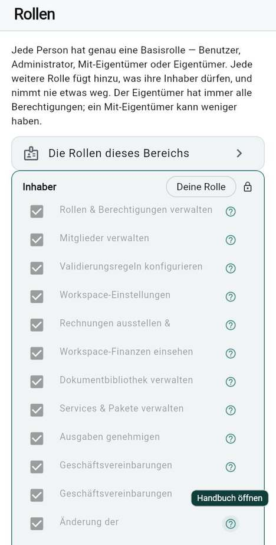

**Schritte**

1. Spielen Sie mit einer zweiten Person eine Validierung durch. Machen Sie sie zum Administrator, legen Sie für Buchungen eine erforderliche Validierung fest, buchen Sie dann als Mitglied und lassen Sie den Administrator bestätigen. Siehe [Validierungsregeln](Benutzerhandbuch#validierungsregeln-bereich-für-bereich) und [Rollen](Benutzerhandbuch#rollen-die-dieser-space-festlegt).
2. Erhöhen Sie die erforderliche Zahl auf zwei und sehen Sie, wie die Anfrage wartet. Senken Sie sie dann wieder. Eine Regel, die mehr Validierer braucht, als es gibt, lässt Anfragen ewig warten.
3. Schreiben Sie die Tarife zuerst auf Papier: Abo-Stufen in Prozent, das Gebührenband jeder Stufe, den Preis über das Kontingent hinaus. Tragen Sie sie dann in der Abrechnung ein und weisen Sie dem Mitglied die Stufe unter Mitglieder & Tarife zu. Siehe [Mitglieder & Tarife](Benutzerhandbuch#das-abo-eines-mitglieds).
4. Geben Sie der zweiten Person eine Stufe und lassen Sie sie über ihr Kontingent hinaus buchen. Lesen Sie den Kontoauszug.
5. Testen Sie die Benachrichtigungen: eine Nachricht, eine offene Anfrage, eine stornierte Buchung. Siehe [Benachrichtigungen](Benutzerhandbuch#benachrichtigungen).
6. Öffnen Sie [Rollen](https://fdittgen-png.github.io/deskilo/#/roles) und prüfen Sie, was ein Administrator darf. Entfernen Sie eine Berechtigung und sehen Sie, was für ihn verschwindet.

**Gut zu wissen**

- Benachrichtigungen in der App funktionieren sofort. Push-Benachrichtigungen brauchen zusätzlich die Einrichtung durch den Betreiber, sodass ein Test auf einem Handy nichts zeigen kann. Fragen Sie Ihren Betreiber.
- Automatische Zahlungserinnerungen laufen einmal täglich auf dem Server, wenn die Installation ihren Scheduler hat, und auch, wenn eine berechtigte Person die Finanzen öffnet.

*Sie sind fertig, wenn*

- [ ] Sie gesehen haben, wie eine Anfrage die von Ihnen eingerichtete Validierung durchläuft, und eine, die wartet.
- [ ] Ihre Tarife auf ein Blatt passen und der Kontoauszug des Test-Mitglieds zu Ihrer Rechnung passt.
- [ ] Sie wissen, wer worüber informiert wird.

**Siehe auch:** [Validierungsregeln](Benutzerhandbuch#validierungsregeln-bereich-für-bereich) · [Rollen und Berechtigungen](Benutzerhandbuch#die-rollenmatrix)

<!-- anchor: setup.training.week3 -->
### Woche 3: Wachsen

**Zielgruppe:** Inhaber · Abrechnungsadministrator:in

Sie stellen die erste Rechnung aus, in zwei Sprachen, im Test-Space, mit Ihrem Steuerberater an Ihrer Seite.

**Schritte**

1. Tragen Sie Ihre rechtliche Identität und Ihr Steuerregime gemeinsam mit Ihrem Steuerberater ein. Siehe [Ihre rechtliche Identität](Benutzerhandbuch#ihre-rechtliche-identität) und [Steuerregime](Benutzerhandbuch#steuerregime).
2. Schließen Sie einen Monat ab und stellen Sie im Test-Space eine Probe-Rechnung aus. Siehe [Der Monatsabschluss-Assistent](Benutzerhandbuch#der-monatsabschluss-assistent).
3. Öffnen Sie die Rechnung mit dem Layout **Professionell**, dann in einer zweiten Sprache. Siehe [Ein Layout pro Sprache](Benutzerhandbuch#ein-entwurf-pro-sprache).
4. Exportieren Sie das Register für den Zeitraum in dem Format, das Ihr Steuerberater nutzt. Siehe [Buchhaltungsexporte](Benutzerhandbuch#buchhaltungsexporte).
5. Stellen Sie dem Steuerberater drei Fragen: Stimmen die Angaben? Stimmt die umsatzsteuerliche Behandlung? Können Sie die Datei lesen?
6. Schreiben Sie die Antworten auf. Sie werden zur Vorgabe für den echten Space.

**Gut zu wissen**

- Die App stellt heute nur in Frankreich und Deutschland Rechnungen aus. Sie lehnt die Ausstellung ab, wenn etwas Wesentliches fehlt, und nennt, was fehlt.
- Rechnungen in einem Test-Space tragen ein Wasserzeichen, das darauf hinweist.

> **Achtung** Nach der ersten ausgestellten Rechnung im echten Space ist die Rechnung eingefroren, ihre Nummer kann nicht wiederverwendet werden, und der Monat ist für das Mitglied gesperrt. Korrekturen laufen über eine Stornierung, eine Gutschrift oder eine Erstattung.

*Sie sind fertig, wenn*

- [ ] Eine Probe-Rechnung existiert, in zwei Sprachen, von Ihrem Steuerberater gelesen.
- [ ] Sie eine Datei für den Steuerberater exportiert haben und er sie öffnen konnte.
- [ ] Sie die Antworten schriftlich haben.

**Siehe auch:** [Dokumente und Berichte](#dokumente-und-berichte) · [Das Rechnungsregister](Benutzerhandbuch#das-rechnungsregister)

<!-- anchor: setup.training.week4 -->
### Woche 4: Live gehen

**Zielgruppe:** Inhaber · Mitinhaber

Sie wechseln von der Probe in den echten Space, und Sie tun es nicht allein: Fünf Menschen laden Sie ein zuzusehen.

*Die Checkliste für den Start*

1. Entscheiden Sie, ob Sie Ihren Test-Space als Probeseite behalten oder den echten Space anlegen. Hat der Space zwei Seiten, stellen Sie von der Testseite auf die echte bereit. Siehe [Zwischen den beiden Seiten bereitstellen](Benutzerhandbuch#zwischen-den-beiden-seiten-ausrollen).
2. Legen Sie stattdessen den echten Space an, wiederholen Sie, was funktioniert hat: dasselbe Land, dieselbe Währung und Zeitzone, denselben Plan, dieselben Regeln, Tarife und Rollen. Eine Vorlage, eine Konfigurationsübertragung oder ein Deployment zwischen den beiden Seiten übernimmt das meiste. Siehe [Export, Import und Konfiguration](Benutzerhandbuch#den-space-exportieren-xml).
3. Tragen Sie Ihre rechtliche Identität im echten Space neu ein. Eine Vorlage übernimmt sie nie; ein Deployment zwischen den beiden Seiten übernimmt sie, aber nie Zugangsdaten. Prüfen Sie sie in jedem Fall.
4. Erklären Sie den Space erst dann zur Produktion, wenn die Rechnungen, die ihn verlassen, wirklich geschuldet sind. Siehe [Die echte oder die Testseite betreten](Benutzerhandbuch#die-echte-oder-die-testseite-betreten).
5. Laden Sie fünf Menschen ein, nicht fünfzig. Siehe [Die Einladungsnachricht](Benutzerhandbuch#einladungstext).
6. Beobachten Sie ihre ersten Buchungen. Öffnen Sie [Reservieren](https://fdittgen-png.github.io/deskilo/#/reserve) und lesen Sie, was die Karte **Erste Schritte** noch verlangt.
7. Ziehen Sie nach einer Woche Bilanz: Welche Frage wurde gestellt, welche Regel hat überrascht, welche Einstellung möchten Sie jetzt ändern.

**Gut zu wissen**

- Zugangsdaten wie E-Rechnungs-Tokens oder Schlüssel von Zahlungsanbietern reisen nie zwischen Spaces. Geben Sie sie neu ein.
- Eine Sicherungskopie vor der ersten Rechnung ist billig. Siehe [Dokumente und Berichte](#was-sie-ihrem-steuerberater-übergeben).

*Sie sind fertig, wenn*

- [ ] Fünf echte Menschen gebucht haben, ohne Sie zu fragen, wie.
- [ ] Sie wissen, wo Sie nachsehen, wenn etwas nicht funktioniert.
- [ ] Sie Ihren ersten Monatsabschluss eingeplant haben.

**Siehe auch:** [Ein Space hat zwei Seiten](Benutzerhandbuch#ein-space-hat-zwei-seiten)

<!-- anchor: setup.training.glossary -->
### Zwanzig Wörter der Einrichtung

**Zielgruppe:** Inhaber · Mitinhaber

Die Entscheidungen, denen Sie begegnen werden, haben Namen. Hier steht, was jeder davon in DesKilo bedeutet.

| Begriff | Bedeutung |
|---|---|
| Granularität | Die Einheit einer Buchung: Halbtag, Tag, Stunde oder Minuten. Sie bestimmt, wie der Plan geschnitten ist. |
| Halbtagsgrenze | Die Uhrzeit, die einen Vormittag von einem Nachmittag trennt, festgelegt mit Beginn und Ende des Arbeitstags. |
| Überschreitung | Nutzung über das Kontingent eines Mitglieds hinaus. Sie wählen: sperren, direkt abrechnen oder Pakete verkaufen. |
| Gebührenband | Der Preis eines Abos, nach dem Prozentsatz des Kontingents, den das Mitglied nimmt. |
| Validierungsbereich | Eine Art von Anfrage mit eigener Regel: eine Buchung, eine Ausgabe, eine Erstattung und andere. |
| Quorum | Die Zahl der Validierer, die eine Anfrage braucht. Mehr, als es Personen zum Validieren gibt, lässt sie warten. |
| Fälligkeit | Der Moment, in dem die Umsatzsteuer fällig wird: bei der Rechnungsstellung oder bei der Zahlung. |
| Neubeginn der Nummerierung | Wie oft die Rechnungsnummer wieder von vorn beginnt. Das darf nicht häufiger sein als das auf der Rechnung gedruckte Datum. |
| Umgebungspaar | Eine Testseite und eine echte Seite eines Space. |
| Vorlage | Eine gespeicherte Einrichtung (Plan, Regeln, Tarife, Rollen), die Sie auf einen neuen Space anwenden können. Sie übernimmt nie Identität oder Zahlungsangaben. |
| Bereitschaft | Die Checkliste oben in den Workspace-Einstellungen, die sagt, was fehlt, bevor Menschen buchen können und bevor die erste Rechnung ausgestellt wird. |
| Zurückgehalten | Eine Funktion, die an ist, aber auf eine andere wartet, die aus ist. |
| Kiosk | Ein gemeinsamer Bildschirm an der Tür, an dem Mitglieder ein- und auschecken. |
| Ausweis | Eine Karte oder ein Tag, den ein Mitglied zum Einchecken an einem Kiosk vorzeigt. |
| Verwaltetes Profil | Ein Mitglied, das Sie für jemanden ohne Konto führen und später mit einem Code übergeben. |
| Schließtag | Ein Tag, an dem der Space geschlossen ist, etwa ein Feiertag. |
| Wortwahl (Lexikon) | Die Wörter, die Sie in der App ersetzen, damit sie zu Ihrem Ort passen, etwa wie ein Mitglied genannt wird. |
| Wiederherstellungsexport | Eine Kopie der Einstellungen und Daten, die Sie vor einer großen Änderung sichern. Sie erscheint in der Bereitschaftsliste. |
| Angebotene Stufe | Eine Abo-Stufe, die Sie Mitgliedern anbieten. Sie muss existieren, bevor jemand sie wählt. |
| Verkäuferart | Die Art der Organisation, die Sie beim Rechnungsstellen sind. Sie bestimmt die Standardangaben. |

**Siehe auch:** [Die Wörter der App](Benutzerhandbuch#die-wörter-der-app)

<!-- anchor: setup.training.help -->
### Wo Sie Hilfe bekommen

**Zielgruppe:** Alle

Sie stecken bei einem Feld oder einer Entscheidung fest.

**Schritte**

1. Tippen Sie auf das **?** neben einem Feld. Die Anleitung öffnet sich an diesem Feld.
2. Öffnen Sie die [Hilfe](https://fdittgen-png.github.io/deskilo/#/help) und springen Sie über **Inhalt**. Tipps auf Bildschirmen lassen sich mit **Nächster Tipp** durchblättern.
3. Wenn die App selbst versagt, öffnen Sie **Supportdetails** und senden Sie die Vorschau. Siehe [Supportdetails](Benutzerhandbuch#supportdetails).
4. Bei einer Entscheidung zu Recht oder Steuern fragen Sie Ihren Steuerberater. Bei Ihrer Installation fragen Sie deren Betreiber. Wie andere Inhaber es gemacht haben, fragen Sie Ihre Community.

**Gut zu wissen**

- Die Anleitung funktioniert offline und in Ihrer Sprache.
- Wenden Sie sich mit der Datei aus **Supportdetails** an den Support. Sie enthält keine Identität und keine Geschäftsdaten.

**Siehe auch:** [Wo es mehr Hilfe gibt](Benutzerhandbuch#wo-es-mehr-hilfe-gibt)

<!-- anchor: setup.training.cheatsheet -->
### Der Spickzettel

**Zielgruppe:** Inhaber · Mitinhaber

Die gesamte Einrichtung auf einer Seite. *Umkehrbar* sagt Ihnen, ob Sie Ihre Meinung ändern können, nachdem Sie es getan haben.

| Schritt | Wo in der App | Wie lange | Umkehrbar? |
|---|---|---|---|
| 1. Land, Währung, Zeitzone, Sprache | [Workspace-Einstellungen](https://fdittgen-png.github.io/deskilo/#/workspace-settings) | 5 Minuten | Ja, bis zum ersten Dokument oder zur ersten Zahlung; danach sind Währung und Land gesperrt |
| 2. Grundriss | [Space-Editor](https://fdittgen-png.github.io/deskilo/#/editor) | 30 Minuten | Ja, bis zur ersten Reservierung; danach Objekt für Objekt bearbeiten |
| 3. Öffnungsregeln | Verfügbarkeit | 10 Minuten | Ja |
| 4. Funktionen | [Funktionen](https://fdittgen-png.github.io/deskilo/#/features) | 10 Minuten | Ja. Ausschalten stoppt die neue Nutzung und löscht nichts |
| 5. Rollen und Validierung | [Rollen](https://fdittgen-png.github.io/deskilo/#/roles) | 20 Minuten | Ja, aber eine Regel, die zu viele Validierer braucht, blockiert Anfragen |
| 6. Tarife und Stufen | [Abrechnung](https://fdittgen-png.github.io/deskilo/#/billing) (Stufen werden unter Mitglieder & Tarife zugewiesen) | 1 Stunde | Ja für die Zukunft; ausgestellte Beträge bleiben |
| 7. Rechtliche Identität und Steuerregime | Rechtliche Identität | 1 Stunde mit Ihrem Steuerberater | Vorsicht nach der ersten Rechnung |
| 8. Rechnungsnummerierung und Angaben | Rechtliche Identität | 20 Minuten | Nein, nach der ersten Rechnung |
| 9. Berichtslayouts | [Berichtseditor](https://fdittgen-png.github.io/deskilo/#/report-editor) | 1 Stunde | Ja für neue Dokumente; ausgestellte bleiben |
| 10. Einladungsnachricht | Workspace-Einstellungen | 10 Minuten | Ja |
| 11. Test der Benachrichtigungen | Nachrichten, Anfragen | 20 Minuten | Ja |
| 12. Probe-Rechnung auf der Testseite | Rechnungsstellung | 1 Stunde | Nur auf der Testseite |
| 13. Echter Space oder Bereitstellung | [Ich](https://fdittgen-png.github.io/deskilo/#/me) | 1 Stunde | Vorsicht: Produktion heißt, Rechnungen sind geschuldet |
| 14. Die ersten fünf einladen | Workspace-Einstellungen | 10 Minuten | Ja |

**Siehe auch:** [Die Reihenfolge, der Sie folgen](#die-reihenfolge-der-sie-folgen)
