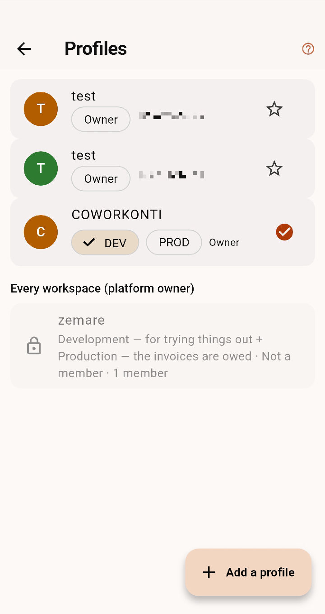
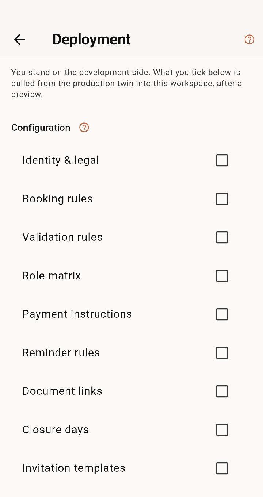

# Environments — a space to try things in, a space that is real

Two workspaces, one name. On one you configure, import, print and break
things; on the other people book seats and receive invoices that are
owed. What you settle on the first, you deploy to the second.

<!-- anchor: env.pair.why -->
## Why a pair

A coworking space is configured by the person who runs it, not by an
integrator, and configuration is where mistakes are cheap to make and
expensive to discover: a tariff typed twice, a VAT rate on the wrong
group, a plan whose seats moved after people had booked them. A
development space costs nothing and absorbs all of that. Every document
it prints carries the **development watermark**, its e-invoices go to
the test endpoint, and nothing it produces can be mistaken for a real
document.

*The Profiles screen: a paired workspace carries DEV and PROD on one row — one space, two environments, and the tick shows which one you are standing in.*

<!-- anchor: env.pair.create -->
## Creating the pair

A new workspace is created **with its twin**: same name, country,
currency and time zone, both yours from the first second. *Profiles*
shows the couple as one card with two chips, **DEV** and **PROD**; a tap
on a chip switches side, and that switch becomes your default, so a
restart opens where you left.

A workspace created before pairs existed, or created alone, gets its
twin on demand: *Settings → Advanced → Create its twin*. The
configuration is copied once at that moment; from then on the two sides
are independent and only a deployment moves anything between them.

<!-- anchor: env.pair.permissions -->
## Who may do what

Three permissions in the role matrix:

- **Enter the production workspace** — without it, a role cannot be a
  member of the production side at all. Owners and co-owners have it;
  admins have it; members do not until you give it.
- **Deploy to development** — pull the production side's configuration
  into the development one. Admins have it.
- **Deploy to production** — the sensitive one, owner and co-owner only
  by default. Whoever holds it also holds *Deploy to development*.

Two rules follow. **A member of the production side is always a member of
the development side**: the membership is mirrored, role and status
included, so nobody has to be invited twice. And **a role enters the
production side only while it holds the access permission** — an
invitation, a join or a claim into production is refused otherwise, with
the reason on screen.

<!-- anchor: env.work.configure -->
## Working on the development side

Configure, import a space file, invite a colleague, issue a test invoice,
move seats, print. Nothing there is real: the watermark says so on every
document, and the e-invoice test endpoint refuses to reach a government
platform.

<!-- anchor: env.deploy.screen -->
## Deploying

*Settings → Administration → Deployment*, on the side you want to
**write**. A deployment always goes **into the side you stand on**: on
the production side the button reads *Pull from DEV*, on the development
side *Pull from PROD*. Nothing can be pushed onto the other side by
mistake.

*The Deployment screen from the development side: the sentence at the top names the direction, and what you tick is pulled from the production twin — after a preview.*

<!-- anchor: env.deploy.entities -->
### What travels, entity by entity

Grouped as **Configuration**, **Master data** and **Reports**:

| Group | Entities |
|---|---|
| Configuration | Identity & legal · Booking rules · Validation rules · Role matrix · Reminder rules · Payment instructions · Document links · Closure days · Invitation templates · Features |
| Master data | VAT · Tariffs · Services · Packages · Accessories · Sites · Floor plans |
| Reports | Document designs, with their images |

Tick one and what it needs is ticked with it — services need the VAT
rates, a floor plan needs its accessories and its sites.

<!-- anchor: env.deploy.plan -->
### The floor plan is merged, never replaced

Levels match by name, offices, desks and seats by name or, unnamed, by
position. What the other side has is added or updated; what only this
side has is reported and **kept**, because a seat may already hold a
booking. Badge tags and blocks never travel. Backgrounds and plan images
are copied along.

<!-- anchor: env.deploy.preview -->
### The preview, then the confirmation

Nothing moves before a preview says, per entity, what would be added,
changed and removed. A preview with nothing to do says so and deploys
nothing. Then a confirmation names the side that is about to be written
and the entities, because that is the moment a mistake becomes expensive.

<!-- anchor: env.deploy.journal -->
### The journal and the way back

Every deployment is recorded: who, when, in which direction, which
entities, and what the target held before. *Roll back* on the latest one
restores exactly that. A rollback refuses while a later deployment stands
on the same side — undo them in order.

<!-- anchor: env.deploy.never -->
### What never travels

Members, reservations, ledgers, invoices, payments, events, messages,
credentials of any kind, and document numbering counters. A number series
is deployed as a **format**; the next number always belongs to the space
that issues it.

<!-- anchor: env.instances -->
## When a pair is not enough

Two workspaces share one database. Where personal data or payment
credentials must be physically separated, pair **instances** instead: the
new-instance wizard builds a second database from the bundle, and the
same entities travel between the two through the space file.
