# Guía de puesta en marcha

**DesKilo — construya su espacio, paso a paso.** Para quien va a crear un espacio de coworking, la sala de una asociación o una oficina compartida, y quiere saber qué es posible, qué es necesario y en qué orden. *Otros idiomas: [English](Setup-Guide) · [Français](Guide-de-demarrage) · [Deutsch](Einrichtungsanleitung) · [Italiano](Guida-di-avvio).*

<!-- anchor: setup.guide.how-to-read -->
## Cómo usar esta guía

**Público:** Propietario · Copropietario · Administrador/a · Operador/a

Esta guía explica el *porqué*, el *orden* y las *consecuencias* de configurar un espacio. Los clics están en la [Guía de usuario](Guia-de-usuario#cómo-usar-esta-guía); cada sección enlaza con el lugar exacto. El ejemplo que seguimos es el espacio de demostración, *Atelier du Marché*, en Pézenas: una asociación con una sala, unas cuantas mesas y una cuota mensual. Sus personas y sus cifras son inventadas.

*Tres niveles, en este orden*

| Nivel | Qué hace usted | Cuánto tiempo |
|---|---|---|
| *Abrir* | Un lugar, los horarios, las personas que aprueban, una invitación. Al final, los miembros pueden reservar. | unos 20 minutos |
| *Operar* | Roles, tarifas, pagos, notificaciones. Al final, el espacio puede funcionar día a día. | una tarde, repartida en varios días |
| *Crecer* | Facturación e impuestos, informes, un quiosco en la puerta, analítica, asistentes. Solo cuando los necesite. | cuando llegue el momento |

Solo *Abrir* es obligatorio para empezar. Puede detenerse tras cualquier nivel: nada le obliga a seguir.

*Elija su camino*

| Usted quiere… | Empiece aquí |
|---|---|
| Saber qué puede hacer DesKilo y qué preparar | [Antes de empezar](#antes-de-empezar) |
| Un lugar que los miembros puedan reservar, hoy mismo | [Construir el lugar](#construir-el-lugar) |
| Decir quién puede hacer qué y quién aprueba | [La matriz de roles](Guia-de-usuario#la-matriz-de-roles) |
| Cobrar la cuota de membresía | [Dinero](#dinero-e-impuestos) |
| Informar a los miembros de lo que ocurre | [Notificaciones](#avisar-a-las-personas) |
| Emitir facturas y declarar el IVA | [Facturación](#facturar-a-mano-o-automáticamente) · [IVA](#el-iva-a-grandes-rasgos) |
| Una tableta de pared, informes o analítica | [Quiosco](Guia-de-usuario#modo-quiosco-una-tableta-de-pared-para-registrar-la-llegada) · [El editor de informes](Guia-de-usuario#el-editor-de-informes) · [Analítica del negocio](Guia-de-usuario#análisis-de-negocio) |
| Dejar que un asistente actúe en su nombre | [Asistentes](Guia-de-usuario#asistentes-qué-son) |

*Dos compañeros de viaje*

- La *página del asistente de configuración* (`setup.html`) le permite preparar todo en su navegador antes de tocar la aplicación: las respuestas se guardan en el navegador, no se envía nada a ninguna parte y puede exportar un archivo que la aplicación lee. Es el mejor lugar para pensar junto con su contable. Véase [Preparar un espacio con el cuestionario de configuración](Guia-de-usuario#preparar-un-espacio-con-el-cuestionario-de-configuración).

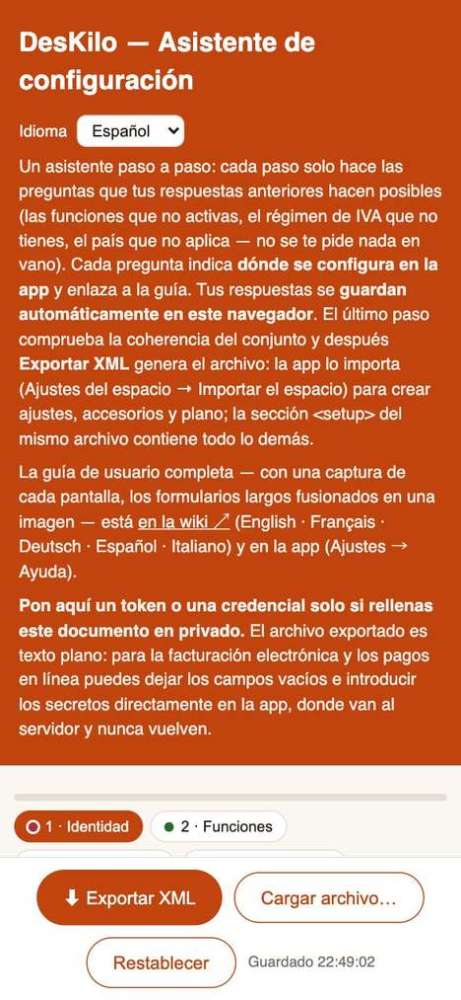

- El *espacio de demostración* le permite practicar primero, sin nada real en juego. Véase [El espacio de demostración](Guia-de-usuario#el-espacio-de-demostración).

**Conviene saber**

- Cada sección indica su público en la segunda línea, para que pueda saltarse lo que no le concierne.
- Un bloque que empieza por **Atención** marca una decisión que luego es difícil de deshacer, y dice cuándo.
- Esta guía nunca certifica nada legal ni fiscal: dice lo que hace la aplicación y lo que conviene confirmar con un contable.

<!-- anchor: setup.before.overview -->
## Antes de empezar

Un poco de preparación le ahorra lo que más cuesta después: volver a escribirlo todo y las decisiones que ya no se pueden deshacer. Este capítulo muestra qué hace DesKilo, qué necesita realmente para abrir y qué conviene tener a mano.

En este capítulo:
- [Qué puede hacer DesKilo](#qué-puede-hacer-deskilo)
- [Qué es necesario y qué es opcional](#qué-es-necesario-y-qué-es-opcional)
- [Un espacio de prueba o uno real](#un-espacio-de-prueba-o-uno-real)
- [Partir de una plantilla o de cero](#partir-de-una-plantilla-o-de-cero)
- [Qué preparar](#qué-preparar)
- [Decisiones difíciles de deshacer](#decisiones-difíciles-de-deshacer)
- [Quién hace qué](#quién-hace-qué)

<!-- anchor: setup.before.what -->
### Qué puede hacer DesKilo

**Público:** Propietario · Copropietario

Usted quiere ver el conjunto antes de elegir nada. DesKilo agrupa sus funciones en nueve procesos; la pantalla **Funciones** muestra una tarjeta por proceso con su estado.

*Los nueve procesos, en palabras sencillas*

| Proceso | Qué ofrece a un miembro |
|---|---|
| **Espacio y acceso** | Una puerta de entrada: unirse con el ID del espacio, un rol, una credencial. |
| **Gestión de espacios** | Un lugar que se parece al real: plantas, salas, mesas, horarios de apertura. |
| **Reservas y uso** | Reservar una mesa o una sala, entrar y salir, ver qué está libre. |
| **Calendario y coordinación** | Un calendario, mensajes y solicitudes que alguien confirma. |
| **Ofertas para miembros** | Un plan, precios de servicios y acuerdos. |
| **Facturación y pagos** | Un estado de cuenta, facturas, pago, recordatorios, IVA. |
| **Documentos e información** | Documentos para leer, informes para imprimir, sus propios datos para exportar. |
| **Operaciones y administración** | Un espacio con sus propios colores y sus propias palabras. |
| **Integraciones y automatización** | Notificaciones y documentos entregados a través de servicios externos. |

**Conviene saber**

- Un espacio nuevo arranca con un conjunto sensato de funciones activadas; no tiene que decidir una por una. Desactivar una función solo detiene lo nuevo y no borra nada.
- Una función que depende de otra la activa consigo, y la pantalla indica qué se ha activado. Véase [Un interruptor de función](Guia-de-usuario#un-interruptor-de-función).
- Las funciones marcadas como alfa o beta piden su consentimiento al activarlas.

**Véase también:** [Activar y desactivar funciones](Guia-de-usuario#activar-o-desactivar-procesos-enteros)

<!-- anchor: setup.before.necessary -->
### Qué es necesario y qué es opcional

**Público:** Propietario · Copropietario · Administrador/a

Usted quiere conocer el camino más corto hacia un espacio que se pueda reservar. La aplicación mantiene una lista de preparación llamada **Configuración de este espacio** y, en la pantalla Reservar, dice a los propietarios **Antes de que alguien pueda reservar aquí** qué falta.

*Lo que debe existir antes de la primera reserva*

1. **Días de apertura, zona horaria y moneda**: una zona horaria, una moneda y al menos un día de apertura.
2. **Puestos reservables en el plano**: al menos un asiento.
3. **Roles y quién valida las solicitudes**: solo cuenta cuando una regla de validación, de cualquier tipo, exige más validadores de los que tiene el espacio. Una regla que pida dos aprobaciones cuando usted está solo en el espacio dejaría las solicitudes esperando para siempre.
4. **Lo que pueden hacer los miembros**: los miembros tienen **Reservar y usar las reservas**. Un espacio nuevo no les concede nada, así que un miembro que se une no puede reservar hasta que usted lo marque en [Roles](https://fdittgen-png.github.io/deskilo/#/roles).

Una fila más, **Servidor y versión de la base de datos**, solo bloquea cuando el servidor va por detrás de esta aplicación; entonces espera al operador del servidor. Y mientras **Facturas** está activada, **La identidad legal y la dirección del espacio** también es obligatoria: la lista la marca como **Necesario antes de facturar**, porque sin ella no se puede emitir ninguna factura.

*Lo que es opcional y puede dejarse para más tarde*

- **Planes de membresía y tarifas**
- **Invitar a los primeros miembros**
- **Cómo pagan los miembros**
- **Exportación y recuperación**
- **Datos que necesitan sus funciones (identidad, banco, plataformas)**
- **Una primera reserva**

Cada uno de estos pasos puede aplazarse con **Más adelante** y recuperarse después; la lista indica si un paso está **Por configurar**, **Listo**, **No es necesario aquí** o **A la espera de otra persona**. Existen otros dos estados: **Aún no verificado** (**Exportación y recuperación** pasa a Listo solo tras una exportación real en los últimos 90 días) y una fila que no se pudo leer.

**Conviene saber**

- La lista nombra quién actúa: **Usted**, **El operador del servidor** o **Un administrador de la base de datos**.
- Opcional no significa poco importante: los datos bancarios, un proveedor de pagos o una sede son datos que necesitan sus funciones, y la lista los nombra.
- Si activa la facturación sin identidad legal, la aplicación se lo permite; la lista y [Lo que le necesita](Guia-de-usuario#lo-que-te-espera) la nombran, y la emisión de una factura se rechaza indicando qué falta.

**Véase también:** [Revisar su espacio](#revisar-su-espacio) · [La tarjeta Primeros pasos y los consejos](Guia-de-usuario#la-tarjeta-primeros-pasos-y-los-consejos)

<!-- anchor: setup.before.environment -->
### Un espacio de prueba o uno real

**Público:** Propietario · Copropietario · Operador/a

Usted quiere probar sin consecuencias y después llevar el espacio real. Un espacio puede ser de prueba, real, o un par vinculado con el mismo nombre.

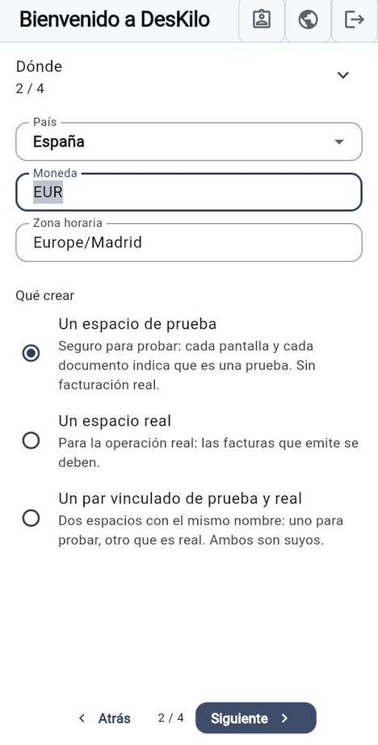

| Opción | Elíjala cuando | Qué ocurre |
|---|---|---|
| **Un espacio de prueba** | Está aprendiendo. | Cada pantalla y cada documento indica que es una prueba: los documentos llevan una marca de agua. Sin facturación real. |
| **Un espacio real** | Ya conoce sus ajustes. | Las facturas que emite son exigibles. |
| **Un par vinculado de prueba y real** | Quiere ensayar los cambios antes de que los vean los miembros reales. | Dos espacios, ambos suyos. Solo un despliegue traslada la configuración de uno a otro; los miembros, las reservas, las facturas y los pagos nunca viajan. |

**Conviene saber**

- El selector empieza en la opción de prueba.
- El entorno es una declaración del propietario; quien tenga el permiso de configuración (el propietario siempre) puede cambiarlo más tarde, y las facturas ya emitidas conservan la marca de agua que llevaban, así que empiece con un espacio de prueba si tiene dudas.
- Para practicar sin un espacio propio, utilice el espacio de demostración.

**Véase también:** [Un espacio tiene dos caras](Guia-de-usuario#un-espacio-tiene-dos-caras) · [Crear un espacio](Guia-de-usuario#crear-un-espacio) · [Un espacio de prueba](Guia-de-usuario#para-qué-sirve-un-espacio-de-prueba)

<!-- anchor: setup.before.template -->
### Partir de una plantilla o de cero

**Público:** Propietario

Usted quiere una ventaja inicial sin quedar atado a las decisiones de otros. Al crear un espacio, **Partir de** ofrece **Espacio vacío** o una plantilla lista para usar, y viene preseleccionada *A tiny space*; elija *Espacio vacío* si prefiere un lienzo en blanco.

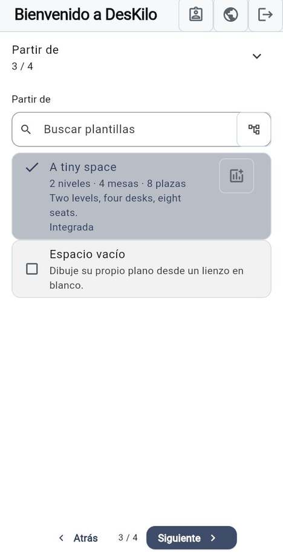

*Las dos plantillas incluidas*

| Plantilla | Qué configura |
|---|---|
| A tiny space | Dos plantas, cuatro mesas, ocho asientos y nada más: lo justo para reservar, escanear y explorar desde el primer minuto. |
| Association de coworking (France) | Medias jornadas de 7:00 a 13:00 y de 13:00 a 19:00, de lunes a viernes, días festivos, membresías al 50 % y al 100 %, dos bonos prepago de medias jornadas (10 y 20), roles de junta (tesorero, secretario, responsable de sala), un calendario para las validaciones y dos plantas listas para reservar. También fija el idioma del espacio en francés y el régimen de IVA en *no sujeto al IVA*; solo se renombran tres palabras (Place, Étage, Réservations). El nombre de la plantilla es francés en todos los idiomas de la aplicación. |

**Conviene saber**

- Una plantilla nunca incluye su identidad legal, sus datos bancarios, sus sedes, sus invitaciones ni los enlaces a documentos: eso es cosa suya, y la lista de preparación lo nombra (la identidad legal, con **Facturas** activada, como un ámbito propio).
- Un espacio creado con una plantilla puede tener la facturación activada y nada con lo que emitir hasta que añada la identidad.
- Aplicar una plantilla a un espacio que ya tiene tarifas sustituye sus tramos de cuota: úsela en un espacio nuevo.

**Véase también:** [Crear un espacio](Guia-de-usuario#crear-un-espacio)

<!-- anchor: setup.before.prepare -->
### Qué preparar

**Público:** Propietario

Usted quiere tener los datos a mano para que configurar lleve minutos y no días. Reúna primero lo siguiente.

**Antes de empezar**

- [ ] La **identidad legal**: asociación o empresa, razón social, dirección, números de registro y de IVA si los tiene.
- [ ] Un contable (o alguien que confirme las decisiones fiscales): las facturas y el IVA son lo que conviene revisar con un profesional.
- [ ] Una idea de tarifa: gratuita, una membresía fija, o un porcentaje de días con una cuota mensual.
- [ ] Los **datos bancarios** a los que pagarán los miembros (IBAN y BIC, o el método habitual en su país).
- [ ] Una lista de las primeras personas: nombres y direcciones de correo, y quién aprobará las solicitudes.
- [ ] Un croquis del plano: plantas, salas, cuántas mesas y asientos, y si se puede reservar una sala entera.
- [ ] Sus días y horas de apertura, y los días en que cierra.

**Conviene saber**

- Puede abrir sin la identidad legal ni los datos bancarios; los necesitará antes de la primera factura.
- Haga primero el croquis en papel. La aplicación dibuja plantas, salas, mesas y asientos; es más rápido introducir un plano que ya ha pensado.

**Véase también:** [Preparar un espacio con el cuestionario de configuración](Guia-de-usuario#preparar-un-espacio-con-el-cuestionario-de-configuración)

<!-- anchor: setup.before.permanent -->
### Decisiones difíciles de deshacer

**Público:** Propietario · Copropietario

Usted quiere saber en qué decisiones conviene ir despacio. La mayoría de los ajustes se pueden cambiar cualquier día. Estos no, o no limpiamente.

> **Atención** Una factura emitida no cambia nunca, y su número no se reutiliza. Si se equivoca, corrige con una anulación, una nota de crédito o una solicitud de reembolso, no con una edición.

| Decisión | Cuándo pasa a ser definitiva | Qué hacer en su lugar |
|---|---|---|
| Formato y secuencia del número de factura | El siguiente número puede subirse, nunca bajarse. Tras la primera factura ya no se puede imprimir menos de la fecha que muestra la serie. | Previsualice el formato, consulte a su contable y después emita. |
| El mes de una factura emitida | Una vez facturado el mes de un miembro queda bloqueado; los días de cierre y las importaciones de días festivos lo omiten. | Fije los días de cierre antes de fin de mes. |
| Régimen de IVA y tipos | Los tipos se versionan por fecha y nunca se editan; una declaración de IVA presentada no se vuelve a calcular. | Añada un tipo nuevo desde una fecha; decida el régimen con su contable. |
| País, moneda, zona horaria | Los importes se guardan como números, sin conversión. En cuanto el espacio ha emitido un documento o registrado dinero, el servidor rechaza cualquier cambio de moneda o de país. La zona horaria nunca se bloquea, pero cada día se cuenta en ella. | Elíjalos bien desde el primer día; véase [Construir el lugar](#construir-el-lugar). |
| Sustitución del plano | Se rechaza importar un plano cuando ya hay reservas. | Edite las plantas y las salas una por una en el editor. |
| ID del espacio | Es lo que escriben los miembros y lo que señalan los códigos QR impresos. Puede cambiarlo (de 4 a 20 letras o cifras) con **Cambiar el ID del espacio**, pero el ID antiguo deja de funcionar de inmediato. | Elija un ID corto y fácil de recordar antes de imprimir nada; cámbielo pronto si debe hacerlo. |
| Prueba o real | Un espacio real emite facturas exigibles; los documentos de desarrollo llevan marca de agua. | Empiece en un espacio de prueba y despliegue cuando esté listo. |
| Una regla que exige más validadores de los que tiene | Las solicitudes esperan para siempre. | Cuente sus validadores antes de exigir dos. |

**Conviene saber**

- Desactivar una función nunca borra datos.
- Eliminar una planta elimina todas las oficinas, mesas y asientos que contiene.

**Véase también:** [Dinero](#lo-que-no-tiene-vuelta-atrás)

<!-- anchor: setup.before.who -->
### Quién hace qué

**Público:** Propietario · Copropietario · Administrador/a · Operador/a

Usted quiere saber a quién acudir para cada cosa. Pueden intervenir tres personas, y la lista de preparación las nombra.

| Quién | Qué hace |
|---|---|
| **Propietario** (y *Copropietario*) | Todo lo del espacio: plantas, horarios, funciones, roles, tarifas, identidad legal, invitaciones, despliegues. Los copropietarios tienen todos los permisos por defecto; el propietario decide lo que pueden hacer los administradores. |
| *Operador/a* | Gestiona la instalación: el servidor y sus secretos, y las actualizaciones de la base de datos. Es necesario para que funcionen las notificaciones push y para todo lo que la lista de preparación llama **A la espera de otra persona**. |
| *Administrador/a de la base de datos* | Aprueba el acceso de un miembro para los asistentes. |

**Conviene saber**

- En una instalación compartida, el operador suele ser el de la plataforma, no usted.
- Los administradores actúan dentro de los permisos que les dio el propietario en la [matriz de roles](Guia-de-usuario#la-matriz-de-roles).
- Si una sección dice **El operador del servidor**, la aplicación no puede hacerlo desde su pantalla.

**Véase también:** [Decida quién puede hacer qué](Guia-de-usuario#la-matriz-de-roles) · [Permisos de despliegue](Guia-de-usuario#quién-puede-desplegar-y-entrar-en-producción)

<!-- anchor: setup.place.overview -->
## Construir el lugar

Este capítulo levanta el primer nivel, *Abrir*: dónde está el espacio, cómo es, cuándo abre y cuáles son las reglas de reserva. En unos veinte minutos el espacio ya se puede reservar. El ejemplo es *Atelier du Marché*, una asociación de Pézenas con dos plantas y una sala.

En este capítulo:
- [País, moneda, zona horaria e idioma](#país-moneda-zona-horaria-e-idioma)
- [El plano](#el-plano)
- [Horarios de apertura y reglas de reserva](#horarios-de-apertura-y-reglas-de-reserva)
- [Días de cierre y días festivos](#días-de-cierre-y-días-festivos)
- [Revisar su espacio](#revisar-su-espacio)

<!-- anchor: setup.place.where -->
### País, moneda, zona horaria e idioma

**Público:** Propietario · Administrador/a

Usted quiere que el espacio sepa dónde vive. Estas cuatro elecciones determinan más cosas de las que parece.

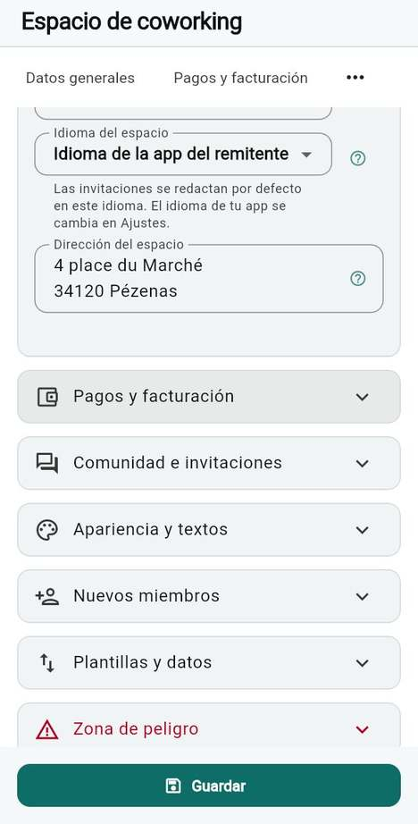

*Qué determina cada elección*

| Elección | Qué decide |
|---|---|
| **País** | La moneda y la zona horaria que propone, y los días festivos que se ofrecen como días de cierre (véase más abajo). |
| **Moneda** | Cómo se muestra y se cuenta cada importe. |
| **Zona horaria** | Qué significan una jornada laboral, el límite de media jornada y un día de cierre; un miembro que está en el extranjero ve el día del espacio. |
| **Idioma del espacio** | El idioma en que se redactan por defecto las invitaciones y las referencias de mensajes compartidas. |

**Pasos**

1. Abra [Espacio](https://fdittgen-png.github.io/deskilo/#/workspace-settings) y vaya a **Datos generales**.
2. Elija el **País**; la **Moneda** y la **Zona horaria** se proponen solas y puede corregirlas. Para Atelier du Marché: Francia, EUR, Europe/Paris.
3. Elija el **Idioma del espacio** y toque **Guardar**.

> **Atención** Elija bien el país y la moneda desde el primer día. Los importes se guardan como simples números, así que en cuanto el espacio ha emitido un documento o registrado dinero, el servidor rechaza cambiar uno u otro: «La moneda y el país quedan fijados en cuanto el espacio ha emitido un documento o registrado dinero. No se ha guardado nada.»

**Conviene saber**

- La aplicación enumera muchos países, pero emitir facturas dentro de DesKilo solo funciona hoy para Francia y Alemania. En otros países conserva los estados de cuenta y emite las facturas fuera de la aplicación.
- El idioma del espacio no es el idioma de su aplicación, que está en sus ajustes personales.

**Véase también:** [País](Guia-de-usuario#país) · [Moneda y zona horaria](Guia-de-usuario#moneda-y-zona-horaria) · [Idioma del espacio](Guia-de-usuario#idioma-del-espacio)

<!-- anchor: setup.place.plan -->
### El plano

**Público:** Propietario · Administrador/a

Usted quiere que el plano en pantalla se parezca al lugar real. Se construye en cuatro capas: plantas, después oficinas (salas), después mesas y después asientos. Un miembro reserva un asiento; el asiento es lo que cuenta la lista de preparación.

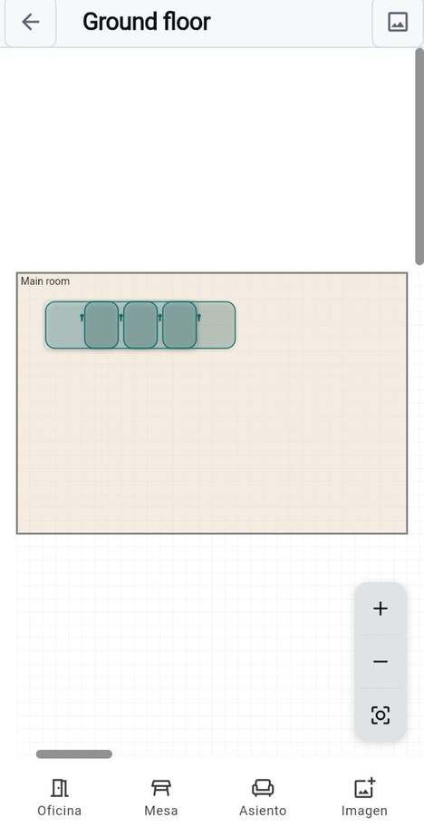

**Pasos**

1. Haga un croquis en papel: plantas, salas, mesas, asientos.
2. Abra [Editor del espacio](https://fdittgen-png.github.io/deskilo/#/editor) y añada las plantas con **Añadir planta**.
3. Abra una planta y dibuje cada sala con **Oficina**, y dentro de ella **Mesa** y **Asiento**.
4. Si un equipo puede ocupar una sala o una planta durante un día, active la reserva completa en sus propiedades.

**Conviene saber**

- Empiece poco a poco: una primera planta, una sala, unos cuantos asientos. Todo se puede añadir después.
- Una planta, una oficina o una mesa enteras solo se pueden reservar si **Reservas de mesa, oficina y planta** está activada y el miembro tiene el permiso.
- La plantilla incluida A tiny space le da dos plantas, cuatro mesas y ocho asientos para ajustar.
- Eliminar una planta elimina todo lo que contiene, y se rechaza importar un plano cuando ya hay reservas.

**Véase también:** [Añadir, renombrar y eliminar plantas](Guia-de-usuario#editor-del-espacio-añadir-renombrar-y-eliminar-plantas) · [Dibujar salas, mesas y asientos](Guia-de-usuario#dibujar-salas-mesas-y-asientos) · [Permitir reservar una planta entera](Guia-de-usuario#permitir-reservar-una-planta-entera)

<!-- anchor: setup.place.times -->
### Horarios de apertura y reglas de reserva

**Público:** Propietario · Administrador/a

Usted quiere que las reservas sigan el ritmo de su lugar. Una sola pantalla, **Disponibilidad**, reúne los días, la forma de una reserva, el horario de trabajo y las reglas. El servidor las aplica en todas partes: plano, hoja de reserva, códigos escaneados y quiosco.

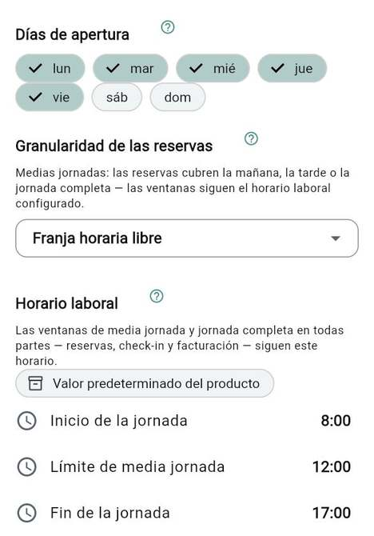

**Pasos**

1. Abra [Disponibilidad](https://fdittgen-png.github.io/deskilo/#/availability).
2. Elija los **Días de apertura** (al menos uno) y la **Granularidad de las reservas**.
3. Fije el **Horario de trabajo**: **Inicio de la jornada**, **Límite de media jornada**, **Fin de la jornada**.
4. En **Políticas de reserva**, decida sobre **Permitir reservas pasadas**, **Fuera del horario de apertura** y los **Límites de reserva**.

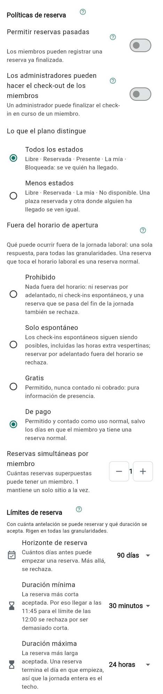

*Puntos de partida recomendados (sugerencias, no reglas; el valor por defecto de **Fuera del horario de apertura** es **De pago**, y la plantilla de asociación no lo cambia)*

| Escenario | Granularidad | Horario | Fuera de horario | Reservas pasadas | Límites |
|---|---|---|---|---|---|
| Unas pocas mesas compartidas | **Franja horaria libre** o **Franjas de 1 hora** | Jornada de 8:00 a 17:00 | **Gratis** | Desactivado | Una reserva a la vez; horizonte de 30 días |
| Una sala de asociación (Atelier du Marché) | **Medios días (mañana y tarde)** | 7:00, límite a las 13:00, fin a las 19:00 | **Prohibido** | Desactivado | Una reserva a la vez; horizonte de 90 días |
| Un coworking con medias jornadas | **Medios días (mañana y tarde)** | 8:00, límite a las 12:00, fin a las 18:00 | **De pago** | Desactivado | Una o dos a la vez; horizonte de 90 días |

**Conviene saber**

- Fuera del horario de apertura, **Prohibido** rechaza todo, **Solo espontáneo** admite a quien llega sin reserva, **Gratis** lo permite sin contarlo y **De pago** cuenta como un uso normal, salvo el día en que el miembro ya tiene una reserva normal.
- La jornada debe seguir un orden: inicio, después límite, después fin; la duración mínima no puede superar la máxima.
- Una reserva termina el mismo día en que empieza. Las reservas pasadas están desactivadas por defecto; reservar una franja anterior el mismo día siempre está permitido.
- Las franjas de media jornada y de jornada completa también determinan la entrada y la facturación, así que fije los horarios antes de poner precios.

**Véase también:** [Días de apertura](Guia-de-usuario#días-de-apertura) · [Granularidad](Guia-de-usuario#granularidad) · [Horario de trabajo](Guia-de-usuario#horario-de-trabajo) · [Fuera del horario de apertura](Guia-de-usuario#fuera-del-horario-de-apertura) · [Límites de reserva](Guia-de-usuario#límites-de-reserva)

<!-- anchor: setup.place.closure -->
### Días de cierre y días festivos

**Público:** Propietario · Administrador/a

Usted quiere que el espacio cierre los días festivos sin que nadie los reserve por error.

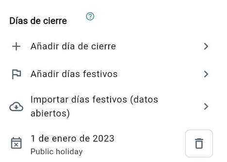

**Pasos**

1. En [Disponibilidad](https://fdittgen-png.github.io/deskilo/#/availability), vaya a **Días de cierre**.
2. Toque **Añadir días festivos** (si no lo ve, active primero la función *Días festivos*; está desactivada por defecto) para crear todo un año de una vez, o **Añadir día de cierre** para una fecha concreta, como un día de inventario.
3. Revise la lista y quite los días en que sí trabaja.

**Conviene saber**

- Hay listas de días festivos incluidas para Francia y Alemania. Para otros países, active *Días festivos* e *Importar días festivos* (datos abiertos, requiere conexión). No se crea nada antes de que usted lo confirme.
- Se rechaza una reserva en un día de cierre, y el plano muestra el día como cerrado con su motivo.
- Los meses ya facturados se omiten, así que añada los días de cierre antes de que el mes se cierre.

**Véase también:** [Días de cierre](Guia-de-usuario#días-de-cierre) · [Días festivos](Guia-de-usuario#días-festivos)

<!-- anchor: setup.place.check -->
### Revisar su espacio

**Público:** Propietario · Administrador/a

Usted quiere una prueba de que el espacio está listo antes de invitar a nadie. Lo dicen dos tarjetas.

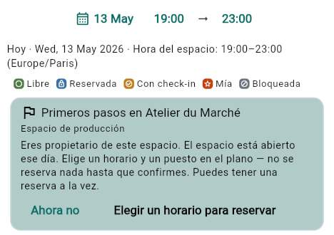

**Pasos**

1. Abra [Espacio](https://fdittgen-png.github.io/deskilo/#/workspace-settings): la tarjeta **Configuración de este espacio** enumera cada área con su estado, y el siguiente paso.
2. Abra [Reservar](https://fdittgen-png.github.io/deskilo/#/reserve). Los propietarios y los administradores con el permiso de configuración ven la tarjeta **Primeros pasos en** su espacio. Si falta algo, dice **Antes de que alguien pueda reservar aquí**, con **Terminar la configuración**.
3. Reserve usted mismo un asiento como prueba y cancélelo después.

**Conviene saber**

- Listo significa listo para una primera reserva: días de apertura, zona horaria, moneda, al menos un asiento, miembros que pueden reservar y suficientes validadores.
- Todo lo opcional, como las tarifas o los pagos, puede aplazarse con **Más adelante** y no impide abrir.
- Ambas tarjetas dependen de la función *Tarjeta de primeros pasos*.
- **Ahora no** oculta la tarjeta en este dispositivo; el menú de vista del plano la recupera con **Primeros pasos**.

**Resultado** Un espacio que los miembros pueden reservar. A continuación: invitar a las primeras personas y pasar a los roles y las tarifas del segundo nivel.

**Véase también:** [La tarjeta Primeros pasos y los consejos](Guia-de-usuario#la-tarjeta-primeros-pasos-y-los-consejos) · [Invite a personas con el ID del espacio](Guia-de-usuario#el-id-del-espacio) · [Roles](Guia-de-usuario#la-matriz-de-roles)

<!-- anchor: setup.features.overview -->
## Elija lo que ofrece su espacio

Un espacio no es un producto con cien ajustes. Es un puñado de cosas que usted decide ofrecer, una a una. Este capítulo explica cómo agrupa DesKilo lo que sabe hacer, qué tiene ya un espacio nuevo, cómo dependen unas piezas de otras y en qué orden activarlas para no ofrecer nunca algo que todavía no puede atender.

En este capítulo:
- [Funciones y procesos](#funciones-y-procesos)
- [Esencial y Plataforma: lo que tiene un espacio nuevo](#esencial-y-plataforma-lo-que-tiene-un-espacio-nuevo)
- [Funciones que necesitan otras funciones](#funciones-que-necesitan-otras-funciones)
- [Desactivar no borra nada](#desactivar-no-borra-nada)
- [Beta, Sin evaluar y la pregunta antes de activar](#beta-sin-evaluar-y-la-pregunta-antes-de-activar)
- [Tres puntos de partida](#tres-puntos-de-partida)
- [El orden para activar las cosas](#el-orden-para-activar-las-cosas)
- [Active una función con seguridad](#active-una-función-con-seguridad)
- [Evite funciones que se contradicen](#evite-funciones-que-se-contradicen)
- [El mapa de funciones](#el-mapa-de-funciones)

<!-- anchor: setup.features.what -->
### Funciones y procesos

**Público:** Propietario · Copropietario

Usted quiere saber qué está activando cuando abre **Funciones**. Todo lo que DesKilo sabe hacer más allá de lo básico es una función con su propio interruptor. Para que cien interruptores sigan siendo legibles, la pantalla los agrupa según su finalidad.

*Cómo está organizado*

- Un *proceso* es un trabajo del negocio: por ejemplo **Facturación y pagos** o **Calendario y coordinación**. Hay nueve.
- Un *subproceso* es un paso de ese trabajo: **Facturación**, **Cobro de pagos** y **Gestión del IVA** son tres de los cinco pasos de **Facturación y pagos**.
- Una *función* es un interruptor dentro de un subproceso: **Facturas**, **Recordatorios de pago**, **Declaraciones de IVA**.

*Los nueve procesos y sus subprocesos*

| Proceso | Subprocesos |
|---|---|
| **Espacio y acceso** | **Personas y membresías** · **Acceso físico** |
| **Gestión de espacios** | **Estructura del espacio** · **Días y horarios de apertura** · **Presentación del espacio** |
| **Reservas y uso** | **Reservar puestos y espacios** · **Asistencia y uso** |
| **Calendario y coordinación** | **Vistas del calendario** · **Decisiones y aprobaciones** · **Comunicación entre miembros** |
| **Ofertas para miembros** | **Servicios y precios** |
| **Facturación y pagos** | **Registros financieros** · **Facturación** · **Cobro de pagos** · **Gastos compartidos** · **Gestión del IVA** |
| **Documentos e información** | **Publicación de documentos** · **Diseño de informes** · **Acceso a datos y exportaciones** |
| **Operaciones y administración** | **Configuración y despliegue** · **Uso de la aplicación** |
| **Integraciones y automatización** | **Envío externo** |

**Conviene saber**

- Una función pertenece a un solo proceso, aunque necesite una función de otro. La tarjeta lo dice: «Activarlo todo también necesita: Pestaña Finanzas (Facturación y pagos)».
- Los planes de membresía y el editor del plano no son funciones: siempre están ahí. Sus ajustes están en Espacio y en Facturación, no en esta pantalla. Los bonos prepago sí son una función: véase **Bonos**.
- Desactivar una función la oculta en todas las pantallas donde aparecía; no es un permiso. Quién puede hacer qué se decide en [Roles](Guia-de-usuario#la-matriz-de-roles).

**Véase también:** [Qué puede hacer DesKilo](#qué-puede-hacer-deskilo) · [Activar y desactivar procesos enteros](Guia-de-usuario#activar-o-desactivar-procesos-enteros)

<!-- anchor: setup.features.tiers -->
### Esencial y Plataforma: lo que tiene un espacio nuevo

**Público:** Propietario · Copropietario

Usted quiere saber qué encuentran los miembros el primer día, antes de que haya activado nada.

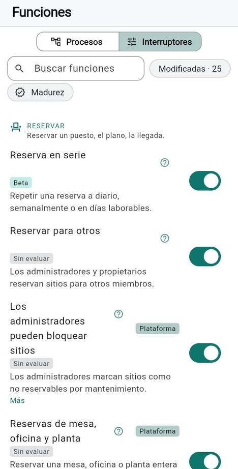

Cada función pertenece a uno de dos niveles, y un espacio nuevo se crea a partir de ellos:

| Nivel | Con las palabras de la aplicación | Qué recibe un espacio nuevo |
|---|---|---|
| **Esencial** | Lo que todo espacio necesita. Activo desde el primer día. | Activada, cuando la función está pensada para estarlo desde el principio. |
| **Plataforma** | Pedido, nunca supuesto. Active lo que este espacio realmente hace. | Desactivada. En **Interruptores**, aparecen en el nivel **Plataforma**. |

Un espacio nuevo arranca con 45 funciones activadas, todas Esenciales (46 si crea a la vez el gemelo de prueba: entonces también está activada **Pares de entornos**). En palabras sencillas:

- Reserva: reservar un asiento en el plano, repetir una reserva (**Reserva en serie**), reservar para otra persona (**Reservar para otros**), ver como parcialmente ocupado un asiento reservado a medias (**La jornada de una plaza**), guardar una reserva en un calendario personal (**Archivo de calendario de una reserva**), reglas de reserva como las reservas pasadas y las de fuera de horario (**Políticas de reserva**, **Guarda de reserva**), solicitar la eliminación de una reserva pasada (**Solicitudes de eliminación de reservas**), imprimir tarjetas QR de los puestos (**Códigos QR de espacios**), horario de trabajo configurable (**Horario de trabajo**).
- Personas: la pestaña de la comunidad (**Directorio de miembros**), una página por miembro (**Ficha de socio**), la matriz central de roles (**Gestión de roles** y **Asignación de roles**), datos personales para cartas y facturas (**Datos personales**), iniciales distintas en los avatares (**Iniciales de avatar distintas**).
- Calendario y mensajes: el calendario en varias vistas (**Pestaña Calendario**, **Calendario central**, **Vistas del calendario**), el flujo de actividad y las confirmaciones (**Pestaña Eventos**), conversaciones privadas y de grupo (**Notificaciones entre miembros**, **Mensajes, renovados**) con referencias, reenvío, menciones, gestos de deslizamiento y protección contra capturas de pantalla, la agrupación del flujo de notificaciones (**Agrupación de notificaciones**) y el botón para escribir a los anfitriones de una página publicada (**Escribir a los anfitriones**).
- Dinero: la pestaña Finanzas con sus cuatro vistas (**Pestaña Finanzas**, **Finanzas en cuatro vistas**), facturas (**Facturas**), un catálogo de servicios (**Servicios**), un PDF de la factura mensual (**Exportar PDF**).
- Documentos y datos: la biblioteca de documentos (**Biblioteca de documentos**), la exportación de datos para el propietario (**Exportación de datos (Excel)**) y la exportación y el borrado de los datos de cada miembro (**Exportación y borrado**).
- Comodidad: consejos de ayuda, la tarjeta de primeros pasos, favoritos y valoraciones de los puestos, animaciones, formatos regionales y la elección del estilo de navegación.
- Entrega: **Notificaciones push**, que solo llegan a los teléfonos cuando quien gestiona la instalación ha configurado el servicio push (véase [Cómo se informa a los miembros](#los-canales-en-palabras-sencillas)).
- Orden del plano: **Eliminar espacios con historial** y **Nombrar por la planta una planta de una sola sala**.

Todo lo demás es Plataforma y está desactivado: quiosco y credenciales, varias sedes, suplementos de accesorios, pagos en línea, gestión del IVA, el recorrido de las facturas, diseño de informes, despliegues, WhatsApp, la interfaz para asistentes y el resto.

**Conviene saber**

- La función de facturas está activada desde el principio, pero no se puede emitir nada hasta que su identidad legal esté completa; **Configuración de este espacio** la marca como **Necesario antes de facturar**. Véase [Evite funciones que se contradicen](#evite-funciones-que-se-contradicen).
- Un espacio que ya existe nunca cambia cuando DesKilo cambia lo que recibe un espacio nuevo.
- Si parte de una plantilla, la plantilla puede activar o desactivar unas pocas funciones además de este conjunto. Véase [Tres puntos de partida](#tres-puntos-de-partida).

**Véase también:** [Un interruptor de función](Guia-de-usuario#un-interruptor-de-función)

<!-- anchor: setup.features.dependencies -->
### Funciones que necesitan otras funciones

**Público:** Propietario · Copropietario

Usted quiere activar algo con la seguridad de que funciona, o desactivar algo sin romper lo que depende de ello.

Muchas funciones cuelgan de otra. **Pagos en línea** necesita **Pestaña Finanzas**; **Recordatorios de pago** necesita **Facturas**; **Recordatorios de pago automáticos** necesita **Recordatorios de pago**; **Declaraciones de IVA** necesita **Gestión del IVA**, que a su vez necesita **Facturas**. En la lista de **Interruptores**, una función que necesita otra muestra **Requiere** seguido del nombre de su función de origen.

*Qué hace la aplicación*

| Usted | La aplicación |
|---|---|
| Activa una función cuya función de origen está desactivada | Activa toda la cadena y dice qué se ha activado con ella: «También activado: …». |
| Desactiva una función de origen | No borra las elecciones de sus dependientes. Se conservan tal como las fijó, pero no hacen nada; la fila dice «Esperando a la función de arriba: actívala y esta vuelve a funcionar». |
| Vuelve a activar la función de origen | Las dependientes que estaban activadas vuelven a funcionar al instante. |
| Desactiva un proceso o subproceso entero mientras algo aún lo necesita | Se niega y nombra quién lo necesita («… sigue siendo necesaria para: …»), salvo que elija **Desactivar igualmente, conservar sus ajustes** o desactivar también a los dependientes. |

**Conviene saber**

- Una función dependiente que está activada pero espera a su función de origen hace que su proceso muestre **Requiere atención**. Es el único estado en que un interruptor y la aplicación no coinciden, así que merece una mirada. Véase [Active una función con seguridad](#active-una-función-con-seguridad).
- Una función de origen puede estar en un proceso distinto del de su dependiente: **Servicios** (Ofertas para miembros) necesita **Pestaña Finanzas** (Facturación y pagos). La tarjeta advierte entonces de que activarlo todo también necesita la otra.
- La comprobación se hace sobre la función, no sobre un permiso: que un rol pueda hacer algo nunca basta si la función está desactivada.

**Véase también:** [Un interruptor de función](Guia-de-usuario#un-interruptor-de-función) · [Activar y desactivar procesos enteros](Guia-de-usuario#activar-o-desactivar-procesos-enteros)

<!-- anchor: setup.features.off -->
### Desactivar no borra nada

**Público:** Propietario · Copropietario

Usted quiere poder cambiar de idea más adelante, así que necesita saber qué no toca un interruptor.

Desactivar una función detiene lo nuevo. No borra ni un solo registro: facturas, reservas, mensajes, roles y ajustes se quedan donde están, y volver a activar la función los recupera. Lo ya hecho, hecho está: una factura emitida mientras la función estaba activada conserva lo que dice.

Detrás de esto, DesKilo clasifica las acciones de una función conmutable en tres tipos:

| Tipo | Qué le hace el interruptor | Ejemplo |
|---|---|---|
| Trabajo nuevo (*acceptNew*) | Se detiene cuando la función está desactivada. | Iniciar una conversación nueva con los anfitriones; dar un rol propio a un miembro; bloquear un asiento; iniciar un pago en línea nuevo. |
| Trabajo ya abierto (*serviceExisting*) | Continúa, para que nada quede colgado. | Responder a una conversación ya iniciada; retirar un rol propio; levantar el bloqueo de un asiento; liquidar un pago ya abierto. |
| Vías inseguras (*suspended*) | Permanecen cerradas diga lo que diga el interruptor. | Reservado para una vía que el servidor juzgue insegura; hoy ninguna acción está clasificada así. |

Tres funciones lo dicen en su fila, con estas palabras: «Desactivado: no empieza nada nuevo; lo que ya está abierto aún puede atenderse y cerrarse.» Son **Escribir a los anfitriones**, **Los roles de este espacio** y **Los administradores pueden bloquear sitios**. **Entrada/salida automática al final del día** también detiene su barrido de fin de jornada cuando está desactivada, pero su fila no lo dice. En un servidor que no puede confirmarlo, la fila dice «no cuente con ello».

**Conviene saber**

- El dinero ya comprometido siempre se liquida: ningún interruptor bloquea una devolución de pago ni un reembolso.
- Con **Pagos en línea** desactivados, el servidor rechaza un pago en línea nuevo; uno que ya está abierto sigue liquidándose. Su fila no lleva ninguna nota al respecto.
- Un interruptor no sirve para ocultar algo a una persona concreta. Para eso use los [Roles](Guia-de-usuario#la-matriz-de-roles).

**Véase también:** [Un interruptor de función](Guia-de-usuario#un-interruptor-de-función)

<!-- anchor: setup.features.maturity -->
### Beta, Sin evaluar y la pregunta antes de activar

**Público:** Propietario · Copropietario

Usted ve una palabra pequeña bajo el nombre de una función y quiere saber qué hacer con ella.

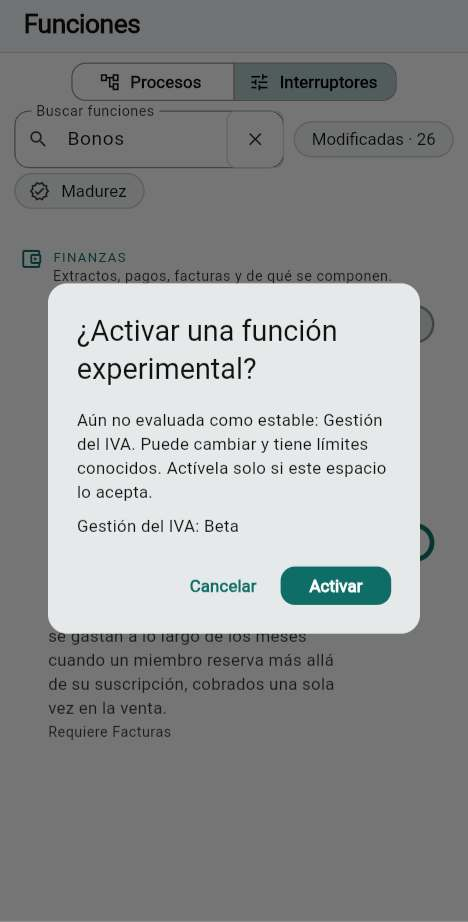

Cada fila de **Interruptores** lleva una insignia de madurez, que indica hasta qué punto se ha revisado la función frente a pruebas:

| Insignia | Significa |
|---|---|
| **Sin evaluar** | Nadie la ha evaluado todavía frente a pruebas. No dice nada malo de ella. |
| **Alfa** | Evaluada, en una fase temprana. |
| **Beta** | Evaluada, con límites conocidos; sus pruebas se ejecutan en cada cambio. |
| **Estable** | Evaluada y además cualificada con proveedores, equipos u operadores reales. |

En el momento de escribir esto, la mayoría de las funciones figuran como **Sin evaluar**, dieciocho como **Beta** y ninguna ha llegado aún a **Estable**.

*Qué pregunta la aplicación*

1. Accione el interruptor de una función **Alfa** o **Beta**.
2. La aplicación pregunta **¿Activar una función experimental?** y dice: «Aún no evaluada como estable: … Puede cambiar y tiene límites conocidos. Actívela solo si este espacio lo acepta.»
3. Nombra la fase de cada función y las funciones que se activarían con ella por ser necesarias.
4. Toque **Activar** para aceptar, o **Cancelar**: no se escribe nada.

**Conviene saber**

- Las funciones **Sin evaluar** no preguntan. Solo preguntan **Alfa** y **Beta**.
- La pregunta se hace con un solo interruptor. Un **Activar** de un proceso entero muestra lo que va a activar, pero no hace esta pregunta: active las funciones **Beta** una a una.
- Entre las funciones Beta en el momento de escribir esto figuran **Facturas**, **Pagos en línea**, **Gestión del IVA**, **Bonos**, **Gastos compartidos**, **Registros de uso**, **Políticas de reserva**, **Reserva en serie**, **Guarda de reserva**, **Solicitudes de eliminación de reservas**, **Finanzas en cuatro vistas**, **Suministros desde gastos**, **Validadores por rol o persona**, **Validaciones encadenadas**, **Entrada/salida automática al final del día**, **Exportación de datos (Excel)**, **Entrega de facturas al cliente** y el espacio de demostración. Lea los límites de cada función con **Más** antes de apoyarse en ella para el dinero.
- Varias de ellas son Esenciales y ya están activadas en un espacio nuevo. Arrancan activadas sin la pregunta; solo aparece cuando usted vuelve a activar una.
- **Madurez** limita la lista a una fase, lo que permite ver rápidamente todo lo experimental que su espacio ya utiliza.

**Véase también:** [Un interruptor de función](Guia-de-usuario#un-interruptor-de-función)

<!-- anchor: setup.features.profiles -->
### Tres puntos de partida

**Público:** Propietario · Copropietario

Usted no quiere decidir cien cosas. Aquí tiene tres puntos de partida realistas; cada uno enumera exactamente lo que está activado. Elija el más cercano y ajuste después.

El primero no necesita plantilla. El segundo es la plantilla lista para usar de la aplicación. El tercero se construye con las propias funciones. Se nombran por lo que ofrecen, no por un tamaño.

<!-- anchor: setup.features.profile-tiny -->
### Unos pocos lugares compartidos

**Público:** Propietario

Usted gestiona un puñado de mesas o salas que la gente reserva, y nada más por ahora. Cree el espacio con **Espacio vacío** o con la plantilla «A tiny space» en **Partir de**: dos plantas, cuatro mesas y ocho asientos, lo justo para reservar, escanear y explorar.

La plantilla no fija ninguna función, de modo que el espacio tiene exactamente las 45 funciones Esenciales de [Esencial y Plataforma](#esencial-y-plataforma-lo-que-tiene-un-espacio-nuevo). No se activa nada más. Para este perfil, deje el resto como está:

- Reserva, calendario, mensajes, directorio, tarjetas QR de los puestos, biblioteca de documentos y consejos de ayuda: todo está ahí.
- **Pestaña Finanzas** y **Facturas** están activadas, pero mientras no introduzca su identidad legal y sus tarifas solo muestran un estado de cuenta vacío.
- Nada necesita configuración fuera del plano y de los horarios de apertura. Véase [Su lugar](#construir-el-lugar).

> **Consejo** Si nunca cobra nada, puede dejar activadas las funciones de dinero sin problema: los miembros simplemente no verán nada que pagar.

<!-- anchor: setup.features.profile-association -->
### Una asociación con una sala

**Público:** Propietario

Usted es una asociación francesa que comparte una sala, con una junta, miembros que pagan una cuota y reservas por medias jornadas. Elija la plantilla «Association de coworking (France)» en **Partir de**. Configura las reglas de apertura, tramos de cuota al 50 % y al 100 %, dos bonos prepago, los roles de la junta, el vocabulario en francés y dos plantas, y trae este perfil de funciones:

- Las 45 funciones Esenciales, excepto cuatro que desactiva: **Pestaña Eventos**, **Directorio de miembros**, **Ficha de socio** y **Agrupación de notificaciones**. Una asociación pequeña no necesita un flujo de eventos ni un directorio junto a sus conversaciones.
- Cuatro que activa, porque la junta las necesita: **Validaciones en el calendario** (decisiones mostradas en el calendario), **Bonos** (medias jornadas prepago para quienes no se suscriben, Beta), **Los roles de este espacio** (tesorero, secretario, responsable de sala) y **Vocabulario del espacio** (las palabras propias de la asociación).

Son 45 − 4 + 4 = 45 funciones activadas. La plantilla no trae identidad alguna, así que la dirección, el número de registro y los datos bancarios siguen siendo suyos para introducir, y el régimen de IVA empieza como «no sujeto».

**Conviene saber**

- Bonos es Beta y la plantilla lo activa sin la pregunta; es una decisión de la plantilla, y usted puede desactivarlo.
- La plantilla deja **Facturas** activada, del conjunto Esencial. Una asociación que no factura puede dejarla así.

<!-- anchor: setup.features.profile-invoicing -->
### Un coworking que factura

**Público:** Propietario

Usted alquila mesas a miembros y les envía facturas cada mes, en Francia o en Alemania. No hay plantilla lista para usar, así que este perfil es una lista de lo que hay que añadir al conjunto Esencial, en este orden. Todo cuelga de **Pestaña Finanzas** y **Facturas**, que ya están activadas.

| # | Active | Por qué | Necesita |
|---|---|---|---|
| 1 | **Series de numeración** | Decidir cómo se numeran los documentos antes de que exista el primero. | **Facturas** |
| 2 | **Facturas de suscripción** | La cuota de membresía se factura antes del mes al que corresponde. | **Facturas** |
| 3 | **Registros de uso** | Un registro del tiempo realmente utilizado (Beta). | **Facturas** |
| 4 | **Facturas de fin de mes** | Lo que el mes costó además de la suscripción se factura aparte. | **Facturas** |
| 5 | **Asistente de facturación** | Un cierre de mes guiado para quien se ocupa de la facturación. | **Facturas** |
| 6 | **El recorrido de una factura** | Cada factura muestra en qué punto está y a quién le toca mover. | **Facturas** |
| 7 | **Plantilla del PDF de factura** | Su propio texto de introducción y de pie en el PDF. | **Facturas** |
| 8 | **Informes de miembros** | El acuerdo financiero y el informe mensual de pagos para los miembros. | **Pestaña Finanzas** |
| 9 | **Recordatorios de pago** | Niveles de recordatorio, una carta por nivel, «Recordatorio pendiente» en las facturas atrasadas. | **Facturas** |
| 10 | **Informe de consumo** | Una carta a fin de mes con lo que se ha utilizado. | **Registros de uso** |

Después añada solo lo que le corresponda:

- **Gestión del IVA** (Beta) si su espacio está registrado a efectos del IVA. Después **Declaraciones de IVA**, y **Versiones de los tipos de IVA** y **Grupos de IVA** si su contable se los pide.
- **Los admins emiten facturas** si quiere que un administrador de facturación las emita. El propietario siempre puede.
- **Pagos en línea** (Beta) solo cuando tenga un proveedor de pago al que conectarse.
- **Recordatorios de pago automáticos** solo después de leer [lo que hacen](#recordatorios-de-pago).
- **Suplementos de accesorios**, **Bonos** y **Gastos compartidos** cuando facture esas cosas.

**Conviene saber**

- Antes de la primera factura, complete su identidad legal y el IVA. Véase [Identidad legal y facturación](#su-identidad-legal-y-qué-preguntar-a-su-gestor).
- Emitir aquí solo funciona para espacios en Francia y Alemania.
- Active estas funciones de una en una y emita antes una factura de prueba en un espacio de prueba. Véase [El orden para activar las cosas](#el-orden-para-activar-las-cosas).

**Véase también:** [Dinero y facturación](#dinero-e-impuestos) · [Partir de una plantilla o de cero](#partir-de-una-plantilla-o-de-cero)

<!-- anchor: setup.features.order -->
### El orden para activar las cosas

**Público:** Propietario · Copropietario

Usted quiere evitar el día en que todo está activado y nada funciona. Vaya proceso a proceso y mire cada uno desde el lado de un miembro antes de pasar al siguiente.

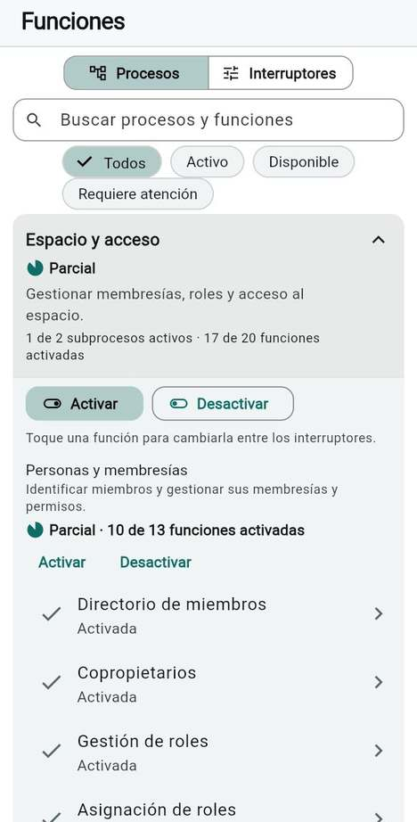

**Pasos**

1. Conserve el conjunto Esencial y haga funcionar lo básico: los puestos, los horarios de apertura, una tarifa. Véase [Su lugar](#construir-el-lugar).
2. Abra [Funciones](https://fdittgen-png.github.io/deskilo/#/features) y abra la tarjeta de un proceso. Elija el que responda a su próxima necesidad, no el que parezca más completo.
3. Toque **Activar** en un subproceso, o abra una función concreta entre los **Interruptores**.
4. Lea la vista previa: qué es **También necesarias** y qué está ya activado.
5. Mírelo como un miembro: inicie sesión como uno (una segunda cuenta, o el lado de prueba de su espacio) y haga lo que haría un miembro.
6. Solo entonces pase al siguiente proceso.

*Un orden razonable*

| Paso | Proceso | Por qué en este lugar del orden |
|---|---|---|
| 1 | **Gestión de espacios** | Sin un lugar y unos horarios de apertura no se puede reservar nada. |
| 2 | **Reservas y uso** | Las reglas de reserva condicionan todo lo que viene después. |
| 3 | **Espacio y acceso** | Los roles y quién valida, antes de la primera invitación. |
| 4 | **Calendario y coordinación** | Los mensajes y las validaciones necesitan que existan personas. |
| 5 | **Ofertas para miembros**, después **Facturación y pagos** | Los precios antes que las facturas; la identidad legal antes de la primera factura. |
| 6 | **Documentos e información**, **Integraciones y automatización** | Dan forma y entregan lo que producen los demás. |
| 7 | **Operaciones y administración** | Pares, despliegues y transferencias cuando el espacio merece copiarse. |

**Conviene saber**

- Activar es barato y desactivar no borra nada, así que un paso equivocado cuesta tiempo, no datos. La excepción es todo lo que emite una factura: véase [Decisiones difíciles de deshacer](#decisiones-difíciles-de-deshacer).
- Un espacio de prueba es el lugar adecuado para probar un proceso. Véase [Un espacio de prueba o uno real](#un-espacio-de-prueba-o-uno-real) y [Un espacio de prueba](Guia-de-usuario#para-qué-sirve-un-espacio-de-prueba).
- Invite a los miembros en último lugar, después de los roles, las reglas de validación y las tarifas con las que se van a encontrar.

**Véase también:** [Activar y desactivar procesos enteros](Guia-de-usuario#activar-o-desactivar-procesos-enteros)

<!-- anchor: setup.features.safely -->
### Active una función con seguridad

**Público:** Propietario · Copropietario

Usted está a punto de cambiar una función y quiere ver el efecto antes de que exista.

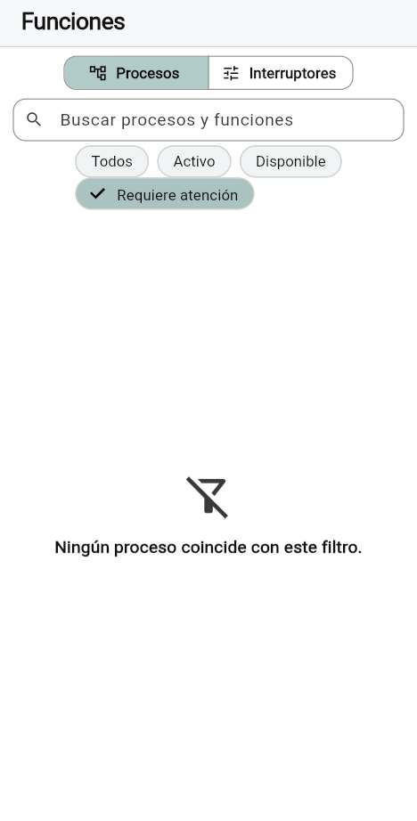

**Pasos**

1. Abra [Funciones](https://fdittgen-png.github.io/deskilo/#/features). Se muestra la vista **Procesos**.
2. Toque **Requiere atención**. Solo quedan los procesos que contienen algo activado pero en espera.
3. Abra una tarjeta. Una función **Activada, esperando** una función de origen con nombre es lo que hay que arreglar.
4. Arréglelo activando la función de origen, o desactivando la función.
5. Para cambiar una sola función, toque **Interruptores**, búsquela con **Buscar funciones** y accione su interruptor.
6. Lea la pregunta o la línea «También activado» y confirme.

*Qué significa «retenida»*

Una función está retenida cuando usted la eligió pero algo que necesita está desactivado. Su propio interruptor sigue activado, y por eso es fácil pasarlo por alto: la pantalla dice que la función está activada, y la aplicación no la ofrece. La tarjeta indica cuántas funciones están retenidas («… están activadas pero esperan un requisito desactivado») y qué requisito esperan, y se arregla en [Funciones](https://fdittgen-png.github.io/deskilo/#/features) mismo. [Lo que le necesita](Guia-de-usuario#lo-que-te-espera) muestra lo mismo en una línea por cada requisito desactivado.

Otras cosas que una función puede esperar no están en esta pantalla. Una función puede estar activada y plenamente permitida mientras faltan sus datos: su identidad legal, una sede, un proveedor de pago. Esos aparecen en **Configuración de este espacio**, en lo alto de los ajustes del espacio: la identidad legal, con **Facturas** activada, como **La identidad legal y la dirección del espacio**, y lo demás en **Datos que necesitan sus funciones (identidad, banco, plataformas)**.

**Conviene saber**

- Si otra persona cambió las funciones mientras usted miraba, la aplicación no escribe nada y lo dice: «Las funciones cambiaron mientras tanto, así que no se guardó nada.» Vuelva a mirar la lista y accione de nuevo.
- **Modificadas** cuenta los interruptores que difieren del valor por defecto del registro. En un espacio nuevo ya muestra un número (las funciones de Plataforma que arrancan desactivadas), así que no es un recuento de sus propios cambios.
- Solo un propietario o un copropietario puede escribir las funciones. El servidor lo vuelve a comprobar en el momento de escribir.

**Véase también:** [Activar y desactivar procesos enteros](Guia-de-usuario#activar-o-desactivar-procesos-enteros) · [Un interruptor de función](Guia-de-usuario#un-interruptor-de-función)

<!-- anchor: setup.features.consistency -->
### Evite funciones que se contradicen

**Público:** Propietario · Copropietario · Administrador/a de facturación

Usted quiere saber qué combinaciones dejan un espacio a medio funcionar, y cuáles de ellas detecta la aplicación por usted.

La aplicación tiene salvaguardas para algunas contradicciones y ninguna para otras. En la tabla, una salvaguarda es lo que hace la aplicación; una laguna es lo que sigue siendo responsabilidad suya.

| Si tiene… | Salvaguarda de la aplicación | Laguna que queda |
|---|---|---|
| **Facturas** activadas, sin identidad legal | Se rechaza la emisión, con **Complete estos datos antes de emitir** listando la dirección, el número de IVA, etc. que faltan. La necesidad también aparece en **Configuración de este espacio**, como **La identidad legal y la dirección del espacio**, **Necesario antes de facturar**, y en Lo que le necesita. | La función está activada desde el primer día, así que nada impide invitar a los miembros y llevar un mes antes de que exista la identidad. |
| Un país distinto de Francia o Alemania | Al emitir, dice que el país «debe ser Francia o Alemania para emitir aquí». | Nada avisa al elegir el país ni al activar la facturación. |
| Registrado a efectos del IVA, sin ningún tipo en vigor | Se rechaza la emisión hasta que haya un tipo por defecto en vigor. La descripción de **Gestión del IVA** y el aviso de la pantalla de identidad legal lo dicen. | Con **Gestión del IVA** desactivada, la configuración queda oculta mientras los tipos guardados siguen aplicándose. Compruebe los tipos tras desactivarla. |
| **Pagos en línea** activados, sin proveedor | Se rechaza un pago en línea nuevo cuando la función está desactivada; el proveedor que falta aparece en **Configuración de este espacio**. | Puede activarla sin proveedor. Conéctelo antes: [Proveedor de pago](Guia-de-usuario#el-proveedor-de-pago). |
| **Modo quiosco** activado, sin credenciales ni miembro de quiosco | **Credenciales RFID / NFC**, **Credenciales QR**, **Fotos de los miembros en el quiosco** e **Iniciar sesión con credencial** no pueden estar activadas sin él. | Nada comprueba que exista un miembro de quiosco ni que se haya emitido una credencial. Véase [Ponga en marcha una tableta de pared](Guia-de-usuario#modo-quiosco-una-tableta-de-pared-para-registrar-la-llegada). |
| **Sedes** activadas, sin ninguna sede | **Al menos una sede** aparece entre los datos que necesitan sus funciones. | El interruptor puede estar activado sin ninguna sede. |
| **Notificaciones push** activadas, sin servicio push | Los miembros siguen recibiendo todo en la aplicación. | Los teléfonos no reciben nada hasta que quien gestiona la instalación haya configurado el servicio push. Véase [Cómo se informa a los miembros](#los-canales-en-palabras-sencillas). |
| **Recordatorios de pago** activados, **Recordatorios de pago automáticos** activados | Los segundos no pueden estar activados sin los primeros. | El servidor los envía cada mañana si la instalación programa tareas; si no, se envían cuando un administrador abre Finanzas. El interruptor y la descripción de la función lo dicen; el operador de su servidor sabe cuál se aplica. |
| Una regla de validación que pide más validadores de los que hay | **Configuración de este espacio** dice «Una regla pide más validadores de los que tiene este espacio», y **Roles y quién valida las solicitudes** pasa a ser obligatorio, sea cual sea el tipo de solicitud. | Las solicitudes creadas antes de corregirlo no se pueden completar y caducan a los siete días. Véase [Quién valida](Guia-de-usuario#reglas-de-validación-dominio-por-dominio). |
| **Solicitudes de eliminación de reservas** activadas, nadie que valide | La misma línea de preparación. | La misma laguna. |
| **Reservas de mesa, oficina y planta** activadas | **Los admins pueden asignar plantas** la necesita. | Además, cada miembro necesita el derecho; nada comprueba que alguien lo tenga. |
| Una función dependiente activada, su función de origen desactivada | **Requiere atención**, y «Esperando a la función de arriba». | Ninguna: este caso está totalmente cubierto. |
| Un espacio creado a partir de una plantilla | La plantilla nombra lo que usted debe introducir (identidad, banco, sede). | No trae nada de eso, así que un espacio puede empezar con **Facturas** activadas y nada con lo que emitir. |

**Conviene saber**

- La regla práctica: si una función lleva a un documento su nombre, su dinero o sus obligaciones legales, termine sus datos antes de avisar a los miembros.
- **Configuración de este espacio** es una lista, no un cerrojo. Nunca le impide activar algo.
- La comprobación «Antes de que alguien pueda reservar aquí» solo habla de los ámbitos obligatorios: la zona horaria, la moneda, un día de apertura, al menos un asiento, miembros que tengan **Reservar y usar las reservas** y suficientes validadores. Con **Facturas** activada, la identidad legal también es obligatoria, pero antes de facturar: la tarjeta del espacio dice «Antes de facturar» y la de Reservar nunca la nombra.

**Véase también:** [Identidad legal y facturación](#su-identidad-legal-y-qué-preguntar-a-su-gestor) · [Ensayo en seco](#un-ensayo-seguro-en-un-espacio-de-prueba)

<!-- anchor: setup.features.map -->
### El mapa de funciones

**Público:** Propietario · Copropietario

Usted quiere un lugar que diga, para las funciones principales, qué obtienen los miembros, qué necesita y quién debe configurarla. «Necesita» enumera primero la función de origen y luego los datos ajenos a la pantalla Funciones. «Quién» es la persona que debe hacer algo para que sea útil; «Nadie» significa que funciona en cuanto se activa.

*Espacio y acceso*

| Función | Qué aporta a los miembros | Qué necesita | Quién la configura |
|---|---|---|---|
| **Directorio de miembros** | La pestaña de la comunidad: quién está, estados, presencia. | | Nadie |
| **Copropietarios** | Permisos de propietario para personas designadas, ahora o en una sucesión. | | Propietario |
| **Gestión de roles** | La matriz de qué rol tiene qué permiso. | | Propietario |
| **Asignación de roles** | Una sección Roles en cada ficha de miembro. | **Gestión de roles** | Propietario |
| **Los roles de este espacio** | Roles propios, como tesorero o secretario. | | Propietario |
| **Las preguntas de este espacio** | Sus propias preguntas en el formulario de identidad. | | Propietario |
| **Datos personales** | Nombre, dirección, teléfono e identificadores que imprimen las cartas. | | Los miembros |
| **Perfiles gestionados** | Miembros sin cuenta, a quienes se reserva y se factura. | **Directorio de miembros** | Administrador/a |
| **Ficha de socio** | Una página por miembro. | **Directorio de miembros** | Nadie |
| **Visitas de invitados** | Una persona que no es miembro puede pedir visitar. | | Quien admite las visitas |
| **Modo quiosco** | Una tableta de pared fijada al plano en vivo. | Una tableta y un miembro de quiosco | Propietario |
| **Credenciales RFID / NFC** | Entrar acercando una tarjeta. | **Modo quiosco**, Android con NFC, credenciales emitidas | Propietario |
| **Credenciales QR** | Tarjetas de credencial QR imprimibles. | **Modo quiosco** | Propietario |
| **Iniciar sesión con credencial** | Credencial y PIN en lugar de escribir un correo electrónico. | **Credenciales RFID / NFC** | Propietario, y después cada miembro |
| **Etiquetas NFC/RFID de las sillas** | Un chip en una silla abre su asiento. | Etiquetas | Propietario |
| **Códigos QR de espacios** | Tarjetas QR imprimibles por puesto. | | Nadie |

*Gestión de espacios*

| Función | Qué aporta a los miembros | Qué necesita | Quién la configura |
|---|---|---|---|
| **Sedes** | Varias direcciones, cada una con su propio registro. | Al menos una sede | Propietario |
| **Eliminar espacios con historial** | Los propietarios pueden eliminar un puesto que tiene reservas pasadas. | | Nadie |
| **Los administradores pueden bloquear sitios** | Asientos marcados como no reservables por mantenimiento. | | Propietario |
| **Horario de trabajo** | La jornada laboral y la reserva por horas exactas. | | Propietario |
| **Días festivos** | Días de cierre a partir de los festivos de un año. | | Propietario |
| **Importar días festivos** | Festivos de un país o región importados. | **Días festivos** | Propietario |
| **Ocupación de puestos** | Una cifra mensual de cuánto se reservó. | | Propietario |
| **Fotos de los miembros en el plano** | Fotos de los ocupantes en los asientos. | | Nadie |
| **Vocabulario del espacio** | Las palabras propias del espacio para unas cuantas etiquetas. | | Propietario |
| **Colores del espacio** | El color de la marca y los colores de las salas. | | Propietario |
| **Anuncio público del espacio** | Una página pública con lo que usted decida mostrar. | | Propietario |

*Reservas y uso*

| Función | Qué aporta a los miembros | Qué necesita | Quién la configura |
|---|---|---|---|
| **Reserva en serie** | Repetir una reserva. | | Nadie |
| **Reservar para otros** | Los administradores reservan para los miembros. | | Nadie |
| **Reservas de mesa, oficina y planta** | Reservar una mesa, una oficina o una planta enteras. | Un derecho concedido a cada miembro | Propietario |
| **Los admins pueden asignar plantas** | Los administradores asignan esas reservas. | **Reservas de mesa, oficina y planta** | Propietario |
| **Políticas de reserva** | Reservas pasadas, reservas fuera de horario, salida registrada por un administrador. | | Propietario |
| **Guarda de reserva** | Cada pantalla comprueba las reglas y nombra el motivo. | **Políticas de reserva** | Nadie |
| **Entrada/salida automática al final del día** | Las reservas sin registrar se completan solas. | | Propietario |
| **Registros de uso** | El tiempo realmente utilizado, y una solicitud para dejar de facturar el tiempo no utilizado. | **Facturas** | Administrador/a de facturación |

*Calendario y coordinación*

| Función | Qué aporta a los miembros | Qué necesita | Quién la configura |
|---|---|---|---|
| **Pestaña Calendario**, **Calendario central**, **Vistas del calendario** | Mes, semana y agenda, con todo lo fechado. | | Nadie |
| **Validaciones en el calendario** | Las decisiones se muestran en el momento en que se tomaron. | **Calendario central** | Nadie |
| **Pestaña Eventos** | El flujo de actividad y las confirmaciones. | | Nadie |
| **Agrupación de notificaciones** | Notificaciones agrupadas en el flujo. | | Nadie |
| **Validadores por rol o persona** | Una regla puede nombrar quién valida y cuántas personas. | | Propietario |
| **Validaciones encadenadas** | Validaciones pedidas una tras otra. | | Propietario |
| **Solicitudes de eliminación de reservas** | Un miembro pide eliminar una reserva pasada. | Un validador | Propietario |
| **Notificaciones entre miembros** | Conversaciones privadas y de grupo. | | Nadie |
| **Mensajes, renovados** | Barra de bandeja, fijar, silenciar, archivar, borradores. | | Nadie |
| **Escribir a los anfitriones** | Quien encuentra su página puede escribirle. | Una página publicada | Propietario |
| **Menciones en grupos**, **Reenvío de mensajes**, **Protección contra capturas de pantalla** | Extras de mensajería. | **Notificaciones entre miembros** | Nadie |

*Ofertas para miembros*

| Función | Qué aporta a los miembros | Qué necesita | Quién la configura |
|---|---|---|---|
| **Servicios** | Un catálogo de cosas para consumir y pagar. | **Pestaña Finanzas** | Administrador/a de facturación |
| **Suplementos de accesorios** | Accesorios de asiento con precio por media jornada. | **Pestaña Finanzas** | Administrador/a de facturación |
| **Negociaciones de precios** | Condiciones propias para un miembro. | **Pestaña Finanzas** | Administrador/a de facturación |
| **Condiciones de pago por miembro** | Plazos de pago propios. | **Facturas** | Administrador/a de facturación |
| **Bonos** | Medias jornadas prepago (Beta). | **Facturas**, un paquete definido | Administrador/a de facturación |

*Facturación y pagos*

| Función | Qué aporta a los miembros | Qué necesita | Quién la configura |
|---|---|---|---|
| **Pestaña Finanzas** | La pestaña Finanzas: estado de cuenta, pagos, gastos. | | Nadie |
| **Finanzas en cuatro vistas** | Estado de cuenta, Pagos, Facturas, Documentos. | **Pestaña Finanzas** | Nadie |
| **Informes de miembros** | El acuerdo y el informe mensual de pagos. | **Pestaña Finanzas** | Administrador/a de facturación |
| **Facturas** | Facturas firmadas e inmutables (Beta). | **Pestaña Finanzas**, identidad legal, IVA, FR o DE | Administrador/a de facturación |
| **Los admins emiten facturas** | Los administradores también las emiten. | **Facturas** | Propietario |
| **Facturas de suscripción** | La cuota facturada antes de su mes. | **Facturas**, una fecha | Administrador/a de facturación |
| **Facturas de fin de mes** | El uso facturado después del mes. | **Facturas** | Administrador/a de facturación |
| **Agrupar facturas** | Varias facturas abiertas como una sola. | **Facturas** | Administrador/a de facturación |
| **El recorrido de una factura** | En qué punto está cada factura. | **Facturas** | Nadie |
| **Asistente de facturación** | Un cierre de mes guiado. | **Facturas** | Administrador/a de facturación |
| **Series de numeración** | Numeración por diario. | **Facturas** | Administrador/a de facturación |
| **Pagos en línea** | Pagar en línea (Beta). | **Pestaña Finanzas**, un proveedor de pago | Propietario |
| **Recordatorios de pago** | Niveles de recordatorio y cartas. | **Facturas**, reglas | Administrador/a de facturación |
| **Recordatorios de pago automáticos** | Recordatorios enviados por sí solos. | **Recordatorios de pago** | Administrador/a de facturación |
| **Suministros desde gastos** | Los suministros comprados pasan a ser servicios. | **Servicios** | Administrador/a de facturación |
| **Gastos programados** | Costes recurrentes programados. | **Pestaña Finanzas** | Administrador/a de facturación |
| **Gastos compartidos** | Costes repartidos entre miembros. | **Facturas** | Administrador/a de facturación |
| **Asistente de reparto** | Un reparto guiado de un coste compartido. | **Gastos compartidos** | Administrador/a de facturación |
| **Libro contable** | Quién lleva los libros oficiales. | **Facturas** | Administrador/a de facturación |
| **Gestión del IVA** | Tipos de IVA y selectores (Beta). | **Facturas**, régimen de IVA | Administrador/a de facturación |
| **Declaraciones de IVA** | La declaración periódica. | **Gestión del IVA** | Administrador/a de facturación |
| **Grupos de IVA**, **Versiones de los tipos de IVA**, **IVA según el cliente** | Un tratamiento del IVA más fino. | **Gestión del IVA** | Administrador/a de facturación |

*Documentos e información, Operaciones, Integraciones*

| Función | Qué aporta a los miembros | Qué necesita | Quién la configura |
|---|---|---|---|
| **Biblioteca de documentos** | Estatutos, actas, guías, por rol. | | Propietario |
| **Exportar PDF** | La factura mensual en PDF. | | Nadie |
| **Plantilla del PDF de factura** | Sus textos en la factura. | **Facturas** | Propietario |
| **Diseñador de informes**, **Maquetas de informe posicionadas**, **Textos de informes** | Informes diseñados. | **Plantilla del PDF de factura** | Propietario |
| **Informe de consumo** | Una carta mensual sobre lo que se utilizó. | **Registros de uso** | Administrador/a de facturación |
| **Informe de IVA** | Cada línea imponible, con un CSV. | **Declaraciones de IVA** | Administrador/a de facturación |
| **Registro de accesos a datos** | Los miembros ven quién ha consultado sus finanzas. | **Pestaña Finanzas** | Nadie |
| **Exportación de datos (Excel)** | El propietario exporta los datos como libro de cálculo (Beta). | El permiso **Exportar contabilidad y datos** | Propietario |
| **Exportación y borrado** | Un miembro exporta y borra sus propios datos. | | Nadie |
| **Modo grabación** | Sustituye en pantalla a las personas reales por otras inventadas. | | Propietario |
| **Pares de entornos**, **Despliegues** | Un lado de prueba y un lado real, con despliegue. | | Propietario |
| **Configuración en el archivo del espacio** | Toda la configuración viaja en el archivo del espacio. | **Exportación de datos (Excel)** | Propietario |
| **Asistente de instancia** | Crear un servidor nuevo desde la aplicación. | | Operador/a |
| **Lo que te espera** | Una lista ordenada de lo que le espera. | | Nadie |
| **Grabador de tareas** | Grabar y reproducir los pasos de una tarea. | | Nadie |
| **Notificaciones push** | Confirmaciones pendientes en el teléfono. | El servicio push de la instalación | Operador/a |
| **Integración con WhatsApp** | Un chat con un miembro con un toque, el enlace del grupo. | **Directorio de miembros** | Propietario |
| **Entrega de facturas al cliente** | Envío a la plataforma propia del cliente (Beta). | **Facturas**, una cuenta | Administrador/a de facturación |
| **Interfaz MCP** | Se puede conectar un asistente. | Una autorización por persona, aprobada por la instalación | Propietario, y después operador/a |

**Conviene saber**

- Los nombres son los de la lista de **Interruptores**. Allí se muestra el nivel Esencial o Plataforma de cada una.
- Algunas funciones no figuran aquí. Las funciones de comodidad (consejos de ayuda, animaciones, estilo de navegación, formatos regionales) no tienen fila en la tabla: funcionan en cuanto se activan.

**Véase también:** [Quién hace qué](#quién-hace-qué) · [Activar y desactivar funciones](Guia-de-usuario#activar-o-desactivar-procesos-enteros)

<!-- anchor: setup.people.overview -->
## Personas, roles y decisiones

Un espacio son sus personas. Antes de invitar a la primera, decida tres cosas: quién puede hacer qué, cómo entra alguien y qué actos necesitan que una segunda persona diga que sí. Se fijan rápido, pero son incómodas de reparar cuando cuarenta personas ya cuentan con ellas.

En este capítulo:
- [Quién hace qué en una organización real](#quién-hace-qué-en-una-organización-real)
- [La matriz de roles: el mínimo privilegio](#la-matriz-de-roles-el-mínimo-privilegio)
- [Copropietarios: más de una persona que pueda actuar](#copropietarios-más-de-una-persona-que-pueda-actuar)
- [Cómo se une la gente](#cómo-se-une-la-gente)
- [El mensaje de invitación, idioma por idioma](#el-mensaje-de-invitación-idioma-por-idioma)
- [Perfiles gestionados](#perfiles-gestionados)
- [Validación: de qué se compone una regla](#validación-de-qué-se-compone-una-regla)
- [Tres ajustes preestablecidos para copiar](#tres-ajustes-preestablecidos-para-copiar)
- [Evite solicitudes que esperan para siempre](#evite-solicitudes-que-esperan-para-siempre)
- [La primera semana de sus miembros](#la-primera-semana-de-sus-miembros)

El ejemplo que seguimos es *Atelier du Marché*. Imagine que lo dirige una asociación: Ada es la presidenta, Chiara la secretaria y Bruno el tesorero. Cada paso de abajo se muestra en ese espacio.

<!-- anchor: setup.people.organisation -->
### Quién hace qué en una organización real

**Público:** Propietario · Copropietario

Usted quiere trasladar a las personas de su organización a los roles que tiene DesKilo, de modo que nadie tenga más de lo que su trabajo exige.

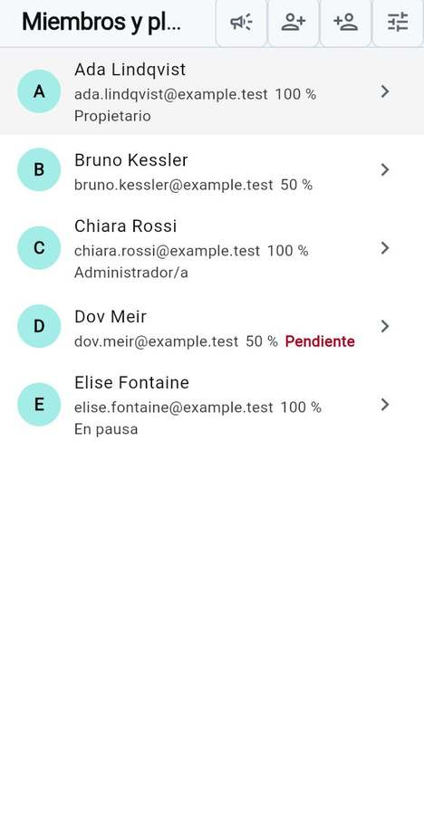

*Los cuatro roles de base*

| Rol | Para qué sirve | En la asociación |
|---|---|---|
| **Propietario** | La persona que responde del espacio y tiene todos los permisos. Solo un propietario puede conceder la propiedad. | Ada, la presidenta. |
| **Copropietario** | Una segunda llave. Tiene todos los permisos por defecto y puede tomar el relevo cuando el propietario se va. | La vicepresidenta, si la junta tiene una. |
| **Administrador** | Lleva el día a día: miembros, reservas de otros, el quiosco, documentos, servicios. Tiene lo que da la matriz y nada más. | Chiara, la secretaria. |
| **Usuario** | La persona que usa el espacio. Solo tiene los permisos cotidianos que usted le dé. | Bruno, un miembro como los demás. |

Cada persona tiene exactamente un rol de base. Un rol que define el espacio, como *Anfitrión* o *Contable*, se añade encima y nunca quita nada.

*Un tesorero sin ser administrador*

Bruno lleva las cuentas, pero no debería editar el plano ni aprobar miembros nuevos. Dele el rol de base **Usuario** y añada un rol propio, por ejemplo *Contable*, con cuatro permisos: **Ver las finanzas del espacio**, **Emitir facturas y conciliar pagos**, **Exportar contabilidad y datos** y **Consultar las cifras del espacio**. Nada más. No existe ningún rol así de serie; lo crea con los pasos de abajo.

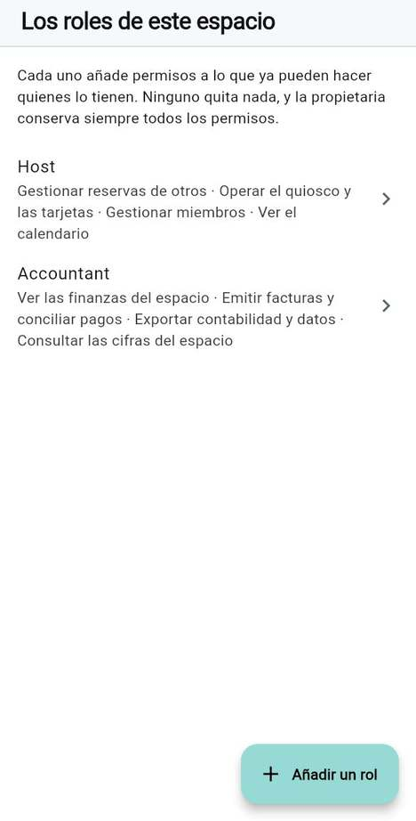

**Pasos**

1. Abra [Roles que define este espacio](https://fdittgen-png.github.io/deskilo/#/settings/roles-of-this-space) y toque **Añadir un rol**. Véase [Los roles de este espacio](Guia-de-usuario#roles-que-define-este-espacio).
2. Ponga nombre al rol, elija **Lo que añade** y toque **Guardar el rol**.
3. Abra a la persona en [Miembros y planes](https://fdittgen-png.github.io/deskilo/#/members), busque **Roles** y toque **Añadir un rol**.

**Conviene saber**

- **Los roles de este espacio** es una función aparte y está desactivada en un espacio nuevo. Actívela en [Funciones](https://fdittgen-png.github.io/deskilo/#/features).
- Nadie puede darse un rol a sí mismo. Dar un rol requiere **Gestionar roles y permisos**, y solo un propietario puede dar un rol que lo incluya.
- Un rol que define el espacio surte efecto al instante y queda registrado. Solo hacer administrador a alguien, o quitárselo, sigue la regla de validación **Cambio de rol**.

**Resultado** Cada persona de la junta tiene los permisos de su trabajo, y el propietario sigue siendo el único que puede cambiarlos.

**Véase también:** [La matriz de roles](Guia-de-usuario#la-matriz-de-roles)

<!-- anchor: setup.people.matrix -->
### La matriz de roles: el mínimo privilegio

**Público:** Propietario · Copropietario

Usted quiere que cada rol tenga lo que necesita y nada más. Es el principio del mínimo privilegio: empiece con poco y añada cuando alguien lo pida, porque un permiso concedido pocas veces se retira de buen grado.

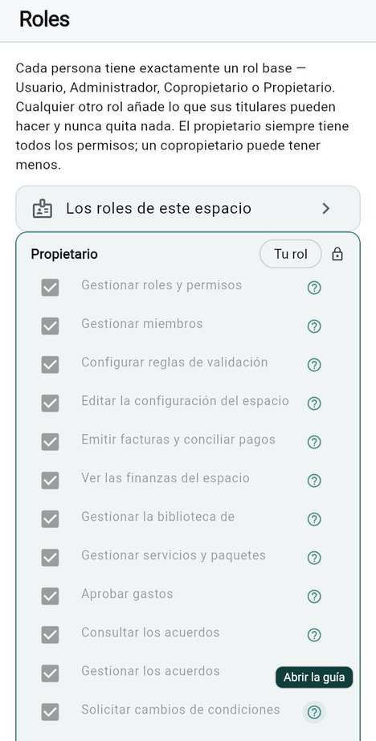

**Pasos**

1. Abra [Roles](https://fdittgen-png.github.io/deskilo/#/roles). Hay una tarjeta por rol: **Propietario**, **Copropietario**, **Administrador** (el propietario puede renombrarlo) y **Usuario**.
2. Lea primero la tarjeta del **Administrador**. Muestra lo que hoy tiene un administrador en su espacio.
3. Desmarque lo que no quiera delegar. Marque los permisos cotidianos que necesita la tarjeta **Usuario** (véase más abajo).

*Lo que tiene un administrador por defecto*

| Grupo | Permisos |
|---|---|
| Personas | **Gestionar miembros**, **Consultar los datos personales de los miembros** |
| Reservas y el lugar | **Gestionar reservas de otros**, **Operar el quiosco y las tarjetas**, **Gestionar sedes y editar el plano** |
| Dinero: lectura y aprobación | **Ver las finanzas del espacio**, **Aprobar gastos**, **Gestionar servicios y paquetes**, **Consultar los acuerdos comerciales**, **Gestionar los acuerdos comerciales**, **Solicitar cambios de condiciones de pago**, **Exportar contabilidad y datos** |
| Documentos y cifras | **Gestionar la biblioteca de documentos**, **Consultar las cifras del espacio** |
| Las dos caras de un espacio | **Desplegar en desarrollo**, **Entrar en el espacio de producción** |

Un administrador no tiene **Gestionar roles y permisos**, **Configurar reglas de validación**, **Editar la configuración del espacio**, **Gestionar tarifas y reglas de facturación**, **Diseñar los documentos**, **Gestionar integraciones**, **Gestionar la configuración** ni **Desplegar en producción**. Un copropietario los tiene todos hasta que usted desmarque alguno. El propietario siempre los tiene todos.

> **Atención** En un espacio nuevo, la tarjeta **Usuario** está vacía. Los seis permisos cotidianos (**Usar la mensajería**, **Reservar y usar las reservas**, **Ver el calendario**, **Ver el directorio de miembros**, **Ver su propia cuenta y sus facturas**, **Ver los documentos compartidos**) solo se tienen a través de la matriz o de un rol. Mientras no los marque, un miembro que se une no puede abrir el plano. La demostración los muestra ya marcados, lo que lo oculta. **Configuración de este espacio** muestra **Lo que pueden hacer los miembros** como **Necesario para una primera reserva** hasta que la tarjeta **Usuario** tenga **Reservar y usar las reservas**; no comprueba los otros cinco. Márquelos en la tarjeta **Usuario**, y en la tarjeta **Administrador** si los administradores también reservan, y pruebe después con una segunda cuenta.

**Conviene saber**

- Por defecto, un administrador puede leer todas las finanzas y los datos personales de todos los miembros. Si sus administradores son voluntarios, piense si deberían poder.
- **Los admins emiten facturas** (una función, desactivada por defecto, bajo **Facturas**) da a los administradores **Emitir facturas y conciliar pagos** diga lo que diga la matriz. Es preferible la marca en la matriz, o un rol propio, que es más preciso.
- Desmarcar un permiso lo retira en todas partes a la vez; lo comprueba el servidor, no solo el menú.
- Cada cambio de la matriz queda registrado como un evento. La función **Gestión de roles** solo muestra la pantalla; desactivada, la matriz que guardó sigue aplicándose, solo que no se puede editar.

**Resultado** Una matriz que puede explicar en una frase por rol.

**Véase también:** [La matriz de roles](Guia-de-usuario#la-matriz-de-roles) · [Quién hace qué](#quién-hace-qué)

<!-- anchor: setup.people.coowner -->
### Copropietarios: más de una persona que pueda actuar

**Público:** Propietario · Copropietario

Usted quiere que el espacio siga funcionando cuando esté enfermo, de viaje o ya no esté. Todo espacio necesita más de una persona que pueda actuar. Por defecto, solo los propietarios y los copropietarios tienen los permisos que cambian las funciones, los roles, las reglas de validación y el ID del espacio, y solo un propietario puede nombrar a otro propietario.

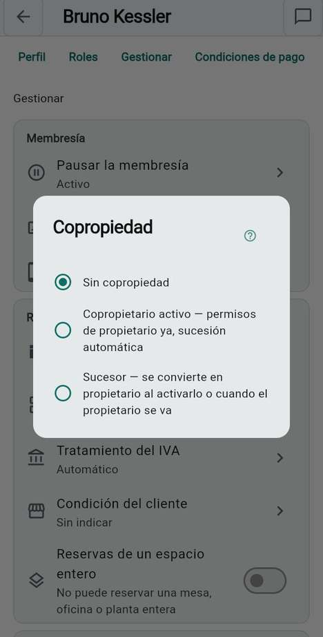

*Los dos tipos*

| Tipo | Qué hace | Elíjalo cuando |
|---|---|---|
| *Copropietario activo* | Tiene ya los permisos del propietario y toma el relevo si el propietario se va. | Comparten el trabajo: la vicepresidenta, un socio. |
| **Sucesor** | Espera. Pasa a ser propietario cuando usted lo promueve o cuando usted se va. | Solo quiere un heredero. |

**Pasos**

1. Active la función **Copropietarios** en [Funciones](https://fdittgen-png.github.io/deskilo/#/features). Está desactivada en un espacio nuevo.
2. Abra a la persona en [Miembros y planes](https://fdittgen-png.github.io/deskilo/#/members), vaya a **Gestionar** y toque **Copropiedad**.
3. Elija *Copropietario activo* o **Sucesor**. Para traspasar ya, elija **Promover a propietario ahora**.

**Conviene saber**

- Si se va el último propietario, el mejor copropietario pasa a ser propietario por sí solo, uno activo antes que un sucesor.
- Dos administradores no son lo mismo: un administrador solo tiene lo que da la matriz y nunca puede transmitir la propiedad.
- Una regla que dice **El propietario siempre debe validar** exige un propietario. Compruebe en su lado de prueba que su copropietario puede seguir decidiendo lo que usted espera.

**Resultado** El espacio tiene una segunda persona que puede actuar.

**Véase también:** [Copropietarios](Guia-de-usuario#copropietarios) · [Copropiedad](Guia-de-usuario#copropiedad)

<!-- anchor: setup.people.join -->
### Cómo se une la gente

**Público:** Propietario · Administrador/a

Usted quiere elegir cómo llega la gente a su espacio y quién la deja entrar. Existen cuatro vías, y todas terminan en el mismo sitio: una persona que pide unirse y alguien que decide.

| Vía | Qué recibe la persona | En qué se convierte |
|---|---|---|
| El ID del espacio | Una palabra corta, que escribe en la aplicación. | Miembro, tras la aprobación. |
| El código QR | El mismo ID como imagen para imprimir o colgar (**Compartir como PNG**). | Miembro, tras la aprobación. |
| Un mensaje de invitación | Un texto con un código personal, válido para una sola persona, en el idioma que usted elija. | El rol que usted ofrezca, tras la aprobación. |
| Un código de administrador | Un código para una persona, de la pestaña **Invitación de administrador/a**. | Administrador, una sola vez. |

**Pasos**

1. Abra [ID del espacio y QR](https://fdittgen-png.github.io/deskilo/#/workspace-code). Elija un ID que la gente pueda recordar con **Cambiar el ID del espacio**: de 4 a 20 letras o cifras, único en todo DesKilo.
2. Para una persona con nombre, toque **Invitar a alguien**. Rellene el nombre, marque **Roles al llegar** si debe recibir un rol, elija el **Idioma del mensaje** y envíe.
3. Cuando alguien pide unirse, su fila en [Miembros y planes](https://fdittgen-png.github.io/deskilo/#/members) dice **Pendiente**. Ábrala y elija **Aprobar membresía** o **Rechazar membresía**.

**Conviene saber**

- Nadie entra sin una decisión. Hasta que se toma, quien llega ve una pantalla de espera y nada más.
- La decisión sigue la regla de **Nuevo miembro** en [Reglas de validación](https://fdittgen-png.github.io/deskilo/#/validation): por defecto basta con un propietario o un administrador; si exige dos, la primera aprobación deja a la persona pendiente.
- Si cambia el ID del espacio, el antiguo deja de funcionar. Vuelva a imprimir el código QR.
- No existe invitación de propietario. La propiedad se concede en **Miembros y planes**.

**Resultado** La gente puede encontrarle y usted decide quién se queda.

**Véase también:** [El ID del espacio](Guia-de-usuario#el-id-del-espacio) · [Unirse a un espacio](Guia-de-usuario#unirse-a-un-espacio) · [Miembros pendientes y en pausa](Guia-de-usuario#miembros-pendientes-y-en-pausa)

<!-- anchor: setup.people.invitation -->
### El mensaje de invitación, idioma por idioma

**Público:** Propietario · Administrador/a

Usted quiere una invitación que suene a su espacio, en el idioma de quien la recibe. Cada idioma tiene su propio texto; el que usted no escriba recurre al mensaje incluido.

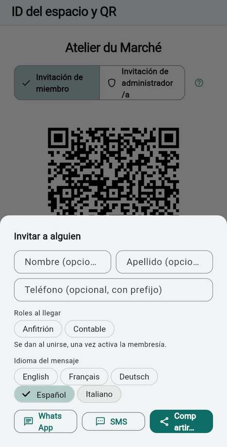

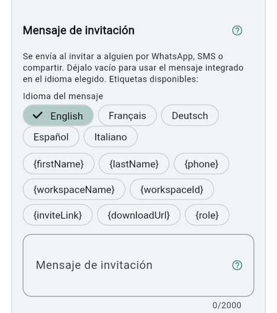

**Pasos**

1. Abra [Espacio](https://fdittgen-png.github.io/deskilo/#/workspace-settings) y vaya a **Comunidad e invitaciones**.
2. En **Idioma del mensaje**, elija el idioma para el que escribe. La fila se abre en el idioma de su espacio.
3. Escriba el texto. Toque una etiqueta para insertarla donde está el cursor. El límite es de 2000 caracteres.
4. Repita para cada idioma que usen sus miembros y toque **Guardar**.

*Las etiquetas*

| Etiqueta | Se rellena con |
|---|---|
| `{firstName}` `{lastName}` `{phone}` | Lo que escribió en **Invitar a alguien**. Vacío si no escribió nada. |
| `{workspaceName}` | El nombre de su espacio. |
| `{workspaceId}` | El código de invitación personal de este mensaje (no el ID público del espacio). |
| `{inviteLink}` | Un enlace que abre la aplicación en el servidor correcto con el código ya rellenado. |
| `{downloadUrl}` | La página de la aplicación en la tienda. |
| `{role}` | El rol que ofrece la invitación, en el idioma del mensaje. |

**Conviene saber**

- Si deja el cuadro vacío, la aplicación escribe su propio mensaje en ese idioma. Explica los pasos: descargar, crear una cuenta, unirse con el código.
- No pegue usted mismo un código ni un enlace. Cada envío crea su propio código, válido para una sola persona.
- Una etiqueta mal escrita queda visible en el texto enviado: lea la vista previa antes de enviar.
- El mensaje incluido avisa a la persona de que el código es de un solo uso y válido durante 14 días.

**Resultado** Una invitación que sus miembros pueden seguir sin tener que preguntarle.

**Véase también:** [Mensaje de invitación](Guia-de-usuario#mensaje-de-invitación) · [Invitar a alguien por mensaje](Guia-de-usuario#invitar-a-alguien-con-un-mensaje)

<!-- anchor: setup.people.managed -->
### Perfiles gestionados

**Público:** Propietario · Administrador/a

Usted quiere reservar, facturar y gestionar para alguien que aún no tiene cuenta: un visitante, un miembro mayor, una persona que prefiere el papel.

**Pasos**

1. Active **Perfiles gestionados** en [Funciones](https://fdittgen-png.github.io/deskilo/#/features).
2. En [Miembros y planes](https://fdittgen-png.github.io/deskilo/#/members), toque **Añadir un perfil gestionado** y rellene la identidad.
3. Cuando la persona esté lista, abra su página y elija **Entregar a la persona**. Se crea un código personal vinculado al perfil.

**Conviene saber**

- Quien canjee el código asume el perfil con sus reservas, sus facturas y su suscripción, una vez que usted apruebe la membresía.
- Retire la entrega con **Revocar la entrega** si el código aún no se ha usado.

**Véase también:** [Añadir un perfil gestionado](Guia-de-usuario#añada-un-perfil-gestionado)

<!-- anchor: setup.people.validation -->
### Validación: de qué se compone una regla

**Público:** Propietario

Usted quiere decidir, acto por acto, si una segunda persona debe estar de acuerdo. Un dominio de validación es una clase de acto con su propia regla: *un pago*, *un gasto*, *un miembro nuevo*, *la eliminación de una reserva*. En **Reglas de validación**, los dominios están en tres grupos.

| Grupo | Dominios, en palabras sencillas | Mientras espera |
|---|---|---|
| **Finanzas** | Un pago, un gasto, un servicio, una factura conciliada con su pago, una factura emitida o anulada, un reembolso, una condonación, un acuerdo de precios, un gasto compartido, un gasto programado, un cambio de condiciones de pago, una salida anticipada, un registro de uso eliminado | El importe no cuenta en el estado de cuenta de nadie. |
| **Reservas** | **Medias jornadas extra** que pide un miembro, **Reservas de espacios enteros**, una reserva hecha para un miembro por un administrador, una **Eliminación de reserva** | El puesto se queda como estaba. |
| **Personas y roles** | **Nuevo miembro**, un cambio de rol, un cambio de estado, un cambio de suscripción, un cambio de la matriz de permisos | La persona conserva el acceso que tiene ahora. |

Todo dominio empieza con **Hereda la predeterminada**: una validación de cualquier administrador o propietario. **Regla predeterminada** es la regla que heredan todas las demás. Un dominio que usted abre y guarda pasa a ser **Personalizada**.

*Los mandos de una regla*

| Ajuste | Qué significa | Necesita |
|---|---|---|
| **Validaciones requeridas** | Cuántas personas deben decir que sí. | |
| **Quién valida** | **Admins**, **Personas designadas** o **Todos los miembros**. El propietario siempre puede. | **Validadores por rol o persona**: sin ella no se muestra la elección y validan los administradores. Tras desactivarla, revise de nuevo las reglas que nombraban a **Personas designadas** |
| **Los admins pueden validar** | Desactivado, solo validan los propietarios. | |
| **El propietario siempre debe validar** | Uno de los síes debe venir de un propietario. | |
| **La propiedad puede validar lo propio** | La solicitud del propio propietario no se queda esperando a otra persona. Un administrador nunca recibe esto. | **Validaciones encadenadas** |
| **Una tras otra** | La segunda se pide cuando la primera ha dicho que sí. | **Validaciones encadenadas** |
| **Solo por encima de este importe** | Por debajo, el acto se aplica de inmediato. Solo en los dominios de dinero. | **Validaciones encadenadas** |
| **Los admins eliminan sin validación** / **Los propietarios eliminan sin validación** | Su propia **Eliminación de reserva** se resuelve sola y queda marcada como autovalidada. Desactivado por defecto. | |

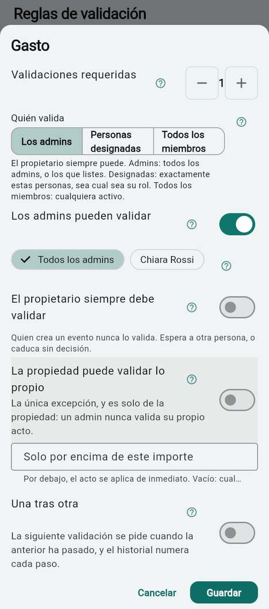

**Pasos**

1. Abra [Reglas de validación](https://fdittgen-png.github.io/deskilo/#/validation). Toque **Regla predeterminada** y decida qué hereda todo lo demás.
2. Toque un dominio, fije los mandos y toque **Guardar**.
3. Mantenga pocas excepciones. Cada excepción es una cosa más que debe recordar cuando alguien pregunte «¿por qué esto está esperando?».

**Conviene saber**

- Nadie valida su propio acto. Espera a otra persona, salvo que esté activada la excepción del propietario.
- Cada decisión queda registrada: quién, cuándo, sobre qué.
- Una solicitud a la que nadie responde caduca a los siete días, al barrerla la próxima vez que alguien abre Eventos. Un acto que un administrador hizo por un miembro se confirma automáticamente.

**Véase también:** [Reglas de validación, dominio por dominio](Guia-de-usuario#reglas-de-validación-dominio-por-dominio) · [Quién puede validar](Guia-de-usuario#quién-puede-validar) · [Validación automática](Guia-de-usuario#validar-automáticamente-la-solicitud-de-un-administrador)

<!-- anchor: setup.people.presets -->
### Tres ajustes preestablecidos para copiar

**Público:** Propietario

Usted quiere un conjunto de reglas que pueda copiar hoy y afinar después. Elija uno; todos se apoyan en el alcance por defecto, el propietario y los administradores, así que no hace falta ninguna función adicional.

| Ajuste | Elíjalo cuando | Qué fija | Validadores que necesita |
|---|---|---|---|
| *Unión abierta* | Conoce a las personas que escanearán su código. | Nada. Cada dominio hereda la predeterminada: una validación de cualquier propietario o administrador. Una unión sigue sin ser nunca automática. | 1 (usted) |
| *Aprobar uniones* | Una junta decide quién entra. | **Nuevo miembro**: **Validaciones requeridas** 2, **El propietario siempre debe validar** activado. | 2: un propietario y un administrador |
| *Aprobar uniones y reservas* | Los puestos o las salas enteras escasean, o las eliminaciones de reservas necesitan un testigo. | *Aprobar uniones*, más, en **Reservas de espacios enteros**, **Medias jornadas extra** y **Eliminación de reserva**: **Validaciones requeridas** 1. | 2 como mínimo, 3 para estar cómodo |

En la asociación: Ada es la propietaria y Chiara administradora. Con *Aprobar uniones*, Ada y Chiara aprueban ambas a cada recién llegado. Con el tercer ajuste, una sala entera que reserva Bruno queda bloqueada para él de inmediato, pero Ada o Chiara aún pueden rechazarla, y una eliminación que pide Chiara la decide Ada, no Chiara.

**Pasos**

1. Abra [Reglas de validación](https://fdittgen-png.github.io/deskilo/#/validation).
2. Toque **Nuevo miembro**, fije lo que dice la tabla y toque **Guardar**.
3. Para el tercer ajuste, repita en los otros tres dominios.
4. Abra **Miembros y planes** y cuente sus propietarios y administradores activos. Deben ser al menos el número de la última columna.

**Conviene saber**

- Estos ajustes nunca retienen para su aprobación una reserva ordinaria de un miembro. Lo que espera es una sala entera, unas medias jornadas extra, una eliminación y la unión.
- Un ajuste preestablecido es un punto de partida. Suba un número solo cuando tenga suficientes personas para responder.

**Véase también:** [Validaciones requeridas](Guia-de-usuario#validaciones-requeridas) · [Se requiere un propietario](Guia-de-usuario#se-requiere-un-propietario)

<!-- anchor: setup.people.stuck -->
### Evite solicitudes que esperan para siempre

**Público:** Propietario · Copropietario

Usted quiere estar seguro de que toda solicitud para la que crea una regla puede recibir respuesta. Una regla que necesita más validadores de los que existen no se rechaza en todas partes: la solicitud se crea, nadie puede completarla y caduca a los siete días.

> **Atención** El editor cuenta un validador adicional para la persona afectada, así que le deja guardar **Validaciones requeridas** con uno más que las personas que tiene. Ese sí adicional existe solo para una reserva que un administrador hizo para un miembro y para algunos pagos. Para una unión o una solicitud de dinero no existe. No confíe en que el editor cuente por usted.

*Cuente antes de exigir*

| Usted exige | Necesita, además de la persona que pide |
|---|---|
| 1 | Un propietario o administrador activo |
| 2 | Dos propietarios o administradores activos |
| 2 con **El propietario siempre debe validar** | Un propietario y otra persona más |
| Una lista de **Personas designadas** | Cada persona de la lista debe estar activa; un administrador nuevo no se añade automáticamente |

*Cómo comprobarlo*

1. Abra [Reglas de validación](https://fdittgen-png.github.io/deskilo/#/validation) y lea cada tarjeta personalizada: «Todos los admins — 2 cualesquiera» significa dos personas.
2. Abra [Miembros y planes](https://fdittgen-png.github.io/deskilo/#/members). Cuente los propietarios y administradores activos. Las personas en pausa o que han salido no cuentan.
3. Abra **Configuración de este espacio** en [Espacio](https://fdittgen-png.github.io/deskilo/#/workspace-settings). El área **Roles y quién valida las solicitudes** dice «Una regla pide más validadores de los que tiene este espacio» cuando cuenta pocos. El área pasa entonces a ser obligatoria, sea cual sea el tipo de solicitud, y [Lo que le necesita](Guia-de-usuario#lo-que-te-espera) la muestra.
4. Abra [Eventos](https://fdittgen-png.github.io/deskilo/#/events). **Esperando tu confirmación** muestra lo que está esperando, y una fila muestra «1/2 validaciones».

**Conviene saber**

- El propio editor dice **No hay suficientes validadores elegibles.** cuando un recuento supera claramente a las personas disponibles. No detecta todos los casos.
- Un propietario solo que pide algo para sí mismo está esperando a otra persona: añada un administrador, o active **La propiedad puede validar lo propio** en **Validaciones encadenadas**.
- Poner en pausa o retirar a un administrador puede dejar corta una regla. Vuelva a contar tras cada cambio de equipo.

**Resultado** Toda regla puede recibir respuesta de personas que existen.

**Véase también:** [Validaciones requeridas](Guia-de-usuario#validaciones-requeridas) · [Mantenga la coherencia](#mantenerlo-coherente)

<!-- anchor: setup.people.first-week -->
### La primera semana de sus miembros

**Público:** Propietario · Administrador/a

Usted quiere que sus primeros miembros lo logren sin preguntarle. Lo que les diga la primera semana decide cuánto tendrá que responder la segunda.

*Antes de invitar a nadie*

1. Inicie sesión como una segunda persona con una cuenta de prueba y únase a su espacio. Compruebe que puede abrir el plano y reservar un asiento.
2. Apruebe esa cuenta como miembro y, si exige dos, haga que el segundo validador también apruebe.

**Pasos**

1. Envíe el mensaje de invitación. Explica cómo descargar la aplicación, crear una cuenta y unirse. Véase [Unirse a un espacio](Guia-de-usuario#unirse-a-un-espacio).
2. Apruebe a cada recién llegado el mismo día. Quien espera un día empieza con una duda.
3. Cuéntele las tres primeras cosas: el plano y la reserva ([Reservar un puesto](Guia-de-usuario#reservar-una-plaza)), el registro de entrada ([Entrar y salir](Guia-de-usuario#registrar-la-llegada-y-la-salida)) y dónde esperan sus solicitudes ([Eventos](Guia-de-usuario#eventos-y-confirmaciones)).
4. Dígale qué ve usted de esa persona y qué controla ella ([Quién puede ver mis datos](Guia-de-usuario#privacidad-quién-puede-ver-mis-datos)).
5. Nombre a una persona a quien preguntar, y dónde: la mensajería o el mostrador.

**Conviene saber**

- Cuando un administrador hace algo por un miembro, queda pendiente hasta que el miembro lo confirma. Avíselos, o la primera reserva que haga por alguien parecerá un error.
- Los miembros que no usan notificaciones push encuentran todo igualmente en **Eventos**.
- En la primera visita a Reservar, la tarjeta **Primeros pasos** muestra a los propietarios lo que aún falta. Los miembros tienen sus propios consejos breves. Véase [La tarjeta Primeros pasos y los consejos](Guia-de-usuario#la-tarjeta-primeros-pasos-y-los-consejos).

**Resultado** Personas que saben reservar, entrar y a quién preguntar.

**Véase también:** [De la semana 0 a la semana 4](#apréndalo-en-cuatro-semanas) · [Cómo se informa a los miembros](#lo-que-controlan-los-miembros)

<!-- anchor: setup.money.overview -->
## Dinero e impuestos

Para propietarios y administradores de facturación que van a decidir cómo se paga un espacio. Este capítulo trata de las decisiones y de su orden; los clics están en la guía de usuario, y cada sección enlaza con ellos.

> **Atención** DesKilo registra, calcula e imprime lo que usted declara, y comprueba que estén los datos obligatorios. No certifica sus facturas, su tratamiento del IVA ni su contabilidad. Cada vez que este capítulo diga «consúltelo con su gestor», hágalo.

En este capítulo:
- Si los miembros pagan o no, y quién emite las facturas
- Cómo se construye una tarifa, con las cifras del espacio de demostración *Atelier du Marché*
- Cómo le pagan los miembros
- Su identidad legal y las preguntas que conviene llevar a su gestor
- Facturación manual o automática, recordatorios y el IVA a grandes rasgos
- Las decisiones de dinero que no tienen vuelta atrás, y cómo ensayarlas sin riesgo

<!-- anchor: setup.money.decide -->
### Decida primero: si los miembros pagan y quién emite las facturas

**Público:** Propietario

Usted elige hasta dónde llega DesKilo en su dinero. Todo lo demás en este capítulo depende de esta elección, que es fácil de ampliar más adelante y difícil de reducir cuando ya existen facturas.

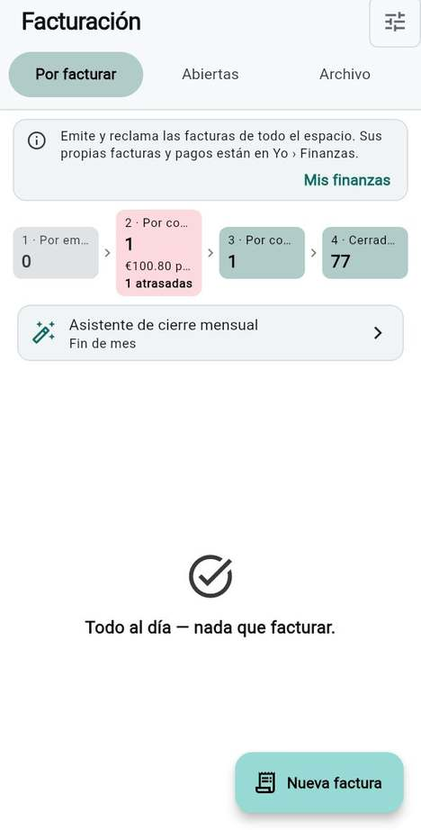

**Antes de empezar**

Responda a dos preguntas: ¿le pagan los miembros por el espacio?, ¿quiere que las facturas legales salgan de DesKilo?

| Vía | Elíjala cuando | Qué ocurre |
|---|---|---|
| 1. Sin dinero | El espacio es gratuito, o los miembros son amigos que reparten el alquiler fuera de la aplicación | Deja las funciones de dinero desactivadas. Los miembros reservan; nadie recibe facturas. |
| 2. Extractos y pagos, facturas fuera | Ya tiene un gestor o una herramienta de facturación, o trabaja en un país para el que DesKilo no puede emitir facturas | Los miembros tienen un extracto mensual, usted registra los pagos que recibe y exporta las cifras para su gestor. Las facturas legales se producen en otro sitio. |
| 3. Facturas emitidas por DesKilo | Está en Francia o en Alemania, y está registrado en el IVA o fuera de su ámbito (una asociación, por ejemplo) | DesKilo produce facturas firmadas y numeradas a partir de lo reservado, con su identidad legal impresa. |

**Pasos**

1. Elija su vía en la tabla.
2. Para la vía 2 o 3, active las funciones de dinero que necesite en [Funciones](Guia-de-usuario#un-interruptor-de-función): **Facturas** es la base de todo lo que se emite, y las funciones que dependen de ella (**Facturas de suscripción**, **Facturas de fin de mes**, **Recordatorios de pago**, **Gestión del IVA**) se activan una a una.
3. Para la vía 3, continúe con [su identidad legal](#su-identidad-legal-y-qué-preguntar-a-su-gestor) antes de la primera reserva, no después.

**Conviene saber**

- Hoy la emisión de facturas dentro de la aplicación existe para un espacio en **Francia** o **Alemania**. En cualquier otro país, use la vía 2: los extractos siguen disponibles.
- El servidor se niega a emitir, y la lista **Complete estos datos antes de emitir** explica por qué, cuando falta un dato o cuando el tratamiento es uno que DesKilo no gestiona: las ventas transfronterizas, la inversión del sujeto pasivo, las exportaciones y las facturas exentas de IVA deben revisarse y emitirse fuera de la aplicación con su gestor.
- Un vendedor acogido al régimen de franquicia (franchise en base, Kleinunternehmer) no puede emitir facturas en la aplicación: el servidor rechaza la categoría de IVA exenta. Quédese en la vía 2 y emita esas facturas en otro sitio.
- Desactivar una función detiene la actividad nueva de ese tipo; no borra nada.
- Puede quedarse en la vía 2 para siempre. Muchas asociaciones lo hacen.

**Resultado**

Sabe cuál de las tres vías es la suya y qué funciones necesita.

**Véase también:** [La facturación de un vistazo](Guia-de-usuario#la-facturación-de-un-vistazo) · [Activar o desactivar procesos enteros](Guia-de-usuario#activar-o-desactivar-procesos-enteros)

<!-- anchor: setup.money.tariff -->
### Diseñar una tarifa

**Público:** Propietario · Administrador/a de facturación

Convierte la pregunta «¿cuánto vale un puesto?» en cifras que DesKilo aplica cada mes sin que usted intervenga.

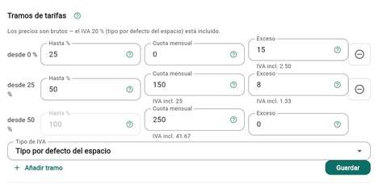

**Antes de empezar**

Tenga presente el modelo. Se lee de izquierda a derecha, y cada paso alimenta al siguiente:

1. Porcentaje de suscripción: un miembro tiene un porcentaje del mes: 25, 50, 75 o 100 %, o un valor que usted permita.
2. Derecho en medias jornadas: el porcentaje se convierte en un número de medias jornadas para el mes: los días abiertos, por dos, por el porcentaje, redondeado hacia arriba.
3. Tramo de tarifa: el porcentaje cae en un tramo, que da la cuota mensual y el precio de una media jornada adicional. Un tramo abarca «por encima de su inicio, hasta su final inclusive», y juntos los tramos deben cubrir de 0 a 100 % sin huecos.
4. Política de exceso: cuando se agota el derecho, cada miembro queda bloqueado, paga el precio del exceso o se le invita a comprar un bono.
5. Bonos y servicios: un bono de días vende medias jornadas adicionales por adelantado a un precio que usted fija; los servicios (un café, una taquilla, impresión) se venden además.

**Pasos**

1. Decida los porcentajes que quiere ofrecer en **Niveles de suscripción**, y si un propietario puede escribir un valor negociado (véase [Niveles de suscripción](Guia-de-usuario#niveles-de-suscripción)).
2. Defina una fila por intervalo en **Tramos de tarifas**: su límite superior, la cuota mensual y el precio del exceso (véase [Tramos de tarifas](Guia-de-usuario#tramos-de-tarifas)).
3. Decida el valor por defecto para los miembros que se quedan sin días: [Cuando se acaban los días](Guia-de-usuario#cuando-se-acaban-los-días).
4. Añada los [bonos de días](Guia-de-usuario#paquetes-de-días) y los [servicios](Guia-de-usuario#un-servicio) que vende.

**Conviene saber**

- La aritmética queda congelada en cada documento emitido. Cambiar un precio cambia el mes siguiente, nunca un mes ya facturado.
- El horario de apertura y los días de cierre determinan cuántos días abiertos tiene un mes, y por tanto el tamaño del derecho. Defínalos primero.
- Un miembro sin suscripción es para visitantes que compran bonos; no puede estar en pago por uso.

**Véase también:** [Facturación](Guia-de-usuario#tramos-de-tarifas) · [La suscripción de un miembro](Guia-de-usuario#la-suscripción-de-un-miembro)

<!-- anchor: setup.money.example -->
### Un ejemplo completo

**Público:** Propietario · Administrador/a de facturación

Sigue a un miembro durante un mes con las cifras de *Atelier du Marché*, para que pueda comprobar las suyas de la misma manera.

**Antes de empezar**

El espacio de demostración tiene tres tramos de tarifa, en euros y con el IVA incluido. Las cifras son las de la demo, no una recomendación.

| Tramo | Cuota mensual | Media jornada adicional | Medias jornadas en un mes de 22 días abiertos |
|---|---|---|---|
| hasta 25 % | 0,00 | 15,00 | 11 |
| por encima de 25 %, hasta 50 % | 150,00 | 8,00 | 22 |
| por encima de 50 %, hasta 100 % | 250,00 | 0,00 | 44 (al 100 %) |

**Pasos**

1. Un miembro tiene el 50 %. En un mes con 22 días abiertos, el derecho es 22 × 2 × 50 / 100 = 22 medias jornadas.
2. El 50 % cae en el segundo tramo (por encima de 25, hasta 50): la cuota es de 150,00, use lo que use el miembro.
3. El miembro reserva 24 medias jornadas. Dos exceden el derecho, a 8,00 cada una: 16,00.
4. El mes cuesta 150,00 + 16,00 = 166,00, antes de cualquier servicio. En la demo los precios son brutos: el IVA del 20 % está incluido y la pantalla lo muestra bajo cada precio.
5. Compárelo con un bono: el bono de 5 días de la demo cuesta 40,00 y añade 10 medias jornadas (5 días, dos medias jornadas cada uno), es decir, 4,00 por media jornada. Frente a 8,00 de exceso, compensa a partir de la sexta media jornada adicional en un mes.

**Conviene saber**

- Un precio de exceso de 0,00 significa que las medias jornadas adicionales no cuestan nada en pago por uso.
- El extracto que ve un miembro muestra las mismas líneas: cuota, incluido, usado, adicional, exceso.
- Los precios se muestran con el IVA incluido cuando el IVA está activado; el impuesto se extrae de ellos.
- Si usted y un miembro acuerdan otras condiciones, véase la [negociación de precios](#negociación-de-precios).

**Resultado**

Puede predecir la factura de un miembro con tres datos: su porcentaje, los días abiertos y las reservas.

**Véase también:** [Lea su extracto](Guia-de-usuario#consulte-su-extracto) · [Lo que costó cada reserva](Guia-de-usuario#cuánto-costó-cada-reserva)

<!-- anchor: setup.money.negotiation -->
### Negociación de precios

**Público:** Propietario · Administrador/a de facturación

Quiere que un miembro pague condiciones distintas de la tarifa, de forma que quede constancia.

**Pasos**

1. Active la función de negociación de precios en [Funciones](Guia-de-usuario#un-interruptor-de-función).
2. Proponga las condiciones en la ficha del miembro: otra cuota mensual, otra tasa de exceso, un descuento en los suplementos, otros precios unitarios u otro porcentaje de ocupación (véase [Negociación de precios](Guia-de-usuario#negociación-de-precios)).
3. Deje que la regla de validación de las negociaciones de precios decida quién la confirma.

**Conviene saber**

- La tarifa sigue siendo la referencia; un precio negociado pertenece a un solo miembro.
- Lo ven el miembro, los propietarios y las personas con derecho a consultar los acuerdos comerciales, y cada lectura queda registrada.
- Defina su política antes de abrir: una excepción concedida en silencio acaba siendo el precio que todos piden.

**Véase también:** [Sus precios negociados](Guia-de-usuario#sus-precios-negociados)

<!-- anchor: setup.money.pay -->
### Cómo le pagan los miembros

**Público:** Propietario · Administrador/a de facturación

Usted elige adónde va el dinero de un miembro y cuánto trabajo hace DesKilo por usted.

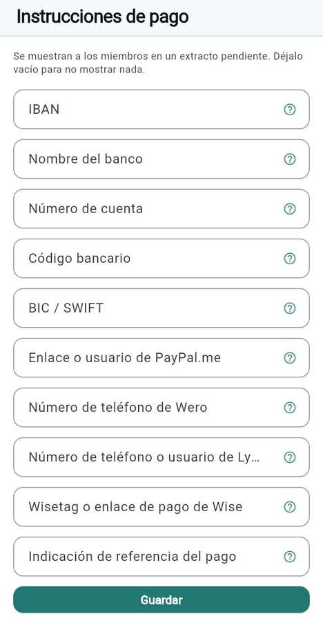

**Pasos**

1. Empiece por la vía gratuita: rellene las [instrucciones de pago](Guia-de-usuario#medios-de-pago-e-instrucciones): su IBAN y datos bancarios, y los medios que acepte entre PayPal.me, Wero, Lydia o Wise, más una indicación de referencia.
2. Los miembros ven estos datos en un extracto sin pagar. Cuando un pago llega a su cuenta, usted o un administrador de facturación [lo registra](Guia-de-usuario#registre-un-pago).
3. Solo si quiere que los miembros paguen dentro de la aplicación, conecte un proveedor en [Pagos en línea](Guia-de-usuario#el-proveedor-de-pago): PayPal, Stripe o Mollie. Necesita la función **Pagos en línea** y su propia cuenta en el proveedor.

**Conviene saber**

- DesKilo registra los pagos; con la vía manual nunca mueve dinero.
- Un proveedor cobra sus propias comisiones y recibe las claves de su cuenta (la hoja de credenciales explica cómo se introducen).
- Con **Pagos en línea** desactivado, se rechaza un nuevo pago en línea; uno ya abierto todavía puede liquidarse.
- Un espacio creado a partir de una plantilla no incluye los datos de pago: introdúzcalos en cada espacio. Una exportación de la configuración sí los incluye.

**Véase también:** [Pague lo que debe](Guia-de-usuario#pague-lo-que-debe) · [Credenciales del proveedor](Guia-de-usuario#credenciales-del-proveedor)

<!-- anchor: setup.money.identity -->
### Su identidad legal y qué preguntar a su gestor

**Público:** Propietario

Usted indica a DesKilo quién vende, para que cada factura le nombre correctamente. Esta es la parte que conviene cerrar con un profesional.

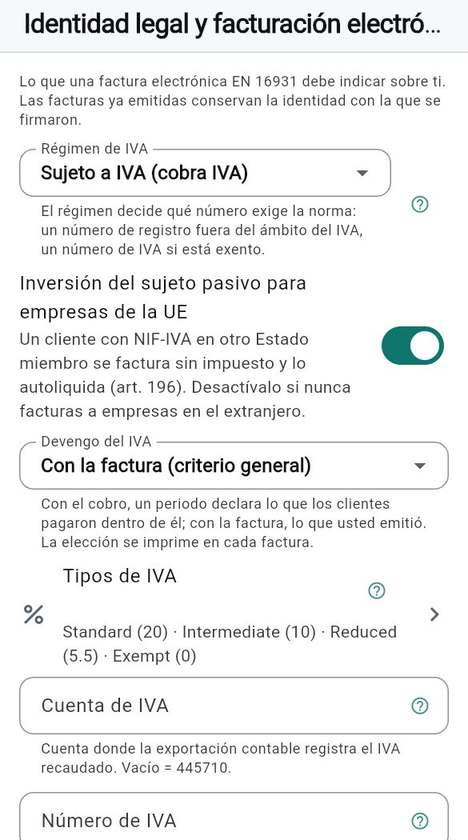

**Antes de empezar**

La pantalla es [Identidad legal y facturación electrónica](https://fdittgen-png.github.io/deskilo/#/legal-identity). Tenga a mano:

- el tipo de organización: una empresa o una asociación sin ánimo de lucro;
- su régimen de IVA: fuera del ámbito del IVA, exento de IVA (régimen de franquicia) o registrado en el IVA. La aplicación solo puede emitir facturas para el primero y el último; con la franquicia, la pantalla registra su situación pero las facturas deben emitirse en otro sitio (vía 2);
- su número de registro y, si lo tiene, su número de IVA;
- su dirección postal, tal como figura en su registro;
- el motivo por el que no se cobra IVA, si no cobra ninguno.

> **Atención** Elegir el régimen es una decisión fiscal, no un ajuste del programa. Una asociación sin actividad comercial normalmente está fuera del IVA, y la pantalla le avisa si elige «exento» para una. Confirme la elección antes de emitir la primera factura.

**Pasos**

1. Abra [Identidad legal y facturación electrónica](https://fdittgen-png.github.io/deskilo/#/legal-identity) y trabaje de arriba abajo: primero el **Régimen de IVA**, después los identificadores, la dirección y las **Menciones de facturación**.
2. Rellene las condiciones de pago, las menciones de demora y las demás menciones que exija su país (véase [Su identidad legal](Guia-de-usuario#su-identidad-legal)).
3. Pulse **Guardar** y lea la plantilla de factura una vez con su gestor (véase [La plantilla PDF de factura](Guia-de-usuario#la-plantilla-pdf-de-factura)).

> **Consejo** Preguntas para llevar a su gestor:
>
> 1. ¿En qué tipo de organización y en qué régimen de IVA estoy?
> 2. ¿Cuáles son mi número de registro y mi número de IVA, y cómo se escriben?
> 3. Si no cobro IVA, ¿qué texto legal lo justifica?
> 4. ¿Qué menciones deben figurar en mis facturas (plazo de pago, penalización por demora, indemnización por cobro, descuento por pronto pago, seguro)?
> 5. ¿Cómo deben numerarse las facturas, y la numeración se reinicia cada año o cada mes?
> 6. ¿El IVA se devenga cuando facturo o cuando me pagan?
> 7. ¿Debo enviar facturas electrónicas a una plataforma pública, y a cuál?
> 8. ¿Necesito declaraciones periódicas de IVA, y con qué frecuencia?

**Conviene saber**

- Las facturas ya emitidas conservan la identidad con la que se firmaron; un cambio se aplica a las siguientes.
- Solo un propietario o un copropietario activo puede abrir esta pantalla, y la función **Facturas** debe estar activada.
- Un espacio creado a partir de una plantilla no incluye su identidad: introdúzcala de nuevo. Un despliegue entre los dos lados de un par sí la incluye.

**Véase también:** [Régimen de IVA](Guia-de-usuario#régimen-de-iva) · [La plataforma de facturación electrónica](Guia-de-usuario#la-plataforma-de-facturación-electrónica) · [Tipo de organización](Guia-de-usuario#tipo-de-organización)

<!-- anchor: setup.money.invoicing -->
### Facturar a mano o automáticamente

**Público:** Propietario · Administrador/a de facturación

Usted decide si una persona pulsa los botones cada mes o si lo hace DesKilo.

**Pasos**

1. Para un primer mes, trabaje a mano: abra [Facturación](https://fdittgen-png.github.io/deskilo/#/invoices), lea **Por emitir** y emita la factura de un miembro (véase [Emitir una factura](Guia-de-usuario#emitir-una-factura)).
2. Para una rutina, use el [asistente de cierre mensual](Guia-de-usuario#el-asistente-de-cierre-mensual): recorre **Revisión**, **Emitir**, **Enviar**, **Recordar**, **Pagos**, **Conciliar**, **Cerrar** y **Resumen**.
3. Para automatizar, active **Facturas de suscripción** y **Facturas de fin de mes** en [Funciones](Guia-de-usuario#un-interruptor-de-función) y fije los días en [Calendario de facturación](Guia-de-usuario#calendario-de-facturación).

**Conviene saber**

- Existen dos documentos por mes: la cuota de suscripción, emitida antes del mes, y lo que el mes costó realmente, emitido después. Una factura puede llevar una fecha unos días adelantada (tres por defecto, según el calendario de facturación), de modo que una fechada el 29 de agosto puede nombrar septiembre.
- En el servidor, una ejecución diaria emite ambos cuando la base de datos de la instalación tiene su programador activado; si no está seguro, pregúntelo al operador.
- Cada tipo de factura (suscripción, fin de mes) puede emitirse una vez por miembro y mes. Las facturas no se pueden editar ni borrar; una errónea se marca como tal y se sustituye.
- Por defecto emiten facturas el propietario y los copropietarios. **Los admins emiten facturas** lo extiende a los administradores.

**Véase también:** [La pantalla de Facturación](Guia-de-usuario#la-pantalla-de-facturación) · [Reclamar y liquidar las facturas abiertas](Guia-de-usuario#reclamar-y-saldar-facturas-abiertas)

<!-- anchor: setup.money.reminders -->
### Recordatorios de pago

**Público:** Propietario · Administrador/a de facturación

Usted decide cuándo se considera tarde y quién se encarga de reclamar.

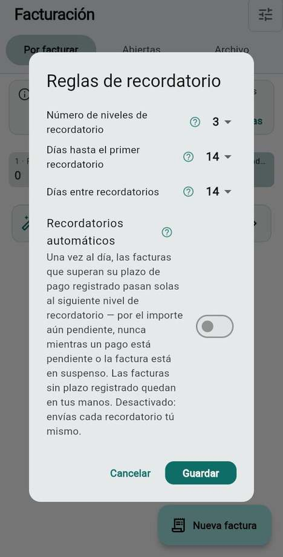

**Pasos**

1. Active **Recordatorios de pago** en [Funciones](Guia-de-usuario#un-interruptor-de-función). Depende de **Facturas**.
2. Fije el número de niveles y los plazos en [Reglas de recordatorio](Guia-de-usuario#reglas-de-recordatorio): días hasta el primer recordatorio y días entre recordatorios.
3. Decida si los recordatorios salen solos: active **Recordatorios automáticos** en el mismo cuadro de diálogo (véase [Recordatorios automáticos](Guia-de-usuario#recordatorios-automáticos)); la función **Recordatorios de pago automáticos** también debe estar activada.

**Conviene saber**

- El plazo antes del primer recordatorio se lee también como su plazo de pago. Fíjelo en [Condiciones de pago](Guia-de-usuario#condiciones-de-pago).
- Los recordatorios automáticos se ejecutan una vez al día en el servidor cuando la base de datos tiene su programador activado. También se ejecutan cuando alguien autorizado a emitir facturas (un propietario, un copropietario o un administrador si **Los admins emiten facturas** está activado) abre Finanzas, de modo que un espacio sin programador igualmente los recibe, los días en que alguien mira. El interruptor y la descripción de la función también lo dicen; el operador de su servidor sabe cuál se aplica.
- La función **Recordatorios de pago** solo pone las reglas a su disposición. Un recordatorio sale solo únicamente cuando **Recordatorios automáticos** está activado en las reglas de recordatorio, lo cual no ocurre hasta que usted lo decide.
- Se omiten las facturas con un pago pendiente o en espera, y las facturas sin plazo de pago registrado.
- El miembro recibe una alerta en su flujo y, si las notificaciones push están configuradas, una notificación genérica; véase [Avisar a las personas](#avisar-a-las-personas).

**Véase también:** [Condiciones de pago](Guia-de-usuario#condiciones-de-pago)

<!-- anchor: setup.money.vat -->
### El IVA a grandes rasgos

**Público:** Propietario · Administrador/a de facturación

Quiere saber qué le pedirá el IVA antes de activarlo.

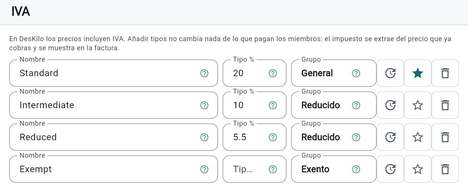

**Pasos**

1. Solo si está registrado en el IVA, active **Gestión del IVA** en [Funciones](Guia-de-usuario#un-interruptor-de-función).
2. Fije los tipos en [IVA](https://fdittgen-png.github.io/deskilo/#/vat): **Usar los tipos habituales** de su país y marque exactamente uno como predeterminado (véase [Fijar los tipos](Guia-de-usuario#fijar-los-tipos)).
3. Dé a cada tipo su grupo y, cuando proceda, un motivo de exención (véase [Grupos de IVA](Guia-de-usuario#grupos-de-iva)).
4. Cuando la ley cambie un tipo, use **Cambio por ley** para que las facturas antiguas conserven su tipo (véase [Cambiar un tipo por ley](Guia-de-usuario#cambiar-un-tipo-por-ley)).
5. Si debe presentar declaraciones, active **Declaraciones de IVA** y genere cada periodo en [Declaración de IVA](Guia-de-usuario#la-declaración-periódica-de-iva).

**Conviene saber**

- Se incluye un catálogo de tipos para los Estados miembros de la UE, Suiza, Noruega y Canadá. Mantenerlo al día cuando un gobierno cambia un tipo es cosa suya.
- Si está registrado y no hay un tipo predeterminado en vigor, el servidor se niega a emitir. La descripción de **Gestión del IVA** y el aviso de la pantalla de identidad legal lo dicen.
- Una declaración es una ayuda para presentar, elaborada a partir de sus facturas emitidas. Verifíquela antes de presentarla y márquela como presentada solo cuando lo haya hecho.
- El diario de declaraciones tiene su propia serie de numeración.

**Véase también:** [Régimen de IVA](Guia-de-usuario#régimen-de-iva) · [Cuándo se devenga el IVA](Guia-de-usuario#cuándo-se-devenga-el-iva)

<!-- anchor: setup.money.permanent -->
### Lo que no tiene vuelta atrás

**Público:** Propietario

Quiere saber, antes de la primera factura, qué no podrá cambiar después.

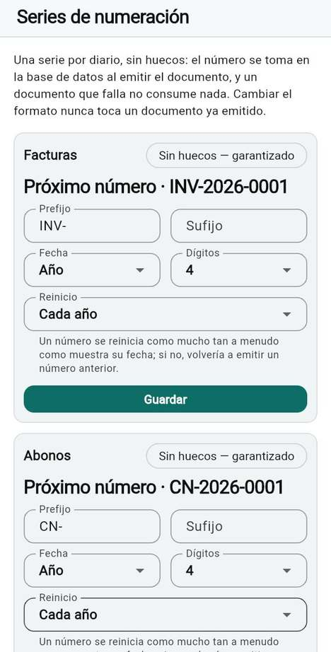

> **Atención** Desde la primera factura emitida, lo que sigue es permanente. Decídalo antes con su gestor.

| Decisión | Qué pasa a ser permanente | Cuándo |
|---|---|---|
| Una factura emitida | Está firmada y es inmutable: los importes, las partes, el desglose del IVA y la aritmética de la tarifa quedan como se imprimieron. Una corrección es una anulación, una factura rectificativa o un reembolso, cada uno un documento nuevo. | Al emitir |
| Número de factura | Los números son correlativos, sin huecos, y se asignan en la base de datos en el momento de emitir. El número siguiente puede subirse, nunca bajarse. Un cambio de formato se aplica desde ese momento. Un reinicio no puede ser más frecuente que la fecha que imprime el número. | En la primera emisión |
| Un mes facturado | Un mes con una factura para un miembro queda cerrado para ese miembro. Los días de cierre y las importaciones de festivos omiten esos meses y los nombran. | En la primera factura de ese mes |
| Tipos de IVA | Los tipos se versionan por fecha, nunca se editan. Una declaración de IVA presentada no se recalcula nunca. | En el primer uso |
| Moneda y país | Los importes se guardan como unidades menores enteras, sin conversión. En cuanto el espacio ha emitido un documento o registrado dinero, el servidor rechaza cambiar uno u otro. | En el primer documento o pago |

**Pasos**

1. Abra [Series de numeración](https://fdittgen-png.github.io/deskilo/#/settings/number-sequences) y fije el prefijo, el sufijo, la parte de fecha, los dígitos y el reinicio de cada diario (facturas, facturas rectificativas, declaraciones de IVA, miembros, pagos). La pantalla necesita la función **Series de numeración**.
2. Enseñe el resultado a su gestor antes de la primera factura.
3. Elija el país, la moneda y la zona horaria en los [Ajustes del espacio](Guia-de-usuario#país) antes de que nadie reserve.

**Conviene saber**

- Los números no se desperdician: un documento que no llega a emitirse no consume ninguno.
- Los dos estados de un espacio, prueba y producción, existen para que nada de esto se ensaye de verdad; véase [un ensayo seguro](#un-ensayo-seguro-en-un-espacio-de-prueba).

**Véase también:** [El registro de facturas](Guia-de-usuario#el-registro-de-facturas) · [Moneda y zona horaria](Guia-de-usuario#moneda-y-zona-horaria)

<!-- anchor: setup.money.dry-run -->
### Un ensayo seguro en un espacio de prueba

**Público:** Propietario

Ensaya una vez toda la rutina del dinero, sin nada real en juego.

**Pasos**

1. Cree o abra un espacio de prueba (**Un espacio de prueba**, o el lado DEV de un par vinculado); véase [Espacio de prueba](Guia-de-usuario#para-qué-sirve-un-espacio-de-prueba) y [Entornos](Guia-de-usuario#un-espacio-tiene-dos-caras).
2. Introduzca la identidad legal, los tipos, la tarifa y las instrucciones de pago tal como piensa usarlos.
3. Invite a dos o tres personas a reservar unos días; añada un servicio para una de ellas.
4. Ejecute el [asistente de cierre mensual](Guia-de-usuario#el-asistente-de-cierre-mensual) de principio a fin y lea el PDF de la factura.
5. Registre un pago, deje que venza un recordatorio y lea el extracto como lo vería el miembro.
6. Enseñe los PDF y la exportación contable a su gestor.

**Conviene saber**

- Un espacio de prueba pone una marca de agua en cada documento y dice que es una prueba; no se debe nada.
- Declarar un espacio como producción quita la marca de agua; las facturas ya emitidas conservan la suya.
- El par puede traer la configuración de un lado al otro, pero las credenciales no viajan.

**Resultado**

Un primer mes que ya ha visto y una lista de preguntas resueltas antes de que cuesten algo.

**Véase también:** [Los dos entornos](Guia-de-usuario#un-espacio-tiene-dos-caras) · [Exportaciones contables](Guia-de-usuario#exportaciones-contables)

<!-- anchor: setup.notify.overview -->
## Avisar a las personas

Para propietarios que quieren que los miembros y los administradores se enteren de lo que importa, y solo de eso. Este capítulo describe lo que DesKilo envía realmente, quién lo recibe, qué configura usted y qué debe dejar al operador de la instalación.

En este capítulo:
- Los canales, en palabras sencillas
- Una tabla: qué ocurre, a quién se avisa, por qué canal y qué puede cambiar un miembro
- Lo que usted configura y lo que debe hacer el operador para las notificaciones push
- Un plan de pruebas con dos cuentas
- Cómo evitar tanto el exceso de avisos como el silencio

<!-- anchor: setup.notify.channels -->
### Los canales, en palabras sencillas

**Público:** Propietario · Administrador/a

Quiere tener una idea clara de las vías por las que DesKilo puede llegar a una persona, antes de prometer nada a sus miembros.

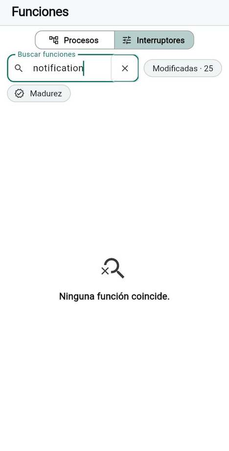

**Antes de empezar**

Hay seis vías, y no son iguales. La mayor parte del trabajo se hace dentro de la aplicación.

| Canal | Qué es | Qué necesita |
|---|---|---|
| El flujo de eventos y la campana | Todo lo que ocurre en el espacio se anota en un flujo. La campana cuenta las novedades y las decisiones que esperan por usted. | **Pestaña Eventos**; **Agrupación de notificaciones** es una opción adicional |
| Mensajes | Conversaciones privadas y de grupo entre miembros, con confirmaciones de lectura y enlaces a una reserva o a un espacio. | **Notificaciones entre miembros** |
| Notificaciones push | Una notificación breve en un teléfono o un ordenador, incluso con la aplicación cerrada. El texto es genérico: sin nombres ni horas. | **Notificaciones push** activadas, **y** una configuración de push por parte del operador; véase [la parte del operador](#la-parte-del-operador-hacer-que-funcione-el-push) |
| El recordatorio de registro de entrada | Una notificación en el propio dispositivo del miembro, 15 minutos antes de una reserva en la que aún no ha registrado su entrada. | El permiso del sistema por parte del miembro. No existe en la versión de navegador. |
| Recordatorios de pago | Una alerta en el flujo y una notificación push al miembro cuya factura está vencida. | **Recordatorios de pago** y **Recordatorios de pago automáticos**; véase [Recordatorios de pago](#recordatorios-de-pago) |
| WhatsApp | Un enlace de grupo que usted publica y el número de WhatsApp que un miembro decide compartir. La aplicación abre WhatsApp; el servidor no envía nada. | **Integración con WhatsApp** |

**Conviene saber**

- DesKilo no envía correos electrónicos propios, aparte de los de la cuenta (confirmación de alta, restablecimiento de contraseña). Las invitaciones son textos que usted comparte desde su propio teléfono.
- No existe una suscripción por evento: un miembro no puede elegir «avísame de los gastos pero no de las reservas».
- Una notificación puede retrasarse o perderse como cualquier push; el flujo y la lista de mensajes son el registro fiable.

**Véase también:** [Notificaciones](Guia-de-usuario#notificaciones) · [Eventos y confirmaciones](Guia-de-usuario#eventos-y-confirmaciones)

<!-- anchor: setup.notify.table -->
### A quién se avisa de qué

**Público:** Propietario · Administrador/a

Quiere saber, evento por evento, quién se entera y cómo.

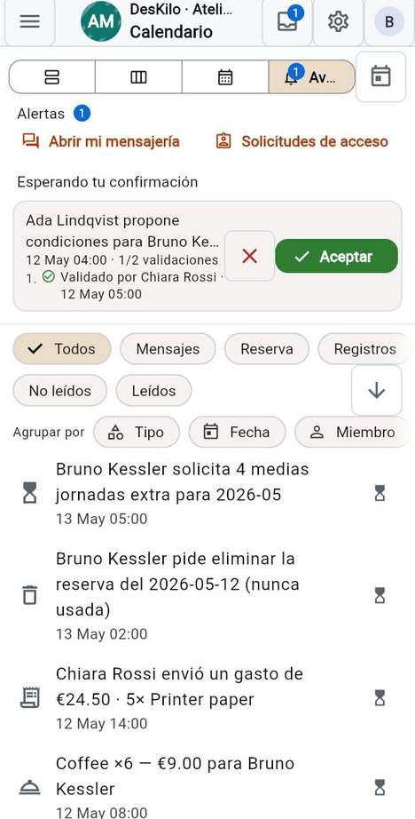

**Antes de empezar**

Solo se envía push en las cinco líneas marcadas con «push» más abajo. Cualquier otro evento (una reserva hecha, un pago registrado, la llegada de un miembro) aparece en el flujo y en ningún otro sitio.

| Origen | Evento | A quién se avisa | Canal | Qué puede cambiar el miembro |
|---|---|---|---|---|
| Reglas de validación | Una solicitud necesita una confirmación | A las personas que nombra la regla (flujo, **Esperando tu confirmación**); el push va solo al miembro al que se refiere la solicitud, nunca a quien la hizo, de modo que los validadores reciben el push solo cuando son ese miembro. Texto: «Alguien necesita tu confirmación.» | Flujo, campana; push | Desactivar el push en el dispositivo |
| Reservas | Un administrador elimina o anula una reserva | Al miembro desplazado y a todos los administradores y propietarios activos excepto quien actuó. Texto: «Un administrador ha eliminado una reserva.» | Flujo; push | Desactivar el push en el dispositivo |
| Recordatorios de pago | Una factura ha superado su plazo y vence un nivel de recordatorio | Al miembro destinatario de la factura. La factura de un propietario llega al propio propietario. Texto: «Tienes un recordatorio de pago.» | Alerta en el flujo; push | Desactivar el push en el dispositivo |
| Notificaciones entre miembros | Un mensaje nuevo | Mensaje directo: el destinatario. Grupo: los participantes excepto el remitente. Una conversación silenciada por un miembro permanece en silencio para ese miembro. Texto: «Tienes un mensaje nuevo.» | Mensajes, campana; push | Silenciar, fijar o archivar una conversación; desactivar el push |
| Menciones en mensajes | Un mensaje de grupo nombra a alguien | A las personas nombradas, incluso en una conversación silenciada. Texto: «Te han mencionado en una conversación.» | Mensajes; push | Desactivar el push |
| Reservas | Se acerca una reserva | Al miembro que reservó, en su propio dispositivo, 15 minutos antes de que empiece, para las reservas de los próximos siete días | Notificación local | Rechazar el permiso del sistema |
| Integración con WhatsApp | No se envía nada | El enlace del grupo se muestra en el directorio; un miembro puede compartir su número | Abre WhatsApp | Compartir u ocultar el número |

**Conviene saber**

- Con la aplicación abierta, el push de una reserva eliminada se sustituye por una notificación en el idioma del miembro. Para los mensajes, las menciones, las confirmaciones y los recordatorios de pago, la aplicación abierta muestra hoy su texto genérico («Alguien necesita tu confirmación.»). Los textos genéricos en inglés de la tabla aparecen cuando la aplicación está en segundo plano o cerrada.
- A un administrador solo se le avisa de aquello sobre lo que actúa o de lo que una regla le asigna; no existe un resumen de «todo».
- Los miembros ven sus propios eventos; los administradores y los propietarios ven los de todos.

**Véase también:** [Reglas de validación](Guia-de-usuario#reglas-de-validación-dominio-por-dominio) · [Mensajes](Guia-de-usuario#mensajes)

<!-- anchor: setup.notify.configure -->
### Lo que usted configura

**Público:** Propietario

Usted decide qué canales existen en su espacio y a quién se le pide decidir qué.

**Pasos**

1. Abra [Funciones](Guia-de-usuario#un-interruptor-de-función) y revise los interruptores de notificación: **Notificaciones push**, **Notificaciones entre miembros**, **Pestaña Eventos**, **Agrupación de notificaciones**, **Recordatorios de pago**, **Recordatorios de pago automáticos** e **Integración con WhatsApp**.
2. Fije las [reglas de validación](Guia-de-usuario#reglas-de-validación-dominio-por-dominio): para cada tipo de solicitud, cuántas validaciones se exigen y quién puede darlas. Esto decide a quién se le pregunta, y por tanto quién ve una decisión pendiente.
3. Decida si la solicitud de un administrador o de un propietario se resuelve por sí sola; véase [Autovalidar la solicitud de un administrador](Guia-de-usuario#validar-automáticamente-la-solicitud-de-un-administrador) y [Autovalidar la solicitud de un propietario](Guia-de-usuario#validar-automáticamente-la-solicitud-de-un-propietario). Una solicitud ya resuelta nunca avisa a nadie.
4. Escriba el mensaje de invitación que reciben los miembros y pegue el enlace del grupo de la comunidad; véase [Mensaje de invitación](Guia-de-usuario#mensaje-de-invitación) y [Grupo de WhatsApp](Guia-de-usuario#grupo-de-whatsapp).
5. Active **Solicitudes de eliminación de reservas** si los miembros pueden pedir que se borre una reserva pasada o con registro de entrada: alguien tendrá entonces que responder.

**Conviene saber**

- Valores por defecto de un espacio nuevo: la pestaña de eventos, las notificaciones entre miembros y la agrupación están activadas; **Recordatorios de pago** y **Recordatorios de pago automáticos** están activadas como funciones, pero no se envía ningún recordatorio hasta que usted activa **Recordatorios automáticos** en las reglas de recordatorio.
- **Notificaciones push** está activada por defecto, pero no entrega nada hasta que el operador la haya configurado.
- Desactivar una función detiene la actividad nueva de ese tipo. No borra lo que ya existe.
- Los roles deciden quién puede ver y responder qué; véase [La matriz de roles](Guia-de-usuario#la-matriz-de-roles).

**Véase también:** [Quién puede validar](Guia-de-usuario#quién-puede-validar) · [Validaciones requeridas](Guia-de-usuario#validaciones-requeridas)

<!-- anchor: setup.notify.operator -->
### La parte del operador: hacer que funcione el push

**Público:** Operador/a · Propietario

Quiere notificaciones push en los teléfonos de los miembros y necesita saber quién hace qué.

**Antes de empezar**

El push no viene con la aplicación por sí solo. Si usted ejecuta su espacio en la instalación de referencia compartida, pregunte a su operador si el push está configurado. Si ejecuta su propia instalación, el operador es usted o su persona técnica.

**Pasos**

1. Cree un proyecto de Firebase y compile la aplicación con él. Sin esto, la aplicación se queda solo con las notificaciones locales, y un miembro ve **Esta versión no tiene notificaciones push**. La versión preparada para F-Droid no tiene push en absoluto ([estado de F-Droid](https://github.com/fdittgen-png/deskilo/blob/master/docs/guides/fdroid.md#status)).
2. Para iPhone y Mac, añada una clave push de Apple al proyecto de Firebase.
3. Guarde la clave de cuenta de servicio de Firebase como secreto del servidor y despliegue la función de push.
4. En su propia instalación, apunte la fila `push_config` de su base de datos a la URL y la clave de su propia función de push. Viene preparada con la dirección de la instalación de referencia.
5. Pruébelo con dos cuentas, como se describe en [el plan de pruebas](#un-plan-de-pruebas-envíese-uno-de-cada).

**Conviene saber**

- Sin los pasos 1 a 4, no se envía ningún push, digan lo que digan los interruptores. El flujo, la campana y los mensajes siguen funcionando.
- La lista de comprobación detallada es para el operador: véase [Plataformas](Guia-de-usuario#deskilo-en-sus-dispositivos) y [Su propio servidor](Guia-de-usuario#gestione-su-propio-servidor).
- El texto del push nunca lleva un nombre ni una hora: es deliberado, por privacidad.

**Véase también:** [Notificaciones push en este dispositivo](Guia-de-usuario#notificaciones-push-en-este-dispositivo)

<!-- anchor: setup.notify.members -->
### Lo que controlan los miembros

**Público:** Propietario · Administrador/a

Quiere decir con honestidad a sus miembros qué pueden desactivar.

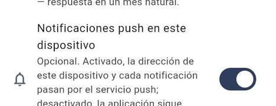

**Pasos**

1. Un miembro abre [Privacidad y datos](https://fdittgen-png.github.io/deskilo/#/privacy) y usa **Notificaciones push en este dispositivo** para detener o reanudar el push en ese dispositivo.
2. En [Mensajes](https://fdittgen-png.github.io/deskilo/#/me?tab=messages), un miembro mantiene pulsada una conversación para **Fijar arriba**, **Silenciar notificaciones**, **Marcar como no leído** o **Archivar**.
3. En los ajustes del sistema del teléfono, un miembro puede rechazar las notificaciones por completo, incluidos los recordatorios de registro de entrada.
4. En su perfil, un miembro decide si comparte un número de WhatsApp.

**Conviene saber**

- Una conversación silenciada permanece en silencio, pero se sigue contando; una mención anula el silencio.
- Un miembro que desactiva el push en un dispositivo no se ve afectado en otro.
- No hay interruptores por categoría. Si un miembro necesita menos ruido, que silencie conversaciones; si no quiere ninguno, que desactive el push.

**Véase también:** [Notificaciones](Guia-de-usuario#notificaciones) · [Sus datos, sus derechos](Guia-de-usuario#tus-datos-tus-derechos)

<!-- anchor: setup.notify.test -->
### Un plan de pruebas: envíese uno de cada

**Público:** Propietario · Administrador/a · Operador/a

Se asegura de que cada canal funciona antes de que sus miembros dependan de él.

**Antes de empezar**

Hágalo en un espacio de prueba (véase [un ensayo seguro](#un-ensayo-seguro-en-un-espacio-de-prueba)). Necesita dos cuentas: la suya como propietario y una segunda como miembro, en otro teléfono, en otro navegador o en el mismo teléfono tras cerrar la sesión. El espacio de demostración permite ver las pantallas con sus personajes, pero no envía ningún push real.

**Pasos**

1. Mensaje: desde la cuenta del miembro, escriba al propietario en [Mensajes](https://fdittgen-png.github.io/deskilo/#/me?tab=messages). En la cuenta del propietario, la campana lo cuenta y la conversación aparece como no leída. Ábrala: el mensaje del miembro muestra una confirmación de lectura.
2. Mención: en una conversación de grupo, nombre al propietario (la función de menciones de la mensajería debe estar activada). Si el push está configurado, el teléfono del propietario muestra «Te han mencionado en una conversación.»
3. Decisión: como miembro, pida eliminar una reserva pasada (la función **Solicitudes de eliminación de reservas** debe estar activada). El propietario la ve en **Esperando tu confirmación** en [Eventos](https://fdittgen-png.github.io/deskilo/#/events); respóndala y observe cómo cambia el flujo del miembro.
4. Eliminación: como propietario, elimine una reserva futura del miembro. El flujo del miembro la muestra, y un teléfono con push muestra «Un administrador ha eliminado una reserva.»
5. Recordatorio: como miembro, reserve un puesto que empiece dentro de unos 20 minutos (una reserva que empieza en menos de 15 minutos no recibe recordatorio). Unos 15 minutos antes del inicio, el teléfono del miembro muestra el recordatorio de registro de entrada.
6. Recordatorio de pago: con **Recordatorios de pago** activado, active **Recordatorios automáticos** en las reglas de recordatorio con un plazo corto hasta el primer recordatorio, emita una factura de prueba que tenga un plazo de pago, espere a que pase el plazo y abra Finanzas como propietario o copropietario; el flujo del miembro muestra la alerta.
7. Silencio: como miembro, silencie la conversación, envíe otro mensaje desde el propietario y compruebe que no suena nada pero el contador de no leídos sube.

**Conviene saber**

- Los pasos 2 y 4 muestran un push solo si la configuración del operador está completa. Si fallan mientras los demás funcionan, el fallo está en esa configuración, no en sus reglas.
- En la versión de navegador de la aplicación no existe el recordatorio de registro de entrada.
- Un teléfono que bloquea las notificaciones no muestra nada; revise primero los ajustes del sistema.

**Resultado**

Ha visto con sus propios ojos todos los canales en los que se apoyará un miembro.

**Véase también:** [Los canales](#los-canales-en-palabras-sencillas) · [Iniciar una conversación o un grupo](Guia-de-usuario#iniciar-una-conversación-o-un-grupo)

<!-- anchor: setup.notify.silence -->
### Evitar el exceso y evitar el silencio

**Público:** Propietario · Administrador/a

Quiere que las personas se enteren de lo que las necesita, sin ahogarlas.

**Pasos**

1. Mantenga activada la **Agrupación de notificaciones**: los miembros y los administradores pueden plegar el flujo por tipo, día o miembro.
2. Pida validación solo donde la decisión sea real: cada regla que exige validación crea una solicitud que alguien debe responder. Véase [Reglas de validación](Guia-de-usuario#reglas-de-validación-dominio-por-dominio).
3. Use los interruptores de autovalidación para las solicitudes cuya respuesta es obvia.
4. Eche un vistazo de vez en cuando a [Lo que le necesita](Guia-de-usuario#lo-que-te-espera): clasifica lo que está pendiente.

**Conviene saber**

- El exceso viene de reglas que preguntan con demasiada frecuencia o de demasiados administradores en una misma regla.
- El silencio viene de una regla sin nadie que la responda: exigir dos validaciones cuando solo existe el propietario, o nombrar a administradores que ya se han marchado, deja las solicitudes esperando para siempre. La tarjeta de preparación señala cualquier regla con pocos validadores, y Lo que le necesita la muestra.
- El silencio viene también de un push sin configurar, de miembros que desactivaron el push y de un sistema que bloquea las notificaciones.
- Los recordatorios de pago automáticos no sustituyen el repaso ocasional de las facturas abiertas.

**Véase también:** [Quién puede validar](Guia-de-usuario#quién-puede-validar) · [Validaciones requeridas](Guia-de-usuario#validaciones-requeridas)

<!-- anchor: setup.reports.overview -->
## Documentos e informes

**Público:** Propietario · Copropietario · Administrador/a de facturación

Todo lo que DesKilo imprime o exporta sale de un único motor y de un único lugar de diseño. Este capítulo le dice qué documentos existen, en qué orden prepararlos, qué puede entregar a su gestor y dónde puede ayudarle un asistente de IA y dónde no debe hacerlo. Los clics están en la guía de usuario; aquí encontrará las razones y el orden.

El ejemplo que seguimos es el espacio de demostración *Atelier du Marché*.

<!-- anchor: setup.reports.documents -->
### Los documentos que produce la aplicación

**Público:** Propietario · Administrador/a de facturación

Quiere saber qué existe antes de diseñar nada y quién recibe cada documento.

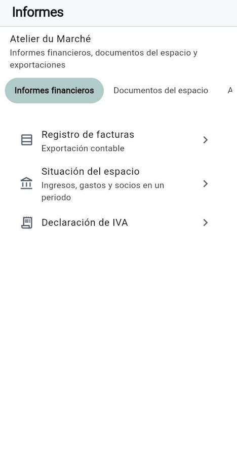

Cada documento es de un *tipo*. Cada tipo tiene su propio diseño, de modo que cambiar la factura nunca cambia el extracto.

| Documento | Quién lo recibe | Dónde se encuentra |
|---|---|---|
| Factura y factura rectificativa (un diseño compartido) | El miembro, o el cliente de un mes facturado | [Facturación](Guia-de-usuario#la-pantalla-de-facturación) |
| Proforma | Un miembro que necesita un presupuesto o una solicitud de pago anticipado | La misma pantalla |
| Extracto | El miembro (su cuenta durante un periodo) | [El extracto](Guia-de-usuario#consulte-su-extracto) |
| Acuerdo | El miembro (las condiciones negociadas) | [Negociación de precios](Guia-de-usuario#sus-precios-negociados) |
| Pagos, uso | El miembro, el administrador de facturación | [Pagos](Guia-de-usuario#pague-lo-que-debe) · [Uso](Guia-de-usuario#cuánto-costó-cada-reserva) |
| Cartas de recordatorio, nivel 1 a 9 | El miembro con una factura vencida | [Reglas de recordatorio](Guia-de-usuario#reglas-de-recordatorio) |
| Informe del espacio y estado del espacio | Usted, la junta, un auditor | **Informes** |
| Declaración de IVA | Usted, y después la plataforma tributaria | [La declaración periódica de IVA](Guia-de-usuario#la-declaración-periódica-de-iva) |
| Credenciales, códigos QR de espacios | Los miembros en la puerta, sus paredes | [Códigos QR de espacios](Guia-de-usuario#códigos-qr-de-espacios-pdf) · [Credenciales](Guia-de-usuario#registro-con-credencial-nfc) |

**Conviene saber**

- La pantalla **Informes** los agrupa en **Informes financieros**, **Documentos del espacio**, **Análisis de actividad** y **Plantillas**, según sus permisos.
- Unos pocos informes (plan contable, credenciales, tarjetas QR) tienen un único diseño incluido. Los demás se pueden rediseñar.
- Los documentos sacados de un espacio de prueba llevan una marca de agua que lo indica. Véase [Para qué sirve un espacio de prueba](Guia-de-usuario#para-qué-sirve-un-espacio-de-prueba).

**Véase también:** [Informes](Guia-de-usuario#informes-vista-rápida-descarga-compartir) · [La plantilla PDF de factura](Guia-de-usuario#la-plantilla-pdf-de-factura)

<!-- anchor: setup.reports.designer -->
### El diseñador, en lenguaje de propietario

**Público:** Propietario · Administrador/a de facturación

Quiere una carta que se parezca a la suya sin aprender un lenguaje de marcado.

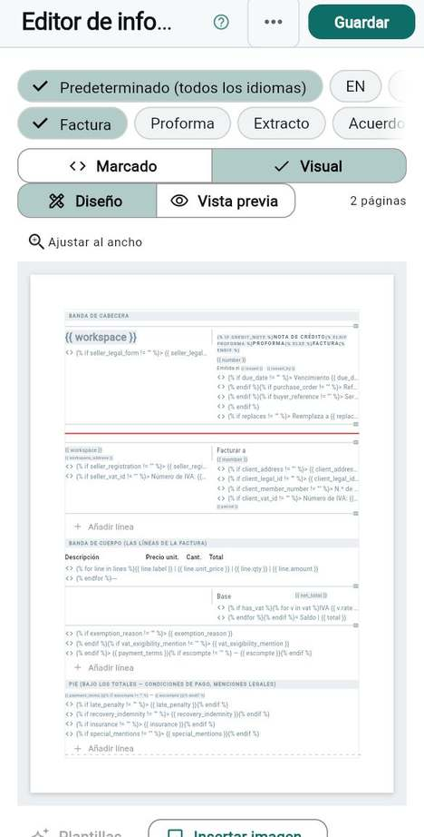

Un documento es una página hecha de **bandas**. La *cabecera* lleva su membrete y el destinatario. El *cuerpo* lleva las líneas. La franja de *continuación* empieza en la segunda página, y el *pie* se repite en cada página con sus condiciones de pago y sus menciones legales. Las edita en **Diseño** y las comprueba en **Vista previa**; **Marcado** muestra las mismas bandas como texto para el día en que lo necesite.

| Pieza | Qué le da | Elíjala cuando |
|---|---|---|
| Ajustes preestablecidos (**Profesional**, **Clásico**, **Sencillo**, **Detallado**, **Carta formal**) | Un diseño terminado para empezar. Los ajustes difieren para facturas, proformas, extractos, acuerdos y recordatorios; los documentos estructurales tienen un único diseño incluido | Siempre: empiece por **Profesional** y cambie poco |
| Un diseño por idioma | Un miembro lee el documento en su propio idioma | Sus miembros no leen todos el mismo idioma |
| Membrete y sobre con ventana | Remitente, destinatario y cuerpo colocados donde los espera un sobre con ventana | Envía las facturas por correo postal |
| Diseño posicionado (XML) | Cada elemento colocado en milímetros, para un formulario oficial | Un documento debe ajustarse a un formulario fijo |
| Biblioteca de imágenes | Un logotipo, un sello o una firma que se reutiliza en varios diseños | Tiene un logotipo |
| Intercambio de diseños | Un diseño escrito en un archivo y leído de nuevo | Una persona o una herramienta ajena a la aplicación lo edita |

Dos datos le evitan sorpresas. La norma de la carta imprime el destinatario en la ventana de la derecha para un espacio francés y en la de la izquierda para uno alemán, salvo que usted lo modifique. Y un diseño que no se consigue generar nunca bloquea un documento: entra en su lugar el diseño incorporado.

> **Atención** El texto de un diseño no es asesoramiento jurídico. El aspecto y la traducción por sí solos no establecen el cumplimiento legal ni satisfacen una obligación de facturación electrónica. Lo que debe decir una factura se decide en [Su identidad legal](Guia-de-usuario#su-identidad-legal) y lo confirma su gestor.

**Véase también:** [El editor de informes](Guia-de-usuario#el-editor-de-informes) · [Plantillas listas para usar](Guia-de-usuario#plantillas-ya-preparadas) · [Un diseño por idioma](Guia-de-usuario#un-diseño-por-idioma)

<!-- anchor: setup.reports.sequence -->
### La secuencia que debe seguir

**Público:** Propietario · Administrador/a de facturación

Va a diseñar documentos y quiere hacerlo una sola vez, en el orden correcto.

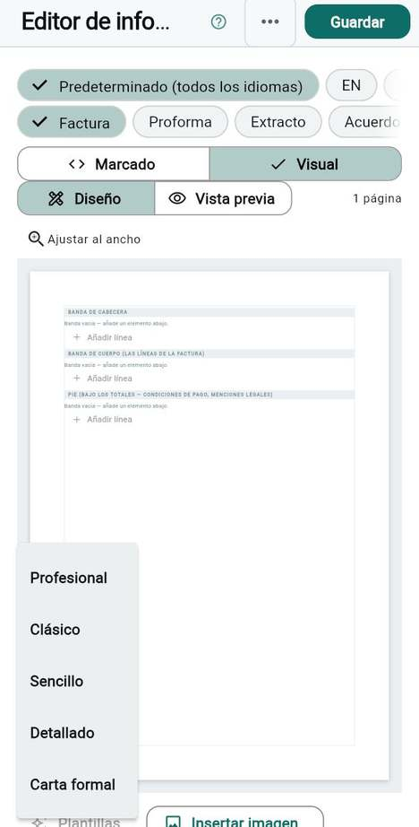

**Pasos**

1. Fije primero su identidad legal: tipo de organización, dirección, registro, régimen de IVA y menciones especiales. Un diseño imprime solo lo que usted introdujo ahí. Véase [Su identidad legal](Guia-de-usuario#su-identidad-legal).
2. Abra el [Editor de informes](https://fdittgen-png.github.io/deskilo/#/report-editor), elija el documento y empiece por **Profesional** en **Plantillas**.
3. Añada una versión de idioma para cada idioma que lean sus miembros. Elija **EN**, **FR**, **DE**, **ES** o **IT** bajo el documento. Véase [Un diseño por idioma](Guia-de-usuario#un-diseño-por-idioma).
4. Compruebe cada uno con **Vista rápida**. Usa su factura más reciente o, si no hay ninguna, datos de ejemplo.
5. Ensaye en un espacio de prueba: entre en él, emita una factura de prueba, imprímala y envíela a su gestor. Véase [Para qué sirve un espacio de prueba](Guia-de-usuario#para-qué-sirve-un-espacio-de-prueba).
6. Congele el diseño antes de la primera factura. Anote lo que decidió y cambie un diseño solo cuando cambie una norma.

**Conviene saber**

- Sustituir un diseño se puede deshacer con **Deshacer** hasta que salga del editor.
- Una factura emitida es un documento congelado. Cambiar el diseño más adelante cambia los documentos nuevos, nunca los ya emitidos.
- Con el mismo texto en dos idiomas, pida a alguien que lea el segundo idioma que revise la vista previa.

> **Atención** El número de factura y las menciones legales impresas en una factura pasan a ser permanentes con la primera factura emitida. Defínalos antes, no después.

**Resultado:** todos los documentos que envíe se parecen a los suyos, en cada idioma, y han sido leídos una vez por alguien que no es usted.

**Véase también:** [Su identidad legal](Guia-de-usuario#su-identidad-legal) · [La plantilla PDF de factura](Guia-de-usuario#la-plantilla-pdf-de-factura)

<!-- anchor: setup.reports.accountant -->
### Qué entregar a su gestor

**Público:** Propietario · Administrador/a de facturación

Quiere que su gestor tenga lo que necesita y sepa lo que la aplicación no afirma.

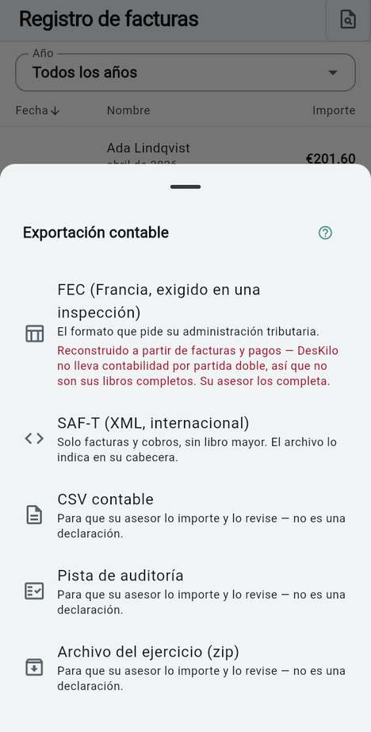

Empiece por el [Registro de facturas](https://fdittgen-png.github.io/deskilo/#/invoice-register), que enumera todas las facturas con su estado, y pulse **Exportación contable**. Cada formato indica en su hoja lo que afirma.

| Archivo | Qué afirma | Qué no afirma |
|---|---|---|
| FEC | El formato francés que pide una inspección, reconstruido a partir de facturas y pagos | Una contabilidad completa. Su gestor la completa |
| DATEV | Un archivo de intercambio para el programa de los contables alemanes, que lee y contabiliza una persona | Una presentación, ni una entrega para una inspección fiscal |
| SAF-T | La estructura internacional, deliberadamente parcial: facturas y pagos, sin libro mayor | Un archivo contable completo. Lo dice en su cabecera |
| SAF-T PT, Sage 50 | Un formato regulatorio portugués (no certificado) y un formato de intercambio británico/irlandés, según su país | Una presentación ni una certificación |
| CSV contable, Pista de auditoría, Archivo del año (zip) | Una ayuda de lectura para su gestor | Una presentación |

La lista de formatos depende de su país. FEC y DATEV piden sus números de cuenta, y FEC también su número de registro: téngalos a mano. Las cifras de IVA del periodo están en [La declaración periódica de IVA](Guia-de-usuario#la-declaración-periódica-de-iva).

*Lo que la aplicación no hace*

- Conserva facturas, pagos y una cuenta corriente por miembro. No lleva un libro mayor por partida doble sobre un plan contable, así que no puede sustituir a un programa de contabilidad.
- Algunas obligaciones siguen siendo suyas y de su gestor: la contabilidad completa, un programa certificado cuando su país lo exige y la aceptación por parte de la autoridad de destino.
- Un archivo queda bloqueado hasta que se corrigen los problemas de origen.

**Conviene saber**

- Exportar es una lectura. Puede repetirla para cualquier periodo.
- Prepare un breve informe para su gestor antes de la primera factura: su régimen de IVA, cuándo se devenga el IVA, la numeración elegida y las exportaciones que querrá. Véase [Ayuda de IA](#ayuda-de-un-asistente-de-ia).

**Véase también:** [Exportaciones contables](Guia-de-usuario#exportaciones-contables) · [El registro de facturas](Guia-de-usuario#el-registro-de-facturas) · [Cuenta de IVA](Guia-de-usuario#cuenta-de-iva)

<!-- anchor: setup.reports.analytics -->
### El análisis de actividad a grandes rasgos

**Público:** Propietario · Administrador/a de facturación

Quiere ver cómo rinde el espacio cuando ya funciona, sin una hoja de cálculo.

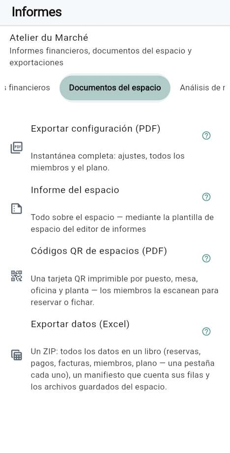

**Análisis de actividad** muestra cifras por ámbito: facturado y cobrado, ocupación y capacidad. Usted elige un periodo (mes, trimestre o año), lo compara con otro, guarda una vista y la exporta como PDF. Solo ve los análisis que su rol puede leer.

Lo cobrado son los pagos conciliados con facturas. No es un beneficio, porque la cifra no incluye costes, y el periodo en curso es parcial.

Para un documento sobre todo el espacio, la pestaña **Documentos del espacio** contiene el **Informe del espacio**, **Códigos QR de espacios (PDF)**, **Exportar datos (Excel)** y **Exportar configuración (PDF)**. Use los dos últimos como copia de recuperación antes de un cambio importante.

**Véase también:** [Análisis de actividad](Guia-de-usuario#análisis-de-negocio) · [Exportaciones](Guia-de-usuario#informe-del-espacio)

<!-- anchor: setup.reports.ai -->
### Ayuda de un asistente de IA

**Público:** Propietario · Copropietario

Una herramienta de chat con IA puede ahorrarle horas con las palabras que rodean su configuración. No puede ser quien decida lo que es correcto en lo legal o lo fiscal. Esta sección trata de las herramientas que usa fuera de DesKilo; la conexión de asistentes dentro de la aplicación se describe al final.

*Para qué sirve una herramienta externa*

- Redactar el mensaje de invitación que envía a sus primeros miembros. Véase [El mensaje de invitación](Guia-de-usuario#mensaje-de-invitación). Los marcadores, como el nombre o el enlace de invitación, se dejan tal cual.
- Formular las menciones especiales que presentará a su gestor, como borrador para revisar, nunca como texto definitivo.
- Traducir el texto de un diseño a otro idioma, de modo que solo tenga que revisarlo.
- Explicar un informe o un extracto a un miembro con palabras sencillas.
- Preparar el resumen de sus decisiones para su gestor: país, tipo de organización, régimen de IVA, numeración, exportaciones.
- Esbozar la imagen de fondo de su plano, a partir de fotografías, en una herramienta de imágenes.

*Lo que no debe decidir*

- Las menciones legales de una factura, el tratamiento del IVA de una actividad, el motivo por el que no se cobra IVA y los tipos de IVA.
- Todo lo que pasa a ser permanente: un formato de numeración de facturas, un régimen de IVA, la moneda, una factura emitida.
- Si algo cumple la normativa. Una respuesta segura de sí misma no es una respuesta verificada; quien verifica es su gestor.

*El flujo de trabajo seguro*

1. Pida a la herramienta un borrador. Dele un escenario, no los nombres de sus miembros ni ningún dato personal.
2. Pegue el borrador en el campo, en el **Editor de informes** o en los ajustes.
3. Revíselo en **Vista previa** con datos de ejemplo.
4. Envíe a su gestor el texto con peso legal y espere su respuesta.
5. Pruebe todo el flujo en un espacio de prueba antes de hacerlo en el real.

> **Atención** No pegue un token, una contraseña, un número bancario ni datos personales de un miembro en una herramienta externa.

*La conexión de asistentes propia de DesKilo*

La aplicación permite que un asistente como Claude o ChatGPT actúe en nombre de un miembro mediante un protocolo llamado MCP. Viene desactivada y es una función que usted activa (**Interfaz MCP**, véase [Un interruptor de función](Guia-de-usuario#un-interruptor-de-función)). Está construida por capas, de modo que ninguna persona puede abrirlo todo.

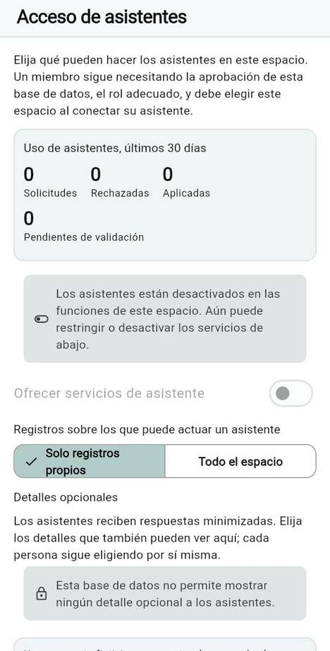

| Capa | Quién | Qué hace |
|---|---|---|
| La instalación | El operador | Activa los asistentes para la instalación. |
| El espacio | Usted, el propietario | Activa la función y elige después en [Qué pueden hacer los asistentes](Guia-de-usuario#qué-pueden-hacer-los-asistentes-en-un-espacio) qué servicios se ofrecen y si un asistente ve solo los registros propios o los de todo el espacio. |
| La base de datos | Un administrador de la base de datos | Aprueba la solicitud de cada persona. |
| El miembro | Cada miembro | Pide la aprobación una vez y elige este espacio. |
| Una solicitud con efectos | El miembro, en su dispositivo | Confirma la solicitud exacta, que además sigue sus reglas de validación. |

El asistente de un miembro trabaja sobre los registros de ese miembro: encontrar y describir puestos libres, favoritos y valoraciones, reservar, modificar o cancelar su propia reserva, pedir que se borre una reserva ya iniciada, registrar la entrada y la salida, leer su extracto y sus facturas, y enumerar y responder las validaciones que se le piden. Unas pocas solicitudes (emisión de factura, anulación de factura, reembolso, cambio de estado de un miembro, parte de la suscripción) son solo para el personal: exigen derechos de personal, la confirmación de la persona en la aplicación y, después, sus reglas de validación. No tiene ninguna operación que configure un espacio: no puede activar una función, fijar una tarifa, cambiar un rol ni construir un plano. No puede configurar su espacio por usted, y actúa únicamente dentro de lo que usted expone.

**Conviene saber**

- Activar los asistentes no concede nada a nadie por sí solo.
- Cada aprobación caduca; la pantalla indica cuántos días quedan.
- Lea los pasos en [Aprobaciones y confirmaciones para asistentes](Guia-de-usuario#aprobaciones-y-confirmaciones-de-los-asistentes).

**Véase también:** [Asistentes: qué son](Guia-de-usuario#asistentes-qué-son) · [Conectar un asistente](Guia-de-usuario#conecte-un-asistente)

<!-- anchor: setup.reports.developer -->
### Trabajar con un desarrollador: el archivo de diseño y la herramienta de informes

**Público:** Propietario · Operador/a

Una persona técnica le ayuda y hay que editar o comprobar un diseño fuera de la aplicación.

**Pasos**

1. En el [Editor de informes](https://fdittgen-png.github.io/deskilo/#/report-editor), use **Exportar este diseño** para escribir el diseño en un único archivo. El archivo explica qué significan sus campos y qué marcadores existen. **Importar un diseño** lo vuelve a leer; un archivo de otro informe, o de una versión más reciente, se rechaza indicando el motivo.
2. Un desarrollador puede comprobar el diseño desde un terminal con la herramienta de informes, descrita en la guía del administrador técnico: `check` mide un diseño frente al contrato del sobre con ventana y termina con un código distinto de cero cuando hay tinta en la ventana; `render` genera el PDF; `sample` escribe un archivo de datos con todos los marcadores; `describe` enumera el vocabulario.
3. De vuelta en la aplicación, importe el archivo, véalo con **Vista rápida** y pulse **Guardar**.

**Conviene saber**

- El intercambio de diseños es una función (**Exportar e importar diseños de informe**), entre las funciones de informes de [Funciones](https://fdittgen-png.github.io/deskilo/#/features). Actívela primero.
- La herramienta necesita el código fuente de la aplicación; es para la persona que gestiona su instalación, no para el uso diario.

**Véase también:** [El editor de informes](Guia-de-usuario#el-editor-de-informes) · [La plantilla PDF de factura](Guia-de-usuario#la-plantilla-pdf-de-factura)

<!-- anchor: setup.consistent.overview -->
## Mantenerlo coherente

Un espacio puede estar mal de dos maneras: por un ajuste que falta y por dos ajustes que se contradicen. DesKilo detecta algunos de los dos casos y lo dice en pantalla. Este capítulo enumera lo que detecta y dónde lo ve, explica con claridad lo que no detecta y le da una auditoría para pasar antes de abrir las puertas y una rutina breve para cada mes.

En este capítulo:
- [Las protecciones que le da la aplicación](#las-protecciones-que-le-da-la-aplicación)
- [Los errores que las protecciones no detectan](#los-errores-que-las-protecciones-no-detectan)
- [La auditoría previa al lanzamiento](#la-auditoría-previa-al-lanzamiento)
- [La rutina mensual](#la-rutina-mensual)
- [Cuando algo parece ir mal](#cuando-algo-parece-ir-mal)
- [Lo que no tiene vuelta atrás](#lo-que-no-tiene-vuelta-atrás-1)

El ejemplo que seguimos es *Atelier du Marché*. Su propietaria, Ada, pasa la auditoría una vez en un espacio de prueba y otra en el espacio real.

<!-- anchor: setup.consistent.guards -->
### Las protecciones que le da la aplicación

**Público:** Propietario · Copropietario · Administrador/a · Administrador/a de facturación

Quiere saber cuáles de sus errores señalará la aplicación y dónde lo hará, para mirar en el sitio adecuado.

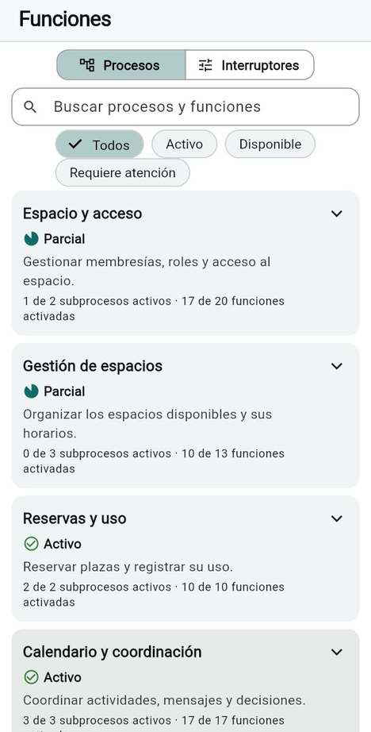

| Protección | Qué detecta | Dónde se ve |
|---|---|---|
| Una función que necesita otra | Una función no puede funcionar sin la que necesita. Activar una función activa la función de la que depende y nombra lo que se ha activado. Desactivar la función de la que otras dependen retiene las dependientes y conserva su propia elección. | **Funciones**: el flujo de activación con su vista previa, **Requiere…** y *Esperando la función de arriba* |
| Un proceso retenido | Una función que está activada pero espera algo que está desactivado. | **Funciones**, vista **Procesos**: el estado **Requiere atención** y su filtro |
| La lista de preparación | Una línea por ámbito del espacio, con su estado, quién actúa y dónde se configura. Ámbitos: **Días de apertura, zona horaria y moneda**, **Puestos reservables en el plano**, **Planes de membresía y tarifas**, **Invitar a los primeros miembros**, **Cómo pagan los miembros**, **Roles y quién valida las solicitudes**, **Exportación y recuperación**, **Lo que pueden hacer los miembros**, **Datos que necesitan sus funciones (identidad, banco, plataformas)**, **Una primera reserva** y, cuando proceda, **La identidad legal y la dirección del espacio** (solo con **Facturas** activada), **Servidor y versión de la base de datos** y **Acceso de asistentes (opcional)** (este último solo con la interfaz MCP activada). | **Configuración de este espacio**, en la parte superior de [Espacio](https://fdittgen-png.github.io/deskilo/#/workspace-settings) |
| La línea que impide una primera reserva | Los ámbitos que la lista marca como **Necesario para una primera reserva**: una zona horaria, una moneda, un día laborable abierto, un puesto, miembros que tengan **Reservar y usar las reservas** (un espacio nuevo no les concede nada) y, cuando una regla de validación de cualquier tipo pide más validadores de los que existen, esos validadores. Lo demás es opcional y se puede dejar a un lado con **Más adelante**. | *Antes de que nadie pueda reservar aquí*, en la tarjeta Primeros pasos de [Reservar](https://fdittgen-png.github.io/deskilo/#/reserve) |
| La línea que impide una primera factura | Con **Facturas** activada, la identidad legal y la dirección del espacio. Sin ellas no se puede emitir ninguna factura, así que el ámbito no se puede dejar a un lado. | **Configuración de este espacio**: el ámbito **La identidad legal y la dirección del espacio**, marcado como **Necesario antes de facturar**; mientras es el paso siguiente, el titular de la tarjeta dice «Antes de facturar: …» |
| Lo que sus funciones aún necesitan en local | Datos bancarios, un proveedor de pagos en línea, una cuenta de facturación electrónica, un sitio. La identidad legal no figura aquí: con **Facturas** activada es un ámbito propio (arriba). | La misma tarjeta, ámbito **Datos que necesitan sus funciones (identidad, banco, plataformas)**, con **Configurar** y **Recomendado** |
| La protección de la factura | Una factura se rechaza hasta que está completa: la dirección del espacio, su número de IVA, un país que sea Francia o Alemania, un fundamento legal para una exención, el nombre, la dirección y el número de IVA del miembro cuando se aplica la inversión del sujeto pasivo, un tipo de IVA en vigor, una explicación para cada línea facturada al 0 %. Las facturas transfronterizas, con inversión del sujeto pasivo, de exportación o exentas se rechazan: emítalas fuera de la aplicación. | **Complete estos datos antes de emitir**, con los elementos que faltan |
| La protección del pago en línea | Con **Pagos en línea** desactivado, el servidor rechaza un pago en línea nuevo. Uno ya abierto aún se liquida. | Las pantallas de pago (la fila de la función no lleva ninguna nota al respecto) |
| La protección de la validación | **Validaciones requeridas** por encima de las personas disponibles, para cualquier tipo de solicitud. | **No hay suficientes validadores elegibles.** en el editor de reglas; «Una regla pide más validadores de los que tiene este espacio» en la lista de preparación, donde **Roles y quién valida las solicitudes** pasa entonces a ser obligatorio |
| El bloqueo de la moneda y el país | En cuanto el espacio ha emitido un documento o registrado dinero, el servidor rechaza cualquier cambio de **Moneda** o de **País**, desde el formulario de ajustes, una importación o cualquier otro sitio. La zona horaria no queda bloqueada. | «La moneda y el país quedan fijados en cuanto el espacio ha emitido un documento o registrado dinero. No se ha guardado nada.» al guardar [Espacio](https://fdittgen-png.github.io/deskilo/#/workspace-settings) |
| La bandeja del propietario | Lo que queda por configurar: una línea «Por configurar: …» por cada ámbito obligatorio de la lista de preparación que no está listo, y una línea «… funciones activadas esperan «…»» por cada función desactivada que retiene otras. | [Lo que le necesita](Guia-de-usuario#lo-que-te-espera); un toque abre la pantalla donde se configura, o **Funciones** |
| La protección de la serie de numeración | Se rechaza un reinicio más frecuente que la fecha impresa en el número. | [Series de numeración](https://fdittgen-png.github.io/deskilo/#/settings/number-sequences), al guardar |
| El control de madurez | Una función evaluada como **Alfa** o **Beta**. | Una confirmación antes de activarla y una insignia en cada interruptor |
| El control de sustitución del plano | Sustituir el plano o los ajustes desde un archivo. | Un aviso de que no se puede deshacer. El plano se rechaza cuando ya existen reservas |

**Conviene saber**

- **Configuración de este espacio** es una lista, no un candado. Nunca le impide activar algo.
- La mayoría de las protecciones actúan cuando intenta emitir, pagar o reservar, no cuando elige un ajuste. Por eso existe la auditoría de más abajo.
- La bandeja del propietario ([Lo que le necesita](Guia-de-usuario#lo-que-te-espera)) solo muestra los ámbitos obligatorios y las funciones retenidas. Los ámbitos opcionales se quedan en la lista de preparación: léala usted mismo.

**Véase también:** [Evite funciones que se contradicen](#evite-funciones-que-se-contradicen) · [Revise su espacio](#revisar-su-espacio)

<!-- anchor: setup.consistent.gaps -->
### Los errores que las protecciones no detectan

**Público:** Propietario · Copropietario · Administrador/a de facturación

Quiere la lista honesta de lo que sigue siendo responsabilidad suya. Son configuraciones que la aplicación le deja crear y sobre las que no avisa. Cada una tiene una forma de evitarla a mano.

| Error | Por qué nada lo impide | Cómo evitarlo |
|---|---|---|
| Elegir un país distinto de Francia o Alemania y esperar facturas | La aplicación ofrece muchos países y tipos de IVA, pero solo emite facturas para Francia y Alemania. Nada lo dice al elegir el país. | Decidirlo antes de prometer una factura a los miembros. En otros países, mantenga los extractos en la aplicación y emita las facturas fuera de ella. |
| Estar registrado en el IVA sin ningún tipo en vigor | Se rechaza la emisión, pero solo en la primera factura. La descripción de **Gestión del IVA** y el aviso de la pantalla de identidad legal lo dicen; nada se lo impide antes. Con **Gestión del IVA** desactivada, la configuración queda oculta pero los tipos guardados siguen aplicándose. | Añadir el tipo en [IVA](https://fdittgen-png.github.io/deskilo/#/vat) antes del primer cierre mensual y emitir una factura de prueba. |
| **Pagos en línea** activados sin proveedor | Puede activarlos; la falta de proveedor solo aparece como un elemento de la lista de preparación. | Conectar primero el proveedor y activar después. |
| **Facturas** activadas sin identidad legal | La función está activada desde el primer día. La lista de preparación marca la identidad como **Necesario antes de facturar** y Lo que le necesita la muestra, pero nada le impide invitar a miembros y llevar un mes entero; el rechazo llega en el momento de emitir. | Rellenar la identidad antes de decir a los miembros que se les facturará. |
| Una regla que necesita más validadores de los que tiene | El editor le deja guardar una por encima de las personas disponibles. La lista de preparación marca entonces **Roles y quién valida las solicitudes** como obligatorio, sea cual sea el tipo de solicitud, pero las solicitudes creadas antes de corregirlo no pueden completarse y caducan a los siete días. | Contar los propietarios y administradores activos tras cada regla. Véase [Evite solicitudes que esperan para siempre](#evite-solicitudes-que-esperan-para-siempre). |
| Miembros que no pueden abrir el plano | En un espacio nuevo, la tarjeta **Usuario** de [Roles](https://fdittgen-png.github.io/deskilo/#/roles) está vacía. La lista de preparación marca **Lo que pueden hacer los miembros** hasta que los miembros tengan **Reservar y usar las reservas**, pero solo comprueba ese: los otros cinco permisos de uso diario le corresponde marcarlos a usted. | Marcar los permisos de uso diario y unirse una vez con una segunda cuenta. |
| Un espacio creado a partir de una plantilla | Una plantilla nunca incluye la identidad, los datos bancarios, los sitios ni las invitaciones. | Tratar el ámbito **Datos que necesitan sus funciones (identidad, banco, plataformas)** como una lista de tareas. |
| Un archivo de ajustes que promete más de lo que entrega | Hoy el archivo incluye la matriz de roles, sus propios roles y todas las reglas de validación, pero no los miembros, los números de factura y de miembro, el periodo de IVA ni los precios de todo el espacio. Lo que incluye solo se aplica si **Configuración en el archivo del espacio** está activada en el destino. Un plano no se sustituye cuando ya existen reservas. | Volver a introducir a mano lo que no incluye y leer la vista previa antes de **Sustituir e importar**. |
| Recordatorios que nunca se ejecutan | Se ejecutan cada mañana en el servidor si la instalación programa tareas (pg_cron); si no, cuando un administrador abre Finanzas. El interruptor y la descripción de la función lo dicen, pero no pueden saber cuál se aplica a su instalación. También permanecen en silencio cuando **Recordatorios de pago automáticos** está desactivada. | Preguntar al operador si existe el programador y abrir usted mismo Finanzas si no existe. Véase [Recordatorios de pago](Guia-de-usuario#recordatorios-automáticos). |
| Cambiar la zona horaria cuando ya hay dinero | El servidor bloquea la moneda y el país en cuanto el espacio ha emitido un documento o registrado dinero, pero no la zona horaria, en la que se cuentan cada día laborable, cada media jornada y cada día de cierre. | Elegirla el primer día. Véase [Decisiones difíciles de deshacer](#decisiones-difíciles-de-deshacer). |
| Una numeración o un periodo de IVA que no encaja con el formato de su gestor | La aplicación no los compara con la exportación contable del país. | Pedir a su gestor el formato de numeración y la exportación que usa antes de emitir. Véase [Exportaciones contables](Guia-de-usuario#exportaciones-contables). |
| Tomar una prueba por el espacio real | Más allá de la marca de agua en los documentos impresos, la diferencia es fácil de pasar por alto. | Mirar el banner del espacio de prueba y el lado que se muestra en [Yo](https://fdittgen-png.github.io/deskilo/#/me) antes de actuar. |

**Conviene saber**

- Un quiosco sin miembro de quiosco, una función de sitios sin ningún sitio, un push sin servicio de push: [Evite funciones que se contradicen](#evite-funciones-que-se-contradicen).
- La aplicación es más estricta de lo que parece con las facturas y más laxa de lo que parece con todo lo demás. En caso de duda, emita una factura de prueba en un espacio de prueba.

**Véase también:** [Un ensayo seguro](#un-ensayo-seguro-en-un-espacio-de-prueba)

<!-- anchor: setup.consistent.audit -->
### La auditoría previa al lanzamiento

**Público:** Propietario · Copropietario

Quiere pruebas, no una sensación, antes de abrir. Treinta y una comprobaciones, en tres niveles. Pase *Abrir* antes de invitar a nadie, *Funcionar* antes de prometer nada sobre dinero y *Crecer* antes de que salga la primera factura. Hágalo primero en un espacio de prueba, con una segunda persona.

*Abrir: un lugar que la gente puede reservar*

| N.º | Comprobación | Dónde | Qué aspecto tiene lo correcto |
|---|---|---|---|
| 1 | País, moneda, zona horaria | [Espacio](https://fdittgen-png.github.io/deskilo/#/workspace-settings), **Datos generales** | Atelier du Marché: Francia, EUR, Europe/Paris, fijados antes del primer documento o pago, tras el cual la moneda y el país quedan bloqueados |
| 2 | Idioma del espacio | La misma pantalla | El idioma en que están escritas sus invitaciones |
| 3 | Días y horas de apertura | [Disponibilidad](https://fdittgen-png.github.io/deskilo/#/availability) | Los días en que abre están marcados; las horas encajan con el día |
| 4 | Días de cierre | Disponibilidad, días de cierre | Los festivos y cierres de los próximos meses están introducidos, antes del primer fin de mes |
| 5 | Al menos un puesto | [Editor del espacio](https://fdittgen-png.github.io/deskilo/#/editor) | Cada sala que alquila tiene puestos |
| 6 | Preparación | **Configuración de este espacio** | Nada en **Días de apertura, zona horaria y moneda**, **Puestos reservables en el plano** ni **Lo que pueden hacer los miembros** necesita configuración |
| 7 | Usted reservó un puesto | [Reservar](https://fdittgen-png.github.io/deskilo/#/reserve) | El puesto se reserva, se registra y se cancela sin sorpresas |
| 8 | El ID del espacio | [ID del espacio y QR](https://fdittgen-png.github.io/deskilo/#/workspace-code) | El ID es uno que se puede decir en voz alta; el QR está impreso |
| 9 | Permisos de uso diario | [Roles](https://fdittgen-png.github.io/deskilo/#/roles) | **Usuario** tiene los seis permisos de uso diario, entre ellos **Reservar y usar las reservas** |
| 10 | Se unió una segunda cuenta | Otro dispositivo | Fue aprobada y pudo abrir el plano y reservar |
| 11 | Más de una persona puede actuar | [Miembros y planes](https://fdittgen-png.github.io/deskilo/#/members) | Un propietario más un copropietario o un administrador, todos **Activo** |
| 12 | Recuento de validaciones | [Reglas de validación](https://fdittgen-png.github.io/deskilo/#/validation) | Ninguna regla pide más validadores que propietarios y administradores activos; **Roles y quién valida las solicitudes** no necesita configuración |
| 13 | La invitación en cada idioma | **Comunidad e invitaciones** | Leyó cada versión una vez; no queda ninguna etiqueta sin rellenar |
| 14 | El lado en que está | [Yo](https://fdittgen-png.github.io/deskilo/#/me) | El banner del espacio de prueba aparece, o no, como usted pretendía |

*Funcionar: la gente paga y los roles se sostienen*

| N.º | Comprobación | Dónde | Qué aspecto tiene lo correcto |
|---|---|---|---|
| 15 | Tramos de tarifas | [Facturación](https://fdittgen-png.github.io/deskilo/#/billing) | Cada porcentaje que un miembro puede elegir cae en un tramo; sin huecos entre 0 y 100 por ciento |
| 16 | Planes ofrecidos | Facturación, niveles | Solo los planes que quiere vender |
| 17 | Con qué empiezan los miembros nuevos | **Nuevos miembros**, en Espacio | La suscripción y la regla para cuando se acaban los días son las que eligió |
| 18 | Bonos y servicios | Facturación, [Servicios](https://fdittgen-png.github.io/deskilo/#/services) | Los nombres y los precios se leen bien para un miembro |
| 19 | Cómo pagan los miembros | **Cómo pagan los miembros** en la lista de preparación | El ámbito indica **Listo** y los datos bancarios esperados (IBAN, referencia) aparecen en Ajustes; un proveedor por sí solo también lo deja listo |
| 20 | Pagos en línea | [Funciones](https://fdittgen-png.github.io/deskilo/#/features) | Desactivados, salvo que haya un proveedor conectado |
| 21 | Administradores | Miembros y planes | Cada uno es una persona a quien confiaría los datos de todos los miembros |
| 22 | Tarjeta del administrador de la matriz | Roles | Sabe leer cada marca y defenderla |
| 23 | A quién se avisa de qué | [Cómo se avisa a los miembros](#lo-que-controlan-los-miembros) | Los miembros encuentran todo en **Eventos**; push solo si el operador lo configuró |
| 24 | Quiosco y credenciales | [Funciones](https://fdittgen-png.github.io/deskilo/#/features) | Desactivados, o existe un miembro de quiosco y se han emitido credenciales |
| 25 | Sitios | Funciones | Desactivados, o existe al menos un sitio |
| 26 | Funciones retenidas | **Funciones**, **Requiere atención** | El filtro no muestra ningún proceso, y Lo que le necesita no tiene ninguna línea sobre funciones que esperan |

*Crecer: facturas, impuestos y registros*

| N.º | Comprobación | Dónde | Qué aspecto tiene lo correcto |
|---|---|---|---|
| 27 | Identidad legal | [Identidad legal y facturación electrónica](https://fdittgen-png.github.io/deskilo/#/legal-identity) | **La identidad legal y la dirección del espacio** indica **Listo**, y **Complete estos datos antes de emitir** no muestra nada al iniciar una factura de prueba |
| 28 | Régimen de IVA y tipos | [IVA](https://fdittgen-png.github.io/deskilo/#/vat) | El régimen es el que le dio su gestor; hay un tipo en vigor para el predeterminado |
| 29 | Formato de numeración | [Series de numeración](https://fdittgen-png.github.io/deskilo/#/settings/number-sequences) | Leyó la vista previa y su gestor está de acuerdo |
| 30 | Una factura de prueba | Espacio de prueba, asistente de cierre mensual | Se emitió, en cada idioma que leen sus miembros, sin ningún elemento que falte |
| 31 | Una exportación reciente | **Exportación y recuperación** | «Hay una exportación reciente registrada» |

**Pasos**

1. Imprima las tres tablas o cópielas en sus notas.
2. Pase *Abrir* y marque cada línea cuando vea la columna de lo correcto, no cuando lo recuerde.
3. Haga lo mismo con *Funcionar* y *Crecer* en el espacio de prueba, con su gestor para las líneas de *Crecer*.
4. Repita las líneas que cambiaron cuando pase al espacio real. Una plantilla o un archivo de ajustes no incluye todas.

**Resultado** Una lista que puede enseñar a alguien y un espacio que ha visto funcionar antes de que nadie dependa de él.

**Véase también:** [De la semana 0 a la semana 4](#apréndalo-en-cuatro-semanas) · [Un ensayo seguro](#un-ensayo-seguro-en-un-espacio-de-prueba) · [La secuencia que debe seguir](#la-secuencia-que-debe-seguir)

<!-- anchor: setup.consistent.monthly -->
### La rutina mensual

**Público:** Propietario · Administrador/a · Administrador/a de facturación

Quiere un hábito breve que mantenga el espacio coherente, en diez minutos a final de mes.

**Pasos**

1. Abra **Configuración de este espacio**. Cada ámbito sigue indicando **Listo**, o **No es necesario aquí**, o está dejado a un lado a propósito.
2. Abra [Eventos](https://fdittgen-png.github.io/deskilo/#/events). **Esperando tu confirmación** está vacío o es pequeño, y ningún miembro lleva **Pendiente** más de uno o dos días.
3. Vuelva a contar el equipo. Quien se haya marchado o esté en pausa puede dejar una regla corta. Véase [Evite solicitudes que esperan para siempre](#evite-solicitudes-que-esperan-para-siempre).
4. Cierre el mes: los días de cierre están introducidos, se ha ejecutado el asistente de cierre mensual y los recordatorios de pago han salido (automáticamente cada mañana, o al abrir Finanzas cuando la base de datos no tiene programador). Véase [El asistente de cierre mensual](Guia-de-usuario#el-asistente-de-cierre-mensual).
5. Haga la exportación de datos y abra **Funciones** para comprobar que ningún proceso requiere atención tras los cambios del mes.

**Conviene saber**

- Escribir la fecha de la última pasada en la primera línea de sus notas indica a la persona siguiente cuándo fue cierto por última vez.
- Todo lo que haya cambiado durante el mes en la matriz de roles o en una regla de validación merece una comprobación más de las líneas 9, 11 y 12 de la auditoría.

**Resultado** Un espacio que sigue siendo lo que usted configuró.

**Véase también:** [La auditoría previa al lanzamiento](#la-auditoría-previa-al-lanzamiento)

<!-- anchor: setup.consistent.wrong -->
### Cuando algo parece ir mal

**Público:** Propietario · Copropietario · Administrador/a

Quiere saber qué probar, en qué orden y a quién preguntar.

**Pasos**

1. Lea el mensaje de la pantalla. La mayoría dicen qué hacer.
2. Compruebe el lado. Mire el banner del espacio de prueba y el lado que se muestra en [Yo](https://fdittgen-png.github.io/deskilo/#/me). Los documentos impresos en el lado de prueba llevan una marca de agua y no se debe nada; el lado real emite facturas que sí se deben.
3. Revise [Funciones](https://fdittgen-png.github.io/deskilo/#/features) y [Roles](https://fdittgen-png.github.io/deskilo/#/roles): una función que falta es una función desactivada o un permiso que nadie marcó.
4. Abra **Configuración de este espacio** y lea el ámbito que corresponde al síntoma.
5. Prepare **Detalles de soporte** en [Ayuda](https://fdittgen-png.github.io/deskilo/#/help): elija **Última hora** o **Últimas 24 horas**, **Preparar vista previa**, léala, pulse **Guardar** y envíe el archivo. Contiene solo recuentos y comprobaciones, no identidades, credenciales ni registros del negocio.
6. Antes de cambiar algo importante, haga la exportación de datos (más abajo).

*A quién preguntar*

| Sobre | Pregunte a |
|---|---|
| Un ajuste de su espacio, una regla, un rol | A usted y después a su copropietario |
| Una factura, el IVA, un número | A su gestor, con la factura de prueba |
| Un ámbito que indica **A la espera de otra persona** o **El operador del servidor** | Al operador de su instalación |
| Un asistente que no está aprobado | A un administrador de la base de datos |
| Un error que no sabe explicar | Al soporte, con el archivo de soporte |

*La exportación de recuperación*

1. Abra [Informes](https://fdittgen-png.github.io/deskilo/#/reports?section=documents) y elija **Documentos del espacio**.
2. Pulse **Exportar datos (Excel)**. Necesita la función **Exportación de datos (Excel)** y el permiso **Exportar contabilidad y datos**. Obtiene un único ZIP: un libro con una pestaña por conjunto de datos, un manifiesto que cuenta las filas y los archivos guardados.
3. Pulse **Exportar configuración (PDF)** para tener un registro de los parámetros y, en **Espacio**, **Exportar el espacio (XML)** para el plano y los ajustes.

**Conviene saber**

- Una exportación de datos completada queda registrada; el ámbito de preparación **Exportación y recuperación** lo indica durante 90 días y después señala que la exportación es más antigua.
- El PDF es un registro, no una copia de seguridad. Solo el XML puede importarse de nuevo, y nunca contiene miembros ni dinero.
- Guarde el archivo en un sitio que solo usted pueda abrir: contiene a sus miembros.

**Véase también:** [Detalles de soporte](Guia-de-usuario#detalles-de-soporte) · [Cuando algo no funciona](Guia-de-usuario#cuando-algo-no-funciona) · [Exportar los datos (Excel)](Guia-de-usuario#exportar-los-datos-excel)

<!-- anchor: setup.consistent.irreversible -->
### Lo que no tiene vuelta atrás

**Público:** Propietario · Copropietario · Administrador/a de facturación

Quiere una página que diga en qué hay que ir despacio. La lista completa, con lo que hacer en su lugar, está en [Decisiones difíciles de deshacer](#decisiones-difíciles-de-deshacer). Esto es el resumen.

> **Atención** Una factura emitida no cambia nunca y su número no se reutiliza. Un error se corrige con una anulación, una factura rectificativa o una solicitud de reembolso, no con una edición.

| Decisión | Permanente desde | Se trata en |
|---|---|---|
| Formato y secuencia del número de factura | La primera factura emitida | [Decisiones difíciles de deshacer](#decisiones-difíciles-de-deshacer) |
| El mes facturado de un miembro | El momento en que se emite la factura | [Dinero](#lo-que-no-tiene-vuelta-atrás) |
| Menciones legales de la factura | La primera factura emitida | [La secuencia que debe seguir](#la-secuencia-que-debe-seguir) |
| Régimen de IVA y tipos | Los tipos se versionan por fecha y nunca se editan; una declaración presentada no se recalcula nunca | [Dinero](#lo-que-no-tiene-vuelta-atrás) |
| País y moneda | Bloqueados por el servidor en cuanto el espacio ha emitido un documento o registrado dinero: los importes no se convierten | [Decisiones difíciles de deshacer](#decisiones-difíciles-de-deshacer) |
| Zona horaria | Nunca se bloquea, pero los días se cuentan en ella: elíjala el primer día | [Decisiones difíciles de deshacer](#decisiones-difíciles-de-deshacer) |
| Sustitución del plano | Se rechaza cuando existe una reserva; borrar una planta elimina lo que contiene | [Decisiones difíciles de deshacer](#decisiones-difíciles-de-deshacer) |
| El ID del espacio | Cuando lo cambia, el anterior deja de funcionar al instante; reimprima el QR | [Cómo se une la gente](#cómo-se-une-la-gente) |
| La propiedad | Un propietario puede cederla; no existe invitación de propietario | [Copropietarios](#copropietarios-más-de-una-persona-que-pueda-actuar) |
| Un cambio de matriz o de validación | Queda registrado como evento y se aplica a todos a la vez | [La matriz de roles](#la-matriz-de-roles-el-mínimo-privilegio) |
| Prueba o real | Un espacio real emite facturas que se deben | [Antes de empezar](#antes-de-empezar) |
| Una exportación compartida | Un archivo compartido no se puede revocar | [Cuando algo parece ir mal](#cuando-algo-parece-ir-mal) |

**Conviene saber**

- Desactivar una función nunca borra datos.
- Un archivo con credenciales no es una copia de seguridad. Mantenga los tokens fuera de cualquier archivo que envíe.

**Resultado** Sabe qué líneas debe leer dos veces.

**Véase también:** [Antes de empezar](#antes-de-empezar)

<!-- anchor: setup.training.overview -->
## Apréndalo en cuatro semanas

**Público:** Propietario · Copropietario

No tiene que entender DesKilo antes de empezar. Tiene que entenderlo en el orden adecuado y practicar cada paso donde un error no cuesta nada. Este capítulo es un camino de cuatro semanas, de media hora al día, con una semana previa para echar un vistazo. Cada semana termina con una lista de comprobación: cuando todas las casillas estén marcadas, continúe.

La regla de todo el camino: *aprenda en la demo, construya en un espacio de prueba y solo después toque el espacio real.*

<!-- anchor: setup.training.week0 -->
### Semana 0: eche un vistazo a la demo

**Público:** Propietario

Quiere ver el producto terminado antes de tomar decisiones. El espacio de demostración *Atelier du Marché* es inventado, está abierto a cualquiera y no cambia nada real.

**Pasos**

1. En la pantalla de inicio de sesión, pulse **Explorar el espacio de demostración** y después **Empezar**. Véase [El espacio de demostración](Guia-de-usuario#el-espacio-de-demostración).
2. Use **Ver como** para pasar entre **La propietaria**, **Una administradora** y **Un miembro**. Haga los tres ejercicios de cada persona que figuran a continuación.
3. Pulse **Reiniciar la demo** cuando quiera dejarla como al principio.

*Como miembro*

| Ejercicio | Resultado esperado |
|---|---|
| Reserve un puesto para mañana en el plano. Véase [Reservar un puesto](Guia-de-usuario#reservar-una-plaza). | El puesto pasa a *Reservado* en su plano y la reserva aparece en su calendario. |
| Abra su extracto. Véase [El extracto](Guia-de-usuario#consulte-su-extracto). | Ve lo que debe, lo pagado y lo pendiente del periodo. |
| Envíe un mensaje a otro miembro. Véase [Mensajes](Guia-de-usuario#mensajes). | El mensaje aparece en la conversación con una marca simple (enviado); aparece una doble marca cuando la otra persona lo abre. |

*Como administrador*

| Ejercicio | Resultado esperado |
|---|---|
| Abra la lista de miembros y lea la ficha de uno. | Ve su plan, su estado y su cuenta. |
| Responda a una solicitud de gasto pendiente (por ejemplo, el papel de la impresora). Véase [Reglas de validación](Guia-de-usuario#reglas-de-validación-dominio-por-dominio). | La solicitud sale de su lista y su estado cambia para quien la hizo. Otras solicitudes pueden necesitar también al propietario y siguen abiertas. |
| Abra el [Registro de facturas](https://fdittgen-png.github.io/deskilo/#/invoice-register) y lea una factura. | Ve las líneas, el estado y una marca de integridad. |

*Como propietario*

| Ejercicio | Resultado esperado |
|---|---|
| Abra [Funciones](https://fdittgen-png.github.io/deskilo/#/features) y lea las tarjetas de dos procesos. Véase [Funciones y procesos](Guia-de-usuario#activar-o-desactivar-procesos-enteros). | Ve qué capacidades están activadas, cuáles esperan un requisito previo y por qué. |
| Abra [Roles](https://fdittgen-png.github.io/deskilo/#/roles) y compare **Administrador** con **Propietario**. | El propietario tiene todos los permisos; el administrador, una parte. |
| Abra el editor de informes y mire la **Vista previa** de una factura. Véase [El editor de informes](Guia-de-usuario#el-editor-de-informes). | Ve una factura tal como la recibiría un miembro. |

*Ha terminado cuando*

- [ ] Sabe decir en una frase qué ve cada una de las tres personas que no ven las otras.
- [ ] Encontró dónde se valida una solicitud, dónde se lee una factura y dónde se activa una función.
- [ ] Anotó tres cosas que quiere en su propio espacio y tres que no.

**Véase también:** [Primeros pasos](Guia-de-usuario#la-tarjeta-primeros-pasos-y-los-consejos) · [Las palabras de la aplicación](Guia-de-usuario#las-palabras-de-la-aplicación)

<!-- anchor: setup.training.week1 -->
### Semana 1: Abrir

**Público:** Propietario

Construye el lugar y sus horarios en un espacio de prueba, para que un miembro pueda reservar. Todavía no se factura nada.

**Pasos**

1. Cree un espacio de prueba propio o entre en el lado de prueba de su espacio. Véase [Crear un espacio](Guia-de-usuario#crear-un-espacio) y [Para qué sirve un espacio de prueba](Guia-de-usuario#para-qué-sirve-un-espacio-de-prueba).
2. Fije el país, la moneda, la zona horaria y el idioma. Véase [País](Guia-de-usuario#país).
3. Dibuje una planta con una sala y tres puestos en el [Editor del espacio](https://fdittgen-png.github.io/deskilo/#/editor). Véase [El editor del plano](Guia-de-usuario#su-espacio-configurado-por-usted-ajustes-del-espacio).
4. Elija los días laborables abiertos, la granularidad y el horario de trabajo. Véase [Días laborables abiertos](Guia-de-usuario#días-de-apertura).
5. Añada un día de cierre. Véase [Días de cierre](Guia-de-usuario#días-de-cierre).
6. Conserve las funciones por defecto. Abra [Funciones](https://fdittgen-png.github.io/deskilo/#/features) solo para leer lo que está activado.
7. Haga una reserva usted mismo y registre después la entrada y la salida. Véase [Registrar entrada y salida](Guia-de-usuario#registrar-la-llegada-y-la-salida).
8. En [Roles](https://fdittgen-png.github.io/deskilo/#/roles), marque los permisos cotidianos en la tarjeta **Usuario** y comparta después el ID del espacio con una persona y deje que se una. Véase [El ID del espacio](Guia-de-usuario#el-id-del-espacio).

**Conviene saber**

- Un espacio puede reservarse cuando tiene una zona horaria, una moneda, al menos un día laborable abierto, al menos un puesto y miembros que tengan **Reservar y usar las reservas**. Todo lo demás puede esperar.
- Un plano no se puede sustituir mediante una importación cuando ya existe una reserva.

*Ha terminado cuando*

- [ ] Una segunda persona encontró el espacio con su ID y reservó un puesto sin su ayuda.
- [ ] Sabe explicar por qué el plano muestra un puesto como *Reservado*, *Libre* o *Bloqueado*.
- [ ] Conoce sus reglas de apertura de memoria: días, horas, límite de la media jornada.

**Véase también:** [Horario de trabajo](Guia-de-usuario#horario-de-trabajo) · [Políticas de reserva](Guia-de-usuario#políticas-de-reserva)

<!-- anchor: setup.training.week2 -->
### Semana 2: Funcionar

**Público:** Propietario · Administrador/a

Decide quién puede hacer qué, qué paga cada miembro y a quién se avisa de qué. Lo hace con una segunda persona, porque las reglas solo se muestran cuando alguien más se topa con ellas.

**Pasos**

1. Represente una validación con una segunda persona. Conviértala en administradora, fije una validación requerida para las reservas, reserve después como miembro y deje que la administradora confirme. Véase [Reglas de validación](Guia-de-usuario#reglas-de-validación-dominio-por-dominio) y [Roles](Guia-de-usuario#roles-que-define-este-espacio).
2. Suba el número requerido a dos y observe cómo la solicitud queda en espera. Después vuelva a bajarlo. Una regla que necesita más validadores de los que existen deja las solicitudes esperando para siempre.
3. Escriba primero las tarifas en papel: niveles de suscripción en porcentaje, el tramo de tarifa de cada nivel, el precio por encima del derecho. Introdúzcalas después en Facturación y asigne el nivel al miembro en Miembros y planes. Véase [Miembros y planes](Guia-de-usuario#la-suscripción-de-un-miembro).
4. Dé un nivel a la segunda persona y deje que reserve por encima de su derecho. Lea el extracto.
5. Pruebe las notificaciones: un mensaje, una solicitud pendiente, una reserva cancelada. Véase [Notificaciones](Guia-de-usuario#notificaciones).
6. Abra [Roles](https://fdittgen-png.github.io/deskilo/#/roles) y compruebe lo que puede hacer un administrador. Quite un permiso y vea qué desaparece para él.

**Conviene saber**

- Las notificaciones dentro de la aplicación funcionan de inmediato. Las notificaciones push necesitan además la configuración del operador, así que una prueba puede no mostrar nada en un teléfono. Pregunte a su operador.
- Los recordatorios de pago automáticos se ejecutan una vez al día en el servidor cuando la instalación tiene su programador, y también cuando una persona autorizada abre Finanzas.

*Ha terminado cuando*

- [ ] Vio una solicitud atravesar la validación que configuró, y otra quedarse en espera.
- [ ] Sus tarifas caben en una hoja y el extracto del miembro de prueba coincide con sus cuentas.
- [ ] Sabe a quién se avisa de qué.

**Véase también:** [Reglas de validación](Guia-de-usuario#reglas-de-validación-dominio-por-dominio) · [Roles y permisos](Guia-de-usuario#la-matriz-de-roles)

<!-- anchor: setup.training.week3 -->
### Semana 3: Crecer

**Público:** Propietario · Administrador/a de facturación

Hace la primera factura, en dos idiomas, en el espacio de prueba, con su gestor mirando por encima del hombro.

**Pasos**

1. Rellene su identidad legal y su régimen de IVA junto con su gestor. Véase [Su identidad legal](Guia-de-usuario#su-identidad-legal) y [Régimen de IVA](Guia-de-usuario#régimen-de-iva).
2. Cierre un mes y emita una factura de prueba en el espacio de prueba. Véase [El asistente de cierre mensual](Guia-de-usuario#el-asistente-de-cierre-mensual).
3. Abra la factura con el diseño **Profesional** y después en un segundo idioma. Véase [Un diseño por idioma](Guia-de-usuario#un-diseño-por-idioma).
4. Exporte el registro del periodo en el formato que usa su gestor. Véase [Exportaciones contables](Guia-de-usuario#exportaciones-contables).
5. Haga tres preguntas al gestor: ¿Son correctas las menciones? ¿Es correcto el tratamiento del IVA? ¿Puede leer el archivo?
6. Anote las respuestas. Se convertirán en el resumen para el espacio real.

**Conviene saber**

- Hoy la aplicación emite facturas solo en Francia y Alemania. Se niega a emitir cuando falta un dato esencial y dice cuál falta.
- Las facturas de un espacio de prueba llevan una marca de agua que lo indica.

> **Atención** Tras la primera factura emitida en el espacio real, la factura queda congelada, su número no puede reutilizarse y ese mes queda bloqueado para el miembro. Las correcciones se hacen mediante una anulación, una factura rectificativa o un reembolso.

*Ha terminado cuando*

- [ ] Existe una factura de prueba, leída por su gestor, en dos idiomas.
- [ ] Exportó un archivo para el gestor y lo pudo abrir.
- [ ] Tiene las respuestas por escrito.

**Véase también:** [Documentos e informes](#documentos-e-informes) · [El registro de facturas](Guia-de-usuario#el-registro-de-facturas)

<!-- anchor: setup.training.week4 -->
### Semana 4: salir en vivo

**Público:** Propietario · Copropietario

Pasa del ensayo al espacio real, y no lo hace solo: invita a cinco personas a que lo vean.

*La lista de comprobación de la salida en vivo*

1. Decida si conserva su espacio de prueba como lado de ensayo o crea el espacio real. Si el espacio tiene dos lados, despliegue del lado de prueba al real. Véase [Desplegar entre los dos lados](Guia-de-usuario#despliegue-entre-las-dos-caras).
2. Si en cambio crea el espacio real, repita lo que funcionó: el mismo país, moneda y zona horaria, el mismo plano, las mismas reglas, tarifas y roles. Una plantilla, una transferencia de configuración o un despliegue entre los dos lados incluye la mayor parte. Véase [Exportar, importar y configuración](Guia-de-usuario#exportar-el-espacio-xml).
3. Introduzca de nuevo su identidad legal en el espacio real. Una plantilla nunca la incluye; un despliegue entre los dos lados sí, pero nunca las credenciales. Compruébela en cualquier caso.
4. Declare el espacio como producción solo cuando las facturas que salgan de él se deban de verdad. Véase [Entrar en el lado real o en el de prueba](Guia-de-usuario#entre-en-la-cara-real-o-en-la-de-pruebas).
5. Invite a cinco personas, no a cincuenta. Véase [El mensaje de invitación](Guia-de-usuario#mensaje-de-invitación).
6. Observe sus primeras reservas. Abra [Reservar](https://fdittgen-png.github.io/deskilo/#/reserve) y lea qué sigue pidiendo la tarjeta **Primeros pasos**.
7. Pasada una semana, haga un balance: qué pregunta hicieron, qué regla les sorprendió, qué ajuste quiere cambiar ahora.

**Conviene saber**

- Las credenciales, como los tokens de facturación electrónica o las claves del proveedor de pagos, nunca viajan entre espacios. Introdúzcalas de nuevo.
- Una copia de recuperación antes de la primera factura es barata. Véase [Documentos e informes](#qué-entregar-a-su-gestor).

*Ha terminado cuando*

- [ ] Cinco personas reales reservaron sin preguntarle cómo.
- [ ] Sabe dónde mirar cuando algo no funciona.
- [ ] Programó su primer cierre mensual.

**Véase también:** [Un espacio tiene dos lados](Guia-de-usuario#un-espacio-tiene-dos-caras)

<!-- anchor: setup.training.glossary -->
### Veinte palabras de la configuración

**Público:** Propietario · Copropietario

Las decisiones con las que se encontrará tienen nombre. Esto es lo que significa cada una en DesKilo.

| Término | Significado |
|---|---|
| Granularidad | La unidad de una reserva: media jornada, día, hora o minutos. Decide cómo se divide el plano. |
| Límite de la media jornada | La hora que separa la mañana de la tarde, fijada con el inicio y el final de la jornada de trabajo. |
| Exceso | El uso por encima del derecho de un miembro. Usted elige bloquearlo, cobrarlo según se produce o vender bonos. |
| Tramo de tarifa | El precio de una suscripción, según el porcentaje del derecho que toma el miembro. |
| Dominio de validación | Un tipo de solicitud con su propia regla: una reserva, un gasto, un reembolso y otros. |
| Quórum | El número de validadores que necesita una solicitud. Más que las personas que pueden validar la deja en espera. |
| Exigibilidad | El momento en que se devenga el IVA: al facturar o al cobrar. |
| Reinicio de numeración | Cada cuánto vuelve a empezar el número de factura. No puede ser más frecuente que la fecha impresa en la factura. |
| Par de entornos | Un lado de prueba y un lado real de un mismo espacio. |
| Plantilla | Una configuración guardada (plano, reglas, tarifas, roles) que puede aplicar a un espacio nuevo. Nunca incluye la identidad ni los datos de pago. |
| Preparación | La lista de comprobación al principio de los ajustes del espacio que dice qué falta antes de que la gente pueda reservar, y antes de la primera factura. |
| Retenida | Una función que está activada pero espera a otra que está desactivada. |
| Quiosco | Una pantalla compartida en la puerta donde los miembros registran su entrada y su salida. |
| Credencial | Una tarjeta o etiqueta que un miembro muestra para registrarse en un quiosco. |
| Perfil gestionado | Un miembro que usted lleva por alguien que aún no tiene cuenta, y que se le entrega más tarde con un código. |
| Día de cierre | Un día en que el espacio está cerrado, como un festivo. |
| Vocabulario (léxico) | Las palabras que sustituye en la aplicación para ajustarlas a su lugar, como la forma de llamar a un miembro. |
| Exportación de recuperación | Una copia de los ajustes y los datos que guarda antes de un cambio importante. Aparece en la lista de preparación. |
| Nivel ofrecido | Un nivel de suscripción que usted ofrece a los miembros. Debe existir antes de que nadie lo elija. |
| Tipo de vendedor | El tipo de organización que es cuando factura. Decide las menciones por defecto. |

**Véase también:** [Las palabras de la aplicación](Guia-de-usuario#las-palabras-de-la-aplicación)

<!-- anchor: setup.training.help -->
### Dónde pedir ayuda

**Público:** Todos

Se ha atascado en un campo o en una decisión.

**Pasos**

1. Pulse el **?** junto a un campo. La guía se abre en ese campo.
2. Abra la [Ayuda](https://fdittgen-png.github.io/deskilo/#/help) y use el **Índice** para saltar. Los consejos de las pantallas se pueden pasar con **Consejo siguiente**.
3. Cuando falla la aplicación, abra **Detalles de soporte** y envíe la vista previa. Véase [Detalles de soporte](Guia-de-usuario#detalles-de-soporte).
4. Para una decisión legal o fiscal, pregunte a su gestor. Para su instalación, pregunte a su operador. Para saber cómo lo hicieron otros propietarios, pregunte a su comunidad.

**Conviene saber**

- La guía funciona sin conexión y en su idioma.
- Contacte con el soporte con el archivo de **Detalles de soporte**. No contiene ninguna identidad ni ningún registro del negocio.

**Véase también:** [Dónde obtener más ayuda](Guia-de-usuario#dónde-obtener-más-ayuda)

<!-- anchor: setup.training.cheatsheet -->
### La hoja de referencia

**Público:** Propietario · Copropietario

Toda la configuración en una página. *Reversible* indica si puede cambiar de opinión después de haberlo hecho.

| Paso | Dónde en la aplicación | Cuánto dura | ¿Reversible? |
|---|---|---|---|
| 1. País, moneda, zona horaria, idioma | [Ajustes del espacio](https://fdittgen-png.github.io/deskilo/#/workspace-settings) | 5 minutos | Sí, hasta el primer documento o pago; después la moneda y el país quedan bloqueados |
| 2. Plano | [Editor del espacio](https://fdittgen-png.github.io/deskilo/#/editor) | 30 minutos | Sí, hasta la primera reserva; después se edita un objeto cada vez |
| 3. Reglas de apertura | Disponibilidad | 10 minutos | Sí |
| 4. Funciones | [Funciones](https://fdittgen-png.github.io/deskilo/#/features) | 10 minutos | Sí. Desactivar detiene el uso nuevo y no borra nada |
| 5. Roles y validación | [Roles](https://fdittgen-png.github.io/deskilo/#/roles) | 20 minutos | Sí, pero una regla que necesite demasiados validadores bloquea las solicitudes |
| 6. Tarifas y niveles | [Facturación](https://fdittgen-png.github.io/deskilo/#/billing) (los niveles se asignan en Miembros y planes) | 1 hora | Sí para el futuro; los importes emitidos se quedan |
| 7. Identidad legal y régimen de IVA | Identidad legal | 1 hora con su gestor | Atención tras la primera factura |
| 8. Numeración de facturas y menciones | Identidad legal | 20 minutos | No, tras la primera factura |
| 9. Diseños de informes | [Editor de informes](https://fdittgen-png.github.io/deskilo/#/report-editor) | 1 hora | Sí para los documentos nuevos; los emitidos se quedan |
| 10. Mensaje de invitación | Ajustes del espacio | 10 minutos | Sí |
| 11. Prueba de notificaciones | Mensajes, solicitudes | 20 minutos | Sí |
| 12. Factura de prueba en el lado de prueba | Facturación | 1 hora | Solo el lado de prueba |
| 13. Espacio real o despliegue | [Yo](https://fdittgen-png.github.io/deskilo/#/me) | 1 hora | Atención: producción significa que las facturas se deben |
| 14. Invitar a los cinco primeros | Ajustes del espacio | 10 minutos | Sí |

**Véase también:** [La secuencia que debe seguir](#la-secuencia-que-debe-seguir)
