# Guía de usuario

**DesKilo — tu espacio, en común.** *Otros idiomas: [English](User-Guide) · [Français](Guide-utilisateur) · [Deutsch](Benutzerhandbuch) · [Italiano](Guida-utente).*

<!-- anchor: user.guide.about -->
## Un espacio de coworking llevado por quienes lo usan

Imagine una sala donde autónomos, artesanos y pequeños equipos comparten mesas, un hervidor y la contraseña del wifi — y donde solo hay tres preguntas que hacerse: *¿dónde puedo sentarme hoy, qué debo y quién tiene que decir que sí?* DesKilo responde a esas tres preguntas para las comunidades que gestionan su propio espacio.

- **Saber dónde sentarse.** Un plano vivo del espacio, reservas por medias jornadas o por horas, entrada y salida, un calendario compartido.
- **Saber lo que se debe.** Una cuenta honesta por miembro: cuota, días extra, gastos comunes, pagos, extractos y facturas — las mismas cifras para el miembro y para quien dirige el espacio.
- **Hacerlo a su manera.** Roles, aprobaciones, horarios, precios, vocabulario y colores los decide usted, en unas pocas pantallas, sin una plataforma de propietario de por medio.
- **Formar parte de una red.** Una sola cuenta personal le acompaña a todos los espacios a los que se une; los espacios que quieren ser encontrados publican una página, y las personas pueden escribirse en privado.

DesKilo es software libre (AGPL-3.0). Funciona en teléfono, tableta, ordenador y navegador, habla español, inglés, francés, alemán e italiano, y mantiene portables los datos de su comunidad: use el servicio alojado o ponga en marcha usted mismo el servidor.

<!-- anchor: user.guide.start-your-own -->
## Cree su propio espacio

No necesita un edificio, un plan de negocio ni un equipo informático para empezar. Unas mesas en una trastienda, la sala de reuniones de una asociación, dos plantas sobre un café: donde la gente se reúne para trabajar, DesKilo le da un plano que reservar, reglas que acuerdan entre todos y una cuenta que nadie tiene que llevar en una hoja de cálculo.

En unos veinte minutos puede tener un espacio al que la gente pueda unirse: un nombre, un plano, horarios y alguien que diga que sí. El dinero, las facturas, un quiosco en la puerta y un aspecto propio llegarán después — cuando los quiera, en el orden que le convenga. Pruebe primero todo en el espacio de demostración, que no es de nadie y no cuesta nada, y siga luego la [Guía de puesta en marcha](Guia-de-puesta-en-marcha#cómo-usar-esta-guía) desde el primer paso hasta la primera reserva.

> **Consejo** Abra la demo, cambie entre la propietaria, un administrador y un miembro, y reserve un puesto. Diez minutos ahí le dirán más que cualquier descripción.

<!-- anchor: user.guide.join -->
## Únase al proyecto

DesKilo se construye a la vista de todos, por una pequeña comunidad, y hay sitio para usted:

- **Pruébelo y cuéntenos.** Instale la aplicación (la web no necesita nada; la prueba cerrada de Android y la beta de iPhone en TestFlight están abiertas a probadores) y díganos qué le sorprende.
- **Comparta lo que sabe.** Llevar un espacio de coworking enseña cosas que ningún desarrollador sabe. Cuéntenos qué necesita su comunidad y qué se le puso por delante.
- **Traduzca y mejore las guías.** Esta guía y la Guía de puesta en marcha son archivos de texto en cinco idiomas, con capturas que un solo comando vuelve a hacer; una corrección es un cambio pequeño.
- **Construya.** El código, la hoja de ruta y las incidencias abiertas son públicos, con las convenciones que necesita quien se incorpora.
- **Aloje.** Ponga en marcha su propio servidor para su comunidad, o pida usar el despliegue de referencia.

[El proyecto en GitHub](https://github.com/fdittgen-png/deskilo) · [Abrir la aplicación web](https://fdittgen-png.github.io/deskilo/) · [Prueba cerrada de Android](https://play.google.com/apps/testing/de.deskilo.app) · [Beta de iPhone](https://testflight.apple.com/join/RgFX9zBe)

<!-- anchor: user.guide.how-to-read -->
## Cómo usar esta guía

**Público:** Todos

Cada sección responde a una pregunta — *«¿cómo hago…?»* — y empieza por las personas a las que va dirigida, para que pueda saltarse lo que no le concierne. Las capturas proceden del espacio de demostración, *Atelier du Marché*, cuyas personas y cifras son inventadas.

*Elija su camino*

| Usted es… | Empiece aquí |
|---|---|
| Nuevo en DesKilo | [Primeros pasos](#primeros-pasos) |
| Un miembro que reserva puestos | [Reservar](#reservar) · [Dinero](#finanzas) |
| Un administrador | [Colaborar](#colaborar-miembros-solicitudes-mensajes-y-la-red-más-amplia) · [Miembros y planes](#miembros-planes-y-facturación) |
| Un propietario que configura su espacio | [Su espacio](#su-espacio-configurado-por-usted-ajustes-del-espacio) · [Facturación](#miembros-planes-y-facturación) · [Impuestos y facturas](#impuestos-facturación-y-contabilidad) |
| Quien gestiona una instalación | [Avanzado](#avanzado) |

**Conviene saber**

- En la aplicación, cada `?` junto a un campo abre esta guía en ese campo.
- La línea «Público» indica el grupo más reducido al que va dirigida: *Miembro*, *Administrador/a*, *Propietario*, *Copropietario*, *Administrador/a de facturación* u *Operador/a*. Lo que ve en la aplicación depende de su rol y de las funciones que active su propietario.
- El texto azul es un enlace: a otra sección o a la propia pantalla.

<!-- anchor: user.start.overview -->
## Primeros pasos

DesKilo es el lugar donde una comunidad que comparte un espacio de trabajo reserva sus puestos, gestiona sus membresías y salda lo que se debe. Este capítulo le lleva desde el primer arranque hasta un espacio en el que ya puede trabajar.

En este capítulo:
- [Qué es DesKilo y quién hace qué](#qué-es-deskilo-y-quién-hace-qué)
- [Crear una cuenta o iniciar sesión](#crear-una-cuenta-o-iniciar-sesión)
- [Restablecer una contraseña olvidada](#restablecer-una-contraseña-olvidada)
- [Explorar el espacio de demostración](#explorar-el-espacio-de-demostración)
- [Unirse a un espacio](#unirse-a-un-espacio)
- [Crear un espacio](#crear-un-espacio)
- [Buscar un espacio](#buscar-un-espacio)
- [Yo: su inicio y sus espacios](#yo-su-inicio-y-sus-espacios)
- [Mantener sus espacios en orden](#mantener-sus-espacios-en-orden)
- [Perfiles: una cuenta, varios espacios](#perfiles-una-cuenta-varios-espacios)
- [Orientarse en la app](#orientarse-en-la-app)
- [La tarjeta Primeros pasos y los consejos](#la-tarjeta-primeros-pasos-y-los-consejos)
- [Preparar un espacio con el cuestionario de configuración](#preparar-un-espacio-con-el-cuestionario-de-configuración)

<!-- anchor: user.start.what-is -->
### Qué es DesKilo y quién hace qué

**Público:** Todos

Usted quiere saber para qué sirve la app y qué puede hacer en ella. DesKilo responde a tres preguntas cotidianas de un espacio compartido: dónde puedo trabajar, qué debo y quién tiene que aprobar esto. Alrededor de los espacios está **Yo**, su propia cuenta, que le acompaña a cada espacio al que pertenece.

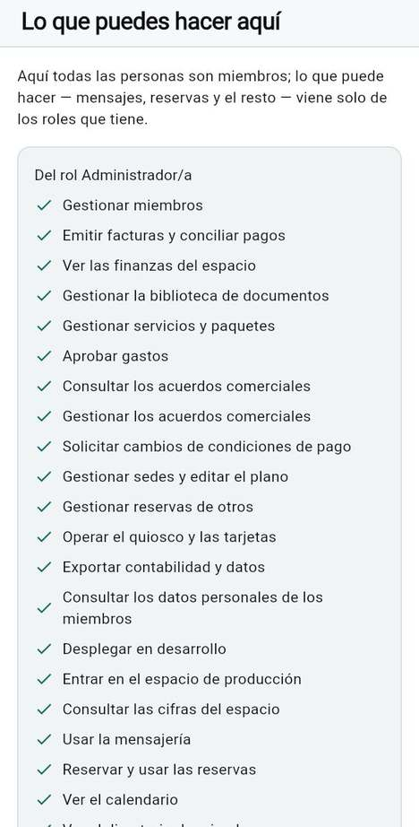

Dentro de un espacio, lo que puede hacer depende de su rol. Los roles se suman: todos son miembros y los demás roles se añaden encima.

| Rol | Para qué sirve |
|---|---|
| Miembro | Reservar puestos, entrar y salir, escribir mensajes y seguir su propio dinero. |
| Administrador/a | Todo lo que hace un miembro, además de actuar por otros miembros y aprobar solicitudes, en la medida en que el propietario lo haya permitido. |
| Propietario | Todo: el plano, los precios, los roles y los ajustes del espacio. Un espacio conserva siempre al menos un propietario. |
| Copropietario | Un copropietario activo tiene ya los permisos del propietario. Un sucesor, el tipo pasivo, toma el relevo cuando el propietario se va o le promueve. |
| Dispositivo quiosco | Una tableta en la pared que muestra el plano. Los miembros actúan en ella con su credencial. |

**Pasos**

1. Abra [Ajustes](https://fdittgen-png.github.io/deskilo/#/settings), que se llama **Mi cuenta** cuando usted no administra nada.
2. Elija **Lo que puede hacer aquí**.
3. Lea qué rol le da cada capacidad. Un miembro ve **Como todos los miembros**; un administrador ve además **Del rol Administrador/a**.

**Conviene saber**

- El propietario decide en la matriz de roles lo que pueden hacer los administradores y los demás roles, así que dos espacios pueden ser distintos.
- Un espacio puede tener otros roles además de estos, por ejemplo uno para la facturación. Aparecen en la misma lista.
- No existe ninguna invitación que convierta a alguien en propietario: solo un propietario existente concede la propiedad.

**Véase también:** [La matriz de roles](#la-matriz-de-roles) · [Unirse a un espacio](#unirse-a-un-espacio)

<!-- anchor: user.start.account -->
### Crear una cuenta o iniciar sesión

**Público:** Todos

Usted quiere entrar, ya sea la primera vez o la centésima. Una sola cuenta sirve en todos los espacios a los que se una.

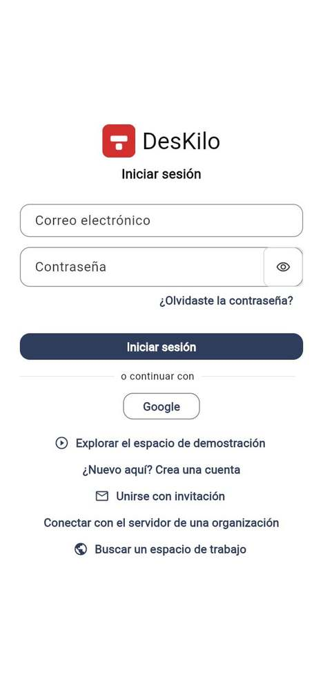

**Pasos**

1. Abra la app. La pantalla de inicio de sesión le pide su **Correo electrónico** y su **Contraseña**.
2. Para iniciar sesión, toque **Iniciar sesión**.
3. Para crear una cuenta nueva, toque **¿Es nuevo aquí? Cree una cuenta**, añada un **Nombre visible** y toque **Crear cuenta**. La contraseña debe tener al menos 8 caracteres.
4. Si el servidor lo ofrece, toque **Google**, debajo de **o continuar con**.
5. Algunos servidores le piden confirmar antes su dirección. La pantalla **Revise su correo** indica que se ha enviado un enlace: ábralo en este dispositivo. Si no llega nada, mire en la carpeta de correo no deseado o toque **Volver a enviar el correo**.

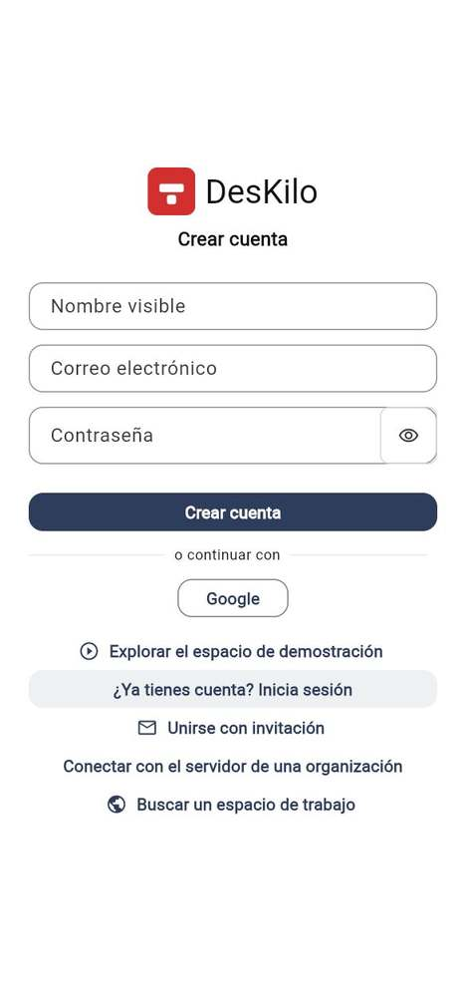

**Conviene saber**

- El botón del ojo junto a la contraseña muestra u oculta lo que escribe.
- La primera vez que inicie sesión, se le pedirá que lea y acepte las condiciones de privacidad antes de que se abra nada más.
- Una cuenta nueva sin espacio llega a [Yo](https://fdittgen-png.github.io/deskilo/#/me), donde puede buscar, unirse a un espacio o crear uno.
- **Unirse con invitación** en la pantalla de inicio de sesión recuerda el motivo de su visita: usted crea su cuenta y después pega su invitación.

**Véase también:** [Restablecer una contraseña olvidada](#restablecer-una-contraseña-olvidada) · [Unirse a un espacio](#unirse-a-un-espacio) · [Tus datos, tus derechos](#tus-datos-tus-derechos)

<!-- anchor: user.start.forgot-password -->
### Restablecer una contraseña olvidada

**Público:** Todos

Usted no recuerda su contraseña. Recibe por correo un código de un solo uso y lo utiliza para establecer una nueva. No hay ningún enlace que pulsar, de modo que funciona incluso donde los enlaces no abren la app.

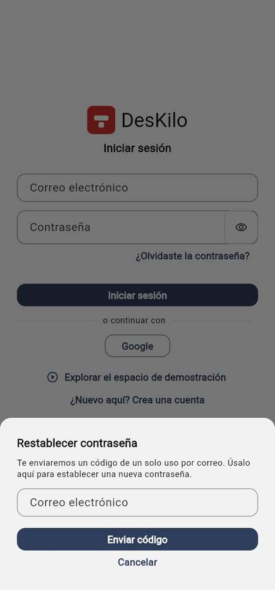

**Pasos**

1. En la pantalla de inicio de sesión, toque **¿Ha olvidado la contraseña?**.
2. Escriba su **Correo electrónico** y toque **Enviar código**.
3. Abra el correo y copie el código.
4. Escríbalo en **Código del correo**, elija una **Nueva contraseña** y toque **Establecer nueva contraseña**.

**Conviene saber**

- El mensaje **Contraseña actualizada — ha iniciado sesión.** confirma que todo ha ido bien; no tiene que volver a iniciar sesión.
- Un código no válido o caducado se rechaza: pida uno nuevo.
- Si el código se acepta pero la contraseña no se guarda, toque **Volver a guardar la nueva contraseña**.

**Véase también:** [Crear una cuenta o iniciar sesión](#crear-una-cuenta-o-iniciar-sesión)

<!-- anchor: user.start.demo -->
### Explorar el espacio de demostración

**Público:** Todos

Usted quiere echar un vistazo antes de comprometerse a nada. La demo es un espacio inventado, Atelier du Marché: las personas, las reservas y las facturas son ficticias, nada de lo que haga llega a un espacio real y no hace falta ninguna cuenta.

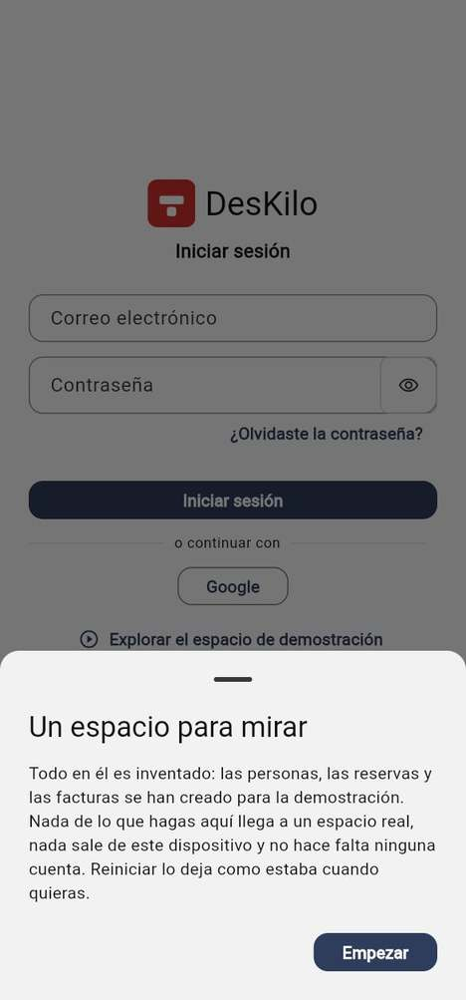

**Pasos**

1. En la pantalla de inicio de sesión, toque **Explorar el espacio de demostración**.
2. Lea la nota y toque **Empezar**.
3. Use la franja superior para elegir desde qué papel mira: **Propietario**, **Miembro** o **Administrador/a**. Cada toque sobre el nombre pasa al siguiente.
4. Toque **Reiniciar la demo** para dejarlo todo como estaba al principio.
5. Toque **Salir de la demo** cuando termine.

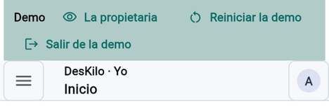

**Conviene saber**

- La franja lleva la marca **Demo** y permanece encima de todas las pantallas, de modo que no se puede confundir con un espacio real.
- Ver la misma pantalla como propietario, como administrador y como miembro es la forma más rápida de aprender lo que puede hacer cada rol.
- La demo se queda en este dispositivo. Salir de ella no crea ninguna cuenta.

**Véase también:** [Qué es DesKilo y quién hace qué](#qué-es-deskilo-y-quién-hace-qué) · [Crear una cuenta o iniciar sesión](#crear-una-cuenta-o-iniciar-sesión)

<!-- anchor: user.start.join -->
### Unirse a un espacio

**Público:** Todos

Le han dado un identificador de espacio, un código QR o un mensaje de invitación, y quiere entrar. Usted solicita unirse como miembro y un administrador le da acceso.

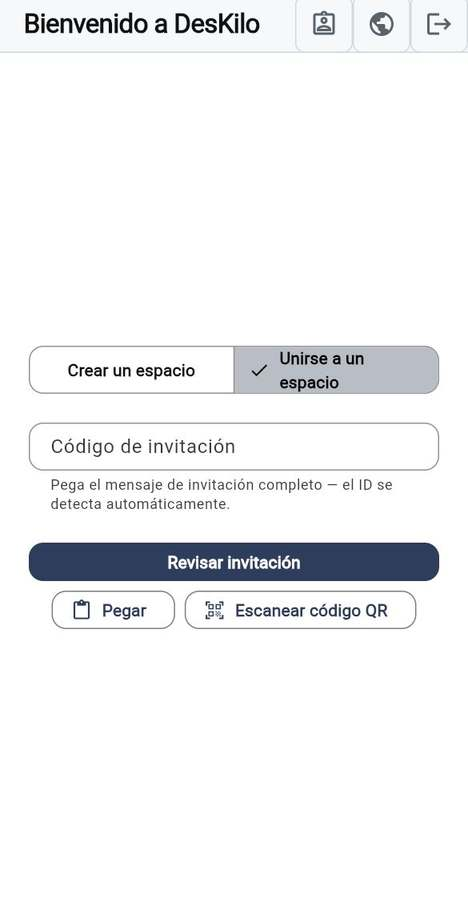

**Pasos**

1. Inicie sesión y toque **Unirse con un código** en [Yo](https://fdittgen-png.github.io/deskilo/#/me). Desde la pantalla de inicio de sesión, **Unirse con invitación** le lleva allí en cuanto tenga una cuenta.
2. En **Bienvenido a DesKilo**, deje seleccionado **Unirse a un espacio**.
3. Escriba el identificador del espacio en **Código de invitación**, o pegue el mensaje de invitación completo: el identificador se encuentra solo. **Pegar** lo lee del portapapeles y **Escanear código QR** abre la cámara ante un código impreso.
4. Toque **Revisar invitación**. La tarjeta **Revise antes de unirse** indica el espacio, su servidor, el rol que se ofrece y si un administrador debe aprobar.
5. Toque **Unirse al espacio**.

**Conviene saber**

- Hasta que un administrador lo apruebe, verá **Membresía del espacio pendiente de aprobación**. **Comprobar de nuevo** lo actualiza, y sus demás espacios y su cuenta siguen disponibles.
- Usted se une exactamente con el rol que lleva la invitación. El identificador del espacio siempre une como miembro; un código personal de administrador une una sola vez, como administrador.
- Un código caducado o sustituido se explica en pantalla: pida uno vigente a quien se lo envió.
- En un navegador la cámara no puede escanear: escriba el identificador o pegue el mensaje.
- Si la tarjeta indica otro servidor, **Usar este servidor** cambia este dispositivo a ese servidor.

**Véase también:** [El ID del espacio](#el-id-del-espacio) · [Yo: su inicio y sus espacios](#yo-su-inicio-y-sus-espacios)

<!-- anchor: user.start.create -->
### Crear un espacio

**Público:** Todos

Usted dirige una comunidad y quiere un espacio propio. Se convierte en su propietario de inmediato.

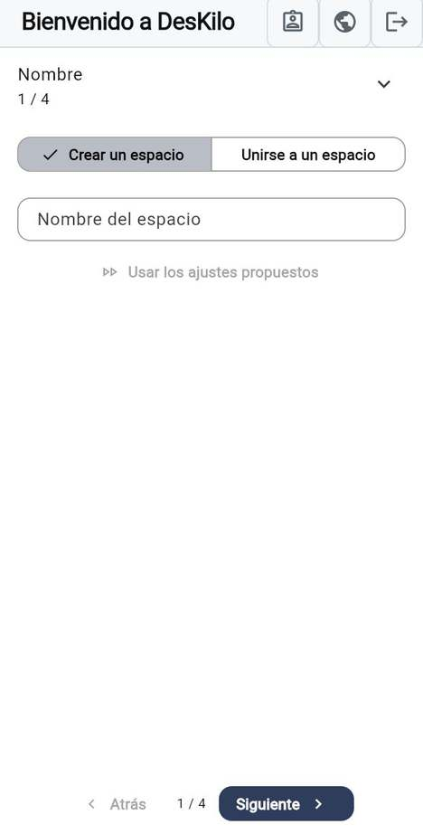

**Pasos**

1. Abra [Crear un espacio](https://fdittgen-png.github.io/deskilo/#/onboarding) desde **Crear un espacio** en [Yo](https://fdittgen-png.github.io/deskilo/#/me).
2. Escriba un **Nombre del espacio** y toque **Siguiente**. **Usar los ajustes propuestos** salta directamente al último paso.
3. En **Dónde**, elija el **País**; la **Moneda** y la **Zona horaria** lo siguen, y usted puede cambiarlas.
4. En la misma pantalla, en **Qué crear**, elija **Un espacio de prueba**, **Un espacio real** o **Un par vinculado de prueba y real**.
5. En **Partir de**, elija **Espacio vacío** para dibujar su propio plano, o una plantilla ya preparada.
6. En **Confirmar**, lea lo que se va a crear y toque **Crear espacio**.

**Conviene saber**

- El selector empieza en **Un espacio de prueba**, que es seguro para probar: todas las pantallas y documentos lo indican y no hay facturación real. Uno real emite facturas que se deben.
- El par le da dos espacios con el mismo nombre, uno para probar y otro real. Usted es propietario de ambos.
- Si la respuesta se pierde por el camino, la app conserva sus datos y ofrece **Reintentar tal cual**, de modo que nunca crea el espacio dos veces.
- El nuevo espacio se abre en cuanto existe. Su configuración se explica en los capítulos para propietarios.

**Véase también:** [Preparar un espacio con el cuestionario de configuración](#preparar-un-espacio-con-el-cuestionario-de-configuración) · [El ID del espacio](#el-id-del-espacio)

<!-- anchor: user.start.find -->
### Buscar un espacio

**Público:** Todos

Usted no tiene ningún código pero quisiera encontrar un espacio cercano. Los espacios que publican una página aparecen en un directorio público.

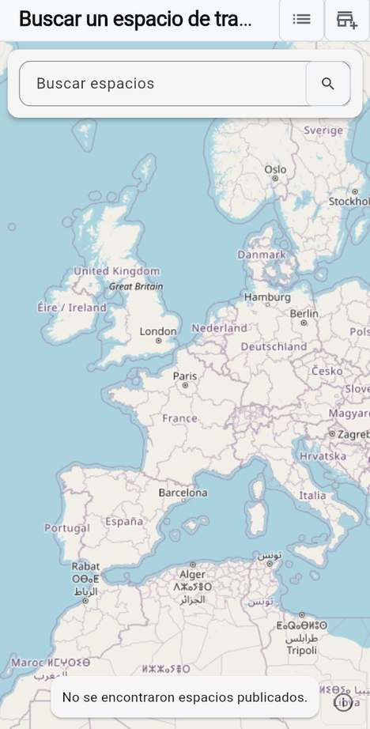

**Pasos**

1. Toque **Buscar un espacio de trabajo** en la pantalla de inicio de sesión, o abra **Descubrir** en [Yo](https://fdittgen-png.github.io/deskilo/#/me).
2. Escriba un nombre o un lugar en **Buscar espacios**.
3. Alterne entre el **Mapa** y la **Lista** con el botón de la parte superior.
4. Abra un resultado para leer su página pública. Allí, **Solicitar un perfil en este espacio** pide unirse, y **Entrar** abre un espacio al que ya pertenece.

**Conviene saber**

- Solo se muestran los espacios que han decidido ser visibles. Esta demo no tiene ninguno, así que el mapa aparece vacío.
- Puede mirar sin una cuenta; para unirse hace falta una.

**Véase también:** [Unirse a un espacio](#unirse-a-un-espacio)

<!-- anchor: user.me.home -->
### Yo: su inicio y sus espacios

**Público:** Todos

Usted quiere un único lugar que muestre quién es y todos los espacios a los que pertenece. **Yo** es solo suyo y nunca adopta los colores de un espacio. Bajo su nombre, **Mis espacios** muestra cada espacio como una tarjeta.

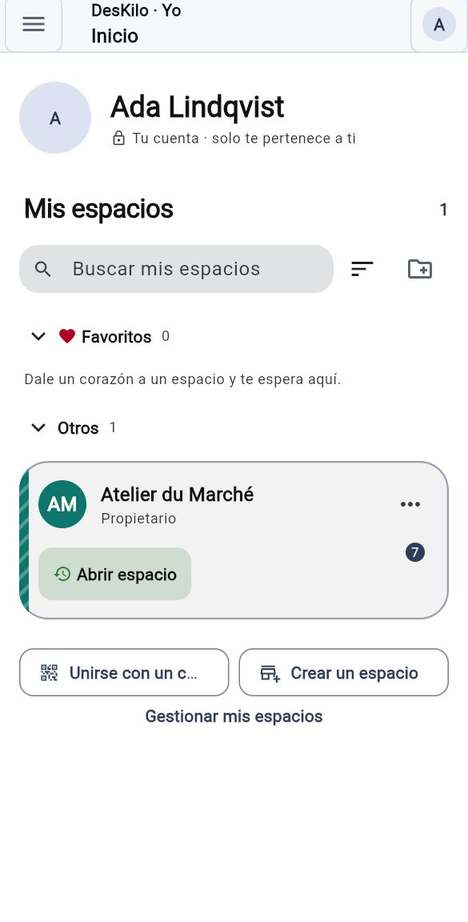

**Pasos**

1. Abra [Yo](https://fdittgen-png.github.io/deskilo/#/me). Si debe dinero en algún sitio, una tarjeta en la parte superior dice **Por pagar** y abre sus finanzas.
2. Busque su espacio en **Mis espacios**. Un espacio real tiene un botón **Abrir espacio**; un espacio con gemelo de prueba tiene además **Espacio de prueba**.
3. Toque el botón para entrar. La pantalla se llena con el color, el motivo y el logotipo del espacio, y después el espacio se abre.
4. Toque **Unirse con un código** o **Crear un espacio**, debajo de la lista, para añadir otro.

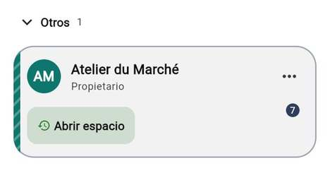

**Conviene saber**

- El pequeño reloj de un botón marca el lado que usó por última vez.
- El pequeño número de un botón cuenta lo que le espera allí, sumando el espacio real y su gemelo de prueba. Mantenga pulsado el botón para leer la frase completa.
- El motivo del borde izquierdo de la tarjeta es la identidad propia del espacio. Si las animaciones están desactivadas, el espacio simplemente se abre.
- Un espacio que sigue **Pendiente de aprobación** muestra eso en lugar de su rol.
- Un espacio que vive en otro servidor muestra **Abrir en** ese servidor; al abrirlo se cambia de servidor y se le pide iniciar sesión allí.

**Véase también:** [Mantener sus espacios en orden](#mantener-sus-espacios-en-orden) · [Perfiles: una cuenta, varios espacios](#perfiles-una-cuenta-varios-espacios)

<!-- anchor: user.me.organise -->
### Mantener sus espacios en orden

**Público:** Todos

Usted pertenece a varios espacios y quiere su propio orden. Los corazones, los grupos, las estrellas y el orden son suyos y se quedan en este dispositivo.

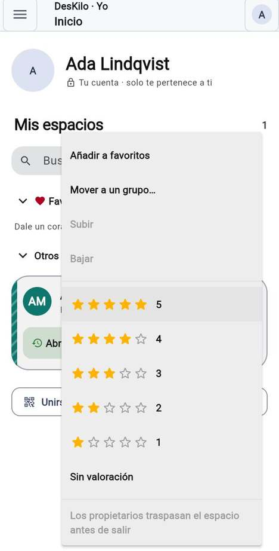

**Pasos**

1. En [Yo](https://fdittgen-png.github.io/deskilo/#/me), toque los tres puntos de la tarjeta de un espacio.
2. Elija **Añadir a favoritos**: el espacio pasa a **Favoritos** y muestra un corazón.
3. Elija **Mover a un grupo…** para archivarlo en otro grupo, o toque el botón de la carpeta sobre la lista para **Nuevo grupo**.
4. Toque una de las cinco estrellas para valorar el espacio, o **Sin valoración** para borrarla.
5. Escriba en **Buscar mis espacios** para filtrar y use el botón de orden para elegir **Mi orden**, **Usados recientemente**, **Mejor valorados** o **A–Z**.

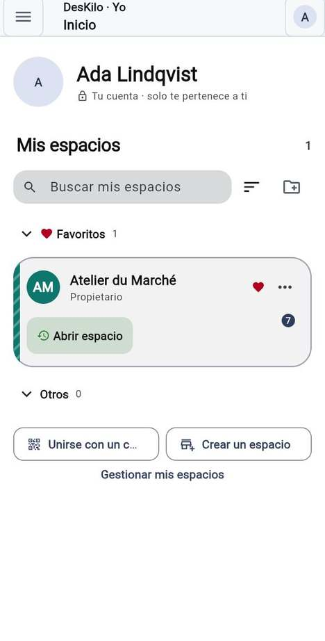

**Conviene saber**

- En **Mi orden**, mantenga pulsada una tarjeta durante un segundo para arrastrarla, o use **Subir** y **Bajar**.
- Toque el nombre de un grupo para plegarlo. Los grupos que haya creado pueden renombrarse o eliminarse desde su menú; **Favoritos** y **Otros** siempre están ahí.
- **Salir de este espacio** está en el mismo menú. Usted deja de ser miembro; las reservas, las facturas y los mensajes se quedan en el espacio. Los propietarios transmiten antes el espacio.
- **Gestionar mis espacios**, al final, abre la lista de perfiles.

**Véase también:** [Perfiles: una cuenta, varios espacios](#perfiles-una-cuenta-varios-espacios) · [Borrar mis datos](#borrar-mis-datos)

<!-- anchor: user.profile.profiles -->
### Perfiles: una cuenta, varios espacios

**Público:** Todos

Una cuenta puede pertenecer a muchos espacios. Cada espacio le da allí un perfil: su rol y sus propios datos. La lista de perfiles los muestra todos y decide con cuál se abre la app.

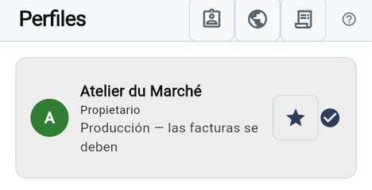

**Pasos**

1. Abra [Perfiles](https://fdittgen-png.github.io/deskilo/#/profiles), o toque **Gestionar mis espacios** en [Yo](https://fdittgen-png.github.io/deskilo/#/me).
2. Lea cada fila: el nombre del espacio, su rol allí y el entorno en el que está.
3. Toque una fila para cambiar a ese perfil. La marca de verificación indica el **Perfil activo**. La próxima vez la app se abrirá con él, en todos sus dispositivos.
4. Para fijar un perfil como predeterminado sin cambiar a él, toque la estrella (**Usar como predeterminado al iniciar**); un segundo toque lo quita.
5. Toque **Añadir un perfil** para unirse a un espacio más o crear uno.

**Conviene saber**

- Un espacio con gemelo de prueba muestra una sola fila que se despliega en dos opciones, **Desarrollo — para probar** y **Producción — las facturas se deben**. Toque la que quiera; la marca de verificación la sigue.
- Todo lo que ve en la app pertenece al espacio activo.
- Su cuenta, su foto y su idioma no forman parte de un perfil: están en Yo y son los mismos en todas partes.

**Véase también:** [Yo: su inicio y sus espacios](#yo-su-inicio-y-sus-espacios) · [Unirse a un espacio](#unirse-a-un-espacio)

<!-- anchor: user.start.navigation -->
### Orientarse en la app

**Público:** Todos

Usted está en un espacio y quiere llegar a una pantalla. Todo está en un único menú, y unos pocos botones se encuentran arriba.

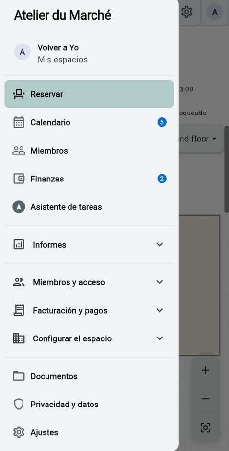

**Pasos**

1. Toque el botón ☰ de la parte superior izquierda. El menú se abre con el nombre de su espacio, **Volver a Yo** y los destinos diarios: **Reservar**, **Calendario**, **Miembros**, **Dinero**.
2. Toque un destino para abrirlo. Un número azul a su lado cuenta lo que le espera allí.
3. Abra **Informes**, **Miembros y acceso**, **Facturación y pagos** o **Configurar el espacio** para ver las herramientas de administración que su rol permite.
4. Abajo, **Documentos**, **Privacidad y datos** y **Ajustes** siempre están a mano.
5. Toque el avatar de la parte superior derecha, o **Volver a Yo**, para salir del espacio y volver a [Yo](https://fdittgen-png.github.io/deskilo/#/me).

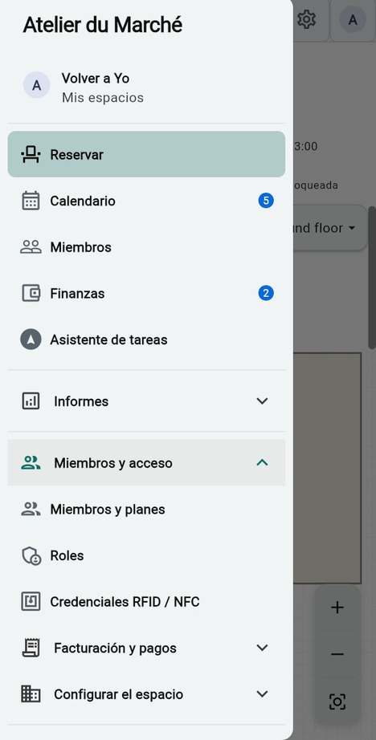

**Conviene saber**

- Los destinos aparecen y desaparecen según las funciones que el propietario haya activado y según su rol. Un miembro sin más no ve ninguno de los grupos de administración.
- Si su espacio tiene activados los Eventos, **Eventos**, arriba a la derecha (el icono de bandeja con un contador), reúne lo ocurrido y lo que espera su decisión; cuando el Calendario contiene las alertas, use su vista **Alertas**. **Escanear un código de espacio** y **Editar espacio** aparecen en la pantalla Reservar cuando puede usarlos.
- En una ventana ancha, el menú permanece abierto como barra lateral. Una ventana estrecha o un texto ampliado usan el menú ☰.
- En las apps para teléfonos y ordenadores, [Estilo de navegación](#estilo-de-navegación) en Ajustes le permite elegir la barra inferior clásica con el botón redondo **Reservar**. Deslice esa barra hacia abajo para una vista de pantalla completa; deslice hacia arriba, o mantenga pulsado el botón **Reservar**, para recuperarla. Un navegador usa siempre el menú.

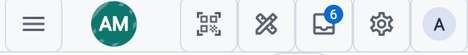

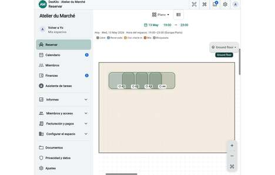

**Véase también:** [Estilo de navegación](#estilo-de-navegación) · [Yo: su inicio y sus espacios](#yo-su-inicio-y-sus-espacios)

<!-- anchor: user.start.get-started -->
### La tarjeta Primeros pasos y los consejos

**Público:** Todos

Usted abre un espacio y no sabe por dónde empezar. La tarjeta **Primeros pasos** le indica un siguiente paso, y unos consejos breves explican cada pantalla.

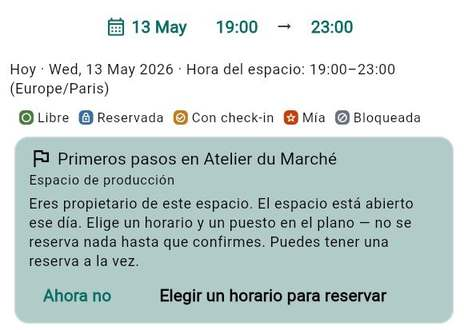

**Pasos**

1. Abra [Reservar](https://fdittgen-png.github.io/deskilo/#/reserve). La tarjeta **Primeros pasos en** su espacio aparece en la parte superior del plano.
2. Siga la acción que le propone, por ejemplo **Elegir un horario para reservar**.
3. Toque **Ahora no** para guardarla.
4. Para recuperarla, abra el menú de vista de la parte superior del plano, el que dice **Plano**, y elija **Primeros pasos**.

**Conviene saber**

- Para un propietario o un administrador, la tarjeta indica lo que falta antes de que nadie pueda reservar, con **Terminar la configuración**.
- Los consejos son pequeñas tarjetas en cada pantalla. **Ocultar consejo** oculta uno y **Consejo siguiente** muestra otro.
- Puede volver a mostrar todos los consejos ocultados con [Restaurar los consejos](#restaurar-los-consejos).

**Véase también:** [Restaurar los consejos](#restaurar-los-consejos) · [Orientarse en la app](#orientarse-en-la-app)

<!-- anchor: user.start.questionnaire -->
### Preparar un espacio con el cuestionario de configuración

**Público:** Propietario

Usted está a punto de abrir un espacio y tiene que tomar muchas decisiones: cómo es una reserva, cuánto cuesta un mes, qué debe decir una factura. El cuestionario de configuración le permite tomarlas todas de una vez, antes de empezar, en una pantalla grande y, si lo desea, con su contable o su junta.

**Pasos**

1. Abra el cuestionario en un navegador: [setup.html](https://fdittgen-png.github.io/deskilo/setup.html). No hay nada que instalar y no hace falta cuenta.
2. Responda a los pasos en orden: *Identidad*, *Funciones*, *Disponibilidad*, *Plano*, *Suscripciones*, *Identidad legal e IVA*, *Servicios y accesorios*, *Instrucciones de pago*, *Roles y validaciones*, *Miembros e invitaciones*. Cada paso solo pregunta lo que sus respuestas anteriores hacen posible.
3. Lea el *Resumen de funciones* y desmarque lo que no quiera: esa función empieza desactivada en la app y no se exporta nada de ella.
4. En *Revisar y exportar*, corrija los elementos bloqueantes y toque **Exportar XML**.
5. En la app, abra los ajustes del espacio y elija **Importar el espacio (XML)** para crear los ajustes, los accesorios y el plano.
6. Conserve el archivo. *Cargar archivo…* recupera sus respuestas más adelante, y **Restablecer** empieza de nuevo.

**Conviene saber**

- Sus respuestas se guardan en su propio navegador y no se envían a ninguna parte. Puede cerrar la pestaña y volver.
- El archivo es texto sin formato: deje vacíos los tokens y las claves y escríbalos después en la app.
- Cada pregunta indica dónde se encuentra el ajuste en la app, de modo que puede terminar el resto pantalla por pantalla.
- Saltárselo no cuesta nada: cada respuesta es un ajuste que puede hacer o cambiar más adelante en la app.

**Véase también:** [Crear un espacio](#crear-un-espacio) · [Importar el espacio (XML)](#importar-el-espacio-xml)

<!-- anchor: user.reserve.overview -->
## Reservar

Reservar una plaza es el corazón de DesKilo: usted mira el plano de su espacio, elige un día y una hora, toca una plaza libre y confirma. Este capítulo sigue ese camino y después explica lo que ocurre a su alrededor: las reglas con las que se encuentra, entrar y salir, cambiar una reserva y el Calendario, donde se guarda todo lo que tiene fecha.

En este capítulo:
- [El centro Reservar y el plano](#el-centro-reservar-y-el-plano)
- [Orientarse en el plano](#orientarse-en-el-plano)
- [Ver las plazas como lista](#ver-las-plazas-como-lista)
- [Elegir el día y la hora](#elegir-el-día-y-la-hora)
- [Vista Día](#vista-día)
- [Vista Semana](#vista-semana)
- [Vista Mes](#vista-mes)
- [Reservar una plaza](#reservar-una-plaza)
- [La hoja de reserva](#la-hoja-de-reserva)
- [Registrarse ahora cuando ya está allí](#registrarse-ahora-cuando-ya-está-allí)
- [Reservar una mesa, una sala o una planta entera](#reservar-una-mesa-una-sala-o-una-planta-entera)
- [Reservar para otra persona](#reservar-para-otra-persona)
- [Repetir una reserva](#repetir-una-reserva)
- [Las reglas con las que se encuentra al reservar](#las-reglas-con-las-que-se-encuentra-al-reservar)
- [Días de cierre y festivos](#días-de-cierre-y-festivos)
- [Registrar la llegada y la salida](#registrar-la-llegada-y-la-salida)
- [Escanear un código de espacio](#escanear-un-código-de-espacio)
- [Cambiar o cancelar una reserva](#cambiar-o-cancelar-una-reserva)
- [Cuando una reserva está pendiente de confirmación](#cuando-una-reserva-está-pendiente-de-confirmación)
- [La pestaña Calendario](#la-pestaña-calendario)
- [Agenda, Semana y Mes en el Calendario](#agenda-semana-y-mes-en-el-calendario)
- [Decisiones que le esperan en el Calendario](#decisiones-que-le-esperan-en-el-calendario)
- [Filtrar el Calendario](#filtrar-el-calendario)
- [Guardar una reserva en su propio calendario](#guardar-una-reserva-en-su-propio-calendario)

<!-- anchor: user.reserve.hub -->
### El centro Reservar y el plano

**Público:** Miembro · Administrador/a · Propietario

Usted quiere ver qué plazas están libres. El centro Reservar se abre en el plano de una planta de su espacio, dibujado para el día y la hora que está mirando.

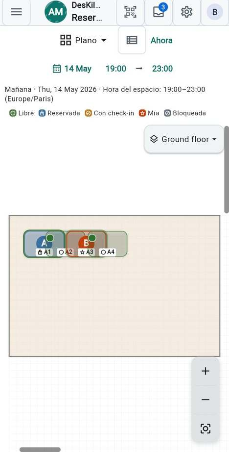

**Pasos**

1. Abra [Reservar](https://fdittgen-png.github.io/deskilo/#/reserve).
2. Lea el plano: cada plaza lleva su nombre, un pequeño símbolo y un color que indica de qué se trata.
3. Toque una plaza para actuar sobre ella. Una plaza libre abre la hoja de reserva; su propia plaza ofrece registrar la llegada y cancelar; la plaza de otra persona le dice quién la tiene y hasta cuándo.
4. La leyenda bajo la fecha explica los colores. Es la misma en el plano y en las vistas Día, Semana y Mes.

| Estado | Qué significa |
|---|---|
| **Libre** | Nadie tiene la plaza en la franja que ha elegido. |
| **Reservada** | Alguien la ha reservado. |
| **Con check-in** | La persona que la reservó ya ha llegado. |
| **Mía** | Es su reserva. |
| **Bloqueada** | La plaza está fuera de servicio, por ejemplo por mantenimiento. |
| **Día cerrado** | El espacio está cerrado ese día (vistas Día, Semana y Mes). |

**Conviene saber**

- Una plaza ocupada muestra quién está allí: una inicial, o una foto cuando la persona ha puesto una y su espacio muestra fotos en el plano. Un pequeño punto verde significa que está usando la app en este momento.
- Una mesa, una sala o una planta entera reservada lo indica en el plano, con el nombre de quien la tiene.
- Algunos espacios muestran menos estados: una plaza reservada y una con llegada registrada se ven igual, y bloqueada aparece como **No disponible**.
- Cuando no se ha podido cargar la última disponibilidad, un aviso dice **Sin conexión** con la hora de los últimos datos y un botón **Reintentar**, porque una plaza que aparece libre puede haberse ocupado desde entonces.

**Véase también:** [Elegir el día y la hora](#elegir-el-día-y-la-hora) · [La hoja de reserva](#la-hoja-de-reserva)

<!-- anchor: user.reserve.plan-levels -->
### Orientarse en el plano

**Público:** Miembro · Administrador/a · Propietario

Usted quiere llegar a la planta, la sala o la mesa que tiene en mente. El plano se puede mover, ampliar y cambiar de una planta a otra.

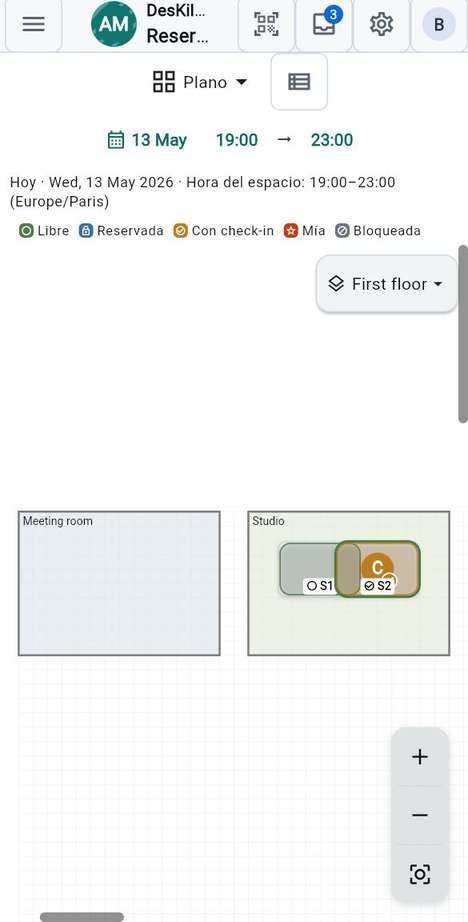

**Pasos**

1. Toque el nombre de la planta, arriba a la derecha del plano, por ejemplo **Primera planta**, y elija otra planta. Su elección se conserva para la próxima vez que abra el centro.
2. Amplíe con dos dedos, o con **Acercar** y **Alejar**. Arrastre las barras de desplazamiento de los bordes para moverse.
3. Toque **Ajustar el plano a la pantalla** para volver a ver la planta entera.
4. Lea los nombres de las salas en la esquina de cada una. Toque una plaza dentro de ella para reservarla.

**Conviene saber**

- El selector de planta solo ofrece un menú cuando su espacio tiene más de una planta.
- Una planta, una sala o una mesa que se puede reservar entera muestra su propio botón o un doble toque: véase [Reservar una mesa, una sala o una planta entera](#reservar-una-mesa-una-sala-o-una-planta-entera).

**Véase también:** [Ver las plazas como lista](#ver-las-plazas-como-lista) · [Vista Día](#vista-día)

<!-- anchor: user.reserve.list -->
### Ver las plazas como lista

**Público:** Miembro · Administrador/a · Propietario

Usted prefiere filas a un dibujo, o el plano se lee mal en una pantalla pequeña. La lista muestra las mismas plazas, planta por planta y mesa por mesa.

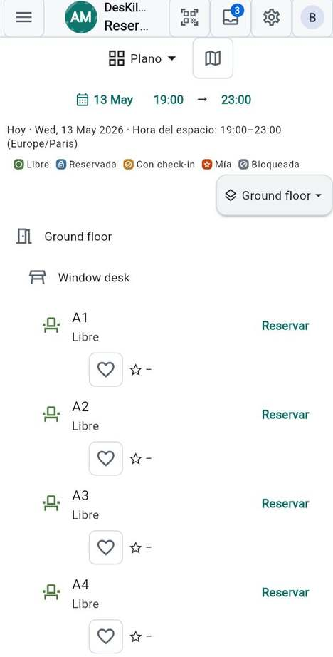

**Pasos**

1. En [Reservar](https://fdittgen-png.github.io/deskilo/#/reserve), toque **Vista de lista**, el botón junto al menú de vista.
2. Busque la plaza. Cada fila la nombra e indica si está libre, reservada o es suya.
3. Toque **Reservar** en una fila libre para abrir la hoja de reserva.
4. Para volver al dibujo, toque **Vista de plano**.

**Conviene saber**

- La lista sigue el día y la hora que ha elegido, igual que el plano.
- Con los favoritos y las valoraciones activados, cada fila lleva además un corazón (**Añadir a favoritos**) y estrellas.

**Véase también:** [Elegir el día y la hora](#elegir-el-día-y-la-hora) · [La hoja de reserva](#la-hoja-de-reserva)

<!-- anchor: user.reserve.when -->
### Elegir el día y la hora

**Público:** Miembro · Administrador/a · Propietario

Usted quiere reservar para otro día, o para una hora que no es ahora. Las dos filas de controles de la parte superior del centro indican qué mira y cuándo.

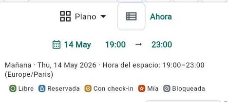

**Pasos**

1. Toque la fecha, por ejemplo 14 de mayo, y elija un día en el calendario. Puede mirar hasta un año por adelantado.
2. Elija la hora. Si su espacio reserva por medias jornadas, toque **Mañana**, **Tarde** o **Día completo**. Si reserva por horas o en un intervalo libre, toque la primera hora para fijar **Desde** y la segunda para fijar **Hasta**.
3. Lea la línea bajo los controles: indica el día, el periodo y las horas en la zona horaria del espacio, y en la suya cuando es distinta.
4. Para volver a hoy, toque **Ahora**.

**Conviene saber**

- Los controles que ve dependen de las reglas del espacio: algunos reservan por medias jornadas, otros solo por días enteros y otros a cualquier hora sobre una cuadrícula.
- En un teléfono, los chips de parte del día son pequeños iconos de media jornada o de jornada completa. Mantenga pulsado uno para leer su nombre y sus horas.
- El plano responde a la hora que ha elegido: una plaza que aparece libre lo está durante todo ese tiempo.
- Donde las reservas son por media jornada, el periodo con el que empieza es el habitual, que se fija en [Período de reserva predeterminado](#período-de-reserva-predeterminado).

**Véase también:** [El centro Reservar y el plano](#el-centro-reservar-y-el-plano) · [Reservar una plaza](#reservar-una-plaza)

<!-- anchor: user.reserve.day-view -->
### Vista Día

**Público:** Miembro · Administrador/a · Propietario

Usted quiere ver quién está dónde durante el día, y no solo en un momento. La vista **Día** dispone cada plaza como una fila a lo largo de las horas.

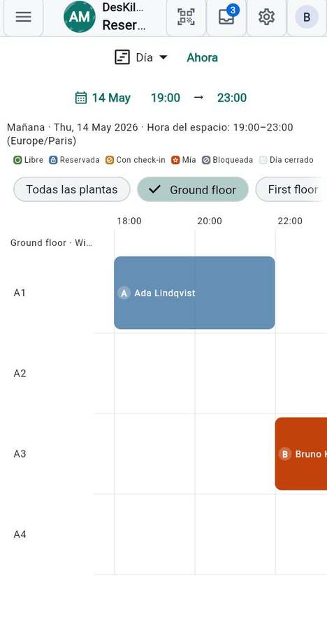

**Pasos**

1. En [Reservar](https://fdittgen-png.github.io/deskilo/#/reserve), abra el menú de vista, que al principio dice **Plano**, y elija **Día**.
2. Elija el día con el botón de fecha. Elija una planta con los chips sobre las filas: **Todas las plantas** o una sola.
3. Lea las barras. Cada una es una reserva, con el nombre de quien la tiene; las suyas destacan con el color de **Mía**.
4. Toque un tramo libre de una fila para reservar esa plaza en la hora elegida. Toque su propia reserva para abrir sus detalles; toque la de otra persona para ver quién la tiene y hasta cuándo.

**Conviene saber**

- Un día cerrado se dibuja como cerrado y no se puede reservar.
- El menú del control **Vista** incluye también **Semana** y **Mes**.

**Véase también:** [Vista Semana](#vista-semana) · [Cambiar o cancelar una reserva](#cambiar-o-cancelar-una-reserva)

<!-- anchor: user.reserve.week-view -->
### Vista Semana

**Público:** Miembro · Administrador/a · Propietario

Usted quiere encontrar una mañana o una tarde libre en los próximos días. La vista **Semana** muestra las plazas en vertical y los días de la semana en horizontal.

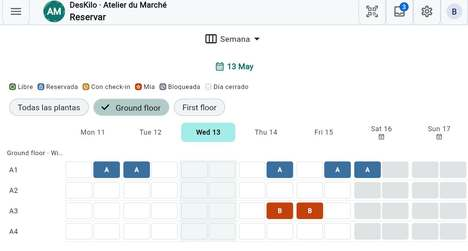

**Pasos**

1. Abra el menú de vista y elija **Semana**.
2. Busque su día. Cada día tiene dos celdas contiguas, la mañana y la tarde. Una celda llena muestra la inicial de quien la tiene.
3. Toque una celda vacía para reservar esa mitad del día en esa plaza.
4. Toque el nombre de un día en la parte superior para saltar a ese día en la vista **Día**.

**Conviene saber**

- Los días cerrados aparecen en gris y llevan una marca de cierre.
- Elija **Todas las plantas** o una sola con los chips sobre la cuadrícula.

**Véase también:** [Vista Día](#vista-día) · [Vista Mes](#vista-mes)

<!-- anchor: user.reserve.month-view -->
### Vista Mes

**Público:** Miembro · Administrador/a · Propietario

Usted quiere saber qué días tienen sitio. La vista **Mes** cuenta las plazas libres de cada día.

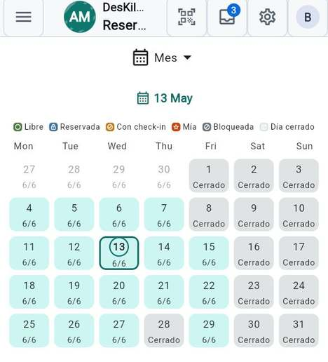

**Pasos**

1. Abra el menú de vista y elija **Mes**.
2. Lea cada día: el número de plazas libres sobre el total, por ejemplo 6/6. Los días cerrados dicen **Cerrado**.
3. Toque un día para abrirlo en la vista **Día**, donde ve quién ha reservado.

**Conviene saber**

- El recuento abarca todas las plantas del espacio.
- El día de hoy aparece rodeado con un círculo.

**Véase también:** [Días de cierre y festivos](#días-de-cierre-y-festivos) · [Vista Día](#vista-día)

<!-- anchor: user.reserve.book -->
### Reservar una plaza

**Público:** Miembro · Administrador/a · Propietario

Usted quiere una plaza para un día y una hora concretos. Desde el plano bastan unos toques: el día, la hora, la plaza y una confirmación.

**Pasos**

1. Abra [Reservar](https://fdittgen-png.github.io/deskilo/#/reserve) y elija el día y la hora, como se describe en [Elegir el día y la hora](#elegir-el-día-y-la-hora).
2. Elija la planta, si su espacio tiene varias.
3. Toque una plaza libre. La hoja de reserva se abre sobre ella.
4. Revise la línea que nombra la plaza y el periodo, cambie lo que necesite y toque **Reservar**.
5. Un mensaje confirma la reserva. Toque **Detalles** en él para abrir la nueva reserva.

**Conviene saber**

- No se reserva nada hasta que toque **Reservar**.
- Si la plaza se ocupó hace un segundo, la app se lo dice en lugar de reservarla dos veces.
- Si la conexión se corta después de tocar, la pantalla **Su solicitud de reserva** le permite comprobar lo que ha pasado, retomar la misma solicitud o dejarla. Una solicitud nunca se reserva dos veces.
- En un día cerrado, el plano dice **Cerrado este día** y ofrece el siguiente día abierto.

**Véase también:** [La hoja de reserva](#la-hoja-de-reserva) · [Las reglas con las que se encuentra al reservar](#las-reglas-con-las-que-se-encuentra-al-reservar)

<!-- anchor: user.reservations.booking-sheet -->
### La hoja de reserva

**Público:** Miembro · Administrador/a · Propietario

Usted ha tocado una plaza libre y se abre la hoja. Muestra lo que va a reservar y le permite ajustarlo antes de confirmar. La hoja solo propone: las reglas del espacio se comprueban cuando usted confirma.

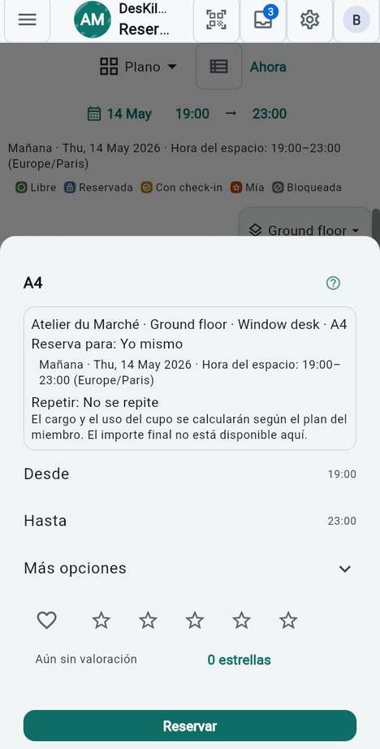

**Pasos**

1. Lea el resumen: el espacio, la planta, la mesa y la plaza, para quién es la reserva, el día, las horas y la repetición.
2. Ajuste el periodo. Con medias jornadas, toque **Mañana**, **Tarde** o **Día completo**. En una cuadrícula horaria, fije **Desde** y **Hasta**; en una cuadrícula por minutos, un control deslizante llamado **Duración** fija la duración.
3. Abra **Más opciones** para repetir la reserva.
4. Si lo desea, añada la plaza a sus favoritos con el corazón, o valórela con las estrellas.
5. Toque **Reservar**.

**Conviene saber**

- Si el periodo elegido no está permitido, una línea roja bajo el periodo explica por qué y **Reservar** permanece en gris.
- Si otra reserva sigue en la misma plaza, la hoja indica que el asiento está reservado a partir de esa hora y detiene su reserva allí.
- Los administradores ven **Reservar para** y, para bloquear una plaza, **Gestionar recurso**.
- Cuando el periodo elegido incluye este momento, aparece un interruptor **Registrarse ahora mismo**, desactivado por defecto.

**Véase también:** [Registrarse ahora cuando ya está allí](#registrarse-ahora-cuando-ya-está-allí) · [Repetir una reserva](#repetir-una-reserva) · [Reservar para otra persona](#reservar-para-otra-persona)

<!-- anchor: user.reserve.walk-up -->
### Registrarse ahora cuando ya está allí

**Público:** Miembro · Administrador/a · Propietario

Usted está de pie junto a una plaza libre y quiere ocuparla ahora mismo. En el plano de hoy, la hoja de reserva ofrece dos acciones una junto a otra.

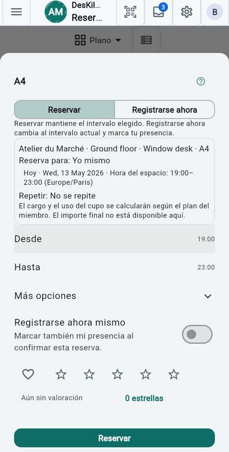

**Pasos**

1. Abra [Reservar](https://fdittgen-png.github.io/deskilo/#/reserve) en hoy, sin haber elegido otra hora, y toque una plaza libre.
2. En la parte superior de la hoja, elija **Reservar** o **Registrarse ahora**.
3. **Reservar** mantiene el periodo que ha elegido. **Registrarse ahora** cambia al periodo actual y le marca como presente.
4. Toque **Registrarse** para confirmar.

**Conviene saber**

- El registro se detiene donde empieza la siguiente reserva de esa plaza, y la hoja se lo indica.
- Un registro espontáneo debe empezar hoy.
- Donde las reservas son por media jornada, el registro termina con la media jornada en curso, o con el día cuando su periodo habitual es el día completo.

**Véase también:** [Registrar la llegada y la salida](#registrar-la-llegada-y-la-salida) · [Las reglas con las que se encuentra al reservar](#las-reglas-con-las-que-se-encuentra-al-reservar)

<!-- anchor: user.reserve.whole-space -->
### Reservar una mesa, una sala o una planta entera

**Público:** Miembro · Administrador/a · Propietario

Usted necesita la mesa entera, la sala entera o toda la planta, para una reunión o para un día. Los espacios configurados para ello pueden reservarse como un todo.

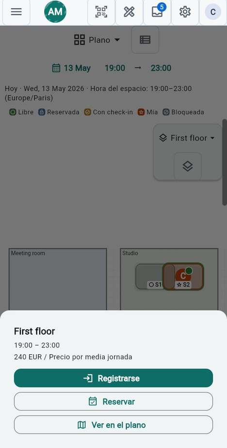

**Pasos**

1. En el plano, toque dos veces la mesa, la sala o la planta vacía. Para una planta también puede tocar **Reservar la planta**, el botón bajo el selector de planta.
2. La hoja nombra el espacio, el periodo y el **Precio por media jornada** cuando lo hay.
3. Toque **Registrarse** para ocuparlo ahora, o **Reservar** para reservarlo en el periodo indicado.
4. En la hoja de reserva que se abre, elija el periodo y toque **Reservar**.

**Conviene saber**

- Un miembro necesita el derecho a reservar espacios enteros; los propietarios y los administradores lo tienen. Sin él, la hoja dice **No tiene permiso para reservar una mesa, oficina o planta entera.**
- Un espacio entero no se puede reservar mientras una de sus plazas esté ocupada en ese periodo, y ninguna plaza se puede reservar mientras su mesa, sala o planta esté reservada como un todo.
- Cuando el propietario pide aprobación, la reserva de un espacio entero bloquea el espacio de inmediato y espera a los validadores; si la rechazan, se cancela.

**Véase también:** [Cuando una reserva está pendiente de confirmación](#cuando-una-reserva-está-pendiente-de-confirmación) · [Escanear un código de espacio](#escanear-un-código-de-espacio)

<!-- anchor: user.reserve.for-someone -->
### Reservar para otra persona

**Público:** Administrador/a · Propietario

Usted quiere reservar una plaza en nombre de un miembro. Los administradores pueden elegir al miembro en la hoja de reserva.

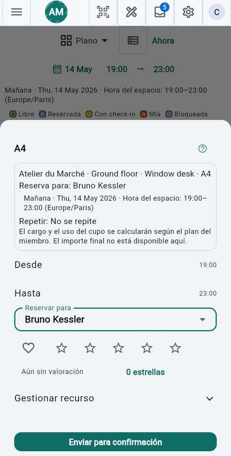

**Pasos**

1. Toque una plaza libre en [Reservar](https://fdittgen-png.github.io/deskilo/#/reserve) para abrir la hoja de reserva.
2. Abra **Reservar para** y elija al miembro.
3. El resumen dice ahora **Reserva para** ese miembro, y el botón cambia a **Enviar para confirmación**.
4. Toque **Enviar para confirmación**. Un mensaje indica **Enviado a** ese miembro **para confirmación**.

**Conviene saber**

- El miembro tiene que aceptar antes de que la reserva exista. Encuentra la solicitud en su Calendario y en sus notificaciones.
- Una reserva hecha para otra persona nunca tiene el registro de llegada hecho y no se puede repetir.
- El campo **Reservar para** solo aparece si el propietario permite que los administradores reserven para los miembros. Para una planta entera, el propietario decide quién puede asignarla.

**Véase también:** [Cuando una reserva está pendiente de confirmación](#cuando-una-reserva-está-pendiente-de-confirmación) · [Decisiones que le esperan en el Calendario](#decisiones-que-le-esperan-en-el-calendario)

<!-- anchor: user.reserve.series -->
### Repetir una reserva

**Público:** Miembro · Administrador/a · Propietario

Usted se sienta en la misma plaza todos los martes, o todos los días laborables durante un mes. Una reserva repetida crea todas las fechas de una vez.

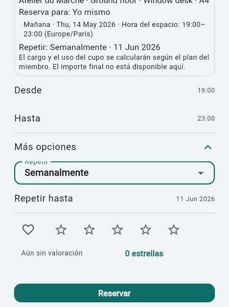

**Pasos**

1. Abra la hoja de reserva sobre una plaza libre y el primer día que quiera.
2. Abra **Más opciones**.
3. En **Repetición**, elija **Cada día**, **Cada día laborable** o **Semanalmente**. Por defecto es **No se repite**.
4. Fije **Repetir hasta**, la última fecha. La hoja propone cuatro semanas por delante.
5. Toque **Reservar**. Un cuadro de diálogo le indica cuántas reservas se han creado.

**Conviene saber**

- Las fechas que no se han podido reservar se enumeran en el cuadro de diálogo y se omiten. Las demás se mantienen.
- Para cancelar una reserva repetida, abra una de sus fechas y elija **Cancelar esta ocurrencia** o **Cancelar esta y las siguientes**.
- También puede convertir una reserva única en repetida desde **Cambiar horario** en sus detalles.
- La repetición no se ofrece cuando reserva para otra persona.

**Véase también:** [Cambiar o cancelar una reserva](#cambiar-o-cancelar-una-reserva) · [La hoja de reserva](#la-hoja-de-reserva)

<!-- anchor: user.reserve.policies -->
### Las reglas con las que se encuentra al reservar

**Público:** Miembro · Administrador/a · Propietario

Usted ha intentado reservar y la app ha dicho que no, o se pregunta qué está permitido. Su propietario fija las reglas del espacio; esto es lo que usted ve de ellas.

| Regla | Qué ve |
|---|---|
| Horario de apertura y días abiertos | El plano y las vistas siguen la jornada de trabajo, de 08:00 a 17:00 por defecto, con la división de media jornada a las 12:00. Un día cerrado dice **Cerrado este día**. |
| Fuera del horario de apertura | Depende del espacio. Desactivado: **Las reservas fuera del horario de apertura no están permitidas.** Solo espontáneas: puede registrarse en el momento pero no reservar con antelación. Libre: permitido, nunca se cuenta ni se cobra. De pago: permitido y contado como uso, salvo un día en el que ya tenga una reserva normal. |
| Reservas pasadas | Una reserva en un día que ya ha terminado se rechaza, salvo que el propietario permita reservas pasadas: **Esta reserva está completamente en el pasado.** Antes en el mismo día se registra como una visita pasada. |
| Límites | Una reserva tiene un horizonte máximo (**Demasiado lejos**, 90 días por defecto), una duración mínima y una máxima (**Demasiado corta**, **Demasiado larga**) y termina el día en que empieza. |
| Un solo sitio a la vez | Por defecto puede tener una reserva en un periodo dado: **Ya tiene una reserva en ese periodo**. Un administrador puede permitirle más. |
| Límite de reservas | **Límite de reservas alcanzado** cuando tiene el máximo de reservas abiertas que se le permite. |
| Días de su plan | Cuando se agotan los días de su plan, se aplica el ajuste del propietario para usted: las reservas pueden detenerse, se le puede pedir que compre un paquete o se cobran los días adicionales. |

**Pasos**

1. Cuando se rechaza un periodo, lea la línea roja bajo él en la hoja de reserva.
2. Cambie el día, la hora o la plaza, o consulte a un administrador.
3. Si sus días están agotados, abra [Dinero](https://fdittgen-png.github.io/deskilo/#/money) para ver su plan y, donde se ofrezca, toque **Solicitar medias jornadas extra**.

**Conviene saber**

- Las mismas reglas se aplican en el plano, en el centro Reservar, en un código escaneado y en el quiosco de pared.
- La app comprueba un periodo antes de ofrecerlo, así que la mayoría de los rechazos aparecen en la hoja y no después de tocar.

**Véase también:** [Políticas de reserva](#políticas-de-reserva) · [Reservas simultáneas](#reservas-simultáneas) · [Límite de reservas](#límite-de-reservas)

<!-- anchor: user.reserve.closed-days -->
### Días de cierre y festivos

**Público:** Miembro · Administrador/a · Propietario

Usted quiere saber por qué no se puede reservar un día. Su espacio está cerrado algunos días de la semana y en los días de cierre que el propietario ha añadido, como los festivos.

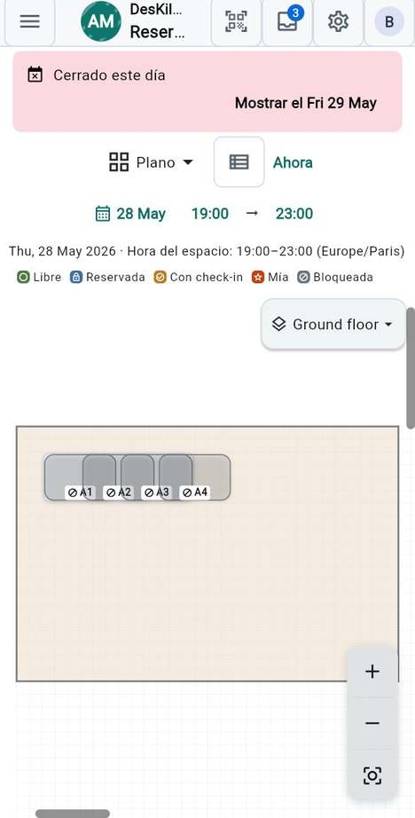

**Pasos**

1. Elija el día en [Reservar](https://fdittgen-png.github.io/deskilo/#/reserve). Un día cerrado muestra un aviso, **Cerrado este día**.
2. Toque el atajo del aviso, que dice «Mostrar» y el siguiente día abierto, para ir allí.
3. En **Mes**, los días cerrados dicen **Cerrado**; en **Semana** aparecen en gris con una marca; en **Día** se marcan como cerrados, bajo la entrada de la leyenda **Día cerrado**.
4. En el Calendario, los días cerrados aparecen tachados, y la lista del día indica **Cerrado** con el motivo cuando el propietario lo ha dado.

**Conviene saber**

- En un día cerrado, las plazas llevan el símbolo de bloqueo y no se pueden reservar ni registrar en ellas la llegada.
- Los festivos aparecen exactamente igual que cualquier otro día de cierre.

**Véase también:** [Vista Mes](#vista-mes) · [Días de cierre](#días-de-cierre) · [Días de apertura](#días-de-apertura)

<!-- anchor: user.reserve.check-in -->
### Registrar la llegada y la salida

**Público:** Miembro · Administrador/a · Propietario

Usted llega a su plaza y, más tarde, se va. Registrarse indica que está allí; salir libera lo que ya no necesita.

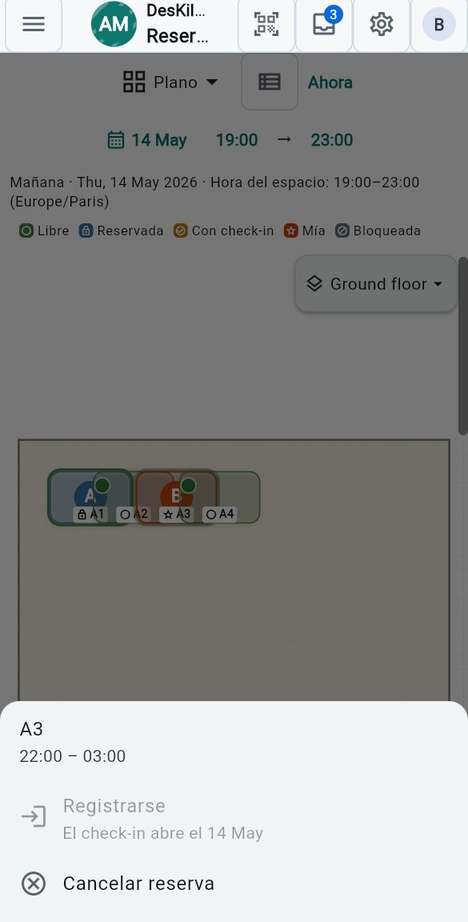

**Pasos**

1. Abra [Reservar](https://fdittgen-png.github.io/deskilo/#/reserve), busque el día de su reserva y toque su propia plaza, la marcada como **Mía**.
2. Toque **Registrarse**. Si está en gris, le indica cuándo se abre, por ejemplo «El check-in abre el 14 de mayo».
3. Cuando se vaya, toque de nuevo su plaza y toque **Salir**. El resto de la reserva queda liberado de inmediato para los demás.
4. La reserva dice entonces **Completada: salida registrada a las** y la hora.

**Conviene saber**

- El registro se abre 15 minutos antes del inicio, o un paso de cuadrícula antes cuando la cuadrícula es más gruesa. Donde las reservas son por media jornada, por día o por hora real, se abre durante todo el día de la reserva.
- Se cierra cuando termina la reserva: **Esta reserva ha terminado — ya no es posible registrarse.**
- Si todavía tiene un registro activo en otro sitio, salga primero de allí.
- Con el registro y la salida automáticos activados, una reserva en la que nadie registró la llegada ni la salida se completa sola una vez pasada su hora. Sin ellos, una reserva sin registro de llegada dice **Este periodo terminó sin registro de llegada.**
- En un quiosco de pared se registra con su credencial; véase [Su credencial](#su-credencial) y [Registro con credencial NFC](#registro-con-credencial-nfc).

**Véase también:** [Escanear un código de espacio](#escanear-un-código-de-espacio) · [Cambiar o cancelar una reserva](#cambiar-o-cancelar-una-reserva)

<!-- anchor: user.reserve.scan -->
### Escanear un código de espacio

**Público:** Miembro · Administrador/a · Propietario

Usted está ante una mesa, una sala o un asiento que lleva una tarjeta QR, o una silla con una etiqueta NFC. Escanear muestra lo que puede hacer allí, sin buscar en el plano.

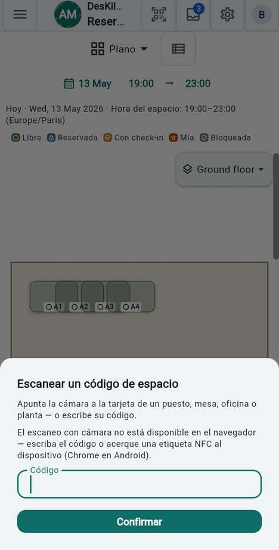

**Pasos**

1. En [Reservar](https://fdittgen-png.github.io/deskilo/#/reserve), toque **Escanear un código de espacio**, el icono del escáner en la parte superior de la pantalla.
2. Apunte la cámara a la tarjeta, o escriba el número impreso en **Código** y toque **Confirmar**. Acerque el teléfono a la etiqueta NFC de una silla cuando el dispositivo lo admita.
3. Para un asiento, elija **Registrarse**, **Reservar** o **Salir**, las mismas acciones que en el quiosco, sin el paso de la credencial.
4. Para una mesa, una oficina o una planta, la hoja muestra su estado, su periodo y su **Precio por media jornada**; toque **Registrarse**, **Reservar** o **Ver en el plano**.

**Conviene saber**

- Si otra persona tiene el espacio, la hoja dice quién y ofrece escribirle un mensaje.
- Un código que no es de este espacio de trabajo dice **No es un código de espacio de este espacio de trabajo.** Un espacio eliminado dice **Este código ya no corresponde a ningún espacio aquí.**
- En un navegador la cámara no está disponible: escriba el código. Una etiqueta NFC solo identifica asientos.
- El icono del escáner solo aparece cuando su espacio usa códigos QR.

**Véase también:** [Reservar una mesa, una sala o una planta entera](#reservar-una-mesa-una-sala-o-una-planta-entera) · [Registrar la llegada y la salida](#registrar-la-llegada-y-la-salida)

<!-- anchor: user.reserve.change -->
### Cambiar o cancelar una reserva

**Público:** Miembro · Administrador/a · Propietario

Sus planes han cambiado. Puede mover una reserva, acortarla, alargarla o cancelarla, siempre que no se haya utilizado.

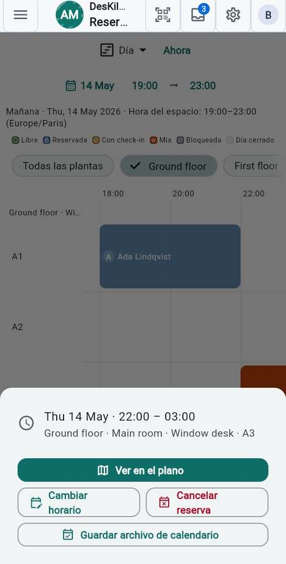

**Pasos**

1. Abra la reserva: tóquela en la vista **Día** o **Semana**, en el Calendario, o toque **Detalles** en el mensaje que sigue a una reserva.
2. Para una reserva que no ha empezado, toque **Cambiar horario** para elegir otro periodo, o **Cancelar reserva** para eliminarla.
3. Para una reserva repetida, elija **Cancelar esta ocurrencia** o **Cancelar esta y las siguientes**.
4. En una reserva con la que ha registrado su llegada, **Quedarse más tiempo** y **Terminar antes** aparecen cuando las reglas del espacio permiten un final posterior o anterior. El inicio no se mueve.
5. Para una reserva ya empezada, con llegada registrada o completada, y si su espacio permite las solicitudes de eliminación, toque **Solicitar eliminación**, indique un motivo si lo desea y toque **Enviar solicitud**.

**Conviene saber**

- **Solicitar eliminación** no elimina nada: un propietario o un administrador decide si solo se olvidó el registro de llegada, en cuyo caso la reserva se mantiene, o si la reserva no se utilizó nunca, en cuyo caso se elimina.
- Un administrador puede quitar la reserva de otra persona con **Quitar la reserva (anular)**; se avisa al miembro y a los administradores.
- **Ver en el plano** salta a la plaza en el plano.

**Véase también:** [Registrar la llegada y la salida](#registrar-la-llegada-y-la-salida) · [Guardar una reserva en su propio calendario](#guardar-una-reserva-en-su-propio-calendario) · [Repetir una reserva](#repetir-una-reserva)

<!-- anchor: user.reserve.awaiting -->
### Cuando una reserva está pendiente de confirmación

**Público:** Miembro · Administrador/a · Propietario

Una reserva o una solicitud dice **pendiente de confirmación**. No significa que algo haya salido mal: alguien tiene todavía que decir que sí.

**Pasos**

1. Mire qué está esperando: el Calendario lo enumera con las palabras **pendiente de confirmación**, y una decisión dirigida a usted aparece arriba del todo.
2. Si le toca decidir a usted, toque **Aceptar** o la cruz en el Calendario.
3. Si espera a otra persona, no tiene que hacer nada; la respuesta llega como notificación y en el Calendario.

Lo que espera una confirmación:

- Una reserva que un administrador ha hecho para usted: usted la confirma.
- Una reserva de un espacio entero, cuando el propietario pide a los validadores que la aprueben. El espacio permanece bloqueado mientras espera, y un rechazo cancela la reserva.
- Una solicitud para eliminar una reserva que ya ha empezado, tiene la llegada registrada o se ha completado.

**Conviene saber**

- Quién puede validar y cuántos deben estar de acuerdo es una regla del propietario; véase [Reglas de validación](#reglas-de-validación-dominio-por-dominio).
- Una solicitud muestra su avance, por ejemplo 1/2 validaciones, y más tarde su resultado: validada, rechazada, denegada o caducada.

**Véase también:** [Reservar para otra persona](#reservar-para-otra-persona) · [Decisiones que le esperan en el Calendario](#decisiones-que-le-esperan-en-el-calendario)

<!-- anchor: user.reserve.calendar -->
### La pestaña Calendario

**Público:** Miembro · Administrador/a · Propietario

Usted quiere todo lo que tiene fecha en un solo lugar: sus reservas, registros de llegada, alertas, mensajes y pagos pendientes. La pestaña Calendario lo enumera por día y cada fila abre su origen.

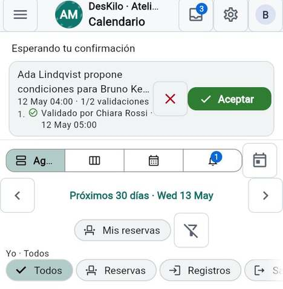

**Pasos**

1. Abra [Calendario](https://fdittgen-png.github.io/deskilo/#/calendar). Se abre en la **Agenda**: los próximos 30 días, agrupados bajo **Hoy**, **Mañana** y los nombres de los días.
2. Use las flechas para avanzar de 30 en 30 días, o toque la fecha para elegir un día. El botón de arriba a la derecha le devuelve a **Hoy**.
3. Toque una fila para abrirla: una reserva abre sus detalles, un mensaje su conversación, una factura su hoja.
4. Acote la lista con los chips de debajo, como se describe en [Filtrar el Calendario](#filtrar-el-calendario).

**Conviene saber**

- Las reservas aparecen para todos en el espacio, porque el plano muestra la ocupación a todos. Los mensajes y el dinero permanecen privados para usted y para las personas que las reglas del espacio permitan.
- Un miembro con el permiso de finanzas o de miembros puede cambiar la lista a otro miembro con el chip **Yo**. Lo que el servidor no permite aparece bloqueado, no como un día vacío.
- Si su espacio mantiene el calendario más simple, usted elige un día o un intervalo de días en lugar de las tres vistas.

**Véase también:** [Agenda, Semana y Mes en el Calendario](#agenda-semana-y-mes-en-el-calendario) · [Guardar una reserva en su propio calendario](#guardar-una-reserva-en-su-propio-calendario)

<!-- anchor: user.reserve.calendar-views -->
### Agenda, Semana y Mes en el Calendario

**Público:** Miembro · Administrador/a · Propietario

Usted quiere ver una semana o un mes de un vistazo. El Calendario ofrece tres maneras de mirar.

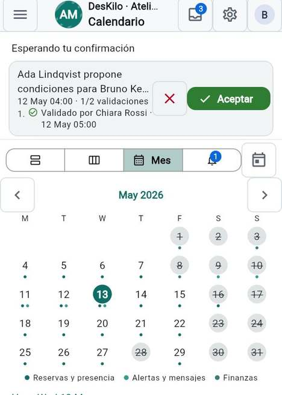

**Pasos**

1. Elija **Agenda**, **Semana** o **Mes** en la barra superior. El cuarto botón, **Alertas**, muestra sus alertas cuando su espacio las ofrece.
2. En **Semana**, toque un día de los siete para leer su lista debajo.
3. En **Mes**, toque un día de la cuadrícula. Bajo cada día, hasta tres puntos muestran lo que contiene: reservas y presencia, alertas y mensajes, dinero. El día de hoy aparece rodeado con un círculo.
4. Los días cerrados aparecen en gris y tachados.

**Conviene saber**

- En **Mes**, la lista de debajo muestra solo el día seleccionado; en **Semana** enumera toda la semana.
- Las flechas avanzan una semana o un mes, según la vista.
- El Calendario muestra también la fecha de vencimiento de un pago y cada gasto programado que vence.

**Véase también:** [La pestaña Calendario](#la-pestaña-calendario) · [Días de cierre y festivos](#días-de-cierre-y-festivos)

<!-- anchor: user.reserve.calendar-decisions -->
### Decisiones que le esperan en el Calendario

**Público:** Miembro · Administrador/a · Propietario

Se le ha pedido que confirme algo. Cuando algo necesita su respuesta, queda fijado arriba del todo en el Calendario, bajo **Esperando su confirmación**.

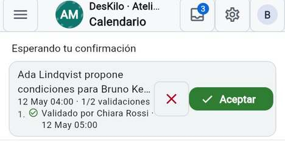

**Pasos**

1. Abra [Calendario](https://fdittgen-png.github.io/deskilo/#/calendar). Cada decisión en espera es una tarjeta con un texto breve y la fecha en que se envió.
2. Lea la tarjeta. Puede mostrar cuántas validaciones tiene, por ejemplo 1/2 validaciones.
3. Toque **Aceptar** para dar su conformidad, o la cruz para rechazar.
4. Abra la vista **Alertas** para ver toda la lista con su historial.

**Conviene saber**

- El botón **Alertas** de la barra muestra cuántas decisiones le esperan.
- Una vez respondida, la decisión sale de la parte superior y aparece en la lista con su resultado.

**Véase también:** [Cuando una reserva está pendiente de confirmación](#cuando-una-reserva-está-pendiente-de-confirmación) · [Reglas de validación](#reglas-de-validación-dominio-por-dominio)

<!-- anchor: user.reserve.calendar-filters -->
### Filtrar el Calendario

**Público:** Miembro · Administrador/a · Propietario

La lista es larga y usted solo busca reservas. Los chips bajo la barra la acotan.

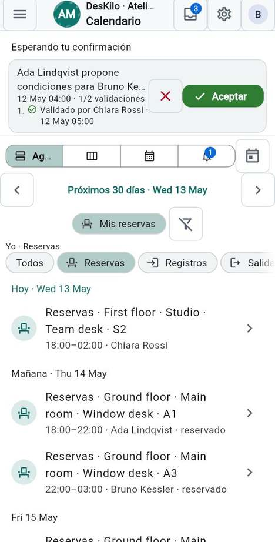

**Pasos**

1. Toque **Mis reservas** para conservar solo sus propias reservas. Tóquelo de nuevo para verlo todo.
2. O elija chips como **Reservas**, **Registros** y **Salidas**; **Todo** muestra todos los tipos.
3. Para deshacer sus elecciones, toque **Restablecer filtros**, el botón del embudo.
4. Una línea sobre los chips repite lo que ve, por ejemplo Yo · Reservas.

**Conviene saber**

- Pueden estar activados varios chips a la vez.
- Los chips que se ofrecen dependen de lo que su espacio tenga activado, por ejemplo las validaciones.

**Véase también:** [La pestaña Calendario](#la-pestaña-calendario) · [Agenda, Semana y Mes en el Calendario](#agenda-semana-y-mes-en-el-calendario)

<!-- anchor: user.reserve.calendar-file -->
### Guardar una reserva en su propio calendario

**Público:** Miembro · Administrador/a · Propietario

Usted quiere una reserva en el calendario de su teléfono o de su ordenador. La app escribe un archivo de calendario estándar que Google, Outlook, Apple y otros importan.

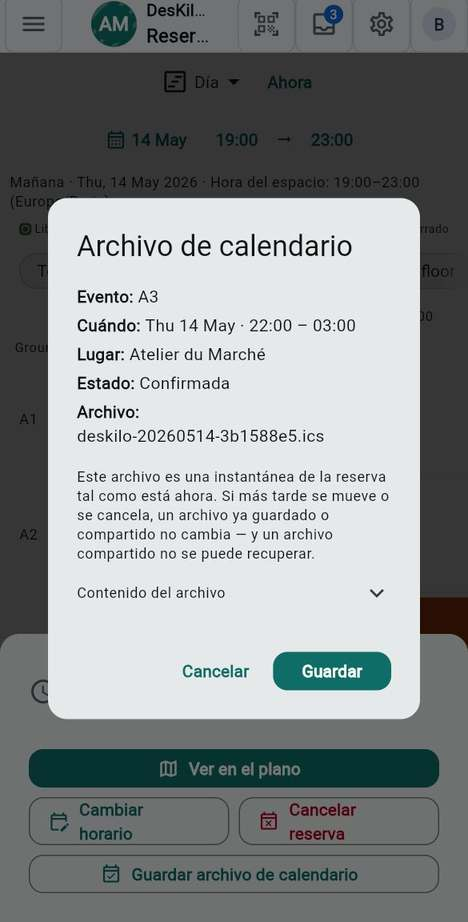

**Pasos**

1. Abra una de sus propias reservas, en la vista **Día**, en la vista **Semana** o en el Calendario.
2. Toque **Guardar archivo de calendario**.
3. Lea la vista previa: el **Evento**, **Cuándo**, **Lugar**, **Estado** y el nombre del **Archivo**. Abra **Contenido del archivo** para leer el propio archivo.
4. Toque **Guardar**. La app guarda el archivo, normalmente en su carpeta de descargas, y le dice dónde; ábralo con su calendario.

**Conviene saber**

- El archivo contiene la hora, el lugar, el nombre del espacio y si la reserva está confirmada o cancelada. Ningún importe, ningún nombre, ninguna dirección de correo.
- Es una instantánea: si la reserva cambia más tarde, un archivo ya guardado no cambia.
- Si la reserva cambió entre la vista previa y **Guardar**, no se escribe nada y la vista previa se actualiza.
- Su propietario puede desactivar esta función.

**Véase también:** [Cambiar o cancelar una reserva](#cambiar-o-cancelar-una-reserva) · [La pestaña Calendario](#la-pestaña-calendario)

<!-- anchor: user.collaborate.overview -->
## Colaborar: miembros, solicitudes, mensajes y la red más amplia

En este capítulo:
- [El directorio de Miembros](#el-directorio-de-miembros) y [la página de un miembro](#la-página-de-un-miembro)
- [Escribir a un miembro](#escribir-a-un-miembro)
- [Eventos y confirmaciones](#eventos-y-confirmaciones), [aceptar o rechazar](#aceptar-o-rechazar-una-solicitud) y [Lo que te espera](#lo-que-te-espera)
- [Reglas de validación, dominio por dominio](#reglas-de-validación-dominio-por-dominio) (administradores y propietarios)
- [Mensajes](#mensajes), [nuevas conversaciones y grupos](#iniciar-una-conversación-o-un-grupo), [solicitudes de mensaje](#solicitudes-de-mensaje) y [bloqueo](#bloquear-a-alguien)
- [Notificaciones](#notificaciones)
- [Descubrir](#descubrir), [su perfil público](#su-perfil-público) y [sus visitas como invitado](#sus-visitas-como-invitado)

<!-- anchor: user.collaborate.directory -->
### El directorio de Miembros

**Público:** Miembro · Administrador/a · Propietario

Usted quiere ver quién está en su espacio, quién está hoy y quién está a punto de llegar.

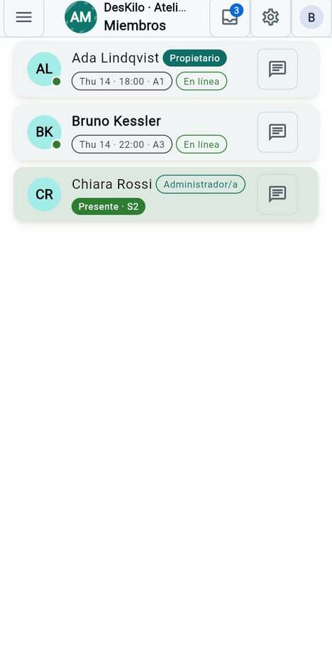

**Pasos**

1. Abra [Miembros](https://fdittgen-png.github.io/deskilo/#/directory) desde el menú (o desde la barra inferior si eligió el estilo de navegación clásico).
2. Lea cada tarjeta: foto o iniciales, nombre, insignia de rol (**Propietario** o **Administrador/a**; los miembros sin más no llevan ninguna), la línea de estado de la persona y dos pequeños chips.
3. Lea los chips. El primero es la reserva: **Presente** con la plaza, **Reservado ahora**, o la siguiente reserva (día, hora, plaza). El segundo dice **En línea**, o cuándo se vio por última vez a la persona.
4. Toque una tarjeta para abrir [la página del miembro](#la-página-de-un-miembro).
5. Tire de la lista hacia abajo para actualizarla.

**Conviene saber**

- Solo se enumeran los miembros activos, por orden alfabético.
- Los administradores y los propietarios ven además la dirección de correo de cada persona bajo su nombre. Los miembros no: entre miembros, el contacto sigue siendo voluntario.
- Si su propietario ha creado un grupo de WhatsApp, una línea **Abrir el grupo de WhatsApp** aparece sobre la lista.

**Véase también:** [La página de un miembro](#la-página-de-un-miembro) · [Escribir a un miembro](#escribir-a-un-miembro)

<!-- anchor: user.collaborate.member-page -->
### La página de un miembro

**Público:** Miembro · Administrador/a · Propietario

Usted quiere saber si un compañero está, cuándo vendrá la próxima vez y cómo localizarle.

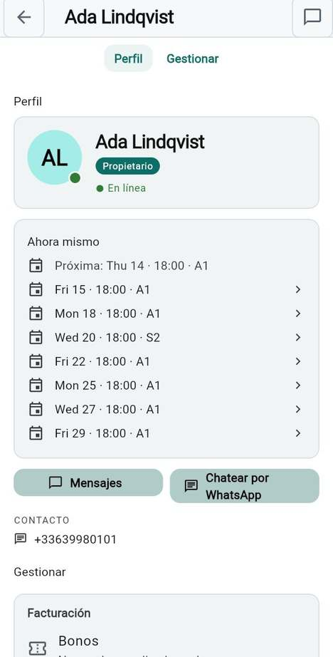

**Pasos**

1. Toque una tarjeta en [Miembros](https://fdittgen-png.github.io/deskilo/#/directory).
2. Lea la tarjeta superior: foto, rol, presencia y la línea de estado de la propia persona. Más abajo puede ver desde cuándo es miembro.
3. Lea **Ahora mismo**: si la persona ha registrado su llegada, si tiene una reserva en este minuto o cuándo es su próxima reserva. Toque una reserva para abrirla.
4. Use los botones: **Mensajes**, **Chatear por WhatsApp** y, para los administradores, **Correo**.

**Conviene saber**

- **Contacto** muestra un número de WhatsApp solo cuando la persona ha elegido compartirlo.
- Cuando puede verlas, las cifras de dinero (facturas abiertas, pagos, el mes en curso) figuran en la misma página. Siempre ve las suyas; las de otra persona, solo con el derecho a ver las finanzas.
- Los administradores y los propietarios disponen además de una zona **Gestionar** con **Membresía**, **Reglas de reserva**, **Facturación** y **Tarjetas y acceso**, y cada fila muestra su valor actual.

**Véase también:** [Escribir a un miembro](#escribir-a-un-miembro) · [Las acciones del miembro](#las-acciones-del-miembro)

<!-- anchor: user.collaborate.contact -->
### Escribir a un miembro

**Público:** Miembro · Administrador/a · Propietario

Usted quiere preguntarle algo a un compañero sin salir del espacio.

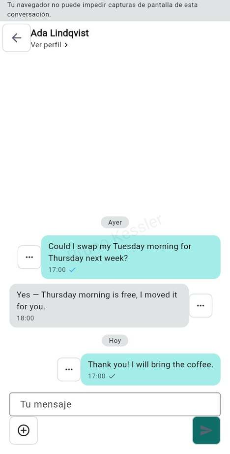

**Pasos**

1. Abra [Miembros](https://fdittgen-png.github.io/deskilo/#/directory), toque una tarjeta para abrir la página del miembro y toque **Mensajes**.
2. Escriba en el campo **Su mensaje**.
3. Toque **Enviar**.

**Conviene saber**

- Los mensajes se leen del más antiguo al más reciente, bajo separadores de día. Una marca bajo su mensaje significa que se ha entregado; una doble marca azul significa que se ha leído.
- Toque los **…** junto a una burbuja para ver las acciones del mensaje (reaccionar con un emoji, destacar, copiar, editar dentro de 15 minutos, reenviar, eliminar). El botón del clip adjunta una reserva o un espacio; la otra persona ve un enlace que lo abre.
- Esto requiere la función **Notificaciones entre miembros** de su espacio.

**Véase también:** [Mensajes](#mensajes)

<!-- anchor: user.collaborate.events -->
### Eventos y confirmaciones

**Público:** Miembro · Administrador/a · Propietario

Usted quiere ver lo que ha ocurrido en el espacio y lo que espera una respuesta.

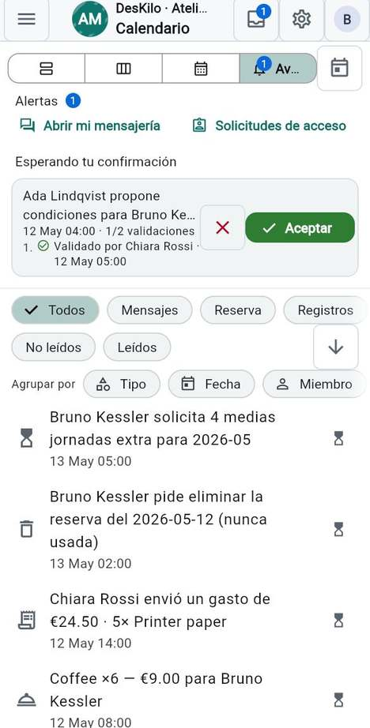

**Pasos**

1. Toque **Eventos** en la barra superior (el icono de bandeja con un número), o abra [Eventos](https://fdittgen-png.github.io/deskilo/#/events) desde el menú. La página se abre en **Alertas**.
2. Lea **Esperando su confirmación** arriba del todo: las solicitudes que le necesitan.
3. Lea el flujo de debajo. Cada fila dice lo que ha ocurrido; un reloj de arena significa pendiente, una marca verde significa confirmado. Las filas de dinero muestran quién las validó y cuándo.
4. Acote el flujo con los chips: **Todos**, **Mensajes**, **Reserva**, **Registros**, **Dinero**, **Miembros**, y después **No leídos** o **Leído**.
5. Toque **Tipo**, **Fecha** o **Miembro** junto a **Agrupar por** para plegar el flujo en grupos; toque el símbolo de grupo para volver a la lista plana.

**Conviene saber**

- Se crea un evento cada vez que algo se reserva, se cambia o se cancela, se registra un pago o un gasto, se solicitan medias jornadas extra o una eliminación, cambia un rol o alguien se une.
- Los miembros ven sus propios eventos; los administradores y los propietarios ven los de todos.
- Su filtro se recuerda. El número del botón Eventos cuenta las novedades y las decisiones que le esperan.
- **Abrir mi mensajería**, arriba, le lleva a sus [conversaciones](#mensajes).

**Véase también:** [Aceptar o rechazar una solicitud](#aceptar-o-rechazar-una-solicitud) · [Reglas de validación](#reglas-de-validación-dominio-por-dominio)

<!-- anchor: user.collaborate.accept -->
### Aceptar o rechazar una solicitud

**Público:** Miembro · Administrador/a · Propietario

Alguien le ha pedido que confirme algo, y usted quiere responder.

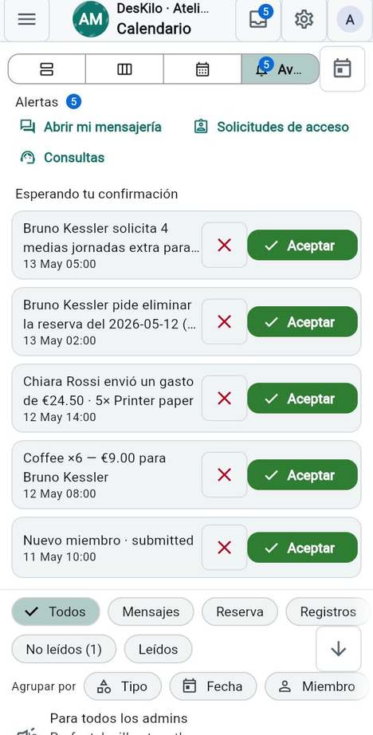

**Pasos**

1. Abra [Eventos](https://fdittgen-png.github.io/deskilo/#/events).
2. Busque la solicitud bajo **Esperando su confirmación**.
3. Toque **Aceptar**, o la cruz roja para **Rechazar**.

**Conviene saber**

- Cuando un administrador hace algo por usted (reserva una plaza, registra su pago), queda pendiente hasta que usted lo confirme. Lo que hace usted por sí mismo nunca necesita su propia confirmación.
- Nadie confirma su propia solicitud: espera a otra persona, o a la excepción de la regla ([reglas de validación](#reglas-de-validación-dominio-por-dominio)).
- Tras siete días sin respuesta, un acto que crea o modifica algo (un administrador que reserva por usted, por ejemplo) se confirma automáticamente; una eliminación o un cargo caduca en su lugar.
- Una fila puede mostrar un avance como «1/2 validaciones» cuando la regla pide varias.

**Véase también:** [Eventos y confirmaciones](#eventos-y-confirmaciones) · [Validaciones requeridas](#validaciones-requeridas)

<!-- anchor: user.collaborate.attention -->
### Lo que te espera

**Público:** Administrador/a · Propietario

Usted quiere un solo lugar que responda: ¿hay algo que me necesite hoy?

**Pasos**

1. Abra [Lo que te espera](https://fdittgen-png.github.io/deskilo/#/attention).
2. Lea las líneas en orden: cada una es una decisión (por ejemplo una solicitud por confirmar o una persona que espera ser admitida), con los retrasos más costosos primero.
3. Toque una línea para ocuparse de ella.

**Conviene saber**

- Esta pantalla existe solo cuando su espacio ha activado la función **Lo que le espera**; sin ella, la dirección lleva de vuelta a la página de inicio.
- Varias decisiones idénticas se muestran como una sola línea. Cuando no hay nada en espera, la pantalla dice **Nada le espera**.
- También muestra la configuración pendiente: «Por configurar: …» por cada ámbito obligatorio de la lista de preparación que no está listo (solo para quien configura el espacio), y «… funciones activadas esperan «…»» cuando una función desactivada retiene otras. Un toque abre la pantalla donde se configura, o **Funciones**.

**Véase también:** [Eventos y confirmaciones](#eventos-y-confirmaciones)

<!-- anchor: user.validation.overview -->
### Reglas de validación, dominio por dominio

**Público:** Propietario

Usted decide, para cada tipo de acto, si una persona debe confirmarlo primero y quién.

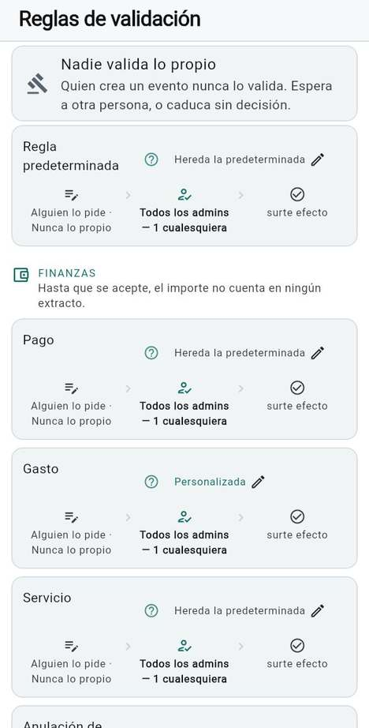

**Pasos**

1. Abra [Reglas de validación](https://fdittgen-png.github.io/deskilo/#/validation) (también está en Ajustes).
2. Lea los tres grupos: **Dinero**, **Reservas** y **Personas y roles**. Cada uno indica qué permanece sin cambios hasta que se acepta el acto.
3. Lea una tarjeta de izquierda a derecha: alguien lo pide, las personas que pueden validar, entra en vigor. Una tarjeta dice **Hereda la predeterminada** o **Personalizada**.
4. Toque una tarjeta para editar su regla. Toque **Regla predeterminada** para cambiar lo que heredan todas las demás tarjetas.

**Conviene saber**

- Una regla abarca actos como pagos, gastos, servicios, medias jornadas extra, eliminaciones de reservas, reservas, cambios de rol, nuevos miembros, facturas, reembolsos y cambios de suscripción.
- Cada decisión es un evento: quién decidió, cuándo y sobre qué. Nada se valida en silencio.
- El aviso de la parte superior se aplica a todas las reglas: **Nadie valida lo propio**.
- Necesita el permiso para configurar las reglas de validación; los propietarios siempre lo tienen.

**Véase también:** [Validaciones requeridas](#validaciones-requeridas) · [La matriz de roles](#la-matriz-de-roles)

<!-- anchor: user.validation.required-count -->
### Validaciones requeridas

**Público:** Propietario

Usted elige cuántas personas deben confirmar antes de que el acto siga adelante.

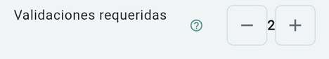

**Pasos**

1. Toque una tarjeta en [Reglas de validación](https://fdittgen-png.github.io/deskilo/#/validation).
2. Toque el más o el menos junto a **Validaciones requeridas**.
3. Toque **Guardar**.

**Conviene saber**

- Una es el caso habitual; dos es frecuente para el dinero.
- Si pide más validaciones que personas que pueden darlas, la hoja avisa **No hay suficientes validadores elegibles.** y no guarda: una regla que nadie puede cumplir bloquearía el acto para siempre.

**Véase también:** [Quién puede validar](#quién-puede-validar)

<!-- anchor: user.validation.who-may -->
### Quién puede validar

**Público:** Propietario

Usted elige qué personas pueden dar la confirmación.

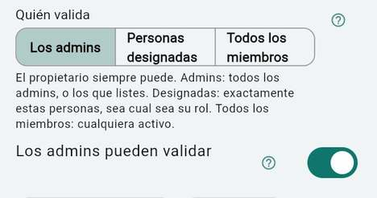

**Pasos**

1. Toque una tarjeta en [Reglas de validación](https://fdittgen-png.github.io/deskilo/#/validation).
2. Bajo **Quién valida**, elija **Admins**, **Personas designadas** o **Todos los miembros**.
3. Para **Admins**, deje activado **Los admins pueden validar** y elija **Todos los admins** o toque los nombres de administradores concretos. Desactívelo y solo validan los propietarios.
4. Para **Personas designadas**, elija exactamente a las personas que quiera.
5. Toque **Guardar**.

**Conviene saber**

- El propietario siempre puede validar.
- Una lista nominal es una decisión deliberada: quien más tarde se convierta en administrador no se añade a ella.
- La elección del alcance aparece cuando su espacio tiene activada la función de ámbitos de validación; si no, una regla funciona con los administradores.

**Véase también:** [Se requiere un propietario](#se-requiere-un-propietario)

<!-- anchor: user.validation.owner-required -->
### Se requiere un propietario

**Público:** Propietario

Para algunos actos no basta la aprobación de un administrador.

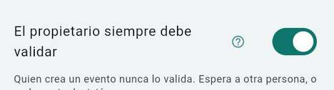

**Pasos**

1. Toque una tarjeta en [Reglas de validación](https://fdittgen-png.github.io/deskilo/#/validation).
2. Active **El propietario siempre debe validar**.
3. Toque **Guardar**.

**Conviene saber**

- Entonces al menos una de las confirmaciones procede de un propietario, diga lo que diga el número requerido. La tarjeta muestra «y el propietario, siempre».

**Véase también:** [Validaciones requeridas](#validaciones-requeridas) · [Un propietario puede confirmar su propia solicitud](#un-propietario-puede-confirmar-su-propia-solicitud)

<!-- anchor: user.validation.owner-self -->
### Un propietario puede confirmar su propia solicitud

**Público:** Propietario

Usted dirige un espacio por su cuenta y necesita poder resolver sus propias solicitudes.

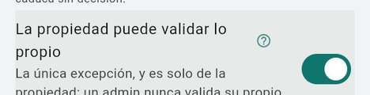

**Pasos**

1. Toque una tarjeta en [Reglas de validación](https://fdittgen-png.github.io/deskilo/#/validation).
2. Active **La propiedad puede validar lo propio**.
3. Toque **Guardar**.

**Conviene saber**

- Desactivado, la solicitud de un propietario espera a otra persona. Activado, el propietario la resuelve.
- Es una excepción solo del propietario: un administrador nunca valida su propio acto.
- El interruptor aparece cuando su espacio tiene activada la función de cadena de validación.

**Véase también:** [Validar automáticamente la solicitud de un propietario](#validar-automáticamente-la-solicitud-de-un-propietario)

<!-- anchor: user.validation.sequential -->
### Una tras otra

**Público:** Propietario

Usted quiere que las confirmaciones se recojan en orden, de modo que la segunda persona vea la decisión de la primera.

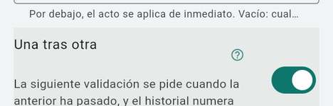

**Pasos**

1. Toque una tarjeta en [Reglas de validación](https://fdittgen-png.github.io/deskilo/#/validation).
2. Active **Una tras otra**.
3. Toque **Guardar**.

**Conviene saber**

- La siguiente validación se solicita cuando la anterior ha pasado, y el rastro de validación numera cada paso.
- Es más lento; úselo cuando el orden importa.
- En las reglas de dinero también puede fijar **Solo por encima de este importe**: los importes menores se aplican de inmediato.

**Véase también:** [Validaciones requeridas](#validaciones-requeridas)

<!-- anchor: user.validation.auto-validate-owner -->
### Validar automáticamente la solicitud de un propietario

**Público:** Propietario

Usted no quiere un aviso por una cuestión que ya está cerrada.

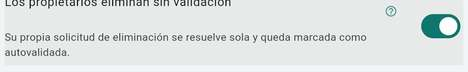

**Pasos**

1. En [Reglas de validación](https://fdittgen-png.github.io/deskilo/#/validation), toque la tarjeta **Eliminación de reserva**.
2. Active **Los propietarios eliminan sin validación**.
3. Toque **Guardar**.

**Conviene saber**

- La solicitud de eliminación de un propietario se resuelve entonces por sí sola y queda marcada como **Validado automáticamente** en el flujo, de modo que el rastro no se interrumpe.
- Este interruptor existe solo en la regla **Eliminación de reserva**, y está desactivado por defecto.

**Véase también:** [Validar automáticamente la solicitud de un administrador](#validar-automáticamente-la-solicitud-de-un-administrador)

<!-- anchor: user.validation.auto-validate-admin -->
### Validar automáticamente la solicitud de un administrador

**Público:** Propietario

Usted quiere que los administradores eliminen sus propias reservas sin esperar.

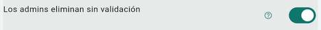

**Pasos**

1. En [Reglas de validación](https://fdittgen-png.github.io/deskilo/#/validation), toque la tarjeta **Eliminación de reserva**.
2. Active **Los admins eliminan sin validación**.
3. Toque **Guardar**.

**Conviene saber**

- Es independiente del interruptor del propietario: todo propietario es también administrador, así que un solo interruptor no podría decir «propietarios sí, administradores no».
- Desactivado por defecto, y solo para eliminaciones de reservas.

**Véase también:** [Validar automáticamente la solicitud de un propietario](#validar-automáticamente-la-solicitud-de-un-propietario)

<!-- anchor: user.collaborate.messages -->
### Mensajes

**Público:** Todos

Usted quiere todas sus conversaciones en una sola lista, sea cual sea el espacio o el servidor al que pertenezcan.

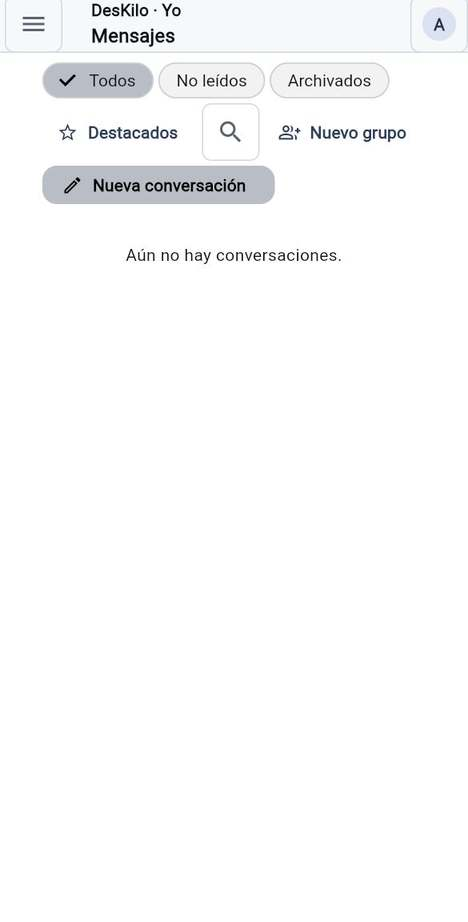

**Pasos**

1. Abra [Mensajes](https://fdittgen-png.github.io/deskilo/#/me?tab=messages) en Yo.
2. Lea cada fila: el título, el contexto (por ejemplo «En» un espacio, «De persona a persona», «Grupo»), el último mensaje y el contador de no leídos.
3. Filtre con **Todos**, **No leídos** o **Archivados**, abra **Destacados** para los mensajes que ha destacado, o toque la lupa para buscar.
4. Mantenga pulsada una fila para **Fijar arriba**, **Silenciar notificaciones**, **Marcar como no leído** o **Archivar**.
5. Toque una fila para abrir la conversación.

**Conviene saber**

- Las conversaciones de sus otros servidores conectados aparecen en la misma lista, con el servidor indicado.
- Un mensaje que ha escrito muestra una marca cuando se entrega y una doble marca azul cuando se lee.
- Una conversación archivada conserva su historial. Una silenciada permanece callada, pero se sigue contando.
- Desde el espacio, **Abrir mi mensajería** (en Alertas) conduce hasta aquí.

**Véase también:** [Escribir a un miembro](#escribir-a-un-miembro) · [Iniciar una conversación o un grupo](#iniciar-una-conversación-o-un-grupo)

<!-- anchor: user.collaborate.messages-new -->
### Iniciar una conversación o un grupo

**Público:** Todos

Usted quiere escribir a alguien nuevo, o a varias personas a la vez.

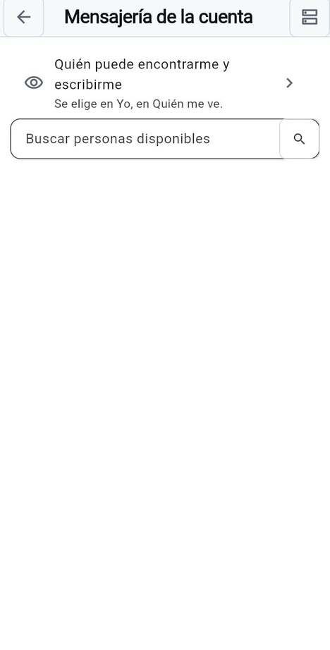

**Pasos**

1. En [Mensajes](https://fdittgen-png.github.io/deskilo/#/me?tab=messages), toque **Nueva conversación**.
2. Escriba un nombre bajo **Buscar personas disponibles** y toque la lupa.
3. Toque a la persona; se abre el chat.
4. Para un grupo, toque en su lugar **Nuevo grupo**, póngale un **Nombre del grupo**, **Añadir personas** y toque **Crear grupo**.

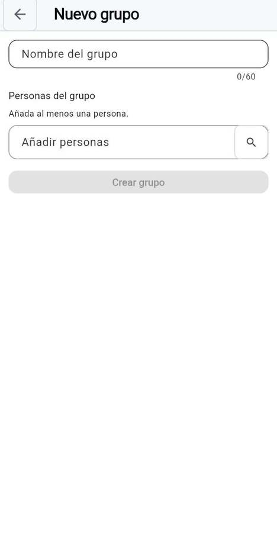

**Conviene saber**

- Encuentra a las personas que han elegido ser localizables: cada persona decide en **Quién puede iniciar una conversación conmigo**.
- En un grupo, toque su nombre para ver los miembros; un administrador puede añadir o quitar personas, cambiarle el nombre o permitir que solo escriban los administradores (**Solo los admins pueden escribir**). Cualquiera puede **Salir del grupo**.
- Un mensaje largo está limitado a 4000 caracteres.

**Véase también:** [Solicitudes de mensaje](#solicitudes-de-mensaje)

<!-- anchor: user.collaborate.message-requests -->
### Solicitudes de mensaje

**Público:** Todos

Alguien de quien usted no eligió recibir noticias le ha escrito, y usted decide qué ocurre.

**Pasos**

1. Abra [Mensajes](https://fdittgen-png.github.io/deskilo/#/me?tab=messages). Una tarjeta **Solicitudes de mensaje** aparece sobre sus conversaciones cuando hay alguna.
2. Lea el primer mensaje.
3. Toque **Aceptar** para convertirlo en una conversación, **Ignorar** para ocultarlo o **Bloquear** para cortar todo contacto.

**Conviene saber**

- La tarjeta lo dice claramente: estas personas están fuera de aquellas por las que usted eligió ser localizable, y no se les informa de lo que usted decida.
- Quién puede escribirle primero se fija en Yo, en **Quién puede iniciar una conversación conmigo**.

**Véase también:** [Bloquear a alguien](#bloquear-a-alguien) · [Quién puede ver mis datos](#privacidad-quién-puede-ver-mis-datos)

<!-- anchor: user.collaborate.block -->
### Bloquear a alguien

**Público:** Todos

Usted quiere que una persona deje de verle y de escribirle.

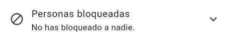

**Pasos**

1. Toque **Bloquear** en una solicitud de mensaje, o **Bloquear a esta persona** en una conversación.
2. Confirme.
3. Para deshacerlo, abra Yo, después **Personas bloqueadas**, y toque **Desbloquear** junto al nombre.

**Conviene saber**

- Un bloqueo funciona en los dos sentidos: ninguno de los dos ve ni alcanza al otro.
- No se informa a la persona.

**Véase también:** [Solicitudes de mensaje](#solicitudes-de-mensaje)

<!-- anchor: user.collaborate.notifications -->
### Notificaciones

**Público:** Todos

Usted quiere saber qué le avisa y, si lo prefiere, desactivar los avisos en este dispositivo.

**Pasos**

1. Abra [Privacidad y datos](https://fdittgen-png.github.io/deskilo/#/privacy).
2. Use el interruptor **Notificaciones push en este dispositivo** para activar o desactivar las notificaciones push.
3. Para silenciar una conversación, manténgala pulsada en [Mensajes](https://fdittgen-png.github.io/deskilo/#/me?tab=messages) y elija **Silenciar notificaciones**.

**Conviene saber**

- Se le avisa de las solicitudes que esperan su confirmación y de los mensajes: en el feed y en la campana, por push cuando su instalación tiene el push configurado y, en la app instalada (no en el navegador), con un recordatorio en su dispositivo 15 minutos antes de una reserva en la que aún no ha registrado su entrada.
- DesKilo no envía correos electrónicos propios: los únicos son los de su cuenta (confirmación de alta, restablecimiento de contraseña).
- El contador de la campana y del icono de la app suma sus confirmaciones pendientes y sus mensajes sin leer.
- Desactivado, la app sigue funcionando; no se envía nada a este dispositivo. No hay interruptores distintos por categoría. Si su sistema bloquea las notificaciones de la app, permítalas en los ajustes del sistema.

**Véase también:** [Eventos y confirmaciones](#eventos-y-confirmaciones) · [Tus datos, tus derechos](#tus-datos-tus-derechos)

<!-- anchor: user.collaborate.discover -->
### Descubrir

**Público:** Todos

Usted quiere encontrar espacios que se publican a sí mismos y escribir a sus anfitriones.

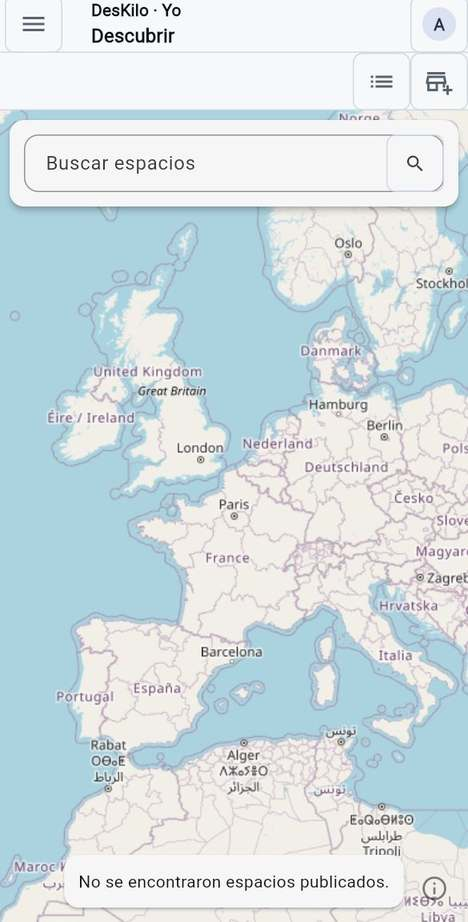

**Pasos**

1. Abra [Descubrir](https://fdittgen-png.github.io/deskilo/#/me?tab=discover) en Yo. Se abre en el mapa.
2. Escriba en **Buscar espacios** y toque la lupa.
3. Deslice las tarjetas bajo el mapa, o toque el símbolo de la chincheta de una tarjeta para **Localizar en el mapa**.
4. Toque el botón de lista para pasar a **Lista**, y el botón de mapa para volver a **Mapa**.
5. Toque un espacio para leer su página pública: descripción, dirección, contactos, sitio web, plano público.
6. Use **Escribir a los anfitriones**, el botón de chat junto a un anfitrión, **Entrar** o **Solicitar un perfil en este espacio**, según lo que ofrezca el espacio.

**Conviene saber**

- Solo aparecen los espacios cuyo propietario eligió **Visible en el directorio público**. Si ninguno coincide, la pantalla dice **No se encontraron espacios publicados.**
- Escribir a alguien o pedir unirse le conecta primero con el servidor de ese espacio, y se lo consulta antes de enviar nada.
- Sus mensajes con personas de otros servidores aparecen en [Mensajes](#mensajes); gestione esos servidores en **Servidores conectados**.
- Los propietarios publican su página desde sus ajustes.

**Véase también:** [Iniciar una conversación o un grupo](#iniciar-una-conversación-o-un-grupo)

<!-- anchor: user.collaborate.public-profile -->
### Su perfil público

**Público:** Todos

Usted quiere que las personas ajenas a sus espacios puedan leer unas palabras sobre usted.

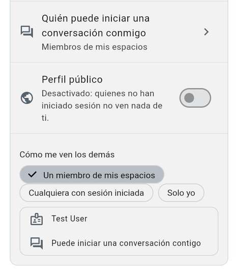

**Pasos**

1. Abra Yo y después la sección **Privacidad**.
2. Active **Perfil público** y confirme **Publicar**.
3. Toque **Copiar el enlace** y compártalo.
4. Desactívelo en cualquier momento para retirarlo.

**Conviene saber**

- Cualquiera que tenga el enlace, con sesión iniciada o no, lee su nombre, su profesión y su biografía. Los datos de contacto, la presencia y los espacios siguen siendo privados.
- Un enlace a un perfil retirado o desconocido dice **Este perfil no es público.**
- **Cómo me ven los demás** muestra una vista previa de lo que ve cada público.

**Véase también:** [Quién puede ver mis datos](#privacidad-quién-puede-ver-mis-datos)

<!-- anchor: user.collaborate.guest-visits -->
### Sus visitas como invitado

**Público:** Todos

Usted pidió visitar un espacio sin hacerse miembro y quiere seguir esa visita.

**Pasos**

1. Abra Yo y después Inicio.
2. Busque **Mis visitas**: cada visita muestra el espacio, la hora y un estado (**Solicitada**, **Confirmada**, **Rechazada**, **Cancelada** o **Caducada**).
3. Para retirar una que todavía está por llegar, toque **Cancelar esta visita**.

**Conviene saber**

- Una visita no es una membresía: no da ningún rol ni ninguna suscripción.
- La lista aparece solo cuando tiene visitas, y solo donde el espacio tiene activada la función **Visitas de invitados**.

**Véase también:** [Descubrir](#descubrir)

<!-- anchor: user.settings.overview -->
## Ajustes y perfil, y sus datos

Todo lo personal de DesKilo vive en dos lugares: **Yo**, que es suyo en todos los espacios, y **Ajustes**, donde cada espacio guarda lo que es específico de su membresía en él. Este capítulo recorre ambos y después explica sus derechos de privacidad y la opción de usar su propio servidor.

En este capítulo:
- [Cómo se organizan los Ajustes](#cómo-se-organizan-los-ajustes) y [el interruptor solo para este espacio](#elegir-un-ajuste-solo-para-este-espacio)
- Su cuenta: [foto](#su-cuenta-y-su-foto), [datos personales](#datos-personales), [dirección](#su-dirección), [NIF-IVA](#su-nif-iva), [condiciones de pago](#sus-condiciones-de-pago), [WhatsApp](#su-número-de-whatsapp), [estado](#su-línea-de-estado), [período de reserva predeterminado](#período-de-reserva-predeterminado)
- Su credencial: [la credencial](#su-credencial) y [su PIN](#el-pin-de-su-credencial)
- Cómo se ve y se lee la app: [idioma](#idioma-de-la-app), [tema](#tema), [navegación](#estilo-de-navegación), [números y fechas](#números-y-fechas), [reloj](#reloj), [zona horaria](#mostrar-las-horas-en-mi-zona-horaria), [consejos](#restaurar-los-consejos), [cámara frontal](#cámara-frontal-para-escanear), [cuentas vinculadas](#cuentas-vinculadas)
- Privacidad y sus datos: [quién puede ver mis datos](#privacidad-quién-puede-ver-mis-datos), [quién me ve](#elegir-quién-me-ve), [perfil público](#publicar-un-perfil-público), [exportar](#exportar-mis-datos), [borrar](#borrar-mis-datos), [solicitudes de derechos](#solicitudes-de-derechos), [push](#notificaciones-push-en-este-dispositivo), [sus derechos](#tus-datos-tus-derechos)
- [Su propio servidor](#su-propio-servidor)

<!-- anchor: user.settings.organisation -->
### Cómo se organizan los Ajustes

**Público:** Todos

Usted quiere saber dónde está un ajuste antes de ponerse a buscarlo.

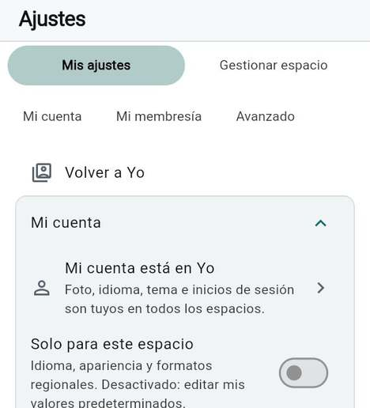

**Pasos**

1. Abra [Ajustes](https://fdittgen-png.github.io/deskilo/#/settings). Si su espacio los llama **Mi cuenta**, es la misma pantalla.
2. Quédese en **Mis ajustes** para todo lo que le concierne a usted. Los propietarios y los administradores ven además **Gestionar espacio**, que contiene la configuración del espacio; los miembros que no administran nada no ven una segunda pestaña.
3. Use los tres atajos bajo las pestañas para saltar: **Mi cuenta**, **Mi membresía**, **Avanzado**.
4. Abra **Volver a Yo** para regresar a su página Yo.

**Conviene saber**

- **Mi cuenta** es una tarjeta breve: remite a Yo, donde viven su foto, su idioma, su tema y sus inicios de sesión para todos los espacios.
- **Mi membresía** es lo que concierne solo a este espacio: lo que puede hacer aquí, su credencial y su PIN, su estado, su período de reserva predeterminado, sus condiciones de pago y los documentos.
- **Avanzado** empieza cerrado. Concierne a este dispositivo: el servidor, las notificaciones push, la cámara frontal.
- Bajo las secciones también encontrará **Ayuda**, la versión de la app, la política de privacidad y **Cerrar sesión**.

**Véase también:** [El interruptor solo para este espacio](#elegir-un-ajuste-solo-para-este-espacio) · [Su propio servidor](#su-propio-servidor)

<!-- anchor: user.settings.scope -->
### Elegir un ajuste solo para este espacio

**Público:** Todos

Usted quiere el inglés en un espacio y el francés en los demás, o un tema oscuro solo en uno de ellos.

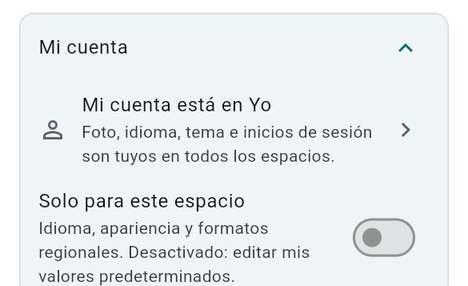

**Pasos**

1. Abra [Ajustes](https://fdittgen-png.github.io/deskilo/#/settings) y mire **Mi cuenta**.
2. Active **Solo para este espacio**. Las filas de idioma, tema y formatos regionales aparecen allí mismo.
3. Cambie lo que quiera. Se aplica solo a este espacio.
4. Para deshacerlo, toque **Usar mis valores predeterminados**.

**Conviene saber**

- Con el interruptor desactivado, usted edita sus valores predeterminados, los que se aplican en todas partes.
- Un ajuste que ha cambiado solo para este espacio aparece en la tarjeta bajo **En este espacio**.
- El interruptor abarca el idioma, el aspecto y los formatos regionales, nada más.

**Véase también:** [Idioma de la app](#idioma-de-la-app) · [Tema](#tema) · [Números y fechas](#números-y-fechas)

<!-- anchor: user.profile.settings.photo -->
### Su cuenta y su foto

**Público:** Todos

Usted quiere que le reconozcan en el directorio, en el plano y en los mensajes.

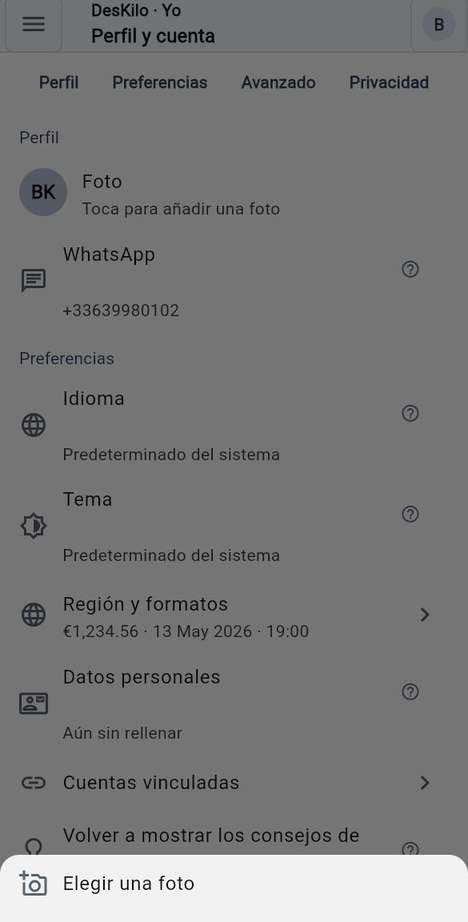

**Pasos**

1. Abra [Yo](https://fdittgen-png.github.io/deskilo/#/me?tab=me). Su cuenta son los bloques **Perfil**, **Preferencias**, **Avanzado** y **Privacidad** de esa página.
2. Toque **Foto**.
3. Elija **Elegir una foto** y seleccione una imagen, o elija **Quitar foto**.

**Conviene saber**

- La fila dice **Toque para añadir una foto** hasta que tenga una y después **Toque para cambiar**.
- Quién ve su foto es decisión suya: véase [Quién me ve](#elegir-quién-me-ve).
- Su cuenta es suya en todos los espacios; su situación en un espacio concreto está en los Ajustes de ese espacio.

**Véase también:** [Perfiles](#perfiles-una-cuenta-varios-espacios) · [Quién me ve](#elegir-quién-me-ve)

<!-- anchor: user.profile.settings.personal-info -->
### Datos personales

**Público:** Todos

Usted quiere que sus facturas y cartas lleven correctamente su nombre y sus datos.

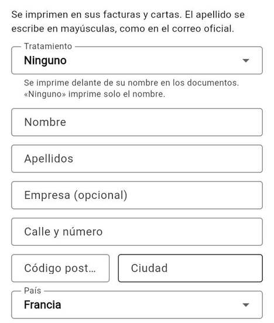

**Pasos**

1. Abra [Yo](https://fdittgen-png.github.io/deskilo/#/me?tab=me) y toque **Datos personales**.
2. Elija un **Tratamiento** si quiere que se imprima uno antes de su nombre y después rellene **Nombre**, **Apellidos**, **Empresa (opcional)**, la dirección, **Teléfono** y **E-mail para documentos**.
3. Compruebe **En sus documentos**, que muestra cómo se imprimirá.
4. Responda a las preguntas que su espacio añada bajo su propio título y después toque **Guardar**.

**Conviene saber**

- Sus apellidos y su ciudad se escriben en mayúsculas, como en el correo oficial.
- Un formulario vacío muestra **Aún sin rellenar**.
- Las respuestas a las preguntas de su espacio son datos personales: forman parte de su exportación y se borran cuando usted deja el espacio.

**Véase también:** [Su dirección](#su-dirección) · [Su NIF-IVA](#su-nif-iva)

<!-- anchor: user.profile.settings.address -->
### Su dirección

**Público:** Todos

Usted quiere que las facturas se envíen al lugar correcto.

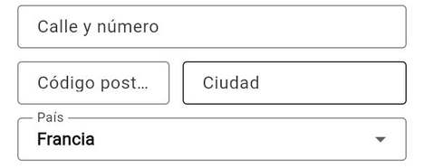

**Pasos**

1. Abra [Yo](https://fdittgen-png.github.io/deskilo/#/me?tab=me) y toque **Datos personales**.
2. Rellene **Calle y número**, **Código postal** y **Ciudad**.
3. Elija su **País** y después toque **Guardar**.

**Conviene saber**

- Donde su espacio no usa el formulario de datos personales, Yo muestra en su lugar una fila **Dirección** más sencilla con una opción de **País**.
- La dirección se imprime en sus facturas.

**Véase también:** [Datos personales](#datos-personales)

<!-- anchor: user.profile.settings.vat-id -->
### Su NIF-IVA

**Público:** Todos

Usted recibe facturas como empresa y quiere que la factura muestre su número de IVA.

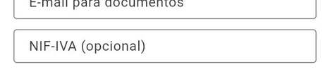

**Pasos**

1. Abra [Yo](https://fdittgen-png.github.io/deskilo/#/me?tab=me) y toque **Datos personales**.
2. Escriba su número en **NIF-IVA (opcional)**.
3. Añada su **Identificador de empresa (opcional)** si tiene uno y después toque **Guardar**.

**Conviene saber**

- Déjelo vacío si es un particular.
- Que una factura lleve IVA o no depende de este número y del país; el espacio aplica sus propias reglas.

**Véase también:** [Datos personales](#datos-personales)

<!-- anchor: user.profile.settings.payment-terms -->
### Sus condiciones de pago

**Público:** Miembro

Usted quiere saber en qué condiciones se le factura.

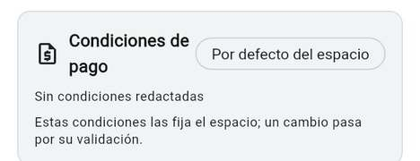

**Pasos**

1. Abra [Ajustes](https://fdittgen-png.github.io/deskilo/#/settings) y, bajo **Mi membresía**, toque **Condiciones de pago**.
2. Lea la insignia: **Por defecto del espacio**, o **Propias del miembro** si se acordaron condiciones con usted.
3. Lea las condiciones: no puede cambiarlas usted mismo. Para que se cambien, pídaselo a un administrador.

**Conviene saber**

- Un administrador o propietario con el permiso propone un cambio desde su ficha de miembro: **Solicitar un cambio**, solo los campos que hay que cambiar (un campo vacío conserva la redacción del espacio), un **Motivo (opcional)** y después **Enviar solicitud**.
- El espacio fija estas condiciones; un cambio pasa por su validación y se aplica una vez validado.

**Véase también:** [Su NIF-IVA](#su-nif-iva)

<!-- anchor: user.profile.settings.whatsapp -->
### Su número de WhatsApp

**Público:** Todos

Usted quiere que sus compañeros puedan localizarle por WhatsApp, o dejar de compartir el número.

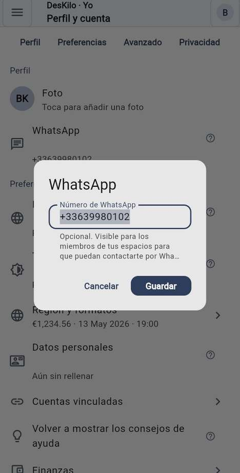

**Pasos**

1. Abra [Yo](https://fdittgen-png.github.io/deskilo/#/me?tab=me) y toque **WhatsApp**.
2. Escriba su número en **Número de WhatsApp**, con el prefijo del país.
3. Toque **Guardar**. Para dejar de compartirlo, vacíe el campo y guarde.

**Conviene saber**

- Dice **No compartido** hasta que lo fije.
- Quién ve el número se decide en **WhatsApp y correo**, dentro de [Quién me ve](#elegir-quién-me-ve).
- La fila solo aparece cuando su espacio usa WhatsApp.

**Véase también:** [Quién me ve](#elegir-quién-me-ve)

<!-- anchor: user.profile.settings.status -->
### Su línea de estado

**Público:** Miembro

Usted quiere una línea breve junto a su nombre, como «En una llamada · de vuelta a las 14:00».

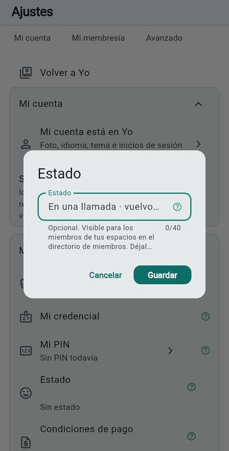

**Pasos**

1. Abra [Ajustes](https://fdittgen-png.github.io/deskilo/#/settings) y, bajo **Mi membresía**, toque **Estado**.
2. Escriba su línea en **Estado**.
3. Toque **Guardar**. Para borrarla, vacíe el campo y guarde.

**Conviene saber**

- Es opcional y breve; el campo le detiene en su límite.
- Los miembros de sus espacios la ven en el directorio de miembros.
- Dice **Sin estado** hasta que escriba una.

**Véase también:** [Quién me ve](#elegir-quién-me-ve)

<!-- anchor: user.profile.settings.default-period -->
### Período de reserva predeterminado

**Público:** Miembro

Usted suele reservar la misma media jornada y quiere tenerla ya elegida.

**Pasos**

1. Abra [Ajustes](https://fdittgen-png.github.io/deskilo/#/settings) y, bajo **Mi membresía**, toque **Período de reserva predeterminado**.
2. Elija **Mañana**, **Tarde**, **Día completo** o **Sin preferencia (día completo)**.

**Conviene saber**

- Solo preselecciona: puede cambiar el período cada vez que reserve.
- La fila solo aparece cuando la configuración de reservas de su espacio ofrece una opción.

**Véase también:** [La hoja de reserva](#la-hoja-de-reserva)

<!-- anchor: user.profile.settings.badge -->
### Su credencial

**Público:** Miembro

Usted quiere una credencial o una tarjeta que le identifique en la puerta o en el quiosco.

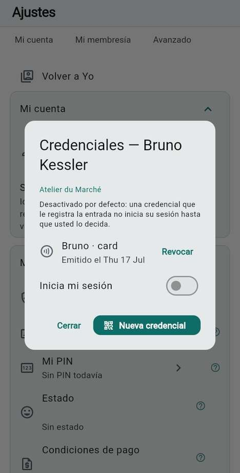

**Pasos**

1. Abra [Ajustes](https://fdittgen-png.github.io/deskilo/#/settings) y, bajo **Mi membresía**, toque **Mi credencial**.
2. Toque **Nueva credencial** para obtener su código QR y después **Guardar como PDF** para imprimirlo, o toque **Registrar tarjeta** y acerque su tarjeta RFID o NFC a la parte trasera del dispositivo.
3. Para retirar una credencial, toque **Revocar**.

**Conviene saber**

- Un código QR nuevo se muestra una sola vez: guárdelo de inmediato.
- Una credencial revocada deja de funcionar al instante. Emita una nueva en lugar de buscar la antigua.
- **Inicia mi sesión** está desactivado por defecto: una credencial que registra su llegada no inicia su sesión hasta que lo active, y antes necesita un PIN.
- **Nueva credencial** requiere la función **Credenciales QR** y **Registrar tarjeta** la función **Credenciales RFID / NFC**; su espacio puede ofrecer solo una de ellas.

**Véase también:** [El PIN de su credencial](#el-pin-de-su-credencial)

<!-- anchor: user.profile.settings.badge-pin -->
### El PIN de su credencial

**Público:** Miembro

Usted quiere iniciar sesión escaneando su credencial en lugar de escribir su correo.

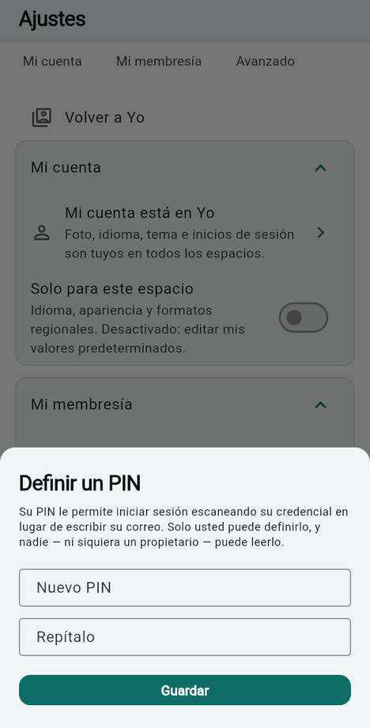

**Pasos**

1. Abra [Ajustes](https://fdittgen-png.github.io/deskilo/#/settings) y, bajo **Mi membresía**, toque **Mi PIN**.
2. Elija **Definir un PIN**, introdúzcalo en **Nuevo PIN**, repítalo en **Repítalo** y guarde.
3. Abra **Mi credencial** y active **Inicia mi sesión** en la credencial que quiera.

**Conviene saber**

- La fila dice **Sin PIN todavía** o **PIN definido**.
- Solo usted puede definirlo, y nadie, ni siquiera un propietario, puede volver a leerlo.
- **Cambiar el PIN** lo sustituye; **Eliminar el PIN** desactiva el inicio de sesión con credencial en todas sus credenciales.

**Véase también:** [Su credencial](#su-credencial)

<!-- anchor: user.profile.settings.language -->
### Idioma de la app

**Público:** Todos

Usted quiere la app en su propio idioma.

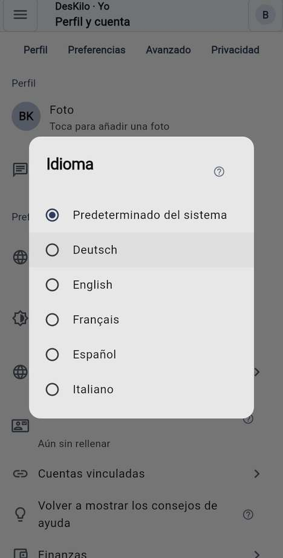

**Pasos**

1. Abra [Yo](https://fdittgen-png.github.io/deskilo/#/me?tab=me) y toque **Idioma**.
2. Elija un idioma, o **Predeterminado del sistema** para seguir el de su teléfono.

**Conviene saber**

- Se aplica a todos los espacios, a menos que fije uno para un solo espacio con [Solo para este espacio](#elegir-un-ajuste-solo-para-este-espacio).
- Cada idioma está escrito con su propio nombre, de modo que siempre puede encontrar el suyo.

**Véase también:** [Números y fechas](#números-y-fechas)

<!-- anchor: user.profile.settings.theme -->
### Tema

**Público:** Todos

Usted quiere la app más clara o más oscura.

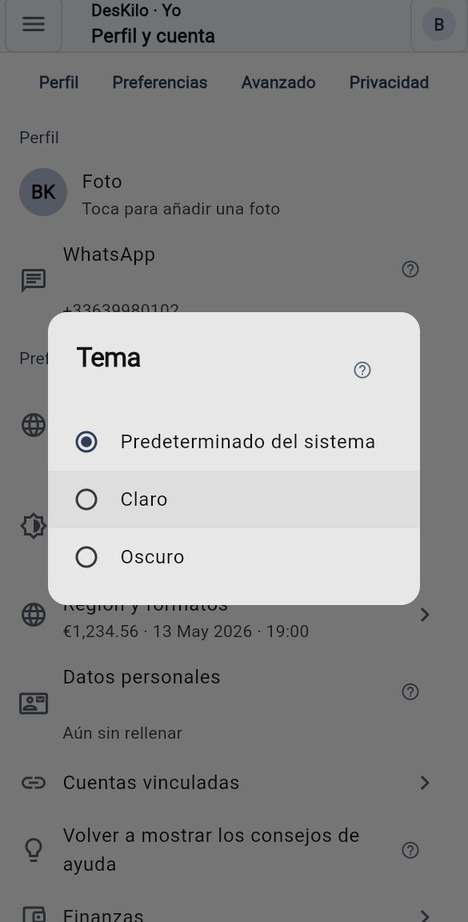

**Pasos**

1. Abra [Yo](https://fdittgen-png.github.io/deskilo/#/me?tab=me) y toque **Tema**.
2. Elija **Predeterminado del sistema**, **Claro** u **Oscuro**.

**Conviene saber**

- **Predeterminado del sistema** sigue el propio interruptor de claro y oscuro de su teléfono.
- Como el idioma, se puede fijar para un solo espacio.

**Véase también:** [Idioma de la app](#idioma-de-la-app)

<!-- anchor: user.profile.settings.navigation -->
### Estilo de navegación

**Público:** Todos

Usted prefiere la barra inferior, o el menú que conoce de la web.

**Pasos**

1. Abra [Yo](https://fdittgen-png.github.io/deskilo/#/me?tab=me) y toque **Navegación**.
2. Elija **Por defecto para este dispositivo**, **Clásica: la barra inferior y el botón redondo** o **Menú: la hamburguesa, como en la web**.

**Conviene saber**

- La fila está oculta en la versión web, que usa siempre el menú, y solo aparece cuando su espacio la ofrece.

**Véase también:** [Cómo se organizan los Ajustes](#cómo-se-organizan-los-ajustes)

<!-- anchor: user.profile.settings.regional-formats -->
### Números y fechas

**Público:** Todos

Usted quiere que los importes y las fechas se escriban como usted los lee, sea cual sea el idioma de la app.

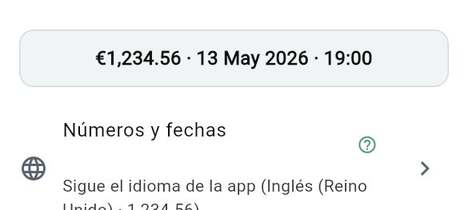

**Pasos**

1. Abra [Región y formatos](https://fdittgen-png.github.io/deskilo/#/formats).
2. Toque **Números y fechas** y elija una región, o **Automático** para seguir el idioma de la app.
3. Compruebe la línea de vista previa de arriba: muestra un importe, una fecha y una hora tal como los verá.

**Conviene saber**

- Es independiente del idioma: una app en inglés puede escribir fechas a la francesa.
- Se puede fijar para un solo espacio con [Solo para este espacio](#elegir-un-ajuste-solo-para-este-espacio).
- La fila solo aparece cuando su espacio usa **Región y formatos**.

**Véase también:** [Reloj](#reloj)

<!-- anchor: user.profile.settings.clock -->
### Reloj

**Público:** Todos

Usted prefiere las horas en formato de 24 o de 12 horas.

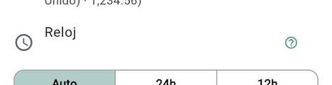

**Pasos**

1. Abra [Región y formatos](https://fdittgen-png.github.io/deskilo/#/formats).
2. Bajo **Reloj**, elija **Auto**, **24h** o **12h**.

**Conviene saber**

- **Auto** hace lo que hace su región.
- Cambia cómo se escriben las horas, nunca lo que significan.
- La fila solo aparece cuando su espacio usa **Región y formatos**.

**Véase también:** [Mostrar las horas en mi zona horaria](#mostrar-las-horas-en-mi-zona-horaria)

<!-- anchor: user.profile.settings.device-zone -->
### Mostrar las horas en mi zona horaria

**Público:** Todos

Usted está de viaje y quiere las horas tal como las marca su propio reloj.

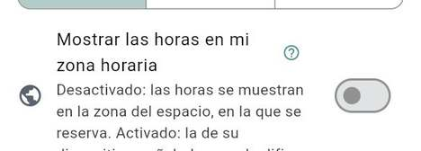

**Pasos**

1. Abra [Región y formatos](https://fdittgen-png.github.io/deskilo/#/formats).
2. Active **Mostrar las horas en mi zona horaria**.

**Conviene saber**

- Desactivado, las horas están en la zona del espacio, aquella en la que se hacen las reservas. Es el valor por defecto.
- Activado, las horas siguen a su dispositivo y se etiquetan allí donde difieren de las del espacio.
- La fila solo aparece cuando su espacio usa **Región y formatos**.

**Véase también:** [Reloj](#reloj)

<!-- anchor: user.profile.settings.restore-hints -->
### Restaurar los consejos

**Público:** Todos

Usted ocultó los consejos de ayuda y ahora quiere recuperarlos.

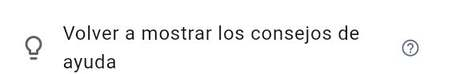

**Pasos**

1. Abra [Yo](https://fdittgen-png.github.io/deskilo/#/me?tab=me).
2. Toque **Volver a mostrar los consejos de ayuda**.

**Conviene saber**

- Un mensaje lo confirma: **Los consejos de ayuda volverán a mostrarse.**
- No se restablece nada más.
- La fila solo aparece cuando su espacio usa consejos de ayuda.

**Véase también:** [Cómo se organizan los Ajustes](#cómo-se-organizan-los-ajustes)

<!-- anchor: user.profile.settings.front-camera -->
### Cámara frontal para escanear

**Público:** Todos

Usted escanea credenciales con una tableta fijada a la pared cuya cámara trasera mira hacia la pared.

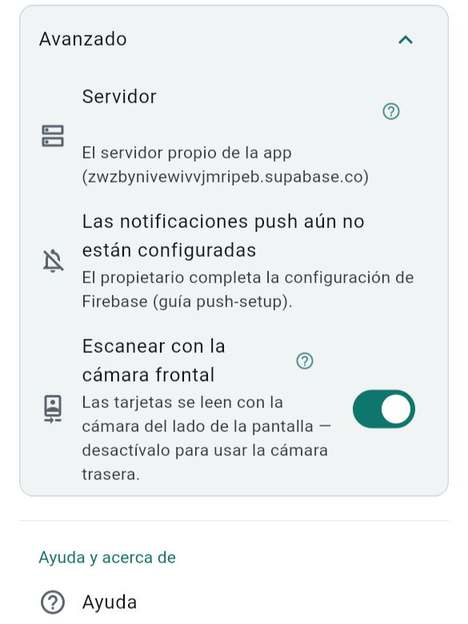

**Pasos**

1. Abra [Ajustes](https://fdittgen-png.github.io/deskilo/#/settings) y abra **Avanzado**.
2. Active **Escanear con la cámara frontal** para usar la cámara del lado de la pantalla, o desactívelo para la cámara trasera.

**Conviene saber**

- Está activado por defecto y se aplica solo a este dispositivo.

**Véase también:** [Su credencial](#su-credencial)

<!-- anchor: user.profile.settings.linked-accounts -->
### Cuentas vinculadas

**Público:** Todos

Usted quiere iniciar sesión con otra identidad, como una cuenta de Google, además de con su correo.

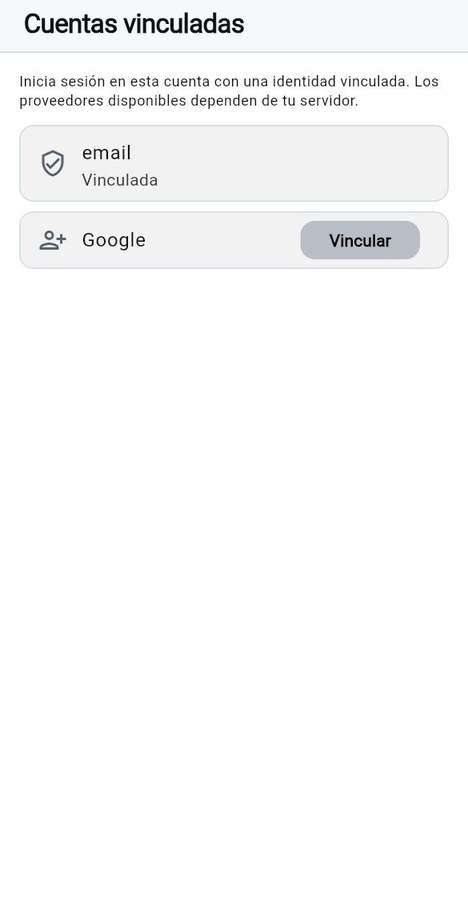

**Pasos**

1. Abra [Yo](https://fdittgen-png.github.io/deskilo/#/me?tab=me) y toque **Cuentas vinculadas**.
2. Toque **Vincular** junto a un proveedor y termine en el navegador.
3. Para quitar una, toque **Desvincular**.

**Conviene saber**

- Una identidad vinculada muestra **Vinculada**.

**Véase también:** [Perfiles](#perfiles-una-cuenta-varios-espacios)

<!-- anchor: user.privacy.visibility -->
### Privacidad: quién puede ver mis datos

**Público:** Todos

Usted quiere saber quién puede leer qué sobre usted, y quién ha mirado realmente.

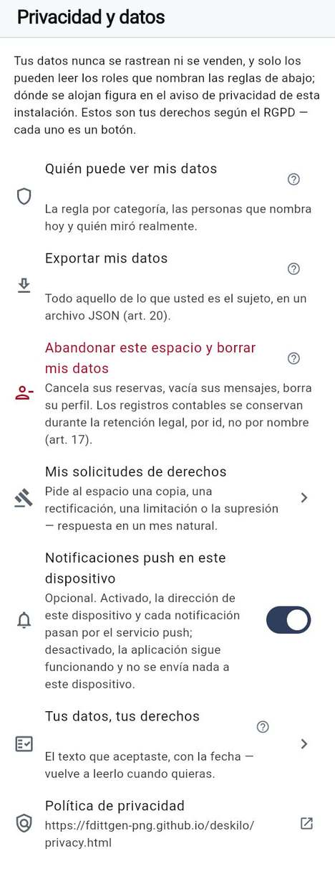

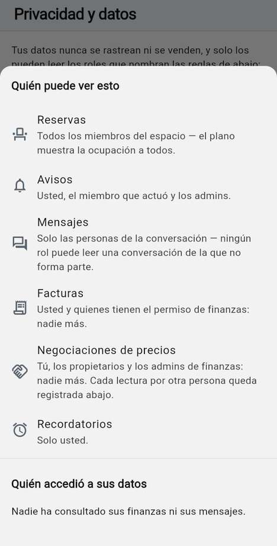

**Pasos**

1. Abra [Privacidad y datos](https://fdittgen-png.github.io/deskilo/#/privacy).
2. Toque **Quién puede ver mis datos**.
3. Lea la regla de cada categoría, las personas que nombra hoy y **Quién accedió a sus datos**.

**Conviene saber**

- Sus datos nunca se rastrean ni se venden. Los roles deciden quién los lee, y el servidor lo hace cumplir.
- La hoja enuncia la regla; no hay nada que activar en ella. Para elegir lo que ven los demás miembros de su perfil, use [Quién me ve](#elegir-quién-me-ve).

**Véase también:** [Quién me ve](#elegir-quién-me-ve) · [Tus datos, tus derechos](#tus-datos-tus-derechos)

<!-- anchor: user.privacy.audiences -->
### Elegir quién me ve

**Público:** Todos

Usted quiere decidir, elemento por elemento, quién ve su nombre, su biografía, sus datos de contacto y su presencia.

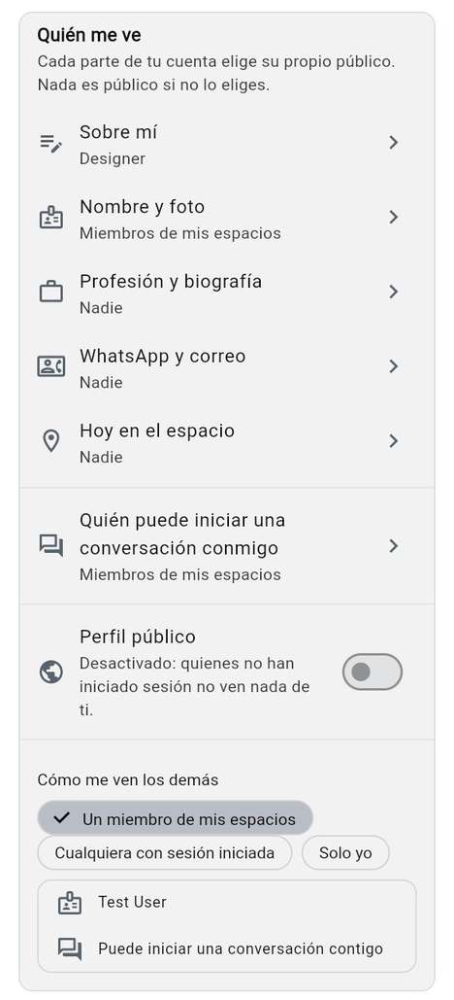

**Pasos**

1. Abra [Yo](https://fdittgen-png.github.io/deskilo/#/me?tab=me) y baje hasta **Privacidad**, a la tarjeta **Quién me ve**.
2. Toque un elemento: **Sobre mí**, **Nombre y foto**, **Profesión y biografía**, **WhatsApp y correo**, **Hoy en el espacio** o **Quién puede iniciar una conversación conmigo**.
3. Elija un público, por ejemplo **Nadie**, **Miembros de mis espacios** o **Miembros de espacios elegidos**, marque los espacios si eligió algunos y toque **Guardar**.
4. Compruebe **Cómo me ven los demás** al pie de la tarjeta.

**Conviene saber**

- Nada es público a menos que usted lo elija.
- Ampliar un público le pide confirmar antes.
- **Personas bloqueadas**, bajo la tarjeta, enumera a quienes ha bloqueado; no pueden verle ni localizarle y usted no puede localizarlos a ellos. Toque **Desbloquear** para deshacerlo.
- **Cualquiera con sesión iniciada** solo se ofrece para algunos elementos, como **Nombre y foto** y **Profesión y biografía**. **WhatsApp y correo** y **Hoy en el espacio** nunca van más allá de sus propios espacios.

**Véase también:** [Perfil público](#publicar-un-perfil-público) · [Quién puede ver mis datos](#privacidad-quién-puede-ver-mis-datos)

<!-- anchor: user.privacy.public-profile -->
### Publicar un perfil público

**Público:** Todos

Usted quiere una página con su nombre y unas pocas palabras que la gente pueda leer sin una cuenta.

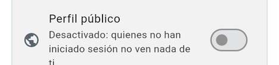

**Pasos**

1. Abra [Yo](https://fdittgen-png.github.io/deskilo/#/me?tab=me) y busque **Perfil público** en la tarjeta **Quién me ve**.
2. Actívelo y confirme con **Publicar**.
3. Toque **Copiar el enlace** para compartirlo.

**Conviene saber**

- Cualquiera que tenga el enlace lee su nombre, su profesión y su biografía. Los datos de contacto, la presencia y los espacios siguen siendo privados.
- Desactivado, las personas que no han iniciado sesión no ven nada de usted.

**Véase también:** [Elegir quién me ve](#elegir-quién-me-ve)

<!-- anchor: user.privacy.export -->
### Exportar mis datos

**Público:** Todos

Usted quiere una copia de todo lo que DesKilo guarda sobre usted.

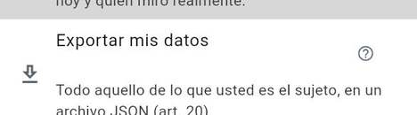

**Pasos**

1. Abra [Privacidad y datos](https://fdittgen-png.github.io/deskilo/#/privacy).
2. Toque **Exportar mis datos**.
3. Guarde o comparta el archivo que se genera.

**Conviene saber**

- Es un único archivo JSON, creado en el momento en que lo pide.
- La fila solo aparece cuando su espacio ofrece la exportación de datos.

**Véase también:** [Solicitudes de derechos](#solicitudes-de-derechos)

<!-- anchor: user.privacy.erase -->
### Borrar mis datos

**Público:** Todos

Usted quiere dejar un espacio y que se borren sus datos.

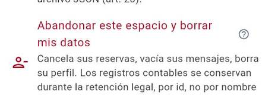

**Pasos**

1. Abra [Privacidad y datos](https://fdittgen-png.github.io/deskilo/#/privacy).
2. Toque **Abandonar este espacio y borrar mis datos**.
3. Lea lo que va a hacer, escriba la palabra de confirmación y toque **Borrar**.

**Conviene saber**

- Cancela sus reservas abiertas y deja en blanco sus mensajes en este espacio. Su perfil se borra cuando es su último espacio; las reservas pasadas se conservan como registro de ocupación del espacio.
- Los registros contables se conservan durante el plazo legal de conservación, por identificador y no por nombre.
- La fila aparece junto con la exportación de datos. Está atenuada para un propietario, que debe transmitir antes el espacio, en Copropiedad.

**Véase también:** [Exportar mis datos](#exportar-mis-datos)

<!-- anchor: user.privacy.requests -->
### Solicitudes de derechos

**Público:** Todos

Usted quiere pedir al espacio una copia, una corrección, una limitación o la supresión, y conservar un registro.

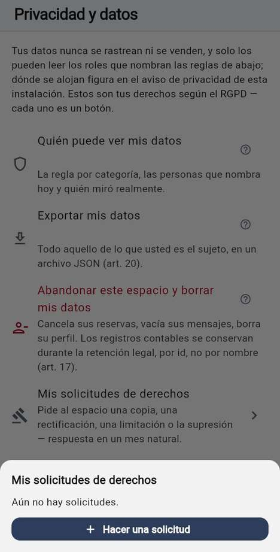

**Pasos**

1. Abra [Privacidad y datos](https://fdittgen-png.github.io/deskilo/#/privacy) y toque **Mis solicitudes de derechos**.
2. Toque **Hacer una solicitud** y elija lo que pide: ver una copia de sus datos, llevárselos a otra parte, corregirlos, limitar su uso, oponerse a un uso o borrarlos.
3. Añada **Detalles (opcional)** y toque **Enviar la solicitud**.

**Conviene saber**

- El espacio responde en el plazo de un mes natural; la hoja muestra la fecha.
- Cada solicitud indica si fue recibida, prorrogada (con la nueva fecha y el motivo), respondida o rechazada.

**Véase también:** [Exportar mis datos](#exportar-mis-datos) · [Borrar mis datos](#borrar-mis-datos)

<!-- anchor: user.privacy.push -->
### Notificaciones push en este dispositivo

**Público:** Todos

Usted quiere dejar de recibir notificaciones en este dispositivo, o volver a activarlas.

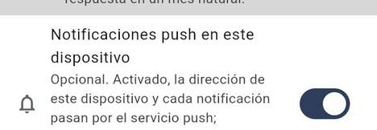

**Pasos**

1. Abra [Privacidad y datos](https://fdittgen-png.github.io/deskilo/#/privacy).
2. Desactive o active **Notificaciones push en este dispositivo**.

**Conviene saber**

- Desactivado, la app sigue funcionando y no se envía nada a este dispositivo.
- Activado, la dirección de este dispositivo y cada notificación pasan por el servicio push.

**Véase también:** [Tus datos, tus derechos](#tus-datos-tus-derechos)

<!-- anchor: user.privacy.consent -->
### Tus datos, tus derechos

**Público:** Todos

Usted quiere volver a leer lo que aceptó sobre sus datos.

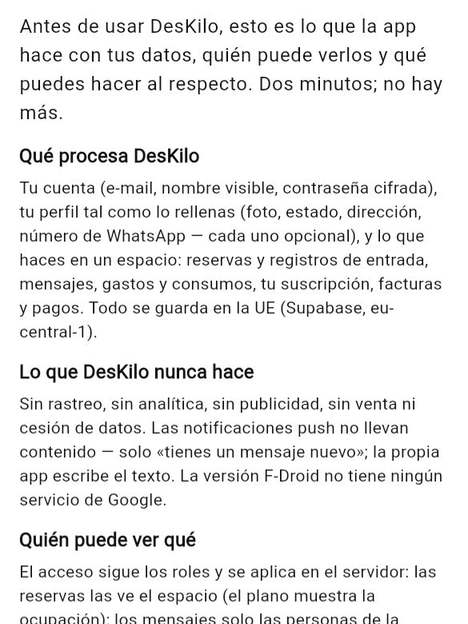

**Pasos**

1. Abra [Privacidad y datos](https://fdittgen-png.github.io/deskilo/#/privacy).
2. Toque **Sus datos, sus derechos**.
3. Lea el texto: qué se trata, qué no se hace nunca, quién ve qué, quién es responsable, durante cuánto tiempo y cuáles son sus derechos.

**Conviene saber**

- Muestra la fecha y la versión que aceptó; un cambio del texto le pide su aceptación de nuevo.
- **Política de privacidad**, justo debajo, abre la política completa en línea.

**Véase también:** [Quién puede ver mis datos](#privacidad-quién-puede-ver-mis-datos)

<!-- anchor: user.backend.server -->
### Su propio servidor

**Público:** Todos

Por defecto la app usa el servicio de DesKilo. Su comunidad puede tener su propio servidor, y usted quiere conectarse a él.

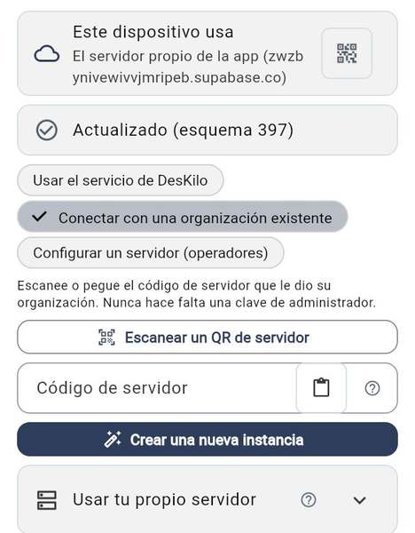

**Pasos**

1. Abra [Ajustes](https://fdittgen-png.github.io/deskilo/#/settings), después **Avanzado** y después **Servidor**.
2. Elija **Conectar con una organización existente**.
3. Toque **Escanear un QR de servidor**, o pegue el código en **Código de servidor**.
4. Guarde. La app cierra su sesión y usa el nuevo servidor la próxima vez que se abra.

**Conviene saber**

- Nunca necesita una clave de administrador.
- **Usar el servidor de la app** le devuelve al valor por defecto en cualquier momento.
- Su cuenta vive en un servidor, por eso cambiar de servidor cierra la sesión.

**Véase también:** [Cómo usar el suyo propio](#cómo-usar-el-suyo-propio)

<!-- anchor: user.backend.how -->
### Cómo usar el suyo propio

**Público:** Todos

Usted dirige una comunidad y quiere alojar DesKilo por su cuenta.

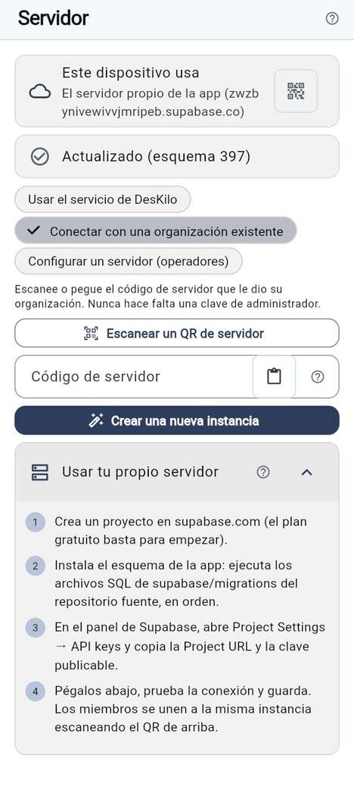

**Pasos**

1. Abra la pantalla **Servidor** y toque **Usar su propio servidor**.
2. Siga los cuatro pasos que se muestran: crear un proyecto en supabase.com, instalar el esquema, copiar la URL del proyecto y la clave publicable, y después pegarlas y **Probar la conexión**.
3. O toque **Crear una nueva instancia** para la configuración guiada.

**Conviene saber**

- La prueba le dice qué falla: dirección inalcanzable, clave rechazada o tablas ausentes.
- Los miembros se unen al mismo servidor escaneando el QR de esta pantalla.
- La parte del operador, los entornos y el despliegue, está en el capítulo avanzado.

**Véase también:** [Su propio servidor](#su-propio-servidor)

<!-- anchor: user.money.overview -->
## Finanzas

Todo lo que debe, lo que ha pagado y lo que se le ha facturado está en la pestaña **Finanzas**: un único lugar para leer el mes, saldarlo, encontrar una factura y pedir un cambio.

En este capítulo:
- [Consulte su extracto](#consulte-su-extracto) y [qué cambia una factura](#cuando-un-mes-ya-está-facturado)
- [Pague lo que debe](#pague-lo-que-debe) y [registre un pago](#registre-un-pago)
- [Sus facturas](#sus-facturas) y [cuánto costó cada reserva](#cuánto-costó-cada-reserva)
- [Avisos financieros](#avisos-financieros), [informes](#informes-vista-rápida-descarga-compartir) y [sus precios negociados](#sus-precios-negociados)
- [Abra un documento](#abra-un-documento-de-la-biblioteca) de la biblioteca
- [Envíe un gasto](#envíe-un-gasto) y [apruebe o rechace uno](#apruebe-o-rechace-un-gasto)
- [Cómo se muestran los importes](#cómo-se-muestran-los-importes) y [sus finanzas en todos sus espacios](#sus-finanzas-en-todos-sus-espacios)
- Para administradores de facturación: [La facturación de un vistazo](#la-facturación-de-un-vistazo)

<!-- anchor: user.money.statement -->
### Consulte su extracto

**Público:** Miembro

Quiere saber cómo va el mes: lo que ha usado, lo que cuesta y lo que queda por saldar.

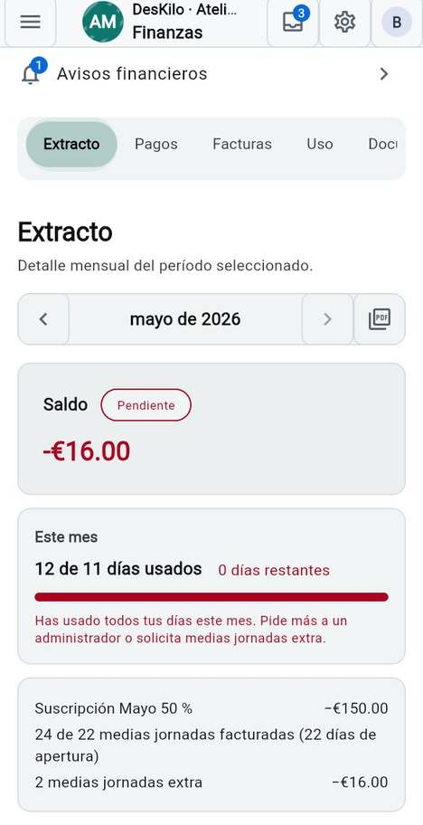

**Pasos**

1. Abra [Finanzas](https://fdittgen-png.github.io/deskilo/#/money) y quédese en **Extracto**.
2. Use las flechas junto al nombre del mes para ver otros meses.
3. Lea primero **Saldo**: **Pendiente** en rojo significa que usted debe esa cantidad; **Al día** significa que no queda nada.
4. Lea debajo **Este mes**: los días que ha usado de los días que incluye su plan, y los días que le quedan.
5. Lea las tarjetas siguientes: su suscripción, las medias jornadas extra, los servicios, los paquetes, las posiciones abiertas y **Pagos y créditos**.

**Conviene saber**

- Una mañana o una tarde reservada cuenta como media jornada, por lo que puede ver valores como 0,5 días.
- La tarjeta indica también la regla de su plan. Con pago por uso muestra siempre la tarifa de los días extra; con las otras dos reglas le indica que pida más a un administrador o compre un paquete cuando haya usado todos sus días.
- Una línea marcada «pendiente de validación» espera a que alguien la confirme y todavía no se cuenta.
- Pulse el icono PDF junto al mes para exportar la factura.

**Véase también:** [Pague lo que debe](#pague-lo-que-debe) · [Cuánto costó cada reserva](#cuánto-costó-cada-reserva)

<!-- anchor: user.money.statement.invoiced -->
### Cuando un mes ya está facturado

**Público:** Miembro

Quiere saber qué cifra debe tener en cuenta cuando el espacio le ha enviado la factura de un mes.

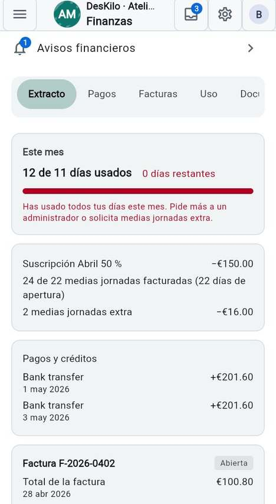

**Pasos**

1. Abra [Finanzas](https://fdittgen-png.github.io/deskilo/#/money) y vuelva al mes facturado con la flecha izquierda.
2. Busque la tarjeta llamada **Factura** (o **Nota de crédito** cuando el total es negativo) seguida de su número.
3. Lea el estado en la tarjeta y después **Total de la factura**; una factura pagada en parte muestra además **Pagado hasta ahora** y **Pendiente de pago**.

**Conviene saber**

- Una vez facturado el mes, es la factura la que decide si está saldado. El pago que lo cierra suele llegar en un mes posterior, de modo que el saldo del propio mes ya no es la referencia.
- Una factura rectificativa dice «El espacio le debe este importe»: usted no tiene nada que pagar.

**Véase también:** [Sus facturas](#sus-facturas)

<!-- anchor: user.money.payments -->
### Pague lo que debe

**Público:** Miembro

Quiere saldar su saldo y saber cómo espera el espacio recibir el dinero.

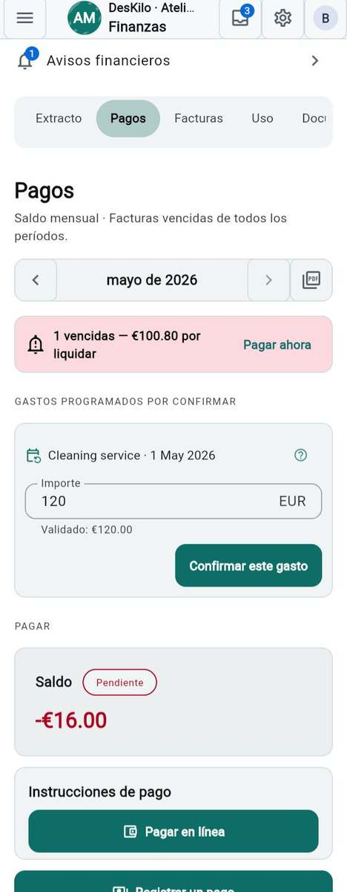

**Pasos**

1. Abra [Finanzas](https://fdittgen-png.github.io/deskilo/#/money) y elija **Pagos**.
2. Compruebe **Saldo** bajo **Pagar**; las facturas vencidas de todos los periodos aparecen destacadas encima.
3. Lea **Instrucciones de pago**: los datos bancarios, la referencia de pago que debe indicar y las demás formas de pago que acepta el espacio. Pulse un IBAN o un valor para copiarlo.
4. Si aparece el botón, pulse **Pagar en línea**.
5. Cuando haya pagado de otra manera, [registre el pago](#registre-un-pago).

**Conviene saber**

- Las instrucciones solo aparecen mientras se debe algo y únicamente si el espacio las ha configurado. Si no hay nada, pregunte a su administrador cómo pagar.
- Un pago en línea que el proveedor aún no ha confirmado se muestra como **Pago en línea pendiente**: el saldo sigue mostrando lo que se debe hasta que se confirme.
- En **Solicitudes** también puede enviar un gasto, pedir **Solicitar medias jornadas extra** o, si su plan funciona con paquetes, **Comprar un paquete**.

**Véase también:** [Registre un pago](#registre-un-pago) · [Envíe un gasto](#envíe-un-gasto)

<!-- anchor: user.money.payments.record -->
### Registre un pago

**Público:** Miembro

Ha pagado por transferencia, en efectivo o de otra manera y quiere que el espacio lo sepa.

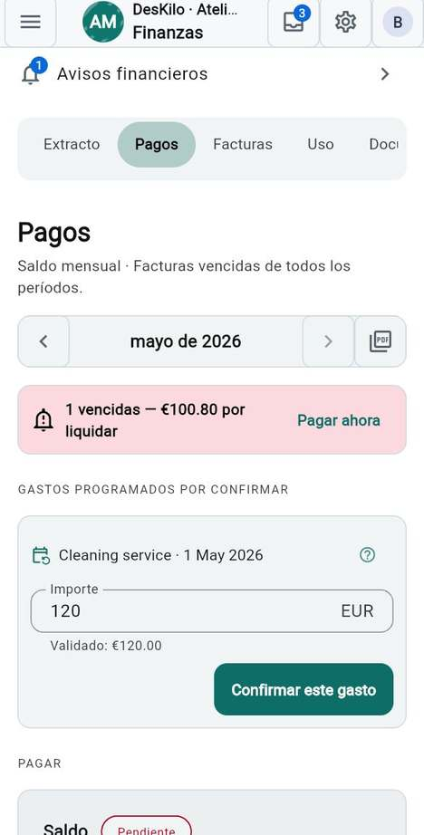

**Pasos**

1. Abra [Finanzas](https://fdittgen-png.github.io/deskilo/#/money), elija **Pagos** y pulse **Registrar un pago**.
2. Introduzca el **Importe**.
3. Pulse cómo ha pagado: **Transferencia**, **Efectivo**, **PayPal**, **TWINT**, **Tarjeta**, **Wero**, **Lydia**, **Wise** u **Otro**. Púlselo de nuevo para quitarlo.
4. Compruebe **Fecha del pago** y **Se aplica a**, el mes que salda este pago.
5. Añada una **Nota (opcional)** y pulse **Enviar para confirmación**.

**Conviene saber**

- Su pago no es definitivo al enviarlo. Queda como «pendiente de validación» hasta que lo confirmen las personas que el espacio haya elegido, según lo definido en las [Reglas de validación](#reglas-de-validación-dominio-por-dominio). Solo entonces salda su saldo.
- La fecha de su pago no puede estar en el futuro. **Se aplica a** puede llegar hasta un mes por adelantado, para pagar con antelación.

**Véase también:** [Pague lo que debe](#pague-lo-que-debe) · [Avisos financieros](#avisos-financieros)

<!-- anchor: user.money.invoices -->
### Sus facturas

**Público:** Miembro

Quiere encontrar una factura, ver si está pagada y obtener su PDF.

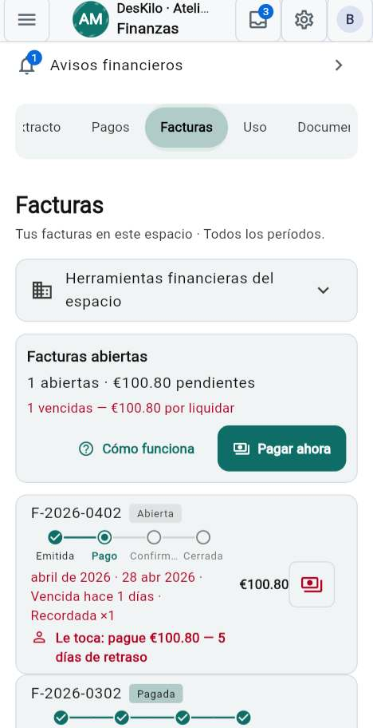

**Pasos**

1. Abra [Finanzas](https://fdittgen-png.github.io/deskilo/#/money) y elija **Facturas**.
2. Lea la lista, de la más reciente a la más antigua. Cada fila muestra el número, una etiqueta de estado, el mes, la fecha y el importe.
3. Pulse una factura para abrirla.
4. Pulse **Vista rápida** para leerla en pantalla, **Descargar PDF** para guardarla o **Compartir PDF** para enviarla.

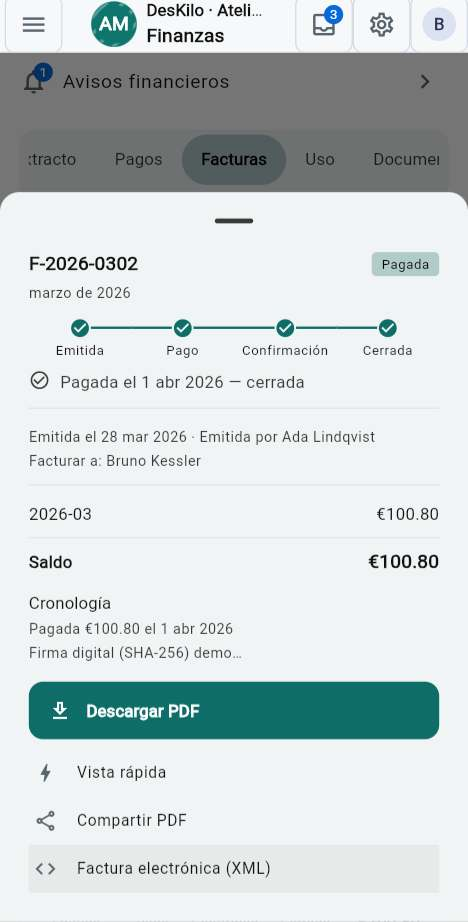

**Conviene saber**

- Los estados son **Abierta**, **Pendiente de validación**, **Pagada**, **Parcialmente pagada**, **Parcialmente pagada · saldo anulado** y **Reembolsada**. Una factura abierta indica cuándo vence o cuántos días lleva vencida, y cuántos recordatorios ha recibido.
- Pulse el icono de pago en una factura abierta para ir a **Pagos**.
- Si la lista está vacía, el espacio todavía no le ha facturado; factura un mes cuando lo cierra.
- Las facturas no se pueden editar. Una factura equivocada se marca como **Errónea** y se sustituye por una nueva; la errónea desaparece de su lista. Cuando varias facturas se agrupan en una, la factura agrupada las sustituye en su lista.

**Véase también:** [Pague lo que debe](#pague-lo-que-debe) · [Sus finanzas en todos sus espacios](#sus-finanzas-en-todos-sus-espacios)

<!-- anchor: user.money.usage -->
### Cuánto costó cada reserva

**Público:** Miembro · Administrador/a

Quiere ver, reserva por reserva, lo que se ha facturado este mes.

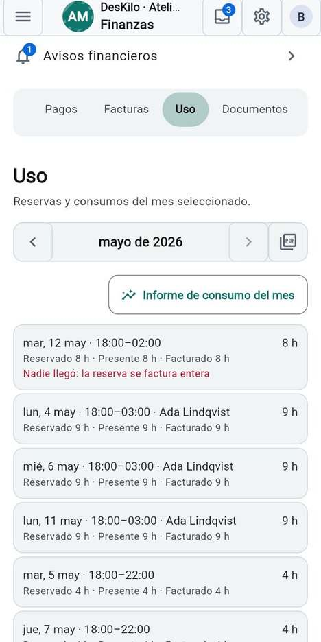

**Pasos**

1. Abra [Finanzas](https://fdittgen-png.github.io/deskilo/#/money) y elija **Uso**.
2. Elija el mes con las flechas.
3. Lea cada tarjeta: el día, la hora, el lugar y después **Reservado**, **Presente** y **Facturado**.
4. Si se marchó antes de tiempo de una reserva, pulse **Facturar el tiempo que estuve**, añada un motivo si lo desea y pulse **Pedir**.
5. Para un resumen del mes, pulse **Informe de consumo del mes**.

**Conviene saber**

- Una reserva en la que nadie hizo el registro de entrada se factura completa, y la tarjeta lo indica.
- Usted nunca decide su propia solicitud: la acepta o la rechaza otra persona. Una fila corregida sigue mostrando lo que era antes.
- Los administradores pueden pedir **Eliminar este registro**.

**Véase también:** [Informes](#informes-vista-rápida-descarga-compartir) · [La hoja de reserva](#la-hoja-de-reserva)

<!-- anchor: user.money.alerts -->
### Avisos financieros

**Público:** Miembro · Administrador/a

Quiere ver lo que le espera en asuntos de dinero, sin leer todo el flujo de novedades.

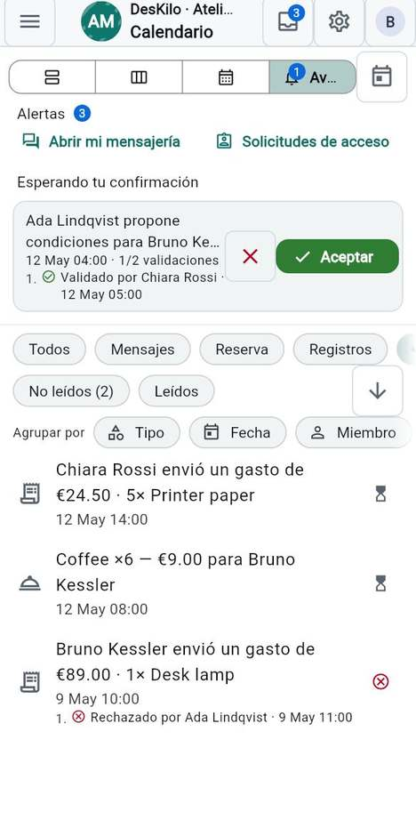

**Pasos**

1. Abra [Finanzas](https://fdittgen-png.github.io/deskilo/#/money).
2. Pulse **Avisos financieros**, la fila de arriba. El número de la campana indica cuántos están pendientes.
3. Lea la lista: primero las solicitudes que debe confirmar y después los eventos de dinero.

**Conviene saber**

- Es la vista habitual de avisos de [Eventos](https://fdittgen-png.github.io/deskilo/#/events), ya filtrada por dinero.
- Los pagos, gastos y medias jornadas extra que usted envió aparecen aquí mientras esperan confirmación, e indican quién los validó o rechazó.
- La fila aparece cuando la función **Pestaña Eventos** está activada.

**Véase también:** [Apruebe o rechace un gasto](#apruebe-o-rechace-un-gasto)

<!-- anchor: user.money.reports -->
### Informes: vista rápida, descarga, compartir

**Público:** Miembro

Quiere un documento sobre su propio dinero, para leerlo, conservarlo o enviarlo a su gestor.

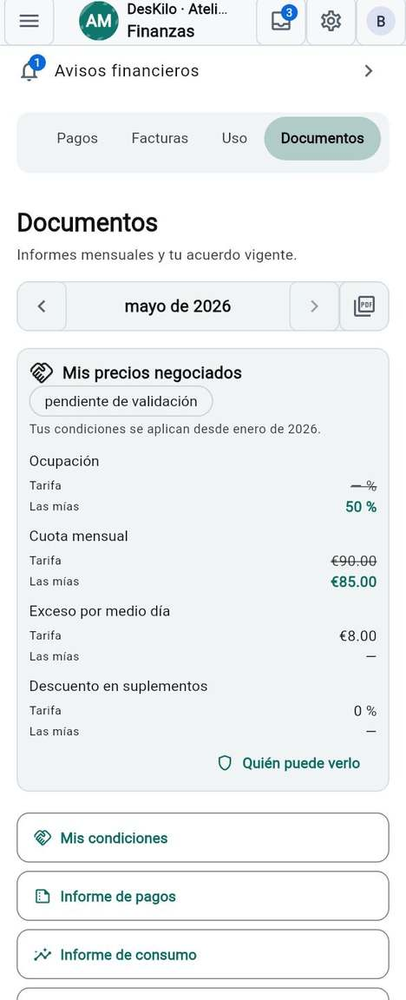

**Pasos**

1. Abra [Finanzas](https://fdittgen-png.github.io/deskilo/#/money) y elija **Documentos**.
2. Elija el mes con las flechas, para los informes que dependen de un mes.
3. Pulse un informe: **Mis condiciones**, **Informe de pagos**, **Informe de consumo** o **Extracto del mes (PDF)**.
4. Elija **Vista rápida**, **Descargar PDF** o **Compartir PDF**.

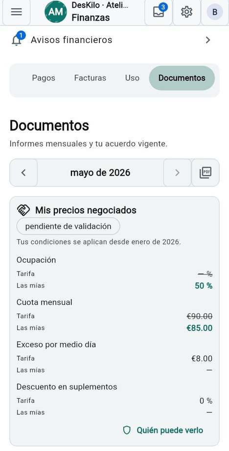

**Conviene saber**

- Las mismas tres opciones aparecen en cada informe y en cada factura.
- **Vista rápida** muestra el documento en pantalla sin guardar nada.
- Un informe que no ve es porque no está activado en su espacio.

**Véase también:** [Sus facturas](#sus-facturas) · [Sus precios negociados](#sus-precios-negociados)

<!-- anchor: user.money.negotiation -->
### Sus precios negociados

**Público:** Miembro

Quiere saber si paga la tarifa del espacio o un precio acordado solo para usted.

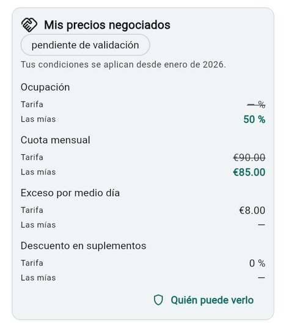

**Pasos**

1. Abra [Finanzas](https://fdittgen-png.github.io/deskilo/#/money) y elija **Documentos**.
2. Lea **Mis precios negociados**: para **Cuota mensual**, **Exceso por medio día** y **Descuento en suplementos**, **Tarifa** muestra lo que paga todo el mundo y **Mía** lo que paga usted.
3. Pulse **Quién puede ver esto** para saber quién puede leer sus precios.

**Conviene saber**

- «Está con la tarifa del espacio» significa que no se aplica ningún acuerdo; su columna muestra un guion.
- Cuando se aplica un acuerdo, la tarjeta indica desde qué mes, y la cifra de la tarifa aparece tachada.
- Un acuerdo propuesto para usted espera como «pendiente de validación» y solo se aplica una vez validado.
- No puede cambiar un acuerdo aquí; lo propone un administrador. Véase [Negociación de precios](#negociación-de-precios).

**Véase también:** [Consulte su extracto](#consulte-su-extracto)

<!-- anchor: user.money.documents.library -->
### Abra un documento de la biblioteca

**Público:** Miembro

Quiere los estatutos, una guía o los estados que su espacio ha compartido.

**Pasos**

1. Abra [Finanzas](https://fdittgen-png.github.io/deskilo/#/money), elija **Documentos** y pulse **Biblioteca de documentos**, o vaya directamente a [Documentos](https://fdittgen-png.github.io/deskilo/#/documents).
2. Encuentre su documento en su categoría: **Estatutos y legal**, **Estados financieros**, **Actas de reuniones**, **Guías y manuales** u **Otros documentos**.
3. Púlselo. Se abre en su navegador desde el lugar donde esté almacenado.

**Conviene saber**

- Solo ve los documentos que su rol puede leer; un candado marca los reservados a **Admins y propietarios** o **Solo propietarios**.
- La biblioteca contiene enlaces. Quién puede abrir el archivo se decide donde está almacenado, no en DesKilo.
- Los administradores con el permiso adecuado añaden y eliminan documentos; véase [Título del documento](#título-del-documento).

**Véase también:** [Informes](#informes-vista-rápida-descarga-compartir)

<!-- anchor: user.money.expense -->
### Envíe un gasto

**Público:** Miembro

Ha pagado algo para el espacio y quiere que el espacio se lo reembolse.

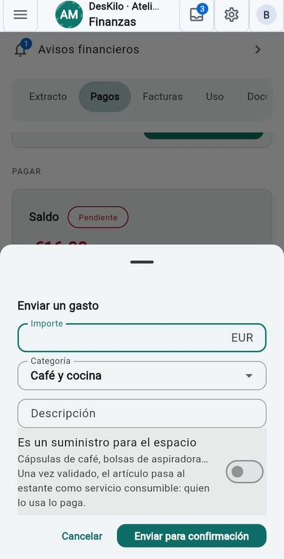

**Pasos**

1. Abra [Finanzas](https://fdittgen-png.github.io/deskilo/#/money), elija **Pagos** y pulse **Enviar un gasto**.
2. Introduzca el **Importe**.
3. Elija una **Categoría**: **Café y cocina**, **Equipamiento**, **Material** u **Otro**.
4. Escriba una **Descripción**.
5. Si ha comprado algo que usarán los miembros, active **Es un suministro para el espacio** (la opción aparece cuando su espacio tiene activado **Suministros desde gastos**) e indique el artículo, la cantidad y el precio unitario.
6. Pulse **Enviar para confirmación**.

**Conviene saber**

- Verá «Gasto enviado — a la espera de aprobación». El gasto solo cuenta una vez confirmado.
- Un suministro confirmado pasa al catálogo como servicio: los miembros que lo usan lo pagan.
- Los costes recurrentes tienen su propia puerta, **Gastos programados**, junto a este botón.

**Véase también:** [Apruebe o rechace un gasto](#apruebe-o-rechace-un-gasto)

<!-- anchor: user.money.expense.approve -->
### Apruebe o rechace un gasto

**Público:** Administrador/a · Propietario

Hay un gasto en espera y usted decide si el espacio lo paga.

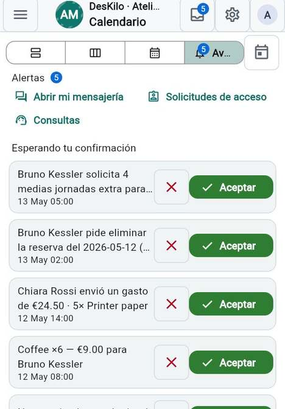

**Pasos**

1. Abra [Eventos](https://fdittgen-png.github.io/deskilo/#/events), o pulse **Avisos financieros** en [Finanzas](https://fdittgen-png.github.io/deskilo/#/money).
2. Busque, bajo **Esperando su confirmación**, la línea que indica el importe y el miembro.
3. Pulse **Aceptar** para confirmarlo, o la cruz para **Rechazar** el gasto.

**Conviene saber**

- Algunos gastos necesitan más de una validación. La línea indica cuántas están hechas, por ejemplo «1/2 validaciones».
- Quién puede validar, y cuántas validaciones se requieren, se define en las [Reglas de validación](#reglas-de-validación-dominio-por-dominio).
- Cada decisión queda en la línea: quién confirmó o rechazó, y cuándo. El miembro ve el resultado.
- **Avisos financieros** en Finanzas solo aparece cuando la función **Pestaña Eventos** está activada.

**Véase también:** [Avisos financieros](#avisos-financieros)

<!-- anchor: user.money.amounts -->
### Cómo se muestran los importes

**Público:** Todos

Quiere leer una cifra sin dudar de lo que incluye.

**Conviene saber**

- Los importes usan la moneda de su espacio y su formato de números, por ejemplo 1234,50 €. Una factura conserva la moneda en la que se emitió.
- En el extracto, los cargos llevan un signo menos y los pagos y créditos un signo más. Un saldo en rojo es dinero que usted debe.
- Cuando un precio incluye IVA, lo indica, por ejemplo «IVA 20 % incl.». El PDF de la factura detalla el IVA que contiene.
- Si su espacio no cobra IVA, no se muestra ningún IVA.
- Los días se muestran en jornadas completas y medias jornadas.

**Véase también:** [Consulte su extracto](#consulte-su-extracto) · [Sus facturas](#sus-facturas)

<!-- anchor: user.money.finances -->
### Sus finanzas en todos sus espacios

**Público:** Miembro

Pertenece a varios espacios y quiere ver todas sus facturas, pagos y recordatorios en un solo lugar.

**Pasos**

1. Abra [Finanzas](https://fdittgen-png.github.io/deskilo/#/money), elija **Pagos** o **Facturas**, y pulse **Abrir para** su espacio en la tarjeta **Sus finanzas en todos sus espacios**.
2. Elija una pestaña: **Pendiente**, **Pagadas**, **Pagos** o **Recordatorios**.
3. Si pertenece a varios espacios, filtre por espacio en la parte superior.

**Conviene saber**

- **Pendiente** muestra «Nada que pagar — está al día» cuando no debe nada.
- **Recordatorios** enumera los recordatorios que ha recibido, con su nivel.
- Desde la misma pantalla se accede al historial completo, al uso y a otros servidores.

**Véase también:** [Sus facturas](#sus-facturas)

<!-- anchor: user.money.invoicing -->
### La facturación de un vistazo

**Público:** Administrador/a de facturación · Propietario

Usted emite y reclama las facturas de todo el espacio y quiere saber por dónde empezar.

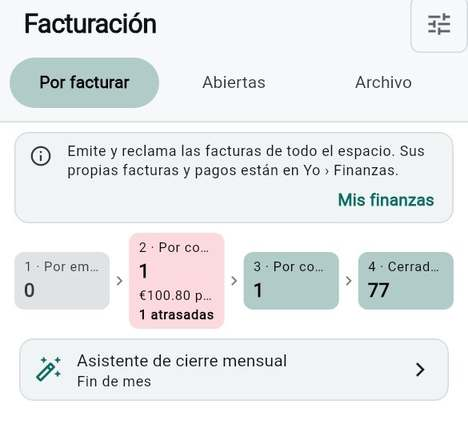

**Pasos**

1. Abra [Facturación](https://fdittgen-png.github.io/deskilo/#/invoices).
2. Lea las pestañas: **Por facturar** enumera los miembros a los que aún falta facturar el mes, **Abiertas** las facturas emitidas y sin pagar, y **Archivo** las que están cerradas.
3. Lea la línea de cuatro pasos bajo el banner: **Por emitir**, **Por cobrar**, **Por confirmar** y **Cerrada**, con un recuento para cada una.
4. Pulse **Asistente de cierre mensual** para facturar un mes, o **Nueva factura** para una sola.
5. Pulse el icono de herramientas para el registro de facturas, las reglas de recordatorio, la plantilla PDF de factura y **Mis finanzas**.

**Conviene saber**

- Las facturas nunca se editan ni se eliminan. Una factura equivocada se marca como errónea y se sustituye.
- El flujo completo, del cierre mensual al cobro y los recordatorios, está en el capítulo 08: [Reglas de recordatorio](#reglas-de-recordatorio) y [La plantilla PDF de factura](#la-plantilla-pdf-de-factura) son buenos lugares para continuar.

**Véase también:** [Reglas de recordatorio](#reglas-de-recordatorio)

<!-- anchor: user.space.overview -->
## Su espacio, configurado por usted (Ajustes del espacio)

Este capítulo está dirigido a quienes dirigen un espacio: propietarios, copropietarios y los administradores en quienes confían para los ajustes. Aquí usted dibuja las plantas, decide quién puede entrar y cuándo, elige qué funciones existen, da al espacio su aspecto y sus palabras, y hace una copia de todo.

En este capítulo:
- [Dibuje sus plantas, salas y mesas](#editor-del-espacio-añadir-renombrar-y-eliminar-plantas)
- [Invite a personas con el ID del espacio](#el-id-del-espacio)
- [Indique cuándo está abierto el espacio](#días-de-apertura)
- [Active y desactive funciones](#activar-o-desactivar-procesos-enteros)
- [Rellene los ajustes del espacio](#país)
- [Dé al espacio sus colores y sus palabras](#vocabulario)
- [Decida quién puede hacer qué](#la-matriz-de-roles)
- [Ponga en marcha una tableta de pared y credenciales](#modo-quiosco-una-tableta-de-pared-para-registrar-la-llegada)
- [Mantenga una biblioteca de documentos](#añadir-un-documento-a-la-biblioteca)
- [Exporte e importe el espacio](#exportar-el-espacio-xml)

> **Consejo** La mayoría de las pantallas de este capítulo están en el menú, bajo **Espacio**, **Disponibilidad**, **Funciones** y **Roles**. Cada entrada solo aparece a quien tiene el permiso necesario, y algunas solo mientras su función está activada. Un administrador solo ve estas pantallas si el propietario le ha dado el permiso en la matriz de roles.

<!-- anchor: user.space.editor.levels -->
### Editor del espacio: añadir, renombrar y eliminar plantas

**Público:** Propietario · Administrador/a

Usted quiere dar al edificio sus plantas, en el orden que la gente espera. El **Editor del espacio** enumera todas las plantas del espacio.

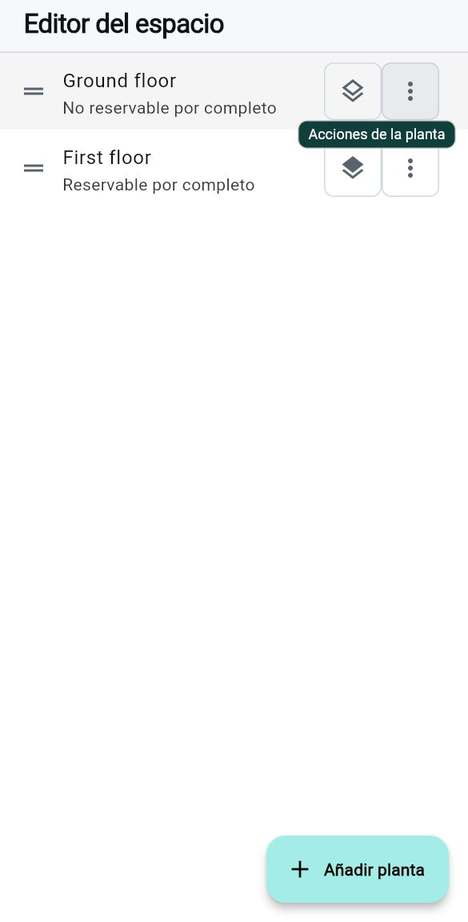

**Pasos**

1. Abra [Editor del espacio](https://fdittgen-png.github.io/deskilo/#/editor), o toque **Editar espacio** en la pantalla Reservar.
2. Toque **Añadir planta**, escriba el nombre y toque **Guardar**.
3. Arrastre el tirador a la izquierda de una planta para cambiar el orden.
4. Toque los tres puntos (**Acciones de la planta**) para **Cambiar nombre…** o **Eliminar** una planta.
5. Toque una planta para dibujar en ella.

**Conviene saber**

- Eliminar una planta borra todas las oficinas, mesas y asientos que contiene. La confirmación indica qué ocurre con las reservas que apuntan a ellos.
- La línea bajo cada planta le dice si es **Reservable por completo** o **No reservable por completo**.
- Sin ninguna planta, el editor dice **Aún no hay plantas. Añada la primera planta de su espacio.**

**Véase también:** [Reservar una planta entera](#permitir-reservar-una-planta-entera) · [Dibujar salas, mesas y asientos](#dibujar-salas-mesas-y-asientos)

<!-- anchor: user.space.editor.level-booking -->
### Permitir reservar una planta entera

**Público:** Propietario · Administrador/a

Usted quiere que un equipo pueda ocupar una planta completa durante un día.

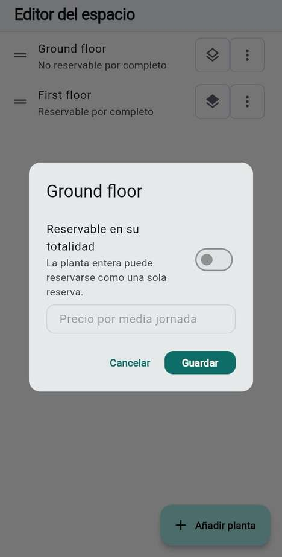

**Pasos**

1. En el [Editor del espacio](https://fdittgen-png.github.io/deskilo/#/editor), toque el botón de capas en la fila de la planta.
2. Active **Reservable por completo**.
3. Escriba el **Precio por media jornada**.
4. Toque **Guardar**.

**Conviene saber**

- El botón de capas aparece relleno cuando la planta es reservable por completo.
- Reservar una planta, oficina o mesa entera exige además la función **Reservas de mesa, oficina y planta**. Cada miembro necesita el derecho de reservar plantas; los administradores lo tienen automáticamente. Véase [Un interruptor de función](#un-interruptor-de-función).

**Véase también:** [Propiedades de oficinas y mesas](#dar-nombre-y-precio-a-una-oficina-o-una-mesa)

<!-- anchor: user.space.editor.rooms -->
### Dibujar salas, mesas y asientos

**Público:** Propietario · Administrador/a

Usted quiere que el plano en pantalla se parezca a la planta real. Todo está dentro de una sala: dibuja una sala, coloca mesas en ella y después asientos en las mesas.

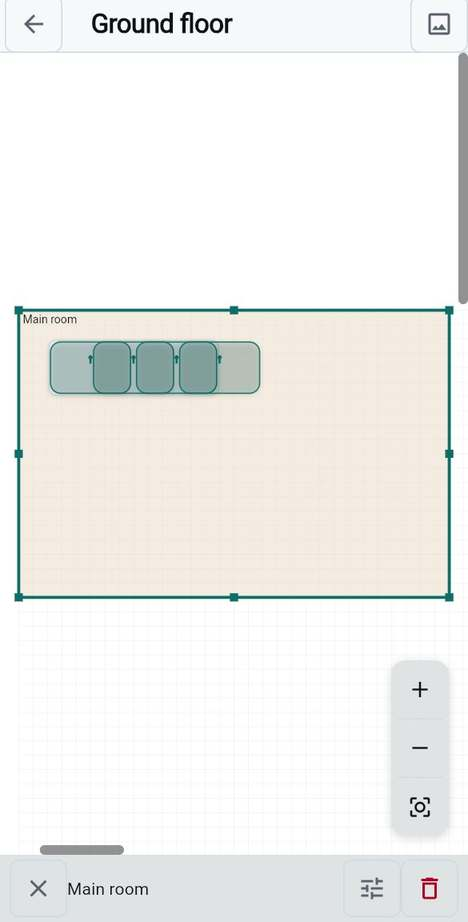

**Pasos**

1. Abra una planta desde el [Editor del espacio](https://fdittgen-png.github.io/deskilo/#/editor). Una planta vacía ofrece **Dibujar la primera sala**.
2. Toque **Oficina** y arrastre sobre la cuadrícula para dibujar una sala.
3. Toque **Mesa** y arrastre dentro de la sala para dibujar una mesa.
4. Toque **Asiento** y después toque una mesa para añadirle un asiento.
5. Toque **Imagen** y después toque el lugar donde debe ir una ilustración.
6. Toque un elemento para seleccionarlo. La barra inferior ofrece **Duplicar**, **Propiedades** y **Eliminar**.

**Conviene saber**

- Si toca de nuevo la herramienta activada, la suelta, y el lienzo vuelve a seleccionar.
- La app rechaza una forma que **Se superpone con un elemento existente.** o que **Debe estar completamente dentro de una oficina.** Los asientos solo pueden colocarse en una mesa, y una mesa llena dice **No queda sitio en esta mesa.**
- El botón de imagen, arriba a la derecha, define, sustituye o quita la **Imagen de fondo** de la planta, por ejemplo un escaneo del plano real.
- Eliminar una sala se lleva consigo sus mesas y asientos.

**Véase también:** [Propiedades del asiento](#configurar-un-asiento) · [Transparencia de mesas](#transparencia-de-mesas)

<!-- anchor: user.space.editor.office -->
### Dar nombre y precio a una oficina o una mesa

**Público:** Propietario · Administrador/a

Usted quiere que una sala o una mesa tenga su propio nombre y que se pueda reservar de una sola vez.

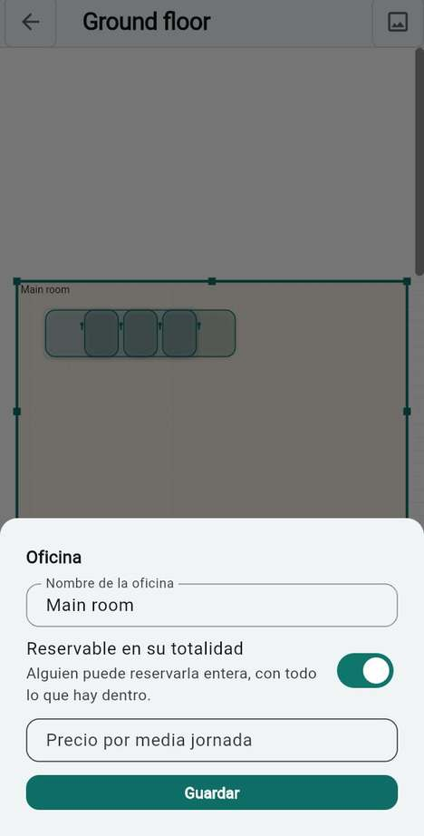

**Pasos**

1. Seleccione la oficina o la mesa en la planta y toque **Propiedades**.
2. Cambie **Nombre de la oficina** (o **Nombre de la mesa**).
3. Active **Reservable en su totalidad** si alguien puede reservarla entera, con todo lo que contiene.
4. Escriba el **Precio por media jornada** que aparece.
5. Toque **Guardar**.

**Conviene saber**

- El campo del precio solo aparece mientras el interruptor está activado.
- Una sala reservable en su totalidad solo puede reservarse mientras no haya nada reservado dentro de ella.

**Véase también:** [Reservar una planta entera](#permitir-reservar-una-planta-entera) · [Propiedades del asiento](#configurar-un-asiento)

<!-- anchor: user.space.editor.seat -->
### Configurar un asiento

**Público:** Propietario · Administrador/a

Usted quiere que un asiento indique hacia dónde mira la silla, qué incluye y cuándo está fuera de servicio.

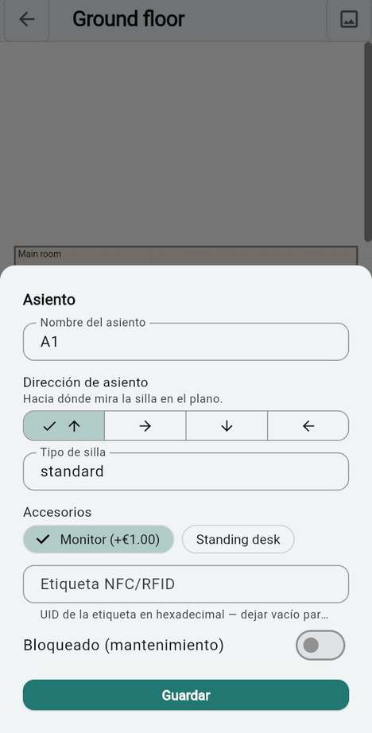

**Pasos**

1. Seleccione el asiento en la planta y toque **Propiedades**.
2. Cambie **Nombre del asiento**.
3. Elija la **Dirección de asiento**: la flecha muestra hacia dónde mira la silla en el plano.
4. Elija un **Tipo de silla**.
5. Toque los **Accesorios** que pertenecen a este asiento. Un precio junto a uno es un suplemento por media jornada.
6. Si el asiento lleva una etiqueta, escriba su número en **Etiqueta NFC/RFID**, o use **Leer una etiqueta ahora**. El campo de la etiqueta aparece cuando la función **Etiquetas NFC/RFID de las sillas** está activada, y la lectura requiere un dispositivo capaz de leer etiquetas.
7. Active **Bloqueado (mantenimiento)** para dejar el asiento fuera de servicio y toque **Guardar**.

**Conviene saber**

- Un número de etiqueta solo puede pertenecer a una silla: **Esta etiqueta ya está vinculada a otra silla.**
- Si aún no hay ningún accesorio, la hoja ofrece **Aún no hay equipamiento — configúrelo**.

**Véase también:** [Registro con credencial NFC](#registro-con-credencial-nfc)

<!-- anchor: user.workspace.code -->
### El ID del espacio

**Público:** Propietario · Administrador/a

Usted quiere que la gente encuentre su espacio y pida unirse. La pantalla **ID del espacio y QR** muestra la invitación de miembro: un código QR y el ID que hay detrás.

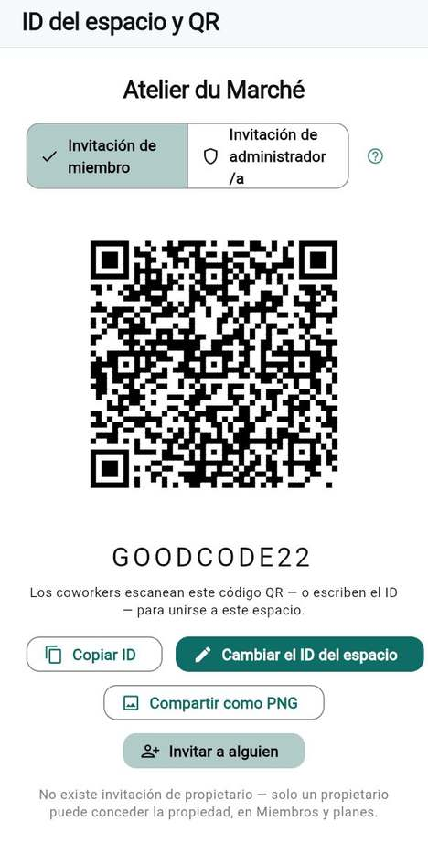

**Pasos**

1. Abra [ID del espacio y QR](https://fdittgen-png.github.io/deskilo/#/workspace-code). Se muestra la pestaña **Invitación de miembro**.
2. Toque **Copiar ID** para pegar el ID donde quiera, o **Compartir como PNG** para imprimir o publicar el código QR.
3. Para elegir un ID fácil de recordar, toque **Cambiar el ID del espacio**, escriba de 4 a 20 letras o dígitos y toque **Guardar**.

**Conviene saber**

- El ID es único en todo DesKilo. Si ya está en uso, o no tiene de 4 a 20 letras o dígitos, la app dice **ID rechazado**.
- Quien escanea el código o escribe el ID pide unirse como miembro. Nadie entra sin aprobación.
- Cuando cambia el ID, el anterior deja de funcionar. Vuelva a imprimir el código QR.
- La pestaña **Invitación de administrador/a** es para propietarios y copropietarios.

**Véase también:** [Invitación de administrador/a](#invitar-a-un-administrador) · [Invitar a alguien](#invitar-a-alguien-con-un-mensaje)

<!-- anchor: user.workspace.code.admin -->
### Invitar a un administrador

**Público:** Propietario

Usted quiere incorporar a una persona que le ayude a dirigir el espacio. La pestaña **Invitación de administrador/a** le da un código para una sola persona.

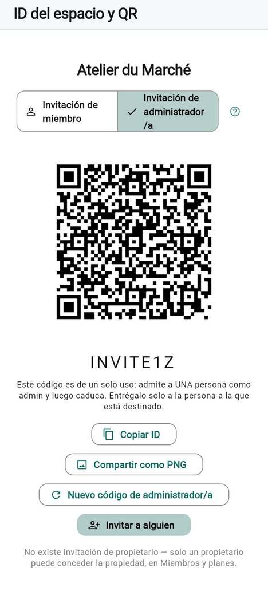

**Pasos**

1. Abra [ID del espacio y QR](https://fdittgen-png.github.io/deskilo/#/workspace-code) y toque **Invitación de administrador/a**.
2. Entregue el código, o su QR, a la persona a quien va destinado.
3. Para el siguiente administrador, toque **Nuevo código de administrador/a**.

**Conviene saber**

- El código admite a una persona como administrador y después caduca.
- No existe una invitación de propietario. Solo un propietario puede conceder la propiedad, en **Miembros y planes**.

**Véase también:** [El ID del espacio](#el-id-del-espacio) · [La matriz de roles](#la-matriz-de-roles)

<!-- anchor: user.workspace.code.invite -->
### Invitar a alguien con un mensaje

**Público:** Propietario · Administrador/a

Usted quiere enviar una invitación amable y ya redactada en lugar de un código a secas.

**Pasos**

1. En [ID del espacio y QR](https://fdittgen-png.github.io/deskilo/#/workspace-code), toque **Invitar a alguien**.
2. Rellene **Nombre (opcional)**, **Apellido (opcional)** y, si quiere, el número de teléfono.
3. En **Roles al llegar**, toque cualquier rol que esta persona deba recibir al unirse.
4. Elija el **Idioma del mensaje**.
5. Envíelo con **WhatsApp**, **SMS** o **Compartir…**.

**Conviene saber**

- El mensaje explica los pasos: descargar, crear una cuenta, unirse. Está escrito en el idioma que elija y parte del definido como [Idioma del espacio](#idioma-del-espacio).
- Cada mensaje lleva su propio código personal. Puede escribir su propio texto en [Mensaje de invitación](#mensaje-de-invitación).

**Véase también:** [El ID del espacio](#el-id-del-espacio)

<!-- anchor: user.workspace.availability.open-weekdays -->
### Días de apertura

**Público:** Propietario · Administrador/a con el permiso

Usted quiere que el espacio esté abierto solo los días en que trabaja. La pantalla **Disponibilidad** empieza con los días de la semana.

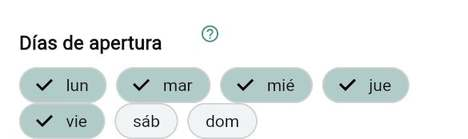

**Pasos**

1. Abra [Disponibilidad](https://fdittgen-png.github.io/deskilo/#/availability).
2. En **Días de apertura**, toque un día para abrirlo o cerrarlo.

**Conviene saber**

- Al menos un día de la semana debe quedar abierto.
- Se rechaza una reserva que toque un día de la semana cerrado, y el plano dibuja ese día como cerrado.

**Véase también:** [Días de cierre](#días-de-cierre) · [Granularidad](#granularidad)

<!-- anchor: user.workspace.availability.granularity -->
### Granularidad

**Público:** Propietario · Administrador/a con el permiso

Usted quiere que las reservas sigan un ritmo adecuado a su espacio: medios días, días completos o la hora que se quiera.

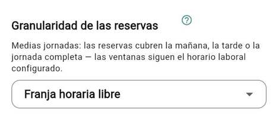

**Pasos**

1. Abra [Disponibilidad](https://fdittgen-png.github.io/deskilo/#/availability).
2. En **Granularidad de las reservas**, elija la forma de una reserva.

**Conviene saber**

- Las opciones son **Franja horaria libre**, **Franjas de 5 minutos**, **Franjas de 15 minutos**, **Franjas de 30 minutos**, **Franjas de 1 hora**, **Medios días (mañana y tarde)**, **Solo días completos** y **Horas reales (de–a exacto, medias/jornadas como atajos)**. **Horas reales** aparece cuando la función **Horario laboral** está activada.
- El plano, la hoja de reserva, un código escaneado y el quiosco ofrecen solo lo que permite la granularidad.

**Véase también:** [Horario de trabajo](#horario-de-trabajo)

<!-- anchor: user.workspace.availability.working-hours -->
### Horario de trabajo

**Público:** Propietario · Administrador/a con el permiso

Usted quiere que una mañana, una tarde y un día signifiquen lo mismo en todas partes.

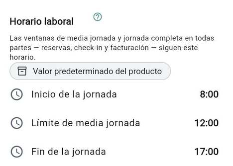

**Pasos**

1. Abra [Disponibilidad](https://fdittgen-png.github.io/deskilo/#/availability).
2. En **Horario de trabajo**, toque **Inicio de la jornada**, **Límite de media jornada** y **Fin de la jornada** y fije cada hora.
3. Con la granularidad de horas reales, fije también **Horas facturadas como media jornada** y **Horas facturadas como jornada completa**.

**Conviene saber**

- Las ventanas de media jornada y de jornada completa en las reservas, el registro de llegada y la facturación siguen este horario.
- La pequeña etiqueta bajo el título dice si el horario es el predeterminado del producto, viene de una plantilla o es suyo. **Volver a la plantilla** y **Volver al valor predeterminado** lo recuperan.
- La jornada debe seguir un orden: inicio, después el límite de media jornada y después el fin.
- Esta sección forma parte de la función **Horario de trabajo**.

**Véase también:** [Fuera del horario de apertura](#fuera-del-horario-de-apertura)

<!-- anchor: user.workspace.availability.closure-days -->
### Días de cierre

**Público:** Propietario · Administrador/a con el permiso

Usted quiere cerrar el espacio por una fiesta, una semana de agosto o un día para el fontanero, sin que nadie pueda reservar.

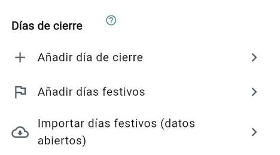

**Pasos**

1. Abra [Disponibilidad](https://fdittgen-png.github.io/deskilo/#/availability) y vaya a **Días de cierre**.
2. Toque **Añadir día de cierre**, elija la fecha y, si quiere, un **Motivo (opcional)**.
3. Para quitar uno, toque la papelera que hay a su lado.

**Conviene saber**

- Se rechaza una reserva en un día de cierre y se muestra el motivo.
- Los días que ya están facturados no pueden convertirse en días de cierre con el generador de días festivos.

**Véase también:** [Días festivos](#días-festivos)

<!-- anchor: user.workspace.availability.public-holidays -->
### Días festivos

**Público:** Propietario · Administrador/a con el permiso

Usted quiere todos los días festivos de un año como días de cierre de una sola vez.

**Pasos**

1. En [Disponibilidad](https://fdittgen-png.github.io/deskilo/#/availability), bajo **Días de cierre**, toque **Añadir días festivos**.
2. Use las flechas para elegir el año. La hoja enumera las fechas que se convertirían en días de cierre.
3. Toque el botón de abajo para crearlos.
4. ¿Prefiere una lista de datos abiertos? Toque **Importar días festivos (datos abiertos)**, elija la región y confirme.

**Conviene saber**

- No se crea nada antes de que confirme, y los días que ya existen aparecen marcados.
- Los meses que ya están facturados se omiten.
- Estas entradas aparecen cuando la función **Días festivos** está activada. **Importar días festivos (datos abiertos)** requiere además la función **Importar días festivos**.

**Véase también:** [Días de cierre](#días-de-cierre)

<!-- anchor: user.workspace.availability.policies -->
### Políticas de reserva

**Público:** Propietario · Administrador/a con el permiso

Usted quiere flexibilizar o endurecer las reglas de reserva. Lo que fije aquí vale para todas las formas de reservar: la app, un código escaneado y el quiosco.

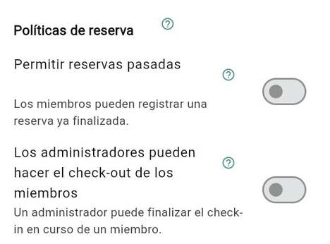

**Pasos**

1. Abra [Disponibilidad](https://fdittgen-png.github.io/deskilo/#/availability) y vaya a **Políticas de reserva**.
2. Active o desactive las políticas que quiera.
3. En **Fuera del horario de apertura** y **Límites de reserva**, fije el resto.

**Conviene saber**

- Los dos interruptores están desactivados por defecto.
- Esta sección forma parte de la función **Políticas de reserva**.
- La línea **Lo que el plano distingue**, debajo, explica los estados que los miembros ven en el plano.

**Véase también:** [Permitir reservas pasadas](#permitir-reservas-pasadas) · [Los administradores pueden hacer el check-out de los miembros](#los-administradores-pueden-hacer-el-check-out) · [Límites de reserva](#límites-de-reserva)

<!-- anchor: user.workspace.availability.allow-past -->
### Permitir reservas pasadas

**Público:** Propietario · Administrador/a con el permiso

Usted quiere que los miembros puedan registrar una reserva a posteriori, en un espacio que anota la asistencia más tarde.

**Pasos**

1. En [Disponibilidad](https://fdittgen-png.github.io/deskilo/#/availability), bajo **Políticas de reserva**, active **Permitir reservas pasadas**.

**Conviene saber**

- Desactivada, se rechaza una reserva que ya terminó en un día anterior.
- Reservar una franja anterior el mismo día siempre está permitido.

**Véase también:** [Políticas de reserva](#políticas-de-reserva)

<!-- anchor: user.workspace.availability.admin-checkout -->
### Los administradores pueden hacer el check-out

**Público:** Propietario · Administrador/a con el permiso

Usted quiere que el personal cierre la sala por la tarde y ponga fin a los registros de llegada que la gente olvidó.

**Pasos**

1. En [Disponibilidad](https://fdittgen-png.github.io/deskilo/#/availability), bajo **Políticas de reserva**, active **Los administradores pueden hacer el check-out de los miembros**.

**Conviene saber**

- Desactivada, el check-out es estrictamente personal.
- Activada, un administrador puede poner fin al registro de llegada en curso de un miembro.

**Véase también:** [Políticas de reserva](#políticas-de-reserva)

<!-- anchor: user.workspace.availability.outside-hours -->
### Fuera del horario de apertura

**Público:** Propietario · Administrador/a con el permiso

Usted quiere decir qué ocurre cuando alguien llega temprano o se queda hasta tarde. Una sola respuesta vale para todas las granularidades.

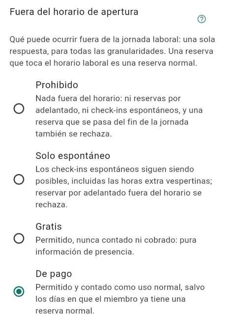

**Pasos**

1. En [Disponibilidad](https://fdittgen-png.github.io/deskilo/#/availability), busque **Fuera del horario de apertura**.
2. Elija **Desactivado**, **Solo espontáneo**, **Libre** o **De pago**.

**Conviene saber**

- **Desactivado**: nada fuera del horario, ni reserva anticipada ni llegada sin reserva.
- **Solo espontáneo**: los registros de llegada sin reserva siguen siendo posibles, horas extra de la tarde incluidas, pero se rechaza reservar con antelación fuera del horario.
- **Libre**: permitido, nunca se cuenta ni se cobra.
- **De pago**: permitido y contado como un uso normal, salvo un día en que el miembro ya tenga una reserva ordinaria.
- Una reserva que toque el horario de trabajo es una reserva ordinaria.

**Véase también:** [Horario de trabajo](#horario-de-trabajo)

<!-- anchor: user.workspace.availability.limits -->
### Límites de reserva

**Público:** Propietario · Administrador/a con el permiso

Usted quiere decir con cuánta antelación se puede reservar, cuán corta o larga puede ser una reserva y cuántas puede tener cada persona a la vez.

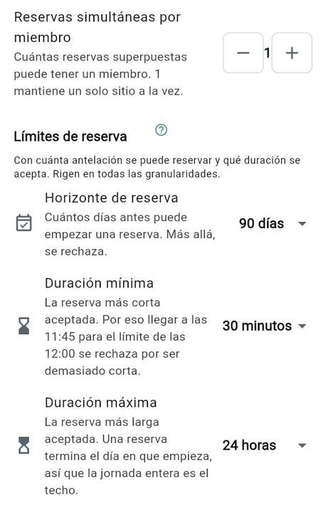

**Pasos**

1. En [Disponibilidad](https://fdittgen-png.github.io/deskilo/#/availability), busque **Reservas simultáneas por miembro** y use los botones de menos y más.
2. En **Límites de reserva**, fije el **Horizonte de reserva**, la **Duración mínima** y la **Duración máxima**.

**Conviene saber**

- **Reservas simultáneas por miembro** es cuántas reservas superpuestas puede tener un miembro. Con 1 solo tiene un lugar a la vez.
- Una reserva termina el día en que empieza, de modo que un día completo es lo más largo que puede ser.
- El mínimo no puede superar el máximo; de lo contrario no se aceptaría ninguna reserva. La pantalla se lo advierte.
- Cada rechazo nombra el límite y su valor.

**Véase también:** [Políticas de reserva](#políticas-de-reserva)

<!-- anchor: user.features.processes -->
### Activar o desactivar procesos enteros

**Público:** Propietario · Copropietario

Usted quiere una vista de conjunto de lo que puede hacer el espacio y activar un área entera de una vez. La pantalla **Funciones** se abre con una tarjeta por cada proceso de negocio.

**Pasos**

1. Abra [Funciones](https://fdittgen-png.github.io/deskilo/#/features). Se muestra la vista **Procesos**.
2. Lea cada tarjeta: su estado, cuántos subprocesos están activos y cuántas funciones están activadas.
3. Abra una tarjeta y toque **Activar** o **Desactivar** para el proceso entero o un subproceso.
4. Lea la vista previa y confirme.

**Conviene saber**

- Una tarjeta está **Activa** cuando todas sus funciones funcionan, **Parcial** cuando algunas lo hacen, **Disponible** cuando aún no hay ninguna activada y **Requiere atención** cuando una función está activada pero espera un requisito que está desactivado.
- Los filtros **Todos**, **Activo**, **Disponible** y **Requiere atención** acotan las tarjetas, y **Buscar procesos y funciones** llega a todo.
- La vista previa enumera lo que se activa, lo que es **También necesarias** de otro proceso y lo que ya está activado. Desactivar algo que otras funciones necesitan se rechaza hasta que usted elija qué ocurre con ellas.

**Véase también:** [Un interruptor de función](#un-interruptor-de-función)

<!-- anchor: user.features.switch -->
### Un interruptor de función

**Público:** Propietario · Copropietario

Usted quiere activar o desactivar una sola función.

**Pasos**

1. Abra [Funciones](https://fdittgen-png.github.io/deskilo/#/features) y toque **Interruptores**.
2. Encuentre la función con **Buscar funciones**, o acote la lista con **Modificadas** o **Madurez**.
3. Accione su interruptor.

**Conviene saber**

- Active una función y aparece cada parte de ella: la pestaña, el botón, el enlace. Desactívela y no queda ninguna, ni siquiera un enlace guardado.
- Una función que necesita otra queda bajo ella con **Requiere** y dice **Esperando a la función de arriba: actívela y esta vuelve a funcionar.** mientras la principal está desactivada. Su propia elección se conserva.
- Activar una función también puede activar lo que necesita. La app se lo indica.
- Una función que aún no se ha revisado como estable le pide confirmar primero: puede cambiar y tiene límites conocidos.
- Lo que ya está hecho se queda hecho. Una factura emitida mientras una función estaba activada conserva lo que dice.

**Véase también:** [Activar o desactivar procesos enteros](#activar-o-desactivar-procesos-enteros)

<!-- anchor: user.workspace.settings.country -->
### País

**Público:** Propietario · Administrador/a con el permiso

Usted quiere que el espacio sepa dónde está establecido. **Espacio** se abre en **Datos generales**.

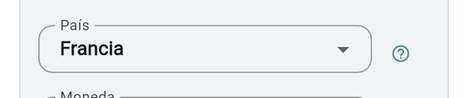

**Pasos**

1. Abra [Espacio](https://fdittgen-png.github.io/deskilo/#/workspace-settings).
2. En **Datos generales**, elija el **País**.
3. Toque **Guardar** al pie.

**Conviene saber**

- El país propone la moneda y la zona horaria, y decide qué tipos de IVA se ofrecen.
- En cuanto el espacio ha emitido un documento o registrado dinero, el país ya no se puede cambiar: al guardar se indica «La moneda y el país quedan fijados en cuanto el espacio ha emitido un documento o registrado dinero. No se ha guardado nada.»
- **Guardar** escribe todo el formulario junto. Si alguien cambió estos ajustes entretanto, no se guarda nada y lo que usted escribió se queda en pantalla.

**Véase también:** [Moneda y zona horaria](#moneda-y-zona-horaria)

<!-- anchor: user.workspace.settings.currency-timezone -->
### Moneda y zona horaria

**Público:** Propietario · Administrador/a con el permiso

Usted quiere que los precios y los días se cuenten como los cuenta su espacio.

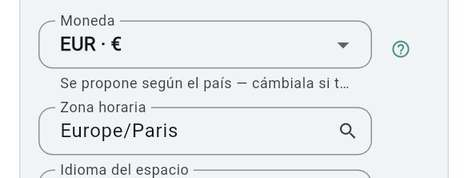

**Pasos**

1. En [Espacio](https://fdittgen-png.github.io/deskilo/#/workspace-settings), bajo **Datos generales**, elija la **Moneda**.
2. Busque la **Zona horaria** y elíjala.
3. Toque **Guardar**.

**Conviene saber**

- La moneda se propone a partir del país. Puede cambiarla hasta que el espacio haya emitido un documento o registrado dinero; después queda fijada.
- La zona horaria no es cosmética: una jornada, un límite de media jornada y un día de cierre se cuentan en ella, así que un miembro en el extranjero ve el día del espacio y no el suyo.

**Véase también:** [País](#país)

<!-- anchor: user.workspace.settings.language -->
### Idioma del espacio

**Público:** Propietario · Administrador/a con el permiso

Usted quiere que las invitaciones y los documentos hablen el idioma de su comunidad.

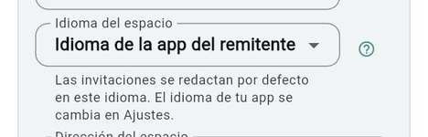

**Pasos**

1. En [Espacio](https://fdittgen-png.github.io/deskilo/#/workspace-settings), bajo **Datos generales**, abra **Idioma del espacio**.
2. Elija un idioma, o **Idioma de la app del remitente**.
3. Toque **Guardar**.

**Conviene saber**

- Las invitaciones se escriben por defecto en este idioma.
- No es el idioma de su propia app. Ese solo cambia lo que usted ve y está en sus ajustes personales.

**Véase también:** [Mensaje de invitación](#mensaje-de-invitación)

<!-- anchor: user.workspace.settings.address -->
### Dirección del membrete

**Público:** Propietario · Administrador/a con el permiso

Usted quiere su dirección postal en el papel que envía el espacio.

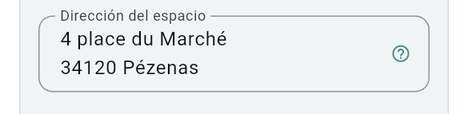

**Pasos**

1. En [Espacio](https://fdittgen-png.github.io/deskilo/#/workspace-settings), bajo **Datos generales**, rellene **Dirección del espacio**.
2. Toque **Guardar**.

**Conviene saber**

- Es texto libre, impreso tal cual en cartas y facturas.
- La dirección estructurada que necesita una factura electrónica es una entrada aparte, bajo la identidad legal.

**Véase también:** [País](#país)

<!-- anchor: user.workspace.settings.whatsapp-group -->
### Grupo de WhatsApp

**Público:** Propietario · Administrador/a con el permiso

Usted quiere que los miembros encuentren el grupo de WhatsApp de su comunidad.

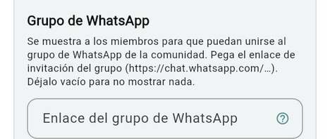

**Pasos**

1. En [Espacio](https://fdittgen-png.github.io/deskilo/#/workspace-settings), abra **Comunidad e invitaciones**.
2. Pegue el enlace de invitación del grupo en **Enlace del grupo de WhatsApp**.
3. Toque **Guardar**.

**Conviene saber**

- El enlace debe ser un enlace de invitación de chat.whatsapp.com; de lo contrario, el campo lo indica.
- Déjelo vacío para no mostrar nada.

**Véase también:** [Mensaje de invitación](#mensaje-de-invitación)

<!-- anchor: user.workspace.settings.invitation-message -->
### Mensaje de invitación

**Público:** Propietario · Administrador/a con el permiso

Usted quiere que las invitaciones suenen como usted, en cada idioma que use.

**Pasos**

1. En [Espacio](https://fdittgen-png.github.io/deskilo/#/workspace-settings), abra **Comunidad e invitaciones**.
2. En **Idioma del mensaje**, elija el idioma del texto que está editando.
3. Escriba el texto. Toque una etiqueta como {firstName} o {inviteLink} para insertarla donde está el cursor.
4. Toque **Guardar**.

**Conviene saber**

- Deje el cuadro vacío para usar el mensaje integrado en ese idioma.
- La fila **Idioma del mensaje** solo dice qué borrador está en pantalla. No se guarda, y cada vez se abre en el idioma del espacio.
- Las etiquetas se rellenan al enviar una invitación. El código y el enlace los pone la app, así que no los pegue usted.

**Véase también:** [Invitar a alguien con un mensaje](#invitar-a-alguien-con-un-mensaje)

<!-- anchor: user.workspace.settings.new-members -->
### Empezar igual a los nuevos miembros

**Público:** Propietario · Administrador/a con el permiso

Usted quiere que todos los que se unan empiecen con la misma suscripción y la misma regla para cuando se agoten sus días.

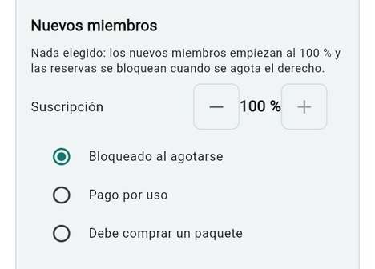

**Pasos**

1. En [Espacio](https://fdittgen-png.github.io/deskilo/#/workspace-settings), abra **Nuevos miembros**.
2. Fije el porcentaje de **Suscripción** con los botones de menos y más.
3. Elija **Bloqueado al agotarse**, **Pago por uso** o **Debe comprar un paquete**.
4. Toque **Guardar**.

**Conviene saber**

- Hasta que usted elija, los nuevos miembros empiezan al 100 % con las reservas bloqueadas una vez agotado el derecho.
- La suscripción propia de cada miembro se fija después, en la página del miembro.

**Véase también:** [La suscripción de un miembro](#la-suscripción-de-un-miembro)

<!-- anchor: user.workspace.settings.wording -->
### Vocabulario

**Público:** Propietario · Administrador/a con el permiso

Usted quiere que la app use sus palabras: otro nombre para un asiento, para un estado en el plano, para una pestaña.

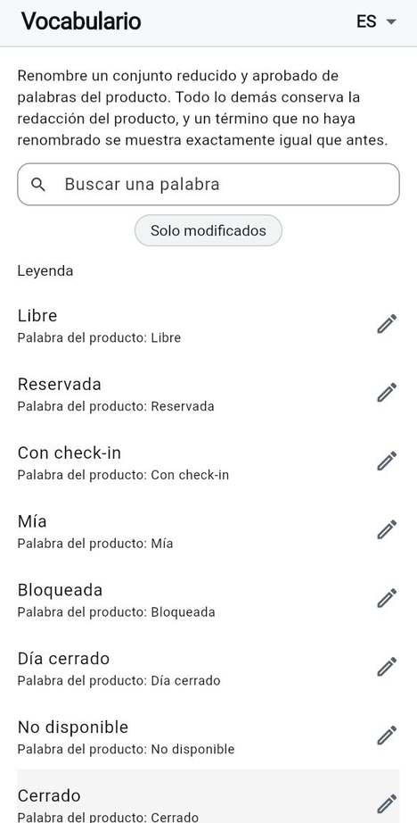

**Pasos**

1. En [Espacio](https://fdittgen-png.github.io/deskilo/#/workspace-settings), abra **Apariencia y textos** y toque **Vocabulario**.
2. Encuentre una palabra con **Buscar una palabra**, o toque **Solo modificados** para ver lo que ha renombrado.
3. Toque el lápiz que hay a su lado y escriba su palabra, para cada idioma.

**Conviene saber**

- La palabra del producto sigue visible debajo de la suya, de modo que ve lo que sustituye.
- **Restablecer** quita su palabra en lugar de copiar la del producto. El término sigue entonces al producto cuando este cambia su redacción.
- Los términos están agrupados según dónde aparecen: **Leyenda**, **El espacio**, **Navegación**, **Reserva**.

**Véase también:** [Colores](#colores)

<!-- anchor: user.workspace.settings.colours -->
### Colores

**Público:** Propietario · Administrador/a con el permiso

Usted quiere que la app vista su color. Elija uno y la app deriva de él sus temas claro y oscuro.

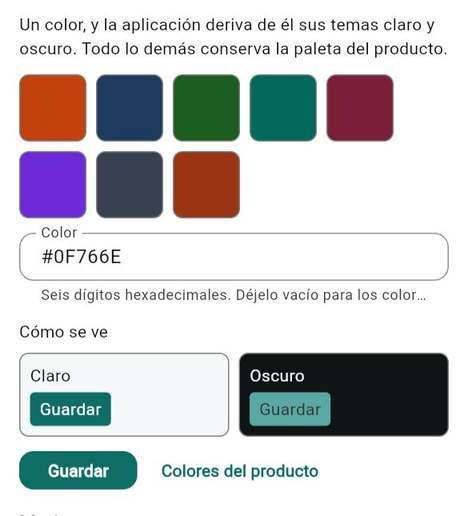

**Pasos**

1. En [Espacio](https://fdittgen-png.github.io/deskilo/#/workspace-settings), abra **Apariencia y textos** y toque **Colores**. La fila está ahí mientras **Colores del espacio** esté activada en las funciones.
2. Toque uno de los colores, o escriba un código como #0F766E en **Color**.
3. Compruebe **Cómo se ve**, en **Claro** y **Oscuro**.
4. Toque **Guardar**. **Colores del producto** quita los suyos.

**Conviene saber**

- La app mantiene su propio contraste. Si un color fuera ilegible en algún sitio, se rechaza y la pantalla nombra la pareja de colores.
- En **Colores de las salas** puede añadir hasta ocho colores propios para las salas del plano.
- La marca DesKilo, los colores de los estados de los asientos y el banner de producción nunca se modifican.

**Véase también:** [Motivo](#motivo) · [Símbolo y emblema](#símbolo-y-emblema)

<!-- anchor: user.workspace.settings.pattern -->
### Motivo

**Público:** Propietario · Administrador/a con el permiso

Usted quiere que su espacio se distinga fácilmente de los demás a los que pertenece una persona.

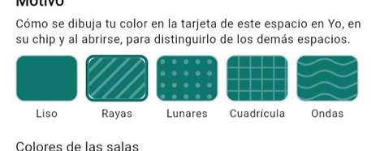

**Pasos**

1. Abra [Colores](https://fdittgen-png.github.io/deskilo/#/settings/colours).
2. En **Motivo**, toque **Liso**, **Rayas**, **Lunares**, **Cuadrícula** u **Ondas**.

**Conviene saber**

- El motivo dibuja su color en la tarjeta de este espacio en Yo, en su etiqueta y mientras el espacio se abre.
- Se guarda en cuanto lo toca.

**Véase también:** [Colores](#colores)

<!-- anchor: user.workspace.settings.branding -->
### Símbolo y emblema

**Público:** Propietario · Administrador/a con el permiso

Usted quiere una pequeña marca que represente al espacio: letras sobre un color, o su propio logotipo.

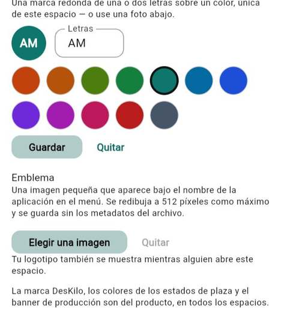

**Pasos**

1. Abra [Colores](https://fdittgen-png.github.io/deskilo/#/settings/colours) y vaya a **Símbolo**.
2. Escriba una o dos **Letras**, elija un color y toque **Guardar**.
3. En **Emblema**, toque **Elegir una imagen** para añadir su logotipo. **Quitar** lo retira.

**Conviene saber**

- Las letras sobre un color son únicas en un espacio. Si otro espacio ya tiene las mismas, la app le pide cambiar el color o las letras.
- El emblema se muestra bajo el nombre de la app en el menú y mientras alguien abre este espacio. Se redibuja con un máximo de 512 píxeles de ancho, y los datos propios de la foto, como dónde se tomó, no se conservan.
- El emblema nunca sustituye al logotipo de DesKilo.

**Véase también:** [Colores](#colores)

<!-- anchor: user.workspace.settings.desk-transparency -->
### Transparencia de mesas

**Público:** Propietario · Administrador/a con el permiso

Usted dibujó el plano sobre una fotografía y quiere que la sala se transparente a través del mobiliario.

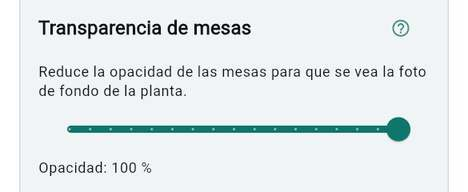

**Pasos**

1. En [Espacio](https://fdittgen-png.github.io/deskilo/#/workspace-settings), abra **Apariencia y textos**.
2. Arrastre el control deslizante de **Transparencia de mesas**. El valor se muestra como *Opacidad*.
3. Toque **Guardar**.

**Conviene saber**

- Baje la opacidad para que la foto de fondo de una planta se vea a través de las mesas.
- Súbala al 100 % cuando los puestos importen más que la sala.

**Véase también:** [Dibujar salas, mesas y asientos](#dibujar-salas-mesas-y-asientos)

<!-- anchor: user.workspace.settings.public-page -->
### Página pública del espacio

**Público:** Propietario

Usted quiere que las personas ajenas a su espacio lo encuentren y vean lo que ofrece.

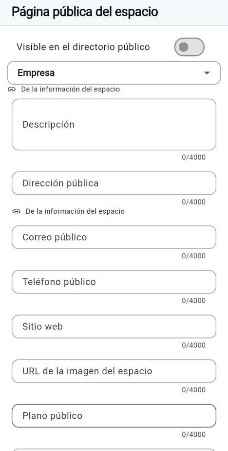

**Pasos**

1. Abra [Página pública del espacio](https://fdittgen-png.github.io/deskilo/#/settings/public-page), o tóquela en la parte superior de **Espacio**.
2. Active **Visible en el directorio público**.
3. Elija el tipo de anfitrión y complete **Descripción**, **Dirección pública**, **Correo público**, **Teléfono público** y **Sitio web**.
4. Toque **Guardar y ver la vista externa**.

**Conviene saber**

- Los campos marcados **De la información del espacio** siguen los datos propios del espacio. **Usar la información del espacio** los restablece después de cambiarlos.
- **Restablecer todos los datos públicos con la información del espacio** sustituye cada campo que tiene un equivalente en el espacio.
- Los administradores pueden elegir por sí mismos si se muestran como administradores públicos.

**Véase también:** [Descubrir y la red pública](#descubrir)

<!-- anchor: user.roles.matrix -->
### La matriz de roles

**Público:** Propietario · Copropietario

Usted quiere decidir qué permisos tiene cada rol. **Roles** muestra una tarjeta por rol con una marca por cada permiso que tiene.

**Pasos**

1. Abra [Roles](https://fdittgen-png.github.io/deskilo/#/roles).
2. En la tarjeta de un rol, marque o desmarque un permiso como **Gestionar roles y permisos**, **Gestionar miembros**, **Editar la configuración del espacio** o **Emitir facturas y conciliar pagos**.

**Conviene saber**

- Cada persona tiene exactamente un rol base: Usuario, Administrador, Copropietario o Propietario. Los demás roles se suman a él y nunca quitan nada.
- El propietario siempre tiene todos los permisos, por eso esa tarjeta está bloqueada. Un copropietario puede tener menos.
- Quien no puede gestionar roles ve la matriz en solo lectura, con **Su rol** resaltado.
- El servidor comprueba un permiso en todos los lugares, de modo que al desmarcarlo se quita en todas partes a la vez.
- La entrada **Roles** aparece cuando la función **Gestión de roles** está activada.

**Véase también:** [Roles que define este espacio](#roles-que-define-este-espacio) · [Copropietarios](#copropietarios)

<!-- anchor: user.roles.space -->
### Roles que define este espacio

**Público:** Propietario · Copropietario

Usted quiere roles adaptados a su espacio, como anfitrión o contable, además de los básicos.

**Pasos**

1. En [Roles](https://fdittgen-png.github.io/deskilo/#/roles), toque **Los roles de este espacio**, o abra [Roles que define este espacio](https://fdittgen-png.github.io/deskilo/#/settings/roles-of-this-space). Esta pantalla aparece cuando la función **Roles que define este espacio** está activada.
2. Toque **Añadir un rol**.
3. Dé un nombre al rol y elija **Lo que añade**.
4. Toque **Guardar el rol**.
5. Para dárselo a un miembro, abra la página del miembro, busque **Roles** y toque **Añadir un rol**.

**Conviene saber**

- Cada rol suma permisos a lo que sus titulares ya pueden hacer. Ninguno quita nada, y el propietario conserva siempre todos los permisos.
- Un rol que ya no quiera puede apartarse desactivando **En uso**.
- La clave del rol nunca cambia: las personas que lo tienen apuntan a ella.
- Nadie puede darse un rol a sí mismo. Un rol que gestiona roles solo puede darlo el propietario.

**Véase también:** [La matriz de roles](#la-matriz-de-roles)

<!-- anchor: user.roles.co-owners -->
### Copropietarios

**Público:** Propietario

Usted quiere que el espacio sobreviva si algún día se aparta.

**Pasos**

1. Abra [Miembros y planes](https://fdittgen-png.github.io/deskilo/#/members) y elija al miembro.
2. En **Copropiedad**, elija un copropietario activo o un sucesor.
3. Para traspasar ahora, elija **Promover a propietario ahora**.

**Conviene saber**

- Un copropietario activo tiene ya los permisos del propietario. Un sucesor, mostrado como **Sucesor**, espera y pasa a ser propietario cuando se activa o cuando el propietario se va.
- Si se va el último propietario, el mejor copropietario pasa a ser propietario automáticamente, el activo antes que el sucesor.
- Los copropietarios forman parte de la función **Copropietarios**.

**Véase también:** [Copropiedad](#copropiedad) · [La matriz de roles](#la-matriz-de-roles)

<!-- anchor: user.kiosk.mode -->
### Modo quiosco: una tableta de pared para registrar la llegada

**Público:** Propietario · Administrador/a

Usted quiere una tableta junto a la puerta donde la gente registre su llegada con una credencial.

**Pasos**

1. Cree una cuenta para la tableta, únala al espacio con ella y, en [Miembros y planes](https://fdittgen-png.github.io/deskilo/#/members), use **Convertir en quiosco** en ese miembro.
2. Asegúrese de que **Modo quiosco** está activado en [Funciones](https://fdittgen-png.github.io/deskilo/#/features).
3. En la tableta, abra la app. Pregunta **¿Iniciar el modo quiosco?**. Toque **Iniciar el modo quiosco**.
4. Un miembro toca un asiento, o **Esta planta**, y presenta una credencial: una tarjeta o un código QR impreso.

**Conviene saber**

- El modo quiosco nunca se inicia solo. **Ahora no — abrir la app normalmente** abre la app como de costumbre, lo que resulta práctico para la configuración.
- En modo quiosco la tableta solo muestra el plano. Para salir hay que reiniciar la tableta. Para que la cuenta vuelva a ser un miembro normal, use **Dispositivo quiosco** en **Ajustes** del dispositivo o **Revertir quiosco a miembro** en **Miembros y planes**.
- La hoja que se abre nombra la regla que sigue. En un día de cierre, el quiosco dice de entrada **El espacio está cerrado hoy**.
- La credencial es la confirmación: identifica al miembro, ejecuta la acción y la pantalla se despeja para la siguiente persona. Un asiento ocupado por otra persona muestra quién lo ocupa y le remite a la app.
- Las credenciales tienen sus propias funciones, **Credenciales RFID / NFC** y las credenciales QR, ambas bajo **Modo quiosco**.
- Aquí no se puede mostrar una tableta de pared: el quiosco solo se inicia en un dispositivo marcado como tal.

**Véase también:** [Registro con credencial NFC](#registro-con-credencial-nfc) · [Códigos QR de espacios (PDF)](#códigos-qr-de-espacios-pdf)

<!-- anchor: user.badges.nfc -->
### Registro con credencial NFC

**Público:** Propietario · Administrador/a

Usted quiere que los miembros registren su llegada acercando una tarjeta, sin teléfono.

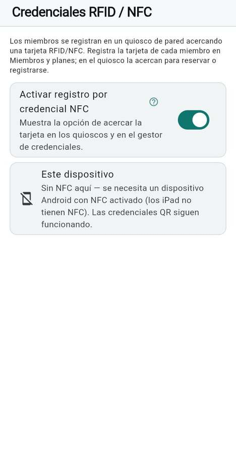

**Pasos**

1. Abra [Credenciales RFID / NFC](https://fdittgen-png.github.io/deskilo/#/nfc-config).
2. Active **Activar registro por credencial NFC**.
3. Lea la línea **Este dispositivo**: indica si este dispositivo puede leer tarjetas.
4. Dé una tarjeta a cada miembro en [Miembros y planes](https://fdittgen-png.github.io/deskilo/#/members): abra las credenciales del miembro, toque **Registrar tarjeta** y acerque la tarjeta a la parte trasera del dispositivo.

**Conviene saber**

- Necesita un dispositivo Android con NFC. Los iPad no tienen NFC, y las credenciales QR siguen funcionando allí.
- El gestor de credenciales también permite emitir una **Nueva credencial**, **Revocar** una y **Guardar como PDF** para imprimir. Una credencial revocada puede eliminarse definitivamente.
- **Inicia mi sesión** está desactivado por defecto: una credencial que registra la llegada no inicia la sesión hasta que el miembro lo decida.
- Cada miembro también puede crear su propia credencial en sus ajustes personales.

**Véase también:** [Una tableta de pared para registrar la llegada](#modo-quiosco-una-tableta-de-pared-para-registrar-la-llegada)

<!-- anchor: user.documents.add -->
### Añadir un documento a la biblioteca

**Público:** Propietario · Administrador/a

Usted quiere reunir en un solo lugar sus estatutos, guías, cuentas y actas para los miembros que los necesitan. La biblioteca contiene enlaces, no archivos.

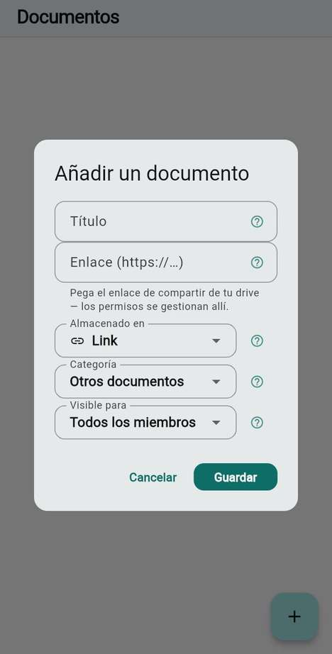

**Pasos**

1. Abra [Documentos](https://fdittgen-png.github.io/deskilo/#/documents) y toque el botón de más.
2. Rellene **Concepto** y **Enlace (https://…)**.
3. Elija **Almacenado en**, **Categoría** y **Visible para**.
4. Toque **Guardar**.

**Conviene saber**

- La biblioteca necesita la función **Biblioteca de documentos** y el permiso para gestionarla.
- Quite un documento con su papelera: antes pregunta **¿Quitar el documento?**
- Los miembros que pueden abrir la biblioteca ven los documentos que les corresponden, agrupados por categoría.

**Véase también:** [Título del documento](#título-del-documento) · [Enlace](#enlace) · [Visible para](#visible-para)

<!-- anchor: user.documents.title -->
### Título del documento

**Público:** Propietario · Administrador/a

Usted quiere que los miembros reconozcan un documento de un vistazo.

**Pasos**

1. En el formulario de añadir un documento, escriba el **Título**.

**Conviene saber**

- Un documento necesita un título y un enlace https://, o se rechaza **Guardar**.
- Escríbalo pensando en quien lo lee, pues es la línea que ve en la biblioteca.

**Véase también:** [Añadir un documento a la biblioteca](#añadir-un-documento-a-la-biblioteca)

<!-- anchor: user.documents.url -->
### Enlace

**Público:** Propietario · Administrador/a

Usted quiere que el documento se abra donde ya está.

**Pasos**

1. Pegue el enlace para compartir de su unidad en **Enlace (https://…)**.

**Conviene saber**

- DesKilo guarda el enlace, no el archivo. Los derechos de acceso se gestionan donde está el documento.
- El enlace debe empezar por https://.

**Véase también:** [Almacenado en](#almacenado-en)

<!-- anchor: user.documents.provider -->
### Almacenado en

**Público:** Propietario · Administrador/a

Usted quiere que los miembros vean dónde se guarda el documento.

**Pasos**

1. Elija **Almacenado en**: Google Drive, OneDrive, SharePoint, Dropbox, Nextcloud o un enlace.

**Conviene saber**

- Es una etiqueta con un icono. No se recupera nada por usted.

**Véase también:** [Enlace](#enlace)

<!-- anchor: user.documents.category -->
### Categoría

**Público:** Propietario · Administrador/a

Usted quiere que la biblioteca se lea como una estantería ordenada.

**Pasos**

1. Elija una **Categoría**: **Estatutos y legal**, **Guías y manuales**, **Estados financieros**, **Actas de reuniones** u **Otros documentos**.

**Conviene saber**

- La biblioteca agrupa los documentos bajo estos encabezados y solo muestra un encabezado que tenga algún documento.

**Véase también:** [Visible para](#visible-para)

<!-- anchor: user.documents.role -->
### Visible para

**Público:** Propietario · Administrador/a

Usted quiere algunos documentos para todos y otros solo para la junta.

**Pasos**

1. Elija **Visible para**: **Todos los miembros**, **Admins y propietarios** o **Solo propietarios**.

**Conviene saber**

- El servidor lo hace cumplir. Un miembro que no puede ver un documento no lo recibe en absoluto.

**Véase también:** [Añadir un documento a la biblioteca](#añadir-un-documento-a-la-biblioteca)

<!-- anchor: user.workspace.export.space-xml -->
### Exportar el espacio (XML)

**Público:** Propietario · Administrador/a con el permiso

Usted quiere un archivo con el plano y los ajustes, para guardarlo como copia de seguridad, reutilizarlo o llevarlo a otro espacio.

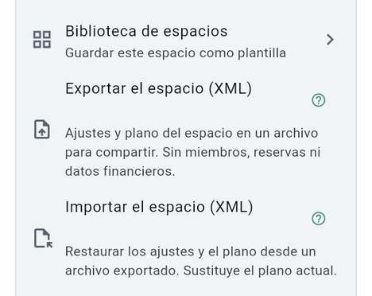

**Pasos**

1. Abra [Espacio](https://fdittgen-png.github.io/deskilo/#/workspace-settings) y vaya a **Plantillas y datos**.
2. Toque **Exportar el espacio (XML)**.

**Conviene saber**

- Contiene los ajustes y el plano. Nunca incluye miembros, reservas ni datos de dinero, ni el código de invitación ni las credenciales de pago.
- Con **Configuración en el archivo del espacio** activada, el archivo incluye también tarifas, tipos de IVA, reglas, roles y más.
- El archivo se guarda en su dispositivo.

**Véase también:** [Importar el espacio (XML)](#importar-el-espacio-xml)

<!-- anchor: user.workspace.export.space-import -->
### Importar el espacio (XML)

**Público:** Propietario · Administrador/a con el permiso

Usted quiere aplicar a un espacio un archivo exportado.

**Pasos**

1. En [Espacio](https://fdittgen-png.github.io/deskilo/#/workspace-settings), bajo **Plantillas y datos**, toque **Importar el espacio (XML)**.
2. Elija el archivo y lea la vista previa: plantas, oficinas, mesas, asientos y configuración.
3. Toque **Sustituir e importar**.

**Conviene saber**

- Sustituye el plano actual y sobrescribe los ajustes. No se puede deshacer.
- Cuando un espacio ya tiene reservas, solo se aplica la configuración. El plano se conserva, y la app lo dice.
- Un archivo ilegible, o que no es de DesKilo, se rechaza con un mensaje claro.

**Véase también:** [Exportar el espacio (XML)](#exportar-el-espacio-xml)

<!-- anchor: user.workspace.export.config-pdf -->
### Exportar la configuración (PDF)

**Público:** Propietario · Administrador/a con el permiso

Usted quiere un documento con todos los parámetros, para leerlo, firmarlo o entregarlo a un contable.

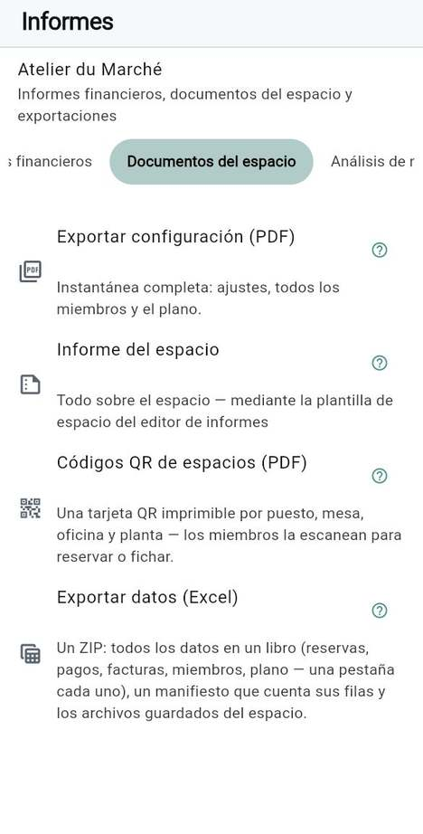

**Pasos**

1. Abra [Informes](https://fdittgen-png.github.io/deskilo/#/reports?section=documents) y elija **Documentos del espacio**.
2. Toque **Exportar configuración (PDF)**.

**Conviene saber**

- Es una instantánea completa de los ajustes, los miembros y el plano. Es un registro, no una copia de seguridad: solo el XML se puede volver a importar.

**Véase también:** [Exportar el espacio (XML)](#exportar-el-espacio-xml)

<!-- anchor: user.workspace.export.workspace-report -->
### Informe del espacio

**Público:** Propietario · Administrador/a con el permiso

Usted quiere el espacio como documento: sus lugares, precios y reglas.

**Pasos**

1. Abra [Informes](https://fdittgen-png.github.io/deskilo/#/reports?section=documents) y elija **Documentos del espacio**.
2. Toque **Informe del espacio**.

**Conviene saber**

- Lo genera la plantilla de espacio del editor de informes, de modo que su aspecto sigue el diseño que haya elegido.

**Véase también:** [Exportar la configuración (PDF)](#exportar-la-configuración-pdf)

<!-- anchor: user.workspace.export.space-qr -->
### Códigos QR de espacios (PDF)

**Público:** Propietario · Administrador/a con el permiso

Usted quiere una tarjeta QR en cada asiento, mesa, oficina y planta, para que la gente reserve o registre su llegada escaneándola.

**Pasos**

1. Abra [Informes](https://fdittgen-png.github.io/deskilo/#/reports?section=documents) y elija **Documentos del espacio**.
2. Toque **Códigos QR de espacios (PDF)**.
3. Elija **Tamaño de la tarjeta**, **Tamaño del código QR** e **Información en la tarjeta**, y toque **Guardar**.
4. Imprima, recorte y pegue cada tarjeta en su lugar.

**Conviene saber**

- Necesita la función **Códigos QR de espacios**.
- Escanear una tarjeta abre la misma hoja que muestra el quiosco.

**Véase también:** [Una tableta de pared para registrar la llegada](#modo-quiosco-una-tableta-de-pared-para-registrar-la-llegada)

<!-- anchor: user.workspace.export.excel -->
### Exportar los datos (Excel)

**Público:** Propietario · Administrador/a con el permiso

Usted quiere sus cifras en una hoja de cálculo para su propio análisis.

**Pasos**

1. Abra [Informes](https://fdittgen-png.github.io/deskilo/#/reports?section=documents) y elija **Documentos del espacio**.
2. Toque **Exportar datos (Excel)**.

**Conviene saber**

- Llega como un único ZIP: un libro con una pestaña para reservas, pagos, facturas, miembros y el plano, un manifiesto que cuenta las filas y los archivos guardados del espacio.
- Necesita la función **Exportación de datos (Excel)** y el permiso de exportar datos. Es solo una exportación: nada la vuelve a leer.

**Véase también:** [Exportar el espacio (XML)](#exportar-el-espacio-xml)

<!-- anchor: user.workspace.sites -->
### Sedes

**Público:** Propietario · Administrador/a

Usted dirige más de una dirección y quiere que cada planta y cada miembro pertenezcan a la correcta.

**Pasos**

1. Active **Sedes** en [Funciones](https://fdittgen-png.github.io/deskilo/#/features).
2. Abra [Sedes](https://fdittgen-png.github.io/deskilo/#/settings/sites) y toque **Añadir una sede**.
3. Rellene **Nombre de la sede**, **Calle**, **Código postal**, **Ciudad** y las plantas que le pertenecen.

**Conviene saber**

- La sede predeterminada lleva la dirección del espacio. La sede de origen de un miembro es la dirección que figura en sus documentos.
- **Eliminar esta sede** devuelve sus plantas y miembros a la sede predeterminada.
- Una sede que es su propia entidad legal puede llevar su propio registro y número de IVA.

<!-- anchor: user.people.overview -->
## Miembros, planes y facturación

Este capítulo está dirigido a propietarios y administradores de facturación. Sigue el dinero desde la persona hasta la lista de precios: quién está en su espacio y con qué plan, cómo se fija el precio de cada plan, qué más vende, cómo le pagan los miembros y los gastos que paga usted mismo.

En este capítulo:
- [Miembros y planes](#miembros-y-planes): la lista, la ficha del miembro y todo lo que puede configurar para una persona
- [Facturación](#tramos-de-tarifas): tramos de tarifas, niveles de suscripción, paquetes de días y calendario de facturación
- [Servicios y accesorios](#un-servicio): los extras que vende
- [Instrucciones de pago y pagos en línea](#medios-de-pago-e-instrucciones): cómo le pagan los miembros
- [Gastos programados](#gastos-programados): costes que se repiten solos

<!-- anchor: user.members.list -->
### Miembros y planes

**Público:** Administrador/a · Propietario

Quiere ver quién está en su espacio, con qué plan, y abrir a cualquier persona para cambiar su configuración.

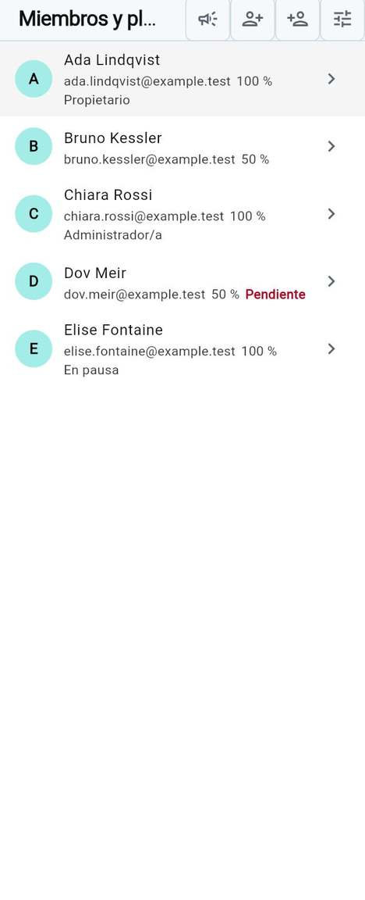

**Pasos**

1. Abra [Miembros y planes](https://fdittgen-png.github.io/deskilo/#/members) desde el menú.
2. Lea cada fila: el correo, la parte del plan (o **Sin suscripción**), el rol y un estado cuando no es el habitual: **Pendiente**, **En pausa** o **Salido**.
3. Pulse una fila para abrir la [ficha del miembro](#la-ficha-del-miembro) de esa persona.

**Conviene saber**

- Una fila muestra también las etiquetas **máx.** y **a la vez** cuando ha fijado un [límite de reservas](#límite-de-reservas) o más de una [reserva simultánea](#reservas-simultáneas).
- Según las funciones activadas, la barra superior (botones de icono con descripción emergente) ofrece **Notificar a todos los admins**, **Añadir un perfil gestionado** y, para los propietarios, **Invitar a un miembro** y **Facturación**.
- Los administradores también acceden a esta pantalla; los controles que cambian el dinero o los roles quedan en manos del propietario.

**Véase también:** [Invite a un miembro](#invite-a-un-miembro) · [Facturación](#tramos-de-tarifas)

<!-- anchor: user.members.invite -->
### Invite a un miembro

**Público:** Propietario

Quiere que alguien se una a su espacio.

**Pasos**

1. En [Miembros y planes](https://fdittgen-png.github.io/deskilo/#/members), pulse **Invitar a un miembro**.
2. Comparta el ID del espacio o su código QR, como se explica en [El ID del espacio](#el-id-del-espacio).
3. Cuando la persona solicite unirse, su fila aparece como **Pendiente**. Ábrala y elija **Aprobar membresía** o **Rechazar membresía**.

**Conviene saber**

- Al rechazar, puede añadir un breve comentario.
- Hasta que usted decida, la persona no tiene acceso al espacio.

**Véase también:** [Miembros pendientes y en pausa](#miembros-pendientes-y-en-pausa) · [Añada un perfil gestionado](#añada-un-perfil-gestionado)

<!-- anchor: user.members.managed -->
### Añada un perfil gestionado

**Público:** Administrador/a · Propietario

Alguien todavía no tiene cuenta, pero usted quiere reservar, facturar y gestionar en su nombre. Crea un perfil, lo gestiona usted y se lo entrega a la persona cuando se una.

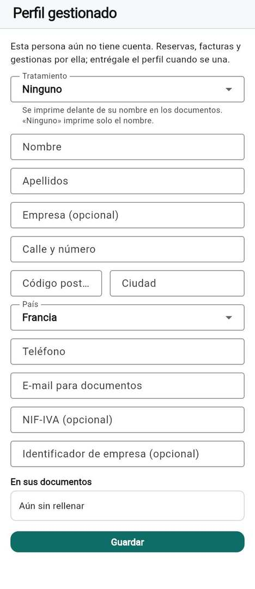

**Pasos**

1. En [Miembros y planes](https://fdittgen-png.github.io/deskilo/#/members), pulse **Añadir un perfil gestionado**.
2. Rellene la identidad de la persona y guarde. La ficha del miembro lleva entonces una etiqueta **Gestionado**.
3. Para corregir los datos más tarde, abra la ficha del miembro y elija **Editar identidad**.
4. Cuando la persona esté lista, elija **Entregar a la persona**. Se crea un código personal vinculado a este perfil.
5. ¿Ha cambiado de opinión antes de que se use el código? Elija **Revocar la entrega**.

**Conviene saber**

- Quien use el código se hace cargo del perfil, con sus reservas, facturas y suscripción, una vez que usted apruebe la membresía.
- Nadie puede enviar un mensaje a un miembro gestionado, porque nadie lo leería.
- La función debe estar activada en [Funciones](#un-interruptor-de-función).

**Véase también:** [La ficha del miembro](#la-ficha-del-miembro)

<!-- anchor: user.members.page -->
### La ficha del miembro

**Público:** Administrador/a · Propietario

Quiere ver todo sobre una persona en una sola página: quién es, qué ha reservado, cómo contactarla, qué debe y cada ajuste que puede cambiar.

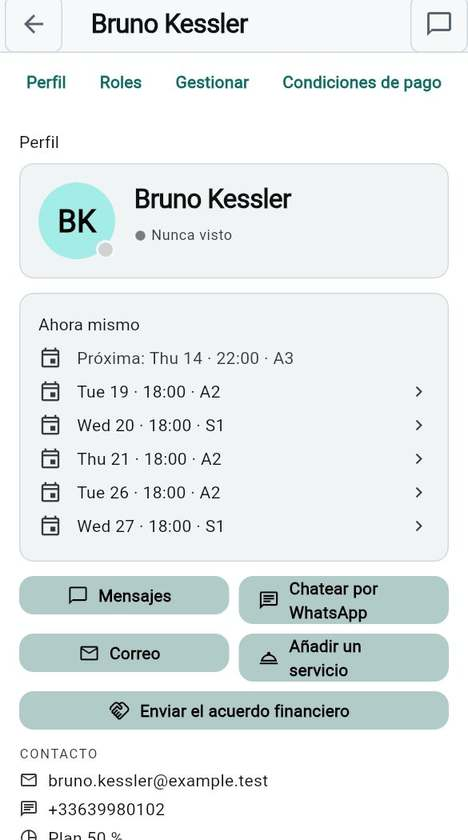

**Pasos**

1. Pulse un miembro en [Miembros y planes](https://fdittgen-png.github.io/deskilo/#/members).
2. Lea la parte superior de la página: **Ahora mismo** muestra las próximas reservas, y después vienen los datos de contacto y la situación económica.
3. Use los botones bajo el nombre para una acción rápida. Según las funciones y sus permisos, verá algunos de estos: **Mensajes**, **Correo**, **Añadir un servicio** o **Enviar el acuerdo financiero**.
4. Vaya a **Gestionar** para cambiar la configuración de la persona, agrupada en **Membresía**, **Reglas de reserva**, **Facturación** y **Tarjetas y acceso**.

**Conviene saber**

- Cada fila de ajuste muestra su valor actual, así que rara vez necesita abrirla para saber la respuesta.
- Su propia ficha es más corta: nadie puede concederse derechos a sí mismo.
- Si la ficha no está activada en su espacio, las mismas acciones aparecen en una lista al pulsar la fila.

**Véase también:** [Las acciones del miembro](#las-acciones-del-miembro) · [Roles y copropietarios](#la-matriz-de-roles)

<!-- anchor: user.members.actions -->
### Las acciones del miembro

**Público:** Administrador/a · Propietario

Quiere saber dónde está cada ajuste y quién puede cambiarlo.

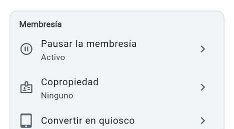

**Pasos**

1. Abra una [ficha del miembro](#la-ficha-del-miembro) y vaya a **Gestionar**.
2. En **Membresía**, elija **Pausar la membresía** o **Reactivar la membresía**, defina la [Copropiedad](#copropiedad) o **Convertir en quiosco**.
3. En **Reglas de reserva**, defina el [Límite de reservas](#límite-de-reservas), las [Reservas simultáneas](#reservas-simultáneas) y el [Tratamiento del IVA](#tratamiento-del-iva); el interruptor **Reservas de un espacio entero** aparece cuando la función está activada.
4. En **Facturación**, defina la [Suscripción](#la-suscripción-de-un-miembro), [Cuando se acaban los días](#cuando-se-acaban-los-días) y la [Negociación de precios](#negociación-de-precios).
5. En **Tarjetas y acceso**, abra **Credenciales** para emitir o revocar las credenciales de la persona.

**Conviene saber**

- Los cambios de facturación y de membresía corresponden al propietario. Los administradores fijan los límites de reserva.
- Nunca puede cambiar sus propios límites ni su copropiedad.
- La mayoría de estas filas solo se ofrecen para miembros activos.

**Véase también:** [Reglas de reserva](#límite-de-reservas) · [Grupo de facturación](#la-suscripción-de-un-miembro)

<!-- anchor: user.members.pending -->
### Miembros pendientes y en pausa

**Público:** Administrador/a · Propietario

Un recién llegado espera su decisión, o un miembro se toma un descanso, y quiere que el espacio los trate en consecuencia.

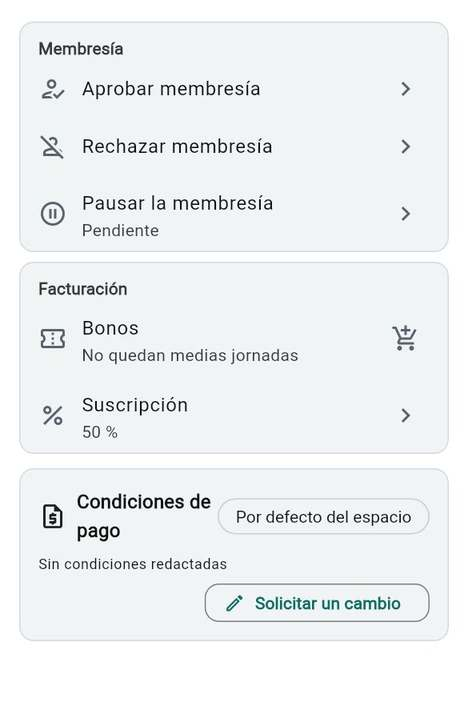

**Pasos**

1. Abra el miembro cuya fila dice **Pendiente**.
2. Bajo **Membresía**, elija **Aprobar membresía** para dejar entrar a la persona, o **Rechazar membresía** para denegarlo.
3. Para poner en espera a un miembro activo, abra su ficha y elija **Pausar la membresía**.
4. Para reincorporarlo, elija **Reactivar la membresía**.

**Conviene saber**

- La decisión sobre un nuevo miembro también puede tomarse mediante las reglas de validación, como se explica en las [Reglas de validación](#reglas-de-validación-dominio-por-dominio).
- La pausa es cosa de los propietarios y conserva todo el historial.
- Un miembro que se fue aparece como **Salido** y no se puede pausar.

**Véase también:** [Invite a un miembro](#invite-a-un-miembro)

<!-- anchor: user.members.subscription -->
### La suscripción de un miembro

**Público:** Propietario

Quiere definir a qué parte de los días del mes tiene derecho un miembro. Esa parte determina el tramo de tarifa, y el tramo fija el precio mensual.

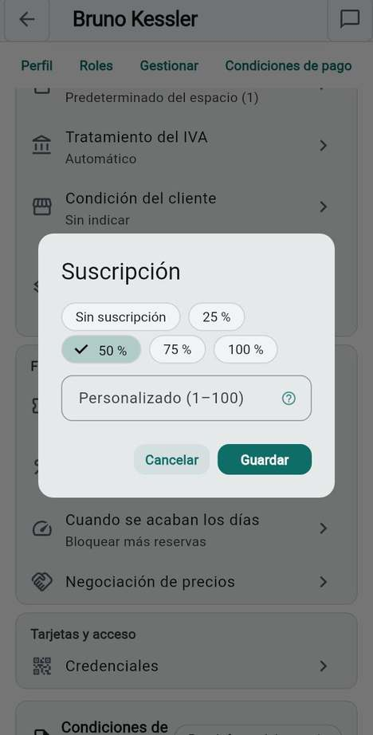

**Pasos**

1. Abra la ficha del miembro, vaya a **Facturación** y pulse **Suscripción**.
2. Elija **Sin suscripción**, uno de los niveles que ofrece, o escriba un número en **Personalizado (1–100)**.
3. Pulse un nivel para aplicarlo, o **Guardar** para un valor personalizado.

**Conviene saber**

- Los niveles ofrecidos son los que eligió en [Niveles de suscripción](#niveles-de-suscripción).
- Como propietario, siempre puede escribir un valor personalizado.
- **Sin suscripción** es para visitantes que compran bonos. No se puede combinar con el pago por uso: elija antes un bloque o un paquete.

**Véase también:** [Tramos de tarifas](#tramos-de-tarifas) · [Cuando se acaban los días](#cuando-se-acaban-los-días)

<!-- anchor: user.members.overage-policy -->
### Cuando se acaban los días

**Público:** Propietario

Quiere decidir qué ocurre cuando un miembro ha agotado todo su cupo mensual.

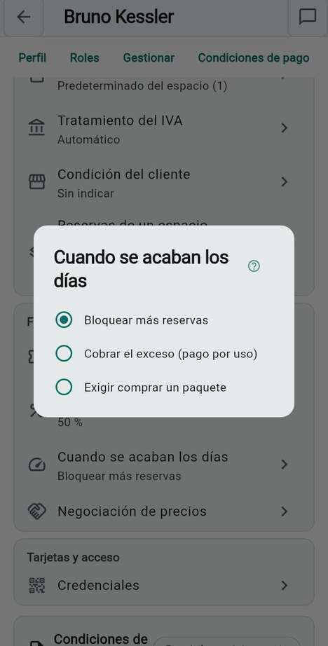

**Pasos**

1. Abra la ficha del miembro, vaya a **Facturación** y pulse **Cuando se acaban los días**.
2. Elija **Bloquear más reservas**, **Cobrar el exceso (pago por uso)** o **Exigir comprar un paquete**.

**Conviene saber**

- El pago por uso aparece atenuado para un miembro sin suscripción, porque le permitiría reservar gratis.
- El precio del exceso procede del [tramo de tarifa](#exceso); los paquetes proceden de los [Paquetes de días](#paquetes-de-días).

**Véase también:** [La suscripción de un miembro](#la-suscripción-de-un-miembro)

<!-- anchor: user.members.reservation-limit -->
### Límite de reservas

**Público:** Administrador/a · Propietario

Quiere limitar cuántas reservas abiertas puede tener un miembro en total.

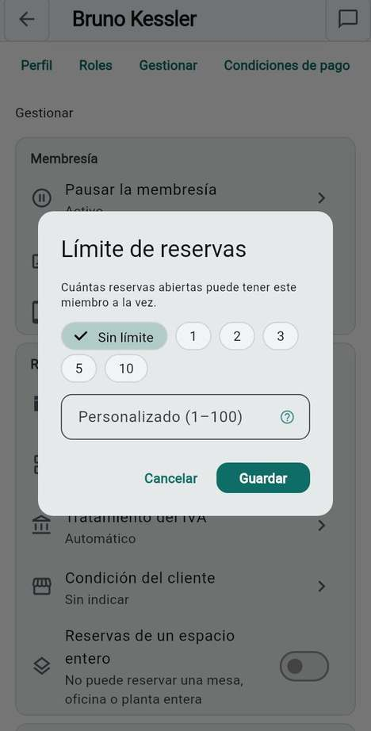

**Pasos**

1. Abra la ficha del miembro, vaya a **Reglas de reserva** y pulse **Límite de reservas**.
2. Pulse **Sin límite**, un valor predefinido (1, 2, 3, 5 o 10), o escriba un número en **Personalizado (1–100)**.
3. Pulse **Guardar** para un número personalizado.

**Conviene saber**

- Cuenta todas las reservas abiertas, sea cual sea su fecha. No es lo mismo que las [reservas simultáneas](#reservas-simultáneas), que cuentan las coincidencias en el tiempo.
- La lista muestra **máx.** y el número junto al miembro.
- No puede fijar su propio límite.

**Véase también:** [Límites de reserva](#límites-de-reserva)

<!-- anchor: user.members.simultaneous -->
### Reservas simultáneas

**Público:** Administrador/a · Propietario

Quiere permitir que un miembro tenga reservas que coinciden en el tiempo, por ejemplo dos puestos a la vez.

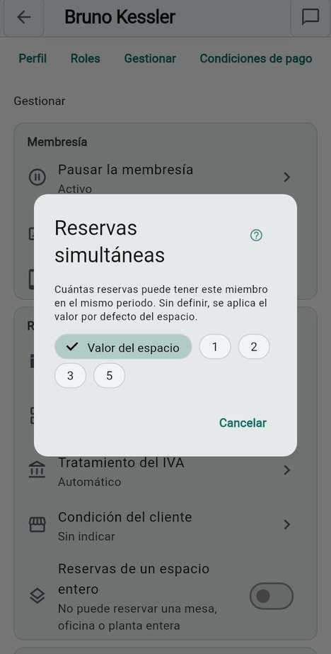

**Pasos**

1. Abra la ficha del miembro, vaya a **Reglas de reserva** y pulse **Reservas simultáneas**.
2. Elija **Por defecto del espacio**, o un número: 1, 2, 3 o 5.

**Conviene saber**

- **Por defecto del espacio** sigue el número definido en [Disponibilidad](#políticas-de-reserva); uno significa un puesto cada vez.
- No es lo mismo que el [límite de reservas](#límite-de-reservas), que cuenta todas las reservas abiertas.
- No puede fijar el suyo propio.

**Véase también:** [Políticas de reserva](#políticas-de-reserva)

<!-- anchor: user.members.vat-treatment -->
### Tratamiento del IVA

**Público:** Administrador/a · Propietario

Quiere indicar a la aplicación qué es este miembro a efectos de IVA, para que sus facturas lleven el impuesto correcto.

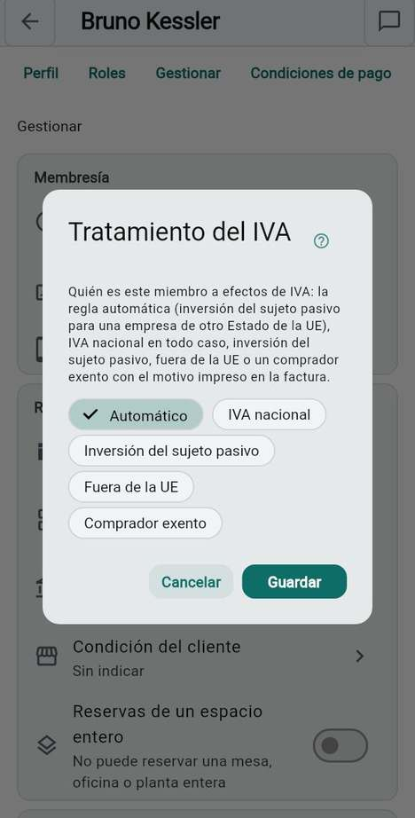

**Pasos**

1. Abra la ficha del miembro, vaya a **Reglas de reserva** y pulse **Tratamiento del IVA**.
2. Elija **Automático**, **IVA nacional**, **Inversión del sujeto pasivo**, **Fuera de la UE** o **Comprador exento**.
3. Para **Comprador exento**, escriba el **Motivo de exención (impreso en la factura)**.
4. Pulse **Guardar**.

**Conviene saber**

- **Automático** aplica la regla habitual: inversión del sujeto pasivo para una empresa de otro Estado de la UE.
- El mismo grupo ofrece **Condición del cliente** (**Empresa**, **Consumidor** o **Sin indicar**), que decide qué cláusulas de pago imprime una factura. Requiere el permiso de emitir facturas.
- **Inversión del sujeto pasivo**, **Fuera de la UE** y **Comprador exento** se registran, pero las facturas de esos miembros aún no se pueden emitir en la aplicación: se emiten fuera de la aplicación con su gestor.
- La función **IVA según el cliente** debe estar activada para que aparezca la fila de tratamiento del IVA, que ven los administradores y los propietarios; los tipos se definen en [Tipos de IVA](#fijar-los-tipos).

**Véase también:** [Régimen de IVA](#régimen-de-iva)

<!-- anchor: user.members.negotiation -->
### Negociación de precios

**Público:** Administrador/a de facturación · Propietario

Ha acordado con un miembro un precio distinto de su tarifa y quiere registrarlo como un acuerdo, en lugar de sobrescribir la tarifa.

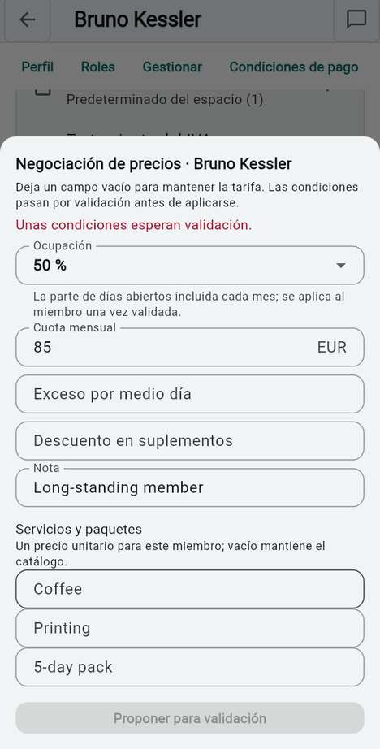

**Pasos**

1. Abra la ficha del miembro, vaya a **Facturación** y pulse **Negociación de precios**.
2. Rellene solo lo que difiere: **Ocupación**, **Cuota mensual**, **Exceso por medio día**, **Descuento en suplementos**, o un precio unitario en **Servicios y paquetes**.
3. Añada una **Nota** si es útil.
4. Pulse **Proponer para validación**.

**Conviene saber**

- Un campo vacío mantiene la tarifa.
- El acuerdo espera su validación antes de aplicarse, como se explica en las [Reglas de validación](#reglas-de-validación-dominio-por-dominio).
- Una vez activo, el miembro lo ve en su página de finanzas, con **Quién puede ver esto**. Quienes solo pueden consultar las negociaciones lo ven como **Solo lectura**.

**Véase también:** [Tramos de tarifas](#tramos-de-tarifas)

<!-- anchor: user.members.co-ownership -->
### Copropiedad

**Público:** Propietario

Quiere que alguien comparta la propiedad con usted, o que le sustituya si se va.

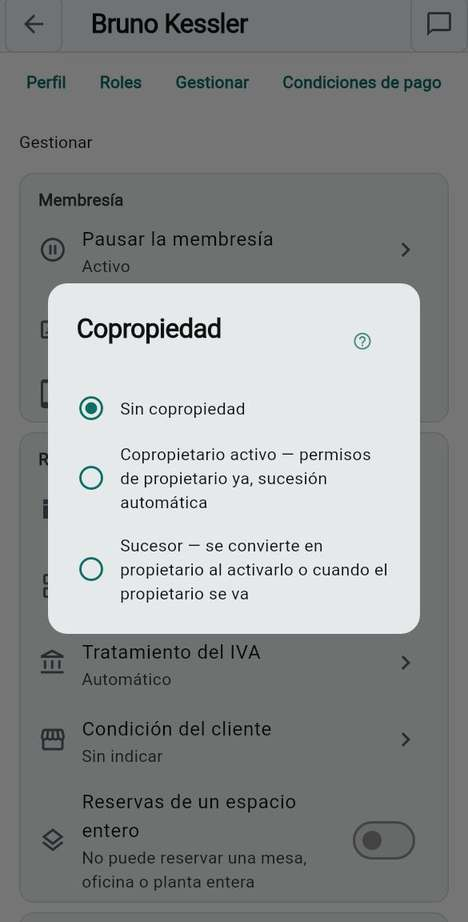

**Pasos**

1. Abra la ficha del miembro, vaya a **Membresía** y pulse **Copropiedad**.
2. Elija **Sin copropiedad**, **Copropietario activo** o **Sucesor**.
3. Para convertir de inmediato a un copropietario en propietario de pleno derecho, elija **Promover a propietario ahora**.

**Conviene saber**

- Un copropietario activo tiene ya permisos de propietario y, si usted se va, asume el cargo automáticamente.
- Un sucesor pasa a ser propietario cuando se le promueve o cuando el propietario se va.
- En la lista de miembros, la fila muestra **Copropietario** o **Sucesor**.
- Requiere que la función **Copropietarios** esté activada, y no puede modificar su propia copropiedad.

**Véase también:** [La matriz de roles](#la-matriz-de-roles)

<!-- anchor: user.money.billing.fee-bands -->
### Tramos de tarifas

**Público:** Propietario · Administrador/a de facturación

Quiere fijar el precio de sus planes: lo que cuesta un mes para cada parte de los días y lo que cuesta una media jornada extra.

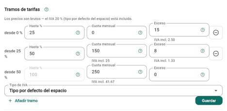

**Pasos**

1. Abra [Facturación](https://fdittgen-png.github.io/deskilo/#/billing) desde el menú.
2. Bajo **Tramos de tarifas**, defina **Hasta %**, **Cuota mensual** y **Exceso** en cada fila.
3. Pulse **Añadir tramo** para dividir el último tramo, o el icono menos para quitar uno.
4. Elija el **Tipo de IVA** con el que se grava la tarifa. Se guarda en cuanto lo elige.
5. Pulse **Guardar** para guardar los tramos.

**Conviene saber**

- Cada fila empieza donde termina la anterior, y la última termina siempre en el 100 %. Si los tramos no encajan, la pantalla dice «Los tramos deben ser crecientes y terminar en 100 %.».
- Los precios son brutos: el IVA está incluido, cuando su espacio lo cobra.
- Al quitar un tramo, su rango se fusiona con el anterior.

**Véase también:** [La suscripción de un miembro](#la-suscripción-de-un-miembro) · [Niveles de suscripción](#niveles-de-suscripción)

<!-- anchor: user.money.billing.band-to -->
#### Hasta %

El límite superior del tramo, de 1 a 100. El siguiente tramo empieza donde termina este, de modo que un porcentaje siempre cae en un único tramo. El último tramo está fijado en 100.

<!-- anchor: user.money.billing.band-fee -->
#### Cuota mensual

Lo que cuesta un mes en este tramo. Cuando cobra IVA, la fila muestra la parte de IVA incluida.

<!-- anchor: user.money.billing.band-overage -->
#### Exceso

El precio de una media jornada por encima del cupo, para los miembros cuya política es el pago por uso.

<!-- anchor: user.money.billing.levels -->
### Niveles de suscripción

**Público:** Propietario · Administrador/a de facturación

Quiere elegir qué porcentajes ofrece cuando asigna un plan a alguien.

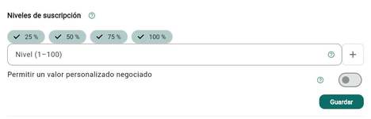

**Pasos**

1. En [Facturación](https://fdittgen-png.github.io/deskilo/#/billing), busque **Niveles de suscripción**.
2. Pulse un valor predefinido (25 %, 50 %, 75 %, 100 %) para activarlo o desactivarlo.
3. Para añadir uno propio, escriba un número en **Nivel (1–100)** y pulse **Añadir nivel**.
4. Pulse **Guardar**.

**Conviene saber**

- Los niveles que elija son los que se ofrecen en la [Suscripción](#la-suscripción-de-un-miembro) de un miembro.
- Quite un nivel que haya añadido con la cruz de su etiqueta.

**Véase también:** [Tramos de tarifas](#tramos-de-tarifas)

<!-- anchor: user.money.billing.level-value -->
#### Valor del nivel

Un porcentaje de 1 a 100: la parte de los días del mes que incluye el plan.

<!-- anchor: user.money.billing.custom-level -->
#### Permitir un valor negociado

El interruptor **Permitir un valor personalizado negociado** se guarda junto con los niveles. Como propietario, siempre puede escribir un porcentaje personalizado en la **Suscripción** de un miembro, diga lo que diga este interruptor.

<!-- anchor: user.money.billing.packages -->
### Paquetes de días

**Público:** Propietario · Administrador/a de facturación

Quiere vender bloques de días a los miembros que agotan su cupo.

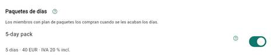

**Pasos**

1. En [Facturación](https://fdittgen-png.github.io/deskilo/#/billing), busque **Paquetes de días**. Cada fila muestra los días, el precio y un interruptor.
2. Desactive un paquete para dejar de venderlo, o actívelo para volver a venderlo.
3. Para crear un paquete, siga [Nuevo bono](#nuevo-bono).

**Conviene saber**

- Los miembros cuya política es **Exigir comprar un paquete** compran estos cuando se les acaban los días.
- Un paquete que ya se ha vendido conserva su precio, sus días y su tipo. Para cambiarlos, desactívelo y añada uno nuevo.

**Véase también:** [Cuando se acaban los días](#cuando-se-acaban-los-días)

<!-- anchor: user.money.billing.package-new -->
### Nuevo bono

**Público:** Propietario · Administrador/a de facturación

Quiere añadir un bloque de días a su lista de precios.

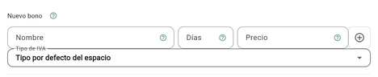

**Pasos**

1. En [Facturación](https://fdittgen-png.github.io/deskilo/#/billing), bajo **Nuevo bono**, escriba el nombre, los días y el precio.
2. Elija su **Tipo de IVA**.
3. Pulse **Añadir paquete**.

**Conviene saber**

- El paquete está a la venta en cuanto aparece, activado.
- Cuando la función de bonos está activada, debajo hay un editor de **Bonos**.

**Véase también:** [Paquetes de días](#paquetes-de-días)

<!-- anchor: user.money.billing.package-name -->
#### Nombre del paquete

Lo que ven los miembros al comprar y lo que dice la línea de la factura.

<!-- anchor: user.money.billing.package-days -->
#### Días del paquete

Cuántos días concede el paquete, uno o más.

<!-- anchor: user.money.billing.package-price -->
#### Precio del paquete

El precio del paquete completo, bruto. La fila muestra los días, el precio y, cuando se aplica IVA, el IVA incluido.

<!-- anchor: user.money.billing.schedule -->
### Calendario de facturación

**Público:** Propietario · Administrador/a de facturación

Quiere elegir cuándo salen las dos facturas automáticas: la suscripción antes del mes y el consumo del mes después de este.

**Pasos**

1. Abra [Espacio de coworking](https://fdittgen-png.github.io/deskilo/#/workspace-settings) y el grupo **Pagos y facturación**.
2. Pulse **Calendario de facturación**.
3. Bajo **Suscripción, por adelantado**, active o desactive **Emitir automáticamente** y elija **Días antes de que empiece el mes**. La línea de debajo le indica la fecha resultante.
4. Bajo **El mes recién terminado**, active o desactive **Emitir automáticamente**. Active **También cuando no hay nada que pagar** para enviar un documento a cero.
5. Pulse **Guardar**.

**Conviene saber**

- Cada mitad necesita tener su función activada en [Funciones](#un-interruptor-de-función): «Facturas de suscripción» y «Facturas de fin de mes».
- Por tanto, la factura de suscripción puede nombrar un mes que aún no ha empezado.

**Véase también:** [Reglas de recordatorio](#reglas-de-recordatorio) · [Tramos de tarifas](#tramos-de-tarifas)

<!-- anchor: user.money.services.overview -->
### Un servicio

**Público:** Propietario · Administrador/a de facturación

Vende algo que no es un puesto: una taquilla, impresión, café. Lo da de alta una vez y lo añade al mes de un miembro con un toque.

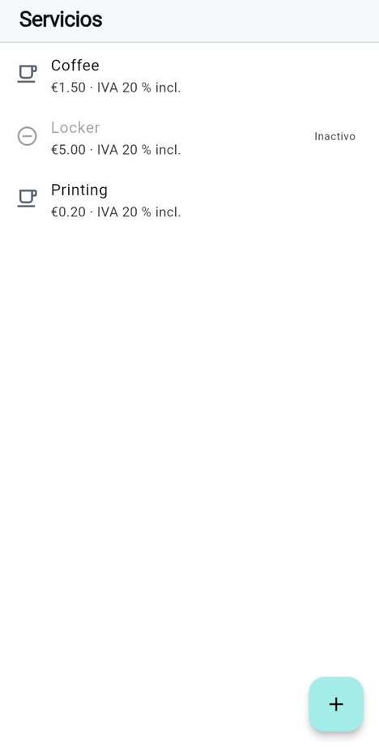

**Pasos**

1. Abra [Servicios](https://fdittgen-png.github.io/deskilo/#/services) desde el menú.
2. Pulse un servicio para editarlo, o el botón más para crear un **Nuevo servicio**.
3. Rellene el [Nombre](#nombre-del-servicio), el [Precio](#precio-del-servicio) y, cuando cobre IVA, el **Tipo de IVA**.
4. Pulse **Guardar**.

**Conviene saber**

- Un servicio nunca se elimina, solo se desactiva, porque hay facturas que lo mencionan.
- Un servicio que procede de un stock muestra cuántas unidades quedan, o **Agotado**.
- Para registrar uno a un miembro, use **Añadir un servicio** en su ficha.

**Véase también:** [Accesorios](#accesorios) · [La ficha del miembro](#la-ficha-del-miembro)

<!-- anchor: user.money.services.name -->
#### Nombre del servicio

Lo que dice la línea de la factura. Si lo renombra, solo cambian los documentos nuevos.

<!-- anchor: user.money.services.price -->
#### Precio del servicio

El precio de una unidad, bruto: el miembro paga exactamente esto, y el IVA forma parte de ello. El **Tipo de IVA** solo decide qué parte es impuesto.

<!-- anchor: user.money.services.active -->
#### Activo

Al editar un servicio, el interruptor **Activo** decide si todavía se puede vender. Desactívelo para algo que ya no se ofrece; la lista lo atenúa y escribe **Inactivo**.

<!-- anchor: user.money.accessories -->
### Accesorios

**Público:** Administrador/a · Propietario

Alquila equipamiento junto con un puesto, como un monitor o una silla, y cobra un suplemento por cada media jornada.

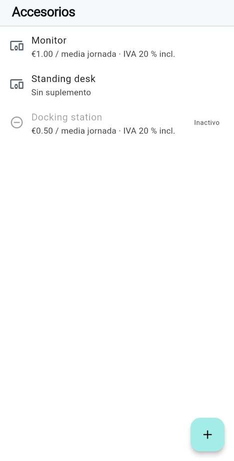

**Pasos**

1. Abra [Accesorios](https://fdittgen-png.github.io/deskilo/#/accessories) desde el menú.
2. Pulse un accesorio, o el botón más para un **Nuevo accesorio**.
3. Rellene **Nombre** y **Suplemento por media jornada**; elija el **Tipo de IVA** si su espacio cobra IVA.
4. Desactive **Activo** para dejar de ofrecerlo y pulse **Guardar**.

**Conviene saber**

- La lista muestra cada suplemento como un importe «por media jornada», o **Sin suplemento**.
- Igual que los servicios, los accesorios se desactivan, nunca se eliminan.
- La función debe estar activada en [Funciones](#un-interruptor-de-función).

**Véase también:** [Un servicio](#un-servicio)

<!-- anchor: user.money.payments.methods -->
### Medios de pago e instrucciones

**Público:** Propietario · Administrador/a de facturación

Quiere que los miembros sepan cómo pagarle por transferencia o con una cartera digital, sin tener que enviarles los datos cada vez.

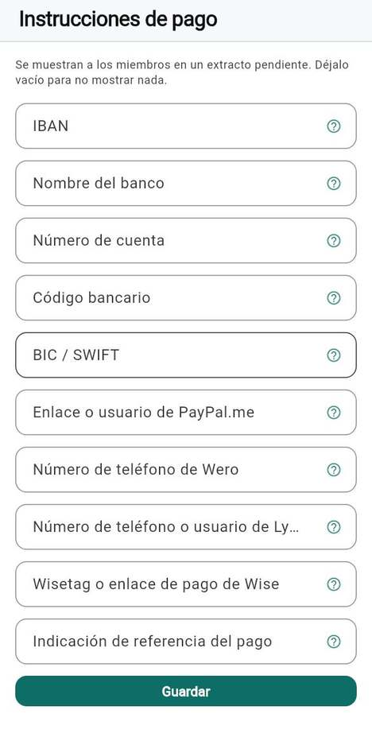

**Pasos**

1. Abra [Instrucciones de pago](https://fdittgen-png.github.io/deskilo/#/payment-methods) desde el menú.
2. Rellene lo que proceda: **IBAN**, **Nombre del banco**, **Número de cuenta**, el código del banco, **BIC / SWIFT**.
3. Añada las carteras digitales que acepta: **Enlace o usuario de PayPal.me**, **Número de teléfono de Wero**, **Número de teléfono o usuario de Lydia**, **Wisetag o enlace de pago de Wise**.
4. Añada una **Indicación de referencia del pago** si los miembros deben citar algo.
5. Pulse **Guardar**.

**Conviene saber**

- Los miembros ven estos datos en un extracto sin pagar. Deje todo vacío para no mostrar nada.
- El campo del código bancario lleva el nombre propio de su país: sort code, routing number o código bancario.
- Este es un pago manual. Para que los miembros paguen con tarjeta dentro de la aplicación, véase [El proveedor de pago](#el-proveedor-de-pago).

**Véase también:** [Credenciales del proveedor](#credenciales-del-proveedor)

<!-- anchor: user.money.payments.provider -->
### El proveedor de pago

**Público:** Propietario

Quiere que los miembros paguen en línea una factura pendiente, en su propia cuenta de proveedor.

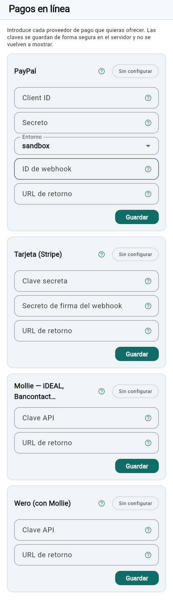

**Pasos**

1. Active la función de pagos en línea en [Funciones](#un-interruptor-de-función).
2. Abra [Pagos en línea](https://fdittgen-png.github.io/deskilo/#/payment-config) desde el menú.
3. Busque el proveedor que utiliza: **PayPal**, **Tarjeta (Stripe)**, **Mollie — iDEAL, Bancontact…** o **Wero (con Mollie)**.
4. Rellene sus claves, como se explica en [Credenciales del proveedor](#credenciales-del-proveedor), y pulse **Guardar**.
5. Compruebe que la tarjeta dice **Configurado**.

**Conviene saber**

- Cada proveedor es una tarjeta distinta con una etiqueta de estado, **Configurado** o **Sin configurar**.
- Wero se paga a través de Mollie: introduzca la misma clave de API de Mollie y la misma URL de retorno en la tarjeta de Wero que en la de Mollie.
- Los proveedores cobran sus propias comisiones. La vía de transferencia manual sigue siendo gratuita.
- **Eliminar** borra un proveedor.

**Véase también:** [Medios de pago](#medios-de-pago-e-instrucciones)

<!-- anchor: user.money.payments.credentials -->
#### Credenciales del proveedor

Las claves proceden del propio panel del proveedor: **Client ID**, **Secreto**, **Entorno**, **ID de webhook** y **URL de retorno** para PayPal; **Clave secreta**, **Secreto de firma del webhook** y **URL de retorno** para Stripe; **Clave API** y **URL de retorno** para Mollie y Wero. Mantenga separadas las claves de prueba y las reales: todas las claves que introduzca deben pertenecer al mismo modo.

Los secretos se guardan en el servidor y no vuelven a mostrarse. Uno ya guardado dice **Definido — déjelo en blanco para conservarlo**; escriba un valor nuevo para sustituirlo.

<!-- anchor: user.money.expenses.schedule -->
### Gastos programados

**Público:** Miembro · Administrador/a · Propietario

Paga algo que se repite, como internet o la electricidad. Lo describe una sola vez y la aplicación le presenta cada vencimiento.

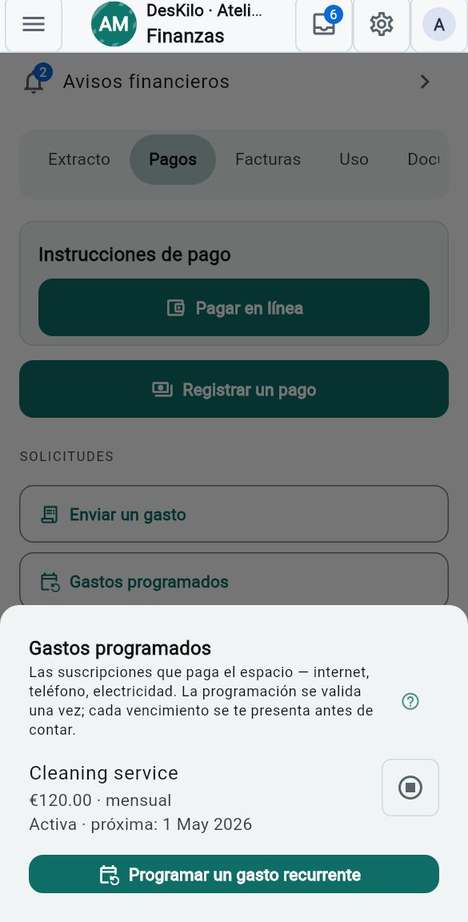

**Pasos**

1. Abra [Finanzas](https://fdittgen-png.github.io/deskilo/#/money) y la cara **Pagos**.
2. Pulse **Gastos programados**. Las programaciones existentes muestran su importe, su regla, su estado y la próxima fecha.
3. Pulse **Programar un gasto recurrente** y rellene el formulario, como se explica en [Qué](#qué) y en los campos siguientes.
4. Pulse **Programar**.

**Conviene saber**

- Una programación nueva está **Pendiente de validación** hasta que los validadores la confirman, y después **Activa**. También puede acabar **Rechazada** o **Terminada**.
- Cada vencimiento se le presenta después, antes de que cuente: confírmelo con el importe validado, o con otro importe y una explicación, que se valida de nuevo.
- Pulse **Terminar esta programación** para detener una. Las finalizadas figuran en **Finalizadas y rechazadas**.
- La función debe estar activada en [Funciones](#un-interruptor-de-función).

**Véase también:** [Reglas de validación](#reglas-de-validación-dominio-por-dominio)

<!-- anchor: user.money.expenses.what -->
#### Qué

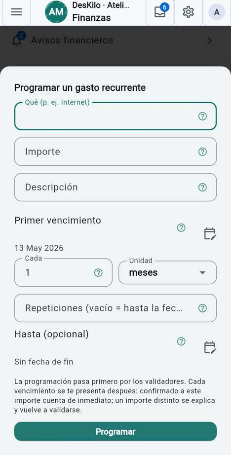

El nombre que lleva cada vencimiento, por ejemplo Internet. Escríbalo como quiera leerlo más adelante. **Importe** es lo que cuesta un vencimiento, y **Descripción** es un texto opcional para quien valida.

<!-- anchor: user.money.expenses.amount -->
#### Importe

Lo que cuesta un vencimiento, en la moneda de su espacio. Un importe distinto en el momento de la confirmación necesita una explicación y se valida de nuevo.

<!-- anchor: user.money.expenses.description -->
#### Descripción

Texto opcional para los validadores, como un número de contrato o una referencia del proveedor.

<!-- anchor: user.money.expenses.starts-on -->
#### Primer vencimiento

La fecha en que vence el primero. Todas las fechas posteriores se cuentan desde aquí.

<!-- anchor: user.money.expenses.every -->
#### Cada

El intervalo, un número y una unidad: días, semanas, meses o años. Cada 1 mes se lee «mensual».

<!-- anchor: user.money.expenses.times -->
#### Número de veces

El campo **Repeticiones (vacío = hasta la fecha de fin)**: cuántos vencimientos generar.

<!-- anchor: user.money.expenses.ends-on -->
#### Hasta

**Hasta (opcional)** es la fecha después de la cual ya no se genera nada. Con un número y una fecha a la vez, la serie se detiene en lo que llegue primero. Sin ninguno de los dos, continúa hasta que usted la termine.

<!-- anchor: user.invoicing.overview -->
## Impuestos, facturación y contabilidad

Para propietarios y administradores de facturación: quién es usted como vendedor, cómo se trata el IVA, adónde van las facturas electrónicas, qué aspecto tienen sus documentos y el ritmo mensual de emitir, enviar y reclamar facturas.

> **Atención** DesKilo imprime lo que usted declara y comprueba que estén presentes los datos obligatorios. No certifica sus facturas, su tratamiento del IVA ni su contabilidad. Cada vez que una sección siguiente diga «consúltelo con su gestor», hágalo.

En este capítulo:
- Su identidad legal y las menciones que se imprimen en cada factura
- IVA: régimen, número, tipos, grupos y la declaración periódica
- Facturación electrónica: adónde se envía la factura legible por máquina
- La plantilla PDF de factura y el editor de informes
- Emitir y cerrar un mes: la pantalla de Facturación, el asistente de cierre mensual, la reagrupación, los gastos compartidos
- Recordatorios de pago
- El registro de facturas, las exportaciones contables y el análisis de negocio

<!-- anchor: user.money.legal.identity -->
### Su identidad legal

**Público:** Propietario

Quiere que sus facturas le nombren correctamente: quién es, cómo está registrado y cómo cobra el IVA.

**Pasos**

1. Abra [Espacio de coworking](https://fdittgen-png.github.io/deskilo/#/workspace-settings) y pulse **Identidad legal y facturación electrónica**, o vaya directamente a [Identidad legal y facturación electrónica](https://fdittgen-png.github.io/deskilo/#/legal-identity).
2. Trabaje de arriba abajo: primero el régimen de IVA, después los identificadores, la dirección y las **Menciones de facturación**.
3. Pulse **Guardar** en la parte inferior.

**Conviene saber**

- La pantalla solo muestra los campos que necesita su régimen de IVA. Si cambia el régimen, el formulario lo sigue.
- Las facturas ya emitidas conservan la identidad con la que se firmaron. Un cambio se aplica a las siguientes.
- Solo los propietarios pueden abrir esta pantalla.

**Véase también:** [Régimen de IVA](#régimen-de-iva) · [Tipo de organización](#tipo-de-organización) · [Facturación electrónica](#la-plataforma-de-facturación-electrónica)

<!-- anchor: user.money.legal.seller-kind -->
### Tipo de organización

**Público:** Propietario

Usted dirige una empresa o una asociación sin ánimo de lucro, y sus facturas deben reflejarlo.

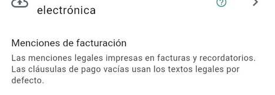

**Pasos**

1. Abra [Identidad legal y facturación electrónica](https://fdittgen-png.github.io/deskilo/#/legal-identity) y baje hasta **Menciones de facturación**.
2. Elija **Empresa** o **Asociación (sin ánimo de lucro)**.
3. Pulse **Guardar**.

**Conviene saber**

- Para una asociación, los textos de ejemplo cambian (por ejemplo, un registro como el RNA en lugar de un registro mercantil). Qué cláusulas de pago se imprimen depende de su país y de la condición del cliente, no del tipo de organización.
- Una asociación sin actividad comercial normalmente queda fuera del ámbito del IVA. La pantalla le avisa si elige «exento» para una asociación; confirme la opción correcta con su gestor.

**Véase también:** [Condición del cliente](#condición-del-cliente-por-defecto) · [Régimen de IVA](#régimen-de-iva)

<!-- anchor: user.money.legal.customer-capacity -->
### Condición del cliente por defecto

**Público:** Propietario

A las empresas clientes y a los particulares no se les deben las mismas cláusulas de pago. Usted define el valor por defecto del espacio.

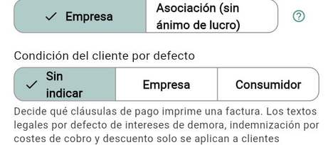

**Pasos**

1. En **Menciones de facturación**, busque **Condición del cliente por defecto**.
2. Elija **Sin indicar**, **Empresa** o **Consumidor**.
3. Pulse **Guardar**.

**Conviene saber**

- Los valores legales por defecto de penalización por demora, indemnización de cobro y descuento solo se aplican a clientes empresa de un espacio en Francia; para otros países no se imprime nada salvo lo que haya escrito usted. Un consumidor nunca recibe la indemnización de cobro.
- La condición propia de un miembro prevalece sobre este valor por defecto.
- Cada factura conserva las cláusulas con las que se emitió.

**Véase también:** [Penalización por demora](#penalización-por-demora) · [Indemnización de cobro](#indemnización-de-cobro)

<!-- anchor: user.money.legal.legal-form -->
### Forma jurídica y capital

**Público:** Propietario

Sus facturas indican la forma jurídica de su empresa y, si procede, su capital social.

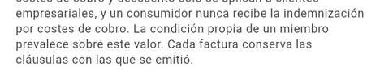

**Pasos**

1. En **Menciones de facturación**, pulse **Forma jurídica y capital**.
2. Escriba la línea tal como debe imprimirse, por ejemplo «SARL au capital de 7 500 €» (una asociación podría escribir «Association loi 1901»).
3. Pulse **Guardar**.

**Conviene saber**

- El texto se imprime tal como lo escribe, hasta 300 caracteres. Consulte con su gestor la redacción exacta que exige su forma jurídica.

**Véase también:** [Registro mercantil](#registro-mercantil)

<!-- anchor: user.money.legal.registration -->
### Registro mercantil

**Público:** Propietario

Indica dónde está registrada su organización.

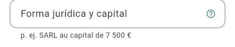

**Pasos**

1. En **Menciones de facturación**, pulse **Registro mercantil**.
2. Escriba la línea de registro, por ejemplo «RCS Saint-Brieuc 680 357 910». Una asociación podría introducir un número RNA, y un SIRET si lo tiene.
3. Pulse **Guardar**.

**Conviene saber**

- Esta línea es una mención impresa en el documento. El identificador que necesita la propia factura electrónica es el [número de registro](#número-de-registro) o el [número de IVA](#número-de-iva), según su régimen.

**Véase también:** [Forma jurídica y capital](#forma-jurídica-y-capital)

<!-- anchor: user.money.legal.payment-terms -->
### Condiciones de pago

**Público:** Propietario

Indica cuándo vencen las facturas.

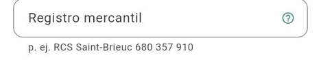

**Pasos**

1. En **Menciones de facturación**, pulse **Condiciones de pago**.
2. Escriba sus condiciones, por ejemplo «Pago en un plazo de 30 días desde la fecha de la factura».
3. Pulse **Guardar**.

**Conviene saber**

- Si lo deja vacío, las facturas imprimen «Pago a la recepción».
- Un miembro puede tener sus propias condiciones de pago; estas se imprimen en los documentos de ese miembro en su lugar.
- Los recordatorios no leen este texto: cuentan desde la fecha de la factura más **Días hasta el primer recordatorio** en las reglas de recordatorio. Las condiciones de pago son solo lo que imprime el documento.

**Véase también:** [Reglas de recordatorio](#reglas-de-recordatorio)

<!-- anchor: user.money.legal.late-penalty -->
### Penalización por demora

**Público:** Propietario

Indica la penalización por pago tardío.

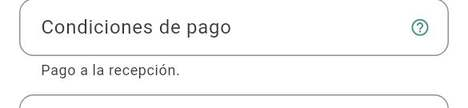

**Pasos**

1. En **Menciones de facturación**, pulse **Penalización por demora**.
2. Escriba su cláusula, o déjela vacía.
3. Pulse **Guardar**.

**Conviene saber**

- Si lo deja vacío, no se inventa nada por usted, salvo en un espacio en Francia que factura a un cliente empresa: entonces se imprime la redacción legal (tres veces el tipo de interés legal).
- Confirme con su gestor la cláusula que se aplica a su país.

**Véase también:** [Condición del cliente por defecto](#condición-del-cliente-por-defecto)

<!-- anchor: user.money.legal.recovery -->
### Indemnización de cobro

**Público:** Propietario

Indica la indemnización fija por costes de cobro.

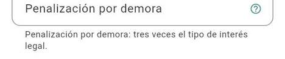

**Pasos**

1. En **Menciones de facturación**, pulse **Indemnización de cobro**.
2. Escriba su cláusula, o déjela vacía.
3. Pulse **Guardar**.

**Conviene saber**

- Si lo deja vacío, la indemnización fija de 40 € solo se imprime en las facturas de un espacio en Francia a un cliente empresa.
- Un consumidor nunca recibe esta mención.

**Véase también:** [Condición del cliente por defecto](#condición-del-cliente-por-defecto)

<!-- anchor: user.money.legal.escompte -->
### Descuento por pronto pago

**Público:** Propietario

Indica si pagar antes da derecho a un descuento.

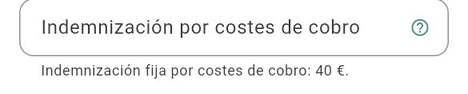

**Pasos**

1. En **Menciones de facturación**, pulse **Descuento por pronto pago**.
2. Escriba las condiciones de su descuento, o déjelo vacío.
3. Pulse **Guardar**.

**Conviene saber**

- Si lo deja vacío, las facturas de un espacio en Francia a un cliente empresa imprimen «Sin descuento por pronto pago»; en otros casos la línea se omite salvo que escriba una.

**Véase también:** [Condiciones de pago](#condiciones-de-pago)

<!-- anchor: user.money.legal.insurance -->
### Seguro profesional

**Público:** Propietario

Si su actividad le obliga a indicar su seguro profesional, se imprime en sus facturas.

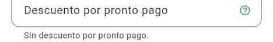

**Pasos**

1. En **Menciones de facturación**, pulse **Seguro profesional**.
2. Escriba la aseguradora, la póliza y la cobertura geográfica tal como deben leerse.
3. Pulse **Guardar**.

**Conviene saber**

- No hay valor por defecto: un campo vacío no imprime nada.
- Si debe indicarlo o no depende de su actividad. Pregunte a su gestor.

**Véase también:** [Menciones particulares](#menciones-particulares)

<!-- anchor: user.money.legal.special-mentions -->
### Menciones particulares

**Público:** Propietario

Una línea propia que debe aparecer en todas las facturas.

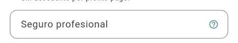

**Pasos**

1. En **Menciones de facturación**, pulse **Menciones particulares**.
2. Escriba el texto.
3. Pulse **Guardar**.

**Conviene saber**

- No se imprime nada cuando el campo está vacío.
- Bajo las menciones, cuando la función **Ventanilla de dirección** está activada, **Ventanilla de dirección** fija dónde se coloca la dirección del destinatario para que se vea a través de un sobre con ventanilla.

**Véase también:** [La plantilla PDF de factura](#la-plantilla-pdf-de-factura)

<!-- anchor: user.money.vat.regime -->
### Régimen de IVA

**Público:** Propietario

Declara cuál es la situación de su organización respecto al IVA. La elección decide qué número necesitan sus documentos.

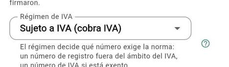

**Pasos**

1. Abra [Identidad legal y facturación electrónica](https://fdittgen-png.github.io/deskilo/#/legal-identity).
2. En **Régimen de IVA**, elija **Fuera del ámbito del IVA**, **Exento de IVA (régimen de franquicia)** o **Sujeto a IVA (cobra IVA)**.
3. Pulse **Guardar**.

**Conviene saber**

- Fuera del ámbito del IVA: no se imprime ningún número de IVA; le identifica el número de registro.
- Exento o sujeto: se le pide su número de IVA.
- Elegir el régimen es una decisión fiscal, no un ajuste del programa. Confírmela con su gestor antes de emitir facturas.
- En esta versión la aplicación emite facturas por sí misma para espacios en Francia o Alemania, a clientes nacionales, bajo el régimen de sujeto a IVA o fuera del ámbito del IVA. Las facturas bajo el régimen exento se emiten fuera de la aplicación con su gestor.

**Véase también:** [Número de IVA](#número-de-iva) · [Número de registro](#número-de-registro)

<!-- anchor: user.money.vat.reverse-charge -->
### Inversión del sujeto pasivo para empresas de la UE

**Público:** Propietario

Cuando cobra IVA y factura a una empresa de otro país de la UE, el impuesto puede correr a cargo del cliente.

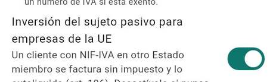

**Pasos**

1. Elija **Sujeto a IVA (cobra IVA)** como régimen.
2. Active o desactive **Inversión del sujeto pasivo para empresas de la UE**.
3. Pulse **Guardar**.

**Conviene saber**

- Activado: la aplicación reconoce a una empresa con número de IVA en otro Estado miembro. Hoy la aplicación no emite esas facturas por sí misma: usted las emite fuera de la aplicación con su gestor.
- Desactivado: desactívelo si nunca factura a empresas del extranjero.
- La opción solo aparece con el régimen de sujeto a IVA.

**Véase también:** [Tratamiento del IVA de un miembro](#tratamiento-del-iva)

<!-- anchor: user.money.vat.due -->
### Cuándo se devenga el IVA

**Público:** Propietario

Elige si el IVA se cuenta al emitir la factura o al cobrarla.

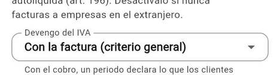

**Pasos**

1. Elija **Sujeto a IVA (cobra IVA)** como régimen.
2. En **Devengo del IVA**, elija **Con la factura (criterio general)** o **Con el cobro (criterio de caja)**.
3. Pulse **Guardar**.

**Conviene saber**

- Con el cobro, un periodo declara lo que los clientes pagaron dentro de él; con la factura, lo que usted emitió.
- La elección se imprime en cada factura y determina la [declaración de IVA](#la-declaración-periódica-de-iva).
- Qué criterio le corresponde es una cuestión fiscal para su gestor.

**Véase también:** [La declaración periódica de IVA](#la-declaración-periódica-de-iva)

<!-- anchor: user.money.vat.account -->
### Cuenta de IVA

**Público:** Propietario

Su gestor quiere que el IVA repercutido se contabilice en una cuenta concreta.

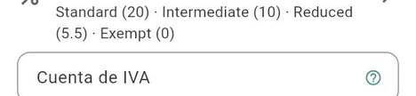

**Pasos**

1. Elija **Sujeto a IVA (cobra IVA)** como régimen.
2. Escriba su número de cuenta en **Cuenta de IVA**.
3. Pulse **Guardar**.

**Conviene saber**

- La exportación contable registra el IVA repercutido en esta cuenta. Si lo deja vacío, usa la 445710.

**Véase también:** [Exportaciones contables](#exportaciones-contables)

<!-- anchor: user.money.vat.number -->
### Número de IVA

**Público:** Propietario

Su número de identificación de IVA aparece en sus facturas y facturas electrónicas.

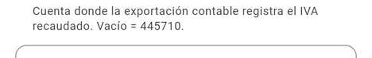

**Pasos**

1. Abra [Identidad legal y facturación electrónica](https://fdittgen-png.github.io/deskilo/#/legal-identity).
2. Escriba el número en **Número de IVA**.
3. Pulse **Guardar**.

**Conviene saber**

- El campo aparece para los regímenes exento y sujeto. Fuera del ámbito del IVA se sustituye por el número de registro.
- Sus miembros tienen su propio número de IVA en sus ajustes, para sus documentos.

**Véase también:** [Número de registro](#número-de-registro)

<!-- anchor: user.money.vat.exemption-reason -->
### Motivo por el que no se cobra IVA

**Público:** Propietario

Cuando no se cobra IVA, la ley suele exigir que el motivo figure impreso en la factura.

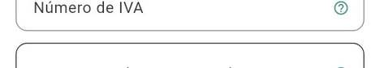

**Pasos**

1. Abra [Identidad legal y facturación electrónica](https://fdittgen-png.github.io/deskilo/#/legal-identity).
2. Escriba el fundamento legal en **Motivo por el que no se cobra IVA**, por ejemplo «TVA non applicable, art. 293 B du CGI».
3. Pulse **Guardar**.

**Conviene saber**

- La aplicación no puede saber qué fundamento le corresponde. Pida a su gestor la redacción exacta.
- La redacción se imprime en la factura. Por ahora la aplicación no emite por sí misma facturas bajo el régimen exento: se emiten fuera de la aplicación con su gestor.

**Véase también:** [Régimen de IVA](#régimen-de-iva)

<!-- anchor: user.money.legal.legal-id -->
### Número de registro

**Público:** Propietario

Si está fuera del ámbito del IVA, su número de registro le identifica en las facturas electrónicas.

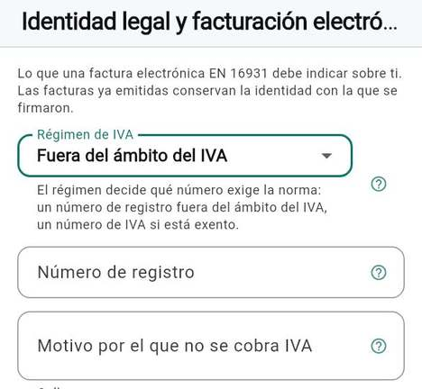

**Pasos**

1. Ponga el **Régimen de IVA** en **Fuera del ámbito del IVA**.
2. Escriba el número en **Número de registro**.
3. Pulse **Guardar**.

**Conviene saber**

- Con los demás regímenes, este campo se sustituye por el número de IVA.
- Una asociación suele usar su registro (por ejemplo, el RNA, o el SIRET si se le ha asignado).

**Véase también:** [Registro mercantil](#registro-mercantil)

<!-- anchor: user.money.legal.address -->
### Dirección estructurada

**Público:** Propietario

Una factura electrónica necesita su dirección en partes separadas, no en un único bloque de texto.

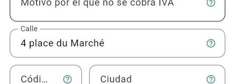

**Pasos**

1. Abra [Identidad legal y facturación electrónica](https://fdittgen-png.github.io/deskilo/#/legal-identity).
2. Rellene **Calle**, **Código postal** y **Ciudad**.
3. Pulse **Guardar**.

**Conviene saber**

- La calle parte de la dirección que ya figura en los ajustes de su espacio, de modo que la completa en lugar de volver a escribirla.
- No se pueden emitir facturas sin la dirección postal del espacio.

**Véase también:** [Dirección del membrete](#dirección-del-membrete)

<!-- anchor: user.money.vat.rates -->
### Fijar los tipos

**Público:** Propietario · Administrador/a de facturación

Enumera los tipos de IVA que pueden usar sus facturas. Lo que pagan los miembros no cambia: los precios incluyen el IVA y el impuesto se extrae de ellos.

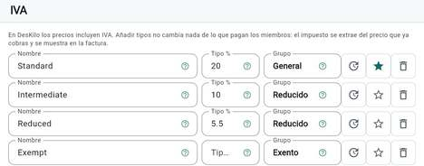

**Pasos**

1. Abra [IVA](https://fdittgen-png.github.io/deskilo/#/vat) (desde **Identidad legal y facturación electrónica**, pulse **Tipos de IVA**).
2. Con la lista vacía, pulse **Usar los tipos habituales** (si su país tiene un catálogo) para partir de los tipos de su país, o **Añadir un tipo** y rellene el nombre y **Tipo %** (de 0 a 99,99).
3. Pulse la estrella de exactamente un tipo para convertirlo en el tipo por defecto.
4. Pulse **Guardar**.

**Conviene saber**

- Los tipos habituales son un punto de partida. Qué operación va con qué tipo es una pregunta para su gestor.
- El tipo por defecto lo usan las suscripciones y todo lo que no tiene tipo propio.
- Un tipo que todavía usa una factura o un servicio se conserva, desactivado, en lugar de eliminarse.
- Si no hay ningún tipo por defecto en vigor mientras está sujeto a IVA, no se puede emitir ninguna factura; la pantalla de identidad legal lo advierte.
- Esta pantalla requiere la función **Gestión del IVA**; la entrada de tipos de IVA de la pantalla de identidad legal solo aparece con el régimen de sujeto a IVA.

**Véase también:** [Grupos de IVA](#grupos-de-iva) · [Cambio por ley](#cambiar-un-tipo-por-ley)

<!-- anchor: user.money.vat.groups -->
### Grupos de IVA

**Público:** Propietario · Administrador/a de facturación

Un grupo indica de qué clase es el tipo, para que la factura lo coloque en la categoría correcta.

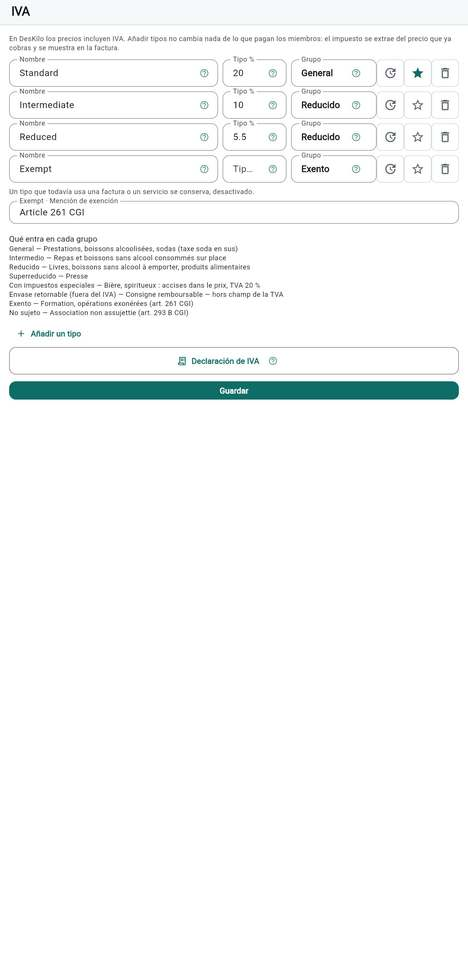

**Pasos**

1. Abra [IVA](https://fdittgen-png.github.io/deskilo/#/vat).
2. En cada tipo, cuando la función **Grupos de IVA** está activada, elija un **Grupo**: **General**, **Intermedio**, **Reducido**, **Superreducido**, **Tipo cero**, **Exento**, **No sujeto**, **Envase retornable (fuera del IVA)** o **Con impuestos especiales**.
3. Para un grupo exento o no sujeto, rellene la **Mención de exención** que aparece.
4. Pulse **Guardar**.

**Conviene saber**

- **Qué entra en cada grupo** enumera ejemplos para su país, solo a modo orientativo.
- Una línea fuera del IVA, como un envase retornable, no puede compartir documento con líneas gravadas; emítala por separado.

**Véase también:** [Fijar los tipos](#fijar-los-tipos)

<!-- anchor: user.money.vat.change-by-law -->
### Cambiar un tipo por ley

**Público:** Propietario · Administrador/a de facturación

Un tipo cambia a partir de una fecha determinada. Las operaciones antiguas conservan el valor antiguo; el nuevo se aplica desde ese día.

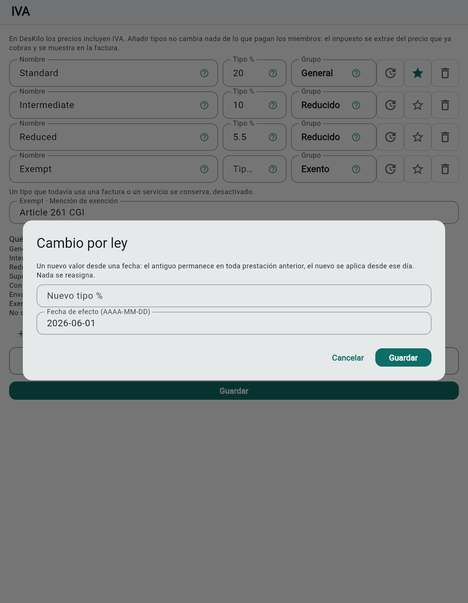

**Pasos**

1. Abra [IVA](https://fdittgen-png.github.io/deskilo/#/vat) y asegúrese de que el tipo está guardado.
2. Pulse el botón **Cambio por ley** del tipo.
3. Escriba **Nuevo tipo %** y la **Fecha de efecto (AAAA-MM-DD)**.
4. Pulse **Guardar** en el cuadro de diálogo y después **Guardar** en la pantalla.

**Conviene saber**

- El tipo antiguo se cierra en esa fecha y se abre uno nuevo, con la estrella trasladada si era el tipo por defecto.
- Nada de lo ya emitido se reasigna.

**Véase también:** [Fijar los tipos](#fijar-los-tipos)

<!-- anchor: user.money.vat.declaration -->
### La declaración periódica de IVA

**Público:** Propietario

Quiere un resumen listo del IVA de un periodo para presentarlo a Hacienda o entregarlo a su gestor.

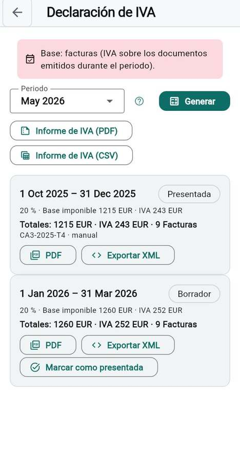

**Pasos**

1. Abra [Declaración de IVA](https://fdittgen-png.github.io/deskilo/#/vat-declarations).
2. Elija el **Periodo** y pulse **Generar**.
3. Abra el resultado con **PDF** o **Exportar XML**, o consulte el **Informe de IVA (PDF)** y el **Informe de IVA (CSV)**.
4. Cuando la haya presentado usted mismo, pulse **Marcar como presentada**.

**Conviene saber**

- Solo existe con el régimen de sujeto a IVA. La nota de arriba indica si el periodo cuenta facturas o cobros.
- Es una ayuda para la presentación generada a partir de las facturas emitidas en el periodo, no un asesoramiento fiscal. Verifíquela con su contabilidad antes de presentarla.
- Una declaración presentada ya no se puede modificar.
- Cuando hay una plataforma configurada en [Facturación electrónica](#la-plataforma-de-facturación-electrónica), un botón **Transmitir** puede enviarla.

**Véase también:** [Cuándo se devenga el IVA](#cuándo-se-devenga-el-iva) · [Exportaciones contables](#exportaciones-contables)

<!-- anchor: user.money.einvoice.overview -->
### La plataforma de facturación electrónica

**Público:** Propietario · Administrador/a de facturación

Indica a DesKilo dónde enviar sus facturas como archivos legibles por máquina.

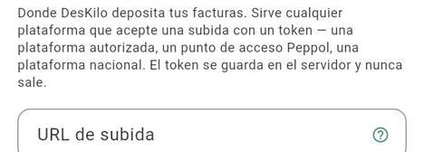

**Pasos**

1. Abra [Plataforma de facturación electrónica](https://fdittgen-png.github.io/deskilo/#/einvoice-config) (también accesible desde **Identidad legal y facturación electrónica**).
2. Rellene **URL de subida** y **Token o credencial**, y los dos campos opcionales si su plataforma los pide.
3. Pulse **Guardar**. **Eliminar la plataforma** borra los ajustes.

**Conviene saber**

- Sirve cualquier plataforma que acepte una subida con un token: una plataforma homologada, un punto de acceso Peppol, una plataforma nacional.
- El token se guarda en el servidor y no vuelve a mostrarse.
- El archivo válido es una factura EN 16931. Si su país exige una plataforma, y cuál, es algo que debe confirmar con su gestor.

**Véase también:** [Enviar una factura electrónica](#enviar-una-factura-electrónica) · [Identidad legal](#su-identidad-legal)

<!-- anchor: user.money.einvoice.endpoint -->
### URL de subida

**Público:** Propietario · Administrador/a de facturación

La dirección en la que su plataforma recibe las facturas.

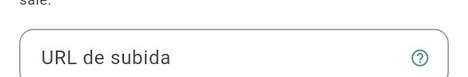

**Pasos**

1. Abra [Plataforma de facturación electrónica](https://fdittgen-png.github.io/deskilo/#/einvoice-config).
2. Pegue la dirección en **URL de subida**, exactamente como la documenta su plataforma.
3. Pulse **Guardar**.

**Conviene saber**

- Procede de la documentación de su plataforma o de su proveedor.

**Véase también:** [Token o credencial](#token-o-credencial)

<!-- anchor: user.money.einvoice.token -->
### Token o credencial

**Público:** Propietario · Administrador/a de facturación

El secreto que demuestra a la plataforma que la subida es suya.

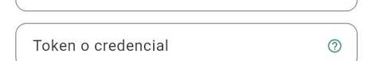

**Pasos**

1. Abra [Plataforma de facturación electrónica](https://fdittgen-png.github.io/deskilo/#/einvoice-config).
2. Pegue la clave en **Token o credencial**.
3. Pulse **Guardar**.

**Conviene saber**

- Una vez guardado, la pantalla dice «Hay un token guardado». Escriba uno nuevo solo para sustituirlo.
- Se conserva en el servidor y nunca sale de él.

**Véase también:** [Cabecera de autenticación](#cabecera-de-autenticación)

<!-- anchor: user.money.einvoice.auth-header -->
### Cabecera de autenticación

**Público:** Propietario · Administrador/a de facturación

El nombre de la cabecera que lleva el token.

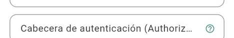

**Pasos**

1. Abra [Plataforma de facturación electrónica](https://fdittgen-png.github.io/deskilo/#/einvoice-config).
2. Si su plataforma espera otra cabecera distinta de la estándar, escriba su nombre en **Cabecera de autenticación (Authorization por defecto)**.
3. Pulse **Guardar**.

**Conviene saber**

- Si lo deja vacío, se usa **Authorization**.

**Véase también:** [Nombre del campo de archivo](#nombre-del-campo-de-archivo)

<!-- anchor: user.money.einvoice.file-field -->
### Nombre del campo de archivo

**Público:** Propietario · Administrador/a de facturación

El nombre del campo del formulario que lleva el archivo de la factura.

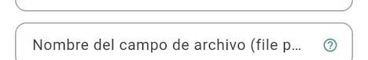

**Pasos**

1. Abra [Plataforma de facturación electrónica](https://fdittgen-png.github.io/deskilo/#/einvoice-config).
2. Si su plataforma espera otro nombre de campo, escríbalo en **Nombre del campo de archivo (file por defecto)**.
3. Pulse **Guardar**.

**Conviene saber**

- Si lo deja vacío, se usa **file**.

**Véase también:** [URL de subida](#url-de-subida)

<!-- anchor: user.money.einvoice.customer-delivery -->
### Servicio de entrega al cliente

**Público:** Propietario · Administrador/a de facturación

Es posible que su cliente reciba sus facturas en otro lugar que no sea una plataforma gubernamental: su propio punto de acceso Peppol, un portal o un servicio de subida acordado.

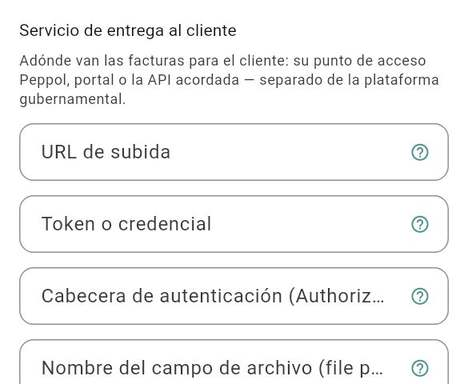

**Pasos**

1. Abra [Plataforma de facturación electrónica](https://fdittgen-png.github.io/deskilo/#/einvoice-config).
2. En **Servicio de entrega al cliente**, rellene los mismos cuatro campos que arriba.
3. Pulse **Guardar**.

**Conviene saber**

- Es independiente de la plataforma gubernamental. Pueden configurarse ambas, y cada factura ofrece los dos envíos.

**Véase también:** [Enviar una factura electrónica](#enviar-una-factura-electrónica)

<!-- anchor: user.money.einvoice.uat -->
### Endpoint y token UAT

**Público:** Propietario · Administrador/a de facturación

Quiere hacer un ensayo antes de enviar facturas reales.

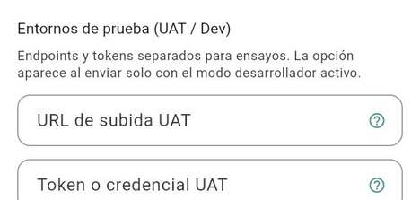

**Pasos**

1. Abra [Plataforma de facturación electrónica](https://fdittgen-png.github.io/deskilo/#/einvoice-config).
2. Bajo **Entornos de prueba (UAT / Dev)**, rellene **URL de subida UAT** y **Token o credencial UAT**.
3. Pulse **Guardar**.

**Conviene saber**

- La elección del entorno solo aparece al enviar mientras el modo desarrollador está activado.
- Un envío de prueba se registra como envío de prueba.

**Véase también:** [Endpoint y token Dev](#endpoint-y-token-dev)

<!-- anchor: user.money.einvoice.dev -->
### Endpoint y token Dev

**Público:** Propietario · Administrador/a de facturación

Un segundo endpoint de prueba, para desarrollo.

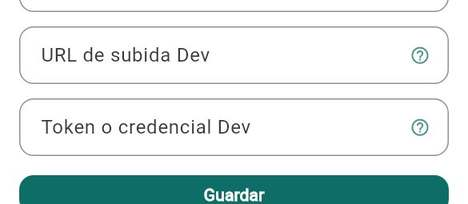

**Pasos**

1. Abra [Plataforma de facturación electrónica](https://fdittgen-png.github.io/deskilo/#/einvoice-config).
2. Bajo **Entornos de prueba (UAT / Dev)**, rellene **URL de subida Dev** y **Token o credencial Dev**.
3. Pulse **Guardar**.

**Conviene saber**

- Las mismas reglas que para UAT. El envío real va siempre al endpoint de producción.

**Véase también:** [Endpoint y token UAT](#endpoint-y-token-uat)

<!-- anchor: user.money.einvoice.send -->
### Enviar una factura electrónica

**Público:** Propietario · Administrador/a de facturación

Quiere entregar una factura emitida en su forma legible por máquina.

**Pasos**

1. Abra una factura en [Facturación](https://fdittgen-png.github.io/deskilo/#/invoices) y pulse **Factura electrónica (XML)**.
2. Lea la comprobación de la parte superior de la hoja: indica si el archivo está listo o qué falta.
3. Pulse **Enviar a la plataforma gubernamental**, **Enviar al servicio del cliente**, o descargue o comparta el archivo (**Descargar Factur-X (PDF)** lleva el XML dentro del PDF).

**Conviene saber**

- Si falta algo, la hoja lo enumera. **Completar la identidad legal** le lleva a la pantalla que lo corrige.
- Una factura firmada antes de que completara su identidad conserva lo que tenía al emitirse. Márquela como errónea y emita una sustitutiva si es importante.
- Qué canal debe usar un cliente depende de su país y del cliente. Confírmelo con su gestor.

**Véase también:** [La plataforma de facturación electrónica](#la-plataforma-de-facturación-electrónica) · [La pantalla de Facturación](#la-pantalla-de-facturación)

<!-- anchor: user.money.reports.invoice-template -->
### La plantilla PDF de factura

**Público:** Propietario · Administrador/a de facturación

Quiere que sus facturas se parezcan a usted: logotipo, maquetación, redacción.

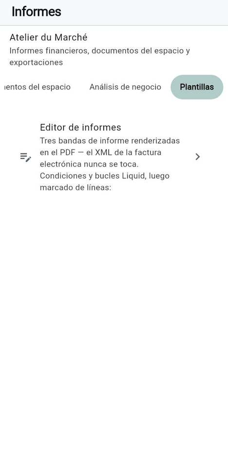

**Pasos**

1. Abra [Informes](https://fdittgen-png.github.io/deskilo/#/reports?section=templates) y la pestaña **Plantillas**.
2. Pulse **Editor de informes**.

**Conviene saber**

- La plantilla cambia solo el PDF. El XML de la factura electrónica nunca se toca.
- Puede hacerlo cualquier persona con permiso para diseñar documentos.
- Una plantilla que no se genera nunca bloquea un documento: entra en juego la maquetación integrada.

**Véase también:** [El editor de informes](#el-editor-de-informes)

<!-- anchor: user.money.reports.editor -->
### El editor de informes

**Público:** Propietario · Administrador/a de facturación

Diseña un documento sobre una página, en lugar de escribir código.

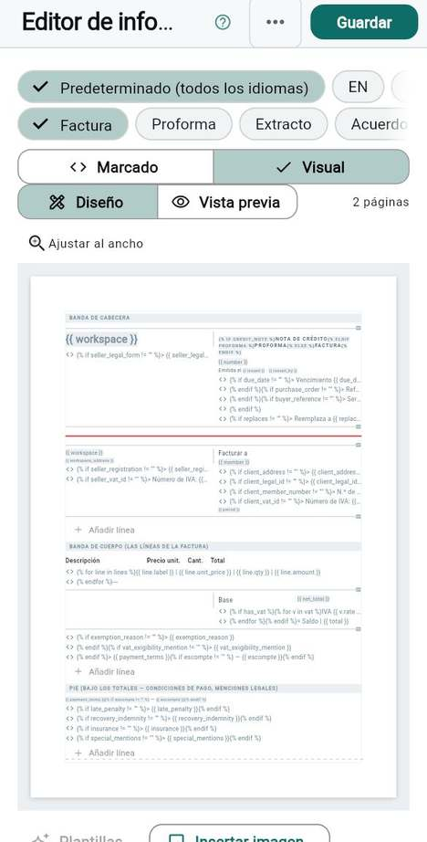

**Pasos**

1. Abra [Editor de informes](https://fdittgen-png.github.io/deskilo/#/report-editor).
2. Elija el documento con las etiquetas (Factura, Proforma, Extracto, recordatorios y los demás informes).
3. En **Diseño**, pulse una línea para editarla, añada líneas o arrastre para reordenar. Pulse **Vista previa** para verlo con sus datos.
4. Pulse **Guardar**.

**Conviene saber**

- El modo **Marcado** edita las mismas bandas como texto.
- **Insertar imagen** coloca un logotipo, un sello o una firma de la biblioteca de imágenes.
- **Vista rápida** se genera al instante con su factura más reciente, o con datos de ejemplo si no hay ninguna. **Restablecer al modelo por defecto** recupera la maquetación integrada.
- **Exportar este diseño** e **Importar un diseño** llevan un diseño de entrada y de salida como archivo. **Maqueta posicionada (XML)** es para documentos que deben ajustarse a un sobre con ventanilla o a un formulario nacional.
- Si sale con trabajo sin guardar, se le pregunta antes.

**Véase también:** [Plantillas y modelos](#plantillas-ya-preparadas) · [Idiomas](#un-diseño-por-idioma)

<!-- anchor: user.money.reports.presets -->
### Plantillas ya preparadas

**Público:** Propietario · Administrador/a de facturación

Parte de un diseño terminado y cambia lo que quiera.

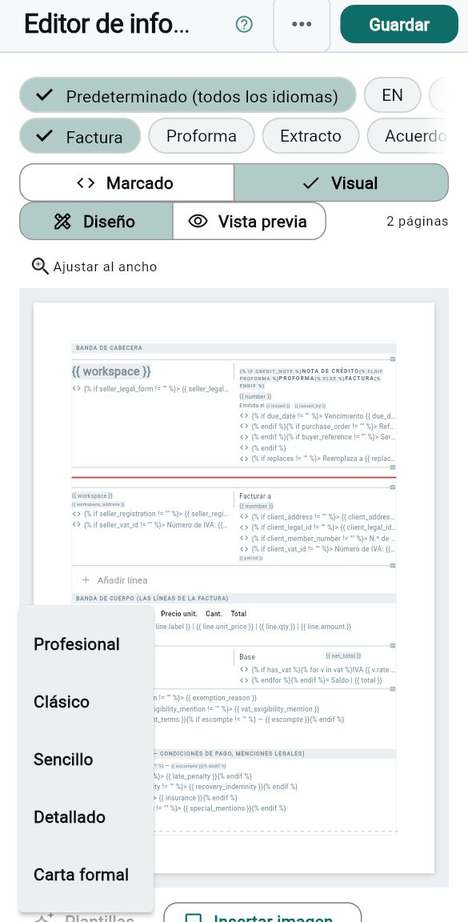

**Pasos**

1. Abra [Editor de informes](https://fdittgen-png.github.io/deskilo/#/report-editor) y elija un documento.
2. Pulse **Plantillas** y elija **Profesional**, **Clásico**, **Sencillo**, **Detallado** o **Carta formal**.
3. Confirme la sustitución si la aplicación se lo pide, edite y **Guardar**.

**Conviene saber**

- Sustituir una maquetación se puede deshacer con **Deshacer**.
- Los informes estructurales (plan contable, credenciales, tarjetas QR) tienen una única maquetación incluida.
- Las plantillas de factura ya incluyen sus menciones legales. Aun así, imprimen únicamente lo que usted introdujo en [Menciones de facturación](#su-identidad-legal).

**Véase también:** [El editor de informes](#el-editor-de-informes)

<!-- anchor: user.money.reports.languages -->
### Un diseño por idioma

**Público:** Propietario · Administrador/a de facturación

Sus miembros leen sus documentos en su propio idioma.

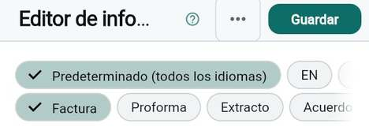

**Pasos**

1. Abra [Editor de informes](https://fdittgen-png.github.io/deskilo/#/report-editor).
2. Bajo el documento, elija **Predeterminado (todos los idiomas)** o uno de **EN**, **FR**, **DE**, **ES**, **IT**.
3. Edite las bandas para ese idioma y **Guardar**. **Usar la predeterminada para este idioma** elimina un diseño propio.

**Conviene saber**

- Un punto en un idioma significa que tiene su propio diseño; de lo contrario, hereda el predeterminado.
- El documento de un miembro se imprime en su idioma cuando existe un diseño para él; si no, en el idioma por defecto del espacio.

**Véase también:** [Idioma del espacio](#idioma-del-espacio)

<!-- anchor: user.invoicing.hub -->
### La pantalla de Facturación

**Público:** Propietario · Administrador/a de facturación

Ve de un vistazo qué hay que emitir, qué hay que cobrar y qué está cerrado.

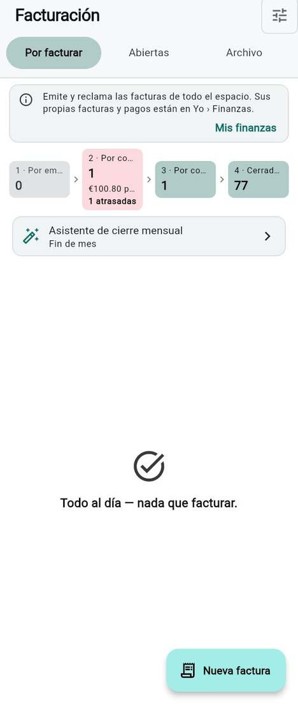

**Pasos**

1. Abra [Facturación](https://fdittgen-png.github.io/deskilo/#/invoices).
2. Lea la franja: **Por emitir**, **Por cobrar**, **Por confirmar**, **Cerrada**.
3. Trabaje en las tres pestañas: **Por facturar** (miembros con algo registrado, aún sin facturar), **Abiertas** (emitidas, sin pagar) y **Archivo** (pagadas o cerradas).
4. Pulse el icono de herramientas para ver las demás herramientas.

**Conviene saber**

- Ve las facturas de todo el espacio. Las suyas están en sus finanzas, bajo **Mis finanzas**.
- Las facturas nunca se editan ni se eliminan: una equivocada se marca como errónea y se sustituye.
- La entrada **Cómo funciona la facturación** explica quién actúa en cada paso.

**Véase también:** [Nueva factura](#emitir-una-factura) · [Facturas abiertas](#reclamar-y-saldar-facturas-abiertas)

<!-- anchor: user.invoicing.new-invoice -->
### Emitir una factura

**Público:** Propietario · Administrador/a de facturación

Factura un mes a un miembro.

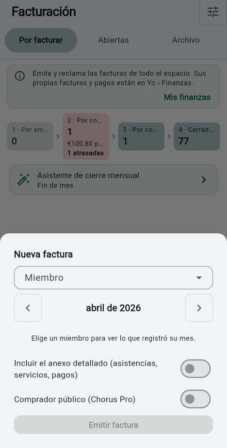

**Pasos**

1. En [Facturación](https://fdittgen-png.github.io/deskilo/#/invoices), pulse **Nueva factura**, o **Emitir** en una fila de **Por facturar**.
2. Elija el **Miembro** y el mes. Las partidas proceden de lo registrado.
3. Active **Incluir el anexo detallado (asistencias, servicios, pagos)** si lo desea.
4. Pulse **Emitir factura**. En **Por facturar**, **Facturar todo** emite todas las filas.

**Conviene saber**

- Las facturas se derivan de datos registrados y no se pueden componer a mano. La línea final es el **Saldo**.
- Un mes solo se puede facturar una vez por miembro, y un mes aún en curso le avisa de que las partidas pueden cambiar.
- Si falta un dato obligatorio, **Complete estos datos antes de emitir** lo enumera (dirección, número de IVA, fundamento de la exención, tipo de IVA; también el país del espacio, que debe ser Francia o Alemania).
- En esta versión, la emisión en la aplicación está disponible para espacios en Francia o Alemania, para clientes nacionales. Las facturas transfronterizas, con inversión del sujeto pasivo, de exportación o a un comprador exento se emiten fuera de la aplicación con su gestor.
- Una factura emitida está firmada y es inmutable.

**Véase también:** [Asistente de cierre mensual](#el-asistente-de-cierre-mensual)

<!-- anchor: user.invoicing.open -->
### Reclamar y saldar facturas abiertas

**Público:** Propietario · Administrador/a de facturación

Hace seguimiento de lo que está sin pagar y lo cierra como es debido.

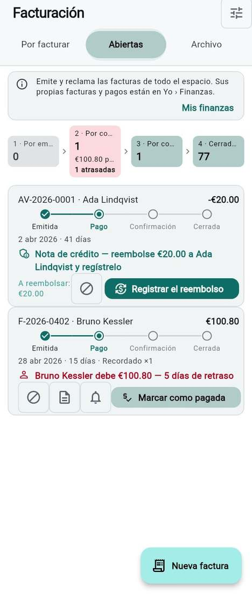

**Pasos**

1. En [Facturación](https://fdittgen-png.github.io/deskilo/#/invoices), abra la pestaña **Abiertas** y pulse una factura.
2. Use las acciones que ofrece: **Enviar un recordatorio**, **Marcar como pagada** (concilia un pago registrado), **Anular el saldo pendiente**, **Marcar como errónea**, o comparta el PDF.
3. Las facturas pagadas pasan a **Archivo**.

**Conviene saber**

- Una factura está pagada cuando se le ha conciliado un pago real. Una diferencia necesita una nota, o una factura rectificativa por el exceso.
- Anular un saldo pendiente pasa por validación.
- **Marcar como errónea** no se puede deshacer. Hágalo antes del pago, nunca después.

**Véase también:** [Reglas de recordatorio](#reglas-de-recordatorio) · [Agrupar facturas](#agrupar-facturas-en-una)

<!-- anchor: user.invoicing.wizard -->
### El asistente de cierre mensual

**Público:** Propietario · Administrador/a de facturación

Un único recorrido guiado para la rutina del dinero: emitir, enviar, recordar, registrar pagos, conciliar y cerrar.

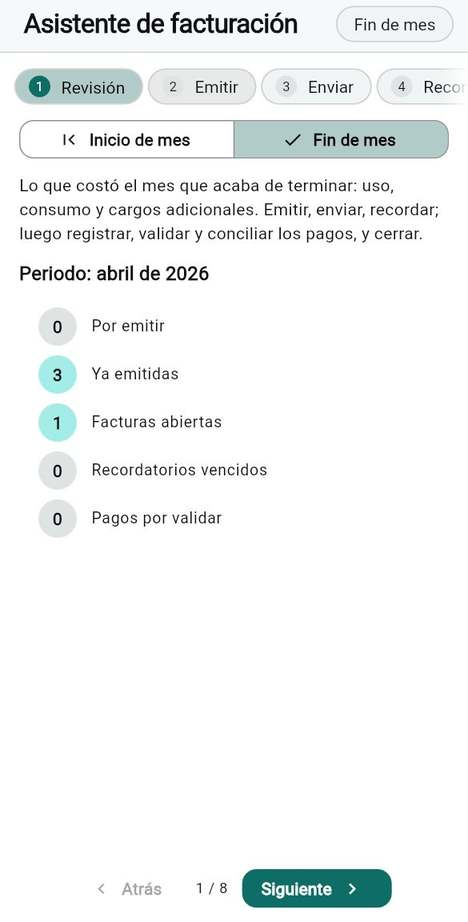

**Pasos**

1. En [Facturación](https://fdittgen-png.github.io/deskilo/#/invoices), pulse **Asistente de cierre mensual** (o abra el [Asistente de facturación](https://fdittgen-png.github.io/deskilo/#/invoicing/wizard)).
2. Elija la ejecución: **Inicio de mes** (suscripciones que los miembros pagan por adelantado, para el mes siguiente) o **Fin de mes** (uso, consumo y cargos extra del mes que acaba de terminar). La fecha propone una.
3. Siga los pasos: **Revisión**, **Emitir**, **Enviar**, **Recordar**, **Pagos**, **Conciliar**, **Cerrar**, **Resumen**.
4. Pulse **Siguiente** en cada paso y **Terminar** al final.

**Conviene saber**

- Puede desmarcar a un miembro para dejarlo fuera de un lote; los miembros ya cubiertos aparecen como hechos.
- **Resumen** enumera lo que hizo la ejecución, y lo que sigue abierto y a quién le toca actuar.
- Un paso sin nada que hacer lo indica.

**Véase también:** [La pantalla de Facturación](#la-pantalla-de-facturación) · [Agrupar facturas](#agrupar-facturas-en-una)

<!-- anchor: user.invoicing.settlement -->
### Agrupar facturas en una

**Público:** Propietario · Administrador/a de facturación

Un miembro tiene varias facturas abiertas y debería pagar una sola.

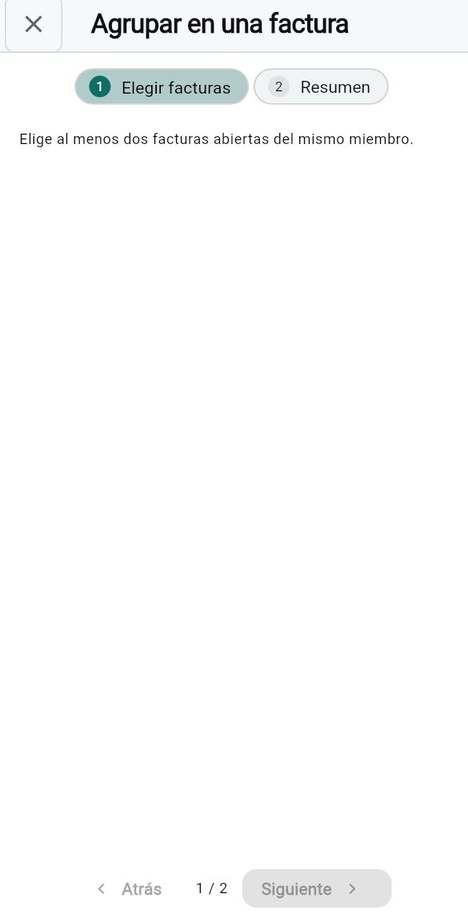

**Pasos**

1. En [Facturación](https://fdittgen-png.github.io/deskilo/#/invoices), pulse el icono de herramientas y **Agrupar en una factura**.
2. Elija al menos dos facturas abiertas del mismo miembro.
3. Confirme. Se le pregunta si desea adjuntar las facturas agrupadas.

**Conviene saber**

- La nueva factura es la que se debe y se reclama. Las originales siguen siendo legibles detrás de ella.
- Las líneas y el IVA se trasladan; la declaración de IVA cuenta las originales una sola vez.

**Véase también:** [Facturas abiertas](#reclamar-y-saldar-facturas-abiertas)

<!-- anchor: user.invoicing.shared-expense -->
### Repartir un gasto compartido

**Público:** Propietario · Administrador/a de facturación

Un coste compartido por la comunidad se divide entre los miembros.

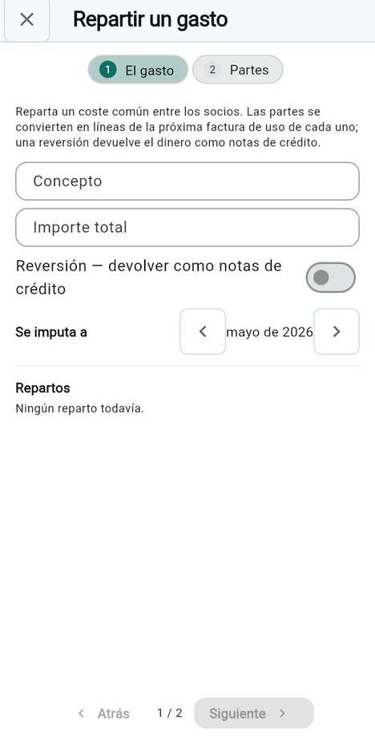

**Pasos**

1. En [Facturación](https://fdittgen-png.github.io/deskilo/#/invoices), pulse el icono de herramientas y **Repartir un gasto**.
2. Describa **El gasto** y después elija **Repartir por**: **Partes iguales**, **Suscripción**, **Uso** o **Clave propia**.
3. Compruebe las **Partes**, desmarque a quien quiera **Excluir** y pulse **Contabilizar las partes**.

**Conviene saber**

- Una vez contabilizadas (tras la validación, si una regla la exige), las partes se incorporan como líneas en la siguiente factura de uso de cada miembro.
- **Reversión — devolver como notas de crédito** devuelve el dinero.
- **Recordar esta regla** vuelve a proponer la regla ajustada el mes siguiente.

**Véase también:** [El asistente de cierre mensual](#el-asistente-de-cierre-mensual)

<!-- anchor: user.money.reminders.rules -->
### Reglas de recordatorio

**Público:** Propietario · Administrador/a de facturación

Decide cuándo y con qué frecuencia se reclama una factura vencida.

**Pasos**

1. En [Facturación](https://fdittgen-png.github.io/deskilo/#/invoices), pulse el icono de herramientas y **Reglas de recordatorio**.
2. Defina **Número de niveles de recordatorio**, **Días hasta el primer recordatorio** y **Días entre recordatorios**.
3. Pulse **Guardar**.

**Conviene saber**

- Los recordatorios imprimen las menciones de pago que usted ha configurado.
- Un recordatorio queda registrado en la factura y aparece con la etiqueta **Recordado**.

**Véase también:** [Recordatorios automáticos](#recordatorios-automáticos) · [Condiciones de pago](#condiciones-de-pago)

<!-- anchor: user.money.reminders.automatic -->
### Recordatorios automáticos

**Público:** Propietario · Administrador/a de facturación

Quiere que los recordatorios salgan solos.

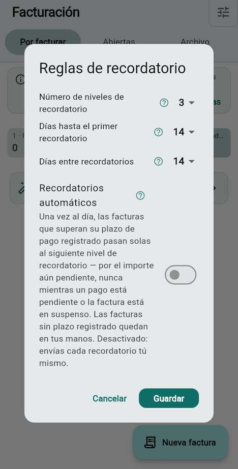

**Pasos**

1. Abra **Reglas de recordatorio** en las herramientas de Facturación.
2. Active **Recordatorios automáticos**.
3. Pulse **Guardar**.

**Conviene saber**

- Una vez al día, las facturas que han superado su plazo de pago registrado reciben el nivel siguiente, por el importe aún pendiente.
- Nunca mientras haya un pago pendiente o la factura esté en espera. Las facturas sin plazo registrado quedan en sus manos.
- Desactivado: usted envía cada recordatorio.
- Cuándo se ejecuta: cada mañana en el servidor si la instalación programa tareas; si no, cuando un administrador abre Finanzas. El operador de su servidor sabe cuál se aplica.

**Véase también:** [Reglas de recordatorio](#reglas-de-recordatorio)

<!-- anchor: user.invoicing.register -->
### El registro de facturas

**Público:** Propietario · Administrador/a de facturación

Todas las facturas en una sola lista ordenable.

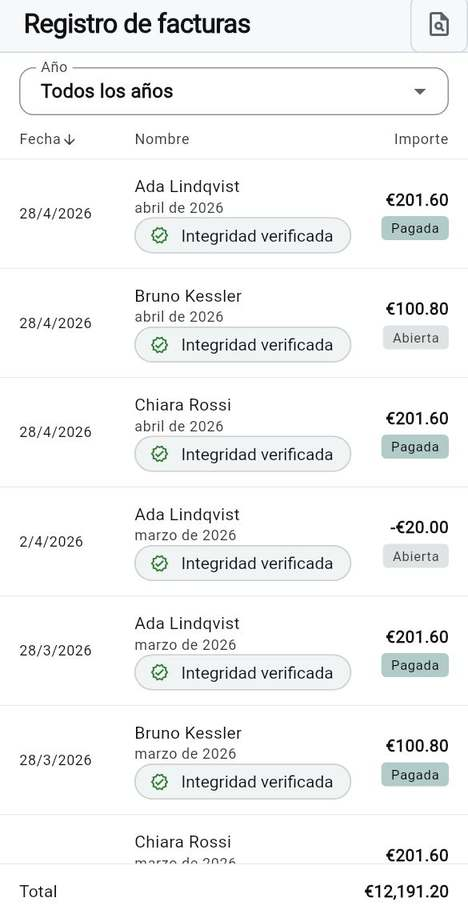

**Pasos**

1. Abra [Registro de facturas](https://fdittgen-png.github.io/deskilo/#/invoice-register).
2. Elija el **Año** o **Todos los años**.
3. Ordene por **Fecha**, **Nombre** o **Importe**; el total está al final.

**Conviene saber**

- Los miembros ven las suyas; quienes emiten facturas ven las del espacio.
- La exportación contable empieza aquí.

**Véase también:** [Exportaciones contables](#exportaciones-contables)

<!-- anchor: user.invoicing.accounting-export -->
### Exportaciones contables

**Público:** Propietario · Administrador/a de facturación

Entrega a su gestor las facturas y los pagos del año.

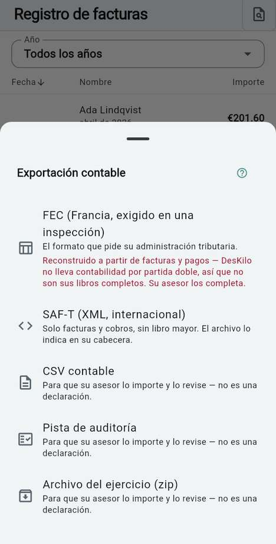

**Pasos**

1. Abra [Registro de facturas](https://fdittgen-png.github.io/deskilo/#/invoice-register) y pulse **Exportación contable**.
2. En **Exportación contable**, elija un formato, como **FEC (Francia, exigido en una inspección)**, **SAF-T (XML, internacional)**, **CSV contable**, **Pista de auditoría** o **Archivo del ejercicio (zip)**. La lista depende de su país; algunos países añaden el suyo, como **DATEV (Buchungsstapel)**.
3. En **Antes de guardar**, lea la comprobación y pulse **Guardar archivo e informe**.

**Conviene saber**

- Cada formato indica lo que pretende ser. «Para que su gestor lo importe y lo revise — no es una presentación» no es una declaración de impuestos.
- DesKilo no lleva libro de contabilidad por partida doble: los archivos se reconstruyen a partir de las facturas y los pagos, y su gestor los completa.
- Un archivo queda bloqueado hasta que se corrigen los problemas del origen.
- Algunos formatos señalan que DesKilo no es un programa certificado en su país.

**Véase también:** [Cuenta de IVA](#cuenta-de-iva) · [El registro de facturas](#el-registro-de-facturas)

<!-- anchor: user.invoicing.bi -->
### Análisis de negocio

**Público:** Propietario · Administrador/a de facturación

Observa cómo rinde el espacio.

**Pasos**

1. Abra [Análisis de negocio](https://fdittgen-png.github.io/deskilo/#/bi), o **Informes** en el menú.
2. Elija la **Duración del periodo** (**Mes**, **Trimestre**, **Año**), una comparación y, cuando se ofrezca, una agrupación.
3. Lea los análisis por área, como **Finanzas** (**Facturado**, **Cobrado**) y **Espacios y capacidad**.
4. Guarde una vista en **Vistas**, o pulse **Exportar a PDF**.

**Conviene saber**

- Solo ve los análisis que tiene permiso para leer.
- Cobrado son los pagos conciliados con facturas. No es un beneficio: en la cifra no entra ningún coste.
- El periodo actual es parcial; sus cifras todavía cambian.

**Véase también:** [La pantalla de Facturación](#la-pantalla-de-facturación)

<!-- anchor: user.advanced.overview -->
## Avanzado

**Público:** Propietario · Operador/a

Lo que rodea al trabajo diario: la cara de pruebas de un espacio y la real, los asistentes, el grabador de tareas y sus visitas guiadas, la demo, las aplicaciones de cada dispositivo y qué hacer cuando algo no funciona.

En este capítulo:
- [Un espacio tiene dos caras](#un-espacio-tiene-dos-caras) · [Entre en una cara](#entre-en-la-cara-real-o-en-la-de-pruebas) · [Un espacio de prueba](#para-qué-sirve-un-espacio-de-prueba) · [Quién puede desplegar](#quién-puede-desplegar-y-entrar-en-producción) · [Despliegue entre las caras](#despliegue-entre-las-dos-caras) · [Situación del espacio y archivo del ejercicio](#situación-del-espacio-y-archivo-del-ejercicio)
- [Su propio servidor](#gestione-su-propio-servidor)
- [Asistentes](#asistentes-qué-son) · [Conecte un asistente](#conecte-un-asistente) · [Aprobaciones](#aprobaciones-y-confirmaciones-de-los-asistentes) · [Qué pueden hacer los asistentes](#qué-pueden-hacer-los-asistentes-en-un-espacio)
- [El grabador de tareas](#el-grabador-de-tareas-y-las-visitas-guiadas) · [Grabe una tarea](#grabe-una-tarea) · [Revise una grabación](#revise-edite-y-exporte-una-grabación) · [Cree una guía](#cree-una-guía-a-partir-de-una-grabación) · [Siga una guía](#siga-una-guía) · [El menú circular](#el-menú-circular) · [Edite una guía](#edite-o-repare-una-guía) · [Privacidad de las grabaciones](#qué-conserva-una-grabación)
- [El espacio de demostración](#el-espacio-de-demostración) · [Modo grabación](#modo-grabación)
- [Plataformas](#deskilo-en-sus-dispositivos) · [Detalles de soporte](#detalles-de-soporte) · [Cuando algo no funciona](#cuando-algo-no-funciona)
- [Las palabras de la aplicación](#las-palabras-de-la-aplicación) · [Accesibilidad y teclado](#accesibilidad-y-teclado) · [Más ayuda](#dónde-obtener-más-ayuda)

<!-- anchor: user.advanced.environments -->
### Un espacio tiene dos caras

**Público:** Propietario

Quiere un lugar donde probar cosas sin tocar las reservas y facturas reales. Un espacio puede venir en pareja: una cara de pruebas y una cara real, con el mismo nombre.

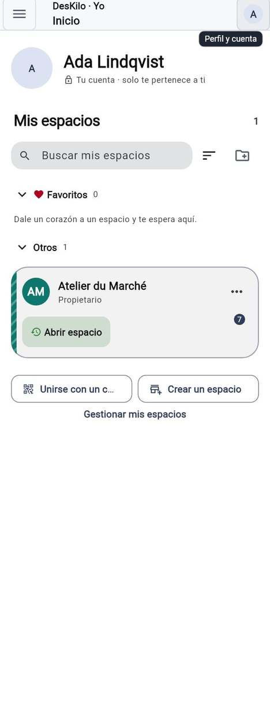

**Pasos**

1. Al crear un espacio, deje marcada la opción **Crear la pareja desarrollo y producción**. Ambas caras son suyas desde el primer segundo.
2. ¿Ya tiene un espacio suelto? Abra [Ajustes](https://fdittgen-png.github.io/deskilo/#/settings), vaya a **Gobernanza** y pulse **Crear su gemelo**. La configuración se copia una sola vez.
3. A partir de ahí, las dos caras son independientes. Solo un despliegue traslada algo de una a otra.

**Conviene saber**

- La cara de desarrollo se llama **Desarrollo — para probar**. La cara de producción es **Producción — las facturas se deben**.
- Todo documento impreso en la cara de desarrollo lleva una marca de agua, para que no pueda confundirse con uno real.
- **Crear su gemelo** solo aparece cuando la función **Pares de entornos** está activada, y solo para el propietario. El despliegue entre los lados corresponde a quienes tienen los permisos de despliegue.
- Los miembros, las reservas, las facturas y los pagos nunca se copian entre las caras.

**Véase también:** [Entre en una cara](#entre-en-la-cara-real-o-en-la-de-pruebas) · [Un espacio de prueba](#para-qué-sirve-un-espacio-de-prueba)

<!-- anchor: user.advanced.enter-environment -->
### Entre en la cara real o en la de pruebas

**Público:** Todos

Quiere abrir un espacio por la cara que necesita. Su cuenta ve las dos caras de una pareja, cada una con su propio botón.

**Pasos**

1. Abra [Yo](https://fdittgen-png.github.io/deskilo/#/me) y busque el espacio en **Mis espacios**.
2. Pulse **Abrir espacio** para la cara real, o **Espacio de prueba** para la cara donde practicar.
3. O abra [Perfiles](https://fdittgen-png.github.io/deskilo/#/profiles): la pareja es una sola tarjeta. Púlsela y después **Elegir un entorno** entre **DEV** y **PROD**.

**Conviene saber**

- Una cara a la que no puede entrar aparece atenuada y no hace nada.
- Quien es miembro de la cara real lo es siempre también de la cara de pruebas.
- El botón de pruebas lleva la indicación «Espacio de prueba: reservas y facturas de ensayo»; el real, «Reservas y facturas reales».

**Véase también:** [Quién puede desplegar](#quién-puede-desplegar-y-entrar-en-producción)

<!-- anchor: user.advanced.test-space -->
### Para qué sirve un espacio de prueba

**Público:** Propietario

Está a punto de cambiar precios, reglas o el plano y quiere ver antes el efecto. Hágalo en el espacio de prueba.

**Pasos**

1. Entre en la cara de pruebas con **Espacio de prueba**.
2. Configure, importe un archivo de espacio, invite a un colega, emita una factura de ensayo, mueva puestos, imprima.
3. Cuando esté bien, [despliéguelo en la cara real](#despliegue-entre-las-dos-caras).

**Conviene saber**

- El interruptor **Tipo de espacio** en [Ajustes](https://fdittgen-png.github.io/deskilo/#/settings) (bajo **Gobernanza**) indica de qué clase es un espacio. Solo lo ven los propietarios.
- Declarar un espacio de producción plantea **¿Declarar este espacio de producción?**: el banner desaparece y los documentos pierden su marca de agua. Las facturas ya emitidas conservan la marca de agua que tenían.
- Declare producción solo cuando las facturas que salen del espacio se deban realmente.
- Al invitar a alguien, puede elegir si también accede al espacio de producción: **Espacio de prueba** o **Espacio de producción**. En ambos casos se une al espacio de prueba.

**Véase también:** [Un espacio tiene dos caras](#un-espacio-tiene-dos-caras)

<!-- anchor: user.advanced.deploy-permissions -->
### Quién puede desplegar y entrar en producción

**Público:** Propietario · Copropietario

Usted decide quién puede tocar la cara real. Tres permisos de la matriz de roles lo controlan.

**Pasos**

1. Abra [Roles](https://fdittgen-png.github.io/deskilo/#/roles).
2. Busque **Entrar en el espacio de producción**, **Desplegar en desarrollo** y **Desplegar en producción**.
3. Active cada uno para los roles que lo necesiten.

**Conviene saber**

- Los propietarios y copropietarios tienen los tres. Los administradores tienen **Desplegar en desarrollo** y **Entrar en el espacio de producción**. Los miembros no tienen ninguno hasta que usted se lo conceda.
- Quien puede desplegar en producción puede desplegar siempre en desarrollo.
- Un rol solo entra en la cara de producción mientras tenga **Entrar en el espacio de producción**: en caso contrario se rechaza una invitación o una incorporación a producción, y la aplicación dice por qué.

**Véase también:** [La matriz de roles](#la-matriz-de-roles) · [Despliegue entre las caras](#despliegue-entre-las-dos-caras)

<!-- anchor: user.advanced.deploy -->
### Despliegue entre las dos caras

**Público:** Propietario · Copropietario · Administrador/a

Ha dejado lista la configuración en una cara y quiere que la otra la tenga.

**Pasos**

1. Colóquese en la cara en la que quiere escribir y abra [Ajustes](https://fdittgen-png.github.io/deskilo/#/settings) → **Gobernanza** → [Despliegue](https://fdittgen-png.github.io/deskilo/#/deployment).
2. Marque lo que debe viajar. Las entidades se agrupan en **Configuración**, **Datos maestros** e **Informes**; lo que una entidad **necesita** se marca con ella.
3. Pulse **Traer desde PROD…** (desde la cara de desarrollo) o **Traer desde DEV…** (desde la cara de producción).
4. Lea la vista previa: **Lo que cambia en el lado de producción**, o en el de desarrollo. Cuando ambas caras coinciden, dice **Sin cambios**.
5. Confirme. La pregunta nombra la cara en la que se escribe: **¿Desplegar en este DEV?** o **¿Desplegar en este PROD?**

**Conviene saber**

- Un despliegue entra siempre en la cara en la que usted está. No se puede empujar nada a la otra cara por error.
- Cada despliegue queda en el **Diario**. **Deshacer** en el último devuelve lo que la cara tenía antes.
- Los planos se fusionan: lo que solo tiene esta cara se conserva, porque un puesto puede tener una reserva. Las etiquetas de credencial nunca viajan.
- Los miembros, las reservas, las facturas, los pagos, los eventos y las credenciales nunca viajan.
- La entrada solo se muestra cuando la función **Despliegues** está activada, el espacio tiene gemelo y usted tiene un permiso de despliegue.

**Véase también:** [Quién puede desplegar](#quién-puede-desplegar-y-entrar-en-producción)

<!-- anchor: user.advanced.status-archive -->
### Situación del espacio y archivo del ejercicio

**Público:** Propietario · Administrador/a · Administrador/a de facturación

Quiere ver de un vistazo lo que el espacio ha facturado y cobrado, y un archivo completo del año para sus registros.

**Pasos**

1. Abra [Situación del espacio](https://fdittgen-png.github.io/deskilo/#/money/status). Elija los meses en **Desde** y **Hasta**.
2. Lea **Facturado**, **Abonos**, **Pagos conciliados**, **Pagos recibidos**, **Gastos reembolsados**, **Gastos repartidos** y **Créditos concedidos**; **Neto** lo resume. Pulse la impresora para **Imprimir la situación**.
3. Para el archivo anual, elija **Archivo del ejercicio (zip)** en las exportaciones de facturas.

**Conviene saber**

- **Neto** no es un beneficio ni un saldo bancario. Los pagos conciliados y los recibidos se solapan, así que no los sume.
- La situación aparece cuando la función **Situación del espacio** está activada.
- Un espacio de desarrollo produce archivos marcados DEV: no son la contabilidad real.

**Véase también:** [Informe del espacio](#informe-del-espacio)

<!-- anchor: user.advanced.own-server -->
### Gestione su propio servidor

**Público:** Operador/a · Propietario

Quiere los datos de su comunidad en un servidor que usted controle, o pertenece a una organización que gestiona uno.

**Pasos**

1. Lea cómo se configura un servidor en [Cómo gestionar el suyo](#cómo-usar-el-suyo-propio).
2. En cada dispositivo, apunte la aplicación hacia él: [Su propio servidor](#su-propio-servidor).
3. Compruebe en [Yo](https://fdittgen-png.github.io/deskilo/#/me) → **Dónde están mis espacios**: enumera los servidores que usa esta cuenta.

**Conviene saber**

- La aplicación apunta a un solo servidor para iniciar sesión; **Este dispositivo usa** indica cuál. Los demás servidores a los que pertenece aparecen en **Dónde están mis espacios**.
- Una invitación solo se comprueba en su propio servidor, así que únase a un espacio mientras la aplicación apunte al servidor que la emitió.
- Un operador puede activar los asistentes para toda la instalación; véase [Aprobaciones](#aprobaciones-y-confirmaciones-de-los-asistentes).

**Véase también:** [Su propio servidor](#su-propio-servidor)

<!-- anchor: user.advanced.assistants -->
### Asistentes: qué son

**Público:** Todos

Un asistente de IA como Claude o ChatGPT puede consultar y reservar cosas por usted en DesKilo. Actúa como usted, solo en los espacios y para las acciones que usted apruebe.

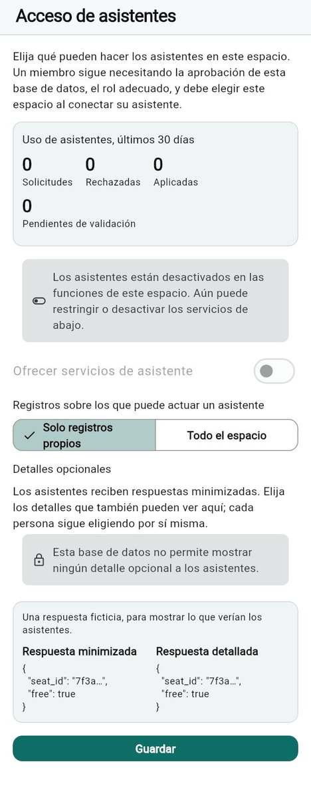

**Pasos**

1. Abra [Asistentes](https://fdittgen-png.github.io/deskilo/#/assistants). **Su situación aquí** enumera lo que aún le falta: **Inicio de sesión con Google**, **Identidad para asistentes**, **Aprobación de la base de datos**, **Oferta del espacio de trabajo**, **Su rol**, **Su consentimiento**, **Servidor**.
2. Recorra la lista de arriba abajo; cada línea indica quién da el siguiente paso.

**Conviene saber**

- Participan varias personas: usted, el propietario o un administrador del espacio, un administrador de la base de datos y el operador de la instalación. Ninguna persona sola puede abrirlo todo.
- Activar los asistentes no concede nada a nadie por sí solo.
- Bajo **Asistentes conectados** ve lo que está conectado y puede **Desconectar** cada uno. **Su uso de asistentes hoy** cuenta **Solicitudes**, **Rechazadas**, **Aplicadas** y **Pendiente de validación**.

**Véase también:** [Conecte un asistente](#conecte-un-asistente)

<!-- anchor: user.advanced.assistants-connect -->
### Conecte un asistente

**Público:** Miembro · Administrador/a · Propietario

Quiere que su asistente trabaje con sus propias reservas y su cuenta.

**Pasos**

1. Abra [Conectar un asistente](https://fdittgen-png.github.io/deskilo/#/assistants/connect). Bajo **Antes de conectar**, cada línea debería decir **Hecho**.
2. Bajo **¿Qué asistente usa?**, elija **Claude**, **Claude Code**, **ChatGPT**, **Cursor**, **VS Code** u **Otro**. Copie **Su dirección de DesKilo para asistentes** en él como indican los pasos.
3. Inicie sesión cuando el asistente se lo pida y elija después este espacio y lo que el asistente puede hacer en él.
4. Pulse **Probar la conexión** y pregunte a su asistente: «Con DesKilo, ¿cuáles son mis reservas de esta semana?»

**Conviene saber**

- El propio asistente le pide que apruebe el espacio y cada tipo de operación; nada se elige por usted.
- Conectar requiere la función **Interfaz MCP** en el espacio. Si está desactivada, la pantalla le envía a Asistentes.
- ¿No funciona? **Probar la conexión** indica qué está esperando aún.
- **Desconectar** elimina el asistente de todos los espacios de esta base de datos. Lo que ya leyó no se recupera.

**Véase también:** [Aprobaciones](#aprobaciones-y-confirmaciones-de-los-asistentes)

<!-- anchor: user.advanced.assistants-approve -->
### Aprobaciones y confirmaciones de los asistentes

**Público:** Propietario · Operador/a

Los asistentes se aprueban por capas, para que una persona no pueda activar uno por sí sola.

**Pasos**

1. El propietario del espacio (o quien gestione las integraciones) abre [Configuración de asistentes](https://fdittgen-png.github.io/deskilo/#/settings/assistant-setup) y la recorre: **Activar asistentes en este espacio de trabajo**, **Elegir qué pueden hacer los asistentes**.
2. Cada miembro lo pide una vez: **Solicitar aprobación**. Un administrador de la base de datos decide en [Aprobaciones de asistentes](https://fdittgen-png.github.io/deskilo/#/database/assistant-approvals) con **Aprobar** o **Rechazar**.
3. El operador de la instalación abre [Instalación: asistentes](https://fdittgen-png.github.io/deskilo/#/installation/assistants) y pulsa **Activar para todos los espacios**. La página enumera también los **Administradores de la base** y los **Clientes de asistente**, cada uno **Aprobado**, **Bloqueado** o **Pendiente de aprobación**.
4. Cuando un asistente envía una solicitud de gran impacto, se le pregunta: **Confirmar una solicitud del asistente**. **Confirmar** le permite enviar esa solicitud exacta una vez; **Rechazar** no hace nada.

**Conviene saber**

- Las aprobaciones y los cambios de la instalación requieren su segundo factor.
- La aprobación caduca; la pantalla le indica los días que quedan y usted vuelve a pedirla.
- Una solicitud confirmada sigue estando sujeta a las reglas de validación del espacio.
- Si no hay otro administrador de la base de datos, el operador aprueba el acceso, con un motivo, durante un máximo de 30 días.

**Véase también:** [Qué pueden hacer los asistentes](#qué-pueden-hacer-los-asistentes-en-un-espacio)

<!-- anchor: user.advanced.assistants-policy -->
### Qué pueden hacer los asistentes en un espacio

**Público:** Propietario · Administrador/a

Usted decide qué servicios ofrece un espacio a los asistentes.

**Pasos**

1. Abra [Acceso de asistentes](https://fdittgen-png.github.io/deskilo/#/settings/assistants).
2. Active **Ofrecer servicios de asistente**.
3. Bajo **Registros sobre los que puede actuar un asistente**, elija **Solo registros propios** o **Todo el espacio**.
4. Marque las operaciones, por grupos: **Reservas y cuenta propias**, **Solicitudes financieras**, **Solicitudes de membresía**, **Validaciones**.
5. Pulse **Guardar**.

**Conviene saber**

- Las operaciones se leen como «Ver plazas libres», «Reservar una plaza por usted», «Registrar su entrada» o «Cancelar sus reservas que aún no han empezado».
- Los asistentes reciben respuestas minimizadas. **Detalles opcionales** permite autorizar más; cada persona sigue eligiendo por sí misma.
- Los asistentes ya conectados solo reciben servicios nuevos cuando cada persona vuelve a aprobar.
- Active primero la función **Interfaz MCP** en [Funciones](https://fdittgen-png.github.io/deskilo/#/features). Viene desactivada por defecto.
- Es para quienes tienen el permiso de integraciones; los propietarios siempre lo tienen.

**Véase también:** [Un interruptor de función](#un-interruptor-de-función)

<!-- anchor: user.advanced.recorder -->
### El grabador de tareas y las visitas guiadas

**Público:** Todos

Quiere mostrar a alguien cómo se hace una tarea, o que se lo muestren. Grabe la tarea una vez, conviértala en una guía y sígala paso a paso en la aplicación real.

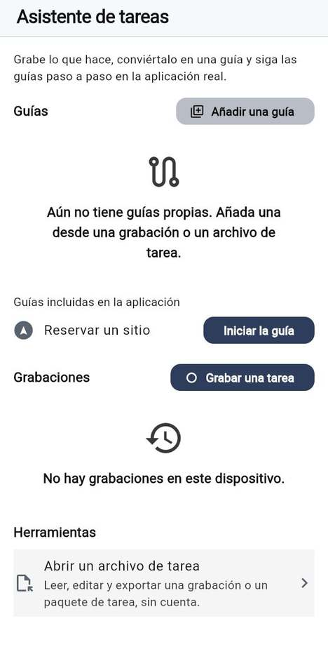

**Pasos**

1. Abra el [Asistente de tareas](https://fdittgen-png.github.io/deskilo/#/task-wizard): en el menú en una pantalla ancha, o bajo **Avanzado** en [Yo](https://fdittgen-png.github.io/deskilo/#/me).
2. **Guías** contiene sus propias guías y las que vienen con la aplicación, como **Reservar un puesto**.
3. **Grabaciones** enumera las tareas que ha grabado, y **Grabar una tarea** inicia una nueva.
4. **Herramientas** abre un archivo de tarea sin necesidad de cuenta.

**Conviene saber**

- Todo permanece en su dispositivo hasta que lo exporte.
- El grabador de tareas es una función (**Grabador de tareas**). Cuando está desactivada, el asistente de tareas no aparece en los menús.
- Debe haber iniciado sesión para grabar o seguir una guía.

**Véase también:** [Grabe una tarea](#grabe-una-tarea) · [Siga una guía](#siga-una-guía)

<!-- anchor: user.advanced.recorder-record -->
### Grabe una tarea

**Público:** Todos

Quiere capturar lo que hace, para que pueda convertirse en un documento o en una guía.

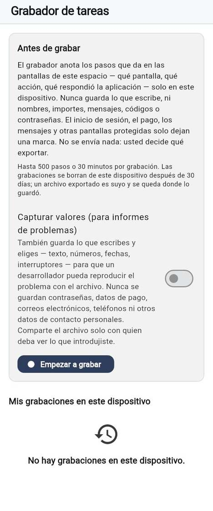

**Pasos**

1. En el [Grabador de tareas](https://fdittgen-png.github.io/deskilo/#/task-recorder), lea **Antes de grabar**.
2. Pulse **Empezar a grabar**.
3. Haga la tarea como de costumbre, en cualquier pantalla del espacio o de [Yo](https://fdittgen-png.github.io/deskilo/#/me).
4. Use la barra que muestra **Grabando** para **Pausar**, **Reanudar**, **Añadir una nota** o **Detener**.

**Conviene saber**

- Una grabación dura hasta 500 pasos o 30 minutos, y se borra del dispositivo a los 30 días. Un archivo que haya exportado queda donde lo guardó.
- Cada paso nombra la pantalla, la acción y lo que respondió la aplicación, como **Reservado** o **Rechazado**.
- El inicio de sesión, el pago, los mensajes y otras pantallas protegidas dejan solo una marca.
- Si cambia a otra cuenta o espacio, la grabación termina.

**Véase también:** [Privacidad de las grabaciones](#qué-conserva-una-grabación)

<!-- anchor: user.advanced.recorder-review -->
### Revise, edite y exporte una grabación

**Público:** Todos

Quiere comprobar lo que se capturó antes de compartirlo.

**Pasos**

1. En el [Asistente de tareas](https://fdittgen-png.github.io/deskilo/#/task-wizard), pulse una grabación en **Grabaciones**.
2. Lea los pasos. Pulse **Dejar fuera de la exportación** en cualquier paso que no desee; **Volver a incluir** lo recupera.
3. Mire **Lo que contendrá el archivo**.
4. Elija **Exportar un archivo**, **Exportar un paquete de tarea** o **Exportar como documento de Word**.

**Conviene saber**

- Dejar un paso fuera cambia solo la exportación. La grabación del dispositivo no cambia.
- Para leer un archivo de otra persona, use **Abrir un archivo de tarea** en el [Banco de trabajo de tareas](https://fdittgen-png.github.io/deskilo/#/task-workbench). No se sube nada y no hace falta cuenta.
- Un archivo dañado o creado por una versión más reciente se rechaza con un mensaje claro.
- **Borrar de este dispositivo** elimina la grabación; los archivos exportados no se tocan.

**Véase también:** [Cree una guía](#cree-una-guía-a-partir-de-una-grabación)

<!-- anchor: user.advanced.guide-make -->
### Cree una guía a partir de una grabación

**Público:** Todos

Quiere que otras personas sigan una tarea que usted grabó.

**Pasos**

1. En el [Asistente de tareas](https://fdittgen-png.github.io/deskilo/#/task-wizard), pulse **Crear una guía** junto a una grabación. O elija **Añadir una guía** → **Desde una de mis grabaciones** o **Desde un archivo o paquete de tarea**.
2. Revise el borrador. Cada paso está escrito tal como lo verá el lector.
3. Póngale un nombre en **Nombre de la guía**.
4. Pulse **Añadir a mis guías**.

**Conviene saber**

- La guía se conserva en su dispositivo bajo **Guías**. Una guía se puede editar o eliminar: **Eliminar esta guía** no toca su grabación.
- Un paso que reserva espera la respuesta real. No se hace nada por el lector.
- **Guardar la guía** la escribe en un archivo que puede entregar.

**Véase también:** [Edite una guía](#edite-o-repare-una-guía)

<!-- anchor: user.advanced.guide-play -->
### Siga una guía

**Público:** Todos

Quiere que le acompañen en una tarea sobre las pantallas reales.

**Pasos**

1. En el [Asistente de tareas](https://fdittgen-png.github.io/deskilo/#/task-wizard), pulse **Iniciar la guía** junto a una de las guías.
2. Un panel muestra Paso 1 de … y lo que hay que hacer, por ejemplo «Toque “Reservar”.» o «Rellene “…” y salga del campo.»
3. Pulse **Abrir y resaltar** para ir a la pantalla correcta y ver el control marcado.
4. Haga usted mismo el paso. La guía lo detecta y avanza. En un paso de lectura, pulse **Hecho**.

**Conviene saber**

- Use **Atrás** y **Omitir**, y abra **Todos los pasos** para ver cada uno como **Pendiente**, **Esperando**, **Hecho**, **Confirmado** u **Omitido**.
- Un paso que reserva espera la respuesta: **Esperando el resultado…**. Si se rechaza, la guía dice qué probar; si no llegó respuesta, le pide que lo compruebe antes de volver a intentarlo.
- **Detener la guía** la termina. No se deshace nada.
- La guía se pausa cuando cambia la cuenta o el espacio, o cuando se desactiva el grabador de tareas.

**Véase también:** [El menú circular](#el-menú-circular)

<!-- anchor: user.advanced.guide-circle -->
### El menú circular

**Público:** Todos

Necesita toda la pantalla para trabajar, pero quiere tener la guía a mano. Minimícela.

**Pasos**

1. En el panel de la guía, pulse **Minimizar la guía**. Se reduce a un pequeño círculo.
2. Pulse el círculo para ver un menú: Mostrar la guía (paso … de …), **Abrir y resaltar**, un botón a la página del paso, **Hecho**, **Omitir**, **Atrás**, **Reanudar** y **Detener la guía**.
3. Elija Mostrar la guía para abrir de nuevo el panel.

**Conviene saber**

- El menú solo ofrece lo que tiene sentido ahora: **Reanudar** solo en pausa, **Hecho** solo en un paso de lectura.
- **Cerrar** en el panel lo oculta; la guía en sí se queda donde estaba.
- Abrir y resaltar le lleva a la página del paso y señala el control; el botón de página le lleva solo a la página.

**Véase también:** [Siga una guía](#siga-una-guía)

<!-- anchor: user.advanced.guide-edit -->
### Edite o repare una guía

**Público:** Todos

Una guía se lee mal, o un paso apunta a la página equivocada. Corríjalo en el borrador.

**Pasos**

1. En el [Asistente de tareas](https://fdittgen-png.github.io/deskilo/#/task-wizard), pulse **Editar** junto a su guía.
2. En un paso, pulse **Escribir el texto** y escriba su propio texto.
3. Bajo **Destino del paso**, elija la página a la que se refiere el paso. Pulse **Abrir y resaltar** para comprobarlo.
4. Active **El lector puede omitirlo** en un paso opcional.
5. Pulse **Guardar los cambios**.

**Conviene saber**

- Un paso marcado como **Una instrucción aún por escribir** necesita sus palabras. **Un paso que el grabador no puede describir** y **Haga este paso usted mismo** los hace el lector.
- Los pasos en pantallas protegidas, como el pago, piden al lector que los haga a solas.
- No puede hacer que una guía espere un resultado que su acción no tiene; esa parte es fija.
- Una guía que nombra pasos que esta versión no conoce se puede leer, pero no seguir.

**Véase también:** [Cree una guía](#cree-una-guía-a-partir-de-una-grabación)

<!-- anchor: user.advanced.recorder-privacy -->
### Qué conserva una grabación

**Público:** Todos

Quiere saber exactamente qué no deja rastro.

**Pasos**

1. Abra el [Grabador de tareas](https://fdittgen-png.github.io/deskilo/#/task-recorder).
2. Lea **Antes de grabar**.
3. Deje desactivado **Capturar valores (para informes de problemas)** salvo que se lo pida un desarrollador.

**Conviene saber**

- Normalmente una grabación nunca conserva lo que escribe, los nombres, los importes, los mensajes, los códigos ni las contraseñas.
- Con **Capturar valores** activado, conserva también lo que escribe y elige, para que un desarrollador pueda reproducir un problema. Las contraseñas, los datos de pago, las direcciones de correo y los números de teléfono siguen sin conservarse nunca. Al exportarla se le pregunta **Esta grabación contiene valores**.
- No se sube nada: usted decide qué exportar.
- Comparta un archivo solo con las personas que deban ver lo que usted introdujo.

**Véase también:** [Grabe una tarea](#grabe-una-tarea)

<!-- anchor: user.advanced.demo -->
### El espacio de demostración

**Público:** Todos

Quiere echar un vistazo antes de comprometerse. La demo es un espacio inventado, abierto a cualquiera, sin cuenta.

**Pasos**

1. En la pantalla de inicio de sesión, pulse **Explorar el espacio de demostración**.
2. Lea la breve nota y pulse **Empezar**.
3. Use **Ver como** para ver el mismo espacio como **Propietario**, **Administrador/a** o **Miembro**.
4. Pulse **Reiniciar la demo** para devolverla a como empezó, o **Salir de la demo**.

**Conviene saber**

- Todo es inventado: las personas, las reservas y las facturas. Nada llega a un espacio real y nada sale de su dispositivo.
- Un banner dice **Demo** en cada pantalla.
- Al cerrar la aplicación se olvida la sesión.
- La oferta solo se muestra cuando la función **El espacio de demostración** está activada.

**Véase también:** [Modo grabación](#modo-grabación)

<!-- anchor: user.advanced.filming -->
### Modo grabación

**Público:** Propietario

Debe mostrar su espacio real —en un vídeo, una imagen o una charla— sin mostrar a sus miembros.

**Pasos**

1. Abra [Funciones](https://fdittgen-png.github.io/deskilo/#/features) y busque **Modo grabación**.
2. Actívelo. Un banner dice **Modo grabación — personas inventadas** en cada pantalla.
3. Grabe. Cuando termine, desactívelo de nuevo.

**Conviene saber**

- Cada nombre, correo, teléfono, dirección y fotografía se convierte en una persona inventada, la misma en todas partes. El plano, las reservas y las cifras siguen siendo reales.
- Mientras está activado, los formularios de identidad se niegan a guardar, para que los datos inventados no sobrescriban los reales.
- No puede ocultar lo que alguien haya escrito, como un mensaje o la etiqueta de un puesto. Lea la pantalla antes de grabar.
- Para una imagen que no necesita ser de este espacio, use [la demo](#el-espacio-de-demostración).

**Véase también:** [Un interruptor de función](#un-interruptor-de-función)

<!-- anchor: user.advanced.platforms -->
### DesKilo en sus dispositivos

**Público:** Todos

Quiere usar DesKilo allí donde trabaja. La misma cuenta y los mismos datos le siguen.

**Pasos**

1. **Android:** únase a la prueba cerrada en Google Play.
2. iPhone y iPad: únase a la beta mediante TestFlight.
3. Ordenador: una imagen de disco para macOS o un instalador para Windows desde la página de versiones; o simplemente abra la aplicación web.
4. **Navegador:** abra la dirección que publica su espacio. No hay nada que instalar.

**Conviene saber**

- Un puesto reservado en un teléfono aparece en una pestaña del navegador un momento después.
- La imagen de disco para macOS de la página de versiones está firmada y notarizada por Apple; ábrala con normalidad.
- El instalador de Windows no está firmado: Windows SmartScreen avisa de un editor desconocido; elija Más información y luego Ejecutar de todas formas.
- La lectura de una etiqueta de silla funciona en navegadores Chromium en Android (hacen falta HTTPS y un toque); las aplicaciones de Android y de iPhone leen las etiquetas directamente.
- Una compilación sin servicios de Google y sin notificaciones push en la nube está preparada para F-Droid; si ya puede instalarse desde F-Droid lo indica la [página de estado de F-Droid](https://github.com/fdittgen-png/deskilo/blob/master/docs/guides/fdroid.md#status). En ella, las notificaciones son locales y la bandeja de entrada es la fuente de verdad.
- Las actualizaciones llegan por el canal desde el que instaló: Google Play, TestFlight, la página de versiones o recargando la aplicación web.

**Véase también:** [Su credencial](#su-credencial)

<!-- anchor: user.advanced.support -->
### Detalles de soporte

**Público:** Todos

Se pone en contacto con soporte y quiere enviar lo que les ayuda, sin exponer nada privado.

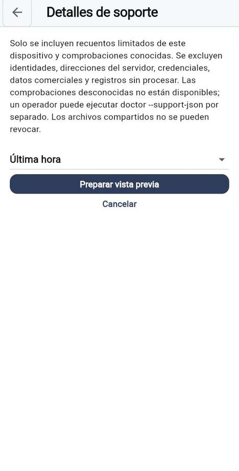

**Pasos**

1. Abra [Ayuda](https://fdittgen-png.github.io/deskilo/#/help) y pulse el icono de soporte (**Detalles de soporte**).
2. Elija **Última hora** o **Últimas 24 horas**.
3. Pulse **Preparar vista previa** y lea lo que contiene: Vista previa: … bytes.
4. Pulse **Guardar** y envíe el archivo.

**Conviene saber**

- Solo se incluyen recuentos de eventos acotados y comprobaciones conocidas. Se excluyen las identidades, las direcciones de servidor, las credenciales, los registros de negocio y los logs en bruto.
- Un archivo compartido no se puede revocar.
- Si el contexto ha cambiado, la pantalla le pide preparar una nueva vista previa.
- Un operador puede ejecutar `doctor --support-json` para la parte del servidor.

**Véase también:** [Cuando algo no funciona](#cuando-algo-no-funciona)

<!-- anchor: user.advanced.troubleshooting -->
### Cuando algo no funciona

**Público:** Todos

Algo parece ir mal. Pruebe esto, por orden.

**Pasos**

1. Busque un mensaje en la pantalla; la mayoría dice qué hacer. «Algo salió mal. Inténtalo de nuevo.» merece un reintento.
2. Compruebe que está en la cara que cree: **Espacio de prueba** o **Abrir espacio** en [Yo](https://fdittgen-png.github.io/deskilo/#/me).
3. Compruebe [Funciones](https://fdittgen-png.github.io/deskilo/#/features): una función que falta en el menú suele ser una función desactivada. Solo un propietario puede cambiarla.
4. Compruebe el servidor en [Su propio servidor](#su-propio-servidor): **Este dispositivo usa** lo nombra.
5. Prepare los [Detalles de soporte](#detalles-de-soporte) y envíelos.

**Conviene saber**

- Lo que ve depende de su rol: una pantalla ausente puede ser un permiso. Pregunte a su propietario.
- Los administradores pueden activar el **Modo desarrollador** bajo **Avanzado** en [Ajustes](https://fdittgen-png.github.io/deskilo/#/settings). Añade una pantalla de [Desarrollador](https://fdittgen-png.github.io/deskilo/#/developer) donde **Exportar registro** y **Vaciar registro** ayudan a soporte. Se aplica a todos los miembros del espacio.
- También puede informar de un error desde la sección Acerca de de la aplicación: **Informar de un error / sugerir una función**.
- Una guía atascada en **Esperando el resultado…** significa que no llegó respuesta: compruebe el resultado antes de volver a intentarlo.

**Véase también:** [Detalles de soporte](#detalles-de-soporte)

<!-- anchor: user.advanced.glossary -->
### Las palabras de la aplicación

**Público:** Todos

Las palabras que más se encuentra y qué significan aquí.

| Palabra | Qué significa |
|---|---|
| **Espacio de trabajo** (también llamado espacio) | Un lugar gestionado por una comunidad: su plano, sus miembros, sus reglas y su dinero. Puede pertenecer a varios. |
| **Yo** | Su propia cuenta: perfil, mensajes, espacios y ajustes, en todos sus espacios. |
| **Plano** | O bien el plano de planta desde el que reserva, o bien un plan de membresía; véase **Miembros y planes**. |
| **Planta** | Un piso o zona del plano. Una planta se puede reservar entera cuando la función está activada. |
| **Mesa** | Un puesto reservable. Las oficinas y las salas agrupan mesas. |
| **Media jornada** | La unidad en la que se cuentan las reservas y las suscripciones. |
| **Validación** | Una regla que dice que una acción necesita una o más confirmaciones antes de contar. |
| **Eventos** | El flujo de lo ocurrido, con las decisiones que le esperan arriba. |
| **Quiosco** | Una tableta compartida en la puerta donde las personas registran su entrada con una credencial. |
| **Función** | Una funcionalidad que el propietario activa o desactiva para todo el espacio. |
| **Rol** | Lo que una persona puede hacer en un espacio. Los permisos se definen por rol. |
| **Entorno** | La cara de desarrollo (pruebas) o la de producción (real) de un espacio. |
| **Gemelo** | La otra cara de una pareja. |
| **Despliegue** | Trasladar la configuración de una cara de una pareja a la otra. |
| **Asistente** | Una herramienta de IA conectada a su cuenta, que actúa solo como usted permita. |
| **Operador** | La persona que gestiona la instalación con la que habla la aplicación. |

**Conviene saber**

- Los propietarios pueden cambiar las palabras que usa un espacio en **Vocabulario**; la aplicación muestra entonces las del propio espacio.

**Véase también:** [Vocabulario](#vocabulario)

<!-- anchor: user.advanced.accessibility -->
### Accesibilidad y teclado

**Público:** Todos

Quiere que la aplicación se adapte a su forma de trabajar.

**Pasos**

1. Elija un aspecto en [Ajustes](https://fdittgen-png.github.io/deskilo/#/settings): **Tema**, **Idioma**, **Números y fechas**.
2. Para pantallas más tranquilas, active el ajuste de movimiento reducido de su dispositivo.
3. En un ordenador, pulse Escape en un asistente para retroceder.

**Conviene saber**

- El ajuste de movimiento reducido del dispositivo siempre prevalece sobre la función **Animaciones de la interfaz**; un propietario también puede desactivar esa función.
- Salir de un asistente con cambios sin guardar pregunta antes: **Seguir editando** o **Descartar**.
- Los controles llevan etiquetas de texto, de modo que un lector de pantalla los anuncia.
- En la web y en un ordenador, una ventana ancha muestra el menú junto al contenido.

**Véase también:** [Tema](#tema) · [Idioma de la aplicación](#idioma-de-la-app)

<!-- anchor: user.advanced.help -->
### Dónde obtener más ayuda

**Público:** Todos

Se ha atascado en un campo o en una pantalla.

**Pasos**

1. Pulse el **?** junto a un campo: la guía se abre en ese campo.
2. Abra [Ayuda](https://fdittgen-png.github.io/deskilo/#/help) para toda la guía; **Índice** salta a un capítulo.
3. Los consejos de una pantalla se pueden descartar con **Ocultar consejo**; **Consejo siguiente** y **Consejo anterior** los recorren, y **Más información** abre la guía.
4. Para volver a ver los consejos descartados, use **Volver a mostrar los consejos de ayuda** en sus ajustes.

**Conviene saber**

- La guía funciona sin conexión, en su idioma.
- Su administrador puede responder preguntas sobre su espacio; los Detalles de soporte ayudan cuando se trata de la aplicación.

**Véase también:** [Restaurar los consejos](#restaurar-los-consejos) · [Detalles de soporte](#detalles-de-soporte)
