# Guida di avvio

**DesKilo — costruisca il suo spazio, passo dopo passo.** Per chi sta per creare uno spazio di coworking, la sala di un’associazione o un ufficio condiviso e vuole sapere che cosa è possibile, che cosa è necessario e in quale ordine. *Altre lingue: [English](Setup-Guide) · [Français](Guide-de-demarrage) · [Deutsch](Einrichtungsanleitung) · [Español](Guia-de-puesta-en-marcha).*

<!-- anchor: setup.guide.how-to-read -->
## Come usare questa guida

**Destinatari:** Proprietario · Comproprietario · Amministratore · Operatore

Questa guida spiega il *perché*, l’*ordine* e le *conseguenze* della configurazione di uno spazio. I clic veri e propri sono nella [Guida utente](Guida-utente#come-usare-questa-guida); ogni sezione rimanda al punto esatto. L’esempio di riferimento è lo spazio dimostrativo, *Atelier du Marché* a Pézenas: un’associazione con una sala, alcune scrivanie e un’iscrizione mensile. Le persone e le cifre sono inventate.

*Tre livelli, in quest’ordine*

| Livello | Che cosa fa | Quanto tempo |
|---|---|---|
| **Aprire** | Un luogo, gli orari di apertura, le persone che approvano, un invito. Alla fine i membri possono prenotare. | circa 20 minuti |
| **Gestire** | Ruoli, tariffe, pagamenti, notifiche. Alla fine lo spazio può vivere giorno per giorno. | un pomeriggio, distribuito su più giorni |
| **Far crescere** | Fatturazione e imposte, rapporti, un chiosco alla porta, analisi, assistenti. Solo quando servono. | quando sarà il momento |

Per cominciare è richiesto solo **Aprire**. Può fermarsi dopo qualsiasi livello: nulla la obbliga a proseguire.

*Scelga il suo percorso*

| Vuole… | Parta da qui |
|---|---|
| Sapere che cosa può fare DesKilo e che cosa preparare | [Prima di iniziare](#prima-di-iniziare) |
| Un luogo che i membri possano prenotare, oggi | [Costruire il luogo](#costruire-il-luogo) |
| Stabilire chi può fare che cosa e chi approva | [La matrice dei ruoli](Guida-utente#la-matrice-dei-ruoli) |
| Far pagare l’iscrizione | [Denaro](#denaro-e-imposte) |
| Informare i membri su ciò che accade | [Notifiche](#informare-le-persone) |
| Emettere fatture e dichiarare l’IVA | [Fatturazione](#fatturare-a-mano-o-in-automatico) · [IVA](#liva-in-breve) |
| Un tablet a muro, rapporti o analisi | [Chiosco](Guida-utente#modalità-chiosco-un-tablet-a-muro-per-il-check-in) · [L’editor dei rapporti](Guida-utente#leditor-dei-report) · [Analisi aziendale](Guida-utente#analisi-aziendale) |
| Lasciare che un assistente agisca per Lei | [Assistenti](Guida-utente#assistenti-che-cosa-sono) |

*Due compagni di viaggio*

- **La pagina della configurazione guidata** (`setup.html`) permette di preparare tutto nel browser prima di toccare l’app: le risposte restano nel browser, nulla viene inviato altrove e può esportare un file che l’app legge. È il posto migliore per ragionare insieme al suo commercialista. Veda [Preparare uno spazio con il questionario di configurazione](Guida-utente#preparare-uno-spazio-con-il-questionario-di-configurazione).

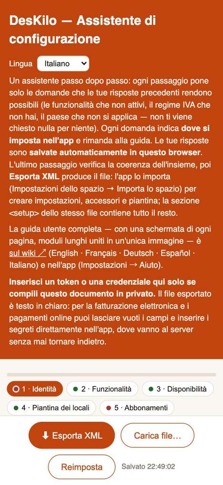

- **Lo spazio dimostrativo** permette di fare pratica prima, senza rischi. Veda [Lo spazio dimostrativo](Guida-utente#lo-spazio-dimostrativo).

**Da sapere**

- Ogni sezione indica i destinatari nella seconda riga, così può saltare ciò che non la riguarda.
- Un blocco che comincia con **Attenzione** segnala una decisione difficile da annullare e dice quando.
- Questa guida non certifica mai nulla sul piano legale o fiscale: dice che cosa fa l’app e che cosa confermare con un commercialista.

<!-- anchor: setup.before.overview -->
## Prima di iniziare

Un po’ di preparazione le risparmia le due cose che costano di più in seguito: riscrivere tutto e prendere decisioni che non si possono più cambiare. Questo capitolo mostra che cosa fa DesKilo, che cosa serve davvero per aprire e che cosa tenere a portata di mano.

In questo capitolo:
- [Che cosa può fare DesKilo](#che-cosa-può-fare-deskilo)
- [Che cosa è necessario e che cosa è facoltativo](#che-cosa-è-necessario-e-che-cosa-è-facoltativo)
- [Uno spazio di prova o uno reale](#uno-spazio-di-prova-o-uno-reale)
- [Partire da un modello o da zero](#partire-da-un-modello-o-da-zero)
- [Che cosa preparare](#che-cosa-preparare)
- [Decisioni difficili da annullare](#decisioni-difficili-da-annullare)
- [Chi fa che cosa](#chi-fa-che-cosa)

<!-- anchor: setup.before.what -->
### Che cosa può fare DesKilo

**Destinatari:** Proprietario · Comproprietario

Vuole avere un quadro d’insieme prima di scegliere qualsiasi cosa. DesKilo raggruppa le sue funzionalità in nove processi; la schermata **Funzionalità** mostra una scheda per ogni processo con il suo stato.

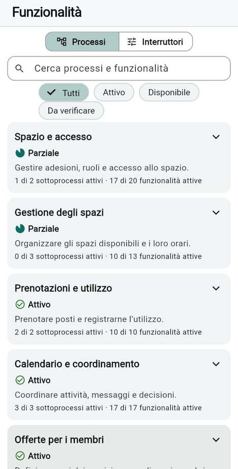

*I nove processi, in parole semplici*

| Processo | Che cosa offre a un membro |
|---|---|
| **Spazio e accesso** | Un ingresso: partecipare con l’ID dello spazio, un ruolo, un badge. |
| **Gestione degli spazi** | Un luogo uguale a quello reale: piani, sale, scrivanie, orari di apertura. |
| **Prenotazioni e utilizzo** | Prenotare una scrivania o una sala, registrare l’arrivo e la partenza, vedere che cosa è libero. |
| **Calendario e coordinamento** | Un calendario, messaggi e richieste che qualcuno conferma. |
| **Offerte per i membri** | Un piano, i prezzi dei servizi e gli accordi. |
| **Fatturazione e pagamenti** | Un estratto conto, fatture, pagamento, solleciti, IVA. |
| **Documenti e informazioni** | Documenti da leggere, rapporti da stampare, i propri dati da esportare. |
| **Operazioni e amministrazione** | Uno spazio con i suoi colori e le sue parole. |
| **Integrazioni e automazione** | Notifiche e documenti recapitati tramite servizi esterni. |

**Da sapere**

- Un nuovo spazio parte con un insieme ragionevole di funzionalità attive: non deve deciderle una per una. Disattivare una funzionalità blocca solo le nuove operazioni e non cancella nulla.
- Una funzionalità che ne richiede un’altra attiva anche quella, e la schermata indica che cosa si è attivato. Veda [Un interruttore di funzionalità](Guida-utente#un-interruttore-di-funzionalità).
- Le funzionalità contrassegnate come alpha o beta chiedono il suo consenso quando le attiva.

**Vedi anche:** [Attivare e disattivare le funzionalità](Guida-utente#attivare-o-disattivare-interi-processi)

<!-- anchor: setup.before.necessary -->
### Che cosa è necessario e che cosa è facoltativo

**Destinatari:** Proprietario · Comproprietario · Amministratore

Vuole conoscere la strada più breve verso uno spazio prenotabile. L’app tiene un elenco di preparazione chiamato **Configurazione di questo spazio** e, nella schermata Prenota, indica ai proprietari che cosa manca con «Prima che qualcuno possa prenotare qui».

*Che cosa deve esserci prima della prima prenotazione*

1. **Giorni di apertura, fuso orario e valuta**: un fuso orario, una valuta e almeno un giorno della settimana aperto.
2. **Posti prenotabili sulla planimetria**: almeno un posto.
3. **Ruoli e chi convalida le richieste**: conta solo quando una regola di convalida, di qualsiasi tipo, chiede più validatori di quanti ne abbia lo spazio. Una regola che chiede due approvazioni, con lei sola nello spazio, lascerebbe le richieste in attesa per sempre.
4. **Cosa possono fare i membri**: i membri possiedono **Prenotare e usare le prenotazioni**. Un nuovo spazio non concede loro nulla, quindi un membro che entra non può prenotare finché lei non lo spunta in [Ruoli](https://fdittgen-png.github.io/deskilo/#/roles).

Un’altra riga, **Server e versione del database**, blocca soltanto quando il server è indietro rispetto a questa app; in quel caso si attende l’operatore del server. E finché **Fatture** è attiva, è richiesta anche **L'identità legale e l'indirizzo dello spazio**: l’elenco la segna **Necessario prima di fatturare**, perché senza di essa non si può emettere alcuna fattura.

*Che cosa è facoltativo e può essere rimandato*

- **Piani di iscrizione e tariffe**
- **Invitare i primi membri**
- **Come pagano i membri**
- **Esportazione e ripristino**
- **Dati richiesti dalle funzioni (identità, banca, piattaforme)**
- **Una prima prenotazione**

Ognuno di questi passaggi può essere messo da parte con **Più tardi** e ripreso in seguito; l’elenco indica se un passaggio è **Da configurare**, **Pronto**, **Non necessario qui** o **In attesa di un’altra persona**. Esistono altri due stati: **Non ancora verificato** (**Esportazione e ripristino** diventa Pronto solo dopo un’esportazione reale negli ultimi 90 giorni) e una riga che non è stato possibile leggere.

**Da sapere**

- L’elenco indica chi deve agire: **Lei**, **L’operatore del server** o **Un amministratore del database**.
- Facoltativo non significa poco importante: coordinate bancarie, un fornitore di pagamento o una sede sono dati richiesti dalle funzioni, e l’elenco li indica.
- Se attiva la fatturazione senza identità legale, l’app lo consente; l’elenco e [Che cosa richiede la Sua attenzione](Guida-utente#cosa-ti-aspetta) la segnalano, e l’emissione di una fattura viene rifiutata, dicendo che cosa manca.

**Vedi anche:** [Verificare il suo spazio](#verificare-il-suo-spazio) · [La scheda Primi passi e i suggerimenti](Guida-utente#la-scheda-primi-passi-e-i-suggerimenti)

<!-- anchor: setup.before.environment -->
### Uno spazio di prova o uno reale

**Destinatari:** Proprietario · Comproprietario · Operatore

Vuole provare senza conseguenze e poi gestire lo spazio reale. Uno spazio può essere di prova, reale oppure una coppia collegata con lo stesso nome.

| Opzione | La scelga quando | Che cosa succede |
|---|---|---|
| **Uno spazio di prova** | Sta imparando. | Ogni schermata e ogni documento dichiara di essere una prova: i documenti portano una filigrana. Nessuna fatturazione reale. |
| **Uno spazio reale** | Conosce le sue impostazioni. | Le fatture che emette sono dovute. |
| **Una coppia collegata di prova e reale** | Vuole provare le modifiche prima che le vedano i membri reali. | Due spazi, entrambi suoi. Solo un rilascio sposta la configurazione dall’uno all’altro; membri, prenotazioni, fatture e pagamenti non viaggiano mai. |

**Da sapere**

- Il selettore parte dall’opzione di prova.
- L’ambiente è una dichiarazione del proprietario; chiunque abbia il permesso di configurazione (il proprietario sempre) può cambiarlo in seguito, e le fatture già emesse conservano la filigrana che portavano: se ha dei dubbi, cominci con uno spazio di prova.
- Per fare pratica senza uno spazio proprio, usi lo spazio dimostrativo.

**Vedi anche:** [Uno spazio ha due lati](Guida-utente#uno-spazio-ha-due-lati) · [Creare uno spazio di lavoro](Guida-utente#creare-uno-spazio) · [Uno spazio di prova](Guida-utente#a-che-cosa-serve-uno-spazio-di-prova)

<!-- anchor: setup.before.template -->
### Partire da un modello o da zero

**Destinatari:** Proprietario

Vuole un vantaggio iniziale senza essere vincolato alle scelte di altri. Quando crea uno spazio, **Partire da** propone **Spazio vuoto** oppure un modello pronto, ed è preselezionato su *A tiny space*; scelga *Spazio vuoto* se preferisce una tela bianca.

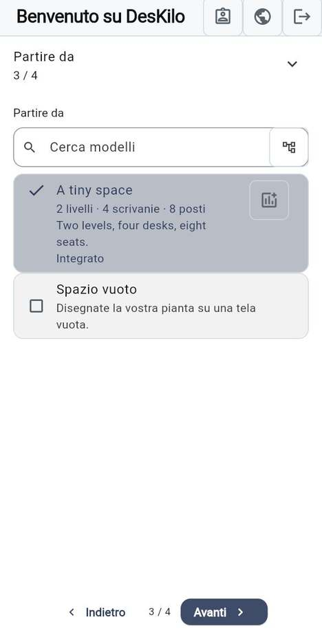

*I due modelli integrati*

| Modello | Che cosa configura |
|---|---|
| A tiny space | Due piani, quattro scrivanie, otto posti, nient’altro: abbastanza per prenotare, scansionare ed esplorare fin dal primo minuto. |
| Association de coworking (France) | Mezze giornate 7:00–13:00 e 13:00–19:00, dal lunedì al venerdì, giorni festivi, iscrizioni al 50 % e al 100 %, due carnet prepagati di mezze giornate (10 e 20), ruoli del consiglio (tesoriere, segretario, responsabile della sala), un calendario per le convalide e due piani pronti per le prenotazioni. Imposta inoltre la lingua dello spazio sul francese e il regime IVA su *non soggetto a IVA*; vengono rinominate solo tre parole (Place, Étage, Réservations). Il nome del modello è in francese in tutte le lingue dell’app. |

**Da sapere**

- Un modello non contiene mai la sua identità legale, le coordinate bancarie, le sedi, gli inviti o i link ai documenti: sono suoi, e l’elenco di preparazione li indica (l’identità legale, con **Fatture** attiva, come un’area a sé).
- Uno spazio creato da un modello può avere la fatturazione attiva e nulla con cui emettere finché non aggiunge l’identità.
- Applicare un modello a uno spazio che ha già delle tariffe sostituisce le sue fasce di tariffa: lo usi su uno spazio nuovo.

**Vedi anche:** [Creare uno spazio di lavoro](Guida-utente#creare-uno-spazio)

<!-- anchor: setup.before.prepare -->
### Che cosa preparare

**Destinatari:** Proprietario

Vuole avere i dati a portata di mano, così che la configurazione richieda minuti e non giorni. Raccolga prima queste cose.

**Prima di iniziare**

- [ ] L’**identità legale**: associazione o società, denominazione registrata, indirizzo, numeri di registrazione e di partita IVA se li ha.
- [ ] Un **commercialista** (o qualcuno che confermi le scelte fiscali): fatture e IVA sono la parte da verificare con un professionista.
- [ ] Un’idea di tariffa: gratuita, un’iscrizione forfettaria o una percentuale di giorni con una quota mensile.
- [ ] Le **coordinate bancarie** su cui i membri pagheranno (IBAN e BIC, o il metodo in uso nel suo Paese).
- [ ] Un elenco delle prime persone: nomi e indirizzi e-mail, e chi approverà le richieste.
- [ ] Uno schizzo della planimetria: piani, sale, quante scrivanie e quanti posti, e se una sala intera può essere prenotata.
- [ ] I suoi giorni e orari di apertura, e i giorni di chiusura.

**Da sapere**

- Può aprire senza identità legale e senza coordinate bancarie; le servono prima della prima fattura.
- Faccia prima lo schizzo su carta. L’app disegna piani, sale, scrivanie e posti; è più veloce inserire una pianta a cui ha già pensato.

**Vedi anche:** [Preparare uno spazio con il questionario di configurazione](Guida-utente#preparare-uno-spazio-con-il-questionario-di-configurazione)

<!-- anchor: setup.before.permanent -->
### Decisioni difficili da annullare

**Destinatari:** Proprietario · Comproprietario

Vuole sapere su quali scelte rallentare. La maggior parte delle impostazioni si può cambiare in qualsiasi giorno. Queste no, o non senza conseguenze.

> **Attenzione** Una fattura emessa non cambia mai e il suo numero non viene mai riutilizzato. Se sbaglia, corregge con uno storno, una nota di credito o una richiesta di rimborso, non con una modifica.

| Decisione | Quando diventa definitiva | Che cosa fare invece |
|---|---|---|
| Formato e sequenza del numero di fattura | Il numero successivo può essere aumentato, mai diminuito. Dopo la prima fattura non può più stampare una parte della data inferiore a quella che la serie mostra. | Veda l’anteprima del formato, chieda al commercialista, poi emetta. |
| Il mese di una fattura emessa | Quando il mese di un membro è fatturato, è bloccato; i giorni di chiusura e le importazioni dei giorni festivi lo saltano. | Imposti i giorni di chiusura prima della fine del mese. |
| Regime IVA e aliquote | Le aliquote hanno una versione per data e non si modificano mai; una dichiarazione IVA trasmessa non viene mai ricalcolata. | Aggiunga una nuova aliquota da una data; decida il regime con il commercialista. |
| Paese, valuta, fuso orario | Gli importi sono memorizzati come numeri, senza conversione. Quando lo spazio ha emesso un documento o registrato denaro, il server rifiuta qualsiasi cambio di valuta o paese. Il fuso orario non è mai bloccato, ma ogni giorno si conta in esso. | Li scelga bene il primo giorno; veda [Costruire il luogo](#costruire-il-luogo). |
| Sostituzione della planimetria | L’importazione di una pianta viene rifiutata quando esistono prenotazioni. | Modifichi piani e sale uno per uno nell’editor. |
| ID dello spazio | È ciò che i membri digitano e ciò a cui puntano i codici QR stampati. Può cambiarlo (da 4 a 20 lettere o cifre) con **Cambia l'ID dello spazio**, ma il vecchio ID smette subito di funzionare. | Scelga un ID breve e facile da ricordare prima di stampare qualsiasi cosa; se deve, lo cambi presto. |
| Prova o reale | Uno spazio reale emette fatture dovute; i documenti di sviluppo portano una filigrana. | Cominci in uno spazio di prova, poi rilasci quando è pronto. |
| Una regola che richiede più validatori di quanti ne abbia | Le richieste restano in attesa per sempre. | Conti i suoi validatori prima di richiederne due. |

**Da sapere**

- Disattivare una funzionalità non cancella mai i dati.
- Eliminare un piano rimuove tutti gli uffici, le scrivanie e i posti che contiene.

**Vedi anche:** [Denaro](#ciò-che-non-si-può-annullare)

<!-- anchor: setup.before.who -->
### Chi fa che cosa

**Destinatari:** Proprietario · Comproprietario · Amministratore · Operatore

Vuole sapere a chi rivolgersi per che cosa. Possono essere coinvolte tre persone, e l’elenco di preparazione le nomina.

| Chi | Che cosa fa |
|---|---|
| **Proprietario** (e *Comproprietario*) | Tutto ciò che riguarda lo spazio: piani, orari, funzionalità, ruoli, tariffe, identità legale, inviti, rilasci. I comproprietari hanno per impostazione predefinita tutti i permessi; il proprietario decide che cosa possono fare gli amministratori. |
| **Operatore** | Gestisce l’installazione: il server e i suoi segreti, e gli aggiornamenti del database. Serve perché le notifiche push funzionino e per tutto ciò che l’elenco di preparazione chiama **In attesa di un’altra persona**. |
| **Amministratore del database** | Approva l’accesso di un membro per gli assistenti. |

**Da sapere**

- In un’installazione condivisa l’operatore è di solito quello della piattaforma, non Lei.
- Gli amministratori agiscono nei limiti dei permessi che il proprietario ha dato loro nella [matrice dei ruoli](Guida-utente#la-matrice-dei-ruoli).
- Se una sezione dice **L’operatore del server**, l’app non può farlo dalla sua schermata.

**Vedi anche:** [Decidere chi può fare che cosa](Guida-utente#la-matrice-dei-ruoli) · [Permessi di rilascio](Guida-utente#chi-può-distribuire-ed-entrare-in-produzione)

<!-- anchor: setup.place.overview -->
## Costruire il luogo

Questo capitolo costruisce il primo livello, **Aprire**: dove si trova lo spazio, che aspetto ha, quando è aperto e quali sono le regole di prenotazione. In circa venti minuti lo spazio può essere prenotato. L’esempio è *Atelier du Marché*, un’associazione a Pézenas con due piani e una sala.

In questo capitolo:
- [Paese, valuta, fuso orario e lingua](#paese-valuta-fuso-orario-e-lingua)
- [La planimetria](#la-planimetria)
- [Orari di apertura e regole di prenotazione](#orari-di-apertura-e-regole-di-prenotazione)
- [Giorni di chiusura e giorni festivi](#giorni-di-chiusura-e-giorni-festivi)
- [Verificare il suo spazio](#verificare-il-suo-spazio)

<!-- anchor: setup.place.where -->
### Paese, valuta, fuso orario e lingua

**Destinatari:** Proprietario · Amministratore

Vuole che lo spazio sappia dove si trova. Queste quattro scelte determinano più cose di quanto sembri.

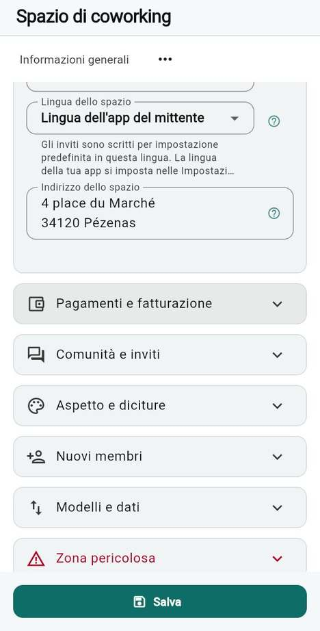

*Che cosa determina ciascuna scelta*

| Scelta | Che cosa decide |
|---|---|
| **Paese** | La valuta e il fuso orario che propone, e i giorni festivi offerti come giorni di chiusura (veda sotto). |
| **Valuta** | Come ogni importo viene mostrato e contato. |
| **Fuso orario** | Che cosa significano una giornata lavorativa, un limite di mezza giornata e un giorno di chiusura; un membro all’estero vede la giornata dello spazio. |
| **Lingua dello spazio** | La lingua in cui, per impostazione predefinita, sono scritti gli inviti e i riferimenti ai messaggi condivisi. |

**Passaggi**

1. Apra [Spazio di lavoro](https://fdittgen-png.github.io/deskilo/#/workspace-settings) e vada su **Informazioni generali**.
2. Scelga il **Paese**; la **Valuta** e il **Fuso orario** lo seguono e può correggerli. Per Atelier du Marché: Francia, EUR, Europe/Paris.
3. Scelga la **Lingua dello spazio**, poi tocchi **Salva**.

> **Attenzione** Scelga bene paese e valuta il primo giorno. Gli importi sono memorizzati come semplici numeri, quindi quando lo spazio ha emesso un documento o registrato denaro, il server rifiuta di cambiare l’uno o l’altra: «La valuta e il paese sono fissati non appena lo spazio ha emesso un documento o registrato denaro. Non è stato salvato nulla.»

**Da sapere**

- L’app elenca molti paesi, ma l’emissione di fatture dentro DesKilo oggi funziona solo per la Francia e la Germania. Altrove conserva gli estratti conto ed emette le fatture fuori dall’app.
- La lingua dello spazio non è la lingua della sua app, che si trova nelle sue impostazioni personali.

**Vedi anche:** [Paese](Guida-utente#paese) · [Valuta e fuso orario](Guida-utente#valuta-e-fuso-orario) · [Lingua dello spazio](Guida-utente#lingua-dello-spazio)

<!-- anchor: setup.place.plan -->
### La planimetria

**Destinatari:** Proprietario · Amministratore

Vuole che la planimetria sullo schermo somigli al luogo reale. È costruita su quattro livelli: i piani, poi gli uffici (le sale), poi le scrivanie, poi i posti. Un membro prenota un posto; un posto è ciò che l’elenco di preparazione conta.

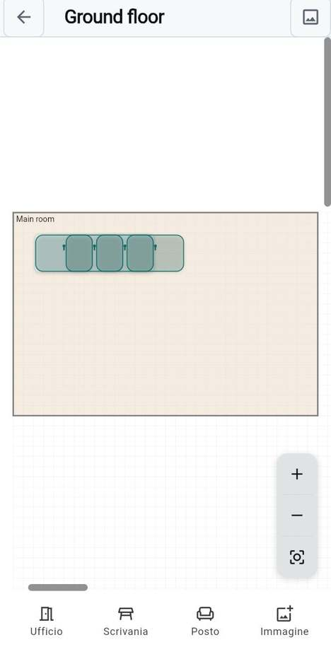

**Passaggi**

1. Faccia uno schizzo su carta: piani, sale, scrivanie, posti.
2. Apra [Editor dello spazio](https://fdittgen-png.github.io/deskilo/#/editor) e aggiunga i piani con **Aggiungi piano**.
3. Apra un piano e disegni ogni sala con **Ufficio**, poi **Scrivania** e **Posto** al suo interno.
4. Se una squadra può occupare una sala o un piano per un giorno, attivi la prenotazione dell’intera sala nelle sue proprietà.

**Da sapere**

- Cominci in piccolo: un primo piano, una sala, qualche posto. Tutto si può aggiungere in seguito.
- Un intero piano, ufficio o scrivania può essere prenotato solo se **Prenotazioni di tavolo, ufficio e piano** è attivo e il membro ha il permesso.
- Il modello integrato A tiny space le dà due piani, quattro scrivanie e otto posti da adattare.
- Eliminare un piano rimuove tutto ciò che contiene, e l’importazione di una planimetria viene rifiutata quando esistono prenotazioni.

**Vedi anche:** [Aggiungere, rinominare ed eliminare piani](Guida-utente#editor-dello-spazio-aggiungere-rinominare-ed-eliminare-piani) · [Disegnare sale, scrivanie e posti](Guida-utente#disegnare-stanze-scrivanie-e-posti) · [Lasciare che i membri prenotino un intero piano](Guida-utente#permettere-ai-membri-di-prenotare-un-intero-piano)

<!-- anchor: setup.place.times -->
### Orari di apertura e regole di prenotazione

**Destinatari:** Proprietario · Amministratore

Vuole che le prenotazioni seguano il ritmo del suo luogo. Una sola schermata, **Disponibilità**, contiene i giorni, la forma di una prenotazione, gli orari di lavoro e le regole. Il server le applica ovunque: planimetria, scheda di prenotazione, codici scansionati e chiosco.

**Passaggi**

1. Apra [Disponibilità](https://fdittgen-png.github.io/deskilo/#/availability).
2. Scelga i **Giorni di apertura** (almeno uno) e la **Granularità delle prenotazioni**.
3. Imposti gli **Orari di lavoro**: **Inizio giornata**, **Limite di mezza giornata**, **Fine giornata**.
4. Sotto **Regole di prenotazione**, decida su **Consenti prenotazioni passate**, **Fuori dagli orari di apertura** e **Limiti di prenotazione**.

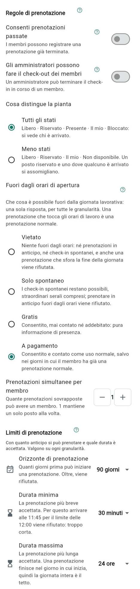

*Punti di partenza consigliati (suggerimenti, non regole; il valore predefinito di **Fuori dagli orari di apertura** è **A pagamento**, e il modello per associazioni non lo modifica)*

| Scenario | Granularità | Orari | Fuori orario | Prenotazioni passate | Limiti |
|---|---|---|---|---|---|
| Qualche scrivania condivisa | **Fascia oraria libera** o **Slot di 1 ora** | Giornata 8:00–17:00 | **Libero** | Disattivate | Una prenotazione alla volta; orizzonte di 30 giorni |
| Una sala associativa (Atelier du Marché) | **Mezze giornate (mattina e pomeriggio)** | 7:00, limite 13:00, fine 19:00 | **Disattivata** | Disattivate | Una prenotazione alla volta; orizzonte di 90 giorni |
| Un coworking con mezze giornate | **Mezze giornate (mattina e pomeriggio)** | 8:00, limite 12:00, fine 18:00 | **A pagamento** | Disattivate | Una o due alla volta; orizzonte di 90 giorni |

**Da sapere**

- Fuori dagli orari di apertura, **Disattivata** rifiuta tutto, **Solo spontaneo** consente gli arrivi senza prenotazione, **Libero** consente senza contare, **A pagamento** conta come un normale utilizzo, tranne in un giorno in cui il membro ha già una prenotazione ordinaria.
- La giornata deve procedere in ordine: inizio, poi limite, poi fine; la durata minima non può superare quella massima.
- Una prenotazione termina nel giorno in cui inizia. Le prenotazioni passate sono disattivate per impostazione predefinita; prenotare una fascia precedente nello stesso giorno è sempre consentito.
- Le fasce di mezza giornata e di giornata intera guidano anche l’arrivo e la fatturazione, quindi definisca gli orari prima di stabilire i prezzi.

**Vedi anche:** [Giorni di apertura](Guida-utente#giorni-di-apertura) · [Granularità](Guida-utente#granularità) · [Orari di lavoro](Guida-utente#orari-di-lavoro) · [Fuori dagli orari di apertura](Guida-utente#fuori-dagli-orari-di-apertura) · [Limiti di prenotazione](Guida-utente#limiti-di-prenotazione)

<!-- anchor: setup.place.closure -->
### Giorni di chiusura e giorni festivi

**Destinatari:** Proprietario · Amministratore

Vuole che lo spazio sia chiuso nei giorni festivi, senza che nessuno li prenoti per errore.

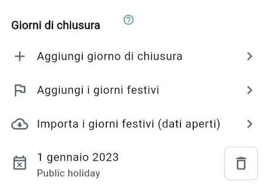

**Passaggi**

1. In [Disponibilità](https://fdittgen-png.github.io/deskilo/#/availability), vada su **Giorni di chiusura**.
2. Tocchi **Aggiungi i giorni festivi** (se non lo vede, attivi prima la funzionalità *Giorni festivi*; è disattivata per impostazione predefinita) per creare un intero anno in una volta, oppure **Aggiungi giorno di chiusura** per una singola data, come un giorno di inventario.
3. Controlli l’elenco e tolga ogni giorno in cui lavora davvero.

**Da sapere**

- Esistono elenchi di giorni festivi integrati per la Francia e la Germania. Per gli altri paesi attivi *Giorni festivi* e *Importa i giorni festivi* (dati aperti, serve una connessione). Non viene creato nulla prima che Lei confermi.
- Una prenotazione in un giorno di chiusura viene rifiutata, e la planimetria mostra il giorno come chiuso con il suo motivo.
- I mesi già fatturati vengono saltati, quindi aggiunga i giorni di chiusura prima della chiusura del mese.

**Vedi anche:** [Giorni di chiusura](Guida-utente#giorni-di-chiusura) · [Giorni festivi](Guida-utente#giorni-festivi)

<!-- anchor: setup.place.check -->
### Verificare il suo spazio

**Destinatari:** Proprietario · Amministratore

Vuole una prova che lo spazio sia pronto, prima di invitare qualcuno. Lo dicono due schede.

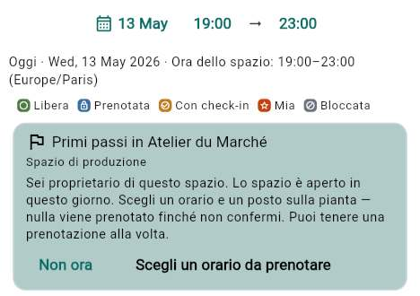

**Passaggi**

1. Apra [Spazio di lavoro](https://fdittgen-png.github.io/deskilo/#/workspace-settings): la scheda **Configurazione di questo spazio** elenca ogni area con il suo stato e il passo successivo.
2. Apra [Prenota](https://fdittgen-png.github.io/deskilo/#/reserve). I proprietari e gli amministratori con il permesso di configurazione vedono la scheda *Primi passi nel suo spazio*. Se manca qualcosa, riporta «Prima che qualcuno possa prenotare qui», con **Completa la configurazione**.
3. Prenoti lei stesso un posto come prova, poi lo annulli.

**Da sapere**

- Pronto significa pronto per una prima prenotazione: giorni di apertura, fuso orario, valuta, almeno un posto, membri che possono prenotare e abbastanza validatori.
- Tutto ciò che è facoltativo, come tariffe o pagamenti, può essere messo da parte con **Più tardi** e non impedisce l’apertura.
- Entrambe le schede dipendono dalla funzionalità *Scheda Primi passi*.
- **Non ora** nasconde la scheda su questo dispositivo; il menu di visualizzazione sulla planimetria la riporta con **Primi passi**.

**Risultato** Uno spazio che i membri possono prenotare. Il passo successivo: invitare le prime persone, poi i ruoli e le tariffe del secondo livello.

**Vedi anche:** [La scheda Primi passi e i suggerimenti](Guida-utente#la-scheda-primi-passi-e-i-suggerimenti) · [Invitare le persone con l’ID dello spazio](Guida-utente#lid-dello-spazio-di-lavoro) · [Ruoli](Guida-utente#la-matrice-dei-ruoli)

<!-- anchor: setup.features.overview -->
## Scegliere che cosa offre il suo spazio

Uno spazio non è un unico prodotto con cento impostazioni. È un insieme ristretto di cose che decide di offrire, una alla volta. Questo capitolo spiega come DesKilo raggruppa ciò che sa fare, che cosa ha già un nuovo spazio, come i vari elementi dipendono l’uno dall’altro e in quale ordine attivarli, così da non offrire mai qualcosa che non è ancora in grado di gestire.

In questo capitolo:
- [Funzionalità e processi](#funzionalità-e-processi)
- [Essenziale e Piattaforma: che cosa ha un nuovo spazio](#essenziale-e-piattaforma-che-cosa-ha-un-nuovo-spazio)
- [Funzionalità che ne richiedono altre](#funzionalità-che-ne-richiedono-altre)
- [Disattivare non cancella nulla](#disattivare-non-cancella-nulla)
- [Beta, Non valutata e la domanda prima di attivare](#beta-non-valutata-e-la-domanda-prima-di-attivare)
- [Tre punti di partenza](#tre-punti-di-partenza)
- [L’ordine in cui attivare le cose](#lordine-in-cui-attivare-le-cose)
- [Attivare una funzionalità in sicurezza](#attivare-una-funzionalità-in-sicurezza)
- [Evitare funzionalità in contraddizione tra loro](#evitare-funzionalità-in-contraddizione-tra-loro)
- [La mappa delle funzionalità](#la-mappa-delle-funzionalità)

<!-- anchor: setup.features.what -->
### Funzionalità e processi

**Destinatari:** Proprietario · Comproprietario

Vuole sapere che cosa sta attivando quando apre **Funzionalità**. Tutto ciò che DesKilo sa fare oltre alle basi è una funzionalità con il suo interruttore. Per tenere leggibili cento interruttori, la schermata li raggruppa in base alla loro finalità.

*Come è organizzato*

- Un *processo* è un compito dell’attività: per esempio **Fatturazione e pagamenti** o **Calendario e coordinamento**. Sono nove.
- Un *sottoprocesso* è una tappa di quel compito: **Fatturazione**, **Incasso dei pagamenti** e **Gestione IVA** sono tre delle cinque tappe di **Fatturazione e pagamenti**.
- Una *funzionalità* è un singolo interruttore all’interno di un sottoprocesso: **Fatture**, **Solleciti di pagamento**, **Dichiarazioni IVA**.

*I nove processi e i loro sottoprocessi*

| Processo | Sottoprocessi |
|---|---|
| **Spazio e accesso** | **Persone e adesioni** · **Accesso fisico** |
| **Gestione degli spazi** | **Struttura dello spazio** · **Giorni e orari di apertura** · **Presentazione dello spazio** |
| **Prenotazioni e utilizzo** | **Prenotare postazioni e spazi** · **Presenze e utilizzo** |
| **Calendario e coordinamento** | **Viste del calendario** · **Decisioni e approvazioni** · **Comunicazione tra membri** |
| **Offerte per i membri** | **Servizi e prezzi** |
| **Fatturazione e pagamenti** | **Registrazioni finanziarie** · **Fatturazione** · **Incasso dei pagamenti** · **Spese condivise** · **Gestione IVA** |
| **Documenti e informazioni** | **Pubblicazione dei documenti** · **Progettazione dei rapporti** · **Accesso ai dati ed esportazioni** |
| **Operazioni e amministrazione** | **Configurazione e distribuzione** · **Utilizzo dell’applicazione** |
| **Integrazioni e automazione** | **Invio esterno** |

**Da sapere**

- Una funzionalità appartiene a un solo processo, anche quando ne richiede una di un altro. La scheda lo dice: «Attivare tutto richiede anche: Scheda Finanze (Fatturazione e pagamenti)».
- I piani di iscrizione e l’editor della planimetria non sono funzionalità: ci sono sempre. Le loro impostazioni si trovano in Spazio di lavoro e Fatturazione, non in questa schermata. I carnet prepagati sono una funzionalità: veda **Carnet**.
- Disattivare una funzionalità la nasconde da ogni schermata in cui compariva; non è un permesso. Chi può fare che cosa si decide nei [Ruoli](Guida-utente#la-matrice-dei-ruoli).

**Vedi anche:** [Che cosa può fare DesKilo](#che-cosa-può-fare-deskilo) · [Attivare o disattivare interi processi](Guida-utente#attivare-o-disattivare-interi-processi)

<!-- anchor: setup.features.tiers -->
### Essenziale e Piattaforma: che cosa ha un nuovo spazio

**Destinatari:** Proprietario · Comproprietario

Vuole sapere che cosa trovano i membri il primo giorno, prima che Lei abbia attivato qualsiasi cosa.

Ogni funzionalità appartiene a uno di due livelli, e un nuovo spazio viene creato a partire da questi:

| Livello | Con le parole dell’app | Che cosa riceve un nuovo spazio |
|---|---|---|
| **Essenziale** | Ciò di cui ogni spazio ha bisogno. Attivo dal primo giorno. | Attiva, quando la funzionalità è pensata per essere attiva all’inizio. |
| **Piattaforma** | Su richiesta, mai data per scontata. Attivi ciò che questo spazio usa davvero. | Disattivata. In **Interruttori** sono elencate sotto il livello **Piattaforma**. |

Un nuovo spazio parte con 45 funzionalità attive, tutte Essenziali (46 se crea nello stesso momento il gemello di prova: in tal caso è attiva anche **Coppie di ambienti**). In parole semplici:

- Prenotazione: riservare un posto sulla planimetria, ripetere una prenotazione (**Prenotazione in serie**), prenotare per un’altra persona (**Prenota per altri**), vedere un posto parzialmente prenotato come parzialmente occupato (**La giornata di una postazione**), salvare una prenotazione in un calendario personale (**File calendario di una prenotazione**), regole di prenotazione come le prenotazioni passate e quelle fuori orario (**Regole di prenotazione**, **Controllo prenotazione**), richiedere l’eliminazione di una prenotazione passata (**Richieste di eliminazione prenotazioni**), stampare schede QR per i posti (**Codici QR degli spazi**), orari di lavoro configurabili (**Orari di lavoro**).
- Persone: la scheda della comunità (**Elenco dei membri**), una pagina per ogni membro (**Scheda membro**), la matrice centrale dei ruoli (**Gestione dei ruoli** e **Assegnazione dei ruoli**), i dati personali per lettere e fatture (**Dati personali**), iniziali distinte sugli avatar (**Iniziali avatar distinte**).
- Calendario e messaggi: il calendario in più viste (**Scheda Calendario**, **Calendario centrale**, **Viste del calendario**), il flusso delle attività e le conferme (**Scheda Eventi**), conversazioni private e di gruppo (**Notifiche tra membri**, **Messaggi, rinnovati**) con riferimenti, inoltro, menzioni, gesti di scorrimento e protezione dalle catture dello schermo, il raggruppamento del flusso delle notifiche (**Raggruppamento delle notifiche**) e il pulsante per scrivere agli organizzatori di una pagina pubblicata (**Scrivi ai gestori**).
- Denaro: la scheda Finanze con le sue quattro viste (**Scheda Finanze**, **Finanze in quattro viste**), le fatture (**Fatture**), un catalogo di servizi (**Servizi**), un PDF del conto mensile (**Esportazione PDF**).
- Documenti e dati: la biblioteca dei documenti (**Biblioteca documenti**), l’esportazione dei dati per il proprietario (**Esportazione dati (Excel)**) e l’esportazione e la cancellazione dei propri dati da parte di ogni membro (**Esportazione e cancellazione**).
- Comfort: suggerimenti di aiuto, la scheda Primi passi, preferiti e valutazioni dei posti, animazioni, formati regionali e la scelta dello stile di navigazione.
- Recapito: **Notifiche push**, che raggiungono i telefoni solo quando chi gestisce l’installazione ha configurato il servizio push (veda [Come vengono informati i membri](#i-canali-in-parole-semplici)).
- Riordino della planimetria: **Eliminare spazi con cronologia** e **Chiamare con il piano un piano a stanza unica**.

Tutto il resto è Piattaforma e disattivato: chiosco e badge, più sedi, supplementi accessori, pagamenti online, gestione IVA, il percorso della fattura, progettazione dei rapporti, distribuzioni, WhatsApp, l’interfaccia per gli assistenti e il resto.

**Da sapere**

- La funzionalità delle fatture è attiva fin dall’inizio, ma non si può emettere nulla finché la sua identità legale non è completa; **Configurazione di questo spazio** la segna **Necessario prima di fatturare**. Veda [Evitare funzionalità in contraddizione tra loro](#evitare-funzionalità-in-contraddizione-tra-loro).
- Uno spazio già esistente non cambia mai quando DesKilo modifica ciò che riceve un nuovo spazio.
- Se parte da un modello, il modello può attivare o disattivare alcune funzionalità in aggiunta a questo insieme. Veda [Tre punti di partenza](#tre-punti-di-partenza).

**Vedi anche:** [Un interruttore di funzionalità](Guida-utente#un-interruttore-di-funzionalità)

<!-- anchor: setup.features.dependencies -->
### Funzionalità che ne richiedono altre

**Destinatari:** Proprietario · Comproprietario

Vuole attivare qualcosa ed essere sicuro che funzioni, oppure disattivare qualcosa senza rompere ciò che ne dipende.

Molte funzionalità dipendono da un’altra. **Pagamenti online** richiede **Scheda Finanze**; **Solleciti di pagamento** richiede **Fatture**; **Solleciti di pagamento automatici** richiede **Solleciti di pagamento**; **Dichiarazioni IVA** richiede **Gestione IVA**, che richiede **Fatture**. Nell’elenco **Interruttori**, una funzionalità che ne richiede un’altra mostra **Richiede** seguito dal nome della funzionalità da cui dipende.

*Che cosa fa l’app*

| Lei | L’app |
|---|---|
| Attiva una funzionalità la cui funzionalità madre è disattivata | Attiva l’intera catena e indica che cosa si è attivato con essa: «Attivato anche: …». |
| Disattiva una funzionalità madre | Non cancella le scelte delle sue funzionalità figlie. Restano memorizzate come le aveva impostate, ma non fanno nulla; la riga dice «In attesa della funzione qui sopra: attivala e anche questa torna a funzionare». |
| Riattiva la funzionalità madre | Le figlie che erano attive tornano subito a funzionare. |
| Disattiva un intero processo o sottoprocesso mentre qualcosa ne ha ancora bisogno | Rifiuta e indica chi ne ha bisogno («… è ancora necessaria per: …»), a meno che non scelga **Disattiva comunque, conserva le impostazioni** o di disattivare anche le dipendenti. |

**Da sapere**

- Una figlia attiva che attende la funzionalità madre fa comparire nel suo processo la dicitura **Richiede attenzione**. È l’unico stato in cui un interruttore e l’app non concordano, quindi vale la pena dargli un’occhiata. Veda [Attivare una funzionalità in sicurezza](#attivare-una-funzionalità-in-sicurezza).
- Una funzionalità madre può trovarsi in un processo diverso da quello della figlia: **Servizi** (Offerte per i membri) richiede **Scheda Finanze** (Fatturazione e pagamenti). La scheda avverte allora che attivare tutto richiede anche l’altra.
- Il controllo riguarda la funzionalità, non un permesso: un ruolo che può fare qualcosa non basta mai se la funzionalità è disattivata.

**Vedi anche:** [Un interruttore di funzionalità](Guida-utente#un-interruttore-di-funzionalità) · [Attivare o disattivare interi processi](Guida-utente#attivare-o-disattivare-interi-processi)

<!-- anchor: setup.features.off -->
### Disattivare non cancella nulla

**Destinatari:** Proprietario · Comproprietario

Vuole poter cambiare idea in seguito, quindi deve sapere che cosa un interruttore non tocca.

Disattivare una funzionalità blocca le nuove operazioni. Non cancella nemmeno un dato: fatture, prenotazioni, messaggi, ruoli e impostazioni restano dove sono, e riattivando la funzionalità tornano disponibili. Ciò che è già stato fatto resta fatto: una fattura emessa mentre la funzionalità era attiva conserva quanto riporta.

Dietro le quinte, DesKilo suddivide le azioni di una funzionalità attivabile in tre tipi:

| Tipo | Che cosa fa l’interruttore | Esempio |
|---|---|---|
| Lavoro nuovo (*acceptNew*) | Si ferma quando la funzionalità è disattivata. | Avviare una nuova conversazione con gli organizzatori; assegnare a un membro un ruolo personalizzato; bloccare un posto; avviare un nuovo pagamento online. |
| Lavoro già aperto (*serviceExisting*) | Prosegue, così che nulla resti in sospeso. | Rispondere a una conversazione già avviata; revocare un ruolo personalizzato; togliere il blocco a un posto; regolare un pagamento già aperto. |
| Percorsi non sicuri (*suspended*) | Restano chiusi qualunque cosa dica l’interruttore. | Riservato a un percorso che il server giudica non sicuro; oggi nessuna azione è classificata così. |

Tre funzionalità lo dicono nella loro riga, con queste parole: «Disattivato: non inizia nulla di nuovo; ciò che è già aperto può ancora essere gestito e chiuso.» Sono **Scrivi ai gestori**, **I ruoli di questo spazio** e **Gli admin possono bloccare i posti**. Anche **Check-in/out automatico a fine giornata**, quando è disattivata, interrompe la sua elaborazione di fine giornata, ma la sua riga non lo dice. Su un server che non può confermarlo, la riga dice «non contarci».

**Da sapere**

- Il denaro già impegnato viene sempre regolato: il ritorno di un pagamento o un rimborso non è mai bloccato da un interruttore.
- Con **Pagamenti online** disattivati, il server rifiuta un nuovo pagamento online; uno già aperto viene comunque regolato. La sua riga non riporta alcuna nota in proposito.
- Un interruttore non è un modo per nascondere qualcosa a una sola persona. Per questo usi i [Ruoli](Guida-utente#la-matrice-dei-ruoli).

**Vedi anche:** [Un interruttore di funzionalità](Guida-utente#un-interruttore-di-funzionalità)

<!-- anchor: setup.features.maturity -->
### Beta, Non valutata e la domanda prima di attivare

**Destinatari:** Proprietario · Comproprietario

Vede una piccola parola sotto il nome di una funzionalità e vuole sapere che cosa farne.

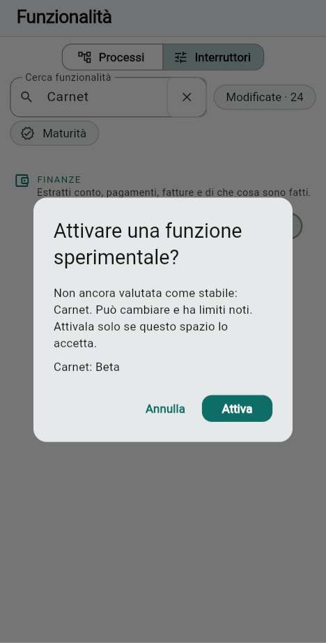

Ogni riga di **Interruttori** porta un badge di maturità, che indica fino a che punto la funzionalità è stata verificata con prove concrete:

| Badge | Che cosa significa |
|---|---|
| **Non valutata** | Nessuno l’ha ancora valutata con prove concrete. Non dice nulla di negativo. |
| **Alfa** | Valutata, a uno stadio iniziale. |
| **Beta** | Valutata, con limiti noti; i suoi test vengono eseguiti a ogni modifica. |
| **Stabile** | Valutata e qualificata anche con fornitori, hardware o operatori reali. |

Al momento in cui scriviamo, la maggior parte delle funzionalità risulta **Non valutata**, diciotto risultano **Beta** e nessuna ha ancora raggiunto lo stato **Stabile**.

*Che cosa chiede l’app*

1. Sposti l’interruttore di una funzionalità **Alfa** o **Beta**.
2. L’app chiede **Attivare una funzione sperimentale?** e dice: «Non ancora valutata come stabile: … Può cambiare e ha limiti noti. Attivala solo se questo spazio lo accetta.»
3. Indica lo stadio di ogni funzionalità e quelle che si attiverebbero con essa perché necessarie.
4. Tocchi **Attiva** per accettare, oppure **Annulla**: non viene scritto nulla.

**Da sapere**

- Le funzionalità **Non valutata** non fanno domande. Solo **Alfa** e **Beta** le fanno.
- La domanda viene posta su un singolo interruttore. Un **Attiva** su un intero processo mostra che cosa attiverà, ma non pone questa domanda: attivi le funzionalità **Beta** una per una.
- Al momento in cui scriviamo, tra le funzionalità Beta ci sono **Fatture**, **Pagamenti online**, **Gestione IVA**, **Carnet**, **Spese condivise**, **Rilevamenti di utilizzo**, **Regole di prenotazione**, **Prenotazione in serie**, **Controllo prenotazione**, **Richieste di eliminazione prenotazioni**, **Finanze in quattro viste**, **Scorte dalle spese**, **Convalidatori per ruolo o persona**, **Convalide concatenate**, **Check-in/out automatico a fine giornata**, **Esportazione dati (Excel)**, **Recapito delle fatture al cliente** e lo spazio dimostrativo. Legga i limiti di ciascuna funzionalità con **Altro** prima di farci affidamento per il denaro.
- Molte di queste sono Essenziali e già attive in un nuovo spazio. Partono attive senza la domanda; la domanda compare solo quando ne riattiva una.
- **Maturità** restringe l’elenco a uno stadio, un modo rapido per vedere tutto ciò che è sperimentale e che il suo spazio già usa.

**Vedi anche:** [Un interruttore di funzionalità](Guida-utente#un-interruttore-di-funzionalità)

<!-- anchor: setup.features.profiles -->
### Tre punti di partenza

**Destinatari:** Proprietario · Comproprietario

Non vuole decidere cento cose. Ecco tre punti di partenza realistici; ciascuno elenca esattamente che cosa è attivo. Scelga il più vicino, poi adatti.

Il primo non richiede alcun modello. Il secondo è il modello già pronto dell’app. Il terzo è costruito a partire dalle funzionalità stesse. Prendono il nome da ciò che offrono, non da una dimensione.

<!-- anchor: setup.features.profile-tiny -->
### Pochi posti condivisi

**Destinatari:** Proprietario

Gestisce una manciata di scrivanie o di sale che le persone prenotano, e per ora nient’altro. Crei lo spazio con **Spazio vuoto** oppure con il modello «A tiny space» sotto **Partire da**: due piani, quattro scrivanie e otto posti, abbastanza per prenotare, scansionare ed esplorare.

Il modello non imposta alcuna funzionalità, quindi lo spazio ha esattamente le 45 funzionalità Essenziali descritte in [Essenziale e Piattaforma](#essenziale-e-piattaforma-che-cosa-ha-un-nuovo-spazio). Nulla è attivato oltre a questo. Per questo profilo, lasci stare il resto:

- Prenotazione, calendario, messaggi, elenco, schede QR per i posti, biblioteca dei documenti e suggerimenti di aiuto ci sono tutti.
- **Scheda Finanze** e **Fatture** sono attive, ma finché non inserisce la sua identità legale e le tariffe mostrano solo un estratto conto vuoto.
- Non c’è nulla da configurare al di fuori della planimetria e degli orari di apertura. Veda [Il suo luogo](#costruire-il-luogo).

> **Consiglio** Se non fa mai pagare nulla, può lasciare attive le funzionalità del denaro senza alcun danno: i membri semplicemente non vedono nulla da pagare.

<!-- anchor: setup.features.profile-association -->
### Un’associazione con una sala

**Destinatari:** Proprietario

È un’associazione francese che condivide una sala, con un ufficio di presidenza, membri che pagano una quota e prenotazioni a mezza giornata. Scelga il modello «Association de coworking (France)» sotto **Partire da**. Imposta le regole di apertura, le fasce di tariffa al 50 % e al 100 %, due carnet prepagati, i ruoli dell’ufficio di presidenza, la terminologia francese e due piani, e porta con sé questo profilo di funzionalità:

- Le 45 funzionalità Essenziali, tranne quattro che disattiva: **Scheda Eventi**, **Elenco dei membri**, **Scheda membro** e **Raggruppamento delle notifiche**. Una piccola associazione non ha bisogno di un flusso di eventi o di un elenco accanto alle sue conversazioni.
- Quattro che **attiva**, perché l’ufficio di presidenza ne ha bisogno: **Convalide nel calendario** (le decisioni mostrate nel calendario), **Carnet** (mezze giornate prepagate per chi non sottoscrive un abbonamento, Beta), **I ruoli di questo spazio** (tesoriere, segretario, referente della sala) e **Lessico dello spazio** (le parole proprie dell’associazione).

Fa 45 − 4 + 4 = 45 funzionalità attive. Il modello non porta alcuna identità, quindi l’indirizzo, il numero di registrazione e le coordinate bancarie restano da inserire a Lei, e il regime IVA parte come «non soggetto».

**Da sapere**

- Carnet è Beta ed è attivato dal modello senza la domanda; è una scelta del modello e può disattivarlo.
- Il modello lascia attive le **Fatture** dall’insieme Essenziale. Un’associazione che non fattura può lasciarle così.

<!-- anchor: setup.features.profile-invoicing -->
### Un coworking che fattura

**Destinatari:** Proprietario

Affitta scrivanie ai membri e invia loro fatture ogni mese, in Francia o in Germania. Non esiste un modello già pronto, quindi questo profilo è un elenco di ciò che aggiungere all’insieme Essenziale, in quest’ordine. Tutto dipende a catena da **Scheda Finanze** e **Fatture**, che sono già attive.

| N. | Attivi | Perché | Richiede |
|---|---|---|---|
| 1 | **Serie di numerazione** | Decida come numerare i documenti prima che esista il primo. | **Fatture** |
| 2 | **Fatture di abbonamento** | La quota di iscrizione viene fatturata prima del mese che paga. | **Fatture** |
| 3 | **Rilevamenti di utilizzo** | Un registro del tempo realmente utilizzato (Beta). | **Fatture** |
| 4 | **Fatture di fine mese** | Ciò che il mese è costato oltre all’abbonamento viene fatturato a parte. | **Fatture** |
| 5 | **Assistente di fatturazione** | Una chiusura del mese guidata per chi si occupa della fatturazione. | **Fatture** |
| 6 | **Il percorso di una fattura** | Ogni fattura mostra a che punto è e a chi tocca la mossa successiva. | **Fatture** |
| 7 | **Modello PDF della fattura** | La sua introduzione e il suo piè di pagina nel PDF. | **Fatture** |
| 8 | **Report dei membri** | L’accordo finanziario e il rapporto mensile dei pagamenti per i membri. | **Scheda Finanze** |
| 9 | **Solleciti di pagamento** | Livelli di sollecito, una lettera per livello, «Sollecito dovuto» sulle fatture in ritardo. | **Fatture** |
| 10 | **Report dei consumi** | Una lettera a fine mese con quanto è stato utilizzato. | **Rilevamenti di utilizzo** |

Poi aggiunga solo ciò che la riguarda:

- **Gestione IVA** (Beta) se il suo spazio è registrato ai fini IVA. Poi **Dichiarazioni IVA**, e **Versioni delle aliquote IVA** e **Gruppi IVA** se il commercialista li richiede.
- **Gli admin emettono fatture** se vuole che sia un amministratore della fatturazione a emetterle. Il proprietario può sempre farlo.
- **Pagamenti online** (Beta) solo quando ha un fornitore di pagamenti da collegare.
- **Solleciti di pagamento automatici** solo dopo aver letto [che cosa fanno](#solleciti-di-pagamento).
- **Supplementi accessori**, **Carnet** e **Spese condivise** quando fattura queste cose.

**Da sapere**

- Prima della prima fattura, completi la sua identità legale e l’IVA. Veda [Identità legale e fatturazione](#la-sua-identità-legale-e-che-cosa-chiedere-al-commercialista).
- L’emissione qui funziona solo per gli spazi in Francia e in Germania.
- Attivi queste funzionalità una alla volta ed emetta prima una fattura di prova in uno spazio di prova. Veda [L’ordine in cui attivare le cose](#lordine-in-cui-attivare-le-cose).

**Vedi anche:** [Denaro e fatturazione](#denaro-e-imposte) · [Partire da un modello o da zero](#partire-da-un-modello-o-da-zero)

<!-- anchor: setup.features.order -->
### L’ordine in cui attivare le cose

**Destinatari:** Proprietario · Comproprietario

Vuole evitare il giorno in cui tutto è attivo e nulla funziona. Proceda un processo alla volta e guardi ciascuno dal punto di vista di un membro prima di passare oltre.

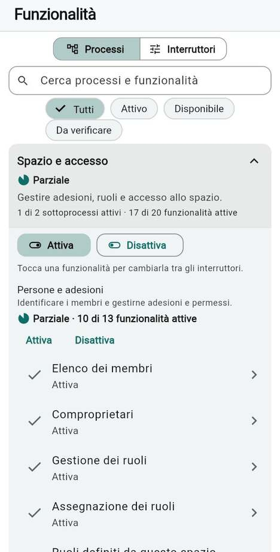

**Passaggi**

1. Tenga l’insieme Essenziale e faccia funzionare le basi: i posti, gli orari di apertura, una tariffa. Veda [Il suo luogo](#costruire-il-luogo).
2. Apra [Funzionalità](https://fdittgen-png.github.io/deskilo/#/features) e apra la scheda di un processo. Scelga il processo che corrisponde alla sua prossima necessità, non quello che sembra più completo.
3. Tocchi **Attiva** per un sottoprocesso, oppure apra una singola funzionalità tra gli **Interruttori**.
4. Legga l’anteprima: che cosa è **Necessarie anche**, che cosa è già attivo.
5. La guardi come un membro: acceda come tale (con un secondo account o dal lato di prova del suo spazio) e faccia ciò che farebbe un membro.
6. Solo allora passi al processo successivo.

*Un ordine sensato*

| Passo | Processo | Perché in questo punto dell’ordine |
|---|---|---|
| 1 | **Gestione degli spazi** | Senza un luogo e degli orari di apertura non si può prenotare nulla. |
| 2 | **Prenotazioni e utilizzo** | Le regole di prenotazione danno forma a tutto ciò che segue. |
| 3 | **Spazio e accesso** | I ruoli e chi convalida, prima del primo invito. |
| 4 | **Calendario e coordinamento** | Messaggi e convalide presuppongono che le persone esistano. |
| 5 | **Offerte per i membri**, poi **Fatturazione e pagamenti** | I prezzi prima delle fatture; l’identità legale prima della prima fattura. |
| 6 | **Documenti e informazioni**, **Integrazioni e automazione** | Rivestono e recapitano ciò che gli altri producono. |
| 7 | **Operazioni e amministrazione** | Coppie, distribuzioni e trasferimenti una volta che lo spazio vale la pena di essere copiato. |

**Da sapere**

- Attivare costa poco e disattivare non cancella nulla, quindi un passo sbagliato costa tempo, non dati. L’eccezione è tutto ciò che emette una fattura: veda [Decisioni difficili da annullare](#decisioni-difficili-da-annullare).
- Uno spazio di prova è il posto giusto per provare un processo. Veda [Uno spazio di prova o uno reale](#uno-spazio-di-prova-o-uno-reale) e [Uno spazio di prova](Guida-utente#a-che-cosa-serve-uno-spazio-di-prova).
- Inviti i membri per ultimi, dopo i ruoli, le regole di convalida e le tariffe che incontreranno.

**Vedi anche:** [Attivare o disattivare interi processi](Guida-utente#attivare-o-disattivare-interi-processi)

<!-- anchor: setup.features.safely -->
### Attivare una funzionalità in sicurezza

**Destinatari:** Proprietario · Comproprietario

Sta per cambiare una funzionalità e vuole vedere l’effetto prima che esista.

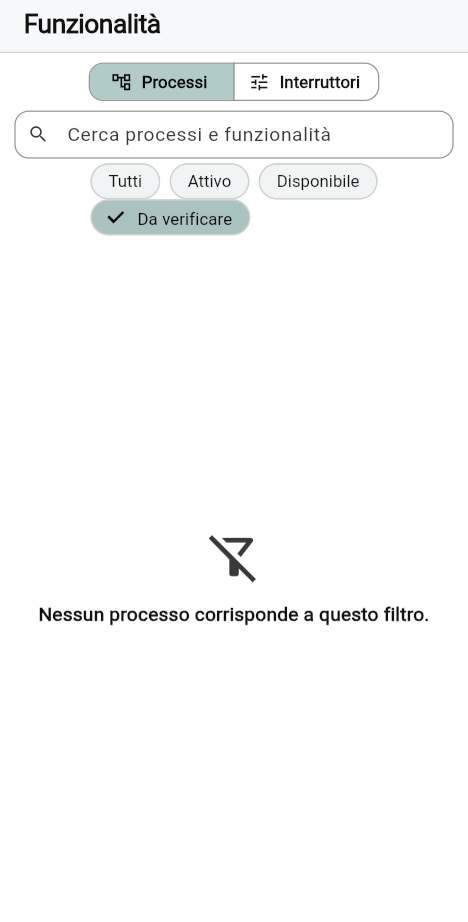

**Passaggi**

1. Apra [Funzionalità](https://fdittgen-png.github.io/deskilo/#/features). Viene mostrata la vista **Processi**.
2. Tocchi **Richiede attenzione**. Restano solo i processi che contengono qualcosa di attivo ma in attesa.
3. Apra una scheda. Una funzionalità attiva e in attesa di una funzionalità madre indicata è ciò che va sistemato.
4. La sistemi attivando la funzionalità madre, oppure disattivando la funzionalità.
5. Per cambiare una sola funzionalità, tocchi **Interruttori**, la trovi con **Cerca funzionalità** e sposti il suo interruttore.
6. Legga la domanda o la riga «Attivato anche», e confermi.

*Che cosa significa «trattenuta»*

Una funzionalità è trattenuta quando l’ha scelta, ma qualcosa di cui ha bisogno è disattivato. Il suo interruttore resta attivo, ed è per questo che è facile non accorgersene: la schermata dice che la funzionalità è attiva, e l’app non la offre. La scheda indica quante funzionalità sono trattenute («… attive ma attendono un prerequisito disattivato») e quale prerequisito attendono, e Lei lo sistema nella schermata [Funzionalità](https://fdittgen-png.github.io/deskilo/#/features) stessa. [Che cosa richiede la Sua attenzione](Guida-utente#cosa-ti-aspetta) mostra la stessa cosa con una riga per ogni prerequisito disattivato.

Altre cose che una funzionalità può attendere non si trovano in questa schermata. Una funzionalità può essere attiva e pienamente consentita mentre mancano i suoi dati: la sua identità legale, una sede, un fornitore di pagamenti. Compaiono in **Configurazione di questo spazio**, in cima alle impostazioni dello spazio: l’identità legale, con **Fatture** attiva, come **L'identità legale e l'indirizzo dello spazio**, il resto sotto **Dati richiesti dalle funzioni (identità, banca, piattaforme)** di lavoro.

**Da sapere**

- Se qualcun altro ha modificato le funzionalità mentre le guardava, l’app non scrive nulla e lo dice: «Le funzionalità sono cambiate nel frattempo, quindi non è stato salvato nulla.» Riguardi l’elenco e riprovi.
- **Modificate** conta gli interruttori che differiscono dal valore predefinito del registro. In un nuovo spazio mostra già un numero (le funzionalità Piattaforma che partono disattivate), quindi non è un conteggio delle sue modifiche.
- Solo un proprietario o un comproprietario può scrivere le funzionalità. Il server ricontrolla nel momento della scrittura.

**Vedi anche:** [Attivare o disattivare interi processi](Guida-utente#attivare-o-disattivare-interi-processi) · [Un interruttore di funzionalità](Guida-utente#un-interruttore-di-funzionalità)

<!-- anchor: setup.features.consistency -->
### Evitare funzionalità in contraddizione tra loro

**Destinatari:** Proprietario · Comproprietario · Amministratore fatturazione

Vuole sapere quali combinazioni lasciano uno spazio a metà e quali l’app intercetta per Lei.

L’app ha dei controlli per alcune contraddizioni e nessuno per altre. Nella tabella, un controllo è ciò che fa l’app; una lacuna è ciò che resta di sua responsabilità.

| Se ha… | Controllo nell’app | Lacuna che resta |
|---|---|---|
| **Fatture** attive, nessuna identità legale | L’emissione viene rifiutata, con **Completi questi dati prima dell'emissione** che elenca l’indirizzo mancante, il numero di partita IVA e così via. La necessità compare anche in **Configurazione di questo spazio**, come **L'identità legale e l'indirizzo dello spazio**, **Necessario prima di fatturare**, e nella Sua posta. | La funzionalità è attiva dal primo giorno, quindi nulla impedisce di invitare i membri e di gestire un mese prima che esista l’identità. |
| Un paese diverso da Francia o Germania | L’emissione dice che il paese «deve essere Francia o Germania per emettere qui». | Nulla la avvisa quando sceglie il paese o attiva la fatturazione. |
| Registrato ai fini IVA, nessuna aliquota in vigore | L’emissione viene rifiutata finché non è in vigore un’aliquota predefinita. La descrizione di **Gestione IVA** e l’avviso nella schermata dell’identità legale lo dicono. | Con **Gestione IVA** disattivata, la configurazione è nascosta mentre le aliquote memorizzate continuano ad applicarsi. Controlli le aliquote dopo averla disattivata. |
| **Pagamenti online** attivi, nessun fornitore | Un nuovo pagamento online viene rifiutato quando la funzionalità è disattivata; il fornitore mancante compare in **Configurazione di questo spazio**. | Può attivarla senza un fornitore. Lo colleghi prima: [Fornitore di pagamenti](Guida-utente#il-fornitore-di-pagamento). |
| **Modalità chiosco** attiva, nessun badge e nessun membro chiosco | **Badge RFID / NFC**, **Badge QR**, **Foto dei membri al chiosco** e **Accedi con un badge** non possono essere attivi senza di essa. | Nulla verifica che esista un membro chiosco o che sia stato emesso un badge. Veda [Gestire un tablet a muro](Guida-utente#modalità-chiosco-un-tablet-a-muro-per-il-check-in). |
| **Sedi** attive, nessuna sede | **Almeno una sede** compare tra i dati richiesti dalle funzioni. | L’interruttore può essere attivo senza alcuna sede. |
| **Notifiche push** attive, nessun servizio push | I membri ricevono comunque tutto nell’app. | I telefoni non ricevono nulla finché chi gestisce l’installazione non ha configurato il servizio push. Veda [Come vengono informati i membri](#i-canali-in-parole-semplici). |
| **Solleciti di pagamento** attivi, **Solleciti di pagamento automatici** attivi | I secondi non possono essere attivi senza i primi. | Il server li invia ogni mattina se l’installazione pianifica attività; altrimenti vengono inviati quando un amministratore apre Finanze. L’interruttore e la descrizione della funzionalità lo dicono; l’operatore del Suo server sa quale vale. |
| Una regola di convalida che richiede più validatori di quanti ne esistano | **Configurazione di questo spazio** dice «Una regola richiede più validatori di quanti ne abbia questo spazio» e **Ruoli e chi convalida le richieste** diventa obbligatoria, qualunque sia il tipo di richiesta. | Le richieste create prima della correzione non possono essere completate e scadono dopo sette giorni. Veda [Chi convalida](Guida-utente#regole-di-convalida-ambito-per-ambito). |
| **Richieste di eliminazione prenotazioni** attive, nessuno che convalidi | Stessa riga di preparazione. | Stessa lacuna. |
| **Prenotazioni di tavolo, ufficio e piano** attive | **Gli admin possono assegnare piani** ne ha bisogno. | Ogni membro deve inoltre avere il diritto; nulla verifica che qualcuno lo abbia. |
| Una funzionalità figlia attiva, la sua madre disattivata | **Richiede attenzione** e «In attesa della funzione qui sopra». | Nessuna: questo caso è pienamente coperto. |
| Uno spazio creato da un modello | Il modello indica che cosa spetta a Lei inserire (identità, banca, sede). | Non ne porta nessuna, quindi uno spazio può partire con le **Fatture** attive e nulla con cui emettere. |

**Da sapere**

- La regola pratica: se una funzionalità porta su un documento il suo nome, il suo denaro o i suoi obblighi legali, completi i suoi dati prima di avvisare i membri.
- **Configurazione di questo spazio** è un elenco, non un blocco. Non le impedisce mai di attivare qualcosa.
- Il controllo «Prima che qualcuno possa prenotare qui» parla solo delle aree obbligatorie: il fuso orario, la valuta, un giorno della settimana aperto, almeno un posto, membri che possiedono **Prenotare e usare le prenotazioni** e abbastanza validatori. Con **Fatture** attiva anche l’identità legale è obbligatoria, ma prima di fatturare: la scheda dello spazio dice «Prima di fatturare» e quella di Prenota non la nomina mai.

**Vedi anche:** [Identità legale e fatturazione](#la-sua-identità-legale-e-che-cosa-chiedere-al-commercialista) · [Prova a vuoto](#una-prova-sicura-in-uno-spazio-di-prova)

<!-- anchor: setup.features.map -->
### La mappa delle funzionalità

**Destinatari:** Proprietario · Comproprietario

Vuole un unico punto che dica, per le funzionalità principali, che cosa ricevono i membri, di che cosa ha bisogno e chi deve configurarla. «Richiede» elenca prima la funzionalità da cui dipende, poi i dati esterni alla schermata Funzionalità. «Chi» è la persona che deve fare qualcosa prima che sia utile; «Nessuno» significa che funziona non appena è attiva.

*Spazio e accesso*

| Funzionalità | Che cosa aggiunge per i membri | Di che cosa ha bisogno | Chi configura |
|---|---|---|---|
| **Elenco dei membri** | La scheda della comunità: chi c’è, stati, presenza. | | Nessuno |
| **Comproprietari** | Permessi da proprietario a persone designate, subito o in caso di successione. | | Proprietario |
| **Gestione dei ruoli** | La matrice di quale ruolo detiene quale permesso. | | Proprietario |
| **Assegnazione dei ruoli** | Una sezione Ruoli in ogni scheda membro. | **Gestione dei ruoli** | Proprietario |
| **I ruoli di questo spazio** | Ruoli propri, come tesoriere o segretario. | | Proprietario |
| **Le domande di questo spazio** | Domande proprie nel modulo di identità. | | Proprietario |
| **Dati personali** | Nome, indirizzo, telefono e identificativi che le lettere riportano. | | Membri |
| **Profili gestiti** | Membri senza account, per i quali si prenota e si fattura. | **Elenco dei membri** | Amministratore |
| **Scheda membro** | Una pagina per ogni membro. | **Elenco dei membri** | Nessuno |
| **Visite degli ospiti** | Una persona che non è membro può chiedere di fare visita. | | Chi ammette le visite |
| **Modalità chiosco** | Un tablet a muro bloccato sulla planimetria in tempo reale. | Un tablet e un membro chiosco | Proprietario |
| **Badge RFID / NFC** | Registrare l’arrivo toccando una tessera. | **Modalità chiosco**, Android con NFC, badge emessi | Proprietario |
| **Badge QR** | Tessere badge QR stampabili. | **Modalità chiosco** | Proprietario |
| **Accedi con un badge** | Badge e PIN al posto della digitazione di un indirizzo e-mail. | **Badge RFID / NFC** | Proprietario, poi ogni membro |
| **Tag NFC/RFID delle sedie** | Un chip su una sedia apre il suo posto. | Tag | Proprietario |
| **Codici QR degli spazi** | Schede QR stampabili per ogni posto. | | Nessuno |

*Gestione degli spazi*

| Funzionalità | Che cosa aggiunge per i membri | Di che cosa ha bisogno | Chi configura |
|---|---|---|---|
| **Sedi** | Più indirizzi, ciascuno con la propria registrazione. | Almeno una sede | Proprietario |
| **Eliminare spazi con cronologia** | I proprietari possono eliminare un posto che ha prenotazioni passate. | | Nessuno |
| **Gli admin possono bloccare i posti** | Posti segnati come non prenotabili per manutenzione. | | Proprietario |
| **Orari di lavoro** | La giornata lavorativa e la prenotazione a orario esatto. | | Proprietario |
| **Giorni festivi** | Giorni di chiusura ricavati dai giorni festivi di un anno. | | Proprietario |
| **Importa i giorni festivi** | Giorni festivi di un paese o di una regione importati. | **Giorni festivi** | Proprietario |
| **Occupazione dei posti** | Un dato mensile su quanto è stato prenotato. | | Proprietario |
| **Foto dei membri sulla piantina** | Le foto degli occupanti sui posti. | | Nessuno |
| **Lessico dello spazio** | Le parole proprie dello spazio per alcune etichette. | | Proprietario |
| **Colori dello spazio** | Il colore del marchio e i colori delle sale. | | Proprietario |
| **Scheda pubblica dello spazio** | Una pagina pubblica con ciò che sceglie di mostrare. | | Proprietario |

*Prenotazioni e utilizzo*

| Funzionalità | Che cosa aggiunge per i membri | Di che cosa ha bisogno | Chi configura |
|---|---|---|---|
| **Prenotazione in serie** | Ripetere una prenotazione. | | Nessuno |
| **Prenota per altri** | Gli amministratori prenotano per i membri. | | Nessuno |
| **Prenotazioni di tavolo, ufficio e piano** | Prenotare un’intera scrivania, un ufficio o un piano. | Un diritto concesso a ciascun membro | Proprietario |
| **Gli admin possono assegnare piani** | Gli amministratori assegnano quelle prenotazioni. | **Prenotazioni di tavolo, ufficio e piano** | Proprietario |
| **Regole di prenotazione** | Prenotazioni passate, prenotazioni fuori orario, check-out da parte dell’amministratore. | | Proprietario |
| **Controllo prenotazione** | Ogni schermata verifica le regole e ne indica il motivo. | **Regole di prenotazione** | Nessuno |
| **Check-in/out automatico a fine giornata** | Le prenotazioni senza registrazione si completano da sole. | | Proprietario |
| **Rilevamenti di utilizzo** | Il tempo realmente utilizzato e una richiesta per non fatturare il tempo non usato. | **Fatture** | Amministratore fatturazione |

*Calendario e coordinamento*

| Funzionalità | Che cosa aggiunge per i membri | Di che cosa ha bisogno | Chi configura |
|---|---|---|---|
| **Scheda Calendario**, **Calendario centrale**, **Viste del calendario** | Mese, settimana e agenda, con tutto ciò che ha una data. | | Nessuno |
| **Convalide nel calendario** | Le decisioni mostrate nel momento in cui sono state prese. | **Calendario centrale** | Nessuno |
| **Scheda Eventi** | Il flusso delle attività e le conferme. | | Nessuno |
| **Raggruppamento delle notifiche** | Notifiche raggruppate nel flusso. | | Nessuno |
| **Convalidatori per ruolo o persona** | Una regola può indicare chi convalida e quanti. | | Proprietario |
| **Convalide concatenate** | Convalide richieste una dopo l’altra. | | Proprietario |
| **Richieste di eliminazione prenotazioni** | Un membro chiede di eliminare una prenotazione passata. | Un validatore | Proprietario |
| **Notifiche tra membri** | Conversazioni private e di gruppo. | | Nessuno |
| **Messaggi, rinnovati** | Barra della posta in arrivo, fissare, silenziare, archiviare, bozze. | | Nessuno |
| **Scrivi ai gestori** | Chi trova la sua pagina può scriverle. | Una pagina pubblicata | Proprietario |
| **Menzioni nei gruppi**, **Inoltro dei messaggi**, **Protezione dalle catture dello schermo** | Extra della messaggistica. | **Notifiche tra membri** | Nessuno |

*Offerte per i membri*

| Funzionalità | Che cosa aggiunge per i membri | Di che cosa ha bisogno | Chi configura |
|---|---|---|---|
| **Servizi** | Un catalogo di cose da consumare e pagare. | **Scheda Finanze** | Amministratore fatturazione |
| **Supplementi accessori** | Accessori dei posti con prezzo per mezza giornata. | **Scheda Finanze** | Amministratore fatturazione |
| **Negoziazioni di prezzo** | Condizioni proprie per un singolo membro. | **Scheda Finanze** | Amministratore fatturazione |
| **Condizioni di pagamento per membro** | Condizioni di pagamento proprie. | **Fatture** | Amministratore fatturazione |
| **Carnet** | Mezze giornate prepagate (Beta). | **Fatture**, un carnet definito | Amministratore fatturazione |

*Fatturazione e pagamenti*

| Funzionalità | Che cosa aggiunge per i membri | Di che cosa ha bisogno | Chi configura |
|---|---|---|---|
| **Scheda Finanze** | La scheda Finanze: estratto conto, pagamenti, spese. | | Nessuno |
| **Finanze in quattro viste** | Estratto conto, Pagamenti, Fatture, Documenti. | **Scheda Finanze** | Nessuno |
| **Report dei membri** | L’accordo e il rapporto mensile dei pagamenti. | **Scheda Finanze** | Amministratore fatturazione |
| **Fatture** | Fatture firmate e immutabili (Beta). | **Scheda Finanze**, identità legale, IVA, FR o DE | Amministratore fatturazione |
| **Gli admin emettono fatture** | Anche gli amministratori le emettono. | **Fatture** | Proprietario |
| **Fatture di abbonamento** | La quota fatturata prima del suo mese. | **Fatture**, una data | Amministratore fatturazione |
| **Fatture di fine mese** | L’utilizzo fatturato dopo il mese. | **Fatture** | Amministratore fatturazione |
| **Raggruppa le fatture** | Più fatture aperte come una sola. | **Fatture** | Amministratore fatturazione |
| **Il percorso di una fattura** | A che punto è ogni fattura. | **Fatture** | Nessuno |
| **Assistente di fatturazione** | Una chiusura del mese guidata. | **Fatture** | Amministratore fatturazione |
| **Serie di numerazione** | Numerazione per registro. | **Fatture** | Amministratore fatturazione |
| **Pagamenti online** | Pagare online (Beta). | **Scheda Finanze**, un fornitore di pagamenti | Proprietario |
| **Solleciti di pagamento** | Livelli di sollecito e lettere. | **Fatture**, regole | Amministratore fatturazione |
| **Solleciti di pagamento automatici** | Solleciti inviati in automatico. | **Solleciti di pagamento** | Amministratore fatturazione |
| **Scorte dalle spese** | Le scorte acquistate diventano servizi. | **Servizi** | Amministratore fatturazione |
| **Spese programmate** | Costi ricorrenti pianificati. | **Scheda Finanze** | Amministratore fatturazione |
| **Spese condivise** | Costi condivisi tra i membri. | **Fatture** | Amministratore fatturazione |
| **Assistente di ripartizione** | Una suddivisione guidata di un costo condiviso. | **Spese condivise** | Amministratore fatturazione |
| **Libro contabile** | Chi tiene i libri ufficiali. | **Fatture** | Amministratore fatturazione |
| **Gestione IVA** | Aliquote IVA e selettori (Beta). | **Fatture**, regime IVA | Amministratore fatturazione |
| **Dichiarazioni IVA** | La dichiarazione periodica. | **Gestione IVA** | Amministratore fatturazione |
| **Gruppi IVA**, **Versioni delle aliquote IVA**, **IVA secondo il cliente** | Una gestione dell’IVA più fine. | **Gestione IVA** | Amministratore fatturazione |

*Documenti e informazioni, Operazioni, Integrazioni*

| Funzionalità | Che cosa aggiunge per i membri | Di che cosa ha bisogno | Chi configura |
|---|---|---|---|
| **Biblioteca documenti** | Statuti, verbali, guide, per ruolo. | | Proprietario |
| **Esportazione PDF** | Il conto mensile in PDF. | | Nessuno |
| **Modello PDF della fattura** | I suoi testi sulla fattura. | **Fatture** | Proprietario |
| **Designer di report**, **Layout di report posizionati**, **Testi dei report** | Rapporti progettati. | **Modello PDF della fattura** | Proprietario |
| **Report dei consumi** | Una lettera mensile su quanto è stato utilizzato. | **Rilevamenti di utilizzo** | Amministratore fatturazione |
| **Rapporto IVA** | Ogni riga imponibile, con un CSV. | **Dichiarazioni IVA** | Amministratore fatturazione |
| **Registro degli accessi ai dati** | I membri vedono chi ha consultato le loro finanze. | **Scheda Finanze** | Nessuno |
| **Esportazione dati (Excel)** | Il proprietario esporta i dati come cartella di lavoro (Beta). | Il permesso **Esportare contabilità e dati** | Proprietario |
| **Esportazione e cancellazione** | Un membro esporta e cancella i propri dati. | | Nessuno |
| **Modalità ripresa** | Sostituisce sullo schermo le persone reali con persone inventate. | | Proprietario |
| **Coppie di ambienti**, **Distribuzioni** | Un lato di prova e uno reale, con distribuzione. | | Proprietario |
| **Configurazione nel file dello spazio** | L’intera configurazione viaggia nel file dello spazio. | **Esportazione dati (Excel)** | Proprietario |
| **Assistente istanza** | Creare un nuovo server dall’app. | | Operatore |
| **Cosa la aspetta** | Un unico elenco ordinato di ciò che attende Lei. | | Nessuno |
| **Registratore di attività** | Registrare e riprodurre i passaggi di un’attività. | | Nessuno |
| **Notifiche push** | Conferme in sospeso sul telefono. | Il servizio push dell’installazione | Operatore |
| **Integrazione WhatsApp** | Una chat con un membro con un tocco, il link del gruppo. | **Elenco dei membri** | Proprietario |
| **Recapito delle fatture al cliente** | Invio alla piattaforma del cliente (Beta). | **Fatture**, un account | Amministratore fatturazione |
| **Interfaccia MCP** | Si può collegare un assistente. | Un’autorizzazione per persona, approvata dall’installazione | Proprietario, poi Operatore |

**Da sapere**

- I nomi sono quelli dell’elenco **Interruttori**. Il livello Essenziale o Piattaforma di ciascuna è mostrato lì.
- Alcune funzionalità non sono elencate qui. Le funzionalità di comfort (suggerimenti di aiuto, animazioni, stile di navigazione, formati regionali) non hanno una riga nella tabella: funzionano non appena sono attive.

**Vedi anche:** [Chi fa che cosa](#chi-fa-che-cosa) · [Attivare o disattivare le funzionalità](Guida-utente#attivare-o-disattivare-interi-processi)

<!-- anchor: setup.people.overview -->
## Persone, ruoli e decisioni

Uno spazio è le sue persone. Prima di invitare la prima, decida tre cose: chi può fare che cosa, come si entra e quali atti richiedono il sì di una seconda persona. Sono rapide da impostare e scomode da riparare quando quaranta persone ci fanno affidamento.

In questo capitolo:
- [Chi fa che cosa in un’organizzazione reale](#chi-fa-che-cosa-in-unorganizzazione-reale)
- [La matrice dei ruoli: il privilegio minimo](#la-matrice-dei-ruoli-il-privilegio-minimo)
- [Comproprietari: più di una persona che può agire](#comproprietari-più-di-una-persona-che-può-agire)
- [Come entrano le persone](#come-entrano-le-persone)
- [Il messaggio d’invito, lingua per lingua](#il-messaggio-dinvito-lingua-per-lingua)
- [Profili gestiti](#profili-gestiti)
- [Convalida: di che cosa è fatta una regola](#convalida-di-che-cosa-è-fatta-una-regola)
- [Tre modelli da copiare](#tre-modelli-da-copiare)
- [Evitare richieste che attendono per sempre](#evitare-richieste-che-attendono-per-sempre)
- [La prima settimana dei suoi membri](#la-prima-settimana-dei-suoi-membri)

L’esempio di riferimento è *Atelier du Marché*. Immagini che sia gestito da un’associazione: Ada è la presidente, Chiara la segretaria, Bruno il tesoriere. Ogni passaggio qui sotto è mostrato su quello spazio.

<!-- anchor: setup.people.organisation -->
### Chi fa che cosa in un’organizzazione reale

**Destinatari:** Proprietario · Comproprietario

Vuole far corrispondere le persone della sua organizzazione ai ruoli di DesKilo, in modo che nessuno abbia più di quanto richieda il suo compito.

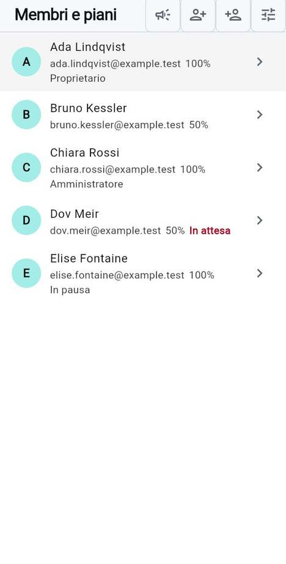

*I quattro ruoli di base*

| Ruolo | A che cosa serve | Nell’associazione |
|---|---|---|
| **Proprietario** | La persona che risponde dello spazio e detiene tutti i permessi. Solo un proprietario può conferire la proprietà. | Ada, la presidente. |
| **Comproprietario** | Una seconda chiave. Detiene per impostazione predefinita tutti i permessi e può subentrare quando il proprietario se ne va. | Il vicepresidente, se il consiglio ne ha uno. |
| **Amministratore** | Gestisce la giornata: membri, prenotazioni per conto di altri, chiosco, documenti, servizi. Detiene ciò che la matrice gli dà e nulla di più. | Chiara, la segretaria. |
| **Utente** | La persona che usa lo spazio. Detiene solo i permessi quotidiani che Lei le concede. | Bruno, un membro come gli altri. |

Ognuno ha esattamente un ruolo di base. Un ruolo definito dallo spazio, come *Ospite* o *Contabile*, si aggiunge a quello di base e non toglie mai nulla.

*Un tesoriere senza essere amministratore*

Bruno tiene i conti, ma non deve modificare la planimetria né approvare nuovi membri. Gli dia il ruolo di base **Utente** e aggiunga un ruolo proprio, per esempio *Contabile*, con quattro permessi: **Consultare le finanze dello spazio**, **Emettere fatture e riconciliare pagamenti**, **Esportare contabilità e dati** e **Consultare i dati dello spazio**. Nient’altro. Un ruolo simile non è predefinito: lo crea con i passaggi seguenti.

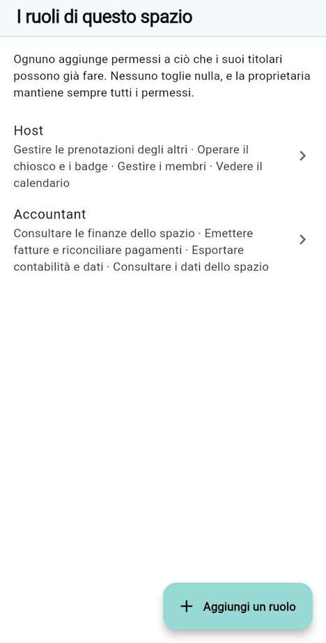

**Passaggi**

1. Apra [I ruoli di questo spazio](https://fdittgen-png.github.io/deskilo/#/settings/roles-of-this-space) e tocchi **Aggiungi un ruolo**. Veda [I ruoli di questo spazio](Guida-utente#i-ruoli-definiti-da-questo-spazio).
2. Dia un nome al ruolo, scelga **Cosa aggiunge** e tocchi **Salva il ruolo**.
3. Apra la persona in [Membri e piani](https://fdittgen-png.github.io/deskilo/#/members), trovi **Ruoli** e tocchi **Aggiungi un ruolo**.

**Da sapere**

- **I ruoli di questo spazio** è una funzionalità a sé e in un nuovo spazio è disattivata. La attivi in [Funzionalità](https://fdittgen-png.github.io/deskilo/#/features).
- Nessuno può assegnarsi un ruolo da solo. Assegnare un ruolo richiede **Gestire ruoli e permessi**, e solo un proprietario può assegnare un ruolo che lo include.
- Un ruolo definito dallo spazio ha effetto subito ed è registrato. Solo rendere qualcuno amministratore, o toglierglielo, segue la regola di convalida **Cambio di ruolo**.

**Risultato** Ogni persona del consiglio detiene i permessi del proprio compito, e il proprietario resta l’unico che può modificarli.

**Vedi anche:** [La matrice dei ruoli](Guida-utente#la-matrice-dei-ruoli)

<!-- anchor: setup.people.matrix -->
### La matrice dei ruoli: il privilegio minimo

**Destinatari:** Proprietario · Comproprietario

Vuole che ogni ruolo detenga ciò che gli serve e nient’altro. È il principio del privilegio minimo: si parte da poco e si aggiunge quando qualcuno lo chiede, perché un permesso concesso raramente si toglie con garbo.

**Passaggi**

1. Apra [Ruoli](https://fdittgen-png.github.io/deskilo/#/roles). C’è una scheda per ogni ruolo: **Proprietario**, **Comproprietario**, **Amministratore** (il proprietario può rinominarlo) e **Utente**.
2. Legga per prima la scheda dell’**Amministratore**. Mostra ciò che oggi un amministratore detiene nel suo spazio.
3. Tolga la spunta a ciò che non vuole delegare. Spunti i permessi quotidiani di cui ha bisogno la scheda **Utente** (veda sotto).

*Che cosa detiene per impostazione predefinita un amministratore*

| Gruppo | Permessi |
|---|---|
| Persone | **Gestire i membri**, **Consultare i dati personali dei membri** |
| Prenotazioni e luogo | **Gestire le prenotazioni degli altri**, **Operare il chiosco e i badge**, **Gestire sedi e modificare la planimetria** |
| Denaro, lettura e approvazione | **Consultare le finanze dello spazio**, **Approvare le spese**, **Gestire servizi e pacchetti**, **Consultare gli accordi commerciali**, **Gestire gli accordi commerciali**, **Richiedere modifiche alle condizioni di pagamento**, **Esportare contabilità e dati** |
| Documenti e dati | **Gestire la libreria dei documenti**, **Consultare i dati dello spazio** |
| I due lati di uno spazio | **Distribuire in sviluppo**, **Entrare nello spazio di produzione** |

Un amministratore non detiene **Gestire ruoli e permessi**, **Configurare le regole di convalida**, **Modificare le impostazioni dello spazio**, **Gestire tariffe e regole di fatturazione**, **Progettare i documenti**, **Gestire le integrazioni**, **Gestire la configurazione** né **Distribuire in produzione**. Un comproprietario li detiene tutti finché Lei non ne toglie qualcuno. Il proprietario li detiene sempre tutti.

> **Attenzione** In un nuovo spazio la scheda **Utente** è vuota. I sei permessi quotidiani (**Usare la messaggistica**, **Prenotare e usare le prenotazioni**, **Vedere il calendario**, **Vedere l'elenco dei membri**, **Vedere il proprio conto e le proprie fatture**, **Vedere i documenti condivisi**) si detengono solo tramite la matrice o un ruolo. Finché non li spunta, un membro che entra non può aprire la planimetria. La demo li mostra già spuntati, e questo lo nasconde. **Configurazione di questo spazio** mostra **Cosa possono fare i membri** come **Necessario per una prima prenotazione** finché la scheda **Utente** non possiede **Prenotare e usare le prenotazioni**; gli altri cinque non li controlla. Li spunti per la scheda **Utente** e, se anche gli amministratori prenotano, per la scheda **Amministratore**, poi provi con un secondo account.

**Da sapere**

- Per impostazione predefinita un amministratore può leggere tutte le finanze e i dati personali di ogni membro. Se i suoi amministratori sono volontari, valuti se debba essere così.
- **Gli admin emettono fatture** (una funzionalità, disattivata per impostazione predefinita, sotto **Fatture**) dà agli amministratori **Emettere fatture e riconciliare pagamenti** a prescindere da ciò che dice la matrice. Preferisca la spunta nella matrice, o un ruolo proprio, che è più preciso.
- Togliere la spunta a un permesso lo rimuove ovunque in una volta sola; lo verifica il server, non solo il menu.
- Ogni modifica della matrice viene registrata come evento. La funzionalità **Gestione dei ruoli** mostra soltanto la schermata; se è disattivata, la matrice che ha salvato continua ad applicarsi, semplicemente non può più modificarla.

**Risultato** Una matrice che sa spiegare in una frase per ruolo.

**Vedi anche:** [La matrice dei ruoli](Guida-utente#la-matrice-dei-ruoli) · [Chi fa che cosa](#chi-fa-che-cosa)

<!-- anchor: setup.people.coowner -->
### Comproprietari: più di una persona che può agire

**Destinatari:** Proprietario · Comproprietario

Vuole che lo spazio continui a funzionare quando Lei è malato, assente o non c’è più. Ogni spazio ha bisogno di più di una persona che possa agire. Per impostazione predefinita solo proprietari e comproprietari detengono i permessi che modificano funzionalità, ruoli, regole di convalida e ID dello spazio, e solo un proprietario può nominare un altro proprietario.

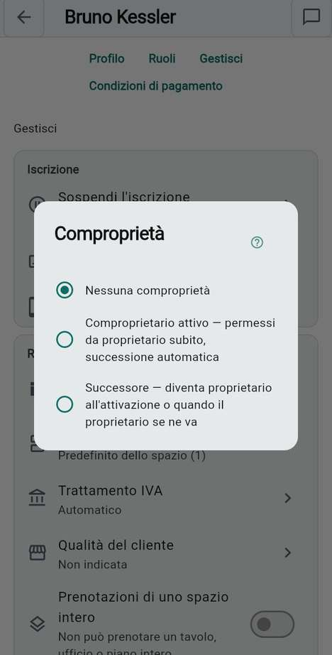

*I due tipi*

| Tipo | Che cosa fa | Lo scelga quando |
|---|---|---|
| *Comproprietario attivo* | Detiene subito i permessi del proprietario e subentra se il proprietario se ne va. | Vi dividete il lavoro: il vicepresidente, un socio. |
| **Successore** | Attende. Diventa proprietario quando Lei lo promuove o quando Lei se ne va. | Vuole solo un erede. |

**Passaggi**

1. Attivi la funzionalità **Comproprietari** in [Funzionalità](https://fdittgen-png.github.io/deskilo/#/features). In un nuovo spazio è disattivata.
2. Apra la persona in [Membri e piani](https://fdittgen-png.github.io/deskilo/#/members), vada su **Gestisci** e tocchi **Comproprietà**.
3. Scelga *Comproprietario attivo* oppure **Successore**. Per cedere subito il posto, scelga **Promuovi a proprietario ora**.

**Da sapere**

- Se l’ultimo proprietario se ne va, il miglior comproprietario diventa proprietario automaticamente, un comproprietario attivo prima di un successore.
- Due amministratori non sono la stessa cosa: un amministratore detiene solo ciò che la matrice gli dà e non può mai trasmettere la proprietà.
- Una regola che dice **Il proprietario deve sempre validare** richiede un proprietario. Verifichi sul suo lato di prova che il suo comproprietario possa ancora decidere ciò che si aspetta.

**Risultato** Lo spazio ha una seconda persona che può agire.

**Vedi anche:** [Comproprietari](Guida-utente#comproprietari) · [Comproprietà](Guida-utente#comproprietà)

<!-- anchor: setup.people.join -->
### Come entrano le persone

**Destinatari:** Proprietario · Amministratore

Vuole scegliere come le persone raggiungono il suo spazio e chi le fa entrare. Esistono quattro modi, e tutti finiscono nello stesso punto: una persona che chiede di partecipare e qualcuno che decide.

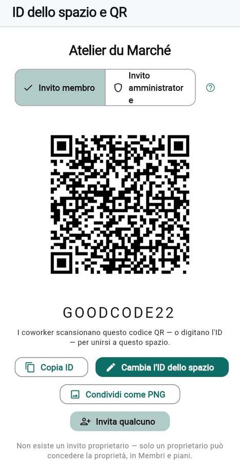

| Modo | Che cosa riceve la persona | Che cosa diventa |
|---|---|---|
| L’ID dello spazio | Una parola breve, da digitare nell’app. | Un membro, dopo l’approvazione. |
| Il codice QR | Lo stesso ID come immagine da stampare o affiggere (**Condividi come PNG**). | Un membro, dopo l’approvazione. |
| Un messaggio d’invito | Un testo con un codice personale, valido per una sola persona, nella lingua scelta. | Il ruolo che offre, dopo l’approvazione. |
| Un codice amministratore | Un codice per una sola persona, dalla scheda **Invito amministratore**. | Un amministratore, una volta sola. |

**Passaggi**

1. Apra [ID dello spazio e QR](https://fdittgen-png.github.io/deskilo/#/workspace-code). Scelga un ID che le persone possano ricordare con **Cambia l'ID dello spazio**: da 4 a 20 lettere o cifre, unico in tutto DesKilo.
2. Per una persona precisa, tocchi **Invita qualcuno**. Compili il nome, spunti **Ruoli all'arrivo** se deve ricevere un ruolo, scelga la **Lingua del messaggio** e invii.
3. Quando qualcuno chiede di partecipare, la sua riga in [Membri e piani](https://fdittgen-png.github.io/deskilo/#/members) riporta **In attesa**. La apra e scelga **Approva l'adesione** o **Rifiuta l'adesione**.

**Da sapere**

- Nessuno entra senza una decisione. Finché non viene presa, il nuovo arrivato vede una schermata di attesa e nient’altro.
- La decisione segue la regola di **Nuovo membro** nelle [Regole di convalida](https://fdittgen-png.github.io/deskilo/#/validation): per impostazione predefinita basta un proprietario o un amministratore; se ne richiede due, la prima approvazione lascia la persona in attesa.
- Se cambia l’ID dello spazio, il vecchio smette di funzionare. Stampi di nuovo il codice QR.
- Non esiste un invito da proprietario. La proprietà si conferisce in **Membri e piani**.

**Risultato** Le persone possono trovarla, e Lei decide chi resta.

**Vedi anche:** [L’ID dello spazio](Guida-utente#lid-dello-spazio-di-lavoro) · [Entrare in uno spazio di lavoro](Guida-utente#aderire-a-uno-spazio) · [Membri in attesa e in pausa](Guida-utente#membri-in-attesa-e-in-pausa)

<!-- anchor: setup.people.invitation -->
### Il messaggio d’invito, lingua per lingua

**Destinatari:** Proprietario · Amministratore

Vuole un invito che suoni come il suo spazio, nella lingua di chi lo riceve. Ogni lingua ha il suo testo; quello che non scrive ricade sul messaggio predefinito.

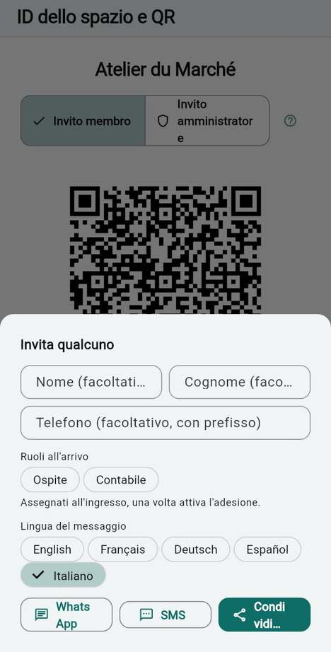

**Passaggi**

1. Apra [Spazio di lavoro](https://fdittgen-png.github.io/deskilo/#/workspace-settings) e vada su **Comunità e inviti**.
2. Sotto **Lingua del messaggio** scelga la lingua per cui scrive. La riga si apre sulla lingua del suo spazio.
3. Scriva il testo. Tocchi un segnaposto per inserirlo dove si trova il cursore. Il limite è di 2000 caratteri.
4. Ripeta per ogni lingua usata dai suoi membri, poi tocchi **Salva**.

*I segnaposto*

| Segnaposto | Viene sostituito con |
|---|---|
| `{firstName}` `{lastName}` `{phone}` | Ciò che ha digitato in **Invita qualcuno**. Vuoto se non ha digitato nulla. |
| `{workspaceName}` | Il nome del suo spazio. |
| `{workspaceId}` | Il codice d’invito personale di questo messaggio (non l’ID pubblico dello spazio). |
| `{inviteLink}` | Un link che apre l’app sul server giusto con il codice già inserito. |
| `{downloadUrl}` | La pagina dell’app nello store. |
| `{role}` | Il ruolo offerto dall’invito, nella lingua del messaggio. |

**Da sapere**

- Se lascia vuota la casella, l’app scrive il proprio messaggio in quella lingua. Spiega i passaggi: scaricare, creare un account, partecipare con il codice.
- Non incolli lei stesso un codice o un link. Ogni invio crea il suo codice, valido per una sola persona.
- Un segnaposto scritto male resta visibile nel testo inviato: legga l’anteprima prima di inviare.
- Il messaggio predefinito dice alla persona che il codice è monouso e valido 14 giorni.

**Risultato** Un invito che i suoi membri possono seguire senza chiederle nulla.

**Vedi anche:** [Messaggio d’invito](Guida-utente#messaggio-dinvito) · [Invitare qualcuno con un messaggio](Guida-utente#invitare-qualcuno-con-un-messaggio)

<!-- anchor: setup.people.managed -->
### Profili gestiti

**Destinatari:** Proprietario · Amministratore

Vuole prenotare, fatturare e gestire per conto di qualcuno che non ha ancora un account: un visitatore, un membro anziano, una persona che preferisce la carta.

**Passaggi**

1. Attivi **Profili gestiti** in [Funzionalità](https://fdittgen-png.github.io/deskilo/#/features).
2. In [Membri e piani](https://fdittgen-png.github.io/deskilo/#/members), tocchi **Aggiungi un profilo gestito** e compili l’identità.
3. Quando la persona è pronta, apra la sua pagina e scelga **Consegna alla persona**. Crea un codice personale legato al profilo.

**Da sapere**

- Chi riscatta il codice subentra nel profilo con le sue prenotazioni, fatture e abbonamento, una volta che Lei approva l’adesione.
- Annulli la consegna con **Revoca la consegna** se il codice non è ancora stato usato.

**Vedi anche:** [Aggiungere un profilo gestito](Guida-utente#aggiungere-un-profilo-gestito)

<!-- anchor: setup.people.validation -->
### Convalida: di che cosa è fatta una regola

**Destinatari:** Proprietario

Vuole scegliere, atto per atto, se una seconda persona debba essere d’accordo. Un ambito di convalida è un tipo di atto con la sua regola: *un pagamento*, *una spesa*, *un nuovo membro*, *l’eliminazione di una prenotazione*. In **Regole di convalida** gli ambiti sono in tre gruppi.

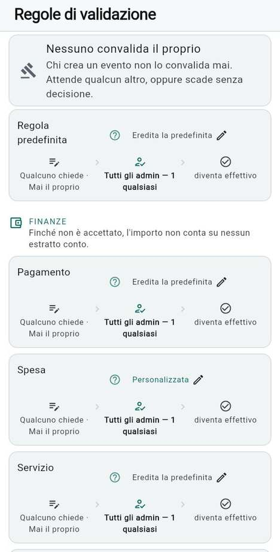

| Gruppo | Ambiti, in parole semplici | Durante l’attesa |
|---|---|---|
| **Denaro** | Un pagamento, una spesa, un servizio, una fattura abbinata al suo pagamento, una fattura emessa o annullata, un rimborso, uno stralcio, un accordo sul prezzo, una spesa condivisa, una spesa programmata, una modifica delle condizioni di pagamento, una partenza anticipata, un rilevamento di utilizzo rimosso | L’importo non conta sull’estratto conto di nessuno. |
| **Prenotazioni** | Le **Mezze giornate extra** richieste da un membro, le **Prenotazioni di spazi interi**, una prenotazione fatta per un membro da un amministratore, una **Eliminazione prenotazione** | Il posto resta com’era. |
| **Persone e ruoli** | **Nuovo membro**, un cambio di ruolo, un cambio di stato, una modifica dell’abbonamento, una modifica della matrice dei permessi | La persona conserva l’accesso che ha adesso. |

Ogni ambito parte con **Eredita la predefinita**: una convalida da parte di un qualsiasi amministratore o proprietario. **Regola predefinita** è la regola che tutte le altre ereditano. Un ambito che apre e salva diventa **Personalizzata**.

*Le manopole di una regola*

| Impostazione | Che cosa significa | Richiede |
|---|---|---|
| **Validazioni richieste** | Quante persone devono dire sì. | |
| **Chi convalida** | **Admin**, **Persone designate** o **Tutti i membri**. Il proprietario può sempre. | **Convalidatori per ruolo o persona**: senza di essa la scelta non viene mostrata e convalidano gli amministratori. Dopo averla disattivata, ricontrolli le regole che indicavano **Persone designate** |
| **Gli admin possono validare** | Disattivata, convalidano solo i proprietari. | |
| **Il proprietario deve sempre validare** | Uno dei sì deve venire da un proprietario. | |
| **La proprietà può convalidare il proprio** | La richiesta del proprietario stesso non resta in attesa di qualcun altro. Un amministratore non lo ottiene mai. | **Convalide concatenate** |
| **Una dopo l’altra** | La seconda viene chiesta quando la prima ha detto sì. | **Convalide concatenate** |
| **Solo oltre questo importo** | Al di sotto, l’atto si applica subito. Solo per gli ambiti di denaro. | **Convalide concatenate** |
| **Gli admin eliminano senza validazione** / **I proprietari eliminano senza validazione** | La loro **Eliminazione prenotazione** si regola da sola e resta contrassegnata come convalidata automaticamente. Disattivata per impostazione predefinita. | |

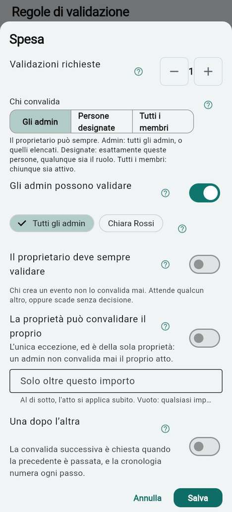

**Passaggi**

1. Apra [Regole di convalida](https://fdittgen-png.github.io/deskilo/#/validation). Tocchi **Regola predefinita** e decida che cosa eredita tutto il resto.
2. Tocchi un ambito, imposti le manopole, tocchi **Salva**.
3. Tenga poche eccezioni. Ogni eccezione è una cosa in più da ricordare quando qualcuno dice «perché questa è in attesa?».

**Da sapere**

- Nessuno convalida un proprio atto. Attende qualcun altro, a meno che non sia attiva l’eccezione del proprietario.
- Ogni decisione è registrata: chi, quando, su che cosa.
- Una richiesta a cui nessuno risponde scade dopo sette giorni, con una verifica alla prossima apertura di Eventi da parte di chiunque. Un atto che un amministratore ha compiuto per un membro viene invece confermato automaticamente.

**Vedi anche:** [Regole di convalida, ambito per ambito](Guida-utente#regole-di-convalida-ambito-per-ambito) · [Chi può convalidare](Guida-utente#chi-può-convalidare) · [Convalida automatica](Guida-utente#convalida-automatica-della-richiesta-di-un-amministratore)

<!-- anchor: setup.people.presets -->
### Tre modelli da copiare

**Destinatari:** Proprietario

Vuole un insieme di regole da copiare oggi e affinare in seguito. Ne scelga uno; ciascuno si basa sull’ambito predefinito, proprietario e amministratori, quindi non serve alcuna funzionalità aggiuntiva.

| Modello | Lo scelga quando | Che cosa imposta | Validatori necessari |
|---|---|---|---|
| *Adesione aperta* | Conosce le persone che scansioneranno il suo codice. | Nulla. Ogni ambito eredita la predefinita: una convalida da parte di un qualsiasi proprietario o amministratore. Un’adesione non è comunque mai automatica. | 1 (Lei) |
| *Adesioni da approvare* | Un consiglio decide chi entra. | **Nuovo membro**: **Validazioni richieste** 2, **Il proprietario deve sempre validare** attivo. | 2: un proprietario e un amministratore |
| *Adesioni e prenotazioni da approvare* | I posti o le sale intere sono scarsi, oppure le eliminazioni di prenotazioni richiedono un testimone. | *Adesioni da approvare*, più su **Prenotazioni di spazi interi**, **Mezze giornate extra** e **Eliminazione prenotazione**: **Validazioni richieste** 1. | Almeno 2, 3 per stare tranquilli |

Nell’associazione: Ada è la proprietaria, Chiara un’amministratrice. Con *Adesioni da approvare*, Ada e Chiara approvano entrambe ogni nuovo arrivato. Con il terzo modello una sala intera prenotata da Bruno gli viene subito bloccata, ma Ada o Chiara possono comunque rifiutarla, e un’eliminazione richiesta da Chiara è decisa da Ada, non da Chiara.

**Passaggi**

1. Apra [Regole di convalida](https://fdittgen-png.github.io/deskilo/#/validation).
2. Tocchi **Nuovo membro**, imposti quanto dice la tabella, tocchi **Salva**.
3. Per il terzo modello, ripeta sugli altri tre ambiti.
4. Apra **Membri e piani** e conti i proprietari e gli amministratori attivi. Devono essere almeno il numero indicato nell’ultima colonna.

**Da sapere**

- Una normale prenotazione di un membro non viene mai trattenuta per approvazione da questi modelli. Ciò che attende è una sala intera, le mezze giornate extra, un’eliminazione e l’adesione.
- Un modello è un punto di partenza. Aumenti un numero solo quando ha abbastanza persone per rispondere.

**Vedi anche:** [Validazioni richieste](Guida-utente#validazioni-richieste) · [Serve un proprietario](Guida-utente#è-richiesto-un-proprietario)

<!-- anchor: setup.people.stuck -->
### Evitare richieste che attendono per sempre

**Destinatari:** Proprietario · Comproprietario

Vuole essere certo che ogni richiesta per cui crea una regola possa ricevere una risposta. Una regola che richiede più validatori di quanti ne esistano non viene rifiutata ovunque: la richiesta viene creata, nessuno può completarla e scade dopo sette giorni.

> **Attenzione** L’editor conta un validatore in più per la persona interessata, quindi le permette di salvare **Validazioni richieste** con uno in più rispetto alle persone che ha. Quel sì in più esiste solo per una prenotazione fatta da un amministratore per un membro e per alcuni pagamenti. Per un’adesione o una richiesta di denaro non esiste. Non si affidi all’editor per il conteggio.

*Contare prima di richiedere*

| Richiede | Servono, oltre alla persona che chiede |
|---|---|
| 1 | Un proprietario o amministratore attivo |
| 2 | Due proprietari o amministratori attivi |
| 2 con **Il proprietario deve sempre validare** | Un proprietario e un’altra persona |
| Un elenco di **Persone designate** | Ogni persona dell’elenco deve essere attiva; un nuovo amministratore non viene aggiunto automaticamente |

*Come verificare*

1. Apra [Regole di convalida](https://fdittgen-png.github.io/deskilo/#/validation) e legga ogni scheda personalizzata: «Tutti gli admin — qualsiasi 2» significa due persone.
2. Apra [Membri e piani](https://fdittgen-png.github.io/deskilo/#/members). Conti i proprietari e gli amministratori attivi. Le persone in pausa o uscite non contano.
3. Apra **Configurazione di questo spazio** in [Spazio di lavoro](https://fdittgen-png.github.io/deskilo/#/workspace-settings). L’area **Ruoli e chi convalida le richieste** dice «Una regola richiede più validatori di quanti ne abbia questo spazio» quando ne conta troppo pochi. L’area diventa allora obbligatoria, qualunque sia il tipo di richiesta, e [Che cosa richiede la Sua attenzione](Guida-utente#cosa-ti-aspetta) la segnala.
4. Apra [Eventi](https://fdittgen-png.github.io/deskilo/#/events). **In attesa della sua conferma** mostra ciò che attende, e una riga mostra «1/2 validazioni».

**Da sapere**

- L’editor stesso dice **Validatori idonei insufficienti.** quando un conteggio supera chiaramente le persone disponibili. Non intercetta tutti i casi.
- Un proprietario solo che chiede qualcosa per sé attende qualcun altro: aggiunga un amministratore, oppure attivi **La proprietà può convalidare il proprio** sotto **Convalide concatenate**.
- Mettere in pausa o rimuovere un amministratore può lasciare una regola scoperta. Ricontei dopo ogni cambio di squadra.

**Risultato** Ogni regola può ricevere risposta da persone che esistono.

**Vedi anche:** [Validazioni richieste](Guida-utente#validazioni-richieste) · [Mantenere la coerenza](#mantenere-la-coerenza)

<!-- anchor: setup.people.first-week -->
### La prima settimana dei suoi membri

**Destinatari:** Proprietario · Amministratore

Vuole che i suoi primi membri riescano senza doverle chiedere nulla. Ciò che dice loro nella prima settimana decide quanto dovrà rispondere nella seconda.

*Prima di invitare qualcuno*

1. Acceda come seconda persona con un account di prova e partecipi al suo spazio. Verifichi di poter aprire la planimetria e prenotare un posto.
2. Approvi quell’account come membro e, se ne richiede due, faccia approvare anche il secondo validatore.

**Passaggi**

1. Invii il messaggio d’invito. Dice come scaricare l’app, creare un account e partecipare. Veda [Entrare in uno spazio di lavoro](Guida-utente#aderire-a-uno-spazio).
2. Approvi ogni nuovo arrivato lo stesso giorno. Una persona che attende un giorno intero comincia con un dubbio.
3. Dica loro le prime tre cose: la planimetria e la prenotazione ([Prenotare un posto](Guida-utente#prenotare-un-posto)), la registrazione dell’arrivo ([Arrivo e partenza](Guida-utente#check-in-e-check-out)) e dove attendono le loro richieste ([Eventi](Guida-utente#eventi-e-conferme)).
4. Dica loro che cosa vede di loro e che cosa controllano ([Chi può vedere i miei dati](Guida-utente#privacy-chi-può-vedere-i-miei-dati)).
5. Indichi una persona a cui chiedere, e dove: la messaggistica o la scrivania.

**Da sapere**

- Quando un amministratore fa qualcosa per un membro, resta in sospeso finché il membro non conferma. Li avvisi, altrimenti la prima prenotazione che fa per qualcuno sembrerà un errore.
- I membri che non usano le notifiche push trovano comunque tutto sotto **Eventi**.
- Alla prima visita di Prenota, la scheda **Primi passi** mostra ai proprietari che cosa manca ancora. I membri hanno i loro brevi suggerimenti. Veda [La scheda Primi passi e i suggerimenti](Guida-utente#la-scheda-primi-passi-e-i-suggerimenti).

**Risultato** Persone che sanno come prenotare, come registrare l’arrivo e a chi chiedere.

**Vedi anche:** [Dalla settimana 0 alla settimana 4](#impararlo-in-quattro-settimane) · [Come vengono informati i membri](#che-cosa-controllano-i-membri)

<!-- anchor: setup.money.overview -->
## Denaro e imposte

Per i proprietari e gli amministratori di fatturazione che stanno per decidere come si paga uno spazio. Questo capitolo parla delle decisioni e del loro ordine; i clic sono nella guida utente, e ogni sezione rimanda ad essa.

> **Attenzione** DesKilo registra, calcola e stampa ciò che Lei dichiara, e verifica che i dati richiesti siano presenti. Non certifica le Sue fatture, il Suo trattamento IVA né la Sua contabilità. Ogni volta che questo capitolo dice «chieda al Suo commercialista», lo faccia.

In questo capitolo:
- Se i membri pagano e chi emette le fatture
- Come si costruisce una tariffa, con le cifre dello spazio dimostrativo *Atelier du Marché*
- Come i membri Le pagano
- La Sua identità legale e le domande da portare al commercialista
- Fatturazione manuale o automatica, solleciti e IVA in breve
- Le decisioni economiche che non si possono annullare e come provarle senza rischi

<!-- anchor: setup.money.decide -->
### Decida prima: i membri pagano e chi emette le fatture

**Destinatari:** Proprietario

Sceglie fin dove DesKilo arriva nella Sua gestione del denaro. Tutto il resto di questo capitolo discende da questa scelta, che è facile ampliare in seguito e difficile ridurre una volta emesse le fatture.

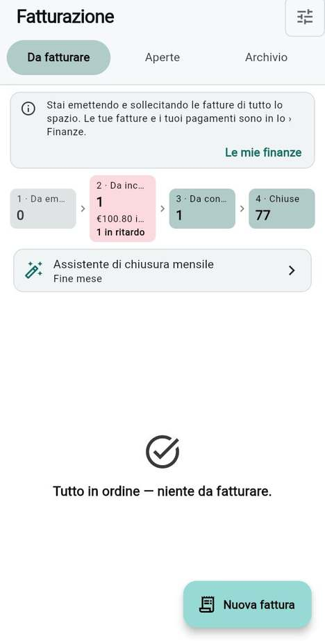

**Prima di iniziare**

Risponda a due domande: i membri Le pagano lo spazio e vuole che le fatture legali escano da DesKilo?

| Percorso | Lo scelga quando | Che cosa succede |
|---|---|---|
| 1. Nessun denaro | Lo spazio è gratuito, oppure i membri sono amici che dividono l'affitto fuori dall'app | Lascia spente le funzioni economiche. I membri prenotano; nessuno riceve una fattura. |
| 2. Estratti conto e pagamenti, fatture all'esterno | Ha già un commercialista o uno strumento di fatturazione, oppure lavora in un paese per cui DesKilo non può emettere fatture | I membri hanno un estratto conto mensile, Lei registra i pagamenti ricevuti ed esporta le cifre per il commercialista. Le fatture legali vengono prodotte altrove. |
| 3. Fatture emesse da DesKilo | Si trova in Francia o in Germania ed è soggetto a IVA oppure fuori campo IVA (un'associazione, per esempio) | DesKilo produce fatture firmate e numerate a partire dalle prenotazioni, con la Sua identità legale stampata. |

**Passaggi**

1. Scelga il Suo percorso dalla tabella.
2. Per il percorso 2 o 3, attivi in [Funzionalità](Guida-utente#un-interruttore-di-funzionalità) le funzioni economiche che Le servono: **Fatture** è la base di tutto ciò che viene emesso, e le funzioni sottostanti (**Fatture di abbonamento**, **Fatture di fine mese**, **Solleciti di pagamento**, **Gestione IVA**) si attivano una alla volta.
3. Per il percorso 3, prosegua con [la Sua identità legale](#la-sua-identità-legale-e-che-cosa-chiedere-al-commercialista) prima della prima prenotazione, non dopo.

**Da sapere**

- L'emissione di fatture nell'app esiste oggi per uno spazio in **Francia** o in **Germania**. In qualsiasi altro paese usi il percorso 2: gli estratti conto restano disponibili.
- Il server rifiuta di emettere, e l'elenco **Completi questi dati prima dell'emissione** ne spiega il motivo, quando manca un dato o quando il trattamento non è gestito da DesKilo: vendite transfrontaliere, inversione contabile, esportazioni e fatture esenti da IVA vanno verificate ed emesse fuori dall'app con il Suo commercialista.
- Un venditore in regime di franchigia per le piccole imprese (franchise en base, Kleinunternehmer) non può emettere fatture nell'app: il server rifiuta la categoria IVA esente. Resti sul percorso 2 ed emetta quelle fatture altrove.
- Spegnere una funzione ferma le nuove operazioni di quel tipo; non cancella nulla.
- Può restare sul percorso 2 per sempre. Molte associazioni lo fanno.

**Risultato**

Sa quale dei tre percorsi è il Suo e di quali funzioni ha bisogno.

**Vedi anche:** [La fatturazione in sintesi](Guida-utente#la-fatturazione-in-sintesi) · [Attivare o disattivare interi processi](Guida-utente#attivare-o-disattivare-interi-processi)

<!-- anchor: setup.money.tariff -->
### Progettare una tariffa

**Destinatari:** Proprietario · Amministratore fatturazione

Trasforma la domanda «quanto vale un posto?» in numeri che DesKilo può applicare ogni mese senza di Lei.

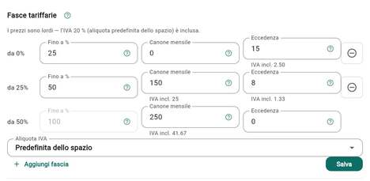

**Prima di iniziare**

Tenga a mente il modello. Si legge da sinistra a destra e ogni passo alimenta il successivo:

1. Percentuale di abbonamento: un membro detiene una percentuale del mese: 25, 50, 75 o 100 %, oppure un valore che Lei consente.
2. Quota di mezze giornate: la percentuale diventa un numero di mezze giornate per il mese: i giorni di apertura, per due, per la percentuale, arrotondato per eccesso.
3. Fascia tariffaria: la percentuale rientra in una fascia, che dà la quota mensile e il prezzo di una mezza giornata in più. Una fascia copre «sopra il suo inizio, fino alla sua fine inclusa», e le fasce insieme devono coprire da 0 a 100 % senza buchi.
4. Regola di superamento: quando la quota è esaurita, ogni membro viene bloccato, addebitato al prezzo di superamento oppure invitato ad acquistare un pacchetto.
5. Pacchetti e servizi: un pacchetto di giornate vende in anticipo mezze giornate in più a un prezzo da Lei fissato; i servizi (un caffè, un armadietto, la stampa) si vendono in aggiunta.

**Passaggi**

1. Decida le percentuali da offrire in **Livelli di abbonamento** e se un proprietario può digitare un valore negoziato (vedi [Livelli di abbonamento](Guida-utente#livelli-di-abbonamento)).
2. Imposti una riga per ogni intervallo in **Fasce tariffarie**: il suo limite superiore, la quota mensile e il prezzo di superamento (vedi [Fasce tariffarie](Guida-utente#fasce-tariffarie)).
3. Stabilisca il comportamento predefinito per chi esaurisce la quota: [Quando i giorni finiscono](Guida-utente#quando-i-giorni-finiscono).
4. Aggiunga i [pacchetti di giornate](Guida-utente#pacchetti-di-giorni) e i [servizi](Guida-utente#un-servizio) che vende.

**Da sapere**

- Il calcolo è congelato su ogni documento emesso. Cambiare un prezzo cambia il mese successivo, mai un mese già fatturato.
- Gli orari di apertura e i giorni di chiusura decidono quanti giorni di apertura ha un mese, e quindi la dimensione della quota. Li imposti per primi.
- Un membro senza abbonamento è pensato per i visitatori che acquistano carnet; non può essere a consumo.

**Vedi anche:** [Fatturazione](Guida-utente#fasce-tariffarie) · [L'abbonamento di un membro](Guida-utente#labbonamento-di-un-membro)

<!-- anchor: setup.money.example -->
### Un esempio svolto

**Destinatari:** Proprietario · Amministratore fatturazione

Segue un membro lungo un mese con le cifre di *Atelier du Marché*, così può controllare i Suoi numeri allo stesso modo.

**Prima di iniziare**

Lo spazio dimostrativo ha tre fasce tariffarie, in euro e IVA inclusa. Le cifre sono quelle della demo, non una raccomandazione.

| Fascia | Quota mensile | Mezza giornata in più | Mezze giornate in un mese di 22 giorni di apertura |
|---|---|---|---|
| fino al 25 % | 0,00 | 15,00 | 11 |
| oltre il 25 %, fino al 50 % | 150,00 | 8,00 | 22 |
| oltre il 50 %, fino al 100 % | 250,00 | 0,00 | 44 (al 100 %) |

**Passaggi**

1. Un membro detiene il 50 %. In un mese con 22 giorni di apertura la quota è 22 × 2 × 50 / 100 = 22 mezze giornate.
2. Il 50 % rientra nella seconda fascia (oltre 25, fino a 50): la quota è 150,00, qualunque sia l'uso del membro.
3. Il membro prenota 24 mezze giornate. Due superano la quota, a 8,00 ciascuna: 16,00.
4. Il mese costa 150,00 + 16,00 = 166,00, prima di eventuali servizi. Nella demo i prezzi sono lordi: l'IVA al 20 % è compresa e la schermata la mostra sotto ogni prezzo.
5. Confronti con un pacchetto: il pacchetto da 5 giorni della demo costa 40,00 e aggiunge 10 mezze giornate (5 giorni, due mezze giornate ciascuno), cioè 4,00 a mezza giornata. Rispetto agli 8,00 di superamento conviene dalla sesta mezza giornata in più in un mese.

**Da sapere**

- Un prezzo di superamento di 0,00 significa che le mezze giornate in più non costano nulla a consumo.
- L'estratto conto che il membro vede mostra le stesse righe: quota, inclusi, usati, extra, superamento.
- I prezzi sono mostrati IVA inclusa quando l'IVA è attiva; l'imposta viene estratta da essi.
- Se Lei e un membro concordate altre condizioni, vedi la [negoziazione dei prezzi](#negoziazione-dei-prezzi).

**Risultato**

Può prevedere il conto di un membro con tre numeri: la sua percentuale, i giorni di apertura, le prenotazioni.

**Vedi anche:** [Leggere il proprio estratto conto](Guida-utente#leggere-il-proprio-estratto) · [Quanto è costata ogni prenotazione](Guida-utente#quanto-è-costata-ogni-prenotazione)

<!-- anchor: setup.money.negotiation -->
### Negoziazione dei prezzi

**Destinatari:** Proprietario · Amministratore fatturazione

Vuole che un membro paghi condizioni diverse dalla tariffa, in modo che ne resti traccia.

**Passaggi**

1. Attivi la funzione di negoziazione dei prezzi in [Funzionalità](Guida-utente#un-interruttore-di-funzionalità).
2. Proponga le condizioni nella pagina del membro: una quota mensile diversa, una tariffa di superamento, uno sconto sui supplementi, prezzi unitari o una percentuale di occupazione (vedi [Negoziazione dei prezzi](Guida-utente#negoziazione-di-prezzo)).
3. Lasci che sia la regola di convalida per le negoziazioni di prezzo a decidere chi la conferma.

**Da sapere**

- La tariffa resta quella predefinita; un prezzo negoziato appartiene a un solo membro.
- Lo vedono il membro, i proprietari e le persone autorizzate a consultare gli accordi commerciali, e ogni lettura viene registrata.
- Definisca la Sua politica prima di aprire: un'eccezione concessa in silenzio diventa il prezzo che tutti chiedono.

**Vedi anche:** [I Suoi prezzi negoziati](Guida-utente#i-suoi-prezzi-negoziati)

<!-- anchor: setup.money.pay -->
### Come i membri Le pagano

**Destinatari:** Proprietario · Amministratore fatturazione

Sceglie dove va il denaro di un membro e quanto lavoro DesKilo svolge al Suo posto.

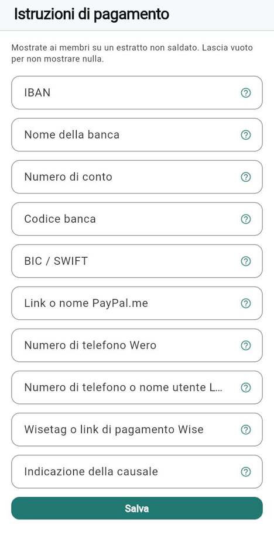

**Passaggi**

1. Cominci dalla via gratuita: compili le [istruzioni di pagamento](Guida-utente#metodi-e-istruzioni-di-pagamento): il Suo IBAN e i dati bancari, e quello tra PayPal.me, Wero, Lydia o Wise che accetta, più un suggerimento per la causale.
2. I membri vedono questi dati su un estratto conto non pagato. Quando un pagamento arriva sul Suo conto, Lei o un amministratore di fatturazione lo [registra](Guida-utente#registrare-un-pagamento).
3. Solo se vuole che i membri paghino dentro l'app, colleghi un fornitore in [Pagamenti online](Guida-utente#il-fornitore-di-pagamento): PayPal, Stripe o Mollie. Servono la funzione **Pagamenti online** e un Suo conto presso il fornitore.

**Da sapere**

- DesKilo registra i pagamenti; con la via manuale non sposta mai denaro.
- Un fornitore applica le proprie commissioni e riceve le chiavi del Suo conto (la scheda delle credenziali spiega come vengono inserite).
- Con **Pagamenti online** spento, un nuovo pagamento online viene rifiutato; uno già aperto può ancora concludersi.
- Uno spazio creato da un modello non porta con sé i dati di pagamento: li inserisca in ogni spazio. Un'esportazione della configurazione li include.

**Vedi anche:** [Pagare ciò che si deve](Guida-utente#pagare-quanto-dovuto) · [Credenziali del fornitore](Guida-utente#credenziali-del-fornitore)

<!-- anchor: setup.money.identity -->
### La Sua identità legale e che cosa chiedere al commercialista

**Destinatari:** Proprietario

Dice a DesKilo chi vende, così che ogni fattura La indichi correttamente. È la parte da concordare con un professionista.

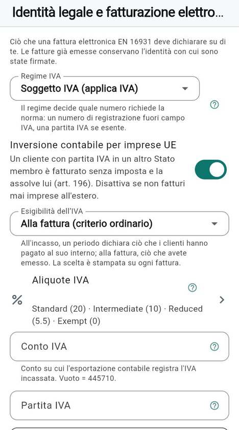

**Prima di iniziare**

La schermata è [Identità legale e fatturazione elettronica](https://fdittgen-png.github.io/deskilo/#/legal-identity). Tenga pronti:

- il tipo di organizzazione: un'impresa oppure un'associazione senza scopo di lucro;
- il Suo regime IVA: fuori campo IVA, esente da IVA (regime delle piccole imprese) oppure soggetto a IVA. L'app può emettere fatture solo per il primo e per l'ultimo; con la franchigia per le piccole imprese la schermata registra il Suo stato, ma le fatture vanno emesse altrove (percorso 2);
- il numero di registrazione e, se ne ha uno, il numero di partita IVA;
- il Suo indirizzo postale, come figura nella registrazione;
- il motivo per cui non viene applicata l'IVA, se non ne applica.

> **Attenzione** Scegliere il regime è una decisione fiscale, non un'impostazione del software. Un'associazione senza attività commerciale è normalmente fuori campo IVA, e la schermata Le segnala se sceglie «esente» per una di esse. Confermi la scelta prima di emettere la prima fattura.

**Passaggi**

1. Apra [Identità legale e fatturazione elettronica](https://fdittgen-png.github.io/deskilo/#/legal-identity) e proceda dall'alto: prima il **Regime IVA**, poi gli identificativi, l'indirizzo e le **Menzioni di fatturazione**.
2. Compili le condizioni di pagamento, le menzioni sui ritardi di pagamento e le altre menzioni richieste dal Suo paese (vedi [La Sua identità legale](Guida-utente#la-sua-identità-legale)).
3. Tocchi **Salva**, poi legga una volta il modello di fattura insieme al commercialista (vedi [Il modello PDF della fattura](Guida-utente#il-modello-pdf-della-fattura)).

> **Consiglio** Domande da portare al commercialista:
>
> 1. A quale tipo di organizzazione e a quale regime IVA appartengo?
> 2. Quali sono il mio numero di registrazione e la mia partita IVA, e come si scrivono?
> 3. Se non applico l'IVA, quale formulazione di legge lo giustifica?
> 4. Quali menzioni devono comparire sulle mie fatture (termine di pagamento, penale per ritardato pagamento, indennità di recupero, sconto per pagamento anticipato, assicurazione)?
> 5. Come vanno numerate le fatture, e il numero riparte ogni anno o ogni mese?
> 6. L'IVA diventa esigibile quando fatturo o quando vengo pagato?
> 7. Devo inviare fatture elettroniche a una piattaforma pubblica, e a quale?
> 8. Mi servono dichiarazioni IVA periodiche, e con quale frequenza?

**Da sapere**

- Le fatture già emesse conservano l'identità con cui sono state firmate; una modifica vale per le successive.
- Solo un proprietario o un comproprietario attivo può aprire questa schermata, e la funzione **Fatture** deve essere attiva.
- Uno spazio creato da un modello non porta con sé la Sua identità: la inserisca di nuovo. Un trasferimento tra i due lati di una coppia la include.

**Vedi anche:** [Regime IVA](Guida-utente#regime-iva) · [La piattaforma di fatturazione elettronica](Guida-utente#la-piattaforma-di-fatturazione-elettronica) · [Tipo di organizzazione](Guida-utente#tipo-di-organizzazione)

<!-- anchor: setup.money.invoicing -->
### Fatturare a mano o in automatico

**Destinatari:** Proprietario · Amministratore fatturazione

Decide se una persona preme i pulsanti ogni mese o se ci pensa DesKilo.

**Passaggi**

1. Per un primo mese lavori a mano: apra [Fatturazione](https://fdittgen-png.github.io/deskilo/#/invoices), legga **Da emettere** ed emetta la fattura di un membro (vedi [Emettere una fattura](Guida-utente#emettere-una-fattura)).
2. Per la routine usi l'[assistente di chiusura mensile](Guida-utente#lassistente-di-chiusura-mensile): percorre **Revisione**, **Emetti**, **Invia**, **Sollecita**, **Pagamenti**, **Abbina**, **Chiudi** e **Riepilogo**.
3. Per automatizzare, attivi **Fatture di abbonamento** e **Fatture di fine mese** in [Funzionalità](Guida-utente#un-interruttore-di-funzionalità), poi imposti i giorni nel [Calendario delle fatture](Guida-utente#calendario-di-fatturazione).

**Da sapere**

- Ogni mese esistono due documenti: la quota di abbonamento, emessa prima del mese, e ciò che il mese è costato davvero, emesso dopo. Una fattura può essere datata alcuni giorni in anticipo (tre per impostazione predefinita, regolabili nel calendario delle fatture), per cui una datata 29 agosto può riguardare settembre.
- Sul server, un'esecuzione giornaliera emette entrambe quando il database dell'installazione ha lo scheduler attivo; se non ne è sicuro, lo chieda all'operatore.
- Ogni tipo di fattura (abbonamento, fine mese) può essere emesso una sola volta per membro e per mese. Le fatture non si possono modificare né eliminare; una fattura sbagliata viene contrassegnata come errata e sostituita.
- Per impostazione predefinita emettono le fatture il proprietario e i comproprietari. **Gli admin emettono fatture** estende questa facoltà agli amministratori.

**Vedi anche:** [La schermata Fatturazione](Guida-utente#la-schermata-fatturazione) · [Sollecitare e incassare le fatture aperte](Guida-utente#sollecitare-e-saldare-le-fatture-aperte)

<!-- anchor: setup.money.reminders -->
### Solleciti di pagamento

**Destinatari:** Proprietario · Amministratore fatturazione

Decide quando un pagamento è in ritardo e chi si occupa di sollecitare.

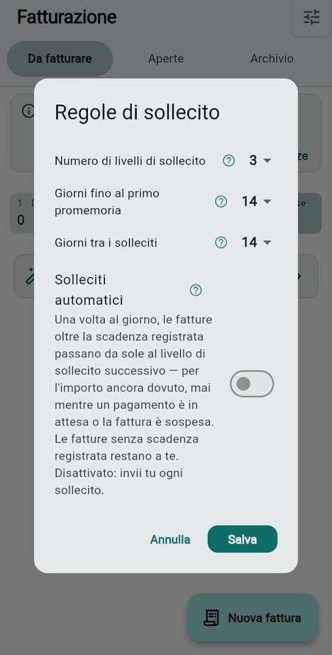

**Passaggi**

1. Attivi **Solleciti di pagamento** in [Funzionalità](Guida-utente#un-interruttore-di-funzionalità). Si trova sotto **Fatture**.
2. Imposti il numero di livelli e i tempi nelle [Regole di sollecito](Guida-utente#regole-di-sollecito): giorni fino al primo sollecito, giorni tra un sollecito e l'altro.
3. Decida se i solleciti partono da soli: attivi **Solleciti automatici** nella stessa finestra (vedi [Solleciti automatici](Guida-utente#solleciti-automatici)); deve essere attiva anche la funzione **Solleciti di pagamento automatici**.

**Da sapere**

- Il tempo prima del primo sollecito vale anche come Suo termine di pagamento. Lo imposti con i [Termini di pagamento](Guida-utente#condizioni-di-pagamento).
- I solleciti automatici girano una volta al giorno sul server quando il database ha lo scheduler attivo. Girano anche quando chi può emettere fatture (un proprietario, un comproprietario o un amministratore, se **Gli admin emettono fatture** è attivo) apre Finanze: così anche uno spazio senza scheduler li riceve, nei giorni in cui qualcuno guarda. Lo dicono anche l'interruttore e la descrizione della funzionalità; l'operatore del Suo server sa quale vale.
- La funzione **Solleciti di pagamento** rende disponibili soltanto le regole. Un sollecito parte da solo solo se **Solleciti automatici** è attivo nelle regole di sollecito, e questo resta spento finché non lo sceglie Lei.
- Saltano una fattura con un pagamento in sospeso o in attesa, e una fattura senza termine di pagamento registrato.
- Il membro riceve un avviso nel suo flusso e, se le notifiche push sono configurate, una notifica generica; vedi [Informare le persone](#informare-le-persone).

**Vedi anche:** [Termini di pagamento](Guida-utente#condizioni-di-pagamento)

<!-- anchor: setup.money.vat -->
### L'IVA in breve

**Destinatari:** Proprietario · Amministratore fatturazione

Vuole sapere che cosa l'IVA Le chiederà prima di attivarla.

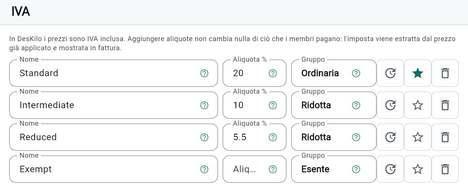

**Passaggi**

1. Solo se è soggetto a IVA, attivi **Gestione IVA** in [Funzionalità](Guida-utente#un-interruttore-di-funzionalità).
2. Imposti le aliquote in [IVA](https://fdittgen-png.github.io/deskilo/#/vat): **Usa le aliquote consuete** per il Suo paese, poi ne contrassegni esattamente una come predefinita (vedi [Impostare le aliquote](Guida-utente#impostare-le-aliquote)).
3. Assegni a ogni aliquota il suo gruppo e, dove serve, un motivo di esenzione (vedi [Gruppi IVA](Guida-utente#gruppi-iva)).
4. Quando la legge cambia un'aliquota, usi **Modifica per legge** così che le fatture precedenti mantengano la loro aliquota (vedi [Modificare un'aliquota per legge](Guida-utente#modificare-unaliquota-per-legge)).
5. Se deve presentare dichiarazioni, attivi **Dichiarazioni IVA** e generi ogni periodo in [Dichiarazione IVA](Guida-utente#la-dichiarazione-iva-periodica).

**Da sapere**

- Viene fornito un catalogo di aliquote per gli Stati membri dell'UE, la Svizzera, la Norvegia e il Canada. Tenerlo aggiornato quando un governo cambia un'aliquota spetta a Lei.
- Se è registrato senza un'aliquota predefinita in vigore, il server rifiuta di emettere. La descrizione di **Gestione IVA** e l'avviso nella schermata dell'identità legale lo dicono.
- Una dichiarazione è un ausilio alla presentazione, costruito dalle Sue fatture emesse. La verifichi prima di presentarla e la segni come presentata solo dopo averlo fatto.
- Il giornale delle dichiarazioni ha una propria serie di numerazione.

**Vedi anche:** [Regime IVA](Guida-utente#regime-iva) · [Quando l'IVA diventa esigibile](Guida-utente#quando-liva-diventa-esigibile)

<!-- anchor: setup.money.permanent -->
### Ciò che non si può annullare

**Destinatari:** Proprietario

Vuole sapere, prima della prima fattura, che cosa non potrà più cambiare in seguito.

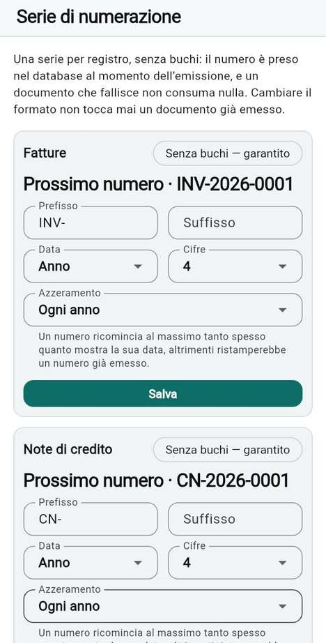

> **Attenzione** Dalla prima fattura emessa, le voci qui sotto sono definitive. Le decida prima con il Suo commercialista.

| Decisione | Che cosa diventa definitivo | Quando |
|---|---|---|
| Una fattura emessa | È firmata e immodificabile: importi, parti, ripartizione dell'IVA e calcolo tariffario restano come stampati. Una correzione è un annullamento, una nota di credito o un rimborso, ciascuno un nuovo documento. | All'emissione |
| Numero di fattura | I numeri sono senza interruzioni e vengono assegnati nel database al momento dell'emissione. Il numero successivo può essere alzato, mai abbassato. Un cambio di formato vale da quel momento. Un azzeramento non può essere più frequente della data stampata nel numero. | Alla prima emissione |
| Un mese fatturato | Un mese con una fattura per un membro è chiuso per quel membro. I giorni di chiusura e le importazioni dei giorni festivi saltano questi mesi e li nominano. | Alla prima fattura del mese |
| Aliquote IVA | Le aliquote sono versionate per data, mai modificate. Una dichiarazione IVA presentata non viene mai ricalcolata. | Al primo utilizzo |
| Valuta e paese | Gli importi sono memorizzati in unità minime intere, senza conversione. Quando lo spazio ha emesso un documento o registrato denaro, il server rifiuta di cambiare l'uno o l'altra. | Al primo documento o pagamento |

**Passaggi**

1. Apra [Serie di numerazione](https://fdittgen-png.github.io/deskilo/#/settings/number-sequences) e imposti prefisso, suffisso, parte della data, cifre e azzeramento per ogni giornale (fatture, note di credito, dichiarazioni IVA, membri, pagamenti). La schermata richiede la funzione **Serie di numerazione**.
2. Mostri il risultato al commercialista prima della prima fattura.
3. Scelga paese, valuta e fuso orario nelle [Impostazioni dello spazio](Guida-utente#paese) prima che qualcuno prenoti.

**Da sapere**

- I numeri non si sprecano: un documento la cui emissione fallisce non ne consuma alcuno.
- I due stati di uno spazio, prova e produzione, esistono perché nulla di tutto questo venga provato per davvero; vedi [una prova sicura](#una-prova-sicura-in-uno-spazio-di-prova).

**Vedi anche:** [Il registro fatture](Guida-utente#il-registro-fatture) · [Valuta e fuso orario](Guida-utente#valuta-e-fuso-orario)

<!-- anchor: setup.money.dry-run -->
### Una prova sicura in uno spazio di prova

**Destinatari:** Proprietario

Prova una volta l'intera routine economica, senza nulla di reale in gioco.

**Passaggi**

1. Crei o apra uno spazio di prova (**Uno spazio di prova**, oppure il lato DEV di una coppia collegata); vedi [Spazio di prova](Guida-utente#a-che-cosa-serve-uno-spazio-di-prova) e [Ambienti](Guida-utente#uno-spazio-ha-due-lati).
2. Inserisca l'identità legale, le aliquote, la tariffa e le istruzioni di pagamento come intende gestirle.
3. Inviti due o tre persone a prenotare qualche giorno; aggiunga un servizio per una di loro.
4. Esegua l'[assistente di chiusura mensile](Guida-utente#lassistente-di-chiusura-mensile) dall'inizio alla fine e legga il PDF della fattura.
5. Registri un pagamento, lasci scadere un sollecito e legga l'estratto conto come membro.
6. Mostri i PDF e l'esportazione contabile al commercialista.

**Da sapere**

- Uno spazio di prova mette una filigrana su ogni documento e dichiara di essere una prova; nulla è dovuto.
- Dichiarare uno spazio in produzione toglie la filigrana; le fatture già emesse conservano la propria.
- La coppia può trasferire la configurazione da un lato all'altro, ma le credenziali non viaggiano.

**Risultato**

Un primo mese già visto e un elenco di domande risolte prima che costino qualcosa.

**Vedi anche:** [I due ambienti](Guida-utente#uno-spazio-ha-due-lati) · [Esportazioni contabili](Guida-utente#esportazioni-contabili)

<!-- anchor: setup.notify.overview -->
## Informare le persone

Per i proprietari che vogliono che membri e amministratori vengano a sapere ciò che conta, e solo quello. Questo capitolo descrive che cosa DesKilo invia davvero, chi lo riceve, che cosa configura Lei e che cosa lascia all'operatore dell'installazione.

In questo capitolo:
- I canali, in parole semplici
- Una tabella: che cosa succede, chi viene informato, con quale canale, che cosa può cambiare un membro
- Che cosa configura Lei e che cosa deve fare l'operatore per le notifiche push
- Un piano di prova con due account
- Come evitare sia il sovraccarico sia il silenzio

<!-- anchor: setup.notify.channels -->
### I canali, in parole semplici

**Destinatari:** Proprietario · Amministratore

Vuole un quadro chiaro dei modi in cui DesKilo può raggiungere una persona, prima di promettere qualcosa ai Suoi membri.

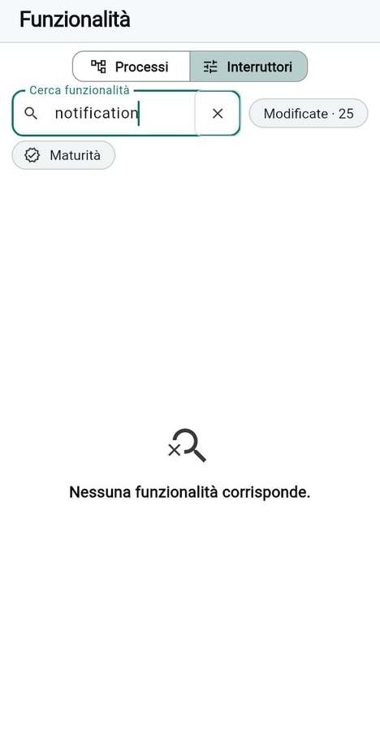

**Prima di iniziare**

I modi sono sei e non sono tutti uguali. Gran parte del lavoro avviene dentro l'app.

| Canale | Che cos'è | Che cosa serve |
|---|---|---|
| Il flusso degli eventi e la campanella | Tutto ciò che accade nello spazio viene scritto in un flusso. La campanella conta i nuovi aggiornamenti e le decisioni che attendono Lei. | **Scheda Eventi**; **Raggruppamento delle notifiche** è un'opzione in più |
| Messaggi | Conversazioni private e di gruppo tra membri, con conferme di lettura e collegamenti a una prenotazione o a uno spazio. | **Notifiche tra membri** |
| Push | Una breve notifica su telefono o computer, anche quando l'app è chiusa. Il testo è generico: niente nomi, niente orari. | **Notifiche push** attive **e** una configurazione push da parte dell'operatore; vedi [la parte dell'operatore](#la-parte-delloperatore-far-funzionare-le-notifiche-push) |
| Il promemoria di check-in | Una notifica sul dispositivo del membro stesso, 15 minuti prima di una prenotazione per la quale non ha ancora fatto il check-in. | Il permesso di sistema del membro. Non nella versione per browser. |
| Solleciti di pagamento | Un avviso nel flusso e una notifica push al membro la cui fattura è scaduta. | **Solleciti di pagamento** e **Solleciti di pagamento automatici**; vedi [Solleciti di pagamento](#solleciti-di-pagamento) |
| WhatsApp | Un link di gruppo che Lei pubblica e il numero WhatsApp che un membro sceglie di condividere. L'app apre WhatsApp; dal server non viene inviato nulla. | **Integrazione WhatsApp** |

**Da sapere**

- DesKilo non invia e-mail proprie oltre a quelle dell'account (conferma di iscrizione, reimpostazione della password). Gli inviti sono testi che condivide dal Suo telefono.
- Non esiste un'iscrizione per singolo evento: un membro non può scegliere «avvisami per le spese ma non per le prenotazioni».
- Una notifica può arrivare in ritardo o perdersi come qualsiasi push; il flusso e l'elenco dei messaggi sono il registro.

**Vedi anche:** [Notifiche](Guida-utente#notifiche) · [Eventi e conferme](Guida-utente#eventi-e-conferme)

<!-- anchor: setup.notify.table -->
### Chi viene informato di che cosa

**Destinatari:** Proprietario · Amministratore

Vuole sapere, evento per evento, chi lo viene a sapere e come.

**Prima di iniziare**

La notifica push viene inviata solo per le cinque righe contrassegnate «push» qui sotto. Ogni altro evento (una prenotazione effettuata, un pagamento registrato, l'ingresso di un membro) compare nel flusso e in nessun altro luogo.

| Fonte | Evento | Chi viene informato | Canale | Che cosa può cambiare il membro |
|---|---|---|---|---|
| Regole di convalida | Una richiesta ha bisogno di una conferma | Le persone indicate dalla regola (flusso, **In attesa della sua conferma**); la push va solo al membro a cui la richiesta si riferisce, mai a chi l'ha fatta, quindi i convalidatori ricevono la push solo se sono quel membro. Testo: «Someone needs your confirmation.» | Flusso, campanella; push | Spegnere la push sul dispositivo |
| Prenotazioni | Un amministratore rimuove o annulla una prenotazione | Il membro spostato e ogni amministratore e proprietario attivo, tranne chi ha agito. Testo: «A reservation was removed by an admin.» | Flusso; push | Spegnere la push sul dispositivo |
| Solleciti di pagamento | Una fattura è scaduta e scatta un livello di sollecito | Il membro a cui è intestata la fattura. La fattura di un proprietario arriva al proprietario stesso. Testo: «A payment reminder is waiting for you.» | Avviso nel flusso; push | Spegnere la push sul dispositivo |
| Notifiche tra membri | Un nuovo messaggio | Messaggio diretto: il destinatario. Gruppo: i partecipanti tranne il mittente. Una conversazione silenziata da un membro resta muta per quel membro. Testo: «You have a new message.» | Messaggi, campanella; push | Silenziare, fissare o archiviare una conversazione; spegnere la push |
| Menzioni nei messaggi | Un messaggio di gruppo nomina qualcuno | Le persone nominate, anche in una conversazione silenziata. Testo: «You were mentioned in a conversation.» | Messaggi; push | Spegnere la push |
| Prenotazioni | Una prenotazione è imminente | Il membro che ha prenotato, sul proprio dispositivo, 15 minuti prima dell'inizio, per le prenotazioni dei prossimi sette giorni | Notifica locale | Rifiutare il permesso di sistema |
| Integrazione WhatsApp | Non viene inviato nulla | Il link del gruppo compare nella rubrica; un membro può condividere il proprio numero | Apre WhatsApp | Condividere o nascondere il numero |

**Da sapere**

- Quando l'app è aperta, la push di una prenotazione rimossa viene sostituita da una notifica nella lingua del membro. Per messaggi, menzioni, conferme e solleciti di pagamento l'app aperta mostra oggi il suo testo generico («Someone needs your confirmation.»). I testi generici inglesi della tabella compaiono quando l'app è in background o chiusa.
- Un amministratore viene informato solo di ciò su cui agisce o che una regola gli assegna; non esiste un riepilogo di «tutto».
- I membri vedono i propri eventi; amministratori e proprietari vedono quelli di tutti.

**Vedi anche:** [Regole di convalida](Guida-utente#regole-di-convalida-ambito-per-ambito) · [Messaggi](Guida-utente#messaggi)

<!-- anchor: setup.notify.configure -->
### Che cosa configura Lei

**Destinatari:** Proprietario

Decide quali di questi canali esistono nel Suo spazio e a chi viene chiesto di decidere che cosa.

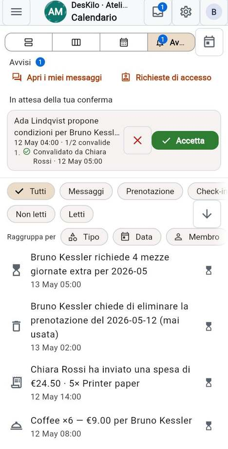

**Passaggi**

1. Apra [Funzionalità](Guida-utente#un-interruttore-di-funzionalità) e controlli gli interruttori delle notifiche: **Notifiche push**, **Notifiche tra membri**, **Scheda Eventi**, **Raggruppamento delle notifiche**, **Solleciti di pagamento**, **Solleciti di pagamento automatici** e **Integrazione WhatsApp**.
2. Imposti le [regole di convalida](Guida-utente#regole-di-convalida-ambito-per-ambito): per ogni tipo di richiesta, quante convalide servono e chi può darle. Questo decide a chi viene chiesto, e quindi chi vede una decisione in attesa.
3. Decida se la richiesta di un amministratore o di un proprietario si risolve da sé; vedi [Convalida automatica della richiesta di un amministratore](Guida-utente#convalida-automatica-della-richiesta-di-un-amministratore) e [Convalida automatica della richiesta di un proprietario](Guida-utente#convalida-automatica-della-richiesta-di-un-proprietario). Una richiesta già risolta non avvisa mai nessuno.
4. Scriva il messaggio di invito che i membri ricevono e incolli il link del gruppo della comunità; vedi [Messaggio di invito](Guida-utente#messaggio-dinvito) e [Gruppo WhatsApp](Guida-utente#gruppo-whatsapp).
5. Attivi **Richieste di eliminazione prenotazioni** se i membri possono chiedere di eliminare una prenotazione passata o con check-in effettuato: qualcuno dovrà allora rispondere.

**Da sapere**

- Impostazioni predefinite di un nuovo spazio: la scheda Eventi, le notifiche tra membri e il raggruppamento sono attivi; **Solleciti di pagamento** e **Solleciti di pagamento automatici** sono attivi come funzioni, ma nessun sollecito viene inviato finché non attiva **Solleciti automatici** nelle regole di sollecito.
- **Notifiche push** è attivo per impostazione predefinita, ma non recapita nulla finché l'operatore non l'ha configurato.
- Spegnere una funzione ferma le nuove attività di quel tipo. Non cancella ciò che esiste.
- I ruoli decidono chi può vedere e rispondere a che cosa; vedi [La matrice dei ruoli](Guida-utente#la-matrice-dei-ruoli).

**Vedi anche:** [Chi può convalidare](Guida-utente#chi-può-convalidare) · [Convalide richieste](Guida-utente#validazioni-richieste)

<!-- anchor: setup.notify.operator -->
### La parte dell'operatore: far funzionare le notifiche push

**Destinatari:** Operatore · Proprietario

Vuole le notifiche push sui telefoni dei membri e deve sapere chi fa che cosa.

**Prima di iniziare**

Le notifiche push non arrivano con l'app da sole. Se gestisce il Suo spazio sull'installazione di riferimento condivisa, chieda al suo operatore se le push sono configurate. Se gestisce una Sua installazione, l'operatore è Lei o la Sua persona tecnica.

**Passaggi**

1. Crei un progetto Firebase e compili l'app con esso. Senza questo passaggio l'app resta con le sole notifiche locali e un membro vede **Questa versione non ha notifiche push**. La versione preparata per F-Droid non ha affatto le push ([stato F-Droid](https://github.com/fdittgen-png/deskilo/blob/master/docs/guides/fdroid.md#status)).
2. Per iPhone e Mac, aggiunga una chiave push Apple al progetto Firebase.
3. Memorizzi la chiave dell'account di servizio Firebase come segreto del server e distribuisca la funzione push.
4. Sulla Sua installazione, punti la riga `push_config` del database all'URL e alla chiave della Sua funzione push. È precompilata con l'indirizzo dell'installazione di riferimento.
5. La provi con due account, come descritto nel [piano di prova](#un-piano-di-prova-invii-a-se-stesso-un-esempio-di-ogni-tipo).

**Da sapere**

- Senza i passaggi da 1 a 4 non viene inviata alcuna push, qualunque cosa dicano gli interruttori. Il flusso, la campanella e i messaggi funzionano comunque.
- L'elenco dettagliato è per l'operatore: vedi [Piattaforme](Guida-utente#deskilo-sui-suoi-dispositivi) e [Il Suo server](Guida-utente#gestire-il-proprio-server).
- Il testo della push non contiene mai un nome né un orario: è voluto, per la riservatezza.

**Vedi anche:** [Notifiche push su questo dispositivo](Guida-utente#notifiche-push-su-questo-dispositivo)

<!-- anchor: setup.notify.members -->
### Che cosa controllano i membri

**Destinatari:** Proprietario · Amministratore

Vuole dire ai Suoi membri, con onestà, che cosa possono spegnere.

**Passaggi**

1. Un membro apre [Privacy e dati](https://fdittgen-png.github.io/deskilo/#/privacy) e usa **Notifiche push su questo dispositivo** per fermare o riprendere le push su quel dispositivo.
2. In [Messaggi](https://fdittgen-png.github.io/deskilo/#/me?tab=messages), un membro tiene premuta una conversazione per **Fissa in alto**, **Silenzia le notifiche**, **Segna come non letto** o **Archivia**.
3. Nelle impostazioni di sistema del telefono, un membro può rifiutare del tutto le notifiche, compresi i promemoria di check-in.
4. Nel proprio profilo, un membro decide se condividere un numero WhatsApp.

**Da sapere**

- Una conversazione silenziata resta muta ma viene comunque conteggiata; una menzione prevale sul silenziamento.
- Un membro che spegne la push su un dispositivo non è toccato su un altro.
- Non ci sono interruttori per categoria. Se un membro ha bisogno di meno rumore, silenzi le conversazioni; se non ne vuole affatto, spenga la push.

**Vedi anche:** [Notifiche](Guida-utente#notifiche) · [I Suoi dati, i Suoi diritti](Guida-utente#i-suoi-dati-i-suoi-diritti)

<!-- anchor: setup.notify.test -->
### Un piano di prova: invii a se stesso un esempio di ogni tipo

**Destinatari:** Proprietario · Amministratore · Operatore

Si assicura che ogni canale funzioni prima che i Suoi membri dipendano da esso.

**Prima di iniziare**

Lo faccia in uno spazio di prova (vedi [una prova sicura](#una-prova-sicura-in-uno-spazio-di-prova)). Servono due account: il Suo come proprietario e un secondo come membro, su un altro telefono, un altro browser o lo stesso telefono dopo essere uscito. Lo spazio dimostrativo Le fa vedere le schermate con i suoi personaggi, ma non invia alcuna push reale.

**Passaggi**

1. Messaggio: dall'account del membro, scriva al proprietario in [Messaggi](https://fdittgen-png.github.io/deskilo/#/me?tab=messages). Sull'account del proprietario la campanella lo conta e la conversazione risulta non letta. La apra: il messaggio del membro mostra una conferma di lettura.
2. Menzione: in una conversazione di gruppo, nomini il proprietario (la funzione di menzione della messaggistica deve essere attiva). Se la push è configurata, il telefono del proprietario mostra «You were mentioned in a conversation.»
3. Decisione: come membro, chieda di eliminare una prenotazione passata (la funzione **Richieste di eliminazione prenotazioni** deve essere attiva). Il proprietario la vede sotto **In attesa della sua conferma** in [Eventi](https://fdittgen-png.github.io/deskilo/#/events); risponda e osservi come cambia il flusso del membro.
4. Rimozione: come proprietario, rimuova una prenotazione futura del membro. Il flusso del membro la mostra e un telefono con la push mostra «A reservation was removed by an admin.»
5. Promemoria: come membro, prenoti un posto che inizia fra circa 20 minuti (una prenotazione che inizia fra meno di 15 minuti non riceve alcun promemoria). Circa 15 minuti prima dell'inizio, il telefono del membro mostra il promemoria di check-in.
6. Sollecito di pagamento: con **Solleciti di pagamento** attivi, attivi **Solleciti automatici** nelle regole di sollecito con un breve ritardo per il primo sollecito, emetta una fattura di prova con un termine di pagamento, attenda che il ritardo passi, poi apra Finanze come proprietario o comproprietario; il flusso del membro mostra l'avviso.
7. Silenziamento: come membro, silenzi la conversazione, invii un altro messaggio dal proprietario e verifichi che nulla suoni ma il conteggio dei non letti aumenti.

**Da sapere**

- I passaggi 2 e 4 mostrano una push solo se la configurazione dell'operatore è completa. Se falliscono mentre gli altri funzionano, il difetto è nella configurazione, non nelle Sue regole.
- Nella versione per browser dell'app non c'è alcun promemoria di check-in.
- Un telefono che blocca le notifiche non mostra nulla; controlli prima le impostazioni di sistema.

**Risultato**

Ha visto con i Suoi occhi ogni canale su cui un membro farà affidamento.

**Vedi anche:** [I canali](#i-canali-in-parole-semplici) · [Avviare una conversazione o un gruppo](Guida-utente#avviare-una-conversazione-o-un-gruppo)

<!-- anchor: setup.notify.silence -->
### Evitare il sovraccarico e evitare il silenzio

**Destinatari:** Proprietario · Amministratore

Vuole che le persone vengano informate di ciò che le riguarda, senza sommergerle.

**Passaggi**

1. Tenga attivo **Raggruppamento delle notifiche**: membri e amministratori possono ripiegare il flusso per tipo, giorno o membro.
2. Chieda la convalida solo dove la decisione è reale: ogni regola che richiede una convalida crea una richiesta a cui qualcuno deve rispondere. Vedi [Regole di convalida](Guida-utente#regole-di-convalida-ambito-per-ambito).
3. Usi gli interruttori di convalida automatica per le richieste la cui risposta è ovvia.
4. Guardi di tanto in tanto [Che cosa richiede la Sua attenzione](Guida-utente#cosa-ti-aspetta): ordina ciò che è in attesa.

**Da sapere**

- Il sovraccarico nasce da regole che chiedono troppo spesso o da troppi amministratori su una sola regola.
- Il silenzio nasce da una regola senza nessuno che risponda: richiedere due convalide quando esiste solo il proprietario, oppure elencare amministratori che se ne sono andati, lascia le richieste in attesa per sempre. La scheda di prontezza della configurazione segnala qualsiasi regola con troppo pochi convalidatori, e la Sua posta lo riporta.
- Il silenzio nasce anche da una push senza configurazione, da membri che hanno spento la push e da un sistema che blocca le notifiche.
- I solleciti di pagamento automatici non sostituiscono uno sguardo ogni tanto alle fatture aperte.

**Vedi anche:** [Chi può convalidare](Guida-utente#chi-può-convalidare) · [Convalide richieste](Guida-utente#validazioni-richieste)

<!-- anchor: setup.reports.overview -->
## Documenti e report

**Destinatari:** Proprietario · Comproprietario · Amministratore fatturazione

Tutto ciò che DesKilo stampa o esporta nasce da un unico motore e da un unico luogo in cui progettarlo. Questo capitolo Le dice quali documenti esistono, in che ordine prepararli, che cosa può consegnare al commercialista e dove un assistente di intelligenza artificiale può aiutarLa e dove non deve. I clic sono nella guida utente; qui trova le ragioni e l'ordine.

L'esempio che seguiamo è lo spazio dimostrativo *Atelier du Marché*.

<!-- anchor: setup.reports.documents -->
### I documenti prodotti dall'app

**Destinatari:** Proprietario · Amministratore fatturazione

Vuole sapere che cosa esiste prima di progettare qualcosa, e chi riceve ciascun documento.

Ogni documento è un *tipo*. Ogni tipo ha il proprio progetto, perciò modificare la fattura non cambia mai l'estratto conto.

| Documento | Chi lo riceve | Dove lo trova |
|---|---|---|
| Fattura e nota di credito (un solo progetto condiviso) | Il membro, o il cliente di un mese fatturato | [Fatturazione](Guida-utente#la-schermata-fatturazione) |
| Proforma | Un membro che ha bisogno di un preventivo o di una richiesta di anticipo | Stessa schermata |
| Estratto conto | Il membro (il suo conto in un periodo) | [L'estratto conto](Guida-utente#leggere-il-proprio-estratto) |
| Accordo | Il membro (le condizioni negoziate) | [Negoziazione dei prezzi](Guida-utente#i-suoi-prezzi-negoziati) |
| Pagamenti, utilizzo | Il membro, l'amministratore di fatturazione | [Pagamenti](Guida-utente#pagare-quanto-dovuto) · [Utilizzo](Guida-utente#quanto-è-costata-ogni-prenotazione) |
| Lettere di sollecito, dal livello 1 al 9 | Il membro con una fattura scaduta | [Regole di sollecito](Guida-utente#regole-di-sollecito) |
| Report dello spazio e stato dello spazio | Lei, il consiglio, un revisore | **Report** |
| Dichiarazione IVA | Lei, poi la piattaforma fiscale | [La dichiarazione IVA periodica](Guida-utente#la-dichiarazione-iva-periodica) |
| Badge, codici QR degli spazi | I membri alla porta, le Sue pareti | [Codici QR degli spazi](Guida-utente#codici-qr-degli-spazi-pdf) · [Badge](Guida-utente#check-in-con-badge-nfc) |

**Da sapere**

- La schermata **Report** li raggruppa in **Report finanziari**, **Documenti dello spazio**, **Analisi aziendale** e **Modelli**, a seconda dei Suoi permessi.
- Alcuni report (piano dei conti, badge, schede QR) hanno un solo layout fornito. Gli altri possono essere ridisegnati.
- I documenti ricavati da uno spazio di prova portano una filigrana che lo dichiara. Vedi [A che cosa serve uno spazio di prova](Guida-utente#a-che-cosa-serve-uno-spazio-di-prova).

**Vedi anche:** [Report](Guida-utente#report-anteprima-download-condivisione) · [Il modello PDF della fattura](Guida-utente#il-modello-pdf-della-fattura)

<!-- anchor: setup.reports.designer -->
### L'editor, in termini da proprietario

**Destinatari:** Proprietario · Amministratore fatturazione

Vuole una lettera che somigli alla Sua senza imparare un linguaggio di marcatura.

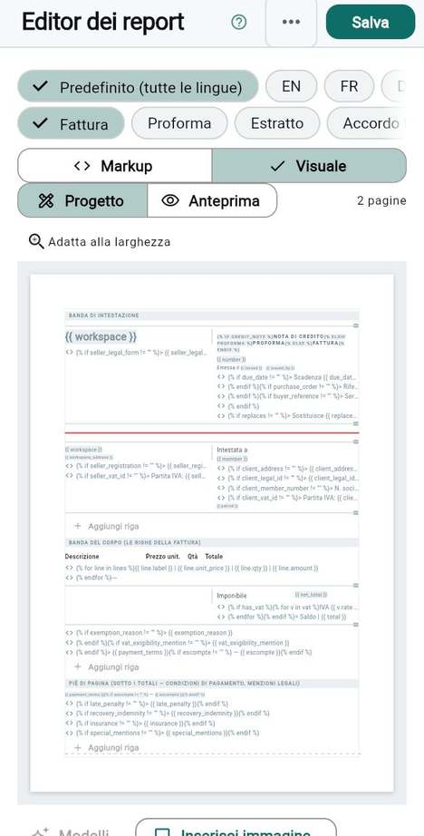

Un documento è una pagina composta da **bande**. L'*intestazione* porta la Sua carta intestata e il destinatario. Il *corpo* porta le righe. La striscia di *continuazione* parte dalla seconda pagina, e il *piè di pagina* si ripete su ogni pagina con i Suoi termini di pagamento e le menzioni legali. Le modifica in **Progetto** e le verifica in **Anteprima**; **Markup** mostra le stesse bande come testo per il giorno in cui servirà.

| Elemento | Che cosa Le dà | Lo scelga quando |
|---|---|---|
| Modelli predefiniti (**Professionale**, **Classico**, **Semplice**, **Dettagliato**, **Lettera formale**) | Un progetto finito da cui partire. I modelli differiscono per fatture, proforma, estratti conto, accordi e solleciti; i documenti strutturali hanno un solo layout fornito | Sempre: parta da **Professionale** e cambi poco |
| Un progetto per lingua | Un membro legge il documento nella propria lingua | I Suoi membri non leggono tutti la stessa lingua |
| Carta intestata e busta con finestra | Mittente, destinatario e corpo collocati dove li aspetta una busta con finestra | Spedisce le fatture su carta |
| Layout posizionato (XML) | Ogni elemento collocato in millimetri, per un modulo nazionale | Un documento deve corrispondere a un modulo fisso |
| Libreria di immagini | Un logo, un timbro o una firma riutilizzati in più progetti | Ha un logo |
| Scambio di modelli | Un progetto scritto in un file e riletto | Una persona o uno strumento esterno all'app lo modifica |

Due fatti Le evitano sorprese. Lo standard della lettera stampa il destinatario nella finestra a destra per uno spazio francese e a sinistra per uno tedesco, salvo Sua diversa impostazione. E un progetto che non riesce a essere generato non blocca mai un documento: subentra il layout incorporato.

> **Attenzione** Le parole di un progetto non sono una consulenza legale. L'aspetto e la traduzione da soli non stabiliscono la conformità legale né soddisfano un obbligo di fatturazione elettronica. Ciò che una fattura deve dire si decide in [La Sua identità legale](Guida-utente#la-sua-identità-legale) e lo conferma il Suo commercialista.

**Vedi anche:** [L'editor dei report](Guida-utente#leditor-dei-report) · [Modelli pronti](Guida-utente#modelli-già-pronti) · [Un progetto per lingua](Guida-utente#un-modello-per-lingua)

<!-- anchor: setup.reports.sequence -->
### La sequenza da seguire

**Destinatari:** Proprietario · Amministratore fatturazione

Sta per progettare i documenti e vuole farlo una volta sola, nell'ordine giusto.

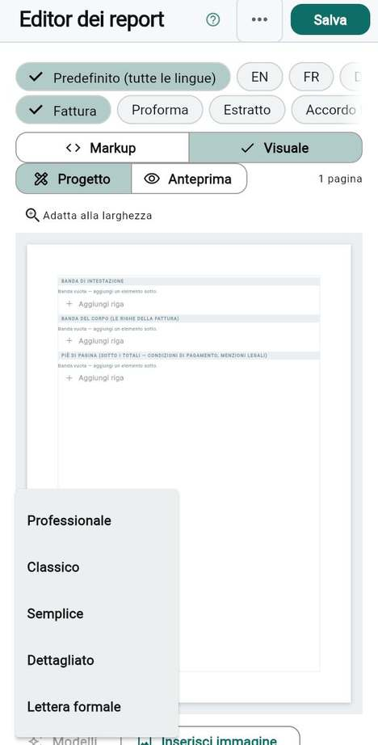

**Passaggi**

1. Fissi prima la Sua identità legale: tipo di organizzazione, indirizzo, registrazione, regime IVA e menzioni particolari. Un progetto stampa solo ciò che ha inserito lì. Vedi [La Sua identità legale](Guida-utente#la-sua-identità-legale).
2. Apra l'[Editor dei report](https://fdittgen-png.github.io/deskilo/#/report-editor), scelga il documento e parta da **Professionale** sotto **Modelli**.
3. Aggiunga una versione per ogni lingua che i Suoi membri leggono. Scelga **EN**, **FR**, **DE**, **ES** o **IT** sotto il documento. Vedi [Un progetto per lingua](Guida-utente#un-modello-per-lingua).
4. Controlli ciascuna con **Anteprima rapida**. Usa la Sua fattura più recente, oppure dati di esempio se non ce n'è.
5. Provi in uno spazio di prova: vi entri, emetta una fattura di prova, la stampi e la invii al commercialista. Vedi [A che cosa serve uno spazio di prova](Guida-utente#a-che-cosa-serve-uno-spazio-di-prova).
6. Congeli il progetto prima della prima fattura. Annoti ciò che ha deciso e lo modifichi solo quando cambia una regola.

**Da sapere**

- La sostituzione di un layout può essere annullata con **Annulla** finché non lascia l'editor.
- Una fattura emessa è un documento congelato. Cambiare il progetto in seguito cambia i nuovi documenti, mai quelli già emessi.
- Con lo stesso testo in due lingue, chieda a qualcuno che legge la seconda lingua di leggere l'anteprima.

> **Attenzione** Il numero di fattura e le menzioni legali stampate su una fattura diventano definitivi con la prima fattura emessa. Le fissi prima, non dopo.

**Risultato:** ogni documento che invierà somiglia al Suo, in ogni lingua, ed è stato letto una volta da qualcuno diverso da Lei.

**Vedi anche:** [La Sua identità legale](Guida-utente#la-sua-identità-legale) · [Il modello PDF della fattura](Guida-utente#il-modello-pdf-della-fattura)

<!-- anchor: setup.reports.accountant -->
### Che cosa consegna al commercialista

**Destinatari:** Proprietario · Amministratore fatturazione

Vuole che il commercialista abbia ciò che gli serve e sappia che cosa l'app non afferma.

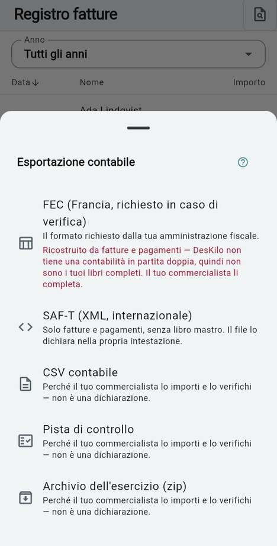

Parta dal [Registro fatture](https://fdittgen-png.github.io/deskilo/#/invoice-register), che elenca ogni fattura con il suo stato, e tocchi **Esportazione contabile**. Ogni formato dichiara nella scheda che cosa afferma.

| File | Che cosa afferma | Che cosa non afferma |
|---|---|---|
| FEC | Il formato francese richiesto da una verifica, ricostruito da fatture e pagamenti | Una contabilità completa. La completa il Suo commercialista |
| DATEV | Un file di scambio per i software dei commercialisti tedeschi, letto e registrato da una persona | Una presentazione, o una consegna per una verifica fiscale |
| SAF-T | La struttura internazionale, volutamente parziale: fatture e pagamenti, senza libro mastro | Un file contabile completo. Lo dice nella sua intestazione |
| SAF-T PT, Sage 50 | Un formato normativo portoghese (non certificato) e un formato di scambio britannico/irlandese, a seconda del Suo paese | Una presentazione o una certificazione |
| CSV contabile, Traccia di controllo, Archivio annuale (zip) | Un ausilio di lettura per il Suo commercialista | Una presentazione |

L'elenco dei formati dipende dal Suo paese. FEC e DATEV chiedono i Suoi numeri di conto, e il FEC anche il Suo numero di registrazione: li tenga pronti. Le cifre IVA del periodo si trovano in [La dichiarazione IVA periodica](Guida-utente#la-dichiarazione-iva-periodica).

*Che cosa l'app non fa*

- Conserva fatture, pagamenti e un conto corrente per ogni membro. Non tiene una contabilità in partita doppia su un piano dei conti, perciò non può sostituire un software di contabilità.
- Alcuni obblighi restano a carico Suo e del Suo commercialista: la contabilità completa, il software certificato dove il Suo paese lo richiede e l'accettazione da parte dell'autorità competente.
- Un file è bloccato finché i problemi nell'origine non sono risolti.

**Da sapere**

- Esportare è una lettura. Può ripeterla per qualsiasi periodo.
- Prepari una breve nota per il commercialista prima della prima fattura: il Suo regime IVA, quando l'IVA diventa esigibile, la numerazione scelta e le esportazioni che vorrà. Vedi [Aiuto da un assistente IA](#aiuto-da-un-assistente-ia).

**Vedi anche:** [Esportazioni contabili](Guida-utente#esportazioni-contabili) · [Il registro fatture](Guida-utente#il-registro-fatture) · [Conto IVA](Guida-utente#conto-iva)

<!-- anchor: setup.reports.analytics -->
### L'analisi aziendale in breve

**Destinatari:** Proprietario · Amministratore fatturazione

Vuole vedere come va lo spazio una volta avviato, senza un foglio di calcolo.

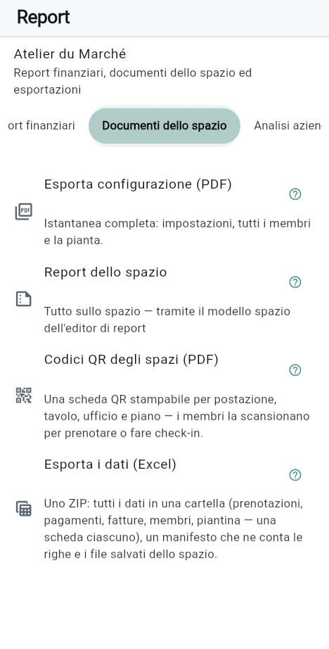

**Analisi aziendale** mostra le cifre per area: fatturato e incassato, occupazione e capacità. Sceglie un periodo (mese, trimestre o anno), lo confronta con un altro, salva una vista e la esporta in PDF. Vede solo le analisi che il Suo ruolo può leggere.

L'incassato è l'insieme dei pagamenti abbinati alle fatture. Non è un utile, perché nella cifra non ci sono i costi, e il periodo in corso è parziale.

Per un documento sull'intero spazio, la scheda **Documenti dello spazio** contiene il **Report dello spazio**, i **Codici QR degli spazi (PDF)**, **Esporta i dati (Excel)** ed **Esporta configurazione (PDF)**. Usi gli ultimi due come copia di ripristino prima di un cambiamento importante.

**Vedi anche:** [Analisi aziendale](Guida-utente#analisi-aziendale) · [Esportazioni](Guida-utente#report-dello-spazio)

<!-- anchor: setup.reports.ai -->
### Aiuto da un assistente IA

**Destinatari:** Proprietario · Comproprietario

Uno strumento di chat con IA può farLe risparmiare ore sulle parole che circondano la Sua configurazione. Non può essere lui a decidere che cosa è giusto sul piano legale o fiscale. Questa sezione riguarda gli strumenti che usa fuori da DesKilo; il collegamento dell'assistente dentro l'app è descritto alla fine.

*A che cosa serve uno strumento esterno*

- Redigere il messaggio di invito che invia ai primi membri. Vedi [Il messaggio di invito](Guida-utente#messaggio-dinvito). I segnaposto come il nome o il link di invito restano così come sono.
- Formulare le menzioni particolari da sottoporre al commercialista, come bozza da verificare, mai come testo definitivo.
- Tradurre il testo di un progetto in un'altra lingua, così che debba solo rileggerlo.
- Spiegare a un membro, con parole semplici, un report o un estratto conto.
- Preparare la nota delle Sue scelte per il commercialista: paese, tipo di organizzazione, regime IVA, numerazione, esportazioni.
- Abbozzare, a partire da fotografie, l'immagine che sta dietro la Sua planimetria, in uno strumento per immagini.

*Che cosa non deve decidere*

- Le menzioni legali di una fattura, il trattamento IVA di un'attività, il motivo per cui non viene applicata l'IVA e le aliquote IVA.
- Qualsiasi cosa diventi definitiva: un formato del numero di fattura, un regime IVA, la valuta, una fattura emessa.
- Se qualcosa è conforme. Una risposta sicura di sé non è una risposta verificata, e chi verifica è il Suo commercialista.

*Il procedimento sicuro*

1. Chieda allo strumento una bozza. Gli fornisca uno scenario, non i nomi dei Suoi membri né dati personali.
2. Incolli la bozza nel campo, nell'**Editor dei report** o nelle impostazioni.
3. La guardi in **Anteprima** con dati di esempio.
4. Invii al commercialista il testo che ha peso legale e attenda la risposta.
5. Provi l'intero procedimento in uno spazio di prova prima di quello reale.

> **Attenzione** Non incolli in uno strumento esterno un token, una password, un numero bancario né dati personali di un membro.

*Il collegamento dell'assistente di DesKilo*

L'app consente a un assistente come Claude o ChatGPT di agire per un membro tramite un protocollo chiamato MCP. È spento per impostazione predefinita ed è una funzione che attiva Lei (**Interfaccia MCP**, vedi [Un interruttore di funzione](Guida-utente#un-interruttore-di-funzionalità)). È costruito a strati, così che nessuna persona da sola possa aprire tutto.

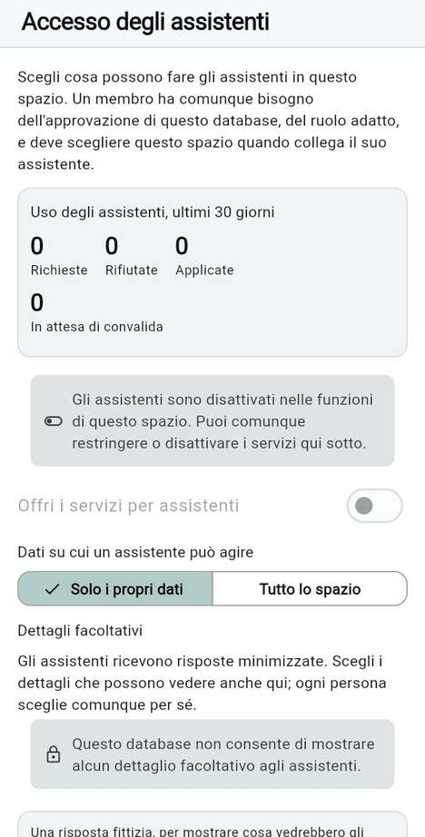

| Livello | Chi | Che cosa fa |
|---|---|---|
| L'installazione | L'operatore | Attiva gli assistenti per l'installazione. |
| Lo spazio | Lei, il proprietario | Attiva la funzione, poi sceglie in [Che cosa possono fare gli assistenti](Guida-utente#che-cosa-possono-fare-gli-assistenti-in-uno-spazio) quali servizi offrire e se un assistente vede solo i propri dati o quelli dell'intero spazio. |
| Il database | Un amministratore del database | Approva la richiesta di ciascuna persona. |
| Il membro | Ogni membro | Chiede una volta l'approvazione e sceglie questo spazio. |
| Una richiesta con effetti | Il membro, sul proprio dispositivo | Conferma la richiesta esatta, che segue comunque le Sue regole di convalida. |

L'assistente di un membro lavora sui dati di quel membro: trovare e descrivere i posti liberi, preferiti e valutazioni, prenotare, modificare o annullare la propria prenotazione, chiedere di eliminare una prenotazione iniziata, fare check-in e check-out, leggere il proprio estratto conto e le proprie fatture, elencare e risolvere le convalide richieste. Alcune richieste (emissione di fattura, annullamento di fattura, rimborso, cambio di stato di un membro, quota di abbonamento) sono riservate al personale: richiedono i diritti del personale, la conferma della persona nell'app e poi le Sue regole di convalida. Non esiste alcuna operazione che configuri uno spazio: non può attivare una funzione, impostare una tariffa, cambiare un ruolo né costruire una planimetria. Non può configurare lo spazio al posto Suo e agisce solo entro ciò che Lei espone.

**Da sapere**

- Attivare gli assistenti non concede nulla a nessuno di per sé.
- Ogni approvazione scade; la schermata indica quanti giorni restano.
- Legga i passaggi in [Approvazioni e conferme per gli assistenti](Guida-utente#approvazioni-e-conferme-per-gli-assistenti).

**Vedi anche:** [Assistenti: che cosa sono](Guida-utente#assistenti-che-cosa-sono) · [Collegare un assistente](Guida-utente#collegare-un-assistente)

<!-- anchor: setup.reports.developer -->
### Lavorare con uno sviluppatore: il file del progetto e lo strumento dei report

**Destinatari:** Proprietario · Operatore

Una persona tecnica La sta aiutando e un progetto va modificato o verificato fuori dall'app.

**Passaggi**

1. Nell'[Editor dei report](https://fdittgen-png.github.io/deskilo/#/report-editor) usi **Esporta questo modello** per scrivere il progetto in un unico file. Il file spiega che cosa significano i suoi campi e quali segnaposto esistono. **Importa un modello** lo rilegge; un file per un altro report, o di una versione più recente, viene rifiutato con il motivo.
2. Uno sviluppatore può verificare il progetto da terminale con lo strumento dei report, descritto nella guida dell'amministratore tecnico: `check` misura un layout rispetto al contratto della busta con finestra e termina con un codice diverso da zero quando l'inchiostro cade nella finestra; `render` produce il PDF; `sample` scrive un file di dati con ogni segnaposto; `describe` elenca il vocabolario.
3. Tornato nell'app, importi il file, lo veda con **Anteprima rapida** e **Salva**.

**Da sapere**

- Lo scambio di modelli è una funzione (**Esporta e importa i modelli di report**), tra le funzioni dei report in [Funzionalità](https://fdittgen-png.github.io/deskilo/#/features). La attivi per prima.
- Lo strumento richiede il codice sorgente dell'app; è per la persona che gestisce la Sua installazione, non per l'uso quotidiano.

**Vedi anche:** [L'editor dei report](Guida-utente#leditor-dei-report) · [Il modello PDF della fattura](Guida-utente#il-modello-pdf-della-fattura)

<!-- anchor: setup.consistent.overview -->
## Mantenere la coerenza

Uno spazio può essere sbagliato in due modi: un'impostazione che manca e due impostazioni che si contraddicono. DesKilo ne intercetta alcune, e lo dice sullo schermo. Questo capitolo elenca che cosa intercetta e dove lo vede, dice con franchezza che cosa non intercetta e Le propone una verifica da eseguire prima di aprire le porte e una breve routine da ripetere ogni mese.

In questo capitolo:
- [Le protezioni che l'app Le offre](#le-protezioni-che-lapp-le-offre)
- [Gli errori che le protezioni non intercettano](#gli-errori-che-le-protezioni-non-intercettano)
- [La verifica prima dell'apertura](#la-verifica-prima-dellapertura)
- [La routine mensile](#la-routine-mensile)
- [Quando qualcosa non sembra giusto](#quando-qualcosa-non-sembra-giusto)
- [Ciò che non si può annullare](#ciò-che-non-si-può-annullare-1)

L'esempio che seguiamo è *Atelier du Marché*. La sua proprietaria, Ada, esegue la verifica una volta in uno spazio di prova e una seconda volta in quello reale.

<!-- anchor: setup.consistent.guards -->
### Le protezioni che l'app Le offre

**Destinatari:** Proprietario · Comproprietario · Amministratore · Amministratore fatturazione

Vuole sapere quali Suoi errori l'app Le segnalerà e dove lo farà, così da guardare nel posto giusto.

| Protezione | Che cosa intercetta | Dove la vede |
|---|---|---|
| Una funzione che ne richiede un'altra | Una funzione non può funzionare senza quella di cui ha bisogno. Attivare una funzione attiva la sua funzione madre e indica che cosa si è attivato. Spegnere una funzione madre trattiene le sue figlie e conserva la loro scelta. | **Funzionalità**: il flusso di attivazione con la sua anteprima, **Richiede** e **In attesa della funzione qui sopra** |
| Un processo trattenuto | Una funzione attiva che attende qualcosa che è spento. | **Funzionalità**, vista **Processi**: lo stato **Richiede attenzione** e il suo filtro |
| L'elenco di prontezza | Una riga per ogni area dello spazio, con il suo stato, chi agisce e dove impostarla. Aree: **Giorni di apertura, fuso orario e valuta**, **Posti prenotabili sulla planimetria**, **Piani di iscrizione e tariffe**, **Invitare i primi membri**, **Come pagano i membri**, **Ruoli e chi convalida le richieste**, **Esportazione e ripristino**, **Cosa possono fare i membri**, **Dati richiesti dalle funzioni (identità, banca, piattaforme)**, **Una prima prenotazione** e, quando serve, **L'identità legale e l'indirizzo dello spazio** (solo con **Fatture** attiva), **Server e versione del database** e **Accesso degli assistenti (facoltativo)** (quest'ultima solo con l'interfaccia MCP attiva). | **Configurazione di questo spazio**, in cima a [Spazio](https://fdittgen-png.github.io/deskilo/#/workspace-settings) |
| La riga che blocca una prima prenotazione | Le aree che l'elenco segna **Necessario per una prima prenotazione**: un fuso orario, una valuta, un giorno della settimana aperto, un posto, membri che possiedono **Prenotare e usare le prenotazioni** (un nuovo spazio non concede loro nulla) e, quando una regola di convalida di qualsiasi tipo chiede più convalidatori di quanti ce ne siano, quei convalidatori. Il resto è facoltativo e si può mettere da parte con **Più avanti**. | **Prima che qualcuno possa prenotare qui**, nella scheda Primi passi di [Prenota](https://fdittgen-png.github.io/deskilo/#/reserve) |
| La riga che blocca una prima fattura | Con **Fatture** attiva, l'identità legale e l'indirizzo dello spazio. Senza di essi non si può emettere alcuna fattura, quindi l'area non si può mettere da parte. | **Configurazione di questo spazio**: l'area **L'identità legale e l'indirizzo dello spazio**, segnata **Necessario prima di fatturare**; finché è il passo successivo, il titolo della scheda dice «Prima di fatturare: …» |
| Ciò che le Sue funzioni richiedono ancora in locale | Dati bancari, un fornitore di pagamenti online, un account di fatturazione elettronica, una sede. L'identità legale non compare qui: con **Fatture** attiva è un'area a sé (sopra). | La stessa scheda, area **Dati richiesti dalle funzioni (identità, banca, piattaforme)**, con **Configura** e **Consigliato** |
| La protezione delle fatture | Una fattura viene rifiutata finché non è completa: l'indirizzo dello spazio, la sua partita IVA, un paese tra Francia e Germania, una base giuridica per un'esenzione, nome, indirizzo e partita IVA del membro quando si applica l'inversione contabile, un'aliquota IVA in vigore, una spiegazione per ogni riga fatturata allo 0 %. Le fatture transfrontaliere, con inversione contabile, di esportazione ed esenti vengono rifiutate: le emetta fuori dall'app. | **Completi questi dati prima dell'emissione**, con l'elenco delle voci mancanti |
| La protezione dei pagamenti online | Con **Pagamenti online** spento, il server rifiuta un nuovo pagamento online. Uno già aperto si conclude comunque. | Le schermate dei pagamenti (la riga della funzione non riporta alcuna nota in proposito) |
| La protezione delle convalide | **Validazioni richieste** in numero superiore alle persone disponibili, per qualsiasi tipo di richiesta. | **Validatori idonei insufficienti.** nell'editor della regola; «Una regola richiede più validatori di quanti ne abbia questo spazio» nell'elenco di prontezza, dove **Ruoli e chi convalida le richieste** diventa allora obbligatoria |
| Il blocco di valuta e paese | Quando lo spazio ha emesso un documento o registrato denaro, il server rifiuta qualsiasi cambio di **Valuta** o **Paese**, dal modulo delle impostazioni, da un'importazione o da qualsiasi altro punto. Il fuso orario non è bloccato. | «La valuta e il paese sono fissati non appena lo spazio ha emesso un documento o registrato denaro. Non è stato salvato nulla.» quando salva [Spazio](https://fdittgen-png.github.io/deskilo/#/workspace-settings) |
| La posta del proprietario | Ciò che resta da configurare: una riga «Da configurare: …» per ogni area obbligatoria dell'elenco di prontezza che non è pronta, e una riga «… funzioni attivate attendono «…»» per ogni funzione spenta che ne trattiene altre. | [Che cosa richiede la Sua attenzione](Guida-utente#cosa-ti-aspetta); un tocco apre la schermata in cui si configura, oppure **Funzionalità** |
| La protezione delle serie di numerazione | Un azzeramento più frequente della data stampata nel numero viene rifiutato. | [Serie di numerazione](https://fdittgen-png.github.io/deskilo/#/settings/number-sequences), al salvataggio |
| Il controllo di maturità | Una funzione valutata **Alfa** o **Beta**. | Una conferma prima di attivarla e un contrassegno su ogni interruttore |
| Il controllo di sostituzione della planimetria | Sostituire la planimetria o le impostazioni da un file. | Un avviso che non si può annullare. La planimetria viene rifiutata quando esistono prenotazioni |

**Da sapere**

- **Configurazione di questo spazio** è un elenco, non un blocco. Non Le impedisce mai di attivare qualcosa.
- La maggior parte delle protezioni agisce quando prova a emettere, pagare o prenotare, non quando sceglie un'impostazione. Per questo esiste la verifica qui sotto.
- La posta del proprietario ([Che cosa richiede la Sua attenzione](Guida-utente#cosa-ti-aspetta)) segnala solo le aree obbligatorie e le funzioni trattenute. Le aree facoltative restano nell'elenco di prontezza: lo legga Lei stesso.

**Vedi anche:** [Evitare funzioni che si contraddicono](#evitare-funzionalità-in-contraddizione-tra-loro) · [Controlli il Suo spazio](#verificare-il-suo-spazio)

<!-- anchor: setup.consistent.gaps -->
### Gli errori che le protezioni non intercettano

**Destinatari:** Proprietario · Comproprietario · Amministratore fatturazione

Vuole l'elenco onesto di ciò che resta a Suo carico. Sono configurazioni che l'app Le lascia creare e per le quali non avvisa. Ciascuna ha un modo per evitarla a mano.

| Errore | Perché nulla lo ferma | Come evitarlo |
|---|---|---|
| Scegliere un paese diverso da Francia o Germania e aspettarsi delle fatture | L'app offre molti paesi e aliquote IVA, ma emette fatture solo per Francia e Germania. Nulla lo dice quando sceglie il paese. | Deciderlo prima di promettere una fattura ai membri. Altrove, tenga gli estratti conto nell'app ed emetta le fatture all'esterno. |
| Essere soggetti a IVA senza alcuna aliquota in vigore | L'emissione viene rifiutata, ma solo alla prima fattura. La descrizione di **Gestione IVA** e l'avviso nella schermata dell'identità legale lo dicono; nulla La ferma prima. Con **Gestione IVA** spenta, la configurazione è nascosta ma le aliquote memorizzate continuano ad applicarsi. | Aggiungere l'aliquota in [IVA](https://fdittgen-png.github.io/deskilo/#/vat) prima della prima chiusura mensile ed eseguire una fattura di prova. |
| **Pagamenti online** attivi senza fornitore | Può attivarli; il fornitore mancante compare solo come voce nell'elenco di prontezza. | Collegare prima il fornitore, poi attivare. |
| **Fatture** attive senza identità legale | La funzione è attiva fin dal primo giorno. L'elenco di prontezza segna l'identità **Necessario prima di fatturare** e la Sua posta la segnala, ma nulla Le impedisce di invitare membri e far girare un mese; il rifiuto arriva al momento dell'emissione. | Compilare l'identità prima di dire ai membri che verranno fatturati. |
| Una regola che richiede più convalidatori di quanti ne ha | L'editor Le lascia salvarne una superiore alle persone disponibili. L'elenco di prontezza segna allora **Ruoli e chi convalida le richieste** come obbligatoria, qualunque sia il tipo di richiesta, ma le richieste create prima della correzione non possono essere completate e scadono dopo sette giorni. | Contare i proprietari e gli amministratori attivi dopo ogni regola. Vedi [Evitare richieste che attendono per sempre](#evitare-richieste-che-attendono-per-sempre). |
| Membri che non riescono ad aprire la planimetria | In un nuovo spazio la scheda **Utente** di [Ruoli](https://fdittgen-png.github.io/deskilo/#/roles) è vuota. L'elenco di prontezza segna **Cosa possono fare i membri** finché i membri non possiedono **Prenotare e usare le prenotazioni**, ma controlla solo quello: gli altri cinque permessi di uso quotidiano li spunta Lei. | Spuntare i permessi di uso quotidiano e iscriversi una volta con un secondo account. |
| Uno spazio creato da un modello | Un modello non porta mai con sé identità, dati bancari, sedi né inviti. | Trattare l'area **Dati richiesti dalle funzioni (identità, banca, piattaforme)** come un elenco di cose da fare. |
| Un file di impostazioni che promette più di quanto dà | Oggi il file porta la matrice dei ruoli, i Suoi ruoli e ogni regola di convalida, ma non i membri, i numeri di fattura e di membro, il periodo IVA né i prezzi dell'intero spazio. Ciò che porta viene applicato solo se **Configurazione nel file dello spazio** è attiva nella destinazione. Una planimetria non viene sostituita quando esistono prenotazioni. | Reinserire a mano ciò che non porta e leggere l'anteprima prima di **Sostituisci e importa**. |
| Solleciti che non partono mai | Girano ogni mattina sul server se l'installazione pianifica attività (pg_cron); altrimenti quando un amministratore apre Finanze. L'interruttore e la descrizione della funzione lo dicono, ma non possono dire quale vale per la Sua installazione. Restano silenziosi anche quando **Solleciti di pagamento automatici** è spenta. | Chiedere all'operatore se lo scheduler esiste e, se non c'è, aprire Finanze personalmente. Vedi [Solleciti automatici](Guida-utente#solleciti-automatici). |
| Cambiare il fuso orario quando esiste già del denaro | Il server blocca la valuta e il paese quando lo spazio ha emesso un documento o registrato denaro, ma non il fuso orario, nel quale si contano ogni giorno lavorativo, mezza giornata e giorno di chiusura. | Sceglierlo il primo giorno. Vedi [Decisioni difficili da annullare](#decisioni-difficili-da-annullare). |
| Una numerazione o un periodo IVA che non si adatta al formato del commercialista | L'app non li confronta con l'esportazione contabile del paese. | Chiedere al commercialista il formato di numerazione e l'esportazione che usa prima di emettere. Vedi [Esportazioni contabili](Guida-utente#esportazioni-contabili). |
| Scambiare uno spazio di prova per quello reale | Oltre alla filigrana sui documenti stampati, la differenza è facile da non notare. | Guardare il banner dello spazio di prova e il lato mostrato in [Io](https://fdittgen-png.github.io/deskilo/#/me) prima di agire. |

**Da sapere**

- Un chiosco senza membro chiosco, una funzione per le sedi senza sede, una push senza servizio push: [Evitare funzioni che si contraddicono](#evitare-funzionalità-in-contraddizione-tra-loro).
- L'app è più severa di quanto sembri per le fatture e più permissiva di quanto sembri per tutto il resto. Nel dubbio, emetta una fattura di prova in uno spazio di prova.

**Vedi anche:** [Una prova sicura](#una-prova-sicura-in-uno-spazio-di-prova)

<!-- anchor: setup.consistent.audit -->
### La verifica prima dell'apertura

**Destinatari:** Proprietario · Comproprietario

Vuole una prova, non una sensazione, prima di aprire. Trentuno controlli, in tre livelli. Esegua *Aprire* prima di invitare qualcuno, *Funzionare* prima di promettere qualcosa sul denaro, *Crescere* prima che esca la prima fattura. Lo faccia prima in uno spazio di prova, con una seconda persona.

*Aprire: un luogo che le persone possono prenotare*

| # | Controllo | Dove | Com'è quando va bene |
|---|---|---|---|
| 1 | Paese, valuta, fuso orario | [Spazio](https://fdittgen-png.github.io/deskilo/#/workspace-settings), **Informazioni generali** | Atelier du Marché: Francia, EUR, Europe/Paris, impostati prima del primo documento o pagamento, dopo il quale la valuta e il paese sono bloccati |
| 2 | Lingua dello spazio | Stessa schermata | La lingua in cui sono scritti i Suoi inviti |
| 3 | Giorni e orari di apertura | [Disponibilità](https://fdittgen-png.github.io/deskilo/#/availability) | I giorni in cui apre sono spuntati; gli orari corrispondono al giorno |
| 4 | Giorni di chiusura | Disponibilità, giorni di chiusura | Festività e chiusure dei prossimi mesi sono inserite, prima della prima fine mese |
| 5 | Almeno un posto | [Editor dello spazio](https://fdittgen-png.github.io/deskilo/#/editor) | Ogni stanza che affitta ha dei posti |
| 6 | Prontezza | **Configurazione di questo spazio** | Nulla sotto **Giorni di apertura, fuso orario e valuta**, **Posti prenotabili sulla planimetria** o **Cosa possono fare i membri** richiede configurazione |
| 7 | Ha prenotato un posto | [Prenota](https://fdittgen-png.github.io/deskilo/#/reserve) | Il posto è prenotato, con check-in e annullato senza sorprese |
| 8 | L'ID dello spazio | [ID dello spazio e QR](https://fdittgen-png.github.io/deskilo/#/workspace-code) | L'ID è uno che si può dire a voce alta; il QR è stampato |
| 9 | Permessi di uso quotidiano | [Ruoli](https://fdittgen-png.github.io/deskilo/#/roles) | **Utente** possiede i sei permessi di uso quotidiano, tra cui **Prenotare e usare le prenotazioni** |
| 10 | Un secondo account si è iscritto | Un altro dispositivo | È stato approvato e ha potuto aprire la planimetria e prenotare |
| 11 | Più di una persona può agire | [Membri e piani](https://fdittgen-png.github.io/deskilo/#/members) | Un proprietario più un comproprietario o un amministratore, tutti **Attivo** |
| 12 | Numero di convalide | [Regole di convalida](https://fdittgen-png.github.io/deskilo/#/validation) | Nessuna regola chiede più convalidatori dei proprietari e amministratori attivi; **Ruoli e chi convalida le richieste** non richiede configurazione |
| 13 | L'invito in ogni lingua | **Comunità e inviti** | Ha letto ogni versione una volta; nessun segnaposto resta vuoto |
| 14 | Il lato in cui si trova | [Io](https://fdittgen-png.github.io/deskilo/#/me) | Il banner dello spazio di prova è mostrato, oppure no, come intendeva |

*Funzionare: le persone pagano e i ruoli tengono*

| # | Controllo | Dove | Com'è quando va bene |
|---|---|---|---|
| 15 | Fasce tariffarie | [Fatturazione](https://fdittgen-png.github.io/deskilo/#/billing) | Ogni quota che un membro può scegliere rientra in una fascia; nessun buco tra 0 e 100 per cento |
| 16 | Piani offerti | Fatturazione, livelli | Solo i piani che vuole vendere |
| 17 | Con che cosa partono i nuovi membri | **Nuovi membri**, in Spazio | L'abbonamento e la regola per quando i giorni finiscono sono quelli che ha scelto |
| 18 | Pacchetti e servizi | Fatturazione, [Servizi](https://fdittgen-png.github.io/deskilo/#/services) | Nomi e prezzi sono chiari per un membro |
| 19 | Come pagano i membri | **Come pagano i membri** nell'elenco di prontezza | L'area indica **Pronto** e i dati bancari che si aspetta (IBAN, causale) sono mostrati nelle Impostazioni; anche un solo fornitore la rende pronta |
| 20 | Pagamenti online | [Funzionalità](https://fdittgen-png.github.io/deskilo/#/features) | Spenti, a meno che un fornitore sia collegato |
| 21 | Amministratori | Membri e piani | Ciascuno è una persona a cui affiderebbe i dati di ogni membro |
| 22 | Scheda Amministratore della matrice | Ruoli | Sa leggere ogni spunta e giustificarla |
| 23 | Chi viene informato di che cosa | [Come vengono informati i membri](#che-cosa-controllano-i-membri) | I membri trovano tutto sotto **Eventi**; la push solo se l'operatore l'ha configurata |
| 24 | Chiosco e badge | [Funzionalità](https://fdittgen-png.github.io/deskilo/#/features) | Spenti, oppure esiste un membro chiosco e i badge sono emessi |
| 25 | Sedi | Funzionalità | Spente, oppure esiste almeno una sede |
| 26 | Funzioni trattenute | **Funzionalità**, **Richiede attenzione** | Il filtro non mostra alcun processo, e la Sua posta non ha righe su funzioni in attesa |

*Crescere: fatture, imposte e registri*

| # | Controllo | Dove | Com'è quando va bene |
|---|---|---|---|
| 27 | Identità legale | [Identità legale e fatturazione elettronica](https://fdittgen-png.github.io/deskilo/#/legal-identity) | **L'identità legale e l'indirizzo dello spazio** indica **Pronto**, e **Completi questi dati prima dell'emissione** non mostra nulla quando avvia una fattura di prova |
| 28 | Regime e aliquote IVA | [IVA](https://fdittgen-png.github.io/deskilo/#/vat) | Il regime è quello indicato dal commercialista; per la Sua aliquota predefinita ce n'è una in vigore |
| 29 | Formato dei numeri | [Serie di numerazione](https://fdittgen-png.github.io/deskilo/#/settings/number-sequences) | Ha letto l'anteprima e il commercialista è d'accordo |
| 30 | Una fattura di prova | Spazio di prova, assistente di chiusura mensile | È stata emessa, in ogni lingua che leggono i Suoi membri, senza voci mancanti |
| 31 | Un'esportazione recente | **Esportazione e ripristino** | «A recent export is on record» |

**Passaggi**

1. Stampi le tre tabelle o le copi nei Suoi appunti.
2. Esegua *Aprire* e spunti ogni riga quando vede la colonna «va bene», non quando se ne ricorda.
3. Faccia lo stesso per *Funzionare* e *Crescere* nello spazio di prova, con il commercialista per le righe di *Crescere*.
4. Ripeta le righe che sono cambiate quando passa allo spazio reale. Un modello o un file di impostazioni non porta con sé tutto.

**Risultato** Un elenco che può mostrare a qualcuno e uno spazio che ha visto funzionare prima che qualcuno dipenda da esso.

**Vedi anche:** [Dalla settimana 0 alla settimana 4](#impararlo-in-quattro-settimane) · [Una prova sicura](#una-prova-sicura-in-uno-spazio-di-prova) · [La sequenza da seguire](#la-sequenza-da-seguire)

<!-- anchor: setup.consistent.monthly -->
### La routine mensile

**Destinatari:** Proprietario · Amministratore · Amministratore fatturazione

Vuole un'abitudine breve che mantenga coerente lo spazio, in dieci minuti a fine mese.

**Passaggi**

1. Apra **Configurazione di questo spazio**. Ogni area indica ancora **Pronto**, oppure **Non necessario qui**, oppure è messa da parte di proposito.
2. Apra [Eventi](https://fdittgen-png.github.io/deskilo/#/events). **In attesa della sua conferma** è vuoto o piccolo, e nessun membro è **In attesa** da più di un giorno o due.
3. Riconti la squadra. Chi se n'è andato o è stato sospeso può lasciare una regola scoperta. Vedi [Evitare richieste che attendono per sempre](#evitare-richieste-che-attendono-per-sempre).
4. Chiuda il mese: i giorni di chiusura sono inseriti, l'assistente di chiusura mensile è stato eseguito, i solleciti di pagamento sono partiti (in automatico ogni mattina, oppure all'apertura di Finanze dove il database non ha lo scheduler). Vedi [L'assistente di chiusura mensile](Guida-utente#lassistente-di-chiusura-mensile).
5. Faccia l'esportazione dei dati e apra **Funzionalità** per verificare che, dopo le modifiche del mese, nessun processo richieda attenzione.

**Da sapere**

- Scrivere la data dell'ultima esecuzione sulla prima riga dei Suoi appunti dice alla persona successiva quando è stato vero l'ultima volta.
- Qualsiasi modifica fatta durante il mese alla matrice dei ruoli o a una regola di convalida merita un ulteriore controllo delle righe 9, 11 e 12 della verifica.

**Risultato** Uno spazio che resta come l'ha configurato.

**Vedi anche:** [La verifica prima dell'apertura](#la-verifica-prima-dellapertura)

<!-- anchor: setup.consistent.wrong -->
### Quando qualcosa non sembra giusto

**Destinatari:** Proprietario · Comproprietario · Amministratore

Vuole sapere che cosa provare, in quale ordine e a chi chiedere.

**Passaggi**

1. Legga il messaggio sullo schermo. La maggior parte dice che cosa fare.
2. Controlli il lato. Guardi il banner dello spazio di prova e il lato mostrato in [Io](https://fdittgen-png.github.io/deskilo/#/me). I documenti stampati sul lato di prova portano una filigrana e lì nulla è dovuto; il lato reale emette fatture che sono dovute.
3. Controlli [Funzionalità](https://fdittgen-png.github.io/deskilo/#/features) e [Ruoli](https://fdittgen-png.github.io/deskilo/#/roles): una funzione che manca è una funzione spenta o un permesso che nessuno ha spuntato.
4. Apra **Configurazione di questo spazio** e legga l'area che corrisponde al sintomo.
5. Prepari i **Dettagli per l’assistenza** in [Aiuto](https://fdittgen-png.github.io/deskilo/#/help): scelga **Ultima ora** o **Ultime 24 ore**, **Prepara anteprima**, la legga, **Salva** e invii il file. Contiene solo conteggi e controlli, non identità, credenziali né dati aziendali.
6. Prima di cambiare qualcosa di importante, faccia l'esportazione dei dati (qui sotto).

*A chi chiedere*

| Riguardo a | Chieda a |
|---|---|
| Un'impostazione del Suo spazio, una regola, un ruolo | A Lei stesso, poi al Suo comproprietario |
| Una fattura, l'IVA, un numero | Al Suo commercialista, con la fattura di prova |
| Un'area che indica **In attesa di un’altra persona** o **L’operatore del server** | All'operatore della Sua installazione |
| Un assistente che non è approvato | A un amministratore del database |
| Un errore che non sa spiegare | All'assistenza, con il file di assistenza |

*L'esportazione di ripristino*

1. Apra [Report](https://fdittgen-png.github.io/deskilo/#/reports?section=documents) e scelga **Documenti dello spazio**.
2. Tocchi **Esporta i dati (Excel)**. Servono la funzione **Esportazione dati (Excel)** e il permesso **Esportare contabilità e dati**. Ottiene un unico ZIP: una cartella di lavoro con una scheda per ogni insieme di dati, un manifesto che conta le righe e i file archiviati.
3. Tocchi **Esporta configurazione (PDF)** per una registrazione dei parametri e, in **Spazio**, **Esporta lo spazio (XML)** per la planimetria e le impostazioni.

**Da sapere**

- Un'esportazione dei dati completata viene registrata; l'area di prontezza **Esportazione e ripristino** lo indica per 90 giorni, poi segnala che l'esportazione è più vecchia.
- Il PDF è una registrazione, non una copia di sicurezza. Solo l'XML può essere reimportato e non contiene mai membri né denaro.
- Conservi il file in un luogo che solo Lei può aprire: contiene i Suoi membri.

**Vedi anche:** [Dettagli per l'assistenza](Guida-utente#dettagli-per-lassistenza) · [Quando qualcosa non funziona](Guida-utente#quando-qualcosa-non-funziona) · [Esportare i dati (Excel)](Guida-utente#esportare-i-dati-excel)

<!-- anchor: setup.consistent.irreversible -->
### Ciò che non si può annullare

**Destinatari:** Proprietario · Comproprietario · Amministratore fatturazione

Vuole una pagina sola che dica su che cosa rallentare. L'elenco completo, con che cosa fare in alternativa, è in [Decisioni difficili da annullare](#decisioni-difficili-da-annullare). Questo è il riepilogo.

> **Attenzione** Una fattura emessa non cambia mai e il suo numero non viene mai riutilizzato. Un errore si corregge con un annullamento, una nota di credito o una richiesta di rimborso, non con una modifica.

| Decisione | Definitiva da | Trattata in |
|---|---|---|
| Formato e sequenza del numero di fattura | La prima fattura emessa | [Decisioni difficili da annullare](#decisioni-difficili-da-annullare) |
| Il mese fatturato di un membro | Il momento in cui la fattura viene emessa | [Denaro](#ciò-che-non-si-può-annullare) |
| Menzioni legali sulla fattura | La prima fattura emessa | [La sequenza da seguire](#la-sequenza-da-seguire) |
| Regime e aliquote IVA | Le aliquote sono versionate per data e mai modificate; una dichiarazione presentata non viene mai ricalcolata | [Denaro](#ciò-che-non-si-può-annullare) |
| Paese e valuta | Bloccati dal server quando lo spazio ha emesso un documento o registrato denaro: gli importi non vengono convertiti | [Decisioni difficili da annullare](#decisioni-difficili-da-annullare) |
| Fuso orario | Mai bloccato, ma i giorni si contano in esso: lo scelga il primo giorno | [Decisioni difficili da annullare](#decisioni-difficili-da-annullare) |
| Sostituzione della planimetria | Rifiutata quando esiste una prenotazione; eliminare un piano rimuove ciò che contiene | [Decisioni difficili da annullare](#decisioni-difficili-da-annullare) |
| L'ID dello spazio | Quando lo cambia, il vecchio smette subito di funzionare; ristampi il QR | [Come si entra](#come-entrano-le-persone) |
| La proprietà | Un proprietario può cederla; non esiste un invito come proprietario | [Comproprietari](#comproprietari-più-di-una-persona-che-può-agire) |
| Una modifica alla matrice o a una convalida | Viene registrata come evento e ha effetto per tutti subito | [La matrice dei ruoli](#la-matrice-dei-ruoli-il-privilegio-minimo) |
| Prova o reale | Uno spazio reale emette fatture che sono dovute | [Prima di iniziare](#prima-di-iniziare) |
| Un'esportazione condivisa | Un file condiviso non si può revocare | [Quando qualcosa non sembra giusto](#quando-qualcosa-non-sembra-giusto) |

**Da sapere**

- Spegnere una funzione non cancella mai dati.
- Un file con credenziali non è una copia di sicurezza. Tenga i token fuori da qualsiasi file che invia.

**Risultato** Sa quali righe leggere due volte.

**Vedi anche:** [Prima di iniziare](#prima-di-iniziare)

<!-- anchor: setup.training.overview -->
## Impararlo in quattro settimane

**Destinatari:** Proprietario · Comproprietario

Non deve capire DesKilo prima di cominciare. Deve capirlo nell'ordine giusto ed esercitarsi su ogni passo dove un errore non costa nulla. Questo capitolo è un percorso di quattro settimane, di circa mezz'ora al giorno, preceduto da una settimana per guardarsi intorno. Ogni settimana termina con una lista di controllo: quando ogni casella è spuntata, proceda.

La regola dell'intero percorso: *si impara sulla demo, si costruisce in uno spazio di prova e solo dopo si tocca lo spazio reale.*

<!-- anchor: setup.training.week0 -->
### Settimana 0: guardarsi intorno nella demo

**Destinatari:** Proprietario

Vuole vedere il prodotto finito prima di prendere decisioni. Lo spazio dimostrativo *Atelier du Marché* è inventato, aperto a chiunque e non cambia nulla di reale.

**Passaggi**

1. Nella schermata di accesso, tocchi **Esplora lo spazio dimostrativo**, poi **Inizia**. Vedi [Lo spazio dimostrativo](Guida-utente#lo-spazio-dimostrativo).
2. Usi **Vedi come** per passare tra **Proprietario**, **Amministratore** e **Membro**. Svolga i tre esercizi di ciascuna persona qui sotto.
3. Tocchi **Reimposta la demo** quando la vuole come all'inizio.

*Come membro*

| Esercizio | Risultato atteso |
|---|---|
| Prenoti un posto per domani sulla planimetria. Vedi [Prenotare un posto](Guida-utente#prenotare-un-posto). | Il posto diventa *Prenotato* sulla Sua planimetria e la prenotazione è nel Suo calendario. |
| Apra il Suo estratto conto. Vedi [L'estratto conto](Guida-utente#leggere-il-proprio-estratto). | Vede ciò che deve, pagato e aperto, per il periodo. |
| Invii un messaggio a un altro membro. Vedi [Messaggi](Guida-utente#messaggi). | Il messaggio compare nella conversazione con una sola spunta (inviato); compare una doppia spunta quando l'altra persona lo apre. |

*Come amministratore*

| Esercizio | Risultato atteso |
|---|---|
| Apra l'elenco dei membri e legga la pagina di un membro. | Vede il suo piano, il suo stato e il suo conto. |
| Risponda a una richiesta di spesa in attesa (per esempio la carta per la stampante). Vedi [Regole di convalida](Guida-utente#regole-di-convalida-ambito-per-ambito). | La richiesta lascia il Suo elenco e il suo stato cambia per chi l'ha fatta. Altre richieste possono richiedere anche il proprietario e restano aperte. |
| Apra il [Registro fatture](https://fdittgen-png.github.io/deskilo/#/invoice-register) e legga una fattura. | Vede le righe, lo stato e un contrassegno di integrità. |

*Come proprietario*

| Esercizio | Risultato atteso |
|---|---|
| Apra [Funzionalità](https://fdittgen-png.github.io/deskilo/#/features) e legga le schede di due processi. Vedi [Funzioni e processi](Guida-utente#attivare-o-disattivare-interi-processi). | Vede quali funzioni sono attive, quali attendono un prerequisito e perché. |
| Apra [Ruoli](https://fdittgen-png.github.io/deskilo/#/roles) e confronti **Amministratore** con **Proprietario**. | Il proprietario possiede ogni permesso, l'amministratore una parte. |
| Apra l'editor dei report e guardi l'**Anteprima** di una fattura. Vedi [L'editor dei report](Guida-utente#leditor-dei-report). | Vede una fattura come la riceverebbe un membro. |

*Ha finito quando*

- [ ] Sa dire in una frase che cosa vede ciascuna delle tre persone che le altre non vedono.
- [ ] Ha trovato dove si convalida una richiesta, dove si legge una fattura e dove si attiva una funzione.
- [ ] Ha annotato tre cose che vuole nel Suo spazio e tre che non vuole.

**Vedi anche:** [Primi passi](Guida-utente#la-scheda-primi-passi-e-i-suggerimenti) · [Le parole dell'app](Guida-utente#le-parole-dellapp)

<!-- anchor: setup.training.week1 -->
### Settimana 1: Aprire

**Destinatari:** Proprietario

Costruisce il luogo e i suoi orari in uno spazio di prova, così che un membro possa prenotare. Ancora nulla viene fatturato.

**Passaggi**

1. Crei uno spazio di prova Suo, oppure entri nel lato di prova del Suo spazio. Vedi [Creare uno spazio](Guida-utente#creare-uno-spazio) e [A che cosa serve uno spazio di prova](Guida-utente#a-che-cosa-serve-uno-spazio-di-prova).
2. Imposti paese, valuta, fuso orario e lingua. Vedi [Paese](Guida-utente#paese).
3. Disegni un piano con una stanza e tre posti nell'[Editor dello spazio](https://fdittgen-png.github.io/deskilo/#/editor). Vedi [L'editor della planimetria](Guida-utente#il-suo-spazio-configurato-da-lei-impostazioni-dello-spazio).
4. Scelga i giorni della settimana aperti, la granularità e gli orari di lavoro. Vedi [Giorni di apertura](Guida-utente#giorni-di-apertura).
5. Aggiunga un giorno di chiusura. Vedi [Giorni di chiusura](Guida-utente#giorni-di-chiusura).
6. Mantenga le funzioni predefinite. Apra [Funzionalità](https://fdittgen-png.github.io/deskilo/#/features) solo per leggere che cosa è attivo.
7. Faccia una prenotazione a proprio nome, poi check-in e check-out. Vedi [Check-in e check-out](Guida-utente#check-in-e-check-out).
8. In [Ruoli](https://fdittgen-png.github.io/deskilo/#/roles), spunti i permessi di uso quotidiano sulla scheda **Utente**, poi condivida l'ID dello spazio con una persona e la lasci entrare. Vedi [L'ID dello spazio](Guida-utente#lid-dello-spazio-di-lavoro).

**Da sapere**

- Uno spazio può essere prenotato quando ha un fuso orario, una valuta, almeno un giorno della settimana aperto, almeno un posto e membri che possiedono **Prenotare e usare le prenotazioni**. Tutto il resto può aspettare.
- Una planimetria non può essere sostituita da un'importazione quando esiste una prenotazione.

*Ha finito quando*

- [ ] Una seconda persona ha trovato lo spazio con il suo ID e ha prenotato un posto senza il Suo aiuto.
- [ ] Sa spiegare perché la planimetria mostra un posto come *Prenotato*, *Libero* o *Bloccato*.
- [ ] Conosce a memoria le Sue regole di apertura: giorni, orari, confine della mezza giornata.

**Vedi anche:** [Orari di lavoro](Guida-utente#orari-di-lavoro) · [Regole di prenotazione](Guida-utente#regole-di-prenotazione)

<!-- anchor: setup.training.week2 -->
### Settimana 2: Funzionare

**Destinatari:** Proprietario · Amministratore

Decide chi può fare che cosa, che cosa paga ogni membro e chi viene informato di che cosa. Lo fa con una seconda persona, perché le regole si mostrano solo quando qualcun altro le incontra.

**Passaggi**

1. Simuli una convalida con una seconda persona. La renda amministratore, imposti una convalida richiesta per le prenotazioni, poi prenoti come membro e lasci che l'amministratore confermi. Vedi [Regole di convalida](Guida-utente#regole-di-convalida-ambito-per-ambito) e [Ruoli](Guida-utente#i-ruoli-definiti-da-questo-spazio).
2. Porti il numero richiesto a due e osservi la richiesta attendere. Poi lo riduca di nuovo. Una regola che richiede più convalidatori di quanti ne esistano lascia le richieste in attesa per sempre.
3. Scriva prima le tariffe su carta: i livelli di abbonamento in percentuale, la fascia tariffaria di ciascun livello, il prezzo oltre la quota. Poi le inserisca in Fatturazione e assegni il livello al membro in Membri e piani. Vedi [Membri e piani](Guida-utente#labbonamento-di-un-membro).
4. Dia un livello alla seconda persona e la lasci prenotare oltre la sua quota. Legga l'estratto conto.
5. Provi le notifiche: un messaggio, una richiesta in attesa, una prenotazione annullata. Vedi [Notifiche](Guida-utente#notifiche).
6. Apra [Ruoli](https://fdittgen-png.github.io/deskilo/#/roles) e controlli che cosa può fare un amministratore. Tolga un permesso e veda che cosa scompare per lui.

**Da sapere**

- Le notifiche nell'app funzionano subito. Le notifiche push richiedono anche la configurazione dell'operatore, quindi una prova può non mostrare nulla su un telefono. Lo chieda al Suo operatore.
- I solleciti di pagamento automatici girano una volta al giorno sul server quando l'installazione ha lo scheduler, e anche quando una persona autorizzata apre Finanze.

*Ha finito quando*

- [ ] Ha visto una richiesta attraversare la convalida che ha configurato e una restare in attesa.
- [ ] Le Sue tariffe stanno su un foglio e l'estratto conto del membro di prova coincide con i Suoi calcoli.
- [ ] Sa chi viene informato di che cosa.

**Vedi anche:** [Regole di convalida](Guida-utente#regole-di-convalida-ambito-per-ambito) · [Ruoli e permessi](Guida-utente#la-matrice-dei-ruoli)

<!-- anchor: setup.training.week3 -->
### Settimana 3: Crescere

**Destinatari:** Proprietario · Amministratore fatturazione

Fa la prima fattura, in due lingue, nello spazio di prova, con il commercialista che Le guarda da vicino.

**Passaggi**

1. Compili la Sua identità legale e il regime IVA insieme al commercialista. Vedi [La Sua identità legale](Guida-utente#la-sua-identità-legale) e [Regime IVA](Guida-utente#regime-iva).
2. Chiuda un mese ed emetta una fattura di prova nello spazio di prova. Vedi [L'assistente di chiusura mensile](Guida-utente#lassistente-di-chiusura-mensile).
3. Apra la fattura con il progetto **Professionale**, poi in una seconda lingua. Vedi [Un progetto per lingua](Guida-utente#un-modello-per-lingua).
4. Esporti il registro del periodo nel formato che usa il commercialista. Vedi [Esportazioni contabili](Guida-utente#esportazioni-contabili).
5. Faccia al commercialista tre domande: le menzioni sono giuste? Il trattamento dell'IVA è giusto? Riesce a leggere il file?
6. Annoti le risposte. Diventano la nota per lo spazio reale.

**Da sapere**

- L'app emette fatture solo per Francia e Germania. Rifiuta di emettere quando manca un elemento essenziale e indica che cosa manca.
- Le fatture in uno spazio di prova portano una filigrana che lo dichiara.

> **Attenzione** Dopo la prima fattura emessa nello spazio reale, la fattura è congelata, il suo numero non può essere riutilizzato e quel mese è bloccato per il membro. Le correzioni passano da un annullamento, una nota di credito o un rimborso.

*Ha finito quando*

- [ ] Esiste una fattura di prova, letta dal commercialista, in due lingue.
- [ ] Ha esportato un file per il commercialista e lui l'ha aperto.
- [ ] Ha le risposte per iscritto.

**Vedi anche:** [Documenti e report](#documenti-e-report) · [Il registro fatture](Guida-utente#il-registro-fatture)

<!-- anchor: setup.training.week4 -->
### Settimana 4: andare in linea

**Destinatari:** Proprietario · Comproprietario

Passa dalla prova allo spazio reale e non lo fa da solo: cinque persone Lei invitano a guardare.

*La lista di controllo per l'avvio*

1. Decida se mantenere il Suo spazio di prova come lato di prova oppure creare lo spazio reale. Se lo spazio ha due lati, distribuisca dal lato di prova a quello reale. Vedi [Distribuire tra i due lati](Guida-utente#distribuire-tra-i-due-lati).
2. Se crea invece lo spazio reale, ripeta ciò che ha funzionato: stesso paese, stessa valuta e stesso fuso orario, stessa planimetria, stesse regole, tariffe e ruoli. Un modello, un trasferimento di configurazione o una distribuzione tra i due lati porta con sé la maggior parte di tutto ciò. Vedi [Esportazione, importazione e configurazione](Guida-utente#esportare-lo-spazio-xml).
3. Inserisca di nuovo la Sua identità legale nello spazio reale. Un modello non la porta mai con sé; una distribuzione tra i due lati sì, ma mai le credenziali. La controlli in ogni caso.
4. Dichiari lo spazio in produzione solo quando le fatture che ne escono sono davvero dovute. Vedi [Entrare nel lato reale o nel lato di prova](Guida-utente#entrare-nel-lato-reale-o-in-quello-di-prova).
5. Inviti cinque persone, non cinquanta. Vedi [Il messaggio di invito](Guida-utente#messaggio-dinvito).
6. Osservi le loro prime prenotazioni. Apra [Prenota](https://fdittgen-png.github.io/deskilo/#/reserve) e legga che cosa la scheda **Primi passi** chiede ancora.
7. Dopo una settimana, faccia il bilancio: quale domanda hanno posto, quale regola li ha sorpresi, quale impostazione vuole ora cambiare.

**Da sapere**

- Credenziali come i token di fatturazione elettronica o le chiavi del fornitore di pagamenti non viaggiano mai tra spazi. Le inserisca di nuovo.
- Una copia di ripristino prima della prima fattura costa poco. Vedi [Documenti e report](#che-cosa-consegna-al-commercialista).

*Ha finito quando*

- [ ] Cinque persone reali hanno prenotato senza chiederLe come.
- [ ] Sa dove guardare quando qualcosa non funziona.
- [ ] Ha pianificato la Sua prima chiusura mensile.

**Vedi anche:** [Uno spazio ha due lati](Guida-utente#uno-spazio-ha-due-lati)

<!-- anchor: setup.training.glossary -->
### Venti parole della configurazione

**Destinatari:** Proprietario · Comproprietario

Le decisioni che incontrerà hanno dei nomi. Ecco che cosa significa ciascuno in DesKilo.

| Termine | Significato |
|---|---|
| Granularità | L'unità di una prenotazione: mezza giornata, giorno, ora o minuti. Decide come viene suddivisa la planimetria. |
| Confine della mezza giornata | L'ora che separa la mattina dal pomeriggio, impostata con l'inizio e la fine della giornata di lavoro. |
| Superamento | L'uso oltre la quota di un membro. Sceglie se bloccarlo, addebitarlo man mano o vendere pacchetti. |
| Fascia tariffaria | Il prezzo di un abbonamento, in base alla percentuale della quota che il membro sceglie. |
| Dominio di convalida | Un tipo di richiesta con una propria regola: una prenotazione, una spesa, un rimborso e altri. |
| Quorum | Il numero di convalidatori di cui una richiesta ha bisogno. Un numero maggiore delle persone che possono convalidare la lascia in attesa. |
| Esigibilità | Il momento in cui l'IVA diventa dovuta: alla fatturazione o al pagamento. |
| Azzeramento della numerazione | Con quale frequenza il numero di fattura riparte da capo. Non può essere più frequente della data stampata sulla fattura. |
| Coppia di ambienti | Un lato di prova e un lato reale di uno stesso spazio. |
| Modello | Una configurazione salvata (planimetria, regole, tariffe, ruoli) che può applicare a un nuovo spazio. Non porta mai con sé identità né dati di pagamento. |
| Prontezza | La lista di controllo in cima alle impostazioni dello spazio che dice che cosa manca prima che le persone possano prenotare, e prima della prima fattura. |
| Trattenuta | Una funzione attiva che attende un'altra funzione spenta. |
| Chiosco | Uno schermo condiviso alla porta dove i membri fanno check-in e check-out. |
| Badge | Una tessera o un tag che un membro mostra per fare check-in a un chiosco. |
| Profilo gestito | Un membro che gestisce Lei per qualcuno che non ha ancora un account, consegnato in seguito con un codice. |
| Giorno di chiusura | Un giorno in cui lo spazio è chiuso, come un giorno festivo. |
| Terminologia (lessico) | Le parole che sostituisce nell'app per adattarla al Suo luogo, come il modo in cui viene chiamato un membro. |
| Esportazione di ripristino | Una copia delle impostazioni e dei dati che salva prima di un cambiamento importante. Compare nell'elenco di prontezza. |
| Livello offerto | Un livello di abbonamento che offre ai membri. Deve esistere prima che qualcuno lo scelga. |
| Tipo di venditore | Il tipo di organizzazione che è quando fattura. Decide le menzioni predefinite. |

**Vedi anche:** [Le parole dell'app](Guida-utente#le-parole-dellapp)

<!-- anchor: setup.training.help -->
### Dove chiedere aiuto

**Destinatari:** Tutti

È bloccato su un campo o su una decisione.

**Passaggi**

1. Tocchi il **?** accanto a un campo. La guida si apre su quel campo.
2. Apra [Aiuto](https://fdittgen-png.github.io/deskilo/#/help) e usi **Indice** per saltare. I suggerimenti sulle schermate si possono sfogliare con **Suggerimento successivo**.
3. Quando è l'app a non funzionare, apra **Dettagli per l’assistenza** e invii l'anteprima. Vedi [Dettagli per l'assistenza](Guida-utente#dettagli-per-lassistenza).
4. Per una decisione di diritto o di fiscalità, chieda al commercialista. Per la Sua installazione, chieda al suo operatore. Per il modo in cui hanno fatto altri proprietari, chieda alla Sua comunità.

**Da sapere**

- La guida funziona offline e nella Sua lingua.
- Contatti l'assistenza con il file di **Dettagli per l’assistenza**. Non contiene identità né dati aziendali.

**Vedi anche:** [Dove trovare altro aiuto](Guida-utente#dove-trovare-altro-aiuto)

<!-- anchor: setup.training.cheatsheet -->
### Il promemoria

**Destinatari:** Proprietario · Comproprietario

L'intera configurazione su una pagina. *Reversibile* Le dice se può cambiare idea dopo averlo fatto.

| Passo | Dove nell'app | Quanto tempo | Reversibile? |
|---|---|---|---|
| 1. Paese, valuta, fuso orario, lingua | [Impostazioni dello spazio](https://fdittgen-png.github.io/deskilo/#/workspace-settings) | 5 minuti | Sì, fino al primo documento o pagamento; poi la valuta e il paese sono bloccati |
| 2. Planimetria | [Editor dello spazio](https://fdittgen-png.github.io/deskilo/#/editor) | 30 minuti | Sì, fino alla prima prenotazione; poi si modifica un oggetto alla volta |
| 3. Regole di apertura | Disponibilità | 10 minuti | Sì |
| 4. Funzionalità | [Funzionalità](https://fdittgen-png.github.io/deskilo/#/features) | 10 minuti | Sì. Spegnere ferma il nuovo utilizzo e non cancella nulla |
| 5. Ruoli e convalide | [Ruoli](https://fdittgen-png.github.io/deskilo/#/roles) | 20 minuti | Sì, ma una regola che richiede troppi convalidatori blocca le richieste |
| 6. Tariffe e livelli | [Fatturazione](https://fdittgen-png.github.io/deskilo/#/billing) (i livelli si assegnano in Membri e piani) | 1 ora | Sì per il futuro; gli importi emessi restano |
| 7. Identità legale e regime IVA | Identità legale | 1 ora con il commercialista | Attenzione dopo la prima fattura |
| 8. Numerazione e menzioni delle fatture | Identità legale | 20 minuti | No, dopo la prima fattura |
| 9. Progetti dei report | [Editor dei report](https://fdittgen-png.github.io/deskilo/#/report-editor) | 1 ora | Sì per i nuovi documenti; quelli emessi restano |
| 10. Messaggio di invito | Impostazioni dello spazio | 10 minuti | Sì |
| 11. Prova delle notifiche | Messaggi, richieste | 20 minuti | Sì |
| 12. Fattura di prova sul lato di prova | Fatturazione | 1 ora | Solo il lato di prova |
| 13. Spazio reale o distribuzione | [Io](https://fdittgen-png.github.io/deskilo/#/me) | 1 ora | Attenzione: la produzione significa che le fatture sono dovute |
| 14. Invitare i primi cinque | Impostazioni dello spazio | 10 minuti | Sì |

**Vedi anche:** [La sequenza da seguire](#la-sequenza-da-seguire)
