# Guida utente

Tutto ciò che un membro, un admin o un proprietario deve sapere per usare DesKilo. *Altre lingue: [English](User-Guide) · [Français](Guide-utilisateur) · [Deutsch](Benutzerhandbuch) · [Español](Guia-de-usuario).*

> Gli screenshot di questa guida mostrano l'app in francese — ogni schermata esiste identica nelle cinque lingue (English, Français, Deutsch, Español, Italiano); cambia lingua in **Impostazioni → Lingua**.
>
> 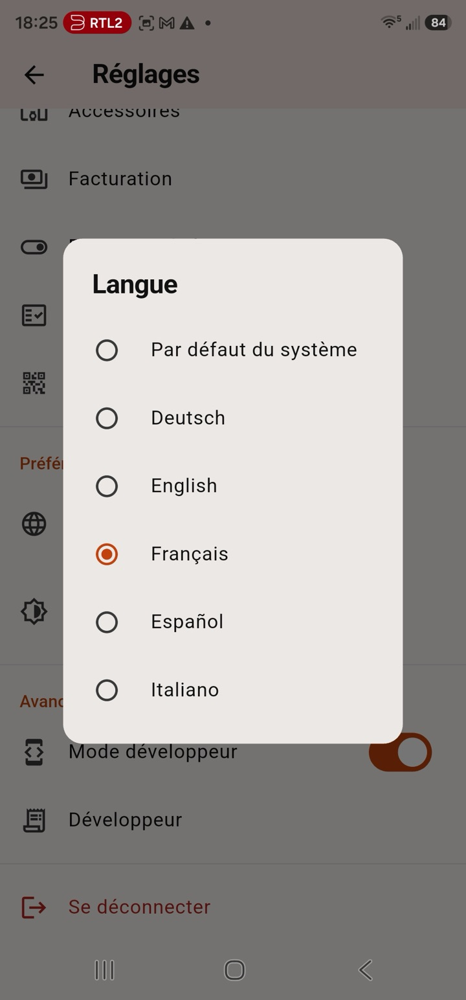

## 1. Primi passi

### Creare un account

Apri l'app e registrati con email, password (minimo 8 caratteri) e un nome visibile. Il pulsante a occhio mostra o nasconde la password mentre digiti.

### Creare uno spazio — o unirsi a uno

Dopo l'accesso, la schermata di benvenuto offre due strade:

- **Crea uno spazio di lavoro** — ne diventi il **proprietario**. Scegli nome, paese (determina la valuta predefinita) e fuso orario. Poi disegnerai la planimetria nell'editor (§7).
- **Unisciti a uno spazio** — digita l'**ID dello spazio** che ti hanno condiviso, oppure tocca **Scansiona codice QR** e inquadra il QR d'invito appeso alla parete. Ti unisci con il ruolo che l'invito porta con sé (§2).

Un account può appartenere a più spazi; passa dall'uno all'altro in **Impostazioni → Profili**. Tutto nell'app è riferito allo spazio attivo.

## 2. Ruoli e inviti

DesKilo ha tre ruoli cumulativi, più un account dispositivo:

| Ruolo | Può |
|---|---|
| **Membro** | Fare check-in/out, prenotare, presentare spese, vedere e gestire i propri eventi e il proprio conto |
| **Admin** | Tutto ciò che può un membro, più: agire *per chiunque* (prenotazioni, pagamenti, spese — soggetto a conferma, §6), approvare le spese, emettere badge per il chiosco |
| **Proprietario** | Tutto ciò che può un admin, più: modificare lo spazio fisico, definire piani e prezzi, gestire ruoli, chioschi e impostazioni dello spazio |
| **Chiosco** | Un account per tablet a parete (§9) — mostra solo la planimetria; i membri agiscono attraverso di esso con un badge |

**Ogni invito è legato a un ruolo.** Nella schermata *ID spazio & QR* del proprietario ci sono due inviti, ciascuno con il proprio QR e il proprio codice:

- **Invito membro** — l'ID dello spazio stesso. Stampalo, appendilo, condividilo liberamente: chi lo scansiona o lo digita entra come semplice membro.
- **Invito admin** — un codice segreto separato, visibile solo ai proprietari. Condividilo solo con chi deve gestire lo spazio: chi lo usa entra come admin.

**Non esiste un invito proprietario — di proposito.** La proprietà può essere concessa solo da un proprietario esistente, in *Membri e piani*. Uno spazio mantiene sempre almeno un proprietario: l'app rifiuta di retrocedere o rimuovere l'ultimo. Promuovere o retrocedere un **admin** passa dal flusso di validazione (§6) — si applica quando i validatori dello spazio confermano.

Il QR codifica un link che nomina il ruolo concesso (`deskilo://join?role=…`). Manomettere il link non cambia nulla — il server ricava il ruolo dal codice segreto stesso.

## 3. La planimetria (scheda Piano)

La planimetria mostra il livello attivo del tuo spazio: uffici, tavoli e posti, con codice colore — **libero**, **prenotato**, **occupato**, **mio**, **bloccato**. I posti occupati mostrano il nome di chi c'è, un **badge di check-in** quando è arrivato, e un **punto verde** quando è online nell'app.

La planimetria può somigliare al tuo spazio reale: il proprietario può mettere una **foto della stanza come sfondo del livello** e piazzare **immagini illustrative ridimensionabili** (piante, divani…) sulla griglia. Un cursore di **trasparenza dei tavoli** nelle impostazioni lascia trasparire la foto sotto i tavoli disegnati.

Muoversi:

- La tela **si adatta da sola** al tuo piano all'apertura o alla rotazione del dispositivo; **pizzica per zoomare** o usa i pulsanti **+ / −**, trascina le **barre di scorrimento** ai bordi e tocca il pulsante di **adattamento** per ricentrare.
- Scegli il piano dal **menu dei livelli** (menu compatto); l'icona dell'orologio riporta la linea temporale a **adesso**.
- In **orizzontale**, i controlli passano in un pannello laterale e la planimetria riempie lo schermo — comodo sui tablet.

Prenotare dalla planimetria:

- **Check-in al volo**: tocca un posto libero → la scheda propone *adesso* fino alla fine predefinita dello spazio → conferma. Se qualcuno ha prenotato quel posto più tardi, la tua ora di fine viene limitata e te lo diciamo.
- **Check-in su prenotazione**: la tua prenotazione apre una finestra di check-in. Fai check-in dalla planimetria o dalla notifica di promemoria. In caso di assenza, il posto viene **liberato automaticamente** dopo il ritardo configurato.
- **Check-out**: manuale, o automatico alla fine della prenotazione / alla chiusura.
- **Linea temporale**: scegli una finestra da→a (o Mattina / Pomeriggio / Giornata intera, secondo la granularità dello spazio) per vedere l'occupazione in qualsiasi momento futuro.
- I posti possono avere **accessori** (monitor, scrivania regolabile…), alcuni con supplemento per mezza giornata che compare sul tuo estratto.
- Le prenotazioni contano sui tuoi **giorni mensili** (§8) — oltre il tuo piano, l'app blocca o addebita, secondo ciò che il proprietario ha configurato per te.

## 4. Prenotazioni (hub Prenota)

Apri l'hub **Prenota** (pulsante centrale). Una striscia di date sceglie il giorno; i chip di finestra l'orario; poi quattro viste:

- **Piano** — la planimetria filtrata sulla tua finestra; tocca un posto libero per prenotarlo.
- **Giorno** — ogni posto come riga temporale del giorno scelto; tocca un tratto libero per prenotare, il tuo blocco per i dettagli.
- **Settimana** — una griglia posto × giorno dell'intera settimana ISO; trova una mezza giornata libera a colpo d'occhio e toccala per prenotare.
- **Mese** — un calendario di disponibilità: scrivanie libere per giorno su tutti i piani; tocca un giorno per entrare nella sua vista Giorno.

Le prenotazioni seguono la **regola di granularità** dello spazio — mezze giornate, giornate intere, oppure orari liberi sulla griglia di minuti del proprietario. Rispettano i **giorni di apertura** e i **giorni di chiusura**, e le regole di prenotazione (orizzonte, durata massima, termine di cancellazione). Esigenze ricorrenti? Prenota una **serie** (giornaliera, feriale, settimanale) — giorni chiusi e conflitti vengono saltati e segnalati.

La scheda **Calendario** mostra le tue prenotazioni per mese — i tuoi giorni in **rosso**, quelli degli altri in **blu**, oggi cerchiato — con una timeline per giorno. In orizzontale, calendario e timeline usano il layout diviso.

## 5. Elenco dei membri (scheda Membri)

Guarda chi fa parte della tua comunità:

- Ogni scheda membro mostra **foto** (o iniziale), **ruolo**, **stato personalizzato** («a Berlino fino a venerdì…»), un indicatore **online / ultimo accesso**, e un **chip di prenotazione**: posto con check-in, prenotato adesso, o prossima prenotazione.
- Tocca un membro per la sua **scheda di dettaglio** — incluse le prossime prenotazioni.
- **Scorri** su un membro per scrivergli su **WhatsApp**; il **pulsante gruppo** apre il gruppo WhatsApp della comunità (impostato dal proprietario).
- Imposta foto, stato e visibilità del telefono in **Impostazioni**.

## 6. Eventi e conferme (icona campanella)

Il flusso eventi è la traccia di controllo dello spazio: prenotazioni create/modificate/cancellate, pagamenti registrati, spese presentate, richieste di giorni extra, cambi di ruolo. I membri vedono i propri eventi; admin e proprietari vedono tutto.

**Il protocollo di conferma:** quando un admin fa qualcosa *per qualcun altro* — ti prenota un posto, registra il tuo pagamento — resta **in sospeso finché non confermi**. Le voci in sospeso sono fissate in alto con pulsanti accetta/rifiuta e ricevi una notifica. Le azioni su te stesso non richiedono mai conferma.

**Quorum di validazione:** per le questioni di denaro e i cambi di ruolo il proprietario definisce *chi* deve approvare e *quante* approvazioni servono. Le richieste senza risposta scadono dopo 7 giorni — nulla di costoso viene mai concesso in silenzio.

Il proprietario regola tutto questo per **dominio** in **Impostazioni → Regole di validazione**: pagamenti, spese, servizi, mezze giornate extra, cambi di ruolo, prenotazioni e rettifiche hanno ciascuno la propria regola (o ereditano quella predefinita). Una regola stabilisce il numero di validazioni richieste, *quali* admin possono validare (tutti, o alcuni nominati) e se il proprietario deve sempre dare l'approvazione finale.

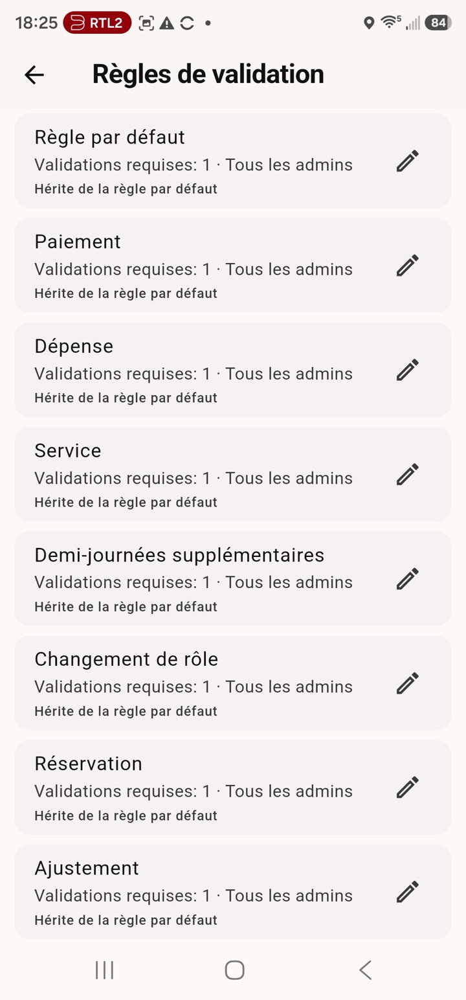 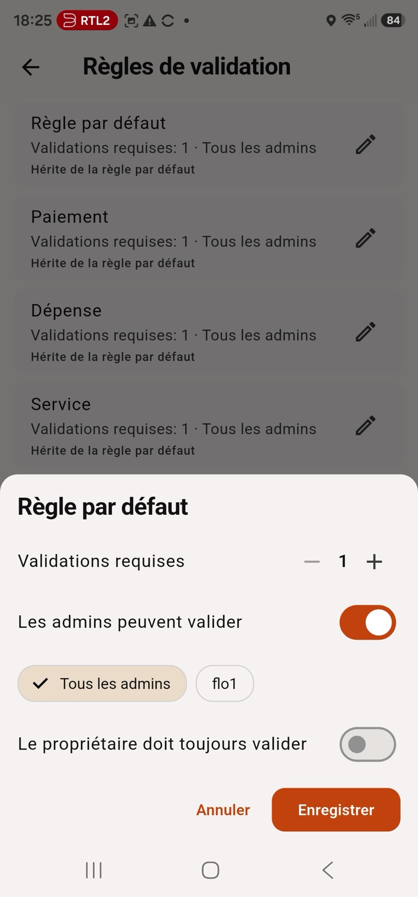

*A sinistra: una regola per dominio, che eredita da quella predefinita. A destra: la modifica di una regola — validazioni richieste, validatori autorizzati, approvazione del proprietario.*

## 7. Per i proprietari: editor e impostazioni

Tutta l'amministrazione vive in **Impostazioni → Amministrazione**. Una sola regola da conoscere: **la voce di impostazioni di una funzionalità appare solo finché quella funzionalità è attiva** — disattiva *Pagamenti online* in **Funzionalità** e la sua schermata di configurazione scompare con essa (e ritorna quando la riattivi). La voce **Funzionalità** è sempre presente, così puoi sempre riattivare un modulo.

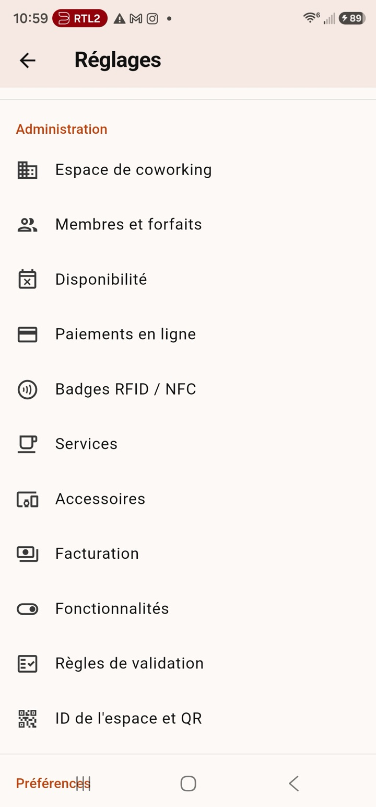

- **Editor** (barra dell'app): disegna il tuo spazio su una griglia — livelli, uffici, tavoli, posti (con orientamento, tipo di sedia e dotazioni), blocco posti per manutenzione. Aggiungi una **foto di sfondo** per livello e **immagini illustrative** spostabili e ridimensionabili. Eliminare qualcosa con prenotazioni future obbliga prima a risolverle.
- **ID spazio & QR**: i tuoi inviti legati ai ruoli (§2). Puoi sostituire l'ID generato con uno memorizzabile (4–20 lettere/cifre), copiarlo, o condividere il QR come PNG.
- **Disponibilità**: giorni di apertura, giorni di chiusura e granularità — orari liberi di inizio/fine, una griglia di minuti (5/15/30/60), mezze giornate o solo giornate intere.
- **Funzionalità**: attiva o disattiva interi moduli per spazio — calendario, eventi, denaro, servizi, esportazione PDF, serie, prenotare per altri, push, blocco posti da parte degli admin, supplementi accessori, **pagamenti online**, **badge RFID/NFC**. Disattivare un modulo rimuove *tutte* le sue schermate e i suoi pulsanti per ogni membro.

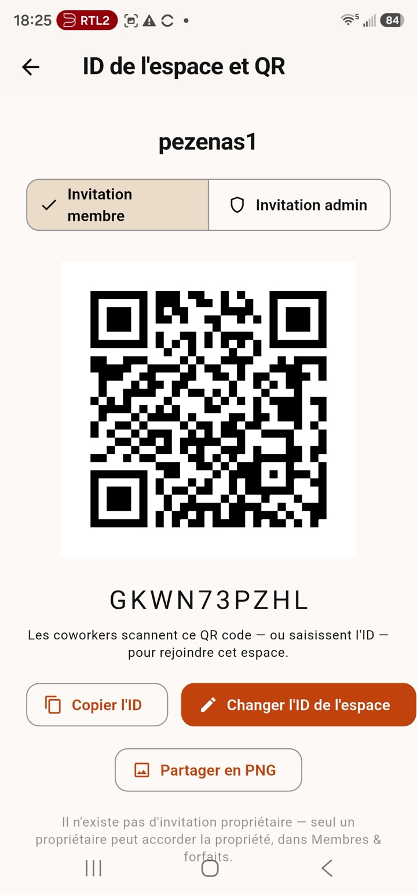 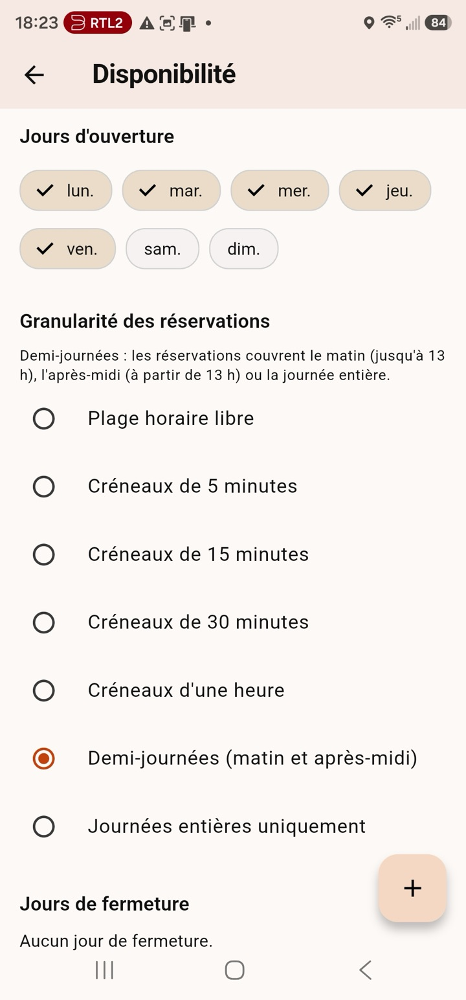 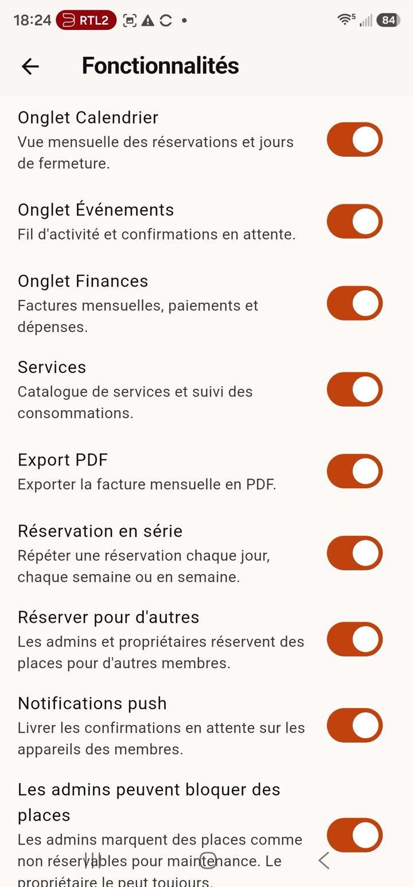 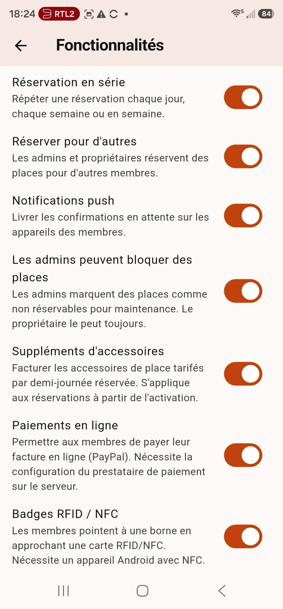

- **Membri e piani**: tocca un membro per aprire la sua **scheda di gestione** — aggiungi un servizio per lui, imposta la sua percentuale di abbonamento, scegli la sua **politica di consumo extra** (§8), limita le sue **prenotazioni simultanee**, emetti i **badge** (§9), promuovi/retrocedi admin, trasforma l'account in un dispositivo **chiosco**, o metti in pausa l'iscrizione.

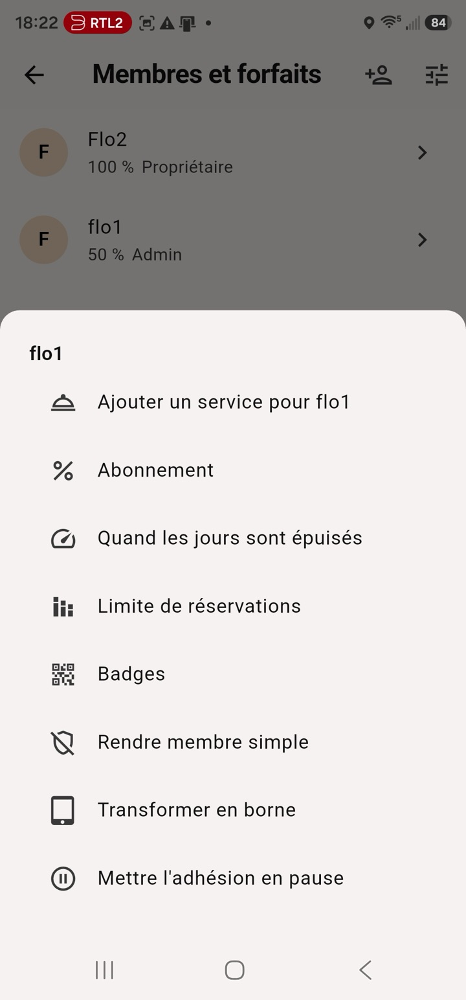 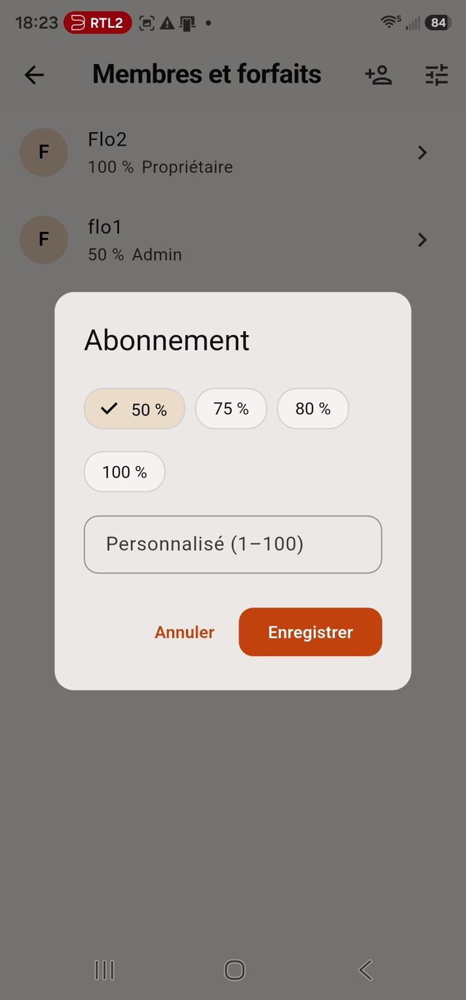 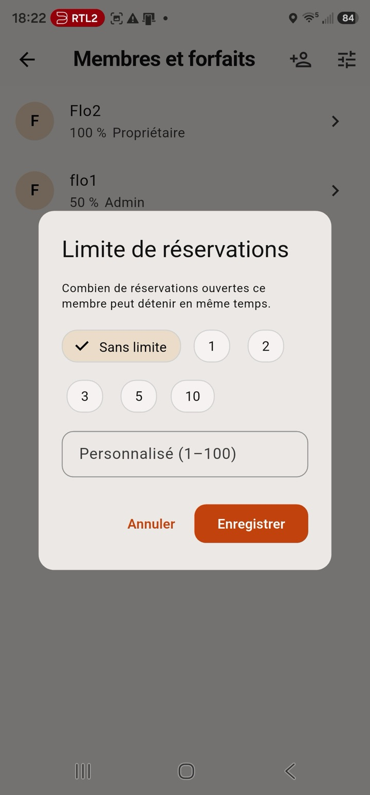

*La scheda di gestione, la finestra della percentuale di abbonamento e il limite di prenotazioni per membro.*

- **Fatturazione**: fasce tariffarie degli abbonamenti percentuali, tariffe di extra, livelli di abbonamento offerti (con un valore libero negoziato opzionale) — e **pacchetti di giorni** (un numero di giorni a un prezzo) per i membri con politica a pacchetto.
- **Servizi** e **Accessori**: i cataloghi dietro il §8 — extra definiti dal proprietario (armadietti, stampe…) e dotazioni per posto con supplementi opzionali per mezza giornata. Entrambi sono semplici elenchi con un pulsante **+**.

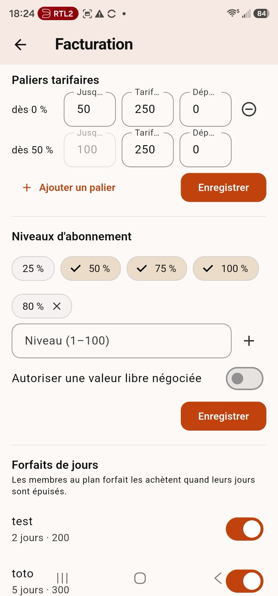 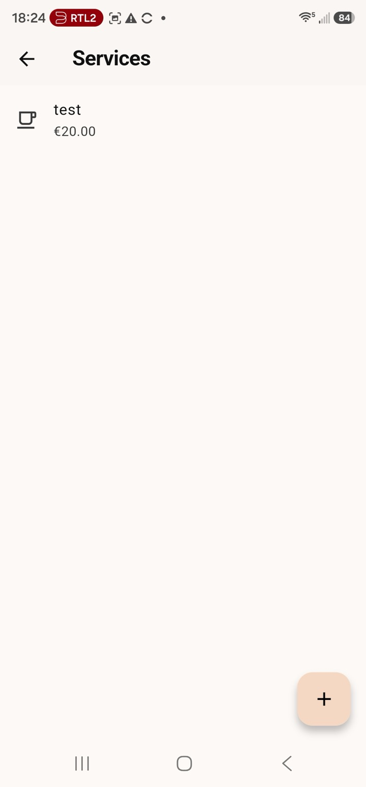 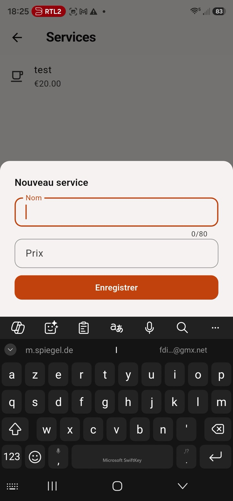 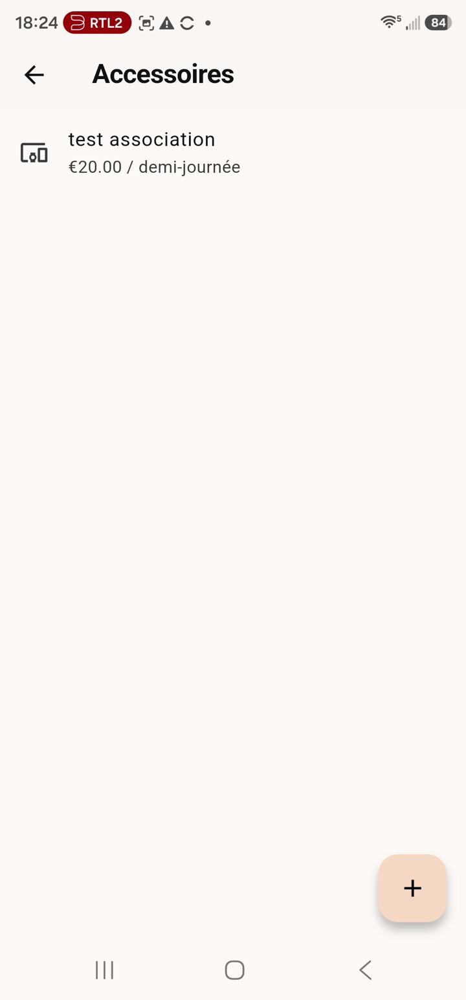

*Fatturazione (fasce, livelli, pacchetti di giorni) · il catalogo Servizi con il suo modulo di creazione · il catalogo Accessori. Un admin aggiunge un consumo di servizio per un membro dalla sua scheda di gestione:*

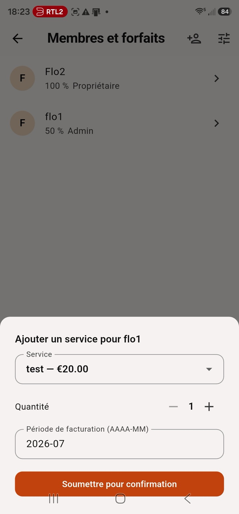

- **Impostazioni dello spazio**: nome, paese/valuta, fuso, istruzioni di pagamento (IBAN, PayPal.me, Wero, Lydia, Wise), link del gruppo WhatsApp, **trasparenza dei tavoli**, esportazioni — e la **zona pericolosa**: un **reset completo dello spazio** (elimina prenotazioni, denaro e planimetria; conserva configurazione e membri), protetto digitando «I agree».
- **Import/export**: l'intera configurazione viaggia come **file XML** — backup, modello o migrazione di un'istanza self-hosted. Si può generare anche un **PDF di configurazione** (membri, planimetria, prezzi, funzionalità). I file vengono salvati **localmente sul tuo dispositivo**.

### Configurare i pagamenti online (proprietari)

Ogni comunità incassa sul **proprio** account del fornitore; l'app non conserva mai le chiavi segrete su alcun dispositivo — restano sul server.

1. Apri **Impostazioni → Pagamenti online** (solo proprietario).
2. Scegli un fornitore e incolla le sue chiavi dal suo pannello:
   - **PayPal** — Client ID, Secret, Ambiente (inizia con *sandbox*), ID webhook, URL di ritorno (PayPal Developer → la tua app REST).
   - **Carta (Stripe)** — Chiave segreta, Segreto di firma webhook, URL di ritorno (Stripe → chiavi API / Webhook).
   - **Mollie** — Chiave API, URL di ritorno (offre iDEAL, Bancontact, carte…).
   - **Wero (tramite Mollie)** — la stessa chiave API Mollie, con Wero abilitato nel tuo account Mollie.
3. **Salva** — appare un chip verde *Configurato*. Attiva la funzione **Pagamenti online** (Impostazioni → Funzionalità) e i membri vedranno **Paga online** su una fattura da saldare. (La voce di impostazioni *Pagamenti online* appare solo finché la funzionalità è attiva.)

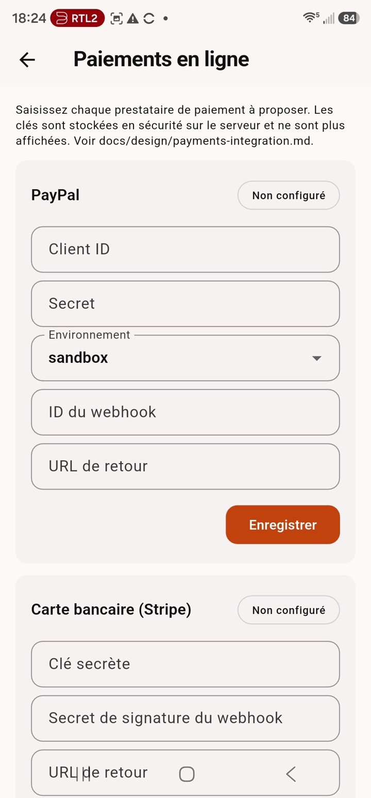 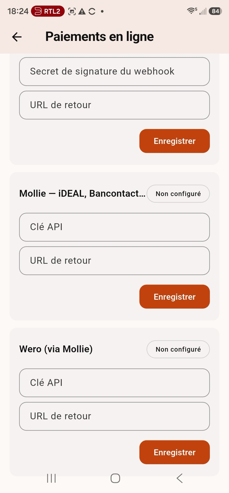

Un segreto salvato non viene più mostrato — lascia il campo vuoto per mantenerlo, digita per sostituirlo, **Rimuovi** per togliere il fornitore. Le commissioni sono del fornitore (tipicamente ~1,5–3 % per pagamento, senza canone mensile); DesKilo non aggiunge nulla, e il bonifico/IBAN manuale resta gratuito.

Se un pagamento non parte, attiva **Impostazioni → Avanzate → Modalità sviluppatore** e apri la schermata **Sviluppatore**: la traccia *pagamenti* mostra esattamente quali fornitori sono configurati e quali campi mancano ancora.

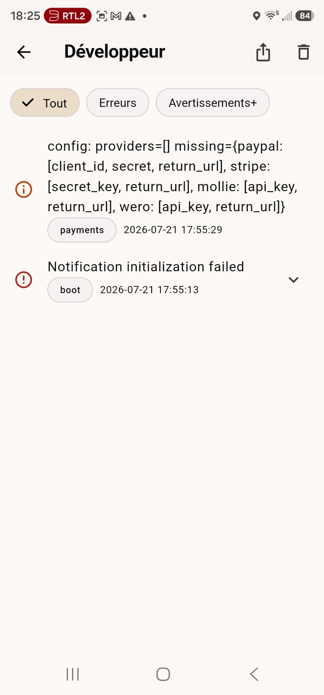

### Configurare i badge RFID / NFC (proprietari)

Le tessere fisiche permettono il check-in con un tocco — senza telefono.

1. Apri **Impostazioni → Badge RFID / NFC** (solo proprietario). Attiva **Abilita il check-in con badge NFC** e leggi la riga di **stato del dispositivo** — serve un dispositivo **Android** con NFC attivo (gli iPad non hanno NFC).
2. Dai una tessera a ogni membro: **Membri e piani → il membro → Badge → Registra tessera**, poi avvicina la sua tessera al dispositivo. Va bene qualsiasi tessera con chip leggibile (MIFARE, NTAG…).
3. Usale a un **chiosco** (§9): il membro avvicina la tessera per prenotare o fare check-in. Revoca una tessera persa dalla stessa finestra Badge.

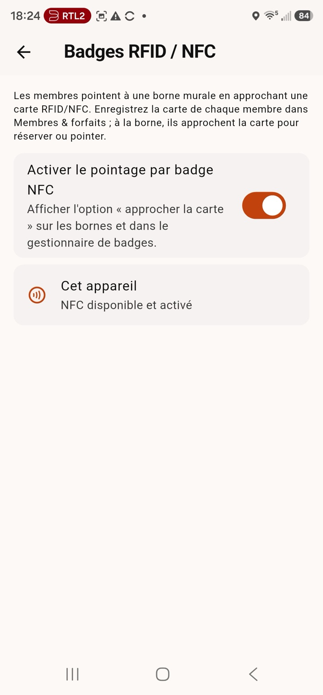 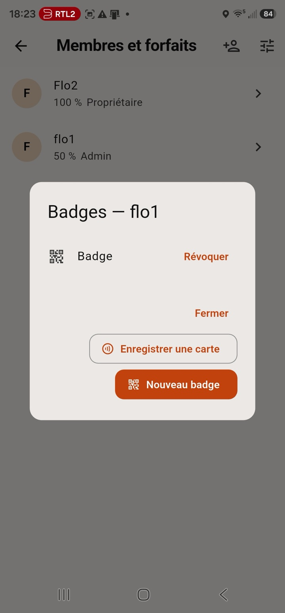

*La schermata di configurazione NFC (interruttore dello spazio + stato NFC di questo dispositivo) e la finestra Badge di un membro: revoca, registra una tessera, o emetti un nuovo badge QR.*

## 8. Denaro (scheda Denaro)

Il tuo conto risponde a *quanto devo, quanto mi devono* — e *quanto posso ancora prenotare*:

- **Questo mese** — la scheda in cima alla fattura: quanti **giorni** include il tuo abbonamento questo mese, quanti ne hai **usati**, quanti ne **restano**, con barra di avanzamento. Una mattina prenotata conta 0,5 giorni. Il diritto mensile segue i giorni di apertura dello spazio e la tua percentuale.
- **Quando i giorni finiscono**, ciò che accade è una scelta del proprietario, per membro:
  - **Bloccato** (predefinito) — niente più prenotazioni; chiedi a un admin, o richiedi **mezze giornate extra** direttamente dalla scheda Denaro (i validatori approvano; i giorni concessi restano addebitati alla tariffa extra).
  - **A consumo** — continui a prenotare; ogni giorno extra è addebitato alla tariffa extra della tua fascia (mostrata sulla scheda).
  - **Pacchetti** — tocca **Acquista un pacchetto** e scegli uno dei pacchetti di giorni del proprietario; i tuoi giorni aumentano subito e il prezzo finisce sulla fattura del mese.
- **Addebiti**: abbonamento mensile (piano percentuale), extra, consumo di servizi, supplementi accessori, pacchetti di giorni.
- **Accrediti**: spese approvate, pagamenti registrati, rettifiche.
- **Estratti**: mensili, con stato **saldato / da saldare**, esportabili come **fattura PDF** salvata localmente.
- **Pagare**: DesKilo tiene traccia dei pagamenti; una fattura da saldare mostra le **istruzioni di pagamento** dello spazio (l'IBAN si copia con un tocco, PayPal.me si apre direttamente). Registra un pagamento («ho pagato») con il metodo — l'altra parte conferma. Se lo spazio ha attivato i **pagamenti online** e il suo server è configurato, il pulsante **Paga online** consente di saldare subito l'importo dovuto — con **PayPal, carta (Stripe), Mollie o Wero**, secondo ciò che lo spazio ha attivato (se più di uno, appare un selettore).
- **Spese**: hai comprato il caffè per lo spazio? Presenta la spesa — un altro admin la approva (niente auto-approvazione) e l'importo viene accreditato sul prossimo estratto.
- **Servizi**: extra definiti dal proprietario (armadietti, stampe…) il cui consumo arriva sul tuo estratto dopo la tua conferma.

## 9. Modalità chiosco (tablet a parete)

Monta un tablet Android o un iPad vicino alla porta e lascia che le persone facciano check-in entrando:

1. Il proprietario crea un account normale per il dispositivo, lo unisce allo spazio e lo marca come **chiosco** in *Membri e piani*. Da quel momento l'account è bloccato sulla planimetria a schermo intero — nessun'altra schermata, nient'altro da toccare.
2. Il proprietario (o un admin) dà un **badge** a ogni membro, in *Membri e piani → un membro → Badge*. Due tipi:
   - **Codice QR** — mostrato **una sola volta**; tocca **Salva come PDF** per stampare una tessera, o salva il QR sul telefono del membro.
   - **Tessera RFID/NFC** — tocca **Registra tessera** e avvicina la tessera fisica del membro (Android con NFC). Configuralo in *Impostazioni → Badge RFID / NFC* (§7).
   Ogni badge è revocabile in qualsiasi momento.
3. Al chiosco: tocca un posto → **Check-in**, **Prenota** o **Check-out** → presenta il badge: **avvicina la tessera RFID/NFC**, scansiona il QR con un lettore di codici USB/Bluetooth, o digita il codice.

La tua identità esiste solo per il tempo dell'operazione: la credenziale va una volta al server, la prenotazione è fatta **a tuo nome**, e nulla resta sul tablet — sei «disconnesso» appena finisce. (La scansione QR con fotocamera e l'accesso per singola operazione con Google/Facebook sono ancora nella roadmap; **gli iPad non hanno NFC**, quindi lì il QR è la via.)

## 10. Notifiche

Promemoria di check-in, liberazioni per assenza, conferme in sospeso, decisioni sulle spese. La consegna è prima di tutto locale; su Android la variante F-Droid usa **UnifiedPush** (es. ntfy) al posto dei servizi Google — niente Firebase da nessuna parte.

## 11. Privacy

Dati minimi: nome, email, piano, prenotazioni, conto. Controlli tu la foto, lo stato, se il tuo nome compare sulla planimetria e se il tuo telefono è visibile nell'elenco. I badge del chiosco sono salvati solo come hash — un badge perso si revoca, non si indovina. Nessun tracciamento, nessuna analitica di terze parti. Lo storico finanziario viene anonimizzato, non cancellato, all'eliminazione dell'account (obblighi contabili).

## 12. Piattaforme

Android (Google Play e F-Droid), iPhone/iPad e desktop — macOS, e Windows con un **installer MSI** prodotto a ogni release. I tuoi dati seguono il tuo account.
