# Guida utente

**DesKilo — il tuo spazio, insieme.** *Altre lingue: [English](User-Guide) · [Français](Guide-utilisateur) · [Deutsch](Benutzerhandbuch) · [Español](Guia-de-usuario).*

<!-- anchor: user.guide.about -->
## Uno spazio di coworking gestito da chi lo usa

Immagini una sala dove freelance, artigiani e piccoli team condividono tavoli, un bollitore e la password del wifi — e dove le uniche domande da farsi sono *dove posso sedermi oggi, quanto devo e chi deve dire di sì?* DesKilo risponde a queste tre domande per le comunità che gestiscono il proprio spazio.

- **Sapere dove sedersi.** Una pianta viva degli spazi, prenotazioni per mezze giornate o per ore, check-in e check-out, un calendario condiviso.
- **Sapere quanto si deve.** Un conto onesto per ogni membro: quota, giorni in più, spese comuni, pagamenti, estratti e fatture — le stesse cifre per il membro e per chi gestisce lo spazio.
- **Farlo a modo vostro.** Ruoli, approvazioni, orari, prezzi, termini e colori li decidete voi, in poche schermate, senza una piattaforma di proprietari in mezzo.
- **Far parte di una rete.** Un solo account personale vi segue in ogni spazio a cui aderite; gli spazi che vogliono essere trovati pubblicano una pagina e le persone possono scriversi in privato.

DesKilo è software libero (AGPL-3.0). Funziona su telefono, tablet, computer e nel browser, parla italiano, inglese, francese, tedesco e spagnolo e mantiene portabili i dati della vostra comunità: usate il servizio ospitato oppure fate girare voi il backend.

<!-- anchor: user.guide.start-your-own -->
## Create il vostro spazio

Per cominciare non servono un edificio, un business plan o un team informatico. Qualche scrivania in un retrobottega, la sala riunioni di un’associazione, due piani sopra un caffè: dove le persone si ritrovano per lavorare, DesKilo offre una pianta da prenotare, regole scelte insieme e un conto che nessuno deve più tenere in un foglio di calcolo.

In una ventina di minuti potete avere uno spazio a cui ci si può unire: un nome, una pianta, gli orari e qualcuno che dica di sì. Il denaro, le fatture, un chiosco all’ingresso e un aspetto tutto vostro verranno dopo — quando vorrete, nell’ordine che preferite. Provate prima tutto nello spazio dimostrativo, che non appartiene a nessuno e non costa nulla, poi seguite la [Guida di avvio](Guida-di-avvio#come-usare-questa-guida) dal primo passo alla prima prenotazione.

> **Consiglio** Aprite la demo, passate dalla proprietaria a un amministratore e a un membro, e prenotate una scrivania. Dieci minuti lì vi diranno più di qualsiasi descrizione.

<!-- anchor: user.guide.join -->
## Unitevi al progetto

DesKilo nasce in modo aperto, da una piccola comunità, e c’è posto anche per voi:

- **Provatelo e diteci.** Installate l’app (la versione web non richiede nulla; il test chiuso Android e la beta iPhone su TestFlight sono aperti ai tester) e raccontateci cosa vi sorprende.
- **Condividete ciò che sapete.** Gestire uno spazio di coworking insegna cose che nessuno sviluppatore conosce. Diteci di cosa ha bisogno la vostra comunità e cosa vi ha ostacolato.
- **Traducete e migliorate le guide.** Questa guida e la Guida di avvio sono file di testo in cinque lingue, con schermate che un solo comando rifà; una correzione è una piccola modifica.
- **Costruite.** Il codice, la roadmap e le segnalazioni aperte sono pubblici, con le convenzioni che servono a chi arriva.
- **Ospitate.** Fate girare il vostro backend per la vostra comunità, oppure chiedete di usare il deployment di riferimento.

[Il progetto su GitHub](https://github.com/fdittgen-png/deskilo) · [Aprire l’app web](https://fdittgen-png.github.io/deskilo/) · [Test chiuso Android](https://play.google.com/apps/testing/de.deskilo.app) · [Beta iPhone](https://testflight.apple.com/join/RgFX9zBe)

<!-- anchor: user.guide.how-to-read -->
## Come usare questa guida

**Destinatari:** Tutti

Ogni sezione risponde a una domanda — *«come faccio a…?»* — e comincia dalle persone a cui è rivolta, così puoi saltare ciò che non ti riguarda. Gli screenshot provengono dallo spazio dimostrativo, *Atelier du Marché*, le cui persone e cifre sono inventate.

*Scegli il tuo percorso*

| Sei… | Parti da qui |
|---|---|
| Nuovo su DesKilo | [Primi passi](#primi-passi) |
| Un membro che prenota posti | [Prenotare](#prenota) · [Denaro](#finanze) |
| Un amministratore | [Collaborare](#collaborare-membri-richieste-messaggi-e-la-rete-più-ampia) · [Membri e piani](#membri-piani-e-fatturazione) |
| Un proprietario che configura il suo spazio | [Il tuo spazio](#il-suo-spazio-configurato-da-lei-impostazioni-dello-spazio) · [Fatturazione](#membri-piani-e-fatturazione) · [Imposte e fatture](#imposte-fatturazione-e-contabilità) |
| Chi gestisce un’installazione | [Avanzato](#avanzate) |

**Da sapere**

- Nell’app, ogni `?` accanto a un campo apre questa guida proprio in quel punto.
- La riga «Destinatari» indica il gruppo più ristretto interessato: *Membro*, *Amministratore*, *Proprietario*, *Comproprietario*, *Amministratore fatturazione* oppure *Operatore*. Ciò che vedi nell’app dipende dal tuo ruolo e dalle funzioni attivate dal proprietario.
- Il testo blu è un link: a un’altra sezione o alla schermata stessa.

<!-- anchor: user.start.overview -->
## Primi passi

DesKilo è il luogo in cui una comunità che condivide uno spazio di lavoro prenota i propri posti, gestisce le adesioni e salda ciò che deve. Questo capitolo la accompagna dal primo avvio fino a uno spazio in cui può lavorare.

In questo capitolo:
- [Che cos'è DesKilo e chi fa cosa](#che-cosè-deskilo-e-chi-fa-cosa)
- [Creare un account o accedere](#creare-un-account-o-accedere)
- [Reimpostare una password dimenticata](#reimpostare-una-password-dimenticata)
- [Esplorare lo spazio dimostrativo](#esplorare-lo-spazio-dimostrativo)
- [Aderire a uno spazio](#aderire-a-uno-spazio)
- [Creare uno spazio](#creare-uno-spazio)
- [Trovare uno spazio](#trovare-uno-spazio)
- [Io: la sua casa e i suoi spazi](#io-la-sua-casa-e-i-suoi-spazi)
- [Tenere in ordine i propri spazi](#tenere-in-ordine-i-propri-spazi)
- [Profili: un account, più spazi](#profili-un-account-più-spazi)
- [Orientarsi nell'app](#orientarsi-nellapp)
- [La scheda Primi passi e i suggerimenti](#la-scheda-primi-passi-e-i-suggerimenti)
- [Preparare uno spazio con il questionario di configurazione](#preparare-uno-spazio-con-il-questionario-di-configurazione)

<!-- anchor: user.start.what-is -->
### Che cos'è DesKilo e chi fa cosa

**Destinatari:** Tutti

Vuole sapere a cosa serve l'app e che cosa può farci. DesKilo risponde a tre domande di tutti i giorni in uno spazio condiviso: dove posso lavorare, che cosa devo e chi deve approvare. Attorno agli spazi c'è **Io**, il suo account personale, che la segue in ogni spazio a cui appartiene.

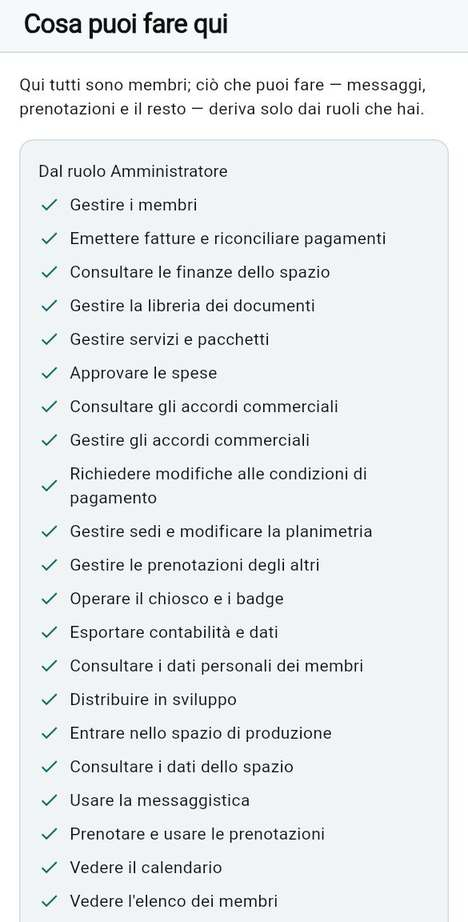

All'interno di uno spazio, ciò che può fare dipende dal suo ruolo. I ruoli si sommano: tutti sono membri, gli altri ruoli si aggiungono a questo.

| Ruolo | A cosa serve |
|---|---|
| Membro | Prenotare posti, registrare ingresso e uscita, scrivere messaggi, seguire i propri conti. |
| Amministratore | Tutto ciò che fa un membro, più agire per conto degli altri membri e approvare richieste, nei limiti stabiliti dal proprietario. |
| Proprietario | Tutto: la piantina, i prezzi, i ruoli e le impostazioni dello spazio. Uno spazio ha sempre almeno un proprietario. |
| Comproprietario | Un comproprietario attivo detiene subito i permessi del proprietario. Un successore, quello passivo, subentra quando il proprietario se ne va o lo promuove. |
| Dispositivo chiosco | Un tablet a muro che mostra la piantina. I membri vi agiscono con il proprio badge. |

**Passaggi**

1. Apra [Impostazioni](https://fdittgen-png.github.io/deskilo/#/settings), che si chiama **Il mio account** quando non amministra nulla.
2. Scelga **Cosa può fare qui**.
3. Legga quale ruolo le dà ciascuna possibilità. Un membro vede **Come tutti i membri**; un amministratore vede anche **Dal ruolo Amministratore**.

**Da sapere**

- Il proprietario decide nella matrice dei ruoli che cosa possono fare gli amministratori e gli altri ruoli, quindi due spazi possono differire.
- Uno spazio può avere anche altri ruoli, per esempio uno per la fatturazione. Compaiono nello stesso elenco.
- Non esiste un invito che renda qualcuno proprietario: solo un proprietario esistente può conferire la proprietà.

**Vedi anche:** [La matrice dei ruoli](#la-matrice-dei-ruoli) · [Aderire a uno spazio](#aderire-a-uno-spazio)

<!-- anchor: user.start.paths -->
### Tre percorsi in questa guida

**Destinatari:** Tutti

Non deve leggere tutto prima. Scelga il percorso che corrisponde a ciò che vuole fare ora: ogni passo è una sezione di questa guida, nell'ordine in cui Le serve.

| Percorso | Passi, in ordine | Fatto quando |
|---|---|---|
| Prima volta come membro | [Creare un account o accedere](#creare-un-account-o-accedere) → [Aderire a uno spazio](#aderire-a-uno-spazio) → [Prenotare un posto](#prenotare-un-posto) → [Leggere il proprio estratto](#leggere-il-proprio-estratto) → [Check-in e check-out](#check-in-e-check-out) | Ha prenotato, sa quanto costa e ha registrato l'arrivo e l'uscita. |
| Mettere in servizio uno spazio | [Pochi posti condivisi](Guida-di-avvio#pochi-posti-condivisi) → [Disegnare stanze, scrivanie e posti](#disegnare-stanze-scrivanie-e-posti) → [Orari di lavoro](#orari-di-lavoro) → [Limiti di prenotazione](#limiti-di-prenotazione) → [Invitare un membro](#invitare-un-membro) → [La scheda Calendario](#la-scheda-calendario) | Un membro che ha invitato ha prenotato e Lei vede la prenotazione. |
| La prima chiusura del mese | [La fatturazione in sintesi](#la-fatturazione-in-sintesi) → [Che cosa emette l'app e che cosa resta al Suo commercialista](#che-cosa-emette-lapp-e-che-cosa-resta-al-suo-commercialista) → [L'assistente di chiusura mensile](#lassistente-di-chiusura-mensile) → [Sollecitare e saldare le fatture aperte](#sollecitare-e-saldare-le-fatture-aperte) → [Esportazioni contabili](#esportazioni-contabili) | Il mese è fatturato nei limiti dell'app, i pagamenti sono abbinati e il file è dal Suo commercialista. |

**Da sapere**

- Uno spazio piccolo ha bisogno solo dei primi due percorsi. Fatturazione, IVA e funzioni avanzate possono aspettare finché lo spazio non ne ha bisogno, e disattivare una funzione non cancella nulla.
- La guida di avvio spiega il perché e l'ordine per un nuovo spazio; questa guida spiega i gesti.

**Vedi anche:** [Che cos'è DesKilo e chi fa cosa](#che-cosè-deskilo-e-chi-fa-cosa) · [L’ordine in cui attivare le cose](Guida-di-avvio#lordine-in-cui-attivare-le-cose)

<!-- anchor: user.start.account -->
### Creare un account o accedere

**Destinatari:** Tutti

Vuole entrare, che sia la prima volta o la centesima. Un solo account vale in tutti gli spazi a cui aderisce sullo stesso server.

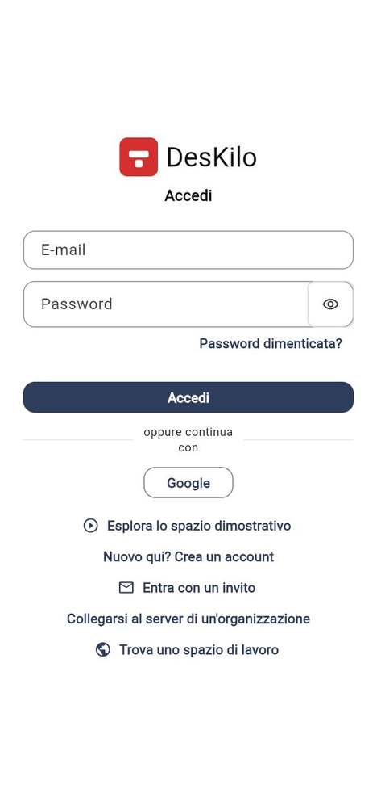

**Passaggi**

1. Apra l'app. La schermata di accesso chiede la sua **E-mail** e la sua **Password**.
2. Per accedere, tocchi **Accedi**.
3. Per creare un nuovo account, tocchi **Nuovo qui? Crea un account**, inserisca un **Nome visualizzato** e tocchi **Crea account**. La password deve avere almeno 8 caratteri.
4. Se il server la offre, tocchi **Google** sotto **oppure continua con**.
5. Alcuni server chiedono prima di confermare il suo indirizzo. La schermata **Controlli la sua e-mail** indica che è stato inviato un link: lo apra su questo dispositivo. Se non arriva nulla, controlli la cartella dello spam o tocchi **Invia di nuovo l'e-mail**.

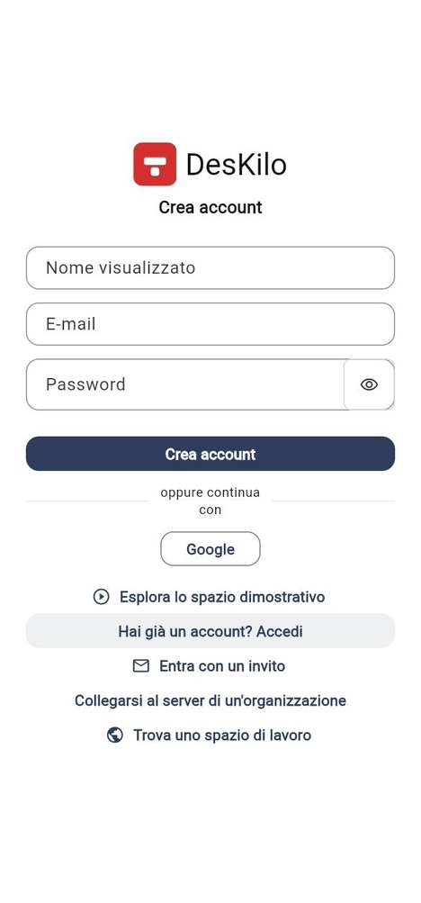

**Da sapere**

- Il pulsante a forma di occhio accanto alla password mostra o nasconde ciò che digita.
- Al primo accesso Le viene chiesto di leggere e accettare le condizioni sulla privacy prima che si apra qualsiasi altra cosa.
- Un nuovo account senza spazi arriva su [Io](https://fdittgen-png.github.io/deskilo/#/me), dove può trovare, aderire a o creare uno spazio.
- **Entra con un invito** nella schermata di accesso tiene a mente lo scopo: crea il suo account, poi incolla il suo invito.

**Vedi anche:** [Reimpostare una password dimenticata](#reimpostare-una-password-dimenticata) · [Aderire a uno spazio](#aderire-a-uno-spazio) · [I suoi dati, i suoi diritti](#i-suoi-dati-i-suoi-diritti)

<!-- anchor: user.start.identity -->
### Il Suo account, i Suoi spazi e il Suo server

**Destinatari:** Tutti

Vuole sapere che cosa La segue da uno spazio all'altro e perché l'app a volte Le chiede di accedere di nuovo. Questa guida usa quattro parole, sempre nello stesso senso:

| Parola | La domanda a cui risponde | Che cos'è |
|---|---|---|
| Account | Chi sono? | La Sua e-mail, la password, il nome e le impostazioni personali. Risiede su un server. |
| Adesione | Che cosa posso fare in questo spazio? | Il Suo ruolo, il Suo piano, le Sue prenotazioni e il Suo denaro in uno spazio. Ogni spazio fissa le proprie regole. |
| Server | Dove è conservato questo spazio? | L'installazione che memorizza lo spazio: il server di riferimento condiviso, o uno che un'organizzazione gestisce da sé. |
| Sessione | Ho effettuato l'accesso qui? | Il Suo accesso su questo dispositivo, a un solo server alla volta. |

**Da sapere**

- Un account vale per tutti gli spazi dello stesso server: aderire a un altro spazio lì aggiunge un'adesione, non un account.
- Uno spazio conservato su un altro server richiede un account su quel server. Aprirlo cambia server e Le chiede di accedere lì; il Suo account sul primo server resta com'è.
- Cambiare server La disconnette, perché il Suo account risiede sul server che lascia.

**Vedi anche:** [Creare un account o accedere](#creare-un-account-o-accedere) · [Io: la sua casa e i suoi spazi](#io-la-sua-casa-e-i-suoi-spazi) · [Il suo server](#il-suo-server)

<!-- anchor: user.start.forgot-password -->
### Reimpostare una password dimenticata

**Destinatari:** Tutti

Non ricorda più la password. Riceve un codice monouso per e-mail e lo usa per impostarne una nuova. Non c'è alcun link da aprire, quindi funziona anche dove i link non aprono l'app.

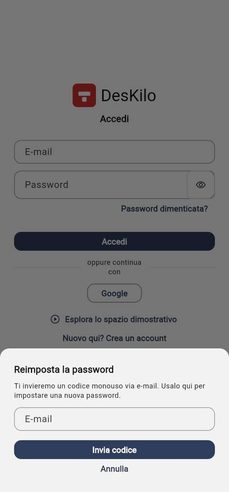

**Passaggi**

1. Nella schermata di accesso, tocchi **Password dimenticata?**.
2. Digiti la sua **E-mail** e tocchi **Invia codice**.
3. Apra l'e-mail e copi il codice.
4. Lo digiti in **Codice ricevuto via e-mail**, scelga una **Nuova password** e tocchi **Imposta la nuova password**.

**Da sapere**

- Il messaggio **Password aggiornata — ha effettuato l'accesso.** conferma che ha funzionato; non deve accedere di nuovo.
- Un codice non valido o scaduto viene rifiutato: ne richieda uno nuovo.
- Se il codice è accettato ma la password non viene salvata, tocchi **Salva di nuovo la nuova password**.

**Vedi anche:** [Creare un account o accedere](#creare-un-account-o-accedere)

<!-- anchor: user.start.demo -->
### Esplorare lo spazio dimostrativo

**Destinatari:** Tutti

Vuole dare un'occhiata prima di impegnarsi. La demo è uno spazio inventato, Atelier du Marché: persone, prenotazioni e fatture sono fittizie, nulla di ciò che fa raggiunge uno spazio reale e non serve alcun account.

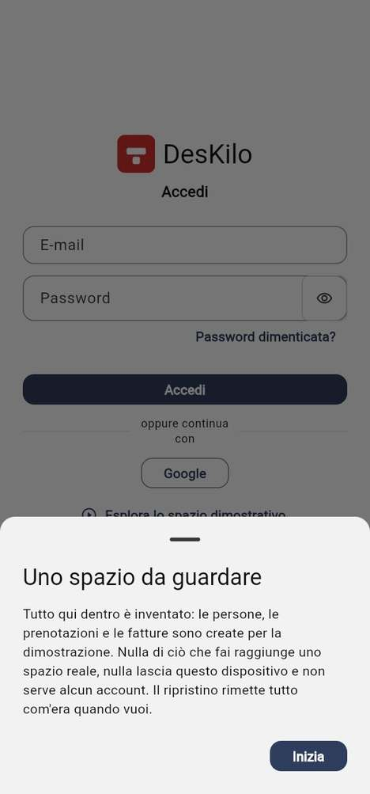

**Passaggi**

1. Nella schermata di accesso, tocchi **Esplora lo spazio dimostrativo**.
2. Legga la nota, poi tocchi **Inizia**.
3. Usi la barra in alto per scegliere con quali occhi guardare: **Proprietario**, **Membro** o **Amministratore**. Ogni tocco sul nome passa al successivo.
4. Tocchi **Reimposta la demo** per rimettere tutto come all'inizio.
5. Tocchi **Esci dalla demo** quando ha finito.

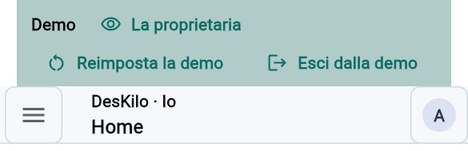

**Da sapere**

- La barra è contrassegnata da **Demo** e resta sopra ogni schermata, così non può scambiarla per uno spazio reale.
- Vedere la stessa schermata come proprietario, amministratore e membro è il modo più rapido per capire che cosa può fare ciascun ruolo.
- La demo resta su questo dispositivo. Uscirne non crea un account.

**Vedi anche:** [Che cos'è DesKilo e chi fa cosa](#che-cosè-deskilo-e-chi-fa-cosa) · [Creare un account o accedere](#creare-un-account-o-accedere)

<!-- anchor: user.start.join -->
### Aderire a uno spazio

**Destinatari:** Tutti

Ha ricevuto un ID dello spazio, un codice QR o un messaggio di invito e vuole entrare. Chiede di aderire come membro e un amministratore la accoglie.

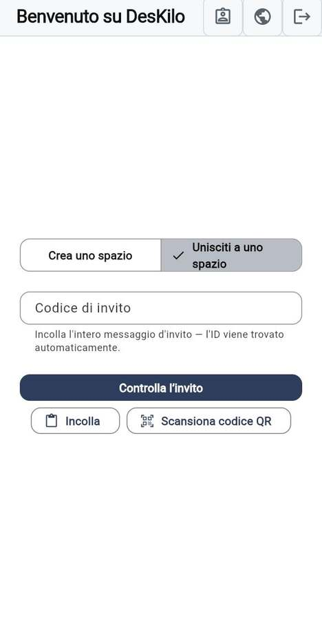

**Passaggi**

1. Acceda, poi tocchi **Entra con un codice** su [Io](https://fdittgen-png.github.io/deskilo/#/me). Dalla schermata di accesso, **Entra con un invito** la porta lì non appena ha un account.
2. Su **Benvenuto su DesKilo**, lasci selezionato **Unirsi a uno spazio**.
3. Digiti l'ID dello spazio in **Codice di invito**, oppure incolli l'intero messaggio di invito: l'ID viene trovato automaticamente. **Incolla** lo legge dagli appunti e **Scansiona codice QR** apre la fotocamera su un codice stampato.
4. Tocchi **Controlla l’invito**. La scheda **Controlli prima di aderire** indica lo spazio, il suo server, il ruolo offerto e se un amministratore deve approvare.
5. Tocchi **Aderisci allo spazio**.

**Da sapere**

- Finché un amministratore non approva, vede **Adesione allo spazio in attesa di approvazione**. **Controlla di nuovo** aggiorna la schermata e i suoi altri spazi e il suo account restano disponibili.
- Aderisce esattamente con il ruolo che l'invito indica. L'ID dello spazio permette sempre di aderire come membro; un codice amministratore personale vale una sola volta, come amministratore.
- Un codice scaduto o sostituito viene spiegato sullo schermo: chieda a chi l'ha inviato uno aggiornato.
- In un browser la fotocamera non può scansionare: digiti l'ID o incolli il messaggio.
- Se la scheda indica un altro server, **Usa questo server** fa passare questo dispositivo a quel server.

**Vedi anche:** [L'ID dello spazio](#lid-dello-spazio-di-lavoro) · [Io: la sua casa e i suoi spazi](#io-la-sua-casa-e-i-suoi-spazi)

<!-- anchor: user.start.create -->
### Creare uno spazio

**Destinatari:** Tutti

Dirige una comunità e vuole uno spazio tutto suo. Ne diventa subito il proprietario.

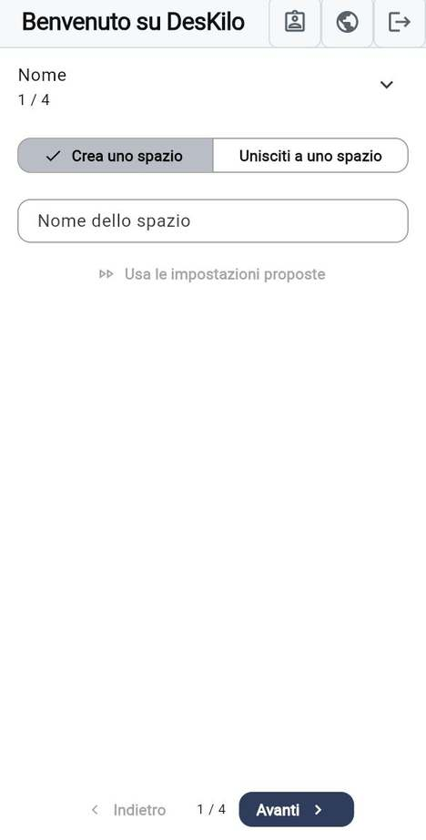

**Passaggi**

1. Apra [Crea uno spazio](https://fdittgen-png.github.io/deskilo/#/onboarding) da **Crea uno spazio** su [Io](https://fdittgen-png.github.io/deskilo/#/me).
2. Digiti un **Nome dello spazio**, poi tocchi **Avanti**. **Usa le impostazioni proposte** salta direttamente all'ultimo passaggio.
3. In **Dove**, scelga il **Paese**; la **Valuta** e il **Fuso orario** ne conseguono e può modificarli.
4. Nella stessa schermata, sotto **Cosa creare**, scelga **Uno spazio di prova**, **Uno spazio reale** o **Una coppia collegata di prova e reale**.
5. In **Partire da**, scelga **Spazio vuoto** per disegnare la sua piantina, oppure un modello già pronto.
6. In **Conferma**, legga ciò che verrà creato e tocchi **Crea spazio**.

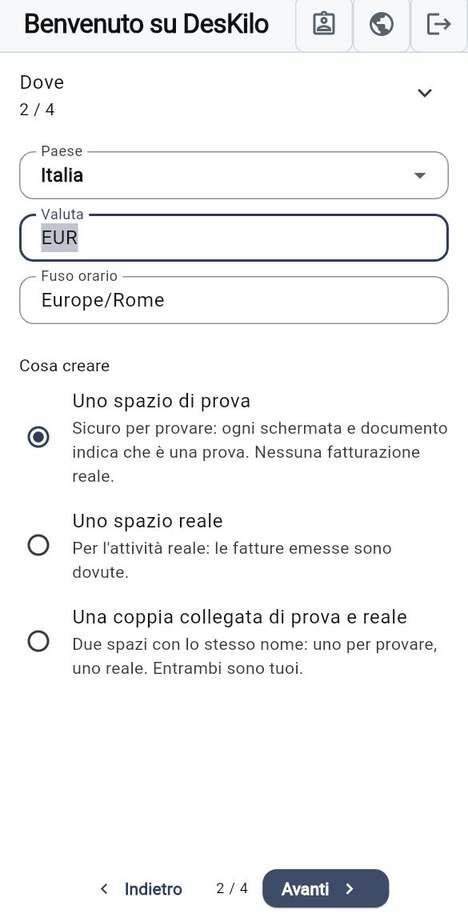

**Da sapere**

- Il selettore parte da **Uno spazio di prova**, che è sicuro per fare esperimenti: ogni schermata e ogni documento lo indicano e non c'è alcuna fatturazione reale. Uno spazio reale emette fatture da pagare.
- La coppia le dà due spazi con lo stesso nome, uno per provare e uno reale. Li possiede entrambi.
- Se la risposta si perde lungo il percorso, l'app conserva i suoi dati e propone **Riprova com'era**, così non crea mai lo spazio due volte.
- Il nuovo spazio si apre non appena esiste. La sua configurazione è trattata nei capitoli per i proprietari.

**Vedi anche:** [Preparare uno spazio con il questionario di configurazione](#preparare-uno-spazio-con-il-questionario-di-configurazione) · [L'ID dello spazio](#lid-dello-spazio-di-lavoro)

<!-- anchor: user.start.find -->
### Trovare uno spazio

**Destinatari:** Tutti

Non ha un codice ma vorrebbe trovare uno spazio vicino a Lei. Gli spazi che pubblicano una pagina compaiono in un elenco pubblico.

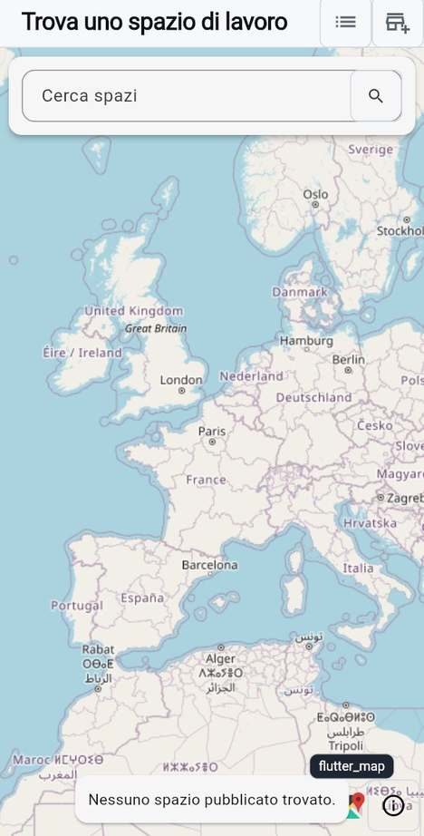

**Passaggi**

1. Tocchi **Trova uno spazio di lavoro** nella schermata di accesso, oppure apra **Scopri** su [Io](https://fdittgen-png.github.io/deskilo/#/me).
2. Digiti un nome o un luogo in **Cerca spazi**.
3. Passi dalla **Mappa** all'**Elenco** con il pulsante in alto.
4. Apra un risultato per leggerne la pagina pubblica. Lì, **Richiedi un profilo nello spazio** chiede di aderire e **Entra** apre uno spazio a cui già appartiene.

**Da sapere**

- Sono elencati solo gli spazi che hanno scelto di essere visibili. Questa demo non ne ha, quindi qui la mappa è vuota.
- Può guardare senza un account; per aderire ne serve uno.

**Vedi anche:** [Aderire a uno spazio](#aderire-a-uno-spazio)

<!-- anchor: user.me.home -->
### Io: la sua casa e i suoi spazi

**Destinatari:** Tutti

Vuole un solo posto che mostri chi è e tutti gli spazi a cui appartiene. **Io** è solo suo e non prende mai i colori di uno spazio. Sotto il suo nome, **I miei spazi** elenca ogni spazio in una scheda.

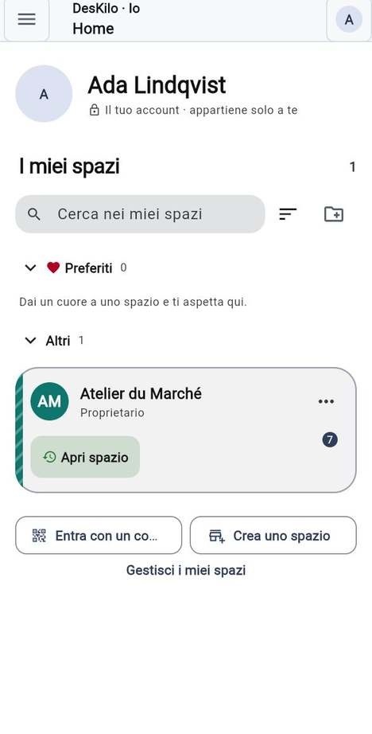

**Passaggi**

1. Apra [Io](https://fdittgen-png.github.io/deskilo/#/me). Se deve del denaro da qualche parte, una scheda in alto indica **Da pagare** e apre le sue finanze.
2. Trovi il suo spazio sotto **I miei spazi**. Uno spazio reale ha un pulsante **Apri spazio**; uno spazio con un gemello di prova ha anche **Spazio di prova**.
3. Tocchi il pulsante per entrare. Lo schermo si riempie del colore, del motivo e del logo dello spazio, poi lo spazio si apre.
4. Tocchi **Entra con un codice** o **Crea uno spazio** sotto l'elenco per aggiungerne un altro.

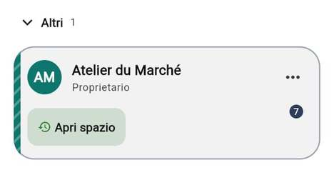

**Da sapere**

- Il piccolo orologio su un pulsante indica il lato che ha usato per ultimo.
- Il piccolo numero su un pulsante conta ciò che l'aspetta lì, affiancando lo spazio reale e il suo gemello di prova. Tenga premuto il pulsante per leggere la frase completa.
- Il motivo sul bordo sinistro della scheda è l'identità propria dello spazio. Se le animazioni sono disattivate, lo spazio si apre semplicemente.
- Uno spazio ancora **In attesa di approvazione** mostra questa indicazione al posto del suo ruolo.
- Uno spazio che si trova su un altro server mostra **Apri su** e il nome di quel server; aprirlo cambia server e Le chiede di accedere lì.

**Vedi anche:** [Tenere in ordine i propri spazi](#tenere-in-ordine-i-propri-spazi) · [Profili: un account, più spazi](#profili-un-account-più-spazi)

<!-- anchor: user.me.organise -->
### Tenere in ordine i propri spazi

**Destinatari:** Tutti

Appartiene a più spazi e vuole un ordine tutto suo. Cuori, gruppi, stelle e ordine sono suoi e restano su questo dispositivo.

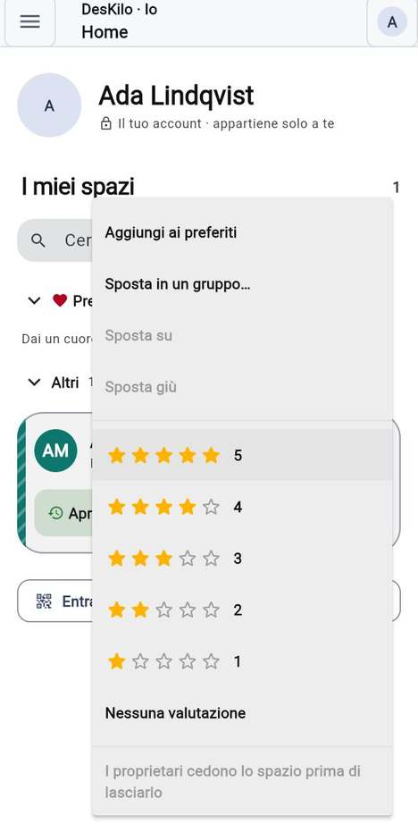

**Passaggi**

1. Su [Io](https://fdittgen-png.github.io/deskilo/#/me), tocchi i tre puntini sulla scheda di uno spazio.
2. Scelga **Aggiungi ai preferiti**: lo spazio passa in **Preferiti** e mostra un cuore.
3. Scelga **Sposta in un gruppo…** per inserirlo in un altro gruppo, oppure tocchi il pulsante a forma di cartella sopra l'elenco per **Nuovo gruppo**.
4. Tocchi una delle cinque stelle per valutare lo spazio, oppure **Nessuna valutazione** per cancellarla.
5. Digiti in **Cerca nei miei spazi** per filtrare e usi il pulsante di ordinamento per scegliere **Il mio ordine**, **Usati di recente**, **Meglio valutati** o **A–Z**.

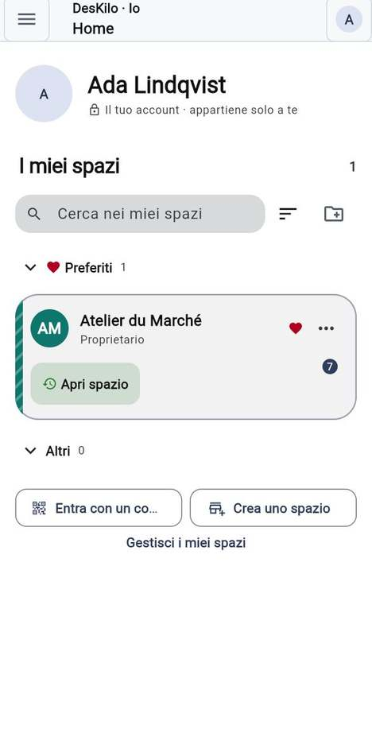

**Da sapere**

- In **Il mio ordine**, tenga premuta una scheda per un secondo per trascinarla, oppure usi **Sposta su** e **Sposta giù**.
- Tocchi il nome di un gruppo per comprimerlo. I gruppi che ha creato possono essere rinominati o eliminati dal loro menu; **Preferiti** e **Altri** ci sono sempre.
- **Lascia questo spazio** si trova nello stesso menu. Smette di essere membro; prenotazioni, fatture e messaggi restano allo spazio. I proprietari cedono prima lo spazio.
- **Gestisci i miei spazi** in fondo apre l'elenco dei profili.

**Vedi anche:** [Profili: un account, più spazi](#profili-un-account-più-spazi) · [Cancellare i miei dati](#cancellare-i-miei-dati)

<!-- anchor: user.profile.profiles -->
### Profili: un account, più spazi

**Destinatari:** Tutti

Un account può appartenere a molti spazi. Ogni spazio le dà un profilo: il suo ruolo e i suoi dati. L'elenco dei profili li mostra tutti e decide con quale si apre l'app.

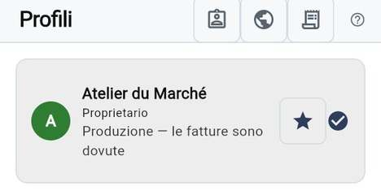

**Passaggi**

1. Apra [Profili](https://fdittgen-png.github.io/deskilo/#/profiles), oppure tocchi **Gestisci i miei spazi** su [Io](https://fdittgen-png.github.io/deskilo/#/me).
2. Legga ogni riga: il nome dello spazio, il suo ruolo e l'ambiente in cui si trova.
3. Tocchi una riga per passare a quel profilo. Il segno di spunta indica il **Profilo attivo**. La prossima volta l'app si apre con esso, su ogni dispositivo.
4. Per rendere predefinito un profilo senza passare ad esso, tocchi la stella (**Usa come predefinito all'avvio**); un secondo tocco lo toglie.
5. Tocchi **Aggiungi un profilo** per aderire a o creare un altro spazio.

**Da sapere**

- Uno spazio con un gemello di prova mostra una sola riga che si apre in due scelte, **Sviluppo — per provare** e **Produzione — le fatture sono dovute**. Tocchi quella che vuole; il segno di spunta la segue.
- Tutto ciò che vede nell'app appartiene allo spazio attivo.
- Il suo account, la sua foto e la sua lingua non fanno parte di un profilo: sono in Io e sono uguali ovunque.

**Vedi anche:** [Io: la sua casa e i suoi spazi](#io-la-sua-casa-e-i-suoi-spazi) · [Aderire a uno spazio](#aderire-a-uno-spazio)

<!-- anchor: user.start.navigation -->
### Orientarsi nell'app

**Destinatari:** Tutti

È in uno spazio e vuole raggiungere una schermata. Tutto si trova in un unico menu e pochi pulsanti stanno in alto.

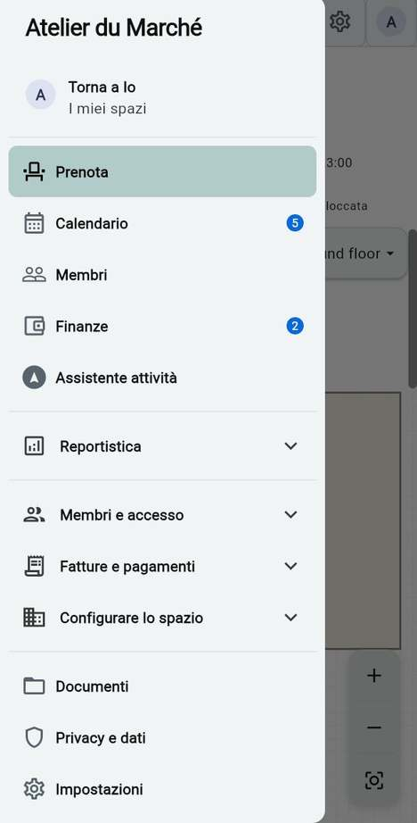

**Passaggi**

1. Tocchi il pulsante ☰ in alto a sinistra. Il menu si apre con il nome del suo spazio, **Torna a Io** e le destinazioni di ogni giorno: **Prenota**, **Calendario**, **Membri**, **Denaro**.
2. Tocchi una destinazione per aprirla. Un numero blu accanto indica ciò che vi attende.
3. Apra **Reportistica**, **Membri e accesso**, **Fatturazione e pagamenti** o **Configurare lo spazio** per vedere gli strumenti di amministrazione che il suo ruolo consente.
4. In fondo, **Documenti**, **Privacy e dati** e **Impostazioni** sono sempre a portata di mano.
5. Tocchi l'avatar in alto a destra, oppure **Torna a Io**, per lasciare lo spazio e tornare a [Io](https://fdittgen-png.github.io/deskilo/#/me).

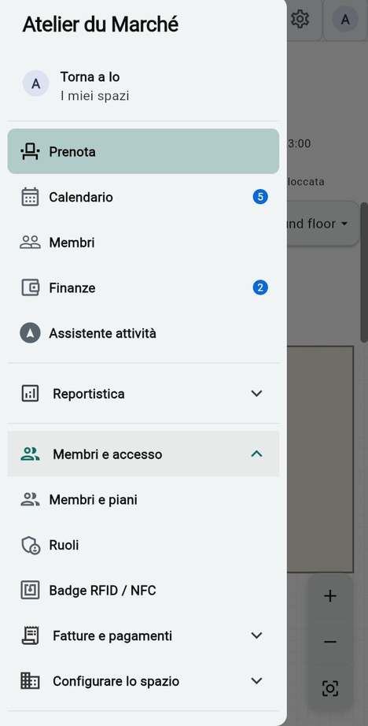

**Da sapere**

- Le destinazioni vanno e vengono con le funzioni attivate dal proprietario e con il suo ruolo. Un semplice membro non vede nessuno dei gruppi di amministrazione.
- Se il suo spazio ha attivato gli Eventi, **Eventi** in alto a destra (l'icona del vassoio con un conteggio) raccoglie ciò che è successo e ciò che attende la sua decisione; quando il Calendario contiene gli avvisi, usi la sua vista **Avvisi**. **Scansiona un codice spazio** e **Modifica spazio** compaiono nella schermata Prenota quando può usarli.
- In una finestra larga, il menu resta aperto come barra laterale. Una finestra stretta o un testo ingrandito usano il menu ☰.
- Nelle app per telefoni e computer, lo [Stile di navigazione](#stile-di-navigazione) nelle Impostazioni le permette di scegliere la classica barra in basso con il pulsante rotondo **Prenota**. Faccia scorrere quella barra verso il basso per una vista a schermo intero; verso l'alto, o con una pressione lunga sul pulsante **Prenota**, per riportarla. Un browser usa sempre il menu.

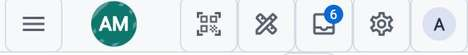

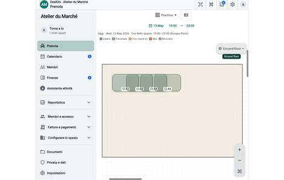

**Vedi anche:** [Stile di navigazione](#stile-di-navigazione) · [Io: la sua casa e i suoi spazi](#io-la-sua-casa-e-i-suoi-spazi)

<!-- anchor: user.start.get-started -->
### La scheda Primi passi e i suggerimenti

**Destinatari:** Tutti

Apre uno spazio e non sa da dove cominciare. La scheda **Primi passi** le indica un passo successivo e brevi suggerimenti spiegano ogni schermata.

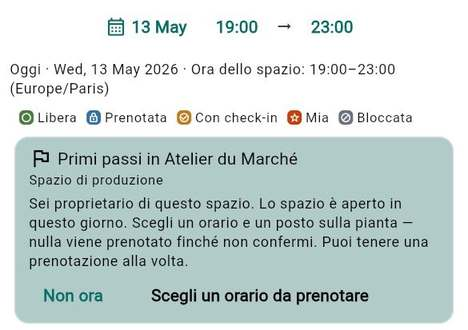

**Passaggi**

1. Apra [Prenota](https://fdittgen-png.github.io/deskilo/#/reserve). La scheda **Primi passi in**, seguita dal nome del suo spazio, compare in cima alla piantina.
2. Segua l'azione che propone, per esempio **Scegli un orario da prenotare**.
3. Tocchi **Non ora** per metterla da parte.
4. Per riportarla, apra il menu di visualizzazione in cima alla piantina, quello che indica **Piantina**, e scelga **Primi passi**.

**Da sapere**

- Per un proprietario o un amministratore la scheda indica che cosa manca prima che qualcuno possa prenotare, con **Completa la configurazione**.
- I suggerimenti sono piccole schede su ogni schermata. **Nascondi suggerimento** ne nasconde uno e **Suggerimento successivo** ne mostra un altro.
- Può mostrare di nuovo tutti i suggerimenti nascosti con [Ripristinare i suggerimenti](#ripristinare-i-suggerimenti).

**Vedi anche:** [Ripristinare i suggerimenti](#ripristinare-i-suggerimenti) · [Orientarsi nell'app](#orientarsi-nellapp)

<!-- anchor: user.start.questionnaire -->
### Preparare uno spazio con il questionario di configurazione

**Destinatari:** Proprietario

Sta per aprire uno spazio e ha molte decisioni da prendere: com'è fatta una prenotazione, quanto costa un mese, che cosa deve dire una fattura. Il questionario di configurazione le permette di prenderle tutte insieme, prima di iniziare, su uno schermo grande e, se vuole, con il suo commercialista o il suo consiglio direttivo.

**Passaggi**

1. Apra il questionario in un browser: [setup.html](https://fdittgen-png.github.io/deskilo/setup.html). Non c'è nulla da installare e nessun account.
2. Risponda ai passaggi in ordine: *Identità*, *Funzioni*, *Disponibilità*, *Piantina*, *Abbonamenti*, *Identità legale e IVA*, *Servizi e accessori*, *Istruzioni di pagamento*, *Ruoli e convalide*, *Membri e inviti*. Ogni passaggio chiede solo ciò che le risposte precedenti rendono possibile.
3. Legga il *Riepilogo delle funzioni* e tolga la spunta a ciò che non vuole: quella funzione resta disattivata nell'app e nulla che la riguardi viene esportato.
4. In *Controlla ed esporta*, risolva le voci bloccanti, poi tocchi **Esporta XML**.
5. Nell'app, apra le impostazioni dello spazio e scelga **Importa lo spazio (XML)** per creare le impostazioni, gli accessori e la piantina.
6. Conservi il file. *Carica file…* riporta le sue risposte più tardi e **Azzera** ricomincia da capo.

**Da sapere**

- Le sue risposte sono salvate nel suo browser e non vengono inviate da nessuna parte. Può chiudere la scheda e tornare.
- Il file è testo semplice: lasci vuoti token e chiavi e li digiti nell'app.
- Ogni domanda indica dove si trova l'impostazione nell'app, così può completare il resto schermata per schermata.
- Saltarlo non costa nulla: ogni risposta è un'impostazione che può fare o modificare più tardi nell'app.

**Vedi anche:** [Creare uno spazio](#creare-uno-spazio) · [Importare lo spazio (XML)](#importare-lo-spazio-xml)

<!-- anchor: user.reserve.overview -->
## Prenota

Prenotare un posto è il cuore di DesKilo: guarda la piantina del suo spazio, sceglie un giorno e un orario, tocca un posto libero e conferma. Questo capitolo segue quel percorso, poi tratta ciò che c'è intorno: le regole che incontra, il check-in e il check-out, la modifica di una prenotazione e il Calendario, dove si raccoglie tutto ciò che ha una data.

In questo capitolo:
- [L'hub Prenota e la piantina](#lhub-prenota-e-la-piantina)
- [Orientarsi nella piantina](#orientarsi-nella-piantina)
- [Vedere i posti come elenco](#vedere-i-posti-come-elenco)
- [Scegliere il giorno e l'orario](#scegliere-il-giorno-e-lorario)
- [Vista giornaliera](#vista-giornaliera)
- [Vista settimanale](#vista-settimanale)
- [Vista mensile](#vista-mensile)
- [Prenotare un posto](#prenotare-un-posto)
- [La scheda di prenotazione](#la-scheda-di-prenotazione)
- [Fare il check-in subito quando è già sul posto](#fare-il-check-in-subito-quando-è-già-sul-posto)
- [Prenotare un'intera scrivania, una sala o un piano](#prenotare-unintera-scrivania-una-sala-o-un-piano)
- [Prenotare per un'altra persona](#prenotare-per-unaltra-persona)
- [Ripetere una prenotazione](#ripetere-una-prenotazione)
- [Le regole che incontra quando prenota](#le-regole-che-incontra-quando-prenota)
- [Giorni di chiusura e festivi](#giorni-di-chiusura-e-festivi)
- [Check-in e check-out](#check-in-e-check-out)
- [Scansionare un codice spazio](#scansionare-un-codice-spazio)
- [Modificare o annullare una prenotazione](#modificare-o-annullare-una-prenotazione)
- [Quando una prenotazione è in attesa di conferma](#quando-una-prenotazione-è-in-attesa-di-conferma)
- [La scheda Calendario](#la-scheda-calendario)
- [Agenda, Settimana e Mese nel Calendario](#agenda-settimana-e-mese-nel-calendario)
- [Le decisioni che la aspettano nel Calendario](#le-decisioni-che-la-aspettano-nel-calendario)
- [Filtrare il Calendario](#filtrare-il-calendario)
- [Salvare una prenotazione nel proprio calendario](#salvare-una-prenotazione-nel-proprio-calendario)

<!-- anchor: user.reserve.hub -->
### L'hub Prenota e la piantina

**Destinatari:** Membro · Amministratore · Proprietario

Vuole vedere quali posti sono liberi. L'hub Prenota si apre sulla piantina di un piano del suo spazio, disegnata per il giorno e l'orario che sta guardando.

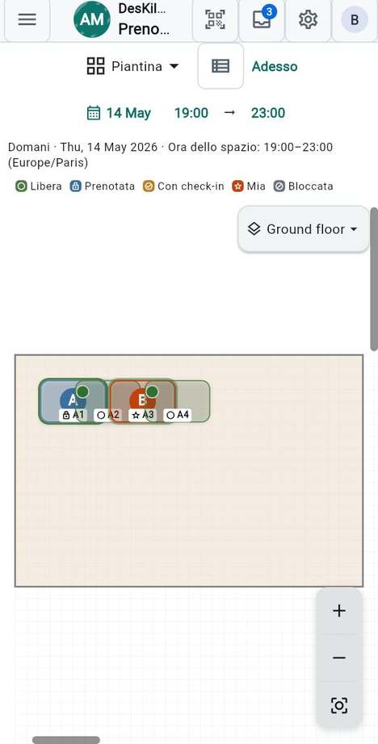

**Passaggi**

1. Apra [Prenota](https://fdittgen-png.github.io/deskilo/#/reserve).
2. Legga la piantina: ogni posto riporta il proprio nome, un piccolo simbolo e un colore che dice di che stato si tratta.
3. Tocchi un posto per agire su di esso. Un posto libero apre la scheda di prenotazione; il suo posto offre il check-in e l'annullamento; il posto di un'altra persona le dice chi lo occupa e fino a quando.
4. La legenda sotto la data spiega i colori. È la stessa sulla piantina e nelle viste Giorno, Settimana e Mese.

| Stato | Che cosa significa |
|---|---|
| **Libera** | Nessuno occupa il posto nell'orario che ha scelto. |
| **Prenotata** | Qualcuno lo ha prenotato. |
| **Con check-in** | La persona che lo ha prenotato è arrivata. |
| **Mia** | È una sua prenotazione. |
| **Bloccata** | Il posto è fuori servizio, per esempio per manutenzione. |
| **Giorno chiuso** | Lo spazio è chiuso quel giorno (viste Giorno, Settimana e Mese). |

**Da sapere**

- Un posto occupato mostra chi c'è: un'iniziale, oppure una foto se la persona ne ha impostata una e il suo spazio mostra le foto sulla piantina. Un piccolo punto verde indica che la persona sta usando l'app in questo momento.
- Un tavolo, una sala o un piano interi prenotati lo dicono sulla piantina, con il nome di chi li occupa.
- Alcuni spazi mostrano meno stati: un posto prenotato e un posto con check-in appaiono allora uguali, e il bloccato si legge **Non disponibile**.
- Quando non è stato possibile caricare l'ultima disponibilità, un banner indica **offline** con l'ora degli ultimi dati e un pulsante **Riprova**, perché un posto mostrato libero potrebbe essere stato preso nel frattempo.

**Vedi anche:** [Scegliere il giorno e l'orario](#scegliere-il-giorno-e-lorario) · [La scheda di prenotazione](#la-scheda-di-prenotazione)

<!-- anchor: user.reserve.plan-levels -->
### Orientarsi nella piantina

**Destinatari:** Membro · Amministratore · Proprietario

Vuole raggiungere il piano, la sala o la scrivania che ha in mente. La piantina può essere spostata, ingrandita e passata da un piano all'altro.

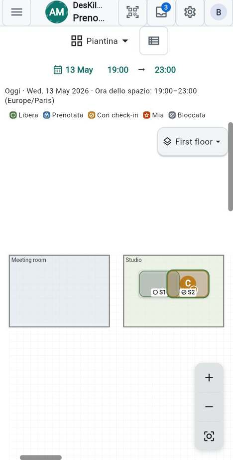

**Passaggi**

1. Tocchi il nome del piano in alto a destra nella piantina, per esempio Primo piano, e scelga un altro piano. La sua scelta viene mantenuta per la prossima volta che aprirà l'hub.
2. Ingrandisca con due dita, oppure con **Ingrandisci** e **Riduci**. Trascini le barre di scorrimento lungo i bordi per spostarsi.
3. Tocchi **Adatta la pianta allo schermo** per riportare in vista l'intero piano.
4. Legga i nomi delle sale nell'angolo di ciascuna. Tocchi un posto al suo interno per prenotarlo.

**Da sapere**

- Il selettore del piano offre un menu solo quando il suo spazio ha più di un piano.
- Un piano, una sala o una scrivania prenotabili per intero mostrano un proprio pulsante o un doppio tocco: vedi [Prenotare un'intera scrivania, una sala o un piano](#prenotare-unintera-scrivania-una-sala-o-un-piano).

**Vedi anche:** [Vedere i posti come elenco](#vedere-i-posti-come-elenco) · [Vista giornaliera](#vista-giornaliera)

<!-- anchor: user.reserve.list -->
### Vedere i posti come elenco

**Destinatari:** Membro · Amministratore · Proprietario

Preferisce le righe a un disegno, oppure la piantina è difficile da leggere su uno schermo piccolo. L'elenco mostra gli stessi posti, piano per piano e scrivania per scrivania.

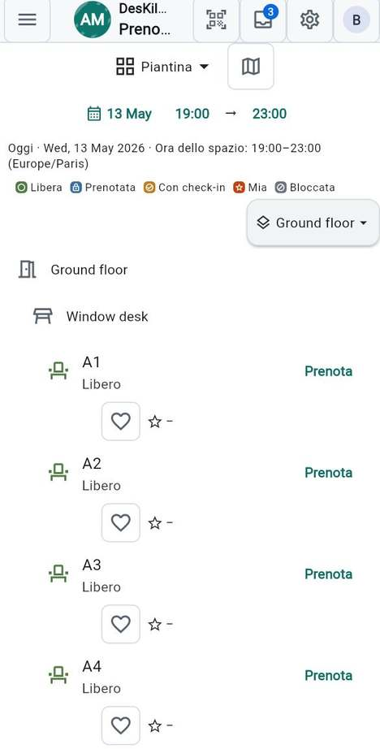

**Passaggi**

1. In [Prenota](https://fdittgen-png.github.io/deskilo/#/reserve), tocchi **Vista elenco**, il pulsante accanto al menu delle viste.
2. Trovi il posto. Ogni riga lo nomina e indica se è libero, prenotato o suo.
3. Tocchi **Prenota** su una riga libera per aprire la scheda di prenotazione.
4. Per tornare al disegno, tocchi **Vista piantina**.

**Da sapere**

- L'elenco segue il giorno e l'orario che ha scelto, esattamente come la piantina.
- Con preferiti e valutazioni attivati, ogni riga riporta anche un cuore (**Aggiungi ai preferiti**) e delle stelle.

**Vedi anche:** [Scegliere il giorno e l'orario](#scegliere-il-giorno-e-lorario) · [La scheda di prenotazione](#la-scheda-di-prenotazione)

<!-- anchor: user.reserve.when -->
### Scegliere il giorno e l'orario

**Destinatari:** Membro · Amministratore · Proprietario

Vuole prenotare per un altro giorno, o per un orario che non è adesso. Le due righe di comandi in alto nell'hub indicano che cosa guarda e quando.

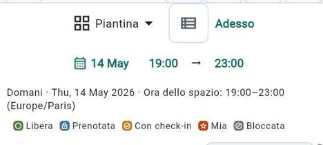

**Passaggi**

1. Tocchi la data, per esempio 14 maggio, e scelga un giorno nel calendario. Può guardare fino a un anno in avanti.
2. Scelga l'orario. Se il suo spazio prenota per mezze giornate, tocchi **Mattina**, **Pomeriggio** o **Giornata intera**. Se prenota a ore o su una fascia oraria libera, tocchi il primo orario per impostare **Dalle** e il secondo per impostare **Alle**.
3. Legga la riga sotto i comandi: indica il giorno, il periodo e le ore nel fuso orario dello spazio e, se diverso, nel suo.
4. Per tornare a oggi, tocchi **Adesso**.

**Da sapere**

- I comandi che vede dipendono dalle regole dello spazio: alcuni spazi prenotano per mezze giornate, altri solo per giornate intere, altri a qualsiasi ora su una griglia.
- Su un telefono i pulsanti delle parti di giornata sono piccole icone di una mezza giornata o di una giornata intera. Tenga premuta un'icona per leggerne il nome e le ore.
- La piantina risponde per l'orario che ha scelto: un posto mostrato libero è libero per tutta la durata.
- Dove le prenotazioni sono per mezza giornata, il periodo da cui parte è quello abituale, impostato in [Periodo di prenotazione predefinito](#periodo-di-prenotazione-predefinito).

**Vedi anche:** [L'hub Prenota e la piantina](#lhub-prenota-e-la-piantina) · [Prenotare un posto](#prenotare-un-posto)

<!-- anchor: user.reserve.day-view -->
### Vista giornaliera

**Destinatari:** Membro · Amministratore · Proprietario

Vuole vedere chi è dove durante la giornata, non solo in un istante. La vista **Giorno** dispone ogni posto come una riga lungo le ore.

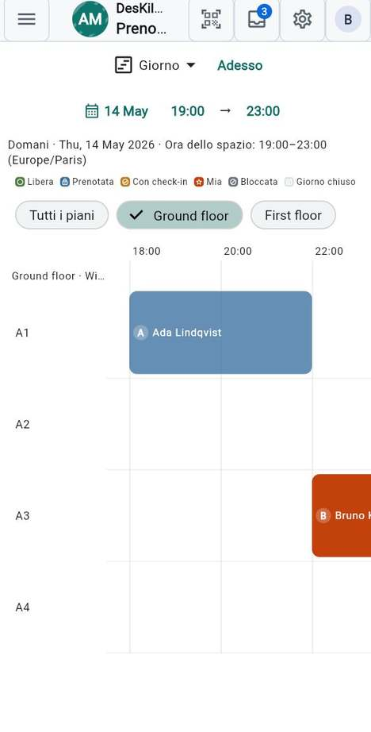

**Passaggi**

1. In [Prenota](https://fdittgen-png.github.io/deskilo/#/reserve), apra il menu delle viste, che all'inizio indica **Piantina**, e scelga **Giorno**.
2. Scelga il giorno con il pulsante della data. Scelga un piano con i chip sopra le righe: **Tutti i piani** o un piano.
3. Legga le barre. Ognuna è una prenotazione, con il nome di chi la occupa; le sue risaltano con il colore di **Mia**.
4. Tocchi un tratto libero di una riga per prenotare quel posto nell'orario che ha scelto. Tocchi la sua prenotazione per aprirne i dettagli; tocchi quella di un'altra persona per vedere chi la occupa e fino a quando.

**Da sapere**

- Un giorno di chiusura è disegnato come chiuso e non può essere prenotato.
- Il menu dietro il comando **Vista** contiene anche **Settimana** e **Mese**.

**Vedi anche:** [Vista settimanale](#vista-settimanale) · [Modificare o annullare una prenotazione](#modificare-o-annullare-una-prenotazione)

<!-- anchor: user.reserve.week-view -->
### Vista settimanale

**Destinatari:** Membro · Amministratore · Proprietario

Vuole trovare una mattina o un pomeriggio libero nei prossimi giorni. La vista **Settimana** mostra i posti sul lato e i giorni della settimana in orizzontale.

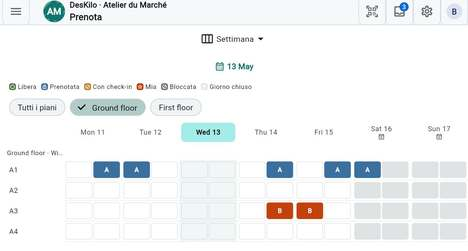

**Passaggi**

1. Apra il menu delle viste e scelga **Settimana**.
2. Trovi il suo giorno. Ogni giorno ha due celle affiancate, la mattina e il pomeriggio. Una cella piena mostra l'iniziale di chi la occupa.
3. Tocchi una cella vuota per prenotare quella metà della giornata su quel posto.
4. Tocchi il nome di un giorno in alto per passare a quel giorno nella vista **Giorno**.

**Da sapere**

- I giorni chiusi sono in grigio e portano un segno di chiusura.
- Scelga **Tutti i piani** o un piano con i chip sopra la griglia.

**Vedi anche:** [Vista giornaliera](#vista-giornaliera) · [Vista mensile](#vista-mensile)

<!-- anchor: user.reserve.month-view -->
### Vista mensile

**Destinatari:** Membro · Amministratore · Proprietario

Vuole sapere quali giorni hanno ancora posto. La vista **Mese** conta i posti liberi per ogni giorno.

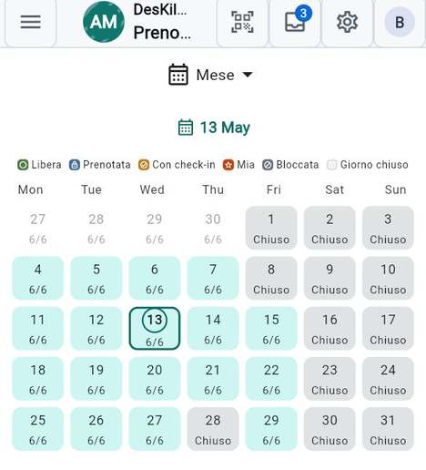

**Passaggi**

1. Apra il menu delle viste e scelga **Mese**.
2. Legga ogni giorno: il numero di posti liberi sul totale, per esempio 6/6. I giorni chiusi indicano **Chiuso**.
3. Tocchi un giorno per aprirlo nella vista **Giorno**, dove vede chi ha prenotato.

**Da sapere**

- Il conteggio riguarda tutti i piani dello spazio.
- Oggi è cerchiato.

**Vedi anche:** [Giorni di chiusura e festivi](#giorni-di-chiusura-e-festivi) · [Vista giornaliera](#vista-giornaliera)

<!-- anchor: user.reserve.book -->
### Prenotare un posto

**Destinatari:** Membro · Amministratore · Proprietario

Vuole un posto per un certo giorno e un certo orario. Dalla piantina bastano pochi tocchi: il giorno, l'orario, il posto e una conferma.

**Passaggi**

1. Apra [Prenota](https://fdittgen-png.github.io/deskilo/#/reserve) e scelga il giorno e l'orario, come descritto in [Scegliere il giorno e l'orario](#scegliere-il-giorno-e-lorario).
2. Scelga il piano, se il suo spazio ne ha più di uno.
3. Tocchi un posto libero. La scheda di prenotazione si apre su di esso.
4. Controlli la riga che indica il posto e il periodo, modifichi ciò che serve e tocchi **Prenota**.
5. Un messaggio conferma la prenotazione. Tocchi **Dettagli** nel messaggio per aprire la nuova prenotazione.

**Da sapere**

- Nulla viene prenotato finché non tocca **Prenota**.
- Se il posto è stato preso un secondo prima, l'app Le dice così invece di prenotarlo due volte.
- Se la connessione si interrompe dopo il suo tocco, la schermata **La sua richiesta di prenotazione** le permette di verificare che cosa è successo, di riprendere la stessa richiesta o di lasciarla perdere. Una richiesta non viene mai prenotata due volte.
- In un giorno di chiusura la piantina indica **Chiuso in questo giorno** e propone il successivo giorno di apertura.

**Vedi anche:** [La scheda di prenotazione](#la-scheda-di-prenotazione) · [Le regole che incontra quando prenota](#le-regole-che-incontra-quando-prenota)

<!-- anchor: user.reservations.booking-sheet -->
### La scheda di prenotazione

**Destinatari:** Membro · Amministratore · Proprietario

Ha toccato un posto libero e la scheda si apre. Mostra ciò che sta per prenotare e le permette di regolarlo prima di confermare. La scheda si limita a proporre: le regole dello spazio vengono verificate quando conferma.

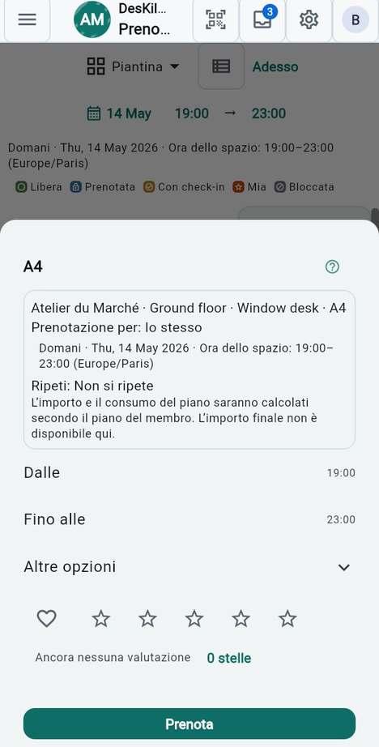

**Passaggi**

1. Legga il riepilogo: lo spazio di lavoro, il piano, la scrivania e il posto, per chi è la prenotazione, il giorno, le ore e la ripetizione.
2. Regoli il periodo. Con le mezze giornate, tocchi **Mattina**, **Pomeriggio** o **Giornata intera**. Su una griglia oraria, imposti **Dalle** e **Fino alle**; su una griglia al minuto un cursore chiamato **Durata** imposta la lunghezza.
3. Apra **Altre opzioni** per ripetere la prenotazione.
4. Se vuole, aggiunga il posto ai preferiti con il cuore, oppure lo valuti con le stelle.
5. Tocchi **Prenota**.

**Da sapere**

- Se il periodo scelto non è consentito, una riga rossa sotto il periodo ne spiega il motivo e **Prenota** resta in grigio.
- Se un'altra prenotazione segue sullo stesso posto, la scheda indica che il posto è prenotato da quell'ora e ferma la sua prenotazione lì.
- Gli amministratori vedono **Prenota per** e, per bloccare un posto, **Gestisci risorsa**.
- Quando il periodo scelto comprende questo momento, compare un interruttore **Check-in immediato**, disattivato per impostazione predefinita.

**Vedi anche:** [Fare il check-in subito quando è già sul posto](#fare-il-check-in-subito-quando-è-già-sul-posto) · [Ripetere una prenotazione](#ripetere-una-prenotazione) · [Prenotare per un'altra persona](#prenotare-per-unaltra-persona)

<!-- anchor: user.reserve.walk-up -->
### Fare il check-in subito quando è già sul posto

**Destinatari:** Membro · Amministratore · Proprietario

È in piedi davanti a un posto libero e vuole occuparlo subito. Nella piantina di oggi la scheda di prenotazione offre due azioni affiancate.

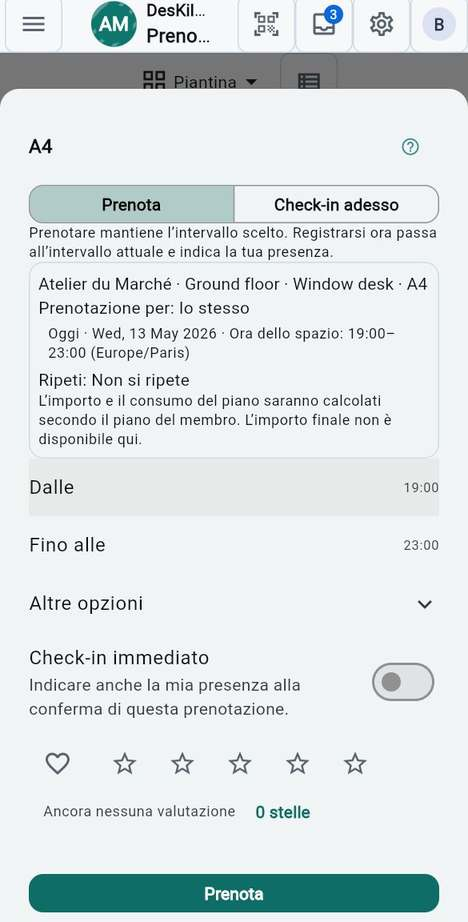

**Passaggi**

1. Apra [Prenota](https://fdittgen-png.github.io/deskilo/#/reserve) su oggi, senza altro orario scelto, e tocchi un posto libero.
2. In cima alla scheda scelga **Prenota** o **Check-in adesso**.
3. **Prenota** mantiene il periodo che ha scelto. **Check-in adesso** passa al periodo in corso e la segna come presente.
4. Tocchi **Check-in** per confermare.

**Da sapere**

- Il check-in si ferma dove inizia la prenotazione successiva su quel posto, e la scheda Le dice così.
- Un check-in sul posto deve iniziare oggi.
- Dove le prenotazioni sono per mezza giornata, il check-in termina con la mezza giornata in corso, oppure con la giornata quando il suo periodo abituale è la giornata intera.

**Vedi anche:** [Check-in e check-out](#check-in-e-check-out) · [Le regole che incontra quando prenota](#le-regole-che-incontra-quando-prenota)

<!-- anchor: user.reserve.whole-space -->
### Prenotare un'intera scrivania, una sala o un piano

**Destinatari:** Membro · Amministratore · Proprietario

Ha bisogno dell'intero tavolo, dell'intera sala o dell'intero piano, per una riunione o per una giornata. Gli spazi predisposti a questo scopo possono essere prenotati per intero.

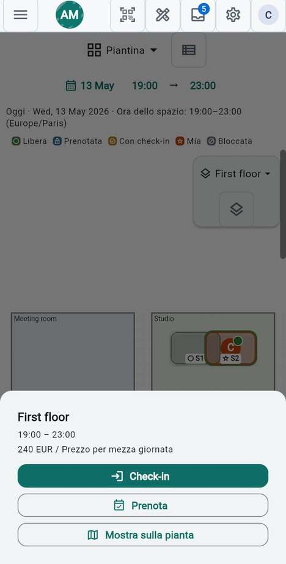

**Passaggi**

1. Sulla piantina, tocchi due volte la scrivania, la sala o il piano vuoto. Per un piano può anche toccare **Prenota il piano**, il pulsante sotto il selettore del piano.
2. La scheda indica lo spazio, il periodo e il **Prezzo per mezza giornata** quando c'è.
3. Tocchi **Check-in** per occuparlo subito, oppure **Prenota** per prenotarlo per il periodo mostrato.
4. Nella scheda di prenotazione che si apre, scelga il periodo e tocchi **Prenota**.

**Da sapere**

- Un membro ha bisogno del diritto di prenotare spazi interi; i proprietari e gli amministratori ce l'hanno. Senza di esso la scheda indica **Non è autorizzato a prenotare un tavolo, ufficio o piano intero.**
- Uno spazio intero non può essere prenotato se uno dei suoi posti è occupato in quel periodo, e nessun posto può essere prenotato mentre il suo tavolo, la sua sala o il suo piano sono prenotati per intero.
- Dove il proprietario richiede un'approvazione, la prenotazione di uno spazio intero blocca subito lo spazio e attende i convalidatori; se la rifiutano, viene annullata.

**Vedi anche:** [Quando una prenotazione è in attesa di conferma](#quando-una-prenotazione-è-in-attesa-di-conferma) · [Scansionare un codice spazio](#scansionare-un-codice-spazio)

<!-- anchor: user.reserve.for-someone -->
### Prenotare per un'altra persona

**Destinatari:** Amministratore · Proprietario

Vuole prenotare un posto a nome di un membro. Gli amministratori possono scegliere il membro nella scheda di prenotazione.

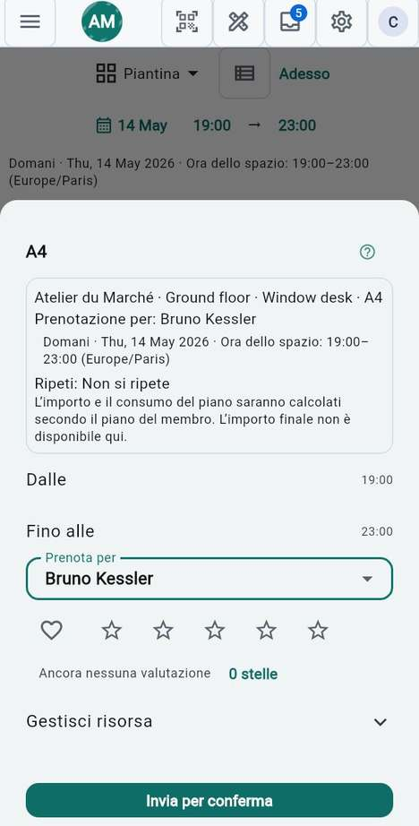

**Passaggi**

1. Tocchi un posto libero in [Prenota](https://fdittgen-png.github.io/deskilo/#/reserve) per aprire la scheda di prenotazione.
2. Apra **Prenota per** e scelga il membro.
3. Il riepilogo ora indica **Prenotazione per** quel membro e il pulsante diventa **Invia per conferma**.
4. Tocchi **Invia per conferma**. Un messaggio indica che la richiesta è stata inviata al membro per conferma.

**Da sapere**

- Il membro deve accettare prima che la prenotazione esista. Trova la richiesta nel suo Calendario e nelle sue notifiche.
- Una prenotazione fatta per un'altra persona non ha mai il check-in e non può ripetersi.
- Il campo **Prenota per** compare solo se il proprietario consente agli amministratori di prenotare per i membri. Per un piano intero, è il proprietario a decidere chi può assegnarlo.

**Vedi anche:** [Quando una prenotazione è in attesa di conferma](#quando-una-prenotazione-è-in-attesa-di-conferma) · [Le decisioni che la aspettano nel Calendario](#le-decisioni-che-la-aspettano-nel-calendario)

<!-- anchor: user.reserve.series -->
### Ripetere una prenotazione

**Destinatari:** Membro · Amministratore · Proprietario

Si siede nello stesso posto ogni martedì, oppure ogni giorno feriale per un mese. Una prenotazione ripetuta crea tutte le date in una volta.

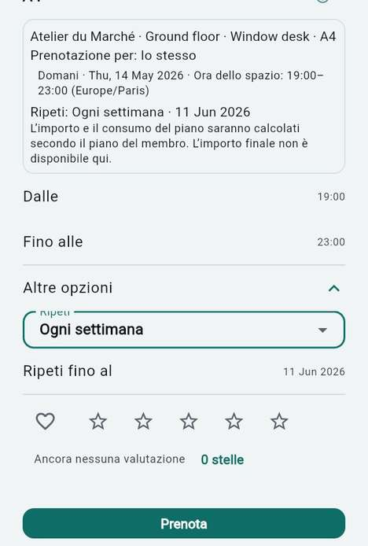

**Passaggi**

1. Apra la scheda di prenotazione su un posto libero e sul primo giorno che vuole.
2. Apra **Altre opzioni**.
3. In **Ripeti**, scelga **Ogni giorno**, **Ogni giorno feriale** o **Ogni settimana**. L'impostazione predefinita è **Non si ripete**.
4. Imposti **Ripeti fino al**, l'ultima data. La scheda propone quattro settimane in avanti.
5. Tocchi **Prenota**. Una finestra Le dice quante prenotazioni sono state create.

**Da sapere**

- Le date che non è stato possibile prenotare sono elencate nella finestra e saltate. Le altre restano valide.
- Per annullare una prenotazione ripetuta, apra una delle sue date e scelga **Annulla questa occorrenza** o **Annulla questa e le successive**.
- Può anche trasformare una singola prenotazione in una ripetuta da **Modifica orario** nei suoi dettagli.
- La ripetizione non è offerta quando prenota per un'altra persona.

**Vedi anche:** [Modificare o annullare una prenotazione](#modificare-o-annullare-una-prenotazione) · [La scheda di prenotazione](#la-scheda-di-prenotazione)

<!-- anchor: user.reserve.policies -->
### Le regole che incontra quando prenota

**Destinatari:** Membro · Amministratore · Proprietario

Ha provato a prenotare e l'app ha detto di no, oppure si chiede che cosa sia consentito. Il suo proprietario stabilisce le regole dello spazio; ecco ciò che ne vede.

| Regola | Che cosa vede |
|---|---|
| Orari e giorni di apertura | La piantina e le viste seguono la giornata lavorativa, dalle 08:00 alle 17:00 per impostazione predefinita, con la divisione delle mezze giornate alle 12:00. Un giorno chiuso indica **Chiuso in questo giorno**. |
| Fuori dagli orari di apertura | Dipende dallo spazio. Disattivato: **Le prenotazioni fuori dagli orari di apertura non sono consentite.** Solo spontanee: può fare il check-in sul posto ma non prenotare in anticipo. Libero: consentito, mai conteggiato né addebitato. A pagamento: consentito e conteggiato come utilizzo, tranne in un giorno in cui ha già una prenotazione ordinaria. |
| Prenotazioni nel passato | Una prenotazione in un giorno già concluso viene rifiutata, a meno che il proprietario consenta le prenotazioni passate: **Questa prenotazione è interamente nel passato.** Prima, nello stesso giorno, viene registrata come visita passata. |
| Limiti | Una prenotazione ha un orizzonte massimo (**Troppo lontano**, 90 giorni per impostazione predefinita), una durata minima e una massima (**Troppo breve**, **Troppo lunga**) e termina nel giorno in cui inizia. |
| Un posto alla volta | Per impostazione predefinita può avere una sola prenotazione in un dato periodo: **Ha già una prenotazione in quel periodo**. Un amministratore può consentirne di più. |
| Limite di prenotazioni | **Limite di prenotazioni raggiunto** quando ha il numero massimo di prenotazioni aperte che le è consentito. |
| Giorni del suo piano | Quando i giorni del suo piano finiscono, si applica l'impostazione del proprietario per Lei: le prenotazioni possono fermarsi, può esserLe chiesto di acquistare un pacchetto, oppure i giorni in più vengono addebitati. |

**Passaggi**

1. Quando un periodo viene rifiutato, legga la riga rossa sotto di esso nella scheda di prenotazione.
2. Cambi il giorno, l'orario o il posto, oppure si rivolga a un amministratore.
3. Se i suoi giorni sono esauriti, apra [Denaro](https://fdittgen-png.github.io/deskilo/#/money) per vedere il suo piano e, dove offerto, tocchi **Richiedi mezze giornate extra**.

**Da sapere**

- Le stesse regole valgono sulla piantina, nell'hub Prenota, su un codice scansionato e al chiosco a muro.
- L'app verifica un periodo prima di offrirlo, perciò la maggior parte dei rifiuti compare nella scheda e non dopo il suo tocco.

**Vedi anche:** [Regole di prenotazione](#regole-di-prenotazione) · [Prenotazioni simultanee](#prenotazioni-simultanee) · [Limite di prenotazioni](#limite-di-prenotazioni)

<!-- anchor: user.reserve.closed-days -->
### Giorni di chiusura e festivi

**Destinatari:** Membro · Amministratore · Proprietario

Vuole sapere perché un giorno non può essere prenotato. Il suo spazio è chiuso in alcuni giorni della settimana e nei giorni di chiusura aggiunti dal proprietario, come i festivi.

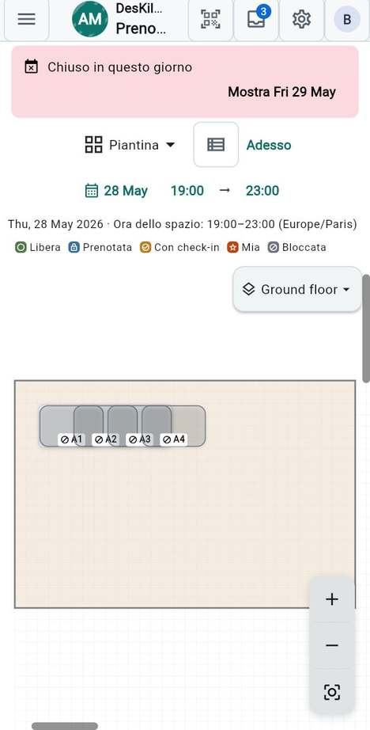

**Passaggi**

1. Scelga il giorno in [Prenota](https://fdittgen-png.github.io/deskilo/#/reserve). Un giorno chiuso mostra un banner, **Chiuso in questo giorno**.
2. Tocchi la scorciatoia nel banner, che indica « Mostra » e il successivo giorno di apertura, per andarci.
3. In **Mese**, i giorni chiusi indicano **Chiuso**; in **Settimana** sono in grigio con un segno; in **Giorno** sono contrassegnati come chiusi, sotto la voce di legenda **Giorno chiuso**.
4. Nel Calendario, i giorni chiusi sono barrati e l'elenco del giorno indica **Chiuso** con il motivo quando il proprietario ne ha dato uno.

**Da sapere**

- In un giorno chiuso i posti portano il simbolo di blocco e non possono essere prenotati né usati per il check-in.
- I giorni festivi compaiono esattamente come qualsiasi altro giorno di chiusura.

**Vedi anche:** [Vista mensile](#vista-mensile) · [Giorni di chiusura](#giorni-di-chiusura) · [Giorni di apertura](#giorni-di-apertura)

<!-- anchor: user.reserve.check-in -->
### Check-in e check-out

**Destinatari:** Membro · Amministratore · Proprietario

Arriva al suo posto e più tardi se ne va. Il check-in dice che è presente; il check-out libera ciò che non Le serve più.

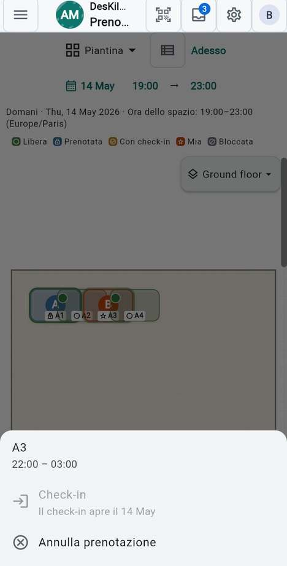

**Passaggi**

1. Apra [Prenota](https://fdittgen-png.github.io/deskilo/#/reserve), trovi il giorno della sua prenotazione e tocchi il suo posto, quello contrassegnato da **Mia**.
2. Tocchi **Check-in**. Se è in grigio, indica quando si apre, per esempio « Il check-in apre il 14 maggio ».
3. Quando se ne va, tocchi di nuovo il suo posto e tocchi **Check-out**. Il resto della prenotazione viene subito liberato per gli altri.
4. La prenotazione indica allora **Completata: uscita registrata alle** e l'ora.

**Da sapere**

- Il check-in si apre 15 minuti prima dell'inizio, oppure un passo di griglia prima quando la griglia è più larga. Dove le prenotazioni sono per mezza giornata, per giorno o per ora effettiva, si apre per l'intera giornata della prenotazione.
- Si chiude quando la prenotazione termina: **Questa prenotazione è terminata — il check-in non è più possibile.**
- Se risulta ancora presente altrove, faccia prima il check-out lì.
- Con il check-in e il check-out automatici attivi, una prenotazione senza check-in o check-out si completa da sola una volta passato il suo orario. Senza, una prenotazione senza check-in indica **Questo periodo è finito senza check-in.**
- Al chiosco a muro fa il check-in con il suo badge; vedi [Il suo badge](#il-suo-badge) e [Check-in con badge NFC](#check-in-con-badge-nfc).

**Vedi anche:** [Scansionare un codice spazio](#scansionare-un-codice-spazio) · [Modificare o annullare una prenotazione](#modificare-o-annullare-una-prenotazione)

<!-- anchor: user.reserve.scan -->
### Scansionare un codice spazio

**Destinatari:** Membro · Amministratore · Proprietario

È davanti a una scrivania, a una sala o a un posto che porta una scheda QR, oppure a una sedia con un tag NFC. La scansione mostra che cosa può fare lì, senza cercare nella piantina.

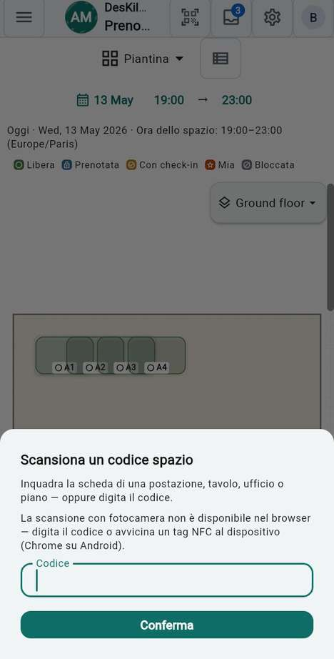

**Passaggi**

1. In [Prenota](https://fdittgen-png.github.io/deskilo/#/reserve), tocchi **Scansiona un codice spazio**, l'icona dello scanner in alto nella schermata.
2. Punti la fotocamera sulla scheda, oppure digiti il numero stampato in **Codice** e tocchi **Conferma**. Avvicini il telefono al tag NFC di una sedia, dove il dispositivo lo supporta.
3. Per un posto, scelga **Check-in**, **Prenota** o **Check-out**, le stesse azioni del chiosco, senza il passaggio del badge.
4. Per un tavolo, un ufficio o un piano, la scheda mostra il suo stato, il suo periodo e il suo **Prezzo per mezza giornata**; tocchi **Check-in**, **Prenota** o **Mostra sulla pianta**.

**Da sapere**

- Se lo spazio è occupato da qualcun altro, la scheda dice chi è e propone di scrivergli.
- Un codice che non appartiene a questo spazio di lavoro indica **Non è un codice spazio di questo workspace.** Uno spazio rimosso indica **Questo codice non corrisponde più a nessuno spazio qui.**
- In un browser la fotocamera non è disponibile: digiti invece il codice. Un tag NFC identifica solo i posti.
- L'icona dello scanner compare solo quando il suo spazio usa i codici QR.

**Vedi anche:** [Prenotare un'intera scrivania, una sala o un piano](#prenotare-unintera-scrivania-una-sala-o-un-piano) · [Check-in e check-out](#check-in-e-check-out)

<!-- anchor: user.reserve.change -->
### Modificare o annullare una prenotazione

**Destinatari:** Membro · Amministratore · Proprietario

I suoi piani sono cambiati. Può spostare una prenotazione, accorciarla, prolungarla o annullarla, finché non è stata usata.

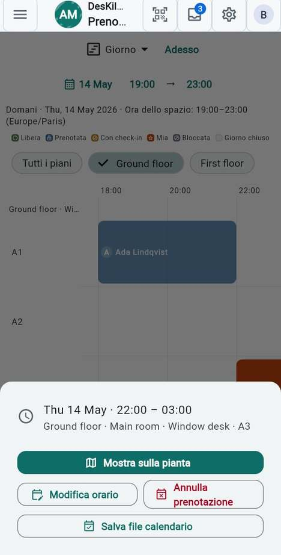

**Passaggi**

1. Apra la prenotazione: la tocchi nella vista **Giorno** o **Settimana**, nel Calendario, oppure tocchi **Dettagli** nel messaggio che segue una prenotazione.
2. Per una prenotazione non ancora iniziata, tocchi **Modifica orario** per scegliere un altro periodo, oppure **Annulla prenotazione** per eliminarla.
3. Per una prenotazione ripetuta, scelga **Annulla questa occorrenza** o **Annulla questa e le successive**.
4. Per una prenotazione in cui ha fatto il check-in, **Restare più a lungo** e **Terminare prima** compaiono quando le regole dello spazio consentono una fine più tarda o più precoce. L'inizio non si sposta.
5. Per una prenotazione già iniziata, con check-in o conclusa, e se il suo spazio consente le richieste di eliminazione, tocchi **Richiedi eliminazione**, indichi un motivo se lo desidera e tocchi **Invia richiesta**.

**Da sapere**

- **Richiedi eliminazione** non elimina nulla: un proprietario o un amministratore decide se il check-in è stato solo dimenticato, nel qual caso la prenotazione resta, oppure se la prenotazione non è mai stata usata, nel qual caso viene rimossa.
- Un amministratore può rimuovere la prenotazione di un'altra persona con **Rimuovi la prenotazione (scavalca)**; il membro e gli amministratori vengono avvisati.
- **Mostra sulla pianta** porta al posto sulla piantina.

**Vedi anche:** [Check-in e check-out](#check-in-e-check-out) · [Salvare una prenotazione nel proprio calendario](#salvare-una-prenotazione-nel-proprio-calendario) · [Ripetere una prenotazione](#ripetere-una-prenotazione)

<!-- anchor: user.reserve.awaiting -->
### Quando una prenotazione è in attesa di conferma

**Destinatari:** Membro · Amministratore · Proprietario

Una prenotazione o una richiesta indica **in attesa di conferma**. Non significa che qualcosa sia andato storto: qualcuno deve ancora dire di sì.

**Passaggi**

1. Guardi che cosa è in attesa: il Calendario lo elenca con le parole **in attesa di conferma**, e una decisione che Le è destinata sta in cima.
2. Se spetta a Lei decidere, tocchi **Accetta** o la croce nel Calendario.
3. Se sta aspettando qualcun altro, non Le serve fare nulla; la risposta arriva come notifica e nel Calendario.

Che cosa attende una conferma:

- Una prenotazione fatta per Lei da un amministratore: la conferma Lei.
- La prenotazione di uno spazio intero, quando il proprietario chiede ai convalidatori di approvarla. Lo spazio resta bloccato nell'attesa e un rifiuto annulla la prenotazione.
- Una richiesta di eliminare una prenotazione già iniziata, con check-in o conclusa.

**Da sapere**

- Chi può convalidare e quanti devono essere d'accordo è una regola del proprietario; vedi [Regole di convalida](#regole-di-convalida-ambito-per-ambito).
- Una richiesta mostra il suo avanzamento, per esempio 1/2 convalide, e poi il suo esito: convalidata, rifiutata, respinta o scaduta.

**Vedi anche:** [Prenotare per un'altra persona](#prenotare-per-unaltra-persona) · [Le decisioni che la aspettano nel Calendario](#le-decisioni-che-la-aspettano-nel-calendario)

<!-- anchor: user.reserve.calendar -->
### La scheda Calendario

**Destinatari:** Membro · Amministratore · Proprietario

Vuole tutto ciò che ha una data in un unico posto: le sue prenotazioni, i check-in, gli avvisi, i messaggi, i pagamenti in scadenza. La scheda Calendario li elenca per giorno e ogni riga apre la propria origine.

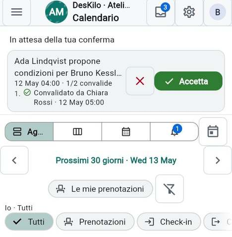

**Passaggi**

1. Apra [Calendario](https://fdittgen-png.github.io/deskilo/#/calendar). Si apre su **Agenda**: i prossimi 30 giorni, raggruppati sotto **Oggi**, **Domani** e i nomi dei giorni.
2. Usi le frecce per avanzare di 30 giorni alla volta, oppure tocchi la data per un selettore di giorno. Il pulsante in alto a destra la riporta a **Oggi**.
3. Tocchi una riga per aprirla: una prenotazione apre i suoi dettagli, un messaggio la sua conversazione, una fattura la sua scheda.
4. Restringa l'elenco con i chip sottostanti, come descritto in [Filtrare il Calendario](#filtrare-il-calendario).

**Da sapere**

- Le prenotazioni compaiono per tutti nello spazio, perché la piantina mostra l'occupazione a tutti. I messaggi e il denaro restano privati per Lei e per le persone che le regole dello spazio autorizzano.
- Un membro con il permesso sulle finanze o sui membri può passare l'elenco a un altro membro con il chip **Io**. Ciò che il server non consente appare bloccato, non come un giorno vuoto.
- Se il suo spazio mantiene il calendario più semplice, scelga un giorno o un intervallo di giorni invece delle tre viste.

**Vedi anche:** [Agenda, Settimana e Mese nel Calendario](#agenda-settimana-e-mese-nel-calendario) · [Salvare una prenotazione nel proprio calendario](#salvare-una-prenotazione-nel-proprio-calendario)

<!-- anchor: user.reserve.calendar-views -->
### Agenda, Settimana e Mese nel Calendario

**Destinatari:** Membro · Amministratore · Proprietario

Vuole vedere una settimana o un mese a colpo d'occhio. Il Calendario offre tre modi di guardare.

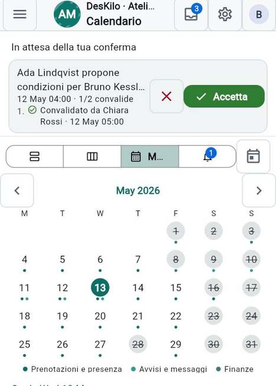

**Passaggi**

1. Scelga **Agenda**, **Settimana** o **Mese** nella barra in alto. Il quarto pulsante, **Avvisi**, mostra i suoi avvisi quando il suo spazio li offre.
2. In **Settimana**, tocchi uno dei sette giorni per leggerne l'elenco sotto.
3. In **Mese**, tocchi un giorno nella griglia. Sotto ogni giorno fino a tre puntini mostrano che cosa contiene: prenotazioni e presenze, avvisi e messaggi, denaro. Oggi è cerchiato.
4. I giorni chiusi sono in grigio e barrati.

**Da sapere**

- In **Mese** l'elenco sotto mostra solo il giorno selezionato; in **Settimana** elenca l'intera settimana.
- Le frecce avanzano di una settimana o di un mese, secondo la vista.
- Il Calendario mostra anche la data di scadenza di un pagamento e ogni spesa programmata in scadenza.

**Vedi anche:** [La scheda Calendario](#la-scheda-calendario) · [Giorni di chiusura e festivi](#giorni-di-chiusura-e-festivi)

<!-- anchor: user.reserve.calendar-decisions -->
### Le decisioni che la aspettano nel Calendario

**Destinatari:** Membro · Amministratore · Proprietario

Le è stato chiesto di confermare qualcosa. Quando qualcosa richiede la sua risposta, viene fissato in cima al Calendario, sotto **In attesa della sua conferma**.

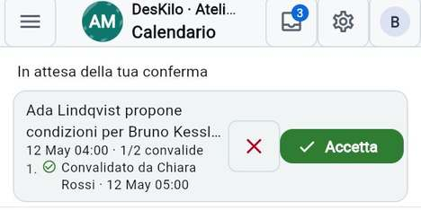

**Passaggi**

1. Apra [Calendario](https://fdittgen-png.github.io/deskilo/#/calendar). Ogni decisione in attesa è una scheda con un breve testo e la data di invio.
2. Legga la scheda. Può mostrare quante convalide ha, per esempio 1/2 convalide.
3. Tocchi **Accetta** per approvare, oppure la croce per rifiutare.
4. Apra la vista **Avvisi** per vedere l'intero elenco con la sua cronologia.

**Da sapere**

- Il pulsante **Avvisi** nella barra mostra quante decisioni la aspettano.
- Una volta data la risposta, la decisione lascia la cima e compare nell'elenco con il suo esito.

**Vedi anche:** [Quando una prenotazione è in attesa di conferma](#quando-una-prenotazione-è-in-attesa-di-conferma) · [Regole di convalida](#regole-di-convalida-ambito-per-ambito)

<!-- anchor: user.reserve.calendar-filters -->
### Filtrare il Calendario

**Destinatari:** Membro · Amministratore · Proprietario

L'elenco è lungo e Lei cerca solo prenotazioni. I chip sotto la barra lo restringono.

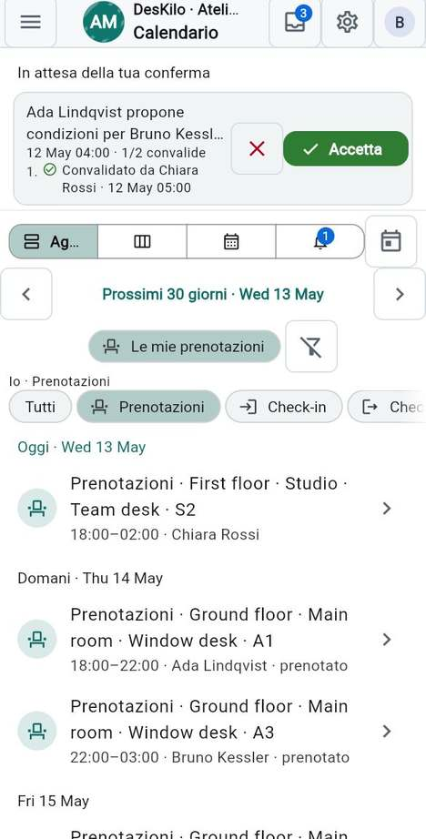

**Passaggi**

1. Tocchi **Le mie prenotazioni** per tenere solo le Sue prenotazioni. Lo tocchi di nuovo per vedere tutto.
2. Oppure scelga chip come **Prenotazioni**, **Presenze** e **Check-out**; **Tutti** mostra ogni tipo.
3. Per annullare le sue scelte, tocchi **Reimposta filtri**, il pulsante a forma di imbuto.
4. Una riga sopra i chip ripete ciò che vede, per esempio Io · Prenotazioni.

**Da sapere**

- Più chip possono essere attivi insieme.
- I chip offerti dipendono da ciò che il suo spazio ha attivato, per esempio le convalide.

**Vedi anche:** [La scheda Calendario](#la-scheda-calendario) · [Agenda, Settimana e Mese nel Calendario](#agenda-settimana-e-mese-nel-calendario)

<!-- anchor: user.reserve.calendar-file -->
### Salvare una prenotazione nel proprio calendario

**Destinatari:** Membro · Amministratore · Proprietario

Vuole una prenotazione nel calendario del suo telefono o del suo computer. L'app scrive un file di calendario standard che Google, Outlook, Apple e altri importano.

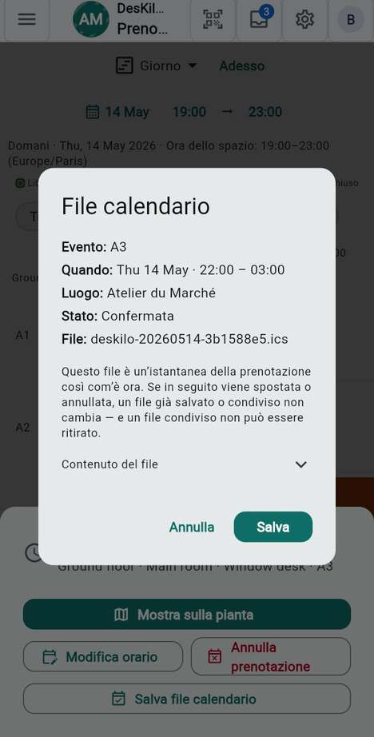

**Passaggi**

1. Apra una delle sue prenotazioni, nella vista **Giorno**, nella vista **Settimana** o nel Calendario.
2. Tocchi **Salva file calendario**.
3. Legga l'anteprima: l'**Evento**, **Quando**, **Luogo**, **Stato** e il nome del **File**. Apra **Contenuto del file** per leggere il file stesso.
4. Tocchi **Salva**. L'app salva il file, di solito nella cartella dei download, e le dice dove; lo apra con il suo calendario.

**Da sapere**

- Il file contiene l'orario, il posto, il nome dello spazio di lavoro e se la prenotazione è confermata o annullata. Nessun importo, nessun nome, nessun indirizzo e-mail.
- È un'istantanea: se la prenotazione cambia più tardi, un file già salvato non cambia.
- Se la prenotazione è cambiata tra l'anteprima e **Salva**, non viene scritto nulla e l'anteprima si aggiorna.
- Il suo proprietario può disattivare questa funzione.

**Vedi anche:** [Modificare o annullare una prenotazione](#modificare-o-annullare-una-prenotazione) · [La scheda Calendario](#la-scheda-calendario)

<!-- anchor: user.collaborate.overview -->
## Collaborare: membri, richieste, messaggi e la rete più ampia

In questo capitolo:
- [L'elenco dei membri](#lelenco-dei-membri) e [la pagina di un membro](#la-pagina-di-un-membro)
- [Scrivere a un membro](#scrivere-a-un-membro)
- [Eventi e conferme](#eventi-e-conferme), [accettare o rifiutare](#accettare-o-rifiutare-una-richiesta) e [Cosa ti aspetta](#cosa-ti-aspetta)
- [Regole di convalida, ambito per ambito](#regole-di-convalida-ambito-per-ambito) (amministratori e proprietari)
- [Messaggi](#messaggi), [nuove conversazioni e gruppi](#avviare-una-conversazione-o-un-gruppo), [richieste di messaggio](#richieste-di-messaggio) e [blocco](#bloccare-qualcuno)
- [Notifiche](#notifiche)
- [Scopri](#scopri), [il suo profilo pubblico](#il-suo-profilo-pubblico) e [le sue visite come ospite](#le-sue-visite-come-ospite)

<!-- anchor: user.collaborate.directory -->
### L'elenco dei membri

**Destinatari:** Membro · Amministratore · Proprietario

Vuole vedere chi c'è nel suo spazio di lavoro, chi è presente oggi e chi sta per arrivare.

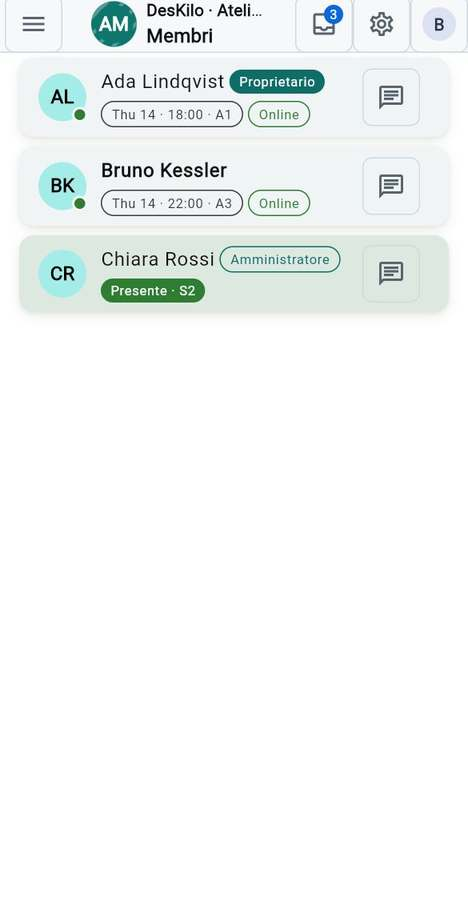

**Passaggi**

1. Apra [Membri](https://fdittgen-png.github.io/deskilo/#/directory) dal menu (o dalla barra in basso se ha scelto lo stile di navigazione classico).
2. Legga ogni scheda: foto o iniziali, nome, badge del ruolo (**Proprietario** o **Amministratore**; i semplici membri non ne hanno), la riga di stato della persona e due piccoli chip.
3. Legga i chip. Il primo riguarda la prenotazione: **Con check-in** con il posto, **Prenotato ora**, oppure la prenotazione successiva (giorno, ora, posto). Il secondo indica **Online**, oppure quando la persona è stata vista l'ultima volta.
4. Tocchi una scheda per aprire [la pagina del membro](#la-pagina-di-un-membro).
5. Trascini l'elenco verso il basso per aggiornarlo.

**Da sapere**

- Sono elencati solo i membri attivi, in ordine alfabetico.
- Gli amministratori e i proprietari vedono anche l'indirizzo e-mail di ciascuno sotto il nome. I membri no: tra membri, il contatto resta su scelta.
- Se il suo proprietario ha configurato un gruppo WhatsApp, una riga **Apri il gruppo WhatsApp** compare sopra l'elenco.

**Vedi anche:** [La pagina di un membro](#la-pagina-di-un-membro) · [Scrivere a un membro](#scrivere-a-un-membro)

<!-- anchor: user.collaborate.member-page -->
### La pagina di un membro

**Destinatari:** Membro · Amministratore · Proprietario

Vuole sapere se un collega c'è, quando verrà la prossima volta e come raggiungerlo.

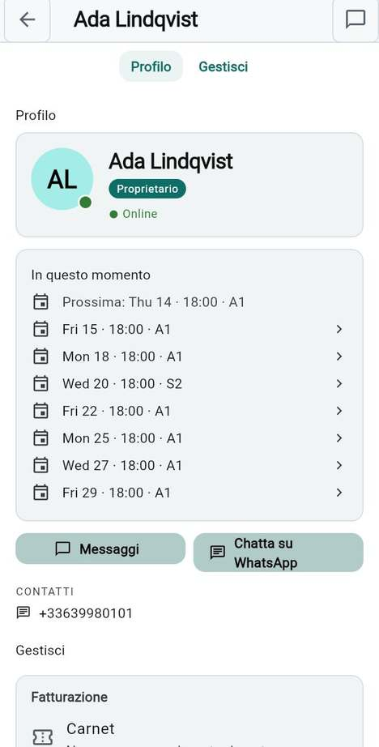

**Passaggi**

1. Tocchi una scheda in [Membri](https://fdittgen-png.github.io/deskilo/#/directory).
2. Legga la scheda in alto: foto, ruolo, presenza e la riga di stato della persona. Più in basso vede da quanto tempo è membro.
3. Legga **In questo momento**: se la persona ha fatto il check-in, ha una prenotazione in questo minuto, oppure quando è la sua prossima prenotazione. Tocchi una prenotazione per aprirla.
4. Usi i pulsanti: **Messaggi**, **Chatta su WhatsApp** e, per gli amministratori, **E-mail**.

**Da sapere**

- **Contatti** mostra un numero WhatsApp solo se la persona ha scelto di condividerlo.
- Dove può vederli, le cifre sul denaro (fatture aperte, pagamenti, mese in corso) si trovano nella stessa pagina. Vede sempre le sue; quelle di un'altra persona solo con il diritto di vedere le finanze.
- Gli amministratori e i proprietari hanno anche un'area **Gestisci** con **Iscrizione**, **Regole di prenotazione**, **Fatturazione** e **Badge e accesso**, ogni riga con il suo valore attuale.

**Vedi anche:** [Scrivere a un membro](#scrivere-a-un-membro) · [Le azioni sul membro](#le-azioni-sul-membro)

<!-- anchor: user.collaborate.contact -->
### Scrivere a un membro

**Destinatari:** Membro · Amministratore · Proprietario

Vuole chiedere qualcosa a un collega senza lasciare lo spazio di lavoro.

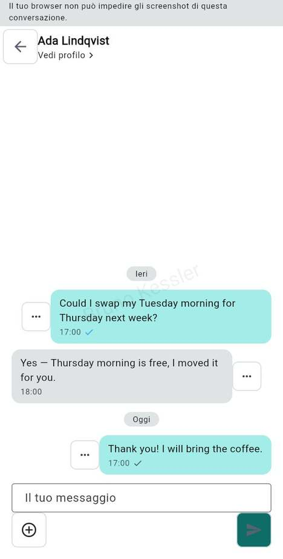

**Passaggi**

1. Apra [Membri](https://fdittgen-png.github.io/deskilo/#/directory), tocchi una scheda per aprire la pagina del membro e poi tocchi **Messaggi**.
2. Scriva nel campo **Il suo messaggio**.
3. Tocchi **Invia**.

**Da sapere**

- I messaggi si leggono dal più vecchio al più recente, sotto i separatori dei giorni. Una spunta sotto il suo messaggio significa che è stato consegnato; una doppia spunta blu significa che è stato letto.
- Tocchi i **…** accanto a un fumetto per le azioni sul messaggio (reagire con una emoji, contrassegnare con una stella, copiare, modificare entro 15 minuti, inoltrare, eliminare). Il pulsante con la graffetta allega una prenotazione o uno spazio; l'altra persona vede un link che lo apre.
- Serve la funzione **Notifiche tra membri** del suo spazio di lavoro.

**Vedi anche:** [Messaggi](#messaggi)

<!-- anchor: user.collaborate.events -->
### Eventi e conferme

**Destinatari:** Membro · Amministratore · Proprietario

Vuole vedere che cosa è successo nello spazio di lavoro e che cosa attende una risposta.

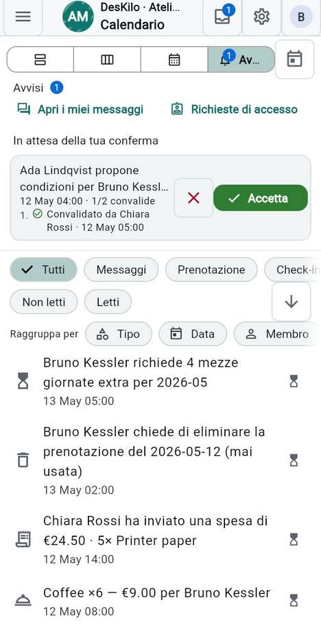

**Passaggi**

1. Tocchi **Eventi** nella barra in alto (l'icona del vassoio con un numero), oppure apra [Eventi](https://fdittgen-png.github.io/deskilo/#/events) dal menu. La pagina si apre su **Avvisi**.
2. Legga **In attesa della sua conferma** in cima: le richieste che hanno bisogno di Lei.
3. Legga il flusso sotto. Ogni riga dice che cosa è successo; una clessidra significa in sospeso, una spunta verde significa confermato. Le righe di denaro mostrano chi le ha convalidate e quando.
4. Restringa il flusso con i chip: **Tutti**, **Messaggi**, **Prenotazione**, **Check-in**, **Denaro**, **Membri**, poi **Non letti** o **Letti**.
5. Tocchi **Tipo**, **Data** o **Membro** accanto a **Raggruppa per** per raccogliere il flusso in gruppi; tocchi il simbolo dei gruppi per tornare all'elenco semplice.

**Da sapere**

- Un evento viene creato ogni volta che qualcosa viene prenotato, modificato o annullato, che un pagamento o una spesa viene registrato, che vengono richieste mezze giornate extra o un'eliminazione, che un ruolo cambia o che qualcuno aderisce.
- I membri vedono i propri eventi; gli amministratori e i proprietari vedono quelli di tutti.
- Il suo filtro viene ricordato. Il numero sul pulsante Eventi conta i nuovi aggiornamenti e le decisioni che la aspettano.
- **Apri i miei messaggi** in alto la porta alle sue [conversazioni](#messaggi).

**Vedi anche:** [Accettare o rifiutare una richiesta](#accettare-o-rifiutare-una-richiesta) · [Regole di convalida](#regole-di-convalida-ambito-per-ambito)

<!-- anchor: user.collaborate.accept -->
### Accettare o rifiutare una richiesta

**Destinatari:** Membro · Amministratore · Proprietario

Qualcuno Le ha chiesto di confermare qualcosa e Lei vuole rispondere.

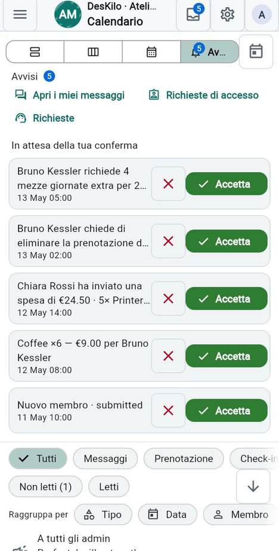

**Passaggi**

1. Apra [Eventi](https://fdittgen-png.github.io/deskilo/#/events).
2. Trovi la richiesta sotto **In attesa della sua conferma**.
3. Tocchi **Accetta**, oppure la croce rossa per **Rifiuta**.

**Da sapere**

- Quando un amministratore fa qualcosa per Lei (prenota un posto, registra un suo pagamento), resta in sospeso finché non conferma. Ciò che fa per sé non ha mai bisogno della sua conferma.
- Nessuno conferma la propria richiesta: attende un'altra persona, oppure l'eccezione prevista dalla regola ([regole di convalida](#regole-di-convalida-ambito-per-ambito)).
- Dopo sette giorni senza risposta, un atto che crea o modifica qualcosa (un amministratore che prenota per Lei, ad esempio) viene confermato automaticamente; un'eliminazione o un addebito scade invece.
- Una riga può mostrare un avanzamento come « 1/2 convalide » quando la regola ne richiede diverse.

**Vedi anche:** [Eventi e conferme](#eventi-e-conferme) · [Validazioni richieste](#validazioni-richieste)

<!-- anchor: user.collaborate.attention -->
### Cosa ti aspetta

**Destinatari:** Amministratore · Proprietario

Vuole un unico posto che risponda: oggi c'è qualcosa che ha bisogno di me?

**Passaggi**

1. Apra [Cosa ti aspetta](https://fdittgen-png.github.io/deskilo/#/attention).
2. Legga le righe in ordine: ognuna è una decisione (per esempio una richiesta da confermare o una persona in attesa di essere ammessa), con i ritardi più costosi per primi.
3. Tocchi una riga per occuparsene.

**Da sapere**

- Questa schermata esiste solo se il suo spazio di lavoro ha attivato la funzione **Cosa la aspetta**; senza di essa l'indirizzo riporta alla pagina iniziale.
- Più decisioni identiche vengono mostrate come una sola riga. Quando non c'è nulla in attesa, la schermata indica **Niente la aspetta**.
- Elenca anche la configurazione non completata: «Da configurare: …» per ogni area obbligatoria dell'elenco di configurazione che non è pronta (solo per chi configura lo spazio), e «… funzioni attivate attendono «…»» quando una funzione spenta ne trattiene altre. Un tocco apre la schermata in cui si configura, oppure **Funzionalità**.

**Vedi anche:** [Eventi e conferme](#eventi-e-conferme)

<!-- anchor: user.validation.overview -->
### Regole di convalida, ambito per ambito

**Destinatari:** Proprietario

Decide, per ogni tipo di atto, se una persona deve prima confermarlo e chi.

**Passaggi**

1. Apra [Regole di convalida](https://fdittgen-png.github.io/deskilo/#/validation) (si trova anche nelle Impostazioni).
2. Legga i tre gruppi: **Denaro**, **Prenotazioni** e **Persone e ruoli**. Ognuno indica che cosa resta invariato finché l'atto non è accettato.
3. Legga una scheda da sinistra a destra: qualcuno chiede, le persone che possono convalidare, ha effetto. Una scheda indica **Eredita la predefinita** o **Personalizzata**.
4. Tocchi una scheda per modificarne la regola. Tocchi **Regola predefinita** per cambiare ciò che ogni altra scheda eredita.

**Da sapere**

- Una regola copre atti come pagamenti, spese, servizi, mezze giornate extra, eliminazioni di prenotazioni, prenotazioni, cambi di ruolo, nuovi membri, fatture, rimborsi e modifiche di abbonamento.
- Ogni decisione è un evento: chi ha deciso, quando e su che cosa. Nulla viene convalidato in silenzio.
- Il banner in alto vale per ogni regola: **Nessuno convalida il proprio**.
- Serve il permesso di configurare le regole di convalida; i proprietari ce l'hanno sempre.

**Vedi anche:** [Validazioni richieste](#validazioni-richieste) · [La matrice dei ruoli](#la-matrice-dei-ruoli)

<!-- anchor: user.validation.required-count -->
### Validazioni richieste

**Destinatari:** Proprietario

Sceglie quante persone devono confermare prima che l'atto vada a buon fine.

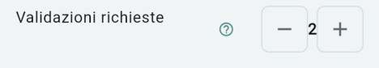

**Passaggi**

1. Tocchi una scheda in [Regole di convalida](https://fdittgen-png.github.io/deskilo/#/validation).
2. Tocchi il più o il meno accanto a **Validazioni richieste**.
3. Tocchi **Salva**.

**Da sapere**

- Una è il caso abituale; due è frequente per il denaro.
- Se chiede più validazioni di quante siano le persone che possono darle, la scheda avverte **Validatori idonei insufficienti.** e non salva: una regola che nessuno può soddisfare bloccherebbe l'atto per sempre.

**Vedi anche:** [Chi può convalidare](#chi-può-convalidare)

<!-- anchor: user.validation.who-may -->
### Chi può convalidare

**Destinatari:** Proprietario

Sceglie quali persone sono autorizzate a dare la conferma.

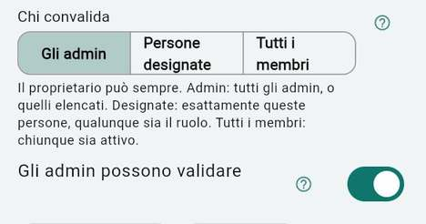

**Passaggi**

1. Tocchi una scheda in [Regole di convalida](https://fdittgen-png.github.io/deskilo/#/validation).
2. Sotto **Chi convalida**, scelga **Admin**, **Persone designate** o **Tutti i membri**.
3. Per **Admin**, lasci attivo **Gli admin possono validare** e scelga **Tutti gli admin** oppure tocchi i nomi di amministratori specifici. Lo disattivi e convalidano solo i proprietari.
4. Per **Persone designate**, scelga esattamente le persone che vuole.
5. Tocchi **Salva**.

**Da sapere**

- Il proprietario può sempre convalidare.
- Un elenco nominativo è una scelta deliberata: chi in seguito diventa amministratore non vi viene aggiunto.
- La scelta dell'ambito compare quando il suo spazio di lavoro ha attivato la funzione degli ambiti di convalida; altrimenti una regola funziona con gli amministratori.

**Vedi anche:** [È richiesto un proprietario](#è-richiesto-un-proprietario)

<!-- anchor: user.validation.owner-required -->
### È richiesto un proprietario

**Destinatari:** Proprietario

Per alcuni atti l'approvazione di un amministratore da sola non basta.

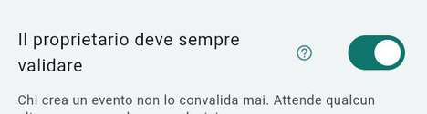

**Passaggi**

1. Tocchi una scheda in [Regole di convalida](https://fdittgen-png.github.io/deskilo/#/validation).
2. Attivi **Il proprietario deve sempre validare**.
3. Tocchi **Salva**.

**Da sapere**

- Almeno una delle conferme proviene allora da un proprietario, qualunque sia il numero richiesto. La scheda mostra « e il proprietario, sempre ».

**Vedi anche:** [Validazioni richieste](#validazioni-richieste) · [Un proprietario può confermare la propria richiesta](#un-proprietario-può-confermare-la-propria-richiesta)

<!-- anchor: user.validation.owner-self -->
### Un proprietario può confermare la propria richiesta

**Destinatari:** Proprietario

Gestisce da solo uno spazio e deve poter risolvere le proprie richieste.

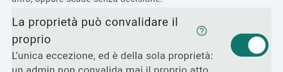

**Passaggi**

1. Tocchi una scheda in [Regole di convalida](https://fdittgen-png.github.io/deskilo/#/validation).
2. Attivi **La proprietà può convalidare il proprio**.
3. Tocchi **Salva**.

**Da sapere**

- Disattivato, la richiesta di un proprietario attende qualcun altro. Attivato, il proprietario la risolve.
- È un'eccezione del solo proprietario: un amministratore non convalida mai il proprio atto.
- L'interruttore compare quando il suo spazio di lavoro ha attivato la funzione della catena di convalida.

**Vedi anche:** [Convalida automatica della richiesta di un proprietario](#convalida-automatica-della-richiesta-di-un-proprietario)

<!-- anchor: user.validation.sequential -->
### Una dopo l'altra

**Destinatari:** Proprietario

Vuole che le conferme vengano raccolte in ordine, così che la seconda persona veda la decisione della prima.

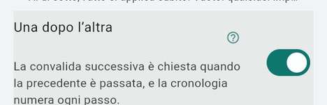

**Passaggi**

1. Tocchi una scheda in [Regole di convalida](https://fdittgen-png.github.io/deskilo/#/validation).
2. Attivi **Una dopo l’altra**.
3. Tocchi **Salva**.

**Da sapere**

- La convalida successiva viene richiesta una volta superata la precedente, e il percorso di convalida numera ogni passaggio.
- È più lento; lo usi quando l'ordine conta.
- Sulle regole di denaro può anche impostare **Solo oltre questo importo**: gli importi inferiori si applicano subito.

**Vedi anche:** [Validazioni richieste](#validazioni-richieste)

<!-- anchor: user.validation.auto-validate-owner -->
### Convalida automatica della richiesta di un proprietario

**Destinatari:** Proprietario

Non vuole una notifica per una questione già chiusa.

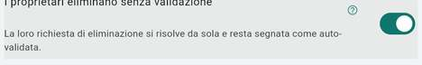

**Passaggi**

1. In [Regole di convalida](https://fdittgen-png.github.io/deskilo/#/validation), tocchi la scheda **Eliminazione prenotazione**.
2. Attivi **I proprietari eliminano senza validazione**.
3. Tocchi **Salva**.

**Da sapere**

- La richiesta di eliminazione di un proprietario si risolve allora da sola e resta contrassegnata **Convalidato automaticamente** nel flusso, così il percorso resta continuo.
- Questo interruttore esiste solo sulla regola **Eliminazione prenotazione** ed è disattivato per impostazione predefinita.

**Vedi anche:** [Convalida automatica della richiesta di un amministratore](#convalida-automatica-della-richiesta-di-un-amministratore)

<!-- anchor: user.validation.auto-validate-admin -->
### Convalida automatica della richiesta di un amministratore

**Destinatari:** Proprietario

Vuole che gli amministratori eliminino le proprie prenotazioni senza attendere.

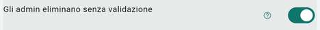

**Passaggi**

1. In [Regole di convalida](https://fdittgen-png.github.io/deskilo/#/validation), tocchi la scheda **Eliminazione prenotazione**.
2. Attivi **Gli admin eliminano senza validazione**.
3. Tocchi **Salva**.

**Da sapere**

- È indipendente dall'interruttore del proprietario: ogni proprietario è anche un amministratore, quindi un solo interruttore non potrebbe dire « proprietari sì, amministratori no ».
- Disattivato per impostazione predefinita, e solo per le eliminazioni di prenotazioni.

**Vedi anche:** [Convalida automatica della richiesta di un proprietario](#convalida-automatica-della-richiesta-di-un-proprietario)

<!-- anchor: user.collaborate.messages -->
### Messaggi

**Destinatari:** Tutti

Vuole tutte le sue conversazioni in un unico elenco, a qualunque spazio o server appartengano.

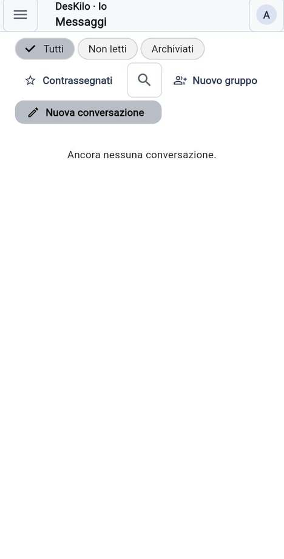

**Passaggi**

1. Apra [Messaggi](https://fdittgen-png.github.io/deskilo/#/me?tab=messages) in Io.
2. Legga ogni riga: il titolo, il contesto (per esempio « In » uno spazio, « Da persona a persona », « Gruppo »), l'ultimo messaggio e il conteggio dei non letti.
3. Filtri con **Tutti**, **Non letti** o **Archiviati**, apra **Contrassegnati** per i messaggi che ha contrassegnato con una stella, oppure tocchi la lente per cercare.
4. Tenga premuta una riga per **Fissa in alto**, **Silenzia le notifiche**, **Segna come non letto** o **Archivia**.
5. Tocchi una riga per aprire la conversazione.

**Da sapere**

- Le conversazioni dei suoi altri server collegati compaiono nello stesso elenco, con il nome del server.
- Un messaggio che ha scritto mostra una spunta quando è consegnato e una doppia spunta blu una volta letto.
- Una conversazione archiviata conserva la sua cronologia. Una silenziata resta muta ma viene comunque conteggiata.
- Dallo spazio di lavoro, **Apri i miei messaggi** (in Avvisi) porta qui.

**Vedi anche:** [Scrivere a un membro](#scrivere-a-un-membro) · [Avviare una conversazione o un gruppo](#avviare-una-conversazione-o-un-gruppo)

<!-- anchor: user.collaborate.messages-new -->
### Avviare una conversazione o un gruppo

**Destinatari:** Tutti

Vuole scrivere a qualcuno di nuovo, o a più persone insieme.

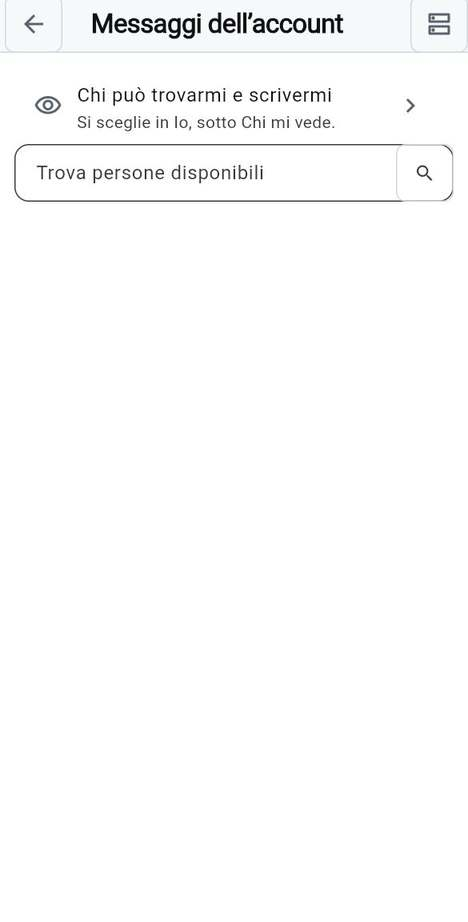

**Passaggi**

1. In [Messaggi](https://fdittgen-png.github.io/deskilo/#/me?tab=messages), tocchi **Nuova conversazione**.
2. Digiti un nome sotto **Trova persone disponibili** e tocchi la lente.
3. Tocchi la persona; la chat si apre.
4. Per un gruppo, tocchi invece **Nuovo gruppo**, gli dia un **Nome del gruppo**, **Aggiungi persone** e tocchi **Crea gruppo**.

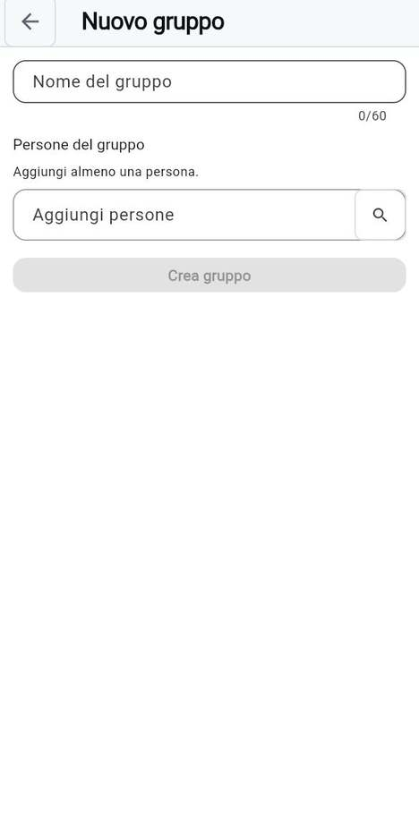

**Da sapere**

- Trova le persone che hanno scelto di essere raggiungibili: ciascuna decide sotto **Chi può iniziare una conversazione con me**.
- In un gruppo, tocchi il suo nome per vedere i membri; un amministratore può aggiungere o rimuovere persone, rinominarlo o consentire di scrivere solo agli amministratori (**Solo gli admin possono scrivere**). Chiunque può **Esci dal gruppo**.
- Un messaggio lungo è limitato a 4000 caratteri.

**Vedi anche:** [Richieste di messaggio](#richieste-di-messaggio)

<!-- anchor: user.collaborate.message-requests -->
### Richieste di messaggio

**Destinatari:** Tutti

Qualcuno da cui non aveva scelto di ricevere messaggi Le ha scritto, e Lei decide che cosa succede.

**Passaggi**

1. Apra [Messaggi](https://fdittgen-png.github.io/deskilo/#/me?tab=messages). Una scheda **Richieste di messaggio** compare sopra le sue conversazioni quando ce n'è una.
2. Legga il primo messaggio.
3. Tocchi **Accetta** per trasformarlo in una conversazione, **Ignora** per nasconderlo, oppure **Blocca** per interrompere ogni contatto.

**Da sapere**

- La scheda lo dice chiaramente: queste persone sono al di fuori di quelle da cui ha scelto di essere raggiungibile e non vengono informate di ciò che decide.
- Chi può scriverle per primo si imposta in Io, sotto **Chi può iniziare una conversazione con me**.

**Vedi anche:** [Bloccare qualcuno](#bloccare-qualcuno) · [Chi può vedere i miei dati](#privacy-chi-può-vedere-i-miei-dati)

<!-- anchor: user.collaborate.block -->
### Bloccare qualcuno

**Destinatari:** Tutti

Vuole che una persona smetta di vederla e di scriverle.

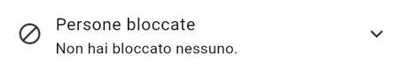

**Passaggi**

1. Tocchi **Blocca** su una richiesta di messaggio, oppure **Blocca questa persona** in una conversazione.
2. Confermi.
3. Per annullare, apra Io, poi **Persone bloccate**, e tocchi **Sblocca** accanto al nome.

**Da sapere**

- Il blocco funziona in entrambe le direzioni: nessuno dei due vede né raggiunge l'altro.
- La persona non viene avvisata.

**Vedi anche:** [Richieste di messaggio](#richieste-di-messaggio)

<!-- anchor: user.collaborate.notifications -->
### Notifiche

**Destinatari:** Tutti

Vuole sapere che cosa la avvisa e, se preferisce, disattivare gli avvisi su questo dispositivo.

**Passaggi**

1. Apra [Privacy e dati](https://fdittgen-png.github.io/deskilo/#/privacy).
2. Usi l'interruttore **Notifiche push su questo dispositivo** per attivare o disattivare le notifiche push.
3. Per silenziare una conversazione, la tenga premuta in [Messaggi](https://fdittgen-png.github.io/deskilo/#/me?tab=messages) e scelga **Silenzia le notifiche**.

**Da sapere**

- Viene avvisato delle richieste in attesa della sua conferma e dei messaggi: nel feed e sulla campanella, con una push quando la sua installazione ha configurato le push e, nell'app installata (non nel browser), con un promemoria sul suo dispositivo 15 minuti prima di una prenotazione per la quale non ha ancora fatto il check-in.
- DesKilo non invia e-mail proprie: le sole e-mail sono quelle del suo account (conferma di iscrizione, reimpostazione della password).
- Il conteggio sulla campanella e sull'icona dell'app somma le sue conferme in sospeso e i messaggi non letti.
- Disattivate, l'app continua a funzionare; nulla viene inviato a questo dispositivo. Non ci sono interruttori separati per categoria. Se il suo sistema blocca le notifiche dell'app, le consenta nelle impostazioni di sistema.

**Vedi anche:** [Eventi e conferme](#eventi-e-conferme) · [I suoi dati, i suoi diritti](#i-suoi-dati-i-suoi-diritti)

<!-- anchor: user.collaborate.discover -->
### Scopri

**Destinatari:** Tutti

Vuole trovare gli spazi di lavoro che si pubblicano e scrivere ai loro gestori.

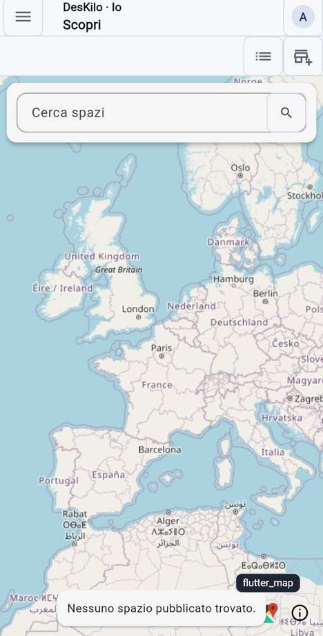

**Passaggi**

1. Apra [Scopri](https://fdittgen-png.github.io/deskilo/#/me?tab=discover) in Io. Si apre sulla mappa.
2. Digiti in **Cerca spazi** e tocchi la lente.
3. Faccia scorrere le schede sotto la mappa, oppure tocchi il simbolo del segnaposto su una scheda per **Localizza sulla mappa**.
4. Tocchi il pulsante dell'elenco per passare a **Elenco**, e il pulsante della mappa per tornare a **Mappa**.
5. Tocchi uno spazio di lavoro per leggerne la pagina pubblica: descrizione, indirizzo, contatti, sito web, piantina pubblica.
6. Usi **Scrivi agli host**, il pulsante della chat accanto a un gestore, **Entra** o **Richiedi un profilo nello spazio**, secondo ciò che lo spazio offre.

**Da sapere**

- Compaiono solo gli spazi di lavoro il cui proprietario ha scelto **Visibile nella directory pubblica**. Se nessuno corrisponde, la schermata indica **Nessuno spazio pubblicato trovato.**
- Scrivere a qualcuno o chiedere di aderire la collega prima al server di quello spazio e le chiede conferma prima di inviare qualsiasi cosa.
- I suoi messaggi con persone su altri server compaiono in [Messaggi](#messaggi); gestisca quei server sotto **Server collegati**.
- I proprietari pubblicano la propria pagina dalle proprie impostazioni.

**Vedi anche:** [Avviare una conversazione o un gruppo](#avviare-una-conversazione-o-un-gruppo)

<!-- anchor: user.collaborate.public-profile -->
### Il suo profilo pubblico

**Destinatari:** Tutti

Vuole che le persone esterne ai suoi spazi possano leggere qualche parola su di Lei.

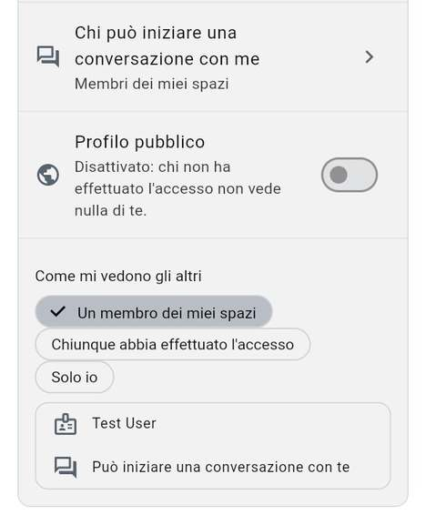

**Passaggi**

1. Apra Io, poi la sezione **Privacy**.
2. Attivi **Profilo pubblico** e confermi **Pubblica**.
3. Tocchi **Copia il link** e lo condivida.
4. Lo disattivi in qualsiasi momento per ritirarlo.

**Da sapere**

- Chiunque abbia il link, connesso o no, legge il suo nome, la sua professione e la sua biografia. I recapiti, la presenza e gli spazi restano privati.
- Un link a un profilo ritirato o sconosciuto indica **Questo profilo non è pubblico.**
- **Come mi vedono gli altri** mostra in anteprima ciò che vede ciascun pubblico.

**Vedi anche:** [Chi può vedere i miei dati](#privacy-chi-può-vedere-i-miei-dati)

<!-- anchor: user.collaborate.guest-visits -->
### Le sue visite come ospite

**Destinatari:** Tutti

Ha chiesto di visitare uno spazio senza diventarne membro e vuole seguirne l'andamento.

**Passaggi**

1. Apra Io, poi **Home**.
2. Trovi **Le mie visite**: ogni visita mostra lo spazio, l'ora e uno stato (**Richiesta**, **Confermata**, **Rifiutata**, **Annullata** o **Scaduta**).
3. Per ritirarne una ancora futura, tocchi **Annulla questa visita**.

**Da sapere**

- Una visita non è un'adesione: non dà alcun ruolo né alcun abbonamento.
- L'elenco compare solo quando ha delle visite, e solo dove lo spazio ha attivato la funzione **Visite degli ospiti**.

**Vedi anche:** [Scopri](#scopri)

<!-- anchor: user.settings.overview -->
## Impostazioni e profilo, e i suoi dati

Tutto ciò che è personale in DesKilo si trova in due posti: **Io**, che è suo in ogni spazio di lavoro, e **Impostazioni**, dove un singolo spazio di lavoro conserva ciò che riguarda la sua iscrizione lì. Questo capitolo percorre entrambi, poi i suoi diritti sulla privacy e la possibilità di gestire un proprio server.

In questo capitolo:
- [Come sono organizzate le Impostazioni](#come-sono-organizzate-le-impostazioni) e [l'interruttore solo per lo spazio](#scegliere-unimpostazione-solo-per-questo-spazio)
- Il suo account: [foto](#il-suo-account-e-la-sua-foto), [dati personali](#dati-personali), [indirizzo](#il-suo-indirizzo), [partita IVA](#la-sua-partita-iva), [condizioni di pagamento](#le-sue-condizioni-di-pagamento), [WhatsApp](#il-suo-numero-whatsapp), [stato](#la-sua-riga-di-stato), [periodo di prenotazione predefinito](#periodo-di-prenotazione-predefinito)
- Il suo badge: [il badge](#il-suo-badge) e [il suo PIN](#il-pin-del-suo-badge)
- Aspetto e lettura dell'app: [lingua](#lingua-dellapp), [tema](#tema), [navigazione](#stile-di-navigazione), [numeri e date](#numeri-e-date), [orologio](#orologio), [fuso orario](#mostra-gli-orari-nel-mio-fuso), [suggerimenti](#ripristinare-i-suggerimenti), [fotocamera frontale](#fotocamera-frontale-per-la-scansione), [account collegati](#account-collegati)
- Privacy e dati personali: [chi può vedere i miei dati](#privacy-chi-può-vedere-i-miei-dati), [chi mi vede](#scegliere-chi-mi-vede), [profilo pubblico](#pubblicare-un-profilo-pubblico), [esportazione](#esportare-i-miei-dati), [cancellazione](#cancellare-i-miei-dati), [richieste sui diritti](#richieste-sui-diritti), [notifiche push](#notifiche-push-su-questo-dispositivo), [i suoi diritti](#i-suoi-dati-i-suoi-diritti)
- [Il suo server](#il-suo-server)

<!-- anchor: user.settings.organisation -->
### Come sono organizzate le Impostazioni

**Destinatari:** Tutti

Vuole sapere dove si trova un'impostazione prima di mettersi a cercarla.

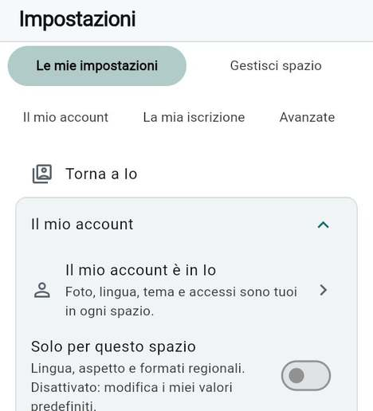

**Passaggi**

1. Apra [Impostazioni](https://fdittgen-png.github.io/deskilo/#/settings). Se il suo spazio di lavoro la chiama **Il mio account**, è la stessa schermata.
2. Resti su **Le mie impostazioni** per tutto ciò che la riguarda. I proprietari e gli amministratori vedono anche **Gestisci spazio**, che contiene la configurazione dello spazio di lavoro; i membri che non amministrano nulla non vedono una seconda scheda.
3. Usi le tre scorciatoie sotto le schede per spostarsi: **Il mio account**, **La mia iscrizione**, **Avanzate**.
4. Apra **Torna a Io** per tornare alla sua pagina Io.

**Da sapere**

- **Il mio account** è una breve scheda: rimanda a Io, dove la sua foto, la lingua, il tema e gli accessi valgono per ogni spazio di lavoro.
- **La mia iscrizione** riguarda solo questo spazio di lavoro: che cosa può fare qui, il suo badge e il suo PIN, il suo stato, il suo periodo di prenotazione predefinito, le sue condizioni di pagamento e i documenti.
- **Avanzate** parte chiusa. Riguarda questo dispositivo: il server, le notifiche push, la fotocamera frontale.
- Sotto le sezioni trova anche **Aiuto**, la versione dell'app, l'informativa sulla privacy e **Esci**.

**Vedi anche:** [L'interruttore solo per lo spazio](#scegliere-unimpostazione-solo-per-questo-spazio) · [Il suo server](#il-suo-server)

<!-- anchor: user.settings.scope -->
### Scegliere un'impostazione solo per questo spazio

**Destinatari:** Tutti

Vuole l'italiano in uno spazio di lavoro e il francese negli altri, oppure un tema scuro in uno solo.

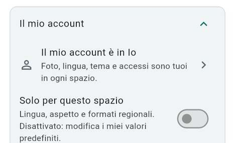

**Passaggi**

1. Apra [Impostazioni](https://fdittgen-png.github.io/deskilo/#/settings) e guardi **Il mio account**.
2. Attivi **Solo per questo spazio**. Le righe della lingua, del tema e dei formati regionali compaiono proprio lì.
3. Cambi ciò che vuole. Vale solo per questo spazio di lavoro.
4. Per annullare, tocchi **Usa i miei valori predefiniti**.

**Da sapere**

- Con l'interruttore disattivato, modifica i suoi valori predefiniti, quelli che valgono ovunque.
- Un'impostazione cambiata solo per questo spazio di lavoro è elencata sotto **In questo spazio** nella scheda.
- L'interruttore riguarda la lingua, l'aspetto e i formati regionali, nient'altro.

**Vedi anche:** [Lingua dell'app](#lingua-dellapp) · [Tema](#tema) · [Numeri e date](#numeri-e-date)

<!-- anchor: user.profile.settings.photo -->
### Il suo account e la sua foto

**Destinatari:** Tutti

Vuole che le persone la riconoscano nell'elenco dei membri, sulla piantina e nei messaggi.

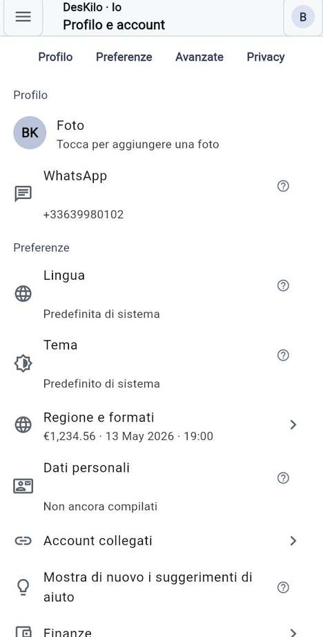

**Passaggi**

1. Apra [Io](https://fdittgen-png.github.io/deskilo/#/me?tab=me). Il suo account è formato dai blocchi **Profilo**, **Preferenze**, **Avanzate** e **Privacy** di quella pagina.
2. Tocchi **Foto**.
3. Scelga **Scegli una foto** e selezioni un'immagine, oppure scelga **Rimuovi foto**.

**Da sapere**

- La riga indica **Tocchi per aggiungere una foto** finché non ne ha una, poi **Tocchi per cambiare**.
- Chi vede la sua foto lo decide Lei: vedi [Chi mi vede](#scegliere-chi-mi-vede).
- Il suo account è suo in tutti gli spazi di lavoro; la sua posizione in uno spazio si trova nelle sue Impostazioni.

**Vedi anche:** [Profili](#profili-un-account-più-spazi) · [Chi mi vede](#scegliere-chi-mi-vede)

<!-- anchor: user.profile.settings.personal-info -->
### Dati personali

**Destinatari:** Tutti

Vuole che le sue fatture e le sue lettere riportino correttamente il suo nome e i suoi dati.

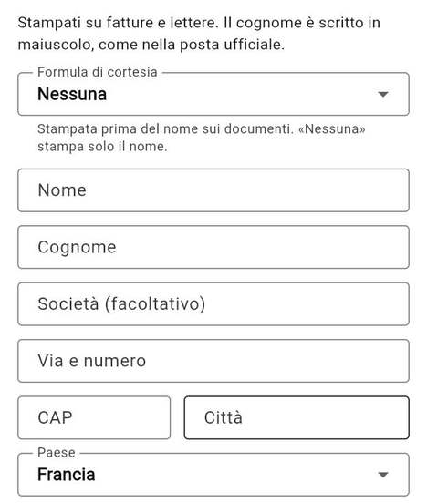

**Passaggi**

1. Apra [Io](https://fdittgen-png.github.io/deskilo/#/me?tab=me) e tocchi **Dati personali**.
2. Scelga una **Formula di cortesia** se desidera che venga stampata prima del suo nome, poi compili **Nome**, **Cognome**, **Società (facoltativo)**, l'indirizzo, **Telefono** ed **E-mail per i documenti**.
3. Controlli **Sui suoi documenti**, che mostra come verrà stampato.
4. Risponda alle eventuali domande che il suo spazio di lavoro aggiunge sotto il proprio titolo, poi tocchi **Salva**.

**Da sapere**

- Il cognome e la città vengono scritti in maiuscolo, come nella posta ufficiale.
- Un modulo vuoto mostra **Non ancora compilati**.
- Le risposte alle domande del suo spazio di lavoro sono dati personali: fanno parte della sua esportazione e vengono cancellate quando lascia lo spazio.

**Vedi anche:** [Il suo indirizzo](#il-suo-indirizzo) · [La sua partita IVA](#la-sua-partita-iva)

<!-- anchor: user.profile.settings.address -->
### Il suo indirizzo

**Destinatari:** Tutti

Vuole che le fatture siano inviate nel posto giusto.

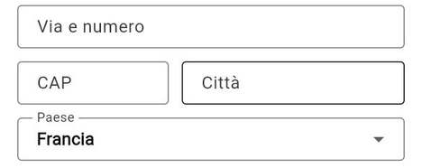

**Passaggi**

1. Apra [Io](https://fdittgen-png.github.io/deskilo/#/me?tab=me) e tocchi **Dati personali**.
2. Compili **Via e numero**, **CAP** e **Città**.
3. Scelga il suo **Paese**, poi tocchi **Salva**.

**Da sapere**

- Dove il suo spazio di lavoro non usa il modulo dei dati personali, Io mostra una riga **Indirizzo** più semplice con una scelta del **Paese**.
- L'indirizzo viene stampato sulle sue fatture.

**Vedi anche:** [Dati personali](#dati-personali)

<!-- anchor: user.profile.settings.vat-id -->
### La sua partita IVA

**Destinatari:** Tutti

Le viene fatturato come impresa e vuole che la fattura riporti la sua partita IVA.

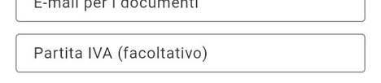

**Passaggi**

1. Apra [Io](https://fdittgen-png.github.io/deskilo/#/me?tab=me) e tocchi **Dati personali**.
2. Digiti il suo numero in **Partita IVA (facoltativo)**.
3. Aggiunga il suo **Identificativo società (facoltativo)** se ne ha uno, poi tocchi **Salva**.

**Da sapere**

- Lo lasci vuoto se è un privato.
- Se una fattura riporta l'IVA dipende da questo numero e dal paese; lo spazio di lavoro applica le proprie regole.

**Vedi anche:** [Dati personali](#dati-personali)

<!-- anchor: user.profile.settings.payment-terms -->
### Le sue condizioni di pagamento

**Destinatari:** Membro

Vuole sapere a quali condizioni le viene fatturato.

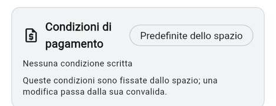

**Passaggi**

1. Apra [Impostazioni](https://fdittgen-png.github.io/deskilo/#/settings) e, sotto **La mia iscrizione**, tocchi **Condizioni di pagamento**.
2. Legga l'etichetta: **Predefinita dello spazio**, oppure **Proprie del membro** se le condizioni sono state concordate con Lei.
3. Legga le condizioni: non può modificarle da sé. Per farle cambiare, si rivolga a un amministratore.

**Da sapere**

- Un amministratore o proprietario con il permesso propone una modifica dalla sua scheda di membro: **Richiedi una modifica**, solo i campi da cambiare (un campo lasciato vuoto mantiene la formulazione dello spazio di lavoro), un **Motivo (facoltativo)**, poi **Invia richiesta**.
- Lo spazio di lavoro stabilisce queste condizioni; una modifica segue la sua convalida e si applica una volta convalidata.

**Vedi anche:** [La sua partita IVA](#la-sua-partita-iva)

<!-- anchor: user.profile.settings.whatsapp -->
### Il suo numero WhatsApp

**Destinatari:** Tutti

Vuole che i colleghi possano raggiungerla su WhatsApp, oppure smettere di condividere il numero.

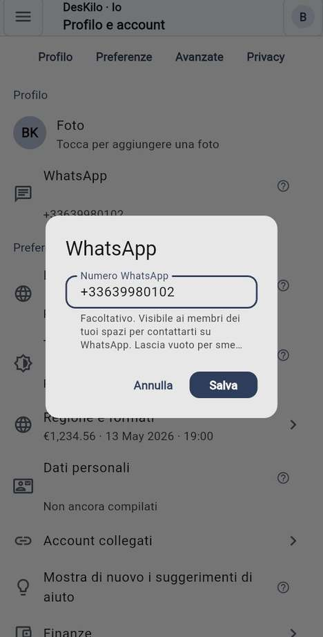

**Passaggi**

1. Apra [Io](https://fdittgen-png.github.io/deskilo/#/me?tab=me) e tocchi **WhatsApp**.
2. Digiti il suo numero in **Numero WhatsApp**, con il prefisso internazionale.
3. Tocchi **Salva**. Per smettere di condividerlo, svuoti il campo e salvi.

**Da sapere**

- Indica **Non condiviso** finché non lo imposta.
- Chi vede il numero si decide sotto **WhatsApp ed e-mail** in [Chi mi vede](#scegliere-chi-mi-vede).
- La riga compare solo quando il suo spazio di lavoro usa WhatsApp.

**Vedi anche:** [Chi mi vede](#scegliere-chi-mi-vede)

<!-- anchor: user.profile.settings.status -->
### La sua riga di stato

**Destinatari:** Membro

Vuole una breve riga accanto al suo nome, come « In videochiamata · torno alle 14:00 ».

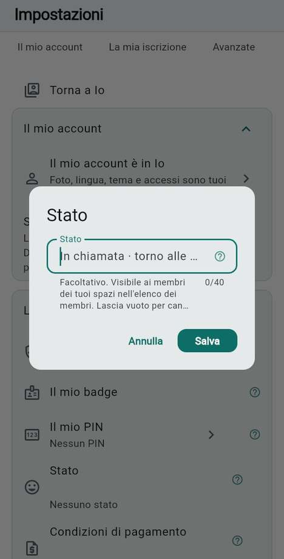

**Passaggi**

1. Apra [Impostazioni](https://fdittgen-png.github.io/deskilo/#/settings) e, sotto **La mia iscrizione**, tocchi **Stato**.
2. Digiti la sua riga in **Stato**.
3. Tocchi **Salva**. Per cancellarla, svuoti il campo e salvi.

**Da sapere**

- È facoltativa e breve; il campo si ferma al suo limite.
- I membri dei suoi spazi di lavoro la vedono nell'elenco dei membri.
- Indica **Nessuno stato** finché non ne scrive uno.

**Vedi anche:** [Chi mi vede](#scegliere-chi-mi-vede)

<!-- anchor: user.profile.settings.default-period -->
### Periodo di prenotazione predefinito

**Destinatari:** Membro

Di solito prenota la stessa mezza giornata e vuole averla già scelta.

**Passaggi**

1. Apra [Impostazioni](https://fdittgen-png.github.io/deskilo/#/settings) e, sotto **La mia iscrizione**, tocchi **Periodo di prenotazione predefinito**.
2. Scelga **Mattina**, **Pomeriggio**, **Giornata intera** o **Nessuna preferenza (giornata intera)**.

**Da sapere**

- Preseleziona soltanto: può comunque cambiare il periodo ogni volta che prenota.
- La riga compare solo quando la configurazione delle prenotazioni del suo spazio di lavoro offre una scelta.

**Vedi anche:** [La scheda di prenotazione](#la-scheda-di-prenotazione)

<!-- anchor: user.profile.settings.badge -->
### Il suo badge

**Destinatari:** Membro

Vuole un badge o una tessera che la identifichi alla porta o al chiosco.

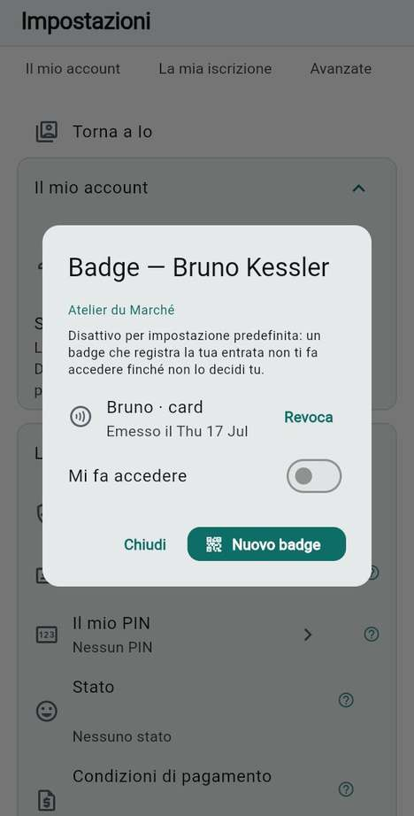

**Passaggi**

1. Apra [Impostazioni](https://fdittgen-png.github.io/deskilo/#/settings) e, sotto **La mia iscrizione**, tocchi **Il mio badge**.
2. Tocchi **Nuovo badge** per ottenere il suo codice QR, poi **Salva come PDF** per stamparlo, oppure tocchi **Registra tessera** e avvicini la sua tessera RFID o NFC al retro del dispositivo.
3. Per ritirare un badge, tocchi **Revoca**.

**Da sapere**

- Un nuovo codice QR viene mostrato una sola volta: lo salvi subito.
- Un badge revocato smette di funzionare subito. Ne emetta uno nuovo invece di cercare il vecchio.
- **Mi fa accedere** è disattivato per impostazione predefinita: un badge che registra il suo check-in non la fa accedere finché non lo attiva, e prima serve un PIN.
- **Nuovo badge** richiede la funzione **Badge QR** e **Registra tessera** la funzione **Badge RFID / NFC**; il suo spazio di lavoro potrebbe offrirne solo una.

**Vedi anche:** [Il PIN del suo badge](#il-pin-del-suo-badge)

<!-- anchor: user.profile.settings.badge-pin -->
### Il PIN del suo badge

**Destinatari:** Membro

Vuole accedere scansionando il suo badge invece di digitare la sua e-mail.

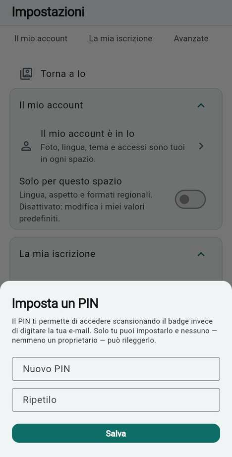

**Passaggi**

1. Apra [Impostazioni](https://fdittgen-png.github.io/deskilo/#/settings) e, sotto **La mia iscrizione**, tocchi **Il mio PIN**.
2. Scelga **Imposta un PIN**, lo inserisca in **Nuovo PIN**, lo ripeta in **Ripetilo** e salvi.
3. Apra **Il mio badge** e attivi **Mi fa accedere** per il badge che vuole.

**Da sapere**

- La riga indica **Nessun PIN** o **PIN impostato**.
- Solo Lei può impostarlo, e nessuno, nemmeno un proprietario, può rileggerlo.
- **Cambia PIN** lo sostituisce; **Rimuovi PIN** disattiva l'accesso con badge per tutti i suoi badge.

**Vedi anche:** [Il suo badge](#il-suo-badge)

<!-- anchor: user.profile.settings.language -->
### Lingua dell'app

**Destinatari:** Tutti

Vuole l'app nella sua lingua.

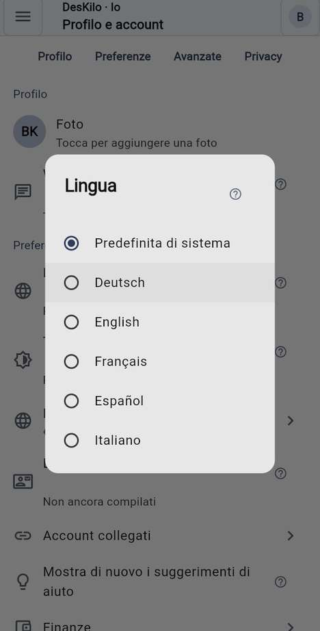

**Passaggi**

1. Apra [Io](https://fdittgen-png.github.io/deskilo/#/me?tab=me) e tocchi **Lingua**.
2. Scelga una lingua, oppure **Predefinita di sistema** per seguire il suo telefono.

**Da sapere**

- Vale per ogni spazio di lavoro, a meno che non ne imposti una per un solo spazio con [Solo per questo spazio](#scegliere-unimpostazione-solo-per-questo-spazio).
- Ogni lingua è scritta con il proprio nome, così può sempre trovare la sua.

**Vedi anche:** [Numeri e date](#numeri-e-date)

<!-- anchor: user.profile.settings.theme -->
### Tema

**Destinatari:** Tutti

Vuole l'app più chiara o più scura.

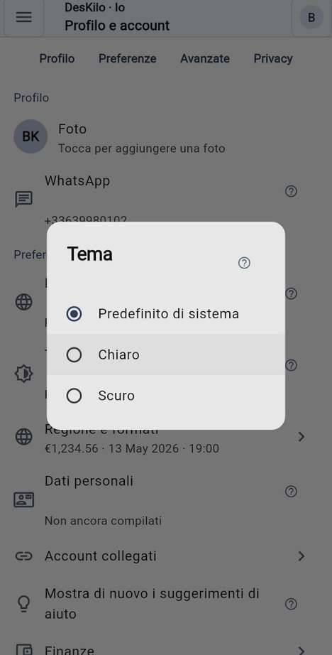

**Passaggi**

1. Apra [Io](https://fdittgen-png.github.io/deskilo/#/me?tab=me) e tocchi **Tema**.
2. Scelga **Predefinito di sistema**, **Chiaro** o **Scuro**.

**Da sapere**

- **Predefinito di sistema** segue l'interruttore chiaro e scuro del suo telefono.
- Come la lingua, può essere impostato per un solo spazio di lavoro.

**Vedi anche:** [Lingua dell'app](#lingua-dellapp)

<!-- anchor: user.profile.settings.navigation -->
### Stile di navigazione

**Destinatari:** Tutti

Preferisce la barra in basso, oppure il menu che conosce dal web.

**Passaggi**

1. Apra [Io](https://fdittgen-png.github.io/deskilo/#/me?tab=me) e tocchi **Navigazione**.
2. Scelga **Predefinito per questo dispositivo**, **Classica: la barra inferiore e il pulsante rotondo** o **Menu: l'hamburger, come sul web**.

**Da sapere**

- La riga è nascosta nella versione web, che usa sempre il menu, e compare solo quando il suo spazio di lavoro la offre.

**Vedi anche:** [Come sono organizzate le Impostazioni](#come-sono-organizzate-le-impostazioni)

<!-- anchor: user.profile.settings.regional-formats -->
### Numeri e date

**Destinatari:** Tutti

Vuole importi e date scritti come li legge Lei, qualunque sia la lingua dell'app.

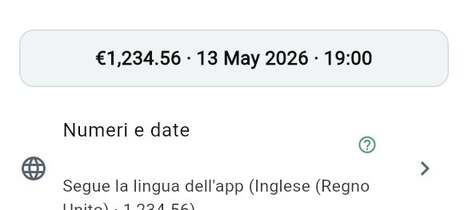

**Passaggi**

1. Apra [Regione e formati](https://fdittgen-png.github.io/deskilo/#/formats).
2. Tocchi **Numeri e date** e scelga una regione, oppure **Automatico** per seguire la lingua dell'app.
3. Controlli la riga di anteprima sopra: mostra un importo, una data e un'ora come li vedrà.

**Da sapere**

- È indipendente dalla lingua: un'app in inglese può scrivere date alla francese.
- Può essere impostato per un solo spazio di lavoro con [Solo per questo spazio](#scegliere-unimpostazione-solo-per-questo-spazio).
- La riga compare solo quando il suo spazio di lavoro usa **Regione e formati**.

**Vedi anche:** [Orologio](#orologio)

<!-- anchor: user.profile.settings.clock -->
### Orologio

**Destinatari:** Tutti

Preferisce gli orari su 24 ore o su 12 ore.

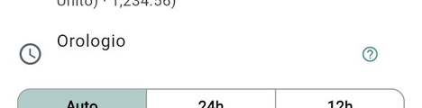

**Passaggi**

1. Apra [Regione e formati](https://fdittgen-png.github.io/deskilo/#/formats).
2. Sotto **Orologio**, scelga **Auto**, **24h** o **12h**.

**Da sapere**

- **Auto** fa ciò che fa la sua regione.
- Cambia il modo in cui gli orari sono scritti, mai ciò che significano.
- La riga compare solo quando il suo spazio di lavoro usa **Regione e formati**.

**Vedi anche:** [Mostra gli orari nel mio fuso](#mostra-gli-orari-nel-mio-fuso)

<!-- anchor: user.profile.settings.device-zone -->
### Mostra gli orari nel mio fuso

**Destinatari:** Tutti

È in viaggio e vuole gli orari come li mostra il suo orologio.

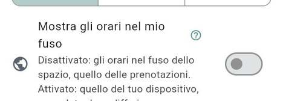

**Passaggi**

1. Apra [Regione e formati](https://fdittgen-png.github.io/deskilo/#/formats).
2. Attivi **Mostra gli orari nel mio fuso**.

**Da sapere**

- Disattivato, gli orari sono nel fuso dello spazio di lavoro, quello in cui si fanno le prenotazioni. È l'impostazione predefinita.
- Attivato, gli orari seguono il suo dispositivo e sono indicati ovunque differiscano da quelli dello spazio di lavoro.
- La riga compare solo quando il suo spazio di lavoro usa **Regione e formati**.

**Vedi anche:** [Orologio](#orologio)

<!-- anchor: user.profile.settings.restore-hints -->
### Ripristinare i suggerimenti

**Destinatari:** Tutti

Ha nascosto i suggerimenti di aiuto e ora li vuole di nuovo.

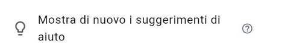

**Passaggi**

1. Apra [Io](https://fdittgen-png.github.io/deskilo/#/me?tab=me).
2. Tocchi **Mostra di nuovo i suggerimenti di aiuto**.

**Da sapere**

- Un messaggio conferma: **I suggerimenti di aiuto saranno mostrati di nuovo.**
- Nient'altro viene reimpostato.
- La riga compare solo quando il suo spazio di lavoro usa i suggerimenti di aiuto.

**Vedi anche:** [Come sono organizzate le Impostazioni](#come-sono-organizzate-le-impostazioni)

<!-- anchor: user.profile.settings.front-camera -->
### Fotocamera frontale per la scansione

**Destinatari:** Tutti

Scansiona i badge con un tablet a muro la cui fotocamera posteriore guarda la parete.

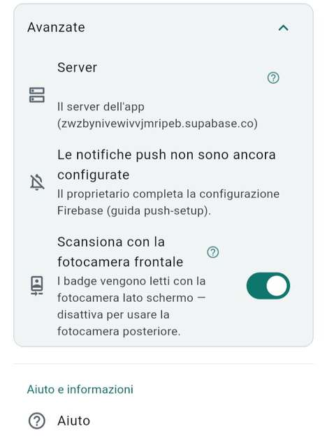

**Passaggi**

1. Apra [Impostazioni](https://fdittgen-png.github.io/deskilo/#/settings) e apra **Avanzate**.
2. Attivi **Scansiona con la fotocamera frontale** per usare la fotocamera dal lato dello schermo, oppure lo disattivi per la fotocamera posteriore.

**Da sapere**

- È attivata per impostazione predefinita e vale solo per questo dispositivo.

**Vedi anche:** [Il suo badge](#il-suo-badge)

<!-- anchor: user.profile.settings.linked-accounts -->
### Account collegati

**Destinatari:** Tutti

Vuole accedere anche con un'altra identità, come un account Google, oltre che con la sua e-mail.

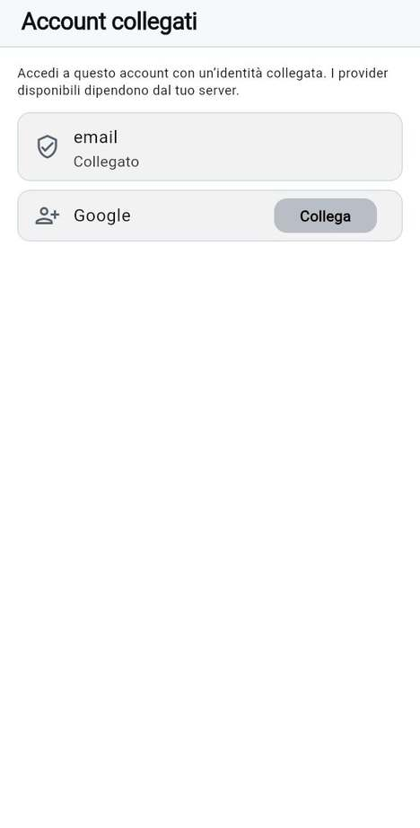

**Passaggi**

1. Apra [Io](https://fdittgen-png.github.io/deskilo/#/me?tab=me) e tocchi **Account collegati**.
2. Tocchi **Collega** accanto a un provider e termini nel browser.
3. Per rimuoverne uno, tocchi **Scollega**.

**Da sapere**

- Un'identità collegata indica **Collegato**.

**Vedi anche:** [Profili](#profili-un-account-più-spazi)

<!-- anchor: user.privacy.visibility -->
### Privacy: chi può vedere i miei dati

**Destinatari:** Tutti

Vuole sapere chi può leggere che cosa su di Lei, e chi ha effettivamente guardato.

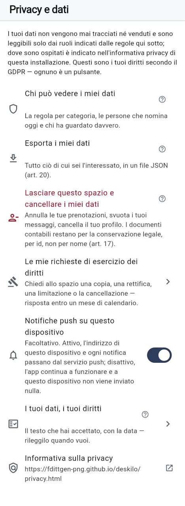

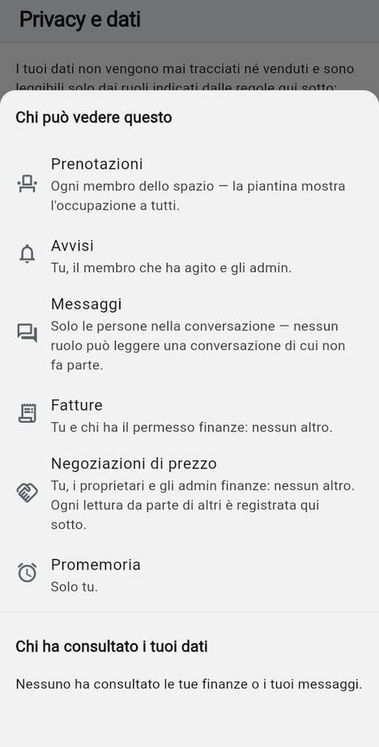

**Passaggi**

1. Apra [Privacy e dati](https://fdittgen-png.github.io/deskilo/#/privacy).
2. Tocchi **Chi può vedere i miei dati**.
3. Legga la regola per ogni categoria, le persone che indica oggi, e **Chi ha consultato i suoi dati**.

**Da sapere**

- I suoi dati non vengono mai tracciati né venduti. I ruoli decidono chi li legge, e il server lo fa rispettare.
- La scheda enuncia la regola; non c'è nulla da attivare. Per scegliere che cosa gli altri membri vedono del suo profilo, usi [Chi mi vede](#scegliere-chi-mi-vede).

**Vedi anche:** [Chi mi vede](#scegliere-chi-mi-vede) · [I suoi dati, i suoi diritti](#i-suoi-dati-i-suoi-diritti)

<!-- anchor: user.privacy.audiences -->
### Scegliere chi mi vede

**Destinatari:** Tutti

Vuole decidere, voce per voce, chi vede il suo nome, la sua biografia, i suoi recapiti e la sua presenza.

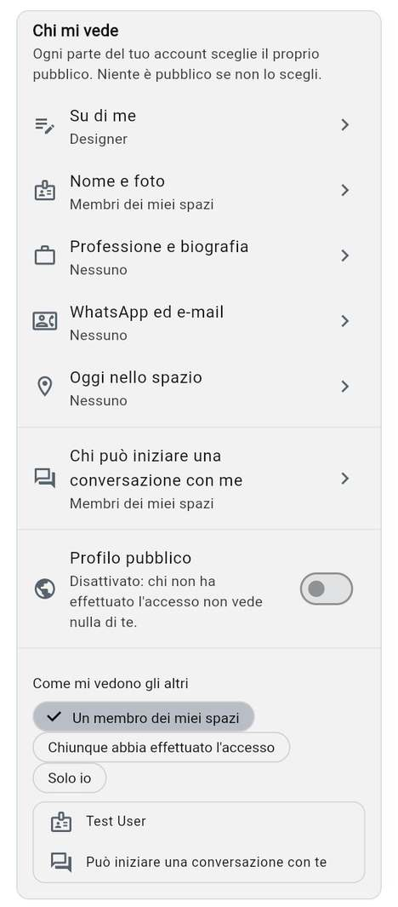

**Passaggi**

1. Apra [Io](https://fdittgen-png.github.io/deskilo/#/me?tab=me) e scorra fino a **Privacy**, alla scheda **Chi mi vede**.
2. Tocchi una voce: **Su di me**, **Nome e foto**, **Professione e biografia**, **WhatsApp ed e-mail**, **Oggi nello spazio** o **Chi può iniziare una conversazione con me**.
3. Scelga un pubblico, per esempio **Nessuno**, **Membri dei miei spazi** o **Membri di spazi scelti**, selezioni gli spazi se ne ha scelti alcuni, e tocchi **Salva**.
4. Controlli **Come mi vedono gli altri** in fondo alla scheda.

**Da sapere**

- Nulla è pubblico se non lo sceglie Lei.
- Allargare un pubblico Le chiede prima una conferma.
- **Persone bloccate** sotto la scheda elenca chi ha bloccato; queste persone non possono vederla né raggiungerla e Lei non può raggiungerle. Tocchi **Sblocca** per annullare.
- **Chiunque abbia effettuato l'accesso** è offerto solo per alcune voci, come **Nome e foto** e **Professione e biografia**. **WhatsApp ed e-mail** e **Oggi nello spazio** non vanno mai oltre i suoi spazi.

**Vedi anche:** [Profilo pubblico](#pubblicare-un-profilo-pubblico) · [Chi può vedere i miei dati](#privacy-chi-può-vedere-i-miei-dati)

<!-- anchor: user.privacy.public-profile -->
### Pubblicare un profilo pubblico

**Destinatari:** Tutti

Vuole una pagina con il suo nome e qualche parola che le persone possano leggere senza un account.

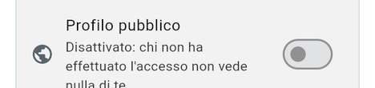

**Passaggi**

1. Apra [Io](https://fdittgen-png.github.io/deskilo/#/me?tab=me) e trovi **Profilo pubblico** nella scheda **Chi mi vede**.
2. Lo attivi e confermi con **Pubblica**.
3. Tocchi **Copia il link** per condividerlo.

**Da sapere**

- Chiunque abbia il link legge il suo nome, la sua professione e la sua biografia. I recapiti, la presenza e gli spazi restano privati.
- Disattivato, chi non ha effettuato l'accesso non vede nulla di Lei.

**Vedi anche:** [Scegliere chi mi vede](#scegliere-chi-mi-vede)

<!-- anchor: user.privacy.export -->
### Esportare i miei dati

**Destinatari:** Tutti

Vuole una copia di tutto ciò che DesKilo conserva su di Lei.

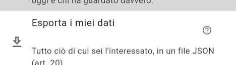

**Passaggi**

1. Apra [Privacy e dati](https://fdittgen-png.github.io/deskilo/#/privacy).
2. Tocchi **Esporta i miei dati**.
3. Salvi o condivida il file prodotto.

**Da sapere**

- È un unico file JSON, creato nel momento in cui lo richiede.
- La riga compare solo quando il suo spazio di lavoro offre l'esportazione dei dati.

**Vedi anche:** [Richieste sui diritti](#richieste-sui-diritti)

<!-- anchor: user.privacy.erase -->
### Cancellare i miei dati

**Destinatari:** Tutti

Vuole lasciare uno spazio di lavoro e far cancellare i suoi dati.

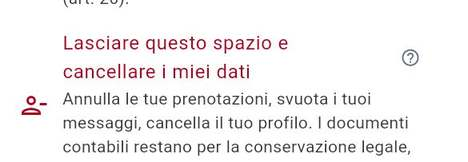

**Passaggi**

1. Apra [Privacy e dati](https://fdittgen-png.github.io/deskilo/#/privacy).
2. Tocchi **Lasciare questo spazio e cancellare i miei dati**.
3. Legga ciò che farà, digiti la parola di conferma e tocchi **Cancella**.

**Da sapere**

- Annulla le sue prenotazioni aperte e svuota i suoi messaggi in questo spazio. Il suo profilo viene cancellato se è il suo ultimo spazio; le prenotazioni passate restano come registro di occupazione dello spazio.
- Le registrazioni contabili restano per il periodo di conservazione previsto dalla legge, per identificativo e non per nome.
- La riga compare insieme all'esportazione dei dati. È in grigio per un proprietario, che deve prima cedere lo spazio di lavoro, sotto Comproprietà.

**Vedi anche:** [Esportare i miei dati](#esportare-i-miei-dati)

<!-- anchor: user.privacy.requests -->
### Richieste sui diritti

**Destinatari:** Tutti

Vuole chiedere allo spazio di lavoro una copia, una correzione, una limitazione o la cancellazione, e conservarne una traccia.

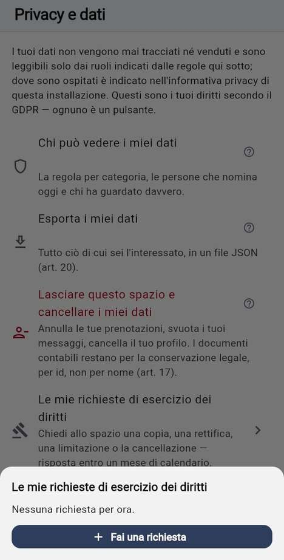

**Passaggi**

1. Apra [Privacy e dati](https://fdittgen-png.github.io/deskilo/#/privacy) e tocchi **Le mie richieste di esercizio dei diritti**.
2. Tocchi **Nuova richiesta** e scelga che cosa chiede: vedere una copia dei suoi dati, portarli altrove, correggerli, limitarne l'uso, opporsi a un uso, o cancellarli.
3. Aggiunga i **Dettagli (facoltativo)** e tocchi **Invia la richiesta**.

**Da sapere**

- Lo spazio risponde entro un mese di calendario; la scheda mostra la data.
- Ogni richiesta indica se è stata ricevuta, prorogata (con la nuova data e il motivo), evasa o rifiutata.

**Vedi anche:** [Esportare i miei dati](#esportare-i-miei-dati) · [Cancellare i miei dati](#cancellare-i-miei-dati)

<!-- anchor: user.privacy.push -->
### Notifiche push su questo dispositivo

**Destinatari:** Tutti

Vuole che non vengano più inviate notifiche a questo dispositivo, oppure riattivarle.

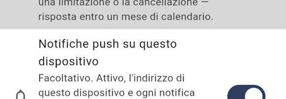

**Passaggi**

1. Apra [Privacy e dati](https://fdittgen-png.github.io/deskilo/#/privacy).
2. Disattivi o attivi **Notifiche push su questo dispositivo**.

**Da sapere**

- Disattivate, l'app continua a funzionare e nulla viene inviato a questo dispositivo.
- Attivate, l'indirizzo di questo dispositivo e ogni notifica vanno al servizio push.

**Vedi anche:** [I suoi dati, i suoi diritti](#i-suoi-dati-i-suoi-diritti)

<!-- anchor: user.privacy.consent -->
### I suoi dati, i suoi diritti

**Destinatari:** Tutti

Vuole rileggere ciò che ha accettato riguardo ai suoi dati.

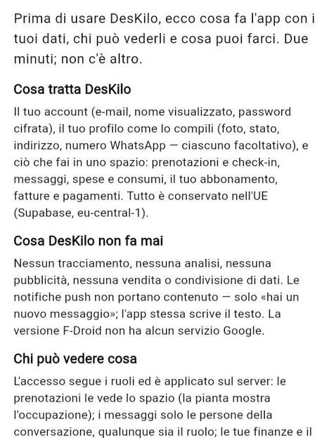

**Passaggi**

1. Apra [Privacy e dati](https://fdittgen-png.github.io/deskilo/#/privacy).
2. Tocchi **I suoi dati, i suoi diritti**.
3. Legga il testo: che cosa viene trattato, che cosa non viene mai fatto, chi vede che cosa, chi è responsabile, per quanto tempo, e i suoi diritti.

**Da sapere**

- Mostra la data e la versione che ha accettato; una modifica del testo richiede di nuovo la sua accettazione.
- **Informativa sulla privacy**, subito sotto, apre l'informativa completa online.

**Vedi anche:** [Chi può vedere i miei dati](#privacy-chi-può-vedere-i-miei-dati)

<!-- anchor: user.backend.server -->
### Il suo server

**Destinatari:** Tutti

Per impostazione predefinita l'app usa il servizio di DesKilo. La sua comunità può gestire un proprio server e Lei vuole collegarsi.

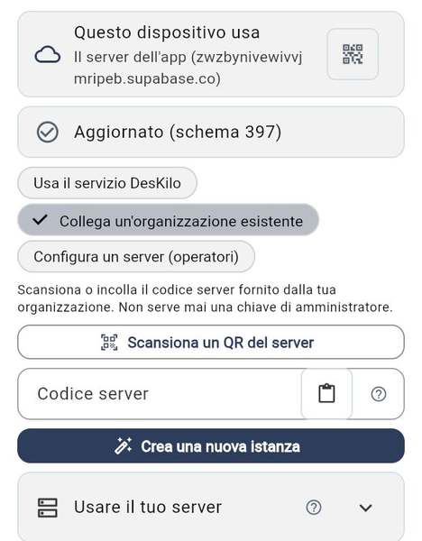

**Passaggi**

1. Apra [Impostazioni](https://fdittgen-png.github.io/deskilo/#/settings), poi **Avanzate**, poi **Server**.
2. Scelga **Collega un'organizzazione esistente**.
3. Tocchi **Scansiona un QR del server**, oppure incolli il codice in **Codice server**.
4. Salvi. L'app la disconnette e usa il nuovo server la prossima volta che si apre.

**Da sapere**

- Non ha mai bisogno di una chiave amministratore.
- **Usa il server dell'app** la riporta in qualsiasi momento a quello predefinito.
- Il suo account risiede su un server, ed è per questo che cambiare la disconnette.

**Vedi anche:** [Come gestire il proprio](#come-gestire-il-proprio)

<!-- anchor: user.backend.how -->
### Come gestire il proprio

**Destinatari:** Tutti

Dirige una comunità e vuole ospitare DesKilo da sé.

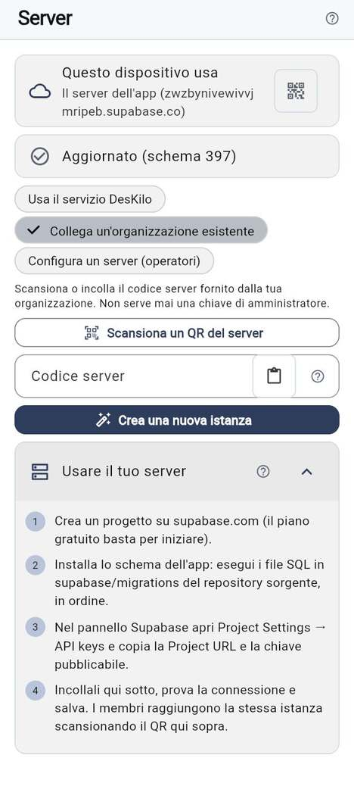

**Passaggi**

1. Apra la schermata **Server** e tocchi **Usare il suo server**.
2. Segua i quattro passaggi indicati: creare un progetto su supabase.com, installare lo schema, copiare l'URL del progetto e la chiave pubblicabile, poi incollarli e **Prova la connessione**.
3. Oppure tocchi **Crea una nuova istanza** per la configurazione guidata.

**Da sapere**

- Il test Le dice che cosa non va: indirizzo irraggiungibile, chiave rifiutata o tabelle mancanti.
- I membri si uniscono allo stesso server scansionando il QR su questa schermata.
- Il lato operatore, gli ambienti e la distribuzione, si trova nel capitolo avanzato.

**Vedi anche:** [Il suo server](#il-suo-server)

<!-- anchor: user.money.overview -->
## Finanze

Tutto ciò che deve, ha pagato e le è stato fatturato si trova nella scheda **Finanze**: un unico posto per leggere il mese, saldarlo, trovare una fattura e chiedere una modifica.

In questo capitolo:
- [Leggere il proprio estratto](#leggere-il-proprio-estratto) e [che cosa cambia una fattura](#quando-un-mese-è-stato-fatturato)
- [Pagare quanto dovuto](#pagare-quanto-dovuto) e [registrare un pagamento](#registrare-un-pagamento)
- [Le Sue fatture](#le-sue-fatture) e [quanto è costata ogni prenotazione](#quanto-è-costata-ogni-prenotazione)
- [Avvisi finanziari](#avvisi-finanziari), [report](#report-anteprima-download-condivisione) e [i Suoi prezzi negoziati](#i-suoi-prezzi-negoziati)
- [Aprire un documento](#aprire-un-documento-della-biblioteca) della biblioteca
- [Inviare una spesa](#inviare-una-spesa) e [approvarla o rifiutarla](#approvare-o-rifiutare-una-spesa)
- [Come sono mostrati gli importi](#come-sono-mostrati-gli-importi) e [le Sue finanze in tutti gli spazi](#le-sue-finanze-in-tutti-gli-spazi)
- Per gli amministratori di fatturazione: [La fatturazione in sintesi](#la-fatturazione-in-sintesi)

<!-- anchor: user.money.statement -->
### Leggere il proprio estratto

**Destinatari:** Membro

Vuole sapere a che punto è il mese: che cosa ha utilizzato, quanto costa e che cosa resta da saldare.

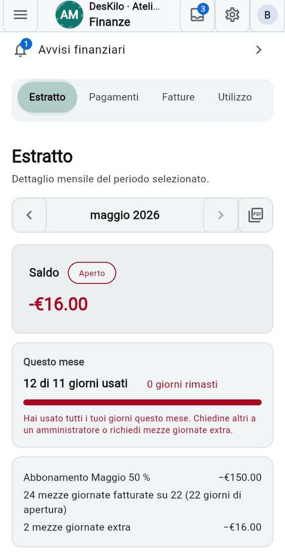

**Passaggi**

1. Apra [Finanze](https://fdittgen-png.github.io/deskilo/#/money) e resti su **Estratto**.
2. Usi le frecce accanto al nome del mese per scorrere gli altri mesi.
3. Legga prima il **Saldo**: **Da pagare** in rosso significa che Lei è in debito, **Saldato** significa che non resta nulla.
4. Legga poi **Questo mese**: i giorni utilizzati su quelli inclusi nel Suo piano e i giorni rimanenti.
5. Legga le schede successive: abbonamento, mezze giornate extra, servizi, pacchetti, posizioni aperte e **Pagamenti e crediti**.

**Da sapere**

- Una mattina o un pomeriggio prenotati valgono mezza giornata: può quindi vedere valori come 0,5 giorni.
- La scheda indica anche la regola del suo piano. Con il pagamento a consumo mostra sempre la tariffa dei giorni extra; con le altre due regole la invita a chiedere a un amministratore o ad acquistare un pacchetto una volta utilizzati tutti i giorni.
- Una riga contrassegnata come «in attesa di convalida» attende che qualcuno la confermi e non è ancora conteggiata.
- Tocchi l'icona PDF accanto al mese per esportare il conteggio.

**Vedi anche:** [Pagare quanto dovuto](#pagare-quanto-dovuto) · [Quanto è costata ogni prenotazione](#quanto-è-costata-ogni-prenotazione)

<!-- anchor: user.money.statement.invoiced -->
### Quando un mese è stato fatturato

**Destinatari:** Membro

Vuole sapere di quale cifra fidarsi quando lo spazio Le ha inviato la fattura di un mese.

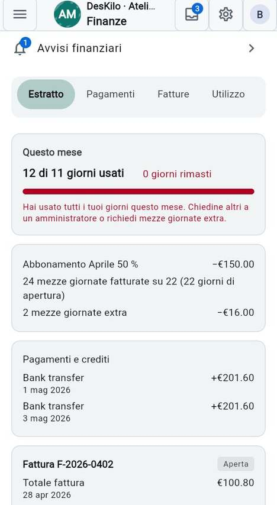

**Passaggi**

1. Apra [Finanze](https://fdittgen-png.github.io/deskilo/#/money) e torni al mese fatturato con la freccia sinistra.
2. Cerchi la scheda chiamata **Fattura** (o **Nota di credito** quando il totale è negativo) seguita dal suo numero.
3. Legga lo stato sulla scheda, poi il **Totale fattura**; una fattura pagata in parte mostra anche **Già pagato** e **Residuo da pagare**.

**Da sapere**

- Quando un mese è fatturato, è la fattura a stabilire se è saldato. Il pagamento che lo salda di solito arriva in un mese successivo, quindi il saldo del mese non è più il riferimento.
- Una nota di credito riporta «Lo spazio ti deve questo importo: non hai nulla da pagare».

**Vedi anche:** [Le Sue fatture](#le-sue-fatture)

<!-- anchor: user.money.payments -->
### Pagare quanto dovuto

**Destinatari:** Membro

Vuole saldare il Suo saldo e sapere come lo spazio si aspetta di ricevere il denaro.

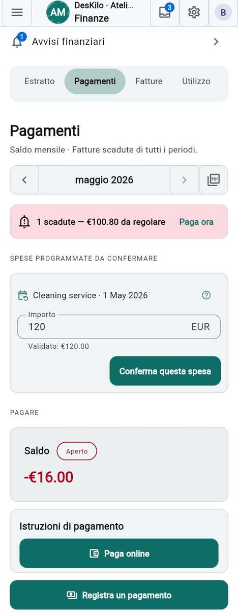

**Passaggi**

1. Apra [Finanze](https://fdittgen-png.github.io/deskilo/#/money) e scelga **Pagamenti**.
2. Controlli il **Saldo** sotto **Pagare**; le fatture scadute di tutti i periodi sono segnalate sopra.
3. Legga le **Istruzioni di pagamento**: le coordinate bancarie, il riferimento di pagamento da indicare e gli altri modi accettati dallo spazio. Tocchi un IBAN o un valore per copiarlo.
4. Se il pulsante è presente, tocchi **Paga online**.
5. Dopo aver pagato in un altro modo, [registri il pagamento](#registrare-un-pagamento).

**Da sapere**

- Le istruzioni compaiono solo finché c'è qualcosa da pagare e solo se lo spazio le ha configurate. Se non c'è nulla, chieda al Suo amministratore come pagare.
- Un pagamento online non ancora confermato dal fornitore appare come **Pagamento online in sospeso**: il saldo continua a mostrare quanto è dovuto fino alla conferma.
- Sotto **Richieste** può anche inviare una spesa, chiedere **Richiedi mezze giornate extra** oppure, se il Suo piano funziona a pacchetti, **Acquista un pacchetto**.

**Vedi anche:** [Registrare un pagamento](#registrare-un-pagamento) · [Inviare una spesa](#inviare-una-spesa)

<!-- anchor: user.money.payments.record -->
### Registrare un pagamento

**Destinatari:** Membro

Ha pagato con bonifico, in contanti o in un altro modo e vuole che lo spazio lo sappia.

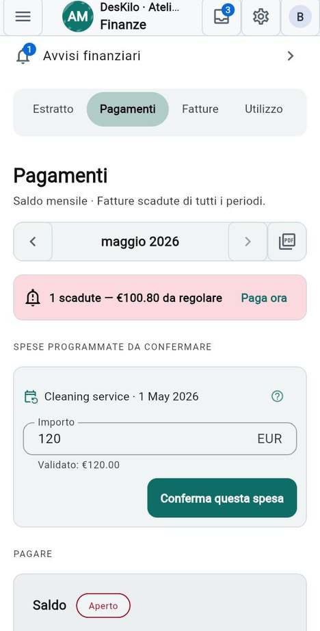

**Passaggi**

1. Apra [Finanze](https://fdittgen-png.github.io/deskilo/#/money), scelga **Pagamenti** e tocchi **Registra un pagamento**.
2. Inserisca l'**Importo**.
3. Tocchi il modo in cui ha pagato: **Bonifico**, **Contanti**, **PayPal**, **TWINT**, **Carta**, **Wero**, **Lydia**, **Wise** o **Altro**. Lo tocchi di nuovo per deselezionarlo.
4. Controlli la **Data del pagamento** e **Si applica a**, il mese che questo pagamento salda.
5. Aggiunga una **Nota (facoltativa)**, poi tocchi **Invia per conferma**.

**Da sapere**

- Il pagamento non è definitivo quando lo invia. Resta «in attesa di convalida» finché le persone scelte dallo spazio non lo confermano, secondo le [Regole di convalida](#regole-di-convalida-ambito-per-ambito). Solo allora salda il Suo saldo.
- La data del pagamento non può essere nel futuro. **Si applica a** può arrivare fino a un mese avanti, per pagare in anticipo.

**Vedi anche:** [Pagare quanto dovuto](#pagare-quanto-dovuto) · [Avvisi finanziari](#avvisi-finanziari)

<!-- anchor: user.money.invoices -->
### Le Sue fatture

**Destinatari:** Membro

Vuole trovare una fattura, vedere se è pagata e ottenerne il PDF.

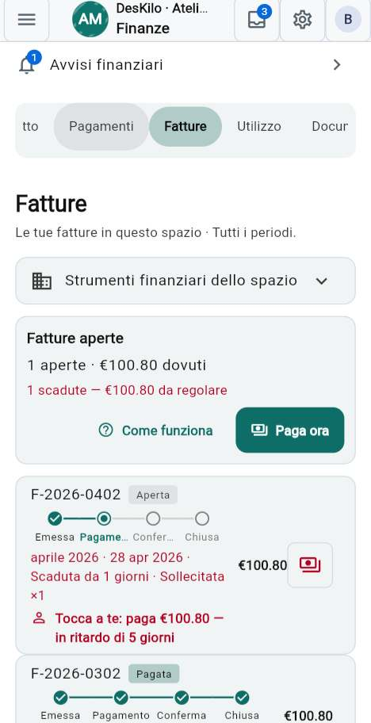

**Passaggi**

1. Apra [Finanze](https://fdittgen-png.github.io/deskilo/#/money) e scelga **Fatture**.
2. Legga l'elenco, dalla più recente. Ogni riga mostra il numero, un indicatore di stato, il mese, la data e l'importo.
3. Tocchi una fattura per aprirla.
4. Tocchi **Anteprima rapida** per leggerla sullo schermo, **Scarica PDF** per salvarla o **Condividi PDF** per inviarla.

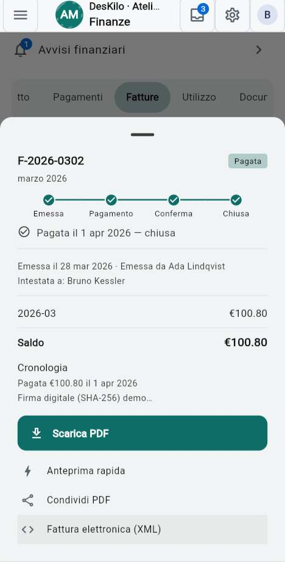

**Da sapere**

- Gli stati sono **Aperta**, **In attesa di convalida**, **Pagata**, **Parzialmente pagata**, **Parzialmente pagata · saldo annullato** e **Rimborsata**. Una fattura aperta indica la scadenza o i giorni di ritardo e quanti solleciti ha ricevuto.
- Tocchi l'icona del pagamento su una fattura aperta per passare a **Pagamenti**.
- Se l'elenco è vuoto, lo spazio non Le ha ancora fatturato nulla; fattura un mese solo dopo la sua chiusura.
- Le fatture non si possono modificare. Una fattura sbagliata è contrassegnata come **Errata** e sostituita da una nuova, e quella errata scompare dal Suo elenco. Quando più fatture vengono raggruppate in una, la fattura raggruppata le sostituisce nel suo elenco.

**Vedi anche:** [Pagare quanto dovuto](#pagare-quanto-dovuto) · [Le Sue finanze in tutti gli spazi](#le-sue-finanze-in-tutti-gli-spazi)

<!-- anchor: user.money.usage -->
### Quanto è costata ogni prenotazione

**Destinatari:** Membro · Amministratore

Vuole vedere, prenotazione per prenotazione, che cosa è stato fatturato questo mese.

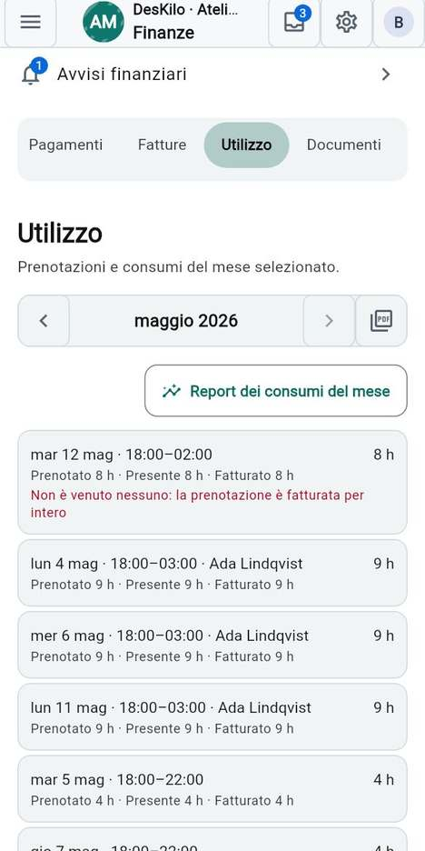

**Passaggi**

1. Apra [Finanze](https://fdittgen-png.github.io/deskilo/#/money) e scelga **Utilizzo**.
2. Scelga il mese con le frecce.
3. Legga ogni scheda: il giorno, l'orario, il posto, poi **Prenotato**, **Presente** e **Fatturato**.
4. Per una prenotazione che ha lasciato in anticipo, tocchi **Fattura il tempo in cui c’ero**, aggiunga se lo desidera un motivo e tocchi **Chiedi**.
5. Per un riepilogo del mese, tocchi **Report dei consumi del mese**.

**Da sapere**

- Una prenotazione senza check-in è fatturata per intero, e la scheda lo indica.
- La Sua richiesta non la decide mai Lei: qualcun altro la accetta o la rifiuta. Una riga corretta continua a mostrare ciò che era prima.
- Gli amministratori possono chiedere di **Rimuovi questo rilevamento**.

**Vedi anche:** [Report](#report-anteprima-download-condivisione) · [La scheda di prenotazione](#la-scheda-di-prenotazione)

<!-- anchor: user.money.alerts -->
### Avvisi finanziari

**Destinatari:** Membro · Amministratore

Vuole vedere che cosa La attende in materia di denaro, senza leggere tutto il flusso.

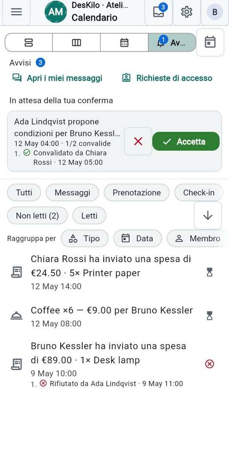

**Passaggi**

1. Apra [Finanze](https://fdittgen-png.github.io/deskilo/#/money).
2. Tocchi **Avvisi finanziari**, la riga in alto. Il numero sulla campana indica quanti ne attendono.
3. Legga l'elenco: prima le richieste da confermare, poi gli eventi di denaro.

**Da sapere**

- È la consueta vista degli avvisi di [Eventi](https://fdittgen-png.github.io/deskilo/#/events), già filtrata sul denaro.
- Pagamenti, spese e mezze giornate extra che ha inviato compaiono qui in attesa di conferma e mostrano chi li ha convalidati o rifiutati.
- La riga compare quando la funzione **Scheda Eventi** è attiva.

**Vedi anche:** [Approvare o rifiutare una spesa](#approvare-o-rifiutare-una-spesa)

<!-- anchor: user.money.reports -->
### Report: anteprima, download, condivisione

**Destinatari:** Membro

Vuole un documento sul Suo denaro, da leggere, conservare o inviare al Suo commercialista.

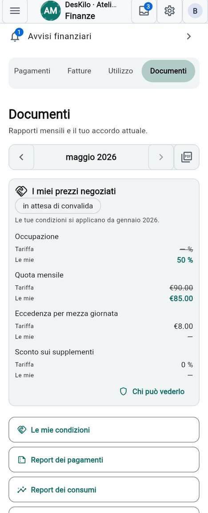

**Passaggi**

1. Apra [Finanze](https://fdittgen-png.github.io/deskilo/#/money) e scelga **Documenti**.
2. Scelga il mese con le frecce, per i report che dipendono da un mese.
3. Tocchi un report: **Le mie condizioni**, **Report dei pagamenti**, **Report dei consumi** o **Estratto del mese (PDF)**.
4. Scelga **Anteprima rapida**, **Scarica PDF** o **Condividi PDF**.

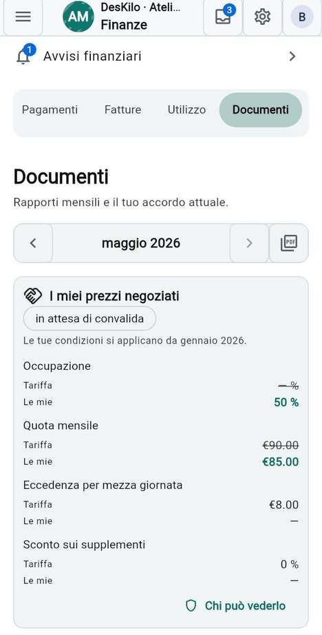

**Da sapere**

- Le stesse tre scelte compaiono su ogni report e su ogni fattura.
- **Anteprima rapida** mostra il documento sullo schermo senza salvare nulla.
- Un report che non vede non è attivato nel Suo spazio.

**Vedi anche:** [Le Sue fatture](#le-sue-fatture) · [I Suoi prezzi negoziati](#i-suoi-prezzi-negoziati)

<!-- anchor: user.money.negotiation -->
### I Suoi prezzi negoziati

**Destinatari:** Membro

Vuole sapere se paga la tariffa dello spazio o un prezzo concordato solo per Lei.

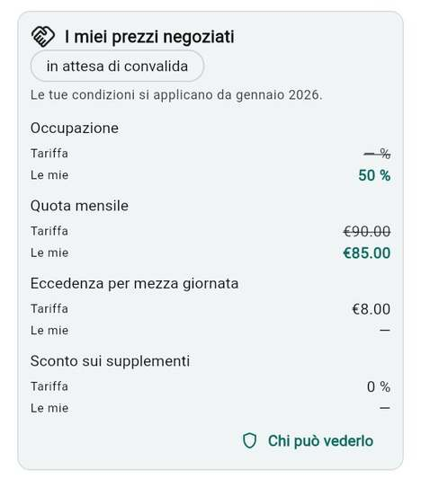

**Passaggi**

1. Apra [Finanze](https://fdittgen-png.github.io/deskilo/#/money) e scelga **Documenti**.
2. Legga **I miei prezzi negoziati**: per **Canone mensile**, **Eccedenza per mezza giornata** e **Sconto sui supplementi**, **Tariffa** mostra ciò che pagano tutti e **Le mie** ciò che paga Lei.
3. Tocchi **Chi può vedere questo** per sapere chi può leggere i Suoi prezzi.

**Da sapere**

- «Sei alla tariffa dello spazio» significa che non si applica nessun accordo; la Sua colonna mostra un trattino.
- Quando si applica un accordo, la scheda indica da quale mese e la cifra della tariffa è barrata.
- Un accordo proposto per Lei resta «in attesa di convalida» e si applica solo dopo la convalida.
- Qui non può modificare un accordo; lo propone un amministratore. Veda [Negoziazione dei prezzi](#negoziazione-di-prezzo).

**Vedi anche:** [Leggere il proprio estratto](#leggere-il-proprio-estratto)

<!-- anchor: user.money.documents.library -->
### Aprire un documento della biblioteca

**Destinatari:** Membro

Vuole lo statuto, una guida o i bilanci che il Suo spazio ha condiviso.

**Passaggi**

1. Apra [Finanze](https://fdittgen-png.github.io/deskilo/#/money), scelga **Documenti** e tocchi **Biblioteca documenti**, oppure vada direttamente a [Documenti](https://fdittgen-png.github.io/deskilo/#/documents).
2. Trovi il Suo documento nella sua categoria: **Statuto e legale**, **Bilanci**, **Verbali**, **Guide e manuali** o **Altri documenti**.
3. Lo tocchi. Si apre nel browser da dove è archiviato.

**Da sapere**

- Vede solo i documenti che il Suo ruolo può leggere; un lucchetto segna quelli riservati ad **Admin e proprietari** o **Solo proprietari**.
- La biblioteca contiene collegamenti. Chi può aprire il file è deciso dove è archiviato, non in DesKilo.
- Gli amministratori con il permesso adatto aggiungono e rimuovono documenti; veda [Titolo del documento](#titolo-del-documento).

**Vedi anche:** [Report](#report-anteprima-download-condivisione)

<!-- anchor: user.money.expense -->
### Inviare una spesa

**Destinatari:** Membro

Ha pagato qualcosa per lo spazio e vuole che lo spazio Le rimborsi la somma.

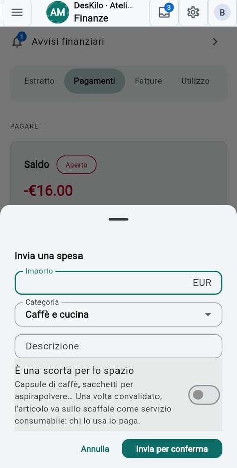

**Passaggi**

1. Apra [Finanze](https://fdittgen-png.github.io/deskilo/#/money), scelga **Pagamenti** e tocchi **Invia una spesa**.
2. Inserisca l'**Importo**.
3. Scelga una **Categoria**: **Caffè e cucina**, **Attrezzatura**, **Materiale** o **Altro**.
4. Scriva una **Descrizione**.
5. Se ha acquistato qualcosa che i membri useranno, attivi **È una scorta per lo spazio** (l'opzione compare quando il suo spazio di lavoro ha attivato **Scorte dalle spese**) e indichi l'articolo, la quantità e il prezzo unitario.
6. Tocchi **Invia per conferma**.

**Da sapere**

- Vede «Spesa inviata — in attesa di approvazione». La spesa conta solo dopo la conferma.
- Una scorta confermata va a scaffale come servizio: i membri che la usano la pagano.
- Le spese ricorrenti hanno una porta a parte, **Spese programmate**, accanto a questo pulsante.

**Vedi anche:** [Approvare o rifiutare una spesa](#approvare-o-rifiutare-una-spesa)

<!-- anchor: user.money.expense.approve -->
### Approvare o rifiutare una spesa

**Destinatari:** Amministratore · Proprietario

Una spesa è in attesa e Lei decide se lo spazio la paga.

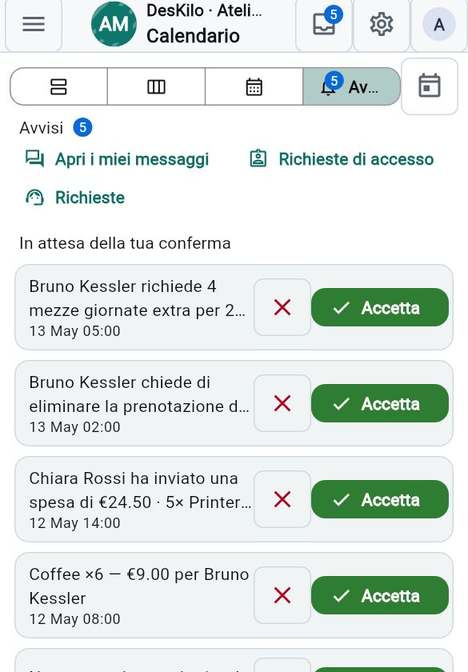

**Passaggi**

1. Apra [Eventi](https://fdittgen-png.github.io/deskilo/#/events), oppure tocchi **Avvisi finanziari** in [Finanze](https://fdittgen-png.github.io/deskilo/#/money).
2. Cerchi sotto **In attesa della sua conferma** la riga che indica l'importo e il membro.
3. Tocchi **Accetta** per confermarla, oppure la croce per **Rifiuta**.

**Da sapere**

- Alcune spese richiedono più di una convalida. La riga indica quante sono state date, ad esempio «1/2 convalide».
- Chi può convalidare e quante convalide servono si stabilisce nelle [Regole di convalida](#regole-di-convalida-ambito-per-ambito).
- Ogni decisione resta sulla riga: chi ha confermato o rifiutato, e quando. Il membro vede l'esito.
- **Avvisi finanziari** in Finanze compare solo quando la funzione **Scheda Eventi** è attiva.

**Vedi anche:** [Avvisi finanziari](#avvisi-finanziari)

<!-- anchor: user.money.amounts -->
### Come sono mostrati gli importi

**Destinatari:** Tutti

Vuole leggere una cifra senza dubitare di che cosa comprenda.

**Da sapere**

- Gli importi usano la valuta del Suo spazio e il Suo formato numerico. Una fattura conserva la valuta in cui è stata emessa.
- Sull'estratto, gli addebiti hanno il segno meno, i pagamenti e i crediti il segno più. Un saldo in rosso è denaro che Lei deve.
- Quando un prezzo include l'IVA, lo dice, ad esempio «IVA 20 % incl.». Il PDF della fattura elenca l'IVA contenuta.
- Se il Suo spazio non applica l'IVA, non viene mostrata alcuna IVA.
- I giorni sono mostrati in giorni interi e mezze giornate.

**Vedi anche:** [Leggere il proprio estratto](#leggere-il-proprio-estratto) · [Le Sue fatture](#le-sue-fatture)

<!-- anchor: user.money.finances -->
### Le Sue finanze in tutti gli spazi

**Destinatari:** Membro

Appartiene a più spazi e vuole tutte le Sue fatture, i Suoi pagamenti e i Suoi solleciti in un unico posto.

**Passaggi**

1. Apra [Finanze](https://fdittgen-png.github.io/deskilo/#/money), scelga **Pagamenti** o **Fatture** e tocchi **Apri per** il Suo spazio sulla scheda **Le sue finanze in tutti gli spazi**.
2. Scelga una scheda: **Da pagare**, **Pagate**, **Pagamenti** o **Solleciti**.
3. Se appartiene a più spazi, filtri per spazio in alto.

**Da sapere**

- **Da pagare** mostra «Niente da pagare — sei in regola» quando non deve nulla.
- **Solleciti** elenca i solleciti ricevuti, con il loro livello.
- Cronologia completa, utilizzo e altri server sono raggiungibili dalla stessa schermata.

**Vedi anche:** [Le Sue fatture](#le-sue-fatture)

<!-- anchor: user.money.invoicing -->
### La fatturazione in sintesi

**Destinatari:** Amministratore fatturazione · Proprietario

Emette e sollecita le fatture dell'intero spazio e vuole sapere da dove cominciare.

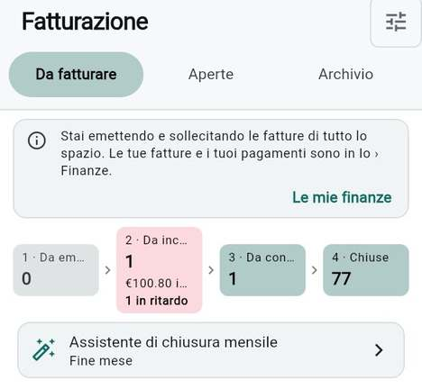

**Passaggi**

1. Apra [Fatturazione](https://fdittgen-png.github.io/deskilo/#/invoices).
2. Legga le schede: **Da fatturare** elenca i membri ancora da fatturare per il mese, **Aperto** le fatture emesse e non pagate, **Archivio** quelle chiuse.
3. Legga la riga dei quattro passaggi sotto il banner: **Da emettere**, **Da incassare**, **Da confermare** e **Chiuso**, ciascuno con un conteggio.
4. Tocchi **Assistente di chiusura mensile** per fatturare un mese, oppure **Nuova fattura** per una sola.
5. Tocchi l'icona degli strumenti per il registro fatture, le regole di sollecito, il modello PDF della fattura e **Le mie finanze**.

**Da sapere**

- Le fatture non si modificano né si eliminano mai. Una fattura sbagliata è contrassegnata come errata e sostituita.
- Il flusso completo, dalla chiusura del mese al saldo e ai solleciti, è nel capitolo 08: [Regole di sollecito](#regole-di-sollecito) e [Il modello PDF della fattura](#il-modello-pdf-della-fattura) sono buoni punti da cui proseguire.

**Vedi anche:** [Regole di sollecito](#regole-di-sollecito)

<!-- anchor: user.space.overview -->
## Il suo spazio, configurato da Lei (Impostazioni dello spazio)

Questo capitolo è per chi gestisce uno spazio: proprietari, comproprietari e gli amministratori a cui affidano le impostazioni. Qui disegna i piani, decide chi può entrare e quando, sceglie quali funzionalità esistono, dà allo spazio il suo aspetto e le sue parole, e ne prende una copia completa.

In questo capitolo:
- [Disegnare piani, stanze e scrivanie](#editor-dello-spazio-aggiungere-rinominare-ed-eliminare-piani)
- [Invitare le persone con l'ID dello spazio di lavoro](#lid-dello-spazio-di-lavoro)
- [Indicare quando lo spazio è aperto](#giorni-di-apertura)
- [Attivare e disattivare le funzionalità](#attivare-o-disattivare-interi-processi)
- [Compilare le impostazioni dello spazio di lavoro](#paese)
- [Dare allo spazio i suoi colori e le sue parole](#terminologia)
- [Decidere chi può fare che cosa](#la-matrice-dei-ruoli)
- [Gestire un tablet a muro e i badge](#modalità-chiosco-un-tablet-a-muro-per-il-check-in)
- [Tenere una biblioteca di documenti](#aggiungere-un-documento-alla-biblioteca)
- [Esportare e importare lo spazio](#esportare-lo-spazio-xml)

> **Consiglio** La maggior parte delle schermate di questo capitolo si trova nel menu sotto **Spazio di lavoro**, **Disponibilità**, **Funzionalità** e **Ruoli**. Ogni voce compare solo a chi ha il permesso necessario, e alcune solo finché la loro funzionalità è attiva. Un amministratore vede queste schermate solo se il proprietario gli ha dato il permesso nella matrice dei ruoli.

<!-- anchor: user.space.editor.levels -->
### Editor dello spazio: aggiungere, rinominare ed eliminare piani

**Destinatari:** Proprietario · Amministratore

Vuole dare all'edificio i suoi piani, nell'ordine che le persone si aspettano. L'**Editor dello spazio** elenca tutti i piani dello spazio.

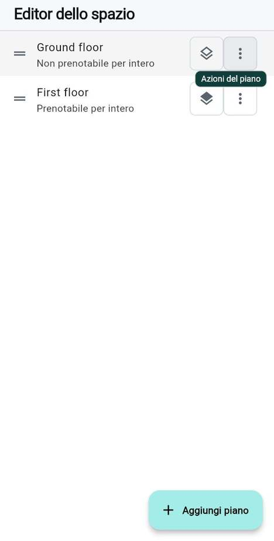

**Passaggi**

1. Apra [Editor dello spazio](https://fdittgen-png.github.io/deskilo/#/editor), oppure tocchi **Modifica spazio** nella schermata Prenota.
2. Tocchi **Aggiungi piano**, digiti il nome e tocchi **Salva**.
3. Trascini la maniglia a sinistra di un piano per cambiarne l'ordine.
4. Tocchi i tre puntini (**Azioni del piano**) per **Rinomina** o **Elimina** un piano.
5. Tocchi un piano per disegnarci sopra.

**Da sapere**

- Eliminare un piano rimuove tutti gli uffici, le scrivanie e i posti che contiene. La conferma indica che cosa succede alle prenotazioni che li riguardano.
- La riga sotto ogni piano indica se è **Prenotabile per intero** o **Non prenotabile per intero**.
- Senza alcun piano l'editor mostra **Ancora nessun piano. Aggiunga il primo piano del suo spazio.**

**Vedi anche:** [Prenotare un intero piano](#permettere-ai-membri-di-prenotare-un-intero-piano) · [Disegnare stanze, scrivanie e posti](#disegnare-stanze-scrivanie-e-posti)

<!-- anchor: user.space.editor.level-booking -->
### Permettere ai membri di prenotare un intero piano

**Destinatari:** Proprietario · Amministratore

Vuole che una squadra possa prendere un piano completo per un giorno.

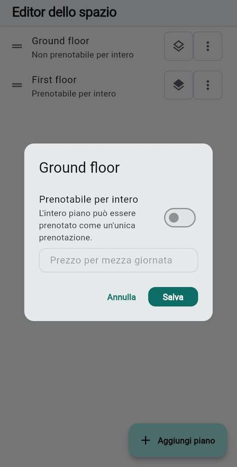

**Passaggi**

1. Nell'[Editor dello spazio](https://fdittgen-png.github.io/deskilo/#/editor), tocchi il pulsante dei livelli sulla riga del piano.
2. Attivi **Prenotabile per intero**.
3. Digiti il **Prezzo per mezza giornata**.
4. Tocchi **Salva**.

**Da sapere**

- Il pulsante dei livelli è pieno quando il piano è prenotabile per intero.
- Prenotare un intero piano, ufficio o scrivania richiede anche la funzionalità **Prenotazioni di tavolo, ufficio e piano**. Ogni membro deve avere il diritto di prenotare un piano; gli amministratori lo hanno automaticamente. Vedi [Un interruttore di funzionalità](#un-interruttore-di-funzionalità).

**Vedi anche:** [Proprietà di uffici e scrivanie](#dare-un-nome-a-un-ufficio-o-a-una-scrivania-e-fissarne-il-prezzo)

<!-- anchor: user.space.editor.rooms -->
### Disegnare stanze, scrivanie e posti

**Destinatari:** Proprietario · Amministratore

Vuole che la piantina sullo schermo assomigli al piano reale. Tutto sta dentro una stanza: disegna una stanza, ci mette le scrivanie, poi mette i posti sulle scrivanie.

**Passaggi**

1. Apra un piano dall'[Editor dello spazio](https://fdittgen-png.github.io/deskilo/#/editor). Un piano vuoto propone **Disegna la prima stanza**.
2. Tocchi **Ufficio** e trascini sulla griglia per disegnare una stanza.
3. Tocchi **Scrivania** e trascini dentro la stanza per disegnare una scrivania.
4. Tocchi **Posto**, poi tocchi una scrivania per aggiungervi un posto.
5. Tocchi **Immagine**, poi tocchi il punto in cui deve andare un'illustrazione.
6. Tocchi un elemento per selezionarlo. La barra in basso offre **Duplica**, **Proprietà** ed **Elimina**.

**Da sapere**

- Toccando una seconda volta lo strumento attivo lo si rimette giù, e la tela torna a selezionare.
- L'app rifiuta una forma che *si sovrappone a un elemento esistente* o che *deve trovarsi completamente all'interno di un ufficio*. I posti si possono collocare solo su una scrivania, e una scrivania piena indica **Non c’è più posto su questo tavolo.**
- Il pulsante con l'immagine in alto a destra imposta, sostituisce o rimuove l'**Immagine di sfondo** del piano, per esempio la scansione della piantina reale.
- Eliminare una stanza elimina anche le sue scrivanie e i suoi posti.

**Vedi anche:** [Proprietà del posto](#configurare-un-posto) · [Trasparenza dei tavoli](#trasparenza-dei-tavoli)

<!-- anchor: user.space.editor.office -->
### Dare un nome a un ufficio o a una scrivania e fissarne il prezzo

**Destinatari:** Proprietario · Amministratore

Vuole che una stanza o una scrivania abbia un nome proprio e si possa prenotare in blocco.

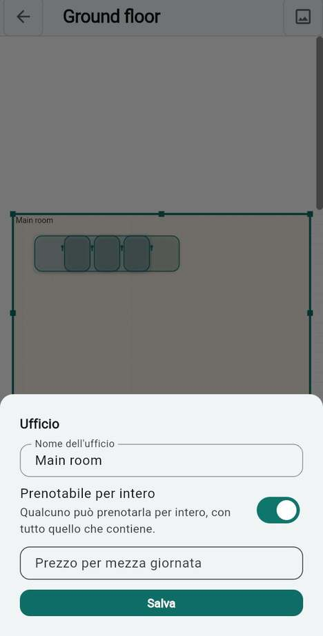

**Passaggi**

1. Selezioni l'ufficio o la scrivania sul piano e tocchi **Proprietà**.
2. Modifichi **Nome dell'ufficio** (o **Nome della scrivania**).
3. Attivi **Prenotabile per intero** se qualcuno può riservarlo per intero, con tutto ciò che contiene.
4. Digiti il **Prezzo per mezza giornata** che compare.
5. Tocchi **Salva**.

**Da sapere**

- Il campo del prezzo compare solo finché l'interruttore è attivo.
- Una stanza prenotabile per intero si può riservare solo finché nulla al suo interno è prenotato.

**Vedi anche:** [Prenotare un intero piano](#permettere-ai-membri-di-prenotare-un-intero-piano) · [Proprietà del posto](#configurare-un-posto)

<!-- anchor: user.space.editor.seat -->
### Configurare un posto

**Destinatari:** Proprietario · Amministratore

Vuole che un posto indichi in che direzione guarda la sedia, che cosa lo accompagna e quando è fuori servizio.

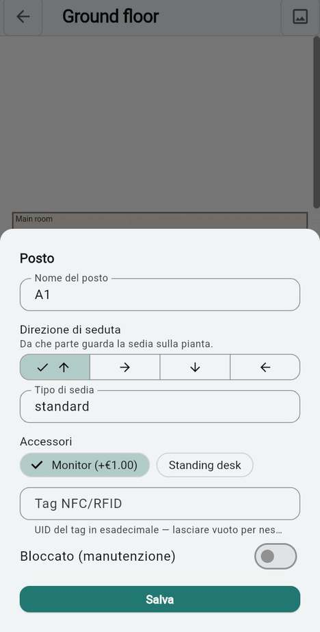

**Passaggi**

1. Selezioni il posto sul piano e tocchi **Proprietà**.
2. Modifichi **Nome del posto**.
3. Scelga la **Direzione di seduta**: la freccia mostra in che direzione guarda la sedia sulla piantina.
4. Scelga un **Tipo di sedia**.
5. Tocchi gli **Accessori** che appartengono a questo posto. Un prezzo accanto a un accessorio è un supplemento per mezza giornata.
6. Se il posto ha un tag, digiti il suo numero in **Tag NFC/RFID**, oppure usi **Leggi un tag ora**. Il campo del tag compare quando la funzionalità **Tag NFC/RFID delle sedie** è attiva, e la lettura richiede un dispositivo in grado di leggere i tag.
7. Attivi **Bloccato (manutenzione)** per mettere il posto fuori servizio, poi tocchi **Salva**.

**Da sapere**

- Il numero di un tag può appartenere a una sola sedia: **Questo tag è già collegato a un'altra sedia.**
- Se non c'è ancora alcun accessorio, la scheda propone **Nessun accessorio — configurali**.

**Vedi anche:** [Check-in con badge NFC](#check-in-con-badge-nfc)

<!-- anchor: user.workspace.code -->
### L'ID dello spazio di lavoro

**Destinatari:** Proprietario · Amministratore

Vuole che le persone trovino il suo spazio e chiedano di unirsi. La schermata **ID dello spazio e QR** mostra l'invito per i membri: un codice QR e l'ID che contiene.

**Passaggi**

1. Apra [ID dello spazio e QR](https://fdittgen-png.github.io/deskilo/#/workspace-code). Viene mostrata la scheda **Invito membro**.
2. Tocchi **Copia ID** per incollare l'ID dove vuole, oppure **Condividi come PNG** per stampare o affiggere il codice QR.
3. Per scegliere un ID facile da ricordare, tocchi **Cambia l'ID dello spazio**, digiti da 4 a 20 lettere o cifre e tocchi **Salva**.

**Da sapere**

- L'ID è unico in tutto DesKilo. Se è già in uso, o non ha da 4 a 20 lettere o cifre, l'app indica *ID rifiutato*.
- Chi scansiona il codice o digita l'ID chiede di unirsi come membro. Nessuno entra senza approvazione.
- Quando cambia l'ID, il vecchio smette di funzionare. Stampi di nuovo il codice QR.
- La scheda **Invito amministratore** è riservata a proprietari e comproprietari.

**Vedi anche:** [Invito amministratore](#invitare-un-amministratore) · [Invitare qualcuno](#invitare-qualcuno-con-un-messaggio)

<!-- anchor: user.workspace.code.admin -->
### Invitare un amministratore

**Destinatari:** Proprietario

Vuole coinvolgere una persona che l'aiuterà a gestire lo spazio. La scheda **Invito amministratore** le dà un codice per una sola persona.

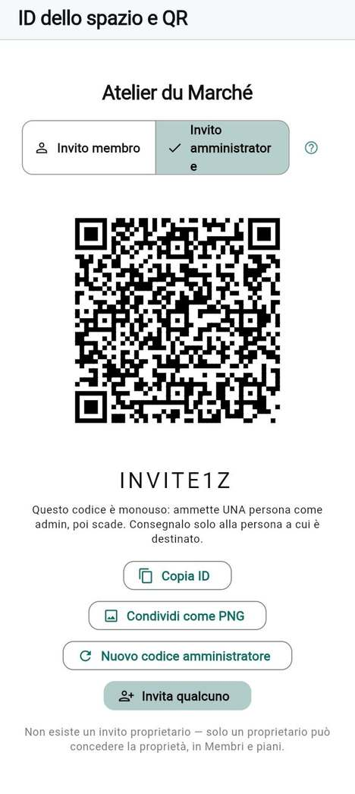

**Passaggi**

1. Apra [ID dello spazio e QR](https://fdittgen-png.github.io/deskilo/#/workspace-code) e tocchi **Invito amministratore**.
2. Consegni il codice, o il suo QR, alla persona a cui è destinato.
3. Per il prossimo amministratore, tocchi **Nuovo codice amministratore**.

**Da sapere**

- Il codice ammette una sola persona come amministratore, poi scade.
- Non esiste un invito per proprietari. Solo un proprietario può concedere la proprietà, in **Membri e piani**.

**Vedi anche:** [L'ID dello spazio di lavoro](#lid-dello-spazio-di-lavoro) · [La matrice dei ruoli](#la-matrice-dei-ruoli)

<!-- anchor: user.workspace.code.invite -->
### Invitare qualcuno con un messaggio

**Destinatari:** Proprietario · Amministratore

Vuole inviare un invito cordiale e già pronto invece di un semplice codice.

**Passaggi**

1. In [ID dello spazio e QR](https://fdittgen-png.github.io/deskilo/#/workspace-code), tocchi **Invita qualcuno**.
2. Compili **Nome (facoltativo)**, **Cognome (facoltativo)** e, se vuole, il numero di telefono.
3. Sotto **Ruoli all'arrivo**, tocchi i ruoli che questa persona deve ricevere quando si unisce.
4. Scelga la **Lingua del messaggio**.
5. Lo invii con **WhatsApp**, **SMS** o **Condividi…**.

**Da sapere**

- Il messaggio spiega i passaggi: scaricare l'app, creare un account, unirsi. È scritto nella lingua che sceglie e parte da quella impostata come [Lingua dello spazio](#lingua-dello-spazio).
- Ogni messaggio porta il suo codice personale. Può scrivere un testo suo sotto [Messaggio d'invito](#messaggio-dinvito).

**Vedi anche:** [L'ID dello spazio di lavoro](#lid-dello-spazio-di-lavoro)

<!-- anchor: user.workspace.availability.open-weekdays -->
### Giorni di apertura

**Destinatari:** Proprietario · Amministratore con il permesso

Vuole che lo spazio sia aperto solo nei giorni in cui lavorate. La schermata **Disponibilità** inizia con i giorni della settimana.

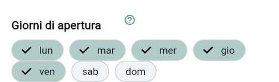

**Passaggi**

1. Apra [Disponibilità](https://fdittgen-png.github.io/deskilo/#/availability).
2. Sotto **Giorni di apertura**, tocchi un giorno per aprirlo o chiuderlo.

**Da sapere**

- Almeno un giorno della settimana deve restare aperto.
- Una prenotazione che tocca un giorno chiuso viene rifiutata, e la piantina disegna quel giorno come chiuso.

**Vedi anche:** [Giorni di chiusura](#giorni-di-chiusura) · [Granularità](#granularità)

<!-- anchor: user.workspace.availability.granularity -->
### Granularità

**Destinatari:** Proprietario · Amministratore con il permesso

Vuole che le prenotazioni seguano un ritmo adatto al suo spazio: mezze giornate, giornate intere o l'orario che preferisce.

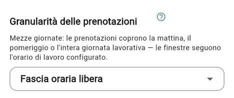

**Passaggi**

1. Apra [Disponibilità](https://fdittgen-png.github.io/deskilo/#/availability).
2. Sotto **Granularità delle prenotazioni**, scelga la forma di una prenotazione.

**Da sapere**

- Le scelte sono **Fascia oraria libera**, **Slot di 5 minuti**, **Slot di 15 minuti**, **Slot di 30 minuti**, **Slot di 1 ora**, **Mezze giornate (mattina e pomeriggio)**, **Solo giornate intere** e **Orari reali (da–a esatto, mezze/giornate come scorciatoie)**. **Orari reali** compare quando la funzionalità **Orario di lavoro** è attiva.
- La piantina, la scheda di prenotazione, un codice scansionato e il chiosco offrono solo ciò che la granularità consente.

**Vedi anche:** [Orari di lavoro](#orari-di-lavoro)

<!-- anchor: user.workspace.availability.working-hours -->
### Orari di lavoro

**Destinatari:** Proprietario · Amministratore con il permesso

Vuole che una mattina, un pomeriggio e una giornata significhino la stessa cosa ovunque.

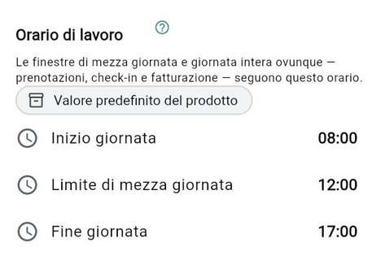

**Passaggi**

1. Apra [Disponibilità](https://fdittgen-png.github.io/deskilo/#/availability).
2. Sotto **Orari di lavoro**, tocchi **Inizio giornata**, **Limite di mezza giornata** e **Fine giornata** e imposti ogni orario.
3. Con la granularità *Orari reali*, imposti anche **Ore fatturate come mezza giornata** e **Ore fatturate come giornata intera**.

**Da sapere**

- Le fasce di mezza giornata e di giornata intera nelle prenotazioni, nel check-in e nella fatturazione seguono questi orari.
- La piccola etichetta sotto il titolo indica se gli orari sono quelli predefiniti del prodotto, provengono da un modello o sono i suoi. **Ripristina il modello** e **Ripristina il valore predefinito** li riportano indietro.
- La giornata deve procedere in ordine: inizio, poi limite di mezza giornata, poi fine.
- Questa sezione fa parte della funzionalità **Orari di lavoro**.

**Vedi anche:** [Fuori dagli orari di apertura](#fuori-dagli-orari-di-apertura)

<!-- anchor: user.workspace.availability.closure-days -->
### Giorni di chiusura

**Destinatari:** Proprietario · Amministratore con il permesso

Vuole chiudere lo spazio per una festa, una settimana d'agosto o il giorno in cui viene l'idraulico, senza che nessuno prenoti.

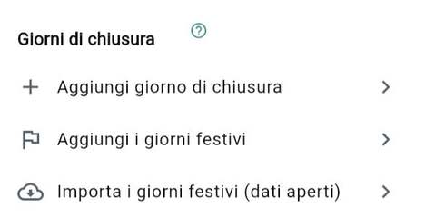

**Passaggi**

1. Apra [Disponibilità](https://fdittgen-png.github.io/deskilo/#/availability) e vada a **Giorni di chiusura**.
2. Tocchi **Aggiungi giorno di chiusura**, scelga la data e, se vuole, un **Motivo (facoltativo)**.
3. Per rimuoverne uno, tocchi il cestino accanto.

**Da sapere**

- Una prenotazione in un giorno di chiusura viene rifiutata e il motivo viene mostrato.
- I giorni già fatturati non possono essere trasformati in giorni di chiusura dal generatore dei giorni festivi.

**Vedi anche:** [Giorni festivi](#giorni-festivi)

<!-- anchor: user.workspace.availability.public-holidays -->
### Giorni festivi

**Destinatari:** Proprietario · Amministratore con il permesso

Vuole inserire in un colpo solo i giorni festivi di un intero anno come giorni di chiusura.

**Passaggi**

1. In [Disponibilità](https://fdittgen-png.github.io/deskilo/#/availability), sotto **Giorni di chiusura**, tocchi **Aggiungi i giorni festivi**.
2. Usi le frecce per scegliere l'anno. La scheda elenca le date che diventerebbero giorni di chiusura.
3. Tocchi il pulsante in basso per crearli.
4. Preferisce un elenco di dati aperti? Tocchi **Importa i giorni festivi (dati aperti)**, scelga la regione e confermi.

**Da sapere**

- Nulla viene creato prima della sua conferma, e i giorni già presenti sono contrassegnati.
- I mesi già fatturati vengono saltati.
- Queste voci compaiono quando la funzionalità **Giorni festivi** è attiva. **Importa i giorni festivi (dati aperti)** richiede anche la funzionalità **Importa i giorni festivi**.

**Vedi anche:** [Giorni di chiusura](#giorni-di-chiusura)

<!-- anchor: user.workspace.availability.policies -->
### Regole di prenotazione

**Destinatari:** Proprietario · Amministratore con il permesso

Vuole allentare o rendere più severe le regole di prenotazione. Ciò che imposta qui vale per ogni modo di prenotare: l'app, un codice scansionato e il chiosco.

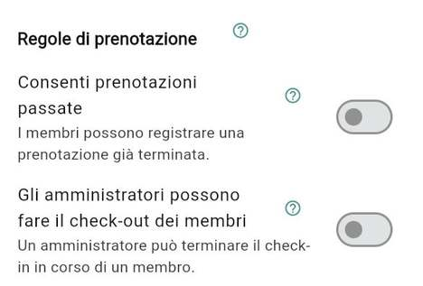

**Passaggi**

1. Apra [Disponibilità](https://fdittgen-png.github.io/deskilo/#/availability) e vada a **Regole di prenotazione**.
2. Attivi o disattivi le regole che desidera.
3. Sotto **Fuori dagli orari di apertura** e **Limiti di prenotazione**, imposti il resto.

**Da sapere**

- I due interruttori sono disattivati per impostazione predefinita.
- Questa sezione fa parte della funzionalità **Regole di prenotazione**.
- La riga **Cosa distingue la pianta** sotto spiega gli stati che i membri vedono sulla piantina.

**Vedi anche:** [Consentire prenotazioni passate](#consentire-prenotazioni-passate) · [Gli amministratori possono fare il check-out dei membri](#gli-amministratori-possono-fare-il-check-out) · [Limiti di prenotazione](#limiti-di-prenotazione)

<!-- anchor: user.workspace.availability.allow-past -->
### Consentire prenotazioni passate

**Destinatari:** Proprietario · Amministratore con il permesso

Vuole che i membri possano registrare una prenotazione a posteriori, per uno spazio che annota le presenze in un secondo momento.

**Passaggi**

1. In [Disponibilità](https://fdittgen-png.github.io/deskilo/#/availability), sotto **Regole di prenotazione**, attivi **Consenti prenotazioni passate**.

**Da sapere**

- Se è disattivato, una prenotazione già terminata in un giorno precedente viene rifiutata.
- Prenotare una fascia precedente nello stesso giorno è sempre consentito.

**Vedi anche:** [Regole di prenotazione](#regole-di-prenotazione)

<!-- anchor: user.workspace.availability.admin-checkout -->
### Gli amministratori possono fare il check-out

**Destinatari:** Proprietario · Amministratore con il permesso

Vuole che il personale chiuda la sala la sera e termini i check-in dimenticati.

**Passaggi**

1. In [Disponibilità](https://fdittgen-png.github.io/deskilo/#/availability), sotto **Regole di prenotazione**, attivi **Gli amministratori possono fare il check-out dei membri**.

**Da sapere**

- Se è disattivato, il check-out è strettamente personale.
- Se è attivo, un amministratore può terminare il check-in in corso di un membro.

**Vedi anche:** [Regole di prenotazione](#regole-di-prenotazione)

<!-- anchor: user.workspace.availability.outside-hours -->
### Fuori dagli orari di apertura

**Destinatari:** Proprietario · Amministratore con il permesso

Vuole stabilire che cosa succede quando qualcuno arriva presto o si ferma fino a tardi. Una sola risposta vale per ogni granularità.

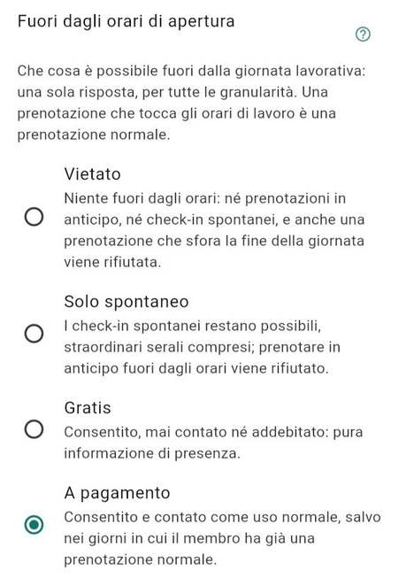

**Passaggi**

1. In [Disponibilità](https://fdittgen-png.github.io/deskilo/#/availability), trovi **Fuori dagli orari di apertura**.
2. Scelga **Vietato**, **Solo spontaneo**, **Gratis** o **A pagamento**.

**Da sapere**

- **Vietato**: nulla fuori orario, nessuna prenotazione in anticipo, nessun accesso spontaneo.
- **Solo spontaneo**: i check-in senza prenotazione restano possibili, compreso lo straordinario serale, ma la prenotazione in anticipo fuori orario viene rifiutata.
- **Gratis**: consentito, mai conteggiato e mai addebitato.
- **A pagamento**: consentito e conteggiato come un normale utilizzo, tranne nei giorni in cui il membro ha già una prenotazione ordinaria.
- Una prenotazione che tocca gli orari di lavoro è una prenotazione ordinaria.

**Vedi anche:** [Orari di lavoro](#orari-di-lavoro)

<!-- anchor: user.workspace.availability.limits -->
### Limiti di prenotazione

**Destinatari:** Proprietario · Amministratore con il permesso

Vuole stabilire con quanto anticipo si può prenotare, quanto può essere breve o lunga una prenotazione e quante se ne possono avere contemporaneamente.

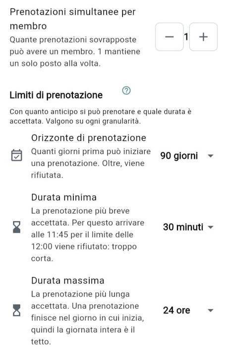

**Passaggi**

1. In [Disponibilità](https://fdittgen-png.github.io/deskilo/#/availability), trovi **Prenotazioni simultanee per membro** e usi i pulsanti meno e più.
2. Sotto **Limiti di prenotazione**, imposti **Orizzonte di prenotazione**, **Durata minima** e **Durata massima**.

**Da sapere**

- **Prenotazioni simultanee per membro** è il numero di prenotazioni sovrapposte che un membro può avere. Con 1 si ha un solo posto alla volta.
- Una prenotazione termina nel giorno in cui inizia, quindi una giornata intera è il massimo possibile.
- Il minimo non può superare il massimo, altrimenti nessuna prenotazione verrebbe accettata. La schermata la avvisa.
- Ogni rifiuto indica il limite e il suo valore.

**Vedi anche:** [Regole di prenotazione](#regole-di-prenotazione)

<!-- anchor: user.features.processes -->
### Attivare o disattivare interi processi

**Destinatari:** Proprietario · Comproprietario

Vuole una visione d'insieme di ciò che lo spazio sa fare e attivare un'intera area in un colpo solo. La schermata **Funzionalità** si apre con una scheda per ogni processo aziendale.

**Passaggi**

1. Apra [Funzionalità](https://fdittgen-png.github.io/deskilo/#/features). Viene mostrata la vista **Processi**.
2. Legga ogni scheda: il suo stato, quanti sottoprocessi sono attivi e quante funzionalità sono attive.
3. Apra una scheda e tocchi **Attiva** o **Disattiva** per l'intero processo o per un sottoprocesso.
4. Legga l'anteprima, poi confermi.

**Da sapere**

- Una scheda è **Attiva** quando tutte le sue funzionalità sono operative, **Parziale** quando solo alcune lo sono, **Disponibile** quando nessuna è ancora attiva e **Richiede attenzione** quando una funzionalità è attiva ma attende un prerequisito disattivato.
- I filtri **Tutti**, **Attiva**, **Disponibile** e **Richiede attenzione** restringono le schede, e **Cerca processi e funzionalità** raggiunge tutto.
- L'anteprima elenca ciò che viene attivato, ciò che è **Necessarie anche** da un altro processo e ciò che è già attivo. Disattivare qualcosa di cui altre funzionalità hanno bisogno viene rifiutato finché non sceglie che cosa ne sarà di loro.

**Vedi anche:** [Un interruttore di funzionalità](#un-interruttore-di-funzionalità)

<!-- anchor: user.features.switch -->
### Un interruttore di funzionalità

**Destinatari:** Proprietario · Comproprietario

Vuole attivare o disattivare una singola funzionalità.

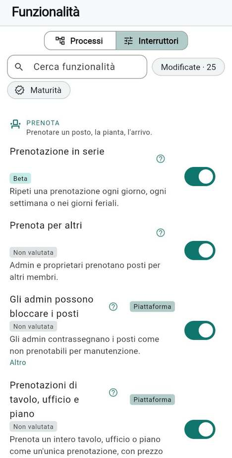

**Passaggi**

1. Apra [Funzionalità](https://fdittgen-png.github.io/deskilo/#/features) e tocchi **Interruttori**.
2. Trovi la funzionalità con **Cerca funzionalità**, oppure restringa l'elenco con **Modificate** o **Maturità**.
3. Sposti il suo interruttore.

**Da sapere**

- Attivi una funzionalità e ne compare ogni parte: la scheda, il pulsante, il link. La disattivi e non ne resta nulla, nemmeno un link salvato.
- Una funzionalità che ne richiede un'altra sta sotto di essa con **Richiede** e indica *In attesa della funzione qui sopra* finché quella principale è disattivata. La sua scelta viene conservata.
- Attivare una funzionalità può attivare anche ciò che le serve. L'app la avvisa.
- Una funzionalità non ancora verificata come stabile chiede prima una conferma: può cambiare e ha limiti noti.
- Ciò che è già stato fatto resta com'è. Una fattura emessa mentre una funzionalità era attiva conserva ciò che riporta.

**Vedi anche:** [Attivare o disattivare interi processi](#attivare-o-disattivare-interi-processi)

<!-- anchor: user.workspace.settings.country -->
### Paese

**Destinatari:** Proprietario · Amministratore con il permesso

Vuole che lo spazio sappia dove ha sede. **Spazio di lavoro** si apre su **Informazioni generali**.

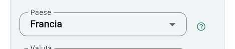

**Passaggi**

1. Apra [Spazio di lavoro](https://fdittgen-png.github.io/deskilo/#/workspace-settings).
2. Sotto **Informazioni generali**, scelga il **Paese**.
3. Tocchi **Salva** in basso.

**Da sapere**

- Il paese propone la valuta e il fuso orario, e decide quali aliquote IVA vengono offerte.
- Quando lo spazio ha emesso un documento o registrato denaro, il paese non si può più cambiare: il salvataggio dice «La valuta e il paese sono fissati non appena lo spazio ha emesso un documento o registrato denaro. Non è stato salvato nulla.»
- **Salva** scrive insieme tutto il modulo. Se nel frattempo qualcuno ha modificato queste impostazioni, non viene salvato nulla e ciò che ha digitato resta sullo schermo.

**Vedi anche:** [Valuta e fuso orario](#valuta-e-fuso-orario)

<!-- anchor: user.workspace.settings.currency-timezone -->
### Valuta e fuso orario

**Destinatari:** Proprietario · Amministratore con il permesso

Vuole che i prezzi e i giorni siano contati come li conta il suo spazio.

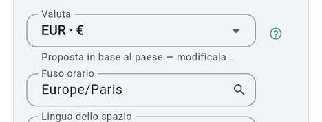

**Passaggi**

1. In [Spazio di lavoro](https://fdittgen-png.github.io/deskilo/#/workspace-settings), sotto **Informazioni generali**, scelga la **Valuta**.
2. Cerchi il **Fuso orario** e lo scelga.
3. Tocchi **Salva**.

**Da sapere**

- La valuta viene proposta in base al paese. Può cambiarla finché lo spazio non ha emesso un documento o registrato denaro; dopo è fissata.
- Il fuso orario non è un dettaglio estetico: una giornata lavorativa, il limite di mezza giornata e un giorno di chiusura sono tutti contati in base ad esso, perciò un membro all'estero vede la giornata dello spazio e non la propria.

**Vedi anche:** [Paese](#paese)

<!-- anchor: user.workspace.settings.language -->
### Lingua dello spazio

**Destinatari:** Proprietario · Amministratore con il permesso

Vuole che gli inviti e i documenti parlino la lingua della sua comunità.

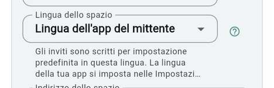

**Passaggi**

1. In [Spazio di lavoro](https://fdittgen-png.github.io/deskilo/#/workspace-settings), sotto **Informazioni generali**, apra **Lingua dello spazio**.
2. Scelga una lingua, oppure **Lingua dell'app del mittente**.
3. Tocchi **Salva**.

**Da sapere**

- Gli inviti sono scritti per impostazione predefinita in questa lingua.
- Non è la lingua della sua app. Quella cambia solo ciò che vede Lei e si trova nelle sue impostazioni personali.

**Vedi anche:** [Messaggio d'invito](#messaggio-dinvito)

<!-- anchor: user.workspace.settings.address -->
### Indirizzo dell'intestazione

**Destinatari:** Proprietario · Amministratore con il permesso

Vuole il suo indirizzo postale sulla carta che lo spazio invia.

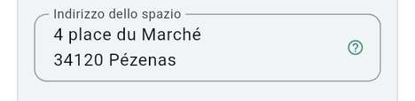

**Passaggi**

1. In [Spazio di lavoro](https://fdittgen-png.github.io/deskilo/#/workspace-settings), sotto **Informazioni generali**, compili **Indirizzo dello spazio**.
2. Tocchi **Salva**.

**Da sapere**

- È un testo libero, stampato così com'è su lettere e fatture.
- L'indirizzo strutturato necessario a una fattura elettronica è una voce separata, sotto l'identità legale.

**Vedi anche:** [Paese](#paese)

<!-- anchor: user.workspace.settings.whatsapp-group -->
### Gruppo WhatsApp

**Destinatari:** Proprietario · Amministratore con il permesso

Vuole che i membri trovino il gruppo WhatsApp della sua comunità.

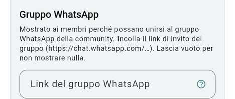

**Passaggi**

1. In [Spazio di lavoro](https://fdittgen-png.github.io/deskilo/#/workspace-settings), apra **Comunità e inviti**.
2. Incolli il link d'invito del gruppo in **Link del gruppo WhatsApp**.
3. Tocchi **Salva**.

**Da sapere**

- Il link deve essere un link d'invito chat.whatsapp.com, altrimenti il campo lo segnala.
- Lo lasci vuoto per non mostrare nulla.

**Vedi anche:** [Messaggio d'invito](#messaggio-dinvito)

<!-- anchor: user.workspace.settings.invitation-message -->
### Messaggio d'invito

**Destinatari:** Proprietario · Amministratore con il permesso

Vuole che gli inviti suonino come Lei, in ogni lingua che usa.

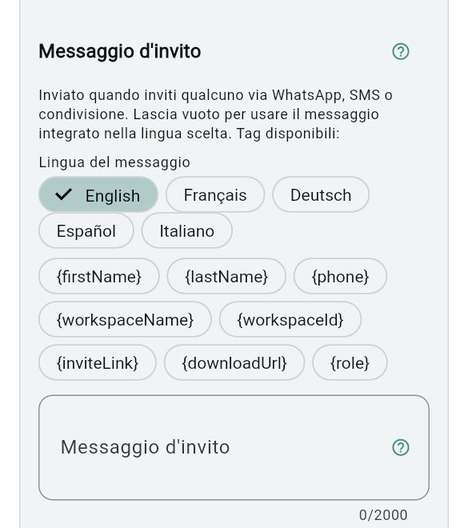

**Passaggi**

1. In [Spazio di lavoro](https://fdittgen-png.github.io/deskilo/#/workspace-settings), apra **Comunità e inviti**.
2. Sotto **Lingua del messaggio**, scelga di quale lingua sta modificando il testo.
3. Scriva il testo. Tocchi un tag come {firstName} o {inviteLink} per inserirlo dove si trova il cursore.
4. Tocchi **Salva**.

**Da sapere**

- Lasci vuoto il campo per usare il messaggio integrato in quella lingua.
- La riga **Lingua del messaggio** indica solo quale bozza è sullo schermo. Non viene salvata e si apre ogni volta sulla lingua dello spazio.
- I tag vengono compilati quando invia un invito. Il codice e il link provengono dall'app, quindi non li incolli Lei.

**Vedi anche:** [Invitare qualcuno con un messaggio](#invitare-qualcuno-con-un-messaggio)

<!-- anchor: user.workspace.settings.new-members -->
### Far partire i nuovi membri allo stesso modo

**Destinatari:** Proprietario · Amministratore con il permesso

Vuole che chiunque si unisca inizi con lo stesso abbonamento e con la stessa regola per quando i suoi giorni finiscono.

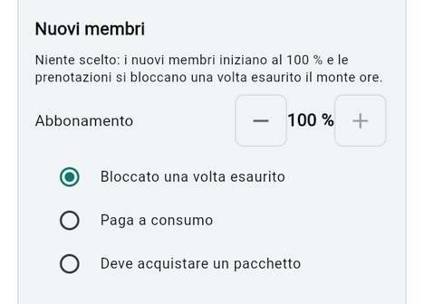

**Passaggi**

1. In [Spazio di lavoro](https://fdittgen-png.github.io/deskilo/#/workspace-settings), apra **Nuovi membri**.
2. Imposti la percentuale di **Abbonamento** con i pulsanti meno e più.
3. Scelga **Bloccato una volta esaurito**, **Paga a consumo** o **Deve acquistare un pacchetto**.
4. Tocchi **Salva**.

**Da sapere**

- Finché non sceglie, i nuovi membri partono al 100% con le prenotazioni bloccate una volta esaurito il diritto.
- L'abbonamento di un singolo membro si imposta in seguito, nella pagina del membro.

**Vedi anche:** [L'abbonamento di un membro](#labbonamento-di-un-membro)

<!-- anchor: user.workspace.settings.wording -->
### Terminologia

**Destinatari:** Proprietario · Amministratore con il permesso

Vuole che l'app usi le sue parole: un altro nome per un posto, per uno stato sulla piantina, per una scheda.

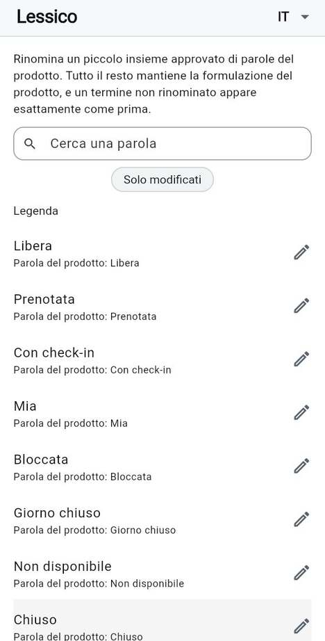

**Passaggi**

1. In [Spazio di lavoro](https://fdittgen-png.github.io/deskilo/#/workspace-settings), apra **Aspetto e diciture** e tocchi **Terminologia**.
2. Trovi una parola con **Cerca una parola**, oppure tocchi **Solo modificati** per vedere ciò che ha rinominato.
3. Tocchi la matita accanto e digiti la sua parola, per ogni lingua.

**Da sapere**

- La parola del prodotto resta mostrata sotto la sua, così vede ciò che sostituisce.
- **Azzera** rimuove la sua parola invece di copiare quella del prodotto. Il termine segue allora il prodotto quando la sua terminologia cambia.
- I termini sono raggruppati in base a dove compaiono: **Legenda**, **Lo spazio**, **Navigazione**, **Prenotazione**.

**Vedi anche:** [Colori](#colori)

<!-- anchor: user.workspace.settings.colours -->
### Colori

**Destinatari:** Proprietario · Amministratore con il permesso

Vuole che l'app porti il suo colore. Ne scelga uno e l'app ne ricava i temi chiaro e scuro.

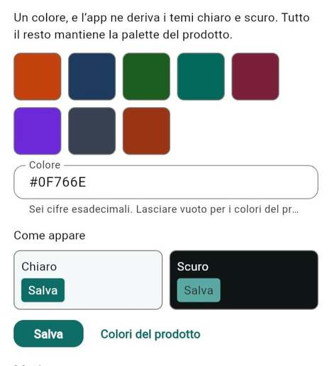

**Passaggi**

1. In [Spazio di lavoro](https://fdittgen-png.github.io/deskilo/#/workspace-settings), apra **Aspetto e diciture** e tocchi **Colori**. La riga è presente finché **Colori dello spazio** è attivo nelle funzionalità.
2. Tocchi uno dei colori, oppure digiti un codice come #0F766E in **Colore**.
3. Controlli **Come appare**, in **Chiaro** e in **Scuro**.
4. Tocchi **Salva**. **Colori del prodotto** rimuove i suoi.

**Da sapere**

- L'app mantiene il proprio contrasto. Se un colore risultasse illeggibile da qualche parte, viene rifiutato e la schermata indica la coppia interessata.
- Sotto **Colori delle sale** può aggiungere fino a otto colori suoi per le sale sulla piantina.
- Il marchio DesKilo, i colori degli stati dei posti e il banner di produzione non vengono mai ridisegnati.

**Vedi anche:** [Motivo](#motivo) · [Simbolo ed emblema](#simbolo-ed-emblema)

<!-- anchor: user.workspace.settings.pattern -->
### Motivo

**Destinatari:** Proprietario · Amministratore con il permesso

Vuole che il suo spazio si distingua facilmente dagli altri a cui una persona appartiene.

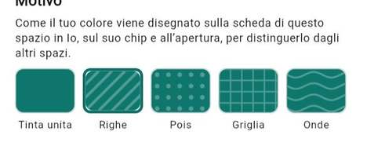

**Passaggi**

1. Apra [Colori](https://fdittgen-png.github.io/deskilo/#/settings/colours).
2. Sotto **Motivo**, tocchi **Tinta unita**, **Righe**, **Pois**, **Griglia** oppure **Onde**.

**Da sapere**

- Il motivo disegna il suo colore sulla scheda di questo spazio in Io, sul suo chip e mentre lo spazio si apre.
- Si salva non appena lo tocca.

**Vedi anche:** [Colori](#colori)

<!-- anchor: user.workspace.settings.branding -->
### Simbolo ed emblema

**Destinatari:** Proprietario · Amministratore con il permesso

Vuole un piccolo segno che rappresenti lo spazio: lettere su un colore, oppure il suo logo.

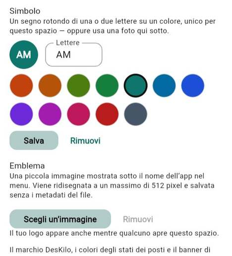

**Passaggi**

1. Apra [Colori](https://fdittgen-png.github.io/deskilo/#/settings/colours) e vada a **Simbolo**.
2. Digiti una o due **Lettere**, scelga un colore e tocchi **Salva**.
3. Sotto **Emblema**, tocchi **Scegli un’immagine** per aggiungere il suo logo. **Rimuovi** lo toglie.

**Da sapere**

- Le lettere su un colore sono uniche per ogni spazio di lavoro. Se un altro spazio ha già le stesse, l'app le chiede di cambiare il colore o le lettere.
- L'emblema è mostrato sotto il nome dell'app nel menu e mentre qualcuno apre questo spazio. Viene ridisegnato con una larghezza massima di 512 pixel, e i dettagli propri della foto, come il luogo in cui è stata scattata, non vengono conservati.
- L'emblema non sostituisce mai il logo DesKilo.

**Vedi anche:** [Colori](#colori)

<!-- anchor: user.workspace.settings.desk-transparency -->
### Trasparenza dei tavoli

**Destinatari:** Proprietario · Amministratore con il permesso

Ha disegnato la piantina sopra una fotografia e vuole che la stanza si veda attraverso i mobili.

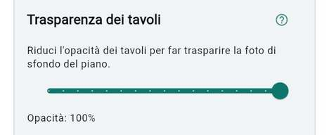

**Passaggi**

1. In [Spazio di lavoro](https://fdittgen-png.github.io/deskilo/#/workspace-settings), apra **Aspetto e diciture**.
2. Trascini il cursore **Trasparenza dei tavoli**. Il valore è mostrato come *Opacità*.
3. Tocchi **Salva**.

**Da sapere**

- Abbassi l'opacità perché la foto di sfondo di un piano si veda attraverso i tavoli.
- La porti al 100% quando i posti contano più della stanza.

**Vedi anche:** [Disegnare stanze, scrivanie e posti](#disegnare-stanze-scrivanie-e-posti)

<!-- anchor: user.workspace.settings.public-page -->
### Pagina pubblica dello spazio

**Destinatari:** Proprietario

Vuole che chi è fuori dal suo spazio lo trovi e veda che cosa offre.

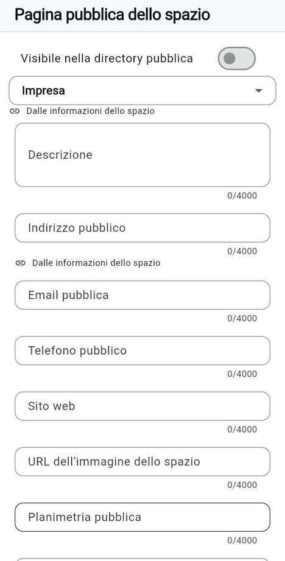

**Passaggi**

1. Apra [Pagina pubblica dello spazio](https://fdittgen-png.github.io/deskilo/#/settings/public-page), oppure la tocchi in alto in **Spazio di lavoro**.
2. Attivi **Visibile nella directory pubblica**.
3. Scelga il tipo di ospite e compili **Descrizione**, **Indirizzo pubblico**, **Email pubblica**, **Telefono pubblico** e **Sito web**.
4. Tocchi **Salva e mostra la vista esterna**.

**Da sapere**

- I campi contrassegnati **Dalle informazioni dello spazio** seguono i dati propri dello spazio. **Usa le informazioni dello spazio** li ripristina dopo che li ha modificati.
- **Ripristina tutti i dati pubblici dalle informazioni dello spazio** sostituisce ogni campo che ha un corrispondente nello spazio.
- Gli amministratori possono scegliere da sé se essere mostrati come amministratori pubblici.

**Vedi anche:** [Scoprire e la rete pubblica](#scopri)

<!-- anchor: user.roles.matrix -->
### La matrice dei ruoli

**Destinatari:** Proprietario · Comproprietario

Vuole decidere quali permessi ha ciascun ruolo. **Ruoli** mostra una scheda per ruolo con una spunta per ogni permesso che possiede.

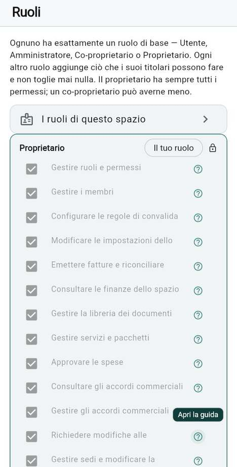

**Passaggi**

1. Apra [Ruoli](https://fdittgen-png.github.io/deskilo/#/roles).
2. Sulla scheda di un ruolo, spunti o tolga la spunta a un permesso come **Gestire ruoli e permessi**, **Gestire i membri**, **Modificare le impostazioni dello spazio** o **Emettere fatture e riconciliare pagamenti**.

**Da sapere**

- Ognuno ha esattamente un ruolo di base: Utente, Amministratore, Comproprietario o Proprietario. Gli altri ruoli si aggiungono ad esso e non tolgono mai nulla.
- Il proprietario ha sempre ogni permesso, quindi la sua scheda è bloccata. Un comproprietario può averne meno.
- Chi non può gestire i ruoli vede la matrice in sola lettura, con **Il suo ruolo** evidenziato.
- Un permesso viene verificato dal server in ogni punto, quindi togliere la spunta lo rimuove ovunque in una volta sola.
- La voce **Ruoli** compare quando la funzionalità **Gestione dei ruoli** è attiva.

**Vedi anche:** [I ruoli definiti da questo spazio](#i-ruoli-definiti-da-questo-spazio) · [Comproprietari](#comproprietari)

<!-- anchor: user.roles.space -->
### I ruoli definiti da questo spazio

**Destinatari:** Proprietario · Comproprietario

Vuole ruoli adatti al suo spazio, come un ospite o un contabile, oltre a quelli di base.

**Passaggi**

1. In [Ruoli](https://fdittgen-png.github.io/deskilo/#/roles), tocchi **I ruoli di questo spazio**, oppure apra [I ruoli definiti da questo spazio](https://fdittgen-png.github.io/deskilo/#/settings/roles-of-this-space). Questa schermata compare quando la funzionalità **Ruoli definiti da questo spazio** è attiva.
2. Tocchi **Aggiungi un ruolo**.
3. Dia un nome al ruolo, poi scelga **Cosa aggiunge**.
4. Tocchi **Salva il ruolo**.
5. Per assegnarlo a un membro, apra la pagina del membro, trovi **Ruoli** e tocchi **Aggiungi un ruolo**.

**Da sapere**

- Ogni ruolo aggiunge permessi a quelli che i suoi titolari hanno già. Nessuno toglie nulla, e il proprietario conserva sempre ogni permesso.
- Un ruolo che non vuole più può essere messo da parte disattivando **In uso**.
- La chiave del ruolo non cambia mai: le persone che lo hanno vi fanno riferimento.
- Nessuno può assegnare un ruolo a se stesso. Un ruolo che gestisce i ruoli può essere assegnato solo dal proprietario.

**Vedi anche:** [La matrice dei ruoli](#la-matrice-dei-ruoli)

<!-- anchor: user.roles.co-owners -->
### Comproprietari

**Destinatari:** Proprietario

Vuole che lo spazio sopravviva se un giorno Lei si facesse da parte.

**Passaggi**

1. Apra [Membri e piani](https://fdittgen-png.github.io/deskilo/#/members) e scelga il membro.
2. Sotto **Comproprietà**, scelga un comproprietario attivo o un successore.
3. Per passare la mano subito, scelga **Promuovi a proprietario ora**.

**Da sapere**

- Un comproprietario attivo ha subito i permessi del proprietario. Un successore, indicato come **Successore**, attende e diventa proprietario quando viene attivato o quando il proprietario se ne va.
- Se se ne va l'ultimo proprietario, il miglior comproprietario diventa automaticamente proprietario, prima l'attivo e poi il successore.
- I comproprietari fanno parte della funzionalità **Comproprietari**.

**Vedi anche:** [Comproprietà](#comproprietà) · [La matrice dei ruoli](#la-matrice-dei-ruoli)

<!-- anchor: user.kiosk.mode -->
### Modalità chiosco: un tablet a muro per il check-in

**Destinatari:** Proprietario · Amministratore

Vuole un tablet vicino alla porta dove le persone fanno il check-in con un badge.

**Passaggi**

1. Crei un account per il tablet, si unisca allo spazio di lavoro con esso e, in [Membri e piani](https://fdittgen-png.github.io/deskilo/#/members), usi **Trasforma in chiosco** su quel membro.
2. Si assicuri che **Modalità chiosco** sia attiva in [Funzionalità](https://fdittgen-png.github.io/deskilo/#/features).
3. Sul tablet, apra l'app. Chiede **Avviare la modalità chiosco?**. Tocchi **Avvia la modalità chiosco**.
4. Un membro tocca un posto, oppure **Questo piano**, e presenta un badge: una tessera o un codice QR stampato.

**Da sapere**

- La modalità chiosco non si avvia mai da sola. **Non ora — apra l'app normalmente** apre l'app come di consueto, comodo per la configurazione.
- In modalità chiosco il tablet mostra solo la piantina. Per uscirne si riavvia il tablet. Per far tornare l'account un normale membro, usi **Dispositivo chiosco** sotto **Impostazioni** sul dispositivo oppure **Riporta il chiosco a membro** in **Membri e piani**.
- La scheda che si apre indica la regola che segue. In un giorno di chiusura il chiosco mostra subito *Lo spazio è chiuso oggi*.
- Il badge è la conferma: identifica il membro, esegue l'azione e la schermata si svuota per la persona successiva. Un posto occupato da un'altra persona mostra chi lo occupa e rimanda all'app.
- I badge hanno le proprie funzionalità, **Badge RFID / NFC** e i badge QR, entrambe sotto **Modalità chiosco**.
- Un tablet a muro non può essere mostrato qui: il chiosco si avvia solo su un dispositivo contrassegnato come tale.

**Vedi anche:** [Check-in con badge NFC](#check-in-con-badge-nfc) · [Codici QR degli spazi (PDF)](#codici-qr-degli-spazi-pdf)

<!-- anchor: user.badges.nfc -->
### Check-in con badge NFC

**Destinatari:** Proprietario · Amministratore

Vuole che i membri facciano il check-in avvicinando una tessera, senza telefono.

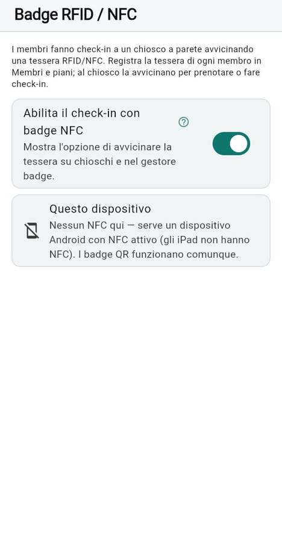

**Passaggi**

1. Apra [Badge RFID / NFC](https://fdittgen-png.github.io/deskilo/#/nfc-config).
2. Attivi **Abilita il check-in con badge NFC**.
3. Legga la riga **Questo dispositivo**: indica se questo dispositivo può leggere le tessere.
4. Dia a ogni membro una tessera in [Membri e piani](https://fdittgen-png.github.io/deskilo/#/members): apra i badge del membro, tocchi **Registra tessera**, poi avvicini la tessera al retro del dispositivo.

**Da sapere**

- Serve un dispositivo Android con NFC. Gli iPad non hanno NFC, e i badge QR funzionano comunque.
- Il gestore dei badge permette anche di emettere un **Nuovo badge**, di ritirarne uno con **Revoca** e di usare **Salva come PDF** per stamparlo. Un badge revocato può essere eliminato definitivamente.
- **Mi fa accedere** è disattivato per impostazione predefinita: un badge che registra il check-in non fa accedere finché il membro non lo sceglie.
- Ogni membro può anche creare il proprio badge nelle sue impostazioni personali.

**Vedi anche:** [Un tablet a muro per il check-in](#modalità-chiosco-un-tablet-a-muro-per-il-check-in)

<!-- anchor: user.documents.add -->
### Aggiungere un documento alla biblioteca

**Destinatari:** Proprietario · Amministratore

Vuole riunire in un solo posto statuti, guide, bilanci e verbali per i membri che ne hanno bisogno. La biblioteca contiene link, non file.

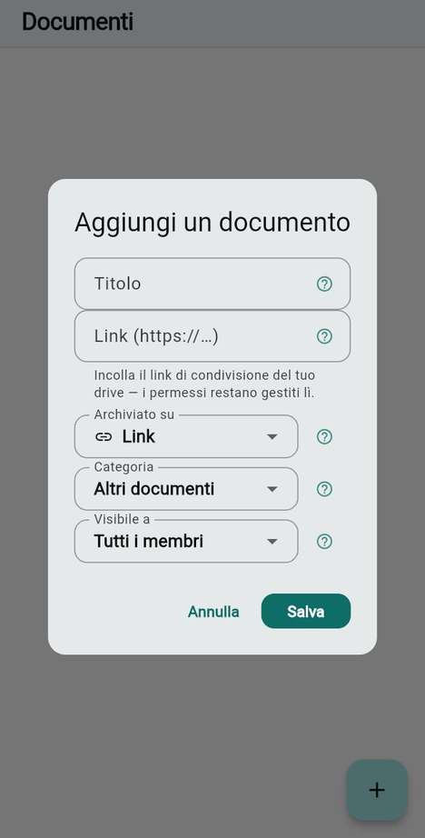

**Passaggi**

1. Apra [Documenti](https://fdittgen-png.github.io/deskilo/#/documents) e tocchi il pulsante più.
2. Compili **Titolo** e **Link (https://…)**.
3. Scelga **Archiviato su**, **Categoria** e **Visibile a**.
4. Tocchi **Salva**.

**Da sapere**

- La biblioteca richiede la funzionalità **Biblioteca documenti** e il permesso di gestirla.
- Rimuova un documento con il suo cestino: chiede prima **Rimuovere il documento?**
- I membri che possono aprire la biblioteca vedono i documenti consentiti, raggruppati per categoria.

**Vedi anche:** [Titolo del documento](#titolo-del-documento) · [Link](#link) · [Visibile a](#visibile-a)

<!-- anchor: user.documents.title -->
### Titolo del documento

**Destinatari:** Proprietario · Amministratore

Vuole che i membri riconoscano un documento a colpo d'occhio.

**Passaggi**

1. Nel modulo di aggiunta di un documento, digiti il **Titolo**.

**Da sapere**

- Un documento richiede un titolo e un link https://, altrimenti **Salva** viene rifiutato.
- Lo scriva pensando a chi legge, perché è la riga che vede nella biblioteca.

**Vedi anche:** [Aggiungere un documento alla biblioteca](#aggiungere-un-documento-alla-biblioteca)

<!-- anchor: user.documents.url -->
### Link

**Destinatari:** Proprietario · Amministratore

Vuole che il documento si apra dove già si trova.

**Passaggi**

1. Incolli il link di condivisione del suo drive in **Link (https://…)**.

**Da sapere**

- DesKilo conserva il link, non il file. I diritti di accesso restano gestiti dove si trova il documento.
- Il link deve iniziare con https://.

**Vedi anche:** [Archiviato su](#archiviato-su)

<!-- anchor: user.documents.provider -->
### Archiviato su

**Destinatari:** Proprietario · Amministratore

Vuole che i membri vedano dove è conservato il documento.

**Passaggi**

1. Scelga **Archiviato su**: Google Drive, OneDrive, SharePoint, Dropbox, Nextcloud o *Link*.

**Da sapere**

- È un'etichetta con un'icona. Nulla viene recuperato per Lei.

**Vedi anche:** [Link](#link)

<!-- anchor: user.documents.category -->
### Categoria

**Destinatari:** Proprietario · Amministratore

Vuole che la biblioteca si legga come uno scaffale ordinato.

**Passaggi**

1. Scelga una **Categoria**: **Statuto e legale**, **Guide e manuali**, **Bilanci**, **Verbali** oppure **Altri documenti**.

**Da sapere**

- La biblioteca raggruppa i documenti sotto questi titoli e mostra solo un titolo che ha almeno un documento.

**Vedi anche:** [Visibile a](#visibile-a)

<!-- anchor: user.documents.role -->
### Visibile a

**Destinatari:** Proprietario · Amministratore

Vuole alcuni documenti per tutti e alcuni solo per il consiglio.

**Passaggi**

1. Scelga **Visibile a**: **Tutti i membri**, **Admin e proprietari** oppure **Solo proprietari**.

**Da sapere**

- Lo fa rispettare il server. Un membro che non può vedere un documento non lo riceve affatto.

**Vedi anche:** [Aggiungere un documento alla biblioteca](#aggiungere-un-documento-alla-biblioteca)

<!-- anchor: user.workspace.export.space-xml -->
### Esportare lo spazio (XML)

**Destinatari:** Proprietario · Amministratore con il permesso

Vuole un file con la piantina e le impostazioni, da conservare come copia di sicurezza, da riutilizzare o da trasferire in un altro spazio.

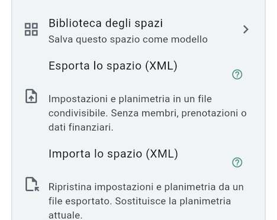

**Passaggi**

1. Apra [Spazio di lavoro](https://fdittgen-png.github.io/deskilo/#/workspace-settings) e vada a **Modelli e dati**.
2. Tocchi **Esporta lo spazio (XML)**.

**Da sapere**

- Contiene le impostazioni e la piantina. Non contiene mai membri, prenotazioni o dati finanziari, né il codice d'invito o le credenziali di pagamento.
- Con **Configurazione nel file dello spazio** attiva, il file contiene anche tariffe, aliquote IVA, regole, ruoli e altro.
- Il file viene salvato sul suo dispositivo.

**Vedi anche:** [Importare lo spazio (XML)](#importare-lo-spazio-xml)

<!-- anchor: user.workspace.export.space-import -->
### Importare lo spazio (XML)

**Destinatari:** Proprietario · Amministratore con il permesso

Vuole applicare a uno spazio un file esportato.

**Passaggi**

1. In [Spazio di lavoro](https://fdittgen-png.github.io/deskilo/#/workspace-settings), sotto **Modelli e dati**, tocchi **Importa lo spazio (XML)**.
2. Scelga il file e legga l'anteprima: piani, uffici, scrivanie, posti e configurazione.
3. Tocchi **Sostituisci e importa**.

**Da sapere**

- Sostituisce la piantina attuale e sovrascrive le impostazioni. Non si può annullare.
- Quando uno spazio ha già delle prenotazioni, viene applicata solo la configurazione. La piantina viene mantenuta, e l'app lo dice.
- Un file illeggibile, o che non proviene da DesKilo, viene rifiutato con un messaggio chiaro.
- Quando il file contiene una configurazione e **Configurazione nel file dello spazio** è disattivata in questo spazio, l'app chiede prima: **Attiva e applica** la applica, **Importa senza la configurazione** importa il resto, e l'anteprima indica allora «Configurazione: non applicata.» Solo chi può modificare la configurazione si vede proporre di attivarla.

**Vedi anche:** [Esportare lo spazio (XML)](#esportare-lo-spazio-xml)

<!-- anchor: user.workspace.export.config-pdf -->
### Esportare la configurazione (PDF)

**Destinatari:** Proprietario · Amministratore con il permesso

Vuole un documento con ogni parametro, da leggere, firmare o consegnare a un commercialista.

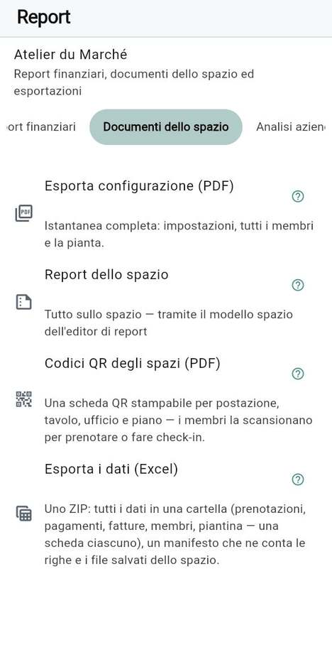

**Passaggi**

1. Apra [Report](https://fdittgen-png.github.io/deskilo/#/reports?section=documents) e scelga **Documenti dello spazio**.
2. Tocchi **Esporta configurazione (PDF)**.

**Da sapere**

- È un'istantanea completa di impostazioni, membri e piantina. È una documentazione, non una copia di sicurezza: solo l'XML si può reimportare.

**Vedi anche:** [Esportare lo spazio (XML)](#esportare-lo-spazio-xml)

<!-- anchor: user.workspace.export.workspace-report -->
### Report dello spazio

**Destinatari:** Proprietario · Amministratore con il permesso

Vuole lo spazio sotto forma di documento: i suoi posti, i prezzi e le regole.

**Passaggi**

1. Apra [Report](https://fdittgen-png.github.io/deskilo/#/reports?section=documents) e scelga **Documenti dello spazio**.
2. Tocchi **Report dello spazio**.

**Da sapere**

- Viene prodotto dal modello dello spazio dell'editor dei report, quindi il suo aspetto segue il disegno che ha scelto.

**Vedi anche:** [Esportare la configurazione (PDF)](#esportare-la-configurazione-pdf)

<!-- anchor: user.workspace.export.space-qr -->
### Codici QR degli spazi (PDF)

**Destinatari:** Proprietario · Amministratore con il permesso

Vuole una scheda QR su ogni posto, scrivania, ufficio e piano, in modo che le persone prenotino o facciano il check-in scansionandola.

**Passaggi**

1. Apra [Report](https://fdittgen-png.github.io/deskilo/#/reports?section=documents) e scelga **Documenti dello spazio**.
2. Tocchi **Codici QR degli spazi (PDF)**.
3. Scelga **Dimensione della scheda**, **Dimensione del codice QR** e **Informazioni sulla scheda**, poi tocchi **Salva**.
4. Stampi, ritagli e incolli ogni scheda al suo posto.

**Da sapere**

- Richiede la funzionalità **Codici QR degli spazi**.
- Scansionare una scheda apre la stessa scheda che mostra il chiosco.

**Vedi anche:** [Un tablet a muro per il check-in](#modalità-chiosco-un-tablet-a-muro-per-il-check-in)

<!-- anchor: user.workspace.export.excel -->
### Esportare i dati (Excel)

**Destinatari:** Proprietario · Amministratore con il permesso

Vuole i suoi numeri in un foglio di calcolo per le sue analisi.

**Passaggi**

1. Apra [Report](https://fdittgen-png.github.io/deskilo/#/reports?section=documents) e scelga **Documenti dello spazio**.
2. Tocchi **Esporta i dati (Excel)**.

**Da sapere**

- Arriva come un unico ZIP: una cartella di lavoro con una scheda per prenotazioni, pagamenti, fatture, membri e piantina, un manifesto che conta le righe e i file conservati dello spazio.
- Richiede la funzionalità **Esportazione dati (Excel)** e il permesso di esportare i dati. È solo un'esportazione: nulla la rilegge.

**Vedi anche:** [Esportare lo spazio (XML)](#esportare-lo-spazio-xml)

<!-- anchor: user.workspace.sites -->
### Sedi

**Destinatari:** Proprietario · Amministratore

Gestisce più di un indirizzo e vuole che ogni piano e ogni membro appartengano a quello giusto.

**Passaggi**

1. Attivi **Sedi** in [Funzionalità](https://fdittgen-png.github.io/deskilo/#/features).
2. Apra [Sedi](https://fdittgen-png.github.io/deskilo/#/settings/sites) e tocchi **Aggiungi una sede**.
3. Compili **Nome della sede**, **Via**, **CAP**, **Città** e i piani che le appartengono.

**Da sapere**

- La sede predefinita porta l'indirizzo dello spazio di lavoro. La sede di un membro è l'indirizzo che compare sui suoi documenti.
- **Elimina questa sede** riporta i suoi piani e i suoi membri alla sede predefinita.
- Una sede che è una persona giuridica a sé può avere la propria registrazione e la propria partita IVA.

<!-- anchor: user.people.overview -->
## Membri, piani e fatturazione

Questo capitolo è destinato ai proprietari e agli amministratori di fatturazione. Segue il denaro dalla persona al listino: chi fa parte del Suo spazio e con quale piano, come è tariffato ogni piano, che cos'altro vende, come i membri La pagano e i costi che sostiene Lei stesso.

In questo capitolo:
- [Membri e piani](#membri-e-piani): l'elenco, la pagina del membro e tutto ciò che può impostare per una persona
- [Fatturazione](#fasce-tariffarie): fasce tariffarie, livelli di abbonamento, pacchetti di giorni e calendario di fatturazione
- [Servizi e accessori](#un-servizio): gli extra che vende
- [Istruzioni di pagamento e pagamenti online](#metodi-e-istruzioni-di-pagamento): come i membri La pagano
- [Spese programmate](#spese-programmate): costi che si ripresentano da soli

<!-- anchor: user.members.list -->
### Membri e piani

**Destinatari:** Amministratore · Proprietario

Vuole vedere chi fa parte del Suo spazio, con quale piano, e aprire chiunque per modificarne le impostazioni.

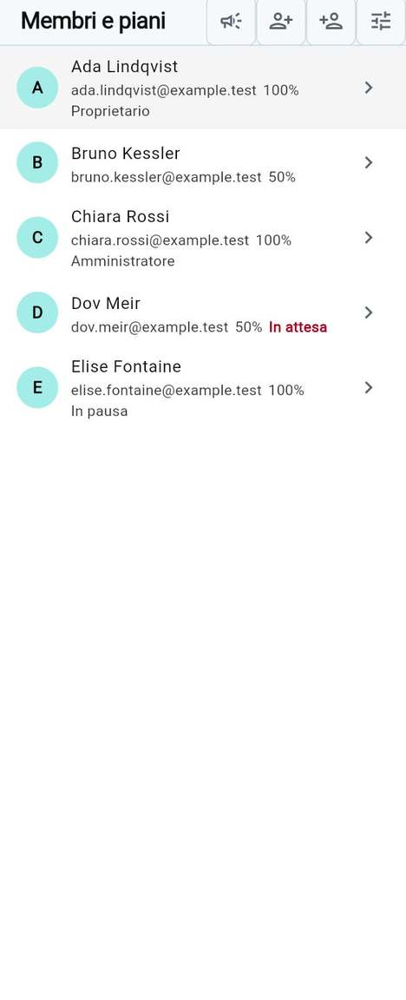

**Passaggi**

1. Apra [Membri e piani](https://fdittgen-png.github.io/deskilo/#/members) dal menu.
2. Legga ogni riga: l'e-mail, la quota del piano (oppure **Senza abbonamento**), il ruolo e uno stato quando non è quello abituale: **In attesa**, **In pausa** o **Uscito**.
3. Tocchi una riga per aprire la [pagina del membro](#la-pagina-del-membro) di quella persona.

**Da sapere**

- Una riga mostra anche gli indicatori **max** e **alla volta** quando ha impostato un [limite di prenotazioni](#limite-di-prenotazioni) o più di una [prenotazione simultanea](#prenotazioni-simultanee).
- In base alle funzioni attive, la barra in alto (pulsanti con icona e suggerimento) offre **Notifica tutti gli admin**, **Aggiungi un profilo gestito** e, per i proprietari, **Invita un membro** e **Fatturazione**.
- Anche gli amministratori accedono a questa schermata; i comandi che cambiano il denaro o i ruoli restano al proprietario.

**Vedi anche:** [Invitare un membro](#invitare-un-membro) · [Fatturazione](#fasce-tariffarie)

<!-- anchor: user.members.invite -->
### Invitare un membro

**Destinatari:** Proprietario

Vuole che qualcuno si unisca al Suo spazio.

**Passaggi**

1. In [Membri e piani](https://fdittgen-png.github.io/deskilo/#/members), tocchi **Invita un membro**.
2. Condivida l'ID dello spazio o il suo codice QR, come descritto in [L'ID dello spazio](#lid-dello-spazio-di-lavoro).
3. Quando la persona chiede di unirsi, la sua riga appare come **In attesa**. La apra e scelga **Approva l'adesione** o **Rifiuta l'adesione**.

**Da sapere**

- Per rifiutare, può aggiungere un breve commento.
- Finché non decide, la persona non ha accesso allo spazio.

**Vedi anche:** [Membri in attesa e in pausa](#membri-in-attesa-e-in-pausa) · [Aggiungere un profilo gestito](#aggiungere-un-profilo-gestito)

<!-- anchor: user.members.managed -->
### Aggiungere un profilo gestito

**Destinatari:** Amministratore · Proprietario

Qualcuno non ha ancora un account, ma Lei vuole prenotare, fatturare e gestire per suo conto. Crea un profilo, lo gestisce Lei e lo consegna quando la persona si unisce.

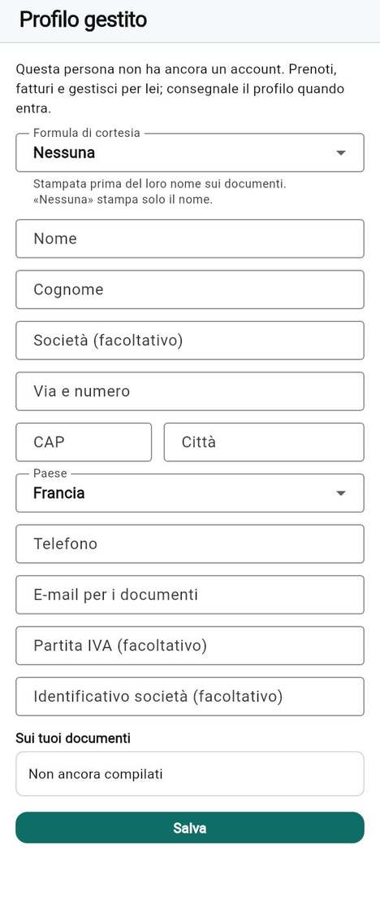

**Passaggi**

1. In [Membri e piani](https://fdittgen-png.github.io/deskilo/#/members), tocchi **Aggiungi un profilo gestito**.
2. Compili l'identità della persona e salvi. La pagina del membro riporta quindi un indicatore **Gestito**.
3. Per correggere i dati in seguito, apra la pagina del membro e scelga **Modifica identità**.
4. Quando la persona è pronta, scelga **Consegna alla persona**. Viene creato un codice personale legato a questo profilo.
5. Ha cambiato idea prima che il codice fosse usato? Scelga **Revoca la consegna**.

**Da sapere**

- Chi usa il codice rileva il profilo, con le sue prenotazioni, fatture e il suo abbonamento, una volta che Lei approva l'adesione.
- Nessuno può inviare un messaggio a un membro gestito, perché nessuno lo leggerebbe.
- La funzione deve essere attivata in [Funzionalità](#un-interruttore-di-funzionalità).

**Vedi anche:** [La pagina del membro](#la-pagina-del-membro)

<!-- anchor: user.members.page -->
### La pagina del membro

**Destinatari:** Amministratore · Proprietario

Vuole tutto su una persona in un'unica pagina: chi è, che cosa ha prenotato, come contattarla, che cosa deve e ogni impostazione che può modificare.

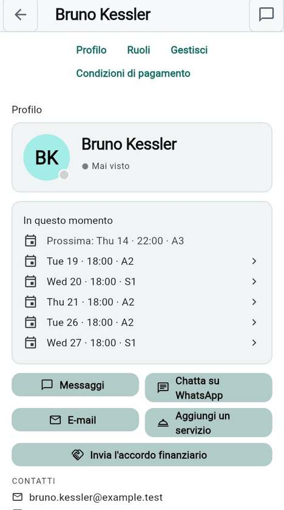

**Passaggi**

1. Tocchi un membro in [Membri e piani](https://fdittgen-png.github.io/deskilo/#/members).
2. Legga la parte alta della pagina: **In questo momento** mostra le prossime prenotazioni, poi vengono i recapiti e la posizione finanziaria.
3. Usi i pulsanti sotto il nome per un'azione rapida. In base alle funzioni e ai Suoi diritti vedrà alcuni di questi: **Messaggi**, **E-mail**, **Aggiungi un servizio** o **Invia l'accordo finanziario**.
4. Passi a **Gestisci** per modificare le impostazioni della persona, raggruppate in **Iscrizione**, **Regole di prenotazione**, **Fatturazione** e **Badge e accesso**.

**Da sapere**

- Ogni riga di impostazione mostra il valore attuale, quindi raramente serve aprirla per conoscere la risposta.
- La Sua pagina è più breve: nessuno può concedersi dei diritti da solo.
- Se la pagina non è attivata per il Suo spazio, le stesse azioni compaiono in un elenco quando tocca la riga.

**Vedi anche:** [Le azioni sul membro](#le-azioni-sul-membro) · [Ruoli e comproprietari](#la-matrice-dei-ruoli)

<!-- anchor: user.members.actions -->
### Le azioni sul membro

**Destinatari:** Amministratore · Proprietario

Vuole sapere dove si trova ogni impostazione e chi può modificarla.

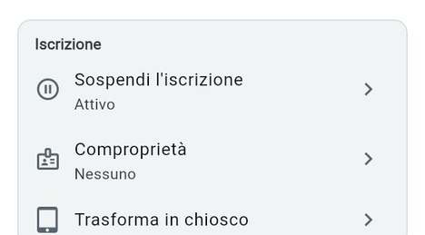

**Passaggi**

1. Apra una [pagina del membro](#la-pagina-del-membro) e vada a **Gestisci**.
2. In **Iscrizione**, scelga **Sospendi l'iscrizione** o **Riattiva l'iscrizione**, imposti la [Comproprietà](#comproprietà), oppure **Trasforma in chiosco**.
3. In **Regole di prenotazione**, imposti il [Limite di prenotazioni](#limite-di-prenotazioni), le [Prenotazioni simultanee](#prenotazioni-simultanee) e il [Trattamento IVA](#trattamento-iva); l'interruttore **Prenotazioni di uno spazio intero** compare quando la funzione è attiva.
4. In **Fatturazione**, imposti l'[Abbonamento](#labbonamento-di-un-membro), [Quando i giorni finiscono](#quando-i-giorni-finiscono) e la [Negoziazione di prezzo](#negoziazione-di-prezzo).
5. In **Badge e accesso**, apra **Badge** per emettere o revocare i badge della persona.

**Da sapere**

- Le modifiche di fatturazione e di iscrizione spettano al proprietario. Gli amministratori impostano i limiti di prenotazione.
- Non può mai modificare i Suoi limiti né la Sua comproprietà.
- Solo i membri attivi offrono la maggior parte di queste righe.

**Vedi anche:** [Regole di prenotazione](#limite-di-prenotazioni) · [Gruppo fatturazione](#labbonamento-di-un-membro)

<!-- anchor: user.members.pending -->
### Membri in attesa e in pausa

**Destinatari:** Amministratore · Proprietario

Un nuovo arrivato attende la Sua decisione, oppure un membro si prende una pausa, e Lei vuole che lo spazio lo tratti di conseguenza.

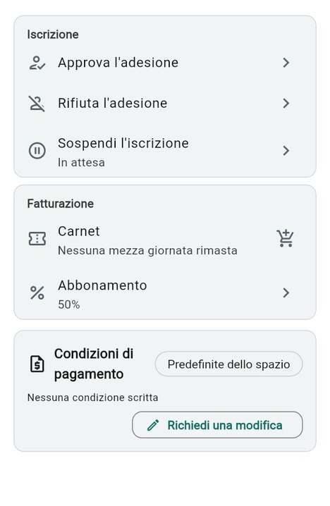

**Passaggi**

1. Apra il membro la cui riga indica **In attesa**.
2. Sotto **Iscrizione**, scelga **Approva l'adesione** per far entrare la persona, oppure **Rifiuta l'adesione** per rifiutarla.
3. Per sospendere un membro attivo, apra la sua pagina e scelga **Sospendi l'iscrizione**.
4. Per riammetterlo, scelga **Riattiva l'iscrizione**.

**Da sapere**

- La decisione su un nuovo membro può essere presa anche tramite le regole di convalida, come descritto in [Regole di convalida](#regole-di-convalida-ambito-per-ambito).
- La sospensione è riservata ai proprietari e conserva tutta la cronologia.
- Un membro che se n'è andato mostra **Uscito** e non può essere sospeso.

**Vedi anche:** [Invitare un membro](#invitare-un-membro)

<!-- anchor: user.members.subscription -->
### L'abbonamento di un membro

**Destinatari:** Proprietario

Vuole stabilire a quale quota dei giorni del mese ha diritto un membro. La quota determina la fascia tariffaria, e la fascia stabilisce il prezzo mensile.

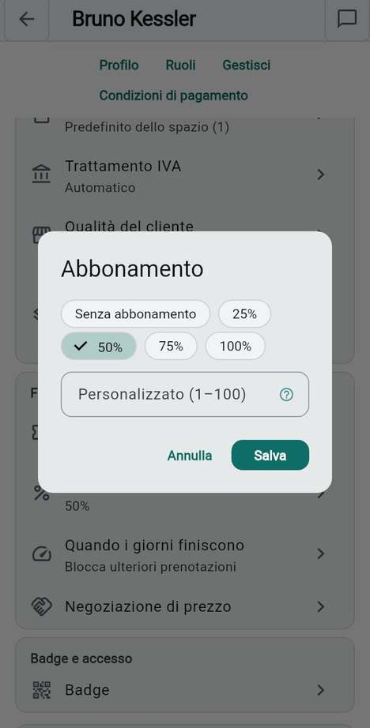

**Passaggi**

1. Apra la pagina del membro, vada a **Fatturazione** e tocchi **Abbonamento**.
2. Scelga **Senza abbonamento**, uno dei livelli che offre, oppure digiti un numero in **Personalizzato (1–100)**.
3. Tocchi un livello per applicarlo, oppure **Salva** per un valore personalizzato.

**Da sapere**

- I livelli proposti sono quelli che ha scelto in [Livelli di abbonamento](#livelli-di-abbonamento).
- Come proprietario può sempre digitare un valore personalizzato.
- **Senza abbonamento** è per i visitatori che acquistano carnet. Non può essere combinato con il pagamento a consumo: scelga prima un blocco o un pacchetto.

**Vedi anche:** [Fasce tariffarie](#fasce-tariffarie) · [Quando i giorni finiscono](#quando-i-giorni-finiscono)

<!-- anchor: user.members.overage-policy -->
### Quando i giorni finiscono

**Destinatari:** Proprietario

Vuole decidere che cosa succede quando un membro ha esaurito l'intera disponibilità mensile.

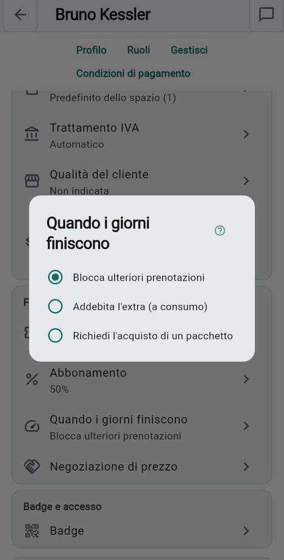

**Passaggi**

1. Apra la pagina del membro, vada a **Fatturazione** e tocchi **Quando i giorni finiscono**.
2. Scelga **Blocca ulteriori prenotazioni**, **Addebita l'extra (a consumo)** o **Richiedi l'acquisto di un pacchetto**.

**Da sapere**

- Il pagamento a consumo è disattivato per un membro senza abbonamento, perché gli permetterebbe di prenotare gratis.
- Il prezzo dell'eccedenza deriva dalla [fascia tariffaria](#eccedenza); i pacchetti derivano dai [Pacchetti di giorni](#pacchetti-di-giorni).

**Vedi anche:** [L'abbonamento di un membro](#labbonamento-di-un-membro)

<!-- anchor: user.members.reservation-limit -->
### Limite di prenotazioni

**Destinatari:** Amministratore · Proprietario

Vuole limitare quante prenotazioni aperte un membro può avere in totale.

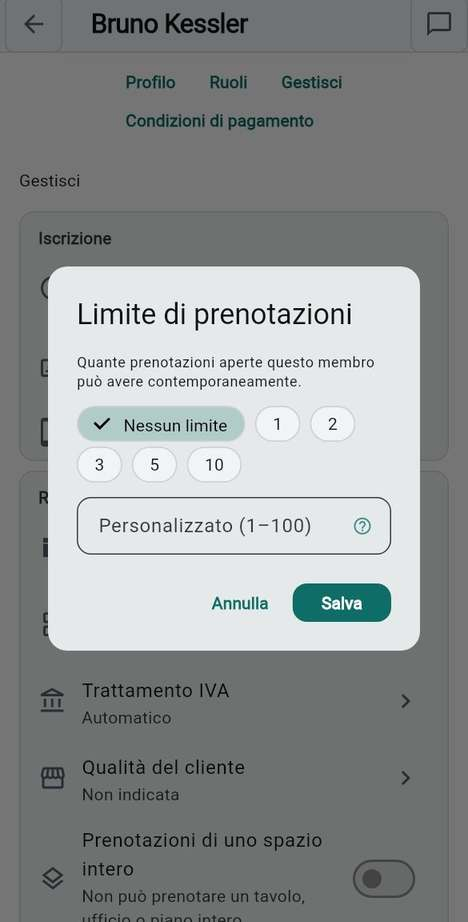

**Passaggi**

1. Apra la pagina del membro, vada a **Regole di prenotazione** e tocchi **Limite di prenotazioni**.
2. Tocchi **Nessun limite**, un valore predefinito (1, 2, 3, 5 o 10), oppure digiti un numero in **Personalizzato (1–100)**.
3. Tocchi **Salva** per un numero personalizzato.

**Da sapere**

- Conta tutte le prenotazioni aperte, qualunque sia la data. È cosa diversa dalle [prenotazioni simultanee](#prenotazioni-simultanee), che contano le sovrapposizioni.
- L'elenco mostra **max** e il numero accanto al membro.
- Non può impostare il Suo limite.

**Vedi anche:** [Limiti di prenotazione](#limiti-di-prenotazione)

<!-- anchor: user.members.simultaneous -->
### Prenotazioni simultanee

**Destinatari:** Amministratore · Proprietario

Vuole consentire a un membro di avere prenotazioni sovrapposte nel tempo, ad esempio due posti contemporaneamente.

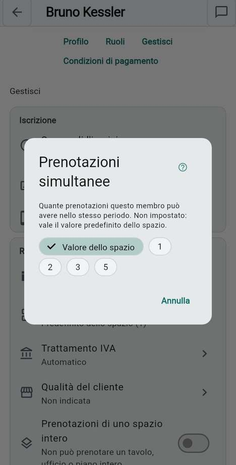

**Passaggi**

1. Apra la pagina del membro, vada a **Regole di prenotazione** e tocchi **Prenotazioni simultanee**.
2. Scelga **Predefinita dello spazio**, oppure un numero: 1, 2, 3 o 5.

**Da sapere**

- **Predefinita dello spazio** segue il numero impostato in [Disponibilità](#regole-di-prenotazione); uno significa un posto alla volta.
- Non è la stessa cosa del [limite di prenotazioni](#limite-di-prenotazioni), che conta tutte le prenotazioni aperte.
- Non può impostare le Sue.

**Vedi anche:** [Regole di prenotazione](#regole-di-prenotazione)

<!-- anchor: user.members.vat-treatment -->
### Trattamento IVA

**Destinatari:** Amministratore · Proprietario

Vuole indicare all'app che cos'è questo membro ai fini dell'IVA, così le sue fatture riportano l'imposta corretta.

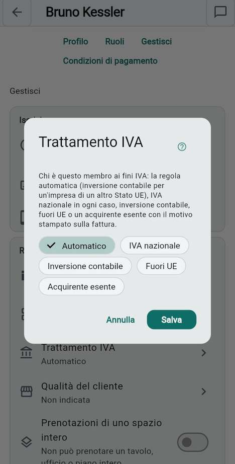

**Passaggi**

1. Apra la pagina del membro, vada a **Regole di prenotazione** e tocchi **Trattamento IVA**.
2. Scelga **Automatico**, **IVA nazionale**, **Inversione contabile**, **Fuori UE** o **Acquirente esente**.
3. Per **Acquirente esente**, digiti il **Motivo di esenzione (stampato sulla fattura)**.
4. Tocchi **Salva**.

**Da sapere**

- **Automatico** applica il luogo della prestazione: una postazione, un ufficio o una sala porta la Sua IVA per qualsiasi cliente; solo un servizio generico (vedi [Luogo della prestazione di un servizio](#luogo-della-prestazione-di-un-servizio)) va in inversione contabile per un'impresa di un altro Paese UE, o è fuori campo per un'impresa fuori dall'UE. Un consumatore paga la Sua IVA ovunque viva. La finestra mostra cosa fa il trattamento scelto di ogni tipo di riga.
- **Inversione contabile** è pensata solo per un membro che acquista servizi non connessi ai locali: vale per tutte le righe.
- Lo stesso gruppo offre **Qualità del cliente** (**Professionista**, **Consumatore** o **Non indicata**), che stabilisce quali clausole di pagamento stampa una fattura. Richiede il permesso di emettere fatture.
- **Inversione contabile**, **Fuori UE** e **Acquirente esente** vengono registrati, ma le fatture di questi membri non si possono ancora emettere nell'app: si emettono fuori dall'app con il Suo commercialista.
- La funzione **IVA secondo il cliente** deve essere attiva perché compaia la riga del trattamento IVA, visibile ad amministratori e proprietari; le aliquote si impostano in [Aliquote IVA](#impostare-le-aliquote).

**Vedi anche:** [Regime IVA](#regime-iva)

<!-- anchor: user.members.negotiation -->
### Negoziazione di prezzo

**Destinatari:** Amministratore fatturazione · Proprietario

Ha concordato con un membro un prezzo diverso dalla Sua tariffa e vuole registrarlo come accordo, senza sovrascrivere la tariffa.

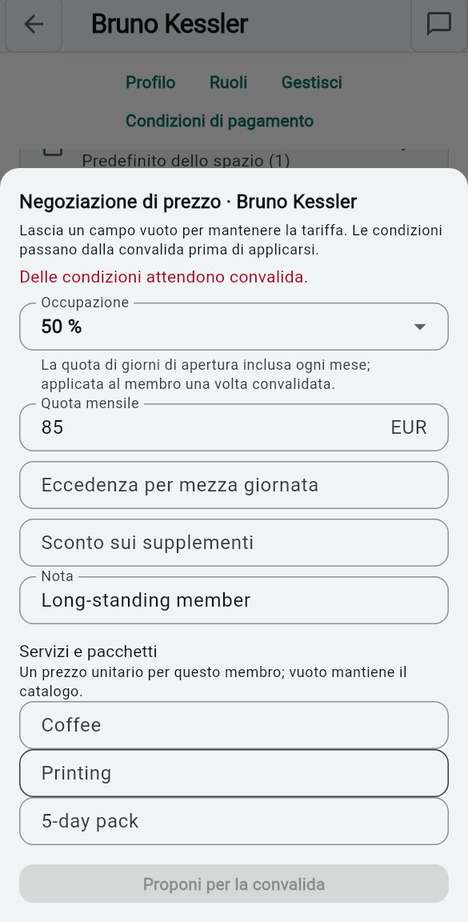

**Passaggi**

1. Apra la pagina del membro, vada a **Fatturazione** e tocchi **Negoziazione di prezzo**.
2. Compili solo ciò che differisce: **Occupazione**, **Canone mensile**, **Eccedenza per mezza giornata**, **Sconto sui supplementi**, oppure un prezzo unitario sotto **Servizi e pacchetti**.
3. Aggiunga una **Nota** se utile.
4. Tocchi **Proponi per la convalida**.

**Da sapere**

- Un campo lasciato vuoto mantiene la tariffa.
- L'accordo attende la convalida prima di applicarsi, come descritto in [Regole di convalida](#regole-di-convalida-ambito-per-ambito).
- Una volta attivo, il membro lo vede nella sua pagina Finanze, con **Chi può vedere questo**. Chi può solo consultare le negoziazioni lo vede come **Sola lettura**.

**Vedi anche:** [Fasce tariffarie](#fasce-tariffarie)

<!-- anchor: user.members.co-ownership -->
### Comproprietà

**Destinatari:** Proprietario

Vuole che qualcuno condivida la proprietà con Lei, oppure subentri se Lei se ne va.

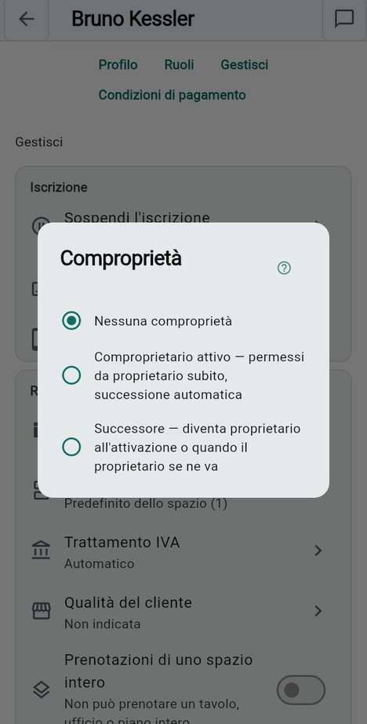

**Passaggi**

1. Apra la pagina del membro, vada a **Iscrizione** e tocchi **Comproprietà**.
2. Scelga **Nessuna comproprietà**, **Comproprietario attivo** oppure **Successore**.
3. Per rendere subito proprietario a tutti gli effetti un comproprietario, scelga **Promuovi a proprietario ora**.

**Da sapere**

- Un comproprietario attivo ha subito i permessi da proprietario e subentra automaticamente se Lei se ne va.
- Un successore diventa proprietario quando è promosso o quando il proprietario se ne va.
- Nell'elenco dei membri la riga mostra **Comproprietario** o **Successore**.
- Richiede che la funzione **Comproprietari** sia attiva e non può modificare la propria comproprietà.

**Vedi anche:** [La matrice dei ruoli](#la-matrice-dei-ruoli)

<!-- anchor: user.money.billing.fee-bands -->
### Fasce tariffarie

**Destinatari:** Proprietario · Amministratore fatturazione

Vuole fissare il prezzo dei Suoi piani: quanto costa un mese per ogni quota di giorni e quanto costa una mezza giornata extra.

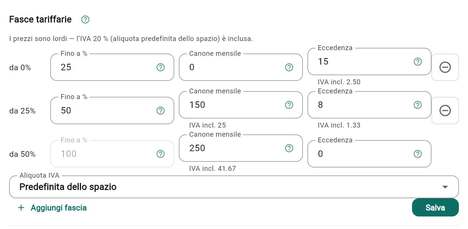

**Passaggi**

1. Apra [Fatturazione](https://fdittgen-png.github.io/deskilo/#/billing) dal menu.
2. Sotto **Fasce tariffarie**, imposti **Fino a %**, **Canone mensile** ed **Eccedenza** su ogni riga.
3. Tocchi **Aggiungi fascia** per dividere l'ultima fascia, oppure l'icona meno per eliminarne una.
4. Scelga l'**Aliquota IVA** a cui è tassata la tariffa. Viene salvata appena la sceglie.
5. Tocchi **Salva** per salvare le fasce.

**Da sapere**

- Ogni riga inizia dove finisce la precedente e l'ultima termina sempre al 100 %. Se le fasce non tornano, la schermata indica «Le fasce devono crescere e terminare al 100%.»
- I prezzi sono lordi: l'IVA è inclusa, se il Suo spazio la applica.
- Eliminare una fascia ne unisce l'intervallo a quella precedente.

**Vedi anche:** [L'abbonamento di un membro](#labbonamento-di-un-membro) · [Livelli di abbonamento](#livelli-di-abbonamento)

<!-- anchor: user.money.billing.band-to -->
#### Fino a %

Il limite superiore della fascia, da 1 a 100. La fascia successiva inizia dove termina questa, quindi una percentuale rientra sempre in una sola fascia. L'ultima fascia è fissa a 100.

<!-- anchor: user.money.billing.band-fee -->
#### Canone mensile

Quanto costa un mese in questa fascia. Quando applica l'IVA, la riga mostra la quota di IVA inclusa.

<!-- anchor: user.money.billing.band-overage -->
#### Eccedenza

Il prezzo di una mezza giornata oltre la disponibilità, per i membri la cui regola è il pagamento a consumo.

<!-- anchor: user.money.billing.levels -->
### Livelli di abbonamento

**Destinatari:** Proprietario · Amministratore fatturazione

Vuole scegliere quali percentuali offrire quando assegna un piano a qualcuno.

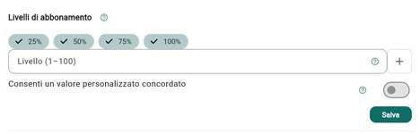

**Passaggi**

1. In [Fatturazione](https://fdittgen-png.github.io/deskilo/#/billing), trovi **Livelli di abbonamento**.
2. Tocchi un valore predefinito (25 %, 50 %, 75 %, 100 %) per attivarlo o disattivarlo.
3. Per aggiungerne uno Suo, digiti un numero in **Livello (1–100)** e tocchi **Aggiungi livello**.
4. Tocchi **Salva**.

**Da sapere**

- I livelli che sceglie sono quelli proposti nell'[Abbonamento](#labbonamento-di-un-membro) di un membro.
- Rimuova un livello che ha aggiunto con la croce sul suo indicatore.

**Vedi anche:** [Fasce tariffarie](#fasce-tariffarie)

<!-- anchor: user.money.billing.level-value -->
#### Valore del livello

Una percentuale da 1 a 100: la quota dei giorni del mese inclusa nel piano.

<!-- anchor: user.money.billing.custom-level -->
#### Consenti un valore concordato

L'interruttore **Consenti un valore personalizzato concordato** viene salvato insieme ai livelli. Come proprietario può sempre digitare una percentuale personalizzata nell'**Abbonamento** di un membro, qualunque sia lo stato di questo interruttore.

<!-- anchor: user.money.billing.packages -->
### Pacchetti di giorni

**Destinatari:** Proprietario · Amministratore fatturazione

Vuole vendere blocchi di giorni ai membri che hanno esaurito la loro disponibilità.

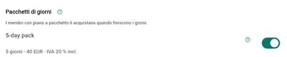

**Passaggi**

1. In [Fatturazione](https://fdittgen-png.github.io/deskilo/#/billing), trovi **Pacchetti di giorni**. Ogni riga mostra i giorni, il prezzo e un interruttore.
2. Disattivi un pacchetto per smettere di venderlo, o lo riattivi per venderlo di nuovo.
3. Per creare un pacchetto, segua [Nuovo pacchetto](#nuovo-pacchetto).

**Da sapere**

- I membri la cui regola è **Richiedi l'acquisto di un pacchetto** li acquistano quando i loro giorni finiscono.
- Un pacchetto già venduto conserva prezzo, giorni e aliquota. Per cambiarli, lo disattivi e ne aggiunga uno nuovo.

**Vedi anche:** [Quando i giorni finiscono](#quando-i-giorni-finiscono)

<!-- anchor: user.money.billing.package-new -->
### Nuovo pacchetto

**Destinatari:** Proprietario · Amministratore fatturazione

Vuole aggiungere un blocco di giorni al Suo listino.

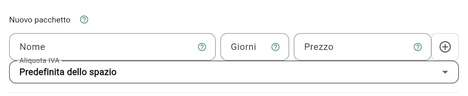

**Passaggi**

1. In [Fatturazione](https://fdittgen-png.github.io/deskilo/#/billing), sotto **Nuovo pacchetto**, digiti il nome, i giorni e il prezzo.
2. Scelga la sua **Aliquota IVA**.
3. Tocchi **Aggiungi pacchetto**.

**Da sapere**

- Il pacchetto è in vendita non appena compare, attivato.
- Dove la funzione carnet è attiva, sotto compare un editor **Carnet**.

**Vedi anche:** [Pacchetti di giorni](#pacchetti-di-giorni)

<!-- anchor: user.money.billing.package-name -->
#### Nome del pacchetto

Ciò che i membri vedono quando acquistano e ciò che dice la riga della fattura.

<!-- anchor: user.money.billing.package-days -->
#### Giorni del pacchetto

Quanti giorni concede il pacchetto, uno o più.

<!-- anchor: user.money.billing.package-price -->
#### Prezzo del pacchetto

Il prezzo dell'intero pacchetto, lordo. La riga mostra i giorni, il prezzo e, quando si applica l'IVA, l'IVA inclusa.

<!-- anchor: user.money.billing.schedule -->
### Calendario di fatturazione

**Destinatari:** Proprietario · Amministratore fatturazione

Vuole scegliere quando partono le due fatture automatiche: l'abbonamento prima del mese e il consumo del mese dopo la sua fine.

**Passaggi**

1. Apra [Spazio di coworking](https://fdittgen-png.github.io/deskilo/#/workspace-settings) e il gruppo **Pagamenti e fatturazione**.
2. Tocchi **Calendario di fatturazione**.
3. Sotto **Abbonamento, in anticipo**, attivi o disattivi **Emetti automaticamente** e scelga i **Giorni prima dell’inizio del mese**. La riga sotto indica la data risultante.
4. Sotto **Il mese appena concluso**, attivi o disattivi **Emetti automaticamente**. Attivi **Anche quando non c’è nulla da pagare** per inviare un documento a zero.
5. Tocchi **Salva**.

**Da sapere**

- Ciascuna metà richiede che la sua funzione sia attivata in [Funzionalità](#un-interruttore-di-funzionalità): «Fatture di abbonamento» e «Fatture di fine mese».
- La fattura di abbonamento può quindi riferirsi a un mese non ancora iniziato.

**Vedi anche:** [Regole di sollecito](#regole-di-sollecito) · [Fasce tariffarie](#fasce-tariffarie)

<!-- anchor: user.money.services.overview -->
### Un servizio

**Destinatari:** Proprietario · Amministratore fatturazione

Vende qualcosa che non è un posto: un armadietto, la stampa, il caffè. Lo elenca una volta e lo aggiunge al mese di un membro con un tocco.

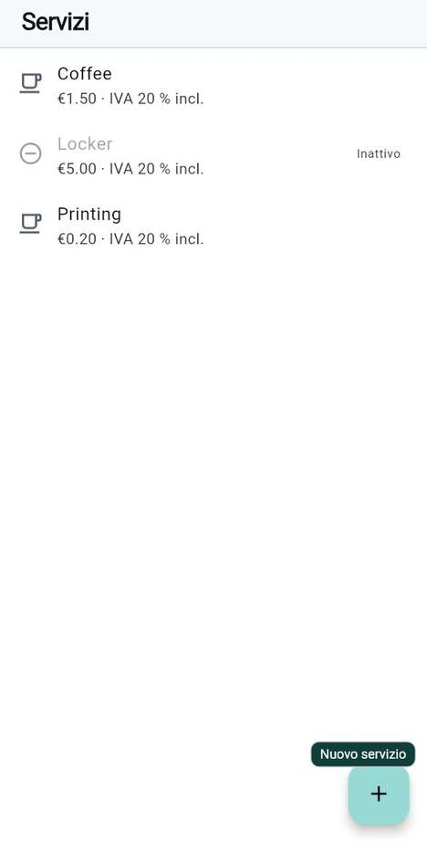

**Passaggi**

1. Apra [Servizi](https://fdittgen-png.github.io/deskilo/#/services) dal menu.
2. Tocchi un servizio per modificarlo, oppure il pulsante più per creare un **Nuovo servizio**.
3. Compili il [Nome](#nome-del-servizio), il [Prezzo](#prezzo-del-servizio) e, se applica l'IVA, l'**Aliquota IVA**.
4. Tocchi **Salva**.

**Da sapere**

- Un servizio non viene mai eliminato, solo disattivato, perché le fatture vi fanno riferimento.
- Un servizio che proviene da una scorta mostra quanti ne restano, oppure **Esaurito**.
- Per registrarne uno per un membro, usi **Aggiungi un servizio** sulla sua pagina.

**Vedi anche:** [Accessori](#accessori) · [La pagina del membro](#la-pagina-del-membro)

<!-- anchor: user.money.services.name -->
#### Nome del servizio

Ciò che dice la riga della fattura. Se lo rinomina, cambiano solo i nuovi documenti.

<!-- anchor: user.money.services.price -->
#### Prezzo del servizio

Il prezzo di un'unità, lordo: il membro paga esattamente questo importo e l'IVA ne fa parte. L'**Aliquota IVA** decide soltanto quanta parte è imposta.

<!-- anchor: user.money.services.supply -->
#### Luogo della prestazione di un servizio

Dove è dovuta l'IVA su questo servizio. **Connesso ai locali**, il valore predefinito, mantiene la Sua IVA per qualsiasi cliente: una postazione, un ufficio, una sala e ciò che si usa sul posto sono tassati dove si trova l'immobile. Scelga **Servizio generico (non connesso ai locali)** solo per ciò che non è legato all'edificio, come la gestione della posta o un ufficio virtuale: per un'impresa di un altro Paese UE quella riga va allora in inversione contabile, e per un'impresa fuori dall'UE è fuori campo; un consumatore paga sempre la Sua IVA. Ogni addebito registrato conserva la scelta valida in quel momento. Il campo compare quando Lei applica l'IVA e la funzione **Luogo della prestazione per servizio** è attiva.

<!-- anchor: user.money.services.active -->
#### Attivo

Quando modifica un servizio, l'interruttore **Attivo** decide se può ancora essere venduto. Lo disattivi per qualcosa di dismesso; l'elenco lo mostra in grigio e scrive **Inattivo**.

<!-- anchor: user.money.accessories -->
### Accessori

**Destinatari:** Amministratore · Proprietario

Noleggia attrezzatura insieme a un posto, come un monitor o una sedia, e applica un supplemento per ogni mezza giornata.

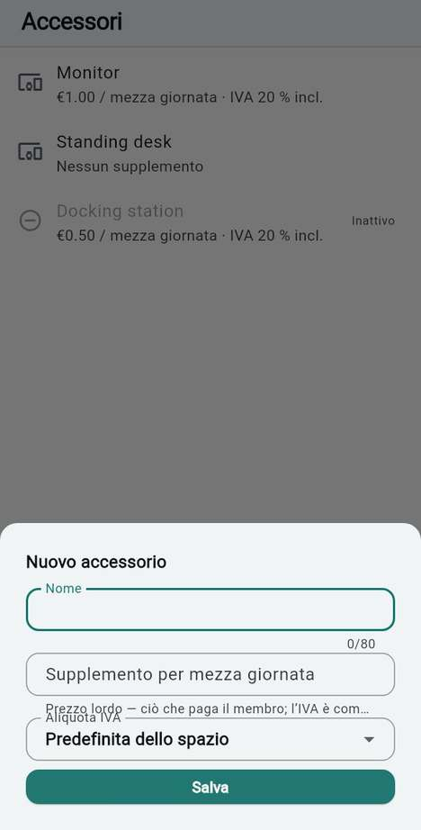

**Passaggi**

1. Apra [Accessori](https://fdittgen-png.github.io/deskilo/#/accessories) dal menu.
2. Tocchi un accessorio, oppure il pulsante più per un **Nuovo accessorio**.
3. Compili **Nome** e **Supplemento per mezza giornata**; scelga l'**Aliquota IVA** se il Suo spazio applica l'IVA.
4. Disattivi **Attivo** per smettere di offrirlo, poi tocchi **Salva**.

**Da sapere**

- L'elenco mostra ogni supplemento come importo «per mezza giornata», oppure **Nessun supplemento**.
- Come i servizi, gli accessori si disattivano, non si eliminano mai.
- La funzione deve essere attiva in [Funzionalità](#un-interruttore-di-funzionalità).

**Vedi anche:** [Un servizio](#un-servizio)

<!-- anchor: user.money.payments.methods -->
### Metodi e istruzioni di pagamento

**Destinatari:** Proprietario · Amministratore fatturazione

Vuole che i membri sappiano come pagarLa con bonifico o portafoglio elettronico, senza che Lei invii ogni volta i dati.

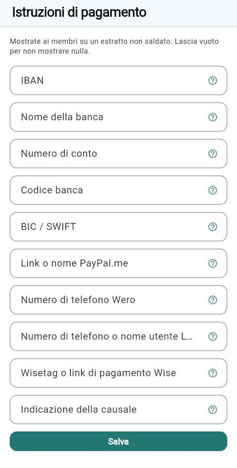

**Passaggi**

1. Apra [Istruzioni di pagamento](https://fdittgen-png.github.io/deskilo/#/payment-methods) dal menu.
2. Compili ciò che si applica: **IBAN**, **Nome della banca**, **Numero di conto**, il codice della banca, **BIC / SWIFT**.
3. Aggiunga i portafogli che accetta: **Link o nome PayPal.me**, **Numero di telefono Wero**, **Numero di telefono o nome utente Lydia**, **Wisetag o link di pagamento Wise**.
4. Aggiunga un'**Indicazione della causale** se i membri devono citare qualcosa.
5. Tocchi **Salva**.

**Da sapere**

- I membri vedono questi dati su un estratto non pagato. Lasci tutto vuoto per non mostrare nulla.
- Il campo del codice della banca prende il nome dal Suo Paese: sort code, routing number o codice bancario.
- Questo è il pagamento manuale. Per far pagare i membri con carta nell'app, veda [Il fornitore di pagamento](#il-fornitore-di-pagamento).

**Vedi anche:** [Credenziali del fornitore](#credenziali-del-fornitore)

<!-- anchor: user.money.payments.provider -->
### Il fornitore di pagamento

**Destinatari:** Proprietario

Vuole che i membri paghino online un conto aperto, sul Suo account presso il fornitore.

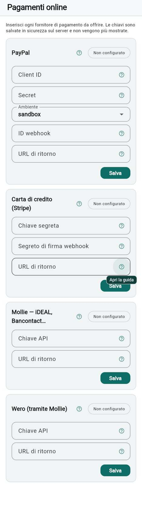

**Passaggi**

1. Attivi la funzione dei pagamenti online in [Funzionalità](#un-interruttore-di-funzionalità).
2. Apra [Pagamenti online](https://fdittgen-png.github.io/deskilo/#/payment-config) dal menu.
3. Trovi il fornitore che usa: **PayPal**, **Carta di credito (Stripe)**, **Mollie — iDEAL, Bancontact…** o **Wero (tramite Mollie)**.
4. Compili le sue chiavi, come descritto in [Credenziali del fornitore](#credenziali-del-fornitore), e tocchi **Salva**.
5. Verifichi che la scheda riporti **Configurato**.

**Da sapere**

- Ogni fornitore è una scheda a sé con un indicatore di stato, **Configurato** o **Non configurato**.
- Wero si paga tramite Mollie: inserisca la stessa chiave API di Mollie e lo stesso URL di ritorno sulla scheda Wero come su quella di Mollie.
- I fornitori applicano le proprie commissioni. Il bonifico manuale resta gratuito.
- **Rimuovi** cancella un fornitore.

**Vedi anche:** [Metodi di pagamento](#metodi-e-istruzioni-di-pagamento)

<!-- anchor: user.money.payments.credentials -->
#### Credenziali del fornitore

Le chiavi provengono dalla dashboard del fornitore: **Client ID**, **Secret**, **Ambiente**, **ID webhook** e **URL di ritorno** per PayPal; **Chiave segreta**, **Segreto di firma webhook** e **URL di ritorno** per Stripe; **Chiave API** e **URL di ritorno** per Mollie e Wero. Tenga separate le chiavi di prova e quelle reali: tutte le chiavi che inserisce devono appartenere alla stessa modalità.

I segreti sono conservati sul server e non vengono mai più mostrati. Un segreto salvato riporta **Impostato — lasci vuoto per mantenere**; digiti un nuovo valore per sostituirlo.

<!-- anchor: user.money.expenses.schedule -->
### Spese programmate

**Destinatari:** Membro · Amministratore · Proprietario

Paga qualcosa che si ripresenta, come internet o l'elettricità. La descrive una volta e l'app Le presenta ogni scadenza.

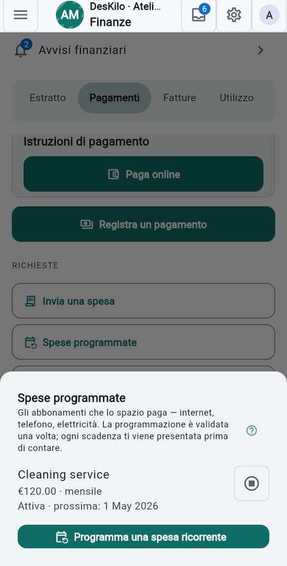

**Passaggi**

1. Apra [Finanze](https://fdittgen-png.github.io/deskilo/#/money) e la vista **Pagamenti**.
2. Tocchi **Spese programmate**. Le programmazioni esistenti mostrano importo, regola, stato e prossima data.
3. Tocchi **Programma una spesa ricorrente** e compili il modulo, come descritto in [Che cosa](#che-cosa) e nei campi successivi.
4. Tocchi **Programma**.

**Da sapere**

- Una nuova programmazione è **In attesa di validazione** finché i validatori non la confermano, poi **Attiva**. Può anche finire **Rifiutata** o **Terminata**.
- Ogni scadenza Le viene poi presentata prima di essere conteggiata: la confermi all'importo convalidato, oppure a un altro importo con una spiegazione, che viene convalidata di nuovo.
- Tocchi **Termina questa programmazione** per fermarne una. Quelle concluse sono elencate sotto **Terminate e rifiutate**.
- La funzione deve essere attiva in [Funzionalità](#un-interruttore-di-funzionalità).

**Vedi anche:** [Regole di convalida](#regole-di-convalida-ambito-per-ambito)

<!-- anchor: user.money.expenses.what -->
#### Che cosa

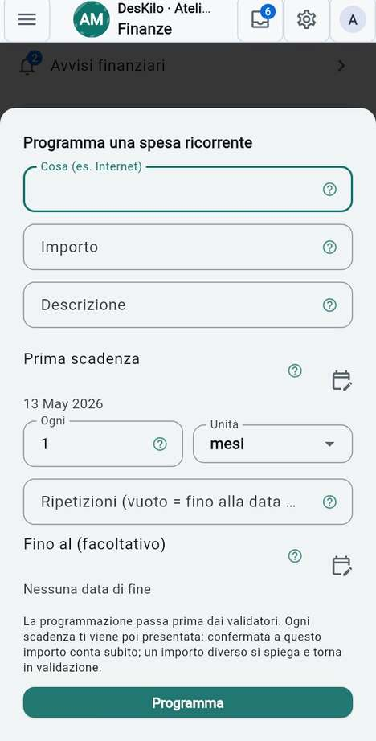

Il nome che ogni occorrenza porta, ad esempio Internet. Lo scriva come vorrà rileggerlo in seguito. L'**Importo** è quanto costa una occorrenza, e la **Descrizione** è un testo facoltativo per chi convalida.

<!-- anchor: user.money.expenses.amount -->
#### Importo

Quanto costa una occorrenza, nella valuta del Suo spazio. Un importo diverso alla conferma richiede una spiegazione e viene convalidato di nuovo.

<!-- anchor: user.money.expenses.description -->
#### Descrizione

Testo facoltativo per i validatori, ad esempio un numero di contratto o un riferimento del fornitore.

<!-- anchor: user.money.expenses.starts-on -->
#### Prima occorrenza

La data della prima scadenza. Ogni data successiva si calcola da qui.

<!-- anchor: user.money.expenses.every -->
#### Ogni

L'intervallo, un numero e un'unità: giorni, settimane, mesi o anni. Ogni 1 mese si legge «mensile».

<!-- anchor: user.money.expenses.times -->
#### Numero di volte

Il campo **Ripetizioni (vuoto = fino alla data di fine)**: quante occorrenze generare.

<!-- anchor: user.money.expenses.ends-on -->
#### Fino al

**Fino al (facoltativo)** è la data dopo la quale non viene più generato nulla. Con un numero e una data insieme, la serie si ferma al primo dei due limiti raggiunto. Senza nessuno dei due, prosegue finché non la termina.

<!-- anchor: user.invoicing.overview -->
## Imposte, fatturazione e contabilità

Per i proprietari e gli amministratori di fatturazione: chi è Lei come venditore, come si gestisce l'IVA, dove vanno le fatture elettroniche, che aspetto hanno i Suoi documenti e il ritmo mensile con cui si emettono, si inviano e si sollecitano le fatture.

> **Attenzione** DesKilo stampa ciò che Lei dichiara e verifica che i dati richiesti siano presenti. Non certifica le Sue fatture, il Suo trattamento IVA né la Sua contabilità. Ogni volta che una sezione qui sotto dice «confermi con il Suo commercialista», lo faccia.

In questo capitolo:
- Che cosa emette l'app da sé e che cosa resta al Suo commercialista
- La Sua identità legale e le menzioni stampate su ogni fattura
- IVA: regime, numero, aliquote, gruppi e dichiarazione periodica
- Fatturazione elettronica: dove viene inviata la fattura leggibile dalle macchine
- Il modello PDF della fattura e l'editor dei report
- Emettere e chiudere un mese: la schermata Fatturazione, l'assistente di chiusura mensile, il raggruppamento, le spese condivise
- I solleciti di pagamento
- Il registro fatture, le esportazioni contabili e l'analisi aziendale

<!-- anchor: user.invoicing.scope -->
### Che cosa emette l'app e che cosa resta al Suo commercialista

**Destinatari:** Proprietario · Amministratore fatturazione

Vuole sapere, prima di affidarsi, quali fatture DesKilo emette da sé e quali continua a emettere con il Suo commercialista. Questo è il perimetro di questa versione.

| Situazione | Nell'app | Fuori dall'app |
|---|---|---|
| Uno spazio in Francia o in Germania, soggetto a IVA o fuori dal campo dell'IVA | Fatture emesse, numerate, inviate e seguite | — |
| Una postazione, un ufficio o una sala, qualunque sia il cliente, anche all'estero | Emesse con la Sua IVA: il luogo della prestazione è l'edificio | — |
| Uno spazio in un altro paese | Prenotazioni, estratti e pagamenti | Le fatture, con il Suo commercialista |
| Il regime esente da IVA | — | Le fatture, con il Suo commercialista |
| Inversione contabile, esportazione, acquirente esente | Registrato sul membro | Le fatture, con il Suo commercialista |
| Fattura elettronica | Il file EN 16931, inviato alla piattaforma che configura | La scelta della piattaforma e ciò che il sistema nazionale Le chiede |
| Contabilità | Esportazioni ricostruite da fatture e pagamenti | Il libro mastro, la chiusura e i conti |
| Dichiarazione IVA | Gli importi, calcolati da fatture e pagamenti | La presentazione all'amministrazione fiscale |

**Da sapere**

- La fattura elettronica ha tre passi: DesKilo produce la fattura strutturata; il connettore la invia alla Sua piattaforma; la piattaforma la recapita al cliente e all'amministrazione secondo il sistema nazionale. Un file valido è solo il primo passo.
- In Francia solo una piattaforma autorizzata (plateforme agréée) può trasmettere fatture nell'ambito della riforma, e DesKilo non lo è: configuri la piattaforma che sceglie. Tutte le imprese interessate devono poter ricevere fatture elettroniche dal 1° settembre 2026; le PMI e le microimprese devono emetterle dal 1° settembre 2027.
- DesKilo non tiene una contabilità in partita doppia: il Suo commercialista completa i file esportati.
- Questa tabella cambia con l'app. Quando una riga passa nell'app, questa sezione lo dice.

**Vedi anche:** [Emettere una fattura](#emettere-una-fattura) · [La piattaforma di fatturazione elettronica](#la-piattaforma-di-fatturazione-elettronica) · [Esportazioni contabili](#esportazioni-contabili) · [Regime IVA](#regime-iva)

<!-- anchor: user.money.legal.identity -->
### La Sua identità legale

**Destinatari:** Proprietario

Vuole che le Sue fatture La indichino correttamente: chi è, come è registrato e come applica l'IVA.

**Passaggi**

1. Apra [Spazio di coworking](https://fdittgen-png.github.io/deskilo/#/workspace-settings) e tocchi **Identità legale e fatturazione elettronica**, oppure vada direttamente a [Identità legale e fatturazione elettronica](https://fdittgen-png.github.io/deskilo/#/legal-identity).
2. Proceda dall'alto: prima il regime IVA, poi gli identificativi, l'indirizzo e le **Menzioni di fatturazione**.
3. Tocchi **Salva** in fondo.

**Da sapere**

- La schermata mostra solo i campi che il Suo regime IVA richiede. Cambi il regime e il modulo si adegua.
- Le fatture già emesse conservano l'identità con cui sono state firmate. Una modifica vale per le successive.
- Solo i proprietari possono aprire questa schermata.

**Vedi anche:** [Regime IVA](#regime-iva) · [Tipo di organizzazione](#tipo-di-organizzazione) · [Fatturazione elettronica](#la-piattaforma-di-fatturazione-elettronica)

<!-- anchor: user.money.legal.seller-kind -->
### Tipo di organizzazione

**Destinatari:** Proprietario

Gestisce un'impresa oppure un'associazione senza scopo di lucro, e le Sue fatture devono rispecchiarlo.

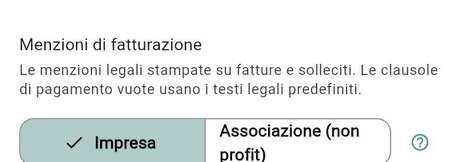

**Passaggi**

1. Apra [Identità legale e fatturazione elettronica](https://fdittgen-png.github.io/deskilo/#/legal-identity) e scorra fino a **Menzioni di fatturazione**.
2. Scelga **Impresa** o **Associazione (non profit)**.
3. Tocchi **Salva**.

**Da sapere**

- Per un'associazione cambiano i testi di esempio (ad esempio una registrazione come RNA invece di un registro delle imprese). Quali clausole di pagamento vengono stampate dipende dal Suo Paese e dalla qualità del cliente, non dal tipo di organizzazione.
- Un'associazione senza attività commerciale è normalmente fuori dal campo di applicazione dell'IVA. La schermata Le segnala se sceglie «esente» per un'associazione; confermi la scelta giusta con il Suo commercialista.

**Vedi anche:** [Qualità del cliente](#qualità-del-cliente-predefinita) · [Regime IVA](#regime-iva)

<!-- anchor: user.money.legal.customer-capacity -->
### Qualità del cliente predefinita

**Destinatari:** Proprietario

Ai clienti professionisti e ai privati non spettano le stesse clausole di pagamento. Lei imposta il valore predefinito per lo spazio.

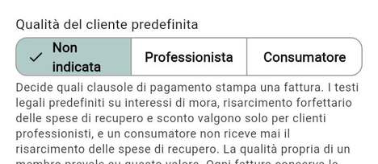

**Passaggi**

1. In **Menzioni di fatturazione**, trovi **Qualità del cliente predefinita**.
2. Scelga **Non indicata**, **Professionista** o **Consumatore**.
3. Tocchi **Salva**.

**Da sapere**

- I valori legali predefiniti di penale di mora, indennità di recupero e sconto si applicano solo ai clienti professionisti di uno spazio in Francia; per gli altri Paesi non viene stampato nulla, salvo ciò che ha scritto Lei. Un consumatore non riceve mai l'indennità di recupero.
- La qualità propria di un membro prevale su questo valore predefinito.
- Ogni fattura conserva le clausole con cui è stata emessa.

**Vedi anche:** [Penale di mora](#penale-di-mora) · [Indennità di recupero](#indennità-di-recupero)

<!-- anchor: user.money.legal.legal-form -->
### Forma giuridica e capitale

**Destinatari:** Proprietario

Le Sue fatture indicano la forma giuridica della Sua impresa e, se previsto, il suo capitale sociale.

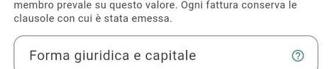

**Passaggi**

1. In **Menzioni di fatturazione**, tocchi **Forma giuridica e capitale**.
2. Digiti la riga così come deve essere stampata, ad esempio «SARL au capital de 7 500 €» (un'associazione potrebbe scrivere «Association loi 1901»).
3. Tocchi **Salva**.

**Da sapere**

- Il testo viene stampato come lo digita, fino a 300 caratteri. Verifichi con il Suo commercialista la dicitura esatta richiesta per la Sua forma giuridica.

**Vedi anche:** [Registro delle imprese](#registro-delle-imprese)

<!-- anchor: user.money.legal.registration -->
### Registro delle imprese

**Destinatari:** Proprietario

Indica dove è registrata la Sua organizzazione.

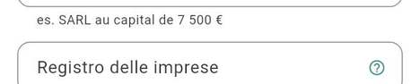

**Passaggi**

1. In **Menzioni di fatturazione**, tocchi **Registro delle imprese**.
2. Digiti la riga di registrazione, ad esempio «RCS Saint-Brieuc 680 357 910». Un'associazione può inserire un numero RNA e, se ne ha uno, un SIRET.
3. Tocchi **Salva**.

**Da sapere**

- Questa riga è una menzione stampata sul documento. L'identificativo di cui ha bisogno la fattura elettronica è il [numero di registrazione](#numero-di-registrazione) o la [partita IVA](#partita-iva), a seconda del Suo regime.

**Vedi anche:** [Forma giuridica e capitale](#forma-giuridica-e-capitale)

<!-- anchor: user.money.legal.payment-terms -->
### Condizioni di pagamento

**Destinatari:** Proprietario

Indica entro quando le fatture sono da pagare.

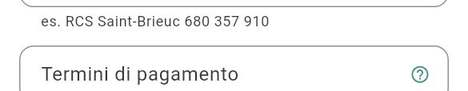

**Passaggi**

1. In **Menzioni di fatturazione**, tocchi **Condizioni di pagamento**.
2. Digiti le Sue condizioni, ad esempio «Pagamento entro 30 giorni dalla data della fattura».
3. Tocchi **Salva**.

**Da sapere**

- Lasciato vuoto, le fatture stampano «Pagamento al ricevimento.»
- Un membro può avere condizioni di pagamento proprie; queste vengono stampate sui documenti di quel membro.
- I solleciti non leggono questo testo: contano dalla data della fattura più **Giorni fino al primo promemoria** nelle regole di sollecito. Le condizioni di pagamento sono solo ciò che il documento stampa.

**Vedi anche:** [Regole di sollecito](#regole-di-sollecito)

<!-- anchor: user.money.legal.late-penalty -->
### Penale di mora

**Destinatari:** Proprietario

Indica la penale per il pagamento in ritardo.

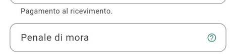

**Passaggi**

1. In **Menzioni di fatturazione**, tocchi **Penale di mora**.
2. Digiti la Sua clausola, oppure la lasci vuota.
3. Tocchi **Salva**.

**Da sapere**

- Lasciato vuoto, non viene inventato nulla al posto Suo, salvo per uno spazio in Francia che fattura a un cliente professionista: allora viene stampata la dicitura di legge (tre volte il tasso di interesse legale).
- Confermi con il Suo commercialista la clausola che si applica al Suo Paese.

**Vedi anche:** [Qualità del cliente predefinita](#qualità-del-cliente-predefinita)

<!-- anchor: user.money.legal.recovery -->
### Indennità di recupero

**Destinatari:** Proprietario

Indica l'indennità forfettaria per i costi di recupero crediti.

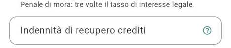

**Passaggi**

1. In **Menzioni di fatturazione**, tocchi **Indennità di recupero**.
2. Digiti la Sua clausola, oppure la lasci vuota.
3. Tocchi **Salva**.

**Da sapere**

- Lasciata vuota, l'indennità forfettaria di 40 € viene stampata solo sulle fatture di uno spazio in Francia a un cliente professionista.
- Un consumatore non riceve mai questa menzione.

**Vedi anche:** [Qualità del cliente predefinita](#qualità-del-cliente-predefinita)

<!-- anchor: user.money.legal.escompte -->
### Sconto per pagamento anticipato

**Destinatari:** Proprietario

Indica se pagare in anticipo dà diritto a uno sconto.

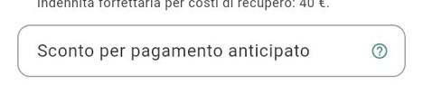

**Passaggi**

1. In **Menzioni di fatturazione**, tocchi **Sconto per pagamento anticipato**.
2. Digiti le condizioni del Suo sconto, oppure lasci vuoto.
3. Tocchi **Salva**.

**Da sapere**

- Lasciato vuoto, le fatture di uno spazio in Francia a un cliente professionista stampano «Nessuno sconto per pagamento anticipato.»; altrove la riga è omessa, salvo che ne scriva una.

**Vedi anche:** [Condizioni di pagamento](#condizioni-di-pagamento)

<!-- anchor: user.money.legal.insurance -->
### Assicurazione professionale

**Destinatari:** Proprietario

Se la Sua attività richiede di indicare l'assicurazione professionale, viene stampata sulle Sue fatture.

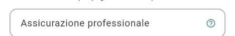

**Passaggi**

1. In **Menzioni di fatturazione**, tocchi **Assicurazione professionale**.
2. Digiti l'assicuratore, la polizza e la copertura geografica come devono comparire.
3. Tocchi **Salva**.

**Da sapere**

- Non c'è alcun valore predefinito: un campo vuoto non stampa nulla.
- L'obbligo di indicarla dipende dalla Sua attività. Chieda al Suo commercialista.

**Vedi anche:** [Menzioni particolari](#menzioni-particolari)

<!-- anchor: user.money.legal.special-mentions -->
### Menzioni particolari

**Destinatari:** Proprietario

Una Sua riga che deve comparire su ogni fattura.

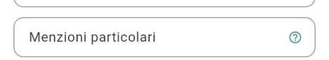

**Passaggi**

1. In **Menzioni di fatturazione**, tocchi **Menzioni particolari**.
2. Digiti il testo.
3. Tocchi **Salva**.

**Da sapere**

- Non viene stampato nulla quando il campo è vuoto.
- Sotto le menzioni, quando la funzione **Finestra indirizzo** è attiva, **Finestra indirizzo** stabilisce dove si trova l'indirizzo del destinatario, in modo che sia visibile attraverso la finestra della busta.

**Vedi anche:** [Il modello PDF della fattura](#il-modello-pdf-della-fattura)

<!-- anchor: user.money.vat.regime -->
### Regime IVA

**Destinatari:** Proprietario

Dichiara la posizione della Sua organizzazione ai fini dell'IVA. La scelta stabilisce quale numero richiedono i Suoi documenti.

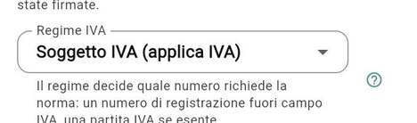

**Passaggi**

1. Apra [Identità legale e fatturazione elettronica](https://fdittgen-png.github.io/deskilo/#/legal-identity).
2. In **Regime IVA**, scelga **Fuori dal campo di applicazione dell'IVA**, **Esente IVA (regime forfettario)** o **Soggetto IVA (applica IVA)**.
3. Tocchi **Salva**.

**Da sapere**

- Fuori dal campo di applicazione dell'IVA: non viene stampata alcuna partita IVA; La identifica il numero di registrazione.
- Esente o soggetto IVA: viene richiesta la Sua partita IVA.
- Scegliere il regime è una decisione fiscale, non un'impostazione del software. La confermi con il Suo commercialista prima di emettere fatture.
- In questa versione l'app emette direttamente le fatture per gli spazi in Francia o in Germania, a clienti nazionali, con il regime di soggetto IVA o fuori campo. Le fatture con il regime esente si emettono fuori dall'app con il Suo commercialista.

**Vedi anche:** [Partita IVA](#partita-iva) · [Numero di registrazione](#numero-di-registrazione)

<!-- anchor: user.money.vat.reverse-charge -->
### Inversione contabile per imprese UE

**Destinatari:** Proprietario

Quando applica l'IVA e fattura a un'impresa di un altro Paese dell'UE, l'imposta può essere dovuta dal cliente.

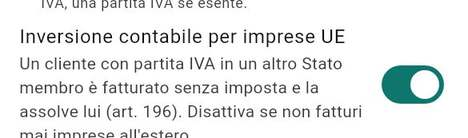

**Passaggi**

1. Scelga **Soggetto IVA (applica IVA)** come regime.
2. Attivi o disattivi **Inversione contabile per imprese UE**.
3. Tocchi **Salva**.

**Da sapere**

- Attivata: un servizio generico (non connesso ai locali) a un'impresa di un altro Paese UE va in inversione contabile. Una postazione, un ufficio o una sala mai: porta la Sua IVA, qualunque sia la partita IVA del cliente. Oggi l'app non emette direttamente le fatture in inversione contabile: Lei le emette fuori dall'app con il Suo commercialista.
- Disattivata: la disattivi se non fattura mai a imprese all'estero.
- L'opzione compare solo per il regime di soggetto IVA.

**Vedi anche:** [Trattamento IVA di un membro](#trattamento-iva)

<!-- anchor: user.money.vat.due -->
### Quando l'IVA diventa esigibile

**Destinatari:** Proprietario

L'IVA di ogni fattura diventa esigibile il giorno che fissa la legge del suo Paese: all'incasso, all'esecuzione della prestazione o alla fattura. Lei mantiene questa regola o sceglie l'opzione che il suo Paese consente.

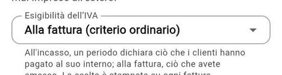

**Passaggi**

1. Scelga **Soggetto IVA (applica IVA)** come regime.
2. In **Esigibilità dell’IVA**, mantenga la prima opzione, la regola di legge del suo Paese, o scelga l'opzione che il suo Paese consente: **All'incasso (IVA per cassa)** in Italia, **Alla fattura (criterio ordinario)** in Francia.
3. Tocchi **Salva**.

**Da sapere**

- La regola di legge per le prestazioni di servizi: l'incasso in Francia; il mese in cui la prestazione è eseguita in Germania e Spagna, gli acconti all'incasso; la fattura o il pagamento, se anteriore, in Italia, nel Regno Unito e in Canada; la fattura in Svizzera.
- All'incasso, una fattura pagata a rate cade in tanti periodi quanti sono i pagamenti; con l'IVA per cassa, ciò che non è incassato diventa esigibile un anno dopo l'operazione. Una nota di credito conta alla sua emissione (all'incasso, al rimborso), mai nel periodo della fattura che corregge.
- La scelta è stampata su ogni fattura e guida allo stesso modo la [dichiarazione IVA](#preparare-la-dichiarazione-iva), il rapporto IVA e le esportazioni FEC e DATEV.
- Quale opzione si applichi a Lei è una questione fiscale per il Suo commercialista.
- Una fattura conserva la regola che ha stampato: emessa per cassa, attende il pagamento; con l'opzione per l'emissione è esigibile all'emissione, qualunque cosa lo spazio scelga in seguito.

**Vedi anche:** [Preparare la dichiarazione IVA](#preparare-la-dichiarazione-iva)

<!-- anchor: user.money.vat.account -->
### Conto IVA

**Destinatari:** Proprietario

Il Suo commercialista vuole che l'IVA incassata sia registrata su un conto preciso.

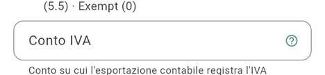

**Passaggi**

1. Scelga **Soggetto IVA (applica IVA)** come regime.
2. Digiti il numero del conto in **Conto IVA**.
3. Tocchi **Salva**.

**Da sapere**

- L'esportazione contabile registra l'IVA incassata su questo conto. Lasciato vuoto, usa 445710.

**Vedi anche:** [Esportazioni contabili](#esportazioni-contabili)

<!-- anchor: user.money.vat.number -->
### Partita IVA

**Destinatari:** Proprietario

Il Suo numero di identificazione IVA compare sulle Sue fatture e fatture elettroniche.

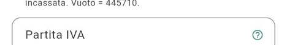

**Passaggi**

1. Apra [Identità legale e fatturazione elettronica](https://fdittgen-png.github.io/deskilo/#/legal-identity).
2. Digiti il numero in **Partita IVA**.
3. Tocchi **Salva**.

**Da sapere**

- Il campo compare per i regimi esente e soggetto IVA. Fuori dal campo di applicazione dell'IVA è sostituito dal numero di registrazione.
- I Suoi membri hanno una propria partita IVA nelle loro impostazioni, per i loro documenti.

**Vedi anche:** [Numero di registrazione](#numero-di-registrazione)

<!-- anchor: user.money.vat.exemption-reason -->
### Motivo del mancato addebito dell'IVA

**Destinatari:** Proprietario

Quando non si applica l'IVA, la legge di solito vuole che il motivo sia stampato sulla fattura.

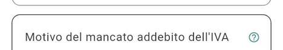

**Passaggi**

1. Apra [Identità legale e fatturazione elettronica](https://fdittgen-png.github.io/deskilo/#/legal-identity).
2. Digiti il fondamento giuridico in **Motivo del mancato addebito dell'IVA**, ad esempio «TVA non applicable, art. 293 B du CGI».
3. Tocchi **Salva**.

**Da sapere**

- L'app non può sapere quale fondamento si applichi a Lei. Prenda la dicitura esatta dal Suo commercialista.
- La dicitura viene stampata sulla fattura. Per ora l'app non emette direttamente fatture con il regime esente: si emettono fuori dall'app con il Suo commercialista.

**Vedi anche:** [Regime IVA](#regime-iva)

<!-- anchor: user.money.legal.legal-id -->
### Numero di registrazione

**Destinatari:** Proprietario

Se è fuori dal campo di applicazione dell'IVA, il Suo numero di registrazione La identifica sulle fatture elettroniche.

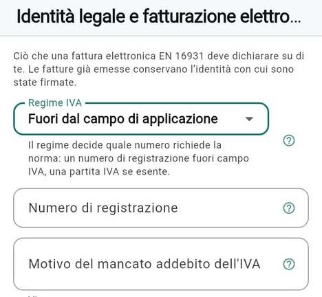

**Passaggi**

1. Imposti il **Regime IVA** su **Fuori dal campo di applicazione dell'IVA**.
2. Digiti il numero in **Numero di registrazione**.
3. Tocchi **Salva**.

**Da sapere**

- Con gli altri regimi questo campo è sostituito dalla partita IVA.
- Un'associazione usa di solito la propria registrazione (ad esempio RNA, o SIRET se assegnato).

**Vedi anche:** [Registro delle imprese](#registro-delle-imprese)

<!-- anchor: user.money.legal.address -->
### Indirizzo strutturato

**Destinatari:** Proprietario

Una fattura elettronica richiede il Suo indirizzo in parti separate, non come un unico blocco di testo.

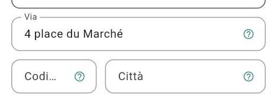

**Passaggi**

1. Apra [Identità legale e fatturazione elettronica](https://fdittgen-png.github.io/deskilo/#/legal-identity).
2. Compili **Via**, **CAP** e **Città**.
3. Tocchi **Salva**.

**Da sapere**

- La via parte dall'indirizzo già presente nelle impostazioni dello spazio, quindi lo completa invece di riscriverlo.
- Non si possono emettere fatture senza l'indirizzo postale dello spazio.

**Vedi anche:** [Indirizzo dell'intestazione](#indirizzo-dellintestazione)

<!-- anchor: user.money.vat.rates -->
### Impostare le aliquote

**Destinatari:** Proprietario · Amministratore fatturazione

Elenca le aliquote IVA che le Sue fatture possono usare. Ciò che pagano i membri non cambia: i prezzi comprendono l'IVA e l'imposta ne viene estratta.

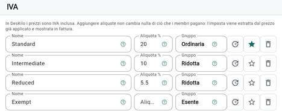

**Passaggi**

1. Apra [IVA](https://fdittgen-png.github.io/deskilo/#/vat) (da **Identità legale e fatturazione elettronica**, tocchi **Aliquote IVA**).
2. Con l'elenco vuoto, tocchi **Usa le aliquote consuete** (se il Suo Paese ha un catalogo) per partire dalle aliquote del Suo Paese, oppure **Aggiungi un'aliquota** e compili il nome e **Aliquota %** (da 0 a 99,99).
3. Tocchi la stella su una sola aliquota per renderla quella predefinita.
4. Tocchi **Salva**.

**Da sapere**

- Le aliquote consuete sono un punto di partenza. Quale operazione rientri in quale aliquota è una questione per il Suo commercialista.
- L'aliquota predefinita è usata dagli abbonamenti e da tutto ciò che non ha un'aliquota propria.
- Un'aliquota ancora usata da una fattura o da un servizio viene conservata, disattivata, invece di essere eliminata.
- Senza alcuna aliquota predefinita in vigore, mentre è soggetto IVA, non si può emettere alcuna fattura; la schermata dell'identità legale lo segnala.
- Questa schermata richiede la funzione **Gestione IVA**; la voce delle aliquote IVA nella schermata dell'identità legale compare solo con il regime di soggetto IVA.

**Vedi anche:** [Gruppi IVA](#gruppi-iva) · [Modifica per legge](#modificare-unaliquota-per-legge)

<!-- anchor: user.money.vat.groups -->
### Gruppi IVA

**Destinatari:** Proprietario · Amministratore fatturazione

Un gruppo dice di che tipo di aliquota si tratta, così la fattura la colloca nella categoria giusta.

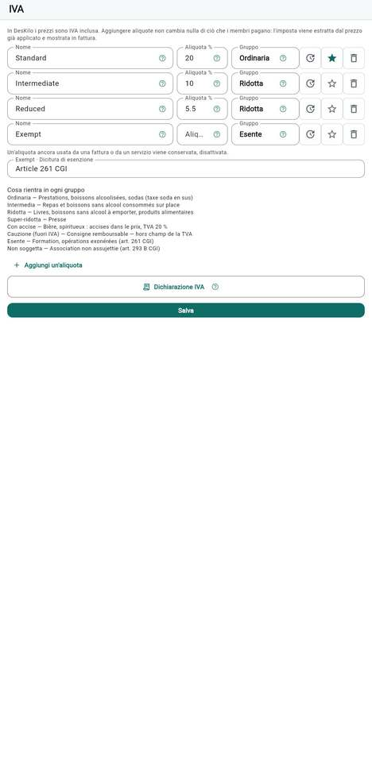

**Passaggi**

1. Apra [IVA](https://fdittgen-png.github.io/deskilo/#/vat).
2. Su ogni aliquota, quando la funzione **Gruppi IVA** è attiva, scelga un **Gruppo**: **Ordinaria**, **Intermedia**, **Ridotta**, **Super-ridotta**, **Aliquota zero**, **Esente**, **Non soggetta**, **Cauzione (fuori IVA)** o **Con accise**.
3. Per un gruppo esente o non soggetto, compili la **Dicitura di esenzione** che compare.
4. Tocchi **Salva**.

**Da sapere**

- **Cosa rientra in ogni gruppo** elenca esempi per il Suo Paese, solo a titolo indicativo.
- Una riga fuori dall'IVA, come una cauzione rimborsabile, non può condividere un documento con righe tassate; la emetta a parte.

**Vedi anche:** [Impostare le aliquote](#impostare-le-aliquote)

<!-- anchor: user.money.vat.change-by-law -->
### Modificare un'aliquota per legge

**Destinatari:** Proprietario · Amministratore fatturazione

Un'aliquota cambia a partire da una data. Le operazioni passate conservano il vecchio valore; quello nuovo si applica da quel giorno.

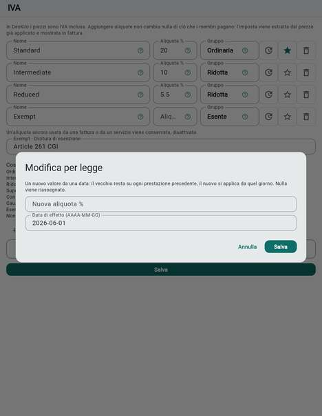

**Passaggi**

1. Apra [IVA](https://fdittgen-png.github.io/deskilo/#/vat) e si assicuri che l'aliquota sia salvata.
2. Tocchi il pulsante **Modifica per legge** sull'aliquota.
3. Digiti la **Nuova aliquota %** e la **Data di effetto (AAAA-MM-GG)**.
4. Tocchi **Salva** nella finestra di dialogo, poi **Salva** sulla schermata.

**Da sapere**

- La vecchia aliquota si chiude a quella data e se ne apre una nuova, con la stella spostata se era quella predefinita.
- Nulla di già emesso viene riassegnato.

**Vedi anche:** [Impostare le aliquote](#impostare-le-aliquote)

<!-- anchor: user.money.vat.declaration -->
### Preparare la dichiarazione IVA

**Destinatari:** Proprietario

Vuole l'IVA di un periodo calcolata dalle Sue fatture e dagli incassi, pronta da presentare all'amministrazione finanziaria o da consegnare al Suo commercialista.

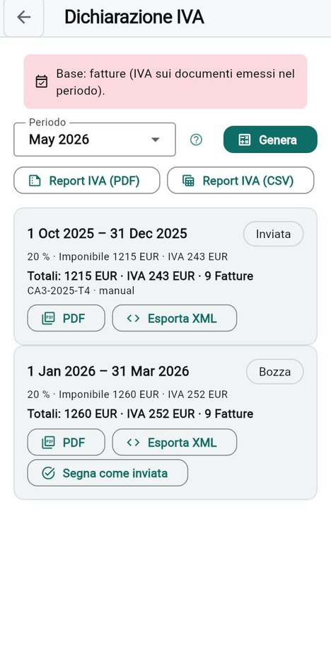

**Passaggi**

1. Apra [Dichiarazione IVA](https://fdittgen-png.github.io/deskilo/#/vat-declarations).
2. Scelga il **Periodo** e tocchi **Prepara**.
3. Apra il risultato con **PDF** o **Esporta XML**, oppure consulti **Report IVA (PDF)** e **Report IVA (CSV)**.
4. Presenti Lei stesso la dichiarazione all'amministrazione finanziaria (o tramite il Suo commercialista), poi tocchi **Segna come presentata** e inserisca il **Riferimento della ricevuta dell’amministrazione finanziaria**.

**Da sapere**

- Esiste solo con il regime di soggetto IVA. La nota in alto indica quando l'IVA del periodo diventa esigibile.
- Il server calcola gli importi dalle fatture, dagli incassi registrati uno per uno e dall'esigibilità di ogni fattura. Ogni aliquota è suddivisa per categoria: aliquota ordinaria, inversione contabile, esente e aliquota zero restano separate. Le fatture di raggruppamento sono escluse; il loro pagamento conta per le fatture che raggruppano.
- Una dichiarazione passa da **Bozza** a **Preparata** e poi a **Presentata**. Prepararla di nuovo sostituisce gli importi; una volta presentata, nulla la modifica. Se una fattura o un incasso del periodo è cambiato dopo la preparazione, l'app si rifiuta di segnarla come presentata finché non la prepara di nuovo.
- L'app non trasmette dichiarazioni: la Francia presenta tramite EDI-TVA o lo spazio professionale di impots.gouv, la Germania tramite ELSTER. La piattaforma di fatturazione elettronica trasporta solo fatture.
- È un ausilio alla presentazione, non una consulenza fiscale. La verifichi sulla Sua contabilità prima di presentarla.

**Vedi anche:** [Quando l'IVA diventa esigibile](#quando-liva-diventa-esigibile) · [Esportazioni contabili](#esportazioni-contabili)

<!-- anchor: user.money.einvoice.overview -->
### La piattaforma di fatturazione elettronica

**Destinatari:** Proprietario · Amministratore fatturazione

Indica a DesKilo dove inviare le Sue fatture come file leggibili dalle macchine.

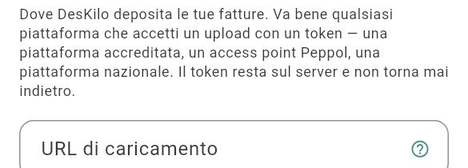

**Passaggi**

1. Apra [Piattaforma di fatturazione elettronica](https://fdittgen-png.github.io/deskilo/#/einvoice-config) (raggiungibile anche da **Identità legale e fatturazione elettronica**).
2. Compili **URL di caricamento** e **Token o credenziale**, e i due campi facoltativi se la Sua piattaforma li richiede.
3. Tocchi **Salva**. **Rimuovi la piattaforma** cancella le impostazioni.

**Da sapere**

- Funziona qualsiasi piattaforma che accetti un caricamento con un token: una piattaforma accreditata, un punto di accesso Peppol, una piattaforma nazionale.
- Il token è conservato sul server e non viene mai più mostrato.
- Il file valido è una fattura EN 16931. Se il Suo Paese richieda una piattaforma, e quale, lo confermi con il Suo commercialista.
- Inviare il file è il secondo di tre passi: veda [Che cosa emette l'app e che cosa resta al Suo commercialista](#che-cosa-emette-lapp-e-che-cosa-resta-al-suo-commercialista).

**Vedi anche:** [Inviare una fattura elettronica](#inviare-una-fattura-elettronica) · [Identità legale](#la-sua-identità-legale)

<!-- anchor: user.money.einvoice.endpoint -->
### URL di caricamento

**Destinatari:** Proprietario · Amministratore fatturazione

L'indirizzo al quale la Sua piattaforma riceve le fatture.

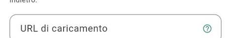

**Passaggi**

1. Apra [Piattaforma di fatturazione elettronica](https://fdittgen-png.github.io/deskilo/#/einvoice-config).
2. Incolli l'indirizzo in **URL di caricamento**, esattamente come lo documenta la Sua piattaforma.
3. Tocchi **Salva**.

**Da sapere**

- Proviene dalla documentazione della Sua piattaforma o dal Suo fornitore.

**Vedi anche:** [Token o credenziale](#token-o-credenziale)

<!-- anchor: user.money.einvoice.token -->
### Token o credenziale

**Destinatari:** Proprietario · Amministratore fatturazione

Il segreto che dimostra alla piattaforma che il caricamento è Suo.

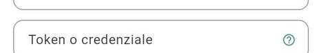

**Passaggi**

1. Apra [Piattaforma di fatturazione elettronica](https://fdittgen-png.github.io/deskilo/#/einvoice-config).
2. Incolli la chiave in **Token o credenziale**.
3. Tocchi **Salva**.

**Da sapere**

- Una volta salvato, la schermata riporta «Un token è salvato». Ne digiti uno nuovo solo per sostituirlo.
- Viene conservato sul server e non ne esce più.

**Vedi anche:** [Header di autenticazione](#header-di-autenticazione)

<!-- anchor: user.money.einvoice.auth-header -->
### Header di autenticazione

**Destinatari:** Proprietario · Amministratore fatturazione

Il nome dell'header che trasporta il token.

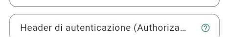

**Passaggi**

1. Apra [Piattaforma di fatturazione elettronica](https://fdittgen-png.github.io/deskilo/#/einvoice-config).
2. Se la Sua piattaforma si aspetta un header diverso da quello standard, ne digiti il nome in **Header di autenticazione (Authorization per impostazione predefinita)**.
3. Tocchi **Salva**.

**Da sapere**

- Lasciato vuoto, viene usato `Authorization`.

**Vedi anche:** [Nome del campo file](#nome-del-campo-file)

<!-- anchor: user.money.einvoice.file-field -->
### Nome del campo file

**Destinatari:** Proprietario · Amministratore fatturazione

Il nome del campo del modulo che trasporta il file della fattura.

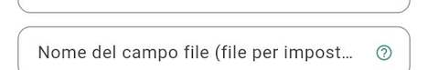

**Passaggi**

1. Apra [Piattaforma di fatturazione elettronica](https://fdittgen-png.github.io/deskilo/#/einvoice-config).
2. Se la Sua piattaforma si aspetta un altro nome di campo, lo digiti in **Nome del campo file (file per impostazione predefinita)**.
3. Tocchi **Salva**.

**Da sapere**

- Lasciato vuoto, viene usato `file`.

**Vedi anche:** [URL di caricamento](#url-di-caricamento)

<!-- anchor: user.money.einvoice.customer-delivery -->
### Servizio di recapito al cliente

**Destinatari:** Proprietario · Amministratore fatturazione

Il Suo cliente può ricevere le fatture altrove che su una piattaforma governativa: il proprio punto di accesso Peppol, un portale o un servizio di caricamento concordato.

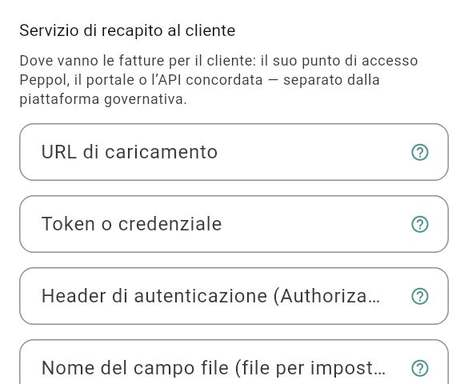

**Passaggi**

1. Apra [Piattaforma di fatturazione elettronica](https://fdittgen-png.github.io/deskilo/#/einvoice-config).
2. In **Servizio di recapito al cliente**, compili gli stessi quattro campi di cui sopra.
3. Tocchi **Salva**.

**Da sapere**

- È distinto dalla piattaforma governativa. Si possono configurare entrambi e ogni fattura offre entrambi gli invii.

**Vedi anche:** [Inviare una fattura elettronica](#inviare-una-fattura-elettronica)

<!-- anchor: user.money.einvoice.uat -->
### Endpoint e token UAT

**Destinatari:** Proprietario · Amministratore fatturazione

Vuole fare una prova prima di inviare fatture reali.

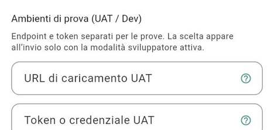

**Passaggi**

1. Apra [Piattaforma di fatturazione elettronica](https://fdittgen-png.github.io/deskilo/#/einvoice-config).
2. Sotto **Ambienti di prova (UAT / Dev)**, compili **URL di caricamento UAT** e **Token o credenziale UAT**.
3. Tocchi **Salva**.

**Da sapere**

- La scelta dell'ambiente compare al momento dell'invio solo finché la modalità sviluppatore è attiva.
- Un invio di prova viene registrato come invio di prova.

**Vedi anche:** [Endpoint e token Dev](#endpoint-e-token-dev)

<!-- anchor: user.money.einvoice.dev -->
### Endpoint e token Dev

**Destinatari:** Proprietario · Amministratore fatturazione

Un secondo endpoint di prova, per lo sviluppo.

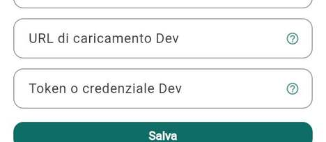

**Passaggi**

1. Apra [Piattaforma di fatturazione elettronica](https://fdittgen-png.github.io/deskilo/#/einvoice-config).
2. Sotto **Ambienti di prova (UAT / Dev)**, compili **URL di caricamento Dev** e **Token o credenziale Dev**.
3. Tocchi **Salva**.

**Da sapere**

- Stesse regole dell'UAT. L'invio reale va sempre all'endpoint di produzione.

**Vedi anche:** [Endpoint e token UAT](#endpoint-e-token-uat)

<!-- anchor: user.money.einvoice.send -->
### Inviare una fattura elettronica

**Destinatari:** Proprietario · Amministratore fatturazione

Vuole consegnare una fattura emessa nella sua forma leggibile dalle macchine.

**Passaggi**

1. Apra una fattura in [Fatturazione](https://fdittgen-png.github.io/deskilo/#/invoices) e tocchi **Fattura elettronica (XML)**.
2. Legga la verifica in alto nella scheda: indica se il file è pronto o che cosa manca.
3. Tocchi **Invia alla piattaforma governativa**, **Invia al servizio del cliente**, oppure scarichi o condivida il file (**Scarica Factur-X (PDF)** include l'XML dentro il PDF).

**Da sapere**

- Se manca qualcosa, la scheda lo elenca. **Completare l'identità legale** Le apre la schermata che lo risolve.
- Una fattura firmata prima che completasse la Sua identità conserva ciò con cui è stata emessa. La segni come errata e ne emetta una sostitutiva se è importante.
- Quale canale debba usare un cliente dipende dal Suo Paese e dal cliente. Lo confermi con il Suo commercialista.

**Vedi anche:** [La piattaforma di fatturazione elettronica](#la-piattaforma-di-fatturazione-elettronica) · [La schermata Fatturazione](#la-schermata-fatturazione)

<!-- anchor: user.money.reports.invoice-template -->
### Il modello PDF della fattura

**Destinatari:** Proprietario · Amministratore fatturazione

Vuole che le Sue fatture Le somiglino: logo, impaginazione, testi.

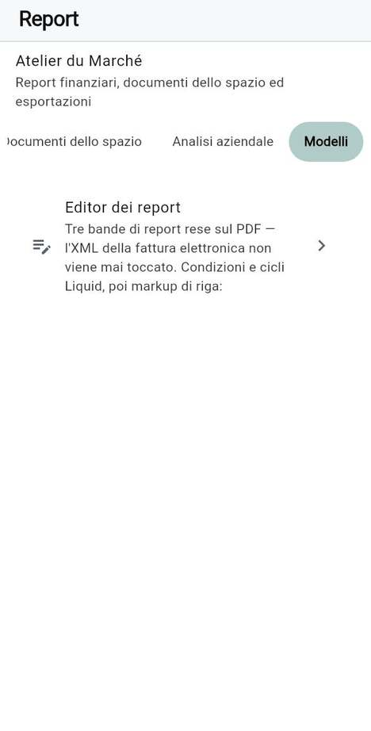

**Passaggi**

1. Apra [Report](https://fdittgen-png.github.io/deskilo/#/reports?section=templates) e la scheda **Modelli**.
2. Tocchi **Editor dei report**.

**Da sapere**

- Il modello cambia solo il PDF. L'XML della fattura elettronica non viene mai toccato.
- Chiunque abbia il permesso di progettare i documenti può farlo.
- Un modello che non si riesce a generare non blocca mai un documento: subentra l'impaginazione integrata.

**Vedi anche:** [L'editor dei report](#leditor-dei-report)

<!-- anchor: user.money.reports.editor -->
### L'editor dei report

**Destinatari:** Proprietario · Amministratore fatturazione

Progetta un documento su una pagina, invece di scrivere codice.

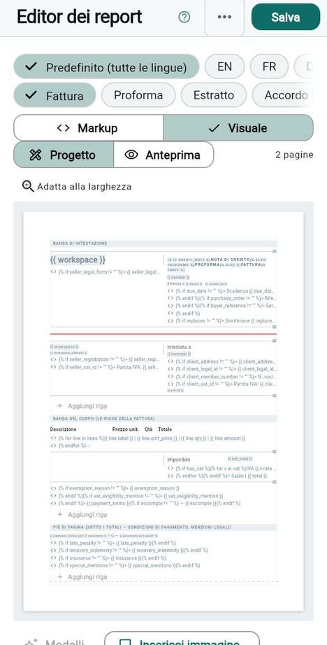

**Passaggi**

1. Apra [Editor dei report](https://fdittgen-png.github.io/deskilo/#/report-editor).
2. Scelga il documento con i chip (Fattura, Proforma, Estratto, solleciti e gli altri report).
3. In **Progetto**, tocchi una riga per modificarla, aggiunga righe o trascini per riordinare. Tocchi **Anteprima** per vederlo con i Suoi dati.
4. Tocchi **Salva**.

**Da sapere**

- La modalità **Markup** modifica le stesse fasce come testo.
- **Inserisci immagine** colloca un logo, un timbro o una firma dalla libreria di immagini.
- **Anteprima rapida** genera subito il documento con la Sua fattura più recente, o con dati di esempio se non ce n'è. **Ripristina il modello predefinito** ripristina l'impaginazione integrata.
- **Esporta questo modello** e **Importa un modello** portano un modello dentro e fuori come file. **Layout posizionato (XML)** serve per i documenti che devono corrispondere a una busta con finestra o a un modulo nazionale.
- Uscendo con modifiche non salvate, viene chiesta conferma.

**Vedi anche:** [Modelli e preimpostazioni](#modelli-già-pronti) · [Lingue](#un-modello-per-lingua)

<!-- anchor: user.money.reports.presets -->
### Modelli già pronti

**Destinatari:** Proprietario · Amministratore fatturazione

Parte da un modello finito e cambia ciò che desidera.

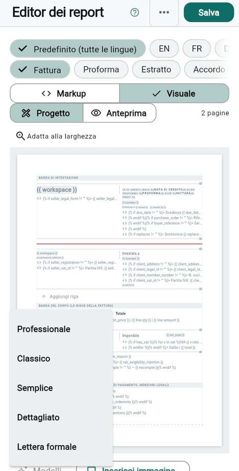

**Passaggi**

1. Apra [Editor dei report](https://fdittgen-png.github.io/deskilo/#/report-editor) e scelga un documento.
2. Tocchi **Modelli** e scelga **Professionale**, **Classico**, **Semplice**, **Dettagliato** o **Lettera formale**.
3. Confermi la sostituzione se l'app lo chiede, poi modifichi e **Salva**.

**Da sapere**

- La sostituzione di un'impaginazione si può annullare con **Annulla**.
- I report strutturali (piano dei conti, badge, schede QR) hanno un'unica impaginazione fornita.
- I modelli di fattura contengono già le Sue menzioni legali. Stampano comunque solo ciò che ha inserito in [Menzioni di fatturazione](#la-sua-identità-legale).

**Vedi anche:** [L'editor dei report](#leditor-dei-report)

<!-- anchor: user.money.reports.languages -->
### Un modello per lingua

**Destinatari:** Proprietario · Amministratore fatturazione

I Suoi membri leggono i loro documenti nella propria lingua.

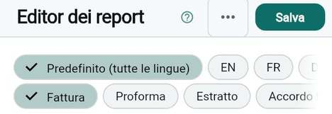

**Passaggi**

1. Apra [Editor dei report](https://fdittgen-png.github.io/deskilo/#/report-editor).
2. Sotto il documento, scelga **Predefinito (tutte le lingue)** oppure una tra **EN**, **FR**, **DE**, **ES**, **IT**.
3. Modifichi le fasce per quella lingua e **Salva**. **Usa il predefinito per questa lingua** rimuove un modello proprio.

**Da sapere**

- Un punto su una lingua significa che ha un modello proprio; altrimenti eredita quello predefinito.
- Il documento di un membro viene stampato nella sua lingua quando esiste un modello per essa, altrimenti nella lingua predefinita dello spazio.

**Vedi anche:** [Lingua dello spazio](#lingua-dello-spazio)

<!-- anchor: user.invoicing.hub -->
### La schermata Fatturazione

**Destinatari:** Proprietario · Amministratore fatturazione

Vede a colpo d'occhio che cosa emettere, che cosa incassare e che cosa è chiuso.

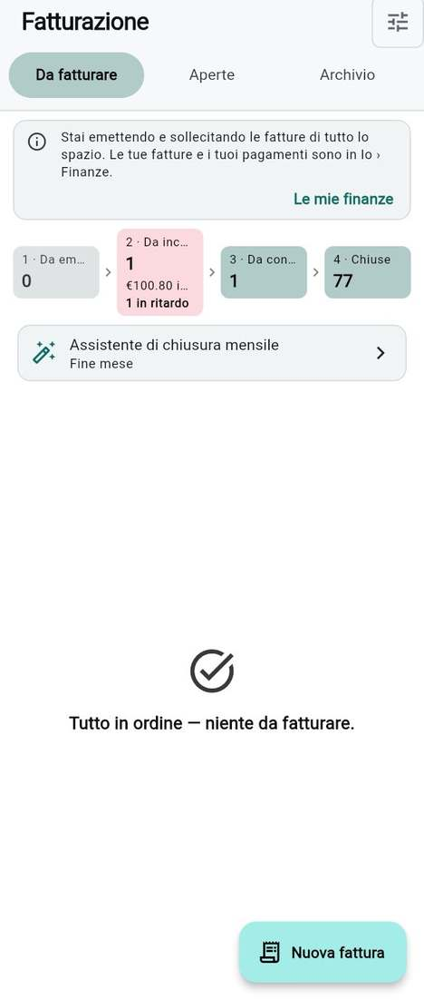

**Passaggi**

1. Apra [Fatturazione](https://fdittgen-png.github.io/deskilo/#/invoices).
2. Legga la striscia: **Da emettere**, **Da incassare**, **Da confermare**, **Chiuso**.
3. Lavori nelle tre schede: **Da fatturare** (membri con qualcosa di rilevato, non ancora fatturato), **Aperto** (emesse, non pagate) e **Archivio** (pagate o chiuse).
4. Tocchi l'icona degli strumenti per gli altri strumenti.

**Da sapere**

- Vede le fatture dell'intero spazio. Le Sue sono nelle Sue finanze, sotto **Le mie finanze**.
- Le fatture non si modificano né si eliminano mai: una fattura sbagliata viene segnata come errata e sostituita.
- La voce **Come funziona la fatturazione** spiega chi si muove a ogni passaggio.

**Vedi anche:** [Nuova fattura](#emettere-una-fattura) · [Fatture aperte](#sollecitare-e-saldare-le-fatture-aperte)

<!-- anchor: user.invoicing.new-invoice -->
### Emettere una fattura

**Destinatari:** Proprietario · Amministratore fatturazione

Fattura un mese a un membro.

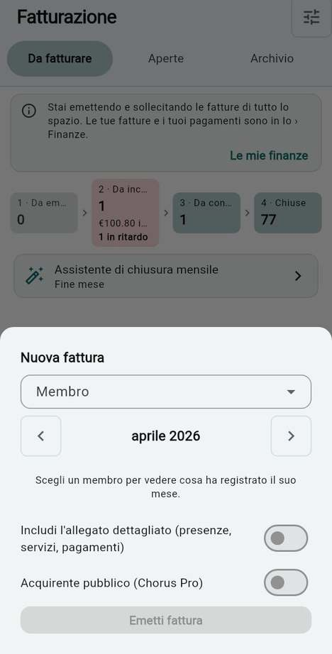

**Passaggi**

1. In [Fatturazione](https://fdittgen-png.github.io/deskilo/#/invoices), tocchi **Nuova fattura**, oppure **Fattura** su una riga di **Da fatturare**.
2. Scelga il **Membro** e il mese. Le posizioni derivano da ciò che è stato rilevato.
3. Attivi **Includi l'allegato dettagliato (presenze, servizi, pagamenti)** se lo desidera.
4. Tocchi **Emetti fattura**. In **Da fatturare**, **Fattura tutto** emette ogni riga.

**Da sapere**

- Le fatture derivano dai dati rilevati e non si possono comporre a mano. L'ultima riga è il **Saldo**.
- Un mese si può fatturare una sola volta per membro e un mese ancora in corso Le segnala che le posizioni potrebbero cambiare.
- Se manca un dato obbligatorio, **Completi questi dati prima dell'emissione** lo elenca (indirizzo, partita IVA, fondamento dell'esenzione, aliquota IVA; anche il Paese dello spazio, che deve essere la Francia o la Germania).
- In questa versione l'emissione nell'app è disponibile per gli spazi in Francia o in Germania, anche per clienti all'estero: una postazione, un ufficio o una sala porta la Sua IVA ovunque viva il cliente. Le fatture con inversione contabile, all'esportazione o a un acquirente esente si emettono fuori dall'app con il Suo commercialista, e un servizio generico a un cliente estero richiede prima la sua qualità (professionista o consumatore).
- Una fattura emessa è firmata e immutabile.

**Vedi anche:** [L'assistente di chiusura mensile](#lassistente-di-chiusura-mensile)

<!-- anchor: user.invoicing.open -->
### Sollecitare e saldare le fatture aperte

**Destinatari:** Proprietario · Amministratore fatturazione

Segue ciò che non è pagato e lo chiude correttamente.

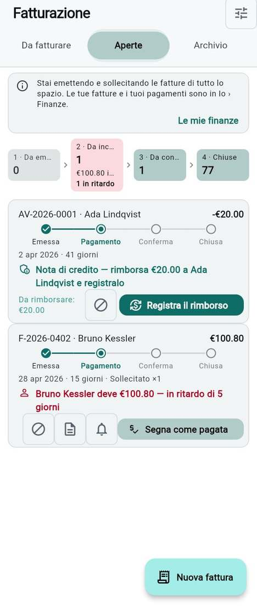

**Passaggi**

1. In [Fatturazione](https://fdittgen-png.github.io/deskilo/#/invoices), apra la scheda **Aperto** e tocchi una fattura.
2. Usi le azioni che offre: **Invia un promemoria**, **Segna come pagata** (abbina un pagamento registrato), **Annulla il saldo residuo**, **Segna come errata**, oppure condivida il PDF.
3. Le fatture pagate passano in **Archivio**.

**Da sapere**

- Una fattura è pagata quando le è abbinato un pagamento reale. Una differenza richiede una nota, o una nota di credito per l'eccedenza.
- L'annullamento di un saldo residuo passa per la convalida.
- **Segna come errata** non si può annullare. Lo faccia prima del pagamento, mai dopo.

**Vedi anche:** [Regole di sollecito](#regole-di-sollecito) · [Raggruppare le fatture](#raggruppare-le-fatture-in-una-sola)

<!-- anchor: user.invoicing.wizard -->
### L'assistente di chiusura mensile

**Destinatari:** Proprietario · Amministratore fatturazione

Un unico percorso guidato per la routine del denaro: emettere, inviare, sollecitare, registrare i pagamenti, abbinare e chiudere.

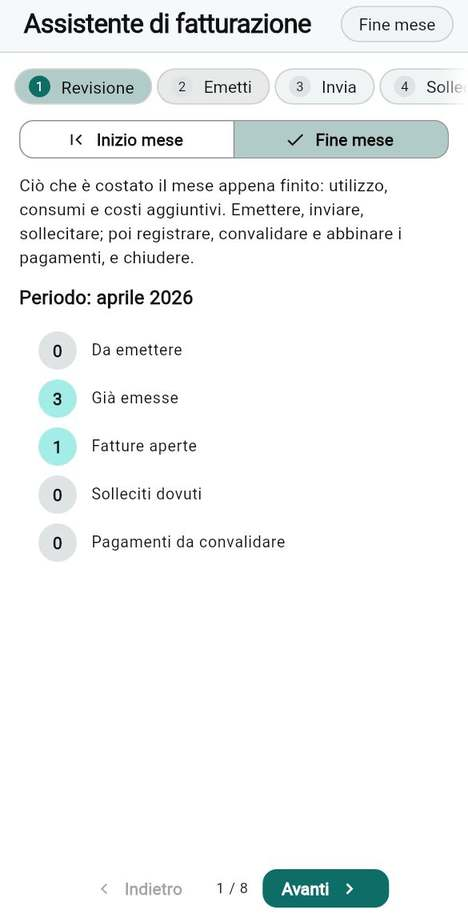

**Passaggi**

1. In [Fatturazione](https://fdittgen-png.github.io/deskilo/#/invoices), tocchi **Assistente di chiusura mensile** (oppure apra l'[Assistente di fatturazione](https://fdittgen-png.github.io/deskilo/#/invoicing/wizard)).
2. Scelga il ciclo: **Inizio mese** (abbonamenti che i membri pagano in anticipo, per il mese a venire) o **Fine mese** (utilizzo, consumi e addebiti extra del mese appena concluso). La data ne propone uno.
3. Segua i passaggi: **Revisione**, **Emetti**, **Invia**, **Sollecita**, **Pagamenti**, **Abbina**, **Chiudi**, **Riepilogo**.
4. Tocchi **Avanti** a ogni passaggio e **Fine** alla fine.

**Da sapere**

- Può deselezionare un membro per escluderlo da un lotto; i membri già coperti risultano come completati.
- **Riepilogo** elenca ciò che il ciclo ha fatto, ciò che è ancora aperto e a chi tocca.
- Un passaggio senza nulla da fare lo dice.

**Vedi anche:** [La schermata Fatturazione](#la-schermata-fatturazione) · [Raggruppare le fatture](#raggruppare-le-fatture-in-una-sola)

<!-- anchor: user.invoicing.settlement -->
### Raggruppare le fatture in una sola

**Destinatari:** Proprietario · Amministratore fatturazione

Un membro ha più fatture aperte e dovrebbe pagarne una sola.

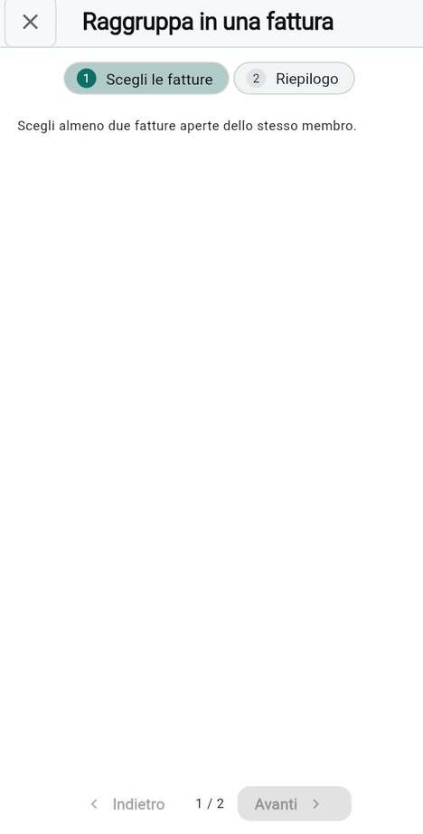

**Passaggi**

1. In [Fatturazione](https://fdittgen-png.github.io/deskilo/#/invoices), tocchi l'icona degli strumenti e **Raggruppa in una fattura**.
2. Scelga almeno due fatture aperte dello stesso membro.
3. Confermi. Le viene chiesto se allegare le fatture raggruppate.

**Da sapere**

- La nuova fattura è quella dovuta e sollecitata. Gli originali restano leggibili dietro di essa.
- Righe e IVA vengono riportate; la dichiarazione IVA conta gli originali una sola volta.

**Vedi anche:** [Fatture aperte](#sollecitare-e-saldare-le-fatture-aperte)

<!-- anchor: user.invoicing.shared-expense -->
### Ripartire una spesa condivisa

**Destinatari:** Proprietario · Amministratore fatturazione

Un costo condiviso dalla comunità viene diviso tra i membri.

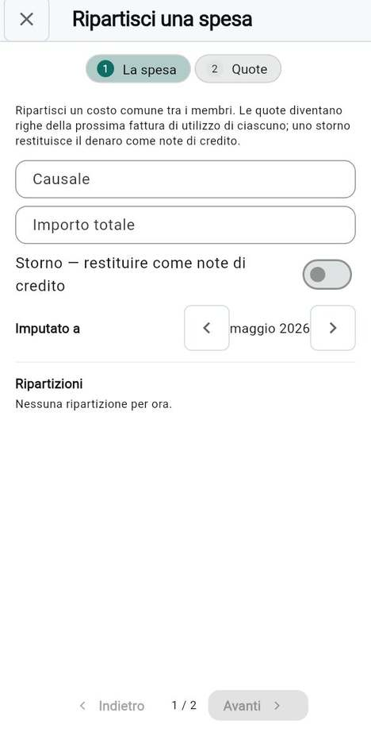

**Passaggi**

1. In [Fatturazione](https://fdittgen-png.github.io/deskilo/#/invoices), tocchi l'icona degli strumenti e **Ripartisci una spesa**.
2. Descriva **La spesa**, poi scelga **Ripartire per**: **Quote uguali**, **Abbonamento**, **Utilizzo** o **Chiave personalizzata**.
3. Controlli le **Quote**, deselezioni chi vuole **Escludere** e tocchi **Registra le quote**.

**Da sapere**

- Una volta contabilizzate (dopo la convalida, se una regola la richiede), le quote finiscono come righe nella prossima fattura di utilizzo di ciascun membro.
- **Storno — restituire come note di credito** restituisce il denaro.
- **Ricorda questa regola** ripropone la regola modificata il mese successivo.

**Vedi anche:** [L'assistente di chiusura mensile](#lassistente-di-chiusura-mensile)

<!-- anchor: user.money.reminders.rules -->
### Regole di sollecito

**Destinatari:** Proprietario · Amministratore fatturazione

Decide quando e con quale frequenza si sollecita una fattura scaduta.

**Passaggi**

1. In [Fatturazione](https://fdittgen-png.github.io/deskilo/#/invoices), tocchi l'icona degli strumenti e **Regole di sollecito**.
2. Imposti **Numero di livelli di sollecito**, **Giorni fino al primo promemoria** e **Giorni tra i solleciti**.
3. Tocchi **Salva**.

**Da sapere**

- I solleciti stampano le menzioni di pagamento che ha impostato.
- Un sollecito viene registrato sulla fattura e appare come badge **Sollecitato**.

**Vedi anche:** [Solleciti automatici](#solleciti-automatici) · [Condizioni di pagamento](#condizioni-di-pagamento)

<!-- anchor: user.money.reminders.automatic -->
### Solleciti automatici

**Destinatari:** Proprietario · Amministratore fatturazione

Vuole che i solleciti partano da soli.

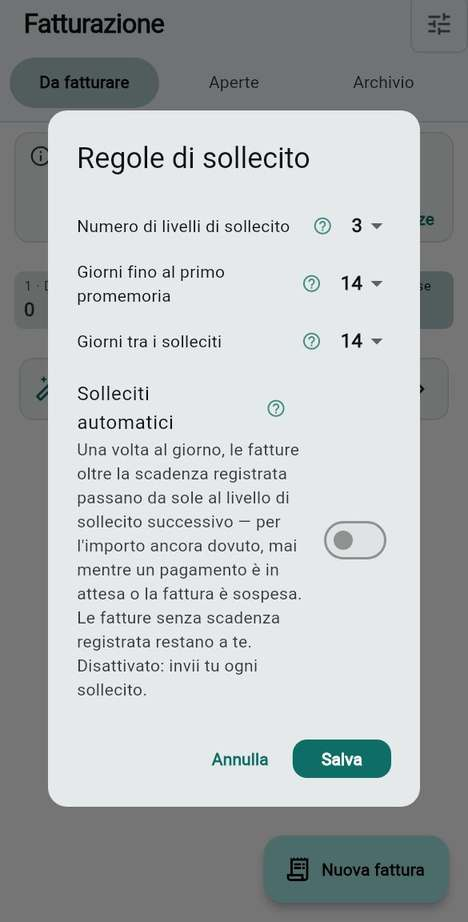

**Passaggi**

1. Apra **Regole di sollecito** negli strumenti di Fatturazione.
2. Attivi **Solleciti automatici**.
3. Tocchi **Salva**.

**Da sapere**

- Una volta al giorno, le fatture oltre il termine di pagamento registrato ricevono il livello successivo, per l'importo ancora da pagare.
- Mai mentre un pagamento è in sospeso o la fattura è sospesa. Le fatture senza termine registrato restano a Lei.
- Disattivati: invia Lei stesso ogni sollecito.
- Quando viene eseguito: ogni mattina sul server se l'installazione pianifica attività, altrimenti quando un amministratore apre Finanze. L'operatore del Suo server sa quale vale.

**Vedi anche:** [Regole di sollecito](#regole-di-sollecito)

<!-- anchor: user.invoicing.register -->
### Il registro fatture

**Destinatari:** Proprietario · Amministratore fatturazione

Tutte le fatture in un unico elenco ordinabile.

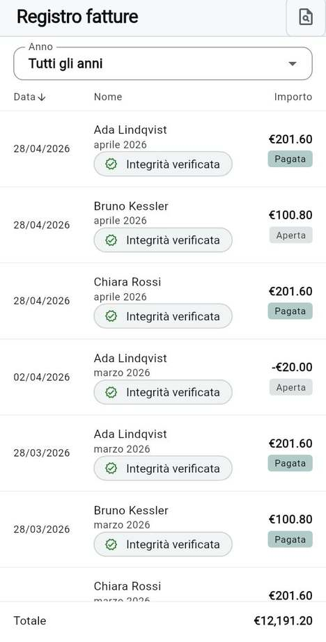

**Passaggi**

1. Apra [Registro fatture](https://fdittgen-png.github.io/deskilo/#/invoice-register).
2. Scelga l'**Anno** o **Tutti gli anni**.
3. Ordini per **Data**, **Nome** o **Importo**; il totale è in fondo.

**Da sapere**

- I membri vedono le proprie; chi emette fatture vede quelle dello spazio.
- L'esportazione contabile parte da qui.

**Vedi anche:** [Esportazioni contabili](#esportazioni-contabili)

<!-- anchor: user.invoicing.accounting-export -->
### Esportazioni contabili

**Destinatari:** Proprietario · Amministratore fatturazione

Consegna al Suo commercialista le fatture e i pagamenti dell'anno.

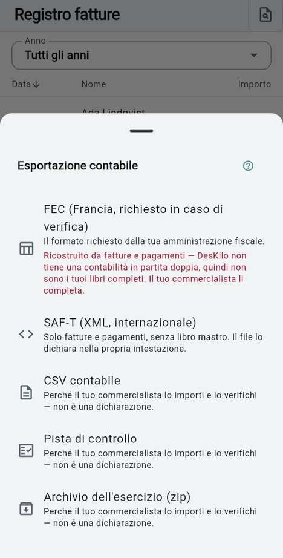

**Passaggi**

1. Apra [Registro fatture](https://fdittgen-png.github.io/deskilo/#/invoice-register) e tocchi **Esportazione contabile**.
2. In **Esportazione contabile**, scelga un formato, come **FEC (Francia, richiesto in caso di verifica)**, **SAF-T (XML, internazionale)**, **CSV contabile**, **Pista di controllo** o **Archivio dell'esercizio (zip)**. L'elenco dipende dal Suo Paese; alcuni Paesi aggiungono i propri, come **DATEV (Buchungsstapel)**.
3. In **Prima di salvare**, legga la verifica, poi tocchi **Salva file e rapporto**.

**Da sapere**

- Ogni formato dichiara ciò che sostiene. «Perché il tuo commercialista lo importi e lo verifichi — non è una dichiarazione» non è una dichiarazione dei redditi.
- DesKilo non tiene una contabilità in partita doppia: i file sono ricostruiti dalle fatture e dai pagamenti e il Suo commercialista li completa.
- Un file è bloccato finché non si risolvono i problemi nella fonte.
- Alcuni formati ricordano che DesKilo non è un software certificato nel Suo Paese.

**Vedi anche:** [Conto IVA](#conto-iva) · [Il registro fatture](#il-registro-fatture)

<!-- anchor: user.invoicing.bi -->
### Analisi aziendale

**Destinatari:** Proprietario · Amministratore fatturazione

Guarda come funziona lo spazio.

**Passaggi**

1. Apra [Analisi aziendale](https://fdittgen-png.github.io/deskilo/#/bi), oppure **Reportistica** nel menu.
2. Scelga la **Durata del periodo** (**Mese**, **Trimestre**, **Anno**), un confronto e, dove previsto, un raggruppamento.
3. Legga le analisi per area, come **Finanze** (**Fatturato**, **Incassato**) e **Spazi e capacità**.
4. Salvi una vista sotto **Viste**, oppure tocchi **Esporta in PDF**.

**Da sapere**

- Vede solo le analisi che ha il permesso di leggere.
- Incassato sono i pagamenti abbinati alle fatture. Non è un utile: nelle cifre non ci sono costi.
- Il periodo in corso è parziale; le sue cifre cambiano ancora.

**Vedi anche:** [La schermata Fatturazione](#la-schermata-fatturazione)

<!-- anchor: user.advanced.overview -->
## Avanzate

**Destinatari:** Proprietario · Operatore

Ciò che sta attorno al lavoro di ogni giorno: il lato di prova di uno spazio e quello reale, gli assistenti, il registratore di attività e le sue visite guidate, la demo, le app su ogni dispositivo e che cosa fare quando qualcosa non funziona.

In questo capitolo:
- [Uno spazio ha due lati](#uno-spazio-ha-due-lati) · [Entrare in un lato](#entrare-nel-lato-reale-o-in-quello-di-prova) · [Uno spazio di prova](#a-che-cosa-serve-uno-spazio-di-prova) · [Chi può distribuire](#chi-può-distribuire-ed-entrare-in-produzione) · [Distribuire tra i lati](#distribuire-tra-i-due-lati) · [Situazione dello spazio e archivio dell'esercizio](#situazione-dello-spazio-e-archivio-dellesercizio)
- [Il Suo server](#gestire-il-proprio-server)
- [Assistenti](#assistenti-che-cosa-sono) · [Collegare un assistente](#collegare-un-assistente) · [Approvazioni](#approvazioni-e-conferme-per-gli-assistenti) · [Che cosa possono fare gli assistenti](#che-cosa-possono-fare-gli-assistenti-in-uno-spazio)
- [Il registratore di attività](#il-registratore-di-attività-e-le-visite-guidate) · [Registrare un'attività](#registrare-unattività) · [Rivedere una registrazione](#rivedere-modificare-ed-esportare-una-registrazione) · [Creare una guida](#creare-una-guida-da-una-registrazione) · [Seguire una guida](#seguire-una-guida) · [Il menu circolare](#il-menu-circolare) · [Modificare una guida](#modificare-o-riparare-una-guida) · [Riservatezza delle registrazioni](#che-cosa-conserva-una-registrazione)
- [Lo spazio dimostrativo](#lo-spazio-dimostrativo) · [Modalità ripresa](#modalità-ripresa)
- [Piattaforme](#deskilo-sui-suoi-dispositivi) · [Dettagli per l'assistenza](#dettagli-per-lassistenza) · [Quando qualcosa non funziona](#quando-qualcosa-non-funziona)
- [Le parole dell'app](#le-parole-dellapp) · [Accessibilità e tastiera](#accessibilità-e-tastiera) · [Altro aiuto](#dove-trovare-altro-aiuto)

<!-- anchor: user.advanced.environments -->
### Uno spazio ha due lati

**Destinatari:** Proprietario

Vuole un posto dove provare senza toccare le prenotazioni e le fatture reali. Uno spazio può essere una coppia: un lato di prova e un lato reale, con lo stesso nome.

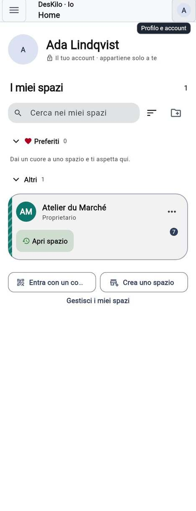

**Passaggi**

1. Quando crea uno spazio, lasci spuntato **Crea la coppia sviluppo e produzione**. Entrambi i lati Le appartengono fin dal primo secondo.
2. Ha già uno spazio isolato? Apra [Impostazioni](https://fdittgen-png.github.io/deskilo/#/settings), vada a **Governance** e tocchi **Crea il suo gemello**. La configurazione viene copiata una sola volta.
3. Da quel momento i due lati sono indipendenti. Solo una distribuzione sposta qualcosa dall'uno all'altro.

**Da sapere**

- Il lato di sviluppo si chiama **Sviluppo — per provare**. Il lato di produzione è **Produzione — le fatture sono dovute**.
- Ogni documento stampato sul lato di sviluppo porta una filigrana, così non può essere scambiato per uno reale.
- **Crea il suo gemello** compare solo quando la funzione **Coppie di ambienti** è attiva, e solo per il proprietario. Il rilascio tra i due lati spetta a chi ha i permessi di rilascio.
- Membri, prenotazioni, fatture e pagamenti non vengono mai copiati tra i lati.

**Vedi anche:** [Entrare in un lato](#entrare-nel-lato-reale-o-in-quello-di-prova) · [Uno spazio di prova](#a-che-cosa-serve-uno-spazio-di-prova)

<!-- anchor: user.advanced.enter-environment -->
### Entrare nel lato reale o in quello di prova

**Destinatari:** Tutti

Vuole aprire uno spazio dal lato che Le serve. Il Suo account vede entrambi i lati di una coppia, ciascuno con il proprio pulsante.

**Passaggi**

1. Apra [Io](https://fdittgen-png.github.io/deskilo/#/me) e trovi lo spazio sotto **I miei spazi**.
2. Tocchi **Apri spazio** per il lato reale, oppure **Spazio di prova** per il lato su cui esercitarsi.
3. Oppure apra [Profili](https://fdittgen-png.github.io/deskilo/#/profiles): la coppia è una sola scheda. La tocchi, poi **Scegli un ambiente** tra **DEV** e **PROD**.

**Da sapere**

- Un lato in cui non può entrare è in grigio e non fa nulla.
- Chi è membro del lato reale è sempre membro anche del lato di prova.
- Il pulsante di prova riporta il suggerimento «Spazio di prova: prenotazioni e fatture di prova»; quello reale «Prenotazioni e fatture reali».

**Vedi anche:** [Chi può distribuire](#chi-può-distribuire-ed-entrare-in-produzione)

<!-- anchor: user.advanced.test-space -->
### A che cosa serve uno spazio di prova

**Destinatari:** Proprietario

Sta per cambiare prezzi, regole o la piantina e vuole vedere prima l'effetto. Lo faccia sullo spazio di prova.

**Passaggi**

1. Entri nel lato di prova con **Spazio di prova**.
2. Configuri, importi un file dello spazio, inviti un collega, emetta una fattura di prova, sposti i posti, stampi.
3. Quando tutto è a posto, [lo distribuisca sul lato reale](#distribuire-tra-i-due-lati).

**Da sapere**

- L'interruttore **Tipo di spazio** in [Impostazioni](https://fdittgen-png.github.io/deskilo/#/settings) (sotto **Governance**) indica di che tipo è uno spazio. Lo vedono solo i proprietari.
- Dichiarare uno spazio di produzione fa comparire **Dichiarare questo spazio di produzione?** — il banner scompare e i documenti perdono la filigrana. Le fatture già emesse conservano la filigrana che avevano.
- Dichiari la produzione solo quando le fatture che escono dallo spazio sono davvero dovute.
- Quando invita qualcuno, può scegliere se raggiunge anche lo spazio di produzione: **Spazio di prova** o **Spazio di produzione**. In ogni caso la persona entra nello spazio di prova.

**Vedi anche:** [Uno spazio ha due lati](#uno-spazio-ha-due-lati)

<!-- anchor: user.advanced.deploy-permissions -->
### Chi può distribuire ed entrare in produzione

**Destinatari:** Proprietario · Comproprietario

Decide chi può toccare il lato reale. Lo controllano tre permessi nella matrice dei ruoli.

**Passaggi**

1. Apra [Ruoli](https://fdittgen-png.github.io/deskilo/#/roles).
2. Trovi **Entrare nello spazio di produzione**, **Distribuire in sviluppo** e **Distribuire in produzione**.
3. Attivi ciascuno per i ruoli che ne hanno bisogno.

**Da sapere**

- Proprietari e comproprietari li hanno tutti e tre. Gli amministratori hanno **Distribuire in sviluppo** ed **Entrare nello spazio di produzione**. I membri non ne hanno nessuno finché Lei non glielo concede.
- Chi può distribuire in produzione può sempre distribuire in sviluppo.
- Un ruolo entra nel lato di produzione solo finché possiede **Entrare nello spazio di produzione**: altrimenti un invito o un'adesione alla produzione viene rifiutato e l'app ne spiega il motivo.

**Vedi anche:** [La matrice dei ruoli](#la-matrice-dei-ruoli) · [Distribuire tra i lati](#distribuire-tra-i-due-lati)

<!-- anchor: user.advanced.deploy -->
### Distribuire tra i due lati

**Destinatari:** Proprietario · Comproprietario · Amministratore

Ha messo a punto la configurazione su un lato e vuole che l'altro la riceva.

**Passaggi**

1. Si posizioni sul lato che vuole scrivere e apra [Impostazioni](https://fdittgen-png.github.io/deskilo/#/settings) → **Governance** → [Distribuzione](https://fdittgen-png.github.io/deskilo/#/deployment).
2. Spunti ciò che deve viaggiare. Le entità sono raggruppate in **Configurazione**, **Dati anagrafici** e **Report**; ciò che un'entità **richiede** viene spuntato insieme a essa.
3. Tocchi **Tira da PROD…** (dal lato di sviluppo) o **Tira da DEV…** (dal lato di produzione).
4. Legga l'anteprima: **Cosa cambia sul lato produzione**, oppure sul lato di sviluppo. Quando i due lati coincidono, riporta **Nessuna modifica**.
5. Confermi. La domanda indica il lato che viene scritto: **Distribuire in questo DEV?** oppure **Distribuire in questo PROD?**

**Da sapere**

- Una distribuzione va sempre nel lato su cui si trova. Nulla può essere spinto per errore sull'altro lato.
- Ogni distribuzione finisce nel **Giornale**. **Torna indietro** sull'ultima ripristina ciò che il lato conteneva prima.
- Le piantine vengono unite: ciò che c'è solo su questo lato viene conservato, perché un posto può avere una prenotazione. I tag dei badge non viaggiano mai.
- Membri, prenotazioni, fatture, pagamenti, eventi e credenziali non viaggiano mai.
- La voce compare solo quando la funzione **Distribuzioni** è attiva, lo spazio ha un gemello e Lei possiede un permesso di distribuzione.

**Vedi anche:** [Chi può distribuire](#chi-può-distribuire-ed-entrare-in-produzione)

<!-- anchor: user.advanced.status-archive -->
### Situazione dello spazio e archivio dell'esercizio

**Destinatari:** Proprietario · Amministratore · Amministratore fatturazione

Vuole un colpo d'occhio su ciò che lo spazio ha fatturato e incassato, e un file completo dell'anno per i Suoi archivi.

**Passaggi**

1. Apra [Situazione dello spazio](https://fdittgen-png.github.io/deskilo/#/money/status). Scelga i mesi in **Dal** e **Al**.
2. Legga **Fatturato**, **Note di credito**, **Pagamenti abbinati**, **Pagamenti ricevuti**, **Spese rimborsate**, **Spese ripartite** e **Crediti concessi**; **Netto** li riassume. Tocchi la stampante per **Stampa la situazione**.
3. Per il file annuale, scelga **Archivio dell'esercizio (zip)** nelle esportazioni delle fatture.

**Da sapere**

- **Netto** non è né un utile né un saldo bancario. I pagamenti abbinati e quelli ricevuti si sovrappongono, quindi non li sommi.
- La situazione compare quando la funzione **Situazione dello spazio** è attiva.
- Uno spazio di sviluppo produce file contrassegnati DEV: non sono la contabilità reale.

**Vedi anche:** [Report dello spazio](#report-dello-spazio)

<!-- anchor: user.advanced.own-server -->
### Gestire il proprio server

**Destinatari:** Operatore · Proprietario

Vuole i dati della Sua comunità su un server che controlla, oppure appartiene a un'organizzazione che ne gestisce uno.

**Passaggi**

1. Legga come si configura un server in [Come gestire il proprio](#come-gestire-il-proprio).
2. Su ogni dispositivo, indirizzi l'app verso di esso: [Il Suo server](#il-suo-server).
3. Controlli [Io](https://fdittgen-png.github.io/deskilo/#/me) → **Dove si trovano i miei spazi**: elenca i server usati da questo account.

**Da sapere**

- L'app punta a un solo server per l'accesso; **Questo dispositivo usa** indica quale. Gli altri server a cui appartiene compaiono sotto **Dove si trovano i miei spazi**.
- Un invito viene verificato solo sul proprio server, quindi si unisca a uno spazio mentre l'app punta al server che lo ha emesso.
- Un operatore può attivare gli assistenti per l'intera installazione — veda [Approvazioni](#approvazioni-e-conferme-per-gli-assistenti).

**Vedi anche:** [Il Suo server](#il-suo-server)

<!-- anchor: user.advanced.assistants -->
### Assistenti: che cosa sono

**Destinatari:** Tutti

Un assistente di intelligenza artificiale come Claude o ChatGPT può controllare e prenotare per Lei in DesKilo. Agisce a Suo nome, solo negli spazi e per le azioni che approva.

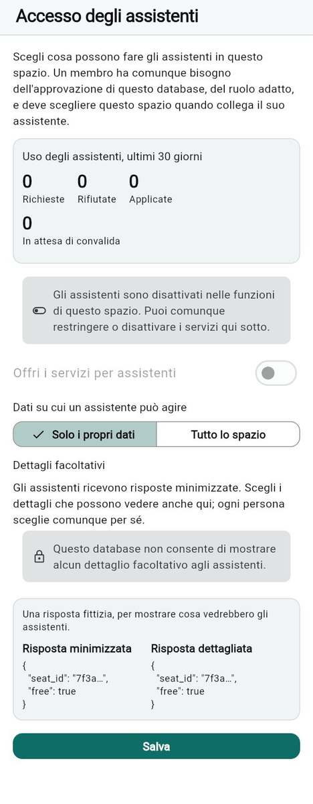

**Passaggi**

1. Apra [Assistenti](https://fdittgen-png.github.io/deskilo/#/assistants). **A che punto è qui** elenca ciò che ancora manca: **Accesso con Google**, **Identità per gli assistenti**, **Approvazione del database**, **Offerta dello spazio di lavoro**, **Il suo ruolo**, **Il suo consenso**, **Server**.
2. Scorra l'elenco; ogni riga dice chi compie il passo successivo.

**Da sapere**

- Partecipano più persone: Lei, il proprietario o un amministratore dello spazio, un amministratore del database e l'operatore dell'installazione. Nessuno da solo può aprire tutto.
- Attivare gli assistenti non concede nulla a nessuno di per sé.
- Sotto **Assistenti collegati** vede che cosa è collegato e può **Disconnetti**. **Il suo uso degli assistenti oggi** conta **Richieste**, **Rifiutate**, **Applicate** e **In attesa di convalida**.

**Vedi anche:** [Collegare un assistente](#collegare-un-assistente)

<!-- anchor: user.advanced.assistants-connect -->
### Collegare un assistente

**Destinatari:** Membro · Amministratore · Proprietario

Vuole che il Suo assistente lavori con le Sue prenotazioni e il Suo account.

**Passaggi**

1. Apra [Collegare un assistente](https://fdittgen-png.github.io/deskilo/#/assistants/connect). Sotto **Prima di collegare**, ogni riga dovrebbe riportare **Fatto**.
2. Sotto **Quale assistente usa?**, scelga **Claude**, **Claude Code**, **ChatGPT**, **Cursor**, **VS Code** o **Altro**. Copi **Il suo indirizzo DesKilo per gli assistenti** al suo interno come indicano i passaggi.
3. Acceda quando l'assistente lo chiede, poi scelga questo spazio e che cosa l'assistente può farvi.
4. Tocchi **Prova la connessione** e chieda al Suo assistente: «Con DesKilo, quali sono le mie prenotazioni di questa settimana?»

**Da sapere**

- È l'assistente stesso a chiederLe di approvare lo spazio e ogni tipo di operazione; nulla viene scelto al Suo posto.
- Il collegamento richiede la funzione **Interfaccia MCP** nello spazio. Se è disattivata, la schermata Le indica Assistenti.
- Non funziona? **Prova la connessione** dice che cosa sta ancora aspettando.
- **Disconnetti** rimuove l'assistente da ogni spazio di questo database. Ciò che ha già letto non viene ritirato.

**Vedi anche:** [Approvazioni](#approvazioni-e-conferme-per-gli-assistenti)

<!-- anchor: user.advanced.assistants-approve -->
### Approvazioni e conferme per gli assistenti

**Destinatari:** Proprietario · Operatore

Gli assistenti sono approvati a livelli, così una persona non può attivarne uno da sola.

**Passaggi**

1. Il proprietario dello spazio (o chi gestisce le integrazioni) apre [Configurazione degli assistenti](https://fdittgen-png.github.io/deskilo/#/settings/assistant-setup) e la percorre: **Attivi gli assistenti per questo spazio di lavoro**, **Scelga cosa possono fare gli assistenti**.
2. Ogni membro chiede una volta: **Chiedi l'approvazione**. Un amministratore del database decide in [Approvazioni degli assistenti](https://fdittgen-png.github.io/deskilo/#/database/assistant-approvals) con **Approva** o **Rifiuta**.
3. L'operatore dell'installazione apre [Installazione: assistenti](https://fdittgen-png.github.io/deskilo/#/installation/assistants) e tocca **Attiva per tutti gli spazi**. La pagina elenca anche **Amministratori della base** e **Client degli assistenti**, ciascuno **Approvato**, **Bloccato** oppure **In attesa di approvazione**.
4. Quando un assistente invia una richiesta ad alto impatto, Le viene chiesto: **Conferma una richiesta dell'assistente**. **Conferma** gli permette di inviare quella richiesta esatta una sola volta; **Rifiuta** non fa nulla.

**Da sapere**

- Le approvazioni e le modifiche dell'installazione richiedono il Suo secondo fattore.
- L'approvazione scade; la schermata indica i giorni rimanenti e Lei chiede di nuovo.
- Una richiesta confermata segue comunque le regole di convalida dello spazio.
- Senza un altro amministratore del database, l'operatore approva l'accesso, con un motivo, per un massimo di 30 giorni.

**Vedi anche:** [Che cosa possono fare gli assistenti](#che-cosa-possono-fare-gli-assistenti-in-uno-spazio)

<!-- anchor: user.advanced.assistants-policy -->
### Che cosa possono fare gli assistenti in uno spazio

**Destinatari:** Proprietario · Amministratore

Decide quali servizi uno spazio offre agli assistenti.

**Passaggi**

1. Apra [Accesso degli assistenti](https://fdittgen-png.github.io/deskilo/#/settings/assistants).
2. Attivi **Offri i servizi per assistenti**.
3. Sotto **Dati su cui un assistente può agire**, scelga **Solo i propri dati** o **Tutto lo spazio**.
4. Spunti le operazioni, per gruppi: **Prenotazioni e conto personali**, **Richieste finanziarie**, **Richieste di iscrizione**, **Convalide**.
5. Tocchi **Salva**.

**Da sapere**

- Le operazioni si leggono come «Vedere i posti liberi», «Prenotare un posto per te», «Registrare il tuo arrivo» o «Annullare le tue prenotazioni non ancora iniziate».
- Gli assistenti ricevono risposte ridotte al minimo. **Dettagli facoltativi** permette di consentirne di più; ogni persona sceglie comunque per sé.
- Gli assistenti già collegati ricevono nuovi servizi solo quando ogni persona approva di nuovo.
- Attivi prima la funzione **Interfaccia MCP** in [Funzionalità](https://fdittgen-png.github.io/deskilo/#/features). È disattivata per impostazione predefinita.
- È riservato a chi possiede il permesso sulle integrazioni; i proprietari lo hanno sempre.

**Vedi anche:** [Un interruttore di funzione](#un-interruttore-di-funzionalità)

<!-- anchor: user.advanced.recorder -->
### Il registratore di attività e le visite guidate

**Destinatari:** Tutti

Vuole mostrare a qualcuno come si svolge un'attività, o che La si guidi. Registri l'attività una volta, la trasformi in una guida e la segua passo dopo passo sull'app reale.

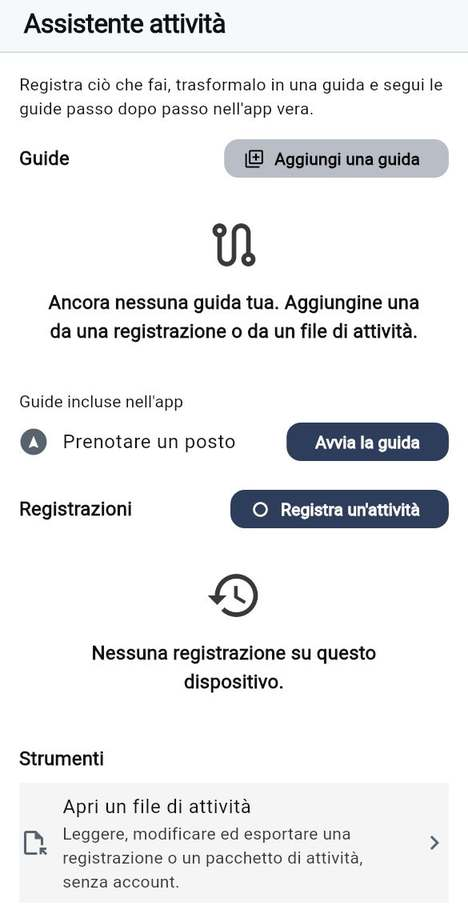

**Passaggi**

1. Apra la [Procedura guidata delle attività](https://fdittgen-png.github.io/deskilo/#/task-wizard): nel menu su uno schermo largo, oppure sotto **Avanzate** in [Io](https://fdittgen-png.github.io/deskilo/#/me).
2. **Guide** contiene le Sue guide e quelle fornite con l'app, come **Prenota un posto**.
3. **Registrazioni** elenca le attività che ha registrato e **Registra un'attività** ne avvia una nuova.
4. **Strumenti** apre un file di attività senza account.

**Da sapere**

- Tutto resta sul Suo dispositivo finché non lo esporta.
- Il registratore di attività è una funzione (**Registratore di attività**). Quando è disattivata, l'assistente di attività non compare nei menu.
- Deve aver effettuato l'accesso per registrare o seguire una guida.

**Vedi anche:** [Registrare un'attività](#registrare-unattività) · [Seguire una guida](#seguire-una-guida)

<!-- anchor: user.advanced.recorder-record -->
### Registrare un'attività

**Destinatari:** Tutti

Vuole catturare ciò che fa, perché diventi un documento o una guida.

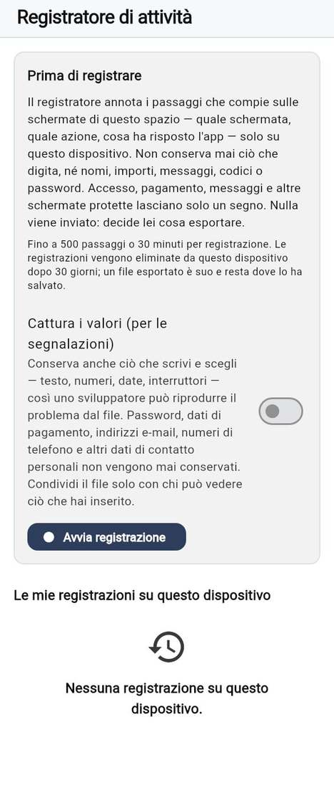

**Passaggi**

1. Nel [Registratore di attività](https://fdittgen-png.github.io/deskilo/#/task-recorder), legga **Prima di registrare**.
2. Tocchi **Avvia registrazione**.
3. Svolga l'attività come al solito, su qualsiasi schermata dello spazio o di [Io](https://fdittgen-png.github.io/deskilo/#/me).
4. Usi la barra che riporta **Registrazione in corso** per **Pausa**, **Riprendi**, **Aggiungi una nota** o **Ferma**.

**Da sapere**

- Una registrazione dura fino a 500 passaggi o 30 minuti e viene eliminata dal dispositivo dopo 30 giorni. Un file esportato resta dove l'ha salvato.
- Ogni passaggio indica la schermata, l'azione e ciò che l'app ha risposto, come **Prenotato** o **Rifiutato**.
- Accesso, pagamento, messaggi e altre schermate protette lasciano soltanto un segnaposto.
- Se passa a un altro account o a un altro spazio, la registrazione termina.

**Vedi anche:** [Riservatezza delle registrazioni](#che-cosa-conserva-una-registrazione)

<!-- anchor: user.advanced.recorder-review -->
### Rivedere, modificare ed esportare una registrazione

**Destinatari:** Tutti

Vuole controllare ciò che è stato catturato prima di condividerlo.

**Passaggi**

1. Nella [Procedura guidata delle attività](https://fdittgen-png.github.io/deskilo/#/task-wizard), tocchi una registrazione sotto **Registrazioni**.
2. Legga i passaggi. Tocchi **Escludi dall'esportazione** su ogni passaggio che non vuole; **Reinserisci** lo riporta.
3. Guardi **Cosa conterrà il file**.
4. Scelga **Esporta un file**, **Esporta un pacchetto dell'attività** o **Esporta come documento Word**.

**Da sapere**

- Escludere un passaggio cambia solo l'esportazione. La registrazione sul dispositivo resta invariata.
- Per leggere il file di un'altra persona, usi **Apri un file di attività** nel [Banco di lavoro delle attività](https://fdittgen-png.github.io/deskilo/#/task-workbench). Nulla viene caricato e non serve alcun account.
- Un file danneggiato o creato da una versione più recente viene rifiutato con un messaggio semplice.
- **Elimina da questo dispositivo** rimuove la registrazione; i file esportati non vengono toccati.

**Vedi anche:** [Creare una guida](#creare-una-guida-da-una-registrazione)

<!-- anchor: user.advanced.guide-make -->
### Creare una guida da una registrazione

**Destinatari:** Tutti

Vuole che altri seguano un'attività che ha registrato.

**Passaggi**

1. Nella [Procedura guidata delle attività](https://fdittgen-png.github.io/deskilo/#/task-wizard), tocchi **Crea una guida** accanto a una registrazione. Oppure scelga **Aggiungi una guida** → **Da una delle mie registrazioni** o **Da un file o pacchetto di attività**.
2. Controlli la bozza. Ogni passaggio è scritto come lo vedrà il lettore.
3. Le dia un nome sotto **Nome della guida**.
4. Tocchi **Aggiungi alle mie guide**.

**Da sapere**

- La guida resta sul Suo dispositivo sotto **Guide**. Una guida si può modificare o eliminare: **Elimina questa guida** non tocca la sua registrazione.
- Un passaggio che prenota attende la risposta reale. Nulla viene fatto al posto del lettore.
- **Salva la guida** la scrive in un file che può consegnare.

**Vedi anche:** [Modificare una guida](#modificare-o-riparare-una-guida)

<!-- anchor: user.advanced.guide-play -->
### Seguire una guida

**Destinatari:** Tutti

Vuole essere accompagnato in un'attività sulle schermate reali.

**Passaggi**

1. Nella [Procedura guidata delle attività](https://fdittgen-png.github.io/deskilo/#/task-wizard), tocchi **Avvia la guida** accanto a una delle guide.
2. Un pannello mostra Passo 1 di … e che cosa fare, ad esempio «Tocca “Prenota”.» oppure «Compila “…”, poi esci dal campo.»
3. Tocchi **Apri ed evidenzia** per andare alla schermata giusta e vedere il comando segnalato.
4. Esegua il passaggio da sé. La guida se ne accorge e va avanti. Per un passaggio di sola lettura, tocchi **Fatto**.

**Da sapere**

- Usi **Indietro** e **Salta**, e apra **Tutti i passi** per vedere ciascuno come **Da fare**, **In attesa**, **Fatto**, **Preso atto** o **Saltato**.
- Un passaggio che prenota attende la risposta: **In attesa del risultato…**. Se viene rifiutato, la guida dice che cosa provare; se non è arrivata alcuna risposta, Le chiede di verificare prima di riprovare.
- **Interrompi la guida** la termina. Nulla viene annullato.
- La guida si mette in pausa quando cambia l'account o lo spazio, oppure quando il registratore di attività viene disattivato.

**Vedi anche:** [Il menu circolare](#il-menu-circolare)

<!-- anchor: user.advanced.guide-circle -->
### Il menu circolare

**Destinatari:** Tutti

Le serve tutto lo schermo per lavorare, ma vuole la guida a portata di mano. La riduca.

**Passaggi**

1. Nel pannello della guida, tocchi **Riduci la guida**. Si restringe in un piccolo cerchio.
2. Tocchi il cerchio per un menu: Mostra la guida (passo … di …), **Apri ed evidenzia**, un pulsante verso la pagina del passaggio, **Fatto**, **Salta**, **Indietro**, **Riprendi** e **Interrompi la guida**.
3. Scelga **Mostra la guida** per riaprire il pannello.

**Da sapere**

- Il menu offre solo ciò che ha senso adesso: **Riprendi** solo in pausa, **Fatto** solo per un passaggio di sola lettura.
- **Chiudi** nel pannello lo nasconde; la guida resta dov'era.
- Apri ed evidenzia porta alla pagina del passaggio e indica il comando; il pulsante della pagina porta soltanto alla pagina.

**Vedi anche:** [Seguire una guida](#seguire-una-guida)

<!-- anchor: user.advanced.guide-edit -->
### Modificare o riparare una guida

**Destinatari:** Tutti

Una guida si legge male, oppure un passaggio rimanda alla pagina sbagliata. La corregga nella bozza.

**Passaggi**

1. Nella [Procedura guidata delle attività](https://fdittgen-png.github.io/deskilo/#/task-wizard), tocchi **Modifica** accanto alla Sua guida.
2. Su un passaggio, tocchi **Scrivi il testo** e digiti il Suo testo.
3. Sotto **Destinazione del passaggio**, scelga la pagina a cui il passaggio si riferisce. Tocchi **Apri ed evidenzia** per verificare.
4. Attivi **Il lettore può saltarlo** per un passaggio facoltativo.
5. Tocchi **Salva le modifiche**.

**Da sapere**

- Un passaggio contrassegnato **Un'istruzione ancora da scrivere** richiede le Sue parole. **Un passaggio che il registratore non sa descrivere** ed **Esegua questo passaggio da sé** li esegue il lettore.
- I passaggi su schermate protette, come il pagamento, chiedono al lettore di eseguirli da solo.
- Non può far attendere a una guida un esito che la sua azione non ha; quella parte è fissa.
- Una guida che nomina passaggi sconosciuti a questa versione si può leggere, non seguire.

**Vedi anche:** [Creare una guida](#creare-una-guida-da-una-registrazione)

<!-- anchor: user.advanced.recorder-privacy -->
### Che cosa conserva una registrazione

**Destinatari:** Tutti

Vuole sapere esattamente che cosa non lascia traccia.

**Passaggi**

1. Apra il [Registratore di attività](https://fdittgen-png.github.io/deskilo/#/task-recorder).
2. Legga **Prima di registrare**.
3. Lasci disattivato **Cattura i valori (per le segnalazioni)**, a meno che uno sviluppatore non lo abbia chiesto.

**Da sapere**

- Normalmente una registrazione non conserva mai ciò che digita, nomi, importi, messaggi, codici o password.
- Con **Cattura i valori** attivo, conserva anche ciò che digita e sceglie, così uno sviluppatore può riprodurre un problema. Password, dati di pagamento, indirizzi e-mail e numeri di telefono non vengono comunque mai conservati. L'esportazione chiede **Questa registrazione contiene valori**.
- Nulla viene caricato: decide Lei che cosa esportare.
- Condivida un file solo con chi può vedere ciò che ha inserito.

**Vedi anche:** [Registrare un'attività](#registrare-unattività)

<!-- anchor: user.advanced.demo -->
### Lo spazio dimostrativo

**Destinatari:** Tutti

Vuole dare un'occhiata prima di impegnarsi. La demo è uno spazio inventato, aperto a chiunque, senza account.

**Passaggi**

1. Nella schermata di accesso, tocchi **Esplora lo spazio dimostrativo**.
2. Legga la breve nota, poi tocchi **Inizia**.
3. Usi **Vedi come** per vedere lo stesso spazio come **Proprietario**, **Amministratore** o **Membro**.
4. Tocchi **Reimposta la demo** per riportarla all'inizio, oppure **Esci dalla demo**.

**Da sapere**

- Tutto è inventato: persone, prenotazioni e conti. Nulla raggiunge uno spazio reale e nulla lascia il Suo dispositivo.
- Un banner riporta **Demo** su ogni schermata.
- Chiudendo l'app la sessione viene dimenticata.
- L'offerta compare solo quando la funzione **Lo spazio dimostrativo** è attiva.

**Vedi anche:** [Modalità ripresa](#modalità-ripresa)

<!-- anchor: user.advanced.filming -->
### Modalità ripresa

**Destinatari:** Proprietario

Deve mostrare il Suo spazio reale — in un video, in un'immagine o in un intervento — senza mostrarne i membri.

**Passaggi**

1. Apra [Funzionalità](https://fdittgen-png.github.io/deskilo/#/features) e cerchi **Modalità ripresa**.
2. La attivi. Un banner riporta **Modalità ripresa — persone inventate** su ogni schermata.
3. Giri. Quando ha finito, la disattivi di nuovo.

**Da sapere**

- Ogni nome, e-mail, numero di telefono, indirizzo e fotografia diventa una persona inventata, la stessa ovunque. La piantina, le prenotazioni e le cifre restano reali.
- Finché è attiva, i moduli di identità rifiutano di salvare, così i dati inventati non possono sovrascrivere quelli reali.
- Non può nascondere ciò che qualcuno ha digitato, come un messaggio o l'etichetta di un posto. Legga la schermata prima di girare.
- Per un'immagine che non deve riguardare questo spazio, usi [la demo](#lo-spazio-dimostrativo).

**Vedi anche:** [Un interruttore di funzione](#un-interruttore-di-funzionalità)

<!-- anchor: user.advanced.platforms -->
### DesKilo sui Suoi dispositivi

**Destinatari:** Tutti

Vuole usare DesKilo dove lavora. Lo stesso account e gli stessi dati La seguono.

**Passaggi**

1. **Android:** si unisca al test chiuso su Google Play.
2. iPhone e iPad: si unisca alla beta tramite TestFlight.
3. **Computer:** un'immagine disco per macOS o un programma di installazione per Windows dalla pagina delle versioni; oppure apra semplicemente l'app web.
4. **Browser:** apra l'indirizzo che il Suo spazio pubblica. Non c'è nulla da installare.

**Da sapere**

- Una scrivania prenotata su un telefono compare un attimo dopo in una scheda del browser.
- L'immagine disco per macOS dalla pagina delle versioni è firmata e notarizzata da Apple; la apra normalmente.
- Il programma di installazione per Windows non è firmato: Windows SmartScreen segnala un editore sconosciuto; scelga Ulteriori informazioni, poi Esegui comunque.
- La lettura del tag di una sedia funziona nei browser Chromium su Android (servono HTTPS e un tocco); le app Android e iPhone leggono i tag direttamente.
- Una build senza servizi Google e senza push dal cloud è preparata per F-Droid; se si può già installare da F-Droid lo indica la [pagina di stato F-Droid](https://github.com/fdittgen-png/deskilo/blob/master/docs/guides/fdroid.md#status). In essa le notifiche sono locali e la posta in arrivo fa fede.
- Gli aggiornamenti arrivano dal canale da cui ha installato: Google Play, TestFlight, la pagina delle versioni oppure ricaricando l'app web.

**Vedi anche:** [Il Suo badge](#il-suo-badge)

<!-- anchor: user.advanced.support -->
### Dettagli per l'assistenza

**Destinatari:** Tutti

Contatta l'assistenza e vuole inviare ciò che li aiuta, senza esporre nulla di privato.

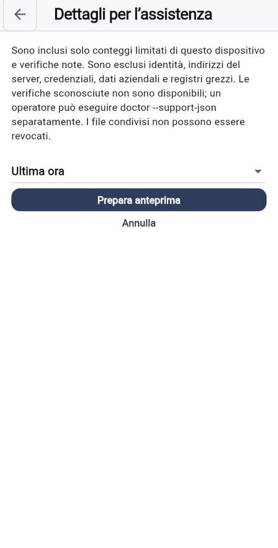

**Passaggi**

1. Apra [Aiuto](https://fdittgen-png.github.io/deskilo/#/help) e tocchi l'icona dell'assistenza (**Dettagli per l’assistenza**).
2. Scelga **Ultima ora** o **Ultime 24 ore**.
3. Tocchi **Prepara anteprima** e legga ciò che contiene: Anteprima: … byte.
4. Tocchi **Salva**, poi invii il file.

**Da sapere**

- Sono inclusi solo conteggi di eventi limitati e verifiche note. Identità, indirizzi di server, credenziali, dati aziendali e log grezzi sono esclusi.
- Un file condiviso non si può revocare.
- Se il contesto è cambiato, la schermata Le chiede di preparare una nuova anteprima.
- Un operatore può eseguire `doctor --support-json` per il lato server.

**Vedi anche:** [Quando qualcosa non funziona](#quando-qualcosa-non-funziona)

<!-- anchor: user.advanced.troubleshooting -->
### Quando qualcosa non funziona

**Destinatari:** Tutti

Qualcosa sembra sbagliato. Provi questi passaggi, in ordine.

**Passaggi**

1. Cerchi un messaggio sulla schermata; la maggior parte dice che cosa fare. «Qualcosa è andato storto. Riprova.» merita un nuovo tentativo.
2. Verifichi di trovarsi sul lato che crede: **Spazio di prova** o **Apri spazio** in [Io](https://fdittgen-png.github.io/deskilo/#/me).
3. Controlli [Funzionalità](https://fdittgen-png.github.io/deskilo/#/features): una funzione assente dal menu è di solito una funzione disattivata. Solo un proprietario può cambiarla.
4. Controlli il server sotto [Il Suo server](#il-suo-server): **Questo dispositivo usa** lo indica.
5. Prepari i [Dettagli per l'assistenza](#dettagli-per-lassistenza) e li invii.

**Da sapere**

- Ciò che vede dipende dal Suo ruolo: una schermata mancante può essere un permesso. Chieda al Suo proprietario.
- Gli amministratori possono attivare la **Modalità sviluppatore** sotto **Avanzate** in [Impostazioni](https://fdittgen-png.github.io/deskilo/#/settings). Aggiunge una schermata [Sviluppatore](https://fdittgen-png.github.io/deskilo/#/developer) dove **Esporta registro** e **Svuota registro** aiutano l'assistenza. Vale per ogni membro dello spazio.
- Può anche segnalare un bug dalla sezione Informazioni dell'app: **Segnala un bug / suggerisci una funzione**.
- Una guida bloccata su **In attesa del risultato…** significa che non è arrivata alcuna risposta: verifichi il risultato prima di riprovare.

**Vedi anche:** [Dettagli per l'assistenza](#dettagli-per-lassistenza)

<!-- anchor: user.advanced.glossary -->
### Le parole dell'app

**Destinatari:** Tutti

Le parole che incontra più spesso e che cosa significano qui.

| Parola | Che cosa significa |
|---|---|
| **Spazio** (detto anche spazio di coworking) | Un luogo gestito da una comunità: la sua piantina, i membri, le regole e il denaro. Può appartenere a più spazi. |
| **Io** | Il Suo account personale: profilo, messaggi, spazi e impostazioni, in tutti i Suoi spazi. |
| **Piantina** | La pianta da cui prenota, oppure un piano di abbonamento — veda **Membri e piani**. |
| **Piano** | Un piano o una zona della piantina. Un piano può essere prenotato per intero quando la funzione è attiva. |
| **Scrivania** | Un posto prenotabile. Uffici e sale raggruppano scrivanie. |
| **Mezza giornata** | L'unità in cui si contano prenotazioni e abbonamenti. |
| **Convalida** | Una regola che dice che un'azione richiede una o più conferme prima di contare. |
| **Eventi** | Il flusso di ciò che è accaduto, con in cima le decisioni che La attendono. |
| **Chiosco** | Un tablet condiviso all'ingresso dove le persone effettuano il check-in con un badge. |
| **Funzionalità** | Una funzione che il proprietario attiva o disattiva per l'intero spazio. |
| **Ruolo** | Ciò che una persona può fare in uno spazio. I permessi si impostano per ruolo. |
| **Ambiente** | Il lato di sviluppo (prova) o il lato di produzione (reale) di uno spazio. |
| **Gemello** | L'altro lato di una coppia. |
| **Distribuzione** | Spostare la configurazione da un lato di una coppia all'altro. |
| **Assistente** | Uno strumento di intelligenza artificiale collegato al Suo account, che agisce solo come Lei consente. |
| **Operatore** | La persona che gestisce l'installazione con cui l'app comunica. |

**Da sapere**

- I proprietari possono cambiare le parole usate da uno spazio sotto **Terminologia**; l'app mostra allora quelle proprie dello spazio.

**Vedi anche:** [Terminologia](#terminologia)

<!-- anchor: user.advanced.accessibility -->
### Accessibilità e tastiera

**Destinatari:** Tutti

Vuole che l'app si adatti al Suo modo di lavorare.

**Passaggi**

1. Scelga un aspetto sotto [Impostazioni](https://fdittgen-png.github.io/deskilo/#/settings): **Tema**, **Lingua**, **Numeri e date**.
2. Per schermate più calme, attivi l'impostazione di movimento ridotto del Suo dispositivo.
3. Su un computer, prema Esc in una procedura guidata per tornare indietro.

**Da sapere**

- L'impostazione di movimento ridotto del dispositivo prevale sempre sulla funzione **Animazioni dell'interfaccia**; anche un proprietario può disattivare quella funzione.
- Uscire da una procedura guidata con modifiche non salvate chiede prima conferma: **Continua a modificare** o **Scarta**.
- I comandi hanno etichette di testo, così uno screen reader li annuncia.
- Sul web e su un computer, una finestra ampia mostra il menu accanto al contenuto.

**Vedi anche:** [Tema](#tema) · [Lingua dell'app](#lingua-dellapp)

<!-- anchor: user.advanced.help -->
### Dove trovare altro aiuto

**Destinatari:** Tutti

È bloccato su un campo o su una schermata.

**Passaggi**

1. Tocchi il **?** accanto a un campo: la guida si apre su quel campo.
2. Apra [Aiuto](https://fdittgen-png.github.io/deskilo/#/help) per l'intera guida; **Indice** porta a un capitolo.
3. I suggerimenti su una schermata si possono chiudere con **Nascondi suggerimento**; **Suggerimento successivo** e **Suggerimento precedente** li sfogliano, **Scopri di più** apre la guida.
4. Per rivedere i suggerimenti nascosti, usi **Mostra di nuovo i suggerimenti di aiuto** nelle Sue impostazioni.

**Da sapere**

- La guida funziona offline, nella Sua lingua.
- Il Suo amministratore può rispondere alle domande sul Suo spazio; i Dettagli per l'assistenza servono quando si tratta dell'app.

**Vedi anche:** [Ripristinare i suggerimenti](#ripristinare-i-suggerimenti) · [Dettagli per l'assistenza](#dettagli-per-lassistenza)
