# Guide de démarrage

**DesKilo — construisez votre espace, pas à pas.** Pour la personne qui s’apprête à créer un espace de coworking, la salle d’une association ou un bureau partagé, et qui veut savoir ce qui est possible, ce qui est nécessaire et dans quel ordre. *Autres langues : [English](Setup-Guide) · [Deutsch](Einrichtungsanleitung) · [Español](Guia-de-puesta-en-marcha) · [Italiano](Guida-di-avvio).*

<!-- anchor: setup.guide.how-to-read -->
## Comment utiliser ce guide

**Public:** Propriétaire · Copropriétaire · Administrateur·rice · Opérateur·rice

Ce guide explique le *pourquoi*, l’*ordre* et les *conséquences* de la mise en place d’un espace. Les clics eux-mêmes se trouvent dans le [Guide utilisateur](Guide-utilisateur#comment-utiliser-ce-guide) ; chaque section ci-dessous renvoie à l’endroit exact. L’exemple suivi tout au long est l’espace de démonstration, *Atelier du Marché*, à Pézenas : une association avec une salle, quelques bureaux et une adhésion mensuelle. Ses personnes et ses chiffres sont inventés.

*Trois niveaux, dans cet ordre*

| Niveau | Ce que vous faites | Combien de temps |
|---|---|---|
| *Ouvrir* | Un lieu, des horaires d’ouverture, les personnes qui valident, une invitation. À la fin, les membres peuvent réserver. | environ 20 minutes |
| *Faire vivre* | Des rôles, des tarifs, des paiements, des notifications. À la fin, l’espace vit au quotidien. | un après-midi, réparti sur plusieurs jours |
| *Développer* | Facturation et taxes, rapports, une borne à l’entrée, des statistiques, des assistants. Seulement quand vous en avez besoin. | le moment venu |

Seul le niveau *Ouvrir* est indispensable pour démarrer. Arrêtez-vous après n’importe quel niveau : rien ne vous oblige à continuer.

*Choisissez votre parcours*

| Vous voulez… | Commencez ici |
|---|---|
| Savoir ce que DesKilo sait faire et ce qu’il faut préparer | [Avant de commencer](#avant-de-commencer) |
| Un lieu que les membres peuvent réserver dès aujourd’hui | [Construire le lieu](#construire-le-lieu) |
| Dire qui peut faire quoi, et qui valide | [La matrice des rôles](Guide-utilisateur#la-matrice-des-rôles) |
| Faire payer l’adhésion | [Argent](#argent-et-fiscalité) |
| Informer les membres de ce qui se passe | [Notifications](#informer-les-gens) |
| Émettre des factures et déclarer la TVA | [Facturation](#facturer-à-la-main-ou-automatiquement) · [TVA](#la-tva-en-résumé) |
| Une tablette murale, des rapports ou des statistiques | [Borne](Guide-utilisateur#mode-borne--une-tablette-murale-pour-le-pointage) · [L’éditeur de rapports](Guide-utilisateur#léditeur-de-rapports) · [Statistiques d’activité](Guide-utilisateur#analyse-dactivité) |
| Laisser un assistant agir à votre place | [Assistants](Guide-utilisateur#les-assistants--ce-que-cest) |

*Deux compagnons*

- La page de l’assistant de configuration (`setup.html`) vous permet de tout préparer dans votre navigateur avant de toucher à l’application : les réponses sont enregistrées dans le navigateur, rien n’est envoyé ailleurs, et vous pouvez exporter un fichier que l’application lit. C’est le meilleur endroit pour réfléchir avec votre comptable. Voir [Préparer un espace avec le questionnaire de configuration](Guide-utilisateur#préparer-un-espace-avec-le-questionnaire-de-mise-en-place).

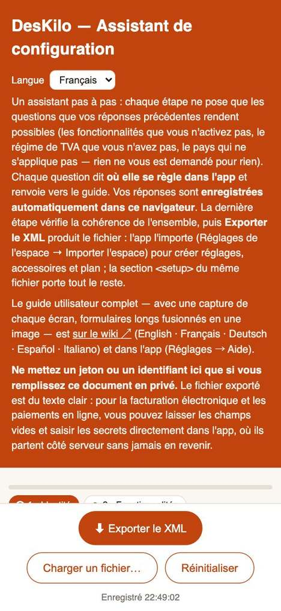

- L’**espace de démonstration** vous laisse vous exercer d’abord, sans rien risquer de réel. Voir [L’espace de démonstration](Guide-utilisateur#lespace-de-démonstration).

**Bon à savoir**

- Chaque section nomme son public à la deuxième ligne : vous passez ce qui ne vous concerne pas.
- Un bloc qui commence par **Attention** signale une décision qui devient difficile à défaire, et indique quand.
- Ce guide ne certifie rien sur le plan juridique ou fiscal : il dit ce que fait l’application et ce qu’il faut confirmer avec un comptable.

<!-- anchor: setup.before.overview -->
## Avant de commencer

Un peu de préparation vous épargne les deux choses qui coûtent le plus cher plus tard : ressaisir, et prendre des décisions qu’on ne peut plus défaire. Ce chapitre montre ce que fait DesKilo, ce dont vous avez vraiment besoin pour ouvrir, et ce qu’il faut avoir sous la main.

Dans ce chapitre :
- [Ce que sait faire DesKilo](#ce-que-sait-faire-deskilo)
- [Ce qui est nécessaire et ce qui est facultatif](#ce-qui-est-nécessaire-et-ce-qui-est-facultatif)
- [Un espace de test ou un espace réel](#un-espace-de-test-ou-un-espace-réel)
- [Partir d’un modèle ou de rien](#partir-dun-modèle-ou-de-rien)
- [Ce qu’il faut préparer](#ce-quil-faut-préparer)
- [Les décisions difficiles à défaire](#les-décisions-difficiles-à-défaire)
- [Qui fait quoi](#qui-fait-quoi)

<!-- anchor: setup.before.what -->
### Ce que sait faire DesKilo

**Public:** Propriétaire · Copropriétaire

Vous voulez une vue d’ensemble avant de choisir quoi que ce soit. DesKilo regroupe ses fonctionnalités en neuf processus ; l’écran **Fonctionnalités** montre une carte par processus, avec son état.

*Les neuf processus, en mots simples*

| Processus | Ce que cela apporte à un membre |
|---|---|
| **Espace et accès** | Une porte d’entrée : rejoindre l’espace avec son ID, un rôle, un badge. |
| **Gestion des lieux** | Un lieu qui ressemble au vrai : étages, salles, bureaux, horaires d’ouverture. |
| **Réservations et utilisation** | Réserver un bureau ou une salle, s’enregistrer à l’arrivée et au départ, voir ce qui est libre. |
| **Calendrier et coordination** | Un calendrier, des messages et des demandes que quelqu’un confirme. |
| **Offres aux membres** | Une formule, des prix de services et des accords. |
| **Facturation et paiements** | Un relevé, des factures, le paiement, des relances, la TVA. |
| **Documents et informations** | Des documents à lire, des rapports à imprimer, ses propres données à exporter. |
| **Exploitation et administration** | Un espace qui porte ses propres couleurs et ses propres mots. |
| **Intégrations et automatisation** | Des notifications et des documents envoyés par des services extérieurs. |

**Bon à savoir**

- Un nouvel espace démarre avec un ensemble raisonnable de fonctionnalités activées ; vous n’avez pas à les décider une par une. Désactiver une fonctionnalité arrête seulement les nouvelles opérations et ne supprime rien.
- Une fonctionnalité qui en nécessite une autre l’active avec elle, et l’écran nomme ce qui s’est activé. Voir [Un interrupteur de fonctionnalité](Guide-utilisateur#un-interrupteur-de-fonctionnalité).
- Les fonctionnalités marquées alpha ou bêta demandent votre consentement quand vous les activez.

**Voir aussi :** [Activer et désactiver des fonctionnalités](Guide-utilisateur#activer-ou-désactiver-des-processus-entiers)

<!-- anchor: setup.before.necessary -->
### Ce qui est nécessaire et ce qui est facultatif

**Public:** Propriétaire · Copropriétaire · Administrateur·rice

Vous voulez connaître le chemin le plus court vers un espace que l’on peut réserver. L’application tient une liste de préparation, **Mise en place de cet espace**, et, sur l’écran Réserver, dit aux propriétaires ce qui manque : *Avant que quiconque puisse réserver ici*.

*Ce qui doit exister avant la première réservation*

1. **Jours d’ouverture, fuseau horaire et devise** : un fuseau horaire, une devise et au moins un jour de la semaine ouvert.
2. **Places réservables sur le plan** : au moins une place.
3. **Rôles et validation des demandes** : compté seulement quand une règle de validation, de quelque nature qu’elle soit, demande plus de validateurs que l’espace n’en a. Une règle qui exige deux approbations alors que vous êtes seul dans l’espace laisserait les demandes en attente pour toujours.
4. **Ce que les membres peuvent faire** : les membres détiennent **Réserver et utiliser les réservations**. Un nouvel espace ne leur accorde rien : un membre qui rejoint l’espace ne peut pas réserver tant que vous ne l’avez pas coché dans [Rôles](https://fdittgen-png.github.io/deskilo/#/roles).

Une ligne de plus, **Serveur et version de la base**, ne bloque que si le serveur est en retard sur cette application ; elle attend alors l’opérateur du serveur. Et tant que **Factures** est activé, **L'identité légale et l'adresse de l'espace** est obligatoire aussi : la liste la marque **Nécessaire avant de facturer**, car aucune facture ne peut être émise sans elle.

*Ce qui est facultatif et peut attendre*

- **Formules d’adhésion et tarifs**
- **Inviter les premiers membres**
- **Comment les membres paient**
- **Export et restauration**
- **Informations requises par vos fonctionnalités (identité, banque, plateformes)**
- **Une première réservation**

Chacune de ces étapes peut être mise de côté avec **Plus tard** et reprise ensuite ; la liste indique si une étape est **À configurer**, **Prêt**, **Sans objet ici** ou **En attente d’une autre personne**. Deux autres états existent : **Pas encore vérifié** (**Export et restauration** ne passe à Prêt qu’après un vrai export au cours des 90 derniers jours) et une ligne qui n’a pas pu être lue.

**Bon à savoir**

- La liste nomme qui agit : **Vous**, **L’opérateur du serveur** ou **Un administrateur de la base**.
- Facultatif ne veut pas dire sans importance : des coordonnées bancaires, un prestataire de paiement ou un site sont des informations requises par vos fonctionnalités, et la liste les nomme.
- Si vous activez la facturation sans identité légale, l’application vous laisse faire ; la liste et [Ce qui vous attend](Guide-utilisateur#ce-qui-vous-attend) la signalent, et l’émission d’une facture est refusée, en disant ce qui manque.

**Voir aussi :** [Vérifier votre espace](#vérifier-votre-espace) · [La carte Premiers pas et les astuces](Guide-utilisateur#la-carte-premiers-pas-et-les-astuces)

<!-- anchor: setup.before.environment -->
### Un espace de test ou un espace réel

**Public:** Propriétaire · Copropriétaire · Opérateur·rice

Vous voulez essayer sans conséquence, puis faire tourner l’espace réel. Un espace peut être un test, un espace réel, ou une paire liée portant le même nom.

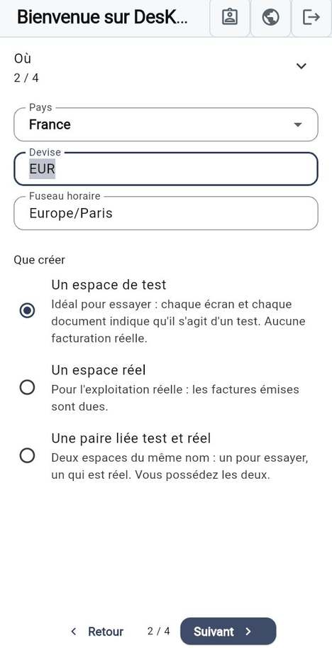

| Option | À choisir quand | Ce qui se passe |
|---|---|---|
| **Un espace de test** | Vous apprenez. | Chaque écran et chaque document indique qu’il s’agit d’un test : les documents portent un filigrane. Aucune facturation réelle. |
| **Un espace réel** | Vous connaissez vos réglages. | Les factures qu’il émet sont dues. |
| **Une paire liée test et réel** | Vous voulez répéter les changements avant que les vrais membres les voient. | Deux espaces, tous deux à vous. Seul un déploiement fait passer la configuration de l’un à l’autre ; les membres, réservations, factures et paiements ne voyagent jamais. |

**Bon à savoir**

- Le sélecteur démarre sur l’option test.
- L’environnement est une déclaration du propriétaire ; toute personne ayant la permission de configuration (le propriétaire, toujours) peut le changer plus tard, et les factures déjà émises gardent le filigrane qu’elles portaient. En cas de doute, commencez donc par un espace de test.
- Pour vous exercer sans espace à vous, utilisez l’espace de démonstration.

**Voir aussi :** [Un espace a deux faces](Guide-utilisateur#un-espace-a-deux-côtés) · [Créer un espace](Guide-utilisateur#créer-un-espace) · [Un espace de test](Guide-utilisateur#à-quoi-sert-un-espace-de-test)

<!-- anchor: setup.before.template -->
### Partir d’un modèle ou de rien

**Public:** Propriétaire

Vous voulez prendre de l’avance sans être enfermé dans les choix de quelqu’un d’autre. Quand vous créez un espace, **Partir de** propose **Espace vide** ou un modèle prêt à l’emploi, et préselectionne *A tiny space* ; choisissez *Espace vide* si vous voulez une page blanche.

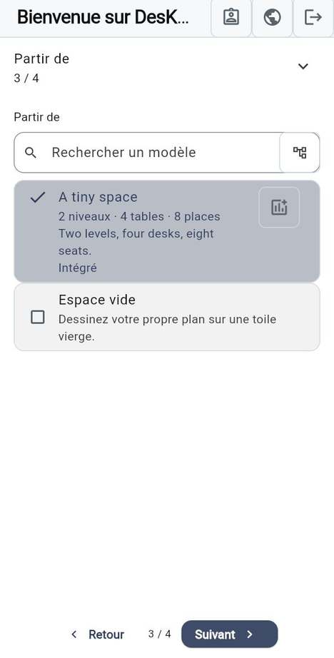

*Les deux modèles fournis*

| Modèle | Ce qu’il met en place |
|---|---|
| A tiny space | Deux niveaux, quatre bureaux, huit places, rien d’autre : de quoi réserver, scanner et parcourir dès la première minute. |
| Association de coworking (France) | Demi-journées 7 h 00–13 h 00 et 13 h 00–19 h 00, du lundi au vendredi, jours fériés, adhésions à 50 % et à 100 %, deux carnets prépayés de demi-journées (10 et 20), rôles de bureau (trésorier, secrétaire, responsable de salle), un calendrier pour les validations et deux étages prêts à réserver. Il règle aussi la langue de l’espace sur le français et le régime de TVA sur *non assujetti à la TVA* ; seuls trois mots sont renommés (Place, Étage, Réservations). Le nom du modèle est français dans toutes les langues de l’application. |

**Bon à savoir**

- Un modèle ne contient jamais votre identité légale, vos coordonnées bancaires, vos sites, vos invitations ni vos liens de documents : ils vous appartiennent, et la liste de préparation les nomme (l’identité légale, quand **Factures** est activé, comme un domaine à part).
- Un espace créé depuis un modèle peut avoir la facturation activée et rien pour émettre tant que vous n’avez pas ajouté l’identité.
- Appliquer un modèle à un espace qui a déjà des tarifs remplace ses tranches de tarification : utilisez-le sur un nouvel espace.

**Voir aussi :** [Créer un espace](Guide-utilisateur#créer-un-espace)

<!-- anchor: setup.before.prepare -->
### Ce qu’il faut préparer

**Public:** Propriétaire

Vous voulez avoir les faits sous la main pour que la configuration prenne quelques minutes, pas quelques jours. Rassemblez d’abord ceci.

**Avant de commencer**

- [ ] L’**identité légale** : association ou société, dénomination, adresse, numéros d’immatriculation et de TVA si vous en avez.
- [ ] Un **comptable** (ou une personne qui confirmera les choix fiscaux) : les factures et la TVA sont ce qu’il faut faire vérifier par un professionnel.
- [ ] Une idée de tarif : gratuit, une adhésion forfaitaire, ou un pourcentage de jours avec une cotisation mensuelle.
- [ ] Les **coordonnées bancaires** vers lesquelles les membres paieront (IBAN et BIC, ou la méthode en usage dans votre pays).
- [ ] La liste des premières personnes : noms et adresses e-mail, et qui validera les demandes.
- [ ] Un croquis du plan : étages, salles, nombre de bureaux et de places, et la possibilité ou non de réserver une salle entière.
- [ ] Vos jours et horaires d’ouverture, et les jours de fermeture.

**Bon à savoir**

- Vous pouvez ouvrir sans l’identité légale ni les coordonnées bancaires ; il vous les faut avant la première facture.
- Faites d’abord le croquis sur papier. L’application dessine des étages, des salles, des bureaux et des places ; il est plus rapide de saisir un plan que vous avez déjà pensé.

**Voir aussi :** [Préparer un espace avec le questionnaire de configuration](Guide-utilisateur#préparer-un-espace-avec-le-questionnaire-de-mise-en-place)

<!-- anchor: setup.before.permanent -->
### Les décisions difficiles à défaire

**Public:** Propriétaire · Copropriétaire

Vous voulez savoir sur quels choix prendre votre temps. La plupart des réglages peuvent changer n’importe quel jour. Ceux-ci ne le peuvent pas, ou pas proprement.

> **Attention** Une facture émise ne change jamais, et son numéro n’est jamais réutilisé. Si vous vous êtes trompé, vous corrigez par une annulation, un avoir ou une demande de remboursement, pas par une modification.

| Décision | Quand elle devient définitive | Que faire à la place |
|---|---|---|
| Format et séquence des numéros de facture | Le numéro suivant peut être augmenté, jamais diminué. Après la première facture, vous ne pouvez plus imprimer moins de la date que ne le montre la série. | Voir l’aperçu du format, consulter votre comptable, puis émettre. |
| Le mois d’une facture émise | Dès que le mois d’un membre est facturé, il est verrouillé ; les jours de fermeture et les imports de jours fériés l’ignorent. | Fixer les jours de fermeture avant la fin du mois. |
| Régime de TVA et taux | Les taux sont versionnés par date et jamais modifiés ; une déclaration de TVA transmise n’est jamais recalculée. | Ajouter un nouveau taux à partir d’une date ; décider du régime avec votre comptable. |
| Pays, devise, fuseau horaire | Les montants sont enregistrés comme des nombres, sans conversion. Dès que l’espace a émis un document ou enregistré de l’argent, le serveur refuse tout changement de devise ou de pays. Le fuseau horaire n’est jamais verrouillé, mais chaque jour y est compté. | Les choisir correctement dès le premier jour ; voir [Construire le lieu](#construire-le-lieu). |
| Remplacement du plan | L’import d’un plan est refusé dès que des réservations existent. | Modifier les étages et les salles un par un dans l’éditeur. |
| ID de l’espace | C’est ce que les membres saisissent et ce vers quoi pointent les QR codes imprimés. Vous pouvez le changer (4 à 20 lettres ou chiffres) avec **Changer l'ID de l'espace**, mais l’ancien ID cesse de fonctionner aussitôt. | Choisir un ID court et facile à retenir avant d’imprimer quoi que ce soit ; le changer tôt si nécessaire. |
| Test ou réel | Un espace réel émet des factures dues ; les documents de développement portent un filigrane. | Commencer dans un espace de test, déployer quand tout est prêt. |
| Une règle qui exige plus de validateurs que vous n’en avez | Les demandes attendent pour toujours. | Compter vos validateurs avant d’en exiger deux. |

**Bon à savoir**

- Désactiver une fonctionnalité n’efface jamais de données.
- Supprimer un étage supprime tous les bureaux, tables et places qui s’y trouvent.

**Voir aussi :** [Argent](#ce-qui-ne-se-défait-pas)

<!-- anchor: setup.before.who -->
### Qui fait quoi

**Public:** Propriétaire · Copropriétaire · Administrateur·rice · Opérateur·rice

Vous voulez savoir qui appeler pour quoi. Trois personnes peuvent intervenir, et la liste de préparation les nomme.

| Qui | Ce qu’elle fait |
|---|---|
| **Propriétaire** (et *copropriétaire*) | Tout ce qui concerne l’espace : étages, horaires, fonctionnalités, rôles, tarifs, identité légale, invitations, déploiements. Les copropriétaires détiennent par défaut toutes les permissions ; le propriétaire décide de ce que les administrateurs peuvent faire. |
| *Opérateur* | Fait tourner l’installation : le serveur et ses secrets, et les mises à jour de la base. Nécessaire pour que les notifications push fonctionnent, et pour tout ce que la liste de préparation appelle **En attente d’une autre personne**. |
| *Administrateur de la base* | Approuve l’accès d’un membre pour les assistants. |

**Bon à savoir**

- Sur une installation partagée, l’opérateur est en général celui de la plateforme, pas vous.
- Les administrateurs agissent dans les limites des permissions que le propriétaire leur a données dans la [matrice des rôles](Guide-utilisateur#la-matrice-des-rôles).
- Quand une section parle de **L’opérateur du serveur**, l’application ne peut pas le faire depuis votre écran.

**Voir aussi :** [Décider qui peut faire quoi](Guide-utilisateur#la-matrice-des-rôles) · [Permissions de déploiement](Guide-utilisateur#qui-peut-déployer-et-entrer-en-production)

<!-- anchor: setup.place.overview -->
## Construire le lieu

Ce chapitre réalise le premier niveau, *Ouvrir* : où se trouve l’espace, à quoi il ressemble, quand il est ouvert et quelles sont les règles de réservation. En une vingtaine de minutes, l’espace peut être réservé. L’exemple est *Atelier du Marché*, une association de Pézenas avec deux étages et une salle.

Dans ce chapitre :
- [Pays, devise, fuseau horaire et langue](#pays-devise-fuseau-horaire-et-langue)
- [Le plan](#le-plan)
- [Horaires d’ouverture et règles de réservation](#horaires-douverture-et-règles-de-réservation)
- [Jours de fermeture et jours fériés](#jours-de-fermeture-et-jours-fériés)
- [Vérifier votre espace](#vérifier-votre-espace)

<!-- anchor: setup.place.where -->
### Pays, devise, fuseau horaire et langue

**Public:** Propriétaire · Administrateur·rice

Vous voulez que l’espace sache où il vit. Ces quatre choix pèsent plus qu’il n’y paraît.

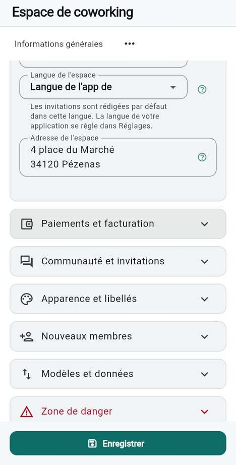

*Ce que décide chaque choix*

| Choix | Ce qu’il décide |
|---|---|
| **Pays** | La devise et le fuseau horaire proposés, et les jours fériés offerts comme jours de fermeture (voir plus bas). |
| **Devise** | La façon dont chaque montant est affiché et compté. |
| **Fuseau horaire** | Ce que signifient un jour de travail, une limite de demi-journée et un jour de fermeture ; un membre à l’étranger voit le jour de l’espace. |
| **Langue de l'espace** | La langue dans laquelle les invitations et les références de messages partagées sont rédigées par défaut. |

**Étapes**

1. Ouvrez [Espace](https://fdittgen-png.github.io/deskilo/#/workspace-settings) et allez à **Informations générales**.
2. Choisissez le **Pays** ; la **Devise** et le **Fuseau horaire** suivent, et vous pouvez les corriger. Pour l’Atelier du Marché : France, EUR, Europe/Paris.
3. Choisissez la **Langue de l'espace**, puis touchez **Enregistrer**.

> **Attention** Choisissez le pays et la devise correctement dès le premier jour. Les montants sont enregistrés comme de simples nombres : dès que l’espace a émis un document ou enregistré de l’argent, le serveur refuse de changer l’un ou l’autre : « La devise et le pays sont figés dès que l'espace a émis un document ou enregistré de l'argent. Rien n'a été enregistré. »

**Bon à savoir**

- L’application liste de nombreux pays, mais l’émission de factures dans DesKilo ne fonctionne aujourd’hui que pour la France et l’Allemagne. Ailleurs, vous gardez les relevés et émettez les factures en dehors de l’application.
- La langue de l’espace n’est pas la langue de votre propre application, qui se trouve dans vos réglages personnels.

**Voir aussi :** [Pays](Guide-utilisateur#pays) · [Devise et fuseau horaire](Guide-utilisateur#devise-et-fuseau-horaire) · [Langue de l’espace](Guide-utilisateur#langue-de-lespace)

<!-- anchor: setup.place.plan -->
### Le plan

**Public:** Propriétaire · Administrateur·rice

Vous voulez que le plan à l’écran ressemble au vrai lieu. Il se construit en quatre couches : les étages, puis les bureaux (les salles), puis les tables, puis les places. Un membre réserve une place ; c’est la place que compte la liste de préparation.

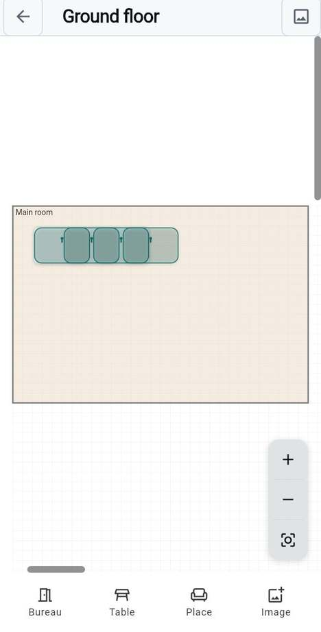

**Étapes**

1. Faites un croquis sur papier : étages, salles, tables, places.
2. Ouvrez l’[Éditeur d’espace](https://fdittgen-png.github.io/deskilo/#/editor) et ajoutez les étages avec **Ajouter un étage**.
3. Ouvrez un étage et dessinez chaque salle avec **Bureau**, puis **Table** et **Place** à l’intérieur.
4. Si une équipe peut prendre une salle ou un étage pour une journée, activez la réservation de la salle entière dans ses propriétés.

**Bon à savoir**

- Commencez petit : un étage, une salle, quelques places. Tout peut s’ajouter ensuite.
- Un étage, un bureau ou une table entiers ne peuvent être réservés que si **Réservations de table, bureau et niveau** est activé et que le membre en a la permission.
- Le modèle fourni *A tiny space* vous donne deux niveaux, quatre tables et huit places à ajuster.
- Supprimer un étage supprime tout ce qui s’y trouve, et l’import d’un plan est refusé dès que des réservations existent.

**Voir aussi :** [Ajouter, renommer et supprimer des étages](Guide-utilisateur#éditeur-despace--ajouter-renommer-et-supprimer-des-étages) · [Dessiner des salles, des tables et des places](Guide-utilisateur#dessiner-pièces-tables-et-places) · [Laisser les membres réserver un étage entier](Guide-utilisateur#laisser-les-membres-réserver-un-étage-entier)

<!-- anchor: setup.place.times -->
### Horaires d’ouverture et règles de réservation

**Public:** Propriétaire · Administrateur·rice

Vous voulez que les réservations suivent le rythme de votre lieu. Un seul écran, **Disponibilité**, contient les jours, la forme d’une réservation, les horaires de travail et les règles. Le serveur les applique partout : plan, feuille de réservation, codes scannés et borne.

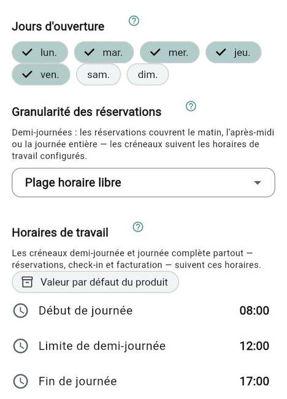

**Étapes**

1. Ouvrez [Disponibilité](https://fdittgen-png.github.io/deskilo/#/availability).
2. Choisissez les **Jours d'ouverture** (au moins un) et la **Granularité de réservation**.
3. Réglez les **Horaires de travail** : **Début de journée**, **Limite de demi-journée**, **Fin de journée**.
4. Sous **Règles de réservation**, décidez de **Autoriser les réservations passées**, **En dehors des heures d'ouverture** et des **Limites de réservation**.

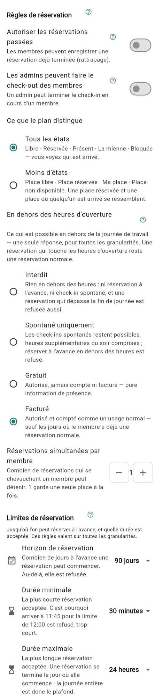

*Points de départ conseillés (des suggestions, pas des règles ; par défaut, **En dehors des heures d'ouverture** est sur **Facturé**, et le modèle d’association n’y change rien)*

| Situation | Granularité | Horaires | Hors horaires | Réservations passées | Limites |
|---|---|---|---|---|---|
| Quelques bureaux partagés | **Plage horaire libre** ou **Créneaux d'une heure** | Journée 8 h 00–17 h 00 | **Libre** | Non | Une réservation à la fois ; horizon de 30 jours |
| Une salle d’association (Atelier du Marché) | **Demi-journées (matin et après-midi)** | 7 h 00, limite 13 h 00, fin 19 h 00 | **Désactivé** | Non | Une réservation à la fois ; horizon de 90 jours |
| Un coworking en demi-journées | **Demi-journées (matin et après-midi)** | 8 h 00, limite 12 h 00, fin 18 h 00 | **Facturé** | Non | Une ou deux à la fois ; horizon de 90 jours |

**Bon à savoir**

- En dehors des heures d’ouverture, **Désactivé** refuse tout, **Spontané uniquement** autorise les venues sans réservation, **Libre** autorise sans compter, **Facturé** compte comme une utilisation ordinaire, sauf un jour où le membre détient déjà une réservation normale.
- La journée doit se dérouler dans l’ordre : début, puis limite, puis fin ; la durée minimale ne peut pas dépasser la durée maximale.
- Une réservation se termine le jour où elle commence. Les réservations passées sont désactivées par défaut ; réserver une plage antérieure le jour même est toujours permis.
- Les plages de demi-journée et de journée entière pilotent aussi l’enregistrement à l’arrivée et la facturation : fixez donc les horaires avant de fixer les prix.

**Voir aussi :** [Jours d’ouverture](Guide-utilisateur#jours-douverture) · [Granularité](Guide-utilisateur#granularité) · [Horaires de travail](Guide-utilisateur#horaires-de-travail) · [En dehors des heures d’ouverture](Guide-utilisateur#en-dehors-des-heures-douverture) · [Limites de réservation](Guide-utilisateur#limites-de-réservation)

<!-- anchor: setup.place.closure -->
### Jours de fermeture et jours fériés

**Public:** Propriétaire · Administrateur·rice

Vous voulez que l’espace soit fermé les jours fériés, sans que personne les réserve par erreur.

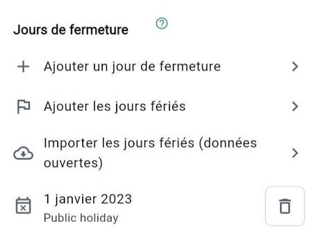

**Étapes**

1. Dans [Disponibilité](https://fdittgen-png.github.io/deskilo/#/availability), allez à **Jours de fermeture**.
2. Touchez **Ajouter les jours fériés** (si vous ne le voyez pas, activez d’abord la fonctionnalité *Jours fériés* ; elle est désactivée par défaut) pour créer toute une année d’un coup, ou **Ajouter un jour de fermeture** pour une date isolée, comme un jour d’inventaire.
3. Vérifiez la liste et retirez tout jour où vous travaillez réellement.

**Bon à savoir**

- Des listes de jours fériés sont fournies pour la France et l’Allemagne. Pour les autres pays, activez *Jours fériés* et *Importer les jours fériés* (données ouvertes, connexion nécessaire). Rien n’est créé avant votre confirmation.
- Une réservation un jour de fermeture est refusée, et le plan montre le jour comme fermé, avec son motif.
- Les mois déjà facturés sont ignorés : ajoutez donc les jours de fermeture avant la clôture du mois.

**Voir aussi :** [Jours de fermeture](Guide-utilisateur#jours-de-fermeture) · [Jours fériés](Guide-utilisateur#jours-fériés)

<!-- anchor: setup.place.check -->
### Vérifier votre espace

**Public:** Propriétaire · Administrateur·rice

Vous voulez la preuve que l’espace est prêt, avant d’inviter qui que ce soit. Deux cartes la donnent.

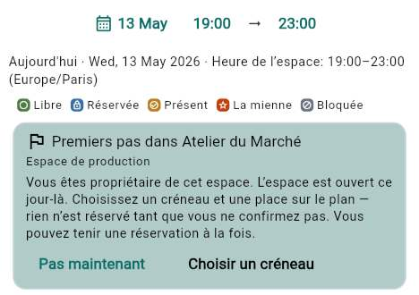

**Étapes**

1. Ouvrez [Espace](https://fdittgen-png.github.io/deskilo/#/workspace-settings) : la carte **Mise en place de cet espace** liste chaque domaine avec son état, et l’étape suivante.
2. Ouvrez [Réserver](https://fdittgen-png.github.io/deskilo/#/reserve). Les propriétaires et les administrateurs qui ont la permission de configuration voient la carte *Premiers pas dans* votre espace. S’il manque quelque chose, elle dit *Avant que quiconque puisse réserver ici*, avec **Terminer la mise en place**.
3. Réservez vous-même une place pour tester, puis annulez-la.

**Bon à savoir**

- Prêt veut dire prêt pour une première réservation : jours d’ouverture, fuseau horaire, devise, au moins une place, des membres qui peuvent réserver, et assez de validateurs.
- Tout ce qui est facultatif, comme les tarifs ou les paiements, peut être mis de côté avec **Plus tard** et ne bloque pas l’ouverture.
- Les deux cartes dépendent de la fonctionnalité *Carte Premiers pas*.
- **Pas maintenant** masque la carte sur cet appareil ; le menu d’affichage du plan la ramène avec **Premiers pas**.

**Résultat** Un espace que les membres peuvent réserver. Ensuite : inviter les premières personnes, puis passer aux rôles et aux tarifs du deuxième niveau.

**Voir aussi :** [La carte Premiers pas et les astuces](Guide-utilisateur#la-carte-premiers-pas-et-les-astuces) · [Inviter des personnes avec l’ID de l’espace](Guide-utilisateur#lid-de-lespace) · [Rôles](Guide-utilisateur#la-matrice-des-rôles)

<!-- anchor: setup.features.overview -->
## Choisir ce que propose votre espace

Un espace n’est pas un produit unique avec cent réglages. C’est une poignée de choses que vous décidez de proposer, une à la fois. Ce chapitre explique comment DesKilo regroupe ce qu’il sait faire, ce qu’un nouvel espace possède déjà, comment les éléments dépendent les uns des autres, et dans quel ordre les activer pour ne jamais proposer ce que vous ne pouvez pas encore assurer.

Dans ce chapitre :
- [Fonctionnalités et processus](#fonctionnalités-et-processus)
- [Essentiel et Plateforme : ce que possède un nouvel espace](#essentiel-et-plateforme--ce-que-possède-un-nouvel-espace)
- [Les fonctionnalités qui en nécessitent d’autres](#les-fonctionnalités-qui-en-nécessitent-dautres)
- [Désactiver ne supprime rien](#désactiver-ne-supprime-rien)
- [Bêta, non évaluée, et la question avant d’activer](#bêta-non-évaluée-et-la-question-avant-dactiver)
- [Trois points de départ](#trois-points-de-départ)
- [L’ordre d’activation](#lordre-dactivation)
- [Activer une fonctionnalité en sécurité](#activer-une-fonctionnalité-en-sécurité)
- [Éviter les fonctionnalités qui se contredisent](#éviter-les-fonctionnalités-qui-se-contredisent)
- [La carte des fonctionnalités](#la-carte-des-fonctionnalités)

<!-- anchor: setup.features.what -->
### Fonctionnalités et processus

**Public:** Propriétaire · Copropriétaire

Vous voulez savoir ce que vous actionnez quand vous ouvrez **Fonctionnalités**. Tout ce que DesKilo sait faire au-delà de l’essentiel est une fonctionnalité dotée de son propre interrupteur. Pour garder une centaine d’interrupteurs lisibles, l’écran les regroupe selon leur usage.

*Comment c’est organisé*

- Un *processus* est un métier : par exemple **Facturation & paiements** ou **Calendrier et coordination**. Il y en a neuf.
- Un *sous-processus* est une étape de ce métier : **Facturation**, **Encaissement** et **Gestion de la TVA** sont trois des cinq étapes de **Facturation & paiements**.
- Une *fonctionnalité* est un interrupteur à l’intérieur d’un sous-processus : **Factures**, **Relances de paiement**, **Déclarations de TVA**.

*Les neuf processus et leurs sous-processus*

| Processus | Sous-processus |
|---|---|
| **Espace et accès** | **Personnes et adhésions** · **Accès aux locaux** |
| **Gestion des lieux** | **Structure des lieux** · **Jours et heures d’ouverture** · **Présentation des lieux** |
| **Réservations et utilisation** | **Réservation des postes et espaces** · **Présence et utilisation** |
| **Calendrier et coordination** | **Vues du calendrier** · **Décisions et validations** · **Communication entre membres** |
| **Offres aux membres** | **Services et tarification** |
| **Facturation & paiements** | **Suivi financier** · **Facturation** · **Encaissement** · **Dépenses partagées** · **Gestion de la TVA** |
| **Documents et informations** | **Publication des documents** · **Conception des rapports** · **Accès aux données et exports** |
| **Exploitation et administration** | **Configuration et déploiement** · **Utilisation de l’application** |
| **Intégrations et automatisation** | **Envoi externe** |

**Bon à savoir**

- Une fonctionnalité appartient à un seul processus, même quand elle en nécessite une d’un autre. La carte le dit : « Tout activer nécessite aussi : Onglet Finances (Facturation et paiements) ».
- Les formules d’adhésion et l’éditeur de plan ne sont pas des fonctionnalités : ils sont toujours là. Leurs réglages se trouvent dans Espace et Facturation, pas sur cet écran. Les carnets prépayés sont une fonctionnalité : voir **Carnets**.
- Désactiver une fonctionnalité la masque de tous les écrans où elle apparaissait ; ce n’est pas une permission. Qui peut faire quoi se décide dans les [Rôles](Guide-utilisateur#la-matrice-des-rôles).

**Voir aussi :** [Ce que sait faire DesKilo](#ce-que-sait-faire-deskilo) · [Activer ou désactiver des processus entiers](Guide-utilisateur#activer-ou-désactiver-des-processus-entiers)

<!-- anchor: setup.features.tiers -->
### Essentiel et Plateforme : ce que possède un nouvel espace

**Public:** Propriétaire · Copropriétaire

Vous voulez savoir ce que les membres trouvent dès le premier jour, avant que vous n’ayez rien activé.

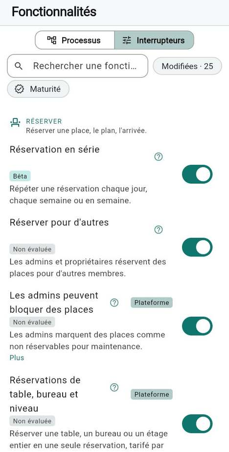

Chaque fonctionnalité appartient à l’un de deux niveaux, et un nouvel espace en est créé :

| Niveau | Dans les mots de l’application | Ce que reçoit un nouvel espace |
|---|---|---|
| **Essentiel** | Ce dont tout espace a besoin. Actif dès le premier jour. | Activée, quand elle est prévue pour l’être au départ. |
| **Plateforme** | Demandé, jamais supposé. Activez ce que cet espace fait vraiment. | Désactivée. Dans **Interrupteurs**, elles sont listées sous le niveau **Plateforme**. |

Un nouvel espace démarre avec 45 fonctionnalités activées, toutes de niveau Essentiel (46 si vous créez en même temps le jumeau de test : **Paires d'environnements** est alors activée aussi). En clair :

- Réservation : réserver une place sur le plan, répéter une réservation (**Réservation en série**), réserver pour quelqu’un d’autre (**Réserver pour d'autres**), voir une place à moitié réservée comme partiellement occupée (**Journée d'une place**), enregistrer une réservation dans un calendrier personnel (**Fichier calendrier d’une réservation**), des règles de réservation comme les réservations passées et hors horaires (**Règles de réservation**, **Garde-fou de réservation**), demander la suppression d’une réservation passée (**Demandes de suppression de réservation**), imprimer des cartes QR pour les places (**Codes QR des espaces**), des horaires de travail paramétrables (**Horaires de travail**).
- Personnes : l’onglet de la communauté (**Annuaire des membres**), une page par membre (**Fiche membre**), la matrice centrale des rôles (**Gestion des rôles** et **Attribution des rôles**), les informations personnelles pour les courriers et les factures (**Informations personnelles**), des initiales distinctes sur les avatars (**Initiales d’avatar distinctes**).
- Calendrier et messages : le calendrier en plusieurs vues (**Onglet Calendrier**, **Calendrier central**, **Vues du calendrier**), le fil d’activité et les confirmations (**Onglet Événements**), les conversations privées et de groupe (**Notifications entre membres**, **Messages repensés**) avec références, transfert, mentions, gestes de balayage et protection contre la capture d’écran, le regroupement du fil de notifications (**Regroupement des notifications**), et le bouton pour écrire aux hôtes d’une page publiée (**Écrire aux hôtes**).
- Argent : l’onglet Finances et ses quatre volets (**Onglet Finances**, **Finances en quatre volets**), les factures (**Factures**), un catalogue de services (**Services**), un PDF de la facture mensuelle (**Export PDF**).
- Documents et données : la bibliothèque de documents (**Bibliothèque de documents**), l’export des données pour le propriétaire (**Export des données (Excel)**), et l’export et l’effacement de ses propres données par chaque membre (**Export et effacement**).
- Confort : les astuces d’aide, la carte Premiers pas, les favoris et les notes pour les places, les animations, les formats régionaux et le choix du style de navigation.
- Envoi : **Notifications push**, qui n’atteignent les téléphones qu’une fois que la personne qui fait tourner l’installation a configuré le service de notifications (voir [Comment les membres sont informés](#les-canaux-en-mots-simples)).
- Rangement du plan : **Supprimer des espaces avec historique** et **Nommer par l’étage un étage à une seule salle**.

Tout le reste est de niveau Plateforme et désactivé : borne et badges, plusieurs sites, suppléments d’accessoires, paiements en ligne, gestion de la TVA, le parcours d’une facture, conception des rapports, déploiements, WhatsApp, l’interface pour assistants et le reste.

**Bon à savoir**

- La fonctionnalité de factures est activée dès le départ, mais rien ne peut être émis tant que votre identité légale n’est pas complète ; **Mise en place de cet espace** la marque **Nécessaire avant de facturer**. Voir [Éviter les fonctionnalités qui se contredisent](#éviter-les-fonctionnalités-qui-se-contredisent).
- Un espace qui existe déjà ne change jamais quand DesKilo modifie ce que reçoit un nouvel espace.
- Si vous partez d’un modèle, celui-ci peut activer ou désactiver quelques fonctionnalités en plus de cet ensemble. Voir [Trois points de départ](#trois-points-de-départ).

**Voir aussi :** [Un interrupteur de fonctionnalité](Guide-utilisateur#un-interrupteur-de-fonctionnalité)

<!-- anchor: setup.features.dependencies -->
### Les fonctionnalités qui en nécessitent d’autres

**Public:** Propriétaire · Copropriétaire

Vous voulez activer quelque chose en étant sûr que cela fonctionne, ou désactiver quelque chose sans casser ce qui en dépend.

Beaucoup de fonctionnalités dépendent d’une autre. **Paiements en ligne** nécessite **Onglet Finances** ; **Relances de paiement** nécessite **Factures** ; **Relances de paiement automatiques** nécessite **Relances de paiement** ; **Déclarations de TVA** nécessite **Gestion de la TVA**, qui nécessite **Factures**. Dans la liste **Interrupteurs**, une fonctionnalité qui en nécessite une autre affiche **Nécessite** suivi du nom de son parent.

*Ce que fait l’application*

| Vous | L’application |
|---|---|
| Activez une fonctionnalité dont le parent est désactivé | Active toute la chaîne et nomme ce qui s’est activé avec elle : « Également activé : … ». |
| Désactivez un parent | N’efface pas les choix de ses enfants. Ils sont conservés tels que vous les avez réglés, mais ne font rien ; la ligne indique « En attente de la fonction au-dessus — activez-la et celle-ci fonctionne de nouveau ». |
| Réactivez le parent | Les enfants qui étaient activés fonctionnent de nouveau aussitôt. |
| Désactivez un processus ou un sous-processus entier alors que quelque chose en dépend encore | Refuse et nomme qui en a besoin (« … est encore nécessaire à : … »), sauf si vous choisissez **Désactiver quand même, conserver leurs réglages** ou de désactiver aussi les dépendants. |

**Bon à savoir**

- Un enfant activé qui attend son parent fait afficher **À examiner** sur son processus. C’est le seul état où un interrupteur et l’application ne sont pas d’accord : il mérite un coup d’œil. Voir [Activer une fonctionnalité en sécurité](#activer-une-fonctionnalité-en-sécurité).
- Un parent peut se trouver dans un autre processus que son enfant : **Services** (Offres aux membres) nécessite **Onglet Finances** (Facturation et paiements). La carte avertit alors que tout activer nécessite aussi l’autre.
- La vérification porte sur la fonctionnalité, pas sur une permission : un rôle qui a le droit de faire quelque chose ne suffit jamais si la fonctionnalité est désactivée.

**Voir aussi :** [Un interrupteur de fonctionnalité](Guide-utilisateur#un-interrupteur-de-fonctionnalité) · [Activer ou désactiver des processus entiers](Guide-utilisateur#activer-ou-désactiver-des-processus-entiers)

<!-- anchor: setup.features.off -->
### Désactiver ne supprime rien

**Public:** Propriétaire · Copropriétaire

Vous voulez pouvoir changer d’avis plus tard : il faut donc savoir ce qu’un interrupteur ne touche pas.

Désactiver une fonctionnalité arrête les nouvelles opérations. Elle ne supprime pas un seul enregistrement : factures, réservations, messages, rôles et réglages restent où ils sont, et réactiver la fonctionnalité les ramène. Ce qui est fait reste fait : une facture émise pendant que la fonctionnalité était activée garde ce qu’elle dit.

Derrière cela, DesKilo range les actions d’une fonctionnalité activable en trois catégories :

| Catégorie | Ce que fait l’interrupteur | Exemple |
|---|---|---|
| Travail nouveau (*acceptNew*) | S’arrête quand la fonctionnalité est désactivée. | Ouvrir une nouvelle conversation avec les hôtes ; donner un rôle personnalisé à un membre ; bloquer une place ; lancer un nouveau paiement en ligne. |
| Travail déjà ouvert (*serviceExisting*) | Continue, pour que rien ne reste en suspens. | Répondre à une conversation déjà commencée ; retirer un rôle personnalisé ; lever le blocage d’une place ; solder un paiement déjà ouvert. |
| Chemins risqués (*suspended*) | Restent fermés quoi que dise l’interrupteur. | Réservé à un chemin que le serveur juge risqué ; aucune action n’est classée ainsi aujourd’hui. |

Trois fonctionnalités le disent sur leur ligne, avec ces mots : « Désactivé : rien de nouveau ne commence ; ce qui est en cours peut encore être traité et clos. » Ce sont **Écrire aux hôtes**, **Les rôles de cet espace** et **Les admins peuvent bloquer des places**. **Arrivée/départ auto en fin de journée** arrête aussi son balayage de fin de journée quand elle est désactivée, mais sa ligne ne le dit pas. Sur un serveur qui ne peut pas le confirmer, la ligne dit « n’y comptez pas ».

**Bon à savoir**

- L’argent déjà engagé est toujours réglé : un retour de paiement ou un remboursement n’est jamais bloqué par un interrupteur.
- Avec **Paiements en ligne** désactivé, le serveur refuse un nouveau paiement en ligne ; un paiement déjà ouvert se solde quand même. Sa ligne ne porte aucune note à ce sujet.
- Un interrupteur n’est pas un moyen de cacher quelque chose à une seule personne. Pour cela, utilisez les [Rôles](Guide-utilisateur#la-matrice-des-rôles).

**Voir aussi :** [Un interrupteur de fonctionnalité](Guide-utilisateur#un-interrupteur-de-fonctionnalité)

<!-- anchor: setup.features.maturity -->
### Bêta, non évaluée, et la question avant d’activer

**Public:** Propriétaire · Copropriétaire

Vous voyez un petit mot sous le nom d’une fonctionnalité et vous voulez savoir quoi en faire.

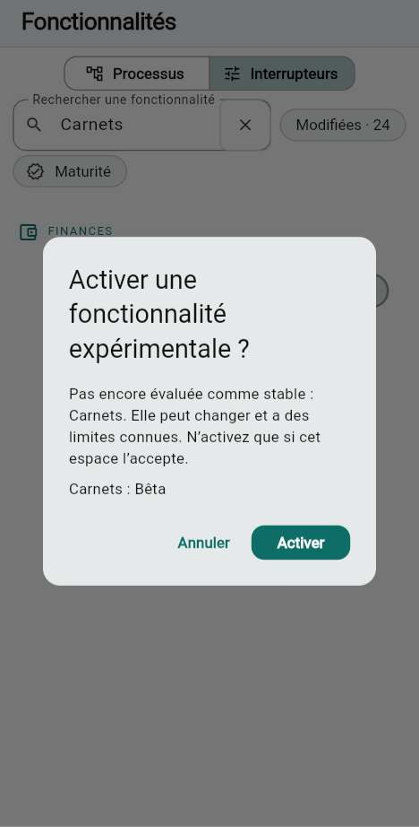

Chaque ligne de **Interrupteurs** porte un badge de maturité, qui dit jusqu’où la fonctionnalité a été examinée, preuves à l’appui :

| Badge | Signification |
|---|---|
| **Non évaluée** | Personne ne l’a encore examinée, preuves à l’appui. Cela n’a rien de négatif. |
| **Alpha** | Examinée, à un stade précoce. |
| **Bêta** | Examinée, avec des limites connues ; ses tests tournent à chaque modification. |
| **Stable** | Examinée, et en plus qualifiée avec de vrais fournisseurs, du vrai matériel ou de vrais opérateurs. |

À l’heure où nous écrivons, la plupart des fonctionnalités sont **Non évaluée**, dix-huit sont **Bêta**, et aucune n’est encore **Stable**.

*Ce que demande l’application*

1. Basculez l’interrupteur d’une fonctionnalité **Alpha** ou **Bêta**.
2. L’application demande **Activer une fonctionnalité expérimentale ?** et dit : « Pas encore évaluée comme stable : … Elle peut changer et a des limites connues. N’activez que si cet espace l’accepte. »
3. Elle nomme le stade de chaque fonctionnalité et celles qui s’activeraient avec elle parce qu’elles sont nécessaires.
4. Touchez **Activer** pour accepter, ou **Annuler** : rien n’est enregistré.

**Bon à savoir**

- Les fonctionnalités **Non évaluée** ne demandent rien. Seules **Alpha** et **Bêta** demandent.
- La question se pose sur un seul interrupteur. Un **Activer** de processus entier montre ce qu’il va activer, mais ne pose pas cette question : activez les fonctionnalités **Bêta** une par une.
- Parmi les fonctionnalités bêta, à l’heure où nous écrivons : **Factures**, **Paiements en ligne**, **Gestion de la TVA**, **Carnets**, **Dépenses partagées**, **Relevés d'usage**, **Règles de réservation**, **Réservation en série**, **Garde-fou de réservation**, **Demandes de suppression de réservation**, **Finances en quatre volets**, **Fournitures via les dépenses**, **Validateurs par rôle ou par personne**, **Validations enchaînées**, **Arrivée/départ auto en fin de journée**, **Export des données (Excel)**, **Remise des factures au client** et **L'espace de démonstration**. Lisez les limites de chaque fonctionnalité avec **Plus** avant de vous y fier pour de l’argent.
- Plusieurs d’entre elles sont de niveau Essentiel et déjà activées dans un nouvel espace. Elles démarrent activées, sans la question ; elle n’apparaît que si vous en réactivez une.
- **Maturité** réduit la liste à un seul stade : c’est un moyen rapide de voir tout ce qui est expérimental et que votre espace utilise déjà.

**Voir aussi :** [Un interrupteur de fonctionnalité](Guide-utilisateur#un-interrupteur-de-fonctionnalité)

<!-- anchor: setup.features.profiles -->
### Trois points de départ

**Public:** Propriétaire · Copropriétaire

Vous ne voulez pas décider cent choses. Voici trois points de départ réalistes ; chacun liste exactement ce qui est activé. Choisissez le plus proche, puis ajustez.

Le premier n’a besoin d’aucun modèle. Le deuxième est le modèle prêt à l’emploi de l’application. Le troisième est construit à partir des fonctionnalités elles-mêmes. Ils portent le nom de ce qu’ils offrent, pas d’une taille.

<!-- anchor: setup.features.profile-tiny -->
### Quelques places partagées

**Public:** Propriétaire

Vous gérez une poignée de bureaux ou de salles que l’on réserve, et rien d’autre pour l’instant. Créez l’espace avec **Espace vide** ou avec le modèle « A tiny space » sous **Partir de** : deux niveaux, quatre tables et huit places, de quoi réserver, scanner et parcourir.

Le modèle n’active aucune fonctionnalité : l’espace a donc exactement les 45 fonctionnalités de niveau Essentiel d’[Essentiel et Plateforme](#essentiel-et-plateforme--ce-que-possède-un-nouvel-espace). Rien n’est activé au-delà. Pour ce profil, laissez le reste de côté :

- La réservation, le calendrier, les messages, l’annuaire, les cartes QR des places, la bibliothèque de documents et les astuces d’aide sont tous là.
- **Onglet Finances** et **Factures** sont activés, mais tant que vous n’avez pas saisi votre identité légale et vos tarifs, ils n’affichent qu’un relevé vide.
- Rien ne demande de configuration en dehors du plan et des horaires d’ouverture. Voir [Votre lieu](#construire-le-lieu).

> **Astuce** Si vous ne facturez jamais rien, vous pouvez laisser les fonctionnalités d’argent activées sans inconvénient : les membres ne voient simplement rien à payer.

<!-- anchor: setup.features.profile-association -->
### Une association avec une salle

**Public:** Propriétaire

Vous êtes une association française qui partage une salle, avec un bureau, des membres qui paient une cotisation et des réservations en demi-journées. Choisissez le modèle « Association de coworking (France) » sous **Partir de**. Il met en place les règles d’ouverture, des tranches de cotisation à 50 % et à 100 %, deux carnets prépayés, les rôles du bureau, le vocabulaire en français et deux étages, et il porte ce profil de fonctionnalités :

- Les 45 fonctionnalités Essentiel, **sauf** quatre qu’il **désactive** : **Onglet Événements**, **Annuaire des membres**, **Fiche membre** et **Regroupement des notifications**. Une petite association n’a pas besoin d’un fil d’événements ni d’un annuaire à côté de ses conversations.
- Quatre qu’il **active**, parce que le bureau en a besoin : **Validations dans le calendrier** (les décisions affichées dans le calendrier), **Carnets** (des demi-journées prépayées pour les personnes qui n’ont pas d’abonnement, Bêta), **Les rôles de cet espace** (trésorier, secrétaire, référent de salle) et **Vocabulaire de l’espace** (les mots propres à l’association).

Cela donne 45 − 4 + 4 = 45 fonctionnalités activées. Le modèle ne contient aucune identité : l’adresse, le numéro d’immatriculation et les coordonnées bancaires restent à saisir par vous, et le régime de TVA démarre sur « non assujetti ».

**Bon à savoir**

- Carnets est en bêta et le modèle l’active sans poser la question ; c’est le choix du modèle, et vous pouvez le désactiver.
- Le modèle laisse **Factures** activée, comme dans l’ensemble Essentiel. Une association qui ne facture pas peut la laisser telle quelle.

<!-- anchor: setup.features.profile-invoicing -->
### Un coworking qui facture

**Public:** Propriétaire

Vous louez des bureaux à des membres et leur envoyez des factures chaque mois, en France ou en Allemagne. Il n’existe pas de modèle prêt à l’emploi : ce profil est donc la liste de ce qu’il faut ajouter à l’ensemble Essentiel, dans cet ordre. Tout s’y enchaîne à partir de **Onglet Finances** et de **Factures**, qui sont déjà activés.

| N° | Activer | Pourquoi | Nécessite |
|---|---|---|---|
| 1 | **Séquences de numérotation** | Décider de la numérotation des documents avant que le premier n’existe. | **Factures** |
| 2 | **Factures d'abonnement** | La cotisation est facturée avant le mois qu’elle couvre. | **Factures** |
| 3 | **Relevés d'usage** | Un relevé du temps réellement utilisé (Bêta). | **Factures** |
| 4 | **Factures de fin de mois** | Ce que le mois a coûté en plus de l’abonnement est facturé à part. | **Factures** |
| 5 | **Assistant de facturation** | Une clôture de mois guidée pour la personne qui fait la facturation. | **Factures** |
| 6 | **Le parcours d'une facture** | Chaque facture montre où elle en est et à qui c’est de jouer. | **Factures** |
| 7 | **Modèle de PDF de facture** | Votre propre texte d’introduction et de pied de page sur le PDF. | **Factures** |
| 8 | **Rapports des membres** | L’accord financier et le rapport mensuel des paiements pour les membres. | **Onglet Finances** |
| 9 | **Relances de paiement** | Des niveaux de relance, une lettre par niveau, « Relance due » sur les factures en retard. | **Factures** |
| 10 | **Rapport de consommation** | Une lettre en fin de mois sur ce qui a été utilisé. | **Relevés d'usage** |

Ajoutez ensuite seulement ce qui vous concerne :

- **Gestion de la TVA** (Bêta) si votre espace est assujetti à la TVA. Puis **Déclarations de TVA**, et **Versions des taux de TVA** et **Groupes de TVA** si votre comptable les demande.
- **Les admins émettent des factures** si vous voulez qu’un administrateur de la facturation puisse en émettre. Le propriétaire le peut toujours.
- **Paiements en ligne** (Bêta) seulement quand vous avez un prestataire de paiement à connecter.
- **Relances de paiement automatiques** seulement après avoir lu [ce qu’elles font](#relances-de-paiement).
- **Suppléments d'accessoires**, **Carnets** et **Dépenses partagées** quand vous facturez ces éléments.

**Bon à savoir**

- Avant la première facture, complétez votre identité légale et la TVA. Voir [Identité légale et facturation](#votre-identité-légale-et-ce-quil-faut-demander-à-votre-expert-comptable).
- L’émission ici ne fonctionne que pour les espaces en France et en Allemagne.
- Activez-les une par une et émettez d’abord une facture d’essai dans un espace de test. Voir [L’ordre d’activation](#lordre-dactivation).

**Voir aussi :** [Argent et facturation](#argent-et-fiscalité) · [Partir d’un modèle ou de rien](#partir-dun-modèle-ou-de-rien)

<!-- anchor: setup.features.order -->
### L’ordre d’activation

**Public:** Propriétaire · Copropriétaire

Vous voulez éviter le jour où tout est activé et où rien ne marche. Avancez un processus à la fois, et regardez chacun du côté d’un membre avant de passer au suivant.

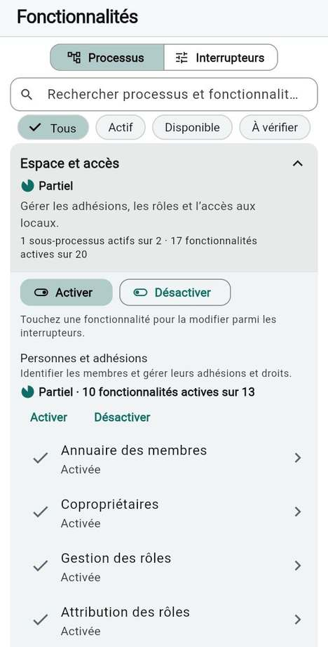

**Étapes**

1. Gardez l’ensemble Essentiel et faites fonctionner les bases : les places, les horaires d’ouverture, un tarif. Voir [Votre lieu](#construire-le-lieu).
2. Ouvrez [Fonctionnalités](https://fdittgen-png.github.io/deskilo/#/features) et ouvrez une carte de processus. Choisissez le processus qui correspond à votre prochain besoin, pas celui qui paraît le plus complet.
3. Touchez **Activer** pour un sous-processus, ou ouvrez une seule fonctionnalité parmi les **Interrupteurs**.
4. Lisez l’aperçu : ce qui figure sous **Également nécessaires**, ce qui est déjà activé.
5. Regardez-le comme un membre : connectez-vous en tant que tel (un second compte, ou le côté test de votre espace) et faites ce que ferait un membre.
6. Seulement alors, passez au processus suivant.

*Un ordre raisonnable*

| Étape | Processus | Pourquoi cette place dans l’ordre |
|---|---|---|
| 1 | **Gestion des lieux** | Rien ne peut être réservé sans lieu ni horaires d’ouverture. |
| 2 | **Réservations et utilisation** | Les règles de réservation façonnent tout ce qui suit. |
| 3 | **Espace et accès** | Les rôles et qui valide, avant la première invitation. |
| 4 | **Calendrier et coordination** | Les messages et les validations supposent que des personnes existent. |
| 5 | **Offres aux membres**, puis **Facturation & paiements** | Les prix avant les factures ; l’identité légale avant la première facture. |
| 6 | **Documents et informations**, **Intégrations et automatisation** | Ils habillent et livrent ce que produisent les autres. |
| 7 | **Exploitation et administration** | Paires, déploiements et transferts, une fois que l’espace vaut d’être copié. |

**Bon à savoir**

- Activer ne coûte presque rien et désactiver ne supprime rien : une mauvaise étape coûte du temps, pas des données. L’exception est tout ce qui émet une facture : voir [Les décisions difficiles à défaire](#les-décisions-difficiles-à-défaire).
- Un espace de test est le bon endroit pour essayer un processus. Voir [Un espace de test ou un espace réel](#un-espace-de-test-ou-un-espace-réel) et [Un espace de test](Guide-utilisateur#à-quoi-sert-un-espace-de-test).
- Invitez les membres en dernier, après les rôles, les règles de validation et les tarifs qu’ils rencontreront.

**Voir aussi :** [Activer ou désactiver des processus entiers](Guide-utilisateur#activer-ou-désactiver-des-processus-entiers)

<!-- anchor: setup.features.safely -->
### Activer une fonctionnalité en sécurité

**Public:** Propriétaire · Copropriétaire

Vous êtes sur le point de modifier une fonctionnalité et vous voulez voir l’effet avant qu’il existe.

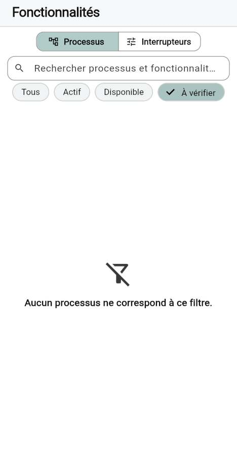

**Étapes**

1. Ouvrez [Fonctionnalités](https://fdittgen-png.github.io/deskilo/#/features). La vue **Processus** s’affiche.
2. Touchez **À examiner**. Il ne reste que les processus qui contiennent quelque chose d’activé mais en attente.
3. Ouvrez une carte. Une fonctionnalité *activée, en attente de* un parent nommé est ce qu’il faut corriger.
4. Corrigez en activant le parent, ou en désactivant la fonctionnalité.
5. Pour changer une seule fonctionnalité, touchez **Interrupteurs**, trouvez-la avec **Rechercher une fonctionnalité** et basculez son interrupteur.
6. Lisez la question ou la ligne « Également activé », et confirmez.

*Ce que veut dire « retenue »*

Une fonctionnalité est retenue quand vous l’avez choisie mais que quelque chose dont elle a besoin est désactivé. Son propre interrupteur reste activé, c’est pourquoi on la manque facilement : l’écran dit que la fonctionnalité est activée, et l’application ne la propose pas. La carte indique combien de fonctionnalités sont retenues (« … sont activées mais attendent un prérequis désactivé ») et quel prérequis elles attendent, et vous corrigez cela dans [Fonctionnalités](https://fdittgen-png.github.io/deskilo/#/features) même. [Ce qui vous attend](Guide-utilisateur#ce-qui-vous-attend) montre la même chose, en une ligne par prérequis désactivé.

D’autres choses qu’une fonctionnalité peut attendre ne figurent pas sur cet écran. Une fonctionnalité peut être activée et pleinement autorisée alors que ses informations manquent : votre identité légale, un site, un prestataire de paiement. Elles apparaissent dans **Mise en place de cet espace**, en haut des réglages de l’espace : l’identité légale, quand **Factures** est activé, sous **L'identité légale et l'adresse de l'espace**, le reste sous **Informations requises par vos fonctionnalités (identité, banque, plateformes)**.

**Bon à savoir**

- Si quelqu’un d’autre a modifié les fonctionnalités pendant que vous regardiez, l’application n’écrit rien et le dit : « Les fonctionnalités ont changé entre-temps, rien n’a donc été enregistré. » Regardez de nouveau la liste et recommencez.
- **Modifiées** compte les interrupteurs qui diffèrent de la valeur par défaut du registre. Sur un nouvel espace, il affiche déjà un nombre (les fonctionnalités Plateforme qui démarrent désactivées) : ce n’est donc pas le compte de vos propres changements.
- Seul un propriétaire ou un copropriétaire peut modifier les fonctionnalités. Le serveur le vérifie de nouveau au moment d’écrire.

**Voir aussi :** [Activer ou désactiver des processus entiers](Guide-utilisateur#activer-ou-désactiver-des-processus-entiers) · [Un interrupteur de fonctionnalité](Guide-utilisateur#un-interrupteur-de-fonctionnalité)

<!-- anchor: setup.features.consistency -->
### Éviter les fonctionnalités qui se contredisent

**Public:** Propriétaire · Copropriétaire · Administrateur·rice facturation

Vous voulez savoir quelles combinaisons laissent un espace à moitié fonctionnel, et lesquelles l’application détecte pour vous.

L’application a des garde-fous pour certaines contradictions et aucun pour d’autres. Dans le tableau, un garde-fou est ce que fait l’application ; une lacune est ce qui reste de votre responsabilité.

| Si vous avez… | Garde-fou dans l’application | Lacune qui subsiste |
|---|---|---|
| **Factures** activées, pas d’identité légale | L’émission est refusée, avec **Complétez ces informations avant d'émettre** qui liste l’adresse, le numéro de TVA, etc. manquants. Le besoin apparaît aussi dans **Mise en place de cet espace**, sous **L'identité légale et l'adresse de l'espace**, **Nécessaire avant de facturer**, et dans Ce qui vous attend. | La fonctionnalité est activée dès le premier jour : rien n’empêche donc d’inviter des membres et de faire tourner un mois avant que l’identité existe. |
| Un pays autre que la France ou l’Allemagne | L’émission dit que le pays « doit être la France ou l’Allemagne pour émettre ici ». | Rien ne vous avertit quand vous choisissez le pays ou activez la facturation. |
| Assujetti à la TVA, aucun taux en vigueur | L’émission est refusée tant qu’aucun taux par défaut n’est en vigueur. La description de **Gestion de la TVA** et l’avertissement de l’écran d’identité légale le disent. | Avec **Gestion de la TVA** désactivée, la configuration est masquée alors que les taux enregistrés continuent de s’appliquer. Vérifiez les taux après l’avoir désactivée. |
| **Paiements en ligne** activés, pas de prestataire | Un nouveau paiement en ligne est refusé quand la fonctionnalité est désactivée ; l’absence de prestataire apparaît dans **Mise en place de cet espace**. | Vous pouvez l’activer sans prestataire. Connectez-le d’abord : [Prestataire de paiement](Guide-utilisateur#le-prestataire-de-paiement). |
| **Mode borne** activé, pas de badges ni de membre borne | **Badges RFID / NFC**, **Badges QR**, **Photos des membres à la borne** et **Connexion par badge** ne peuvent pas être activés sans lui. | Rien ne vérifie qu’un membre borne existe ni qu’un badge a été émis. Voir [Faire tourner une tablette murale](Guide-utilisateur#mode-borne--une-tablette-murale-pour-le-pointage). |
| **Sites** activés, aucun site | **Au moins un site** apparaît parmi les informations requises par vos fonctionnalités. | L’interrupteur peut être activé sans aucun site. |
| **Notifications push** activées, pas de service de notifications | Les membres reçoivent quand même tout dans l’application. | Les téléphones ne reçoivent rien tant que la personne qui fait tourner l’installation n’a pas configuré le service de notifications. Voir [Comment les membres sont informés](#les-canaux-en-mots-simples). |
| **Relances de paiement** activées, **Relances de paiement automatiques** activées | La seconde ne peut pas être activée sans la première. | Le serveur les envoie chaque matin si l’installation planifie des tâches ; sinon, elles partent quand un administrateur ouvre Finances. L’interrupteur et la description de la fonctionnalité le disent ; l’opérateur de votre serveur sait ce qui s’applique. |
| Une règle de validation qui demande plus de validateurs qu’il n’en existe | **Mise en place de cet espace** dit « Une règle demande plus de validateurs que cet espace n’en compte », et **Rôles et validation des demandes** devient obligatoire, quel que soit le type de demande. | Les demandes créées avant que vous corrigiez ne peuvent pas être menées à bien et expirent au bout de sept jours. Voir [Qui valide](Guide-utilisateur#règles-de-validation-domaine-par-domaine). |
| **Demandes de suppression de réservation** activées, personne pour valider | La même ligne de préparation. | La même lacune. |
| **Réservations de table, bureau et niveau** activées | **Les admins peuvent attribuer des niveaux** en a besoin. | Chaque membre doit aussi en avoir le droit ; rien ne vérifie que quelqu’un l’a. |
| Une fonctionnalité enfant activée, son parent désactivé | **À examiner**, et « En attente de la fonction au-dessus ». | Aucune : ce cas est entièrement couvert. |
| Un espace créé depuis un modèle | Le modèle nomme ce que vous devez saisir (identité, banque, site). | Il n’en contient aucun : un espace peut donc démarrer avec **Factures** activées et rien pour émettre. |

**Bon à savoir**

- La règle d’or : si une fonctionnalité met votre nom, votre argent ou vos obligations légales sur un document, finissez ses informations avant d’en parler aux membres.
- **Mise en place de cet espace** est une liste, pas un verrou. Elle ne vous empêche jamais d’activer quelque chose.
- La vérification « Avant que quiconque puisse réserver ici » ne parle que des domaines obligatoires : le fuseau horaire, la devise, un jour de semaine ouvert, au moins une place, des membres qui détiennent **Réserver et utiliser les réservations** et assez de validateurs. Quand **Factures** est activé, l’identité légale est aussi obligatoire, mais avant de facturer : la carte de l’espace dit « Avant de facturer », et celle de Réserver ne la mentionne jamais.

**Voir aussi :** [Identité légale et facturation](#votre-identité-légale-et-ce-quil-faut-demander-à-votre-expert-comptable) · [Essai à blanc](#une-répétition-sans-risque-dans-un-espace-de-test)

<!-- anchor: setup.features.map -->
### La carte des fonctionnalités

**Public:** Propriétaire · Copropriétaire

Vous voulez un seul endroit qui dise, pour les principales fonctionnalités, ce que les membres obtiennent, ce qu’il faut et qui doit les configurer. « Nécessite » liste d’abord la fonctionnalité du dessus, puis les informations hors de l’écran Fonctionnalités. « Qui » est la personne qui doit agir avant que ce soit utile ; « Personne » veut dire que cela fonctionne dès l’activation.

*Espace et accès*

| Fonctionnalité | Ce qu’elle apporte aux membres | Ce qu’il faut | Qui configure |
|---|---|---|---|
| **Annuaire des membres** | L’onglet de la communauté : qui est là, statuts, présence. | | Personne |
| **Copropriétaires** | Les permissions du propriétaire pour des personnes désignées, dès maintenant ou en cas de succession. | | Propriétaire |
| **Gestion des rôles** | La matrice des permissions détenues par chaque rôle. | | Propriétaire |
| **Attribution des rôles** | Une section Rôles sur chaque fiche membre. | **Gestion des rôles** | Propriétaire |
| **Les rôles de cet espace** | Vos propres rôles, comme trésorier ou secrétaire. | | Propriétaire |
| **Les questions de cet espace** | Vos propres questions dans le formulaire d’identité. | | Propriétaire |
| **Informations personnelles** | Nom, adresse, téléphone et identifiants que les courriers impriment. | | Les membres |
| **Profils gérés** | Des membres sans compte, pour qui l’on réserve et facture. | **Annuaire des membres** | Administrateur |
| **Fiche membre** | Une page par membre. | **Annuaire des membres** | Personne |
| **Visites d'invités** | Une personne qui n’est pas membre peut demander à venir. | | La personne qui admet les visites |
| **Mode borne** | Une tablette murale verrouillée sur le plan en direct. | Une tablette et un membre borne | Propriétaire |
| **Badges RFID / NFC** | S’enregistrer en passant une carte. | **Mode borne**, Android avec NFC, badges émis | Propriétaire |
| **Badges QR** | Cartes-badges QR imprimables. | **Mode borne** | Propriétaire |
| **Connexion par badge** | Badge et code PIN au lieu de saisir une adresse e-mail. | **Badges RFID / NFC** | Propriétaire, puis chaque membre |
| **Tags NFC/RFID des chaises** | Une puce sur une chaise ouvre sa place. | Des tags | Propriétaire |
| **Codes QR des espaces** | Cartes QR imprimables par place. | | Personne |

*Gestion des lieux*

| Fonctionnalité | Ce qu’elle apporte aux membres | Ce qu’il faut | Qui configure |
|---|---|---|---|
| **Sites** | Plusieurs adresses, chacune avec son propre enregistrement. | Au moins un site | Propriétaire |
| **Supprimer des espaces avec historique** | Les propriétaires peuvent supprimer un lieu qui a des réservations passées. | | Personne |
| **Les admins peuvent bloquer des places** | Des places marquées non réservables pour maintenance. | | Propriétaire |
| **Horaires de travail** | La journée de travail et la réservation à l’heure exacte. | | Propriétaire |
| **Jours fériés** | Des jours de fermeture tirés des jours fériés d’une année. | | Propriétaire |
| **Importer les jours fériés** | Les jours fériés d’un pays ou d’une région importés. | **Jours fériés** | Propriétaire |
| **Occupation des places** | Un chiffre mensuel du taux de réservation. | | Propriétaire |
| **Photos des membres sur le plan** | Les photos des occupants sur les places. | | Personne |
| **Vocabulaire de l’espace** | Les mots propres à l’espace pour quelques libellés. | | Propriétaire |
| **Couleurs de l’espace** | La couleur de la marque et les couleurs des salles. | | Propriétaire |
| **Présentation publique de l’espace** | Une page publique avec ce que vous choisissez de montrer. | | Propriétaire |

*Réservations et utilisation*

| Fonctionnalité | Ce qu’elle apporte aux membres | Ce qu’il faut | Qui configure |
|---|---|---|---|
| **Réservation en série** | Répéter une réservation. | | Personne |
| **Réserver pour d'autres** | Les administrateurs réservent pour les membres. | | Personne |
| **Réservations de table, bureau et niveau** | Réserver une table, un bureau ou un étage entier. | Un droit accordé à chaque membre | Propriétaire |
| **Les admins peuvent attribuer des niveaux** | Les administrateurs attribuent ces réservations. | **Réservations de table, bureau et niveau** | Propriétaire |
| **Règles de réservation** | Réservations passées, réservations hors horaires, départ enregistré par l’administrateur. | | Propriétaire |
| **Garde-fou de réservation** | Chaque écran vérifie les règles et nomme le motif. | **Règles de réservation** | Personne |
| **Arrivée/départ auto en fin de journée** | Les réservations non pointées se terminent d’elles-mêmes. | | Propriétaire |
| **Relevés d'usage** | Le temps réellement utilisé, et une demande pour cesser de facturer le temps non utilisé. | **Factures** | Administrateur·rice facturation |

*Calendrier et coordination*

| Fonctionnalité | Ce qu’elle apporte aux membres | Ce qu’il faut | Qui configure |
|---|---|---|---|
| **Onglet Calendrier**, **Calendrier central**, **Vues du calendrier** | Mois, semaine et agenda, avec tout ce qui est daté. | | Personne |
| **Validations dans le calendrier** | Les décisions affichées à la date où elles ont été prises. | **Calendrier central** | Personne |
| **Onglet Événements** | Le fil d’activité et les confirmations. | | Personne |
| **Regroupement des notifications** | Les notifications regroupées dans le fil. | | Personne |
| **Validateurs par rôle ou par personne** | Une règle peut nommer qui valide et combien. | | Propriétaire |
| **Validations enchaînées** | Des validations demandées l’une après l’autre. | | Propriétaire |
| **Demandes de suppression de réservation** | Un membre demande la suppression d’une réservation passée. | Un validateur | Propriétaire |
| **Notifications entre membres** | Conversations privées et de groupe. | | Personne |
| **Messages repensés** | Barre de la boîte de réception, épingler, mettre en sourdine, archiver, brouillons. | | Personne |
| **Écrire aux hôtes** | Une personne qui trouve votre page peut vous écrire. | Une page publiée | Propriétaire |
| **Mentions dans les groupes**, **Transfert de messages**, **Protection contre la capture d’écran** | Compléments de messagerie. | **Notifications entre membres** | Personne |

*Offres aux membres*

| Fonctionnalité | Ce qu’elle apporte aux membres | Ce qu’il faut | Qui configure |
|---|---|---|---|
| **Services** | Un catalogue de choses à consommer et à payer. | **Onglet Finances** | Administrateur·rice facturation |
| **Suppléments d'accessoires** | Des accessoires de place tarifés par demi-journée. | **Onglet Finances** | Administrateur·rice facturation |
| **Négociations tarifaires** | Des conditions propres à un membre. | **Onglet Finances** | Administrateur·rice facturation |
| **Conditions de paiement par membre** | Des conditions de paiement propres. | **Factures** | Administrateur·rice facturation |
| **Carnets** | Des demi-journées prépayées (Bêta). | **Factures**, un carnet défini | Administrateur·rice facturation |

*Facturation & paiements*

| Fonctionnalité | Ce qu’elle apporte aux membres | Ce qu’il faut | Qui configure |
|---|---|---|---|
| **Onglet Finances** | L’onglet Finances : relevé, paiements, dépenses. | | Personne |
| **Finances en quatre volets** | Relevé, Paiements, Factures, Documents. | **Onglet Finances** | Personne |
| **Rapports des membres** | L’accord et le rapport mensuel des paiements. | **Onglet Finances** | Administrateur·rice facturation |
| **Factures** | Des factures signées et immuables (Bêta). | **Onglet Finances**, identité légale, TVA, FR ou DE | Administrateur·rice facturation |
| **Les admins émettent des factures** | Les administrateurs en émettent aussi. | **Factures** | Propriétaire |
| **Factures d'abonnement** | La cotisation facturée avant son mois. | **Factures**, une date | Administrateur·rice facturation |
| **Factures de fin de mois** | L’usage facturé après le mois. | **Factures** | Administrateur·rice facturation |
| **Regrouper les factures** | Plusieurs factures ouvertes réunies en une. | **Factures** | Administrateur·rice facturation |
| **Le parcours d'une facture** | Où en est chaque facture. | **Factures** | Personne |
| **Assistant de facturation** | Une clôture de mois guidée. | **Factures** | Administrateur·rice facturation |
| **Séquences de numérotation** | Une numérotation par journal. | **Factures** | Administrateur·rice facturation |
| **Paiements en ligne** | Payer en ligne (Bêta). | **Onglet Finances**, un prestataire de paiement | Propriétaire |
| **Relances de paiement** | Niveaux de relance et lettres. | **Factures**, des règles | Administrateur·rice facturation |
| **Relances de paiement automatiques** | Des relances envoyées d’elles-mêmes. | **Relances de paiement** | Administrateur·rice facturation |
| **Fournitures via les dépenses** | Les fournitures achetées deviennent des services. | **Services** | Administrateur·rice facturation |
| **Dépenses programmées** | Des frais récurrents planifiés. | **Onglet Finances** | Administrateur·rice facturation |
| **Dépenses partagées** | Des frais partagés entre membres. | **Factures** | Administrateur·rice facturation |
| **Assistant de répartition** | Un partage guidé d’un frais commun. | **Dépenses partagées** | Administrateur·rice facturation |
| **Livre comptable** | Qui tient les livres officiels. | **Factures** | Administrateur·rice facturation |
| **Gestion de la TVA** | Les taux de TVA et leurs sélecteurs (Bêta). | **Factures**, régime de TVA | Administrateur·rice facturation |
| **Déclarations de TVA** | La déclaration périodique. | **Gestion de la TVA** | Administrateur·rice facturation |
| **Groupes de TVA**, **Versions des taux de TVA**, **TVA selon le client** | Un traitement plus fin de la TVA. | **Gestion de la TVA** | Administrateur·rice facturation |

*Documents et informations, Exploitation, Intégrations*

| Fonctionnalité | Ce qu’elle apporte aux membres | Ce qu’il faut | Qui configure |
|---|---|---|---|
| **Bibliothèque de documents** | Statuts, procès-verbaux, guides, par rôle. | | Propriétaire |
| **Export PDF** | La facture mensuelle en PDF. | | Personne |
| **Modèle de PDF de facture** | Vos textes sur la facture. | **Factures** | Propriétaire |
| **Concepteur de rapports**, **Maquettes de rapport positionnées**, **Textes des rapports** | Des rapports conçus sur mesure. | **Modèle de PDF de facture** | Propriétaire |
| **Rapport de consommation** | Une lettre mensuelle sur ce qui a été utilisé. | **Relevés d'usage** | Administrateur·rice facturation |
| **Déclaration de TVA** | Chaque ligne imposable, avec un CSV. | **Déclarations de TVA** | Administrateur·rice facturation |
| **Journal des accès aux données** | Les membres voient qui a consulté leurs finances. | **Onglet Finances** | Personne |
| **Export des données (Excel)** | Le propriétaire exporte les données sous forme de classeur (Bêta). | La permission **Exporter la comptabilité et les données** | Propriétaire |
| **Export et effacement** | Un membre exporte et efface ses propres données. | | Personne |
| **Mode tournage** | Remplace à l’écran les vraies personnes par des personnes inventées. | | Propriétaire |
| **Paires d'environnements**, **Déploiements** | Un côté test et un côté réel, avec déploiement. | | Propriétaire |
| **Configuration dans le fichier de l'espace** | Toute la configuration voyage dans le fichier de l’espace. | **Export des données (Excel)** | Propriétaire |
| **Assistant d'instance** | Créer un nouveau serveur depuis l’application. | | Opérateur·rice |
| **Ce qui vous attend** | Une seule liste classée de ce qui vous attend. | | Personne |
| **Enregistreur de tâches** | Enregistrer et rejouer les étapes d’une tâche. | | Personne |
| **Notifications push** | Les confirmations en attente sur le téléphone. | Le service de notifications de l’installation | Opérateur·rice |
| **Intégration WhatsApp** | Une conversation avec un membre en un geste, le lien du groupe. | **Annuaire des membres** | Propriétaire |
| **Remise des factures au client** | L’envoi vers la propre plateforme du client (Bêta). | **Factures**, un compte | Administrateur·rice facturation |
| **Interface MCP** | Un assistant peut être connecté. | Une autorisation par personne, approuvée par l’installation | Propriétaire, puis Opérateur·rice |

**Bon à savoir**

- Les noms sont ceux de la liste **Interrupteurs**. Le niveau Essentiel ou Plateforme de chacune y est indiqué.
- Quelques fonctionnalités ne figurent pas ici. Celles de confort (astuces d’aide, animations, style de navigation, formats régionaux) n’ont pas de ligne dans le tableau : elles fonctionnent dès qu’elles sont activées.

**Voir aussi :** [Qui fait quoi](#qui-fait-quoi) · [Activer et désactiver des fonctionnalités](Guide-utilisateur#activer-ou-désactiver-des-processus-entiers)

<!-- anchor: setup.people.overview -->
## Les personnes, les rôles et les décisions

Un espace, c’est ses personnes. Avant d’inviter la première, décidez trois choses : qui peut faire quoi, comment on entre, et quels actes demandent l’accord d’une seconde personne. Ces réglages sont rapides à faire et pénibles à réparer une fois que quarante personnes s’y fient.

Dans ce chapitre :
- [Qui fait quoi dans une vraie organisation](#qui-fait-quoi-dans-une-vraie-organisation)
- [La matrice des rôles : le moindre privilège](#la-matrice-des-rôles--le-moindre-privilège)
- [Copropriétaires : plus d’une personne qui peut agir](#copropriétaires--plus-dune-personne-qui-peut-agir)
- [Comment les personnes rejoignent l’espace](#comment-les-personnes-rejoignent-lespace)
- [Le message d’invitation, langue par langue](#le-message-dinvitation-langue-par-langue)
- [Profils gérés](#profils-gérés)
- [Validation : de quoi est faite une règle](#validation--de-quoi-est-faite-une-règle)
- [Trois préréglages à copier](#trois-préréglages-à-copier)
- [Éviter les demandes qui attendent pour toujours](#éviter-les-demandes-qui-attendent-pour-toujours)
- [La première semaine de vos membres](#la-première-semaine-de-vos-membres)

L’exemple suivi est *Atelier du Marché*. Imaginez qu’il soit géré par une association : Ada en est la présidente, Chiara la secrétaire, Bruno le trésorier. Chaque étape ci-dessous est montrée sur cet espace.

<!-- anchor: setup.people.organisation -->
### Qui fait quoi dans une vraie organisation

**Public:** Propriétaire · Copropriétaire

Vous voulez faire correspondre les personnes de votre organisation aux rôles que propose DesKilo, pour que personne ne détienne plus que ce que son travail demande.

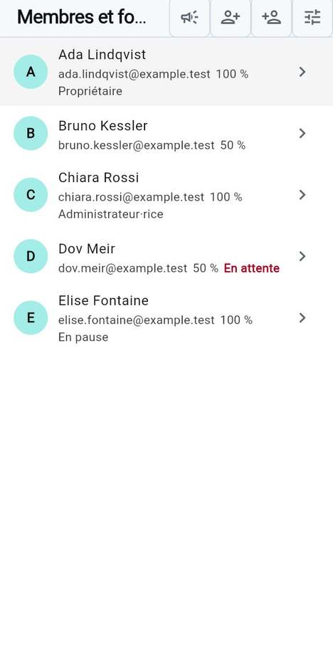

*Les quatre rôles de base*

| Rôle | À quoi il sert | Dans l’association |
|---|---|---|
| **Propriétaire** | La personne qui répond de l’espace et détient toutes les permissions. Seul un propriétaire peut accorder la propriété. | Ada, la présidente. |
| **Copropriétaire** | Une seconde clé. Détient par défaut toutes les permissions, et peut prendre le relais quand le propriétaire part. | Le vice-président, si le bureau en a un. |
| **Administrateur·rice** | Fait tourner le quotidien : membres, réservations pour d’autres, borne, documents, services. Détient ce que la matrice lui donne, et rien de plus. | Chiara, la secrétaire. |
| **Utilisateur** | La personne qui utilise l’espace. Ne détient que les permissions de tous les jours que vous lui donnez. | Bruno, un membre comme les autres. |

Chaque personne a exactement un rôle de base. Un rôle que l’espace définit, comme *Hôte* ou *Comptable*, s’y ajoute et n’enlève jamais rien.

*Un trésorier sans être administrateur*

Bruno tient les comptes, mais ne devrait pas modifier le plan ni approuver de nouveaux membres. Donnez-lui le rôle de base **Utilisateur** et ajoutez un rôle à vous, par exemple *Comptable*, avec quatre permissions : **Consulter les finances de l'espace**, **Émettre les factures et rapprocher les paiements**, **Exporter la comptabilité et les données** et **Consulter les chiffres de l'espace**. Rien de plus. Aucun rôle de ce type n’est fourni : vous le créez avec les étapes ci-dessous.

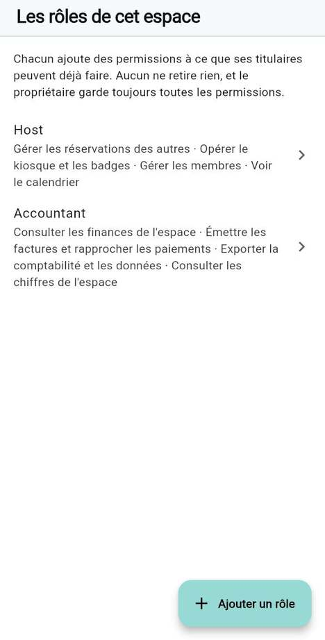

**Étapes**

1. Ouvrez [Les rôles de cet espace](https://fdittgen-png.github.io/deskilo/#/settings/roles-of-this-space) et touchez **Ajouter un rôle**. Voir [Les rôles de cet espace](Guide-utilisateur#les-rôles-que-cet-espace-définit).
2. Nommez le rôle, choisissez **Ce qu'il ajoute**, touchez **Enregistrer le rôle**.
3. Ouvrez la personne dans [Membres et forfaits](https://fdittgen-png.github.io/deskilo/#/members), trouvez **Rôles** et touchez **Ajouter un rôle**.

**Bon à savoir**

- **Les rôles de cet espace** est une fonctionnalité à part entière, désactivée dans un nouvel espace. Activez-la dans [Fonctionnalités](https://fdittgen-png.github.io/deskilo/#/features).
- Personne ne peut se donner un rôle à soi-même. Donner un rôle demande **Gérer les rôles et permissions**, et seul un propriétaire peut donner un rôle qui la comporte.
- Un rôle défini par l’espace prend effet aussitôt et est enregistré. Seuls le fait de nommer quelqu’un administrateur, ou de le lui retirer, suit la règle de validation **Changement de rôle**.

**Résultat** Chaque personne du bureau détient les permissions de son travail, et le propriétaire reste le seul à pouvoir les changer.

**Voir aussi :** [La matrice des rôles](Guide-utilisateur#la-matrice-des-rôles)

<!-- anchor: setup.people.matrix -->
### La matrice des rôles : le moindre privilège

**Public:** Propriétaire · Copropriétaire

Vous voulez que chaque rôle détienne ce dont il a besoin, et rien d’autre. C’est le principe du moindre privilège : commencer petit, ajouter quand quelqu’un le demande, car une permission accordée se reprend rarement de bonne grâce.

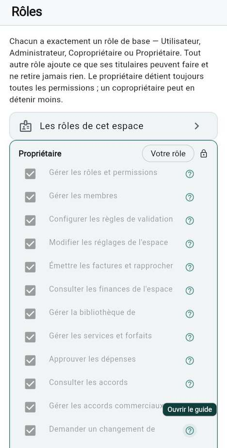

**Étapes**

1. Ouvrez [Rôles](https://fdittgen-png.github.io/deskilo/#/roles). Il y a une carte par rôle : **Propriétaire**, **Copropriétaire**, **Administrateur·rice** (le propriétaire peut la renommer) et **Utilisateur**.
2. Lisez d’abord la carte **Administrateur·rice**. Elle montre ce qu’un administrateur détient aujourd’hui dans votre espace.
3. Décochez ce que vous ne voulez pas déléguer. Cochez les permissions de tous les jours dont la carte **Utilisateur** a besoin (voir plus bas).

*Ce qu’un administrateur détient par défaut*

| Groupe | Permissions |
|---|---|
| Personnes | **Gérer les membres**, **Consulter les données personnelles des membres** |
| Réservations et lieu | **Gérer les réservations des autres**, **Opérer le kiosque et les badges**, **Gérer les sites et modifier le plan** |
| Argent : lire et approuver | **Consulter les finances de l'espace**, **Approuver les dépenses**, **Gérer les services et forfaits**, **Consulter les accords commerciaux**, **Gérer les accords commerciaux**, **Demander un changement de conditions de paiement**, **Exporter la comptabilité et les données** |
| Documents et chiffres | **Gérer la bibliothèque de documents**, **Consulter les chiffres de l'espace** |
| Les deux côtés d’un espace | **Déployer en développement**, **Entrer dans l'espace de production** |

Un administrateur ne détient pas **Gérer les rôles et permissions**, **Configurer les règles de validation**, **Modifier les réglages de l'espace**, **Gérer les tarifs et règles de facturation**, **Concevoir les documents**, **Gérer les intégrations**, **Gérer la configuration** ni **Déployer en production**. Un copropriétaire les détient toutes, jusqu’à ce que vous en décochiez. Le propriétaire les détient toujours toutes.

> **Attention** Dans un nouvel espace, la carte **Utilisateur** est vide. Les six permissions de tous les jours (**Utiliser la messagerie**, **Réserver et utiliser les réservations**, **Voir le calendrier**, **Voir l'annuaire des membres**, **Voir son propre compte et ses factures**, **Voir les documents partagés**) ne sont détenues que par la matrice ou par un rôle. Tant que vous ne les cochez pas, un membre qui arrive ne peut pas ouvrir le plan. La démonstration les montre déjà cochées, ce qui masque ce point. **Mise en place de cet espace** affiche **Ce que les membres peuvent faire** comme **Nécessaire pour une première réservation** tant que la carte **Utilisateur** ne détient pas **Réserver et utiliser les réservations** ; elle ne vérifie pas les cinq autres. Cochez-les pour la carte **Utilisateur**, et pour la carte **Administrateur·rice** si les administrateurs réservent aussi, puis testez avec un second compte.

**Bon à savoir**

- Par défaut, un administrateur peut lire toutes les finances et les données personnelles de chaque membre. Si vos administrateurs sont bénévoles, demandez-vous si c’est souhaitable.
- **Les admins émettent des factures** (une fonctionnalité, désactivée par défaut, sous **Factures**) donne aux administrateurs **Émettre les factures et rapprocher les paiements** quoi que dise la matrice. Préférez la case de la matrice, ou un rôle à vous, qui est plus précis.
- Décocher une permission la retire partout à la fois ; le serveur la vérifie, pas seulement le menu.
- Chaque changement de la matrice est enregistré comme un événement. La fonctionnalité **Gestion des rôles** n’affiche que l’écran ; désactivée, la matrice que vous avez enregistrée continue de s’appliquer, vous ne pouvez simplement plus la modifier.

**Résultat** Une matrice que vous savez expliquer en une phrase par rôle.

**Voir aussi :** [La matrice des rôles](Guide-utilisateur#la-matrice-des-rôles) · [Qui fait quoi](#qui-fait-quoi)

<!-- anchor: setup.people.coowner -->
### Copropriétaires : plus d’une personne qui peut agir

**Public:** Propriétaire · Copropriétaire

Vous voulez que l’espace continue de fonctionner quand vous êtes malade, absent ou parti. Tout espace a besoin de plus d’une personne qui peut agir. Par défaut, seuls les propriétaires et les copropriétaires détiennent les permissions qui changent les fonctionnalités, les rôles, les règles de validation et l’ID de l’espace, et seul un propriétaire peut nommer un autre propriétaire.

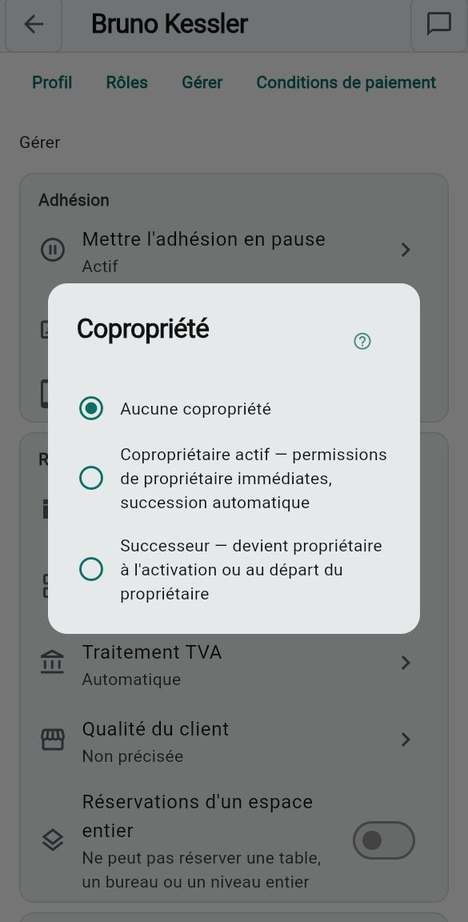

*Les deux sortes*

| Sorte | Ce qu’elle fait | À choisir quand |
|---|---|---|
| *Copropriétaire actif* | Détient dès maintenant les permissions du propriétaire, et prend le relais si le propriétaire part. | Vous partagez le travail : le vice-président, un associé. |
| **Successeur** | Attend. Devient propriétaire quand vous le promouvez ou quand vous partez. | Vous voulez seulement un héritier. |

**Étapes**

1. Activez la fonctionnalité **Copropriétaires** dans [Fonctionnalités](https://fdittgen-png.github.io/deskilo/#/features). Elle est désactivée dans un nouvel espace.
2. Ouvrez la personne dans [Membres et forfaits](https://fdittgen-png.github.io/deskilo/#/members), allez à **Gérer** et touchez **Copropriété**.
3. Choisissez *Copropriétaire actif* ou **Successeur**. Pour transmettre dès maintenant, choisissez **Promouvoir propriétaire maintenant**.

**Bon à savoir**

- Si le dernier propriétaire part, le meilleur copropriétaire devient propriétaire de lui-même, un actif avant un successeur.
- Deux administrateurs, ce n’est pas la même chose : un administrateur ne détient que ce que la matrice lui donne et ne peut jamais transmettre la propriété.
- Une règle qui dit **Le propriétaire doit toujours valider** demande un propriétaire. Vérifiez sur votre côté test que votre copropriétaire peut toujours décider ce que vous attendez.

**Résultat** L’espace a une seconde personne qui peut agir.

**Voir aussi :** [Copropriétaires](Guide-utilisateur#copropriétaires) · [Copropriété](Guide-utilisateur#copropriété)

<!-- anchor: setup.people.join -->
### Comment les personnes rejoignent l’espace

**Public:** Propriétaire · Administrateur·rice

Vous voulez choisir comment les gens arrivent dans votre espace et qui les laisse entrer. Il existe quatre voies, et chacune aboutit au même endroit : une personne qui demande à rejoindre, et quelqu’un qui décide.

| Voie | Ce que la personne reçoit | Ce qu’elle devient |
|---|---|---|
| L’ID de l’espace | Un mot court, saisi dans l’application. | Membre, après approbation. |
| Le QR code | Le même ID sous forme d’image à imprimer ou à afficher (**Partager en PNG**). | Membre, après approbation. |
| Un message d’invitation | Un texte avec un code personnel, valable pour une seule personne, dans la langue que vous choisissez. | Le rôle que vous proposez, après approbation. |
| Un code administrateur | Un code pour une seule personne, depuis l’onglet **Invitation administrateur·rice**. | Administrateur, une fois. |

**Étapes**

1. Ouvrez [ID de l’espace et QR](https://fdittgen-png.github.io/deskilo/#/workspace-code). Choisissez un ID dont on peut se souvenir avec **Changer l'ID de l'espace** : de 4 à 20 lettres ou chiffres, unique dans tout DesKilo.
2. Pour une personne nommée, touchez **Inviter quelqu'un**. Renseignez le nom, cochez **Rôles à l'arrivée** si elle doit recevoir un rôle, choisissez la **Langue du message** et envoyez.
3. Quand quelqu’un demande à rejoindre, sa ligne dans [Membres et forfaits](https://fdittgen-png.github.io/deskilo/#/members) indique **En attente**. Ouvrez-la et choisissez **Approuver l'adhésion** ou **Refuser l'adhésion**.

**Bon à savoir**

- Personne n’entre sans décision. Tant qu’elle n’est pas prise, la personne qui arrive voit un écran d’attente et rien d’autre.
- La décision suit la règle de **Nouveau membre** dans les [Règles de validation](https://fdittgen-png.github.io/deskilo/#/validation) : par défaut, un propriétaire ou un administrateur suffit ; si vous en exigez deux, la première approbation laisse la personne en attente.
- Si vous changez l’ID de l’espace, l’ancien cesse de fonctionner. Imprimez de nouveau le QR code.
- Il n’y a pas d’invitation de propriétaire. La propriété se donne dans **Membres et forfaits**.

**Résultat** Les gens peuvent vous trouver, et vous décidez qui reste.

**Voir aussi :** [L’ID de l’espace](Guide-utilisateur#lid-de-lespace) · [Rejoindre un espace](Guide-utilisateur#rejoindre-un-espace) · [Membres en attente et en pause](Guide-utilisateur#membres-en-attente-et-en-pause)

<!-- anchor: setup.people.invitation -->
### Le message d’invitation, langue par langue

**Public:** Propriétaire · Administrateur·rice

Vous voulez une invitation qui ressemble à votre espace, dans la langue de la personne qui la reçoit. Chaque langue a son propre texte ; celle que vous ne rédigez pas retombe sur le message fourni.

**Étapes**

1. Ouvrez [Espace](https://fdittgen-png.github.io/deskilo/#/workspace-settings) et allez à **Communauté et invitations**.
2. Sous **Langue du message**, choisissez la langue pour laquelle vous écrivez. La ligne s’ouvre sur la langue de votre espace.
3. Rédigez le texte. Touchez une balise pour l’insérer à l’endroit du curseur. La limite est de 2 000 caractères.
4. Recommencez pour chaque langue que vos membres utilisent, puis touchez **Enregistrer**.

*Les balises*

| Balise | Remplie avec |
|---|---|
| `{firstName}` `{lastName}` `{phone}` | Ce que vous avez saisi dans **Inviter quelqu'un**. Vide si vous n’avez rien saisi. |
| `{workspaceName}` | Le nom de votre espace. |
| `{workspaceId}` | Le code d’invitation personnel de ce message (pas l’ID public de l’espace). |
| `{inviteLink}` | Un lien qui ouvre l’application sur le bon serveur, avec le code déjà rempli. |
| `{downloadUrl}` | La page de l’application dans la boutique. |
| `{role}` | Le rôle que propose l’invitation, dans la langue du message. |

**Bon à savoir**

- Laissez la case vide et l’application rédige son propre message dans cette langue. Il explique les étapes : télécharger, créer un compte, rejoindre avec le code.
- Ne collez pas vous-même un code ou un lien. Chaque envoi crée son propre code, valable pour une seule personne.
- Une balise mal orthographiée reste visible dans le texte envoyé : lisez l’aperçu avant d’envoyer.
- Le message fourni indique à la personne que le code est à usage unique et valable 14 jours.

**Résultat** Une invitation que vos membres peuvent suivre sans vous poser de question.

**Voir aussi :** [Message d’invitation](Guide-utilisateur#message-dinvitation) · [Inviter quelqu’un par message](Guide-utilisateur#inviter-quelquun-par-message)

<!-- anchor: setup.people.managed -->
### Profils gérés

**Public:** Propriétaire · Administrateur·rice

Vous voulez réserver, facturer et gérer pour quelqu’un qui n’a pas encore de compte : un visiteur, un membre âgé, une personne qui préfère le papier.

**Étapes**

1. Activez **Profils gérés** dans [Fonctionnalités](https://fdittgen-png.github.io/deskilo/#/features).
2. Dans [Membres et forfaits](https://fdittgen-png.github.io/deskilo/#/members), touchez **Ajouter un profil géré** et renseignez l’identité.
3. Quand la personne est prête, ouvrez sa page et choisissez **Remettre à la personne**. Cela crée un code personnel lié au profil.

**Bon à savoir**

- La personne qui utilise le code reprend le profil avec ses réservations, ses factures et son abonnement, une fois que vous approuvez l’adhésion.
- Reprenez la remise avec **Annuler la remise** si le code n’a pas encore été utilisé.

**Voir aussi :** [Ajouter un profil géré](Guide-utilisateur#ajouter-un-profil-géré)

<!-- anchor: setup.people.validation -->
### Validation : de quoi est faite une règle

**Public:** Propriétaire

Vous voulez choisir, acte par acte, si une seconde personne doit donner son accord. Un domaine de validation est une sorte d’acte avec sa propre règle : *un paiement*, *une dépense*, *un nouveau membre*, *la suppression d’une réservation*. Dans **Règles de validation**, les domaines sont répartis en trois groupes.

| Groupe | Domaines, en mots simples | Pendant l’attente |
|---|---|---|
| **Argent** | Un paiement, une dépense, un service, une facture rapprochée de son paiement, une facture émise ou annulée, un remboursement, une passation en perte, un accord de prix, une dépense partagée, une dépense programmée, un changement de conditions de paiement, un départ anticipé, un relevé d’usage supprimé | Le montant ne compte sur le relevé de personne. |
| **Réservations** | Les **Demi-journées supplémentaires** qu’un membre demande, les **Réservations d'espaces entiers**, une réservation faite pour un membre par un administrateur, une **Suppression de réservation** | La place reste telle qu’elle était. |
| **Personnes et rôles** | **Nouveau membre**, un changement de rôle, un changement de statut, un changement d’abonnement, un changement de la matrice des permissions | La personne garde l’accès qu’elle a actuellement. |

Chaque domaine démarre sur **Hérite de la règle par défaut** : une validation par n’importe quel administrateur ou propriétaire. **Règle par défaut** est la règle dont héritent toutes les autres. Un domaine que vous ouvrez et enregistrez devient **Personnalisée**.

*Les curseurs d’une règle*

| Réglage | Ce qu’il signifie | Nécessite |
|---|---|---|
| **Validations requises** | Combien de personnes doivent dire oui. | |
| **Qui valide** | **Les admins**, **Personnes désignées** ou **Tous les membres**. Le propriétaire le peut toujours. | **Validateurs par rôle ou par personne** : sans elle, le choix n’est pas affiché et les administrateurs valident. Après l’avoir désactivée, vérifiez de nouveau les règles qui nommaient **Personnes désignées** |
| **Les admins peuvent valider** | Désactivé, seuls les propriétaires valident. | |
| **Le propriétaire doit toujours valider** | Un des oui doit venir d’un propriétaire. | |
| **Le propriétaire peut valider le sien** | La demande du propriétaire lui-même n’attend pas quelqu’un d’autre. Un administrateur n’obtient jamais cela. | **Validations enchaînées** |
| **L'une après l'autre** | La seconde est demandée quand la première a dit oui. | **Validations enchaînées** |
| **Seulement au-delà de ce montant** | En dessous, l’acte s’applique aussitôt. Domaines d’argent uniquement. | **Validations enchaînées** |
| **Les admins suppriment sans validation** / **Les propriétaires suppriment sans validation** | Leur propre **Suppression de réservation** se règle d’elle-même et reste marquée comme validée automatiquement. Désactivé par défaut. | |

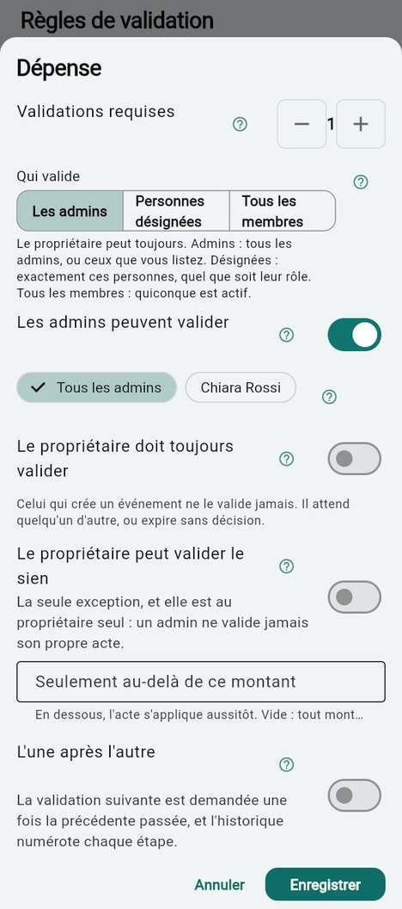

**Étapes**

1. Ouvrez [Règles de validation](https://fdittgen-png.github.io/deskilo/#/validation). Touchez **Règle par défaut** et décidez de ce dont tout le reste hérite.
2. Touchez un domaine, réglez les curseurs, touchez **Enregistrer**.
3. Gardez peu d’exceptions. Chaque exception est une chose de plus à retenir quand quelqu’un demande « pourquoi cela attend-il ? ».

**Bon à savoir**

- Personne ne valide son propre acte. Il attend quelqu’un d’autre, sauf si l’exception du propriétaire est activée.
- Chaque décision est enregistrée : qui, quand, sur quoi.
- Une demande à laquelle personne ne répond expire au bout de sept jours, constatés la prochaine fois que quelqu’un ouvre Événements. Un acte qu’un administrateur a fait pour un membre est en revanche confirmé automatiquement.

**Voir aussi :** [Règles de validation, domaine par domaine](Guide-utilisateur#règles-de-validation-domaine-par-domaine) · [Qui peut valider](Guide-utilisateur#qui-peut-valider) · [Validation automatique](Guide-utilisateur#valider-automatiquement-la-demande-dun-administrateur)

<!-- anchor: setup.people.presets -->
### Trois préréglages à copier

**Public:** Propriétaire

Vous voulez un jeu de règles que vous pouvez copier aujourd’hui et affiner plus tard. Choisissez-en un ; chacun s’appuie sur le périmètre par défaut, propriétaire et administrateurs, si bien qu’aucune fonctionnalité supplémentaire n’est nécessaire.

| Préréglage | À choisir quand | Ce que vous réglez | Validateurs nécessaires |
|---|---|---|---|
| *Adhésion libre* | Vous connaissez les personnes qui scanneront votre code. | Rien. Chaque domaine hérite de la règle par défaut : une validation par n’importe quel propriétaire ou administrateur. Une adhésion n’est tout de même jamais automatique. | 1 (vous) |
| *Adhésions validées* | Un bureau décide qui entre. | **Nouveau membre** : **Validations requises** 2, **Le propriétaire doit toujours valider** activé. | 2 : un propriétaire et un administrateur |
| *Adhésions et réservations validées* | Les places ou les salles entières sont rares, ou les suppressions de réservation demandent un témoin. | *Adhésions validées*, plus, sur **Réservations d'espaces entiers**, **Demi-journées supplémentaires** et **Suppression de réservation** : **Validations requises** 1. | 2 au minimum, 3 pour être à l’aise |

Dans l’association : Ada est propriétaire, Chiara administratrice. Avec *Adhésions validées*, Ada et Chiara approuvent toutes deux chaque nouvelle personne. Avec le troisième préréglage, une salle entière que Bruno réserve lui est aussitôt bloquée, mais Ada ou Chiara peuvent encore la refuser, et une suppression que Chiara demande est décidée par Ada, pas par Chiara.

**Étapes**

1. Ouvrez [Règles de validation](https://fdittgen-png.github.io/deskilo/#/validation).
2. Touchez **Nouveau membre**, réglez ce que dit le tableau, touchez **Enregistrer**.
3. Pour le troisième préréglage, recommencez sur les trois autres domaines.
4. Ouvrez **Membres et forfaits** et comptez vos propriétaires et administrateurs actifs. Il en faut au moins le nombre de la dernière colonne.

**Bon à savoir**

- Une réservation ordinaire d’un membre n’est jamais retenue pour approbation par ces préréglages. Ce qui attend, c’est une salle entière, des demi-journées supplémentaires, une suppression et l’adhésion.
- Un préréglage est un point de départ. N’augmentez un nombre que lorsque vous avez assez de personnes pour répondre.

**Voir aussi :** [Validations requises](Guide-utilisateur#validations-requises) · [Un propriétaire est requis](Guide-utilisateur#un-propriétaire-est-requis)

<!-- anchor: setup.people.stuck -->
### Éviter les demandes qui attendent pour toujours

**Public:** Propriétaire · Copropriétaire

Vous voulez être sûr que chaque demande pour laquelle vous créez une règle peut recevoir une réponse. Une règle qui demande plus de validateurs qu’il n’en existe n’est pas refusée partout : la demande est créée, personne ne peut la mener à bien, et elle expire au bout de sept jours.

> **Attention** L’éditeur compte un validateur de plus pour la personne concernée : il vous laisse donc enregistrer **Validations requises** à un de plus que les personnes dont vous disposez. Ce oui supplémentaire n’existe que pour une réservation qu’un administrateur a faite pour un membre, et pour certains paiements. Pour une adhésion ou une demande d’argent, il n’existe pas. Ne comptez pas sur l’éditeur pour compter à votre place.

*Comptez avant d’exiger*

| Vous exigez | Il vous faut, en plus de la personne qui demande |
|---|---|
| 1 | Un propriétaire ou un administrateur actif |
| 2 | Deux propriétaires ou administrateurs actifs |
| 2 avec **Le propriétaire doit toujours valider** | Un propriétaire et une personne de plus |
| Une liste **Personnes désignées** | Chaque personne de la liste doit être active ; un nouvel administrateur n’y est pas ajouté automatiquement |

*Comment vérifier*

1. Ouvrez [Règles de validation](https://fdittgen-png.github.io/deskilo/#/validation) et lisez chaque carte personnalisée : « Tous les admins — n’importe lesquels 2 » veut dire deux personnes.
2. Ouvrez [Membres et forfaits](https://fdittgen-png.github.io/deskilo/#/members). Comptez les propriétaires et administrateurs actifs. Les personnes en pause ou sorties ne comptent pas.
3. Ouvrez **Mise en place de cet espace** dans [Espace](https://fdittgen-png.github.io/deskilo/#/workspace-settings). Le domaine **Rôles et validation des demandes** dit « Une règle demande plus de validateurs que cet espace n’en compte » quand il en compte trop peu. Le domaine devient alors obligatoire, quel que soit le type de demande, et [Ce qui vous attend](Guide-utilisateur#ce-qui-vous-attend) le signale.
4. Ouvrez [Événements](https://fdittgen-png.github.io/deskilo/#/events). **En attente de votre confirmation** montre ce qui attend, et une ligne affiche « 1/2 validations ».

**Bon à savoir**

- L’éditeur lui-même dit **Pas assez de validateurs éligibles.** quand un nombre dépasse nettement les personnes disponibles. Il ne détecte pas tous les cas.
- Un propriétaire seul qui demande quelque chose pour lui-même attend quelqu’un d’autre : ajoutez un administrateur, ou activez **Le propriétaire peut valider le sien** sous **Validations enchaînées**.
- Mettre en pause ou retirer un administrateur peut laisser une règle à court de validateurs. Recomptez après chaque changement d’équipe.

**Résultat** Chaque règle peut recevoir une réponse de personnes qui existent.

**Voir aussi :** [Validations requises](Guide-utilisateur#validations-requises) · [Rester cohérent](#rester-cohérent)

<!-- anchor: setup.people.first-week -->
### La première semaine de vos membres

**Public:** Propriétaire · Administrateur·rice

Vous voulez que vos premiers membres s’en sortent sans vous solliciter. Ce que vous leur dites la première semaine détermine ce que vous aurez à répondre la deuxième.

*Avant d’inviter qui que ce soit*

1. Connectez-vous comme seconde personne avec un compte de test et rejoignez votre espace. Vérifiez que vous pouvez ouvrir le plan et réserver une place.
2. Approuvez ce compte comme membre, et faites approuver aussi le second validateur si vous en exigez deux.

**Étapes**

1. Envoyez le message d’invitation. Il explique comment télécharger l’application, créer un compte et rejoindre l’espace. Voir [Rejoindre un espace](Guide-utilisateur#rejoindre-un-espace).
2. Approuvez chaque nouvelle personne le jour même. Quelqu’un qui attend une journée commence avec un doute.
3. Dites-leur les trois premières choses : le plan et la réservation ([Réserver une place](Guide-utilisateur#réserver-une-place)), l’enregistrement à l’arrivée ([S’enregistrer à l’arrivée et au départ](Guide-utilisateur#check-in-et-check-out)), et l’endroit où attendent leurs demandes ([Événements](Guide-utilisateur#événements-et-confirmations)).
4. Dites-leur ce que vous voyez d’eux et ce qu’ils contrôlent ([Qui peut voir mes données](Guide-utilisateur#confidentialité--qui-peut-voir-mes-données)).
5. Désignez une personne à qui s’adresser, et où : la messagerie, ou l’accueil.

**Bon à savoir**

- Quand un administrateur fait quelque chose pour un membre, cela reste en attente jusqu’à ce que le membre confirme. Prévenez-les, sinon la première réservation que vous ferez pour quelqu’un aura l’air d’une erreur.
- Les membres qui n’utilisent pas les notifications push retrouvent tout sous **Événements**.
- À la première visite de Réserver, la carte **Premiers pas** montre aux propriétaires ce qui manque encore. Les membres ont leurs propres petites astuces. Voir [La carte Premiers pas et les astuces](Guide-utilisateur#la-carte-premiers-pas-et-les-astuces).

**Résultat** Des personnes qui savent réserver, s’enregistrer et à qui s’adresser.

**Voir aussi :** [De la semaine 0 à la semaine 4](#apprendre-en-quatre-semaines) · [Comment les membres sont informés](#ce-que-les-membres-contrôlent)

<!-- anchor: setup.money.overview -->
## Argent et fiscalité

Ce chapitre s'adresse à vous qui allez décider comment un espace se finance. Il parle des décisions et de leur ordre ; les clics sont dans le guide d'utilisation, et chaque section y renvoie.

> **Attention** DesKilo enregistre, calcule et imprime ce que vous déclarez, et vérifie que les informations obligatoires sont présentes. Il ne certifie ni vos factures, ni votre traitement de la TVA, ni votre comptabilité. Chaque fois que ce chapitre dit « demandez à votre expert-comptable », faites-le.

Dans ce chapitre :
- Les membres paient-ils, et qui émet les factures
- Comment se construit un tarif, avec les chiffres de l'espace de démonstration *Atelier du Marché*
- Comment les membres vous paient
- Votre identité légale, et les questions à poser à votre expert-comptable
- Facturation manuelle ou automatique, relances, et la TVA en résumé
- Les décisions financières irréversibles, et comment répéter sans risque

<!-- anchor: setup.money.decide -->
### D'abord décider : les membres paient-ils, et qui émet les factures

**Public:** Propriétaire

Vous choisissez jusqu'où DesKilo va dans votre gestion financière. Tout le reste de ce chapitre découle de ce choix. Il est facile d'aller plus loin plus tard, mais difficile de revenir en arrière une fois que des factures existent.

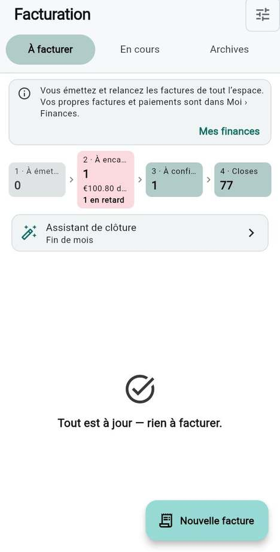

**Avant de commencer**

Répondez à deux questions : les membres vous paient-ils pour l'espace, et voulez-vous que les factures légales sortent de DesKilo ?

| Voie | À choisir quand | Ce qui se passe |
|---|---|---|
| 1. Pas d'argent | L'espace est gratuit, ou les membres sont des amis qui se partagent le loyer en dehors de l'app | Vous laissez désactivées les fonctions financières. Les membres réservent ; personne n'est facturé. |
| 2. Relevés et paiements, factures à l'extérieur | Vous avez déjà un expert-comptable ou un outil de facturation, ou vous travaillez dans un pays pour lequel DesKilo ne peut pas émettre de factures | Les membres ont un relevé mensuel, vous enregistrez les paiements reçus, et vous exportez les chiffres pour votre expert-comptable. Les factures légales sont produites ailleurs. |
| 3. Factures émises par DesKilo | Vous êtes en France ou en Allemagne, et vous êtes soit assujetti à la TVA, soit hors champ de la TVA (une association, par exemple) | DesKilo produit des factures signées et numérotées à partir de ce qui a été réservé, avec votre identité légale imprimée dessus. |

**Étapes**

1. Choisissez votre voie dans le tableau.
2. Pour la voie 2 ou 3, activez les fonctions financières dont vous avez besoin dans [Fonctionnalités](Guide-utilisateur#un-interrupteur-de-fonctionnalité) : **Factures** est la base de tout ce qui est émis, et les fonctions placées en dessous (**Factures d'abonnement**, **Factures de fin de mois**, **Relances de paiement**, **Gestion de la TVA**) s'activent une à une.
3. Pour la voie 3, passez à [votre identité légale](#votre-identité-légale-et-ce-quil-faut-demander-à-votre-expert-comptable) avant la première réservation, pas après.

**Bon à savoir**

- L'émission de factures dans l'app existe aujourd'hui pour un espace situé en **France** ou en **Allemagne**. Dans tout autre pays, prenez la voie 2 : les relevés restent disponibles.
- Le serveur refuse d'émettre, et la liste **Complétez ces informations avant d'émettre** vous dit pourquoi, quand une information manque ou quand le traitement n'est pas géré par DesKilo : ventes transfrontalières, autoliquidation, exportations et factures exonérées de TVA doivent être examinées et émises hors de l'app, avec votre expert-comptable.
- Un vendeur en franchise en base de TVA (Kleinunternehmer en Allemagne) ne peut pas émettre de factures dans l'app : le serveur refuse la catégorie de TVA exonérée. Restez sur la voie 2 et émettez ces factures ailleurs.
- Désactiver une fonction arrête les nouvelles opérations de ce type ; rien n'est supprimé.
- Vous pouvez rester sur la voie 2 pour toujours. Beaucoup d'associations le font.

**Résultat**

Vous savez laquelle des trois voies est la vôtre, et de quelles fonctions elle a besoin.

**Voir aussi:** [La facturation en un coup d'œil](Guide-utilisateur#la-facturation-en-un-coup-dœil) · [Activer ou désactiver des processus entiers](Guide-utilisateur#activer-ou-désactiver-des-processus-entiers)

<!-- anchor: setup.money.tariff -->
### Concevoir un tarif

**Public:** Propriétaire · Administrateur·rice facturation

Vous transformez « combien vaut une place ? » en chiffres que DesKilo applique chaque mois sans vous.

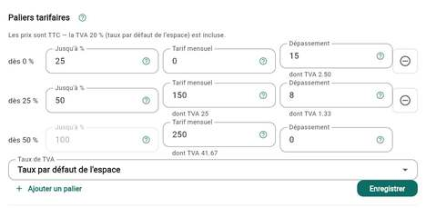

**Avant de commencer**

Gardez le modèle en tête. Il se lit de gauche à droite, et chaque étape alimente la suivante :

1. Pourcentage d'abonnement : un membre détient un pourcentage du mois : 25, 50, 75 ou 100 %, ou une valeur que vous autorisez.
2. Quota de demi-journées : le pourcentage devient un nombre de demi-journées pour le mois : le nombre de jours ouverts, multiplié par deux, multiplié par le pourcentage, arrondi au supérieur.
3. Palier tarifaire : le pourcentage tombe dans un palier, qui donne le tarif mensuel et le prix d'une demi-journée supplémentaire. Un palier couvre « au-dessus de son début, jusqu'à sa fin incluse », et les paliers réunis doivent couvrir de 0 à 100 % sans trou.
4. Règle de dépassement : quand le quota est épuisé, chaque membre est soit bloqué, soit facturé au prix du dépassement, soit invité à acheter un forfait.
5. Forfaits et services : un forfait de jours vend à l'avance des demi-journées supplémentaires au prix que vous fixez ; les services (un café, un casier, l'impression) se vendent en plus.

**Étapes**

1. Décidez des pourcentages que vous proposez sous **Niveaux d'abonnement**, et si un propriétaire peut saisir une valeur négociée (voir [Niveaux d'abonnement](Guide-utilisateur#niveaux-dabonnement)).
2. Définissez une ligne par tranche dans **Paliers tarifaires** : sa limite haute, le tarif mensuel et le prix du dépassement (voir [Paliers tarifaires](Guide-utilisateur#paliers-tarifaires)).
3. Choisissez la règle par défaut pour les membres qui n'ont plus de jours : [Quand les jours sont épuisés](Guide-utilisateur#quand-les-jours-sont-épuisés).
4. Ajoutez les [forfaits de jours](Guide-utilisateur#forfaits-de-jours) et les [services](Guide-utilisateur#un-service) que vous vendez.

**Bon à savoir**

- Le calcul est figé sur chaque document émis. Modifier un prix change le mois suivant, jamais un mois déjà facturé.
- Les horaires d'ouverture et les jours de fermeture décident du nombre de jours ouverts dans un mois, donc de la taille du quota. Réglez-les d'abord.
- Un membre sans abonnement est prévu pour les visiteurs qui achètent des carnets ; il ne peut pas être au paiement à l'usage.

**Voir aussi:** [Facturation](Guide-utilisateur#paliers-tarifaires) · [L'abonnement d'un membre](Guide-utilisateur#labonnement-dun-membre)

<!-- anchor: setup.money.example -->
### Un exemple pas à pas

**Public:** Propriétaire · Administrateur·rice facturation

Vous suivez un membre pendant un mois avec les chiffres de l'*Atelier du Marché*, pour pouvoir vérifier les vôtres de la même façon.

**Avant de commencer**

L'espace de démonstration a trois paliers tarifaires, en euros et TVA comprise. Les chiffres sont ceux de la démo, pas une recommandation.

| Palier | Tarif mensuel | Demi-journée en plus | Demi-journées dans un mois de 22 jours ouverts |
|---|---|---|---|
| jusqu'à 25 % | 0,00 | 15,00 | 11 |
| au-dessus de 25 %, jusqu'à 50 % | 150,00 | 8,00 | 22 |
| au-dessus de 50 %, jusqu'à 100 % | 250,00 | 0,00 | 44 (à 100 %) |

**Étapes**

1. Un membre détient 50 %. Dans un mois de 22 jours ouverts, le quota est de 22 × 2 × 50 / 100 = 22 demi-journées.
2. 50 % tombe dans le deuxième palier (au-dessus de 25, jusqu'à 50) : le tarif est de 150,00, quoi que le membre consomme.
3. Le membre réserve 24 demi-journées. Deux dépassent le quota, à 8,00 chacune : 16,00.
4. Le mois coûte 150,00 + 16,00 = 166,00, avant tout service. Dans la démo, les prix sont TTC : la TVA de 20 % est comprise dedans, et l'écran l'indique sous chaque prix.
5. Comparez avec un forfait : le forfait de 5 jours de la démo coûte 40,00 et ajoute 10 demi-journées (5 jours, deux demi-journées chacun), soit 4,00 la demi-journée. Face à 8,00 de dépassement, il devient rentable dès la sixième demi-journée supplémentaire d'un mois.

**Bon à savoir**

- Un prix de dépassement de 0,00 signifie que les demi-journées supplémentaires ne coûtent rien au paiement à l'usage.
- Le relevé que voit un membre montre les mêmes lignes : tarif, inclus, utilisé, en plus, dépassement.
- Les prix s'affichent TTC quand la TVA est activée ; la taxe en est extraite.
- Si vous convenez avec un membre de conditions différentes, voir [la négociation des prix](#négociation-des-prix).

**Résultat**

Vous pouvez prévoir la facture d'un membre à partir de trois nombres : son pourcentage, les jours ouverts, les réservations.

**Voir aussi:** [Lire votre relevé](Guide-utilisateur#lire-votre-relevé) · [Ce qu'a coûté chaque réservation](Guide-utilisateur#ce-que-chaque-réservation-a-coûté)

<!-- anchor: setup.money.negotiation -->
### Négociation des prix

**Public:** Propriétaire · Administrateur·rice facturation

Vous voulez qu'un membre paie des conditions différentes de celles du tarif, en laissant une trace.

**Étapes**

1. Activez la fonction de négociation des prix dans [Fonctionnalités](Guide-utilisateur#un-interrupteur-de-fonctionnalité).
2. Proposez des conditions sur la fiche du membre : un tarif mensuel différent, un taux de dépassement, une remise sur les suppléments, des prix unitaires ou un pourcentage d'occupation (voir [Négociation des prix](Guide-utilisateur#négociation-tarifaire)).
3. Laissez la règle de validation des négociations de prix décider qui la confirme.

**Bon à savoir**

- Le tarif reste la référence ; un prix négocié appartient à un seul membre.
- Il est visible du membre, des propriétaires et des personnes autorisées à consulter les accords commerciaux, et chaque lecture est journalisée.
- Fixez votre politique avant de commencer : une exception accordée discrètement devient vite le prix que tout le monde réclame.

**Voir aussi:** [Vos prix négociés](Guide-utilisateur#vos-conditions-négociées)

<!-- anchor: setup.money.pay -->
### Comment les membres vous paient

**Public:** Propriétaire · Administrateur·rice facturation

Vous choisissez où va l'argent d'un membre, et quelle part du travail DesKilo fait pour vous.

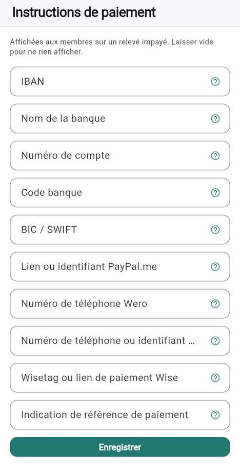

**Étapes**

1. Commencez par la voie gratuite : renseignez les [instructions de paiement](Guide-utilisateur#moyens-de-paiement-et-instructions) : votre IBAN et vos coordonnées bancaires, ainsi que PayPal.me, Wero, Lydia ou Wise si vous les acceptez, plus une indication de référence.
2. Les membres voient ces informations sur un relevé impayé. Quand un paiement arrive sur votre compte, vous ou un·e administrateur·rice facturation [l'enregistrez](Guide-utilisateur#enregistrer-un-paiement).
3. Seulement si vous voulez que les membres paient dans l'app, connectez un prestataire dans [Paiements en ligne](Guide-utilisateur#le-prestataire-de-paiement) : PayPal, Stripe ou Mollie. Cela demande la fonction **Paiements en ligne** et votre propre compte chez le prestataire.

**Bon à savoir**

- DesKilo enregistre les paiements ; avec la voie manuelle, il ne déplace jamais d'argent.
- Un prestataire prélève ses propres frais et reçoit les clés de votre compte (la fiche des identifiants explique comment elles se saisissent).
- Quand **Paiements en ligne** est désactivé, un nouveau paiement en ligne est refusé ; un paiement déjà ouvert peut encore se régler.
- Un espace créé à partir d'un modèle ne reprend pas les coordonnées de paiement : saisissez-les dans chaque espace. Un export de configuration, lui, les reprend.

**Voir aussi:** [Régler ce que vous devez](Guide-utilisateur#payer-ce-que-vous-devez) · [Identifiants du prestataire](Guide-utilisateur#identifiants-du-prestataire)

<!-- anchor: setup.money.identity -->
### Votre identité légale, et ce qu'il faut demander à votre expert-comptable

**Public:** Propriétaire

Vous dites à DesKilo qui vend, pour que chaque facture vous désigne correctement. C'est la partie à régler avec un professionnel.

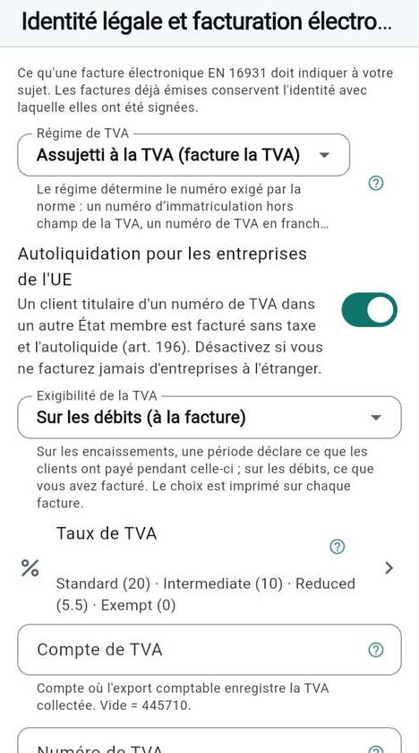

**Avant de commencer**

L'écran est [Identité légale et facturation électronique](https://fdittgen-png.github.io/deskilo/#/legal-identity). Préparez :

- votre type d'organisation : une entreprise, ou une association à but non lucratif ;
- votre régime de TVA : hors champ de la TVA, exonéré de TVA (franchise en base), ou assujetti à la TVA. L'app ne peut émettre des factures que pour le premier et le dernier ; avec la franchise en base, l'écran enregistre votre statut mais les factures doivent être émises ailleurs (voie 2) ;
- votre numéro d'immatriculation (SIREN ou SIRET en France), et votre numéro de TVA si vous en avez un ;
- votre adresse postale, telle qu'elle figure sur votre immatriculation ;
- la raison pour laquelle aucune TVA n'est facturée, si vous n'en facturez pas.

> **Attention** Choisir le régime est une décision fiscale, pas un réglage logiciel. Une association sans activité commerciale est normalement hors champ de la TVA, et l'écran vous avertit si vous choisissez « exonéré » pour elle. Confirmez ce choix avant d'émettre la première facture.

**Étapes**

1. Ouvrez [Identité légale et facturation électronique](https://fdittgen-png.github.io/deskilo/#/legal-identity) et avancez depuis le haut : d'abord le **Régime de TVA**, puis les identifiants, l'adresse et les **Mentions de facturation**.
2. Renseignez les conditions de paiement, les mentions de retard de paiement et les autres mentions que votre pays exige (voir [Votre identité légale](Guide-utilisateur#votre-identité-légale)).
3. Touchez **Enregistrer**, puis relisez une fois le modèle de facture avec votre expert-comptable (voir [Le modèle PDF de facture](Guide-utilisateur#le-modèle-pdf-de-facture)).

> **Astuce** Les questions à poser à votre expert-comptable :
>
> 1. Dans quel type d'organisation et quel régime de TVA suis-je ?
> 2. Quels sont mon numéro d'immatriculation et mon numéro de TVA, et comment les écrire ?
> 3. Si je ne facture pas de TVA, quelle mention légale le justifie ?
> 4. Quelles mentions doivent figurer sur mes factures (délai de paiement, pénalité de retard, indemnité forfaitaire de recouvrement, escompte pour paiement anticipé, assurance) ?
> 5. Comment numéroter les factures, et la numérotation repart-elle chaque année ou chaque mois ?
> 6. Quand la TVA sur mes prestations devient-elle exigible selon la règle de mon pays (encaissement, mois de la prestation, facture), et dois-je opter pour une autre base, comme les débits ?
> 7. Dois-je envoyer des factures électroniques à une plateforme publique, et laquelle ?
> 8. Ai-je besoin de déclarations de TVA périodiques, et à quel rythme ?

**Bon à savoir**

- Les factures déjà émises gardent l'identité avec laquelle elles ont été signées ; une modification s'applique aux suivantes.
- Seul un propriétaire ou un copropriétaire actif peut ouvrir cet écran, et la fonction **Factures** doit être activée.
- Un espace créé à partir d'un modèle ne reprend pas votre identité : saisissez-la de nouveau. Un déploiement entre les deux côtés d'une paire, lui, la reprend.

**Voir aussi:** [Régime de TVA](Guide-utilisateur#régime-de-tva) · [La plateforme de facturation électronique](Guide-utilisateur#la-plateforme-de-facturation-électronique) · [Type d'organisation](Guide-utilisateur#type-dorganisation)

<!-- anchor: setup.money.invoicing -->
### Facturer à la main ou automatiquement

**Public:** Propriétaire · Administrateur·rice facturation

Vous décidez si une personne appuie sur les boutons chaque mois ou si DesKilo s'en charge.

**Étapes**

1. Pour un premier mois, travaillez à la main : ouvrez [Facturation](https://fdittgen-png.github.io/deskilo/#/invoices), lisez **À émettre**, et émettez la facture d'un membre (voir [Émettre une facture](Guide-utilisateur#émettre-une-facture)).
2. Pour une routine, utilisez l'[assistant de clôture du mois](Guide-utilisateur#lassistant-de-clôture) : il passe par **Revue**, **Émettre**, **Envoyer**, **Relancer**, **Paiements**, **Rapprocher**, **Clôturer** et **Récapitulatif**.
3. Pour automatiser, activez **Factures d'abonnement** et **Factures de fin de mois** dans [Fonctionnalités](Guide-utilisateur#un-interrupteur-de-fonctionnalité), puis réglez les jours dans [Calendrier de facturation](Guide-utilisateur#calendrier-de-facturation).

**Bon à savoir**

- Deux documents existent par mois : le tarif d'abonnement, émis avant le mois, et ce que le mois a réellement coûté, émis après. Une facture peut être datée de quelques jours à l'avance (trois par défaut, réglables dans le calendrier de facturation) ; une facture datée du 29 août peut donc désigner septembre.
- Côté serveur, une exécution quotidienne émet les deux quand la base de données de l'installation a son planificateur activé ; en cas de doute, demandez à l'opérateur.
- Chaque type de facture (abonnement, fin de mois) ne peut être émis qu'une fois par membre et par mois. Une facture ne se modifie ni ne se supprime ; une facture erronée est marquée comme telle et remplacée.
- Par défaut, le propriétaire et les copropriétaires émettent les factures. **Les admins émettent des factures** étend ce droit aux administrateurs.

**Voir aussi:** [L'écran Facturation](Guide-utilisateur#lécran-facturation) · [Relancer et solder les factures ouvertes](Guide-utilisateur#relancer-et-solder-les-factures-en-cours)

<!-- anchor: setup.money.reminders -->
### Relances de paiement

**Public:** Propriétaire · Administrateur·rice facturation

Vous décidez à partir de quand un paiement est en retard, et qui relance.

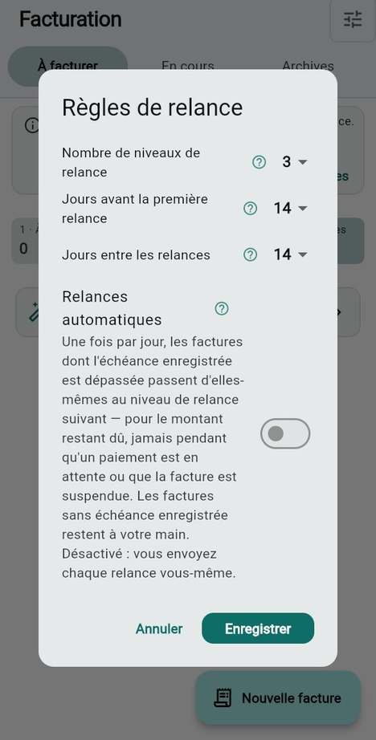

**Étapes**

1. Activez **Relances de paiement** dans [Fonctionnalités](Guide-utilisateur#un-interrupteur-de-fonctionnalité). Elle se trouve sous **Factures**.
2. Réglez le nombre de niveaux et les délais dans [Règles de relance](Guide-utilisateur#règles-de-relance) : jours avant la première relance, jours entre deux relances.
3. Décidez si les relances partent toutes seules : activez **Relances automatiques** dans la même fenêtre (voir [Relances automatiques](Guide-utilisateur#relances-automatiques)) ; la fonction **Relances de paiement automatiques** doit aussi être activée.

**Bon à savoir**

- Le délai avant la première relance est aussi lu comme votre délai de paiement. Réglez-le avec les [Conditions de paiement](Guide-utilisateur#modalités-de-règlement).
- Les relances automatiques s'exécutent une fois par jour sur le serveur quand la base de données a son planificateur activé. Elles s'exécutent aussi quand une personne autorisée à émettre des factures (un propriétaire, un copropriétaire, ou un administrateur si **Les admins émettent des factures** est activé) ouvre les Finances : un espace sans planificateur les reçoit donc, les jours où quelqu'un regarde. L'interrupteur et la description de la fonctionnalité le disent aussi ; l'opérateur de votre serveur sait ce qui s'applique.
- La fonction **Relances de paiement** ne fait que rendre les règles disponibles. Une relance ne part toute seule que si **Relances automatiques** est activé dans les règles de relance, ce qui n'est pas le cas tant que vous ne l'avez pas choisi.
- Elles ignorent une facture dont un paiement est en attente ou suspendu, et une facture sans délai de paiement enregistré.
- Le membre reçoit une alerte dans son fil et, si les notifications push sont configurées, une notification générique ; voir [Informer les gens](#informer-les-gens).

**Voir aussi:** [Conditions de paiement](Guide-utilisateur#modalités-de-règlement)

<!-- anchor: setup.money.vat -->
### La TVA en résumé

**Public:** Propriétaire · Administrateur·rice facturation

Vous voulez savoir ce que la TVA va vous demander avant de l'activer.

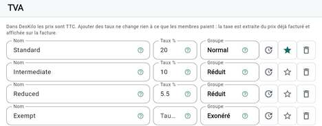

**Étapes**

1. Seulement si vous êtes assujetti à la TVA, activez **Gestion de la TVA** dans [Fonctionnalités](Guide-utilisateur#un-interrupteur-de-fonctionnalité).
2. Réglez les taux dans [TVA](https://fdittgen-png.github.io/deskilo/#/vat) : **Utiliser les taux usuels** de votre pays, puis marquez-en un seul comme taux par défaut (voir [Régler les taux](Guide-utilisateur#définir-les-taux)).
3. Donnez à chaque taux son groupe, et un motif d'exonération là où il s'applique (voir [Groupes de TVA](Guide-utilisateur#groupes-de-tva)).
4. Quand la loi change un taux, utilisez **Changement par la loi** pour que les anciennes factures gardent leur taux (voir [Changer un taux par la loi](Guide-utilisateur#changer-un-taux-par-la-loi)).
5. Si vous devez déposer des déclarations, activez **Déclarations de TVA** et générez chaque période dans [Déclaration de TVA](Guide-utilisateur#la-déclaration-périodique-de-tva).

**Bon à savoir**

- Un catalogue de taux est fourni pour les États membres de l'UE, la Suisse, la Norvège et le Canada. Le tenir à jour quand un gouvernement modifie un taux relève de vous.
- Si vous êtes assujetti sans taux par défaut en vigueur, le serveur refuse d'émettre. La description de **Gestion de la TVA** et l'avertissement de l'écran d'identité légale le disent.
- Une déclaration est une aide au dépôt, établie à partir de vos factures émises. Vérifiez-la avant de la déposer, et ne la marquez comme déposée qu'une fois que c'est fait.
- Le journal des déclarations a sa propre série de numéros.

**Voir aussi:** [Régime de TVA](Guide-utilisateur#régime-de-tva) · [Quand la TVA devient exigible](Guide-utilisateur#exigibilité-de-la-tva)

<!-- anchor: setup.money.permanent -->
### Ce qui ne se défait pas

**Public:** Propriétaire

Vous voulez savoir, avant la première facture, ce que vous ne pourrez plus changer ensuite.

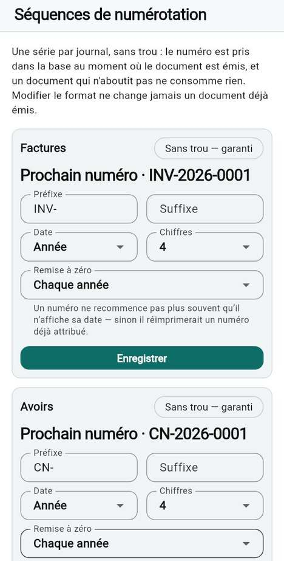

> **Attention** À partir de la première facture émise, les éléments ci-dessous sont définitifs. Décidez-les d'abord avec votre expert-comptable.

| Décision | Ce qui devient définitif | Quand |
|---|---|---|
| Une facture émise | Elle est signée et immuable : montants, parties, ventilation de TVA et calcul du tarif restent tels qu'imprimés. Une correction est une annulation, un avoir ou un remboursement, chacun étant un nouveau document. | À l'émission |
| Numéro de facture | Les numéros se suivent sans trou et sont attribués dans la base de données au moment de l'émission. Le prochain numéro peut être relevé, jamais abaissé. Un changement de format s'applique à partir de là. Une remise à zéro ne peut pas être plus fréquente que la date que le numéro imprime. | À la première émission |
| Un mois facturé | Un mois comportant une facture pour un membre est clos pour ce membre. Les jours de fermeture et les imports de jours fériés ignorent ces mois et les nomment. | À la première facture de ce mois |
| Taux de TVA | Les taux sont versionnés par date, jamais modifiés. Une déclaration de TVA soumise n'est jamais recalculée. | À la première utilisation |
| Devise et pays | Les montants sont stockés en unités mineures entières, sans conversion. Dès que l'espace a émis un document ou enregistré de l'argent, le serveur refuse de changer l'un ou l'autre. | Au premier document ou paiement |

**Étapes**

1. Ouvrez [Séquences de numérotation](https://fdittgen-png.github.io/deskilo/#/settings/number-sequences) et réglez le préfixe, le suffixe, la partie date, les chiffres et la remise à zéro pour chaque journal (factures, avoirs, déclarations de TVA, membres, paiements). L'écran demande la fonction **Séquences de numérotation**.
2. Montrez le résultat à votre expert-comptable avant la première facture.
3. Choisissez le pays, la devise et le fuseau horaire dans [Réglages de l'espace](Guide-utilisateur#pays) avant que quiconque réserve.

**Bon à savoir**

- Les numéros ne sont pas gaspillés : un document dont l'émission échoue n'en prend aucun.
- Les deux états d'un espace, test et production, existent pour que rien de tout cela ne soit essayé pour de vrai ; voir [une répétition sans risque](#une-répétition-sans-risque-dans-un-espace-de-test).

**Voir aussi:** [Le registre des factures](Guide-utilisateur#le-registre-des-factures) · [Devise et fuseau horaire](Guide-utilisateur#devise-et-fuseau-horaire)

<!-- anchor: setup.money.dry-run -->
### Une répétition sans risque dans un espace de test

**Public:** Propriétaire

Vous répétez une fois toute la routine financière, sans rien risquer de réel.

**Étapes**

1. Créez ou ouvrez un espace de test (**Un espace de test**, ou le côté DEV d'une paire liée) ; voir [Espace de test](Guide-utilisateur#à-quoi-sert-un-espace-de-test) et [Environnements](Guide-utilisateur#un-espace-a-deux-côtés).
2. Saisissez l'identité légale, les taux, le tarif et les instructions de paiement tels que vous comptez les utiliser.
3. Invitez deux ou trois personnes à réserver quelques jours ; ajoutez un service pour l'une d'elles.
4. Parcourez l'[assistant de clôture du mois](Guide-utilisateur#lassistant-de-clôture) du début à la fin et lisez le PDF de la facture.
5. Enregistrez un paiement, laissez une relance arriver à échéance, et lisez le relevé comme le membre.
6. Montrez les PDF et l'export comptable à votre expert-comptable.

**Bon à savoir**

- Un espace de test met un filigrane sur chaque document et indique qu'il s'agit d'un test ; rien n'est dû.
- Déclarer un espace en production retire le filigrane ; les factures déjà émises gardent le leur.
- La paire peut tirer la configuration d'un côté vers l'autre, mais les identifiants ne voyagent pas.

**Résultat**

Un premier mois que vous avez déjà vu, et une liste de questions réglées avant qu'elles ne coûtent quoi que ce soit.

**Voir aussi:** [Les deux environnements](Guide-utilisateur#un-espace-a-deux-côtés) · [Exports comptables](Guide-utilisateur#exports-comptables)

<!-- anchor: setup.notify.overview -->
## Informer les gens

Ce chapitre s'adresse à vous qui voulez que les membres et les administrateurs soient informés de ce qui compte, et de cela seulement. Il décrit ce que DesKilo envoie réellement, qui le reçoit, ce que vous configurez et ce que vous laissez à l'opérateur de l'installation.

Dans ce chapitre :
- Les canaux, en mots simples
- Un tableau : ce qui se passe, qui est prévenu, par quel canal, ce qu'un membre peut modifier
- Ce que vous configurez, et ce que l'opérateur doit faire pour le push
- Un plan de test avec deux comptes
- Comment éviter à la fois la surcharge et le silence

<!-- anchor: setup.notify.channels -->
### Les canaux, en mots simples

**Public:** Propriétaire · Administrateur·rice

Vous voulez une image claire des moyens dont DesKilo dispose pour joindre une personne, avant de rien promettre à vos membres.

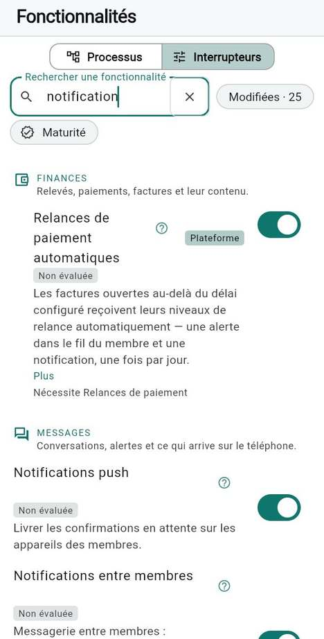

**Avant de commencer**

Il existe six moyens, et ils ne se valent pas. L'essentiel se passe dans l'app.

| Canal | De quoi il s'agit | Ce qu'il faut |
|---|---|---|
| Le fil d'événements et la cloche | Tout ce qui se passe dans l'espace est écrit dans un fil. La cloche compte les nouveautés et les décisions qui vous attendent. | **Onglet Événements** ; **Regroupement des notifications** est une option en plus |
| Les messages | Des conversations privées et de groupe entre membres, avec accusés de lecture et liens vers une réservation ou un espace. | **Notifications entre membres** |
| Le push | Une courte notification sur un téléphone ou un ordinateur, même quand l'app est fermée. Le texte est générique : ni noms, ni horaires. | **Notifications push** activées, et une configuration du push par l'opérateur ; voir [la part de l'opérateur](#la-part-de-lopérateur--faire-fonctionner-le-push) |
| Le rappel d'enregistrement | Une notification sur l'appareil du membre, 15 minutes avant une réservation pour laquelle il ne s'est pas encore enregistré. | L'autorisation du système pour le membre. Absent de la version navigateur. |
| Les relances de paiement | Une alerte dans le fil et un push au membre dont une facture est en retard. | **Relances de paiement** et **Relances de paiement automatiques** ; voir [Relances de paiement](#relances-de-paiement) |
| WhatsApp | Un lien de groupe que vous publiez, et le numéro WhatsApp qu'un membre choisit de partager. L'app ouvre WhatsApp ; rien n'est envoyé depuis le serveur. | **Intégration WhatsApp** |

**Bon à savoir**

- DesKilo n'envoie aucun e-mail de lui-même en dehors des e-mails de compte (confirmation d'inscription, réinitialisation du mot de passe). Les invitations sont des textes que vous partagez depuis votre propre téléphone.
- Il n'y a pas d'abonnement par événement : un membre ne peut pas choisir « prévenez-moi des notes de frais mais pas des réservations ».
- Une notification peut être retardée ou perdue, comme tout push ; le fil et la liste des messages font foi.

**Voir aussi:** [Notifications](Guide-utilisateur#notifications) · [Événements et confirmations](Guide-utilisateur#événements-et-confirmations)

<!-- anchor: setup.notify.table -->
### Qui est prévenu de quoi

**Public:** Propriétaire · Administrateur·rice

Vous voulez savoir, événement par événement, qui est prévenu et comment.

**Avant de commencer**

Le push n'est envoyé que pour les cinq lignes marquées « push » ci-dessous. Tout autre événement (une réservation faite, un paiement enregistré, l'arrivée d'un membre) apparaît dans le fil, et nulle part ailleurs.

| Source | Événement | Qui est prévenu | Canal | Ce que le membre peut modifier |
|---|---|---|---|---|
| Règles de validation | Une demande attend une confirmation | Les personnes que la règle désigne (fil, **En attente de votre confirmation**) ; le push va seulement au membre concerné par la demande, jamais à celui qui l'a faite, donc les validateurs ne reçoivent un push que s'ils sont ce membre. Texte : « Quelqu'un attend votre confirmation. » | Fil, cloche ; push | Désactiver le push sur l'appareil |
| Réservations | Un administrateur supprime ou écrase une réservation | Le membre déplacé, et chaque administrateur et propriétaire actif sauf celui qui a agi. Texte : « Une réservation a été retirée par un admin. » | Fil ; push | Désactiver le push sur l'appareil |
| Relances de paiement | Une facture a dépassé son échéance et un niveau de relance arrive à terme | Le membre concerné par la facture. La facture d'un propriétaire revient au propriétaire. Texte : « Une relance de paiement vous attend. » | Alerte dans le fil ; push | Désactiver le push sur l'appareil |
| Notifications entre membres | Un nouveau message | Message direct : le destinataire. Groupe : les participants sauf l'expéditeur. Une conversation mise en sourdine par un membre reste silencieuse pour lui. Texte : « Vous avez un nouveau message. » | Messages, cloche ; push | Couper, épingler ou archiver une conversation ; désactiver le push |
| Mentions dans les messages | Un message de groupe nomme quelqu'un | Les personnes nommées, même dans une conversation en sourdine. Texte : « Vous avez été mentionné·e dans une conversation. » | Messages ; push | Désactiver le push |
| Réservations | Une réservation approche | Le membre qui a réservé, sur son propre appareil, 15 minutes avant le début, pour les réservations des sept jours à venir | Notification locale | Refuser l'autorisation du système |
| Intégration WhatsApp | Rien n'est envoyé | Le lien du groupe s'affiche dans l'annuaire ; un membre peut partager son numéro | Ouvre WhatsApp | Partager ou masquer le numéro |

**Bon à savoir**

- Quand l'app est ouverte, le push d'une réservation retirée est remplacé par une notification dans la langue du membre. Pour les messages, les mentions, les confirmations et les relances de paiement, l'app ouverte affiche pour l'instant son texte générique (« Quelqu'un attend votre confirmation. »). Les textes génériques en anglais du serveur apparaissent quand l'app est en arrière-plan ou fermée.
- Un administrateur n'est prévenu que de ce sur quoi il agit ou de ce qu'une règle lui confie ; il n'existe pas de résumé « tout ».
- Les membres voient leurs propres événements ; les administrateurs et les propriétaires voient ceux de tout le monde.

**Voir aussi:** [Règles de validation](Guide-utilisateur#règles-de-validation-domaine-par-domaine) · [Messages](Guide-utilisateur#messages)

<!-- anchor: setup.notify.configure -->
### Ce que vous configurez

**Public:** Propriétaire

Vous décidez lesquels de ces canaux existent dans votre espace, et à qui l'on demande de décider quoi.

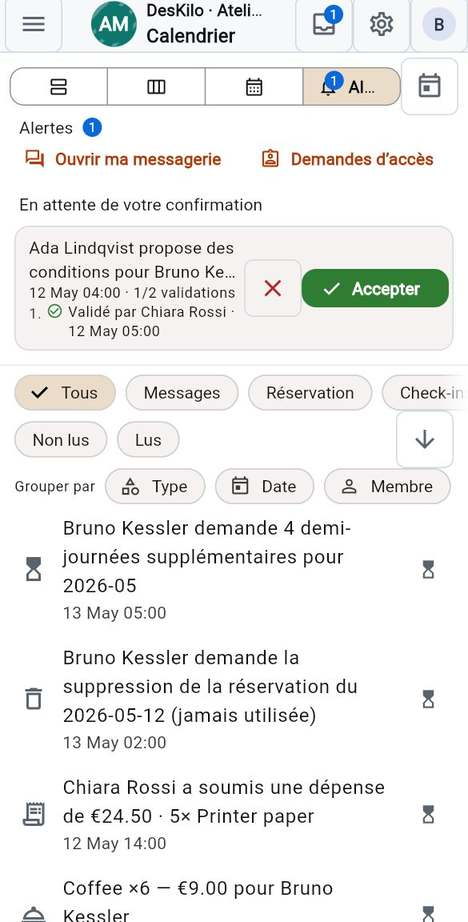

**Étapes**

1. Ouvrez [Fonctionnalités](Guide-utilisateur#un-interrupteur-de-fonctionnalité) et vérifiez les interrupteurs de notification : **Notifications push**, **Notifications entre membres**, **Onglet Événements**, **Regroupement des notifications**, **Relances de paiement**, **Relances de paiement automatiques** et **Intégration WhatsApp**.
2. Réglez les [règles de validation](Guide-utilisateur#règles-de-validation-domaine-par-domaine) : pour chaque type de demande, combien de validations sont requises et qui peut les donner. Cela décide qui est sollicité, et donc qui voit une décision en attente.
3. Décidez si la demande d'un administrateur ou d'un propriétaire se règle d'elle-même ; voir [Valider automatiquement la demande d'un administrateur](Guide-utilisateur#valider-automatiquement-la-demande-dun-administrateur) et [Valider automatiquement la demande d'un propriétaire](Guide-utilisateur#valider-automatiquement-la-demande-dun-propriétaire). Une demande déjà réglée ne prévient personne.
4. Rédigez le message d'invitation que reçoivent les membres, et collez le lien du groupe de la communauté ; voir [Message d'invitation](Guide-utilisateur#message-dinvitation) et [Groupe WhatsApp](Guide-utilisateur#groupe-whatsapp).
5. Activez **Demandes de suppression de réservation** si les membres peuvent demander à supprimer une réservation passée ou déjà enregistrée : quelqu'un devra alors répondre.

**Bon à savoir**

- Réglages par défaut d'un nouvel espace : l'onglet événements, les notifications entre membres et le regroupement sont activés ; **Relances de paiement** et **Relances de paiement automatiques** sont activées comme fonctions, mais aucune relance n'est envoyée tant que vous n'activez pas **Relances automatiques** dans les règles de relance.
- **Notifications push** est activé par défaut, mais ne livre rien tant que l'opérateur ne l'a pas configuré.
- Désactiver une fonction arrête les nouvelles activités de ce type. Cela ne supprime pas l'existant.
- Les rôles décident qui peut voir et répondre à quoi ; voir [La matrice des rôles](Guide-utilisateur#la-matrice-des-rôles).

**Voir aussi:** [Qui peut valider](Guide-utilisateur#qui-peut-valider) · [Validations requises](Guide-utilisateur#validations-requises)

<!-- anchor: setup.notify.operator -->
### La part de l'opérateur : faire fonctionner le push

**Public:** Opérateur·rice · Propriétaire

Vous voulez le push sur les téléphones des membres, et vous devez savoir qui fait quoi.

**Avant de commencer**

Le push ne vient pas avec l'app toute seule. Si votre espace tourne sur l'installation de référence partagée, demandez à son opérateur si le push est configuré. Si vous faites tourner votre propre installation, c'est vous ou votre responsable technique qui êtes l'opérateur.

**Étapes**

1. Créez un projet Firebase et compilez l'app avec lui. Sans cela, l'app reste limitée aux notifications locales, et un membre voit **Cette version n'a pas de notifications push**. La version préparée pour F-Droid n'a aucun push ([état F-Droid](https://github.com/fdittgen-png/deskilo/blob/master/docs/guides/fdroid.md#status)).
2. Pour iPhone et Mac, ajoutez une clé push Apple au projet Firebase.
3. Enregistrez la clé de compte de service Firebase comme secret du serveur et déployez la fonction push.
4. Sur votre propre installation, faites pointer la ligne `push_config` de votre base de données vers l'adresse et la clé de votre propre fonction push. Elle est préremplie avec l'adresse de l'installation de référence.
5. Testez avec deux comptes, comme décrit dans [le plan de test](#un-plan-de-test--envoyez-vous-un-exemple-de-chaque).

**Bon à savoir**

- Sans les étapes 1 à 4, rien n'est poussé, quels que soient les interrupteurs. Le fil, la cloche et les messages fonctionnent toujours.
- La liste de contrôle détaillée s'adresse à l'opérateur : voir [Les plateformes](Guide-utilisateur#deskilo-sur-vos-appareils) et [Votre propre serveur](Guide-utilisateur#faire-tourner-votre-propre-serveur).
- Le texte d'un push ne contient jamais de nom ni d'horaire : c'est voulu, pour la confidentialité.

**Voir aussi:** [Notifications push sur cet appareil](Guide-utilisateur#notifications-push-sur-cet-appareil)

<!-- anchor: setup.notify.members -->
### Ce que les membres contrôlent

**Public:** Propriétaire · Administrateur·rice

Vous voulez dire honnêtement à vos membres ce qu'ils peuvent désactiver.

**Étapes**

1. Un membre ouvre [Confidentialité et données](https://fdittgen-png.github.io/deskilo/#/privacy) et utilise **Notifications push sur cet appareil** pour arrêter ou reprendre le push sur cet appareil.
2. Dans [Messages](https://fdittgen-png.github.io/deskilo/#/me?tab=messages), un membre appuie longuement sur une conversation pour **Épingler en haut**, **Couper les notifications**, **Marquer comme non lu** ou **Archiver**.
3. Dans les réglages système du téléphone, un membre peut refuser toutes les notifications, rappels d'enregistrement compris.
4. Dans son profil, un membre décide s'il partage un numéro WhatsApp.

**Bon à savoir**

- Une conversation en sourdine reste silencieuse mais est toujours comptée ; une mention l'emporte sur la sourdine.
- Un membre qui désactive le push sur un appareil n'est pas touché sur un autre.
- Il n'y a pas d'interrupteurs par catégorie. Si un membre veut moins de bruit, il coupe des conversations ; s'il n'en veut aucun, il désactive le push.

**Voir aussi:** [Notifications](Guide-utilisateur#notifications) · [Vos données, vos droits](Guide-utilisateur#vos-données-vos-droits)

<!-- anchor: setup.notify.test -->
### Un plan de test : envoyez-vous un exemple de chaque

**Public:** Propriétaire · Administrateur·rice · Opérateur·rice

Vous vous assurez que chaque canal fonctionne avant que vos membres en dépendent.

**Avant de commencer**

Faites-le dans un espace de test (voir [une répétition sans risque](#une-répétition-sans-risque-dans-un-espace-de-test)). Il vous faut deux comptes : le vôtre comme propriétaire, et un second comme membre, sur un autre téléphone, un autre navigateur, ou le même téléphone après déconnexion. L'espace de démonstration permet de voir les écrans avec ses personnages, mais n'envoie aucun vrai push.

**Étapes**

1. Message : depuis le compte membre, écrivez au propriétaire dans [Messages](https://fdittgen-png.github.io/deskilo/#/me?tab=messages). Sur le compte propriétaire, la cloche le compte et la conversation apparaît comme non lue. Ouvrez-la : le message du membre affiche un accusé de lecture.
2. Mention : dans une conversation de groupe, nommez le propriétaire (la fonction de mentions de la messagerie doit être activée). Si le push est configuré, le téléphone du propriétaire affiche « Vous avez été mentionné·e dans une conversation. »
3. Décision : en tant que membre, demandez la suppression d'une réservation passée (la fonction **Demandes de suppression de réservation** doit être activée). Le propriétaire la voit sous **En attente de votre confirmation** dans [Événements](https://fdittgen-png.github.io/deskilo/#/events) ; répondez-y et regardez le fil du membre changer.
4. Retrait : en tant que propriétaire, retirez une réservation à venir du membre. Le fil du membre l'affiche, et un téléphone avec push affiche « Une réservation a été retirée par un admin. »
5. Rappel : en tant que membre, réservez une place qui commence dans environ 20 minutes (une réservation qui commence dans moins de 15 minutes n'a pas de rappel). Environ 15 minutes avant le début, le téléphone du membre affiche le rappel d'enregistrement.
6. Relance de paiement : avec **Relances de paiement** activé, activez **Relances automatiques** dans les règles de relance avec un délai court avant la première relance, émettez une facture d'essai qui a un délai de paiement, attendez que le délai passe, puis ouvrez les Finances en tant que propriétaire ou copropriétaire ; le fil du membre affiche l'alerte.
7. Sourdine : en tant que membre, coupez la conversation, envoyez un autre message depuis le propriétaire, et vérifiez que rien ne sonne mais que le compteur de non lus augmente.

**Bon à savoir**

- Les étapes 2 et 4 n'affichent un push que si la configuration de l'opérateur est complète. Si elles échouent alors que les autres fonctionnent, la faute est dans la configuration, pas dans vos règles.
- Dans la version navigateur de l'app, il n'y a pas de rappel d'enregistrement.
- Un téléphone qui bloque les notifications n'affiche rien du tout ; vérifiez d'abord les réglages système.

**Résultat**

Vous avez vu de vos propres yeux chaque canal sur lequel un membre comptera.

**Voir aussi:** [Les canaux](#les-canaux-en-mots-simples) · [Démarrer une conversation ou un groupe](Guide-utilisateur#démarrer-une-conversation-ou-un-groupe)

<!-- anchor: setup.notify.silence -->
### Éviter la surcharge, et éviter le silence

**Public:** Propriétaire · Administrateur·rice

Vous voulez que les gens soient prévenus de ce qui les concerne, sans être noyés.

**Étapes**

1. Gardez **Regroupement des notifications** activé : les membres et les administrateurs peuvent replier le fil par type, par jour ou par membre.
2. Ne demandez une validation que là où une décision est réelle : chaque règle qui exige une validation crée une demande à laquelle quelqu'un doit répondre. Voir [Règles de validation](Guide-utilisateur#règles-de-validation-domaine-par-domaine).
3. Utilisez les interrupteurs de validation automatique pour les demandes dont la réponse est évidente.
4. Jetez un œil de temps en temps à [Ce qui vous attend](Guide-utilisateur#ce-qui-vous-attend) : il classe ce qui est en attente.

**Bon à savoir**

- La surcharge vient de règles qui sollicitent trop souvent, ou de trop d'administrateurs sur une même règle.
- Le silence vient d'une règle que personne ne peut traiter : exiger deux validations alors que seul le propriétaire existe, ou lister des administrateurs partis, laisse les demandes en attente pour toujours. La carte de préparation de l'installation signale toute règle qui a trop peu de validateurs, et Ce qui vous attend la fait remonter.
- Le silence vient aussi d'un push non configuré, de membres qui ont désactivé le push, et d'un système qui bloque les notifications.
- Les relances de paiement automatiques ne dispensent pas de regarder de temps en temps les factures ouvertes.

**Voir aussi:** [Qui peut valider](Guide-utilisateur#qui-peut-valider) · [Validations requises](Guide-utilisateur#validations-requises)

<!-- anchor: setup.reports.overview -->
## Documents et rapports

**Public:** Propriétaire · Copropriétaire · Administrateur·rice facturation

Tout ce que DesKilo imprime ou exporte vient d'un seul moteur et d'un seul endroit pour le concevoir. Ce chapitre vous dit quels documents existent, dans quel ordre les préparer, ce que vous pouvez remettre à votre expert-comptable, et où un assistant IA peut vous aider et où il ne doit pas décider. Les clics sont dans le guide d'utilisation ; ici, vous trouvez les raisons et l'ordre.

L'exemple qui sert de fil conducteur est l'espace de démonstration *Atelier du Marché*.

<!-- anchor: setup.reports.documents -->
### Les documents que produit l'app

**Public:** Propriétaire · Administrateur·rice facturation

Vous voulez savoir ce qui existe avant de concevoir quoi que ce soit, et qui reçoit chaque document.

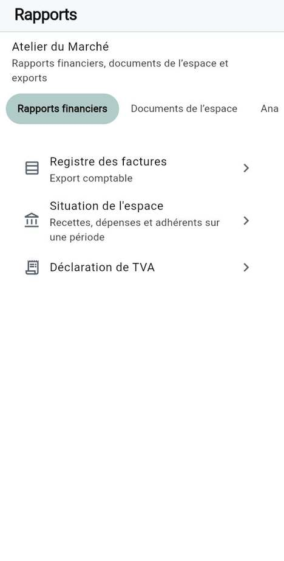

Chaque document est d'un certain *type*. Chaque type a sa propre conception : modifier la facture ne change donc jamais le relevé.

| Document | Qui le reçoit | Où le trouver |
|---|---|---|
| Facture et avoir (une conception commune) | Le membre, ou le client d'un mois facturé | [Facturation](Guide-utilisateur#lécran-facturation) |
| Proforma | Un membre qui a besoin d'un devis ou d'une demande d'acompte | Même écran |
| Relevé | Le membre (son compte sur une période) | [Le relevé](Guide-utilisateur#lire-votre-relevé) |
| Accord | Le membre (les conditions négociées) | [Négociation des prix](Guide-utilisateur#vos-conditions-négociées) |
| Paiements, utilisation | Le membre, l'administrateur·rice facturation | [Paiements](Guide-utilisateur#payer-ce-que-vous-devez) · [Utilisation](Guide-utilisateur#ce-que-chaque-réservation-a-coûté) |
| Lettres de relance, niveau 1 à 9 | Le membre dont une facture est en retard | [Règles de relance](Guide-utilisateur#règles-de-relance) |
| Rapport de l'espace et état de l'espace | Vous, le bureau, un auditeur | **Rapports** |
| Déclaration de TVA | Vous, puis la plateforme fiscale | [La déclaration de TVA périodique](Guide-utilisateur#la-déclaration-périodique-de-tva) |
| Badges, codes QR des espaces | Les membres à la porte, vos murs | [Codes QR des espaces](Guide-utilisateur#codes-qr-des-espaces-pdf) · [Badges](Guide-utilisateur#pointage-par-badge-nfc) |

**Bon à savoir**

- L'écran **Rapports** les regroupe sous **Rapports financiers**, **Documents de l'espace**, **Analyse d'activité** et **Modèles**, selon vos droits.
- Quelques rapports (plan comptable, badges, cartes QR) ont une seule mise en page fournie. Les autres peuvent être redessinés.
- Les documents tirés d'un espace de test portent un filigrane qui l'indique. Voir [À quoi sert un espace de test](Guide-utilisateur#à-quoi-sert-un-espace-de-test).

**Voir aussi:** [Rapports](Guide-utilisateur#les-rapports--aperçu-rapide-téléchargement-partage) · [Le modèle PDF de facture](Guide-utilisateur#le-modèle-pdf-de-facture)

<!-- anchor: setup.reports.designer -->
### Le concepteur, expliqué au propriétaire

**Public:** Propriétaire · Administrateur·rice facturation

Vous voulez un courrier qui vous ressemble sans apprendre un langage de balisage.

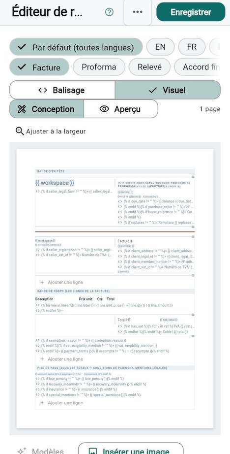

Un document est une page faite de **bandes**. L'*en-tête* porte votre papier à en-tête et le destinataire. Le *corps* porte les lignes. Le bandeau de *suite* commence à la page deux, et le *pied de page* se répète sur chaque page avec vos conditions de paiement et vos mentions légales. Vous les modifiez dans **Conception** et les vérifiez dans **Aperçu** ; **Balisage** montre les mêmes bandes sous forme de texte, pour le jour où vous en avez besoin.

| Élément | Ce qu'il vous apporte | À choisir quand |
|---|---|---|
| Modèles prêts à l'emploi (**Professionnel**, **Classique**, **Simple**, **Détaillé**, **Lettre formelle**) | Une conception terminée pour démarrer. Les modèles diffèrent pour les factures, proformas, relevés, accords et relances ; les documents structurels ont une seule mise en page fournie | Toujours : partez de **Professionnel** et changez peu de choses |
| Une conception par langue | Un membre lit le document dans sa propre langue | Vos membres ne lisent pas tous la même langue |
| Papier à en-tête et enveloppe à fenêtre | Expéditeur, destinataire et corps placés là où une enveloppe à fenêtre les attend | Vous envoyez vos factures par courrier |
| Mise en page positionnée (XML) | Chaque élément placé au millimètre, pour un formulaire national | Un document doit respecter un formulaire fixe |
| Bibliothèque d'images | Un logo, un tampon ou une signature réutilisés dans plusieurs conceptions | Vous avez un logo |
| Échange de conceptions | Une conception écrite dans un fichier puis relue | Une personne ou un outil extérieur à l'app la modifie |

Deux faits vous évitent les surprises. La norme de courrier imprime le destinataire dans la fenêtre à droite pour un espace français et à gauche pour un espace allemand, sauf si vous la modifiez. Et une conception qui ne s'affiche pas ne bloque jamais un document : la mise en page intégrée prend le relais.

> **Attention** Les termes d'une conception ne sont pas un conseil juridique. L'apparence et la traduction ne suffisent pas à établir la conformité légale ni à satisfaire une obligation de facturation électronique. Ce qu'une facture doit mentionner se décide sous [Votre identité légale](Guide-utilisateur#votre-identité-légale), et se confirme avec votre expert-comptable.

**Voir aussi:** [L'éditeur de rapports](Guide-utilisateur#léditeur-de-rapports) · [Modèles prêts à l'emploi](Guide-utilisateur#modèles-prêts-à-lemploi) · [Une conception par langue](Guide-utilisateur#une-maquette-par-langue)

<!-- anchor: setup.reports.sequence -->
### L'ordre à suivre

**Public:** Propriétaire · Administrateur·rice facturation

Vous allez concevoir des documents et vous voulez le faire une seule fois, dans le bon ordre.

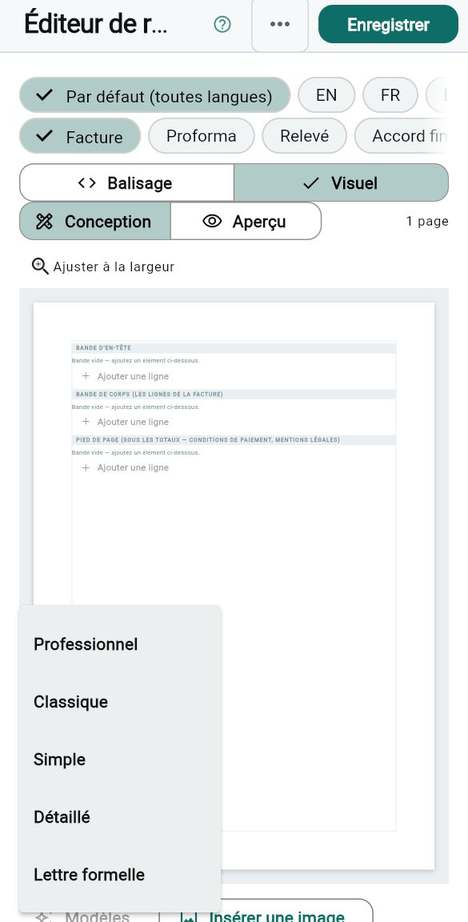

**Étapes**

1. Fixez d'abord votre identité légale : type d'organisation, adresse, immatriculation, régime de TVA et mentions particulières. Une conception n'imprime que ce que vous y avez saisi. Voir [Votre identité légale](Guide-utilisateur#votre-identité-légale).
2. Ouvrez l'[Éditeur de rapports](https://fdittgen-png.github.io/deskilo/#/report-editor), choisissez le document et partez de **Professionnel** sous **Modèles**.
3. Ajoutez une version pour chaque langue que lisent vos membres. Choisissez **EN**, **FR**, **DE**, **ES** ou **IT** sous le document. Voir [Une conception par langue](Guide-utilisateur#une-maquette-par-langue).
4. Vérifiez chacune avec **Aperçu rapide**. Il utilise votre facture la plus récente, ou des données d'exemple s'il n'y en a pas.
5. Répétez dans un espace de test : entrez-y, émettez une facture d'essai, imprimez-la et envoyez-la à votre expert-comptable. Voir [À quoi sert un espace de test](Guide-utilisateur#à-quoi-sert-un-espace-de-test).
6. Figez la conception avant la première facture. Notez ce que vous avez décidé, puis ne changez une conception que lorsqu'une règle change.

**Bon à savoir**

- Le remplacement d'une mise en page peut être défait avec **Annuler** jusqu'à ce que vous quittiez l'éditeur.
- Une facture émise est un document figé. Modifier la conception plus tard change les nouveaux documents, jamais ceux déjà émis.
- Si le même texte existe en deux langues, demandez à quelqu'un qui lit la seconde langue de relire l'aperçu.

> **Attention** Le numéro de facture et les mentions légales imprimées sur une facture deviennent définitifs dès la première facture émise. Réglez-les avant, pas après.

**Résultat :** chaque document que vous enverrez vous ressemble, dans chaque langue, et a été relu une fois par quelqu'un d'autre que vous.

**Voir aussi:** [Votre identité légale](Guide-utilisateur#votre-identité-légale) · [Le modèle PDF de facture](Guide-utilisateur#le-modèle-pdf-de-facture)

<!-- anchor: setup.reports.accountant -->
### Ce que vous remettez à votre expert-comptable

**Public:** Propriétaire · Administrateur·rice facturation

Vous voulez que votre expert-comptable ait ce qu'il lui faut, et qu'il sache ce que l'app ne prétend pas faire.

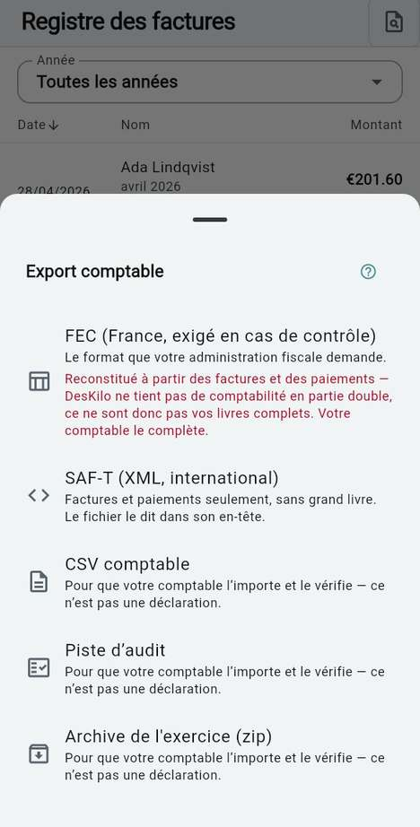

Partez du [Registre des factures](https://fdittgen-png.github.io/deskilo/#/invoice-register), qui liste chaque facture avec son statut, et touchez **Export comptable**. Chaque format indique dans la fiche ce qu'il revendique.

| Fichier | Ce qu'il revendique | Ce qu'il ne revendique pas |
|---|---|---|
| FEC | Le format français qu'exige un contrôle, reconstitué à partir des factures et des paiements | Une comptabilité complète. Votre expert-comptable la complète |
| DATEV | Un fichier d'échange pour les logiciels des comptables allemands, lu et comptabilisé par une personne | Un dépôt, ou une remise pour un contrôle fiscal |
| SAF-T | La structure internationale, volontairement partielle : factures et paiements, sans grand livre | Un fichier comptable complet. Il le dit dans son en-tête |
| SAF-T PT, Sage 50 | Un format réglementaire portugais (non certifié) et un format d'échange britannique/irlandais, selon votre pays | Un dépôt ou une certification |
| CSV comptable, Piste d'audit, Archive de l'année (zip) | Une aide à la lecture pour votre expert-comptable | Un dépôt |

La liste des formats dépend de votre pays. Le FEC et le DATEV demandent vos numéros de comptes, et le FEC aussi votre numéro d'immatriculation : ayez-les à portée de main. Les chiffres de TVA de la période se trouvent dans [La déclaration de TVA périodique](Guide-utilisateur#la-déclaration-périodique-de-tva).

*Ce que l'app ne fait pas*

- Elle tient les factures, les paiements et un compte courant par membre. Elle ne tient pas de comptabilité en partie double sur un plan comptable : elle ne peut donc pas remplacer un logiciel de comptabilité.
- Certaines obligations restent à vous et à votre expert-comptable : une comptabilité complète, un logiciel certifié là où votre pays l'exige, et l'acceptation par l'administration destinataire.
- Un fichier reste bloqué tant que les problèmes de la source ne sont pas corrigés.

**Bon à savoir**

- Exporter, c'est lire. Vous pouvez recommencer pour n'importe quelle période.
- Préparez une courte note pour votre expert-comptable avant la première facture : votre régime de TVA, le moment où la TVA devient exigible, la numérotation choisie et les exports que vous voudrez. Voir [L'aide d'une IA](#laide-dun-assistant-ia).

**Voir aussi:** [Exports comptables](Guide-utilisateur#exports-comptables) · [Le registre des factures](Guide-utilisateur#le-registre-des-factures) · [Compte de TVA](Guide-utilisateur#compte-de-tva)

<!-- anchor: setup.reports.analytics -->
### L'analyse d'activité en résumé

**Public:** Propriétaire · Administrateur·rice facturation

Vous voulez voir comment l'espace se porte une fois lancé, sans tableur.

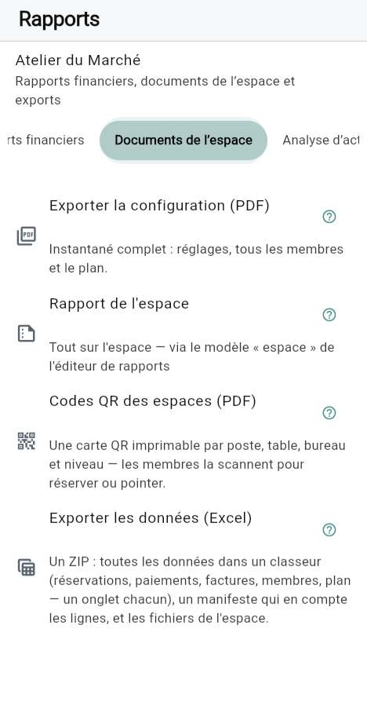

**Analyse d'activité** présente des chiffres par domaine : facturé et encaissé, occupation et capacité. Vous choisissez une période (mois, trimestre ou année), la comparez à une autre, enregistrez une vue et l'exportez en PDF. Vous ne voyez que les analyses que votre rôle autorise.

L'encaissé correspond aux paiements rapprochés des factures. Ce n'est pas un bénéfice, car aucun coût n'entre dans ce chiffre, et la période en cours est partielle.

Pour un document sur l'ensemble de l'espace, l'onglet **Documents de l'espace** contient le **Rapport de l'espace**, les **Codes QR des espaces (PDF)**, **Exporter les données (Excel)** et **Exporter la configuration (PDF)**. Servez-vous des deux derniers comme copie de secours avant un gros changement.

**Voir aussi:** [Analyse d'activité](Guide-utilisateur#analyse-dactivité) · [Exports](Guide-utilisateur#rapport-de-lespace)

<!-- anchor: setup.reports.ai -->
### L'aide d'un assistant IA

**Public:** Propriétaire · Copropriétaire

Un outil de conversation IA peut vous faire gagner des heures sur les mots qui entourent votre configuration. Il ne peut pas décider de ce qui est juste sur le plan juridique ou fiscal. Cette section parle des outils que vous utilisez en dehors de DesKilo ; la connexion d'un assistant dans l'app est décrite à la fin.

*À quoi sert un outil extérieur*

- Rédiger le message d'invitation que vous envoyez à vos premiers membres. Voir [Le message d'invitation](Guide-utilisateur#message-dinvitation). Les variables comme le prénom ou le lien d'invitation restent telles quelles.
- Formuler les mentions particulières que vous soumettrez à votre expert-comptable, comme brouillon à vérifier, jamais comme texte définitif.
- Traduire le texte d'une conception dans une autre langue, pour que vous n'ayez plus qu'à le relire.
- Expliquer un rapport ou un relevé à un membre avec des mots simples.
- Préparer la note de vos choix pour votre expert-comptable : pays, type d'organisation, régime de TVA, numérotation, exports.
- Esquisser l'image qui sert de fond à votre plan, à partir de photographies, dans un outil d'image.

*Ce qu'il ne doit pas décider*

- Les mentions légales d'une facture, le traitement de la TVA d'une activité, la raison pour laquelle aucune TVA n'est facturée, et les taux de TVA.
- Tout ce qui devient définitif : un format de numéro de facture, un régime de TVA, la devise, une facture émise.
- Si quelque chose est conforme ou non. Une réponse assurée n'est pas une réponse vérifiée, et c'est votre expert-comptable qui vérifie.

*La méthode sûre*

1. Demandez un brouillon à l'outil. Donnez-lui un scénario, pas les noms de vos membres ni aucune donnée personnelle.
2. Collez le brouillon dans le champ, dans l'**Éditeur de rapports** ou dans les réglages.
3. Regardez-le dans l'**Aperçu** avec des données d'exemple.
4. Envoyez le texte qui a une portée juridique à votre expert-comptable et attendez sa réponse.
5. Essayez tout le parcours dans un espace de test avant l'espace réel.

> **Attention** Ne collez jamais de jeton, de mot de passe, de numéro de compte bancaire ni de données personnelles d'un membre dans un outil extérieur.

*La connexion d'assistant propre à DesKilo*

L'app permet à un assistant tel que Claude ou ChatGPT d'agir pour un membre grâce à un protocole appelé MCP. Elle est désactivée par défaut : c'est une fonction que vous activez (**Interface MCP**, voir [Un interrupteur de fonction](Guide-utilisateur#un-interrupteur-de-fonctionnalité)). Elle est construite en couches, pour qu'aucune personne seule ne puisse tout ouvrir.

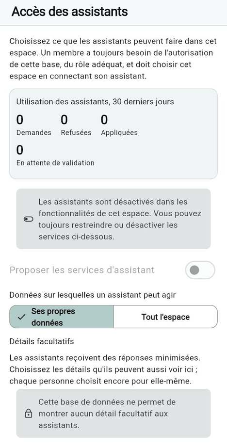

| Couche | Qui | Ce qu'elle fait |
|---|---|---|
| L'installation | L'opérateur | Active les assistants pour l'installation. |
| L'espace | Vous, le propriétaire | Activez la fonction, puis choisissez dans [Ce que les assistants peuvent faire](Guide-utilisateur#ce-que-les-assistants-peuvent-faire-dans-un-espace) quels services sont proposés et si un assistant voit uniquement les données du membre ou celles de tout l'espace. |
| La base de données | Un administrateur de base de données | Approuve la demande de chaque personne. |
| Le membre | Chaque membre | Demande une fois son approbation et choisit cet espace. |
| Une demande à conséquences | Le membre, sur son appareil | Confirme la demande exacte, qui suit encore vos règles de validation. |

L'assistant d'un membre travaille sur les propres données de ce membre : trouver et décrire des places libres, favoris et notes, réserver, modifier ou annuler sa propre réservation, demander la suppression d'une réservation commencée, s'enregistrer et se désenregistrer, lire son relevé et ses factures, et lister et traiter les validations qu'on lui demande. Quelques demandes (émission de facture, annulation de facture, remboursement, changement de statut d'un membre, part d'abonnement) sont réservées au personnel : elles exigent des droits de personnel, la confirmation de la personne dans l'app, puis vos règles de validation. Il n'a aucune opération qui configure un espace : il ne peut ni activer une fonction, ni fixer un tarif, ni changer un rôle, ni construire un plan. Il ne peut pas configurer votre espace à votre place, et il n'agit que dans ce que vous exposez.

**Bon à savoir**

- Activer les assistants n'accorde rien à personne par lui-même.
- Chaque approbation expire ; l'écran indique combien de jours il reste.
- Lisez les étapes dans [Approbations et confirmations pour les assistants](Guide-utilisateur#autorisations-et-confirmations-pour-les-assistants).

**Voir aussi:** [Les assistants : ce que c'est](Guide-utilisateur#les-assistants--ce-que-cest) · [Connecter un assistant](Guide-utilisateur#connecter-un-assistant)

<!-- anchor: setup.reports.developer -->
### Travailler avec un développeur : le fichier de conception et l'outil de rapports

**Public:** Propriétaire · Opérateur·rice

Une personne technique vous aide, et une conception doit être modifiée ou éprouvée en dehors de l'app.

**Étapes**

1. Dans l'[Éditeur de rapports](https://fdittgen-png.github.io/deskilo/#/report-editor), utilisez **Exporter cette maquette** pour écrire la conception dans un seul fichier. Le fichier explique ce que signifient ses champs et quelles variables existent. **Importer une maquette** le relit ; un fichier destiné à un autre rapport, ou venant d'une version plus récente, est refusé avec la raison.
2. Un développeur peut éprouver la conception depuis un terminal avec l'outil de rapports, décrit dans le guide de l'administrateur technique : `check` mesure une mise en page par rapport au contrat de l'enveloppe à fenêtre et se termine par un code non nul quand de l'encre tombe dans la fenêtre ; `render` produit le PDF ; `sample` écrit un fichier de données avec chaque variable ; `describe` liste le vocabulaire.
3. De retour dans l'app, importez le fichier, prévisualisez-le avec **Aperçu rapide** et **Enregistrer**.

**Bon à savoir**

- L'échange de conceptions est une fonction (**Exporter et importer les maquettes**), parmi les fonctions de rapports de [Fonctionnalités](https://fdittgen-png.github.io/deskilo/#/features). Activez-la d'abord.
- L'outil a besoin du code source de l'app ; il est destiné à la personne qui fait tourner votre installation, pas à un usage quotidien.

**Voir aussi:** [L'éditeur de rapports](Guide-utilisateur#léditeur-de-rapports) · [Le modèle PDF de facture](Guide-utilisateur#le-modèle-pdf-de-facture)

<!-- anchor: setup.consistent.overview -->
## Rester cohérent

Un espace peut se tromper de deux façons : un réglage qui manque, et deux réglages qui se contredisent. DesKilo en repère certains, dans les deux cas, et le dit à l'écran. Ce chapitre liste ce qu'il repère et où vous le voyez, dit sans détour ce qu'il ne repère pas, et vous donne un audit à passer avant d'ouvrir les portes ainsi qu'une courte routine à répéter chaque mois.

Dans ce chapitre :
- [Les garde-fous de l'app](#les-garde-fous-de-lapp)
- [Les erreurs que les garde-fous ne repèrent pas](#les-erreurs-que-les-garde-fous-ne-repèrent-pas)
- [L'audit avant l'ouverture](#laudit-avant-louverture)
- [La routine mensuelle](#la-routine-mensuelle)
- [Quand quelque chose semble faux](#quand-quelque-chose-semble-faux)
- [Ce qui ne se défait pas](#ce-qui-ne-se-défait-pas-1)

L'exemple qui sert de fil conducteur est l'*Atelier du Marché*. Sa propriétaire, Ada, passe l'audit une fois dans un espace de test, puis une seconde fois dans l'espace réel.

<!-- anchor: setup.consistent.guards -->
### Les garde-fous de l'app

**Public:** Propriétaire · Copropriétaire · Administrateur·rice · Administrateur·rice facturation

Vous voulez savoir lesquelles de vos erreurs l'app vous signalera, et où, pour regarder au bon endroit.

| Garde-fou | Ce qu'il repère | Où vous le voyez |
|---|---|---|
| Une fonction qui en demande une autre | Une fonction ne peut pas marcher sans celle dont elle dépend. Activer une fonction active sa fonction parente et nomme ce qui s'est activé. Désactiver une fonction parente retient ses enfants et conserve leur propre choix. | **Fonctionnalités** : le parcours d'activation avec son aperçu, **Nécessite** et **En attente de la fonction au-dessus** |
| Un processus retenu | Une fonction activée qui attend quelque chose de désactivé. | **Fonctionnalités**, vue **Processus** : l'état **À examiner** et sa pastille de filtre |
| La liste de préparation | Une ligne par domaine de l'espace, avec son état, qui agit et où le régler. Domaines : **Jours d’ouverture, fuseau horaire et devise**, **Places réservables sur le plan**, **Formules d’adhésion et tarifs**, **Inviter les premiers membres**, **Comment les membres paient**, **Rôles et validation des demandes**, **Export et restauration**, **Ce que les membres peuvent faire**, **Informations requises par vos fonctionnalités (identité, banque, plateformes)**, **Une première réservation** et, le cas échéant, **L'identité légale et l'adresse de l'espace** (seulement quand **Factures** est activé), **Serveur et version de la base** et **Accès des assistants (facultatif)** (ce dernier seulement quand l'interface MCP est activée). | **Mise en place de cet espace**, en haut d'[Espace](https://fdittgen-png.github.io/deskilo/#/workspace-settings) |
| La ligne qui empêche une première réservation | Les domaines que la liste marque **Nécessaire pour une première réservation** : un fuseau horaire, une devise, un jour d'ouverture, une place, des membres qui détiennent **Réserver et utiliser les réservations** (un nouvel espace ne leur accorde rien) et, quand une règle de validation, de quelque nature qu'elle soit, demande plus de validateurs qu'il n'en existe, ces validateurs. Le reste est facultatif et peut être mis de côté avec **Plus tard**. | **Avant que quiconque puisse réserver ici**, sur la carte de démarrage de [Réserver](https://fdittgen-png.github.io/deskilo/#/reserve) |
| La ligne qui empêche une première facture | Quand **Factures** est activé, l'identité légale et l'adresse de l'espace. Aucune facture ne peut être émise sans elles, si bien que le domaine ne peut pas être mis de côté. | **Mise en place de cet espace** : le domaine **L'identité légale et l'adresse de l'espace**, marqué **Nécessaire avant de facturer** ; tant qu'il est la prochaine étape, le titre de la carte indique « Avant de facturer : … » |
| Ce dont vos fonctions ont encore besoin en local | Les coordonnées bancaires, un prestataire de paiement en ligne, un compte de facturation électronique, un site. L'identité légale n'est pas listée ici : quand **Factures** est activé, elle forme un domaine à part (ci-dessus). | La même carte, domaine **Informations requises par vos fonctionnalités (identité, banque, plateformes)**, avec **Configurer** et **Recommandé** |
| Le garde-fou des factures | Une facture est refusée tant qu'elle n'est pas complète : l'adresse de l'espace, son numéro de TVA, un pays qui soit la France ou l'Allemagne, un fondement légal pour une exonération, le nom, l'adresse et le numéro de TVA du membre en cas d'autoliquidation, un taux de TVA en vigueur, une explication pour chaque ligne facturée à 0 %. Les factures transfrontalières, en autoliquidation, à l'export et exonérées sont refusées : émettez-les en dehors de l'app. | **Complétez ces informations avant d'émettre**, avec la liste des éléments manquants |
| Le garde-fou du paiement en ligne | Quand **Paiements en ligne** est désactivé, le serveur refuse un nouveau paiement en ligne. Un paiement déjà ouvert se règle encore. | Les écrans de paiement (la ligne de la fonction n'en dit rien) |
| Le garde-fou de validation | **Validations requises** au-delà du nombre de personnes disponibles, pour tout type de demande. | **Pas assez de validateurs éligibles.** dans l'éditeur de règle ; « Une règle demande plus de validateurs que cet espace n'en compte » dans la liste de préparation, où **Rôles et validation des demandes** devient alors obligatoire |
| Le verrou de la devise et du pays | Dès que l'espace a émis un document ou enregistré de l'argent, le serveur refuse tout changement de **Devise** ou de **Pays**, depuis le formulaire des réglages, un import ou ailleurs. Le fuseau horaire n'est pas verrouillé. | « La devise et le pays sont figés dès que l'espace a émis un document ou enregistré de l'argent. Rien n'a été enregistré. » quand vous enregistrez [Espace](https://fdittgen-png.github.io/deskilo/#/workspace-settings) |
| La boîte du propriétaire | Ce qui reste à configurer : une ligne « À configurer : … » pour chaque domaine obligatoire de la liste de préparation qui n'est pas prêt, et une ligne « … fonctionnalités activées attendent « … » » pour chaque fonctionnalité désactivée qui en retient d'autres. | [Ce qui vous attend](Guide-utilisateur#ce-qui-vous-attend) ; un appui ouvre l'écran où cela se règle, ou **Fonctionnalités** |
| Le garde-fou des séquences de numérotation | Une remise à zéro plus fréquente que la date imprimée dans le numéro est refusée. | [Séquences de numérotation](https://fdittgen-png.github.io/deskilo/#/settings/number-sequences), à l'enregistrement |
| Le contrôle de maturité | Une fonction évaluée **Alpha** ou **Bêta**. | Une confirmation avant de l'activer, et un badge sur chaque interrupteur |
| Le contrôle de remplacement du plan | Remplacer le plan ou les réglages à partir d'un fichier. | Un avertissement : c'est irréversible. Le plan est refusé dès que des réservations existent |

**Bon à savoir**

- **Mise en place de cet espace** est une liste, pas un verrou. Elle ne vous empêche jamais d'activer quelque chose.
- La plupart des garde-fous agissent quand vous essayez d'émettre, de payer ou de réserver, pas quand vous choisissez un réglage. C'est pourquoi l'audit ci-dessous existe.
- La boîte du propriétaire ([Ce qui vous attend](Guide-utilisateur#ce-qui-vous-attend)) ne signale que les domaines obligatoires et les fonctions retenues. Les domaines facultatifs restent dans la liste de préparation : lisez-la vous-même.

**Voir aussi:** [Éviter les fonctions qui se contredisent](#éviter-les-fonctionnalités-qui-se-contredisent) · [Vérifier votre espace](#vérifier-votre-espace)

<!-- anchor: setup.consistent.gaps -->
### Les erreurs que les garde-fous ne repèrent pas

**Public:** Propriétaire · Copropriétaire · Administrateur·rice facturation

Vous voulez la liste honnête de ce qui reste de votre responsabilité. Ce sont des configurations que l'app vous laisse créer sans vous avertir. Chacune a une façon de l'éviter à la main.

| Erreur | Pourquoi rien ne l'arrête | Comment l'éviter |
|---|---|---|
| Choisir un autre pays que la France ou l'Allemagne en attendant des factures | L'app propose de nombreux pays et taux de TVA, mais n'émet de factures que pour la France et l'Allemagne. Rien ne le dit quand vous choisissez le pays. | Décider avant de promettre une facture aux membres. Ailleurs, gardez les relevés dans l'app et émettez les factures en dehors. |
| Être assujetti à la TVA sans taux en vigueur | L'émission est refusée, mais seulement à la première facture. La description de **Gestion de la TVA** et l'avertissement de l'écran d'identité légale le disent ; rien ne vous arrête plus tôt. Quand **Gestion de la TVA** est désactivée, la configuration est masquée mais les taux enregistrés continuent de s'appliquer. | Ajouter le taux sous [TVA](https://fdittgen-png.github.io/deskilo/#/vat) avant la première clôture de mois, et émettre une facture d'essai. |
| **Paiements en ligne** activé sans prestataire | Vous pouvez l'activer ; le prestataire manquant n'apparaît que comme un élément de la liste de préparation. | Connecter d'abord le prestataire, puis activer. |
| **Factures** activé sans identité légale | La fonction est active dès le premier jour. La liste de préparation marque l'identité **Nécessaire avant de facturer** et Ce qui vous attend la signale, mais rien ne vous empêche d'inviter des membres et de faire tourner un mois ; le refus arrive au moment de l'émission. | Renseigner l'identité avant de dire aux membres qu'ils seront facturés. |
| Une règle qui demande plus de validateurs que vous n'en avez | L'éditeur vous laisse en enregistrer une qui dépasse le nombre de personnes disponibles. La liste de préparation marque alors **Rôles et validation des demandes** comme obligatoire, quel que soit le type de demande, mais les demandes créées avant que vous corrigiez ne peuvent pas être menées à terme, et expirent après sept jours. | Compter les propriétaires et administrateurs actifs après chaque règle. Voir [Éviter les demandes qui attendent pour toujours](#éviter-les-demandes-qui-attendent-pour-toujours). |
| Des membres qui ne peuvent pas ouvrir le plan | Dans un nouvel espace, la carte **Utilisateur** de [Rôles](https://fdittgen-png.github.io/deskilo/#/roles) est vide. La liste de préparation marque **Ce que les membres peuvent faire** tant que les membres ne détiennent pas **Réserver et utiliser les réservations**, mais elle ne vérifie que ce droit-là : les cinq autres droits du quotidien sont à cocher par vous. | Cocher les droits du quotidien et rejoindre une fois avec un second compte. |
| Un espace créé à partir d'un modèle | Un modèle ne reprend jamais l'identité, les coordonnées bancaires, les sites ni les invitations. | Traiter le domaine **Informations requises par vos fonctionnalités (identité, banque, plateformes)** comme une liste de choses à faire. |
| Un fichier de réglages qui promet plus qu'il ne livre | Aujourd'hui, le fichier reprend la matrice des rôles, vos propres rôles et toutes les règles de validation, mais pas les membres, les numéros de factures et de membres, la période de TVA ni les prix valables pour tout l'espace. Ce qu'il reprend n'est appliqué que si **Configuration dans le fichier de l'espace** est activée dans la cible. Un plan n'est pas remplacé dès que des réservations existent. | Ressaisir à la main ce qu'il ne reprend pas, et lire l'aperçu avant **Remplacer et importer**. |
| Des relances qui ne partent jamais | Elles partent chaque matin depuis le serveur si l'installation planifie des tâches (pg_cron) ; sinon, quand un administrateur ouvre les Finances. L'interrupteur et la description de la fonction le disent, mais ne peuvent pas dire ce qui s'applique à votre installation. Elles restent aussi muettes quand **Relances de paiement automatiques** est désactivé. | Demander à l'opérateur si le planificateur existe, et ouvrir vous-même les Finances s'il n'existe pas. Voir [Relances de paiement](Guide-utilisateur#relances-automatiques). |
| Changer de fuseau horaire une fois que de l'argent existe | Le serveur verrouille la devise et le pays dès que l'espace a émis un document ou enregistré de l'argent, mais pas le fuseau horaire, dans lequel chaque jour ouvré, chaque demi-journée et chaque jour de fermeture est compté. | Le choisir dès le premier jour. Voir [Les décisions difficiles à défaire](#les-décisions-difficiles-à-défaire). |
| Une numérotation ou une période de TVA qui ne convient pas au format de votre expert-comptable | L'app ne les compare pas à l'export comptable du pays. | Demander à votre expert-comptable le format de numérotation et l'export qu'il utilise avant d'émettre. Voir [Exports comptables](Guide-utilisateur#exports-comptables). |
| Prendre un test pour l'espace réel | Hormis le filigrane sur les documents imprimés, la différence est facile à manquer. | Regarder la bannière de l'espace de test et le côté affiché dans [Moi](https://fdittgen-png.github.io/deskilo/#/me) avant d'agir. |

**Bon à savoir**

- Un kiosque sans membre kiosque, une fonction de sites sans site, un push sans service push : [Éviter les fonctions qui se contredisent](#éviter-les-fonctionnalités-qui-se-contredisent).
- L'app est plus stricte qu'il n'y paraît pour les factures, et plus souple qu'il n'y paraît pour tout le reste. Dans le doute, émettez une facture d'essai dans un espace de test.

**Voir aussi:** [Une répétition sans risque](#une-répétition-sans-risque-dans-un-espace-de-test)

<!-- anchor: setup.consistent.audit -->
### L'audit avant l'ouverture

**Public:** Propriétaire · Copropriétaire

Vous voulez une preuve, pas une impression, avant d'ouvrir. Trente et un contrôles, en trois niveaux. Passez *Ouvrir* avant d'inviter qui que ce soit, *Faire tourner* avant de rien promettre sur l'argent, *Développer* avant que la première facture ne parte. Faites-le d'abord dans un espace de test, avec une deuxième personne.

*Ouvrir : un lieu que l'on peut réserver*

| N° | Contrôle | Où | À quoi ressemble un bon résultat |
|---|---|---|---|
| 1 | Pays, devise, fuseau horaire | [Espace](https://fdittgen-png.github.io/deskilo/#/workspace-settings), **Informations générales** | Atelier du Marché : France, EUR, Europe/Paris, réglés avant le premier document ou paiement, après quoi la devise et le pays sont verrouillés |
| 2 | Langue de l'espace | Même écran | La langue dans laquelle vos invitations sont écrites |
| 3 | Jours et horaires d'ouverture | [Disponibilité](https://fdittgen-png.github.io/deskilo/#/availability) | Les jours d'ouverture sont cochés ; les horaires correspondent au jour |
| 4 | Jours de fermeture | Disponibilité, jours de fermeture | Les jours fériés et fermetures des mois à venir sont saisis, avant la première fin de mois |
| 5 | Au moins une place | [Éditeur de l'espace](https://fdittgen-png.github.io/deskilo/#/editor) | Chaque salle que vous louez a des places |
| 6 | Préparation | **Mise en place de cet espace** | Rien sous **Jours d’ouverture, fuseau horaire et devise**, **Places réservables sur le plan** ni **Ce que les membres peuvent faire** ne demande de configuration |
| 7 | Vous avez réservé une place | [Réserver](https://fdittgen-png.github.io/deskilo/#/reserve) | La place est réservée, enregistrée et annulée sans mauvaise surprise |
| 8 | L'identifiant de l'espace | [Identifiant de l'espace et QR](https://fdittgen-png.github.io/deskilo/#/workspace-code) | L'identifiant est de ceux que l'on peut dire à voix haute ; le QR est imprimé |
| 9 | Droits du quotidien | [Rôles](https://fdittgen-png.github.io/deskilo/#/roles) | **Utilisateur** détient les six droits du quotidien, dont **Réserver et utiliser les réservations** |
| 10 | Un second compte a rejoint l'espace | Un autre appareil | Il a été approuvé et a pu ouvrir le plan et réserver |
| 11 | Plus d'une personne peut agir | [Membres et formules](https://fdittgen-png.github.io/deskilo/#/members) | Un propriétaire plus un copropriétaire ou un administrateur, tous **Actif** |
| 12 | Nombre de validations | [Règles de validation](https://fdittgen-png.github.io/deskilo/#/validation) | Aucune règle ne demande plus de validateurs que de propriétaires et d'administrateurs actifs ; **Rôles et validation des demandes** ne demande pas de configuration |
| 13 | L'invitation dans chaque langue | **Communauté et invitations** | Vous avez lu chaque version une fois ; aucune balise n'est restée vide |
| 14 | Le côté où vous êtes | [Moi](https://fdittgen-png.github.io/deskilo/#/me) | La bannière de l'espace de test est affichée, ou non, comme prévu |

*Faire tourner : les gens paient et les rôles tiennent*

| N° | Contrôle | Où | À quoi ressemble un bon résultat |
|---|---|---|---|
| 15 | Paliers tarifaires | [Facturation](https://fdittgen-png.github.io/deskilo/#/billing) | Chaque part qu'un membre peut choisir tombe dans un palier ; pas de trou entre 0 et 100 pour cent |
| 16 | Formules proposées | Facturation, niveaux | Seulement les formules que vous voulez vendre |
| 17 | Ce que reçoivent les nouveaux membres au départ | **Nouveaux membres**, dans Espace | L'abonnement et la règle quand les jours sont épuisés sont ceux que vous avez choisis |
| 18 | Forfaits et services | Facturation, [Services](https://fdittgen-png.github.io/deskilo/#/services) | Les noms et les prix se lisent bien pour un membre |
| 19 | Comment les membres paient | **Comment les membres paient** dans la liste de préparation | Le domaine indique **Prêt** et les coordonnées bancaires attendues (IBAN, référence) apparaissent dans les Réglages ; un prestataire seul le rend aussi prêt |
| 20 | Paiements en ligne | [Fonctionnalités](https://fdittgen-png.github.io/deskilo/#/features) | Désactivé, sauf si un prestataire est connecté |
| 21 | Administrateurs | Membres et formules | Chacun est une personne à qui vous confieriez les données de tous les membres |
| 22 | La carte Administrateur de la matrice | Rôles | Vous savez lire chaque case cochée et la défendre |
| 23 | Qui est prévenu de quoi | [Comment les membres sont prévenus](#ce-que-les-membres-contrôlent) | Les membres trouvent tout sous **Événements** ; le push seulement si l'opérateur l'a configuré |
| 24 | Kiosque et badges | [Fonctionnalités](https://fdittgen-png.github.io/deskilo/#/features) | Désactivés, ou un membre kiosque existe et des badges sont émis |
| 25 | Sites | Fonctionnalités | Désactivés, ou au moins un site existe |
| 26 | Fonctions retenues | **Fonctionnalités**, **À examiner** | Le filtre n'affiche aucun processus, et Ce qui vous attend n'a aucune ligne sur des fonctions qui attendent |

*Développer : factures, fiscalité et archives*

| N° | Contrôle | Où | À quoi ressemble un bon résultat |
|---|---|---|---|
| 27 | Identité légale | [Identité légale et facturation électronique](https://fdittgen-png.github.io/deskilo/#/legal-identity) | **L'identité légale et l'adresse de l'espace** indique **Prêt**, et **Complétez ces informations avant d'émettre** n'affiche rien quand vous démarrez une facture d'essai |
| 28 | Régime de TVA et taux | [TVA](https://fdittgen-png.github.io/deskilo/#/vat) | Le régime est celui que votre expert-comptable vous a donné ; un taux est en vigueur pour votre taux par défaut |
| 29 | Format de numérotation | [Séquences de numérotation](https://fdittgen-png.github.io/deskilo/#/settings/number-sequences) | Vous avez lu l'aperçu et votre expert-comptable est d'accord |
| 30 | Une facture d'essai | Espace de test, assistant de clôture du mois | Elle a été émise, dans chaque langue que lisent vos membres, sans élément manquant |
| 31 | Un export récent | **Export et restauration** | « Un export récent est enregistré » |

**Étapes**

1. Imprimez les trois tableaux ou copiez-les dans vos notes.
2. Passez *Ouvrir* et cochez chaque ligne quand vous voyez la colonne du bon résultat, pas quand vous vous en souvenez.
3. Faites de même pour *Faire tourner* et *Développer* dans l'espace de test, avec votre expert-comptable pour les lignes de *Développer*.
4. Refaites les lignes qui ont changé quand vous passez à l'espace réel. Un modèle ou un fichier de réglages ne les reprend pas toutes.

**Résultat :** une liste que vous pouvez montrer à quelqu'un, et un espace que vous avez vu fonctionner avant que quiconque en dépende.

**Voir aussi:** [De la semaine 0 à la semaine 4](#apprendre-en-quatre-semaines) · [Une répétition sans risque](#une-répétition-sans-risque-dans-un-espace-de-test) · [L'ordre à suivre](#lordre-à-suivre)

<!-- anchor: setup.consistent.monthly -->
### La routine mensuelle

**Public:** Propriétaire · Administrateur·rice · Administrateur·rice facturation

Vous voulez une courte habitude qui garde l'espace cohérent, en dix minutes à la fin du mois.

**Étapes**

1. Ouvrez **Mise en place de cet espace**. Chaque domaine indique toujours **Prêt**, ou **Sans objet ici**, ou est mis de côté volontairement.
2. Ouvrez [Événements](https://fdittgen-png.github.io/deskilo/#/events). **En attente de votre confirmation** est vide ou presque, et aucun membre n'est resté **En attente** plus d'un jour ou deux.
3. Recomptez l'équipe. Une personne partie ou mise en pause peut laisser une règle sans assez de validateurs. Voir [Éviter les demandes qui attendent pour toujours](#éviter-les-demandes-qui-attendent-pour-toujours).
4. Clôturez le mois : les jours de fermeture sont saisis, l'assistant de clôture du mois est passé, les relances de paiement sont parties (automatiquement chaque matin, ou à l'ouverture des Finances là où la base n'a pas de planificateur). Voir [L'assistant de clôture du mois](Guide-utilisateur#lassistant-de-clôture).
5. Faites l'export des données, et ouvrez **Fonctionnalités** pour vérifier qu'aucun processus ne demande d'attention après les changements du mois.

**Bon à savoir**

- Écrire la date du dernier passage sur la première ligne de vos notes indique à la personne suivante quand tout cela était vrai pour la dernière fois.
- Tout ce qui a changé durant le mois dans la matrice des rôles ou dans une règle de validation mérite de revérifier les lignes 9, 11 et 12 de l'audit.

**Résultat :** un espace qui reste tel que vous l'avez mis en place.

**Voir aussi:** [L'audit avant l'ouverture](#laudit-avant-louverture)

<!-- anchor: setup.consistent.wrong -->
### Quand quelque chose semble faux

**Public:** Propriétaire · Copropriétaire · Administrateur·rice

Vous voulez savoir quoi essayer, dans quel ordre, et à qui demander.

**Étapes**

1. Lisez le message à l'écran. La plupart disent quoi faire.
2. Vérifiez le côté où vous êtes. Regardez la bannière de l'espace de test et le côté affiché dans [Moi](https://fdittgen-png.github.io/deskilo/#/me). Les documents imprimés du côté test portent un filigrane et rien n'y est dû ; le côté réel émet des factures qui, elles, sont dues.
3. Vérifiez [Fonctionnalités](https://fdittgen-png.github.io/deskilo/#/features) et [Rôles](https://fdittgen-png.github.io/deskilo/#/roles) : une fonction qui manque est une fonction désactivée ou un droit que personne n'a coché.
4. Ouvrez **Mise en place de cet espace** et lisez le domaine qui correspond au symptôme.
5. Préparez les **Détails pour l’assistance** sous [Aide](https://fdittgen-png.github.io/deskilo/#/help) : choisissez **Dernière heure** ou **Dernières 24 heures**, **Préparer l’aperçu**, relisez-le, **Enregistrer**, et envoyez le fichier. Il ne contient que des comptes et des contrôles, ni identités, ni identifiants, ni données d'activité.
6. Avant de changer quoi que ce soit d'important, faites l'export des données (ci-dessous).

*À qui demander*

| Sujet | Demandez à |
|---|---|
| Un réglage de votre espace, une règle, un rôle | Vous, puis votre copropriétaire |
| Une facture, la TVA, un numéro | Votre expert-comptable, avec la facture d'essai |
| Un domaine qui indique **En attente d’une autre personne** ou **L’opérateur du serveur** | L'opérateur de votre installation |
| Un assistant qui n'est pas approuvé | Un administrateur de base de données |
| Une erreur que vous ne savez pas expliquer | L'assistance, avec le fichier de détails |

*L'export de secours*

1. Ouvrez [Rapports](https://fdittgen-png.github.io/deskilo/#/reports?section=documents) et choisissez **Documents de l’espace**.
2. Touchez **Exporter les données (Excel)**. Cela demande la fonction **Export des données (Excel)** et le droit **Exporter la comptabilité et les données**. Vous obtenez un seul ZIP : un classeur avec un onglet par jeu de données, un manifeste qui compte les lignes, et les fichiers stockés.
3. Touchez **Exporter la configuration (PDF)** pour garder une trace des paramètres et, dans **Espace**, **Exporter l'espace (XML)** pour le plan et les réglages.

**Bon à savoir**

- Un export de données terminé est enregistré ; le domaine de préparation **Export et restauration** l'indique pendant 90 jours, puis précise que l'export est plus ancien.
- Le PDF est une trace, pas une sauvegarde. Seul le XML peut être réimporté, et il ne contient jamais ni membres ni argent.
- Gardez le fichier dans un endroit que vous seul pouvez ouvrir : il contient vos membres.

**Voir aussi:** [Détails pour l'assistance](Guide-utilisateur#détails-pour-lassistance) · [Quand quelque chose ne fonctionne pas](Guide-utilisateur#quand-quelque-chose-ne-fonctionne-pas) · [Exporter les données (Excel)](Guide-utilisateur#exporter-les-données-excel)

<!-- anchor: setup.consistent.irreversible -->
### Ce qui ne se défait pas

**Public:** Propriétaire · Copropriétaire · Administrateur·rice facturation

Vous voulez une page qui dit sur quoi ralentir. La liste complète, avec ce qu'il faut faire à la place, se trouve dans [Les décisions difficiles à défaire](#les-décisions-difficiles-à-défaire). Ceci en est le résumé.

> **Attention** Une facture émise ne change jamais et son numéro n'est jamais réutilisé. Une erreur se corrige par une annulation, un avoir ou une demande de remboursement, pas par une modification.

| Décision | Définitive à partir de | Traitée dans |
|---|---|---|
| Format et séquence des numéros de facture | La première facture émise | [Les décisions difficiles à défaire](#les-décisions-difficiles-à-défaire) |
| Le mois facturé d'un membre | Le moment où la facture est émise | [Argent](#ce-qui-ne-se-défait-pas) |
| Mentions légales de la facture | La première facture émise | [L'ordre à suivre](#lordre-à-suivre) |
| Régime de TVA et taux | Les taux sont versionnés par date et jamais modifiés ; une déclaration soumise n'est jamais recalculée | [Argent](#ce-qui-ne-se-défait-pas) |
| Pays et devise | Verrouillés par le serveur dès que l'espace a émis un document ou enregistré de l'argent : les montants ne sont pas convertis | [Les décisions difficiles à défaire](#les-décisions-difficiles-à-défaire) |
| Fuseau horaire | Jamais verrouillé, mais les jours y sont comptés : choisissez-le dès le premier jour | [Les décisions difficiles à défaire](#les-décisions-difficiles-à-défaire) |
| Remplacement du plan | Refusé dès qu'une réservation existe ; supprimer un étage supprime ce qu'il contient | [Les décisions difficiles à défaire](#les-décisions-difficiles-à-défaire) |
| L'identifiant de l'espace | Quand vous le changez, l'ancien cesse de fonctionner aussitôt ; réimprimez le QR | [Comment les gens rejoignent l'espace](#comment-les-personnes-rejoignent-lespace) |
| La propriété | Un propriétaire peut la céder ; il n'y a pas d'invitation de propriétaire | [Copropriétaires](#copropriétaires--plus-dune-personne-qui-peut-agir) |
| Un changement de matrice ou de validation | Il est enregistré comme événement et s'applique à tout le monde d'un coup | [La matrice des rôles](#la-matrice-des-rôles--le-moindre-privilège) |
| Test ou réel | Un espace réel émet des factures qui sont dues | [Avant de commencer](#avant-de-commencer) |
| Un export partagé | Un fichier partagé ne peut pas être révoqué | [Quand quelque chose semble faux](#quand-quelque-chose-semble-faux) |

**Bon à savoir**

- Désactiver une fonction n'efface jamais de données.
- Un fichier qui contient des identifiants n'est pas une sauvegarde. Gardez les jetons hors de tout fichier que vous envoyez.

**Résultat :** vous savez quelles lignes lire deux fois.

**Voir aussi:** [Avant de commencer](#avant-de-commencer)

<!-- anchor: setup.training.overview -->
## Apprendre en quatre semaines

**Public:** Propriétaire · Copropriétaire

Vous n'avez pas à comprendre DesKilo avant de commencer. Vous avez à le comprendre dans le bon ordre, et à vous exercer à chaque étape là où une erreur ne coûte rien. Ce chapitre propose un parcours de quatre semaines, d'environ une demi-heure par jour, précédé d'une semaine pour regarder autour de vous. Chaque semaine se termine par une liste de contrôle : quand toutes les cases sont cochées, passez à la suite.

La règle de tout le parcours : *apprendre sur la démo, construire dans un espace de test, et seulement ensuite toucher à l'espace réel.*

<!-- anchor: setup.training.week0 -->
### Semaine 0 : explorer la démo

**Public:** Propriétaire

Vous voulez voir le produit terminé avant de prendre des décisions. L'espace de démonstration *Atelier du Marché* est fictif, ouvert à tous et ne change rien de réel.

**Étapes**

1. Sur l'écran de connexion, touchez **Explorer l'espace de démonstration**, puis **Commencer**. Voir [L'espace de démonstration](Guide-utilisateur#lespace-de-démonstration).
2. Utilisez **Voir en tant que** pour passer de **Le propriétaire** à **Un administrateur** puis **Un membre**. Faites les trois exercices de chaque personne ci-dessous.
3. Touchez **Réinitialiser la démo** quand vous voulez la retrouver comme au départ.

*En tant que membre*

| Exercice | Résultat attendu |
|---|---|
| Réservez une place pour demain sur le plan. Voir [Réserver une place](Guide-utilisateur#réserver-une-place). | La place passe à *Réservée* sur votre plan et la réservation figure dans votre calendrier. |
| Ouvrez votre relevé. Voir [Le relevé](Guide-utilisateur#lire-votre-relevé). | Vous voyez ce que vous devez, ce qui est payé et ce qui reste ouvert, pour la période. |
| Envoyez un message à un autre membre. Voir [Messages](Guide-utilisateur#messages). | Le message apparaît dans la conversation avec une seule coche (envoyé) ; une double coche apparaît quand l'autre personne l'ouvre. |

*En tant qu'administrateur*

| Exercice | Résultat attendu |
|---|---|
| Ouvrez la liste des membres et lisez la fiche d'un membre. | Vous voyez sa formule, son statut et son compte. |
| Répondez à une demande de note de frais en attente (par exemple le papier de l'imprimante). Voir [Règles de validation](Guide-utilisateur#règles-de-validation-domaine-par-domaine). | La demande quitte votre liste et son statut change pour son auteur. D'autres demandes peuvent aussi exiger le propriétaire et restent ouvertes. |
| Ouvrez le [Registre des factures](https://fdittgen-png.github.io/deskilo/#/invoice-register) et lisez une facture. | Vous voyez les lignes, le statut et une marque d'intégrité. |

*En tant que propriétaire*

| Exercice | Résultat attendu |
|---|---|
| Ouvrez [Fonctionnalités](https://fdittgen-png.github.io/deskilo/#/features) et lisez les cartes de deux processus. Voir [Fonctionnalités et processus](Guide-utilisateur#activer-ou-désactiver-des-processus-entiers). | Vous voyez quelles capacités sont activées, lesquelles attendent un prérequis, et pourquoi. |
| Ouvrez [Rôles](https://fdittgen-png.github.io/deskilo/#/roles) et comparez **Administrateur** et **Propriétaire**. | Le propriétaire détient tous les droits, l'administrateur une partie d'entre eux. |
| Ouvrez l'éditeur de rapports et regardez l'**Aperçu** d'une facture. Voir [L'éditeur de rapports](Guide-utilisateur#léditeur-de-rapports). | Vous voyez une facture telle qu'un membre la recevrait. |

*C'est terminé quand*

- [ ] Vous savez dire en une phrase ce que chacune des trois personnes voit et que les autres ne voient pas.
- [ ] Vous avez trouvé où se valide une demande, où se lit une facture et où s'active une fonction.
- [ ] Vous avez noté trois choses que vous voulez dans votre espace et trois que vous ne voulez pas.

**Voir aussi:** [Premiers pas](Guide-utilisateur#la-carte-premiers-pas-et-les-astuces) · [Les mots de l'app](Guide-utilisateur#les-mots-de-lapp)

<!-- anchor: setup.training.week1 -->
### Semaine 1 : Ouvrir

**Public:** Propriétaire

Vous construisez le lieu et ses horaires dans un espace de test, pour qu'un membre puisse réserver. Rien n'est encore facturé.

**Étapes**

1. Créez votre propre espace de test, ou entrez du côté test de votre espace. Voir [Créer un espace](Guide-utilisateur#créer-un-espace) et [À quoi sert un espace de test](Guide-utilisateur#à-quoi-sert-un-espace-de-test).
2. Réglez le pays, la devise, le fuseau horaire et la langue. Voir [Pays](Guide-utilisateur#pays).
3. Dessinez un niveau avec une salle et trois places dans l'[Éditeur de l'espace](https://fdittgen-png.github.io/deskilo/#/editor). Voir [L'éditeur de plan](Guide-utilisateur#votre-espace-configuré-par-vous-réglages-de-lespace).
4. Choisissez les jours d'ouverture, la granularité et les horaires de travail. Voir [Jours d'ouverture](Guide-utilisateur#jours-douverture).
5. Ajoutez un jour de fermeture. Voir [Jours de fermeture](Guide-utilisateur#jours-de-fermeture).
6. Gardez les fonctions par défaut. N'ouvrez [Fonctionnalités](https://fdittgen-png.github.io/deskilo/#/features) que pour lire ce qui est activé.
7. Faites une réservation à votre nom, puis enregistrez votre arrivée et votre départ. Voir [Arriver et partir](Guide-utilisateur#check-in-et-check-out).
8. Dans [Rôles](https://fdittgen-png.github.io/deskilo/#/roles), cochez les permissions de tous les jours sur la carte **Utilisateur**, puis partagez l'identifiant de l'espace avec une personne et laissez-la le rejoindre. Voir [L'identifiant de l'espace](Guide-utilisateur#lid-de-lespace).

**Bon à savoir**

- Un espace peut être réservé dès qu'il a un fuseau horaire, une devise, au moins un jour d'ouverture, au moins une place, et des membres qui détiennent **Réserver et utiliser les réservations**. Tout le reste peut attendre.
- Un plan ne peut pas être remplacé par un import dès qu'une réservation existe.

*C'est terminé quand*

- [ ] Une deuxième personne a trouvé l'espace grâce à son identifiant et a réservé une place sans votre aide.
- [ ] Vous savez expliquer pourquoi le plan montre une place comme *Réservée*, *Libre* ou *Bloquée*.
- [ ] Vous connaissez vos règles d'ouverture sans regarder : jours, horaires, limite de la demi-journée.

**Voir aussi:** [Horaires de travail](Guide-utilisateur#horaires-de-travail) · [Règles de réservation](Guide-utilisateur#règles-de-réservation)

<!-- anchor: setup.training.week2 -->
### Semaine 2 : Faire tourner

**Public:** Propriétaire · Administrateur·rice

Vous décidez qui peut faire quoi, ce que paie chaque membre, et qui est prévenu de quoi. Vous le faites avec une deuxième personne, car les règles ne se révèlent que lorsque quelqu'un d'autre les rencontre.

**Étapes**

1. Jouez une validation avec une deuxième personne. Faites-en un administrateur, fixez une validation requise pour les réservations, puis réservez en tant que membre et laissez l'administrateur confirmer. Voir [Règles de validation](Guide-utilisateur#règles-de-validation-domaine-par-domaine) et [Rôles](Guide-utilisateur#les-rôles-que-cet-espace-définit).
2. Passez le nombre requis à deux et regardez la demande attendre. Puis rabaissez-le. Une règle qui exige plus de validateurs qu'il n'en existe laisse les demandes en attente pour toujours.
3. Écrivez d'abord les tarifs sur papier : niveaux d'abonnement en pourcentage, palier de chaque niveau, prix au-delà du quota. Saisissez-les ensuite dans Facturation, et attribuez le niveau au membre dans Membres et formules. Voir [Membres et formules](Guide-utilisateur#labonnement-dun-membre).
4. Donnez un niveau à la deuxième personne et laissez-la réserver au-delà de son quota. Lisez le relevé.
5. Testez les notifications : un message, une demande en attente, une réservation annulée. Voir [Notifications](Guide-utilisateur#notifications).
6. Ouvrez [Rôles](https://fdittgen-png.github.io/deskilo/#/roles) et vérifiez ce qu'un administrateur peut faire. Retirez un droit et voyez ce qui disparaît pour lui.

**Bon à savoir**

- Les notifications dans l'app fonctionnent tout de suite. Les notifications push demandent en plus la configuration de l'opérateur : un test peut donc ne rien montrer sur un téléphone. Interrogez votre opérateur.
- Les relances de paiement automatiques s'exécutent une fois par jour sur le serveur quand l'installation a son planificateur, et aussi quand une personne autorisée ouvre les Finances.

*C'est terminé quand*

- [ ] Vous avez vu une demande franchir la validation que vous avez configurée, et une autre rester en attente.
- [ ] Vos tarifs tiennent sur une feuille et le relevé du membre d'essai correspond à votre calcul.
- [ ] Vous savez qui est prévenu de quoi.

**Voir aussi:** [Règles de validation](Guide-utilisateur#règles-de-validation-domaine-par-domaine) · [Rôles et droits](Guide-utilisateur#la-matrice-des-rôles)

<!-- anchor: setup.training.week3 -->
### Semaine 3 : Développer

**Public:** Propriétaire · Administrateur·rice facturation

Vous établissez la première facture, en deux langues, dans l'espace de test, avec votre expert-comptable à vos côtés.

**Étapes**

1. Renseignez votre identité légale et votre régime de TVA avec votre expert-comptable. Voir [Votre identité légale](Guide-utilisateur#votre-identité-légale) et [Régime de TVA](Guide-utilisateur#régime-de-tva).
2. Clôturez un mois et émettez une facture d'essai dans l'espace de test. Voir [L'assistant de clôture du mois](Guide-utilisateur#lassistant-de-clôture).
3. Ouvrez la facture avec la conception **Professionnel**, puis dans une deuxième langue. Voir [Une conception par langue](Guide-utilisateur#une-maquette-par-langue).
4. Exportez le registre de la période dans le format qu'utilise votre expert-comptable. Voir [Exports comptables](Guide-utilisateur#exports-comptables).
5. Posez trois questions à l'expert-comptable : les mentions sont-elles correctes ? Le traitement de la TVA est-il correct ? Pouvez-vous lire le fichier ?
6. Notez les réponses. Elles deviennent la note de cadrage de l'espace réel.

**Bon à savoir**

- L'app n'émet aujourd'hui des factures qu'en France et en Allemagne. Elle refuse d'émettre quand un élément essentiel manque et nomme ce qui manque.
- Les factures d'un espace de test portent un filigrane qui l'indique.

> **Attention** Après la première facture émise dans l'espace réel, la facture est figée, son numéro ne peut pas être réutilisé et ce mois est verrouillé pour le membre. Les corrections passent par une annulation, un avoir ou un remboursement.

*C'est terminé quand*

- [ ] Une facture d'essai existe, relue par votre expert-comptable, en deux langues.
- [ ] Vous avez exporté un fichier pour l'expert-comptable et il l'a ouvert.
- [ ] Vous avez les réponses par écrit.

**Voir aussi:** [Documents et rapports](#documents-et-rapports) · [Le registre des factures](Guide-utilisateur#le-registre-des-factures)

<!-- anchor: setup.training.week4 -->
### Semaine 4 : l'ouverture

**Public:** Propriétaire · Copropriétaire

Vous passez de la répétition à l'espace réel, et vous ne le faites pas seul·e : cinq personnes vous accompagnent.

*La liste de contrôle de l'ouverture*

1. Décidez si vous gardez votre espace de test comme côté de répétition ou si vous créez l'espace réel. Si l'espace a deux côtés, déployez du côté test vers le côté réel. Voir [Déployer entre les deux côtés](Guide-utilisateur#déployer-entre-les-deux-côtés).
2. Si vous créez plutôt l'espace réel, refaites ce qui a marché : même pays, même devise et même fuseau horaire, même plan, mêmes règles, mêmes tarifs et mêmes rôles. Un modèle, un transfert de configuration ou un déploiement entre les deux côtés en reprend l'essentiel. Voir [Export, import et configuration](Guide-utilisateur#exporter-lespace-xml).
3. Saisissez de nouveau votre identité légale dans l'espace réel. Un modèle ne la reprend jamais ; un déploiement entre les deux côtés, si, mais jamais les identifiants. Vérifiez-la dans tous les cas.
4. Déclarez l'espace en production seulement quand les factures qui en sortent sont réellement dues. Voir [Entrer du côté réel ou du côté test](Guide-utilisateur#entrer-côté-réel-ou-côté-test).
5. Invitez cinq personnes, pas cinquante. Voir [Le message d'invitation](Guide-utilisateur#message-dinvitation).
6. Regardez leurs premières réservations. Ouvrez [Réserver](https://fdittgen-png.github.io/deskilo/#/reserve) et lisez ce que la carte **Premiers pas** demande encore.
7. Après une semaine, faites le bilan : quelle question ont-elles posée, quelle règle les a surprises, quel réglage voulez-vous maintenant changer.

**Bon à savoir**

- Les identifiants tels que les jetons de facturation électronique ou les clés de prestataire de paiement ne voyagent jamais d'un espace à l'autre. Saisissez-les de nouveau.
- Une copie de secours avant la première facture coûte peu. Voir [Documents et rapports](#ce-que-vous-remettez-à-votre-expert-comptable).

*C'est terminé quand*

- [ ] Cinq vraies personnes ont réservé sans vous demander comment faire.
- [ ] Vous savez où regarder quand quelque chose ne fonctionne pas.
- [ ] Vous avez programmé votre première clôture de mois.

**Voir aussi:** [Un espace a deux côtés](Guide-utilisateur#un-espace-a-deux-côtés)

<!-- anchor: setup.training.glossary -->
### Vingt mots de la mise en place

**Public:** Propriétaire · Copropriétaire

Les décisions que vous allez rencontrer ont des noms. Voici ce que chacun signifie dans DesKilo.

| Terme | Signification |
|---|---|
| Granularité | L'unité d'une réservation : demi-journée, journée, heure ou minutes. Elle décide du découpage du plan. |
| Limite de la demi-journée | L'heure qui sépare le matin de l'après-midi, réglée avec le début et la fin de la journée de travail. |
| Dépassement | L'utilisation au-delà du quota d'un membre. Vous choisissez de la bloquer, de la facturer au fil de l'eau ou de vendre des forfaits. |
| Palier tarifaire | Le prix d'un abonnement, selon le pourcentage du quota que prend le membre. |
| Domaine de validation | Un type de demande avec sa propre règle : une réservation, une note de frais, un remboursement et d'autres. |
| Quorum | Le nombre de validateurs dont une demande a besoin. Plus que le nombre de personnes qui peuvent valider, et elle reste en attente. |
| Exigibilité | Le moment où la TVA devient due — le fait générateur : à l'encaissement, au mois de la prestation ou à la facture, selon la loi du pays, sauf option pour une autre base (les débits en France). |
| Remise à zéro de la numérotation | La fréquence à laquelle le numéro de facture repart de zéro. Elle ne peut pas être plus fréquente que la date imprimée sur la facture. |
| Paire d'environnements | Un côté test et un côté réel d'un même espace. |
| Modèle | Une configuration enregistrée (plan, règles, tarifs, rôles) que vous pouvez appliquer à un nouvel espace. Il ne reprend jamais l'identité ni les coordonnées de paiement. |
| Préparation | La liste de contrôle en haut des réglages de l'espace, qui dit ce qui manque avant que l'on puisse réserver, et avant la première facture. |
| Retenue | Une fonction activée qui attend une autre fonction désactivée. |
| Kiosque | Un écran partagé à la porte où les membres enregistrent leur arrivée et leur départ. |
| Badge | Une carte ou une étiquette qu'un membre présente pour s'enregistrer à un kiosque. |
| Profil géré | Un membre que vous gérez pour quelqu'un qui n'a pas encore de compte, remis plus tard avec un code. |
| Jour de fermeture | Un jour où l'espace est fermé, comme un jour férié. |
| Vocabulaire (lexique) | Les mots que vous remplacez dans l'app pour qu'ils correspondent à votre lieu, par exemple la façon dont on désigne un membre. |
| Export de secours | Une copie des réglages et des données que vous enregistrez avant un gros changement. Elle apparaît dans la liste de préparation. |
| Niveau proposé | Un niveau d'abonnement que vous proposez aux membres. Il doit exister avant que quelqu'un le choisisse. |
| Type de vendeur | Le type d'organisation que vous êtes quand vous facturez. Il décide des mentions par défaut. |

**Voir aussi:** [Les mots de l'app](Guide-utilisateur#les-mots-de-lapp)

<!-- anchor: setup.training.help -->
### Où demander de l'aide

**Public:** Tout le monde

Vous butez sur un champ ou sur une décision.

**Étapes**

1. Touchez le **?** à côté d'un champ. Le guide s'ouvre à ce champ.
2. Ouvrez l'[Aide](https://fdittgen-png.github.io/deskilo/#/help) et utilisez le **Sommaire** pour sauter à un sujet. Les astuces affichées sur les écrans se feuillettent avec **Astuce suivante**.
3. Quand c'est l'app qui échoue, ouvrez **Détails pour l’assistance** et envoyez l'aperçu. Voir [Détails pour l'assistance](Guide-utilisateur#détails-pour-lassistance).
4. Pour une décision de droit ou de fiscalité, demandez à votre expert-comptable. Pour votre installation, demandez à son opérateur. Pour savoir comment d'autres propriétaires ont fait, demandez à votre communauté.

**Bon à savoir**

- Le guide fonctionne hors ligne et dans votre langue.
- Contactez l'assistance avec le fichier de **Détails pour l’assistance**. Il ne contient ni identité ni donnée d'activité.

**Voir aussi:** [Où trouver plus d'aide](Guide-utilisateur#où-trouver-plus-daide)

<!-- anchor: setup.training.cheatsheet -->
### L'aide-mémoire

**Public:** Propriétaire · Copropriétaire

Toute la mise en place sur une page. *Réversible* vous dit si vous pouvez changer d'avis après l'avoir fait.

| Étape | Où dans l'app | Durée | Réversible ? |
|---|---|---|---|
| 1. Pays, devise, fuseau horaire, langue | [Réglages de l'espace](https://fdittgen-png.github.io/deskilo/#/workspace-settings) | 5 minutes | Oui, jusqu'au premier document ou paiement ; ensuite la devise et le pays sont verrouillés |
| 2. Plan | [Éditeur de l'espace](https://fdittgen-png.github.io/deskilo/#/editor) | 30 minutes | Oui, jusqu'à la première réservation ; ensuite, modifiez un objet à la fois |
| 3. Règles d'ouverture | Disponibilité | 10 minutes | Oui |
| 4. Fonctionnalités | [Fonctionnalités](https://fdittgen-png.github.io/deskilo/#/features) | 10 minutes | Oui. Désactiver arrête les nouveaux usages et ne supprime rien |
| 5. Rôles et validation | [Rôles](https://fdittgen-png.github.io/deskilo/#/roles) | 20 minutes | Oui, mais une règle qui exige trop de validateurs bloque les demandes |
| 6. Tarifs et niveaux | [Facturation](https://fdittgen-png.github.io/deskilo/#/billing) (les niveaux s'attribuent dans Membres et formules) | 1 heure | Oui pour l'avenir ; les montants émis restent |
| 7. Identité légale et régime de TVA | Identité légale | 1 heure avec votre expert-comptable | Attention après la première facture |
| 8. Numérotation des factures et mentions | Identité légale | 20 minutes | Non, après la première facture |
| 9. Conceptions de rapports | [Éditeur de rapports](https://fdittgen-png.github.io/deskilo/#/report-editor) | 1 heure | Oui pour les nouveaux documents ; les documents émis restent |
| 10. Message d'invitation | Réglages de l'espace | 10 minutes | Oui |
| 11. Test des notifications | Messages, demandes | 20 minutes | Oui |
| 12. Facture d'essai du côté test | Facturation | 1 heure | Du côté test uniquement |
| 13. Espace réel ou déploiement | [Moi](https://fdittgen-png.github.io/deskilo/#/me) | 1 heure | Attention : la production signifie que les factures sont dues |
| 14. Inviter les cinq premières personnes | Réglages de l'espace | 10 minutes | Oui |

**Voir aussi:** [L'ordre à suivre](#lordre-à-suivre)
