# Guide utilisateur

Tout ce qu'un membre, un admin ou un propriétaire doit savoir pour utiliser DesKilo. *Other languages: [English](User-Guide) · [Deutsch](Benutzerhandbuch) · [Español](Guia-de-usuario) · [Italiano](Guida-utente).*

> Les captures de ce guide montrent l'app en français — chaque écran existe à l'identique dans les cinq langues (English, Français, Deutsch, Español, Italiano) ; changez dans **Réglages → Langue**.
>
> 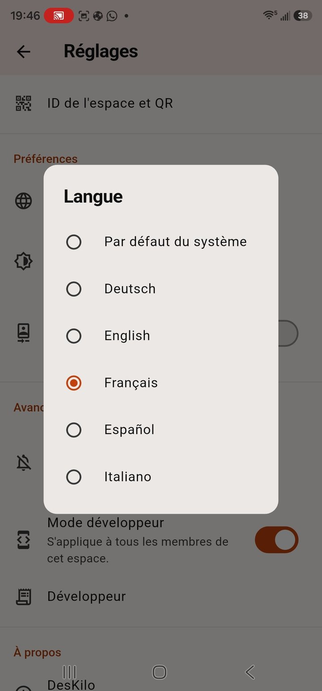

## 1. Premiers pas

### Créer un compte

Ouvrez l'app et inscrivez-vous avec votre e-mail, un mot de passe (8+ caractères) et un nom d'affichage — ou **continuez avec Google**. L'œil affiche ou masque le mot de passe pendant la saisie, et *Mot de passe oublié ?* envoie un lien de réinitialisation. Une connexion Google peut ensuite s'attacher à un compte e-mail existant sous **Réglages → Comptes liés**.

### Créer un espace — ou en rejoindre un

Après connexion, l'écran d'accueil offre deux chemins :

- **Créer un espace** — vous en devenez le **propriétaire**. Choisissez un nom, un pays (qui détermine la devise par défaut) et un fuseau horaire. Vous dessinerez ensuite votre plan dans l'éditeur (§8).
- **Rejoindre un espace** — saisissez l'**ID de l'espace** qu'on vous a partagé, ou touchez **Scanner le QR code** et visez le QR d'invitation affiché au mur. Vous rejoignez avec le rôle que porte l'invitation (§2).

### Profils — un compte, plusieurs espaces

Un compte peut appartenir à plusieurs espaces. **Réglages → Profils** les liste tous : chaque ligne montre le nom de l'espace, **votre rôle** (Membre, Admin, Propriétaire) et son ID. La **coche** marque le profil actif ; l'**étoile** marque votre profil **par défaut** — celui avec lequel l'app s'ouvre, sur chaque appareil et même après réinstallation (le choix est stocké avec votre compte). Touchez une ligne pour changer, **+ Ajouter un profil** pour rejoindre un espace de plus. Tout dans l'app est limité à l'espace actif.

### S'orienter

L'app a cinq destinations en bas : **Plan** (§3), **Calendrier** (§5), le grand bouton central **Réserver** (§4), **Membres** (§6) et **Finances** (§9). Deux icônes vivent dans chaque en-tête : la **cloche** ouvre le fil des événements et confirmations (§7, avec un compteur de ce qui vous attend) et l'**engrenage** ouvre les **Réglages** (§12). En paysage et sur tablette, la plupart des écrans passent en **vue scindée** — les commandes dans un panneau latéral, le contenu remplissant le reste.

**Tout reste en direct.** Tout changement — une réservation, un nouveau membre, un réglage — est poussé vers chaque appareil connecté en quelques secondes, y compris celui qui l'a fait. Pas de redémarrage, pas de tirer-pour-rafraîchir.

## 2. Rôles et invitations

DesKilo a trois rôles additifs, plus un compte d'appareil :

| Rôle | Peut |
|---|---|
| **Membre** | Pointer, réserver, soumettre des dépenses, voir et gérer ses propres événements et son compte |
| **Admin** | Tout ce qu'un membre peut, plus : agir *pour n'importe qui* (réservations, paiements, dépenses — sous confirmation, §7), approuver les dépenses, émettre des badges |
| **Propriétaire** | Tout ce qu'un admin peut, plus : modifier l'espace physique, définir plans et prix, gérer les rôles, les bornes et les réglages |
| **Copropriétaire** | *Actif* : les permissions du propriétaire dès maintenant, plus la succession automatique. *Passif* : un successeur en attente, sans permission supplémentaire aujourd'hui |
| **Borne** | Un compte de tablette murale (§10) — n'affiche que le plan ; les vrais membres agissent au badge |

Qui peut faire quoi n'est pas gravé dans le marbre : le propriétaire l'ajuste dans la matrice de **Gestion des rôles** (§8).

**Chaque invitation est liée à un rôle.** Sur l'écran *ID de l'espace et QR* du propriétaire, deux onglets portent deux invitations, chacune avec son QR et son code :

- **Invitation membre** — l'ID de l'espace lui-même, sous le nom de l'espace. Imprimez-le, affichez-le, partagez-le librement : qui le scanne ou le saisit rejoint comme simple membre. Boutons : **Copier l'ID**, **Partager en PNG**, **Changer l'ID de l'espace** (remplacez l'ID généré par un mémorable, 4–20 lettres/chiffres) et **Inviter quelqu'un**.
- **Invitation admin** — un **code personnel à usage unique**, émis par un propriétaire pour une personne précise. L'écran le dit clairement : *ce code admet UNE personne comme admin, puis expire* (un code non utilisé expire après 14 jours). Ne le remettez qu'à son destinataire ; émettez-en un par admin avec **Nouveau code admin**.
- **Les invitations parlent la langue de l'invité** — la feuille d'invitation rédige le message dans la langue choisie (cinq disponibles), par défaut la **langue de l'espace** définie dans les *réglages de l'espace*. Le propriétaire peut aussi personnaliser le texte d'invitation **par langue**, avec les balises `{firstName}`, `{workspaceName}`, `{inviteLink}`, `{downloadUrl}`, `{role}` ; une langue laissée vide utilise le message intégré traduit.

**Il n'existe pas d'invitation propriétaire — à dessein** (le pied de l'écran le rappelle). La propriété ne se donne que par un propriétaire existant, dans *Membres et forfaits*. Un espace garde toujours au moins un propriétaire. Promouvoir ou rétrograder un **admin** passe par la validation (§7) — appliqué une fois que les validateurs confirment.

**Les copropriétaires gardent l'espace vivant.** Le propriétaire nomme n'importe quel membre ou admin copropriétaire (*Membres et forfaits → le membre → Copropriété*), en deux saveurs : un copropriétaire **actif** travaille immédiatement avec les permissions du propriétaire ; un **passif** n'a aucune permission supplémentaire jusqu'au jour où il en faut. Dans les deux cas la succession est automatique : si le dernier propriétaire part — quitte, est retiré, son compte disparaît — le meilleur copropriétaire (actif avant passif) **devient propriétaire instantanément**, côté serveur, sans action requise. Le propriétaire peut aussi transmettre délibérément à tout moment avec *Promouvoir propriétaire maintenant*. Une nuance : les règles de validation exigeant la signature du *propriétaire* (§7) désignent toujours un propriétaire littéral, pas un copropriétaire actif.

Le QR encode un lien qui nomme le rôle accordé (`deskilo://join?role=…`). Falsifier le lien ne change rien — le serveur dérive le rôle du code lui-même : l'ID de l'espace joint toujours comme membre, et une invitation personnelle joint exactement dans le rôle de son émission, une fois. Un code admin déjà utilisé — ou expiré — n'admet personne.

**Inviter par message** (*Inviter quelqu'un*) : chaque envoi WhatsApp/SMS/partage émet son propre code personnel à usage unique et construit un message prêt dans la langue de l'invité. Le destinataire peut copier le message entier et le coller dans le champ de l'app — le code est détecté automatiquement.

## 3. Le plan (onglet Plan)

Le plan montre le niveau actif de votre espace : bureaux, tables et places, codés par couleur — **libre**, **réservé**, **occupé**, **à moi**, **bloqué**. Il s'ouvre **instantanément sur les dernières données connues** et se rafraîchit en arrière-plan — sur un Wi-Fi capricieux vous voyez l'état le plus récent au lieu d'un écran vide. Les places occupées montrent qui est là par son prénom, un **badge coche** une fois pointé, et un **point vert** quand la personne est en ligne dans l'app. Quand une **table, un bureau ou un étage entier** est réservé, l'espace le dit lui-même — un voile coloré, une bordure forte, et une **puce cadenas avec le nom de l'occupant** au milieu ; le libellé du bureau lit *Bureau 2 · Florian*. Tout le monde le voit : sur le plan, dans Réserver et sur la borne.

Le plan peut ressembler à votre espace réel : le propriétaire peut mettre une **photo de la pièce en fond de niveau** et placer des **images d'illustration** librement redimensionnables (plantes, canapés…). Le curseur **transparence des tables** dans les réglages laisse la photo transparaître sous les tables dessinées.

S'y déplacer :

- En haut : la bascule **carte / liste** (la liste montre les mêmes places en lignes), la **puce de date** (touchez pour parcourir un autre jour) et trois **puces de moment** — matin, après-midi, journée — qui filtrent l'affichage.
- Le canevas **s'ajuste automatiquement** à l'ouverture ou à la rotation ; **pincez pour zoomer** ou utilisez **+ / −**, tirez les **barres de défilement**, touchez le bouton **ajuster** pour recentrer.
- Choisissez l'étage sur le **rail des niveaux** à droite (1, 2, …) ; son **icône calques** agit sur le niveau entier (ci-dessous). En **paysage**, les commandes passent dans un panneau latéral.

Réserver depuis le plan :

- **Pointage spontané** : touchez une place libre → la feuille propose *maintenant* jusqu'à la fin par défaut → confirmez. Si quelqu'un a réservé cette place plus tard, votre fin est plafonnée et on vous le dit.
- **Pointer sur une réservation** : pointer signifie *vous y êtes* — la fenêtre s'ouvre **15 minutes avant** votre début et se ferme à la fin de la réservation. En dehors, le bouton est désactivé et dit quand il s'ouvre ; parcourir un moment futur n'offre jamais de pointage. Les admins peuvent pointer un membre debout à sa place (tant que *réserver pour d'autres* est actif).
- **Départ** : manuel — ou, si le propriétaire active **arrivée/départ auto**, les réservations oubliées se clôturent seules en fin de journée : jamais touchées, elles comptent de leur début à leur fin ; départ oublié, il ferme à la fin prévue.
- **Espaces entiers** : **double-touchez** une table, un bureau ou un bout de sol vide — ou touchez l'**icône calques** du rail — pour agir sur **toute la table, le bureau ou l'étage** : la feuille nomme le niveau, montre la période (p. ex. *jeu. 6 août 10:13 → 12:00*), laisse les admins choisir **Pour le membre** (soi-même ou un autre) et confirme par **Réserver le niveau**. Même sélecteur de période et mêmes répétitions qu'une place.
- **Défileur temporel** : choisissez une fenêtre de→à (ou Matin / Après-midi / Journée selon la granularité) pour voir l'occupation à tout moment futur.
- Les places peuvent porter des **accessoires** (écran, bureau debout…), certains avec un supplément par demi-journée qui apparaît sur votre relevé.
- Les réservations comptent sur vos **jours mensuels** (§9) — l'app bloque ou facture au-delà de votre forfait, selon la configuration du propriétaire.

## 4. Réservations (hub Réserver)

Ouvrez le hub **Réserver** (bouton central). En haut : les quatre **boutons de vue**, la **puce de date**, le bouton **scan QR** (dessous, §4a), les **puces de moment** (matin / après-midi / journée) et les **puces d'étage** (*Tous les étages*, ou un par niveau). Puis quatre vues :

- **Plan** — le plan filtré sur votre fenêtre ; touchez une place libre pour réserver.
- **Jour** — chaque place en ligne de chronologie pour le jour choisi (08:00 → 17:00 ou vos horaires, la ligne rouge marquant *maintenant*) ; touchez un créneau libre pour réserver, votre propre bloc pour ses détails.
- **Semaine** — une grille places × jours pour la semaine ISO, un bandeau de jours (*lun. 3 … dim. 9*) au-dessus ; chaque cellule porte les demi-journées avec l'initiale de l'occupant. Repérez une demi-journée libre d'un coup d'œil et touchez-la.
- **Mois** — un calendrier de disponibilité : chaque jour montre son **compteur de places libres** (p. ex. *10/12*) ; touchez un jour pour plonger dans sa vue Jour.

**Une place à la fois** : vous ne tenez qu'une réservation active par fenêtre — réserver ou pointer ailleurs pendant qu'une court est refusé, et pointer ferme tout pointage antérieur dont la réservation est finie. Admins et propriétaires peuvent **passer outre** : toucher une place occupée ou réservée offre *Retirer la réservation (passer outre)* — la réservation est retirée et le membre et tous les admins sont notifiés par le fil des événements.

Les réservations suivent la **granularité** de l'espace (§8 Disponibilité) — demi-journées, journées entières, heures réelles (de–à exact avec les fenêtres demi/journée en raccourcis) ou horaires libres sur la grille du propriétaire. Demi-journées et journées couvrent les **horaires de travail** configurés (par défaut 8:00–17:00, limite de demi-journée à 12:00). Elles respectent les **jours d'ouverture**, les **jours de fermeture** et les règles de réservation (horizon, durée max, délai d'annulation). Besoin récurrent ? Réservez une **série** (quotidienne, jours ouvrés, hebdomadaire) — jours fermés et conflits sont sautés et signalés.

**Supprimer une réservation passée ou pointée est une demande, pas une action.** Une réservation dont le début est passé — ou déjà pointée — ne s'annule pas directement : la feuille offre **Demander la suppression**. Un propriétaire ou admin tranche la seule question qui compte pour la facturation : pointage oublié (la réservation reste au dossier) ou jamais utilisée (elle est retirée) ? La demande apparaît sur le fil des événements avec votre motif optionnel ; les réservations futures non entamées gardent l'annulation en un geste.

### 4a. Scanner un code d'espace

Chaque place, table, bureau et niveau peut porter une **carte QR** imprimée (§8). Touchez le **bouton scan** du hub, visez la carte — ou saisissez son code — et l'app identifie l'espace et montre exactement ce que *vous* pouvez y faire :

- **Carte de place** — réserver ou pointer sur cette place précise, sur-le-champ (fenêtre du jour : matin / après-midi / journée en demi-journées, sinon à partir de maintenant).
- **Carte de table** — les places de la table avec leur état en direct ; choisissez-en une libre.
- **Carte de bureau ou d'étage** — si le propriétaire l'a rendu réservable, que la fonctionnalité *Réservations de bureaux et niveaux* est active **et** que vous détenez le droit personnel (§8) — propriétaires et admins l'ont toujours — vous réservez ou pointez sur le **bureau ou l'étage entier** — même sélecteur de période et mêmes **séries** qu'une place ; son prix par demi-journée est affiché et atterrit sur votre relevé. Sinon la feuille explique pourquoi, et un bureau retombe sur ses places.

**Les conflits protègent dans les deux sens :** un bureau ou un niveau ne se réserve pas tant qu'une place à l'intérieur est prise sur la fenêtre — et aucune place ne se réserve tant que son bureau ou niveau est réservé en entier.

## 5. Calendrier (onglet Calendrier)

Le mois d'un coup d'œil, avec deux portées et deux formes :

- **Les miennes / Tout le monde** — vos propres réservations, ou celles de toute la communauté. Vos jours sont marqués **rouge**, ceux des autres **bleu**, aujourd'hui est cerclé ; un point sous un jour signale une réservation.
- La **bascule de forme** à côté commute la moitié basse entre une **grille de semaine** (places × jours, comme le hub) et une **liste agenda** (chaque réservation en carte : fenêtre horaire, membre, espace).
- Les **puces d'étage** (*Tous les étages* / par niveau) filtrent les deux formes.
- Touchez un jour de la grille pour le charger dessous. En paysage, calendrier et détail passent en vue scindée.

## 6. Annuaire des membres (onglet Membres)

Voyez qui fait partie de votre communauté :

- Chaque carte montre la **photo** (ou l'initiale), la **puce de rôle** (Admin, Propriétaire), le **statut personnalisé** (« à Berlin jusqu'à vendredi… »), un indicateur **en ligne / vu il y a** (*En ligne*, *10 min*, *2 j*) et une **puce de réservation** : place pointée, *Réservé maintenant*, ou prochaine réservation.
- Touchez un membre pour sa **feuille de détail** — rôle, présence, ses **réservations à venir**, et **Messages**.
- **Messages** : un **fil de conversation** par membre (jusqu'à 500 caractères par message) — ouvrez-le depuis la feuille du membre ou son profil dans l'annuaire, lisez tout l'échange en bulles et envoyez depuis le même endroit. Chaque message est livré en push et en notification avec votre nom et votre texte. Le texte complet reste lisible sous **Événements → Messages**, pour le destinataire et l'expéditeur (le push lui-même ne porte aucun contenu, par choix de confidentialité). Les admins ont un **mégaphone Notifier tous les admins** dans l'en-tête, qui atteint chaque admin, propriétaire inclus. Débrayable via la fonctionnalité *Notifications entre membres*. Pendant la rédaction, deux puces permettent de **lier une réservation ou un pointage en cours — les vôtres ou ceux d'un autre membre** — ou **un espace** (siège, table, bureau ou niveau) — la référence apparaît comme un lien touchable des deux côtés : un lien de réservation ouvre cette réservation, un lien d'espace ouvre la feuille de réservation de l'espace, idéal pour discuter d'une réservation future.
- L'**icône message** d'une carte écrit à ce membre sur **WhatsApp** (s'il a partagé son numéro) ; le **bouton groupe** ouvre le groupe WhatsApp de la communauté (défini par le propriétaire).
- Réglez votre photo, votre statut et la visibilité de votre numéro dans les **Réglages** (§12).
- Admins et propriétaires voient en plus l'**e-mail** de chaque membre sous son nom — pas les simples membres : le contact membre-à-membre reste le numéro WhatsApp opt-in.

## 7. Événements et confirmations (cloche)

Le fil des événements est la piste d'audit de votre espace : réservations créées/modifiées/annulées, paiements enregistrés, factures payées, dépenses soumises, demandes de demi-journées, changements de rôle, demandes de suppression. Les membres voient leurs propres événements ; admins et propriétaires voient tout. Les **puces de filtre** (Tous · Réservation · Paiement · Dépense · …) resserrent la liste ; chaque ligne porte son icône d'état — un **sablier** en attente, une **coche verte** une fois confirmé — et les événements d'argent affichent *qui a validé et quand* sur la ligne même.

**En attente de votre confirmation :** dès qu'un admin agit *pour quelqu'un d'autre* — réserve une place pour vous, enregistre votre paiement, rétrograde un admin — cela reste **en attente jusqu'à confirmation**. Les éléments en attente sont épinglés en haut avec un ✕ rouge et un bouton **Accepter** vert, et vous êtes notifié. Vos propres actions sur vous-même ne demandent jamais confirmation.

**Messages :** la cloche collecte aussi vos notifications de membres (§6) — reçues et envoyées, les plus récentes d'abord. La liste n'affiche que les **64 premiers caractères** ; **touchez un message** (ou **balayez à droite**) pour ouvrir la **conversation** avec ce membre — tout l'échange en bulles, émojis et liens de référence actifs (un lien de réservation ouvre cette réservation, un lien d'espace ouvre la feuille de réservation), avec le composeur juste en dessous ; une diffusion s'ouvre en message unique. **Balayez à gauche** pour supprimer un message (un appui long sur une bulle supprime aussi depuis le fil) — la suppression demande toujours **confirmation** (une diffusion tous-admins reçue ne se supprime pas — elle disparaîtrait pour chaque admin).  Vos propres messages portent une petite coche à côté de l'heure : **grise = remis**, **bleue = lu** par le destinataire (une diffusion à tous les admins reste grise — elle a plusieurs lecteurs). Les messages non lus comptent sur la cloche et sur l'icône de l'app jusqu'à ouverture de cet écran.

**Quorum de validation :** pour l'argent et les rôles, le propriétaire définit *qui* doit approuver et *combien* d'approbations il faut. **Personne ne valide son propre événement** — seule une autre personne le peut ; sans autre validateur, la demande attend. Les demandes sans réponse expirent après 7 jours — rien de coûteux n'est accordé en silence, rien n'est auto-accordé.

Le propriétaire ajuste cela par **domaine** dans **Réglages → Règles de validation** — une carte par type d'événement, héritant de la **règle par défaut** tant qu'elle n'est pas éditée : *Règle par défaut, Paiement, Dépense, Service, Demi-journées supplémentaires, Suppression de réservation, Changement de rôle, Nouveau membre, Réservation, Réservations d'espaces entiers, Paiement de facture, Ajustement* — et les demandes d'**annulation de solde** empruntent le même cadre. Une règle fixe le nombre de validations requises, *quels* admins peuvent valider (tous, ou nommés), et si le propriétaire doit toujours signer.

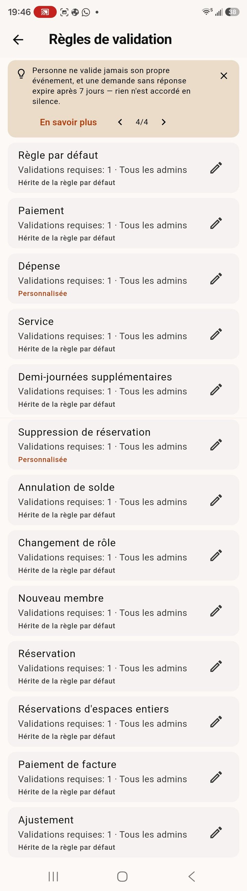 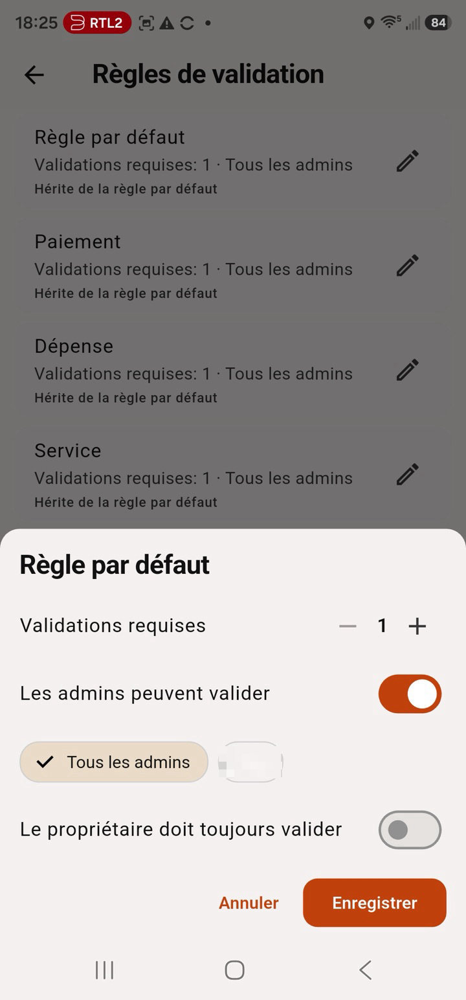

*À gauche : une règle par domaine, héritant du défaut. À droite : l'édition — validations requises, validateurs autorisés, signature du propriétaire.*

## 8. Pour les propriétaires : l'éditeur et les réglages

Toute l'administration vit sous **Réglages → Administration** — *Espace de coworking* (les réglages de l'espace), *Membres et forfaits*, *Gestion des rôles*, *Facturation & rapports* (le hub de facturation avec l'éditeur de rapports et les règles de relance dans son en-tête), *Accessoires*, *Disponibilité*, *Fonctionnalités*, et les entrées conditionnées par leur fonctionnalité (Paiements en ligne, Badges RFID/NFC…). Une règle à connaître : **l'entrée de réglages d'une fonctionnalité n'apparaît que si la fonctionnalité est activée** — coupez *Paiements en ligne* dans **Fonctionnalités** et son écran disparaît (et revient à la réactivation). L'entrée **Fonctionnalités** reste toujours là.

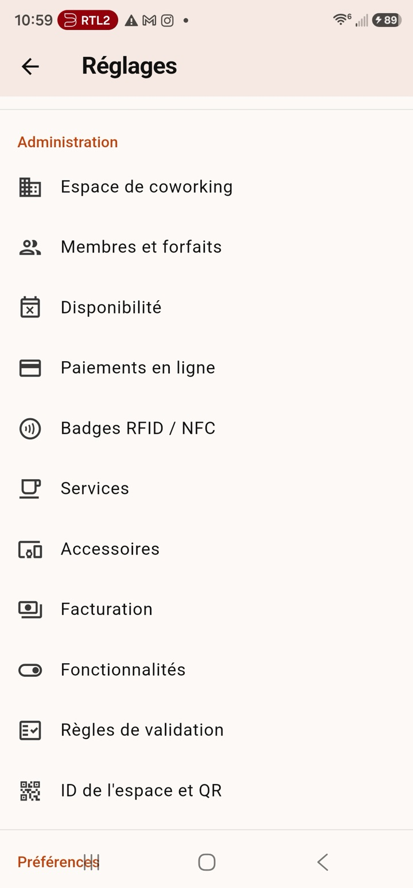

### L'éditeur d'espace

Ouvrez l'**éditeur** depuis la barre de l'onglet Plan (icône outils croisés). L'écran **Éditeur d'espace** liste vos étages — glissez pour réordonner, l'**icône calques** marque un niveau *Réservable en entier*, le menu **⋮** renomme ou supprime, **+ Ajouter un étage** agrandit le bâtiment. Ouvrez un étage pour le dessiner sur la grille avec la barre d'outils — **Sélection · Bureau · Table · Place · Image · Effacer** :

- Un **bureau** reçoit un nom, un interrupteur *Réservable en entier* et un **prix par demi-journée**.
- Une **table** reçoit un nom et la même option table-entière.
- Une **place** reçoit un nom, un **sens d'assise** (↑ → ↓ ←), un **type de chaise** optionnel, ses **accessoires** (chacun peut porter un supplément par demi-journée) et un interrupteur **Bloquée (maintenance)**.
- **Image** place une illustration redimensionnable ; l'icône photo de la barre définit la **photo de fond** du niveau.
- Supprimer un élément avec des réservations futures vous les fait d'abord résoudre.

### ID de l'espace et QR

Vos invitations liées au rôle (§2) : invitation membre = l'ID de l'espace (remplaçable par un mémorable, copiable, QR partageable en PNG), invitation admin = codes personnels à usage unique.

### Disponibilité

- **Jours d'ouverture** — puces lun.…dim.
- **Granularité des réservations** — au choix : *plage horaire libre*, *créneaux de 5 / 15 / 30 / 60 minutes*, *demi-journées (matin et après-midi)*, *journées entières uniquement*, ou *heures réelles* (de–à exact, demi/journées en raccourcis).
- **Horaires de travail** — début de journée, limite de demi-journée, fin de journée (par défaut 08:00 / 12:00 / 17:00). Les créneaux demi-journée et journée partout — réservations, pointage et facturation — suivent ces horaires ; en *heures réelles* vous fixez aussi combien d'heures se facturent en demi et en pleine journée.
- **Jours de fermeture** — exceptions datées, ajoutées au **+**.

### Fonctionnalités

Activez ou coupez des modules entiers par espace — chaque interrupteur porte sa description à l'écran : onglet Calendrier, onglet Événements, onglet Finances, services, suppléments d'accessoires, paiements en ligne, factures, les admins émettent des factures, export PDF, réservation en série, réserver pour d'autres, notifications push, les admins peuvent bloquer des places, réservations de table/bureau/niveau, les admins peuvent attribuer des niveaux, mode borne, badges RFID/NFC, annuaire des membres, intégration WhatsApp, codes QR des espaces, copropriétaires, arrivée/départ auto, export des données (Excel), horaires de travail, modèle de PDF de facture, notifications entre membres, bibliothèque de documents, relances de paiement, rapports des membres, demandes de suppression de réservation, gestion des rôles. Couper un module retire *tous* ses écrans et boutons pour chaque membre.

La liste est **hiérarchique** : une fonctionnalité qui en nécessite une autre s'indente sous elle avec une note *Nécessite…*, grisée tant que le parent est coupé — *Finances* porte services, suppléments, paiements en ligne et factures ; *Factures* porte la délégation admin, le modèle PDF et les relances ; *Mode borne* porte les badges RFID/NFC ; *Annuaire* porte l'intégration WhatsApp. Couper un parent retire tout son sous-arbre ; le choix stocké de l'enfant revient intact au retour du parent.

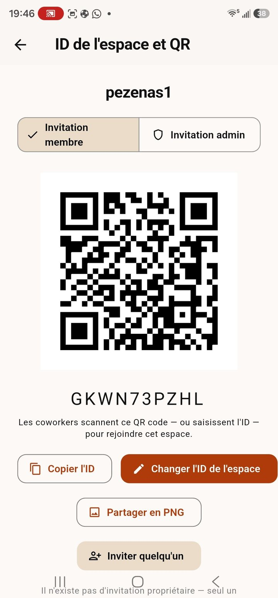 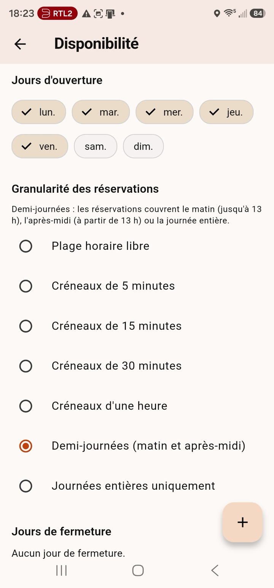 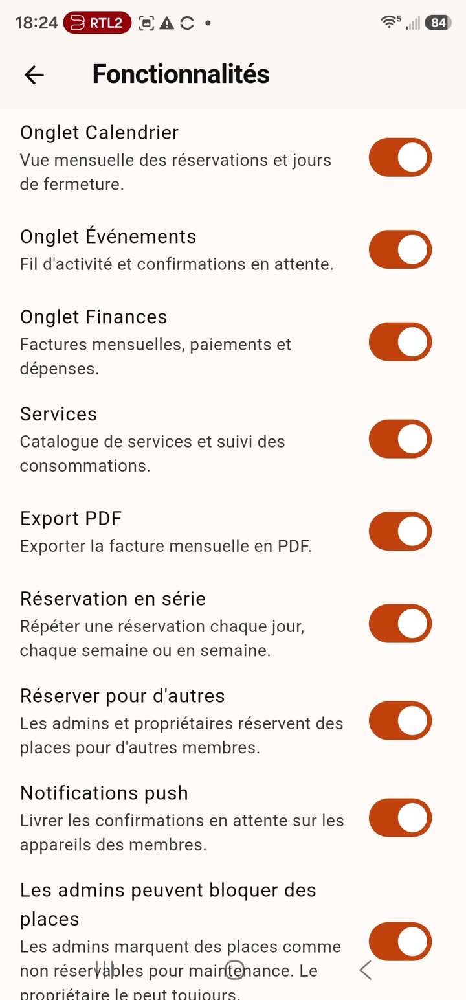 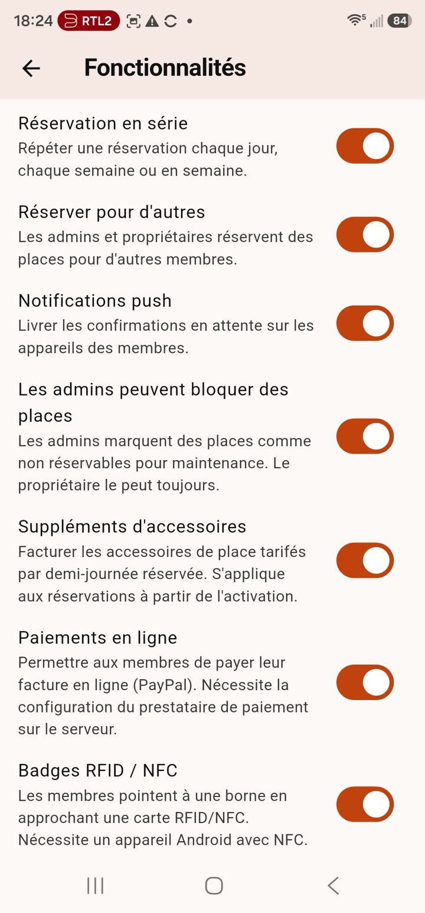

### Membres et forfaits

Touchez un membre pour sa **feuille de gestion** — chaque action par membre au même endroit : **Envoyer l'accord financier** (§11d), **Messages**, **Ajouter un service** (service, quantité, mois de facturation → *soumettre pour confirmation*), **Abonnement** (son pourcentage), **Quand les jours sont épuisés** (la politique de dépassement, §9), **Limite de réservations** (plafond simultané), **Peut réserver une table, un bureau ou un niveau entier**, **Badges** (§10), **Nommer admin** (validé, §7), **Copropriété**, **Transformer en borne**, et **Mettre l'adhésion en pause**. Chaque ligne montre l'**e-mail** du membre sous son nom.

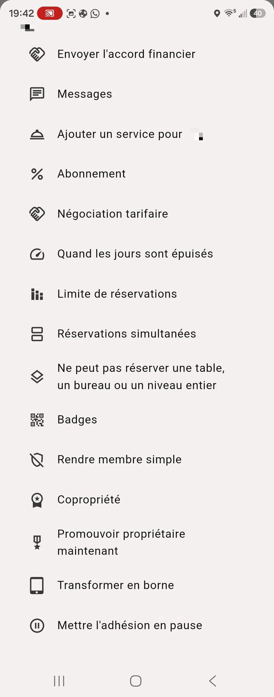 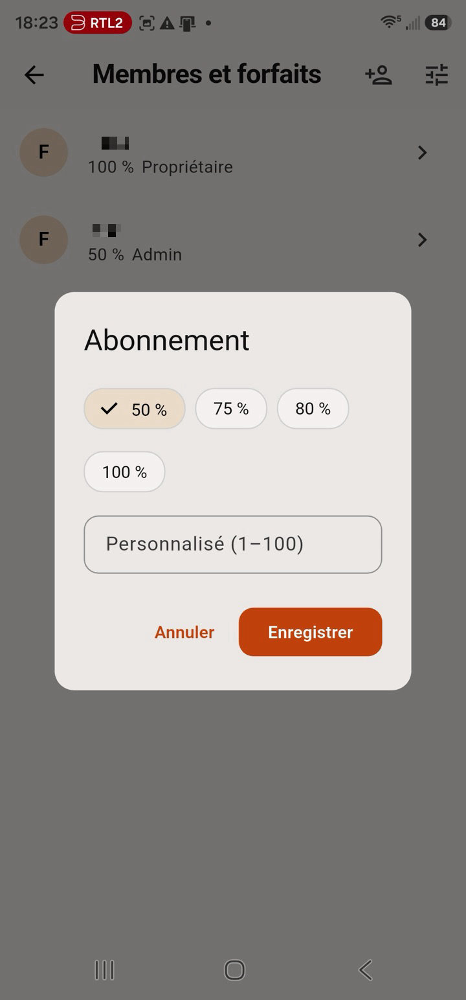 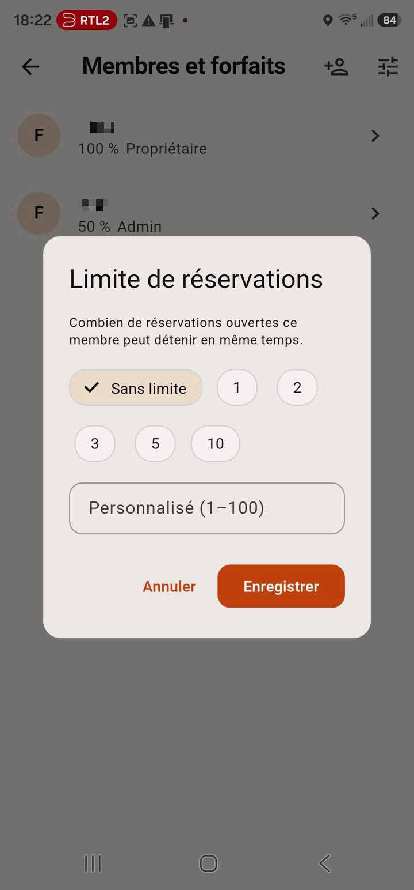

### Facturation

- **Paliers tarifaires** — l'échelle de prix des abonnements en pourcentage : chaque palier dit *dès X %*, *jusqu'à Y %*, le **tarif** mensuel et le **tarif de dépassement** par demi-journée supplémentaire. **+ Ajouter un palier** prolonge l'échelle.
- **Niveaux d'abonnement** — les pourcentages que les membres peuvent choisir (puces : 25 % · 50 % · 75 % · 100 %, plus vos valeurs), et un interrupteur **valeur libre négociée**.
- **Forfaits de jours** — un nombre de jours pour un prix (nom · jours · prix), chacun avec son interrupteur d'activation ; les membres en politique *forfaits* les achètent quand leurs jours s'épuisent.

### Services et Accessoires

Les catalogues derrière le §9 — extras définis par le propriétaire (casiers, impression…, chacun avec un prix et un taux de TVA optionnel) et équipements de place avec suppléments optionnels par demi-journée. Deux listes simples avec un bouton **+**.

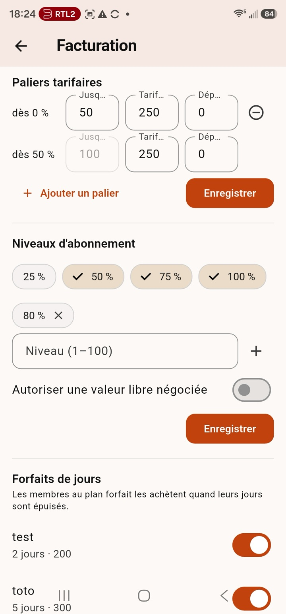 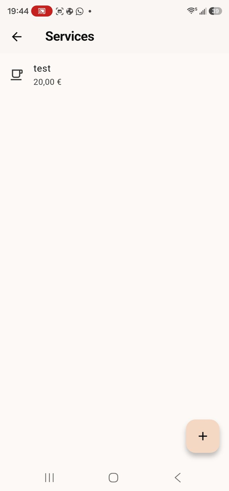 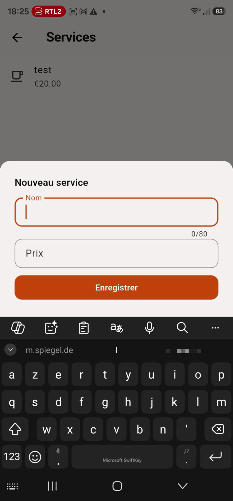 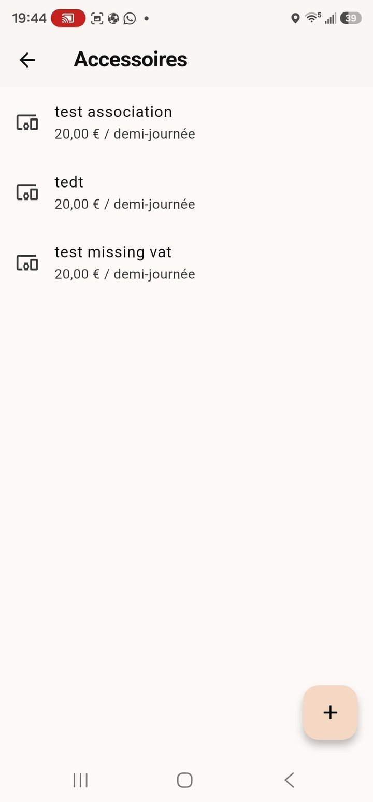

### Réglages de l'espace (Espace de coworking)

L'écran de l'espace, de haut en bas :

- **Identité** — nom, pays, devise (proposée d'après le pays, modifiable), fuseau horaire, **langue de l'espace** (les invitations y sont rédigées par défaut ; *langue de l'app de l'expéditeur* est une option) et l'**adresse** postale imprimée sur les factures.
- **Paiements et facturation** — les **instructions de paiement** que voient les membres sur un relevé impayé (IBAN, lien PayPal.me, numéro Wero, Lydia, Wisetag, indication de référence — champ vide = rien d'affiché), et **Identité légale et facturation électronique** (§11a).
- **Groupe WhatsApp** — le lien du groupe communautaire montré dans l'annuaire.
- **Message d'invitation** — les modèles d'invitation par langue (§2).
- **Transparence des tables** — le curseur qui laisse une photo de fond transparaître sous les tables.
- **Modèle de PDF de facture** et **Règles de relance** — raccourcis vers l'éditeur de rapports et la configuration des relances (§11).
- **Exports** — *Exporter l'espace (XML)* (réglages + plan, sans données personnelles — sauvegarde, modèle, migration), *Exporter la configuration (PDF)* (instantané complet : réglages, membres, plan), *Rapport de l'espace* (tout sur l'espace via le modèle « espace » de l'éditeur de rapports), *Codes QR des espaces (PDF)* (une carte QR par place, table, bureau et niveau, dix par A4), *Exporter les données (Excel)* (un classeur : réservations, paiements, factures, membres, plan — un onglet chacun), *Importer l'espace (XML)* (restaure réglages et plan ; remplace le plan actuel). Chaque export atterrit dans les **Téléchargements** de l'appareil.
- **Zone de danger** — **Réinitialiser l'espace** : supprime toutes les réservations, la comptabilité et le plan ; conserve réglages et membres. Gardé par une confirmation tapée.

### Codes QR des espaces et réservations d'espaces entiers

Quatre étapes font de « scanner le code sur la table » le flux quotidien (§4a) :

1. Dans l'**éditeur**, marquez un bureau ou un niveau **Réservable en entier** et donnez-lui un **prix par demi-journée** — la feuille du bureau, ou pour un niveau l'**icône calques sur sa ligne**.
2. Activez **Réservations de bureaux et niveaux** dans **Fonctionnalités** (coupé par défaut).
3. Accordez à chaque membre habilité **« Peut réserver une table, un bureau ou un niveau entier »** — propriétaires et admins le règlent dans la feuille de gestion du membre, jamais pour eux-mêmes.
4. Imprimez les cartes : **Réglages de l'espace → Codes QR des espaces (PDF)** — découpez et collez chaque carte sur son espace.

Une réservation de bureau couvre **toutes ses tables** ; une réservation de niveau couvre l'étage entier. Les deux ne sont possibles que si rien à l'intérieur n'est réservé — et apparaissent en lignes propres sur le relevé du membre.

### Copropriétaires

Que la communauté ne dépende jamais d'un seul compte :

1. Ouvrez *Membres et forfaits → le membre → **Copropriété*** et choisissez **actif** (permissions du propriétaire maintenant) ou **passif** (successeur en attente).
2. Transmettez à tout moment avec ***Promouvoir propriétaire maintenant*** — le copropriétaire devient propriétaire à part entière à vos côtés.
3. Si le dernier propriétaire quitte l'espace, le meilleur copropriétaire est **promu automatiquement** côté serveur — actif avant passif. Ce filet fonctionne même quand la fonctionnalité *Copropriétaires* est coupée (elle ne cache que les boutons de nomination).

### Gestion des rôles

Une matrice centrale décide **quelle permission revient à quel rôle** — gérer les rôles et permissions, gérer les membres, configurer les règles de validation, modifier les réglages de l'espace, émettre les factures et rapprocher les paiements, consulter les finances de l'espace, gérer la bibliothèque de documents, gérer les services et forfaits, approuver les dépenses. Ouvrez-la dans *Réglages → Administration → Gestion des rôles* (sa fonctionnalité doit être activée) :

- Le **propriétaire détient toujours toutes les permissions** — sa ligne est verrouillée (le cadenas le montre).
- Qui détient *Gérer les rôles et permissions* modifie les autres lignes. Un **copropriétaire** démarre avec tout (« il peut en avoir moins » — le propriétaire retire ce qu'il veut) ; un **admin** avec les capacités d'admin actuelles ; un **membre** sans rien.
- Toute autre personne disposant d'une permission voit la matrice **en lecture seule** — l'écran l'annonce : *« Lecture seule : voici les permissions de chaque rôle. Votre rôle est mis en évidence »* — avec la puce **Votre rôle** sur sa carte.
- Une matrice jamais touchée = les valeurs par défaut — rien ne change tant que le propriétaire ne l'édite pas. Le serveur applique la même matrice dans les RPC de facturation (`has_permission`) : l'interface et la base ne peuvent pas diverger.

### Configurer les paiements en ligne

Chaque communauté encaisse sur son **propre** compte prestataire ; l'app ne garde jamais les clés secrètes sur un appareil — elles vivent sur le serveur.

1. Ouvrez **Réglages → Paiements en ligne** (propriétaire uniquement).
2. Choisissez un prestataire et collez ses clés depuis son tableau de bord :
   - **PayPal** — Client ID, Secret, Environnement (commencez en *sandbox*), Webhook ID, URL de retour (PayPal Developer → votre app REST).
   - **Carte bancaire (Stripe)** — Clé secrète, Secret de signature webhook, URL de retour (Stripe → API keys / Webhooks).
   - **Mollie** — Clé API, URL de retour (offre iDEAL, Bancontact, cartes…).
   - **Wero (via Mollie)** — la même clé API Mollie, avec Wero activé dans votre compte Mollie.
3. **Enregistrez** — une puce verte *Configuré* apparaît. Activez la fonctionnalité **Paiements en ligne** (Réglages → Fonctionnalités), et les membres voient **Payer en ligne** sur un relevé impayé. (L'entrée de réglages *Paiements en ligne* n'apparaît elle-même que si la fonctionnalité est active.)

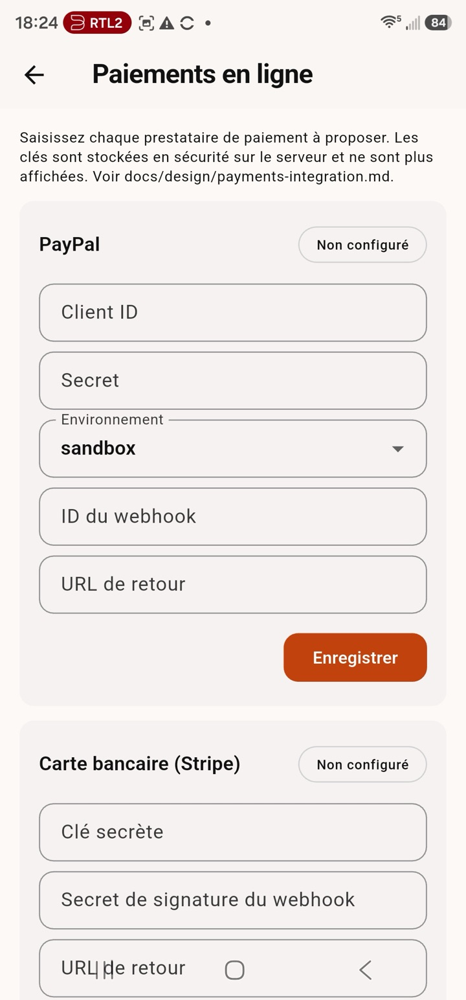 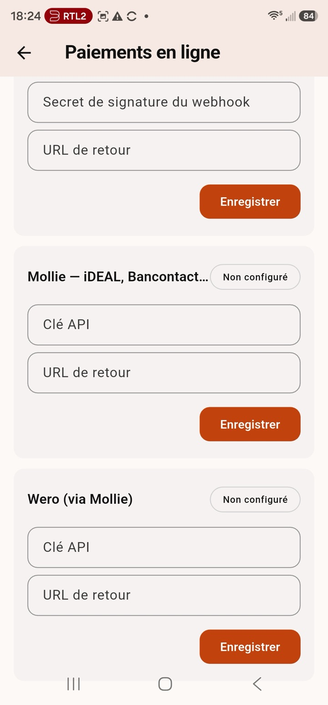

Un secret enregistré ne se réaffiche jamais — champ vide pour le garder, tapez pour remplacer, **Supprimer** pour effacer le prestataire. Les frais sont ceux du prestataire (typiquement ~1,5–3 % par paiement, sans abonnement) ; DesKilo n'ajoute rien, et la voie virement/IBAN manuelle reste gratuite.

Si un paiement ne démarre pas, activez **Réglages → Avancé → Mode développeur** et ouvrez l'écran **Développeur** : la trace *payments* montre exactement quels prestataires sont configurés et quels champs manquent.

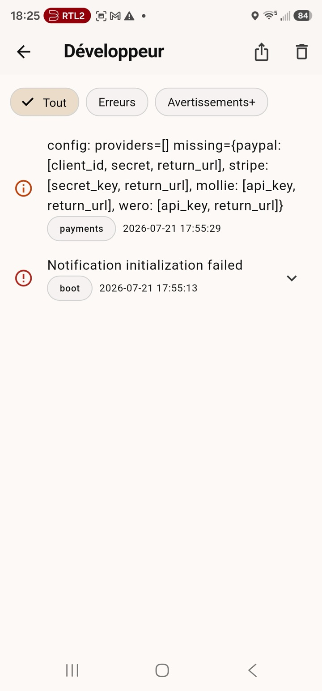

#### Les tableaux de bord des prestataires, pas à pas

Séparez **strictement test et production** : chaque prestataire a des clés par mode, et les clés collées dans DesKilo doivent toutes appartenir au même mode. Dans les URL ci-dessous, `<project-ref>` est votre référence de projet Supabase (auto-hébergés : l'URL de votre instance).

**PayPal**

1. Connectez-vous sur [developer.paypal.com](https://developer.paypal.com) et ouvrez **Apps & Credentials**.
2. Basculez **Sandbox / Live** — commencez en *sandbox* ; passez en *live* seulement en production. Le champ *Environnement* de DesKilo doit correspondre aux clés.
3. **Créez une app REST-API** — cela génère le **Client ID** et le **Secret**.
4. Dans l'app, ajoutez un **webhook** : URL `https://<project-ref>.supabase.co/functions/v1/paypal-webhook`, abonné au moins à *Payment capture completed* (plus *denied* / *order voided*). Copiez le **Webhook ID**. Chez DesKilo le webhook n'est pas optionnel — c'est ainsi qu'un paiement se règle sur le relevé.
5. Collez Client ID, Secret, Environnement, Webhook ID et votre URL de retour dans **Réglages → Paiements en ligne → PayPal**. Rien n'est stocké dans l'app ni sur un appareil — tout va au serveur.

**Stripe (cartes bancaires & CB)**

1. Connectez-vous sur [dashboard.stripe.com](https://dashboard.stripe.com) et ouvrez **Developers**.
2. La bascule **Test / Live** décide des clés visibles. DesKilo n'a besoin que de la **clé secrète** — le checkout est créé côté serveur, la clé *publishable* ne sert pas.
3. Sous **Settings → Payment methods**, activez les réseaux voulus. **Vous visez la France ? Activez explicitement Cartes Bancaires** — les membres français préfèrent souvent CB au routage international Visa/Mastercard.
4. Sous **Developers → Webhooks**, ajoutez l'endpoint `https://<project-ref>.supabase.co/functions/v1/stripe-webhook` avec l'événement `checkout.session.completed`, et copiez le **secret de signature**.
5. Collez la clé secrète, le secret de signature et votre URL de retour dans **Réglages → Paiements en ligne → Carte bancaire (Stripe)**.

**Mollie (iDEAL, Bancontact, Wero…)**

1. Connectez-vous sur [my.mollie.com](https://my.mollie.com) → **Developers → API keys** et copiez la **clé API Test** ou **Live** (le mode est encodé dans la clé).
2. Sous **Settings → Payment methods**, activez ce que vos membres doivent voir : **iDEAL** (Pays-Bas), **Bancontact** (Belgique), cartes — et **Wero**, le portefeuille de l'European Payments Initiative pour paiements instantanés de compte à compte en Allemagne, France et Belgique (successeur de Paylib et giropay).
3. Dans DesKilo, **Mollie** et **Wero** sont deux cartes prestataire partageant la même clé API — un paiement Wero est créé comme paiement Mollie avec la méthode Wero. Configurez ce que les membres doivent voir.
4. URL de redirection et webhook sont posées **automatiquement par DesKilo** à chaque paiement — rien à configurer côté Mollie.

#### D'autres moyens de paiement (perspective)

| Prestataire / méthode | Focus | Comment ça s'insère |
|---|---|---|
| **Apple Pay / Google Pay** | Portefeuilles mobiles, paiement en un geste | Activez-les dans votre tableau Stripe (ou Mollie) — ils apparaissent sur la page de paiement hébergée, sans changement DesKilo ni frais de base. |
| **Klarna** | Achetez maintenant, payez plus tard | Idem : activez dans Stripe/Mollie et il apparaît au checkout — pertinent pour les gros montants. |
| **Adyen** | Entreprise & omnicanal | Non intégré — serait un nouveau prestataire dans DesKilo (contributions bienvenues). |
| **Braintree** | Drop-in mobile & web (propriété PayPal) | Non intégré — l'intégration PayPal directe de DesKilo couvre déjà ce terrain. |

### Configurer les badges RFID / NFC

Des cartes physiques pour pointer d'un geste — sans téléphone.

1. Ouvrez **Réglages → Badges RFID/NFC** (propriétaire uniquement). Activez **Pointage par badge NFC** et lisez la **ligne d'état de l'appareil** — elle distingue *prêt*, *NFC coupé dans les réglages Android* et *pas de matériel NFC* (les iPad n'en ont pas).
2. Donnez une carte à chaque membre : **Membres et forfaits → le membre → Badges → Enregistrer une carte**, puis présentez sa carte à l'appareil. Toute carte à puce lisible convient (MIFARE, NTAG…). Les membres le font aussi **eux-mêmes** : **Réglages → Mon badge** émet leur badge QR imprimable et enregistre leur carte — sans admin.
3. Utilisez-les à une **borne** (§10) : le membre présente la carte pour réserver ou pointer. Révoquez une carte perdue depuis le même dialogue Badges ; **balayez un badge révoqué vers la droite pour le supprimer** définitivement (après confirmation).

Les badges appartiennent à **un espace** — le dialogue nomme lequel, enregistrez donc la carte sous l'espace dont la borne la lira. La même carte physique peut vous servir dans plusieurs espaces. Un badge QR enregistré **en PDF** imprime dix exemplaires format carte sur une page A4.

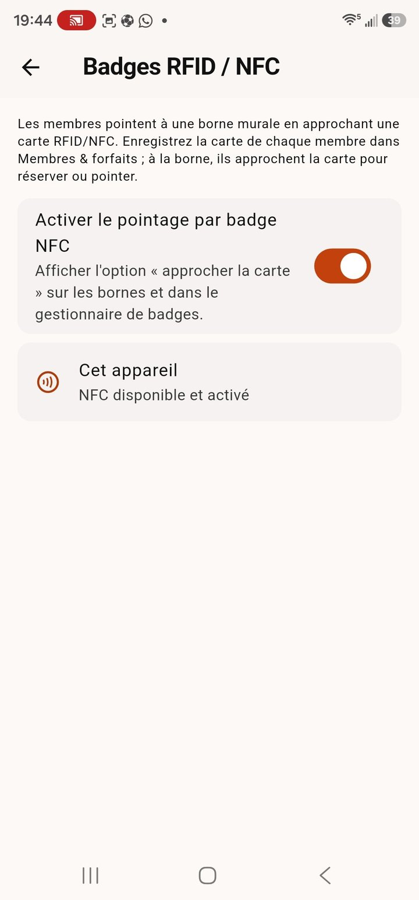 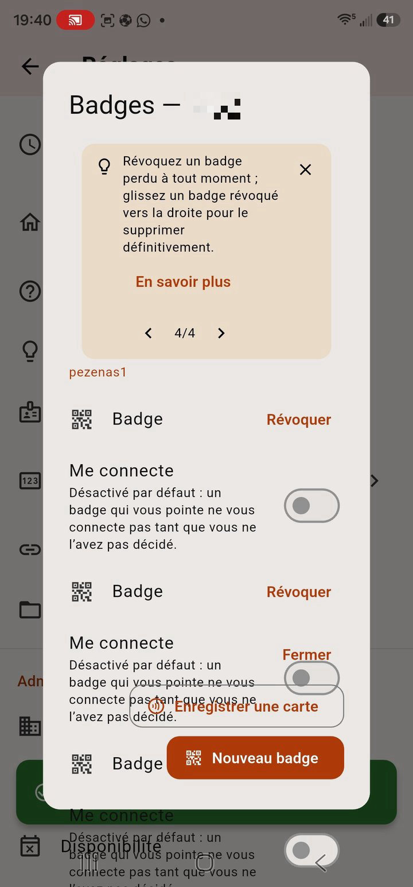

## 9. Argent (onglet Finances)

Votre compte répond à *que dois-je, que me doit-on* — et *combien puis-je encore réserver*. En portrait, le relevé du mois défile au-dessus des boutons d'action ; en paysage les actions passent dans un panneau latéral et le relevé remplit le reste. L'en-tête **‹ mois ›** parcourt n'importe quel mois ; le **bouton PDF** exporte le relevé visible (§ plus bas).

**Le relevé, carte par carte :**

- **Ce mois-ci** — combien de **jours** votre abonnement inclut ce mois, combien d'**utilisés**, combien de **restants**, avec une barre de progression. Une matinée compte 0,5 jour. Le droit mensuel suit les jours d'ouverture et votre pourcentage — la carte d'abonnement dessous le détaille (*3 demi-journées utilisées sur 42, 21 jours d'ouverture*).
- **Services consommés** — chaque consommation et le total des services.
- **Forfaits de jours** — les packs achetés ce mois.
- **Postes en attente** — tout ce qui attend encore validation (dépenses, consommations…), dans sa carte liserée orange : ces montants ne sont pas encore sur le relevé.
- **Paiements et crédits** — paiements enregistrés, remboursements de dépense approuvés, avoirs, ajustements.
- **Carte facture** — une fois le mois facturé : numéro, état, total, réglé, restant (§9a).
- **Votre compte** — votre position réelle toutes périodes, quand il y en a une (§9a).
- **Solde** — réglé / à régler, et dessous les **instructions de paiement** et **Payer en ligne** quand quelque chose est dû.

**Quand vos jours s'épuisent**, la suite est le choix du propriétaire, par membre :

- **Bloqué** (défaut) — plus de réservations ; demandez à un admin, ou des **demi-journées supplémentaires** depuis l'onglet Finances (les validateurs approuvent ; les jours accordés se facturent au tarif de dépassement).
- **Au compteur** — vous continuez à réserver ; chaque jour en plus se facture au tarif de dépassement de votre palier (affiché sur la carte).
- **Forfaits** — touchez **Acheter un forfait** et choisissez un pack de jours ; vos jours augmentent immédiatement et le prix atterrit sur le relevé du mois.

**Les actions, groupées par sens :**

- **Payer** — **Enregistrer un paiement** (« j'ai payé ») avec sa méthode, la **date où l'argent a bougé** (défaut : aujourd'hui) et le **mois qu'il règle** (défaut : le mois courant, un cran en arrière pour un arriéré, un en avant pour une avance) — l'autre partie confirme. Ce mois décide sur quel relevé et quelle facture le crédit atterrit. **Payer en ligne** (si activé) règle le montant dû sur-le-champ — **PayPal, carte bancaire (Stripe), Mollie ou Wero**, selon ce que l'espace a activé (plusieurs = un sélecteur).
- **Demandes** — **Soumettre une dépense** (du café pour l'espace ? un autre admin approuve — pas d'auto-approbation — et cela crédite votre relevé), **Demander des demi-journées**, **Ajouter une consommation** (les services du propriétaire — casiers, impression… — vous confirmez ce que vous consommez).
- **Documents** — **Factures** (les vôtres sont toujours lisibles ici : positions, solde, état — et pour les émetteurs le hub de facturation, §11), l'**accord financier** et le **rapport mensuel des paiements**, en libre-service (§11).

### 9a. Dès que le mois est facturé, c'est la facture qui décide

- Votre relevé affiche une **carte facture** — numéro, état, total, déjà réglé, restant dû — et le mois passe **réglé** dès que la facture est payée, son solde annulé, ou son avoir remboursé, même si le paiement qui la solde a été enregistré un mois plus tard. Une facture **partiellement payée** laisse le mois à régler pour exactement le **restant dû** (c'est aussi ce montant que *Payer en ligne* prélève). Un mois en **avoir** montre ce que l'espace vous doit — rien à payer de votre côté.
- **Votre compte** — dès que vous détenez un crédit disponible (un avoir, ou des paiements excédentaires d'un mois passé), l'onglet Finances affiche votre position réelle toutes périodes confondues, au-dessus du relevé : **avoir disponible**, chaque **facture ouverte** avec son restant dû, les remboursements que l'espace vous doit, et la **position nette**. Votre avoir peut solder les factures ouvertes — l'espace l'impute lors du rapprochement des paiements (imputation d'avoir, valable pour les associations comme pour les sociétés). Les mois antérieurs à votre adhésion ne doivent rien et n'affichent jamais « à régler ».

### 9b. Aperçu rapide, enregistrer, partager — chaque rapport

Chaque rapport de l'application — relevé, factures, proformas, avoirs, vos documents en libre-service — offre les trois mêmes actions : **Aperçu rapide** (voir le document rendu à l'écran avant tout PDF), **Télécharger le PDF** (enregistrer localement) et **Partager le PDF** (le confier à n'importe quelle appli — WhatsApp, mail, …).

**Les rapports parlent la langue du lecteur :** vos documents s'impriment dans *votre* langue d'app quand l'espace la fournit, sinon dans la langue de l'espace (§11, modèles par langue).

## 10. Mode borne (tablette murale)

Montez une tablette Android ou un iPad près de la porte :

1. Le propriétaire crée un compte normal pour l'appareil, le joint à l'espace et le marque **borne** dans *Membres et forfaits* (*Transformer en borne*).
2. **Le mode borne ne démarre jamais seul.** À chaque lancement la tablette demande *Démarrer le mode borne ?* — confirmez et l'écran se verrouille : plan plein écran uniquement, bouton retour désactivé, l'app s'épingle ; quitter le mode borne = redémarrer la tablette. *Pas maintenant* ouvre l'app normalement — utile pour la configuration. La désignation borne se révoque à tout moment : sur l'appareil sous **Réglages → Appareil borne**, ou par le propriétaire dans *Membres et forfaits*.
3. Chaque membre porte un **badge** — émis par un admin (*Membres et forfaits → Badges*) ou par le membre lui-même (**Réglages → Mon badge**, §8) : un **badge QR** imprimable et/ou sa **carte RFID/NFC**.
4. À la borne : touchez une place (ou **Ce niveau**) — **UNE seule feuille** s'ouvre avec tout dessus : **Pointer** déjà sélectionné (un geste bascule vers **Réserver** ou **Départ**), la **période déjà déduite des réglages de l'espace**, et le **lecteur de badge actif** en bas. En demi-journées, la partie de la journée où vous vous trouvez est présélectionnée (puces Matin / Après-midi / Journée pour changer — une fenêtre en cours démarre *maintenant*, les passées sont désactivées, après les horaires il reste un seul *Reste de la journée*) ; en granularité horaire, des sélecteurs De/À alignés sur la grille, le début d'un pointage épinglé à *maintenant*. La feuille **énonce la règle qu'elle suit** — la granularité et les fenêtres d'horaires du jour — ce qu'elle propose est donc exactement ce que les réglages permettent ; un **jour fermé** est annoncé d'emblée par un bandeau au lieu d'échouer à la fin. Réserver une fenêtre déjà commencée propose aussi **Pointer tout de suite ?** (activé par défaut) : une seule présentation du badge enregistre la réservation *déjà pointée*. Présentez ensuite le badge :
   - **Présentez la carte RFID/NFC.** Pendant que le lecteur est armé, la caméra reste coupée ; si le NFC est coupé ou absent, la feuille le dit explicitement.
   - Ou **Scanner le badge QR** — la tablette lit le badge imprimé **avec sa propre caméra** (frontale par défaut, l'objectif arrière d'une tablette murale regardant le mur ; changez dans *Réglages → Scanner avec la caméra avant*). Une douchette USB/Bluetooth ou la saisie du code marchent aussi.
5. **Le badge EST la confirmation :** il exécute immédiatement, et un **reçu qui se referme tout seul** montre *qui* a été reconnu, *ce qui* s'est passé, *où* et *jusqu'à quand* — puis le mur est net pour le membre suivant. Le chemin heureux tient en deux gestes : touchez votre place, présentez votre badge.

Votre identité n'existe que le temps de l'opération : le justificatif part une fois au serveur, la réservation est faite **à votre nom**, rien n'est stocké sur la tablette — vous êtes « déconnecté » sitôt l'opération finie. (La connexion Google par opération reste sur la feuille de route ; **les iPad n'ont pas de NFC**, la voie QR caméra y est la bonne.)

## 11. Facturation (propriétaires et admins facturiers)

*Les propriétaires émettent les factures ; les admins aussi dès qu'ils détiennent la permission **émettre les factures et rapprocher les paiements** (Gestion des rôles, §8 — ou l'ancienne délégation **Les admins émettent des factures**). La fonctionnalité **Factures** vit sous Finances dans la liste des fonctionnalités.*

Une facture DesKilo est générée, jamais composée : ses positions sont **dérivées exclusivement des données suivies du mois** — abonnement, dépassement, suppléments, services, forfaits — moins les paiements et crédits du mois, si bien que la dernière ligne **est le solde dû**. Chaque document fige l'adresse postale de l'espace et du membre (la vôtre dans **Réglages → Adresse** ; celle de l'espace dans ses réglages) et est **signé numériquement** à l'émission — il ne change plus jamais. Une **annexe détaillée** (mouvements et présences du mois) s'attache d'un interrupteur à l'émission.

Les émetteurs ouvrent **Finances → Factures** et arrivent sur un hub à trois onglets sous un bandeau de synthèse en direct (*N à facturer · N en cours · X dus · N à rembourser · Y*) :

- **À facturer** — chaque membre dont le mois précédent a des données facturables et pas encore de facture, avec le total du mois : facturez par membre (avec l'aperçu des positions dérivées) ou **Tout facturer** d'un geste — qui demande confirmation en nommant le nombre, le mois et le total. Le bouton **Nouvelle facture** ouvre la même feuille pour tout membre et tout mois — sélecteur de membre, ‹ mois ›, les positions dérivées, le solde, l'interrupteur **annexe détaillée** et **Émettre la facture** (un bandeau vert *Facture émise.* confirme). **Une facture active par membre et par mois** — un mois ne redevient facturable qu'après annulation de sa facture. La feuille s'ouvre sur le **mois terminé** (celui dont les chiffres ne bougent plus) ; choisir le mois courant vous avertit, car ce mois ne se facture qu'une fois.
- **En cours** — les factures émises en attente de règlement, les plus anciennes d'abord ; au-delà de 30 jours d'attente, l'ancienneté passe au rouge, sur la carte comme dans le bandeau. Chaque action est une icône avec infobulle (annuler · proforma · relance · marquer payée). **Touchez une carte pour lire la facture.** **Envoyer un rappel** enregistre la relance et partage le PDF avec un message — la carte affiche *Rappelé ×N*. **Marquer comme erronée** annule la facture pour correction (un dialogue explicite avertit que c'est irréversible) : elle passe aux archives barrée, et une **facture de remplacement** re-dérive le même mois depuis les données corrigées, en référençant l'originale. **Marquer comme payée** rapproche un paiement réel (ci-dessous). **Un paiement partiel ne clôt pas une facture** : elle reste dans En cours, badge *Partiellement payée* avec le restant dû, jusqu'à l'annulation explicite du solde **via le cadre de validation** — un admin/propriétaire demande l'annulation (avec motif), les validateurs confirment, et alors seulement la facture passe aux archives comme *Partiellement payée · solde annulé*. **Une facture NÉGATIVE est un avoir** — les crédits du mois dépassent ses charges, l'ESPACE doit donc de l'argent au membre : son PDF s'intitule *Avoir*, elle ne reçoit ni relances ni rapprochement de paiement membre ; la carte affiche *À rembourser* avec **Enregistrer le remboursement** — le versement s'impute au solde du membre (validé comme tout règlement si une règle s'applique ; un rejet la rouvre) et le document se clôt comme *Remboursée*. Le bandeau de synthèse sépare les deux sens du processus de paiement : *N en cours · X dus* compte les factures positives à leur valeur **restante** (une facture de 500 € payée à 280 € compte 220 €), tandis que *N à rembourser · Y* totalise les avoirs ouverts que l'espace doit encore.
- **Archives** — les factures closes, filtrables par membre et mois et triables ; les annulées sont **masquées par défaut** — la puce *Afficher les annulées* ramène la chaîne de correction ; la barre sous les filtres dit combien de factures correspondent et **Réinitialiser les filtres** ramène tout. Chaque ligne porte sa puce d'état (*Payée*, *Partiellement payée*, *Erronée* barrée, les avoirs avec leur montant négatif), son mois et son montant, avec **Télécharger le PDF** sur place. **Touchez une ligne pour ouvrir la facture** — positions, solde, destinataire, où elle en est (*Payée €300.00 le 6 août*, *Rappelé ×1 · dernière relance…*, *Annexe : 5 mouvements, 10 pointages*), quelle facture elle remplace ou l'a remplacée, sa signature — et chaque action encore permise, en toutes lettres : **Aperçu rapide**, **Télécharger le PDF**, **Partager le PDF**, exporter la **facture électronique (XML)**, relancer, marquer payée, marquer erronée, émettre un remplacement.

**Marquer comme payée, c'est rapprocher un paiement réel — ou imputer un avoir.** Le dialogue liste les paiements enregistrés du membre — virements saisis et paiements en ligne confirmés — et vous rapprochez la facture de l'un d'eux ; aucun montant à taper (pas encore de paiement enregistré ? le dialogue le dit : *enregistrez-le ou confirmez-le d'abord*). Il liste aussi les **avoirs du membre** (excédent de note de crédit) : en rapprocher un impute l'avoir sur la facture, mois passés compris — l'alternative classique au remboursement, pour les associations comme pour les sociétés. Chaque crédit ne se dépense qu'une fois : un crédit déjà déduit dans une facture émise ne peut jamais solder un second document. Payé **plus** ? Créez un **avoir sur l'excédent** (un crédit au compte du membre) ou forcez l'acceptation avec une note obligatoire. Payé **moins** ? Acceptez avec une note obligatoire. Tous ceux qui ont accès à la facturation sont notifiés des factures payées, et le propriétaire peut poser une règle de validation **Paiement de facture** (§7) : le rapprochement attend alors le quorum — un rejet rouvre la facture.

**Une facture payée est définitive.** Une fois rapprochée, elle ne peut plus être annulée, remplacée ni modifiée — les corrections se font avant paiement, en annulant la facture ouverte et en émettant son remplacement. Un paiement qui n'a **pas** couvert tout le montant, accepté avec note, s'affiche **partiellement payée**.

**Proforma.** Les deux onglets du hub portent une action proforma : sur **À facturer**, elle rend les positions dérivées du mois en devis — pas de numéro, pas de signature, tamponnée PROFORMA, **rien n'est émis** ; sur **En cours**, elle re-rend la facture émise en demande de paiement qui ne peut passer pour l'originale. Les deux offrent le triptyque aperçu / téléchargement / partage.

**Tampons.** Une facture annulée porte un grand **ERRONÉE** en diagonale sur chaque page de son PDF, gris clair par-dessus le contenu : impossible de la confondre avec un document valide. Le même tampon dit **PROFORMA** sur un devis, et **COPIE** sur toute facture rendue par un autre que son émetteur — l'espace détient l'originale.

**Relances (Mahnwesen).** Le propriétaire règle les **règles de relance** (icône liste cochée dans l'en-tête Factures, ou *Réglages de l'espace → Règles de relance*) : combien de niveaux, jours avant la première relance, jours entre relances. Les factures en retard sont marquées **« Relance N due »** et la cloche de la carte passe au rouge — rien ne part jamais automatiquement. L'envoi génère une **lettre de relance** (niveau 1 amical, niveaux supérieurs plus fermes) depuis le modèle de ce niveau — livré prêt dans votre langue, imprimé dans la langue du *membre*, et modifiable par niveau dans l'éditeur avec `{{ reminder_level }}`, `{{ reminder_date }}` et `{{ days_open }}`.

**Le registre.** L'icône liste de la barre Factures ouvre un registre une-ligne-par-facture : **date · nom · montant · état**, trié par date (touchez l'en-tête Date pour inverser), avec la somme au pied et un sélecteur d'**année** dès qu'il y en a plus d'une. Son bouton d'export ouvre la feuille **Export comptable** : **SAF-T (XML, international)** et — pour un espace français — **FEC (France, exigé en cas de contrôle)**.

**Remettre l'exercice à votre comptable.** Depuis le registre, les émetteurs exportent le **SAF-T** — le *Standard Audit File for Tax* de l'OCDE, le XML que lisent logiciels comptables et administrations. Il couvre exactement ce que montre le registre : l'entreprise telle que vos factures la déclarent, chaque client, chaque facture avec lignes et totaux, et les paiements qui les ont réglées. Les annulées restent dans le fichier marquées *annulées* — un fichier d'audit n'efface pas ce qui s'est passé. Il omet délibérément le **plan de comptes** : DesKilo n'invente pas de numéros de compte. Votre comptable mappe les factures sur ses comptes — c'est son métier, cela lui prend une minute.

**France : le FEC.** Un espace français a un second choix, le **FEC** (*Fichier des Écritures Comptables*) — le fichier qu'un contrôle exige légalement (art. L47 A-I du LPF). Pas du XML : un fichier plat tabulé d'**écritures**, nommé `<SIREN>FEC<AAAAMMJJ>.txt` comme l'arrêté l'exige, avec les 18 colonnes imposées dans l'ordre imposé. Fait d'écritures, il *ne peut pas* éviter les numéros de compte : l'export les demande d'abord — préremplis du *plan comptable général* (411 clients, 706 prestations, 512 banque), à corriger. Chaque facture passe sa créance contre le produit au montant **brut**, les crédits nettés et le paiement qui l'a soldée passent en banque à leurs propres dates, lettrés du numéro de facture. Les annulées sont absentes : annulée avant paiement, jamais comptabilisée, rien à extourner. La colonne *nom* suit le lecteur — un émetteur balaie des noms de membres, un membre ses numéros de facture. Les membres ne voient que ce qui les concerne : émises, jamais une annulée.

### 11a. Identité légale, TVA et mentions

**Avant le premier export, remplissez l'identité légale.** Dans *Réglages de l'espace → **Identité légale et facturation électronique*** le propriétaire déclare :

- Le **régime de TVA** — il décide du numéro que la norme EN 16931 exige : hors du champ de la TVA, un **numéro d'immatriculation** (SIREN, HRB, CIF…) ; en franchise, un **numéro de TVA** plus le **motif de non-application** (le champ suggère les mentions propres — *TVA non applicable, art. 293 B du CGI*, ou pour les services aux membres d'une association *Exonération de TVA, art. 261, 7-1° du CGI*). Le régime est appliqué de bout en bout : seul un espace assujetti tamponne un taux sur un abonnement, un supplément, un service ou un forfait, et les sélecteurs de TVA disparaissent sous tout autre régime.
- L'**adresse** structurée (rue, code postal, ville) à côté de l'adresse libre d'en-tête.
- La **plateforme de facturation électronique** (§11b).
- Les **mentions de facturation**, avec un choix de **type d'organisation** — *Entreprise* vs *Association (loi 1901)* : forme juridique et capital (p. ex. *Association loi 1901*), registre (sociétés : RCS ; associations : **RNA W… · SIRET si attribué**), modalités de règlement, pénalités de retard, l'**indemnité de recouvrement de 40 €**, escompte, assurance professionnelle, mentions particulières. Chaque clause imprime la formule légale par défaut si laissée vide — et les documents d'une association abandonnent les clauses par défaut réservées au B2B (pénalités, indemnité, escompte ne sont obligatoires qu'entre professionnels ; ce que vous saisissez s'imprime quand même).

Les membres ajoutent leur **pays** — et leur numéro de TVA s'ils facturent en tant qu'entreprise — à côté de leur adresse dans *Réglages → Adresse*. DesKilo vérifie tout cela **avant** de produire une facture électronique et refuse en nommant l'élément manquant.

**Les prix DesKilo sont TTC.** Ce que vous tapez comme prix d'abonnement, de service ou de forfait est ce que le membre paie. Activer la TVA ne change aucun montant dû — elle dit quelle part de ce montant est de l'impôt. C'est pourquoi relevé, quota et solde ne bougent jamais quand vous ajoutez des taux.

**Régler les taux.** *Identité légale → **Taux de TVA***. Liste vide = TVA coupée, l'état de départ. **Utiliser les taux usuels** remplit la liste avec les taux standard, intermédiaire et réduit de votre pays — un brouillon, pas un conseil fiscal. Un taux est le **défaut** (l'étoile) : abonnements, dépassements, suppléments et ajustements l'utilisent, ainsi que tout service sans taux propre. Service et forfait portent chacun leur taux, choisi dans leur éditeur. Retirer un taux ne le supprime jamais — un taux encore référencé est conservé, désactivé.

**Ce que ça change sur un document.** Une facture émise après les taux porte la ventilation telle qu'émise : colonne de taux, net et une ligne par taux au-dessus du total. La **facture électronique (XML)** porte ce que l'EN 16931 exige, en UBL comme en CII ; le **SAF-T** déclare chaque taux dans sa table ; le **FEC** passe la créance brute contre le produit net plus un compte de **TVA collectée** (445710 par défaut, modifiable).

**Une facture émise ne change jamais.** Elle porte les taux, l'identité et les montants de sa signature — c'est ce qui en fait une facture. S'il faut de nouveaux chiffres, marquez-la **erronée** et émettez un **remplacement** : la chaîne de correction est visible sur les deux documents, exactement ce qu'un audit veut voir.

### 11b. Où doit aller la facture électronique (UE)

L'action **Facture électronique (XML)** ouvre une feuille qui répond pour le pays de l'espace avant de remettre le fichier : quel canal attendent les clients professionnels, si une plateforme est sur le chemin, et quel canal utilisent les acheteurs publics. Quatre modèles existent dans l'Union :

- **Peppol** — un point d'accès livre le fichier au client ; pas de plateforme d'État entre les deux. Le mandat B2B belge fonctionne ainsi, et Peppol est la voie vers les acheteurs publics dans toute l'UE (directive 2014/55/UE).
- **Plateformes agréées** — France : vous choisissez une *plateforme agréée* (l'ex-PDP), elle route la facture et déclare les données au fisc. Le portail public est un annuaire, pas une boîte. Les factures au secteur public restent sur **Chorus Pro**.
- **Plateformes de clearance** — Italie (**SdI**, FatturaPA), Pologne (**KSeF**, FA(3)), Roumanie (**RO e-Factura** via le SPV, CIUS-RO) : la plateforme reçoit la facture *d'abord* ; l'envoyer directement au client n'est pas une option. Chacune impose sa syntaxe, la feuille avertit donc que le fichier EN 16931 exporté par DesKilo n'est pas celui qu'elles acceptent — servez-vous-en pour Peppol, les acheteurs publics et les clients étrangers, et laissez votre plateforme ou votre comptable convertir.
- **Pas de canal imposé** — Allemagne aujourd'hui : la réception est obligatoire depuis 2025 et l'émission arrive par phases, mais une pièce jointe e-mail est une facture électronique légale ; XRechnung et ZUGFeRD sont les syntaxes attendues. Secteur public : **OZG-RE / ZRE**, ou Peppol.

**Factur-X — un fichier, deux lecteurs.** La feuille propose d'abord **Factur-X (PDF)** : un PDF de facture d'apparence ordinaire avec la facture machine *à l'intérieur* (les données EN 16931 en CII). Un humain l'ouvre et voit la facture ; une plateforme l'ouvre et trouve `factur-x.xml`. C'est ce que la plupart des petites entreprises françaises et allemandes échangent réellement. Le **XML** nu reste disponible dessous.

**L'envoyer sans quitter l'app.** Le propriétaire enregistre la plateforme de l'espace dans *Identité légale → **Plateforme de facturation électronique*** : une **URL de dépôt**, un **jeton ou identifiant**, au besoin la forme de l'**en-tête d'authentification** et le **nom du champ fichier**. Toute plateforme acceptant un dépôt avec identifiant fonctionne — plateforme agréée, point d'accès Peppol, plateforme nationale. Le jeton est stocké côté serveur, ne redescend jamais vers un téléphone. Une fois configurée, la feuille mène par **Envoyer à la plateforme** : le document Factur-X part directement, et la feuille de détail de la facture consigne quand il est parti, ce que la plateforme a répondu et l'identifiant rendu. Chaque tentative est journalisée — acceptée, refusée ou non livrée.

**Répéter sans risque.** Le même écran prend des **environnements de test** (UAT / Dev de la plateforme : URL + jeton chacun) à côté de la production. Avec le **mode développeur** de l'espace actif (réglage d'espace, propriétaires/admins, sous Réglages → Avancé), l'envoi propose le choix d'environnement, un dépôt de test est marqué comme tel dans l'historique de transmission, et l'endpoint de production ne sert jamais à une répétition — un environnement de test non configuré refuse au lieu de se rabattre.

DesKilo ne transmet toujours rien pour son propre compte : il produit le document et le remet à la plateforme choisie. Les calendriers de mandat bougent : vérifiez votre administration fiscale avant l'échéance qui vous concerne.

### 11c. L'éditeur de rapports — chaque document, quatre modèles, cinq langues

Le **Modèle de PDF de facture** (crayon dans l'en-tête Factures, ou *Réglages de l'espace*) est un outil de rapport à bandes pour chaque document imprimé. Trois **bandes** se rendent sur le PDF — en-tête, corps (les lignes de la facture), pied — et le XML de facture électronique n'est jamais touché.

- **Un rapport par document** : des puces basculent entre **Facture · Proforma · Relevé · Accord · Paiements · Espace · niveaux de relance**. La proforma retombe sur les bandes de la facture tant qu'elle n'est pas personnalisée ; un relevé personnalisé remplace le PDF de relevé intégré.
- **Par langue** : une seconde rangée de puces — *Par défaut (toutes langues)* · EN · FR · DE · ES · IT — stocke une surcouche de traduction par document ; le rapport d'un membre s'imprime dans *sa* langue si un modèle existe, sinon dans la langue par défaut.
- **Balisage ou Visuel** : le mode **Balisage** édite les bandes en texte — conditions et boucles [Liquid](https://shopify.github.io/liquid/) (`{{ number }}`, `…`, `…`) plus un balisage de ligne simple : `#` titre, `##` section, `>` petit texte, `---` séparateur, `a | b` ligne de tableau, `=` ligne grasse, `::: … ||| … :::` colonnes côte à côte (le bloc adresses vendeur-gauche / client-droite et les totaux alignés à droite d'une facture française — les modèles livrés suivent exactement cette structure), `![nom]` une image de la **bibliothèque d'images** de l'espace (*Insérer une image*). Le mode **Visuel** montre les mêmes bandes en surface de conception — lignes stylées, `{{ jetons }}` surlignés, touchez une ligne pour l'éditer sur place, ajoutez, déplacez, insérez des champs de données depuis une palette.
- **Galerie de modèles** (*Modèles*) : quatre préréglages prêts pour chaque document — **Classique · Simple · Détaillé · Lettre formelle** — choisissez et prolongez. Chaque préréglage de facture porte déjà les mentions légales (§11a).
- **Aperçu rapide** rend le résultat instantanément dans l'app — votre facture la plus récente, ou des données d'exemple simulées s'il n'y en a pas (filigrane *données d'exemple*) — sans aller-retour PDF ; **Aperçu** produit le PDF ; **Réinitialiser au modèle par défaut** rend la mise en page intégrée comme exemple de travail. Un modèle cassé ne bloque jamais un document — la mise en page intégrée prend le relais ; filigrane d'annulation, signature, annexe et numéros de page restent fixes.

Variables (famille facture) : `{{ number }}`, `{{ member }}`, `{{ workspace }}`, `{{ workspace_address }}`, `{{ period }}`, `{{ issued }}`, `{{ issued_by }}`, `{{ replaces }}`, `{{ total }}`, `{{ charges }}`, `{{ payments }}`, `{{ voided }}`, `{{ proforma }}`, `{{ copy }}`, `{{ lines }}` (chacune avec `label`, `unit_price`, `qty`, `net`, `vat_rate`, `amount`), `{{ has_vat }}`, `{{ vat }}`, `{{ net_total }}`, `{{ vat_total }}`, `{{ credit_note }}`, `{{ refund_total }}` — et le jeu légal : `{{ seller_legal_form }}`, `{{ seller_registration }}`, `{{ seller_vat_id }}`, `{{ seller_legal_id }}`, `{{ exemption_reason }}`, `{{ client_address }}`, `{{ client_vat_id }}`, `{{ client_legal_id }}`, `{{ payment_terms }}`, `{{ late_penalty }}`, `{{ recovery_indemnity }}`, `{{ escompte }}`, `{{ insurance }}`, `{{ special_mentions }}`.

### 11d. La suite de rapports et la bibliothèque de documents

- **Accord financier** — chaque prix en vigueur pour un membre : abonnement, demi-journée supplémentaire, services, forfaits, suppléments d'espaces entiers et d'accessoires. Propriétaires/admins l'envoient depuis la feuille de gestion d'un membre ; chaque membre consulte/télécharge/partage le sien depuis *Finances → Documents*.
- **Rapport des paiements** — tout ce que vous avez payé, déclaré ou fait valider dans un mois : votre petit bilan, en libre-service sur la même ligne.
- **Rapport de l'espace** — identité, comptages du plan, disponibilité, fonctionnalités et prix : *Réglages de l'espace → Rapport de l'espace*.
- **Bibliothèque de documents** — *Réglages → Documents* : statuts, guides, états financiers et comptes rendus de l'espace, LIÉS depuis le système que vous utilisez déjà — Google Drive, OneDrive, SharePoint, Dropbox, Nextcloud ou tout lien https (le drive garde la main sur ses accès ; l'app ne stocke jamais d'identifiants étrangers). Chaque entrée a un **rôle de visibilité** : tout membre, admins et propriétaires, ou propriétaires seuls — appliqué côté serveur. Admins et propriétaires alimentent au bouton + ; la fonctionnalité *Bibliothèque de documents* conditionne le tout.

## 12. Réglages et profil

Votre écran personnel, de haut en bas :

- **Profils** (§1) et votre **photo** (touchez pour changer — choisir ou supprimer).
- **Membres** — raccourci vers l'annuaire ; **WhatsApp** — votre numéro, visible des autres membres seulement si vous le renseignez ; **Statut** — une ligne libre (40 caractères) affichée dans l'annuaire ; **Adresse** — votre adresse postale (imprimée sur vos factures), pays et numéro de TVA optionnel.
- **Aide** — le guide intégré, dans votre langue ; **Mon badge** (§8) ; **Comptes liés** — attachez une connexion Google à votre compte e-mail ; **Documents** — la bibliothèque de documents (§11d).
- **Préférences** — **Langue** (par défaut du système ou l'une des cinq), **Thème** (système / clair / sombre), **Scanner avec la caméra avant** (pour tablettes murales).
- **Avancé** — l'état des notifications push de cet appareil, l'interrupteur **Mode développeur** (à l'échelle de l'espace) et l'écran de traces **Développeur** (§8 paiements).
- **Se déconnecter**.

## 13. Notifications

Rappels de pointage, confirmations en attente, décisions de dépense — et quand un admin **retire une de vos réservations** (passer outre), vous et les admins êtes notifiés. La livraison est locale d'abord ; les push serveur arrivent d'office sur Android, iPhone/iPad, navigateur et macOS (Firebase Cloud Messaging) — *Réglages → Avancé* montre si le push est actif sur cet appareil. Le badge d'icône montre vos confirmations en attente **plus vos messages non lus** — Android, iPhone/iPad, Dock macOS, barre Windows, web installé. Les messages de membres sont annoncés **une fois par appareil avec l'expéditeur et le texte complet** — y compris ceux envoyés app fermée, annoncés à la prochaine ouverture. Les push ne portent jamais noms ni horaires ; l'app construit le texte localement.

## 14. Confidentialité

Données minimales : nom, e-mail, forfait, réservations, compte. Vous contrôlez votre photo, votre statut, l'affichage de votre nom sur le plan, la visibilité de votre numéro. Les badges ne sont stockés qu'en hachés — un badge perdu se révoque, ne se devine pas. Pas de pistage, pas d'analytique tierce. L'historique financier est anonymisé, pas supprimé, à l'effacement du compte (rétention comptable).

## 15. Plateformes

Android (Google Play), iPhone/iPad, bureau — **macOS** (un DMG : glissez DesKilo dans Applications) et **Windows** (un installeur MSI) construits à chaque version — et le **navigateur** : la même app, rien à installer, à l'adresse publiée par votre espace. Vos données suivent votre compte : une table réservée sur téléphone apparaît dans un onglet de navigateur la seconde d'après.

Ce que le navigateur ne peut pas faire est ce qu'une page n'a pas le droit de faire : lire un badge NFC, ou scanner un QR à la manière de la borne. Tout le reste — plan, réservations, membres, argent, factures, PDF — est la même app. Au premier lancement du DMG macOS, clic droit → *Ouvrir* : la build n'est pas encore notariée par Apple, un double-clic simple déclenche l'avertissement Gatekeeper.
