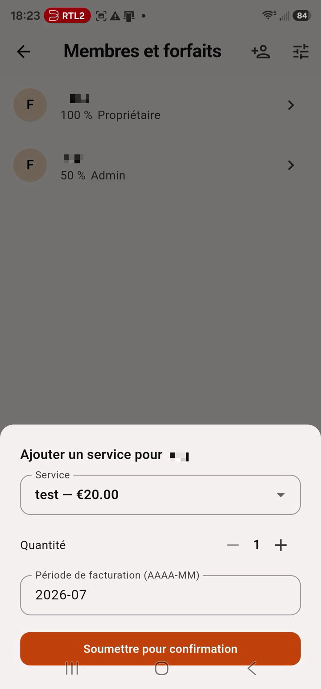

# Guide utilisateur

Tout ce qu'un membre, un admin ou un propriétaire doit savoir pour utiliser DesKilo. *Autres langues : [English](User-Guide) · [Deutsch](Benutzerhandbuch) · [Español](Guia-de-usuario) · [Italiano](Guida-utente).*

> Les captures d'écran de ce guide montrent l'application en français — chaque écran existe à l'identique dans les cinq langues (English, Français, Deutsch, Español, Italiano) ; changez dans **Réglages → Langue**.
>
> 

## 1. Premiers pas

### Créer un compte

Ouvrez l'application et inscrivez-vous avec votre e-mail, un mot de passe (8 caractères minimum) et un nom affiché. Le bouton en forme d'œil permet d'afficher ou de masquer le mot de passe pendant la saisie.

### Créer un espace — ou en rejoindre un

Après connexion, l'écran d'accueil propose deux chemins :

- **Créer un espace de travail** — vous en devenez le **propriétaire**. Choisissez un nom, un pays (qui détermine la devise par défaut) et un fuseau horaire. Vous dessinerez ensuite votre plan dans l'éditeur (§7).
- **Rejoindre un espace** — saisissez l'**identifiant de l'espace** qu'on vous a communiqué, ou touchez **Scanner le QR code** et visez le QR d'invitation affiché au mur. Vous rejoignez avec le rôle que porte l'invitation (§2).

Un compte peut appartenir à plusieurs espaces ; changez d'espace dans **Réglages → Profils**, et **marquez-en un d'une étoile comme profil par défaut** — c'est le profil avec lequel l'application s'ouvre. Tout dans l'application est limité à l'espace actif.

**Tout reste en direct.** Ce que quiconque change — une réservation, un nouveau membre, un réglage — est poussé en quelques secondes vers chaque appareil connecté, y compris celui qui a fait le changement. Pas de redémarrage, pas de tirer-pour-actualiser.

## 2. Rôles et invitations

DesKilo a trois rôles cumulatifs, plus un compte « appareil » :

| Rôle | Peut |
|---|---|
| **Membre** | Pointer à l'arrivée/au départ, réserver, soumettre des dépenses, voir et gérer ses propres événements et son propre compte |
| **Admin** | Tout ce qu'un membre peut faire, plus : agir *pour n'importe qui* (réservations, paiements, dépenses — soumis à confirmation, §6), approuver les dépenses, émettre des badges de borne |
| **Propriétaire** | Tout ce qu'un admin peut faire, plus : modifier l'espace physique, définir les forfaits et les prix, gérer les rôles, les bornes et les réglages de l'espace |
| **Copropriétaire** | *Actif* : les permissions du propriétaire immédiatement, plus la succession automatique. *Passif* : un successeur en attente, sans permissions supplémentaires aujourd'hui |
| **Borne** | Un compte de tablette murale (§9) — n'affiche que le plan ; les membres agissent à travers elle avec un badge |

**Chaque invitation est liée à un rôle.** Sur l'écran *Identifiant & QR* du propriétaire, il existe deux invitations, chacune avec son propre QR code et son propre code :

- **Invitation membre** — l'identifiant de l'espace lui-même. Imprimez-le, affichez-le au mur, partagez-le librement : quiconque le scanne ou le saisit rejoint comme simple membre.
- **Invitation admin** — un **code personnel à usage unique**, émis par un propriétaire pour une personne précise. Il admet cette seule personne comme admin, puis expire (un code inutilisé périme après 14 jours). Émettez-en un nouveau par admin avec *Nouveau code admin*.

**Il n'existe pas d'invitation propriétaire — c'est voulu.** La propriété ne peut être accordée que par un propriétaire existant, dans *Membres & forfaits*. Un espace garde toujours au moins un propriétaire. Promouvoir ou rétrograder un **admin** passe par le flux de validation (§6) — le changement s'applique une fois confirmé par les validateurs de l'espace.

**Les copropriétaires gardent l'espace en vie.** Le propriétaire nomme n'importe quel membre ou admin copropriétaire (*Membres & forfaits → le membre → Copropriété*), en deux variantes : un copropriétaire **actif** travaille immédiatement avec les permissions du propriétaire ; un copropriétaire **passif** n'a aucune permission supplémentaire jusqu'au jour où l'on a besoin de lui. Dans les deux cas, la succession est automatique : si le dernier propriétaire s'en va — quitte l'espace, est retiré, ou son compte disparaît — le meilleur copropriétaire (actif avant passif) **devient propriétaire instantanément**, côté serveur, sans aucune action requise. Le propriétaire peut aussi passer la main délibérément, à tout moment, avec *Promouvoir propriétaire maintenant*. Une nuance : les règles de validation qui exigent la signature du *propriétaire* (§6) désignent toujours un propriétaire au sens strict, jamais un copropriétaire actif.

Le QR encode un lien qui nomme le rôle accordé (`deskilo://join?role=…`). Falsifier le lien ne change rien — le serveur déduit le rôle du code lui-même : l'identifiant d'espace fait toujours rejoindre comme membre, et une invitation personnelle fait rejoindre exactement dans le rôle pour lequel elle a été émise, une seule fois. Un code admin transféré déjà utilisé — ou expiré — n'admet personne.

**Inviter par message** (*Inviter quelqu'un*) : chaque envoi WhatsApp/SMS/partage émet son propre code personnel à usage unique et compose un message prêt à l'emploi dans la langue de l'invité·e. Le destinataire peut simplement copier le message entier et le coller dans le champ de connexion de l'application — le code est détecté automatiquement.

## 3. Le plan (onglet Plan)

Le plan montre le niveau actif de votre espace : bureaux, tables et places, avec un code couleur — **libre**, **réservée**, **occupée**, **la mienne**, **bloquée**. Il s'ouvre **instantanément à partir des dernières données connues** et se rafraîchit en arrière-plan — sur un Wi-Fi capricieux, vous voyez toujours l'état le plus récent au lieu d'un écran vide. Les places occupées affichent le prénom de l'occupant, un **badge de pointage** quand il est arrivé, et un **point vert** quand il est en ligne dans l'application.

Le plan peut ressembler à votre espace réel : le propriétaire peut mettre une **photo de la pièce en arrière-plan du niveau** et placer des **images d'illustration redimensionnables** (plantes, canapés…) sur la grille. Un curseur de **transparence des tables** dans les réglages laisse la photo transparaître sous les tables dessinées.

Se repérer :

- Le canevas **s'ajuste automatiquement** à votre étage à l'ouverture ou à la rotation de l'appareil ; **pincez pour zoomer** ou utilisez les boutons **+ / −**, faites glisser les **barres de défilement** sur les bords, et touchez le bouton d'**ajustement** pour recentrer.
- Choisissez l'étage dans le **menu des niveaux** (liste compacte) ; l'icône d'horloge ramène la frise temporelle à **maintenant**.
- En **paysage**, les commandes passent dans un panneau latéral et le plan remplit l'écran — pratique sur tablette.

Réserver depuis le plan :

- **Pointage spontané** : touchez une place libre → la feuille propose *maintenant* jusqu'à la fin par défaut de l'espace → confirmez. Si quelqu'un a réservé cette place plus tard, votre heure de fin est plafonnée et on vous le dit.
- **Pointage sur réservation** : pointer veut dire *vous êtes là* — la fenêtre ouvre **15 minutes avant** votre début et se ferme à la fin de la réservation. En dehors, le bouton est désactivé et dit quand elle ouvre ; parcourir un horaire futur ne propose jamais de pointage en direct. Les admins peuvent pointer un membre présent à sa place (tant que *réserver pour autrui* est actif).
- **Départ** : manuel — ou, si le propriétaire active l'**auto-pointage entrée/sortie**, les réservations oubliées se clôturent d'elles-mêmes en fin de journée : les réservations jamais touchées comptent comme honorées de leur début à leur fin, les départs oubliés se ferment à la fin propre de la réservation.
- **Espaces entiers** : **touchez deux fois** une table, une pièce ou une zone libre du sol pour agir sur **la table, le bureau ou le niveau entier** — la même feuille qu'en scannant sa carte QR (§4), avec le même choix de période et les mêmes options de répétition qu'une place.
- **Frise temporelle** : choisissez une fenêtre de→à (ou Matin / Après-midi / Journée entière selon la granularité de l'espace) pour voir l'occupation à tout moment futur.
- Les places peuvent porter des **accessoires** (écran, bureau debout…), certains avec un supplément par demi-journée qui apparaît sur votre relevé.
- Les réservations comptent dans vos **jours mensuels** (§8) — au-delà de votre forfait, l'application bloque ou facture, selon ce que le propriétaire a configuré pour vous.

## 4. Réservations (hub Réserver)

Ouvrez le hub **Réserver** (bouton central). Une bande de dates choisit le jour ; les puces de fenêtre choisissent l'horaire ; puis quatre vues :

- **Plan** — le plan filtré sur votre fenêtre ; touchez une place libre pour réserver.
- **Jour** — chaque place en ligne de chronologie pour le jour choisi ; touchez une plage libre pour réserver, votre propre bloc pour ses détails.
- **Semaine** — une grille place × jour pour toute la semaine ISO ; repérez une demi-journée libre d'un coup d'œil et touchez-la pour réserver.
- **Mois** — un calendrier de disponibilité : bureaux libres par jour tous étages confondus ; touchez un jour pour ouvrir sa vue Jour.

**Une place à la fois** : vous ne pouvez tenir qu'une réservation active par période — réserver ou pointer ailleurs pendant qu'une autre court est refusé, et un pointage clôt tout pointage antérieur dont la réservation est déjà finie. Les admins et propriétaires peuvent **outrepasser** : toucher une place occupée ou réservée propose *Retirer la réservation (outrepasser)* — la réservation est retirée et le membre ainsi que tous les admins sont notifiés via le fil d'événements.

Les réservations suivent la **règle de granularité** de l'espace — demi-journées, journées entières, ou horaires libres sur la grille de créneaux du propriétaire. Elles respectent les **jours d'ouverture** et les **jours de fermeture**, et les règles de réservation (horizon, durée maximale, délai d'annulation). Besoin récurrent ? Réservez une **série** (quotidienne, jours ouvrés, hebdomadaire) — les jours fermés et les conflits sont sautés et signalés.

L'onglet **Calendrier** montre vos réservations par mois — vos jours en **rouge**, ceux des autres en **bleu**, aujourd'hui entouré — avec une chronologie par jour. En paysage, calendrier et chronologie utilisent la disposition en deux panneaux.

### Scanner un code d'espace

Chaque poste, table, bureau et niveau peut porter une **carte QR** imprimée (§7). Touchez le **bouton de scan** dans le hub Réserver, visez la carte avec la caméra — ou saisissez son code — et l'application identifie l'espace et montre exactement ce que *vous* pouvez y faire :

- **Carte de poste** — réservez ou pointez sur ce poste précis, sur-le-champ (fenêtre du jour : matin / après-midi / journée entière quand l'espace utilise les demi-journées, sinon à partir de maintenant pour les prochaines heures).
- **Carte de table** — les postes de la table avec leur état en direct ; choisissez-en un libre.
- **Carte de bureau ou de niveau** — si le propriétaire l'a rendu réservable, que la fonctionnalité *Réservations de bureau et de niveau* est activée **et** que vous détenez le droit personnel (§7) — les propriétaires et admins l'ont toujours — vous pouvez réserver ou pointer sur le **bureau ou l'étage entier** — avec le même choix de période (matin / après-midi / journée entière, ou horaires libres) et les mêmes options de **série** qu'une place ; son prix par demi-journée est affiché et arrive sur votre facture. Sinon, la feuille vous explique pourquoi, et un bureau se rabat sur ses postes.

**Les conflits protègent dans les deux sens :** un bureau ou un niveau ne peut pas être réservé tant qu'un poste à l'intérieur est déjà réservé sur cette fenêtre — et aucun poste ne peut être réservé tant que son bureau ou son niveau est réservé en entier.

## 5. Annuaire des membres (onglet Membres)

Voyez qui fait partie de votre communauté :

- Chaque carte membre montre sa **photo** (ou initiale), son **rôle**, son **statut personnalisé** (« à Berlin jusqu'à vendredi… »), un indicateur **en ligne / vu récemment**, et une **puce de réservation** : place pointée, réservée maintenant, ou prochaine réservation.
- Touchez un membre pour sa **fiche détaillée** — avec ses réservations à venir.
- **Balayez** un membre pour lui écrire sur **WhatsApp** ; le **bouton de groupe** ouvre le groupe WhatsApp de la communauté (défini par le propriétaire).
- Définissez votre photo, votre statut et la visibilité de votre téléphone dans **Réglages**.
- Les admins et propriétaires voient en plus l'**e-mail** de chaque membre sous le nom — pas les membres ordinaires : le canal de contact entre membres reste le numéro WhatsApp partagé volontairement.

## 6. Événements et confirmations (icône cloche)

Le fil d'événements est la piste d'audit de votre espace : réservations créées/modifiées/annulées, paiements enregistrés, dépenses soumises, demandes de jours supplémentaires, changements de rôle. Les membres voient leurs propres événements ; admins et propriétaires voient tout.

**Le protocole de confirmation :** dès qu'un admin agit *pour quelqu'un d'autre* — réserve une place pour vous, enregistre votre paiement — l'action reste **en attente jusqu'à votre confirmation**. Les éléments en attente sont épinglés en haut avec des boutons accepter/refuser et vous êtes notifié. Vos actions sur vous-même ne demandent jamais de confirmation.

**Quorum de validation :** pour les questions d'argent et les changements de rôle, le propriétaire définit *qui* doit approuver et *combien* d'approbations il faut. Les demandes sans réponse expirent après 7 jours — rien de coûteux n'est jamais accordé en silence.

Le propriétaire règle cela par **domaine** dans **Réglages → Règles de validation** : paiements, dépenses, services, demi-journées supplémentaires, changements de rôle, réservations et ajustements ont chacun leur règle (ou héritent de la règle par défaut). Une règle fixe le nombre de validations requises, *quels* admins peuvent valider (tous, ou nommés), et si le propriétaire doit toujours signer.

 

*À gauche : une règle par domaine, héritant de la règle par défaut. À droite : édition d'une règle — validations requises, validateurs autorisés, signature du propriétaire.*

## 7. Pour les propriétaires : éditeur et réglages

Toute l'administration vit sous **Réglages → Administration**. Une règle à connaître : **l'entrée de réglages d'une fonctionnalité n'apparaît que tant que la fonctionnalité est activée** — désactivez *Paiements en ligne* dans **Fonctionnalités** et son écran de configuration disparaît avec elle (il revient quand vous la réactivez). L'entrée **Fonctionnalités** elle-même est toujours là, pour pouvoir toujours réactiver un module.

- **Éditeur** (barre d'app) : dessinez votre espace sur une grille — niveaux, bureaux, tables, places (avec orientation, type de chaise et équipements), blocage de places pour maintenance. Ajoutez une **photo d'arrière-plan** par niveau et des **images d'illustration** déplaçables et redimensionnables. Supprimer un élément portant des réservations futures oblige à les résoudre d'abord.
- **Identifiant & QR** : vos invitations liées aux rôles (§2). Vous pouvez remplacer l'identifiant généré par un identifiant mémorable (4–20 lettres/chiffres), le copier, ou partager le QR en PNG.
- **Disponibilité** : jours d'ouverture, jours de fermeture, et granularité — plage horaire libre, grille de minutes (5/15/30/60), demi-journées, ou journées entières uniquement.
- **Fonctionnalités** : activez ou désactivez des modules entiers par espace — calendrier, événements, argent, services, export PDF, séries, réserver pour autrui, notifications push, blocage de places par les admins, suppléments d'accessoires, **paiements en ligne**, **factures**, **réservations de bureau et de niveau**, **mode borne**, **badges RFID/NFC**, **annuaire des membres**, **intégration WhatsApp**, **codes QR des espaces**, **copropriétaires**, **export de données**, **auto-pointage entrée/sortie**. Désactiver un module retire *tous* ses écrans et boutons pour tous les membres.

  La liste est **hiérarchique** : une fonctionnalité qui en nécessite une autre apparaît en retrait sous elle avec une note *Nécessite…*, et est grisée tant que son parent est désactivé — *Argent* porte les services, les suppléments d'accessoires, les paiements en ligne et les factures ; *Réservations de bureau et de niveau* porte le droit d'attribution par les admins ; *Mode borne* porte les badges RFID/NFC ; *Annuaire des membres* porte l'intégration WhatsApp. Désactiver un parent retire tout son sous-arbre de l'application ; le choix enregistré de l'enfant revient intact quand le parent est réactivé.

   

- **Membres & forfaits** : touchez un membre pour ouvrir sa **feuille de gestion** — lui ajouter un service, régler son pourcentage d'abonnement, choisir sa **politique de dépassement** (§8), plafonner ses **réservations simultanées**, émettre ses **badges** (§9), le promouvoir/rétrograder admin, transformer le compte en **borne**, ou mettre l'adhésion en pause. Chaque ligne affiche l'**e-mail** du membre sous son nom.

  

*La feuille de gestion, le dialogue de pourcentage d'abonnement, et la limite de réservations par membre.*

- **Facturation** : tranches tarifaires des abonnements en pourcentage, tarifs de dépassement, niveaux d'abonnement proposés (avec valeur libre négociée en option) — et **forfaits de jours** (un nombre de jours pour un prix) pour les membres en politique « forfait ».
- **Services** et **Accessoires** : les catalogues derrière le §8 — extras définis par le propriétaire (casiers, impression…) et équipements de place avec supplément par demi-journée en option. Deux listes simples avec un bouton **+**.

   

*Facturation (tranches, niveaux, forfaits de jours) · le catalogue Services et son formulaire de création · le catalogue Accessoires. Un admin ajoute une consommation de service pour un membre depuis sa feuille de gestion :*

- **Réglages de l'espace** : nom, pays/devise, fuseau, instructions de paiement (IBAN, PayPal.me, Wero, Lydia, Wise), lien du groupe WhatsApp, **transparence des tables**, exports — et la **zone dangereuse** : **réinitialisation complète** (supprime réservations, argent et plan ; conserve configuration et membres), protégée par la saisie de « I agree ».
- **Import/export** : toute la configuration voyage en **fichier XML** — sauvegarde, modèle, ou migration d'une instance auto-hébergée. Un **PDF de configuration** (membres, plan, prix, fonctionnalités) peut aussi être généré. Un **classeur Excel** exporte les données vivantes elles-mêmes — espace, niveaux, bureaux, places, membres, réservations, pointages, paiements, services et factures, un onglet chacun (fonctionnalité *export de données*). Chaque export arrive dans le dossier **Téléchargements** de votre appareil.

### Codes QR des espaces et réservations d'espaces entiers (propriétaires)

Quatre étapes font de « scanner le code sur la table » le geste de réservation quotidien (§4) :

1. Dans l'**éditeur**, marquez un bureau ou un niveau **Réservable en entier** et donnez-lui un **prix par demi-journée** (la feuille de propriétés du bureau / le menu du niveau).
2. Activez **Réservations de bureau et de niveau** dans **Fonctionnalités** (désactivé par défaut).
3. Accordez à chaque membre concerné le droit **« Peut réserver un bureau ou un niveau entier »** — propriétaires et admins le règlent dans la feuille de gestion du membre, jamais pour eux-mêmes.
4. Imprimez les cartes : **Réglages de l'espace → Codes QR des espaces (PDF)** — un QR au format carte de crédit par **poste, table, bureau et niveau**, dix par page A4, enregistré dans Téléchargements. Découpez-les et collez chaque carte sur son espace.

Une réservation de bureau couvre **toutes les tables qu'il contient** ; une réservation de niveau couvre l'étage entier. Les deux ne sont possibles que tant que rien n'est réservé à l'intérieur — et elles apparaissent comme des lignes à part entière sur la facture du membre.

### Copropriétaires (propriétaires)

Faites en sorte que la communauté ne dépende jamais d'un seul compte :

1. Ouvrez *Membres & forfaits → le membre → **Copropriété*** et choisissez **actif** (permissions de propriétaire dès maintenant) ou **passif** (successeur en attente).
2. Passez la main à tout moment avec ***Promouvoir propriétaire maintenant*** — le copropriétaire devient propriétaire à part entière à vos côtés.
3. Si le dernier propriétaire quitte un jour l'espace, le meilleur copropriétaire est **promu automatiquement** sur le serveur — actif avant passif. Ce filet de sécurité fonctionne même quand l'interrupteur de la fonctionnalité *Copropriétaires* est désactivé (il ne masque que les boutons de nomination).

### Configurer les paiements en ligne (propriétaires)

Chaque communauté encaisse sur son **propre** compte prestataire ; l'application ne conserve jamais les clés secrètes sur un appareil — elles restent sur le serveur.

1. Ouvrez **Réglages → Paiements en ligne** (propriétaire uniquement).
2. Choisissez un prestataire et collez ses clés depuis son tableau de bord :
   - **PayPal** — Client ID, Secret, Environnement (commencez par *sandbox*), ID du webhook, URL de retour (PayPal Developer → votre app REST).
   - **Carte bancaire (Stripe)** — Clé secrète, Secret de signature du webhook, URL de retour (Stripe → clés API / Webhooks).
   - **Mollie** — Clé API, URL de retour (propose iDEAL, Bancontact, cartes…).
   - **Wero (via Mollie)** — la même clé API Mollie, avec Wero activé dans votre compte Mollie.
3. **Enregistrez** — une pastille verte *Configuré* apparaît. Activez la fonctionnalité **Paiements en ligne** (Réglages → Fonctionnalités) et les membres voient **Payer en ligne** sur une facture impayée. (L'entrée de réglages *Paiements en ligne* elle-même n'apparaît que quand la fonctionnalité est activée.)

 

Une clé secrète enregistrée n'est plus jamais affichée — laissez le champ vide pour la conserver, saisissez pour la remplacer, **Supprimer** pour retirer le prestataire. Les frais sont ceux du prestataire (typiquement ~1,5–3 % par paiement, sans abonnement mensuel) ; DesKilo n'ajoute rien, et le virement/IBAN manuel reste gratuit.

Si un paiement ne démarre pas, activez **Réglages → Avancé → Mode développeur** et ouvrez l'écran **Développeur** : la trace *payments* montre exactement quels prestataires sont configurés et quels champs manquent encore.

#### Les tableaux de bord des prestataires, pas à pas

Séparez **strictement les environnements de test et de production** : chaque prestataire a des clés distinctes par mode, et toutes les clés collées dans DesKilo doivent appartenir au même mode. Dans les URL ci-dessous, `<project-ref>` est la référence de votre projet Supabase (les auto-hébergeurs utilisent l'URL de leur instance).

**PayPal**

1. Connectez-vous sur [developer.paypal.com](https://developer.paypal.com) et ouvrez **Apps & Credentials**.
2. Basculez l'interrupteur **Sandbox / Live** — commencez en *sandbox* ; passez en *live* seulement pour la production. Le champ *Environnement* de DesKilo doit correspondre aux clés.
3. **Créez une app REST-API** — cela génère le **Client ID** et le **Secret**.
4. Dans l'app, ajoutez un **webhook** : URL `https://<project-ref>.supabase.co/functions/v1/paypal-webhook`, abonné au minimum à *Payment capture completed* (plus *denied* / *order voided*). Copiez l'**ID du webhook**. Dans DesKilo, le webhook n'est pas optionnel — c'est lui qui règle le paiement sur la facture.
5. Collez Client ID, Secret, Environnement, ID du webhook et votre URL de retour dans **Réglages → Paiements en ligne → PayPal**. Rien n'est stocké dans l'application ni sur un appareil — tout part sur le serveur.

**Stripe (cartes bancaires & Cartes Bancaires)**

1. Connectez-vous sur [dashboard.stripe.com](https://dashboard.stripe.com) et ouvrez **Developers**.
2. L'interrupteur **Mode test / Mode live** décide des clés affichées. DesKilo n'a besoin que de la **clé secrète** — le paiement est créé côté serveur, la clé *publishable* n'est pas utilisée.
3. Sous **Settings → Payment methods**, activez les réseaux souhaités. **Vous visez la France ? Activez explicitement Cartes Bancaires** — les membres français préfèrent souvent le réseau CB au routage international Visa/Mastercard.
4. Sous **Developers → Webhooks**, ajoutez le point de terminaison `https://<project-ref>.supabase.co/functions/v1/stripe-webhook` avec l'événement `checkout.session.completed`, et copiez le **secret de signature du webhook**.
5. Collez la clé secrète, le secret de signature et votre URL de retour dans **Réglages → Paiements en ligne → Carte bancaire (Stripe)**.

**Mollie (iDEAL, Bancontact, Wero…)**

1. Connectez-vous sur [my.mollie.com](https://my.mollie.com) → **Developers → API keys** et copiez la **clé API Test** ou **Live** (le mode est encodé dans la clé elle-même).
2. Sous **Settings → Payment methods**, activez ce que vos membres doivent voir : **iDEAL** (Pays-Bas), **Bancontact** (Belgique), cartes — et **Wero**, le portefeuille de l'European Payments Initiative pour les paiements instantanés de compte à compte en Allemagne, France et Belgique (le successeur de Paylib et giropay).
3. Dans DesKilo, **Mollie** et **Wero** sont deux cartes prestataire partageant la même clé API — un paiement Wero est créé comme un paiement Mollie avec la méthode Wero. Configurez ce que vos membres doivent voir.
4. Les URL de redirection et de webhook sont définies **automatiquement par DesKilo** à chaque paiement (redirection = votre URL de retour, webhook = la fonction `mollie-webhook`) — rien à configurer dans le tableau de bord Mollie.

#### D'autres méthodes de paiement (perspectives)

| Prestataire / méthode | Cible | Comment cela s'intègre à DesKilo |
|---|---|---|
| **Apple Pay / Google Pay** | Portefeuilles mobiles, paiement en un geste | Activez-les dans votre tableau de bord Stripe (ou Mollie) — ils apparaissent automatiquement sur la page de paiement hébergée, sans changement dans DesKilo ni frais de base supplémentaires. |
| **Klarna** | Paiement différé (BNPL) | Pareil : activez-le dans Stripe/Mollie et il apparaît au paiement — pertinent pour les montants élevés. |
| **Adyen** | Entreprise & omnicanal, une API pour presque toutes les méthodes | Non intégré — ce serait un nouveau prestataire dans DesKilo (contributions bienvenues). |
| **Braintree** | Drop-in mobile & web (propriété de PayPal) | Non intégré — l'intégration PayPal directe de DesKilo couvre déjà ce terrain. |

### Configurer les badges RFID / NFC (propriétaires)

Les cartes physiques permettent de pointer d'un simple contact — sans téléphone.

1. Ouvrez **Réglages → Badges RFID / NFC** (propriétaire uniquement). Activez **Activer le pointage par badge NFC**, et lisez la ligne d'**état de l'appareil** — elle distingue *prêt*, *NFC désactivé dans les paramètres Android* et *pas de matériel NFC* (les iPad n'en ont pas).
2. Donnez une carte à chaque membre : **Membres & forfaits → le membre → Badges → Enregistrer une carte**, puis approchez sa carte de l'appareil. Toute carte à puce lisible convient (MIFARE, NTAG…). Les membres peuvent aussi le faire **eux-mêmes** : **Réglages → Mon badge** émet leur badge QR imprimable et enregistre leur propre carte — sans admin.
3. Utilisez-les à une **borne** (§9) : le membre approche sa carte pour réserver ou pointer. Révoquez une carte perdue depuis la même fenêtre Badges ; **balayez un badge révoqué vers la droite pour le supprimer** définitivement.

Les badges appartiennent à **un seul espace de travail** — la fenêtre nomme celui dans lequel vous enregistrez : enregistrez donc la carte dans l'espace dont la borne la lira. La même carte physique peut vous servir dans plusieurs espaces. Un badge QR enregistré **en PDF** imprime dix exemplaires au format carte de crédit sur une page A4 — de quoi avoir des exemplaires de rechange.

 

*L'écran de configuration NFC (interrupteur de l'espace + état NFC de cet appareil) et la fenêtre Badges d'un membre : révoquer, enregistrer une carte, ou émettre un nouveau badge QR.*

## 8. Argent (onglet Argent)

Votre compte répond à *combien je dois, combien on me doit* — et *combien puis-je encore réserver* :

- **Ce mois-ci** — la carte en haut de votre facture : combien de **jours** votre abonnement inclut ce mois, combien sont **utilisés**, combien il en **reste**, avec une barre de progression. Une matinée réservée compte 0,5 jour. Le droit mensuel suit les jours d'ouverture de l'espace et votre pourcentage.
- **Quand vos jours sont épuisés**, la suite est un choix du propriétaire, par membre :
  - **Bloqué** (défaut) — plus de réservation ; demandez à un admin, ou demandez des **demi-journées supplémentaires** depuis l'onglet Argent (les validateurs approuvent ; les jours accordés restent facturés au tarif de dépassement).
  - **À l'usage** — vous continuez à réserver ; chaque jour supplémentaire est facturé au tarif de dépassement de votre tranche (affiché sur la carte).
  - **Forfaits** — touchez **Acheter un forfait** et choisissez un pack de jours du propriétaire ; vos jours augmentent immédiatement et le prix arrive sur la facture du mois.
- **Débits** : abonnement mensuel (forfait en pourcentage), dépassement, consommation de services, suppléments d'accessoires, forfaits de jours.
- **Crédits** : dépenses approuvées, paiements enregistrés, ajustements.
- **Relevés** : mensuels, avec statut **réglé / à régler**, exportables en **facture PDF** enregistrée localement.
- **Factures** : quand l'espace émet des factures (ci-dessous), les vôtres restent toujours disponibles sous **Argent → Factures** — touchez-en une pour la lire dans l'app (positions, solde, état), téléchargez le PDF et, dans les espaces de l'UE, exportez la facture électronique lisible par machine (XML).
- **Payer** : DesKilo suit les paiements ; une facture à régler affiche les **instructions de paiement** de l'espace (l'IBAN se copie d'un geste, PayPal.me s'ouvre directement). Enregistrez un paiement (« j'ai payé ») avec sa méthode, la **date à laquelle l'argent est parti** (aujourd'hui par défaut) et le **mois qu'il règle** (le mois en cours par défaut, un cran en arrière pour un arriéré, un cran en avant pour une avance) — l'autre partie confirme. Ce mois détermine sur quelle facture et sur quel relevé le crédit atterrit. Si l'espace a activé les **paiements en ligne** et que son serveur est configuré, un bouton **Payer en ligne** permet de régler le montant dû aussitôt — par **PayPal, carte bancaire (Stripe), Mollie ou Wero**, selon ce que l'espace a activé (plusieurs affichent un choix).
- **Dépenses** : vous avez acheté du café pour l'espace ? Soumettez la dépense — un autre admin l'approuve (pas d'auto-approbation) et le montant est crédité sur votre prochain relevé.
- **Services** : extras définis par le propriétaire (casiers, impression…) dont la consommation arrive sur votre relevé après votre confirmation.

### Facturation (propriétaires & admins facturiers)

*Les propriétaires émettent les factures ; les admins aussi dès que le propriétaire accorde la délégation **Les admins émettent des factures**. La fonctionnalité **Factures** se trouve sous Argent dans la liste des fonctionnalités (§7).*

Une facture DesKilo est générée, jamais composée : ses positions sont **dérivées exclusivement des données suivies du mois** — abonnement, dépassement, suppléments, services, forfaits — moins les paiements et crédits du mois, si bien que la dernière ligne **est le solde dû**. Chaque document fige les adresses postales de l'espace et du membre (réglez la vôtre dans **Réglages → Adresse** ; l'adresse de l'espace se trouve dans les réglages de l'espace) et est **signé numériquement** à l'émission — il ne change plus jamais ensuite. Une **annexe détaillée** (le registre et les présences du mois) peut être jointe d'un simple interrupteur au moment d'émettre.

Les émetteurs ouvrent **Argent → Factures** et arrivent sur un hub à trois onglets sous un bandeau de synthèse en direct :

- **À facturer** — chaque membre dont le mois précédent porte des données facturables et pas encore de facture, avec le total du mois : facturez par membre (avec un aperçu des positions dérivées) ou **Tout facturer** en une passe — une confirmation annonce d'abord le nombre, le mois et le total. **Une seule facture active par membre et par mois** — un mois ne redevient facturable qu'après l'annulation de sa facture. La feuille d'émission s'ouvre sur le **mois terminé** (celui dont les chiffres ne bougent plus) ; choisissez le mois en cours et elle vous avertit, car ce mois ne se facture qu'une fois.
- **En cours** — les factures émises en attente de règlement, les plus anciennes d'abord ; au-delà de 30 jours d'attente, l'ancienneté passe au rouge, sur la carte comme dans le bandeau de synthèse. **Touchez une carte pour lire la facture** ; les boutons agissent dessus : **Envoyer un rappel** (enregistre le rappel et partage le PDF avec un message — la carte affiche *Rappelé ×N*), **Marquer comme erronée** (annule la facture pour correction : elle passe aux archives, barrée, et une **facture de remplacement** re-dérive le même mois depuis les données corrigées, en référençant l'originale), et **Marquer comme payée**.
- **Archives** — les factures clôturées, payées ou annulées, filtrables par membre et par mois, et triables ; sous les filtres, une ligne indique combien de factures correspondent et **Réinitialiser les filtres** ramène l'ensemble. Chaque ligne porte son statut, son mois et son montant, avec **Télécharger le PDF** directement. **Touchez une ligne pour ouvrir la facture** — positions, solde, destinataire, état, quelle facture elle remplace ou par laquelle elle a été remplacée, le paiement qui l'a clôturée, les rappels envoyés, sa signature — et chacune des actions encore permises, en clair : partager le PDF, exporter la **facture électronique (XML)**, relancer, marquer comme payée, marquer comme erronée, émettre un remplacement.

**Marquer comme payée, c'est rapprocher un paiement réel.** Le dialogue liste les paiements enregistrés du membre — virements saisis et paiements en ligne confirmés — et vous associez la facture à l'un d'eux ; il n'y a aucun montant à saisir. Payé **plus** ? Créez un **avoir pour l'excédent** (un crédit sur le registre du membre) ou forcez l'acceptation avec une note obligatoire. Payé **moins** ? Acceptez avec une note obligatoire. Toutes les personnes ayant accès à la facturation sont notifiées des factures payées, et le propriétaire peut poser une règle de validation **Paiement de facture** (§6) : le rapprochement attend alors le quorum — un rejet rouvre la facture.

**Une facture payée est définitive.** Une fois rapprochée, elle ne peut plus jamais être annulée, remplacée ni modifiée — les corrections se font avant paiement, en annulant la facture en cours et en émettant son remplacement. Un paiement qui n'a **pas** couvert la totalité, accepté avec une note, s'affiche **partiellement payée** et non payée.

**Proforma.** Les deux onglets du hub proposent une proforma : sur **À facturer**, elle rend les positions dérivées du mois sous forme de devis — sans numéro, sans signature, tamponnée PROFORMA, et **rien n'est émis** ; sur **En cours**, elle réédite la facture émise en demande de paiement qui ne peut pas passer pour l'original. Sur les cartes En cours, chaque action est une icône avec infobulle (annuler · proforma · rappel · marquer payée) — trois libellés côte à côte débordaient de la carte.

**Tampons.** Une facture annulée porte un grand **ERRONÉE** en diagonale sur chaque page de son PDF, en gris clair par-dessus le contenu : impossible de la confondre avec un document valable sur un bureau ou après photocopie. Le même tampon indique **PROFORMA** sur un devis, et **COPIE** sur toute facture rendue par quelqu'un d'autre que son émetteur — l'espace conserve l'original.

**Le registre.** L'icône liste dans la barre des Factures ouvre un journal d'une ligne par facture : **date · nom · montant · statut**, trié par date (touchez l'en-tête Date pour inverser), avec le total en pied de page et un sélecteur d'**année** dès qu'il y en a plusieurs.

**Confier la période à votre comptable.** Depuis le registre, les émetteurs exportent un fichier **SAF-T** — le *Standard Audit File for Tax* de l'OCDE, le XML que lisent les logiciels comptables et les administrations fiscales. Il couvre exactement ce que le registre affiche : choisir 2026 donne le fichier 2026 — l'entreprise telle que vos propres factures la déclarent, chaque client, chaque facture avec ses lignes et ses totaux, et les paiements qui les ont réglées. Les factures annulées y restent, marquées *annulées* : un fichier d'audit n'efface jamais ce qui a eu lieu. Ce qu'il laisse volontairement de côté, c'est le **plan comptable** : DesKilo n'invente pas de numéros de compte, car un code erroné doit être décomptabilisé à la main. Votre comptable rattache les factures à ses propres comptes — c'est son métier et cela lui prend une minute.

**Le FEC.** Un espace français a un second choix, le **FEC** (*Fichier des Écritures Comptables*) — celui qu'un contrôle exige légalement (art. L47 A-I du LPF). Ce n'est pas du XML : un fichier à plat séparé par tabulations, fait d'**écritures comptables**, nommé `<SIREN>FEC<AAAAMMJJ>.txt` comme l'impose l'arrêté, avec les 18 colonnes obligatoires dans l'ordre obligatoire. Parce qu'il est fait d'écritures, il ne peut pas se passer de numéros de compte : l'export les demande donc d'abord — pré-remplis avec le plan comptable général (411 clients, 706 prestations, 512 banque) et modifiables. Chaque facture porte sa créance au débit du client et son produit au crédit, pour le montant **brut** ; les crédits qu'elle a déduits et le règlement qui l'a soldée passent en banque à leur propre date, lettrés avec le numéro de facture. Les factures annulées sont absentes : une facture annulée avant paiement n'a jamais été comptabilisée, il n'y a donc rien à contre-passer.

*(Rappel : en France, le fichier légalement exigible en cas de contrôle reste le **FEC**, un fichier à plat et non du XML. Le SAF-T sert à votre comptable et à son logiciel ; dites-le-moi si vous voulez aussi le FEC.)* La colonne *nom* suit le lecteur — un émetteur parcourt des membres, un membre parcourt ses propres numéros de facture. Les membres ne voient que ce qui les concerne : les factures émises, jamais une annulée.

### Où doit partir la facture électronique (UE)

L'action **Facture électronique (XML)** ouvre une feuille qui répond à la question pour le pays de l'espace, avant de vous remettre le fichier : par quel canal vos clients professionnels l'attendent, si une plateforme s'intercale, et par quel canal passent les acheteurs publics. Quatre modèles coexistent dans l'Union :

- **Peppol** — un point d'accès livre le fichier au client ; aucune plateforme publique dans le circuit. C'est exactement ainsi que fonctionne l'obligation B2B belge, et c'est par Peppol que l'on atteint les acheteurs publics partout dans l'UE (la directive 2014/55/UE rend chaque administration capable de recevoir une facture EN 16931).
- **Plateformes agréées** — la France : vous choisissez une *plateforme agréée* (l'ancien PDP), elle transporte la facture et transmet les données à l'administration fiscale. Le portail public est un annuaire, pas une boîte aux lettres. Le secteur public reste sur **Chorus Pro**.
- **Plateformes de clearance** — l'Italie (**SdI**, FatturaPA), la Pologne (**KSeF**, FA(3)), la Roumanie (**RO e-Factura** via le SPV, CIUS-RO) : la plateforme reçoit la facture *d'abord* et la transmet ensuite ; l'envoi direct au client n'existe pas. Chacune impose sa propre syntaxe : la feuille prévient donc que le fichier EN 16931 exporté par DesKilo n'est pas celui qu'elles acceptent — utilisez-le pour Peppol, les acheteurs publics et les clients étrangers, et laissez votre plateforme ou votre comptable convertir.
- **Aucun canal imposé** — l'Allemagne aujourd'hui : la réception est obligatoire depuis 2025 et l'émission se déploie par étapes, mais une pièce jointe par e-mail est une facture électronique valable ; XRechnung et ZUGFeRD sont les syntaxes attendues. Secteur public : **OZG-RE / ZRE**, ou Peppol.

**Factur-X — un seul fichier, deux lecteurs.** La feuille de facture électronique propose d'abord **Factur-X (PDF)** : un PDF de facture d'apparence ordinaire, avec la facture lisible par machine *à l'intérieur* (les données EN 16931 au format CII, celui qu'impose le format). Un humain l'ouvre et voit la facture ; une plateforme l'ouvre et y trouve `factur-x.xml`. C'est ce qu'échangent réellement la plupart des petites entreprises françaises et allemandes, et cela n'exige aucun second fichier. Le **XML** seul reste disponible en dessous pour les plateformes qui le demandent nu.

**L'envoyer sans quitter l'application.** Le propriétaire enregistre la plateforme de l'espace dans *Réglages de l'espace → Identité légale → **Plateforme de facturation électronique*** : une URL de dépôt et un jeton. Toute plateforme acceptant un envoi avec un identifiant fonctionne — une plateforme agréée, un point d'accès Peppol, une plateforme nationale. Le jeton est stocké côté serveur, ne redescend jamais vers un téléphone, et l'application ne peut que vous dire qu'il est enregistré. Une fois configurée, la feuille commence par **Envoyer à la plateforme** : le document Factur-X part directement, et la feuille de détail de la facture retient la date d'envoi, la réponse de la plateforme et l'identifiant qu'elle a rendu. Chaque tentative est journalisée — acceptée, refusée ou non transmise — car un document qui *a peut-être* été envoyé est pire qu'un envoi échoué.

DesKilo ne transmet toujours rien pour son propre compte : il produit le document et le confie à la plateforme que vous avez choisie.

**Répéter sans risque.** Un espace peut enregistrer, à côté du point de production, des **points de test** (l'UAT de la plateforme ou une cible dev). Avec le mode développeur activé, l'envoi propose le choix de l'environnement, une soumission de test est marquée comme telle dans l'historique de transmission de la facture, et le point de production n'est jamais utilisé pour une répétition — un environnement de test non configuré refuse, sans jamais se rabattre.

**Avant le premier export, renseignez l'identité légale.** Dans *Réglages de l'espace → **Identité légale et facturation électronique***, le propriétaire déclare le **régime de TVA** et le numéro que la norme exige avec lui : hors champ de la TVA, un **numéro d'immatriculation** (SIREN, HRB, CIF…) ; en franchise en base, un **numéro de TVA** et le motif de non-application. Les membres ajoutent leur **pays** — et leur numéro de TVA s'ils facturent en tant que professionnels — à côté de leur adresse dans *Réglages → Adresse*. DesKilo vérifie tout cela **avant** de produire le fichier et refuse en nommant ce qui manque : une facture rejetée par la plateforme est pire qu'une facture absente. Un espace **assujetti à la TVA** exporte comme les autres, à condition d'avoir configuré ses **taux de TVA** (section suivante) : avec des taux, la facture porte une vraie ventilation ; sans taux, DesKilo refuse plutôt que de déclarer un zéro auquel il ne croit pas.

Les calendriers bougent aussi : vérifiez auprès de votre administration avant l'échéance qui vous concerne.

### TVA (propriétaires)

**Dans DesKilo, les prix sont TTC.** Ce que vous saisissez comme prix d'abonnement, de service ou de carnet de jours est ce que le membre paie. Activer la TVA ne change aucun montant dû — cela dit quelle part de ce montant est de la taxe. C'est pourquoi une note, un relevé et un quota ne bougent pas quand vous ajoutez des taux, et pourquoi aucun total n'est à réconcilier.

**Configurer les taux.** *Réglages de l'espace → Identité légale et facturation électronique → **Taux de TVA***. Une liste vide signifie que la TVA est désactivée : c'est l'état initial de tout espace. **Utiliser les taux usuels** remplit la liste avec les taux normal, intermédiaire et réduit de votre pays, comme premier jet — un point de départ, pas un conseil fiscal : les taux bougent, et savoir quelle prestation relève de quel taux est une question pour votre comptable. Un taux est le **taux par défaut** (l'étoile) : abonnements, dépassements, suppléments et régularisations l'utilisent, ainsi que tout service qui n'a pas le sien. Supprimer un taux ne l'efface jamais : celui qu'une facture ou un service utilise encore est conservé, désactivé, pour que rien ne soit retaxé en silence.

**Taux par élément.** Un service (*Services*) et un carnet de jours (*Facturation → Carnets*) portent chacun leur taux, choisi dans leur formulaire ; laissez **Taux par défaut de l'espace** et il suit le taux par défaut. Le champ TVA n'apparaît que si l'espace a des taux — un espace qui n'en facture pas ne le voit jamais.

**Ce que cela change sur un document.** Une facture émise après la création des taux porte la ventilation telle qu'émise : le tableau des positions gagne une colonne de taux, et au-dessus du total le PDF affiche le **total HT** puis une ligne par taux. La fiche de la facture dans l'application dit la même chose. La **facture électronique (XML)** porte ce qu'exige l'EN 16931 — un sous-total de taxe par taux, les montants hors taxe, le numéro de TVA du vendeur (BR-S-02) — en UBL comme en CII : un document Factur-X est donc valide aussi pour un vendeur assujetti. **SAF-T** déclare chaque taux dans sa table de taxes et enregistre chaque ligne en HT avec sa taxe à côté ; le **FEC** enregistre la créance TTC face au produit HT plus un compte de **TVA collectée** (445710 par défaut, et modifiable — dans la fenêtre d'export, ou une fois pour toutes dans l'écran d'identité légale).

**Une facture déjà émise ne change jamais.** Elle porte les taux, l'identité et les montants avec lesquels elle a été signée : c'est ce qui en fait une facture. Ajouter des taux aujourd'hui ne met pas de TVA sur le document du mois dernier, et compléter votre identité légale aujourd'hui n'y ajoute pas votre numéro d'immatriculation. Si un document doit porter les nouvelles données, marquez-le **erroné** et émettez un **remplacement** : la chaîne de correction est visible sur les deux documents, ce que tout contrôle veut précisément voir.

## 9. Mode borne (tablette murale)

Fixez une tablette Android ou un iPad près de la porte et laissez chacun pointer en entrant :

1. Le propriétaire crée un compte normal pour l'appareil, le fait rejoindre l'espace, et le marque comme **borne** dans *Membres & forfaits*.
2. **Le mode borne ne démarre jamais tout seul.** À chaque démarrage de l'application, la tablette demande *Démarrer le mode borne ?* — confirmez et la tablette se verrouille : plan en plein écran uniquement, bouton retour désactivé, l'application s'épingle pour que rien d'autre ne puisse être ouvert ; quitter le mode borne passe par un redémarrage de la tablette. Choisissez plutôt *Pas maintenant* et l'application s'ouvre normalement — utile pour la configuration. La désignation borne elle-même est réversible à tout moment : sur l'appareil sous **Réglages → Appareil borne**, ou par le propriétaire dans *Membres & forfaits*.
3. Chaque membre porte un **badge** — émis par un admin (*Membres & forfaits → Badges*) ou par le membre lui-même (**Réglages → Mon badge**, §7) : un **badge QR** imprimable et/ou sa **carte RFID/NFC**.
4. À la borne, touchez une place (ou **Ce niveau**) → **Arrivée**, **Réserver** ou **Départ** → présentez le badge :
   - **Approchez la carte RFID/NFC.** Tant que le lecteur de carte est armé, la caméra reste éteinte ; si le NFC est désactivé ou absent, la feuille le dit explicitement.
   - Ou touchez **Scanner le badge QR** — la tablette lit le badge imprimé **avec sa propre caméra** (caméra avant par défaut, puisque l'objectif arrière d'une tablette murale fait face au mur ; changez dans *Réglages → Scanner avec la caméra avant*). Un lecteur de codes-barres USB/Bluetooth ou la saisie du code fonctionnent aussi.
5. **Rien ne se passe sans votre accord :** la borne identifie le badge, ferme les lecteurs et affiche un récapitulatif — *qui* elle a reconnu, *ce qui* va se passer, *où* et *quand*. Seul **Confirmer** exécute et rafraîchit le plan ; **Rejeter** abandonne.

Votre identité n'existe que le temps de l'opération : l'identifiant est envoyé une fois au serveur, la réservation est faite **à votre nom**, et rien n'est stocké sur la tablette — vous êtes « déconnecté » dès que c'est terminé. (La connexion ponctuelle Google reste sur la feuille de route ; **les iPad n'ont pas de NFC**, le QR par caméra y est donc la voie à suivre.)

## 10. Notifications

Rappels de pointage, libérations pour absence, confirmations en attente, décisions de dépense. La livraison est locale d'abord ; sur Android, la version F-Droid utilise **UnifiedPush** (p. ex. ntfy) au lieu des services Google — aucun Firebase nulle part.

## 11. Confidentialité

Données minimales : nom, e-mail, forfait, réservations, compte. Vous contrôlez votre photo, votre statut, l'affichage de votre nom sur le plan et la visibilité de votre numéro dans l'annuaire. Les badges de borne ne sont stockés que sous forme de hachés — un badge perdu se révoque, il ne se devine pas. Pas de pistage, pas d'analytique tierce. L'historique financier est anonymisé, pas supprimé, à l'effacement du compte (obligations comptables).

## 12. Plateformes

Android (Google Play et F-Droid), iPhone/iPad, bureau — **macOS** (un DMG : glissez DesKilo dans Applications) et **Windows** (un installateur MSI) produits à chaque version — et le **navigateur** : la même application, rien à installer, à l'adresse que votre espace publie. Vos données suivent votre compte : un poste réservé sur téléphone apparaît dans un onglet une seconde plus tard.

Ce que le navigateur ne peut pas faire est ce qu'une page n'a pas le droit de faire : lire un badge NFC, ou scanner un QR code avec la caméra comme le fait la borne. Tout le reste — plan, réservations, membres, argent, factures, téléchargement des PDF — est identique. Au premier lancement du DMG macOS, faites un clic droit sur l'application puis *Ouvrir* : la build n'est pas encore notariée par Apple, un double-clic simple déclenche donc un avertissement Gatekeeper.
