# Guide utilisateur

**DesKilo — votre espace, ensemble.** *Autres langues : [English](User-Guide) · [Deutsch](Benutzerhandbuch) · [Español](Guia-de-usuario) · [Italiano](Guida-utente).*

<!-- anchor: user.guide.about -->
## Un espace de coworking géré par celles et ceux qui l’utilisent

Imaginez une salle où des indépendants, des artisans et de petites équipes partagent des tables, une bouilloire et un mot de passe Wi-Fi — et où les seules questions à se poser sont *où puis-je m’asseoir aujourd’hui, que dois-je, et qui doit dire oui ?* DesKilo répond à ces trois questions pour les communautés qui gèrent leur propre espace.

- **Savoir où s’asseoir.** Un plan vivant des lieux, des réservations à la demi-journée ou à l’heure, l’arrivée et le départ, un calendrier partagé.
- **Savoir ce que l’on doit.** Un compte honnête par membre : abonnement, jours en plus, dépenses communes, paiements, relevés et factures — les mêmes chiffres pour le membre et pour la personne qui anime l’espace.
- **Faire à sa façon.** Rôles, validations, horaires, tarifs, vocabulaire et couleurs, c’est vous qui décidez, en quelques écrans, sans plateforme de propriétaire au milieu.
- **Appartenir à un réseau.** Un seul compte personnel vous suit dans tous les espaces que vous rejoignez ; les espaces qui veulent être trouvés publient une page, et les personnes peuvent s’écrire en privé.

DesKilo est un logiciel libre (AGPL-3.0). Il fonctionne sur téléphone, tablette, ordinateur et dans le navigateur, parle français, anglais, allemand, espagnol et italien, et laisse les données de votre communauté portables : utilisez le service hébergé, ou faites tourner le serveur vous-même.

<!-- anchor: user.guide.start-your-own -->
## Créer votre propre espace

Pas besoin d’un bâtiment, d’un business plan ni d’une équipe informatique pour commencer. Quelques bureaux dans une arrière-salle, la salle de réunion d’une association, deux étages au-dessus d’un café : dès que des gens se retrouvent pour travailler, DesKilo leur donne un plan à réserver, des règles qu’ils choisissent ensemble, et un compte que personne n’a plus à tenir dans un tableur.

En une vingtaine de minutes, vous pouvez avoir un espace que l’on peut rejoindre : un nom, un plan, des horaires et quelqu’un pour dire oui. L’argent, les factures, une borne à l’entrée et votre propre allure viendront ensuite — quand vous en aurez envie, dans l’ordre qui vous convient. Essayez d’abord tout dans l’espace de démonstration, qui n’appartient à personne et ne coûte rien, puis suivez le [Guide de démarrage](Guide-de-demarrage#comment-utiliser-ce-guide) du premier pas à la première réservation.

> **Astuce** Ouvrez la démo, passez de la propriétaire à un administrateur puis à un membre, et réservez un bureau. Dix minutes vous en apprendront plus que n’importe quelle description.

<!-- anchor: user.guide.join -->
## Rejoindre le projet

DesKilo se construit au grand jour, par une petite communauté, et il y a de la place pour vous :

- **Essayez et dites-nous.** Installez l’application (l’application web n’a besoin de rien ; le test fermé Android et la bêta iPhone TestFlight s’ouvrent aux testeurs) et racontez ce qui vous surprend.
- **Partagez ce que vous savez.** Gérer un espace de coworking apprend des choses qu’aucun développeur ne sait. Dites-nous ce dont votre communauté a besoin et ce qui vous a gênés.
- **Traduisez et améliorez les guides.** Ce guide et le Guide de démarrage sont des fichiers texte en cinq langues, avec des captures qu’une seule commande refait ; une correction est une petite modification.
- **Construisez.** Le code, la feuille de route et les tickets ouverts sont publics, avec les conventions dont un nouveau contributeur a besoin.
- **Hébergez.** Faites tourner votre propre serveur pour votre communauté, ou demandez à utiliser le déploiement de référence.

[Le projet sur GitHub](https://github.com/fdittgen-png/deskilo) · [Ouvrir l’application web](https://fdittgen-png.github.io/deskilo/) · [Test fermé Android](https://play.google.com/apps/testing/de.deskilo.app) · [Bêta iPhone](https://testflight.apple.com/join/RgFX9zBe)

<!-- anchor: user.guide.how-to-read -->
## Comment utiliser ce guide

**Public:** Tout le monde

Chaque section répond à une question — *« comment faire… ? »* — et commence par les personnes concernées : vous passez ce qui n’est pas pour vous. Les captures d’écran viennent de l’espace de démonstration, *Atelier du Marché*, dont les personnes et les chiffres sont inventés.

*Choisissez votre parcours*

| Vous êtes… | Commencez ici |
|---|---|
| Nouveau sur DesKilo | [Premiers pas](#premiers-pas) |
| Un membre qui réserve des places | [Réserver](#réserver) · [Finances](#finances) |
| Un administrateur | [Collaborer](#collaborer--membres-demandes-messages-et-réseau-élargi) · [Membres et formules](#membres-formules-et-facturation) |
| Un propriétaire qui configure son espace | [Votre espace](#votre-espace-configuré-par-vous-réglages-de-lespace) · [Facturation](#membres-formules-et-facturation) · [Taxes et facturation](#fiscalité-facturation-et-comptabilité) |
| Un opérateur d’installation | [Avancé](#avancé) |

**Bon à savoir**

- Dans l’application, chaque `?` à côté d’un champ ouvre ce guide à l’endroit de ce champ.
- La ligne « Public » nomme le plus petit groupe concerné : *Membre*, *Administrateur·rice*, *Propriétaire*, *Copropriétaire*, *Administrateur·rice facturation* ou *Opérateur·rice*. Ce que vous voyez dans l’application dépend de votre rôle et des fonctions activées par votre propriétaire.
- Le texte bleu est un lien : vers une autre section, ou vers l’écran lui-même.

<!-- anchor: user.start.overview -->
## Premiers pas

DesKilo est l'endroit où une communauté qui partage un espace de travail réserve ses places, gère ses adhésions et règle ce qu'elle doit. Ce chapitre vous accompagne du premier lancement jusqu'à un espace dans lequel vous pouvez travailler.

Dans ce chapitre :
- [Ce qu'est DesKilo et qui fait quoi](#ce-quest-deskilo-et-qui-fait-quoi)
- [Créer un compte ou se connecter](#créer-un-compte-ou-se-connecter)
- [Réinitialiser un mot de passe oublié](#réinitialiser-un-mot-de-passe-oublié)
- [Explorer l'espace de démonstration](#explorer-lespace-de-démonstration)
- [Rejoindre un espace](#rejoindre-un-espace)
- [Créer un espace](#créer-un-espace)
- [Trouver un espace](#trouver-un-espace)
- [Moi : votre accueil et vos espaces](#moi--votre-accueil-et-vos-espaces)
- [Mettre de l'ordre dans vos espaces](#mettre-de-lordre-dans-vos-espaces)
- [Profils : un compte, plusieurs espaces](#profils--un-compte-plusieurs-espaces)
- [S'orienter dans l'application](#sorienter-dans-lapplication)
- [La carte Premiers pas et les astuces](#la-carte-premiers-pas-et-les-astuces)
- [Préparer un espace avec le questionnaire de mise en place](#préparer-un-espace-avec-le-questionnaire-de-mise-en-place)

<!-- anchor: user.start.what-is -->
### Ce qu'est DesKilo et qui fait quoi

**Public:** Tout le monde

Vous voulez savoir à quoi sert l'application et ce que vous pouvez y faire. DesKilo répond à trois questions de tous les jours dans un espace partagé : où puis-je travailler, que dois-je, et qui doit valider ceci. Autour des espaces se trouve **Moi**, votre propre compte, qui vous suit dans chaque espace dont vous faites partie.

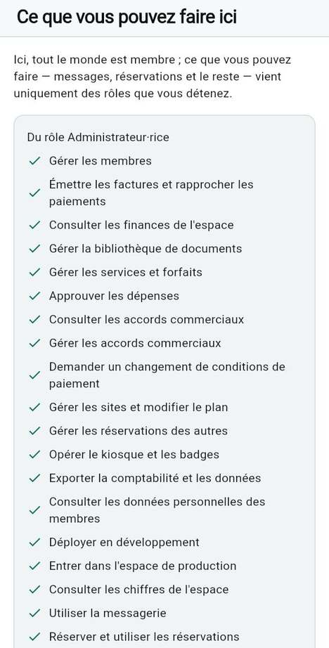

Dans un espace, ce que vous pouvez faire dépend de votre rôle. Les rôles s'additionnent : tout le monde est membre, et les autres viennent en plus.

| Rôle | À quoi il sert |
|---|---|
| Membre | Réserver des places, s'enregistrer et se désenregistrer, écrire des messages, suivre votre propre argent. |
| Administrateur·rice | Tout ce que fait un membre, plus agir pour d'autres membres et approuver des demandes, dans la mesure où le propriétaire l'a permis. |
| Propriétaire | Tout : le plan, les tarifs, les rôles et les réglages de l'espace. Un espace garde toujours au moins un propriétaire. |
| Copropriétaire | Un copropriétaire actif détient dès maintenant les permissions du propriétaire. Un successeur, le copropriétaire passif, prend le relais quand le propriétaire part ou le désigne. |
| Borne | Une tablette au mur qui affiche le plan. Les membres agissent dessus avec leur badge. |

**Étapes**

1. Ouvrez [Réglages](https://fdittgen-png.github.io/deskilo/#/settings), appelé **Mon compte** quand vous n'administrez rien.
2. Choisissez **Ce que vous pouvez faire ici**.
3. Lisez quel rôle vous donne chaque capacité. Un membre voit **Comme tous les membres** ; un administrateur voit aussi **Du rôle Administrateur·rice**.

**Bon à savoir**

- Le propriétaire décide dans la matrice des rôles ce que les administrateurs et les autres rôles peuvent faire : deux espaces peuvent donc différer.
- Un espace peut avoir d'autres rôles que ceux-ci, par exemple un pour la facturation. Ils apparaissent dans la même liste.
- Aucune invitation ne fait de quelqu'un un propriétaire : seul un propriétaire existant peut accorder la propriété.

**Voir aussi:** [La matrice des rôles](#la-matrice-des-rôles) · [Rejoindre un espace](#rejoindre-un-espace)

<!-- anchor: user.start.account -->
### Créer un compte ou se connecter

**Public:** Tout le monde

Vous voulez entrer, que ce soit pour la première ou la centième fois. Un seul compte fonctionne dans tous les espaces que vous rejoignez.

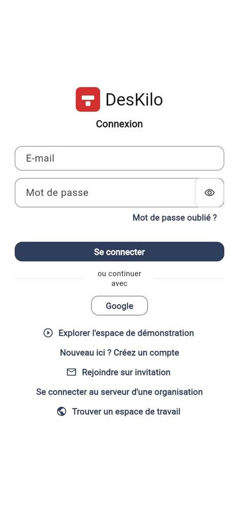

**Étapes**

1. Ouvrez l'application. L'écran de connexion vous demande votre **E-mail** et votre **Mot de passe**.
2. Pour vous connecter, touchez **Se connecter**.
3. Pour créer un compte, touchez **Nouveau ici ? Créez un compte**, ajoutez un **Nom affiché**, puis touchez **Créer le compte**. Le mot de passe doit comporter au moins 8 caractères.
4. Si le serveur la propose, touchez **Google** sous **ou continuer avec**.
5. Certains serveurs demandent d'abord de confirmer votre adresse. L'écran **Consultez vos e-mails** indique qu'un lien a été envoyé : ouvrez-le sur cet appareil. Si rien n'arrive, regardez dans les courriers indésirables ou touchez **Renvoyer l'e-mail**.

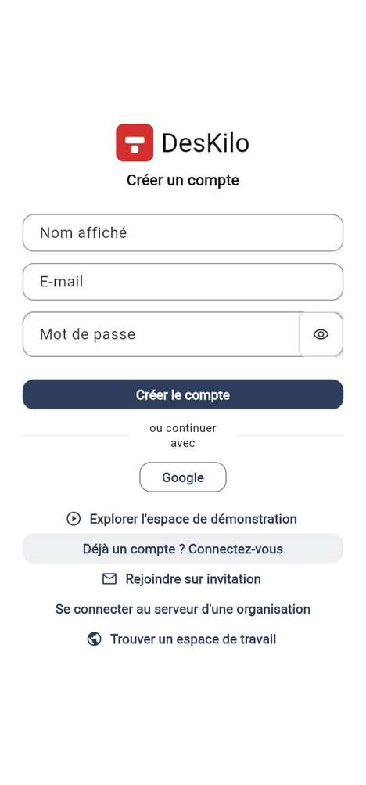

**Bon à savoir**

- Le bouton en forme d'œil à côté du mot de passe affiche ou masque ce que vous saisissez.
- À votre première connexion, on vous demande de lire et d'accepter les conditions de confidentialité avant que quoi que ce soit s'ouvre.
- Un nouveau compte sans espace arrive sur [Moi](https://fdittgen-png.github.io/deskilo/#/me), où vous pouvez trouver, rejoindre ou créer un espace.
- **Rejoindre sur invitation** sur l'écran de connexion garde votre démarche en mémoire : vous créez votre compte, puis vous collez votre invitation.

**Voir aussi:** [Réinitialiser un mot de passe oublié](#réinitialiser-un-mot-de-passe-oublié) · [Rejoindre un espace](#rejoindre-un-espace) · [Vos données, vos droits](#vos-données-vos-droits)

<!-- anchor: user.start.forgot-password -->
### Réinitialiser un mot de passe oublié

**Public:** Tout le monde

Vous ne vous souvenez plus de votre mot de passe. Vous recevez un code à usage unique par e-mail et vous l'utilisez pour en définir un nouveau. Il n'y a aucun lien à ouvrir : cela fonctionne donc même là où les liens n'ouvrent pas l'application.

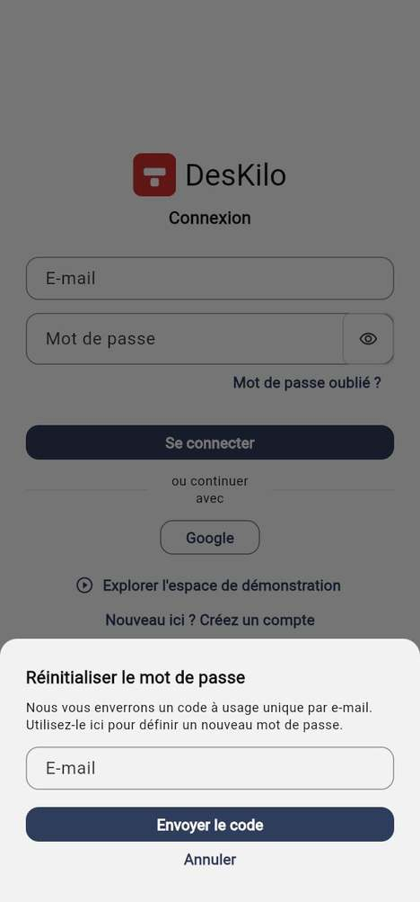

**Étapes**

1. Sur l'écran de connexion, touchez **Mot de passe oublié ?**.
2. Saisissez votre **E-mail** et touchez **Envoyer le code**.
3. Ouvrez l'e-mail et copiez le code.
4. Saisissez-le dans **Code reçu par e-mail**, choisissez un **Nouveau mot de passe** et touchez **Définir le nouveau mot de passe**.

**Bon à savoir**

- Le message **Mot de passe mis à jour — vous êtes connecté.** confirme que cela a fonctionné ; vous n'avez pas à vous reconnecter.
- Un code invalide ou expiré est refusé : demandez-en un nouveau.
- Si le code est accepté mais que le mot de passe n'est pas enregistré, touchez **Réenregistrer le nouveau mot de passe**.

**Voir aussi:** [Créer un compte ou se connecter](#créer-un-compte-ou-se-connecter)

<!-- anchor: user.start.demo -->
### Explorer l'espace de démonstration

**Public:** Tout le monde

Vous voulez jeter un coup d'œil avant de vous engager. La démo est un espace fictif, Atelier du Marché : les personnes, les réservations et les factures sont inventées, rien de ce que vous faites n'atteint un espace réel, et aucun compte n'est nécessaire.

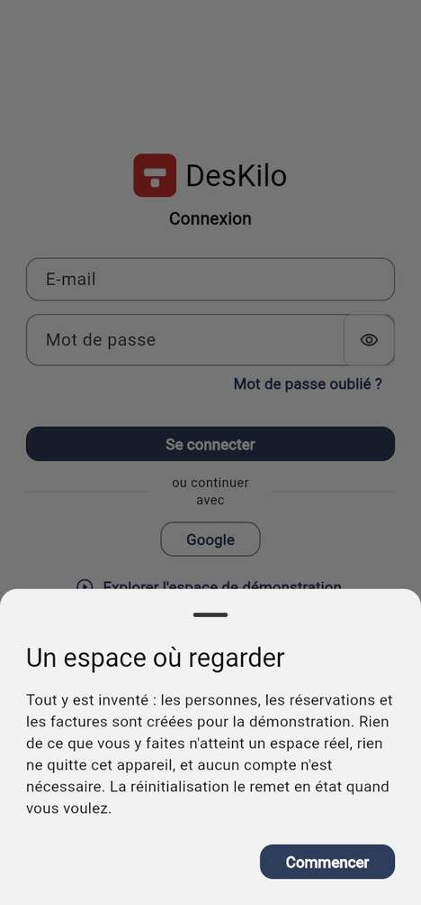

**Étapes**

1. Sur l'écran de connexion, touchez **Explorer l'espace de démonstration**.
2. Lisez la note, puis touchez **Commencer**.
3. Utilisez la bande en haut pour choisir à travers quel regard vous explorez : **Le propriétaire**, **Un membre** ou **Un administrateur**. Chaque appui sur le nom passe au suivant.
4. Touchez **Réinitialiser la démo** pour tout remettre comme au départ.
5. Touchez **Quitter la démo** quand vous avez terminé.

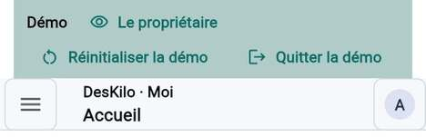

**Bon à savoir**

- La bande porte la mention **Démo** et reste au-dessus de chaque écran : vous ne pouvez donc pas la confondre avec un espace réel.
- Voir le même écran en tant que propriétaire, administrateur et membre est le moyen le plus rapide de comprendre ce que chaque rôle peut faire.
- La démo reste sur cet appareil. La quitter ne crée pas de compte.

**Voir aussi:** [Ce qu'est DesKilo et qui fait quoi](#ce-quest-deskilo-et-qui-fait-quoi) · [Créer un compte ou se connecter](#créer-un-compte-ou-se-connecter)

<!-- anchor: user.start.join -->
### Rejoindre un espace

**Public:** Tout le monde

On vous a donné un identifiant d'espace, un QR code ou un message d'invitation, et vous voulez entrer. Vous demandez à rejoindre l'espace comme membre, et un administrateur vous accepte.

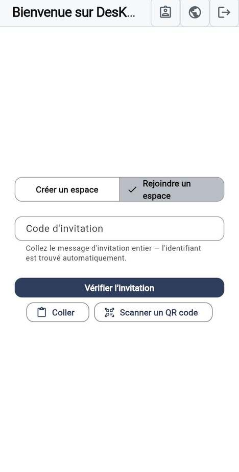

**Étapes**

1. Connectez-vous, puis touchez **Rejoindre avec un code** sur [Moi](https://fdittgen-png.github.io/deskilo/#/me). Depuis l'écran de connexion, **Rejoindre sur invitation** vous y mène dès que vous avez un compte.
2. Sur **Bienvenue sur DesKilo**, laissez **Rejoindre un espace** sélectionné.
3. Saisissez l'identifiant de l'espace dans **Code d'invitation**, ou collez tout le message d'invitation : l'identifiant est trouvé automatiquement. **Coller** le lit dans le presse-papiers, et **Scanner un QR code** ouvre l'appareil photo sur un code imprimé.
4. Touchez **Vérifier l’invitation**. La carte **Vérifiez avant d’adhérer** indique l'espace, son serveur, le rôle proposé et si un administrateur doit approuver.
5. Touchez **Rejoindre l’espace**.

**Bon à savoir**

- Tant qu'un administrateur n'a pas approuvé, vous voyez **Adhésion à l’espace en attente d’approbation**. **Vérifier à nouveau** actualise l'écran, et vos autres espaces ainsi que votre compte restent disponibles.
- Vous rejoignez l'espace avec exactement le rôle que porte l'invitation. L'identifiant d'espace fait toujours entrer comme membre ; un code administrateur personnel ne sert qu'une fois, pour entrer comme administrateur.
- Un code expiré ou remplacé est expliqué à l'écran : demandez-en un à jour à son expéditeur.
- Dans un navigateur, l'appareil photo ne peut pas scanner : saisissez l'identifiant ou collez le message à la place.
- Si la carte indique un autre serveur, **Utiliser ce serveur** y bascule cet appareil.

**Voir aussi:** [L'identifiant de l'espace](#lid-de-lespace) · [Moi : votre accueil et vos espaces](#moi--votre-accueil-et-vos-espaces)

<!-- anchor: user.start.create -->
### Créer un espace

**Public:** Tout le monde

Vous animez une communauté et voulez un espace bien à vous. Vous en devenez aussitôt le propriétaire.

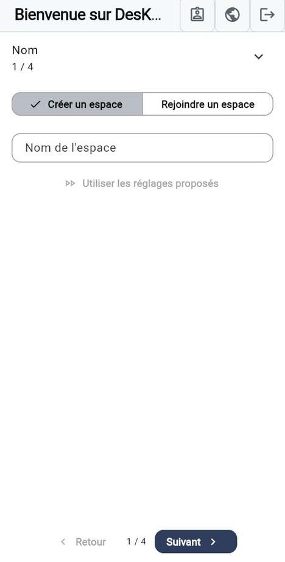

**Étapes**

1. Ouvrez [Créer un espace](https://fdittgen-png.github.io/deskilo/#/onboarding) depuis **Créer un espace** sur [Moi](https://fdittgen-png.github.io/deskilo/#/me).
2. Saisissez un **Nom de l'espace**, puis touchez **Suivant**. **Utiliser les réglages proposés** passe directement à la dernière étape.
3. À l'étape **Où**, choisissez le **Pays** ; la **Devise** et le **Fuseau horaire** s'y adaptent, et vous pouvez les modifier.
4. Sur le même écran, sous **Que créer**, choisissez **Un espace de test**, **Un espace réel** ou **Une paire liée test et réel**.
5. À l'étape **Partir de**, choisissez **Espace vide** pour dessiner votre propre plan, ou un modèle prêt à l'emploi.
6. À l'étape **Confirmer**, lisez ce qui va être créé et touchez **Créer l'espace**.

**Bon à savoir**

- Le sélecteur démarre sur **Un espace de test**, sans risque pour essayer : chaque écran et chaque document le signale, et il n'y a aucune facturation réelle. Un espace réel émet des factures qui sont dues.
- La paire vous donne deux espaces du même nom, l'un pour essayer et l'autre réel. Vous êtes propriétaire des deux.
- Si la réponse se perd en chemin, l'application conserve votre saisie et propose **Relancer telle quelle** : vous ne créez donc jamais l'espace deux fois.
- Le nouvel espace s'ouvre dès qu'il existe. Sa mise en place est détaillée dans les chapitres destinés aux propriétaires.

**Voir aussi:** [Préparer un espace avec le questionnaire de mise en place](#préparer-un-espace-avec-le-questionnaire-de-mise-en-place) · [L'identifiant de l'espace](#lid-de-lespace)

<!-- anchor: user.start.find -->
### Trouver un espace

**Public:** Tout le monde

Vous n'avez pas de code mais aimeriez trouver un espace près de chez vous. Les espaces qui publient une page figurent dans un annuaire public.

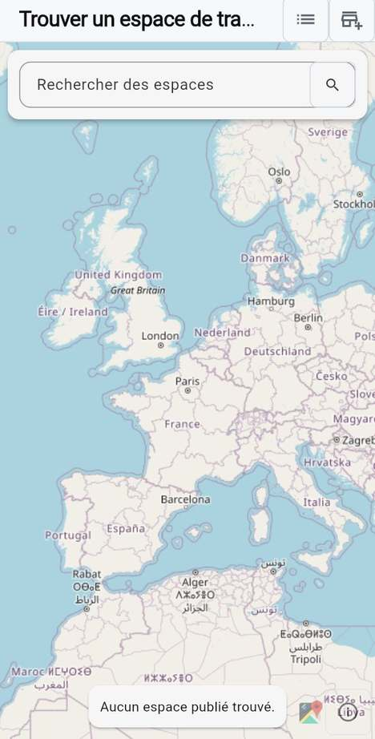

**Étapes**

1. Touchez **Trouver un espace de travail** sur l'écran de connexion, ou ouvrez **Découvrir** sur [Moi](https://fdittgen-png.github.io/deskilo/#/me).
2. Saisissez un nom ou un lieu dans **Rechercher des espaces**.
3. Passez de la **Carte** à la **Liste** avec le bouton en haut.
4. Ouvrez un résultat pour lire sa page publique. Là, **Demander un profil dans cet espace** demande à le rejoindre, et **Entrer** ouvre un espace dont vous faites déjà partie.

**Bon à savoir**

- Seuls les espaces qui ont choisi d'être visibles sont listés. Cette démo n'en a aucun : la carte est donc vide ici.
- Vous pouvez regarder sans compte ; pour rejoindre un espace, il en faut un.

**Voir aussi:** [Rejoindre un espace](#rejoindre-un-espace)

<!-- anchor: user.me.home -->
### Moi : votre accueil et vos espaces

**Public:** Tout le monde

Vous voulez un endroit unique qui montre qui vous êtes et tous les espaces dont vous faites partie. **Moi** est à vous seul et ne prend jamais les couleurs d'un espace. Sous votre nom, **Mes espaces** liste chaque espace sous forme d'une carte.

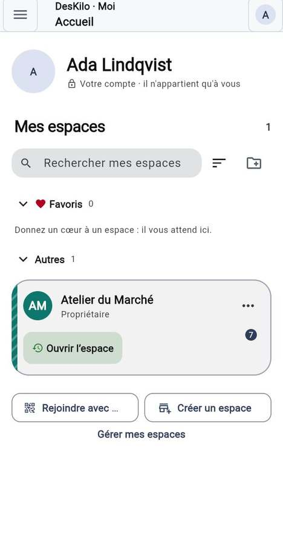

**Étapes**

1. Ouvrez [Moi](https://fdittgen-png.github.io/deskilo/#/me). Si vous devez de l'argent quelque part, une carte en haut indique **À payer** et ouvre vos finances.
2. Repérez votre espace sous **Mes espaces**. Un espace réel a un bouton **Ouvrir l’espace** ; un espace qui a un jumeau de test a aussi **Espace de test**.
3. Touchez le bouton pour entrer. L'écran se remplit de la couleur, du motif et du logo de l'espace, puis l'espace s'ouvre.
4. Touchez **Rejoindre avec un code** ou **Créer un espace** sous la liste pour en ajouter un autre.

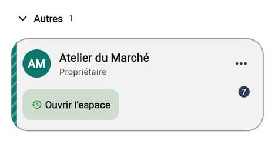

**Bon à savoir**

- La petite horloge sur un bouton indique le côté que vous avez utilisé en dernier.
- Le petit nombre sur un bouton compte ce qui vous attend là-bas, côte à côte pour l'espace réel et son jumeau de test. Maintenez le bouton appuyé pour lire la phrase complète.
- Le motif sur le bord gauche de la carte est l'identité propre de l'espace. Si les animations sont désactivées, l'espace s'ouvre simplement.
- Un espace encore **En attente d'approbation** affiche cette mention à la place de votre rôle.
- Un espace hébergé sur un autre serveur affiche **Ouvrir sur** ce serveur ; l'ouvrir change de serveur et vous demande de vous y connecter.

**Voir aussi:** [Mettre de l'ordre dans vos espaces](#mettre-de-lordre-dans-vos-espaces) · [Profils : un compte, plusieurs espaces](#profils--un-compte-plusieurs-espaces)

<!-- anchor: user.me.organise -->
### Mettre de l'ordre dans vos espaces

**Public:** Tout le monde

Vous appartenez à plusieurs espaces et voulez votre propre ordre. Les cœurs, les groupes, les étoiles et l'ordre sont à vous et restent sur cet appareil.

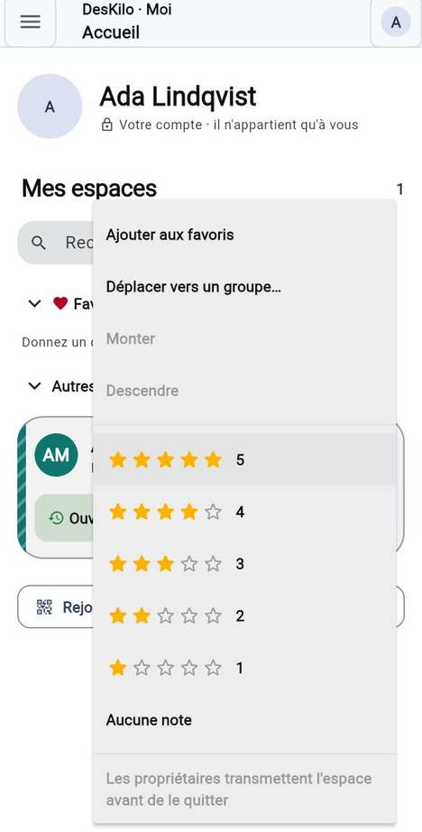

**Étapes**

1. Sur [Moi](https://fdittgen-png.github.io/deskilo/#/me), touchez les trois points sur la carte d'un espace.
2. Choisissez **Ajouter aux favoris** : l'espace passe dans **Favoris** et affiche un cœur.
3. Choisissez **Déplacer vers un groupe…** pour le ranger dans un autre groupe, ou touchez le bouton en forme de dossier au-dessus de la liste pour **Nouveau groupe**.
4. Touchez l'une des cinq étoiles pour noter l'espace, ou **Aucune note** pour l'effacer.
5. Saisissez dans **Rechercher mes espaces** pour filtrer, et utilisez le bouton de tri pour choisir **Mon ordre**, **Utilisés récemment**, **Mieux notés** ou **A–Z**.

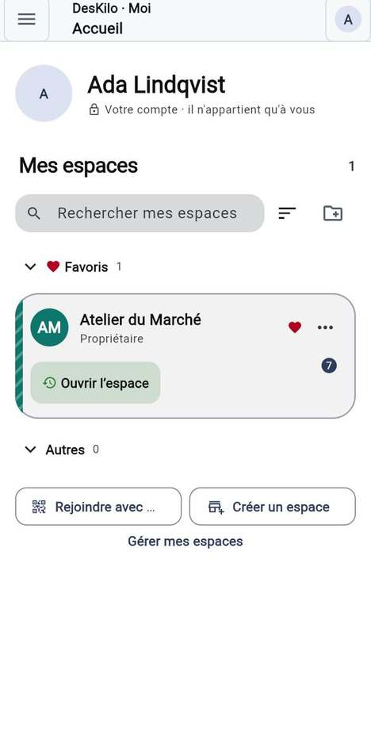

**Bon à savoir**

- Dans **Mon ordre**, maintenez une carte appuyée une seconde pour la faire glisser, ou utilisez **Monter** et **Descendre**.
- Touchez le nom d'un groupe pour le replier. Les groupes que vous avez créés peuvent être renommés ou supprimés depuis leur menu ; **Favoris** et **Autres** sont toujours là.
- **Quitter cet espace** se trouve dans le même menu. Vous cessez d'être membre ; les réservations, les factures et les messages restent dans l'espace. Les propriétaires transmettent d'abord l'espace.
- **Gérer mes espaces**, en bas, ouvre la liste des profils.

**Voir aussi:** [Profils : un compte, plusieurs espaces](#profils--un-compte-plusieurs-espaces) · [Effacer mes données](#effacer-mes-données)

<!-- anchor: user.profile.profiles -->
### Profils : un compte, plusieurs espaces

**Public:** Tout le monde

Un compte peut appartenir à de nombreux espaces. Chaque espace vous donne un profil : votre rôle et vos propres données. La liste des profils les affiche tous et décide avec lequel l'application s'ouvre.

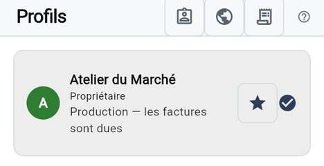

**Étapes**

1. Ouvrez [Profils](https://fdittgen-png.github.io/deskilo/#/profiles), ou touchez **Gérer mes espaces** sur [Moi](https://fdittgen-png.github.io/deskilo/#/me).
2. Lisez chaque ligne : le nom de l'espace, votre rôle et l'environnement concerné.
3. Touchez une ligne pour basculer sur ce profil. La coche indique le **Profil actif**. L'application s'ouvrira avec lui la prochaine fois, sur tous vos appareils.
4. Pour faire d'un profil le profil par défaut sans y passer, touchez l'étoile (**Utiliser par défaut au démarrage**) ; touchez-la encore pour l'annuler.
5. Touchez **Ajouter un profil** pour rejoindre ou créer un espace de plus.

**Bon à savoir**

- Un espace avec un jumeau de test affiche une seule ligne qui se déplie en deux choix, **Développement — pour essayer** et **Production — les factures sont dues**. Touchez celui que vous voulez ; la coche suit.
- Tout ce que vous voyez dans l'application appartient à l'espace actif.
- Votre compte, votre photo et votre langue ne font pas partie d'un profil : ils se trouvent dans Moi et sont les mêmes partout.

**Voir aussi:** [Moi : votre accueil et vos espaces](#moi--votre-accueil-et-vos-espaces) · [Rejoindre un espace](#rejoindre-un-espace)

<!-- anchor: user.start.navigation -->
### S'orienter dans l'application

**Public:** Tout le monde

Vous êtes dans un espace et voulez atteindre un écran. Tout est dans un seul menu, et quelques boutons se trouvent en haut.

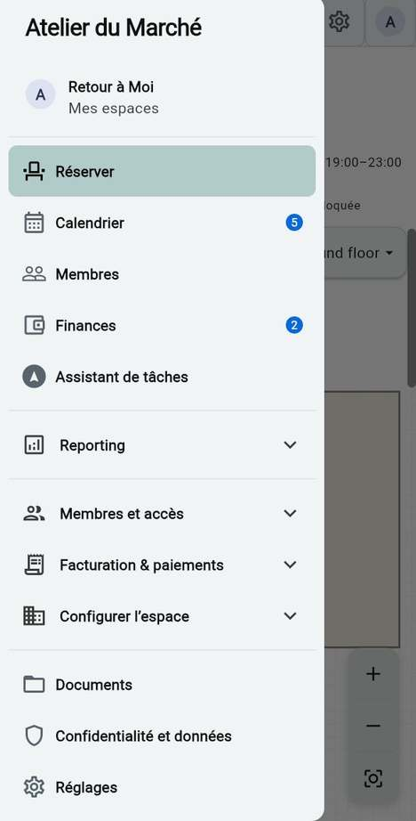

**Étapes**

1. Touchez le bouton ☰ en haut à gauche. Le menu s'ouvre avec le nom de votre espace, **Retour à Moi** et les destinations du quotidien : **Réserver**, **Calendrier**, **Membres**, **Finances**.
2. Touchez une destination pour l'ouvrir. Un nombre bleu à côté indique ce qui vous y attend.
3. Ouvrez **Reporting**, **Membres et accès**, **Facturation et paiements** ou **Configurer l’espace** pour voir les outils d'administration que votre rôle autorise.
4. En bas, **Documents**, **Confidentialité et données** et **Réglages** restent toujours à portée de main.
5. Touchez l'avatar en haut à droite, ou **Retour à Moi**, pour quitter l'espace et revenir à [Moi](https://fdittgen-png.github.io/deskilo/#/me).

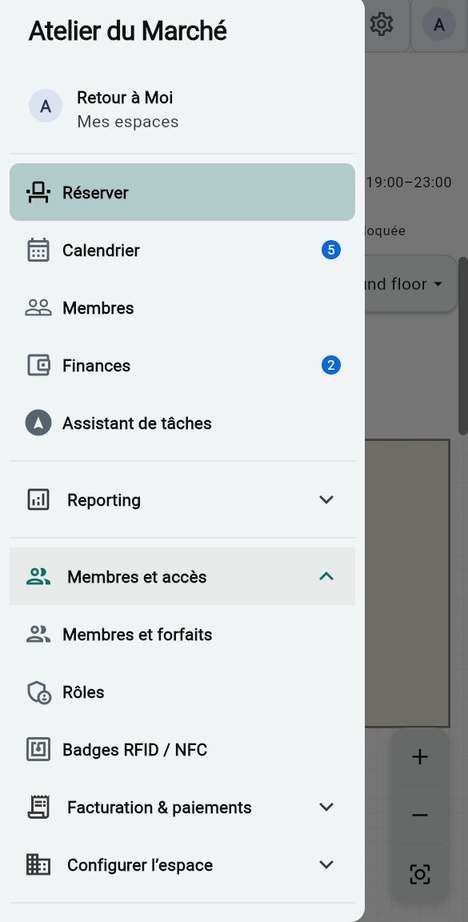

**Bon à savoir**

- Les destinations vont et viennent selon les fonctionnalités que le propriétaire a activées et selon votre rôle. Un simple membre ne voit aucun des groupes d'administration.
- Lorsque votre espace a activé Événements, **Événements** en haut à droite (l'icône de plateau avec un compteur) rassemble ce qui s'est passé et ce qui attend votre décision ; lorsque le Calendrier contient les alertes, utilisez sa vue **Alertes**. **Scanner un code d'espace** et **Modifier l'espace** apparaissent sur l'écran Réserver quand vous pouvez les utiliser.
- Sur une fenêtre large, le menu reste ouvert en barre latérale. Une fenêtre étroite ou un texte agrandi utilisent le menu ☰.
- Dans les applications pour téléphones et ordinateurs, le [Style de navigation](#style-de-navigation) dans Réglages permet de choisir la barre classique en bas avec le bouton rond **Réserver**. Faites glisser cette barre vers le bas pour un affichage plein écran ; faites glisser vers le haut, ou appuyez longuement sur le bouton **Réserver**, pour la faire revenir. Un navigateur utilise toujours le menu.

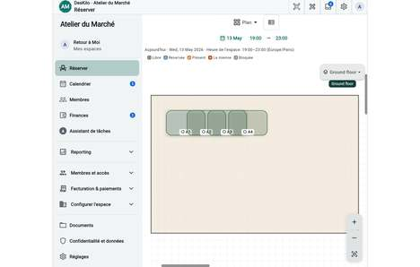

**Voir aussi:** [Style de navigation](#style-de-navigation) · [Moi : votre accueil et vos espaces](#moi--votre-accueil-et-vos-espaces)

<!-- anchor: user.start.get-started -->
### La carte Premiers pas et les astuces

**Public:** Tout le monde

Vous ouvrez un espace et ne savez pas par où commencer. La carte **Premiers pas** vous indique une prochaine étape, et de courtes astuces expliquent chaque écran.

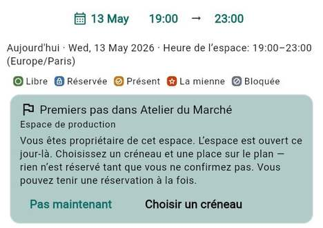

**Étapes**

1. Ouvrez [Réserver](https://fdittgen-png.github.io/deskilo/#/reserve). La carte **Premiers pas dans** votre espace apparaît en haut du plan.
2. Suivez l'action proposée, par exemple **Choisir un créneau**.
3. Touchez **Pas maintenant** pour la mettre de côté.
4. Pour la faire revenir, ouvrez le menu d'affichage en haut du plan, celui qui indique **Plan**, et choisissez **Premiers pas**.

**Bon à savoir**

- Pour un propriétaire ou un administrateur, la carte indique ce qui manque avant que quiconque puisse réserver, avec **Terminer la mise en place**.
- Les astuces sont de petites cartes sur chaque écran. **Masquer l'astuce** en cache une, et **Astuce suivante** en montre une autre.
- Vous pouvez réafficher toutes les astuces masquées avec [Rétablir les astuces](#rétablir-les-astuces).

**Voir aussi:** [Rétablir les astuces](#rétablir-les-astuces) · [S'orienter dans l'application](#sorienter-dans-lapplication)

<!-- anchor: user.start.questionnaire -->
### Préparer un espace avec le questionnaire de mise en place

**Public:** Propriétaire

Vous êtes sur le point d'ouvrir un espace et avez beaucoup de décisions à prendre : à quoi ressemble une réservation, combien coûte un mois, ce que doit dire une facture. Le questionnaire de mise en place vous permet de les prendre toutes d'un coup, avant de commencer, sur grand écran et, si vous le souhaitez, avec votre comptable ou votre conseil d'administration.

**Étapes**

1. Ouvrez le questionnaire dans un navigateur : [setup.html](https://fdittgen-png.github.io/deskilo/setup.html). Il n'y a rien à installer et aucun compte à créer.
2. Répondez aux étapes dans l'ordre : *Identité*, *Fonctionnalités*, *Disponibilité*, *Plan*, *Abonnements*, *Identité légale et TVA*, *Services et accessoires*, *Instructions de paiement*, *Rôles et validations*, *Membres et invitations*. Chaque étape ne pose que les questions que vos réponses précédentes rendent possibles.
3. Lisez le *Récapitulatif des fonctionnalités* et décochez ce que vous ne voulez pas : cette fonctionnalité démarre désactivée dans l'application et rien à son sujet n'est exporté.
4. À l'étape *Vérifier et exporter*, corrigez les points bloquants, puis touchez **Exporter le XML**.
5. Dans l'application, ouvrez les réglages de l'espace et choisissez **Importer l'espace (XML)** pour créer les réglages, les accessoires et le plan.
6. Conservez le fichier. *Charger un fichier…* rétablit vos réponses plus tard, et **Réinitialiser** repart de zéro.

**Bon à savoir**

- Vos réponses sont enregistrées dans votre propre navigateur et ne sont envoyées nulle part. Vous pouvez fermer l'onglet et revenir.
- Le fichier est en texte brut : laissez les jetons et les clés vides et saisissez-les plutôt dans l'application.
- Chaque question indique où se trouve le réglage dans l'application, ce qui vous permet de terminer le reste écran par écran.
- Le sauter ne coûte rien : chaque réponse est un réglage que vous pourrez faire ou modifier plus tard dans l'application.

**Voir aussi:** [Créer un espace](#créer-un-espace) · [Importer l'espace (XML)](#importer-lespace-xml)

<!-- anchor: user.reserve.overview -->
## Réserver

Réserver une place est le cœur de DesKilo : vous regardez le plan de votre espace, vous choisissez un jour et une heure, vous touchez une place libre et vous confirmez. Ce chapitre suit ce chemin, puis présente ce qui l'entoure : les règles que vous rencontrez, le check-in et le check-out, la modification d'une réservation, et le Calendrier où tout ce qui est daté est rassemblé.

Dans ce chapitre :
- [Le hub Réserver et le plan](#le-hub-réserver-et-le-plan)
- [Se repérer sur le plan](#se-repérer-sur-le-plan)
- [Voir les places sous forme de liste](#voir-les-places-sous-forme-de-liste)
- [Choisir le jour et l'heure](#choisir-le-jour-et-lheure)
- [Vue Jour](#vue-jour)
- [Vue Semaine](#vue-semaine)
- [Vue Mois](#vue-mois)
- [Réserver une place](#réserver-une-place)
- [La feuille de réservation](#la-feuille-de-réservation)
- [S'installer tout de suite quand vous êtes déjà sur place](#sinstaller-tout-de-suite-quand-vous-êtes-déjà-sur-place)
- [Réserver une table, une salle ou un niveau entier](#réserver-une-table-une-salle-ou-un-niveau-entier)
- [Réserver pour quelqu'un d'autre](#réserver-pour-quelquun-dautre)
- [Répéter une réservation](#répéter-une-réservation)
- [Les règles que vous rencontrez en réservant](#les-règles-que-vous-rencontrez-en-réservant)
- [Jours de fermeture et jours fériés](#jours-de-fermeture-et-jours-fériés)
- [Check-in et check-out](#check-in-et-check-out)
- [Scanner un code d'espace](#scanner-un-code-despace)
- [Modifier ou annuler une réservation](#modifier-ou-annuler-une-réservation)
- [Quand une réservation attend une confirmation](#quand-une-réservation-attend-une-confirmation)
- [L'onglet Calendrier](#longlet-calendrier)
- [Agenda, Semaine et Mois dans le Calendrier](#agenda-semaine-et-mois-dans-le-calendrier)
- [Les décisions qui vous attendent dans le Calendrier](#les-décisions-qui-vous-attendent-dans-le-calendrier)
- [Filtrer le Calendrier](#filtrer-le-calendrier)
- [Enregistrer une réservation dans votre propre calendrier](#enregistrer-une-réservation-dans-votre-propre-calendrier)

<!-- anchor: user.reserve.hub -->
### Le hub Réserver et le plan

**Public:** Membre · Administrateur·rice · Propriétaire

Vous voulez voir quelles places sont libres. Le hub Réserver s'ouvre sur le plan d'un niveau de votre espace, dessiné pour le jour et l'heure que vous regardez.

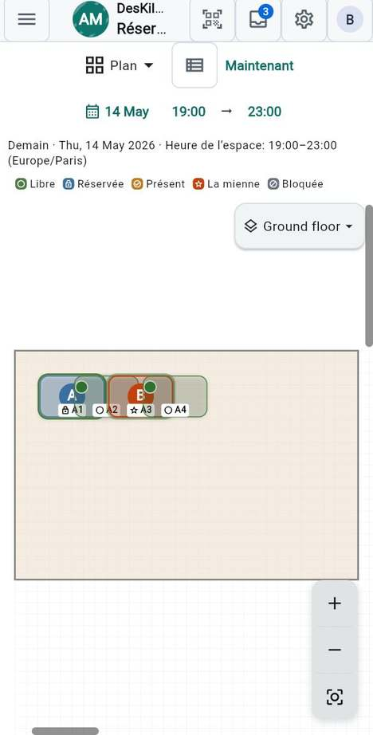

**Étapes**

1. Ouvrez [Réserver](https://fdittgen-png.github.io/deskilo/#/reserve).
2. Lisez le plan : chaque place porte son nom, un petit symbole et une couleur qui dit où elle en est.
3. Touchez une place pour agir dessus. Une place libre ouvre la feuille de réservation ; votre propre place propose le check-in et l'annulation ; la place de quelqu'un d'autre indique qui l'occupe et jusqu'à quand.
4. La légende sous la date explique les couleurs. Elle est identique sur le plan et dans les vues Jour, Semaine et Mois.

| État | Ce que cela signifie |
|---|---|
| **Libre** | Personne ne détient la place sur le créneau choisi. |
| **Réservée** | Quelqu'un l'a réservée. |
| **Présent** | La personne qui l'a réservée est arrivée. |
| **La mienne** | C'est votre réservation. |
| **Bloquée** | La place est hors service, par exemple pour maintenance. |
| **Jour fermé** | L'espace est fermé ce jour-là (vues Jour, Semaine et Mois). |

**Bon à savoir**

- Une place occupée montre qui s'y trouve : une initiale, ou une photo lorsque la personne en a mis une et que votre espace affiche les photos sur le plan. Un petit point vert signifie qu'elle utilise l'application en ce moment.
- Une table, une salle ou un niveau entier réservé le dit sur le plan, avec le nom de la personne qui le détient.
- Certains espaces affichent moins d'états : une place réservée et une place où l'on est arrivé ont alors le même aspect, et le blocage s'affiche **Indisponible**.
- Quand les dernières disponibilités n'ont pas pu être chargées, une bannière indique **Hors ligne** avec l'heure des dernières données et un bouton **Réessayer**, car une place affichée libre a pu être prise entre-temps.

**Voir aussi:** [Choisir le jour et l'heure](#choisir-le-jour-et-lheure) · [La feuille de réservation](#la-feuille-de-réservation)

<!-- anchor: user.reserve.plan-levels -->
### Se repérer sur le plan

**Public:** Membre · Administrateur·rice · Propriétaire

Vous voulez atteindre l'étage, la salle ou le bureau que vous avez en tête. Le plan peut être déplacé, agrandi et changé d'un niveau à l'autre.

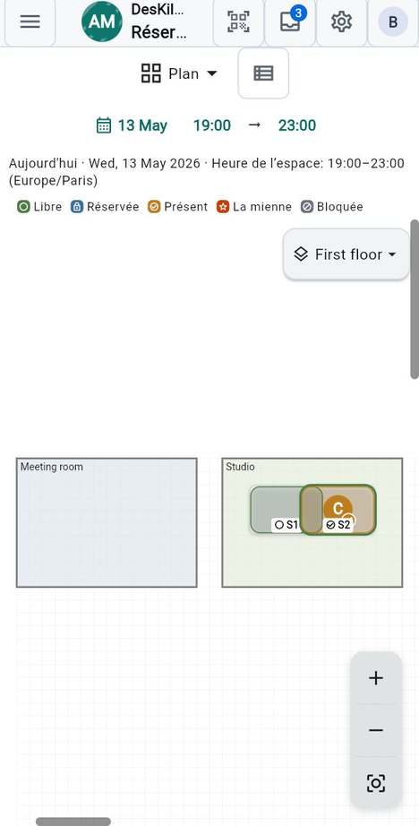

**Étapes**

1. Touchez le nom du niveau en haut à droite du plan, par exemple *Premier étage*, et choisissez un autre niveau. Votre choix est conservé pour la prochaine ouverture du hub.
2. Zoomez avec deux doigts, ou avec **Zoom avant** et **Zoom arrière**. Faites glisser les barres de défilement le long des bords pour vous déplacer.
3. Touchez **Ajuster le plan à l'écran** pour ramener tout le niveau dans la vue.
4. Lisez le nom des salles dans le coin de chacune. Touchez une place à l'intérieur pour la réserver.

**Bon à savoir**

- Le sélecteur de niveau ne propose un menu que lorsque votre espace compte plus d'un niveau.
- Un niveau, une salle ou un bureau qui peut être réservé en entier a son propre bouton ou un double appui : voir [Réserver une table, une salle ou un niveau entier](#réserver-une-table-une-salle-ou-un-niveau-entier).

**Voir aussi:** [Voir les places sous forme de liste](#voir-les-places-sous-forme-de-liste) · [Vue Jour](#vue-jour)

<!-- anchor: user.reserve.list -->
### Voir les places sous forme de liste

**Public:** Membre · Administrateur·rice · Propriétaire

Vous préférez des lignes à un dessin, ou le plan est difficile à lire sur un petit écran. La liste montre les mêmes places, niveau par niveau et bureau par bureau.

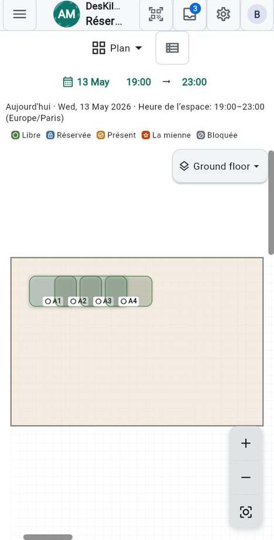

**Étapes**

1. Dans [Réserver](https://fdittgen-png.github.io/deskilo/#/reserve), touchez **Vue liste**, le bouton à côté du menu d'affichage.
2. Trouvez la place. Chaque ligne la nomme et dit si elle est libre, réservée ou à vous.
3. Touchez **Réserver** sur une ligne libre pour ouvrir la feuille de réservation.
4. Pour revenir au dessin, touchez **Vue plan**.

**Bon à savoir**

- La liste suit le jour et l'heure que vous avez choisis, exactement comme le plan.
- Quand les favoris et les notes sont activés, chaque ligne porte aussi un cœur (**Ajouter aux favoris**) et des étoiles.

**Voir aussi:** [Choisir le jour et l'heure](#choisir-le-jour-et-lheure) · [La feuille de réservation](#la-feuille-de-réservation)

<!-- anchor: user.reserve.when -->
### Choisir le jour et l'heure

**Public:** Membre · Administrateur·rice · Propriétaire

Vous voulez réserver pour un autre jour, ou pour un moment qui n'est pas maintenant. Les deux rangées de commandes en haut du hub indiquent ce que vous regardez et quand.

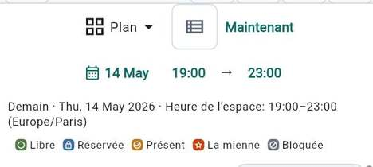

**Étapes**

1. Touchez la date, par exemple 14 mai, et choisissez un jour dans le calendrier. Vous pouvez regarder jusqu'à un an à l'avance.
2. Choisissez l'heure. Si votre espace réserve à la demi-journée, touchez **Matin**, **Après-midi** ou **Journée entière**. S'il réserve à l'heure ou sur une plage libre, touchez la première heure pour définir **De** et la seconde pour définir **À**.
3. Lisez la ligne sous les commandes : elle nomme le jour, la période et les heures dans le fuseau horaire de l'espace, et dans le vôtre quand il diffère.
4. Pour revenir à aujourd'hui, touchez **Maintenant**.

**Bon à savoir**

- Les commandes que vous voyez suivent les règles de l'espace : certains espaces réservent à la demi-journée, d'autres à la journée seulement, d'autres à n'importe quelle heure sur une grille.
- Sur un téléphone, les pastilles de la partie de journée sont de petites icônes de demi-journée ou de journée entière. Maintenez-en une appuyée pour lire son nom et ses heures.
- Le plan répond pour l'heure que vous avez choisie : une place affichée libre l'est sur toute la durée.
- Lorsque les réservations se font à la demi-journée, la période sur laquelle vous commencez est votre période habituelle, définie dans [Période de réservation par défaut](#période-de-réservation-par-défaut).

**Voir aussi:** [Le hub Réserver et le plan](#le-hub-réserver-et-le-plan) · [Réserver une place](#réserver-une-place)

<!-- anchor: user.reserve.day-view -->
### Vue Jour

**Public:** Membre · Administrateur·rice · Propriétaire

Vous voulez voir qui est où pendant la journée, et pas seulement à un instant donné. La vue **Jour** dispose chaque place en ligne le long des heures.

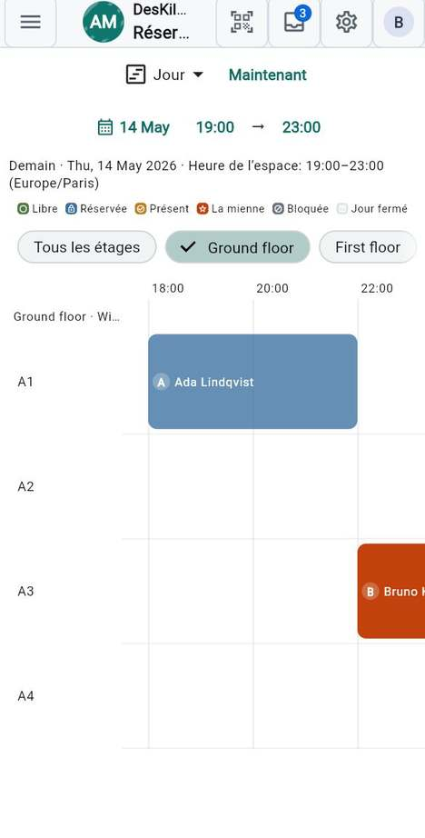

**Étapes**

1. Dans [Réserver](https://fdittgen-png.github.io/deskilo/#/reserve), ouvrez le menu d'affichage, qui indique d'abord **Plan**, et choisissez **Jour**.
2. Choisissez le jour avec le bouton de date. Choisissez un niveau avec les pastilles au-dessus des lignes : **Tous les étages** ou un seul niveau.
3. Lisez les barres. Chacune est une réservation, avec le nom de la personne qui la détient ; les vôtres ressortent dans la couleur de **La mienne**.
4. Touchez un créneau libre d'une ligne pour réserver cette place à l'heure que vous avez choisie. Touchez votre propre réservation pour ouvrir son détail ; touchez celle d'une autre personne pour voir qui l'occupe et jusqu'à quand.

**Bon à savoir**

- Un jour fermé est dessiné comme fermé et ne peut pas être réservé.
- Le menu derrière la commande **Vue** contient aussi **Semaine** et **Mois**.

**Voir aussi:** [Vue Semaine](#vue-semaine) · [Modifier ou annuler une réservation](#modifier-ou-annuler-une-réservation)

<!-- anchor: user.reserve.week-view -->
### Vue Semaine

**Public:** Membre · Administrateur·rice · Propriétaire

Vous voulez trouver une matinée ou un après-midi libre dans les jours qui viennent. La vue **Semaine** montre les places sur le côté et les jours de la semaine en travers.

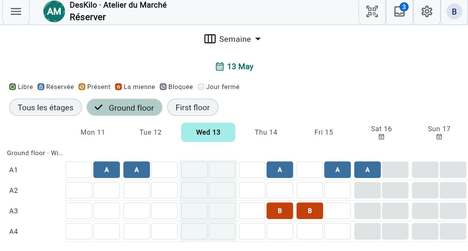

**Étapes**

1. Ouvrez le menu d'affichage et choisissez **Semaine**.
2. Trouvez votre jour. Chaque jour compte deux cases côte à côte, le matin et l'après-midi. Une case remplie montre l'initiale de la personne qui la détient.
3. Touchez une case vide pour réserver cette moitié de journée sur cette place.
4. Touchez le nom d'un jour en haut pour passer à ce jour dans la vue **Jour**.

**Bon à savoir**

- Les jours fermés sont grisés et portent une marque de fermeture.
- Choisissez **Tous les étages** ou un seul niveau avec les pastilles au-dessus de la grille.

**Voir aussi:** [Vue Jour](#vue-jour) · [Vue Mois](#vue-mois)

<!-- anchor: user.reserve.month-view -->
### Vue Mois

**Public:** Membre · Administrateur·rice · Propriétaire

Vous voulez savoir quels jours ont de la place. La vue **Mois** compte les places libres pour chaque jour.

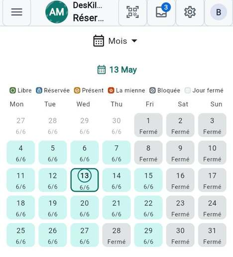

**Étapes**

1. Ouvrez le menu d'affichage et choisissez **Mois**.
2. Lisez chaque jour : le nombre de places libres sur le total, par exemple 6/6. Les jours fermés indiquent **Fermé**.
3. Touchez un jour pour l'ouvrir dans la vue **Jour**, où vous voyez qui a réservé.

**Bon à savoir**

- Le décompte couvre tous les niveaux de l'espace.
- Aujourd'hui est entouré.

**Voir aussi:** [Jours de fermeture et jours fériés](#jours-de-fermeture-et-jours-fériés) · [Vue Jour](#vue-jour)

<!-- anchor: user.reserve.book -->
### Réserver une place

**Public:** Membre · Administrateur·rice · Propriétaire

Vous voulez une place pour un jour et une heure donnés. Depuis le plan, quelques touches suffisent : le jour, l'heure, la place et une confirmation.

**Étapes**

1. Ouvrez [Réserver](https://fdittgen-png.github.io/deskilo/#/reserve) et choisissez le jour et l'heure, comme décrit dans [Choisir le jour et l'heure](#choisir-le-jour-et-lheure).
2. Choisissez le niveau, si votre espace en compte plusieurs.
3. Touchez une place libre. La feuille de réservation s'ouvre dessus.
4. Vérifiez la ligne qui nomme la place et la période, modifiez ce qu'il faut, puis touchez **Réserver**.
5. Un message confirme la réservation. Touchez **Détails** dedans pour ouvrir la nouvelle réservation.

**Bon à savoir**

- Rien n'est réservé tant que vous n'avez pas touché **Réserver**.
- Si la place a été prise il y a une seconde, l'application vous le dit au lieu de la réserver deux fois.
- Si la connexion tombe après votre appui, l'écran **Votre demande de réservation** vous permet de vérifier ce qui s'est passé, de reprendre la même demande ou d'y renoncer. Une demande n'est jamais réservée deux fois.
- Un jour fermé, le plan indique **Fermé ce jour-là** et propose le prochain jour d'ouverture.

**Voir aussi:** [La feuille de réservation](#la-feuille-de-réservation) · [Les règles que vous rencontrez en réservant](#les-règles-que-vous-rencontrez-en-réservant)

<!-- anchor: user.reservations.booking-sheet -->
### La feuille de réservation

**Public:** Membre · Administrateur·rice · Propriétaire

Vous avez touché une place libre et la feuille s'ouvre. Elle montre ce que vous allez réserver et vous laisse l'ajuster avant de confirmer. La feuille ne fait que proposer : les règles de l'espace sont vérifiées à la confirmation.

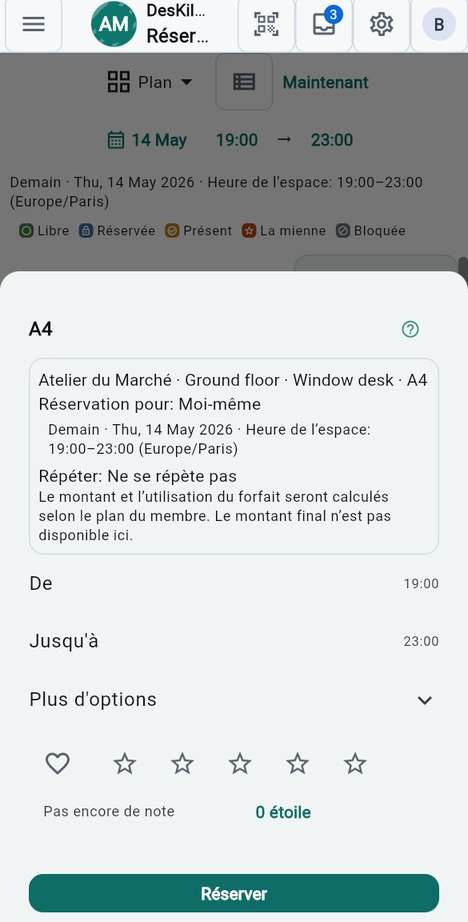

**Étapes**

1. Lisez le résumé : l'espace, le niveau, le bureau et la place, la personne pour qui la réservation est faite, le jour, les heures et la répétition.
2. Ajustez la période. En demi-journées, touchez **Matin**, **Après-midi** ou **Journée entière**. Sur une grille horaire, définissez **De** et **Jusqu'à** ; sur une grille à la minute, un curseur nommé **Durée** règle la longueur.
3. Ouvrez **Plus d'options** pour répéter la réservation.
4. Si vous le souhaitez, ajoutez la place à vos favoris avec le cœur, ou notez-la avec les étoiles.
5. Touchez **Réserver**.

**Bon à savoir**

- Si la période choisie n'est pas autorisée, une ligne rouge sous la période en donne la raison et **Réserver** reste grisé.
- Si une autre réservation suit sur la même place, la feuille indique que la place est réservée à partir de cette heure et arrête votre réservation là.
- Les administrateurs voient **Réserver pour** et, pour bloquer une place, **Gérer la ressource**.
- Quand la période choisie inclut l'instant présent, un interrupteur **Pointer tout de suite** apparaît, désactivé par défaut.

**Voir aussi:** [S'installer tout de suite quand vous êtes déjà sur place](#sinstaller-tout-de-suite-quand-vous-êtes-déjà-sur-place) · [Répéter une réservation](#répéter-une-réservation) · [Réserver pour quelqu'un d'autre](#réserver-pour-quelquun-dautre)

<!-- anchor: user.reserve.walk-up -->
### S'installer tout de suite quand vous êtes déjà sur place

**Public:** Membre · Administrateur·rice · Propriétaire

Vous êtes devant une place libre et voulez la prendre tout de suite. Sur le plan du jour, la feuille de réservation propose deux actions côte à côte.

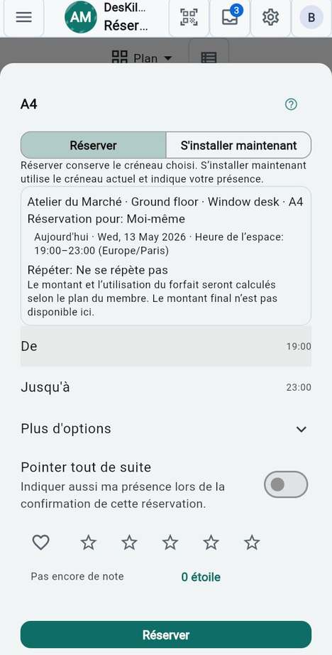

**Étapes**

1. Ouvrez [Réserver](https://fdittgen-png.github.io/deskilo/#/reserve) sur aujourd'hui, sans autre heure choisie, et touchez une place libre.
2. En haut de la feuille, choisissez **Réserver** ou **S'installer maintenant**.
3. **Réserver** garde la période que vous avez choisie. **S'installer maintenant** passe à la période en cours et vous marque présent.
4. Touchez **S'installer** pour confirmer.

**Bon à savoir**

- Le check-in s'arrête là où commence la réservation suivante sur cette place, et la feuille vous l'indique.
- Un check-in sur place doit commencer aujourd'hui.
- Lorsque les réservations se font à la demi-journée, le check-in se termine avec la demi-journée en cours, ou avec la journée quand votre période habituelle est la journée entière.

**Voir aussi:** [Check-in et check-out](#check-in-et-check-out) · [Les règles que vous rencontrez en réservant](#les-règles-que-vous-rencontrez-en-réservant)

<!-- anchor: user.reserve.whole-space -->
### Réserver une table, une salle ou un niveau entier

**Public:** Membre · Administrateur·rice · Propriétaire

Il vous faut toute la table, toute la salle ou tout l'étage, pour une réunion ou une journée. Les espaces configurés pour cela peuvent être réservés d'un seul tenant.

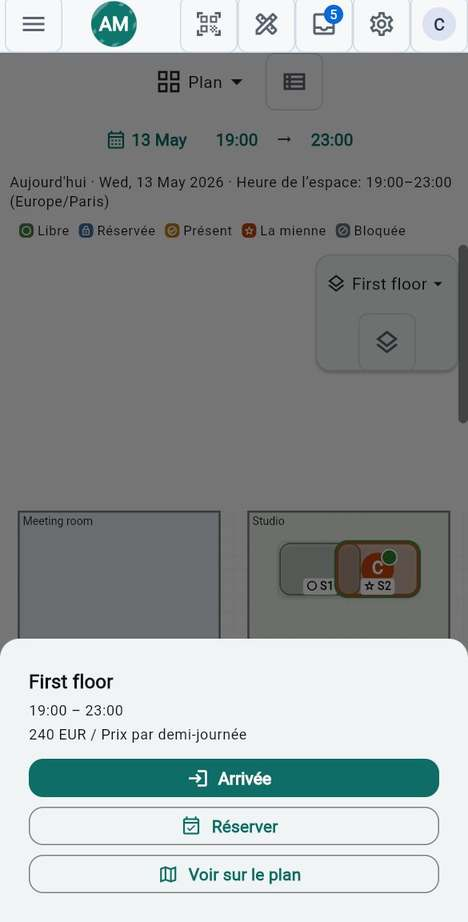

**Étapes**

1. Sur le plan, touchez deux fois le bureau, la salle ou l'étage vide. Pour un niveau, vous pouvez aussi toucher **Réserver le niveau**, le bouton sous le sélecteur de niveau.
2. La feuille nomme l'espace, la période et le **Prix par demi-journée** lorsqu'il y en a un.
3. Touchez **S'installer** pour le prendre maintenant, ou **Réserver** pour le réserver sur la période affichée.
4. Dans la feuille de réservation qui s'ouvre, choisissez la période et touchez **Réserver**.

**Bon à savoir**

- Un membre a besoin du droit de réserver des espaces entiers ; les propriétaires et les administrateurs l'ont. Sans lui, la feuille indique **Vous n'êtes pas autorisé à réserver une table, un bureau ou un niveau entier.**
- Un espace entier ne peut pas être réservé tant qu'une de ses places est prise sur cette période, et aucune place ne peut être réservée tant que sa table, sa salle ou son niveau est réservé en entier.
- Lorsque le propriétaire exige une approbation, la réservation d'un espace entier bloque l'espace immédiatement et attend les validateurs ; s'ils la rejettent, elle est annulée.

**Voir aussi:** [Quand une réservation attend une confirmation](#quand-une-réservation-attend-une-confirmation) · [Scanner un code d'espace](#scanner-un-code-despace)

<!-- anchor: user.reserve.for-someone -->
### Réserver pour quelqu'un d'autre

**Public:** Administrateur·rice · Propriétaire

Vous voulez réserver une place au nom d'un membre. Les administrateurs peuvent choisir le membre dans la feuille de réservation.

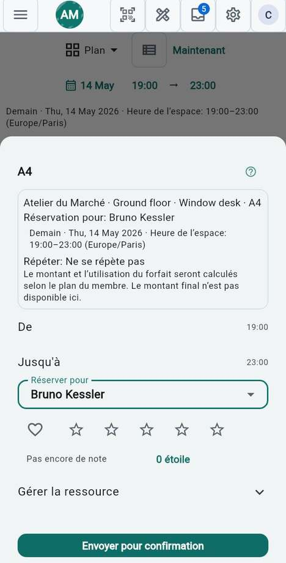

**Étapes**

1. Touchez une place libre dans [Réserver](https://fdittgen-png.github.io/deskilo/#/reserve) pour ouvrir la feuille de réservation.
2. Ouvrez **Réserver pour** et choisissez le membre.
3. Le résumé indique maintenant **Réservation pour** ce membre, et le bouton devient **Envoyer pour confirmation**.
4. Touchez **Envoyer pour confirmation**. Un message indique « Envoyé à » ce membre « pour confirmation ».

**Bon à savoir**

- Le membre doit accepter avant que la réservation existe. Il retrouve la demande dans son Calendrier et dans ses notifications.
- Une réservation faite pour quelqu'un d'autre n'est jamais pointée et ne peut pas être répétée.
- Le champ **Réserver pour** n'apparaît que si le propriétaire autorise les administrateurs à réserver pour des membres. Pour un niveau entier, le propriétaire décide qui peut l'attribuer.

**Voir aussi:** [Quand une réservation attend une confirmation](#quand-une-réservation-attend-une-confirmation) · [Les décisions qui vous attendent dans le Calendrier](#les-décisions-qui-vous-attendent-dans-le-calendrier)

<!-- anchor: user.reserve.series -->
### Répéter une réservation

**Public:** Membre · Administrateur·rice · Propriétaire

Vous êtes à la même place chaque mardi, ou chaque jour ouvré pendant un mois. Une réservation répétée crée toutes les dates d'un coup.

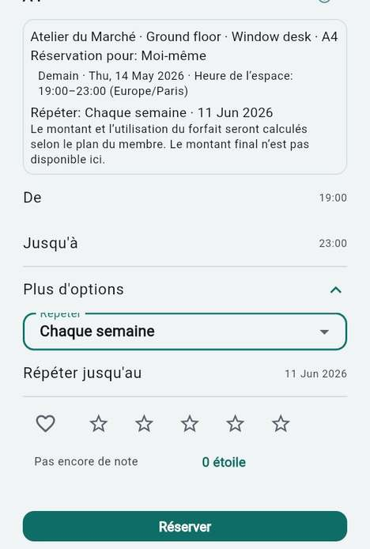

**Étapes**

1. Ouvrez la feuille de réservation sur une place libre et le premier jour voulu.
2. Ouvrez **Plus d'options**.
3. Dans **Répéter**, choisissez **Tous les jours**, **Tous les jours ouvrés** ou **Chaque semaine**. Par défaut, c'est **Ne se répète pas**.
4. Définissez **Répéter jusqu'au**, la dernière date. La feuille propose quatre semaines plus tard.
5. Touchez **Réserver**. Une boîte de dialogue indique combien de réservations ont été créées.

**Bon à savoir**

- Les dates qui n'ont pas pu être réservées sont listées dans la boîte de dialogue et ignorées. Les autres sont maintenues.
- Pour annuler une réservation répétée, ouvrez l'une de ses dates et choisissez **Annuler cette occurrence** ou **Annuler celle-ci et les suivantes**.
- Vous pouvez aussi transformer une réservation unique en réservation répétée depuis **Modifier l'horaire** dans son détail.
- La répétition n'est pas proposée quand vous réservez pour quelqu'un d'autre.

**Voir aussi:** [Modifier ou annuler une réservation](#modifier-ou-annuler-une-réservation) · [La feuille de réservation](#la-feuille-de-réservation)

<!-- anchor: user.reserve.policies -->
### Les règles que vous rencontrez en réservant

**Public:** Membre · Administrateur·rice · Propriétaire

Vous avez essayé de réserver et l'application a refusé, ou vous vous demandez ce qui est permis. Votre propriétaire fixe les règles de l'espace ; voici ce que vous en voyez.

| Règle | Ce que vous voyez |
|---|---|
| Heures d'ouverture et jours ouvrés | Le plan et les vues suivent la journée de travail, de 08:00 à 17:00 par défaut, avec la coupure de demi-journée à 12:00. Un jour fermé indique **Fermé ce jour-là**. |
| En dehors des heures d'ouverture | Dépend de l'espace. Désactivé : **Les réservations en dehors des heures d'ouverture ne sont pas autorisées.** Spontané seulement : vous pouvez vous installer sur place mais pas réserver à l'avance. Libre : autorisé, jamais compté ni facturé. Facturé : autorisé et compté comme utilisation, sauf un jour où vous détenez déjà une réservation ordinaire. |
| Réservations passées | Une réservation un jour déjà terminé est refusée, sauf si le propriétaire autorise les réservations passées : **Cette réservation est entièrement dans le passé.** Plus tôt le même jour, elle est enregistrée comme une visite passée. |
| Limites | Une réservation a un horizon maximal (**Trop loin**, 90 jours par défaut), une durée minimale et une durée maximale (**Trop court**, **Trop long**) et se termine le jour où elle commence. |
| Une place à la fois | Par défaut, vous pouvez détenir une seule réservation sur une période donnée : **Vous avez déjà une réservation sur cette période**. Un administrateur peut vous en autoriser davantage. |
| Limite de réservations | **Limite de réservations atteinte** quand vous détenez le maximum de réservations ouvertes autorisé. |
| Jours de votre formule | Quand les jours de votre formule sont épuisés, le réglage du propriétaire pour vous s'applique : les réservations peuvent s'arrêter, on peut vous proposer d'acheter un forfait, ou les jours supplémentaires sont facturés. |

**Étapes**

1. Quand une période est refusée, lisez la ligne rouge sous elle dans la feuille de réservation.
2. Changez le jour, l'heure ou la place, ou demandez à un administrateur.
3. Si vos jours sont épuisés, ouvrez [Finances](https://fdittgen-png.github.io/deskilo/#/money) pour voir votre formule et, lorsque c'est proposé, touchez **Demander des demi-journées supplémentaires**.

**Bon à savoir**

- Les mêmes règles s'appliquent sur le plan, dans le hub Réserver, sur un code scanné et à la borne murale.
- L'application vérifie une période avant de vous la proposer : la plupart des refus apparaissent donc dans la feuille et non après votre appui.

**Voir aussi:** [Politiques de réservation](#règles-de-réservation) · [Réservations simultanées](#réservations-simultanées) · [Limite de réservations](#limite-de-réservations)

<!-- anchor: user.reserve.closed-days -->
### Jours de fermeture et jours fériés

**Public:** Membre · Administrateur·rice · Propriétaire

Vous voulez savoir pourquoi un jour ne peut pas être réservé. Votre espace est fermé certains jours de la semaine et les jours de fermeture que le propriétaire a ajoutés, comme les jours fériés.

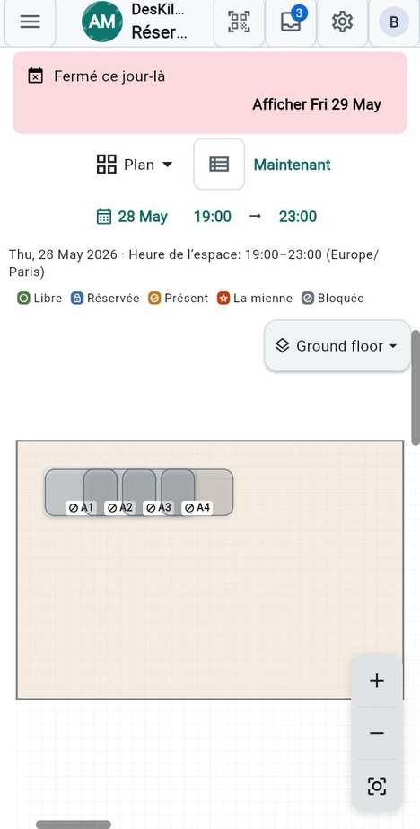

**Étapes**

1. Choisissez le jour dans [Réserver](https://fdittgen-png.github.io/deskilo/#/reserve). Un jour fermé affiche une bannière, **Fermé ce jour-là**.
2. Touchez le raccourci de la bannière, qui indique « Afficher » et le prochain jour d'ouverture, pour y aller.
3. Dans **Mois**, les jours fermés indiquent **Fermé** ; dans **Semaine**, ils sont grisés avec une marque ; dans **Jour**, ils sont marqués comme fermés, sous l'entrée de légende **Jour fermé**.
4. Dans le Calendrier, les jours fermés sont barrés, et la liste du jour indique **Fermé** avec la raison quand le propriétaire en a donné une.

**Bon à savoir**

- Un jour fermé, les places portent le symbole de blocage et ne peuvent être ni réservées ni pointées.
- Les jours fériés apparaissent exactement comme n'importe quel autre jour de fermeture.

**Voir aussi:** [Vue Mois](#vue-mois) · [Jours de fermeture](#jours-de-fermeture) · [Jours d'ouverture](#jours-douverture)

<!-- anchor: user.reserve.check-in -->
### Check-in et check-out

**Public:** Membre · Administrateur·rice · Propriétaire

Vous arrivez à votre place, et plus tard vous partez. Le check-in dit que vous êtes là ; le check-out libère ce dont vous n'avez plus besoin.

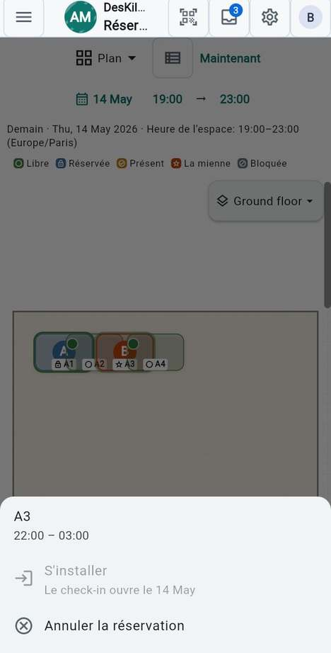

**Étapes**

1. Ouvrez [Réserver](https://fdittgen-png.github.io/deskilo/#/reserve), trouvez le jour de votre réservation et touchez votre propre place, celle marquée **La mienne**.
2. Touchez **S'installer**. S'il est grisé, il indique quand il ouvre, par exemple « Le check-in ouvre le 14 mai ».
3. Quand vous partez, touchez de nouveau votre place et touchez **Partir**. Le reste de la réservation est aussitôt libéré pour les autres.
4. La réservation indique alors **Terminée : départ enregistré à** l'heure du départ.

**Bon à savoir**

- Le check-in ouvre 15 minutes avant le début, ou un pas de grille avant lorsque la grille est plus large. Lorsque les réservations se font à la demi-journée, à la journée ou à l'heure réelle, il ouvre pour toute la journée de la réservation.
- Il se ferme à la fin de la réservation : **Cette réservation est terminée — s'installer n'est plus possible.**
- Si vous êtes encore pointé ailleurs, faites d'abord votre check-out là-bas.
- Avec le check-in et le check-out automatiques, une réservation que personne n'a pointée à l'arrivée ou au départ se termine d'elle-même une fois son heure passée. Sans eux, une réservation sans check-in indique **Cette période est terminée sans arrivée enregistrée.**
- À une borne murale, vous pointez avec votre badge ; voir [Votre badge](#votre-badge) et [Check-in par badge NFC](#pointage-par-badge-nfc).

**Voir aussi:** [Scanner un code d'espace](#scanner-un-code-despace) · [Modifier ou annuler une réservation](#modifier-ou-annuler-une-réservation)

<!-- anchor: user.reserve.scan -->
### Scanner un code d'espace

**Public:** Membre · Administrateur·rice · Propriétaire

Vous êtes devant un bureau, une salle ou une place qui porte une carte QR, ou une chaise avec une étiquette NFC. Scanner montre ce que vous pouvez faire là, sans chercher sur le plan.

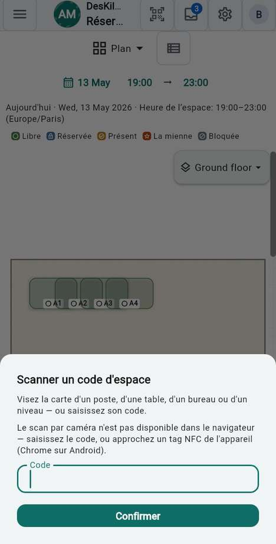

**Étapes**

1. Dans [Réserver](https://fdittgen-png.github.io/deskilo/#/reserve), touchez **Scanner un code d'espace**, l'icône de scanner en haut de l'écran.
2. Pointez l'appareil photo vers la carte, ou saisissez le numéro imprimé dans **Code** et touchez **Confirmer**. Approchez votre téléphone de l'étiquette NFC d'une chaise lorsque l'appareil le permet.
3. Pour une place, choisissez **Arrivée**, **Réserver** ou **Départ**, les mêmes actions qu'à la borne, sans l'étape du badge.
4. Pour une table, un bureau ou un niveau, la feuille montre son état, sa période et son **Prix par demi-journée** ; touchez **Arrivée**, **Réserver** ou **Voir sur le plan**.

**Bon à savoir**

- Si quelqu'un d'autre détient l'espace, la feuille dit qui et propose d'écrire à cette personne.
- Un code qui n'est pas de cet espace de travail indique **Ce n'est pas un code d'espace de cet espace de travail.** Un espace supprimé indique **Ce code ne correspond plus à aucun espace ici.**
- Dans un navigateur, l'appareil photo n'est pas disponible : saisissez le code à la place. Une étiquette NFC n'identifie que des places.
- L'icône de scanner n'apparaît que lorsque votre espace utilise des codes QR.

**Voir aussi:** [Réserver une table, une salle ou un niveau entier](#réserver-une-table-une-salle-ou-un-niveau-entier) · [Check-in et check-out](#check-in-et-check-out)

<!-- anchor: user.reserve.change -->
### Modifier ou annuler une réservation

**Public:** Membre · Administrateur·rice · Propriétaire

Vos plans ont changé. Vous pouvez déplacer une réservation, la raccourcir, la prolonger ou l'annuler, tant qu'elle n'a pas été utilisée.

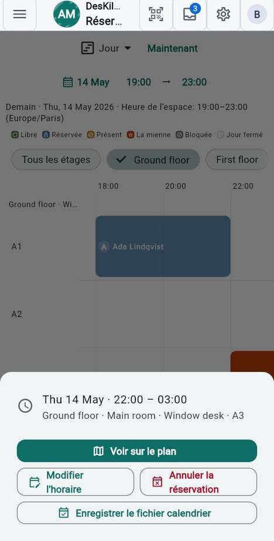

**Étapes**

1. Ouvrez la réservation : touchez-la dans la vue **Jour** ou **Semaine**, dans le Calendrier, ou touchez **Détails** dans le message qui suit une réservation.
2. Pour une réservation qui n'a pas commencé, touchez **Modifier l'horaire** pour choisir une autre période, ou **Annuler la réservation** pour la supprimer.
3. Pour une réservation répétée, choisissez **Annuler cette occurrence** ou **Annuler celle-ci et les suivantes**.
4. Pour une réservation pour laquelle vous êtes pointé, **Rester plus longtemps** et **Terminer plus tôt** apparaissent lorsque les règles de l'espace autorisent une fin plus tardive ou plus précoce. Le début ne bouge pas.
5. Pour une réservation commencée, pointée ou terminée, et si votre espace autorise les demandes de suppression, touchez **Demander la suppression**, donnez un motif si vous le souhaitez, puis touchez **Envoyer la demande**.

**Bon à savoir**

- **Demander la suppression** ne supprime rien : un propriétaire ou un administrateur décide si le check-in a seulement été oublié, auquel cas la réservation reste, ou si la réservation n'a jamais été utilisée, auquel cas elle est supprimée.
- Un administrateur peut retirer la réservation de quelqu'un d'autre avec **Retirer la réservation (outrepasser)** ; le membre et les administrateurs en sont informés.
- **Voir sur le plan** conduit à la place sur le plan.

**Voir aussi:** [Check-in et check-out](#check-in-et-check-out) · [Enregistrer une réservation dans votre propre calendrier](#enregistrer-une-réservation-dans-votre-propre-calendrier) · [Répéter une réservation](#répéter-une-réservation)

<!-- anchor: user.reserve.awaiting -->
### Quand une réservation attend une confirmation

**Public:** Membre · Administrateur·rice · Propriétaire

Une réservation ou une demande indique **en attente de confirmation**. Cela ne signifie pas que quelque chose s'est mal passé : quelqu'un doit encore dire oui.

**Étapes**

1. Regardez ce qui attend : le Calendrier le liste avec les mots **en attente de confirmation**, et une décision qui vous est adressée se trouve tout en haut.
2. Si c'est à vous de décider, touchez **Accepter** ou la croix dans le Calendrier.
3. Si vous attendez quelqu'un d'autre, rien n'est demandé de votre part ; la réponse arrive par notification et dans le Calendrier.

Ce qui attend une confirmation :

- Une réservation qu'un administrateur a faite pour vous : vous la confirmez.
- Une réservation d'espace entier, quand le propriétaire demande aux validateurs de l'approuver. L'espace reste bloqué en attendant, et un rejet annule la réservation.
- Une demande de suppression d'une réservation déjà commencée, pointée ou terminée.

**Bon à savoir**

- Qui peut valider et combien de personnes doivent être d'accord relève de la règle du propriétaire ; voir [Règles de validation](#règles-de-validation-domaine-par-domaine).
- Une demande montre son avancement, par exemple 1/2 validations, puis son issue : validée, refusée, rejetée ou expirée.

**Voir aussi:** [Réserver pour quelqu'un d'autre](#réserver-pour-quelquun-dautre) · [Les décisions qui vous attendent dans le Calendrier](#les-décisions-qui-vous-attendent-dans-le-calendrier)

<!-- anchor: user.reserve.calendar -->
### L'onglet Calendrier

**Public:** Membre · Administrateur·rice · Propriétaire

Vous voulez tout ce qui est daté au même endroit : vos réservations, vos check-ins, vos alertes, vos messages, vos paiements à venir. L'onglet Calendrier le liste par jour et chaque ligne ouvre sa source.

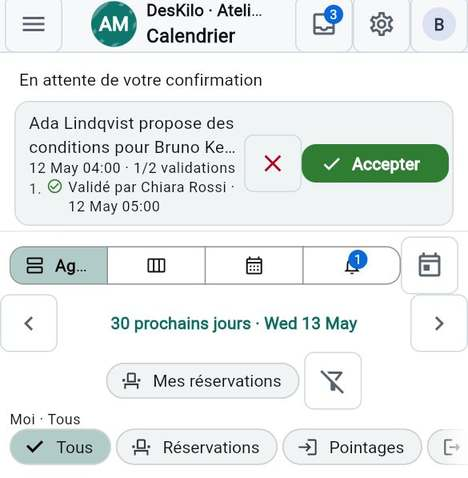

**Étapes**

1. Ouvrez [Calendrier](https://fdittgen-png.github.io/deskilo/#/calendar). Il s'ouvre sur l'**Agenda** : les 30 prochains jours, regroupés sous **Aujourd'hui**, **Demain** et les noms des jours.
2. Utilisez les flèches pour avancer de 30 jours à la fois, ou touchez la date pour un sélecteur de jour. Le bouton en haut à droite vous ramène à **Aujourd'hui**.
3. Touchez une ligne pour l'ouvrir : une réservation ouvre son détail, un message sa conversation, une facture sa fiche.
4. Réduisez la liste avec les pastilles en dessous, comme décrit dans [Filtrer le Calendrier](#filtrer-le-calendrier).

**Bon à savoir**

- Les réservations apparaissent pour tout le monde dans l'espace, car le plan montre l'occupation à tous. Les messages et l'argent restent privés pour vous et pour les personnes que les règles de l'espace autorisent.
- Un membre qui détient la permission sur les finances ou sur les membres peut basculer la liste sur un autre membre avec la pastille **Moi**. Ce que le serveur n'autorise pas s'affiche verrouillé, et non comme un jour vide.
- Si votre espace garde le calendrier simplifié, vous choisissez un jour ou une plage de jours au lieu des trois vues.

**Voir aussi:** [Agenda, Semaine et Mois dans le Calendrier](#agenda-semaine-et-mois-dans-le-calendrier) · [Enregistrer une réservation dans votre propre calendrier](#enregistrer-une-réservation-dans-votre-propre-calendrier)

<!-- anchor: user.reserve.calendar-views -->
### Agenda, Semaine et Mois dans le Calendrier

**Public:** Membre · Administrateur·rice · Propriétaire

Vous voulez voir une semaine ou un mois d'un coup d'œil. Le Calendrier offre trois façons de regarder.

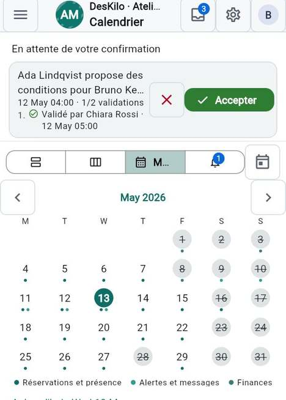

**Étapes**

1. Choisissez **Agenda**, **Semaine** ou **Mois** dans la barre du haut. Le quatrième bouton, **Alertes**, affiche vos alertes lorsque votre espace en propose.
2. Dans **Semaine**, touchez l'un des sept jours pour lire sa liste en dessous.
3. Dans **Mois**, touchez un jour dans la grille. Sous chaque jour, jusqu'à trois points montrent ce qu'il contient : réservations et présence, alertes et messages, argent. Aujourd'hui est entouré.
4. Les jours fermés sont grisés et barrés.

**Bon à savoir**

- Dans **Mois**, la liste en dessous ne montre que le jour sélectionné ; dans **Semaine**, elle liste toute la semaine.
- Les flèches avancent d'une semaine ou d'un mois, selon la vue.
- Le Calendrier montre aussi la date d'échéance d'un paiement et chaque dépense programmée qui arrive à échéance.

**Voir aussi:** [L'onglet Calendrier](#longlet-calendrier) · [Jours de fermeture et jours fériés](#jours-de-fermeture-et-jours-fériés)

<!-- anchor: user.reserve.calendar-decisions -->
### Les décisions qui vous attendent dans le Calendrier

**Public:** Membre · Administrateur·rice · Propriétaire

On vous a demandé de confirmer quelque chose. Quand une réponse de votre part est nécessaire, elle est épinglée en haut du Calendrier, sous **En attente de votre confirmation**.

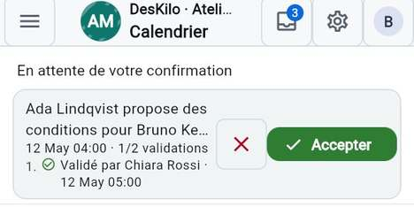

**Étapes**

1. Ouvrez [Calendrier](https://fdittgen-png.github.io/deskilo/#/calendar). Chaque décision en attente est une carte avec un court texte et la date d'envoi.
2. Lisez la carte. Elle peut indiquer le nombre de validations, par exemple 1/2 validations.
3. Touchez **Accepter** pour approuver, ou la croix pour refuser.
4. Ouvrez la vue **Alertes** pour voir toute la liste avec son historique.

**Bon à savoir**

- Le bouton **Alertes** dans la barre indique combien de décisions vous attendent.
- Une fois que vous avez répondu, la décision quitte le haut et apparaît dans la liste avec son issue.

**Voir aussi:** [Quand une réservation attend une confirmation](#quand-une-réservation-attend-une-confirmation) · [Règles de validation](#règles-de-validation-domaine-par-domaine)

<!-- anchor: user.reserve.calendar-filters -->
### Filtrer le Calendrier

**Public:** Membre · Administrateur·rice · Propriétaire

La liste est longue et vous ne cherchez que des réservations. Les pastilles sous la barre la réduisent.

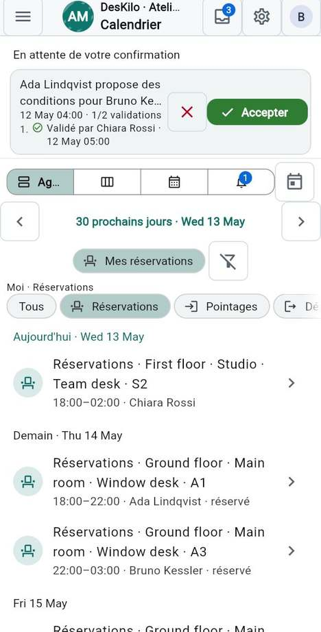

**Étapes**

1. Touchez **Mes réservations** pour ne garder que vos propres réservations. Touchez-le de nouveau pour tout voir.
2. Ou choisissez des pastilles comme **Réservations**, **Pointages** et **Départs** ; **Tous** montre tous les types.
3. Pour annuler vos choix, touchez **Réinitialiser les filtres**, le bouton en forme d'entonnoir.
4. Une ligne au-dessus des pastilles répète ce que vous voyez, par exemple Moi · Réservations.

**Bon à savoir**

- Plusieurs pastilles peuvent être actives en même temps.
- Les pastilles proposées dépendent de ce que votre espace a activé, par exemple les validations.

**Voir aussi:** [L'onglet Calendrier](#longlet-calendrier) · [Agenda, Semaine et Mois dans le Calendrier](#agenda-semaine-et-mois-dans-le-calendrier)

<!-- anchor: user.reserve.calendar-file -->
### Enregistrer une réservation dans votre propre calendrier

**Public:** Membre · Administrateur·rice · Propriétaire

Vous voulez une réservation dans le calendrier de votre téléphone ou de votre ordinateur. L'application écrit un fichier calendrier standard que Google, Outlook, Apple et d'autres savent importer.

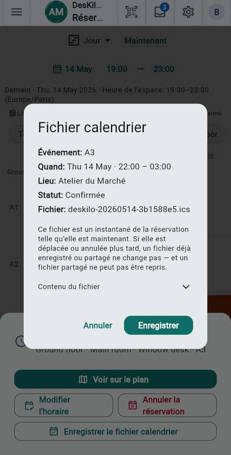

**Étapes**

1. Ouvrez l'une de vos propres réservations, dans la vue **Jour**, la vue **Semaine** ou le Calendrier.
2. Touchez **Enregistrer le fichier calendrier**.
3. Lisez l'aperçu : l'**Événement**, **Quand**, **Lieu**, **Statut** et le nom du **Fichier**. Ouvrez **Contenu du fichier** pour lire le fichier lui-même.
4. Touchez **Enregistrer**. L'application enregistre le fichier, en général dans votre dossier de téléchargements, et vous indique où ; ouvrez-le avec votre calendrier.

**Bon à savoir**

- Le fichier contient l'heure, le lieu, le nom de l'espace et si la réservation est confirmée ou annulée. Aucun montant, aucun nom, aucune adresse e-mail.
- C'est un instantané : si la réservation change plus tard, un fichier déjà enregistré ne change pas.
- Si la réservation a changé entre l'aperçu et **Enregistrer**, rien n'est écrit et l'aperçu s'actualise.
- Votre propriétaire peut désactiver cette fonctionnalité.

**Voir aussi:** [Modifier ou annuler une réservation](#modifier-ou-annuler-une-réservation) · [L'onglet Calendrier](#longlet-calendrier)

<!-- anchor: user.collaborate.overview -->
## Collaborer : membres, demandes, messages et réseau élargi

Dans ce chapitre :
- [L'annuaire des membres](#lannuaire-des-membres) et [la page d'un membre](#la-page-dun-membre)
- [Écrire à un membre](#écrire-à-un-membre)
- [Événements et confirmations](#événements-et-confirmations), [accepter ou refuser](#accepter-ou-refuser-une-demande) et [Ce qui vous attend](#ce-qui-vous-attend)
- [Règles de validation, domaine par domaine](#règles-de-validation-domaine-par-domaine) (administrateurs et propriétaires)
- [Messages](#messages), [nouvelles conversations et groupes](#démarrer-une-conversation-ou-un-groupe), [demandes de message](#demandes-de-message) et [blocage](#bloquer-quelquun)
- [Notifications](#notifications)
- [Découvrir](#découvrir), [votre profil public](#votre-profil-public) et [vos visites en tant qu'invité](#vos-visites-en-tant-quinvité)

<!-- anchor: user.collaborate.directory -->
### L'annuaire des membres

**Public:** Membre · Administrateur·rice · Propriétaire

Vous voulez voir qui fait partie de votre espace, qui est là aujourd'hui et qui va bientôt arriver.

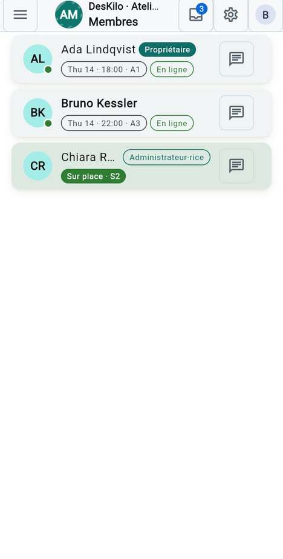

**Étapes**

1. Ouvrez [Membres](https://fdittgen-png.github.io/deskilo/#/directory) depuis le menu (ou depuis la barre du bas si vous avez choisi le style de navigation classique).
2. Lisez chaque carte : photo ou initiales, nom, badge de rôle (**Propriétaire** ou **Administrateur** ; les simples membres n'en ont pas), la ligne de statut de la personne et deux petites pastilles.
3. Lisez les pastilles. La première concerne la réservation : **Sur place** avec la place, **Réservé maintenant**, ou la prochaine réservation (jour, heure, place). La seconde indique **En ligne**, ou quand la personne a été vue pour la dernière fois.
4. Touchez une carte pour ouvrir [la page du membre](#la-page-dun-membre).
5. Tirez la liste vers le bas pour l'actualiser.

**Bon à savoir**

- Seuls les membres actifs sont listés, par ordre alphabétique.
- Les administrateurs et les propriétaires voient aussi l'adresse e-mail de chaque personne sous son nom. Les membres, non : entre membres, le contact reste facultatif.
- Si votre propriétaire a configuré un groupe WhatsApp, une ligne **Ouvrir le groupe WhatsApp** se trouve au-dessus de la liste.

**Voir aussi:** [La page d'un membre](#la-page-dun-membre) · [Écrire à un membre](#écrire-à-un-membre)

<!-- anchor: user.collaborate.member-page -->
### La page d'un membre

**Public:** Membre · Administrateur·rice · Propriétaire

Vous voulez savoir si un collègue est là, quand il viendra la prochaine fois et comment le joindre.

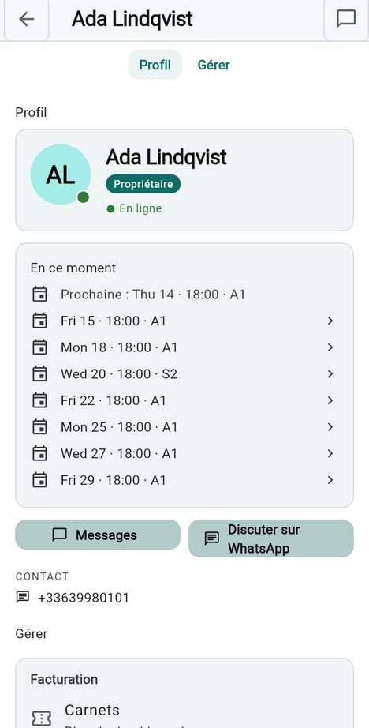

**Étapes**

1. Touchez une carte dans [Membres](https://fdittgen-png.github.io/deskilo/#/directory).
2. Lisez la carte du haut : photo, rôle, présence et la ligne de statut de la personne. Plus bas, vous voyez depuis combien de temps elle est membre.
3. Lisez **En ce moment** : si la personne est pointée, détient une réservation à cette minute, ou quand a lieu sa prochaine réservation. Touchez une réservation pour l'ouvrir.
4. Utilisez les boutons : **Messages**, **Discuter sur WhatsApp** et, pour les administrateurs, **E-mail**.

**Bon à savoir**

- **Contact** n'affiche un numéro WhatsApp que si la personne a choisi de le partager.
- Là où vous avez le droit de les voir, les chiffres financiers (factures ouvertes, paiements, mois en cours) figurent sur la même page. Vous voyez toujours les vôtres ; ceux d'une autre personne, seulement avec le droit de consulter les finances.
- Les administrateurs et les propriétaires ont aussi une zone **Gérer** avec **Adhésion**, **Règles de réservation**, **Facturation** et **Badges et accès**, chaque ligne montrant sa valeur actuelle.

**Voir aussi:** [Écrire à un membre](#écrire-à-un-membre) · [Les actions du membre](#les-actions-sur-le-membre)

<!-- anchor: user.collaborate.contact -->
### Écrire à un membre

**Public:** Membre · Administrateur·rice · Propriétaire

Vous voulez poser une question à un collègue sans quitter l'espace.

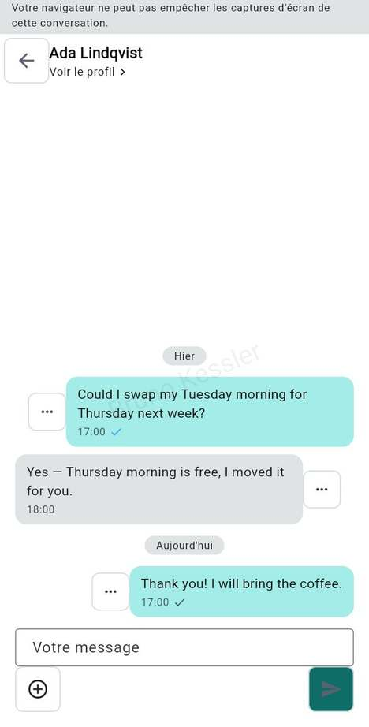

**Étapes**

1. Ouvrez [Membres](https://fdittgen-png.github.io/deskilo/#/directory), touchez une carte pour ouvrir la page du membre, puis touchez **Messages**.
2. Saisissez votre texte dans le champ **Votre message**.
3. Touchez **Envoyer**.

**Bon à savoir**

- Les messages se lisent du plus ancien au plus récent, sous des séparateurs de jour. Une coche sous votre message signifie qu'il a été remis ; une double coche bleue signifie qu'il a été lu.
- Touchez **…** à côté d'une bulle pour les actions sur le message (réagir avec un emoji, mettre en favori, copier, modifier dans les 15 minutes, transférer, supprimer). Le bouton trombone joint une réservation ou un espace ; l'autre personne voit un lien qui l'ouvre.
- Cela nécessite la fonctionnalité **Notifications entre membres** de votre espace.

**Voir aussi:** [Messages](#messages)

<!-- anchor: user.collaborate.events -->
### Événements et confirmations

**Public:** Membre · Administrateur·rice · Propriétaire

Vous voulez voir ce qui s'est passé dans l'espace, et ce qui attend une réponse.

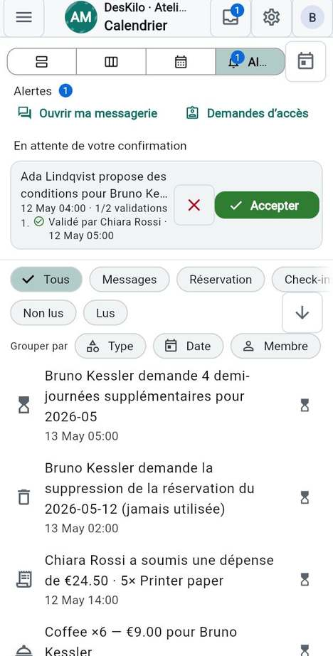

**Étapes**

1. Touchez **Événements** dans la barre du haut (l'icône de plateau avec un nombre), ou ouvrez [Événements](https://fdittgen-png.github.io/deskilo/#/events) depuis le menu. La page s'ouvre sur **Alertes**.
2. Lisez **En attente de votre confirmation** en haut : les demandes qui ont besoin de vous.
3. Lisez le fil en dessous. Chaque ligne dit ce qui s'est passé ; un sablier signifie en attente, une coche verte signifie confirmé. Les lignes d'argent indiquent qui les a validées et quand.
4. Réduisez le fil avec les pastilles : **Tous**, **Messages**, **Réservation**, **Check-ins**, **Finances**, **Membres**, puis **Non lus** ou **Lus**.
5. Touchez **Type**, **Date** ou **Membre** à côté de **Regrouper par** pour replier le fil en groupes ; touchez le symbole de groupe pour revenir à la liste à plat.

**Bon à savoir**

- Un événement est créé chaque fois que quelque chose est réservé, modifié ou annulé, qu'un paiement ou une dépense est enregistré, que des demi-journées supplémentaires ou une suppression sont demandées, qu'un rôle change ou que quelqu'un rejoint l'espace.
- Les membres voient leurs propres événements ; les administrateurs et les propriétaires voient ceux de tout le monde.
- Votre filtre est mémorisé. Le nombre sur le bouton Événements compte les nouveautés et les décisions qui vous attendent.
- **Ouvrir ma messagerie**, en haut, vous mène à vos [conversations](#messages).

**Voir aussi:** [Accepter ou refuser une demande](#accepter-ou-refuser-une-demande) · [Règles de validation](#règles-de-validation-domaine-par-domaine)

<!-- anchor: user.collaborate.accept -->
### Accepter ou refuser une demande

**Public:** Membre · Administrateur·rice · Propriétaire

Quelqu'un vous a demandé de confirmer quelque chose, et vous voulez répondre.

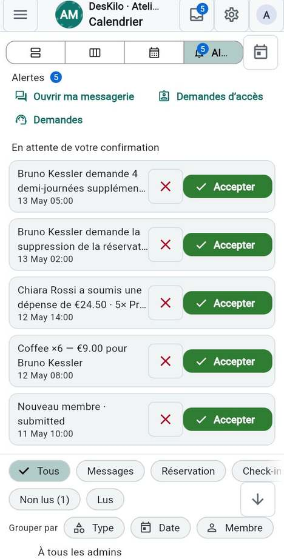

**Étapes**

1. Ouvrez [Événements](https://fdittgen-png.github.io/deskilo/#/events).
2. Trouvez la demande sous **En attente de votre confirmation**.
3. Touchez **Accepter**, ou la croix rouge pour **Refuser**.

**Bon à savoir**

- Quand un administrateur fait quelque chose pour vous (réserve une place, enregistre votre paiement), cela reste en attente jusqu'à ce que vous confirmiez. Ce que vous faites pour vous-même n'a jamais besoin de votre propre confirmation.
- Personne ne confirme sa propre demande : elle attend une autre personne, ou l'exception prévue par la règle ([règles de validation](#règles-de-validation-domaine-par-domaine)).
- Après sept jours sans réponse, un acte qui crée ou modifie quelque chose (un administrateur qui réserve pour vous, par exemple) est confirmé automatiquement ; une suppression ou un débit expire à la place.
- Une ligne peut afficher un avancement comme « 1/2 validations » lorsque la règle en demande plusieurs.

**Voir aussi:** [Événements et confirmations](#événements-et-confirmations) · [Validations requises](#validations-requises)

<!-- anchor: user.collaborate.attention -->
### Ce qui vous attend

**Public:** Administrateur·rice · Propriétaire

Vous voulez un seul endroit qui répond : quelque chose a-t-il besoin de moi aujourd'hui ?

**Étapes**

1. Ouvrez [Ce qui vous attend](https://fdittgen-png.github.io/deskilo/#/attention).
2. Lisez les lignes dans l'ordre : chacune est une décision (par exemple une demande à confirmer ou une personne qui attend d'être admise), les retards les plus coûteux d'abord.
3. Touchez une ligne pour la traiter.

**Bon à savoir**

- Cet écran n'existe que lorsque votre espace a activé la fonctionnalité **Ce qui vous attend** ; sans elle, l'adresse ramène à la page d'accueil.
- Plusieurs décisions identiques sont regroupées en une seule ligne. Quand rien n'attend, l'écran indique **Rien ne vous attend**.
- Il liste aussi la configuration inachevée : « À configurer : … » pour chaque domaine obligatoire de la liste de mise en place qui n'est pas prêt (seulement pour qui configure l'espace), et « … fonctionnalités activées attendent « … » » quand une fonctionnalité désactivée en retient d'autres. Un appui ouvre l'écran où cela se règle, ou **Fonctionnalités**.

**Voir aussi:** [Événements et confirmations](#événements-et-confirmations)

<!-- anchor: user.validation.overview -->
### Règles de validation, domaine par domaine

**Public:** Propriétaire

Vous décidez, pour chaque type d'acte, si une personne doit d'abord le confirmer, et laquelle.

**Étapes**

1. Ouvrez [Règles de validation](https://fdittgen-png.github.io/deskilo/#/validation) (elles se trouvent aussi dans Réglages).
2. Lisez les trois groupes : **Finances**, **Réservations** et **Personnes et rôles**. Chacun indique ce qui reste inchangé tant que l'acte n'est pas accepté.
3. Lisez une carte de gauche à droite : quelqu'un demande, les personnes qui peuvent valider, puis c'est appliqué. Une carte indique **Hérite de la règle par défaut** ou **Personnalisée**.
4. Touchez une carte pour modifier sa règle. Touchez **Règle par défaut** pour changer ce dont toutes les autres cartes héritent.

**Bon à savoir**

- Une règle couvre des actes comme les paiements, les dépenses, les services, les demi-journées supplémentaires, les suppressions de réservation, les réservations, les changements de rôle, les nouveaux membres, les factures, les remboursements et les changements d'abonnement.
- Chaque décision est un événement : qui a décidé, quand, et sur quoi. Rien n'est validé en silence.
- La bannière du haut s'applique à toutes les règles : **Personne ne valide le sien**.
- Vous avez besoin de la permission de configurer les règles de validation ; les propriétaires l'ont toujours.

**Voir aussi:** [Validations requises](#validations-requises) · [La matrice des rôles](#la-matrice-des-rôles)

<!-- anchor: user.validation.required-count -->
### Validations requises

**Public:** Propriétaire

Vous choisissez combien de personnes doivent confirmer avant que l'acte soit appliqué.

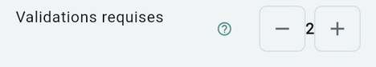

**Étapes**

1. Touchez une carte dans [Règles de validation](https://fdittgen-png.github.io/deskilo/#/validation).
2. Touchez le plus ou le moins à côté de **Validations requises**.
3. Touchez **Enregistrer**.

**Bon à savoir**

- Une est le cas habituel ; deux est courant pour l'argent.
- Si vous demandez plus de validations qu'il n'y a de personnes pouvant les donner, la feuille avertit **Pas assez de validateurs éligibles** et n'enregistre pas : une règle que personne ne peut satisfaire bloquerait l'acte pour toujours.

**Voir aussi:** [Qui peut valider](#qui-peut-valider)

<!-- anchor: user.validation.who-may -->
### Qui peut valider

**Public:** Propriétaire

Vous choisissez quelles personnes ont le droit de donner la confirmation.

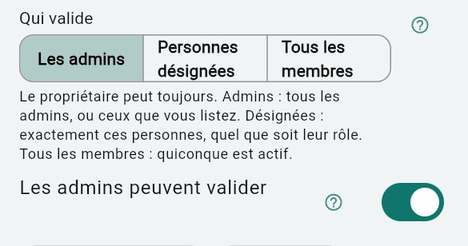

**Étapes**

1. Touchez une carte dans [Règles de validation](https://fdittgen-png.github.io/deskilo/#/validation).
2. Sous **Qui valide**, choisissez **Les admins**, **Personnes désignées** ou **Tous les membres**.
3. Pour **Les admins**, laissez **Les admins peuvent valider** activé et choisissez **Tous les admins** ou touchez les noms d'administrateurs précis. Désactivez-le et seuls les propriétaires valident.
4. Pour **Personnes désignées**, choisissez exactement les personnes voulues.
5. Touchez **Enregistrer**.

**Bon à savoir**

- Le propriétaire peut toujours valider.
- Une liste nommée est un choix délibéré : quelqu'un qui devient administrateur plus tard n'y est pas ajouté.
- Le choix de la portée apparaît lorsque votre espace a activé la fonctionnalité des portées de validation ; sinon, une règle fonctionne avec les administrateurs.

**Voir aussi:** [Un propriétaire est requis](#un-propriétaire-est-requis)

<!-- anchor: user.validation.owner-required -->
### Un propriétaire est requis

**Public:** Propriétaire

Pour certains actes, l'approbation d'un administrateur ne suffit pas.

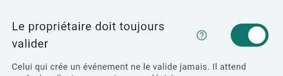

**Étapes**

1. Touchez une carte dans [Règles de validation](https://fdittgen-png.github.io/deskilo/#/validation).
2. Activez **Le propriétaire doit toujours valider**.
3. Touchez **Enregistrer**.

**Bon à savoir**

- Au moins l'une des confirmations vient alors d'un propriétaire, quel que soit le nombre requis. La carte affiche « et le propriétaire, toujours ».

**Voir aussi:** [Validations requises](#validations-requises) · [Un propriétaire peut confirmer sa propre demande](#un-propriétaire-peut-confirmer-sa-propre-demande)

<!-- anchor: user.validation.owner-self -->
### Un propriétaire peut confirmer sa propre demande

**Public:** Propriétaire

Vous gérez seul un espace et devez pouvoir régler vos propres demandes.

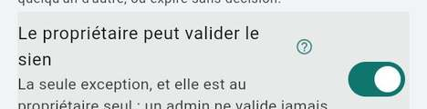

**Étapes**

1. Touchez une carte dans [Règles de validation](https://fdittgen-png.github.io/deskilo/#/validation).
2. Activez **Le propriétaire peut valider le sien**.
3. Touchez **Enregistrer**.

**Bon à savoir**

- Désactivé, la demande d'un propriétaire attend quelqu'un d'autre. Activé, le propriétaire la règle lui-même.
- C'est la seule exception du propriétaire : un administrateur ne valide jamais son propre acte.
- L'interrupteur apparaît lorsque votre espace a activé la fonctionnalité de chaîne de validation.

**Voir aussi:** [Valider automatiquement la demande d'un propriétaire](#valider-automatiquement-la-demande-dun-propriétaire)

<!-- anchor: user.validation.sequential -->
### L'une après l'autre

**Public:** Propriétaire

Vous voulez que les confirmations soient recueillies dans l'ordre, pour que la deuxième personne voie la décision de la première.

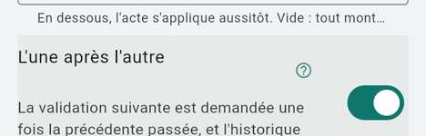

**Étapes**

1. Touchez une carte dans [Règles de validation](https://fdittgen-png.github.io/deskilo/#/validation).
2. Activez **L'une après l'autre**.
3. Touchez **Enregistrer**.

**Bon à savoir**

- La validation suivante est demandée une fois la précédente passée, et le suivi des validations numérote chaque étape.
- C'est plus lent ; utilisez-le quand l'ordre compte.
- Sur les règles d'argent, vous pouvez aussi définir **Seulement au-delà de ce montant** : les montants plus petits s'appliquent directement.

**Voir aussi:** [Validations requises](#validations-requises)

<!-- anchor: user.validation.auto-validate-owner -->
### Valider automatiquement la demande d'un propriétaire

**Public:** Propriétaire

Vous ne voulez pas d'une alerte pour une question déjà réglée.

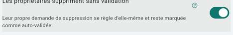

**Étapes**

1. Dans [Règles de validation](https://fdittgen-png.github.io/deskilo/#/validation), touchez la carte **Suppression de réservation**.
2. Activez **Les propriétaires suppriment sans validation**.
3. Touchez **Enregistrer**.

**Bon à savoir**

- La demande de suppression d'un propriétaire se règle alors d'elle-même et reste marquée **Validé automatiquement** dans le fil, de sorte que la trace est continue.
- Cet interrupteur n'existe que sur la règle **Suppression de réservation**, et il est désactivé par défaut.

**Voir aussi:** [Valider automatiquement la demande d'un administrateur](#valider-automatiquement-la-demande-dun-administrateur)

<!-- anchor: user.validation.auto-validate-admin -->
### Valider automatiquement la demande d'un administrateur

**Public:** Propriétaire

Vous voulez que les administrateurs suppriment leurs propres réservations sans attendre.

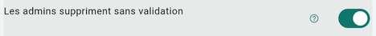

**Étapes**

1. Dans [Règles de validation](https://fdittgen-png.github.io/deskilo/#/validation), touchez la carte **Suppression de réservation**.
2. Activez **Les admins suppriment sans validation**.
3. Touchez **Enregistrer**.

**Bon à savoir**

- Il est indépendant de l'interrupteur du propriétaire : chaque propriétaire est aussi administrateur, donc un seul interrupteur ne pourrait pas dire « propriétaires oui, administrateurs non ».
- Désactivé par défaut, et uniquement pour les suppressions de réservation.

**Voir aussi:** [Valider automatiquement la demande d'un propriétaire](#valider-automatiquement-la-demande-dun-propriétaire)

<!-- anchor: user.collaborate.messages -->
### Messages

**Public:** Tout le monde

Vous voulez toutes vos conversations dans une seule liste, quel que soit l'espace ou le serveur dont elles dépendent.

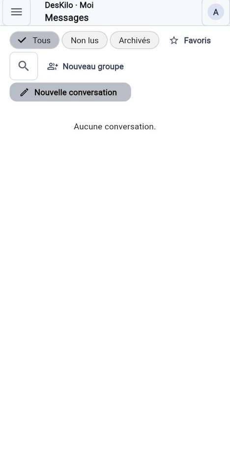

**Étapes**

1. Ouvrez [Messages](https://fdittgen-png.github.io/deskilo/#/me?tab=messages) dans Moi.
2. Lisez chaque ligne : le titre, le contexte (par exemple « Dans » un espace, « De personne à personne », « Groupe »), le dernier message et le nombre de non lus.
3. Filtrez avec **Tous**, **Non lus** ou **Archivés**, ouvrez **Favoris** pour les messages que vous avez mis en favori, ou touchez la loupe pour chercher.
4. Maintenez une ligne appuyée pour **Épingler en haut**, **Couper les notifications**, **Marquer comme non lu** ou **Archiver**.
5. Touchez une ligne pour ouvrir la conversation.

**Bon à savoir**

- Les conversations de vos autres serveurs connectés apparaissent dans la même liste, avec le serveur nommé.
- Un message que vous avez écrit affiche une coche lorsqu'il est remis et une double coche bleue une fois lu.
- Une conversation archivée garde son historique. Une conversation en sourdine reste silencieuse mais est toujours comptée.
- Depuis l'espace, **Ouvrir ma messagerie** (dans Alertes) mène ici.

**Voir aussi:** [Écrire à un membre](#écrire-à-un-membre) · [Démarrer une conversation ou un groupe](#démarrer-une-conversation-ou-un-groupe)

<!-- anchor: user.collaborate.messages-new -->
### Démarrer une conversation ou un groupe

**Public:** Tout le monde

Vous voulez écrire à quelqu'un de nouveau, ou à plusieurs personnes à la fois.

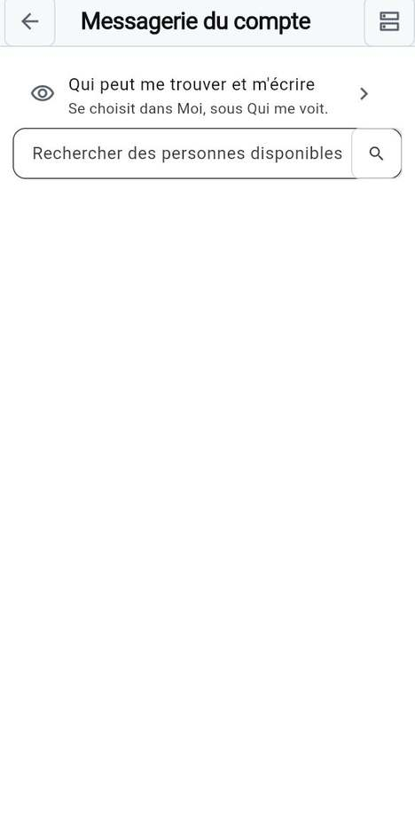

**Étapes**

1. Dans [Messages](https://fdittgen-png.github.io/deskilo/#/me?tab=messages), touchez **Nouvelle conversation**.
2. Saisissez un nom sous **Rechercher des personnes disponibles** et touchez la loupe.
3. Touchez la personne ; la discussion s'ouvre.
4. Pour un groupe, touchez plutôt **Nouveau groupe**, donnez-lui un **Nom du groupe**, ajoutez des personnes avec **Ajouter des personnes** et touchez **Créer le groupe**.

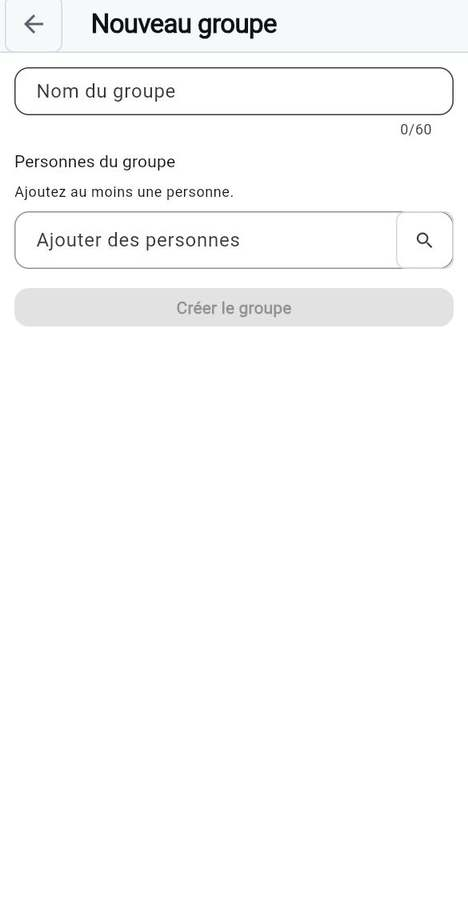

**Bon à savoir**

- Vous trouvez les personnes qui ont choisi d'être joignables : chacune décide sous **Qui peut démarrer une conversation avec moi**.
- Dans un groupe, touchez son nom pour voir les membres ; un administrateur peut ajouter ou retirer des personnes, le renommer ou n'autoriser que les administrateurs à écrire (**Seuls les admins peuvent écrire**). Chacun peut **Quitter le groupe**.
- Un long message est limité à 4 000 caractères.

**Voir aussi:** [Demandes de message](#demandes-de-message)

<!-- anchor: user.collaborate.message-requests -->
### Demandes de message

**Public:** Tout le monde

Quelqu'un dont vous n'aviez pas choisi de recevoir des nouvelles vous a écrit, et vous décidez de la suite.

**Étapes**

1. Ouvrez [Messages](https://fdittgen-png.github.io/deskilo/#/me?tab=messages). Une carte **Demandes de message** apparaît au-dessus de vos conversations lorsqu'il y en a une.
2. Lisez le premier message.
3. Touchez **Accepter** pour en faire une conversation, **Ignorer** pour la masquer, ou **Bloquer** pour mettre fin à tout contact.

**Bon à savoir**

- La carte le dit clairement : ces personnes ne font pas partie de celles par qui vous avez choisi d'être joignable, et elles ne sont pas informées de votre décision.
- Qui peut vous écrire en premier se règle dans Moi, sous **Qui peut démarrer une conversation avec moi**.

**Voir aussi:** [Bloquer quelqu'un](#bloquer-quelquun) · [Qui peut voir mes données](#confidentialité--qui-peut-voir-mes-données)

<!-- anchor: user.collaborate.block -->
### Bloquer quelqu'un

**Public:** Tout le monde

Vous voulez qu'une personne cesse de vous voir et de vous écrire.

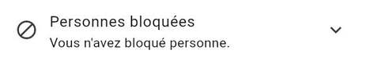

**Étapes**

1. Touchez **Bloquer** sur une demande de message, ou **Bloquer cette personne** dans une conversation.
2. Confirmez.
3. Pour annuler, ouvrez Moi, puis **Personnes bloquées**, et touchez **Débloquer** à côté du nom.

**Bon à savoir**

- Un blocage fonctionne dans les deux sens : ni l'un ni l'autre ne se voit ni ne se joint.
- La personne n'est pas informée.

**Voir aussi:** [Demandes de message](#demandes-de-message)

<!-- anchor: user.collaborate.notifications -->
### Notifications

**Public:** Tout le monde

Vous voulez savoir ce qui vous alerte, et couper les alertes sur cet appareil si vous préférez.

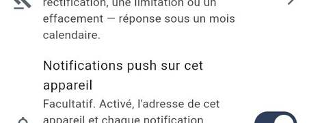

**Étapes**

1. Ouvrez [Confidentialité et données](https://fdittgen-png.github.io/deskilo/#/privacy).
2. Utilisez l'interrupteur **Notifications push sur cet appareil** pour activer ou désactiver les notifications push.
3. Pour faire taire une seule conversation, maintenez-la appuyée dans [Messages](https://fdittgen-png.github.io/deskilo/#/me?tab=messages) et choisissez **Couper les notifications**.

**Bon à savoir**

- Vous êtes alerté des demandes qui attendent votre confirmation et des messages : dans le fil et sur la cloche, par push si votre installation a configuré le push et, dans l'application installée (pas dans le navigateur), par un rappel sur votre appareil 15 minutes avant une réservation pour laquelle vous ne vous êtes pas encore enregistré.
- DesKilo n'envoie aucun e-mail de lui-même : les seuls e-mails sont ceux de votre compte (confirmation d'inscription, réinitialisation du mot de passe).
- Le nombre sur la cloche et sur l'icône de l'application additionne vos confirmations en attente et vos messages non lus.
- Désactivé, l'application continue de fonctionner ; rien n'est envoyé à cet appareil. Il n'y a pas d'interrupteurs séparés par catégorie. Si votre système bloque les notifications de l'application, autorisez-les dans les réglages du système.

**Voir aussi:** [Événements et confirmations](#événements-et-confirmations) · [Vos données, vos droits](#vos-données-vos-droits)

<!-- anchor: user.collaborate.discover -->
### Découvrir

**Public:** Tout le monde

Vous voulez trouver des espaces qui se publient, et écrire à leurs hôtes.

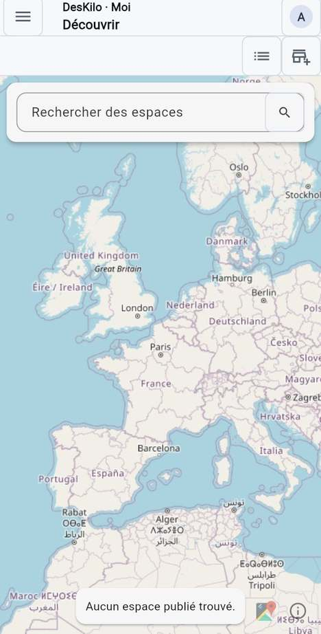

**Étapes**

1. Ouvrez [Découvrir](https://fdittgen-png.github.io/deskilo/#/me?tab=discover) dans Moi. Il s'ouvre sur la carte.
2. Saisissez un terme dans **Rechercher des espaces** et touchez la loupe.
3. Faites défiler les cartes sous la carte géographique, ou touchez le symbole d'épingle sur une carte pour **Localiser sur la carte**.
4. Touchez le bouton de liste pour passer à **Liste**, et le bouton de carte pour revenir à **Carte**.
5. Touchez un espace pour lire sa page publique : description, adresse, contacts, site web, plan public.
6. Utilisez **Écrire aux hôtes**, le bouton de discussion à côté d'un hôte, **Entrer** ou **Demander un profil dans cet espace**, selon ce que l'espace propose.

**Bon à savoir**

- Seuls les espaces dont le propriétaire a choisi **Visible dans l’annuaire public** apparaissent. Si aucun ne correspond, l'écran indique **Aucun espace publié trouvé.**
- Écrire à quelqu'un ou demander à rejoindre vous connecte d'abord au serveur de cet espace, et vous demande votre accord avant que quoi que ce soit soit envoyé.
- Vos messages avec des personnes d'autres serveurs apparaissent dans [Messages](#messages) ; gérez ces serveurs sous **Serveurs connectés**.
- Les propriétaires publient leur page depuis leurs réglages.

**Voir aussi:** [Démarrer une conversation ou un groupe](#démarrer-une-conversation-ou-un-groupe)

<!-- anchor: user.collaborate.public-profile -->
### Votre profil public

**Public:** Tout le monde

Vous voulez que des personnes extérieures à vos espaces puissent lire quelques mots sur vous.

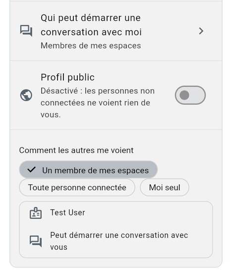

**Étapes**

1. Ouvrez Moi, puis la section **Confidentialité**.
2. Activez **Profil public** et confirmez **Publier**.
3. Touchez **Copier le lien** et partagez-le.
4. Désactivez-le à tout moment pour le retirer.

**Bon à savoir**

- Toute personne qui a le lien, connectée ou non, lit votre nom, votre profession et votre présentation. Les coordonnées, la présence et les espaces restent privés.
- Le lien vers un profil retiré ou inconnu indique **Ce profil n'est pas public.**
- **Comment les autres me voient** donne un aperçu de ce que voit chaque public.

**Voir aussi:** [Qui peut voir mes données](#confidentialité--qui-peut-voir-mes-données)

<!-- anchor: user.collaborate.guest-visits -->
### Vos visites en tant qu'invité

**Public:** Tout le monde

Vous avez demandé à visiter un espace sans en devenir membre, et vous voulez suivre la demande.

**Étapes**

1. Ouvrez Moi, puis Accueil.
2. Trouvez **Mes visites** : chaque visite indique l'espace, l'heure et un statut (**Demandée**, **Confirmée**, **Refusée**, **Annulée** ou **Expirée**).
3. Pour retirer une visite encore à venir, touchez **Annuler cette visite**.

**Bon à savoir**

- Une visite n'est pas une adhésion : elle ne donne ni rôle ni abonnement.
- La liste n'apparaît que si vous avez des visites, et seulement là où l'espace a activé la fonctionnalité **Visites d'invités**.

**Voir aussi:** [Découvrir](#découvrir)

<!-- anchor: user.settings.overview -->
## Réglages et profil, et vos données

Tout ce qui est personnel dans DesKilo se trouve à deux endroits : **Moi**, qui est à vous dans chaque espace, et **Réglages**, où un espace donné conserve ce qui est propre à votre adhésion. Ce chapitre parcourt les deux, puis vos droits en matière de confidentialité et la possibilité de faire tourner votre propre serveur.

Dans ce chapitre :
- [Comment les Réglages sont organisés](#comment-les-réglages-sont-organisés) et [l'interrupteur propre à un espace](#choisir-un-réglage-uniquement-pour-cet-espace)
- Votre compte : [photo](#votre-compte-et-votre-photo), [informations personnelles](#informations-personnelles), [adresse](#votre-adresse), [numéro de TVA](#votre-numéro-de-tva), [conditions de paiement](#vos-conditions-de-paiement), [WhatsApp](#votre-numéro-whatsapp), [statut](#votre-ligne-de-statut), [période de réservation par défaut](#période-de-réservation-par-défaut)
- Votre badge : [le badge](#votre-badge) et [son code](#le-code-de-votre-badge)
- L'aspect et la lecture de l'application : [langue](#langue-de-lapplication), [thème](#thème), [navigation](#style-de-navigation), [nombres et dates](#nombres-et-dates), [horloge](#horloge), [fuseau horaire](#afficher-les-heures-dans-mon-fuseau), [astuces](#rétablir-les-astuces), [caméra avant](#caméra-avant-pour-scanner), [comptes liés](#comptes-liés)
- Confidentialité et vos données : [qui peut voir mes données](#confidentialité--qui-peut-voir-mes-données), [qui me voit](#choisir-qui-me-voit), [profil public](#publier-un-profil-public), [export](#exporter-mes-données), [effacement](#effacer-mes-données), [demandes d'exercice de droits](#demandes-dexercice-de-droits), [notifications push](#notifications-push-sur-cet-appareil), [vos droits](#vos-données-vos-droits)
- [Votre propre serveur](#votre-propre-serveur)

<!-- anchor: user.settings.organisation -->
### Comment les Réglages sont organisés

**Public:** Tout le monde

Vous voulez savoir où se trouve un réglage avant de le chercher partout.

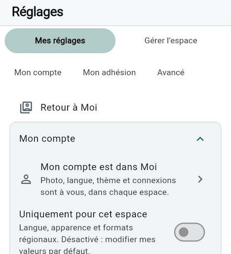

**Étapes**

1. Ouvrez [Réglages](https://fdittgen-png.github.io/deskilo/#/settings). Si votre espace l'appelle **Mon compte**, c'est le même écran.
2. Restez sur **Mes réglages** pour tout ce qui vous concerne. Les propriétaires et les administrateurs voient aussi **Gérer l’espace**, qui contient la configuration de l'espace ; les membres qui n'administrent rien ne voient pas de second onglet.
3. Utilisez les trois raccourcis sous les onglets pour sauter directement : **Mon compte**, **Mon adhésion**, **Avancé**.
4. Ouvrez **Retour à Moi** pour revenir à votre page Moi.

**Bon à savoir**

- **Mon compte** est une courte carte : elle renvoie vers Moi, où se trouvent votre photo, votre langue, votre thème et vos connexions, pour tous les espaces.
- **Mon adhésion** concerne uniquement cet espace : ce que vous pouvez y faire, votre badge et votre code, votre statut, votre période de réservation par défaut, vos conditions de paiement et les documents.
- **Avancé** démarre replié. Il concerne cet appareil : le serveur, les notifications push, la caméra avant.
- Sous les sections, vous trouvez aussi **Aide**, la version de l'application, la politique de confidentialité et **Se déconnecter**.

**Voir aussi:** [L'interrupteur propre à un espace](#choisir-un-réglage-uniquement-pour-cet-espace) · [Votre propre serveur](#votre-propre-serveur)

<!-- anchor: user.settings.scope -->
### Choisir un réglage uniquement pour cet espace

**Public:** Tout le monde

Vous voulez l'anglais dans un espace et le français dans les autres, ou un thème sombre dans un seul d'entre eux.

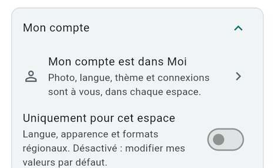

**Étapes**

1. Ouvrez [Réglages](https://fdittgen-png.github.io/deskilo/#/settings) et regardez **Mon compte**.
2. Activez **Uniquement pour cet espace**. Les lignes de langue, de thème et de formats régionaux apparaissent juste là.
3. Modifiez ce que vous voulez. Cela ne s'applique qu'à cet espace.
4. Pour annuler, touchez **Utiliser mes valeurs par défaut**.

**Bon à savoir**

- Interrupteur désactivé, vous modifiez vos valeurs par défaut, celles qui s'appliquent partout.
- Un réglage que vous avez modifié uniquement pour cet espace est listé sous **Dans cet espace** dans la carte.
- L'interrupteur couvre la langue, l'apparence et les formats régionaux, rien d'autre.

**Voir aussi:** [Langue de l'application](#langue-de-lapplication) · [Thème](#thème) · [Nombres et dates](#nombres-et-dates)

<!-- anchor: user.profile.settings.photo -->
### Votre compte et votre photo

**Public:** Tout le monde

Vous voulez que l'on vous reconnaisse dans l'annuaire, sur le plan et dans les messages.

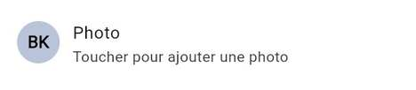

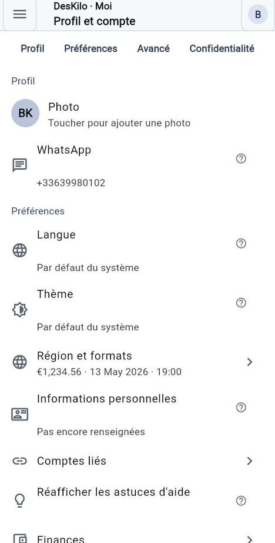

**Étapes**

1. Ouvrez [Moi](https://fdittgen-png.github.io/deskilo/#/me?tab=me). Votre compte, ce sont les blocs **Profil**, **Préférences**, **Avancé** et **Confidentialité** de cette page.
2. Touchez **Photo**.
3. Choisissez **Choisir une photo** et sélectionnez une image, ou choisissez **Supprimer la photo**.

**Bon à savoir**

- La ligne indique **Toucher pour ajouter une photo** tant que vous n'en avez pas, puis **Toucher pour changer**.
- Qui voit votre photo, c'est vous qui le décidez : voir [Qui me voit](#choisir-qui-me-voit).
- Votre compte est le vôtre dans tous les espaces ; votre situation dans un espace se trouve dans ses Réglages.

**Voir aussi:** [Profils](#profils--un-compte-plusieurs-espaces) · [Qui me voit](#choisir-qui-me-voit)

<!-- anchor: user.profile.settings.personal-info -->
### Informations personnelles

**Public:** Tout le monde

Vous voulez que vos factures et vos courriers portent correctement votre nom et vos coordonnées.

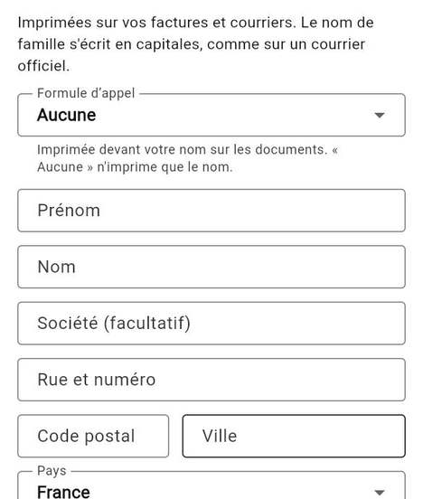

**Étapes**

1. Ouvrez [Moi](https://fdittgen-png.github.io/deskilo/#/me?tab=me) et touchez **Informations personnelles**.
2. Choisissez une **Formule d’appel** si vous en voulez une imprimée avant votre nom, puis remplissez **Prénom**, **Nom**, **Société (facultatif)**, l'adresse, **Téléphone** et **E-mail pour les documents**.
3. Vérifiez **Sur vos documents**, qui montre comment cela sera imprimé.
4. Répondez aux éventuelles questions que votre espace ajoute sous son propre titre, puis touchez **Enregistrer**.

**Bon à savoir**

- Votre nom de famille et votre ville sont écrits en capitales, comme sur un courrier officiel.
- Un formulaire vide indique **Pas encore renseignées**.
- Les réponses aux questions de votre espace sont des données personnelles : elles font partie de votre export et sont effacées quand vous quittez l'espace.

**Voir aussi:** [Votre adresse](#votre-adresse) · [Votre numéro de TVA](#votre-numéro-de-tva)

<!-- anchor: user.profile.settings.address -->
### Votre adresse

**Public:** Tout le monde

Vous voulez que les factures soient envoyées au bon endroit.

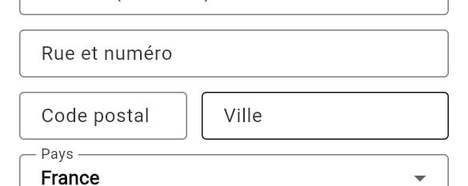

**Étapes**

1. Ouvrez [Moi](https://fdittgen-png.github.io/deskilo/#/me?tab=me) et touchez **Informations personnelles**.
2. Remplissez **Rue et numéro**, **Code postal** et **Ville**.
3. Choisissez votre **Pays**, puis touchez **Enregistrer**.

**Bon à savoir**

- Lorsque votre espace n'utilise pas le formulaire d'informations personnelles, Moi affiche à la place une ligne **Adresse** plus simple avec un choix de **Pays**.
- L'adresse est imprimée sur vos factures.

**Voir aussi:** [Informations personnelles](#informations-personnelles)

<!-- anchor: user.profile.settings.vat-id -->
### Votre numéro de TVA

**Public:** Tout le monde

Vous êtes facturé en tant qu'entreprise et voulez que la facture indique votre numéro de TVA.

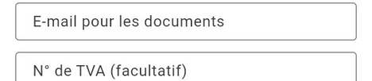

**Étapes**

1. Ouvrez [Moi](https://fdittgen-png.github.io/deskilo/#/me?tab=me) et touchez **Informations personnelles**.
2. Saisissez votre numéro dans **N° de TVA (facultatif)**.
3. Ajoutez votre **SIRET / identifiant (facultatif)** si vous en avez un, puis touchez **Enregistrer**.

**Bon à savoir**

- Laissez le champ vide si vous êtes un particulier.
- Qu'une facture porte de la TVA ou non dépend de ce numéro et du pays ; l'espace applique ses propres règles.

**Voir aussi:** [Informations personnelles](#informations-personnelles)

<!-- anchor: user.profile.settings.payment-terms -->
### Vos conditions de paiement

**Public:** Membre

Vous voulez savoir à quelles conditions vous êtes facturé.

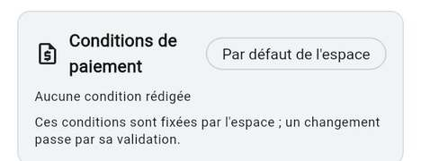

**Étapes**

1. Ouvrez [Réglages](https://fdittgen-png.github.io/deskilo/#/settings) et, sous **Mon adhésion**, touchez **Conditions de paiement**.
2. Lisez le badge : **Par défaut de l'espace**, ou **Propres au membre** si des conditions ont été convenues avec vous.
3. Lisez les conditions : vous ne pouvez pas les modifier vous-même. Pour les faire changer, adressez-vous à un administrateur.

**Bon à savoir**

- Un administrateur ou un propriétaire disposant de l'autorisation propose un changement depuis votre fiche de membre : **Demander un changement**, uniquement les champs à modifier (un champ laissé vide garde la formulation de l'espace), un **Motif (facultatif)**, puis **Envoyer la demande**.
- L'espace fixe ces conditions ; un changement passe par sa validation et s'applique une fois validé.

**Voir aussi:** [Votre numéro de TVA](#votre-numéro-de-tva)

<!-- anchor: user.profile.settings.whatsapp -->
### Votre numéro WhatsApp

**Public:** Tout le monde

Vous voulez que vos collègues puissent vous joindre sur WhatsApp, ou cesser de partager le numéro.

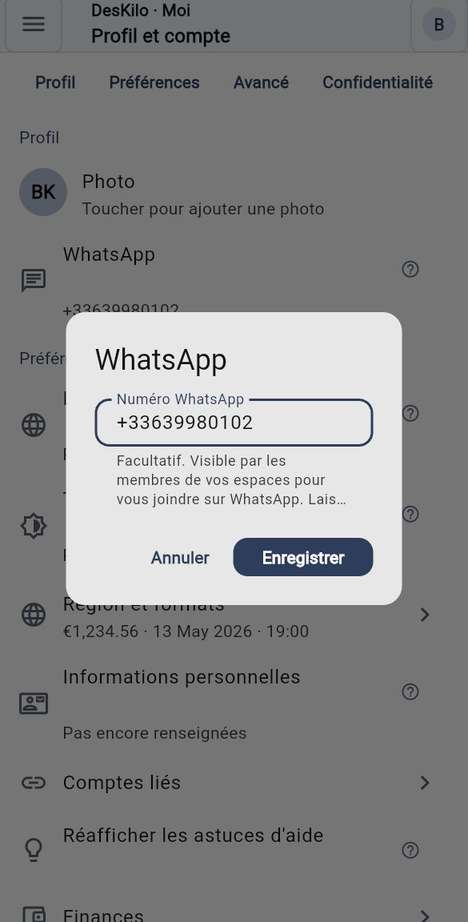

**Étapes**

1. Ouvrez [Moi](https://fdittgen-png.github.io/deskilo/#/me?tab=me) et touchez **WhatsApp**.
2. Saisissez votre numéro dans **Numéro WhatsApp**, avec l'indicatif du pays.
3. Touchez **Enregistrer**. Pour cesser de le partager, videz le champ et enregistrez.

**Bon à savoir**

- La ligne indique **Non partagé** tant que vous ne l'avez pas renseigné.
- Qui voit le numéro se règle sous **WhatsApp et e-mail** dans [Qui me voit](#choisir-qui-me-voit).
- La ligne n'apparaît que si votre espace utilise WhatsApp.

**Voir aussi:** [Qui me voit](#choisir-qui-me-voit)

<!-- anchor: user.profile.settings.status -->
### Votre ligne de statut

**Public:** Membre

Vous voulez une courte ligne à côté de votre nom, comme « En appel · de retour à 14:00 ».

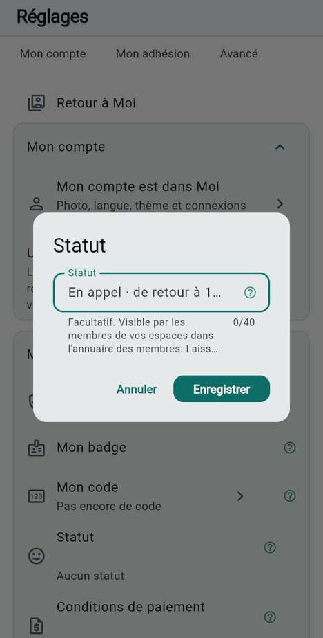

**Étapes**

1. Ouvrez [Réglages](https://fdittgen-png.github.io/deskilo/#/settings) et, sous **Mon adhésion**, touchez **Statut**.
2. Saisissez votre ligne dans **Statut**.
3. Touchez **Enregistrer**. Pour l'effacer, videz le champ et enregistrez.

**Bon à savoir**

- Elle est facultative et courte ; le champ vous arrête à sa limite.
- Les membres de vos espaces la voient dans l'annuaire des membres.
- Elle indique **Aucun statut** tant que vous n'en écrivez pas.

**Voir aussi:** [Qui me voit](#choisir-qui-me-voit)

<!-- anchor: user.profile.settings.default-period -->
### Période de réservation par défaut

**Public:** Membre

Vous réservez habituellement la même demi-journée et voulez qu'elle soit déjà choisie.

**Étapes**

1. Ouvrez [Réglages](https://fdittgen-png.github.io/deskilo/#/settings) et, sous **Mon adhésion**, touchez **Période de réservation par défaut**.
2. Choisissez **Matin**, **Après-midi**, **Journée entière** ou **Sans préférence (journée complète)**.

**Bon à savoir**

- Cela ne fait que présélectionner : vous pouvez toujours changer la période à chaque réservation.
- La ligne n'apparaît que lorsque la configuration des réservations de votre espace offre un choix.

**Voir aussi:** [La feuille de réservation](#la-feuille-de-réservation)

<!-- anchor: user.profile.settings.badge -->
### Votre badge

**Public:** Membre

Vous voulez un badge ou une carte pour vous identifier à la porte ou à la borne.

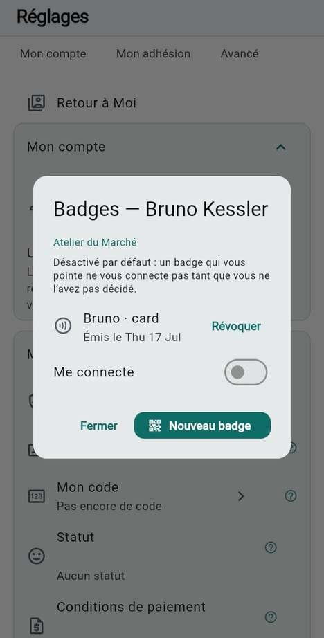

**Étapes**

1. Ouvrez [Réglages](https://fdittgen-png.github.io/deskilo/#/settings) et, sous **Mon adhésion**, touchez **Mon badge**.
2. Touchez **Nouveau badge** pour obtenir votre code QR, puis **Enregistrer en PDF** pour l'imprimer, ou touchez **Enregistrer une carte** et approchez votre carte RFID ou NFC du dos de l'appareil.
3. Pour retirer un badge, touchez **Révoquer**.

**Bon à savoir**

- Un nouveau code QR n'est affiché qu'une seule fois : enregistrez-le tout de suite.
- Un badge révoqué cesse de fonctionner aussitôt. Émettez-en un nouveau plutôt que de chercher l'ancien.
- **Me connecte** est désactivé par défaut : un badge qui vous pointe ne vous connecte pas tant que vous ne l'avez pas activé, et il faut d'abord un code.
- **Nouveau badge** demande la fonction **Badges QR** et **Enregistrer une carte** la fonction **Badges RFID / NFC** ; votre espace peut n'en proposer qu'une.

**Voir aussi:** [Le code de votre badge](#le-code-de-votre-badge)

<!-- anchor: user.profile.settings.badge-pin -->
### Le code de votre badge

**Public:** Membre

Vous voulez vous connecter en scannant votre badge plutôt qu'en saisissant votre e-mail.

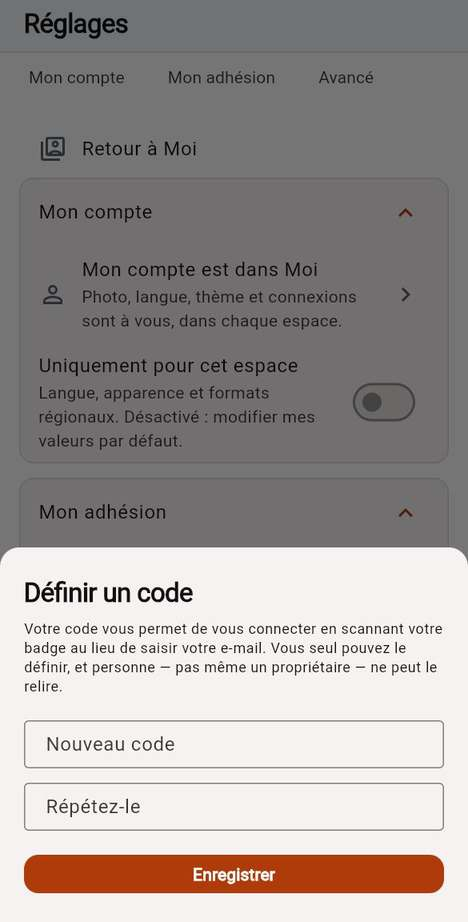

**Étapes**

1. Ouvrez [Réglages](https://fdittgen-png.github.io/deskilo/#/settings) et, sous **Mon adhésion**, touchez **Mon code**.
2. Choisissez **Définir un code**, saisissez-le dans **Nouveau code**, répétez-le dans **Répétez-le** et enregistrez.
3. Ouvrez **Mon badge** et activez **Me connecte** pour le badge voulu.

**Bon à savoir**

- La ligne indique **Pas encore de code** ou **Code défini**.
- Vous seul pouvez le définir, et personne, pas même un propriétaire, ne peut le relire.
- **Modifier le code** le remplace ; **Supprimer le code** désactive la connexion par badge pour tous vos badges.

**Voir aussi:** [Votre badge](#votre-badge)

<!-- anchor: user.profile.settings.language -->
### Langue de l'application

**Public:** Tout le monde

Vous voulez l'application dans votre langue.

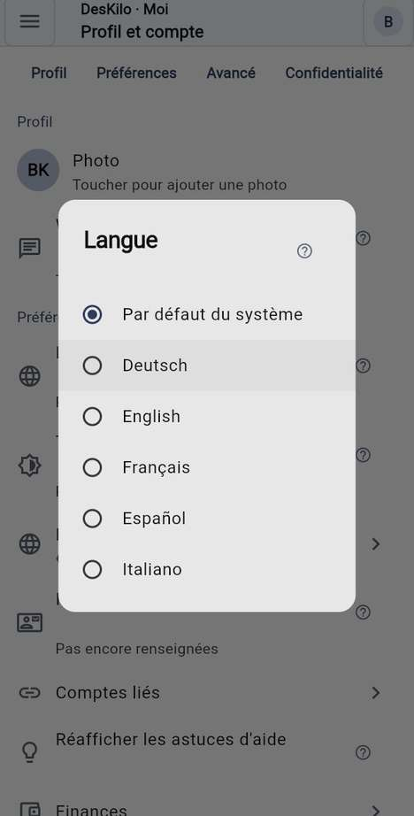

**Étapes**

1. Ouvrez [Moi](https://fdittgen-png.github.io/deskilo/#/me?tab=me) et touchez **Langue**.
2. Choisissez une langue, ou **Par défaut du système** pour suivre votre téléphone.

**Bon à savoir**

- Elle s'applique à tous les espaces, sauf si vous en choisissez une pour un seul espace avec [Uniquement pour cet espace](#choisir-un-réglage-uniquement-pour-cet-espace).
- Chaque langue est écrite dans son propre nom, vous pouvez donc toujours retrouver la vôtre.

**Voir aussi:** [Nombres et dates](#nombres-et-dates)

<!-- anchor: user.profile.settings.theme -->
### Thème

**Public:** Tout le monde

Vous voulez l'application plus claire ou plus sombre.

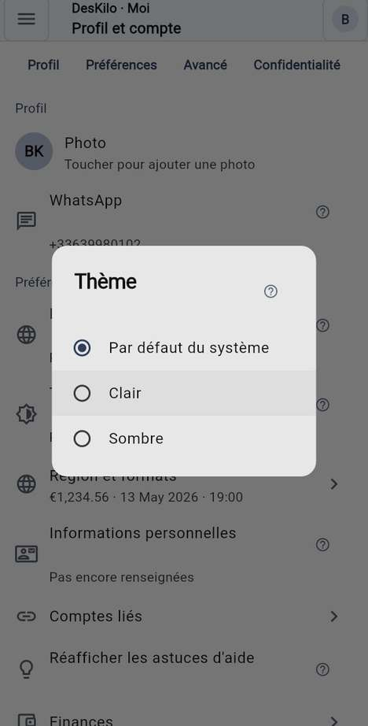

**Étapes**

1. Ouvrez [Moi](https://fdittgen-png.github.io/deskilo/#/me?tab=me) et touchez **Thème**.
2. Choisissez **Par défaut du système**, **Clair** ou **Sombre**.

**Bon à savoir**

- **Par défaut du système** suit le réglage clair ou sombre de votre téléphone.
- Comme la langue, il peut être défini pour un seul espace.

**Voir aussi:** [Langue de l'application](#langue-de-lapplication)

<!-- anchor: user.profile.settings.navigation -->
### Style de navigation

**Public:** Tout le monde

Vous préférez la barre du bas, ou le menu que vous connaissez du web.

**Étapes**

1. Ouvrez [Moi](https://fdittgen-png.github.io/deskilo/#/me?tab=me) et touchez **Navigation**.
2. Choisissez **Par défaut pour cet appareil**, **Classique : la barre du bas et le bouton rond** ou **Menu : le hamburger, comme sur le web**.

**Bon à savoir**

- La ligne est masquée dans la version web, qui utilise toujours le menu, et n'apparaît que si votre espace la propose.

**Voir aussi:** [Comment les Réglages sont organisés](#comment-les-réglages-sont-organisés)

<!-- anchor: user.profile.settings.regional-formats -->
### Nombres et dates

**Public:** Tout le monde

Vous voulez que les montants et les dates soient écrits comme vous les lisez, quelle que soit la langue de l'application.

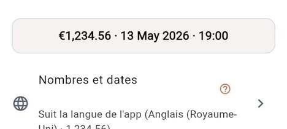

**Étapes**

1. Ouvrez [Région et formats](https://fdittgen-png.github.io/deskilo/#/formats).
2. Touchez **Nombres et dates** et choisissez une région, ou **Automatique** pour suivre la langue de l'application.
3. Vérifiez la ligne d'aperçu au-dessus : elle montre un montant, une date et une heure tels que vous les verrez.

**Bon à savoir**

- Il est indépendant de la langue : une application en anglais peut écrire des dates à la française.
- Il peut être défini pour un seul espace avec [Uniquement pour cet espace](#choisir-un-réglage-uniquement-pour-cet-espace).
- La ligne n'apparaît que si votre espace utilise **Région et formats**.

**Voir aussi:** [Horloge](#horloge)

<!-- anchor: user.profile.settings.clock -->
### Horloge

**Public:** Tout le monde

Vous préférez les heures sur 24 heures ou sur 12 heures.

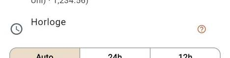

**Étapes**

1. Ouvrez [Région et formats](https://fdittgen-png.github.io/deskilo/#/formats).
2. Sous **Horloge**, choisissez **Auto**, **24h** ou **12h**.

**Bon à savoir**

- **Auto** fait comme votre région.
- Cela change la façon d'écrire les heures, jamais leur sens.
- La ligne n'apparaît que si votre espace utilise **Région et formats**.

**Voir aussi:** [Afficher les heures dans mon fuseau](#afficher-les-heures-dans-mon-fuseau)

<!-- anchor: user.profile.settings.device-zone -->
### Afficher les heures dans mon fuseau

**Public:** Tout le monde

Vous voyagez et voulez les heures telles que votre propre horloge les montre.

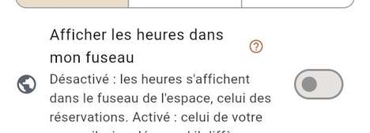

**Étapes**

1. Ouvrez [Région et formats](https://fdittgen-png.github.io/deskilo/#/formats).
2. Activez **Afficher les heures dans mon fuseau**.

**Bon à savoir**

- Désactivé, les heures sont dans le fuseau de l'espace, celui dans lequel les réservations se font. C'est le réglage par défaut.
- Activé, les heures suivent votre appareil et sont signalées partout où elles diffèrent de celles de l'espace.
- La ligne n'apparaît que si votre espace utilise **Région et formats**.

**Voir aussi:** [Horloge](#horloge)

<!-- anchor: user.profile.settings.restore-hints -->
### Rétablir les astuces

**Public:** Tout le monde

Vous avez masqué les astuces d'aide et vous voulez les retrouver.

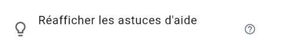

**Étapes**

1. Ouvrez [Moi](https://fdittgen-png.github.io/deskilo/#/me?tab=me).
2. Touchez **Réafficher les astuces d'aide**.

**Bon à savoir**

- Un message le confirme : **Les astuces d'aide seront de nouveau affichées.**
- Rien d'autre n'est réinitialisé.
- La ligne n'apparaît que si votre espace utilise des astuces d'aide.

**Voir aussi:** [Comment les Réglages sont organisés](#comment-les-réglages-sont-organisés)

<!-- anchor: user.profile.settings.front-camera -->
### Caméra avant pour scanner

**Public:** Tout le monde

Vous scannez des badges avec une tablette fixée au mur dont la caméra arrière fait face au mur.

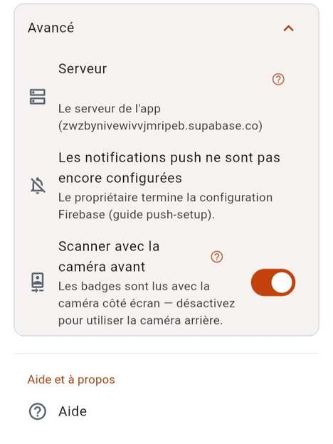

**Étapes**

1. Ouvrez [Réglages](https://fdittgen-png.github.io/deskilo/#/settings) et ouvrez **Avancé**.
2. Activez **Scanner avec la caméra avant** pour utiliser la caméra côté écran, ou désactivez-le pour la caméra arrière.

**Bon à savoir**

- Il est activé par défaut et ne s'applique qu'à cet appareil.

**Voir aussi:** [Votre badge](#votre-badge)

<!-- anchor: user.profile.settings.linked-accounts -->
### Comptes liés

**Public:** Tout le monde

Vous voulez vous connecter avec une autre identité, comme un compte Google, en plus de votre e-mail.

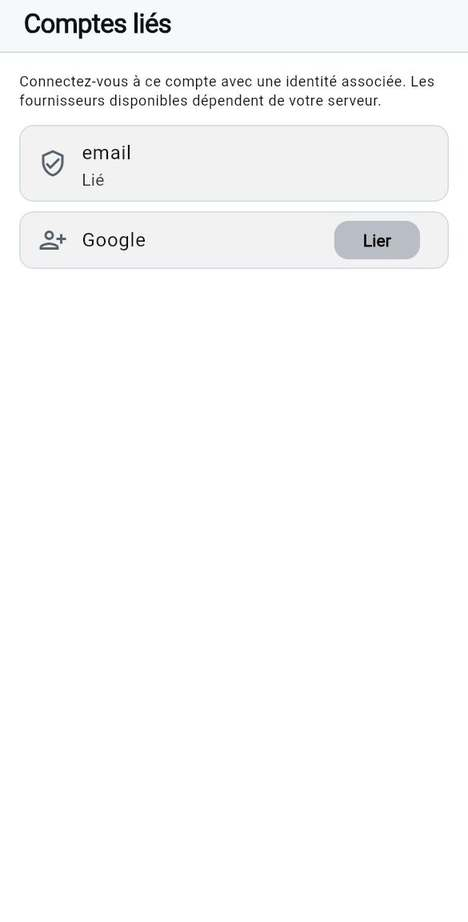

**Étapes**

1. Ouvrez [Moi](https://fdittgen-png.github.io/deskilo/#/me?tab=me) et touchez **Comptes liés**.
2. Touchez **Lier** à côté d'un fournisseur et terminez dans le navigateur.
3. Pour en retirer un, touchez **Délier**.

**Bon à savoir**

- Une identité liée affiche **Lié**.

**Voir aussi:** [Profils](#profils--un-compte-plusieurs-espaces)

<!-- anchor: user.privacy.visibility -->
### Confidentialité : qui peut voir mes données

**Public:** Tout le monde

Vous voulez savoir qui peut lire quoi à votre sujet, et qui a réellement regardé.

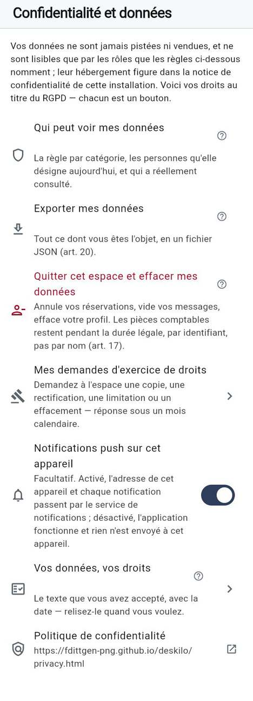

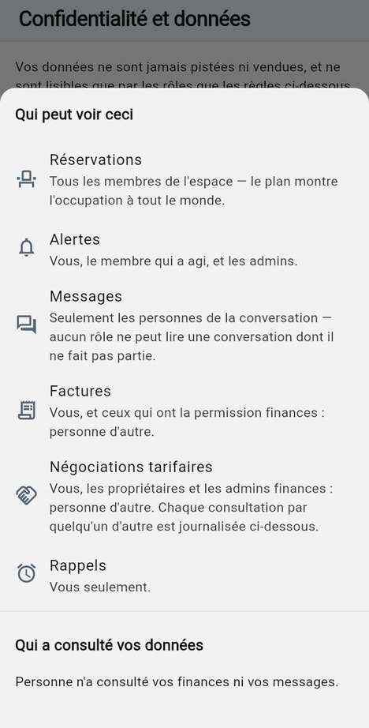

**Étapes**

1. Ouvrez [Confidentialité et données](https://fdittgen-png.github.io/deskilo/#/privacy).
2. Touchez **Qui peut voir mes données**.
3. Lisez la règle de chaque catégorie, les personnes qu'elle désigne aujourd'hui, et **Qui a consulté vos données**.

**Bon à savoir**

- Vos données ne sont jamais suivies ni vendues. Ce sont les rôles qui décident qui les lit, et le serveur le fait respecter.
- La feuille énonce la règle ; il n'y a rien à activer dessus. Pour choisir ce que les autres membres voient de votre profil, utilisez [Qui me voit](#choisir-qui-me-voit).

**Voir aussi:** [Qui me voit](#choisir-qui-me-voit) · [Vos données, vos droits](#vos-données-vos-droits)

<!-- anchor: user.privacy.audiences -->
### Choisir qui me voit

**Public:** Tout le monde

Vous voulez décider, élément par élément, qui voit votre nom, votre présentation, vos coordonnées et votre présence.

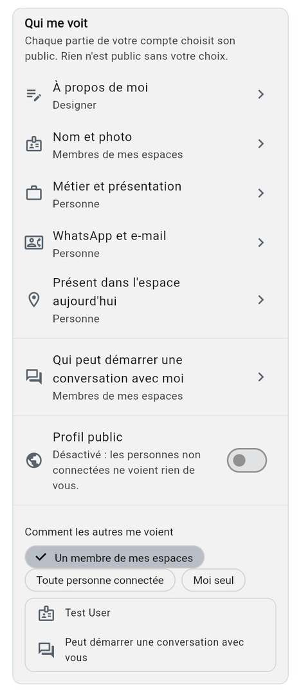

**Étapes**

1. Ouvrez [Moi](https://fdittgen-png.github.io/deskilo/#/me?tab=me) et faites défiler jusqu'à **Confidentialité**, à la carte **Qui me voit**.
2. Touchez un élément : **À propos de moi**, **Nom et photo**, **Métier et présentation**, **WhatsApp et e-mail**, **Présent dans l'espace aujourd'hui** ou **Qui peut démarrer une conversation avec moi**.
3. Choisissez un public, par exemple **Personne**, **Membres de mes espaces** ou **Membres d'espaces choisis**, cochez des espaces si vous en avez choisi, et touchez **Enregistrer**.
4. Vérifiez **Comment les autres me voient** au bas de la carte.

**Bon à savoir**

- Rien n'est public tant que vous ne le choisissez pas.
- Élargir un public vous demande d'abord de confirmer.
- **Personnes bloquées**, sous la carte, liste les personnes que vous avez bloquées ; elles ne peuvent ni vous voir ni vous joindre, et vous ne pouvez pas les joindre. Touchez **Débloquer** pour annuler.
- **Toute personne connectée** n'est proposé que pour certains éléments, comme **Nom et photo** et **Métier et présentation**. **WhatsApp et e-mail** et **Présent dans l'espace aujourd'hui** ne vont jamais au-delà de vos propres espaces.

**Voir aussi:** [Profil public](#publier-un-profil-public) · [Qui peut voir mes données](#confidentialité--qui-peut-voir-mes-données)

<!-- anchor: user.privacy.public-profile -->
### Publier un profil public

**Public:** Tout le monde

Vous voulez une page avec votre nom et quelques mots que l'on puisse lire sans compte.

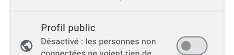

**Étapes**

1. Ouvrez [Moi](https://fdittgen-png.github.io/deskilo/#/me?tab=me) et trouvez **Profil public** dans la carte **Qui me voit**.
2. Activez-le et confirmez avec **Publier**.
3. Touchez **Copier le lien** pour le partager.

**Bon à savoir**

- Toute personne qui a le lien lit votre nom, votre profession et votre présentation. Les coordonnées, la présence et les espaces restent privés.
- Désactivé, les personnes non connectées ne voient rien de vous.

**Voir aussi:** [Choisir qui me voit](#choisir-qui-me-voit)

<!-- anchor: user.privacy.export -->
### Exporter mes données

**Public:** Tout le monde

Vous voulez une copie de tout ce que DesKilo détient à votre sujet.

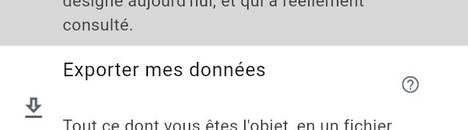

**Étapes**

1. Ouvrez [Confidentialité et données](https://fdittgen-png.github.io/deskilo/#/privacy).
2. Touchez **Exporter mes données**.
3. Enregistrez ou partagez le fichier produit.

**Bon à savoir**

- C'est un seul fichier JSON, construit au moment où vous le demandez.
- La ligne n'apparaît que si votre espace propose l'export des données.

**Voir aussi:** [Demandes d'exercice de droits](#demandes-dexercice-de-droits)

<!-- anchor: user.privacy.erase -->
### Effacer mes données

**Public:** Tout le monde

Vous voulez quitter un espace et faire effacer vos données.

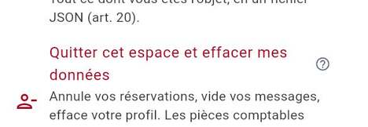

**Étapes**

1. Ouvrez [Confidentialité et données](https://fdittgen-png.github.io/deskilo/#/privacy).
2. Touchez **Quitter cet espace et effacer mes données**.
3. Lisez ce que cela va faire, saisissez le mot de confirmation et touchez **Effacer**.

**Bon à savoir**

- Cela annule vos réservations en cours et vide vos messages dans cet espace. Votre profil est effacé si c'est votre dernier espace ; les réservations passées restent comme registre d'occupation de l'espace.
- Les pièces comptables sont conservées pendant la durée légale de conservation, par identifiant et non par nom.
- La ligne apparaît avec l'export des données. Elle est grisée pour un propriétaire, qui doit d'abord transmettre l'espace, sous Copropriété.

**Voir aussi:** [Exporter mes données](#exporter-mes-données)

<!-- anchor: user.privacy.requests -->
### Demandes d'exercice de droits

**Public:** Tout le monde

Vous voulez demander à l'espace une copie, une correction, une limitation ou un effacement, et en garder une trace.

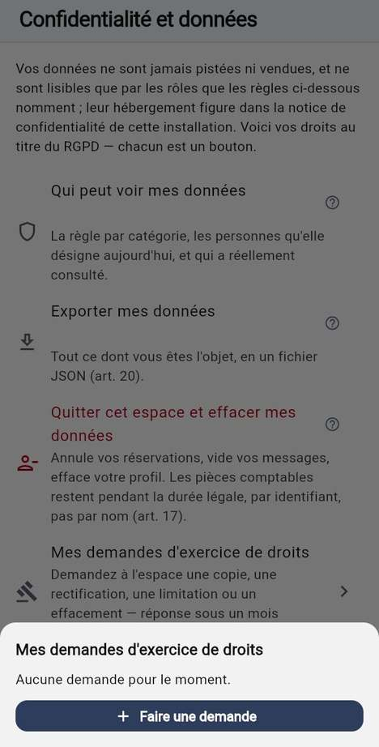

**Étapes**

1. Ouvrez [Confidentialité et données](https://fdittgen-png.github.io/deskilo/#/privacy) et touchez **Mes demandes d'exercice de droits**.
2. Touchez **Faire une demande** et choisissez ce que vous demandez : voir une copie de vos données, les emporter ailleurs, les corriger, en limiter l'usage, vous opposer à un usage, ou les effacer.
3. Ajoutez des **Précisions (facultatif)** et touchez **Envoyer la demande**.

**Bon à savoir**

- L'espace répond dans un délai d'un mois civil ; la feuille indique la date.
- Chaque demande indique si elle a été reçue, prolongée (avec la nouvelle date et le motif), traitée ou refusée.

**Voir aussi:** [Exporter mes données](#exporter-mes-données) · [Effacer mes données](#effacer-mes-données)

<!-- anchor: user.privacy.push -->
### Notifications push sur cet appareil

**Public:** Tout le monde

Vous voulez cesser d'envoyer des notifications à cet appareil, ou les réactiver.

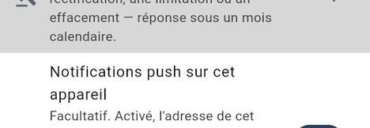

**Étapes**

1. Ouvrez [Confidentialité et données](https://fdittgen-png.github.io/deskilo/#/privacy).
2. Désactivez ou activez **Notifications push sur cet appareil**.

**Bon à savoir**

- Désactivé, l'application continue de fonctionner et rien n'est envoyé à cet appareil.
- Activé, l'adresse de cet appareil et chaque notification passent par le service de notifications push.

**Voir aussi:** [Vos données, vos droits](#vos-données-vos-droits)

<!-- anchor: user.privacy.consent -->
### Vos données, vos droits

**Public:** Tout le monde

Vous voulez relire ce que vous avez accepté au sujet de vos données.

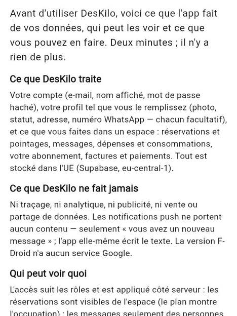

**Étapes**

1. Ouvrez [Confidentialité et données](https://fdittgen-png.github.io/deskilo/#/privacy).
2. Touchez **Vos données, vos droits**.
3. Lisez le texte : ce qui est traité, ce qui n'est jamais fait, qui voit quoi, qui est responsable, pendant combien de temps, et vos droits.

**Bon à savoir**

- Il indique la date et la version que vous avez acceptées ; si le texte change, votre acceptation est de nouveau demandée.
- **Politique de confidentialité**, juste en dessous, ouvre la politique complète en ligne.

**Voir aussi:** [Qui peut voir mes données](#confidentialité--qui-peut-voir-mes-données)

<!-- anchor: user.backend.server -->
### Votre propre serveur

**Public:** Tout le monde

Par défaut, l'application utilise le service de DesKilo. Votre communauté peut faire tourner son propre serveur, et vous voulez vous y connecter.

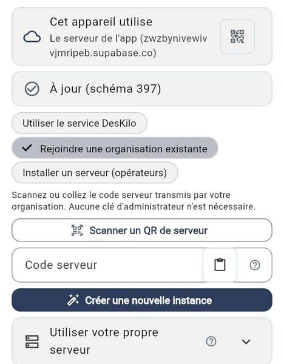

**Étapes**

1. Ouvrez [Réglages](https://fdittgen-png.github.io/deskilo/#/settings), puis **Avancé**, puis **Serveur**.
2. Choisissez **Rejoindre une organisation existante**.
3. Touchez **Scanner un QR de serveur**, ou collez le code dans **Code serveur**.
4. Enregistrez. L'application vous déconnecte et utilise le nouveau serveur à sa prochaine ouverture.

**Bon à savoir**

- Vous n'avez jamais besoin d'une clé d'administrateur.
- **Utiliser le serveur de l'app** vous ramène au serveur par défaut à tout moment.
- Votre compte vit sur un serveur, c'est pourquoi en changer vous déconnecte.

**Voir aussi:** [Comment faire tourner le vôtre](#comment-faire-tourner-le-vôtre)

<!-- anchor: user.backend.how -->
### Comment faire tourner le vôtre

**Public:** Tout le monde

Vous animez une communauté et voulez héberger DesKilo vous-même.

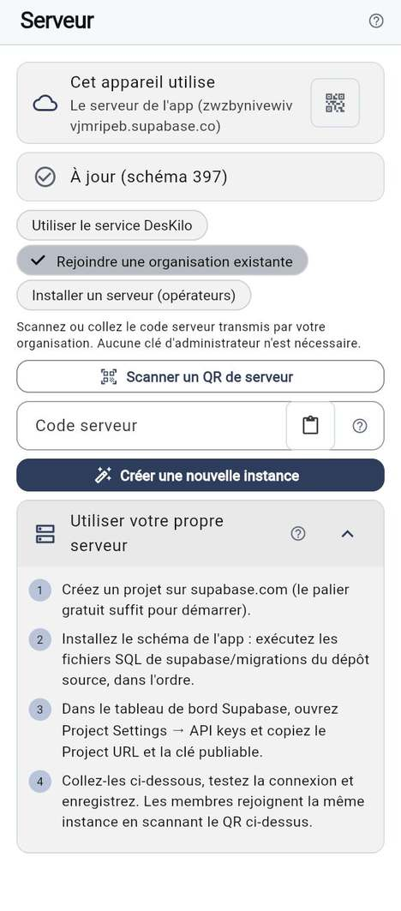

**Étapes**

1. Ouvrez l'écran **Serveur** et touchez **Utiliser votre propre serveur**.
2. Suivez les quatre étapes affichées : créez un projet sur supabase.com, installez le schéma, copiez l'URL du projet et la clé publiable, puis collez-les et **Tester la connexion**.
3. Ou touchez **Créer une nouvelle instance** pour la mise en place guidée.

**Bon à savoir**

- Le test vous dit ce qui ne va pas : adresse injoignable, clé refusée ou tables manquantes.
- Les membres rejoignent le même serveur en scannant le QR de cet écran.
- Le côté opérateur, les environnements et le déploiement, se trouve dans le chapitre avancé.

**Voir aussi:** [Votre propre serveur](#votre-propre-serveur)

<!-- anchor: user.money.overview -->
## Finances

Tout ce que vous devez, ce que vous avez payé et ce qui vous a été facturé se trouve dans l'onglet **Finances** : un seul endroit pour lire le mois, le régler, retrouver une facture et demander une modification.

Dans ce chapitre :
- [Lire votre relevé](#lire-votre-relevé) et [ce que change une facture](#quand-un-mois-a-été-facturé)
- [Payer ce que vous devez](#payer-ce-que-vous-devez) et [enregistrer un paiement](#enregistrer-un-paiement)
- [Vos factures](#vos-factures) et [ce que chaque réservation a coûté](#ce-que-chaque-réservation-a-coûté)
- [Les alertes financières](#les-alertes-financières), [les rapports](#les-rapports--aperçu-rapide-téléchargement-partage) et [vos conditions négociées](#vos-conditions-négociées)
- [Ouvrir un document](#ouvrir-un-document-de-la-bibliothèque) de la bibliothèque
- [Soumettre une dépense](#soumettre-une-dépense) et [l'approuver ou la refuser](#approuver-ou-refuser-une-dépense)
- [Comment les montants sont affichés](#comment-les-montants-sont-affichés) et [vos finances dans tous vos espaces](#vos-finances-dans-tous-vos-espaces)
- Pour les administrateurs facturation : [La facturation en un coup d'œil](#la-facturation-en-un-coup-dœil)

<!-- anchor: user.money.statement -->
### Lire votre relevé

**Public:** Membre

Vous voulez savoir où en est le mois : ce que vous avez utilisé, ce que cela coûte et ce qui reste à régler.

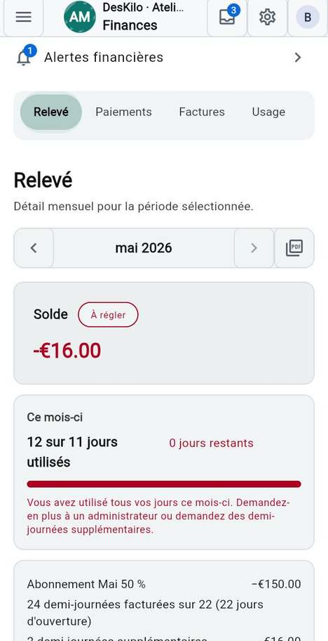

**Étapes**

1. Ouvrez [Finances](https://fdittgen-png.github.io/deskilo/#/money) et restez sur **Relevé**.
2. Utilisez les flèches à côté du nom du mois pour parcourir les autres mois.
3. Lisez d'abord **Solde** : **À régler** en rouge signifie que vous devez cette somme, **Réglé** signifie qu'il ne reste rien.
4. Lisez ensuite **Ce mois-ci** : les jours utilisés sur les jours inclus dans votre formule, puis les jours restants.
5. Lisez les cartes suivantes : votre abonnement, les demi-journées supplémentaires, les services, les forfaits, les positions ouvertes et **Paiements et crédits**.

**Bon à savoir**

- Une matinée ou un après-midi réservé compte pour une demi-journée : vous pouvez donc voir des valeurs comme 0,5 jour.
- La carte indique aussi la règle de votre formule. En paiement à l'usage, elle affiche toujours le tarif des jours en plus ; avec les deux autres règles, elle vous invite à demander à un administrateur ou à acheter un forfait une fois tous vos jours utilisés.
- Une ligne marquée « en attente de validation » attend qu'une personne la confirme et n'est pas encore comptée.
- Touchez l'icône PDF à côté du mois pour exporter la facture.

**Voir aussi:** [Payer ce que vous devez](#payer-ce-que-vous-devez) · [Ce que chaque réservation a coûté](#ce-que-chaque-réservation-a-coûté)

<!-- anchor: user.money.statement.invoiced -->
### Quand un mois a été facturé

**Public:** Membre

Vous voulez savoir quel chiffre croire une fois que l'espace vous a envoyé une facture pour un mois.

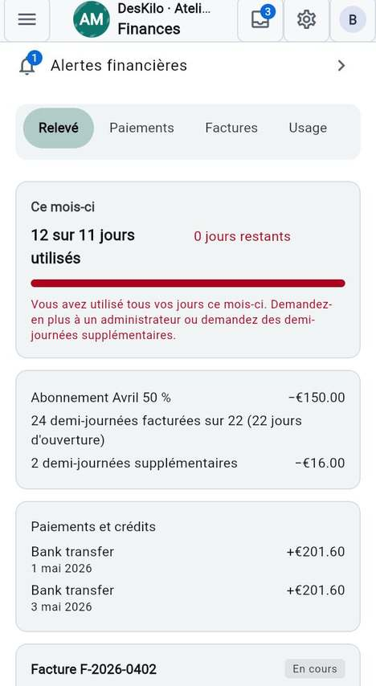

**Étapes**

1. Ouvrez [Finances](https://fdittgen-png.github.io/deskilo/#/money) et remontez jusqu'au mois facturé avec la flèche de gauche.
2. Repérez la carte nommée **Facture** (ou **Avoir** quand le total est négatif) suivie de son numéro.
3. Lisez l'état sur la carte, puis **Total de la facture** ; une facture partiellement payée affiche aussi **Déjà réglé** et **Restant dû**.

**Bon à savoir**

- Dès qu'un mois est facturé, c'est la facture qui dit s'il est réglé. Le paiement qui la solde arrive en général un mois plus tard : le solde du mois lui-même n'est donc plus la référence.
- Un avoir indique « L'espace vous doit ce montant » : vous n'avez rien à payer.

**Voir aussi:** [Vos factures](#vos-factures)

<!-- anchor: user.money.payments -->
### Payer ce que vous devez

**Public:** Membre

Vous voulez régler votre solde et savoir comment l'espace attend l'argent.

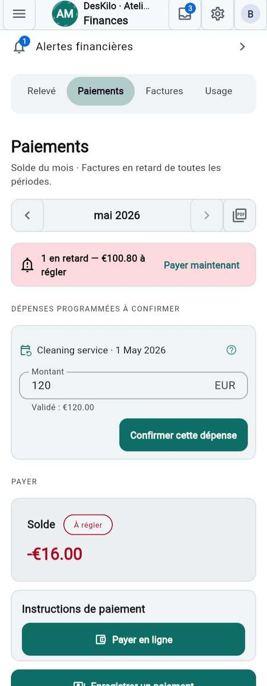

**Étapes**

1. Ouvrez [Finances](https://fdittgen-png.github.io/deskilo/#/money) et choisissez **Paiements**.
2. Vérifiez **Solde** sous **Payer** ; les factures en retard, toutes périodes confondues, sont signalées au-dessus.
3. Lisez les **Instructions de paiement** : les coordonnées bancaires, la référence de paiement à indiquer et les autres moyens que l'espace accepte. Touchez un IBAN ou une valeur pour la copier.
4. Si le bouton est là, touchez **Payer en ligne**.
5. Une fois que vous avez payé autrement, [enregistrez le paiement](#enregistrer-un-paiement).

**Bon à savoir**

- Les instructions n'apparaissent que tant qu'une somme est due, et seulement si l'espace les a renseignées. S'il n'y a rien, demandez à votre administrateur comment payer.
- Un paiement en ligne que le prestataire n'a pas confirmé s'affiche comme **Paiement en ligne en attente** : le solde continue d'afficher ce qui est dû jusqu'à la confirmation.
- Sous **Demandes**, vous pouvez aussi soumettre une dépense, **Demander des demi-journées supplémentaires** ou, si votre formule fonctionne avec des forfaits, **Acheter un forfait**.

**Voir aussi:** [Enregistrer un paiement](#enregistrer-un-paiement) · [Soumettre une dépense](#soumettre-une-dépense)

<!-- anchor: user.money.payments.record -->
### Enregistrer un paiement

**Public:** Membre

Vous avez payé par virement, en espèces ou autrement, et vous voulez que l'espace le sache.

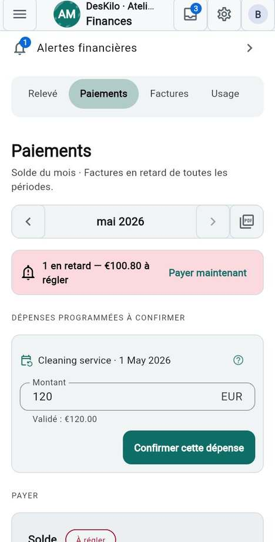

**Étapes**

1. Ouvrez [Finances](https://fdittgen-png.github.io/deskilo/#/money), choisissez **Paiements** et touchez **Enregistrer un paiement**.
2. Saisissez le **Montant**.
3. Touchez le moyen utilisé : **Virement**, **Espèces**, **PayPal**, **TWINT**, **Carte**, **Wero**, **Lydia**, **Wise** ou **Autre**. Touchez-le à nouveau pour l'effacer.
4. Vérifiez **Date du paiement** et **S’applique à**, le mois que ce paiement règle.
5. Ajoutez une **Note (facultatif)**, puis touchez **Soumettre pour confirmation**.

**Bon à savoir**

- Votre paiement n'est pas définitif à l'envoi. Il reste « en attente de validation » jusqu'à ce que les personnes choisies par l'espace le confirment, selon les [Règles de validation](#règles-de-validation-domaine-par-domaine). Alors seulement, il règle votre solde.
- La date de votre paiement ne peut pas être dans le futur. **S’applique à** peut aller jusqu'à un mois plus tard, pour payer d'avance.

**Voir aussi:** [Payer ce que vous devez](#payer-ce-que-vous-devez) · [Les alertes financières](#les-alertes-financières)

<!-- anchor: user.money.invoices -->
### Vos factures

**Public:** Membre

Vous voulez retrouver une facture, voir si elle est payée et obtenir son PDF.

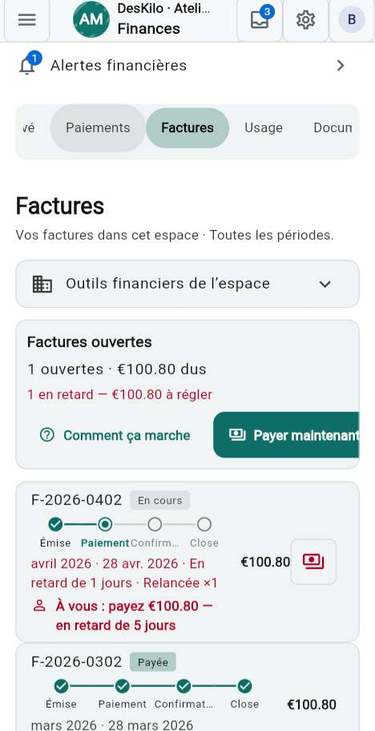

**Étapes**

1. Ouvrez [Finances](https://fdittgen-png.github.io/deskilo/#/money) et choisissez **Factures**.
2. Lisez la liste, de la plus récente à la plus ancienne. Chaque ligne indique le numéro, une pastille d'état, le mois, la date et le montant.
3. Touchez une facture pour l'ouvrir.
4. Touchez **Aperçu rapide** pour la lire à l'écran, **Télécharger le PDF** pour l'enregistrer ou **Partager le PDF** pour l'envoyer.

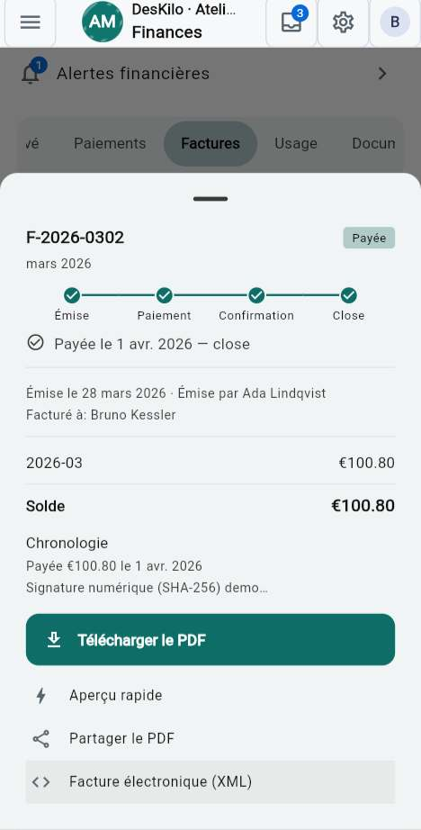

**Bon à savoir**

- Les états sont **En cours**, **En attente de validation**, **Payée**, **Partiellement payée**, **Partiellement payée · solde annulé** et **Remboursée**. Une facture en cours indique son échéance ou son nombre de jours de retard, et combien de rappels vous avez reçus.
- Touchez l'icône de paiement sur une facture en cours pour aller à **Paiements**.
- Si la liste est vide, l'espace ne vous a pas encore facturé ; il facture un mois une fois celui-ci clôturé.
- Les factures ne se modifient pas. Une facture erronée est marquée **Erronée** et remplacée par une nouvelle, et l'erronée disparaît de votre liste. Quand des factures sont regroupées en une seule, la facture regroupée les remplace dans votre liste.

**Voir aussi:** [Payer ce que vous devez](#payer-ce-que-vous-devez) · [Vos finances dans tous vos espaces](#vos-finances-dans-tous-vos-espaces)

<!-- anchor: user.money.usage -->
### Ce que chaque réservation a coûté

**Public:** Membre · Administrateur·rice

Vous voulez voir, réservation par réservation, ce qui a été facturé ce mois-ci.

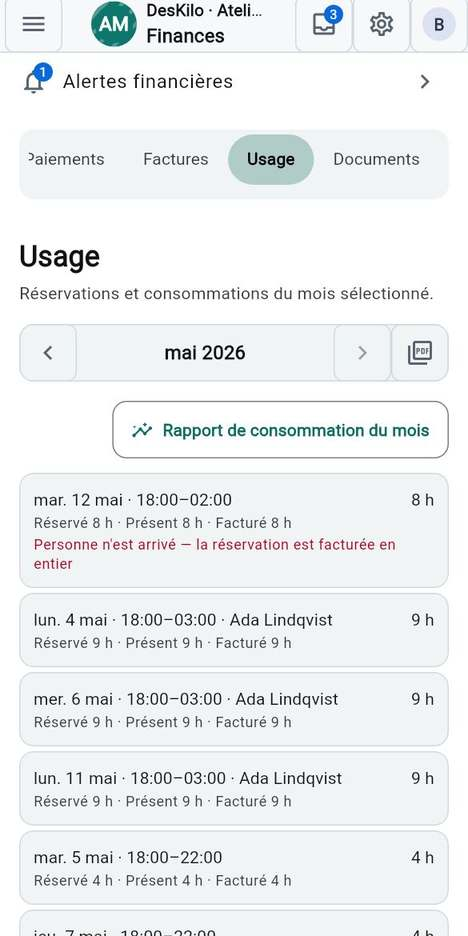

**Étapes**

1. Ouvrez [Finances](https://fdittgen-png.github.io/deskilo/#/money) et choisissez **Usage**.
2. Choisissez le mois avec les flèches.
3. Lisez chaque carte : le jour, l'heure, la place, puis **Réservé**, **Présent** et **Facturé**.
4. Pour une réservation que vous avez quittée plus tôt, touchez **Facturer le temps où j'étais là**, ajoutez un motif si vous le souhaitez et touchez **Demander**.
5. Pour un récapitulatif du mois, touchez **Rapport de consommation du mois**.

**Bon à savoir**

- Une réservation où personne ne s'est enregistré est facturée en entier, et la carte le précise.
- Vous ne décidez jamais vous-même de votre demande : quelqu'un d'autre l'accepte ou la refuse. Une ligne corrigée continue d'afficher ce qu'elle était avant.
- Les administrateurs peuvent demander à **Supprimer ce relevé**.

**Voir aussi:** [Les rapports](#les-rapports--aperçu-rapide-téléchargement-partage) · [La fiche de réservation](#la-feuille-de-réservation)

<!-- anchor: user.money.alerts -->
### Les alertes financières

**Public:** Membre · Administrateur·rice

Vous voulez voir ce qui vous attend côté argent, sans lire tout le fil.

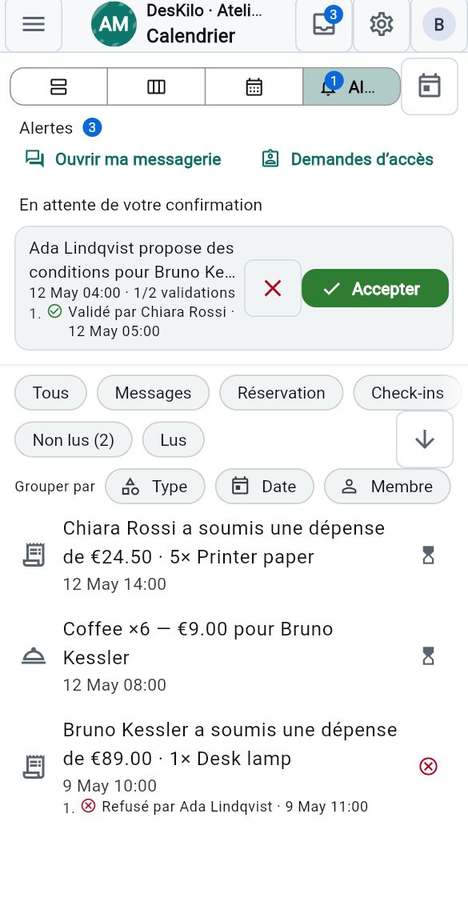

**Étapes**

1. Ouvrez [Finances](https://fdittgen-png.github.io/deskilo/#/money).
2. Touchez **Alertes financières**, la ligne tout en haut. Le nombre sur la cloche indique combien d'alertes attendent.
3. Lisez la liste : les demandes que vous devez confirmer viennent en premier, puis les événements financiers.

**Bon à savoir**

- C'est la vue habituelle des alertes de [Événements](https://fdittgen-png.github.io/deskilo/#/events), déjà filtrée sur l'argent.
- Les paiements, dépenses et demi-journées supplémentaires que vous avez soumis apparaissent ici tant qu'ils attendent une confirmation, avec le nom de la personne qui les a validés ou refusés.
- La ligne apparaît quand la fonction **Onglet Événements** est activée.

**Voir aussi:** [Approuver ou refuser une dépense](#approuver-ou-refuser-une-dépense)

<!-- anchor: user.money.reports -->
### Les rapports : aperçu rapide, téléchargement, partage

**Public:** Membre

Vous voulez un document sur votre propre argent, à lire, à garder ou à envoyer à votre comptable.

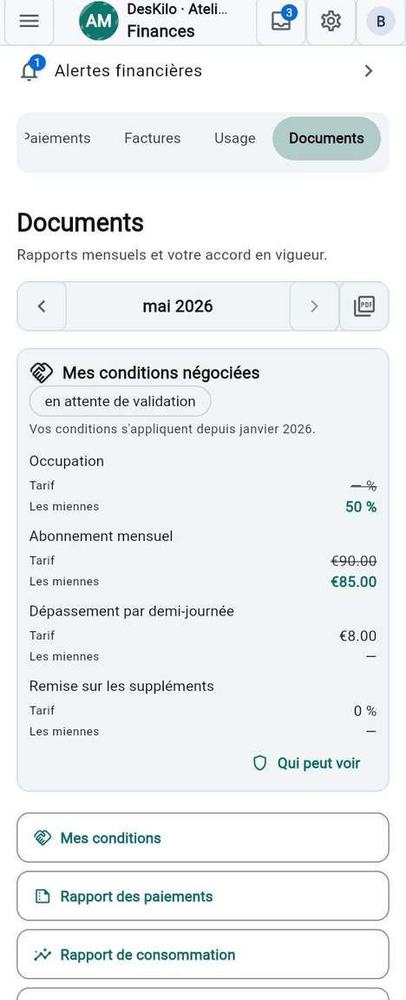

**Étapes**

1. Ouvrez [Finances](https://fdittgen-png.github.io/deskilo/#/money) et choisissez **Documents**.
2. Choisissez le mois avec les flèches, pour les rapports qui dépendent d'un mois.
3. Touchez un rapport : **Mes conditions**, **Rapport des paiements**, **Rapport de consommation** ou **Relevé du mois (PDF)**.
4. Choisissez **Aperçu rapide**, **Télécharger le PDF** ou **Partager le PDF**.

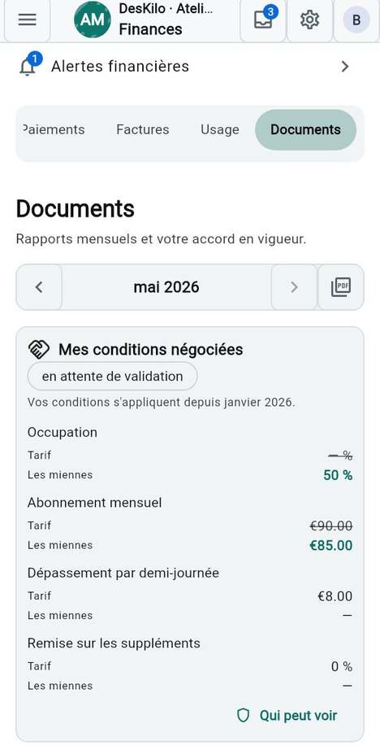

**Bon à savoir**

- Les trois mêmes choix apparaissent sur chaque rapport et chaque facture.
- **Aperçu rapide** affiche le document à l'écran sans rien enregistrer.
- Un rapport que vous ne voyez pas n'est pas activé dans votre espace.

**Voir aussi:** [Vos factures](#vos-factures) · [Vos conditions négociées](#vos-conditions-négociées)

<!-- anchor: user.money.negotiation -->
### Vos conditions négociées

**Public:** Membre

Vous voulez savoir si vous payez le tarif de l'espace ou un prix convenu rien que pour vous.

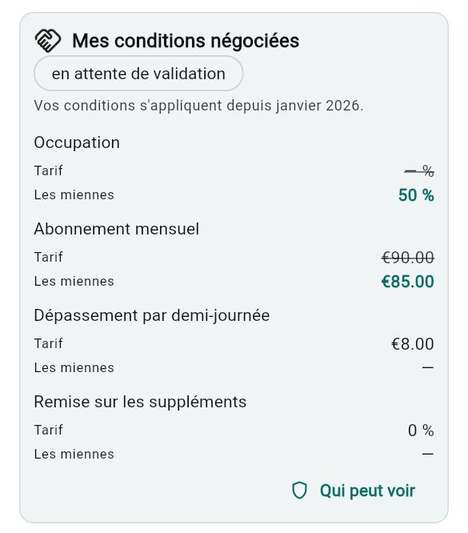

**Étapes**

1. Ouvrez [Finances](https://fdittgen-png.github.io/deskilo/#/money) et choisissez **Documents**.
2. Lisez **Mes conditions négociées** : pour **Abonnement mensuel**, **Dépassement par demi-journée** et **Remise sur les suppléments**, **Tarif** indique ce que tout le monde paie et **La mienne** ce que vous payez.
3. Touchez **Qui peut voir ceci** pour savoir qui peut lire vos prix.

**Bon à savoir**

- « Vous êtes au tarif de l'espace » signifie qu'aucun accord ne s'applique ; votre colonne affiche un tiret.
- Quand un accord s'applique, la carte indique depuis quel mois, et le tarif est barré.
- Un accord proposé pour vous attend « en attente de validation » et ne s'applique qu'une fois validé.
- Vous ne pouvez pas modifier un accord ici ; c'est un administrateur qui le propose. Voir [Négociation tarifaire](#négociation-tarifaire).

**Voir aussi:** [Lire votre relevé](#lire-votre-relevé)

<!-- anchor: user.money.documents.library -->
### Ouvrir un document de la bibliothèque

**Public:** Membre

Vous voulez les statuts, un guide ou les comptes que votre espace a partagés.

**Étapes**

1. Ouvrez [Finances](https://fdittgen-png.github.io/deskilo/#/money), choisissez **Documents** et touchez **Bibliothèque de documents**, ou allez directement à [Documents](https://fdittgen-png.github.io/deskilo/#/documents).
2. Trouvez votre document dans sa catégorie : **Statuts et juridique**, **États financiers**, **Comptes rendus**, **Guides et manuels** ou **Autres documents**.
3. Touchez-le. Il s'ouvre dans votre navigateur depuis l'endroit où il est stocké.

**Bon à savoir**

- Vous ne voyez que les documents que votre rôle peut lire ; un cadenas marque ceux réservés aux **Admins et propriétaires** ou aux **Propriétaires uniquement**.
- La bibliothèque contient des liens. Qui peut ouvrir le fichier se décide là où il est stocké, pas dans DesKilo.
- Les administrateurs qui en ont l'autorisation ajoutent et retirent des documents ; voir [Titre du document](#intitulé-du-document).

**Voir aussi:** [Les rapports](#les-rapports--aperçu-rapide-téléchargement-partage)

<!-- anchor: user.money.expense -->
### Soumettre une dépense

**Public:** Membre

Vous avez payé quelque chose pour l'espace et vous voulez que l'espace vous rembourse.

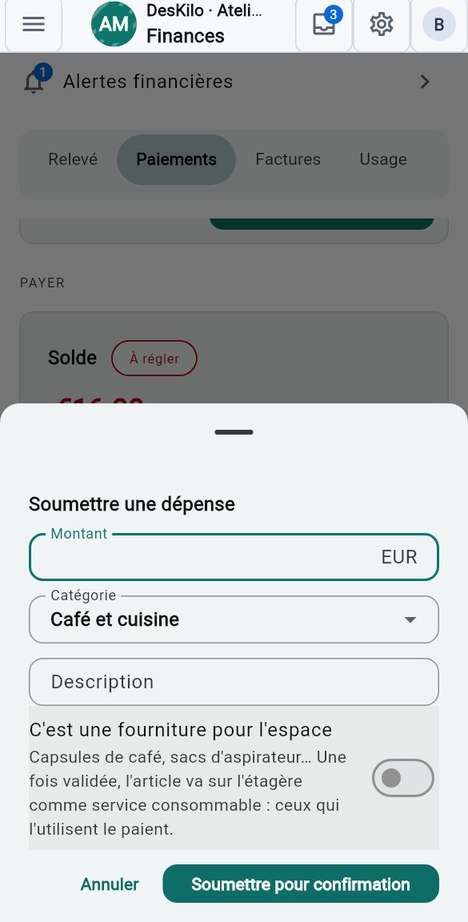

**Étapes**

1. Ouvrez [Finances](https://fdittgen-png.github.io/deskilo/#/money), choisissez **Paiements** et touchez **Soumettre une dépense**.
2. Saisissez le **Montant**.
3. Choisissez une **Catégorie** : **Café et cuisine**, **Équipement**, **Fournitures** ou **Autre**.
4. Écrivez une **Description**.
5. Si vous avez acheté quelque chose que les membres utiliseront, activez **C'est une fourniture pour l'espace** (l'option apparaît quand votre espace a activé **Fournitures via les dépenses**) et indiquez l'article, la quantité et le prix unitaire.
6. Touchez **Soumettre pour confirmation**.

**Bon à savoir**

- Vous voyez « Dépense soumise — en attente d'approbation ». La dépense ne compte qu'une fois confirmée.
- Une fourniture confirmée est mise en rayon comme un service : les membres qui l'utilisent la paient.
- Les coûts récurrents ont leur propre entrée, **Dépenses programmées**, à côté de ce bouton.

**Voir aussi:** [Approuver ou refuser une dépense](#approuver-ou-refuser-une-dépense)

<!-- anchor: user.money.expense.approve -->
### Approuver ou refuser une dépense

**Public:** Administrateur·rice · Propriétaire

Une dépense attend et vous décidez si l'espace la paie.

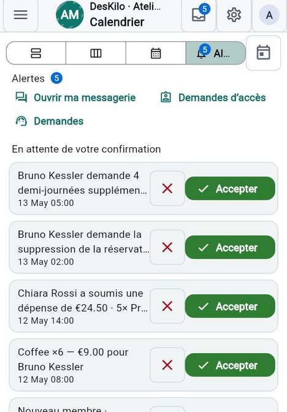

**Étapes**

1. Ouvrez [Événements](https://fdittgen-png.github.io/deskilo/#/events), ou touchez **Alertes financières** dans [Finances](https://fdittgen-png.github.io/deskilo/#/money).
2. Cherchez sous **En attente de votre confirmation** la ligne qui indique le montant et le membre.
3. Touchez **Accepter** pour la confirmer, ou la croix pour **Refuser**.

**Bon à savoir**

- Certaines dépenses demandent plus d'une validation. La ligne indique combien sont faites, par exemple « 1/2 validations ».
- Qui peut valider, et combien de validations sont nécessaires, se règle dans les [Règles de validation](#règles-de-validation-domaine-par-domaine).
- Chaque décision reste sur la ligne : qui a confirmé ou refusé, et quand. Le membre voit le résultat.
- **Alertes financières** dans Finances n'apparaît que lorsque la fonction **Onglet Événements** est activée.

**Voir aussi:** [Les alertes financières](#les-alertes-financières)

<!-- anchor: user.money.amounts -->
### Comment les montants sont affichés

**Public:** Tout le monde

Vous voulez lire un chiffre sans vous demander ce qu'il inclut.

**Bon à savoir**

- Les montants utilisent la devise de votre espace et votre format de nombres. Une facture garde la devise dans laquelle elle a été émise.
- Sur le relevé, les charges portent un signe moins, les paiements et les crédits un signe plus. Un solde en rouge est une somme que vous devez.
- Quand un prix inclut la TVA, il le dit, par exemple « TVA 20 % incluse ». Le PDF de la facture détaille la TVA qu'elle contient.
- Si votre espace ne facture pas la TVA, aucune TVA n'est affichée.
- Les jours sont affichés en jours entiers et en demi-journées.

**Voir aussi:** [Lire votre relevé](#lire-votre-relevé) · [Vos factures](#vos-factures)

<!-- anchor: user.money.finances -->
### Vos finances dans tous vos espaces

**Public:** Membre

Vous appartenez à plusieurs espaces et vous voulez toutes vos factures, vos paiements et vos rappels au même endroit.

**Étapes**

1. Ouvrez [Finances](https://fdittgen-png.github.io/deskilo/#/money), choisissez **Paiements** ou **Factures**, et touchez **Ouvrir pour** votre espace sur la carte **Vos finances dans tous vos espaces**.
2. Choisissez un onglet : **À payer**, **Payées**, **Paiements** ou **Rappels**.
3. Si vous appartenez à plusieurs espaces, filtrez par espace en haut.

**Bon à savoir**

- **À payer** affiche « Rien à payer — vous êtes à jour » quand vous ne devez rien.
- **Rappels** liste les rappels que vous avez reçus, avec leur niveau.
- L'historique complet, l'usage et les autres serveurs sont accessibles depuis le même écran.

**Voir aussi:** [Vos factures](#vos-factures)

<!-- anchor: user.money.invoicing -->
### La facturation en un coup d'œil

**Public:** Administrateur·rice facturation · Propriétaire

Vous émettez et relancez les factures de tout l'espace et vous voulez savoir par où commencer.

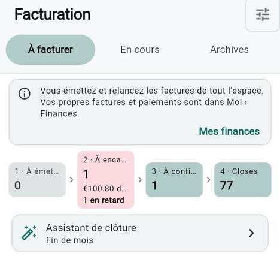

**Étapes**

1. Ouvrez [Facturation](https://fdittgen-png.github.io/deskilo/#/invoices).
2. Lisez les onglets : **À facturer** liste les membres à facturer pour le mois, **En cours** les factures émises et impayées, et **Archives** celles qui sont closes.
3. Lisez la ligne de quatre étapes sous la bannière : **À émettre**, **À encaisser**, **À confirmer** et **Closes**, avec un nombre pour chacune.
4. Touchez **Assistant de clôture** pour facturer un mois, ou **Nouvelle facture** pour une seule.
5. Touchez l'icône d'outils pour le registre des factures, les règles de rappel, le modèle PDF de facture et **Mes finances**.

**Bon à savoir**

- Les factures ne sont jamais modifiées ni supprimées. Une facture erronée est marquée comme telle et remplacée.
- Le processus complet, de la clôture du mois au règlement et aux rappels, est décrit au chapitre 08 : [Règles de rappel](#règles-de-relance) et [Le modèle PDF de facture](#le-modèle-pdf-de-facture) sont de bons endroits pour poursuivre.

**Voir aussi:** [Règles de rappel](#règles-de-relance)

<!-- anchor: user.space.overview -->
## Votre espace, configuré par vous (Réglages de l'espace)

Ce chapitre s'adresse aux personnes qui font vivre un espace : propriétaires, copropriétaires et administrateurs à qui ils confient les réglages. Vous y dessinez les étages, décidez qui peut entrer et quand, choisissez les fonctionnalités qui existent, donnez à l'espace son aspect et ses mots, et gardez une copie de tout.

Dans ce chapitre :
- [Dessiner vos étages, vos pièces et vos tables](#éditeur-despace--ajouter-renommer-et-supprimer-des-étages)
- [Inviter des personnes avec l'ID de l'espace](#lid-de-lespace)
- [Dire quand l'espace est ouvert](#jours-douverture)
- [Activer et désactiver des fonctionnalités](#activer-ou-désactiver-des-processus-entiers)
- [Remplir les réglages de l'espace](#pays)
- [Donner à l'espace ses couleurs et ses mots](#vocabulaire)
- [Décider qui peut faire quoi](#la-matrice-des-rôles)
- [Faire tourner une tablette murale et des badges](#mode-borne--une-tablette-murale-pour-le-pointage)
- [Tenir une bibliothèque de documents](#ajouter-un-document-à-la-bibliothèque)
- [Exporter et importer l'espace](#exporter-lespace-xml)

> **Astuce** La plupart des écrans de ce chapitre se trouvent dans le menu, sous **Espace**, **Disponibilité**, **Fonctionnalités** et **Rôles**. Chaque entrée n'apparaît que pour les personnes qui détiennent la permission nécessaire, et certaines seulement quand leur fonctionnalité est activée. Un administrateur ne voit ces écrans que si le propriétaire lui en a donné l'autorisation dans la matrice des rôles.

<!-- anchor: user.space.editor.levels -->
### Éditeur d'espace : ajouter, renommer et supprimer des étages

**Public:** Propriétaire · Administrateur·rice

Vous voulez donner au bâtiment ses étages, dans l'ordre que l'on attend. L'**Éditeur d'espace** liste tous les étages de l'espace.

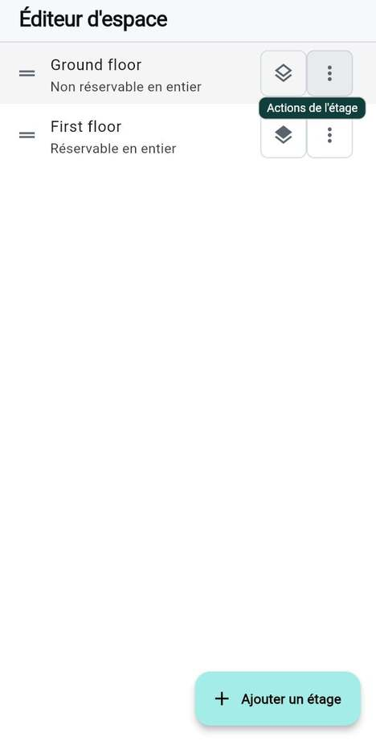

**Étapes**

1. Ouvrez l'[Éditeur d'espace](https://fdittgen-png.github.io/deskilo/#/editor), ou touchez **Modifier l'espace** sur l'écran Réserver.
2. Touchez **Ajouter un étage**, saisissez le nom et touchez **Enregistrer**.
3. Faites glisser la poignée à gauche d'un étage pour changer l'ordre.
4. Touchez les trois points (**Actions de l'étage**) pour **Renommer** ou **Supprimer** un étage.
5. Touchez un étage pour y dessiner.

**Bon à savoir**

- Supprimer un étage supprime tous les bureaux, tables et places qui s'y trouvent. La confirmation indique ce que deviennent les réservations qui les concernent.
- La ligne sous chaque étage indique s'il est **Réservable en entier** ou **Non réservable en entier**.
- Sans aucun étage, l'éditeur affiche **Aucun étage pour l'instant. Ajoutez le premier étage de votre espace.**

**Voir aussi:** [Réserver un étage entier](#laisser-les-membres-réserver-un-étage-entier) · [Dessiner pièces, tables et places](#dessiner-pièces-tables-et-places)

<!-- anchor: user.space.editor.level-booking -->
### Laisser les membres réserver un étage entier

**Public:** Propriétaire · Administrateur·rice

Vous voulez qu'une équipe puisse prendre un étage complet pour une journée.

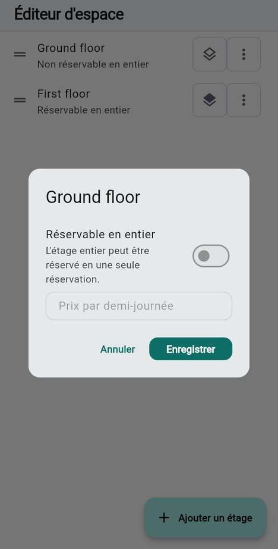

**Étapes**

1. Dans l'[Éditeur d'espace](https://fdittgen-png.github.io/deskilo/#/editor), touchez le bouton de couches sur la ligne de l'étage.
2. Activez **Réservable en entier**.
3. Saisissez le **Prix par demi-journée**.
4. Touchez **Enregistrer**.

**Bon à savoir**

- Le bouton de couches est plein quand l'étage est réservable en entier.
- Réserver un étage, un bureau ou une table en entier demande aussi la fonctionnalité **Réservations de table, bureau et niveau**. Chaque membre doit avoir le droit de réserver un niveau ; les administrateurs l'ont automatiquement. Voir [Un interrupteur de fonctionnalité](#un-interrupteur-de-fonctionnalité).

**Voir aussi:** [Propriétés d'un bureau ou d'une table](#nommer-un-bureau-ou-une-table-et-y-mettre-un-prix)

<!-- anchor: user.space.editor.rooms -->
### Dessiner pièces, tables et places

**Public:** Propriétaire · Administrateur·rice

Vous voulez que le plan à l'écran ressemble à l'étage réel. Tout se place dans une pièce : vous dessinez une pièce, y mettez des tables, puis des places sur les tables.

**Étapes**

1. Ouvrez un étage depuis l'[Éditeur d'espace](https://fdittgen-png.github.io/deskilo/#/editor). Un étage vide propose **Dessiner la première pièce**.
2. Touchez **Bureau** et faites glisser sur la grille pour dessiner une pièce.
3. Touchez **Table** et faites glisser dans la pièce pour dessiner une table.
4. Touchez **Place**, puis touchez une table pour y ajouter une place.
5. Touchez **Image**, puis touchez l'endroit où une illustration doit se trouver.
6. Touchez un élément pour le sélectionner. La barre du bas propose **Dupliquer**, **Propriétés** et **Supprimer**.

**Bon à savoir**

- Toucher une deuxième fois l'outil actif le repose, et le canevas revient à la sélection.
- L'application refuse une forme qui **Chevauche un élément existant.** ou qui **Doit être entièrement à l'intérieur d'un bureau.** Les places ne peuvent aller que sur une table, et une table pleine indique **Plus de place sur cette table.**
- Le bouton image en haut à droite définit, remplace ou retire l'**Image de fond** de l'étage, par exemple un scan du plan réel.
- Supprimer une pièce supprime aussi ses tables et ses places.

**Voir aussi:** [Propriétés d'une place](#configurer-une-place) · [Transparence des tables](#transparence-des-tables)

<!-- anchor: user.space.editor.office -->
### Nommer un bureau ou une table et y mettre un prix

**Public:** Propriétaire · Administrateur·rice

Vous voulez qu'une pièce ou une table porte son propre nom et puisse être réservée d'un seul bloc.

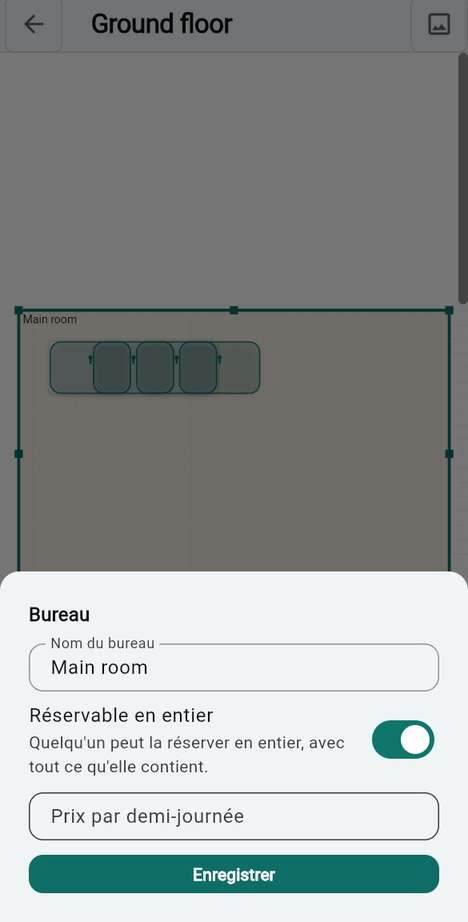

**Étapes**

1. Sélectionnez le bureau ou la table sur l'étage et touchez **Propriétés**.
2. Modifiez **Nom du bureau** (ou **Nom de la table**).
3. Activez **Réservable en entier** si l'on peut le réserver au complet, avec tout ce qu'il contient.
4. Saisissez le **Prix par demi-journée** qui apparaît.
5. Touchez **Enregistrer**.

**Bon à savoir**

- Le champ du prix n'apparaît que lorsque l'interrupteur est activé.
- Une pièce réservable en entier ne peut être réservée que si rien de ce qu'elle contient n'est réservé.

**Voir aussi:** [Réserver un étage entier](#laisser-les-membres-réserver-un-étage-entier) · [Propriétés d'une place](#configurer-une-place)

<!-- anchor: user.space.editor.seat -->
### Configurer une place

**Public:** Propriétaire · Administrateur·rice

Vous voulez qu'une place indique de quel côté la chaise est tournée, ce qui l'accompagne et quand elle est hors service.

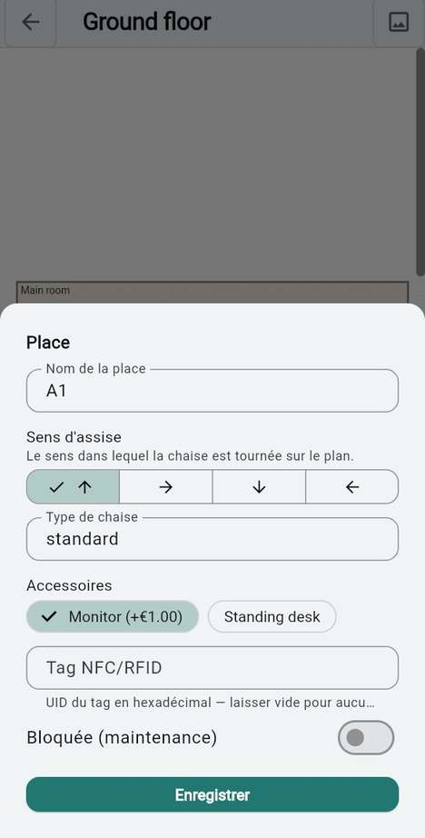

**Étapes**

1. Sélectionnez la place sur l'étage et touchez **Propriétés**.
2. Modifiez **Nom de la place**.
3. Choisissez le **Sens d'assise** : la flèche montre de quel côté la chaise est tournée sur le plan.
4. Choisissez un **Type de chaise**.
5. Touchez les **Accessoires** qui appartiennent à cette place. Un prix affiché à côté d'un accessoire est un supplément par demi-journée.
6. Si la place porte un tag, saisissez son numéro dans **Tag NFC/RFID**, ou utilisez **Lire un tag maintenant**. Le champ du tag apparaît quand la fonctionnalité **Tags NFC/RFID des chaises** est activée, et la lecture demande un appareil capable de lire les tags.
7. Activez **Bloquée (maintenance)** pour mettre la place hors service, puis touchez **Enregistrer**.

**Bon à savoir**

- Un numéro de tag ne peut appartenir qu'à une seule chaise : **Ce tag est déjà associé à une autre chaise.**
- Sans aucun accessoire, la feuille propose **Aucun équipement — les configurer**.

**Voir aussi:** [Pointage par badge NFC](#pointage-par-badge-nfc)

<!-- anchor: user.workspace.code -->
### L'ID de l'espace

**Public:** Propriétaire · Administrateur·rice

Vous voulez que l'on trouve votre espace et que l'on demande à le rejoindre. L'écran **ID de l'espace et QR** présente l'invitation de membre : un code QR et l'ID qui s'y cache.

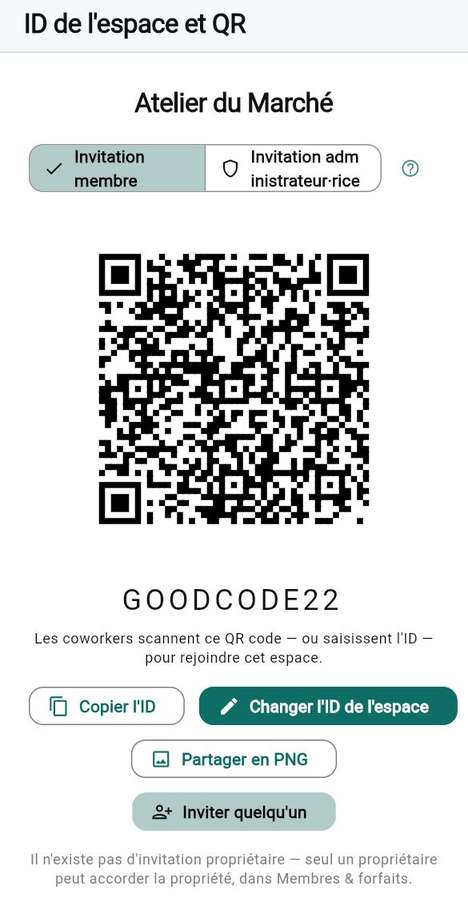

**Étapes**

1. Ouvrez [ID de l'espace et QR](https://fdittgen-png.github.io/deskilo/#/workspace-code). L'onglet **Invitation membre** s'affiche.
2. Touchez **Copier l'ID** pour le coller où vous voulez, ou **Partager en PNG** pour imprimer ou afficher le code QR.
3. Pour choisir un ID facile à retenir, touchez **Changer l'ID de l'espace**, saisissez 4 à 20 lettres ou chiffres et touchez **Enregistrer**.

**Bon à savoir**

- L'ID est unique dans tout DesKilo. S'il est déjà pris, ou s'il n'a pas 4 à 20 lettres ou chiffres, l'application répond **ID refusé**.
- Toute personne qui scanne le code ou saisit l'ID demande à rejoindre l'espace comme membre. Personne n'entre sans approbation.
- Une fois l'ID changé, l'ancien cesse de fonctionner. Imprimez de nouveau le code QR.
- L'onglet **Invitation administrateur·rice** est réservé aux propriétaires et copropriétaires.

**Voir aussi:** [Invitation administrateur](#inviter-un-administrateur) · [Inviter quelqu'un](#inviter-quelquun-par-message)

<!-- anchor: user.workspace.code.admin -->
### Inviter un administrateur

**Public:** Propriétaire

Vous voulez accueillir une personne qui vous aidera à faire vivre l'espace. L'onglet **Invitation administrateur·rice** vous donne un code valable pour une seule personne.

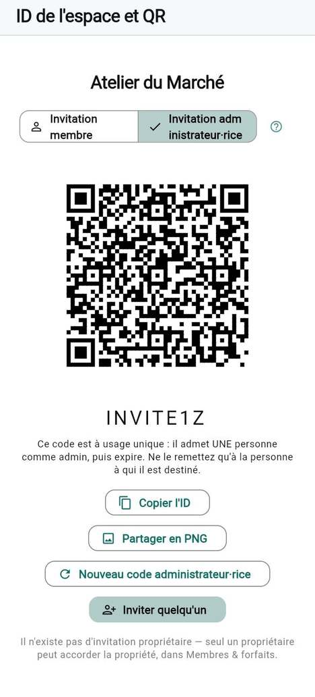

**Étapes**

1. Ouvrez [ID de l'espace et QR](https://fdittgen-png.github.io/deskilo/#/workspace-code) et touchez **Invitation administrateur·rice**.
2. Remettez le code, ou son QR, à la personne concernée.
3. Pour l'administrateur suivant, touchez **Nouveau code administrateur·rice**.

**Bon à savoir**

- Le code admet une seule personne comme administrateur, puis il expire.
- Il n'y a pas d'invitation de propriétaire. Seul un propriétaire peut accorder la propriété, dans **Membres et forfaits**.

**Voir aussi:** [L'ID de l'espace](#lid-de-lespace) · [La matrice des rôles](#la-matrice-des-rôles)

<!-- anchor: user.workspace.code.invite -->
### Inviter quelqu'un par message

**Public:** Propriétaire · Administrateur·rice

Vous voulez envoyer une invitation chaleureuse et toute prête plutôt qu'un simple code.

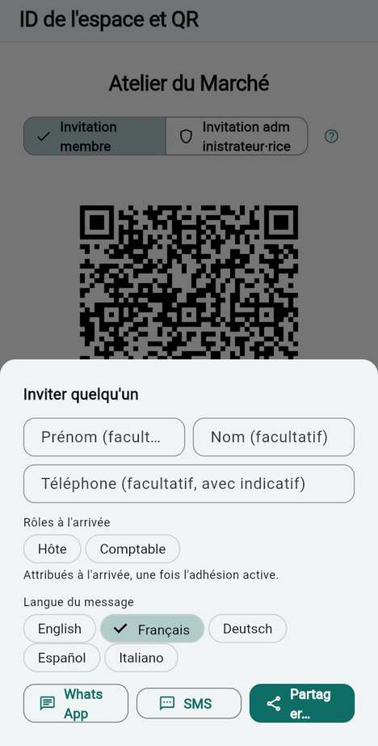

**Étapes**

1. Sur [ID de l'espace et QR](https://fdittgen-png.github.io/deskilo/#/workspace-code), touchez **Inviter quelqu'un**.
2. Remplissez **Prénom (facultatif)**, **Nom (facultatif)** et, si vous le souhaitez, le numéro de téléphone.
3. Sous **Rôles à l'arrivée**, touchez chaque rôle que cette personne doit recevoir en rejoignant l'espace.
4. Choisissez la **Langue du message**.
5. Envoyez-le avec **WhatsApp**, **SMS** ou **Partager…**.

**Bon à savoir**

- Le message explique les étapes : télécharger, créer un compte, rejoindre. Il est écrit dans la langue que vous choisissez, et part de celle définie comme [Langue de l'espace](#langue-de-lespace).
- Chaque message porte son propre code personnel. Vous pouvez écrire votre propre texte sous [Message d'invitation](#message-dinvitation).

**Voir aussi:** [L'ID de l'espace](#lid-de-lespace)

<!-- anchor: user.workspace.availability.open-weekdays -->
### Jours d'ouverture

**Public:** Propriétaire · Administrateur·rice avec l'autorisation

Vous voulez que l'espace ne soit ouvert que les jours où vous travaillez. L'écran **Disponibilité** commence par les jours de la semaine.

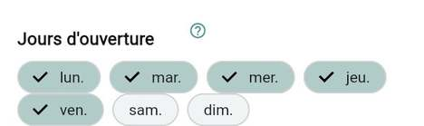

**Étapes**

1. Ouvrez [Disponibilité](https://fdittgen-png.github.io/deskilo/#/availability).
2. Sous **Jours d'ouverture**, touchez un jour pour l'ouvrir ou le fermer.

**Bon à savoir**

- Au moins un jour de la semaine doit rester ouvert.
- Une réservation qui touche un jour fermé est refusée, et le plan dessine ce jour comme fermé.

**Voir aussi:** [Jours de fermeture](#jours-de-fermeture) · [Granularité](#granularité)

<!-- anchor: user.workspace.availability.granularity -->
### Granularité

**Public:** Propriétaire · Administrateur·rice avec l'autorisation

Vous voulez que les réservations suivent un rythme qui convient à votre espace : demi-journées, journées entières, ou à l'heure que l'on veut.

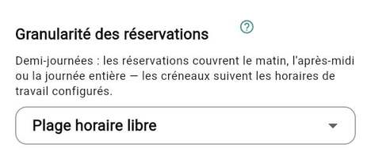

**Étapes**

1. Ouvrez [Disponibilité](https://fdittgen-png.github.io/deskilo/#/availability).
2. Sous **Granularité de réservation**, choisissez la forme d'une réservation.

**Bon à savoir**

- Les choix sont **Plage horaire libre**, **Créneaux de 5 minutes**, **Créneaux de 15 minutes**, **Créneaux de 30 minutes**, **Créneaux d'une heure**, **Demi-journées (matin et après-midi)**, **Journées entières uniquement** et **Heures réelles (de–à exact, demi/journées en raccourcis)**. **Heures réelles** apparaît quand la fonctionnalité **Horaires de travail** est activée.
- Le plan, la feuille de réservation, un code scanné et la borne ne proposent que ce que la granularité permet.

**Voir aussi:** [Horaires de travail](#horaires-de-travail)

<!-- anchor: user.workspace.availability.working-hours -->
### Horaires de travail

**Public:** Propriétaire · Administrateur·rice avec l'autorisation

Vous voulez qu'une matinée, un après-midi et une journée signifient la même chose partout.

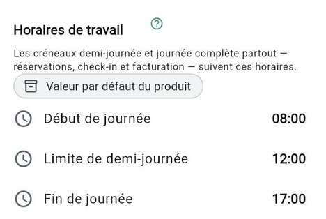

**Étapes**

1. Ouvrez [Disponibilité](https://fdittgen-png.github.io/deskilo/#/availability).
2. Sous **Horaires de travail**, touchez **Début de journée**, **Limite de demi-journée** et **Fin de journée** et réglez chaque heure.
3. Avec la granularité **Heures réelles**, réglez aussi **Heures facturées comme demi-journée** et **Heures facturées comme journée complète**.

**Bon à savoir**

- Les fenêtres de demi-journée et de journée dans les réservations, le pointage et la facturation suivent ces horaires.
- La petite étiquette sous le titre indique si les horaires sont ceux du produit, viennent d'un modèle ou sont les vôtres. **Revenir au modèle** et **Revenir à la valeur par défaut** les rétablissent.
- La journée doit suivre l'ordre : début, puis limite de demi-journée, puis fin.
- Cette section fait partie de la fonctionnalité **Horaires de travail**.

**Voir aussi:** [En dehors des heures d'ouverture](#en-dehors-des-heures-douverture)

<!-- anchor: user.workspace.availability.closure-days -->
### Jours de fermeture

**Public:** Propriétaire · Administrateur·rice avec l'autorisation

Vous voulez fermer l'espace pour un jour férié, une semaine d'août ou le passage du plombier, sans que personne ne puisse réserver.

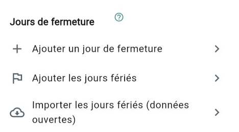

**Étapes**

1. Ouvrez [Disponibilité](https://fdittgen-png.github.io/deskilo/#/availability) et allez à **Jours de fermeture**.
2. Touchez **Ajouter un jour de fermeture**, choisissez la date et, si vous le souhaitez, un **Motif (facultatif)**.
3. Pour en retirer un, touchez la corbeille à côté.

**Bon à savoir**

- Une réservation un jour de fermeture est refusée et le motif s'affiche.
- Les jours déjà facturés ne peuvent pas être transformés en jours de fermeture par le générateur de jours fériés.

**Voir aussi:** [Jours fériés](#jours-fériés)

<!-- anchor: user.workspace.availability.public-holidays -->
### Jours fériés

**Public:** Propriétaire · Administrateur·rice avec l'autorisation

Vous voulez créer d'un coup tous les jours fériés d'une année comme jours de fermeture.

**Étapes**

1. Dans [Disponibilité](https://fdittgen-png.github.io/deskilo/#/availability), sous **Jours de fermeture**, touchez **Ajouter les jours fériés**.
2. Utilisez les flèches pour choisir l'année. La feuille liste les dates qui deviendraient des jours de fermeture.
3. Touchez le bouton du bas pour les créer.
4. Vous préférez une liste de données ouvertes ? Touchez **Importer les jours fériés (données ouvertes)**, choisissez la région et confirmez.

**Bon à savoir**

- Rien n'est créé avant votre confirmation, et les jours qui existent déjà sont signalés.
- Les mois déjà facturés sont ignorés.
- Ces entrées apparaissent quand la fonctionnalité **Jours fériés** est activée. **Importer les jours fériés (données ouvertes)** demande aussi la fonctionnalité **Importer les jours fériés**.

**Voir aussi:** [Jours de fermeture](#jours-de-fermeture)

<!-- anchor: user.workspace.availability.policies -->
### Règles de réservation

**Public:** Propriétaire · Administrateur·rice avec l'autorisation

Vous voulez assouplir ou durcir les règles de réservation. Ce que vous réglez ici vaut pour toutes les façons de réserver : l'application, un code scanné et la borne.

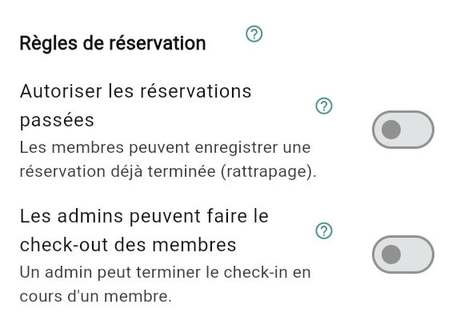

**Étapes**

1. Ouvrez [Disponibilité](https://fdittgen-png.github.io/deskilo/#/availability) et allez à **Règles de réservation**.
2. Activez ou désactivez les règles voulues.
3. Sous **En dehors des heures d'ouverture** et **Limites de réservation**, réglez le reste.

**Bon à savoir**

- Les deux interrupteurs sont désactivés par défaut.
- Cette section fait partie de la fonctionnalité **Règles de réservation**.
- La ligne **Ce que le plan distingue** en dessous explique les états que les membres voient sur le plan.

**Voir aussi:** [Autoriser les réservations passées](#autoriser-les-réservations-passées) · [Les admins peuvent faire le check-out des membres](#les-administrateurs-peuvent-faire-le-check-out) · [Limites de réservation](#limites-de-réservation)

<!-- anchor: user.workspace.availability.allow-past -->
### Autoriser les réservations passées

**Public:** Propriétaire · Administrateur·rice avec l'autorisation

Vous voulez que les membres puissent enregistrer une réservation après coup, pour un espace qui note les présences plus tard.

**Étapes**

1. Dans [Disponibilité](https://fdittgen-png.github.io/deskilo/#/availability), sous **Règles de réservation**, activez **Autoriser les réservations passées**.

**Bon à savoir**

- Désactivé, une réservation déjà terminée un jour antérieur est refusée.
- Réserver un créneau antérieur le même jour est toujours permis.

**Voir aussi:** [Règles de réservation](#règles-de-réservation)

<!-- anchor: user.workspace.availability.admin-checkout -->
### Les administrateurs peuvent faire le check-out

**Public:** Propriétaire · Administrateur·rice avec l'autorisation

Vous voulez que l'équipe ferme la salle le soir et termine les pointages que l'on a oublié de clore.

**Étapes**

1. Dans [Disponibilité](https://fdittgen-png.github.io/deskilo/#/availability), sous **Règles de réservation**, activez **Les admins peuvent faire le check-out des membres**.

**Bon à savoir**

- Désactivé, le check-out est strictement personnel.
- Activé, un administrateur peut terminer le pointage en cours d'un membre.

**Voir aussi:** [Règles de réservation](#règles-de-réservation)

<!-- anchor: user.workspace.availability.outside-hours -->
### En dehors des heures d'ouverture

**Public:** Propriétaire · Administrateur·rice avec l'autorisation

Vous voulez dire ce qui se passe quand quelqu'un arrive tôt ou reste tard. Une seule réponse vaut pour toutes les granularités.

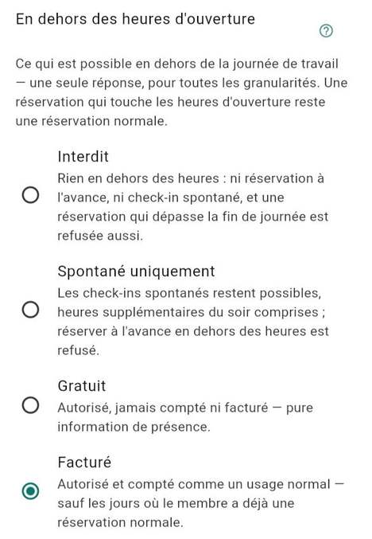

**Étapes**

1. Dans [Disponibilité](https://fdittgen-png.github.io/deskilo/#/availability), trouvez **En dehors des heures d'ouverture**.
2. Choisissez **Désactivé**, **Spontané uniquement**, **Libre** ou **Facturé**.

**Bon à savoir**

- **Désactivé** : rien en dehors des horaires, ni réservation à l'avance, ni arrivée spontanée.
- **Spontané uniquement** : les pointages sans réservation restent possibles, heures supplémentaires du soir comprises, mais réserver à l'avance en dehors des horaires est refusé.
- **Libre** : permis, jamais compté et jamais facturé.
- **Facturé** : permis et compté comme un usage ordinaire, sauf un jour où le membre a déjà une réservation classique.
- Une réservation qui touche les horaires de travail est une réservation ordinaire.

**Voir aussi:** [Horaires de travail](#horaires-de-travail)

<!-- anchor: user.workspace.availability.limits -->
### Limites de réservation

**Public:** Propriétaire · Administrateur·rice avec l'autorisation

Vous voulez dire jusqu'à quand à l'avance on peut réserver, quelle durée minimale et maximale une réservation peut avoir, et combien on peut en détenir en même temps.

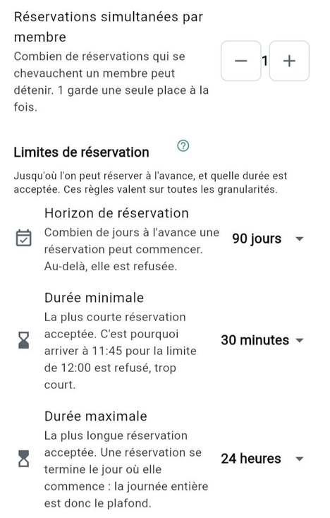

**Étapes**

1. Dans [Disponibilité](https://fdittgen-png.github.io/deskilo/#/availability), trouvez **Réservations simultanées par membre** et utilisez les boutons moins et plus.
2. Sous **Limites de réservation**, réglez **Horizon de réservation**, **Durée minimale** et **Durée maximale**.

**Bon à savoir**

- **Réservations simultanées par membre** est le nombre de réservations qui se chevauchent qu'un membre peut détenir. 1 garde une seule place à la fois.
- Une réservation se termine le jour où elle commence : une journée entière est donc le maximum.
- Le minimum ne peut pas dépasser le maximum, sinon aucune réservation ne serait acceptée. L'écran vous avertit.
- Chaque refus nomme la limite et sa valeur.

**Voir aussi:** [Règles de réservation](#règles-de-réservation)

<!-- anchor: user.features.processes -->
### Activer ou désactiver des processus entiers

**Public:** Propriétaire · Copropriétaire

Vous voulez une vue d'ensemble de ce que l'espace sait faire, et activer d'un coup tout un domaine. L'écran **Fonctionnalités** s'ouvre sur une carte par processus métier.

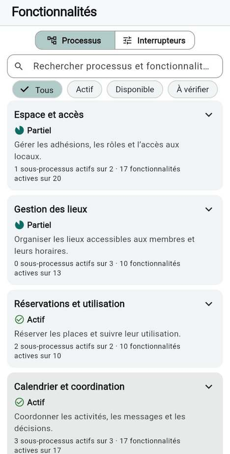

**Étapes**

1. Ouvrez [Fonctionnalités](https://fdittgen-png.github.io/deskilo/#/features). La vue **Processus** s'affiche.
2. Lisez chaque carte : son état, combien de sous-processus sont actifs et combien de fonctionnalités sont activées.
3. Ouvrez une carte et touchez **Activer** ou **Désactiver** pour le processus entier ou un sous-processus.
4. Lisez l'aperçu, puis confirmez.

**Bon à savoir**

- Une carte est **Active** quand toutes ses fonctionnalités marchent, **Partiel** quand certaines marchent, **Disponible** quand aucune n'est encore activée, et **À examiner** quand une fonctionnalité est activée mais attend un prérequis désactivé.
- Les pastilles **Tous**, **Actif**, **Disponible** et **À examiner** réduisent les cartes, et **Rechercher processus et fonctionnalités** atteint tout.
- L'aperçu liste ce qui est activé, ce qui est **Également nécessaires** venant d'un autre processus et ce qui est déjà activé. Désactiver quelque chose dont d'autres fonctionnalités ont besoin est refusé tant que vous n'avez pas choisi ce qu'elles deviennent.

**Voir aussi:** [Un interrupteur de fonctionnalité](#un-interrupteur-de-fonctionnalité)

<!-- anchor: user.features.switch -->
### Un interrupteur de fonctionnalité

**Public:** Propriétaire · Copropriétaire

Vous voulez activer ou désactiver une seule fonctionnalité.

**Étapes**

1. Ouvrez [Fonctionnalités](https://fdittgen-png.github.io/deskilo/#/features) et touchez **Interrupteurs**.
2. Trouvez la fonctionnalité avec **Rechercher une fonctionnalité**, ou réduisez la liste avec **Modifiées** ou **Maturité**.
3. Basculez son interrupteur.

**Bon à savoir**

- Activez une fonctionnalité et toutes ses parties apparaissent : l'onglet, le bouton, le lien. Désactivez-la et il n'en reste rien, pas même un lien enregistré.
- Une fonctionnalité qui en nécessite une autre se place sous elle avec **Nécessite** et indique **En attente de la fonction au-dessus** tant que la fonctionnalité parente est désactivée. Son propre choix est conservé.
- Activer une fonctionnalité peut aussi activer ce dont elle a besoin. L'application vous le dit.
- Une fonctionnalité pas encore validée comme stable vous demande d'abord de confirmer : elle peut changer et a des limites connues.
- Ce qui est déjà fait reste fait. Une facture émise pendant qu'une fonctionnalité était activée garde son contenu.

**Voir aussi:** [Activer ou désactiver des processus entiers](#activer-ou-désactiver-des-processus-entiers)

<!-- anchor: user.workspace.settings.country -->
### Pays

**Public:** Propriétaire · Administrateur·rice avec l'autorisation

Vous voulez que l'espace sache où il est établi. **Espace** s'ouvre sur **Informations générales**.

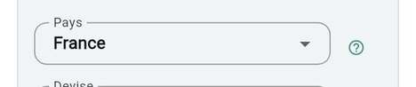

**Étapes**

1. Ouvrez [Espace](https://fdittgen-png.github.io/deskilo/#/workspace-settings).
2. Sous **Informations générales**, choisissez le **Pays**.
3. Touchez **Enregistrer** en bas.

**Bon à savoir**

- Le pays propose la devise et le fuseau horaire, et détermine les taux de TVA proposés.
- Dès que l'espace a émis un document ou enregistré de l'argent, le pays ne peut plus être changé : l'enregistrement indique « La devise et le pays sont figés dès que l'espace a émis un document ou enregistré de l'argent. Rien n'a été enregistré. »
- **Enregistrer** écrit tout le formulaire d'un coup. Si quelqu'un a modifié ces réglages entre-temps, rien n'est enregistré et ce que vous avez saisi reste à l'écran.

**Voir aussi:** [Devise et fuseau horaire](#devise-et-fuseau-horaire)

<!-- anchor: user.workspace.settings.currency-timezone -->
### Devise et fuseau horaire

**Public:** Propriétaire · Administrateur·rice avec l'autorisation

Vous voulez que les prix et les jours soient comptés comme votre espace les compte.

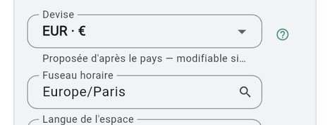

**Étapes**

1. Dans [Espace](https://fdittgen-png.github.io/deskilo/#/workspace-settings), sous **Informations générales**, choisissez la **Devise**.
2. Recherchez le **Fuseau horaire** et choisissez-le.
3. Touchez **Enregistrer**.

**Bon à savoir**

- La devise est proposée d'après le pays. Vous pouvez la changer tant que l'espace n'a émis aucun document ni enregistré d'argent ; ensuite, elle est figée.
- Le fuseau horaire n'est pas décoratif : un jour ouvré, une limite de demi-journée et un jour de fermeture sont tous comptés dedans, si bien qu'un membre à l'étranger voit la journée de l'espace plutôt que la sienne.

**Voir aussi:** [Pays](#pays)

<!-- anchor: user.workspace.settings.language -->
### Langue de l'espace

**Public:** Propriétaire · Administrateur·rice avec l'autorisation

Vous voulez que les invitations et les documents parlent la langue de votre communauté.

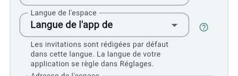

**Étapes**

1. Dans [Espace](https://fdittgen-png.github.io/deskilo/#/workspace-settings), sous **Informations générales**, ouvrez **Langue de l'espace**.
2. Choisissez une langue, ou **Langue de l'app de l'expéditeur**.
3. Touchez **Enregistrer**.

**Bon à savoir**

- Les invitations sont écrites par défaut dans cette langue.
- Ce n'est pas la langue de votre propre application. Celle-ci ne change que ce que vous voyez, et se trouve dans vos réglages personnels.

**Voir aussi:** [Message d'invitation](#message-dinvitation)

<!-- anchor: user.workspace.settings.address -->
### Adresse d'en-tête

**Public:** Propriétaire · Administrateur·rice avec l'autorisation

Vous voulez votre adresse postale sur le papier que l'espace envoie.

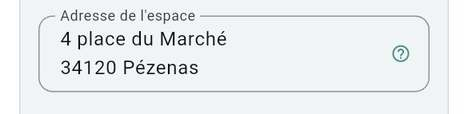

**Étapes**

1. Dans [Espace](https://fdittgen-png.github.io/deskilo/#/workspace-settings), sous **Informations générales**, remplissez **Adresse de l'espace**.
2. Touchez **Enregistrer**.

**Bon à savoir**

- C'est un texte libre, imprimé tel quel sur les courriers et les factures.
- L'adresse structurée dont une facture électronique a besoin est une saisie distincte, sous l'identité juridique.

**Voir aussi:** [Pays](#pays)

<!-- anchor: user.workspace.settings.whatsapp-group -->
### Groupe WhatsApp

**Public:** Propriétaire · Administrateur·rice avec l'autorisation

Vous voulez que les membres trouvent le groupe WhatsApp de votre communauté.

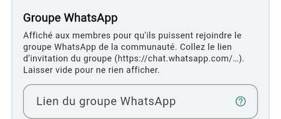

**Étapes**

1. Dans [Espace](https://fdittgen-png.github.io/deskilo/#/workspace-settings), ouvrez **Communauté et invitations**.
2. Collez le lien d'invitation du groupe dans **Lien du groupe WhatsApp**.
3. Touchez **Enregistrer**.

**Bon à savoir**

- Le lien doit être un lien d'invitation chat.whatsapp.com, sinon le champ le signale.
- Laissez-le vide pour ne rien afficher.

**Voir aussi:** [Message d'invitation](#message-dinvitation)

<!-- anchor: user.workspace.settings.invitation-message -->
### Message d'invitation

**Public:** Propriétaire · Administrateur·rice avec l'autorisation

Vous voulez que les invitations vous ressemblent, dans chaque langue que vous utilisez.

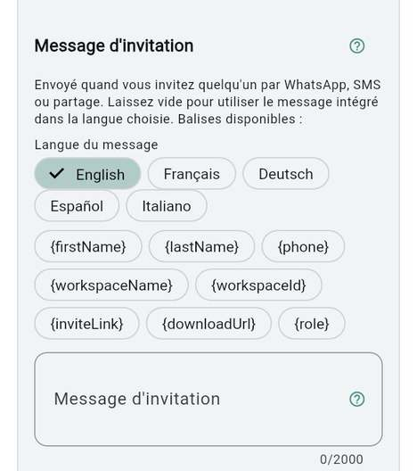

**Étapes**

1. Dans [Espace](https://fdittgen-png.github.io/deskilo/#/workspace-settings), ouvrez **Communauté et invitations**.
2. Sous **Langue du message**, choisissez la langue du texte que vous modifiez.
3. Écrivez le texte. Touchez une balise comme {firstName} ou {inviteLink} pour l'insérer à l'endroit du curseur.
4. Touchez **Enregistrer**.

**Bon à savoir**

- Laissez la zone vide pour utiliser le message intégré dans cette langue.
- La ligne **Langue du message** indique seulement quel brouillon est à l'écran. Elle n'est pas enregistrée et s'ouvre chaque fois sur la langue de l'espace.
- Les balises sont remplies à l'envoi d'une invitation. Le code et le lien viennent de l'application : ne les collez donc pas vous-même.

**Voir aussi:** [Inviter quelqu'un par message](#inviter-quelquun-par-message)

<!-- anchor: user.workspace.settings.new-members -->
### Faire démarrer les nouveaux membres de la même façon

**Public:** Propriétaire · Administrateur·rice avec l'autorisation

Vous voulez que chaque personne qui rejoint l'espace commence avec le même abonnement et la même règle quand ses jours sont épuisés.

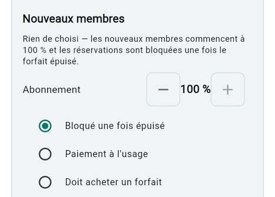

**Étapes**

1. Dans [Espace](https://fdittgen-png.github.io/deskilo/#/workspace-settings), ouvrez **Nouveaux membres**.
2. Réglez le pourcentage d'**Abonnement** avec les boutons moins et plus.
3. Choisissez **Bloqué une fois épuisé**, **Paiement à l'usage** ou **Doit acheter un forfait**.
4. Touchez **Enregistrer**.

**Bon à savoir**

- Tant que vous n'avez pas choisi, les nouveaux membres commencent à 100 % avec les réservations bloquées une fois le droit épuisé.
- L'abonnement propre à un membre se règle plus tard, sur la page du membre.

**Voir aussi:** [L'abonnement d'un membre](#labonnement-dun-membre)

<!-- anchor: user.workspace.settings.wording -->
### Vocabulaire

**Public:** Propriétaire · Administrateur·rice avec l'autorisation

Vous voulez que l'application emploie vos mots : un autre nom pour une place, pour un état sur le plan, pour un onglet.

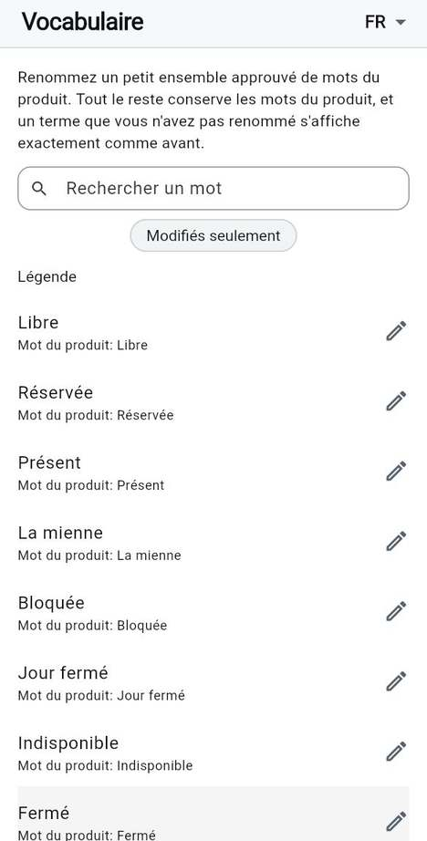

**Étapes**

1. Dans [Espace](https://fdittgen-png.github.io/deskilo/#/workspace-settings), ouvrez **Apparence et libellés** et touchez **Vocabulaire**.
2. Trouvez un mot avec **Rechercher un mot**, ou touchez **Modifiés seulement** pour voir ce que vous avez renommé.
3. Touchez le crayon à côté du mot et saisissez le vôtre, pour chaque langue.

**Bon à savoir**

- Le mot du produit reste affiché sous le vôtre, pour que vous voyiez ce que vous remplacez.
- **Réinitialiser** supprime votre mot au lieu de copier celui du produit. Le terme suit alors le produit quand son vocabulaire change.
- Les termes sont regroupés selon l'endroit où ils apparaissent : **Légende**, **L'espace**, **Navigation**, **Réservation**.

**Voir aussi:** [Couleurs](#couleurs)

<!-- anchor: user.workspace.settings.colours -->
### Couleurs

**Public:** Propriétaire · Administrateur·rice avec l'autorisation

Vous voulez que l'application porte votre couleur. Choisissez-en une et l'application en déduit ses thèmes clair et sombre.

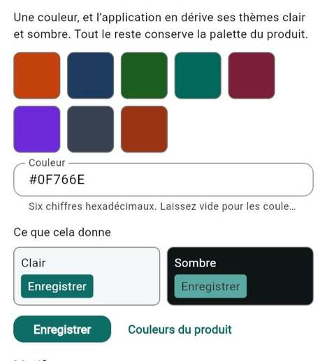

**Étapes**

1. Dans [Espace](https://fdittgen-png.github.io/deskilo/#/workspace-settings), ouvrez **Apparence et libellés** et touchez **Couleurs**. La ligne est là tant que **Couleurs de l’espace** est activée dans les fonctionnalités.
2. Touchez l'une des couleurs, ou saisissez un code comme #0F766E dans **Couleur**.
3. Vérifiez **Ce que cela donne**, en **Clair** et en **Sombre**.
4. Touchez **Enregistrer**. **Couleurs du produit** supprime les vôtres.

**Bon à savoir**

- L'application garde son propre contraste. Si une couleur était illisible quelque part, elle est refusée et l'écran nomme la paire concernée.
- Sous **Couleurs des salles**, vous pouvez ajouter jusqu'à huit couleurs à vous pour les pièces du plan.
- Le logo DesKilo, les couleurs des états des places et la bannière de production ne sont jamais modifiés.

**Voir aussi:** [Motif](#motif) · [Symbole et emblème](#symbole-et-emblème)

<!-- anchor: user.workspace.settings.pattern -->
### Motif

**Public:** Propriétaire · Administrateur·rice avec l'autorisation

Vous voulez que votre espace se distingue facilement des autres auxquels une personne appartient.

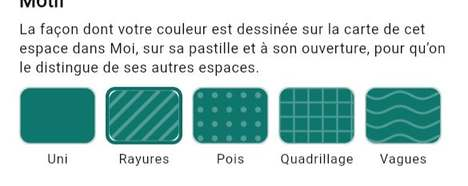

**Étapes**

1. Ouvrez [Couleurs](https://fdittgen-png.github.io/deskilo/#/settings/colours).
2. Sous **Motif**, touchez **Uni**, **Rayures**, **Pois**, **Quadrillage** ou **Vagues**.

**Bon à savoir**

- Le motif dessine votre couleur sur la carte de cet espace dans Moi, sur sa pastille et pendant l'ouverture de l'espace.
- Il s'enregistre dès que vous le touchez.

**Voir aussi:** [Couleurs](#couleurs)

<!-- anchor: user.workspace.settings.branding -->
### Symbole et emblème

**Public:** Propriétaire · Administrateur·rice avec l'autorisation

Vous voulez une petite marque qui représente l'espace : des lettres sur une couleur, ou votre propre logo.

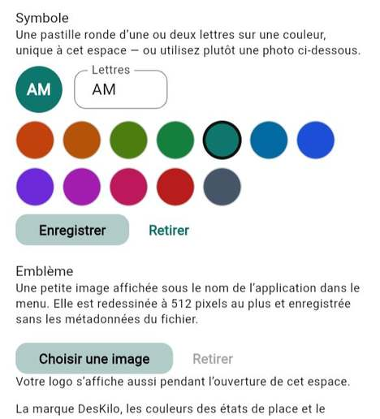

**Étapes**

1. Ouvrez [Couleurs](https://fdittgen-png.github.io/deskilo/#/settings/colours) et allez à **Symbole**.
2. Saisissez une ou deux **Lettres**, choisissez une couleur et touchez **Enregistrer**.
3. Sous **Emblème**, touchez **Choisir une image** pour ajouter votre logo. **Retirer** l'enlève.

**Bon à savoir**

- Les lettres sur une couleur sont uniques pour un espace. Si un autre espace a déjà les mêmes, l'application vous demande de changer la couleur ou les lettres.
- L'emblème s'affiche sous le nom de l'application dans le menu, et pendant que l'on ouvre cet espace. Il est redessiné à 512 pixels de large au plus, et les détails propres à la photo, comme le lieu de la prise de vue, ne sont pas conservés.
- L'emblème ne remplace jamais le logo DesKilo.

**Voir aussi:** [Couleurs](#couleurs)

<!-- anchor: user.workspace.settings.desk-transparency -->
### Transparence des tables

**Public:** Propriétaire · Administrateur·rice avec l'autorisation

Vous avez dessiné le plan sur une photo et voulez que la pièce apparaisse à travers le mobilier.

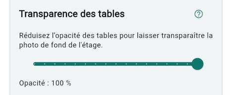

**Étapes**

1. Dans [Espace](https://fdittgen-png.github.io/deskilo/#/workspace-settings), ouvrez **Apparence et libellés**.
2. Faites glisser le curseur **Transparence des tables**. La valeur s'affiche comme **Opacité**.
3. Touchez **Enregistrer**.

**Bon à savoir**

- Baissez l'opacité pour que la photo de fond d'un étage apparaisse à travers les tables.
- Remontez-la à 100 % quand les places comptent plus que la pièce.

**Voir aussi:** [Dessiner pièces, tables et places](#dessiner-pièces-tables-et-places)

<!-- anchor: user.workspace.settings.public-page -->
### Page publique de l'espace

**Public:** Propriétaire

Vous voulez que les personnes extérieures à votre espace le trouvent et voient ce qu'il propose.

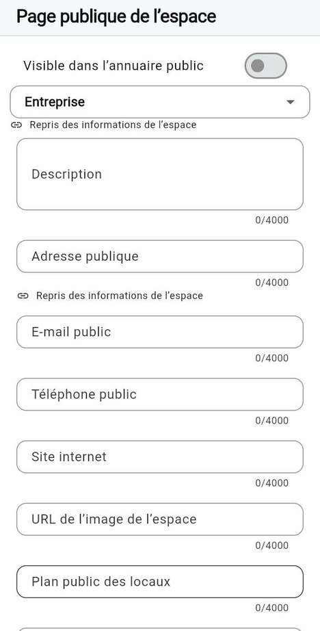

**Étapes**

1. Ouvrez la [Page publique de l'espace](https://fdittgen-png.github.io/deskilo/#/settings/public-page), ou touchez-la en haut de **Espace**.
2. Activez **Visible dans l’annuaire public**.
3. Choisissez le type d'hôte, et complétez **Description**, **Adresse publique**, **E-mail public**, **Téléphone public** et **Site internet**.
4. Touchez **Enregistrer et voir la vue externe**.

**Bon à savoir**

- Les champs marqués **Repris des informations de l’espace** suivent les informations propres à l'espace. **Utiliser les informations de l’espace** les rétablit après modification.
- **Rétablir toutes les données publiques depuis les informations de l’espace** remplace chaque champ qui a un équivalent dans l'espace.
- Les administrateurs peuvent choisir eux-mêmes s'ils sont affichés comme administrateurs publics.

**Voir aussi:** [Découvrir et le réseau public](#découvrir)

<!-- anchor: user.roles.matrix -->
### La matrice des rôles

**Public:** Propriétaire · Copropriétaire

Vous voulez décider des permissions que détient chaque rôle. **Rôles** montre une carte par rôle, avec une coche pour chaque permission détenue.

**Étapes**

1. Ouvrez [Rôles](https://fdittgen-png.github.io/deskilo/#/roles).
2. Sur la carte d'un rôle, cochez ou décochez une permission comme **Gérer les rôles et permissions**, **Gérer les membres**, **Modifier les réglages de l'espace** ou **Émettre les factures et rapprocher les paiements**.

**Bon à savoir**

- Chacun a exactement un rôle de base : Utilisateur, Administrateur, Copropriétaire ou Propriétaire. Les autres rôles s'y ajoutent et ne retirent jamais rien.
- Le propriétaire détient toujours toutes les permissions, cette carte est donc verrouillée. Un copropriétaire peut en détenir moins.
- Toute personne qui ne peut pas gérer les rôles voit la matrice en lecture seule, avec **Votre rôle** en surbrillance.
- Une permission est vérifiée par le serveur partout : la décocher la retire donc partout à la fois.
- L'entrée **Rôles** s'affiche quand la fonctionnalité **Gestion des rôles** est activée.

**Voir aussi:** [Les rôles que cet espace définit](#les-rôles-que-cet-espace-définit) · [Copropriétaires](#copropriétaires)

<!-- anchor: user.roles.space -->
### Les rôles que cet espace définit

**Public:** Propriétaire · Copropriétaire

Vous voulez des rôles adaptés à votre espace, comme un hôte ou un comptable, en plus des rôles de base.

**Étapes**

1. Dans [Rôles](https://fdittgen-png.github.io/deskilo/#/roles), touchez **Les rôles de cet espace**, ou ouvrez [Les rôles de cet espace](https://fdittgen-png.github.io/deskilo/#/settings/roles-of-this-space). Cet écran apparaît quand la fonctionnalité **Rôles définis par cet espace** est activée.
2. Touchez **Ajouter un rôle**.
3. Donnez un nom au rôle, puis choisissez **Ce qu'il ajoute**.
4. Touchez **Enregistrer le rôle**.
5. Pour le donner à un membre, ouvrez la page du membre, trouvez **Rôles** et touchez **Ajouter un rôle**.

**Bon à savoir**

- Chaque rôle ajoute des permissions à ce que ses titulaires peuvent déjà faire. Aucun ne retire quoi que ce soit, et le propriétaire garde toujours toutes les permissions.
- Un rôle dont vous ne voulez plus peut être mis de côté en désactivant **En usage**.
- La clé du rôle ne change jamais : les personnes qui le détiennent y sont rattachées.
- Personne ne peut se donner un rôle à soi-même. Un rôle qui gère les rôles ne peut être donné que par le propriétaire.

**Voir aussi:** [La matrice des rôles](#la-matrice-des-rôles)

<!-- anchor: user.roles.co-owners -->
### Copropriétaires

**Public:** Propriétaire

Vous voulez que l'espace survive si vous vous retirez un jour.

**Étapes**

1. Ouvrez [Membres et forfaits](https://fdittgen-png.github.io/deskilo/#/members) et choisissez le membre.
2. Sous **Copropriété**, choisissez un copropriétaire actif ou un successeur.
3. Pour transmettre tout de suite, choisissez **Promouvoir propriétaire maintenant**.

**Bon à savoir**

- Un copropriétaire actif a dès maintenant les permissions du propriétaire. Un successeur, signalé par **Successeur**, attend et devient propriétaire quand il est activé ou quand le propriétaire part.
- Si le dernier propriétaire part, le meilleur copropriétaire devient propriétaire automatiquement, actif avant successeur.
- Les copropriétaires font partie de la fonctionnalité **Copropriétaires**.

**Voir aussi:** [Copropriété](#copropriété) · [La matrice des rôles](#la-matrice-des-rôles)

<!-- anchor: user.kiosk.mode -->
### Mode borne : une tablette murale pour le pointage

**Public:** Propriétaire · Administrateur·rice

Vous voulez une tablette près de la porte où l'on pointe avec un badge.

**Étapes**

1. Créez un compte pour la tablette, rejoignez l'espace avec lui et, dans [Membres et forfaits](https://fdittgen-png.github.io/deskilo/#/members), utilisez **Transformer en borne** sur ce membre.
2. Vérifiez que le **Mode borne** est activé dans [Fonctionnalités](https://fdittgen-png.github.io/deskilo/#/features).
3. Sur la tablette, ouvrez l'application. Elle demande **Démarrer le mode borne ?**. Touchez **Démarrer le mode borne**.
4. Un membre touche une place, ou **Ce niveau**, et présente un badge : une carte, ou un code QR imprimé.

**Bon à savoir**

- Le mode borne ne démarre jamais tout seul. **Pas maintenant — ouvrir l'appli normalement** ouvre l'application comme d'habitude, ce qui est pratique pour la mise en place.
- En mode borne, la tablette n'affiche que le plan. Pour en sortir, vous redémarrez la tablette. Pour redonner au compte son statut de membre ordinaire, utilisez **Appareil borne** sous **Réglages** sur l'appareil ou **Rétablir comme membre** dans **Membres et forfaits**.
- La feuille qui s'ouvre nomme la règle qu'elle suit. Un jour de fermeture, la borne indique d'emblée que l'espace est fermé aujourd'hui.
- Le badge fait office de confirmation : il identifie le membre, exécute l'action et l'écran se vide pour la personne suivante. Une place tenue par quelqu'un d'autre montre qui la tient et renvoie vers l'application.
- Les badges ont leurs propres fonctionnalités, **Badges RFID / NFC** et badges QR, toutes deux sous **Mode borne**.
- Une tablette murale ne peut pas être montrée ici : la borne ne démarre que sur un appareil marqué comme tel.

**Voir aussi:** [Pointage par badge NFC](#pointage-par-badge-nfc) · [Codes QR des espaces (PDF)](#codes-qr-des-espaces-pdf)

<!-- anchor: user.badges.nfc -->
### Pointage par badge NFC

**Public:** Propriétaire · Administrateur·rice

Vous voulez que les membres pointent en approchant une carte, sans téléphone.

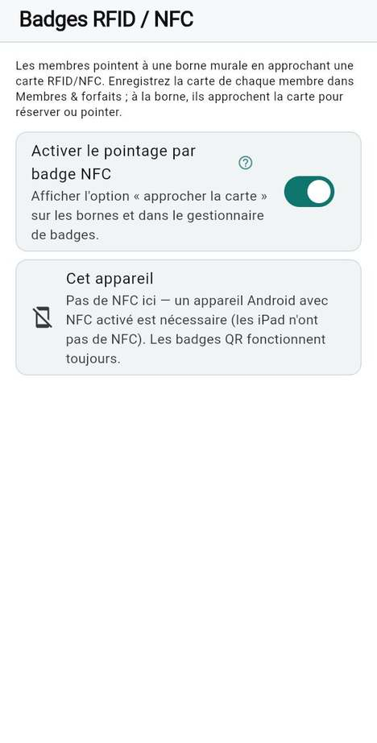

**Étapes**

1. Ouvrez [Badges RFID / NFC](https://fdittgen-png.github.io/deskilo/#/nfc-config).
2. Activez **Activer le pointage par badge NFC**.
3. Lisez la ligne **Cet appareil** : elle dit si cet appareil sait lire les cartes.
4. Donnez une carte à chaque membre dans [Membres et forfaits](https://fdittgen-png.github.io/deskilo/#/members) : ouvrez les badges du membre, touchez **Enregistrer une carte**, puis tenez la carte contre le dos de l'appareil.

**Bon à savoir**

- Il faut un appareil Android avec NFC. Les iPad n'ont pas de NFC, et les badges QR y fonctionnent quand même.
- Le gestionnaire de badges permet aussi d'émettre un **Nouveau badge**, d'en **Révoquer** un et de l'**Enregistrer en PDF** pour l'imprimer. Un badge révoqué peut être supprimé définitivement.
- **Me connecte** est désactivé par défaut : un badge qui vous pointe ne vous connecte pas tant que le membre ne le choisit pas.
- Chaque membre peut aussi créer son propre badge dans ses réglages personnels.

**Voir aussi:** [Une tablette murale pour le pointage](#mode-borne--une-tablette-murale-pour-le-pointage)

<!-- anchor: user.documents.add -->
### Ajouter un document à la bibliothèque

**Public:** Propriétaire · Administrateur·rice

Vous voulez réunir vos statuts, guides, états financiers et comptes rendus au même endroit pour les membres qui en ont besoin. La bibliothèque contient des liens, pas des fichiers.

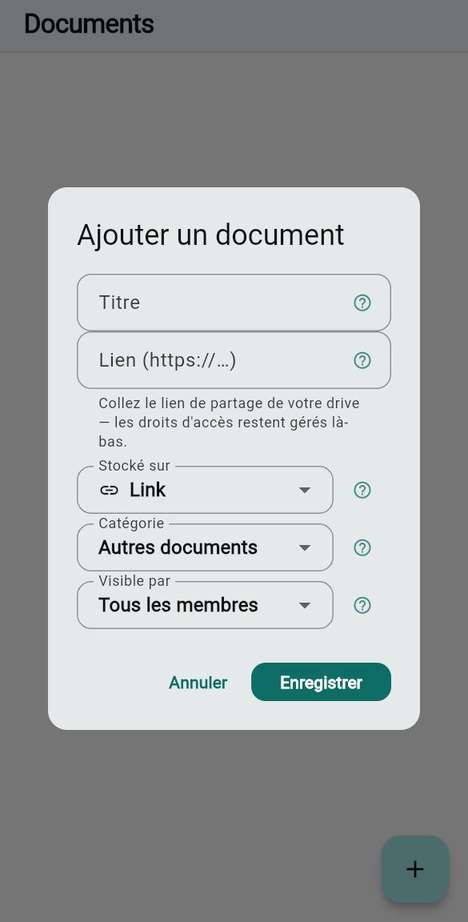

**Étapes**

1. Ouvrez [Documents](https://fdittgen-png.github.io/deskilo/#/documents) et touchez le bouton plus.
2. Remplissez **Intitulé** et **Lien (https://…)**.
3. Choisissez **Stocké sur**, **Catégorie** et **Visible par**.
4. Touchez **Enregistrer**.

**Bon à savoir**

- La bibliothèque demande la fonctionnalité **Bibliothèque de documents**, et la permission de la gérer.
- Retirez un document avec sa corbeille : elle demande d'abord **Retirer le document ?**
- Les membres autorisés à ouvrir la bibliothèque voient les documents auxquels ils ont droit, regroupés par catégorie.

**Voir aussi:** [Intitulé du document](#intitulé-du-document) · [Lien](#lien) · [Visible par](#visible-par)

<!-- anchor: user.documents.title -->
### Intitulé du document

**Public:** Propriétaire · Administrateur·rice

Vous voulez que les membres reconnaissent un document au premier coup d'œil.

**Étapes**

1. Dans le formulaire d'ajout de document, saisissez l'**Intitulé**.

**Bon à savoir**

- Un document a besoin d'un intitulé et d'un lien https://, sinon **Enregistrer** est refusé.
- Écrivez-le pour le lecteur : c'est la ligne qu'il voit dans la bibliothèque.

**Voir aussi:** [Ajouter un document à la bibliothèque](#ajouter-un-document-à-la-bibliothèque)

<!-- anchor: user.documents.url -->
### Lien

**Public:** Propriétaire · Administrateur·rice

Vous voulez que le document s'ouvre là où il se trouve déjà.

**Étapes**

1. Collez le lien de partage de votre espace de stockage dans **Lien (https://…)**.

**Bon à savoir**

- DesKilo conserve le lien, pas le fichier. Les droits d'accès restent gérés là où se trouve le document.
- Le lien doit commencer par https://.

**Voir aussi:** [Stocké sur](#stocké-sur)

<!-- anchor: user.documents.provider -->
### Stocké sur

**Public:** Propriétaire · Administrateur·rice

Vous voulez que les membres voient où le document est conservé.

**Étapes**

1. Choisissez **Stocké sur** : Google Drive, OneDrive, SharePoint, Dropbox, Nextcloud ou **Lien**.

**Bon à savoir**

- C'est une étiquette avec une icône. Rien n'est récupéré pour vous.

**Voir aussi:** [Lien](#lien)

<!-- anchor: user.documents.category -->
### Catégorie

**Public:** Propriétaire · Administrateur·rice

Vous voulez que la bibliothèque se lise comme une étagère bien rangée.

**Étapes**

1. Choisissez une **Catégorie** : **Statuts et juridique**, **Guides et manuels**, **États financiers**, **Comptes rendus** ou **Autres documents**.

**Bon à savoir**

- La bibliothèque regroupe les documents sous ces rubriques, et n'affiche une rubrique que si elle contient un document.

**Voir aussi:** [Visible par](#visible-par)

<!-- anchor: user.documents.role -->
### Visible par

**Public:** Propriétaire · Administrateur·rice

Vous voulez certains documents pour tout le monde et d'autres pour le bureau seulement.

**Étapes**

1. Choisissez **Visible par** : **Tous les membres**, **Admins et propriétaires** ou **Propriétaires uniquement**.

**Bon à savoir**

- Le serveur le fait respecter. Un membre qui n'a pas le droit de voir un document ne le reçoit pas du tout.

**Voir aussi:** [Ajouter un document à la bibliothèque](#ajouter-un-document-à-la-bibliothèque)

<!-- anchor: user.workspace.export.space-xml -->
### Exporter l'espace (XML)

**Public:** Propriétaire · Administrateur·rice avec l'autorisation

Vous voulez un fichier contenant le plan et les réglages, pour le garder en sauvegarde, le réutiliser ou le déplacer vers un autre espace.

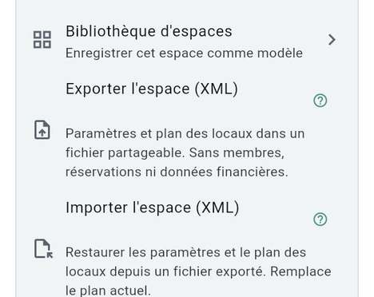

**Étapes**

1. Ouvrez [Espace](https://fdittgen-png.github.io/deskilo/#/workspace-settings) et allez à **Modèles et données**.
2. Touchez **Exporter l'espace (XML)**.

**Bon à savoir**

- Il contient les réglages et le plan. Il ne contient jamais de membres, de réservations ni de données financières, ni le code d'invitation ou les identifiants de paiement.
- Avec **Configuration dans le fichier de l'espace** activée, le fichier contient aussi les tarifs, les taux de TVA, les règles, les rôles et plus encore.
- Le fichier est enregistré sur votre appareil.

**Voir aussi:** [Importer l'espace (XML)](#importer-lespace-xml)

<!-- anchor: user.workspace.export.space-import -->
### Importer l'espace (XML)

**Public:** Propriétaire · Administrateur·rice avec l'autorisation

Vous voulez appliquer un fichier exporté à un espace.

**Étapes**

1. Dans [Espace](https://fdittgen-png.github.io/deskilo/#/workspace-settings), sous **Modèles et données**, touchez **Importer l'espace (XML)**.
2. Choisissez le fichier et lisez l'aperçu : étages, bureaux, tables, places et configuration.
3. Touchez **Remplacer et importer**.

**Bon à savoir**

- Cela remplace le plan actuel et écrase les réglages. Impossible de revenir en arrière.
- Dès qu'un espace a des réservations, seule la configuration est appliquée. Le plan est conservé, et l'application le dit.
- Un fichier illisible, ou qui ne vient pas de DesKilo, est refusé avec un message clair.

**Voir aussi:** [Exporter l'espace (XML)](#exporter-lespace-xml)

<!-- anchor: user.workspace.export.config-pdf -->
### Exporter la configuration (PDF)

**Public:** Propriétaire · Administrateur·rice avec l'autorisation

Vous voulez un document de tous les paramètres, à lire, à signer ou à remettre à un comptable.

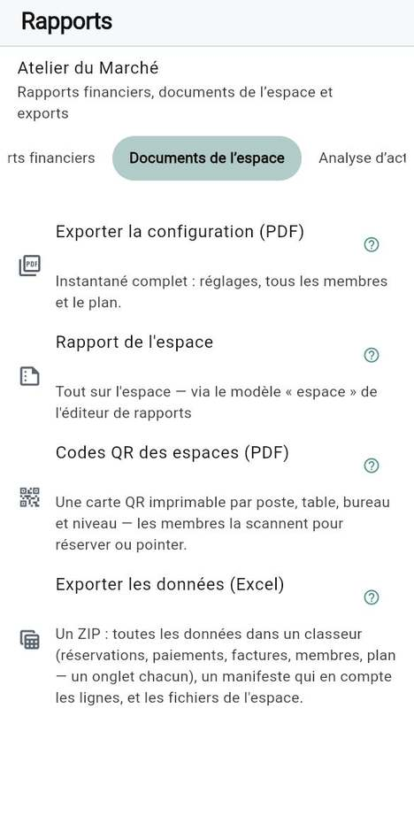

**Étapes**

1. Ouvrez [Rapports](https://fdittgen-png.github.io/deskilo/#/reports?section=documents) et choisissez **Documents de l’espace**.
2. Touchez **Exporter la configuration (PDF)**.

**Bon à savoir**

- C'est un instantané complet des réglages, des membres et du plan. C'est un justificatif, pas une sauvegarde : seul le XML peut être réimporté.

**Voir aussi:** [Exporter l'espace (XML)](#exporter-lespace-xml)

<!-- anchor: user.workspace.export.workspace-report -->
### Rapport de l'espace

**Public:** Propriétaire · Administrateur·rice avec l'autorisation

Vous voulez l'espace sous forme de document : ses places, ses prix et ses règles.

**Étapes**

1. Ouvrez [Rapports](https://fdittgen-png.github.io/deskilo/#/reports?section=documents) et choisissez **Documents de l’espace**.
2. Touchez **Rapport de l'espace**.

**Bon à savoir**

- Il est produit par le modèle d'espace de l'éditeur de rapports, son aspect suit donc la mise en page que vous avez choisie.

**Voir aussi:** [Exporter la configuration (PDF)](#exporter-la-configuration-pdf)

<!-- anchor: user.workspace.export.space-qr -->
### Codes QR des espaces (PDF)

**Public:** Propriétaire · Administrateur·rice avec l'autorisation

Vous voulez une carte QR sur chaque place, table, bureau et étage, pour que l'on réserve ou pointe en la scannant.

**Étapes**

1. Ouvrez [Rapports](https://fdittgen-png.github.io/deskilo/#/reports?section=documents) et choisissez **Documents de l’espace**.
2. Touchez **Codes QR des espaces (PDF)**.
3. Choisissez **Taille de la carte**, **Taille du code QR** et **Informations sur la carte**, puis touchez **Enregistrer**.
4. Imprimez, découpez et collez chaque carte sur sa place.

**Bon à savoir**

- Il faut la fonctionnalité **Codes QR des espaces**.
- Scanner une carte ouvre la même feuille que celle de la borne.

**Voir aussi:** [Une tablette murale pour le pointage](#mode-borne--une-tablette-murale-pour-le-pointage)

<!-- anchor: user.workspace.export.excel -->
### Exporter les données (Excel)

**Public:** Propriétaire · Administrateur·rice avec l'autorisation

Vous voulez vos chiffres dans un tableur pour votre propre analyse.

**Étapes**

1. Ouvrez [Rapports](https://fdittgen-png.github.io/deskilo/#/reports?section=documents) et choisissez **Documents de l’espace**.
2. Touchez **Exporter les données (Excel)**.

**Bon à savoir**

- Il arrive sous forme d'un seul ZIP : un classeur avec un onglet pour les réservations, les paiements, les factures, les membres et le plan, un manifeste qui compte les lignes, et les fichiers stockés de l'espace.
- Il faut la fonctionnalité **Export des données (Excel)** et l'autorisation d'exporter les données. C'est un export seulement : rien ne le relit.

**Voir aussi:** [Exporter l'espace (XML)](#exporter-lespace-xml)

<!-- anchor: user.workspace.sites -->
### Sites

**Public:** Propriétaire · Administrateur·rice

Vous gérez plus d'une adresse et voulez que chaque étage et chaque membre appartienne au bon site.

**Étapes**

1. Activez **Sites** dans [Fonctionnalités](https://fdittgen-png.github.io/deskilo/#/features).
2. Ouvrez [Sites](https://fdittgen-png.github.io/deskilo/#/settings/sites) et touchez **Ajouter un site**.
3. Remplissez **Nom du site**, **Rue**, **Code postal**, **Ville** et les étages qui en font partie.

**Bon à savoir**

- Le site par défaut porte l'adresse de l'espace. Le site d'attache d'un membre est l'adresse figurant sur ses documents.
- **Supprimer ce site** renvoie ses étages et ses membres au site par défaut.
- Un site qui est sa propre entité juridique peut porter son propre numéro d'immatriculation et de TVA.

<!-- anchor: user.people.overview -->
## Membres, formules et facturation

Ce chapitre s'adresse aux propriétaires et aux administrateurs facturation. Il suit l'argent de la personne jusqu'à la grille de prix : qui fait partie de votre espace et avec quelle formule, comment chaque formule est tarifée, ce que vous vendez d'autre, comment les membres vous paient, et les coûts que vous payez vous-même.

Dans ce chapitre :
- [Membres et forfaits](#membres-et-forfaits) : la liste, la page d'un membre et tout ce que vous pouvez régler pour une personne
- [Facturation](#paliers-tarifaires) : paliers tarifaires, niveaux d'abonnement, forfaits de jours et calendrier de facturation
- [Services et accessoires](#un-service) : les extras que vous vendez
- [Instructions de paiement et paiements en ligne](#moyens-de-paiement-et-instructions) : comment les membres vous paient
- [Dépenses programmées](#dépenses-programmées) : les coûts qui reviennent d'eux-mêmes

<!-- anchor: user.members.list -->
### Membres et forfaits

**Public:** Administrateur·rice · Propriétaire

Vous voulez voir qui fait partie de votre espace, avec quelle formule, et ouvrir n'importe quelle fiche pour en changer les réglages.

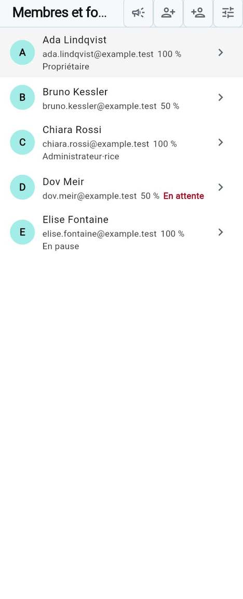

**Étapes**

1. Ouvrez [Membres et forfaits](https://fdittgen-png.github.io/deskilo/#/members) depuis le menu.
2. Lisez chaque ligne : l'e-mail, la part de la formule (ou **Sans abonnement**), le rôle, et un état quand il sort de l'ordinaire : **En attente**, **En pause** ou **Parti**.
3. Touchez une ligne pour ouvrir la [page du membre](#la-page-du-membre).

**Bon à savoir**

- Une ligne affiche aussi des pastilles **max** et **à la fois** quand vous avez fixé une [limite de réservations](#limite-de-réservations) ou plus d'une [réservation simultanée](#réservations-simultanées).
- Selon les fonctionnalités activées, la barre du haut (des boutons-icônes avec info-bulle) propose **Notifier tous les admins**, **Ajouter un profil géré** et, pour les propriétaires, **Inviter un membre** et **Facturation**.
- Les administrateurs accèdent aussi à cet écran ; les commandes qui touchent à l'argent ou aux rôles restent au propriétaire.

**Voir aussi:** [Inviter un membre](#inviter-un-membre) · [Facturation](#paliers-tarifaires)

<!-- anchor: user.members.invite -->
### Inviter un membre

**Public:** Propriétaire

Vous voulez qu'une personne rejoigne votre espace.

**Étapes**

1. Dans [Membres et forfaits](https://fdittgen-png.github.io/deskilo/#/members), touchez **Inviter un membre**.
2. Partagez l'identifiant de l'espace ou son code QR, comme décrit dans [L'identifiant de l'espace](#lid-de-lespace).
3. Quand la personne demande à rejoindre l'espace, sa ligne apparaît avec **En attente**. Ouvrez-la et choisissez **Approuver l'adhésion** ou **Refuser l'adhésion**.

**Bon à savoir**

- Un refus vous permet d'ajouter un court commentaire.
- Tant que vous n'avez pas décidé, la personne n'a aucun accès à l'espace.

**Voir aussi:** [Membres en attente et en pause](#membres-en-attente-et-en-pause) · [Ajouter un profil géré](#ajouter-un-profil-géré)

<!-- anchor: user.members.managed -->
### Ajouter un profil géré

**Public:** Administrateur·rice · Propriétaire

Quelqu'un n'a pas encore de compte, mais vous voulez réserver, facturer et gérer à sa place. Vous créez un profil, vous le gérez vous-même, et vous le remettez à la personne quand elle rejoint l'espace.

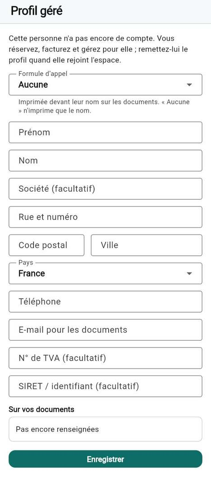

**Étapes**

1. Dans [Membres et forfaits](https://fdittgen-png.github.io/deskilo/#/members), touchez **Ajouter un profil géré**.
2. Renseignez l'identité de la personne et enregistrez. La page du membre porte alors une pastille **Géré**.
3. Pour corriger les informations plus tard, ouvrez la page du membre et choisissez **Modifier l'identité**.
4. Quand la personne est prête, choisissez **Remettre à la personne**. Cela crée un code personnel lié à ce profil.
5. Vous avez changé d'avis avant l'utilisation du code ? Choisissez **Annuler la remise**.

**Bon à savoir**

- Celui qui utilise le code reprend le profil, avec ses réservations, ses factures et son abonnement, dès que vous approuvez l'adhésion.
- Personne ne peut envoyer de message à un membre géré, puisque personne ne le lirait.
- La fonctionnalité doit être activée dans [Fonctionnalités](#un-interrupteur-de-fonctionnalité).

**Voir aussi:** [La page du membre](#la-page-du-membre)

<!-- anchor: user.members.page -->
### La page du membre

**Public:** Administrateur·rice · Propriétaire

Vous voulez tout savoir d'une personne sur une seule page : qui elle est, ce qu'elle a réservé, comment la joindre, ce qu'elle doit, et chaque réglage que vous pouvez modifier.

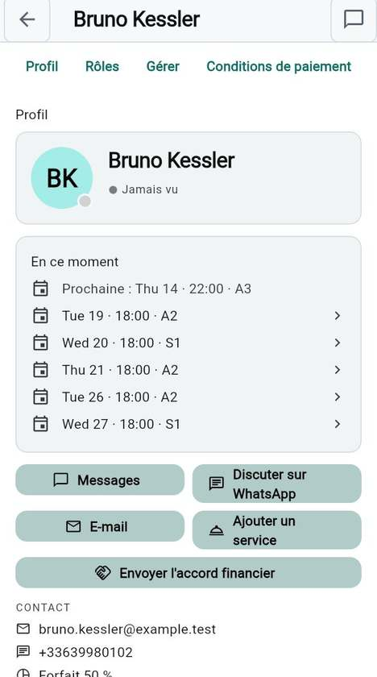

**Étapes**

1. Touchez un membre dans [Membres et forfaits](https://fdittgen-png.github.io/deskilo/#/members).
2. Lisez le haut de la page : **En ce moment** montre les prochaines réservations, puis viennent les coordonnées et la situation financière.
3. Utilisez les boutons sous le nom pour une action rapide. Selon les fonctionnalités et vos droits, vous verrez certains de ceux-ci : **Messages**, **E-mail**, **Ajouter un service** ou **Envoyer l'accord financier**.
4. Allez à **Gérer** pour modifier les réglages de la personne, regroupés en **Adhésion**, **Règles de réservation**, **Facturation** et **Badges et accès**.

**Bon à savoir**

- Chaque ligne de réglage affiche sa valeur actuelle : il est rare qu'il faille l'ouvrir pour connaître la réponse.
- Votre propre page est plus courte : personne ne peut s'accorder des droits à soi-même.
- Si la page n'est pas activée pour votre espace, les mêmes actions apparaissent dans une liste quand vous touchez la ligne.

**Voir aussi:** [Les actions sur le membre](#les-actions-sur-le-membre) · [Rôles et copropriétaires](#la-matrice-des-rôles)

<!-- anchor: user.members.actions -->
### Les actions sur le membre

**Public:** Administrateur·rice · Propriétaire

Vous voulez savoir quel réglage se trouve où, et qui peut le modifier.

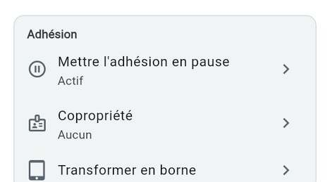

**Étapes**

1. Ouvrez la [page d'un membre](#la-page-du-membre) et allez à **Gérer**.
2. Dans **Adhésion**, choisissez **Mettre l'adhésion en pause** ou **Réactiver l'adhésion**, réglez la [Copropriété](#copropriété), ou choisissez **Transformer en borne**.
3. Dans **Règles de réservation**, réglez la [Limite de réservations](#limite-de-réservations), les [Réservations simultanées](#réservations-simultanées) et le [Traitement TVA](#traitement-tva) ; l'interrupteur **Réservations d'un espace entier** apparaît quand la fonctionnalité est activée.
4. Dans **Facturation**, réglez l'[Abonnement](#labonnement-dun-membre), [Quand les jours sont épuisés](#quand-les-jours-sont-épuisés) et la [Négociation tarifaire](#négociation-tarifaire).
5. Dans **Badges et accès**, ouvrez **Badges** pour délivrer ou révoquer les badges de la personne.

**Bon à savoir**

- Les changements de facturation et d'adhésion relèvent du propriétaire. Les administrateurs fixent les limites de réservation.
- Vous ne pouvez jamais modifier vos propres limites ni votre propre copropriété.
- La plupart de ces lignes ne sont proposées que pour les membres actifs.

**Voir aussi:** [Règles de réservation](#limite-de-réservations) · [Groupe Facturation](#labonnement-dun-membre)

<!-- anchor: user.members.pending -->
### Membres en attente et en pause

**Public:** Administrateur·rice · Propriétaire

Un nouvel arrivant attend votre décision, ou un membre fait une pause, et vous voulez que l'espace le traite en conséquence.

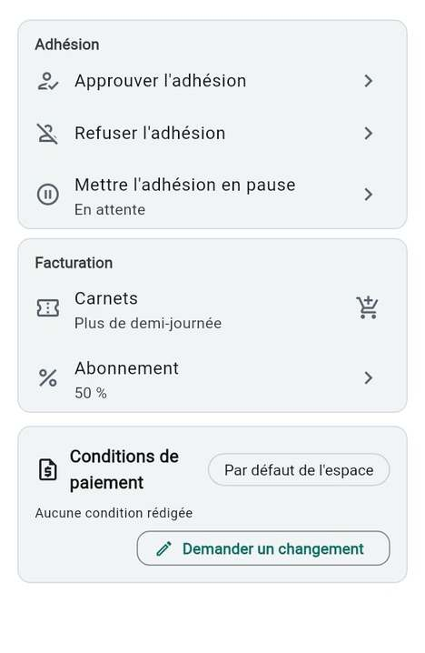

**Étapes**

1. Ouvrez le membre dont la ligne indique **En attente**.
2. Sous **Adhésion**, choisissez **Approuver l'adhésion** pour laisser entrer la personne, ou **Refuser l'adhésion** pour la refuser.
3. Pour mettre un membre actif en suspens, ouvrez sa page et choisissez **Mettre l'adhésion en pause**.
4. Pour le faire revenir, choisissez **Réactiver l'adhésion**.

**Bon à savoir**

- La décision sur un nouveau membre peut aussi passer par les règles de validation, comme décrit dans [Règles de validation](#règles-de-validation-domaine-par-domaine).
- La mise en pause est réservée aux propriétaires et conserve tout l'historique.
- Un membre parti affiche **Parti** et ne peut pas être mis en pause.

**Voir aussi:** [Inviter un membre](#inviter-un-membre)

<!-- anchor: user.members.subscription -->
### L'abonnement d'un membre

**Public:** Propriétaire

Vous voulez fixer la part des jours du mois à laquelle un membre a droit. La part détermine le palier tarifaire, et le palier fixe le prix mensuel.

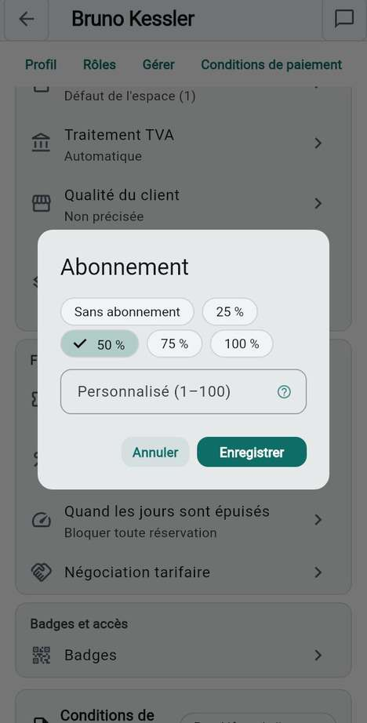

**Étapes**

1. Ouvrez la page du membre, allez à **Facturation** et touchez **Abonnement**.
2. Choisissez **Sans abonnement**, l'un des niveaux que vous proposez, ou saisissez un nombre dans **Personnalisé (1–100)**.
3. Touchez un niveau pour l'appliquer, ou **Enregistrer** pour une valeur personnalisée.

**Bon à savoir**

- Les niveaux proposés sont ceux que vous avez choisis dans [Niveaux d'abonnement](#niveaux-dabonnement).
- En tant que propriétaire, vous pouvez toujours saisir une valeur personnalisée.
- **Sans abonnement** convient aux visiteurs qui achètent des carnets. Il ne se combine pas avec le paiement à l'usage : choisissez d'abord un bloc ou un forfait.

**Voir aussi:** [Paliers tarifaires](#paliers-tarifaires) · [Quand les jours sont épuisés](#quand-les-jours-sont-épuisés)

<!-- anchor: user.members.overage-policy -->
### Quand les jours sont épuisés

**Public:** Propriétaire

Vous voulez décider ce qui se passe quand un membre a utilisé tout son quota mensuel.

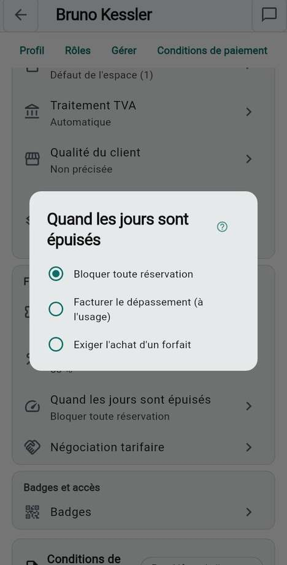

**Étapes**

1. Ouvrez la page du membre, allez à **Facturation** et touchez **Quand les jours sont épuisés**.
2. Choisissez **Bloquer toute réservation**, **Facturer le dépassement (à l'usage)** ou **Exiger l'achat d'un forfait**.

**Bon à savoir**

- Le paiement à l'usage est grisé pour un membre sans abonnement, car il lui permettrait de réserver gratuitement.
- Le prix du dépassement vient du [palier tarifaire](#dépassement) ; les forfaits viennent des [Forfaits de jours](#forfaits-de-jours).

**Voir aussi:** [L'abonnement d'un membre](#labonnement-dun-membre)

<!-- anchor: user.members.reservation-limit -->
### Limite de réservations

**Public:** Administrateur·rice · Propriétaire

Vous voulez plafonner le nombre total de réservations ouvertes qu'un membre peut détenir.

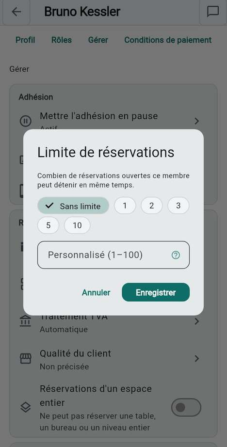

**Étapes**

1. Ouvrez la page du membre, allez à **Règles de réservation** et touchez **Limite de réservations**.
2. Touchez **Sans limite**, une valeur prédéfinie (1, 2, 3, 5 ou 10), ou saisissez un nombre dans **Personnalisé (1–100)**.
3. Touchez **Enregistrer** pour un nombre personnalisé.

**Bon à savoir**

- La limite compte toutes les réservations ouvertes, quelle que soit leur date. Ce n'est pas la même chose que les [réservations simultanées](#réservations-simultanées), qui comptent les chevauchements.
- La liste affiche **max** et le nombre à côté du membre.
- Vous ne pouvez pas fixer votre propre limite.

**Voir aussi:** [Limites de réservation](#limites-de-réservation)

<!-- anchor: user.members.simultaneous -->
### Réservations simultanées

**Public:** Administrateur·rice · Propriétaire

Vous voulez autoriser un membre à détenir des réservations qui se chevauchent dans le temps, par exemple deux places à la fois.

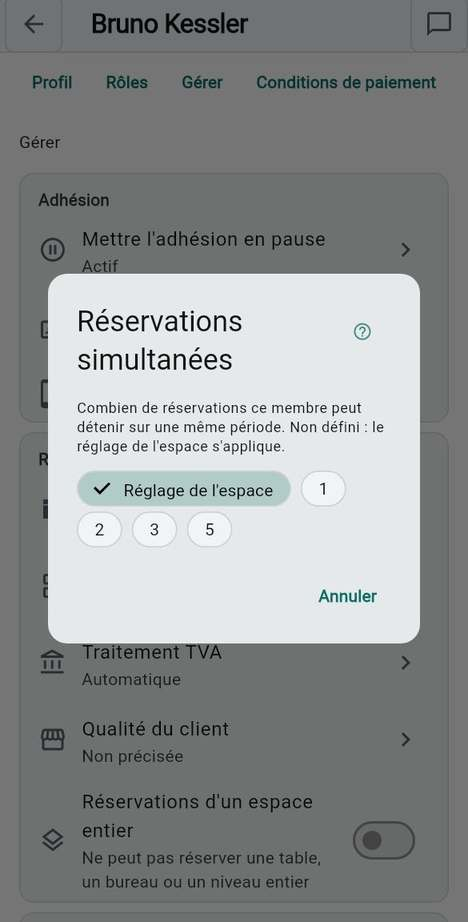

**Étapes**

1. Ouvrez la page du membre, allez à **Règles de réservation** et touchez **Réservations simultanées**.
2. Choisissez **Par défaut de l'espace**, ou un nombre : 1, 2, 3 ou 5.

**Bon à savoir**

- **Par défaut de l'espace** suit le nombre fixé dans [Disponibilité](#règles-de-réservation) ; un signifie une place à la fois.
- Ce n'est pas la même chose que la [limite de réservations](#limite-de-réservations), qui compte toutes les réservations ouvertes.
- Vous ne pouvez pas fixer la vôtre.

**Voir aussi:** [Règles de réservation](#règles-de-réservation)

<!-- anchor: user.members.vat-treatment -->
### Traitement TVA

**Public:** Administrateur·rice · Propriétaire

Vous voulez indiquer à l'app qui est ce membre au regard de la TVA, pour que ses factures portent la bonne taxe.

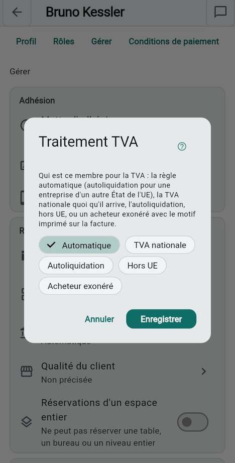

**Étapes**

1. Ouvrez la page du membre, allez à **Règles de réservation** et touchez **Traitement TVA**.
2. Choisissez **Automatique**, **TVA nationale**, **Autoliquidation**, **Hors UE** ou **Acheteur exonéré**.
3. Pour **Acheteur exonéré**, saisissez le **Motif d'exonération (imprimé sur la facture)**.
4. Touchez **Enregistrer**.

**Bon à savoir**

- **Automatique** applique la règle habituelle : autoliquidation pour une entreprise établie dans un autre État de l'UE.
- Le même groupe propose **Qualité du client** (**Professionnel**, **Consommateur** ou **Non précisée**), qui détermine les clauses de paiement qu'une facture imprime. Elle demande le droit d'émettre des factures.
- **Autoliquidation**, **Hors UE** et **Acheteur exonéré** sont enregistrés, mais les factures de ces membres ne peuvent pas encore être émises dans l'app : elles sont émises hors de l'app avec votre comptable.
- La fonctionnalité **TVA selon le client** doit être activée pour que la ligne Traitement de la TVA apparaisse, pour les administrateurs et les propriétaires ; les taux se règlent dans [Taux de TVA](#définir-les-taux).

**Voir aussi:** [Régime de TVA](#régime-de-tva)

<!-- anchor: user.members.negotiation -->
### Négociation tarifaire

**Public:** Administrateur·rice facturation · Propriétaire

Vous avez convenu avec un membre d'un prix différent de votre tarif, et vous voulez l'enregistrer comme un accord plutôt que de saisir par-dessus le tarif.

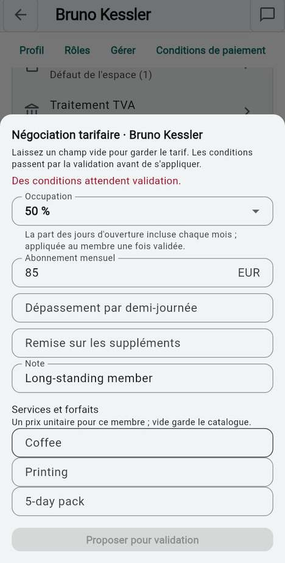

**Étapes**

1. Ouvrez la page du membre, allez à **Facturation** et touchez **Négociation tarifaire**.
2. Ne remplissez que ce qui diffère : **Occupation**, **Abonnement mensuel**, **Dépassement par demi-journée**, **Remise sur les suppléments**, ou un prix unitaire sous **Services et forfaits**.
3. Ajoutez une **Note** si c'est utile.
4. Touchez **Proposer pour validation**.

**Bon à savoir**

- Un champ laissé vide conserve le tarif.
- L'accord attend sa validation avant de s'appliquer, comme décrit dans [Règles de validation](#règles-de-validation-domaine-par-domaine).
- Une fois actif, le membre le voit sur sa page financière, avec **Qui peut voir ceci**. Les personnes qui peuvent seulement consulter les négociations le voient en **Lecture seule**.

**Voir aussi:** [Paliers tarifaires](#paliers-tarifaires)

<!-- anchor: user.members.co-ownership -->
### Copropriété

**Public:** Propriétaire

Vous voulez que quelqu'un partage la propriété avec vous, ou la reprenne si vous partez.

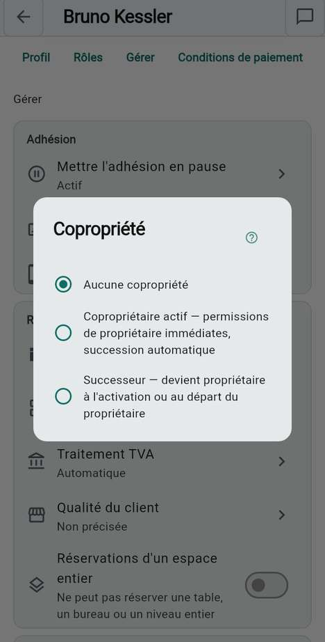

**Étapes**

1. Ouvrez la page du membre, allez à **Adhésion** et touchez **Copropriété**.
2. Choisissez **Aucune copropriété**, **Copropriétaire actif**, ou **Successeur**.
3. Pour faire d'un copropriétaire un propriétaire à part entière tout de suite, choisissez **Promouvoir propriétaire maintenant**.

**Bon à savoir**

- Un copropriétaire actif a dès maintenant les permissions de propriétaire, et reprend automatiquement la place si vous partez.
- Un successeur devient propriétaire quand il est promu ou quand le propriétaire part.
- La ligne affiche **Copropriétaire** ou **Successeur** dans la liste des membres.
- Elle demande que la fonctionnalité **Copropriétaires** soit activée, et vous ne pouvez pas modifier votre propre copropriété.

**Voir aussi:** [La matrice des rôles](#la-matrice-des-rôles)

<!-- anchor: user.money.billing.fee-bands -->
### Paliers tarifaires

**Public:** Propriétaire · Administrateur·rice facturation

Vous voulez fixer le prix de vos formules : ce que coûte un mois pour chaque part des jours, et ce que coûte une demi-journée en plus.

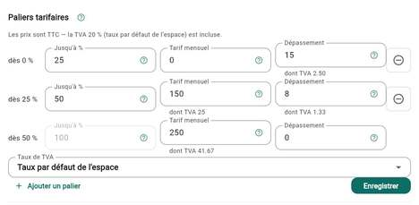

**Étapes**

1. Ouvrez [Facturation](https://fdittgen-png.github.io/deskilo/#/billing) depuis le menu.
2. Sous **Paliers tarifaires**, réglez **Jusqu'à %**, **Abonnement mensuel** et **Dépassement** sur chaque ligne.
3. Touchez **Ajouter un palier** pour scinder le dernier palier, ou l'icône moins pour en retirer un.
4. Choisissez le **Taux de TVA** auquel le tarif est taxé. Il est enregistré dès que vous le choisissez.
5. Touchez **Enregistrer** pour enregistrer les paliers.

**Bon à savoir**

- Chaque ligne commence où la précédente se termine, et la dernière se termine toujours à 100 %. Si les paliers ne s'additionnent pas, l'écran affiche « Les paliers doivent croître et se terminer à 100 %. »
- Les prix sont TTC : la TVA est comprise, lorsque votre espace en facture.
- Retirer un palier fusionne sa plage avec celle d'avant.

**Voir aussi:** [L'abonnement d'un membre](#labonnement-dun-membre) · [Niveaux d'abonnement](#niveaux-dabonnement)

<!-- anchor: user.money.billing.band-to -->
#### Jusqu'à %

Le haut du palier, de 1 à 100. Le palier suivant commence où celui-ci se termine : un pourcentage tombe donc toujours dans un seul palier. Le dernier palier est fixé à 100.

<!-- anchor: user.money.billing.band-fee -->
#### Abonnement mensuel

Ce que coûte un mois dans ce palier. Quand vous facturez la TVA, la ligne affiche la part de TVA comprise.

<!-- anchor: user.money.billing.band-overage -->
#### Dépassement

Le prix d'une demi-journée au-delà du quota, pour les membres dont la règle est le paiement à l'usage.

<!-- anchor: user.money.billing.levels -->
### Niveaux d'abonnement

**Public:** Propriétaire · Administrateur·rice facturation

Vous voulez choisir les pourcentages que vous proposez quand vous donnez une formule à quelqu'un.

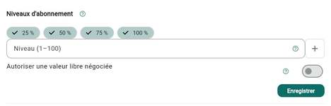

**Étapes**

1. Dans [Facturation](https://fdittgen-png.github.io/deskilo/#/billing), repérez **Niveaux d'abonnement**.
2. Touchez une valeur prédéfinie (25 %, 50 %, 75 %, 100 %) pour l'activer ou la désactiver.
3. Pour ajouter la vôtre, saisissez un nombre dans **Niveau (1–100)** et touchez **Ajouter un niveau**.
4. Touchez **Enregistrer**.

**Bon à savoir**

- Les niveaux que vous retenez sont ceux proposés dans l'[Abonnement](#labonnement-dun-membre) d'un membre.
- Retirez un niveau que vous avez ajouté avec la croix de sa pastille.

**Voir aussi:** [Paliers tarifaires](#paliers-tarifaires)

<!-- anchor: user.money.billing.level-value -->
#### Valeur du niveau

Un pourcentage de 1 à 100 : la part des jours du mois que la formule inclut.

<!-- anchor: user.money.billing.custom-level -->
#### Autoriser une valeur négociée

L'interrupteur **Autoriser une valeur libre négociée** est enregistré avec les niveaux. En tant que propriétaire, vous pouvez toujours saisir un pourcentage personnalisé dans l'**Abonnement** d'un membre, quel que soit l'état de cet interrupteur.

<!-- anchor: user.money.billing.packages -->
### Forfaits de jours

**Public:** Propriétaire · Administrateur·rice facturation

Vous voulez vendre des blocs de jours aux membres qui épuisent leur quota.

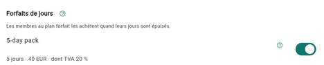

**Étapes**

1. Dans [Facturation](https://fdittgen-png.github.io/deskilo/#/billing), repérez **Forfaits de jours**. Chaque ligne affiche les jours, le prix et un interrupteur.
2. Désactivez un forfait pour arrêter de le vendre, ou activez-le pour le vendre à nouveau.
3. Pour créer un forfait, suivez [Nouveau forfait](#nouveau-forfait).

**Bon à savoir**

- Les membres dont la règle est **Exiger l'achat d'un forfait** achètent ceux-ci quand leurs jours sont épuisés.
- Un forfait déjà vendu conserve son prix, ses jours et son taux. Pour les changer, désactivez-le et ajoutez-en un nouveau.

**Voir aussi:** [Quand les jours sont épuisés](#quand-les-jours-sont-épuisés)

<!-- anchor: user.money.billing.package-new -->
### Nouveau forfait

**Public:** Propriétaire · Administrateur·rice facturation

Vous voulez ajouter un bloc de jours à votre grille de prix.

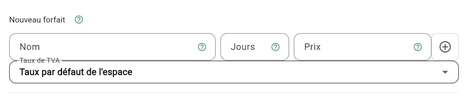

**Étapes**

1. Dans [Facturation](https://fdittgen-png.github.io/deskilo/#/billing), sous **Nouveau forfait**, saisissez le nom, les jours et le prix.
2. Choisissez son **Taux de TVA**.
3. Touchez **Ajouter un forfait**.

**Bon à savoir**

- Le forfait est en vente dès qu'il apparaît, activé.
- Lorsque la fonctionnalité des carnets est activée, un éditeur **Carnets** se trouve en dessous.

**Voir aussi:** [Forfaits de jours](#forfaits-de-jours)

<!-- anchor: user.money.billing.package-name -->
#### Nom du forfait

Ce que les membres voient à l'achat, et ce que dit la ligne de facture.

<!-- anchor: user.money.billing.package-days -->
#### Jours du forfait

Combien de jours le forfait accorde, un ou plus.

<!-- anchor: user.money.billing.package-price -->
#### Prix du forfait

Le prix de l'ensemble du forfait, TTC. La ligne affiche les jours, le prix et, quand la TVA s'applique, la TVA comprise.

<!-- anchor: user.money.billing.schedule -->
### Calendrier de facturation

**Public:** Propriétaire · Administrateur·rice facturation

Vous voulez choisir quand partent les deux factures automatiques : l'abonnement avant le mois, et la consommation du mois après.

**Étapes**

1. Ouvrez [Espace de coworking](https://fdittgen-png.github.io/deskilo/#/workspace-settings) et le groupe **Paiements et facturation**.
2. Touchez **Calendrier de facturation**.
3. Sous **Abonnement, à l’avance**, activez ou désactivez **Émettre automatiquement** et choisissez **Jours avant le début du mois**. La ligne en dessous indique la date obtenue.
4. Sous **Le mois qui vient de finir**, activez ou désactivez **Émettre automatiquement**. Activez **Même s’il n’y a rien à payer** pour envoyer un document à zéro.
5. Touchez **Enregistrer**.

**Bon à savoir**

- Chaque moitié demande que sa fonctionnalité soit activée dans [Fonctionnalités](#un-interrupteur-de-fonctionnalité) : « Factures d'abonnement » et « Factures de fin de mois ».
- La facture d'abonnement peut donc porter sur un mois qui n'a pas encore commencé.

**Voir aussi:** [Règles de rappel](#règles-de-relance) · [Paliers tarifaires](#paliers-tarifaires)

<!-- anchor: user.money.services.overview -->
### Un service

**Public:** Propriétaire · Administrateur·rice facturation

Vous vendez autre chose qu'une place : un casier, de l'impression, du café. Vous le listez une fois et l'ajoutez au mois d'un membre en un geste.

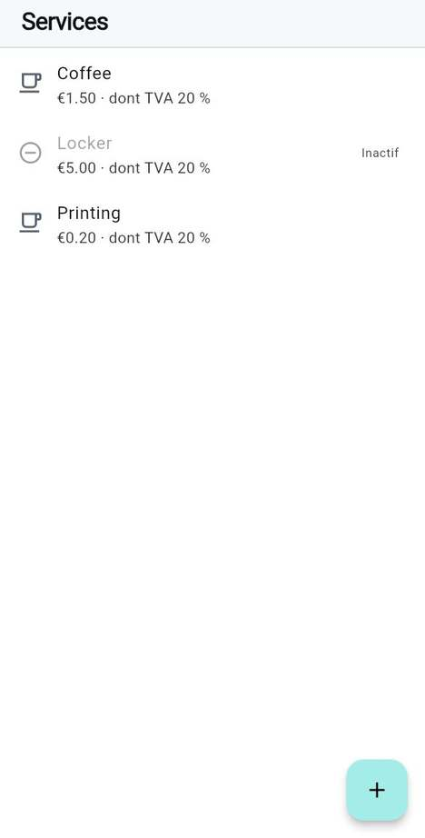

**Étapes**

1. Ouvrez [Services](https://fdittgen-png.github.io/deskilo/#/services) depuis le menu.
2. Touchez un service pour le modifier, ou le bouton plus pour créer un **Nouveau service**.
3. Renseignez le [Nom](#nom-du-service), le [Prix](#prix-du-service) et, quand vous facturez la TVA, le **Taux de TVA**.
4. Touchez **Enregistrer**.

**Bon à savoir**

- Un service n'est jamais supprimé, seulement désactivé, car des factures s'y réfèrent.
- Un service issu d'un stock indique combien il en reste, ou **Épuisé**.
- Pour en enregistrer un pour un membre, utilisez **Ajouter un service** sur sa page.

**Voir aussi:** [Accessoires](#accessoires) · [La page du membre](#la-page-du-membre)

<!-- anchor: user.money.services.name -->
#### Nom du service

Ce que dit la ligne de facture. Renommez-le et seuls les nouveaux documents changent.

<!-- anchor: user.money.services.price -->
#### Prix du service

Le prix d'une unité, TTC : le membre paie exactement cette somme, TVA comprise. Le **Taux de TVA** décide seulement quelle part en est de la taxe.

<!-- anchor: user.money.services.active -->
#### Actif

Quand vous modifiez un service, l'interrupteur **Actif** décide s'il peut encore être vendu. Désactivez-le pour ce qui est arrêté ; la liste le grise et écrit **Inactif**.

<!-- anchor: user.money.accessories -->
### Accessoires

**Public:** Administrateur·rice · Propriétaire

Vous louez du matériel avec une place, comme un écran ou une chaise, et vous facturez un supplément par demi-journée.

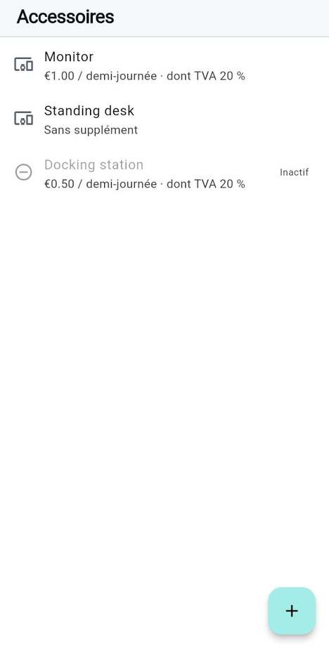

**Étapes**

1. Ouvrez [Accessoires](https://fdittgen-png.github.io/deskilo/#/accessories) depuis le menu.
2. Touchez un accessoire, ou le bouton plus pour **Nouvel accessoire**.
3. Renseignez **Libellé** et **Supplément par demi-journée** ; choisissez le **Taux de TVA** si votre espace facture la TVA.
4. Désactivez **Actif** pour ne plus le proposer, puis touchez **Enregistrer**.

**Bon à savoir**

- La liste affiche chaque supplément comme un montant « par demi-journée », ou **Sans supplément**.
- Comme les services, les accessoires sont désactivés, jamais supprimés.
- La fonctionnalité doit être activée dans [Fonctionnalités](#un-interrupteur-de-fonctionnalité).

**Voir aussi:** [Un service](#un-service)

<!-- anchor: user.money.payments.methods -->
### Moyens de paiement et instructions

**Public:** Propriétaire · Administrateur·rice facturation

Vous voulez que les membres sachent comment vous payer par virement ou par portefeuille électronique, sans devoir leur envoyer les coordonnées à chaque fois.

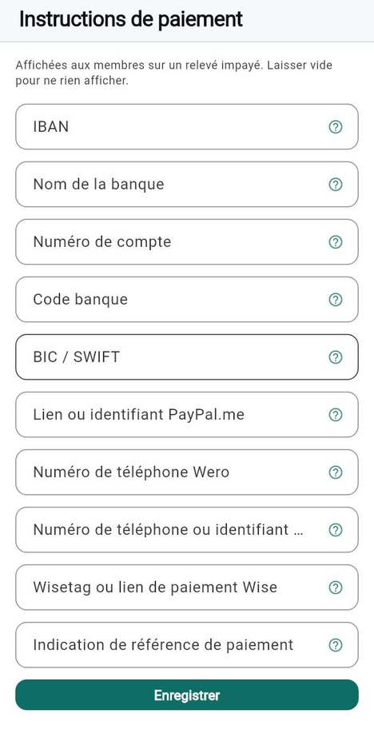

**Étapes**

1. Ouvrez [Instructions de paiement](https://fdittgen-png.github.io/deskilo/#/payment-methods) depuis le menu.
2. Renseignez ce qui s'applique : **IBAN**, **Nom de la banque**, **Numéro de compte**, le code banque, **BIC / SWIFT**.
3. Ajoutez les portefeuilles que vous acceptez : **Lien ou identifiant PayPal.me**, **Numéro de téléphone Wero**, **Numéro de téléphone ou identifiant Lydia**, **Wisetag ou lien de paiement Wise**.
4. Ajoutez une **Indication de référence de paiement** si les membres doivent rappeler quelque chose.
5. Touchez **Enregistrer**.

**Bon à savoir**

- Les membres voient ces coordonnées sur un relevé impayé. Laissez tout vide pour ne rien afficher.
- Le champ du code banque porte le nom en usage dans votre pays : sort code, routing number ou code banque.
- Il s'agit d'un paiement manuel. Pour laisser les membres payer par carte dans l'app, voir [Le prestataire de paiement](#le-prestataire-de-paiement).

**Voir aussi:** [Identifiants du prestataire](#identifiants-du-prestataire)

<!-- anchor: user.money.payments.provider -->
### Le prestataire de paiement

**Public:** Propriétaire

Vous voulez que les membres règlent une facture en cours en ligne, sur votre propre compte chez le prestataire.

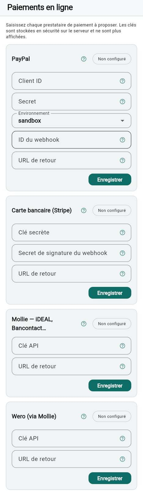

**Étapes**

1. Activez la fonctionnalité de paiements en ligne dans [Fonctionnalités](#un-interrupteur-de-fonctionnalité).
2. Ouvrez [Paiements en ligne](https://fdittgen-png.github.io/deskilo/#/payment-config) depuis le menu.
3. Repérez le prestataire que vous utilisez : **PayPal**, **Carte bancaire (Stripe)**, **Mollie — iDEAL, Bancontact…** ou **Wero (via Mollie)**.
4. Renseignez ses clés, comme décrit dans [Identifiants du prestataire](#identifiants-du-prestataire), et touchez **Enregistrer**.
5. Vérifiez que la carte indique **Configuré**.

**Bon à savoir**

- Chaque prestataire est une carte distincte avec une pastille d'état, **Configuré** ou **Non configuré**.
- Wero est payé via Mollie : saisissez la même clé API Mollie et la même URL de retour sur la carte Wero que sur la carte Mollie.
- Les prestataires prélèvent leurs propres frais. Le virement manuel reste gratuit.
- **Retirer** efface un prestataire.

**Voir aussi:** [Moyens de paiement](#moyens-de-paiement-et-instructions)

<!-- anchor: user.money.payments.credentials -->
#### Identifiants du prestataire

Les clés viennent du tableau de bord du prestataire : **Client ID**, **Secret**, **Environnement**, **ID du webhook** et **URL de retour** pour PayPal ; **Clé secrète**, **Secret de signature du webhook** et **URL de retour** pour Stripe ; **Clé API** et **URL de retour** pour Mollie et Wero. Gardez les clés de test et de production séparées : toutes les clés que vous saisissez doivent appartenir au même mode.

Les secrets sont stockés sur le serveur et ne sont plus jamais affichés. Un secret enregistré indique **Défini — laisser vide pour conserver** ; saisissez une nouvelle valeur pour le remplacer.

<!-- anchor: user.money.expenses.schedule -->
### Dépenses programmées

**Public:** Membre · Administrateur·rice · Propriétaire

Vous payez quelque chose qui revient, comme internet ou l'électricité. Vous la décrivez une fois et l'app vous présente chaque échéance.

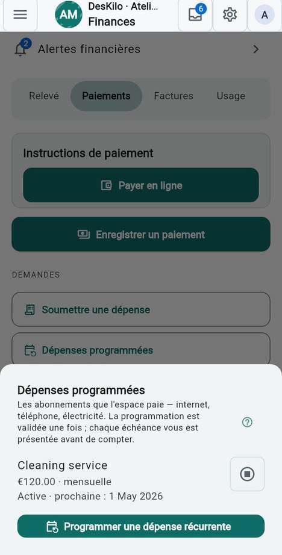

**Étapes**

1. Ouvrez [Finances](https://fdittgen-png.github.io/deskilo/#/money) et la face **Paiements**.
2. Touchez **Dépenses programmées**. Les programmations existantes affichent leur montant, leur règle, leur état et leur prochaine date.
3. Touchez **Programmer une dépense récurrente** et remplissez le formulaire, comme décrit dans [Quoi](#quoi) et les champs qui suivent.
4. Touchez **Programmer**.

**Bon à savoir**

- Une nouvelle programmation est **En attente de validation** jusqu'à ce que les validateurs la confirment, puis **Active**. Elle peut aussi finir **Rejetée** ou **Terminée**.
- Chaque échéance vous est ensuite présentée avant de compter : confirmez-la au montant validé, ou à un autre montant avec une explication, qui est validé à nouveau.
- Touchez **Terminer cette programmation** pour en arrêter une. Les programmations terminées sont listées sous **Terminées et refusées**.
- La fonctionnalité doit être activée dans [Fonctionnalités](#un-interrupteur-de-fonctionnalité).

**Voir aussi:** [Règles de validation](#règles-de-validation-domaine-par-domaine)

<!-- anchor: user.money.expenses.what -->
#### Quoi

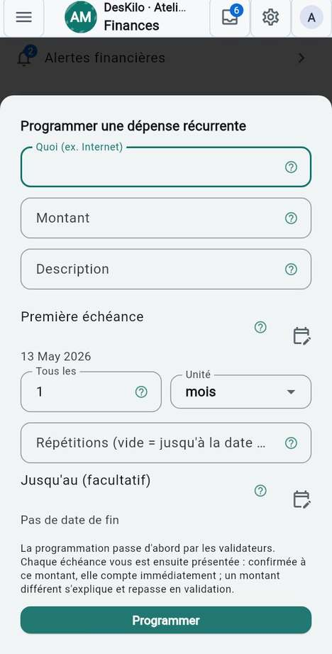

Le nom que porte chaque occurrence, par exemple Internet. Écrivez-le comme vous voulez le relire plus tard. **Montant** est ce que coûte une occurrence, et **Description** est un texte facultatif pour la personne qui valide.

<!-- anchor: user.money.expenses.amount -->
#### Montant

Ce que coûte une occurrence, dans la devise de votre espace. Un montant différent à la confirmation demande une explication et est validé à nouveau.

<!-- anchor: user.money.expenses.description -->
#### Description

Texte facultatif pour les validateurs, comme un numéro de contrat ou une référence fournisseur.

<!-- anchor: user.money.expenses.starts-on -->
#### Première échéance

La date à laquelle la première échéance tombe. Toutes les dates suivantes se comptent à partir d'ici.

<!-- anchor: user.money.expenses.every -->
#### Tous les

L'intervalle, un nombre et une unité : jours, semaines, mois ou années. Tous les 1 mois se lit « mensuel ».

<!-- anchor: user.money.expenses.times -->
#### Nombre de fois

Le champ **Répétitions (vide = jusqu'à la date de fin)** : combien d'occurrences générer.

<!-- anchor: user.money.expenses.ends-on -->
#### Jusqu'au

**Jusqu'au (facultatif)** est la date après laquelle plus rien n'est généré. Avec à la fois un nombre et une date, la série s'arrête au premier des deux atteint. Sans aucun des deux, elle continue jusqu'à ce que vous y mettiez fin.

<!-- anchor: user.invoicing.overview -->
## Fiscalité, facturation et comptabilité

Pour les propriétaires et les administrateurs facturation : qui vous êtes en tant que vendeur, comment la TVA est gérée, où partent les factures électroniques, à quoi ressemblent vos documents, et le rythme mensuel pour émettre, envoyer et relancer les factures.

> **Attention** DesKilo imprime ce que vous déclarez et vérifie que les informations obligatoires sont présentes. Il ne certifie ni vos factures, ni votre traitement de la TVA, ni votre comptabilité. Chaque fois qu'une section ci-dessous dit « à confirmer avec votre comptable », faites-le.

Dans ce chapitre :
- Votre identité légale et les mentions imprimées sur chaque facture
- La TVA : régime, numéro, taux, groupes et déclaration périodique
- La facturation électronique : où part la facture lisible par une machine
- Le modèle PDF de facture et l'éditeur de rapports
- Émettre et clôturer un mois : l'écran Facturation, l'assistant de clôture, le regroupement, les dépenses partagées
- Les relances de paiement
- Le registre des factures, les exports comptables et l'analyse d'activité

<!-- anchor: user.money.legal.identity -->
### Votre identité légale

**Public:** Propriétaire

Vous voulez que vos factures vous désignent correctement : qui vous êtes, comment vous êtes immatriculé et comment vous facturez la TVA.

**Étapes**

1. Ouvrez [Espace de coworking](https://fdittgen-png.github.io/deskilo/#/workspace-settings) et touchez **Identité légale et facturation électronique**, ou allez directement à [Identité légale et facturation électronique](https://fdittgen-png.github.io/deskilo/#/legal-identity).
2. Avancez de haut en bas : le régime de TVA d'abord, puis les identifiants, l'adresse et les **Mentions de facturation**.
3. Touchez **Enregistrer** en bas.

**Bon à savoir**

- L'écran n'affiche que les champs dont votre régime de TVA a besoin. Changez de régime et le formulaire suit.
- Les factures déjà émises gardent l'identité avec laquelle elles ont été signées. Un changement s'applique aux suivantes.
- Seuls les propriétaires peuvent ouvrir cet écran.

**Voir aussi:** [Régime de TVA](#régime-de-tva) · [Type d'organisation](#type-dorganisation) · [Facturation électronique](#la-plateforme-de-facturation-électronique)

<!-- anchor: user.money.legal.seller-kind -->
### Type d'organisation

**Public:** Propriétaire

Vous dirigez soit une entreprise, soit une association à but non lucratif, et vos factures doivent le refléter.

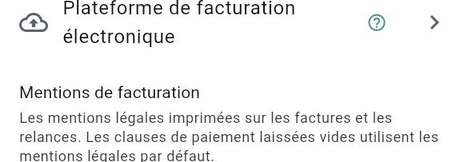

**Étapes**

1. Ouvrez [Identité légale et facturation électronique](https://fdittgen-png.github.io/deskilo/#/legal-identity) et descendez jusqu'à **Mentions de facturation**.
2. Choisissez **Entreprise** ou **Association (loi 1901)**.
3. Touchez **Enregistrer**.

**Bon à savoir**

- Pour une association, les textes d'exemple changent (par exemple une immatriculation de type RNA plutôt qu'un registre du commerce). Les clauses de paiement imprimées dépendent de votre pays et de la qualité du client, pas du type d'organisation.
- Une association sans activité commerciale est normalement hors du champ de la TVA. L'écran vous avertit si vous choisissez « exonéré » pour une association ; confirmez le bon choix avec votre comptable.

**Voir aussi:** [Qualité du client](#qualité-du-client-par-défaut) · [Régime de TVA](#régime-de-tva)

<!-- anchor: user.money.legal.customer-capacity -->
### Qualité du client par défaut

**Public:** Propriétaire

Les clients professionnels et les particuliers n'ont pas droit aux mêmes clauses de paiement. Vous fixez la valeur par défaut de l'espace.

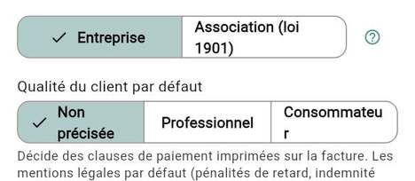

**Étapes**

1. Dans **Mentions de facturation**, repérez **Qualité du client par défaut**.
2. Choisissez **Non précisée**, **Professionnel** ou **Consommateur**.
3. Touchez **Enregistrer**.

**Bon à savoir**

- Les valeurs légales par défaut des pénalités de retard, de l'indemnité de recouvrement et de l'escompte ne s'appliquent qu'aux clients professionnels d'un espace établi en France ; pour les autres pays, rien n'est imprimé sauf ce que vous avez écrit. Un consommateur ne reçoit jamais l'indemnité de recouvrement.
- La qualité propre à un membre l'emporte sur cette valeur par défaut.
- Chaque facture conserve les clauses avec lesquelles elle a été émise.

**Voir aussi:** [Pénalités de retard](#pénalités-de-retard) · [Indemnité de recouvrement](#indemnité-de-recouvrement)

<!-- anchor: user.money.legal.legal-form -->
### Forme juridique et capital

**Public:** Propriétaire

Vos factures indiquent la forme juridique de votre entreprise et, le cas échéant, son capital social.

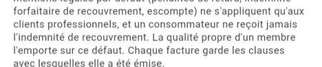

**Étapes**

1. Dans **Mentions de facturation**, touchez **Forme juridique et capital**.
2. Saisissez la ligne telle qu'elle doit s'imprimer, par exemple « SARL au capital de 7 500 € » (une association écrira peut-être « Association loi 1901 »).
3. Touchez **Enregistrer**.

**Bon à savoir**

- Le texte est imprimé tel que vous le saisissez, jusqu'à 300 caractères. Vérifiez avec votre comptable la formulation exacte exigée pour votre forme juridique.

**Voir aussi:** [Registre du commerce](#registre-du-commerce-rcs)

<!-- anchor: user.money.legal.registration -->
### Registre du commerce (RCS)

**Public:** Propriétaire

Vous indiquez où votre organisation est immatriculée.

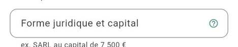

**Étapes**

1. Dans **Mentions de facturation**, touchez **Registre du commerce (RCS)**.
2. Saisissez la ligne d'immatriculation, par exemple « RCS Saint-Brieuc 680 357 910 ». Une association peut indiquer un numéro RNA, et un SIRET si elle en a un.
3. Touchez **Enregistrer**.

**Bon à savoir**

- Cette ligne est une mention imprimée sur le document. L'identifiant dont la facture électronique elle-même a besoin est le [numéro d'immatriculation](#numéro-dimmatriculation) ou le [numéro de TVA](#numéro-de-tva), selon votre régime.

**Voir aussi:** [Forme juridique et capital](#forme-juridique-et-capital)

<!-- anchor: user.money.legal.payment-terms -->
### Modalités de règlement

**Public:** Propriétaire

Vous indiquez quand les factures sont dues.

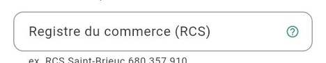

**Étapes**

1. Dans **Mentions de facturation**, touchez **Modalités de règlement**.
2. Saisissez vos conditions, par exemple « Paiement sous 30 jours à compter de la date de facture ».
3. Touchez **Enregistrer**.

**Bon à savoir**

- Laissé vide, les factures impriment « Règlement à réception. »
- Un membre peut avoir ses propres modalités de règlement ; elles s'impriment alors sur ses documents à la place.
- Les relances ne lisent pas ce texte : elles comptent à partir de la date de la facture plus **Jours avant la première relance** dans les règles de relance. Les conditions de paiement sont seulement ce que le document imprime.

**Voir aussi:** [Règles de relance](#règles-de-relance)

<!-- anchor: user.money.legal.late-penalty -->
### Pénalités de retard

**Public:** Propriétaire

Vous indiquez la pénalité en cas de paiement tardif.

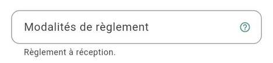

**Étapes**

1. Dans **Mentions de facturation**, touchez **Pénalités de retard**.
2. Saisissez votre clause, ou laissez le champ vide.
3. Touchez **Enregistrer**.

**Bon à savoir**

- Laissé vide, rien n'est inventé à votre place, sauf pour un espace établi en France qui facture un client professionnel : la formulation légale s'imprime alors (trois fois le taux d'intérêt légal).
- Confirmez avec votre comptable la clause qui s'applique à votre pays.

**Voir aussi:** [Qualité du client par défaut](#qualité-du-client-par-défaut)

<!-- anchor: user.money.legal.recovery -->
### Indemnité de recouvrement

**Public:** Propriétaire

Vous indiquez l'indemnité forfaitaire pour frais de recouvrement.

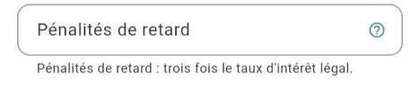

**Étapes**

1. Dans **Mentions de facturation**, touchez **Indemnité de recouvrement**.
2. Saisissez votre clause, ou laissez le champ vide.
3. Touchez **Enregistrer**.

**Bon à savoir**

- Laissée vide, l'indemnité forfaitaire de 40 € ne s'imprime que sur les factures d'un espace établi en France à un client professionnel.
- Un consommateur ne reçoit jamais cette mention.

**Voir aussi:** [Qualité du client par défaut](#qualité-du-client-par-défaut)

<!-- anchor: user.money.legal.escompte -->
### Escompte

**Public:** Propriétaire

Vous indiquez si un paiement anticipé donne droit à une remise.

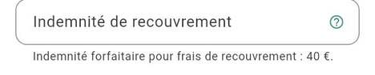

**Étapes**

1. Dans **Mentions de facturation**, touchez **Escompte**.
2. Saisissez les conditions de votre escompte, ou laissez le champ vide.
3. Touchez **Enregistrer**.

**Bon à savoir**

- Laissées vides, les factures d'un espace établi en France à un client professionnel impriment « Aucun escompte pour paiement anticipé. » ; ailleurs, la ligne est omise sauf si vous en rédigez une.

**Voir aussi:** [Modalités de règlement](#modalités-de-règlement)

<!-- anchor: user.money.legal.insurance -->
### Assurance professionnelle

**Public:** Propriétaire

Si votre activité vous oblige à indiquer votre assurance professionnelle, elle s'imprime sur vos factures.

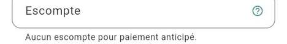

**Étapes**

1. Dans **Mentions de facturation**, touchez **Assurance professionnelle**.
2. Saisissez l'assureur, le contrat et la couverture géographique tels qu'ils doivent se lire.
3. Touchez **Enregistrer**.

**Bon à savoir**

- Il n'y a pas de valeur par défaut : un champ vide n'imprime rien.
- L'obligation de l'indiquer dépend de votre activité. Demandez à votre comptable.

**Voir aussi:** [Mentions particulières](#mentions-particulières)

<!-- anchor: user.money.legal.special-mentions -->
### Mentions particulières

**Public:** Propriétaire

Une ligne de votre choix qui doit figurer sur chaque facture.

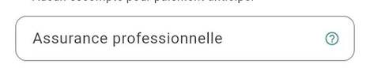

**Étapes**

1. Dans **Mentions de facturation**, touchez **Mentions particulières**.
2. Saisissez le texte.
3. Touchez **Enregistrer**.

**Bon à savoir**

- Rien ne s'imprime quand le champ est vide.
- Sous les mentions, lorsque la fonctionnalité **Fenêtre d'adresse** est activée, **Fenêtre d'adresse** règle l'emplacement de l'adresse du destinataire pour qu'elle apparaisse dans une enveloppe à fenêtre.

**Voir aussi:** [Le modèle PDF de facture](#le-modèle-pdf-de-facture)

<!-- anchor: user.money.vat.regime -->
### Régime de TVA

**Public:** Propriétaire

Vous déclarez la situation de votre organisation au regard de la TVA. Ce choix détermine le numéro dont vos documents ont besoin.

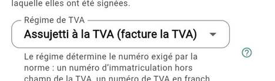

**Étapes**

1. Ouvrez [Identité légale et facturation électronique](https://fdittgen-png.github.io/deskilo/#/legal-identity).
2. Dans **Régime de TVA**, choisissez **Hors du champ de la TVA**, **Exonéré de TVA (franchise en base)** ou **Assujetti à la TVA (facture la TVA)**.
3. Touchez **Enregistrer**.

**Bon à savoir**

- Hors du champ de la TVA : aucun numéro de TVA n'est imprimé ; c'est le numéro d'immatriculation qui vous identifie.
- Exonéré ou assujetti : votre numéro de TVA est demandé.
- Choisir le régime est une décision fiscale, pas un réglage logiciel. Confirmez-le avec votre comptable avant d'émettre des factures.
- Dans cette version, l'app émet elle-même les factures pour les espaces établis en France ou en Allemagne, à des clients nationaux, sous le régime d'assujetti à la TVA ou hors champ. Les factures sous le régime d'exonération sont émises hors de l'app avec votre comptable.

**Voir aussi:** [Numéro de TVA](#numéro-de-tva) · [Numéro d'immatriculation](#numéro-dimmatriculation)

<!-- anchor: user.money.vat.reverse-charge -->
### Autoliquidation pour les entreprises de l'UE

**Public:** Propriétaire

Quand vous facturez la TVA et que vous facturez une entreprise établie dans un autre pays de l'UE, la taxe peut être due par le client.

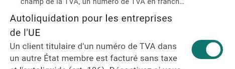

**Étapes**

1. Choisissez **Assujetti à la TVA (facture la TVA)** comme régime.
2. Activez ou désactivez **Autoliquidation pour les entreprises de l'UE**.
3. Touchez **Enregistrer**.

**Bon à savoir**

- Activée : l'app reconnaît une entreprise dotée d'un numéro de TVA dans un autre État membre. Aujourd'hui, l'app n'émet pas elle-même ces factures : vous les émettez hors de l'app avec votre comptable.
- Désactivée : désactivez-la si vous ne facturez jamais d'entreprises à l'étranger.
- L'option n'apparaît que pour le régime des assujettis à la TVA.

**Voir aussi:** [Traitement TVA d'un membre](#traitement-tva)

<!-- anchor: user.money.vat.due -->
### Exigibilité de la TVA

**Public:** Propriétaire

La TVA de chaque facture devient exigible le jour que fixe la loi de votre pays — à l'encaissement, à l'exécution de la prestation ou à la facture. Vous gardez cette règle, ou vous choisissez l'option que votre pays permet.

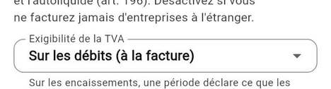

**Étapes**

1. Choisissez **Assujetti à la TVA (facture la TVA)** comme régime.
2. Dans **Exigibilité de la TVA**, gardez la première option, la règle légale de votre pays, ou choisissez l'option que votre pays permet : **Sur les débits (à la facture)** en France, **Sur les encaissements (au paiement)** ailleurs.
3. Touchez **Enregistrer**.

**Bon à savoir**

- La règle légale pour les prestations de services : les encaissements en France ; le mois où la prestation est exécutée en Allemagne et en Espagne, les acomptes à leur encaissement ; la facture ou le paiement, au premier des deux, en Italie, au Royaume-Uni et au Canada ; la facture en Suisse.
- Sur les encaissements, une facture payée en plusieurs fois tombe dans autant de périodes que de paiements. Un avoir compte à son émission (sur les encaissements, à son remboursement), jamais dans la période de la facture qu'il corrige.
- Le choix est imprimé sur chaque facture — l'option pour les débits avec la mention légale — et pilote à l'identique la [déclaration de TVA](#la-déclaration-périodique-de-tva), le rapport de TVA et les exports FEC et DATEV. Un espace français qui n'avait jamais choisi suit les encaissements, et son propriétaire en est averti une fois.
- L'option qui vous concerne est une question fiscale pour votre comptable.

**Voir aussi:** [La déclaration périodique de TVA](#la-déclaration-périodique-de-tva)

<!-- anchor: user.money.vat.account -->
### Compte de TVA

**Public:** Propriétaire

Votre comptable veut que la TVA collectée soit comptabilisée sur un compte précis.

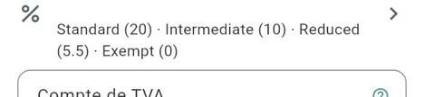

**Étapes**

1. Choisissez **Assujetti à la TVA (facture la TVA)** comme régime.
2. Saisissez votre numéro de compte dans **Compte de TVA**.
3. Touchez **Enregistrer**.

**Bon à savoir**

- L'export comptable comptabilise la TVA collectée sur ce compte. Laissé vide, il utilise le 445710.

**Voir aussi:** [Exports comptables](#exports-comptables)

<!-- anchor: user.money.vat.number -->
### Numéro de TVA

**Public:** Propriétaire

Votre numéro d'identification à la TVA figure sur vos factures et vos factures électroniques.

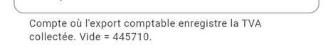

**Étapes**

1. Ouvrez [Identité légale et facturation électronique](https://fdittgen-png.github.io/deskilo/#/legal-identity).
2. Saisissez le numéro dans **Numéro de TVA**.
3. Touchez **Enregistrer**.

**Bon à savoir**

- Le champ apparaît pour les régimes exonéré et assujetti. Hors du champ de la TVA, il est remplacé par le numéro d'immatriculation.
- Vos membres ont leur propre numéro de TVA dans leurs réglages, pour leurs documents.

**Voir aussi:** [Numéro d'immatriculation](#numéro-dimmatriculation)

<!-- anchor: user.money.vat.exemption-reason -->
### Motif de non-application de la TVA

**Public:** Propriétaire

Quand aucune TVA n'est facturée, la loi exige généralement que le motif soit imprimé sur la facture.

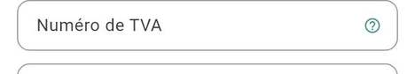

**Étapes**

1. Ouvrez [Identité légale et facturation électronique](https://fdittgen-png.github.io/deskilo/#/legal-identity).
2. Saisissez le fondement juridique dans **Motif de non-application de la TVA**, par exemple « TVA non applicable, art. 293 B du CGI ».
3. Touchez **Enregistrer**.

**Bon à savoir**

- L'app ne peut pas savoir quel fondement s'applique à vous. Prenez la formulation exacte auprès de votre comptable.
- La formulation est imprimée sur la facture. Pour l'instant, l'app n'émet pas elle-même de factures sous le régime d'exonération : elles sont émises hors de l'app avec votre comptable.

**Voir aussi:** [Régime de TVA](#régime-de-tva)

<!-- anchor: user.money.legal.legal-id -->
### Numéro d'immatriculation

**Public:** Propriétaire

Si vous êtes hors du champ de la TVA, votre numéro d'immatriculation vous identifie sur les factures électroniques.

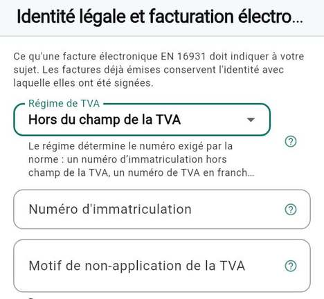

**Étapes**

1. Réglez **Régime de TVA** sur **Hors du champ de la TVA**.
2. Saisissez le numéro dans **Numéro d'immatriculation**.
3. Touchez **Enregistrer**.

**Bon à savoir**

- Sous les autres régimes, ce champ est remplacé par le numéro de TVA.
- Une association utilise en général son immatriculation (par exemple le RNA, ou le SIRET s'il est attribué).

**Voir aussi:** [Registre du commerce](#registre-du-commerce-rcs)

<!-- anchor: user.money.legal.address -->
### Adresse structurée

**Public:** Propriétaire

Une facture électronique a besoin de votre adresse en plusieurs parties distinctes, et non d'un bloc de texte.

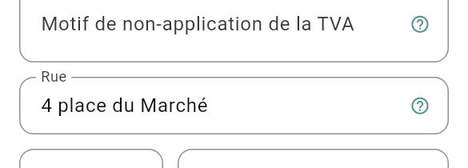

**Étapes**

1. Ouvrez [Identité légale et facturation électronique](https://fdittgen-png.github.io/deskilo/#/legal-identity).
2. Remplissez **Rue**, **Code postal** et **Ville**.
3. Touchez **Enregistrer**.

**Bon à savoir**

- La rue part de l'adresse déjà présente dans les réglages de votre espace : vous la complétez au lieu de la ressaisir.
- Les factures ne peuvent pas être émises sans l'adresse postale de l'espace.

**Voir aussi:** [Adresse du papier à en-tête](#adresse-den-tête)

<!-- anchor: user.money.vat.rates -->
### Définir les taux

**Public:** Propriétaire · Administrateur·rice facturation

Vous listez les taux de TVA que vos factures peuvent utiliser. Ce que paient les membres ne change pas : les prix incluent la TVA, et la taxe en est extraite.

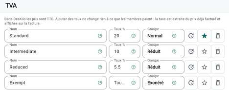

**Étapes**

1. Ouvrez [TVA](https://fdittgen-png.github.io/deskilo/#/vat) (depuis **Identité légale et facturation électronique**, touchez **Taux de TVA**).
2. Sur une liste vide, touchez **Utiliser les taux usuels** (si votre pays dispose d'un catalogue) pour partir des taux de votre pays, ou **Ajouter un taux** et renseignez le nom et **Taux %** (de 0 à 99,99).
3. Touchez l'étoile sur un seul taux pour en faire le taux par défaut.
4. Touchez **Enregistrer**.

**Bon à savoir**

- Les taux usuels sont un point de départ. Savoir quelle prestation relève de quel taux est une question pour votre comptable.
- Le taux par défaut est utilisé par les abonnements et par tout ce qui n'a pas de taux propre.
- Un taux encore utilisé par une facture ou un service est conservé, désactivé, plutôt que supprimé.
- Sans taux par défaut en vigueur alors que vous êtes assujetti à la TVA, aucune facture ne peut être émise ; l'écran d'identité légale vous en avertit.
- Cet écran demande la fonctionnalité **Gestion de la TVA** ; l'entrée Taux de TVA de l'écran d'identité légale n'apparaît que pour le régime des assujettis à la TVA.

**Voir aussi:** [Groupes de TVA](#groupes-de-tva) · [Changement par la loi](#changer-un-taux-par-la-loi)

<!-- anchor: user.money.vat.groups -->
### Groupes de TVA

**Public:** Propriétaire · Administrateur·rice facturation

Un groupe dit de quel type de taux il s'agit, pour que la facture le range dans la bonne catégorie.

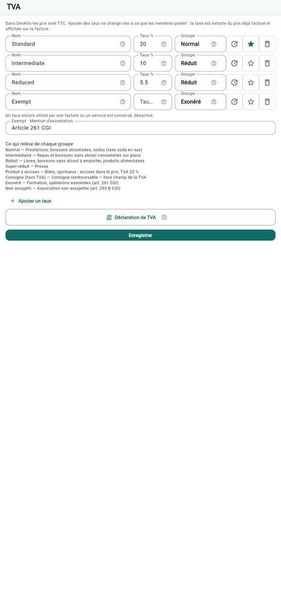

**Étapes**

1. Ouvrez [TVA](https://fdittgen-png.github.io/deskilo/#/vat).
2. Sur chaque taux, lorsque la fonctionnalité **Groupes de TVA** est activée, choisissez un **Groupe** : **Normal**, **Intermédiaire**, **Réduit**, **Super-réduit**, **Taux zéro**, **Exonéré**, **Non assujetti**, **Consigne (hors TVA)** ou **Produit à accises**.
3. Pour un groupe exonéré ou non assujetti, renseignez la **Mention d'exonération** qui apparaît.
4. Touchez **Enregistrer**.

**Bon à savoir**

- **Ce qui relève de chaque groupe** liste des exemples pour votre pays, à titre indicatif seulement.
- Une ligne hors TVA, comme une consigne remboursable, ne peut pas figurer sur le même document que des lignes taxées ; émettez-la séparément.

**Voir aussi:** [Définir les taux](#définir-les-taux)

<!-- anchor: user.money.vat.change-by-law -->
### Changer un taux par la loi

**Public:** Propriétaire · Administrateur·rice facturation

Un taux change à partir d'une date donnée. Les anciennes prestations gardent l'ancienne valeur ; la nouvelle s'applique à partir de ce jour.

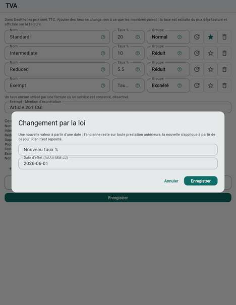

**Étapes**

1. Ouvrez [TVA](https://fdittgen-png.github.io/deskilo/#/vat) et vérifiez que le taux est enregistré.
2. Touchez le bouton **Changement par la loi** sur le taux.
3. Saisissez **Nouveau taux %** et la **Date d'effet (AAAA-MM-JJ)**.
4. Touchez **Enregistrer** dans la boîte de dialogue, puis **Enregistrer** sur l'écran.

**Bon à savoir**

- L'ancien taux se clôt à cette date et un nouveau s'ouvre, avec l'étoile déplacée s'il était le taux par défaut.
- Rien de ce qui a déjà été émis n'est modifié.

**Voir aussi:** [Définir les taux](#définir-les-taux)

<!-- anchor: user.money.vat.declaration -->
### La déclaration périodique de TVA

**Public:** Propriétaire

Vous voulez un récapitulatif prêt à l'emploi de la TVA d'une période, à déposer auprès de l'administration fiscale ou à remettre à votre comptable.

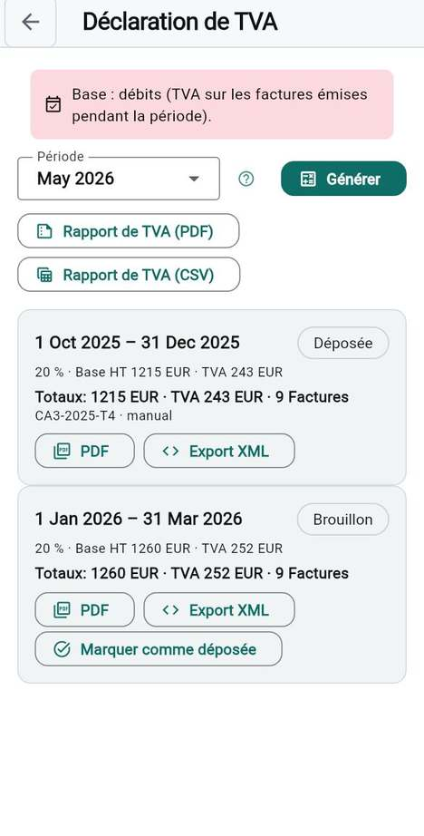

**Étapes**

1. Ouvrez [Déclaration de TVA](https://fdittgen-png.github.io/deskilo/#/vat-declarations).
2. Choisissez la **Période** et touchez **Générer**.
3. Ouvrez le résultat avec **PDF** ou **Export XML**, ou consultez **Rapport de TVA (PDF)** et **Rapport de TVA (CSV)**.
4. Une fois que vous l'avez déposée vous-même, touchez **Marquer comme déposée**.

**Bon à savoir**

- Elle n'existe que sous le régime des assujettis à la TVA. La note en haut indique si la période compte les factures ou les encaissements.
- C'est une aide au dépôt générée à partir des factures émises de la période, pas un conseil fiscal. Vérifiez-la avec votre comptabilité avant de la déposer.
- Une déclaration déposée ne peut plus être modifiée.
- Lorsqu'une plateforme est configurée dans [Facturation électronique](#la-plateforme-de-facturation-électronique), un bouton **Télétransmettre** peut l'envoyer.

**Voir aussi:** [Exigibilité de la TVA](#exigibilité-de-la-tva) · [Exports comptables](#exports-comptables)

<!-- anchor: user.money.einvoice.overview -->
### La plateforme de facturation électronique

**Public:** Propriétaire · Administrateur·rice facturation

Vous indiquez à DesKilo où déposer vos factures sous forme de fichiers lisibles par une machine.

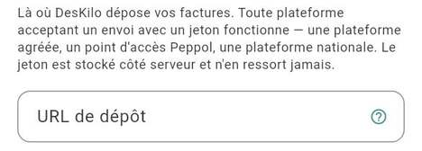

**Étapes**

1. Ouvrez [Plateforme de facturation électronique](https://fdittgen-png.github.io/deskilo/#/einvoice-config) (accessible aussi depuis **Identité légale et facturation électronique**).
2. Renseignez **URL de dépôt** et **Jeton ou identifiant**, ainsi que les deux champs facultatifs si votre plateforme les demande.
3. Touchez **Enregistrer**. **Supprimer la plateforme** efface les réglages.

**Bon à savoir**

- Toute plateforme qui accepte un envoi avec un jeton fonctionne : une plateforme agréée, un point d'accès Peppol, une plateforme nationale.
- Le jeton est stocké sur le serveur et n'est plus jamais affiché.
- Le fichier valide est une facture EN 16931. Savoir si votre pays impose une plateforme, et laquelle, est à confirmer avec votre comptable.

**Voir aussi:** [Envoyer une facture électronique](#envoyer-une-facture-électronique) · [Identité légale](#votre-identité-légale)

<!-- anchor: user.money.einvoice.endpoint -->
### URL de dépôt

**Public:** Propriétaire · Administrateur·rice facturation

L'adresse à laquelle votre plateforme reçoit les factures.

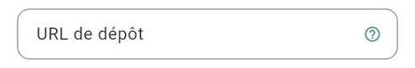

**Étapes**

1. Ouvrez [Plateforme de facturation électronique](https://fdittgen-png.github.io/deskilo/#/einvoice-config).
2. Collez l'adresse dans **URL de dépôt**, exactement comme votre plateforme la documente.
3. Touchez **Enregistrer**.

**Bon à savoir**

- Elle figure dans la documentation de votre plateforme ou chez votre prestataire.

**Voir aussi:** [Jeton ou identifiant](#jeton-ou-identifiant)

<!-- anchor: user.money.einvoice.token -->
### Jeton ou identifiant

**Public:** Propriétaire · Administrateur·rice facturation

Le secret qui prouve à la plateforme que l'envoi vient bien de vous.

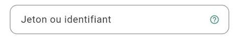

**Étapes**

1. Ouvrez [Plateforme de facturation électronique](https://fdittgen-png.github.io/deskilo/#/einvoice-config).
2. Collez la clé dans **Jeton ou identifiant**.
3. Touchez **Enregistrer**.

**Bon à savoir**

- Une fois enregistré, l'écran indique « Un jeton est enregistré ». N'en saisissez un nouveau que pour le remplacer.
- Il est conservé sur le serveur et n'en ressort jamais.

**Voir aussi:** [En-tête d'authentification](#en-tête-dauthentification)

<!-- anchor: user.money.einvoice.auth-header -->
### En-tête d'authentification

**Public:** Propriétaire · Administrateur·rice facturation

Le nom de l'en-tête qui porte le jeton.

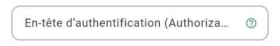

**Étapes**

1. Ouvrez [Plateforme de facturation électronique](https://fdittgen-png.github.io/deskilo/#/einvoice-config).
2. Si votre plateforme attend un autre en-tête que l'en-tête standard, saisissez son nom dans **En-tête d’authentification (Authorization par défaut)**.
3. Touchez **Enregistrer**.

**Bon à savoir**

- Laissé vide, `Authorization` est utilisé.

**Voir aussi:** [Nom du champ fichier](#nom-du-champ-fichier)

<!-- anchor: user.money.einvoice.file-field -->
### Nom du champ fichier

**Public:** Propriétaire · Administrateur·rice facturation

Le nom du champ de formulaire qui porte le fichier de la facture.

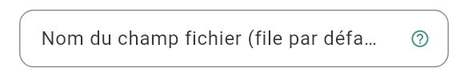

**Étapes**

1. Ouvrez [Plateforme de facturation électronique](https://fdittgen-png.github.io/deskilo/#/einvoice-config).
2. Si votre plateforme attend un autre nom de champ, saisissez-le dans **Nom du champ fichier (file par défaut)**.
3. Touchez **Enregistrer**.

**Bon à savoir**

- Laissé vide, `file` est utilisé.

**Voir aussi:** [URL de dépôt](#url-de-dépôt)

<!-- anchor: user.money.einvoice.customer-delivery -->
### Service de remise au client

**Public:** Propriétaire · Administrateur·rice facturation

Votre client peut recevoir ses factures ailleurs que sur une plateforme gouvernementale : son propre point d'accès Peppol, un portail ou un service de dépôt convenu.

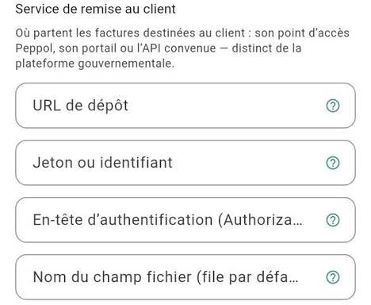

**Étapes**

1. Ouvrez [Plateforme de facturation électronique](https://fdittgen-png.github.io/deskilo/#/einvoice-config).
2. Dans **Service de remise au client**, renseignez les mêmes quatre champs que ci-dessus.
3. Touchez **Enregistrer**.

**Bon à savoir**

- Il est distinct de la plateforme gouvernementale. Les deux peuvent être configurés, et chaque facture propose les deux envois.

**Voir aussi:** [Envoyer une facture électronique](#envoyer-une-facture-électronique)

<!-- anchor: user.money.einvoice.uat -->
### Point de terminaison et jeton UAT

**Public:** Propriétaire · Administrateur·rice facturation

Vous voulez faire une répétition avant d'envoyer de vraies factures.

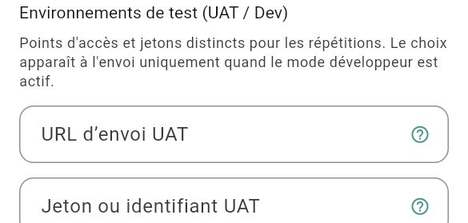

**Étapes**

1. Ouvrez [Plateforme de facturation électronique](https://fdittgen-png.github.io/deskilo/#/einvoice-config).
2. Sous **Environnements de test (UAT / Dev)**, renseignez **URL d’envoi UAT** et **Jeton ou identifiant UAT**.
3. Touchez **Enregistrer**.

**Bon à savoir**

- Le choix de l'environnement n'apparaît à l'envoi que tant que le mode développeur est activé.
- Un envoi de test est enregistré comme un envoi de test.

**Voir aussi:** [Point de terminaison et jeton Dev](#point-de-terminaison-et-jeton-dev)

<!-- anchor: user.money.einvoice.dev -->
### Point de terminaison et jeton Dev

**Public:** Propriétaire · Administrateur·rice facturation

Un second point de terminaison de test, pour le développement.

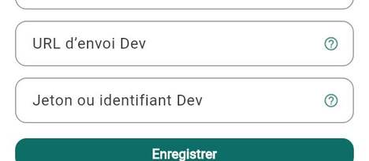

**Étapes**

1. Ouvrez [Plateforme de facturation électronique](https://fdittgen-png.github.io/deskilo/#/einvoice-config).
2. Sous **Environnements de test (UAT / Dev)**, renseignez **URL d’envoi Dev** et **Jeton ou identifiant Dev**.
3. Touchez **Enregistrer**.

**Bon à savoir**

- Mêmes règles que pour l'UAT. Le véritable dépôt part toujours vers le point de terminaison de production.

**Voir aussi:** [Point de terminaison et jeton UAT](#point-de-terminaison-et-jeton-uat)

<!-- anchor: user.money.einvoice.send -->
### Envoyer une facture électronique

**Public:** Propriétaire · Administrateur·rice facturation

Vous voulez remettre une facture émise sous sa forme lisible par une machine.

**Étapes**

1. Ouvrez une facture dans [Facturation](https://fdittgen-png.github.io/deskilo/#/invoices) et touchez **Facture électronique (XML)**.
2. Lisez le contrôle en haut de la feuille : il indique si le fichier est prêt ou ce qui manque.
3. Touchez **Envoyer à la plateforme gouvernementale**, **Envoyer au service du client**, ou téléchargez ou partagez le fichier (**Télécharger le Factur-X (PDF)** porte le XML à l'intérieur du PDF).

**Bon à savoir**

- Si quelque chose manque, la feuille le liste. **Compléter l'identité légale** vous mène à l'écran qui le corrige.
- Une facture signée avant que vous ayez complété votre identité garde ce avec quoi elle a été émise. Marquez-la comme erronée et émettez-en une de remplacement si cela compte.
- Le canal que doit utiliser un client dépend de votre pays et du client. Confirmez avec votre comptable.

**Voir aussi:** [La plateforme de facturation électronique](#la-plateforme-de-facturation-électronique) · [L'écran Facturation](#lécran-facturation)

<!-- anchor: user.money.reports.invoice-template -->
### Le modèle PDF de facture

**Public:** Propriétaire · Administrateur·rice facturation

Vous voulez que vos factures soient à votre image : logo, mise en page, formulations.

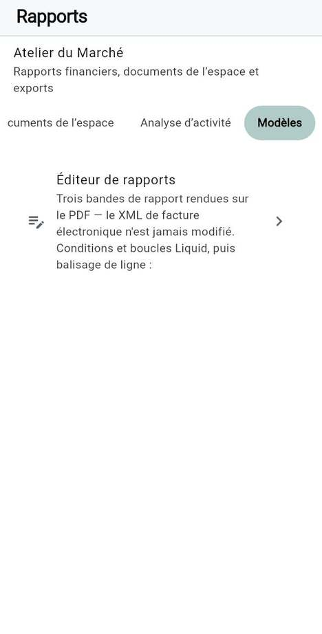

**Étapes**

1. Ouvrez [Rapports](https://fdittgen-png.github.io/deskilo/#/reports?section=templates) et l'onglet **Modèles**.
2. Touchez **Éditeur de rapports**.

**Bon à savoir**

- Le modèle ne change que le PDF. Le XML de la facture électronique n'est jamais modifié.
- Toute personne autorisée à concevoir des documents peut le faire.
- Un modèle qui ne s'affiche pas ne bloque jamais un document : la mise en page intégrée prend le relais.

**Voir aussi:** [L'éditeur de rapports](#léditeur-de-rapports)

<!-- anchor: user.money.reports.editor -->
### L'éditeur de rapports

**Public:** Propriétaire · Administrateur·rice facturation

Vous concevez un document sur une page, sans écrire de code.

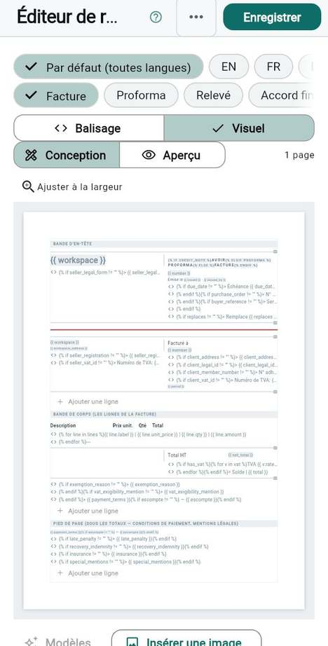

**Étapes**

1. Ouvrez [Éditeur de rapports](https://fdittgen-png.github.io/deskilo/#/report-editor).
2. Choisissez le document avec les pastilles (Facture, Proforma, Relevé, relances et les autres rapports).
3. Dans **Conception**, touchez une ligne pour la modifier, ajoutez des lignes, ou faites-les glisser pour les réordonner. Touchez **Aperçu** pour voir le résultat avec vos données.
4. Touchez **Enregistrer**.

**Bon à savoir**

- Le mode **Balisage** modifie les mêmes bandes sous forme de texte.
- **Insérer une image** place un logo, un tampon ou une signature depuis la bibliothèque d'images.
- **Aperçu rapide** s'affiche instantanément avec votre facture la plus récente, ou des données d'exemple s'il n'y en a pas. **Réinitialiser au modèle par défaut** rétablit la mise en page intégrée.
- **Exporter cette maquette** et **Importer une maquette** font entrer et sortir une maquette sous forme de fichier. **Maquette positionnée (XML)** sert aux documents qui doivent correspondre à une enveloppe à fenêtre ou à un formulaire national.
- Quitter avec un travail non enregistré demande d'abord confirmation.

**Voir aussi:** [Modèles prêts à l'emploi](#modèles-prêts-à-lemploi) · [Langues](#une-maquette-par-langue)

<!-- anchor: user.money.reports.presets -->
### Modèles prêts à l'emploi

**Public:** Propriétaire · Administrateur·rice facturation

Vous partez d'une maquette terminée et vous changez ce que vous voulez.

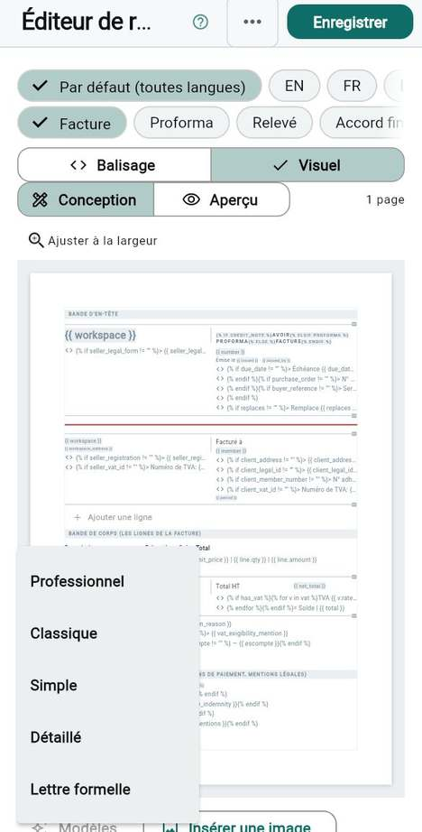

**Étapes**

1. Ouvrez [Éditeur de rapports](https://fdittgen-png.github.io/deskilo/#/report-editor) et choisissez un document.
2. Touchez **Modèles** et choisissez **Professionnel**, **Classique**, **Simple**, **Détaillé** ou **Lettre formelle**.
3. Confirmez le remplacement si l'app le demande, puis modifiez et **Enregistrer**.

**Bon à savoir**

- Le remplacement d'une mise en page peut être annulé avec **Annuler**.
- Les rapports structurels (plan comptable, badges, cartes QR) ont une seule mise en page fournie.
- Les modèles de facture portent déjà vos mentions légales. Ils n'impriment toujours que ce que vous avez saisi sous [Mentions de facturation](#votre-identité-légale).

**Voir aussi:** [L'éditeur de rapports](#léditeur-de-rapports)

<!-- anchor: user.money.reports.languages -->
### Une maquette par langue

**Public:** Propriétaire · Administrateur·rice facturation

Vos membres lisent leurs documents dans leur propre langue.

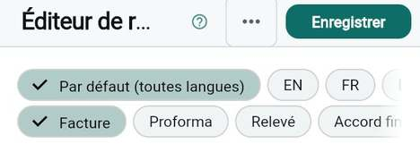

**Étapes**

1. Ouvrez [Éditeur de rapports](https://fdittgen-png.github.io/deskilo/#/report-editor).
2. Sous le document, choisissez **Par défaut (toutes langues)** ou l'une des langues **EN**, **FR**, **DE**, **ES**, **IT**.
3. Modifiez les bandes pour cette langue et **Enregistrer**. **Utiliser le défaut pour cette langue** supprime une maquette propre.

**Bon à savoir**

- Un point sur une langue signifie qu'elle a sa propre maquette ; sinon elle hérite de celle par défaut.
- Le document d'un membre s'imprime dans sa langue quand une maquette existe pour elle, sinon dans la langue par défaut de l'espace.

**Voir aussi:** [Langue de l'espace](#langue-de-lespace)

<!-- anchor: user.invoicing.hub -->
### L'écran Facturation

**Public:** Propriétaire · Administrateur·rice facturation

Vous voyez d'un coup d'œil ce qu'il faut émettre, ce qu'il faut encaisser et ce qui est clos.

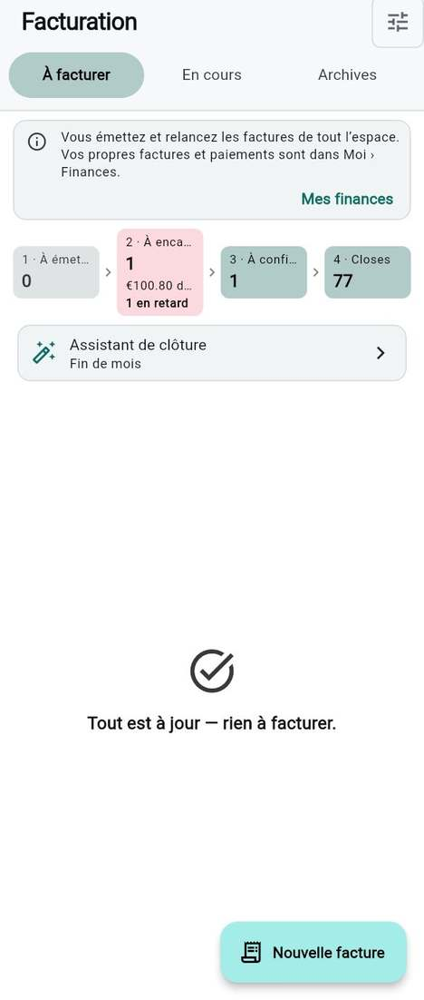

**Étapes**

1. Ouvrez [Facturation](https://fdittgen-png.github.io/deskilo/#/invoices).
2. Lisez la bande : **À émettre**, **À encaisser**, **À confirmer**, **Closes**.
3. Travaillez dans les trois onglets : **À facturer** (membres avec quelque chose de suivi, pas encore facturé), **En cours** (émises, impayées) et **Archives** (payées ou closes).
4. Touchez l'icône d'outils pour les autres outils.

**Bon à savoir**

- Vous voyez les factures de tout l'espace. Les vôtres sont dans vos finances, sous **Mes finances**.
- Les factures ne sont jamais modifiées ni supprimées : une facture erronée est marquée comme telle et remplacée.
- L'entrée **Comment fonctionne la facturation** explique qui intervient à chaque étape.

**Voir aussi:** [Nouvelle facture](#émettre-une-facture) · [Factures en cours](#relancer-et-solder-les-factures-en-cours)

<!-- anchor: user.invoicing.new-invoice -->
### Émettre une facture

**Public:** Propriétaire · Administrateur·rice facturation

Vous facturez un membre pour un mois.

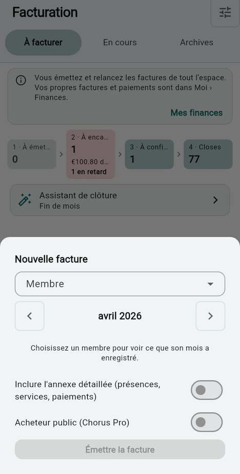

**Étapes**

1. Dans [Facturation](https://fdittgen-png.github.io/deskilo/#/invoices), touchez **Nouvelle facture**, ou **Facturer** sur une ligne de **À facturer**.
2. Choisissez le **Membre** et le mois. Les positions viennent de ce qui a été suivi.
3. Activez **Inclure l'annexe détaillée (présences, services, paiements)** si vous la souhaitez.
4. Touchez **Émettre la facture**. Dans **À facturer**, **Tout facturer** émet chaque ligne.

**Bon à savoir**

- Les factures sont dérivées des données suivies et ne se composent pas à la main. La dernière ligne est le **Solde**.
- Un mois ne peut être facturé qu'une fois par membre, et un mois encore en cours vous avertit que les positions peuvent changer.
- Si une information obligatoire manque, **Complétez ces informations avant d'émettre** la liste (adresse, numéro de TVA, fondement de l'exonération, taux de TVA ; aussi le pays de l'espace, qui doit être la France ou l'Allemagne).
- Dans cette version, l'émission dans l'app est disponible pour les espaces établis en France ou en Allemagne, pour des clients nationaux. Les factures transfrontalières, en autoliquidation, à l'export ou à un acheteur exonéré sont émises hors de l'app avec votre comptable.
- Une facture émise est signée et immuable.

**Voir aussi:** [Assistant de clôture](#lassistant-de-clôture)

<!-- anchor: user.invoicing.open -->
### Relancer et solder les factures en cours

**Public:** Propriétaire · Administrateur·rice facturation

Vous suivez ce qui est impayé et vous le soldez correctement.

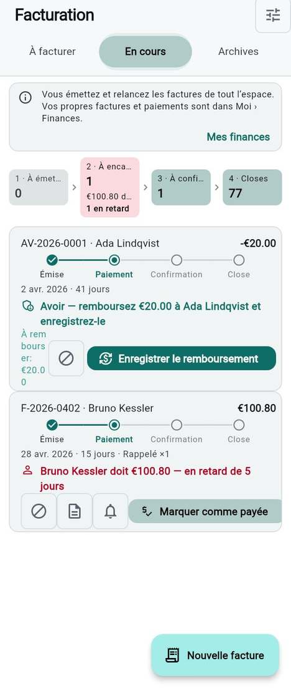

**Étapes**

1. Dans [Facturation](https://fdittgen-png.github.io/deskilo/#/invoices), ouvrez l'onglet **En cours** et touchez une facture.
2. Utilisez les actions proposées : **Envoyer un rappel**, **Marquer comme payée** (rapprocher un paiement enregistré), **Annuler le solde restant**, **Marquer comme erronée**, ou partager le PDF.
3. Les factures payées passent dans **Archives**.

**Bon à savoir**

- Une facture est payée dès qu'un vrai paiement lui est rapproché. Un écart demande une note, ou un avoir pour l'excédent.
- L'annulation d'un solde restant passe par une validation.
- **Marquer comme erronée** est irréversible. Faites-le avant le paiement, jamais après.

**Voir aussi:** [Règles de relance](#règles-de-relance) · [Regrouper des factures](#regrouper-des-factures-en-une-seule)

<!-- anchor: user.invoicing.wizard -->
### L'assistant de clôture

**Public:** Propriétaire · Administrateur·rice facturation

Un seul parcours guidé pour la routine financière : émettre, envoyer, relancer, enregistrer les paiements, rapprocher et clôturer.

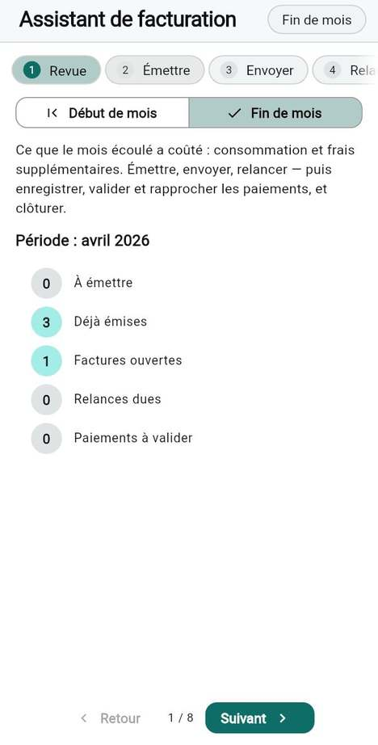

**Étapes**

1. Dans [Facturation](https://fdittgen-png.github.io/deskilo/#/invoices), touchez **Assistant de clôture** (ou ouvrez l'[Assistant de facturation](https://fdittgen-png.github.io/deskilo/#/invoicing/wizard)).
2. Choisissez la passe : **Début de mois** (abonnements que les membres paient d'avance, pour le mois à venir) ou **Fin de mois** (usage, consommation et frais supplémentaires du mois qui vient de s'achever). La date en propose une.
3. Suivez les étapes : **Revue**, **Émettre**, **Envoyer**, **Relancer**, **Paiements**, **Rapprocher**, **Clôturer**, **Récapitulatif**.
4. Touchez **Suivant** à chaque étape, et **Terminer** à la fin.

**Bon à savoir**

- Vous pouvez décocher un membre pour l'exclure d'un lot ; les membres déjà traités apparaissent comme faits.
- **Récapitulatif** liste ce que la passe a fait, ce qui reste ouvert et à qui c'est le tour.
- Une étape sans rien à faire le dit.

**Voir aussi:** [L'écran Facturation](#lécran-facturation) · [Regrouper des factures](#regrouper-des-factures-en-une-seule)

<!-- anchor: user.invoicing.settlement -->
### Regrouper des factures en une seule

**Public:** Propriétaire · Administrateur·rice facturation

Un membre a plusieurs factures ouvertes et ne doit en payer qu'une.

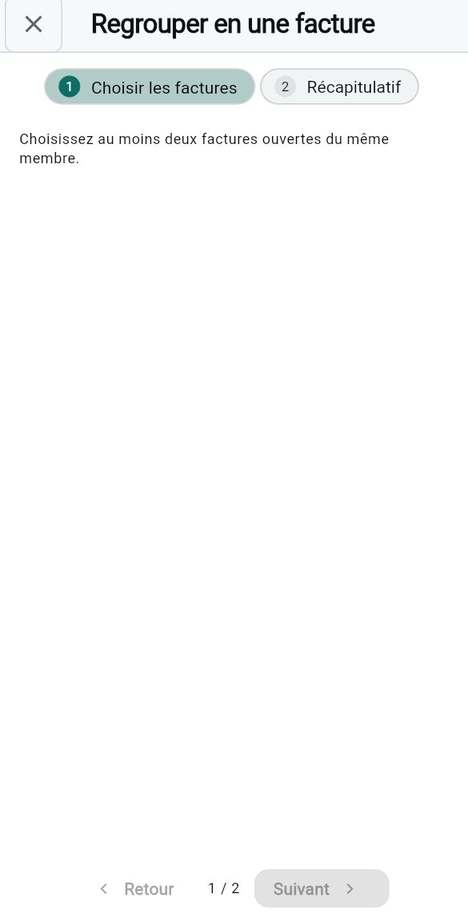

**Étapes**

1. Dans [Facturation](https://fdittgen-png.github.io/deskilo/#/invoices), touchez l'icône d'outils et **Regrouper en une facture**.
2. Choisissez au moins deux factures ouvertes du même membre.
3. Confirmez. On vous demande si vous voulez joindre les factures regroupées.

**Bon à savoir**

- La nouvelle facture est celle qui est due et relancée. Les originales restent lisibles derrière elle.
- Les lignes et la TVA sont reprises ; la déclaration de TVA compte les originales une seule fois.

**Voir aussi:** [Factures en cours](#relancer-et-solder-les-factures-en-cours)

<!-- anchor: user.invoicing.shared-expense -->
### Répartir une dépense partagée

**Public:** Propriétaire · Administrateur·rice facturation

Un coût partagé par la communauté est réparti entre les membres.

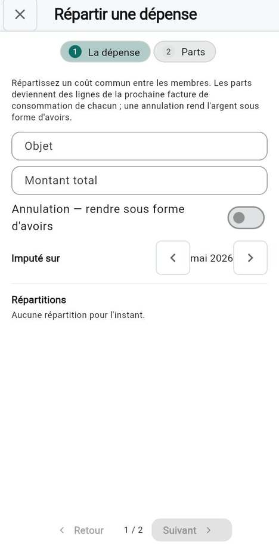

**Étapes**

1. Dans [Facturation](https://fdittgen-png.github.io/deskilo/#/invoices), touchez l'icône d'outils et **Répartir une dépense**.
2. Décrivez **La dépense**, puis choisissez **Répartir selon** : **Parts égales**, **Abonnement**, **Usage** ou **Clé personnalisée**.
3. Vérifiez les **Parts**, décochez toute personne à **Exclure**, et touchez **Comptabiliser les parts**.

**Bon à savoir**

- Une fois comptabilisées (après validation, si une règle l'exige), les parts arrivent en lignes sur la prochaine facture d'usage de chaque membre.
- **Annulation — rendre sous forme d'avoirs** restitue l'argent.
- **Mémoriser cette règle** reproposera la règle ajustée le mois suivant.

**Voir aussi:** [L'assistant de clôture](#lassistant-de-clôture)

<!-- anchor: user.money.reminders.rules -->
### Règles de relance

**Public:** Propriétaire · Administrateur·rice facturation

Vous décidez quand et à quelle fréquence une facture en retard est relancée.

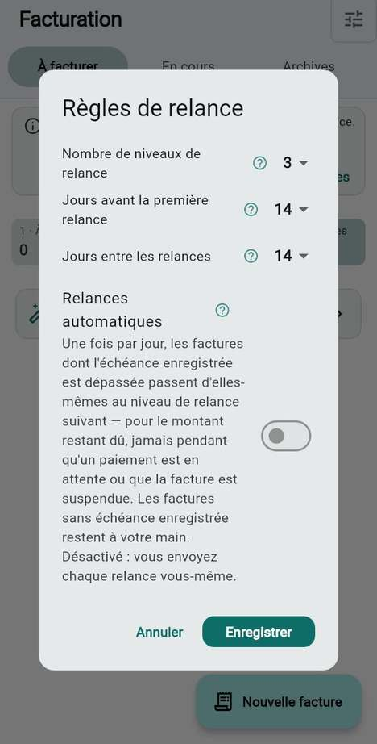

**Étapes**

1. Dans [Facturation](https://fdittgen-png.github.io/deskilo/#/invoices), touchez l'icône d'outils et **Règles de relance**.
2. Réglez **Nombre de niveaux de relance**, **Jours avant la première relance** et **Jours entre les relances**.
3. Touchez **Enregistrer**.

**Bon à savoir**

- Les relances impriment les mentions de paiement que vous avez configurées.
- Une relance est enregistrée sur la facture et apparaît comme un badge **Rappelé**.

**Voir aussi:** [Relances automatiques](#relances-automatiques) · [Modalités de règlement](#modalités-de-règlement)

<!-- anchor: user.money.reminders.automatic -->
### Relances automatiques

**Public:** Propriétaire · Administrateur·rice facturation

Vous voulez que les relances partent toutes seules.

**Étapes**

1. Ouvrez **Règles de relance** dans les outils de Facturation.
2. Activez **Relances automatiques**.
3. Touchez **Enregistrer**.

**Bon à savoir**

- Une fois par jour, les factures qui ont dépassé leur échéance enregistrée passent au niveau suivant, pour le montant encore dû.
- Jamais tant qu'un paiement est en attente ou que la facture est suspendue. Les factures sans échéance enregistrée vous sont laissées.
- Désactivées : vous envoyez chaque relance vous-même.
- Quand cela s'exécute : chaque matin sur le serveur si l'installation planifie des tâches, sinon quand un administrateur ouvre Finances. L'opérateur de votre serveur sait ce qui s'applique.

**Voir aussi:** [Règles de relance](#règles-de-relance)

<!-- anchor: user.invoicing.register -->
### Le registre des factures

**Public:** Propriétaire · Administrateur·rice facturation

Toutes les factures dans une seule liste triable.

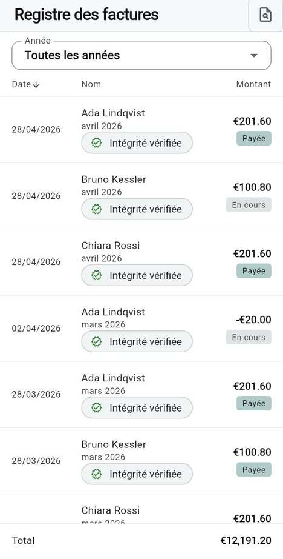

**Étapes**

1. Ouvrez [Registre des factures](https://fdittgen-png.github.io/deskilo/#/invoice-register).
2. Choisissez l'**Année** ou **Toutes les années**.
3. Triez par **Date**, **Nom** ou **Montant** ; le total est en bas.

**Bon à savoir**

- Les membres voient les leurs ; les personnes qui émettent des factures voient celles de l'espace.
- L'export comptable part d'ici.

**Voir aussi:** [Exports comptables](#exports-comptables)

<!-- anchor: user.invoicing.accounting-export -->
### Exports comptables

**Public:** Propriétaire · Administrateur·rice facturation

Vous remettez à votre comptable les factures et les paiements de l'année.

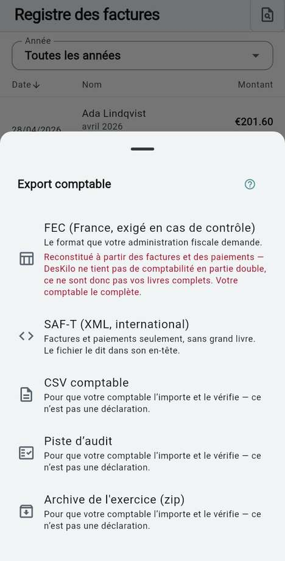

**Étapes**

1. Ouvrez [Registre des factures](https://fdittgen-png.github.io/deskilo/#/invoice-register) et touchez **Export comptable**.
2. Dans **Export comptable**, choisissez un format, comme **FEC (France, exigé en cas de contrôle)**, **SAF-T (XML, international)**, **CSV comptable**, **Piste d’audit** ou **Archive de l'exercice (zip)**. La liste dépend de votre pays ; quelques pays ajoutent le leur, comme **DATEV (Buchungsstapel)**.
3. Dans **Avant d’enregistrer**, lisez le contrôle, puis touchez **Enregistrer le fichier et le rapport**.

**Bon à savoir**

- Chaque format dit ce qu'il prétend être. « Pour que votre comptable l’importe et le vérifie — ce n’est pas une déclaration » n'est pas une déclaration fiscale.
- DesKilo ne tient pas de grand livre en partie double : les fichiers sont reconstruits à partir des factures et des paiements, et votre comptable les complète.
- Un fichier est bloqué tant que les problèmes de la source ne sont pas corrigés.
- Certains formats précisent que DesKilo n'est pas un logiciel certifié dans votre pays.

**Voir aussi:** [Compte de TVA](#compte-de-tva) · [Le registre des factures](#le-registre-des-factures)

<!-- anchor: user.invoicing.bi -->
### Analyse d'activité

**Public:** Propriétaire · Administrateur·rice facturation

Vous regardez comment l'espace se porte.

**Étapes**

1. Ouvrez [Analyse d’activité](https://fdittgen-png.github.io/deskilo/#/bi), ou **Reporting** dans le menu.
2. Choisissez la **Durée de la période** (**Mois**, **Trimestre**, **Année**), une comparaison, et un regroupement là où il est proposé.
3. Lisez les analyses par domaine, comme **Finances** (**Facturé**, **Encaissé**) et **Espaces et capacité**.
4. Enregistrez une vue sous **Vues**, ou touchez **Exporter en PDF**.

**Bon à savoir**

- Vous ne voyez que les analyses que vous avez le droit de lire.
- « Encaissé » désigne les paiements rapprochés des factures. Ce n'est pas un bénéfice : aucun coût n'entre dans le chiffre.
- La période en cours est partielle ; ses chiffres changent encore.

**Voir aussi:** [L'écran Facturation](#lécran-facturation)

<!-- anchor: user.advanced.overview -->
## Avancé

**Public:** Propriétaire · Opérateur·rice

Ce qui entoure le travail de tous les jours : le côté test d'un espace et le côté réel, les assistants, l'enregistreur de tâches et ses visites guidées, la démo, les applis sur chaque appareil, et que faire quand quelque chose ne fonctionne pas.

Dans ce chapitre :
- [Un espace a deux côtés](#un-espace-a-deux-côtés) · [Entrer d'un côté](#entrer-côté-réel-ou-côté-test) · [Un espace de test](#à-quoi-sert-un-espace-de-test) · [Qui peut déployer](#qui-peut-déployer-et-entrer-en-production) · [Déployer entre les côtés](#déployer-entre-les-deux-côtés) · [Situation de l'espace et archive de l'exercice](#situation-de-lespace-et-archive-de-lexercice)
- [Votre propre serveur](#faire-tourner-votre-propre-serveur)
- [Les assistants](#les-assistants--ce-que-cest) · [Connecter un assistant](#connecter-un-assistant) · [Les autorisations](#autorisations-et-confirmations-pour-les-assistants) · [Ce que les assistants peuvent faire](#ce-que-les-assistants-peuvent-faire-dans-un-espace)
- [L'enregistreur de tâches](#lenregistreur-de-tâches-et-les-visites-guidées) · [Enregistrer une tâche](#enregistrer-une-tâche) · [Relire un enregistrement](#relire-modifier-et-exporter-un-enregistrement) · [Créer un guide](#créer-un-guide-à-partir-dun-enregistrement) · [Suivre un guide](#suivre-un-guide) · [Le menu rond](#le-menu-rond) · [Modifier un guide](#modifier-ou-réparer-un-guide) · [Confidentialité des enregistrements](#ce-quun-enregistrement-conserve)
- [L'espace de démonstration](#lespace-de-démonstration) · [Mode tournage](#mode-tournage)
- [Les plateformes](#deskilo-sur-vos-appareils) · [Détails pour l'assistance](#détails-pour-lassistance) · [Quand quelque chose ne fonctionne pas](#quand-quelque-chose-ne-fonctionne-pas)
- [Les mots de l'app](#les-mots-de-lapp) · [Accessibilité et clavier](#accessibilité-et-clavier) · [Plus d'aide](#où-trouver-plus-daide)

<!-- anchor: user.advanced.environments -->
### Un espace a deux côtés

**Public:** Propriétaire

Vous voulez un endroit pour essayer des choses sans toucher aux vraies réservations ni aux vraies factures. Un espace peut venir en paire : un côté test et un côté réel, avec le même nom.

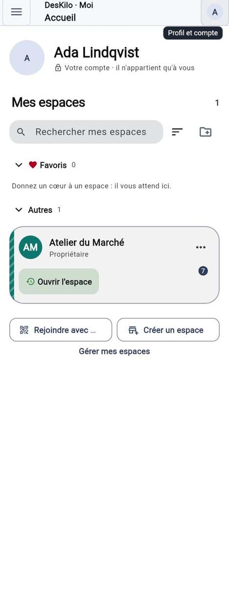

**Étapes**

1. Quand vous créez un espace, laissez coché **Créer la paire développement et production**. Les deux côtés vous appartiennent dès la première seconde.
2. Vous avez déjà un espace seul ? Ouvrez [Réglages](https://fdittgen-png.github.io/deskilo/#/settings), allez à **Gouvernance** et touchez **Créer son jumeau**. La configuration est copiée une fois.
3. À partir de là, les deux côtés sont indépendants. Seul un déploiement fait passer quelque chose de l'un à l'autre.

**Bon à savoir**

- Le côté développement s'appelle **Développement — pour essayer**. Le côté production s'appelle **Production — les factures sont dues**.
- Tout document imprimé du côté développement porte un filigrane, pour qu'on ne le prenne pas pour un vrai.
- **Créer son jumeau** n'apparaît que lorsque la fonctionnalité **Paires d'environnements** est activée, et seulement pour le propriétaire. Le déploiement entre les côtés revient aux titulaires des droits de déploiement.
- Les membres, les réservations, les factures et les paiements ne sont jamais copiés d'un côté à l'autre.

**Voir aussi:** [Entrer d'un côté](#entrer-côté-réel-ou-côté-test) · [Un espace de test](#à-quoi-sert-un-espace-de-test)

<!-- anchor: user.advanced.enter-environment -->
### Entrer côté réel ou côté test

**Public:** Tout le monde

Vous voulez ouvrir un espace du côté dont vous avez besoin. Votre compte voit les deux côtés d'une paire, chacun avec son propre bouton.

**Étapes**

1. Ouvrez [Moi](https://fdittgen-png.github.io/deskilo/#/me) et repérez l'espace sous **Mes espaces**.
2. Touchez **Ouvrir l’espace** pour le côté réel, ou **Espace de test** pour le côté où s'entraîner.
3. Ou ouvrez [Profils](https://fdittgen-png.github.io/deskilo/#/profiles) : la paire forme une seule carte. Touchez-la, puis **Choisir un environnement** entre **DEV** et **PROD**.

**Bon à savoir**

- Un côté où vous n'avez pas le droit d'entrer est grisé et ne fait rien.
- Une personne membre du côté réel est toujours membre du côté test aussi.
- Le bouton de test porte l'indication « Espace de test : réservations et factures d’essai » ; le bouton réel « Réservations et factures réelles ».

**Voir aussi:** [Qui peut déployer](#qui-peut-déployer-et-entrer-en-production)

<!-- anchor: user.advanced.test-space -->
### À quoi sert un espace de test

**Public:** Propriétaire

Vous allez changer des prix, des règles ou le plan et vous voulez d'abord voir l'effet. Faites-le sur l'espace de test.

**Étapes**

1. Entrez côté test avec **Espace de test**.
2. Configurez, importez un fichier d'espace, invitez un collègue, émettez une facture d'essai, déplacez des places, imprimez.
3. Quand c'est bon, [déployez-le côté réel](#déployer-entre-les-deux-côtés).

**Bon à savoir**

- L'interrupteur **Type d’espace** dans [Réglages](https://fdittgen-png.github.io/deskilo/#/settings) (sous **Gouvernance**) indique de quel type est un espace. Seuls les propriétaires le voient.
- Déclarer un espace en production demande **Déclarer cet espace en production ?** — la bannière disparaît et les documents perdent leur filigrane. Les factures déjà émises gardent le filigrane qu'elles avaient.
- Ne déclarez la production que lorsque les factures qui quittent l'espace sont vraiment dues.
- Quand vous invitez quelqu'un, vous pouvez choisir s'il accède aussi à l'espace de production : **Espace de test** ou **Espace de production**. Dans les deux cas, il rejoint l'espace de test.

**Voir aussi:** [Un espace a deux côtés](#un-espace-a-deux-côtés)

<!-- anchor: user.advanced.deploy-permissions -->
### Qui peut déployer et entrer en production

**Public:** Propriétaire · Copropriétaire

Vous décidez qui peut toucher au côté réel. Trois permissions de la matrice des rôles en décident.

**Étapes**

1. Ouvrez [Rôles](https://fdittgen-png.github.io/deskilo/#/roles).
2. Repérez **Entrer dans l'espace de production**, **Déployer en développement** et **Déployer en production**.
3. Activez chacune pour les rôles qui en ont besoin.

**Bon à savoir**

- Les propriétaires et les copropriétaires détiennent les trois. Les administrateurs détiennent **Déployer en développement** et **Entrer dans l'espace de production**. Les membres n'en ont aucune tant que vous ne la leur donnez pas.
- Qui peut déployer en production peut toujours déployer en développement.
- Un rôle n'entre côté production que tant qu'il détient **Entrer dans l'espace de production** : une invitation ou une adhésion en production est refusée sinon, et l'app dit pourquoi.

**Voir aussi:** [La matrice des rôles](#la-matrice-des-rôles) · [Déployer entre les côtés](#déployer-entre-les-deux-côtés)

<!-- anchor: user.advanced.deploy -->
### Déployer entre les deux côtés

**Public:** Propriétaire · Copropriétaire · Administrateur·rice

Vous avez stabilisé la configuration d'un côté et vous voulez que l'autre l'ait aussi.

**Étapes**

1. Placez-vous du côté que vous voulez écrire, et ouvrez [Réglages](https://fdittgen-png.github.io/deskilo/#/settings) → **Gouvernance** → [Déploiement](https://fdittgen-png.github.io/deskilo/#/deployment).
2. Cochez ce qui doit voyager. Les entités sont regroupées en **Configuration**, **Données de base** et **Rapports** ; ce dont une entité a **besoin** est coché avec elle.
3. Touchez **Tirer depuis la PROD…** (depuis le côté développement) ou **Tirer depuis la DEV…** (depuis le côté production).
4. Lisez l'aperçu : **Ce qui change côté production**, ou côté développement. Quand les deux côtés concordent, il indique **Aucun changement**.
5. Confirmez. La question nomme le côté qui est écrit : **Déployer dans cette DEV ?** ou **Déployer dans cette PROD ?**

**Bon à savoir**

- Un déploiement va toujours dans le côté où vous vous trouvez. Rien ne peut être poussé par erreur sur l'autre côté.
- Chaque déploiement est consigné dans le **Journal**. **Revenir en arrière** sur le dernier remet ce que le côté contenait avant.
- Les plans sont fusionnés : ce que seul ce côté possède est conservé, car une place peut porter une réservation. Les étiquettes de badge ne voyagent jamais.
- Les membres, les réservations, les factures, les paiements, les événements et les identifiants ne voyagent jamais.
- L'entrée n'apparaît que lorsque la fonctionnalité **Déploiements** est activée, que l'espace a un jumeau et que vous détenez une permission de déploiement.

**Voir aussi:** [Qui peut déployer](#qui-peut-déployer-et-entrer-en-production)

<!-- anchor: user.advanced.status-archive -->
### Situation de l'espace et archive de l'exercice

**Public:** Propriétaire · Administrateur·rice · Administrateur·rice facturation

Vous voulez un coup d'œil sur ce que l'espace a facturé et encaissé, et un fichier complet de l'année pour vos archives.

**Étapes**

1. Ouvrez [Situation de l'espace](https://fdittgen-png.github.io/deskilo/#/money/status). Choisissez les mois dans **Du** et **Au**.
2. Lisez **Facturé**, **Avoirs**, **Paiements lettrés**, **Paiements reçus**, **Dépenses remboursées**, **Dépenses réparties** et **Crédits accordés** ; **Net** fait la synthèse. Touchez l'imprimante pour **Imprimer la situation**.
3. Pour le fichier annuel, choisissez **Archive de l'exercice (zip)** dans les exports de factures.

**Bon à savoir**

- **Net** n'est ni un bénéfice ni un solde bancaire. Les paiements lettrés et les paiements reçus se recoupent : ne les additionnez pas.
- La situation apparaît lorsque la fonctionnalité **Situation de l'espace** est activée.
- Un espace de développement produit des fichiers marqués DEV : ce ne sont pas les vrais livres.

**Voir aussi:** [Rapport de l'espace](#rapport-de-lespace)

<!-- anchor: user.advanced.own-server -->
### Faire tourner votre propre serveur

**Public:** Opérateur·rice · Propriétaire

Vous voulez les données de votre communauté sur un serveur que vous maîtrisez, ou vous faites partie d'une organisation qui en gère un.

**Étapes**

1. Lisez comment un serveur est installé dans [Comment faire tourner le vôtre](#comment-faire-tourner-le-vôtre).
2. Sur chaque appareil, pointez l'app vers lui : [Votre propre serveur](#votre-propre-serveur).
3. Vérifiez dans [Moi](https://fdittgen-png.github.io/deskilo/#/me) → **Où vivent mes espaces** : la liste indique les serveurs que ce compte utilise.

**Bon à savoir**

- L'app pointe vers un seul serveur pour la connexion ; **Cet appareil utilise** indique lequel. Les autres serveurs auxquels vous appartenez apparaissent sous **Où vivent mes espaces**.
- Une invitation n'est vérifiée que sur son propre serveur : rejoignez donc un espace pendant que l'app pointe vers le serveur qui l'a émise.
- Un opérateur peut activer les assistants pour toute l'installation — voir [Les autorisations](#autorisations-et-confirmations-pour-les-assistants).

**Voir aussi:** [Votre propre serveur](#votre-propre-serveur)

<!-- anchor: user.advanced.assistants -->
### Les assistants : ce que c'est

**Public:** Tout le monde

Un assistant IA tel que Claude ou ChatGPT peut vérifier et réserver des choses pour vous dans DesKilo. Il agit en votre nom, uniquement dans les espaces et pour les actions que vous autorisez.

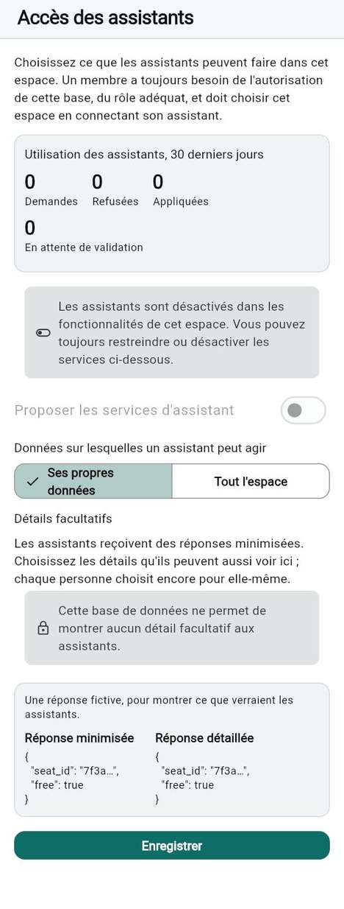

**Étapes**

1. Ouvrez [Assistants](https://fdittgen-png.github.io/deskilo/#/assistants). **Où vous en êtes ici** liste ce qui vous manque encore : **Connexion Google**, **Identité pour les assistants**, **Approbation de la base de données**, **Offre de l'espace de travail**, **Votre rôle**, **Votre consentement**, **Serveur**.
2. Descendez la liste ; chaque ligne dit qui fait l'étape suivante.

**Bon à savoir**

- Plusieurs personnes interviennent : vous, le propriétaire ou un administrateur de l'espace, un administrateur de la base et l'opérateur de l'installation. Personne ne peut tout ouvrir à lui seul.
- Activer les assistants n'accorde rien à personne par lui-même.
- Sous **Assistants connectés**, vous voyez ce qui est connecté et vous pouvez le **Déconnecter**. **Votre utilisation des assistants aujourd'hui** compte les **Demandes**, **Refusé**, **Appliquées** et **En attente de validation**.

**Voir aussi:** [Connecter un assistant](#connecter-un-assistant)

<!-- anchor: user.advanced.assistants-connect -->
### Connecter un assistant

**Public:** Membre · Administrateur·rice · Propriétaire

Vous voulez que votre assistant travaille avec vos propres réservations et votre compte.

**Étapes**

1. Ouvrez [Connecter un assistant](https://fdittgen-png.github.io/deskilo/#/assistants/connect). Sous **Avant de connecter**, chaque ligne doit indiquer **Fait**.
2. Sous **Quel assistant utilisez-vous ?**, choisissez **Claude**, **Claude Code**, **ChatGPT**, **Cursor**, **VS Code** ou **Autre**. Copiez-y **Votre adresse DesKilo pour les assistants** comme l'indiquent les étapes.
3. Connectez-vous quand l'assistant le demande, puis choisissez cet espace et ce que l'assistant peut y faire.
4. Touchez **Tester la connexion** et demandez à votre assistant : « Avec DesKilo, quelles sont mes réservations cette semaine ? »

**Bon à savoir**

- L'assistant lui-même vous demande d'approuver l'espace et chaque type d'opération ; rien n'est choisi à votre place.
- La connexion demande la fonctionnalité **Interface MCP** dans l'espace. Si elle est désactivée, l'écran vous renvoie vers Assistants.
- Ça ne marche pas ? **Tester la connexion** dit ce qu'elle attend encore.
- **Déconnecter** retire l'assistant de tous les espaces de cette base de données. Ce qu'il a déjà lu n'est pas repris.

**Voir aussi:** [Les autorisations](#autorisations-et-confirmations-pour-les-assistants)

<!-- anchor: user.advanced.assistants-approve -->
### Autorisations et confirmations pour les assistants

**Public:** Propriétaire · Opérateur·rice

Les assistants sont autorisés par couches, pour qu'une personne ne puisse pas en activer un seule.

**Étapes**

1. Le propriétaire de l'espace (ou celui qui gère les intégrations) ouvre [Configuration des assistants](https://fdittgen-png.github.io/deskilo/#/settings/assistant-setup) et la descend : **Activer les assistants pour cet espace de travail**, **Choisir ce que les assistants peuvent faire**.
2. Chaque membre demande une fois : **Demander l'autorisation**. Un administrateur de la base décide dans [Autorisations des assistants](https://fdittgen-png.github.io/deskilo/#/database/assistant-approvals) avec **Approuver** ou **Rejeter**.
3. L'opérateur de l'installation ouvre [Installation : assistants](https://fdittgen-png.github.io/deskilo/#/installation/assistants) et touche **Activer pour tous les espaces**. La page liste aussi les **Administrateurs de la base** et les **Clients d'assistant**, chacun **Approuvé**, **Bloqué** ou **En attente d'approbation**.
4. Quand un assistant envoie une demande à fort impact, on vous demande : **Confirmer une demande d'assistant**. **Confirmer** lui laisse envoyer cette demande précise une seule fois ; **Refuser** ne fait rien.

**Bon à savoir**

- Les autorisations et les modifications de l'installation demandent votre second facteur.
- L'autorisation expire ; l'écran indique les jours restants et vous la demandez à nouveau.
- Une demande confirmée suit toujours les règles de validation de l'espace.
- Sans autre administrateur de la base, l'opérateur autorise l'accès, avec un motif, pour 30 jours au plus.

**Voir aussi:** [Ce que les assistants peuvent faire](#ce-que-les-assistants-peuvent-faire-dans-un-espace)

<!-- anchor: user.advanced.assistants-policy -->
### Ce que les assistants peuvent faire dans un espace

**Public:** Propriétaire · Administrateur·rice

Vous décidez quels services un espace propose aux assistants.

**Étapes**

1. Ouvrez [Accès des assistants](https://fdittgen-png.github.io/deskilo/#/settings/assistants).
2. Activez **Proposer les services d'assistant**.
3. Sous **Données sur lesquelles un assistant peut agir**, choisissez **Ses propres données** ou **Tout l'espace**.
4. Cochez les opérations, par groupes : **Réservations et compte personnels**, **Demandes financières**, **Demandes d'adhésion**, **Validations**.
5. Touchez **Enregistrer**.

**Bon à savoir**

- Les opérations se lisent comme « Voir les places libres », « Réserver une place pour vous », « Vous enregistrer à l'arrivée » ou « Annuler vos réservations qui n'ont pas commencé ».
- Les assistants reçoivent des réponses réduites au minimum. **Détails facultatifs** permet d'en autoriser davantage ; chaque personne choisit tout de même pour elle-même.
- Les assistants déjà connectés ne reçoivent de nouveaux services que lorsque chaque personne approuve à nouveau.
- Activez d'abord la fonctionnalité **Interface MCP** dans [Fonctionnalités](https://fdittgen-png.github.io/deskilo/#/features). Elle est désactivée par défaut.
- C'est réservé aux personnes qui détiennent la permission d'intégrations ; les propriétaires l'ont toujours.

**Voir aussi:** [Un interrupteur de fonctionnalité](#un-interrupteur-de-fonctionnalité)

<!-- anchor: user.advanced.recorder -->
### L'enregistreur de tâches et les visites guidées

**Public:** Tout le monde

Vous voulez montrer à quelqu'un comment se fait une tâche, ou qu'on vous la montre. Enregistrez la tâche une fois, transformez-la en guide et suivez-la pas à pas sur la vraie app.

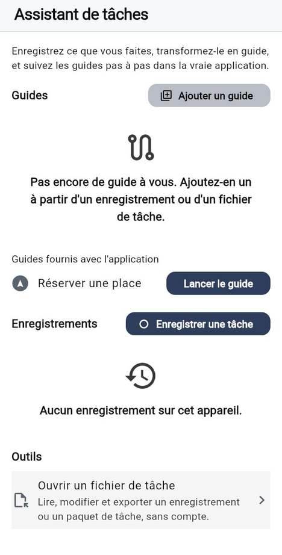

**Étapes**

1. Ouvrez l'[Assistant de tâches](https://fdittgen-png.github.io/deskilo/#/task-wizard) : dans le menu sur un grand écran, ou sous **Avancé** dans [Moi](https://fdittgen-png.github.io/deskilo/#/me).
2. **Guides** contient vos propres guides et ceux qui viennent avec l'app, comme **Réserver une place**.
3. **Enregistrements** liste les tâches que vous avez enregistrées, et **Enregistrer une tâche** en commence une nouvelle.
4. **Outils** ouvre un fichier de tâche sans compte.

**Bon à savoir**

- Tout reste sur votre appareil jusqu'à ce que vous l'exportiez.
- L'enregistreur de tâches est une fonctionnalité (**Enregistreur de tâches**). Quand elle est désactivée, l'assistant de tâches n'apparaît pas dans les menus.
- Vous devez être connecté pour enregistrer ou suivre un guide.

**Voir aussi:** [Enregistrer une tâche](#enregistrer-une-tâche) · [Suivre un guide](#suivre-un-guide)

<!-- anchor: user.advanced.recorder-record -->
### Enregistrer une tâche

**Public:** Tout le monde

Vous voulez garder la trace de ce que vous faites, pour en tirer un document ou un guide.

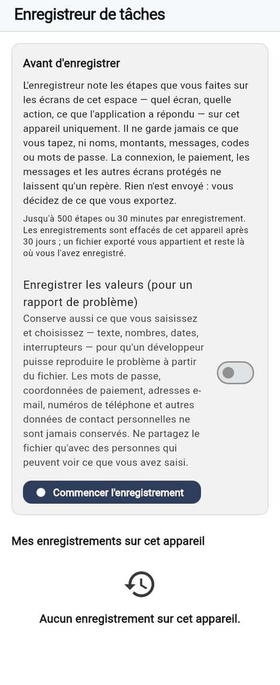

**Étapes**

1. Dans l'[Enregistreur de tâches](https://fdittgen-png.github.io/deskilo/#/task-recorder), lisez **Avant d'enregistrer**.
2. Touchez **Commencer l'enregistrement**.
3. Faites la tâche comme d'habitude, sur n'importe quel écran de l'espace ou de [Moi](https://fdittgen-png.github.io/deskilo/#/me).
4. Utilisez la barre qui affiche **Enregistrement en cours** pour **Pause**, **Reprendre**, **Ajouter une note** ou **Arrêter**.

**Bon à savoir**

- Un enregistrement dure jusqu'à 500 étapes ou 30 minutes, et il est supprimé de l'appareil après 30 jours. Un fichier que vous avez exporté reste là où vous l'avez enregistré.
- Chaque étape nomme l'écran, l'action et ce que l'app a répondu, comme **Réservé** ou **Refusé**.
- La connexion, le paiement, les messages et les autres écrans protégés ne laissent qu'un repère.
- Si vous passez à un autre compte ou à un autre espace, l'enregistrement s'arrête.

**Voir aussi:** [Confidentialité des enregistrements](#ce-quun-enregistrement-conserve)

<!-- anchor: user.advanced.recorder-review -->
### Relire, modifier et exporter un enregistrement

**Public:** Tout le monde

Vous voulez vérifier ce qui a été capturé avant de le partager.

**Étapes**

1. Dans l'[Assistant de tâches](https://fdittgen-png.github.io/deskilo/#/task-wizard), touchez un enregistrement sous **Enregistrements**.
2. Lisez les étapes. Touchez **Exclure de l'export** sur toute étape dont vous ne voulez pas ; **Remettre** la rétablit.
3. Regardez **Ce que le fichier contiendra**.
4. Choisissez **Exporter un fichier**, **Exporter un paquet de tâche** ou **Exporter en document Word**.

**Bon à savoir**

- Exclure une étape ne change que l'export. L'enregistrement sur l'appareil reste inchangé.
- Pour lire un fichier venant de quelqu'un d'autre, utilisez **Ouvrir un fichier de tâche** dans l'[Atelier de tâches](https://fdittgen-png.github.io/deskilo/#/task-workbench). Rien n'est envoyé, et aucun compte n'est nécessaire.
- Un fichier abîmé, ou créé par une version plus récente, est refusé avec un message clair.
- **Supprimer de cet appareil** supprime l'enregistrement ; les fichiers exportés ne sont pas touchés.

**Voir aussi:** [Créer un guide](#créer-un-guide-à-partir-dun-enregistrement)

<!-- anchor: user.advanced.guide-make -->
### Créer un guide à partir d'un enregistrement

**Public:** Tout le monde

Vous voulez que d'autres suivent une tâche que vous avez enregistrée.

**Étapes**

1. Dans l'[Assistant de tâches](https://fdittgen-png.github.io/deskilo/#/task-wizard), touchez **Créer un guide** à côté d'un enregistrement. Ou choisissez **Ajouter un guide** → **À partir d'un de mes enregistrements** ou **À partir d'un fichier ou paquet de tâche**.
2. Vérifiez le brouillon. Chaque étape est écrite comme le lecteur la verra.
3. Donnez-lui un nom sous **Nom du guide**.
4. Touchez **Ajouter à mes guides**.

**Bon à savoir**

- Le guide est conservé sur votre appareil sous **Guides**. Un guide peut être modifié ou supprimé : **Supprimer ce guide** ne touche pas à son enregistrement.
- Une étape qui réserve attend la vraie réponse. Rien n'est fait à la place du lecteur.
- **Enregistrer le guide** l'écrit dans un fichier que vous pouvez transmettre.

**Voir aussi:** [Modifier un guide](#modifier-ou-réparer-un-guide)

<!-- anchor: user.advanced.guide-play -->
### Suivre un guide

**Public:** Tout le monde

Vous voulez être guidé dans une tâche sur les vrais écrans.

**Étapes**

1. Dans l'[Assistant de tâches](https://fdittgen-png.github.io/deskilo/#/task-wizard), touchez **Lancer le guide** à côté de l'un des guides.
2. Un panneau affiche Étape 1 sur … et ce qu'il faut faire, par exemple « Touchez « Réserver ». » ou « Remplissez « … », puis quittez le champ. »
3. Touchez **Ouvrir et mettre en évidence** pour aller au bon écran et voir le contrôle repéré.
4. Faites l'étape vous-même. Le guide s'en aperçoit et passe à la suivante. Pour une étape de lecture, touchez **Fait**.

**Bon à savoir**

- Utilisez **Retour** et **Passer**, et ouvrez **Toutes les étapes** pour voir chacune comme **À faire**, **En attente**, **Fait**, **Pris en compte** ou **Passé**.
- Une étape qui réserve attend la réponse : **En attente du résultat…**. Si elle est refusée, le guide dit quoi essayer ; si aucune réponse n'est venue, il vous demande de vérifier avant de réessayer.
- **Arrêter le guide** y met fin. Rien n'est annulé.
- Le guide se met en pause quand le compte ou l'espace change, ou quand l'enregistreur de tâches est désactivé.

**Voir aussi:** [Le menu rond](#le-menu-rond)

<!-- anchor: user.advanced.guide-circle -->
### Le menu rond

**Public:** Tout le monde

Vous avez besoin de tout l'écran pour travailler, mais vous voulez garder le guide à portée de main. Réduisez-le.

**Étapes**

1. Dans le panneau du guide, touchez **Réduire le guide**. Il se réduit en un petit rond.
2. Touchez le rond pour un menu : Afficher le guide (étape … sur …), **Ouvrir et mettre en évidence**, un bouton vers la page de l'étape, **Fait**, **Passer**, **Retour**, **Reprendre** et **Arrêter le guide**.
3. Choisissez **Afficher le guide** pour rouvrir le panneau.

**Bon à savoir**

- Le menu ne propose que ce qui a du sens maintenant : **Reprendre** seulement pendant une pause, **Fait** seulement pour une étape de lecture.
- **Fermer** sur le panneau le masque ; le guide lui-même reste où il en était.
- Ouvrir et mettre en évidence vous emmène à la page de l'étape et désigne le contrôle ; le bouton de page vous emmène à la page seulement.

**Voir aussi:** [Suivre un guide](#suivre-un-guide)

<!-- anchor: user.advanced.guide-edit -->
### Modifier ou réparer un guide

**Public:** Tout le monde

Un guide se lit mal, ou une étape pointe vers la mauvaise page. Corrigez-le dans le brouillon.

**Étapes**

1. Dans l'[Assistant de tâches](https://fdittgen-png.github.io/deskilo/#/task-wizard), touchez **Modifier** à côté de votre guide.
2. Sur une étape, touchez **Écrire le texte** et saisissez votre propre texte.
3. Sous **Destination de l’étape**, choisissez la page à laquelle l'étape renvoie. Touchez **Ouvrir et mettre en évidence** pour vérifier.
4. Activez **Le lecteur peut la passer** pour une étape facultative.
5. Touchez **Enregistrer les modifications**.

**Bon à savoir**

- Une étape marquée **Une instruction encore à écrire** attend vos mots. **Une étape que l'enregistreur ne sait pas décrire** et **Faites cette étape vous-même** sont faites par le lecteur.
- Les étapes sur des écrans protégés, comme le paiement, demandent au lecteur de les faire seul.
- Vous ne pouvez pas faire attendre à un guide un résultat que son action n'a pas ; cette partie est fixée.
- Un guide qui nomme des étapes que cette version ne connaît pas peut être lu, mais pas suivi.

**Voir aussi:** [Créer un guide](#créer-un-guide-à-partir-dun-enregistrement)

<!-- anchor: user.advanced.recorder-privacy -->
### Ce qu'un enregistrement conserve

**Public:** Tout le monde

Vous voulez savoir exactement ce qui ne laisse aucune trace.

**Étapes**

1. Ouvrez l'[Enregistreur de tâches](https://fdittgen-png.github.io/deskilo/#/task-recorder).
2. Lisez **Avant d'enregistrer**.
3. Laissez **Enregistrer les valeurs (pour un rapport de problème)** désactivé, sauf si un développeur vous l'a demandé.

**Bon à savoir**

- Normalement, un enregistrement ne conserve jamais ce que vous saisissez, ni les noms, montants, messages, codes ou mots de passe.
- Avec les valeurs activées, il conserve aussi ce que vous saisissez et choisissez, pour qu'un développeur puisse reproduire un problème. Les mots de passe, les données de paiement, les adresses e-mail et les numéros de téléphone ne sont toujours jamais conservés. L'exporter demande **Cet enregistrement contient des valeurs**.
- Rien n'est envoyé : vous décidez de ce que vous exportez.
- Ne partagez un fichier qu'avec des personnes qui peuvent voir ce que vous avez saisi.

**Voir aussi:** [Enregistrer une tâche](#enregistrer-une-tâche)

<!-- anchor: user.advanced.demo -->
### L'espace de démonstration

**Public:** Tout le monde

Vous voulez regarder autour de vous avant de vous engager. La démo est un espace inventé, ouvert à tous, sans compte.

**Étapes**

1. Sur l'écran de connexion, touchez **Explorer l'espace de démonstration**.
2. Lisez la courte note, puis touchez **Commencer**.
3. Utilisez **Voir en tant que** pour voir le même espace comme **Le propriétaire**, **Un administrateur** ou **Un membre**.
4. Touchez **Réinitialiser la démo** pour la remettre comme au départ, ou **Quitter la démo**.

**Bon à savoir**

- Tout est inventé : les personnes, les réservations et les factures. Rien n'atteint un vrai espace et rien ne quitte votre appareil.
- Une bannière indique **Démo** sur chaque écran.
- Fermer l'app oublie la session.
- L'offre n'apparaît que lorsque la fonctionnalité **L'espace de démonstration** est activée.

**Voir aussi:** [Mode tournage](#mode-tournage)

<!-- anchor: user.advanced.filming -->
### Mode tournage

**Public:** Propriétaire

Vous devez montrer votre vrai espace — dans une vidéo, une image ou une présentation — sans montrer ses membres.

**Étapes**

1. Ouvrez [Fonctionnalités](https://fdittgen-png.github.io/deskilo/#/features) et cherchez **Mode tournage**.
2. Activez-le. Une bannière indique **Mode tournage — personnes inventées** sur chaque écran.
3. Filmez. Quand vous avez fini, désactivez-le.

**Bon à savoir**

- Chaque nom, e-mail, numéro de téléphone, adresse et photographie devient une personne inventée, la même partout. Le plan, les réservations et les chiffres restent réels.
- Tant qu'il est activé, les formulaires d'identité refusent d'enregistrer, pour que des données inventées ne puissent pas écraser les vraies.
- Il ne peut pas masquer ce que quelqu'un a saisi, comme un message ou le libellé d'une place. Relisez l'écran avant de filmer.
- Pour une image qui n'a pas besoin de montrer cet espace, utilisez [la démo](#lespace-de-démonstration).

**Voir aussi:** [Un interrupteur de fonctionnalité](#un-interrupteur-de-fonctionnalité)

<!-- anchor: user.advanced.platforms -->
### DesKilo sur vos appareils

**Public:** Tout le monde

Vous voulez utiliser DesKilo là où vous travaillez. Le même compte et les mêmes données vous suivent.

**Étapes**

1. **Android :** rejoignez le test fermé sur Google Play.
2. iPhone et iPad : rejoignez la bêta via TestFlight.
3. **Ordinateur :** une image disque macOS ou un installateur Windows depuis la page des versions ; ou ouvrez simplement l'app web.
4. **Navigateur :** ouvrez l'adresse que publie votre espace. Rien à installer.

**Bon à savoir**

- Une place réservée sur un téléphone apparaît un instant plus tard dans un onglet du navigateur.
- L'image disque macOS de la page des versions est signée et notariée par Apple ; ouvrez-la normalement.
- L'installateur Windows n'est pas signé : Windows SmartScreen signale un éditeur inconnu ; choisissez Informations complémentaires, puis Exécuter quand même.
- La lecture d'une étiquette de chaise fonctionne dans les navigateurs Chromium sur Android (HTTPS et un toucher nécessaires) ; les apps Android et iPhone lisent directement les étiquettes.
- Une version sans services Google, sans notifications push dans le cloud, est préparée pour F-Droid ; si elle peut déjà être installée depuis F-Droid, la [page d'état F-Droid](https://github.com/fdittgen-png/deskilo/blob/master/docs/guides/fdroid.md#status) le dit. Sur cette version, les notifications sont locales et la boîte de réception fait foi.
- Les mises à jour arrivent par le canal depuis lequel vous avez installé l'app : Google Play, TestFlight, la page des versions, ou en rechargeant l'app web.

**Voir aussi:** [Votre badge](#votre-badge)

<!-- anchor: user.advanced.support -->
### Détails pour l'assistance

**Public:** Tout le monde

Vous contactez l'assistance et vous voulez envoyer ce qui l'aide, sans rien exposer de privé.

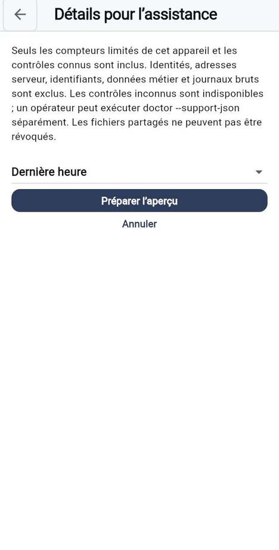

**Étapes**

1. Ouvrez [Aide](https://fdittgen-png.github.io/deskilo/#/help) et touchez l'icône d'assistance (**Détails pour l’assistance**).
2. Choisissez **Dernière heure** ou **Dernières 24 heures**.
3. Touchez **Préparer l’aperçu** et lisez ce qu'il contient : Aperçu : … octets.
4. Touchez **Enregistrer**, puis envoyez le fichier.

**Bon à savoir**

- Seuls des comptages d'événements bornés et des vérifications connues sont inclus. Les identités, les adresses de serveur, les identifiants, les données métier et les journaux bruts sont exclus.
- Un fichier partagé ne peut pas être révoqué.
- Si le contexte a changé, l'écran vous demande de préparer un nouvel aperçu.
- Un opérateur peut lancer `doctor --support-json` pour le côté serveur.

**Voir aussi:** [Quand quelque chose ne fonctionne pas](#quand-quelque-chose-ne-fonctionne-pas)

<!-- anchor: user.advanced.troubleshooting -->
### Quand quelque chose ne fonctionne pas

**Public:** Tout le monde

Quelque chose semble anormal. Essayez ceci, dans l'ordre.

**Étapes**

1. Cherchez un message à l'écran ; la plupart disent quoi faire. « Une erreur est survenue. Veuillez réessayer. » mérite un nouvel essai.
2. Vérifiez que vous êtes du côté que vous croyez : **Espace de test** ou **Ouvrir l’espace** dans [Moi](https://fdittgen-png.github.io/deskilo/#/me).
3. Vérifiez [Fonctionnalités](https://fdittgen-png.github.io/deskilo/#/features) : une fonction absente du menu est généralement une fonctionnalité désactivée. Seul un propriétaire peut la changer.
4. Vérifiez le serveur sous [Votre propre serveur](#votre-propre-serveur) : **Cet appareil utilise** le nomme.
5. Préparez les [Détails pour l'assistance](#détails-pour-lassistance) et envoyez-les.

**Bon à savoir**

- Ce que vous voyez dépend de votre rôle : un écran absent peut être une question de permission. Demandez à votre propriétaire.
- Les administrateurs peuvent activer le **Mode développeur** sous **Avancé** dans [Réglages](https://fdittgen-png.github.io/deskilo/#/settings). Il ajoute un écran [Développeur](https://fdittgen-png.github.io/deskilo/#/developer) où **Exporter le journal** et **Vider le journal** aident l'assistance. Il s'applique à tous les membres de l'espace.
- Vous pouvez aussi signaler un bug depuis la section À propos de l'app : **Signaler un bug / suggérer une fonctionnalité**.
- Un guide bloqué sur **En attente du résultat…** signifie qu'aucune réponse n'est arrivée : vérifiez le résultat avant de réessayer.

**Voir aussi:** [Détails pour l'assistance](#détails-pour-lassistance)

<!-- anchor: user.advanced.glossary -->
### Les mots de l'app

**Public:** Tout le monde

Les mots que vous rencontrez le plus, et ce qu'ils signifient ici.

| Mot | Ce que cela signifie |
|---|---|
| **Espace** (aussi appelé espace de travail) | Un lieu géré par une communauté : son plan, ses membres, ses règles et son argent. Vous pouvez en rejoindre plusieurs. |
| **Moi** | Votre propre compte : profil, messages, espaces et réglages, dans tous vos espaces. |
| **Plan** | Soit le plan au sol à partir duquel vous réservez, soit une formule d'adhésion — voir **Membres et forfaits**. |
| **Niveau** | Un étage ou une zone du plan. Un niveau peut être réservé en entier quand la fonctionnalité est activée. |
| **Table** | Une place réservable. Les bureaux et les salles regroupent des tables. |
| Demi-journée | L'unité dans laquelle les réservations et les abonnements sont comptés. |
| **Validation** | Une règle qui dit qu'une action demande une ou plusieurs confirmations avant de compter. |
| **Événements** | Le fil de ce qui s'est passé, avec en haut les décisions qui vous attendent. |
| **Borne** | Une tablette partagée à la porte où les personnes s'enregistrent avec un badge. |
| Fonctionnalité | Une fonction que le propriétaire active ou désactive pour tout l'espace. |
| **Rôle** | Ce qu'une personne peut faire dans un espace. Les permissions se règlent par rôle. |
| **Environnement** | Le côté développement (test) ou le côté production (réel) d'un espace. |
| Jumeau | L'autre côté d'une paire. |
| **Déploiement** | Faire passer la configuration d'un côté d'une paire à l'autre. |
| **Assistant** | Un outil d'IA connecté à votre compte, qui n'agit que comme vous l'autorisez. |
| Opérateur·rice | La personne qui fait tourner l'installation avec laquelle l'app communique. |

**Bon à savoir**

- Les propriétaires peuvent changer les mots qu'un espace utilise sous **Vocabulaire** ; l'app affiche alors ceux de l'espace.

**Voir aussi:** [Vocabulaire](#vocabulaire)

<!-- anchor: user.advanced.accessibility -->
### Accessibilité et clavier

**Public:** Tout le monde

Vous voulez que l'app s'adapte à votre façon de travailler.

**Étapes**

1. Choisissez un aspect sous [Réglages](https://fdittgen-png.github.io/deskilo/#/settings) : **Thème**, **Langue**, **Nombres et dates**.
2. Pour des écrans plus calmes, activez le réglage de réduction des animations de votre appareil.
3. Sur un ordinateur, appuyez sur Échap dans un assistant pour revenir en arrière.

**Bon à savoir**

- Le réglage de réduction des animations de l'appareil l'emporte toujours sur la fonctionnalité **Animations de l'interface** ; un propriétaire peut aussi désactiver cette fonctionnalité.
- Quitter un assistant avec des modifications non enregistrées demande d'abord confirmation : **Continuer** ou **Abandonner**.
- Les commandes portent des libellés textuels, afin qu'un lecteur d'écran les annonce.
- Sur le web et sur un ordinateur, une fenêtre large affiche le menu à côté du contenu.

**Voir aussi:** [Thème](#thème) · [Langue de l'application](#langue-de-lapplication)

<!-- anchor: user.advanced.help -->
### Où trouver plus d'aide

**Public:** Tout le monde

Vous êtes bloqué sur un champ ou sur un écran.

**Étapes**

1. Touchez le **?** à côté d'un champ : le guide s'ouvre sur ce champ.
2. Ouvrez [Aide](https://fdittgen-png.github.io/deskilo/#/help) pour tout le guide ; **Sommaire** saute à un chapitre.
3. Les astuces d'un écran peuvent être écartées avec **Masquer l'astuce** ; **Astuce suivante** et **Astuce précédente** les font défiler, **En savoir plus** ouvre le guide.
4. Pour revoir les astuces écartées, utilisez **Réafficher les astuces d'aide** dans vos réglages.

**Bon à savoir**

- Le guide fonctionne hors ligne, dans votre langue.
- Votre administrateur peut répondre aux questions sur votre espace ; les Détails pour l'assistance aident quand il s'agit de l'app.

**Voir aussi:** [Réafficher les astuces](#rétablir-les-astuces) · [Détails pour l'assistance](#détails-pour-lassistance)
