# Setup Guide

**DesKilo — build your space, step by step.** For the person who is about to create a coworking space, an association's room or a shared office, and wants to know what is possible, what is necessary and in which order. *Other languages: [Français](Guide-de-demarrage) · [Deutsch](Einrichtungsanleitung) · [Español](Guia-de-puesta-en-marcha) · [Italiano](Guida-di-avvio).*

<!-- anchor: setup.guide.how-to-read -->
## How to use this guide

**Audience:** Owner · Co-owner · Administrator · Operator

This guide explains the *why*, the *order* and the *consequences* of setting a space up. The clicks themselves are in the [User Guide](User-Guide#how-to-use-this-guide); each section here links to the exact place. The running example is the demo space, *Atelier du Marché* in Pézenas: an association with a room, a handful of desks and a monthly membership. Its people and figures are invented.

*Three levels, in this order*

| Level | What you do | How long |
|---|---|---|
| **Open** | A place, opening times, the people who approve, an invitation. At the end members can book. | about 20 minutes |
| **Run** | Roles, tariffs, payments, notifications. At the end the space can live from day to day. | an afternoon, spread over days |
| **Grow** | Invoicing and tax, reports, a kiosk at the door, analytics, assistants. Only when you need them. | when the time comes |

Only **Open** is required to start. Stop after any level: nothing forces you on.

*Pick your path*

| You want… | Start here |
|---|---|
| To know what DesKilo can do and what to prepare | [Before you start](#before-you-start) |
| A place members can book, today | [Build the place](#build-the-place) |
| To say who may do what, and who approves | [The role matrix](User-Guide#the-role-matrix) |
| To charge for membership | [Money](#money-and-tax) |
| To tell members what is happening | [Notifications](#tell-people) |
| To issue invoices and declare VAT | [Invoicing](#invoice-by-hand-or-automatically) · [VAT](#vat-in-outline) |
| A wall tablet, reports or analytics | [Kiosk](User-Guide#kiosk-mode-a-wall-tablet-for-check-in) · [The report editor](User-Guide#the-report-editor) · [Business analytics](User-Guide#business-analytics) |
| To let an assistant act for you | [Assistants](User-Guide#assistants-what-they-are) |

*Two companions*

- **The setup wizard page** (`setup.html`) lets you prepare everything in your browser before you touch the app: answers are saved in the browser, nothing is sent anywhere, and you can export a file the app reads. It is the best place to think with your accountant. See [Prepare a space with the setup questionnaire](User-Guide#prepare-a-space-with-the-setup-questionnaire).

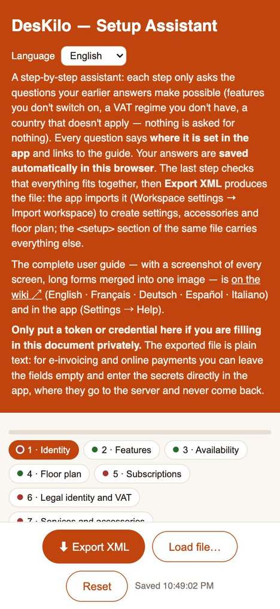

- **The demo workspace** lets you practise first, with nothing real at stake. See [The demo workspace](User-Guide#the-demo-workspace).

**Good to know**

- Every section names its audience in the second line, so you can skip what is not yours.
- A block that starts with **Careful** marks a decision that becomes hard to undo, and says when.
- This guide never certifies anything legal or fiscal: it says what the app does and what to confirm with an accountant.

<!-- anchor: setup.before.overview -->
## Before you start

A little preparation saves you the two things that cost most later: retyping, and decisions you cannot take back. This chapter shows what DesKilo does, what you really need to open, and what to have at hand.

In this chapter:
- [What DesKilo can do](#what-deskilo-can-do)
- [What is necessary and what is optional](#what-is-necessary-and-what-is-optional)
- [A test space or a real one](#a-test-space-or-a-real-one)
- [Start from a template or from nothing](#start-from-a-template-or-from-nothing)
- [What to prepare](#what-to-prepare)
- [Decisions that are hard to undo](#decisions-that-are-hard-to-undo)
- [Who does what](#who-does-what)

<!-- anchor: setup.before.what -->
### What DesKilo can do

**Audience:** Owner · Co-owner

You want a picture of the whole before you choose anything. DesKilo groups its features into nine processes; the **Features** screen shows one card per process with its state.

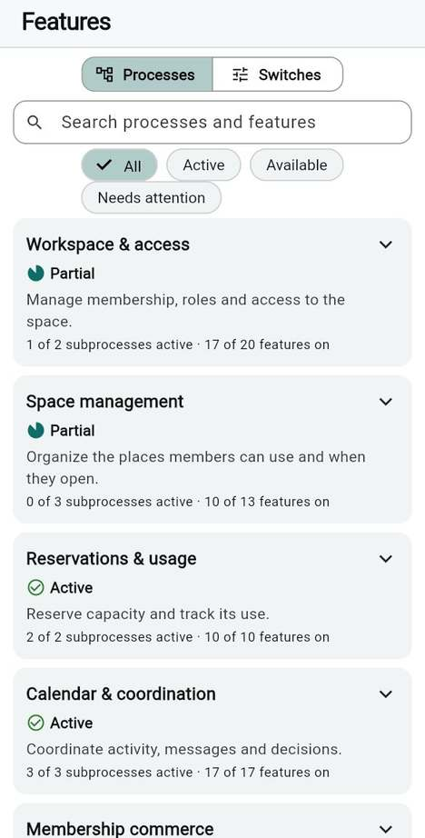

*The nine processes, in plain words*

| Process | What it gives a member |
|---|---|
| **Workspace & access** | A way in: join with the workspace ID, a role, a badge. |
| **Space management** | A place that looks like the real one: floors, rooms, desks, opening times. |
| **Reservations & usage** | Booking a desk or a room, checking in and out, seeing what is free. |
| **Calendar & coordination** | A calendar, messages and requests that someone confirms. |
| **Membership commerce** | A plan, service prices and agreements. |
| **Billing & payments** | A statement, invoices, payment, reminders, VAT. |
| **Documents & information** | Documents to read, reports to print, their own data to export. |
| **Operations & administration** | A space that carries its own colours and words. |
| **Integrations & automation** | Notifications and documents delivered through outside services. |

**Good to know**

- A new space starts with a sensible set of features on; you do not have to decide on them one by one. Switching a feature off stops new business only and deletes nothing.
- A feature that needs another one switches it on with it, and the screen names what came on. See [A feature switch](User-Guide#a-feature-switch).
- Features marked alpha or beta ask for your consent when you switch them on.

**See also:** [Switch features on and off](User-Guide#switch-whole-processes-on-or-off)

<!-- anchor: setup.before.necessary -->
### What is necessary and what is optional

**Audience:** Owner · Co-owner · Administrator

You want to know the shortest road to a space people can book. The app keeps a readiness list called **Setting up this space** and, on the Reserve screen, tells owners **Before anyone can book here** what is missing.

*What must be there before the first booking*

1. **Opening days, time zone and currency**: a time zone, a currency and at least one open weekday.
2. **Bookable places on the floor plan**: at least one seat.
3. **Roles and who validates requests**: counted only when a policy on reservations asks for more validators than the space has. A rule asking for two approvals with only you in the space would leave requests waiting for ever.

A fourth row, **Server and database version**, blocks only when the server is behind this app; it then waits for the server operator.

*What is optional, and can be set aside for later*

- **Membership plans and tariffs**
- **Invite the first members**
- **How members pay**
- **Export and recovery**
- **Details your features need (identity, bank, platforms)**
- **A first booking**

Each of these can be set aside with **Later** and brought back; the list says whether a step is **Needs configuration**, **Ready**, **Not needed here** or **Waiting for someone else**. Two more states exist: **Not verified yet** (**Export and recovery** turns Ready only after a real export in the last 90 days) and a row that could not be read.

**Good to know**

- The list names who acts: **You**, **The server operator** or **A database administrator**.
- Optional does not mean unimportant: once you invoice, your legal identity is required for that feature. The list calls it a detail your features need.
- If you switch invoicing on without legal identity, the app lets you; it refuses at the moment of issuing an invoice, and says what is missing.

**See also:** [Check your space](#check-your-space) · [The Get started card and the tips](User-Guide#the-get-started-card-and-the-tips)

<!-- anchor: setup.before.environment -->
### A test space or a real one

**Audience:** Owner · Co-owner · Operator

You want to try things without consequences, then run the real space. A space can be a test, a real one, or a linked pair with the same name.

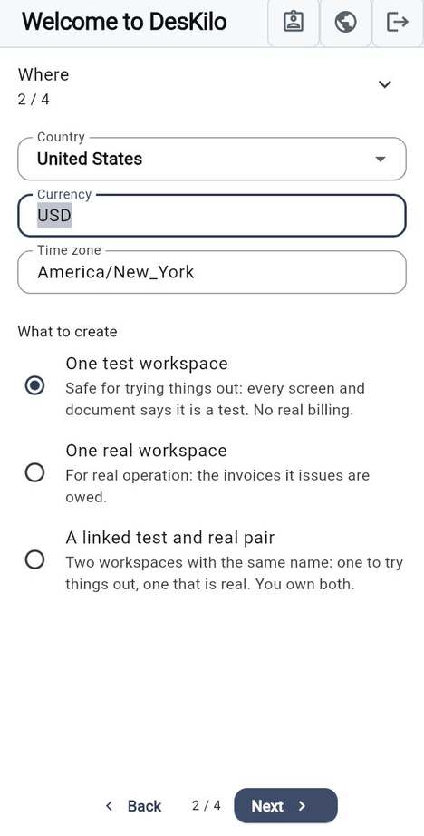

| Option | Choose it when | What happens |
|---|---|---|
| **One test workspace** | You are learning. | Every screen and document says it is a test: documents carry a watermark. No real billing. |
| **One real workspace** | You know your settings. | The invoices it issues are owed. |
| **A linked test and real pair** | You want to rehearse changes before the real members see them. | Two spaces, both yours. Only a deployment moves configuration from one to the other; members, bookings, invoices and payments never travel. |

**Good to know**

- The selector starts on the test option.
- The environment is a statement by the owner; anyone with the configuration permission (the owner always) can change it later, and invoices already issued keep the watermark they carried, so start with a test space if you are unsure.
- To practise with no space of your own, use the demo workspace.

**See also:** [A space has two sides](User-Guide#a-space-has-two-sides) · [Create a workspace](User-Guide#create-a-workspace) · [A test space](User-Guide#what-a-test-space-is-for)

<!-- anchor: setup.before.template -->
### Start from a template or from nothing

**Audience:** Owner

You want a head start without being locked into someone else's choices. When you create a space, **Start from** offers **Empty space** or a ready-made template, and is preselected on *A tiny space*; choose *Empty space* if you want a blank canvas.

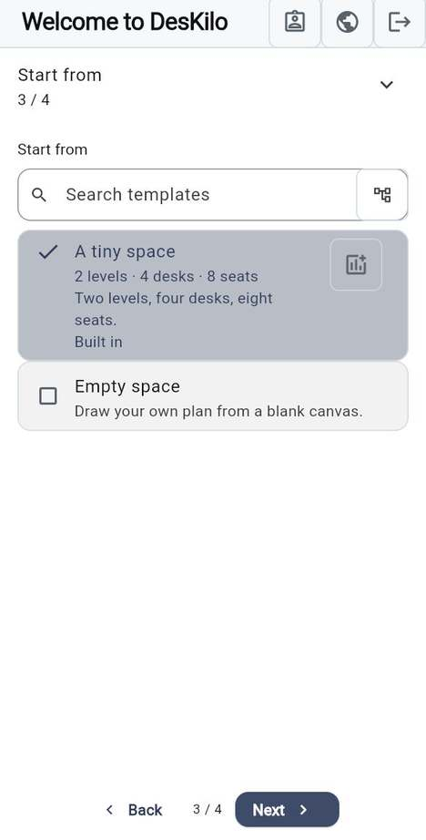

*The two built-in templates*

| Template | What it sets up |
|---|---|
| A tiny space | Two levels, four desks, eight seats, nothing else: enough to book, scan and browse from the first minute. |
| Association de coworking (France) | Half days 7:00–13:00 and 13:00–19:00, Monday to Friday, public holidays, 50 % and 100 % memberships, two prepaid books of half-days (10 and 20), board roles (treasurer, secretary, room steward), a calendar for validations, and two floors ready to book. It also sets the workspace language to French and the VAT regime to *not subject to VAT*; only three words are renamed (Place, Étage, Réservations). The template's name is French in every app language. |

**Good to know**

- A template never carries your legal identity, bank details, sites, invitations or document links: those are yours, and the readiness list names them as details your features need.
- A template-created space can have invoicing on and nothing to issue with until you add the identity.
- Applying a template to a space that already has tariffs replaces its fee bands: use it on a new space.

**See also:** [Create a workspace](User-Guide#create-a-workspace)

<!-- anchor: setup.before.prepare -->
### What to prepare

**Audience:** Owner

You want the facts at hand so that setting up takes minutes, not days. Gather these first.

**Before you start**

- [ ] The **legal identity**: association or company, registered name, address, registration and VAT numbers if you have them.
- [ ] An **accountant** (or someone who will confirm tax choices): invoices and VAT are the part to check with a professional.
- [ ] A tariff idea: free, a flat membership, or a percentage of days with a monthly fee.
- [ ] **Bank details** members will pay to (IBAN and BIC, or the method used in your country).
- [ ] A list of the first people: names and e-mail addresses, and who will approve requests.
- [ ] A floor plan sketch: floors, rooms, how many desks and seats, and whether a whole room can be booked.
- [ ] Your opening days and hours, and the days you close.

**Good to know**

- You can open without the legal identity and the bank details; you need them before the first invoice.
- Write the sketch on paper first. The app draws floors, rooms, desks and seats; it is faster to enter a plan you have already thought through.

**See also:** [Prepare a space with the setup questionnaire](User-Guide#prepare-a-space-with-the-setup-questionnaire)

<!-- anchor: setup.before.permanent -->
### Decisions that are hard to undo

**Audience:** Owner · Co-owner

You want to know which choices to slow down for. Most settings can be changed any day. These cannot, or not cleanly.

> **Careful** An issued invoice never changes, and its number is never reused. If you are wrong, you correct with a cancellation, a credit note or a refund request, not with an edit.

| Decision | When it becomes permanent | What to do instead |
|---|---|---|
| Invoice number format and sequence | The next number can be raised, never lowered. After the first invoice you can no longer print less of the date than the series shows. | Preview the format, ask your accountant, then issue. |
| The month of an issued invoice | Once a member's month is invoiced it is locked; closure days and public-holiday imports skip it. | Set closure days before month-end. |
| VAT regime and rates | Rates are versioned by date and never edited; a submitted VAT declaration is never recomputed. | Add a new rate from a date; decide the regime with your accountant. |
| Country, currency, time zone | Amounts are stored as numbers with no conversion, so changing the currency once money exists is unsafe. | Choose them right on day one; see [Build the place](#build-the-place). |
| Floor plan replacement | Importing a plan is refused once reservations exist. | Edit floors and rooms one by one in the editor. |
| Workspace ID | It is what members type and what the printed QR codes point to. You can change it (4 to 20 letters or digits) with **Change workspace ID**, but the old ID stops working at once. | Choose a short, memorable ID before you print anything; change it early if you must. |
| Test or real | A real space issues invoices that are owed; dev documents are watermarked. | Start in a test space, deploy when ready. |
| A rule that needs more validators than you have | Requests wait for ever. | Count your validators before you require two. |

**Good to know**

- Switching a feature off never erases data.
- Deleting a floor removes every office, desk and seat on it.

**See also:** [Money](#what-cannot-be-undone)

<!-- anchor: setup.before.who -->
### Who does what

**Audience:** Owner · Co-owner · Administrator · Operator

You want to know whom to call for what. Three people can be involved, and the readiness list names them.

| Who | What they do |
|---|---|
| **Owner** (and *Co-owner*) | Everything about the space: floors, hours, features, roles, tariffs, legal identity, invitations, deployments. Co-owners hold every permission by default; the owner decides what administrators may do. |
| **Operator** | Runs the installation: the server and its secrets, and the database updates. Needed to make push notifications work, and for anything the readiness list calls **Waiting for someone else**. |
| **Database administrator** | Approves a member's access for assistants. |

**Good to know**

- On a shared installation the operator is usually the platform's, not you.
- Administrators act within the permissions the owner gave them in the [role matrix](User-Guide#the-role-matrix).
- If a section says **The server operator**, the app cannot do it from your screen.

**See also:** [Decide who may do what](User-Guide#the-role-matrix) · [Deploy permissions](User-Guide#who-may-deploy-and-enter-production)

<!-- anchor: setup.place.overview -->
## Build the place

This chapter makes the first level, **Open**: where the space is, what it looks like, when it is open and what the rules of booking are. In about twenty minutes the space can be booked. The example is *Atelier du Marché*, an association in Pézenas with two floors and a room.

In this chapter:
- [Country, currency, time zone and language](#country-currency-time-zone-and-language)
- [The floor plan](#the-floor-plan)
- [Opening times and booking rules](#opening-times-and-booking-rules)
- [Closing days and public holidays](#closing-days-and-public-holidays)
- [Check your space](#check-your-space)

<!-- anchor: setup.place.where -->
### Country, currency, time zone and language

**Audience:** Owner · Administrator

You want the space to know where it lives. These four choices drive more than they seem to.

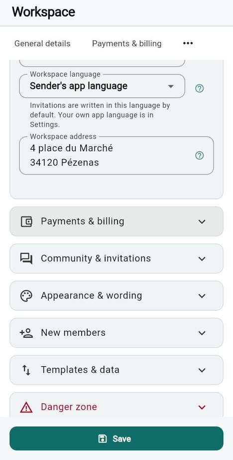

*What each choice drives*

| Choice | What it decides |
|---|---|
| **Country** | The currency and time zone it proposes, and the public holidays offered as closure days (see below). |
| **Currency** | How every amount is shown and counted. |
| **Time zone** | What a working day, a half-day boundary and a closure day mean; a member abroad sees the space's day. |
| **Workspace language** | The language invitations and shared message references are written in by default. |

**Steps**

1. Open [Workspace](https://fdittgen-png.github.io/deskilo/#/workspace-settings) and go to **General details**.
2. Pick the **Country**; the **Currency** and **Time zone** follow, and you can correct them. For Atelier du Marché: France, EUR, Europe/Paris.
3. Pick the **Workspace language**, then tap **Save**.

> **Careful** Choose country and currency right on day one. Amounts are stored as plain numbers, so changing the currency after money exists would mislabel everything already counted.

**Good to know**

- The app lists many countries, but issuing invoices inside DesKilo works for France and Germany only today. Elsewhere you keep statements and issue invoices outside the app.
- The workspace language is not your own app language, which is in your personal settings.

**See also:** [Country](User-Guide#country) · [Currency and time zone](User-Guide#currency-and-time-zone) · [Workspace language](User-Guide#workspace-language)

<!-- anchor: setup.place.plan -->
### The floor plan

**Audience:** Owner · Administrator

You want the plan on screen to look like the real place. It is built in four layers: levels, then offices (rooms), then desks, then seats. A member books a seat; a seat is what the readiness list counts.

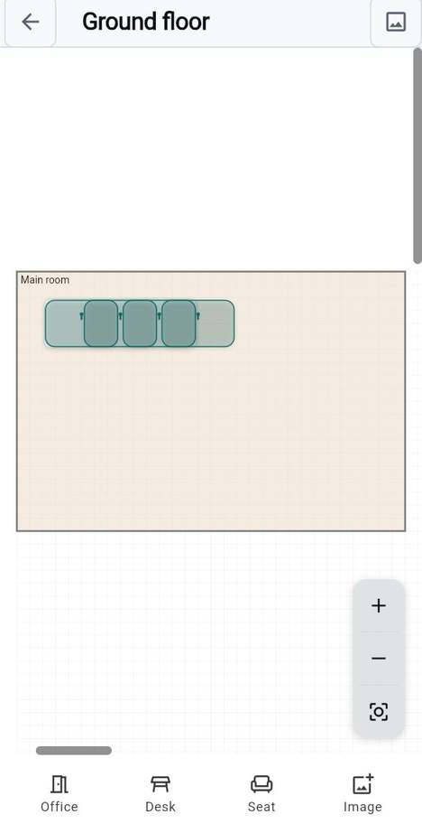

**Steps**

1. Sketch on paper: floors, rooms, desks, seats.
2. Open [Workspace editor](https://fdittgen-png.github.io/deskilo/#/editor) and add the floors with **Add level**.
3. Open a floor and draw each room with **Office**, then **Desk** and **Seat** inside it.
4. If a team may take a room or a floor for a day, switch on whole-room booking in its properties.

**Good to know**

- Start small: a first floor, one room, a few seats. Everything can be added afterwards.
- A whole floor, office or desk can be booked only if **Desk, office & level reservations** is on and the member has the permission.
- The built-in template A tiny space gives you two levels, four desks and eight seats to adjust.
- Deleting a floor removes everything on it, and a plan import is refused once reservations exist.

**See also:** [Add, rename and delete floors](User-Guide#space-editor-add-rename-and-delete-floors) · [Draw rooms, desks and seats](User-Guide#draw-rooms-desks-and-seats) · [Let members book a whole floor](User-Guide#let-members-book-a-whole-floor)

<!-- anchor: setup.place.times -->
### Opening times and booking rules

**Audience:** Owner · Administrator

You want bookings to follow the rhythm of your place. One screen, **Availability**, holds the days, the shape of a booking, the working hours and the rules. The server applies them everywhere: plan, booking sheet, scanned codes and kiosk.

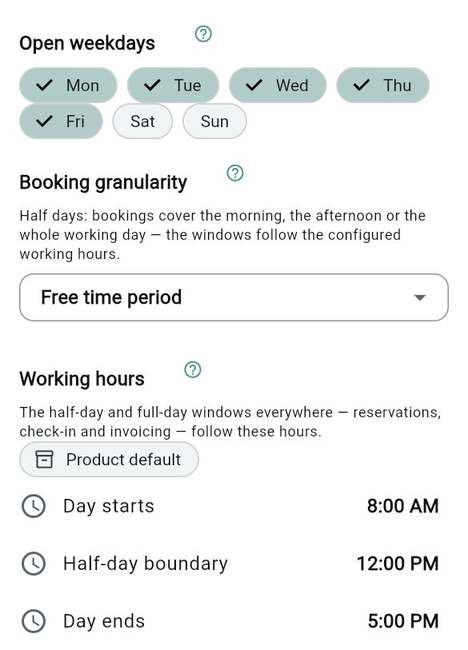

**Steps**

1. Open [Availability](https://fdittgen-png.github.io/deskilo/#/availability).
2. Choose the **Open weekdays** (at least one) and the **Booking granularity**.
3. Set the **Working hours**: **Day starts**, **Half-day boundary**, **Day ends**.
4. Under **Booking policies**, decide on **Allow past bookings**, **Outside the opening hours** and the **Booking limits**.

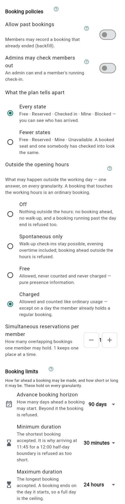

*Recommended starting points (suggestions, not rules; the default for **Outside the opening hours** is **Charged**, and the association template does not change it)*

| Scenario | Granularity | Hours | Outside hours | Past bookings | Limits |
|---|---|---|---|---|---|
| A few shared desks | **Free time period** or **1-hour slots** | Day 8:00–17:00 | **Free** | Off | One booking at a time; horizon 30 days |
| An association room (Atelier du Marché) | **Half days (morning & afternoon)** | 7:00, boundary 13:00, end 19:00 | **Off** | Off | One booking at a time; horizon 90 days |
| A coworking with half-days | **Half days (morning & afternoon)** | 8:00, boundary 12:00, end 18:00 | **Charged** | Off | One or two at a time; horizon 90 days |

**Good to know**

- Outside the opening hours, **Off** refuses everything, **Spontaneous only** allows walk-ups, **Free** allows without counting, **Charged** counts like ordinary usage except on a day the member already holds a regular booking.
- The day must run in order: start, then boundary, then end; the minimum duration cannot exceed the maximum.
- A booking ends on the day it starts. Past bookings are off by default; booking an earlier window on the same day is always allowed.
- Half-day and full-day windows also drive check-in and invoicing, so settle the hours before you set prices.

**See also:** [Open weekdays](User-Guide#open-weekdays) · [Granularity](User-Guide#granularity) · [Working hours](User-Guide#working-hours) · [Outside the opening hours](User-Guide#outside-the-opening-hours) · [Booking limits](User-Guide#booking-limits)

<!-- anchor: setup.place.closure -->
### Closing days and public holidays

**Audience:** Owner · Administrator

You want the space to be shut on holidays without anyone booking them by mistake.

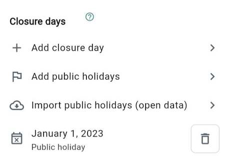

**Steps**

1. In [Availability](https://fdittgen-png.github.io/deskilo/#/availability), go to **Closure days**.
2. Tap **Add public holidays** (if you do not see it, switch on the feature *Public holidays* first; it is off by default) to create a whole year in one go, or **Add closure day** for a single date such as an inventory day.
3. Check the list and remove any day you actually work.

**Good to know**

- Built-in holiday lists exist for France and Germany. For other countries switch on *Public holidays* and *Import public holidays* (open data, needs a connection). Nothing is created before you confirm.
- A booking on a closure day is refused, and the plan shows the day as closed with its reason.
- Months that are already invoiced are skipped, so add closure days before the month closes.

**See also:** [Closure days](User-Guide#closure-days) · [Public holidays](User-Guide#public-holidays)

<!-- anchor: setup.place.check -->
### Check your space

**Audience:** Owner · Administrator

You want proof that the space is ready, before you invite anyone. Two cards say so.

**Steps**

1. Open [Workspace](https://fdittgen-png.github.io/deskilo/#/workspace-settings): the card **Setting up this space** lists each area with its state, and the next step.
2. Open [Reserve](https://fdittgen-png.github.io/deskilo/#/reserve). Owners and administrators with the configuration permission see the card **Get started in** your space. If something is missing it says **Before anyone can book here**, with **Finish setting up**.
3. Book one seat yourself as a test, then cancel it.

**Good to know**

- Ready means ready for a first booking: opening days, time zone, currency, at least one seat, and enough validators.
- Anything optional, such as tariffs or payments, can be set aside with **Later** and does not block opening.
- Both cards depend on the feature *Get started card*.
- **Not now** hides the card on this device; the view menu on the plan brings it back with **Get started**.

**Result** A space that members can book. Next: invite the first people, then the roles and tariffs of the second level.

**See also:** [The Get started card and the tips](User-Guide#the-get-started-card-and-the-tips) · [Invite people with the workspace ID](User-Guide#the-workspace-id) · [Roles](User-Guide#the-role-matrix)

<!-- anchor: setup.features.overview -->
## Choose what your space offers

A space is not one product with a hundred settings. It is a handful of things you decide to offer, one at a time. This chapter explains how DesKilo groups what it can do, what a new space already has, how the pieces depend on each other, and in which order to switch them on so that you never offer something you cannot yet run.

In this chapter:
- [Features and processes](#features-and-processes)
- [Core and Platform: what a new space has](#core-and-platform-what-a-new-space-has)
- [Features that need other features](#features-that-need-other-features)
- [Switching off deletes nothing](#switching-off-deletes-nothing)
- [Beta, Unreviewed and the question before you switch on](#beta-unreviewed-and-the-question-before-you-switch-on)
- [Three starting points](#three-starting-points)
- [The order to switch things on](#the-order-to-switch-things-on)
- [Switch a feature on safely](#switch-a-feature-on-safely)
- [Avoid features that contradict each other](#avoid-features-that-contradict-each-other)
- [The feature map](#the-feature-map)

<!-- anchor: setup.features.what -->
### Features and processes

**Audience:** Owner · Co-owner

You want to know what you are switching when you open **Features**. Everything DesKilo can do beyond the basics is a feature with its own switch. To keep a hundred switches readable, the screen groups them by what they are for.

*How it is organised*

- A **process** is a business job: for example **Billing & payments** or **Calendar & coordination**. There are nine.
- A **subprocess** is a step of that job: **Invoicing**, **Payment collection** and **VAT management** are three of the five steps of **Billing & payments**.
- A **feature** is one switch inside a subprocess: **Invoices**, **Payment reminders**, **VAT declarations**.

*The nine processes and their subprocesses*

| Process | Subprocesses |
|---|---|
| **Workspace & access** | **People & membership** · **Physical access** |
| **Space management** | **Space structure** · **Opening days & hours** · **Space presentation** |
| **Reservations & usage** | **Booking desks & spaces** · **Attendance & usage** |
| **Calendar & coordination** | **Calendar views** · **Decisions & approvals** · **Member communication** |
| **Membership commerce** | **Services & pricing** |
| **Billing & payments** | **Financial records** · **Invoicing** · **Payment collection** · **Shared expenses** · **VAT management** |
| **Documents & information** | **Document publication** · **Report design** · **Personal data access & exports** |
| **Operations & administration** | **Configuration & deployment** · **Application experience** |
| **Integrations & automation** | **External delivery** |

**Good to know**

- A feature belongs to exactly one process, even when it needs a feature of another. The card says so: "Switching it all on also needs: Money tab (Billing & payments)".
- Membership plans and the floor plan editor are not features: they are always there. Their settings sit in Workspace and Billing, not on this screen. Prepaid carnets are a feature: see **Carnets**.
- Switching a feature off hides it from every screen where it appeared; it is not a permission. Who may do what is decided in [Roles](User-Guide#the-role-matrix).

**See also:** [What DesKilo can do](#what-deskilo-can-do) · [Switch whole processes on or off](User-Guide#switch-whole-processes-on-or-off)

<!-- anchor: setup.features.tiers -->
### Core and Platform: what a new space has

**Audience:** Owner · Co-owner

You want to know what members find on the first day, before you have switched anything.

Every feature belongs to one of two tiers, and a new space is created from them:

| Tier | In the app's words | What a new space gets |
|---|---|---|
| **Core** | What every space needs. On from the first day. | On, when the feature is meant to be on at the start. |
| **Platform** | Asked for, never assumed. Switch on what this space actually runs. | Off. In **Switches**, they are listed under the **Platform** tier. |

A new space starts with 45 features on, all of them Core (46 if you create the test twin at the same time: **Environment pairs** is then on as well). In plain words:

- Booking: reserve a seat on the plan, repeat a booking (**Series booking**), book for someone else (**Book for others**), see a half-booked seat as part-filled (**Seat day timeline**), save a booking to a personal calendar (**Calendar file of a booking**), booking rules such as past bookings and outside hours (**Booking policies**, **Booking gate**), request the deletion of a past booking (**Booking deletion requests**), print QR cards for places (**Space QR codes**), configurable working hours (**Working hours**).
- People: the community tab (**Members directory**), one page per member (**Member page**), the central role matrix (**Role management** and **Giving roles**), personal details for letters and invoices (**Personal information**), distinct initials on avatars (**Distinct avatar initials**).
- Calendar and messages: the calendar in several views (**Calendar tab**, **Calendar hub**, **Calendar views**), the activity feed and confirmations (**Events tab**), private and group conversations (**Member notifications**, **Messages, reworked**) with references, forwarding, mentions, swipe gestures and screen-capture protection, the grouping of the notification feed (**Notification feed grouping**), and the button to write to the hosts of a published page (**Write to the hosts**).
- Money: the Finances tab with its four faces (**Money tab**, **Finances in four faces**), invoices (**Invoices**), a service catalogue (**Services**), a PDF of the monthly bill (**PDF export**).
- Documents and data: the document library (**Document library**), data export for the owner (**Data export (Excel)**), and each member's own export and erasure (**Export & erasure**).
- Comfort: help hints, the Get started card, favourites and ratings for places, animations, regional formats and the choice of navigation style.
- Delivery: **Push notifications**, which only reach phones once whoever runs the installation has set up the push service (see [How members are told](#the-channels-in-plain-words)).
- Plan tidying: **Delete spaces with history** and **Name a single-room level by the level**.

Everything else is Platform and off: kiosk and badges, several sites, accessory supplements, online payments, VAT management, the invoice journey, report design, deployments, WhatsApp, the assistant interface and the rest.

**Good to know**

- The invoices feature is on from the start, but nothing can be issued until your legal identity is complete. See [Avoid features that contradict each other](#avoid-features-that-contradict-each-other).
- A space that already exists never changes when DesKilo changes what a new space gets.
- If you start from a template, the template can switch a few features on or off on top of this set. See [Three starting points](#three-starting-points).

**See also:** [A feature switch](User-Guide#a-feature-switch)

<!-- anchor: setup.features.dependencies -->
### Features that need other features

**Audience:** Owner · Co-owner

You want to switch something on and be sure it works, or switch something off without breaking what hangs from it.

Many features sit under another one. **Online payments** needs **Money tab**; **Payment reminders** needs **Invoices**; **Automatic payment reminders** needs **Payment reminders**; **VAT declarations** needs **VAT management**, which needs **Invoices**. In the **Switches** list a feature that needs another one shows **Requires** followed by the name of its parent.

**What the app does**

| You | The app |
|---|---|
| Switch a feature on whose parent is off | Switches the whole chain on, and names what came on with it: "Also switched on: …". |
| Switch a parent off | Does not erase its children's choices. They are stored as you set them, but they do nothing; the row says "Waiting on the feature above — switch that on and this one works again". |
| Switch the parent on again | The children that were on work again at once. |
| Switch a whole process or subprocess off while something still needs it | Refuses and names who needs it ("… is still needed by: …"), unless you choose **Switch off anyway, keep their settings** or to switch the dependants off too. |

**Good to know**

- A child that is on but waits for its parent makes its process show **Needs attention**. That is the one state in which a switch and the app disagree, so it is worth a look. See [Switch a feature on safely](#switch-a-feature-on-safely).
- A parent can be in a different process from its child: **Services** (Membership commerce) needs **Money tab** (Billing & payments). The card then warns that switching it all on also needs the other.
- The check is made on the feature, not on a permission: a role that may do something is never enough if the feature is off.

**See also:** [A feature switch](User-Guide#a-feature-switch) · [Switch whole processes on or off](User-Guide#switch-whole-processes-on-or-off)

<!-- anchor: setup.features.off -->
### Switching off deletes nothing

**Audience:** Owner · Co-owner

You want to change your mind later, so you need to know what a switch does not touch.

Switching a feature off stops new business. It does not delete a single record: invoices, bookings, messages, roles and settings stay where they are, and switching the feature on again brings them back. Something already done stays done: an invoice issued while the feature was on keeps what it says.

Behind this, DesKilo sorts the actions of a switchable feature into three kinds:

| Kind | What the switch does to it | Example |
|---|---|---|
| New work (*acceptNew*) | Stops when the feature is off. | Starting a new conversation with the hosts; giving a member a custom role; blocking a seat; starting a new online payment. |
| Work already open (*serviceExisting*) | Carries on, so nothing is left hanging. | Answering a conversation already started; taking a custom role back; lifting a seat block; settling a payment already open. |
| Unsafe paths (*suspended*) | Stay shut whatever the switch says. | Reserved for a path the server judges unsafe; no action is classed this way today. |

Three features say it on their row, in these words: "Off: nothing new starts; what is already open can still be answered and closed." They are **Write to the hosts**, **Roles this space defines** and **Admins can block seats**. **Auto check-in/out at day end** also stops its end-of-day sweep when it is off, but its row does not say so. On a server that cannot confirm this, the row says "do not count on it".

**Good to know**

- Money already committed is always settled: a payment return or a refund is never blocked by a switch.
- With **Online payments** off, the server refuses a new online payment; one that is already open still settles. Its row carries no note about this.
- A switch is not a way to hide something from one person. Use [Roles](User-Guide#the-role-matrix) for that.

**See also:** [A feature switch](User-Guide#a-feature-switch)

<!-- anchor: setup.features.maturity -->
### Beta, Unreviewed and the question before you switch on

**Audience:** Owner · Co-owner

You see a small word under a feature's name and you want to know what to do with it.

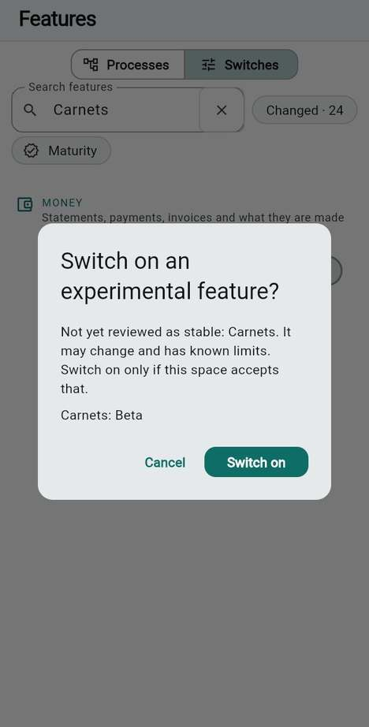

Each row of **Switches** carries a maturity badge, which says how far the feature has been reviewed against evidence:

| Badge | It means |
|---|---|
| **Unreviewed** | Nobody has yet assessed it against evidence. It says nothing bad about it. |
| **Alpha** | Assessed, at an early stage. |
| **Beta** | Assessed, with known limits; its tests run on every change. |
| **Stable** | Assessed, and also qualified with real providers, hardware or operators. |

At the time of writing most features read **Unreviewed**, eighteen read **Beta**, and none has reached **Stable** yet.

*What the app asks*

1. Flip the switch of an **Alpha** or **Beta** feature.
2. The app asks **Switch on an experimental feature?** and says: "Not yet reviewed as stable: … It may change and has known limits. Switch on only if this space accepts that."
3. It names the stage of each feature and the features that would come on with it because they are needed.
4. Tap **Switch on** to accept, or **Cancel**: nothing is written.

**Good to know**

- **Unreviewed** features do not ask. Only **Alpha** and **Beta** ask.
- The question is asked on a single switch. A whole-process **Switch on** shows what it will switch on, but does not ask this question: switch **Beta** features one by one.
- Beta features at the time of writing include **Invoices**, **Online payments**, **VAT management**, **Carnets**, **Shared expenses**, **Usage records**, **Booking policies**, **Series booking**, **Booking gate**, **Booking deletion requests**, **Finances in four faces**, **Supplies from expenses**, **Validators by role or person**, **Chained validations**, **Auto check-in/out at day end**, **Data export (Excel)**, **E-invoice delivery to customers** and **Demo workspace**. Read each feature's limits with **More** before you rely on it for money.
- Several of these are Core and already on in a new space. They start on without the question; it appears only when you switch one back on.
- **Maturity** narrows the list to one stage, which is a quick way to see everything experimental that your space already uses.

**See also:** [A feature switch](User-Guide#a-feature-switch)

<!-- anchor: setup.features.profiles -->
### Three starting points

**Audience:** Owner · Co-owner

You do not want to decide a hundred things. Here are three realistic starting points; each one lists exactly what is on. Pick the nearest, then adjust.

The first needs no template. The second is the ready-made template of the app. The third is built from the features themselves. They are named after what they offer, not after a size.

<!-- anchor: setup.features.profile-tiny -->
### A few shared places

**Audience:** Owner

You run a handful of desks or rooms that people book, and nothing else yet. Create the space with **Empty space** or the template "A tiny space" under **Start from**: two levels, four desks and eight seats, enough to book, scan and browse.

The template sets no features, so the space has exactly the 45 Core features of [Core and Platform](#core-and-platform-what-a-new-space-has). Nothing is switched on beyond that. For this profile, leave the rest alone:

- Booking, calendar, messages, directory, QR cards for places, the document library and help hints are all there.
- **Money tab** and **Invoices** are on, but until you enter your legal identity and tariffs they only show an empty statement.
- Nothing needs configuring outside the plan and the opening hours. See [Your place](#build-the-place).

> **Tip** If you never charge anything, you can leave the money features on without harm: members just see nothing to pay.

<!-- anchor: setup.features.profile-association -->
### An association with a room

**Audience:** Owner

You are a French association that shares a room, with a bureau, members who pay a fee, and half-day bookings. Choose the template "Association de coworking (France)" under **Start from**. It sets up the opening rules, fee bands at 50 % and 100 %, two prepaid packs, the roles of the bureau, French wording and two floors, and it carries this feature profile:

- The 45 Core features, **except** four it switches **off**: **Events tab**, **Members directory**, **Member page** and **Notification feed grouping**. A small association does not need a feed of events or a directory beside its conversations.
- Four it switches **on**, because the bureau needs them: **Validations on the calendar** (decisions shown on the calendar), **Carnets** (prepaid half-days for people who do not subscribe, Beta), **Roles this space defines** (treasurer, secretary, room referent) and **Workspace vocabulary** (the association's own words).

That is 45 − 4 + 4 = 45 features on. The template carries no identity, so the address, the registration number and the bank details stay yours to enter, and the VAT regime starts as "not subject".

**Good to know**

- Carnets is Beta and is switched on by the template without the question; that is the template's choice, and you can switch it off.
- The template leaves **Invoices** on from the Core set. An association that does not invoice can leave it.

<!-- anchor: setup.features.profile-invoicing -->
### A coworking that invoices

**Audience:** Owner

You rent desks to members and send them invoices every month, in France or Germany. There is no ready-made template, so this profile is a list of what to add to the Core set, in this order. Everything in it chains from **Money tab** and **Invoices**, which are already on.

| # | Switch on | Why | Needs |
|---|---|---|---|
| 1 | **Number sequences** | Decide how documents are numbered before the first one exists. | **Invoices** |
| 2 | **Subscription invoices** | The membership fee is invoiced before the month it pays for. | **Invoices** |
| 3 | **Usage records** | A record of the time really used (Beta). | **Invoices** |
| 4 | **End-of-month invoices** | What the month cost beyond the subscription is invoiced separately. | **Invoices** |
| 5 | **Invoicing wizard** | One guided month-close for whoever does the billing. | **Invoices** |
| 6 | **The journey of an invoice** | Every invoice shows where it stands and whose move it is. | **Invoices** |
| 7 | **Invoice PDF template** | Your own introduction and footer text on the PDF. | **Invoices** |
| 8 | **Member reports** | The financial agreement and the monthly payments report for members. | **Money tab** |
| 9 | **Payment reminders** | Reminder levels, a letter per level, "Reminder due" on late invoices. | **Invoices** |
| 10 | **Consumption report** | A letter at month end with what was used. | **Usage records** |

Then add only what applies to you:

- **VAT management** (Beta) if your space is registered for VAT. Then **VAT declarations**, and **VAT rate versions** and **VAT groups** if your accountant asks for them.
- **Admins issue invoices** if you want a billing administrator to issue them. The owner always can.
- **Online payments** (Beta) only when you have a payment provider to connect.
- **Automatic payment reminders** only after you read [what it does](#payment-reminders).
- **Accessory supplements**, **Carnets** and **Shared expenses** when you bill those things.

**Good to know**

- Before the first invoice, complete your legal identity and VAT. See [Legal identity and invoicing](#your-legal-identity-and-what-to-ask-your-accountant).
- Issuing here works for spaces in France and Germany only.
- Switch these on one at a time and issue a test invoice in a test space first. See [The order to switch things on](#the-order-to-switch-things-on).

**See also:** [Money and invoicing](#money-and-tax) · [Start from a template or from nothing](#start-from-a-template-or-from-nothing)

<!-- anchor: setup.features.order -->
### The order to switch things on

**Audience:** Owner · Co-owner

You want to avoid the day on which everything is on and nothing works. Go one process at a time, and look at each from a member's side before you move on.

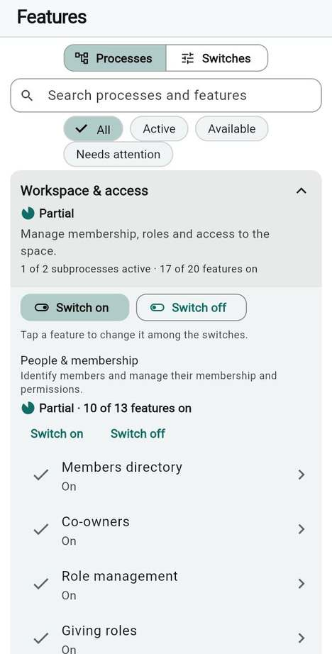

**Steps**

1. Keep the Core set and make the basics work: the places, the opening hours, one tariff. See [Your place](#build-the-place).
2. Open [Features](https://fdittgen-png.github.io/deskilo/#/features) and open one process card. Choose the process that matches your next need, not the one that looks most complete.
3. Tap **Switch on** for a subprocess, or open a single feature among **Switches**.
4. Read the preview: what is **Also needed**, what is already on.
5. Look at it as a member: sign in as one (a second account, or the test side of your space) and do what a member would do.
6. Only then move on to the next process.

*A sensible order*

| Step | Process | Why this place in the order |
|---|---|---|
| 1 | **Space management** | Nothing can be booked without a place and opening hours. |
| 2 | **Reservations & usage** | Booking rules shape everything after them. |
| 3 | **Workspace & access** | Roles and who validates, before the first invitation. |
| 4 | **Calendar & coordination** | Messages and validations need people to exist. |
| 5 | **Membership commerce**, then **Billing & payments** | Prices before invoices; legal identity before the first invoice. |
| 6 | **Documents & information**, **Integrations & automation** | They dress and deliver what the others produce. |
| 7 | **Operations & administration** | Pairs, deployments and transfers once the space is worth copying. |

**Good to know**

- Switching on is cheap and switching off deletes nothing, so a wrong step costs time, not data. The exception is anything that issues an invoice: see [Decisions that are hard to undo](#decisions-that-are-hard-to-undo).
- A test space is the right place to try a process. See [A test space or a real one](#a-test-space-or-a-real-one) and [A test space](User-Guide#what-a-test-space-is-for).
- Invite members last, after the roles, the validation rules and the tariffs they will meet.

**See also:** [Switch whole processes on or off](User-Guide#switch-whole-processes-on-or-off)

<!-- anchor: setup.features.safely -->
### Switch a feature on safely

**Audience:** Owner · Co-owner

You are about to change a feature and you want to see the effect before it exists.

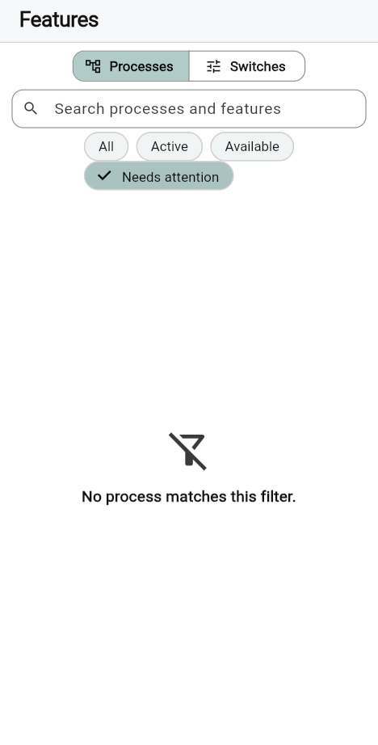

**Steps**

1. Open [Features](https://fdittgen-png.github.io/deskilo/#/features). The **Processes** view is shown.
2. Tap **Needs attention**. Only the processes holding something that is on but waiting remain.
3. Open a card. A feature **On, waiting for** a named parent is the thing to fix.
4. Fix it by switching the parent on, or by switching the feature off.
5. To change one feature, tap **Switches**, find it with **Search features** and flip its switch.
6. Read the question or the "Also switched on" line, and confirm.

*What "held back" means*

A feature is held back when you chose it but something it needs is off. Its own switch stays on, which is why it is easy to miss: the screen says the feature is on, and the app does not offer it. The card says how many features are held back ("… on but wait for a switched-off prerequisite") and which prerequisite they wait for, and you fix it in [Features](https://fdittgen-png.github.io/deskilo/#/features) itself.

Other things a feature can wait for are not on this screen. A feature can be on and fully allowed while its details are missing: your legal identity, a site, a payment provider. Those appear in **Setting up this space**, under **Details your features need (identity, bank, platforms)**, at the top of the workspace settings.

**Good to know**

- If somebody else changed the features while you were looking, the app writes nothing and says so: "The features changed meanwhile, so nothing was written." Look at the list again and switch again.
- **Changed** counts the switches that differ from the registry default. On a new space it already shows a number (the Platform features that start off), so it is not a count of your own changes.
- Nobody but an owner or co-owner can write features. The server checks again at the moment of writing.

**See also:** [Switch whole processes on or off](User-Guide#switch-whole-processes-on-or-off) · [A feature switch](User-Guide#a-feature-switch)

<!-- anchor: setup.features.consistency -->
### Avoid features that contradict each other

**Audience:** Owner · Co-owner · Billing administrator

You want to know which combinations leave a space half-working, and which of them the app catches for you.

The app has guards for some contradictions and none for others. In the table, a guard is what the app does; a gap is what stays your responsibility.

| If you have… | Guard in the app | Gap that remains |
|---|---|---|
| **Invoices** on, no legal identity | Issuing is refused, with **Complete these details before issuing** listing the missing address, VAT number and so on. The need also shows in **Setting up this space**. | The feature is on from the first day, so nothing prevents inviting members and running a month before the identity exists. |
| A country other than France or Germany | Issuing says the country "must be France or Germany for issuing here". | Nothing warns you when you choose the country or switch invoicing on. |
| Registered for VAT, no rate in force | Issuing is refused until a rate is in force. | With **VAT management** off, the configuration is hidden while the stored rates keep applying. Check the rates after switching it off. |
| **Online payments** on, no provider | A new online payment is refused when the feature is off; the missing provider shows in **Setting up this space**. | You can switch it on without a provider. Connect it first: [Payment provider](User-Guide#the-payment-provider). |
| **Kiosk mode** on, no badges and no kiosk member | **RFID / NFC badges**, **QR badges**, **Member photos at the kiosk** and **Sign in with a badge** cannot be on without it. | Nothing checks that a kiosk member exists or that a badge has been issued. See [Run a wall tablet](User-Guide#kiosk-mode-a-wall-tablet-for-check-in). |
| **Sites** on, no site | **At least one site** appears among the details your features need. | The switch can be on with no site. |
| **Push notifications** on, no push service | Members still get everything in the app. | Phones receive nothing until whoever runs the installation has set up the push service. See [How members are told](#the-channels-in-plain-words). |
| **Payment reminders** on, **Automatic payment reminders** on | The second cannot be on without the first. | The server's scheduler sends them each morning; if the database has no scheduler, they are sent when an administrator opens Finances. |
| A validation rule asking more validators than exist | **Setting up this space** says "A policy asks for more validators than this space has", and it holds up the first booking when the rule is for reservations. | Other requests are created, cannot be completed and expire after seven days. See [Who validates](User-Guide#validation-rules-domain-by-domain). |
| **Booking deletion requests** on, nobody to validate | Same readiness line. | Same gap. |
| **Desk, office & level reservations** on | **Admins can assign levels** needs it. | Each member also needs the right; nothing checks that anybody has it. |
| A child feature on, its parent off | **Needs attention**, and "Waiting on the feature above". | None: this one is fully covered. |
| A space made from a template | The template names what is yours to enter (identity, bank, site). | It carries none of them, so a space can start with **Invoices** on and nothing to issue with. |

**Good to know**

- The rule of thumb: if a feature brings your name, your money or your legal duties onto a document, finish its details before you tell members.
- **Setting up this space** is a list, not a lock. It never stops you from switching something on.
- The check "Before anyone can book here" only speaks about what a booking truly needs: the time zone, the currency, an open weekday and at least one seat.

**See also:** [Legal identity and invoicing](#your-legal-identity-and-what-to-ask-your-accountant) · [Dry run](#a-safe-dry-run-in-a-test-space)

<!-- anchor: setup.features.map -->
### The feature map

**Audience:** Owner · Co-owner

You want one place that says, for the main features, what members get, what it needs and who has to set it up. "Needs" lists the feature above it first, then the details outside the Features screen. "Who" is the person who must do something before it is useful; "Nobody" means it works the moment it is on.

*Workspace & access*

| Feature | What it adds for members | What it needs | Who configures |
|---|---|---|---|
| **Members directory** | The community tab: who is here, statuses, presence. | | Nobody |
| **Co-owners** | Owner permissions for appointed people, now or on succession. | | Owner |
| **Role management** | The matrix of which role holds which permission. | | Owner |
| **Giving roles** | A Roles section on each member page. | **Role management** | Owner |
| **Roles this space defines** | Roles of your own, such as treasurer or secretary. | | Owner |
| **Questions this space asks** | Your own questions in the identity form. | | Owner |
| **Personal information** | Name, address, phone and ids that letters print. | | Members |
| **Managed profiles** | Members without an account, booked and invoiced for. | **Members directory** | Administrator |
| **Member page** | One page per member. | **Members directory** | Nobody |
| **Guest visits** | A person who is not a member can ask to visit. | | Whoever admits visits |
| **Kiosk mode** | A wall tablet locked to the live plan. | A tablet and a kiosk member | Owner |
| **RFID / NFC badges** | Check in by tapping a card. | **Kiosk mode**, Android with NFC, issued badges | Owner |
| **QR badges** | Printable QR badge cards. | **Kiosk mode** | Owner |
| **Sign in with a badge** | Badge and PIN instead of typing an e-mail. | **RFID / NFC badges** | Owner, then each member |
| **NFC/RFID chair tags** | A chip on a chair opens its seat. | Tags | Owner |
| **Space QR codes** | Printable QR cards per place. | | Nobody |

*Space management*

| Feature | What it adds for members | What it needs | Who configures |
|---|---|---|---|
| **Sites** | Several addresses, each with its own registration. | At least one site | Owner |
| **Delete spaces with history** | Owners can delete a place that has past bookings. | | Nobody |
| **Admins can block seats** | Seats marked not reservable for maintenance. | | Owner |
| **Working hours** | The working day and exact-hours booking. | | Owner |
| **Public holidays** | Closure days from the holidays of a year. | | Owner |
| **Import public holidays** | Holidays of a country or region imported. | **Public holidays** | Owner |
| **Seat utilisation** | A monthly figure for how much was booked. | | Owner |
| **Member photos on the plan** | Occupants' photos on seats. | | Nobody |
| **Workspace vocabulary** | The space's own words for a few labels. | | Owner |
| **Workspace colours** | The brand colour and room colours. | | Owner |
| **Public workspace listing** | A public page with what you choose to show. | | Owner |

*Reservations & usage*

| Feature | What it adds for members | What it needs | Who configures |
|---|---|---|---|
| **Series booking** | Repeat a booking. | | Nobody |
| **Book for others** | Admins book for members. | | Nobody |
| **Desk, office & level reservations** | Book a whole desk, office or floor. | A right granted per member | Owner |
| **Admins can assign levels** | Admins assign those reservations. | **Desk, office & level reservations** | Owner |
| **Booking policies** | Past bookings, bookings outside hours, admin check-out. | | Owner |
| **Booking gate** | Every surface checks the rules and names the reason. | **Booking policies** | Nobody |
| **Auto check-in/out at day end** | Unchecked bookings complete themselves. | | Owner |
| **Usage records** | The time really used, and a request to stop billing unused time. | **Invoices** | Billing administrator |

*Calendar & coordination*

| Feature | What it adds for members | What it needs | Who configures |
|---|---|---|---|
| **Calendar tab**, **Calendar hub**, **Calendar views** | Month, week and agenda, with everything dated. | | Nobody |
| **Validations on the calendar** | Decisions shown when they were taken. | **Calendar hub** | Nobody |
| **Events tab** | The activity feed and confirmations. | | Nobody |
| **Notification feed grouping** | Notifications grouped in the feed. | | Nobody |
| **Validators by role or person** | A rule can name who validates and how many. | | Owner |
| **Chained validations** | Validations asked one after another. | | Owner |
| **Booking deletion requests** | A member asks to delete a past booking. | A validator | Owner |
| **Member notifications** | Private and group conversations. | | Nobody |
| **Messages, reworked** | Inbox bar, pin, mute, archive, drafts. | | Nobody |
| **Write to the hosts** | A person who finds your page can write to you. | A published page | Owner |
| **Mentions in groups**, **Message forwarding**, **Screen capture protection** | Messaging extras. | **Member notifications** | Nobody |

*Membership commerce*

| Feature | What it adds for members | What it needs | Who configures |
|---|---|---|---|
| **Services** | A catalogue of things to consume and pay for. | **Money tab** | Billing administrator |
| **Accessory supplements** | Priced seat accessories per half-day. | **Money tab** | Billing administrator |
| **Price negotiations** | Conditions of their own for one member. | **Money tab** | Billing administrator |
| **Payment conditions per member** | Payment terms of their own. | **Invoices** | Billing administrator |
| **Carnets** | Prepaid half-days (Beta). | **Invoices**, a pack defined | Billing administrator |

*Billing & payments*

| Feature | What it adds for members | What it needs | Who configures |
|---|---|---|---|
| **Money tab** | The Finances tab: statement, payments, expenses. | | Nobody |
| **Finances in four faces** | Statement, Payments, Invoices, Documents. | **Money tab** | Nobody |
| **Member reports** | The agreement and the monthly payments report. | **Money tab** | Billing administrator |
| **Invoices** | Immutable signed invoices (Beta). | **Money tab**, legal identity, VAT, FR or DE | Billing administrator |
| **Admins issue invoices** | Administrators issue them too. | **Invoices** | Owner |
| **Subscription invoices** | The fee invoiced before its month. | **Invoices**, a date | Billing administrator |
| **End-of-month invoices** | Usage invoiced after the month. | **Invoices** | Billing administrator |
| **Regroup invoices** | Several open invoices as one. | **Invoices** | Billing administrator |
| **The journey of an invoice** | Where each invoice stands. | **Invoices** | Nobody |
| **Invoicing wizard** | A guided month-close. | **Invoices** | Billing administrator |
| **Number sequences** | Numbering per journal. | **Invoices** | Billing administrator |
| **Online payments** | Pay online (Beta). | **Money tab**, a payment provider | Owner |
| **Payment reminders** | Reminder levels and letters. | **Invoices**, rules | Billing administrator |
| **Automatic payment reminders** | Reminders sent by themselves. | **Payment reminders** | Billing administrator |
| **Supplies from expenses** | Supplies bought become services. | **Services** | Billing administrator |
| **Scheduled expenses** | Recurring costs scheduled. | **Money tab** | Billing administrator |
| **Shared expenses** | Costs shared between members. | **Invoices** | Billing administrator |
| **Repartition wizard** | A guided split of a shared cost. | **Shared expenses** | Billing administrator |
| **Accounting book** | Who keeps the official books. | **Invoices** | Billing administrator |
| **VAT management** | VAT rates and pickers (Beta). | **Invoices**, VAT regime | Billing administrator |
| **VAT declarations** | The periodic return. | **VAT management** | Billing administrator |
| **VAT groups**, **VAT rate versions**, **VAT by counterparty** | Finer VAT handling. | **VAT management** | Billing administrator |

*Documents & information, Operations, Integrations*

| Feature | What it adds for members | What it needs | Who configures |
|---|---|---|---|
| **Document library** | Statutes, minutes, guides, per role. | | Owner |
| **PDF export** | The monthly bill as a PDF. | | Nobody |
| **Invoice PDF template** | Your texts on the invoice. | **Invoices** | Owner |
| **Report designer**, **Positioned report layouts**, **Report texts** | Designed reports. | **Invoice PDF template** | Owner |
| **Consumption report** | A monthly letter on what was used. | **Usage records** | Billing administrator |
| **VAT report** | Every taxable line, with a CSV. | **VAT declarations** | Billing administrator |
| **Data access log** | Members see who looked at their finances. | **Money tab** | Nobody |
| **Data export (Excel)** | The owner exports the data as a workbook (Beta). | The permission **Export accounting and data** | Owner |
| **Export & erasure** | A member exports and erases their own data. | | Nobody |
| **Filming mode** | Replaces real people with invented ones on screen. | | Owner |
| **Environment pairs**, **Deployments** | A test side and a real side, with deployment. | | Owner |
| **Configuration in the space file** | The whole configuration travels in the space file. | **Data export (Excel)** | Owner |
| **Instance wizard** | Create a new server from the app. | | Operator |
| **What needs you** | One ranked list of what waits for you. | | Nobody |
| **Task recorder** | Record and replay the steps of a task. | | Nobody |
| **Push notifications** | Pending confirmations on the phone. | The push service of the installation | Operator |
| **WhatsApp integration** | A chat with a member in one tap, the group link. | **Members directory** | Owner |
| **E-invoice delivery to customers** | Sending to the customer's own platform (Beta). | **Invoices**, an account | Billing administrator |
| **MCP interface** | An assistant can be connected. | A grant per person, approved by the installation | Owner, then Operator |

**Good to know**

- Names are the ones of the **Switches** list. The Core and Platform tier of each is shown there.
- A few features are not listed here. Features of comfort (help hints, animations, navigation style, regional formats) have no table row: they work the moment they are on.

**See also:** [Who does what](#who-does-what) · [Switch features on and off](User-Guide#switch-whole-processes-on-or-off)

<!-- anchor: setup.people.overview -->
## People, roles and decisions

A space is its people. Before you invite the first of them, decide three things: who may do what, how someone gets in, and which acts need a second person to say yes. They are quick to set and awkward to repair once forty people rely on them.

In this chapter:
- [Who does what in a real organisation](#who-does-what-in-a-real-organisation)
- [The role matrix: least privilege](#the-role-matrix-least-privilege)
- [Co-owners: more than one person who can act](#co-owners-more-than-one-person-who-can-act)
- [How people join](#how-people-join)
- [The invitation message, language by language](#the-invitation-message-language-by-language)
- [Managed profiles](#managed-profiles)
- [Validation: what a rule is made of](#validation-what-a-rule-is-made-of)
- [Three presets to copy](#three-presets-to-copy)
- [Avoid requests that wait for ever](#avoid-requests-that-wait-for-ever)
- [The first week of your members](#the-first-week-of-your-members)

The running example is *Atelier du Marché*. Imagine it is run by an association: Ada is the president, Chiara the secretary, Bruno the treasurer. Every step below is shown on that space.

<!-- anchor: setup.people.organisation -->
### Who does what in a real organisation

**Audience:** Owner · Co-owner

You want to map the people of your organisation onto the roles DesKilo has, so that nobody holds more than their job needs.

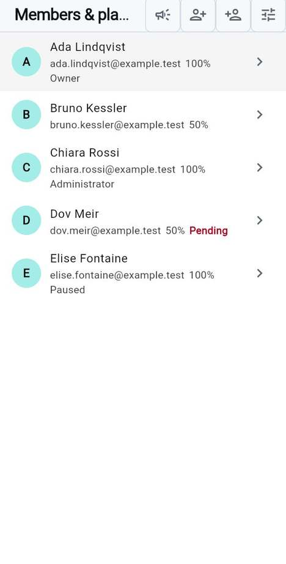

*The four base roles*

| Role | What it is for | In the association |
|---|---|---|
| **Owner** | The person who answers for the space and holds every permission. Only an owner can grant ownership. | Ada, the president. |
| **Co-owner** | A second key. Holds every permission by default, and can take over when the owner leaves. | The vice-president, if the board has one. |
| **Administrator** | Runs the day: members, bookings of others, the kiosk, documents, services. Holds what the matrix gives and no more. | Chiara, the secretary. |
| **User** | The person who uses the space. Holds only the everyday permissions you give. | Bruno, a member like the others. |

Everyone has exactly one base role. A role the space defines, such as *Host* or *Accountant*, is added on top of it and never takes anything away.

*A treasurer without being an administrator*

Bruno keeps the books but should not edit the floor plan or approve new members. Give him the base role **User** and add a role of your own, for instance *Accountant*, with four permissions: **View workspace finances**, **Issue invoices & match payments**, **Export accounting and data** and **Read the workspace figures**. Nothing more. No such role is built in; you create it with the steps below.

**Steps**

1. Open [Roles this space defines](https://fdittgen-png.github.io/deskilo/#/settings/roles-of-this-space) and tap **Add a role**. See [Roles this space defines](User-Guide#roles-this-space-defines).
2. Name the role, choose **What it adds**, tap **Save the role**.
3. Open the person in [Members & plans](https://fdittgen-png.github.io/deskilo/#/members), find **Roles** and tap **Add a role**.

**Good to know**

- **Roles this space defines** is a feature of its own and is off in a new space. Switch it on in [Features](https://fdittgen-png.github.io/deskilo/#/features).
- Nobody can give a role to themselves. Giving a role needs **Manage roles & permissions**, and only an owner can give a role that carries it.
- A role the space defines takes effect at once and is recorded. Only making someone an administrator, or taking it away, follows the **Role change** validation rule.

**Result** Each person of the board holds the permissions of their job, and the owner remains the only one who can change that.

**See also:** [The role matrix](User-Guide#the-role-matrix)

<!-- anchor: setup.people.matrix -->
### The role matrix: least privilege

**Audience:** Owner · Co-owner

You want each role to hold what it needs and nothing else. That is the principle of least privilege: start small, add when someone asks, because a permission given is rarely taken back with grace.

**Steps**

1. Open [Roles](https://fdittgen-png.github.io/deskilo/#/roles). There is one card per role: **Owner**, **Co-owner**, **Administrator** (the owner can rename it) and **User**.
2. Read the card of the **Administrator** first. It shows what an administrator holds in your space today.
3. Untick what you do not want to delegate. Tick the everyday permissions the **User** card needs (see below).

*What an administrator holds by default*

| Group | Permissions |
|---|---|
| People | **Manage members**, **Read members' personal data** |
| Bookings and the place | **Manage reservations of others**, **Operate the kiosk and badges**, **Manage sites and edit the floor plan** |
| Money, read and approve | **View workspace finances**, **Approve expenses**, **Manage services & packages**, **View commercial agreements**, **Manage commercial agreements**, **Request payment-condition changes**, **Export accounting and data** |
| Documents and figures | **Manage the document library**, **Read the workspace figures** |
| Two sides of a space | **Deploy to development**, **Enter the production workspace** |

An administrator does not hold **Manage roles & permissions**, **Configure validation policies**, **Edit workspace settings**, **Manage tariffs and billing rules**, **Design the documents**, **Manage integrations**, **Manage the configuration** or **Deploy to production**. A co-owner holds all of them until you untick some. The owner always holds all of them.

> **Careful** In a new space the **User** card is empty. The six everyday permissions (**Use the messenger**, **Book and use reservations**, **See the calendar**, **See the member directory**, **See their own account and invoices**, **See the shared documents**) are held only through the matrix or a role. Until you tick them, a member who joins cannot open the plan. The demo shows them already ticked, which hides this. Tick them for the **User** card, and for the **Administrator** card if administrators also book, then test with a second account.

**Good to know**

- By default an administrator can read all finances and the personal data of every member. If your administrators are volunteers, think about whether they should.
- **Admins issue invoices** (a feature, off by default, under **Invoices**) gives administrators **Issue invoices & match payments** whatever the matrix says. Prefer the tick in the matrix, or a role of your own, which is more precise.
- Unticking a permission removes it everywhere at once; the server checks it, not only the menu.
- Every change of the matrix is recorded as an event. The **Role management** feature only shows the screen; switched off, the matrix you saved still applies, you just cannot edit it.

**Result** A matrix you can explain in one sentence per role.

**See also:** [The role matrix](User-Guide#the-role-matrix) · [Who does what](#who-does-what)

<!-- anchor: setup.people.coowner -->
### Co-owners: more than one person who can act

**Audience:** Owner · Co-owner

You want the space to keep working when you are ill, away or gone. Every space needs more than one person who can act. By default only owners and co-owners hold the permissions that change features, roles, validation rules and the workspace ID, and only an owner can make another owner.

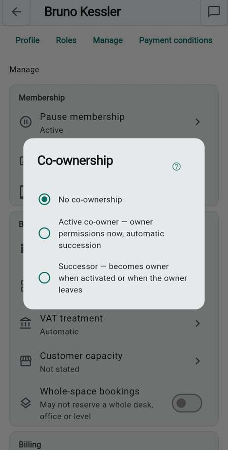

*The two kinds*

| Kind | What it does | Choose it when |
|---|---|---|
| **Active co-owner** | Holds the owner's permissions now, and takes over if the owner leaves. | You share the work: the vice-president, a partner. |
| **Successor** | Waits. Becomes owner when you promote them or when you leave. | You only want an heir. |

**Steps**

1. Switch on the **Co-owners** feature in [Features](https://fdittgen-png.github.io/deskilo/#/features). It is off in a new space.
2. Open the person in [Members & plans](https://fdittgen-png.github.io/deskilo/#/members), go to **Manage** and tap **Co-ownership**.
3. Choose **Active co-owner** or **Successor**. To hand over now, choose **Promote to owner now**.

**Good to know**

- If the last owner leaves, the best co-owner becomes owner on their own, an active one before a successor.
- Two administrators are not the same thing: an administrator holds only what the matrix gives and can never hand ownership on.
- A rule that says **Owner must always validate** asks for an owner. Check on your test side that your co-owner can still decide what you expect.

**Result** The space has a second person who can act.

**See also:** [Co-owners](User-Guide#co-owners) · [Co-ownership](User-Guide#co-ownership)

<!-- anchor: setup.people.join -->
### How people join

**Audience:** Owner · Administrator

You want to choose how people reach your space and who lets them in. Four ways exist, and every one of them ends in the same place: a person asking to join, and someone deciding.

| Way | What the person receives | What they become |
|---|---|---|
| The workspace ID | A short word, typed in the app. | A member, after approval. |
| The QR code | The same ID as a picture to print or post (**Share as PNG**). | A member, after approval. |
| An invitation message | A text with a personal code, valid for one person, in the language you pick. | The role you offer, after approval. |
| An administrator code | A one-person code from the **Administrator invite** tab. | An administrator, once. |

**Steps**

1. Open [Workspace ID & QR](https://fdittgen-png.github.io/deskilo/#/workspace-code). Choose an ID people can remember with **Change workspace ID**: 4 to 20 letters or digits, unique across DesKilo.
2. For a named person, tap **Invite someone**. Fill in the name, tick **Roles on arrival** if they should receive a role, pick the **Message language** and send.
3. When someone asks to join, their row in [Members & plans](https://fdittgen-png.github.io/deskilo/#/members) says **Pending**. Open it and choose **Approve membership** or **Reject membership**.

**Good to know**

- Nobody gets in without a decision. Until it is taken, the newcomer sees a waiting screen and nothing else.
- The decision follows the rule of **New member** in [Validation rules](https://fdittgen-png.github.io/deskilo/#/validation): by default one owner or administrator suffices; if you require two, the first approval leaves the person pending.
- If you change the workspace ID, the old one stops working. Print the QR code again.
- There is no owner invite. Ownership is given in **Members & plans**.

**Result** People can find you, and you decide who stays.

**See also:** [The workspace ID](User-Guide#the-workspace-id) · [Join a workspace](User-Guide#join-a-workspace) · [Pending and paused members](User-Guide#pending-and-paused-members)

<!-- anchor: setup.people.invitation -->
### The invitation message, language by language

**Audience:** Owner · Administrator

You want an invitation that sounds like your space, in the language of the person who gets it. Each language has its own text; the one you do not write falls back to the built-in message.

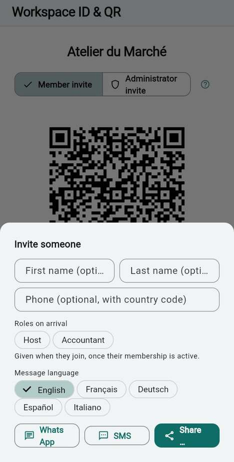

**Steps**

1. Open [Workspace](https://fdittgen-png.github.io/deskilo/#/workspace-settings) and go to **Community & invitations**.
2. Under **Message language** choose the language you write for. The row opens on your workspace language.
3. Write the text. Tap a tag to insert it where the cursor is. The limit is 2000 characters.
4. Repeat for each language your members use, then tap **Save**.

*The tags*

| Tag | Filled in with |
|---|---|
| `{firstName}` `{lastName}` `{phone}` | What you typed in **Invite someone**. Empty if you typed nothing. |
| `{workspaceName}` | The name of your space. |
| `{workspaceId}` | The personal invitation code of this message (not the public workspace ID). |
| `{inviteLink}` | A link that opens the app on the right server with the code filled in. |
| `{downloadUrl}` | The store page of the app. |
| `{role}` | The role the invitation offers, in the language of the message. |

**Good to know**

- Leave the box empty and the app writes its own message in that language. It explains the steps: download, create an account, join with the code.
- Do not paste a code or a link yourself. Each send creates its own code, valid for one person.
- A tag you misspell stays visible in the sent text: read the preview before you send.
- The built-in message tells the person the code is single-use and valid for 14 days.

**Result** An invitation your members can follow without asking you.

**See also:** [Invitation message](User-Guide#invitation-message) · [Invite someone by message](User-Guide#invite-someone-by-message)

<!-- anchor: setup.people.managed -->
### Managed profiles

**Audience:** Owner · Administrator

You want to book, invoice and manage for someone who has no account yet: a visitor, an elderly member, a person who prefers paper.

**Steps**

1. Switch on **Managed profiles** in [Features](https://fdittgen-png.github.io/deskilo/#/features).
2. In [Members & plans](https://fdittgen-png.github.io/deskilo/#/members), tap **Add a managed profile** and fill in the identity.
3. When the person is ready, open their page and choose **Hand over to the person**. It creates a personal code bound to the profile.

**Good to know**

- Whoever redeems the code takes over the profile with its bookings, invoices and subscription, once you approve the membership.
- Take the handover back with **Revoke handover** if the code was not used yet.

**See also:** [Add a managed profile](User-Guide#add-a-managed-profile)

<!-- anchor: setup.people.validation -->
### Validation: what a rule is made of

**Audience:** Owner

You want to choose, act by act, whether a second person must agree. A validation domain is one kind of act with its own rule: *a payment*, *an expense*, *a new member*, *a booking deletion*. In **Validation rules** the domains sit in three groups.

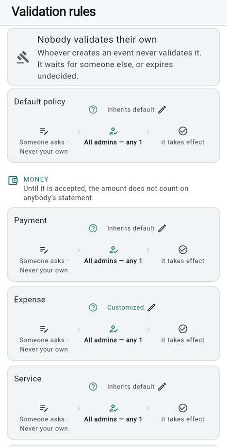

| Group | Domains, in plain words | While it waits |
|---|---|---|
| **Money** | A payment, an expense, a service, an invoice matched to its payment, an invoice issued or cancelled, a refund, a write-off, a price agreement, a shared expense, a scheduled expense, a payment-condition change, an early departure, a usage record removed | The amount does not count on anybody's statement. |
| **Bookings** | **Extra half-days** a member asks for, **Whole-space reservations**, a booking made for a member by an administrator, a **Booking deletion** | The seat stays as it was. |
| **People and roles** | **New member**, a role change, a change of status, a subscription change, a change of the permission matrix | The person keeps the access they have now. |

Every domain starts with **Inherits default**: one validation by any administrator or owner. **Default policy** is the rule all the others inherit. A domain you open and save becomes **Customized**.

*The knobs of a rule*

| Setting | What it means | Needs |
|---|---|---|
| **Required validations** | How many people must say yes. | |
| **Who validates** | **Admins**, **Listed persons** or **All members**. The owner always may. | **Validators by role or person**: without it the choice is not shown and administrators validate. After switching it off, check again the rules that named **Listed persons** |
| **Admins may validate** | Off, only owners validate. | |
| **Owner must always validate** | One of the yes answers must come from an owner. | |
| **The owner may validate their own** | The owner's own request is not left waiting for someone else. An administrator never gets this. | **Chained validations** |
| **One after another** | The second is asked once the first has said yes. | **Chained validations** |
| **Only above this amount** | Below it, the act applies at once. Money domains only. | **Chained validations** |
| **Admins delete without validation** / **Owners delete without validation** | Their own **Booking deletion** settles itself and stays marked as auto-validated. Off by default. | |

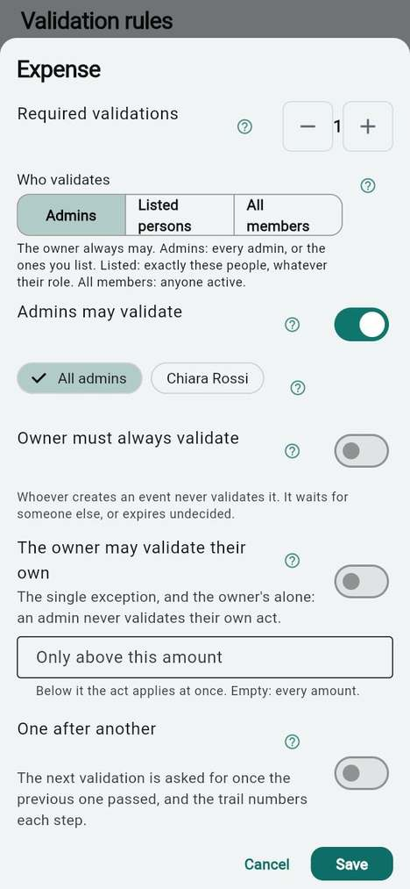

**Steps**

1. Open [Validation rules](https://fdittgen-png.github.io/deskilo/#/validation). Tap **Default policy** and decide what everything else inherits.
2. Tap a domain, set the knobs, tap **Save**.
3. Keep few exceptions. Each exception is one more thing you must remember when someone says "why is this waiting?".

**Good to know**

- Nobody validates their own act. It waits for someone else, unless the owner exception is switched on.
- Every decision is recorded: who, when, on what.
- A request nobody answers expires after seven days, swept the next time anyone opens Events. An act an administrator did for a member is confirmed automatically instead.

**See also:** [Validation rules, domain by domain](User-Guide#validation-rules-domain-by-domain) · [Who may validate](User-Guide#who-may-validate) · [Auto-validate](User-Guide#auto-validate-an-administrators-own-request)

<!-- anchor: setup.people.presets -->
### Three presets to copy

**Audience:** Owner

You want a rule set you can copy today and refine later. Choose one; each relies on the default scope, owner and administrators, so no extra feature is needed.

| Preset | Choose it when | What you set | Validators you need |
|---|---|---|---|
| *Open join* | You know the people who will scan your code. | Nothing. Every domain inherits the default: one validation by any owner or administrator. A join is still never automatic. | 1 (you) |
| *Approve joins* | A board decides who enters. | **New member**: **Required validations** 2, **Owner must always validate** on. | 2: an owner and one administrator |
| *Approve joins and bookings* | Seats or whole rooms are scarce, or booking deletions need a witness. | *Approve joins*, plus on **Whole-space reservations**, **Extra half-days** and **Booking deletion**: **Required validations** 1. | 2 at least, 3 to be comfortable |

In the association: Ada is the owner, Chiara an administrator. With *Approve joins*, Ada and Chiara both approve each newcomer. With the third preset a whole room Bruno books is blocked for him at once, but Ada or Chiara can still refuse it, and a deletion Chiara asks for is decided by Ada, not by Chiara.

**Steps**

1. Open [Validation rules](https://fdittgen-png.github.io/deskilo/#/validation).
2. Tap **New member**, set what the table says, tap **Save**.
3. For the third preset, repeat on the other three domains.
4. Open **Members & plans** and count your active owners and administrators. It must be at least the number in the last column.

**Good to know**

- An ordinary booking by a member is never held for approval by these presets. What waits is a whole room, extra half-days, a deletion and the join.
- A preset is a starting point. Raise a number only when you have enough people to answer.

**See also:** [Required validations](User-Guide#required-validations) · [An owner is required](User-Guide#an-owner-is-required)

<!-- anchor: setup.people.stuck -->
### Avoid requests that wait for ever

**Audience:** Owner · Co-owner

You want to be sure that every request you create a rule for can be answered. A rule that needs more validators than exist is not refused everywhere: the request is created, nobody can complete it, and it expires after seven days.

> **Careful** The editor counts one extra validator for the person concerned, so it lets you save **Required validations** one above the people you have. That extra yes exists only for a booking an administrator made for a member, and for some payments. For a join or a money request it does not exist. Do not rely on the editor to count for you.

*Count before you require*

| You require | You need, besides the person who asks |
|---|---|
| 1 | One active owner or administrator |
| 2 | Two active owners or administrators |
| 2 with **Owner must always validate** | An owner and one more |
| A **Listed persons** list | Each person on it must be active; a new administrator is not added automatically |

*How to check*

1. Open [Validation rules](https://fdittgen-png.github.io/deskilo/#/validation) and read each customised card: "All admins — any 2" means two people.
2. Open [Members & plans](https://fdittgen-png.github.io/deskilo/#/members). Count the active owners and administrators. Paused and exited people do not count.
3. Open **Setting up this space** in [Workspace](https://fdittgen-png.github.io/deskilo/#/workspace-settings). The area **Roles and who validates requests** says "A policy asks for more validators than this space has" when it counts too few. It holds up the first booking only when the rule is for reservations.
4. Open [Events](https://fdittgen-png.github.io/deskilo/#/events). **Waiting for your confirmation** shows what is waiting, and a row shows "1/2 validations".

**Good to know**

- The editor itself says **Not enough eligible validators.** when a count clearly exceeds the people available. It does not catch every case.
- A solo owner who asks for something for themselves is waiting for someone else: either add an administrator, or switch on **The owner may validate their own** under **Chained validations**.
- Pausing or removing an administrator can leave a rule short. Recount after every change of team.

**Result** Every rule can be answered by people who exist.

**See also:** [Required validations](User-Guide#required-validations) · [Keep it consistent](#keep-it-consistent)

<!-- anchor: setup.people.first-week -->
### The first week of your members

**Audience:** Owner · Administrator

You want your first members to succeed without asking you. What you tell them in the first week decides how much you answer in the second.

*Before you invite anyone*

1. Sign in as a second person on a test account and join your space. Check that you can open the plan and book a seat.
2. Approve that account as a member, and have the second validator approve too if you require two.

**Steps**

1. Send the invitation message. It tells people how to download the app, create an account and join. See [Join a workspace](User-Guide#join-a-workspace).
2. Approve each newcomer the same day. A person waiting for a day starts with a doubt.
3. Tell them the three first things: the plan and booking ([Reserve a place](User-Guide#book-a-place)), checking in ([Check in and out](User-Guide#check-in-and-check-out)), and where their requests wait ([Events](User-Guide#events--confirmations)).
4. Tell them what you see about them and what they control ([Who can see my data](User-Guide#privacy-who-can-see-my-data)).
5. Name one person to ask, and where: the messenger, or the desk.

**Good to know**

- When an administrator does something for a member, it stays pending until the member confirms. Warn them, or the first booking you make for someone will look like a mistake.
- Members who do not use push notifications still find everything under **Events**.
- On the first Reserve visit the **Get started** card shows owners what is still missing. Members have their own short tips. See [The Get started card and the tips](User-Guide#the-get-started-card-and-the-tips).

**Result** People who know how to book, how to check in and whom to ask.

**See also:** [Week 0 to week 4](#learn-it-in-four-weeks) · [How members are told](#what-members-control)

<!-- anchor: setup.money.overview -->
## Money and tax

For owners and billing administrators who are about to decide how a space is paid for. This chapter is about the decisions and their order; the clicks are in the user guide, and every section links to them.

> **Careful** DesKilo records, calculates and prints what you declare, and it checks that the required details are present. It does not certify your invoices, your VAT treatment or your books. Wherever this chapter says "ask your accountant", please do.

In this chapter:
- Whether members pay at all, and who issues the invoices
- How a tariff is built, with figures from the demo space *Atelier du Marché*
- How members pay you
- Your legal identity, and the questions to bring to your accountant
- Manual or automatic invoicing, reminders, and VAT in outline
- The money decisions that cannot be taken back, and how to rehearse safely

<!-- anchor: setup.money.decide -->
### Decide first: do members pay, and who issues the invoices

**Audience:** Owner

You choose how far DesKilo goes in your money. Everything else in this chapter follows from this one choice, and it is easy to change upwards later, hard to change downwards once invoices exist.

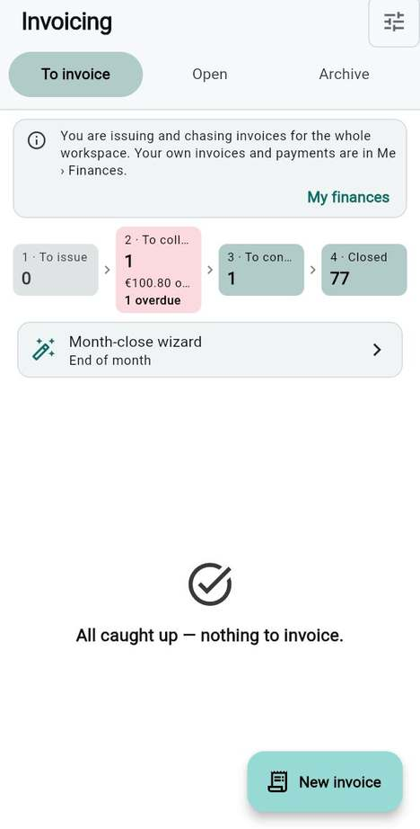

**Before you start**

Answer two questions: do members pay you for the space, and do you want the legal invoices to come out of DesKilo?

| Path | Choose it when | What happens |
|---|---|---|
| 1. No money | The space is free, or members are friends who share the rent outside the app | You leave the money features off. Members book; nobody is billed. |
| 2. Statements and payments, invoices outside | You already have an accountant or an invoicing tool, or you work in a country DesKilo cannot issue invoices for | Members have a monthly statement, you record the payments you receive, and you export the figures for your accountant. The legal invoices are produced elsewhere. |
| 3. Invoices issued by DesKilo | You are in France or Germany, and you are either VAT-registered or outside the scope of VAT (an association, for example) | DesKilo produces signed, numbered invoices from what was booked, with your legal identity printed on them. |

**Steps**

1. Pick your path from the table.
2. For path 2 or 3, switch on the money features you need in [Features](User-Guide#a-feature-switch): **Invoices** is the base of everything that is issued, and the features below it (**Subscription invoices**, **End-of-month invoices**, **Payment reminders**, **VAT management**) come on one by one.
3. For path 3, continue with [your legal identity](#your-legal-identity-and-what-to-ask-your-accountant) before the first booking, not after.

**Good to know**

- In-app invoice issuing exists today for a workspace in **France** or **Germany**. In any other country, use path 2: statements stay available.
- The server refuses to issue, and the list **Complete these details before issuing** says why, when a detail is missing or when the treatment is one DesKilo does not handle: cross-border sales, reverse charge, export and VAT-exempt invoices must be reviewed and issued outside the app with your accountant.
- A seller on the small-business exemption scheme (franchise en base, Kleinunternehmer) cannot issue invoices in the app: the server refuses the exempt VAT category. Keep path 2, and issue those invoices elsewhere.
- Switching a feature off stops new business of that kind; it deletes nothing.
- You can stay on path 2 forever. Many associations do.

**Result**

You know which of the three paths is yours, and which features it needs.

**See also:** [Invoicing at a glance](User-Guide#invoicing-at-a-glance) · [Switch whole processes on or off](User-Guide#switch-whole-processes-on-or-off)

<!-- anchor: setup.money.tariff -->
### Design a tariff

**Audience:** Owner · Billing administrator

You turn "what is a place worth?" into numbers DesKilo can apply every month without you.

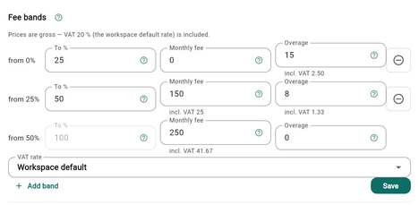

**Before you start**

Keep the model in mind. It reads from left to right, and each step feeds the next:

1. Subscription percentage: A member holds a percentage of the month: 25, 50, 75 or 100 %, or a value you allow.
2. Half-day allowance: The percentage becomes a number of half-days for the month: the number of open days, times two, times the percentage, rounded up.
3. Fee band: The percentage falls into one band, which gives the monthly fee and the price of an extra half-day. A band covers "above its start, up to and including its end", and the bands together must cover 0 to 100 % without a gap.
4. Overage policy: When the allowance is used up, each member is either blocked, charged the overage price, or asked to buy a package.
5. Packages and services: A day package sells extra half-days in advance at a price you set; services (a coffee, a locker, printing) are sold on top.

**Steps**

1. Decide the percentages you want to offer under **Subscription levels**, and whether an owner may type a negotiated value (see [Subscription levels](User-Guide#subscription-levels)).
2. Set one row per range in **Fee bands**: its upper limit, the monthly fee and the overage price (see [Fee bands](User-Guide#fee-bands)).
3. Decide the default for members who run out: [When days run out](User-Guide#when-days-run-out).
4. Add the [Day packages](User-Guide#day-packages) and [services](User-Guide#a-service) you sell.

**Good to know**

- The arithmetic is frozen on every issued document. Changing a price changes next month, never a month already invoiced.
- Opening hours and closure days decide how many open days a month has, and so the size of the allowance. Set them first.
- A member with no subscription is for visitors who buy carnets; they cannot be on pay-as-you-go.

**See also:** [Billing](User-Guide#fee-bands) · [A member's subscription](User-Guide#a-members-subscription)

<!-- anchor: setup.money.example -->
### A worked example

**Audience:** Owner · Billing administrator

You follow one member through one month with the figures of *Atelier du Marché*, so you can check your own numbers the same way.

**Before you start**

The demo space has three fee bands, in euros and VAT included. The figures are the demo's own, not a recommendation.

| Band | Monthly fee | Extra half-day | Half-days in a 22-open-day month |
|---|---|---|---|
| up to 25 % | 0.00 | 15.00 | 11 |
| above 25 %, up to 50 % | 150.00 | 8.00 | 22 |
| above 50 %, up to 100 % | 250.00 | 0.00 | 44 (at 100 %) |

**Steps**

1. A member holds 50 %. In a month with 22 open days the allowance is 22 × 2 × 50 / 100 = 22 half-days.
2. 50 % falls in the second band (above 25, up to 50): the fee is 150.00, whatever the member uses.
3. The member books 24 half-days. Two are over the allowance, at 8.00 each: 16.00.
4. The month costs 150.00 + 16.00 = 166.00, before any service. In the demo the prices are gross: the 20 % VAT is inside them, and the screen shows it under each price.
5. Compare with a package: the demo's 5-day pack costs 40.00 and adds 10 half-days (5 days, two half-days each), that is 4.00 a half-day. Against 8.00 of overage it pays off from the sixth extra half-day in a month.

**Good to know**

- An overage price of 0.00 means extra half-days cost nothing under pay-as-you-go.
- The statement a member sees shows the same lines: fee, included, used, extra, overage.
- Prices are shown including VAT when VAT is on; the tax is extracted from them.
- If a member and you agree on other conditions, see [price negotiation](#price-negotiation).

**Result**

You can predict a member's bill from three numbers: their percentage, the open days, the bookings.

**See also:** [Read your statement](User-Guide#read-your-statement) · [What each booking cost](User-Guide#what-each-booking-cost)

<!-- anchor: setup.money.negotiation -->
### Price negotiation

**Audience:** Owner · Billing administrator

You want one member to pay different conditions from the tariff, in a way that leaves a trace.

**Steps**

1. Switch on the price negotiation feature in [Features](User-Guide#a-feature-switch).
2. Propose conditions on the member page: a different monthly fee, overage rate, discount on supplements, unit prices, or occupation percentage (see [Price negotiation](User-Guide#price-negotiation)).
3. Let the validation rule for price negotiations decide who confirms it.

**Good to know**

- The tariff stays the default; a negotiated price belongs to one member.
- It is seen by the member, the owners and the people with the right to view commercial agreements, and every read is logged.
- Decide your policy before you open: one exception granted quietly becomes the price everyone asks for.

**See also:** [Your negotiated prices](User-Guide#your-negotiated-prices)

<!-- anchor: setup.money.pay -->
### How members pay you

**Audience:** Owner · Billing administrator

You choose where a member's money goes, and how much of the work DesKilo does for you.

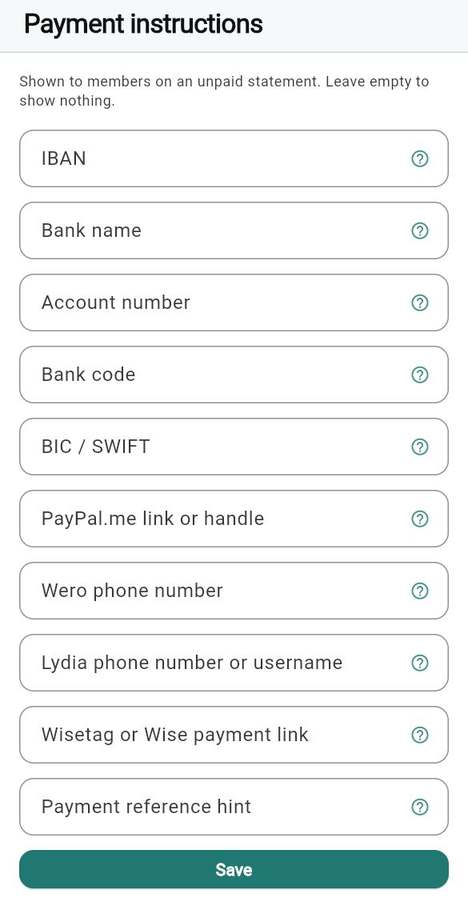

**Steps**

1. Start with the free route: fill the [payment instructions](User-Guide#payment-methods-and-instructions): your IBAN and bank details, and any of PayPal.me, Wero, Lydia or Wise you accept, plus a reference hint.
2. Members see these details on an unpaid statement. When a payment reaches your account, you or a billing administrator [record it](User-Guide#record-a-payment).
3. Only if you want members to pay inside the app, connect a provider in [Online payments](User-Guide#the-payment-provider): PayPal, Stripe or Mollie. It needs the **Online payments** feature and your own account at the provider.

**Good to know**

- DesKilo records payments; with the manual route it never moves money.
- A provider charges its own fees, takes the keys of your account (the credentials sheet explains how they are entered).
- With **Online payments** off, a new online payment is refused; one already open can still settle.
- A space built from a template does not carry payment details: enter them in each space. A configuration export does carry them.

**See also:** [Pay what you owe](User-Guide#pay-what-you-owe) · [Provider credentials](User-Guide#provider-credentials)

<!-- anchor: setup.money.identity -->
### Your legal identity, and what to ask your accountant

**Audience:** Owner

You tell DesKilo who is selling, so every invoice names you correctly. This is the part to settle with a professional.

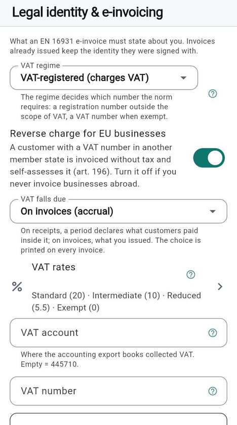

**Before you start**

The screen is [Legal identity & e-invoicing](https://fdittgen-png.github.io/deskilo/#/legal-identity). Have these ready:

- your organisation type: a business, or a non-profit association;
- your VAT regime: outside the scope of VAT, VAT-exempt (small-business scheme), or VAT-registered. The app can issue invoices for the first and the last only; with the small-business exemption, the screen records your status but invoices must be issued elsewhere (path 2);
- your registration number, and your VAT number if you have one;
- your postal address, as it appears on your registration;
- the reason no VAT is charged, if you charge none.

> **Careful** Choosing the regime is a tax decision, not a software setting. An association with no trading activity is normally outside VAT, and the screen warns you if you pick "exempt" for one. Confirm the choice before you issue the first invoice.

**Steps**

1. Open [Legal identity & e-invoicing](https://fdittgen-png.github.io/deskilo/#/legal-identity) and work from the top: the **VAT regime** first, then the identifiers, the address and the **Invoice mentions**.
2. Fill the payment terms, the late-payment mentions and the other mentions your country requires (see [Your legal identity](User-Guide#your-legal-identity)).
3. Tap **Save**, then read the invoice template once with your accountant (see [The invoice PDF template](User-Guide#the-invoice-pdf-template)).

> **Tip** Questions to bring to your accountant:
>
> 1. Which organisation type and which VAT regime am I in?
> 2. What are my registration number and my VAT number, and how do I write them?
> 3. If I charge no VAT, which legal wording justifies it?
> 4. Which mentions must appear on my invoices (payment term, late-payment penalty, recovery indemnity, early-payment discount, insurance)?
> 5. How should invoices be numbered, and does the number restart each year or each month?
> 6. Does VAT fall due when I invoice or when I am paid?
> 7. Must I send e-invoices to a government platform, and which one?
> 8. Do I need periodic VAT returns, and how often?

**Good to know**

- Invoices already issued keep the identity they were signed with; a change applies to the next ones.
- Only an owner or an active co-owner can open this screen, and the **Invoices** feature must be on.
- A space made from a template does not carry your identity: enter it again. A deployment between the two sides of a pair does carry it.

**See also:** [VAT regime](User-Guide#vat-regime) · [The e-invoicing platform](User-Guide#the-e-invoicing-platform) · [Organisation type](User-Guide#organisation-type)

<!-- anchor: setup.money.invoicing -->
### Invoice by hand or automatically

**Audience:** Owner · Billing administrator

You decide whether a person presses the buttons each month or DesKilo does.

**Steps**

1. For a first month, work by hand: open [Invoicing](https://fdittgen-png.github.io/deskilo/#/invoices), read **To issue**, and issue one member's invoice (see [Issue an invoice](User-Guide#issue-an-invoice)).
2. For a routine, use the [month-close wizard](User-Guide#the-month-close-wizard): it walks through **Review**, **Issue**, **Send**, **Remind**, **Payments**, **Match**, **Close** and **Summary**.
3. To automate, switch on **Subscription invoices** and **End-of-month invoices** in [Features](User-Guide#a-feature-switch), then set the days in [Invoice schedule](User-Guide#invoice-schedule).

**Good to know**

- Two documents exist per month: the subscription fee, issued ahead of the month, and what the month actually cost, issued after it. An invoice can be dated a few days ahead (three by default, set in the invoice schedule), so one dated 29 August can name September.
- On the server, a daily run issues both when the installation's database has its scheduler enabled; if you are unsure, ask the operator.
- Each kind of invoice (subscription, end-of-month) can be issued once per member and month. Invoices cannot be edited or deleted; a wrong one is marked erroneous and replaced.
- By default the owner and co-owners issue invoices. **Admins issue invoices** extends this to administrators.

**See also:** [The Invoicing screen](User-Guide#the-invoicing-screen) · [Chase and settle open invoices](User-Guide#chase-and-settle-open-invoices)

<!-- anchor: setup.money.reminders -->
### Payment reminders

**Audience:** Owner · Billing administrator

You decide how late is late, and who does the chasing.

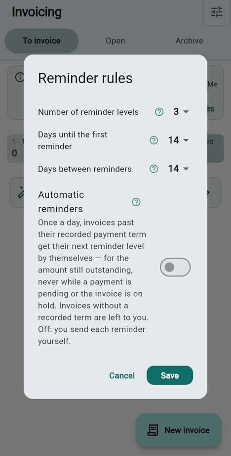

**Steps**

1. Switch on **Payment reminders** in [Features](User-Guide#a-feature-switch). It sits under **Invoices**.
2. Set the number of levels and the delays in [Reminder rules](User-Guide#reminder-rules): days until the first reminder, days between reminders.
3. Decide whether reminders leave on their own: switch **Automatic reminders** on in the same dialog (see [Automatic reminders](User-Guide#automatic-reminders)); the feature **Automatic payment reminders** must be on too.

**Good to know**

- The delay before the first reminder is also read as your payment term. Set it with [Payment terms](User-Guide#payment-terms).
- Automatic reminders run once a day on the server when the database has its scheduler enabled. They also run when someone who may issue invoices (an owner, a co-owner, or an administrator if **Admins issue invoices** is on) opens Finances, so a space without the scheduler still gets them, on the days someone looks.
- The **Payment reminders** feature only makes the rules available. A reminder leaves on its own only when **Automatic reminders** is switched on in the reminder rules, which is off until you choose it.
- They skip an invoice with a payment pending or on hold, and an invoice without a recorded payment term.
- The member gets an alert in their feed and, if push is set up, a generic notification; see [Tell people](#tell-people).

**See also:** [Payment terms](User-Guide#payment-terms)

<!-- anchor: setup.money.vat -->
### VAT in outline

**Audience:** Owner · Billing administrator

You want to know what VAT will ask of you before you switch it on.

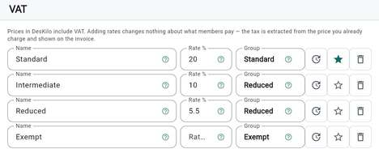

**Steps**

1. Only if you are VAT-registered, switch on **VAT management** in [Features](User-Guide#a-feature-switch).
2. Set the rates in [VAT](https://fdittgen-png.github.io/deskilo/#/vat): **Use the usual rates** for your country, then mark exactly one as the default (see [Setting the rates](User-Guide#setting-the-rates)).
3. Give each rate its group, and an exemption reason where it applies (see [VAT groups](User-Guide#vat-groups)).
4. When the law changes a rate, use **Change by law** so older invoices keep their rate (see [Change a rate by law](User-Guide#change-a-rate-by-law)).
5. If you must file returns, switch on **VAT declarations** and generate each period in [VAT declaration](User-Guide#the-periodic-vat-declaration).

**Good to know**

- A catalogue of rates ships for the EU member states, Switzerland, Norway and Canada. Keeping it current when a government changes a rate is your job.
- Registered without a default rate in force, the server refuses to issue.
- A declaration is a filing aid made from your issued invoices. Verify it before you file, and mark it filed only once you have.
- The declaration journal has its own number series.

**See also:** [VAT regime](User-Guide#vat-regime) · [When VAT falls due](User-Guide#when-vat-falls-due)

<!-- anchor: setup.money.permanent -->
### What cannot be undone

**Audience:** Owner

You want to know, before the first invoice, what you will not be able to change afterwards.

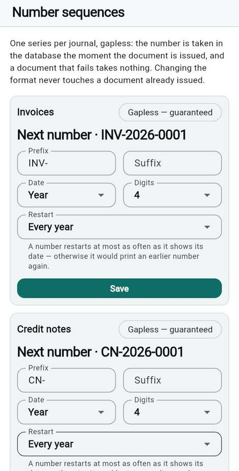

> **Careful** From the first issued invoice, the items below are permanent. Decide them with your accountant first.

| Decision | What becomes permanent | When |
|---|---|---|
| An issued invoice | It is signed and immutable: amounts, parties, VAT breakdown and tariff arithmetic stay as printed. A correction is a cancellation, a credit note or a refund, each a new document. | At issue |
| Invoice number | Numbers are gapless and drawn in the database at the moment of issue. The next number can be raised, never lowered. A change of format applies from then on. A restart cannot be more frequent than the date the number prints. | At the first issue |
| An invoiced month | A month with an invoice for a member is closed for that member. Closure days and holiday imports skip such months and name them. | At the first invoice for it |
| VAT rates | Rates are versioned by date, never edited. A submitted VAT declaration is never recomputed. | At the first use |
| Currency and country | Amounts are stored as whole minor units without conversion. No guard was found that stops changing them later: decide before the first booking. | Before the first booking |

**Steps**

1. Open [Number sequences](https://fdittgen-png.github.io/deskilo/#/settings/number-sequences) and set the prefix, the suffix, the date part, the digits and the restart for each journal (invoices, credit notes, VAT declarations, members, payments). The screen needs the **Number sequences** feature.
2. Show the result to your accountant before the first invoice.
3. Choose the country, currency and time zone in [Workspace settings](User-Guide#country) before anybody books.

**Good to know**

- Numbers are not wasted: a document that fails to issue takes none.
- The two states of a space, test and production, exist so that nothing here is tried for real; see [a safe dry run](#a-safe-dry-run-in-a-test-space).

**See also:** [The invoice register](User-Guide#the-invoice-register) · [Currency and time zone](User-Guide#currency-and-time-zone)

<!-- anchor: setup.money.dry-run -->
### A safe dry run in a test space

**Audience:** Owner

You rehearse the whole money routine once, with nothing real at stake.

**Steps**

1. Create or open a test workspace (**One test workspace**, or the DEV side of a linked pair); see [Test space](User-Guide#what-a-test-space-is-for) and [Environments](User-Guide#a-space-has-two-sides).
2. Enter the legal identity, the rates, the tariff and the payment instructions as you intend to run them.
3. Invite two or three people to book a few days; add a service for one of them.
4. Run the [month-close wizard](User-Guide#the-month-close-wizard) from start to end and read the invoice PDF.
5. Record a payment, let a reminder fall due, and read the statement as the member.
6. Show the PDFs and the accounting export to your accountant.

**Good to know**

- A test space watermarks every document and says it is a test; nothing is owed.
- Declaring a space production removes the watermark; invoices already issued keep theirs.
- The pair can pull the configuration from one side to the other, but credentials do not travel.

**Result**

A first month you have already seen, and a list of questions answered before they cost anything.

**See also:** [The two environments](User-Guide#a-space-has-two-sides) · [Accounting exports](User-Guide#accounting-exports)

<!-- anchor: setup.notify.overview -->
## Tell people

For owners who want members and administrators to hear about what matters, and only that. This chapter describes what DesKilo really sends, who receives it, what you configure and what you leave to the operator of the installation.

In this chapter:
- The channels, in plain words
- A table: what happens, who is told, by which channel, what a member can change
- What you configure, and what the operator must do for push
- A test plan with two accounts
- How to avoid both overload and silence

<!-- anchor: setup.notify.channels -->
### The channels, in plain words

**Audience:** Owner · Administrator

You want a clear picture of the ways DesKilo can reach a person, before you promise anything to your members.

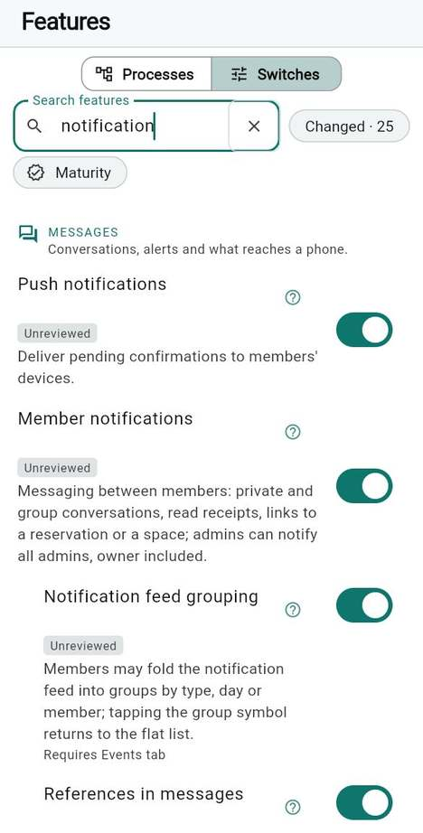

**Before you start**

There are six ways, and they are not equal. Most of the work is done inside the app.

| Channel | What it is | What it needs |
|---|---|---|
| The events feed and the bell | Everything that happens in the space is written to a feed. The bell counts new updates and the decisions waiting for you. | **Events tab**; **Notification feed grouping** is an option on top |
| Messages | Private and group conversations between members, with read receipts and links to a booking or a space. | **Member notifications** |
| Push | A short notification on a phone or computer, even when the app is closed. The text is generic: no names, no times. | **Push notifications** on, **and** a push set-up by the operator; see [the operator's part](#the-operators-part-making-push-work) |
| The check-in reminder | A notification on the member's own device, 15 minutes before a booking they have not yet checked in to. | The member's system permission. Not in the browser version. |
| Payment reminders | An alert in the feed and a push to the member whose invoice is overdue. | **Payment reminders** and **Automatic payment reminders**; see [Payment reminders](#payment-reminders) |
| WhatsApp | A group link you publish, and the WhatsApp number a member chooses to share. The app opens WhatsApp; nothing is sent from the server. | **WhatsApp integration** |

**Good to know**

- DesKilo sends no e-mail of its own beyond the account e-mails (sign-up confirmation, password reset). Invitations are texts you share from your own phone.
- There is no per-event subscription: a member cannot pick "tell me about expenses but not about bookings".
- A notification may be delayed or lost like any push; the feed and the message list are the record.

**See also:** [Notifications](User-Guide#notifications) · [Events & confirmations](User-Guide#events--confirmations)

<!-- anchor: setup.notify.table -->
### Who is told what

**Audience:** Owner · Administrator

You want to know, event by event, who hears about it and how.

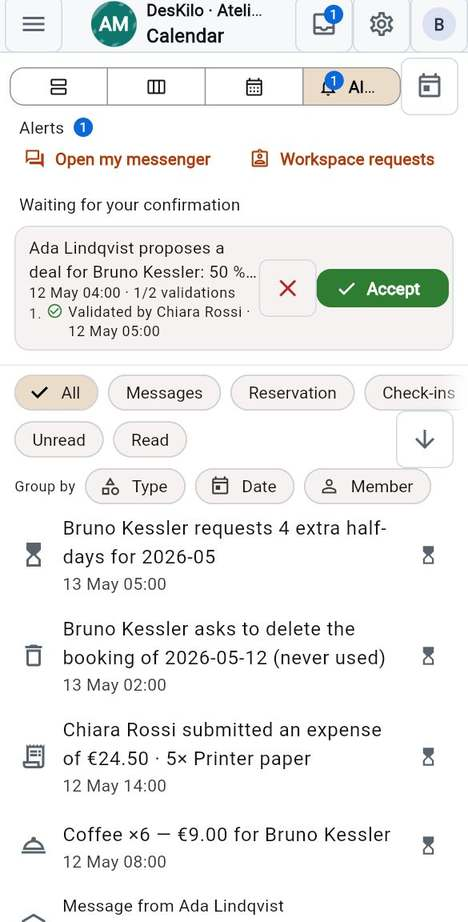

**Before you start**

Push is sent only for the five lines marked "push" below. Every other event (a booking made, a payment recorded, a member joining) appears in the feed and nowhere else.

| Source | Event | Who is told | Channel | What the member can change |
|---|---|---|---|---|
| Validation rules | A request needs a confirmation | The people the rule names (feed, **Waiting for your confirmation**); the push goes only to the member the request is about, never to the person who made it, so validators are pushed only when they are that member. Text: "Someone needs your confirmation." | Feed, bell; push | Switch push off on the device |
| Reservations | An administrator removes or overrules a booking | The member displaced, and every active administrator and owner except the one who acted. Text: "A reservation was removed by an admin." | Feed; push | Switch push off on the device |
| Payment reminders | An invoice is past its term and a reminder level falls due | The member the invoice is for. An owner's own invoice reaches the owner. Text: "A payment reminder is waiting for you." | Feed alert; push | Switch push off on the device |
| Member notifications | A new message | Direct message: the recipient. Group: the participants except the sender. A conversation muted by a member stays silent for that member. Text: "You have a new message." | Messages, bell; push | Mute, pin or archive a conversation; switch push off |
| Message mentions | A group message names someone | The people named, even in a muted conversation. Text: "You were mentioned in a conversation." | Messages; push | Switch push off |
| Reservations | A booking is ahead | The member who booked, on their own device, 15 minutes before it starts, for bookings in the next seven days | Local notification | Refuse the system permission |
| WhatsApp integration | Nothing is sent | The group link is shown in the directory; a member may share their number | Opens WhatsApp | Share or hide the number |

**Good to know**

- When the app is open, a removed-booking push is replaced by a notification in the member's language. For messages, mentions, confirmations and payment reminders the open app currently shows its generic text ("Someone needs your confirmation."). The generic English texts of the table appear when the app is in the background or closed.
- An administrator is told only about what they act on or what a rule gives them; there is no "everything" digest.
- Members see their own events; administrators and owners see everyone's.

**See also:** [Validation rules](User-Guide#validation-rules-domain-by-domain) · [Messages](User-Guide#messages)

<!-- anchor: setup.notify.configure -->
### What you configure

**Audience:** Owner

You decide which of these channels exist in your space and who is asked to decide what.

**Steps**

1. Open [Features](User-Guide#a-feature-switch) and check the notification switches: **Push notifications**, **Member notifications**, **Events tab**, **Notification feed grouping**, **Payment reminders**, **Automatic payment reminders** and **WhatsApp integration**.
2. Set the [validation rules](User-Guide#validation-rules-domain-by-domain): for each kind of request, how many validations are required and who may give them. This decides who is asked, and so who sees a decision waiting.
3. Decide whether an administrator's or an owner's own request settles itself; see [Auto-validate an administrator's own request](User-Guide#auto-validate-an-administrators-own-request) and [Auto-validate an owner's own request](User-Guide#auto-validate-an-owners-own-request). A request that is settled already never pings anyone.
4. Write the invitation message members receive, and paste the community group link; see [Invitation message](User-Guide#invitation-message) and [WhatsApp group](User-Guide#whatsapp-group).
5. Switch on **Booking deletion requests** if members may ask to delete a past or checked-in booking: someone then has to answer.

**Good to know**

- Defaults for a new space: the events tab, member notifications and grouping are on; **Payment reminders** and **Automatic payment reminders** are on as features, but no reminder is sent until you switch **Automatic reminders** on in the reminder rules.
- **Push notifications** is on by default, but it delivers nothing until the operator has set it up.
- Switching a feature off stops new activity of that kind. It does not delete what exists.
- Roles decide who can see and answer what; see [The role matrix](User-Guide#the-role-matrix).

**See also:** [Who may validate](User-Guide#who-may-validate) · [Required validations](User-Guide#required-validations)

<!-- anchor: setup.notify.operator -->
### The operator's part: making push work

**Audience:** Operator · Owner

You want push on members' phones, and you need to know who does what.

**Before you start**

Push does not come with the app by itself. If you run your space on the shared reference installation, ask its operator whether push is configured. If you run your own installation, you or your technical person are the operator.

**Steps**

1. Create a Firebase project and build the app with it. Without this the app stays on local notifications only, and a member sees **This build has no push notifications**. The build distributed through the F-Droid store has no push at all.
2. For iPhone and Mac, add an Apple push key to the Firebase project.
3. Store the Firebase service-account key as a secret of the server and deploy the push function.
4. On your own installation, point the `push_config` row of your database at your own push function URL and key. It is seeded with the address of the reference installation.
5. Test it with two accounts, as described in [the test plan](#a-test-plan-send-yourself-one-of-each).

**Good to know**

- Without steps 1 to 4, nothing is pushed, whatever the switches say. The feed, the bell and the messages still work.
- The detailed checklist is for the operator: see [Platforms](User-Guide#deskilo-on-your-devices) and [Your own server](User-Guide#run-your-own-server).
- Push text never carries a name or a time: this is deliberate, for privacy.

**See also:** [Push notifications on this device](User-Guide#push-notifications-on-this-device)

<!-- anchor: setup.notify.members -->
### What members control

**Audience:** Owner · Administrator

You want to tell your members honestly what they can switch off.

**Steps**

1. A member opens [Privacy & data](https://fdittgen-png.github.io/deskilo/#/privacy) and uses **Push notifications on this device** to stop or resume push on that device.
2. In [Messages](https://fdittgen-png.github.io/deskilo/#/me?tab=messages), a member presses and holds a conversation to **Pin to top**, **Mute notifications**, **Mark as unread** or **Archive**.
3. In the system settings of the phone, a member can refuse notifications altogether, check-in reminders included.
4. In their profile, a member decides whether to share a WhatsApp number.

**Good to know**

- A muted conversation stays silent but is still counted; a mention overrides a mute.
- A member who turns push off on one device is not affected on another.
- There are no per-category switches. If a member needs less noise, mute conversations; if they need none, switch push off.

**See also:** [Notifications](User-Guide#notifications) · [Your data, your rights](User-Guide#your-data-your-rights)

<!-- anchor: setup.notify.test -->
### A test plan: send yourself one of each

**Audience:** Owner · Administrator · Operator

You make sure each channel works before your members depend on it.

**Before you start**

Do this in a test space (see [a safe dry run](#a-safe-dry-run-in-a-test-space)). You need two accounts: yours as owner, and a second one as a member, on another phone, another browser, or the same phone after signing out. The demo space lets you see the screens with its personas, but it sends no real push.

**Steps**

1. Message: from the member account, write to the owner in [Messages](https://fdittgen-png.github.io/deskilo/#/me?tab=messages). On the owner account, the bell counts it and the conversation shows unread. Open it: the member's message shows a read receipt.
2. Mention: in a group conversation, name the owner (the mentions feature of messaging must be on). If push is set up, the owner's phone shows "You were mentioned in a conversation."
3. Decision: as the member, ask to delete a past booking (the **Booking deletion requests** feature must be on). The owner sees it under **Waiting for your confirmation** in [Events](https://fdittgen-png.github.io/deskilo/#/events); answer it and watch the member's feed change.
4. Removal: as the owner, remove a future booking of the member. The member's feed shows it, and a phone with push shows "A reservation was removed by an admin."
5. Reminder: as the member, book a place that starts in about 20 minutes (a booking starting in under 15 minutes gets no reminder). About 15 minutes before it starts, the member's phone shows the check-in reminder.
6. Payment reminder: with **Payment reminders** on, switch **Automatic reminders** on in the reminder rules with a short first-reminder delay, issue a trial invoice that has a payment term, wait past the delay, then open Finances as an owner or co-owner; the member's feed shows the alert.
7. Mute: as the member, mute the conversation, send another message from the owner, and check that nothing rings but the unread count rises.

**Good to know**

- Steps 2 and 4 show a push only if the operator's set-up is complete. If they fail while the others work, the fault is in the set-up, not in your rules.
- On the browser version of the app, there is no check-in reminder.
- A phone that blocks notifications shows nothing at all; check the system settings first.

**Result**

You have seen, with your own eyes, every channel a member will rely on.

**See also:** [The channels](#the-channels-in-plain-words) · [Start a conversation or a group](User-Guide#start-a-conversation-or-a-group)

<!-- anchor: setup.notify.silence -->
### Avoid overload, and avoid silence

**Audience:** Owner · Administrator

You want people to be told what needs them, and not drowned.

**Steps**

1. Keep **Notification feed grouping** on: members and administrators can fold the feed by type, day or member.
2. Ask for validation only where a decision is real: every rule that requires validation creates a request somebody must answer. See [Validation rules](User-Guide#validation-rules-domain-by-domain).
3. Use the auto-validation switches for requests where the answer is obvious.
4. Look at [What needs you](User-Guide#what-needs-you) from time to time: it ranks what is waiting.

**Good to know**

- Overload comes from rules that ask too often or from too many administrators on one rule.
- Silence comes from a rule with nobody to answer it: requiring two validations when only the owner exists, or listing administrators who have left, leaves requests waiting for ever. The setup readiness card can flag a booking rule with too few validators.
- Silence also comes from push without set-up, from members who turned push off, and from a system that blocks notifications.
- Automatic payment reminders are not a substitute for looking at the open invoices from time to time.

**See also:** [Who may validate](User-Guide#who-may-validate) · [Required validations](User-Guide#required-validations)

<!-- anchor: setup.reports.overview -->
## Documents and reports

**Audience:** Owner · Co-owner · Billing administrator

Everything DesKilo prints or exports comes from one engine and one place to design it. This chapter tells you which documents exist, the order in which to prepare them, what you may hand to your accountant, and where an AI assistant can help you and where it must not. The clicks are in the user guide; here you get the reasons and the order.

The running example is the demo space *Atelier du Marché*.

<!-- anchor: setup.reports.documents -->
### The documents the app produces

**Audience:** Owner · Billing administrator

You want to know what exists before you design anything, and who receives each document.

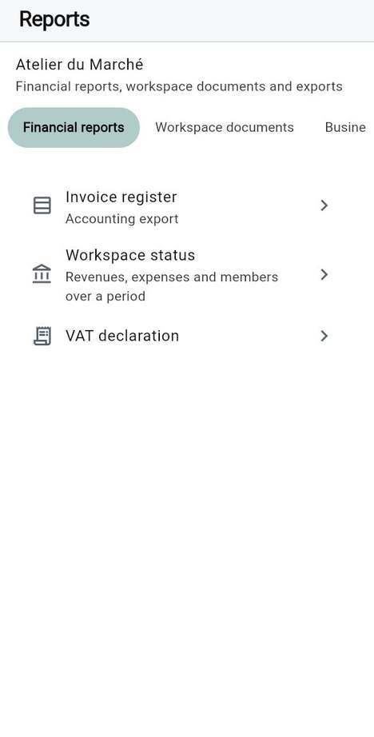

Every document is one *kind*. Each kind has its own design, so changing the invoice never changes the statement.

| Document | Who receives it | Where you find it |
|---|---|---|
| Invoice and credit note (one shared design) | The member, or the customer of an invoiced month | [Invoicing](User-Guide#the-invoicing-screen) |
| Proforma | A member who needs a quote or a prepayment request | Same screen |
| Statement | The member (their account over a period) | [The statement](User-Guide#read-your-statement) |
| Agreement | The member (the negotiated conditions) | [Price negotiation](User-Guide#your-negotiated-prices) |
| Payments, usage | The member, the billing administrator | [Payments](User-Guide#pay-what-you-owe) · [Usage](User-Guide#what-each-booking-cost) |
| Reminder letters, level 1 to 9 | The member with an overdue invoice | [Reminder rules](User-Guide#reminder-rules) |
| Workspace report and workspace status | You, the board, an auditor | **Reports** |
| VAT declaration | You, then the tax platform | [The periodic VAT declaration](User-Guide#the-periodic-vat-declaration) |
| Badges, space QR codes | Members at the door, your walls | [Space QR codes](User-Guide#space-qr-codes-pdf) · [Badges](User-Guide#nfc-badge-check-in) |

**Good to know**

- The **Reports** screen groups them under **Financial reports**, **Workspace documents**, **Business analytics** and **Templates**, depending on your permissions.
- A few reports (chart of accounts, badges, QR cards) have one shipped layout. The others can be redesigned.
- Documents drawn from a test space carry a watermark that says so. See [What a test space is for](User-Guide#what-a-test-space-is-for).

**See also:** [Reports](User-Guide#reports-quick-view-download-share) · [The invoice PDF template](User-Guide#the-invoice-pdf-template)

<!-- anchor: setup.reports.designer -->
### The designer, in owner terms

**Audience:** Owner · Billing administrator

You want a letter that looks like yours without learning a language of markup.

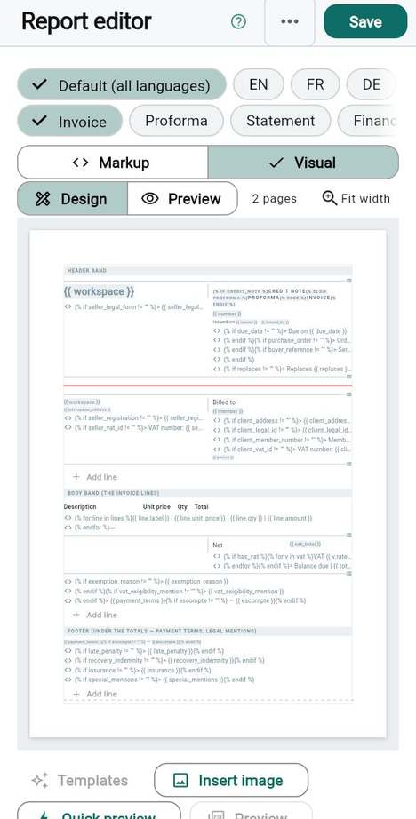

A document is a page made of **bands**. The *header* carries your letterhead and the recipient. The *body* carries the lines. The *continuation* strip starts on page two, and the *footer* repeats on every page with your payment terms and legal mentions. You edit them in **Design** and check them in **Preview**; **Markup** shows the same bands as text for the day you need it.

| Piece | What it gives you | Choose it when |
|---|---|---|
| Presets (**Professional**, **Classic**, **Simple**, **Detailed**, **Formal letter**) | A finished design to start from. The presets differ for invoices, proformas, statements, agreements and reminders; structural documents have one shipped layout | Always: start from **Professional** and change little |
| One design per language | A member reads the document in their own language | Your members do not all read one language |
| Letterhead and window envelope | Sender, recipient and body placed where a window envelope expects them | You post invoices on paper |
| Positioned layout (XML) | Each element placed by millimetres, for a national form | A document must match a fixed form |
| Image library | A logo, a stamp or a signature reused across designs | You have a logo |
| Design exchange | A design written to a file and read back | A person or a tool outside the app edits it |

Two facts keep you from surprises. The letter standard prints a recipient in the window on the right for a French space and on the left for a German one, unless you override it. And a design that fails to render never blocks a document: the built-in layout takes over.

> **Careful** The wording in a design is not legal advice. Appearance and translation alone do not establish legal compliance or satisfy an electronic-invoicing obligation. What an invoice must say is decided under [Your legal identity](User-Guide#your-legal-identity), and confirmed by your accountant.

**See also:** [The report editor](User-Guide#the-report-editor) · [Ready-made templates](User-Guide#ready-made-templates) · [One design per language](User-Guide#one-design-per-language)

<!-- anchor: setup.reports.sequence -->
### The sequence to follow

**Audience:** Owner · Billing administrator

You are about to design documents and want to do it once, in the right order.

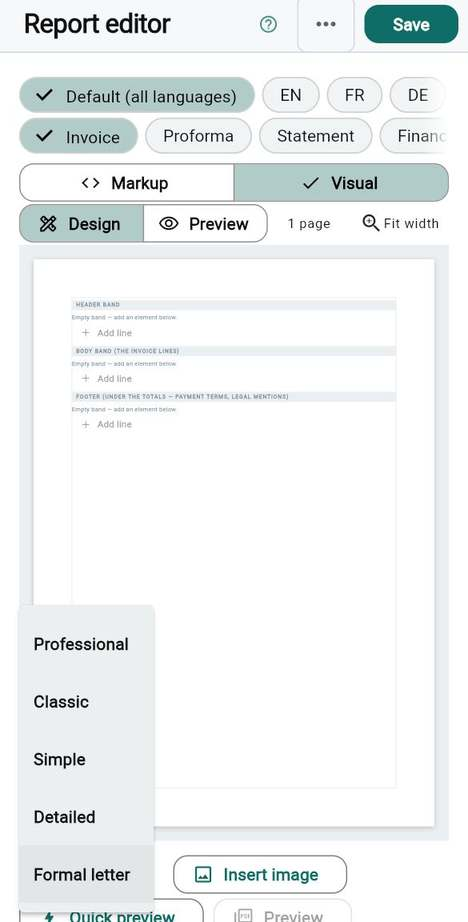

**Steps**

1. Fix your legal identity first: organisation type, address, registration, VAT regime and the special mentions. A design prints only what you entered there. See [Your legal identity](User-Guide#your-legal-identity).
2. Open [Report editor](https://fdittgen-png.github.io/deskilo/#/report-editor), pick the document and start from **Professional** under **Templates**.
3. Add a language version for each language your members read. Choose **EN**, **FR**, **DE**, **ES** or **IT** under the document. See [One design per language](User-Guide#one-design-per-language).
4. Check each one with **Quick preview**. It uses your newest invoice, or sample data when there is none.
5. Rehearse on a test space: enter it, issue a trial invoice, print it and send it to your accountant. See [What a test space is for](User-Guide#what-a-test-space-is-for).
6. Freeze the design before the first invoice. Write down what you decided, then change a design only when a rule changes.

**Good to know**

- Replacing a layout can be undone with **Undo** until you leave the editor.
- An issued invoice is a frozen document. Changing the design later changes new documents, never the ones already issued.
- With the same wording in two languages, ask someone who reads the second language to read the preview.

> **Careful** The invoice number and the legal mentions printed on an invoice become permanent with the first issued invoice. Settle them before it, not after.

**Result:** every document you will send looks like yours, in each language, and has been read once by someone other than you.

**See also:** [Your legal identity](User-Guide#your-legal-identity) · [The invoice PDF template](User-Guide#the-invoice-pdf-template)

<!-- anchor: setup.reports.accountant -->
### What you hand your accountant

**Audience:** Owner · Billing administrator

You want your accountant to have what they need, and to know what the app does not claim.

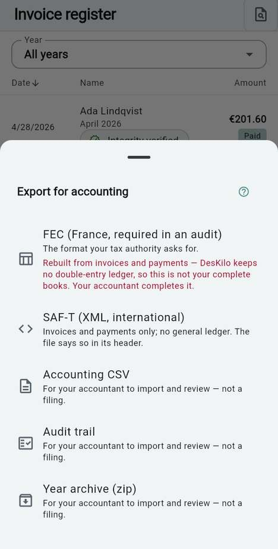

Start from the [Invoice register](https://fdittgen-png.github.io/deskilo/#/invoice-register), which lists every invoice with its status, and tap **Accounting export**. Each format says in the sheet what it claims.

| File | What it claims | What it does not claim |
|---|---|---|
| FEC | The French format an audit asks for, rebuilt from invoices and payments | Complete books. Your accountant completes them |
| DATEV | An exchange file for German accountants' software, read and posted by a person | A filing, or a handover for a tax audit |
| SAF-T | The international structure, deliberately partial: invoices and payments, no general ledger | A complete accounting file. It says so in its header |
| SAF-T PT, Sage 50 | A Portuguese regulatory format (uncertified) and a British/Irish exchange format, depending on your country | A filing or a certification |
| Accounting CSV, Audit trail, Year archive (zip) | A reading aid for your accountant | A filing |

The list of formats depends on your country. FEC and DATEV ask for your account numbers, and FEC also for your registration number: have them ready. The VAT figures for the period are in [The periodic VAT declaration](User-Guide#the-periodic-vat-declaration).

*What the app does not do*

- It keeps invoices, payments and a running account per member. It does not keep a double-entry ledger over a chart of accounts, so it cannot replace accounting software.
- Some obligations remain with you and your accountant: complete books, certified software where your country demands it, and the target authority's acceptance.
- A file is blocked until the problems in the source are fixed.

**Good to know**

- Exporting is a read. You can repeat it for any period.
- Prepare a short brief for your accountant before the first invoice: your VAT regime, when VAT falls due, the numbering you chose and the exports you will want. See [AI help](#help-from-an-ai-assistant).

**See also:** [Accounting exports](User-Guide#accounting-exports) · [The invoice register](User-Guide#the-invoice-register) · [VAT account](User-Guide#vat-account)

<!-- anchor: setup.reports.analytics -->
### Business analytics in outline

**Audience:** Owner · Billing administrator

You want to see how the space performs once it runs, without a spreadsheet.

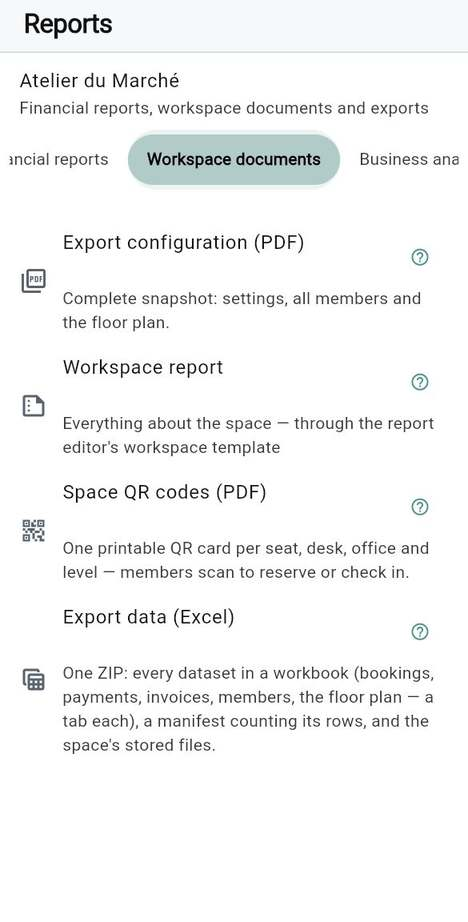

**Business analytics** shows figures by area: invoiced and collected, occupancy and capacity. You choose a period (month, quarter or year), compare it with another, save a view and export it as a PDF. You see only the analyses your role may read.

Collected is payments matched to invoices. It is not a profit, because no costs are in the figure, and the current period is partial.

For a document about the whole space, the **Workspace documents** tab holds the **Workspace report**, **Space QR codes (PDF)**, **Export data (Excel)** and **Export configuration (PDF)**. Use the last two as a recovery copy before a big change.

**See also:** [Business analytics](User-Guide#business-analytics) · [Exports](User-Guide#workspace-report)

<!-- anchor: setup.reports.ai -->
### Help from an AI assistant

**Audience:** Owner · Co-owner

An AI chat tool can save you hours on the words around your setup. It cannot be the one who decides what is legally or fiscally right. This section is about the tools you use outside DesKilo; the assistant connection inside the app is described at the end.

*What an outside tool is good for*

- Drafting the invitation message you send to your first members. See [The invitation message](User-Guide#invitation-message). The placeholders such as the first name or the invite link stay as they are.
- Wording the special mentions you will submit to your accountant, as a draft to check, never as a final text.
- Translating a design's wording into another language, so that you only have to review it.
- Explaining a report or a statement to a member in plain words.
- Preparing the brief of your choices for your accountant: country, organisation type, VAT regime, numbering, exports.
- Drafting the picture behind your floor plan, from photographs, in an image tool.

*What it must not decide*

- The legal mentions of an invoice, the VAT treatment of an activity, the reason no VAT is charged, and the VAT rates.
- Anything that becomes permanent: an invoice number format, a VAT regime, the currency, an issued invoice.
- Whether something is compliant. A confident answer is not a verified one, and your accountant is.

*The safe workflow*

1. Ask the tool for a draft. Give it a scenario, not your members' names or any personal data.
2. Paste the draft into the field, in the **Report editor** or in the settings.
3. Look at it in **Preview** with sample data.
4. Send the text that has legal weight to your accountant and wait for the answer.
5. Try the whole flow on a test space before the real one.

> **Careful** Do not paste a token, a password, a bank number or a member's personal data into an outside tool.

*DesKilo's own assistant connection*

The app lets an assistant such as Claude or ChatGPT act for a member through a protocol called MCP. It is off by default and is a feature you switch on (**MCP interface**, see [A feature switch](User-Guide#a-feature-switch)). It is made in layers, so no one person can open everything.

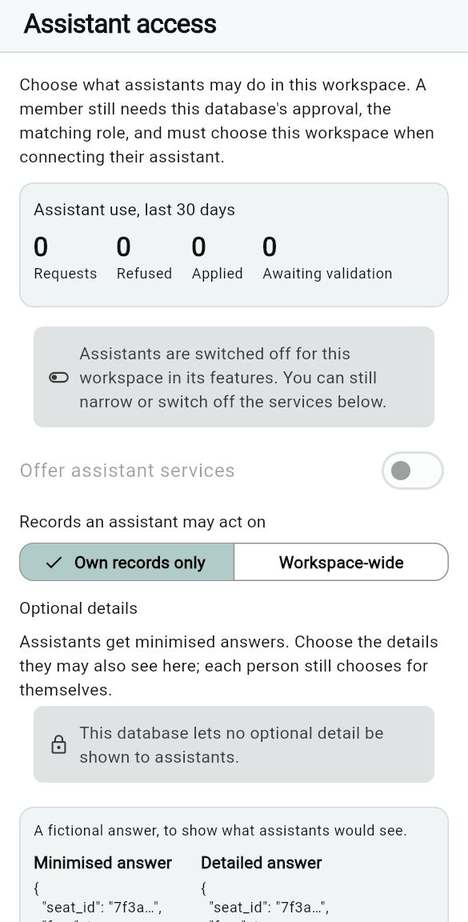

| Layer | Who | What they do |
|---|---|---|
| The installation | The operator | Turns assistants on for the installation. |
| The workspace | You, the owner | Switch the feature on, then choose in [What assistants may do](User-Guide#what-assistants-may-do-in-a-workspace) which services are offered and whether an assistant sees own records only or workspace-wide. |
| The database | A database administrator | Approves each person's request. |
| The member | Each member | Asks once for approval and chooses this workspace. |
| A request with impact | The member, on their device | Confirms the exact request, which still follows your validation rules. |

A member's assistant works on that member's own records: find and describe free places, favourites and ratings, book, change or cancel one's own reservation, ask to delete a started booking, check in and out, read one's statement and invoices, and list and answer the validations one is asked for. A few requests (invoice issue, invoice void, refund, member status change, subscription share) are for staff only: they need staff rights, the person's confirmation in the app, and then your validation rules. It has no operation that configures a space: it cannot switch a feature on, set a tariff, change a role or build a plan. It cannot set your space up for you, and it acts only within what you expose.

**Good to know**

- Switching assistants on grants nobody anything by itself.
- Each approval expires; the screen tells how many days remain.
- Read the steps in [Approvals and confirmations for assistants](User-Guide#approvals-and-confirmations-for-assistants).

**See also:** [Assistants: what they are](User-Guide#assistants-what-they-are) · [Connect an assistant](User-Guide#connect-an-assistant)

<!-- anchor: setup.reports.developer -->
### Working with a developer: the design file and the report tool

**Audience:** Owner · Operator

Someone technical is helping you, and a design must be edited or proved outside the app.

**Steps**

1. In [Report editor](https://fdittgen-png.github.io/deskilo/#/report-editor), use **Export this design** to write the design as one file. The file says what its fields mean and which placeholders exist. **Import a design** reads it back; a file for another report, or from a newer version, is refused with the reason.
2. A developer can proof the design from a terminal with the report tool, described in the technical administrator's guide: `check` measures a layout against the window-envelope contract and exits non-zero when ink lands in the window; `render` makes the PDF; `sample` writes a data file with every placeholder; `describe` lists the vocabulary.
3. Back in the app, import the file, preview it with **Quick preview** and **Save**.

**Good to know**

- The design exchange is a feature (**Export and import report designs**), under the report features of [Features](https://fdittgen-png.github.io/deskilo/#/features). Switch it on first.
- The tool needs the source code of the app; it is for the person who runs your installation, not for daily use.

**See also:** [The report editor](User-Guide#the-report-editor) · [The invoice PDF template](User-Guide#the-invoice-pdf-template)

<!-- anchor: setup.consistent.overview -->
## Keep it consistent

A space can be wrong in two ways: a setting that is missing, and two settings that contradict each other. DesKilo catches some of both, and says so on screen. This chapter lists what it catches and where you see it, says plainly what it does not catch, and gives you an audit to run before the doors open and a short routine to run every month.

In this chapter:
- [The guards the app gives you](#the-guards-the-app-gives-you)
- [The mistakes the guards do not catch](#the-mistakes-the-guards-do-not-catch)
- [The pre-launch audit](#the-pre-launch-audit)
- [The monthly routine](#the-monthly-routine)
- [When something looks wrong](#when-something-looks-wrong)
- [What cannot be undone](#what-cannot-be-undone-1)

The running example is *Atelier du Marché*. Its owner, Ada, runs the audit once in a test space and once more in the real one.

<!-- anchor: setup.consistent.guards -->
### The guards the app gives you

**Audience:** Owner · Co-owner · Administrator · Billing administrator

You want to know which of your mistakes the app will point out, and where it will do it, so that you look in the right place.

| Guard | What it catches | Where you see it |
|---|---|---|
| A feature that needs another | A feature cannot work without the one it needs. Switching a feature on switches its parent on and names what came on. Switching a parent off holds its children back and keeps their own choice. | **Features**: the switch flow with its preview, **Requires…** and **Waiting on the feature above** |
| A process held back | A feature that is on but waits for something that is off. | **Features**, **Processes** view: the state **Needs attention** and its filter chip |
| The readiness list | One line per area of the space, with its state, who acts and where to set it. Areas: **Opening days, time zone and currency**, **Bookable places on the floor plan**, **Membership plans and tariffs**, **Invite the first members**, **How members pay**, **Roles and who validates requests**, **Export and recovery**, **Details your features need (identity, bank, platforms)**, **A first booking** and, when relevant, **Server and database version** and **Assistant access (optional)** (the latter only with the MCP interface on). | **Setting up this space**, at the top of [Workspace](https://fdittgen-png.github.io/deskilo/#/workspace-settings) |
| The line that stops a first booking | Only what a booking truly needs: a time zone, a currency, an open weekday, one seat, and, when a booking rule asks for more validators than exist, those validators. The rest is optional and can be set aside with **Later**. | **Before anyone can book here**, on the Get started card of [Reserve](https://fdittgen-png.github.io/deskilo/#/reserve) |
| What your features still need locally | Legal identity (needed by **Invoices**), bank details, an online payment provider, an e-invoicing account, a site. | The same card, area **Details your features need (identity, bank, platforms)**, with **Set up** and **Recommended** |
| The invoice guard | An invoice is refused until it is complete: the workspace address, its VAT number, a country France or Germany, a legal basis for an exemption, the member's name, address and VAT number when reverse charge applies, a VAT rate in force, an explanation for every line billed at 0 %. Cross-border, reverse-charge, export and exempt invoices are refused: issue them outside the app. | **Complete these details before issuing**, with the missing items listed |
| The online payment guard | With **Online payments** off, the server refuses a new online payment. One already open still settles. | The payment screens (the feature row carries no note about it) |
| The validation guard | **Required validations** above the people available. | **Not enough eligible validators.** in the rule editor; "A policy asks for more validators than this space has" in the readiness list |
| The number sequence guard | A reset more frequent than the date printed in the number is refused. | [Number sequences](https://fdittgen-png.github.io/deskilo/#/settings/number-sequences), when you save |
| The maturity check | A feature reviewed as **Alpha** or **Beta**. | A confirmation before you switch it on, and a badge on every switch |
| The plan replacement check | Replacing the floor plan or the settings from a file. | A warning that it cannot be undone. The plan is refused once reservations exist |

**Good to know**

- **Setting up this space** is a list, not a lock. It never stops you from switching something on.
- Most guards act when you try to issue, pay or book, not when you choose a setting. That is why the audit below exists.
- The owner inbox ([What needs you](User-Guide#what-needs-you)) does not raise configuration problems today. Do not wait for it to tell you.

**See also:** [Avoid features that contradict each other](#avoid-features-that-contradict-each-other) · [Check your space](#check-your-space)

<!-- anchor: setup.consistent.gaps -->
### The mistakes the guards do not catch

**Audience:** Owner · Co-owner · Billing administrator

You want the honest list of what stays your responsibility. These are configurations the app lets you create and does not warn about. Each has a way to avoid it by hand.

| Mistake | Why nothing stops it | Avoid it by |
|---|---|---|
| Choosing a country other than France or Germany and expecting invoices | The app offers many countries and VAT rates, but issues invoices only for France and Germany. Nothing says so when you choose the country. | Deciding before you promise members an invoice. Elsewhere, keep statements in the app and issue invoices outside it. |
| Being registered for VAT with no rate in force | Issuing is refused, but only at the first invoice. With **VAT management** off, the configuration is hidden but the stored rates keep applying. | Adding the rate under [VAT](https://fdittgen-png.github.io/deskilo/#/vat) before the first month-close, and running a trial invoice. |
| **Online payments** on with no provider | You can switch it on; the missing provider shows only as an item in the readiness list. | Connecting the provider first, then switching on. |
| **Invoices** on with no legal identity | The feature is on from the first day; the refusal comes at issue time. | Filling in the identity before telling members they will be invoiced. |
| A rule needing more validators than you have, outside bookings | The readiness list holds up the first booking only for reservation rules. The editor lets you save one above the people available. Other requests are created, cannot be completed, and expire after seven days. | Counting active owners and administrators after each rule. See [Avoid requests that wait for ever](#avoid-requests-that-wait-for-ever). |
| Members who cannot open the plan | In a new space the **User** card of [Roles](https://fdittgen-png.github.io/deskilo/#/roles) is empty and nothing warns you. | Ticking the everyday permissions and joining once with a second account. |
| A space made from a template | A template never carries the identity, bank details, sites or invitations. | Treating the area **Details your features need (identity, bank, platforms)** as a to-do list. |
| A settings file that promises more than it delivers | Today the file carries the role matrix, your own roles and every validation rule, but not the members, the invoice and member numbers, the VAT period or whole-space prices. What it carries is applied only if **Configuration in the space file** is on in the target. A plan is not replaced once reservations exist. | Re-entering what it does not carry by hand, and reading the preview before **Replace and import**. |
| Reminders that never run | They run every morning on the server when the database has its scheduler (pg_cron); if it has none, they run when an administrator opens Finances. They also stay silent when **Automatic payment reminders** is off. | Asking the operator whether the scheduler exists, and opening Finances yourself if it does not. See [Payment reminders](User-Guide#automatic-reminders). |
| Changing country, currency or time zone once money exists | I found no guard. Amounts are stored as numbers and are not converted: check with the owner of the installation before relying on one. | Choosing them on day one. See [Decisions that are hard to undo](#decisions-that-are-hard-to-undo). |
| Numbering or VAT period that does not suit your accountant's format | The app does not compare them with the country's accounting export. | Asking your accountant for the numbering format and the export they use before you issue. See [Accounting exports](User-Guide#accounting-exports). |
| Taking a test for the real space | Beyond the watermark on printed documents, the difference is easy to miss. | Looking at the test-space banner and the side shown in [Me](https://fdittgen-png.github.io/deskilo/#/me) before you act. |

**Good to know**

- A kiosk with no kiosk member, a site feature with no site, push without a push service: [Avoid features that contradict each other](#avoid-features-that-contradict-each-other).
- The app is stricter than it looks about invoices and looser than it looks about everything else. When in doubt, issue a trial invoice in a test space.

**See also:** [A safe dry run](#a-safe-dry-run-in-a-test-space)

<!-- anchor: setup.consistent.audit -->
### The pre-launch audit

**Audience:** Owner · Co-owner

You want proof, not a feeling, before you open. Thirty-one checks, in three levels. Run *Open* before you invite anyone, *Run* before you promise anything about money, *Grow* before the first invoice leaves. Do it in a test space first, with a second person.

*Open: a place people can book*

| # | Check | Where | Good looks like |
|---|---|---|---|
| 1 | Country, currency, time zone | [Workspace](https://fdittgen-png.github.io/deskilo/#/workspace-settings), **General details** | Atelier du Marché: France, EUR, Europe/Paris |
| 2 | Workspace language | Same screen | The language your invitations are written in |
| 3 | Open weekdays and hours | [Availability](https://fdittgen-png.github.io/deskilo/#/availability) | The days you open are ticked; the hours match the day |
| 4 | Closure days | Availability, closure days | Holidays and closures for the next months are in, before the first month-end |
| 5 | At least one seat | [Workspace editor](https://fdittgen-png.github.io/deskilo/#/editor) | Every room you rent has seats |
| 6 | Readiness | **Setting up this space** | Nothing under **Opening days, time zone and currency** or **Bookable places on the floor plan** needs configuration |
| 7 | You booked a seat | [Reserve](https://fdittgen-png.github.io/deskilo/#/reserve) | The seat is booked, checked in and cancelled without a surprise |
| 8 | The workspace ID | [Workspace ID & QR](https://fdittgen-png.github.io/deskilo/#/workspace-code) | The ID is one you can say aloud; the QR is printed |
| 9 | Everyday permissions | [Roles](https://fdittgen-png.github.io/deskilo/#/roles) | **User** holds the six everyday permissions |
| 10 | A second account joined | Another device | It was approved and could open the plan and book |
| 11 | More than one person can act | [Members & plans](https://fdittgen-png.github.io/deskilo/#/members) | An owner plus a co-owner or an administrator, all **Active** |
| 12 | Validation counts | [Validation rules](https://fdittgen-png.github.io/deskilo/#/validation) | No rule asks for more validators than active owners and administrators |
| 13 | The invitation in each language | **Community & invitations** | You read each version once; no tag is left unfilled |
| 14 | The side you are on | [Me](https://fdittgen-png.github.io/deskilo/#/me) | The test-space banner is shown, or not, as you intended |

*Run: people pay and roles hold*

| # | Check | Where | Good looks like |
|---|---|---|---|
| 15 | Fee bands | [Billing](https://fdittgen-png.github.io/deskilo/#/billing) | Every share a member can choose falls in a band; no gap between 0 and 100 percent |
| 16 | Plans offered | Billing, levels | Only the plans you want to sell |
| 17 | What new members start with | **New members**, in Workspace | The subscription and the rule when days run out are the ones you chose |
| 18 | Packages and services | Billing, [Services](https://fdittgen-png.github.io/deskilo/#/services) | Names and prices read right to a member |
| 19 | How members pay | **How members pay** in the readiness list | The area reads **Ready** and the bank details you expect (IBAN, reference) are shown in Settings; a provider alone also turns it ready |
| 20 | Online payments | [Features](https://fdittgen-png.github.io/deskilo/#/features) | Off, unless a provider is connected |
| 21 | Administrators | Members & plans | Each one is a person you would trust with every member's data |
| 22 | Administrator card of the matrix | Roles | You can read each tick and defend it |
| 23 | Who is told what | [How members are told](#what-members-control) | Members find everything under **Events**; push only if the operator set it up |
| 24 | Kiosk and badges | [Features](https://fdittgen-png.github.io/deskilo/#/features) | Off, or a kiosk member exists and badges are issued |
| 25 | Sites | Features | Off, or at least one site exists |
| 26 | Features held back | **Features**, **Needs attention** | The filter shows no process |

*Grow: invoices, tax and records*

| # | Check | Where | Good looks like |
|---|---|---|---|
| 27 | Legal identity | [Legal identity & e-invoicing](https://fdittgen-png.github.io/deskilo/#/legal-identity) | **Complete these details before issuing** shows nothing when you start a trial invoice |
| 28 | VAT regime and rates | [VAT](https://fdittgen-png.github.io/deskilo/#/vat) | The regime is the one your accountant gave; a rate is in force for your default |
| 29 | Number format | [Number sequences](https://fdittgen-png.github.io/deskilo/#/settings/number-sequences) | You read the preview and your accountant agrees |
| 30 | A trial invoice | Test space, month-close wizard | It issued, in each language your members read, without a missing item |
| 31 | A recent export | **Export and recovery** | "A recent export is on record" |

**Steps**

1. Print the three tables or copy them into your notes.
2. Run *Open* and tick each line as you see the *good* column, not as you remember it.
3. Do the same for *Run* and *Grow* in the test space, with your accountant for the lines of *Grow*.
4. Repeat the lines that changed when you move to the real space. A template or a settings file does not carry all of them.

**Result** A list you can show someone, and a space you have seen working before anyone depends on it.

**See also:** [Week 0 to week 4](#learn-it-in-four-weeks) · [A safe dry run](#a-safe-dry-run-in-a-test-space) · [The sequence to follow](#the-sequence-to-follow)

<!-- anchor: setup.consistent.monthly -->
### The monthly routine

**Audience:** Owner · Administrator · Billing administrator

You want a short habit that keeps the space coherent, in ten minutes at month-end.

**Steps**

1. Open **Setting up this space**. Every area still reads **Ready**, or **Not needed here**, or is set aside on purpose.
2. Open [Events](https://fdittgen-png.github.io/deskilo/#/events). **Waiting for your confirmation** is empty or small, and no member has been **Pending** for more than a day or two.
3. Recount the team. Anyone who left or was paused can leave a rule short. See [Avoid requests that wait for ever](#avoid-requests-that-wait-for-ever).
4. Close the month: closure days are entered, the month-close wizard is run, payment reminders have gone out (automatically each morning, or on opening Finances where the database has no scheduler). See [The month-close wizard](User-Guide#the-month-close-wizard).
5. Take the data export, and open **Features** to check that no process needs attention after the changes of the month.

**Good to know**

- Writing the date of the last run on the first line of your notes tells the next person when it was last true.
- Anything changed during the month in the role matrix or in a validation rule is worth one more check of the audit lines 9, 11 and 12.

**Result** A space that stays what you set up.

**See also:** [The pre-launch audit](#the-pre-launch-audit)

<!-- anchor: setup.consistent.wrong -->
### When something looks wrong

**Audience:** Owner · Co-owner · Administrator

You want to know what to try, in what order, and whom to ask.

**Steps**

1. Read the message on the screen. Most say what to do.
2. Check the side. Look at the test-space banner and the side shown in [Me](https://fdittgen-png.github.io/deskilo/#/me). Documents printed on the test side carry a watermark and nothing there is owed; the real side issues invoices that are.
3. Check [Features](https://fdittgen-png.github.io/deskilo/#/features) and [Roles](https://fdittgen-png.github.io/deskilo/#/roles): a missing function is a feature that is off or a permission nobody ticked.
4. Open **Setting up this space** and read the area that matches the symptom.
5. Prepare **Support details** under [Help](https://fdittgen-png.github.io/deskilo/#/help): choose **Last hour** or **Last 24 hours**, **Prepare preview**, read it, **Save**, and send the file. It holds counts and checks only, not identities, credentials or business records.
6. Before you change anything big, take the data export (below).

*Who to ask*

| About | Ask |
|---|---|
| A setting of your space, a rule, a role | You, then your co-owner |
| An invoice, VAT, a number | Your accountant, with the trial invoice |
| An area that says **Waiting for someone else** or **The server operator** | The operator of your installation |
| An assistant that is not approved | A database administrator |
| An error you cannot explain | Support, with the support file |

*The recovery export*

1. Open [Reports](https://fdittgen-png.github.io/deskilo/#/reports?section=documents) and choose **Workspace documents**.
2. Tap **Export data (Excel)**. It needs the **Data export (Excel)** feature and the permission **Export accounting and data**. You get one ZIP: a workbook with a tab per dataset, a manifest counting the rows, and the stored files.
3. Tap **Export configuration (PDF)** for a record of the parameters and, in **Workspace**, **Export workspace (XML)** for the plan and settings.

**Good to know**

- A completed data export is recorded; the readiness area **Export and recovery** says so for 90 days, then reads that the export is older.
- The PDF is a record, not a backup. Only the XML can be imported back, and it never holds members or money.
- Keep the file somewhere only you can open: it contains your members.

**See also:** [Support details](User-Guide#support-details) · [When something does not work](User-Guide#when-something-does-not-work) · [Export the data (Excel)](User-Guide#export-the-data-excel)

<!-- anchor: setup.consistent.irreversible -->
### What cannot be undone

**Audience:** Owner · Co-owner · Billing administrator

You want one page that says what to slow down for. The full list, with what to do instead, is [Decisions that are hard to undo](#decisions-that-are-hard-to-undo). This is the recap.

> **Careful** An issued invoice never changes and its number is never reused. A mistake is corrected with a cancellation, a credit note or a refund request, not with an edit.

| Decision | Permanent from | Covered in |
|---|---|---|
| Invoice number format and sequence | The first issued invoice | [Decisions that are hard to undo](#decisions-that-are-hard-to-undo) |
| A member's invoiced month | The moment the invoice is issued | [Money](#what-cannot-be-undone) |
| Legal mentions on the invoice | The first issued invoice | [The sequence to follow](#the-sequence-to-follow) |
| VAT regime and rates | Rates are versioned by date and never edited; a submitted declaration is never recomputed | [Money](#what-cannot-be-undone) |
| Country, currency, time zone | When money exists: amounts are not converted | [Decisions that are hard to undo](#decisions-that-are-hard-to-undo) |
| Floor plan replacement | Refused once a reservation exists; deleting a floor removes what is on it | [Decisions that are hard to undo](#decisions-that-are-hard-to-undo) |
| The workspace ID | When you change it, the old one stops working at once; reprint the QR | [How people join](#how-people-join) |
| Ownership | An owner can give it; there is no owner invite | [Co-owners](#co-owners-more-than-one-person-who-can-act) |
| A matrix or validation change | It is recorded as an event and takes effect for everyone at once | [The role matrix](#the-role-matrix-least-privilege) |
| Test or real | A real space issues invoices that are owed | [Before you start](#before-you-start) |
| An export shared | A shared file cannot be revoked | [When something looks wrong](#when-something-looks-wrong) |

**Good to know**

- Switching a feature off never erases data.
- A file with credentials is not a backup. Keep tokens out of any file you send.

**Result** You know which lines to read twice.

**See also:** [Before you start](#before-you-start)

<!-- anchor: setup.training.overview -->
## Learn it in four weeks

**Audience:** Owner · Co-owner

You do not have to understand DesKilo before you start. You have to understand it in the right order, and to practise each step where a mistake costs nothing. This chapter is a four-week path of about half an hour a day, with a week of looking around first. Each week ends with a checklist: when every box is ticked, go on.

The rule of the whole path: *learn on the demo, build on a test space, and only then touch the real space.*

<!-- anchor: setup.training.week0 -->
### Week 0: look around the demo

**Audience:** Owner

You want to see the finished product before you make decisions. The demo workspace *Atelier du Marché* is invented, open to anybody and changes nothing real.

**Steps**

1. On the sign-in screen, tap **Explore the demo workspace**, then **Start exploring**. See [The demo workspace](User-Guide#the-demo-workspace).
2. Use **View as** to move between **The owner**, **An administrator** and **A member**. Do the three exercises of each person below.
3. Tap **Reset the demo** when you want it back as it started.

*As a member*

| Exercise | Expected result |
|---|---|
| Book a place for tomorrow on the plan. See [Book a place](User-Guide#book-a-place). | The place turns to *Reserved* on your plan and the booking is in your calendar. |
| Open your statement. See [The statement](User-Guide#read-your-statement). | You see what you owe, paid and open, for the period. |
| Send a message to another member. See [Messages](User-Guide#messages). | The message appears in the conversation with a single tick (sent); a double tick appears when the other person opens it. |

*As an administrator*

| Exercise | Expected result |
|---|---|
| Open the members list and read one member's page. | You see their plan, their status and their account. |
| Answer a pending expense request (for example the printer paper). See [Validation rules](User-Guide#validation-rules-domain-by-domain). | The request leaves your list and its status changes for the requester. Other requests may need the owner as well and stay open. |
| Open [Invoice register](https://fdittgen-png.github.io/deskilo/#/invoice-register) and read one invoice. | You see the lines, the status and an integrity mark. |

*As the owner*

| Exercise | Expected result |
|---|---|
| Open [Features](https://fdittgen-png.github.io/deskilo/#/features) and read the cards of two processes. See [Features and processes](User-Guide#switch-whole-processes-on-or-off). | You see which capabilities are on, which are waiting for a prerequisite and why. |
| Open [Roles](https://fdittgen-png.github.io/deskilo/#/roles) and compare **Administrator** with **Owner**. | The owner holds every permission, the administrator a part of them. |
| Open the report editor and look at **Preview** on an invoice. See [The report editor](User-Guide#the-report-editor). | You see an invoice as a member would receive it. |

*You are done when*

- [ ] You can say in one sentence what each of the three people sees that the others do not.
- [ ] You found where a request is validated, where an invoice is read and where a feature is switched.
- [ ] You wrote down three things you want in your own space and three you do not.

**See also:** [Get started](User-Guide#the-get-started-card-and-the-tips) · [The app's words](User-Guide#the-apps-words)

<!-- anchor: setup.training.week1 -->
### Week 1: Open

**Audience:** Owner

You build the place and its opening times in a test space, so that a member could book. Nothing is invoiced yet.

**Steps**

1. Create a test space of your own, or enter the test side of your space. See [Create a workspace](User-Guide#create-a-workspace) and [What a test space is for](User-Guide#what-a-test-space-is-for).
2. Set the country, currency, time zone and language. See [Country](User-Guide#country).
3. Draw one level with one room and three seats in the [Space editor](https://fdittgen-png.github.io/deskilo/#/editor). See [The floor plan editor](User-Guide#your-space-set-up-by-you-workspace-settings).
4. Choose the open weekdays, the granularity and the working hours. See [Open weekdays](User-Guide#open-weekdays).
5. Add a closure day. See [Closure days](User-Guide#closure-days).
6. Keep the default features. Open [Features](https://fdittgen-png.github.io/deskilo/#/features) only to read what is on.
7. Make a booking as yourself, then check in and out. See [Check in and out](User-Guide#check-in-and-check-out).
8. Share the workspace ID with one person and let them join. See [The workspace ID](User-Guide#the-workspace-id).

**Good to know**

- A space can be booked once it has a time zone, a currency, at least one open weekday and at least one seat. Everything else can wait.
- A floor plan cannot be replaced by an import once a reservation exists.

*You are done when*

- [ ] A second person found the space with its ID and booked a seat without your help.
- [ ] You can explain why the plan shows a seat as *Reserved*, *Free* or *Blocked*.
- [ ] You know your opening rules without looking: days, hours, half-day boundary.

**See also:** [Working hours](User-Guide#working-hours) · [Booking policies](User-Guide#booking-policies)

<!-- anchor: setup.training.week2 -->
### Week 2: Run

**Audience:** Owner · Administrator

You decide who may do what, what each member pays, and who is told what. You do it with a second person, because rules only show themselves when someone else meets them.

**Steps**

1. Role-play a validation with a second person. Make them an administrator, set one required validation for bookings, then book as a member and let the administrator confirm. See [Validation rules](User-Guide#validation-rules-domain-by-domain) and [Roles](User-Guide#roles-this-space-defines).
2. Raise the required number to two and watch the request wait. Then reduce it again. A rule that needs more validators than exist leaves requests waiting for ever.
3. Write the tariffs on paper first: subscription levels in per cent, the fee band of each level, the price beyond the allowance. Then enter them in Billing, and give the level to the member in Members & plans. See [Members & plans](User-Guide#a-members-subscription).
4. Give the second person a level and let them book beyond their allowance. Read the statement.
5. Test the notifications: a message, a pending request, a cancelled booking. See [Notifications](User-Guide#notifications).
6. Open [Roles](https://fdittgen-png.github.io/deskilo/#/roles) and check what an administrator may do. Remove one permission and see what disappears for them.

**Good to know**

- In-app notifications work at once. Push notifications also need the operator's setup, so a test may show nothing on a phone. Ask your operator.
- Automatic payment reminders run once a day on the server when the installation has its scheduler, and also when an authorised person opens Finances.

*You are done when*

- [ ] You watched a request pass through the validation you configured, and one stay waiting.
- [ ] Your tariffs fit on one sheet and the statement of the test member matches your arithmetic.
- [ ] You know who is told what.

**See also:** [Validation rules](User-Guide#validation-rules-domain-by-domain) · [Roles and permissions](User-Guide#the-role-matrix)

<!-- anchor: setup.training.week3 -->
### Week 3: Grow

**Audience:** Owner · Billing administrator

You make the first invoice, in two languages, in the test space, with your accountant looking over your shoulder.

**Steps**

1. Fill in your legal identity and VAT regime together with your accountant. See [Your legal identity](User-Guide#your-legal-identity) and [VAT regime](User-Guide#vat-regime).
2. Close a month and issue a trial invoice in the test space. See [The month-close wizard](User-Guide#the-month-close-wizard).
3. Open the invoice with the design of **Professional**, then in a second language. See [One design per language](User-Guide#one-design-per-language).
4. Export the register for the period in the format your accountant uses. See [Accounting exports](User-Guide#accounting-exports).
5. Ask the accountant three questions: Are the mentions right? Is the treatment of VAT right? Can you read the file?
6. Write down the answers. They become the brief for the real space.

**Good to know**

- The app issues invoices in France and Germany only today. It refuses to issue when an essential is missing and names what is missing.
- Invoices in a test space carry a watermark that says so.

> **Careful** After the first issued invoice in the real space, the invoice is frozen, its number cannot be reused and that month is locked for the member. Corrections go through a void, a credit note or a refund.

*You are done when*

- [ ] One trial invoice exists, read by your accountant, in two languages.
- [ ] You exported a file for the accountant and they opened it.
- [ ] You have the written answers.

**See also:** [Documents and reports](#documents-and-reports) · [The invoice register](User-Guide#the-invoice-register)

<!-- anchor: setup.training.week4 -->
### Week 4: go live

**Audience:** Owner · Co-owner

You move from rehearsal to the real space, and you do not do it alone: five people invite you to watch.

*The go-live checklist*

1. Decide whether you keep your test space as your rehearsal side or create the real space. If the space has two sides, deploy from the test side to the real one. See [Deploy between the two sides](User-Guide#deploy-between-the-two-sides).
2. If you create the real space instead, repeat what worked: the same country, currency and time zone, the same plan, rules, tariffs and roles. A template, a configuration transfer or a deployment between the two sides carries most of it. See [Export, import and configuration](User-Guide#export-the-space-xml).
3. Enter your legal identity again in the real space. A template never carries it; a deployment between the two sides does, but never credentials. Check it either way.
4. Declare the space production only when the invoices that leave it are really owed. See [Enter the real side or the test side](User-Guide#enter-the-real-side-or-the-test-side).
5. Invite five people, not fifty. See [The invitation message](User-Guide#invitation-message).
6. Watch their first bookings. Open [Reserve](https://fdittgen-png.github.io/deskilo/#/reserve) and read what the **Get started** card still asks for.
7. After one week, review: which question did they ask, which rule surprised them, which setting do you now want to change.

**Good to know**

- Credentials such as e-invoice tokens or payment provider keys never travel between spaces. Enter them again.
- A recovery copy before the first invoice is cheap. See [Documents and reports](#what-you-hand-your-accountant).

*You are done when*

- [ ] Five real people booked without asking you how.
- [ ] You know where to look when something does not work.
- [ ] You scheduled your first month-close.

**See also:** [A space has two sides](User-Guide#a-space-has-two-sides)

<!-- anchor: setup.training.glossary -->
### Twenty words of the setup

**Audience:** Owner · Co-owner

The decisions you will meet have names. This is what each one means in DesKilo.

| Term | Meaning |
|---|---|
| Granularity | The unit of a booking: half-day, day, hour or minutes. It decides how the plan is cut. |
| Half-day boundary | The time that separates a morning from an afternoon, set with the start and end of the working day. |
| Overage | Use beyond a member's allowance. You choose to block it, charge it as it comes or sell packages. |
| Fee band | The price of a subscription, by the percentage of the allowance the member takes. |
| Validation domain | A kind of request with its own rule: a booking, an expense, a refund and others. |
| Quorum | The number of validators a request needs. More than the people who can validate leaves it waiting. |
| Exigibility | The moment VAT falls due: at invoicing or at payment. |
| Numbering reset | How often the invoice number starts again. It cannot be more frequent than the date printed on the invoice. |
| Environment pair | A test side and a real side of one space. |
| Template | A saved setup (plan, rules, tariffs, roles) you can apply to a new space. It never carries identity or payment details. |
| Readiness | The checklist at the top of the workspace settings that says what is missing before people can book. |
| Held back | A feature that is on but waits for another one that is off. |
| Kiosk | A shared screen at the door where members check in and out. |
| Badge | A card or tag a member shows to check in at a kiosk. |
| Managed profile | A member you run for someone who has no account yet, handed over later with a code. |
| Closure day | A day when the space is shut, such as a holiday. |
| Wording (lexicon) | The words you replace in the app to match your place, such as how a member is called. |
| Recovery export | A copy of the settings and data you save before a big change. It shows in the readiness list. |
| Offered level | A subscription level you offer to members. It must exist before anyone picks it. |
| Seller kind | The type of organisation you are when you invoice. It decides the default mentions. |

**See also:** [The app's words](User-Guide#the-apps-words)

<!-- anchor: setup.training.help -->
### Where to ask for help

**Audience:** Everyone

You are stuck on one field or one decision.

**Steps**

1. Tap the **?** next to a field. The guide opens at that field.
2. Open [Help](https://fdittgen-png.github.io/deskilo/#/help) and use **Contents** to jump. Tips on screens can be paged with **Next tip**.
3. When it is the app that fails, open **Support details** and send the preview. See [Support details](User-Guide#support-details).
4. For a decision about law or tax, ask your accountant. For your installation, ask its operator. For the way other owners did it, ask your community.

**Good to know**

- The guide works offline and in your language.
- Contact the support with the file from **Support details**. It holds no identity and no business record.

**See also:** [Where to get more help](User-Guide#where-to-get-more-help)

<!-- anchor: setup.training.cheatsheet -->
### The cheat sheet

**Audience:** Owner · Co-owner

The whole setup on one page. *Reversible* tells you whether you can change your mind after you have done it.

| Step | Where in the app | How long | Reversible? |
|---|---|---|---|
| 1. Country, currency, time zone, language | [Workspace settings](https://fdittgen-png.github.io/deskilo/#/workspace-settings) | 5 minutes | Yes, but do not change the currency once money exists |
| 2. Floor plan | [Space editor](https://fdittgen-png.github.io/deskilo/#/editor) | 30 minutes | Yes, until the first reservation; then edit one object at a time |
| 3. Opening rules | Availability | 10 minutes | Yes |
| 4. Features | [Features](https://fdittgen-png.github.io/deskilo/#/features) | 10 minutes | Yes. Switching off stops new use and deletes nothing |
| 5. Roles and validation | [Roles](https://fdittgen-png.github.io/deskilo/#/roles) | 20 minutes | Yes, but a rule needing too many validators blocks requests |
| 6. Tariffs and levels | [Billing](https://fdittgen-png.github.io/deskilo/#/billing) (levels are assigned in Members & plans) | 1 hour | Yes for the future; issued amounts stay |
| 7. Legal identity and VAT regime | Legal identity | 1 hour with your accountant | Careful after the first invoice |
| 8. Invoice numbering and mentions | Legal identity | 20 minutes | No, after the first invoice |
| 9. Report designs | [Report editor](https://fdittgen-png.github.io/deskilo/#/report-editor) | 1 hour | Yes for new documents; issued ones stay |
| 10. Invitation message | Workspace settings | 10 minutes | Yes |
| 11. Notifications test | Messages, requests | 20 minutes | Yes |
| 12. Trial invoice on the test side | Invoicing | 1 hour | The test side only |
| 13. Real space or deploy | [Me](https://fdittgen-png.github.io/deskilo/#/me) | 1 hour | Careful: production means invoices are owed |
| 14. Invite the first five | Workspace settings | 10 minutes | Yes |

**See also:** [The sequence to follow](#the-sequence-to-follow)
