# User Guide

**DesKilo — your space, working together.** *Other languages: [Français](Guide-utilisateur) · [Deutsch](Benutzerhandbuch) · [Español](Guia-de-usuario) · [Italiano](Guida-utente).*

<!-- anchor: user.guide.about -->
## A coworking space run by the people who use it

Picture a room where freelancers, makers and small teams share tables, a kettle and a Wi-Fi password — and the only things anyone has to ask are *where can I sit today, what do I owe, and who needs to say yes?* DesKilo answers those three questions for communities that run their own space.

- **Know where you can sit.** A live floor plan, bookings by half-day or by the hour, check-in and check-out, a shared calendar.
- **Know what you owe.** One honest account per member: subscription, extra days, shared expenses, payments, statements and invoices — the same figures for the member and for the person who runs the space.
- **Run it your way.** Roles, approvals, opening hours, prices, wording and colours are yours to set, in a handful of screens, without a landlord platform in the middle.
- **Belong to a network.** One personal account follows you across every space you join; spaces that want to be found publish a page, and people can talk privately.

DesKilo is free software (AGPL-3.0). It runs on phones, tablets, desktops and the web, speaks English, French, German, Spanish and Italian, and keeps your community's data portable: use the hosted service, or run the backend yourself.

<!-- anchor: user.guide.start-your-own -->
## Start a space of your own

You do not need a building, a business plan or an IT team to begin. A few shared desks in a back room, an association's meeting room, two floors above a café: if people gather to work, DesKilo gives them a floor plan to book, rules they agree on, and a ledger that nobody has to keep in a spreadsheet.

In about twenty minutes you can have a space people can join: a name, a plan, opening times and someone to say yes. Money, invoices, a kiosk at the door and a look of your own come later — when you want them, in the order that suits you. Try everything first in the demo workspace, which belongs to nobody and costs nothing, then follow the [Setup Guide](Setup-Guide#how-to-use-this-guide) from the first step to the first booking.

> **Tip** Open the demo, switch between the owner, an administrator and a member, and book a desk. Ten minutes there will tell you more than any description.

<!-- anchor: user.guide.join -->
## Join the project

DesKilo is built in the open by a small community, and there is room for you:

- **Try it and tell us.** Install the app (the web app needs nothing; the Android closed test and the iPhone TestFlight beta are open on request) and report what surprises you.
- **Share what you know.** Running a coworking space teaches things no developer knows. Tell us what your community needs and what got in your way.
- **Translate and improve the guides.** This guide and the Setup Guide are plain text files in five languages, with screenshots that a single command re-shoots; a correction is a small change.
- **Build.** The code, the roadmap and the open issues are public, with the conventions a new contributor needs.
- **Host.** Run your own backend for your community, or ask to use the reference deployment.

[The project on GitHub](https://github.com/fdittgen-png/deskilo) · [Open the web app](https://fdittgen-png.github.io/deskilo/) · [Android closed test](https://play.google.com/apps/testing/de.deskilo.app) · [iPhone beta](https://testflight.apple.com/join/RgFX9zBe)

<!-- anchor: user.guide.how-to-read -->
## How to use this guide

**Audience:** Everyone

Every section answers one question — *"how do I…?"* — and opens with the people it is for, so you can skip what is not yours. The screenshots come from the demo workspace, *Atelier du Marché*, whose people and figures are invented.

*Pick your path*

| You are… | Start here |
|---|---|
| New to DesKilo | [Getting started](#getting-started) |
| A member booking places | [Reserve](#reserve) · [Money](#money) |
| An administrator | [Collaborate](#collaborate-members-requests-messages-and-the-wider-network) · [Members & plans](#members-plans-and-billing) |
| An owner setting a space up | [Your space](#your-space-set-up-by-you-workspace-settings) · [Billing](#members-plans-and-billing) · [Tax & invoicing](#tax-invoicing-and-accounting) |
| Running an installation | [Advanced](#advanced) |

**Good to know**

- In the app, every `?` next to a field opens this guide at that field.
- The audience line names the narrowest group the section is for: *Member*, *Administrator*, *Owner*, *Co-owner*, *Billing administrator* or *Operator*. What you see in the app depends on your role and on the features your owner switched on.
- Blue text is a link: to another section, or to the screen itself.

<!-- anchor: user.start.overview -->
## Getting started

DesKilo is where a community that shares a workspace books its places, keeps its memberships and settles what is owed. This chapter takes you from the first launch to a space you can work in.

In this chapter:
- [What DesKilo is and who does what](#what-deskilo-is-and-who-does-what)
- [Create an account or sign in](#create-an-account-or-sign-in)
- [Reset a forgotten password](#reset-a-forgotten-password)
- [Explore the demo workspace](#explore-the-demo-workspace)
- [Join a workspace](#join-a-workspace)
- [Create a workspace](#create-a-workspace)
- [Find a workspace](#find-a-workspace)
- [Me: your home and your spaces](#me-your-home-and-your-spaces)
- [Keep your spaces in order](#keep-your-spaces-in-order)
- [Profiles: one account, several spaces](#profiles-one-account-several-spaces)
- [Find your way around](#find-your-way-around)
- [The Get started card and the tips](#the-get-started-card-and-the-tips)
- [Prepare a space with the setup questionnaire](#prepare-a-space-with-the-setup-questionnaire)

<!-- anchor: user.start.what-is -->
### What DesKilo is and who does what

**Audience:** Everyone

You want to know what the app is for and what you may do in it. DesKilo answers three everyday questions of a shared workspace: where can I work, what do I owe, and who needs to approve this. Around the spaces sits **Me**, your own account, which follows you into every space you belong to.

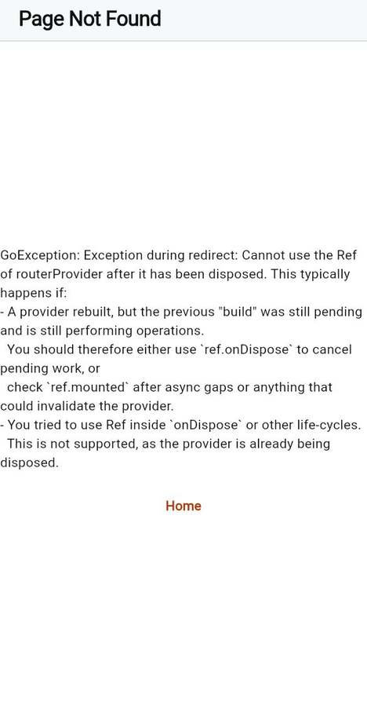

Inside a space, what you may do depends on your role. Roles add up: everyone is a member, and the others come on top.

| Role | What it is for |
|---|---|
| Member | Book places, check in and out, write messages, follow your own money. |
| Administrator | Everything a member does, plus acting for other members and approving requests, as far as the owner has allowed. |
| Owner | Everything: the floor plan, prices, roles and the space's settings. A space always keeps at least one owner. |
| Co-owner | An active co-owner holds the owner's permissions now. A successor, the passive kind, takes over when the owner leaves or promotes them. |
| Kiosk device | A tablet on the wall that shows the plan. Members act on it with their badge. |

**Steps**

1. Open [Settings](https://fdittgen-png.github.io/deskilo/#/settings), named **My account** when you administer nothing.
2. Choose **What you can do here**.
3. Read which role gives you each ability. A member sees **As every member**; an administrator also sees **From the Administrator role**.

**Good to know**

- The owner decides in the role matrix what administrators and other roles may do, so two spaces can differ.
- A space can have other roles besides these, for example one for billing. They appear in the same list.
- There is no invitation that makes someone an owner: only an existing owner grants ownership.

**See also:** [The role matrix](#the-role-matrix) · [Join a workspace](#join-a-workspace)

<!-- anchor: user.start.account -->
### Create an account or sign in

**Audience:** Everyone

You want to get in, whether this is your first time or your hundredth. One account works in every space you join.

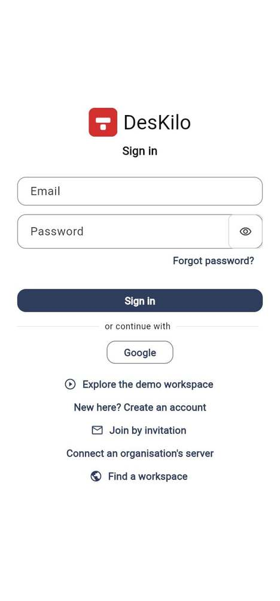

**Steps**

1. Open the app. The sign-in screen asks for your **Email** and **Password**.
2. To sign in, tap **Sign in**.
3. To make a new account, tap **New here? Create an account**, add a **Display name**, and tap **Create account**. The password needs at least 8 characters.
4. If the server offers it, tap **Google** under **or continue with**.
5. Some servers ask you to confirm your address first. The screen **Check your e-mail** says a link was sent: open it on this device. If nothing arrives, look in the spam folder or tap **Send the e-mail again**.

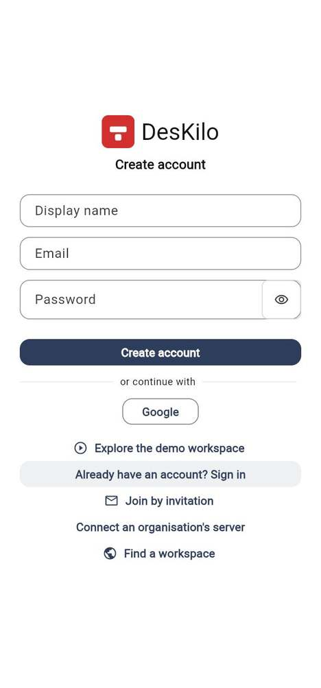

**Good to know**

- The eye button beside the password shows or hides what you type.
- The first time you sign in, you are asked to read and accept the privacy terms before anything else opens.
- A new account with no space lands on [Me](https://fdittgen-png.github.io/deskilo/#/me), where you can find, join or create a space.
- **Join by invitation** on the sign-in screen keeps the errand in mind: you make your account, then paste your invitation.

**See also:** [Reset a forgotten password](#reset-a-forgotten-password) · [Join a workspace](#join-a-workspace) · [Your data, your rights](#your-data-your-rights)

<!-- anchor: user.start.forgot-password -->
### Reset a forgotten password

**Audience:** Everyone

You cannot remember your password. You get a one-time code by e-mail and use it to set a new one. There is no link to click, so it works even where links do not open the app.

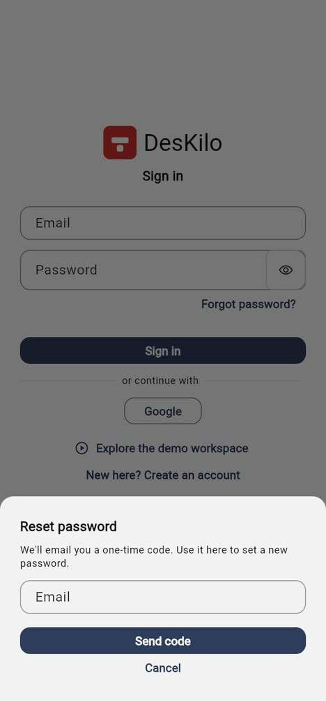

**Steps**

1. On the sign-in screen, tap **Forgot password?**.
2. Type your **Email** and tap **Send code**.
3. Open the e-mail and copy the code.
4. Type it into **Code from the email**, choose a **New password** and tap **Set new password**.

**Good to know**

- The message **Password updated — you are signed in.** confirms that it worked; you do not sign in again.
- A code that is invalid or has expired is refused: ask for a new one.
- If the code is accepted but the password is not saved, tap **Save the new password again**.

**See also:** [Create an account or sign in](#create-an-account-or-sign-in)

<!-- anchor: user.start.demo -->
### Explore the demo workspace

**Audience:** Everyone

You want to look around before you commit to anything. The demo is a made-up space, Atelier du Marché: the people, bookings and bills are invented, nothing you do reaches a real space, and no account is needed.

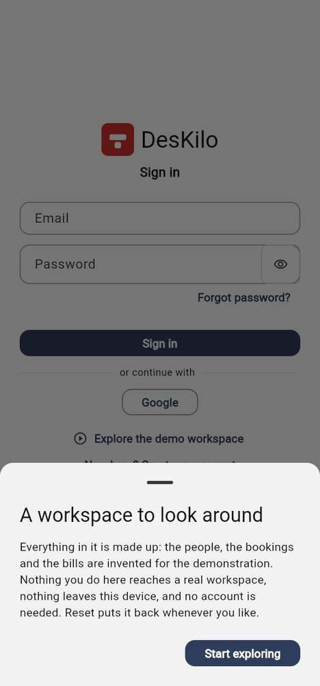

**Steps**

1. On the sign-in screen, tap **Explore the demo workspace**.
2. Read the note, then tap **Start exploring**.
3. Use the strip at the top to choose who you look through: **The owner**, **A member** or **An administrator**. Each tap on the name moves to the next one.
4. Tap **Reset the demo** to put everything back as it started.
5. Tap **Leave the demo** when you are done.

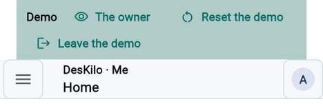

**Good to know**

- The strip is marked **Demo** and stays above every screen, so you cannot mistake it for a real space.
- Seeing the same screen as the owner, an administrator and a member is the quickest way to learn what each role can do.
- The demo stays on this device. Leaving it does not create an account.

**See also:** [What DesKilo is and who does what](#what-deskilo-is-and-who-does-what) · [Create an account or sign in](#create-an-account-or-sign-in)

<!-- anchor: user.start.join -->
### Join a workspace

**Audience:** Everyone

You were given a workspace ID, a QR code or an invitation message, and you want in. You ask to join as a member, and an administrator lets you in.

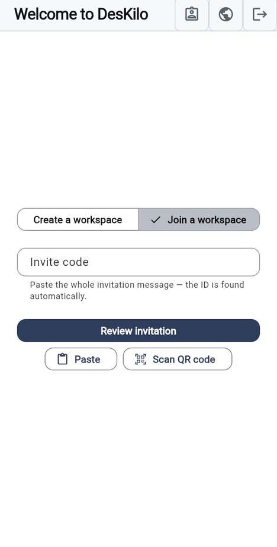

**Steps**

1. Sign in, then tap **Join with a code** on [Me](https://fdittgen-png.github.io/deskilo/#/me). From the sign-in screen, **Join by invitation** takes you there once you have an account.
2. On **Welcome to DesKilo**, keep **Join a workspace** selected.
3. Type the workspace ID into **Invite code**, or paste the whole invitation message: the ID is found automatically. **Paste** reads it from the clipboard, and **Scan QR code** opens the camera on a printed code.
4. Tap **Review invitation**. The card **Check before you join** names the workspace, its server, the role offered and whether an administrator must approve.
5. Tap **Join workspace**.

**Good to know**

- Until an administrator approves, you see **Workspace membership awaiting approval**. **Check again** refreshes it, and your other spaces and your account stay available.
- You join with exactly the role the invitation carries. The workspace ID always joins as a member; a personal admin code joins once, as an administrator.
- An expired or replaced code is explained on screen: ask the sender for a current one.
- In a browser the camera cannot scan: type the ID or paste the message instead.
- If the card names another server, **Use this server** switches this device to it.

**See also:** [The workspace ID](#the-workspace-id) · [Me: your home and your spaces](#me-your-home-and-your-spaces)

<!-- anchor: user.start.create -->
### Create a workspace

**Audience:** Everyone

You run a community and want a space of your own. You become its owner at once.

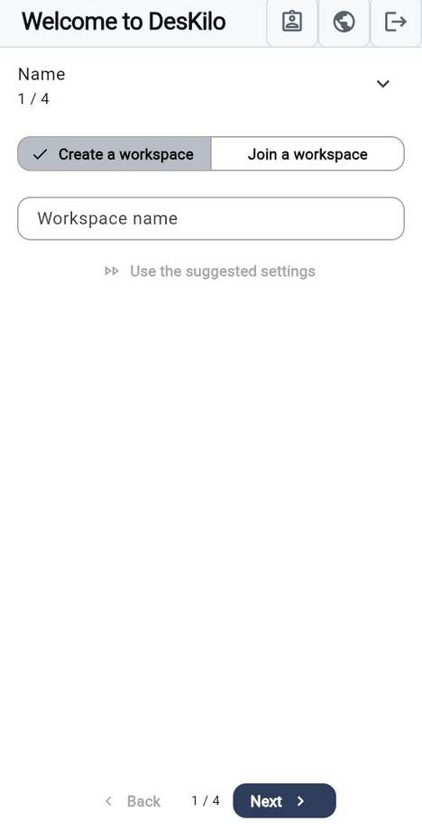

**Steps**

1. Open [Create a workspace](https://fdittgen-png.github.io/deskilo/#/onboarding) from **Create a space** on [Me](https://fdittgen-png.github.io/deskilo/#/me).
2. Type a **Workspace name**, then tap **Next**. **Use the suggested settings** skips straight to the last step.
3. On **Where**, choose the **Country**; the **Currency** and **Time zone** follow it, and you can change them.
4. On the same screen, under **What to create**, pick **One test workspace**, **One real workspace** or **A linked test and real pair**.
5. On **Start from**, choose **Empty space** to draw your own plan, or a ready-made template.
6. On **Confirm**, read what will be created and tap **Create workspace**.

**Good to know**

- The selector starts on **One test workspace**, which is safe for trying things: every screen and document says so, and there is no real billing. A real one issues invoices that are owed.
- The pair gives you two spaces with the same name, one to try things in and one that is real. You own both.
- If the answer is lost on the way, the app keeps your entries and offers **Retry as sent**, so you never create the space twice.
- The new space opens as soon as it exists. Setting it up is covered in the owner chapters.

**See also:** [Prepare a space with the setup questionnaire](#prepare-a-space-with-the-setup-questionnaire) · [The workspace ID](#the-workspace-id)

<!-- anchor: user.start.find -->
### Find a workspace

**Audience:** Everyone

You do not have a code but you would like to find a space near you. Spaces that publish a page appear in a public directory.

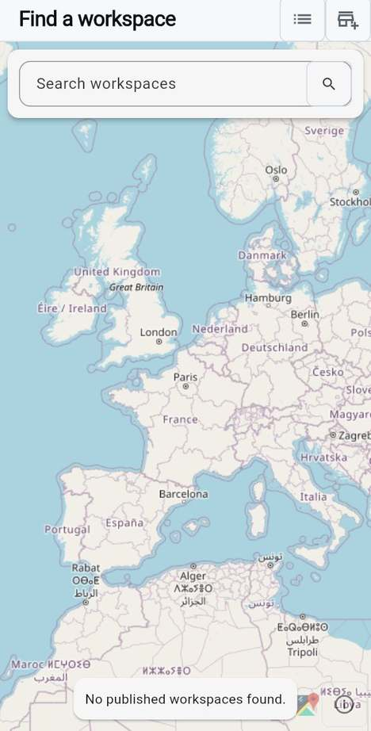

**Steps**

1. Tap **Find a workspace** on the sign-in screen, or open **Discover** on [Me](https://fdittgen-png.github.io/deskilo/#/me).
2. Type a name or a place into **Search workspaces**.
3. Switch between the **Map** and the **List** with the button at the top.
4. Open a result to read its public page. There, **Request a workspace profile** asks to join, and **Enter** opens a space you already belong to.

**Good to know**

- Only spaces that chose to be visible are listed. This demo has none, so the map is empty here.
- You can look without an account; joining needs one.

**See also:** [Join a workspace](#join-a-workspace)

<!-- anchor: user.me.home -->
### Me: your home and your spaces

**Audience:** Everyone

You want one place that shows who you are and every space you belong to. **Me** is yours alone and never takes a space's colours. Under your name, **My spaces** lists each space as one card.

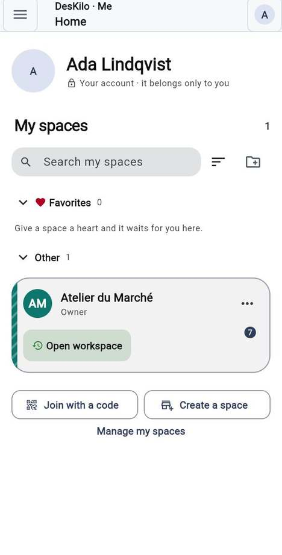

**Steps**

1. Open [Me](https://fdittgen-png.github.io/deskilo/#/me). If you owe money somewhere, a card at the top says **To pay** and opens your finances.
2. Find your space under **My spaces**. A real space has an **Open workspace** button; a space with a test twin also has **Test space**.
3. Tap the button to enter. The screen fills with the space's colour, pattern and logo, then the space opens.
4. Tap **Join with a code** or **Create a space** below the list to add another.

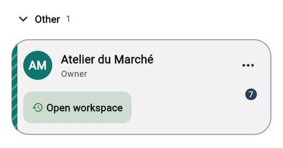

**Good to know**

- The small clock on a button marks the side you used last.
- The small number on a button counts what waits for you there, side by side for the real space and its test twin. Press and hold the button to read the full sentence.
- The pattern on the card's left edge is the space's own identity. If animations are switched off, the space simply opens.
- A space that is still **Waiting for approval** shows that instead of your role.
- A space that lives on another server shows **Open on** that server; opening it switches server and asks you to sign in there.

**See also:** [Keep your spaces in order](#keep-your-spaces-in-order) · [Profiles: one account, several spaces](#profiles-one-account-several-spaces)

<!-- anchor: user.me.organise -->
### Keep your spaces in order

**Audience:** Everyone

You belong to several spaces and want your own order. Hearts, groups, stars and the order are yours and stay on this device.

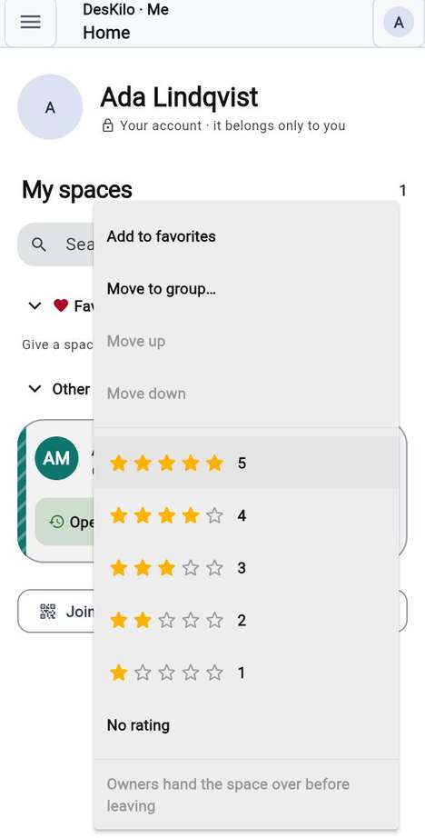

**Steps**

1. On [Me](https://fdittgen-png.github.io/deskilo/#/me), tap the three dots on a space's card.
2. Choose **Add to favorites**: the space moves to **Favorites** and shows a heart.
3. Choose **Move to group…** to file it in another group, or tap the folder button above the list for **New group**.
4. Tap one of the five stars to rate the space, or **No rating** to clear it.
5. Type in **Search my spaces** to filter, and use the sort button to choose **My order**, **Recently used**, **Best rated** or **A–Z**.

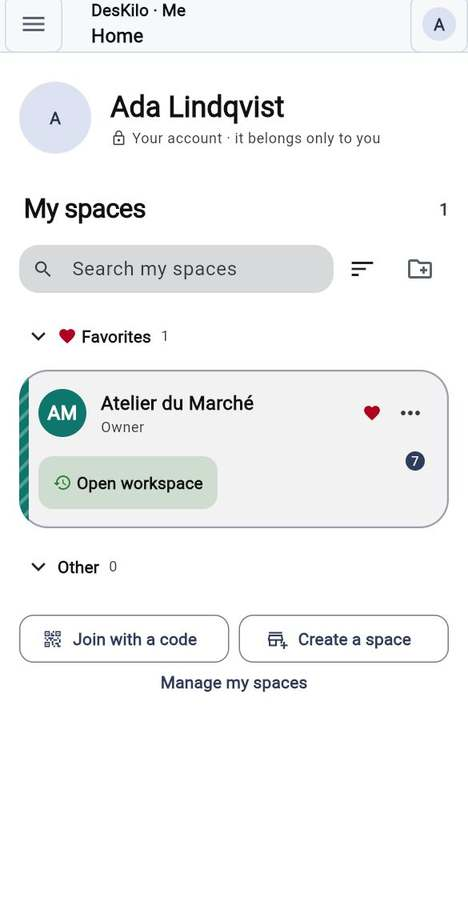

**Good to know**

- In **My order**, hold a card for a second to drag it, or use **Move up** and **Move down**.
- Tap a group's name to fold it. Groups you made can be renamed or deleted from their menu; **Favorites** and **Other** are always there.
- **Leave this space** is in the same menu. You stop being a member; bookings, invoices and messages stay with the space. Owners hand the space over first.
- **Manage my spaces** at the bottom opens the profiles list.

**See also:** [Profiles: one account, several spaces](#profiles-one-account-several-spaces) · [Erase my data](#erase-my-data)

<!-- anchor: user.profile.profiles -->
### Profiles: one account, several spaces

**Audience:** Everyone

One account can belong to many spaces. Each space gives you a profile there: your role and your own data. The Profiles list shows them all and decides which one the app opens with.

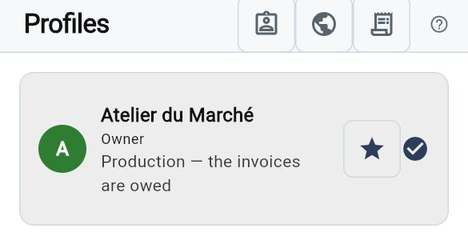

**Steps**

1. Open [Profiles](https://fdittgen-png.github.io/deskilo/#/profiles), or tap **Manage my spaces** on [Me](https://fdittgen-png.github.io/deskilo/#/me).
2. Read each row: the space's name, your role there and the environment it is in.
3. Tap a row to switch to that profile. The check mark shows the **Active profile**. The app opens with it next time, on every device.
4. To make a profile the default without switching to it, tap the star (**Use as default at startup**); tap it again to clear it.
5. Tap **Add a profile** to join or create one more space.

**Good to know**

- A space with a test twin shows one row that opens into two choices, **Development — for trying things out** and **Production — the invoices are owed**. Tap the one you want; the check mark follows.
- Everything you see in the app belongs to the active space.
- Your account, photo and language are not part of a profile: they are in Me and the same everywhere.

**See also:** [Me: your home and your spaces](#me-your-home-and-your-spaces) · [Join a workspace](#join-a-workspace)

<!-- anchor: user.start.navigation -->
### Find your way around

**Audience:** Everyone

You are in a space and want to reach a screen. Everything is in one menu, and a few buttons sit at the top.

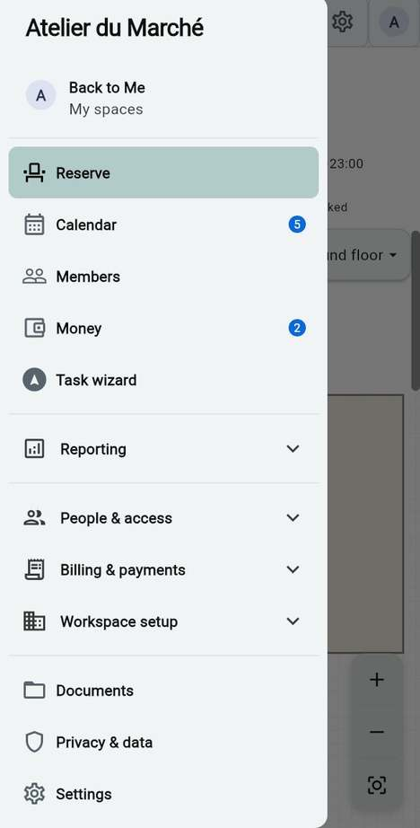

**Steps**

1. Tap the ☰ button at the top left. The menu opens with your space's name, **Back to Me** and the daily destinations: **Reserve**, **Calendar**, **Members**, **Money**.
2. Tap a destination to open it. A blue number beside it counts what waits there.
3. Open **Reporting**, **People & access**, **Billing & payments** or **Workspace setup** to see the administration tools your role allows.
4. At the bottom, **Documents**, **Privacy & data** and **Settings** are always close.
5. Tap the avatar at the top right, or **Back to Me**, to leave the space and return to [Me](https://fdittgen-png.github.io/deskilo/#/me).

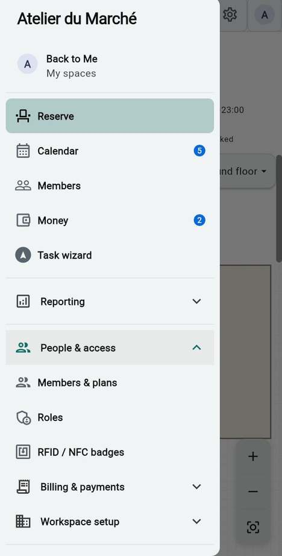

**Good to know**

- Destinations come and go with the features the owner switched on and with your role. A plain member sees none of the administration groups.
- When your space has Events switched on, **Events** at the top right (the tray icon with a count) collects what happened and what awaits your decision; when the Calendar holds the alerts, use its **Alerts** view. **Scan a space code** and **Edit workspace** appear on the Reserve screen when you may use them.
- On a wide window, the menu stays open as a sidebar. A narrow window or enlarged text uses the ☰ menu.
- In the apps for phones and computers, [Navigation style](#navigation-style) in Settings lets you choose the classic bottom bar with the round **Reserve** button. Swipe that bar down for a full-screen view; swipe up, or long-press the **Reserve** button, to bring it back. A browser always uses the menu.

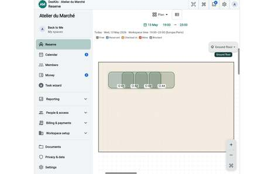

**See also:** [Navigation style](#navigation-style) · [Me: your home and your spaces](#me-your-home-and-your-spaces)

<!-- anchor: user.start.get-started -->
### The Get started card and the tips

**Audience:** Everyone

You open a space and are not sure what to do first. The **Get started** card names one next step for you, and short tips explain each screen.

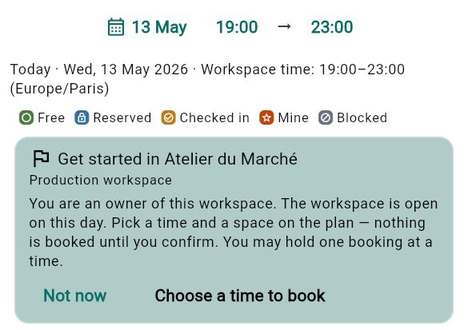

**Steps**

1. Open [Reserve](https://fdittgen-png.github.io/deskilo/#/reserve). The card **Get started in** your space appears at the top of the plan.
2. Follow the action it offers, for example **Choose a time to book**.
3. Tap **Not now** to put it away.
4. To bring it back, open the view menu at the top of the plan, the one that says **Plan**, and choose **Get started**.

**Good to know**

- For an owner or an administrator the card tells what is missing before anyone can book, with **Finish setting up**.
- Tips are small cards on each screen. **Dismiss hint** hides one, and **Next tip** shows another.
- You can show every dismissed tip again with [Restore the hints](#restore-the-hints).

**See also:** [Restore the hints](#restore-the-hints) · [Find your way around](#find-your-way-around)

<!-- anchor: user.start.questionnaire -->
### Prepare a space with the setup questionnaire

**Audience:** Owner

You are about to open a space and have many decisions to make: what a booking looks like, what a month costs, what an invoice must say. The setup questionnaire lets you make them all at once, before you start, on a big screen and with your accountant or your board if you like.

**Steps**

1. Open the questionnaire in a browser: [setup.html](https://fdittgen-png.github.io/deskilo/setup.html). There is nothing to install and no account.
2. Answer the steps in order: *Identity*, *Features*, *Availability*, *Floor plan*, *Subscriptions*, *Legal identity and VAT*, *Services and accessories*, *Payment instructions*, *Roles and validations*, *Members and invitations*. Each step only asks what your earlier answers make possible.
3. Read the *Feature summary* and untick what you do not want: that feature starts switched off in the app and nothing about it is exported.
4. On *Check and export*, fix the blocking items, then tap **Export XML**.
5. In the app, open the workspace settings and choose **Import workspace (XML)** to create the settings, accessories and floor plan.
6. Keep the file. *Load file…* brings your answers back later, and **Reset** starts over.

**Good to know**

- Your answers are saved in your own browser and sent nowhere. You can close the tab and come back.
- The file is plain text: leave tokens and keys empty and type them in the app instead.
- Each question says where the setting lives in the app, so you can finish the rest screen by screen.
- Skipping it costs nothing: every answer is a setting you can make or change later in the app.

**See also:** [Create a workspace](#create-a-workspace) · [Import the space (XML)](#import-the-space-xml)

<!-- anchor: user.reserve.overview -->
## Reserve

Booking a place is the heart of DesKilo: you look at the plan of your space, choose a day and a time, tap a free place and confirm. This chapter follows that path, then covers what happens around it: the rules you meet, checking in and out, changing a booking, and the Calendar where everything dated is kept.

In this chapter:
- [The Reserve hub and the floor plan](#the-reserve-hub-and-the-floor-plan)
- [Find your way around the plan](#find-your-way-around-the-plan)
- [See the places as a list](#see-the-places-as-a-list)
- [Choose the day and the time](#choose-the-day-and-the-time)
- [Day view](#day-view)
- [Week view](#week-view)
- [Month view](#month-view)
- [Book a place](#book-a-place)
- [The booking sheet](#the-booking-sheet)
- [Check in now when you are already there](#check-in-now-when-you-are-already-there)
- [Book a whole desk, room or level](#book-a-whole-desk-room-or-level)
- [Book for someone else](#book-for-someone-else)
- [Repeat a booking](#repeat-a-booking)
- [The rules you meet when you book](#the-rules-you-meet-when-you-book)
- [Closure days and public holidays](#closure-days-and-public-holidays)
- [Check in and check out](#check-in-and-check-out)
- [Scan a space code](#scan-a-space-code)
- [Change or cancel a booking](#change-or-cancel-a-booking)
- [When a booking is awaiting confirmation](#when-a-booking-is-awaiting-confirmation)
- [The Calendar tab](#the-calendar-tab)
- [Agenda, Week and Month in the Calendar](#agenda-week-and-month-in-the-calendar)
- [Decisions waiting for you on the Calendar](#decisions-waiting-for-you-on-the-calendar)
- [Filter the Calendar](#filter-the-calendar)
- [Save a booking to your own calendar](#save-a-booking-to-your-own-calendar)

<!-- anchor: user.reserve.hub -->
### The Reserve hub and the floor plan

**Audience:** Member · Administrator · Owner

You want to see which places are free. The Reserve hub opens on the floor plan of one level of your space, drawn for the day and the time you are looking at.

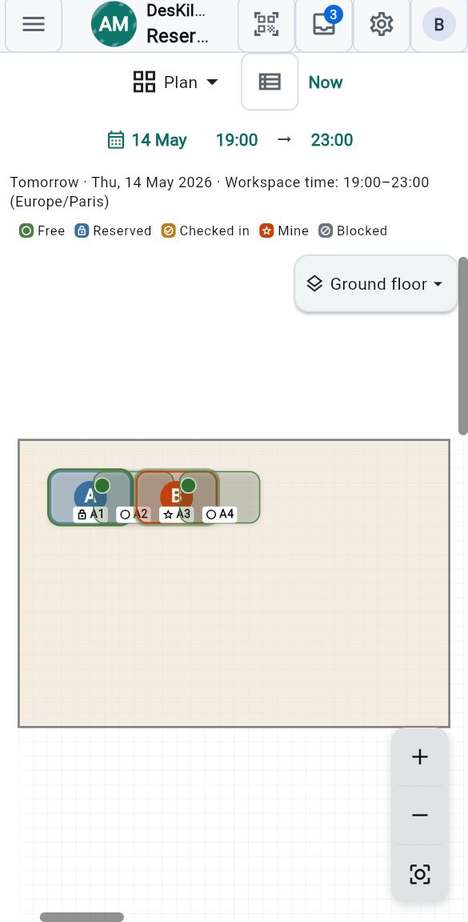

**Steps**

1. Open [Reserve](https://fdittgen-png.github.io/deskilo/#/reserve).
2. Read the plan: every place carries its name and a small symbol, and a colour that says what it is.
3. Tap a place to act on it. A free place opens the booking sheet; your own place offers check-in and cancel; someone else's place tells you who has it and until when.
4. The legend under the date explains the colours. It is the same on the plan and in the Day, Week and Month views.

| State | What it means |
|---|---|
| **Free** | Nobody holds the place in the time you chose. |
| **Reserved** | Someone has booked it. |
| **Checked in** | The person who booked it has arrived. |
| **Mine** | It is your booking. |
| **Blocked** | The place is out of service, for maintenance for example. |
| **Closed day** | The space is closed that day (Day, Week and Month views). |

**Good to know**

- An occupied place shows who is there: an initial, or a photo when the person set one and your space shows photos on the plan. A small green dot means they are using the app right now.
- A whole table, room or level that is booked says so on the plan, with the name of who holds it.
- Some spaces show fewer states: a booked place and a checked-in place then look the same, and blocked reads **Unavailable**.
- When the latest availability could not be loaded, a banner says **Offline** with the time of the last data and a **Retry** button, because a place shown free may have been taken since.

**See also:** [Choose the day and the time](#choose-the-day-and-the-time) · [The booking sheet](#the-booking-sheet)

<!-- anchor: user.reserve.plan-levels -->
### Find your way around the plan

**Audience:** Member · Administrator · Owner

You want to reach the level, the room or the desk you have in mind. The plan can be moved, zoomed and switched from one level to another.

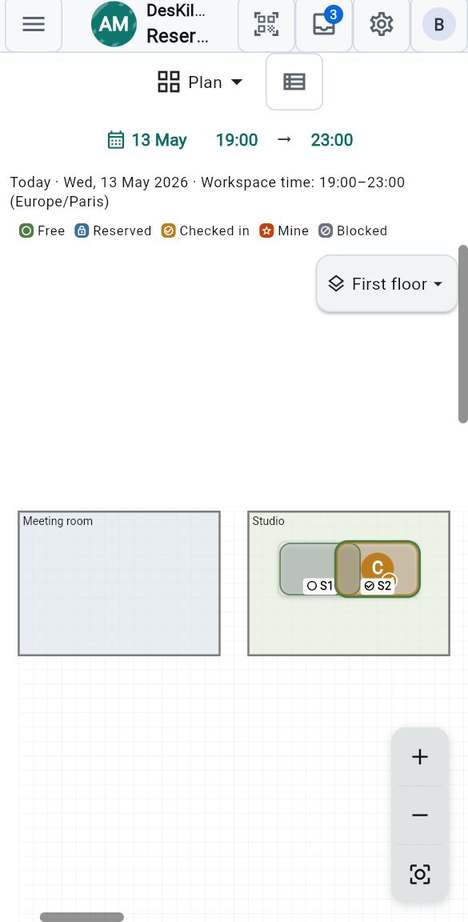

**Steps**

1. Tap the level name at the top right of the plan, for example **First floor**, and choose another level. Your choice is kept for the next time you open the hub.
2. Zoom with two fingers, or with **Zoom in** and **Zoom out**. Drag the scroll bars along the edges to move.
3. Tap **Fit the plan to the screen** to bring the whole level back into view.
4. Read the room names in the corner of each room. Tap a place inside it to book it.

**Good to know**

- The level selector only offers a menu when your space has more than one level.
- A level, a room or a desk that can be booked as a whole shows its own button or double-tap: see [Book a whole desk, room or level](#book-a-whole-desk-room-or-level).

**See also:** [See the places as a list](#see-the-places-as-a-list) · [Day view](#day-view)

<!-- anchor: user.reserve.list -->
### See the places as a list

**Audience:** Member · Administrator · Owner

You prefer rows to a drawing, or the plan is hard to read on a small screen. The list shows the same places, level by level and desk by desk.

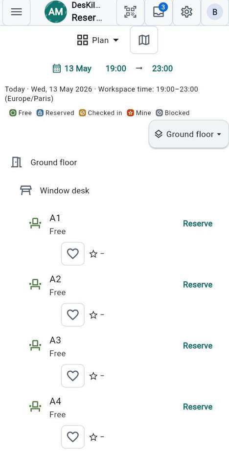

**Steps**

1. In [Reserve](https://fdittgen-png.github.io/deskilo/#/reserve), tap **List view**, the button beside the view menu.
2. Find the place. Each row names it and says whether it is free, reserved or yours.
3. Tap **Reserve** on a free row to open the booking sheet.
4. To go back to the drawing, tap **Plan view**.

**Good to know**

- The list follows the day and the time you chose, exactly like the plan.
- With favourites and ratings switched on, each row also carries a heart (**Add to favourites**) and stars.

**See also:** [Choose the day and the time](#choose-the-day-and-the-time) · [The booking sheet](#the-booking-sheet)

<!-- anchor: user.reserve.when -->
### Choose the day and the time

**Audience:** Member · Administrator · Owner

You want to book for another day, or for a time that is not now. The two rows of controls at the top of the hub say what you look at and when.

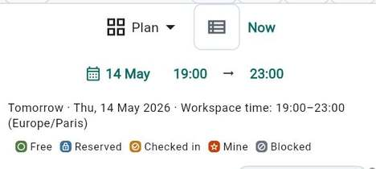

**Steps**

1. Tap the date, for example 14 May, and pick a day in the calendar. You can look up to a year ahead.
2. Choose the time. If your space books half-days, tap **Morning**, **Afternoon** or **Full day**. If it books by the hour or on a free time range, tap the first time to set **From** and the second to set **To**.
3. Read the line under the controls: it names the day, the period and the hours in the workspace's time zone, and in yours when it differs.
4. To come back to today, tap **Now**.

**Good to know**

- Which controls you see follows the space's rules: some spaces book half-days, some whole days only, some any time on a grid.
- On a phone the day-part chips are small icons of a half or a whole day. Hold one to read its name and its hours.
- The plan answers for the time you chose: a place shown free is free for all of it.
- Where bookings are per half-day, the period you start on is your usual one, set in [Default booking period](#default-booking-period).

**See also:** [The Reserve hub and the floor plan](#the-reserve-hub-and-the-floor-plan) · [Book a place](#book-a-place)

<!-- anchor: user.reserve.day-view -->
### Day view

**Audience:** Member · Administrator · Owner

You want to see who is where during the day, not only at one moment. The **Day** view lays out every place as a row along the hours.

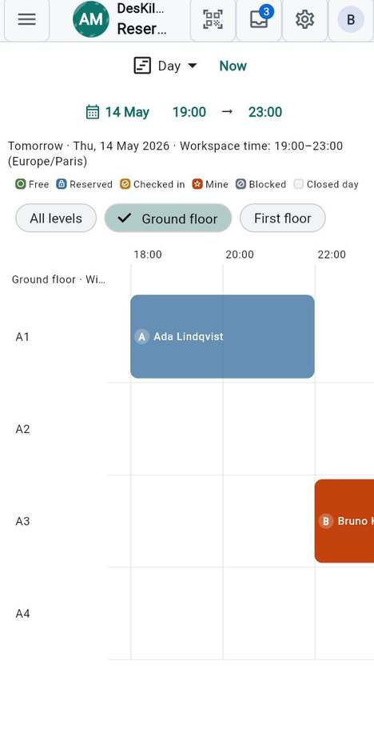

**Steps**

1. In [Reserve](https://fdittgen-png.github.io/deskilo/#/reserve), open the view menu, which reads **Plan** at first, and choose **Day**.
2. Pick the day with the date button. Choose a level with the chips above the rows: **All levels** or one level.
3. Read the bars. Each one is a booking, with the name of who holds it; yours stand out in the colour of **Mine**.
4. Tap a free stretch of a row to book that place for the time you chose. Tap your own booking to open its details; tap someone else's to see who holds it and until when.

**Good to know**

- A closed day is drawn as closed and cannot be booked.
- The menu behind the **View** control also holds **Week** and **Month**.

**See also:** [Week view](#week-view) · [Change or cancel a booking](#change-or-cancel-a-booking)

<!-- anchor: user.reserve.week-view -->
### Week view

**Audience:** Member · Administrator · Owner

You want to find a free morning or afternoon in the coming days. The **Week** view shows places down the side and the days of the week across.

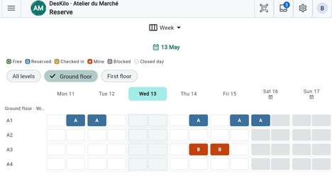

**Steps**

1. Open the view menu and choose **Week**.
2. Find your day. Each day has two cells side by side, the morning and the afternoon. A filled cell shows the initial of whoever holds it.
3. Tap an empty cell to book that half of the day on that place.
4. Tap a day name at the top to jump to that day in the **Day** view.

**Good to know**

- Closed days are greyed out and carry a closure mark.
- Choose **All levels** or one level with the chips above the grid.

**See also:** [Day view](#day-view) · [Month view](#month-view)

<!-- anchor: user.reserve.month-view -->
### Month view

**Audience:** Member · Administrator · Owner

You want to know which days have room. The **Month** view counts the free places for every day.

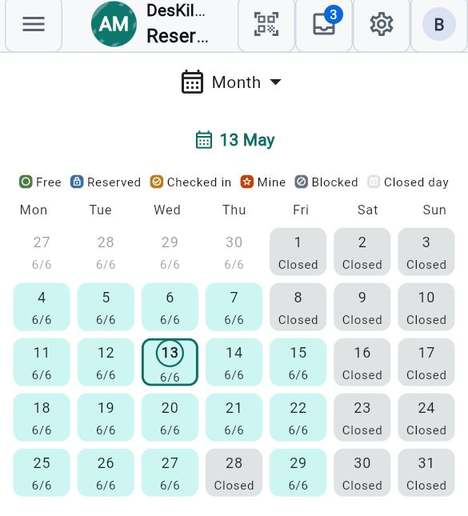

**Steps**

1. Open the view menu and choose **Month**.
2. Read each day: the number of free places out of the total, for example 6/6. Closed days read **Closed**.
3. Tap a day to open it in the **Day** view, where you see who is booked.

**Good to know**

- The count covers all levels of the space.
- Today is ringed.

**See also:** [Closure days and public holidays](#closure-days-and-public-holidays) · [Day view](#day-view)

<!-- anchor: user.reserve.book -->
### Book a place

**Audience:** Member · Administrator · Owner

You want a place for a given day and time. From the plan it takes a few taps: the day, the time, the place, and a confirmation.

**Steps**

1. Open [Reserve](https://fdittgen-png.github.io/deskilo/#/reserve) and choose the day and the time, as described in [Choose the day and the time](#choose-the-day-and-the-time).
2. Choose the level, if your space has several.
3. Tap a free place. The booking sheet opens on it.
4. Check the line that names the place and the period, change what you need, and tap **Reserve**.
5. A message confirms the booking. Tap **Details** in it to open the new booking.

**Good to know**

- Nothing is booked until you tap **Reserve**.
- If the place was taken a second ago, the app tells you instead of double-booking it.
- If the connection drops after you tapped, the screen **Your booking request** lets you check what happened, resume the same request or let it go. A request is never booked twice.
- On a closed day the plan says **Closed on this day** and offers the next open day.

**See also:** [The booking sheet](#the-booking-sheet) · [The rules you meet when you book](#the-rules-you-meet-when-you-book)

<!-- anchor: user.reservations.booking-sheet -->
### The booking sheet

**Audience:** Member · Administrator · Owner

You tapped a free place and the sheet opens. It shows what you are about to book and lets you adjust it before you confirm. The sheet only proposes: the space's rules are checked when you confirm.

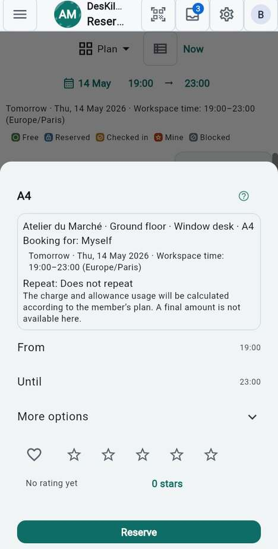

**Steps**

1. Read the summary: the workspace, level, desk and place, who the booking is for, the day, the hours and the repetition.
2. Adjust the period. Under half-days, tap **Morning**, **Afternoon** or **Full day**. On a time grid, set **From** and **Until**; on a minute grid a slider named **Duration** sets the length.
3. Open **More options** to repeat the booking.
4. Optionally add the place to your favourites with the heart, or rate it with the stars.
5. Tap **Reserve**.

**Good to know**

- If the chosen period is not allowed, a line in red under the period says why and **Reserve** stays greyed out.
- If another booking follows on the same place, the sheet says that the seat is reserved from that time and stops your booking there.
- Administrators see **Book for** and, for blocking a place, **Manage resource**.
- When the chosen period includes this moment, a switch **Check in right away** appears, off by default.

**See also:** [Check in now when you are already there](#check-in-now-when-you-are-already-there) · [Repeat a booking](#repeat-a-booking) · [Book for someone else](#book-for-someone-else)

<!-- anchor: user.reserve.walk-up -->
### Check in now when you are already there

**Audience:** Member · Administrator · Owner

You are standing at a free place and want to take it right now. On today's plan the booking sheet offers two actions side by side.

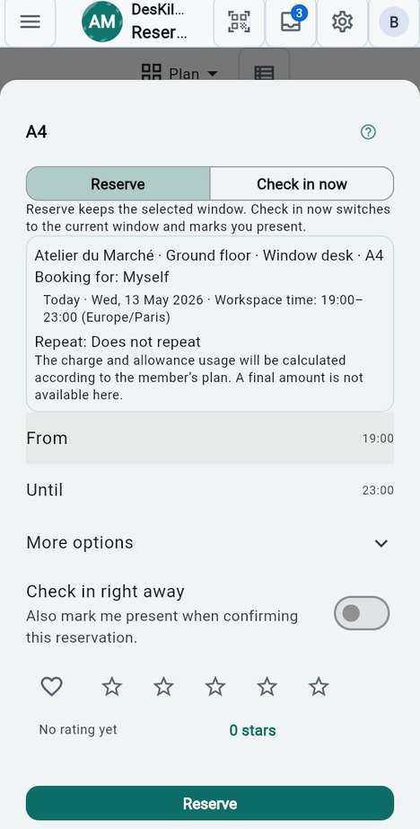

**Steps**

1. Open [Reserve](https://fdittgen-png.github.io/deskilo/#/reserve) on today, with no other time chosen, and tap a free place.
2. At the top of the sheet choose **Reserve** or **Check in now**.
3. **Reserve** keeps the period you chose. **Check in now** switches to the current period and marks you present.
4. Tap **Check in** to confirm.

**Good to know**

- The check-in stops where the next booking on that place begins, and the sheet tells you.
- A walk-up check-in must start today.
- Where bookings are per half-day, the check-in ends with the current half-day, or with the day when your usual period is the full day.

**See also:** [Check in and check out](#check-in-and-check-out) · [The rules you meet when you book](#the-rules-you-meet-when-you-book)

<!-- anchor: user.reserve.whole-space -->
### Book a whole desk, room or level

**Audience:** Member · Administrator · Owner

You need the whole table, the whole room or the whole floor, for a meeting or a day. Spaces that are set up for it can be booked as one.

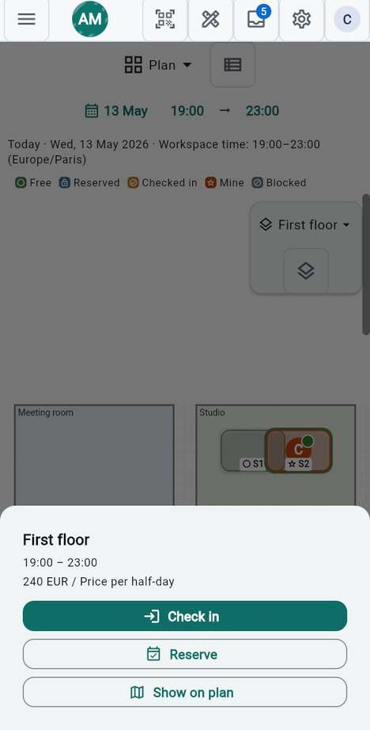

**Steps**

1. On the plan, double-tap the desk, the room or the empty floor. For a level you can also tap **Reserve level**, the button under the level selector.
2. The sheet names the space, the period and the **Price per half-day** when there is one.
3. Tap **Check in** to take it now, or **Reserve** to book it for the period shown.
4. In the booking sheet that opens, choose the period and tap **Reserve**.

**Good to know**

- A member needs the right to book whole spaces; owners and administrators have it. Without it the sheet says **You are not allowed to reserve a whole desk, office or level.**
- A whole space cannot be booked while one of its places is taken in that period, and no place can be booked while its table, room or level is booked as a whole.
- Where the owner asks for approval, a whole-space booking blocks the space at once and waits for the validators; if they reject it, it is cancelled.

**See also:** [When a booking is awaiting confirmation](#when-a-booking-is-awaiting-confirmation) · [Scan a space code](#scan-a-space-code)

<!-- anchor: user.reserve.for-someone -->
### Book for someone else

**Audience:** Administrator · Owner

You want to book a place on a member's behalf. Administrators can pick the member in the booking sheet.

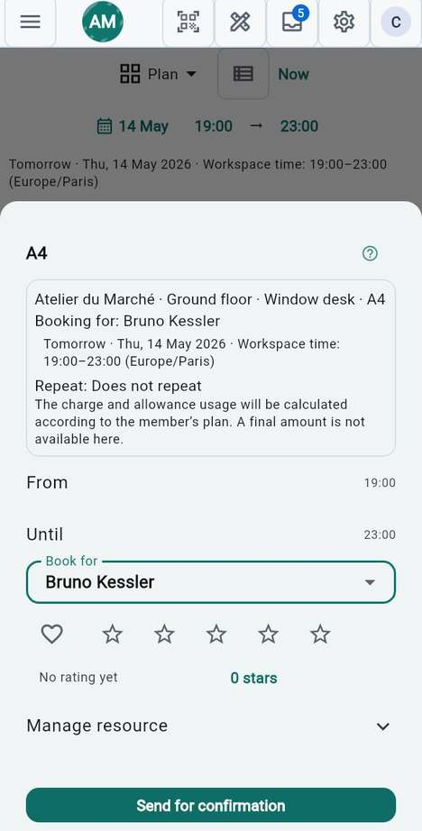

**Steps**

1. Tap a free place in [Reserve](https://fdittgen-png.github.io/deskilo/#/reserve) to open the booking sheet.
2. Open **Book for** and choose the member.
3. The summary now reads **Booking for** that member, and the button changes to **Send for confirmation**.
4. Tap **Send for confirmation**. A message says **Sent to** the member **for confirmation**.

**Good to know**

- The member has to accept before the booking exists. They find the request on their Calendar and in their notifications.
- A booking made for someone else is never checked in and cannot repeat.
- The **Book for** field only appears if the owner lets administrators book for members. For a whole level, the owner decides who may assign it.

**See also:** [When a booking is awaiting confirmation](#when-a-booking-is-awaiting-confirmation) · [Decisions waiting for you on the Calendar](#decisions-waiting-for-you-on-the-calendar)

<!-- anchor: user.reserve.series -->
### Repeat a booking

**Audience:** Member · Administrator · Owner

You sit at the same place every Tuesday, or every weekday for a month. A repeating booking creates all the dates at once.

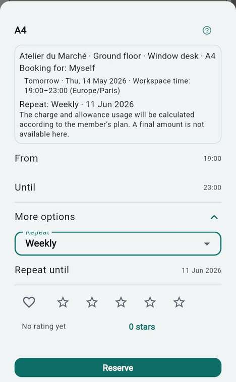

**Steps**

1. Open the booking sheet on a free place and the first day you want.
2. Open **More options**.
3. In **Repeat**, choose **Every day**, **Every weekday** or **Weekly**. The default is **Does not repeat**.
4. Set **Repeat until**, the last date. The sheet proposes four weeks ahead.
5. Tap **Reserve**. A dialog tells you how many bookings were created.

**Good to know**

- Dates that could not be booked are listed in the dialog and skipped. The others stand.
- To cancel a repeating booking, open one of its dates and choose **Cancel this occurrence** or **Cancel this and following**.
- You can also turn a single booking into a repeating one from **Edit times** in its details.
- Repeating is not offered when you book for someone else.

**See also:** [Change or cancel a booking](#change-or-cancel-a-booking) · [The booking sheet](#the-booking-sheet)

<!-- anchor: user.reserve.policies -->
### The rules you meet when you book

**Audience:** Member · Administrator · Owner

You tried to book and the app said no, or you wonder what is allowed. Your owner sets the rules of the space; this is what you see of them.

| Rule | What you see |
|---|---|
| Opening hours and open days | The plan and the views follow the working day, 08:00 to 17:00 by default, with the half-day split at 12:00. A closed day says **Closed on this day**. |
| Outside the opening hours | Depends on the space. Off: **Bookings outside the opening hours are not allowed.** Spontaneous only: you can check in on the spot but not book ahead. Free: allowed, never counted or charged. Charged: allowed and counted as usage, except on a day you already hold a regular booking. |
| Past bookings | A booking on a day that has already ended is refused unless the owner allows past bookings: **This booking lies entirely in the past.** Earlier on the same day it is recorded as a past visit. |
| Limits | A booking has a longest horizon (**Too far ahead**, 90 days by default), a shortest and a longest length (**Too short**, **Too long**) and ends on the day it starts. |
| One place at a time | By default you may hold one booking in a given period: **You already have a booking in that period**. An administrator may allow you more. |
| Reservation limit | **Reservation limit reached** when you hold the most open bookings you are allowed. |
| Days in your plan | When your plan's days run out, the owner's setting for you applies: bookings may stop, you may be asked to buy a package, or the extra days are charged. |

**Steps**

1. When a period is refused, read the red line under it in the booking sheet.
2. Change the day, the time or the place, or ask an administrator.
3. If your days are used up, open [Money](https://fdittgen-png.github.io/deskilo/#/money) to see your plan and, where offered, tap **Request extra half-days**.

**Good to know**

- The same rules apply on the plan, in the Reserve hub, on a scanned code and at the wall kiosk.
- The app checks a period before it offers it, so most refusals appear in the sheet and not after you tapped.

**See also:** [Booking policies](#booking-policies) · [Simultaneous reservations](#simultaneous-reservations) · [Reservation limit](#reservation-limit)

<!-- anchor: user.reserve.closed-days -->
### Closure days and public holidays

**Audience:** Member · Administrator · Owner

You want to know why a day cannot be booked. Your space is closed on some weekdays and on the closure days the owner has added, such as public holidays.

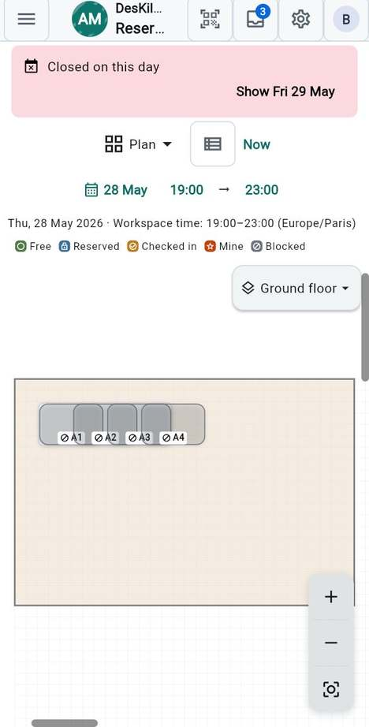

**Steps**

1. Choose the day in [Reserve](https://fdittgen-png.github.io/deskilo/#/reserve). A closed day shows a banner, **Closed on this day**.
2. Tap the shortcut in the banner, which reads "Show" and the next open day, to go there.
3. In **Month**, closed days read **Closed**; in **Week** they are greyed with a mark; in **Day** they are marked as closed, under the legend entry **Closed day**.
4. In the Calendar, closed days are struck through, and the day's list states **Closed** with the reason when the owner gave one.

**Good to know**

- On a closed day the places carry the blocked symbol and cannot be booked or checked in to.
- Public holidays appear exactly like any other closure day.

**See also:** [Month view](#month-view) · [Closure days](#closure-days) · [Open weekdays](#open-weekdays)

<!-- anchor: user.reserve.check-in -->
### Check in and check out

**Audience:** Member · Administrator · Owner

You arrive at your place, and later you leave. Checking in says you are there; checking out frees what you no longer need.

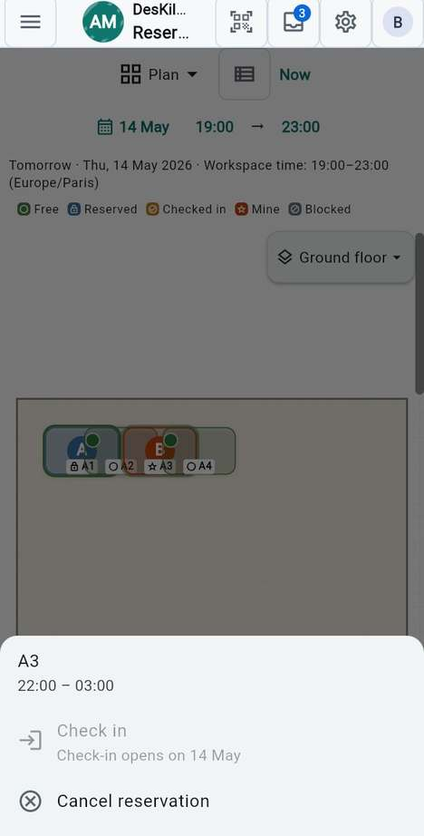

**Steps**

1. Open [Reserve](https://fdittgen-png.github.io/deskilo/#/reserve), find the day of your booking and tap your own place, the one marked **Mine**.
2. Tap **Check in**. If it is greyed out, it tells you when it opens, for example "Check-in opens on 14 May".
3. When you leave, tap your place again and tap **Check out**. The rest of the booking is released at once for others.
4. The booking then reads **Completed: checked out at** the time.

**Good to know**

- Check-in opens 15 minutes before the start, or one grid step before when the grid is coarser. Where bookings are per half-day, per day or per real hour, it opens for the whole day of the booking.
- It closes when the booking ends: **This reservation is over — check-in is no longer possible.**
- If you are still checked in somewhere else, check out there first.
- With auto check-in and check-out on, a booking nobody checked in or out completes itself once its time has passed. Without it, a booking you did not check in reads **This period is over without a check-in.**
- At a wall kiosk you check in with your badge; see [Your badge](#your-badge) and [NFC badge check-in](#nfc-badge-check-in).

**See also:** [Scan a space code](#scan-a-space-code) · [Change or cancel a booking](#change-or-cancel-a-booking)

<!-- anchor: user.reserve.scan -->
### Scan a space code

**Audience:** Member · Administrator · Owner

You stand in front of a desk, a room or a seat that carries a QR card, or a chair with an NFC tag. Scanning shows what you may do there, without searching the plan.

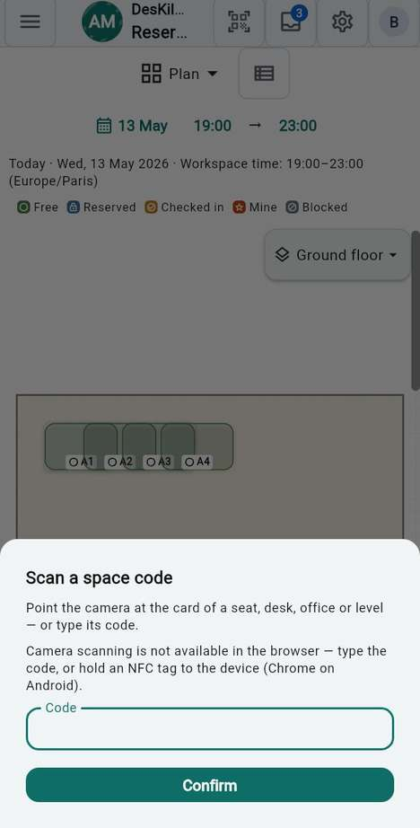

**Steps**

1. In [Reserve](https://fdittgen-png.github.io/deskilo/#/reserve), tap **Scan a space code**, the scanner icon at the top of the screen.
2. Point the camera at the card, or type the printed number in **Code** and tap **Confirm**. Hold your phone to a chair's NFC tag where the device supports it.
3. For a seat, choose **Check in**, **Reserve** or **Check out**, the same actions as at the kiosk, without the badge step.
4. For a table, an office or a level, the sheet shows its state, its period and its **Price per half-day**; tap **Check in**, **Reserve** or **Show on plan**.

**Good to know**

- If someone else holds the space, the sheet says who and offers to message that person.
- A code that is not from this workspace says **Not a space code of this workspace.** A removed space says **This code does not match any space here anymore.**
- In a browser the camera is not available: type the code instead. An NFC tag only identifies seats.
- The scanner icon only appears when your space uses QR codes.

**See also:** [Book a whole desk, room or level](#book-a-whole-desk-room-or-level) · [Check in and check out](#check-in-and-check-out)

<!-- anchor: user.reserve.change -->
### Change or cancel a booking

**Audience:** Member · Administrator · Owner

Your plans changed. You can move a booking, shorten it, extend it or cancel it, as far as it has not been used.

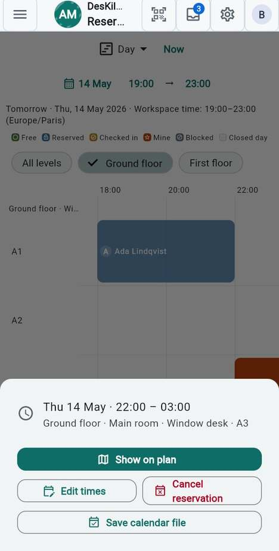

**Steps**

1. Open the booking: tap it in the **Day** or **Week** view, in the Calendar, or tap **Details** in the message that follows a booking.
2. For a booking that has not started, tap **Edit times** to choose another period, or **Cancel reservation** to remove it.
3. For a repeating booking, choose **Cancel this occurrence** or **Cancel this and following**.
4. For a booking you are checked in to, **Stay longer** and **End earlier** appear when the space's rules allow a later or earlier end. The start does not move.
5. For a booking that has started, been checked in or been completed, and where your space allows deletion requests, tap **Request deletion**, give a reason if you wish, and tap **Send request**.

**Good to know**

- **Request deletion** does not delete anything: an owner or administrator decides whether the check-in was only forgotten, in which case the booking stays, or whether the booking was never used, in which case it is removed.
- An administrator can remove someone else's booking with **Remove reservation (overrule)**; the member and the administrators are told.
- **Show on plan** jumps to the place on the plan.

**See also:** [Check in and check out](#check-in-and-check-out) · [Save a booking to your own calendar](#save-a-booking-to-your-own-calendar) · [Repeat a booking](#repeat-a-booking)

<!-- anchor: user.reserve.awaiting -->
### When a booking is awaiting confirmation

**Audience:** Member · Administrator · Owner

A booking or request reads **awaiting confirmation**. It does not mean something went wrong: someone still has to say yes.

**Steps**

1. Look at what is waiting: the Calendar lists it with the words **awaiting confirmation**, and a decision addressed to you sits at the top.
2. If it is for you to decide, tap **Accept** or the cross on the Calendar.
3. If you are waiting for someone else, nothing is needed from you; the answer arrives as a notification and on the Calendar.

What waits for a confirmation:

- A booking an administrator made for you: you confirm it.
- A whole-space booking, when the owner asks validators to approve it. The space stays blocked while it waits, and a rejection cancels the booking.
- A request to delete a booking that has already started, been checked in or been completed.

**Good to know**

- Who may validate and how many must agree is the owner's rule; see [Validation rules](#validation-rules-domain-by-domain).
- A request shows its progress, for example 1/2 validations, and later its outcome: validated, refused, rejected or expired.

**See also:** [Book for someone else](#book-for-someone-else) · [Decisions waiting for you on the Calendar](#decisions-waiting-for-you-on-the-calendar)

<!-- anchor: user.reserve.calendar -->
### The Calendar tab

**Audience:** Member · Administrator · Owner

You want everything dated in one place: your bookings, check-ins, alerts, messages, payments due. The Calendar tab lists it by day and every row opens its source.

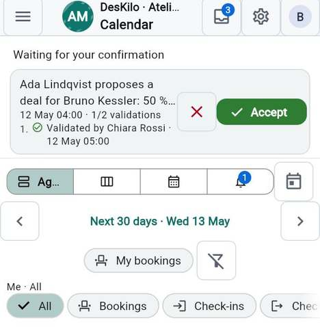

**Steps**

1. Open [Calendar](https://fdittgen-png.github.io/deskilo/#/calendar). It opens on the **Agenda**: the next 30 days, grouped under **Today**, **Tomorrow** and the day names.
2. Use the arrows to step 30 days at a time, or tap the date for a day picker. The button at the top right brings you back to **Today**.
3. Tap a row to open it: a booking opens its details, a message its conversation, an invoice its sheet.
4. Narrow the list with the chips below, as described in [Filter the Calendar](#filter-the-calendar).

**Good to know**

- Bookings appear for everyone in the space, because the plan shows occupancy to everyone. Messages and money stay private to you and to the people the space's rules allow.
- A member with the finance or member permission can switch the list to another member with the **Me** chip. What the server does not allow shows as locked, not as an empty day.
- If your space keeps the simpler calendar, you pick one day or a range of days instead of the three views.

**See also:** [Agenda, Week and Month in the Calendar](#agenda-week-and-month-in-the-calendar) · [Save a booking to your own calendar](#save-a-booking-to-your-own-calendar)

<!-- anchor: user.reserve.calendar-views -->
### Agenda, Week and Month in the Calendar

**Audience:** Member · Administrator · Owner

You want to see a week or a month at a glance. The Calendar offers three ways to look.

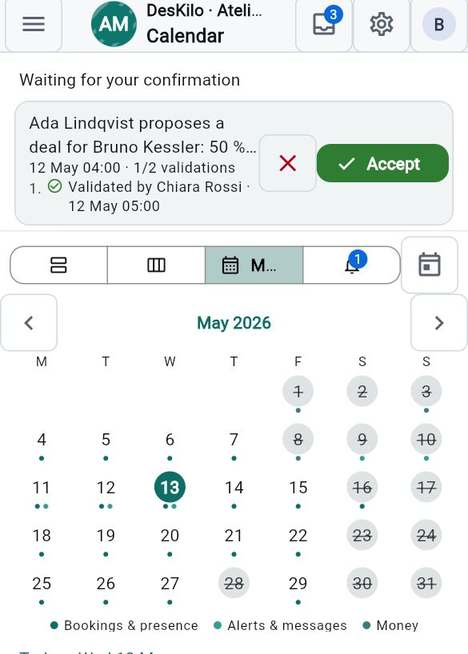

**Steps**

1. Choose **Agenda**, **Week** or **Month** in the bar at the top. The fourth button, **Alerts**, shows your alerts when your space offers them.
2. In **Week**, tap a day among the seven to read its list below.
3. In **Month**, tap a day in the grid. Under each day up to three dots show what it holds: bookings and presence, alerts and messages, money. Today is ringed.
4. Closed days are greyed and struck through.

**Good to know**

- In **Month** the list below shows only the day you selected; in **Week** it lists the whole week.
- The arrows step by a week or a month, according to the view.
- The Calendar also shows the date a payment is due and each scheduled expense that falls due.

**See also:** [The Calendar tab](#the-calendar-tab) · [Closure days and public holidays](#closure-days-and-public-holidays)

<!-- anchor: user.reserve.calendar-decisions -->
### Decisions waiting for you on the Calendar

**Audience:** Member · Administrator · Owner

You were asked to confirm something. When something needs your answer, it is pinned at the top of the Calendar, under **Waiting for your confirmation**.

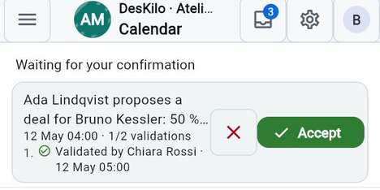

**Steps**

1. Open [Calendar](https://fdittgen-png.github.io/deskilo/#/calendar). Each waiting decision is a card with a short text and the date it was sent.
2. Read the card. It may show how many validations it has, for example 1/2 validations.
3. Tap **Accept** to agree, or the cross to refuse.
4. Open the **Alerts** view to see the whole list with its history.

**Good to know**

- The **Alerts** button in the bar shows how many decisions wait for you.
- Once you answered, the decision leaves the top and appears in the list with its outcome.

**See also:** [When a booking is awaiting confirmation](#when-a-booking-is-awaiting-confirmation) · [Validation rules](#validation-rules-domain-by-domain)

<!-- anchor: user.reserve.calendar-filters -->
### Filter the Calendar

**Audience:** Member · Administrator · Owner

The list is long and you only look for bookings. The chips under the bar narrow it.

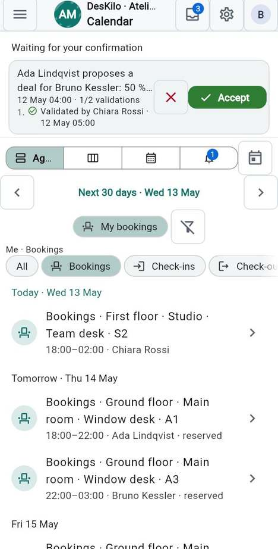

**Steps**

1. Tap **My bookings** to keep only your own bookings. Tap it again to see everything.
2. Or choose chips such as **Bookings**, **Check-ins** and **Check-outs**; **All** shows every kind.
3. To undo your choices, tap **Reset filters**, the funnel button.
4. A line above the chips repeats what you see, for example Me · Bookings.

**Good to know**

- Several chips can be on at once.
- Which chips are offered depends on what your space has switched on, for example validations.

**See also:** [The Calendar tab](#the-calendar-tab) · [Agenda, Week and Month in the Calendar](#agenda-week-and-month-in-the-calendar)

<!-- anchor: user.reserve.calendar-file -->
### Save a booking to your own calendar

**Audience:** Member · Administrator · Owner

You want a booking in your phone's or your computer's calendar. The app writes a standard calendar file that Google, Outlook, Apple and others import.

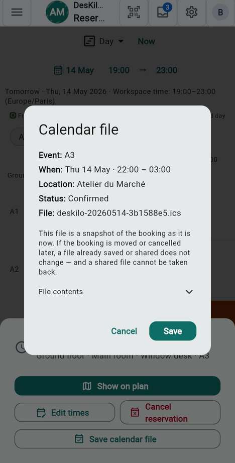

**Steps**

1. Open one of your own bookings, in the **Day** view, the **Week** view or the Calendar.
2. Tap **Save calendar file**.
3. Read the preview: the **Event**, **When**, **Location**, **Status** and the **File** name. Open **File contents** to read the file itself.
4. Tap **Save**. The app saves the file, usually in your downloads folder, and tells you where; open it with your calendar.

**Good to know**

- The file carries the time, the place, the workspace name and whether the booking is confirmed or cancelled. No amount, no name, no e-mail address.
- It is a snapshot: if the booking changes later, a file already saved does not change.
- If the booking changed between the preview and **Save**, nothing is written and the preview refreshes.
- Your owner can switch this feature off.

**See also:** [Change or cancel a booking](#change-or-cancel-a-booking) · [The Calendar tab](#the-calendar-tab)

<!-- anchor: user.collaborate.overview -->
## Collaborate: members, requests, messages and the wider network

In this chapter:
- [The Members directory](#the-members-directory) and [a member's page](#a-members-page)
- [Writing to a member](#writing-to-a-member)
- [Events & confirmations](#events--confirmations), [accepting or declining](#accept-or-decline-a-request) and [What needs you](#what-needs-you)
- [Validation rules, domain by domain](#validation-rules-domain-by-domain) (administrators and owners)
- [Messages](#messages), [new conversations and groups](#start-a-conversation-or-a-group), [message requests](#message-requests) and [blocking](#block-someone)
- [Notifications](#notifications)
- [Discover](#discover), [your public profile](#your-public-profile) and [your visits as a guest](#your-visits-as-a-guest)

<!-- anchor: user.collaborate.directory -->
### The Members directory

**Audience:** Member · Administrator · Owner

You want to see who is in your workspace, who is here today and who is about to be.

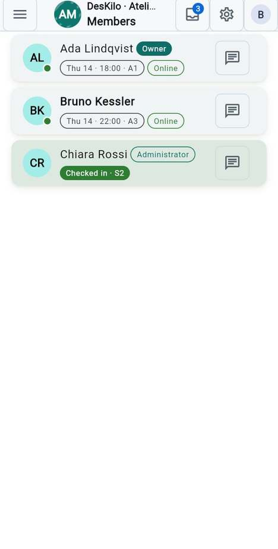

**Steps**

1. Open [Members](https://fdittgen-png.github.io/deskilo/#/directory) from the menu (or from the bottom bar if you chose the classic navigation style).
2. Read each card: photo or initials, name, role badge (**Owner** or **Administrator**; plain members carry none), the person's status line, and two small chips.
3. Read the chips. The first one is the booking: **Checked in** with the place, **Reserved now**, or the next booking (day, time, place). The second says **Online**, or when the person was last seen.
4. Tap a card to open [the member's page](#a-members-page).
5. Pull the list down to refresh it.

**Good to know**

- Only active members are listed, in alphabetical order.
- Administrators and owners also see each person's e-mail address under the name. Members do not: between members, contact stays opt-in.
- If your owner set up a WhatsApp group, a **Open WhatsApp group** line sits above the list.

**See also:** [A member's page](#a-members-page) · [Writing to a member](#writing-to-a-member)

<!-- anchor: user.collaborate.member-page -->
### A member's page

**Audience:** Member · Administrator · Owner

You want to know whether a colleague is in, when they come next, and how to reach them.

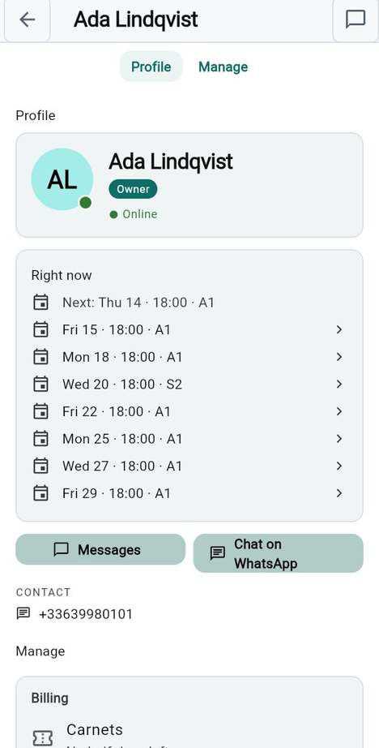

**Steps**

1. Tap a card in [Members](https://fdittgen-png.github.io/deskilo/#/directory).
2. Read the top card: photo, role, presence and the person's own status line. Further down you can see how long they have been a member.
3. Read **Right now**: whether the person is checked in, holds a booking this minute, or when their next booking is. Tap a booking to open it.
4. Use the buttons: **Messages**, **Chat on WhatsApp** and, for administrators, **E-mail**.

**Good to know**

- **Contact** shows a WhatsApp number only when the person chose to share it.
- Where you may see them, money figures (open invoices, payments, the current month) sit on the same page. You always see your own; someone else's only with the right to view finances.
- Administrators and owners also get a **Manage** area with **Membership**, **Booking rules**, **Billing** and **Badges & access**, each row showing its current value.

**See also:** [Writing to a member](#writing-to-a-member) · [The member's actions](#the-members-actions)

<!-- anchor: user.collaborate.contact -->
### Writing to a member

**Audience:** Member · Administrator · Owner

You want to ask a colleague something without leaving the workspace.

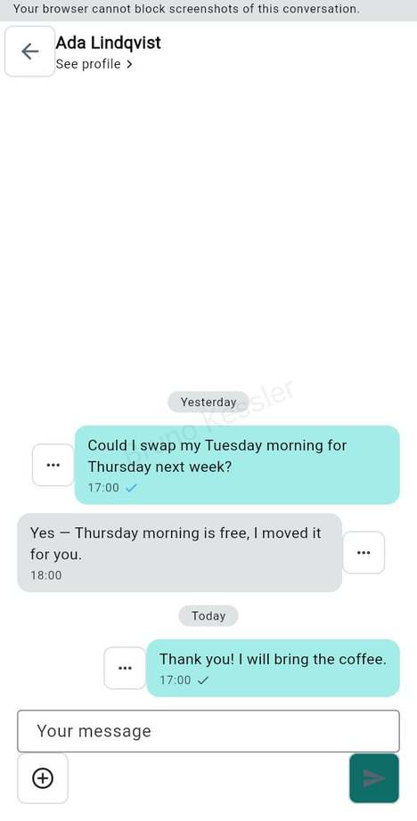

**Steps**

1. Open [Members](https://fdittgen-png.github.io/deskilo/#/directory), tap a card to open the member's page, then tap **Messages**.
2. Type in the **Your message** field.
3. Tap **Send**.

**Good to know**

- Messages read oldest to newest, under day separators. A tick under your message means it was delivered; a blue double tick means it was read.
- Tap the **…** beside a bubble for the message actions (react with an emoji, star, copy, edit within 15 minutes, forward, delete). The paperclip button attaches a reservation or a space; the other person sees a link that opens it.
- This needs the **Member notifications** feature of your workspace.

**See also:** [Messages](#messages)

<!-- anchor: user.collaborate.events -->
### Events & confirmations

**Audience:** Member · Administrator · Owner

You want to see what happened in the workspace, and what is waiting for an answer.

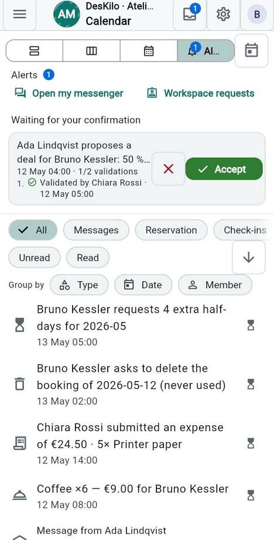

**Steps**

1. Tap **Events** in the top bar (the tray icon with a number), or open [Events](https://fdittgen-png.github.io/deskilo/#/events) from the menu. The page opens on **Alerts**.
2. Read **Waiting for your confirmation** at the top: requests that need you.
3. Read the feed below. Each row says what happened; an hourglass means pending, a green check means confirmed. Money rows show who validated them and when.
4. Narrow the feed with the chips: **All**, **Messages**, **Reservation**, **Check-ins**, **Money**, **Members**, then **Unread** or **Read**.
5. Tap **Type**, **Date** or **Member** next to **Group by** to fold the feed into groups; tap the group symbol to go back to the flat list.

**Good to know**

- An event is created whenever something is booked, changed or cancelled, a payment or an expense is recorded, extra half-days or a deletion are requested, a role changes or someone joins.
- Members see their own events; administrators and owners see everyone's.
- Your filter is remembered. The number on the Events button counts new updates and decisions waiting for you.
- **Open my messenger** at the top takes you to your [conversations](#messages).

**See also:** [Accept or decline a request](#accept-or-decline-a-request) · [Validation rules](#validation-rules-domain-by-domain)

<!-- anchor: user.collaborate.accept -->
### Accept or decline a request

**Audience:** Member · Administrator · Owner

Somebody asked you to confirm something, and you want to answer.

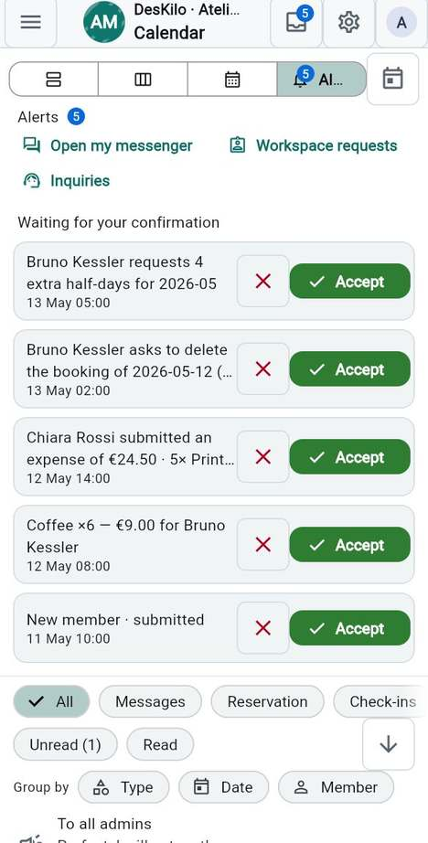

**Steps**

1. Open [Events](https://fdittgen-png.github.io/deskilo/#/events).
2. Find the request under **Waiting for your confirmation**.
3. Tap **Accept**, or the red cross to **Decline**.

**Good to know**

- When an administrator does something for you (books a place, records your payment), it stays pending until you confirm. What you do for yourself never needs your own confirmation.
- Nobody confirms their own request: it waits for another person, or for the rule's exception ([validation rules](#validation-rules-domain-by-domain)).
- After seven days without an answer, an act that creates or changes something (an administrator booking for you, say) is confirmed automatically; a deletion or a charge expires instead.
- A row can show progress such as "1/2 validations" when the rule asks for several.

**See also:** [Events & confirmations](#events--confirmations) · [Required validations](#required-validations)

<!-- anchor: user.collaborate.attention -->
### What needs you

**Audience:** Administrator · Owner

You want one place that answers: does anything need me today?

**Steps**

1. Open [What needs you](https://fdittgen-png.github.io/deskilo/#/attention).
2. Read the lines in order: each one is a decision (for example a request to confirm or a person waiting to be admitted), the most costly delays first.
3. Tap a line to deal with it.

**Good to know**

- This screen exists only when your workspace has switched on the **What needs you** feature; without it the address leads back to the start page.
- Several identical decisions are shown as one line. When nothing is waiting, the screen says **Nothing needs you**.
- It also lists configuration that is not done: "Set up: …" for each required area of the setup list that is not ready (only for someone who configures the space), and "… switched-on features wait for “…”" when a switched-off feature holds others back. A tap opens the screen where it is set up, or **Features**.

**See also:** [Events & confirmations](#events--confirmations)

<!-- anchor: user.validation.overview -->
### Validation rules, domain by domain

**Audience:** Owner

You decide, for each kind of act, whether a person must confirm it first, and who.

**Steps**

1. Open [Validation rules](https://fdittgen-png.github.io/deskilo/#/validation) (it is also in Settings).
2. Read the three groups: **Money**, **Bookings** and **People and roles**. Each states what stays unchanged until the act is accepted.
3. Read a card from left to right: someone asks, the people who may validate, it takes effect. A card says **Inherits default** or **Customized**.
4. Tap a card to edit its rule. Tap **Default policy** to change what every other card inherits.

**Good to know**

- A rule covers acts such as payments, expenses, services, extra half-days, booking deletions, reservations, role changes, new members, invoices, refunds and subscription changes.
- Every decision is an event: who decided, when, and on what. Nothing is validated silently.
- The banner on top applies to every rule: **Nobody validates their own**.
- You need the permission to configure validation policies; owners always have it.

**See also:** [Required validations](#required-validations) · [The role matrix](#the-role-matrix)

<!-- anchor: user.validation.required-count -->
### Required validations

**Audience:** Owner

You choose how many people must confirm before the act goes through.

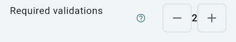

**Steps**

1. Tap a card in [Validation rules](https://fdittgen-png.github.io/deskilo/#/validation).
2. Tap the plus or minus beside **Required validations**.
3. Tap **Save**.

**Good to know**

- One is the usual case; two is common for money.
- If you ask for more validations than there are people who may give them, the sheet warns **Not enough eligible validators** and does not save: a rule nobody can satisfy would block the act forever.

**See also:** [Who may validate](#who-may-validate)

<!-- anchor: user.validation.who-may -->
### Who may validate

**Audience:** Owner

You choose which people are allowed to give the confirmation.

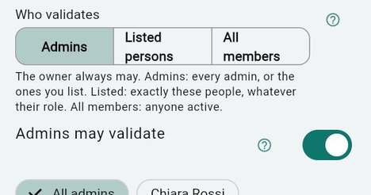

**Steps**

1. Tap a card in [Validation rules](https://fdittgen-png.github.io/deskilo/#/validation).
2. Under **Who validates**, pick **Admins**, **Listed persons** or **All members**.
3. For **Admins**, keep **Admins may validate** on and choose **All admins** or tap the names of specific administrators. Switch it off and only owners validate.
4. For **Listed persons**, pick exactly the people you want.
5. Tap **Save**.

**Good to know**

- The owner may always validate.
- A named list is a deliberate choice: someone who later becomes an administrator is not added to it.
- The choice of scope appears when your workspace has the validation scopes feature on; otherwise a rule works with administrators.

**See also:** [An owner is required](#an-owner-is-required)

<!-- anchor: user.validation.owner-required -->
### An owner is required

**Audience:** Owner

For some acts an administrator's approval alone is not enough.

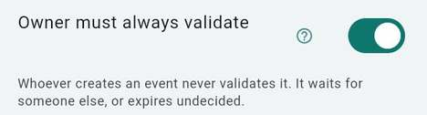

**Steps**

1. Tap a card in [Validation rules](https://fdittgen-png.github.io/deskilo/#/validation).
2. Switch on **Owner must always validate**.
3. Tap **Save**.

**Good to know**

- At least one of the confirmations then comes from an owner, whatever the required number says. The card shows "and the owner, always".

**See also:** [Required validations](#required-validations) · [An owner may confirm their own request](#an-owner-may-confirm-their-own-request)

<!-- anchor: user.validation.owner-self -->
### An owner may confirm their own request

**Audience:** Owner

You run a space on your own and need to be able to settle your own requests.

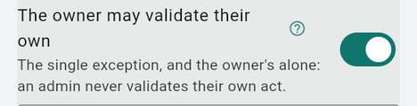

**Steps**

1. Tap a card in [Validation rules](https://fdittgen-png.github.io/deskilo/#/validation).
2. Switch on **The owner may validate their own**.
3. Tap **Save**.

**Good to know**

- Off, an owner's own request waits for someone else. On, the owner settles it.
- This is the owner's exception alone: an administrator never validates their own act.
- The switch appears when your workspace has the validation chain feature on.

**See also:** [Auto-validate an owner's own request](#auto-validate-an-owners-own-request)

<!-- anchor: user.validation.sequential -->
### One after another

**Audience:** Owner

You want the confirmations collected in order, so the second person sees the first one's decision.

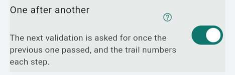

**Steps**

1. Tap a card in [Validation rules](https://fdittgen-png.github.io/deskilo/#/validation).
2. Switch on **One after another**.
3. Tap **Save**.

**Good to know**

- The next validation is asked for once the previous one has passed, and the validation trail numbers each step.
- It is slower; use it when the order matters.
- On money rules you can also set **Only above this amount**: smaller amounts apply straight away.

**See also:** [Required validations](#required-validations)

<!-- anchor: user.validation.auto-validate-owner -->
### Auto-validate an owner's own request

**Audience:** Owner

You do not want a ping about a question that is already closed.

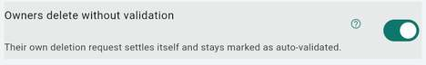

**Steps**

1. In [Validation rules](https://fdittgen-png.github.io/deskilo/#/validation), tap the **Booking deletion** card.
2. Switch on **Owners delete without validation**.
3. Tap **Save**.

**Good to know**

- An owner's own deletion request then settles itself and stays marked **Auto-validated** in the feed, so the trail is unbroken.
- This switch exists on the **Booking deletion** rule only, and it is off by default.

**See also:** [Auto-validate an administrator's own request](#auto-validate-an-administrators-own-request)

<!-- anchor: user.validation.auto-validate-admin -->
### Auto-validate an administrator's own request

**Audience:** Owner

You want administrators to delete their own bookings without waiting.

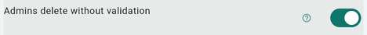

**Steps**

1. In [Validation rules](https://fdittgen-png.github.io/deskilo/#/validation), tap the **Booking deletion** card.
2. Switch on **Admins delete without validation**.
3. Tap **Save**.

**Good to know**

- It is independent of the owner switch: every owner is also an administrator, so one switch could not say "owners yes, administrators no".
- Off by default, and only for booking deletions.

**See also:** [Auto-validate an owner's own request](#auto-validate-an-owners-own-request)

<!-- anchor: user.collaborate.messages -->
### Messages

**Audience:** Everyone

You want all your conversations in one list, whichever space or server they belong to.

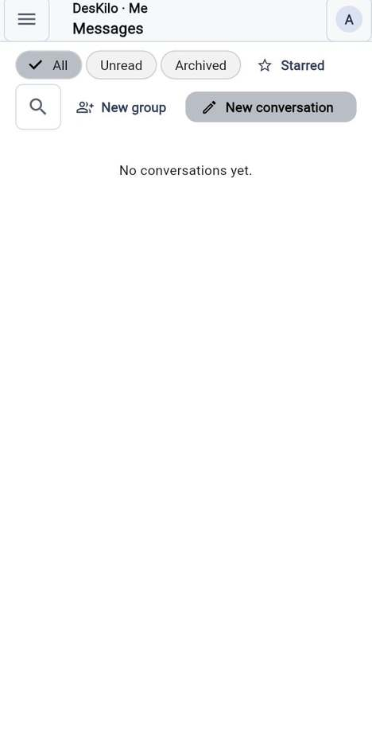

**Steps**

1. Open [Messages](https://fdittgen-png.github.io/deskilo/#/me?tab=messages) in Me.
2. Read each row: the title, the context (for example "In" a space, "Person to person", "Group"), the last message and the unread count.
3. Filter with **All**, **Unread** or **Archived**, open **Starred** for the messages you starred, or tap the magnifier to search.
4. Press and hold a row to **Pin to top**, **Mute notifications**, **Mark as unread** or **Archive**.
5. Tap a row to open the conversation.

**Good to know**

- Conversations from your other connected servers appear in the same list, with the server named.
- A message you wrote shows a tick when delivered and a blue double tick once read.
- An archived conversation keeps its history. A muted one stays silent but is still counted.
- From the workspace, **Open my messenger** (in Alerts) leads here.

**See also:** [Writing to a member](#writing-to-a-member) · [Start a conversation or a group](#start-a-conversation-or-a-group)

<!-- anchor: user.collaborate.messages-new -->
### Start a conversation or a group

**Audience:** Everyone

You want to write to someone new, or to several people at once.

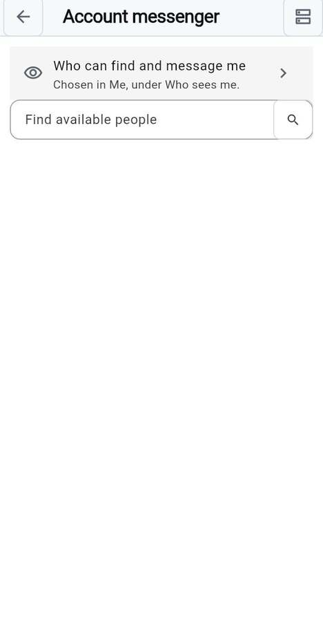

**Steps**

1. In [Messages](https://fdittgen-png.github.io/deskilo/#/me?tab=messages), tap **New conversation**.
2. Type a name under **Find available people** and tap the magnifier.
3. Tap the person; the chat opens.
4. For a group, tap **New group** instead, give it a **Group name**, **Add people** and tap **Create group**.

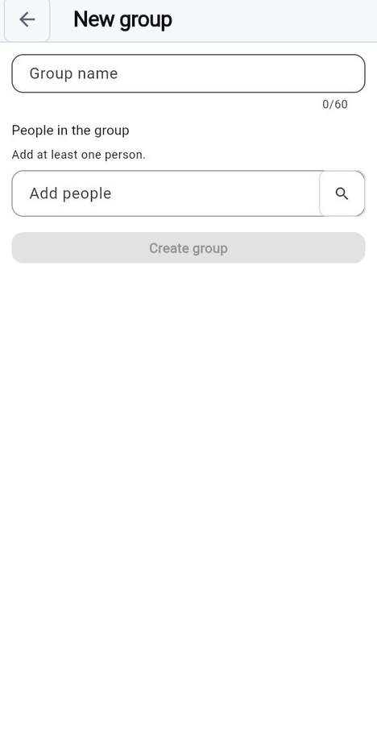

**Good to know**

- You find people who chose to be reachable: each person decides under **Who can start a conversation with me**.
- In a group, tap its name to see the members; an administrator can add or remove people, rename it or allow only administrators to post (**Only admins can post**). Anyone can **Leave group**.
- A long message is limited to 4000 characters.

**See also:** [Message requests](#message-requests)

<!-- anchor: user.collaborate.message-requests -->
### Message requests

**Audience:** Everyone

Someone you did not choose to hear from wrote to you, and you decide what happens.

**Steps**

1. Open [Messages](https://fdittgen-png.github.io/deskilo/#/me?tab=messages). A card **Message requests** appears above your conversations when there is one.
2. Read the first message.
3. Tap **Accept** to turn it into a conversation, **Ignore** to hide it, or **Block** to end all contact.

**Good to know**

- The card says it plainly: these people are outside the ones you chose to be reachable by, and they are not told what you decide.
- Who may write to you first is set in Me, under **Who can start a conversation with me**.

**See also:** [Block someone](#block-someone) · [Who can see my data](#privacy-who-can-see-my-data)

<!-- anchor: user.collaborate.block -->
### Block someone

**Audience:** Everyone

You want a person to stop seeing you and writing to you.

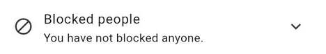

**Steps**

1. Tap **Block** on a message request, or **Block this person** in a conversation.
2. Confirm.
3. To undo it, open Me, then **Blocked people**, and tap **Unblock** beside the name.

**Good to know**

- A block works both ways: neither of you sees or reaches the other.
- The person is not told.

**See also:** [Message requests](#message-requests)

<!-- anchor: user.collaborate.notifications -->
### Notifications

**Audience:** Everyone

You want to know what alerts you, and to switch alerts off on this device if you prefer.

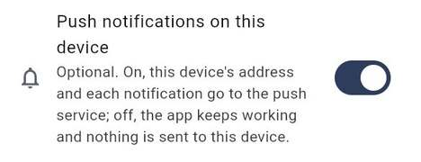

**Steps**

1. Open [Privacy & data](https://fdittgen-png.github.io/deskilo/#/privacy).
2. Use the switch **Push notifications on this device** to turn push on or off.
3. To silence one conversation, press and hold it in [Messages](https://fdittgen-png.github.io/deskilo/#/me?tab=messages) and choose **Mute notifications**.

**Good to know**

- You are alerted to requests waiting for your confirmation and to messages: in the feed and on the bell, by push when your installation has push set up, and, in the installed app (not in the browser), by a reminder on your device 15 minutes before a booking you have not checked in to yet.
- DesKilo sends no e-mail of its own: the only e-mails are your account's (sign-up confirmation, password reset).
- The count on the bell and the app icon adds your pending confirmations and unread messages.
- Off, the app keeps working; nothing is sent to this device. There are no separate switches per category. If your system blocks the app's notifications, allow them in the system settings.

**See also:** [Events & confirmations](#events--confirmations) · [Your data, your rights](#your-data-your-rights)

<!-- anchor: user.collaborate.discover -->
### Discover

**Audience:** Everyone

You want to find workspaces that publish themselves, and write to their hosts.

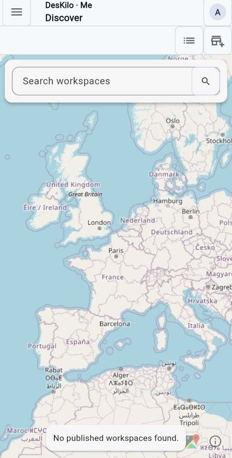

**Steps**

1. Open [Discover](https://fdittgen-png.github.io/deskilo/#/me?tab=discover) in Me. It opens on the map.
2. Type in **Search workspaces** and tap the magnifier.
3. Swipe the cards under the map, or tap the pin symbol on a card to **Locate on map**.
4. Tap the list button to switch to **List**, and the map button to come back to **Map**.
5. Tap a workspace to read its public page: description, address, contacts, website, public floor plan.
6. Use **Write to the hosts**, the chat button beside a host, **Enter** or **Request a workspace profile**, as the workspace offers.

**Good to know**

- Only workspaces whose owner chose **Visible in the public directory** appear. If none match, the screen says **No published workspaces found.**
- Writing to someone or asking to join connects you to that workspace's server first, and asks you before anything is sent.
- Your messages with people on other servers appear in [Messages](#messages); manage those servers under **Connected servers**.
- Owners publish their page from their settings.

**See also:** [Start a conversation or a group](#start-a-conversation-or-a-group)

<!-- anchor: user.collaborate.public-profile -->
### Your public profile

**Audience:** Everyone

You want people outside your spaces to be able to read a few words about you.

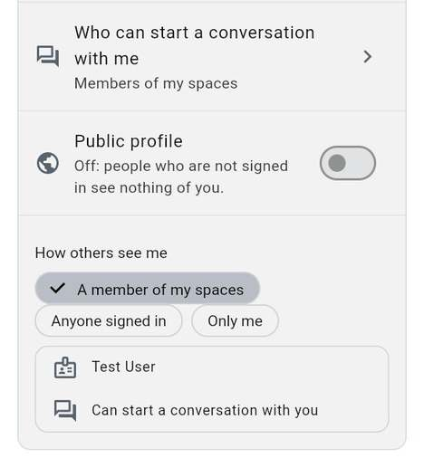

**Steps**

1. Open Me, then the **Privacy** section.
2. Switch on **Public profile** and confirm **Publish**.
3. Tap **Copy the link** and share it.
4. Switch it off at any time to withdraw it.

**Good to know**

- Anyone with the link, signed in or not, reads your name, profession and bio. Contact details, presence and spaces stay private.
- A link to a profile that is withdrawn or unknown says **This profile is not public.**
- **How others see me** previews what each audience sees.

**See also:** [Who can see my data](#privacy-who-can-see-my-data)

<!-- anchor: user.collaborate.guest-visits -->
### Your visits as a guest

**Audience:** Everyone

You asked to visit a space without becoming a member, and want to follow it.

**Steps**

1. Open Me, then Home.
2. Find **My visits**: each visit shows the space, the time and a status (**Requested**, **Confirmed**, **Declined**, **Cancelled** or **Expired**).
3. To withdraw one that is still ahead, tap **Cancel this visit**.

**Good to know**

- A visit is not a membership: it gives no role and no subscription.
- The list appears only when you have visits, and only where the space has the **Guest visits** feature on.

**See also:** [Discover](#discover)

<!-- anchor: user.settings.overview -->
## Settings & profile, and your data

Everything personal about DesKilo lives in two places: **Me**, which is yours in every workspace, and **Settings**, which is where a single workspace keeps what is specific to your membership there. This chapter walks through both, then your privacy rights and the option to run your own server.

In this chapter:
- [How Settings is organised](#how-settings-is-organised) and the [workspace-only switch](#choose-a-setting-only-for-this-workspace)
- Your account: [photo](#your-account-and-photo), [personal information](#personal-information), [address](#your-address), [VAT number](#your-vat-number), [payment terms](#your-payment-terms), [WhatsApp](#your-whatsapp-number), [status](#your-status-line), [default booking period](#default-booking-period)
- Your badge: [the badge](#your-badge) and [its PIN](#your-badge-pin)
- How the app looks and reads: [language](#app-language), [theme](#theme), [navigation](#navigation-style), [numbers and dates](#numbers-and-dates), [clock](#clock), [time zone](#show-times-in-my-time-zone), [hints](#restore-the-hints), [front camera](#front-camera-for-scanning), [linked accounts](#linked-accounts)
- Privacy & your data: [who can see my data](#privacy-who-can-see-my-data), [who sees me](#choose-who-sees-me), [public profile](#publish-a-public-profile), [export](#export-my-data), [erase](#erase-my-data), [rights requests](#rights-requests), [push](#push-notifications-on-this-device), [your rights](#your-data-your-rights)
- [Your own server](#your-own-server)

<!-- anchor: user.settings.organisation -->
### How Settings is organised

**Audience:** Everyone

You want to know where a setting lives before you hunt for it.

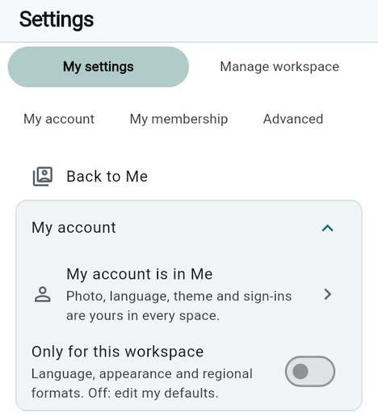

**Steps**

1. Open [Settings](https://fdittgen-png.github.io/deskilo/#/settings). If your workspace calls it **My account**, it is the same screen.
2. Stay on **My settings** for everything about you. Owners and administrators also see **Manage workspace**, which holds the workspace configuration; members who administer nothing see no second tab.
3. Use the three shortcuts under the tabs to jump: **My account**, **My membership**, **Advanced**.
4. Open **Back to Me** to return to your Me page.

**Good to know**

- **My account** is a short card: it points to Me, where your photo, language, theme and sign-ins live for every workspace.
- **My membership** is what concerns this workspace only: what you can do here, your badge and PIN, your status, your default booking period, your payment conditions and the documents.
- **Advanced** starts closed. It concerns this device: the server, push, the front camera.
- Under the sections you also find **Help**, the app version, the privacy policy and **Sign out**.

**See also:** [The workspace-only switch](#choose-a-setting-only-for-this-workspace) · [Your own server](#your-own-server)

<!-- anchor: user.settings.scope -->
### Choose a setting only for this workspace

**Audience:** Everyone

You want English in one workspace and French in the others, or a dark theme in just one of them.

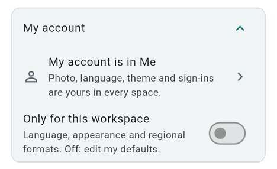

**Steps**

1. Open [Settings](https://fdittgen-png.github.io/deskilo/#/settings) and look at **My account**.
2. Switch on **Only for this workspace**. The language, theme and regional rows appear right there.
3. Change what you want. It applies to this workspace only.
4. To undo, tap **Use my defaults**.

**Good to know**

- With the switch off, you edit your defaults, the ones that apply everywhere.
- A setting you changed only for this workspace is listed under **In this space** in the card.
- The switch covers language, appearance and regional formats, nothing else.

**See also:** [App language](#app-language) · [Theme](#theme) · [Numbers and dates](#numbers-and-dates)

<!-- anchor: user.profile.settings.photo -->
### Your account and photo

**Audience:** Everyone

You want people to recognise you in the directory, on the plan and in messages.

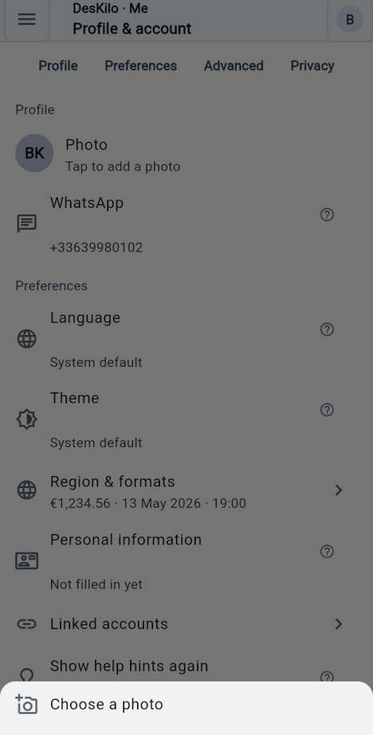

**Steps**

1. Open [Me](https://fdittgen-png.github.io/deskilo/#/me?tab=me). Your account is the **Profile**, **Preferences**, **Advanced** and **Privacy** blocks of that page.
2. Tap **Photo**.
3. Choose **Choose a photo** and pick an image, or choose **Remove photo**.

**Good to know**

- The row says **Tap to add a photo** until you have one, then **Tap to change**.
- Who sees your photo is your decision: see [Who sees me](#choose-who-sees-me).
- Your account is yours across workspaces; your standing in one workspace is in its Settings.

**See also:** [Profiles](#profiles-one-account-several-spaces) · [Who sees me](#choose-who-sees-me)

<!-- anchor: user.profile.settings.personal-info -->
### Personal information

**Audience:** Everyone

You want your invoices and letters to carry your name and details correctly.

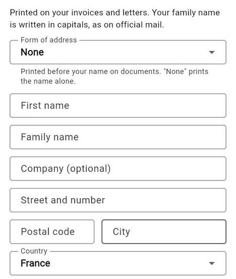

**Steps**

1. Open [Me](https://fdittgen-png.github.io/deskilo/#/me?tab=me) and tap **Personal information**.
2. Choose a **Form of address** if you want one printed before your name, then fill in **First name**, **Family name**, **Company (optional)**, the address, **Telephone** and **E-mail for documents**.
3. Check **On your documents**, which shows how it will print.
4. Answer any questions your workspace adds under its own heading, then tap **Save**.

**Good to know**

- Your family name and your city are written in capitals, as on official mail.
- An empty form shows **Not filled in yet**.
- The answers to your workspace's questions are personal data: they are part of your export and are erased when you leave the space.

**See also:** [Your address](#your-address) · [Your VAT number](#your-vat-number)

<!-- anchor: user.profile.settings.address -->
### Your address

**Audience:** Everyone

You want invoices sent to the right place.

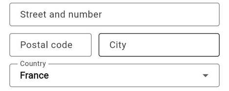

**Steps**

1. Open [Me](https://fdittgen-png.github.io/deskilo/#/me?tab=me) and tap **Personal information**.
2. Fill in **Street and number**, **Postal code** and **City**.
3. Pick your **Country**, then tap **Save**.

**Good to know**

- Where your workspace does not use the personal information form, Me shows a simpler **Address** row with a **Country** choice instead.
- The address is printed on your invoices.

**See also:** [Personal information](#personal-information)

<!-- anchor: user.profile.settings.vat-id -->
### Your VAT number

**Audience:** Everyone

You are invoiced as a business and want the invoice to show your VAT number.

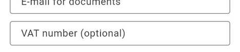

**Steps**

1. Open [Me](https://fdittgen-png.github.io/deskilo/#/me?tab=me) and tap **Personal information**.
2. Type your number in **VAT number (optional)**.
3. Add your **Company / registration id (optional)** if you have one, then tap **Save**.

**Good to know**

- Leave it empty if you are a private person.
- Whether an invoice carries VAT depends on this number and on the country; the workspace applies its own rules.

**See also:** [Personal information](#personal-information)

<!-- anchor: user.profile.settings.payment-terms -->
### Your payment terms

**Audience:** Member

You want to know on what terms you are invoiced.

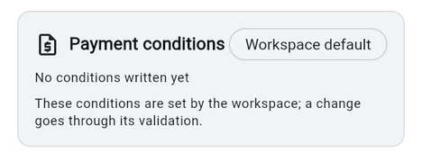

**Steps**

1. Open [Settings](https://fdittgen-png.github.io/deskilo/#/settings) and, under **My membership**, tap **Payment conditions**.
2. Read the badge: **Workspace default**, or **Member's own** if terms were agreed with you.
3. Read the conditions: you cannot change them yourself. To have them changed, ask an administrator.

**Good to know**

- An administrator or owner with the permission proposes a change from your member page: **Request a change**, only the fields to change (a field left empty keeps the workspace's wording), a **Reason (optional)**, then **Submit request**.
- The workspace sets these conditions; a change goes through its validation and applies once validated.

**See also:** [Your VAT number](#your-vat-number)

<!-- anchor: user.profile.settings.whatsapp -->
### Your WhatsApp number

**Audience:** Everyone

You want colleagues to reach you on WhatsApp, or to stop sharing the number.

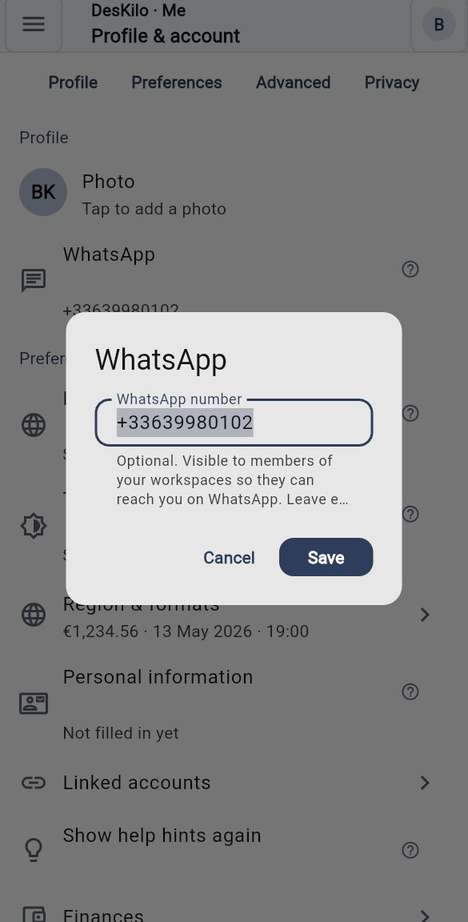

**Steps**

1. Open [Me](https://fdittgen-png.github.io/deskilo/#/me?tab=me) and tap **WhatsApp**.
2. Type your number in **WhatsApp number**, with the country code.
3. Tap **Save**. To stop sharing, empty the field and save.

**Good to know**

- It reads **Not shared** until you set it.
- Who sees the number is under **WhatsApp and e-mail** in [Who sees me](#choose-who-sees-me).
- The row only appears when your workspace uses WhatsApp.

**See also:** [Who sees me](#choose-who-sees-me)

<!-- anchor: user.profile.settings.status -->
### Your status line

**Audience:** Member

You want a short line beside your name, such as "In a call · back at 14:00".

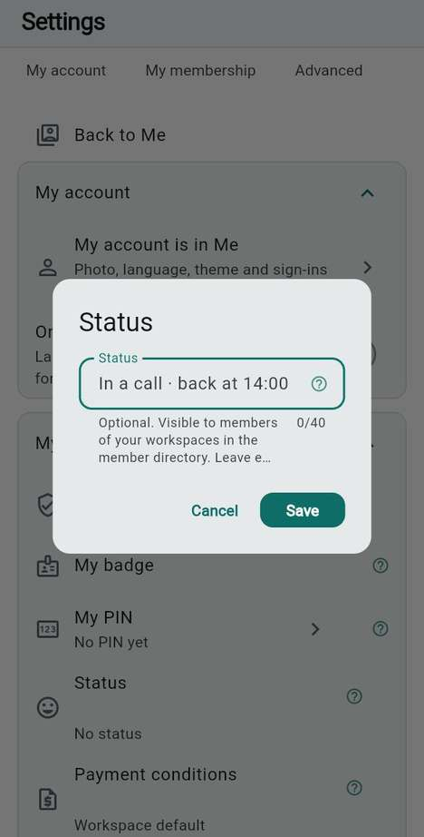

**Steps**

1. Open [Settings](https://fdittgen-png.github.io/deskilo/#/settings) and, under **My membership**, tap **Status**.
2. Type your line in **Status**.
3. Tap **Save**. To clear it, empty the field and save.

**Good to know**

- It is optional and short; the field stops you at its limit.
- Members of your workspaces see it in the member directory.
- It says **No status** until you write one.

**See also:** [Who sees me](#choose-who-sees-me)

<!-- anchor: user.profile.settings.default-period -->
### Default booking period

**Audience:** Member

You usually book the same half-day and want it already chosen.

**Steps**

1. Open [Settings](https://fdittgen-png.github.io/deskilo/#/settings) and, under **My membership**, tap **Default booking period**.
2. Choose **Morning**, **Afternoon**, **Full day** or **No preference (full day)**.

**Good to know**

- It only pre-selects: you can still change the period each time you book.
- The row appears only when your workspace's booking setup offers a choice.

**See also:** [The booking sheet](#the-booking-sheet)

<!-- anchor: user.profile.settings.badge -->
### Your badge

**Audience:** Member

You want a badge or a card to identify you at the door or the kiosk.

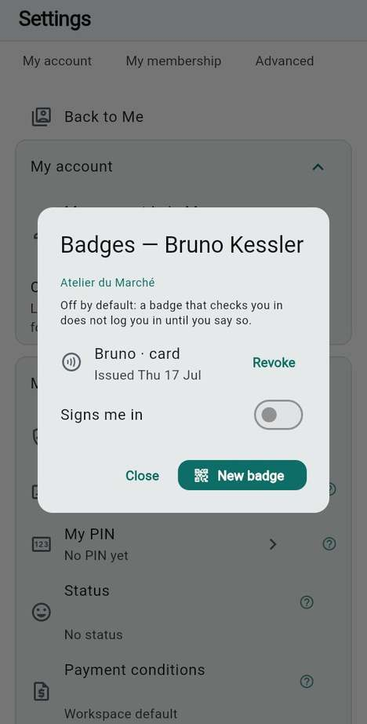

**Steps**

1. Open [Settings](https://fdittgen-png.github.io/deskilo/#/settings) and, under **My membership**, tap **My badge**.
2. Tap **New badge** to get your QR code, then **Save as PDF** to print it, or tap **Register card** and hold your RFID or NFC card to the back of the device.
3. To retire a badge, tap **Revoke**.

**Good to know**

- A new QR code is shown only once: save it right away.
- A revoked badge stops working at once. Issue a new one rather than looking for the old.
- **Signs me in** is off by default: a badge that checks you in does not sign you in until you switch it on, and it needs a PIN first.
- **New badge** needs the **QR badges** feature and **Register card** the **RFID / NFC badges** feature; your workspace may offer only one of them.

**See also:** [Your badge PIN](#your-badge-pin)

<!-- anchor: user.profile.settings.badge-pin -->
### Your badge PIN

**Audience:** Member

You want to sign in by scanning your badge instead of typing your e-mail.

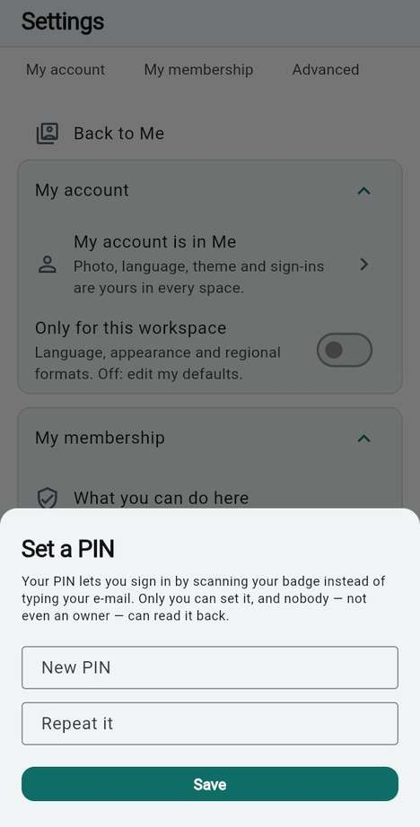

**Steps**

1. Open [Settings](https://fdittgen-png.github.io/deskilo/#/settings) and, under **My membership**, tap **My PIN**.
2. Choose **Set a PIN**, enter it in **New PIN**, repeat it in **Repeat it** and save.
3. Open **My badge** and switch on **Signs me in** for the badge you want.

**Good to know**

- The row reads **No PIN yet** or **PIN set**.
- Only you can set it, and nobody, not even an owner, can read it back.
- **Change PIN** replaces it; **Remove PIN** switches off badge sign-in for all your badges.

**See also:** [Your badge](#your-badge)

<!-- anchor: user.profile.settings.language -->
### App language

**Audience:** Everyone

You want the app in your own language.

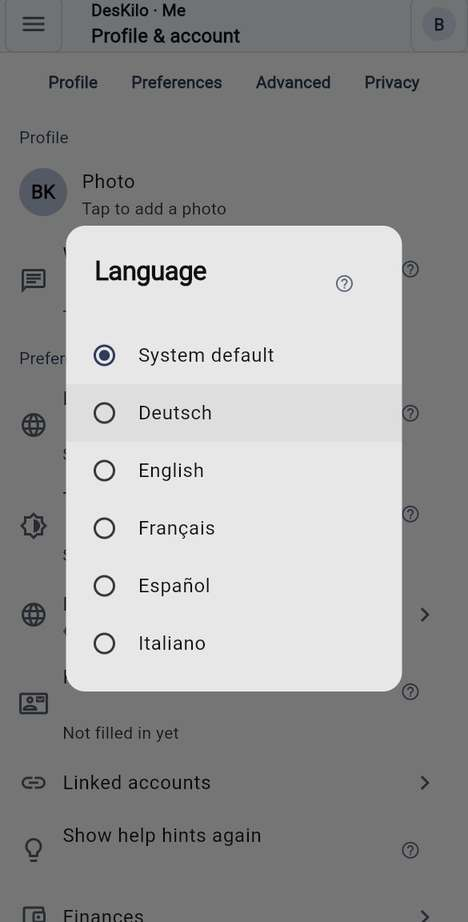

**Steps**

1. Open [Me](https://fdittgen-png.github.io/deskilo/#/me?tab=me) and tap **Language**.
2. Pick a language, or **System default** to follow your phone.

**Good to know**

- It applies to every workspace, unless you set one for a single workspace with [Only for this workspace](#choose-a-setting-only-for-this-workspace).
- Each language is written in its own name, so you can always find yours.

**See also:** [Numbers and dates](#numbers-and-dates)

<!-- anchor: user.profile.settings.theme -->
### Theme

**Audience:** Everyone

You want the app lighter or darker.

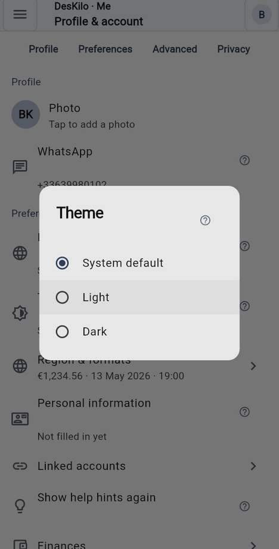

**Steps**

1. Open [Me](https://fdittgen-png.github.io/deskilo/#/me?tab=me) and tap **Theme**.
2. Pick **System default**, **Light** or **Dark**.

**Good to know**

- **System default** follows your phone's own light and dark switch.
- Like the language, it can be set for one workspace only.

**See also:** [App language](#app-language)

<!-- anchor: user.profile.settings.navigation -->
### Navigation style

**Audience:** Everyone

You prefer the bottom bar, or the menu you know from the web.

**Steps**

1. Open [Me](https://fdittgen-png.github.io/deskilo/#/me?tab=me) and tap **Navigation**.
2. Choose **Default for this device**, **Classic: the bottom bar and the round button** or **Menu: the hamburger, like the web**.

**Good to know**

- The row is hidden in the web version, which always uses the menu, and appears only when your workspace offers it.

**See also:** [How Settings is organised](#how-settings-is-organised)

<!-- anchor: user.profile.settings.regional-formats -->
### Numbers and dates

**Audience:** Everyone

You want amounts and dates written the way you read them, whatever the app language.

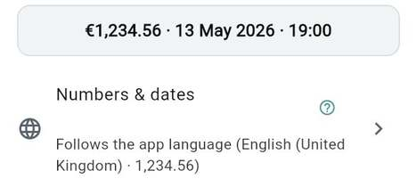

**Steps**

1. Open [Region & formats](https://fdittgen-png.github.io/deskilo/#/formats).
2. Tap **Numbers & dates** and pick a region, or **Automatic** to follow the app language.
3. Check the preview line above: it shows an amount, a date and a time as you will see them.

**Good to know**

- It is independent of the language: an English app can write French dates.
- It can be set for one workspace only with [Only for this workspace](#choose-a-setting-only-for-this-workspace).
- The row appears only when your workspace uses **Region & formats**.

**See also:** [Clock](#clock)

<!-- anchor: user.profile.settings.clock -->
### Clock

**Audience:** Everyone

You prefer 24-hour or 12-hour times.

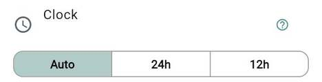

**Steps**

1. Open [Region & formats](https://fdittgen-png.github.io/deskilo/#/formats).
2. Under **Clock**, choose **Auto**, **24h** or **12h**.

**Good to know**

- **Auto** does what your region does.
- It changes how times are written, never what they mean.
- The row appears only when your workspace uses **Region & formats**.

**See also:** [Show times in my time zone](#show-times-in-my-time-zone)

<!-- anchor: user.profile.settings.device-zone -->
### Show times in my time zone

**Audience:** Everyone

You are travelling and want times as your own clock shows them.

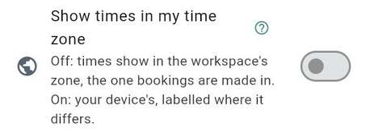

**Steps**

1. Open [Region & formats](https://fdittgen-png.github.io/deskilo/#/formats).
2. Switch **Show times in my time zone** on.

**Good to know**

- Off, times are in the workspace's zone, the one bookings are made in. This is the default.
- On, times follow your device and are labelled wherever they differ from the workspace's.
- The row appears only when your workspace uses **Region & formats**.

**See also:** [Clock](#clock)

<!-- anchor: user.profile.settings.restore-hints -->
### Restore the hints

**Audience:** Everyone

You dismissed the help hints and now want them back.

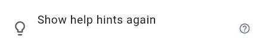

**Steps**

1. Open [Me](https://fdittgen-png.github.io/deskilo/#/me?tab=me).
2. Tap **Show help hints again**.

**Good to know**

- A message confirms: **Help hints will be shown again.**
- Nothing else is reset.
- The row appears only when your workspace uses help hints.

**See also:** [How Settings is organised](#how-settings-is-organised)

<!-- anchor: user.profile.settings.front-camera -->
### Front camera for scanning

**Audience:** Everyone

You scan badges with a wall-mounted tablet whose back camera faces the wall.

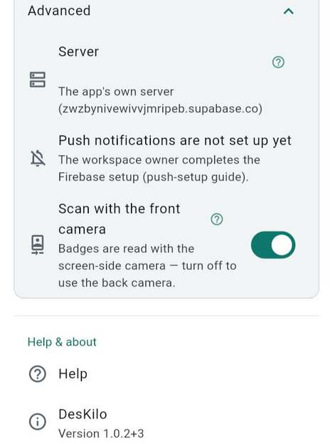

**Steps**

1. Open [Settings](https://fdittgen-png.github.io/deskilo/#/settings) and open **Advanced**.
2. Switch **Scan with the front camera** on to use the screen-side camera, or off for the back camera.

**Good to know**

- It is on by default and applies to this device only.

**See also:** [Your badge](#your-badge)

<!-- anchor: user.profile.settings.linked-accounts -->
### Linked accounts

**Audience:** Everyone

You want to sign in with another identity, such as a Google account, as well as your e-mail.

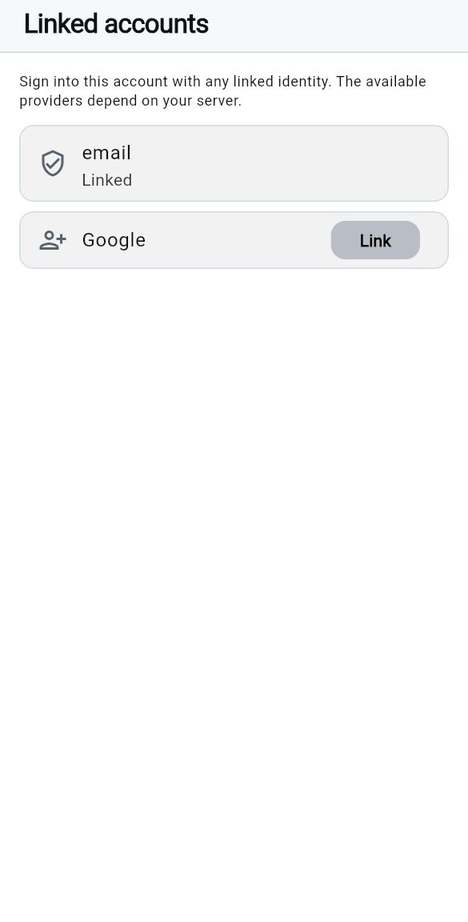

**Steps**

1. Open [Me](https://fdittgen-png.github.io/deskilo/#/me?tab=me) and tap **Linked accounts**.
2. Tap **Link** beside a provider and finish in the browser.
3. To remove one, tap **Unlink**.

**Good to know**

- A linked identity shows **Linked**.

**See also:** [Profiles](#profiles-one-account-several-spaces)

<!-- anchor: user.privacy.visibility -->
### Privacy: who can see my data

**Audience:** Everyone

You want to know who can read what about you, and who actually looked.

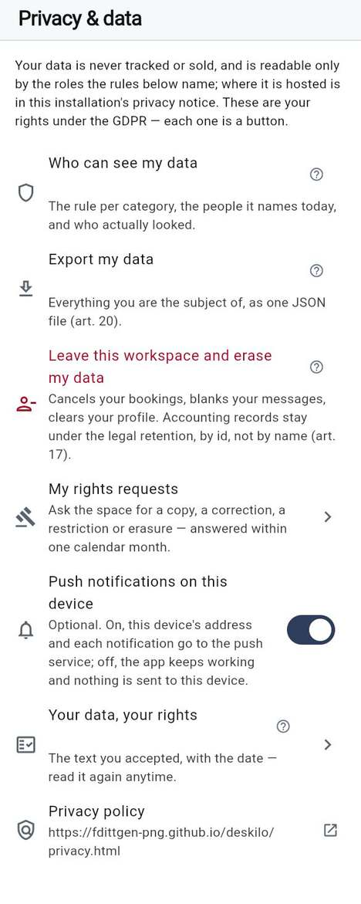

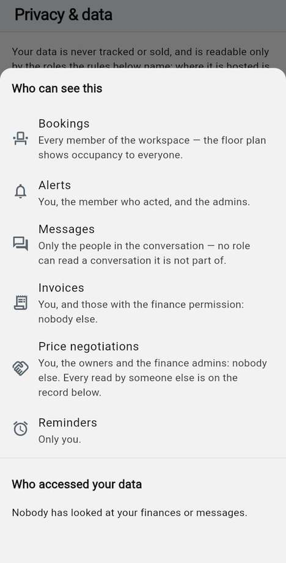

**Steps**

1. Open [Privacy & data](https://fdittgen-png.github.io/deskilo/#/privacy).
2. Tap **Who can see my data**.
3. Read the rule for each category, the people it names today, and **Who accessed your data**.

**Good to know**

- Your data is never tracked or sold. Roles decide who reads it, and the server enforces that.
- The sheet states the rule; there is nothing to switch on it. To choose what other members see of your profile, use [Who sees me](#choose-who-sees-me).

**See also:** [Who sees me](#choose-who-sees-me) · [Your data, your rights](#your-data-your-rights)

<!-- anchor: user.privacy.audiences -->
### Choose who sees me

**Audience:** Everyone

You want to decide, one item at a time, who sees your name, bio, contact details and presence.

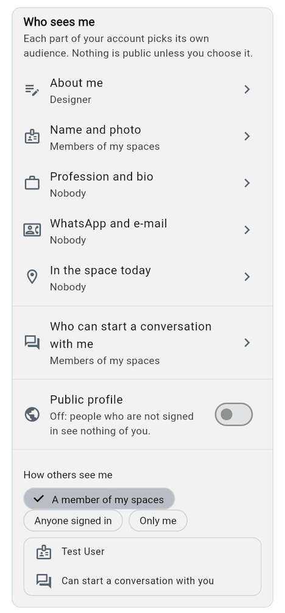

**Steps**

1. Open [Me](https://fdittgen-png.github.io/deskilo/#/me?tab=me) and scroll to **Privacy**, to the **Who sees me** card.
2. Tap an item: **About me**, **Name and photo**, **Profession and bio**, **WhatsApp and e-mail**, **In the space today** or **Who can start a conversation with me**.
3. Choose an audience, for example **Nobody**, **Members of my spaces** or **Members of chosen spaces**, tick spaces if you chose some, and tap **Save**.
4. Check **How others see me** at the foot of the card.

**Good to know**

- Nothing is public unless you choose it.
- Widening an audience asks you to confirm first.
- **Blocked people** below the card lists whoever you blocked; they cannot see or reach you and you cannot reach them. Tap **Unblock** to undo it.
- **Anyone signed in** is offered only for some items, such as **Name and photo** and **Profession and bio**. **WhatsApp and e-mail** and **In the space today** never go wider than your own spaces.

**See also:** [Public profile](#publish-a-public-profile) · [Who can see my data](#privacy-who-can-see-my-data)

<!-- anchor: user.privacy.public-profile -->
### Publish a public profile

**Audience:** Everyone

You want a page with your name and a few words that people can read without an account.

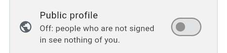

**Steps**

1. Open [Me](https://fdittgen-png.github.io/deskilo/#/me?tab=me) and find **Public profile** in the **Who sees me** card.
2. Switch it on and confirm with **Publish**.
3. Tap **Copy the link** to share it.

**Good to know**

- Anyone with the link reads your name, profession and bio. Contact details, presence and spaces stay private.
- Off, people who are not signed in see nothing of you.

**See also:** [Choose who sees me](#choose-who-sees-me)

<!-- anchor: user.privacy.export -->
### Export my data

**Audience:** Everyone

You want a copy of everything DesKilo holds about you.

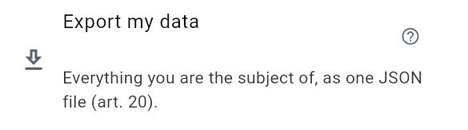

**Steps**

1. Open [Privacy & data](https://fdittgen-png.github.io/deskilo/#/privacy).
2. Tap **Export my data**.
3. Save or share the file that is produced.

**Good to know**

- It is one JSON file, built at the moment you ask.
- The row appears only when your workspace offers data export.

**See also:** [Rights requests](#rights-requests)

<!-- anchor: user.privacy.erase -->
### Erase my data

**Audience:** Everyone

You want to leave a workspace and have your data erased.

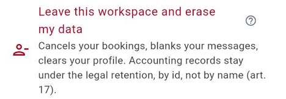

**Steps**

1. Open [Privacy & data](https://fdittgen-png.github.io/deskilo/#/privacy).
2. Tap **Leave this workspace and erase my data**.
3. Read what it will do, type the confirmation word and tap **Erase**.

**Good to know**

- It cancels your open bookings and blanks your messages in this space. Your profile is cleared when this is your last space; past bookings stay as the space's occupancy record.
- Accounting records stay for the legal retention period, by identifier and not by name.
- The row appears together with data export. It is greyed out for an owner, who must hand the workspace over first, under Co-ownership.

**See also:** [Export my data](#export-my-data)

<!-- anchor: user.privacy.requests -->
### Rights requests

**Audience:** Everyone

You want to ask the workspace for a copy, a correction, a restriction or erasure, and keep a record.

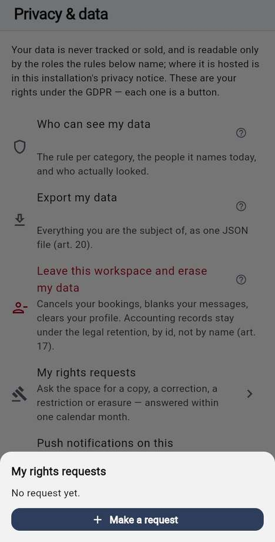

**Steps**

1. Open [Privacy & data](https://fdittgen-png.github.io/deskilo/#/privacy) and tap **My rights requests**.
2. Tap **Make a request** and choose what you ask: see a copy of your data, take it elsewhere, correct it, restrict its use, object to a use, or erase it.
3. Add **Details (optional)** and tap **Send the request**.

**Good to know**

- The space answers within one calendar month; the sheet shows the date.
- Each request shows whether it was received, extended (with the new date and the reason), answered or refused.

**See also:** [Export my data](#export-my-data) · [Erase my data](#erase-my-data)

<!-- anchor: user.privacy.push -->
### Push notifications on this device

**Audience:** Everyone

You want to stop notifications from being sent to this device, or turn them back on.

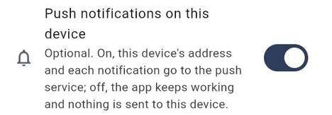

**Steps**

1. Open [Privacy & data](https://fdittgen-png.github.io/deskilo/#/privacy).
2. Switch **Push notifications on this device** off or on.

**Good to know**

- Off, the app keeps working and nothing is sent to this device.
- On, this device's address and each notification go to the push service.

**See also:** [Your data, your rights](#your-data-your-rights)

<!-- anchor: user.privacy.consent -->
### Your data, your rights

**Audience:** Everyone

You want to reread what you accepted about your data.

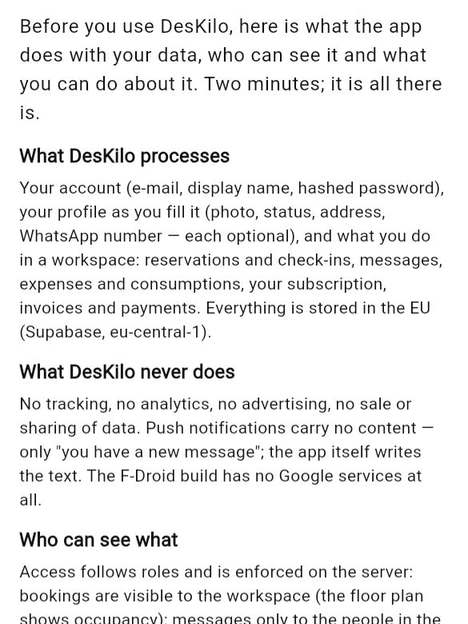

**Steps**

1. Open [Privacy & data](https://fdittgen-png.github.io/deskilo/#/privacy).
2. Tap **Your data, your rights**.
3. Read the text: what is processed, what is never done, who sees what, who is responsible, how long, and your rights.

**Good to know**

- It shows the date and version you accepted; a change of the text asks for your acceptance again.
- **Privacy policy**, just below, opens the full policy online.

**See also:** [Who can see my data](#privacy-who-can-see-my-data)

<!-- anchor: user.backend.server -->
### Your own server

**Audience:** Everyone

By default the app uses DesKilo's service. Your community may run its own server, and you want to connect to it.

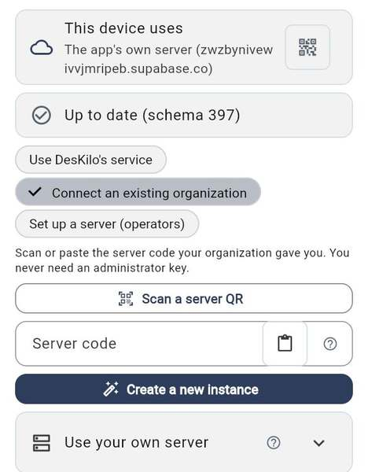

**Steps**

1. Open [Settings](https://fdittgen-png.github.io/deskilo/#/settings), then **Advanced**, then **Server**.
2. Choose **Connect an existing organization**.
3. Tap **Scan a server QR**, or paste the code into **Server code**.
4. Save. The app signs you out and uses the new server the next time it opens.

**Good to know**

- You never need an administrator key.
- **Use the app's server** takes you back to the default at any time.
- Your account lives on a server, which is why switching signs you out.

**See also:** [How to run your own](#how-to-run-your-own)

<!-- anchor: user.backend.how -->
### How to run your own

**Audience:** Everyone

You run a community and want to host DesKilo yourself.

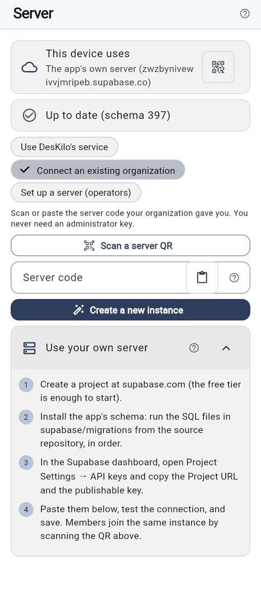

**Steps**

1. Open the **Server** screen and tap **Use your own server**.
2. Follow the four steps shown: create a project at supabase.com, install the schema, copy the Project URL and the publishable key, then paste them and **Test the connection**.
3. Or tap **Create a new instance** for the guided set-up.

**Good to know**

- The test tells you what is wrong: unreachable address, refused key or missing tables.
- Members join the same server by scanning the QR on this screen.
- The operator side, environments and deployment, is in the advanced chapter.

**See also:** [Your own server](#your-own-server)

<!-- anchor: user.money.overview -->
## Money

Everything you owe, have paid and have been invoiced lives in the **Money** tab: one place to read the month, settle it, find an invoice and ask for a change.

In this chapter:
- [Read your statement](#read-your-statement) and [what an invoice changes](#when-a-month-has-been-invoiced)
- [Pay what you owe](#pay-what-you-owe) and [record a payment](#record-a-payment)
- [Your invoices](#your-invoices) and [what each booking cost](#what-each-booking-cost)
- [Finance alerts](#finance-alerts), [reports](#reports-quick-view-download-share) and [your negotiated prices](#your-negotiated-prices)
- [Open a document](#open-a-document-from-the-library) from the library
- [Submit an expense](#submit-an-expense) and [approve or decline one](#approve-or-decline-an-expense)
- [How amounts are shown](#how-amounts-are-shown) and [your finances across spaces](#your-finances-across-spaces)
- For billing administrators: [Invoicing at a glance](#invoicing-at-a-glance)

<!-- anchor: user.money.statement -->
### Read your statement

**Audience:** Member

You want to know where the month stands: what you used, what it costs and what is left to settle.

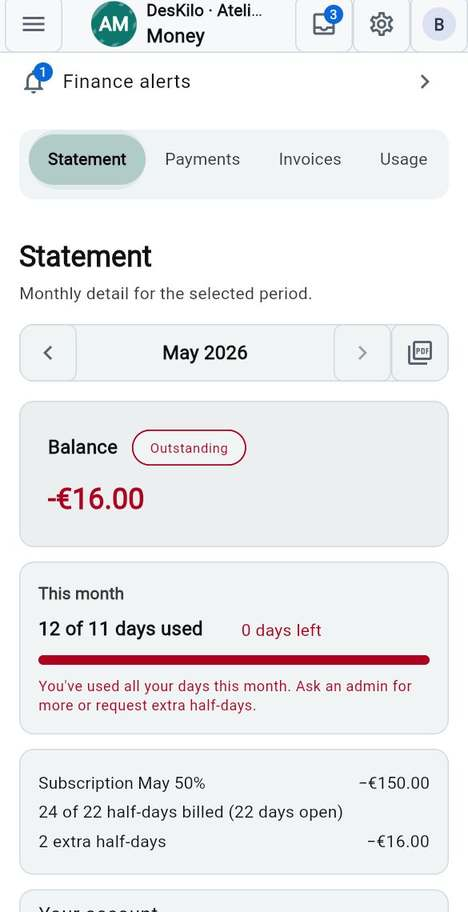

**Steps**

1. Open [Money](https://fdittgen-png.github.io/deskilo/#/money) and stay on **Statement**.
2. Use the arrows beside the month name to browse other months.
3. Read **Balance** first: **Outstanding** in red means you owe it, **Settled** means nothing is left.
4. Read **This month** below it: the days you used out of the days your plan includes, and the days left.
5. Read the cards that follow: your subscription, extra half-days, services, packages, open positions and **Payments & credits**.

**Good to know**

- A booked morning or afternoon counts as half a day, so you may see values like 0.5 days.
- The card also states your plan's rule. With pay as you go it always shows the rate of extra days; with the other two rules it tells you to ask an administrator or to buy a package once all your days are used.
- A line marked "pending validation" is waiting for someone to confirm it and is not counted yet.
- Tap the PDF icon beside the month to export the bill.

**See also:** [Pay what you owe](#pay-what-you-owe) · [What each booking cost](#what-each-booking-cost)

<!-- anchor: user.money.statement.invoiced -->
### When a month has been invoiced

**Audience:** Member

You want to know which figure to trust once the workspace has sent you an invoice for a month.

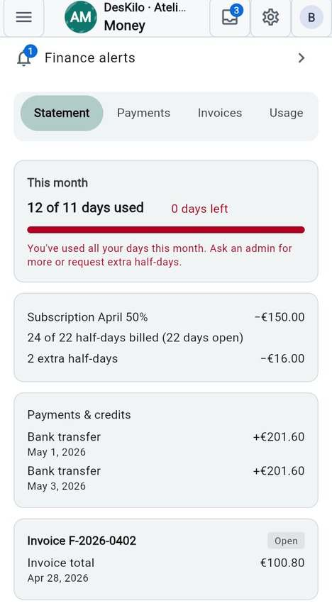

**Steps**

1. Open [Money](https://fdittgen-png.github.io/deskilo/#/money) and go back to the invoiced month with the left arrow.
2. Look for the card named **Invoice** (or **Credit note** when the total is negative) followed by its number.
3. Read the state on the card, then **Invoice total**; a partly paid invoice also shows **Paid so far** and **Remaining to pay**.

**Good to know**

- Once a month is invoiced, the invoice decides whether it is settled. The payment that clears it usually arrives in a later month, so the month's own balance is no longer the reference.
- A credit note reads "The workspace owes you this amount": there is nothing to pay on your side.

**See also:** [Your invoices](#your-invoices)

<!-- anchor: user.money.payments -->
### Pay what you owe

**Audience:** Member

You want to settle your balance and know how the workspace expects the money.

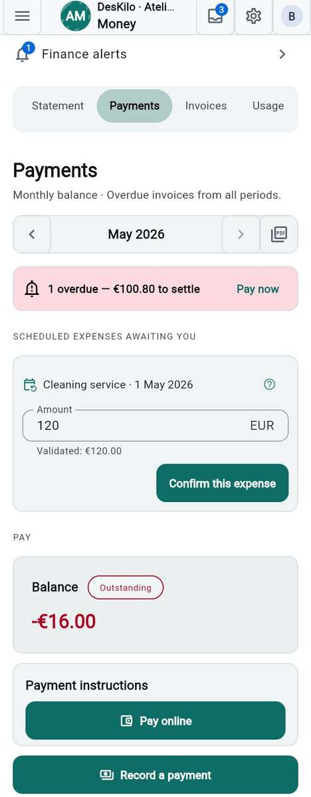

**Steps**

1. Open [Money](https://fdittgen-png.github.io/deskilo/#/money) and choose **Payments**.
2. Check **Balance** under **Pay**; overdue invoices from all periods are called out above it.
3. Read **Payment instructions**: the bank details, the payment reference to quote and the other ways the workspace accepts. Tap an IBAN or a value to copy it.
4. If the button is there, tap **Pay online**.
5. Once you have paid another way, [record the payment](#record-a-payment).

**Good to know**

- The instructions appear only while something is owed, and only if the workspace has set them up. If there is nothing, ask your administrator how to pay.
- An online payment the provider has not confirmed shows as **Online payment pending**: the balance keeps showing what is owed until it is confirmed.
- Under **Requests** you can also submit an expense, ask for **Request extra half-days** or, if your plan works with packages, **Buy a package**.

**See also:** [Record a payment](#record-a-payment) · [Submit an expense](#submit-an-expense)

<!-- anchor: user.money.payments.record -->
### Record a payment

**Audience:** Member

You paid by transfer, cash or another way and you want the workspace to know.

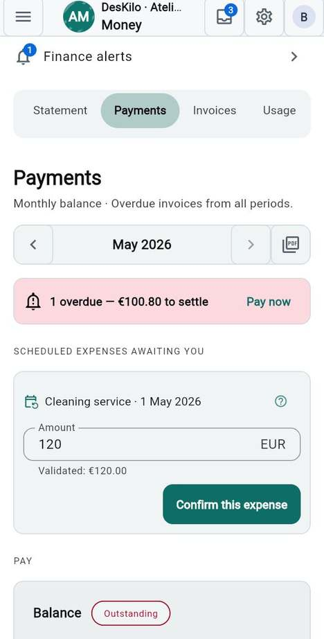

**Steps**

1. Open [Money](https://fdittgen-png.github.io/deskilo/#/money), choose **Payments** and tap **Record a payment**.
2. Enter the **Amount**.
3. Tap how you paid: **Bank transfer**, **Cash**, **PayPal**, **TWINT**, **Card**, **Wero**, **Lydia**, **Wise** or **Other**. Tap it again to clear it.
4. Check **Payment date** and **Applies to**, the month this payment settles.
5. Add a **Note (optional)**, then tap **Submit for confirmation**.

**Good to know**

- Your payment is not final when you send it. It waits as "pending validation" until the people the workspace has chosen confirm it, as set in [Validation rules](#validation-rules-domain-by-domain). Only then does it settle your balance.
- Your payment date cannot be in the future. **Applies to** can reach one month ahead, to pay in advance.

**See also:** [Pay what you owe](#pay-what-you-owe) · [Finance alerts](#finance-alerts)

<!-- anchor: user.money.invoices -->
### Your invoices

**Audience:** Member

You want to find an invoice, see whether it is paid and get its PDF.

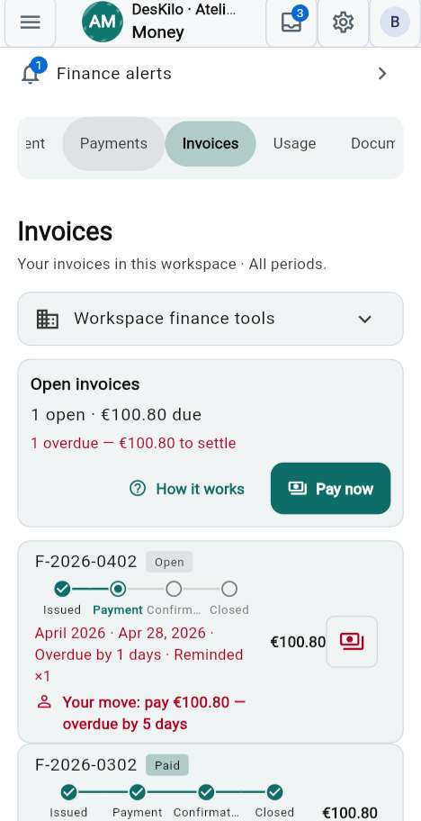

**Steps**

1. Open [Money](https://fdittgen-png.github.io/deskilo/#/money) and choose **Invoices**.
2. Read the list, newest first. Each row shows the number, a status chip, the month, the date and the amount.
3. Tap an invoice to open it.
4. Tap **Quick view** to read it on screen, **Download PDF** to save it or **Share PDF** to send it.

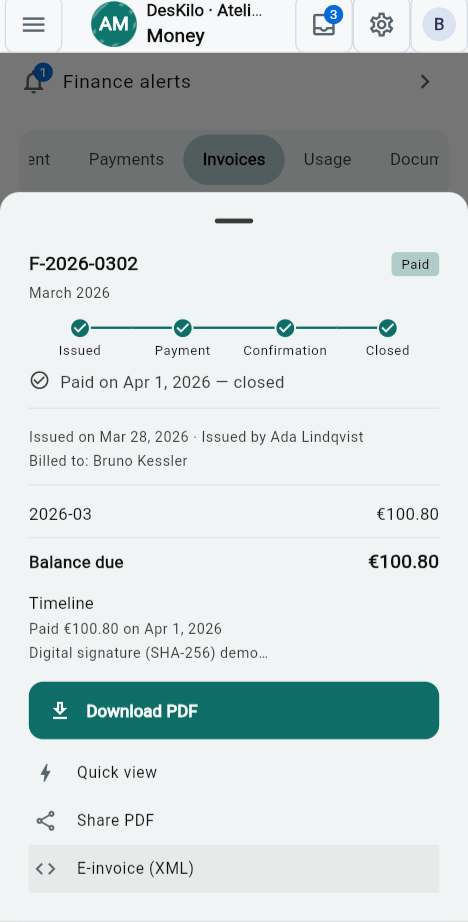

**Good to know**

- The statuses are **Open**, **Awaiting validation**, **Paid**, **Partially paid**, **Partially paid · remainder cancelled** and **Refunded**. An open invoice says when it is due or how many days it is overdue, and how many reminders you have received.
- Tap the payment icon on an open invoice to go to **Payments**.
- If the list is empty, the workspace has not invoiced you yet; it invoices a month once it closes.
- Invoices cannot be edited. A wrong invoice is marked **Erroneous** and replaced by a new one, and the erroneous one leaves your list. When invoices are regrouped into one, the regrouped invoice replaces them in your list.

**See also:** [Pay what you owe](#pay-what-you-owe) · [Your finances across spaces](#your-finances-across-spaces)

<!-- anchor: user.money.usage -->
### What each booking cost

**Audience:** Member · Administrator

You want to see, booking by booking, what was billed this month.

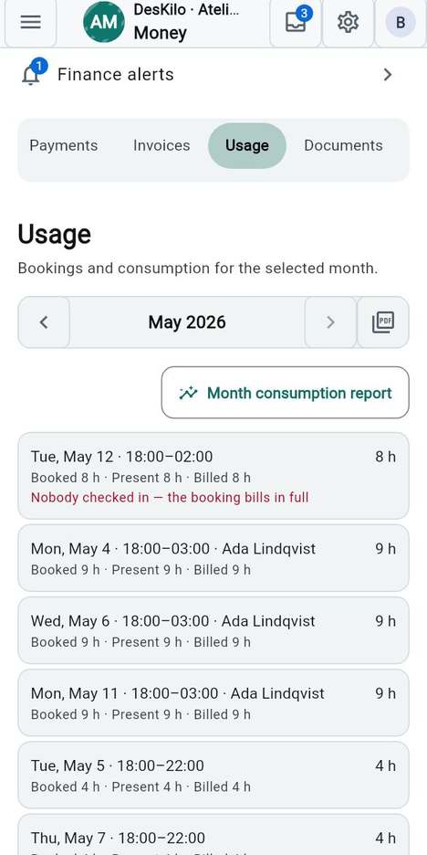

**Steps**

1. Open [Money](https://fdittgen-png.github.io/deskilo/#/money) and choose **Usage**.
2. Pick the month with the arrows.
3. Read each card: the day, the time, the place, then **Booked**, **Present** and **Billed**.
4. For a booking you left early, tap **Bill the time I was here**, add a reason if you like and tap **Ask**.
5. For a summary of the month, tap **Month consumption report**.

**Good to know**

- A booking nobody checked in to is billed in full, and the card says so.
- Your request is never decided by you: someone else accepts or refuses it. A corrected row keeps showing what it used to be.
- Administrators can ask to **Remove this record**.

**See also:** [Reports](#reports-quick-view-download-share) · [The booking sheet](#the-booking-sheet)

<!-- anchor: user.money.alerts -->
### Finance alerts

**Audience:** Member · Administrator

You want to see what is waiting on you in money matters, without reading the whole feed.

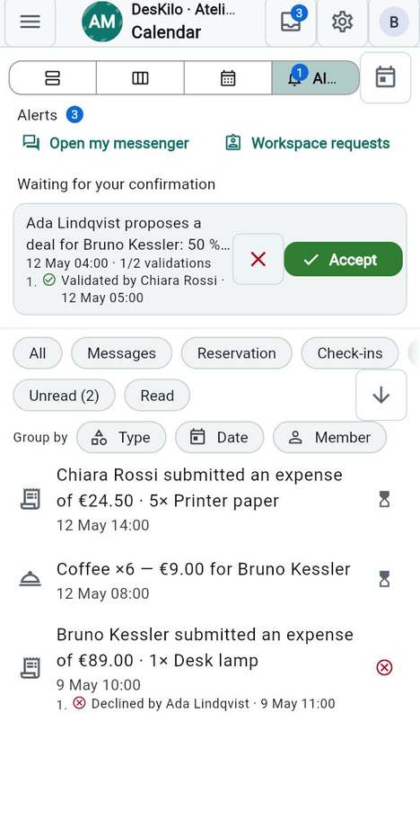

**Steps**

1. Open [Money](https://fdittgen-png.github.io/deskilo/#/money).
2. Tap **Finance alerts**, the row at the top. The number on the bell is how many are waiting.
3. Read the list: the requests you must confirm come first, then the money events.

**Good to know**

- This is the usual alerts view of [Events](https://fdittgen-png.github.io/deskilo/#/events), already filtered on money.
- Payments, expenses and extra half-days you submitted appear here while they wait for confirmation, and show who validated or declined them.
- The row appears when the **Events tab** feature is on.

**See also:** [Approve or decline an expense](#approve-or-decline-an-expense)

<!-- anchor: user.money.reports -->
### Reports: quick view, download, share

**Audience:** Member

You want a document about your own money, to read, keep or send to your accountant.

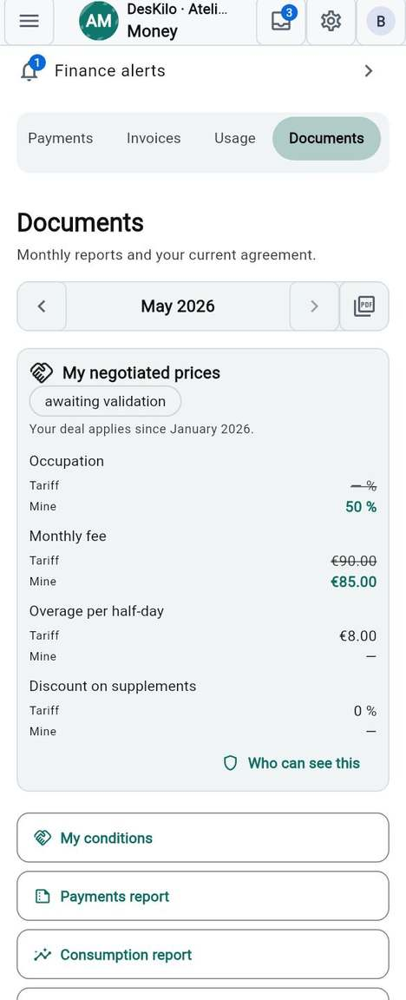

**Steps**

1. Open [Money](https://fdittgen-png.github.io/deskilo/#/money) and choose **Documents**.
2. Pick the month with the arrows, for the reports that depend on a month.
3. Tap a report: **My conditions**, **Payments report**, **Consumption report** or **This month's statement (PDF)**.
4. Choose **Quick view**, **Download PDF** or **Share PDF**.

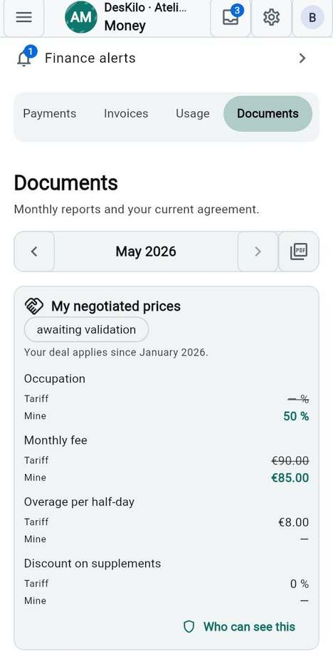

**Good to know**

- The same three choices appear on every report and every invoice.
- **Quick view** shows the document on screen without saving anything.
- A report you cannot see is not switched on in your workspace.

**See also:** [Your invoices](#your-invoices) · [Your negotiated prices](#your-negotiated-prices)

<!-- anchor: user.money.negotiation -->
### Your negotiated prices

**Audience:** Member

You want to know whether you pay the workspace tariff or a price agreed just for you.

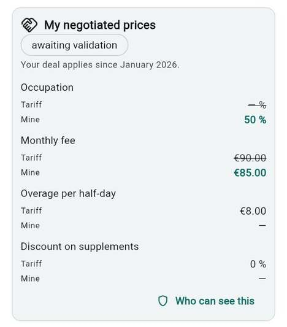

**Steps**

1. Open [Money](https://fdittgen-png.github.io/deskilo/#/money) and choose **Documents**.
2. Read **My negotiated prices**: for **Monthly fee**, **Overage per half-day** and **Discount on supplements**, **Tariff** shows what everyone pays and **Mine** what you pay.
3. Tap **Who can see this** to learn who can read your prices.

**Good to know**

- "You are on the workspace tariff" means no deal applies; your column shows a dash.
- When a deal applies, the card says since which month, and the tariff figure is crossed out.
- A deal proposed for you waits as "awaiting validation" and applies only once validated.
- You cannot change a deal here; an administrator proposes it. See [Price negotiation](#price-negotiation).

**See also:** [Read your statement](#read-your-statement)

<!-- anchor: user.money.documents.library -->
### Open a document from the library

**Audience:** Member

You want the statutes, a guide or the statements your workspace has shared.

**Steps**

1. Open [Money](https://fdittgen-png.github.io/deskilo/#/money), choose **Documents** and tap **Document library**, or go straight to [Documents](https://fdittgen-png.github.io/deskilo/#/documents).
2. Find your document under its category: **Statutes & legal**, **Financial statements**, **Meeting minutes**, **Guides & manuals** or **Other documents**.
3. Tap it. It opens in your browser from wherever it is stored.

**Good to know**

- You only see the documents your role may read; a lock marks those limited to **Admins and owners** or **Owners only**.
- The library holds links. Who may open the file is decided where it is stored, not in DesKilo.
- Administrators with the right permission add and remove documents; see [Document title](#document-title).

**See also:** [Reports](#reports-quick-view-download-share)

<!-- anchor: user.money.expense -->
### Submit an expense

**Audience:** Member

You paid something for the space and you want the workspace to reimburse you.

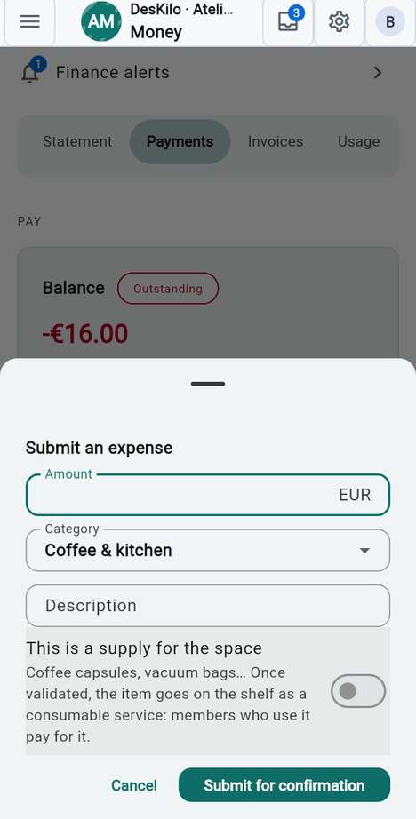

**Steps**

1. Open [Money](https://fdittgen-png.github.io/deskilo/#/money), choose **Payments** and tap **Submit an expense**.
2. Enter the **Amount**.
3. Pick a **Category**: **Coffee & kitchen**, **Equipment**, **Supplies** or **Other**.
4. Write a **Description**.
5. If you bought something members will use, turn on **This is a supply for the space** (it appears when your workspace has **Supplies from expenses** switched on) and fill in the item, the quantity and the unit price.
6. Tap **Submit for confirmation**.

**Good to know**

- You see "Expense submitted — waiting for approval". The expense counts only once it is confirmed.
- A confirmed supply goes on the shelf as a service: members who use it pay for it.
- Recurring costs have their own door, **Scheduled expenses**, next to this button.

**See also:** [Approve or decline an expense](#approve-or-decline-an-expense)

<!-- anchor: user.money.expense.approve -->
### Approve or decline an expense

**Audience:** Administrator · Owner

An expense is waiting and you decide whether the workspace pays it.

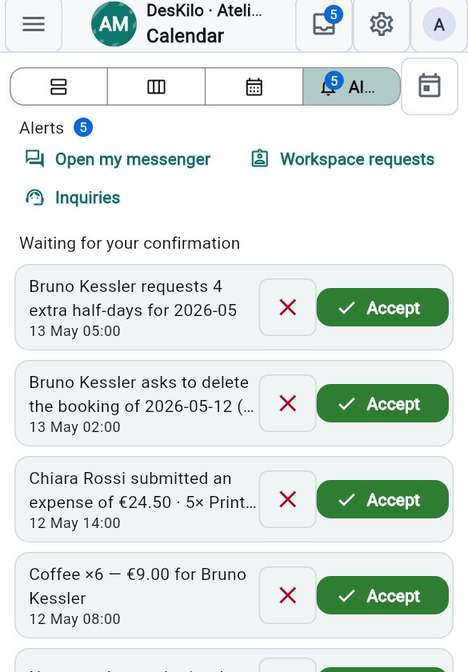

**Steps**

1. Open [Events](https://fdittgen-png.github.io/deskilo/#/events), or tap **Finance alerts** in [Money](https://fdittgen-png.github.io/deskilo/#/money).
2. Look under **Waiting for your confirmation** for the line naming the amount and the member.
3. Tap **Accept** to confirm it, or the cross to **Decline** it.

**Good to know**

- Some expenses need more than one validation. The line shows how many are done, such as "1/2 validations".
- Who may validate, and how many are required, is set in [Validation rules](#validation-rules-domain-by-domain).
- Each decision stays on the line: who confirmed or declined, and when. The member sees the outcome.
- **Finance alerts** in Money appears when the **Events tab** feature is on.

**See also:** [Finance alerts](#finance-alerts)

<!-- anchor: user.money.amounts -->
### How amounts are shown

**Audience:** Everyone

You want to read a figure without second-guessing what it includes.

**Good to know**

- Amounts use your workspace's currency and your number format. An invoice keeps the currency it was issued in.
- On the statement, charges carry a minus sign and payments and credits a plus. A balance in red is money you owe.
- Where a price includes VAT it says so, for example "incl. VAT 20 %". The invoice PDF lists the VAT it contains.
- If your workspace does not charge VAT, no VAT is shown.
- Days are shown in whole and half days.

**See also:** [Read your statement](#read-your-statement) · [Your invoices](#your-invoices)

<!-- anchor: user.money.finances -->
### Your finances across spaces

**Audience:** Member

You belong to several spaces and want all your invoices, payments and reminders in one place.

**Steps**

1. Open [Money](https://fdittgen-png.github.io/deskilo/#/money), choose **Payments** or **Invoices**, and tap **Open for** your space on the card **Your finances across spaces**.
2. Choose a tab: **Outstanding**, **Paid**, **Payments** or **Reminders**.
3. If you belong to several spaces, filter by space at the top.

**Good to know**

- **Outstanding** shows "Nothing to pay — you are up to date" when you owe nothing.
- **Reminders** lists the reminders you have received, with their level.
- Full history, usage and other servers are reachable from the same screen.

**See also:** [Your invoices](#your-invoices)

<!-- anchor: user.money.invoicing -->
### Invoicing at a glance

**Audience:** Billing administrator · Owner

You issue and chase the invoices of the whole workspace and want to know where to start.

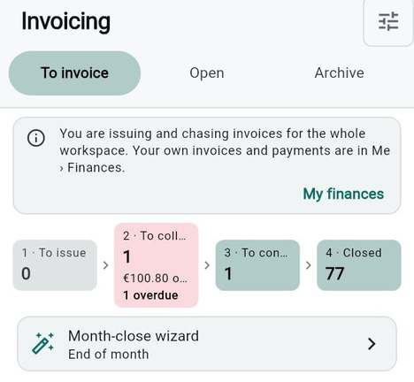

**Steps**

1. Open [Invoicing](https://fdittgen-png.github.io/deskilo/#/invoices).
2. Read the tabs: **To invoice** lists members still to be invoiced for the month, **Open** the invoices issued and unpaid, and **Archive** those that are closed.
3. Read the line of four steps under the banner: **To issue**, **To collect**, **To confirm** and **Closed**, with a count for each.
4. Tap **Month-close wizard** to invoice a month, or **New invoice** for a single one.
5. Tap the tools icon for the invoice register, reminder rules, the invoice PDF template and **My finances**.

**Good to know**

- Invoices are never edited or deleted. A wrong one is marked erroneous and replaced.
- The full workflow, from month-close to settlement and reminders, is in chapter 08: [Reminder rules](#reminder-rules) and [The invoice PDF template](#the-invoice-pdf-template) are good places to continue.

**See also:** [Reminder rules](#reminder-rules)

<!-- anchor: user.space.overview -->
## Your space, set up by you (Workspace settings)

This chapter is for the people who run a space: owners, co-owners and the administrators they trust with the settings. Here you draw the floors, decide who may come in and when, choose which features exist, give the space its look and its words, and take a copy of everything.

In this chapter:
- [Draw your floors, rooms and desks](#space-editor-add-rename-and-delete-floors)
- [Invite people with the workspace ID](#the-workspace-id)
- [Say when the space is open](#open-weekdays)
- [Switch features on and off](#switch-whole-processes-on-or-off)
- [Fill in the workspace settings](#country)
- [Give the space its colours and words](#wording)
- [Decide who may do what](#the-role-matrix)
- [Run a wall tablet and badges](#kiosk-mode-a-wall-tablet-for-check-in)
- [Keep a library of documents](#add-a-document-to-the-library)
- [Export and import the space](#export-the-space-xml)

> **Tip** Most screens in this chapter sit in the menu under **Workspace**, **Availability**, **Features** and **Roles**. Each entry only appears for people who hold the permission it needs, and some only while their feature is switched on. An administrator sees these screens only if the owner has given them the permission in the role matrix.

<!-- anchor: user.space.editor.levels -->
### Space editor: add, rename and delete floors

**Audience:** Owner · Administrator

You want to give the building its floors, in the order people expect them. The **Workspace editor** lists every floor of the space.

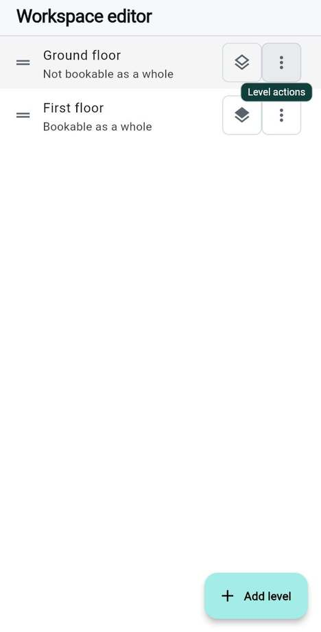

**Steps**

1. Open [Workspace editor](https://fdittgen-png.github.io/deskilo/#/editor), or tap **Edit workspace** on the Reserve screen.
2. Tap **Add level**, type the name and tap **Save**.
3. Drag the handle at the left of a floor to change the order.
4. Tap the three dots (**Level actions**) to **Rename** or **Delete** a floor.
5. Tap a floor to draw on it.

**Good to know**

- Deleting a floor removes every office, desk and seat on it. The confirmation says what becomes of bookings that point at them.
- The line under each floor tells you whether it is **Bookable as a whole** or **Not bookable as a whole**.
- Without any floor the editor says **No levels yet. Add the first floor of your workspace.**

**See also:** [Book a whole floor](#let-members-book-a-whole-floor) · [Draw rooms, desks and seats](#draw-rooms-desks-and-seats)

<!-- anchor: user.space.editor.level-booking -->
### Let members book a whole floor

**Audience:** Owner · Administrator

You want one team to be able to take a complete floor for a day.

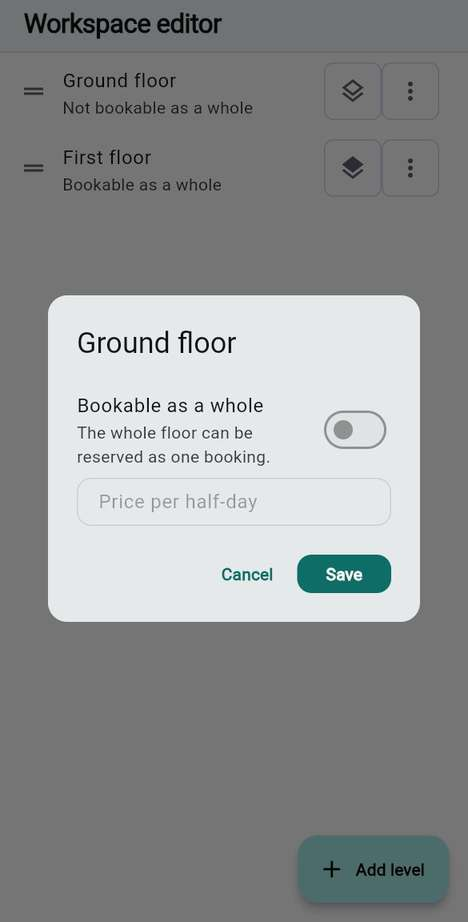

**Steps**

1. In the [Workspace editor](https://fdittgen-png.github.io/deskilo/#/editor), tap the layers button on the floor's row.
2. Switch on **Bookable as a whole**.
3. Type the **Price per half-day**.
4. Tap **Save**.

**Good to know**

- The layers button is filled when the floor is bookable as a whole.
- Booking a whole floor, office or desk also needs the **Desk, office & level reservations** feature. Each member needs the level-reservation right; administrators have it automatically. See [A feature switch](#a-feature-switch).

**See also:** [Office and desk properties](#name-an-office-or-a-desk-and-put-a-price-on-it)

<!-- anchor: user.space.editor.rooms -->
### Draw rooms, desks and seats

**Audience:** Owner · Administrator

You want the plan on screen to look like the real floor. Everything sits inside a room: you draw a room, put desks in it, then put seats on the desks.

**Steps**

1. Open a floor from the [Workspace editor](https://fdittgen-png.github.io/deskilo/#/editor). An empty floor offers **Draw the first room**.
2. Tap **Office** and drag on the grid to draw a room.
3. Tap **Desk** and drag inside the room to draw a desk.
4. Tap **Seat**, then tap a desk to add a seat to it.
5. Tap **Image**, then tap where an illustration should go.
6. Tap an element to select it. The bar at the bottom offers **Duplicate**, **Properties** and **Delete**.

**Good to know**

- Tapping the armed tool a second time puts it down again, and the canvas goes back to selecting.
- The app refuses a shape that is **Overlaps an existing element.** or **Must be fully inside an office.** Seats can only be placed on a desk, and a desk that is full says **No room left on this desk.**
- The picture button at the top right sets, replaces or removes the **Background image** of the floor, for example a scan of the real plan.
- Deleting a room takes its desks and seats with it.

**See also:** [Seat properties](#set-up-a-seat) · [Desk transparency](#desk-transparency)

<!-- anchor: user.space.editor.office -->
### Name an office or a desk and put a price on it

**Audience:** Owner · Administrator

You want a room or a desk to carry its own name, and to be bookable in one piece.

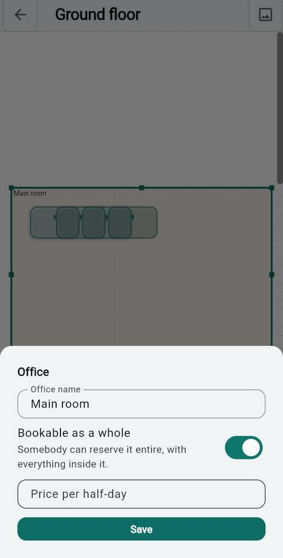

**Steps**

1. Select the office or the desk on the floor and tap **Properties**.
2. Change **Office name** (or **Desk name**).
3. Switch on **Bookable as a whole** if somebody may reserve it entire, with everything inside it.
4. Type the **Price per half-day** that appears.
5. Tap **Save**.

**Good to know**

- The price field only appears while the switch is on.
- A room that is bookable as a whole can only be reserved while nothing inside it is booked.

**See also:** [Book a whole floor](#let-members-book-a-whole-floor) · [Seat properties](#set-up-a-seat)

<!-- anchor: user.space.editor.seat -->
### Set up a seat

**Audience:** Owner · Administrator

You want a seat to say which way the chair faces, what comes with it and when it is out of service.

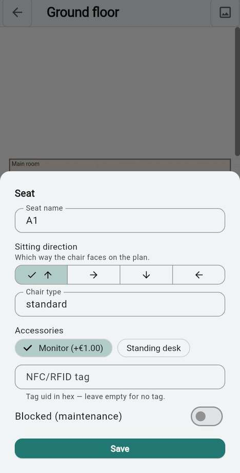

**Steps**

1. Select the seat on the floor and tap **Properties**.
2. Change **Seat name**.
3. Pick the **Sitting direction**: the arrow shows which way the chair faces on the plan.
4. Choose a **Chair type**.
5. Tap the **Accessories** that belong to this seat. A price shown beside one is a supplement per half-day.
6. If the seat carries a tag, type its number into **NFC/RFID tag**, or use **Read a tag now**. The tag field appears when the **NFC/RFID chair tags** feature is on, and reading needs a device that can read tags.
7. Switch on **Blocked (maintenance)** to take the seat out of service, then tap **Save**.

**Good to know**

- A tag number can only belong to one chair: **This tag is already linked to another chair.**
- With no accessory yet, the sheet offers **No accessories yet — set them up**.

**See also:** [NFC badge check-in](#nfc-badge-check-in)

<!-- anchor: user.workspace.code -->
### The workspace ID

**Audience:** Owner · Administrator

You want people to find your space and ask to join. The **Workspace ID & QR** screen shows the member invite: a QR code and the ID behind it.

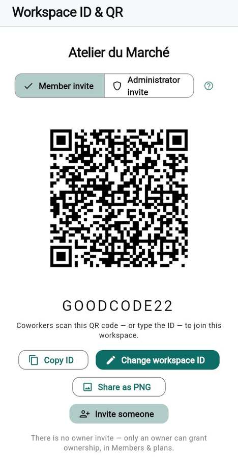

**Steps**

1. Open [Workspace ID & QR](https://fdittgen-png.github.io/deskilo/#/workspace-code). The **Member invite** tab is shown.
2. Tap **Copy ID** to paste the ID anywhere, or **Share as PNG** to print or post the QR code.
3. To choose an ID people can remember, tap **Change workspace ID**, type 4 to 20 letters or digits and tap **Save**.

**Good to know**

- The ID is unique across DesKilo. If it is taken, or not 4 to 20 letters or digits, the app says **That ID was rejected**.
- Anyone who scans the code or types the ID asks to join as a member. Nobody gets in without approval.
- Once you change the ID, the old one stops working. Print the QR code again.
- The **Administrator invite** tab is for owners and co-owners.

**See also:** [Administrator invite](#invite-an-administrator) · [Invite someone](#invite-someone-by-message)

<!-- anchor: user.workspace.code.admin -->
### Invite an administrator

**Audience:** Owner

You want to bring in a person who will help run the space. The **Administrator invite** tab gives you a code for exactly one person.

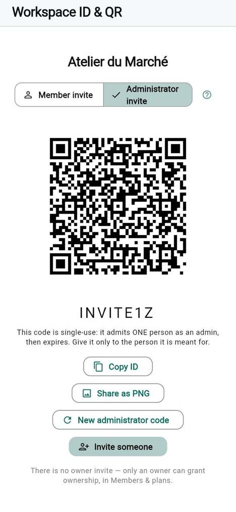

**Steps**

1. Open [Workspace ID & QR](https://fdittgen-png.github.io/deskilo/#/workspace-code) and tap **Administrator invite**.
2. Give the code, or its QR, to the person it is meant for.
3. For the next administrator, tap **New administrator code**.

**Good to know**

- The code admits one person as an administrator, then it expires.
- There is no owner invite. Only an owner can grant ownership, in **Members & plans**.

**See also:** [The workspace ID](#the-workspace-id) · [The role matrix](#the-role-matrix)

<!-- anchor: user.workspace.code.invite -->
### Invite someone by message

**Audience:** Owner · Administrator

You want to send a friendly, ready-made invitation instead of a bare code.

**Steps**

1. On [Workspace ID & QR](https://fdittgen-png.github.io/deskilo/#/workspace-code), tap **Invite someone**.
2. Fill in **First name (optional)**, **Last name (optional)** and the phone number if you want.
3. Under **Roles on arrival**, tap any role this person should receive when they join.
4. Pick the **Message language**.
5. Send it with **WhatsApp**, **SMS** or **Share…**.

**Good to know**

- The message explains the steps: download, create an account, join. It is written in the language you pick, and starts from the one set as [Workspace language](#workspace-language).
- Each message carries its own personal code. You can write your own text under [Invitation message](#invitation-message).

**See also:** [The workspace ID](#the-workspace-id)

<!-- anchor: user.workspace.availability.open-weekdays -->
### Open weekdays

**Audience:** Owner · Administrator with the permission

You want the space to be open only on the days you work. The **Availability** screen starts with the days of the week.

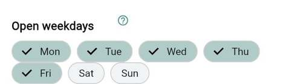

**Steps**

1. Open [Availability](https://fdittgen-png.github.io/deskilo/#/availability).
2. Under **Open weekdays**, tap a day to open or close it.

**Good to know**

- At least one weekday must stay open.
- A booking that touches a closed weekday is refused, and the plan draws that day as closed.

**See also:** [Closure days](#closure-days) · [Granularity](#granularity)

<!-- anchor: user.workspace.availability.granularity -->
### Granularity

**Audience:** Owner · Administrator with the permission

You want bookings to follow a rhythm that suits your space: half days, full days, or any time you like.

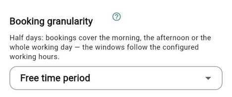

**Steps**

1. Open [Availability](https://fdittgen-png.github.io/deskilo/#/availability).
2. Under **Booking granularity**, choose the shape of a booking.

**Good to know**

- The choices are **Free time period**, **5-minute slots**, **15-minute slots**, **30-minute slots**, **1-hour slots**, **Half days (morning & afternoon)**, **Full days only** and **Real hours (exact from–to, half/full days as shortcuts)**. **Real hours** appears when the **Working hours** feature is on.
- The plan, the booking sheet, a scanned code and the kiosk all offer only what the granularity allows.

**See also:** [Working hours](#working-hours)

<!-- anchor: user.workspace.availability.working-hours -->
### Working hours

**Audience:** Owner · Administrator with the permission

You want a morning, an afternoon and a day to mean the same thing everywhere.

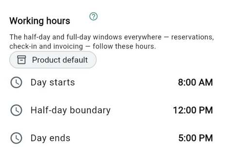

**Steps**

1. Open [Availability](https://fdittgen-png.github.io/deskilo/#/availability).
2. Under **Working hours**, tap **Day starts**, **Half-day boundary** and **Day ends** and set each time.
3. With **Real hours** granularity, also set **Hours billed as a half day** and **Hours billed as a full day**.

**Good to know**

- Half-day and full-day windows in reservations, check-in and invoicing follow these hours.
- The small tag under the title says whether the hours are the product default, come from a template or are your own. **Reset to template** and **Reset to product default** take them back.
- The day must run in order: start, then the half-day boundary, then the end.
- This section is part of the **Working hours** feature.

**See also:** [Outside the opening hours](#outside-the-opening-hours)

<!-- anchor: user.workspace.availability.closure-days -->
### Closure days

**Audience:** Owner · Administrator with the permission

You want a holiday, a week in August or a day for the plumber to close the space without anyone booking it.

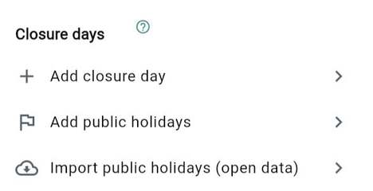

**Steps**

1. Open [Availability](https://fdittgen-png.github.io/deskilo/#/availability) and go to **Closure days**.
2. Tap **Add closure day**, pick the date and, if you like, a **Reason (optional)**.
3. To remove one, tap the bin beside it.

**Good to know**

- A booking on a closure day is refused and the reason is shown.
- Days that are already invoiced cannot be turned into closure days by the public holidays generator.

**See also:** [Public holidays](#public-holidays)

<!-- anchor: user.workspace.availability.public-holidays -->
### Public holidays

**Audience:** Owner · Administrator with the permission

You want a whole year of public holidays as closure days in one go.

**Steps**

1. In [Availability](https://fdittgen-png.github.io/deskilo/#/availability), under **Closure days**, tap **Add public holidays**.
2. Use the arrows to choose the year. The sheet lists the dates that would become closure days.
3. Tap the button at the bottom to create them.
4. Prefer an open-data list? Tap **Import public holidays (open data)**, pick the region and confirm.

**Good to know**

- Nothing is created before you confirm, and days that already exist are marked.
- Months that are already invoiced are skipped.
- These entries appear when the **Public holidays** feature is on. **Import public holidays (open data)** also needs the **Import public holidays** feature.

**See also:** [Closure days](#closure-days)

<!-- anchor: user.workspace.availability.policies -->
### Booking policies

**Audience:** Owner · Administrator with the permission

You want to relax or tighten the rules of booking. Whatever you set here holds on every way of booking: the app, a scanned code and the kiosk.

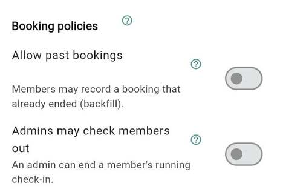

**Steps**

1. Open [Availability](https://fdittgen-png.github.io/deskilo/#/availability) and go to **Booking policies**.
2. Switch the policies you want on or off.
3. Under **Outside the opening hours** and **Booking limits**, set the rest.

**Good to know**

- The two switches are off by default.
- This section is part of the **Booking policies** feature.
- The line **What the plan tells apart** below it explains the states members see on the plan.

**See also:** [Allow past bookings](#allow-past-bookings) · [Admins may check members out](#administrators-may-check-out) · [Booking limits](#booking-limits)

<!-- anchor: user.workspace.availability.allow-past -->
### Allow past bookings

**Audience:** Owner · Administrator with the permission

You want members to record a booking after the fact, for a space that notes attendance later.

**Steps**

1. In [Availability](https://fdittgen-png.github.io/deskilo/#/availability), under **Booking policies**, switch on **Allow past bookings**.

**Good to know**

- Off, a booking that already ended on an earlier day is refused.
- Booking an earlier window on the same day is always allowed.

**See also:** [Booking policies](#booking-policies)

<!-- anchor: user.workspace.availability.admin-checkout -->
### Administrators may check out

**Audience:** Owner · Administrator with the permission

You want staff to close the room in the evening and end the check-ins people forgot.

**Steps**

1. In [Availability](https://fdittgen-png.github.io/deskilo/#/availability), under **Booking policies**, switch on **Admins may check members out**.

**Good to know**

- Off, check-out is strictly personal.
- With it on, an administrator can end a member's running check-in.

**See also:** [Booking policies](#booking-policies)

<!-- anchor: user.workspace.availability.outside-hours -->
### Outside the opening hours

**Audience:** Owner · Administrator with the permission

You want to say what happens when somebody arrives early or stays late. One answer applies to every granularity.

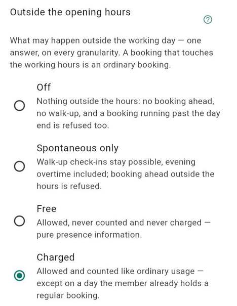

**Steps**

1. In [Availability](https://fdittgen-png.github.io/deskilo/#/availability), find **Outside the opening hours**.
2. Choose **Off**, **Spontaneous only**, **Free** or **Charged**.

**Good to know**

- **Off**: nothing outside the hours, no booking ahead, no walk-up.
- **Spontaneous only**: walk-up check-ins stay possible, evening overtime included, but booking ahead outside the hours is refused.
- **Free**: allowed, never counted and never charged.
- **Charged**: allowed and counted like ordinary usage, except on a day when the member already holds a regular booking.
- A booking that touches the working hours is an ordinary booking.

**See also:** [Working hours](#working-hours)

<!-- anchor: user.workspace.availability.limits -->
### Booking limits

**Audience:** Owner · Administrator with the permission

You want to say how far ahead people may book, how short or long a booking may be, and how many they may hold at once.

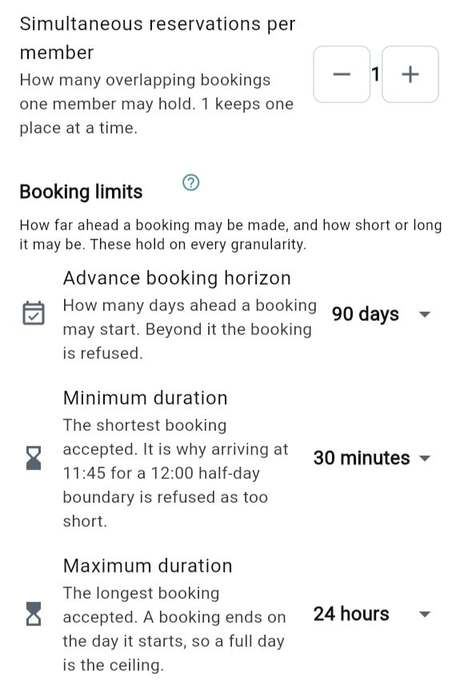

**Steps**

1. In [Availability](https://fdittgen-png.github.io/deskilo/#/availability), find **Simultaneous reservations per member** and use the minus and plus buttons.
2. Under **Booking limits**, set **Advance booking horizon**, **Minimum duration** and **Maximum duration**.

**Good to know**

- **Simultaneous reservations per member** is how many overlapping bookings one member may hold. 1 keeps one place at a time.
- A booking ends on the day it starts, so a full day is the longest it can be.
- The minimum cannot exceed the maximum, otherwise no booking would be accepted. The screen warns you.
- Every refusal names the limit and its value.

**See also:** [Booking policies](#booking-policies)

<!-- anchor: user.features.processes -->
### Switch whole processes on or off

**Audience:** Owner · Co-owner

You want a bird's-eye view of what the space can do, and to switch a whole area on at once. The **Features** screen opens on one card per business process.

**Steps**

1. Open [Features](https://fdittgen-png.github.io/deskilo/#/features). The **Processes** view is shown.
2. Read each card: its state, how many subprocesses are active and how many features are on.
3. Open a card and tap **Switch on** or **Switch off** for the whole process or one subprocess.
4. Read the preview, then confirm.

**Good to know**

- A card is **Active** when all its features work, **Partial** when some do, **Available** when none is on yet, and **Needs attention** when a feature is on but waits for a prerequisite that is off.
- The chips **All**, **Active**, **Available** and **Needs attention** narrow the cards, and **Search processes and features** reaches everything.
- The preview lists what is switched on, what is **Also needed** from another process and what is already on. Switching something off that other features need is refused until you choose what happens to them.

**See also:** [A feature switch](#a-feature-switch)

<!-- anchor: user.features.switch -->
### A feature switch

**Audience:** Owner · Co-owner

You want to turn one single feature on or off.

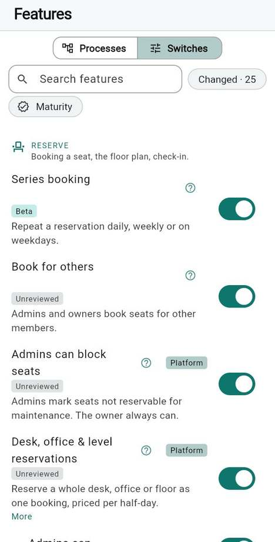

**Steps**

1. Open [Features](https://fdittgen-png.github.io/deskilo/#/features) and tap **Switches**.
2. Find the feature with **Search features**, or narrow the list with **Changed** or **Maturity**.
3. Flip its switch.

**Good to know**

- Switch a feature on and every part of it appears: the tab, the button, the link. Switch it off and none remains, even a saved link.
- A feature that needs another sits under it with **Requires…** and says **Waiting on the feature above** while the parent is off. Its own choice is kept.
- Switching a feature on can also switch on what it needs. The app tells you.
- A feature not yet reviewed as stable asks you to confirm first: it may change and has known limits.
- Something already done stays done. An invoice issued while a feature was on keeps what it says.

**See also:** [Switch whole processes on or off](#switch-whole-processes-on-or-off)

<!-- anchor: user.workspace.settings.country -->
### Country

**Audience:** Owner · Administrator with the permission

You want the space to know where it is established. **Workspace** opens on **General details**.

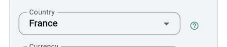

**Steps**

1. Open [Workspace](https://fdittgen-png.github.io/deskilo/#/workspace-settings).
2. Under **General details**, pick the **Country**.
3. Tap **Save** at the bottom.

**Good to know**

- The country proposes the currency and the time zone, and decides which VAT rates are offered.
- Once the space has issued a document or recorded money, the country can no longer be changed: saving says "The currency and the country are fixed once this space has issued a document or recorded money. Nothing was saved."
- **Save** writes the whole form together. If someone changed these settings meanwhile, nothing is saved and what you typed stays on screen.

**See also:** [Currency and time zone](#currency-and-time-zone)

<!-- anchor: user.workspace.settings.currency-timezone -->
### Currency and time zone

**Audience:** Owner · Administrator with the permission

You want prices and days to be counted the way your space counts them.

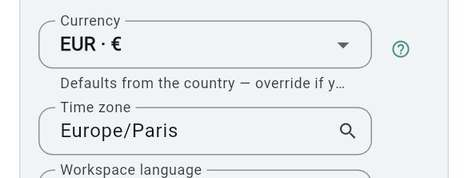

**Steps**

1. In [Workspace](https://fdittgen-png.github.io/deskilo/#/workspace-settings), under **General details**, pick the **Currency**.
2. Search for the **Time zone** and choose it.
3. Tap **Save**.

**Good to know**

- The currency is proposed from the country. You can override it until the space has issued a document or recorded money; after that it is fixed.
- The time zone is not cosmetic: a working day, a half-day boundary and a closure day are all counted in it, so a member abroad sees the space's day rather than their own.

**See also:** [Country](#country)

<!-- anchor: user.workspace.settings.language -->
### Workspace language

**Audience:** Owner · Administrator with the permission

You want invitations and documents to speak the language of your community.

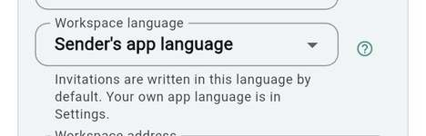

**Steps**

1. In [Workspace](https://fdittgen-png.github.io/deskilo/#/workspace-settings), under **General details**, open **Workspace language**.
2. Pick a language, or **Sender's app language**.
3. Tap **Save**.

**Good to know**

- Invitations are written in this language by default.
- It is not your own app language. That one only changes what you see, and lives in your personal settings.

**See also:** [Invitation message](#invitation-message)

<!-- anchor: user.workspace.settings.address -->
### Letterhead address

**Audience:** Owner · Administrator with the permission

You want your postal address on the paper the space sends out.

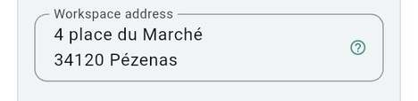

**Steps**

1. In [Workspace](https://fdittgen-png.github.io/deskilo/#/workspace-settings), under **General details**, fill in **Workspace address**.
2. Tap **Save**.

**Good to know**

- It is free text, printed as it is on letters and invoices.
- The structured address that an e-invoice needs is a separate entry, under the legal identity.

**See also:** [Country](#country)

<!-- anchor: user.workspace.settings.whatsapp-group -->
### WhatsApp group

**Audience:** Owner · Administrator with the permission

You want members to find your community's WhatsApp group.

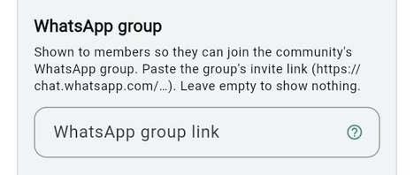

**Steps**

1. In [Workspace](https://fdittgen-png.github.io/deskilo/#/workspace-settings), open **Community & invitations**.
2. Paste the group's invite link into **WhatsApp group link**.
3. Tap **Save**.

**Good to know**

- The link must be a chat.whatsapp.com invite link, otherwise the field says so.
- Leave it empty to show nothing.

**See also:** [Invitation message](#invitation-message)

<!-- anchor: user.workspace.settings.invitation-message -->
### Invitation message

**Audience:** Owner · Administrator with the permission

You want invitations to sound like you, in every language you use.

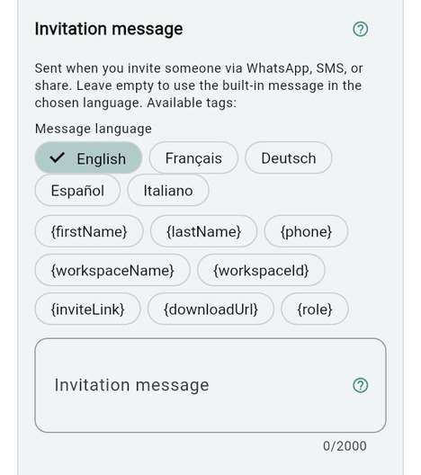

**Steps**

1. In [Workspace](https://fdittgen-png.github.io/deskilo/#/workspace-settings), open **Community & invitations**.
2. Under **Message language**, choose which language's text you are editing.
3. Write the text. Tap a tag such as {firstName} or {inviteLink} to insert it where the cursor is.
4. Tap **Save**.

**Good to know**

- Leave the box empty to use the built-in message in that language.
- The **Message language** row only says which draft is on screen. It is not saved, and it opens on the workspace language each time.
- The tags are filled in when you send an invitation. The code and the link come from the app, so do not paste them yourself.

**See also:** [Invite someone by message](#invite-someone-by-message)

<!-- anchor: user.workspace.settings.new-members -->
### Start new members the same way

**Audience:** Owner · Administrator with the permission

You want everyone who joins to begin with the same subscription and the same rule for when their days run out.

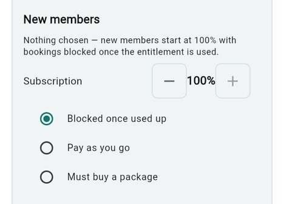

**Steps**

1. In [Workspace](https://fdittgen-png.github.io/deskilo/#/workspace-settings), open **New members**.
2. Set the **Subscription** percentage with the minus and plus buttons.
3. Choose **Blocked once used up**, **Pay as you go** or **Must buy a package**.
4. Tap **Save**.

**Good to know**

- Until you choose, new members start at 100% with bookings blocked once the entitlement is used.
- A member's own subscription is set later, on the member's page.

**See also:** [A member's subscription](#a-members-subscription)

<!-- anchor: user.workspace.settings.wording -->
### Wording

**Audience:** Owner · Administrator with the permission

You want the app to use your words: another name for a seat, for a status on the plan, for a tab.

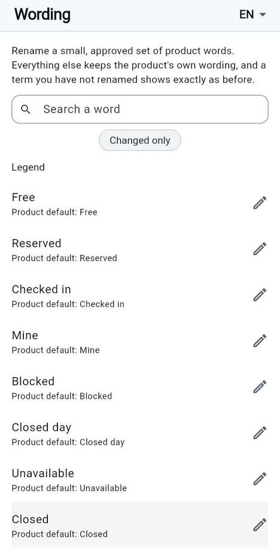

**Steps**

1. In [Workspace](https://fdittgen-png.github.io/deskilo/#/workspace-settings), open **Appearance & wording** and tap **Wording**.
2. Find a word with **Search a word**, or tap **Changed only** to see what you renamed.
3. Tap the pencil beside it and type your word, per language.

**Good to know**

- The product's word stays shown beneath yours, so you see what you replace.
- **Reset** removes your word instead of copying the product's. The term then follows the product when its wording changes.
- Terms are grouped by where they appear: **Legend**, **The space**, **Navigation**, **Booking**.

**See also:** [Colours](#colours)

<!-- anchor: user.workspace.settings.colours -->
### Colours

**Audience:** Owner · Administrator with the permission

You want the app to wear your colour. Pick one and the app derives its light and dark themes from it.

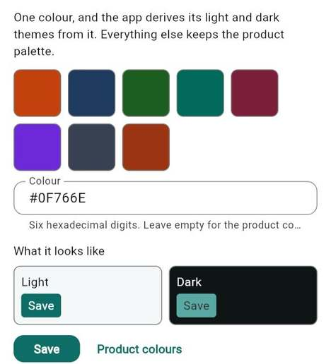

**Steps**

1. In [Workspace](https://fdittgen-png.github.io/deskilo/#/workspace-settings), open **Appearance & wording** and tap **Colours**. The row is there while **Workspace colours** is on in the features.
2. Tap one of the colours, or type a code such as #0F766E into **Colour**.
3. Check **What it looks like**, in **Light** and **Dark**.
4. Tap **Save**. **Product colours** removes yours.

**Good to know**

- The app keeps its own contrast. If a colour would be unreadable somewhere, it is refused and the screen names the pair.
- Under **Room colours** you can add up to eight colours of your own for the rooms on the plan.
- The DesKilo mark, the colours of the seat states and the production banner are never restyled.

**See also:** [Pattern](#pattern) · [Symbol and emblem](#symbol-and-emblem)

<!-- anchor: user.workspace.settings.pattern -->
### Pattern

**Audience:** Owner · Administrator with the permission

You want your space easy to tell apart from the others a person belongs to.

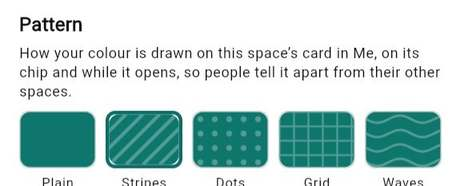

**Steps**

1. Open [Colours](https://fdittgen-png.github.io/deskilo/#/settings/colours).
2. Under **Pattern**, tap **Plain**, **Stripes**, **Dots**, **Grid** or **Waves**.

**Good to know**

- The pattern draws your colour on this space's card in Me, on its chip and while the space opens.
- It saves as soon as you tap it.

**See also:** [Colours](#colours)

<!-- anchor: user.workspace.settings.branding -->
### Symbol and emblem

**Audience:** Owner · Administrator with the permission

You want a small mark that stands for the space: letters on a colour, or your own logo.

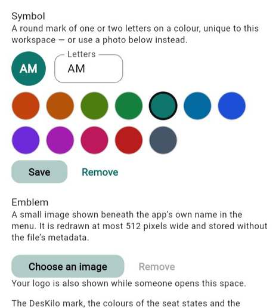

**Steps**

1. Open [Colours](https://fdittgen-png.github.io/deskilo/#/settings/colours) and go to **Symbol**.
2. Type one or two **Letters**, pick a colour and tap **Save**.
3. Under **Emblem**, tap **Choose an image** to add your logo. **Remove** takes it away.

**Good to know**

- Letters on a colour are unique to a workspace. If another space already has the same, the app asks you to change the colour or the letters.
- The emblem is shown beneath the app's name in the menu, and while someone opens this space. It is redrawn at most 512 pixels wide, and the photo's own details, such as where it was taken, are not kept.
- The emblem never replaces the DesKilo logo.

**See also:** [Colours](#colours)

<!-- anchor: user.workspace.settings.desk-transparency -->
### Desk transparency

**Audience:** Owner · Administrator with the permission

You drew the plan over a photograph and want the room to show through the furniture.

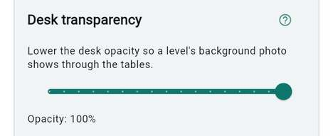

**Steps**

1. In [Workspace](https://fdittgen-png.github.io/deskilo/#/workspace-settings), open **Appearance & wording**.
2. Drag the **Desk transparency** slider. The value shows as **Opacity**.
3. Tap **Save**.

**Good to know**

- Lower the opacity so a level's background photo shows through the tables.
- Turn it up to 100% when the places matter more than the room.

**See also:** [Draw rooms, desks and seats](#draw-rooms-desks-and-seats)

<!-- anchor: user.workspace.settings.public-page -->
### Public workspace page

**Audience:** Owner

You want people outside your space to find it and see what it offers.

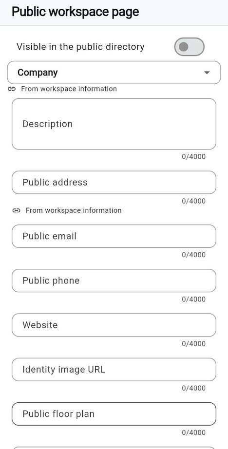

**Steps**

1. Open [Public workspace page](https://fdittgen-png.github.io/deskilo/#/settings/public-page), or tap it at the top of **Workspace**.
2. Switch on **Visible in the public directory**.
3. Choose the kind of host, and complete **Description**, **Public address**, **Public email**, **Public phone** and **Website**.
4. Tap **Save and preview the external view**.

**Good to know**

- Fields marked **From workspace information** follow the workspace's own details. **Use workspace information** puts them back after you changed them.
- **Reset all public data to workspace information** replaces every field that has a workspace counterpart.
- Administrators can choose for themselves whether they are shown as public administrators.

**See also:** [Discover and the public network](#discover)

<!-- anchor: user.roles.matrix -->
### The role matrix

**Audience:** Owner · Co-owner

You want to decide which permissions each role holds. **Roles** shows one card per role with a tick for every permission it holds.

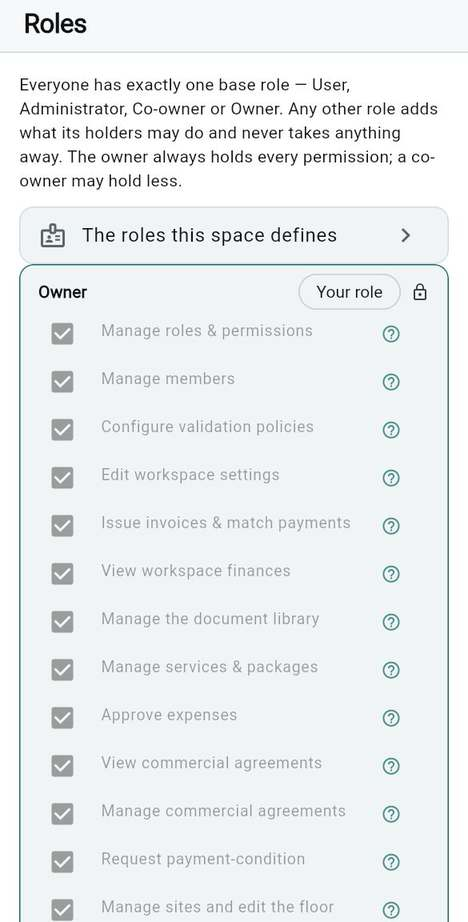

**Steps**

1. Open [Roles](https://fdittgen-png.github.io/deskilo/#/roles).
2. On the card of a role, tick or untick a permission such as **Manage roles & permissions**, **Manage members**, **Edit workspace settings** or **Issue invoices & match payments**.

**Good to know**

- Everyone has exactly one base role: User, Administrator, Co-owner or Owner. Other roles add to it and never take anything away.
- The owner always holds every permission, so that card is locked. A co-owner may hold less.
- Anyone who may not manage roles sees the matrix read-only, with **Your role** highlighted.
- A permission is checked by the server in every place, so unticking it removes it everywhere at once.
- The **Roles** entry shows when the **Role management** feature is on.

**See also:** [Roles this space defines](#roles-this-space-defines) · [Co-owners](#co-owners)

<!-- anchor: user.roles.space -->
### Roles this space defines

**Audience:** Owner · Co-owner

You want roles that fit your space, such as a host or an accountant, on top of the basic ones.

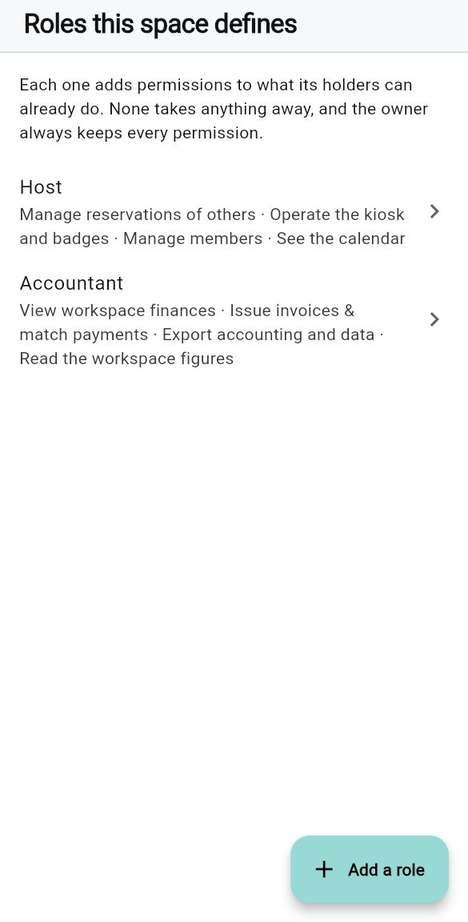

**Steps**

1. In [Roles](https://fdittgen-png.github.io/deskilo/#/roles), tap **The roles this space defines**, or open [Roles this space defines](https://fdittgen-png.github.io/deskilo/#/settings/roles-of-this-space). This screen appears when the **Roles this space defines** feature is on.
2. Tap **Add a role**.
3. Give the role a name, then choose **What it adds**.
4. Tap **Save the role**.
5. To give it to a member, open the member's page, find **Roles** and tap **Add a role**.

**Good to know**

- Each role adds permissions to what its holders can already do. None takes anything away, and the owner always keeps every permission.
- A role you no longer want can be put aside with **In use** switched off.
- The role's key never changes: the people who hold it point at it.
- Nobody can give a role to themselves. A role that manages roles can only be given by the owner.

**See also:** [The role matrix](#the-role-matrix)

<!-- anchor: user.roles.co-owners -->
### Co-owners

**Audience:** Owner

You want the space to survive if you ever step away.

**Steps**

1. Open [Members & plans](https://fdittgen-png.github.io/deskilo/#/members) and choose the member.
2. Under **Co-ownership**, choose an active co-owner or a successor.
3. To hand over now, choose **Promote to owner now**.

**Good to know**

- An active co-owner has the owner's permissions now. A successor, shown as **Successor**, waits and becomes owner when activated or when the owner leaves.
- If the last owner leaves, the best co-owner becomes owner automatically, active before successor.
- Co-owners are part of the **Co-owners** feature.

**See also:** [Co-ownership](#co-ownership) · [The role matrix](#the-role-matrix)

<!-- anchor: user.kiosk.mode -->
### Kiosk mode: A wall tablet for check-in

**Audience:** Owner · Administrator

You want a tablet by the door where people check in with a badge.

**Steps**

1. Create an account for the tablet, join the workspace with it and, in [Members & plans](https://fdittgen-png.github.io/deskilo/#/members), use **Make kiosk device** on that member.
2. Make sure **Kiosk mode** is on in [Features](https://fdittgen-png.github.io/deskilo/#/features).
3. On the tablet, open the app. It asks **Start kiosk mode?**. Tap **Start kiosk mode**.
4. A member taps a seat, or **This level**, and presents a badge: a card, or a printed QR code.

**Good to know**

- Kiosk mode never starts by itself. **Not now — open the app normally** opens the app as usual, which is handy for setup.
- In kiosk mode the tablet only shows the plan. To leave it you restart the tablet. To make the account a normal member again, use **Kiosk device** under **Settings** on the device or **Revert kiosk to member** in **Members & plans**.
- The sheet that opens names the rule it follows. On a closed day the kiosk says **The workspace is closed today** up front.
- The badge is the confirmation: it identifies the member, carries out the action and the screen clears for the next person. A seat held by someone else shows who holds it and points you to the app.
- Badges come with their own features, **RFID / NFC badges** and QR badges, both under **Kiosk mode**.
- A wall tablet cannot be shown here: the kiosk only starts on a device marked as one.

**See also:** [NFC badge check-in](#nfc-badge-check-in) · [Space QR codes (PDF)](#space-qr-codes-pdf)

<!-- anchor: user.badges.nfc -->
### NFC badge check-in

**Audience:** Owner · Administrator

You want members to check in by tapping a card, with no phone.

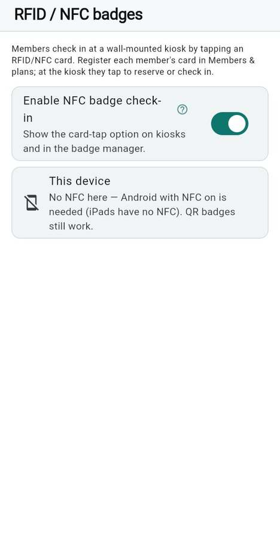

**Steps**

1. Open [RFID / NFC badges](https://fdittgen-png.github.io/deskilo/#/nfc-config).
2. Switch on **Enable NFC badge check-in**.
3. Read the **This device** line: it says whether this device can read cards.
4. Give each member a card in [Members & plans](https://fdittgen-png.github.io/deskilo/#/members): open the member's badges, tap **Register card**, then hold the card to the back of the device.

**Good to know**

- You need an Android device with NFC. iPads have no NFC, and QR badges still work there.
- The badge manager also lets you issue a **New badge**, **Revoke** one, and **Save as PDF** for printing. A revoked badge can be deleted for good.
- **Signs me in** is off by default: a badge that checks you in does not log you in until the member chooses to.
- Each member can also make their own badge in their personal settings.

**See also:** [A wall tablet for check-in](#kiosk-mode-a-wall-tablet-for-check-in)

<!-- anchor: user.documents.add -->
### Add a document to the library

**Audience:** Owner · Administrator

You want to gather your statutes, guides, statements and minutes in one place for the members who need them. The library holds links, not files.

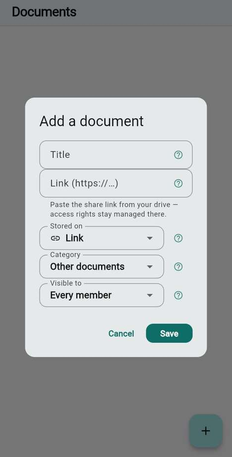

**Steps**

1. Open [Documents](https://fdittgen-png.github.io/deskilo/#/documents) and tap the plus button.
2. Fill in **Title** and **Link (https://…)**.
3. Choose **Stored on**, **Category** and **Visible to**.
4. Tap **Save**.

**Good to know**

- The library needs the **Document library** feature, and the permission to manage it.
- Remove a document with its bin: it asks **Remove document?** first.
- Members who may open the library see the documents they are allowed to, grouped by category.

**See also:** [Document title](#document-title) · [Link](#link) · [Visible to](#visible-to)

<!-- anchor: user.documents.title -->
### Document title

**Audience:** Owner · Administrator

You want members to recognise a document at a glance.

**Steps**

1. In the add-a-document form, type the **Title**.

**Good to know**

- A document needs a title and an https:// link, or **Save** is refused.
- Write it for the reader, as it is the line they see in the library.

**See also:** [Add a document to the library](#add-a-document-to-the-library)

<!-- anchor: user.documents.url -->
### Link

**Audience:** Owner · Administrator

You want the document to open where it already lives.

**Steps**

1. Paste the share link from your drive into **Link (https://…)**.

**Good to know**

- DesKilo stores the link, not the file. Access rights stay managed where the document is.
- The link must begin with https://.

**See also:** [Stored on](#stored-on)

<!-- anchor: user.documents.provider -->
### Stored on

**Audience:** Owner · Administrator

You want members to see where the document is kept.

**Steps**

1. Choose **Stored on**: Google Drive, OneDrive, SharePoint, Dropbox, Nextcloud or **Link**.

**Good to know**

- It is a label with an icon. Nothing is fetched for you.

**See also:** [Link](#link)

<!-- anchor: user.documents.category -->
### Category

**Audience:** Owner · Administrator

You want the library to read like a tidy shelf.

**Steps**

1. Choose a **Category**: **Statutes & legal**, **Guides & manuals**, **Financial statements**, **Meeting minutes** or **Other documents**.

**Good to know**

- The library groups documents under these headings, and only shows a heading that has a document.

**See also:** [Visible to](#visible-to)

<!-- anchor: user.documents.role -->
### Visible to

**Audience:** Owner · Administrator

You want some documents for everyone and some for the board only.

**Steps**

1. Choose **Visible to**: **Every member**, **Admins and owners** or **Owners only**.

**Good to know**

- The server enforces it. A member who may not see a document does not receive it at all.

**See also:** [Add a document to the library](#add-a-document-to-the-library)

<!-- anchor: user.workspace.export.space-xml -->
### Export the space (XML)

**Audience:** Owner · Administrator with the permission

You want a file with the floor plan and settings, to keep as a backup, to reuse or to move to another space.

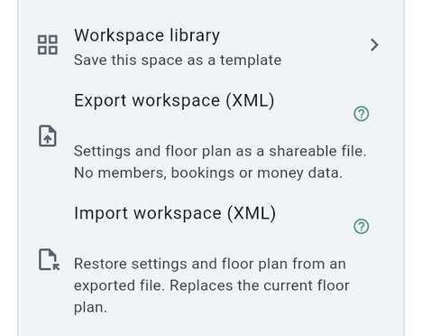

**Steps**

1. Open [Workspace](https://fdittgen-png.github.io/deskilo/#/workspace-settings) and go to **Templates & data**.
2. Tap **Export workspace (XML)**.

**Good to know**

- It carries settings and the floor plan. It never holds members, bookings or money data, nor the invite code or payment credentials.
- With **Configuration in the space file** on, the file also carries tariffs, VAT rates, rules, roles and more.
- The file is saved on your device.

**See also:** [Import the space (XML)](#import-the-space-xml)

<!-- anchor: user.workspace.export.space-import -->
### Import the space (XML)

**Audience:** Owner · Administrator with the permission

You want to apply an exported file to a space.

**Steps**

1. In [Workspace](https://fdittgen-png.github.io/deskilo/#/workspace-settings), under **Templates & data**, tap **Import workspace (XML)**.
2. Choose the file and read the preview: levels, offices, desks, seats and configuration.
3. Tap **Replace and import**.

**Good to know**

- It replaces the current floor plan and overwrites the settings. This cannot be undone.
- Once a space has bookings, only the configuration is applied. The floor plan is kept, and the app says so.
- A file that is not readable, or not from DesKilo, is refused with a clear message.
- When the file carries a configuration and **Configuration in the space file** is off in this space, the app asks first: **Switch it on and apply** applies it, **Import without the configuration** imports the rest, and the preview then reads “Configuration: not applied.” Only somebody who may change the configuration is offered to switch it on.

**See also:** [Export the space (XML)](#export-the-space-xml)

<!-- anchor: user.workspace.export.config-pdf -->
### Export the configuration (PDF)

**Audience:** Owner · Administrator with the permission

You want a document of every parameter, to read, sign or give to an accountant.

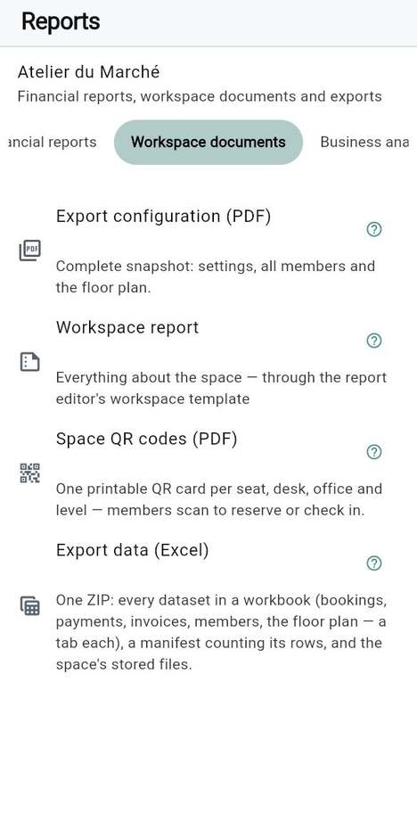

**Steps**

1. Open [Reports](https://fdittgen-png.github.io/deskilo/#/reports?section=documents) and choose **Workspace documents**.
2. Tap **Export configuration (PDF)**.

**Good to know**

- It is a complete snapshot of settings, members and the floor plan. It is a record, not a backup: only the XML can be imported back.

**See also:** [Export the space (XML)](#export-the-space-xml)

<!-- anchor: user.workspace.export.workspace-report -->
### Workspace report

**Audience:** Owner · Administrator with the permission

You want the space as a document: its places, prices and rules.

**Steps**

1. Open [Reports](https://fdittgen-png.github.io/deskilo/#/reports?section=documents) and choose **Workspace documents**.
2. Tap **Workspace report**.

**Good to know**

- It is made by the report editor's workspace template, so its look follows the design you chose.

**See also:** [Export the configuration (PDF)](#export-the-configuration-pdf)

<!-- anchor: user.workspace.export.space-qr -->
### Space QR codes (PDF)

**Audience:** Owner · Administrator with the permission

You want a QR card on every seat, desk, office and floor, so people book or check in by scanning it.

**Steps**

1. Open [Reports](https://fdittgen-png.github.io/deskilo/#/reports?section=documents) and choose **Workspace documents**.
2. Tap **Space QR codes (PDF)**.
3. Choose **Card size**, **QR code size** and the **Information on the card**, then tap **Save**.
4. Print, cut and stick each card on its place.

**Good to know**

- It needs the **Space QR codes** feature.
- Scanning a card opens the same sheet the kiosk shows.

**See also:** [A wall tablet for check-in](#kiosk-mode-a-wall-tablet-for-check-in)

<!-- anchor: user.workspace.export.excel -->
### Export the data (Excel)

**Audience:** Owner · Administrator with the permission

You want your figures in a spreadsheet for your own analysis.

**Steps**

1. Open [Reports](https://fdittgen-png.github.io/deskilo/#/reports?section=documents) and choose **Workspace documents**.
2. Tap **Export data (Excel)**.

**Good to know**

- It arrives as one ZIP: a workbook with a tab for bookings, payments, invoices, members and the floor plan, a manifest that counts the rows, and the space's stored files.
- It needs the **Data export (Excel)** feature and the permission to export data. It is an export only: nothing reads it back.

**See also:** [Export the space (XML)](#export-the-space-xml)

<!-- anchor: user.workspace.sites -->
### Sites

**Audience:** Owner · Administrator

You run more than one address, and want each level and member to belong to the right one.

**Steps**

1. Switch on **Sites** in [Features](https://fdittgen-png.github.io/deskilo/#/features).
2. Open [Sites](https://fdittgen-png.github.io/deskilo/#/settings/sites) and tap **Add a site**.
3. Fill in **Site name**, **Street**, **Post code**, **City** and the levels that belong to it.

**Good to know**

- The default site carries the workspace's address. A member's home site is the address on their documents.
- **Delete this site** sends its levels and members back to the default site.
- A site that is its own legal entity can carry its own registration and VAT number.

<!-- anchor: user.people.overview -->
## Members, plans and billing

This chapter is for owners and billing administrators. It follows the money from the person to the price list: who is in your space and on which plan, how each plan is priced, what else you sell, how members pay you, and the costs you pay yourself.

In this chapter:
- [Members & plans](#members--plans): the list, the member page and everything you can set for one person
- [Billing](#fee-bands): fee bands, subscription levels, day packages and the invoice schedule
- [Services and accessories](#a-service): the extras you sell
- [Payment instructions and online payments](#payment-methods-and-instructions): how members pay you
- [Scheduled expenses](#scheduled-expenses): costs that come back on their own

<!-- anchor: user.members.list -->
### Members & plans

**Audience:** Administrator · Owner

You want to see who is in your space, on which plan, and open anyone to change their settings.

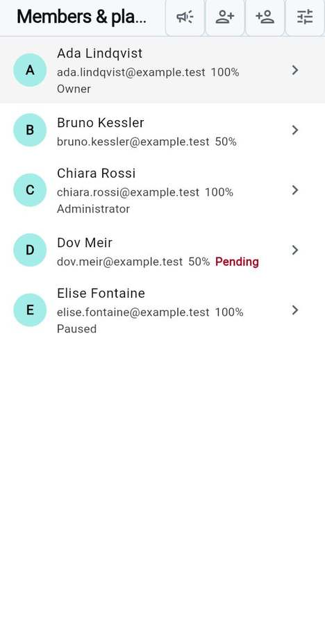

**Steps**

1. Open [Members & plans](https://fdittgen-png.github.io/deskilo/#/members) from the menu.
2. Read each row: the e-mail, the plan share (or **No subscription**), the role, and a status when it is not the usual one: **Pending**, **Paused** or **Exited**.
3. Tap a row to open that person's [member page](#the-member-page).

**Good to know**

- A row also shows **max** and **at once** chips when you set a [reservation limit](#reservation-limit) or more than one [simultaneous reservation](#simultaneous-reservations).
- Depending on the features switched on, the top bar (icon buttons with tooltips) offers **Notify all admins**, **Add a managed profile** and, for owners, **Invite a member** and **Billing**.
- Administrators reach this screen too; the controls that change money or roles stay with the owner.

**See also:** [Invite a member](#invite-a-member) · [Billing](#fee-bands)

<!-- anchor: user.members.invite -->
### Invite a member

**Audience:** Owner

You want someone to join your space.

**Steps**

1. In [Members & plans](https://fdittgen-png.github.io/deskilo/#/members), tap **Invite a member**.
2. Share the workspace ID or its QR code, as described in [The workspace ID](#the-workspace-id).
3. When the person asks to join, their row appears as **Pending**. Open it and choose **Approve membership** or **Reject membership**.

**Good to know**

- Rejecting lets you add a short comment.
- Until you decide, the person has no access to the space.

**See also:** [Pending and paused members](#pending-and-paused-members) · [Add a managed profile](#add-a-managed-profile)

<!-- anchor: user.members.managed -->
### Add a managed profile

**Audience:** Administrator · Owner

Someone has no account yet, but you want to book, invoice and manage for them. You create a profile, run it yourself, and hand it over when the person joins.

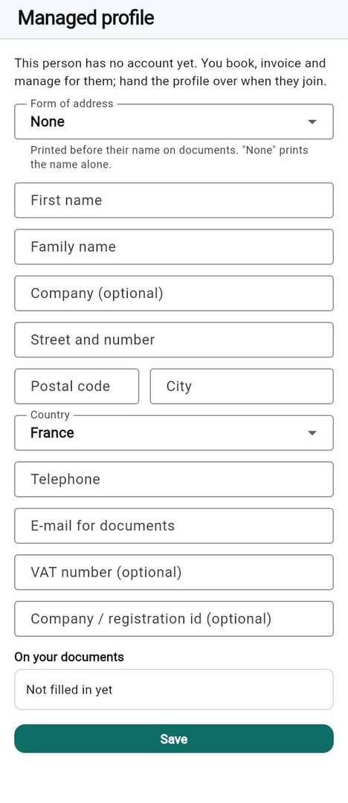

**Steps**

1. In [Members & plans](https://fdittgen-png.github.io/deskilo/#/members), tap **Add a managed profile**.
2. Fill in the person's identity and save. The member page then carries a **Managed** chip.
3. To correct the details later, open the member page and choose **Edit identity**.
4. When the person is ready, choose **Hand over to the person**. It creates a personal code bound to this profile.
5. Changed your mind before the code was used? Choose **Revoke handover**.

**Good to know**

- Whoever uses the code takes the profile over, with its reservations, invoices and subscription, once you approve the membership.
- Nobody can send a message to a managed member, because no one would read it.
- The feature must be switched on in [Features](#a-feature-switch).

**See also:** [The member page](#the-member-page)

<!-- anchor: user.members.page -->
### The member page

**Audience:** Administrator · Owner

You want everything about one person on a single page: who they are, what they booked, how to reach them, what they owe, and every setting you can change.

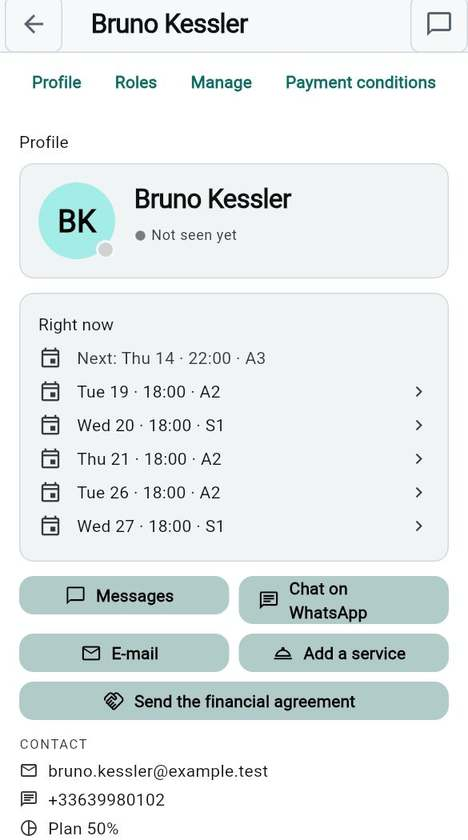

**Steps**

1. Tap a member in [Members & plans](https://fdittgen-png.github.io/deskilo/#/members).
2. Read the top of the page: **Right now** shows the next bookings, then come the contact details and the money position.
3. Use the buttons under the name for a quick action. Depending on features and your rights you will see some of **Messages**, **E-mail**, **Add a service** or **Send the financial agreement**.
4. Jump to **Manage** to change the person's settings, grouped as **Membership**, **Booking rules**, **Billing** and **Badges & access**.

**Good to know**

- Every setting row shows its current value, so you rarely need to open it to know the answer.
- Your own page is shorter: nobody can grant themselves rights.
- If the page is not switched on for your space, the same actions appear in a list when you tap the row.

**See also:** [The member's actions](#the-members-actions) · [Roles and co-owners](#the-role-matrix)

<!-- anchor: user.members.actions -->
### The member's actions

**Audience:** Administrator · Owner

You want to know which setting lives where, and who may change it.

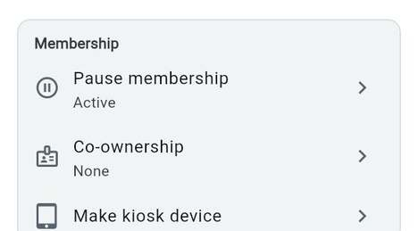

**Steps**

1. Open a [member page](#the-member-page) and go to **Manage**.
2. In **Membership**, choose **Pause membership** or **Reactivate membership**, set [Co-ownership](#co-ownership), or **Make kiosk device**.
3. In **Booking rules**, set the [Reservation limit](#reservation-limit), the [Simultaneous reservations](#simultaneous-reservations) and the [VAT treatment](#vat-treatment); the **Whole-space bookings** switch appears when the feature is on.
4. In **Billing**, set the [Subscription](#a-members-subscription), [When days run out](#when-days-run-out) and [Price negotiation](#price-negotiation).
5. In **Badges & access**, open **Badges** to issue or revoke the person's badges.

**Good to know**

- Billing and membership changes belong to the owner. Administrators set the booking limits.
- You can never change your own limits or co-ownership.
- Only active members offer most of these rows.

**See also:** [Booking rules](#reservation-limit) · [Billing group](#a-members-subscription)

<!-- anchor: user.members.pending -->
### Pending and paused members

**Audience:** Administrator · Owner

A newcomer waits for your decision, or a member takes a break, and you want the space to treat them accordingly.

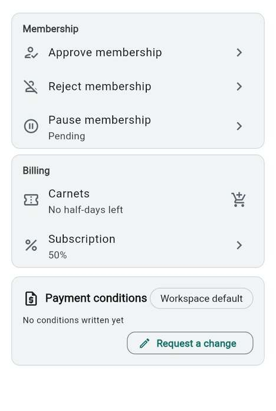

**Steps**

1. Open the member whose row says **Pending**.
2. Under **Membership**, choose **Approve membership** to let the person in, or **Reject membership** to refuse.
3. To put an active member on hold, open their page and choose **Pause membership**.
4. To bring them back, choose **Reactivate membership**.

**Good to know**

- The decision on a new member can also be taken through the validation rules, as described in [Validation rules](#validation-rules-domain-by-domain).
- Pausing is for owners and keeps all history.
- A member who left shows **Exited**, and cannot be paused.

**See also:** [Invite a member](#invite-a-member)

<!-- anchor: user.members.subscription -->
### A member's subscription

**Audience:** Owner

You want to set which share of the month's days a member is entitled to. The share picks the fee band, and the band sets the monthly price.

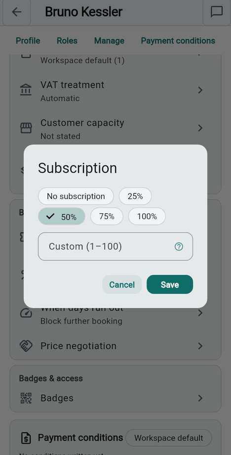

**Steps**

1. Open the member page, go to **Billing** and tap **Subscription**.
2. Pick **No subscription**, one of the levels you offer, or type a number in **Custom (1–100)**.
3. Tap a level to apply it, or **Save** for a custom value.

**Good to know**

- The levels offered are the ones you chose in [Subscription levels](#subscription-levels).
- As owner you can always type a custom value.
- **No subscription** is for visitors who buy carnets. It cannot be combined with pay-as-you-go: choose a block or a package first.

**See also:** [Fee bands](#fee-bands) · [When days run out](#when-days-run-out)

<!-- anchor: user.members.overage-policy -->
### When days run out

**Audience:** Owner

You want to decide what happens when a member has used their whole monthly allowance.

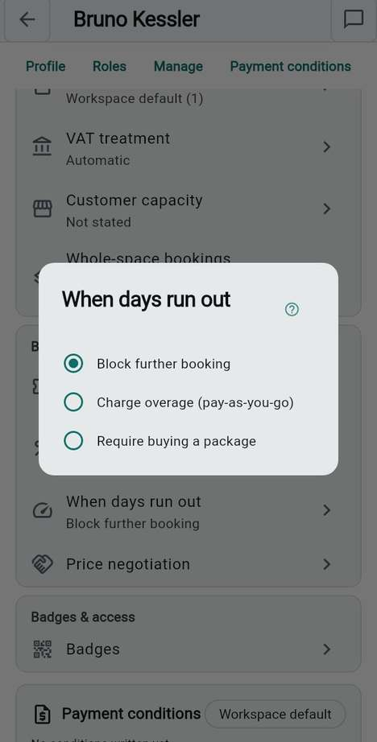

**Steps**

1. Open the member page, go to **Billing** and tap **When days run out**.
2. Choose **Block further booking**, **Charge overage (pay-as-you-go)** or **Require buying a package**.

**Good to know**

- Pay-as-you-go is greyed out for a member without a subscription, because it would let them book for free.
- The overage price comes from the [fee band](#overage); the packages come from [Day packages](#day-packages).

**See also:** [A member's subscription](#a-members-subscription)

<!-- anchor: user.members.reservation-limit -->
### Reservation limit

**Audience:** Administrator · Owner

You want to cap how many open reservations one member can hold in total.

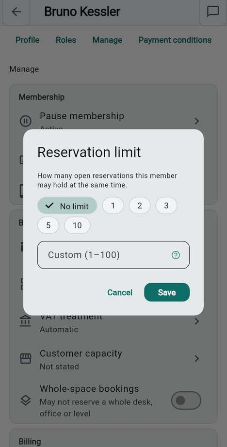

**Steps**

1. Open the member page, go to **Booking rules** and tap **Reservation limit**.
2. Tap **No limit**, a preset (1, 2, 3, 5 or 10), or type a number in **Custom (1–100)**.
3. Tap **Save** for a custom number.

**Good to know**

- It counts all open reservations, whenever they fall. It is a different thing from [simultaneous reservations](#simultaneous-reservations), which counts overlaps.
- The list shows **max** and the number beside the member.
- You cannot set your own limit.

**See also:** [Booking limits](#booking-limits)

<!-- anchor: user.members.simultaneous -->
### Simultaneous reservations

**Audience:** Administrator · Owner

You want to allow one member to hold bookings that overlap in time, for example two places at once.

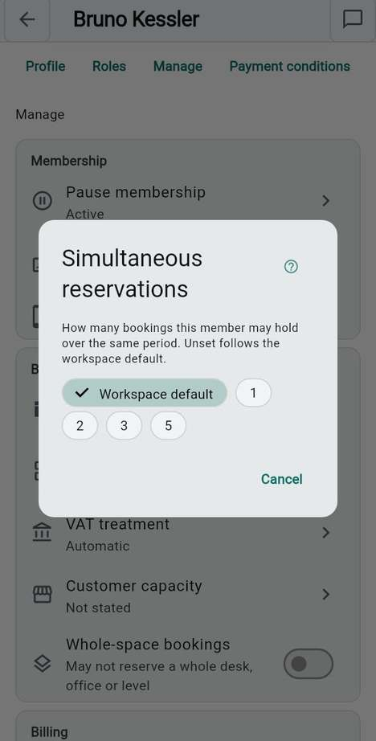

**Steps**

1. Open the member page, go to **Booking rules** and tap **Simultaneous reservations**.
2. Pick **Workspace default**, or a number: 1, 2, 3 or 5.

**Good to know**

- **Workspace default** follows the number set in [Availability](#booking-policies); one means one place at a time.
- It is not the same as the [reservation limit](#reservation-limit), which counts all open bookings.
- You cannot set your own.

**See also:** [Booking policies](#booking-policies)

<!-- anchor: user.members.vat-treatment -->
### VAT treatment

**Audience:** Administrator · Owner

You want to tell the app who this member is for VAT, so their invoices carry the right tax.

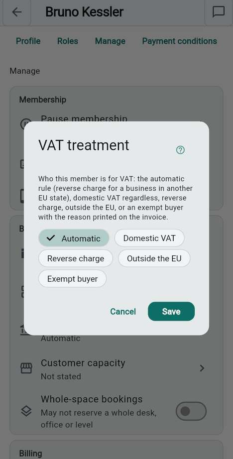

**Steps**

1. Open the member page, go to **Booking rules** and tap **VAT treatment**.
2. Pick **Automatic**, **Domestic VAT**, **Reverse charge**, **Outside the EU** or **Exempt buyer**.
3. For **Exempt buyer**, type the **Exemption reason (printed on the invoice)**.
4. Tap **Save**.

**Good to know**

- **Automatic** applies the usual rule: reverse charge for a business in another EU state.
- The same group offers **Customer capacity** (**Business**, **Consumer** or **Not stated**), which decides which payment clauses an invoice prints. It needs the permission to issue invoices.
- **Reverse charge**, **Outside the EU** and **Exempt buyer** are recorded, but the invoices of such members cannot be issued in the app yet: they are issued outside the app with your accountant.
- The **VAT by counterparty** feature must be on for the VAT treatment row, which administrators and owners see; the rates are set in [VAT rates](#setting-the-rates).

**See also:** [VAT regime](#vat-regime)

<!-- anchor: user.members.negotiation -->
### Price negotiation

**Audience:** Billing administrator · Owner

You agreed a price with a member that differs from your tariff, and you want it recorded as a deal rather than typed over the tariff.

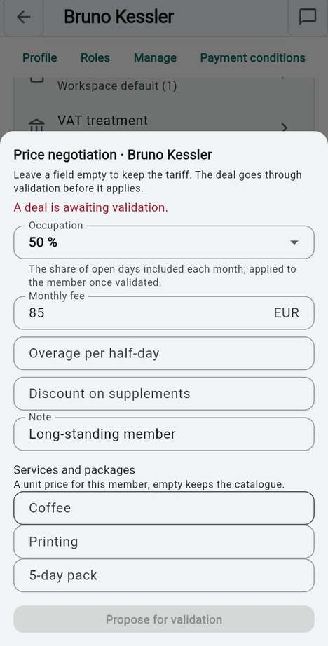

**Steps**

1. Open the member page, go to **Billing** and tap **Price negotiation**.
2. Fill only what differs: **Occupation**, **Monthly fee**, **Overage per half-day**, **Discount on supplements**, or a unit price under **Services and packages**.
3. Add a **Note** if useful.
4. Tap **Propose for validation**.

**Good to know**

- A field left empty keeps the tariff.
- The deal waits for validation before it applies, as described in [Validation rules](#validation-rules-domain-by-domain).
- Once active, the member sees it on their money page, with **Who can see this**. People who may only view negotiations see it as **Read only**.

**See also:** [Fee bands](#fee-bands)

<!-- anchor: user.members.co-ownership -->
### Co-ownership

**Audience:** Owner

You want someone to share ownership with you, or to take over if you leave.

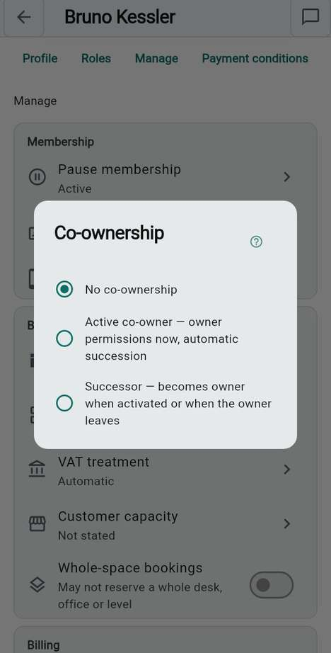

**Steps**

1. Open the member page, go to **Membership** and tap **Co-ownership**.
2. Choose **No co-ownership**, **Active co-owner**, or **Successor**.
3. To make a co-owner a full owner right away, choose **Promote to owner now**.

**Good to know**

- An active co-owner has owner permissions now, and takes over automatically if you leave.
- A successor becomes owner when promoted or when the owner leaves.
- The row shows **Co-owner** or **Successor** in the members list.
- It needs the **Co-owners** feature to be on, and you cannot change your own co-ownership.

**See also:** [The role matrix](#the-role-matrix)

<!-- anchor: user.money.billing.fee-bands -->
### Fee bands

**Audience:** Owner · Billing administrator

You want to price your plans: what a month costs for each share of the days, and what an extra half-day costs.

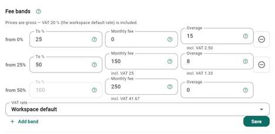

**Steps**

1. Open [Billing](https://fdittgen-png.github.io/deskilo/#/billing) from the menu.
2. Under **Fee bands**, set **To %**, **Monthly fee** and **Overage** on each row.
3. Tap **Add band** to split the last band, or the minus icon to remove one.
4. Choose the **VAT rate** the tariff is taxed at. It is saved as soon as you pick it.
5. Tap **Save** to store the bands.

**Good to know**

- Each row starts where the previous one ends, and the last one always ends at 100%. If the bands do not add up, the screen says "Bands must increase and end at 100%."
- Prices are gross: VAT is included, when your space charges it.
- Removing a band merges its range into the one before.

**See also:** [A member's subscription](#a-members-subscription) · [Subscription levels](#subscription-levels)

<!-- anchor: user.money.billing.band-to -->
#### Up to %

The top of the band, from 1 to 100. The next band starts where this one ends, so a percentage always falls into exactly one band. The last band is fixed at 100.

<!-- anchor: user.money.billing.band-fee -->
#### Monthly fee

What a month in this band costs. When you charge VAT the row shows the VAT share included.

<!-- anchor: user.money.billing.band-overage -->
#### Overage

The price of one half-day beyond the allowance, for members whose policy is pay-as-you-go.

<!-- anchor: user.money.billing.levels -->
### Subscription levels

**Audience:** Owner · Billing administrator

You want to choose which percentages you offer when you give someone a plan.

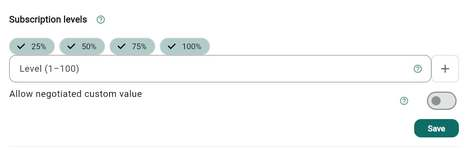

**Steps**

1. In [Billing](https://fdittgen-png.github.io/deskilo/#/billing), find **Subscription levels**.
2. Tap a preset (25%, 50%, 75%, 100%) to switch it on or off.
3. To add your own, type a number in **Level (1–100)** and tap **Add level**.
4. Tap **Save**.

**Good to know**

- The levels you pick are the ones offered in a member's [Subscription](#a-members-subscription).
- Remove a level you added with the cross on its chip.

**See also:** [Fee bands](#fee-bands)

<!-- anchor: user.money.billing.level-value -->
#### Level value

One percentage from 1 to 100: the share of the month's days that the plan includes.

<!-- anchor: user.money.billing.custom-level -->
#### Allow a negotiated value

The switch **Allow negotiated custom value** is saved with the levels. As owner you can always type a custom percentage in a member's **Subscription**, whatever this switch says.

<!-- anchor: user.money.billing.packages -->
### Day packages

**Audience:** Owner · Billing administrator

You want to sell blocks of days to members who run out of their allowance.

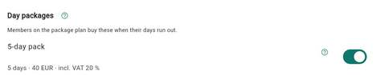

**Steps**

1. In [Billing](https://fdittgen-png.github.io/deskilo/#/billing), find **Day packages**. Each row shows the days, the price and a switch.
2. Switch a package off to stop selling it, or on to sell it again.
3. To create a package, follow [New package](#new-package).

**Good to know**

- Members whose policy is **Require buying a package** buy these when their days run out.
- A package that has been sold keeps its price, days and rate. To change them, switch it off and add a new one.

**See also:** [When days run out](#when-days-run-out)

<!-- anchor: user.money.billing.package-new -->
### New package

**Audience:** Owner · Billing administrator

You want to add a block of days to your price list.

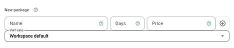

**Steps**

1. In [Billing](https://fdittgen-png.github.io/deskilo/#/billing), under **New package**, type the name, the days and the price.
2. Choose its **VAT rate**.
3. Tap **Add package**.

**Good to know**

- The package is for sale as soon as it appears, switched on.
- Where the carnets feature is on, a **Carnets** editor sits below.

**See also:** [Day packages](#day-packages)

<!-- anchor: user.money.billing.package-name -->
#### Package name

What members see when they buy, and what the invoice line says.

<!-- anchor: user.money.billing.package-days -->
#### Package days

How many days the package grants, one or more.

<!-- anchor: user.money.billing.package-price -->
#### Package price

The price of the whole package, gross. The row shows the days, the price and, when VAT applies, the VAT included.

<!-- anchor: user.money.billing.schedule -->
### Invoice schedule

**Audience:** Owner · Billing administrator

You want to choose when the two automatic invoices go out: the subscription before the month, and the month's consumption after it.

**Steps**

1. Open [Workspace](https://fdittgen-png.github.io/deskilo/#/workspace-settings) and the **Payments & billing** group.
2. Tap **Invoice schedule**.
3. Under **Subscription, in advance**, switch **Issue automatically** on or off and pick **Days before the month starts**. The line below tells you the resulting date.
4. Under **The month just finished**, switch **Issue automatically** on or off. Switch on **Also when there is nothing to pay** to send a document reading zero.
5. Tap **Save**.

**Good to know**

- Each half needs its feature switched on in [Features](#a-feature-switch): "Subscription invoices" and "End-of-month invoices".
- The subscription invoice can therefore name a month that has not started yet.

**See also:** [Reminder rules](#reminder-rules) · [Fee bands](#fee-bands)

<!-- anchor: user.money.services.overview -->
### A service

**Audience:** Owner · Billing administrator

You sell something that is not a seat: a locker, printing, coffee. You list it once and add it to a member's month in a tap.

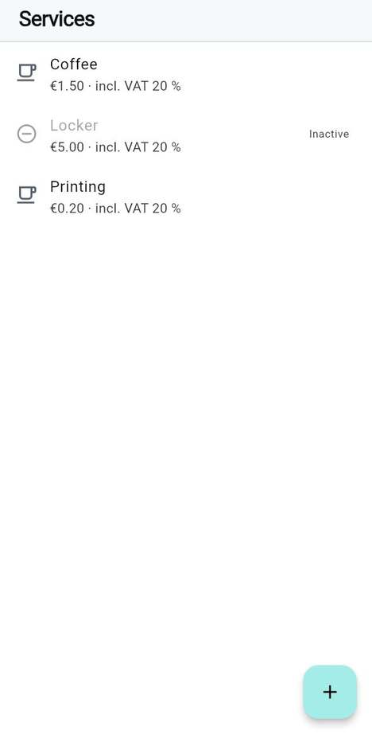

**Steps**

1. Open [Services](https://fdittgen-png.github.io/deskilo/#/services) from the menu.
2. Tap a service to edit it, or the plus button to create **New service**.
3. Fill in the [Name](#service-name), the [Price](#service-price) and, when you charge VAT, the **VAT rate**.
4. Tap **Save**.

**Good to know**

- A service is never deleted, only deactivated, because invoices refer to it.
- A service that comes from a stock shows how many are left, or **Out of stock**.
- To record one for a member, use **Add a service** on their page.

**See also:** [Accessories](#accessories) · [The member page](#the-member-page)

<!-- anchor: user.money.services.name -->
#### Service name

What the invoice line says. Rename it and only new documents change.

<!-- anchor: user.money.services.price -->
#### Service price

The price of one unit, gross: the member pays exactly this, and VAT is part of it. The **VAT rate** only decides how much of it is tax.

<!-- anchor: user.money.services.active -->
#### Active

When editing a service, the **Active** switch decides whether it can still be sold. Switch it off for something discontinued; the list greys it and writes **Inactive**.

<!-- anchor: user.money.accessories -->
### Accessories

**Audience:** Administrator · Owner

You rent equipment with a place, such as a monitor or a chair, and charge a supplement for each half-day.

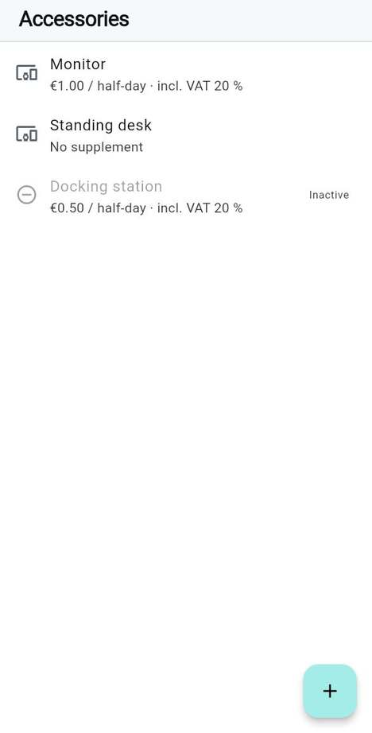

**Steps**

1. Open [Accessories](https://fdittgen-png.github.io/deskilo/#/accessories) from the menu.
2. Tap an accessory, or the plus button for **New accessory**.
3. Fill in **Name** and **Supplement per half-day**; choose the **VAT rate** if your space charges VAT.
4. Switch **Active** off to stop offering it, then tap **Save**.

**Good to know**

- The list shows each supplement as an amount "per half-day", or **No supplement**.
- Like services, accessories are deactivated, never deleted.
- The feature must be on in [Features](#a-feature-switch).

**See also:** [A service](#a-service)

<!-- anchor: user.money.payments.methods -->
### Payment methods and instructions

**Audience:** Owner · Billing administrator

You want members to know how to pay you by transfer or wallet, without you sending the details each time.

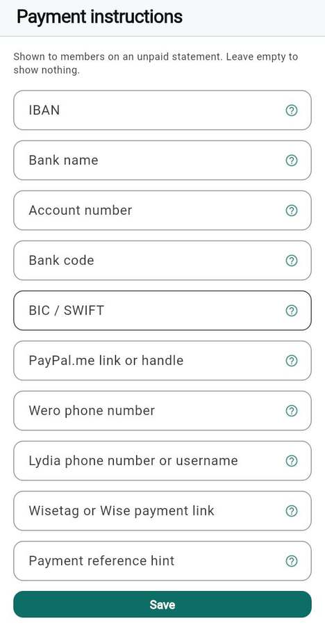

**Steps**

1. Open [Payment instructions](https://fdittgen-png.github.io/deskilo/#/payment-methods) from the menu.
2. Fill what applies: **IBAN**, **Bank name**, **Account number**, the bank code, **BIC / SWIFT**.
3. Add the wallets you accept: **PayPal.me link or handle**, **Wero phone number**, **Lydia phone number or username**, **Wisetag or Wise payment link**.
4. Add a **Payment reference hint** if members should quote something.
5. Tap **Save**.

**Good to know**

- Members see these details on an unpaid statement. Leave everything empty to show nothing.
- The bank code field is named after your country: sort code, routing number, or bank code.
- This is manual payment. To let members pay by card inside the app, see [The payment provider](#the-payment-provider).

**See also:** [Provider credentials](#provider-credentials)

<!-- anchor: user.money.payments.provider -->
### The payment provider

**Audience:** Owner

You want members to pay an outstanding bill online, into your own provider account.

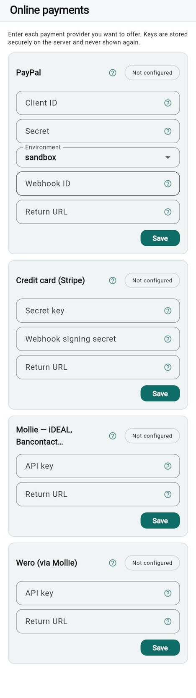

**Steps**

1. Switch on the online payments feature in [Features](#a-feature-switch).
2. Open [Online payments](https://fdittgen-png.github.io/deskilo/#/payment-config) from the menu.
3. Find the provider you use: **PayPal**, **Credit card (Stripe)**, **Mollie — iDEAL, Bancontact…** or **Wero (via Mollie)**.
4. Fill its keys, as described in [Provider credentials](#provider-credentials), and tap **Save**.
5. Check that the card says **Configured**.

**Good to know**

- Each provider is a separate card with a status chip, **Configured** or **Not configured**.
- Wero is paid through Mollie: enter the same Mollie API key and return URL on the Wero card as on the Mollie card.
- Providers charge their own fees. The manual transfer route stays free.
- **Remove** clears a provider.

**See also:** [Payment methods](#payment-methods-and-instructions)

<!-- anchor: user.money.payments.credentials -->
#### Provider credentials

The keys come from the provider's own dashboard: **Client ID**, **Secret**, **Environment**, **Webhook ID** and **Return URL** for PayPal; **Secret key**, **Webhook signing secret** and **Return URL** for Stripe; **API key** and **Return URL** for Mollie and Wero. Keep test and live keys apart: all keys you enter must belong to the same mode.

Secrets are stored on the server and never shown again. A saved one reads **Set — leave blank to keep**; type a new value to replace it.

<!-- anchor: user.money.expenses.schedule -->
### Scheduled expenses

**Audience:** Member · Administrator · Owner

You pay for something that comes back, such as internet or electricity. You describe it once and the app presents each due date to you.

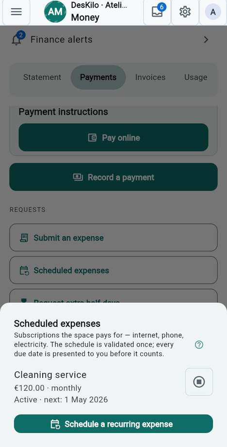

**Steps**

1. Open [Money](https://fdittgen-png.github.io/deskilo/#/money) and the **Payments** face.
2. Tap **Scheduled expenses**. Existing schedules show their amount, rule, state and next date.
3. Tap **Schedule a recurring expense** and fill in the form, as described in [What](#what) and the fields after it.
4. Tap **Schedule it**.

**Good to know**

- A new schedule is **Awaiting validation** until the validators confirm it, then **Active**. It can also end **Rejected** or **Ended**.
- Each due date is then presented to you before it counts: confirm it at the validated amount, or at another amount with an explanation, which is validated again.
- Tap **End this schedule** to stop one. Finished ones are listed under **Ended and rejected**.
- The feature must be on in [Features](#a-feature-switch).

**See also:** [Validation rules](#validation-rules-domain-by-domain)

<!-- anchor: user.money.expenses.what -->
#### What

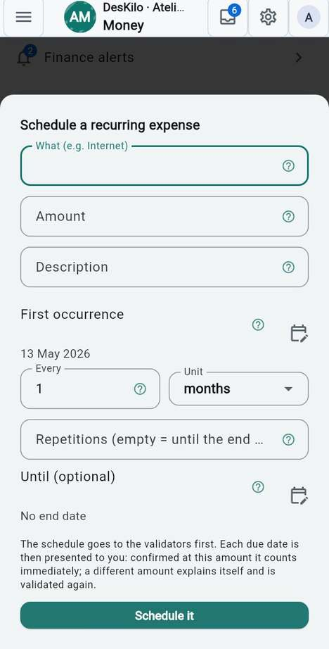

The name each occurrence carries, for example Internet. Write it as you want to read it later. **Amount** is what one occurrence costs, and **Description** is optional text for whoever validates.

<!-- anchor: user.money.expenses.amount -->
#### Amount

What one occurrence costs, in your workspace currency. A different amount at confirmation needs an explanation and is validated again.

<!-- anchor: user.money.expenses.description -->
#### Description

Optional text for the validators, such as a contract number or a supplier reference.

<!-- anchor: user.money.expenses.starts-on -->
#### First occurrence

The date the first one falls due. Every later date counts from here.

<!-- anchor: user.money.expenses.every -->
#### Every

The interval, a number and a unit: days, weeks, months or years. Every 1 month reads "monthly".

<!-- anchor: user.money.expenses.times -->
#### Number of times

The field **Repetitions (empty = until the end date)**: how many occurrences to raise.

<!-- anchor: user.money.expenses.ends-on -->
#### Until

**Until (optional)** is the date after which nothing more is raised. With both a number and a date, the series stops at whichever comes first. With neither, it runs until you end it.

<!-- anchor: user.invoicing.overview -->
## Tax, invoicing and accounting

For owners and billing administrators: who you are as a seller, how VAT is handled, where e-invoices go, how your documents look, and the monthly rhythm of issuing, sending and chasing invoices.

> **Careful** DesKilo prints what you declare and checks that the required details are present. It does not certify your invoices, your VAT treatment or your books. Whenever a section below says "confirm with your accountant", please do.

In this chapter:
- Your legal identity and the mentions printed on every invoice
- VAT: regime, number, rates, groups and the periodic declaration
- E-invoicing: where the machine-readable invoice is sent
- The invoice PDF template and the report editor
- Issuing and closing a month: the Invoicing screen, the month-close wizard, regrouping, shared expenses
- Payment reminders
- The invoice register, accounting exports and business analytics

<!-- anchor: user.money.legal.identity -->
### Your legal identity

**Audience:** Owner

You want your invoices to name you correctly: who you are, how you are registered and how you charge VAT.

**Steps**

1. Open [Workspace](https://fdittgen-png.github.io/deskilo/#/workspace-settings) and tap **Legal identity & e-invoicing**, or go straight to [Legal identity & e-invoicing](https://fdittgen-png.github.io/deskilo/#/legal-identity).
2. Work from the top: the VAT regime first, then the identifiers, the address and the **Invoice mentions**.
3. Tap **Save** at the bottom.

**Good to know**

- The screen shows only the fields your VAT regime needs. Change the regime and the form follows.
- Invoices already issued keep the identity they were signed with. A change applies to the next ones.
- Only owners can open this screen.

**See also:** [VAT regime](#vat-regime) · [Organisation type](#organisation-type) · [E-invoicing](#the-e-invoicing-platform)

<!-- anchor: user.money.legal.seller-kind -->
### Organisation type

**Audience:** Owner

You run either a business or a non-profit association, and your invoices should read accordingly.

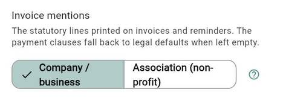

**Steps**

1. Open [Legal identity & e-invoicing](https://fdittgen-png.github.io/deskilo/#/legal-identity) and scroll to **Invoice mentions**.
2. Choose **Company / business** or **Association (non-profit)**.
3. Tap **Save**.

**Good to know**

- For an association, the example texts change (for instance a registration such as RNA instead of a trade register). Which payment clauses print depends on your country and on the customer's capacity, not on the organisation type.
- An association with no trading activity is normally outside the scope of VAT. The screen warns you if you pick "exempt" for an association; confirm the right choice with your accountant.

**See also:** [Customer capacity](#default-customer-capacity) · [VAT regime](#vat-regime)

<!-- anchor: user.money.legal.customer-capacity -->
### Default customer capacity

**Audience:** Owner

Business customers and private individuals are not owed the same payment clauses. You set the default for the workspace.

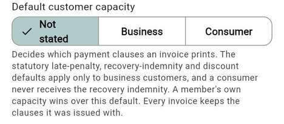

**Steps**

1. In **Invoice mentions**, find **Default customer capacity**.
2. Choose **Not stated**, **Business** or **Consumer**.
3. Tap **Save**.

**Good to know**

- The statutory late-penalty, recovery-indemnity and discount defaults apply only to business customers of a French workspace; for other countries nothing is printed unless you wrote it. A consumer never receives the recovery indemnity.
- A member's own capacity wins over this default.
- Every invoice keeps the clauses it was issued with.

**See also:** [Late-payment penalty](#late-payment-penalty) · [Recovery indemnity](#recovery-indemnity)

<!-- anchor: user.money.legal.legal-form -->
### Legal form and capital

**Audience:** Owner

Your invoices state the legal form of your business and, where it applies, its share capital.

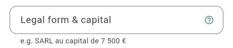

**Steps**

1. In **Invoice mentions**, tap **Legal form & capital**.
2. Type the line as it should print, for example "SARL au capital de 7 500 €" (an association might write "Association loi 1901").
3. Tap **Save**.

**Good to know**

- The text is printed as you type it, up to 300 characters. Check the exact wording required for your legal form with your accountant.

**See also:** [Trade register](#trade-register)

<!-- anchor: user.money.legal.registration -->
### Trade register

**Audience:** Owner

You show where your organisation is registered.

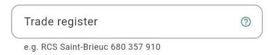

**Steps**

1. In **Invoice mentions**, tap **Trade register**.
2. Type the registration line, for example "RCS Saint-Brieuc 680 357 910". An association might enter an RNA number, and a SIRET if it has one.
3. Tap **Save**.

**Good to know**

- This line is a mention printed on the document. The identifier the e-invoice itself needs is the [company registration number](#company-registration-number) or the [VAT number](#vat-number), depending on your regime.

**See also:** [Legal form and capital](#legal-form-and-capital)

<!-- anchor: user.money.legal.payment-terms -->
### Payment terms

**Audience:** Owner

You state when invoices are due.

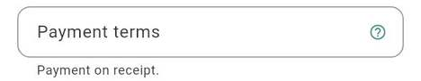

**Steps**

1. In **Invoice mentions**, tap **Payment terms**.
2. Type your terms, for example "Payment within 30 days of the invoice date".
3. Tap **Save**.

**Good to know**

- Left empty, invoices print "Payment on receipt."
- A member can have their own payment terms; those print on that member's documents instead.
- Reminders do not read this text: they count from the invoice date plus **Days until the first reminder** in the reminder rules. The payment terms are only what the document prints.

**See also:** [Reminder rules](#reminder-rules)

<!-- anchor: user.money.legal.late-penalty -->
### Late-payment penalty

**Audience:** Owner

You state the penalty for late payment.

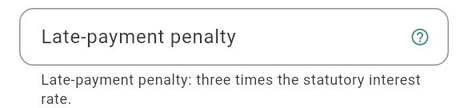

**Steps**

1. In **Invoice mentions**, tap **Late-payment penalty**.
2. Type your clause, or leave it empty.
3. Tap **Save**.

**Good to know**

- Left empty, nothing is invented for you, except for a French workspace invoicing a business customer, where the statutory wording prints (three times the legal interest rate).
- Confirm the clause that applies to your country with your accountant.

**See also:** [Default customer capacity](#default-customer-capacity)

<!-- anchor: user.money.legal.recovery -->
### Recovery indemnity

**Audience:** Owner

You state the fixed indemnity for collection costs.

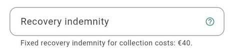

**Steps**

1. In **Invoice mentions**, tap **Recovery indemnity**.
2. Type your clause, or leave it empty.
3. Tap **Save**.

**Good to know**

- Left empty, the fixed indemnity of €40 prints only on invoices from a French workspace to a business customer.
- A consumer never receives this mention.

**See also:** [Default customer capacity](#default-customer-capacity)

<!-- anchor: user.money.legal.escompte -->
### Early-payment discount

**Audience:** Owner

You say whether paying early earns a discount.

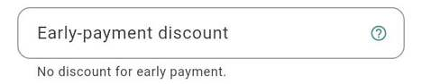

**Steps**

1. In **Invoice mentions**, tap **Early-payment discount**.
2. Type the conditions of your discount, or leave it empty.
3. Tap **Save**.

**Good to know**

- Left empty, invoices from a French workspace to a business customer print "No discount for early payment."; elsewhere the line is left out unless you write one.

**See also:** [Payment terms](#payment-terms)

<!-- anchor: user.money.legal.insurance -->
### Professional insurance

**Audience:** Owner

If your activity requires you to name your professional insurance, it prints on your invoices.

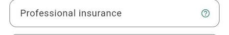

**Steps**

1. In **Invoice mentions**, tap **Professional insurance**.
2. Type the insurer, the policy and the geographical cover as they should read.
3. Tap **Save**.

**Good to know**

- There is no default: an empty field prints nothing.
- Whether you must state it depends on your activity. Ask your accountant.

**See also:** [Special mentions](#special-mentions)

<!-- anchor: user.money.legal.special-mentions -->
### Special mentions

**Audience:** Owner

A line of your own that must appear on every invoice.

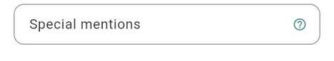

**Steps**

1. In **Invoice mentions**, tap **Special mentions**.
2. Type the text.
3. Tap **Save**.

**Good to know**

- Nothing prints when the field is empty.
- Below the mentions, when the **Envelope address window** feature is on, **Address window** sets where the recipient's address sits so it shows through a window envelope.

**See also:** [The invoice PDF template](#the-invoice-pdf-template)

<!-- anchor: user.money.vat.regime -->
### VAT regime

**Audience:** Owner

You declare how your organisation stands with VAT. The choice decides which number your documents need.

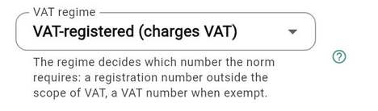

**Steps**

1. Open [Legal identity & e-invoicing](https://fdittgen-png.github.io/deskilo/#/legal-identity).
2. In **VAT regime**, choose **Outside the scope of VAT**, **VAT-exempt (small-business scheme)** or **VAT-registered (charges VAT)**.
3. Tap **Save**.

**Good to know**

- Outside the scope of VAT: no VAT number is printed; the company registration number identifies you.
- Exempt or registered: your VAT number is asked for.
- Choosing the regime is a tax decision, not a software setting. Confirm it with your accountant before you issue invoices.
- In this version the app issues invoices itself for workspaces in France or Germany, to domestic customers, under the VAT-registered or the outside-the-scope regime. Invoices under the VAT-exempt regime are issued outside the app with your accountant.

**See also:** [VAT number](#vat-number) · [Company registration number](#company-registration-number)

<!-- anchor: user.money.vat.reverse-charge -->
### Reverse charge for EU businesses

**Audience:** Owner

When you charge VAT and invoice a business in another EU country, the tax can be due by the customer.

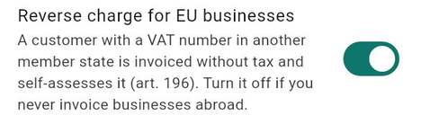

**Steps**

1. Choose **VAT-registered (charges VAT)** as the regime.
2. Switch **Reverse charge for EU businesses** on or off.
3. Tap **Save**.

**Good to know**

- On: the app recognises a business with a VAT number in another member state. Today the app does not issue those invoices itself: you issue them outside the app with your accountant.
- Off: turn it off if you never invoice businesses abroad.
- The option appears only for the VAT-registered regime.

**See also:** [VAT treatment of a member](#vat-treatment)

<!-- anchor: user.money.vat.due -->
### When VAT falls due

**Audience:** Owner

You choose whether VAT is counted when you issue the invoice or when you are paid.

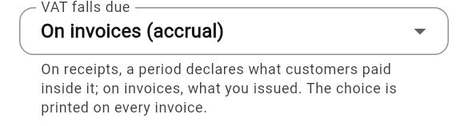

**Steps**

1. Choose **VAT-registered (charges VAT)** as the regime.
2. In **VAT falls due**, choose **On invoices (accrual)** or **On receipts (cash)**.
3. Tap **Save**.

**Good to know**

- On receipts, a period declares what customers paid inside it; on invoices, what you issued.
- The choice is printed on every invoice and drives the [VAT declaration](#the-periodic-vat-declaration).
- Which basis applies to you is a tax question for your accountant.

**See also:** [The periodic VAT declaration](#the-periodic-vat-declaration)

<!-- anchor: user.money.vat.account -->
### VAT account

**Audience:** Owner

Your accountant wants collected VAT booked on a specific account.

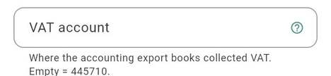

**Steps**

1. Choose **VAT-registered (charges VAT)** as the regime.
2. Type your account number in **VAT account**.
3. Tap **Save**.

**Good to know**

- The accounting export books collected VAT on this account. Left empty, it uses 445710.

**See also:** [Accounting exports](#accounting-exports)

<!-- anchor: user.money.vat.number -->
### VAT number

**Audience:** Owner

Your VAT identification number appears on your invoices and e-invoices.

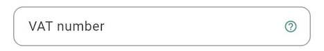

**Steps**

1. Open [Legal identity & e-invoicing](https://fdittgen-png.github.io/deskilo/#/legal-identity).
2. Type the number in **VAT number**.
3. Tap **Save**.

**Good to know**

- The field appears for the exempt and registered regimes. Outside the scope of VAT it is replaced by the company registration number.
- Your members have their own VAT number in their settings, for their documents.

**See also:** [Company registration number](#company-registration-number)

<!-- anchor: user.money.vat.exemption-reason -->
### Reason no VAT is charged

**Audience:** Owner

When no VAT is charged, the law usually wants the reason printed on the invoice.

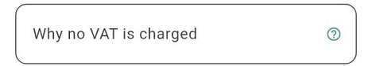

**Steps**

1. Open [Legal identity & e-invoicing](https://fdittgen-png.github.io/deskilo/#/legal-identity).
2. Type the legal basis in **Why no VAT is charged**, for instance "TVA non applicable, art. 293 B du CGI".
3. Tap **Save**.

**Good to know**

- The app cannot know which basis applies to you. Take the exact wording from your accountant.
- The wording is printed on the invoice. For now the app does not issue invoices under the exempt regime itself: they are issued outside the app with your accountant.

**See also:** [VAT regime](#vat-regime)

<!-- anchor: user.money.legal.legal-id -->
### Company registration number

**Audience:** Owner

If you are outside the scope of VAT, your registration number identifies you on e-invoices.

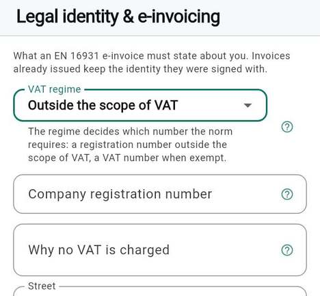

**Steps**

1. Set **VAT regime** to **Outside the scope of VAT**.
2. Type the number in **Company registration number**.
3. Tap **Save**.

**Good to know**

- Under the other regimes this field is replaced by the VAT number.
- An association usually uses its registration (for instance RNA, or SIRET if assigned).

**See also:** [Trade register](#trade-register)

<!-- anchor: user.money.legal.address -->
### Structured address

**Audience:** Owner

An e-invoice needs your address in separate parts, not as one block of text.

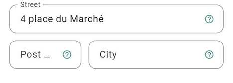

**Steps**

1. Open [Legal identity & e-invoicing](https://fdittgen-png.github.io/deskilo/#/legal-identity).
2. Fill **Street**, **Post code** and **City**.
3. Tap **Save**.

**Good to know**

- The street starts from the address already in your workspace settings, so you complete it rather than retype it.
- Invoices cannot be issued without the workspace postal address.

**See also:** [Letterhead address](#letterhead-address)

<!-- anchor: user.money.vat.rates -->
### Setting the rates

**Audience:** Owner · Billing administrator

You list the VAT rates your invoices may use. What members pay does not change: prices include VAT, and the tax is extracted from them.

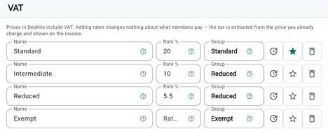

**Steps**

1. Open [VAT](https://fdittgen-png.github.io/deskilo/#/vat) (from **Legal identity & e-invoicing**, tap **VAT rates**).
2. On an empty list, tap **Use the usual rates** (if your country has a catalogue) to start from your country's rates, or **Add a rate** and fill the name and **Rate %** (0 to 99.99).
3. Tap the star on exactly one rate to make it the default.
4. Tap **Save**.

**Good to know**

- The usual rates are a starting point. Which supply falls under which rate is a question for your accountant.
- The default rate is used by subscriptions and by anything without its own rate.
- A rate still used by an invoice or a service is kept, deactivated, rather than deleted.
- With no default rate in force while you are VAT-registered, no invoice can be issued; the legal identity screen warns about it.
- This screen needs the **VAT management** feature; the VAT rates entry on the legal identity screen shows only for the VAT-registered regime.

**See also:** [VAT groups](#vat-groups) · [Change by law](#change-a-rate-by-law)

<!-- anchor: user.money.vat.groups -->
### VAT groups

**Audience:** Owner · Billing administrator

A group says what kind of rate this is, so the invoice puts it in the right category.

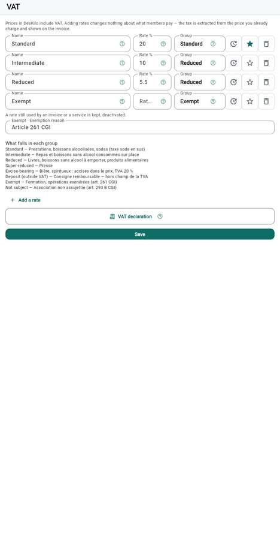

**Steps**

1. Open [VAT](https://fdittgen-png.github.io/deskilo/#/vat).
2. On each rate, when the **VAT groups** feature is on, choose a **Group**: **Standard**, **Intermediate**, **Reduced**, **Super-reduced**, **Zero rate**, **Exempt**, **Not subject**, **Deposit (outside VAT)** or **Excise-bearing**.
3. For an exempt or not-subject group, fill the **Exemption reason** that appears.
4. Tap **Save**.

**Good to know**

- **What falls in each group** lists examples for your country, as a guide only.
- A line outside VAT, such as a refundable deposit, cannot share a document with taxed lines; issue it on its own.

**See also:** [Setting the rates](#setting-the-rates)

<!-- anchor: user.money.vat.change-by-law -->
### Change a rate by law

**Audience:** Owner · Billing administrator

A rate changes from a given date. Old supplies keep the old value; the new one applies from that day.

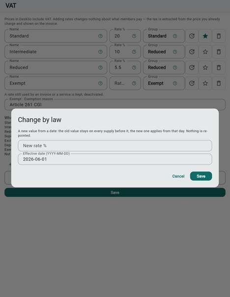

**Steps**

1. Open [VAT](https://fdittgen-png.github.io/deskilo/#/vat) and make sure the rate is saved.
2. Tap the **Change by law** button on the rate.
3. Type **New rate %** and the **Effective date (YYYY-MM-DD)**.
4. Tap **Save** in the dialog, then **Save** on the screen.

**Good to know**

- The old rate closes on that date and a new one opens, with the star moved along if it was the default.
- Nothing already issued is re-pointed.

**See also:** [Setting the rates](#setting-the-rates)

<!-- anchor: user.money.vat.declaration -->
### The periodic VAT declaration

**Audience:** Owner

You want a ready summary of the VAT of a period to file with the tax office or hand to your accountant.

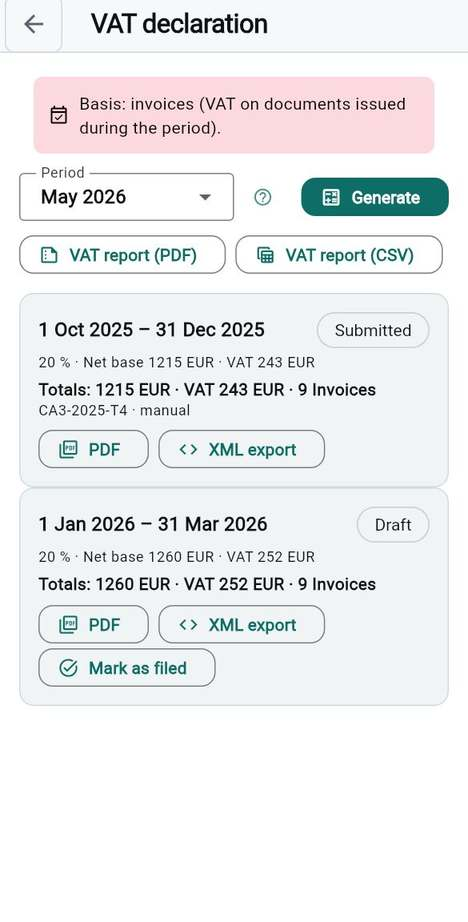

**Steps**

1. Open [VAT declaration](https://fdittgen-png.github.io/deskilo/#/vat-declarations).
2. Choose the **Period** and tap **Generate**.
3. Open the result with **PDF** or **XML export**, or look at **VAT report (PDF)** and **VAT report (CSV)**.
4. Once you have filed it yourself, tap **Mark as filed**.

**Good to know**

- It exists only under the VAT-registered regime. The note at the top says whether the period counts invoices or receipts.
- It is a filing aid generated from the period's issued invoices, not tax advice. Verify it against your accounting before filing.
- A filed declaration can no longer be changed.
- Where a platform is set up in [E-invoicing](#the-e-invoicing-platform), a **Transmit** button can send it.

**See also:** [When VAT falls due](#when-vat-falls-due) · [Accounting exports](#accounting-exports)

<!-- anchor: user.money.einvoice.overview -->
### The e-invoicing platform

**Audience:** Owner · Billing administrator

You tell DesKilo where to post your invoices as machine-readable files.

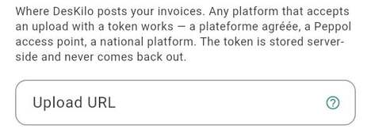

**Steps**

1. Open [E-invoicing platform](https://fdittgen-png.github.io/deskilo/#/einvoice-config) (also reachable from **Legal identity & e-invoicing**).
2. Fill **Upload URL** and **Token or credential**, and the two optional fields if your platform asks for them.
3. Tap **Save**. **Remove the platform** clears the settings.

**Good to know**

- Any platform that accepts an upload with a token works: an approved platform, a Peppol access point, a national platform.
- The token is stored on the server and never shown again.
- The valid file is an EN 16931 invoice. Whether your country requires a platform, and which, is something to confirm with your accountant.

**See also:** [Sending an e-invoice](#sending-an-e-invoice) · [Legal identity](#your-legal-identity)

<!-- anchor: user.money.einvoice.endpoint -->
### Upload URL

**Audience:** Owner · Billing administrator

The address at which your platform receives invoices.

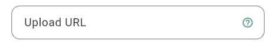

**Steps**

1. Open [E-invoicing platform](https://fdittgen-png.github.io/deskilo/#/einvoice-config).
2. Paste the address in **Upload URL**, exactly as your platform documents it.
3. Tap **Save**.

**Good to know**

- It comes from your platform's documentation or your provider.

**See also:** [Token or credential](#token-or-credential)

<!-- anchor: user.money.einvoice.token -->
### Token or credential

**Audience:** Owner · Billing administrator

The secret that proves to the platform that the upload is yours.

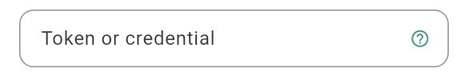

**Steps**

1. Open [E-invoicing platform](https://fdittgen-png.github.io/deskilo/#/einvoice-config).
2. Paste the key in **Token or credential**.
3. Tap **Save**.

**Good to know**

- Once saved, the screen says "A token is stored". Type a new one only to replace it.
- It is kept on the server and never comes back out.

**See also:** [Auth header](#auth-header)

<!-- anchor: user.money.einvoice.auth-header -->
### Auth header

**Audience:** Owner · Billing administrator

The name of the header that carries the token.

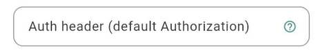

**Steps**

1. Open [E-invoicing platform](https://fdittgen-png.github.io/deskilo/#/einvoice-config).
2. If your platform expects another header than the standard one, type its name in **Auth header (default Authorization)**.
3. Tap **Save**.

**Good to know**

- Left empty, **Authorization** is used.

**See also:** [File field name](#file-field-name)

<!-- anchor: user.money.einvoice.file-field -->
### File field name

**Audience:** Owner · Billing administrator

The name of the form field that carries the invoice file.

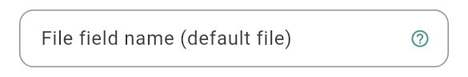

**Steps**

1. Open [E-invoicing platform](https://fdittgen-png.github.io/deskilo/#/einvoice-config).
2. If your platform expects another field name, type it in **File field name (default file)**.
3. Tap **Save**.

**Good to know**

- Left empty, **file** is used.

**See also:** [Upload URL](#upload-url)

<!-- anchor: user.money.einvoice.customer-delivery -->
### Customer delivery service

**Audience:** Owner · Billing administrator

Your customer may receive its invoices elsewhere than a government platform: its own Peppol access point, portal or agreed upload service.

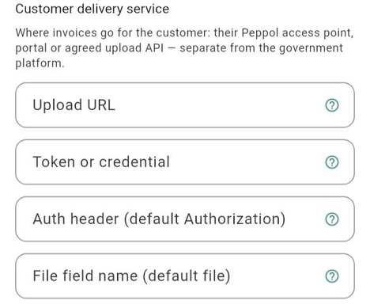

**Steps**

1. Open [E-invoicing platform](https://fdittgen-png.github.io/deskilo/#/einvoice-config).
2. In **Customer delivery service**, fill the same four fields as above.
3. Tap **Save**.

**Good to know**

- It is separate from the government platform. Both can be set up, and each invoice offers both sends.

**See also:** [Sending an e-invoice](#sending-an-e-invoice)

<!-- anchor: user.money.einvoice.uat -->
### UAT endpoint and token

**Audience:** Owner · Billing administrator

You want to rehearse before sending real invoices.

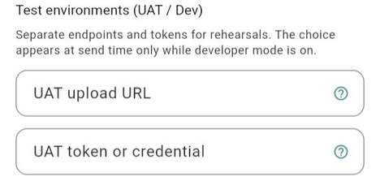

**Steps**

1. Open [E-invoicing platform](https://fdittgen-png.github.io/deskilo/#/einvoice-config).
2. Under **Test environments (UAT / Dev)**, fill **UAT upload URL** and **UAT token or credential**.
3. Tap **Save**.

**Good to know**

- The choice of environment appears at send time only while developer mode is on.
- A test send is logged as a test send.

**See also:** [Dev endpoint and token](#dev-endpoint-and-token)

<!-- anchor: user.money.einvoice.dev -->
### Dev endpoint and token

**Audience:** Owner · Billing administrator

A second test endpoint, for development.

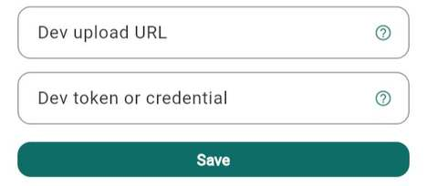

**Steps**

1. Open [E-invoicing platform](https://fdittgen-png.github.io/deskilo/#/einvoice-config).
2. Under **Test environments (UAT / Dev)**, fill **Dev upload URL** and **Dev token or credential**.
3. Tap **Save**.

**Good to know**

- Same rules as for UAT. The real submission always goes to the production endpoint.

**See also:** [UAT endpoint and token](#uat-endpoint-and-token)

<!-- anchor: user.money.einvoice.send -->
### Sending an e-invoice

**Audience:** Owner · Billing administrator

You want to hand an issued invoice over in its machine-readable form.

**Steps**

1. Open an invoice in [Invoicing](https://fdittgen-png.github.io/deskilo/#/invoices) and tap **E-invoice (XML)**.
2. Read the check at the top of the sheet: it says whether the file is ready or what is missing.
3. Tap **Send to the government platform**, **Send to the customer's service**, or download or share the file (**Download Factur-X (PDF)** carries the XML inside the PDF).

**Good to know**

- If something is missing, the sheet lists it. **Complete the legal identity** takes you to the screen that fixes it.
- An invoice signed before you completed your identity keeps what it was issued with. Mark it erroneous and issue a replacement if it matters.
- Which channel a customer must use depends on your country and the customer. Confirm with your accountant.

**See also:** [The e-invoicing platform](#the-e-invoicing-platform) · [The Invoicing screen](#the-invoicing-screen)

<!-- anchor: user.money.reports.invoice-template -->
### The invoice PDF template

**Audience:** Owner · Billing administrator

You want your invoices to look like yours: logo, layout, wording.

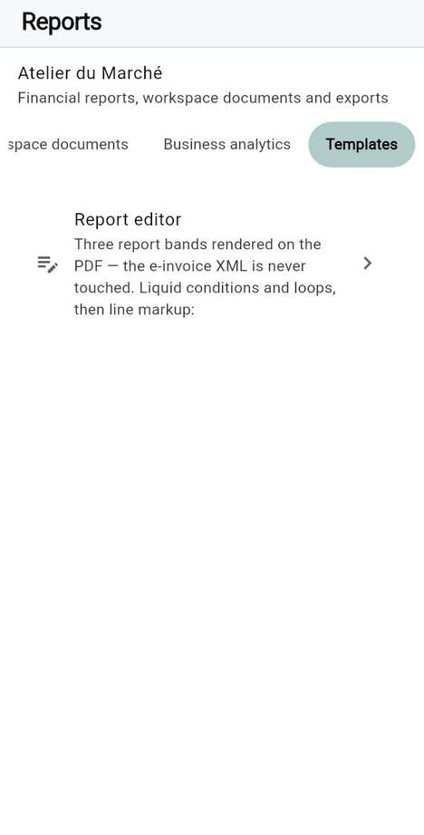

**Steps**

1. Open [Reports](https://fdittgen-png.github.io/deskilo/#/reports?section=templates) and the **Templates** tab.
2. Tap **Report editor**.

**Good to know**

- The template changes the PDF only. The e-invoice XML is never touched.
- Anyone with permission to design documents can do this.
- A template that does not render never blocks a document: the built-in layout takes over.

**See also:** [The report editor](#the-report-editor)

<!-- anchor: user.money.reports.editor -->
### The report editor

**Audience:** Owner · Billing administrator

You design a document on a page, instead of writing code.

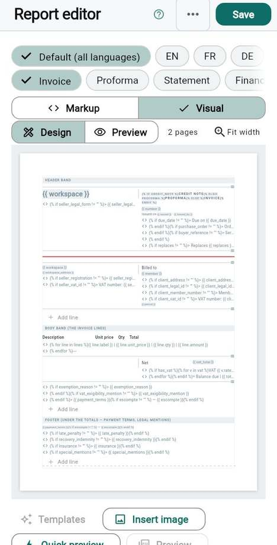

**Steps**

1. Open [Report editor](https://fdittgen-png.github.io/deskilo/#/report-editor).
2. Pick the document with the chips (Invoice, Proforma, Statement, reminders and the other reports).
3. In **Design**, tap a line to edit it, add lines, or drag to reorder. Tap **Preview** to see it with your data.
4. Tap **Save**.

**Good to know**

- The **Markup** mode edits the same bands as text.
- **Insert image** places a logo, stamp or signature from the image library.
- **Quick preview** renders instantly with your newest invoice, or sample data if there is none. **Reset to default** brings back the built-in layout.
- **Export this design** and **Import a design** carry a design in and out as a file. **Positioned layout (XML)** is for documents that must match a window envelope or a national form.
- Leaving with unsaved work asks first.

**See also:** [Templates and presets](#ready-made-templates) · [Languages](#one-design-per-language)

<!-- anchor: user.money.reports.presets -->
### Ready-made templates

**Audience:** Owner · Billing administrator

You start from a finished design and change what you want.

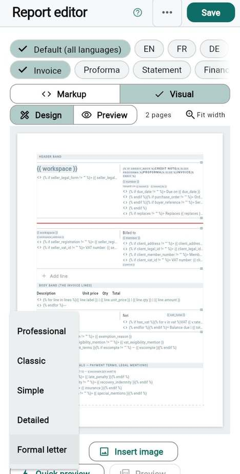

**Steps**

1. Open [Report editor](https://fdittgen-png.github.io/deskilo/#/report-editor) and pick a document.
2. Tap **Templates** and choose **Professional**, **Classic**, **Simple**, **Detailed** or **Formal letter**.
3. Confirm the replacement if the app asks, then edit and **Save**.

**Good to know**

- Replacing a layout can be undone with **Undo**.
- The structural reports (chart of accounts, badges, QR cards) have one shipped layout.
- Invoice templates already carry your legal mentions. They still print only what you entered under [Invoice mentions](#your-legal-identity).

**See also:** [The report editor](#the-report-editor)

<!-- anchor: user.money.reports.languages -->
### One design per language

**Audience:** Owner · Billing administrator

Your members read their documents in their own language.

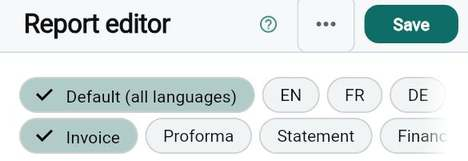

**Steps**

1. Open [Report editor](https://fdittgen-png.github.io/deskilo/#/report-editor).
2. Under the document, choose **Default (all languages)** or one of **EN**, **FR**, **DE**, **ES**, **IT**.
3. Edit the bands for that language and **Save**. **Use the default for this language** removes an own design.

**Good to know**

- A dot on a language means it has its own design; otherwise it inherits the default.
- A member's document prints in their language when a design exists for it, otherwise in the workspace default.

**See also:** [Workspace language](#workspace-language)

<!-- anchor: user.invoicing.hub -->
### The Invoicing screen

**Audience:** Owner · Billing administrator

You see at a glance what to issue, what to collect and what is closed.

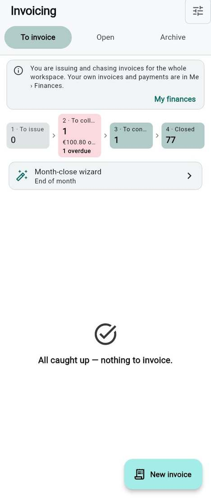

**Steps**

1. Open [Invoicing](https://fdittgen-png.github.io/deskilo/#/invoices).
2. Read the strip: **To issue**, **To collect**, **To confirm**, **Closed**.
3. Work in the three tabs: **To invoice** (members with something tracked, not yet invoiced), **Open** (issued, unpaid) and **Archive** (paid or closed).
4. Tap the tools icon for the other tools.

**Good to know**

- You see invoices for the whole workspace. Your own are in your finances, under **My finances**.
- Invoices are never edited or deleted: a wrong one is marked erroneous and replaced.
- The **How invoicing works** entry explains who moves at each step.

**See also:** [New invoice](#issue-an-invoice) · [Open invoices](#chase-and-settle-open-invoices)

<!-- anchor: user.invoicing.new-invoice -->
### Issue an invoice

**Audience:** Owner · Billing administrator

You invoice a member for a month.

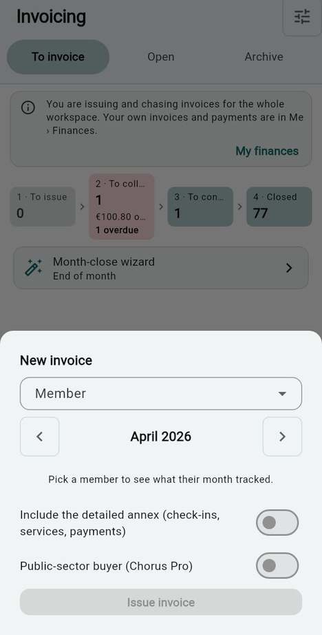

**Steps**

1. In [Invoicing](https://fdittgen-png.github.io/deskilo/#/invoices), tap **New invoice**, or **Issue** on a row of **To invoice**.
2. Pick the **Member** and the month. The positions come from what was tracked.
3. Switch on **Include the detailed annex (check-ins, services, payments)** if you want it.
4. Tap **Issue invoice**. In **To invoice**, **Invoice all** issues every row.

**Good to know**

- Invoices are derived from tracked data and cannot be composed by hand. The bottom line is the **Balance due**.
- A month can only be invoiced once per member, and a month still running warns you that positions may change.
- If a required detail is missing, **Complete these details before issuing** lists it (address, VAT number, exemption basis, VAT rate; also the workspace country, which must be France or Germany).
- In this version, issuing in the app is available for workspaces in France or Germany, for domestic customers. Cross-border, reverse-charge, export and exempt-buyer invoices are issued outside the app with your accountant.
- An issued invoice is signed and immutable.

**See also:** [Month-close wizard](#the-month-close-wizard)

<!-- anchor: user.invoicing.open -->
### Chase and settle open invoices

**Audience:** Owner · Billing administrator

You follow what is unpaid and close it properly.

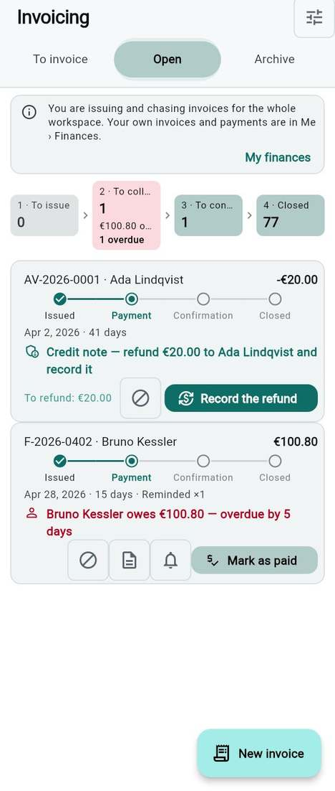

**Steps**

1. In [Invoicing](https://fdittgen-png.github.io/deskilo/#/invoices), open the **Open** tab and tap an invoice.
2. Use the actions it offers: **Send a reminder**, **Mark as paid** (match a registered payment), **Cancel outstanding amount**, **Mark erroneous**, or share the PDF.
3. Paid invoices move to **Archive**.

**Good to know**

- An invoice is paid once a real payment is matched to it. A difference needs a note, or a credit note for the excess.
- Cancelling an outstanding amount goes through validation.
- **Mark erroneous** cannot be undone. Do it before payment, never after.

**See also:** [Reminder rules](#reminder-rules) · [Regroup invoices](#regroup-invoices-into-one)

<!-- anchor: user.invoicing.wizard -->
### The month-close wizard

**Audience:** Owner · Billing administrator

One guided path for the money routine: issue, send, remind, register payments, match and close.

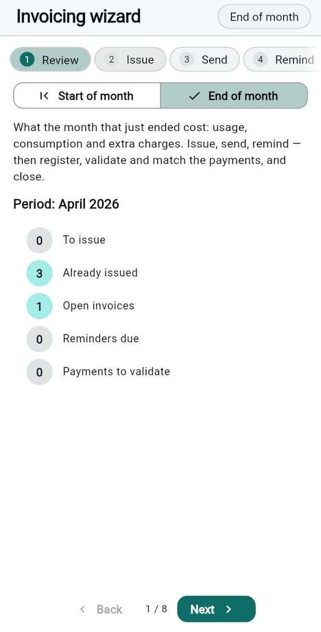

**Steps**

1. In [Invoicing](https://fdittgen-png.github.io/deskilo/#/invoices), tap **Month-close wizard** (or open the [Invoicing wizard](https://fdittgen-png.github.io/deskilo/#/invoicing/wizard)).
2. Choose the run: **Start of month** (subscriptions members pay ahead, for the coming month) or **End of month** (usage, consumption and extra charges of the month just ended). The date proposes one.
3. Follow the steps: **Review**, **Issue**, **Send**, **Remind**, **Payments**, **Match**, **Close**, **Summary**.
4. Tap **Next** at each step, and **Finish** at the end.

**Good to know**

- You can untick a member to leave them out of a batch; members already covered show as done.
- **Summary** lists what the run did, and what is still open and whose move it is.
- A step with nothing to do says so.

**See also:** [The Invoicing screen](#the-invoicing-screen) · [Regroup invoices](#regroup-invoices-into-one)

<!-- anchor: user.invoicing.settlement -->
### Regroup invoices into one

**Audience:** Owner · Billing administrator

A member has several open invoices and should pay a single one.

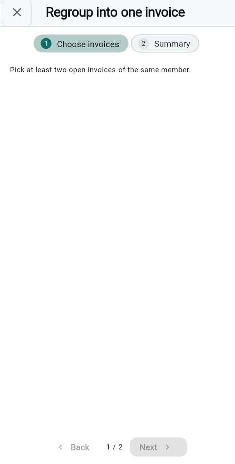

**Steps**

1. In [Invoicing](https://fdittgen-png.github.io/deskilo/#/invoices), tap the tools icon and **Regroup into one invoice**.
2. Choose at least two open invoices of the same member.
3. Confirm. You are asked whether to attach the regrouped invoices.

**Good to know**

- The new invoice is what is owed and chased. The originals stay readable behind it.
- Lines and VAT are carried over; the VAT declaration counts the originals once.

**See also:** [Open invoices](#chase-and-settle-open-invoices)

<!-- anchor: user.invoicing.shared-expense -->
### Distribute a shared expense

**Audience:** Owner · Billing administrator

A cost shared by the community is split among members.

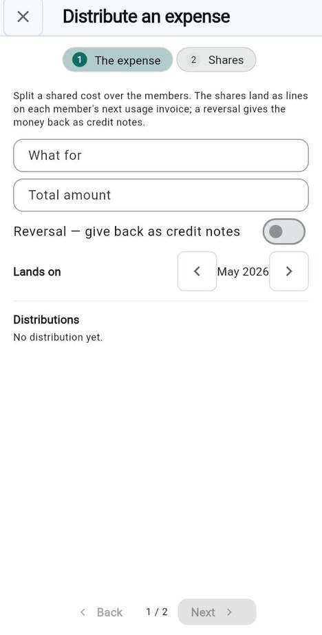

**Steps**

1. In [Invoicing](https://fdittgen-png.github.io/deskilo/#/invoices), tap the tools icon and **Distribute an expense**.
2. Describe **The expense**, then choose **Split by**: **Equal**, **Subscription**, **Usage** or **Custom key**.
3. Check the **Shares**, untick anyone to **Leave out**, and tap **Book the shares**.

**Good to know**

- Once booked (after validation, if a rule asks for it), the shares land as lines on each member's next usage invoice.
- **Reversal — give back as credit notes** returns the money.
- **Remember this rule** proposes the adjusted rule again next month.

**See also:** [The month-close wizard](#the-month-close-wizard)

<!-- anchor: user.money.reminders.rules -->
### Reminder rules

**Audience:** Owner · Billing administrator

You decide when and how often an overdue invoice is chased.

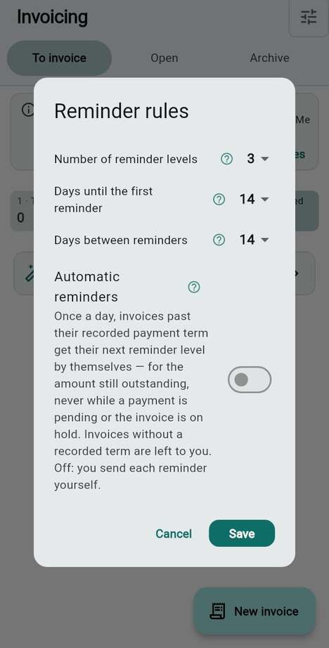

**Steps**

1. In [Invoicing](https://fdittgen-png.github.io/deskilo/#/invoices), tap the tools icon and **Reminder rules**.
2. Set **Number of reminder levels**, **Days until the first reminder** and **Days between reminders**.
3. Tap **Save**.

**Good to know**

- Reminders print the payment mentions you set up.
- A reminder is recorded for the invoice and shows as a **Reminded** badge.

**See also:** [Automatic reminders](#automatic-reminders) · [Payment terms](#payment-terms)

<!-- anchor: user.money.reminders.automatic -->
### Automatic reminders

**Audience:** Owner · Billing administrator

You want reminders to leave on their own.

**Steps**

1. Open **Reminder rules** in the Invoicing tools.
2. Switch **Automatic reminders** on.
3. Tap **Save**.

**Good to know**

- Once a day, invoices past their recorded payment term get their next level, for the amount still outstanding.
- Never while a payment is pending or the invoice is on hold. Invoices without a recorded term are left to you.
- Off: you send each reminder yourself.
- When it runs: each morning on the server where the installation schedules jobs, otherwise when an administrator opens Finances. Your server operator knows which applies.

**See also:** [Reminder rules](#reminder-rules)

<!-- anchor: user.invoicing.register -->
### The invoice register

**Audience:** Owner · Billing administrator

All invoices in one sortable list.

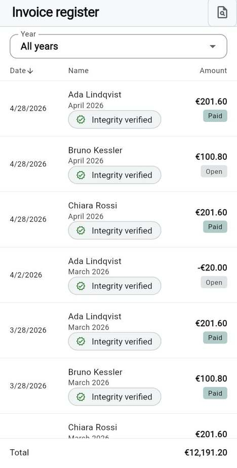

**Steps**

1. Open [Invoice register](https://fdittgen-png.github.io/deskilo/#/invoice-register).
2. Pick the **Year** or **All years**.
3. Sort by **Date**, **Name** or **Amount**; the total is at the bottom.

**Good to know**

- Members see their own; people who issue invoices see the workspace.
- The accounting export starts here.

**See also:** [Accounting exports](#accounting-exports)

<!-- anchor: user.invoicing.accounting-export -->
### Accounting exports

**Audience:** Owner · Billing administrator

You hand the year's invoices and payments to your accountant.

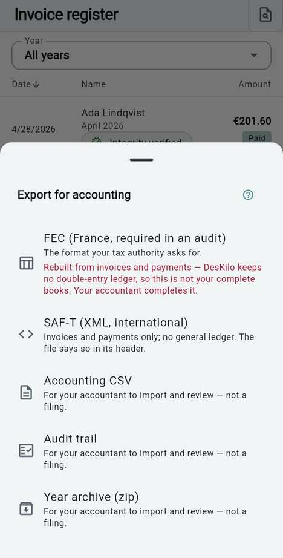

**Steps**

1. Open [Invoice register](https://fdittgen-png.github.io/deskilo/#/invoice-register) and tap **Accounting export**.
2. In **Export for accounting**, choose a format, such as **FEC (France, required in an audit)**, **SAF-T (XML, international)**, **Accounting CSV**, **Audit trail** or **Year archive (zip)**. The list depends on your country; a few countries add their own, such as **DATEV (Buchungsstapel)**.
3. In **Before you save**, read the check, then tap **Save file and report**.

**Good to know**

- Each format says what it claims. "For your accountant to import and review — not a filing" is not a tax return.
- DesKilo keeps no double-entry ledger: the files are rebuilt from invoices and payments, and your accountant completes them.
- A file is blocked until problems in the source are fixed.
- Some formats note that DesKilo is not certified software in your country.

**See also:** [VAT account](#vat-account) · [The invoice register](#the-invoice-register)

<!-- anchor: user.invoicing.bi -->
### Business analytics

**Audience:** Owner · Billing administrator

You look at how the workspace performs.

**Steps**

1. Open [Business analytics](https://fdittgen-png.github.io/deskilo/#/bi), or **Reporting** in the menu.
2. Choose **Period length** (**Month**, **Quarter**, **Year**), a comparison, and a grouping where offered.
3. Read the analyses by area, such as **Finance** (**Invoiced**, **Collected**) and **Space and capacity**.
4. Save a view under **Views**, or tap **Export as PDF**.

**Good to know**

- You only see analyses you are allowed to read.
- Collected is payments matched to invoices. It is not a profit: no costs are in the figure.
- The current period is partial; its figures still change.

**See also:** [The Invoicing screen](#the-invoicing-screen)

<!-- anchor: user.advanced.overview -->
## Advanced

**Audience:** Owner · Operator

The things around the everyday work: the test side of a space and the real one, assistants, the task recorder and its guided tours, the demo, the apps on each device, and what to do when something does not work.

In this chapter:
- [A space has two sides](#a-space-has-two-sides) · [Enter a side](#enter-the-real-side-or-the-test-side) · [A test space](#what-a-test-space-is-for) · [Who may deploy](#who-may-deploy-and-enter-production) · [Deploy between the sides](#deploy-between-the-two-sides) · [Workspace status and the year archive](#workspace-status-and-the-year-archive)
- [Your own server](#run-your-own-server)
- [Assistants](#assistants-what-they-are) · [Connect an assistant](#connect-an-assistant) · [Approvals](#approvals-and-confirmations-for-assistants) · [What assistants may do](#what-assistants-may-do-in-a-workspace)
- [The task recorder](#the-task-recorder-and-guided-tours) · [Record a task](#record-a-task) · [Review a recording](#review-edit-and-export-a-recording) · [Make a guide](#make-a-guide-from-a-recording) · [Follow a guide](#follow-a-guide) · [The circle menu](#the-circle-menu) · [Edit a guide](#edit-or-repair-a-guide) · [Privacy of recordings](#what-a-recording-keeps)
- [The demo workspace](#the-demo-workspace) · [Filming mode](#filming-mode)
- [Platforms](#deskilo-on-your-devices) · [Support details](#support-details) · [When something does not work](#when-something-does-not-work)
- [The app's words](#the-apps-words) · [Accessibility and keyboard](#accessibility-and-keyboard) · [More help](#where-to-get-more-help)

<!-- anchor: user.advanced.environments -->
### A space has two sides

**Audience:** Owner

You want a place to try things out without touching the real bookings and invoices. A space can come as a pair: a test side and a real side, with the same name.

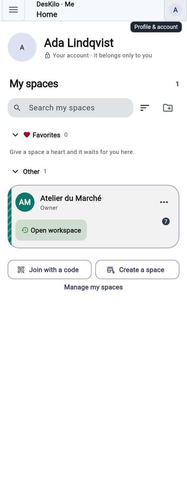

**Steps**

1. When you create a space, keep **Create the development and production pair** ticked. Both sides belong to you from the first second.
2. Already have a space on its own? Open [Settings](https://fdittgen-png.github.io/deskilo/#/settings), go to **Governance** and tap **Create its twin**. The configuration is copied once.
3. From then on the two sides are independent. Only a deployment moves anything from one to the other.

**Good to know**

- The development side is called **Development — for trying things out**. The production side is **Production — the invoices are owed**.
- Every document printed on the development side carries a watermark, so it cannot be mistaken for a real one.
- **Create its twin** only appears when the **Environment pairs** feature is on, and only to the owner. Deploying between the sides belongs to the holders of the deploy permissions.
- Members, bookings, invoices and payments are never copied between the sides.

**See also:** [Enter a side](#enter-the-real-side-or-the-test-side) · [A test space](#what-a-test-space-is-for)

<!-- anchor: user.advanced.enter-environment -->
### Enter the real side or the test side

**Audience:** Everyone

You want to open a space on the side you need. Your account sees both sides of a pair, each with its own button.

**Steps**

1. Open [Me](https://fdittgen-png.github.io/deskilo/#/me) and find the space under **My spaces**.
2. Tap **Open workspace** for the real side, or **Test space** for the side to practise on.
3. Or open [Profiles](https://fdittgen-png.github.io/deskilo/#/profiles): the pair is one card. Tap it, then **Choose an environment** between **DEV** and **PROD**.

**Good to know**

- A side you may not enter is greyed out and does nothing.
- A person who is a member of the real side is always a member of the test side too.
- The test button carries the hint "Test space: practice bookings and invoices"; the real one "Real bookings and invoices".

**See also:** [Who may deploy](#who-may-deploy-and-enter-production)

<!-- anchor: user.advanced.test-space -->
### What a test space is for

**Audience:** Owner

You are about to change prices, rules or the plan and want to see the effect first. Do it on the test space.

**Steps**

1. Enter the test side with **Test space**.
2. Configure, import a space file, invite a colleague, issue a trial invoice, move seats, print.
3. When it is right, [deploy it to the real side](#deploy-between-the-two-sides).

**Good to know**

- The **Workspace type** switch in [Settings](https://fdittgen-png.github.io/deskilo/#/settings) (under **Governance**) says which kind a space is. Only owners see it.
- Declaring a space production asks **Declare this workspace production?** — the banner goes away and documents lose their watermark. Invoices already issued keep the watermark they had.
- Declare production only when the invoices leaving the space are really owed.
- When you invite someone, you can choose whether they also reach the production space: **Test workspace** or **Production workspace**. They join the test space either way.

**See also:** [A space has two sides](#a-space-has-two-sides)

<!-- anchor: user.advanced.deploy-permissions -->
### Who may deploy and enter production

**Audience:** Owner · Co-owner

You decide who may touch the real side. Three permissions in the role matrix control it.

**Steps**

1. Open [Roles](https://fdittgen-png.github.io/deskilo/#/roles).
2. Find **Enter the production workspace**, **Deploy to development** and **Deploy to production**.
3. Switch each on for the roles that need it.

**Good to know**

- Owners and co-owners hold all three. Administrators hold **Deploy to development** and **Enter the production workspace**. Members hold none until you give it.
- Whoever may deploy to production may always deploy to development.
- A role enters the production side only while it holds **Enter the production workspace**: an invitation or a join into production is refused otherwise, and the app says why.

**See also:** [The role matrix](#the-role-matrix) · [Deploy between the sides](#deploy-between-the-two-sides)

<!-- anchor: user.advanced.deploy -->
### Deploy between the two sides

**Audience:** Owner · Co-owner · Administrator

You settled the configuration on one side and want the other to have it.

**Steps**

1. Stand on the side you want to write, and open [Settings](https://fdittgen-png.github.io/deskilo/#/settings) → **Governance** → [Deployment](https://fdittgen-png.github.io/deskilo/#/deployment).
2. Tick what should travel. Entities are grouped as **Configuration**, **Master data** and **Reports**; what an entity **needs** is ticked with it.
3. Tap **Pull from PROD…** (from the development side) or **Pull from DEV…** (from the production side).
4. Read the preview: **What changes on the production side**, or on the development side. When both sides agree, it says **No change**.
5. Confirm. The question names the side that is written: **Deploy into this DEV?** or **Deploy into this PROD?**

**Good to know**

- A deployment always goes into the side you stand on. Nothing can be pushed onto the other side by mistake.
- Every deployment lands in the **Journal**. **Roll back** on the latest one puts back what the side held before.
- Floor plans are merged: what only this side has is kept, because a seat may hold a booking. Badge tags never travel.
- Members, bookings, invoices, payments, events and credentials never travel.
- The entry only shows when the **Deployments** feature is on, the space has a twin, and you hold a deploy permission.

**See also:** [Who may deploy](#who-may-deploy-and-enter-production)

<!-- anchor: user.advanced.status-archive -->
### Workspace status and the year archive

**Audience:** Owner · Administrator · Billing administrator

You want one look at what the space invoiced and collected, and a complete file of the year for your records.

**Steps**

1. Open [Workspace status](https://fdittgen-png.github.io/deskilo/#/money/status). Pick the months in **From** and **To**.
2. Read **Invoiced**, **Credit notes**, **Payments matched**, **Payments received**, **Expenses reimbursed**, **Expenses shared out** and **Credits granted**; **Net** sums it up. Tap the printer to **Print the status**.
3. For the yearly file, choose **Year archive (zip)** in the invoice exports.

**Good to know**

- **Net** is neither a profit nor a bank balance. Matched and received payments overlap, so do not add them together.
- The status appears when the **Workspace status** feature is on.
- A development space produces files marked DEV: they are not the real books.

**See also:** [Workspace report](#workspace-report)

<!-- anchor: user.advanced.own-server -->
### Run your own server

**Audience:** Operator · Owner

You want your community's data on a server you control, or you belong to an organisation that runs one.

**Steps**

1. Read how a server is set up in [How to run your own](#how-to-run-your-own).
2. On each device, point the app at it: [Your own server](#your-own-server).
3. Check [Me](https://fdittgen-png.github.io/deskilo/#/me) → **Where my spaces live**: it lists the servers this account uses.

**Good to know**

- The app points at one server for sign-in; **This device uses** shows which. The other servers you belong to appear under **Where my spaces live**.
- An invitation is only checked on its own server, so join a space while the app points at the server that issued it.
- An operator can switch assistants on for the whole installation — see [Approvals](#approvals-and-confirmations-for-assistants).

**See also:** [Your own server](#your-own-server)

<!-- anchor: user.advanced.assistants -->
### Assistants: what they are

**Audience:** Everyone

An AI assistant such as Claude or ChatGPT can check and book things for you in DesKilo. It acts as you, only in the workspaces and for the actions you approve.

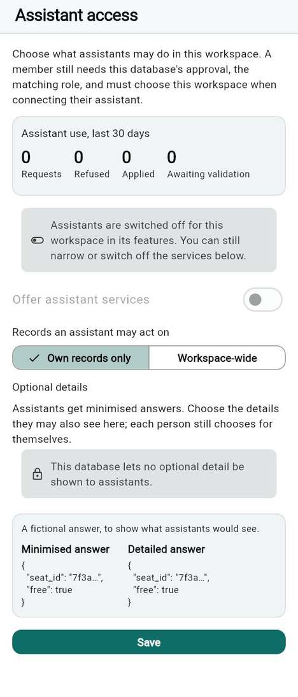

**Steps**

1. Open [Assistants](https://fdittgen-png.github.io/deskilo/#/assistants). **Where you stand here** lists what is still missing for you: **Google sign-in**, **Identity for assistants**, **Database approval**, **Workspace offer**, **Your role**, **Your consent**, **Server**.
2. Work down the list; each line says who takes the next step.

**Good to know**

- Several people take part: you, the owner or an administrator of the workspace, a database administrator and the installation's operator. No single person can open everything.
- Switching assistants on grants nobody anything by itself.
- Under **Connected assistants** you see what is connected and can **Disconnect** it. **Your assistant use today** counts **Requests**, **Refused**, **Applied** and **Awaiting validation**.

**See also:** [Connect an assistant](#connect-an-assistant)

<!-- anchor: user.advanced.assistants-connect -->
### Connect an assistant

**Audience:** Member · Administrator · Owner

You want your assistant to work with your own bookings and account.

**Steps**

1. Open [Connect an assistant](https://fdittgen-png.github.io/deskilo/#/assistants/connect). Under **Before you connect**, every line should say **Done**.
2. Under **Which assistant do you use?**, pick **Claude**, **Claude Code**, **ChatGPT**, **Cursor**, **VS Code** or **Other**. Copy **Your DesKilo address for assistants** into it as the steps show.
3. Sign in when the assistant asks, then pick this workspace and what the assistant may do there.
4. Tap **Test the connection** and ask your assistant: "Using DesKilo, what are my bookings this week?"

**Good to know**

- The assistant itself asks you to approve the workspace and each kind of operation; nothing is chosen for you.
- Connecting needs the **MCP interface** feature in the workspace. If it is off, the screen sends you to Assistants.
- Not working? **Test the connection** says what it still waits for.
- **Disconnect** removes the assistant from every workspace on this database. What it already read is not taken back.

**See also:** [Approvals](#approvals-and-confirmations-for-assistants)

<!-- anchor: user.advanced.assistants-approve -->
### Approvals and confirmations for assistants

**Audience:** Owner · Operator

Assistants are approved in layers, so a person cannot switch one on alone.

**Steps**

1. The workspace owner (or whoever manages integrations) opens [Assistant setup](https://fdittgen-png.github.io/deskilo/#/settings/assistant-setup) and works down it: **Turn assistants on for this workspace**, **Choose what assistants may do**.
2. Each member asks once: **Ask for approval**. A database administrator decides in [Assistant approvals](https://fdittgen-png.github.io/deskilo/#/database/assistant-approvals) with **Approve** or **Reject**.
3. The installation's operator opens [Installation: assistants](https://fdittgen-png.github.io/deskilo/#/installation/assistants) and taps **Turn on for every workspace**. The page also lists **Database administrators** and **Assistant clients**, each **Approved**, **Blocked** or **Waiting for approval**.
4. When an assistant sends a high-impact request, you are asked: **Confirm an assistant request**. **Confirm** lets it send that exact request once; **Decline** does nothing.

**Good to know**

- Approvals and the installation's changes need your second factor.
- Approval expires; the screen tells you the days left and you ask again.
- A confirmed request still follows the workspace's validation rules.
- With no other database administrator, the operator approves access, with a reason, for up to 30 days.

**See also:** [What assistants may do](#what-assistants-may-do-in-a-workspace)

<!-- anchor: user.advanced.assistants-policy -->
### What assistants may do in a workspace

**Audience:** Owner · Administrator

You decide which services a workspace offers to assistants.

**Steps**

1. Open [Assistant access](https://fdittgen-png.github.io/deskilo/#/settings/assistants).
2. Switch **Offer assistant services** on.
3. Under **Records an assistant may act on**, choose **Own records only** or **Workspace-wide**.
4. Tick the operations, in groups: **Own bookings and account**, **Financial requests**, **Membership requests**, **Validations**.
5. Tap **Save**.

**Good to know**

- Operations read like "See free places", "Book a place for you", "Check you in" or "Cancel your bookings that have not started".
- Assistants get minimised answers. **Optional details** lets you allow more; each person still chooses for themselves.
- Assistants already connected only get new services when each person approves again.
- Turn the **MCP interface** feature on in [Features](https://fdittgen-png.github.io/deskilo/#/features) first. It is off by default.
- It is for people who hold the integrations permission; owners always do.

**See also:** [A feature switch](#a-feature-switch)

<!-- anchor: user.advanced.recorder -->
### The task recorder and guided tours

**Audience:** Everyone

You want to show someone how a task is done, or be shown. Record the task once, turn it into a guide, and follow it step by step on the real app.

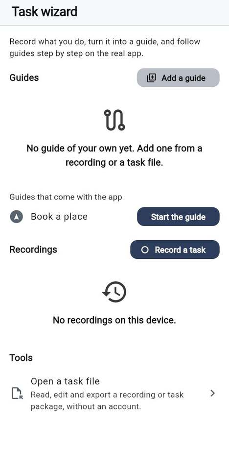

**Steps**

1. Open the [Task wizard](https://fdittgen-png.github.io/deskilo/#/task-wizard): in the menu on a wide screen, or under **Advanced** in [Me](https://fdittgen-png.github.io/deskilo/#/me).
2. **Guides** holds your own guides and the ones that come with the app, such as **Book a place**.
3. **Recordings** lists the tasks you recorded, and **Record a task** starts a new one.
4. **Tools** opens a task file without an account.

**Good to know**

- Everything stays on your device until you export it.
- The task recorder is a feature (**Task recorder**). When it is off, the Task wizard does not appear in the menus.
- You need to be signed in to record or to follow a guide.

**See also:** [Record a task](#record-a-task) · [Follow a guide](#follow-a-guide)

<!-- anchor: user.advanced.recorder-record -->
### Record a task

**Audience:** Everyone

You want to capture what you do, so it can become a document or a guide.

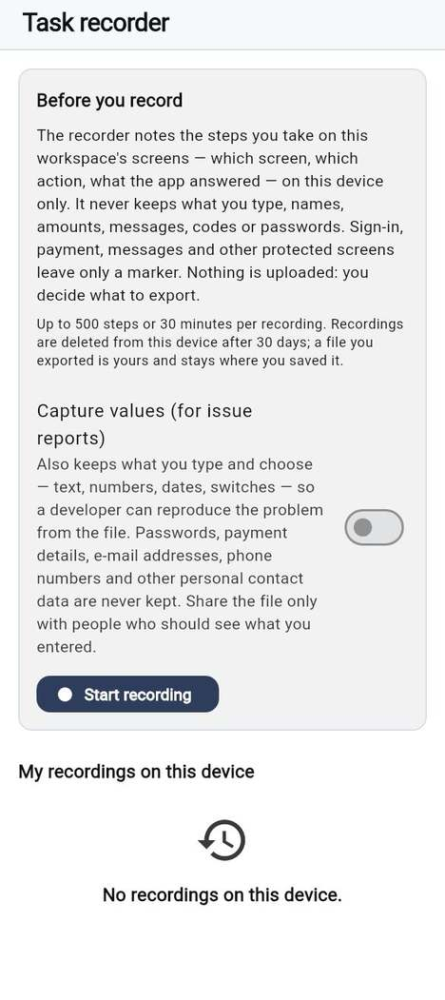

**Steps**

1. In the [Task recorder](https://fdittgen-png.github.io/deskilo/#/task-recorder), read **Before you record**.
2. Tap **Start recording**.
3. Do the task as usual, on any screen of the space or of [Me](https://fdittgen-png.github.io/deskilo/#/me).
4. Use the bar that shows **Recording** to **Pause**, **Resume**, **Add a note** or **Stop**.

**Good to know**

- A recording lasts up to 500 steps or 30 minutes, and is deleted from the device after 30 days. A file you exported stays where you saved it.
- Each step names the screen, the action and what the app answered, such as **Booked** or **Refused**.
- Sign-in, payment, messages and other protected screens leave only a marker.
- If you move to another account or workspace, the recording ends.

**See also:** [Privacy of recordings](#what-a-recording-keeps)

<!-- anchor: user.advanced.recorder-review -->
### Review, edit and export a recording

**Audience:** Everyone

You want to check what was captured before you share it.

**Steps**

1. In the [Task wizard](https://fdittgen-png.github.io/deskilo/#/task-wizard), tap a recording under **Recordings**.
2. Read the steps. Tap **Leave out of the export** on any step you do not want; **Put back** brings it back.
3. Look at **What the file will contain**.
4. Choose **Export a file**, **Export a task package** or **Export as Word document**.

**Good to know**

- Leaving a step out changes only the export. The recording on the device is unchanged.
- To read a file from someone else, use **Open a task file** in the [Task workbench](https://fdittgen-png.github.io/deskilo/#/task-workbench). Nothing is uploaded, and no account is needed.
- A damaged file or a file made by a newer version is refused with a plain message.
- **Delete from this device** removes the recording; exported files are not touched.

**See also:** [Make a guide](#make-a-guide-from-a-recording)

<!-- anchor: user.advanced.guide-make -->
### Make a guide from a recording

**Audience:** Everyone

You want others to follow a task you recorded.

**Steps**

1. In the [Task wizard](https://fdittgen-png.github.io/deskilo/#/task-wizard), tap **Make a guide** beside a recording. Or choose **Add a guide** → **From one of my recordings** or **From a task file or package**.
2. Check the draft. Each step is written as the reader will see it.
3. Give it a name under **Name of the guide**.
4. Tap **Add to my guides**.

**Good to know**

- The guide is kept on your device under **Guides**. A guide can be edited or deleted: **Delete this guide** does not touch its recording.
- A step that books waits for the real answer. Nothing is done for the reader.
- **Save the guide** writes it to a file you can hand over.

**See also:** [Edit a guide](#edit-or-repair-a-guide)

<!-- anchor: user.advanced.guide-play -->
### Follow a guide

**Audience:** Everyone

You want to be walked through a task on the real screens.

**Steps**

1. In the [Task wizard](https://fdittgen-png.github.io/deskilo/#/task-wizard), tap **Start the guide** beside one of the guides.
2. A panel shows Step 1 of … and what to do, for instance "Tap “Reserve”." or "Fill in “…”, then leave the field."
3. Tap **Open & highlight** to go to the right screen and see the control marked.
4. Do the step yourself. The guide notices and moves on. For a reading step, tap **Done**.

**Good to know**

- Use **Back** and **Skip**, and open **All steps** to see each one as **To do**, **Waiting**, **Done**, **Acknowledged** or **Skipped**.
- A step that books waits for the answer: **Waiting for the result…**. If it is refused, the guide says what to try; if no answer came, it asks you to check before trying again.
- **Stop the guide** ends it. Nothing is undone.
- The guide pauses when the account or workspace changes, or when the task recorder is turned off.

**See also:** [The circle menu](#the-circle-menu)

<!-- anchor: user.advanced.guide-circle -->
### The circle menu

**Audience:** Everyone

You need the whole screen to work, but want the guide close by. Minimise it.

**Steps**

1. In the guide panel, tap **Minimise the guide**. It shrinks to a small circle.
2. Tap the circle for a menu: Show the guide (step … of …), **Open & highlight**, a button to the step's page, **Done**, **Skip**, **Back**, **Resume** and **Stop the guide**.
3. Pick **Show the guide** to open the panel again.

**Good to know**

- The menu only offers what makes sense now: **Resume** only while paused, **Done** only for a reading step.
- The panel's **Close** hides it; the guide itself stays where it was.
- Open & highlight takes you to the page of the step and points at the control; the page button takes you to the page only.

**See also:** [Follow a guide](#follow-a-guide)

<!-- anchor: user.advanced.guide-edit -->
### Edit or repair a guide

**Audience:** Everyone

A guide reads badly, or a step points to the wrong page. Fix it in the draft.

**Steps**

1. In the [Task wizard](https://fdittgen-png.github.io/deskilo/#/task-wizard), tap **Edit** beside your guide.
2. On a step, tap **Write the words** and type your own text.
3. Under **Step destination**, choose the page the step refers to. Tap **Open & highlight** to check.
4. Switch **The reader may skip it** on for a step that is optional.
5. Tap **Save the changes**.

**Good to know**

- A step marked **An instruction still to be written** needs your words. **A step the recorder cannot describe** and **Do this step yourself** are done by the reader.
- Steps on protected screens, such as payment, ask the reader to do them alone.
- You cannot make a guide expect an outcome its action does not have; that part is fixed.
- A guide that names steps this version does not know can be read, not followed.

**See also:** [Make a guide](#make-a-guide-from-a-recording)

<!-- anchor: user.advanced.recorder-privacy -->
### What a recording keeps

**Audience:** Everyone

You want to know exactly what leaves nothing behind.

**Steps**

1. Open the [Task recorder](https://fdittgen-png.github.io/deskilo/#/task-recorder).
2. Read **Before you record**.
3. Leave **Capture values (for issue reports)** off unless a developer asked for it.

**Good to know**

- Normally a recording never keeps what you type, names, amounts, messages, codes or passwords.
- With **Capture values** on, it also keeps what you type and choose, so a developer can reproduce a problem. Passwords, payment details, e-mail addresses and phone numbers are still never kept. Exporting it asks **This recording contains values**.
- Nothing is uploaded: you decide what to export.
- Share a file only with people who should see what you entered.

**See also:** [Record a task](#record-a-task)

<!-- anchor: user.advanced.demo -->
### The demo workspace

**Audience:** Everyone

You want to look around before you commit. The demo is an invented space, open to anybody, without an account.

**Steps**

1. On the sign-in screen, tap **Explore the demo workspace**.
2. Read the short note, then tap **Start exploring**.
3. Use **View as** to see the same space as **The owner**, **An administrator** or **A member**.
4. Tap **Reset the demo** to bring it back as it started, or **Leave the demo**.

**Good to know**

- Everything is invented: people, bookings and bills. Nothing reaches a real workspace and nothing leaves your device.
- A banner reads **Demo** on every screen.
- Closing the app forgets the session.
- The offer only shows when the **The demo workspace** feature is on.

**See also:** [Filming mode](#filming-mode)

<!-- anchor: user.advanced.filming -->
### Filming mode

**Audience:** Owner

You must show your real space — in a video, a picture or a talk — without showing its members.

**Steps**

1. Open [Features](https://fdittgen-png.github.io/deskilo/#/features) and search **Filming mode**.
2. Switch it on. A banner reads **Filming mode — invented people** on every screen.
3. Film. When you are done, switch it off again.

**Good to know**

- Every name, e-mail, telephone number, address and photograph becomes an invented person, the same one everywhere. The plan, the bookings and the figures stay real.
- While it is on, identity forms refuse to save, so invented details cannot overwrite real ones.
- It cannot hide what someone typed, such as a message or a seat label. Read the screen before you film.
- For a picture that does not need to be of this space, use [the demo](#the-demo-workspace).

**See also:** [A feature switch](#a-feature-switch)

<!-- anchor: user.advanced.platforms -->
### DesKilo on your devices

**Audience:** Everyone

You want to use DesKilo where you work. The same account and the same data follow you.

**Steps**

1. **Android:** join the closed test on Google Play.
2. iPhone and iPad: join the beta through TestFlight.
3. **Computer:** a macOS disk image or a **Windows** installer from the releases page; or just open the web app.
4. **Browser:** open the address your workspace publishes. Nothing to install.

**Good to know**

- A desk booked on a phone shows in a browser tab a moment later.
- The macOS disk image from the releases page is signed and notarised by Apple; open it as usual.
- The Windows installer is not signed: Windows SmartScreen warns about an unknown publisher; choose More info, then Run anyway.
- Reading a chair tag works in Chromium browsers on Android (HTTPS and a tap needed); the Android and iPhone apps read tags directly.
- A Google-free build, without cloud push, is prepared for F-Droid; whether it can be installed from F-Droid yet is stated on the [F-Droid status page](https://github.com/fdittgen-png/deskilo/blob/master/docs/guides/fdroid.md#status). On it, notifications are local and the inbox is the source of truth.
- Updates arrive through the channel you installed from: Google Play, TestFlight, the releases page, or reloading the web app.

**See also:** [Your badge](#your-badge)

<!-- anchor: user.advanced.support -->
### Support details

**Audience:** Everyone

You contact support and want to send what helps them, without exposing anything private.

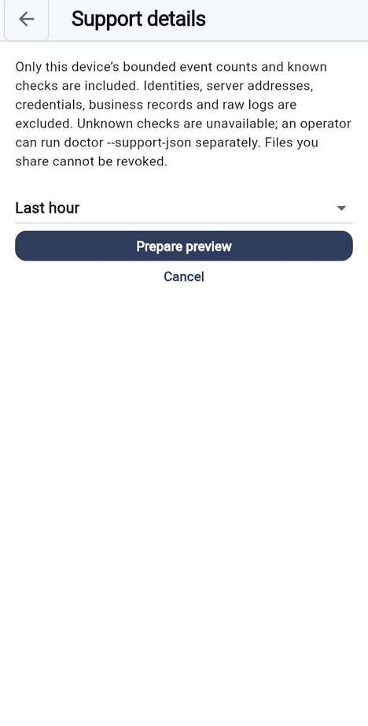

**Steps**

1. Open [Help](https://fdittgen-png.github.io/deskilo/#/help) and tap the support icon (**Support details**).
2. Choose **Last hour** or **Last 24 hours**.
3. Tap **Prepare preview** and read what it holds: Preview: … bytes.
4. Tap **Save**, then send the file.

**Good to know**

- Only bounded event counts and known checks are included. Identities, server addresses, credentials, business records and raw logs are excluded.
- A shared file cannot be revoked.
- If the context changed, the screen asks you to prepare a new preview.
- An operator can run `doctor --support-json` for the server side.

**See also:** [When something does not work](#when-something-does-not-work)

<!-- anchor: user.advanced.troubleshooting -->
### When something does not work

**Audience:** Everyone

Something looks wrong. Try these, in order.

**Steps**

1. Look for a message on the screen; most say what to do. "Something went wrong. Please try again." is worth one retry.
2. Check you are on the side you think: **Test space** or **Open workspace** in [Me](https://fdittgen-png.github.io/deskilo/#/me).
3. Check [Features](https://fdittgen-png.github.io/deskilo/#/features): a function missing from the menu is usually a feature that is off. Only an owner can change it.
4. Check the server under [Your own server](#your-own-server): **This device uses** names it.
5. Prepare [Support details](#support-details) and send them.

**Good to know**

- What you see depends on your role: a missing screen may be a permission. Ask your owner.
- Administrators can switch on **Developer mode** under **Advanced** in [Settings](https://fdittgen-png.github.io/deskilo/#/settings). It adds a [Developer](https://fdittgen-png.github.io/deskilo/#/developer) screen where **Export trace** and **Clear trace** help support. It applies to every member of the workspace.
- You can also report a bug from the app's About section: **Report a bug / suggest a feature**.
- A guide stuck on **Waiting for the result…** means no answer arrived: check the result before retrying.

**See also:** [Support details](#support-details)

<!-- anchor: user.advanced.glossary -->
### The app's words

**Audience:** Everyone

The words you meet most, and what they mean here.

| Word | What it means |
|---|---|
| **Workspace** (also called a space) | A place run by a community: its plan, members, rules and money. You can belong to several. |
| **Me** | Your own account: profile, messages, spaces and settings, across all your spaces. |
| **Plan** | Either the floor plan you book from, or a membership plan — see **Members & plans**. |
| **Level** | A floor or zone of the plan. A level can be reserved as a whole when the feature is on. |
| **Desk** | A bookable place. Offices and rooms group desks. |
| **Half-day** | The unit bookings and subscriptions are counted in. |
| **Validation** | A rule saying an action needs one or more confirmations before it counts. |
| **Events** | The feed of what happened, with decisions waiting for you on top. |
| **Kiosk** | A shared tablet at the door where people check in with a badge. |
| **Feature** | A function the owner switches on or off for the whole space. |
| **Role** | What a person may do in a space. Permissions are set per role. |
| **Environment** | The development side (test) or the production side (real) of a space. |
| **Twin** | The other side of a pair. |
| **Deployment** | Moving configuration from one side of a pair to the other. |
| **Assistant** | An AI tool connected to your account, acting only as you allow. |
| **Operator** | The person who runs the installation the app talks to. |

**Good to know**

- Owners can change the words a space uses under **Wording**; the app then shows the space's own.

**See also:** [Wording](#wording)

<!-- anchor: user.advanced.accessibility -->
### Accessibility and keyboard

**Audience:** Everyone

You want the app to suit how you work.

**Steps**

1. Pick a look under [Settings](https://fdittgen-png.github.io/deskilo/#/settings): **Theme**, **Language**, **Numbers & dates**.
2. For calmer screens, turn on your device's reduced-motion setting.
3. On a computer, press Escape in a wizard to step back.

**Good to know**

- The device's reduced-motion setting always wins over the **Interface animations** feature; an owner can also switch that feature off.
- Leaving a wizard with unsaved changes asks first: **Keep editing** or **Discard**.
- Controls carry text labels, so a screen reader announces them.
- On the web and on a computer, a wide window shows the menu beside the content.

**See also:** [Theme](#theme) · [App language](#app-language)

<!-- anchor: user.advanced.help -->
### Where to get more help

**Audience:** Everyone

You are stuck on one field or one screen.

**Steps**

1. Tap the **?** next to a field: the guide opens at that field.
2. Open [Help](https://fdittgen-png.github.io/deskilo/#/help) for the whole guide; **Contents** jumps to a chapter.
3. Tips on a screen can be dismissed with **Dismiss hint**; **Next tip** and **Previous tip** page through them, **Learn more** opens the guide.
4. To see dismissed hints again, use **Show help hints again** in your settings.

**Good to know**

- The guide works offline, in your language.
- Your administrator can answer questions about your space; Support details help when it is the app.

**See also:** [Restore the hints](#restore-the-hints) · [Support details](#support-details)
